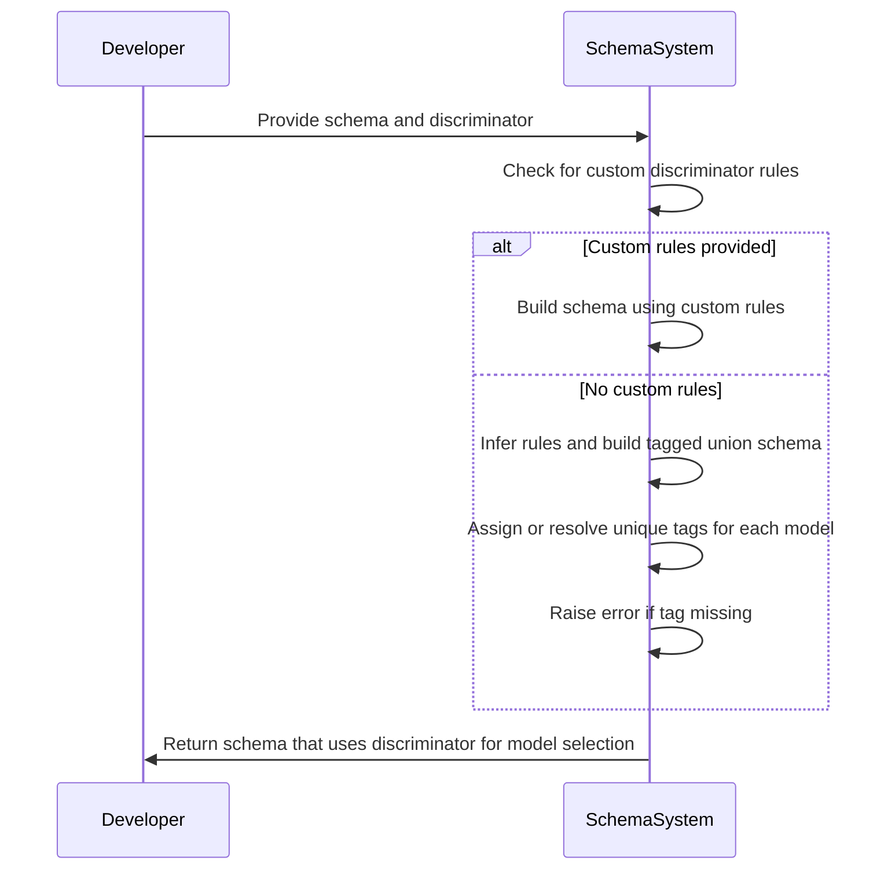
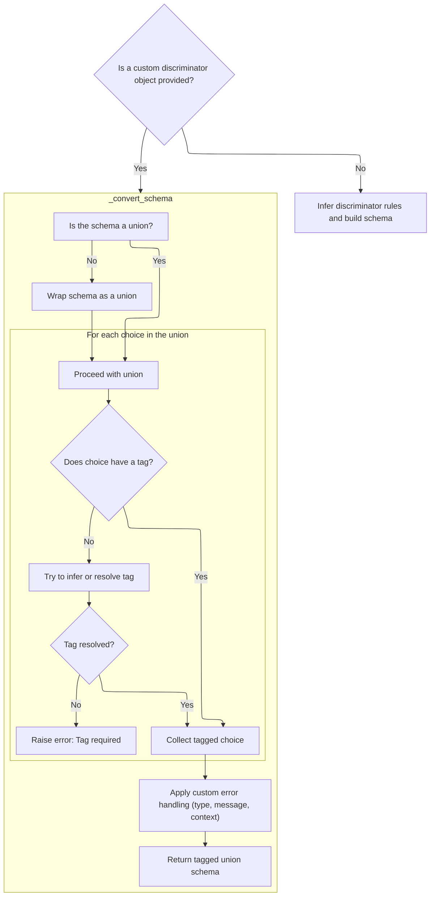
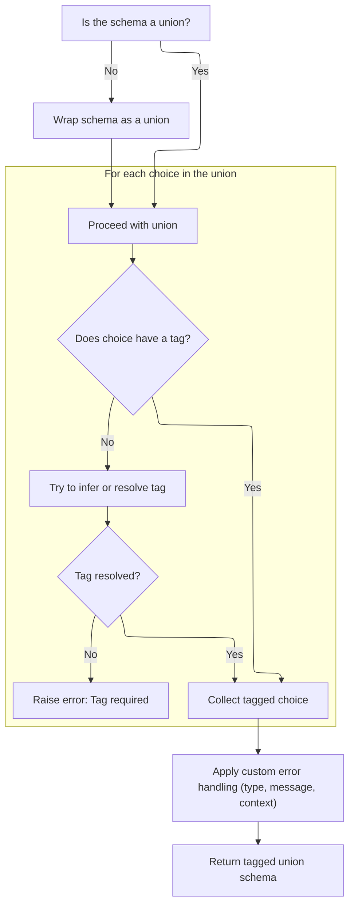

This document explains how a discriminator field is used to select and validate the correct model from a union of possible data types. The process supports both custom and inferred rules, ensuring each model can be uniquely identified and validated. The resulting schema uses the discriminator for model selection and supports nullable types and fallback fields.

Main steps:

- Use custom rules if provided, otherwise infer rules.
- Assign or resolve unique tags for each model.
- Raise errors if tags are missing.
- Build the final schema that uses the discriminator for model selection.



# Spec

## Detailed View of the Program's Functionality

a. Entry Point: Applying a Discriminator

The process begins by determining whether a custom discriminator object is provided. If the discriminator is an instance of a special class (used for custom discrimination logic), the code checks if its internal attribute is a string. If it is not a string, the code delegates schema construction to a method on the custom discriminator object, allowing it to build the tagged union schema according to its own rules. If the discriminator is not a custom object, or if its attribute is a string, the code proceeds to build the schema using inferred rules.

b. Building the Tagged Union Schema (Custom Discriminator Path)

If a custom discriminator object is used and it provides its own schema-building logic, the following steps are performed:

- The code checks if the input schema is already a union. If not, it wraps the schema in a union type to ensure consistent processing.
- For each choice (variant) in the union:
  - It checks if the choice already has a tag (a unique identifier for discrimination). If so, it collects this tagged choice.
  - If the choice does not have a tag, it attempts to infer or resolve one. This may involve resolving references if the choice is a type alias.
  - If a tag cannot be resolved, an error is raised, indicating that a tag is required for discrimination.
- After all choices are tagged, the code applies any custom error handling (such as custom error types, messages, or context) specified either on the discriminator or in the original schema.
- Finally, it returns a tagged union schema, which is a special schema that uses the discriminator field or function to select the correct variant during validation.

c. Building the Tagged Union Schema (Inferred Discriminator Path)

If no custom discriminator object is provided, or if the discriminator is simply a string (field name), the code uses an internal class to infer the discrimination logic:

- The schema is checked for being a union; if not, it is wrapped as a union.
- The code iterates over each choice in the union, applying logic to extract or infer a unique tag for each.
- If a tag is missing, and the code cannot resolve it (for example, by resolving references), an error is raised.
- All tagged choices are collected into a mapping from tag to schema.
- Custom error handling is applied as needed.
- The final tagged union schema is constructed, using the discriminator field to select the appropriate variant.

d. Finalizing Discriminator Application

After constructing the tagged union schema (either via custom or inferred logic), the code may perform additional processing, such as handling nullable types or further schema wrapping. This is done by passing the schema through a method that applies any extra logic required for inferred discriminators, such as supporting nullable unions or handling additional schema wrappers.

e. Applying Inferred Discriminator Logic

When using inferred discrimination, the code ensures that the schema has not already been processed (to prevent accidental reuse). It then calls a method to apply the discriminator logic at the root level of the schema. This method handles:

- Unwrapping nullable or definitions schemas, recursively processing their inner schemas, and rewrapping them as needed.
- If the schema is not a union, it is wrapped as a union for consistency.
- The code collects all union choices, processes each one to handle discrimination, and builds the final tagged union schema.
- If a fallback discriminator alias is present (for example, if some variants use an alias for the discriminator field), the schema is constructed to support both the primary and fallback discriminator fields.
- The final schema is returned, ready for use in validation.

f. Processing Root Schema for Discriminator

The root-level processing method works recursively:

- If the schema is nullable, it marks the result as nullable and processes the inner schema.
- If the schema is a definitions wrapper, it processes the inner schema and rewraps it.
- If the schema is not a union, it wraps it as a union.
- It collects all choices from the union, processes each one to handle discrimination (including nested unions or tagged unions), and ensures that each discriminator value maps to a unique choice.
- After all choices are processed, it builds and returns a tagged union schema that supports fallback discriminator fields if necessary.

g. Finalizing Schema in Apply

After the root-level processing, the code checks if the schema should be nullable (i.e., if `None` is an allowed value) and wraps it as nullable if needed. It marks the schema as used to prevent reuse and returns the final schema, which is now ready for use in data validation.

Summary

The overall flow ensures that, whether using a custom or inferred discriminator, every variant in a union is uniquely tagged, and the resulting schema can efficiently and accurately select the correct variant during validation. The process handles edge cases such as nullable types, type aliases, and custom error handling, providing robust support for discriminated unions in data models.

# Rule Definition

| Paragraph Name                                                                                                                                                                                                                                                                                                                                                                                                                                                                                                                                                                                                     | Rule ID | Category          | Description                                                                                                                                                                                                                                                                                                                                                                                                                                                                                | Conditions                                                                                                            | Remarks                                                                                                                                                                                                                                                                                                                                                                                                                                                                                                                                                                                                                                                                                                     |
| ------------------------------------------------------------------------------------------------------------------------------------------------------------------------------------------------------------------------------------------------------------------------------------------------------------------------------------------------------------------------------------------------------------------------------------------------------------------------------------------------------------------------------------------------------------------------------------------------------------------ | ------- | ----------------- | ------------------------------------------------------------------------------------------------------------------------------------------------------------------------------------------------------------------------------------------------------------------------------------------------------------------------------------------------------------------------------------------------------------------------------------------------------------------------------------------ | --------------------------------------------------------------------------------------------------------------------- | ----------------------------------------------------------------------------------------------------------------------------------------------------------------------------------------------------------------------------------------------------------------------------------------------------------------------------------------------------------------------------------------------------------------------------------------------------------------------------------------------------------------------------------------------------------------------------------------------------------------------------------------------------------------------------------------------------------- |
| <SwmToken path="pydantic/_internal/_discriminated_union.py" pos="34:2:2" line-data="def apply_discriminator(">`apply_discriminator`</SwmToken>, <SwmToken path="pydantic/_internal/_discriminated_union.py" pos="70:3:3" line-data="    return _ApplyInferredDiscriminator(discriminator, definitions or {}).apply(schema)">`_ApplyInferredDiscriminator`</SwmToken>.**init**, <SwmToken path="pydantic/types.py" pos="3081:10:12" line-data="            # `pydantic._internal._discriminated_union._ApplyInferredDiscriminator._apply_to_root`, namely,">`_ApplyInferredDiscriminator._apply_to_root`</SwmToken> | RL-001  | Data Assignment   | The system must accept input schemas as nested dictionaries, where each node includes a 'type' key and other keys as required by the type. For union schemas, the 'choices' key must contain a list of schemas, each being either a dictionary or a tuple of (schema, tag).                                                                                                                                                                                                                | Input schema must be a dictionary with a 'type' key; union schemas must have a 'choices' key with valid entries.      | Schema nodes must be dictionaries; union choices can be dictionaries or (schema, tag) tuples.                                                                                                                                                                                                                                                                                                                                                                                                                                                                                                                                                                                                               |
| \_ApplyInferredDiscriminator.\_handle_choice, \_ApplyInferredDiscriminator.\_infer_discriminator_values_for_choice, Discriminator.\_convert_schema                                                                                                                                                                                                                                                                                                                                                                                                                                                                 | RL-002  | Conditional Logic | For each union choice, the system must extract a tag from metadata, tuple, or infer it from a Literal field. All tags must be unique across choices. If a tag cannot be found or is duplicated, an error must be raised.                                                                                                                                                                                                                                                                   | Processing a union schema; each choice must have a tag (from metadata, tuple, or inferred).                           | Tags are typically strings or integers; uniqueness is enforced across all choices.                                                                                                                                                                                                                                                                                                                                                                                                                                                                                                                                                                                                                          |
| <SwmToken path="pydantic/_internal/_discriminated_union.py" pos="34:2:2" line-data="def apply_discriminator(">`apply_discriminator`</SwmToken>, Discriminator.\_convert_schema, \_ApplyInferredDiscriminator.apply                                                                                                                                                                                                                                                                                                                                                                                                 | RL-003  | Conditional Logic | The system must support two discriminator modes: custom (if a Discriminator object with a callable is provided) and inferred (if a string or no Discriminator is provided). The correct mode must be selected and used to build the <SwmToken path="pydantic/_internal/_discriminated_union.py" pos="141:26:28" line-data="        &quot;&quot;&quot;Return a new CoreSchema based on `schema` that uses a tagged-union with the discriminator provided">`tagged-union`</SwmToken> schema. | A Discriminator object is provided (custom mode) or not (inferred mode); discriminator attribute is checked for type. | Custom mode uses Discriminator.\_convert_schema; inferred mode uses <SwmToken path="pydantic/_internal/_discriminated_union.py" pos="70:3:3" line-data="    return _ApplyInferredDiscriminator(discriminator, definitions or {}).apply(schema)">`_ApplyInferredDiscriminator`</SwmToken>.                                                                                                                                                                                                                                                                                                                                                                                                                   |
| <SwmToken path="pydantic/types.py" pos="3081:10:12" line-data="            # `pydantic._internal._discriminated_union._ApplyInferredDiscriminator._apply_to_root`, namely,">`_ApplyInferredDiscriminator._apply_to_root`</SwmToken>, Discriminator.\_convert_schema                                                                                                                                                                                                                                                                                                                                                | RL-004  | Data Assignment   | The output must be a dictionary with 'type': <SwmToken path="pydantic/_internal/_discriminated_union.py" pos="141:26:28" line-data="        &quot;&quot;&quot;Return a new CoreSchema based on `schema` that uses a tagged-union with the discriminator provided">`tagged-union`</SwmToken>, a 'choices' mapping from tag to schema, and a 'discriminator' key (field name or callable). Any custom error type, message, or context from the Discriminator must be included in the output. | After processing all union choices and resolving tags.                                                                | Output schema format: dictionary with keys 'type', 'choices', 'discriminator', and optionally <SwmToken path="pydantic/_internal/_discriminated_union.py" pos="216:1:1" line-data="            custom_error_type=schema.get(&#39;custom_error_type&#39;),">`custom_error_type`</SwmToken>, <SwmToken path="pydantic/_internal/_discriminated_union.py" pos="217:1:1" line-data="            custom_error_message=schema.get(&#39;custom_error_message&#39;),">`custom_error_message`</SwmToken>, <SwmToken path="pydantic/_internal/_discriminated_union.py" pos="218:1:1" line-data="            custom_error_context=schema.get(&#39;custom_error_context&#39;),">`custom_error_context`</SwmToken>, etc. |
| <SwmToken path="pydantic/types.py" pos="3081:10:12" line-data="            # `pydantic._internal._discriminated_union._ApplyInferredDiscriminator._apply_to_root`, namely,">`_ApplyInferredDiscriminator._apply_to_root`</SwmToken>                                                                                                                                                                                                                                                                                                                                                                                | RL-005  | Conditional Logic | If the input schema is nullable or a definitions schema, the output must preserve this structure by wrapping the <SwmToken path="pydantic/_internal/_discriminated_union.py" pos="141:26:28" line-data="        &quot;&quot;&quot;Return a new CoreSchema based on `schema` that uses a tagged-union with the discriminator provided">`tagged-union`</SwmToken> schema accordingly.                                                                                                        | Input schema has type 'nullable' or 'definitions'.                                                                    | Nullable wrapper: {'type': 'nullable', 'schema': ...}; Definitions wrapper: {'type': 'definitions', 'schema': ...}.                                                                                                                                                                                                                                                                                                                                                                                                                                                                                                                                                                                         |
| \_ApplyInferredDiscriminator.\_set_unique_choice_for_values, \_ApplyInferredDiscriminator.\_handle_choice, Discriminator.\_convert_schema                                                                                                                                                                                                                                                                                                                                                                                                                                                                          | RL-006  | Conditional Logic | If a discriminator value maps to multiple choices, or if a tag cannot be found or inferred, the system must raise an error indicating ambiguity or missing tag.                                                                                                                                                                                                                                                                                                                            | During tag extraction or when mapping discriminator values to choices.                                                | Errors raised: <SwmToken path="pydantic/_internal/_discriminated_union.py" pos="50:1:1" line-data="        TypeError:">`TypeError`</SwmToken> for ambiguity, <SwmToken path="pydantic/_internal/_discriminated_union.py" pos="56:1:1" line-data="        PydanticUserError:">`PydanticUserError`</SwmToken> for missing tags.                                                                                                                                                                                                                                                                                                                                                                               |
| \_ApplyInferredDiscriminator.apply                                                                                                                                                                                                                                                                                                                                                                                                                                                                                                                                                                                 | RL-007  | Conditional Logic | The system must ensure that the same schema is not processed more than once to prevent duplicate processing.                                                                                                                                                                                                                                                                                                                                                                               | Each time apply() is called on a schema.                                                                              | A flag (\_used) is set after processing to prevent reuse.                                                                                                                                                                                                                                                                                                                                                                                                                                                                                                                                                                                                                                                   |

# User Stories

## User Story 1: Schema Input and Tag Extraction

---

### Story Description:

As a system user, I want to provide input schemas as nested dictionaries with union choices, so that the system can extract unique tags for each choice and validate the schema structure.

---

### Business Rule Mapping:

| Rule ID | Paragraph Name                                                                                                                                                                                                                                                                                                                                                                                                                                                                                                                                                                                                     | Rule Description                                                                                                                                                                                                                                                            |
| ------- | ------------------------------------------------------------------------------------------------------------------------------------------------------------------------------------------------------------------------------------------------------------------------------------------------------------------------------------------------------------------------------------------------------------------------------------------------------------------------------------------------------------------------------------------------------------------------------------------------------------------ | --------------------------------------------------------------------------------------------------------------------------------------------------------------------------------------------------------------------------------------------------------------------------- |
| RL-001  | <SwmToken path="pydantic/_internal/_discriminated_union.py" pos="34:2:2" line-data="def apply_discriminator(">`apply_discriminator`</SwmToken>, <SwmToken path="pydantic/_internal/_discriminated_union.py" pos="70:3:3" line-data="    return _ApplyInferredDiscriminator(discriminator, definitions or {}).apply(schema)">`_ApplyInferredDiscriminator`</SwmToken>.**init**, <SwmToken path="pydantic/types.py" pos="3081:10:12" line-data="            # `pydantic._internal._discriminated_union._ApplyInferredDiscriminator._apply_to_root`, namely,">`_ApplyInferredDiscriminator._apply_to_root`</SwmToken> | The system must accept input schemas as nested dictionaries, where each node includes a 'type' key and other keys as required by the type. For union schemas, the 'choices' key must contain a list of schemas, each being either a dictionary or a tuple of (schema, tag). |
| RL-002  | \_ApplyInferredDiscriminator.\_handle_choice, \_ApplyInferredDiscriminator.\_infer_discriminator_values_for_choice, Discriminator.\_convert_schema                                                                                                                                                                                                                                                                                                                                                                                                                                                                 | For each union choice, the system must extract a tag from metadata, tuple, or infer it from a Literal field. All tags must be unique across choices. If a tag cannot be found or is duplicated, an error must be raised.                                                    |

---

### Relevant Functionality:

- <SwmToken path="pydantic/_internal/_discriminated_union.py" pos="34:2:2" line-data="def apply_discriminator(">`apply_discriminator`</SwmToken>
  1. **RL-001:**
     - When receiving a schema, check that it is a dictionary and contains a 'type' key.
     - For union schemas, ensure the 'choices' key exists and contains a list of valid schemas or (schema, tag) tuples.
     - Recursively process nested schemas as needed.
- **\_ApplyInferredDiscriminator.\_handle_choice**
  1. **RL-002:**
     - For each choice in the union:
       - If metadata contains <SwmToken path="pydantic/types.py" pos="3092:10:10" line-data="                tag = metadata.get(&#39;pydantic_internal_union_tag_key&#39;) or tag">`pydantic_internal_union_tag_key`</SwmToken>, use that as the tag.
       - Else if the choice is a tuple, use the second element as the tag.
       - Else, attempt to infer the tag from a Literal field.
       - If no tag is found, raise an error.
     - Maintain a mapping of tags to choices; if a tag is already used, raise an error.

## User Story 2: Discriminator Modes and Tagged-Union Output

---

### Story Description:

As a system user, I want the system to support both custom and inferred discriminator modes, build a <SwmToken path="pydantic/_internal/_discriminated_union.py" pos="141:26:28" line-data="        &quot;&quot;&quot;Return a new CoreSchema based on `schema` that uses a tagged-union with the discriminator provided">`tagged-union`</SwmToken> schema with unique tags, and propagate any custom error information, so that I can flexibly define and validate complex data models with clear error reporting.

---

### Business Rule Mapping:

| Rule ID | Paragraph Name                                                                                                                                                                                                                                                      | Rule Description                                                                                                                                                                                                                                                                                                                                                                                                                                                                           |
| ------- | ------------------------------------------------------------------------------------------------------------------------------------------------------------------------------------------------------------------------------------------------------------------- | ------------------------------------------------------------------------------------------------------------------------------------------------------------------------------------------------------------------------------------------------------------------------------------------------------------------------------------------------------------------------------------------------------------------------------------------------------------------------------------------ |
| RL-003  | <SwmToken path="pydantic/_internal/_discriminated_union.py" pos="34:2:2" line-data="def apply_discriminator(">`apply_discriminator`</SwmToken>, Discriminator.\_convert_schema, \_ApplyInferredDiscriminator.apply                                                  | The system must support two discriminator modes: custom (if a Discriminator object with a callable is provided) and inferred (if a string or no Discriminator is provided). The correct mode must be selected and used to build the <SwmToken path="pydantic/_internal/_discriminated_union.py" pos="141:26:28" line-data="        &quot;&quot;&quot;Return a new CoreSchema based on `schema` that uses a tagged-union with the discriminator provided">`tagged-union`</SwmToken> schema. |
| RL-004  | <SwmToken path="pydantic/types.py" pos="3081:10:12" line-data="            # `pydantic._internal._discriminated_union._ApplyInferredDiscriminator._apply_to_root`, namely,">`_ApplyInferredDiscriminator._apply_to_root`</SwmToken>, Discriminator.\_convert_schema | The output must be a dictionary with 'type': <SwmToken path="pydantic/_internal/_discriminated_union.py" pos="141:26:28" line-data="        &quot;&quot;&quot;Return a new CoreSchema based on `schema` that uses a tagged-union with the discriminator provided">`tagged-union`</SwmToken>, a 'choices' mapping from tag to schema, and a 'discriminator' key (field name or callable). Any custom error type, message, or context from the Discriminator must be included in the output. |
| RL-006  | \_ApplyInferredDiscriminator.\_set_unique_choice_for_values, \_ApplyInferredDiscriminator.\_handle_choice, Discriminator.\_convert_schema                                                                                                                           | If a discriminator value maps to multiple choices, or if a tag cannot be found or inferred, the system must raise an error indicating ambiguity or missing tag.                                                                                                                                                                                                                                                                                                                            |

---

### Relevant Functionality:

- <SwmToken path="pydantic/_internal/_discriminated_union.py" pos="34:2:2" line-data="def apply_discriminator(">`apply_discriminator`</SwmToken>
  1. **RL-003:**
     - If discriminator is a Discriminator object and its discriminator attribute is not a string:
       - Use Discriminator.\_convert_schema to build the <SwmToken path="pydantic/_internal/_discriminated_union.py" pos="141:26:28" line-data="        &quot;&quot;&quot;Return a new CoreSchema based on `schema` that uses a tagged-union with the discriminator provided">`tagged-union`</SwmToken> schema.
     - Else:
       - Use <SwmToken path="pydantic/_internal/_discriminated_union.py" pos="70:3:3" line-data="    return _ApplyInferredDiscriminator(discriminator, definitions or {}).apply(schema)">`_ApplyInferredDiscriminator`</SwmToken> to infer and build the <SwmToken path="pydantic/_internal/_discriminated_union.py" pos="141:26:28" line-data="        &quot;&quot;&quot;Return a new CoreSchema based on `schema` that uses a tagged-union with the discriminator provided">`tagged-union`</SwmToken> schema.
- <SwmToken path="pydantic/types.py" pos="3081:10:12" line-data="            # `pydantic._internal._discriminated_union._ApplyInferredDiscriminator._apply_to_root`, namely,">`_ApplyInferredDiscriminator._apply_to_root`</SwmToken>
  1. **RL-004:**
     - After collecting all choices and tags:
       - Build a dictionary with 'type': <SwmToken path="pydantic/_internal/_discriminated_union.py" pos="141:26:28" line-data="        &quot;&quot;&quot;Return a new CoreSchema based on `schema` that uses a tagged-union with the discriminator provided">`tagged-union`</SwmToken>.
       - Set 'choices' to the tag-to-schema mapping.
       - Set 'discriminator' to the field name or callable.
       - If custom error type/message/context is present, include them in the output.
- **\_ApplyInferredDiscriminator.\_set_unique_choice_for_values**
  1. **RL-006:**
     - When mapping discriminator values to choices:
       - If a value is already mapped to a different choice, raise a <SwmToken path="pydantic/_internal/_discriminated_union.py" pos="50:1:1" line-data="        TypeError:">`TypeError`</SwmToken> for ambiguity.
     - If a tag cannot be found or inferred for a choice, raise a <SwmToken path="pydantic/_internal/_discriminated_union.py" pos="56:1:1" line-data="        PydanticUserError:">`PydanticUserError`</SwmToken>.

## User Story 3: Preserving Schema Structure and Preventing Duplicate Processing

---

### Story Description:

As a system user, I want the system to preserve nullable and definitions schema wrappers and ensure that schemas are not processed more than once, so that the integrity and efficiency of schema processing are maintained.

---

### Business Rule Mapping:

| Rule ID | Paragraph Name                                                                                                                                                                                                                      | Rule Description                                                                                                                                                                                                                                                                                                                                                                    |
| ------- | ----------------------------------------------------------------------------------------------------------------------------------------------------------------------------------------------------------------------------------- | ----------------------------------------------------------------------------------------------------------------------------------------------------------------------------------------------------------------------------------------------------------------------------------------------------------------------------------------------------------------------------------- |
| RL-005  | <SwmToken path="pydantic/types.py" pos="3081:10:12" line-data="            # `pydantic._internal._discriminated_union._ApplyInferredDiscriminator._apply_to_root`, namely,">`_ApplyInferredDiscriminator._apply_to_root`</SwmToken> | If the input schema is nullable or a definitions schema, the output must preserve this structure by wrapping the <SwmToken path="pydantic/_internal/_discriminated_union.py" pos="141:26:28" line-data="        &quot;&quot;&quot;Return a new CoreSchema based on `schema` that uses a tagged-union with the discriminator provided">`tagged-union`</SwmToken> schema accordingly. |
| RL-007  | \_ApplyInferredDiscriminator.apply                                                                                                                                                                                                  | The system must ensure that the same schema is not processed more than once to prevent duplicate processing.                                                                                                                                                                                                                                                                        |

---

### Relevant Functionality:

- <SwmToken path="pydantic/types.py" pos="3081:10:12" line-data="            # `pydantic._internal._discriminated_union._ApplyInferredDiscriminator._apply_to_root`, namely,">`_ApplyInferredDiscriminator._apply_to_root`</SwmToken>
  1. **RL-005:**
     - If input schema type is 'nullable':
       - Recursively process the inner schema.
       - Wrap the result in a dictionary with 'type': 'nullable' and 'schema' key.
     - If input schema type is 'definitions':
       - Recursively process the inner schema.
       - Wrap the result in a dictionary with 'type': 'definitions' and 'schema' key.
- **\_ApplyInferredDiscriminator.apply**
  1. **RL-007:**
     - Before processing a schema in apply():
       - Assert that the \_used flag is False.
       - After processing, set \_used to True.

# Code Walkthrough

## Starting Discriminator Application



<SwmSnippet path="/pydantic/_internal/_discriminated_union.py" line="34">

---

In <SwmToken path="pydantic/_internal/_discriminated_union.py" pos="34:2:2" line-data="def apply_discriminator(">`apply_discriminator`</SwmToken>, we kick things off by checking if the discriminator is a Discriminator instance. If so, and its discriminator attribute isn't a string, we immediately delegate to its <SwmToken path="pydantic/_internal/_discriminated_union.py" pos="68:5:5" line-data="            return discriminator._convert_schema(schema)">`_convert_schema`</SwmToken> method. This lets us handle cases where the Discriminator object already knows how to build the tagged union schema, so we don't duplicate logic. If not, we keep going and will need to call <SwmToken path="pydantic/_internal/_discriminated_union.py" pos="68:5:5" line-data="            return discriminator._convert_schema(schema)">`_convert_schema`</SwmToken> next to actually build the schema that supports discrimination.

```python
def apply_discriminator(
    schema: core_schema.CoreSchema,
    discriminator: str | Discriminator,
    definitions: dict[str, core_schema.CoreSchema] | None = None,
) -> core_schema.CoreSchema:
    """Applies the discriminator and returns a new core schema.

    Args:
        schema: The input schema.
        discriminator: The name of the field which will serve as the discriminator.
        definitions: A mapping of schema ref to schema.

    Returns:
        The new core schema.

    Raises:
        TypeError:
            - If `discriminator` is used with invalid union variant.
            - If `discriminator` is used with `Union` type with one variant.
            - If `discriminator` value mapped to multiple choices.
        MissingDefinitionForUnionRef:
            If the definition for ref is missing.
        PydanticUserError:
            - If a model in union doesn't have a discriminator field.
            - If discriminator field has a non-string alias.
            - If discriminator fields have different aliases.
            - If discriminator field not of type `Literal`.
    """
    from ..types import Discriminator

    if isinstance(discriminator, Discriminator):
        if isinstance(discriminator.discriminator, str):
            discriminator = discriminator.discriminator
        else:
            return discriminator._convert_schema(schema)

```

---

</SwmSnippet>

### Building Tagged Union Schema



<SwmSnippet path="/pydantic/types.py" line="3075">

---

In <SwmToken path="pydantic/types.py" pos="3075:3:3" line-data="    def _convert_schema(">`_convert_schema`</SwmToken>, we first make sure we're always working with a union schema, even if the input was a single schema (by wrapping it). Then, we iterate through each union choice, extracting or resolving a unique tag for each. If a tag is missing and we have a handler, we try to resolve references (like type aliases) to get the tag. If we still can't find a tag, we raise an error. This setup guarantees that every choice in the union can be discriminated by a unique tag.

```python
    def _convert_schema(
        self, original_schema: core_schema.CoreSchema, handler: GetCoreSchemaHandler | None = None
    ) -> core_schema.TaggedUnionSchema:
        if original_schema['type'] != 'union':
            # This likely indicates that the schema was a single-item union that was simplified.
            # In this case, we do the same thing we do in
            # `pydantic._internal._discriminated_union._ApplyInferredDiscriminator._apply_to_root`, namely,
            # package the generated schema back into a single-item union.
            original_schema = core_schema.union_schema([original_schema])

        tagged_union_choices = {}
        for choice in original_schema['choices']:
            tag = None
            if isinstance(choice, tuple):
                choice, tag = choice
            metadata = cast('CoreMetadata | None', choice.get('metadata'))
            if metadata is not None:
                tag = metadata.get('pydantic_internal_union_tag_key') or tag
            if tag is None:
                # `handler` is None when this method is called from `apply_discriminator()` (deferred discriminators)
                if handler is not None and choice['type'] == 'definition-ref':
                    # If choice was built from a PEP 695 type alias, try to resolve the def:
                    try:
                        choice = handler.resolve_ref_schema(choice)
                    except LookupError:
                        pass
                    else:
                        metadata = cast('CoreMetadata | None', choice.get('metadata'))
                        if metadata is not None:
                            tag = metadata.get('pydantic_internal_union_tag_key')

                if tag is None:
                    raise PydanticUserError(
                        f'`Tag` not provided for choice {choice} used with `Discriminator`',
                        code='callable-discriminator-no-tag',
                    )
            tagged_union_choices[tag] = choice
```

---

</SwmSnippet>

<SwmSnippet path="/pydantic/types.py" line="3111">

---

After collecting all the tagged choices, we build the final tagged union schema using <SwmToken path="pydantic/types.py" pos="3127:3:5" line-data="        return core_schema.tagged_union_schema(">`core_schema.tagged_union_schema`</SwmToken>. This schema uses the discriminator field to pick the right model, and includes any custom error handling or metadata from the original schema or instance.

```python
            tagged_union_choices[tag] = choice

        # Have to do these verbose checks to ensure falsy values ('' and {}) don't get ignored
        custom_error_type = self.custom_error_type
        if custom_error_type is None:
            custom_error_type = original_schema.get('custom_error_type')

        custom_error_message = self.custom_error_message
        if custom_error_message is None:
            custom_error_message = original_schema.get('custom_error_message')

        custom_error_context = self.custom_error_context
        if custom_error_context is None:
            custom_error_context = original_schema.get('custom_error_context')

        custom_error_type = original_schema.get('custom_error_type') if custom_error_type is None else custom_error_type
        return core_schema.tagged_union_schema(
            tagged_union_choices,
            self.discriminator,
            custom_error_type=custom_error_type,
            custom_error_message=custom_error_message,
            custom_error_context=custom_error_context,
            strict=original_schema.get('strict'),
            ref=original_schema.get('ref'),
            metadata=original_schema.get('metadata'),
            serialization=original_schema.get('serialization'),
        )
```

---

</SwmSnippet>

### Finalizing Discriminator Application

<SwmSnippet path="/pydantic/_internal/_discriminated_union.py" line="70">

---

Back in <SwmToken path="pydantic/_internal/_discriminated_union.py" pos="34:2:2" line-data="def apply_discriminator(">`apply_discriminator`</SwmToken>, after getting the tagged union schema from <SwmToken path="pydantic/_internal/_discriminated_union.py" pos="68:5:5" line-data="            return discriminator._convert_schema(schema)">`_convert_schema`</SwmToken>, we pass it to \_ApplyInferredDiscriminator.apply. This step handles any extra logic needed for inferred discriminators, like nullable support or further schema wrapping, before returning the final schema.

```python
    return _ApplyInferredDiscriminator(discriminator, definitions or {}).apply(schema)
```

---

</SwmSnippet>

## Applying Inferred Discriminator Logic

```mermaid
%%{init: {"flowchart": {"defaultRenderer": "elk"}} }%%
flowchart TD
  node1["Receive input schema"] --> node2["Transform to tagged-union schema using discriminator"]
  click node1 openCode "pydantic/_internal/_discriminated_union.py:140:164"
  node2 -->|"Should be nullable and not already nullable"| node3["Return schema as nullable"]
  node2 -->|"Otherwise"| node3["Return transformed schema"]
  click node2 openCode "pydantic/_internal/_discriminated_union.py:170:170"
  click node3 openCode "pydantic/_internal/_discriminated_union.py:165:168"


subgraph node2 [_apply_to_root]
  sgmain_1_node1["Receive input schema"] --> sgmain_1_node2{"Is schema nullable or definitions?"}
  click sgmain_1_node1 openCode "pydantic/_internal/_discriminated_union.py:170:175"
  sgmain_1_node2 -->|"Yes"| sgmain_1_node3["Unwrap and process inner schema"]
  click sgmain_1_node2 openCode "pydantic/_internal/_discriminated_union.py:175:186"
  sgmain_1_node2 -->|"No"| sgmain_1_node4{"Is schema a union?"}
  click sgmain_1_node3 openCode "pydantic/_internal/_discriminated_union.py:175:186"
  sgmain_1_node4 -->|"No"| sgmain_1_node5["Wrap as union"]
  click sgmain_1_node4 openCode "pydantic/_internal/_discriminated_union.py:188:193"
  sgmain_1_node4 -->|"Yes"| sgmain_1_node6["Prepare union choices"]
  click sgmain_1_node5 openCode "pydantic/_internal/_discriminated_union.py:193:196"
  click sgmain_1_node6 openCode "pydantic/_internal/_discriminated_union.py:196:197"
  sgmain_1_node5 --> sgmain_1_node6
  sgmain_1_node6 --> sgmain_1_loop1
  subgraph sgmain_1_loop1["For each choice in union"]
  loop1a["Apply discriminator logic"]
  click loop1a openCode "pydantic/_internal/_discriminated_union.py:198:200"
  end
  sgmain_1_loop1 --> sgmain_1_node7["Build and return tagged union schema with discriminator("s")"]
  click sgmain_1_node7 openCode "pydantic/_internal/_discriminated_union.py:202:224"
end

%% Swimm:
%% %%{init: {"flowchart": {"defaultRenderer": "elk"}} }%%
%% flowchart TD
%%   node1["Receive input schema"] --> node2["Transform to <SwmToken path="pydantic/_internal/_discriminated_union.py" pos="141:26:28" line-data="        &quot;&quot;&quot;Return a new CoreSchema based on `schema` that uses a tagged-union with the discriminator provided">`tagged-union`</SwmToken> schema using discriminator"]
%%   click node1 openCode "<SwmPath>[pydantic/\_internal/\_discriminated_union.py](pydantic/_internal/_discriminated_union.py)</SwmPath>:140:164"
%%   node2 -->|"Should be nullable and not already nullable"| node3["Return schema as nullable"]
%%   node2 -->|"Otherwise"| node3["Return transformed schema"]
%%   click node2 openCode "<SwmPath>[pydantic/\_internal/\_discriminated_union.py](pydantic/_internal/_discriminated_union.py)</SwmPath>:170:170"
%%   click node3 openCode "<SwmPath>[pydantic/\_internal/\_discriminated_union.py](pydantic/_internal/_discriminated_union.py)</SwmPath>:165:168"
%% 
%% 
%% subgraph node2 [<SwmToken path="pydantic/_internal/_discriminated_union.py" pos="164:7:7" line-data="        schema = self._apply_to_root(schema)">`_apply_to_root`</SwmToken>]
%%   sgmain_1_node1["Receive input schema"] --> sgmain_1_node2{"Is schema nullable or definitions?"}
%%   click sgmain_1_node1 openCode "<SwmPath>[pydantic/\_internal/\_discriminated_union.py](pydantic/_internal/_discriminated_union.py)</SwmPath>:170:175"
%%   sgmain_1_node2 -->|"Yes"| sgmain_1_node3["Unwrap and process inner schema"]
%%   click sgmain_1_node2 openCode "<SwmPath>[pydantic/\_internal/\_discriminated_union.py](pydantic/_internal/_discriminated_union.py)</SwmPath>:175:186"
%%   sgmain_1_node2 -->|"No"| sgmain_1_node4{"Is schema a union?"}
%%   click sgmain_1_node3 openCode "<SwmPath>[pydantic/\_internal/\_discriminated_union.py](pydantic/_internal/_discriminated_union.py)</SwmPath>:175:186"
%%   sgmain_1_node4 -->|"No"| sgmain_1_node5["Wrap as union"]
%%   click sgmain_1_node4 openCode "<SwmPath>[pydantic/\_internal/\_discriminated_union.py](pydantic/_internal/_discriminated_union.py)</SwmPath>:188:193"
%%   sgmain_1_node4 -->|"Yes"| sgmain_1_node6["Prepare union choices"]
%%   click sgmain_1_node5 openCode "<SwmPath>[pydantic/\_internal/\_discriminated_union.py](pydantic/_internal/_discriminated_union.py)</SwmPath>:193:196"
%%   click sgmain_1_node6 openCode "<SwmPath>[pydantic/\_internal/\_discriminated_union.py](pydantic/_internal/_discriminated_union.py)</SwmPath>:196:197"
%%   sgmain_1_node5 --> sgmain_1_node6
%%   sgmain_1_node6 --> sgmain_1_loop1
%%   subgraph sgmain_1_loop1["For each choice in union"]
%%   loop1a["Apply discriminator logic"]
%%   click loop1a openCode "<SwmPath>[pydantic/\_internal/\_discriminated_union.py](pydantic/_internal/_discriminated_union.py)</SwmPath>:198:200"
%%   end
%%   sgmain_1_loop1 --> sgmain_1_node7["Build and return tagged union schema with discriminator("s")"]
%%   click sgmain_1_node7 openCode "<SwmPath>[pydantic/\_internal/\_discriminated_union.py](pydantic/_internal/_discriminated_union.py)</SwmPath>:202:224"
%% end
```

<SwmSnippet path="/pydantic/_internal/_discriminated_union.py" line="140">

---

In <SwmToken path="pydantic/_internal/_discriminated_union.py" pos="140:3:3" line-data="    def apply(self, schema: core_schema.CoreSchema) -&gt; core_schema.CoreSchema:">`apply`</SwmToken>, we make sure the schema hasn't been processed before, then call <SwmToken path="pydantic/_internal/_discriminated_union.py" pos="164:7:7" line-data="        schema = self._apply_to_root(schema)">`_apply_to_root`</SwmToken> to apply the discriminator logic at the top level. This sets up the schema for any further handling, like nullable wrapping, before we return it.

```python
    def apply(self, schema: core_schema.CoreSchema) -> core_schema.CoreSchema:
        """Return a new CoreSchema based on `schema` that uses a tagged-union with the discriminator provided
        to this class.

        Args:
            schema: The input schema.

        Returns:
            The new core schema.

        Raises:
            TypeError:
                - If `discriminator` is used with invalid union variant.
                - If `discriminator` is used with `Union` type with one variant.
                - If `discriminator` value mapped to multiple choices.
            ValueError:
                If the definition for ref is missing.
            PydanticUserError:
                - If a model in union doesn't have a discriminator field.
                - If discriminator field has a non-string alias.
                - If discriminator fields have different aliases.
                - If discriminator field not of type `Literal`.
        """
        assert not self._used
        schema = self._apply_to_root(schema)
```

---

</SwmSnippet>

### Processing Root Schema for Discriminator

```mermaid
%%{init: {"flowchart": {"defaultRenderer": "elk"}} }%%
flowchart TD
    node1["Receive input schema"] --> node2{"Is schema nullable or definitions?"}
    click node1 openCode "pydantic/_internal/_discriminated_union.py:170:175"
    node2 -->|"Yes"| node3["Unwrap and process inner schema"]
    click node2 openCode "pydantic/_internal/_discriminated_union.py:175:186"
    node2 -->|"No"| node4{"Is schema a union?"}
    click node3 openCode "pydantic/_internal/_discriminated_union.py:175:186"
    node4 -->|"No"| node5["Wrap as union"]
    click node4 openCode "pydantic/_internal/_discriminated_union.py:188:193"
    node4 -->|"Yes"| node6["Prepare union choices"]
    click node5 openCode "pydantic/_internal/_discriminated_union.py:193:196"
    click node6 openCode "pydantic/_internal/_discriminated_union.py:196:197"
    node5 --> node6
    node6 --> loop1
    subgraph loop1["For each choice in union"]
        loop1a["Apply discriminator logic"]
        click loop1a openCode "pydantic/_internal/_discriminated_union.py:198:200"
    end
    loop1 --> node7["Build and return tagged union schema with discriminator("s")"]
    click node7 openCode "pydantic/_internal/_discriminated_union.py:202:224"

%% Swimm:
%% %%{init: {"flowchart": {"defaultRenderer": "elk"}} }%%
%% flowchart TD
%%     node1["Receive input schema"] --> node2{"Is schema nullable or definitions?"}
%%     click node1 openCode "<SwmPath>[pydantic/\_internal/\_discriminated_union.py](pydantic/_internal/_discriminated_union.py)</SwmPath>:170:175"
%%     node2 -->|"Yes"| node3["Unwrap and process inner schema"]
%%     click node2 openCode "<SwmPath>[pydantic/\_internal/\_discriminated_union.py](pydantic/_internal/_discriminated_union.py)</SwmPath>:175:186"
%%     node2 -->|"No"| node4{"Is schema a union?"}
%%     click node3 openCode "<SwmPath>[pydantic/\_internal/\_discriminated_union.py](pydantic/_internal/_discriminated_union.py)</SwmPath>:175:186"
%%     node4 -->|"No"| node5["Wrap as union"]
%%     click node4 openCode "<SwmPath>[pydantic/\_internal/\_discriminated_union.py](pydantic/_internal/_discriminated_union.py)</SwmPath>:188:193"
%%     node4 -->|"Yes"| node6["Prepare union choices"]
%%     click node5 openCode "<SwmPath>[pydantic/\_internal/\_discriminated_union.py](pydantic/_internal/_discriminated_union.py)</SwmPath>:193:196"
%%     click node6 openCode "<SwmPath>[pydantic/\_internal/\_discriminated_union.py](pydantic/_internal/_discriminated_union.py)</SwmPath>:196:197"
%%     node5 --> node6
%%     node6 --> loop1
%%     subgraph loop1["For each choice in union"]
%%         loop1a["Apply discriminator logic"]
%%         click loop1a openCode "<SwmPath>[pydantic/\_internal/\_discriminated_union.py](pydantic/_internal/_discriminated_union.py)</SwmPath>:198:200"
%%     end
%%     loop1 --> node7["Build and return tagged union schema with discriminator("s")"]
%%     click node7 openCode "<SwmPath>[pydantic/\_internal/\_discriminated_union.py](pydantic/_internal/_discriminated_union.py)</SwmPath>:202:224"
```

<SwmSnippet path="/pydantic/_internal/_discriminated_union.py" line="170">

---

In <SwmToken path="pydantic/_internal/_discriminated_union.py" pos="170:3:3" line-data="    def _apply_to_root(self, schema: core_schema.CoreSchema) -&gt; core_schema.CoreSchema:">`_apply_to_root`</SwmToken>, we recursively unwrap nullable and definitions schemas, process their inner schemas, and rewrap them. If the schema isn't a union, we wrap it into a union for consistency. Then, we stack up all the union choices and process each one with <SwmToken path="pydantic/_internal/_discriminated_union.py" pos="172:19:19" line-data="        unwrapping nullable or definitions schemas, and calling the `_handle_choice`">`_handle_choice`</SwmToken>, making sure everything is handled in the right order.

```python
    def _apply_to_root(self, schema: core_schema.CoreSchema) -> core_schema.CoreSchema:
        """This method handles the outer-most stage of recursion over the input schema:
        unwrapping nullable or definitions schemas, and calling the `_handle_choice`
        method iteratively on the choices extracted (recursively) from the possibly-wrapped union.
        """
        if schema['type'] == 'nullable':
            self._is_nullable = True
            wrapped = self._apply_to_root(schema['schema'])
            nullable_wrapper = schema.copy()
            nullable_wrapper['schema'] = wrapped
            return nullable_wrapper

        if schema['type'] == 'definitions':
            wrapped = self._apply_to_root(schema['schema'])
            definitions_wrapper = schema.copy()
            definitions_wrapper['schema'] = wrapped
            return definitions_wrapper

        if schema['type'] != 'union':
            # If the schema is not a union, it probably means it just had a single member and
            # was flattened by pydantic_core.
            # However, it still may make sense to apply the discriminator to this schema,
            # as a way to get discriminated-union-style error messages, so we allow this here.
            schema = core_schema.union_schema([schema])

        # Reverse the choices list before extending the stack so that they get handled in the order they occur
        choices_schemas = [v[0] if isinstance(v, tuple) else v for v in schema['choices'][::-1]]
        self._choices_to_handle.extend(choices_schemas)
        while self._choices_to_handle:
            choice = self._choices_to_handle.pop()
            self._handle_choice(choice)
```

---

</SwmSnippet>

<SwmSnippet path="/pydantic/_internal/_discriminated_union.py" line="200">

---

We return a tagged union schema that supports fallback discriminator fields and includes all processed choices for validation.

```python
            self._handle_choice(choice)

        if self._discriminator_alias is not None and self._discriminator_alias != self.discriminator:
            # * We need to annotate `discriminator` as a union here to handle both branches of this conditional
            # * We need to annotate `discriminator` as list[list[str | int]] and not list[list[str]] due to the
            #   invariance of list, and because list[list[str | int]] is the type of the discriminator argument
            #   to tagged_union_schema below
            # * See the docstring of pydantic_core.core_schema.tagged_union_schema for more details about how to
            #   interpret the value of the discriminator argument to tagged_union_schema. (The list[list[str]] here
            #   is the appropriate way to provide a list of fallback attributes to check for a discriminator value.)
            discriminator: str | list[list[str | int]] = [[self.discriminator], [self._discriminator_alias]]
        else:
            discriminator = self.discriminator
        return core_schema.tagged_union_schema(
            choices=self._tagged_union_choices,
            discriminator=discriminator,
            custom_error_type=schema.get('custom_error_type'),
            custom_error_message=schema.get('custom_error_message'),
            custom_error_context=schema.get('custom_error_context'),
            strict=False,
            from_attributes=True,
            ref=schema.get('ref'),
            metadata=schema.get('metadata'),
            serialization=schema.get('serialization'),
        )
```

---

</SwmSnippet>

### Finalizing Schema in Apply

<SwmSnippet path="/pydantic/_internal/_discriminated_union.py" line="165">

---

After returning from <SwmToken path="pydantic/_internal/_discriminated_union.py" pos="164:7:7" line-data="        schema = self._apply_to_root(schema)">`_apply_to_root`</SwmToken> in <SwmToken path="pydantic/_internal/_discriminated_union.py" pos="70:16:16" line-data="    return _ApplyInferredDiscriminator(discriminator, definitions or {}).apply(schema)">`apply`</SwmToken>, we check if the schema should be nullable and isn't already, and wrap it if needed. Then we mark the schema as used and return it. This is the last step before the schema is ready for use.

```python
        if self._should_be_nullable and not self._is_nullable:
            schema = core_schema.nullable_schema(schema)
        self._used = True
        return schema
```

---

</SwmSnippet>

&nbsp;

*This is an auto-generated document by Swimm 🌊 and has not yet been verified by a human*

<SwmMeta version="3.0.0" repo-id="Z2l0aHViJTNBJTNBcHlkYW50aWMlM0ElM0FTd2ltbS1EZW1v" repo-name="pydantic"><sup>Powered by [Swimm](/)</sup></SwmMeta>
