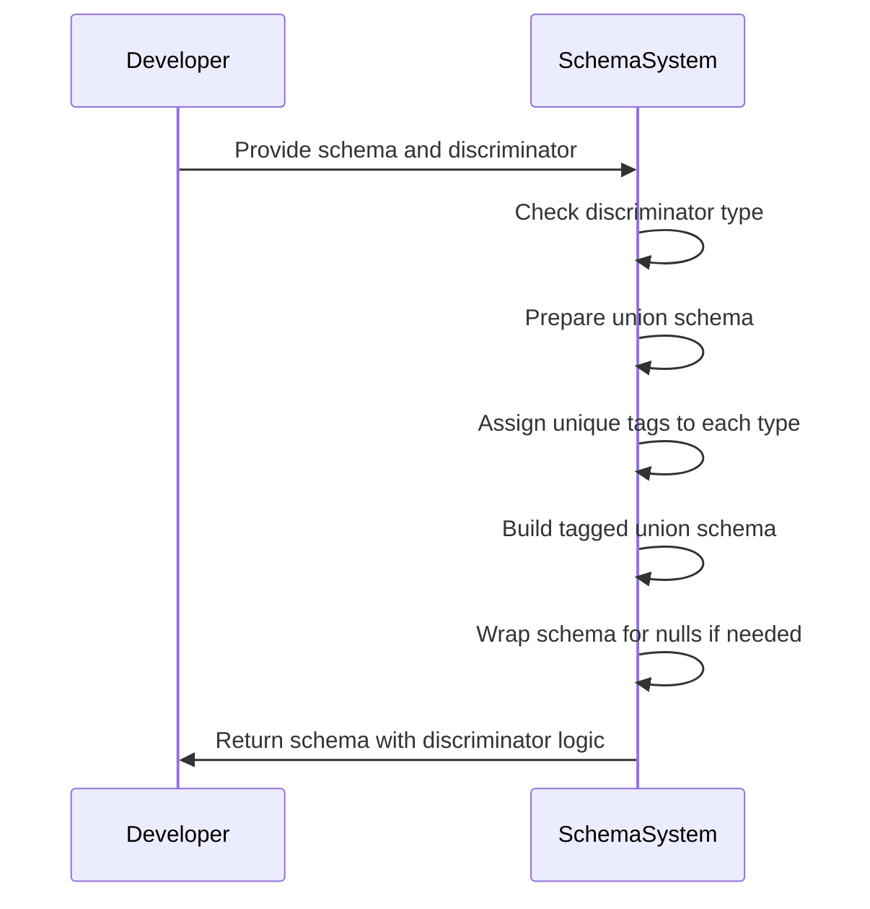
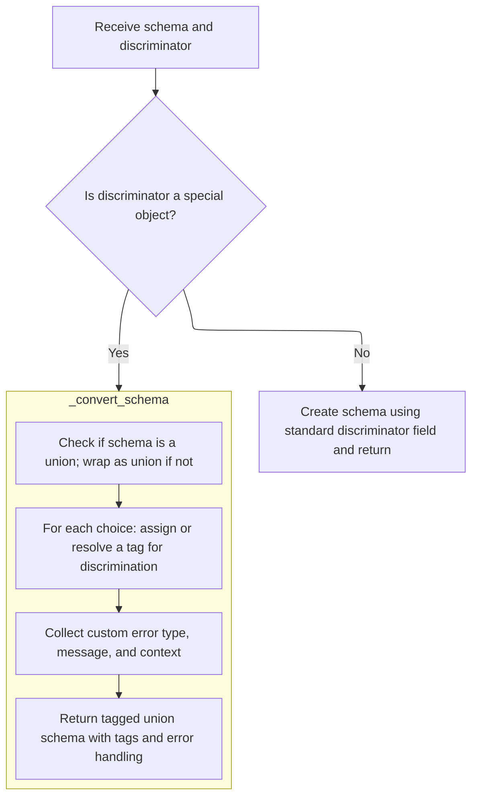
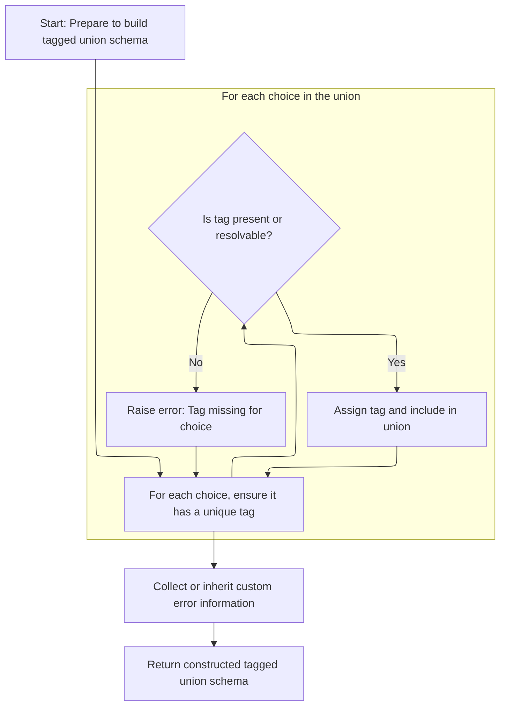
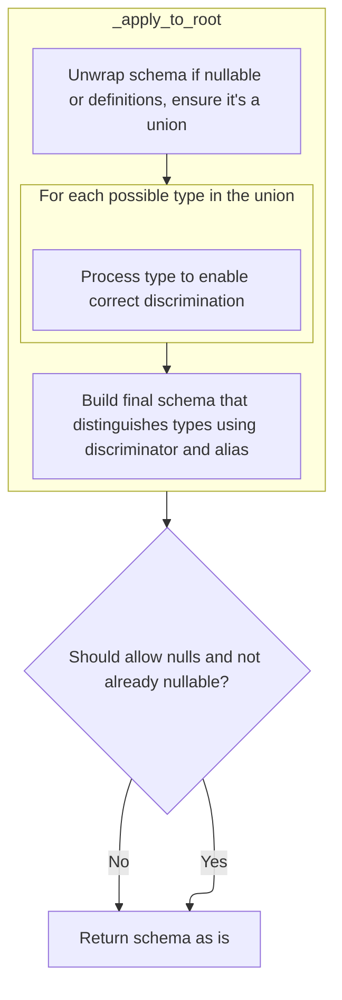
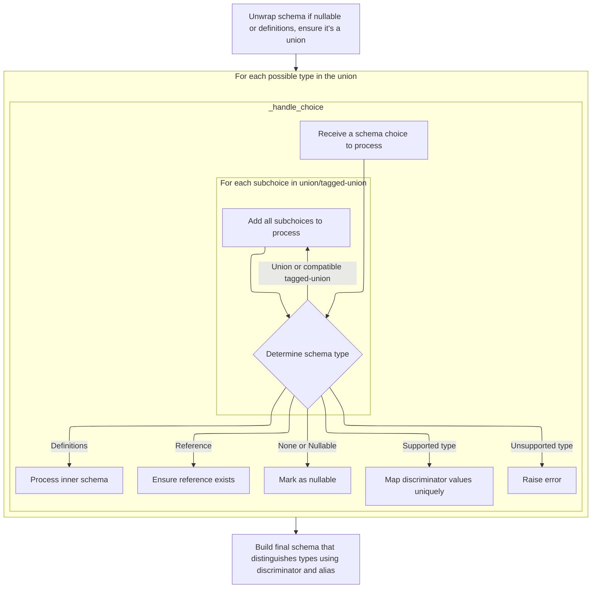
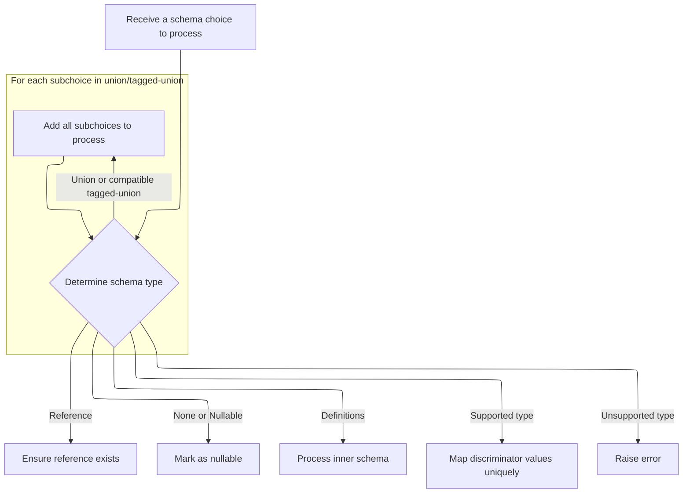

This document explains how schemas are prepared to support discriminated unions using a discriminator field, which can be either a string or a special object. The process involves receiving a schema and discriminator, ensuring all possible types in the union are included, assigning unique tags for discrimination, and building a tagged union schema that uses the discriminator to select the correct type. If needed, the schema is wrapped to allow null values. The result is a schema that can validate and serialize data based on the discriminator field.



# Where is this flow used?

This flow is used multiple times in the codebase as represented in the following diagram:

(Note - these are only some of the entry points of this flow)

```mermaid
graph TD;
      0eebf8f2e9d7bbd27385e4fe6f159cce37c12c286e6370619f70a69a972a3144(pydantic/dataclasses.py::dataclass) --> 56b578e144c61cf1045d12573c86da3465a03844a77d3497f17a396520c82851(pydantic/_internal/_dataclasses.py::complete_dataclass)

0eebf8f2e9d7bbd27385e4fe6f159cce37c12c286e6370619f70a69a972a3144(pydantic/dataclasses.py::dataclass) --> b564b11d457ed88ea463f8ce971442dcf2169f39f2ced01758fb9142814a5cc2(pydantic/dataclasses.py::create_dataclass)

56b578e144c61cf1045d12573c86da3465a03844a77d3497f17a396520c82851(pydantic/_internal/_dataclasses.py::complete_dataclass) --> 821ac1c9f22e0ce452e164beea8710d439ce16fa997229e959c00e48d254c7db(pydantic/_internal/_schema_generation_shared.py::generate_schema)

56b578e144c61cf1045d12573c86da3465a03844a77d3497f17a396520c82851(pydantic/_internal/_dataclasses.py::complete_dataclass) --> d91226fa102358bdd28c394fd8801ca465654752a477d2aca7a44708cd98b4b0(pydantic/_internal/_generate_schema.py::clean_schema)

821ac1c9f22e0ce452e164beea8710d439ce16fa997229e959c00e48d254c7db(pydantic/_internal/_schema_generation_shared.py::generate_schema) --> e374ce8459be5f7c51c6b09301cbf87c2cc3fa4ad4e9122e9fd158381e9e769f(pydantic/_internal/_generate_schema.py::generate_schema)

e374ce8459be5f7c51c6b09301cbf87c2cc3fa4ad4e9122e9fd158381e9e769f(pydantic/_internal/_generate_schema.py::generate_schema) --> b602d84b54cb2aba2cca4f5952a51a376a8aff59525d3534864295ca55a42112(pydantic/_internal/_generate_schema.py::_generate_schema_inner)

b602d84b54cb2aba2cca4f5952a51a376a8aff59525d3534864295ca55a42112(pydantic/_internal/_generate_schema.py::_generate_schema_inner) --> bc924de46c6217c598b1ae04179a98d282ae53f7ad3120181711f95921d7f906(pydantic/_internal/_generate_schema.py::_model_schema)

b602d84b54cb2aba2cca4f5952a51a376a8aff59525d3534864295ca55a42112(pydantic/_internal/_generate_schema.py::_generate_schema_inner) --> e020c531042df78e199bed84c5df1bf9e9ba5ffef2041a1c1263d19b92d0e396(pydantic/_internal/_generate_schema.py::match_type)

b602d84b54cb2aba2cca4f5952a51a376a8aff59525d3534864295ca55a42112(pydantic/_internal/_generate_schema.py::_generate_schema_inner) --> e374ce8459be5f7c51c6b09301cbf87c2cc3fa4ad4e9122e9fd158381e9e769f(pydantic/_internal/_generate_schema.py::generate_schema)

b602d84b54cb2aba2cca4f5952a51a376a8aff59525d3534864295ca55a42112(pydantic/_internal/_generate_schema.py::_generate_schema_inner) --> 2a5a2e72e13283646dc234d606356f0457863ebc9e37ef991adf774f6a75ff5f(pydantic/_internal/_generate_schema.py::_annotated_schema)

bc924de46c6217c598b1ae04179a98d282ae53f7ad3120181711f95921d7f906(pydantic/_internal/_generate_schema.py::_model_schema) --> 858e02534520e51c12f8029180e325eb2874c6633f6aa9df014a612ec4701fe8(pydantic/_internal/_generate_schema.py::_common_field_schema)

bc924de46c6217c598b1ae04179a98d282ae53f7ad3120181711f95921d7f906(pydantic/_internal/_generate_schema.py::_model_schema) --> e374ce8459be5f7c51c6b09301cbf87c2cc3fa4ad4e9122e9fd158381e9e769f(pydantic/_internal/_generate_schema.py::generate_schema)

bc924de46c6217c598b1ae04179a98d282ae53f7ad3120181711f95921d7f906(pydantic/_internal/_generate_schema.py::_model_schema) --> 631e36a810f198c53cceda6dbd5cc9bf0a87153a594442ec3d7174e52cd27cc2(pydantic/_internal/_generate_schema.py::_computed_field_schema)

bc924de46c6217c598b1ae04179a98d282ae53f7ad3120181711f95921d7f906(pydantic/_internal/_generate_schema.py::_model_schema) --> 2fb8f8a4aecbccaa5fe485046164c452ed5518a790f0649693b377992d0c7a2b(pydantic/_internal/_generate_schema.py::_apply_model_serializers)

bc924de46c6217c598b1ae04179a98d282ae53f7ad3120181711f95921d7f906(pydantic/_internal/_generate_schema.py::_model_schema) --> 819dc777ef628b4ebc011dbb83a4c177c1f202109f3966c6b5e61ee6495c1734(pydantic/_internal/_generate_schema.py::_generate_md_field_schema)

858e02534520e51c12f8029180e325eb2874c6633f6aa9df014a612ec4701fe8(pydantic/_internal/_generate_schema.py::_common_field_schema) --> 8c77fc96af26ce57d77bb1ed79f28ef72f4b463346990015c8e4c1384e05ae11(pydantic/_internal/_generate_schema.py::_apply_discriminator_to_union)

858e02534520e51c12f8029180e325eb2874c6633f6aa9df014a612ec4701fe8(pydantic/_internal/_generate_schema.py::_common_field_schema) --> e8e68ca170af29f1d2d114de8a2225b8730ba0e804acdb27bcb34cd083d6dd8a(pydantic/_internal/_generate_schema.py::_apply_field_serializers)

858e02534520e51c12f8029180e325eb2874c6633f6aa9df014a612ec4701fe8(pydantic/_internal/_generate_schema.py::_common_field_schema) --> f9ce1e7c897888a9b275a9a2352b3d3ffa7cfd62bb97f6b429924c363659d6a0(pydantic/_internal/_generate_schema.py::_apply_annotations)

8c77fc96af26ce57d77bb1ed79f28ef72f4b463346990015c8e4c1384e05ae11(pydantic/_internal/_generate_schema.py::_apply_discriminator_to_union) --> 0736bac2d94b07c37b5a12dfb449c37d41877669f411728cb216ca07852ce1c7(pydantic/_internal/_discriminated_union.py::apply_discriminator):::mainFlowStyle

e8e68ca170af29f1d2d114de8a2225b8730ba0e804acdb27bcb34cd083d6dd8a(pydantic/_internal/_generate_schema.py::_apply_field_serializers) --> e374ce8459be5f7c51c6b09301cbf87c2cc3fa4ad4e9122e9fd158381e9e769f(pydantic/_internal/_generate_schema.py::generate_schema)

e8e68ca170af29f1d2d114de8a2225b8730ba0e804acdb27bcb34cd083d6dd8a(pydantic/_internal/_generate_schema.py::_apply_field_serializers) --> e8e68ca170af29f1d2d114de8a2225b8730ba0e804acdb27bcb34cd083d6dd8a(pydantic/_internal/_generate_schema.py::_apply_field_serializers)

f9ce1e7c897888a9b275a9a2352b3d3ffa7cfd62bb97f6b429924c363659d6a0(pydantic/_internal/_generate_schema.py::_apply_annotations) --> b602d84b54cb2aba2cca4f5952a51a376a8aff59525d3534864295ca55a42112(pydantic/_internal/_generate_schema.py::_generate_schema_inner)

f9ce1e7c897888a9b275a9a2352b3d3ffa7cfd62bb97f6b429924c363659d6a0(pydantic/_internal/_generate_schema.py::_apply_annotations) --> e6d962ed5d56bea23eebea1994aafe0965268d88b5eeaf83aae970f888bb33b7(pydantic/_internal/_generate_schema.py::_get_wrapped_inner_schema)

e6d962ed5d56bea23eebea1994aafe0965268d88b5eeaf83aae970f888bb33b7(pydantic/_internal/_generate_schema.py::_get_wrapped_inner_schema) --> 2515c2db3b41c3f2f18b6ab23d97c245a2f2bba337cb279d2fc32b98af883814(pydantic/_internal/_generate_schema.py::_apply_single_annotation)

2515c2db3b41c3f2f18b6ab23d97c245a2f2bba337cb279d2fc32b98af883814(pydantic/_internal/_generate_schema.py::_apply_single_annotation) --> 8c77fc96af26ce57d77bb1ed79f28ef72f4b463346990015c8e4c1384e05ae11(pydantic/_internal/_generate_schema.py::_apply_discriminator_to_union)

2515c2db3b41c3f2f18b6ab23d97c245a2f2bba337cb279d2fc32b98af883814(pydantic/_internal/_generate_schema.py::_apply_single_annotation) --> 2515c2db3b41c3f2f18b6ab23d97c245a2f2bba337cb279d2fc32b98af883814(pydantic/_internal/_generate_schema.py::_apply_single_annotation)

631e36a810f198c53cceda6dbd5cc9bf0a87153a594442ec3d7174e52cd27cc2(pydantic/_internal/_generate_schema.py::_computed_field_schema) --> e374ce8459be5f7c51c6b09301cbf87c2cc3fa4ad4e9122e9fd158381e9e769f(pydantic/_internal/_generate_schema.py::generate_schema)

631e36a810f198c53cceda6dbd5cc9bf0a87153a594442ec3d7174e52cd27cc2(pydantic/_internal/_generate_schema.py::_computed_field_schema) --> e8e68ca170af29f1d2d114de8a2225b8730ba0e804acdb27bcb34cd083d6dd8a(pydantic/_internal/_generate_schema.py::_apply_field_serializers)

2fb8f8a4aecbccaa5fe485046164c452ed5518a790f0649693b377992d0c7a2b(pydantic/_internal/_generate_schema.py::_apply_model_serializers) --> e374ce8459be5f7c51c6b09301cbf87c2cc3fa4ad4e9122e9fd158381e9e769f(pydantic/_internal/_generate_schema.py::generate_schema)

819dc777ef628b4ebc011dbb83a4c177c1f202109f3966c6b5e61ee6495c1734(pydantic/_internal/_generate_schema.py::_generate_md_field_schema) --> 858e02534520e51c12f8029180e325eb2874c6633f6aa9df014a612ec4701fe8(pydantic/_internal/_generate_schema.py::_common_field_schema)

e020c531042df78e199bed84c5df1bf9e9ba5ffef2041a1c1263d19b92d0e396(pydantic/_internal/_generate_schema.py::match_type) --> 69e5824bbd87b17d0b5e7eaf0c5239092b2c3f579c63db0d4355f5c9b10d0ef3(pydantic/_internal/_generate_schema.py::_list_schema)

e020c531042df78e199bed84c5df1bf9e9ba5ffef2041a1c1263d19b92d0e396(pydantic/_internal/_generate_schema.py::match_type) --> 74e03be63b51ad387e2d8e2772edcc8c93ce4f945ca0a1b5ec4a962eec873085(pydantic/_internal/_generate_schema.py::_match_generic_type)

e020c531042df78e199bed84c5df1bf9e9ba5ffef2041a1c1263d19b92d0e396(pydantic/_internal/_generate_schema.py::match_type) --> 42ae49638912d996d73ba640bbafaa070aecd24fcb001644135844f187134b33(pydantic/_internal/_generate_schema.py::_dict_schema)

e020c531042df78e199bed84c5df1bf9e9ba5ffef2041a1c1263d19b92d0e396(pydantic/_internal/_generate_schema.py::match_type) --> b75478bb5a542f1abc6a423448f5bc8b80f17683bc6be7298b988d26bcee51ac(pydantic/_internal/_generate_schema.py::_set_schema)

e020c531042df78e199bed84c5df1bf9e9ba5ffef2041a1c1263d19b92d0e396(pydantic/_internal/_generate_schema.py::match_type) --> f735efdf73adde84a1a8be9fc2385b7088bcb51409b3109d3ed9a2f77e9ea392(pydantic/_internal/_generate_schema.py::_frozenset_schema)

e020c531042df78e199bed84c5df1bf9e9ba5ffef2041a1c1263d19b92d0e396(pydantic/_internal/_generate_schema.py::match_type) --> f151c0372f7326effcead6b39bcbcf4557744cc970755584aa31de26911325a6(pydantic/_internal/_generate_schema.py::_deque_schema)

e020c531042df78e199bed84c5df1bf9e9ba5ffef2041a1c1263d19b92d0e396(pydantic/_internal/_generate_schema.py::match_type) --> 12637bf3581c80ba7d8cc98c9971130f87f8027a61446051bbb0d0bf3036008a(pydantic/_internal/_generate_schema.py::_mapping_schema)

e020c531042df78e199bed84c5df1bf9e9ba5ffef2041a1c1263d19b92d0e396(pydantic/_internal/_generate_schema.py::match_type) --> e374ce8459be5f7c51c6b09301cbf87c2cc3fa4ad4e9122e9fd158381e9e769f(pydantic/_internal/_generate_schema.py::generate_schema)

e020c531042df78e199bed84c5df1bf9e9ba5ffef2041a1c1263d19b92d0e396(pydantic/_internal/_generate_schema.py::match_type) --> 6b9cb253d748b2441df03cd733cdaabc46219ad40cc8e5f602d0ef4c2b7a4402(pydantic/_internal/_generate_schema.py::_unsubstituted_typevar_schema)

e020c531042df78e199bed84c5df1bf9e9ba5ffef2041a1c1263d19b92d0e396(pydantic/_internal/_generate_schema.py::match_type) --> 42648d8f19dc330774b494b47f011c967fead5e9fe725a8ecc4ae2c12432e461(pydantic/_internal/_generate_schema.py::_type_alias_type_schema)

e020c531042df78e199bed84c5df1bf9e9ba5ffef2041a1c1263d19b92d0e396(pydantic/_internal/_generate_schema.py::match_type) --> 677017c728183c7382991c99c86019451117938f11c4ace4eff5260b7a5797ef(pydantic/_internal/_generate_schema.py::_tuple_schema)

e020c531042df78e199bed84c5df1bf9e9ba5ffef2041a1c1263d19b92d0e396(pydantic/_internal/_generate_schema.py::match_type) --> 6ad93ea19bcf1f23a61a04028aba23d714bddca9dbb7f9a8bf4fdab3c1c62c05(pydantic/_internal/_generate_schema.py::_sequence_schema)

e020c531042df78e199bed84c5df1bf9e9ba5ffef2041a1c1263d19b92d0e396(pydantic/_internal/_generate_schema.py::match_type) --> bd640d6e9f41ef8f345994bc4be275411946c3702a6580d587e5a5267a772917(pydantic/_internal/_generate_schema.py::_iterable_schema)

e020c531042df78e199bed84c5df1bf9e9ba5ffef2041a1c1263d19b92d0e396(pydantic/_internal/_generate_schema.py::match_type) --> ec6a8ed94209ded04e2b261ebc4e8279fefa7ca2231815dde5806780e3116be3(pydantic/_internal/_generate_schema.py::_call_schema)

e020c531042df78e199bed84c5df1bf9e9ba5ffef2041a1c1263d19b92d0e396(pydantic/_internal/_generate_schema.py::match_type) --> 6703d3a7785be1a706caece7cd02003f30c88cc856e84813c8080cf4809556c7(pydantic/_internal/_generate_schema.py::_typed_dict_schema)

e020c531042df78e199bed84c5df1bf9e9ba5ffef2041a1c1263d19b92d0e396(pydantic/_internal/_generate_schema.py::match_type) --> e16fadec838bfad79cfbe640aafaffa77677927368e34ed693380839cbde5012(pydantic/_internal/_generate_schema.py::_dataclass_schema)

e020c531042df78e199bed84c5df1bf9e9ba5ffef2041a1c1263d19b92d0e396(pydantic/_internal/_generate_schema.py::match_type) --> 89b2daf276f292c295d8a25f2c79fe768816864a22d595de4063936a230539e2(pydantic/_internal/_generate_schema.py::_namedtuple_schema)

69e5824bbd87b17d0b5e7eaf0c5239092b2c3f579c63db0d4355f5c9b10d0ef3(pydantic/_internal/_generate_schema.py::_list_schema) --> e374ce8459be5f7c51c6b09301cbf87c2cc3fa4ad4e9122e9fd158381e9e769f(pydantic/_internal/_generate_schema.py::generate_schema)

74e03be63b51ad387e2d8e2772edcc8c93ce4f945ca0a1b5ec4a962eec873085(pydantic/_internal/_generate_schema.py::_match_generic_type) --> 69e5824bbd87b17d0b5e7eaf0c5239092b2c3f579c63db0d4355f5c9b10d0ef3(pydantic/_internal/_generate_schema.py::_list_schema)

74e03be63b51ad387e2d8e2772edcc8c93ce4f945ca0a1b5ec4a962eec873085(pydantic/_internal/_generate_schema.py::_match_generic_type) --> 42ae49638912d996d73ba640bbafaa070aecd24fcb001644135844f187134b33(pydantic/_internal/_generate_schema.py::_dict_schema)

74e03be63b51ad387e2d8e2772edcc8c93ce4f945ca0a1b5ec4a962eec873085(pydantic/_internal/_generate_schema.py::_match_generic_type) --> b75478bb5a542f1abc6a423448f5bc8b80f17683bc6be7298b988d26bcee51ac(pydantic/_internal/_generate_schema.py::_set_schema)

74e03be63b51ad387e2d8e2772edcc8c93ce4f945ca0a1b5ec4a962eec873085(pydantic/_internal/_generate_schema.py::_match_generic_type) --> f735efdf73adde84a1a8be9fc2385b7088bcb51409b3109d3ed9a2f77e9ea392(pydantic/_internal/_generate_schema.py::_frozenset_schema)

74e03be63b51ad387e2d8e2772edcc8c93ce4f945ca0a1b5ec4a962eec873085(pydantic/_internal/_generate_schema.py::_match_generic_type) --> f151c0372f7326effcead6b39bcbcf4557744cc970755584aa31de26911325a6(pydantic/_internal/_generate_schema.py::_deque_schema)

74e03be63b51ad387e2d8e2772edcc8c93ce4f945ca0a1b5ec4a962eec873085(pydantic/_internal/_generate_schema.py::_match_generic_type) --> 12637bf3581c80ba7d8cc98c9971130f87f8027a61446051bbb0d0bf3036008a(pydantic/_internal/_generate_schema.py::_mapping_schema)

74e03be63b51ad387e2d8e2772edcc8c93ce4f945ca0a1b5ec4a962eec873085(pydantic/_internal/_generate_schema.py::_match_generic_type) --> 95a1d11f1c76d3b81de16efb7b22f4d2309266424757c4daf7b105089f6d4e81(pydantic/_internal/_generate_schema.py::_union_schema)

74e03be63b51ad387e2d8e2772edcc8c93ce4f945ca0a1b5ec4a962eec873085(pydantic/_internal/_generate_schema.py::_match_generic_type) --> 42648d8f19dc330774b494b47f011c967fead5e9fe725a8ecc4ae2c12432e461(pydantic/_internal/_generate_schema.py::_type_alias_type_schema)

74e03be63b51ad387e2d8e2772edcc8c93ce4f945ca0a1b5ec4a962eec873085(pydantic/_internal/_generate_schema.py::_match_generic_type) --> 677017c728183c7382991c99c86019451117938f11c4ace4eff5260b7a5797ef(pydantic/_internal/_generate_schema.py::_tuple_schema)

74e03be63b51ad387e2d8e2772edcc8c93ce4f945ca0a1b5ec4a962eec873085(pydantic/_internal/_generate_schema.py::_match_generic_type) --> 6e6e2690f2d84a507f67df1d81918bfa6d6e85dd5908e758007b9b5f6505fe25(pydantic/_internal/_generate_schema.py::_subclass_schema)

74e03be63b51ad387e2d8e2772edcc8c93ce4f945ca0a1b5ec4a962eec873085(pydantic/_internal/_generate_schema.py::_match_generic_type) --> 6ad93ea19bcf1f23a61a04028aba23d714bddca9dbb7f9a8bf4fdab3c1c62c05(pydantic/_internal/_generate_schema.py::_sequence_schema)

74e03be63b51ad387e2d8e2772edcc8c93ce4f945ca0a1b5ec4a962eec873085(pydantic/_internal/_generate_schema.py::_match_generic_type) --> bd640d6e9f41ef8f345994bc4be275411946c3702a6580d587e5a5267a772917(pydantic/_internal/_generate_schema.py::_iterable_schema)

74e03be63b51ad387e2d8e2772edcc8c93ce4f945ca0a1b5ec4a962eec873085(pydantic/_internal/_generate_schema.py::_match_generic_type) --> 6703d3a7785be1a706caece7cd02003f30c88cc856e84813c8080cf4809556c7(pydantic/_internal/_generate_schema.py::_typed_dict_schema)

74e03be63b51ad387e2d8e2772edcc8c93ce4f945ca0a1b5ec4a962eec873085(pydantic/_internal/_generate_schema.py::_match_generic_type) --> e16fadec838bfad79cfbe640aafaffa77677927368e34ed693380839cbde5012(pydantic/_internal/_generate_schema.py::_dataclass_schema)

74e03be63b51ad387e2d8e2772edcc8c93ce4f945ca0a1b5ec4a962eec873085(pydantic/_internal/_generate_schema.py::_match_generic_type) --> 89b2daf276f292c295d8a25f2c79fe768816864a22d595de4063936a230539e2(pydantic/_internal/_generate_schema.py::_namedtuple_schema)

42ae49638912d996d73ba640bbafaa070aecd24fcb001644135844f187134b33(pydantic/_internal/_generate_schema.py::_dict_schema) --> e374ce8459be5f7c51c6b09301cbf87c2cc3fa4ad4e9122e9fd158381e9e769f(pydantic/_internal/_generate_schema.py::generate_schema)

b75478bb5a542f1abc6a423448f5bc8b80f17683bc6be7298b988d26bcee51ac(pydantic/_internal/_generate_schema.py::_set_schema) --> e374ce8459be5f7c51c6b09301cbf87c2cc3fa4ad4e9122e9fd158381e9e769f(pydantic/_internal/_generate_schema.py::generate_schema)

f735efdf73adde84a1a8be9fc2385b7088bcb51409b3109d3ed9a2f77e9ea392(pydantic/_internal/_generate_schema.py::_frozenset_schema) --> e374ce8459be5f7c51c6b09301cbf87c2cc3fa4ad4e9122e9fd158381e9e769f(pydantic/_internal/_generate_schema.py::generate_schema)

f151c0372f7326effcead6b39bcbcf4557744cc970755584aa31de26911325a6(pydantic/_internal/_generate_schema.py::_deque_schema) --> e374ce8459be5f7c51c6b09301cbf87c2cc3fa4ad4e9122e9fd158381e9e769f(pydantic/_internal/_generate_schema.py::generate_schema)

12637bf3581c80ba7d8cc98c9971130f87f8027a61446051bbb0d0bf3036008a(pydantic/_internal/_generate_schema.py::_mapping_schema) --> e374ce8459be5f7c51c6b09301cbf87c2cc3fa4ad4e9122e9fd158381e9e769f(pydantic/_internal/_generate_schema.py::generate_schema)

95a1d11f1c76d3b81de16efb7b22f4d2309266424757c4daf7b105089f6d4e81(pydantic/_internal/_generate_schema.py::_union_schema) --> e374ce8459be5f7c51c6b09301cbf87c2cc3fa4ad4e9122e9fd158381e9e769f(pydantic/_internal/_generate_schema.py::generate_schema)

42648d8f19dc330774b494b47f011c967fead5e9fe725a8ecc4ae2c12432e461(pydantic/_internal/_generate_schema.py::_type_alias_type_schema) --> e374ce8459be5f7c51c6b09301cbf87c2cc3fa4ad4e9122e9fd158381e9e769f(pydantic/_internal/_generate_schema.py::generate_schema)

677017c728183c7382991c99c86019451117938f11c4ace4eff5260b7a5797ef(pydantic/_internal/_generate_schema.py::_tuple_schema) --> e374ce8459be5f7c51c6b09301cbf87c2cc3fa4ad4e9122e9fd158381e9e769f(pydantic/_internal/_generate_schema.py::generate_schema)

6e6e2690f2d84a507f67df1d81918bfa6d6e85dd5908e758007b9b5f6505fe25(pydantic/_internal/_generate_schema.py::_subclass_schema) --> cbc092cd3b22be4e76d47e1fb1c206af767ff638a3cdf5124326394c073f0314(pydantic/_internal/_generate_schema.py::_union_is_subclass_schema)

6e6e2690f2d84a507f67df1d81918bfa6d6e85dd5908e758007b9b5f6505fe25(pydantic/_internal/_generate_schema.py::_subclass_schema) --> e374ce8459be5f7c51c6b09301cbf87c2cc3fa4ad4e9122e9fd158381e9e769f(pydantic/_internal/_generate_schema.py::generate_schema)

cbc092cd3b22be4e76d47e1fb1c206af767ff638a3cdf5124326394c073f0314(pydantic/_internal/_generate_schema.py::_union_is_subclass_schema) --> e374ce8459be5f7c51c6b09301cbf87c2cc3fa4ad4e9122e9fd158381e9e769f(pydantic/_internal/_generate_schema.py::generate_schema)

6ad93ea19bcf1f23a61a04028aba23d714bddca9dbb7f9a8bf4fdab3c1c62c05(pydantic/_internal/_generate_schema.py::_sequence_schema) --> e374ce8459be5f7c51c6b09301cbf87c2cc3fa4ad4e9122e9fd158381e9e769f(pydantic/_internal/_generate_schema.py::generate_schema)

bd640d6e9f41ef8f345994bc4be275411946c3702a6580d587e5a5267a772917(pydantic/_internal/_generate_schema.py::_iterable_schema) --> e374ce8459be5f7c51c6b09301cbf87c2cc3fa4ad4e9122e9fd158381e9e769f(pydantic/_internal/_generate_schema.py::generate_schema)

6703d3a7785be1a706caece7cd02003f30c88cc856e84813c8080cf4809556c7(pydantic/_internal/_generate_schema.py::_typed_dict_schema) --> 631e36a810f198c53cceda6dbd5cc9bf0a87153a594442ec3d7174e52cd27cc2(pydantic/_internal/_generate_schema.py::_computed_field_schema)

6703d3a7785be1a706caece7cd02003f30c88cc856e84813c8080cf4809556c7(pydantic/_internal/_generate_schema.py::_typed_dict_schema) --> 2fb8f8a4aecbccaa5fe485046164c452ed5518a790f0649693b377992d0c7a2b(pydantic/_internal/_generate_schema.py::_apply_model_serializers)

6703d3a7785be1a706caece7cd02003f30c88cc856e84813c8080cf4809556c7(pydantic/_internal/_generate_schema.py::_typed_dict_schema) --> 23c2a16afaf75834d6630f8f59d8b75effc1abe858f41b0a02afb810a071a6ac(pydantic/_internal/_generate_schema.py::_generate_td_field_schema)

23c2a16afaf75834d6630f8f59d8b75effc1abe858f41b0a02afb810a071a6ac(pydantic/_internal/_generate_schema.py::_generate_td_field_schema) --> 858e02534520e51c12f8029180e325eb2874c6633f6aa9df014a612ec4701fe8(pydantic/_internal/_generate_schema.py::_common_field_schema)

e16fadec838bfad79cfbe640aafaffa77677927368e34ed693380839cbde5012(pydantic/_internal/_generate_schema.py::_dataclass_schema) --> 631e36a810f198c53cceda6dbd5cc9bf0a87153a594442ec3d7174e52cd27cc2(pydantic/_internal/_generate_schema.py::_computed_field_schema)

e16fadec838bfad79cfbe640aafaffa77677927368e34ed693380839cbde5012(pydantic/_internal/_generate_schema.py::_dataclass_schema) --> 2fb8f8a4aecbccaa5fe485046164c452ed5518a790f0649693b377992d0c7a2b(pydantic/_internal/_generate_schema.py::_apply_model_serializers)

e16fadec838bfad79cfbe640aafaffa77677927368e34ed693380839cbde5012(pydantic/_internal/_generate_schema.py::_dataclass_schema) --> 7e4855a0c24549dc52776d96750bb1d90a9b2b58f5ac194ce224269aaeb83b96(pydantic/_internal/_generate_schema.py::_generate_dc_field_schema)

7e4855a0c24549dc52776d96750bb1d90a9b2b58f5ac194ce224269aaeb83b96(pydantic/_internal/_generate_schema.py::_generate_dc_field_schema) --> 858e02534520e51c12f8029180e325eb2874c6633f6aa9df014a612ec4701fe8(pydantic/_internal/_generate_schema.py::_common_field_schema)

89b2daf276f292c295d8a25f2c79fe768816864a22d595de4063936a230539e2(pydantic/_internal/_generate_schema.py::_namedtuple_schema) --> b42d4c14662d12cfef226ebea8f8b3d7630d0ba8898ff0bef9daf2d265ec625d(pydantic/_internal/_generate_schema.py::_generate_parameter_schema)

b42d4c14662d12cfef226ebea8f8b3d7630d0ba8898ff0bef9daf2d265ec625d(pydantic/_internal/_generate_schema.py::_generate_parameter_schema) --> f9ce1e7c897888a9b275a9a2352b3d3ffa7cfd62bb97f6b429924c363659d6a0(pydantic/_internal/_generate_schema.py::_apply_annotations)

6b9cb253d748b2441df03cd733cdaabc46219ad40cc8e5f602d0ef4c2b7a4402(pydantic/_internal/_generate_schema.py::_unsubstituted_typevar_schema) --> 95a1d11f1c76d3b81de16efb7b22f4d2309266424757c4daf7b105089f6d4e81(pydantic/_internal/_generate_schema.py::_union_schema)

6b9cb253d748b2441df03cd733cdaabc46219ad40cc8e5f602d0ef4c2b7a4402(pydantic/_internal/_generate_schema.py::_unsubstituted_typevar_schema) --> e374ce8459be5f7c51c6b09301cbf87c2cc3fa4ad4e9122e9fd158381e9e769f(pydantic/_internal/_generate_schema.py::generate_schema)

ec6a8ed94209ded04e2b261ebc4e8279fefa7ca2231815dde5806780e3116be3(pydantic/_internal/_generate_schema.py::_call_schema) --> e374ce8459be5f7c51c6b09301cbf87c2cc3fa4ad4e9122e9fd158381e9e769f(pydantic/_internal/_generate_schema.py::generate_schema)

ec6a8ed94209ded04e2b261ebc4e8279fefa7ca2231815dde5806780e3116be3(pydantic/_internal/_generate_schema.py::_call_schema) --> 6093242e0186caeaa3166f08daf3cd585e3ae742d016bb656fee39b333187b0d(pydantic/_internal/_generate_schema.py::_arguments_schema)

6093242e0186caeaa3166f08daf3cd585e3ae742d016bb656fee39b333187b0d(pydantic/_internal/_generate_schema.py::_arguments_schema) --> e374ce8459be5f7c51c6b09301cbf87c2cc3fa4ad4e9122e9fd158381e9e769f(pydantic/_internal/_generate_schema.py::generate_schema)

6093242e0186caeaa3166f08daf3cd585e3ae742d016bb656fee39b333187b0d(pydantic/_internal/_generate_schema.py::_arguments_schema) --> 6703d3a7785be1a706caece7cd02003f30c88cc856e84813c8080cf4809556c7(pydantic/_internal/_generate_schema.py::_typed_dict_schema)

6093242e0186caeaa3166f08daf3cd585e3ae742d016bb656fee39b333187b0d(pydantic/_internal/_generate_schema.py::_arguments_schema) --> b42d4c14662d12cfef226ebea8f8b3d7630d0ba8898ff0bef9daf2d265ec625d(pydantic/_internal/_generate_schema.py::_generate_parameter_schema)

2a5a2e72e13283646dc234d606356f0457863ebc9e37ef991adf774f6a75ff5f(pydantic/_internal/_generate_schema.py::_annotated_schema) --> f9ce1e7c897888a9b275a9a2352b3d3ffa7cfd62bb97f6b429924c363659d6a0(pydantic/_internal/_generate_schema.py::_apply_annotations)

d91226fa102358bdd28c394fd8801ca465654752a477d2aca7a44708cd98b4b0(pydantic/_internal/_generate_schema.py::clean_schema) --> 792f2e874fc0a64eaac141aee114f9a6f06d96a655e10d6d76b03c81fc882872(pydantic/_internal/_generate_schema.py::finalize_schema)

792f2e874fc0a64eaac141aee114f9a6f06d96a655e10d6d76b03c81fc882872(pydantic/_internal/_generate_schema.py::finalize_schema) --> 0736bac2d94b07c37b5a12dfb449c37d41877669f411728cb216ca07852ce1c7(pydantic/_internal/_discriminated_union.py::apply_discriminator):::mainFlowStyle

b564b11d457ed88ea463f8ce971442dcf2169f39f2ced01758fb9142814a5cc2(pydantic/dataclasses.py::create_dataclass) --> 56b578e144c61cf1045d12573c86da3465a03844a77d3497f17a396520c82851(pydantic/_internal/_dataclasses.py::complete_dataclass)

51288aea0bc078db30730037d4a6f8d7dec4ad8a02c46c50ef8fb01087491a30(pydantic/_internal/_model_construction.py::__new__) --> 6cfaee3d4fde1d066f89ac588fdd8e3f5fae9df31454e1750b8a608267250827(pydantic/_internal/_model_construction.py::complete_model_class)

6cfaee3d4fde1d066f89ac588fdd8e3f5fae9df31454e1750b8a608267250827(pydantic/_internal/_model_construction.py::complete_model_class) --> 821ac1c9f22e0ce452e164beea8710d439ce16fa997229e959c00e48d254c7db(pydantic/_internal/_schema_generation_shared.py::generate_schema)

6cfaee3d4fde1d066f89ac588fdd8e3f5fae9df31454e1750b8a608267250827(pydantic/_internal/_model_construction.py::complete_model_class) --> d91226fa102358bdd28c394fd8801ca465654752a477d2aca7a44708cd98b4b0(pydantic/_internal/_generate_schema.py::clean_schema)

43a6baf44f877182cf37d9da8c2937d44be954f1be8aacbb4f6d4bf758d05203(docs/plugins/main.py::__class_getitem__) --> 2629968df57e5ee347551103b3d4611152a9bfc82adeffac7fb105bf188ddc0a(docs/plugins/main.py::model_rebuild)

2629968df57e5ee347551103b3d4611152a9bfc82adeffac7fb105bf188ddc0a(docs/plugins/main.py::model_rebuild) --> 6cfaee3d4fde1d066f89ac588fdd8e3f5fae9df31454e1750b8a608267250827(pydantic/_internal/_model_construction.py::complete_model_class)

177405f9b9d72012b7734db7285e10f7a642781583ae030d550f190b7a15c5f7(pydantic/dataclasses.py::rebuild_dataclass) --> 56b578e144c61cf1045d12573c86da3465a03844a77d3497f17a396520c82851(pydantic/_internal/_dataclasses.py::complete_dataclass)

b69d34d7c726a40aabc5a9d21ffd08fffd6a577cf2ca79e6332520c2157173c0(docs/plugins/main.py::update_forward_refs) --> 2629968df57e5ee347551103b3d4611152a9bfc82adeffac7fb105bf188ddc0a(docs/plugins/main.py::model_rebuild)


classDef mainFlowStyle color:#000000,fill:#7CB9F4
classDef rootsStyle color:#000000,fill:#00FFF4
classDef Style1 color:#000000,fill:#00FFAA
classDef Style2 color:#000000,fill:#FFFF00
classDef Style3 color:#000000,fill:#AA7CB9

%% Swimm:
%% graph TD;
%%       0eebf8f2e9d7bbd27385e4fe6f159cce37c12c286e6370619f70a69a972a3144(<SwmPath>[pydantic/dataclasses.py](pydantic/dataclasses.py)</SwmPath>::dataclass) --> 56b578e144c61cf1045d12573c86da3465a03844a77d3497f17a396520c82851(<SwmPath>[pydantic/\_internal/\_dataclasses.py](pydantic/_internal/_dataclasses.py)</SwmPath>::complete_dataclass)
%% 
%% 0eebf8f2e9d7bbd27385e4fe6f159cce37c12c286e6370619f70a69a972a3144(<SwmPath>[pydantic/dataclasses.py](pydantic/dataclasses.py)</SwmPath>::dataclass) --> b564b11d457ed88ea463f8ce971442dcf2169f39f2ced01758fb9142814a5cc2(<SwmPath>[pydantic/dataclasses.py](pydantic/dataclasses.py)</SwmPath>::create_dataclass)
%% 
%% 56b578e144c61cf1045d12573c86da3465a03844a77d3497f17a396520c82851(<SwmPath>[pydantic/\_internal/\_dataclasses.py](pydantic/_internal/_dataclasses.py)</SwmPath>::complete_dataclass) --> 821ac1c9f22e0ce452e164beea8710d439ce16fa997229e959c00e48d254c7db(<SwmPath>[pydantic/\_internal/\_schema_generation_shared.py](pydantic/_internal/_schema_generation_shared.py)</SwmPath>::<SwmToken path="pydantic/types.py" pos="1700:7:7" line-data="        inner_schema = handler.generate_schema(inner_type)  # type: ignore">`generate_schema`</SwmToken>)
%% 
%% 56b578e144c61cf1045d12573c86da3465a03844a77d3497f17a396520c82851(<SwmPath>[pydantic/\_internal/\_dataclasses.py](pydantic/_internal/_dataclasses.py)</SwmPath>::complete_dataclass) --> d91226fa102358bdd28c394fd8801ca465654752a477d2aca7a44708cd98b4b0(<SwmPath>[pydantic/\_internal/\_generate_schema.py](pydantic/_internal/_generate_schema.py)</SwmPath>::clean_schema)
%% 
%% 821ac1c9f22e0ce452e164beea8710d439ce16fa997229e959c00e48d254c7db(<SwmPath>[pydantic/\_internal/\_schema_generation_shared.py](pydantic/_internal/_schema_generation_shared.py)</SwmPath>::<SwmToken path="pydantic/types.py" pos="1700:7:7" line-data="        inner_schema = handler.generate_schema(inner_type)  # type: ignore">`generate_schema`</SwmToken>) --> e374ce8459be5f7c51c6b09301cbf87c2cc3fa4ad4e9122e9fd158381e9e769f(<SwmPath>[pydantic/\_internal/\_generate_schema.py](pydantic/_internal/_generate_schema.py)</SwmPath>::<SwmToken path="pydantic/types.py" pos="1700:7:7" line-data="        inner_schema = handler.generate_schema(inner_type)  # type: ignore">`generate_schema`</SwmToken>)
%% 
%% e374ce8459be5f7c51c6b09301cbf87c2cc3fa4ad4e9122e9fd158381e9e769f(<SwmPath>[pydantic/\_internal/\_generate_schema.py](pydantic/_internal/_generate_schema.py)</SwmPath>::<SwmToken path="pydantic/types.py" pos="1700:7:7" line-data="        inner_schema = handler.generate_schema(inner_type)  # type: ignore">`generate_schema`</SwmToken>) --> b602d84b54cb2aba2cca4f5952a51a376a8aff59525d3534864295ca55a42112(<SwmPath>[pydantic/\_internal/\_generate_schema.py](pydantic/_internal/_generate_schema.py)</SwmPath>::_generate_schema_inner)
%% 
%% b602d84b54cb2aba2cca4f5952a51a376a8aff59525d3534864295ca55a42112(<SwmPath>[pydantic/\_internal/\_generate_schema.py](pydantic/_internal/_generate_schema.py)</SwmPath>::_generate_schema_inner) --> bc924de46c6217c598b1ae04179a98d282ae53f7ad3120181711f95921d7f906(<SwmPath>[pydantic/\_internal/\_generate_schema.py](pydantic/_internal/_generate_schema.py)</SwmPath>::_model_schema)
%% 
%% b602d84b54cb2aba2cca4f5952a51a376a8aff59525d3534864295ca55a42112(<SwmPath>[pydantic/\_internal/\_generate_schema.py](pydantic/_internal/_generate_schema.py)</SwmPath>::_generate_schema_inner) --> e020c531042df78e199bed84c5df1bf9e9ba5ffef2041a1c1263d19b92d0e396(<SwmPath>[pydantic/\_internal/\_generate_schema.py](pydantic/_internal/_generate_schema.py)</SwmPath>::match_type)
%% 
%% b602d84b54cb2aba2cca4f5952a51a376a8aff59525d3534864295ca55a42112(<SwmPath>[pydantic/\_internal/\_generate_schema.py](pydantic/_internal/_generate_schema.py)</SwmPath>::_generate_schema_inner) --> e374ce8459be5f7c51c6b09301cbf87c2cc3fa4ad4e9122e9fd158381e9e769f(<SwmPath>[pydantic/\_internal/\_generate_schema.py](pydantic/_internal/_generate_schema.py)</SwmPath>::<SwmToken path="pydantic/types.py" pos="1700:7:7" line-data="        inner_schema = handler.generate_schema(inner_type)  # type: ignore">`generate_schema`</SwmToken>)
%% 
%% b602d84b54cb2aba2cca4f5952a51a376a8aff59525d3534864295ca55a42112(<SwmPath>[pydantic/\_internal/\_generate_schema.py](pydantic/_internal/_generate_schema.py)</SwmPath>::_generate_schema_inner) --> 2a5a2e72e13283646dc234d606356f0457863ebc9e37ef991adf774f6a75ff5f(<SwmPath>[pydantic/\_internal/\_generate_schema.py](pydantic/_internal/_generate_schema.py)</SwmPath>::_annotated_schema)
%% 
%% bc924de46c6217c598b1ae04179a98d282ae53f7ad3120181711f95921d7f906(<SwmPath>[pydantic/\_internal/\_generate_schema.py](pydantic/_internal/_generate_schema.py)</SwmPath>::_model_schema) --> 858e02534520e51c12f8029180e325eb2874c6633f6aa9df014a612ec4701fe8(<SwmPath>[pydantic/\_internal/\_generate_schema.py](pydantic/_internal/_generate_schema.py)</SwmPath>::_common_field_schema)
%% 
%% bc924de46c6217c598b1ae04179a98d282ae53f7ad3120181711f95921d7f906(<SwmPath>[pydantic/\_internal/\_generate_schema.py](pydantic/_internal/_generate_schema.py)</SwmPath>::_model_schema) --> e374ce8459be5f7c51c6b09301cbf87c2cc3fa4ad4e9122e9fd158381e9e769f(<SwmPath>[pydantic/\_internal/\_generate_schema.py](pydantic/_internal/_generate_schema.py)</SwmPath>::<SwmToken path="pydantic/types.py" pos="1700:7:7" line-data="        inner_schema = handler.generate_schema(inner_type)  # type: ignore">`generate_schema`</SwmToken>)
%% 
%% bc924de46c6217c598b1ae04179a98d282ae53f7ad3120181711f95921d7f906(<SwmPath>[pydantic/\_internal/\_generate_schema.py](pydantic/_internal/_generate_schema.py)</SwmPath>::_model_schema) --> 631e36a810f198c53cceda6dbd5cc9bf0a87153a594442ec3d7174e52cd27cc2(<SwmPath>[pydantic/\_internal/\_generate_schema.py](pydantic/_internal/_generate_schema.py)</SwmPath>::_computed_field_schema)
%% 
%% bc924de46c6217c598b1ae04179a98d282ae53f7ad3120181711f95921d7f906(<SwmPath>[pydantic/\_internal/\_generate_schema.py](pydantic/_internal/_generate_schema.py)</SwmPath>::_model_schema) --> 2fb8f8a4aecbccaa5fe485046164c452ed5518a790f0649693b377992d0c7a2b(<SwmPath>[pydantic/\_internal/\_generate_schema.py](pydantic/_internal/_generate_schema.py)</SwmPath>::_apply_model_serializers)
%% 
%% bc924de46c6217c598b1ae04179a98d282ae53f7ad3120181711f95921d7f906(<SwmPath>[pydantic/\_internal/\_generate_schema.py](pydantic/_internal/_generate_schema.py)</SwmPath>::_model_schema) --> 819dc777ef628b4ebc011dbb83a4c177c1f202109f3966c6b5e61ee6495c1734(<SwmPath>[pydantic/\_internal/\_generate_schema.py](pydantic/_internal/_generate_schema.py)</SwmPath>::_generate_md_field_schema)
%% 
%% 858e02534520e51c12f8029180e325eb2874c6633f6aa9df014a612ec4701fe8(<SwmPath>[pydantic/\_internal/\_generate_schema.py](pydantic/_internal/_generate_schema.py)</SwmPath>::_common_field_schema) --> 8c77fc96af26ce57d77bb1ed79f28ef72f4b463346990015c8e4c1384e05ae11(<SwmPath>[pydantic/\_internal/\_generate_schema.py](pydantic/_internal/_generate_schema.py)</SwmPath>::_apply_discriminator_to_union)
%% 
%% 858e02534520e51c12f8029180e325eb2874c6633f6aa9df014a612ec4701fe8(<SwmPath>[pydantic/\_internal/\_generate_schema.py](pydantic/_internal/_generate_schema.py)</SwmPath>::_common_field_schema) --> e8e68ca170af29f1d2d114de8a2225b8730ba0e804acdb27bcb34cd083d6dd8a(<SwmPath>[pydantic/\_internal/\_generate_schema.py](pydantic/_internal/_generate_schema.py)</SwmPath>::_apply_field_serializers)
%% 
%% 858e02534520e51c12f8029180e325eb2874c6633f6aa9df014a612ec4701fe8(<SwmPath>[pydantic/\_internal/\_generate_schema.py](pydantic/_internal/_generate_schema.py)</SwmPath>::_common_field_schema) --> f9ce1e7c897888a9b275a9a2352b3d3ffa7cfd62bb97f6b429924c363659d6a0(<SwmPath>[pydantic/\_internal/\_generate_schema.py](pydantic/_internal/_generate_schema.py)</SwmPath>::_apply_annotations)
%% 
%% 8c77fc96af26ce57d77bb1ed79f28ef72f4b463346990015c8e4c1384e05ae11(<SwmPath>[pydantic/\_internal/\_generate_schema.py](pydantic/_internal/_generate_schema.py)</SwmPath>::_apply_discriminator_to_union) --> 0736bac2d94b07c37b5a12dfb449c37d41877669f411728cb216ca07852ce1c7(<SwmPath>[pydantic/\_internal/\_discriminated_union.py](pydantic/_internal/_discriminated_union.py)</SwmPath>::<SwmToken path="pydantic/_internal/_discriminated_union.py" pos="34:2:2" line-data="def apply_discriminator(">`apply_discriminator`</SwmToken>):::mainFlowStyle
%% 
%% e8e68ca170af29f1d2d114de8a2225b8730ba0e804acdb27bcb34cd083d6dd8a(<SwmPath>[pydantic/\_internal/\_generate_schema.py](pydantic/_internal/_generate_schema.py)</SwmPath>::_apply_field_serializers) --> e374ce8459be5f7c51c6b09301cbf87c2cc3fa4ad4e9122e9fd158381e9e769f(<SwmPath>[pydantic/\_internal/\_generate_schema.py](pydantic/_internal/_generate_schema.py)</SwmPath>::<SwmToken path="pydantic/types.py" pos="1700:7:7" line-data="        inner_schema = handler.generate_schema(inner_type)  # type: ignore">`generate_schema`</SwmToken>)
%% 
%% e8e68ca170af29f1d2d114de8a2225b8730ba0e804acdb27bcb34cd083d6dd8a(<SwmPath>[pydantic/\_internal/\_generate_schema.py](pydantic/_internal/_generate_schema.py)</SwmPath>::_apply_field_serializers) --> e8e68ca170af29f1d2d114de8a2225b8730ba0e804acdb27bcb34cd083d6dd8a(<SwmPath>[pydantic/\_internal/\_generate_schema.py](pydantic/_internal/_generate_schema.py)</SwmPath>::_apply_field_serializers)
%% 
%% f9ce1e7c897888a9b275a9a2352b3d3ffa7cfd62bb97f6b429924c363659d6a0(<SwmPath>[pydantic/\_internal/\_generate_schema.py](pydantic/_internal/_generate_schema.py)</SwmPath>::_apply_annotations) --> b602d84b54cb2aba2cca4f5952a51a376a8aff59525d3534864295ca55a42112(<SwmPath>[pydantic/\_internal/\_generate_schema.py](pydantic/_internal/_generate_schema.py)</SwmPath>::_generate_schema_inner)
%% 
%% f9ce1e7c897888a9b275a9a2352b3d3ffa7cfd62bb97f6b429924c363659d6a0(<SwmPath>[pydantic/\_internal/\_generate_schema.py](pydantic/_internal/_generate_schema.py)</SwmPath>::_apply_annotations) --> e6d962ed5d56bea23eebea1994aafe0965268d88b5eeaf83aae970f888bb33b7(<SwmPath>[pydantic/\_internal/\_generate_schema.py](pydantic/_internal/_generate_schema.py)</SwmPath>::_get_wrapped_inner_schema)
%% 
%% e6d962ed5d56bea23eebea1994aafe0965268d88b5eeaf83aae970f888bb33b7(<SwmPath>[pydantic/\_internal/\_generate_schema.py](pydantic/_internal/_generate_schema.py)</SwmPath>::_get_wrapped_inner_schema) --> 2515c2db3b41c3f2f18b6ab23d97c245a2f2bba337cb279d2fc32b98af883814(<SwmPath>[pydantic/\_internal/\_generate_schema.py](pydantic/_internal/_generate_schema.py)</SwmPath>::_apply_single_annotation)
%% 
%% 2515c2db3b41c3f2f18b6ab23d97c245a2f2bba337cb279d2fc32b98af883814(<SwmPath>[pydantic/\_internal/\_generate_schema.py](pydantic/_internal/_generate_schema.py)</SwmPath>::_apply_single_annotation) --> 8c77fc96af26ce57d77bb1ed79f28ef72f4b463346990015c8e4c1384e05ae11(<SwmPath>[pydantic/\_internal/\_generate_schema.py](pydantic/_internal/_generate_schema.py)</SwmPath>::_apply_discriminator_to_union)
%% 
%% 2515c2db3b41c3f2f18b6ab23d97c245a2f2bba337cb279d2fc32b98af883814(<SwmPath>[pydantic/\_internal/\_generate_schema.py](pydantic/_internal/_generate_schema.py)</SwmPath>::_apply_single_annotation) --> 2515c2db3b41c3f2f18b6ab23d97c245a2f2bba337cb279d2fc32b98af883814(<SwmPath>[pydantic/\_internal/\_generate_schema.py](pydantic/_internal/_generate_schema.py)</SwmPath>::_apply_single_annotation)
%% 
%% 631e36a810f198c53cceda6dbd5cc9bf0a87153a594442ec3d7174e52cd27cc2(<SwmPath>[pydantic/\_internal/\_generate_schema.py](pydantic/_internal/_generate_schema.py)</SwmPath>::_computed_field_schema) --> e374ce8459be5f7c51c6b09301cbf87c2cc3fa4ad4e9122e9fd158381e9e769f(<SwmPath>[pydantic/\_internal/\_generate_schema.py](pydantic/_internal/_generate_schema.py)</SwmPath>::<SwmToken path="pydantic/types.py" pos="1700:7:7" line-data="        inner_schema = handler.generate_schema(inner_type)  # type: ignore">`generate_schema`</SwmToken>)
%% 
%% 631e36a810f198c53cceda6dbd5cc9bf0a87153a594442ec3d7174e52cd27cc2(<SwmPath>[pydantic/\_internal/\_generate_schema.py](pydantic/_internal/_generate_schema.py)</SwmPath>::_computed_field_schema) --> e8e68ca170af29f1d2d114de8a2225b8730ba0e804acdb27bcb34cd083d6dd8a(<SwmPath>[pydantic/\_internal/\_generate_schema.py](pydantic/_internal/_generate_schema.py)</SwmPath>::_apply_field_serializers)
%% 
%% 2fb8f8a4aecbccaa5fe485046164c452ed5518a790f0649693b377992d0c7a2b(<SwmPath>[pydantic/\_internal/\_generate_schema.py](pydantic/_internal/_generate_schema.py)</SwmPath>::_apply_model_serializers) --> e374ce8459be5f7c51c6b09301cbf87c2cc3fa4ad4e9122e9fd158381e9e769f(<SwmPath>[pydantic/\_internal/\_generate_schema.py](pydantic/_internal/_generate_schema.py)</SwmPath>::<SwmToken path="pydantic/types.py" pos="1700:7:7" line-data="        inner_schema = handler.generate_schema(inner_type)  # type: ignore">`generate_schema`</SwmToken>)
%% 
%% 819dc777ef628b4ebc011dbb83a4c177c1f202109f3966c6b5e61ee6495c1734(<SwmPath>[pydantic/\_internal/\_generate_schema.py](pydantic/_internal/_generate_schema.py)</SwmPath>::_generate_md_field_schema) --> 858e02534520e51c12f8029180e325eb2874c6633f6aa9df014a612ec4701fe8(<SwmPath>[pydantic/\_internal/\_generate_schema.py](pydantic/_internal/_generate_schema.py)</SwmPath>::_common_field_schema)
%% 
%% e020c531042df78e199bed84c5df1bf9e9ba5ffef2041a1c1263d19b92d0e396(<SwmPath>[pydantic/\_internal/\_generate_schema.py](pydantic/_internal/_generate_schema.py)</SwmPath>::match_type) --> 69e5824bbd87b17d0b5e7eaf0c5239092b2c3f579c63db0d4355f5c9b10d0ef3(<SwmPath>[pydantic/\_internal/\_generate_schema.py](pydantic/_internal/_generate_schema.py)</SwmPath>::_list_schema)
%% 
%% e020c531042df78e199bed84c5df1bf9e9ba5ffef2041a1c1263d19b92d0e396(<SwmPath>[pydantic/\_internal/\_generate_schema.py](pydantic/_internal/_generate_schema.py)</SwmPath>::match_type) --> 74e03be63b51ad387e2d8e2772edcc8c93ce4f945ca0a1b5ec4a962eec873085(<SwmPath>[pydantic/\_internal/\_generate_schema.py](pydantic/_internal/_generate_schema.py)</SwmPath>::_match_generic_type)
%% 
%% e020c531042df78e199bed84c5df1bf9e9ba5ffef2041a1c1263d19b92d0e396(<SwmPath>[pydantic/\_internal/\_generate_schema.py](pydantic/_internal/_generate_schema.py)</SwmPath>::match_type) --> 42ae49638912d996d73ba640bbafaa070aecd24fcb001644135844f187134b33(<SwmPath>[pydantic/\_internal/\_generate_schema.py](pydantic/_internal/_generate_schema.py)</SwmPath>::_dict_schema)
%% 
%% e020c531042df78e199bed84c5df1bf9e9ba5ffef2041a1c1263d19b92d0e396(<SwmPath>[pydantic/\_internal/\_generate_schema.py](pydantic/_internal/_generate_schema.py)</SwmPath>::match_type) --> b75478bb5a542f1abc6a423448f5bc8b80f17683bc6be7298b988d26bcee51ac(<SwmPath>[pydantic/\_internal/\_generate_schema.py](pydantic/_internal/_generate_schema.py)</SwmPath>::_set_schema)
%% 
%% e020c531042df78e199bed84c5df1bf9e9ba5ffef2041a1c1263d19b92d0e396(<SwmPath>[pydantic/\_internal/\_generate_schema.py](pydantic/_internal/_generate_schema.py)</SwmPath>::match_type) --> f735efdf73adde84a1a8be9fc2385b7088bcb51409b3109d3ed9a2f77e9ea392(<SwmPath>[pydantic/\_internal/\_generate_schema.py](pydantic/_internal/_generate_schema.py)</SwmPath>::_frozenset_schema)
%% 
%% e020c531042df78e199bed84c5df1bf9e9ba5ffef2041a1c1263d19b92d0e396(<SwmPath>[pydantic/\_internal/\_generate_schema.py](pydantic/_internal/_generate_schema.py)</SwmPath>::match_type) --> f151c0372f7326effcead6b39bcbcf4557744cc970755584aa31de26911325a6(<SwmPath>[pydantic/\_internal/\_generate_schema.py](pydantic/_internal/_generate_schema.py)</SwmPath>::_deque_schema)
%% 
%% e020c531042df78e199bed84c5df1bf9e9ba5ffef2041a1c1263d19b92d0e396(<SwmPath>[pydantic/\_internal/\_generate_schema.py](pydantic/_internal/_generate_schema.py)</SwmPath>::match_type) --> 12637bf3581c80ba7d8cc98c9971130f87f8027a61446051bbb0d0bf3036008a(<SwmPath>[pydantic/\_internal/\_generate_schema.py](pydantic/_internal/_generate_schema.py)</SwmPath>::_mapping_schema)
%% 
%% e020c531042df78e199bed84c5df1bf9e9ba5ffef2041a1c1263d19b92d0e396(<SwmPath>[pydantic/\_internal/\_generate_schema.py](pydantic/_internal/_generate_schema.py)</SwmPath>::match_type) --> e374ce8459be5f7c51c6b09301cbf87c2cc3fa4ad4e9122e9fd158381e9e769f(<SwmPath>[pydantic/\_internal/\_generate_schema.py](pydantic/_internal/_generate_schema.py)</SwmPath>::<SwmToken path="pydantic/types.py" pos="1700:7:7" line-data="        inner_schema = handler.generate_schema(inner_type)  # type: ignore">`generate_schema`</SwmToken>)
%% 
%% e020c531042df78e199bed84c5df1bf9e9ba5ffef2041a1c1263d19b92d0e396(<SwmPath>[pydantic/\_internal/\_generate_schema.py](pydantic/_internal/_generate_schema.py)</SwmPath>::match_type) --> 6b9cb253d748b2441df03cd733cdaabc46219ad40cc8e5f602d0ef4c2b7a4402(<SwmPath>[pydantic/\_internal/\_generate_schema.py](pydantic/_internal/_generate_schema.py)</SwmPath>::_unsubstituted_typevar_schema)
%% 
%% e020c531042df78e199bed84c5df1bf9e9ba5ffef2041a1c1263d19b92d0e396(<SwmPath>[pydantic/\_internal/\_generate_schema.py](pydantic/_internal/_generate_schema.py)</SwmPath>::match_type) --> 42648d8f19dc330774b494b47f011c967fead5e9fe725a8ecc4ae2c12432e461(<SwmPath>[pydantic/\_internal/\_generate_schema.py](pydantic/_internal/_generate_schema.py)</SwmPath>::_type_alias_type_schema)
%% 
%% e020c531042df78e199bed84c5df1bf9e9ba5ffef2041a1c1263d19b92d0e396(<SwmPath>[pydantic/\_internal/\_generate_schema.py](pydantic/_internal/_generate_schema.py)</SwmPath>::match_type) --> 677017c728183c7382991c99c86019451117938f11c4ace4eff5260b7a5797ef(<SwmPath>[pydantic/\_internal/\_generate_schema.py](pydantic/_internal/_generate_schema.py)</SwmPath>::_tuple_schema)
%% 
%% e020c531042df78e199bed84c5df1bf9e9ba5ffef2041a1c1263d19b92d0e396(<SwmPath>[pydantic/\_internal/\_generate_schema.py](pydantic/_internal/_generate_schema.py)</SwmPath>::match_type) --> 6ad93ea19bcf1f23a61a04028aba23d714bddca9dbb7f9a8bf4fdab3c1c62c05(<SwmPath>[pydantic/\_internal/\_generate_schema.py](pydantic/_internal/_generate_schema.py)</SwmPath>::_sequence_schema)
%% 
%% e020c531042df78e199bed84c5df1bf9e9ba5ffef2041a1c1263d19b92d0e396(<SwmPath>[pydantic/\_internal/\_generate_schema.py](pydantic/_internal/_generate_schema.py)</SwmPath>::match_type) --> bd640d6e9f41ef8f345994bc4be275411946c3702a6580d587e5a5267a772917(<SwmPath>[pydantic/\_internal/\_generate_schema.py](pydantic/_internal/_generate_schema.py)</SwmPath>::_iterable_schema)
%% 
%% e020c531042df78e199bed84c5df1bf9e9ba5ffef2041a1c1263d19b92d0e396(<SwmPath>[pydantic/\_internal/\_generate_schema.py](pydantic/_internal/_generate_schema.py)</SwmPath>::match_type) --> ec6a8ed94209ded04e2b261ebc4e8279fefa7ca2231815dde5806780e3116be3(<SwmPath>[pydantic/\_internal/\_generate_schema.py](pydantic/_internal/_generate_schema.py)</SwmPath>::_call_schema)
%% 
%% e020c531042df78e199bed84c5df1bf9e9ba5ffef2041a1c1263d19b92d0e396(<SwmPath>[pydantic/\_internal/\_generate_schema.py](pydantic/_internal/_generate_schema.py)</SwmPath>::match_type) --> 6703d3a7785be1a706caece7cd02003f30c88cc856e84813c8080cf4809556c7(<SwmPath>[pydantic/\_internal/\_generate_schema.py](pydantic/_internal/_generate_schema.py)</SwmPath>::_typed_dict_schema)
%% 
%% e020c531042df78e199bed84c5df1bf9e9ba5ffef2041a1c1263d19b92d0e396(<SwmPath>[pydantic/\_internal/\_generate_schema.py](pydantic/_internal/_generate_schema.py)</SwmPath>::match_type) --> e16fadec838bfad79cfbe640aafaffa77677927368e34ed693380839cbde5012(<SwmPath>[pydantic/\_internal/\_generate_schema.py](pydantic/_internal/_generate_schema.py)</SwmPath>::_dataclass_schema)
%% 
%% e020c531042df78e199bed84c5df1bf9e9ba5ffef2041a1c1263d19b92d0e396(<SwmPath>[pydantic/\_internal/\_generate_schema.py](pydantic/_internal/_generate_schema.py)</SwmPath>::match_type) --> 89b2daf276f292c295d8a25f2c79fe768816864a22d595de4063936a230539e2(<SwmPath>[pydantic/\_internal/\_generate_schema.py](pydantic/_internal/_generate_schema.py)</SwmPath>::_namedtuple_schema)
%% 
%% 69e5824bbd87b17d0b5e7eaf0c5239092b2c3f579c63db0d4355f5c9b10d0ef3(<SwmPath>[pydantic/\_internal/\_generate_schema.py](pydantic/_internal/_generate_schema.py)</SwmPath>::_list_schema) --> e374ce8459be5f7c51c6b09301cbf87c2cc3fa4ad4e9122e9fd158381e9e769f(<SwmPath>[pydantic/\_internal/\_generate_schema.py](pydantic/_internal/_generate_schema.py)</SwmPath>::<SwmToken path="pydantic/types.py" pos="1700:7:7" line-data="        inner_schema = handler.generate_schema(inner_type)  # type: ignore">`generate_schema`</SwmToken>)
%% 
%% 74e03be63b51ad387e2d8e2772edcc8c93ce4f945ca0a1b5ec4a962eec873085(<SwmPath>[pydantic/\_internal/\_generate_schema.py](pydantic/_internal/_generate_schema.py)</SwmPath>::_match_generic_type) --> 69e5824bbd87b17d0b5e7eaf0c5239092b2c3f579c63db0d4355f5c9b10d0ef3(<SwmPath>[pydantic/\_internal/\_generate_schema.py](pydantic/_internal/_generate_schema.py)</SwmPath>::_list_schema)
%% 
%% 74e03be63b51ad387e2d8e2772edcc8c93ce4f945ca0a1b5ec4a962eec873085(<SwmPath>[pydantic/\_internal/\_generate_schema.py](pydantic/_internal/_generate_schema.py)</SwmPath>::_match_generic_type) --> 42ae49638912d996d73ba640bbafaa070aecd24fcb001644135844f187134b33(<SwmPath>[pydantic/\_internal/\_generate_schema.py](pydantic/_internal/_generate_schema.py)</SwmPath>::_dict_schema)
%% 
%% 74e03be63b51ad387e2d8e2772edcc8c93ce4f945ca0a1b5ec4a962eec873085(<SwmPath>[pydantic/\_internal/\_generate_schema.py](pydantic/_internal/_generate_schema.py)</SwmPath>::_match_generic_type) --> b75478bb5a542f1abc6a423448f5bc8b80f17683bc6be7298b988d26bcee51ac(<SwmPath>[pydantic/\_internal/\_generate_schema.py](pydantic/_internal/_generate_schema.py)</SwmPath>::_set_schema)
%% 
%% 74e03be63b51ad387e2d8e2772edcc8c93ce4f945ca0a1b5ec4a962eec873085(<SwmPath>[pydantic/\_internal/\_generate_schema.py](pydantic/_internal/_generate_schema.py)</SwmPath>::_match_generic_type) --> f735efdf73adde84a1a8be9fc2385b7088bcb51409b3109d3ed9a2f77e9ea392(<SwmPath>[pydantic/\_internal/\_generate_schema.py](pydantic/_internal/_generate_schema.py)</SwmPath>::_frozenset_schema)
%% 
%% 74e03be63b51ad387e2d8e2772edcc8c93ce4f945ca0a1b5ec4a962eec873085(<SwmPath>[pydantic/\_internal/\_generate_schema.py](pydantic/_internal/_generate_schema.py)</SwmPath>::_match_generic_type) --> f151c0372f7326effcead6b39bcbcf4557744cc970755584aa31de26911325a6(<SwmPath>[pydantic/\_internal/\_generate_schema.py](pydantic/_internal/_generate_schema.py)</SwmPath>::_deque_schema)
%% 
%% 74e03be63b51ad387e2d8e2772edcc8c93ce4f945ca0a1b5ec4a962eec873085(<SwmPath>[pydantic/\_internal/\_generate_schema.py](pydantic/_internal/_generate_schema.py)</SwmPath>::_match_generic_type) --> 12637bf3581c80ba7d8cc98c9971130f87f8027a61446051bbb0d0bf3036008a(<SwmPath>[pydantic/\_internal/\_generate_schema.py](pydantic/_internal/_generate_schema.py)</SwmPath>::_mapping_schema)
%% 
%% 74e03be63b51ad387e2d8e2772edcc8c93ce4f945ca0a1b5ec4a962eec873085(<SwmPath>[pydantic/\_internal/\_generate_schema.py](pydantic/_internal/_generate_schema.py)</SwmPath>::_match_generic_type) --> 95a1d11f1c76d3b81de16efb7b22f4d2309266424757c4daf7b105089f6d4e81(<SwmPath>[pydantic/\_internal/\_generate_schema.py](pydantic/_internal/_generate_schema.py)</SwmPath>::_union_schema)
%% 
%% 74e03be63b51ad387e2d8e2772edcc8c93ce4f945ca0a1b5ec4a962eec873085(<SwmPath>[pydantic/\_internal/\_generate_schema.py](pydantic/_internal/_generate_schema.py)</SwmPath>::_match_generic_type) --> 42648d8f19dc330774b494b47f011c967fead5e9fe725a8ecc4ae2c12432e461(<SwmPath>[pydantic/\_internal/\_generate_schema.py](pydantic/_internal/_generate_schema.py)</SwmPath>::_type_alias_type_schema)
%% 
%% 74e03be63b51ad387e2d8e2772edcc8c93ce4f945ca0a1b5ec4a962eec873085(<SwmPath>[pydantic/\_internal/\_generate_schema.py](pydantic/_internal/_generate_schema.py)</SwmPath>::_match_generic_type) --> 677017c728183c7382991c99c86019451117938f11c4ace4eff5260b7a5797ef(<SwmPath>[pydantic/\_internal/\_generate_schema.py](pydantic/_internal/_generate_schema.py)</SwmPath>::_tuple_schema)
%% 
%% 74e03be63b51ad387e2d8e2772edcc8c93ce4f945ca0a1b5ec4a962eec873085(<SwmPath>[pydantic/\_internal/\_generate_schema.py](pydantic/_internal/_generate_schema.py)</SwmPath>::_match_generic_type) --> 6e6e2690f2d84a507f67df1d81918bfa6d6e85dd5908e758007b9b5f6505fe25(<SwmPath>[pydantic/\_internal/\_generate_schema.py](pydantic/_internal/_generate_schema.py)</SwmPath>::_subclass_schema)
%% 
%% 74e03be63b51ad387e2d8e2772edcc8c93ce4f945ca0a1b5ec4a962eec873085(<SwmPath>[pydantic/\_internal/\_generate_schema.py](pydantic/_internal/_generate_schema.py)</SwmPath>::_match_generic_type) --> 6ad93ea19bcf1f23a61a04028aba23d714bddca9dbb7f9a8bf4fdab3c1c62c05(<SwmPath>[pydantic/\_internal/\_generate_schema.py](pydantic/_internal/_generate_schema.py)</SwmPath>::_sequence_schema)
%% 
%% 74e03be63b51ad387e2d8e2772edcc8c93ce4f945ca0a1b5ec4a962eec873085(<SwmPath>[pydantic/\_internal/\_generate_schema.py](pydantic/_internal/_generate_schema.py)</SwmPath>::_match_generic_type) --> bd640d6e9f41ef8f345994bc4be275411946c3702a6580d587e5a5267a772917(<SwmPath>[pydantic/\_internal/\_generate_schema.py](pydantic/_internal/_generate_schema.py)</SwmPath>::_iterable_schema)
%% 
%% 74e03be63b51ad387e2d8e2772edcc8c93ce4f945ca0a1b5ec4a962eec873085(<SwmPath>[pydantic/\_internal/\_generate_schema.py](pydantic/_internal/_generate_schema.py)</SwmPath>::_match_generic_type) --> 6703d3a7785be1a706caece7cd02003f30c88cc856e84813c8080cf4809556c7(<SwmPath>[pydantic/\_internal/\_generate_schema.py](pydantic/_internal/_generate_schema.py)</SwmPath>::_typed_dict_schema)
%% 
%% 74e03be63b51ad387e2d8e2772edcc8c93ce4f945ca0a1b5ec4a962eec873085(<SwmPath>[pydantic/\_internal/\_generate_schema.py](pydantic/_internal/_generate_schema.py)</SwmPath>::_match_generic_type) --> e16fadec838bfad79cfbe640aafaffa77677927368e34ed693380839cbde5012(<SwmPath>[pydantic/\_internal/\_generate_schema.py](pydantic/_internal/_generate_schema.py)</SwmPath>::_dataclass_schema)
%% 
%% 74e03be63b51ad387e2d8e2772edcc8c93ce4f945ca0a1b5ec4a962eec873085(<SwmPath>[pydantic/\_internal/\_generate_schema.py](pydantic/_internal/_generate_schema.py)</SwmPath>::_match_generic_type) --> 89b2daf276f292c295d8a25f2c79fe768816864a22d595de4063936a230539e2(<SwmPath>[pydantic/\_internal/\_generate_schema.py](pydantic/_internal/_generate_schema.py)</SwmPath>::_namedtuple_schema)
%% 
%% 42ae49638912d996d73ba640bbafaa070aecd24fcb001644135844f187134b33(<SwmPath>[pydantic/\_internal/\_generate_schema.py](pydantic/_internal/_generate_schema.py)</SwmPath>::_dict_schema) --> e374ce8459be5f7c51c6b09301cbf87c2cc3fa4ad4e9122e9fd158381e9e769f(<SwmPath>[pydantic/\_internal/\_generate_schema.py](pydantic/_internal/_generate_schema.py)</SwmPath>::<SwmToken path="pydantic/types.py" pos="1700:7:7" line-data="        inner_schema = handler.generate_schema(inner_type)  # type: ignore">`generate_schema`</SwmToken>)
%% 
%% b75478bb5a542f1abc6a423448f5bc8b80f17683bc6be7298b988d26bcee51ac(<SwmPath>[pydantic/\_internal/\_generate_schema.py](pydantic/_internal/_generate_schema.py)</SwmPath>::_set_schema) --> e374ce8459be5f7c51c6b09301cbf87c2cc3fa4ad4e9122e9fd158381e9e769f(<SwmPath>[pydantic/\_internal/\_generate_schema.py](pydantic/_internal/_generate_schema.py)</SwmPath>::<SwmToken path="pydantic/types.py" pos="1700:7:7" line-data="        inner_schema = handler.generate_schema(inner_type)  # type: ignore">`generate_schema`</SwmToken>)
%% 
%% f735efdf73adde84a1a8be9fc2385b7088bcb51409b3109d3ed9a2f77e9ea392(<SwmPath>[pydantic/\_internal/\_generate_schema.py](pydantic/_internal/_generate_schema.py)</SwmPath>::_frozenset_schema) --> e374ce8459be5f7c51c6b09301cbf87c2cc3fa4ad4e9122e9fd158381e9e769f(<SwmPath>[pydantic/\_internal/\_generate_schema.py](pydantic/_internal/_generate_schema.py)</SwmPath>::<SwmToken path="pydantic/types.py" pos="1700:7:7" line-data="        inner_schema = handler.generate_schema(inner_type)  # type: ignore">`generate_schema`</SwmToken>)
%% 
%% f151c0372f7326effcead6b39bcbcf4557744cc970755584aa31de26911325a6(<SwmPath>[pydantic/\_internal/\_generate_schema.py](pydantic/_internal/_generate_schema.py)</SwmPath>::_deque_schema) --> e374ce8459be5f7c51c6b09301cbf87c2cc3fa4ad4e9122e9fd158381e9e769f(<SwmPath>[pydantic/\_internal/\_generate_schema.py](pydantic/_internal/_generate_schema.py)</SwmPath>::<SwmToken path="pydantic/types.py" pos="1700:7:7" line-data="        inner_schema = handler.generate_schema(inner_type)  # type: ignore">`generate_schema`</SwmToken>)
%% 
%% 12637bf3581c80ba7d8cc98c9971130f87f8027a61446051bbb0d0bf3036008a(<SwmPath>[pydantic/\_internal/\_generate_schema.py](pydantic/_internal/_generate_schema.py)</SwmPath>::_mapping_schema) --> e374ce8459be5f7c51c6b09301cbf87c2cc3fa4ad4e9122e9fd158381e9e769f(<SwmPath>[pydantic/\_internal/\_generate_schema.py](pydantic/_internal/_generate_schema.py)</SwmPath>::<SwmToken path="pydantic/types.py" pos="1700:7:7" line-data="        inner_schema = handler.generate_schema(inner_type)  # type: ignore">`generate_schema`</SwmToken>)
%% 
%% 95a1d11f1c76d3b81de16efb7b22f4d2309266424757c4daf7b105089f6d4e81(<SwmPath>[pydantic/\_internal/\_generate_schema.py](pydantic/_internal/_generate_schema.py)</SwmPath>::_union_schema) --> e374ce8459be5f7c51c6b09301cbf87c2cc3fa4ad4e9122e9fd158381e9e769f(<SwmPath>[pydantic/\_internal/\_generate_schema.py](pydantic/_internal/_generate_schema.py)</SwmPath>::<SwmToken path="pydantic/types.py" pos="1700:7:7" line-data="        inner_schema = handler.generate_schema(inner_type)  # type: ignore">`generate_schema`</SwmToken>)
%% 
%% 42648d8f19dc330774b494b47f011c967fead5e9fe725a8ecc4ae2c12432e461(<SwmPath>[pydantic/\_internal/\_generate_schema.py](pydantic/_internal/_generate_schema.py)</SwmPath>::_type_alias_type_schema) --> e374ce8459be5f7c51c6b09301cbf87c2cc3fa4ad4e9122e9fd158381e9e769f(<SwmPath>[pydantic/\_internal/\_generate_schema.py](pydantic/_internal/_generate_schema.py)</SwmPath>::<SwmToken path="pydantic/types.py" pos="1700:7:7" line-data="        inner_schema = handler.generate_schema(inner_type)  # type: ignore">`generate_schema`</SwmToken>)
%% 
%% 677017c728183c7382991c99c86019451117938f11c4ace4eff5260b7a5797ef(<SwmPath>[pydantic/\_internal/\_generate_schema.py](pydantic/_internal/_generate_schema.py)</SwmPath>::_tuple_schema) --> e374ce8459be5f7c51c6b09301cbf87c2cc3fa4ad4e9122e9fd158381e9e769f(<SwmPath>[pydantic/\_internal/\_generate_schema.py](pydantic/_internal/_generate_schema.py)</SwmPath>::<SwmToken path="pydantic/types.py" pos="1700:7:7" line-data="        inner_schema = handler.generate_schema(inner_type)  # type: ignore">`generate_schema`</SwmToken>)
%% 
%% 6e6e2690f2d84a507f67df1d81918bfa6d6e85dd5908e758007b9b5f6505fe25(<SwmPath>[pydantic/\_internal/\_generate_schema.py](pydantic/_internal/_generate_schema.py)</SwmPath>::_subclass_schema) --> cbc092cd3b22be4e76d47e1fb1c206af767ff638a3cdf5124326394c073f0314(<SwmPath>[pydantic/\_internal/\_generate_schema.py](pydantic/_internal/_generate_schema.py)</SwmPath>::_union_is_subclass_schema)
%% 
%% 6e6e2690f2d84a507f67df1d81918bfa6d6e85dd5908e758007b9b5f6505fe25(<SwmPath>[pydantic/\_internal/\_generate_schema.py](pydantic/_internal/_generate_schema.py)</SwmPath>::_subclass_schema) --> e374ce8459be5f7c51c6b09301cbf87c2cc3fa4ad4e9122e9fd158381e9e769f(<SwmPath>[pydantic/\_internal/\_generate_schema.py](pydantic/_internal/_generate_schema.py)</SwmPath>::<SwmToken path="pydantic/types.py" pos="1700:7:7" line-data="        inner_schema = handler.generate_schema(inner_type)  # type: ignore">`generate_schema`</SwmToken>)
%% 
%% cbc092cd3b22be4e76d47e1fb1c206af767ff638a3cdf5124326394c073f0314(<SwmPath>[pydantic/\_internal/\_generate_schema.py](pydantic/_internal/_generate_schema.py)</SwmPath>::_union_is_subclass_schema) --> e374ce8459be5f7c51c6b09301cbf87c2cc3fa4ad4e9122e9fd158381e9e769f(<SwmPath>[pydantic/\_internal/\_generate_schema.py](pydantic/_internal/_generate_schema.py)</SwmPath>::<SwmToken path="pydantic/types.py" pos="1700:7:7" line-data="        inner_schema = handler.generate_schema(inner_type)  # type: ignore">`generate_schema`</SwmToken>)
%% 
%% 6ad93ea19bcf1f23a61a04028aba23d714bddca9dbb7f9a8bf4fdab3c1c62c05(<SwmPath>[pydantic/\_internal/\_generate_schema.py](pydantic/_internal/_generate_schema.py)</SwmPath>::_sequence_schema) --> e374ce8459be5f7c51c6b09301cbf87c2cc3fa4ad4e9122e9fd158381e9e769f(<SwmPath>[pydantic/\_internal/\_generate_schema.py](pydantic/_internal/_generate_schema.py)</SwmPath>::<SwmToken path="pydantic/types.py" pos="1700:7:7" line-data="        inner_schema = handler.generate_schema(inner_type)  # type: ignore">`generate_schema`</SwmToken>)
%% 
%% bd640d6e9f41ef8f345994bc4be275411946c3702a6580d587e5a5267a772917(<SwmPath>[pydantic/\_internal/\_generate_schema.py](pydantic/_internal/_generate_schema.py)</SwmPath>::_iterable_schema) --> e374ce8459be5f7c51c6b09301cbf87c2cc3fa4ad4e9122e9fd158381e9e769f(<SwmPath>[pydantic/\_internal/\_generate_schema.py](pydantic/_internal/_generate_schema.py)</SwmPath>::<SwmToken path="pydantic/types.py" pos="1700:7:7" line-data="        inner_schema = handler.generate_schema(inner_type)  # type: ignore">`generate_schema`</SwmToken>)
%% 
%% 6703d3a7785be1a706caece7cd02003f30c88cc856e84813c8080cf4809556c7(<SwmPath>[pydantic/\_internal/\_generate_schema.py](pydantic/_internal/_generate_schema.py)</SwmPath>::_typed_dict_schema) --> 631e36a810f198c53cceda6dbd5cc9bf0a87153a594442ec3d7174e52cd27cc2(<SwmPath>[pydantic/\_internal/\_generate_schema.py](pydantic/_internal/_generate_schema.py)</SwmPath>::_computed_field_schema)
%% 
%% 6703d3a7785be1a706caece7cd02003f30c88cc856e84813c8080cf4809556c7(<SwmPath>[pydantic/\_internal/\_generate_schema.py](pydantic/_internal/_generate_schema.py)</SwmPath>::_typed_dict_schema) --> 2fb8f8a4aecbccaa5fe485046164c452ed5518a790f0649693b377992d0c7a2b(<SwmPath>[pydantic/\_internal/\_generate_schema.py](pydantic/_internal/_generate_schema.py)</SwmPath>::_apply_model_serializers)
%% 
%% 6703d3a7785be1a706caece7cd02003f30c88cc856e84813c8080cf4809556c7(<SwmPath>[pydantic/\_internal/\_generate_schema.py](pydantic/_internal/_generate_schema.py)</SwmPath>::_typed_dict_schema) --> 23c2a16afaf75834d6630f8f59d8b75effc1abe858f41b0a02afb810a071a6ac(<SwmPath>[pydantic/\_internal/\_generate_schema.py](pydantic/_internal/_generate_schema.py)</SwmPath>::_generate_td_field_schema)
%% 
%% 23c2a16afaf75834d6630f8f59d8b75effc1abe858f41b0a02afb810a071a6ac(<SwmPath>[pydantic/\_internal/\_generate_schema.py](pydantic/_internal/_generate_schema.py)</SwmPath>::_generate_td_field_schema) --> 858e02534520e51c12f8029180e325eb2874c6633f6aa9df014a612ec4701fe8(<SwmPath>[pydantic/\_internal/\_generate_schema.py](pydantic/_internal/_generate_schema.py)</SwmPath>::_common_field_schema)
%% 
%% e16fadec838bfad79cfbe640aafaffa77677927368e34ed693380839cbde5012(<SwmPath>[pydantic/\_internal/\_generate_schema.py](pydantic/_internal/_generate_schema.py)</SwmPath>::_dataclass_schema) --> 631e36a810f198c53cceda6dbd5cc9bf0a87153a594442ec3d7174e52cd27cc2(<SwmPath>[pydantic/\_internal/\_generate_schema.py](pydantic/_internal/_generate_schema.py)</SwmPath>::_computed_field_schema)
%% 
%% e16fadec838bfad79cfbe640aafaffa77677927368e34ed693380839cbde5012(<SwmPath>[pydantic/\_internal/\_generate_schema.py](pydantic/_internal/_generate_schema.py)</SwmPath>::_dataclass_schema) --> 2fb8f8a4aecbccaa5fe485046164c452ed5518a790f0649693b377992d0c7a2b(<SwmPath>[pydantic/\_internal/\_generate_schema.py](pydantic/_internal/_generate_schema.py)</SwmPath>::_apply_model_serializers)
%% 
%% e16fadec838bfad79cfbe640aafaffa77677927368e34ed693380839cbde5012(<SwmPath>[pydantic/\_internal/\_generate_schema.py](pydantic/_internal/_generate_schema.py)</SwmPath>::_dataclass_schema) --> 7e4855a0c24549dc52776d96750bb1d90a9b2b58f5ac194ce224269aaeb83b96(<SwmPath>[pydantic/\_internal/\_generate_schema.py](pydantic/_internal/_generate_schema.py)</SwmPath>::_generate_dc_field_schema)
%% 
%% 7e4855a0c24549dc52776d96750bb1d90a9b2b58f5ac194ce224269aaeb83b96(<SwmPath>[pydantic/\_internal/\_generate_schema.py](pydantic/_internal/_generate_schema.py)</SwmPath>::_generate_dc_field_schema) --> 858e02534520e51c12f8029180e325eb2874c6633f6aa9df014a612ec4701fe8(<SwmPath>[pydantic/\_internal/\_generate_schema.py](pydantic/_internal/_generate_schema.py)</SwmPath>::_common_field_schema)
%% 
%% 89b2daf276f292c295d8a25f2c79fe768816864a22d595de4063936a230539e2(<SwmPath>[pydantic/\_internal/\_generate_schema.py](pydantic/_internal/_generate_schema.py)</SwmPath>::_namedtuple_schema) --> b42d4c14662d12cfef226ebea8f8b3d7630d0ba8898ff0bef9daf2d265ec625d(<SwmPath>[pydantic/\_internal/\_generate_schema.py](pydantic/_internal/_generate_schema.py)</SwmPath>::_generate_parameter_schema)
%% 
%% b42d4c14662d12cfef226ebea8f8b3d7630d0ba8898ff0bef9daf2d265ec625d(<SwmPath>[pydantic/\_internal/\_generate_schema.py](pydantic/_internal/_generate_schema.py)</SwmPath>::_generate_parameter_schema) --> f9ce1e7c897888a9b275a9a2352b3d3ffa7cfd62bb97f6b429924c363659d6a0(<SwmPath>[pydantic/\_internal/\_generate_schema.py](pydantic/_internal/_generate_schema.py)</SwmPath>::_apply_annotations)
%% 
%% 6b9cb253d748b2441df03cd733cdaabc46219ad40cc8e5f602d0ef4c2b7a4402(<SwmPath>[pydantic/\_internal/\_generate_schema.py](pydantic/_internal/_generate_schema.py)</SwmPath>::_unsubstituted_typevar_schema) --> 95a1d11f1c76d3b81de16efb7b22f4d2309266424757c4daf7b105089f6d4e81(<SwmPath>[pydantic/\_internal/\_generate_schema.py](pydantic/_internal/_generate_schema.py)</SwmPath>::_union_schema)
%% 
%% 6b9cb253d748b2441df03cd733cdaabc46219ad40cc8e5f602d0ef4c2b7a4402(<SwmPath>[pydantic/\_internal/\_generate_schema.py](pydantic/_internal/_generate_schema.py)</SwmPath>::_unsubstituted_typevar_schema) --> e374ce8459be5f7c51c6b09301cbf87c2cc3fa4ad4e9122e9fd158381e9e769f(<SwmPath>[pydantic/\_internal/\_generate_schema.py](pydantic/_internal/_generate_schema.py)</SwmPath>::<SwmToken path="pydantic/types.py" pos="1700:7:7" line-data="        inner_schema = handler.generate_schema(inner_type)  # type: ignore">`generate_schema`</SwmToken>)
%% 
%% ec6a8ed94209ded04e2b261ebc4e8279fefa7ca2231815dde5806780e3116be3(<SwmPath>[pydantic/\_internal/\_generate_schema.py](pydantic/_internal/_generate_schema.py)</SwmPath>::_call_schema) --> e374ce8459be5f7c51c6b09301cbf87c2cc3fa4ad4e9122e9fd158381e9e769f(<SwmPath>[pydantic/\_internal/\_generate_schema.py](pydantic/_internal/_generate_schema.py)</SwmPath>::<SwmToken path="pydantic/types.py" pos="1700:7:7" line-data="        inner_schema = handler.generate_schema(inner_type)  # type: ignore">`generate_schema`</SwmToken>)
%% 
%% ec6a8ed94209ded04e2b261ebc4e8279fefa7ca2231815dde5806780e3116be3(<SwmPath>[pydantic/\_internal/\_generate_schema.py](pydantic/_internal/_generate_schema.py)</SwmPath>::_call_schema) --> 6093242e0186caeaa3166f08daf3cd585e3ae742d016bb656fee39b333187b0d(<SwmPath>[pydantic/\_internal/\_generate_schema.py](pydantic/_internal/_generate_schema.py)</SwmPath>::_arguments_schema)
%% 
%% 6093242e0186caeaa3166f08daf3cd585e3ae742d016bb656fee39b333187b0d(<SwmPath>[pydantic/\_internal/\_generate_schema.py](pydantic/_internal/_generate_schema.py)</SwmPath>::_arguments_schema) --> e374ce8459be5f7c51c6b09301cbf87c2cc3fa4ad4e9122e9fd158381e9e769f(<SwmPath>[pydantic/\_internal/\_generate_schema.py](pydantic/_internal/_generate_schema.py)</SwmPath>::<SwmToken path="pydantic/types.py" pos="1700:7:7" line-data="        inner_schema = handler.generate_schema(inner_type)  # type: ignore">`generate_schema`</SwmToken>)
%% 
%% 6093242e0186caeaa3166f08daf3cd585e3ae742d016bb656fee39b333187b0d(<SwmPath>[pydantic/\_internal/\_generate_schema.py](pydantic/_internal/_generate_schema.py)</SwmPath>::_arguments_schema) --> 6703d3a7785be1a706caece7cd02003f30c88cc856e84813c8080cf4809556c7(<SwmPath>[pydantic/\_internal/\_generate_schema.py](pydantic/_internal/_generate_schema.py)</SwmPath>::_typed_dict_schema)
%% 
%% 6093242e0186caeaa3166f08daf3cd585e3ae742d016bb656fee39b333187b0d(<SwmPath>[pydantic/\_internal/\_generate_schema.py](pydantic/_internal/_generate_schema.py)</SwmPath>::_arguments_schema) --> b42d4c14662d12cfef226ebea8f8b3d7630d0ba8898ff0bef9daf2d265ec625d(<SwmPath>[pydantic/\_internal/\_generate_schema.py](pydantic/_internal/_generate_schema.py)</SwmPath>::_generate_parameter_schema)
%% 
%% 2a5a2e72e13283646dc234d606356f0457863ebc9e37ef991adf774f6a75ff5f(<SwmPath>[pydantic/\_internal/\_generate_schema.py](pydantic/_internal/_generate_schema.py)</SwmPath>::_annotated_schema) --> f9ce1e7c897888a9b275a9a2352b3d3ffa7cfd62bb97f6b429924c363659d6a0(<SwmPath>[pydantic/\_internal/\_generate_schema.py](pydantic/_internal/_generate_schema.py)</SwmPath>::_apply_annotations)
%% 
%% d91226fa102358bdd28c394fd8801ca465654752a477d2aca7a44708cd98b4b0(<SwmPath>[pydantic/\_internal/\_generate_schema.py](pydantic/_internal/_generate_schema.py)</SwmPath>::clean_schema) --> 792f2e874fc0a64eaac141aee114f9a6f06d96a655e10d6d76b03c81fc882872(<SwmPath>[pydantic/\_internal/\_generate_schema.py](pydantic/_internal/_generate_schema.py)</SwmPath>::finalize_schema)
%% 
%% 792f2e874fc0a64eaac141aee114f9a6f06d96a655e10d6d76b03c81fc882872(<SwmPath>[pydantic/\_internal/\_generate_schema.py](pydantic/_internal/_generate_schema.py)</SwmPath>::finalize_schema) --> 0736bac2d94b07c37b5a12dfb449c37d41877669f411728cb216ca07852ce1c7(<SwmPath>[pydantic/\_internal/\_discriminated_union.py](pydantic/_internal/_discriminated_union.py)</SwmPath>::<SwmToken path="pydantic/_internal/_discriminated_union.py" pos="34:2:2" line-data="def apply_discriminator(">`apply_discriminator`</SwmToken>):::mainFlowStyle
%% 
%% b564b11d457ed88ea463f8ce971442dcf2169f39f2ced01758fb9142814a5cc2(<SwmPath>[pydantic/dataclasses.py](pydantic/dataclasses.py)</SwmPath>::create_dataclass) --> 56b578e144c61cf1045d12573c86da3465a03844a77d3497f17a396520c82851(<SwmPath>[pydantic/\_internal/\_dataclasses.py](pydantic/_internal/_dataclasses.py)</SwmPath>::complete_dataclass)
%% 
%% 51288aea0bc078db30730037d4a6f8d7dec4ad8a02c46c50ef8fb01087491a30(<SwmPath>[pydantic/\_internal/\_model_construction.py](pydantic/_internal/_model_construction.py)</SwmPath>::__new__) --> 6cfaee3d4fde1d066f89ac588fdd8e3f5fae9df31454e1750b8a608267250827(<SwmPath>[pydantic/\_internal/\_model_construction.py](pydantic/_internal/_model_construction.py)</SwmPath>::complete_model_class)
%% 
%% 6cfaee3d4fde1d066f89ac588fdd8e3f5fae9df31454e1750b8a608267250827(<SwmPath>[pydantic/\_internal/\_model_construction.py](pydantic/_internal/_model_construction.py)</SwmPath>::complete_model_class) --> 821ac1c9f22e0ce452e164beea8710d439ce16fa997229e959c00e48d254c7db(<SwmPath>[pydantic/\_internal/\_schema_generation_shared.py](pydantic/_internal/_schema_generation_shared.py)</SwmPath>::<SwmToken path="pydantic/types.py" pos="1700:7:7" line-data="        inner_schema = handler.generate_schema(inner_type)  # type: ignore">`generate_schema`</SwmToken>)
%% 
%% 6cfaee3d4fde1d066f89ac588fdd8e3f5fae9df31454e1750b8a608267250827(<SwmPath>[pydantic/\_internal/\_model_construction.py](pydantic/_internal/_model_construction.py)</SwmPath>::complete_model_class) --> d91226fa102358bdd28c394fd8801ca465654752a477d2aca7a44708cd98b4b0(<SwmPath>[pydantic/\_internal/\_generate_schema.py](pydantic/_internal/_generate_schema.py)</SwmPath>::clean_schema)
%% 
%% 43a6baf44f877182cf37d9da8c2937d44be954f1be8aacbb4f6d4bf758d05203(<SwmPath>[docs/plugins/main.py](docs/plugins/main.py)</SwmPath>::<SwmToken path="pydantic/types.py" pos="994:3:3" line-data="        def __class_getitem__(cls, item: AnyType) -&gt; AnyType:">`__class_getitem__`</SwmToken>) --> 2629968df57e5ee347551103b3d4611152a9bfc82adeffac7fb105bf188ddc0a(<SwmPath>[docs/plugins/main.py](docs/plugins/main.py)</SwmPath>::model_rebuild)
%% 
%% 2629968df57e5ee347551103b3d4611152a9bfc82adeffac7fb105bf188ddc0a(<SwmPath>[docs/plugins/main.py](docs/plugins/main.py)</SwmPath>::model_rebuild) --> 6cfaee3d4fde1d066f89ac588fdd8e3f5fae9df31454e1750b8a608267250827(<SwmPath>[pydantic/\_internal/\_model_construction.py](pydantic/_internal/_model_construction.py)</SwmPath>::complete_model_class)
%% 
%% 177405f9b9d72012b7734db7285e10f7a642781583ae030d550f190b7a15c5f7(<SwmPath>[pydantic/dataclasses.py](pydantic/dataclasses.py)</SwmPath>::rebuild_dataclass) --> 56b578e144c61cf1045d12573c86da3465a03844a77d3497f17a396520c82851(<SwmPath>[pydantic/\_internal/\_dataclasses.py](pydantic/_internal/_dataclasses.py)</SwmPath>::complete_dataclass)
%% 
%% b69d34d7c726a40aabc5a9d21ffd08fffd6a577cf2ca79e6332520c2157173c0(<SwmPath>[docs/plugins/main.py](docs/plugins/main.py)</SwmPath>::update_forward_refs) --> 2629968df57e5ee347551103b3d4611152a9bfc82adeffac7fb105bf188ddc0a(<SwmPath>[docs/plugins/main.py](docs/plugins/main.py)</SwmPath>::model_rebuild)
%% 
%% 
%% classDef mainFlowStyle color:#000000,fill:#7CB9F4
%% classDef rootsStyle color:#000000,fill:#00FFF4
%% classDef Style1 color:#000000,fill:#00FFAA
%% classDef Style2 color:#000000,fill:#FFFF00
%% classDef Style3 color:#000000,fill:#AA7CB9
```

# Spec

## Detailed View of the Program's Functionality

# a. Entry Point: Applying a Discriminator

The process begins when a schema and a discriminator are provided for discriminated union handling. The main function responsible for this is designed to apply the discriminator logic to the schema and return a new, appropriately tagged schema.

- The function first checks if the discriminator is a special object (a custom Discriminator instance).
- If it is, and the discriminator is a string, it extracts the string value.
- If the discriminator is a callable or more complex, it delegates to the custom logic for schema conversion.
- If the discriminator is a simple string (field name), it proceeds with standard logic for field-based discrimination.
- The function then constructs an instance of a helper class to perform the actual transformation and applies it to the schema.

# b. Custom Discriminator Logic: <SwmToken path="pydantic/_internal/_discriminated_union.py" pos="68:5:5" line-data="            return discriminator._convert_schema(schema)">`_convert_schema`</SwmToken>

When a custom Discriminator is used, the schema is prepared for tagged union logic:

- If the schema is not already a union, it is wrapped as a union to ensure consistent processing.
- For each choice in the union, the code attempts to assign or resolve a unique tag for discrimination. This tag may come from explicit metadata, a tuple, or by resolving references.
- If a tag cannot be found for a choice, an error is raised to enforce that every union member is uniquely identifiable.
- Custom error types, messages, and context are collected from the Discriminator or the schema.
- Finally, a tagged union schema is constructed, mapping each tag to its corresponding choice, and including error handling and other metadata.

# c. Standard Discriminator Logic: <SwmToken path="pydantic/_internal/_discriminated_union.py" pos="193:7:7" line-data="            schema = core_schema.union_schema([schema])">`union_schema`</SwmToken>

If the discriminator is a simple field name, the standard union schema logic is used:

- The code iterates over each possible schema in the union.
- For each choice, it checks if the schema is valid for JSON Schema generation:
  - If valid, it is included in the union.
  - If omitted (<SwmToken path="pydantic/_internal/_discriminated_union.py" pos="266:15:17" line-data="                    &#39;union type and not the list (e.g. `list[Annotated[&lt;T&gt; | &lt;U&gt;, Field(discriminator=...)]]`).&#39;">`e.g`</SwmToken>., marked to skip), it is skipped.
  - If invalid, a warning is emitted and the schema is skipped.
- After processing all choices, if only one schema remains, it is returned directly.
- If multiple schemas remain, they are combined into a union using the <SwmToken path="pydantic/json_schema.py" pos="1238:10:10" line-data="            # I&#39;ll use &#39;anyOf&#39; for now, but it could be changed it if it would work better with some external tooling">`anyOf`</SwmToken> keyword in JSON Schema.

# d. JSON Schema Generation for a Core Schema

When generating a JSON schema for any core schema:

- The code first checks if the schema is a reference to an existing definition. If so, it returns a reference to avoid regenerating the schema.
- Metadata is extracted, and a chain of handler functions is prepared. These handlers can apply updates, extras, or modification functions to the schema.
- For each modification or annotation function found in the metadata, the handler is wrapped to apply the function in order.
- The final handler is called with the schema, and any necessary definitions are populated.
- The resulting JSON schema is returned for use in validation or documentation.

# e. Extracting Tags for Union Choices

When building a tagged union schema (for callable discriminators):

- The code loops through each choice in the union.
- For each choice, it tries to extract a tag:
  - If the choice is a tuple, the tag is taken from the tuple.
  - If metadata is present, the tag is extracted from there.
  - If the choice is a reference, and a handler is available, the reference is resolved and metadata is checked again.
  - If no tag can be found, an error is raised.
- All tagged choices are collected into a mapping from tag to schema.
- Custom error information is gathered from the Discriminator or the schema.
- The final tagged union schema is constructed, including all tags, choices, and error handling.

# f. Building the Tagged Union JSON Schema

To generate the JSON schema for a tagged union:

- The code loops through each tagged choice, converting the tag to a string (since JSON keys must be strings).
- For each choice, the inner schema is generated and copied.
- All generated schemas are deduplicated and combined into a <SwmToken path="pydantic/json_schema.py" pos="1237:27:27" line-data="            # Thanks to the equality check against `null_schema` above, I think &#39;oneOf&#39; would also be valid here;">`oneOf`</SwmToken> JSON Schema.
- If a discriminator field is present, OpenAPI-compatible discriminator information is added, mapping tags to their schemas.
- The final JSON schema is returned, ready for use.

# g. Finalizing Discriminator Application

After the tagged union schema is built, the apply method is called to attach the discriminator logic:

- The code ensures the instance is not reused.
- It calls a recursive method to unwrap the schema and prepare it for discrimination.
- If the schema should allow nulls but is not already nullable, it is wrapped to accept null values.
- The instance is marked as used, and the final schema is returned.

# h. Recursively Unwrapping and Preparing Schema

The recursive preparation method:

- If the schema is nullable, it marks the schema as nullable and recurses into the inner schema.
- If the schema is a definitions wrapper, it recurses into the inner schema.
- If the schema is not a union, it wraps it as a union for consistent processing.
- The choices in the union are reversed and pushed onto a stack for processing.
- Each choice is popped and processed to enable correct discrimination.

# i. Processing Each Union Choice

For each union choice:

- If the choice is a reference, it ensures the reference exists in the definitions.
- If the choice is 'none' or nullable, it marks the schema as nullable.
- If the choice is a definitions wrapper, it processes the inner schema.
- If the choice is a union or compatible <SwmToken path="pydantic/_internal/_discriminated_union.py" pos="141:26:28" line-data="        &quot;&quot;&quot;Return a new CoreSchema based on `schema` that uses a tagged-union with the discriminator provided">`tagged-union`</SwmToken>, all subchoices are added to the stack for processing.
- If the choice is a supported type (model, <SwmToken path="pydantic/_internal/_discriminated_union.py" pos="254:2:4" line-data="            &#39;typed-dict&#39;,">`typed-dict`</SwmToken>, dataclass, etc.), it maps discriminator values uniquely.
- If the choice is an unsupported type, an error is raised.
- For each leaf choice, a method is called to infer all possible discriminator values.

# j. Inferring Discriminator Values for a Choice

To determine which discriminator values map to a choice:

- The code recurses through the schema, handling all possible types (definitions, functions, unions, <SwmToken path="pydantic/_internal/_discriminated_union.py" pos="232:13:15" line-data="        * Coalescing nested unions and compatible tagged-unions">`tagged-unions`</SwmToken>, nullable, models, dataclasses, etc.).
- For <SwmToken path="pydantic/_internal/_discriminated_union.py" pos="232:13:15" line-data="        * Coalescing nested unions and compatible tagged-unions">`tagged-unions`</SwmToken> and unions, it collects values from all subchoices.
- For models, dataclasses, and typed-dicts, it extracts values from the discriminator field, ensuring the field exists and is of the correct type.
- For literal fields, it returns the expected values.
- For unions of literals, it flattens all possible values.
- If the field is not a literal or is otherwise unsupported, an error is raised.
- The result is a flat list of all possible discriminator values for the choice.

# k. Building the Final Tagged Union Schema

After all choices are processed:

- The code sets up the discriminator, including handling aliases if needed.
- It calls the function to build the tagged union schema, passing all tagged choices, the discriminator, and any custom error information.
- The resulting schema distinguishes types using the discriminator and any aliases.

# l. Handling Nullable Unions

If the schema should be nullable but is not already:

- The schema is wrapped using a nullable schema, so it accepts both the original type and null.
- The JSON schema for a nullable type is generated by combining the inner schema with a 'null' type using <SwmToken path="pydantic/json_schema.py" pos="1238:10:10" line-data="            # I&#39;ll use &#39;anyOf&#39; for now, but it could be changed it if it would work better with some external tooling">`anyOf`</SwmToken>.

# m. Marking Completion

After all processing:

- The instance is marked as used to prevent accidental reuse.
- The final schema is returned, ready for validation, serialization, or documentation.

# Rule Definition

| Paragraph Name                                                                                                                                                                                                                                                                                                                                                                                                                                                                                                                                                                                             | Rule ID | Category          | Description                                                                                                                                                                                                                                                                                                                                                                                                                                                                                                                                                                                                                                                                                                                                                                                                                                                                                                                                           | Conditions                                                                                                                                                                                                                                                                                                                                                                                                                                                                                                                                                                                                                                                                                                                                                  | Remarks                                                                                                                                                                                                                                                                                                                                                                                                                                                                                                                                                                                         |
| ---------------------------------------------------------------------------------------------------------------------------------------------------------------------------------------------------------------------------------------------------------------------------------------------------------------------------------------------------------------------------------------------------------------------------------------------------------------------------------------------------------------------------------------------------------------------------------------------------------- | ------- | ----------------- | ----------------------------------------------------------------------------------------------------------------------------------------------------------------------------------------------------------------------------------------------------------------------------------------------------------------------------------------------------------------------------------------------------------------------------------------------------------------------------------------------------------------------------------------------------------------------------------------------------------------------------------------------------------------------------------------------------------------------------------------------------------------------------------------------------------------------------------------------------------------------------------------------------------------------------------------------------- | ----------------------------------------------------------------------------------------------------------------------------------------------------------------------------------------------------------------------------------------------------------------------------------------------------------------------------------------------------------------------------------------------------------------------------------------------------------------------------------------------------------------------------------------------------------------------------------------------------------------------------------------------------------------------------------------------------------------------------------------------------------- | ----------------------------------------------------------------------------------------------------------------------------------------------------------------------------------------------------------------------------------------------------------------------------------------------------------------------------------------------------------------------------------------------------------------------------------------------------------------------------------------------------------------------------------------------------------------------------------------------- |
| <SwmToken path="pydantic/_internal/_discriminated_union.py" pos="34:2:2" line-data="def apply_discriminator(">`apply_discriminator`</SwmToken>                                                                                                                                                                                                                                                                                                                                                                                                                                                             | RL-001  | Data Assignment   | The main function must accept a core schema object (dictionary), a discriminator (string or Discriminator object), and an optional definitions dictionary, and return a new core schema object with discriminator logic applied.                                                                                                                                                                                                                                                                                                                                                                                                                                                                                                                                                                                                                                                                                                                      | Function is called with the required arguments.                                                                                                                                                                                                                                                                                                                                                                                                                                                                                                                                                                                                                                                                                                             | The core schema must be a dictionary with at least a 'type' key. For unions: {'type': 'union', 'choices': \[...\]}. For tagged unions: {'type': <SwmToken path="pydantic/_internal/_discriminated_union.py" pos="141:26:28" line-data="        &quot;&quot;&quot;Return a new CoreSchema based on `schema` that uses a tagged-union with the discriminator provided">`tagged-union`</SwmToken>, 'discriminator': ..., 'choices': {...}}.                                                                                                                                                        |
| <SwmToken path="pydantic/_internal/_discriminated_union.py" pos="34:2:2" line-data="def apply_discriminator(">`apply_discriminator`</SwmToken>                                                                                                                                                                                                                                                                                                                                                                                                                                                             | RL-002  | Conditional Logic | The function must support both string discriminators (field names) and callable/object discriminators (instances of Discriminator class).                                                                                                                                                                                                                                                                                                                                                                                                                                                                                                                                                                                                                                                                                                                                                                                                             | Discriminator argument is either a string or a Discriminator object.                                                                                                                                                                                                                                                                                                                                                                                                                                                                                                                                                                                                                                                                                        | Discriminator object must have a 'discriminator' attribute (string or callable).                                                                                                                                                                                                                                                                                                                                                                                                                                                                                                                |
| <SwmToken path="pydantic/_internal/_discriminated_union.py" pos="34:2:2" line-data="def apply_discriminator(">`apply_discriminator`</SwmToken>, \_ApplyInferredDiscriminator.apply                                                                                                                                                                                                                                                                                                                                                                                                                         | RL-003  | Computation       | If the discriminator is a string, the function must transform a union core schema into a <SwmToken path="pydantic/_internal/_discriminated_union.py" pos="141:26:28" line-data="        &quot;&quot;&quot;Return a new CoreSchema based on `schema` that uses a tagged-union with the discriminator provided">`tagged-union`</SwmToken> core schema using the specified field as the discriminator.                                                                                                                                                                                                                                                                                                                                                                                                                                                                                                                                                   | Discriminator is a string.                                                                                                                                                                                                                                                                                                                                                                                                                                                                                                                                                                                                                                                                                                                                  | Tagged-union schema format: {'type': <SwmToken path="pydantic/_internal/_discriminated_union.py" pos="141:26:28" line-data="        &quot;&quot;&quot;Return a new CoreSchema based on `schema` that uses a tagged-union with the discriminator provided">`tagged-union`</SwmToken>, 'discriminator': <field>, 'choices': {<tag>: <schema>, ...}}                                                                                                                                                                                                                                               |
| <SwmToken path="pydantic/_internal/_discriminated_union.py" pos="34:2:2" line-data="def apply_discriminator(">`apply_discriminator`</SwmToken>, Discriminator.\_convert_schema                                                                                                                                                                                                                                                                                                                                                                                                                             | RL-004  | Conditional Logic | If the discriminator is a Discriminator object (with a callable), the function must call its <SwmToken path="pydantic/_internal/_discriminated_union.py" pos="68:5:5" line-data="            return discriminator._convert_schema(schema)">`_convert_schema`</SwmToken> method, passing the original schema and optional handler, and use the result as the new core schema.                                                                                                                                                                                                                                                                                                                                                                                                                                                                                                                                                                          | Discriminator is a Discriminator object and its 'discriminator' attribute is not a string.                                                                                                                                                                                                                                                                                                                                                                                                                                                                                                                                                                                                                                                                  | The result must be a <SwmToken path="pydantic/_internal/_discriminated_union.py" pos="141:26:28" line-data="        &quot;&quot;&quot;Return a new CoreSchema based on `schema` that uses a tagged-union with the discriminator provided">`tagged-union`</SwmToken> core schema.                                                                                                                                                                                                                                                                                                                |
| <SwmToken path="pydantic/_internal/_discriminated_union.py" pos="34:2:2" line-data="def apply_discriminator(">`apply_discriminator`</SwmToken>, \_ApplyInferredDiscriminator.apply, Discriminator.\_convert_schema                                                                                                                                                                                                                                                                                                                                                                                         | RL-005  | Data Assignment   | The core schema object must always be a dictionary with at least a 'type' key. For unions, it must have 'type': 'union' and a 'choices' list; for tagged unions, it must have 'type': <SwmToken path="pydantic/_internal/_discriminated_union.py" pos="141:26:28" line-data="        &quot;&quot;&quot;Return a new CoreSchema based on `schema` that uses a tagged-union with the discriminator provided">`tagged-union`</SwmToken>, a 'discriminator' key, and a 'choices' mapping from tag values to schemas.                                                                                                                                                                                                                                                                                                                                                                                                                                      | Whenever a core schema is created or transformed.                                                                                                                                                                                                                                                                                                                                                                                                                                                                                                                                                                                                                                                                                                           | Union: {'type': 'union', 'choices': \[...\]}; Tagged-union: {'type': <SwmToken path="pydantic/_internal/_discriminated_union.py" pos="141:26:28" line-data="        &quot;&quot;&quot;Return a new CoreSchema based on `schema` that uses a tagged-union with the discriminator provided">`tagged-union`</SwmToken>, 'discriminator': ..., 'choices': {...}}                                                                                                                                                                                                                                    |
| \_ApplyInferredDiscriminator.\_set_unique_choice_for_values, Discriminator.\_convert_schema                                                                                                                                                                                                                                                                                                                                                                                                                                                                                                                | RL-006  | Computation       | Each union choice must have a unique tag, provided either as a tuple (schema, tag), via metadata in the schema, or by resolving references.                                                                                                                                                                                                                                                                                                                                                                                                                                                                                                                                                                                                                                                                                                                                                                                                           | Building <SwmToken path="pydantic/_internal/_discriminated_union.py" pos="141:26:28" line-data="        &quot;&quot;&quot;Return a new CoreSchema based on `schema` that uses a tagged-union with the discriminator provided">`tagged-union`</SwmToken> choices mapping.                                                                                                                                                                                                                                                                                                                                                                                                                                                                                    | Tags can be provided as tuple, via metadata, or resolved from references.                                                                                                                                                                                                                                                                                                                                                                                                                                                                                                                       |
| Discriminator.\_convert_schema                                                                                                                                                                                                                                                                                                                                                                                                                                                                                                                                                                             | RL-007  | Conditional Logic | If a tag is missing for any union choice when using a callable/object discriminator, raise <SwmToken path="pydantic/_internal/_discriminated_union.py" pos="56:1:1" line-data="        PydanticUserError:">`PydanticUserError`</SwmToken> with message '<SwmToken path="pydantic/types.py" pos="3108:4:4" line-data="                        f&#39;`Tag` not provided for choice {choice} used with `Discriminator`&#39;,">`Tag`</SwmToken> not provided for choice {choice} used with <SwmToken path="pydantic/_internal/_discriminated_union.py" pos="36:8:8" line-data="    discriminator: str \| Discriminator,">`Discriminator`</SwmToken>' and code <SwmToken path="pydantic/types.py" pos="3109:4:10" line-data="                        code=&#39;callable-discriminator-no-tag&#39;,">`callable-discriminator-no-tag`</SwmToken>.                                                                                                            | Discriminator is callable/object and a choice lacks a tag.                                                                                                                                                                                                                                                                                                                                                                                                                                                                                                                                                                                                                                                                                                  | Error message: '<SwmToken path="pydantic/types.py" pos="3108:4:4" line-data="                        f&#39;`Tag` not provided for choice {choice} used with `Discriminator`&#39;,">`Tag`</SwmToken> not provided for choice {choice} used with <SwmToken path="pydantic/_internal/_discriminated_union.py" pos="36:8:8" line-data="    discriminator: str \| Discriminator,">`Discriminator`</SwmToken>'; code: <SwmToken path="pydantic/types.py" pos="3109:4:10" line-data="                        code=&#39;callable-discriminator-no-tag&#39;,">`callable-discriminator-no-tag`</SwmToken> |
| \_ApplyInferredDiscriminator.\_set_unique_choice_for_values                                                                                                                                                                                                                                                                                                                                                                                                                                                                                                                                                | RL-008  | Conditional Logic | If a discriminator value is mapped to multiple choices, raise <SwmToken path="pydantic/_internal/_discriminated_union.py" pos="50:1:1" line-data="        TypeError:">`TypeError`</SwmToken> with message 'Value <SwmToken path="pydantic/_internal/_discriminated_union.py" pos="475:5:6" line-data="                        f&#39;Value {discriminator_value!r} for discriminator &#39;">`{discriminator_value`</SwmToken>!r} for discriminator {discriminator!r} mapped to multiple choices'.                                                                                                                                                                                                                                                                                                                                                                                                                                                      | A tag/discriminator value is already mapped to a different choice.                                                                                                                                                                                                                                                                                                                                                                                                                                                                                                                                                                                                                                                                                          | Error message: 'Value <SwmToken path="pydantic/_internal/_discriminated_union.py" pos="475:5:6" line-data="                        f&#39;Value {discriminator_value!r} for discriminator &#39;">`{discriminator_value`</SwmToken>!r} for discriminator {discriminator!r} mapped to multiple choices'                                                                                                                                                                                                                                                                                            |
| <SwmToken path="pydantic/_internal/_discriminated_union.py" pos="54:1:1" line-data="        MissingDefinitionForUnionRef:">`MissingDefinitionForUnionRef`</SwmToken>, \_ApplyInferredDiscriminator.\_handle_choice, <SwmToken path="pydantic/_internal/_discriminated_union.py" pos="278:7:7" line-data="            inferred_discriminator_values = self._infer_discriminator_values_for_choice(choice, source_name=None)">`_infer_discriminator_values_for_choice`</SwmToken>                                                                                                                            | RL-009  | Conditional Logic | If a referenced definition is missing, raise <SwmToken path="pydantic/_internal/_discriminated_union.py" pos="54:1:1" line-data="        MissingDefinitionForUnionRef:">`MissingDefinitionForUnionRef`</SwmToken> with message 'Missing definition for ref {ref!r}'.                                                                                                                                                                                                                                                                                                                                                                                                                                                                                                                                                                                                                                                                                  | A <SwmToken path="pydantic/_internal/_discriminated_union.py" pos="237:13:15" line-data="        if choice[&#39;type&#39;] == &#39;definition-ref&#39;:">`definition-ref`</SwmToken> is encountered and not found in definitions.                                                                                                                                                                                                                                                                                                                                                                                                                                                                                                                           | Exception: <SwmToken path="pydantic/_internal/_discriminated_union.py" pos="54:1:1" line-data="        MissingDefinitionForUnionRef:">`MissingDefinitionForUnionRef`</SwmToken>; message: 'Missing definition for ref {ref!r}'                                                                                                                                                                                                                                                                                                                                                                  |
| \_ApplyInferredDiscriminator.\_infer_discriminator_values_for_model_choice, <SwmToken path="pydantic/_internal/_discriminated_union.py" pos="345:5:5" line-data="            return self._infer_discriminator_values_for_dataclass_choice(choice, source_name=source_name)">`_infer_discriminator_values_for_dataclass_choice`</SwmToken>, <SwmToken path="pydantic/_internal/_discriminated_union.py" pos="348:5:5" line-data="            return self._infer_discriminator_values_for_typed_dict_choice(choice, source_name=source_name)">`_infer_discriminator_values_for_typed_dict_choice`</SwmToken> | RL-010  | Conditional Logic | If a model, dataclass, or <SwmToken path="pydantic/_internal/_discriminated_union.py" pos="254:2:4" line-data="            &#39;typed-dict&#39;,">`typed-dict`</SwmToken> in the union does not have the discriminator field, raise <SwmToken path="pydantic/_internal/_discriminated_union.py" pos="56:1:1" line-data="        PydanticUserError:">`PydanticUserError`</SwmToken> with message '{source} needs a discriminator field for key {discriminator!r}' and code <SwmToken path="pydantic/_internal/_discriminated_union.py" pos="374:32:36" line-data="                f&#39;{source} needs a discriminator field for key {self.discriminator!r}&#39;, code=&#39;discriminator-no-field&#39;">`discriminator-no-field`</SwmToken>.                                                                                                                                                                                                          | Discriminator field not present in fields.                                                                                                                                                                                                                                                                                                                                                                                                                                                                                                                                                                                                                                                                                                                  | Error message: '{source} needs a discriminator field for key {discriminator!r}'; code: <SwmToken path="pydantic/_internal/_discriminated_union.py" pos="374:32:36" line-data="                f&#39;{source} needs a discriminator field for key {self.discriminator!r}&#39;, code=&#39;discriminator-no-field&#39;">`discriminator-no-field`</SwmToken>                                                                                                                                                                                                                                        |
| \_ApplyInferredDiscriminator.\_infer_discriminator_values_for_field                                                                                                                                                                                                                                                                                                                                                                                                                                                                                                                                        | RL-011  | Conditional Logic | If the discriminator field's alias is not a string, raise <SwmToken path="pydantic/_internal/_discriminated_union.py" pos="56:1:1" line-data="        PydanticUserError:">`PydanticUserError`</SwmToken> with message 'Alias {alias!r} is not supported in a discriminated union' and code <SwmToken path="pydantic/_internal/_discriminated_union.py" pos="409:30:34" line-data="                f&#39;Alias {alias!r} is not supported in a discriminated union&#39;, code=&#39;discriminator-alias-type&#39;">`discriminator-alias-type`</SwmToken>.                                                                                                                                                                                                                                                                                                                                                                                               | Alias is not a string.                                                                                                                                                                                                                                                                                                                                                                                                                                                                                                                                                                                                                                                                                                                                      | Error message: 'Alias {alias!r} is not supported in a discriminated union'; code: <SwmToken path="pydantic/_internal/_discriminated_union.py" pos="409:30:34" line-data="                f&#39;Alias {alias!r} is not supported in a discriminated union&#39;, code=&#39;discriminator-alias-type&#39;">`discriminator-alias-type`</SwmToken>                                                                                                                                                                                                                                                   |
| \_ApplyInferredDiscriminator.\_infer_discriminator_values_for_field                                                                                                                                                                                                                                                                                                                                                                                                                                                                                                                                        | RL-012  | Conditional Logic | If discriminator fields have different aliases, raise <SwmToken path="pydantic/_internal/_discriminated_union.py" pos="56:1:1" line-data="        PydanticUserError:">`PydanticUserError`</SwmToken> with message 'Aliases for discriminator {discriminator!r} must be the same (got {alias}, {other_alias})' and code <SwmToken path="pydantic/_internal/_discriminated_union.py" pos="409:30:32" line-data="                f&#39;Alias {alias!r} is not supported in a discriminated union&#39;, code=&#39;discriminator-alias-type&#39;">`discriminator-alias`</SwmToken>.                                                                                                                                                                                                                                                                                                                                                                        | Discriminator alias differs between choices.                                                                                                                                                                                                                                                                                                                                                                                                                                                                                                                                                                                                                                                                                                                | Error message: 'Aliases for discriminator {discriminator!r} must be the same (got {alias}, {other_alias})'; code: <SwmToken path="pydantic/_internal/_discriminated_union.py" pos="409:30:32" line-data="                f&#39;Alias {alias!r} is not supported in a discriminated union&#39;, code=&#39;discriminator-alias-type&#39;">`discriminator-alias`</SwmToken>                                                                                                                                                                                                                        |
| \_ApplyInferredDiscriminator.\_infer_discriminator_values_for_inner_schema                                                                                                                                                                                                                                                                                                                                                                                                                                                                                                                                 | RL-013  | Conditional Logic | If the discriminator field is not of type Literal, raise <SwmToken path="pydantic/_internal/_discriminated_union.py" pos="56:1:1" line-data="        PydanticUserError:">`PydanticUserError`</SwmToken> with message '{source} needs field {discriminator!r} to be of type <SwmToken path="pydantic/_internal/_discriminated_union.py" pos="60:16:16" line-data="            - If discriminator field not of type `Literal`.">`Literal`</SwmToken>' and code <SwmToken path="pydantic/_internal/_discriminated_union.py" pos="460:4:8" line-data="                code=&#39;discriminator-needs-literal&#39;,">`discriminator-needs-literal`</SwmToken>.                                                                                                                                                                                                                                                                                              | Discriminator field's schema type is not 'literal'.                                                                                                                                                                                                                                                                                                                                                                                                                                                                                                                                                                                                                                                                                                         | Error message: '{source} needs field {discriminator!r} to be of type <SwmToken path="pydantic/_internal/_discriminated_union.py" pos="60:16:16" line-data="            - If discriminator field not of type `Literal`.">`Literal`</SwmToken>'; code: <SwmToken path="pydantic/_internal/_discriminated_union.py" pos="460:4:8" line-data="                code=&#39;discriminator-needs-literal&#39;,">`discriminator-needs-literal`</SwmToken>                                                                                                                                                 |
| \_ApplyInferredDiscriminator.\_infer_discriminator_values_for_inner_schema                                                                                                                                                                                                                                                                                                                                                                                                                                                                                                                                 | RL-014  | Conditional Logic | If the discriminator field uses a validator function (before/wrap/plain), raise <SwmToken path="pydantic/_internal/_discriminated_union.py" pos="56:1:1" line-data="        PydanticUserError:">`PydanticUserError`</SwmToken> with message 'Cannot use a mode=<SwmToken path="pydantic/_internal/_discriminated_union.py" pos="452:11:12" line-data="                f&#39;Cannot use a mode={validator_type} validator in the&#39;">`{validator_type`</SwmToken>} validator in the discriminator field {discriminator!r} of {source}' and code <SwmToken path="pydantic/_internal/_discriminated_union.py" pos="454:4:6" line-data="                code=&#39;discriminator-validator&#39;,">`discriminator-validator`</SwmToken>.                                                                                                                                                                                                                  | Field schema type is <SwmToken path="pydantic/_internal/_discriminated_union.py" pos="449:14:16" line-data="        elif schema[&#39;type&#39;] in {&#39;function-before&#39;, &#39;function-wrap&#39;, &#39;function-plain&#39;}:">`function-before`</SwmToken>, <SwmToken path="pydantic/_internal/_discriminated_union.py" pos="449:21:23" line-data="        elif schema[&#39;type&#39;] in {&#39;function-before&#39;, &#39;function-wrap&#39;, &#39;function-plain&#39;}:">`function-wrap`</SwmToken>, or <SwmToken path="pydantic/_internal/_discriminated_union.py" pos="449:28:30" line-data="        elif schema[&#39;type&#39;] in {&#39;function-before&#39;, &#39;function-wrap&#39;, &#39;function-plain&#39;}:">`function-plain`</SwmToken>. | Error message: 'Cannot use a mode=<SwmToken path="pydantic/_internal/_discriminated_union.py" pos="452:11:12" line-data="                f&#39;Cannot use a mode={validator_type} validator in the&#39;">`{validator_type`</SwmToken>} validator in the discriminator field {discriminator!r} of {source}'; code: <SwmToken path="pydantic/_internal/_discriminated_union.py" pos="454:4:6" line-data="                code=&#39;discriminator-validator&#39;,">`discriminator-validator`</SwmToken>                                                                                            |
| \_ApplyInferredDiscriminator.\_handle_choice, <SwmToken path="pydantic/_internal/_discriminated_union.py" pos="278:7:7" line-data="            inferred_discriminator_values = self._infer_discriminator_values_for_choice(choice, source_name=None)">`_infer_discriminator_values_for_choice`</SwmToken>                                                                                                                                                                                                                                                                                                  | RL-015  | Conditional Logic | If a union variant is not a valid discriminated union variant (<SwmToken path="pydantic/_internal/_discriminated_union.py" pos="266:15:17" line-data="                    &#39;union type and not the list (e.g. `list[Annotated[&lt;T&gt; \| &lt;U&gt;, Field(discriminator=...)]]`).&#39;">`e.g`</SwmToken>., a list), raise <SwmToken path="pydantic/_internal/_discriminated_union.py" pos="50:1:1" line-data="        TypeError:">`TypeError`</SwmToken> with message 'The core schema type {type!r} is not a valid discriminated union variant. If you are making use of a list of union types, make sure the discriminator is applied to the union type and not the list (<SwmToken path="pydantic/_internal/_discriminated_union.py" pos="266:15:17" line-data="                    &#39;union type and not the list (e.g. `list[Annotated[&lt;T&gt; \| &lt;U&gt;, Field(discriminator=...)]]`).&#39;">`e.g`</SwmToken>. list\[Annotated\[<T> | <U>, Field(discriminator=...)\]\])'.                                                                                                                                                                                                                                                                                                                                                                                                                                                                                                                                                                                                                                                                                                                        | Choice type is not among allowed types and not a function with inner schema.                                                                                                                                                                                                                                                                                                                                                                                                                                                                                                                    |
| <SwmToken path="pydantic/_internal/_discriminated_union.py" pos="34:2:2" line-data="def apply_discriminator(">`apply_discriminator`</SwmToken>, \_ApplyInferredDiscriminator.apply, Discriminator.\_convert_schema                                                                                                                                                                                                                                                                                                                                                                                         | RL-016  | Conditional Logic | The function must not generate JSON schema output; it must only transform and return the core schema object in a way that enables correct JSON schema generation later.                                                                                                                                                                                                                                                                                                                                                                                                                                                                                                                                                                                                                                                                                                                                                                               | Whenever discriminator logic is applied.                                                                                                                                                                                                                                                                                                                                                                                                                                                                                                                                                                                                                                                                                                                    | Output is always a core schema object, not JSON schema.                                                                                                                                                                                                                                                                                                                                                                                                                                                                                                                                         |
| <SwmToken path="pydantic/_internal/_discriminated_union.py" pos="34:2:2" line-data="def apply_discriminator(">`apply_discriminator`</SwmToken>, \_ApplyInferredDiscriminator.apply, Discriminator.\_convert_schema                                                                                                                                                                                                                                                                                                                                                                                         | RL-017  | Data Assignment   | The returned core schema must contain all information (tags, discriminator field, mapping) required for downstream JSON schema generation, including <SwmToken path="pydantic/json_schema.py" pos="1293:31:31" line-data="        # This reflects the v1 behavior; TODO: we should make it possible to exclude OpenAPI stuff from the JSON schema">`OpenAPI`</SwmToken> discriminator mapping.                                                                                                                                                                                                                                                                                                                                                                                                                                                                                                                                                        | After discriminator logic is applied.                                                                                                                                                                                                                                                                                                                                                                                                                                                                                                                                                                                                                                                                                                                       | Core schema must include all tags, discriminator, and choices mapping.                                                                                                                                                                                                                                                                                                                                                                                                                                                                                                                          |
| <SwmToken path="pydantic/_internal/_discriminated_union.py" pos="34:2:2" line-data="def apply_discriminator(">`apply_discriminator`</SwmToken>, \_ApplyInferredDiscriminator.apply, Discriminator.\_convert_schema                                                                                                                                                                                                                                                                                                                                                                                         | RL-018  | Conditional Logic | The function must not log or handle errors beyond raising the specified exceptions with the required messages and codes.                                                                                                                                                                                                                                                                                                                                                                                                                                                                                                                                                                                                                                                                                                                                                                                                                              | Any error or exceptional condition occurs.                                                                                                                                                                                                                                                                                                                                                                                                                                                                                                                                                                                                                                                                                                                  | Only raise exceptions as specified; do not log or otherwise handle errors.                                                                                                                                                                                                                                                                                                                                                                                                                                                                                                                      |

# User Stories

## User Story 1: Apply discriminator logic to union schemas

---

### Story Description:

As a user of schema validation, I want to apply discriminator logic to union schemas using either a string field name or a Discriminator object so that I can enable <SwmToken path="pydantic/_internal/_discriminated_union.py" pos="141:26:28" line-data="        &quot;&quot;&quot;Return a new CoreSchema based on `schema` that uses a tagged-union with the discriminator provided">`tagged-union`</SwmToken> behavior and downstream JSON schema generation, and ensure that only specified exceptions are raised without additional error handling or logging.

---

### Business Rule Mapping:

| Rule ID | Paragraph Name                                                                                                                                                                                                     | Rule Description                                                                                                                                                                                                                                                                                                                                                                                                                                                                                                 |
| ------- | ------------------------------------------------------------------------------------------------------------------------------------------------------------------------------------------------------------------ | ---------------------------------------------------------------------------------------------------------------------------------------------------------------------------------------------------------------------------------------------------------------------------------------------------------------------------------------------------------------------------------------------------------------------------------------------------------------------------------------------------------------- |
| RL-001  | <SwmToken path="pydantic/_internal/_discriminated_union.py" pos="34:2:2" line-data="def apply_discriminator(">`apply_discriminator`</SwmToken>                                                                     | The main function must accept a core schema object (dictionary), a discriminator (string or Discriminator object), and an optional definitions dictionary, and return a new core schema object with discriminator logic applied.                                                                                                                                                                                                                                                                                 |
| RL-002  | <SwmToken path="pydantic/_internal/_discriminated_union.py" pos="34:2:2" line-data="def apply_discriminator(">`apply_discriminator`</SwmToken>                                                                     | The function must support both string discriminators (field names) and callable/object discriminators (instances of Discriminator class).                                                                                                                                                                                                                                                                                                                                                                        |
| RL-003  | <SwmToken path="pydantic/_internal/_discriminated_union.py" pos="34:2:2" line-data="def apply_discriminator(">`apply_discriminator`</SwmToken>, \_ApplyInferredDiscriminator.apply                                 | If the discriminator is a string, the function must transform a union core schema into a <SwmToken path="pydantic/_internal/_discriminated_union.py" pos="141:26:28" line-data="        &quot;&quot;&quot;Return a new CoreSchema based on `schema` that uses a tagged-union with the discriminator provided">`tagged-union`</SwmToken> core schema using the specified field as the discriminator.                                                                                                              |
| RL-004  | <SwmToken path="pydantic/_internal/_discriminated_union.py" pos="34:2:2" line-data="def apply_discriminator(">`apply_discriminator`</SwmToken>, Discriminator.\_convert_schema                                     | If the discriminator is a Discriminator object (with a callable), the function must call its <SwmToken path="pydantic/_internal/_discriminated_union.py" pos="68:5:5" line-data="            return discriminator._convert_schema(schema)">`_convert_schema`</SwmToken> method, passing the original schema and optional handler, and use the result as the new core schema.                                                                                                                                     |
| RL-005  | <SwmToken path="pydantic/_internal/_discriminated_union.py" pos="34:2:2" line-data="def apply_discriminator(">`apply_discriminator`</SwmToken>, \_ApplyInferredDiscriminator.apply, Discriminator.\_convert_schema | The core schema object must always be a dictionary with at least a 'type' key. For unions, it must have 'type': 'union' and a 'choices' list; for tagged unions, it must have 'type': <SwmToken path="pydantic/_internal/_discriminated_union.py" pos="141:26:28" line-data="        &quot;&quot;&quot;Return a new CoreSchema based on `schema` that uses a tagged-union with the discriminator provided">`tagged-union`</SwmToken>, a 'discriminator' key, and a 'choices' mapping from tag values to schemas. |
| RL-016  | <SwmToken path="pydantic/_internal/_discriminated_union.py" pos="34:2:2" line-data="def apply_discriminator(">`apply_discriminator`</SwmToken>, \_ApplyInferredDiscriminator.apply, Discriminator.\_convert_schema | The function must not generate JSON schema output; it must only transform and return the core schema object in a way that enables correct JSON schema generation later.                                                                                                                                                                                                                                                                                                                                          |
| RL-017  | <SwmToken path="pydantic/_internal/_discriminated_union.py" pos="34:2:2" line-data="def apply_discriminator(">`apply_discriminator`</SwmToken>, \_ApplyInferredDiscriminator.apply, Discriminator.\_convert_schema | The returned core schema must contain all information (tags, discriminator field, mapping) required for downstream JSON schema generation, including <SwmToken path="pydantic/json_schema.py" pos="1293:31:31" line-data="        # This reflects the v1 behavior; TODO: we should make it possible to exclude OpenAPI stuff from the JSON schema">`OpenAPI`</SwmToken> discriminator mapping.                                                                                                                   |
| RL-018  | <SwmToken path="pydantic/_internal/_discriminated_union.py" pos="34:2:2" line-data="def apply_discriminator(">`apply_discriminator`</SwmToken>, \_ApplyInferredDiscriminator.apply, Discriminator.\_convert_schema | The function must not log or handle errors beyond raising the specified exceptions with the required messages and codes.                                                                                                                                                                                                                                                                                                                                                                                         |

---

### Relevant Functionality:

- <SwmToken path="pydantic/_internal/_discriminated_union.py" pos="34:2:2" line-data="def apply_discriminator(">`apply_discriminator`</SwmToken>
  1. **RL-001:**
     - Accept schema, discriminator, and definitions as arguments
     - Process according to discriminator type
     - Return new core schema with discriminator logic
  2. **RL-002:**
     - If discriminator is a Discriminator object:
       - If its 'discriminator' attribute is a string, treat as string
       - Else, call its <SwmToken path="pydantic/_internal/_discriminated_union.py" pos="68:5:5" line-data="            return discriminator._convert_schema(schema)">`_convert_schema`</SwmToken> method
     - If discriminator is a string, proceed to transform union schema
  3. **RL-003:**
     - Validate input schema is a union
     - Infer tags for each choice
     - Build <SwmToken path="pydantic/_internal/_discriminated_union.py" pos="141:26:28" line-data="        &quot;&quot;&quot;Return a new CoreSchema based on `schema` that uses a tagged-union with the discriminator provided">`tagged-union`</SwmToken> schema with discriminator and mapping
  4. **RL-004:**
     - Call <SwmToken path="pydantic/_internal/_discriminated_union.py" pos="68:3:5" line-data="            return discriminator._convert_schema(schema)">`discriminator._convert_schema`</SwmToken>(schema, handler)
     - Use returned schema as the new core schema
  5. **RL-005:**
     - When creating or returning a core schema, ensure required keys and structure are present
  6. **RL-016:**
     - Do not call or return JSON schema generation functions
     - Only return transformed core schema
  7. **RL-017:**
     - Ensure all tags, discriminator, and mapping are present in returned schema
  8. **RL-018:**
     - On error, raise the appropriate exception with required message and code
     - Do not log or handle errors in any other way

## User Story 2: Ensure unique and valid tags for union choices

---

### Story Description:

As a user of schema validation, I want each union choice to have a unique and valid tag, and to receive clear errors if tags are missing, duplicated, or if a referenced definition is missing, with only the specified exceptions raised and no additional error handling, so that my schemas are robust and unambiguous.

---

### Business Rule Mapping:

| Rule ID | Paragraph Name                                                                                                                                                                                                                                                                                                                                                                                                                                                                  | Rule Description                                                                                                                                                                                                                                                                                                                                                                                                                                                                                                                                                                                                                                                                                                                                                                                                                           |
| ------- | ------------------------------------------------------------------------------------------------------------------------------------------------------------------------------------------------------------------------------------------------------------------------------------------------------------------------------------------------------------------------------------------------------------------------------------------------------------------------------- | ------------------------------------------------------------------------------------------------------------------------------------------------------------------------------------------------------------------------------------------------------------------------------------------------------------------------------------------------------------------------------------------------------------------------------------------------------------------------------------------------------------------------------------------------------------------------------------------------------------------------------------------------------------------------------------------------------------------------------------------------------------------------------------------------------------------------------------------ |
| RL-018  | <SwmToken path="pydantic/_internal/_discriminated_union.py" pos="34:2:2" line-data="def apply_discriminator(">`apply_discriminator`</SwmToken>, \_ApplyInferredDiscriminator.apply, Discriminator.\_convert_schema                                                                                                                                                                                                                                                              | The function must not log or handle errors beyond raising the specified exceptions with the required messages and codes.                                                                                                                                                                                                                                                                                                                                                                                                                                                                                                                                                                                                                                                                                                                   |
| RL-006  | \_ApplyInferredDiscriminator.\_set_unique_choice_for_values, Discriminator.\_convert_schema                                                                                                                                                                                                                                                                                                                                                                                     | Each union choice must have a unique tag, provided either as a tuple (schema, tag), via metadata in the schema, or by resolving references.                                                                                                                                                                                                                                                                                                                                                                                                                                                                                                                                                                                                                                                                                                |
| RL-008  | \_ApplyInferredDiscriminator.\_set_unique_choice_for_values                                                                                                                                                                                                                                                                                                                                                                                                                     | If a discriminator value is mapped to multiple choices, raise <SwmToken path="pydantic/_internal/_discriminated_union.py" pos="50:1:1" line-data="        TypeError:">`TypeError`</SwmToken> with message 'Value <SwmToken path="pydantic/_internal/_discriminated_union.py" pos="475:5:6" line-data="                        f&#39;Value {discriminator_value!r} for discriminator &#39;">`{discriminator_value`</SwmToken>!r} for discriminator {discriminator!r} mapped to multiple choices'.                                                                                                                                                                                                                                                                                                                                           |
| RL-007  | Discriminator.\_convert_schema                                                                                                                                                                                                                                                                                                                                                                                                                                                  | If a tag is missing for any union choice when using a callable/object discriminator, raise <SwmToken path="pydantic/_internal/_discriminated_union.py" pos="56:1:1" line-data="        PydanticUserError:">`PydanticUserError`</SwmToken> with message '<SwmToken path="pydantic/types.py" pos="3108:4:4" line-data="                        f&#39;`Tag` not provided for choice {choice} used with `Discriminator`&#39;,">`Tag`</SwmToken> not provided for choice {choice} used with <SwmToken path="pydantic/_internal/_discriminated_union.py" pos="36:8:8" line-data="    discriminator: str \| Discriminator,">`Discriminator`</SwmToken>' and code <SwmToken path="pydantic/types.py" pos="3109:4:10" line-data="                        code=&#39;callable-discriminator-no-tag&#39;,">`callable-discriminator-no-tag`</SwmToken>. |
| RL-009  | <SwmToken path="pydantic/_internal/_discriminated_union.py" pos="54:1:1" line-data="        MissingDefinitionForUnionRef:">`MissingDefinitionForUnionRef`</SwmToken>, \_ApplyInferredDiscriminator.\_handle_choice, <SwmToken path="pydantic/_internal/_discriminated_union.py" pos="278:7:7" line-data="            inferred_discriminator_values = self._infer_discriminator_values_for_choice(choice, source_name=None)">`_infer_discriminator_values_for_choice`</SwmToken> | If a referenced definition is missing, raise <SwmToken path="pydantic/_internal/_discriminated_union.py" pos="54:1:1" line-data="        MissingDefinitionForUnionRef:">`MissingDefinitionForUnionRef`</SwmToken> with message 'Missing definition for ref {ref!r}'.                                                                                                                                                                                                                                                                                                                                                                                                                                                                                                                                                                       |

---

### Relevant Functionality:

- <SwmToken path="pydantic/_internal/_discriminated_union.py" pos="34:2:2" line-data="def apply_discriminator(">`apply_discriminator`</SwmToken>
  1. **RL-018:**
     - On error, raise the appropriate exception with required message and code
     - Do not log or handle errors in any other way
- **\_ApplyInferredDiscriminator.\_set_unique_choice_for_values**
  1. **RL-006:**
     - For each choice, extract tag
     - If tag already used for another choice, raise error
     - Map tag to choice in choices mapping
  2. **RL-008:**
     - When mapping tag to choice, if tag already mapped to different choice, raise <SwmToken path="pydantic/_internal/_discriminated_union.py" pos="50:1:1" line-data="        TypeError:">`TypeError`</SwmToken>
- **Discriminator.\_convert_schema**
  1. **RL-007:**
     - For each choice, if tag is missing, raise <SwmToken path="pydantic/_internal/_discriminated_union.py" pos="56:1:1" line-data="        PydanticUserError:">`PydanticUserError`</SwmToken> with specified message and code
- <SwmToken path="pydantic/_internal/_discriminated_union.py" pos="54:1:1" line-data="        MissingDefinitionForUnionRef:">`MissingDefinitionForUnionRef`</SwmToken>
  1. **RL-009:**
     - If <SwmToken path="pydantic/_internal/_discriminated_union.py" pos="238:6:6" line-data="            if choice[&#39;schema_ref&#39;] not in self.definitions:">`schema_ref`</SwmToken> not in definitions, raise <SwmToken path="pydantic/_internal/_discriminated_union.py" pos="54:1:1" line-data="        MissingDefinitionForUnionRef:">`MissingDefinitionForUnionRef`</SwmToken>

## User Story 3: Validate discriminator field requirements in union variants

---

### Story Description:

As a user of schema validation, I want to ensure that all union variants have the required discriminator field, with consistent and valid aliases and types, and to receive clear errors if these requirements are not met, with only the specified exceptions raised and no additional error handling, so that discriminator logic works reliably.

---

### Business Rule Mapping:

| Rule ID | Paragraph Name                                                                                                                                                                                                                                                                                                                                                                                                                                                                                                                                                                                             | Rule Description                                                                                                                                                                                                                                                                                                                                                                                                                                                                                                                                                                                                                                                                                                                                                                                                                                                                                                                                      |
| ------- | ---------------------------------------------------------------------------------------------------------------------------------------------------------------------------------------------------------------------------------------------------------------------------------------------------------------------------------------------------------------------------------------------------------------------------------------------------------------------------------------------------------------------------------------------------------------------------------------------------------- | ----------------------------------------------------------------------------------------------------------------------------------------------------------------------------------------------------------------------------------------------------------------------------------------------------------------------------------------------------------------------------------------------------------------------------------------------------------------------------------------------------------------------------------------------------------------------------------------------------------------------------------------------------------------------------------------------------------------------------------------------------------------------------------------------------------------------------------------------------------------------------------------------------------------------------------------------------- |
| RL-018  | <SwmToken path="pydantic/_internal/_discriminated_union.py" pos="34:2:2" line-data="def apply_discriminator(">`apply_discriminator`</SwmToken>, \_ApplyInferredDiscriminator.apply, Discriminator.\_convert_schema                                                                                                                                                                                                                                                                                                                                                                                         | The function must not log or handle errors beyond raising the specified exceptions with the required messages and codes.                                                                                                                                                                                                                                                                                                                                                                                                                                                                                                                                                                                                                                                                                                                                                                                                                              |
| RL-010  | \_ApplyInferredDiscriminator.\_infer_discriminator_values_for_model_choice, <SwmToken path="pydantic/_internal/_discriminated_union.py" pos="345:5:5" line-data="            return self._infer_discriminator_values_for_dataclass_choice(choice, source_name=source_name)">`_infer_discriminator_values_for_dataclass_choice`</SwmToken>, <SwmToken path="pydantic/_internal/_discriminated_union.py" pos="348:5:5" line-data="            return self._infer_discriminator_values_for_typed_dict_choice(choice, source_name=source_name)">`_infer_discriminator_values_for_typed_dict_choice`</SwmToken> | If a model, dataclass, or <SwmToken path="pydantic/_internal/_discriminated_union.py" pos="254:2:4" line-data="            &#39;typed-dict&#39;,">`typed-dict`</SwmToken> in the union does not have the discriminator field, raise <SwmToken path="pydantic/_internal/_discriminated_union.py" pos="56:1:1" line-data="        PydanticUserError:">`PydanticUserError`</SwmToken> with message '{source} needs a discriminator field for key {discriminator!r}' and code <SwmToken path="pydantic/_internal/_discriminated_union.py" pos="374:32:36" line-data="                f&#39;{source} needs a discriminator field for key {self.discriminator!r}&#39;, code=&#39;discriminator-no-field&#39;">`discriminator-no-field`</SwmToken>.                                                                                                                                                                                                          |
| RL-011  | \_ApplyInferredDiscriminator.\_infer_discriminator_values_for_field                                                                                                                                                                                                                                                                                                                                                                                                                                                                                                                                        | If the discriminator field's alias is not a string, raise <SwmToken path="pydantic/_internal/_discriminated_union.py" pos="56:1:1" line-data="        PydanticUserError:">`PydanticUserError`</SwmToken> with message 'Alias {alias!r} is not supported in a discriminated union' and code <SwmToken path="pydantic/_internal/_discriminated_union.py" pos="409:30:34" line-data="                f&#39;Alias {alias!r} is not supported in a discriminated union&#39;, code=&#39;discriminator-alias-type&#39;">`discriminator-alias-type`</SwmToken>.                                                                                                                                                                                                                                                                                                                                                                                               |
| RL-012  | \_ApplyInferredDiscriminator.\_infer_discriminator_values_for_field                                                                                                                                                                                                                                                                                                                                                                                                                                                                                                                                        | If discriminator fields have different aliases, raise <SwmToken path="pydantic/_internal/_discriminated_union.py" pos="56:1:1" line-data="        PydanticUserError:">`PydanticUserError`</SwmToken> with message 'Aliases for discriminator {discriminator!r} must be the same (got {alias}, {other_alias})' and code <SwmToken path="pydantic/_internal/_discriminated_union.py" pos="409:30:32" line-data="                f&#39;Alias {alias!r} is not supported in a discriminated union&#39;, code=&#39;discriminator-alias-type&#39;">`discriminator-alias`</SwmToken>.                                                                                                                                                                                                                                                                                                                                                                        |
| RL-013  | \_ApplyInferredDiscriminator.\_infer_discriminator_values_for_inner_schema                                                                                                                                                                                                                                                                                                                                                                                                                                                                                                                                 | If the discriminator field is not of type Literal, raise <SwmToken path="pydantic/_internal/_discriminated_union.py" pos="56:1:1" line-data="        PydanticUserError:">`PydanticUserError`</SwmToken> with message '{source} needs field {discriminator!r} to be of type <SwmToken path="pydantic/_internal/_discriminated_union.py" pos="60:16:16" line-data="            - If discriminator field not of type `Literal`.">`Literal`</SwmToken>' and code <SwmToken path="pydantic/_internal/_discriminated_union.py" pos="460:4:8" line-data="                code=&#39;discriminator-needs-literal&#39;,">`discriminator-needs-literal`</SwmToken>.                                                                                                                                                                                                                                                                                              |
| RL-014  | \_ApplyInferredDiscriminator.\_infer_discriminator_values_for_inner_schema                                                                                                                                                                                                                                                                                                                                                                                                                                                                                                                                 | If the discriminator field uses a validator function (before/wrap/plain), raise <SwmToken path="pydantic/_internal/_discriminated_union.py" pos="56:1:1" line-data="        PydanticUserError:">`PydanticUserError`</SwmToken> with message 'Cannot use a mode=<SwmToken path="pydantic/_internal/_discriminated_union.py" pos="452:11:12" line-data="                f&#39;Cannot use a mode={validator_type} validator in the&#39;">`{validator_type`</SwmToken>} validator in the discriminator field {discriminator!r} of {source}' and code <SwmToken path="pydantic/_internal/_discriminated_union.py" pos="454:4:6" line-data="                code=&#39;discriminator-validator&#39;,">`discriminator-validator`</SwmToken>.                                                                                                                                                                                                                  |
| RL-015  | \_ApplyInferredDiscriminator.\_handle_choice, <SwmToken path="pydantic/_internal/_discriminated_union.py" pos="278:7:7" line-data="            inferred_discriminator_values = self._infer_discriminator_values_for_choice(choice, source_name=None)">`_infer_discriminator_values_for_choice`</SwmToken>                                                                                                                                                                                                                                                                                                  | If a union variant is not a valid discriminated union variant (<SwmToken path="pydantic/_internal/_discriminated_union.py" pos="266:15:17" line-data="                    &#39;union type and not the list (e.g. `list[Annotated[&lt;T&gt; \| &lt;U&gt;, Field(discriminator=...)]]`).&#39;">`e.g`</SwmToken>., a list), raise <SwmToken path="pydantic/_internal/_discriminated_union.py" pos="50:1:1" line-data="        TypeError:">`TypeError`</SwmToken> with message 'The core schema type {type!r} is not a valid discriminated union variant. If you are making use of a list of union types, make sure the discriminator is applied to the union type and not the list (<SwmToken path="pydantic/_internal/_discriminated_union.py" pos="266:15:17" line-data="                    &#39;union type and not the list (e.g. `list[Annotated[&lt;T&gt; \| &lt;U&gt;, Field(discriminator=...)]]`).&#39;">`e.g`</SwmToken>. list\[Annotated\[<T> |

---

### Relevant Functionality:

- <SwmToken path="pydantic/_internal/_discriminated_union.py" pos="34:2:2" line-data="def apply_discriminator(">`apply_discriminator`</SwmToken>
  1. **RL-018:**
     - On error, raise the appropriate exception with required message and code
     - Do not log or handle errors in any other way
- **\_ApplyInferredDiscriminator.\_infer_discriminator_values_for_model_choice**
  1. **RL-010:**
     - If discriminator field not found in fields, raise <SwmToken path="pydantic/_internal/_discriminated_union.py" pos="56:1:1" line-data="        PydanticUserError:">`PydanticUserError`</SwmToken>
- **\_ApplyInferredDiscriminator.\_infer_discriminator_values_for_field**
  1. **RL-011:**
     - If alias is not a string, raise <SwmToken path="pydantic/_internal/_discriminated_union.py" pos="56:1:1" line-data="        PydanticUserError:">`PydanticUserError`</SwmToken>
  2. **RL-012:**
     - If alias differs from previously seen alias, raise <SwmToken path="pydantic/_internal/_discriminated_union.py" pos="56:1:1" line-data="        PydanticUserError:">`PydanticUserError`</SwmToken>
- **\_ApplyInferredDiscriminator.\_infer_discriminator_values_for_inner_schema**
  1. **RL-013:**
     - If field schema type is not 'literal', raise <SwmToken path="pydantic/_internal/_discriminated_union.py" pos="56:1:1" line-data="        PydanticUserError:">`PydanticUserError`</SwmToken>
  2. **RL-014:**
     - If field schema type is a validator function, raise <SwmToken path="pydantic/_internal/_discriminated_union.py" pos="56:1:1" line-data="        PydanticUserError:">`PydanticUserError`</SwmToken>
- **\_ApplyInferredDiscriminator.\_handle_choice**
  1. **RL-015:**
     - If choice type is not allowed, raise <SwmToken path="pydantic/_internal/_discriminated_union.py" pos="50:1:1" line-data="        TypeError:">`TypeError`</SwmToken> with specified message

# Code Walkthrough

## Starting discriminator application



<SwmSnippet path="/pydantic/_internal/_discriminated_union.py" line="34">

---

In <SwmToken path="pydantic/_internal/_discriminated_union.py" pos="34:2:2" line-data="def apply_discriminator(">`apply_discriminator`</SwmToken>, we check if the discriminator is a Discriminator instance and either extract the string or delegate to its <SwmToken path="pydantic/_internal/_discriminated_union.py" pos="68:5:5" line-data="            return discriminator._convert_schema(schema)">`_convert_schema`</SwmToken>. We call <SwmToken path="pydantic/_internal/_discriminated_union.py" pos="68:5:5" line-data="            return discriminator._convert_schema(schema)">`_convert_schema`</SwmToken> next to ensure the schema is ready for tagged union logic.

```python
def apply_discriminator(
    schema: core_schema.CoreSchema,
    discriminator: str | Discriminator,
    definitions: dict[str, core_schema.CoreSchema] | None = None,
) -> core_schema.CoreSchema:
    """Applies the discriminator and returns a new core schema.

    Args:
        schema: The input schema.
        discriminator: The name of the field which will serve as the discriminator.
        definitions: A mapping of schema ref to schema.

    Returns:
        The new core schema.

    Raises:
        TypeError:
            - If `discriminator` is used with invalid union variant.
            - If `discriminator` is used with `Union` type with one variant.
            - If `discriminator` value mapped to multiple choices.
        MissingDefinitionForUnionRef:
            If the definition for ref is missing.
        PydanticUserError:
            - If a model in union doesn't have a discriminator field.
            - If discriminator field has a non-string alias.
            - If discriminator fields have different aliases.
            - If discriminator field not of type `Literal`.
    """
    from ..types import Discriminator

    if isinstance(discriminator, Discriminator):
        if isinstance(discriminator.discriminator, str):
            discriminator = discriminator.discriminator
        else:
            return discriminator._convert_schema(schema)

```

---

</SwmSnippet>

### Preparing union schema for discrimination

```mermaid
%%{init: {"flowchart": {"defaultRenderer": "elk"}} }%%
flowchart TD
    node1["Check if schema is a union; wrap as union if not"]
    click node1 openCode "pydantic/types.py:3075:3083"
    node1 --> node2["For each choice: assign or resolve a tag for discrimination"]
    click node2 openCode "pydantic/types.py:3085:3111"
    node2 --> node3["Collect custom error type, message, and context"]
    click node3 openCode "pydantic/types.py:3113:3126"
    node3 --> node4["Return tagged union schema with tags and error handling"]
    click node4 openCode "pydantic/types.py:3127:3137"

subgraph node2 [union_schema]
  sgmain_1_node1["Start: Prepare to generate union schema"]
  click sgmain_1_node1 openCode "pydantic/json_schema.py:1241:1252"
  subgraph sgmain_1_loop1["For each possible schema in the union (choices)"]
  sgmain_1_node1 --> sgmain_1_node2{"Is schema valid for JSON schema?"}
  click sgmain_1_node2 openCode "pydantic/json_schema.py:1253:1262"
  sgmain_1_node2 -->|"Yes"| sgmain_1_node3["Include schema in union"]
  click sgmain_1_node3 openCode "pydantic/json_schema.py:1257:1257"
  sgmain_1_node2 -->|"Omitted"| sgmain_1_node4["Skip this schema"]
  click sgmain_1_node4 openCode "pydantic/json_schema.py:1258:1259"
  sgmain_1_node2 -->|"Invalid"| sgmain_1_node5["Warn and skip this schema"]
  click sgmain_1_node5 openCode "pydantic/json_schema.py:1260:1261"
  sgmain_1_node3 --> sgmain_1_node2
  sgmain_1_node4 --> sgmain_1_node2
  sgmain_1_node5 --> sgmain_1_node2
  end
  sgmain_1_loop1 --> sgmain_1_node6{"Is only one schema included?"}
  click sgmain_1_node6 openCode "pydantic/json_schema.py:1262:1263"
  sgmain_1_node6 -->|"Yes"| sgmain_1_node7["Return the single schema"]
  click sgmain_1_node7 openCode "pydantic/json_schema.py:1263:1263"
  sgmain_1_node6 -->|"No"| sgmain_1_node8["Return a union (anyOf) schema"]
  click sgmain_1_node8 openCode "pydantic/json_schema.py:1264:1264"
end

%% Swimm:
%% %%{init: {"flowchart": {"defaultRenderer": "elk"}} }%%
%% flowchart TD
%%     node1["Check if schema is a union; wrap as union if not"]
%%     click node1 openCode "<SwmPath>[pydantic/types.py](pydantic/types.py)</SwmPath>:3075:3083"
%%     node1 --> node2["For each choice: assign or resolve a tag for discrimination"]
%%     click node2 openCode "<SwmPath>[pydantic/types.py](pydantic/types.py)</SwmPath>:3085:3111"
%%     node2 --> node3["Collect custom error type, message, and context"]
%%     click node3 openCode "<SwmPath>[pydantic/types.py](pydantic/types.py)</SwmPath>:3113:3126"
%%     node3 --> node4["Return tagged union schema with tags and error handling"]
%%     click node4 openCode "<SwmPath>[pydantic/types.py](pydantic/types.py)</SwmPath>:3127:3137"
%% 
%% subgraph node2 [<SwmToken path="pydantic/_internal/_discriminated_union.py" pos="193:7:7" line-data="            schema = core_schema.union_schema([schema])">`union_schema`</SwmToken>]
%%   sgmain_1_node1["Start: Prepare to generate union schema"]
%%   click sgmain_1_node1 openCode "<SwmPath>[pydantic/json_schema.py](pydantic/json_schema.py)</SwmPath>:1241:1252"
%%   subgraph sgmain_1_loop1["For each possible schema in the union (choices)"]
%%   sgmain_1_node1 --> sgmain_1_node2{"Is schema valid for JSON schema?"}
%%   click sgmain_1_node2 openCode "<SwmPath>[pydantic/json_schema.py](pydantic/json_schema.py)</SwmPath>:1253:1262"
%%   sgmain_1_node2 -->|"Yes"| sgmain_1_node3["Include schema in union"]
%%   click sgmain_1_node3 openCode "<SwmPath>[pydantic/json_schema.py](pydantic/json_schema.py)</SwmPath>:1257:1257"
%%   sgmain_1_node2 -->|"Omitted"| sgmain_1_node4["Skip this schema"]
%%   click sgmain_1_node4 openCode "<SwmPath>[pydantic/json_schema.py](pydantic/json_schema.py)</SwmPath>:1258:1259"
%%   sgmain_1_node2 -->|"Invalid"| sgmain_1_node5["Warn and skip this schema"]
%%   click sgmain_1_node5 openCode "<SwmPath>[pydantic/json_schema.py](pydantic/json_schema.py)</SwmPath>:1260:1261"
%%   sgmain_1_node3 --> sgmain_1_node2
%%   sgmain_1_node4 --> sgmain_1_node2
%%   sgmain_1_node5 --> sgmain_1_node2
%%   end
%%   sgmain_1_loop1 --> sgmain_1_node6{"Is only one schema included?"}
%%   click sgmain_1_node6 openCode "<SwmPath>[pydantic/json_schema.py](pydantic/json_schema.py)</SwmPath>:1262:1263"
%%   sgmain_1_node6 -->|"Yes"| sgmain_1_node7["Return the single schema"]
%%   click sgmain_1_node7 openCode "<SwmPath>[pydantic/json_schema.py](pydantic/json_schema.py)</SwmPath>:1263:1263"
%%   sgmain_1_node6 -->|"No"| sgmain_1_node8["Return a union (<SwmToken path="pydantic/json_schema.py" pos="1238:10:10" line-data="            # I&#39;ll use &#39;anyOf&#39; for now, but it could be changed it if it would work better with some external tooling">`anyOf`</SwmToken>) schema"]
%%   click sgmain_1_node8 openCode "<SwmPath>[pydantic/json_schema.py](pydantic/json_schema.py)</SwmPath>:1264:1264"
%% end
```



<SwmSnippet path="/pydantic/types.py" line="3075">

---

In <SwmToken path="pydantic/types.py" pos="3075:3:3" line-data="    def _convert_schema(">`_convert_schema`</SwmToken>, we make sure the schema is a union (wrapping if needed), then call <SwmToken path="pydantic/types.py" pos="3083:7:7" line-data="            original_schema = core_schema.union_schema([original_schema])">`union_schema`</SwmToken> to handle the union structure.

```python
    def _convert_schema(
        self, original_schema: core_schema.CoreSchema, handler: GetCoreSchemaHandler | None = None
    ) -> core_schema.TaggedUnionSchema:
        if original_schema['type'] != 'union':
            # This likely indicates that the schema was a single-item union that was simplified.
            # In this case, we do the same thing we do in
            # `pydantic._internal._discriminated_union._ApplyInferredDiscriminator._apply_to_root`, namely,
            # package the generated schema back into a single-item union.
            original_schema = core_schema.union_schema([original_schema])

```

---

</SwmSnippet>

#### Generating JSON schema for union

```mermaid
%%{init: {"flowchart": {"defaultRenderer": "elk"}} }%%
flowchart TD
    node1["Start: Prepare to generate union schema"]
    click node1 openCode "pydantic/json_schema.py:1241:1252"
    
    subgraph loop1["For each possible schema in the union (choices)"]
        node1 --> node2{"Is schema valid for JSON schema?"}
        click node2 openCode "pydantic/json_schema.py:1253:1262"
        node2 -->|"Yes"| node3["Include schema in union"]
        click node3 openCode "pydantic/json_schema.py:1257:1257"
        node2 -->|"Omitted"| node4["Skip this schema"]
        click node4 openCode "pydantic/json_schema.py:1258:1259"
        node2 -->|"Invalid"| node5["Warn and skip this schema"]
        click node5 openCode "pydantic/json_schema.py:1260:1261"
        node3 --> node2
        node4 --> node2
        node5 --> node2
    end
    loop1 --> node6{"Is only one schema included?"}
    click node6 openCode "pydantic/json_schema.py:1262:1263"
    node6 -->|"Yes"| node7["Return the single schema"]
    click node7 openCode "pydantic/json_schema.py:1263:1263"
    node6 -->|"No"| node8["Return a union (anyOf) schema"]
    click node8 openCode "pydantic/json_schema.py:1264:1264"

%% Swimm:
%% %%{init: {"flowchart": {"defaultRenderer": "elk"}} }%%
%% flowchart TD
%%     node1["Start: Prepare to generate union schema"]
%%     click node1 openCode "<SwmPath>[pydantic/json_schema.py](pydantic/json_schema.py)</SwmPath>:1241:1252"
%%     
%%     subgraph loop1["For each possible schema in the union (choices)"]
%%         node1 --> node2{"Is schema valid for JSON schema?"}
%%         click node2 openCode "<SwmPath>[pydantic/json_schema.py](pydantic/json_schema.py)</SwmPath>:1253:1262"
%%         node2 -->|"Yes"| node3["Include schema in union"]
%%         click node3 openCode "<SwmPath>[pydantic/json_schema.py](pydantic/json_schema.py)</SwmPath>:1257:1257"
%%         node2 -->|"Omitted"| node4["Skip this schema"]
%%         click node4 openCode "<SwmPath>[pydantic/json_schema.py](pydantic/json_schema.py)</SwmPath>:1258:1259"
%%         node2 -->|"Invalid"| node5["Warn and skip this schema"]
%%         click node5 openCode "<SwmPath>[pydantic/json_schema.py](pydantic/json_schema.py)</SwmPath>:1260:1261"
%%         node3 --> node2
%%         node4 --> node2
%%         node5 --> node2
%%     end
%%     loop1 --> node6{"Is only one schema included?"}
%%     click node6 openCode "<SwmPath>[pydantic/json_schema.py](pydantic/json_schema.py)</SwmPath>:1262:1263"
%%     node6 -->|"Yes"| node7["Return the single schema"]
%%     click node7 openCode "<SwmPath>[pydantic/json_schema.py](pydantic/json_schema.py)</SwmPath>:1263:1263"
%%     node6 -->|"No"| node8["Return a union (<SwmToken path="pydantic/json_schema.py" pos="1238:10:10" line-data="            # I&#39;ll use &#39;anyOf&#39; for now, but it could be changed it if it would work better with some external tooling">`anyOf`</SwmToken>) schema"]
%%     click node8 openCode "<SwmPath>[pydantic/json_schema.py](pydantic/json_schema.py)</SwmPath>:1264:1264"
```



<SwmSnippet path="/pydantic/json_schema.py" line="1241">

---

<SwmToken path="pydantic/json_schema.py" pos="1241:3:3" line-data="    def union_schema(self, schema: core_schema.UnionSchema) -&gt; JsonSchemaValue:">`union_schema`</SwmToken> loops through each choice in the union, handling both direct schemas and tuples, and calls <SwmToken path="pydantic/json_schema.py" pos="1257:7:7" line-data="                generated.append(self.generate_inner(choice_schema))">`generate_inner`</SwmToken> to produce a JSON schema for each. This builds up the list of possible schemas for the union, which are then combined into a single schema using <SwmToken path="pydantic/json_schema.py" pos="1238:10:10" line-data="            # I&#39;ll use &#39;anyOf&#39; for now, but it could be changed it if it would work better with some external tooling">`anyOf`</SwmToken> if needed.

```python
    def union_schema(self, schema: core_schema.UnionSchema) -> JsonSchemaValue:
        """Generates a JSON schema that matches a schema that allows values matching any of the given schemas.

        Args:
            schema: The core schema.

        Returns:
            The generated JSON schema.
        """
        generated: list[JsonSchemaValue] = []

        choices = schema['choices']
        for choice in choices:
            # choice will be a tuple if an explicit label was provided
            choice_schema = choice[0] if isinstance(choice, tuple) else choice
            try:
                generated.append(self.generate_inner(choice_schema))
            except PydanticOmit:
                continue
            except PydanticInvalidForJsonSchema as exc:
                self.emit_warning('skipped-choice', exc.message)
        if len(generated) == 1:
            return generated[0]
        return self.get_flattened_anyof(generated)
```

---

</SwmSnippet>

#### Generating JSON schema for a core schema

```mermaid
%%{init: {"flowchart": {"defaultRenderer": "elk"}} }%%
flowchart TD
    node1["Check if schema is a reference to an existing definition"]
    click node1 openCode "pydantic/json_schema.py:443:448"
    node1 -->|"Reference found"| node2["Return reference to existing JSON schema"]
    click node2 openCode "pydantic/json_schema.py:447:447"
    node1 -->|"No reference"| node3["Extract metadata and prepare handler"]
    click node3 openCode "pydantic/json_schema.py:503:505"
    node3 --> node4{"Are there custom updates, extras, or modification functions?"}
    click node4 openCode "pydantic/json_schema.py:507:534"
    node4 -->|"Yes"| node5["Apply updates or extras to handler"]
    click node5 openCode "pydantic/json_schema.py:507:534"
    node4 -->|"No"| node6["Use default handler"]
    click node6 openCode "pydantic/json_schema.py:501:502"
    subgraph loop1[For each modification function in metadata["pydantic_js_functions"]]
        node5 --> node7["Apply modification function to handler"]
        click node7 openCode "pydantic/json_schema.py:534:550"
        node7 --> node5
    end
    subgraph loop2[For each annotation function in metadata["pydantic_js_annotation_functions"]]
        node5 --> node8["Apply annotation function to handler"]
        click node8 openCode "pydantic/json_schema.py:552:561"
        node8 --> node5
    end
    node5 --> node9["Generate JSON schema"]
    click node9 openCode "pydantic/json_schema.py:563:566"
    node6 --> node9
    node9 --> node10{"Update definitions if needed"}
    click node10 openCode "pydantic/json_schema.py:564:565"
    node10 --> node11["Return JSON schema"]
    click node11 openCode "pydantic/json_schema.py:566:566"

%% Swimm:
%% %%{init: {"flowchart": {"defaultRenderer": "elk"}} }%%
%% flowchart TD
%%     node1["Check if schema is a reference to an existing definition"]
%%     click node1 openCode "<SwmPath>[pydantic/json_schema.py](pydantic/json_schema.py)</SwmPath>:443:448"
%%     node1 -->|"Reference found"| node2["Return reference to existing JSON schema"]
%%     click node2 openCode "<SwmPath>[pydantic/json_schema.py](pydantic/json_schema.py)</SwmPath>:447:447"
%%     node1 -->|"No reference"| node3["Extract metadata and prepare handler"]
%%     click node3 openCode "<SwmPath>[pydantic/json_schema.py](pydantic/json_schema.py)</SwmPath>:503:505"
%%     node3 --> node4{"Are there custom updates, extras, or modification functions?"}
%%     click node4 openCode "<SwmPath>[pydantic/json_schema.py](pydantic/json_schema.py)</SwmPath>:507:534"
%%     node4 -->|"Yes"| node5["Apply updates or extras to handler"]
%%     click node5 openCode "<SwmPath>[pydantic/json_schema.py](pydantic/json_schema.py)</SwmPath>:507:534"
%%     node4 -->|"No"| node6["Use default handler"]
%%     click node6 openCode "<SwmPath>[pydantic/json_schema.py](pydantic/json_schema.py)</SwmPath>:501:502"
%%     subgraph loop1[For each modification function in metadata["<SwmToken path="pydantic/json_schema.py" pos="534:12:12" line-data="        for js_modify_function in metadata.get(&#39;pydantic_js_functions&#39;, ()):">`pydantic_js_functions`</SwmToken>"]]
%%         node5 --> node7["Apply modification function to handler"]
%%         click node7 openCode "<SwmPath>[pydantic/json_schema.py](pydantic/json_schema.py)</SwmPath>:534:550"
%%         node7 --> node5
%%     end
%%     subgraph loop2[For each annotation function in metadata["<SwmToken path="pydantic/json_schema.py" pos="552:12:12" line-data="        for js_modify_function in metadata.get(&#39;pydantic_js_annotation_functions&#39;, ()):">`pydantic_js_annotation_functions`</SwmToken>"]]
%%         node5 --> node8["Apply annotation function to handler"]
%%         click node8 openCode "<SwmPath>[pydantic/json_schema.py](pydantic/json_schema.py)</SwmPath>:552:561"
%%         node8 --> node5
%%     end
%%     node5 --> node9["Generate JSON schema"]
%%     click node9 openCode "<SwmPath>[pydantic/json_schema.py](pydantic/json_schema.py)</SwmPath>:563:566"
%%     node6 --> node9
%%     node9 --> node10{"Update definitions if needed"}
%%     click node10 openCode "<SwmPath>[pydantic/json_schema.py](pydantic/json_schema.py)</SwmPath>:564:565"
%%     node10 --> node11["Return JSON schema"]
%%     click node11 openCode "<SwmPath>[pydantic/json_schema.py](pydantic/json_schema.py)</SwmPath>:566:566"
```

<SwmSnippet path="/pydantic/json_schema.py" line="427">

---

In <SwmToken path="pydantic/json_schema.py" pos="427:3:3" line-data="    def generate_inner(self, schema: CoreSchemaOrField) -&gt; JsonSchemaValue:  # noqa: C901">`generate_inner`</SwmToken>, we first check for schema references to avoid regenerating schemas, then set up a chain of handler functions that apply updates and modifications based on metadata. This lets us flexibly build up the final JSON schema for the input core schema.

```python
    def generate_inner(self, schema: CoreSchemaOrField) -> JsonSchemaValue:  # noqa: C901
        """Generates a JSON schema for a given core schema.

        Args:
            schema: The given core schema.

        Returns:
            The generated JSON schema.

        TODO: the nested function definitions here seem like bad practice, I'd like to unpack these
        in a future PR. It'd be great if we could shorten the call stack a bit for JSON schema generation,
        and I think there's potential for that here.
        """
        # If a schema with the same CoreRef has been handled, just return a reference to it
        # Note that this assumes that it will _never_ be the case that the same CoreRef is used
        # on types that should have different JSON schemas
        if 'ref' in schema:
            core_ref = CoreRef(schema['ref'])  # type: ignore[typeddict-item]
            core_mode_ref = (core_ref, self.mode)
            if core_mode_ref in self.core_to_defs_refs and self.core_to_defs_refs[core_mode_ref] in self.definitions:
                return {'$ref': self.core_to_json_refs[core_mode_ref]}

        def populate_defs(core_schema: CoreSchema, json_schema: JsonSchemaValue) -> JsonSchemaValue:
            if 'ref' in core_schema:
                core_ref = CoreRef(core_schema['ref'])  # type: ignore[typeddict-item]
                defs_ref, ref_json_schema = self.get_cache_defs_ref_schema(core_ref)
                json_ref = JsonRef(ref_json_schema['$ref'])
                # Replace the schema if it's not a reference to itself
                # What we want to avoid is having the def be just a ref to itself
                # which is what would happen if we blindly assigned any
                if json_schema.get('$ref', None) != json_ref:
                    self.definitions[defs_ref] = json_schema
                    self._core_defs_invalid_for_json_schema.pop(defs_ref, None)
                json_schema = ref_json_schema
            return json_schema

        def handler_func(schema_or_field: CoreSchemaOrField) -> JsonSchemaValue:
            """Generate a JSON schema based on the input schema.

            Args:
                schema_or_field: The core schema to generate a JSON schema from.

            Returns:
                The generated JSON schema.

            Raises:
                TypeError: If an unexpected schema type is encountered.
            """
            # Generate the core-schema-type-specific bits of the schema generation:
            json_schema: JsonSchemaValue | None = None
            if self.mode == 'serialization' and 'serialization' in schema_or_field:
                # In this case, we skip the JSON Schema generation of the schema
                # and use the `'serialization'` schema instead (canonical example:
                # `Annotated[int, PlainSerializer(str)]`).
                ser_schema = schema_or_field['serialization']  # type: ignore
                json_schema = self.ser_schema(ser_schema)

                # It might be that the 'serialization'` is skipped depending on `when_used`.
                # This is only relevant for `nullable` schemas though, so we special case here.
                if (
                    json_schema is not None
                    and ser_schema.get('when_used') in ('unless-none', 'json-unless-none')
                    and schema_or_field['type'] == 'nullable'
                ):
                    json_schema = self.get_flattened_anyof([{'type': 'null'}, json_schema])
            if json_schema is None:
                if _core_utils.is_core_schema(schema_or_field) or _core_utils.is_core_schema_field(schema_or_field):
                    generate_for_schema_type = self._schema_type_to_method[schema_or_field['type']]
                    json_schema = generate_for_schema_type(schema_or_field)
                else:
                    raise TypeError(f'Unexpected schema type: schema={schema_or_field}')

            return json_schema

        current_handler = _schema_generation_shared.GenerateJsonSchemaHandler(self, handler_func)

        metadata = cast(_core_metadata.CoreMetadata, schema.get('metadata', {}))

        # TODO: I dislike that we have to wrap these basic dict updates in callables, is there any way around this?

        if js_updates := metadata.get('pydantic_js_updates'):

            def js_updates_handler_func(
                schema_or_field: CoreSchemaOrField,
                current_handler: GetJsonSchemaHandler = current_handler,
            ) -> JsonSchemaValue:
                json_schema = {**current_handler(schema_or_field), **js_updates}
                return json_schema

            current_handler = _schema_generation_shared.GenerateJsonSchemaHandler(self, js_updates_handler_func)

        if js_extra := metadata.get('pydantic_js_extra'):

            def js_extra_handler_func(
                schema_or_field: CoreSchemaOrField,
                current_handler: GetJsonSchemaHandler = current_handler,
            ) -> JsonSchemaValue:
                json_schema = current_handler(schema_or_field)
                if isinstance(js_extra, dict):
                    json_schema.update(to_jsonable_python(js_extra))
                elif callable(js_extra):
                    # similar to typing issue in _update_class_schema when we're working with callable js extra
                    js_extra(json_schema)  # type: ignore
                return json_schema

            current_handler = _schema_generation_shared.GenerateJsonSchemaHandler(self, js_extra_handler_func)

        for js_modify_function in metadata.get('pydantic_js_functions', ()):

            def new_handler_func(
                schema_or_field: CoreSchemaOrField,
                current_handler: GetJsonSchemaHandler = current_handler,
                js_modify_function: GetJsonSchemaFunction = js_modify_function,
            ) -> JsonSchemaValue:
                json_schema = js_modify_function(schema_or_field, current_handler)
                if _core_utils.is_core_schema(schema_or_field):
                    json_schema = populate_defs(schema_or_field, json_schema)
                original_schema = current_handler.resolve_ref_schema(json_schema)
                ref = json_schema.pop('$ref', None)
                if ref and json_schema:
                    original_schema.update(json_schema)
                return original_schema

            current_handler = _schema_generation_shared.GenerateJsonSchemaHandler(self, new_handler_func)
```

---

</SwmSnippet>

<SwmSnippet path="/pydantic/json_schema.py" line="550">

---

After setting up the initial handler chain, we loop through metadata keys for <SwmToken path="pydantic/json_schema.py" pos="552:3:3" line-data="        for js_modify_function in metadata.get(&#39;pydantic_js_annotation_functions&#39;, ()):">`js_modify_function`</SwmToken> and js_modify_annotation_function, wrapping the handler each time. This stacks up all the modifications so the final handler applies them in order.

```python
            current_handler = _schema_generation_shared.GenerateJsonSchemaHandler(self, new_handler_func)

        for js_modify_function in metadata.get('pydantic_js_annotation_functions', ()):

            def new_handler_func(
                schema_or_field: CoreSchemaOrField,
                current_handler: GetJsonSchemaHandler = current_handler,
                js_modify_function: GetJsonSchemaFunction = js_modify_function,
            ) -> JsonSchemaValue:
                return js_modify_function(schema_or_field, current_handler)

            current_handler = _schema_generation_shared.GenerateJsonSchemaHandler(self, new_handler_func)
```

---

</SwmSnippet>

<SwmSnippet path="/pydantic/json_schema.py" line="561">

---

After all the handler wrapping, we call the final handler with the schema, optionally populate definitions, and return the finished JSON schema. This is the output used for validation or docs.

```python
            current_handler = _schema_generation_shared.GenerateJsonSchemaHandler(self, new_handler_func)

        json_schema = current_handler(schema)
        if _core_utils.is_core_schema(schema):
            json_schema = populate_defs(schema, json_schema)
        return json_schema
```

---

</SwmSnippet>

#### Extracting tags for union choices



<SwmSnippet path="/pydantic/types.py" line="3085">

---

Back in <SwmToken path="pydantic/_internal/_discriminated_union.py" pos="68:5:5" line-data="            return discriminator._convert_schema(schema)">`_convert_schema`</SwmToken> after <SwmToken path="pydantic/_internal/_discriminated_union.py" pos="193:7:7" line-data="            schema = core_schema.union_schema([schema])">`union_schema`</SwmToken>, we loop through each union choice to extract a tag, either from a tuple, metadata, or by resolving references. If we can't find a tag, we raise an error. This guarantees every choice is uniquely identified for discrimination.

```python
        tagged_union_choices = {}
        for choice in original_schema['choices']:
            tag = None
            if isinstance(choice, tuple):
                choice, tag = choice
            metadata = cast('CoreMetadata | None', choice.get('metadata'))
            if metadata is not None:
                tag = metadata.get('pydantic_internal_union_tag_key') or tag
            if tag is None:
                # `handler` is None when this method is called from `apply_discriminator()` (deferred discriminators)
                if handler is not None and choice['type'] == 'definition-ref':
                    # If choice was built from a PEP 695 type alias, try to resolve the def:
                    try:
                        choice = handler.resolve_ref_schema(choice)
                    except LookupError:
                        pass
                    else:
                        metadata = cast('CoreMetadata | None', choice.get('metadata'))
                        if metadata is not None:
                            tag = metadata.get('pydantic_internal_union_tag_key')

                if tag is None:
                    raise PydanticUserError(
                        f'`Tag` not provided for choice {choice} used with `Discriminator`',
                        code='callable-discriminator-no-tag',
                    )
            tagged_union_choices[tag] = choice
```

---

</SwmSnippet>

<SwmSnippet path="/pydantic/types.py" line="3111">

---

After collecting all the tagged choices and error info, we call <SwmToken path="pydantic/types.py" pos="3127:5:5" line-data="        return core_schema.tagged_union_schema(">`tagged_union_schema`</SwmToken> to build the final schema that uses the discriminator to pick between choices. This is the main structure for discriminated unions.

```python
            tagged_union_choices[tag] = choice

        # Have to do these verbose checks to ensure falsy values ('' and {}) don't get ignored
        custom_error_type = self.custom_error_type
        if custom_error_type is None:
            custom_error_type = original_schema.get('custom_error_type')

        custom_error_message = self.custom_error_message
        if custom_error_message is None:
            custom_error_message = original_schema.get('custom_error_message')

        custom_error_context = self.custom_error_context
        if custom_error_context is None:
            custom_error_context = original_schema.get('custom_error_context')

        custom_error_type = original_schema.get('custom_error_type') if custom_error_type is None else custom_error_type
        return core_schema.tagged_union_schema(
            tagged_union_choices,
            self.discriminator,
            custom_error_type=custom_error_type,
            custom_error_message=custom_error_message,
            custom_error_context=custom_error_context,
            strict=original_schema.get('strict'),
            ref=original_schema.get('ref'),
            metadata=original_schema.get('metadata'),
            serialization=original_schema.get('serialization'),
        )
```

---

</SwmSnippet>

### Building the tagged union JSON schema

```mermaid
%%{init: {"flowchart": {"defaultRenderer": "elk"}} }%%
flowchart TD
    node1["Start: Generate tagged union schema for all choices"]
    click node1 openCode "pydantic/json_schema.py:1266:1277"
    subgraph loop1["For each possible schema in the union ('choices')"]
      node2["Generate schema for this choice"]
      click node2 openCode "pydantic/json_schema.py:1278:1289"
      node2 --> node3["Add to generated schemas"]
      click node3 openCode "pydantic/json_schema.py:1278:1289"
    end
    loop1 --> node4["Combine all schemas into a single union"]
    click node4 openCode "pydantic/json_schema.py:1290:1291"
    node4 --> node5{"Is a discriminator field present?"}
    click node5 openCode "pydantic/json_schema.py:1294:1295"
    node5 --|"Yes"|--> node6["Add discriminator mapping to schema"]
    click node6 openCode "pydantic/json_schema.py:1296:1299"
    node5 --|"No"|--> node7["Skip discriminator"]
    click node7 openCode "pydantic/json_schema.py:1300:1300"
    node6 --> node8["Return the final JSON schema"]
    click node8 openCode "pydantic/json_schema.py:1301:1301"
    node7 --> node8

%% Swimm:
%% %%{init: {"flowchart": {"defaultRenderer": "elk"}} }%%
%% flowchart TD
%%     node1["Start: Generate tagged union schema for all choices"]
%%     click node1 openCode "<SwmPath>[pydantic/json_schema.py](pydantic/json_schema.py)</SwmPath>:1266:1277"
%%     subgraph loop1["For each possible schema in the union ('choices')"]
%%       node2["Generate schema for this choice"]
%%       click node2 openCode "<SwmPath>[pydantic/json_schema.py](pydantic/json_schema.py)</SwmPath>:1278:1289"
%%       node2 --> node3["Add to generated schemas"]
%%       click node3 openCode "<SwmPath>[pydantic/json_schema.py](pydantic/json_schema.py)</SwmPath>:1278:1289"
%%     end
%%     loop1 --> node4["Combine all schemas into a single union"]
%%     click node4 openCode "<SwmPath>[pydantic/json_schema.py](pydantic/json_schema.py)</SwmPath>:1290:1291"
%%     node4 --> node5{"Is a discriminator field present?"}
%%     click node5 openCode "<SwmPath>[pydantic/json_schema.py](pydantic/json_schema.py)</SwmPath>:1294:1295"
%%     node5 --|"Yes"|--> node6["Add discriminator mapping to schema"]
%%     click node6 openCode "<SwmPath>[pydantic/json_schema.py](pydantic/json_schema.py)</SwmPath>:1296:1299"
%%     node5 --|"No"|--> node7["Skip discriminator"]
%%     click node7 openCode "<SwmPath>[pydantic/json_schema.py](pydantic/json_schema.py)</SwmPath>:1300:1300"
%%     node6 --> node8["Return the final JSON schema"]
%%     click node8 openCode "<SwmPath>[pydantic/json_schema.py](pydantic/json_schema.py)</SwmPath>:1301:1301"
%%     node7 --> node8
```

<SwmSnippet path="/pydantic/json_schema.py" line="1266">

---

In <SwmToken path="pydantic/json_schema.py" pos="1266:3:3" line-data="    def tagged_union_schema(self, schema: core_schema.TaggedUnionSchema) -&gt; JsonSchemaValue:">`tagged_union_schema`</SwmToken>, we loop through each choice, convert keys to strings, and call <SwmToken path="pydantic/json_schema.py" pos="1284:13:13" line-data="                generated[str(k)] = self.generate_inner(v).copy()">`generate_inner`</SwmToken> to get the JSON schema for each. This builds up the set of schemas for the tagged union, ready for deduplication and final assembly.

```python
    def tagged_union_schema(self, schema: core_schema.TaggedUnionSchema) -> JsonSchemaValue:
        """Generates a JSON schema that matches a schema that allows values matching any of the given schemas, where
        the schemas are tagged with a discriminator field that indicates which schema should be used to validate
        the value.

        Args:
            schema: The core schema.

        Returns:
            The generated JSON schema.
        """
        generated: dict[str, JsonSchemaValue] = {}
        for k, v in schema['choices'].items():
            if isinstance(k, Enum):
                k = k.value
            try:
                # Use str(k) since keys must be strings for json; while not technically correct,
                # it's the closest that can be represented in valid JSON
                generated[str(k)] = self.generate_inner(v).copy()
            except PydanticOmit:
                continue
            except PydanticInvalidForJsonSchema as exc:
                self.emit_warning('skipped-choice', exc.message)

```

---

</SwmSnippet>

<SwmSnippet path="/pydantic/json_schema.py" line="1290">

---

After <SwmToken path="pydantic/json_schema.py" pos="427:3:3" line-data="    def generate_inner(self, schema: CoreSchemaOrField) -&gt; JsonSchemaValue:  # noqa: C901">`generate_inner`</SwmToken> returns the schemas for each choice, we deduplicate them, build the <SwmToken path="pydantic/json_schema.py" pos="1291:10:10" line-data="        json_schema: JsonSchemaValue = {&#39;oneOf&#39;: one_of_choices}">`oneOf`</SwmToken> JSON schema, and add <SwmToken path="pydantic/json_schema.py" pos="1293:31:31" line-data="        # This reflects the v1 behavior; TODO: we should make it possible to exclude OpenAPI stuff from the JSON schema">`OpenAPI`</SwmToken> discriminator info if available. This is the final output from <SwmToken path="pydantic/_internal/_discriminated_union.py" pos="206:5:5" line-data="            #   to tagged_union_schema below">`tagged_union_schema`</SwmToken>.

```python
        one_of_choices = _deduplicate_schemas(generated.values())
        json_schema: JsonSchemaValue = {'oneOf': one_of_choices}

        # This reflects the v1 behavior; TODO: we should make it possible to exclude OpenAPI stuff from the JSON schema
        openapi_discriminator = self._extract_discriminator(schema, one_of_choices)
        if openapi_discriminator is not None:
            json_schema['discriminator'] = {
                'propertyName': openapi_discriminator,
                'mapping': {k: v.get('$ref', v) for k, v in generated.items()},
            }

        return json_schema
```

---

</SwmSnippet>

### Finalizing discriminator application

<SwmSnippet path="/pydantic/_internal/_discriminated_union.py" line="70">

---

Back in <SwmToken path="pydantic/_internal/_discriminated_union.py" pos="34:2:2" line-data="def apply_discriminator(">`apply_discriminator`</SwmToken> after <SwmToken path="pydantic/_internal/_discriminated_union.py" pos="68:5:5" line-data="            return discriminator._convert_schema(schema)">`_convert_schema`</SwmToken>, we call apply on the schema to attach the discriminator logic and finish setting up the schema for discriminated union handling.

```python
    return _ApplyInferredDiscriminator(discriminator, definitions or {}).apply(schema)
```

---

</SwmSnippet>

## Attaching discriminator logic to schema



<SwmSnippet path="/pydantic/_internal/_discriminated_union.py" line="140">

---

In <SwmToken path="pydantic/_internal/_discriminated_union.py" pos="140:3:3" line-data="    def apply(self, schema: core_schema.CoreSchema) -&gt; core_schema.CoreSchema:">`apply`</SwmToken>, we make sure we haven't already used this instance, then call <SwmToken path="pydantic/_internal/_discriminated_union.py" pos="164:7:7" line-data="        schema = self._apply_to_root(schema)">`_apply_to_root`</SwmToken> to recursively process and unwrap the schema, getting it ready for discriminator logic.

```python
    def apply(self, schema: core_schema.CoreSchema) -> core_schema.CoreSchema:
        """Return a new CoreSchema based on `schema` that uses a tagged-union with the discriminator provided
        to this class.

        Args:
            schema: The input schema.

        Returns:
            The new core schema.

        Raises:
            TypeError:
                - If `discriminator` is used with invalid union variant.
                - If `discriminator` is used with `Union` type with one variant.
                - If `discriminator` value mapped to multiple choices.
            ValueError:
                If the definition for ref is missing.
            PydanticUserError:
                - If a model in union doesn't have a discriminator field.
                - If discriminator field has a non-string alias.
                - If discriminator fields have different aliases.
                - If discriminator field not of type `Literal`.
        """
        assert not self._used
        schema = self._apply_to_root(schema)
```

---

</SwmSnippet>

### Recursively unwrapping and preparing schema



<SwmSnippet path="/pydantic/_internal/_discriminated_union.py" line="170">

---

In <SwmToken path="pydantic/_internal/_discriminated_union.py" pos="170:3:3" line-data="    def _apply_to_root(self, schema: core_schema.CoreSchema) -&gt; core_schema.CoreSchema:">`_apply_to_root`</SwmToken>, we recursively unwrap nullable and definitions schemas to get to the core. If the schema isn't a union, we wrap it into one so the rest of the logic can assume a union structure. Next, we process the union choices.

```python
    def _apply_to_root(self, schema: core_schema.CoreSchema) -> core_schema.CoreSchema:
        """This method handles the outer-most stage of recursion over the input schema:
        unwrapping nullable or definitions schemas, and calling the `_handle_choice`
        method iteratively on the choices extracted (recursively) from the possibly-wrapped union.
        """
        if schema['type'] == 'nullable':
            self._is_nullable = True
            wrapped = self._apply_to_root(schema['schema'])
            nullable_wrapper = schema.copy()
            nullable_wrapper['schema'] = wrapped
            return nullable_wrapper

        if schema['type'] == 'definitions':
            wrapped = self._apply_to_root(schema['schema'])
            definitions_wrapper = schema.copy()
            definitions_wrapper['schema'] = wrapped
            return definitions_wrapper

        if schema['type'] != 'union':
            # If the schema is not a union, it probably means it just had a single member and
            # was flattened by pydantic_core.
            # However, it still may make sense to apply the discriminator to this schema,
            # as a way to get discriminated-union-style error messages, so we allow this here.
            schema = core_schema.union_schema([schema])

```

---

</SwmSnippet>

<SwmSnippet path="/pydantic/_internal/_discriminated_union.py" line="195">

---

After wrapping into a union in <SwmToken path="pydantic/_internal/_discriminated_union.py" pos="164:7:7" line-data="        schema = self._apply_to_root(schema)">`_apply_to_root`</SwmToken>, we reverse the choices and push them onto a stack. We then pop each choice and call <SwmToken path="pydantic/_internal/_discriminated_union.py" pos="200:3:3" line-data="            self._handle_choice(choice)">`_handle_choice`</SwmToken>, which processes each union member, including nested ones.

```python
        # Reverse the choices list before extending the stack so that they get handled in the order they occur
        choices_schemas = [v[0] if isinstance(v, tuple) else v for v in schema['choices'][::-1]]
        self._choices_to_handle.extend(choices_schemas)
        while self._choices_to_handle:
            choice = self._choices_to_handle.pop()
            self._handle_choice(choice)

```

---

</SwmSnippet>

#### Processing each union choice



<SwmSnippet path="/pydantic/_internal/_discriminated_union.py" line="226">

---

In <SwmToken path="pydantic/_internal/_discriminated_union.py" pos="226:3:3" line-data="    def _handle_choice(self, choice: core_schema.CoreSchema) -&gt; None:">`_handle_choice`</SwmToken>, we process each union choice, handling nested unions and tagged unions, tracking nullable types, and making sure each discriminator value is unique. For each leaf choice, we call <SwmToken path="pydantic/_internal/_discriminated_union.py" pos="278:7:7" line-data="            inferred_discriminator_values = self._infer_discriminator_values_for_choice(choice, source_name=None)">`_infer_discriminator_values_for_choice`</SwmToken> to get all possible discriminator values.

```python
    def _handle_choice(self, choice: core_schema.CoreSchema) -> None:
        """This method handles the "middle" stage of recursion over the input schema.
        Specifically, it is responsible for handling each choice of the outermost union
        (and any "coalesced" choices obtained from inner unions).

        Here, "handling" entails:
        * Coalescing nested unions and compatible tagged-unions
        * Tracking the presence of 'none' and 'nullable' schemas occurring as choices
        * Validating that each allowed discriminator value maps to a unique choice
        * Updating the _tagged_union_choices mapping that will ultimately be used to build the TaggedUnionSchema.
        """
        if choice['type'] == 'definition-ref':
            if choice['schema_ref'] not in self.definitions:
                raise MissingDefinitionForUnionRef(choice['schema_ref'])

        if choice['type'] == 'none':
            self._should_be_nullable = True
        elif choice['type'] == 'definitions':
            self._handle_choice(choice['schema'])
        elif choice['type'] == 'nullable':
            self._should_be_nullable = True
            self._handle_choice(choice['schema'])  # unwrap the nullable schema
        elif choice['type'] == 'union':
            # Reverse the choices list before extending the stack so that they get handled in the order they occur
            choices_schemas = [v[0] if isinstance(v, tuple) else v for v in choice['choices'][::-1]]
            self._choices_to_handle.extend(choices_schemas)
        elif choice['type'] not in {
            'model',
            'typed-dict',
            'tagged-union',
            'lax-or-strict',
            'dataclass',
            'dataclass-args',
            'definition-ref',
        } and not _core_utils.is_function_with_inner_schema(choice):
            # We should eventually handle 'definition-ref' as well
            err_str = f'The core schema type {choice["type"]!r} is not a valid discriminated union variant.'
            if choice['type'] == 'list':
                err_str += (
                    ' If you are making use of a list of union types, make sure the discriminator is applied to the '
                    'union type and not the list (e.g. `list[Annotated[<T> | <U>, Field(discriminator=...)]]`).'
                )
            raise TypeError(err_str)
        else:
            if choice['type'] == 'tagged-union' and self._is_discriminator_shared(choice):
                # In this case, this inner tagged-union is compatible with the outer tagged-union,
                # and its choices can be coalesced into the outer TaggedUnionSchema.
                subchoices = [x for x in choice['choices'].values() if not isinstance(x, (str, int))]
                # Reverse the choices list before extending the stack so that they get handled in the order they occur
                self._choices_to_handle.extend(subchoices[::-1])
                return

            inferred_discriminator_values = self._infer_discriminator_values_for_choice(choice, source_name=None)
            self._set_unique_choice_for_values(choice, inferred_discriminator_values)
```

---

</SwmSnippet>

#### Inferring discriminator values for a choice

```mermaid
%%{init: {"flowchart": {"defaultRenderer": "elk"}} }%%
flowchart TD
    node1["Start: Determine discriminator values for schema choice"] --> node2{"What is the schema type?"}
    click node1 openCode "pydantic/_internal/_discriminated_union.py:293:295"
    click node2 openCode "pydantic/_internal/_discriminated_union.py:300:356"
    node2 -->|"definitions, function-with-inner-schema, lax-or-strict, nullable, model, dataclass"| node3["Recurse into nested schema to collect values"]
    click node3 openCode "pydantic/_internal/_discriminated_union.py:301:336"
    node2 -->|tagged-union| loop1
    node2 -->|"union"| loop2
    node2 -->|model-fields| node6["Extract values for model-fields"]
    click node6 openCode "pydantic/_internal/_discriminated_union.py:342:342"
    node2 -->|dataclass-args| node7["Extract values for dataclass-args"]
    click node7 openCode "pydantic/_internal/_discriminated_union.py:345:345"
    node2 -->|typed-dict| node8["Extract values for typed-dict"]
    click node8 openCode "pydantic/_internal/_discriminated_union.py:348:348"
    node2 -->|definition-ref| node9["Resolve reference and recurse"]
    click node9 openCode "pydantic/_internal/_discriminated_union.py:351:354"
    node2 -->|"Other"| node10["Raise error: Unsupported schema type"]
    click node10 openCode "pydantic/_internal/_discriminated_union.py:356:362"

    subgraph loop1["For each subchoice in tagged-union"]
      node4["Collect values from subchoice"]
      click node4 openCode "pydantic/_internal/_discriminated_union.py:318:321"
    end

    subgraph loop2["For each subchoice in union"]
      node5["Collect values from subchoice"]
      click node5 openCode "pydantic/_internal/_discriminated_union.py:325:329"
    end

%% Swimm:
%% %%{init: {"flowchart": {"defaultRenderer": "elk"}} }%%
%% flowchart TD
%%     node1["Start: Determine discriminator values for schema choice"] --> node2{"What is the schema type?"}
%%     click node1 openCode "<SwmPath>[pydantic/\_internal/\_discriminated_union.py](pydantic/_internal/_discriminated_union.py)</SwmPath>:293:295"
%%     click node2 openCode "<SwmPath>[pydantic/\_internal/\_discriminated_union.py](pydantic/_internal/_discriminated_union.py)</SwmPath>:300:356"
%%     node2 -->|"definitions, function-with-inner-schema, <SwmToken path="pydantic/_internal/_discriminated_union.py" pos="256:2:6" line-data="            &#39;lax-or-strict&#39;,">`lax-or-strict`</SwmToken>, nullable, model, dataclass"| node3["Recurse into nested schema to collect values"]
%%     click node3 openCode "<SwmPath>[pydantic/\_internal/\_discriminated_union.py](pydantic/_internal/_discriminated_union.py)</SwmPath>:301:336"
%%     node2 -->|<SwmToken path="pydantic/_internal/_discriminated_union.py" pos="141:26:28" line-data="        &quot;&quot;&quot;Return a new CoreSchema based on `schema` that uses a tagged-union with the discriminator provided">`tagged-union`</SwmToken>| loop1
%%     node2 -->|"union"| loop2
%%     node2 -->|<SwmToken path="pydantic/_internal/_discriminated_union.py" pos="341:13:15" line-data="        elif choice[&#39;type&#39;] == &#39;model-fields&#39;:">`model-fields`</SwmToken>| node6["Extract values for <SwmToken path="pydantic/_internal/_discriminated_union.py" pos="341:13:15" line-data="        elif choice[&#39;type&#39;] == &#39;model-fields&#39;:">`model-fields`</SwmToken>"]
%%     click node6 openCode "<SwmPath>[pydantic/\_internal/\_discriminated_union.py](pydantic/_internal/_discriminated_union.py)</SwmPath>:342:342"
%%     node2 -->|<SwmToken path="pydantic/_internal/_discriminated_union.py" pos="258:2:4" line-data="            &#39;dataclass-args&#39;,">`dataclass-args`</SwmToken>| node7["Extract values for <SwmToken path="pydantic/_internal/_discriminated_union.py" pos="258:2:4" line-data="            &#39;dataclass-args&#39;,">`dataclass-args`</SwmToken>"]
%%     click node7 openCode "<SwmPath>[pydantic/\_internal/\_discriminated_union.py](pydantic/_internal/_discriminated_union.py)</SwmPath>:345:345"
%%     node2 -->|<SwmToken path="pydantic/_internal/_discriminated_union.py" pos="254:2:4" line-data="            &#39;typed-dict&#39;,">`typed-dict`</SwmToken>| node8["Extract values for <SwmToken path="pydantic/_internal/_discriminated_union.py" pos="254:2:4" line-data="            &#39;typed-dict&#39;,">`typed-dict`</SwmToken>"]
%%     click node8 openCode "<SwmPath>[pydantic/\_internal/\_discriminated_union.py](pydantic/_internal/_discriminated_union.py)</SwmPath>:348:348"
%%     node2 -->|<SwmToken path="pydantic/_internal/_discriminated_union.py" pos="237:13:15" line-data="        if choice[&#39;type&#39;] == &#39;definition-ref&#39;:">`definition-ref`</SwmToken>| node9["Resolve reference and recurse"]
%%     click node9 openCode "<SwmPath>[pydantic/\_internal/\_discriminated_union.py](pydantic/_internal/_discriminated_union.py)</SwmPath>:351:354"
%%     node2 -->|"Other"| node10["Raise error: Unsupported schema type"]
%%     click node10 openCode "<SwmPath>[pydantic/\_internal/\_discriminated_union.py](pydantic/_internal/_discriminated_union.py)</SwmPath>:356:362"
%% 
%%     subgraph loop1["For each subchoice in <SwmToken path="pydantic/_internal/_discriminated_union.py" pos="141:26:28" line-data="        &quot;&quot;&quot;Return a new CoreSchema based on `schema` that uses a tagged-union with the discriminator provided">`tagged-union`</SwmToken>"]
%%       node4["Collect values from subchoice"]
%%       click node4 openCode "<SwmPath>[pydantic/\_internal/\_discriminated_union.py](pydantic/_internal/_discriminated_union.py)</SwmPath>:318:321"
%%     end
%% 
%%     subgraph loop2["For each subchoice in union"]
%%       node5["Collect values from subchoice"]
%%       click node5 openCode "<SwmPath>[pydantic/\_internal/\_discriminated_union.py](pydantic/_internal/_discriminated_union.py)</SwmPath>:325:329"
%%     end
```



<SwmSnippet path="/pydantic/_internal/_discriminated_union.py" line="293">

---

In <SwmToken path="pydantic/_internal/_discriminated_union.py" pos="293:3:3" line-data="    def _infer_discriminator_values_for_choice(  # noqa C901">`_infer_discriminator_values_for_choice`</SwmToken>, we recurse through the schema, handling all the different types and collecting every possible discriminator value for the choice. This covers nested and complex schema structures.

```python
    def _infer_discriminator_values_for_choice(  # noqa C901
        self, choice: core_schema.CoreSchema, source_name: str | None
    ) -> list[str | int]:
        """This function recurses over `choice`, extracting all discriminator values that should map to this choice.

        `model_name` is accepted for the purpose of producing useful error messages.
        """
        if choice['type'] == 'definitions':
            return self._infer_discriminator_values_for_choice(choice['schema'], source_name=source_name)

        elif _core_utils.is_function_with_inner_schema(choice):
            return self._infer_discriminator_values_for_choice(choice['schema'], source_name=source_name)

        elif choice['type'] == 'lax-or-strict':
            return sorted(
                set(
                    self._infer_discriminator_values_for_choice(choice['lax_schema'], source_name=None)
                    + self._infer_discriminator_values_for_choice(choice['strict_schema'], source_name=None)
                )
            )

        elif choice['type'] == 'tagged-union':
            values: list[str | int] = []
            # Ignore str/int "choices" since these are just references to other choices
            subchoices = [x for x in choice['choices'].values() if not isinstance(x, (str, int))]
            for subchoice in subchoices:
                subchoice_values = self._infer_discriminator_values_for_choice(subchoice, source_name=None)
                values.extend(subchoice_values)
```

---

</SwmSnippet>

<SwmSnippet path="/pydantic/_internal/_discriminated_union.py" line="320">

---

After handling <SwmToken path="pydantic/_internal/_discriminated_union.py" pos="141:26:28" line-data="        &quot;&quot;&quot;Return a new CoreSchema based on `schema` that uses a tagged-union with the discriminator provided">`tagged-union`</SwmToken> subchoices, we do the same for unions: loop through each subchoice, extract the schema if needed, and collect all discriminator values recursively.

```python
                values.extend(subchoice_values)
            return values

        elif choice['type'] == 'union':
            values = []
            for subchoice in choice['choices']:
                subchoice_schema = subchoice[0] if isinstance(subchoice, tuple) else subchoice
                subchoice_values = self._infer_discriminator_values_for_choice(subchoice_schema, source_name=None)
                values.extend(subchoice_values)
```

---

</SwmSnippet>

<SwmSnippet path="/pydantic/_internal/_discriminated_union.py" line="328">

---

After recursing through all the schema types, we return a flat list of all discriminator values for this choice. This is used to map input data to the right union member.

```python
                values.extend(subchoice_values)
            return values

        elif choice['type'] == 'nullable':
            self._should_be_nullable = True
            return self._infer_discriminator_values_for_choice(choice['schema'], source_name=None)

        elif choice['type'] == 'model':
            return self._infer_discriminator_values_for_choice(choice['schema'], source_name=choice['cls'].__name__)

        elif choice['type'] == 'dataclass':
            return self._infer_discriminator_values_for_choice(choice['schema'], source_name=choice['cls'].__name__)

        elif choice['type'] == 'model-fields':
            return self._infer_discriminator_values_for_model_choice(choice, source_name=source_name)

        elif choice['type'] == 'dataclass-args':
            return self._infer_discriminator_values_for_dataclass_choice(choice, source_name=source_name)

        elif choice['type'] == 'typed-dict':
            return self._infer_discriminator_values_for_typed_dict_choice(choice, source_name=source_name)

        elif choice['type'] == 'definition-ref':
            schema_ref = choice['schema_ref']
            if schema_ref not in self.definitions:
                raise MissingDefinitionForUnionRef(schema_ref)
            return self._infer_discriminator_values_for_choice(self.definitions[schema_ref], source_name=source_name)
        else:
            err_str = f'The core schema type {choice["type"]!r} is not a valid discriminated union variant.'
            if choice['type'] == 'list':
                err_str += (
                    ' If you are making use of a list of union types, make sure the discriminator is applied to the '
                    'union type and not the list (e.g. `list[Annotated[<T> | <U>, Field(discriminator=...)]]`).'
                )
            raise TypeError(err_str)
```

---

</SwmSnippet>

#### Building the final tagged union schema

<SwmSnippet path="/pydantic/_internal/_discriminated_union.py" line="202">

---

After <SwmToken path="pydantic/_internal/_discriminated_union.py" pos="172:19:19" line-data="        unwrapping nullable or definitions schemas, and calling the `_handle_choice`">`_handle_choice`</SwmToken>, we set up the discriminator and call <SwmToken path="pydantic/_internal/_discriminated_union.py" pos="206:5:5" line-data="            #   to tagged_union_schema below">`tagged_union_schema`</SwmToken> to build the final schema.

```python
        if self._discriminator_alias is not None and self._discriminator_alias != self.discriminator:
            # * We need to annotate `discriminator` as a union here to handle both branches of this conditional
            # * We need to annotate `discriminator` as list[list[str | int]] and not list[list[str]] due to the
            #   invariance of list, and because list[list[str | int]] is the type of the discriminator argument
            #   to tagged_union_schema below
            # * See the docstring of pydantic_core.core_schema.tagged_union_schema for more details about how to
            #   interpret the value of the discriminator argument to tagged_union_schema. (The list[list[str]] here
            #   is the appropriate way to provide a list of fallback attributes to check for a discriminator value.)
            discriminator: str | list[list[str | int]] = [[self.discriminator], [self._discriminator_alias]]
        else:
            discriminator = self.discriminator
        return core_schema.tagged_union_schema(
            choices=self._tagged_union_choices,
            discriminator=discriminator,
            custom_error_type=schema.get('custom_error_type'),
            custom_error_message=schema.get('custom_error_message'),
            custom_error_context=schema.get('custom_error_context'),
            strict=False,
            from_attributes=True,
            ref=schema.get('ref'),
            metadata=schema.get('metadata'),
            serialization=schema.get('serialization'),
        )
```

---

</SwmSnippet>

### Handling nullable unions

<SwmSnippet path="/pydantic/_internal/_discriminated_union.py" line="165">

---

Back in <SwmToken path="pydantic/_internal/_discriminated_union.py" pos="70:16:16" line-data="    return _ApplyInferredDiscriminator(discriminator, definitions or {}).apply(schema)">`apply`</SwmToken> after <SwmToken path="pydantic/_internal/_discriminated_union.py" pos="164:7:7" line-data="        schema = self._apply_to_root(schema)">`_apply_to_root`</SwmToken>, if the schema should be nullable but isn't, we wrap it with <SwmToken path="pydantic/_internal/_discriminated_union.py" pos="166:7:7" line-data="            schema = core_schema.nullable_schema(schema)">`nullable_schema`</SwmToken> so it accepts null values as valid input.

```python
        if self._should_be_nullable and not self._is_nullable:
            schema = core_schema.nullable_schema(schema)
```

---

</SwmSnippet>

<SwmSnippet path="/pydantic/json_schema.py" line="1222">

---

In <SwmToken path="pydantic/json_schema.py" pos="1222:3:3" line-data="    def nullable_schema(self, schema: core_schema.NullableSchema) -&gt; JsonSchemaValue:">`nullable_schema`</SwmToken>, we call <SwmToken path="pydantic/json_schema.py" pos="1232:7:7" line-data="        inner_json_schema = self.generate_inner(schema[&#39;schema&#39;])">`generate_inner`</SwmToken> for the inner schema and combine it with a 'null' type using <SwmToken path="pydantic/json_schema.py" pos="1238:10:10" line-data="            # I&#39;ll use &#39;anyOf&#39; for now, but it could be changed it if it would work better with some external tooling">`anyOf`</SwmToken>, so the resulting schema accepts both the original type and null.

```python
    def nullable_schema(self, schema: core_schema.NullableSchema) -> JsonSchemaValue:
        """Generates a JSON schema that matches a schema that allows null values.

        Args:
            schema: The core schema.

        Returns:
            The generated JSON schema.
        """
        null_schema = {'type': 'null'}
        inner_json_schema = self.generate_inner(schema['schema'])

        if inner_json_schema == null_schema:
            return null_schema
        else:
            # Thanks to the equality check against `null_schema` above, I think 'oneOf' would also be valid here;
            # I'll use 'anyOf' for now, but it could be changed it if it would work better with some external tooling
            return self.get_flattened_anyof([inner_json_schema, null_schema])
```

---

</SwmSnippet>

<SwmSnippet path="/pydantic/_internal/_discriminated_union.py" line="167">

---

After <SwmToken path="pydantic/_internal/_discriminated_union.py" pos="166:7:7" line-data="            schema = core_schema.nullable_schema(schema)">`nullable_schema`</SwmToken> (if it was needed), we mark the instance as used and return the final schema from apply. This prevents reusing the same instance for multiple schemas.

```python
        self._used = True
        return schema
```

---

</SwmSnippet>

&nbsp;

*This is an auto-generated document by Swimm 🌊 and has not yet been verified by a human*

<SwmMeta version="3.0.0" repo-id="Z2l0aHViJTNBJTNBcHlkYW50aWMlM0ElM0FTd2ltbS1EZW1v" repo-name="pydantic"><sup>Powered by [Swimm](/)</sup></SwmMeta>
