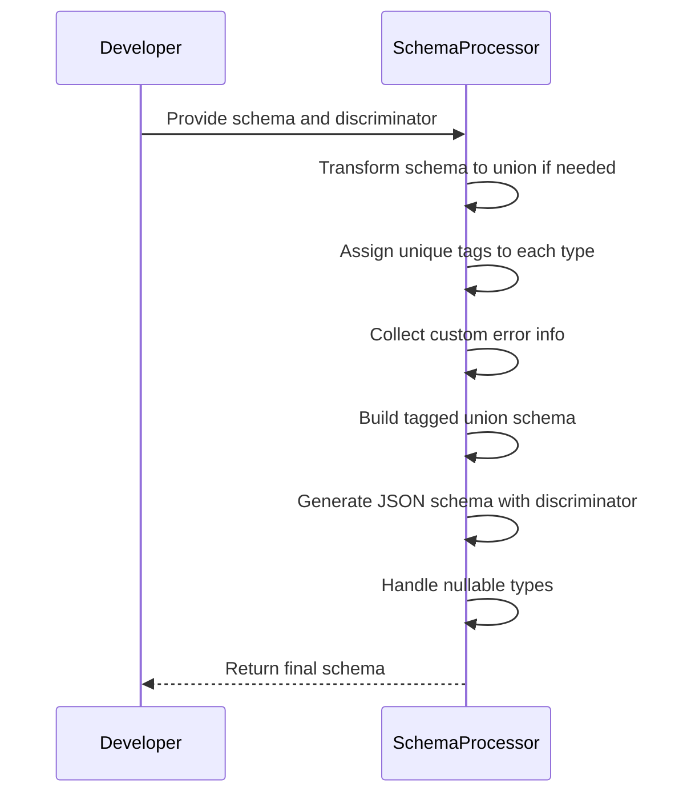
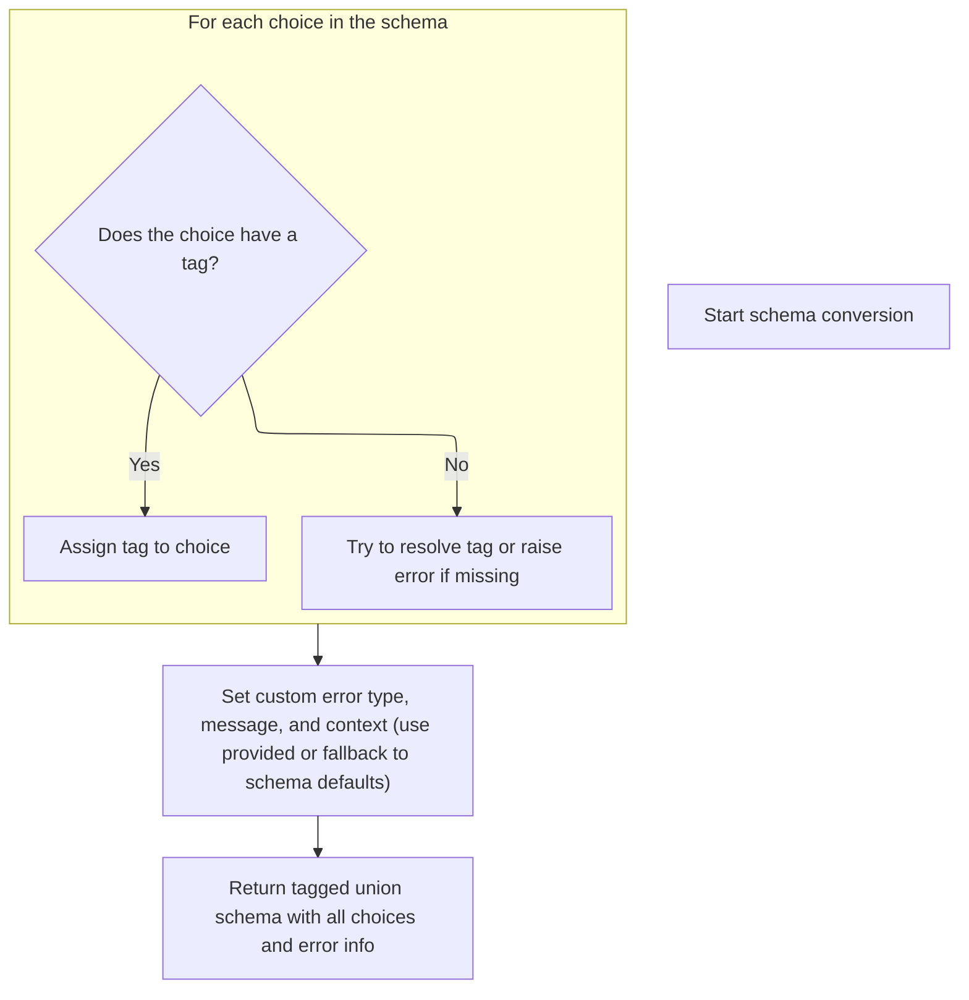

This document explains how tagged union support is added to data schemas using a discriminator field, allowing models to validate and serialize input data based on a specific field. The main steps are: receiving the schema and discriminator, transforming the schema into a union if needed, assigning unique tags to each type, collecting custom error information, building the tagged union schema, generating the JSON schema, handling nullable types, and returning the final schema ready for use.



# Spec

## Detailed View of the Program's Functionality

a. Entry Point: Applying the Discriminator

The process begins by receiving a schema and a discriminator (which can be a string or a special object). The code checks if the discriminator is a special object (an instance of a custom class). If it is, and its internal value is a string, the string is extracted and used as the discriminator. If not, a custom method is called to transform the schema using custom logic. If the discriminator is not a special object, standard tagged union logic is used to transform the schema.

b. Preparing the Union Schema

If the schema is not already a union, it is wrapped as a union to ensure consistent handling. For each choice in the union, the code ensures that a tag is present for discrimination. If a tag is missing, an error is raised. The code then gathers any custom error type, message, and context, either from the provided values or from the schema defaults. Finally, a tagged union schema is returned, which is ready for validation and error handling.

c. Generating the Combined Union JSON Schema

The code receives multiple schema choices and iterates through each one. For each choice, it generates a JSON schema. If a choice is valid for JSON schema generation, it is included in the output; otherwise, it is skipped. After processing all choices, the code checks how many valid schemas remain. If there is only one, it returns that schema directly. If there are multiple, it returns a union schema using the <SwmToken path="pydantic/json_schema.py" pos="1238:10:10" line-data="            # I&#39;ll use &#39;anyOf&#39; for now, but it could be changed it if it would work better with some external tooling">`anyOf`</SwmToken> keyword, which allows any of the choices.

d. Generating JSON Schema for Each Choice

For each schema choice, the code checks if there is an existing schema reference. It then extracts metadata from the schema. If there are updates or extras specified in the metadata, these are applied to the handler stack. The code also applies any modification or annotation functions found in the metadata, wrapping the handler for each function to ensure all modifications are applied in order. After all handler wrapping, the final handler is called to generate the JSON schema. If the schema is a core schema, definitions are populated as needed, and the final JSON schema is returned.

e. Tag Extraction and Tagged Union Construction

During schema conversion, the code loops through each choice in the schema. For each choice, it checks if a tag is present. If a tag is found, it is assigned to the choice. If not, the code tries to resolve the tag or raises an error if it cannot be found. After collecting all tagged choices and error information, the code calls a function to build the final tagged union schema, which includes all choices and error information.

f. Building the Tagged Union JSON Schema

The code starts by generating a schema for the tagged union, which consists of multiple possible types identified by a discriminator. For each tagged choice, it converts any Enum keys to strings and generates the JSON schema for the choice. After all choices are processed, the code deduplicates the schemas and creates a <SwmToken path="pydantic/json_schema.py" pos="1237:27:27" line-data="            # Thanks to the equality check against `null_schema` above, I think &#39;oneOf&#39; would also be valid here;">`oneOf`</SwmToken> schema from all valid choices. If a discriminator field is present, it is added to the schema for compatibility with tools like <SwmToken path="pydantic/json_schema.py" pos="1293:31:31" line-data="        # This reflects the v1 behavior; TODO: we should make it possible to exclude OpenAPI stuff from the JSON schema">`OpenAPI`</SwmToken>. The final schema is then returned.

g. Finalizing the Discriminator Application

After obtaining the schema from the custom conversion logic, the code applies the discriminator logic to the schema. This step attaches the discriminator to the schema, making it ready for validation.

h. Applying the Tagged Union Logic

The process is kicked off by calling a method that unwraps the schema and prepares it for discriminator-based union handling. This is where the actual structure for tagged unions is built.

i. Unwrapping and Preparing Union Choices

The code recursively unwraps nullable and definitions schemas to reach the core schema. If the schema is not a union, it is wrapped as a union. The choices in the union are then reversed and added to a stack for processing. Each choice is processed to ensure it can be uniquely identified by the discriminator. If a choice is itself a compatible tagged union, its choices are merged into the outer tagged union. The code ensures that each discriminator value maps to a unique choice, updating the internal mapping accordingly.

j. Handling Nullable Tagged Unions

After processing all choices, if any were nullable but the schema itself is not, the code wraps the schema in a nullable schema so that null values are accepted where needed. The nullable schema is constructed by combining the inner type schema with a null schema using <SwmToken path="pydantic/json_schema.py" pos="1238:10:10" line-data="            # I&#39;ll use &#39;anyOf&#39; for now, but it could be changed it if it would work better with some external tooling">`anyOf`</SwmToken>. The process is then marked as complete, and the final schema is returned, ready for validation or further use.

# Rule Definition

| Paragraph Name                                                                                                                                                                                                                                                                                                                                                                                                                                                                           | Rule ID | Category          | Description                                                                                                                                                                                                                                                                                                                                                                                                                                                                                                                                                                                                                                                                                                                                                                                                                                                                                                                                                                                                                                                                                                                                                                                                                                                                                                                                                                                                                                                                        | Conditions                                                                                                                                                                                                                                                                                   | Remarks                                                                                                                                                                                                                                                                                                                                                                                                                                                                                                                                                                                                                                                                  |
| ---------------------------------------------------------------------------------------------------------------------------------------------------------------------------------------------------------------------------------------------------------------------------------------------------------------------------------------------------------------------------------------------------------------------------------------------------------------------------------------- | ------- | ----------------- | ---------------------------------------------------------------------------------------------------------------------------------------------------------------------------------------------------------------------------------------------------------------------------------------------------------------------------------------------------------------------------------------------------------------------------------------------------------------------------------------------------------------------------------------------------------------------------------------------------------------------------------------------------------------------------------------------------------------------------------------------------------------------------------------------------------------------------------------------------------------------------------------------------------------------------------------------------------------------------------------------------------------------------------------------------------------------------------------------------------------------------------------------------------------------------------------------------------------------------------------------------------------------------------------------------------------------------------------------------------------------------------------------------------------------------------------------------------------------------------- | -------------------------------------------------------------------------------------------------------------------------------------------------------------------------------------------------------------------------------------------------------------------------------------------- | ------------------------------------------------------------------------------------------------------------------------------------------------------------------------------------------------------------------------------------------------------------------------------------------------------------------------------------------------------------------------------------------------------------------------------------------------------------------------------------------------------------------------------------------------------------------------------------------------------------------------------------------------------------------------ |
| <SwmToken path="pydantic/_internal/_discriminated_union.py" pos="34:2:2" line-data="def apply_discriminator(">`apply_discriminator`</SwmToken>, \_ApplyInferredDiscriminator.apply, <SwmToken path="pydantic/types.py" pos="3081:10:12" line-data="            # `pydantic._internal._discriminated_union._ApplyInferredDiscriminator._apply_to_root`, namely,">`_ApplyInferredDiscriminator._apply_to_root`</SwmToken>                                                                  | RL-001  | Conditional Logic | The system must accept a schema object, which is a dictionary with a required 'type' key and additional keys depending on the type. For union and <SwmToken path="pydantic/_internal/_discriminated_union.py" pos="141:26:28" line-data="        &quot;&quot;&quot;Return a new CoreSchema based on `schema` that uses a tagged-union with the discriminator provided">`tagged-union`</SwmToken> types, the schema must conform to the structures described in the spec.                                                                                                                                                                                                                                                                                                                                                                                                                                                                                                                                                                                                                                                                                                                                                                                                                                                                                                                                                                                                           | A schema object is provided for processing.                                                                                                                                                                                                                                                  | The schema must always be a dictionary with at least a 'type' key. For unions and <SwmToken path="pydantic/_internal/_discriminated_union.py" pos="232:13:15" line-data="        * Coalescing nested unions and compatible tagged-unions">`tagged-unions`</SwmToken>, additional keys such as 'choices', 'discriminator', etc., are required.                                                                                                                                                                                                                                                                                                                            |
| <SwmToken path="pydantic/_internal/_discriminated_union.py" pos="34:2:2" line-data="def apply_discriminator(">`apply_discriminator`</SwmToken>, <SwmToken path="pydantic/_internal/_discriminated_union.py" pos="29:2:2" line-data="def set_discriminator_in_metadata(schema: CoreSchema, discriminator: Any) -&gt; None:">`set_discriminator_in_metadata`</SwmToken>, Discriminator.\_convert_schema                                                                                    | RL-002  | Conditional Logic | The system must support the use of a Discriminator, which may be a string (field name) or a callable, and may include optional custom error type, message, and context. When a Discriminator is applied, if it is a special object (Discriminator instance), custom logic is used; otherwise, standard tagged union logic is used.                                                                                                                                                                                                                                                                                                                                                                                                                                                                                                                                                                                                                                                                                                                                                                                                                                                                                                                                                                                                                                                                                                                                                 | A Discriminator is present in the schema or as an annotation.                                                                                                                                                                                                                                | Discriminator can be a string or callable. Custom error fields: <SwmToken path="pydantic/_internal/_discriminated_union.py" pos="216:1:1" line-data="            custom_error_type=schema.get(&#39;custom_error_type&#39;),">`custom_error_type`</SwmToken>, <SwmToken path="pydantic/_internal/_discriminated_union.py" pos="217:1:1" line-data="            custom_error_message=schema.get(&#39;custom_error_message&#39;),">`custom_error_message`</SwmToken>, <SwmToken path="pydantic/_internal/_discriminated_union.py" pos="218:1:1" line-data="            custom_error_context=schema.get(&#39;custom_error_context&#39;),">`custom_error_context`</SwmToken>. |
| <SwmToken path="pydantic/types.py" pos="3081:10:12" line-data="            # `pydantic._internal._discriminated_union._ApplyInferredDiscriminator._apply_to_root`, namely,">`_ApplyInferredDiscriminator._apply_to_root`</SwmToken>, \_ApplyInferredDiscriminator.\_handle_choice, \_ApplyInferredDiscriminator.\_set_unique_choice_for_values                                                                                                                                           | RL-003  | Conditional Logic | For discriminated unions, the schema is always treated as a union, wrapping <SwmToken path="pydantic/types.py" pos="3079:19:21" line-data="            # This likely indicates that the schema was a single-item union that was simplified.">`single-item`</SwmToken> schemas as a union if necessary. Each choice in a union must have a unique tag for discrimination, either via explicit Tag annotation or by resolving it through a handler. If a tag is missing or ambiguous, an error is raised.                                                                                                                                                                                                                                                                                                                                                                                                                                                                                                                                                                                                                                                                                                                                                                                                                                                                                                                                                                            | Processing a union or <SwmToken path="pydantic/_internal/_discriminated_union.py" pos="141:26:28" line-data="        &quot;&quot;&quot;Return a new CoreSchema based on `schema` that uses a tagged-union with the discriminator provided">`tagged-union`</SwmToken> schema.                 | Tags are stored in metadata under <SwmToken path="pydantic/types.py" pos="3092:10:10" line-data="                tag = metadata.get(&#39;pydantic_internal_union_tag_key&#39;) or tag">`pydantic_internal_union_tag_key`</SwmToken>. Errors are raised if tags are missing or not unique.                                                                                                                                                                                                                                                                                                                                                                                |
| Discriminator.\_convert_schema, <SwmToken path="pydantic/types.py" pos="3081:10:12" line-data="            # `pydantic._internal._discriminated_union._ApplyInferredDiscriminator._apply_to_root`, namely,">`_ApplyInferredDiscriminator._apply_to_root`</SwmToken>                                                                                                                                                                                                                      | RL-004  | Data Assignment   | Any custom error type, message, and context specified in the Discriminator or schema metadata must be gathered and included in the resulting <SwmToken path="pydantic/_internal/_discriminated_union.py" pos="141:26:28" line-data="        &quot;&quot;&quot;Return a new CoreSchema based on `schema` that uses a tagged-union with the discriminator provided">`tagged-union`</SwmToken> schema.                                                                                                                                                                                                                                                                                                                                                                                                                                                                                                                                                                                                                                                                                                                                                                                                                                                                                                                                                                                                                                                                                | Custom error information is present in the Discriminator or schema metadata.                                                                                                                                                                                                                 | Custom error fields: <SwmToken path="pydantic/_internal/_discriminated_union.py" pos="216:1:1" line-data="            custom_error_type=schema.get(&#39;custom_error_type&#39;),">`custom_error_type`</SwmToken>, <SwmToken path="pydantic/_internal/_discriminated_union.py" pos="217:1:1" line-data="            custom_error_message=schema.get(&#39;custom_error_message&#39;),">`custom_error_message`</SwmToken>, <SwmToken path="pydantic/_internal/_discriminated_union.py" pos="218:1:1" line-data="            custom_error_context=schema.get(&#39;custom_error_context&#39;),">`custom_error_context`</SwmToken>.                                            |
| <SwmToken path="pydantic/types.py" pos="3081:10:12" line-data="            # `pydantic._internal._discriminated_union._ApplyInferredDiscriminator._apply_to_root`, namely,">`_ApplyInferredDiscriminator._apply_to_root`</SwmToken>, Discriminator.\_convert_schema                                                                                                                                                                                                                      | RL-005  | Data Assignment   | The system must output a <SwmToken path="pydantic/_internal/_discriminated_union.py" pos="141:26:28" line-data="        &quot;&quot;&quot;Return a new CoreSchema based on `schema` that uses a tagged-union with the discriminator provided">`tagged-union`</SwmToken> schema as a dictionary with required keys: 'type' (must be <SwmToken path="pydantic/_internal/_discriminated_union.py" pos="141:26:28" line-data="        &quot;&quot;&quot;Return a new CoreSchema based on `schema` that uses a tagged-union with the discriminator provided">`tagged-union`</SwmToken>), 'choices' (mapping tag values to schemas), and 'discriminator' (field name, list, or callable). Optional keys include custom error fields, 'strict', <SwmToken path="pydantic/_internal/_discriminated_union.py" pos="220:1:1" line-data="            from_attributes=True,">`from_attributes`</SwmToken>, 'ref', 'metadata', and 'serialization'.                                                                                                                                                                                                                                                                                                                                                                                                                                                                                                                                             | A <SwmToken path="pydantic/_internal/_discriminated_union.py" pos="141:26:28" line-data="        &quot;&quot;&quot;Return a new CoreSchema based on `schema` that uses a tagged-union with the discriminator provided">`tagged-union`</SwmToken> schema is being produced.                   | Output format: dictionary with required and optional keys as described. 'choices' is a dict mapping tags (usually strings) to schema dicts.                                                                                                                                                                                                                                                                                                                                                                                                                                                                                                                              |
| GenerateJsonSchema.union_schema, GenerateJsonSchema.tagged_union_schema                                                                                                                                                                                                                                                                                                                                                                                                                  | RL-006  | Computation       | The system must generate a JSON schema for a union schema by producing either a single schema (if only one valid choice exists) or an <SwmToken path="pydantic/json_schema.py" pos="1238:10:10" line-data="            # I&#39;ll use &#39;anyOf&#39; for now, but it could be changed it if it would work better with some external tooling">`anyOf`</SwmToken> schema containing all valid choices. For a <SwmToken path="pydantic/_internal/_discriminated_union.py" pos="141:26:28" line-data="        &quot;&quot;&quot;Return a new CoreSchema based on `schema` that uses a tagged-union with the discriminator provided">`tagged-union`</SwmToken> schema, a <SwmToken path="pydantic/json_schema.py" pos="1237:27:27" line-data="            # Thanks to the equality check against `null_schema` above, I think &#39;oneOf&#39; would also be valid here;">`oneOf`</SwmToken> schema containing all valid choices must be produced, and a discriminator field added if required for compatibility (<SwmToken path="pydantic/_internal/_discriminated_union.py" pos="266:15:17" line-data="                    &#39;union type and not the list (e.g. `list[Annotated[&lt;T&gt; \| &lt;U&gt;, Field(discriminator=...)]]`).&#39;">`e.g`</SwmToken>., <SwmToken path="pydantic/json_schema.py" pos="1293:31:31" line-data="        # This reflects the v1 behavior; TODO: we should make it possible to exclude OpenAPI stuff from the JSON schema">`OpenAPI`</SwmToken>). | Generating JSON schema for a union or <SwmToken path="pydantic/_internal/_discriminated_union.py" pos="141:26:28" line-data="        &quot;&quot;&quot;Return a new CoreSchema based on `schema` that uses a tagged-union with the discriminator provided">`tagged-union`</SwmToken> schema. | Union: output is a single schema or {<SwmToken path="pydantic/json_schema.py" pos="1238:10:10" line-data="            # I&#39;ll use &#39;anyOf&#39; for now, but it could be changed it if it would work better with some external tooling">`anyOf`</SwmToken>: \[schemas\]}. Tagged-union: output is {<SwmToken path="pydantic/json_schema.py" pos="1237:27:27" line-data="            # Thanks to the equality check against `null_schema` above, I think &#39;oneOf&#39; would also be valid here;">`oneOf`</SwmToken>: \[schemas\], 'discriminator': ...} if needed.                                                                                                |
| <SwmToken path="pydantic/types.py" pos="3081:10:12" line-data="            # `pydantic._internal._discriminated_union._ApplyInferredDiscriminator._apply_to_root`, namely,">`_ApplyInferredDiscriminator._apply_to_root`</SwmToken>, GenerateJsonSchema.nullable_schema                                                                                                                                                                                                                  | RL-007  | Conditional Logic | The system must support nullable schemas, which must have the structure {'type': 'nullable', 'schema': <SwmToken path="pydantic/types.py" pos="1700:1:1" line-data="        inner_schema = handler.generate_schema(inner_type)  # type: ignore">`inner_schema`</SwmToken>}. When generating a JSON schema for a nullable schema, the output must accept both the inner type and null values, typically by combining them with <SwmToken path="pydantic/json_schema.py" pos="1238:10:10" line-data="            # I&#39;ll use &#39;anyOf&#39; for now, but it could be changed it if it would work better with some external tooling">`anyOf`</SwmToken>. The nullable wrapper must be applied at the outermost level.                                                                                                                                                                                                                                                                                                                                                                                                                                                                                                                                                                                                                                                                                                                                                             | Processing or generating a nullable schema.                                                                                                                                                                                                                                                  | Nullable schema: {'type': 'nullable', 'schema': ...}. JSON schema: {<SwmToken path="pydantic/json_schema.py" pos="1238:10:10" line-data="            # I&#39;ll use &#39;anyOf&#39; for now, but it could be changed it if it would work better with some external tooling">`anyOf`</SwmToken>: \[<SwmToken path="pydantic/types.py" pos="1700:1:1" line-data="        inner_schema = handler.generate_schema(inner_type)  # type: ignore">`inner_schema`</SwmToken>, {'type': 'null'}\]}                                                                                                                                                                                |
| Tag.<SwmToken path="pydantic/types.py" pos="2869:1:1" line-data="    get_pydantic_core_schema: Callable[[Any, GetCoreSchemaHandler], CoreSchema] \| None = None">`get_pydantic_core_schema`</SwmToken>, \_ApplyInferredDiscriminator.\_handle_choice                                                                                                                                                                                                                                     | RL-008  | Data Assignment   | When a Tag annotation is used, its value must be stored in the schema's metadata under the key <SwmToken path="pydantic/types.py" pos="3092:10:10" line-data="                tag = metadata.get(&#39;pydantic_internal_union_tag_key&#39;) or tag">`pydantic_internal_union_tag_key`</SwmToken>.                                                                                                                                                                                                                                                                                                                                                                                                                                                                                                                                                                                                                                                                                                                                                                                                                                                                                                                                                                                                                                                                                                                                                                                  | A Tag annotation is present on a union choice.                                                                                                                                                                                                                                               | Metadata key: <SwmToken path="pydantic/types.py" pos="3092:10:10" line-data="                tag = metadata.get(&#39;pydantic_internal_union_tag_key&#39;) or tag">`pydantic_internal_union_tag_key`</SwmToken>.                                                                                                                                                                                                                                                                                                                                                                                                                                                         |
| <SwmToken path="pydantic/types.py" pos="3081:10:12" line-data="            # `pydantic._internal._discriminated_union._ApplyInferredDiscriminator._apply_to_root`, namely,">`_ApplyInferredDiscriminator._apply_to_root`</SwmToken>, Discriminator.\_convert_schema                                                                                                                                                                                                                      | RL-009  | Data Assignment   | The system must allow for arbitrary metadata and serialization information to be attached to any schema via the 'metadata' and 'serialization' keys.                                                                                                                                                                                                                                                                                                                                                                                                                                                                                                                                                                                                                                                                                                                                                                                                                                                                                                                                                                                                                                                                                                                                                                                                                                                                                                                               | Any schema is being processed or output.                                                                                                                                                                                                                                                     | Keys: 'metadata' (dict), 'serialization' (any serializable info).                                                                                                                                                                                                                                                                                                                                                                                                                                                                                                                                                                                                        |
| <SwmToken path="pydantic/types.py" pos="3081:10:12" line-data="            # `pydantic._internal._discriminated_union._ApplyInferredDiscriminator._apply_to_root`, namely,">`_ApplyInferredDiscriminator._apply_to_root`</SwmToken>, Discriminator.\_convert_schema, <SwmToken path="pydantic/json_schema.py" pos="96:4:4" line-data="See [`GenerateJsonSchema.render_warning_message`][pydantic.json_schema.GenerateJsonSchema.render_warning_message]">`GenerateJsonSchema`</SwmToken> | RL-010  | Data Assignment   | The system must ensure that all schemas, including those for union, <SwmToken path="pydantic/_internal/_discriminated_union.py" pos="141:26:28" line-data="        &quot;&quot;&quot;Return a new CoreSchema based on `schema` that uses a tagged-union with the discriminator provided">`tagged-union`</SwmToken>, and nullable types, are output as dictionaries conforming to the structures described in the spec.                                                                                                                                                                                                                                                                                                                                                                                                                                                                                                                                                                                                                                                                                                                                                                                                                                                                                                                                                                                                                                                             | Any schema is being output.                                                                                                                                                                                                                                                                  | Output is always a dictionary with required and optional keys as per the schema type.                                                                                                                                                                                                                                                                                                                                                                                                                                                                                                                                                                                    |

# User Stories

## User Story 1: Schema Processing, Output, and Extensibility

---

### Story Description:

As a system user, I want to provide schema objects for various types (including unions, <SwmToken path="pydantic/_internal/_discriminated_union.py" pos="232:13:15" line-data="        * Coalescing nested unions and compatible tagged-unions">`tagged-unions`</SwmToken>, and nullable types), attach arbitrary metadata and serialization information, and receive output schemas as dictionaries conforming to the required structures, so that I can reliably define, extend, and validate data models.

---

### Business Rule Mapping:

| Rule ID | Paragraph Name                                                                                                                                                                                                                                                                                                                                                                                                                                                                           | Rule Description                                                                                                                                                                                                                                                                                                                                                                                                                                                         |
| ------- | ---------------------------------------------------------------------------------------------------------------------------------------------------------------------------------------------------------------------------------------------------------------------------------------------------------------------------------------------------------------------------------------------------------------------------------------------------------------------------------------- | ------------------------------------------------------------------------------------------------------------------------------------------------------------------------------------------------------------------------------------------------------------------------------------------------------------------------------------------------------------------------------------------------------------------------------------------------------------------------ |
| RL-001  | <SwmToken path="pydantic/_internal/_discriminated_union.py" pos="34:2:2" line-data="def apply_discriminator(">`apply_discriminator`</SwmToken>, \_ApplyInferredDiscriminator.apply, <SwmToken path="pydantic/types.py" pos="3081:10:12" line-data="            # `pydantic._internal._discriminated_union._ApplyInferredDiscriminator._apply_to_root`, namely,">`_ApplyInferredDiscriminator._apply_to_root`</SwmToken>                                                                  | The system must accept a schema object, which is a dictionary with a required 'type' key and additional keys depending on the type. For union and <SwmToken path="pydantic/_internal/_discriminated_union.py" pos="141:26:28" line-data="        &quot;&quot;&quot;Return a new CoreSchema based on `schema` that uses a tagged-union with the discriminator provided">`tagged-union`</SwmToken> types, the schema must conform to the structures described in the spec. |
| RL-009  | <SwmToken path="pydantic/types.py" pos="3081:10:12" line-data="            # `pydantic._internal._discriminated_union._ApplyInferredDiscriminator._apply_to_root`, namely,">`_ApplyInferredDiscriminator._apply_to_root`</SwmToken>, Discriminator.\_convert_schema                                                                                                                                                                                                                      | The system must allow for arbitrary metadata and serialization information to be attached to any schema via the 'metadata' and 'serialization' keys.                                                                                                                                                                                                                                                                                                                     |
| RL-010  | <SwmToken path="pydantic/types.py" pos="3081:10:12" line-data="            # `pydantic._internal._discriminated_union._ApplyInferredDiscriminator._apply_to_root`, namely,">`_ApplyInferredDiscriminator._apply_to_root`</SwmToken>, Discriminator.\_convert_schema, <SwmToken path="pydantic/json_schema.py" pos="96:4:4" line-data="See [`GenerateJsonSchema.render_warning_message`][pydantic.json_schema.GenerateJsonSchema.render_warning_message]">`GenerateJsonSchema`</SwmToken> | The system must ensure that all schemas, including those for union, <SwmToken path="pydantic/_internal/_discriminated_union.py" pos="141:26:28" line-data="        &quot;&quot;&quot;Return a new CoreSchema based on `schema` that uses a tagged-union with the discriminator provided">`tagged-union`</SwmToken>, and nullable types, are output as dictionaries conforming to the structures described in the spec.                                                   |

---

### Relevant Functionality:

- <SwmToken path="pydantic/_internal/_discriminated_union.py" pos="34:2:2" line-data="def apply_discriminator(">`apply_discriminator`</SwmToken>
  1. **RL-001:**
     - When a schema is received:
       - Check that it is a dictionary and contains a 'type' key.
       - For union/tagged-union types, validate that all required keys are present according to the spec.
- <SwmToken path="pydantic/types.py" pos="3081:10:12" line-data="            # `pydantic._internal._discriminated_union._ApplyInferredDiscriminator._apply_to_root`, namely,">`_ApplyInferredDiscriminator._apply_to_root`</SwmToken>
  1. **RL-009:**
     - When building or transforming schemas:
       - Preserve and propagate 'metadata' and 'serialization' keys if present.
  2. **RL-010:**
     - Before returning any schema:
       - Ensure it is a dictionary with the correct keys and structure for its type.

## User Story 2: Discriminator and Tagged-Union Handling

---

### Story Description:

As a system user, I want to use discriminators (strings or callables) in union and <SwmToken path="pydantic/_internal/_discriminated_union.py" pos="141:26:28" line-data="        &quot;&quot;&quot;Return a new CoreSchema based on `schema` that uses a tagged-union with the discriminator provided">`tagged-union`</SwmToken> schemas, including support for custom error types, messages, and context, so that I can unambiguously distinguish between schema choices and handle errors appropriately.

---

### Business Rule Mapping:

| Rule ID | Paragraph Name                                                                                                                                                                                                                                                                                                                                                                                        | Rule Description                                                                                                                                                                                                                                                                                                                                                                                                                                                                                                                                                                                                                                                                                                                                                                                                                                                                                                                       |
| ------- | ----------------------------------------------------------------------------------------------------------------------------------------------------------------------------------------------------------------------------------------------------------------------------------------------------------------------------------------------------------------------------------------------------- | -------------------------------------------------------------------------------------------------------------------------------------------------------------------------------------------------------------------------------------------------------------------------------------------------------------------------------------------------------------------------------------------------------------------------------------------------------------------------------------------------------------------------------------------------------------------------------------------------------------------------------------------------------------------------------------------------------------------------------------------------------------------------------------------------------------------------------------------------------------------------------------------------------------------------------------- |
| RL-002  | <SwmToken path="pydantic/_internal/_discriminated_union.py" pos="34:2:2" line-data="def apply_discriminator(">`apply_discriminator`</SwmToken>, <SwmToken path="pydantic/_internal/_discriminated_union.py" pos="29:2:2" line-data="def set_discriminator_in_metadata(schema: CoreSchema, discriminator: Any) -&gt; None:">`set_discriminator_in_metadata`</SwmToken>, Discriminator.\_convert_schema | The system must support the use of a Discriminator, which may be a string (field name) or a callable, and may include optional custom error type, message, and context. When a Discriminator is applied, if it is a special object (Discriminator instance), custom logic is used; otherwise, standard tagged union logic is used.                                                                                                                                                                                                                                                                                                                                                                                                                                                                                                                                                                                                     |
| RL-003  | <SwmToken path="pydantic/types.py" pos="3081:10:12" line-data="            # `pydantic._internal._discriminated_union._ApplyInferredDiscriminator._apply_to_root`, namely,">`_ApplyInferredDiscriminator._apply_to_root`</SwmToken>, \_ApplyInferredDiscriminator.\_handle_choice, \_ApplyInferredDiscriminator.\_set_unique_choice_for_values                                                        | For discriminated unions, the schema is always treated as a union, wrapping <SwmToken path="pydantic/types.py" pos="3079:19:21" line-data="            # This likely indicates that the schema was a single-item union that was simplified.">`single-item`</SwmToken> schemas as a union if necessary. Each choice in a union must have a unique tag for discrimination, either via explicit Tag annotation or by resolving it through a handler. If a tag is missing or ambiguous, an error is raised.                                                                                                                                                                                                                                                                                                                                                                                                                                |
| RL-005  | <SwmToken path="pydantic/types.py" pos="3081:10:12" line-data="            # `pydantic._internal._discriminated_union._ApplyInferredDiscriminator._apply_to_root`, namely,">`_ApplyInferredDiscriminator._apply_to_root`</SwmToken>, Discriminator.\_convert_schema                                                                                                                                   | The system must output a <SwmToken path="pydantic/_internal/_discriminated_union.py" pos="141:26:28" line-data="        &quot;&quot;&quot;Return a new CoreSchema based on `schema` that uses a tagged-union with the discriminator provided">`tagged-union`</SwmToken> schema as a dictionary with required keys: 'type' (must be <SwmToken path="pydantic/_internal/_discriminated_union.py" pos="141:26:28" line-data="        &quot;&quot;&quot;Return a new CoreSchema based on `schema` that uses a tagged-union with the discriminator provided">`tagged-union`</SwmToken>), 'choices' (mapping tag values to schemas), and 'discriminator' (field name, list, or callable). Optional keys include custom error fields, 'strict', <SwmToken path="pydantic/_internal/_discriminated_union.py" pos="220:1:1" line-data="            from_attributes=True,">`from_attributes`</SwmToken>, 'ref', 'metadata', and 'serialization'. |
| RL-004  | Discriminator.\_convert_schema, <SwmToken path="pydantic/types.py" pos="3081:10:12" line-data="            # `pydantic._internal._discriminated_union._ApplyInferredDiscriminator._apply_to_root`, namely,">`_ApplyInferredDiscriminator._apply_to_root`</SwmToken>                                                                                                                                   | Any custom error type, message, and context specified in the Discriminator or schema metadata must be gathered and included in the resulting <SwmToken path="pydantic/_internal/_discriminated_union.py" pos="141:26:28" line-data="        &quot;&quot;&quot;Return a new CoreSchema based on `schema` that uses a tagged-union with the discriminator provided">`tagged-union`</SwmToken> schema.                                                                                                                                                                                                                                                                                                                                                                                                                                                                                                                                    |

---

### Relevant Functionality:

- <SwmToken path="pydantic/_internal/_discriminated_union.py" pos="34:2:2" line-data="def apply_discriminator(">`apply_discriminator`</SwmToken>
  1. **RL-002:**
     - If discriminator is a Discriminator instance:
       - If <SwmToken path="pydantic/_internal/_discriminated_union.py" pos="65:5:7" line-data="        if isinstance(discriminator.discriminator, str):">`discriminator.discriminator`</SwmToken> is a string, use it as the field name.
       - If <SwmToken path="pydantic/_internal/_discriminated_union.py" pos="65:5:7" line-data="        if isinstance(discriminator.discriminator, str):">`discriminator.discriminator`</SwmToken> is a callable, use custom logic to transform the schema.
     - Otherwise, use standard tagged union logic.
- <SwmToken path="pydantic/types.py" pos="3081:10:12" line-data="            # `pydantic._internal._discriminated_union._ApplyInferredDiscriminator._apply_to_root`, namely,">`_ApplyInferredDiscriminator._apply_to_root`</SwmToken>
  1. **RL-003:**
     - If schema is not a union, wrap it as a union.
     - For each choice in the union:
       - Ensure a unique tag is present (from Tag annotation or resolved).
       - If missing or ambiguous, raise an error.
  2. **RL-005:**
     - Build a dictionary with:
       - 'type': <SwmToken path="pydantic/_internal/_discriminated_union.py" pos="141:26:28" line-data="        &quot;&quot;&quot;Return a new CoreSchema based on `schema` that uses a tagged-union with the discriminator provided">`tagged-union`</SwmToken>
       - 'choices': {tag_value: schema_dict, ...}
       - 'discriminator': field name, list, or callable
       - Include optional keys if present.
- **Discriminator.\_convert_schema**
  1. **RL-004:**
     - When building a <SwmToken path="pydantic/_internal/_discriminated_union.py" pos="141:26:28" line-data="        &quot;&quot;&quot;Return a new CoreSchema based on `schema` that uses a tagged-union with the discriminator provided">`tagged-union`</SwmToken> schema:
       - Collect custom error fields from Discriminator and schema metadata.
       - Assign them to the output <SwmToken path="pydantic/_internal/_discriminated_union.py" pos="141:26:28" line-data="        &quot;&quot;&quot;Return a new CoreSchema based on `schema` that uses a tagged-union with the discriminator provided">`tagged-union`</SwmToken> schema dictionary.

## User Story 3: JSON Schema Generation for Unions, Tagged-Unions, and Nullable Types

---

### Story Description:

As a system user, I want the system to generate correct JSON schemas for union, <SwmToken path="pydantic/_internal/_discriminated_union.py" pos="141:26:28" line-data="        &quot;&quot;&quot;Return a new CoreSchema based on `schema` that uses a tagged-union with the discriminator provided">`tagged-union`</SwmToken>, and nullable types, so that I can integrate with tools and specifications like <SwmToken path="pydantic/json_schema.py" pos="1293:31:31" line-data="        # This reflects the v1 behavior; TODO: we should make it possible to exclude OpenAPI stuff from the JSON schema">`OpenAPI`</SwmToken> and ensure compatibility.

---

### Business Rule Mapping:

| Rule ID | Paragraph Name                                                                                                                                                                                                                                                          | Rule Description                                                                                                                                                                                                                                                                                                                                                                                                                                                                                                                                                                                                                                                                                                                                                                                                                                                                                                                                                                                                                                                                                                                                                                                                                                                                                                                                                                                                                                                                   |
| ------- | ----------------------------------------------------------------------------------------------------------------------------------------------------------------------------------------------------------------------------------------------------------------------- | ---------------------------------------------------------------------------------------------------------------------------------------------------------------------------------------------------------------------------------------------------------------------------------------------------------------------------------------------------------------------------------------------------------------------------------------------------------------------------------------------------------------------------------------------------------------------------------------------------------------------------------------------------------------------------------------------------------------------------------------------------------------------------------------------------------------------------------------------------------------------------------------------------------------------------------------------------------------------------------------------------------------------------------------------------------------------------------------------------------------------------------------------------------------------------------------------------------------------------------------------------------------------------------------------------------------------------------------------------------------------------------------------------------------------------------------------------------------------------------- |
| RL-006  | GenerateJsonSchema.union_schema, GenerateJsonSchema.tagged_union_schema                                                                                                                                                                                                 | The system must generate a JSON schema for a union schema by producing either a single schema (if only one valid choice exists) or an <SwmToken path="pydantic/json_schema.py" pos="1238:10:10" line-data="            # I&#39;ll use &#39;anyOf&#39; for now, but it could be changed it if it would work better with some external tooling">`anyOf`</SwmToken> schema containing all valid choices. For a <SwmToken path="pydantic/_internal/_discriminated_union.py" pos="141:26:28" line-data="        &quot;&quot;&quot;Return a new CoreSchema based on `schema` that uses a tagged-union with the discriminator provided">`tagged-union`</SwmToken> schema, a <SwmToken path="pydantic/json_schema.py" pos="1237:27:27" line-data="            # Thanks to the equality check against `null_schema` above, I think &#39;oneOf&#39; would also be valid here;">`oneOf`</SwmToken> schema containing all valid choices must be produced, and a discriminator field added if required for compatibility (<SwmToken path="pydantic/_internal/_discriminated_union.py" pos="266:15:17" line-data="                    &#39;union type and not the list (e.g. `list[Annotated[&lt;T&gt; \| &lt;U&gt;, Field(discriminator=...)]]`).&#39;">`e.g`</SwmToken>., <SwmToken path="pydantic/json_schema.py" pos="1293:31:31" line-data="        # This reflects the v1 behavior; TODO: we should make it possible to exclude OpenAPI stuff from the JSON schema">`OpenAPI`</SwmToken>). |
| RL-007  | <SwmToken path="pydantic/types.py" pos="3081:10:12" line-data="            # `pydantic._internal._discriminated_union._ApplyInferredDiscriminator._apply_to_root`, namely,">`_ApplyInferredDiscriminator._apply_to_root`</SwmToken>, GenerateJsonSchema.nullable_schema | The system must support nullable schemas, which must have the structure {'type': 'nullable', 'schema': <SwmToken path="pydantic/types.py" pos="1700:1:1" line-data="        inner_schema = handler.generate_schema(inner_type)  # type: ignore">`inner_schema`</SwmToken>}. When generating a JSON schema for a nullable schema, the output must accept both the inner type and null values, typically by combining them with <SwmToken path="pydantic/json_schema.py" pos="1238:10:10" line-data="            # I&#39;ll use &#39;anyOf&#39; for now, but it could be changed it if it would work better with some external tooling">`anyOf`</SwmToken>. The nullable wrapper must be applied at the outermost level.                                                                                                                                                                                                                                                                                                                                                                                                                                                                                                                                                                                                                                                                                                                                                             |

---

### Relevant Functionality:

- **GenerateJsonSchema.union_schema**
  1. **RL-006:**
     - For union:
       - Collect valid choices, skipping omitted or invalid ones.
       - If one choice, output that schema; else, output {<SwmToken path="pydantic/json_schema.py" pos="1238:10:10" line-data="            # I&#39;ll use &#39;anyOf&#39; for now, but it could be changed it if it would work better with some external tooling">`anyOf`</SwmToken>: \[choices\]}.
     - For <SwmToken path="pydantic/_internal/_discriminated_union.py" pos="141:26:28" line-data="        &quot;&quot;&quot;Return a new CoreSchema based on `schema` that uses a tagged-union with the discriminator provided">`tagged-union`</SwmToken>:
       - Map tags to generated schemas.
       - Output {<SwmToken path="pydantic/json_schema.py" pos="1237:27:27" line-data="            # Thanks to the equality check against `null_schema` above, I think &#39;oneOf&#39; would also be valid here;">`oneOf`</SwmToken>: \[schemas\], 'discriminator': ...}.
- <SwmToken path="pydantic/types.py" pos="3081:10:12" line-data="            # `pydantic._internal._discriminated_union._ApplyInferredDiscriminator._apply_to_root`, namely,">`_ApplyInferredDiscriminator._apply_to_root`</SwmToken>
  1. **RL-007:**
     - If schema is nullable:
       - Ensure the wrapper is at the outermost level.
       - When generating JSON schema, output {<SwmToken path="pydantic/json_schema.py" pos="1238:10:10" line-data="            # I&#39;ll use &#39;anyOf&#39; for now, but it could be changed it if it would work better with some external tooling">`anyOf`</SwmToken>: \[<SwmToken path="pydantic/types.py" pos="1700:1:1" line-data="        inner_schema = handler.generate_schema(inner_type)  # type: ignore">`inner_schema`</SwmToken>, {'type': 'null'}\]}.

## User Story 4: Tag Annotations and Unique Tag Enforcement

---

### Story Description:

As a system user, I want to use Tag annotations on union choices and have their values stored in schema metadata, ensuring each choice is uniquely identifiable, so that schema discrimination is reliable and unambiguous.

---

### Business Rule Mapping:

| Rule ID | Paragraph Name                                                                                                                                                                                                                                                                                                                                 | Rule Description                                                                                                                                                                                                                                                                                                                                                                                                                                                                                        |
| ------- | ---------------------------------------------------------------------------------------------------------------------------------------------------------------------------------------------------------------------------------------------------------------------------------------------------------------------------------------------- | ------------------------------------------------------------------------------------------------------------------------------------------------------------------------------------------------------------------------------------------------------------------------------------------------------------------------------------------------------------------------------------------------------------------------------------------------------------------------------------------------------- |
| RL-003  | <SwmToken path="pydantic/types.py" pos="3081:10:12" line-data="            # `pydantic._internal._discriminated_union._ApplyInferredDiscriminator._apply_to_root`, namely,">`_ApplyInferredDiscriminator._apply_to_root`</SwmToken>, \_ApplyInferredDiscriminator.\_handle_choice, \_ApplyInferredDiscriminator.\_set_unique_choice_for_values | For discriminated unions, the schema is always treated as a union, wrapping <SwmToken path="pydantic/types.py" pos="3079:19:21" line-data="            # This likely indicates that the schema was a single-item union that was simplified.">`single-item`</SwmToken> schemas as a union if necessary. Each choice in a union must have a unique tag for discrimination, either via explicit Tag annotation or by resolving it through a handler. If a tag is missing or ambiguous, an error is raised. |
| RL-008  | Tag.<SwmToken path="pydantic/types.py" pos="2869:1:1" line-data="    get_pydantic_core_schema: Callable[[Any, GetCoreSchemaHandler], CoreSchema] \| None = None">`get_pydantic_core_schema`</SwmToken>, \_ApplyInferredDiscriminator.\_handle_choice                                                                                           | When a Tag annotation is used, its value must be stored in the schema's metadata under the key <SwmToken path="pydantic/types.py" pos="3092:10:10" line-data="                tag = metadata.get(&#39;pydantic_internal_union_tag_key&#39;) or tag">`pydantic_internal_union_tag_key`</SwmToken>.                                                                                                                                                                                                       |

---

### Relevant Functionality:

- <SwmToken path="pydantic/types.py" pos="3081:10:12" line-data="            # `pydantic._internal._discriminated_union._ApplyInferredDiscriminator._apply_to_root`, namely,">`_ApplyInferredDiscriminator._apply_to_root`</SwmToken>
  1. **RL-003:**
     - If schema is not a union, wrap it as a union.
     - For each choice in the union:
       - Ensure a unique tag is present (from Tag annotation or resolved).
       - If missing or ambiguous, raise an error.
- **Tag.get_pydantic_core_schema**
  1. **RL-008:**
     - On processing a Tag annotation:
       - Store its value in the schema's metadata under <SwmToken path="pydantic/types.py" pos="3092:10:10" line-data="                tag = metadata.get(&#39;pydantic_internal_union_tag_key&#39;) or tag">`pydantic_internal_union_tag_key`</SwmToken>.

# Code Walkthrough

## Starting the Discriminator Application

```mermaid
%%{init: {"flowchart": {"defaultRenderer": "elk"}} }%%
flowchart TD
    node1["Receive schema and discriminator"] --> node2{"Is discriminator a special object?"}
    click node1 openCode "pydantic/_internal/_discriminated_union.py:34:68"
    node2 -->|"Yes"| node3["Transform schema using custom discriminator logic"]
    click node2 openCode "pydantic/_internal/_discriminated_union.py:64:68"
    click node3 openCode "pydantic/types.py:3075:3075"
    node2 -->|"No"| node4["Transform schema using standard tagged union logic"]
    click node4 openCode "pydantic/json_schema.py:1266:1266"


subgraph node3 [_convert_schema]
  sgmain_1_node1["If schema is not a union, wrap it as a union"]
  click sgmain_1_node1 openCode "pydantic/types.py:3078:3083"
  sgmain_1_node1 --> sgmain_1_node2["For each choice: ensure it has a tag for discrimination (raise error if missing)"]
  click sgmain_1_node2 openCode "pydantic/types.py:3085:3111"
  sgmain_1_node2 --> sgmain_1_node3["Gather custom error type, message, and context"]
  click sgmain_1_node3 openCode "pydantic/types.py:3113:3126"
  sgmain_1_node3 --> sgmain_1_node4["Return a tagged union schema for validation and error handling"]
  click sgmain_1_node4 openCode "pydantic/types.py:3127:3137"
  subgraph sgmain_1_loop1["For each choice in the union"]
  sgmain_1_node2
  end
end

subgraph node4 [tagged_union_schema]
  sgmain_2_node1["Start: Generate schema for tagged union (multiple possible types, identified by discriminator)"] --> sgmain_2_loop1
  click sgmain_2_node1 openCode "pydantic/json_schema.py:1266:1277"
  subgraph sgmain_2_loop1["For each possible choice in the tagged union"]
  sgmain_2_node2{"Is this choice valid for inclusion?"}
  click sgmain_2_node2 openCode "pydantic/json_schema.py:1278:1288"
  sgmain_2_node2 -->|"Valid"| sgmain_2_node3["Generate schema for this choice"]
  click sgmain_2_node3 openCode "pydantic/json_schema.py:1284:1284"
  end
  sgmain_2_loop1 --> sgmain_2_node4["Create oneOf schema from all valid choices"]
  click sgmain_2_node4 openCode "pydantic/json_schema.py:1290:1291"
  sgmain_2_node4 --> sgmain_2_node5{"Add discriminator field to schema?"}
  click sgmain_2_node5 openCode "pydantic/json_schema.py:1294:1299"
  sgmain_2_node5 -->|"Yes"| sgmain_2_node6["Add discriminator info to schema"]
  click sgmain_2_node6 openCode "pydantic/json_schema.py:1296:1299"
  sgmain_2_node5 -->|"No"| sgmain_2_node7["Return final schema"]
  click sgmain_2_node7 openCode "pydantic/json_schema.py:1301:1301"
  sgmain_2_node6 --> sgmain_2_node7
end

%% Swimm:
%% %%{init: {"flowchart": {"defaultRenderer": "elk"}} }%%
%% flowchart TD
%%     node1["Receive schema and discriminator"] --> node2{"Is discriminator a special object?"}
%%     click node1 openCode "<SwmPath>[pydantic/\_internal/\_discriminated_union.py](pydantic/_internal/_discriminated_union.py)</SwmPath>:34:68"
%%     node2 -->|"Yes"| node3["Transform schema using custom discriminator logic"]
%%     click node2 openCode "<SwmPath>[pydantic/\_internal/\_discriminated_union.py](pydantic/_internal/_discriminated_union.py)</SwmPath>:64:68"
%%     click node3 openCode "<SwmPath>[pydantic/types.py](pydantic/types.py)</SwmPath>:3075:3075"
%%     node2 -->|"No"| node4["Transform schema using standard tagged union logic"]
%%     click node4 openCode "<SwmPath>[pydantic/json_schema.py](pydantic/json_schema.py)</SwmPath>:1266:1266"
%% 
%% 
%% subgraph node3 [<SwmToken path="pydantic/_internal/_discriminated_union.py" pos="68:5:5" line-data="            return discriminator._convert_schema(schema)">`_convert_schema`</SwmToken>]
%%   sgmain_1_node1["If schema is not a union, wrap it as a union"]
%%   click sgmain_1_node1 openCode "<SwmPath>[pydantic/types.py](pydantic/types.py)</SwmPath>:3078:3083"
%%   sgmain_1_node1 --> sgmain_1_node2["For each choice: ensure it has a tag for discrimination (raise error if missing)"]
%%   click sgmain_1_node2 openCode "<SwmPath>[pydantic/types.py](pydantic/types.py)</SwmPath>:3085:3111"
%%   sgmain_1_node2 --> sgmain_1_node3["Gather custom error type, message, and context"]
%%   click sgmain_1_node3 openCode "<SwmPath>[pydantic/types.py](pydantic/types.py)</SwmPath>:3113:3126"
%%   sgmain_1_node3 --> sgmain_1_node4["Return a tagged union schema for validation and error handling"]
%%   click sgmain_1_node4 openCode "<SwmPath>[pydantic/types.py](pydantic/types.py)</SwmPath>:3127:3137"
%%   subgraph sgmain_1_loop1["For each choice in the union"]
%%   sgmain_1_node2
%%   end
%% end
%% 
%% subgraph node4 [<SwmToken path="pydantic/_internal/_discriminated_union.py" pos="206:5:5" line-data="            #   to tagged_union_schema below">`tagged_union_schema`</SwmToken>]
%%   sgmain_2_node1["Start: Generate schema for tagged union (multiple possible types, identified by discriminator)"] --> sgmain_2_loop1
%%   click sgmain_2_node1 openCode "<SwmPath>[pydantic/json_schema.py](pydantic/json_schema.py)</SwmPath>:1266:1277"
%%   subgraph sgmain_2_loop1["For each possible choice in the tagged union"]
%%   sgmain_2_node2{"Is this choice valid for inclusion?"}
%%   click sgmain_2_node2 openCode "<SwmPath>[pydantic/json_schema.py](pydantic/json_schema.py)</SwmPath>:1278:1288"
%%   sgmain_2_node2 -->|"Valid"| sgmain_2_node3["Generate schema for this choice"]
%%   click sgmain_2_node3 openCode "<SwmPath>[pydantic/json_schema.py](pydantic/json_schema.py)</SwmPath>:1284:1284"
%%   end
%%   sgmain_2_loop1 --> sgmain_2_node4["Create <SwmToken path="pydantic/json_schema.py" pos="1237:27:27" line-data="            # Thanks to the equality check against `null_schema` above, I think &#39;oneOf&#39; would also be valid here;">`oneOf`</SwmToken> schema from all valid choices"]
%%   click sgmain_2_node4 openCode "<SwmPath>[pydantic/json_schema.py](pydantic/json_schema.py)</SwmPath>:1290:1291"
%%   sgmain_2_node4 --> sgmain_2_node5{"Add discriminator field to schema?"}
%%   click sgmain_2_node5 openCode "<SwmPath>[pydantic/json_schema.py](pydantic/json_schema.py)</SwmPath>:1294:1299"
%%   sgmain_2_node5 -->|"Yes"| sgmain_2_node6["Add discriminator info to schema"]
%%   click sgmain_2_node6 openCode "<SwmPath>[pydantic/json_schema.py](pydantic/json_schema.py)</SwmPath>:1296:1299"
%%   sgmain_2_node5 -->|"No"| sgmain_2_node7["Return final schema"]
%%   click sgmain_2_node7 openCode "<SwmPath>[pydantic/json_schema.py](pydantic/json_schema.py)</SwmPath>:1301:1301"
%%   sgmain_2_node6 --> sgmain_2_node7
%% end
```



<SwmSnippet path="/pydantic/_internal/_discriminated_union.py" line="34">

---

In <SwmToken path="pydantic/_internal/_discriminated_union.py" pos="34:2:2" line-data="def apply_discriminator(">`apply_discriminator`</SwmToken>, we check if the discriminator is a Discriminator instance and, if so, extract the string value or call its <SwmToken path="pydantic/_internal/_discriminated_union.py" pos="68:5:5" line-data="            return discriminator._convert_schema(schema)">`_convert_schema`</SwmToken> method. This is the entry point for handling discriminated unions. We need to call <SwmToken path="pydantic/_internal/_discriminated_union.py" pos="68:5:5" line-data="            return discriminator._convert_schema(schema)">`_convert_schema`</SwmToken> next because it transforms the input schema into a structure that supports tagged unions, which is necessary for the rest of the discriminated union logic to work.

```python
def apply_discriminator(
    schema: core_schema.CoreSchema,
    discriminator: str | Discriminator,
    definitions: dict[str, core_schema.CoreSchema] | None = None,
) -> core_schema.CoreSchema:
    """Applies the discriminator and returns a new core schema.

    Args:
        schema: The input schema.
        discriminator: The name of the field which will serve as the discriminator.
        definitions: A mapping of schema ref to schema.

    Returns:
        The new core schema.

    Raises:
        TypeError:
            - If `discriminator` is used with invalid union variant.
            - If `discriminator` is used with `Union` type with one variant.
            - If `discriminator` value mapped to multiple choices.
        MissingDefinitionForUnionRef:
            If the definition for ref is missing.
        PydanticUserError:
            - If a model in union doesn't have a discriminator field.
            - If discriminator field has a non-string alias.
            - If discriminator fields have different aliases.
            - If discriminator field not of type `Literal`.
    """
    from ..types import Discriminator

    if isinstance(discriminator, Discriminator):
        if isinstance(discriminator.discriminator, str):
            discriminator = discriminator.discriminator
        else:
            return discriminator._convert_schema(schema)

```

---

</SwmSnippet>

### Preparing the Union Schema

```mermaid
%%{init: {"flowchart": {"defaultRenderer": "elk"}} }%%
flowchart TD
  node1["If schema is not a union, wrap it as a union"]
  click node1 openCode "pydantic/types.py:3078:3083"
  node1 --> node2["For each choice: ensure it has a tag for discrimination (raise error if missing)"]
  click node2 openCode "pydantic/types.py:3085:3111"
  node2 --> node3["Gather custom error type, message, and context"]
  click node3 openCode "pydantic/types.py:3113:3126"
  node3 --> node4["Return a tagged union schema for validation and error handling"]
  click node4 openCode "pydantic/types.py:3127:3137"

  subgraph loop1["For each choice in the union"]
    node2
  end


subgraph node2 [union_schema]
  sgmain_1_node1["Receive multiple schema choices"] --> sgmain_1_loop1
  click sgmain_1_node1 openCode "pydantic/json_schema.py:1241:1252"
  subgraph sgmain_1_loop1["For each schema choice"]
  sgmain_1_node2["Generate JSON schema for choice"]
  click sgmain_1_node2 openCode "pydantic/json_schema.py:1253:1257"
  sgmain_1_node2 --> sgmain_1_node3{"Is choice valid for JSON schema?"}
  click sgmain_1_node3 openCode "pydantic/json_schema.py:1258:1261"
  sgmain_1_node3 -->|"Yes"| sgmain_1_node4["Include in output"]
  click sgmain_1_node4 openCode "pydantic/json_schema.py:1257:1257"
  sgmain_1_node3 -->|"No"| sgmain_1_node5["Skip invalid choice"]
  click sgmain_1_node5 openCode "pydantic/json_schema.py:1258:1261"
  end
  sgmain_1_loop1 --> sgmain_1_node6{"How many valid schemas?"}
  click sgmain_1_node6 openCode "pydantic/json_schema.py:1262:1264"
  sgmain_1_node6 -->|"One"| sgmain_1_node7["Return single schema"]
  click sgmain_1_node7 openCode "pydantic/json_schema.py:1263:1263"
  sgmain_1_node6 -->|"Multiple"| sgmain_1_node8["Return union schema (anyOf)"]
  click sgmain_1_node8 openCode "pydantic/json_schema.py:1264:1264"
end

%% Swimm:
%% %%{init: {"flowchart": {"defaultRenderer": "elk"}} }%%
%% flowchart TD
%%   node1["If schema is not a union, wrap it as a union"]
%%   click node1 openCode "<SwmPath>[pydantic/types.py](pydantic/types.py)</SwmPath>:3078:3083"
%%   node1 --> node2["For each choice: ensure it has a tag for discrimination (raise error if missing)"]
%%   click node2 openCode "<SwmPath>[pydantic/types.py](pydantic/types.py)</SwmPath>:3085:3111"
%%   node2 --> node3["Gather custom error type, message, and context"]
%%   click node3 openCode "<SwmPath>[pydantic/types.py](pydantic/types.py)</SwmPath>:3113:3126"
%%   node3 --> node4["Return a tagged union schema for validation and error handling"]
%%   click node4 openCode "<SwmPath>[pydantic/types.py](pydantic/types.py)</SwmPath>:3127:3137"
%% 
%%   subgraph loop1["For each choice in the union"]
%%     node2
%%   end
%% 
%% 
%% subgraph node2 [<SwmToken path="pydantic/_internal/_discriminated_union.py" pos="193:7:7" line-data="            schema = core_schema.union_schema([schema])">`union_schema`</SwmToken>]
%%   sgmain_1_node1["Receive multiple schema choices"] --> sgmain_1_loop1
%%   click sgmain_1_node1 openCode "<SwmPath>[pydantic/json_schema.py](pydantic/json_schema.py)</SwmPath>:1241:1252"
%%   subgraph sgmain_1_loop1["For each schema choice"]
%%   sgmain_1_node2["Generate JSON schema for choice"]
%%   click sgmain_1_node2 openCode "<SwmPath>[pydantic/json_schema.py](pydantic/json_schema.py)</SwmPath>:1253:1257"
%%   sgmain_1_node2 --> sgmain_1_node3{"Is choice valid for JSON schema?"}
%%   click sgmain_1_node3 openCode "<SwmPath>[pydantic/json_schema.py](pydantic/json_schema.py)</SwmPath>:1258:1261"
%%   sgmain_1_node3 -->|"Yes"| sgmain_1_node4["Include in output"]
%%   click sgmain_1_node4 openCode "<SwmPath>[pydantic/json_schema.py](pydantic/json_schema.py)</SwmPath>:1257:1257"
%%   sgmain_1_node3 -->|"No"| sgmain_1_node5["Skip invalid choice"]
%%   click sgmain_1_node5 openCode "<SwmPath>[pydantic/json_schema.py](pydantic/json_schema.py)</SwmPath>:1258:1261"
%%   end
%%   sgmain_1_loop1 --> sgmain_1_node6{"How many valid schemas?"}
%%   click sgmain_1_node6 openCode "<SwmPath>[pydantic/json_schema.py](pydantic/json_schema.py)</SwmPath>:1262:1264"
%%   sgmain_1_node6 -->|"One"| sgmain_1_node7["Return single schema"]
%%   click sgmain_1_node7 openCode "<SwmPath>[pydantic/json_schema.py](pydantic/json_schema.py)</SwmPath>:1263:1263"
%%   sgmain_1_node6 -->|"Multiple"| sgmain_1_node8["Return union schema (<SwmToken path="pydantic/json_schema.py" pos="1238:10:10" line-data="            # I&#39;ll use &#39;anyOf&#39; for now, but it could be changed it if it would work better with some external tooling">`anyOf`</SwmToken>)"]
%%   click sgmain_1_node8 openCode "<SwmPath>[pydantic/json_schema.py](pydantic/json_schema.py)</SwmPath>:1264:1264"
%% end
```



<SwmSnippet path="/pydantic/types.py" line="3075">

---

In <SwmToken path="pydantic/types.py" pos="3075:3:3" line-data="    def _convert_schema(">`_convert_schema`</SwmToken>, we make sure the schema is a union (even if it started as a single item) so the rest of the logic can treat everything as a union. Next up is <SwmToken path="pydantic/types.py" pos="3083:7:7" line-data="            original_schema = core_schema.union_schema([original_schema])">`union_schema`</SwmToken> to generate the combined schema.

```python
    def _convert_schema(
        self, original_schema: core_schema.CoreSchema, handler: GetCoreSchemaHandler | None = None
    ) -> core_schema.TaggedUnionSchema:
        if original_schema['type'] != 'union':
            # This likely indicates that the schema was a single-item union that was simplified.
            # In this case, we do the same thing we do in
            # `pydantic._internal._discriminated_union._ApplyInferredDiscriminator._apply_to_root`, namely,
            # package the generated schema back into a single-item union.
            original_schema = core_schema.union_schema([original_schema])

```

---

</SwmSnippet>

#### Generating the Combined Union JSON Schema

```mermaid
%%{init: {"flowchart": {"defaultRenderer": "elk"}} }%%
flowchart TD
    node1["Receive multiple schema choices"] --> loop1
    click node1 openCode "pydantic/json_schema.py:1241:1252"
    
    subgraph loop1["For each schema choice"]
        node2["Generate JSON schema for choice"]
        click node2 openCode "pydantic/json_schema.py:1253:1257"
        node2 --> node3{"Is choice valid for JSON schema?"}
        click node3 openCode "pydantic/json_schema.py:1258:1261"
        node3 -->|"Yes"| node4["Include in output"]
        click node4 openCode "pydantic/json_schema.py:1257:1257"
        node3 -->|"No"| node5["Skip invalid choice"]
        click node5 openCode "pydantic/json_schema.py:1258:1261"
    end
    loop1 --> node6{"How many valid schemas?"}
    click node6 openCode "pydantic/json_schema.py:1262:1264"
    node6 -->|"One"| node7["Return single schema"]
    click node7 openCode "pydantic/json_schema.py:1263:1263"
    node6 -->|"Multiple"| node8["Return union schema (anyOf)"]
    click node8 openCode "pydantic/json_schema.py:1264:1264"

%% Swimm:
%% %%{init: {"flowchart": {"defaultRenderer": "elk"}} }%%
%% flowchart TD
%%     node1["Receive multiple schema choices"] --> loop1
%%     click node1 openCode "<SwmPath>[pydantic/json_schema.py](pydantic/json_schema.py)</SwmPath>:1241:1252"
%%     
%%     subgraph loop1["For each schema choice"]
%%         node2["Generate JSON schema for choice"]
%%         click node2 openCode "<SwmPath>[pydantic/json_schema.py](pydantic/json_schema.py)</SwmPath>:1253:1257"
%%         node2 --> node3{"Is choice valid for JSON schema?"}
%%         click node3 openCode "<SwmPath>[pydantic/json_schema.py](pydantic/json_schema.py)</SwmPath>:1258:1261"
%%         node3 -->|"Yes"| node4["Include in output"]
%%         click node4 openCode "<SwmPath>[pydantic/json_schema.py](pydantic/json_schema.py)</SwmPath>:1257:1257"
%%         node3 -->|"No"| node5["Skip invalid choice"]
%%         click node5 openCode "<SwmPath>[pydantic/json_schema.py](pydantic/json_schema.py)</SwmPath>:1258:1261"
%%     end
%%     loop1 --> node6{"How many valid schemas?"}
%%     click node6 openCode "<SwmPath>[pydantic/json_schema.py](pydantic/json_schema.py)</SwmPath>:1262:1264"
%%     node6 -->|"One"| node7["Return single schema"]
%%     click node7 openCode "<SwmPath>[pydantic/json_schema.py](pydantic/json_schema.py)</SwmPath>:1263:1263"
%%     node6 -->|"Multiple"| node8["Return union schema (<SwmToken path="pydantic/json_schema.py" pos="1238:10:10" line-data="            # I&#39;ll use &#39;anyOf&#39; for now, but it could be changed it if it would work better with some external tooling">`anyOf`</SwmToken>)"]
%%     click node8 openCode "<SwmPath>[pydantic/json_schema.py](pydantic/json_schema.py)</SwmPath>:1264:1264"
```



<SwmSnippet path="/pydantic/json_schema.py" line="1241">

---

<SwmToken path="pydantic/json_schema.py" pos="1241:3:3" line-data="    def union_schema(self, schema: core_schema.UnionSchema) -&gt; JsonSchemaValue:">`union_schema`</SwmToken> loops through each union choice, handling both direct schemas and tuples with explicit labels. It calls <SwmToken path="pydantic/json_schema.py" pos="1257:7:7" line-data="                generated.append(self.generate_inner(choice_schema))">`generate_inner`</SwmToken> for each, collects the results, and combines them into a single <SwmToken path="pydantic/json_schema.py" pos="1238:10:10" line-data="            # I&#39;ll use &#39;anyOf&#39; for now, but it could be changed it if it would work better with some external tooling">`anyOf`</SwmToken> JSON schema if there are multiple choices. This keeps the schema flat and easy to work with. Next, <SwmToken path="pydantic/json_schema.py" pos="1257:7:7" line-data="                generated.append(self.generate_inner(choice_schema))">`generate_inner`</SwmToken> is called to actually produce the JSON schema for each choice.

```python
    def union_schema(self, schema: core_schema.UnionSchema) -> JsonSchemaValue:
        """Generates a JSON schema that matches a schema that allows values matching any of the given schemas.

        Args:
            schema: The core schema.

        Returns:
            The generated JSON schema.
        """
        generated: list[JsonSchemaValue] = []

        choices = schema['choices']
        for choice in choices:
            # choice will be a tuple if an explicit label was provided
            choice_schema = choice[0] if isinstance(choice, tuple) else choice
            try:
                generated.append(self.generate_inner(choice_schema))
            except PydanticOmit:
                continue
            except PydanticInvalidForJsonSchema as exc:
                self.emit_warning('skipped-choice', exc.message)
        if len(generated) == 1:
            return generated[0]
        return self.get_flattened_anyof(generated)
```

---

</SwmSnippet>

#### Generating JSON Schema for Each Choice

```mermaid
%%{init: {"flowchart": {"defaultRenderer": "elk"}} }%%
flowchart TD
    node1["Check for existing schema reference"] --> node2["Extract metadata from schema"]
    click node1 openCode "pydantic/json_schema.py:443:448"
    click node2 openCode "pydantic/json_schema.py:503:504"
    node2 --> node3{"JS updates present?"}
    click node3 openCode "pydantic/json_schema.py:507:518"
    node3 -- Yes --> node4["Apply updates to handler"]
    click node4 openCode "pydantic/json_schema.py:509:516"
    node3 -- No --> node5
    node4 --> node5
    node5{"JS extras present?"}
    click node5 openCode "pydantic/json_schema.py:518:533"
    node5 -- Yes --> node6["Apply extras to handler"]
    click node6 openCode "pydantic/json_schema.py:521:532"
    node5 -- No --> node7
    node6 --> node7
    subgraph loop1["For each modification function in metadata"]
      node7 --> node8["Apply modification function to handler"]
      click node8 openCode "pydantic/json_schema.py:536:549"
      node8 --> node7
    end
    subgraph loop2["For each annotation function in metadata"]
      node7 --> node9["Apply annotation function to handler"]
      click node9 openCode "pydantic/json_schema.py:554:560"
      node9 --> node7
    end
    node7 --> node10["Generate JSON schema"]
    click node10 openCode "pydantic/json_schema.py:563:564"
    node10 --> node11{"Is schema a core schema?"}
    click node11 openCode "pydantic/json_schema.py:564:565"
    node11 -- Yes --> node12["Populate schema definitions"]
    click node12 openCode "pydantic/json_schema.py:565:566"
    node11 -- No --> node13["Return JSON schema"]
    node12 --> node13
    click node13 openCode "pydantic/json_schema.py:566:566"

%% Swimm:
%% %%{init: {"flowchart": {"defaultRenderer": "elk"}} }%%
%% flowchart TD
%%     node1["Check for existing schema reference"] --> node2["Extract metadata from schema"]
%%     click node1 openCode "<SwmPath>[pydantic/json_schema.py](pydantic/json_schema.py)</SwmPath>:443:448"
%%     click node2 openCode "<SwmPath>[pydantic/json_schema.py](pydantic/json_schema.py)</SwmPath>:503:504"
%%     node2 --> node3{"JS updates present?"}
%%     click node3 openCode "<SwmPath>[pydantic/json_schema.py](pydantic/json_schema.py)</SwmPath>:507:518"
%%     node3 -- Yes --> node4["Apply updates to handler"]
%%     click node4 openCode "<SwmPath>[pydantic/json_schema.py](pydantic/json_schema.py)</SwmPath>:509:516"
%%     node3 -- No --> node5
%%     node4 --> node5
%%     node5{"JS extras present?"}
%%     click node5 openCode "<SwmPath>[pydantic/json_schema.py](pydantic/json_schema.py)</SwmPath>:518:533"
%%     node5 -- Yes --> node6["Apply extras to handler"]
%%     click node6 openCode "<SwmPath>[pydantic/json_schema.py](pydantic/json_schema.py)</SwmPath>:521:532"
%%     node5 -- No --> node7
%%     node6 --> node7
%%     subgraph loop1["For each modification function in metadata"]
%%       node7 --> node8["Apply modification function to handler"]
%%       click node8 openCode "<SwmPath>[pydantic/json_schema.py](pydantic/json_schema.py)</SwmPath>:536:549"
%%       node8 --> node7
%%     end
%%     subgraph loop2["For each annotation function in metadata"]
%%       node7 --> node9["Apply annotation function to handler"]
%%       click node9 openCode "<SwmPath>[pydantic/json_schema.py](pydantic/json_schema.py)</SwmPath>:554:560"
%%       node9 --> node7
%%     end
%%     node7 --> node10["Generate JSON schema"]
%%     click node10 openCode "<SwmPath>[pydantic/json_schema.py](pydantic/json_schema.py)</SwmPath>:563:564"
%%     node10 --> node11{"Is schema a core schema?"}
%%     click node11 openCode "<SwmPath>[pydantic/json_schema.py](pydantic/json_schema.py)</SwmPath>:564:565"
%%     node11 -- Yes --> node12["Populate schema definitions"]
%%     click node12 openCode "<SwmPath>[pydantic/json_schema.py](pydantic/json_schema.py)</SwmPath>:565:566"
%%     node11 -- No --> node13["Return JSON schema"]
%%     node12 --> node13
%%     click node13 openCode "<SwmPath>[pydantic/json_schema.py](pydantic/json_schema.py)</SwmPath>:566:566"
```



<SwmSnippet path="/pydantic/json_schema.py" line="427">

---

In <SwmToken path="pydantic/json_schema.py" pos="427:3:3" line-data="    def generate_inner(self, schema: CoreSchemaOrField) -&gt; JsonSchemaValue:  # noqa: C901">`generate_inner`</SwmToken>, we set up a stack of handler functions that wrap each other to apply updates, extras, and custom modifications to the JSON schema based on metadata. This lets us flexibly tweak the schema at different stages, and also supports caching and reference handling for efficiency.

```python
    def generate_inner(self, schema: CoreSchemaOrField) -> JsonSchemaValue:  # noqa: C901
        """Generates a JSON schema for a given core schema.

        Args:
            schema: The given core schema.

        Returns:
            The generated JSON schema.

        TODO: the nested function definitions here seem like bad practice, I'd like to unpack these
        in a future PR. It'd be great if we could shorten the call stack a bit for JSON schema generation,
        and I think there's potential for that here.
        """
        # If a schema with the same CoreRef has been handled, just return a reference to it
        # Note that this assumes that it will _never_ be the case that the same CoreRef is used
        # on types that should have different JSON schemas
        if 'ref' in schema:
            core_ref = CoreRef(schema['ref'])  # type: ignore[typeddict-item]
            core_mode_ref = (core_ref, self.mode)
            if core_mode_ref in self.core_to_defs_refs and self.core_to_defs_refs[core_mode_ref] in self.definitions:
                return {'$ref': self.core_to_json_refs[core_mode_ref]}

        def populate_defs(core_schema: CoreSchema, json_schema: JsonSchemaValue) -> JsonSchemaValue:
            if 'ref' in core_schema:
                core_ref = CoreRef(core_schema['ref'])  # type: ignore[typeddict-item]
                defs_ref, ref_json_schema = self.get_cache_defs_ref_schema(core_ref)
                json_ref = JsonRef(ref_json_schema['$ref'])
                # Replace the schema if it's not a reference to itself
                # What we want to avoid is having the def be just a ref to itself
                # which is what would happen if we blindly assigned any
                if json_schema.get('$ref', None) != json_ref:
                    self.definitions[defs_ref] = json_schema
                    self._core_defs_invalid_for_json_schema.pop(defs_ref, None)
                json_schema = ref_json_schema
            return json_schema

        def handler_func(schema_or_field: CoreSchemaOrField) -> JsonSchemaValue:
            """Generate a JSON schema based on the input schema.

            Args:
                schema_or_field: The core schema to generate a JSON schema from.

            Returns:
                The generated JSON schema.

            Raises:
                TypeError: If an unexpected schema type is encountered.
            """
            # Generate the core-schema-type-specific bits of the schema generation:
            json_schema: JsonSchemaValue | None = None
            if self.mode == 'serialization' and 'serialization' in schema_or_field:
                # In this case, we skip the JSON Schema generation of the schema
                # and use the `'serialization'` schema instead (canonical example:
                # `Annotated[int, PlainSerializer(str)]`).
                ser_schema = schema_or_field['serialization']  # type: ignore
                json_schema = self.ser_schema(ser_schema)

                # It might be that the 'serialization'` is skipped depending on `when_used`.
                # This is only relevant for `nullable` schemas though, so we special case here.
                if (
                    json_schema is not None
                    and ser_schema.get('when_used') in ('unless-none', 'json-unless-none')
                    and schema_or_field['type'] == 'nullable'
                ):
                    json_schema = self.get_flattened_anyof([{'type': 'null'}, json_schema])
            if json_schema is None:
                if _core_utils.is_core_schema(schema_or_field) or _core_utils.is_core_schema_field(schema_or_field):
                    generate_for_schema_type = self._schema_type_to_method[schema_or_field['type']]
                    json_schema = generate_for_schema_type(schema_or_field)
                else:
                    raise TypeError(f'Unexpected schema type: schema={schema_or_field}')

            return json_schema

        current_handler = _schema_generation_shared.GenerateJsonSchemaHandler(self, handler_func)

        metadata = cast(_core_metadata.CoreMetadata, schema.get('metadata', {}))

        # TODO: I dislike that we have to wrap these basic dict updates in callables, is there any way around this?

        if js_updates := metadata.get('pydantic_js_updates'):

            def js_updates_handler_func(
                schema_or_field: CoreSchemaOrField,
                current_handler: GetJsonSchemaHandler = current_handler,
            ) -> JsonSchemaValue:
                json_schema = {**current_handler(schema_or_field), **js_updates}
                return json_schema

            current_handler = _schema_generation_shared.GenerateJsonSchemaHandler(self, js_updates_handler_func)

        if js_extra := metadata.get('pydantic_js_extra'):

            def js_extra_handler_func(
                schema_or_field: CoreSchemaOrField,
                current_handler: GetJsonSchemaHandler = current_handler,
            ) -> JsonSchemaValue:
                json_schema = current_handler(schema_or_field)
                if isinstance(js_extra, dict):
                    json_schema.update(to_jsonable_python(js_extra))
                elif callable(js_extra):
                    # similar to typing issue in _update_class_schema when we're working with callable js extra
                    js_extra(json_schema)  # type: ignore
                return json_schema

            current_handler = _schema_generation_shared.GenerateJsonSchemaHandler(self, js_extra_handler_func)

        for js_modify_function in metadata.get('pydantic_js_functions', ()):

            def new_handler_func(
                schema_or_field: CoreSchemaOrField,
                current_handler: GetJsonSchemaHandler = current_handler,
                js_modify_function: GetJsonSchemaFunction = js_modify_function,
            ) -> JsonSchemaValue:
                json_schema = js_modify_function(schema_or_field, current_handler)
                if _core_utils.is_core_schema(schema_or_field):
                    json_schema = populate_defs(schema_or_field, json_schema)
                original_schema = current_handler.resolve_ref_schema(json_schema)
                ref = json_schema.pop('$ref', None)
                if ref and json_schema:
                    original_schema.update(json_schema)
                return original_schema

            current_handler = _schema_generation_shared.GenerateJsonSchemaHandler(self, new_handler_func)
```

---

</SwmSnippet>

<SwmSnippet path="/pydantic/json_schema.py" line="550">

---

After setting up the main handler stack, we loop through any annotation functions in the metadata and wrap the handler again for each. This means all modifications are applied in order, so the final schema reflects every tweak specified in the metadata.

```python
            current_handler = _schema_generation_shared.GenerateJsonSchemaHandler(self, new_handler_func)

        for js_modify_function in metadata.get('pydantic_js_annotation_functions', ()):

            def new_handler_func(
                schema_or_field: CoreSchemaOrField,
                current_handler: GetJsonSchemaHandler = current_handler,
                js_modify_function: GetJsonSchemaFunction = js_modify_function,
            ) -> JsonSchemaValue:
                return js_modify_function(schema_or_field, current_handler)

            current_handler = _schema_generation_shared.GenerateJsonSchemaHandler(self, new_handler_func)
```

---

</SwmSnippet>

<SwmSnippet path="/pydantic/json_schema.py" line="561">

---

After all the handler wrapping, we call the final handler to generate the JSON schema, apply any last population of definitions, and return the result. The output reflects all the tweaks and customizations from the metadata.

```python
            current_handler = _schema_generation_shared.GenerateJsonSchemaHandler(self, new_handler_func)

        json_schema = current_handler(schema)
        if _core_utils.is_core_schema(schema):
            json_schema = populate_defs(schema, json_schema)
        return json_schema
```

---

</SwmSnippet>

#### Tag Extraction and Tagged Union Construction



<SwmSnippet path="/pydantic/types.py" line="3085">

---

Back in <SwmToken path="pydantic/_internal/_discriminated_union.py" pos="68:5:5" line-data="            return discriminator._convert_schema(schema)">`_convert_schema`</SwmToken>, after getting the union schema, we loop through each choice to extract a unique tag, either from a tuple or from metadata. If a tag is missing, we try to resolve it via the handler if possible. This step is needed so the discriminator can map input data to the right schema.

```python
        tagged_union_choices = {}
        for choice in original_schema['choices']:
            tag = None
            if isinstance(choice, tuple):
                choice, tag = choice
            metadata = cast('CoreMetadata | None', choice.get('metadata'))
            if metadata is not None:
                tag = metadata.get('pydantic_internal_union_tag_key') or tag
            if tag is None:
                # `handler` is None when this method is called from `apply_discriminator()` (deferred discriminators)
                if handler is not None and choice['type'] == 'definition-ref':
                    # If choice was built from a PEP 695 type alias, try to resolve the def:
                    try:
                        choice = handler.resolve_ref_schema(choice)
                    except LookupError:
                        pass
                    else:
                        metadata = cast('CoreMetadata | None', choice.get('metadata'))
                        if metadata is not None:
                            tag = metadata.get('pydantic_internal_union_tag_key')

                if tag is None:
                    raise PydanticUserError(
                        f'`Tag` not provided for choice {choice} used with `Discriminator`',
                        code='callable-discriminator-no-tag',
                    )
            tagged_union_choices[tag] = choice
```

---

</SwmSnippet>

<SwmSnippet path="/pydantic/types.py" line="3111">

---

After collecting all the tagged choices and error info, we call <SwmToken path="pydantic/types.py" pos="3127:5:5" line-data="        return core_schema.tagged_union_schema(">`tagged_union_schema`</SwmToken> to build the final schema. This step wraps up the process by combining everything into a structure that supports discriminated union validation and custom error handling.

```python
            tagged_union_choices[tag] = choice

        # Have to do these verbose checks to ensure falsy values ('' and {}) don't get ignored
        custom_error_type = self.custom_error_type
        if custom_error_type is None:
            custom_error_type = original_schema.get('custom_error_type')

        custom_error_message = self.custom_error_message
        if custom_error_message is None:
            custom_error_message = original_schema.get('custom_error_message')

        custom_error_context = self.custom_error_context
        if custom_error_context is None:
            custom_error_context = original_schema.get('custom_error_context')

        custom_error_type = original_schema.get('custom_error_type') if custom_error_type is None else custom_error_type
        return core_schema.tagged_union_schema(
            tagged_union_choices,
            self.discriminator,
            custom_error_type=custom_error_type,
            custom_error_message=custom_error_message,
            custom_error_context=custom_error_context,
            strict=original_schema.get('strict'),
            ref=original_schema.get('ref'),
            metadata=original_schema.get('metadata'),
            serialization=original_schema.get('serialization'),
        )
```

---

</SwmSnippet>

### Building the Tagged Union JSON Schema

```mermaid
%%{init: {"flowchart": {"defaultRenderer": "elk"}} }%%
flowchart TD
    node1["Start: Generate schema for tagged union (multiple possible types, identified by discriminator)"] --> loop1
    click node1 openCode "pydantic/json_schema.py:1266:1277"
    subgraph loop1["For each possible choice in the tagged union"]
      node2{"Is this choice valid for inclusion?"}
      click node2 openCode "pydantic/json_schema.py:1278:1288"
      node2 -->|"Valid"| node3["Generate schema for this choice"]
      click node3 openCode "pydantic/json_schema.py:1284:1284"
    end
    loop1 --> node4["Create oneOf schema from all valid choices"]
    click node4 openCode "pydantic/json_schema.py:1290:1291"
    node4 --> node5{"Add discriminator field to schema?"}
    click node5 openCode "pydantic/json_schema.py:1294:1299"
    node5 -->|"Yes"| node6["Add discriminator info to schema"]
    click node6 openCode "pydantic/json_schema.py:1296:1299"
    node5 -->|"No"| node7["Return final schema"]
    click node7 openCode "pydantic/json_schema.py:1301:1301"
    node6 --> node7

%% Swimm:
%% %%{init: {"flowchart": {"defaultRenderer": "elk"}} }%%
%% flowchart TD
%%     node1["Start: Generate schema for tagged union (multiple possible types, identified by discriminator)"] --> loop1
%%     click node1 openCode "<SwmPath>[pydantic/json_schema.py](pydantic/json_schema.py)</SwmPath>:1266:1277"
%%     subgraph loop1["For each possible choice in the tagged union"]
%%       node2{"Is this choice valid for inclusion?"}
%%       click node2 openCode "<SwmPath>[pydantic/json_schema.py](pydantic/json_schema.py)</SwmPath>:1278:1288"
%%       node2 -->|"Valid"| node3["Generate schema for this choice"]
%%       click node3 openCode "<SwmPath>[pydantic/json_schema.py](pydantic/json_schema.py)</SwmPath>:1284:1284"
%%     end
%%     loop1 --> node4["Create <SwmToken path="pydantic/json_schema.py" pos="1237:27:27" line-data="            # Thanks to the equality check against `null_schema` above, I think &#39;oneOf&#39; would also be valid here;">`oneOf`</SwmToken> schema from all valid choices"]
%%     click node4 openCode "<SwmPath>[pydantic/json_schema.py](pydantic/json_schema.py)</SwmPath>:1290:1291"
%%     node4 --> node5{"Add discriminator field to schema?"}
%%     click node5 openCode "<SwmPath>[pydantic/json_schema.py](pydantic/json_schema.py)</SwmPath>:1294:1299"
%%     node5 -->|"Yes"| node6["Add discriminator info to schema"]
%%     click node6 openCode "<SwmPath>[pydantic/json_schema.py](pydantic/json_schema.py)</SwmPath>:1296:1299"
%%     node5 -->|"No"| node7["Return final schema"]
%%     click node7 openCode "<SwmPath>[pydantic/json_schema.py](pydantic/json_schema.py)</SwmPath>:1301:1301"
%%     node6 --> node7
```



<SwmSnippet path="/pydantic/json_schema.py" line="1266">

---

In <SwmToken path="pydantic/json_schema.py" pos="1266:3:3" line-data="    def tagged_union_schema(self, schema: core_schema.TaggedUnionSchema) -&gt; JsonSchemaValue:">`tagged_union_schema`</SwmToken>, we loop through each tagged choice, convert Enum keys to strings, and call <SwmToken path="pydantic/json_schema.py" pos="1284:13:13" line-data="                generated[str(k)] = self.generate_inner(v).copy()">`generate_inner`</SwmToken> to get the JSON schema for each. This builds up the set of schemas that will go into the final <SwmToken path="pydantic/json_schema.py" pos="1237:27:27" line-data="            # Thanks to the equality check against `null_schema` above, I think &#39;oneOf&#39; would also be valid here;">`oneOf`</SwmToken> list. Next, we deduplicate and assemble the final schema.

```python
    def tagged_union_schema(self, schema: core_schema.TaggedUnionSchema) -> JsonSchemaValue:
        """Generates a JSON schema that matches a schema that allows values matching any of the given schemas, where
        the schemas are tagged with a discriminator field that indicates which schema should be used to validate
        the value.

        Args:
            schema: The core schema.

        Returns:
            The generated JSON schema.
        """
        generated: dict[str, JsonSchemaValue] = {}
        for k, v in schema['choices'].items():
            if isinstance(k, Enum):
                k = k.value
            try:
                # Use str(k) since keys must be strings for json; while not technically correct,
                # it's the closest that can be represented in valid JSON
                generated[str(k)] = self.generate_inner(v).copy()
            except PydanticOmit:
                continue
            except PydanticInvalidForJsonSchema as exc:
                self.emit_warning('skipped-choice', exc.message)

```

---

</SwmSnippet>

<SwmSnippet path="/pydantic/json_schema.py" line="1290">

---

After <SwmToken path="pydantic/json_schema.py" pos="427:3:3" line-data="    def generate_inner(self, schema: CoreSchemaOrField) -&gt; JsonSchemaValue:  # noqa: C901">`generate_inner`</SwmToken> returns schemas for each choice, <SwmToken path="pydantic/_internal/_discriminated_union.py" pos="206:5:5" line-data="            #   to tagged_union_schema below">`tagged_union_schema`</SwmToken> deduplicates them and builds the final JSON schema with a <SwmToken path="pydantic/json_schema.py" pos="1291:10:10" line-data="        json_schema: JsonSchemaValue = {&#39;oneOf&#39;: one_of_choices}">`oneOf`</SwmToken> list. If a discriminator is found, it's added for <SwmToken path="pydantic/json_schema.py" pos="1293:31:31" line-data="        # This reflects the v1 behavior; TODO: we should make it possible to exclude OpenAPI stuff from the JSON schema">`OpenAPI`</SwmToken> compatibility. This is the last step before returning the schema.

```python
        one_of_choices = _deduplicate_schemas(generated.values())
        json_schema: JsonSchemaValue = {'oneOf': one_of_choices}

        # This reflects the v1 behavior; TODO: we should make it possible to exclude OpenAPI stuff from the JSON schema
        openapi_discriminator = self._extract_discriminator(schema, one_of_choices)
        if openapi_discriminator is not None:
            json_schema['discriminator'] = {
                'propertyName': openapi_discriminator,
                'mapping': {k: v.get('$ref', v) for k, v in generated.items()},
            }

        return json_schema
```

---

</SwmSnippet>

### Finalizing the Discriminator Application

<SwmSnippet path="/pydantic/_internal/_discriminated_union.py" line="70">

---

Back in <SwmToken path="pydantic/_internal/_discriminated_union.py" pos="34:2:2" line-data="def apply_discriminator(">`apply_discriminator`</SwmToken>, after getting the schema from <SwmToken path="pydantic/_internal/_discriminated_union.py" pos="68:5:5" line-data="            return discriminator._convert_schema(schema)">`_convert_schema`</SwmToken>, we call apply on <SwmToken path="pydantic/_internal/_discriminated_union.py" pos="70:3:3" line-data="    return _ApplyInferredDiscriminator(discriminator, definitions or {}).apply(schema)">`_ApplyInferredDiscriminator`</SwmToken>. This step attaches the discriminator logic to the schema, so it can actually be used for validation.

```python
    return _ApplyInferredDiscriminator(discriminator, definitions or {}).apply(schema)
```

---

</SwmSnippet>

## Applying the Tagged Union Logic

<SwmSnippet path="/pydantic/_internal/_discriminated_union.py" line="140">

---

In <SwmToken path="pydantic/_internal/_discriminated_union.py" pos="140:3:3" line-data="    def apply(self, schema: core_schema.CoreSchema) -&gt; core_schema.CoreSchema:">`apply`</SwmToken>, we kick off the process by calling <SwmToken path="pydantic/_internal/_discriminated_union.py" pos="164:7:7" line-data="        schema = self._apply_to_root(schema)">`_apply_to_root`</SwmToken>, which unwraps the schema and gets it ready for discriminator-based union handling. This is where the actual structure for tagged unions is built up.

```python
    def apply(self, schema: core_schema.CoreSchema) -> core_schema.CoreSchema:
        """Return a new CoreSchema based on `schema` that uses a tagged-union with the discriminator provided
        to this class.

        Args:
            schema: The input schema.

        Returns:
            The new core schema.

        Raises:
            TypeError:
                - If `discriminator` is used with invalid union variant.
                - If `discriminator` is used with `Union` type with one variant.
                - If `discriminator` value mapped to multiple choices.
            ValueError:
                If the definition for ref is missing.
            PydanticUserError:
                - If a model in union doesn't have a discriminator field.
                - If discriminator field has a non-string alias.
                - If discriminator fields have different aliases.
                - If discriminator field not of type `Literal`.
        """
        assert not self._used
        schema = self._apply_to_root(schema)
```

---

</SwmSnippet>

### Unwrapping and Preparing Union Choices

```mermaid
%%{init: {"flowchart": {"defaultRenderer": "elk"}} }%%
flowchart TD
    node1["Receive input schema"] --> node2{"Is schema nullable?"}
    click node1 openCode "pydantic/_internal/_discriminated_union.py:170:175"
    node2 -->|"Yes"| node3["Unwrap and mark as nullable"]
    click node2 openCode "pydantic/_internal/_discriminated_union.py:175:180"
    node2 -->|"No"| node4{"Is schema a definitions wrapper?"}
    click node3 openCode "pydantic/_internal/_discriminated_union.py:175:180"
    node3 --> node4
    node4 -->|"Yes"| node5["Unwrap definitions"]
    click node4 openCode "pydantic/_internal/_discriminated_union.py:182:186"
    node4 -->|"No"| node6{"Is schema a union?"}
    click node5 openCode "pydantic/_internal/_discriminated_union.py:182:186"
    node5 --> node6
    node6 -->|"No"| node7["Wrap as union for discrimination"]
    click node6 openCode "pydantic/_internal/_discriminated_union.py:188:193"
    node6 -->|"Yes"| node8["Process union choices"]
    click node7 openCode "pydantic/_internal/_discriminated_union.py:193:195"
    node7 --> node8
    
    subgraph loop1["For each choice in the union schema"]
        node8 --> node9["Ensure each type can be uniquely identified"]
        click node9 openCode "pydantic/_internal/_discriminated_union.py:195:200"
        node9 --> node8
    end
    node8 --> node10{"Custom discriminator alias?"}
    click node8 openCode "pydantic/_internal/_discriminated_union.py:202:212"
    node10 -->|"Yes"| node11["Use both discriminator and alias"]
    click node10 openCode "pydantic/_internal/_discriminated_union.py:202:212"
    node10 -->|"No"| node12["Use default discriminator"]
    click node11 openCode "pydantic/_internal/_discriminated_union.py:210:211"
    node11 --> node13["Build and return tagged union schema"]
    click node12 openCode "pydantic/_internal/_discriminated_union.py:212:224"
    node12 --> node13
    node13["Tagged union schema ready for validation"]
    click node13 openCode "pydantic/_internal/_discriminated_union.py:213:224"

%% Swimm:
%% %%{init: {"flowchart": {"defaultRenderer": "elk"}} }%%
%% flowchart TD
%%     node1["Receive input schema"] --> node2{"Is schema nullable?"}
%%     click node1 openCode "<SwmPath>[pydantic/\_internal/\_discriminated_union.py](pydantic/_internal/_discriminated_union.py)</SwmPath>:170:175"
%%     node2 -->|"Yes"| node3["Unwrap and mark as nullable"]
%%     click node2 openCode "<SwmPath>[pydantic/\_internal/\_discriminated_union.py](pydantic/_internal/_discriminated_union.py)</SwmPath>:175:180"
%%     node2 -->|"No"| node4{"Is schema a definitions wrapper?"}
%%     click node3 openCode "<SwmPath>[pydantic/\_internal/\_discriminated_union.py](pydantic/_internal/_discriminated_union.py)</SwmPath>:175:180"
%%     node3 --> node4
%%     node4 -->|"Yes"| node5["Unwrap definitions"]
%%     click node4 openCode "<SwmPath>[pydantic/\_internal/\_discriminated_union.py](pydantic/_internal/_discriminated_union.py)</SwmPath>:182:186"
%%     node4 -->|"No"| node6{"Is schema a union?"}
%%     click node5 openCode "<SwmPath>[pydantic/\_internal/\_discriminated_union.py](pydantic/_internal/_discriminated_union.py)</SwmPath>:182:186"
%%     node5 --> node6
%%     node6 -->|"No"| node7["Wrap as union for discrimination"]
%%     click node6 openCode "<SwmPath>[pydantic/\_internal/\_discriminated_union.py](pydantic/_internal/_discriminated_union.py)</SwmPath>:188:193"
%%     node6 -->|"Yes"| node8["Process union choices"]
%%     click node7 openCode "<SwmPath>[pydantic/\_internal/\_discriminated_union.py](pydantic/_internal/_discriminated_union.py)</SwmPath>:193:195"
%%     node7 --> node8
%%     
%%     subgraph loop1["For each choice in the union schema"]
%%         node8 --> node9["Ensure each type can be uniquely identified"]
%%         click node9 openCode "<SwmPath>[pydantic/\_internal/\_discriminated_union.py](pydantic/_internal/_discriminated_union.py)</SwmPath>:195:200"
%%         node9 --> node8
%%     end
%%     node8 --> node10{"Custom discriminator alias?"}
%%     click node8 openCode "<SwmPath>[pydantic/\_internal/\_discriminated_union.py](pydantic/_internal/_discriminated_union.py)</SwmPath>:202:212"
%%     node10 -->|"Yes"| node11["Use both discriminator and alias"]
%%     click node10 openCode "<SwmPath>[pydantic/\_internal/\_discriminated_union.py](pydantic/_internal/_discriminated_union.py)</SwmPath>:202:212"
%%     node10 -->|"No"| node12["Use default discriminator"]
%%     click node11 openCode "<SwmPath>[pydantic/\_internal/\_discriminated_union.py](pydantic/_internal/_discriminated_union.py)</SwmPath>:210:211"
%%     node11 --> node13["Build and return tagged union schema"]
%%     click node12 openCode "<SwmPath>[pydantic/\_internal/\_discriminated_union.py](pydantic/_internal/_discriminated_union.py)</SwmPath>:212:224"
%%     node12 --> node13
%%     node13["Tagged union schema ready for validation"]
%%     click node13 openCode "<SwmPath>[pydantic/\_internal/\_discriminated_union.py](pydantic/_internal/_discriminated_union.py)</SwmPath>:213:224"
```



<SwmSnippet path="/pydantic/_internal/_discriminated_union.py" line="170">

---

In <SwmToken path="pydantic/_internal/_discriminated_union.py" pos="170:3:3" line-data="    def _apply_to_root(self, schema: core_schema.CoreSchema) -&gt; core_schema.CoreSchema:">`_apply_to_root`</SwmToken>, we recursively unwrap nullable and definitions schemas to get to the core. If the schema isn't a union, we wrap it into a union schema so the rest of the logic can treat everything as a union. Next, we prep the stack of choices for handling.

```python
    def _apply_to_root(self, schema: core_schema.CoreSchema) -> core_schema.CoreSchema:
        """This method handles the outer-most stage of recursion over the input schema:
        unwrapping nullable or definitions schemas, and calling the `_handle_choice`
        method iteratively on the choices extracted (recursively) from the possibly-wrapped union.
        """
        if schema['type'] == 'nullable':
            self._is_nullable = True
            wrapped = self._apply_to_root(schema['schema'])
            nullable_wrapper = schema.copy()
            nullable_wrapper['schema'] = wrapped
            return nullable_wrapper

        if schema['type'] == 'definitions':
            wrapped = self._apply_to_root(schema['schema'])
            definitions_wrapper = schema.copy()
            definitions_wrapper['schema'] = wrapped
            return definitions_wrapper

        if schema['type'] != 'union':
            # If the schema is not a union, it probably means it just had a single member and
            # was flattened by pydantic_core.
            # However, it still may make sense to apply the discriminator to this schema,
            # as a way to get discriminated-union-style error messages, so we allow this here.
            schema = core_schema.union_schema([schema])

```

---

</SwmSnippet>

<SwmSnippet path="/pydantic/_internal/_discriminated_union.py" line="195">

---

After <SwmToken path="pydantic/_internal/_discriminated_union.py" pos="193:7:7" line-data="            schema = core_schema.union_schema([schema])">`union_schema`</SwmToken>, <SwmToken path="pydantic/_internal/_discriminated_union.py" pos="164:7:7" line-data="        schema = self._apply_to_root(schema)">`_apply_to_root`</SwmToken> reverses the union choices and adds them to a stack. We then process each one with <SwmToken path="pydantic/_internal/_discriminated_union.py" pos="200:3:3" line-data="            self._handle_choice(choice)">`_handle_choice`</SwmToken>, which lets us handle nested and complex unions in the right order.

```python
        # Reverse the choices list before extending the stack so that they get handled in the order they occur
        choices_schemas = [v[0] if isinstance(v, tuple) else v for v in schema['choices'][::-1]]
        self._choices_to_handle.extend(choices_schemas)
        while self._choices_to_handle:
            choice = self._choices_to_handle.pop()
            self._handle_choice(choice)

```

---

</SwmSnippet>

<SwmSnippet path="/pydantic/_internal/_discriminated_union.py" line="226">

---

<SwmToken path="pydantic/_internal/_discriminated_union.py" pos="226:3:3" line-data="    def _handle_choice(self, choice: core_schema.CoreSchema) -&gt; None:">`_handle_choice`</SwmToken> processes each schema choice, unwrapping nullable and definitions, merging nested unions if they share the discriminator, and making sure each discriminator value is unique. It updates the internal mapping so the tagged union can be built correctly.

```python
    def _handle_choice(self, choice: core_schema.CoreSchema) -> None:
        """This method handles the "middle" stage of recursion over the input schema.
        Specifically, it is responsible for handling each choice of the outermost union
        (and any "coalesced" choices obtained from inner unions).

        Here, "handling" entails:
        * Coalescing nested unions and compatible tagged-unions
        * Tracking the presence of 'none' and 'nullable' schemas occurring as choices
        * Validating that each allowed discriminator value maps to a unique choice
        * Updating the _tagged_union_choices mapping that will ultimately be used to build the TaggedUnionSchema.
        """
        if choice['type'] == 'definition-ref':
            if choice['schema_ref'] not in self.definitions:
                raise MissingDefinitionForUnionRef(choice['schema_ref'])

        if choice['type'] == 'none':
            self._should_be_nullable = True
        elif choice['type'] == 'definitions':
            self._handle_choice(choice['schema'])
        elif choice['type'] == 'nullable':
            self._should_be_nullable = True
            self._handle_choice(choice['schema'])  # unwrap the nullable schema
        elif choice['type'] == 'union':
            # Reverse the choices list before extending the stack so that they get handled in the order they occur
            choices_schemas = [v[0] if isinstance(v, tuple) else v for v in choice['choices'][::-1]]
            self._choices_to_handle.extend(choices_schemas)
        elif choice['type'] not in {
            'model',
            'typed-dict',
            'tagged-union',
            'lax-or-strict',
            'dataclass',
            'dataclass-args',
            'definition-ref',
        } and not _core_utils.is_function_with_inner_schema(choice):
            # We should eventually handle 'definition-ref' as well
            err_str = f'The core schema type {choice["type"]!r} is not a valid discriminated union variant.'
            if choice['type'] == 'list':
                err_str += (
                    ' If you are making use of a list of union types, make sure the discriminator is applied to the '
                    'union type and not the list (e.g. `list[Annotated[<T> | <U>, Field(discriminator=...)]]`).'
                )
            raise TypeError(err_str)
        else:
            if choice['type'] == 'tagged-union' and self._is_discriminator_shared(choice):
                # In this case, this inner tagged-union is compatible with the outer tagged-union,
                # and its choices can be coalesced into the outer TaggedUnionSchema.
                subchoices = [x for x in choice['choices'].values() if not isinstance(x, (str, int))]
                # Reverse the choices list before extending the stack so that they get handled in the order they occur
                self._choices_to_handle.extend(subchoices[::-1])
                return

            inferred_discriminator_values = self._infer_discriminator_values_for_choice(choice, source_name=None)
            self._set_unique_choice_for_values(choice, inferred_discriminator_values)
```

---

</SwmSnippet>

<SwmSnippet path="/pydantic/_internal/_discriminated_union.py" line="202">

---

After handling all choices, <SwmToken path="pydantic/_internal/_discriminated_union.py" pos="164:7:7" line-data="        schema = self._apply_to_root(schema)">`_apply_to_root`</SwmToken> sets up any needed aliasing and calls <SwmToken path="pydantic/_internal/_discriminated_union.py" pos="206:5:5" line-data="            #   to tagged_union_schema below">`tagged_union_schema`</SwmToken> to finish building the schema.

```python
        if self._discriminator_alias is not None and self._discriminator_alias != self.discriminator:
            # * We need to annotate `discriminator` as a union here to handle both branches of this conditional
            # * We need to annotate `discriminator` as list[list[str | int]] and not list[list[str]] due to the
            #   invariance of list, and because list[list[str | int]] is the type of the discriminator argument
            #   to tagged_union_schema below
            # * See the docstring of pydantic_core.core_schema.tagged_union_schema for more details about how to
            #   interpret the value of the discriminator argument to tagged_union_schema. (The list[list[str]] here
            #   is the appropriate way to provide a list of fallback attributes to check for a discriminator value.)
            discriminator: str | list[list[str | int]] = [[self.discriminator], [self._discriminator_alias]]
        else:
            discriminator = self.discriminator
        return core_schema.tagged_union_schema(
            choices=self._tagged_union_choices,
            discriminator=discriminator,
            custom_error_type=schema.get('custom_error_type'),
            custom_error_message=schema.get('custom_error_message'),
            custom_error_context=schema.get('custom_error_context'),
            strict=False,
            from_attributes=True,
            ref=schema.get('ref'),
            metadata=schema.get('metadata'),
            serialization=schema.get('serialization'),
        )
```

---

</SwmSnippet>

### Handling Nullable Tagged Unions

<SwmSnippet path="/pydantic/_internal/_discriminated_union.py" line="165">

---

After <SwmToken path="pydantic/_internal/_discriminated_union.py" pos="164:7:7" line-data="        schema = self._apply_to_root(schema)">`_apply_to_root`</SwmToken>, <SwmToken path="pydantic/_internal/_discriminated_union.py" pos="70:16:16" line-data="    return _ApplyInferredDiscriminator(discriminator, definitions or {}).apply(schema)">`apply`</SwmToken> checks if any choices were nullable but the schema itself isn't. If so, we wrap the schema in <SwmToken path="pydantic/_internal/_discriminated_union.py" pos="166:7:7" line-data="            schema = core_schema.nullable_schema(schema)">`nullable_schema`</SwmToken> so null values are accepted where needed.

```python
        if self._should_be_nullable and not self._is_nullable:
            schema = core_schema.nullable_schema(schema)
```

---

</SwmSnippet>

<SwmSnippet path="/pydantic/json_schema.py" line="1222">

---

<SwmToken path="pydantic/json_schema.py" pos="1222:3:3" line-data="    def nullable_schema(self, schema: core_schema.NullableSchema) -&gt; JsonSchemaValue:">`nullable_schema`</SwmToken> builds a JSON schema that accepts both the inner type and null by combining them with <SwmToken path="pydantic/json_schema.py" pos="1238:10:10" line-data="            # I&#39;ll use &#39;anyOf&#39; for now, but it could be changed it if it would work better with some external tooling">`anyOf`</SwmToken>. It calls <SwmToken path="pydantic/json_schema.py" pos="1232:7:7" line-data="        inner_json_schema = self.generate_inner(schema[&#39;schema&#39;])">`generate_inner`</SwmToken> to get the schema for the inner type, then merges it with the null schema.

```python
    def nullable_schema(self, schema: core_schema.NullableSchema) -> JsonSchemaValue:
        """Generates a JSON schema that matches a schema that allows null values.

        Args:
            schema: The core schema.

        Returns:
            The generated JSON schema.
        """
        null_schema = {'type': 'null'}
        inner_json_schema = self.generate_inner(schema['schema'])

        if inner_json_schema == null_schema:
            return null_schema
        else:
            # Thanks to the equality check against `null_schema` above, I think 'oneOf' would also be valid here;
            # I'll use 'anyOf' for now, but it could be changed it if it would work better with some external tooling
            return self.get_flattened_anyof([inner_json_schema, null_schema])
```

---

</SwmSnippet>

<SwmSnippet path="/pydantic/_internal/_discriminated_union.py" line="167">

---

After <SwmToken path="pydantic/_internal/_discriminated_union.py" pos="166:7:7" line-data="            schema = core_schema.nullable_schema(schema)">`nullable_schema`</SwmToken>, <SwmToken path="pydantic/_internal/_discriminated_union.py" pos="70:16:16" line-data="    return _ApplyInferredDiscriminator(discriminator, definitions or {}).apply(schema)">`apply`</SwmToken> marks the instance as used and returns the final schema. At this point, the schema is ready for validation or whatever comes next.

```python
        self._used = True
        return schema
```

---

</SwmSnippet>

&nbsp;

*This is an auto-generated document by Swimm 🌊 and has not yet been verified by a human*

<SwmMeta version="3.0.0" repo-id="Z2l0aHViJTNBJTNBcHlkYW50aWMlM0ElM0FTd2ltbS1EZW1v" repo-name="pydantic"><sup>Powered by [Swimm](/)</sup></SwmMeta>
