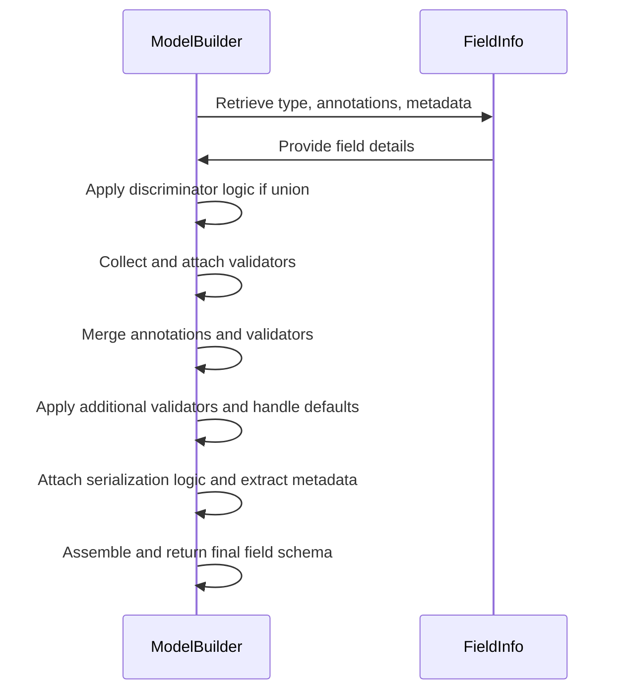
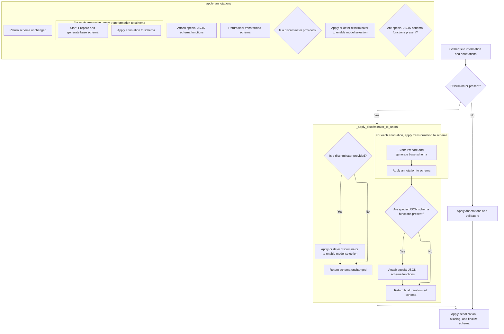
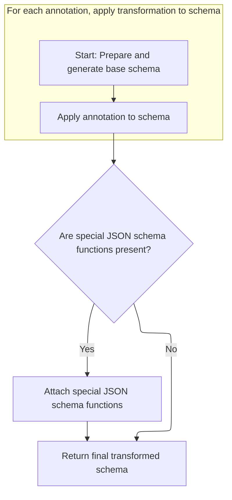
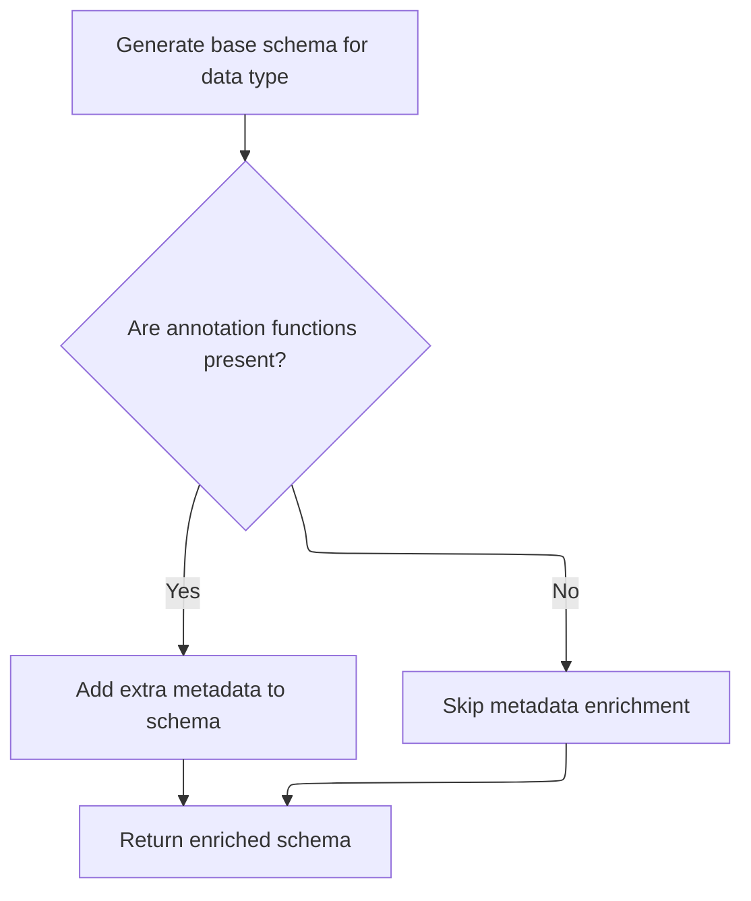
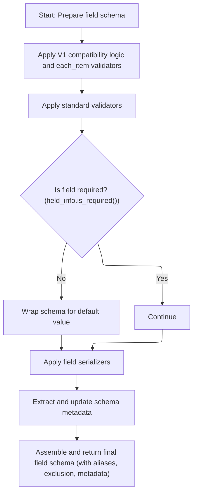

<SwmToken path="pydantic/_internal/_generate_schema.py" pos="1253:3:3" line-data="    def _common_field_schema(  # C901">`_common_field_schema`</SwmToken> constructs a complete schema for a model field by combining type information, annotations, validation rules, and serialization logic. It supports features like discriminators for unions and ensures each field is fully described and validated. The main steps are:

- Gather field type, annotations, and metadata
- Apply discriminator logic if needed
- Attach validators and merge annotation effects
- Handle defaults, serialization, and metadata
- Return the finalized field schema



# Where is this flow used?

This flow is used multiple times in the codebase as represented in the following diagram:

(Note - these are only some of the entry points of this flow)

```mermaid
graph TD;
      0eebf8f2e9d7bbd27385e4fe6f159cce37c12c286e6370619f70a69a972a3144(pydantic/dataclasses.py::dataclass) --> 56b578e144c61cf1045d12573c86da3465a03844a77d3497f17a396520c82851(pydantic/_internal/_dataclasses.py::complete_dataclass)

0eebf8f2e9d7bbd27385e4fe6f159cce37c12c286e6370619f70a69a972a3144(pydantic/dataclasses.py::dataclass) --> b564b11d457ed88ea463f8ce971442dcf2169f39f2ced01758fb9142814a5cc2(pydantic/dataclasses.py::create_dataclass)

56b578e144c61cf1045d12573c86da3465a03844a77d3497f17a396520c82851(pydantic/_internal/_dataclasses.py::complete_dataclass) --> 821ac1c9f22e0ce452e164beea8710d439ce16fa997229e959c00e48d254c7db(pydantic/_internal/_schema_generation_shared.py::generate_schema)

821ac1c9f22e0ce452e164beea8710d439ce16fa997229e959c00e48d254c7db(pydantic/_internal/_schema_generation_shared.py::generate_schema) --> e374ce8459be5f7c51c6b09301cbf87c2cc3fa4ad4e9122e9fd158381e9e769f(pydantic/_internal/_generate_schema.py::generate_schema):::mainFlowStyle

e374ce8459be5f7c51c6b09301cbf87c2cc3fa4ad4e9122e9fd158381e9e769f(pydantic/_internal/_generate_schema.py::generate_schema):::mainFlowStyle --> b602d84b54cb2aba2cca4f5952a51a376a8aff59525d3534864295ca55a42112(pydantic/_internal/_generate_schema.py::_generate_schema_inner):::mainFlowStyle

b602d84b54cb2aba2cca4f5952a51a376a8aff59525d3534864295ca55a42112(pydantic/_internal/_generate_schema.py::_generate_schema_inner):::mainFlowStyle --> bc924de46c6217c598b1ae04179a98d282ae53f7ad3120181711f95921d7f906(pydantic/_internal/_generate_schema.py::_model_schema):::mainFlowStyle

b602d84b54cb2aba2cca4f5952a51a376a8aff59525d3534864295ca55a42112(pydantic/_internal/_generate_schema.py::_generate_schema_inner):::mainFlowStyle --> e020c531042df78e199bed84c5df1bf9e9ba5ffef2041a1c1263d19b92d0e396(pydantic/_internal/_generate_schema.py::match_type):::mainFlowStyle

b602d84b54cb2aba2cca4f5952a51a376a8aff59525d3534864295ca55a42112(pydantic/_internal/_generate_schema.py::_generate_schema_inner):::mainFlowStyle --> e374ce8459be5f7c51c6b09301cbf87c2cc3fa4ad4e9122e9fd158381e9e769f(pydantic/_internal/_generate_schema.py::generate_schema):::mainFlowStyle

b602d84b54cb2aba2cca4f5952a51a376a8aff59525d3534864295ca55a42112(pydantic/_internal/_generate_schema.py::_generate_schema_inner):::mainFlowStyle --> 2a5a2e72e13283646dc234d606356f0457863ebc9e37ef991adf774f6a75ff5f(pydantic/_internal/_generate_schema.py::_annotated_schema):::mainFlowStyle

bc924de46c6217c598b1ae04179a98d282ae53f7ad3120181711f95921d7f906(pydantic/_internal/_generate_schema.py::_model_schema):::mainFlowStyle --> 858e02534520e51c12f8029180e325eb2874c6633f6aa9df014a612ec4701fe8(pydantic/_internal/_generate_schema.py::_common_field_schema):::mainFlowStyle

bc924de46c6217c598b1ae04179a98d282ae53f7ad3120181711f95921d7f906(pydantic/_internal/_generate_schema.py::_model_schema):::mainFlowStyle --> e374ce8459be5f7c51c6b09301cbf87c2cc3fa4ad4e9122e9fd158381e9e769f(pydantic/_internal/_generate_schema.py::generate_schema):::mainFlowStyle

bc924de46c6217c598b1ae04179a98d282ae53f7ad3120181711f95921d7f906(pydantic/_internal/_generate_schema.py::_model_schema):::mainFlowStyle --> 631e36a810f198c53cceda6dbd5cc9bf0a87153a594442ec3d7174e52cd27cc2(pydantic/_internal/_generate_schema.py::_computed_field_schema):::mainFlowStyle

bc924de46c6217c598b1ae04179a98d282ae53f7ad3120181711f95921d7f906(pydantic/_internal/_generate_schema.py::_model_schema):::mainFlowStyle --> 2fb8f8a4aecbccaa5fe485046164c452ed5518a790f0649693b377992d0c7a2b(pydantic/_internal/_generate_schema.py::_apply_model_serializers)

bc924de46c6217c598b1ae04179a98d282ae53f7ad3120181711f95921d7f906(pydantic/_internal/_generate_schema.py::_model_schema):::mainFlowStyle --> 819dc777ef628b4ebc011dbb83a4c177c1f202109f3966c6b5e61ee6495c1734(pydantic/_internal/_generate_schema.py::_generate_md_field_schema):::mainFlowStyle

631e36a810f198c53cceda6dbd5cc9bf0a87153a594442ec3d7174e52cd27cc2(pydantic/_internal/_generate_schema.py::_computed_field_schema):::mainFlowStyle --> e374ce8459be5f7c51c6b09301cbf87c2cc3fa4ad4e9122e9fd158381e9e769f(pydantic/_internal/_generate_schema.py::generate_schema):::mainFlowStyle

631e36a810f198c53cceda6dbd5cc9bf0a87153a594442ec3d7174e52cd27cc2(pydantic/_internal/_generate_schema.py::_computed_field_schema):::mainFlowStyle --> e8e68ca170af29f1d2d114de8a2225b8730ba0e804acdb27bcb34cd083d6dd8a(pydantic/_internal/_generate_schema.py::_apply_field_serializers)

e8e68ca170af29f1d2d114de8a2225b8730ba0e804acdb27bcb34cd083d6dd8a(pydantic/_internal/_generate_schema.py::_apply_field_serializers) --> e374ce8459be5f7c51c6b09301cbf87c2cc3fa4ad4e9122e9fd158381e9e769f(pydantic/_internal/_generate_schema.py::generate_schema):::mainFlowStyle

e8e68ca170af29f1d2d114de8a2225b8730ba0e804acdb27bcb34cd083d6dd8a(pydantic/_internal/_generate_schema.py::_apply_field_serializers) --> e8e68ca170af29f1d2d114de8a2225b8730ba0e804acdb27bcb34cd083d6dd8a(pydantic/_internal/_generate_schema.py::_apply_field_serializers)

2fb8f8a4aecbccaa5fe485046164c452ed5518a790f0649693b377992d0c7a2b(pydantic/_internal/_generate_schema.py::_apply_model_serializers) --> e374ce8459be5f7c51c6b09301cbf87c2cc3fa4ad4e9122e9fd158381e9e769f(pydantic/_internal/_generate_schema.py::generate_schema):::mainFlowStyle

819dc777ef628b4ebc011dbb83a4c177c1f202109f3966c6b5e61ee6495c1734(pydantic/_internal/_generate_schema.py::_generate_md_field_schema):::mainFlowStyle --> 858e02534520e51c12f8029180e325eb2874c6633f6aa9df014a612ec4701fe8(pydantic/_internal/_generate_schema.py::_common_field_schema):::mainFlowStyle

e020c531042df78e199bed84c5df1bf9e9ba5ffef2041a1c1263d19b92d0e396(pydantic/_internal/_generate_schema.py::match_type):::mainFlowStyle --> 69e5824bbd87b17d0b5e7eaf0c5239092b2c3f579c63db0d4355f5c9b10d0ef3(pydantic/_internal/_generate_schema.py::_list_schema)

e020c531042df78e199bed84c5df1bf9e9ba5ffef2041a1c1263d19b92d0e396(pydantic/_internal/_generate_schema.py::match_type):::mainFlowStyle --> 74e03be63b51ad387e2d8e2772edcc8c93ce4f945ca0a1b5ec4a962eec873085(pydantic/_internal/_generate_schema.py::_match_generic_type):::mainFlowStyle

e020c531042df78e199bed84c5df1bf9e9ba5ffef2041a1c1263d19b92d0e396(pydantic/_internal/_generate_schema.py::match_type):::mainFlowStyle --> 42ae49638912d996d73ba640bbafaa070aecd24fcb001644135844f187134b33(pydantic/_internal/_generate_schema.py::_dict_schema)

e020c531042df78e199bed84c5df1bf9e9ba5ffef2041a1c1263d19b92d0e396(pydantic/_internal/_generate_schema.py::match_type):::mainFlowStyle --> b75478bb5a542f1abc6a423448f5bc8b80f17683bc6be7298b988d26bcee51ac(pydantic/_internal/_generate_schema.py::_set_schema)

e020c531042df78e199bed84c5df1bf9e9ba5ffef2041a1c1263d19b92d0e396(pydantic/_internal/_generate_schema.py::match_type):::mainFlowStyle --> f735efdf73adde84a1a8be9fc2385b7088bcb51409b3109d3ed9a2f77e9ea392(pydantic/_internal/_generate_schema.py::_frozenset_schema)

e020c531042df78e199bed84c5df1bf9e9ba5ffef2041a1c1263d19b92d0e396(pydantic/_internal/_generate_schema.py::match_type):::mainFlowStyle --> f151c0372f7326effcead6b39bcbcf4557744cc970755584aa31de26911325a6(pydantic/_internal/_generate_schema.py::_deque_schema)

e020c531042df78e199bed84c5df1bf9e9ba5ffef2041a1c1263d19b92d0e396(pydantic/_internal/_generate_schema.py::match_type):::mainFlowStyle --> 12637bf3581c80ba7d8cc98c9971130f87f8027a61446051bbb0d0bf3036008a(pydantic/_internal/_generate_schema.py::_mapping_schema):::mainFlowStyle

e020c531042df78e199bed84c5df1bf9e9ba5ffef2041a1c1263d19b92d0e396(pydantic/_internal/_generate_schema.py::match_type):::mainFlowStyle --> e374ce8459be5f7c51c6b09301cbf87c2cc3fa4ad4e9122e9fd158381e9e769f(pydantic/_internal/_generate_schema.py::generate_schema):::mainFlowStyle

e020c531042df78e199bed84c5df1bf9e9ba5ffef2041a1c1263d19b92d0e396(pydantic/_internal/_generate_schema.py::match_type):::mainFlowStyle --> 6b9cb253d748b2441df03cd733cdaabc46219ad40cc8e5f602d0ef4c2b7a4402(pydantic/_internal/_generate_schema.py::_unsubstituted_typevar_schema)

e020c531042df78e199bed84c5df1bf9e9ba5ffef2041a1c1263d19b92d0e396(pydantic/_internal/_generate_schema.py::match_type):::mainFlowStyle --> 42648d8f19dc330774b494b47f011c967fead5e9fe725a8ecc4ae2c12432e461(pydantic/_internal/_generate_schema.py::_type_alias_type_schema)

e020c531042df78e199bed84c5df1bf9e9ba5ffef2041a1c1263d19b92d0e396(pydantic/_internal/_generate_schema.py::match_type):::mainFlowStyle --> 677017c728183c7382991c99c86019451117938f11c4ace4eff5260b7a5797ef(pydantic/_internal/_generate_schema.py::_tuple_schema)

e020c531042df78e199bed84c5df1bf9e9ba5ffef2041a1c1263d19b92d0e396(pydantic/_internal/_generate_schema.py::match_type):::mainFlowStyle --> 6ad93ea19bcf1f23a61a04028aba23d714bddca9dbb7f9a8bf4fdab3c1c62c05(pydantic/_internal/_generate_schema.py::_sequence_schema)

e020c531042df78e199bed84c5df1bf9e9ba5ffef2041a1c1263d19b92d0e396(pydantic/_internal/_generate_schema.py::match_type):::mainFlowStyle --> bd640d6e9f41ef8f345994bc4be275411946c3702a6580d587e5a5267a772917(pydantic/_internal/_generate_schema.py::_iterable_schema)

e020c531042df78e199bed84c5df1bf9e9ba5ffef2041a1c1263d19b92d0e396(pydantic/_internal/_generate_schema.py::match_type):::mainFlowStyle --> ec6a8ed94209ded04e2b261ebc4e8279fefa7ca2231815dde5806780e3116be3(pydantic/_internal/_generate_schema.py::_call_schema):::mainFlowStyle

e020c531042df78e199bed84c5df1bf9e9ba5ffef2041a1c1263d19b92d0e396(pydantic/_internal/_generate_schema.py::match_type):::mainFlowStyle --> 6703d3a7785be1a706caece7cd02003f30c88cc856e84813c8080cf4809556c7(pydantic/_internal/_generate_schema.py::_typed_dict_schema):::mainFlowStyle

e020c531042df78e199bed84c5df1bf9e9ba5ffef2041a1c1263d19b92d0e396(pydantic/_internal/_generate_schema.py::match_type):::mainFlowStyle --> e16fadec838bfad79cfbe640aafaffa77677927368e34ed693380839cbde5012(pydantic/_internal/_generate_schema.py::_dataclass_schema):::mainFlowStyle

e020c531042df78e199bed84c5df1bf9e9ba5ffef2041a1c1263d19b92d0e396(pydantic/_internal/_generate_schema.py::match_type):::mainFlowStyle --> 89b2daf276f292c295d8a25f2c79fe768816864a22d595de4063936a230539e2(pydantic/_internal/_generate_schema.py::_namedtuple_schema):::mainFlowStyle

69e5824bbd87b17d0b5e7eaf0c5239092b2c3f579c63db0d4355f5c9b10d0ef3(pydantic/_internal/_generate_schema.py::_list_schema) --> e374ce8459be5f7c51c6b09301cbf87c2cc3fa4ad4e9122e9fd158381e9e769f(pydantic/_internal/_generate_schema.py::generate_schema):::mainFlowStyle

74e03be63b51ad387e2d8e2772edcc8c93ce4f945ca0a1b5ec4a962eec873085(pydantic/_internal/_generate_schema.py::_match_generic_type):::mainFlowStyle --> 69e5824bbd87b17d0b5e7eaf0c5239092b2c3f579c63db0d4355f5c9b10d0ef3(pydantic/_internal/_generate_schema.py::_list_schema)

74e03be63b51ad387e2d8e2772edcc8c93ce4f945ca0a1b5ec4a962eec873085(pydantic/_internal/_generate_schema.py::_match_generic_type):::mainFlowStyle --> 42ae49638912d996d73ba640bbafaa070aecd24fcb001644135844f187134b33(pydantic/_internal/_generate_schema.py::_dict_schema)

74e03be63b51ad387e2d8e2772edcc8c93ce4f945ca0a1b5ec4a962eec873085(pydantic/_internal/_generate_schema.py::_match_generic_type):::mainFlowStyle --> b75478bb5a542f1abc6a423448f5bc8b80f17683bc6be7298b988d26bcee51ac(pydantic/_internal/_generate_schema.py::_set_schema)

74e03be63b51ad387e2d8e2772edcc8c93ce4f945ca0a1b5ec4a962eec873085(pydantic/_internal/_generate_schema.py::_match_generic_type):::mainFlowStyle --> f735efdf73adde84a1a8be9fc2385b7088bcb51409b3109d3ed9a2f77e9ea392(pydantic/_internal/_generate_schema.py::_frozenset_schema)

74e03be63b51ad387e2d8e2772edcc8c93ce4f945ca0a1b5ec4a962eec873085(pydantic/_internal/_generate_schema.py::_match_generic_type):::mainFlowStyle --> f151c0372f7326effcead6b39bcbcf4557744cc970755584aa31de26911325a6(pydantic/_internal/_generate_schema.py::_deque_schema)

74e03be63b51ad387e2d8e2772edcc8c93ce4f945ca0a1b5ec4a962eec873085(pydantic/_internal/_generate_schema.py::_match_generic_type):::mainFlowStyle --> 12637bf3581c80ba7d8cc98c9971130f87f8027a61446051bbb0d0bf3036008a(pydantic/_internal/_generate_schema.py::_mapping_schema):::mainFlowStyle

74e03be63b51ad387e2d8e2772edcc8c93ce4f945ca0a1b5ec4a962eec873085(pydantic/_internal/_generate_schema.py::_match_generic_type):::mainFlowStyle --> 95a1d11f1c76d3b81de16efb7b22f4d2309266424757c4daf7b105089f6d4e81(pydantic/_internal/_generate_schema.py::_union_schema)

74e03be63b51ad387e2d8e2772edcc8c93ce4f945ca0a1b5ec4a962eec873085(pydantic/_internal/_generate_schema.py::_match_generic_type):::mainFlowStyle --> 42648d8f19dc330774b494b47f011c967fead5e9fe725a8ecc4ae2c12432e461(pydantic/_internal/_generate_schema.py::_type_alias_type_schema)

74e03be63b51ad387e2d8e2772edcc8c93ce4f945ca0a1b5ec4a962eec873085(pydantic/_internal/_generate_schema.py::_match_generic_type):::mainFlowStyle --> 677017c728183c7382991c99c86019451117938f11c4ace4eff5260b7a5797ef(pydantic/_internal/_generate_schema.py::_tuple_schema)

74e03be63b51ad387e2d8e2772edcc8c93ce4f945ca0a1b5ec4a962eec873085(pydantic/_internal/_generate_schema.py::_match_generic_type):::mainFlowStyle --> 6e6e2690f2d84a507f67df1d81918bfa6d6e85dd5908e758007b9b5f6505fe25(pydantic/_internal/_generate_schema.py::_subclass_schema)

74e03be63b51ad387e2d8e2772edcc8c93ce4f945ca0a1b5ec4a962eec873085(pydantic/_internal/_generate_schema.py::_match_generic_type):::mainFlowStyle --> 6ad93ea19bcf1f23a61a04028aba23d714bddca9dbb7f9a8bf4fdab3c1c62c05(pydantic/_internal/_generate_schema.py::_sequence_schema)

74e03be63b51ad387e2d8e2772edcc8c93ce4f945ca0a1b5ec4a962eec873085(pydantic/_internal/_generate_schema.py::_match_generic_type):::mainFlowStyle --> bd640d6e9f41ef8f345994bc4be275411946c3702a6580d587e5a5267a772917(pydantic/_internal/_generate_schema.py::_iterable_schema)

74e03be63b51ad387e2d8e2772edcc8c93ce4f945ca0a1b5ec4a962eec873085(pydantic/_internal/_generate_schema.py::_match_generic_type):::mainFlowStyle --> 6703d3a7785be1a706caece7cd02003f30c88cc856e84813c8080cf4809556c7(pydantic/_internal/_generate_schema.py::_typed_dict_schema):::mainFlowStyle

74e03be63b51ad387e2d8e2772edcc8c93ce4f945ca0a1b5ec4a962eec873085(pydantic/_internal/_generate_schema.py::_match_generic_type):::mainFlowStyle --> e16fadec838bfad79cfbe640aafaffa77677927368e34ed693380839cbde5012(pydantic/_internal/_generate_schema.py::_dataclass_schema):::mainFlowStyle

74e03be63b51ad387e2d8e2772edcc8c93ce4f945ca0a1b5ec4a962eec873085(pydantic/_internal/_generate_schema.py::_match_generic_type):::mainFlowStyle --> 89b2daf276f292c295d8a25f2c79fe768816864a22d595de4063936a230539e2(pydantic/_internal/_generate_schema.py::_namedtuple_schema):::mainFlowStyle

42ae49638912d996d73ba640bbafaa070aecd24fcb001644135844f187134b33(pydantic/_internal/_generate_schema.py::_dict_schema) --> e374ce8459be5f7c51c6b09301cbf87c2cc3fa4ad4e9122e9fd158381e9e769f(pydantic/_internal/_generate_schema.py::generate_schema):::mainFlowStyle

b75478bb5a542f1abc6a423448f5bc8b80f17683bc6be7298b988d26bcee51ac(pydantic/_internal/_generate_schema.py::_set_schema) --> e374ce8459be5f7c51c6b09301cbf87c2cc3fa4ad4e9122e9fd158381e9e769f(pydantic/_internal/_generate_schema.py::generate_schema):::mainFlowStyle

f735efdf73adde84a1a8be9fc2385b7088bcb51409b3109d3ed9a2f77e9ea392(pydantic/_internal/_generate_schema.py::_frozenset_schema) --> e374ce8459be5f7c51c6b09301cbf87c2cc3fa4ad4e9122e9fd158381e9e769f(pydantic/_internal/_generate_schema.py::generate_schema):::mainFlowStyle

f151c0372f7326effcead6b39bcbcf4557744cc970755584aa31de26911325a6(pydantic/_internal/_generate_schema.py::_deque_schema) --> e374ce8459be5f7c51c6b09301cbf87c2cc3fa4ad4e9122e9fd158381e9e769f(pydantic/_internal/_generate_schema.py::generate_schema):::mainFlowStyle

12637bf3581c80ba7d8cc98c9971130f87f8027a61446051bbb0d0bf3036008a(pydantic/_internal/_generate_schema.py::_mapping_schema):::mainFlowStyle --> e374ce8459be5f7c51c6b09301cbf87c2cc3fa4ad4e9122e9fd158381e9e769f(pydantic/_internal/_generate_schema.py::generate_schema):::mainFlowStyle

95a1d11f1c76d3b81de16efb7b22f4d2309266424757c4daf7b105089f6d4e81(pydantic/_internal/_generate_schema.py::_union_schema) --> e374ce8459be5f7c51c6b09301cbf87c2cc3fa4ad4e9122e9fd158381e9e769f(pydantic/_internal/_generate_schema.py::generate_schema):::mainFlowStyle

42648d8f19dc330774b494b47f011c967fead5e9fe725a8ecc4ae2c12432e461(pydantic/_internal/_generate_schema.py::_type_alias_type_schema) --> e374ce8459be5f7c51c6b09301cbf87c2cc3fa4ad4e9122e9fd158381e9e769f(pydantic/_internal/_generate_schema.py::generate_schema):::mainFlowStyle

677017c728183c7382991c99c86019451117938f11c4ace4eff5260b7a5797ef(pydantic/_internal/_generate_schema.py::_tuple_schema) --> e374ce8459be5f7c51c6b09301cbf87c2cc3fa4ad4e9122e9fd158381e9e769f(pydantic/_internal/_generate_schema.py::generate_schema):::mainFlowStyle

6e6e2690f2d84a507f67df1d81918bfa6d6e85dd5908e758007b9b5f6505fe25(pydantic/_internal/_generate_schema.py::_subclass_schema) --> cbc092cd3b22be4e76d47e1fb1c206af767ff638a3cdf5124326394c073f0314(pydantic/_internal/_generate_schema.py::_union_is_subclass_schema)

6e6e2690f2d84a507f67df1d81918bfa6d6e85dd5908e758007b9b5f6505fe25(pydantic/_internal/_generate_schema.py::_subclass_schema) --> e374ce8459be5f7c51c6b09301cbf87c2cc3fa4ad4e9122e9fd158381e9e769f(pydantic/_internal/_generate_schema.py::generate_schema):::mainFlowStyle

cbc092cd3b22be4e76d47e1fb1c206af767ff638a3cdf5124326394c073f0314(pydantic/_internal/_generate_schema.py::_union_is_subclass_schema) --> e374ce8459be5f7c51c6b09301cbf87c2cc3fa4ad4e9122e9fd158381e9e769f(pydantic/_internal/_generate_schema.py::generate_schema):::mainFlowStyle

6ad93ea19bcf1f23a61a04028aba23d714bddca9dbb7f9a8bf4fdab3c1c62c05(pydantic/_internal/_generate_schema.py::_sequence_schema) --> e374ce8459be5f7c51c6b09301cbf87c2cc3fa4ad4e9122e9fd158381e9e769f(pydantic/_internal/_generate_schema.py::generate_schema):::mainFlowStyle

bd640d6e9f41ef8f345994bc4be275411946c3702a6580d587e5a5267a772917(pydantic/_internal/_generate_schema.py::_iterable_schema) --> e374ce8459be5f7c51c6b09301cbf87c2cc3fa4ad4e9122e9fd158381e9e769f(pydantic/_internal/_generate_schema.py::generate_schema):::mainFlowStyle

6703d3a7785be1a706caece7cd02003f30c88cc856e84813c8080cf4809556c7(pydantic/_internal/_generate_schema.py::_typed_dict_schema):::mainFlowStyle --> 631e36a810f198c53cceda6dbd5cc9bf0a87153a594442ec3d7174e52cd27cc2(pydantic/_internal/_generate_schema.py::_computed_field_schema):::mainFlowStyle

6703d3a7785be1a706caece7cd02003f30c88cc856e84813c8080cf4809556c7(pydantic/_internal/_generate_schema.py::_typed_dict_schema):::mainFlowStyle --> 2fb8f8a4aecbccaa5fe485046164c452ed5518a790f0649693b377992d0c7a2b(pydantic/_internal/_generate_schema.py::_apply_model_serializers)

6703d3a7785be1a706caece7cd02003f30c88cc856e84813c8080cf4809556c7(pydantic/_internal/_generate_schema.py::_typed_dict_schema):::mainFlowStyle --> 23c2a16afaf75834d6630f8f59d8b75effc1abe858f41b0a02afb810a071a6ac(pydantic/_internal/_generate_schema.py::_generate_td_field_schema):::mainFlowStyle

23c2a16afaf75834d6630f8f59d8b75effc1abe858f41b0a02afb810a071a6ac(pydantic/_internal/_generate_schema.py::_generate_td_field_schema):::mainFlowStyle --> 858e02534520e51c12f8029180e325eb2874c6633f6aa9df014a612ec4701fe8(pydantic/_internal/_generate_schema.py::_common_field_schema):::mainFlowStyle

e16fadec838bfad79cfbe640aafaffa77677927368e34ed693380839cbde5012(pydantic/_internal/_generate_schema.py::_dataclass_schema):::mainFlowStyle --> 631e36a810f198c53cceda6dbd5cc9bf0a87153a594442ec3d7174e52cd27cc2(pydantic/_internal/_generate_schema.py::_computed_field_schema):::mainFlowStyle

e16fadec838bfad79cfbe640aafaffa77677927368e34ed693380839cbde5012(pydantic/_internal/_generate_schema.py::_dataclass_schema):::mainFlowStyle --> 2fb8f8a4aecbccaa5fe485046164c452ed5518a790f0649693b377992d0c7a2b(pydantic/_internal/_generate_schema.py::_apply_model_serializers)

e16fadec838bfad79cfbe640aafaffa77677927368e34ed693380839cbde5012(pydantic/_internal/_generate_schema.py::_dataclass_schema):::mainFlowStyle --> 7e4855a0c24549dc52776d96750bb1d90a9b2b58f5ac194ce224269aaeb83b96(pydantic/_internal/_generate_schema.py::_generate_dc_field_schema):::mainFlowStyle

7e4855a0c24549dc52776d96750bb1d90a9b2b58f5ac194ce224269aaeb83b96(pydantic/_internal/_generate_schema.py::_generate_dc_field_schema):::mainFlowStyle --> 858e02534520e51c12f8029180e325eb2874c6633f6aa9df014a612ec4701fe8(pydantic/_internal/_generate_schema.py::_common_field_schema):::mainFlowStyle

89b2daf276f292c295d8a25f2c79fe768816864a22d595de4063936a230539e2(pydantic/_internal/_generate_schema.py::_namedtuple_schema):::mainFlowStyle --> b42d4c14662d12cfef226ebea8f8b3d7630d0ba8898ff0bef9daf2d265ec625d(pydantic/_internal/_generate_schema.py::_generate_parameter_schema):::mainFlowStyle

b42d4c14662d12cfef226ebea8f8b3d7630d0ba8898ff0bef9daf2d265ec625d(pydantic/_internal/_generate_schema.py::_generate_parameter_schema):::mainFlowStyle --> f9ce1e7c897888a9b275a9a2352b3d3ffa7cfd62bb97f6b429924c363659d6a0(pydantic/_internal/_generate_schema.py::_apply_annotations):::mainFlowStyle

f9ce1e7c897888a9b275a9a2352b3d3ffa7cfd62bb97f6b429924c363659d6a0(pydantic/_internal/_generate_schema.py::_apply_annotations):::mainFlowStyle --> b602d84b54cb2aba2cca4f5952a51a376a8aff59525d3534864295ca55a42112(pydantic/_internal/_generate_schema.py::_generate_schema_inner):::mainFlowStyle

6b9cb253d748b2441df03cd733cdaabc46219ad40cc8e5f602d0ef4c2b7a4402(pydantic/_internal/_generate_schema.py::_unsubstituted_typevar_schema) --> 95a1d11f1c76d3b81de16efb7b22f4d2309266424757c4daf7b105089f6d4e81(pydantic/_internal/_generate_schema.py::_union_schema)

6b9cb253d748b2441df03cd733cdaabc46219ad40cc8e5f602d0ef4c2b7a4402(pydantic/_internal/_generate_schema.py::_unsubstituted_typevar_schema) --> e374ce8459be5f7c51c6b09301cbf87c2cc3fa4ad4e9122e9fd158381e9e769f(pydantic/_internal/_generate_schema.py::generate_schema):::mainFlowStyle

ec6a8ed94209ded04e2b261ebc4e8279fefa7ca2231815dde5806780e3116be3(pydantic/_internal/_generate_schema.py::_call_schema):::mainFlowStyle --> e374ce8459be5f7c51c6b09301cbf87c2cc3fa4ad4e9122e9fd158381e9e769f(pydantic/_internal/_generate_schema.py::generate_schema):::mainFlowStyle

ec6a8ed94209ded04e2b261ebc4e8279fefa7ca2231815dde5806780e3116be3(pydantic/_internal/_generate_schema.py::_call_schema):::mainFlowStyle --> 6093242e0186caeaa3166f08daf3cd585e3ae742d016bb656fee39b333187b0d(pydantic/_internal/_generate_schema.py::_arguments_schema):::mainFlowStyle

6093242e0186caeaa3166f08daf3cd585e3ae742d016bb656fee39b333187b0d(pydantic/_internal/_generate_schema.py::_arguments_schema):::mainFlowStyle --> e374ce8459be5f7c51c6b09301cbf87c2cc3fa4ad4e9122e9fd158381e9e769f(pydantic/_internal/_generate_schema.py::generate_schema):::mainFlowStyle

6093242e0186caeaa3166f08daf3cd585e3ae742d016bb656fee39b333187b0d(pydantic/_internal/_generate_schema.py::_arguments_schema):::mainFlowStyle --> 6703d3a7785be1a706caece7cd02003f30c88cc856e84813c8080cf4809556c7(pydantic/_internal/_generate_schema.py::_typed_dict_schema):::mainFlowStyle

6093242e0186caeaa3166f08daf3cd585e3ae742d016bb656fee39b333187b0d(pydantic/_internal/_generate_schema.py::_arguments_schema):::mainFlowStyle --> b42d4c14662d12cfef226ebea8f8b3d7630d0ba8898ff0bef9daf2d265ec625d(pydantic/_internal/_generate_schema.py::_generate_parameter_schema):::mainFlowStyle

2a5a2e72e13283646dc234d606356f0457863ebc9e37ef991adf774f6a75ff5f(pydantic/_internal/_generate_schema.py::_annotated_schema):::mainFlowStyle --> f9ce1e7c897888a9b275a9a2352b3d3ffa7cfd62bb97f6b429924c363659d6a0(pydantic/_internal/_generate_schema.py::_apply_annotations):::mainFlowStyle

b564b11d457ed88ea463f8ce971442dcf2169f39f2ced01758fb9142814a5cc2(pydantic/dataclasses.py::create_dataclass) --> 56b578e144c61cf1045d12573c86da3465a03844a77d3497f17a396520c82851(pydantic/_internal/_dataclasses.py::complete_dataclass)

51288aea0bc078db30730037d4a6f8d7dec4ad8a02c46c50ef8fb01087491a30(pydantic/_internal/_model_construction.py::__new__) --> 6cfaee3d4fde1d066f89ac588fdd8e3f5fae9df31454e1750b8a608267250827(pydantic/_internal/_model_construction.py::complete_model_class)

6cfaee3d4fde1d066f89ac588fdd8e3f5fae9df31454e1750b8a608267250827(pydantic/_internal/_model_construction.py::complete_model_class) --> 821ac1c9f22e0ce452e164beea8710d439ce16fa997229e959c00e48d254c7db(pydantic/_internal/_schema_generation_shared.py::generate_schema)

43a6baf44f877182cf37d9da8c2937d44be954f1be8aacbb4f6d4bf758d05203(docs/plugins/main.py::__class_getitem__) --> 2629968df57e5ee347551103b3d4611152a9bfc82adeffac7fb105bf188ddc0a(docs/plugins/main.py::model_rebuild)

2629968df57e5ee347551103b3d4611152a9bfc82adeffac7fb105bf188ddc0a(docs/plugins/main.py::model_rebuild) --> 6cfaee3d4fde1d066f89ac588fdd8e3f5fae9df31454e1750b8a608267250827(pydantic/_internal/_model_construction.py::complete_model_class)

177405f9b9d72012b7734db7285e10f7a642781583ae030d550f190b7a15c5f7(pydantic/dataclasses.py::rebuild_dataclass) --> 56b578e144c61cf1045d12573c86da3465a03844a77d3497f17a396520c82851(pydantic/_internal/_dataclasses.py::complete_dataclass)

b69d34d7c726a40aabc5a9d21ffd08fffd6a577cf2ca79e6332520c2157173c0(docs/plugins/main.py::update_forward_refs) --> 2629968df57e5ee347551103b3d4611152a9bfc82adeffac7fb105bf188ddc0a(docs/plugins/main.py::model_rebuild)


classDef mainFlowStyle color:#000000,fill:#7CB9F4
classDef rootsStyle color:#000000,fill:#00FFF4
classDef Style1 color:#000000,fill:#00FFAA
classDef Style2 color:#000000,fill:#FFFF00
classDef Style3 color:#000000,fill:#AA7CB9

%% Swimm:
%% graph TD;
%%       0eebf8f2e9d7bbd27385e4fe6f159cce37c12c286e6370619f70a69a972a3144(<SwmPath>[pydantic/dataclasses.py](pydantic/dataclasses.py)</SwmPath>::dataclass) --> 56b578e144c61cf1045d12573c86da3465a03844a77d3497f17a396520c82851(<SwmPath>[pydantic/\_internal/\_dataclasses.py](pydantic/_internal/_dataclasses.py)</SwmPath>::complete_dataclass)
%% 
%% 0eebf8f2e9d7bbd27385e4fe6f159cce37c12c286e6370619f70a69a972a3144(<SwmPath>[pydantic/dataclasses.py](pydantic/dataclasses.py)</SwmPath>::dataclass) --> b564b11d457ed88ea463f8ce971442dcf2169f39f2ced01758fb9142814a5cc2(<SwmPath>[pydantic/dataclasses.py](pydantic/dataclasses.py)</SwmPath>::create_dataclass)
%% 
%% 56b578e144c61cf1045d12573c86da3465a03844a77d3497f17a396520c82851(<SwmPath>[pydantic/\_internal/\_dataclasses.py](pydantic/_internal/_dataclasses.py)</SwmPath>::complete_dataclass) --> 821ac1c9f22e0ce452e164beea8710d439ce16fa997229e959c00e48d254c7db(<SwmPath>[pydantic/\_internal/\_schema_generation_shared.py](pydantic/_internal/_schema_generation_shared.py)</SwmPath>::<SwmToken path="pydantic/_internal/_generate_schema.py" pos="379:9:9" line-data="        return core_schema.list_schema(self.generate_schema(items_type))">`generate_schema`</SwmToken>)
%% 
%% 821ac1c9f22e0ce452e164beea8710d439ce16fa997229e959c00e48d254c7db(<SwmPath>[pydantic/\_internal/\_schema_generation_shared.py](pydantic/_internal/_schema_generation_shared.py)</SwmPath>::<SwmToken path="pydantic/_internal/_generate_schema.py" pos="379:9:9" line-data="        return core_schema.list_schema(self.generate_schema(items_type))">`generate_schema`</SwmToken>) --> e374ce8459be5f7c51c6b09301cbf87c2cc3fa4ad4e9122e9fd158381e9e769f(<SwmPath>[pydantic/\_internal/\_generate_schema.py](pydantic/_internal/_generate_schema.py)</SwmPath>::<SwmToken path="pydantic/_internal/_generate_schema.py" pos="379:9:9" line-data="        return core_schema.list_schema(self.generate_schema(items_type))">`generate_schema`</SwmToken>):::mainFlowStyle
%% 
%% e374ce8459be5f7c51c6b09301cbf87c2cc3fa4ad4e9122e9fd158381e9e769f(<SwmPath>[pydantic/\_internal/\_generate_schema.py](pydantic/_internal/_generate_schema.py)</SwmPath>::<SwmToken path="pydantic/_internal/_generate_schema.py" pos="379:9:9" line-data="        return core_schema.list_schema(self.generate_schema(items_type))">`generate_schema`</SwmToken>):::mainFlowStyle --> b602d84b54cb2aba2cca4f5952a51a376a8aff59525d3534864295ca55a42112(<SwmPath>[pydantic/\_internal/\_generate_schema.py](pydantic/_internal/_generate_schema.py)</SwmPath>::<SwmToken path="pydantic/_internal/_generate_schema.py" pos="2181:7:7" line-data="                schema = self._generate_schema_inner(obj)">`_generate_schema_inner`</SwmToken>):::mainFlowStyle
%% 
%% b602d84b54cb2aba2cca4f5952a51a376a8aff59525d3534864295ca55a42112(<SwmPath>[pydantic/\_internal/\_generate_schema.py](pydantic/_internal/_generate_schema.py)</SwmPath>::<SwmToken path="pydantic/_internal/_generate_schema.py" pos="2181:7:7" line-data="                schema = self._generate_schema_inner(obj)">`_generate_schema_inner`</SwmToken>):::mainFlowStyle --> bc924de46c6217c598b1ae04179a98d282ae53f7ad3120181711f95921d7f906(<SwmPath>[pydantic/\_internal/\_generate_schema.py](pydantic/_internal/_generate_schema.py)</SwmPath>::<SwmToken path="pydantic/_internal/_generate_schema.py" pos="736:3:3" line-data="    def _model_schema(self, cls: type[BaseModel]) -&gt; core_schema.CoreSchema:">`_model_schema`</SwmToken>):::mainFlowStyle
%% 
%% b602d84b54cb2aba2cca4f5952a51a376a8aff59525d3534864295ca55a42112(<SwmPath>[pydantic/\_internal/\_generate_schema.py](pydantic/_internal/_generate_schema.py)</SwmPath>::<SwmToken path="pydantic/_internal/_generate_schema.py" pos="2181:7:7" line-data="                schema = self._generate_schema_inner(obj)">`_generate_schema_inner`</SwmToken>):::mainFlowStyle --> e020c531042df78e199bed84c5df1bf9e9ba5ffef2041a1c1263d19b92d0e396(<SwmPath>[pydantic/\_internal/\_generate_schema.py](pydantic/_internal/_generate_schema.py)</SwmPath>::<SwmToken path="pydantic/_internal/_generate_schema.py" pos="1023:5:5" line-data="        return self.match_type(obj)">`match_type`</SwmToken>):::mainFlowStyle
%% 
%% b602d84b54cb2aba2cca4f5952a51a376a8aff59525d3534864295ca55a42112(<SwmPath>[pydantic/\_internal/\_generate_schema.py](pydantic/_internal/_generate_schema.py)</SwmPath>::<SwmToken path="pydantic/_internal/_generate_schema.py" pos="2181:7:7" line-data="                schema = self._generate_schema_inner(obj)">`_generate_schema_inner`</SwmToken>):::mainFlowStyle --> e374ce8459be5f7c51c6b09301cbf87c2cc3fa4ad4e9122e9fd158381e9e769f(<SwmPath>[pydantic/\_internal/\_generate_schema.py](pydantic/_internal/_generate_schema.py)</SwmPath>::<SwmToken path="pydantic/_internal/_generate_schema.py" pos="379:9:9" line-data="        return core_schema.list_schema(self.generate_schema(items_type))">`generate_schema`</SwmToken>):::mainFlowStyle
%% 
%% b602d84b54cb2aba2cca4f5952a51a376a8aff59525d3534864295ca55a42112(<SwmPath>[pydantic/\_internal/\_generate_schema.py](pydantic/_internal/_generate_schema.py)</SwmPath>::<SwmToken path="pydantic/_internal/_generate_schema.py" pos="2181:7:7" line-data="                schema = self._generate_schema_inner(obj)">`_generate_schema_inner`</SwmToken>):::mainFlowStyle --> 2a5a2e72e13283646dc234d606356f0457863ebc9e37ef991adf774f6a75ff5f(<SwmPath>[pydantic/\_internal/\_generate_schema.py](pydantic/_internal/_generate_schema.py)</SwmPath>::<SwmToken path="pydantic/_internal/_generate_schema.py" pos="2169:12:12" line-data="        This gets called by `GenerateSchema._annotated_schema` but differs from it in that it does">`_annotated_schema`</SwmToken>):::mainFlowStyle
%% 
%% bc924de46c6217c598b1ae04179a98d282ae53f7ad3120181711f95921d7f906(<SwmPath>[pydantic/\_internal/\_generate_schema.py](pydantic/_internal/_generate_schema.py)</SwmPath>::<SwmToken path="pydantic/_internal/_generate_schema.py" pos="736:3:3" line-data="    def _model_schema(self, cls: type[BaseModel]) -&gt; core_schema.CoreSchema:">`_model_schema`</SwmToken>):::mainFlowStyle --> 858e02534520e51c12f8029180e325eb2874c6633f6aa9df014a612ec4701fe8(<SwmPath>[pydantic/\_internal/\_generate_schema.py](pydantic/_internal/_generate_schema.py)</SwmPath>::<SwmToken path="pydantic/_internal/_generate_schema.py" pos="1253:3:3" line-data="    def _common_field_schema(  # C901">`_common_field_schema`</SwmToken>):::mainFlowStyle
%% 
%% bc924de46c6217c598b1ae04179a98d282ae53f7ad3120181711f95921d7f906(<SwmPath>[pydantic/\_internal/\_generate_schema.py](pydantic/_internal/_generate_schema.py)</SwmPath>::<SwmToken path="pydantic/_internal/_generate_schema.py" pos="736:3:3" line-data="    def _model_schema(self, cls: type[BaseModel]) -&gt; core_schema.CoreSchema:">`_model_schema`</SwmToken>):::mainFlowStyle --> e374ce8459be5f7c51c6b09301cbf87c2cc3fa4ad4e9122e9fd158381e9e769f(<SwmPath>[pydantic/\_internal/\_generate_schema.py](pydantic/_internal/_generate_schema.py)</SwmPath>::<SwmToken path="pydantic/_internal/_generate_schema.py" pos="379:9:9" line-data="        return core_schema.list_schema(self.generate_schema(items_type))">`generate_schema`</SwmToken>):::mainFlowStyle
%% 
%% bc924de46c6217c598b1ae04179a98d282ae53f7ad3120181711f95921d7f906(<SwmPath>[pydantic/\_internal/\_generate_schema.py](pydantic/_internal/_generate_schema.py)</SwmPath>::<SwmToken path="pydantic/_internal/_generate_schema.py" pos="736:3:3" line-data="    def _model_schema(self, cls: type[BaseModel]) -&gt; core_schema.CoreSchema:">`_model_schema`</SwmToken>):::mainFlowStyle --> 631e36a810f198c53cceda6dbd5cc9bf0a87153a594442ec3d7174e52cd27cc2(<SwmPath>[pydantic/\_internal/\_generate_schema.py](pydantic/_internal/_generate_schema.py)</SwmPath>::<SwmToken path="pydantic/_internal/_generate_schema.py" pos="853:3:3" line-data="                            self._computed_field_schema(d, decorators.field_serializers)">`_computed_field_schema`</SwmToken>):::mainFlowStyle
%% 
%% bc924de46c6217c598b1ae04179a98d282ae53f7ad3120181711f95921d7f906(<SwmPath>[pydantic/\_internal/\_generate_schema.py](pydantic/_internal/_generate_schema.py)</SwmPath>::<SwmToken path="pydantic/_internal/_generate_schema.py" pos="736:3:3" line-data="    def _model_schema(self, cls: type[BaseModel]) -&gt; core_schema.CoreSchema:">`_model_schema`</SwmToken>):::mainFlowStyle --> 2fb8f8a4aecbccaa5fe485046164c452ed5518a790f0649693b377992d0c7a2b(<SwmPath>[pydantic/\_internal/\_generate_schema.py](pydantic/_internal/_generate_schema.py)</SwmPath>::<SwmToken path="pydantic/_internal/_generate_schema.py" pos="874:7:7" line-data="                schema = self._apply_model_serializers(model_schema, decorators.model_serializers.values())">`_apply_model_serializers`</SwmToken>)
%% 
%% bc924de46c6217c598b1ae04179a98d282ae53f7ad3120181711f95921d7f906(<SwmPath>[pydantic/\_internal/\_generate_schema.py](pydantic/_internal/_generate_schema.py)</SwmPath>::<SwmToken path="pydantic/_internal/_generate_schema.py" pos="736:3:3" line-data="    def _model_schema(self, cls: type[BaseModel]) -&gt; core_schema.CoreSchema:">`_model_schema`</SwmToken>):::mainFlowStyle --> 819dc777ef628b4ebc011dbb83a4c177c1f202109f3966c6b5e61ee6495c1734(<SwmPath>[pydantic/\_internal/\_generate_schema.py](pydantic/_internal/_generate_schema.py)</SwmPath>::<SwmToken path="pydantic/_internal/_generate_schema.py" pos="851:7:7" line-data="                        {k: self._generate_md_field_schema(k, v, decorators) for k, v in fields.items()},">`_generate_md_field_schema`</SwmToken>):::mainFlowStyle
%% 
%% 631e36a810f198c53cceda6dbd5cc9bf0a87153a594442ec3d7174e52cd27cc2(<SwmPath>[pydantic/\_internal/\_generate_schema.py](pydantic/_internal/_generate_schema.py)</SwmPath>::<SwmToken path="pydantic/_internal/_generate_schema.py" pos="853:3:3" line-data="                            self._computed_field_schema(d, decorators.field_serializers)">`_computed_field_schema`</SwmToken>):::mainFlowStyle --> e374ce8459be5f7c51c6b09301cbf87c2cc3fa4ad4e9122e9fd158381e9e769f(<SwmPath>[pydantic/\_internal/\_generate_schema.py](pydantic/_internal/_generate_schema.py)</SwmPath>::<SwmToken path="pydantic/_internal/_generate_schema.py" pos="379:9:9" line-data="        return core_schema.list_schema(self.generate_schema(items_type))">`generate_schema`</SwmToken>):::mainFlowStyle
%% 
%% 631e36a810f198c53cceda6dbd5cc9bf0a87153a594442ec3d7174e52cd27cc2(<SwmPath>[pydantic/\_internal/\_generate_schema.py](pydantic/_internal/_generate_schema.py)</SwmPath>::<SwmToken path="pydantic/_internal/_generate_schema.py" pos="853:3:3" line-data="                            self._computed_field_schema(d, decorators.field_serializers)">`_computed_field_schema`</SwmToken>):::mainFlowStyle --> e8e68ca170af29f1d2d114de8a2225b8730ba0e804acdb27bcb34cd083d6dd8a(<SwmPath>[pydantic/\_internal/\_generate_schema.py](pydantic/_internal/_generate_schema.py)</SwmPath>::<SwmToken path="pydantic/_internal/_generate_schema.py" pos="1297:7:7" line-data="        schema = self._apply_field_serializers(">`_apply_field_serializers`</SwmToken>)
%% 
%% e8e68ca170af29f1d2d114de8a2225b8730ba0e804acdb27bcb34cd083d6dd8a(<SwmPath>[pydantic/\_internal/\_generate_schema.py](pydantic/_internal/_generate_schema.py)</SwmPath>::<SwmToken path="pydantic/_internal/_generate_schema.py" pos="1297:7:7" line-data="        schema = self._apply_field_serializers(">`_apply_field_serializers`</SwmToken>) --> e374ce8459be5f7c51c6b09301cbf87c2cc3fa4ad4e9122e9fd158381e9e769f(<SwmPath>[pydantic/\_internal/\_generate_schema.py](pydantic/_internal/_generate_schema.py)</SwmPath>::<SwmToken path="pydantic/_internal/_generate_schema.py" pos="379:9:9" line-data="        return core_schema.list_schema(self.generate_schema(items_type))">`generate_schema`</SwmToken>):::mainFlowStyle
%% 
%% e8e68ca170af29f1d2d114de8a2225b8730ba0e804acdb27bcb34cd083d6dd8a(<SwmPath>[pydantic/\_internal/\_generate_schema.py](pydantic/_internal/_generate_schema.py)</SwmPath>::<SwmToken path="pydantic/_internal/_generate_schema.py" pos="1297:7:7" line-data="        schema = self._apply_field_serializers(">`_apply_field_serializers`</SwmToken>) --> e8e68ca170af29f1d2d114de8a2225b8730ba0e804acdb27bcb34cd083d6dd8a(<SwmPath>[pydantic/\_internal/\_generate_schema.py](pydantic/_internal/_generate_schema.py)</SwmPath>::<SwmToken path="pydantic/_internal/_generate_schema.py" pos="1297:7:7" line-data="        schema = self._apply_field_serializers(">`_apply_field_serializers`</SwmToken>)
%% 
%% 2fb8f8a4aecbccaa5fe485046164c452ed5518a790f0649693b377992d0c7a2b(<SwmPath>[pydantic/\_internal/\_generate_schema.py](pydantic/_internal/_generate_schema.py)</SwmPath>::<SwmToken path="pydantic/_internal/_generate_schema.py" pos="874:7:7" line-data="                schema = self._apply_model_serializers(model_schema, decorators.model_serializers.values())">`_apply_model_serializers`</SwmToken>) --> e374ce8459be5f7c51c6b09301cbf87c2cc3fa4ad4e9122e9fd158381e9e769f(<SwmPath>[pydantic/\_internal/\_generate_schema.py](pydantic/_internal/_generate_schema.py)</SwmPath>::<SwmToken path="pydantic/_internal/_generate_schema.py" pos="379:9:9" line-data="        return core_schema.list_schema(self.generate_schema(items_type))">`generate_schema`</SwmToken>):::mainFlowStyle
%% 
%% 819dc777ef628b4ebc011dbb83a4c177c1f202109f3966c6b5e61ee6495c1734(<SwmPath>[pydantic/\_internal/\_generate_schema.py](pydantic/_internal/_generate_schema.py)</SwmPath>::<SwmToken path="pydantic/_internal/_generate_schema.py" pos="851:7:7" line-data="                        {k: self._generate_md_field_schema(k, v, decorators) for k, v in fields.items()},">`_generate_md_field_schema`</SwmToken>):::mainFlowStyle --> 858e02534520e51c12f8029180e325eb2874c6633f6aa9df014a612ec4701fe8(<SwmPath>[pydantic/\_internal/\_generate_schema.py](pydantic/_internal/_generate_schema.py)</SwmPath>::<SwmToken path="pydantic/_internal/_generate_schema.py" pos="1253:3:3" line-data="    def _common_field_schema(  # C901">`_common_field_schema`</SwmToken>):::mainFlowStyle
%% 
%% e020c531042df78e199bed84c5df1bf9e9ba5ffef2041a1c1263d19b92d0e396(<SwmPath>[pydantic/\_internal/\_generate_schema.py](pydantic/_internal/_generate_schema.py)</SwmPath>::<SwmToken path="pydantic/_internal/_generate_schema.py" pos="1023:5:5" line-data="        return self.match_type(obj)">`match_type`</SwmToken>):::mainFlowStyle --> 69e5824bbd87b17d0b5e7eaf0c5239092b2c3f579c63db0d4355f5c9b10d0ef3(<SwmPath>[pydantic/\_internal/\_generate_schema.py](pydantic/_internal/_generate_schema.py)</SwmPath>::<SwmToken path="pydantic/_internal/_generate_schema.py" pos="378:3:3" line-data="    def _list_schema(self, items_type: Any) -&gt; CoreSchema:">`_list_schema`</SwmToken>)
%% 
%% e020c531042df78e199bed84c5df1bf9e9ba5ffef2041a1c1263d19b92d0e396(<SwmPath>[pydantic/\_internal/\_generate_schema.py](pydantic/_internal/_generate_schema.py)</SwmPath>::<SwmToken path="pydantic/_internal/_generate_schema.py" pos="1023:5:5" line-data="        return self.match_type(obj)">`match_type`</SwmToken>):::mainFlowStyle --> 74e03be63b51ad387e2d8e2772edcc8c93ce4f945ca0a1b5ec4a962eec873085(<SwmPath>[pydantic/\_internal/\_generate_schema.py](pydantic/_internal/_generate_schema.py)</SwmPath>::<SwmToken path="pydantic/_internal/_generate_schema.py" pos="1139:5:5" line-data="            return self._match_generic_type(obj, origin)">`_match_generic_type`</SwmToken>):::mainFlowStyle
%% 
%% e020c531042df78e199bed84c5df1bf9e9ba5ffef2041a1c1263d19b92d0e396(<SwmPath>[pydantic/\_internal/\_generate_schema.py](pydantic/_internal/_generate_schema.py)</SwmPath>::<SwmToken path="pydantic/_internal/_generate_schema.py" pos="1023:5:5" line-data="        return self.match_type(obj)">`match_type`</SwmToken>):::mainFlowStyle --> 42ae49638912d996d73ba640bbafaa070aecd24fcb001644135844f187134b33(<SwmPath>[pydantic/\_internal/\_generate_schema.py](pydantic/_internal/_generate_schema.py)</SwmPath>::<SwmToken path="pydantic/_internal/_generate_schema.py" pos="381:3:3" line-data="    def _dict_schema(self, keys_type: Any, values_type: Any) -&gt; CoreSchema:">`_dict_schema`</SwmToken>)
%% 
%% e020c531042df78e199bed84c5df1bf9e9ba5ffef2041a1c1263d19b92d0e396(<SwmPath>[pydantic/\_internal/\_generate_schema.py](pydantic/_internal/_generate_schema.py)</SwmPath>::<SwmToken path="pydantic/_internal/_generate_schema.py" pos="1023:5:5" line-data="        return self.match_type(obj)">`match_type`</SwmToken>):::mainFlowStyle --> b75478bb5a542f1abc6a423448f5bc8b80f17683bc6be7298b988d26bcee51ac(<SwmPath>[pydantic/\_internal/\_generate_schema.py](pydantic/_internal/_generate_schema.py)</SwmPath>::<SwmToken path="pydantic/_internal/_generate_schema.py" pos="384:3:3" line-data="    def _set_schema(self, items_type: Any) -&gt; CoreSchema:">`_set_schema`</SwmToken>)
%% 
%% e020c531042df78e199bed84c5df1bf9e9ba5ffef2041a1c1263d19b92d0e396(<SwmPath>[pydantic/\_internal/\_generate_schema.py](pydantic/_internal/_generate_schema.py)</SwmPath>::<SwmToken path="pydantic/_internal/_generate_schema.py" pos="1023:5:5" line-data="        return self.match_type(obj)">`match_type`</SwmToken>):::mainFlowStyle --> f735efdf73adde84a1a8be9fc2385b7088bcb51409b3109d3ed9a2f77e9ea392(<SwmPath>[pydantic/\_internal/\_generate_schema.py](pydantic/_internal/_generate_schema.py)</SwmPath>::<SwmToken path="pydantic/_internal/_generate_schema.py" pos="387:3:3" line-data="    def _frozenset_schema(self, items_type: Any) -&gt; CoreSchema:">`_frozenset_schema`</SwmToken>)
%% 
%% e020c531042df78e199bed84c5df1bf9e9ba5ffef2041a1c1263d19b92d0e396(<SwmPath>[pydantic/\_internal/\_generate_schema.py](pydantic/_internal/_generate_schema.py)</SwmPath>::<SwmToken path="pydantic/_internal/_generate_schema.py" pos="1023:5:5" line-data="        return self.match_type(obj)">`match_type`</SwmToken>):::mainFlowStyle --> f151c0372f7326effcead6b39bcbcf4557744cc970755584aa31de26911325a6(<SwmPath>[pydantic/\_internal/\_generate_schema.py](pydantic/_internal/_generate_schema.py)</SwmPath>::<SwmToken path="pydantic/_internal/_generate_schema.py" pos="553:3:3" line-data="    def _deque_schema(self, items_type: Any) -&gt; CoreSchema:">`_deque_schema`</SwmToken>)
%% 
%% e020c531042df78e199bed84c5df1bf9e9ba5ffef2041a1c1263d19b92d0e396(<SwmPath>[pydantic/\_internal/\_generate_schema.py](pydantic/_internal/_generate_schema.py)</SwmPath>::<SwmToken path="pydantic/_internal/_generate_schema.py" pos="1023:5:5" line-data="        return self.match_type(obj)">`match_type`</SwmToken>):::mainFlowStyle --> 12637bf3581c80ba7d8cc98c9971130f87f8027a61446051bbb0d0bf3036008a(<SwmPath>[pydantic/\_internal/\_generate_schema.py](pydantic/_internal/_generate_schema.py)</SwmPath>::<SwmToken path="pydantic/_internal/_generate_schema.py" pos="578:3:3" line-data="    def _mapping_schema(self, tp: Any, keys_type: Any, values_type: Any) -&gt; CoreSchema:">`_mapping_schema`</SwmToken>):::mainFlowStyle
%% 
%% e020c531042df78e199bed84c5df1bf9e9ba5ffef2041a1c1263d19b92d0e396(<SwmPath>[pydantic/\_internal/\_generate_schema.py](pydantic/_internal/_generate_schema.py)</SwmPath>::<SwmToken path="pydantic/_internal/_generate_schema.py" pos="1023:5:5" line-data="        return self.match_type(obj)">`match_type`</SwmToken>):::mainFlowStyle --> e374ce8459be5f7c51c6b09301cbf87c2cc3fa4ad4e9122e9fd158381e9e769f(<SwmPath>[pydantic/\_internal/\_generate_schema.py](pydantic/_internal/_generate_schema.py)</SwmPath>::<SwmToken path="pydantic/_internal/_generate_schema.py" pos="379:9:9" line-data="        return core_schema.list_schema(self.generate_schema(items_type))">`generate_schema`</SwmToken>):::mainFlowStyle
%% 
%% e020c531042df78e199bed84c5df1bf9e9ba5ffef2041a1c1263d19b92d0e396(<SwmPath>[pydantic/\_internal/\_generate_schema.py](pydantic/_internal/_generate_schema.py)</SwmPath>::<SwmToken path="pydantic/_internal/_generate_schema.py" pos="1023:5:5" line-data="        return self.match_type(obj)">`match_type`</SwmToken>):::mainFlowStyle --> 6b9cb253d748b2441df03cd733cdaabc46219ad40cc8e5f602d0ef4c2b7a4402(<SwmPath>[pydantic/\_internal/\_generate_schema.py](pydantic/_internal/_generate_schema.py)</SwmPath>::<SwmToken path="pydantic/_internal/_generate_schema.py" pos="1118:5:5" line-data="            return self._unsubstituted_typevar_schema(obj)">`_unsubstituted_typevar_schema`</SwmToken>)
%% 
%% e020c531042df78e199bed84c5df1bf9e9ba5ffef2041a1c1263d19b92d0e396(<SwmPath>[pydantic/\_internal/\_generate_schema.py](pydantic/_internal/_generate_schema.py)</SwmPath>::<SwmToken path="pydantic/_internal/_generate_schema.py" pos="1023:5:5" line-data="        return self.match_type(obj)">`match_type`</SwmToken>):::mainFlowStyle --> 42648d8f19dc330774b494b47f011c967fead5e9fe725a8ecc4ae2c12432e461(<SwmPath>[pydantic/\_internal/\_generate_schema.py](pydantic/_internal/_generate_schema.py)</SwmPath>::<SwmToken path="pydantic/_internal/_generate_schema.py" pos="1099:5:5" line-data="            return self._type_alias_type_schema(obj)">`_type_alias_type_schema`</SwmToken>)
%% 
%% e020c531042df78e199bed84c5df1bf9e9ba5ffef2041a1c1263d19b92d0e396(<SwmPath>[pydantic/\_internal/\_generate_schema.py](pydantic/_internal/_generate_schema.py)</SwmPath>::<SwmToken path="pydantic/_internal/_generate_schema.py" pos="1023:5:5" line-data="        return self.match_type(obj)">`match_type`</SwmToken>):::mainFlowStyle --> 677017c728183c7382991c99c86019451117938f11c4ace4eff5260b7a5797ef(<SwmPath>[pydantic/\_internal/\_generate_schema.py](pydantic/_internal/_generate_schema.py)</SwmPath>::<SwmToken path="pydantic/_internal/_generate_schema.py" pos="1033:26:26" line-data="        boilerplate before calling into the user-facing method (e.g. `GenerateSchema._tuple_schema`).">`_tuple_schema`</SwmToken>)
%% 
%% e020c531042df78e199bed84c5df1bf9e9ba5ffef2041a1c1263d19b92d0e396(<SwmPath>[pydantic/\_internal/\_generate_schema.py](pydantic/_internal/_generate_schema.py)</SwmPath>::<SwmToken path="pydantic/_internal/_generate_schema.py" pos="1023:5:5" line-data="        return self.match_type(obj)">`match_type`</SwmToken>):::mainFlowStyle --> 6ad93ea19bcf1f23a61a04028aba23d714bddca9dbb7f9a8bf4fdab3c1c62c05(<SwmPath>[pydantic/\_internal/\_generate_schema.py](pydantic/_internal/_generate_schema.py)</SwmPath>::<SwmToken path="pydantic/_internal/_generate_schema.py" pos="1085:5:5" line-data="            return self._sequence_schema(Any)">`_sequence_schema`</SwmToken>)
%% 
%% e020c531042df78e199bed84c5df1bf9e9ba5ffef2041a1c1263d19b92d0e396(<SwmPath>[pydantic/\_internal/\_generate_schema.py](pydantic/_internal/_generate_schema.py)</SwmPath>::<SwmToken path="pydantic/_internal/_generate_schema.py" pos="1023:5:5" line-data="        return self.match_type(obj)">`match_type`</SwmToken>):::mainFlowStyle --> bd640d6e9f41ef8f345994bc4be275411946c3702a6580d587e5a5267a772917(<SwmPath>[pydantic/\_internal/\_generate_schema.py](pydantic/_internal/_generate_schema.py)</SwmPath>::<SwmToken path="pydantic/_internal/_generate_schema.py" pos="1087:5:5" line-data="            return self._iterable_schema(obj)">`_iterable_schema`</SwmToken>)
%% 
%% e020c531042df78e199bed84c5df1bf9e9ba5ffef2041a1c1263d19b92d0e396(<SwmPath>[pydantic/\_internal/\_generate_schema.py](pydantic/_internal/_generate_schema.py)</SwmPath>::<SwmToken path="pydantic/_internal/_generate_schema.py" pos="1023:5:5" line-data="        return self.match_type(obj)">`match_type`</SwmToken>):::mainFlowStyle --> ec6a8ed94209ded04e2b261ebc4e8279fefa7ca2231815dde5806780e3116be3(<SwmPath>[pydantic/\_internal/\_generate_schema.py](pydantic/_internal/_generate_schema.py)</SwmPath>::<SwmToken path="pydantic/_internal/_generate_schema.py" pos="1126:5:5" line-data="            return self._call_schema(obj)">`_call_schema`</SwmToken>):::mainFlowStyle
%% 
%% e020c531042df78e199bed84c5df1bf9e9ba5ffef2041a1c1263d19b92d0e396(<SwmPath>[pydantic/\_internal/\_generate_schema.py](pydantic/_internal/_generate_schema.py)</SwmPath>::<SwmToken path="pydantic/_internal/_generate_schema.py" pos="1023:5:5" line-data="        return self.match_type(obj)">`match_type`</SwmToken>):::mainFlowStyle --> 6703d3a7785be1a706caece7cd02003f30c88cc856e84813c8080cf4809556c7(<SwmPath>[pydantic/\_internal/\_generate_schema.py](pydantic/_internal/_generate_schema.py)</SwmPath>::<SwmToken path="pydantic/_internal/_generate_schema.py" pos="1107:5:5" line-data="            return self._typed_dict_schema(obj, None)">`_typed_dict_schema`</SwmToken>):::mainFlowStyle
%% 
%% e020c531042df78e199bed84c5df1bf9e9ba5ffef2041a1c1263d19b92d0e396(<SwmPath>[pydantic/\_internal/\_generate_schema.py](pydantic/_internal/_generate_schema.py)</SwmPath>::<SwmToken path="pydantic/_internal/_generate_schema.py" pos="1023:5:5" line-data="        return self.match_type(obj)">`match_type`</SwmToken>):::mainFlowStyle --> e16fadec838bfad79cfbe640aafaffa77677927368e34ed693380839cbde5012(<SwmPath>[pydantic/\_internal/\_generate_schema.py](pydantic/_internal/_generate_schema.py)</SwmPath>::<SwmToken path="pydantic/_internal/_generate_schema.py" pos="1135:5:5" line-data="            return self._dataclass_schema(obj, None)  # pyright: ignore[reportArgumentType]">`_dataclass_schema`</SwmToken>):::mainFlowStyle
%% 
%% e020c531042df78e199bed84c5df1bf9e9ba5ffef2041a1c1263d19b92d0e396(<SwmPath>[pydantic/\_internal/\_generate_schema.py](pydantic/_internal/_generate_schema.py)</SwmPath>::<SwmToken path="pydantic/_internal/_generate_schema.py" pos="1023:5:5" line-data="        return self.match_type(obj)">`match_type`</SwmToken>):::mainFlowStyle --> 89b2daf276f292c295d8a25f2c79fe768816864a22d595de4063936a230539e2(<SwmPath>[pydantic/\_internal/\_generate_schema.py](pydantic/_internal/_generate_schema.py)</SwmPath>::<SwmToken path="pydantic/_internal/_generate_schema.py" pos="1109:5:5" line-data="            return self._namedtuple_schema(obj, None)">`_namedtuple_schema`</SwmToken>):::mainFlowStyle
%% 
%% 69e5824bbd87b17d0b5e7eaf0c5239092b2c3f579c63db0d4355f5c9b10d0ef3(<SwmPath>[pydantic/\_internal/\_generate_schema.py](pydantic/_internal/_generate_schema.py)</SwmPath>::<SwmToken path="pydantic/_internal/_generate_schema.py" pos="378:3:3" line-data="    def _list_schema(self, items_type: Any) -&gt; CoreSchema:">`_list_schema`</SwmToken>) --> e374ce8459be5f7c51c6b09301cbf87c2cc3fa4ad4e9122e9fd158381e9e769f(<SwmPath>[pydantic/\_internal/\_generate_schema.py](pydantic/_internal/_generate_schema.py)</SwmPath>::<SwmToken path="pydantic/_internal/_generate_schema.py" pos="379:9:9" line-data="        return core_schema.list_schema(self.generate_schema(items_type))">`generate_schema`</SwmToken>):::mainFlowStyle
%% 
%% 74e03be63b51ad387e2d8e2772edcc8c93ce4f945ca0a1b5ec4a962eec873085(<SwmPath>[pydantic/\_internal/\_generate_schema.py](pydantic/_internal/_generate_schema.py)</SwmPath>::<SwmToken path="pydantic/_internal/_generate_schema.py" pos="1139:5:5" line-data="            return self._match_generic_type(obj, origin)">`_match_generic_type`</SwmToken>):::mainFlowStyle --> 69e5824bbd87b17d0b5e7eaf0c5239092b2c3f579c63db0d4355f5c9b10d0ef3(<SwmPath>[pydantic/\_internal/\_generate_schema.py](pydantic/_internal/_generate_schema.py)</SwmPath>::<SwmToken path="pydantic/_internal/_generate_schema.py" pos="378:3:3" line-data="    def _list_schema(self, items_type: Any) -&gt; CoreSchema:">`_list_schema`</SwmToken>)
%% 
%% 74e03be63b51ad387e2d8e2772edcc8c93ce4f945ca0a1b5ec4a962eec873085(<SwmPath>[pydantic/\_internal/\_generate_schema.py](pydantic/_internal/_generate_schema.py)</SwmPath>::<SwmToken path="pydantic/_internal/_generate_schema.py" pos="1139:5:5" line-data="            return self._match_generic_type(obj, origin)">`_match_generic_type`</SwmToken>):::mainFlowStyle --> 42ae49638912d996d73ba640bbafaa070aecd24fcb001644135844f187134b33(<SwmPath>[pydantic/\_internal/\_generate_schema.py](pydantic/_internal/_generate_schema.py)</SwmPath>::<SwmToken path="pydantic/_internal/_generate_schema.py" pos="381:3:3" line-data="    def _dict_schema(self, keys_type: Any, values_type: Any) -&gt; CoreSchema:">`_dict_schema`</SwmToken>)
%% 
%% 74e03be63b51ad387e2d8e2772edcc8c93ce4f945ca0a1b5ec4a962eec873085(<SwmPath>[pydantic/\_internal/\_generate_schema.py](pydantic/_internal/_generate_schema.py)</SwmPath>::<SwmToken path="pydantic/_internal/_generate_schema.py" pos="1139:5:5" line-data="            return self._match_generic_type(obj, origin)">`_match_generic_type`</SwmToken>):::mainFlowStyle --> b75478bb5a542f1abc6a423448f5bc8b80f17683bc6be7298b988d26bcee51ac(<SwmPath>[pydantic/\_internal/\_generate_schema.py](pydantic/_internal/_generate_schema.py)</SwmPath>::<SwmToken path="pydantic/_internal/_generate_schema.py" pos="384:3:3" line-data="    def _set_schema(self, items_type: Any) -&gt; CoreSchema:">`_set_schema`</SwmToken>)
%% 
%% 74e03be63b51ad387e2d8e2772edcc8c93ce4f945ca0a1b5ec4a962eec873085(<SwmPath>[pydantic/\_internal/\_generate_schema.py](pydantic/_internal/_generate_schema.py)</SwmPath>::<SwmToken path="pydantic/_internal/_generate_schema.py" pos="1139:5:5" line-data="            return self._match_generic_type(obj, origin)">`_match_generic_type`</SwmToken>):::mainFlowStyle --> f735efdf73adde84a1a8be9fc2385b7088bcb51409b3109d3ed9a2f77e9ea392(<SwmPath>[pydantic/\_internal/\_generate_schema.py](pydantic/_internal/_generate_schema.py)</SwmPath>::<SwmToken path="pydantic/_internal/_generate_schema.py" pos="387:3:3" line-data="    def _frozenset_schema(self, items_type: Any) -&gt; CoreSchema:">`_frozenset_schema`</SwmToken>)
%% 
%% 74e03be63b51ad387e2d8e2772edcc8c93ce4f945ca0a1b5ec4a962eec873085(<SwmPath>[pydantic/\_internal/\_generate_schema.py](pydantic/_internal/_generate_schema.py)</SwmPath>::<SwmToken path="pydantic/_internal/_generate_schema.py" pos="1139:5:5" line-data="            return self._match_generic_type(obj, origin)">`_match_generic_type`</SwmToken>):::mainFlowStyle --> f151c0372f7326effcead6b39bcbcf4557744cc970755584aa31de26911325a6(<SwmPath>[pydantic/\_internal/\_generate_schema.py](pydantic/_internal/_generate_schema.py)</SwmPath>::<SwmToken path="pydantic/_internal/_generate_schema.py" pos="553:3:3" line-data="    def _deque_schema(self, items_type: Any) -&gt; CoreSchema:">`_deque_schema`</SwmToken>)
%% 
%% 74e03be63b51ad387e2d8e2772edcc8c93ce4f945ca0a1b5ec4a962eec873085(<SwmPath>[pydantic/\_internal/\_generate_schema.py](pydantic/_internal/_generate_schema.py)</SwmPath>::<SwmToken path="pydantic/_internal/_generate_schema.py" pos="1139:5:5" line-data="            return self._match_generic_type(obj, origin)">`_match_generic_type`</SwmToken>):::mainFlowStyle --> 12637bf3581c80ba7d8cc98c9971130f87f8027a61446051bbb0d0bf3036008a(<SwmPath>[pydantic/\_internal/\_generate_schema.py](pydantic/_internal/_generate_schema.py)</SwmPath>::<SwmToken path="pydantic/_internal/_generate_schema.py" pos="578:3:3" line-data="    def _mapping_schema(self, tp: Any, keys_type: Any, values_type: Any) -&gt; CoreSchema:">`_mapping_schema`</SwmToken>):::mainFlowStyle
%% 
%% 74e03be63b51ad387e2d8e2772edcc8c93ce4f945ca0a1b5ec4a962eec873085(<SwmPath>[pydantic/\_internal/\_generate_schema.py](pydantic/_internal/_generate_schema.py)</SwmPath>::<SwmToken path="pydantic/_internal/_generate_schema.py" pos="1139:5:5" line-data="            return self._match_generic_type(obj, origin)">`_match_generic_type`</SwmToken>):::mainFlowStyle --> 95a1d11f1c76d3b81de16efb7b22f4d2309266424757c4daf7b105089f6d4e81(<SwmPath>[pydantic/\_internal/\_generate_schema.py](pydantic/_internal/_generate_schema.py)</SwmPath>::<SwmToken path="pydantic/_internal/_generate_schema.py" pos="1162:5:5" line-data="            return self._union_schema(obj)">`_union_schema`</SwmToken>)
%% 
%% 74e03be63b51ad387e2d8e2772edcc8c93ce4f945ca0a1b5ec4a962eec873085(<SwmPath>[pydantic/\_internal/\_generate_schema.py](pydantic/_internal/_generate_schema.py)</SwmPath>::<SwmToken path="pydantic/_internal/_generate_schema.py" pos="1139:5:5" line-data="            return self._match_generic_type(obj, origin)">`_match_generic_type`</SwmToken>):::mainFlowStyle --> 42648d8f19dc330774b494b47f011c967fead5e9fe725a8ecc4ae2c12432e461(<SwmPath>[pydantic/\_internal/\_generate_schema.py](pydantic/_internal/_generate_schema.py)</SwmPath>::<SwmToken path="pydantic/_internal/_generate_schema.py" pos="1099:5:5" line-data="            return self._type_alias_type_schema(obj)">`_type_alias_type_schema`</SwmToken>)
%% 
%% 74e03be63b51ad387e2d8e2772edcc8c93ce4f945ca0a1b5ec4a962eec873085(<SwmPath>[pydantic/\_internal/\_generate_schema.py](pydantic/_internal/_generate_schema.py)</SwmPath>::<SwmToken path="pydantic/_internal/_generate_schema.py" pos="1139:5:5" line-data="            return self._match_generic_type(obj, origin)">`_match_generic_type`</SwmToken>):::mainFlowStyle --> 677017c728183c7382991c99c86019451117938f11c4ace4eff5260b7a5797ef(<SwmPath>[pydantic/\_internal/\_generate_schema.py](pydantic/_internal/_generate_schema.py)</SwmPath>::<SwmToken path="pydantic/_internal/_generate_schema.py" pos="1033:26:26" line-data="        boilerplate before calling into the user-facing method (e.g. `GenerateSchema._tuple_schema`).">`_tuple_schema`</SwmToken>)
%% 
%% 74e03be63b51ad387e2d8e2772edcc8c93ce4f945ca0a1b5ec4a962eec873085(<SwmPath>[pydantic/\_internal/\_generate_schema.py](pydantic/_internal/_generate_schema.py)</SwmPath>::<SwmToken path="pydantic/_internal/_generate_schema.py" pos="1139:5:5" line-data="            return self._match_generic_type(obj, origin)">`_match_generic_type`</SwmToken>):::mainFlowStyle --> 6e6e2690f2d84a507f67df1d81918bfa6d6e85dd5908e758007b9b5f6505fe25(<SwmPath>[pydantic/\_internal/\_generate_schema.py](pydantic/_internal/_generate_schema.py)</SwmPath>::<SwmToken path="pydantic/_internal/_generate_schema.py" pos="1184:5:5" line-data="            return self._subclass_schema(obj)">`_subclass_schema`</SwmToken>)
%% 
%% 74e03be63b51ad387e2d8e2772edcc8c93ce4f945ca0a1b5ec4a962eec873085(<SwmPath>[pydantic/\_internal/\_generate_schema.py](pydantic/_internal/_generate_schema.py)</SwmPath>::<SwmToken path="pydantic/_internal/_generate_schema.py" pos="1139:5:5" line-data="            return self._match_generic_type(obj, origin)">`_match_generic_type`</SwmToken>):::mainFlowStyle --> 6ad93ea19bcf1f23a61a04028aba23d714bddca9dbb7f9a8bf4fdab3c1c62c05(<SwmPath>[pydantic/\_internal/\_generate_schema.py](pydantic/_internal/_generate_schema.py)</SwmPath>::<SwmToken path="pydantic/_internal/_generate_schema.py" pos="1085:5:5" line-data="            return self._sequence_schema(Any)">`_sequence_schema`</SwmToken>)
%% 
%% 74e03be63b51ad387e2d8e2772edcc8c93ce4f945ca0a1b5ec4a962eec873085(<SwmPath>[pydantic/\_internal/\_generate_schema.py](pydantic/_internal/_generate_schema.py)</SwmPath>::<SwmToken path="pydantic/_internal/_generate_schema.py" pos="1139:5:5" line-data="            return self._match_generic_type(obj, origin)">`_match_generic_type`</SwmToken>):::mainFlowStyle --> bd640d6e9f41ef8f345994bc4be275411946c3702a6580d587e5a5267a772917(<SwmPath>[pydantic/\_internal/\_generate_schema.py](pydantic/_internal/_generate_schema.py)</SwmPath>::<SwmToken path="pydantic/_internal/_generate_schema.py" pos="1087:5:5" line-data="            return self._iterable_schema(obj)">`_iterable_schema`</SwmToken>)
%% 
%% 74e03be63b51ad387e2d8e2772edcc8c93ce4f945ca0a1b5ec4a962eec873085(<SwmPath>[pydantic/\_internal/\_generate_schema.py](pydantic/_internal/_generate_schema.py)</SwmPath>::<SwmToken path="pydantic/_internal/_generate_schema.py" pos="1139:5:5" line-data="            return self._match_generic_type(obj, origin)">`_match_generic_type`</SwmToken>):::mainFlowStyle --> 6703d3a7785be1a706caece7cd02003f30c88cc856e84813c8080cf4809556c7(<SwmPath>[pydantic/\_internal/\_generate_schema.py](pydantic/_internal/_generate_schema.py)</SwmPath>::<SwmToken path="pydantic/_internal/_generate_schema.py" pos="1107:5:5" line-data="            return self._typed_dict_schema(obj, None)">`_typed_dict_schema`</SwmToken>):::mainFlowStyle
%% 
%% 74e03be63b51ad387e2d8e2772edcc8c93ce4f945ca0a1b5ec4a962eec873085(<SwmPath>[pydantic/\_internal/\_generate_schema.py](pydantic/_internal/_generate_schema.py)</SwmPath>::<SwmToken path="pydantic/_internal/_generate_schema.py" pos="1139:5:5" line-data="            return self._match_generic_type(obj, origin)">`_match_generic_type`</SwmToken>):::mainFlowStyle --> e16fadec838bfad79cfbe640aafaffa77677927368e34ed693380839cbde5012(<SwmPath>[pydantic/\_internal/\_generate_schema.py](pydantic/_internal/_generate_schema.py)</SwmPath>::<SwmToken path="pydantic/_internal/_generate_schema.py" pos="1135:5:5" line-data="            return self._dataclass_schema(obj, None)  # pyright: ignore[reportArgumentType]">`_dataclass_schema`</SwmToken>):::mainFlowStyle
%% 
%% 74e03be63b51ad387e2d8e2772edcc8c93ce4f945ca0a1b5ec4a962eec873085(<SwmPath>[pydantic/\_internal/\_generate_schema.py](pydantic/_internal/_generate_schema.py)</SwmPath>::<SwmToken path="pydantic/_internal/_generate_schema.py" pos="1139:5:5" line-data="            return self._match_generic_type(obj, origin)">`_match_generic_type`</SwmToken>):::mainFlowStyle --> 89b2daf276f292c295d8a25f2c79fe768816864a22d595de4063936a230539e2(<SwmPath>[pydantic/\_internal/\_generate_schema.py](pydantic/_internal/_generate_schema.py)</SwmPath>::<SwmToken path="pydantic/_internal/_generate_schema.py" pos="1109:5:5" line-data="            return self._namedtuple_schema(obj, None)">`_namedtuple_schema`</SwmToken>):::mainFlowStyle
%% 
%% 42ae49638912d996d73ba640bbafaa070aecd24fcb001644135844f187134b33(<SwmPath>[pydantic/\_internal/\_generate_schema.py](pydantic/_internal/_generate_schema.py)</SwmPath>::<SwmToken path="pydantic/_internal/_generate_schema.py" pos="381:3:3" line-data="    def _dict_schema(self, keys_type: Any, values_type: Any) -&gt; CoreSchema:">`_dict_schema`</SwmToken>) --> e374ce8459be5f7c51c6b09301cbf87c2cc3fa4ad4e9122e9fd158381e9e769f(<SwmPath>[pydantic/\_internal/\_generate_schema.py](pydantic/_internal/_generate_schema.py)</SwmPath>::<SwmToken path="pydantic/_internal/_generate_schema.py" pos="379:9:9" line-data="        return core_schema.list_schema(self.generate_schema(items_type))">`generate_schema`</SwmToken>):::mainFlowStyle
%% 
%% b75478bb5a542f1abc6a423448f5bc8b80f17683bc6be7298b988d26bcee51ac(<SwmPath>[pydantic/\_internal/\_generate_schema.py](pydantic/_internal/_generate_schema.py)</SwmPath>::<SwmToken path="pydantic/_internal/_generate_schema.py" pos="384:3:3" line-data="    def _set_schema(self, items_type: Any) -&gt; CoreSchema:">`_set_schema`</SwmToken>) --> e374ce8459be5f7c51c6b09301cbf87c2cc3fa4ad4e9122e9fd158381e9e769f(<SwmPath>[pydantic/\_internal/\_generate_schema.py](pydantic/_internal/_generate_schema.py)</SwmPath>::<SwmToken path="pydantic/_internal/_generate_schema.py" pos="379:9:9" line-data="        return core_schema.list_schema(self.generate_schema(items_type))">`generate_schema`</SwmToken>):::mainFlowStyle
%% 
%% f735efdf73adde84a1a8be9fc2385b7088bcb51409b3109d3ed9a2f77e9ea392(<SwmPath>[pydantic/\_internal/\_generate_schema.py](pydantic/_internal/_generate_schema.py)</SwmPath>::<SwmToken path="pydantic/_internal/_generate_schema.py" pos="387:3:3" line-data="    def _frozenset_schema(self, items_type: Any) -&gt; CoreSchema:">`_frozenset_schema`</SwmToken>) --> e374ce8459be5f7c51c6b09301cbf87c2cc3fa4ad4e9122e9fd158381e9e769f(<SwmPath>[pydantic/\_internal/\_generate_schema.py](pydantic/_internal/_generate_schema.py)</SwmPath>::<SwmToken path="pydantic/_internal/_generate_schema.py" pos="379:9:9" line-data="        return core_schema.list_schema(self.generate_schema(items_type))">`generate_schema`</SwmToken>):::mainFlowStyle
%% 
%% f151c0372f7326effcead6b39bcbcf4557744cc970755584aa31de26911325a6(<SwmPath>[pydantic/\_internal/\_generate_schema.py](pydantic/_internal/_generate_schema.py)</SwmPath>::<SwmToken path="pydantic/_internal/_generate_schema.py" pos="553:3:3" line-data="    def _deque_schema(self, items_type: Any) -&gt; CoreSchema:">`_deque_schema`</SwmToken>) --> e374ce8459be5f7c51c6b09301cbf87c2cc3fa4ad4e9122e9fd158381e9e769f(<SwmPath>[pydantic/\_internal/\_generate_schema.py](pydantic/_internal/_generate_schema.py)</SwmPath>::<SwmToken path="pydantic/_internal/_generate_schema.py" pos="379:9:9" line-data="        return core_schema.list_schema(self.generate_schema(items_type))">`generate_schema`</SwmToken>):::mainFlowStyle
%% 
%% 12637bf3581c80ba7d8cc98c9971130f87f8027a61446051bbb0d0bf3036008a(<SwmPath>[pydantic/\_internal/\_generate_schema.py](pydantic/_internal/_generate_schema.py)</SwmPath>::<SwmToken path="pydantic/_internal/_generate_schema.py" pos="578:3:3" line-data="    def _mapping_schema(self, tp: Any, keys_type: Any, values_type: Any) -&gt; CoreSchema:">`_mapping_schema`</SwmToken>):::mainFlowStyle --> e374ce8459be5f7c51c6b09301cbf87c2cc3fa4ad4e9122e9fd158381e9e769f(<SwmPath>[pydantic/\_internal/\_generate_schema.py](pydantic/_internal/_generate_schema.py)</SwmPath>::<SwmToken path="pydantic/_internal/_generate_schema.py" pos="379:9:9" line-data="        return core_schema.list_schema(self.generate_schema(items_type))">`generate_schema`</SwmToken>):::mainFlowStyle
%% 
%% 95a1d11f1c76d3b81de16efb7b22f4d2309266424757c4daf7b105089f6d4e81(<SwmPath>[pydantic/\_internal/\_generate_schema.py](pydantic/_internal/_generate_schema.py)</SwmPath>::<SwmToken path="pydantic/_internal/_generate_schema.py" pos="1162:5:5" line-data="            return self._union_schema(obj)">`_union_schema`</SwmToken>) --> e374ce8459be5f7c51c6b09301cbf87c2cc3fa4ad4e9122e9fd158381e9e769f(<SwmPath>[pydantic/\_internal/\_generate_schema.py](pydantic/_internal/_generate_schema.py)</SwmPath>::<SwmToken path="pydantic/_internal/_generate_schema.py" pos="379:9:9" line-data="        return core_schema.list_schema(self.generate_schema(items_type))">`generate_schema`</SwmToken>):::mainFlowStyle
%% 
%% 42648d8f19dc330774b494b47f011c967fead5e9fe725a8ecc4ae2c12432e461(<SwmPath>[pydantic/\_internal/\_generate_schema.py](pydantic/_internal/_generate_schema.py)</SwmPath>::<SwmToken path="pydantic/_internal/_generate_schema.py" pos="1099:5:5" line-data="            return self._type_alias_type_schema(obj)">`_type_alias_type_schema`</SwmToken>) --> e374ce8459be5f7c51c6b09301cbf87c2cc3fa4ad4e9122e9fd158381e9e769f(<SwmPath>[pydantic/\_internal/\_generate_schema.py](pydantic/_internal/_generate_schema.py)</SwmPath>::<SwmToken path="pydantic/_internal/_generate_schema.py" pos="379:9:9" line-data="        return core_schema.list_schema(self.generate_schema(items_type))">`generate_schema`</SwmToken>):::mainFlowStyle
%% 
%% 677017c728183c7382991c99c86019451117938f11c4ace4eff5260b7a5797ef(<SwmPath>[pydantic/\_internal/\_generate_schema.py](pydantic/_internal/_generate_schema.py)</SwmPath>::<SwmToken path="pydantic/_internal/_generate_schema.py" pos="1033:26:26" line-data="        boilerplate before calling into the user-facing method (e.g. `GenerateSchema._tuple_schema`).">`_tuple_schema`</SwmToken>) --> e374ce8459be5f7c51c6b09301cbf87c2cc3fa4ad4e9122e9fd158381e9e769f(<SwmPath>[pydantic/\_internal/\_generate_schema.py](pydantic/_internal/_generate_schema.py)</SwmPath>::<SwmToken path="pydantic/_internal/_generate_schema.py" pos="379:9:9" line-data="        return core_schema.list_schema(self.generate_schema(items_type))">`generate_schema`</SwmToken>):::mainFlowStyle
%% 
%% 6e6e2690f2d84a507f67df1d81918bfa6d6e85dd5908e758007b9b5f6505fe25(<SwmPath>[pydantic/\_internal/\_generate_schema.py](pydantic/_internal/_generate_schema.py)</SwmPath>::<SwmToken path="pydantic/_internal/_generate_schema.py" pos="1184:5:5" line-data="            return self._subclass_schema(obj)">`_subclass_schema`</SwmToken>) --> cbc092cd3b22be4e76d47e1fb1c206af767ff638a3cdf5124326394c073f0314(<SwmPath>[pydantic/\_internal/\_generate_schema.py](pydantic/_internal/_generate_schema.py)</SwmPath>::<SwmToken path="pydantic/_internal/_generate_schema.py" pos="1675:3:3" line-data="    def _union_is_subclass_schema(self, union_type: Any) -&gt; core_schema.CoreSchema:">`_union_is_subclass_schema`</SwmToken>)
%% 
%% 6e6e2690f2d84a507f67df1d81918bfa6d6e85dd5908e758007b9b5f6505fe25(<SwmPath>[pydantic/\_internal/\_generate_schema.py](pydantic/_internal/_generate_schema.py)</SwmPath>::<SwmToken path="pydantic/_internal/_generate_schema.py" pos="1184:5:5" line-data="            return self._subclass_schema(obj)">`_subclass_schema`</SwmToken>) --> e374ce8459be5f7c51c6b09301cbf87c2cc3fa4ad4e9122e9fd158381e9e769f(<SwmPath>[pydantic/\_internal/\_generate_schema.py](pydantic/_internal/_generate_schema.py)</SwmPath>::<SwmToken path="pydantic/_internal/_generate_schema.py" pos="379:9:9" line-data="        return core_schema.list_schema(self.generate_schema(items_type))">`generate_schema`</SwmToken>):::mainFlowStyle
%% 
%% cbc092cd3b22be4e76d47e1fb1c206af767ff638a3cdf5124326394c073f0314(<SwmPath>[pydantic/\_internal/\_generate_schema.py](pydantic/_internal/_generate_schema.py)</SwmPath>::<SwmToken path="pydantic/_internal/_generate_schema.py" pos="1675:3:3" line-data="    def _union_is_subclass_schema(self, union_type: Any) -&gt; core_schema.CoreSchema:">`_union_is_subclass_schema`</SwmToken>) --> e374ce8459be5f7c51c6b09301cbf87c2cc3fa4ad4e9122e9fd158381e9e769f(<SwmPath>[pydantic/\_internal/\_generate_schema.py](pydantic/_internal/_generate_schema.py)</SwmPath>::<SwmToken path="pydantic/_internal/_generate_schema.py" pos="379:9:9" line-data="        return core_schema.list_schema(self.generate_schema(items_type))">`generate_schema`</SwmToken>):::mainFlowStyle
%% 
%% 6ad93ea19bcf1f23a61a04028aba23d714bddca9dbb7f9a8bf4fdab3c1c62c05(<SwmPath>[pydantic/\_internal/\_generate_schema.py](pydantic/_internal/_generate_schema.py)</SwmPath>::<SwmToken path="pydantic/_internal/_generate_schema.py" pos="1085:5:5" line-data="            return self._sequence_schema(Any)">`_sequence_schema`</SwmToken>) --> e374ce8459be5f7c51c6b09301cbf87c2cc3fa4ad4e9122e9fd158381e9e769f(<SwmPath>[pydantic/\_internal/\_generate_schema.py](pydantic/_internal/_generate_schema.py)</SwmPath>::<SwmToken path="pydantic/_internal/_generate_schema.py" pos="379:9:9" line-data="        return core_schema.list_schema(self.generate_schema(items_type))">`generate_schema`</SwmToken>):::mainFlowStyle
%% 
%% bd640d6e9f41ef8f345994bc4be275411946c3702a6580d587e5a5267a772917(<SwmPath>[pydantic/\_internal/\_generate_schema.py](pydantic/_internal/_generate_schema.py)</SwmPath>::<SwmToken path="pydantic/_internal/_generate_schema.py" pos="1087:5:5" line-data="            return self._iterable_schema(obj)">`_iterable_schema`</SwmToken>) --> e374ce8459be5f7c51c6b09301cbf87c2cc3fa4ad4e9122e9fd158381e9e769f(<SwmPath>[pydantic/\_internal/\_generate_schema.py](pydantic/_internal/_generate_schema.py)</SwmPath>::<SwmToken path="pydantic/_internal/_generate_schema.py" pos="379:9:9" line-data="        return core_schema.list_schema(self.generate_schema(items_type))">`generate_schema`</SwmToken>):::mainFlowStyle
%% 
%% 6703d3a7785be1a706caece7cd02003f30c88cc856e84813c8080cf4809556c7(<SwmPath>[pydantic/\_internal/\_generate_schema.py](pydantic/_internal/_generate_schema.py)</SwmPath>::<SwmToken path="pydantic/_internal/_generate_schema.py" pos="1107:5:5" line-data="            return self._typed_dict_schema(obj, None)">`_typed_dict_schema`</SwmToken>):::mainFlowStyle --> 631e36a810f198c53cceda6dbd5cc9bf0a87153a594442ec3d7174e52cd27cc2(<SwmPath>[pydantic/\_internal/\_generate_schema.py](pydantic/_internal/_generate_schema.py)</SwmPath>::<SwmToken path="pydantic/_internal/_generate_schema.py" pos="853:3:3" line-data="                            self._computed_field_schema(d, decorators.field_serializers)">`_computed_field_schema`</SwmToken>):::mainFlowStyle
%% 
%% 6703d3a7785be1a706caece7cd02003f30c88cc856e84813c8080cf4809556c7(<SwmPath>[pydantic/\_internal/\_generate_schema.py](pydantic/_internal/_generate_schema.py)</SwmPath>::<SwmToken path="pydantic/_internal/_generate_schema.py" pos="1107:5:5" line-data="            return self._typed_dict_schema(obj, None)">`_typed_dict_schema`</SwmToken>):::mainFlowStyle --> 2fb8f8a4aecbccaa5fe485046164c452ed5518a790f0649693b377992d0c7a2b(<SwmPath>[pydantic/\_internal/\_generate_schema.py](pydantic/_internal/_generate_schema.py)</SwmPath>::<SwmToken path="pydantic/_internal/_generate_schema.py" pos="874:7:7" line-data="                schema = self._apply_model_serializers(model_schema, decorators.model_serializers.values())">`_apply_model_serializers`</SwmToken>)
%% 
%% 6703d3a7785be1a706caece7cd02003f30c88cc856e84813c8080cf4809556c7(<SwmPath>[pydantic/\_internal/\_generate_schema.py](pydantic/_internal/_generate_schema.py)</SwmPath>::<SwmToken path="pydantic/_internal/_generate_schema.py" pos="1107:5:5" line-data="            return self._typed_dict_schema(obj, None)">`_typed_dict_schema`</SwmToken>):::mainFlowStyle --> 23c2a16afaf75834d6630f8f59d8b75effc1abe858f41b0a02afb810a071a6ac(<SwmPath>[pydantic/\_internal/\_generate_schema.py](pydantic/_internal/_generate_schema.py)</SwmPath>::<SwmToken path="pydantic/_internal/_generate_schema.py" pos="1196:3:3" line-data="    def _generate_td_field_schema(">`_generate_td_field_schema`</SwmToken>):::mainFlowStyle
%% 
%% 23c2a16afaf75834d6630f8f59d8b75effc1abe858f41b0a02afb810a071a6ac(<SwmPath>[pydantic/\_internal/\_generate_schema.py](pydantic/_internal/_generate_schema.py)</SwmPath>::<SwmToken path="pydantic/_internal/_generate_schema.py" pos="1196:3:3" line-data="    def _generate_td_field_schema(">`_generate_td_field_schema`</SwmToken>):::mainFlowStyle --> 858e02534520e51c12f8029180e325eb2874c6633f6aa9df014a612ec4701fe8(<SwmPath>[pydantic/\_internal/\_generate_schema.py](pydantic/_internal/_generate_schema.py)</SwmPath>::<SwmToken path="pydantic/_internal/_generate_schema.py" pos="1253:3:3" line-data="    def _common_field_schema(  # C901">`_common_field_schema`</SwmToken>):::mainFlowStyle
%% 
%% e16fadec838bfad79cfbe640aafaffa77677927368e34ed693380839cbde5012(<SwmPath>[pydantic/\_internal/\_generate_schema.py](pydantic/_internal/_generate_schema.py)</SwmPath>::<SwmToken path="pydantic/_internal/_generate_schema.py" pos="1135:5:5" line-data="            return self._dataclass_schema(obj, None)  # pyright: ignore[reportArgumentType]">`_dataclass_schema`</SwmToken>):::mainFlowStyle --> 631e36a810f198c53cceda6dbd5cc9bf0a87153a594442ec3d7174e52cd27cc2(<SwmPath>[pydantic/\_internal/\_generate_schema.py](pydantic/_internal/_generate_schema.py)</SwmPath>::<SwmToken path="pydantic/_internal/_generate_schema.py" pos="853:3:3" line-data="                            self._computed_field_schema(d, decorators.field_serializers)">`_computed_field_schema`</SwmToken>):::mainFlowStyle
%% 
%% e16fadec838bfad79cfbe640aafaffa77677927368e34ed693380839cbde5012(<SwmPath>[pydantic/\_internal/\_generate_schema.py](pydantic/_internal/_generate_schema.py)</SwmPath>::<SwmToken path="pydantic/_internal/_generate_schema.py" pos="1135:5:5" line-data="            return self._dataclass_schema(obj, None)  # pyright: ignore[reportArgumentType]">`_dataclass_schema`</SwmToken>):::mainFlowStyle --> 2fb8f8a4aecbccaa5fe485046164c452ed5518a790f0649693b377992d0c7a2b(<SwmPath>[pydantic/\_internal/\_generate_schema.py](pydantic/_internal/_generate_schema.py)</SwmPath>::<SwmToken path="pydantic/_internal/_generate_schema.py" pos="874:7:7" line-data="                schema = self._apply_model_serializers(model_schema, decorators.model_serializers.values())">`_apply_model_serializers`</SwmToken>)
%% 
%% e16fadec838bfad79cfbe640aafaffa77677927368e34ed693380839cbde5012(<SwmPath>[pydantic/\_internal/\_generate_schema.py](pydantic/_internal/_generate_schema.py)</SwmPath>::<SwmToken path="pydantic/_internal/_generate_schema.py" pos="1135:5:5" line-data="            return self._dataclass_schema(obj, None)  # pyright: ignore[reportArgumentType]">`_dataclass_schema`</SwmToken>):::mainFlowStyle --> 7e4855a0c24549dc52776d96750bb1d90a9b2b58f5ac194ce224269aaeb83b96(<SwmPath>[pydantic/\_internal/\_generate_schema.py](pydantic/_internal/_generate_schema.py)</SwmPath>::<SwmToken path="pydantic/_internal/_generate_schema.py" pos="1232:3:3" line-data="    def _generate_dc_field_schema(">`_generate_dc_field_schema`</SwmToken>):::mainFlowStyle
%% 
%% 7e4855a0c24549dc52776d96750bb1d90a9b2b58f5ac194ce224269aaeb83b96(<SwmPath>[pydantic/\_internal/\_generate_schema.py](pydantic/_internal/_generate_schema.py)</SwmPath>::<SwmToken path="pydantic/_internal/_generate_schema.py" pos="1232:3:3" line-data="    def _generate_dc_field_schema(">`_generate_dc_field_schema`</SwmToken>):::mainFlowStyle --> 858e02534520e51c12f8029180e325eb2874c6633f6aa9df014a612ec4701fe8(<SwmPath>[pydantic/\_internal/\_generate_schema.py](pydantic/_internal/_generate_schema.py)</SwmPath>::<SwmToken path="pydantic/_internal/_generate_schema.py" pos="1253:3:3" line-data="    def _common_field_schema(  # C901">`_common_field_schema`</SwmToken>):::mainFlowStyle
%% 
%% 89b2daf276f292c295d8a25f2c79fe768816864a22d595de4063936a230539e2(<SwmPath>[pydantic/\_internal/\_generate_schema.py](pydantic/_internal/_generate_schema.py)</SwmPath>::<SwmToken path="pydantic/_internal/_generate_schema.py" pos="1109:5:5" line-data="            return self._namedtuple_schema(obj, None)">`_namedtuple_schema`</SwmToken>):::mainFlowStyle --> b42d4c14662d12cfef226ebea8f8b3d7630d0ba8898ff0bef9daf2d265ec625d(<SwmPath>[pydantic/\_internal/\_generate_schema.py](pydantic/_internal/_generate_schema.py)</SwmPath>::<SwmToken path="pydantic/_internal/_generate_schema.py" pos="1519:3:3" line-data="                    self._generate_parameter_schema(">`_generate_parameter_schema`</SwmToken>):::mainFlowStyle
%% 
%% b42d4c14662d12cfef226ebea8f8b3d7630d0ba8898ff0bef9daf2d265ec625d(<SwmPath>[pydantic/\_internal/\_generate_schema.py](pydantic/_internal/_generate_schema.py)</SwmPath>::<SwmToken path="pydantic/_internal/_generate_schema.py" pos="1519:3:3" line-data="                    self._generate_parameter_schema(">`_generate_parameter_schema`</SwmToken>):::mainFlowStyle --> f9ce1e7c897888a9b275a9a2352b3d3ffa7cfd62bb97f6b429924c363659d6a0(<SwmPath>[pydantic/\_internal/\_generate_schema.py](pydantic/_internal/_generate_schema.py)</SwmPath>::<SwmToken path="pydantic/_internal/_generate_schema.py" pos="1269:7:7" line-data="                schema = self._apply_annotations(">`_apply_annotations`</SwmToken>):::mainFlowStyle
%% 
%% f9ce1e7c897888a9b275a9a2352b3d3ffa7cfd62bb97f6b429924c363659d6a0(<SwmPath>[pydantic/\_internal/\_generate_schema.py](pydantic/_internal/_generate_schema.py)</SwmPath>::<SwmToken path="pydantic/_internal/_generate_schema.py" pos="1269:7:7" line-data="                schema = self._apply_annotations(">`_apply_annotations`</SwmToken>):::mainFlowStyle --> b602d84b54cb2aba2cca4f5952a51a376a8aff59525d3534864295ca55a42112(<SwmPath>[pydantic/\_internal/\_generate_schema.py](pydantic/_internal/_generate_schema.py)</SwmPath>::<SwmToken path="pydantic/_internal/_generate_schema.py" pos="2181:7:7" line-data="                schema = self._generate_schema_inner(obj)">`_generate_schema_inner`</SwmToken>):::mainFlowStyle
%% 
%% 6b9cb253d748b2441df03cd733cdaabc46219ad40cc8e5f602d0ef4c2b7a4402(<SwmPath>[pydantic/\_internal/\_generate_schema.py](pydantic/_internal/_generate_schema.py)</SwmPath>::<SwmToken path="pydantic/_internal/_generate_schema.py" pos="1118:5:5" line-data="            return self._unsubstituted_typevar_schema(obj)">`_unsubstituted_typevar_schema`</SwmToken>) --> 95a1d11f1c76d3b81de16efb7b22f4d2309266424757c4daf7b105089f6d4e81(<SwmPath>[pydantic/\_internal/\_generate_schema.py](pydantic/_internal/_generate_schema.py)</SwmPath>::<SwmToken path="pydantic/_internal/_generate_schema.py" pos="1162:5:5" line-data="            return self._union_schema(obj)">`_union_schema`</SwmToken>)
%% 
%% 6b9cb253d748b2441df03cd733cdaabc46219ad40cc8e5f602d0ef4c2b7a4402(<SwmPath>[pydantic/\_internal/\_generate_schema.py](pydantic/_internal/_generate_schema.py)</SwmPath>::<SwmToken path="pydantic/_internal/_generate_schema.py" pos="1118:5:5" line-data="            return self._unsubstituted_typevar_schema(obj)">`_unsubstituted_typevar_schema`</SwmToken>) --> e374ce8459be5f7c51c6b09301cbf87c2cc3fa4ad4e9122e9fd158381e9e769f(<SwmPath>[pydantic/\_internal/\_generate_schema.py](pydantic/_internal/_generate_schema.py)</SwmPath>::<SwmToken path="pydantic/_internal/_generate_schema.py" pos="379:9:9" line-data="        return core_schema.list_schema(self.generate_schema(items_type))">`generate_schema`</SwmToken>):::mainFlowStyle
%% 
%% ec6a8ed94209ded04e2b261ebc4e8279fefa7ca2231815dde5806780e3116be3(<SwmPath>[pydantic/\_internal/\_generate_schema.py](pydantic/_internal/_generate_schema.py)</SwmPath>::<SwmToken path="pydantic/_internal/_generate_schema.py" pos="1126:5:5" line-data="            return self._call_schema(obj)">`_call_schema`</SwmToken>):::mainFlowStyle --> e374ce8459be5f7c51c6b09301cbf87c2cc3fa4ad4e9122e9fd158381e9e769f(<SwmPath>[pydantic/\_internal/\_generate_schema.py](pydantic/_internal/_generate_schema.py)</SwmPath>::<SwmToken path="pydantic/_internal/_generate_schema.py" pos="379:9:9" line-data="        return core_schema.list_schema(self.generate_schema(items_type))">`generate_schema`</SwmToken>):::mainFlowStyle
%% 
%% ec6a8ed94209ded04e2b261ebc4e8279fefa7ca2231815dde5806780e3116be3(<SwmPath>[pydantic/\_internal/\_generate_schema.py](pydantic/_internal/_generate_schema.py)</SwmPath>::<SwmToken path="pydantic/_internal/_generate_schema.py" pos="1126:5:5" line-data="            return self._call_schema(obj)">`_call_schema`</SwmToken>):::mainFlowStyle --> 6093242e0186caeaa3166f08daf3cd585e3ae742d016bb656fee39b333187b0d(<SwmPath>[pydantic/\_internal/\_generate_schema.py](pydantic/_internal/_generate_schema.py)</SwmPath>::<SwmToken path="pydantic/_internal/_generate_schema.py" pos="1915:7:7" line-data="        arguments_schema = self._arguments_schema(function)">`_arguments_schema`</SwmToken>):::mainFlowStyle
%% 
%% 6093242e0186caeaa3166f08daf3cd585e3ae742d016bb656fee39b333187b0d(<SwmPath>[pydantic/\_internal/\_generate_schema.py](pydantic/_internal/_generate_schema.py)</SwmPath>::<SwmToken path="pydantic/_internal/_generate_schema.py" pos="1915:7:7" line-data="        arguments_schema = self._arguments_schema(function)">`_arguments_schema`</SwmToken>):::mainFlowStyle --> e374ce8459be5f7c51c6b09301cbf87c2cc3fa4ad4e9122e9fd158381e9e769f(<SwmPath>[pydantic/\_internal/\_generate_schema.py](pydantic/_internal/_generate_schema.py)</SwmPath>::<SwmToken path="pydantic/_internal/_generate_schema.py" pos="379:9:9" line-data="        return core_schema.list_schema(self.generate_schema(items_type))">`generate_schema`</SwmToken>):::mainFlowStyle
%% 
%% 6093242e0186caeaa3166f08daf3cd585e3ae742d016bb656fee39b333187b0d(<SwmPath>[pydantic/\_internal/\_generate_schema.py](pydantic/_internal/_generate_schema.py)</SwmPath>::<SwmToken path="pydantic/_internal/_generate_schema.py" pos="1915:7:7" line-data="        arguments_schema = self._arguments_schema(function)">`_arguments_schema`</SwmToken>):::mainFlowStyle --> 6703d3a7785be1a706caece7cd02003f30c88cc856e84813c8080cf4809556c7(<SwmPath>[pydantic/\_internal/\_generate_schema.py](pydantic/_internal/_generate_schema.py)</SwmPath>::<SwmToken path="pydantic/_internal/_generate_schema.py" pos="1107:5:5" line-data="            return self._typed_dict_schema(obj, None)">`_typed_dict_schema`</SwmToken>):::mainFlowStyle
%% 
%% 6093242e0186caeaa3166f08daf3cd585e3ae742d016bb656fee39b333187b0d(<SwmPath>[pydantic/\_internal/\_generate_schema.py](pydantic/_internal/_generate_schema.py)</SwmPath>::<SwmToken path="pydantic/_internal/_generate_schema.py" pos="1915:7:7" line-data="        arguments_schema = self._arguments_schema(function)">`_arguments_schema`</SwmToken>):::mainFlowStyle --> b42d4c14662d12cfef226ebea8f8b3d7630d0ba8898ff0bef9daf2d265ec625d(<SwmPath>[pydantic/\_internal/\_generate_schema.py](pydantic/_internal/_generate_schema.py)</SwmPath>::<SwmToken path="pydantic/_internal/_generate_schema.py" pos="1519:3:3" line-data="                    self._generate_parameter_schema(">`_generate_parameter_schema`</SwmToken>):::mainFlowStyle
%% 
%% 2a5a2e72e13283646dc234d606356f0457863ebc9e37ef991adf774f6a75ff5f(<SwmPath>[pydantic/\_internal/\_generate_schema.py](pydantic/_internal/_generate_schema.py)</SwmPath>::<SwmToken path="pydantic/_internal/_generate_schema.py" pos="2169:12:12" line-data="        This gets called by `GenerateSchema._annotated_schema` but differs from it in that it does">`_annotated_schema`</SwmToken>):::mainFlowStyle --> f9ce1e7c897888a9b275a9a2352b3d3ffa7cfd62bb97f6b429924c363659d6a0(<SwmPath>[pydantic/\_internal/\_generate_schema.py](pydantic/_internal/_generate_schema.py)</SwmPath>::<SwmToken path="pydantic/_internal/_generate_schema.py" pos="1269:7:7" line-data="                schema = self._apply_annotations(">`_apply_annotations`</SwmToken>):::mainFlowStyle
%% 
%% b564b11d457ed88ea463f8ce971442dcf2169f39f2ced01758fb9142814a5cc2(<SwmPath>[pydantic/dataclasses.py](pydantic/dataclasses.py)</SwmPath>::create_dataclass) --> 56b578e144c61cf1045d12573c86da3465a03844a77d3497f17a396520c82851(<SwmPath>[pydantic/\_internal/\_dataclasses.py](pydantic/_internal/_dataclasses.py)</SwmPath>::complete_dataclass)
%% 
%% 51288aea0bc078db30730037d4a6f8d7dec4ad8a02c46c50ef8fb01087491a30(<SwmPath>[pydantic/\_internal/\_model_construction.py](pydantic/_internal/_model_construction.py)</SwmPath>::__new__) --> 6cfaee3d4fde1d066f89ac588fdd8e3f5fae9df31454e1750b8a608267250827(<SwmPath>[pydantic/\_internal/\_model_construction.py](pydantic/_internal/_model_construction.py)</SwmPath>::complete_model_class)
%% 
%% 6cfaee3d4fde1d066f89ac588fdd8e3f5fae9df31454e1750b8a608267250827(<SwmPath>[pydantic/\_internal/\_model_construction.py](pydantic/_internal/_model_construction.py)</SwmPath>::complete_model_class) --> 821ac1c9f22e0ce452e164beea8710d439ce16fa997229e959c00e48d254c7db(<SwmPath>[pydantic/\_internal/\_schema_generation_shared.py](pydantic/_internal/_schema_generation_shared.py)</SwmPath>::<SwmToken path="pydantic/_internal/_generate_schema.py" pos="379:9:9" line-data="        return core_schema.list_schema(self.generate_schema(items_type))">`generate_schema`</SwmToken>)
%% 
%% 43a6baf44f877182cf37d9da8c2937d44be954f1be8aacbb4f6d4bf758d05203(<SwmPath>[docs/plugins/main.py](docs/plugins/main.py)</SwmPath>::<SwmToken path="pydantic/_internal/_generate_schema.py" pos="1149:22:22" line-data="        # to resolve by modifying the value returned by `Generic.__class_getitem__`, but that is a dangerous game.">`__class_getitem__`</SwmToken>) --> 2629968df57e5ee347551103b3d4611152a9bfc82adeffac7fb105bf188ddc0a(<SwmPath>[docs/plugins/main.py](docs/plugins/main.py)</SwmPath>::model_rebuild)
%% 
%% 2629968df57e5ee347551103b3d4611152a9bfc82adeffac7fb105bf188ddc0a(<SwmPath>[docs/plugins/main.py](docs/plugins/main.py)</SwmPath>::model_rebuild) --> 6cfaee3d4fde1d066f89ac588fdd8e3f5fae9df31454e1750b8a608267250827(<SwmPath>[pydantic/\_internal/\_model_construction.py](pydantic/_internal/_model_construction.py)</SwmPath>::complete_model_class)
%% 
%% 177405f9b9d72012b7734db7285e10f7a642781583ae030d550f190b7a15c5f7(<SwmPath>[pydantic/dataclasses.py](pydantic/dataclasses.py)</SwmPath>::rebuild_dataclass) --> 56b578e144c61cf1045d12573c86da3465a03844a77d3497f17a396520c82851(<SwmPath>[pydantic/\_internal/\_dataclasses.py](pydantic/_internal/_dataclasses.py)</SwmPath>::complete_dataclass)
%% 
%% b69d34d7c726a40aabc5a9d21ffd08fffd6a577cf2ca79e6332520c2157173c0(<SwmPath>[docs/plugins/main.py](docs/plugins/main.py)</SwmPath>::update_forward_refs) --> 2629968df57e5ee347551103b3d4611152a9bfc82adeffac7fb105bf188ddc0a(<SwmPath>[docs/plugins/main.py](docs/plugins/main.py)</SwmPath>::model_rebuild)
%% 
%% 
%% classDef mainFlowStyle color:#000000,fill:#7CB9F4
%% classDef rootsStyle color:#000000,fill:#00FFF4
%% classDef Style1 color:#000000,fill:#00FFAA
%% classDef Style2 color:#000000,fill:#FFFF00
%% classDef Style3 color:#000000,fill:#AA7CB9
```

# Spec

## Detailed View of the Program's Functionality

a. Gathering Field Information and Annotations

The process begins by collecting information about a data field, including its type annotation and any associated metadata (such as constraints or documentation). This information is typically encapsulated in a field info object, which contains the type, metadata, and possibly a discriminator (used for union types). At this stage, the code also prepares a helper function that can apply a discriminator to the schema if needed. This setup is crucial for handling advanced typing features like discriminated unions before any further processing.

b. Handling Discriminators for Union Types

Next, the code checks if the field has a discriminator. A discriminator is a special marker used to distinguish between different types in a union, enabling the correct type to be selected during validation or serialization. If a discriminator is present, the code applies it to the schema using a dedicated function. This function either attaches the discriminator logic directly to the schema or, if some type definitions are not yet available, defers the application by storing the discriminator information in the schema's metadata for later processing. If no discriminator is present, this step is skipped.

c. Processing Field Validators from Decorators

After handling discriminators, the code processes any field validator decorators that have been defined for the field. These decorators specify custom validation logic that should be applied before or after the standard validation process. The code filters the relevant decorators for the current field and converts them into validator instances, preparing them to be integrated into the schema.

d. Applying Annotations and Validators to the Schema

With the field's type, metadata, and validators prepared, the code proceeds to merge all this information into the schema. It calls a function that applies all annotations (including metadata and validators) to the schema. If a discriminator was present, a transformation is applied to ensure the discriminator logic is included. This step ensures that all type hints, constraints, and custom validation logic are incorporated into the schema.

e. Merging Annotations and Metadata into the Schema

During the annotation application phase, the code expands any grouped annotation metadata so that each piece is handled individually. It sets up an inner handler that attempts to generate a schema from custom methods, falling back to a default generator if necessary. This ensures that all effects of the annotations are included in the schema. The code then wraps the schema generation logic with each annotation's transformation, allowing each annotation to modify or extend the schema as needed.

f. Finalizing Schema with Metadata and Serialization

After all annotation effects have been applied, the code checks if any special JSON schema functions were collected during annotation processing. If so, these functions are attached to the schema's metadata. The code also attaches any custom serialization logic defined in the configuration, ensuring that the schema can handle special serialization cases.

g. Finalizing Field Schema with Validators, Defaults, and Metadata

Finally, the code prepares the field schema for use. It applies any validators that should run on each item (for compatibility with previous versions), then applies the remaining validators. If the field is not required, the schema is wrapped to handle default values. The code extracts any additional metadata needed for JSON schema generation and sets up validation and serialization aliases. The result is a fully assembled field schema that includes all necessary validation, serialization, and metadata, ready to be used by the rest of the system.

# Rule Definition

| Paragraph Name                                                                                                                                                                                                                                                                                                                                                                                                                                                                                                                                                                                                                                                                                                                                                                                                                                                                                                                                                                                                                                                                                                        | Rule ID | Category        | Description                                                                                                                                                                                                                                                                                                                                                                                                                                                                                                                                                                                                                                                                                                                                                                                                             | Conditions                                                                                                                                                                                                                                                                            | Remarks                                                                                                                                                                                                                                                                                                                                                                                                                                                                                                                                                                                                                                                                                                                                                                                                                                                                                                                                                                                                                                 |
| --------------------------------------------------------------------------------------------------------------------------------------------------------------------------------------------------------------------------------------------------------------------------------------------------------------------------------------------------------------------------------------------------------------------------------------------------------------------------------------------------------------------------------------------------------------------------------------------------------------------------------------------------------------------------------------------------------------------------------------------------------------------------------------------------------------------------------------------------------------------------------------------------------------------------------------------------------------------------------------------------------------------------------------------------------------------------------------------------------------------- | ------- | --------------- | ----------------------------------------------------------------------------------------------------------------------------------------------------------------------------------------------------------------------------------------------------------------------------------------------------------------------------------------------------------------------------------------------------------------------------------------------------------------------------------------------------------------------------------------------------------------------------------------------------------------------------------------------------------------------------------------------------------------------------------------------------------------------------------------------------------------------- | ------------------------------------------------------------------------------------------------------------------------------------------------------------------------------------------------------------------------------------------------------------------------------------- | --------------------------------------------------------------------------------------------------------------------------------------------------------------------------------------------------------------------------------------------------------------------------------------------------------------------------------------------------------------------------------------------------------------------------------------------------------------------------------------------------------------------------------------------------------------------------------------------------------------------------------------------------------------------------------------------------------------------------------------------------------------------------------------------------------------------------------------------------------------------------------------------------------------------------------------------------------------------------------------------------------------------------------------- |
| def <SwmToken path="pydantic/_internal/_generate_schema.py" pos="1253:3:3" line-data="    def _common_field_schema(  # C901">`_common_field_schema`</SwmToken>, def <SwmToken path="pydantic/_internal/_generate_schema.py" pos="1269:7:7" line-data="                schema = self._apply_annotations(">`_apply_annotations`</SwmToken>, def <SwmToken path="pydantic/_internal/_generate_schema.py" pos="2208:3:3" line-data="    def _apply_single_annotation(">`_apply_single_annotation`</SwmToken>, def <SwmToken path="pydantic/_internal/_generate_schema.py" pos="1297:7:7" line-data="        schema = self._apply_field_serializers(">`_apply_field_serializers`</SwmToken>, def <SwmToken path="pydantic/_internal/_generate_schema.py" pos="664:3:3" line-data="    def _apply_discriminator_to_union(">`_apply_discriminator_to_union`</SwmToken>, def <SwmToken path="pydantic/_internal/_generate_schema.py" pos="1301:8:8" line-data="        pydantic_js_updates, pydantic_js_extra = _extract_json_schema_info_from_field_info(field_info)">`_extract_json_schema_info_from_field_info`</SwmToken> | RL-001  | Computation     | When generating a schema for a data field, the process must incorporate the field's type information, all annotations (including type hints and custom annotation objects), any validators (from decorators), discriminators (for union types), and metadata. The resulting schema must be a nested dictionary that describes the field's type, validation, serialization, and metadata.                                                                                                                                                                                                                                                                                                                                                                                                                                | Triggered whenever a schema is generated for a field using the field's name, <SwmToken path="pydantic/_internal/_generate_schema.py" pos="1254:10:10" line-data="        self, name: str, field_info: FieldInfo, decorators: DecoratorInfos">`field_info`</SwmToken>, and decorators. | The schema dictionary must include a 'type' key (<SwmToken path="pydantic/_internal/_generate_schema.py" pos="184:38:40" line-data="&quot;&quot;&quot;`FieldInfo` attributes (and their default value) that can&#39;t be used outside of a model (e.g. in a type adapter or a PEP 695 type alias).&quot;&quot;&quot;">`e.g`</SwmToken>., 'int', 'str', 'model', 'union', 'nullable'). Additional keys such as 'schema', <SwmToken path="pydantic/_internal/_generate_schema.py" pos="259:4:4" line-data="            schema[&#39;items_schema&#39;][variadic_item_index] = apply_validators(">`items_schema`</SwmToken>, <SwmToken path="pydantic/_internal/_generate_schema.py" pos="267:10:10" line-data="        inner_schema = schema.get(&#39;values_schema&#39;, core_schema.any_schema())">`values_schema`</SwmToken>, 'metadata', 'serialization', and 'ref' are included as required by the field type. All relevant metadata, including JSON schema functions and discriminators, must be included in the 'metadata' section. |
| def <SwmToken path="pydantic/_internal/_generate_schema.py" pos="1253:3:3" line-data="    def _common_field_schema(  # C901">`_common_field_schema`</SwmToken>, def <SwmToken path="pydantic/_internal/_generate_schema.py" pos="1312:3:3" line-data="        return _common_field(">`_common_field`</SwmToken>, def <SwmToken path="pydantic/_internal/_generate_schema.py" pos="851:7:7" line-data="                        {k: self._generate_md_field_schema(k, v, decorators) for k, v in fields.items()},">`_generate_md_field_schema`</SwmToken>, def <SwmToken path="pydantic/_internal/_generate_schema.py" pos="1196:3:3" line-data="    def _generate_td_field_schema(">`_generate_td_field_schema`</SwmToken>, def <SwmToken path="pydantic/_internal/_generate_schema.py" pos="1232:3:3" line-data="    def _generate_dc_field_schema(">`_generate_dc_field_schema`</SwmToken>                                                                                                                                                                                                                           | RL-002  | Data Assignment | The output of the schema generation feature must be a dictionary with the following keys: 'schema', <SwmToken path="pydantic/_internal/_generate_schema.py" pos="1307:7:7" line-data="        if isinstance(field_info.validation_alias, (AliasChoices, AliasPath)):">`validation_alias`</SwmToken>, <SwmToken path="pydantic/_internal/_generate_schema.py" pos="1316:1:1" line-data="            serialization_alias=field_info.serialization_alias,">`serialization_alias`</SwmToken>, <SwmToken path="pydantic/_internal/_generate_schema.py" pos="1314:1:1" line-data="            serialization_exclude=True if field_info.exclude else None,">`serialization_exclude`</SwmToken>, 'frozen', and 'metadata'. Each key must be assigned the appropriate value based on the processed field information and schema. | Triggered whenever a schema is generated for a field.                                                                                                                                                                                                                                 | Output dictionary format:                                                                                                                                                                                                                                                                                                                                                                                                                                                                                                                                                                                                                                                                                                                                                                                                                                                                                                                                                                                                               |

- 'schema': nested dictionary as described in the schema rule
- <SwmToken path="pydantic/_internal/_generate_schema.py" pos="1307:7:7" line-data="        if isinstance(field_info.validation_alias, (AliasChoices, AliasPath)):">`validation_alias`</SwmToken>: alias or list of aliases for validation, or None
- <SwmToken path="pydantic/_internal/_generate_schema.py" pos="1316:1:1" line-data="            serialization_alias=field_info.serialization_alias,">`serialization_alias`</SwmToken>: alias for serialization, or None
- <SwmToken path="pydantic/_internal/_generate_schema.py" pos="1314:1:1" line-data="            serialization_exclude=True if field_info.exclude else None,">`serialization_exclude`</SwmToken>: boolean or None
- 'frozen': boolean or None
- 'metadata': dictionary of extra metadata All fields must be present in the output dictionary. | | def <SwmToken path="pydantic/_internal/_generate_schema.py" pos="664:3:3" line-data="    def _apply_discriminator_to_union(">`_apply_discriminator_to_union`</SwmToken>, def <SwmToken path="pydantic/_internal/_generate_schema.py" pos="1253:3:3" line-data="    def _common_field_schema(  # C901">`_common_field_schema`</SwmToken> | RL-003 | Conditional Logic | If the field is a union type and a discriminator is present in <SwmToken path="pydantic/_internal/_generate_schema.py" pos="1254:10:10" line-data="        self, name: str, field_info: FieldInfo, decorators: DecoratorInfos">`field_info`</SwmToken>, the schema must include the discriminator information in its 'metadata' under the key <SwmToken path="pydantic/_internal/_generate_schema.py" pos="2654:15:15" line-data="    if len(metadata) == 1 and &#39;pydantic_internal_union_discriminator&#39; in metadata:">`pydantic_internal_union_discriminator`</SwmToken>. If the discriminator cannot be fully applied due to missing type definitions, the discriminator information must be stored in the schema's metadata for later processing. | Triggered when generating a schema for a union type field with a discriminator. | The discriminator info is stored in the 'metadata' dictionary under the key <SwmToken path="pydantic/_internal/_generate_schema.py" pos="2654:15:15" line-data="    if len(metadata) == 1 and &#39;pydantic_internal_union_discriminator&#39; in metadata:">`pydantic_internal_union_discriminator`</SwmToken>. If type definitions are missing, the info is deferred for later application. | | def <SwmToken path="pydantic/_internal/_generate_schema.py" pos="1269:7:7" line-data="                schema = self._apply_annotations(">`_apply_annotations`</SwmToken>, def <SwmToken path="pydantic/_internal/_generate_schema.py" pos="2208:3:3" line-data="    def _apply_single_annotation(">`_apply_single_annotation`</SwmToken>, def <SwmToken path="pydantic/_internal/_generate_schema.py" pos="1253:3:3" line-data="    def _common_field_schema(  # C901">`_common_field_schema`</SwmToken>, def <SwmToken path="pydantic/_internal/_generate_schema.py" pos="1289:5:5" line-data="        schema = apply_validators(schema, this_field_validators)">`apply_validators`</SwmToken>, def <SwmToken path="pydantic/_internal/_generate_schema.py" pos="1287:5:5" line-data="        schema = apply_each_item_validators(schema, each_item_validators)">`apply_each_item_validators`</SwmToken> | RL-004 | Computation | All annotations associated with the field, including type hints, field metadata, and custom annotation objects, must be processed and applied to the schema. All validators from decorators must be attached to the schema, with each validator specifying its function, mode, and item applicability. Validators are represented as schema nodes and attached in the correct order. | Triggered during schema generation for any field with annotations or validators. | Annotations may wrap or transform the schema. Validators are attached as nodes such as 'before_validator', 'after_validator', etc., and may be applied to each item for collection types. | | def <SwmToken path="pydantic/_internal/_generate_schema.py" pos="1253:3:3" line-data="    def _common_field_schema(  # C901">`_common_field_schema`</SwmToken>, def <SwmToken path="pydantic/_internal/_generate_schema.py" pos="1295:5:5" line-data="            schema = wrap_default(field_info, schema)">`wrap_default`</SwmToken> | RL-005 | Conditional Logic | If the field is not required (as indicated by <SwmToken path="pydantic/_internal/_generate_schema.py" pos="1294:5:9" line-data="        if not field_info.is_required():">`field_info.is_required()`</SwmToken>), the schema must be wrapped to handle the default value, using either a default value or a <SwmToken path="pydantic/_internal/_generate_schema.py" pos="174:3:3" line-data="    (&#39;default_factory&#39;, None),">`default_factory`</SwmToken> if present. | Triggered when <SwmToken path="pydantic/_internal/_generate_schema.py" pos="1294:5:9" line-data="        if not field_info.is_required():">`field_info.is_required()`</SwmToken> is False. | Default values are wrapped using a <SwmToken path="pydantic/_internal/_generate_schema.py" pos="2556:5:5" line-data="        return core_schema.with_default_schema(">`with_default_schema`</SwmToken> node, specifying the default value or factory and whether to validate the default. | | def <SwmToken path="pydantic/_internal/_generate_schema.py" pos="1297:7:7" line-data="        schema = self._apply_field_serializers(">`_apply_field_serializers`</SwmToken>, def <SwmToken path="pydantic/_internal/_generate_schema.py" pos="1253:3:3" line-data="    def _common_field_schema(  # C901">`_common_field_schema`</SwmToken>, def <SwmToken path="pydantic/_internal/_generate_schema.py" pos="1301:8:8" line-data="        pydantic_js_updates, pydantic_js_extra = _extract_json_schema_info_from_field_info(field_info)">`_extract_json_schema_info_from_field_info`</SwmToken> | RL-006 | Computation | Any field serializers defined in decorators must be applied to the schema. The schema's metadata must be updated with any extracted information from annotations, <SwmToken path="pydantic/_internal/_generate_schema.py" pos="1254:10:10" line-data="        self, name: str, field_info: FieldInfo, decorators: DecoratorInfos">`field_info`</SwmToken>, or decorators, including title, description, and any special JSON schema functions. | Triggered when field serializers or extra metadata are present. | Serializers are attached to the schema under the 'serialization' key. Metadata is updated in the 'metadata' dictionary, including JSON schema functions and custom metadata. |

# User Stories

## User Story 1: Comprehensive schema generation for a data field

---

### Story Description:

As a user of the schema generation feature, I want the system to generate a schema for a data field that incorporates type information, annotations, validators, discriminators, default values, serializers, and metadata, and returns a dictionary with all required keys so that I can reliably validate, serialize, and document my data models, including support for union types, custom logic, and all relevant metadata.

---

### Business Rule Mapping:

| Rule ID | Paragraph Name                                                                                                                                                                                                                                                                                                                                                                                                                                                                                                                                                                                                                                                                                                                                                                                                                                                                                                                                                                                                                                                                                                        | Rule Description                                                                                                                                                                                                                                                                                                                                                                                                                                                                                                                                                                                                                                                                                                                                                                                                        |
| ------- | --------------------------------------------------------------------------------------------------------------------------------------------------------------------------------------------------------------------------------------------------------------------------------------------------------------------------------------------------------------------------------------------------------------------------------------------------------------------------------------------------------------------------------------------------------------------------------------------------------------------------------------------------------------------------------------------------------------------------------------------------------------------------------------------------------------------------------------------------------------------------------------------------------------------------------------------------------------------------------------------------------------------------------------------------------------------------------------------------------------------- | ----------------------------------------------------------------------------------------------------------------------------------------------------------------------------------------------------------------------------------------------------------------------------------------------------------------------------------------------------------------------------------------------------------------------------------------------------------------------------------------------------------------------------------------------------------------------------------------------------------------------------------------------------------------------------------------------------------------------------------------------------------------------------------------------------------------------- |
| RL-001  | def <SwmToken path="pydantic/_internal/_generate_schema.py" pos="1253:3:3" line-data="    def _common_field_schema(  # C901">`_common_field_schema`</SwmToken>, def <SwmToken path="pydantic/_internal/_generate_schema.py" pos="1269:7:7" line-data="                schema = self._apply_annotations(">`_apply_annotations`</SwmToken>, def <SwmToken path="pydantic/_internal/_generate_schema.py" pos="2208:3:3" line-data="    def _apply_single_annotation(">`_apply_single_annotation`</SwmToken>, def <SwmToken path="pydantic/_internal/_generate_schema.py" pos="1297:7:7" line-data="        schema = self._apply_field_serializers(">`_apply_field_serializers`</SwmToken>, def <SwmToken path="pydantic/_internal/_generate_schema.py" pos="664:3:3" line-data="    def _apply_discriminator_to_union(">`_apply_discriminator_to_union`</SwmToken>, def <SwmToken path="pydantic/_internal/_generate_schema.py" pos="1301:8:8" line-data="        pydantic_js_updates, pydantic_js_extra = _extract_json_schema_info_from_field_info(field_info)">`_extract_json_schema_info_from_field_info`</SwmToken> | When generating a schema for a data field, the process must incorporate the field's type information, all annotations (including type hints and custom annotation objects), any validators (from decorators), discriminators (for union types), and metadata. The resulting schema must be a nested dictionary that describes the field's type, validation, serialization, and metadata.                                                                                                                                                                                                                                                                                                                                                                                                                                |
| RL-002  | def <SwmToken path="pydantic/_internal/_generate_schema.py" pos="1253:3:3" line-data="    def _common_field_schema(  # C901">`_common_field_schema`</SwmToken>, def <SwmToken path="pydantic/_internal/_generate_schema.py" pos="1312:3:3" line-data="        return _common_field(">`_common_field`</SwmToken>, def <SwmToken path="pydantic/_internal/_generate_schema.py" pos="851:7:7" line-data="                        {k: self._generate_md_field_schema(k, v, decorators) for k, v in fields.items()},">`_generate_md_field_schema`</SwmToken>, def <SwmToken path="pydantic/_internal/_generate_schema.py" pos="1196:3:3" line-data="    def _generate_td_field_schema(">`_generate_td_field_schema`</SwmToken>, def <SwmToken path="pydantic/_internal/_generate_schema.py" pos="1232:3:3" line-data="    def _generate_dc_field_schema(">`_generate_dc_field_schema`</SwmToken>                                                                                                                                                                                                                           | The output of the schema generation feature must be a dictionary with the following keys: 'schema', <SwmToken path="pydantic/_internal/_generate_schema.py" pos="1307:7:7" line-data="        if isinstance(field_info.validation_alias, (AliasChoices, AliasPath)):">`validation_alias`</SwmToken>, <SwmToken path="pydantic/_internal/_generate_schema.py" pos="1316:1:1" line-data="            serialization_alias=field_info.serialization_alias,">`serialization_alias`</SwmToken>, <SwmToken path="pydantic/_internal/_generate_schema.py" pos="1314:1:1" line-data="            serialization_exclude=True if field_info.exclude else None,">`serialization_exclude`</SwmToken>, 'frozen', and 'metadata'. Each key must be assigned the appropriate value based on the processed field information and schema. |
| RL-005  | def <SwmToken path="pydantic/_internal/_generate_schema.py" pos="1253:3:3" line-data="    def _common_field_schema(  # C901">`_common_field_schema`</SwmToken>, def <SwmToken path="pydantic/_internal/_generate_schema.py" pos="1295:5:5" line-data="            schema = wrap_default(field_info, schema)">`wrap_default`</SwmToken>                                                                                                                                                                                                                                                                                                                                                                                                                                                                                                                                                                                                                                                                                                                                                                                | If the field is not required (as indicated by <SwmToken path="pydantic/_internal/_generate_schema.py" pos="1294:5:9" line-data="        if not field_info.is_required():">`field_info.is_required()`</SwmToken>), the schema must be wrapped to handle the default value, using either a default value or a <SwmToken path="pydantic/_internal/_generate_schema.py" pos="174:3:3" line-data="    (&#39;default_factory&#39;, None),">`default_factory`</SwmToken> if present.                                                                                                                                                                                                                                                                                                                                           |
| RL-003  | def <SwmToken path="pydantic/_internal/_generate_schema.py" pos="664:3:3" line-data="    def _apply_discriminator_to_union(">`_apply_discriminator_to_union`</SwmToken>, def <SwmToken path="pydantic/_internal/_generate_schema.py" pos="1253:3:3" line-data="    def _common_field_schema(  # C901">`_common_field_schema`</SwmToken>                                                                                                                                                                                                                                                                                                                                                                                                                                                                                                                                                                                                                                                                                                                                                                               | If the field is a union type and a discriminator is present in <SwmToken path="pydantic/_internal/_generate_schema.py" pos="1254:10:10" line-data="        self, name: str, field_info: FieldInfo, decorators: DecoratorInfos">`field_info`</SwmToken>, the schema must include the discriminator information in its 'metadata' under the key <SwmToken path="pydantic/_internal/_generate_schema.py" pos="2654:15:15" line-data="    if len(metadata) == 1 and &#39;pydantic_internal_union_discriminator&#39; in metadata:">`pydantic_internal_union_discriminator`</SwmToken>. If the discriminator cannot be fully applied due to missing type definitions, the discriminator information must be stored in the schema's metadata for later processing.                                                             |
| RL-004  | def <SwmToken path="pydantic/_internal/_generate_schema.py" pos="1269:7:7" line-data="                schema = self._apply_annotations(">`_apply_annotations`</SwmToken>, def <SwmToken path="pydantic/_internal/_generate_schema.py" pos="2208:3:3" line-data="    def _apply_single_annotation(">`_apply_single_annotation`</SwmToken>, def <SwmToken path="pydantic/_internal/_generate_schema.py" pos="1253:3:3" line-data="    def _common_field_schema(  # C901">`_common_field_schema`</SwmToken>, def <SwmToken path="pydantic/_internal/_generate_schema.py" pos="1289:5:5" line-data="        schema = apply_validators(schema, this_field_validators)">`apply_validators`</SwmToken>, def <SwmToken path="pydantic/_internal/_generate_schema.py" pos="1287:5:5" line-data="        schema = apply_each_item_validators(schema, each_item_validators)">`apply_each_item_validators`</SwmToken>                                                                                                                                                                                                             | All annotations associated with the field, including type hints, field metadata, and custom annotation objects, must be processed and applied to the schema. All validators from decorators must be attached to the schema, with each validator specifying its function, mode, and item applicability. Validators are represented as schema nodes and attached in the correct order.                                                                                                                                                                                                                                                                                                                                                                                                                                    |
| RL-006  | def <SwmToken path="pydantic/_internal/_generate_schema.py" pos="1297:7:7" line-data="        schema = self._apply_field_serializers(">`_apply_field_serializers`</SwmToken>, def <SwmToken path="pydantic/_internal/_generate_schema.py" pos="1253:3:3" line-data="    def _common_field_schema(  # C901">`_common_field_schema`</SwmToken>, def <SwmToken path="pydantic/_internal/_generate_schema.py" pos="1301:8:8" line-data="        pydantic_js_updates, pydantic_js_extra = _extract_json_schema_info_from_field_info(field_info)">`_extract_json_schema_info_from_field_info`</SwmToken>                                                                                                                                                                                                                                                                                                                                                                                                                                                                                                                    | Any field serializers defined in decorators must be applied to the schema. The schema's metadata must be updated with any extracted information from annotations, <SwmToken path="pydantic/_internal/_generate_schema.py" pos="1254:10:10" line-data="        self, name: str, field_info: FieldInfo, decorators: DecoratorInfos">`field_info`</SwmToken>, or decorators, including title, description, and any special JSON schema functions.                                                                                                                                                                                                                                                                                                                                                                          |

---

### Relevant Functionality:

- **def** <SwmToken path="pydantic/_internal/_generate_schema.py" pos="1253:3:3" line-data="    def _common_field_schema(  # C901">`_common_field_schema`</SwmToken>
  1. **RL-001:**
     - Start with the field's type annotation and metadata.
     - Apply all annotations, allowing each to transform or wrap the schema.
     - Attach all validators from decorators, specifying function, mode, and item applicability.
     - If the field is a union and has a discriminator, include discriminator info in metadata.
     - If discriminator cannot be fully applied, store info in metadata for later.
     - Apply any field serializers from decorators.
     - Update schema metadata with extracted info from annotations, <SwmToken path="pydantic/_internal/_generate_schema.py" pos="1254:10:10" line-data="        self, name: str, field_info: FieldInfo, decorators: DecoratorInfos">`field_info`</SwmToken>, and decorators.
  2. **RL-002:**
     - After schema construction, assemble output dictionary with required keys.
     - Assign each key its computed value (<SwmToken path="pydantic/_internal/_generate_schema.py" pos="184:38:40" line-data="&quot;&quot;&quot;`FieldInfo` attributes (and their default value) that can&#39;t be used outside of a model (e.g. in a type adapter or a PEP 695 type alias).&quot;&quot;&quot;">`e.g`</SwmToken>., 'schema' from schema generation, <SwmToken path="pydantic/_internal/_generate_schema.py" pos="1307:7:7" line-data="        if isinstance(field_info.validation_alias, (AliasChoices, AliasPath)):">`validation_alias`</SwmToken> from <SwmToken path="pydantic/_internal/_generate_schema.py" pos="1254:10:10" line-data="        self, name: str, field_info: FieldInfo, decorators: DecoratorInfos">`field_info`</SwmToken>, etc.).
     - Ensure all keys are present, even if their value is None.
  3. **RL-005:**
     - Check if field is required.
     - If not, wrap the schema with a default value or factory using <SwmToken path="pydantic/_internal/_generate_schema.py" pos="2556:5:5" line-data="        return core_schema.with_default_schema(">`with_default_schema`</SwmToken>.
     - Set <SwmToken path="pydantic/_internal/_generate_schema.py" pos="1284:3:3" line-data="            field_info.validate_default = True">`validate_default`</SwmToken> as needed.
- **def** <SwmToken path="pydantic/_internal/_generate_schema.py" pos="664:3:3" line-data="    def _apply_discriminator_to_union(">`_apply_discriminator_to_union`</SwmToken>
  1. **RL-003:**
     - Check if field is a union and has a discriminator.
     - Attempt to apply the discriminator to the schema.
     - If application fails due to missing type definitions, store discriminator info in schema's metadata.
     - Ensure metadata is updated accordingly.
- **def** <SwmToken path="pydantic/_internal/_generate_schema.py" pos="1269:7:7" line-data="                schema = self._apply_annotations(">`_apply_annotations`</SwmToken>
  1. **RL-004:**
     - For each annotation, apply its transformation or wrapping to the schema.
     - For each validator, attach it to the schema with the correct mode and applicability.
     - For <SwmToken path="pydantic/_internal/_generate_schema.py" pos="1279:10:10" line-data="        # push down any `each_item=True` validators">`each_item`</SwmToken> validators, apply to <SwmToken path="pydantic/_internal/_generate_schema.py" pos="259:4:4" line-data="            schema[&#39;items_schema&#39;][variadic_item_index] = apply_validators(">`items_schema`</SwmToken> or <SwmToken path="pydantic/_internal/_generate_schema.py" pos="267:10:10" line-data="        inner_schema = schema.get(&#39;values_schema&#39;, core_schema.any_schema())">`values_schema`</SwmToken> as appropriate.
- **def** <SwmToken path="pydantic/_internal/_generate_schema.py" pos="1297:7:7" line-data="        schema = self._apply_field_serializers(">`_apply_field_serializers`</SwmToken>
  1. **RL-006:**
     - If field serializers are present, apply the last one to the schema.
     - Update the schema's metadata with extracted info from <SwmToken path="pydantic/_internal/_generate_schema.py" pos="1254:10:10" line-data="        self, name: str, field_info: FieldInfo, decorators: DecoratorInfos">`field_info`</SwmToken> and annotations.
     - Ensure all relevant metadata is included before finalizing the schema.

# Code Walkthrough

## Building Field Schemas with Discriminator Support



<SwmSnippet path="/pydantic/_internal/_generate_schema.py" line="1253">

---

In <SwmToken path="pydantic/_internal/_generate_schema.py" pos="1253:3:3" line-data="    def _common_field_schema(  # C901">`_common_field_schema`</SwmToken>, we kick things off by defining a helper to apply a discriminator to the schema if the field info has one. This sets up the schema so it can handle unions with discriminators, which is needed before we process annotations or validators. We call <SwmToken path="pydantic/_internal/_generate_schema.py" pos="1259:7:7" line-data="            schema = self._apply_discriminator_to_union(schema, field_info.discriminator)">`_apply_discriminator_to_union`</SwmToken> next to make sure the schema can select the right type when unions are involved.

```python
    def _common_field_schema(  # C901
        self, name: str, field_info: FieldInfo, decorators: DecoratorInfos
    ) -> _CommonField:
        source_type, annotations = field_info.annotation, field_info.metadata

        def set_discriminator(schema: CoreSchema) -> CoreSchema:
            schema = self._apply_discriminator_to_union(schema, field_info.discriminator)
            return schema

```

---

</SwmSnippet>

### Attaching Discriminator Logic to Unions

<SwmSnippet path="/pydantic/_internal/_generate_schema.py" line="664">

---

In <SwmToken path="pydantic/_internal/_generate_schema.py" pos="664:3:3" line-data="    def _apply_discriminator_to_union(">`_apply_discriminator_to_union`</SwmToken>, we check if a discriminator is present. If so, we pass the schema and discriminator to <SwmToken path="pydantic/_internal/_generate_schema.py" pos="670:5:5" line-data="            return _discriminated_union.apply_discriminator(">`apply_discriminator`</SwmToken>, which actually attaches the discriminator logic to the schema. This keeps the union handling consistent and centralized.

```python
    def _apply_discriminator_to_union(
        self, schema: CoreSchema, discriminator: str | Discriminator | None
    ) -> CoreSchema:
        if discriminator is None:
            return schema
        try:
            return _discriminated_union.apply_discriminator(
                schema,
                discriminator,
                self.defs._definitions,
            )
```

---

</SwmSnippet>

#### Applying Discriminator to Union Schemas

See <SwmLink doc-title="Applying a Discriminator to Select Models in Unions">[Applying a Discriminator to Select Models in Unions](/.swm/applying-a-discriminator-to-select-models-in-unions.0fkleasg.sw.md)</SwmLink>

#### Deferring Discriminator Application if Definitions Are Missing

<SwmSnippet path="/pydantic/_internal/_generate_schema.py" line="675">

---

After returning from <SwmToken path="pydantic/_internal/_generate_schema.py" pos="670:5:5" line-data="            return _discriminated_union.apply_discriminator(">`apply_discriminator`</SwmToken> in <SwmToken path="pydantic/_internal/_generate_schema.py" pos="664:3:3" line-data="    def _apply_discriminator_to_union(">`_apply_discriminator_to_union`</SwmToken>, if we hit a missing definition, we stash the discriminator info in the schema's metadata for later. This lets us finish schema generation now and patch in the discriminator once all types are defined.

```python
        except _discriminated_union.MissingDefinitionForUnionRef:
            # defer until defs are resolved
            _discriminated_union.set_discriminator_in_metadata(
                schema,
                discriminator,
            )
            return schema
```

---

</SwmSnippet>

### Processing Field Validators from Decorators

```mermaid
%%{init: {"flowchart": {"defaultRenderer": "elk"}} }%%
flowchart TD
    node1["Start: Build schema for a data field"] --> subgraph loop1["For each validation rule defined on the field"]
        node2["Add validation rule to the field"]
    end
    loop1 --> node3{"Does the field have a special type (discriminator)?"}
    click node1 openCode "pydantic/_internal/_generate_schema.py:1262:1264"
    click node2 openCode "pydantic/_internal/_generate_schema.py:1264:1265"
    click node3 openCode "pydantic/_internal/_generate_schema.py:1268:1272"
    node3 -->|"Yes"| node4["Create schema with special type handling"]
    click node4 openCode "pydantic/_internal/_generate_schema.py:1269:1271"
    node3 -->|"No"| node5["Create standard schema for the field"]
    click node5 openCode "pydantic/_internal/_generate_schema.py:1273:1276"

%% Swimm:
%% %%{init: {"flowchart": {"defaultRenderer": "elk"}} }%%
%% flowchart TD
%%     node1["Start: Build schema for a data field"] --> subgraph loop1["For each validation rule defined on the field"]
%%         node2["Add validation rule to the field"]
%%     end
%%     loop1 --> node3{"Does the field have a special type (discriminator)?"}
%%     click node1 openCode "<SwmPath>[pydantic/\_internal/\_generate_schema.py](pydantic/_internal/_generate_schema.py)</SwmPath>:1262:1264"
%%     click node2 openCode "<SwmPath>[pydantic/\_internal/\_generate_schema.py](pydantic/_internal/_generate_schema.py)</SwmPath>:1264:1265"
%%     click node3 openCode "<SwmPath>[pydantic/\_internal/\_generate_schema.py](pydantic/_internal/_generate_schema.py)</SwmPath>:1268:1272"
%%     node3 -->|"Yes"| node4["Create schema with special type handling"]
%%     click node4 openCode "<SwmPath>[pydantic/\_internal/\_generate_schema.py](pydantic/_internal/_generate_schema.py)</SwmPath>:1269:1271"
%%     node3 -->|"No"| node5["Create standard schema for the field"]
%%     click node5 openCode "<SwmPath>[pydantic/\_internal/\_generate_schema.py](pydantic/_internal/_generate_schema.py)</SwmPath>:1273:1276"
```

<SwmSnippet path="/pydantic/_internal/_generate_schema.py" line="1262">

---

After <SwmToken path="pydantic/_internal/_generate_schema.py" pos="1253:3:3" line-data="    def _common_field_schema(  # C901">`_common_field_schema`</SwmToken> gets the schema (possibly with discriminator logic), we loop through field validator decorators, filter them for the current field, and convert them into validator instances. This sets up the schema to apply user-defined validation rules next.

```python
        # Convert `@field_validator` decorators to `Before/After/Plain/WrapValidator` instances:
        validators_from_decorators = []
        for decorator in filter_field_decorator_info_by_field(decorators.field_validators.values(), name):
            validators_from_decorators.append(_mode_to_validator[decorator.info.mode]._from_decorator(decorator))
```

---

</SwmSnippet>

<SwmSnippet path="/pydantic/_internal/_generate_schema.py" line="1265">

---

After prepping validators, we call <SwmToken path="pydantic/_internal/_generate_schema.py" pos="1269:7:7" line-data="                schema = self._apply_annotations(">`_apply_annotations`</SwmToken> with both annotations and validator objects. If there's a discriminator, we pass a transform to handle it. This step merges all type hints, metadata, and validation logic into the schema.

```python
            validators_from_decorators.append(_mode_to_validator[decorator.info.mode]._from_decorator(decorator))

        with self.field_name_stack.push(name):
            if field_info.discriminator is not None:
                schema = self._apply_annotations(
                    source_type, annotations + validators_from_decorators, transform_inner_schema=set_discriminator
                )
            else:
                schema = self._apply_annotations(
                    source_type,
                    annotations + validators_from_decorators,
                )

```

---

</SwmSnippet>

### Merging Annotations and Metadata into the Schema



<SwmSnippet path="/pydantic/_internal/_generate_schema.py" line="2160">

---

In <SwmToken path="pydantic/_internal/_generate_schema.py" pos="2160:3:3" line-data="    def _apply_annotations(">`_apply_annotations`</SwmToken>, we expand any grouped annotation metadata so each part is handled separately. Then, we set up an inner handler that tries to generate a schema from custom methods, falling back to the default generator if needed. This makes sure all annotation effects are included before moving on.

```python
    def _apply_annotations(
        self,
        source_type: Any,
        annotations: list[Any],
        transform_inner_schema: Callable[[CoreSchema], CoreSchema] = lambda x: x,
        check_unsupported_field_info_attributes: bool = True,
    ) -> CoreSchema:
        """Apply arguments from `Annotated` or from `FieldInfo` to a schema.

        This gets called by `GenerateSchema._annotated_schema` but differs from it in that it does
        not expect `source_type` to be an `Annotated` object, it expects it to be  the first argument of that
        (in other words, `GenerateSchema._annotated_schema` just unpacks `Annotated`, this process it).
        """
        annotations = list(_known_annotated_metadata.expand_grouped_metadata(annotations))

        pydantic_js_annotation_functions: list[GetJsonSchemaFunction] = []

        def inner_handler(obj: Any) -> CoreSchema:
            schema = self._generate_schema_from_get_schema_method(obj, source_type)

            if schema is None:
                schema = self._generate_schema_inner(obj)

            metadata_js_function = _extract_get_pydantic_json_schema(obj)
            if metadata_js_function is not None:
                metadata_schema = resolve_original_schema(schema, self.defs)
                if metadata_schema is not None:
                    self._add_js_function(metadata_schema, metadata_js_function)
            return transform_inner_schema(schema)

```

---

</SwmSnippet>

#### Generating the Core Schema from Type Information

See document about <SwmToken path="pydantic/_internal/_generate_schema.py" pos="2181:7:7" line-data="                schema = self._generate_schema_inner(obj)">`_generate_schema_inner`</SwmToken>

#### Wrapping Schema Generation with Annotation Effects

<SwmSnippet path="/pydantic/_internal/_generate_schema.py" line="2190">

---

After generating the base schema in <SwmToken path="pydantic/_internal/_generate_schema.py" pos="1269:7:7" line-data="                schema = self._apply_annotations(">`_apply_annotations`</SwmToken>, we loop through annotations and wrap the schema handler with each one's logic. This way, every annotation can tweak or extend the schema before it's finalized.

```python
        get_inner_schema = CallbackGetCoreSchemaHandler(inner_handler, self)

        for annotation in annotations:
            if annotation is None:
                continue
            get_inner_schema = self._get_wrapped_inner_schema(
                get_inner_schema,
                annotation,
                pydantic_js_annotation_functions,
                check_unsupported_field_info_attributes=check_unsupported_field_info_attributes,
            )

```

---

</SwmSnippet>

#### Applying Annotation Wrappers to Schema Generation

See <SwmLink doc-title="Schema Customization with Type Annotations">[Schema Customization with Type Annotations](/.swm/schema-customization-with-type-annotations.0e6to03k.sw.md)</SwmLink>

#### Finalizing Schema with Metadata and Serialization



<SwmSnippet path="/pydantic/_internal/_generate_schema.py" line="2202">

---

After wrapping up all annotation effects in <SwmToken path="pydantic/_internal/_generate_schema.py" pos="1269:7:7" line-data="                schema = self._apply_annotations(">`_apply_annotations`</SwmToken>, we check if any JS annotation functions were collected and add them to the schema's metadata. Then, we attach custom serialization logic from the config, so the schema knows how to handle special cases during serialization.

```python
        schema = get_inner_schema(source_type)
        if pydantic_js_annotation_functions:
            core_metadata = schema.setdefault('metadata', {})
            update_core_metadata(core_metadata, pydantic_js_annotation_functions=pydantic_js_annotation_functions)
        return _add_custom_serialization_from_json_encoders(self._config_wrapper.json_encoders, source_type, schema)
```

---

</SwmSnippet>

### Finalizing Field Schema with Validators, Defaults, and Metadata



<SwmSnippet path="/pydantic/_internal/_generate_schema.py" line="1278">

---

After <SwmToken path="pydantic/_internal/_generate_schema.py" pos="1269:7:7" line-data="                schema = self._apply_annotations(">`_apply_annotations`</SwmToken> in <SwmToken path="pydantic/_internal/_generate_schema.py" pos="1253:3:3" line-data="    def _common_field_schema(  # C901">`_common_field_schema`</SwmToken>, we split out any validators that should run on each item (for <SwmToken path="pydantic/_internal/_generate_schema.py" pos="1278:5:5" line-data="        # This V1 compatibility shim should eventually be removed">`V1`</SwmToken> compatibility), apply them, then run the rest. If the field isn't required, we wrap the schema to handle defaults. We also extract JSON schema metadata and set up validation/serialization aliases before returning the final field schema.

```python
        # This V1 compatibility shim should eventually be removed
        # push down any `each_item=True` validators
        # note that this won't work for any Annotated types that get wrapped by a function validator
        # but that's okay because that didn't exist in V1
        this_field_validators = filter_field_decorator_info_by_field(decorators.validators.values(), name)
        if _validators_require_validate_default(this_field_validators):
            field_info.validate_default = True
        each_item_validators = [v for v in this_field_validators if v.info.each_item is True]
        this_field_validators = [v for v in this_field_validators if v not in each_item_validators]
        schema = apply_each_item_validators(schema, each_item_validators)

        schema = apply_validators(schema, this_field_validators)

        # the default validator needs to go outside of any other validators
        # so that it is the topmost validator for the field validator
        # which uses it to check if the field has a default value or not
        if not field_info.is_required():
            schema = wrap_default(field_info, schema)

        schema = self._apply_field_serializers(
            schema, filter_field_decorator_info_by_field(decorators.field_serializers.values(), name)
        )

        pydantic_js_updates, pydantic_js_extra = _extract_json_schema_info_from_field_info(field_info)
        core_metadata: dict[str, Any] = {}
        update_core_metadata(
            core_metadata, pydantic_js_updates=pydantic_js_updates, pydantic_js_extra=pydantic_js_extra
        )

        if isinstance(field_info.validation_alias, (AliasChoices, AliasPath)):
            validation_alias = field_info.validation_alias.convert_to_aliases()
        else:
            validation_alias = field_info.validation_alias

        return _common_field(
            schema,
            serialization_exclude=True if field_info.exclude else None,
            validation_alias=validation_alias,
            serialization_alias=field_info.serialization_alias,
            frozen=field_info.frozen,
            metadata=core_metadata,
        )
```

---

</SwmSnippet>

&nbsp;

*This is an auto-generated document by Swimm 🌊 and has not yet been verified by a human*

<SwmMeta version="3.0.0" repo-id="Z2l0aHViJTNBJTNBcHlkYW50aWMlM0ElM0FTd2ltbS1EZW1v" repo-name="pydantic"><sup>Powered by [Swimm](/)</sup></SwmMeta>
