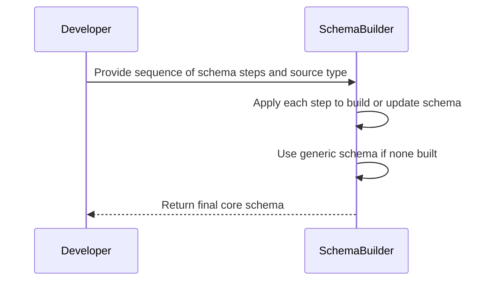
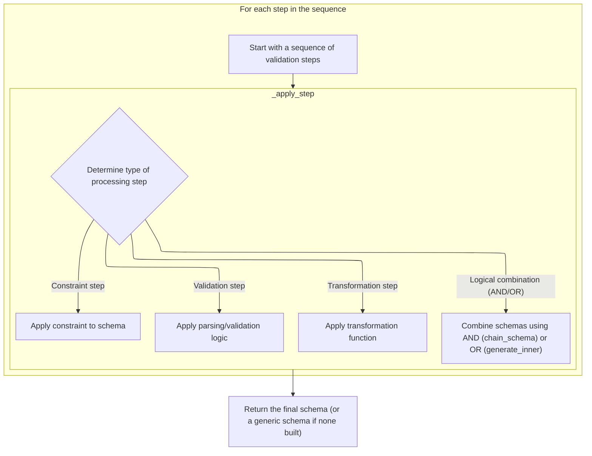
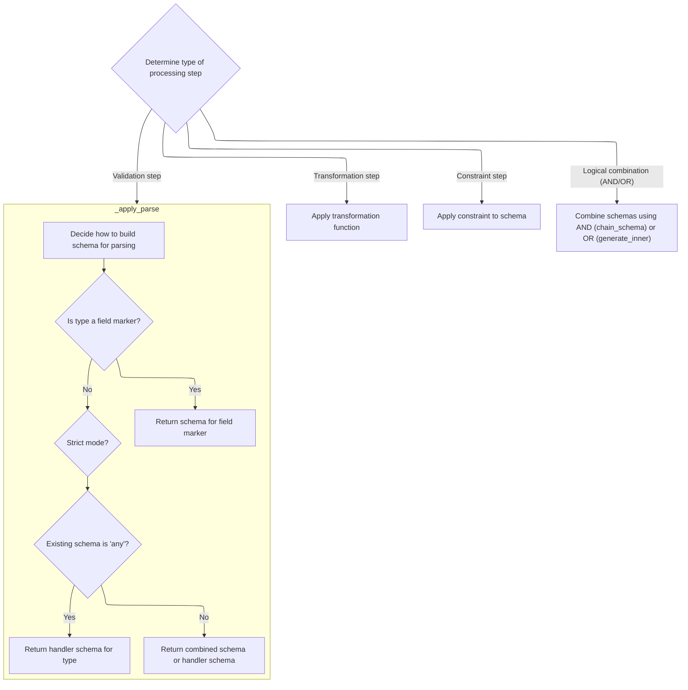
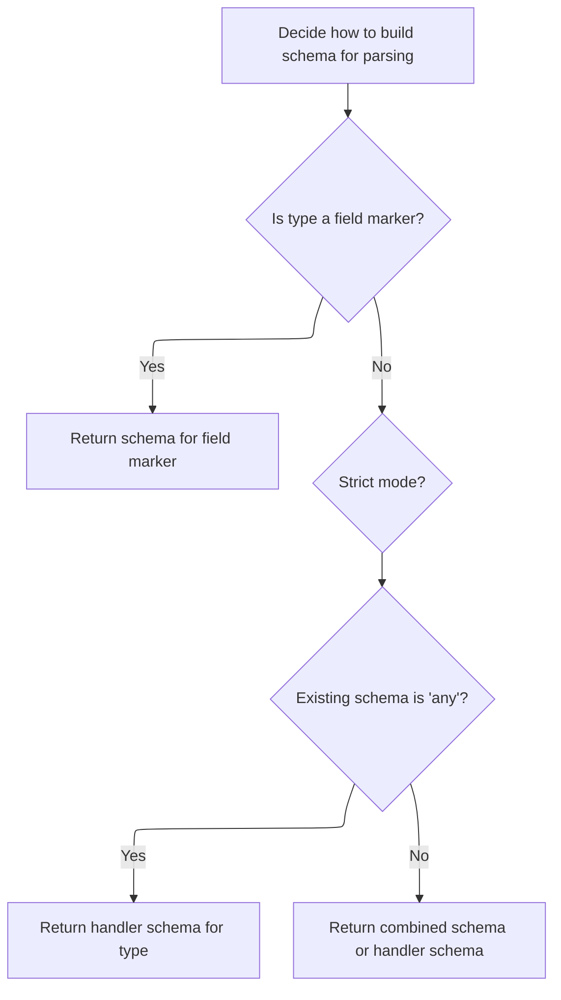
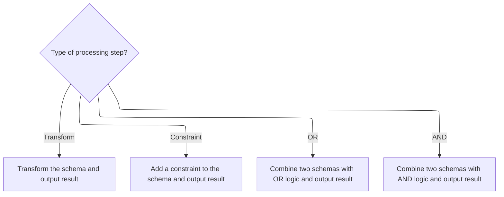

This document explains how a sequence of schema processing steps is used to build a comprehensive core schema for data validation and transformation. Each step in the sequence is applied in order, updating the schema with validation, transformation, or logical combination logic. If no schema is produced, a generic fallback is used. The final output is a core schema that reflects all specified operations.



# Spec

## Detailed View of the Program's Functionality

a. Sequential Step Application for Schema Construction

The process begins with a sequence of validation steps that are to be applied in order to build up a schema. These steps are stored in a queue. The system iterates through each step in the queue, applying them one by one to either build a new schema or update the existing one. For each step, a dispatch function is called to determine how to process it, and the schema is updated accordingly. After all steps have been processed, the final schema is returned. If no schema was built during the process, a generic "any" schema is returned as a fallback.

b. Step Dispatch and Schema Transformation

For each step in the sequence, the system determines the type of processing required:

- If the step is a validation step, it applies parsing and validation logic, possibly enforcing strict type validation.
- If the step is a transformation, it applies a transformation function to the schema.
- If the step is a constraint, it applies a constraint to the schema.
- If the step is a logical combination (AND/OR), it combines schemas using either a chain (AND) or a union (OR).

This dispatch mechanism ensures that each step is handled appropriately, updating the schema as needed.

c. Type-Based Schema Parsing and Chaining

When a validation step is encountered, the system decides how to build the schema for parsing:

- If the type is a special field marker, it either chains the current schema with a handler-generated schema for the source type or just uses the handler-generated schema if no current schema exists.
- If strict mode is enabled, the type is wrapped to enforce strict validation.
- If there is an existing schema and it is of type "any", the handler-generated schema for the new type is used directly.
- Otherwise, the system chains the existing schema with the handler-generated schema for the new type, ensuring that validation occurs in sequence.

This logic allows for flexible composition of validation and parsing steps.

d. Combining Schemas for Validation or Serialization

When schemas are chained (for example, as a result of an AND logical combination), the system selects either the first or last step in the chain depending on the context:

- For validation, the first step in the chain is used.
- For serialization, the last step in the chain is used.

The selected step is then passed to a function that generates the corresponding JSON schema.

e. Core Schema to JSON Schema Conversion with Metadata Handling

When converting a core schema to a JSON schema, the system first checks if the schema is a reference that has already been handled. If so, it returns a reference to the existing definition to avoid duplication.

If not, the system sets up a handler function that knows how to convert each core schema type to a JSON schema. This handler can be wrapped with additional logic based on metadata present in the schema:

- If there are user-specified updates in the metadata, these are applied to the generated JSON schema.
- If there are user-specified extras, these are also applied.
- If there are user modification functions, each is applied in turn, allowing for further customization.
- If there are annotation functions, these are also applied.

After all modifications, the handler is called to generate the final JSON schema. If the schema is a core schema, the system updates the definitions with any new information before returning the result.

f. Transform, Constraint, and Union Handling in Step Application

For transformation steps, the system applies the transformation function to the schema and outputs the result. For constraint steps, it adds the specified constraint to the schema and outputs the result.

For logical OR steps, the system combines two schemas using union logic, producing a schema that accepts either option. This is done by generating the JSON schema for each branch and combining them with an <SwmToken path="pydantic/json_schema.py" pos="727:2:2" line-data="                &#39;anyOf&#39;: [">`anyOf`</SwmToken> construct. If only one valid schema is present, it is returned directly.

For logical AND steps, the system chains the left and right schemas together, ensuring both are applied in order.

g. Final Schema Fallback and Return

After all steps have been processed, the system checks if a schema was successfully built. If not, it falls back to a generic "any" schema to ensure that a valid schema is always returned. The final schema is then returned as the result of the process.

# Rule Definition

| Paragraph Name                                                                                                                                                                                                                                                                                                                                                                                                                                                                                                                                                                                                                                                                                                                                                                                                     | Rule ID | Category          | Description                                                                                                                                                                                                                                                                                                                                                                                                                                                                                                                                                                                                                          | Conditions                                                   | Remarks                                                                                                                                                                                                                                                                                                                                                                                                                                                                                                                                                                                                                                                                                                                                                                                                                                                     |
| ------------------------------------------------------------------------------------------------------------------------------------------------------------------------------------------------------------------------------------------------------------------------------------------------------------------------------------------------------------------------------------------------------------------------------------------------------------------------------------------------------------------------------------------------------------------------------------------------------------------------------------------------------------------------------------------------------------------------------------------------------------------------------------------------------------------ | ------- | ----------------- | ------------------------------------------------------------------------------------------------------------------------------------------------------------------------------------------------------------------------------------------------------------------------------------------------------------------------------------------------------------------------------------------------------------------------------------------------------------------------------------------------------------------------------------------------------------------------------------------------------------------------------------ | ------------------------------------------------------------ | ----------------------------------------------------------------------------------------------------------------------------------------------------------------------------------------------------------------------------------------------------------------------------------------------------------------------------------------------------------------------------------------------------------------------------------------------------------------------------------------------------------------------------------------------------------------------------------------------------------------------------------------------------------------------------------------------------------------------------------------------------------------------------------------------------------------------------------------------------------- |
| def **get_pydantic_core_schema** in \_Pipeline, <SwmToken path="pydantic/experimental/pipeline.py" pos="347:5:5" line-data="            s = _apply_step(step, s, handler, source_type)">`_apply_step`</SwmToken>, <SwmToken path="pydantic/experimental/pipeline.py" pos="381:5:5" line-data="        s = _apply_parse(s, step.tp, step.strict, handler, source_type)">`_apply_parse`</SwmToken>, <SwmToken path="pydantic/experimental/pipeline.py" pos="385:5:5" line-data="        s = _apply_transform(s, step.func, handler)">`_apply_transform`</SwmToken>, <SwmToken path="pydantic/experimental/pipeline.py" pos="387:5:5" line-data="        s = _apply_constraint(s, step.constraint)">`_apply_constraint`</SwmToken>                                                                                    | RL-001  | Conditional Logic | The system processes a sequence of step objects, each representing a validation, constraint, transformation, or logical combination (AND/OR), in order, starting from an initial schema of None.                                                                                                                                                                                                                                                                                                                                                                                                                                     | A list of step objects is provided as input.                 | Each step must specify its type and relevant parameters. The initial schema is None. Steps are processed in order.                                                                                                                                                                                                                                                                                                                                                                                                                                                                                                                                                                                                                                                                                                                                          |
| def <SwmToken path="pydantic/experimental/pipeline.py" pos="31:6:6" line-data="__all__ = [&#39;validate_as&#39;, &#39;validate_as_deferred&#39;, &#39;transform&#39;]">`validate_as`</SwmToken>, <SwmToken path="pydantic/experimental/pipeline.py" pos="381:5:5" line-data="        s = _apply_parse(s, step.tp, step.strict, handler, source_type)">`_apply_parse`</SwmToken>                                                                                                                                                                                                                                                                                                                                                                                                                                    | RL-002  | Conditional Logic | If a step is a validation, it must specify a target type and a strictness flag. The system produces a core schema for validation of the specified type, optionally enforcing strictness. If a previous schema exists, the new schema is combined with the previous schema according to chaining rules.                                                                                                                                                                                                                                                                                                                               | Step type is 'validation'.                                   | Target type can be int, str, etc. Strictness flag determines if strict mode is used. Chaining rules apply if a previous schema exists.                                                                                                                                                                                                                                                                                                                                                                                                                                                                                                                                                                                                                                                                                                                      |
| def constrain, <SwmToken path="pydantic/experimental/pipeline.py" pos="387:5:5" line-data="        s = _apply_constraint(s, step.constraint)">`_apply_constraint`</SwmToken>                                                                                                                                                                                                                                                                                                                                                                                                                                                                                                                                                                                                                                       | RL-003  | Conditional Logic | If a step is a constraint, it must specify a constraint (<SwmToken path="pydantic/json_schema.py" pos="283:4:6" line-data="        # (e.g. because the CoreSchema that references short circuits is JSON schema generation without needing">`e.g`</SwmToken>., gt, lt, pattern). The system updates the current schema to include the specified constraint. Supported constraints include: gt, ge, lt, le, len, <SwmToken path="pydantic/json_schema.py" pos="2298:7:7" line-data="            &#39;multiple_of&#39;: &#39;multipleOf&#39;,">`multipleOf`</SwmToken>, timezone, interval, predicate, eq, notEq, in, not in, pattern. | Step type is 'constraint'.                                   | Constraints are mapped to internal or <SwmToken path="pydantic/experimental/pipeline.py" pos="17:2:2" line-data="import annotated_types">`annotated_types`</SwmToken> representations. Each constraint type has specific logic for updating the schema.                                                                                                                                                                                                                                                                                                                                                                                                                                                                                                                                                                                                     |
| def transform, <SwmToken path="pydantic/experimental/pipeline.py" pos="385:5:5" line-data="        s = _apply_transform(s, step.func, handler)">`_apply_transform`</SwmToken>                                                                                                                                                                                                                                                                                                                                                                                                                                                                                                                                                                                                                                      | RL-004  | Conditional Logic | If a step is a transformation, it must specify a transformation function. The system wraps the current schema with a post-processing function that applies the transformation after validation.                                                                                                                                                                                                                                                                                                                                                                                                                                      | Step type is 'transformation'.                               | Transformation functions are not represented in JSON Schema. For string types, certain transformations (strip, lower, upper) may be optimized into schema fields.                                                                                                                                                                                                                                                                                                                                                                                                                                                                                                                                                                                                                                                                                           |
| def otherwise, **or**, <SwmToken path="pydantic/experimental/pipeline.py" pos="347:5:5" line-data="            s = _apply_step(step, s, handler, source_type)">`_apply_step`</SwmToken>                                                                                                                                                                                                                                                                                                                                                                                                                                                                                                                                                                                                                            | RL-005  | Conditional Logic | If a step is a logical OR, it must specify two pipelines (left and right). The system produces a union schema that accepts input valid for either the left or right pipeline.                                                                                                                                                                                                                                                                                                                                                                                                                                                        | Step type is 'OR'.                                           | Union schemas are represented as <SwmToken path="pydantic/experimental/pipeline.py" pos="389:7:7" line-data="        s = cs.union_schema([handler(step.left), handler(step.right)])">`union_schema`</SwmToken> in core, and as <SwmToken path="pydantic/json_schema.py" pos="727:2:2" line-data="                &#39;anyOf&#39;: [">`anyOf`</SwmToken> in JSON Schema.                                                                                                                                                                                                                                                                                                                                                                                                                                                                                     |
| def then, **and**, <SwmToken path="pydantic/experimental/pipeline.py" pos="347:5:5" line-data="            s = _apply_step(step, s, handler, source_type)">`_apply_step`</SwmToken>                                                                                                                                                                                                                                                                                                                                                                                                                                                                                                                                                                                                                                | RL-006  | Conditional Logic | If a step is a logical AND, it must specify two pipelines (left and right). The system produces a chain schema that applies the left and right pipelines in sequence.                                                                                                                                                                                                                                                                                                                                                                                                                                                                | Step type is 'AND'.                                          | Chain schemas are represented as <SwmToken path="pydantic/experimental/pipeline.py" pos="392:7:7" line-data="        s = cs.chain_schema([handler(step.left), handler(step.right)])">`chain_schema`</SwmToken> in core, and as sequential validation in JSON Schema.                                                                                                                                                                                                                                                                                                                                                                                                                                                                                                                                                                                        |
| def **get_pydantic_core_schema** in \_Pipeline                                                                                                                                                                                                                                                                                                                                                                                                                                                                                                                                                                                                                                                                                                                                                                     | RL-007  | Data Assignment   | If no steps are provided, the system must produce a core schema of type 'any'.                                                                                                                                                                                                                                                                                                                                                                                                                                                                                                                                                       | Input step sequence is empty.                                | The core schema is <SwmToken path="pydantic/experimental/pipeline.py" pos="349:11:13" line-data="        s = s or cs.any_schema()">`any_schema()`</SwmToken>. In JSON Schema, this is represented as an empty object ({}).                                                                                                                                                                                                                                                                                                                                                                                                                                                                                                                                                                                                                                  |
| <SwmPath>[pydantic/json_schema.py](pydantic/json_schema.py)</SwmPath>: <SwmToken path="pydantic/json_schema.py" pos="96:4:4" line-data="See [`GenerateJsonSchema.render_warning_message`][pydantic.json_schema.GenerateJsonSchema.render_warning_message]">`GenerateJsonSchema`</SwmToken> and related methods                                                                                                                                                                                                                                                                                                                                                                                                                                                                                                     | RL-008  | Computation       | The system must convert the core schema to a JSON Schema representation, mapping type and constraint information to the corresponding JSON Schema types and keywords. Union schemas use <SwmToken path="pydantic/json_schema.py" pos="727:2:2" line-data="                &#39;anyOf&#39;: [">`anyOf`</SwmToken>, chain schemas use sequential validation logic, and transformations are not represented in JSON Schema.                                                                                                                                                                                                             | A core schema is available for conversion.                   | Type mappings: int → integer, str → string, etc. Constraint mappings: gt → <SwmToken path="pydantic/json_schema.py" pos="2302:7:7" line-data="            &#39;gt&#39;: &#39;exclusiveMinimum&#39;,">`exclusiveMinimum`</SwmToken>, pattern → pattern, etc. Union: <SwmToken path="pydantic/json_schema.py" pos="727:2:2" line-data="                &#39;anyOf&#39;: [">`anyOf`</SwmToken>. Chain: first/last step depending on mode. Transformations are omitted.                                                                                                                                                                                                                                                                                                                                                                                         |
| GenerateJsonSchema.generate_inner and related methods                                                                                                                                                                                                                                                                                                                                                                                                                                                                                                                                                                                                                                                                                                                                                              | RL-009  | Data Assignment   | The system must support inclusion of metadata (title, description, extras) in the schema, and must merge this metadata into the final JSON Schema output. User-specified updates, extras, or modification/annotation functions must be applied in sequence.                                                                                                                                                                                                                                                                                                                                                                          | Metadata is present in the schema.                           | Metadata fields may include title, description, <SwmToken path="pydantic/json_schema.py" pos="507:12:12" line-data="        if js_updates := metadata.get(&#39;pydantic_js_updates&#39;):">`pydantic_js_updates`</SwmToken>, <SwmToken path="pydantic/json_schema.py" pos="518:12:12" line-data="        if js_extra := metadata.get(&#39;pydantic_js_extra&#39;):">`pydantic_js_extra`</SwmToken>, <SwmToken path="pydantic/json_schema.py" pos="534:12:12" line-data="        for js_modify_function in metadata.get(&#39;pydantic_js_functions&#39;, ()):">`pydantic_js_functions`</SwmToken>, <SwmToken path="pydantic/json_schema.py" pos="552:12:12" line-data="        for js_modify_function in metadata.get(&#39;pydantic_js_annotation_functions&#39;, ()):">`pydantic_js_annotation_functions`</SwmToken>. These are merged or applied in order. |
| <SwmToken path="pydantic/json_schema.py" pos="96:4:4" line-data="See [`GenerateJsonSchema.render_warning_message`][pydantic.json_schema.GenerateJsonSchema.render_warning_message]">`GenerateJsonSchema`</SwmToken>, <SwmToken path="pydantic/json_schema.py" pos="452:10:10" line-data="                defs_ref, ref_json_schema = self.get_cache_defs_ref_schema(core_ref)">`get_cache_defs_ref_schema`</SwmToken>, <SwmToken path="pydantic/json_schema.py" pos="365:7:7" line-data="        definitions_remapping = self._build_definitions_remapping()">`_build_definitions_remapping`</SwmToken>, <SwmToken path="pydantic/json_schema.py" pos="179:7:7" line-data="            new_definitions_schema = remapping.remap_json_schema({&#39;$defs&#39;: copied_definitions})">`remap_json_schema`</SwmToken> | RL-010  | Conditional Logic | When generating JSON Schema, references to previously defined schemas must be handled using JSON Schema references ($ref) to avoid duplication and circular references. Shared schema definitions must be updated as needed, and all referenced schemas must be included in the definitions section.                                                                                                                                                                                                                                                                                                                                 | JSON Schema generation involves references to other schemas. | References use $ref and $defs. Remapping ensures no duplication or circular references.                                                                                                                                                                                                                                                                                                                                                                                                                                                                                                                                                                                                                                                                                                                                                                     |
| def **get_pydantic_core_schema** in \_Pipeline, GenerateJsonSchema.generate                                                                                                                                                                                                                                                                                                                                                                                                                                                                                                                                                                                                                                                                                                                                        | RL-011  | Conditional Logic | The system must always return a valid core schema and JSON Schema, regardless of the input steps.                                                                                                                                                                                                                                                                                                                                                                                                                                                                                                                                    | Any input, including empty or invalid steps.                 | If input is empty or invalid, fallback to <SwmToken path="pydantic/experimental/pipeline.py" pos="349:11:11" line-data="        s = s or cs.any_schema()">`any_schema`</SwmToken> and empty JSON Schema.                                                                                                                                                                                                                                                                                                                                                                                                                                                                                                                                                                                                                                                    |

# User Stories

## User Story 1: Process step sequence to build core schema

---

### Story Description:

As a user, I want to define a sequence of validation, constraint, transformation, and logical (AND/OR) steps so that the system can process them in order and produce a core schema representing the desired data validation pipeline.

---

### Business Rule Mapping:

| Rule ID | Paragraph Name                                                                                                                                                                                                                                                                                                                                                                                                                                                                                                                                                                                                                                                                                                                  | Rule Description                                                                                                                                                                                                                                                                                                                                                                                                                                                                                                                                                                                                                     |
| ------- | ------------------------------------------------------------------------------------------------------------------------------------------------------------------------------------------------------------------------------------------------------------------------------------------------------------------------------------------------------------------------------------------------------------------------------------------------------------------------------------------------------------------------------------------------------------------------------------------------------------------------------------------------------------------------------------------------------------------------------- | ------------------------------------------------------------------------------------------------------------------------------------------------------------------------------------------------------------------------------------------------------------------------------------------------------------------------------------------------------------------------------------------------------------------------------------------------------------------------------------------------------------------------------------------------------------------------------------------------------------------------------------ |
| RL-001  | def **get_pydantic_core_schema** in \_Pipeline, <SwmToken path="pydantic/experimental/pipeline.py" pos="347:5:5" line-data="            s = _apply_step(step, s, handler, source_type)">`_apply_step`</SwmToken>, <SwmToken path="pydantic/experimental/pipeline.py" pos="381:5:5" line-data="        s = _apply_parse(s, step.tp, step.strict, handler, source_type)">`_apply_parse`</SwmToken>, <SwmToken path="pydantic/experimental/pipeline.py" pos="385:5:5" line-data="        s = _apply_transform(s, step.func, handler)">`_apply_transform`</SwmToken>, <SwmToken path="pydantic/experimental/pipeline.py" pos="387:5:5" line-data="        s = _apply_constraint(s, step.constraint)">`_apply_constraint`</SwmToken> | The system processes a sequence of step objects, each representing a validation, constraint, transformation, or logical combination (AND/OR), in order, starting from an initial schema of None.                                                                                                                                                                                                                                                                                                                                                                                                                                     |
| RL-007  | def **get_pydantic_core_schema** in \_Pipeline                                                                                                                                                                                                                                                                                                                                                                                                                                                                                                                                                                                                                                                                                  | If no steps are provided, the system must produce a core schema of type 'any'.                                                                                                                                                                                                                                                                                                                                                                                                                                                                                                                                                       |
| RL-002  | def <SwmToken path="pydantic/experimental/pipeline.py" pos="31:6:6" line-data="__all__ = [&#39;validate_as&#39;, &#39;validate_as_deferred&#39;, &#39;transform&#39;]">`validate_as`</SwmToken>, <SwmToken path="pydantic/experimental/pipeline.py" pos="381:5:5" line-data="        s = _apply_parse(s, step.tp, step.strict, handler, source_type)">`_apply_parse`</SwmToken>                                                                                                                                                                                                                                                                                                                                                 | If a step is a validation, it must specify a target type and a strictness flag. The system produces a core schema for validation of the specified type, optionally enforcing strictness. If a previous schema exists, the new schema is combined with the previous schema according to chaining rules.                                                                                                                                                                                                                                                                                                                               |
| RL-003  | def constrain, <SwmToken path="pydantic/experimental/pipeline.py" pos="387:5:5" line-data="        s = _apply_constraint(s, step.constraint)">`_apply_constraint`</SwmToken>                                                                                                                                                                                                                                                                                                                                                                                                                                                                                                                                                    | If a step is a constraint, it must specify a constraint (<SwmToken path="pydantic/json_schema.py" pos="283:4:6" line-data="        # (e.g. because the CoreSchema that references short circuits is JSON schema generation without needing">`e.g`</SwmToken>., gt, lt, pattern). The system updates the current schema to include the specified constraint. Supported constraints include: gt, ge, lt, le, len, <SwmToken path="pydantic/json_schema.py" pos="2298:7:7" line-data="            &#39;multiple_of&#39;: &#39;multipleOf&#39;,">`multipleOf`</SwmToken>, timezone, interval, predicate, eq, notEq, in, not in, pattern. |
| RL-004  | def transform, <SwmToken path="pydantic/experimental/pipeline.py" pos="385:5:5" line-data="        s = _apply_transform(s, step.func, handler)">`_apply_transform`</SwmToken>                                                                                                                                                                                                                                                                                                                                                                                                                                                                                                                                                   | If a step is a transformation, it must specify a transformation function. The system wraps the current schema with a post-processing function that applies the transformation after validation.                                                                                                                                                                                                                                                                                                                                                                                                                                      |
| RL-005  | def otherwise, **or**, <SwmToken path="pydantic/experimental/pipeline.py" pos="347:5:5" line-data="            s = _apply_step(step, s, handler, source_type)">`_apply_step`</SwmToken>                                                                                                                                                                                                                                                                                                                                                                                                                                                                                                                                         | If a step is a logical OR, it must specify two pipelines (left and right). The system produces a union schema that accepts input valid for either the left or right pipeline.                                                                                                                                                                                                                                                                                                                                                                                                                                                        |
| RL-006  | def then, **and**, <SwmToken path="pydantic/experimental/pipeline.py" pos="347:5:5" line-data="            s = _apply_step(step, s, handler, source_type)">`_apply_step`</SwmToken>                                                                                                                                                                                                                                                                                                                                                                                                                                                                                                                                             | If a step is a logical AND, it must specify two pipelines (left and right). The system produces a chain schema that applies the left and right pipelines in sequence.                                                                                                                                                                                                                                                                                                                                                                                                                                                                |

---

### Relevant Functionality:

- **def get_pydantic_core_schema** in \_Pipeline
  1. **RL-001:**
     - Initialize current schema as None
     - For each step in the input sequence:
       - If step is validation: apply validation logic
       - If step is constraint: apply constraint logic
       - If step is transformation: apply transformation logic
       - If step is OR: combine left and right pipelines as union
       - If step is AND: chain left and right pipelines
     - After all steps, produce the resulting core schema
  2. **RL-007:**
     - If no steps, set schema to <SwmToken path="pydantic/experimental/pipeline.py" pos="349:11:13" line-data="        s = s or cs.any_schema()">`any_schema()`</SwmToken>
- **def** <SwmToken path="pydantic/experimental/pipeline.py" pos="31:6:6" line-data="__all__ = [&#39;validate_as&#39;, &#39;validate_as_deferred&#39;, &#39;transform&#39;]">`validate_as`</SwmToken>
  1. **RL-002:**
     - If <SwmToken path="pydantic/experimental/pipeline.py" pos="381:10:12" line-data="        s = _apply_parse(s, step.tp, step.strict, handler, source_type)">`step.tp`</SwmToken> is <SwmToken path="pydantic/experimental/pipeline.py" pos="27:1:1" line-data="    EllipsisType = type(Ellipsis)">`EllipsisType`</SwmToken>, use field type marker
     - If strict, wrap type in Annotated with Strict
     - If previous schema exists and is 'any', use handler(tp)
     - Else, chain previous schema and handler(tp)
     - If no previous schema, use handler(tp)
- **def constrain**
  1. **RL-003:**
     - Identify constraint type
     - For numeric constraints (gt, ge, lt, le, <SwmToken path="pydantic/json_schema.py" pos="2298:7:7" line-data="            &#39;multiple_of&#39;: &#39;multipleOf&#39;,">`multipleOf`</SwmToken>): update schema fields or add validator
     - For len: update min_length/max_length
     - For pattern: update pattern field or add validator
     - For eq, notEq, in, notIn: add appropriate validator
     - For timezone: update <SwmToken path="pydantic/experimental/pipeline.py" pos="555:4:4" line-data="                s[&#39;tz_constraint&#39;] = &#39;aware&#39;">`tz_constraint`</SwmToken> or add validator
     - For interval: apply multiple constraints
     - For predicate: add validator function
- **def transform**
  1. **RL-004:**
     - If schema is None, create plain validator with function
     - If schema is string type and function is strip/lower/upper, set corresponding schema field
     - Else, wrap schema with after-validator function
- **def otherwise**
  1. **RL-005:**
     - For OR step, call handler on left and right pipelines
     - Create union schema with both results
- **def then**
  1. **RL-006:**
     - For AND step, call handler on left and right pipelines
     - Create chain schema with both results

## User Story 2: Generate robust and extensible JSON Schema output

---

### Story Description:

As a user, I want the system to convert the core schema to a JSON Schema representation that includes correct type and constraint mappings, supports metadata and user modifications, handles references and shared definitions, and always returns a valid schema, so that I can use the output reliably in any JSON Schema-compatible environment.

---

### Business Rule Mapping:

| Rule ID | Paragraph Name                                                                                                                                                                                                                                                                                                                                                                                                                                                                                                                                                                                                                                                                                                                                                                                                     | Rule Description                                                                                                                                                                                                                                                                                                                                                                                                         |
| ------- | ------------------------------------------------------------------------------------------------------------------------------------------------------------------------------------------------------------------------------------------------------------------------------------------------------------------------------------------------------------------------------------------------------------------------------------------------------------------------------------------------------------------------------------------------------------------------------------------------------------------------------------------------------------------------------------------------------------------------------------------------------------------------------------------------------------------ | ------------------------------------------------------------------------------------------------------------------------------------------------------------------------------------------------------------------------------------------------------------------------------------------------------------------------------------------------------------------------------------------------------------------------ |
| RL-008  | <SwmPath>[pydantic/json_schema.py](pydantic/json_schema.py)</SwmPath>: <SwmToken path="pydantic/json_schema.py" pos="96:4:4" line-data="See [`GenerateJsonSchema.render_warning_message`][pydantic.json_schema.GenerateJsonSchema.render_warning_message]">`GenerateJsonSchema`</SwmToken> and related methods                                                                                                                                                                                                                                                                                                                                                                                                                                                                                                     | The system must convert the core schema to a JSON Schema representation, mapping type and constraint information to the corresponding JSON Schema types and keywords. Union schemas use <SwmToken path="pydantic/json_schema.py" pos="727:2:2" line-data="                &#39;anyOf&#39;: [">`anyOf`</SwmToken>, chain schemas use sequential validation logic, and transformations are not represented in JSON Schema. |
| RL-009  | GenerateJsonSchema.generate_inner and related methods                                                                                                                                                                                                                                                                                                                                                                                                                                                                                                                                                                                                                                                                                                                                                              | The system must support inclusion of metadata (title, description, extras) in the schema, and must merge this metadata into the final JSON Schema output. User-specified updates, extras, or modification/annotation functions must be applied in sequence.                                                                                                                                                              |
| RL-010  | <SwmToken path="pydantic/json_schema.py" pos="96:4:4" line-data="See [`GenerateJsonSchema.render_warning_message`][pydantic.json_schema.GenerateJsonSchema.render_warning_message]">`GenerateJsonSchema`</SwmToken>, <SwmToken path="pydantic/json_schema.py" pos="452:10:10" line-data="                defs_ref, ref_json_schema = self.get_cache_defs_ref_schema(core_ref)">`get_cache_defs_ref_schema`</SwmToken>, <SwmToken path="pydantic/json_schema.py" pos="365:7:7" line-data="        definitions_remapping = self._build_definitions_remapping()">`_build_definitions_remapping`</SwmToken>, <SwmToken path="pydantic/json_schema.py" pos="179:7:7" line-data="            new_definitions_schema = remapping.remap_json_schema({&#39;$defs&#39;: copied_definitions})">`remap_json_schema`</SwmToken> | When generating JSON Schema, references to previously defined schemas must be handled using JSON Schema references ($ref) to avoid duplication and circular references. Shared schema definitions must be updated as needed, and all referenced schemas must be included in the definitions section.                                                                                                                     |
| RL-011  | def **get_pydantic_core_schema** in \_Pipeline, GenerateJsonSchema.generate                                                                                                                                                                                                                                                                                                                                                                                                                                                                                                                                                                                                                                                                                                                                        | The system must always return a valid core schema and JSON Schema, regardless of the input steps.                                                                                                                                                                                                                                                                                                                        |

---

### Relevant Functionality:

- <SwmPath>[pydantic/json_schema.py](pydantic/json_schema.py)</SwmPath>**:** <SwmToken path="pydantic/json_schema.py" pos="96:4:4" line-data="See [`GenerateJsonSchema.render_warning_message`][pydantic.json_schema.GenerateJsonSchema.render_warning_message]">`GenerateJsonSchema`</SwmToken> **and related methods**
  1. **RL-008:**
     - For each core schema type, map to JSON Schema type
     - For constraints, map to JSON Schema keywords
     - For union, use <SwmToken path="pydantic/json_schema.py" pos="727:2:2" line-data="                &#39;anyOf&#39;: [">`anyOf`</SwmToken>
     - For chain, use first or last step as appropriate
     - Omit transformations from JSON Schema
- **GenerateJsonSchema.generate_inner and related methods**
  1. **RL-009:**
     - If metadata contains updates, merge into JSON Schema
     - If metadata contains extras, update JSON Schema
     - If metadata contains modification functions, apply each in sequence
- <SwmToken path="pydantic/json_schema.py" pos="96:4:4" line-data="See [`GenerateJsonSchema.render_warning_message`][pydantic.json_schema.GenerateJsonSchema.render_warning_message]">`GenerateJsonSchema`</SwmToken>
  1. **RL-010:**
     - Track all referenced schemas
     - Use $ref for repeated schemas
     - Add all referenced schemas to $defs
     - Remap references to avoid duplication/circularity
- **def get_pydantic_core_schema** in \_Pipeline
  1. **RL-011:**
     - If processing fails or input is empty, return <SwmToken path="pydantic/experimental/pipeline.py" pos="349:11:11" line-data="        s = s or cs.any_schema()">`any_schema`</SwmToken> and {}

# Code Walkthrough

## Sequential Step Application for Schema Construction



<SwmSnippet path="/pydantic/experimental/pipeline.py" line="338">

---

In **get_pydantic_core_schema**, we start by queuing up all the steps and then process them one by one with <SwmToken path="pydantic/experimental/pipeline.py" pos="347:5:5" line-data="            s = _apply_step(step, s, handler, source_type)">`_apply_step`</SwmToken> to build up the schema in order.

```python
    def __get_pydantic_core_schema__(self, source_type: Any, handler: GetCoreSchemaHandler) -> cs.CoreSchema:
        from pydantic_core import core_schema as cs

        queue = deque(self._steps)

        s = None

        while queue:
            step = queue.popleft()
            s = _apply_step(step, s, handler, source_type)

```

---

</SwmSnippet>

### Step Dispatch and Schema Transformation



<SwmSnippet path="/pydantic/experimental/pipeline.py" line="377">

---

In <SwmToken path="pydantic/experimental/pipeline.py" pos="377:2:2" line-data="def _apply_step(step: _Step, s: cs.CoreSchema | None, handler: GetCoreSchemaHandler, source_type: Any) -&gt; cs.CoreSchema:">`_apply_step`</SwmToken>, we check what kind of step we're dealing with. If it's a validation step, we call <SwmToken path="pydantic/experimental/pipeline.py" pos="381:5:5" line-data="        s = _apply_parse(s, step.tp, step.strict, handler, source_type)">`_apply_parse`</SwmToken> to either enforce strict type validation or not, depending on the step. This is how we decide how to update or build the schema for each step.

```python
def _apply_step(step: _Step, s: cs.CoreSchema | None, handler: GetCoreSchemaHandler, source_type: Any) -> cs.CoreSchema:
    from pydantic_core import core_schema as cs

    if isinstance(step, _ValidateAs):
        s = _apply_parse(s, step.tp, step.strict, handler, source_type)
    elif isinstance(step, _ValidateAsDefer):
        s = _apply_parse(s, step.tp, False, handler, source_type)
    elif isinstance(step, _Transform):
```

---

</SwmSnippet>

#### Type-Based Schema Parsing and Chaining



<SwmSnippet path="/pydantic/experimental/pipeline.py" line="396">

---

<SwmToken path="pydantic/experimental/pipeline.py" pos="396:2:2" line-data="def _apply_parse(">`_apply_parse`</SwmToken> checks if we need to combine an existing schema with a new one for a type, or just use the new one directly. If strict mode is on, it tweaks the type accordingly. When chaining is needed, it calls <SwmToken path="pydantic/experimental/pipeline.py" pos="408:5:5" line-data="        return cs.chain_schema([s, handler(source_type)]) if s else handler(source_type)">`chain_schema`</SwmToken> to link the schemas together, so validation happens in sequence.

```python
def _apply_parse(
    s: cs.CoreSchema | None,
    tp: type[Any],
    strict: bool,
    handler: GetCoreSchemaHandler,
    source_type: Any,
) -> cs.CoreSchema:
    from pydantic_core import core_schema as cs

    from pydantic import Strict

    if tp is _FieldTypeMarker:
        return cs.chain_schema([s, handler(source_type)]) if s else handler(source_type)

    if strict:
        tp = Annotated[tp, Strict()]  # type: ignore

    if s and s['type'] == 'any':
        return handler(tp)
    else:
        return cs.chain_schema([s, handler(tp)]) if s else handler(tp)
```

---

</SwmSnippet>

#### Combining Schemas for Validation or Serialization

<SwmSnippet path="/pydantic/json_schema.py" line="1348">

---

Chain_schema picks either the first or last step in the chain depending on whether we're validating or serializing, then hands that step off to <SwmToken path="pydantic/json_schema.py" pos="1361:5:5" line-data="        return self.generate_inner(schema[&#39;steps&#39;][step_index])">`generate_inner`</SwmToken> to actually build the JSON schema for it.

```python
    def chain_schema(self, schema: core_schema.ChainSchema) -> JsonSchemaValue:
        """Generates a JSON schema that matches a core_schema.ChainSchema.

        When generating a schema for validation, we return the validation JSON schema for the first step in the chain.
        For serialization, we return the serialization JSON schema for the last step in the chain.

        Args:
            schema: The core schema.

        Returns:
            The generated JSON schema.
        """
        step_index = 0 if self.mode == 'validation' else -1  # use first step for validation, last for serialization
        return self.generate_inner(schema['steps'][step_index])
```

---

</SwmSnippet>

#### Core Schema to JSON Schema Conversion with Metadata Handling

```mermaid
%%{init: {"flowchart": {"defaultRenderer": "elk"}} }%%
flowchart TD
    node1{"Is schema a reference?"}
    click node1 openCode "pydantic/json_schema.py:443:448"
    node1 -- Yes --> node2["Return reference to existing definition"]
    click node2 openCode "pydantic/json_schema.py:446:447"
    node1 -- No --> node3["Extract metadata from schema"]
    click node3 openCode "pydantic/json_schema.py:503:503"
    node3 --> node4{"pydantic_js_updates in metadata?"}
    click node4 openCode "pydantic/json_schema.py:507:517"
    node4 -- Yes --> node5["Apply user-specified updates"]
    click node5 openCode "pydantic/json_schema.py:509:515"
    node4 -- No --> node6
    node5 --> node6["Continue"]
    node6{"pydantic_js_extra in metadata?"}
    click node6 openCode "pydantic/json_schema.py:518:532"
    node6 -- Yes --> node7["Apply user-specified extras"]
    click node7 openCode "pydantic/json_schema.py:521:530"
    node6 -- No --> node8
    node7 --> node8["Continue"]
    subgraph loop1["For each function in pydantic_js_functions"]
      node8 --> node9["Apply user modification function"]
      click node9 openCode "pydantic/json_schema.py:536:548"
      node9 --> node8
    end
    subgraph loop2["For each function in pydantic_js_annotation_functions"]
      node8 --> node10["Apply user annotation function"]
      click node10 openCode "pydantic/json_schema.py:555:559"
      node10 --> node8
    end
    node8 --> node11["Generate JSON schema"]
    click node11 openCode "pydantic/json_schema.py:563:563"
    node11 --> node12{"Is schema a core schema?"}
    click node12 openCode "pydantic/json_schema.py:564:565"
    node12 -- Yes --> node13["Update schema definitions"]
    click node13 openCode "pydantic/json_schema.py:565:565"
    node12 -- No --> node14
    node13 --> node14["Return final JSON schema"]
    click node14 openCode "pydantic/json_schema.py:566:566"

%% Swimm:
%% %%{init: {"flowchart": {"defaultRenderer": "elk"}} }%%
%% flowchart TD
%%     node1{"Is schema a reference?"}
%%     click node1 openCode "<SwmPath>[pydantic/json_schema.py](pydantic/json_schema.py)</SwmPath>:443:448"
%%     node1 -- Yes --> node2["Return reference to existing definition"]
%%     click node2 openCode "<SwmPath>[pydantic/json_schema.py](pydantic/json_schema.py)</SwmPath>:446:447"
%%     node1 -- No --> node3["Extract metadata from schema"]
%%     click node3 openCode "<SwmPath>[pydantic/json_schema.py](pydantic/json_schema.py)</SwmPath>:503:503"
%%     node3 --> node4{"<SwmToken path="pydantic/json_schema.py" pos="507:12:12" line-data="        if js_updates := metadata.get(&#39;pydantic_js_updates&#39;):">`pydantic_js_updates`</SwmToken> in metadata?"}
%%     click node4 openCode "<SwmPath>[pydantic/json_schema.py](pydantic/json_schema.py)</SwmPath>:507:517"
%%     node4 -- Yes --> node5["Apply user-specified updates"]
%%     click node5 openCode "<SwmPath>[pydantic/json_schema.py](pydantic/json_schema.py)</SwmPath>:509:515"
%%     node4 -- No --> node6
%%     node5 --> node6["Continue"]
%%     node6{"<SwmToken path="pydantic/json_schema.py" pos="518:12:12" line-data="        if js_extra := metadata.get(&#39;pydantic_js_extra&#39;):">`pydantic_js_extra`</SwmToken> in metadata?"}
%%     click node6 openCode "<SwmPath>[pydantic/json_schema.py](pydantic/json_schema.py)</SwmPath>:518:532"
%%     node6 -- Yes --> node7["Apply user-specified extras"]
%%     click node7 openCode "<SwmPath>[pydantic/json_schema.py](pydantic/json_schema.py)</SwmPath>:521:530"
%%     node6 -- No --> node8
%%     node7 --> node8["Continue"]
%%     subgraph loop1["For each function in <SwmToken path="pydantic/json_schema.py" pos="534:12:12" line-data="        for js_modify_function in metadata.get(&#39;pydantic_js_functions&#39;, ()):">`pydantic_js_functions`</SwmToken>"]
%%       node8 --> node9["Apply user modification function"]
%%       click node9 openCode "<SwmPath>[pydantic/json_schema.py](pydantic/json_schema.py)</SwmPath>:536:548"
%%       node9 --> node8
%%     end
%%     subgraph loop2["For each function in <SwmToken path="pydantic/json_schema.py" pos="552:12:12" line-data="        for js_modify_function in metadata.get(&#39;pydantic_js_annotation_functions&#39;, ()):">`pydantic_js_annotation_functions`</SwmToken>"]
%%       node8 --> node10["Apply user annotation function"]
%%       click node10 openCode "<SwmPath>[pydantic/json_schema.py](pydantic/json_schema.py)</SwmPath>:555:559"
%%       node10 --> node8
%%     end
%%     node8 --> node11["Generate JSON schema"]
%%     click node11 openCode "<SwmPath>[pydantic/json_schema.py](pydantic/json_schema.py)</SwmPath>:563:563"
%%     node11 --> node12{"Is schema a core schema?"}
%%     click node12 openCode "<SwmPath>[pydantic/json_schema.py](pydantic/json_schema.py)</SwmPath>:564:565"
%%     node12 -- Yes --> node13["Update schema definitions"]
%%     click node13 openCode "<SwmPath>[pydantic/json_schema.py](pydantic/json_schema.py)</SwmPath>:565:565"
%%     node12 -- No --> node14
%%     node13 --> node14["Return final JSON schema"]
%%     click node14 openCode "<SwmPath>[pydantic/json_schema.py](pydantic/json_schema.py)</SwmPath>:566:566"
```



<SwmSnippet path="/pydantic/json_schema.py" line="427">

---

In <SwmToken path="pydantic/json_schema.py" pos="427:3:3" line-data="    def generate_inner(self, schema: CoreSchemaOrField) -&gt; JsonSchemaValue:  # noqa: C901">`generate_inner`</SwmToken>, we first check if the schema is a reference we've already handled—if so, we just return a $ref to avoid regenerating it. Then, we set up a handler function that knows how to turn each core schema type into JSON schema, and we wrap it with extra logic if the schema metadata says so. This lets us customize or extend the schema output as needed, and we use <SwmToken path="pydantic/json_schema.py" pos="449:3:3" line-data="        def populate_defs(core_schema: CoreSchema, json_schema: JsonSchemaValue) -&gt; JsonSchemaValue:">`populate_defs`</SwmToken> to manage shared definitions and avoid circular refs.

```python
    def generate_inner(self, schema: CoreSchemaOrField) -> JsonSchemaValue:  # noqa: C901
        """Generates a JSON schema for a given core schema.

        Args:
            schema: The given core schema.

        Returns:
            The generated JSON schema.

        TODO: the nested function definitions here seem like bad practice, I'd like to unpack these
        in a future PR. It'd be great if we could shorten the call stack a bit for JSON schema generation,
        and I think there's potential for that here.
        """
        # If a schema with the same CoreRef has been handled, just return a reference to it
        # Note that this assumes that it will _never_ be the case that the same CoreRef is used
        # on types that should have different JSON schemas
        if 'ref' in schema:
            core_ref = CoreRef(schema['ref'])  # type: ignore[typeddict-item]
            core_mode_ref = (core_ref, self.mode)
            if core_mode_ref in self.core_to_defs_refs and self.core_to_defs_refs[core_mode_ref] in self.definitions:
                return {'$ref': self.core_to_json_refs[core_mode_ref]}

        def populate_defs(core_schema: CoreSchema, json_schema: JsonSchemaValue) -> JsonSchemaValue:
            if 'ref' in core_schema:
                core_ref = CoreRef(core_schema['ref'])  # type: ignore[typeddict-item]
                defs_ref, ref_json_schema = self.get_cache_defs_ref_schema(core_ref)
                json_ref = JsonRef(ref_json_schema['$ref'])
                # Replace the schema if it's not a reference to itself
                # What we want to avoid is having the def be just a ref to itself
                # which is what would happen if we blindly assigned any
                if json_schema.get('$ref', None) != json_ref:
                    self.definitions[defs_ref] = json_schema
                    self._core_defs_invalid_for_json_schema.pop(defs_ref, None)
                json_schema = ref_json_schema
            return json_schema

        def handler_func(schema_or_field: CoreSchemaOrField) -> JsonSchemaValue:
            """Generate a JSON schema based on the input schema.

            Args:
                schema_or_field: The core schema to generate a JSON schema from.

            Returns:
                The generated JSON schema.

            Raises:
                TypeError: If an unexpected schema type is encountered.
            """
            # Generate the core-schema-type-specific bits of the schema generation:
            json_schema: JsonSchemaValue | None = None
            if self.mode == 'serialization' and 'serialization' in schema_or_field:
                # In this case, we skip the JSON Schema generation of the schema
                # and use the `'serialization'` schema instead (canonical example:
                # `Annotated[int, PlainSerializer(str)]`).
                ser_schema = schema_or_field['serialization']  # type: ignore
                json_schema = self.ser_schema(ser_schema)

                # It might be that the 'serialization'` is skipped depending on `when_used`.
                # This is only relevant for `nullable` schemas though, so we special case here.
                if (
                    json_schema is not None
                    and ser_schema.get('when_used') in ('unless-none', 'json-unless-none')
                    and schema_or_field['type'] == 'nullable'
                ):
                    json_schema = self.get_flattened_anyof([{'type': 'null'}, json_schema])
            if json_schema is None:
                if _core_utils.is_core_schema(schema_or_field) or _core_utils.is_core_schema_field(schema_or_field):
                    generate_for_schema_type = self._schema_type_to_method[schema_or_field['type']]
                    json_schema = generate_for_schema_type(schema_or_field)
                else:
                    raise TypeError(f'Unexpected schema type: schema={schema_or_field}')

            return json_schema

        current_handler = _schema_generation_shared.GenerateJsonSchemaHandler(self, handler_func)

        metadata = cast(_core_metadata.CoreMetadata, schema.get('metadata', {}))

        # TODO: I dislike that we have to wrap these basic dict updates in callables, is there any way around this?

        if js_updates := metadata.get('pydantic_js_updates'):

            def js_updates_handler_func(
                schema_or_field: CoreSchemaOrField,
                current_handler: GetJsonSchemaHandler = current_handler,
            ) -> JsonSchemaValue:
                json_schema = {**current_handler(schema_or_field), **js_updates}
                return json_schema

            current_handler = _schema_generation_shared.GenerateJsonSchemaHandler(self, js_updates_handler_func)

        if js_extra := metadata.get('pydantic_js_extra'):

            def js_extra_handler_func(
                schema_or_field: CoreSchemaOrField,
                current_handler: GetJsonSchemaHandler = current_handler,
            ) -> JsonSchemaValue:
                json_schema = current_handler(schema_or_field)
                if isinstance(js_extra, dict):
                    json_schema.update(to_jsonable_python(js_extra))
                elif callable(js_extra):
                    # similar to typing issue in _update_class_schema when we're working with callable js extra
                    js_extra(json_schema)  # type: ignore
                return json_schema

            current_handler = _schema_generation_shared.GenerateJsonSchemaHandler(self, js_extra_handler_func)

        for js_modify_function in metadata.get('pydantic_js_functions', ()):

            def new_handler_func(
                schema_or_field: CoreSchemaOrField,
                current_handler: GetJsonSchemaHandler = current_handler,
                js_modify_function: GetJsonSchemaFunction = js_modify_function,
            ) -> JsonSchemaValue:
                json_schema = js_modify_function(schema_or_field, current_handler)
                if _core_utils.is_core_schema(schema_or_field):
                    json_schema = populate_defs(schema_or_field, json_schema)
                original_schema = current_handler.resolve_ref_schema(json_schema)
                ref = json_schema.pop('$ref', None)
                if ref and json_schema:
                    original_schema.update(json_schema)
                return original_schema

            current_handler = _schema_generation_shared.GenerateJsonSchemaHandler(self, new_handler_func)
```

---

</SwmSnippet>

<SwmSnippet path="/pydantic/json_schema.py" line="550">

---

After setting up the main handler, we loop through extra metadata keys and wrap the handler again for each one. This lets us layer on more modifications or tweaks to the JSON schema, so the output can be adjusted by whatever metadata is present.

```python
            current_handler = _schema_generation_shared.GenerateJsonSchemaHandler(self, new_handler_func)

        for js_modify_function in metadata.get('pydantic_js_annotation_functions', ()):

            def new_handler_func(
                schema_or_field: CoreSchemaOrField,
                current_handler: GetJsonSchemaHandler = current_handler,
                js_modify_function: GetJsonSchemaFunction = js_modify_function,
            ) -> JsonSchemaValue:
                return js_modify_function(schema_or_field, current_handler)

            current_handler = _schema_generation_shared.GenerateJsonSchemaHandler(self, new_handler_func)
```

---

</SwmSnippet>

<SwmSnippet path="/pydantic/json_schema.py" line="561">

---

After all the handler wrapping, we call the final handler with the schema to get the JSON schema. If it's a core schema, we update definitions with <SwmToken path="pydantic/json_schema.py" pos="565:5:5" line-data="            json_schema = populate_defs(schema, json_schema)">`populate_defs`</SwmToken> before returning the result. This gives us the final, possibly customized, JSON schema.

```python
            current_handler = _schema_generation_shared.GenerateJsonSchemaHandler(self, new_handler_func)

        json_schema = current_handler(schema)
        if _core_utils.is_core_schema(schema):
            json_schema = populate_defs(schema, json_schema)
        return json_schema
```

---

</SwmSnippet>

#### Transform, Constraint, and Union Handling in Step Application



<SwmSnippet path="/pydantic/experimental/pipeline.py" line="385">

---

Back in <SwmToken path="pydantic/experimental/pipeline.py" pos="347:5:5" line-data="            s = _apply_step(step, s, handler, source_type)">`_apply_step`</SwmToken>, after handling validation steps, we check for transforms, constraints, and unions. If it's a union step, we call <SwmToken path="pydantic/experimental/pipeline.py" pos="389:7:7" line-data="        s = cs.union_schema([handler(step.left), handler(step.right)])">`union_schema`</SwmToken> to combine the left and right branches into a schema that accepts either, letting us support multiple possible types or structures.

```python
        s = _apply_transform(s, step.func, handler)
    elif isinstance(step, _Constraint):
        s = _apply_constraint(s, step.constraint)
    elif isinstance(step, _PipelineOr):
        s = cs.union_schema([handler(step.left), handler(step.right)])
    else:
```

---

</SwmSnippet>

<SwmSnippet path="/pydantic/json_schema.py" line="1241">

---

Union_schema loops through each possible schema in the union, handling both labeled and unlabeled choices. For each, it calls <SwmToken path="pydantic/json_schema.py" pos="1257:7:7" line-data="                generated.append(self.generate_inner(choice_schema))">`generate_inner`</SwmToken> to get the JSON schema. If there's only one valid schema, it returns that; otherwise, it combines them with <SwmToken path="pydantic/json_schema.py" pos="727:2:2" line-data="                &#39;anyOf&#39;: [">`anyOf`</SwmToken> so the result matches any of the options.

```python
    def union_schema(self, schema: core_schema.UnionSchema) -> JsonSchemaValue:
        """Generates a JSON schema that matches a schema that allows values matching any of the given schemas.

        Args:
            schema: The core schema.

        Returns:
            The generated JSON schema.
        """
        generated: list[JsonSchemaValue] = []

        choices = schema['choices']
        for choice in choices:
            # choice will be a tuple if an explicit label was provided
            choice_schema = choice[0] if isinstance(choice, tuple) else choice
            try:
                generated.append(self.generate_inner(choice_schema))
            except PydanticOmit:
                continue
            except PydanticInvalidForJsonSchema as exc:
                self.emit_warning('skipped-choice', exc.message)
        if len(generated) == 1:
            return generated[0]
        return self.get_flattened_anyof(generated)
```

---

</SwmSnippet>

<SwmSnippet path="/pydantic/experimental/pipeline.py" line="391">

---

After <SwmToken path="pydantic/experimental/pipeline.py" pos="389:7:7" line-data="        s = cs.union_schema([handler(step.left), handler(step.right)])">`union_schema`</SwmToken>, <SwmToken path="pydantic/experimental/pipeline.py" pos="347:5:5" line-data="            s = _apply_step(step, s, handler, source_type)">`_apply_step`</SwmToken> checks for <SwmToken path="pydantic/experimental/pipeline.py" pos="391:8:8" line-data="        assert isinstance(step, _PipelineAnd)">`_PipelineAnd`</SwmToken> steps. If we hit one, we chain the left and right schemas together using <SwmToken path="pydantic/experimental/pipeline.py" pos="392:7:7" line-data="        s = cs.chain_schema([handler(step.left), handler(step.right)])">`chain_schema`</SwmToken>, so both branches are applied in order. Then we return the final schema for this step.

```python
        assert isinstance(step, _PipelineAnd)
        s = cs.chain_schema([handler(step.left), handler(step.right)])
    return s
```

---

</SwmSnippet>

### Final Schema Fallback and Return

<SwmSnippet path="/pydantic/experimental/pipeline.py" line="349">

---

After running all the steps through <SwmToken path="pydantic/experimental/pipeline.py" pos="347:5:5" line-data="            s = _apply_step(step, s, handler, source_type)">`_apply_step`</SwmToken>, **get_pydantic_core_schema** checks if we actually built a schema. If not, it falls back to <SwmToken path="pydantic/experimental/pipeline.py" pos="349:9:13" line-data="        s = s or cs.any_schema()">`cs.any_schema()`</SwmToken> so we always return a valid schema, even if there were no steps.

```python
        s = s or cs.any_schema()
        return s
```

---

</SwmSnippet>

&nbsp;

*This is an auto-generated document by Swimm 🌊 and has not yet been verified by a human*

<SwmMeta version="3.0.0" repo-id="Z2l0aHViJTNBJTNBcHlkYW50aWMlM0ElM0FTd2ltbS1EZW1v" repo-name="pydantic"><sup>Powered by [Swimm](/)</sup></SwmMeta>
