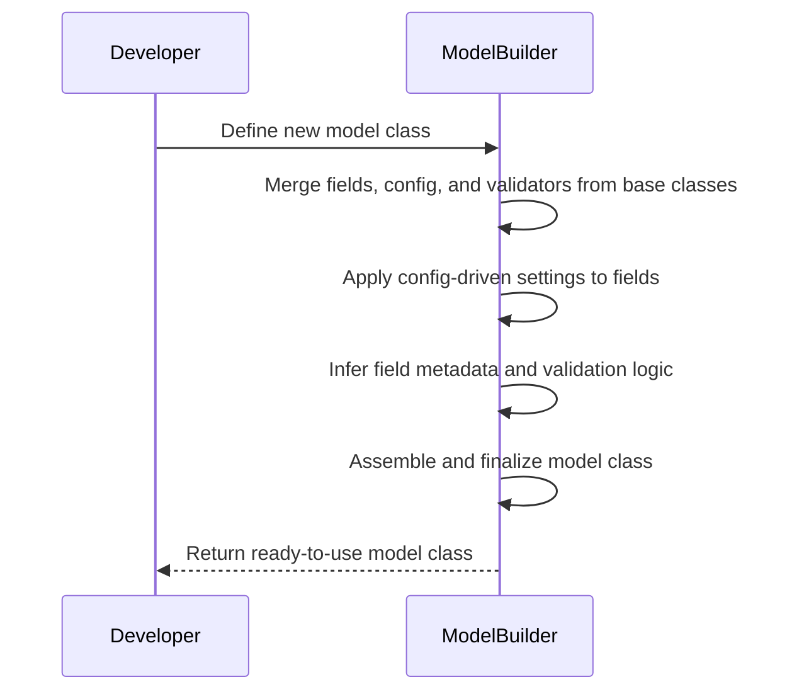
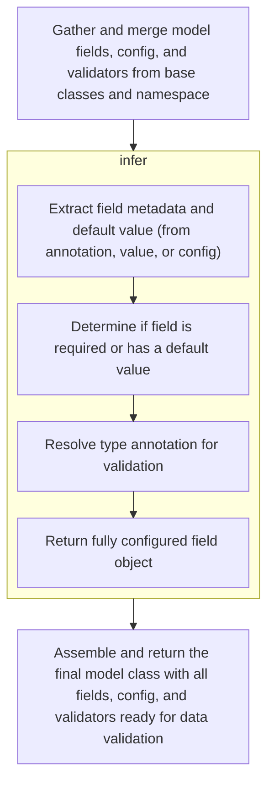

Defining a new model class involves merging fields, configuration, and validation logic from base classes and the current class definition, ensuring the resulting model is ready to validate and process input data according to type hints and configuration.

The main steps are:

- Gather and merge fields, config, and validators from base classes and the current class definition
- Apply config-driven settings to each field
- Infer field metadata and validation logic from type annotations and values
- Finalize the model class by assembling fields, config, validators, and setting up the class namespace



# Spec

## Detailed View of the Program's Functionality

a. Gathering and Merging Model Fields, Config, and Validators

When a new model class is created (using the metaclass), the process begins by collecting all relevant information from its base classes and the class body (namespace). This includes:

- Fields: All field definitions from base classes are deep-copied and merged, ensuring that inherited fields are preserved and can be overridden.
- Config: The configuration settings (such as validation options, JSON encoders, etc.) are inherited and merged from base classes and the current class's Config attribute or class keyword arguments.
- Validators: Any validation functions defined in base classes or the current class are extracted and merged, ensuring that all relevant validation logic is available.
- Root Validators: Pre- and post-root validators (functions that run before or after field validation) are collected from base classes and the current class.
- Private Attributes: Attributes meant for internal use only are gathered from base classes and the current class.
- Class Variables and Hash Function: Class variables are tracked, and a hash function is inherited if present.

This merging ensures that the new model class has a complete set of fields, configuration, and validation logic, properly inheriting and extending from its base classes.

b. Applying Config to Fields

After merging, each field is updated with the final configuration. This involves:

- Setting the model's config object on each field.
- Updating field metadata (such as aliases, include/exclude rules) based on config priorities.
- Merging config-driven include/exclude sets into the field's metadata.
- Applying any additional validators from the merged validator group to the field.

This step ensures that all config-driven overrides and merges are handled for each field before further processing.

c. Processing Annotations and Namespace Items

The next step is to process the type annotations and namespace items to determine which are fields, class variables, or private attributes:

- For each annotated item:
  - If it's a class variable or a final variable with a default, it's added to the class variable set.
  - If it's a valid field, its name and type are validated, and its value is retrieved from the namespace.
  - If the value is not an untouched type and the annotation is not a special object type, a new field is created using the field inference process (see below).
  - If it's not in the namespace and private attributes are enabled, it's added as a private attribute.
- For each remaining namespace item:
  - If it's a private attribute, it's validated and added.
  - If it's a valid field (not already handled), a new field is created using the field inference process.

This ensures that all fields, class variables, and private attributes are correctly identified and set up.

d. Inferring Field Metadata and Defaults

For each field to be created, the inference process involves:

- Extracting field metadata and default value from the annotation, value, or config.
- If the annotation uses Annotated, extracting the <SwmToken path="pydantic/v1/fields.py" pos="442:7:7" line-data="    ) -&gt; Tuple[FieldInfo, Any]:">`FieldInfo`</SwmToken> and merging config defaults.
- Handling conflicts between annotation and value, and setting up the final default or <SwmToken path="pydantic/v1/fields.py" pos="479:11:11" line-data="        value = None if field_info.default_factory is not None else field_info.default">`default_factory`</SwmToken>.
- Validating the <SwmToken path="pydantic/v1/fields.py" pos="442:7:7" line-data="    ) -&gt; Tuple[FieldInfo, Any]:">`FieldInfo`</SwmToken>.
- Determining if the field is required or has a default value.
- Adjusting the type annotation if needed.
- Returning a fully configured field object with all metadata and validation logic.

This process ensures that each field is set up with the correct type, default value, metadata, and validation logic.

e. Finalizing the Model Class

After all fields are created and configured, the model class is finalized:

- If the model uses a custom root type, it is validated to ensure no other fields are present.
- Validators are checked for any that are unused.
- The JSON encoder is set up based on config.
- Root validators are extracted from the namespace.
- The hash function is determined (generated if not inherited).
- The new class namespace is assembled, including all fields, config, validators, root validators, private attributes, and other relevant attributes.
- The new model class is created using the assembled namespace.
- The class's signature is set for introspection.
- For Cython compatibility, annotations may be cleared.
- If forward references need to be resolved, they are updated.
- The <SwmToken path="pydantic/v1/main.py" pos="298:1:1" line-data="                set_name = getattr(obj, &#39;__set_name__&#39;, None)">`set_name`</SwmToken> protocol is preserved for any attributes not in the new namespace.

Finally, the fully constructed model class is returned, ready for use in data validation and serialization.

# Rule Definition

| Paragraph Name                                                                                                                                                                                                                                                                                                                                                                                                                                                                                                                                                                                                         | Rule ID | Category          | Description                                                                                                                                                                                                                                                                                                                                                                   | Conditions                                                                                                                                                                                                                                                                                                                                                                                                                                                                                                                                                   | Remarks                                                                                                                                                                                                                                                                                                                         |
| ---------------------------------------------------------------------------------------------------------------------------------------------------------------------------------------------------------------------------------------------------------------------------------------------------------------------------------------------------------------------------------------------------------------------------------------------------------------------------------------------------------------------------------------------------------------------------------------------------------------------- | ------- | ----------------- | ----------------------------------------------------------------------------------------------------------------------------------------------------------------------------------------------------------------------------------------------------------------------------------------------------------------------------------------------------------------------------- | ------------------------------------------------------------------------------------------------------------------------------------------------------------------------------------------------------------------------------------------------------------------------------------------------------------------------------------------------------------------------------------------------------------------------------------------------------------------------------------------------------------------------------------------------------------ | ------------------------------------------------------------------------------------------------------------------------------------------------------------------------------------------------------------------------------------------------------------------------------------------------------------------------------- |
| <SwmToken path="pydantic/v1/main.py" pos="113:5:5" line-data="# Note `ModelMetaclass` refers to `BaseModel`, but is also used to *create* `BaseModel`, so we need to add this extra">`ModelMetaclass`</SwmToken>.**new**, <SwmToken path="pydantic/v1/main.py" pos="137:12:12" line-data="            if _is_base_model_class_defined and issubclass(base, BaseModel) and base != BaseModel:">`BaseModel`</SwmToken>, <SwmToken path="pydantic/v1/main.py" pos="92:10:10" line-data="__all__ = &#39;BaseModel&#39;, &#39;create_model&#39;, &#39;validate_model&#39;">`create_model`</SwmToken>                        | RL-001  | Data Assignment   | Users can define a model class with typed fields, attach validators to fields, and override configuration options either via a Config class or class keyword arguments.                                                                                                                                                                                                       | User defines a class inheriting from <SwmToken path="pydantic/v1/main.py" pos="137:12:12" line-data="            if _is_base_model_class_defined and issubclass(base, BaseModel) and base != BaseModel:">`BaseModel`</SwmToken> or uses <SwmToken path="pydantic/v1/main.py" pos="92:10:10" line-data="__all__ = &#39;BaseModel&#39;, &#39;create_model&#39;, &#39;validate_model&#39;">`create_model`</SwmToken>; fields are annotated with types; validators are defined as methods with decorators; configuration is provided via Config or class kwargs. | Field types must be valid Python types; validators must be callable; configuration options include field aliases and <SwmToken path="pydantic/v1/main.py" pos="1061:13:13" line-data="        if value is _missing and config.allow_population_by_field_name and field.alt_alias:">`allow_population_by_field_name`</SwmToken>. |
| <SwmToken path="pydantic/v1/main.py" pos="113:5:5" line-data="# Note `ModelMetaclass` refers to `BaseModel`, but is also used to *create* `BaseModel`, so we need to add this extra">`ModelMetaclass`</SwmToken>.**new**, <SwmToken path="pydantic/v1/main.py" pos="197:8:10" line-data="                    fields[ann_name] = ModelField.infer(">`ModelField.infer`</SwmToken>, ModelField.prepare                                                                                                                                                                                                                   | RL-002  | Data Assignment   | Each field in a model must be defined with a type annotation. Fields can be required (no default or default is Ellipsis) or optional (default value provided).                                                                                                                                                                                                                | Field is present in class annotations; default value is provided or not.                                                                                                                                                                                                                                                                                                                                                                                                                                                                                     | Required fields use Ellipsis or no default; optional fields have a default value or <SwmToken path="pydantic/v1/fields.py" pos="479:11:11" line-data="        value = None if field_info.default_factory is not None else field_info.default">`default_factory`</SwmToken>.                                                     |
| <SwmToken path="pydantic/v1/main.py" pos="113:5:5" line-data="# Note `ModelMetaclass` refers to `BaseModel`, but is also used to *create* `BaseModel`, so we need to add this extra">`ModelMetaclass`</SwmToken>.**new**, <SwmToken path="pydantic/v1/main.py" pos="160:5:5" line-data="        vg = ValidatorGroup(validators)">`ValidatorGroup`</SwmToken>, ModelField.populate_validators, ModelField.validate, <SwmToken path="pydantic/v1/main.py" pos="92:15:15" line-data="__all__ = &#39;BaseModel&#39;, &#39;create_model&#39;, &#39;validate_model&#39;">`validate_model`</SwmToken>                         | RL-003  | Conditional Logic | Validators can be attached to fields using decorators. When a model is instantiated, all validators for each field are executed in order. If a validator raises an error, model instantiation fails with a validation error.                                                                                                                                                  | Validators are defined and attached to fields; model is instantiated with input data.                                                                                                                                                                                                                                                                                                                                                                                                                                                                        | Validators must accept the field value and return a value or raise an error.                                                                                                                                                                                                                                                    |
| ModelField.set_config, <SwmToken path="pydantic/v1/main.py" pos="113:5:5" line-data="# Note `ModelMetaclass` refers to `BaseModel`, but is also used to *create* `BaseModel`, so we need to add this extra">`ModelMetaclass`</SwmToken>.**new**, <SwmToken path="pydantic/v1/main.py" pos="125:5:5" line-data="        config = BaseConfig">`BaseConfig`</SwmToken>, <SwmToken path="pydantic/v1/main.py" pos="92:15:15" line-data="__all__ = &#39;BaseModel&#39;, &#39;create_model&#39;, &#39;validate_model&#39;">`validate_model`</SwmToken>                                                                       | RL-004  | Data Assignment   | Fields can have aliases specified via Field(..., alias='...') or configuration. The model configuration can override field aliases and set <SwmToken path="pydantic/v1/main.py" pos="1061:13:13" line-data="        if value is _missing and config.allow_population_by_field_name and field.alt_alias:">`allow_population_by_field_name`</SwmToken> globally.                | Field is defined with an alias or configuration provides an alias; <SwmToken path="pydantic/v1/main.py" pos="1061:13:13" line-data="        if value is _missing and config.allow_population_by_field_name and field.alt_alias:">`allow_population_by_field_name`</SwmToken> is set in config.                                                                                                                                                                                                                                                               | Aliases are strings; <SwmToken path="pydantic/v1/main.py" pos="1061:13:13" line-data="        if value is _missing and config.allow_population_by_field_name and field.alt_alias:">`allow_population_by_field_name`</SwmToken> is a boolean.                                                                                    |
| <SwmToken path="pydantic/v1/main.py" pos="92:15:15" line-data="__all__ = &#39;BaseModel&#39;, &#39;create_model&#39;, &#39;validate_model&#39;">`validate_model`</SwmToken>                                                                                                                                                                                                                                                                                                                                                                                                                                            | RL-005  | Conditional Logic | When instantiating a model, input data may use either the field name or its alias, depending on the <SwmToken path="pydantic/v1/main.py" pos="1061:13:13" line-data="        if value is _missing and config.allow_population_by_field_name and field.alt_alias:">`allow_population_by_field_name`</SwmToken> configuration.                                                  | <SwmToken path="pydantic/v1/main.py" pos="1061:13:13" line-data="        if value is _missing and config.allow_population_by_field_name and field.alt_alias:">`allow_population_by_field_name`</SwmToken> is True; input data contains field name or alias.                                                                                                                                                                                                                                                                                                  | If <SwmToken path="pydantic/v1/main.py" pos="1061:13:13" line-data="        if value is _missing and config.allow_population_by_field_name and field.alt_alias:">`allow_population_by_field_name`</SwmToken> is True, both field name and alias are accepted for input.                                                         |
| <SwmToken path="pydantic/v1/main.py" pos="92:15:15" line-data="__all__ = &#39;BaseModel&#39;, &#39;create_model&#39;, &#39;validate_model&#39;">`validate_model`</SwmToken>, ModelField.validate                                                                                                                                                                                                                                                                                                                                                                                                                       | RL-006  | Conditional Logic | If a required field is missing from input data, or if any field fails validation, model instantiation fails with a validation error.                                                                                                                                                                                                                                          | Required field is missing; validator raises an error; field value is invalid.                                                                                                                                                                                                                                                                                                                                                                                                                                                                                | <SwmToken path="pydantic/v1/main.py" pos="31:13:13" line-data="from pydantic.v1.error_wrappers import ErrorWrapper, ValidationError">`ValidationError`</SwmToken> is raised; error details include field name/alias and error message.                                                                                          |
| <SwmToken path="pydantic/v1/main.py" pos="383:26:28" line-data="                # - keep other values (e.g. submodels) untouched (using `BaseModel.dict()` will change them into dicts)">`BaseModel.dict`</SwmToken>, BaseModel.\_iter                                                                                                                                                                                                                                                                                                                                                                                 | RL-007  | Computation       | The model provides a dict() method that returns a dictionary of field values, using field names as keys by default. If <SwmToken path="pydantic/v1/main.py" pos="438:1:1" line-data="        by_alias: bool = False,">`by_alias`</SwmToken> is True, field aliases are used as keys.                                                                                          | dict() is called; <SwmToken path="pydantic/v1/main.py" pos="438:1:1" line-data="        by_alias: bool = False,">`by_alias`</SwmToken> parameter is set.                                                                                                                                                                                                                                                                                                                                                                                                     | Output is a dictionary; keys are field names or aliases depending on <SwmToken path="pydantic/v1/main.py" pos="438:1:1" line-data="        by_alias: bool = False,">`by_alias`</SwmToken>.                                                                                                                                      |
| BaseModel.json                                                                                                                                                                                                                                                                                                                                                                                                                                                                                                                                                                                                         | RL-008  | Computation       | The model provides a json() method that returns a JSON string representation of the model, using the same logic as dict() for field names or aliases depending on the <SwmToken path="pydantic/v1/main.py" pos="438:1:1" line-data="        by_alias: bool = False,">`by_alias`</SwmToken> parameter.                                                                         | json() is called; <SwmToken path="pydantic/v1/main.py" pos="438:1:1" line-data="        by_alias: bool = False,">`by_alias`</SwmToken> parameter is set.                                                                                                                                                                                                                                                                                                                                                                                                     | Output is a JSON string; keys are field names or aliases depending on <SwmToken path="pydantic/v1/main.py" pos="438:1:1" line-data="        by_alias: bool = False,">`by_alias`</SwmToken>.                                                                                                                                     |
| <SwmToken path="pydantic/v1/main.py" pos="137:12:12" line-data="            if _is_base_model_class_defined and issubclass(base, BaseModel) and base != BaseModel:">`BaseModel`</SwmToken>.**init**, <SwmToken path="pydantic/v1/main.py" pos="137:12:12" line-data="            if _is_base_model_class_defined and issubclass(base, BaseModel) and base != BaseModel:">`BaseModel`</SwmToken>.**setattr**, <SwmToken path="pydantic/v1/main.py" pos="137:12:12" line-data="            if _is_base_model_class_defined and issubclass(base, BaseModel) and base != BaseModel:">`BaseModel`</SwmToken>.**dict**       | RL-009  | Data Assignment   | Field values are accessible as attributes on the model instance (<SwmToken path="pydantic/v1/main.py" pos="295:16:18" line-data="        # for attributes not in `new_namespace` (e.g. private attributes)">`e.g`</SwmToken>., m.age).                                                                                                                                        | Model instance is created; field is defined.                                                                                                                                                                                                                                                                                                                                                                                                                                                                                                                 | Attributes are set on the model instance's **dict**.                                                                                                                                                                                                                                                                            |
| <SwmToken path="pydantic/v1/main.py" pos="137:12:12" line-data="            if _is_base_model_class_defined and issubclass(base, BaseModel) and base != BaseModel:">`BaseModel`</SwmToken>, <SwmToken path="pydantic/v1/main.py" pos="113:5:5" line-data="# Note `ModelMetaclass` refers to `BaseModel`, but is also used to *create* `BaseModel`, so we need to add this extra">`ModelMetaclass`</SwmToken>                                                                                                                                                                                                           | RL-010  | Data Assignment   | All models must inherit from a common base class that provides validation and serialization behaviors.                                                                                                                                                                                                                                                                        | Model is defined by inheriting from <SwmToken path="pydantic/v1/main.py" pos="137:12:12" line-data="            if _is_base_model_class_defined and issubclass(base, BaseModel) and base != BaseModel:">`BaseModel`</SwmToken> or via <SwmToken path="pydantic/v1/main.py" pos="92:10:10" line-data="__all__ = &#39;BaseModel&#39;, &#39;create_model&#39;, &#39;validate_model&#39;">`create_model`</SwmToken>.                                                                                                                                             | <SwmToken path="pydantic/v1/main.py" pos="137:12:12" line-data="            if _is_base_model_class_defined and issubclass(base, BaseModel) and base != BaseModel:">`BaseModel`</SwmToken> provides validation, serialization, and attribute access.                                                                            |
| ModelField.validate, user-defined validator                                                                                                                                                                                                                                                                                                                                                                                                                                                                                                                                                                            | RL-011  | Conditional Logic | A validator must enforce that the age field is at least 18, raising a validation error if not.                                                                                                                                                                                                                                                                                | Field named 'age' is present; validator is attached to 'age'.                                                                                                                                                                                                                                                                                                                                                                                                                                                                                                | Validator must check value >= 18; raise error if not.                                                                                                                                                                                                                                                                           |
| ModelField.set_config, <SwmToken path="pydantic/v1/main.py" pos="92:15:15" line-data="__all__ = &#39;BaseModel&#39;, &#39;create_model&#39;, &#39;validate_model&#39;">`validate_model`</SwmToken>, <SwmToken path="pydantic/v1/main.py" pos="383:26:28" line-data="                # - keep other values (e.g. submodels) untouched (using `BaseModel.dict()` will change them into dicts)">`BaseModel.dict`</SwmToken>, BaseModel.json                                                                                                                                                                               | RL-012  | Conditional Logic | The configuration for the model must allow specifying field aliases and the <SwmToken path="pydantic/v1/main.py" pos="1061:13:13" line-data="        if value is _missing and config.allow_population_by_field_name and field.alt_alias:">`allow_population_by_field_name`</SwmToken> option, and these must be respected during both input parsing and output serialization. | Configuration specifies aliases or <SwmToken path="pydantic/v1/main.py" pos="1061:13:13" line-data="        if value is _missing and config.allow_population_by_field_name and field.alt_alias:">`allow_population_by_field_name`</SwmToken>.                                                                                                                                                                                                                                                                                                                | Aliases and <SwmToken path="pydantic/v1/main.py" pos="1061:13:13" line-data="        if value is _missing and config.allow_population_by_field_name and field.alt_alias:">`allow_population_by_field_name`</SwmToken> are respected in both input and output.                                                                   |
| <SwmToken path="pydantic/v1/main.py" pos="137:12:12" line-data="            if _is_base_model_class_defined and issubclass(base, BaseModel) and base != BaseModel:">`BaseModel`</SwmToken>.**init**, <SwmToken path="pydantic/v1/main.py" pos="92:15:15" line-data="__all__ = &#39;BaseModel&#39;, &#39;create_model&#39;, &#39;validate_model&#39;">`validate_model`</SwmToken>, <SwmToken path="pydantic/v1/main.py" pos="383:26:28" line-data="                # - keep other values (e.g. submodels) untouched (using `BaseModel.dict()` will change them into dicts)">`BaseModel.dict`</SwmToken>, BaseModel.json | RL-013  | Conditional Logic | The external interface must allow model instantiation with either field name or alias, and serialization with either, as controlled by configuration and <SwmToken path="pydantic/v1/main.py" pos="438:1:1" line-data="        by_alias: bool = False,">`by_alias`</SwmToken> parameter.                                                                                      | Model is instantiated or serialized; configuration and <SwmToken path="pydantic/v1/main.py" pos="438:1:1" line-data="        by_alias: bool = False,">`by_alias`</SwmToken> parameter are set.                                                                                                                                                                                                                                                                                                                                                               | Input and output support both field name and alias as per configuration.                                                                                                                                                                                                                                                        |

# User Stories

## User Story 1: Model definition with typed fields, validators, and configuration

---

### Story Description:

As a user, I want to define a model class with typed fields, attach validators, and override configuration options so that I can create structured, validated data models tailored to my needs.

---

### Business Rule Mapping:

| Rule ID | Paragraph Name                                                                                                                                                                                                                                                                                                                                                                                                                                                                                                                                                                                                   | Rule Description                                                                                                                                                                                                                       |
| ------- | ---------------------------------------------------------------------------------------------------------------------------------------------------------------------------------------------------------------------------------------------------------------------------------------------------------------------------------------------------------------------------------------------------------------------------------------------------------------------------------------------------------------------------------------------------------------------------------------------------------------- | -------------------------------------------------------------------------------------------------------------------------------------------------------------------------------------------------------------------------------------- |
| RL-001  | <SwmToken path="pydantic/v1/main.py" pos="113:5:5" line-data="# Note `ModelMetaclass` refers to `BaseModel`, but is also used to *create* `BaseModel`, so we need to add this extra">`ModelMetaclass`</SwmToken>.**new**, <SwmToken path="pydantic/v1/main.py" pos="137:12:12" line-data="            if _is_base_model_class_defined and issubclass(base, BaseModel) and base != BaseModel:">`BaseModel`</SwmToken>, <SwmToken path="pydantic/v1/main.py" pos="92:10:10" line-data="__all__ = &#39;BaseModel&#39;, &#39;create_model&#39;, &#39;validate_model&#39;">`create_model`</SwmToken>                  | Users can define a model class with typed fields, attach validators to fields, and override configuration options either via a Config class or class keyword arguments.                                                                |
| RL-002  | <SwmToken path="pydantic/v1/main.py" pos="113:5:5" line-data="# Note `ModelMetaclass` refers to `BaseModel`, but is also used to *create* `BaseModel`, so we need to add this extra">`ModelMetaclass`</SwmToken>.**new**, <SwmToken path="pydantic/v1/main.py" pos="197:8:10" line-data="                    fields[ann_name] = ModelField.infer(">`ModelField.infer`</SwmToken>, ModelField.prepare                                                                                                                                                                                                             | Each field in a model must be defined with a type annotation. Fields can be required (no default or default is Ellipsis) or optional (default value provided).                                                                         |
| RL-009  | <SwmToken path="pydantic/v1/main.py" pos="137:12:12" line-data="            if _is_base_model_class_defined and issubclass(base, BaseModel) and base != BaseModel:">`BaseModel`</SwmToken>.**init**, <SwmToken path="pydantic/v1/main.py" pos="137:12:12" line-data="            if _is_base_model_class_defined and issubclass(base, BaseModel) and base != BaseModel:">`BaseModel`</SwmToken>.**setattr**, <SwmToken path="pydantic/v1/main.py" pos="137:12:12" line-data="            if _is_base_model_class_defined and issubclass(base, BaseModel) and base != BaseModel:">`BaseModel`</SwmToken>.**dict** | Field values are accessible as attributes on the model instance (<SwmToken path="pydantic/v1/main.py" pos="295:16:18" line-data="        # for attributes not in `new_namespace` (e.g. private attributes)">`e.g`</SwmToken>., m.age). |
| RL-010  | <SwmToken path="pydantic/v1/main.py" pos="137:12:12" line-data="            if _is_base_model_class_defined and issubclass(base, BaseModel) and base != BaseModel:">`BaseModel`</SwmToken>, <SwmToken path="pydantic/v1/main.py" pos="113:5:5" line-data="# Note `ModelMetaclass` refers to `BaseModel`, but is also used to *create* `BaseModel`, so we need to add this extra">`ModelMetaclass`</SwmToken>                                                                                                                                                                                                     | All models must inherit from a common base class that provides validation and serialization behaviors.                                                                                                                                 |

---

### Relevant Functionality:

- **ModelMetaclass.new**
  1. **RL-001:**
     - When a model class is defined:
       - Collect all field annotations and defaults.
       - Collect validators from decorated methods.
       - Merge configuration from base classes, Config class, and class kwargs.
       - Prepare fields, including aliases and constraints.
       - Attach validators to fields as specified.
  2. **RL-002:**
     - For each field in the model:
       - If the default is Ellipsis or not provided, mark as required.
       - If a default value or <SwmToken path="pydantic/v1/fields.py" pos="479:11:11" line-data="        value = None if field_info.default_factory is not None else field_info.default">`default_factory`</SwmToken> is provided, mark as optional.
- **BaseModel.init**
  1. **RL-009:**
     - After model instantiation:
       - Field values are available as attributes on the instance.
- <SwmToken path="pydantic/v1/main.py" pos="137:12:12" line-data="            if _is_base_model_class_defined and issubclass(base, BaseModel) and base != BaseModel:">`BaseModel`</SwmToken>
  1. **RL-010:**
     - All user-defined models inherit from <SwmToken path="pydantic/v1/main.py" pos="137:12:12" line-data="            if _is_base_model_class_defined and issubclass(base, BaseModel) and base != BaseModel:">`BaseModel`</SwmToken>, gaining its behaviors.

## User Story 2: Field validation and error handling during model instantiation

---

### Story Description:

As a user, I want all validators for each field to be executed during model instantiation, and to receive clear validation errors if required fields are missing or any field fails validation, so that I can trust the integrity of my data.

---

### Business Rule Mapping:

| Rule ID | Paragraph Name                                                                                                                                                                                                                                                                                                                                                                                                                                                                                                                                                                                 | Rule Description                                                                                                                                                                                                             |
| ------- | ---------------------------------------------------------------------------------------------------------------------------------------------------------------------------------------------------------------------------------------------------------------------------------------------------------------------------------------------------------------------------------------------------------------------------------------------------------------------------------------------------------------------------------------------------------------------------------------------- | ---------------------------------------------------------------------------------------------------------------------------------------------------------------------------------------------------------------------------- |
| RL-003  | <SwmToken path="pydantic/v1/main.py" pos="113:5:5" line-data="# Note `ModelMetaclass` refers to `BaseModel`, but is also used to *create* `BaseModel`, so we need to add this extra">`ModelMetaclass`</SwmToken>.**new**, <SwmToken path="pydantic/v1/main.py" pos="160:5:5" line-data="        vg = ValidatorGroup(validators)">`ValidatorGroup`</SwmToken>, ModelField.populate_validators, ModelField.validate, <SwmToken path="pydantic/v1/main.py" pos="92:15:15" line-data="__all__ = &#39;BaseModel&#39;, &#39;create_model&#39;, &#39;validate_model&#39;">`validate_model`</SwmToken> | Validators can be attached to fields using decorators. When a model is instantiated, all validators for each field are executed in order. If a validator raises an error, model instantiation fails with a validation error. |
| RL-006  | <SwmToken path="pydantic/v1/main.py" pos="92:15:15" line-data="__all__ = &#39;BaseModel&#39;, &#39;create_model&#39;, &#39;validate_model&#39;">`validate_model`</SwmToken>, ModelField.validate                                                                                                                                                                                                                                                                                                                                                                                               | If a required field is missing from input data, or if any field fails validation, model instantiation fails with a validation error.                                                                                         |
| RL-011  | ModelField.validate, user-defined validator                                                                                                                                                                                                                                                                                                                                                                                                                                                                                                                                                    | A validator must enforce that the age field is at least 18, raising a validation error if not.                                                                                                                               |

---

### Relevant Functionality:

- **ModelMetaclass.new**
  1. **RL-003:**
     - For each field with validators:
       - When validating input data:
         - Execute all pre-validators, then main validators, then post-validators.
         - If any validator raises an error, collect the error.
       - If any errors are collected, raise a <SwmToken path="pydantic/v1/main.py" pos="31:13:13" line-data="from pydantic.v1.error_wrappers import ErrorWrapper, ValidationError">`ValidationError`</SwmToken>.
- <SwmToken path="pydantic/v1/main.py" pos="92:15:15" line-data="__all__ = &#39;BaseModel&#39;, &#39;create_model&#39;, &#39;validate_model&#39;">`validate_model`</SwmToken>
  1. **RL-006:**
     - For each required field:
       - If not present in input data, add a missing error.
     - For each field:
       - If validation fails, add error.
     - If any errors are present, raise <SwmToken path="pydantic/v1/main.py" pos="31:13:13" line-data="from pydantic.v1.error_wrappers import ErrorWrapper, ValidationError">`ValidationError`</SwmToken>.
- **ModelField.validate**
  1. **RL-011:**
     - When validating the 'age' field:
       - If value < 18, raise a validation error.

## User Story 3: Flexible input and output with field aliases and configuration

---

### Story Description:

As a user, I want to specify field aliases and control whether input and output use field names or aliases, so that I can integrate my models with external systems that may use different naming conventions.

---

### Business Rule Mapping:

| Rule ID | Paragraph Name                                                                                                                                                                                                                                                                                                                                                                                                                                                                                                                                                                                                         | Rule Description                                                                                                                                                                                                                                                                                                                                                              |
| ------- | ---------------------------------------------------------------------------------------------------------------------------------------------------------------------------------------------------------------------------------------------------------------------------------------------------------------------------------------------------------------------------------------------------------------------------------------------------------------------------------------------------------------------------------------------------------------------------------------------------------------------- | ----------------------------------------------------------------------------------------------------------------------------------------------------------------------------------------------------------------------------------------------------------------------------------------------------------------------------------------------------------------------------- |
| RL-004  | ModelField.set_config, <SwmToken path="pydantic/v1/main.py" pos="113:5:5" line-data="# Note `ModelMetaclass` refers to `BaseModel`, but is also used to *create* `BaseModel`, so we need to add this extra">`ModelMetaclass`</SwmToken>.**new**, <SwmToken path="pydantic/v1/main.py" pos="125:5:5" line-data="        config = BaseConfig">`BaseConfig`</SwmToken>, <SwmToken path="pydantic/v1/main.py" pos="92:15:15" line-data="__all__ = &#39;BaseModel&#39;, &#39;create_model&#39;, &#39;validate_model&#39;">`validate_model`</SwmToken>                                                                       | Fields can have aliases specified via Field(..., alias='...') or configuration. The model configuration can override field aliases and set <SwmToken path="pydantic/v1/main.py" pos="1061:13:13" line-data="        if value is _missing and config.allow_population_by_field_name and field.alt_alias:">`allow_population_by_field_name`</SwmToken> globally.                |
| RL-012  | ModelField.set_config, <SwmToken path="pydantic/v1/main.py" pos="92:15:15" line-data="__all__ = &#39;BaseModel&#39;, &#39;create_model&#39;, &#39;validate_model&#39;">`validate_model`</SwmToken>, <SwmToken path="pydantic/v1/main.py" pos="383:26:28" line-data="                # - keep other values (e.g. submodels) untouched (using `BaseModel.dict()` will change them into dicts)">`BaseModel.dict`</SwmToken>, BaseModel.json                                                                                                                                                                               | The configuration for the model must allow specifying field aliases and the <SwmToken path="pydantic/v1/main.py" pos="1061:13:13" line-data="        if value is _missing and config.allow_population_by_field_name and field.alt_alias:">`allow_population_by_field_name`</SwmToken> option, and these must be respected during both input parsing and output serialization. |
| RL-005  | <SwmToken path="pydantic/v1/main.py" pos="92:15:15" line-data="__all__ = &#39;BaseModel&#39;, &#39;create_model&#39;, &#39;validate_model&#39;">`validate_model`</SwmToken>                                                                                                                                                                                                                                                                                                                                                                                                                                            | When instantiating a model, input data may use either the field name or its alias, depending on the <SwmToken path="pydantic/v1/main.py" pos="1061:13:13" line-data="        if value is _missing and config.allow_population_by_field_name and field.alt_alias:">`allow_population_by_field_name`</SwmToken> configuration.                                                  |
| RL-007  | <SwmToken path="pydantic/v1/main.py" pos="383:26:28" line-data="                # - keep other values (e.g. submodels) untouched (using `BaseModel.dict()` will change them into dicts)">`BaseModel.dict`</SwmToken>, BaseModel.\_iter                                                                                                                                                                                                                                                                                                                                                                                 | The model provides a dict() method that returns a dictionary of field values, using field names as keys by default. If <SwmToken path="pydantic/v1/main.py" pos="438:1:1" line-data="        by_alias: bool = False,">`by_alias`</SwmToken> is True, field aliases are used as keys.                                                                                          |
| RL-008  | BaseModel.json                                                                                                                                                                                                                                                                                                                                                                                                                                                                                                                                                                                                         | The model provides a json() method that returns a JSON string representation of the model, using the same logic as dict() for field names or aliases depending on the <SwmToken path="pydantic/v1/main.py" pos="438:1:1" line-data="        by_alias: bool = False,">`by_alias`</SwmToken> parameter.                                                                         |
| RL-013  | <SwmToken path="pydantic/v1/main.py" pos="137:12:12" line-data="            if _is_base_model_class_defined and issubclass(base, BaseModel) and base != BaseModel:">`BaseModel`</SwmToken>.**init**, <SwmToken path="pydantic/v1/main.py" pos="92:15:15" line-data="__all__ = &#39;BaseModel&#39;, &#39;create_model&#39;, &#39;validate_model&#39;">`validate_model`</SwmToken>, <SwmToken path="pydantic/v1/main.py" pos="383:26:28" line-data="                # - keep other values (e.g. submodels) untouched (using `BaseModel.dict()` will change them into dicts)">`BaseModel.dict`</SwmToken>, BaseModel.json | The external interface must allow model instantiation with either field name or alias, and serialization with either, as controlled by configuration and <SwmToken path="pydantic/v1/main.py" pos="438:1:1" line-data="        by_alias: bool = False,">`by_alias`</SwmToken> parameter.                                                                                      |

---

### Relevant Functionality:

- **ModelField.set_config**
  1. **RL-004:**
     - For each field:
       - If an alias is specified, use it for input/output as configured.
       - If <SwmToken path="pydantic/v1/main.py" pos="1061:13:13" line-data="        if value is _missing and config.allow_population_by_field_name and field.alt_alias:">`allow_population_by_field_name`</SwmToken> is True, accept both field name and alias for input.
  2. **RL-012:**
     - During input parsing:
       - Accept field name or alias as per configuration.
     - During output serialization:
       - Use field name or alias as per <SwmToken path="pydantic/v1/main.py" pos="438:1:1" line-data="        by_alias: bool = False,">`by_alias`</SwmToken> parameter.
- <SwmToken path="pydantic/v1/main.py" pos="92:15:15" line-data="__all__ = &#39;BaseModel&#39;, &#39;create_model&#39;, &#39;validate_model&#39;">`validate_model`</SwmToken>
  1. **RL-005:**
     - For each field during model instantiation:
       - Check input data for the field's alias.
       - If not found and <SwmToken path="pydantic/v1/main.py" pos="1061:13:13" line-data="        if value is _missing and config.allow_population_by_field_name and field.alt_alias:">`allow_population_by_field_name`</SwmToken> is True, check for the field name.
- <SwmToken path="pydantic/v1/main.py" pos="383:26:28" line-data="                # - keep other values (e.g. submodels) untouched (using `BaseModel.dict()` will change them into dicts)">`BaseModel.dict`</SwmToken>
  1. **RL-007:**
     - When dict() is called:
       - For each field, use field name as key unless <SwmToken path="pydantic/v1/main.py" pos="438:1:1" line-data="        by_alias: bool = False,">`by_alias`</SwmToken> is True, then use alias.
- **BaseModel.json**
  1. **RL-008:**
     - When json() is called:
       - Call \_iter with <SwmToken path="pydantic/v1/main.py" pos="438:1:1" line-data="        by_alias: bool = False,">`by_alias`</SwmToken> as specified.
       - Serialize the resulting dictionary to JSON.
- **BaseModel.init**
  1. **RL-013:**
     - When instantiating a model:
       - Accept input data with field name or alias as allowed.
     - When serializing:
       - Output uses field name or alias as per <SwmToken path="pydantic/v1/main.py" pos="438:1:1" line-data="        by_alias: bool = False,">`by_alias`</SwmToken>.

# Code Walkthrough

## Building the Model Class: Inheritance, Config, and Field Setup



<SwmSnippet path="/pydantic/v1/main.py" line="123">

---

In <SwmToken path="pydantic/v1/main.py" pos="123:3:3" line-data="    def __new__(mcs, name, bases, namespace, **kwargs):  # noqa C901">`__new__`</SwmToken>, we gather up everything from base classes (fields, config, validators, etc.) to make sure the new model class inherits and extends all the right stuff.

```python
    def __new__(mcs, name, bases, namespace, **kwargs):  # noqa C901
        fields: Dict[str, ModelField] = {}
        config = BaseConfig
        validators: 'ValidatorListDict' = {}

        pre_root_validators, post_root_validators = [], []
        private_attributes: Dict[str, ModelPrivateAttr] = {}
        base_private_attributes: Dict[str, ModelPrivateAttr] = {}
        slots: SetStr = namespace.get('__slots__', ())
        slots = {slots} if isinstance(slots, str) else set(slots)
        class_vars: SetStr = set()
        hash_func: Optional[Callable[[Any], int]] = None

        for base in reversed(bases):
            if _is_base_model_class_defined and issubclass(base, BaseModel) and base != BaseModel:
                fields.update(smart_deepcopy(base.__fields__))
                config = inherit_config(base.__config__, config)
                validators = inherit_validators(base.__validators__, validators)
                pre_root_validators += base.__pre_root_validators__
                post_root_validators += base.__post_root_validators__
                base_private_attributes.update(base.__private_attributes__)
                class_vars.update(base.__class_vars__)
                hash_func = base.__hash__
```

---

</SwmSnippet>

<SwmSnippet path="/pydantic/v1/main.py" line="145">

---

After merging configs and extracting validators, we call <SwmToken path="pydantic/v1/main.py" pos="163:3:3" line-data="            f.set_config(config)">`set_config`</SwmToken> on each field so that all config-driven field settings (like aliases and include/exclude) are applied before continuing.

```python
                hash_func = base.__hash__

        resolve_forward_refs = kwargs.pop('__resolve_forward_refs__', True)
        allowed_config_kwargs: SetStr = {
            key
            for key in dir(config)
            if not (key.startswith('__') and key.endswith('__'))  # skip dunder methods and attributes
        }
        config_kwargs = {key: kwargs.pop(key) for key in kwargs.keys() & allowed_config_kwargs}
        config_from_namespace = namespace.get('Config')
        if config_kwargs and config_from_namespace:
            raise TypeError('Specifying config in two places is ambiguous, use either Config attribute or class kwargs')
        config = inherit_config(config_from_namespace, config, **config_kwargs)

        validators = inherit_validators(extract_validators(namespace), validators)
        vg = ValidatorGroup(validators)

        for f in fields.values():
            f.set_config(config)
            extra_validators = vg.get_validators(f.name)
            if extra_validators:
                f.class_validators.update(extra_validators)
                # re-run prepare to add extra validators
                f.populate_validators()

```

---

</SwmSnippet>

<SwmSnippet path="/pydantic/v1/fields.py" line="516">

---

<SwmToken path="pydantic/v1/fields.py" pos="516:3:3" line-data="    def set_config(self, config: Type[&#39;BaseConfig&#39;]) -&gt; None:">`set_config`</SwmToken> updates each field's alias if the config's <SwmToken path="pydantic/v1/fields.py" pos="521:10:10" line-data="        new_alias_priority = info_from_config.get(&#39;alias_priority&#39;) or 0">`alias_priority`</SwmToken> is higher, and merges exclude/include sets from config into the field's metadata. This way, config-driven overrides and merges are handled cleanly for each field.

```python
    def set_config(self, config: Type['BaseConfig']) -> None:
        self.model_config = config
        info_from_config = config.get_field_info(self.name)
        config.prepare_field(self)
        new_alias = info_from_config.get('alias')
        new_alias_priority = info_from_config.get('alias_priority') or 0
        if new_alias and new_alias_priority >= (self.field_info.alias_priority or 0):
            self.field_info.alias = new_alias
            self.field_info.alias_priority = new_alias_priority
            self.alias = new_alias
        new_exclude = info_from_config.get('exclude')
        if new_exclude is not None:
            self.field_info.exclude = ValueItems.merge(self.field_info.exclude, new_exclude)
        new_include = info_from_config.get('include')
        if new_include is not None:
            self.field_info.include = ValueItems.merge(self.field_info.include, new_include, intersect=True)
```

---

</SwmSnippet>

<SwmSnippet path="/pydantic/v1/main.py" line="170">

---

Back in <SwmToken path="pydantic/v1/main.py" pos="123:3:3" line-data="    def __new__(mcs, name, bases, namespace, **kwargs):  # noqa C901">`__new__`</SwmToken> after <SwmToken path="pydantic/v1/main.py" pos="163:3:3" line-data="            f.set_config(config)">`set_config`</SwmToken>, we process type annotations and namespace items to figure out which are fields, class vars, or private attributes. For valid fields, we call <SwmToken path="pydantic/v1/main.py" pos="197:8:10" line-data="                    fields[ann_name] = ModelField.infer(">`ModelField.infer`</SwmToken> to build the field objects with all the right metadata and validation logic.

```python
        prepare_config(config, name)

        untouched_types = ANNOTATED_FIELD_UNTOUCHED_TYPES

        def is_untouched(v: Any) -> bool:
            return isinstance(v, untouched_types) or v.__class__.__name__ == 'cython_function_or_method'

        if (namespace.get('__module__'), namespace.get('__qualname__')) != ('pydantic.main', 'BaseModel'):
            annotations = resolve_annotations(namespace.get('__annotations__', {}), namespace.get('__module__', None))
            # annotation only fields need to come first in fields
            for ann_name, ann_type in annotations.items():
                if is_classvar(ann_type):
                    class_vars.add(ann_name)
                elif is_finalvar_with_default_val(ann_type, namespace.get(ann_name, Undefined)):
                    class_vars.add(ann_name)
                elif is_valid_field(ann_name):
                    validate_field_name(bases, ann_name)
                    value = namespace.get(ann_name, Undefined)
                    allowed_types = get_args(ann_type) if is_union(get_origin(ann_type)) else (ann_type,)
                    if (
                        is_untouched(value)
                        and ann_type != PyObject
                        and not any(
                            lenient_issubclass(get_origin(allowed_type), Type) for allowed_type in allowed_types
                        )
                    ):
                        continue
                    fields[ann_name] = ModelField.infer(
                        name=ann_name,
                        value=value,
                        annotation=ann_type,
                        class_validators=vg.get_validators(ann_name),
                        config=config,
                    )
                elif ann_name not in namespace and config.underscore_attrs_are_private:
                    private_attributes[ann_name] = PrivateAttr()
```

---

</SwmSnippet>

<SwmSnippet path="/pydantic/v1/main.py" line="205">

---

Here we loop through namespace items that aren't already handled as class vars or private attrs. For anything that's a valid field, we call infer to create a <SwmToken path="pydantic/v1/main.py" pos="221:5:5" line-data="                    inferred = ModelField.infer(">`ModelField`</SwmToken>, making sure every field gets the right setup, even if it wasn't annotated.

```python
                    private_attributes[ann_name] = PrivateAttr()

            untouched_types = UNTOUCHED_TYPES + config.keep_untouched
            for var_name, value in namespace.items():
                can_be_changed = var_name not in class_vars and not is_untouched(value)
                if isinstance(value, ModelPrivateAttr):
                    if not is_valid_private_name(var_name):
                        raise NameError(
                            f'Private attributes "{var_name}" must not be a valid field name; '
                            f'Use sunder or dunder names, e. g. "_{var_name}" or "__{var_name}__"'
                        )
                    private_attributes[var_name] = value
                elif config.underscore_attrs_are_private and is_valid_private_name(var_name) and can_be_changed:
                    private_attributes[var_name] = PrivateAttr(default=value)
                elif is_valid_field(var_name) and var_name not in annotations and can_be_changed:
                    validate_field_name(bases, var_name)
                    inferred = ModelField.infer(
                        name=var_name,
                        value=value,
                        annotation=annotations.get(var_name, Undefined),
                        class_validators=vg.get_validators(var_name),
                        config=config,
                    )
```

---

</SwmSnippet>

### Inferring Field Metadata and Defaults

<SwmSnippet path="/pydantic/v1/fields.py" line="484">

---

In <SwmToken path="pydantic/v1/fields.py" pos="484:3:3" line-data="    def infer(">`infer`</SwmToken>, we start by calling <SwmToken path="pydantic/v1/fields.py" pos="495:10:10" line-data="        field_info, value = cls._get_field_info(name, annotation, value, config)">`_get_field_info`</SwmToken> to pull out all the metadata and constraints for the field, based on annotation, value, and config. This info is needed to set up the <SwmToken path="pydantic/v1/fields.py" pos="492:6:6" line-data="    ) -&gt; &#39;ModelField&#39;:">`ModelField`</SwmToken> with the right defaults and validation.

```python
    def infer(
        cls,
        *,
        name: str,
        value: Any,
        annotation: Any,
        class_validators: Optional[Dict[str, Validator]],
        config: Type['BaseConfig'],
    ) -> 'ModelField':
        from pydantic.v1.schema import get_annotation_from_field_info

        field_info, value = cls._get_field_info(name, annotation, value, config)
```

---

</SwmSnippet>

<SwmSnippet path="/pydantic/v1/fields.py" line="440">

---

<SwmToken path="pydantic/v1/fields.py" pos="440:3:3" line-data="    def _get_field_info(">`_get_field_info`</SwmToken> checks if the annotation uses Annotated and pulls out a single <SwmToken path="pydantic/v1/fields.py" pos="442:7:7" line-data="    ) -&gt; Tuple[FieldInfo, Any]:">`FieldInfo`</SwmToken> (error if there's more than one). It merges config defaults into <SwmToken path="pydantic/v1/fields.py" pos="442:7:7" line-data="    ) -&gt; Tuple[FieldInfo, Any]:">`FieldInfo`</SwmToken>, handles conflicts between annotation and value, and sets up the final default or <SwmToken path="pydantic/v1/fields.py" pos="479:11:11" line-data="        value = None if field_info.default_factory is not None else field_info.default">`default_factory`</SwmToken>. It validates the <SwmToken path="pydantic/v1/fields.py" pos="442:7:7" line-data="    ) -&gt; Tuple[FieldInfo, Any]:">`FieldInfo`</SwmToken> before returning it and the value.

```python
    def _get_field_info(
        field_name: str, annotation: Any, value: Any, config: Type['BaseConfig']
    ) -> Tuple[FieldInfo, Any]:
        """
        Get a FieldInfo from a root typing.Annotated annotation, value, or config default.

        The FieldInfo may be set in typing.Annotated or the value, but not both. If neither contain
        a FieldInfo, a new one will be created using the config.

        :param field_name: name of the field for use in error messages
        :param annotation: a type hint such as `str` or `Annotated[str, Field(..., min_length=5)]`
        :param value: the field's assigned value
        :param config: the model's config object
        :return: the FieldInfo contained in the `annotation`, the value, or a new one from the config.
        """
        field_info_from_config = config.get_field_info(field_name)

        field_info = None
        if get_origin(annotation) is Annotated:
            field_infos = [arg for arg in get_args(annotation)[1:] if isinstance(arg, FieldInfo)]
            if len(field_infos) > 1:
                raise ValueError(f'cannot specify multiple `Annotated` `Field`s for {field_name!r}')
            field_info = next(iter(field_infos), None)
            if field_info is not None:
                field_info = copy.copy(field_info)
                field_info.update_from_config(field_info_from_config)
                if field_info.default not in (Undefined, Required):
                    raise ValueError(f'`Field` default cannot be set in `Annotated` for {field_name!r}')
                if value is not Undefined and value is not Required:
                    # check also `Required` because of `validate_arguments` that sets `...` as default value
                    field_info.default = value

        if isinstance(value, FieldInfo):
            if field_info is not None:
                raise ValueError(f'cannot specify `Annotated` and value `Field`s together for {field_name!r}')
            field_info = value
            field_info.update_from_config(field_info_from_config)
        elif field_info is None:
            field_info = FieldInfo(value, **field_info_from_config)
        value = None if field_info.default_factory is not None else field_info.default
        field_info._validate()
        return field_info, value
```

---

</SwmSnippet>

<SwmSnippet path="/pydantic/v1/fields.py" line="496">

---

After <SwmToken path="pydantic/v1/fields.py" pos="440:3:3" line-data="    def _get_field_info(">`_get_field_info`</SwmToken> in <SwmToken path="pydantic/v1/main.py" pos="197:10:10" line-data="                    fields[ann_name] = ModelField.infer(">`infer`</SwmToken>, we check if the value is Required or Undefined to set the required flag and default value for the field. We also adjust the annotation if needed, then return a <SwmToken path="pydantic/v1/main.py" pos="124:9:9" line-data="        fields: Dict[str, ModelField] = {}">`ModelField`</SwmToken> with all the processed info.

```python
        required: 'BoolUndefined' = Undefined
        if value is Required:
            required = True
            value = None
        elif value is not Undefined:
            required = False
        annotation = get_annotation_from_field_info(annotation, field_info, name, config.validate_assignment)

        return cls(
            name=name,
            type_=annotation,
            alias=field_info.alias,
            class_validators=class_validators,
            default=value,
            default_factory=field_info.default_factory,
            required=required,
            model_config=config,
            field_info=field_info,
        )
```

---

</SwmSnippet>

### Finalizing the Model Class: Namespace, Validators, and Class Creation

```mermaid
%%{init: {"flowchart": {"defaultRenderer": "elk"}} }%%
flowchart TD
    node1["Configure fields, types, and validation rules (fields, namespace)"] --> node2{"Custom root type?"}
    click node1 openCode "pydantic/v1/main.py:228:238"
    node2 -->|"Yes"| node3["Validate custom root type"]
    click node2 openCode "pydantic/v1/main.py:238:240"
    node2 -->|"No"| node4["Apply config options (config)"]
    node3 --> node4
    click node3 openCode "pydantic/v1/main.py:240:241"
    node4 --> node5["Set up validators and root validators"]
    click node4 openCode "pydantic/v1/main.py:241:271"
    node5 --> node6["Create new model class and set signature (fields, config, namespace)"]
    click node5 openCode "pydantic/v1/main.py:272:290"
    node6 --> node7{"Resolve forward references?"}
    click node6 openCode "pydantic/v1/main.py:291:293"
    node7 -->|"Yes"| node8["Update forward references"]
    click node7 openCode "pydantic/v1/main.py:291:293"
    node7 -->|"No"| node9["Continue"]
    node8 --> node9
    
    subgraph loop1["For each attribute not in new namespace"]
        node9["Preserve attribute protocols (__set_name__)"]
        click node9 openCode "pydantic/v1/main.py:296:300"
    end
    node9 --> node10["Return new model class"]
    click node10 openCode "pydantic/v1/main.py:302:302"

%% Swimm:
%% %%{init: {"flowchart": {"defaultRenderer": "elk"}} }%%
%% flowchart TD
%%     node1["Configure fields, types, and validation rules (fields, namespace)"] --> node2{"Custom root type?"}
%%     click node1 openCode "<SwmPath>[pydantic/v1/main.py](pydantic/v1/main.py)</SwmPath>:228:238"
%%     node2 -->|"Yes"| node3["Validate custom root type"]
%%     click node2 openCode "<SwmPath>[pydantic/v1/main.py](pydantic/v1/main.py)</SwmPath>:238:240"
%%     node2 -->|"No"| node4["Apply config options (config)"]
%%     node3 --> node4
%%     click node3 openCode "<SwmPath>[pydantic/v1/main.py](pydantic/v1/main.py)</SwmPath>:240:241"
%%     node4 --> node5["Set up validators and root validators"]
%%     click node4 openCode "<SwmPath>[pydantic/v1/main.py](pydantic/v1/main.py)</SwmPath>:241:271"
%%     node5 --> node6["Create new model class and set signature (fields, config, namespace)"]
%%     click node5 openCode "<SwmPath>[pydantic/v1/main.py](pydantic/v1/main.py)</SwmPath>:272:290"
%%     node6 --> node7{"Resolve forward references?"}
%%     click node6 openCode "<SwmPath>[pydantic/v1/main.py](pydantic/v1/main.py)</SwmPath>:291:293"
%%     node7 -->|"Yes"| node8["Update forward references"]
%%     click node7 openCode "<SwmPath>[pydantic/v1/main.py](pydantic/v1/main.py)</SwmPath>:291:293"
%%     node7 -->|"No"| node9["Continue"]
%%     node8 --> node9
%%     
%%     subgraph loop1["For each attribute not in new namespace"]
%%         node9["Preserve attribute protocols (<SwmToken path="pydantic/v1/main.py" pos="294:6:6" line-data="        # preserve `__set_name__` protocol defined in https://peps.python.org/pep-0487">`__set_name__`</SwmToken>)"]
%%         click node9 openCode "<SwmPath>[pydantic/v1/main.py](pydantic/v1/main.py)</SwmPath>:296:300"
%%     end
%%     node9 --> node10["Return new model class"]
%%     click node10 openCode "<SwmPath>[pydantic/v1/main.py](pydantic/v1/main.py)</SwmPath>:302:302"
```



<SwmSnippet path="/pydantic/v1/main.py" line="228">

---

After infer returns <SwmToken path="pydantic/v1/main.py" pos="124:9:9" line-data="        fields: Dict[str, ModelField] = {}">`ModelField`</SwmToken> objects, <SwmToken path="pydantic/v1/main.py" pos="282:9:9" line-data="        cls = super().__new__(mcs, name, bases, new_namespace, **kwargs)">`__new__`</SwmToken> finalizes the model class: it validates custom root types, checks for unused validators, sets up the JSON encoder, extracts root validators, determines the hash function, and builds the new class namespace. This namespace is then used to actually create the class, with all the right attributes and logic.

```python
                    if var_name in fields:
                        if lenient_issubclass(inferred.type_, fields[var_name].type_):
                            inferred.type_ = fields[var_name].type_
                        else:
                            raise TypeError(
                                f'The type of {name}.{var_name} differs from the new default value; '
                                f'if you wish to change the type of this field, please use a type annotation'
                            )
                    fields[var_name] = inferred

        _custom_root_type = ROOT_KEY in fields
        if _custom_root_type:
            validate_custom_root_type(fields)
        vg.check_for_unused()
        if config.json_encoders:
            json_encoder = partial(custom_pydantic_encoder, config.json_encoders)
        else:
            json_encoder = pydantic_encoder
        pre_rv_new, post_rv_new = extract_root_validators(namespace)

        if hash_func is None:
            hash_func = generate_hash_function(config.frozen)

        exclude_from_namespace = fields | private_attributes.keys() | {'__slots__'}
        new_namespace = {
            '__config__': config,
            '__fields__': fields,
            '__exclude_fields__': {
                name: field.field_info.exclude for name, field in fields.items() if field.field_info.exclude is not None
            }
            or None,
            '__include_fields__': {
                name: field.field_info.include for name, field in fields.items() if field.field_info.include is not None
            }
            or None,
            '__validators__': vg.validators,
            '__pre_root_validators__': unique_list(
                pre_root_validators + pre_rv_new,
                name_factory=lambda v: v.__name__,
            ),
            '__post_root_validators__': unique_list(
                post_root_validators + post_rv_new,
                name_factory=lambda skip_on_failure_and_v: skip_on_failure_and_v[1].__name__,
            ),
            '__schema_cache__': {},
            '__json_encoder__': staticmethod(json_encoder),
            '__custom_root_type__': _custom_root_type,
            '__private_attributes__': {**base_private_attributes, **private_attributes},
            '__slots__': slots | private_attributes.keys(),
            '__hash__': hash_func,
            '__class_vars__': class_vars,
            **{n: v for n, v in namespace.items() if n not in exclude_from_namespace},
        }

        cls = super().__new__(mcs, name, bases, new_namespace, **kwargs)
        # set __signature__ attr only for model class, but not for its instances
        cls.__signature__ = ClassAttribute('__signature__', generate_model_signature(cls.__init__, fields, config))

        if not _is_base_model_class_defined:
            # Cython does not understand the `if TYPE_CHECKING:` condition in the
            # BaseModel's body (where annotations are set), so clear them manually:
            getattr(cls, '__annotations__', {}).clear()

        if resolve_forward_refs:
            cls.__try_update_forward_refs__()

        # preserve `__set_name__` protocol defined in https://peps.python.org/pep-0487
        # for attributes not in `new_namespace` (e.g. private attributes)
        for name, obj in namespace.items():
            if name not in new_namespace:
                set_name = getattr(obj, '__set_name__', None)
                if callable(set_name):
                    set_name(cls, name)
```

---

</SwmSnippet>

<SwmSnippet path="/pydantic/v1/main.py" line="300">

---

After creating the class, <SwmToken path="pydantic/v1/main.py" pos="123:3:3" line-data="    def __new__(mcs, name, bases, namespace, **kwargs):  # noqa C901">`__new__`</SwmToken> sets up the signature for introspection, clears annotations for Cython compatibility, resolves forward refs if needed, and calls <SwmToken path="pydantic/v1/main.py" pos="300:1:1" line-data="                    set_name(cls, name)">`set_name`</SwmToken> on any leftover attributes. Then it returns the finished class.

```python
                    set_name(cls, name)

        return cls
```

---

</SwmSnippet>

&nbsp;

*This is an auto-generated document by Swimm 🌊 and has not yet been verified by a human*

<SwmMeta version="3.0.0" repo-id="Z2l0aHViJTNBJTNBcHlkYW50aWMlM0ElM0FTd2ltbS1EZW1v" repo-name="pydantic"><sup>Powered by [Swimm](/)</sup></SwmMeta>
