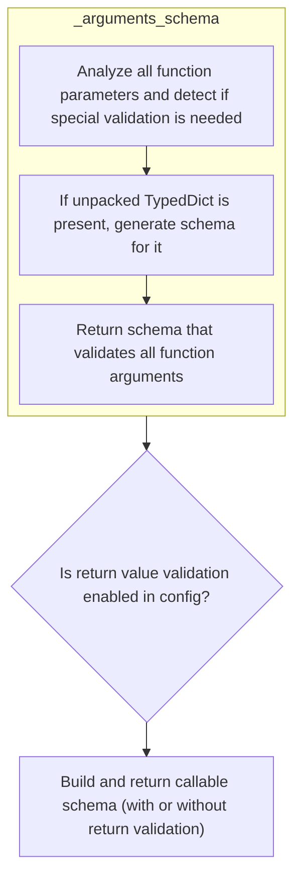
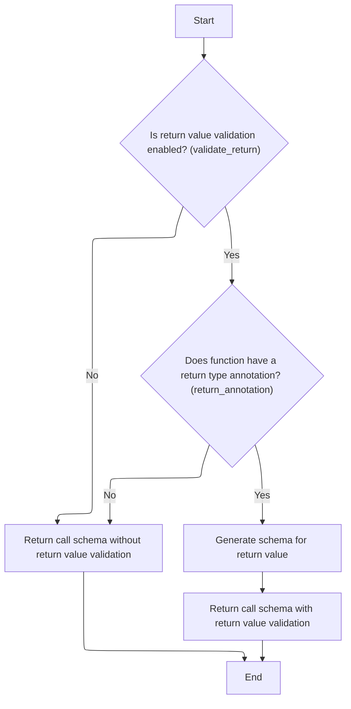

```mermaid
%%{init: {"flowchart": {"defaultRenderer": "elk"}} }%%
flowchart TD
    node1["Start TypedDict schema generation"] --> node2{"Schema already exists?"}
    click node1 openCode "pydantic/_internal/_generate_schema.py:1380:1390"
    node2 -- Yes --> node3["Return existing schema"]
    click node2 openCode "pydantic/_internal/_generate_schema.py:1398:1401"
    click node3 openCode "pydantic/_internal/_generate_schema.py:1400:1401"
    node2 -- No --> node4["Check TypedDict compatibility"]
    click node4 openCode "pydantic/_internal/_generate_schema.py:1403:1411"
    node4 --> node5["Extract config, docstrings, decorators"]
    click node5 openCode "pydantic/_internal/_generate_schema.py:1412:1433"
    node5 --> node6["Build schema fields"]
    click node6 openCode "pydantic/_internal/_generate_schema.py:1434:1462"

    subgraph loop1["For each field in TypedDict"]
        node6 --> node7{"Is field required or read-only?"}
        click node7 openCode "pydantic/_internal/_generate_schema.py:1445:1450"
        node7 -->|"Required"| node8["Mark as required"]
        click node8 openCode "pydantic/_internal/_generate_schema.py:1445:1447"
        node7 -->|"Read-only"| node9["Mark as read-only"]
        click node9 openCode "pydantic/_internal/_generate_schema.py:1448:1450"
        node7 -->|"Other"| node10["Process normally"]
        click node10 openCode "pydantic/_internal/_generate_schema.py:1451:1461"
        node8 --> node11["Add to schema"]
        click node11 openCode "pydantic/_internal/_generate_schema.py:1459:1461"
        node9 --> node11
        node10 --> node11
        node11 --> node6
    end
    node6 --> node12["Handle read-only warnings"]
    click node12 openCode "pydantic/_internal/_generate_schema.py:1463:1471"
    node12 --> node13["Apply computed fields, serializers, validators"]
    click node13 openCode "pydantic/_internal/_generate_schema.py:1473:1485"
    node13 --> node14["Return final schema"]
    click node14 openCode "pydantic/_internal/_generate_schema.py:1486:1486"

%% Swimm:
%% %%{init: {"flowchart": {"defaultRenderer": "elk"}} }%%
%% flowchart TD
%%     node1["Start <SwmToken path="pydantic/_internal/_generate_schema.py" pos="1381:17:17" line-data="        &quot;&quot;&quot;Generate a core schema for a `TypedDict` class.">`TypedDict`</SwmToken> schema generation"] --> node2{"Schema already exists?"}
%%     click node1 openCode "<SwmPath>[pydantic/\_internal/\_generate_schema.py](pydantic/_internal/_generate_schema.py)</SwmPath>:1380:1390"
%%     node2 -- Yes --> node3["Return existing schema"]
%%     click node2 openCode "<SwmPath>[pydantic/\_internal/\_generate_schema.py](pydantic/_internal/_generate_schema.py)</SwmPath>:1398:1401"
%%     click node3 openCode "<SwmPath>[pydantic/\_internal/\_generate_schema.py](pydantic/_internal/_generate_schema.py)</SwmPath>:1400:1401"
%%     node2 -- No --> node4["Check <SwmToken path="pydantic/_internal/_generate_schema.py" pos="1381:17:17" line-data="        &quot;&quot;&quot;Generate a core schema for a `TypedDict` class.">`TypedDict`</SwmToken> compatibility"]
%%     click node4 openCode "<SwmPath>[pydantic/\_internal/\_generate_schema.py](pydantic/_internal/_generate_schema.py)</SwmPath>:1403:1411"
%%     node4 --> node5["Extract config, docstrings, decorators"]
%%     click node5 openCode "<SwmPath>[pydantic/\_internal/\_generate_schema.py](pydantic/_internal/_generate_schema.py)</SwmPath>:1412:1433"
%%     node5 --> node6["Build schema fields"]
%%     click node6 openCode "<SwmPath>[pydantic/\_internal/\_generate_schema.py](pydantic/_internal/_generate_schema.py)</SwmPath>:1434:1462"
%% 
%%     subgraph loop1["For each field in <SwmToken path="pydantic/_internal/_generate_schema.py" pos="1381:17:17" line-data="        &quot;&quot;&quot;Generate a core schema for a `TypedDict` class.">`TypedDict`</SwmToken>"]
%%         node6 --> node7{"Is field required or read-only?"}
%%         click node7 openCode "<SwmPath>[pydantic/\_internal/\_generate_schema.py](pydantic/_internal/_generate_schema.py)</SwmPath>:1445:1450"
%%         node7 -->|"Required"| node8["Mark as required"]
%%         click node8 openCode "<SwmPath>[pydantic/\_internal/\_generate_schema.py](pydantic/_internal/_generate_schema.py)</SwmPath>:1445:1447"
%%         node7 -->|"Read-only"| node9["Mark as read-only"]
%%         click node9 openCode "<SwmPath>[pydantic/\_internal/\_generate_schema.py](pydantic/_internal/_generate_schema.py)</SwmPath>:1448:1450"
%%         node7 -->|"Other"| node10["Process normally"]
%%         click node10 openCode "<SwmPath>[pydantic/\_internal/\_generate_schema.py](pydantic/_internal/_generate_schema.py)</SwmPath>:1451:1461"
%%         node8 --> node11["Add to schema"]
%%         click node11 openCode "<SwmPath>[pydantic/\_internal/\_generate_schema.py](pydantic/_internal/_generate_schema.py)</SwmPath>:1459:1461"
%%         node9 --> node11
%%         node10 --> node11
%%         node11 --> node6
%%     end
%%     node6 --> node12["Handle read-only warnings"]
%%     click node12 openCode "<SwmPath>[pydantic/\_internal/\_generate_schema.py](pydantic/_internal/_generate_schema.py)</SwmPath>:1463:1471"
%%     node12 --> node13["Apply computed fields, serializers, validators"]
%%     click node13 openCode "<SwmPath>[pydantic/\_internal/\_generate_schema.py](pydantic/_internal/_generate_schema.py)</SwmPath>:1473:1485"
%%     node13 --> node14["Return final schema"]
%%     click node14 openCode "<SwmPath>[pydantic/\_internal/\_generate_schema.py](pydantic/_internal/_generate_schema.py)</SwmPath>:1486:1486"
```

This flow describes how a validation schema is built for a Python function, ensuring that its arguments and, if configured, its return value are validated according to their type hints. The process involves analyzing the function's parameters, handling special cases like unpacked TypedDicts, and, if enabled, generating a schema for the return value. The result is a comprehensive schema that can be used to validate calls to the function.

Main steps:

- Analyze function parameters and generate argument schemas
- Handle special cases such as \*args, \*\*kwargs, and unpacked TypedDicts
- Optionally generate a schema for the return value
- Combine argument and return schemas into a callable validation schema

```mermaid
sequenceDiagram
  participant Developer
  participant SchemaBuilder
  Developer->>SchemaBuilder: Provide function to validate
  SchemaBuilder->>SchemaBuilder: Analyze function parameters
  SchemaBuilder->>SchemaBuilder: Handle special argument cases (e.g., TypedDict)
  SchemaBuilder->>SchemaBuilder: Optionally process return value
  SchemaBuilder->>Developer: Return callable validation schema

%% Swimm:
%% sequenceDiagram
%%   participant Developer
%%   participant SchemaBuilder
%%   Developer->>SchemaBuilder: Provide function to validate
%%   SchemaBuilder->>SchemaBuilder: Analyze function parameters
%%   SchemaBuilder->>SchemaBuilder: Handle special argument cases (<SwmToken path="pydantic/_internal/_generate_schema.py" pos="184:38:40" line-data="&quot;&quot;&quot;`FieldInfo` attributes (and their default value) that can&#39;t be used outside of a model (e.g. in a type adapter or a PEP 695 type alias).&quot;&quot;&quot;">`e.g`</SwmToken>., <SwmToken path="pydantic/_internal/_generate_schema.py" pos="1381:17:17" line-data="        &quot;&quot;&quot;Generate a core schema for a `TypedDict` class.">`TypedDict`</SwmToken>)
%%   SchemaBuilder->>SchemaBuilder: Optionally process return value
%%   SchemaBuilder->>Developer: Return callable validation schema
```



# Spec

## Detailed View of the Program's Functionality

a. Entry Point: Building the Callable Schema

The process begins by generating a schema for a callable (function, method, lambda, or partial). The main entry point for this is a method that orchestrates the schema creation for both the function's arguments and, optionally, its return value.

- The first step is to generate a schema that describes what arguments the function expects. This is done by analyzing the function's signature and type hints.
- The configuration is checked to determine if return value validation is enabled.
- If return validation is enabled and the function has a return type annotation, a schema for the return value is generated.
- Finally, a schema object is assembled that ties together the argument validation and (optionally) the return value validation for the callable.

b. Extracting and Mapping Function Parameters

To generate the arguments schema, the function's parameters are analyzed in detail:

- The function's signature is inspected to extract all parameters, including their names, kinds (positional, keyword, etc.), and default values.
- Type hints are resolved for each parameter, taking into account any forward references and the current namespace.
- For each parameter:
  - If a callback is provided, it can skip certain parameters.
  - The parameter's kind is mapped to a mode (<SwmToken path="pydantic/_internal/_generate_schema.py" pos="184:38:40" line-data="&quot;&quot;&quot;`FieldInfo` attributes (and their default value) that can&#39;t be used outside of a model (e.g. in a type adapter or a PEP 695 type alias).&quot;&quot;&quot;">`e.g`</SwmToken>., positional-only, keyword-only).
  - For standard parameters, a schema is generated that describes the expected type and validation rules.
  - For \*args (variable positional arguments), a schema is generated for the expected type of each item.
  - For \*\*kwargs (variable keyword arguments), special handling is performed:
    - If the annotation uses an unpacked <SwmToken path="pydantic/_internal/_generate_schema.py" pos="1381:17:17" line-data="        &quot;&quot;&quot;Generate a core schema for a `TypedDict` class.">`TypedDict`</SwmToken> (<SwmToken path="pydantic/_internal/_generate_schema.py" pos="925:22:24" line-data="            # safety measure (because these are inlined in place -- i.e. mutated directly)">`i.e`</SwmToken>., Unpack\[SomeTypedDict\]), it is detected and handled specially.
    - The <SwmToken path="pydantic/_internal/_generate_schema.py" pos="1381:17:17" line-data="        &quot;&quot;&quot;Generate a core schema for a `TypedDict` class.">`TypedDict`</SwmToken> is validated to ensure it does not overlap with other parameter names.
    - A schema is generated for the <SwmToken path="pydantic/_internal/_generate_schema.py" pos="1381:17:17" line-data="        &quot;&quot;&quot;Generate a core schema for a `TypedDict` class.">`TypedDict`</SwmToken>, and the mode is set to indicate unpacked <SwmToken path="pydantic/_internal/_generate_schema.py" pos="1381:17:17" line-data="        &quot;&quot;&quot;Generate a core schema for a `TypedDict` class.">`TypedDict`</SwmToken> handling.
    - If not an unpacked <SwmToken path="pydantic/_internal/_generate_schema.py" pos="1381:17:17" line-data="        &quot;&quot;&quot;Generate a core schema for a `TypedDict` class.">`TypedDict`</SwmToken>, a generic schema is generated for the \*\*kwargs.

c. Generating the <SwmToken path="pydantic/_internal/_generate_schema.py" pos="1381:17:17" line-data="        &quot;&quot;&quot;Generate a core schema for a `TypedDict` class.">`TypedDict`</SwmToken> Schema and Applying Decorators

When an unpacked <SwmToken path="pydantic/_internal/_generate_schema.py" pos="1381:17:17" line-data="        &quot;&quot;&quot;Generate a core schema for a `TypedDict` class.">`TypedDict`</SwmToken> is detected in \*\*kwargs, a specialized schema is generated for it:

- If a schema for this <SwmToken path="pydantic/_internal/_generate_schema.py" pos="1381:17:17" line-data="        &quot;&quot;&quot;Generate a core schema for a `TypedDict` class.">`TypedDict`</SwmToken> has already been generated (cached), it is reused.
- Compatibility checks are performed to ensure the <SwmToken path="pydantic/_internal/_generate_schema.py" pos="1381:17:17" line-data="        &quot;&quot;&quot;Generate a core schema for a `TypedDict` class.">`TypedDict`</SwmToken> is supported in the current Python version.
- Configuration, docstrings, and any decorators (validators, serializers, etc.) are extracted and applied.
- Each field in the <SwmToken path="pydantic/_internal/_generate_schema.py" pos="1381:17:17" line-data="        &quot;&quot;&quot;Generate a core schema for a `TypedDict` class.">`TypedDict`</SwmToken> is processed:
  - The field's type annotation and metadata are extracted.
  - It is determined whether the field is required, read-only, or has other qualifiers.
  - Field-level docstrings and configuration are applied.
  - A schema is generated for the field, including any relevant validators or serializers.
- After all fields are processed, a warning is issued if any fields are marked as read-only (informational only).
- Computed fields, serializers, and model-level validators are applied to the schema.
- The final schema is returned, possibly as a reference if it is used in multiple places.

d. Finalizing the Arguments Schema

After all parameters have been processed:

- The arguments schema is constructed, including the list of parameter schemas, any \*args or \*\*kwargs schemas, and configuration options such as whether to validate by parameter name.
- This schema fully describes how the callable's arguments should be validated.

e. Completing the Call Schema with Return Validation

Once the arguments schema is ready, the process checks if return value validation is enabled:

- If enabled and the function has a return type annotation, the return type hint is resolved, and a schema is generated for the return value.
- The final callable schema is assembled, combining the arguments schema, the function itself, and (optionally) the return value schema.
- This schema can now be used to validate both the inputs and outputs of the callable according to the function's signature and type hints.

Summary

The overall flow is:

1. Analyze the function's signature and type hints to generate a schema for its arguments.
2. Handle special cases such as unpacked TypedDicts in \*\*kwargs, generating detailed schemas for them and applying any relevant decorators or configuration.
3. Optionally, generate a schema for the function's return value if return validation is enabled.
4. Assemble a complete schema that can validate both the arguments and (optionally) the return value of the callable, ready for use in Pydantic's validation system.

# Rule Definition

| Paragraph Name                                                                                                                                  | Rule ID | Category          | Description                                                                                                                                                                                                                                                                                                                                                                                                                                                                                                                                                                                                                                                                                                                                   | Conditions                                                                                                                                                                                                                                                  | Remarks                                                                                                                                                                                                                                                                                                                                                                                                                                                                                                                                                                                                |
| ----------------------------------------------------------------------------------------------------------------------------------------------- | ------- | ----------------- | --------------------------------------------------------------------------------------------------------------------------------------------------------------------------------------------------------------------------------------------------------------------------------------------------------------------------------------------------------------------------------------------------------------------------------------------------------------------------------------------------------------------------------------------------------------------------------------------------------------------------------------------------------------------------------------------------------------------------------------------- | ----------------------------------------------------------------------------------------------------------------------------------------------------------------------------------------------------------------------------------------------------------- | ------------------------------------------------------------------------------------------------------------------------------------------------------------------------------------------------------------------------------------------------------------------------------------------------------------------------------------------------------------------------------------------------------------------------------------------------------------------------------------------------------------------------------------------------------------------------------------------------------ |
| GenerateSchema.\_call_schema, GenerateSchema.\_arguments_schema, GenerateSchema.generate_schema                                                 | RL-001  | Computation       | The system must generate a validation schema for any callable (function, method, lambda, or partial), capturing all input arguments and, if configured, the return value.                                                                                                                                                                                                                                                                                                                                                                                                                                                                                                                                                                     | A Python callable is provided to the schema generation function.                                                                                                                                                                                            | The callable schema object must include: 'type' (set to 'call'), <SwmToken path="pydantic/_internal/_generate_schema.py" pos="1915:1:1" line-data="        arguments_schema = self._arguments_schema(function)">`arguments_schema`</SwmToken> (the schema for the callable's arguments), 'function' (the original callable), and optionally <SwmToken path="pydantic/_internal/_generate_schema.py" pos="1917:1:1" line-data="        return_schema: core_schema.CoreSchema \| None = None">`return_schema`</SwmToken> (if return validation is enabled and a return annotation is present).           |
| GenerateSchema.\_arguments_schema                                                                                                               | RL-002  | Computation       | The system must analyze the callable's signature to determine all expected input parameters, including positional, keyword, \*args, and \*\*kwargs, and generate schemas for each.                                                                                                                                                                                                                                                                                                                                                                                                                                                                                                                                                            | A callable's schema is being generated.                                                                                                                                                                                                                     | Each parameter schema must include: 'name', 'schema' (the type schema), 'mode' (positional-only, positional-or-keyword, keyword-only), and optionally 'alias'. For \*args and \*\*kwargs, schemas must be generated for their types. If \*\*kwargs is an unpacked <SwmToken path="pydantic/_internal/_generate_schema.py" pos="1381:17:17" line-data="        &quot;&quot;&quot;Generate a core schema for a `TypedDict` class.">`TypedDict`</SwmToken>, special handling applies.                                                                                                                     |
| GenerateSchema.\_typed_dict_schema, GenerateSchema.\_arguments_schema                                                                           | RL-003  | Computation       | If \*\*kwargs includes an unpacked <SwmToken path="pydantic/_internal/_generate_schema.py" pos="1381:17:17" line-data="        &quot;&quot;&quot;Generate a core schema for a `TypedDict` class.">`TypedDict`</SwmToken>, the system must detect it, generate a schema for the <SwmToken path="pydantic/_internal/_generate_schema.py" pos="1381:17:17" line-data="        &quot;&quot;&quot;Generate a core schema for a `TypedDict` class.">`TypedDict`</SwmToken>, and ensure precise validation of keyword arguments according to the <SwmToken path="pydantic/_internal/_generate_schema.py" pos="1381:17:17" line-data="        &quot;&quot;&quot;Generate a core schema for a `TypedDict` class.">`TypedDict`</SwmToken>'s definition. | \*\*kwargs parameter is present and its annotation is an unpacked <SwmToken path="pydantic/_internal/_generate_schema.py" pos="1381:17:17" line-data="        &quot;&quot;&quot;Generate a core schema for a `TypedDict` class.">`TypedDict`</SwmToken>.    | <SwmToken path="pydantic/_internal/_generate_schema.py" pos="1381:17:17" line-data="        &quot;&quot;&quot;Generate a core schema for a `TypedDict` class.">`TypedDict`</SwmToken> schema must include: 'type', mapping of field names to field schemas, the <SwmToken path="pydantic/_internal/_generate_schema.py" pos="1381:17:17" line-data="        &quot;&quot;&quot;Generate a core schema for a `TypedDict` class.">`TypedDict`</SwmToken> class, computed fields, a reference string, and configuration options. Fields must be marked as required, optional, or read-only as appropriate. |
| GenerateSchema.\_call_schema                                                                                                                    | RL-004  | Conditional Logic | After generating the arguments schema for a callable, the system must check if return value validation is enabled via a configuration flag, and if so, generate a schema for the return value if a return annotation is present.                                                                                                                                                                                                                                                                                                                                                                                                                                                                                                              | Callable schema is being generated; configuration flag <SwmToken path="pydantic/_internal/_generate_schema.py" pos="1919:5:5" line-data="        if config_wrapper.validate_return:">`validate_return`</SwmToken> is set; callable has a return annotation. | If enabled, the callable schema includes a <SwmToken path="pydantic/_internal/_generate_schema.py" pos="1917:1:1" line-data="        return_schema: core_schema.CoreSchema \| None = None">`return_schema`</SwmToken> key with the generated schema for the return value.                                                                                                                                                                                                                                                                                                                              |
| GenerateSchema.\_call_schema, GenerateSchema.\_arguments_schema, GenerateSchema.\_typed_dict_schema, GenerateSchema.\_generate_parameter_schema | RL-005  | Data Assignment   | The schema objects produced must be structured as nested data objects (dictionaries/maps) with a 'type' key indicating the schema kind, and additional keys for configuration and structure as required for each schema type.                                                                                                                                                                                                                                                                                                                                                                                                                                                                                                                 | Any schema object is generated.                                                                                                                                                                                                                             | Formats:                                                                                                                                                                                                                                                                                                                                                                                                                                                                                                                                                                                               |

- Callable schema: {'type': 'call', <SwmToken path="pydantic/_internal/_generate_schema.py" pos="1915:1:1" line-data="        arguments_schema = self._arguments_schema(function)">`arguments_schema`</SwmToken>: ..., 'function': ..., <SwmToken path="pydantic/_internal/_generate_schema.py" pos="1917:1:1" line-data="        return_schema: core_schema.CoreSchema | None = None">`return_schema`</SwmToken>: ...}
- Arguments schema: {'type': 'arguments', 'arguments': \[...\], <SwmToken path="pydantic/_internal/_generate_schema.py" pos="1950:1:1" line-data="        var_args_schema: core_schema.CoreSchema | None = None">`var_args_schema`</SwmToken>: ..., <SwmToken path="pydantic/_internal/_generate_schema.py" pos="1951:1:1" line-data="        var_kwargs_schema: core_schema.CoreSchema | None = None">`var_kwargs_schema`</SwmToken>: ..., <SwmToken path="pydantic/_internal/_generate_schema.py" pos="1952:1:1" line-data="        var_kwargs_mode: core_schema.VarKwargsMode | None = None">`var_kwargs_mode`</SwmToken>: ...}
- <SwmToken path="pydantic/_internal/_generate_schema.py" pos="1381:17:17" line-data="        &quot;&quot;&quot;Generate a core schema for a `TypedDict` class.">`TypedDict`</SwmToken> schema: {'type': <SwmToken path="pydantic/_internal/_generate_schema.py" pos="1409:4:6" line-data="                    code=&#39;typed-dict-version&#39;,">`typed-dict`</SwmToken>, 'fields': {...}, 'cls': ..., <SwmToken path="pydantic/_internal/_generate_schema.py" pos="1476:1:1" line-data="                    computed_fields=[">`computed_fields`</SwmToken>: \[...\], 'ref': ..., 'config': ...}
- Argument parameter schema: {'name': ..., 'schema': ..., 'mode': ..., 'alias': ...} | | GenerateSchema.generate_schema, GenerateSchema.\_generate_schema_inner, GenerateSchema.match_type | RL-006 | Conditional Logic | The schema generation function must accept any type, class, or callable and return a schema object representing the validation requirements for that object. | Any object is passed to the schema generation function. | The function must handle all supported types and raise errors for unsupported types, returning a schema object for valid inputs. | | GenerateSchema.\_typed_dict_schema, \_Definitions.get_schema_or_ref, \_Definitions.create_definition_reference_schema | RL-007 | Conditional Logic | The system must support caching and reuse of previously generated schemas for efficiency, especially for referenceable types like TypedDicts, models, and enums. | A schema is being generated for a referenceable type. | Referenceable types include: Pydantic models, dataclasses, TypedDicts, namedtuples, <SwmToken path="pydantic/_internal/_generate_schema.py" pos="54:9:9" line-data="from typing_extensions import TypeAlias, TypeAliasType, TypedDict, get_args, get_origin, is_typeddict">`TypeAliasType`</SwmToken> instances, and Enums. Caching is managed via references and a definitions mapping. |

# User Stories

## User Story 1: Generate validation schema for callables, supporting any type and optional return value

---

### Story Description:

As a user of the validation system, I want to generate a validation schema for any callable (function, method, lambda, or partial), capturing all input arguments and, if configured, the return value, and ensuring the system can handle any type, class, or callable, so that I can validate function calls accurately and flexibly according to my configuration.

---

### Business Rule Mapping:

| Rule ID | Paragraph Name                                                                                                                                  | Rule Description                                                                                                                                                                                                                 |
| ------- | ----------------------------------------------------------------------------------------------------------------------------------------------- | -------------------------------------------------------------------------------------------------------------------------------------------------------------------------------------------------------------------------------- |
| RL-001  | GenerateSchema.\_call_schema, GenerateSchema.\_arguments_schema, GenerateSchema.generate_schema                                                 | The system must generate a validation schema for any callable (function, method, lambda, or partial), capturing all input arguments and, if configured, the return value.                                                        |
| RL-004  | GenerateSchema.\_call_schema                                                                                                                    | After generating the arguments schema for a callable, the system must check if return value validation is enabled via a configuration flag, and if so, generate a schema for the return value if a return annotation is present. |
| RL-005  | GenerateSchema.\_call_schema, GenerateSchema.\_arguments_schema, GenerateSchema.\_typed_dict_schema, GenerateSchema.\_generate_parameter_schema | The schema objects produced must be structured as nested data objects (dictionaries/maps) with a 'type' key indicating the schema kind, and additional keys for configuration and structure as required for each schema type.    |
| RL-002  | GenerateSchema.\_arguments_schema                                                                                                               | The system must analyze the callable's signature to determine all expected input parameters, including positional, keyword, \*args, and \*\*kwargs, and generate schemas for each.                                               |
| RL-006  | GenerateSchema.generate_schema, GenerateSchema.\_generate_schema_inner, GenerateSchema.match_type                                               | The schema generation function must accept any type, class, or callable and return a schema object representing the validation requirements for that object.                                                                     |

---

### Relevant Functionality:

- **GenerateSchema.\_call_schema**
  1. **RL-001:**
     - When a callable is passed:
       - Analyze its signature to extract all parameters (positional, keyword, \*args, \*\*kwargs).
       - For each parameter, generate a schema for its type and include name, mode, and optional alias.
       - If \*args or \*\*kwargs are present, generate schemas for them as well.
       - If \*\*kwargs contains an unpacked <SwmToken path="pydantic/_internal/_generate_schema.py" pos="1381:17:17" line-data="        &quot;&quot;&quot;Generate a core schema for a `TypedDict` class.">`TypedDict`</SwmToken>, generate a schema for the <SwmToken path="pydantic/_internal/_generate_schema.py" pos="1381:17:17" line-data="        &quot;&quot;&quot;Generate a core schema for a `TypedDict` class.">`TypedDict`</SwmToken>.
       - If return value validation is enabled and a return annotation exists, generate a schema for the return value.
       - Assemble the final callable schema object with all required fields.
  2. **RL-004:**
     - Check configuration for <SwmToken path="pydantic/_internal/_generate_schema.py" pos="1919:5:5" line-data="        if config_wrapper.validate_return:">`validate_return`</SwmToken> flag.
     - If enabled and callable has a return annotation:
       - Extract the return annotation.
       - Generate a schema for the return value.
       - Add <SwmToken path="pydantic/_internal/_generate_schema.py" pos="1917:1:1" line-data="        return_schema: core_schema.CoreSchema | None = None">`return_schema`</SwmToken> to the callable schema.
  3. **RL-005:**
     - When assembling schema objects, ensure each has a 'type' key and all required fields for its kind.
     - Nest schemas as needed (<SwmToken path="pydantic/_internal/_generate_schema.py" pos="184:38:40" line-data="&quot;&quot;&quot;`FieldInfo` attributes (and their default value) that can&#39;t be used outside of a model (e.g. in a type adapter or a PEP 695 type alias).&quot;&quot;&quot;">`e.g`</SwmToken>., arguments inside callable, fields inside <SwmToken path="pydantic/_internal/_generate_schema.py" pos="1381:17:17" line-data="        &quot;&quot;&quot;Generate a core schema for a `TypedDict` class.">`TypedDict`</SwmToken>).
     - Use dictionaries/maps for all schema objects.
- **GenerateSchema.\_arguments_schema**
  1. **RL-002:**
     - Inspect the callable's signature.
     - For each parameter:
       - Identify name, type annotation, and mode.
       - Generate a schema for the type.
       - Assign alias if specified.
     - For \*args, generate a schema for the argument type.
     - For \*\*kwargs:
       - If annotation is an unpacked <SwmToken path="pydantic/_internal/_generate_schema.py" pos="1381:17:17" line-data="        &quot;&quot;&quot;Generate a core schema for a `TypedDict` class.">`TypedDict`</SwmToken>, detect and generate a <SwmToken path="pydantic/_internal/_generate_schema.py" pos="1381:17:17" line-data="        &quot;&quot;&quot;Generate a core schema for a `TypedDict` class.">`TypedDict`</SwmToken> schema.
       - Otherwise, generate a schema for the type.
- **GenerateSchema.generate_schema**
  1. **RL-006:**
     - Accept any object (type, class, callable).
     - Determine the kind of object and dispatch to the appropriate schema generation logic.
     - Return the resulting schema object.

## User Story 2: Handle TypedDicts and referenceable types in \*\*kwargs with precise schema generation and caching

---

### Story Description:

As a user of the validation system, I want the system to detect and generate precise schemas for unpacked TypedDicts in \*\*kwargs, marking fields as required, optional, or read-only, and to cache and reuse schemas for referenceable types like TypedDicts, models, and enums, so that keyword arguments are validated according to their definitions and schema generation is efficient and consistent.

---

### Business Rule Mapping:

| Rule ID | Paragraph Name                                                                                                                                  | Rule Description                                                                                                                                                                                                                                                                                                                                                                                                                                                                                                                                                                                                                                                                                                                              |
| ------- | ----------------------------------------------------------------------------------------------------------------------------------------------- | --------------------------------------------------------------------------------------------------------------------------------------------------------------------------------------------------------------------------------------------------------------------------------------------------------------------------------------------------------------------------------------------------------------------------------------------------------------------------------------------------------------------------------------------------------------------------------------------------------------------------------------------------------------------------------------------------------------------------------------------- |
| RL-003  | GenerateSchema.\_typed_dict_schema, GenerateSchema.\_arguments_schema                                                                           | If \*\*kwargs includes an unpacked <SwmToken path="pydantic/_internal/_generate_schema.py" pos="1381:17:17" line-data="        &quot;&quot;&quot;Generate a core schema for a `TypedDict` class.">`TypedDict`</SwmToken>, the system must detect it, generate a schema for the <SwmToken path="pydantic/_internal/_generate_schema.py" pos="1381:17:17" line-data="        &quot;&quot;&quot;Generate a core schema for a `TypedDict` class.">`TypedDict`</SwmToken>, and ensure precise validation of keyword arguments according to the <SwmToken path="pydantic/_internal/_generate_schema.py" pos="1381:17:17" line-data="        &quot;&quot;&quot;Generate a core schema for a `TypedDict` class.">`TypedDict`</SwmToken>'s definition. |
| RL-007  | GenerateSchema.\_typed_dict_schema, \_Definitions.get_schema_or_ref, \_Definitions.create_definition_reference_schema                           | The system must support caching and reuse of previously generated schemas for efficiency, especially for referenceable types like TypedDicts, models, and enums.                                                                                                                                                                                                                                                                                                                                                                                                                                                                                                                                                                              |
| RL-005  | GenerateSchema.\_call_schema, GenerateSchema.\_arguments_schema, GenerateSchema.\_typed_dict_schema, GenerateSchema.\_generate_parameter_schema | The schema objects produced must be structured as nested data objects (dictionaries/maps) with a 'type' key indicating the schema kind, and additional keys for configuration and structure as required for each schema type.                                                                                                                                                                                                                                                                                                                                                                                                                                                                                                                 |

---

### Relevant Functionality:

- **GenerateSchema.\_typed_dict_schema**
  1. **RL-003:**
     - Detect if \*\*kwargs annotation is an unpacked <SwmToken path="pydantic/_internal/_generate_schema.py" pos="1381:17:17" line-data="        &quot;&quot;&quot;Generate a core schema for a `TypedDict` class.">`TypedDict`</SwmToken>.
     - If so:
       - Check if a schema for the <SwmToken path="pydantic/_internal/_generate_schema.py" pos="1381:17:17" line-data="        &quot;&quot;&quot;Generate a core schema for a `TypedDict` class.">`TypedDict`</SwmToken> already exists; reuse if available.
       - Extract configuration, docstrings, and decorators.
       - For each field, determine if required/optional/read-only and mark in schema.
       - Add computed fields, serializers, validators as needed.
       - Return the final <SwmToken path="pydantic/_internal/_generate_schema.py" pos="1381:17:17" line-data="        &quot;&quot;&quot;Generate a core schema for a `TypedDict` class.">`TypedDict`</SwmToken> schema with references for caching.
  2. **RL-007:**
     - Before generating a schema for a referenceable type, check if a schema already exists in the cache.
     - If so, reuse the existing schema via a reference.
     - If not, generate the schema and store it in the cache for future reuse.
- **GenerateSchema.\_call_schema**
  1. **RL-005:**
     - When assembling schema objects, ensure each has a 'type' key and all required fields for its kind.
     - Nest schemas as needed (<SwmToken path="pydantic/_internal/_generate_schema.py" pos="184:38:40" line-data="&quot;&quot;&quot;`FieldInfo` attributes (and their default value) that can&#39;t be used outside of a model (e.g. in a type adapter or a PEP 695 type alias).&quot;&quot;&quot;">`e.g`</SwmToken>., arguments inside callable, fields inside <SwmToken path="pydantic/_internal/_generate_schema.py" pos="1381:17:17" line-data="        &quot;&quot;&quot;Generate a core schema for a `TypedDict` class.">`TypedDict`</SwmToken>).
     - Use dictionaries/maps for all schema objects.

# Code Walkthrough

## Building the callable schema entry point



<SwmSnippet path="/pydantic/_internal/_generate_schema.py" line="1910">

---

In <SwmToken path="pydantic/_internal/_generate_schema.py" pos="1910:3:3" line-data="    def _call_schema(self, function: ValidateCallSupportedTypes) -&gt; core_schema.CallSchema:">`_call_schema`</SwmToken>, we're kicking off the process of building a schema for a callable. The first thing we do is call <SwmToken path="pydantic/_internal/_generate_schema.py" pos="1915:7:7" line-data="        arguments_schema = self._arguments_schema(function)">`_arguments_schema`</SwmToken> to figure out what the function expects as input—this gives us a schema that matches the function's signature. We need this before anything else because it defines how input validation will work for this callable.

```python
    def _call_schema(self, function: ValidateCallSupportedTypes) -> core_schema.CallSchema:
        """Generate schema for a Callable.

        TODO support functional validators once we support them in Config
        """
        arguments_schema = self._arguments_schema(function)

```

---

</SwmSnippet>

### Extracting and mapping function parameters

<SwmSnippet path="/pydantic/_internal/_generate_schema.py" line="1935">

---

In <SwmToken path="pydantic/_internal/_generate_schema.py" pos="1935:3:3" line-data="    def _arguments_schema(">`_arguments_schema`</SwmToken>, we analyze the function's parameters, generate schemas for each, and use <SwmToken path="pydantic/_internal/_generate_schema.py" pos="1972:7:7" line-data="                var_args_schema = self.generate_schema(annotation)">`generate_schema`</SwmToken> for \*args and \*\*kwargs to cover all possible argument types.

```python
    def _arguments_schema(
        self, function: ValidateCallSupportedTypes, parameters_callback: ParametersCallback | None = None
    ) -> core_schema.ArgumentsSchema:
        """Generate schema for a Signature."""
        mode_lookup: dict[_ParameterKind, Literal['positional_only', 'positional_or_keyword', 'keyword_only']] = {
            Parameter.POSITIONAL_ONLY: 'positional_only',
            Parameter.POSITIONAL_OR_KEYWORD: 'positional_or_keyword',
            Parameter.KEYWORD_ONLY: 'keyword_only',
        }

        sig = signature(function)
        globalns, localns = self._types_namespace
        type_hints = _typing_extra.get_function_type_hints(function, globalns=globalns, localns=localns)

        arguments_list: list[core_schema.ArgumentsParameter] = []
        var_args_schema: core_schema.CoreSchema | None = None
        var_kwargs_schema: core_schema.CoreSchema | None = None
        var_kwargs_mode: core_schema.VarKwargsMode | None = None

        for i, (name, p) in enumerate(sig.parameters.items()):
            if p.annotation is sig.empty:
                annotation = typing.cast(Any, Any)
            else:
                annotation = type_hints[name]

            if parameters_callback is not None:
                result = parameters_callback(i, name, annotation)
                if result == 'skip':
                    continue

            parameter_mode = mode_lookup.get(p.kind)
            if parameter_mode is not None:
                arg_schema = self._generate_parameter_schema(
                    name, annotation, AnnotationSource.FUNCTION, p.default, parameter_mode
                )
                arguments_list.append(arg_schema)
            elif p.kind == Parameter.VAR_POSITIONAL:
                var_args_schema = self.generate_schema(annotation)
            else:
```

---

</SwmSnippet>

<SwmSnippet path="/pydantic/_internal/_generate_schema.py" line="1974">

---

Back in <SwmToken path="pydantic/_internal/_generate_schema.py" pos="1915:7:7" line-data="        arguments_schema = self._arguments_schema(function)">`_arguments_schema`</SwmToken>, after handling \*args, we check for Unpack with <SwmToken path="pydantic/_internal/_generate_schema.py" pos="1981:8:8" line-data="                            f&#39;Expected a `TypedDict` class inside `Unpack[...]`, got {unpack_type!r}&#39;,">`TypedDict`</SwmToken> in \*\*kwargs and call <SwmToken path="pydantic/_internal/_generate_schema.py" pos="1997:7:7" line-data="                    var_kwargs_schema = self._typed_dict_schema(unpack_type, get_origin(unpack_type))">`_typed_dict_schema`</SwmToken> for precise keyword argument validation.

```python
                assert p.kind == Parameter.VAR_KEYWORD, p.kind

                unpack_type = _typing_extra.unpack_type(annotation)
                if unpack_type is not None:
                    origin = get_origin(unpack_type) or unpack_type
                    if not is_typeddict(origin):
                        raise PydanticUserError(
                            f'Expected a `TypedDict` class inside `Unpack[...]`, got {unpack_type!r}',
                            code='unpack-typed-dict',
                        )
                    non_pos_only_param_names = {
                        name for name, p in sig.parameters.items() if p.kind != Parameter.POSITIONAL_ONLY
                    }
                    overlapping_params = non_pos_only_param_names.intersection(origin.__annotations__)
                    if overlapping_params:
                        raise PydanticUserError(
                            f'Typed dictionary {origin.__name__!r} overlaps with parameter'
                            f'{"s" if len(overlapping_params) >= 2 else ""} '
                            f'{", ".join(repr(p) for p in sorted(overlapping_params))}',
                            code='overlapping-unpack-typed-dict',
                        )

                    var_kwargs_mode = 'unpacked-typed-dict'
                    var_kwargs_schema = self._typed_dict_schema(unpack_type, get_origin(unpack_type))
                else:
```

---

</SwmSnippet>

#### Generating the <SwmToken path="pydantic/_internal/_generate_schema.py" pos="1381:17:17" line-data="        &quot;&quot;&quot;Generate a core schema for a `TypedDict` class.">`TypedDict`</SwmToken> schema and decorators



<SwmSnippet path="/pydantic/_internal/_generate_schema.py" line="1380">

---

In <SwmToken path="pydantic/_internal/_generate_schema.py" pos="1380:3:3" line-data="    def _typed_dict_schema(self, typed_dict_cls: Any, origin: Any) -&gt; core_schema.CoreSchema:">`_typed_dict_schema`</SwmToken>, we reuse cached schemas, handle config and Python version issues, process field annotations, and apply decorators and validators before returning the schema.

```python
    def _typed_dict_schema(self, typed_dict_cls: Any, origin: Any) -> core_schema.CoreSchema:
        """Generate a core schema for a `TypedDict` class.

        To be able to build a `DecoratorInfos` instance for the `TypedDict` class (which will include
        validators, serializers, etc.), we need to have access to the original bases of the class
        (see https://docs.python.org/3/library/types.html#types.get_original_bases).
        However, the `__orig_bases__` attribute was only added in 3.12 (https://github.com/python/cpython/pull/103698).

        For this reason, we require Python 3.12 (or using the `typing_extensions` backport).
        """
        FieldInfo = import_cached_field_info()

        with (
            self.model_type_stack.push(typed_dict_cls),
            self.defs.get_schema_or_ref(typed_dict_cls) as (
                typed_dict_ref,
                maybe_schema,
            ),
        ):
            if maybe_schema is not None:
                return maybe_schema

            typevars_map = get_standard_typevars_map(typed_dict_cls)
            if origin is not None:
                typed_dict_cls = origin

            if not _SUPPORTS_TYPEDDICT and type(typed_dict_cls).__module__ == 'typing':
                raise PydanticUserError(
                    'Please use `typing_extensions.TypedDict` instead of `typing.TypedDict` on Python < 3.12.',
                    code='typed-dict-version',
                )

            try:
                # if a typed dictionary class doesn't have config, we use the parent's config, hence a default of `None`
                # see https://github.com/pydantic/pydantic/issues/10917
                config: ConfigDict | None = get_attribute_from_bases(typed_dict_cls, '__pydantic_config__')
            except AttributeError:
                config = None

            with self._config_wrapper_stack.push(config):
                core_config = self._config_wrapper.core_config(title=typed_dict_cls.__name__)

                required_keys: frozenset[str] = typed_dict_cls.__required_keys__

                fields: dict[str, core_schema.TypedDictField] = {}

                decorators = DecoratorInfos.build(typed_dict_cls)
                decorators.update_from_config(self._config_wrapper)

                if self._config_wrapper.use_attribute_docstrings:
                    field_docstrings = extract_docstrings_from_cls(typed_dict_cls, use_inspect=True)
                else:
                    field_docstrings = None

                try:
                    annotations = _typing_extra.get_cls_type_hints(typed_dict_cls, ns_resolver=self._ns_resolver)
                except NameError as e:
                    raise PydanticUndefinedAnnotation.from_name_error(e) from e

                readonly_fields: list[str] = []

                for field_name, annotation in annotations.items():
                    field_info = FieldInfo.from_annotation(annotation, _source=AnnotationSource.TYPED_DICT)
                    field_info.annotation = replace_types(field_info.annotation, typevars_map)

                    required = (
                        field_name in required_keys or 'required' in field_info._qualifiers
                    ) and 'not_required' not in field_info._qualifiers
                    if 'read_only' in field_info._qualifiers:
                        readonly_fields.append(field_name)

                    if (
                        field_docstrings is not None
                        and field_info.description is None
                        and field_name in field_docstrings
                    ):
                        field_info.description = field_docstrings[field_name]
                    update_field_from_config(self._config_wrapper, field_name, field_info)

                    fields[field_name] = self._generate_td_field_schema(
                        field_name, field_info, decorators, required=required
                    )
```

---

</SwmSnippet>

<SwmSnippet path="/pydantic/_internal/_generate_schema.py" line="1463">

---

After handling required and readonly fields, we build the schema, apply serializers and validators, and return a schema reference. The readonly warning is just informational.

```python
                if readonly_fields:
                    fields_repr = ', '.join(repr(f) for f in readonly_fields)
                    plural = len(readonly_fields) >= 2
                    warnings.warn(
                        f'Item{"s" if plural else ""} {fields_repr} on TypedDict class {typed_dict_cls.__name__!r} '
                        f'{"are" if plural else "is"} using the `ReadOnly` qualifier. Pydantic will not protect items '
                        'from any mutation on dictionary instances.',
                        UserWarning,
                    )

                td_schema = core_schema.typed_dict_schema(
                    fields,
                    cls=typed_dict_cls,
                    computed_fields=[
                        self._computed_field_schema(d, decorators.field_serializers)
                        for d in decorators.computed_fields.values()
                    ],
                    ref=typed_dict_ref,
                    config=core_config,
                )

                schema = self._apply_model_serializers(td_schema, decorators.model_serializers.values())
                schema = apply_model_validators(schema, decorators.model_validators.values(), 'all')
                return self.defs.create_definition_reference_schema(schema)
```

---

</SwmSnippet>

#### Finalizing the arguments schema

<SwmSnippet path="/pydantic/_internal/_generate_schema.py" line="1999">

---

After getting the arguments schema from <SwmToken path="pydantic/_internal/_generate_schema.py" pos="1915:7:7" line-data="        arguments_schema = self._arguments_schema(function)">`_arguments_schema`</SwmToken>, we check if return value validation is enabled. If so, we extract the return annotation, get its type hint, and call <SwmToken path="pydantic/_internal/_generate_schema.py" pos="2000:7:7" line-data="                    var_kwargs_schema = self.generate_schema(annotation)">`generate_schema`</SwmToken> to build a schema for the return value. Finally, we assemble everything into the call schema, which ties together input and output validation for the callable.

```python
                    var_kwargs_mode = 'uniform'
                    var_kwargs_schema = self.generate_schema(annotation)

        return core_schema.arguments_schema(
            arguments_list,
            var_args_schema=var_args_schema,
            var_kwargs_mode=var_kwargs_mode,
            var_kwargs_schema=var_kwargs_schema,
            validate_by_name=self._config_wrapper.validate_by_name,
        )
```

---

</SwmSnippet>

### Completing the call schema with return validation



<SwmSnippet path="/pydantic/_internal/_generate_schema.py" line="1917">

---

After getting the arguments schema from <SwmToken path="pydantic/_internal/_generate_schema.py" pos="1915:7:7" line-data="        arguments_schema = self._arguments_schema(function)">`_arguments_schema`</SwmToken>, we check if return value validation is enabled. If so, we extract the return annotation, get its type hint, and call <SwmToken path="pydantic/_internal/_generate_schema.py" pos="1927:7:7" line-data="                return_schema = self.generate_schema(type_hints[&#39;return&#39;])">`generate_schema`</SwmToken> to build a schema for the return value. Finally, we assemble everything into the call schema, which ties together input and output validation for the callable.

```python
        return_schema: core_schema.CoreSchema | None = None
        config_wrapper = self._config_wrapper
        if config_wrapper.validate_return:
            sig = signature(function)
            return_hint = sig.return_annotation
            if return_hint is not sig.empty:
                globalns, localns = self._types_namespace
                type_hints = _typing_extra.get_function_type_hints(
                    function, globalns=globalns, localns=localns, include_keys={'return'}
                )
                return_schema = self.generate_schema(type_hints['return'])

        return core_schema.call_schema(
            arguments_schema,
            function,
            return_schema=return_schema,
        )
```

---

</SwmSnippet>

&nbsp;

*This is an auto-generated document by Swimm 🌊 and has not yet been verified by a human*

<SwmMeta version="3.0.0" repo-id="Z2l0aHViJTNBJTNBcHlkYW50aWMlM0ElM0FTd2ltbS1EZW1v" repo-name="pydantic"><sup>Powered by [Swimm](/)</sup></SwmMeta>
