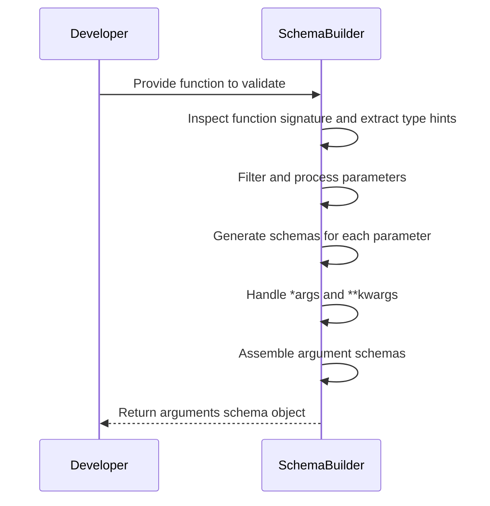
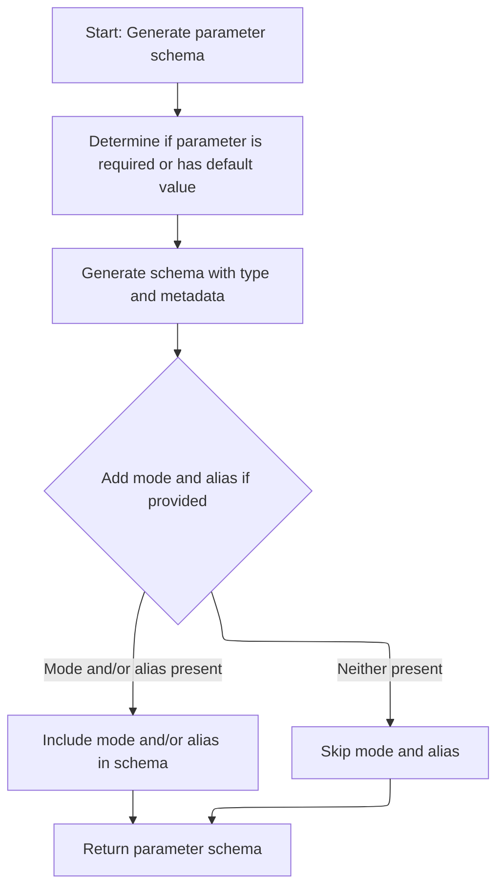
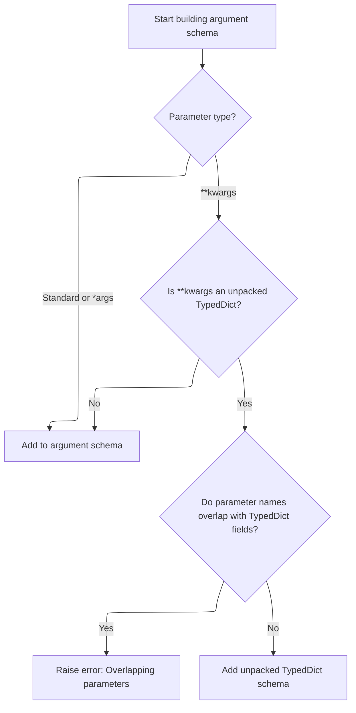
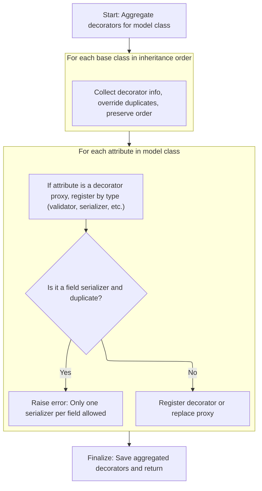

```mermaid
%%{init: {"flowchart": {"defaultRenderer": "elk"}} }%%
flowchart TD
  node1["Start: Prepare to generate schema for TypedDict class"]
  click node1 openCode "pydantic/_internal/_generate_schema.py:1380:1426"
  node1 --> node2["Gather validation and serialization rules from decorators"]
  click node2 openCode "pydantic/_internal/_decorators.py:430:430"
  node2 --> node3["For each field: build field schema, apply rules, handle read-only & docs, assemble TypedDict schema"]
  click node3 openCode "pydantic/_internal/_generate_schema.py:1427:1486"
  subgraph loop1["For each field in TypedDict"]
    node3
  end

subgraph node2 [build]
  sgmain_1_node1["Start: Aggregate decorators for model class"] --> sgmain_1_loop1
  click sgmain_1_node1 openCode "pydantic/_internal/_decorators.py:430:444"
  subgraph sgmain_1_loop1["For each base class in inheritance order"]
  sgmain_1_node2["Collect decorator info, override duplicates, preserve order"]
  click sgmain_1_node2 openCode "pydantic/_internal/_decorators.py:445:455"
  end
  sgmain_1_loop1 --> sgmain_1_loop2
  subgraph sgmain_1_loop2["For each attribute in model class"]
  sgmain_1_node3["If attribute is a decorator proxy, register by type (validator, serializer, etc.)"]
  click sgmain_1_node3 openCode "pydantic/_internal/_decorators.py:459:507"
  sgmain_1_node3 --> sgmain_1_node4{"Is it a field serializer and duplicate?"}
  click sgmain_1_node4 openCode "pydantic/_internal/_decorators.py:474:489"
  sgmain_1_node4 -->|"Yes"| sgmain_1_node5["Raise error: Only one serializer per field allowed"]
  click sgmain_1_node5 openCode "pydantic/_internal/_decorators.py:484:488"
  sgmain_1_node4 -->|"No"| sgmain_1_node6["Register decorator or replace proxy"]
  click sgmain_1_node6 openCode "pydantic/_internal/_decorators.py:489:515"
  end
  sgmain_1_loop2 --> sgmain_1_node7["Finalize: Save aggregated decorators and return"]
  click sgmain_1_node7 openCode "pydantic/_internal/_decorators.py:513:516"
end

%% Swimm:
%% %%{init: {"flowchart": {"defaultRenderer": "elk"}} }%%
%% flowchart TD
%%   node1["Start: Prepare to generate schema for <SwmToken path="pydantic/_internal/_generate_schema.py" pos="1381:17:17" line-data="        &quot;&quot;&quot;Generate a core schema for a `TypedDict` class.">`TypedDict`</SwmToken> class"]
%%   click node1 openCode "<SwmPath>[pydantic/\_internal/\_generate_schema.py](pydantic/_internal/_generate_schema.py)</SwmPath>:1380:1426"
%%   node1 --> node2["Gather validation and serialization rules from decorators"]
%%   click node2 openCode "<SwmPath>[pydantic/\_internal/\_decorators.py](pydantic/_internal/_decorators.py)</SwmPath>:430:430"
%%   node2 --> node3["For each field: build field schema, apply rules, handle read-only & docs, assemble <SwmToken path="pydantic/_internal/_generate_schema.py" pos="1381:17:17" line-data="        &quot;&quot;&quot;Generate a core schema for a `TypedDict` class.">`TypedDict`</SwmToken> schema"]
%%   click node3 openCode "<SwmPath>[pydantic/\_internal/\_generate_schema.py](pydantic/_internal/_generate_schema.py)</SwmPath>:1427:1486"
%%   subgraph loop1["For each field in <SwmToken path="pydantic/_internal/_generate_schema.py" pos="1381:17:17" line-data="        &quot;&quot;&quot;Generate a core schema for a `TypedDict` class.">`TypedDict`</SwmToken>"]
%%     node3
%%   end
%% 
%% subgraph node2 [build]
%%   sgmain_1_node1["Start: Aggregate decorators for model class"] --> sgmain_1_loop1
%%   click sgmain_1_node1 openCode "<SwmPath>[pydantic/\_internal/\_decorators.py](pydantic/_internal/_decorators.py)</SwmPath>:430:444"
%%   subgraph sgmain_1_loop1["For each base class in inheritance order"]
%%   sgmain_1_node2["Collect decorator info, override duplicates, preserve order"]
%%   click sgmain_1_node2 openCode "<SwmPath>[pydantic/\_internal/\_decorators.py](pydantic/_internal/_decorators.py)</SwmPath>:445:455"
%%   end
%%   sgmain_1_loop1 --> sgmain_1_loop2
%%   subgraph sgmain_1_loop2["For each attribute in model class"]
%%   sgmain_1_node3["If attribute is a decorator proxy, register by type (validator, serializer, etc.)"]
%%   click sgmain_1_node3 openCode "<SwmPath>[pydantic/\_internal/\_decorators.py](pydantic/_internal/_decorators.py)</SwmPath>:459:507"
%%   sgmain_1_node3 --> sgmain_1_node4{"Is it a field serializer and duplicate?"}
%%   click sgmain_1_node4 openCode "<SwmPath>[pydantic/\_internal/\_decorators.py](pydantic/_internal/_decorators.py)</SwmPath>:474:489"
%%   sgmain_1_node4 -->|"Yes"| sgmain_1_node5["Raise error: Only one serializer per field allowed"]
%%   click sgmain_1_node5 openCode "<SwmPath>[pydantic/\_internal/\_decorators.py](pydantic/_internal/_decorators.py)</SwmPath>:484:488"
%%   sgmain_1_node4 -->|"No"| sgmain_1_node6["Register decorator or replace proxy"]
%%   click sgmain_1_node6 openCode "<SwmPath>[pydantic/\_internal/\_decorators.py](pydantic/_internal/_decorators.py)</SwmPath>:489:515"
%%   end
%%   sgmain_1_loop2 --> sgmain_1_node7["Finalize: Save aggregated decorators and return"]
%%   click sgmain_1_node7 openCode "<SwmPath>[pydantic/\_internal/\_decorators.py](pydantic/_internal/_decorators.py)</SwmPath>:513:516"
%% end
```

This document explains how argument schemas are built for Python functions to enable validation and serialization of function calls. The process involves extracting type hints, generating schemas for each parameter—including special handling for \*args and \*\*kwargs—and assembling these into a comprehensive schema object for downstream use.

The main steps are:

- Extract type hints and inspect the function signature
- Filter and process each parameter
- Generate schemas for standard, \*args, and \*\*kwargs parameters
- Assemble the final arguments schema object



# Spec

## Detailed View of the Program's Functionality

a. Building the Function Argument Schema

The process begins by preparing to generate a schema that describes the arguments of a function. The system first creates a mapping between the different kinds of function parameters (such as <SwmToken path="pydantic/json_schema.py" pos="1785:20:22" line-data="            &#39;Unable to generate JSON schema for arguments validator with positional-only and keyword-only arguments&#39;">`positional-only`</SwmToken>, positional-or-keyword, and <SwmToken path="pydantic/json_schema.py" pos="1785:26:28" line-data="            &#39;Unable to generate JSON schema for arguments validator with positional-only and keyword-only arguments&#39;">`keyword-only`</SwmToken>) and their corresponding schema modes. It then retrieves the function's signature and type hints, which provide information about the parameters and their types.

For each parameter in the function's signature, the system optionally applies a callback that can decide to skip certain parameters. If a parameter is not skipped, the system determines its kind (positional, keyword, \*args, or \*\*kwargs):

- For standard parameters (positional or keyword), it generates a schema for the parameter using a dedicated method.
- For \*args (variable positional arguments), it generates a schema for the type of items expected.
- For \*\*kwargs (variable keyword arguments), it checks if the annotation is an unpacked <SwmToken path="pydantic/_internal/_generate_schema.py" pos="1381:17:17" line-data="        &quot;&quot;&quot;Generate a core schema for a `TypedDict` class.">`TypedDict`</SwmToken>. If so, it ensures there are no overlapping parameter names between the <SwmToken path="pydantic/_internal/_generate_schema.py" pos="1381:17:17" line-data="        &quot;&quot;&quot;Generate a core schema for a `TypedDict` class.">`TypedDict`</SwmToken> and other parameters, then generates a schema for the <SwmToken path="pydantic/_internal/_generate_schema.py" pos="1381:17:17" line-data="        &quot;&quot;&quot;Generate a core schema for a `TypedDict` class.">`TypedDict`</SwmToken>. If not, it generates a schema for a uniform mapping (<SwmToken path="pydantic/_internal/_generate_schema.py" pos="925:22:24" line-data="            # safety measure (because these are inlined in place -- i.e. mutated directly)">`i.e`</SwmToken>., any key-value pairs).

After processing all parameters, the system assembles the collected parameter schemas, along with any \*args and \*\*kwargs schemas, into a single argument schema object that can be used for validation and serialization of function calls.

b. Generating Individual Parameter Schemas

When generating a schema for a single parameter, the system first determines whether the parameter is required or has a default value. It creates a <SwmToken path="pydantic/_internal/_generate_schema.py" pos="1199:4:4" line-data="        field_info: FieldInfo,">`FieldInfo`</SwmToken> object that encapsulates the parameter's annotation and default, if any. The <SwmToken path="pydantic/_internal/_generate_schema.py" pos="1199:4:4" line-data="        field_info: FieldInfo,">`FieldInfo`</SwmToken> is updated with configuration settings.

Next, the system processes the annotation and any attached metadata to generate a core schema that includes all necessary validation and serialization details. If the parameter is not required, the schema is wrapped to include the default value. The final parameter schema is constructed, including the parameter's mode (if applicable) and alias (if provided), and then returned.

c. Handling \*args and \*\*kwargs in Argument Schemas

After generating schemas for standard parameters, the system handles \*args by generating a schema for the type of items expected in the variable positional arguments.

For \*\*kwargs, if the annotation is an unpacked <SwmToken path="pydantic/_internal/_generate_schema.py" pos="1381:17:17" line-data="        &quot;&quot;&quot;Generate a core schema for a `TypedDict` class.">`TypedDict`</SwmToken>, the system checks for overlapping keys between the <SwmToken path="pydantic/_internal/_generate_schema.py" pos="1381:17:17" line-data="        &quot;&quot;&quot;Generate a core schema for a `TypedDict` class.">`TypedDict`</SwmToken> fields and other parameter names to avoid conflicts. If there are overlaps, an error is raised. If not, the system sets the mode to indicate an unpacked <SwmToken path="pydantic/_internal/_generate_schema.py" pos="1381:17:17" line-data="        &quot;&quot;&quot;Generate a core schema for a `TypedDict` class.">`TypedDict`</SwmToken> and generates a schema for the <SwmToken path="pydantic/_internal/_generate_schema.py" pos="1381:17:17" line-data="        &quot;&quot;&quot;Generate a core schema for a `TypedDict` class.">`TypedDict`</SwmToken>. If \*\*kwargs is not an unpacked <SwmToken path="pydantic/_internal/_generate_schema.py" pos="1381:17:17" line-data="        &quot;&quot;&quot;Generate a core schema for a `TypedDict` class.">`TypedDict`</SwmToken>, the system sets the mode to 'uniform' and generates a schema for a generic mapping.

d. Generating <SwmToken path="pydantic/_internal/_generate_schema.py" pos="1381:17:17" line-data="        &quot;&quot;&quot;Generate a core schema for a `TypedDict` class.">`TypedDict`</SwmToken> Schemas

When generating a schema for a <SwmToken path="pydantic/_internal/_generate_schema.py" pos="1381:17:17" line-data="        &quot;&quot;&quot;Generate a core schema for a `TypedDict` class.">`TypedDict`</SwmToken>, the system first checks compatibility (requiring Python <SwmToken path="pydantic/_internal/_generate_schema.py" pos="1386:20:22" line-data="        However, the `__orig_bases__` attribute was only added in 3.12 (https://github.com/python/cpython/pull/103698).">`3.12`</SwmToken>+ or <SwmToken path="pydantic/_internal/_generate_schema.py" pos="1388:26:26" line-data="        For this reason, we require Python 3.12 (or using the `typing_extensions` backport).">`typing_extensions`</SwmToken>). It then collects all validation and serialization decorators from the class and its base classes, ensuring that the most specific (<SwmToken path="pydantic/_internal/_generate_schema.py" pos="925:22:24" line-data="            # safety measure (because these are inlined in place -- i.e. mutated directly)">`i.e`</SwmToken>., subclass) decorators override those from base classes.

The system extracts type hints and docstrings for each field, determines which fields are required or read-only, and updates field information from configuration. For each field, it generates a field schema, applying any relevant decorators and metadata. If any fields are marked as read-only, a warning is issued since Pydantic cannot enforce immutability on dictionary instances.

Finally, the system assembles the <SwmToken path="pydantic/_internal/_generate_schema.py" pos="1381:17:17" line-data="        &quot;&quot;&quot;Generate a core schema for a `TypedDict` class.">`TypedDict`</SwmToken> schema, including computed fields and applying any model-level serializers and validators. The schema is wrapped in a reference for reuse.

e. Collecting Decorator Info from Class Hierarchy

To gather decorator information, the system traverses the class hierarchy from the oldest base class to the current class. For each base, it collects any existing decorator information, ensuring that decorators in subclasses override those from base classes while preserving order.

For each attribute in the current class, if it is a decorator proxy, the system determines its type (validator, serializer, etc.) and registers it appropriately. It checks for duplicate field serializers and raises an error if more than one serializer is defined for the same field. After collecting all decorator proxies, the system caches the decorator information on the class and replaces the proxies with their wrapped versions, allowing validator methods to function as regular class methods.

f. Generating Field Schemas for TypedDicts

The system updates configuration settings and, if enabled, extracts docstrings for fields. For each field in the <SwmToken path="pydantic/_internal/_generate_schema.py" pos="1381:17:17" line-data="        &quot;&quot;&quot;Generate a core schema for a `TypedDict` class.">`TypedDict`</SwmToken>, it determines if the field is required, checks for read-only qualifiers, updates the description from docstrings if necessary, and updates field information from configuration.

A field schema is generated for each field, applying any relevant decorators and metadata. If any fields are read-only, a warning is issued. The system then builds the full <SwmToken path="pydantic/_internal/_generate_schema.py" pos="1381:17:17" line-data="        &quot;&quot;&quot;Generate a core schema for a `TypedDict` class.">`TypedDict`</SwmToken> schema, adds computed fields, and applies model-level serializers and validators. The finalized schema is returned as a reference.

g. Building Computed Field Schemas

For computed fields, the system determines the return type, either from an explicit annotation or by inferring it. If the return type is missing or invalid, an error is raised. The system generates a schema for the return type, applies any relevant field serializers, and updates the metadata to mark the field as read-only. The computed field schema is then returned, ensuring that consumers know it is a computed, read-only field.

h. Handling Uniform \*\*kwargs in Argument Schemas

If \*\*kwargs is not an unpacked <SwmToken path="pydantic/_internal/_generate_schema.py" pos="1381:17:17" line-data="        &quot;&quot;&quot;Generate a core schema for a `TypedDict` class.">`TypedDict`</SwmToken>, the system sets the mode to 'uniform' and generates a schema for the annotation, covering the case where \*\*kwargs can accept any key-value pairs.

i. Assembling and Returning the Argument Schema

After collecting all parameter, \*args, and \*\*kwargs schemas, the system bundles them into a single argument schema object. This object is used downstream for validating and serializing function calls.

When generating a JSON schema from the argument schema, the system determines whether to use a positional or keyword-based schema based on the argument modes and configuration. If the combination of <SwmToken path="pydantic/json_schema.py" pos="1785:20:22" line-data="            &#39;Unable to generate JSON schema for arguments validator with positional-only and keyword-only arguments&#39;">`positional-only`</SwmToken> and <SwmToken path="pydantic/json_schema.py" pos="1785:26:28" line-data="            &#39;Unable to generate JSON schema for arguments validator with positional-only and keyword-only arguments&#39;">`keyword-only`</SwmToken> arguments cannot be handled, an error is raised. Otherwise, the appropriate JSON schema is generated for the function's arguments.

# Rule Definition

| Paragraph Name                                                                                                                                                                                                                                                                                                                                                                                                                                                                          | Rule ID | Category          | Description                                                                                                                                                                                                                                                                                                                                                                                                                                                                                                                                                                                                                                                                                                                                                                                                                                                                                                                                                                                                                                                                                                                                                                                                                                                                                                                                                                                                                                                                                                                                                                                            | Conditions                                                                                                                                                                                                                                 | Remarks                                                                                                                                                                                                                                                                                                                                                                                                                                                                                                                                                                                                                                                                                                                                                                                                                                                                                                                                                                                                                                                                                                                                                                                                                                                                                                                          |
| --------------------------------------------------------------------------------------------------------------------------------------------------------------------------------------------------------------------------------------------------------------------------------------------------------------------------------------------------------------------------------------------------------------------------------------------------------------------------------------- | ------- | ----------------- | ------------------------------------------------------------------------------------------------------------------------------------------------------------------------------------------------------------------------------------------------------------------------------------------------------------------------------------------------------------------------------------------------------------------------------------------------------------------------------------------------------------------------------------------------------------------------------------------------------------------------------------------------------------------------------------------------------------------------------------------------------------------------------------------------------------------------------------------------------------------------------------------------------------------------------------------------------------------------------------------------------------------------------------------------------------------------------------------------------------------------------------------------------------------------------------------------------------------------------------------------------------------------------------------------------------------------------------------------------------------------------------------------------------------------------------------------------------------------------------------------------------------------------------------------------------------------------------------------------ | ------------------------------------------------------------------------------------------------------------------------------------------------------------------------------------------------------------------------------------------ | -------------------------------------------------------------------------------------------------------------------------------------------------------------------------------------------------------------------------------------------------------------------------------------------------------------------------------------------------------------------------------------------------------------------------------------------------------------------------------------------------------------------------------------------------------------------------------------------------------------------------------------------------------------------------------------------------------------------------------------------------------------------------------------------------------------------------------------------------------------------------------------------------------------------------------------------------------------------------------------------------------------------------------------------------------------------------------------------------------------------------------------------------------------------------------------------------------------------------------------------------------------------------------------------------------------------------------- |
| GenerateSchema.\_arguments_schema, GenerateSchema.\_generate_parameter_schema                                                                                                                                                                                                                                                                                                                                                                                                           | RL-001  | Conditional Logic | The system must accept a Python callable and an optional callback for filtering parameters. The callback receives the parameter index, name, and annotation, and can return 'skip' to exclude the parameter from the output schema.                                                                                                                                                                                                                                                                                                                                                                                                                                                                                                                                                                                                                                                                                                                                                                                                                                                                                                                                                                                                                                                                                                                                                                                                                                                                                                                                                                    | A Python callable is provided as input. If a callback is provided, it is called for each parameter.                                                                                                                                        | The callback must return either 'skip' or None. Skipped parameters must not appear in the output schema.                                                                                                                                                                                                                                                                                                                                                                                                                                                                                                                                                                                                                                                                                                                                                                                                                                                                                                                                                                                                                                                                                                                                                                                                                         |
| GenerateSchema.\_arguments_schema, GenerateSchema.\_generate_parameter_schema                                                                                                                                                                                                                                                                                                                                                                                                           | RL-002  | Data Assignment   | The output must be a dictionary with keys: 'type' (value 'arguments'), <SwmToken path="pydantic/_internal/_generate_schema.py" pos="2002:5:5" line-data="        return core_schema.arguments_schema(">`arguments_schema`</SwmToken> (list of parameter schemas), and optionally <SwmToken path="pydantic/_internal/_generate_schema.py" pos="1950:1:1" line-data="        var_args_schema: core_schema.CoreSchema \| None = None">`var_args_schema`</SwmToken>, <SwmToken path="pydantic/_internal/_generate_schema.py" pos="1952:1:1" line-data="        var_kwargs_mode: core_schema.VarKwargsMode \| None = None">`var_kwargs_mode`</SwmToken>, <SwmToken path="pydantic/_internal/_generate_schema.py" pos="1951:1:1" line-data="        var_kwargs_schema: core_schema.CoreSchema \| None = None">`var_kwargs_schema`</SwmToken>, and <SwmToken path="pydantic/_internal/_generate_schema.py" pos="2007:1:1" line-data="            validate_by_name=self._config_wrapper.validate_by_name,">`validate_by_name`</SwmToken>. Each parameter schema must include 'name', 'schema', 'mode' (if specified), and 'alias' (if present).                                                                                                                                                                                                                                                                                                                                                                                                                                                                | After processing all non-skipped parameters and \*args/\*\*kwargs.                                                                                                                                                                         | 'type' is always 'arguments'. <SwmToken path="pydantic/_internal/_generate_schema.py" pos="2002:5:5" line-data="        return core_schema.arguments_schema(">`arguments_schema`</SwmToken> is a list of dicts, each with 'name' (string), 'schema' (dict), 'mode' (string, optional), 'alias' (string, optional). <SwmToken path="pydantic/_internal/_generate_schema.py" pos="1950:1:1" line-data="        var_args_schema: core_schema.CoreSchema \| None = None">`var_args_schema`</SwmToken> and <SwmToken path="pydantic/_internal/_generate_schema.py" pos="1951:1:1" line-data="        var_kwargs_schema: core_schema.CoreSchema \| None = None">`var_kwargs_schema`</SwmToken> are dicts representing the type schemas. <SwmToken path="pydantic/_internal/_generate_schema.py" pos="1952:1:1" line-data="        var_kwargs_mode: core_schema.VarKwargsMode \| None = None">`var_kwargs_mode`</SwmToken> is <SwmToken path="pydantic/_internal/_generate_schema.py" pos="1996:6:10" line-data="                    var_kwargs_mode = &#39;unpacked-typed-dict&#39;">`unpacked-typed-dict`</SwmToken> or 'uniform'. <SwmToken path="pydantic/_internal/_generate_schema.py" pos="2007:1:1" line-data="            validate_by_name=self._config_wrapper.validate_by_name,">`validate_by_name`</SwmToken> is a boolean. |
| GenerateSchema.\_arguments_schema                                                                                                                                                                                                                                                                                                                                                                                                                                                       | RL-003  | Conditional Logic | If the function has a \*args parameter, include <SwmToken path="pydantic/_internal/_generate_schema.py" pos="1950:1:1" line-data="        var_args_schema: core_schema.CoreSchema \| None = None">`var_args_schema`</SwmToken> with its type. If \*\*kwargs is present, include <SwmToken path="pydantic/_internal/_generate_schema.py" pos="1952:1:1" line-data="        var_kwargs_mode: core_schema.VarKwargsMode \| None = None">`var_kwargs_mode`</SwmToken> and <SwmToken path="pydantic/_internal/_generate_schema.py" pos="1951:1:1" line-data="        var_kwargs_schema: core_schema.CoreSchema \| None = None">`var_kwargs_schema`</SwmToken>. If \*\*kwargs is Unpack\[<SwmToken path="pydantic/_internal/_generate_schema.py" pos="1381:17:17" line-data="        &quot;&quot;&quot;Generate a core schema for a `TypedDict` class.">`TypedDict`</SwmToken>\], generate schema from <SwmToken path="pydantic/_internal/_generate_schema.py" pos="1381:17:17" line-data="        &quot;&quot;&quot;Generate a core schema for a `TypedDict` class.">`TypedDict`</SwmToken> fields and set mode to <SwmToken path="pydantic/_internal/_generate_schema.py" pos="1996:6:10" line-data="                    var_kwargs_mode = &#39;unpacked-typed-dict&#39;">`unpacked-typed-dict`</SwmToken>; if standard mapping, set mode to 'uniform'. Overlapping parameter names with <SwmToken path="pydantic/_internal/_generate_schema.py" pos="1381:17:17" line-data="        &quot;&quot;&quot;Generate a core schema for a `TypedDict` class.">`TypedDict`</SwmToken> fields must raise an error. | Function signature includes \*args or \*\*kwargs.                                                                                                                                                                                          | <SwmToken path="pydantic/_internal/_generate_schema.py" pos="1952:1:1" line-data="        var_kwargs_mode: core_schema.VarKwargsMode \| None = None">`var_kwargs_mode`</SwmToken> is <SwmToken path="pydantic/_internal/_generate_schema.py" pos="1996:6:10" line-data="                    var_kwargs_mode = &#39;unpacked-typed-dict&#39;">`unpacked-typed-dict`</SwmToken> or 'uniform'. For Unpack\[<SwmToken path="pydantic/_internal/_generate_schema.py" pos="1381:17:17" line-data="        &quot;&quot;&quot;Generate a core schema for a `TypedDict` class.">`TypedDict`</SwmToken>\], check for overlapping names and raise error if found.                                                                                                                                                                                                                                                                                                                                                                                                                                                                                                                                                                                                                                                                           |
| GenerateSchema.\_typed_dict_schema                                                                                                                                                                                                                                                                                                                                                                                                                                                      | RL-004  | Computation       | For Unpack\[<SwmToken path="pydantic/_internal/_generate_schema.py" pos="1381:17:17" line-data="        &quot;&quot;&quot;Generate a core schema for a `TypedDict` class.">`TypedDict`</SwmToken>\] or <SwmToken path="pydantic/_internal/_generate_schema.py" pos="1381:17:17" line-data="        &quot;&quot;&quot;Generate a core schema for a `TypedDict` class.">`TypedDict`</SwmToken> fields, generate a schema with 'type': <SwmToken path="pydantic/_internal/_generate_schema.py" pos="1409:4:6" line-data="                    code=&#39;typed-dict-version&#39;,">`typed-dict`</SwmToken>, 'fields' (mapping field names to schemas), <SwmToken path="pydantic/_internal/_generate_schema.py" pos="1476:1:1" line-data="                    computed_fields=[">`computed_fields`</SwmToken>, and 'ref'. Each field must include type, required/optional status, <SwmToken path="pydantic/_internal/_generate_schema.py" pos="1448:4:4" line-data="                    if &#39;read_only&#39; in field_info._qualifiers:">`read_only`</SwmToken>, description, and metadata. If any fields are read-only, include a warning in the schema metadata.                                                                                                                                                                                                                                                                                                                                                                                                                                         | A <SwmToken path="pydantic/_internal/_generate_schema.py" pos="1381:17:17" line-data="        &quot;&quot;&quot;Generate a core schema for a `TypedDict` class.">`TypedDict`</SwmToken> is used as a parameter or for \*\*kwargs.          | Field schemas include 'type', 'required', <SwmToken path="pydantic/_internal/_generate_schema.py" pos="1448:4:4" line-data="                    if &#39;read_only&#39; in field_info._qualifiers:">`read_only`</SwmToken>, 'description', and metadata. If any field has <SwmToken path="pydantic/_internal/_generate_schema.py" pos="1448:4:4" line-data="                    if &#39;read_only&#39; in field_info._qualifiers:">`read_only`</SwmToken>, a warning is added to the schema metadata.                                                                                                                                                                                                                                                                                                                                                                                                                                                                                                                                                                                                                                                                                                                                                                                                                             |
| <SwmToken path="pydantic/_internal/_generate_schema.py" pos="1426:5:7" line-data="                decorators = DecoratorInfos.build(typed_dict_cls)">`DecoratorInfos.build`</SwmToken>, GenerateSchema.\_model_schema, GenerateSchema.\_typed_dict_schema                                                                                                                                                                                                                               | RL-005  | Computation       | Aggregate decorator information (validators, serializers, computed fields) from the class hierarchy, with subclass decorators overriding base class ones. Only one serializer per field is allowed; duplicates raise an error. Cache aggregated decorator information for future lookups.                                                                                                                                                                                                                                                                                                                                                                                                                                                                                                                                                                                                                                                                                                                                                                                                                                                                                                                                                                                                                                                                                                                                                                                                                                                                                                              | When building schema for a model or <SwmToken path="pydantic/_internal/_generate_schema.py" pos="1381:17:17" line-data="        &quot;&quot;&quot;Generate a core schema for a `TypedDict` class.">`TypedDict`</SwmToken> with decorators. | If multiple serializers are defined for the same field, raise error code <SwmToken path="pydantic/_internal/_decorators.py" pos="487:4:8" line-data="                                    code=&#39;multiple-field-serializers&#39;,">`multiple-field-serializers`</SwmToken>. Decorator info is cached on the class as **pydantic_decorators**.                                                                                                                                                                                                                                                                                                                                                                                                                                                                                                                                                                                                                                                                                                                                                                                                                                                                                                                                                                                  |
| GenerateSchema.\_generate_parameter_schema, GenerateSchema.\_common_field_schema, <SwmToken path="pydantic/_internal/_generate_schema.py" pos="1566:5:5" line-data="            schema = wrap_default(field, schema)">`wrap_default`</SwmToken>                                                                                                                                                                                                                                         | RL-006  | Computation       | For each parameter or field, generate the schema by applying all relevant annotations, including Annotated\[\] and <SwmToken path="pydantic/_internal/_generate_schema.py" pos="1199:4:4" line-data="        field_info: FieldInfo,">`FieldInfo`</SwmToken>, and include all validation and serialization details. If the parameter or field is not required, wrap the schema with its default value.                                                                                                                                                                                                                                                                                                                                                                                                                                                                                                                                                                                                                                                                                                                                                                                                                                                                                                                                                                                                                                                                                                                                                                                                  | For each parameter or field in the callable or model.                                                                                                                                                                                      | Annotations from Annotated\[\] and <SwmToken path="pydantic/_internal/_generate_schema.py" pos="1199:4:4" line-data="        field_info: FieldInfo,">`FieldInfo`</SwmToken> are applied. If not required, schema is wrapped using <SwmToken path="pydantic/_internal/_generate_schema.py" pos="2556:3:5" line-data="        return core_schema.with_default_schema(">`core_schema.with_default_schema`</SwmToken>.                                                                                                                                                                                                                                                                                                                                                                                                                                                                                                                                                                                                                                                                                                                                                                                                                                                                                                               |
| GenerateSchema.\_arguments_schema, <SwmPath>[pydantic/json_schema.py](pydantic/json_schema.py)</SwmPath>: <SwmToken path="pydantic/_internal/_generate_schema.py" pos="2002:5:5" line-data="        return core_schema.arguments_schema(">`arguments_schema`</SwmToken>                                                                                                                                                                                                                 | RL-007  | Conditional Logic | The system must support both positional and keyword argument schemas. If argument modes (<SwmToken path="pydantic/_internal/_generate_schema.py" pos="2119:14:16" line-data="                &#39; to the `@computed_field` decorator (e.g. `@computed_field(return_type=int \| str)`)&#39;,">`e.g`</SwmToken>., <SwmToken path="pydantic/json_schema.py" pos="1785:20:22" line-data="            &#39;Unable to generate JSON schema for arguments validator with positional-only and keyword-only arguments&#39;">`positional-only`</SwmToken> and <SwmToken path="pydantic/json_schema.py" pos="1785:26:28" line-data="            &#39;Unable to generate JSON schema for arguments validator with positional-only and keyword-only arguments&#39;">`keyword-only`</SwmToken>) cannot be handled together, raise an error.                                                                                                                                                                                                                                                                                                                                                                                                                                                                                                                                                                                                                                                                                                                                                                         | When generating the arguments schema for a callable.                                                                                                                                                                                       | If both <SwmToken path="pydantic/json_schema.py" pos="1785:20:22" line-data="            &#39;Unable to generate JSON schema for arguments validator with positional-only and keyword-only arguments&#39;">`positional-only`</SwmToken> and <SwmToken path="pydantic/json_schema.py" pos="1785:26:28" line-data="            &#39;Unable to generate JSON schema for arguments validator with positional-only and keyword-only arguments&#39;">`keyword-only`</SwmToken> arguments are present and cannot be represented together, raise an error.                                                                                                                                                                                                                                                                                                                                                                                                                                                                                                                                                                                                                                                                                                                                                                               |
| GenerateSchema.\_arguments_schema, <SwmPath>[pydantic/json_schema.py](pydantic/json_schema.py)</SwmPath>: <SwmToken path="pydantic/_internal/_generate_schema.py" pos="2002:5:5" line-data="        return core_schema.arguments_schema(">`arguments_schema`</SwmToken>, <SwmToken path="pydantic/_internal/_generate_schema.py" pos="1529:7:7" line-data="            schema = core_schema.call_schema(arguments_schema, namedtuple_cls, ref=namedtuple_ref)">`call_schema`</SwmToken> | RL-008  | Data Assignment   | The generated schema must be structured as a dictionary (or <SwmToken path="pydantic/_internal/_generate_schema.py" pos="1381:17:17" line-data="        &quot;&quot;&quot;Generate a core schema for a `TypedDict` class.">`TypedDict`</SwmToken>) as described, and must be suitable for downstream validation and serialization of function calls.                                                                                                                                                                                                                                                                                                                                                                                                                                                                                                                                                                                                                                                                                                                                                                                                                                                                                                                                                                                                                                                                                                                                                                                                                                                   | After schema generation is complete.                                                                                                                                                                                                       | Schema format must match the detailed structure described in the spec, including all required and optional keys and nested schemas.                                                                                                                                                                                                                                                                                                                                                                                                                                                                                                                                                                                                                                                                                                                                                                                                                                                                                                                                                                                                                                                                                                                                                                                              |

# User Stories

## User Story 1: Generate argument schemas for Python callables

---

### Story Description:

As a user of the schema generation system, I want to generate a detailed argument schema for any Python callable, with support for filtering parameters, handling \*args and \*\*kwargs, and ensuring the schema is suitable for downstream validation and serialization, so that I can reliably validate and serialize function calls in my application.

---

### Business Rule Mapping:

| Rule ID | Paragraph Name                                                                                                                                                                                                                                                                                                                                                                                                                                                                          | Rule Description                                                                                                                                                                                                                                                                                                                                                                                                                                                                                                                                                                                                                                                                                                                                                                                                                                                                                                                                                                                                                                                                                                                                                                                                                                                                                                                                                                                                                                                                                                                                                                                       |
| ------- | --------------------------------------------------------------------------------------------------------------------------------------------------------------------------------------------------------------------------------------------------------------------------------------------------------------------------------------------------------------------------------------------------------------------------------------------------------------------------------------- | ------------------------------------------------------------------------------------------------------------------------------------------------------------------------------------------------------------------------------------------------------------------------------------------------------------------------------------------------------------------------------------------------------------------------------------------------------------------------------------------------------------------------------------------------------------------------------------------------------------------------------------------------------------------------------------------------------------------------------------------------------------------------------------------------------------------------------------------------------------------------------------------------------------------------------------------------------------------------------------------------------------------------------------------------------------------------------------------------------------------------------------------------------------------------------------------------------------------------------------------------------------------------------------------------------------------------------------------------------------------------------------------------------------------------------------------------------------------------------------------------------------------------------------------------------------------------------------------------------ |
| RL-001  | GenerateSchema.\_arguments_schema, GenerateSchema.\_generate_parameter_schema                                                                                                                                                                                                                                                                                                                                                                                                           | The system must accept a Python callable and an optional callback for filtering parameters. The callback receives the parameter index, name, and annotation, and can return 'skip' to exclude the parameter from the output schema.                                                                                                                                                                                                                                                                                                                                                                                                                                                                                                                                                                                                                                                                                                                                                                                                                                                                                                                                                                                                                                                                                                                                                                                                                                                                                                                                                                    |
| RL-002  | GenerateSchema.\_arguments_schema, GenerateSchema.\_generate_parameter_schema                                                                                                                                                                                                                                                                                                                                                                                                           | The output must be a dictionary with keys: 'type' (value 'arguments'), <SwmToken path="pydantic/_internal/_generate_schema.py" pos="2002:5:5" line-data="        return core_schema.arguments_schema(">`arguments_schema`</SwmToken> (list of parameter schemas), and optionally <SwmToken path="pydantic/_internal/_generate_schema.py" pos="1950:1:1" line-data="        var_args_schema: core_schema.CoreSchema \| None = None">`var_args_schema`</SwmToken>, <SwmToken path="pydantic/_internal/_generate_schema.py" pos="1952:1:1" line-data="        var_kwargs_mode: core_schema.VarKwargsMode \| None = None">`var_kwargs_mode`</SwmToken>, <SwmToken path="pydantic/_internal/_generate_schema.py" pos="1951:1:1" line-data="        var_kwargs_schema: core_schema.CoreSchema \| None = None">`var_kwargs_schema`</SwmToken>, and <SwmToken path="pydantic/_internal/_generate_schema.py" pos="2007:1:1" line-data="            validate_by_name=self._config_wrapper.validate_by_name,">`validate_by_name`</SwmToken>. Each parameter schema must include 'name', 'schema', 'mode' (if specified), and 'alias' (if present).                                                                                                                                                                                                                                                                                                                                                                                                                                                                |
| RL-003  | GenerateSchema.\_arguments_schema                                                                                                                                                                                                                                                                                                                                                                                                                                                       | If the function has a \*args parameter, include <SwmToken path="pydantic/_internal/_generate_schema.py" pos="1950:1:1" line-data="        var_args_schema: core_schema.CoreSchema \| None = None">`var_args_schema`</SwmToken> with its type. If \*\*kwargs is present, include <SwmToken path="pydantic/_internal/_generate_schema.py" pos="1952:1:1" line-data="        var_kwargs_mode: core_schema.VarKwargsMode \| None = None">`var_kwargs_mode`</SwmToken> and <SwmToken path="pydantic/_internal/_generate_schema.py" pos="1951:1:1" line-data="        var_kwargs_schema: core_schema.CoreSchema \| None = None">`var_kwargs_schema`</SwmToken>. If \*\*kwargs is Unpack\[<SwmToken path="pydantic/_internal/_generate_schema.py" pos="1381:17:17" line-data="        &quot;&quot;&quot;Generate a core schema for a `TypedDict` class.">`TypedDict`</SwmToken>\], generate schema from <SwmToken path="pydantic/_internal/_generate_schema.py" pos="1381:17:17" line-data="        &quot;&quot;&quot;Generate a core schema for a `TypedDict` class.">`TypedDict`</SwmToken> fields and set mode to <SwmToken path="pydantic/_internal/_generate_schema.py" pos="1996:6:10" line-data="                    var_kwargs_mode = &#39;unpacked-typed-dict&#39;">`unpacked-typed-dict`</SwmToken>; if standard mapping, set mode to 'uniform'. Overlapping parameter names with <SwmToken path="pydantic/_internal/_generate_schema.py" pos="1381:17:17" line-data="        &quot;&quot;&quot;Generate a core schema for a `TypedDict` class.">`TypedDict`</SwmToken> fields must raise an error. |
| RL-007  | GenerateSchema.\_arguments_schema, <SwmPath>[pydantic/json_schema.py](pydantic/json_schema.py)</SwmPath>: <SwmToken path="pydantic/_internal/_generate_schema.py" pos="2002:5:5" line-data="        return core_schema.arguments_schema(">`arguments_schema`</SwmToken>                                                                                                                                                                                                                 | The system must support both positional and keyword argument schemas. If argument modes (<SwmToken path="pydantic/_internal/_generate_schema.py" pos="2119:14:16" line-data="                &#39; to the `@computed_field` decorator (e.g. `@computed_field(return_type=int \| str)`)&#39;,">`e.g`</SwmToken>., <SwmToken path="pydantic/json_schema.py" pos="1785:20:22" line-data="            &#39;Unable to generate JSON schema for arguments validator with positional-only and keyword-only arguments&#39;">`positional-only`</SwmToken> and <SwmToken path="pydantic/json_schema.py" pos="1785:26:28" line-data="            &#39;Unable to generate JSON schema for arguments validator with positional-only and keyword-only arguments&#39;">`keyword-only`</SwmToken>) cannot be handled together, raise an error.                                                                                                                                                                                                                                                                                                                                                                                                                                                                                                                                                                                                                                                                                                                                                                         |
| RL-008  | GenerateSchema.\_arguments_schema, <SwmPath>[pydantic/json_schema.py](pydantic/json_schema.py)</SwmPath>: <SwmToken path="pydantic/_internal/_generate_schema.py" pos="2002:5:5" line-data="        return core_schema.arguments_schema(">`arguments_schema`</SwmToken>, <SwmToken path="pydantic/_internal/_generate_schema.py" pos="1529:7:7" line-data="            schema = core_schema.call_schema(arguments_schema, namedtuple_cls, ref=namedtuple_ref)">`call_schema`</SwmToken> | The generated schema must be structured as a dictionary (or <SwmToken path="pydantic/_internal/_generate_schema.py" pos="1381:17:17" line-data="        &quot;&quot;&quot;Generate a core schema for a `TypedDict` class.">`TypedDict`</SwmToken>) as described, and must be suitable for downstream validation and serialization of function calls.                                                                                                                                                                                                                                                                                                                                                                                                                                                                                                                                                                                                                                                                                                                                                                                                                                                                                                                                                                                                                                                                                                                                                                                                                                                   |

---

### Relevant Functionality:

- **GenerateSchema.\_arguments_schema**
  1. **RL-001:**
     - For each parameter in the callable's signature:
       - If a callback is provided, call it with (index, name, annotation).
       - If the callback returns 'skip', do not include this parameter in the output schema.
       - Otherwise, include the parameter in the schema.
  2. **RL-002:**
     - Initialize output dict with 'type': 'arguments'.
     - For each non-skipped parameter, add a dict to <SwmToken path="pydantic/_internal/_generate_schema.py" pos="2002:5:5" line-data="        return core_schema.arguments_schema(">`arguments_schema`</SwmToken> with required fields.
     - If \*args present, add <SwmToken path="pydantic/_internal/_generate_schema.py" pos="1950:1:1" line-data="        var_args_schema: core_schema.CoreSchema | None = None">`var_args_schema`</SwmToken> with its type schema.
     - If \*\*kwargs present, add <SwmToken path="pydantic/_internal/_generate_schema.py" pos="1952:1:1" line-data="        var_kwargs_mode: core_schema.VarKwargsMode | None = None">`var_kwargs_mode`</SwmToken> and <SwmToken path="pydantic/_internal/_generate_schema.py" pos="1951:1:1" line-data="        var_kwargs_schema: core_schema.CoreSchema | None = None">`var_kwargs_schema`</SwmToken>.
     - Add <SwmToken path="pydantic/_internal/_generate_schema.py" pos="2007:1:1" line-data="            validate_by_name=self._config_wrapper.validate_by_name,">`validate_by_name`</SwmToken> key with boolean value.
  3. **RL-003:**
     - If \*args parameter exists:
       - Add <SwmToken path="pydantic/_internal/_generate_schema.py" pos="1950:1:1" line-data="        var_args_schema: core_schema.CoreSchema | None = None">`var_args_schema`</SwmToken> with its type schema.
     - If \*\*kwargs parameter exists:
       - If annotation is Unpack\[<SwmToken path="pydantic/_internal/_generate_schema.py" pos="1381:17:17" line-data="        &quot;&quot;&quot;Generate a core schema for a `TypedDict` class.">`TypedDict`</SwmToken>\]:
         - Check for overlapping names with other parameters; raise error if any.
         - Set <SwmToken path="pydantic/_internal/_generate_schema.py" pos="1952:1:1" line-data="        var_kwargs_mode: core_schema.VarKwargsMode | None = None">`var_kwargs_mode`</SwmToken> to <SwmToken path="pydantic/_internal/_generate_schema.py" pos="1996:6:10" line-data="                    var_kwargs_mode = &#39;unpacked-typed-dict&#39;">`unpacked-typed-dict`</SwmToken> and generate schema from <SwmToken path="pydantic/_internal/_generate_schema.py" pos="1381:17:17" line-data="        &quot;&quot;&quot;Generate a core schema for a `TypedDict` class.">`TypedDict`</SwmToken> fields.
       - Else:
         - Set <SwmToken path="pydantic/_internal/_generate_schema.py" pos="1952:1:1" line-data="        var_kwargs_mode: core_schema.VarKwargsMode | None = None">`var_kwargs_mode`</SwmToken> to 'uniform' and generate schema as mapping.
  4. **RL-007:**
     - Analyze argument modes in the signature.
     - If both <SwmToken path="pydantic/json_schema.py" pos="1785:20:22" line-data="            &#39;Unable to generate JSON schema for arguments validator with positional-only and keyword-only arguments&#39;">`positional-only`</SwmToken> and <SwmToken path="pydantic/json_schema.py" pos="1785:26:28" line-data="            &#39;Unable to generate JSON schema for arguments validator with positional-only and keyword-only arguments&#39;">`keyword-only`</SwmToken> arguments are present and cannot be combined, raise an error.
  5. **RL-008:**
     - Ensure the output schema matches the required dictionary structure.
     - Validate that all fields and sub-schemas are present and correctly formatted for validation and serialization.

## User Story 2: Support advanced schema generation for complex data structures and models

---

### Story Description:

As a user working with complex data structures and models, I want the system to generate schemas that support TypedDicts (including Unpack\[<SwmToken path="pydantic/_internal/_generate_schema.py" pos="1381:17:17" line-data="        &quot;&quot;&quot;Generate a core schema for a `TypedDict` class.">`TypedDict`</SwmToken>\] in \*\*kwargs), aggregate decorator information (validators, serializers, computed fields) from the class hierarchy, apply all relevant annotations and metadata, handle field-level details like required/optional status, read-only flags, computed fields, and default values, and raise errors for conflicting decorators or serializers, so that my schemas are accurate, robust, and suitable for validation and serialization in advanced use cases.

---

### Business Rule Mapping:

| Rule ID | Paragraph Name                                                                                                                                                                                                                                            | Rule Description                                                                                                                                                                                                                                                                                                                                                                                                                                                                                                                                                                                                                                                                                                                                                                                                                                                                                                                                                                                                                                                                                                                                               |
| ------- | --------------------------------------------------------------------------------------------------------------------------------------------------------------------------------------------------------------------------------------------------------- | -------------------------------------------------------------------------------------------------------------------------------------------------------------------------------------------------------------------------------------------------------------------------------------------------------------------------------------------------------------------------------------------------------------------------------------------------------------------------------------------------------------------------------------------------------------------------------------------------------------------------------------------------------------------------------------------------------------------------------------------------------------------------------------------------------------------------------------------------------------------------------------------------------------------------------------------------------------------------------------------------------------------------------------------------------------------------------------------------------------------------------------------------------------- |
| RL-004  | GenerateSchema.\_typed_dict_schema                                                                                                                                                                                                                        | For Unpack\[<SwmToken path="pydantic/_internal/_generate_schema.py" pos="1381:17:17" line-data="        &quot;&quot;&quot;Generate a core schema for a `TypedDict` class.">`TypedDict`</SwmToken>\] or <SwmToken path="pydantic/_internal/_generate_schema.py" pos="1381:17:17" line-data="        &quot;&quot;&quot;Generate a core schema for a `TypedDict` class.">`TypedDict`</SwmToken> fields, generate a schema with 'type': <SwmToken path="pydantic/_internal/_generate_schema.py" pos="1409:4:6" line-data="                    code=&#39;typed-dict-version&#39;,">`typed-dict`</SwmToken>, 'fields' (mapping field names to schemas), <SwmToken path="pydantic/_internal/_generate_schema.py" pos="1476:1:1" line-data="                    computed_fields=[">`computed_fields`</SwmToken>, and 'ref'. Each field must include type, required/optional status, <SwmToken path="pydantic/_internal/_generate_schema.py" pos="1448:4:4" line-data="                    if &#39;read_only&#39; in field_info._qualifiers:">`read_only`</SwmToken>, description, and metadata. If any fields are read-only, include a warning in the schema metadata. |
| RL-005  | <SwmToken path="pydantic/_internal/_generate_schema.py" pos="1426:5:7" line-data="                decorators = DecoratorInfos.build(typed_dict_cls)">`DecoratorInfos.build`</SwmToken>, GenerateSchema.\_model_schema, GenerateSchema.\_typed_dict_schema | Aggregate decorator information (validators, serializers, computed fields) from the class hierarchy, with subclass decorators overriding base class ones. Only one serializer per field is allowed; duplicates raise an error. Cache aggregated decorator information for future lookups.                                                                                                                                                                                                                                                                                                                                                                                                                                                                                                                                                                                                                                                                                                                                                                                                                                                                      |
| RL-006  | GenerateSchema.\_generate_parameter_schema, GenerateSchema.\_common_field_schema, <SwmToken path="pydantic/_internal/_generate_schema.py" pos="1566:5:5" line-data="            schema = wrap_default(field, schema)">`wrap_default`</SwmToken>           | For each parameter or field, generate the schema by applying all relevant annotations, including Annotated\[\] and <SwmToken path="pydantic/_internal/_generate_schema.py" pos="1199:4:4" line-data="        field_info: FieldInfo,">`FieldInfo`</SwmToken>, and include all validation and serialization details. If the parameter or field is not required, wrap the schema with its default value.                                                                                                                                                                                                                                                                                                                                                                                                                                                                                                                                                                                                                                                                                                                                                          |

---

### Relevant Functionality:

- **GenerateSchema.\_typed_dict_schema**
  1. **RL-004:**
     - For each field in <SwmToken path="pydantic/_internal/_generate_schema.py" pos="1381:17:17" line-data="        &quot;&quot;&quot;Generate a core schema for a `TypedDict` class.">`TypedDict`</SwmToken>:
       - Determine if required (from <SwmToken path="pydantic/_internal/_generate_schema.py" pos="1422:1:1" line-data="                required_keys: frozenset[str] = typed_dict_cls.__required_keys__">`required_keys`</SwmToken> or qualifiers).
       - Include <SwmToken path="pydantic/_internal/_generate_schema.py" pos="1448:4:4" line-data="                    if &#39;read_only&#39; in field_info._qualifiers:">`read_only`</SwmToken> if present.
       - Add description from docstring if available.
       - Generate type schema and metadata.
     - If any field is read-only, add warning to metadata.
     - Add 'fields', <SwmToken path="pydantic/_internal/_generate_schema.py" pos="1476:1:1" line-data="                    computed_fields=[">`computed_fields`</SwmToken>, and 'ref' to schema.
- <SwmToken path="pydantic/_internal/_generate_schema.py" pos="1426:5:7" line-data="                decorators = DecoratorInfos.build(typed_dict_cls)">`DecoratorInfos.build`</SwmToken>
  1. **RL-005:**
     - Traverse class hierarchy from base to subclass.
     - Collect decorators, allowing subclass to override base.
     - For each field, ensure only one serializer is present; raise error if duplicates.
     - Cache the aggregated decorator info on the class.
- **GenerateSchema.\_generate_parameter_schema**
  1. **RL-006:**
     - For each <SwmToken path="pydantic/_internal/_generate_schema.py" pos="1238:16:18" line-data="        &quot;&quot;&quot;Prepare a DataclassField to represent the parameter/field, of a dataclass.&quot;&quot;&quot;">`parameter/field`</SwmToken>:
       - Apply all annotations and metadata (Annotated\[\], <SwmToken path="pydantic/_internal/_generate_schema.py" pos="1199:4:4" line-data="        field_info: FieldInfo,">`FieldInfo`</SwmToken>, validators, serializers).
       - If not required, wrap schema with default value using <SwmToken path="pydantic/_internal/_generate_schema.py" pos="2556:5:5" line-data="        return core_schema.with_default_schema(">`with_default_schema`</SwmToken>.

# Code Walkthrough

## Building the function argument schema

```mermaid
%%{init: {"flowchart": {"defaultRenderer": "elk"}} }%%
flowchart TD
    node1["Start: Prepare to generate argument schema"] --> loop1
    subgraph loop1["For each parameter in function signature"]
      loop1a{"Skip parameter via callback?"}
      click loop1a openCode "pydantic/_internal/_generate_schema.py:1954:1963"
      loop1a -- Yes --> loop1b["Skip this parameter"]
      click loop1b openCode "pydantic/_internal/_generate_schema.py:1962:1963"
      loop1a -- No --> node2{"Parameter type"}
      click node2 openCode "pydantic/_internal/_generate_schema.py:1954:1973"
      node2 -- Standard --> node3["Generate parameter schema"]
      click node3 openCode "pydantic/_internal/_generate_schema.py:1967:1970"
      node2 -- **kwargs --> node4{"Is unpacked TypedDict?"}
      click node4 openCode "pydantic/_internal/_generate_schema.py:1976:1998"
      node4 -- Yes --> node5["Generate TypedDict schema (var_kwargs_mode: unpacked-typed-dict)"]
      click node5 openCode "pydantic/_internal/_generate_schema.py:1997:1998"
      node4 -- No --> node6["Generate uniform mapping schema (var_kwargs_mode: uniform)"]
      click node6 openCode "pydantic/_internal/_generate_schema.py:1999:2000"
    end
    node3 --> node7["Assemble and return argument schema"]
    click node7 openCode "pydantic/_internal/_generate_schema.py:2002:2008"
    node5 --> node7
    node6 --> node7

subgraph node3 [_generate_parameter_schema]
  sgmain_1_node1["Start: Generate parameter schema"] --> sgmain_1_node2["Determine if parameter is required or has default value"]
  click sgmain_1_node1 openCode "pydantic/_internal/_generate_schema.py:1532:1547"
  click sgmain_1_node2 openCode "pydantic/_internal/_generate_schema.py:1547:1550"
  sgmain_1_node2 --> sgmain_1_node3["Generate schema with type and metadata"]
  click sgmain_1_node3 openCode "pydantic/_internal/_generate_schema.py:1552:1564"
  sgmain_1_node3 --> sgmain_1_node4{"Add mode and alias if provided"}
  click sgmain_1_node4 openCode "pydantic/_internal/_generate_schema.py:1569:1572"
  sgmain_1_node4 -->|"Mode and/or alias present"| sgmain_1_node5["Include mode and/or alias in schema"]
  click sgmain_1_node5 openCode "pydantic/_internal/_generate_schema.py:1569:1572"
  sgmain_1_node4 -->|"Neither present"| sgmain_1_node6["Skip mode and alias"]
  click sgmain_1_node6 openCode "pydantic/_internal/_generate_schema.py:1569:1572"
  sgmain_1_node5 --> sgmain_1_node7["Return parameter schema"]
  sgmain_1_node6 --> sgmain_1_node7
  click sgmain_1_node7 openCode "pydantic/_internal/_generate_schema.py:1574:1574"
end

%% Swimm:
%% %%{init: {"flowchart": {"defaultRenderer": "elk"}} }%%
%% flowchart TD
%%     node1["Start: Prepare to generate argument schema"] --> loop1
%%     subgraph loop1["For each parameter in function signature"]
%%       loop1a{"Skip parameter via callback?"}
%%       click loop1a openCode "<SwmPath>[pydantic/\_internal/\_generate_schema.py](pydantic/_internal/_generate_schema.py)</SwmPath>:1954:1963"
%%       loop1a -- Yes --> loop1b["Skip this parameter"]
%%       click loop1b openCode "<SwmPath>[pydantic/\_internal/\_generate_schema.py](pydantic/_internal/_generate_schema.py)</SwmPath>:1962:1963"
%%       loop1a -- No --> node2{"Parameter type"}
%%       click node2 openCode "<SwmPath>[pydantic/\_internal/\_generate_schema.py](pydantic/_internal/_generate_schema.py)</SwmPath>:1954:1973"
%%       node2 -- Standard --> node3["Generate parameter schema"]
%%       click node3 openCode "<SwmPath>[pydantic/\_internal/\_generate_schema.py](pydantic/_internal/_generate_schema.py)</SwmPath>:1967:1970"
%%       node2 -- **kwargs --> node4{"Is unpacked <SwmToken path="pydantic/_internal/_generate_schema.py" pos="1381:17:17" line-data="        &quot;&quot;&quot;Generate a core schema for a `TypedDict` class.">`TypedDict`</SwmToken>?"}
%%       click node4 openCode "<SwmPath>[pydantic/\_internal/\_generate_schema.py](pydantic/_internal/_generate_schema.py)</SwmPath>:1976:1998"
%%       node4 -- Yes --> node5["Generate <SwmToken path="pydantic/_internal/_generate_schema.py" pos="1381:17:17" line-data="        &quot;&quot;&quot;Generate a core schema for a `TypedDict` class.">`TypedDict`</SwmToken> schema (<SwmToken path="pydantic/_internal/_generate_schema.py" pos="1952:1:1" line-data="        var_kwargs_mode: core_schema.VarKwargsMode | None = None">`var_kwargs_mode`</SwmToken>: <SwmToken path="pydantic/_internal/_generate_schema.py" pos="1996:6:10" line-data="                    var_kwargs_mode = &#39;unpacked-typed-dict&#39;">`unpacked-typed-dict`</SwmToken>)"]
%%       click node5 openCode "<SwmPath>[pydantic/\_internal/\_generate_schema.py](pydantic/_internal/_generate_schema.py)</SwmPath>:1997:1998"
%%       node4 -- No --> node6["Generate uniform mapping schema (<SwmToken path="pydantic/_internal/_generate_schema.py" pos="1952:1:1" line-data="        var_kwargs_mode: core_schema.VarKwargsMode | None = None">`var_kwargs_mode`</SwmToken>: uniform)"]
%%       click node6 openCode "<SwmPath>[pydantic/\_internal/\_generate_schema.py](pydantic/_internal/_generate_schema.py)</SwmPath>:1999:2000"
%%     end
%%     node3 --> node7["Assemble and return argument schema"]
%%     click node7 openCode "<SwmPath>[pydantic/\_internal/\_generate_schema.py](pydantic/_internal/_generate_schema.py)</SwmPath>:2002:2008"
%%     node5 --> node7
%%     node6 --> node7
%% 
%% subgraph node3 [<SwmToken path="pydantic/_internal/_generate_schema.py" pos="1532:3:3" line-data="    def _generate_parameter_schema(">`_generate_parameter_schema`</SwmToken>]
%%   sgmain_1_node1["Start: Generate parameter schema"] --> sgmain_1_node2["Determine if parameter is required or has default value"]
%%   click sgmain_1_node1 openCode "<SwmPath>[pydantic/\_internal/\_generate_schema.py](pydantic/_internal/_generate_schema.py)</SwmPath>:1532:1547"
%%   click sgmain_1_node2 openCode "<SwmPath>[pydantic/\_internal/\_generate_schema.py](pydantic/_internal/_generate_schema.py)</SwmPath>:1547:1550"
%%   sgmain_1_node2 --> sgmain_1_node3["Generate schema with type and metadata"]
%%   click sgmain_1_node3 openCode "<SwmPath>[pydantic/\_internal/\_generate_schema.py](pydantic/_internal/_generate_schema.py)</SwmPath>:1552:1564"
%%   sgmain_1_node3 --> sgmain_1_node4{"Add mode and alias if provided"}
%%   click sgmain_1_node4 openCode "<SwmPath>[pydantic/\_internal/\_generate_schema.py](pydantic/_internal/_generate_schema.py)</SwmPath>:1569:1572"
%%   sgmain_1_node4 -->|"Mode and/or alias present"| sgmain_1_node5["Include mode and/or alias in schema"]
%%   click sgmain_1_node5 openCode "<SwmPath>[pydantic/\_internal/\_generate_schema.py](pydantic/_internal/_generate_schema.py)</SwmPath>:1569:1572"
%%   sgmain_1_node4 -->|"Neither present"| sgmain_1_node6["Skip mode and alias"]
%%   click sgmain_1_node6 openCode "<SwmPath>[pydantic/\_internal/\_generate_schema.py](pydantic/_internal/_generate_schema.py)</SwmPath>:1569:1572"
%%   sgmain_1_node5 --> sgmain_1_node7["Return parameter schema"]
%%   sgmain_1_node6 --> sgmain_1_node7
%%   click sgmain_1_node7 openCode "<SwmPath>[pydantic/\_internal/\_generate_schema.py](pydantic/_internal/_generate_schema.py)</SwmPath>:1574:1574"
%% end
```



<SwmSnippet path="/pydantic/_internal/_generate_schema.py" line="1935">

---

In <SwmToken path="pydantic/_internal/_generate_schema.py" pos="1935:3:3" line-data="    def _arguments_schema(">`_arguments_schema`</SwmToken>, we start by mapping Python parameter kinds to schema modes so we can later generate schemas that match how the function expects its arguments. We grab the function signature and type hints, and for each parameter, we optionally filter with a callback (which can skip parameters). If the parameter is positional or keyword, we call <SwmToken path="pydantic/_internal/_generate_schema.py" pos="1967:7:7" line-data="                arg_schema = self._generate_parameter_schema(">`_generate_parameter_schema`</SwmToken> to build its schema. This step is needed because each parameter's schema depends on its kind and annotation, and we want to capture that detail before handling varargs or kwargs.

```python
    def _arguments_schema(
        self, function: ValidateCallSupportedTypes, parameters_callback: ParametersCallback | None = None
    ) -> core_schema.ArgumentsSchema:
        """Generate schema for a Signature."""
        mode_lookup: dict[_ParameterKind, Literal['positional_only', 'positional_or_keyword', 'keyword_only']] = {
            Parameter.POSITIONAL_ONLY: 'positional_only',
            Parameter.POSITIONAL_OR_KEYWORD: 'positional_or_keyword',
            Parameter.KEYWORD_ONLY: 'keyword_only',
        }

        sig = signature(function)
        globalns, localns = self._types_namespace
        type_hints = _typing_extra.get_function_type_hints(function, globalns=globalns, localns=localns)

        arguments_list: list[core_schema.ArgumentsParameter] = []
        var_args_schema: core_schema.CoreSchema | None = None
        var_kwargs_schema: core_schema.CoreSchema | None = None
        var_kwargs_mode: core_schema.VarKwargsMode | None = None

        for i, (name, p) in enumerate(sig.parameters.items()):
            if p.annotation is sig.empty:
                annotation = typing.cast(Any, Any)
            else:
                annotation = type_hints[name]

            if parameters_callback is not None:
                result = parameters_callback(i, name, annotation)
                if result == 'skip':
                    continue

            parameter_mode = mode_lookup.get(p.kind)
            if parameter_mode is not None:
                arg_schema = self._generate_parameter_schema(
                    name, annotation, AnnotationSource.FUNCTION, p.default, parameter_mode
                )
```

---

</SwmSnippet>

### Generating individual parameter schemas



<SwmSnippet path="/pydantic/_internal/_generate_schema.py" line="1532">

---

In <SwmToken path="pydantic/_internal/_generate_schema.py" pos="1532:3:3" line-data="    def _generate_parameter_schema(">`_generate_parameter_schema`</SwmToken>, we prep a <SwmToken path="pydantic/_internal/_generate_schema.py" pos="1545:1:1" line-data="        FieldInfo = import_cached_field_info()">`FieldInfo`</SwmToken> for the parameter, handling whether it has a default or not, and update it with config. We then call <SwmToken path="pydantic/_internal/_generate_schema.py" pos="1556:7:7" line-data="            schema = self._apply_annotations(">`_apply_annotations`</SwmToken> to process the annotation and any attached metadata, so the schema we generate next will include all the right validation and serialization details.

```python
    def _generate_parameter_schema(
        self,
        name: str,
        annotation: type[Any],
        source: AnnotationSource,
        default: Any = Parameter.empty,
        mode: Literal['positional_only', 'positional_or_keyword', 'keyword_only'] | None = None,
    ) -> core_schema.ArgumentsParameter:
        """Generate the definition of a field in a namedtuple or a parameter in a function signature.

        This definition is meant to be used for the `'arguments'` core schema, which will be replaced
        in V3 by the `'arguments-v3`'.
        """
        FieldInfo = import_cached_field_info()

        if default is Parameter.empty:
            field = FieldInfo.from_annotation(annotation, _source=source)
        else:
            field = FieldInfo.from_annotated_attribute(annotation, default, _source=source)

        assert field.annotation is not None, 'field.annotation should not be None when generating a schema'
        update_field_from_config(self._config_wrapper, name, field)

        with self.field_name_stack.push(name):
            schema = self._apply_annotations(
                field.annotation,
                [field],
                # Because we pass `field` as metadata above (required for attributes relevant for
                # JSON Scheme generation), we need to ignore the potential warnings about `FieldInfo`
                # attributes that will not be used:
                check_unsupported_field_info_attributes=False,
            )

```

---

</SwmSnippet>

<SwmSnippet path="/pydantic/_internal/_generate_schema.py" line="1565">

---

Back in <SwmToken path="pydantic/_internal/_generate_schema.py" pos="1532:3:3" line-data="    def _generate_parameter_schema(">`_generate_parameter_schema`</SwmToken>, after getting the schema from <SwmToken path="pydantic/_internal/_generate_schema.py" pos="1556:7:7" line-data="            schema = self._apply_annotations(">`_apply_annotations`</SwmToken>, we wrap it with a default if the field isn't required, then build the parameter schema, adding mode and alias if needed. The schema from <SwmToken path="pydantic/_internal/_generate_schema.py" pos="1556:7:7" line-data="            schema = self._apply_annotations(">`_apply_annotations`</SwmToken> is the core, and we just add the extra details before returning.

```python
        if not field.is_required():
            schema = wrap_default(field, schema)

        parameter_schema = core_schema.arguments_parameter(name, schema)
        if mode is not None:
            parameter_schema['mode'] = mode
        if field.alias is not None:
            parameter_schema['alias'] = field.alias

        return parameter_schema
```

---

</SwmSnippet>

### Handling \*args and \*\*kwargs in argument schemas



<SwmSnippet path="/pydantic/_internal/_generate_schema.py" line="1970">

---

After <SwmToken path="pydantic/_internal/_generate_schema.py" pos="1532:3:3" line-data="    def _generate_parameter_schema(">`_generate_parameter_schema`</SwmToken>, we handle \*args by generating a schema for them, and for \*\*kwargs, we check for Unpack\[<SwmToken path="pydantic/_internal/_generate_schema.py" pos="1381:17:17" line-data="        &quot;&quot;&quot;Generate a core schema for a `TypedDict` class.">`TypedDict`</SwmToken>\] and generate the right schema if needed.

```python
                arguments_list.append(arg_schema)
            elif p.kind == Parameter.VAR_POSITIONAL:
                var_args_schema = self.generate_schema(annotation)
            else:
```

---

</SwmSnippet>

<SwmSnippet path="/pydantic/_internal/_generate_schema.py" line="1974">

---

After generating the schema for \*args, if \*\*kwargs is an Unpack of a <SwmToken path="pydantic/_internal/_generate_schema.py" pos="1981:8:8" line-data="                            f&#39;Expected a `TypedDict` class inside `Unpack[...]`, got {unpack_type!r}&#39;,">`TypedDict`</SwmToken>, we check for overlapping keys with other parameters to avoid conflicts. If all is good, we set the mode and call <SwmToken path="pydantic/_internal/_generate_schema.py" pos="1997:7:7" line-data="                    var_kwargs_schema = self._typed_dict_schema(unpack_type, get_origin(unpack_type))">`_typed_dict_schema`</SwmToken> to generate the schema for the <SwmToken path="pydantic/_internal/_generate_schema.py" pos="1981:8:8" line-data="                            f&#39;Expected a `TypedDict` class inside `Unpack[...]`, got {unpack_type!r}&#39;,">`TypedDict`</SwmToken>, making sure the argument schema matches the function's expectations.

```python
                assert p.kind == Parameter.VAR_KEYWORD, p.kind

                unpack_type = _typing_extra.unpack_type(annotation)
                if unpack_type is not None:
                    origin = get_origin(unpack_type) or unpack_type
                    if not is_typeddict(origin):
                        raise PydanticUserError(
                            f'Expected a `TypedDict` class inside `Unpack[...]`, got {unpack_type!r}',
                            code='unpack-typed-dict',
                        )
                    non_pos_only_param_names = {
                        name for name, p in sig.parameters.items() if p.kind != Parameter.POSITIONAL_ONLY
                    }
                    overlapping_params = non_pos_only_param_names.intersection(origin.__annotations__)
                    if overlapping_params:
                        raise PydanticUserError(
                            f'Typed dictionary {origin.__name__!r} overlaps with parameter'
                            f'{"s" if len(overlapping_params) >= 2 else ""} '
                            f'{", ".join(repr(p) for p in sorted(overlapping_params))}',
                            code='overlapping-unpack-typed-dict',
                        )

                    var_kwargs_mode = 'unpacked-typed-dict'
                    var_kwargs_schema = self._typed_dict_schema(unpack_type, get_origin(unpack_type))
                else:
```

---

</SwmSnippet>

### Generating <SwmToken path="pydantic/_internal/_generate_schema.py" pos="1381:17:17" line-data="        &quot;&quot;&quot;Generate a core schema for a `TypedDict` class.">`TypedDict`</SwmToken> schemas



<SwmSnippet path="/pydantic/_internal/_generate_schema.py" line="1380">

---

In <SwmToken path="pydantic/_internal/_generate_schema.py" pos="1380:3:3" line-data="    def _typed_dict_schema(self, typed_dict_cls: Any, origin: Any) -&gt; core_schema.CoreSchema:">`_typed_dict_schema`</SwmToken>, we check if the <SwmToken path="pydantic/_internal/_generate_schema.py" pos="1381:17:17" line-data="        &quot;&quot;&quot;Generate a core schema for a `TypedDict` class.">`TypedDict`</SwmToken> class is compatible with our requirements (Python <SwmToken path="pydantic/_internal/_generate_schema.py" pos="1386:20:22" line-data="        However, the `__orig_bases__` attribute was only added in 3.12 (https://github.com/python/cpython/pull/103698).">`3.12`</SwmToken>+ or <SwmToken path="pydantic/_internal/_generate_schema.py" pos="1388:26:26" line-data="        For this reason, we require Python 3.12 (or using the `typing_extensions` backport).">`typing_extensions`</SwmToken>). We then push config and build <SwmToken path="pydantic/_internal/_generate_schema.py" pos="1383:14:14" line-data="        To be able to build a `DecoratorInfos` instance for the `TypedDict` class (which will include">`DecoratorInfos`</SwmToken> for the class, which collects all validators and serializers. Next, we call <SwmToken path="pydantic/_internal/_generate_schema.py" pos="1383:9:9" line-data="        To be able to build a `DecoratorInfos` instance for the `TypedDict` class (which will include">`build`</SwmToken> to gather decorator info from the class and its bases, which is needed for schema customization.

```python
    def _typed_dict_schema(self, typed_dict_cls: Any, origin: Any) -> core_schema.CoreSchema:
        """Generate a core schema for a `TypedDict` class.

        To be able to build a `DecoratorInfos` instance for the `TypedDict` class (which will include
        validators, serializers, etc.), we need to have access to the original bases of the class
        (see https://docs.python.org/3/library/types.html#types.get_original_bases).
        However, the `__orig_bases__` attribute was only added in 3.12 (https://github.com/python/cpython/pull/103698).

        For this reason, we require Python 3.12 (or using the `typing_extensions` backport).
        """
        FieldInfo = import_cached_field_info()

        with (
            self.model_type_stack.push(typed_dict_cls),
            self.defs.get_schema_or_ref(typed_dict_cls) as (
                typed_dict_ref,
                maybe_schema,
            ),
        ):
            if maybe_schema is not None:
                return maybe_schema

            typevars_map = get_standard_typevars_map(typed_dict_cls)
            if origin is not None:
                typed_dict_cls = origin

            if not _SUPPORTS_TYPEDDICT and type(typed_dict_cls).__module__ == 'typing':
                raise PydanticUserError(
                    'Please use `typing_extensions.TypedDict` instead of `typing.TypedDict` on Python < 3.12.',
                    code='typed-dict-version',
                )

            try:
                # if a typed dictionary class doesn't have config, we use the parent's config, hence a default of `None`
                # see https://github.com/pydantic/pydantic/issues/10917
                config: ConfigDict | None = get_attribute_from_bases(typed_dict_cls, '__pydantic_config__')
            except AttributeError:
                config = None

            with self._config_wrapper_stack.push(config):
                core_config = self._config_wrapper.core_config(title=typed_dict_cls.__name__)

                required_keys: frozenset[str] = typed_dict_cls.__required_keys__

                fields: dict[str, core_schema.TypedDictField] = {}

                decorators = DecoratorInfos.build(typed_dict_cls)
```

---

</SwmSnippet>

#### Collecting decorator info from class hierarchy



<SwmSnippet path="/pydantic/_internal/_decorators.py" line="430">

---

In <SwmToken path="pydantic/_internal/_decorators.py" pos="430:3:3" line-data="    def build(model_dc: type[Any]) -&gt; DecoratorInfos:  # noqa: C901 (ignore complexity)">`build`</SwmToken>, we walk through the class hierarchy from oldest base to the current class, collecting decorator info from each base. If a decorator is overridden in a subclass, it replaces the one from the base, so we always end up with the most specific version for each decorator.

```python
    def build(model_dc: type[Any]) -> DecoratorInfos:  # noqa: C901 (ignore complexity)
        """We want to collect all DecFunc instances that exist as
        attributes in the namespace of the class (a BaseModel or dataclass)
        that called us
        But we want to collect these in the order of the bases
        So instead of getting them all from the leaf class (the class that called us),
        we traverse the bases from root (the oldest ancestor class) to leaf
        and collect all of the instances as we go, taking care to replace
        any duplicate ones with the last one we see to mimic how function overriding
        works with inheritance.
        If we do replace any functions we put the replacement into the position
        the replaced function was in; that is, we maintain the order.
        """
        # reminder: dicts are ordered and replacement does not alter the order
        res = DecoratorInfos()
        for base in reversed(mro(model_dc)[1:]):
            existing: DecoratorInfos | None = base.__dict__.get('__pydantic_decorators__')
            if existing is None:
                existing = DecoratorInfos.build(base)
            res.validators.update({k: v.bind_to_cls(model_dc) for k, v in existing.validators.items()})
            res.field_validators.update({k: v.bind_to_cls(model_dc) for k, v in existing.field_validators.items()})
            res.root_validators.update({k: v.bind_to_cls(model_dc) for k, v in existing.root_validators.items()})
            res.field_serializers.update({k: v.bind_to_cls(model_dc) for k, v in existing.field_serializers.items()})
            res.model_serializers.update({k: v.bind_to_cls(model_dc) for k, v in existing.model_serializers.items()})
            res.model_validators.update({k: v.bind_to_cls(model_dc) for k, v in existing.model_validators.items()})
            res.computed_fields.update({k: v.bind_to_cls(model_dc) for k, v in existing.computed_fields.items()})
```

---

</SwmSnippet>

<SwmSnippet path="/pydantic/_internal/_decorators.py" line="455">

---

After collecting decorators from base classes, we go through the current class's attributes. For each decorator proxy, we figure out its type and add it to the right place in our <SwmToken path="pydantic/_internal/_generate_schema.py" pos="1200:4:4" line-data="        decorators: DecoratorInfos,">`DecoratorInfos`</SwmToken>. We also check for duplicate field serializers and raise if we find any. We keep track of which attributes need to be replaced with their wrapped versions.

```python
            res.computed_fields.update({k: v.bind_to_cls(model_dc) for k, v in existing.computed_fields.items()})

        to_replace: list[tuple[str, Any]] = []

        for var_name, var_value in vars(model_dc).items():
            if isinstance(var_value, PydanticDescriptorProxy):
                info = var_value.decorator_info
                if isinstance(info, ValidatorDecoratorInfo):
                    res.validators[var_name] = Decorator.build(
                        model_dc, cls_var_name=var_name, shim=var_value.shim, info=info
                    )
                elif isinstance(info, FieldValidatorDecoratorInfo):
                    res.field_validators[var_name] = Decorator.build(
                        model_dc, cls_var_name=var_name, shim=var_value.shim, info=info
                    )
                elif isinstance(info, RootValidatorDecoratorInfo):
                    res.root_validators[var_name] = Decorator.build(
                        model_dc, cls_var_name=var_name, shim=var_value.shim, info=info
                    )
                elif isinstance(info, FieldSerializerDecoratorInfo):
                    # check whether a serializer function is already registered for fields
                    for field_serializer_decorator in res.field_serializers.values():
                        # check that each field has at most one serializer function.
                        # serializer functions for the same field in subclasses are allowed,
                        # and are treated as overrides
                        if field_serializer_decorator.cls_var_name == var_name:
                            continue
                        for f in info.fields:
                            if f in field_serializer_decorator.info.fields:
                                raise PydanticUserError(
                                    'Multiple field serializer functions were defined '
                                    f'for field {f!r}, this is not allowed.',
                                    code='multiple-field-serializers',
                                )
                    res.field_serializers[var_name] = Decorator.build(
                        model_dc, cls_var_name=var_name, shim=var_value.shim, info=info
                    )
                elif isinstance(info, ModelValidatorDecoratorInfo):
                    res.model_validators[var_name] = Decorator.build(
                        model_dc, cls_var_name=var_name, shim=var_value.shim, info=info
                    )
                elif isinstance(info, ModelSerializerDecoratorInfo):
                    res.model_serializers[var_name] = Decorator.build(
                        model_dc, cls_var_name=var_name, shim=var_value.shim, info=info
                    )
                else:
                    from ..fields import ComputedFieldInfo

                    isinstance(var_value, ComputedFieldInfo)
                    res.computed_fields[var_name] = Decorator.build(
                        model_dc, cls_var_name=var_name, shim=None, info=info
                    )
                to_replace.append((var_name, var_value.wrapped))
```

---

</SwmSnippet>

<SwmSnippet path="/pydantic/_internal/_decorators.py" line="507">

---

After collecting decorator proxies, if we found any, we cache the <SwmToken path="pydantic/_internal/_generate_schema.py" pos="1200:4:4" line-data="        decorators: DecoratorInfos,">`DecoratorInfos`</SwmToken> on the class and replace the descriptors with their wrapped versions. This makes future lookups faster and lets validator methods work as normal class methods.

```python
                to_replace.append((var_name, var_value.wrapped))
        if to_replace:
            # If we can save `__pydantic_decorators__` on the class we'll be able to check for it above
            # so then we don't need to re-process the type, which means we can discard our descriptor wrappers
            # and replace them with the thing they are wrapping (see the other setattr call below)
            # which allows validator class methods to also function as regular class methods
            model_dc.__pydantic_decorators__ = res
            for name, value in to_replace:
                setattr(model_dc, name, value)
```

---

</SwmSnippet>

<SwmSnippet path="/pydantic/_internal/_decorators.py" line="515">

---

After caching and replacing, <SwmToken path="pydantic/_internal/_generate_schema.py" pos="1383:9:9" line-data="        To be able to build a `DecoratorInfos` instance for the `TypedDict` class (which will include">`build`</SwmToken> returns the <SwmToken path="pydantic/_internal/_generate_schema.py" pos="1200:4:4" line-data="        decorators: DecoratorInfos,">`DecoratorInfos`</SwmToken> object with all the decorators for the class. This is what downstream code uses to apply validators and serializers.

```python
                setattr(model_dc, name, value)
        return res
```

---

</SwmSnippet>

#### Generating field schemas for TypedDicts

```mermaid
%%{init: {"flowchart": {"defaultRenderer": "elk"}} }%%
flowchart TD
    node1["Update config from settings"] --> node2{"Extract docstrings from attributes?"}
    click node1 openCode "pydantic/_internal/_generate_schema.py:1427:1428"
    node2 -->|"Yes"| node3["Extract field docstrings"]
    click node2 openCode "pydantic/_internal/_generate_schema.py:1429:1432"
    node2 -->|"No"| node4["Skip docstring extraction"]
    click node3 openCode "pydantic/_internal/_generate_schema.py:1430:1432"
    click node4 openCode "pydantic/_internal/_generate_schema.py:1432:1432"
    node3 --> node5["Process TypedDict fields"]
    node4 --> node5
    
    subgraph loop1["For each field in TypedDict"]
        node5 --> node6["Determine if field is required (required_keys)"]
        click node6 openCode "pydantic/_internal/_generate_schema.py:1445:1447"
        node6 --> node7["Check for read_only qualifier"]
        click node7 openCode "pydantic/_internal/_generate_schema.py:1448:1449"
        node7 --> node8["Update description from docstring if needed"]
        click node8 openCode "pydantic/_internal/_generate_schema.py:1451:1456"
        node8 --> node9["Generate field schema"]
        click node9 openCode "pydantic/_internal/_generate_schema.py:1459:1461"
    end
    node9 --> node10{"Any read-only fields? (readonly_fields)"}
    click node10 openCode "pydantic/_internal/_generate_schema.py:1463:1463"
    node10 -->|"Yes"| node11["Warn about read-only fields"]
    click node11 openCode "pydantic/_internal/_generate_schema.py:1464:1471"
    node10 -->|"No"| node12["Continue"]
    click node12 openCode "pydantic/_internal/_generate_schema.py:1472:1472"
    node11 --> node13["Build TypedDict schema with computed fields and config"]
    node12 --> node13
    click node13 openCode "pydantic/_internal/_generate_schema.py:1473:1482"
    node13 --> node14["Apply serializers and validators"]
    click node14 openCode "pydantic/_internal/_generate_schema.py:1484:1485"
    node14 --> node15["Return finalized schema reference"]
    click node15 openCode "pydantic/_internal/_generate_schema.py:1486:1486"

%% Swimm:
%% %%{init: {"flowchart": {"defaultRenderer": "elk"}} }%%
%% flowchart TD
%%     node1["Update config from settings"] --> node2{"Extract docstrings from attributes?"}
%%     click node1 openCode "<SwmPath>[pydantic/\_internal/\_generate_schema.py](pydantic/_internal/_generate_schema.py)</SwmPath>:1427:1428"
%%     node2 -->|"Yes"| node3["Extract field docstrings"]
%%     click node2 openCode "<SwmPath>[pydantic/\_internal/\_generate_schema.py](pydantic/_internal/_generate_schema.py)</SwmPath>:1429:1432"
%%     node2 -->|"No"| node4["Skip docstring extraction"]
%%     click node3 openCode "<SwmPath>[pydantic/\_internal/\_generate_schema.py](pydantic/_internal/_generate_schema.py)</SwmPath>:1430:1432"
%%     click node4 openCode "<SwmPath>[pydantic/\_internal/\_generate_schema.py](pydantic/_internal/_generate_schema.py)</SwmPath>:1432:1432"
%%     node3 --> node5["Process <SwmToken path="pydantic/_internal/_generate_schema.py" pos="1381:17:17" line-data="        &quot;&quot;&quot;Generate a core schema for a `TypedDict` class.">`TypedDict`</SwmToken> fields"]
%%     node4 --> node5
%%     
%%     subgraph loop1["For each field in <SwmToken path="pydantic/_internal/_generate_schema.py" pos="1381:17:17" line-data="        &quot;&quot;&quot;Generate a core schema for a `TypedDict` class.">`TypedDict`</SwmToken>"]
%%         node5 --> node6["Determine if field is required (<SwmToken path="pydantic/_internal/_generate_schema.py" pos="1422:1:1" line-data="                required_keys: frozenset[str] = typed_dict_cls.__required_keys__">`required_keys`</SwmToken>)"]
%%         click node6 openCode "<SwmPath>[pydantic/\_internal/\_generate_schema.py](pydantic/_internal/_generate_schema.py)</SwmPath>:1445:1447"
%%         node6 --> node7["Check for <SwmToken path="pydantic/_internal/_generate_schema.py" pos="1448:4:4" line-data="                    if &#39;read_only&#39; in field_info._qualifiers:">`read_only`</SwmToken> qualifier"]
%%         click node7 openCode "<SwmPath>[pydantic/\_internal/\_generate_schema.py](pydantic/_internal/_generate_schema.py)</SwmPath>:1448:1449"
%%         node7 --> node8["Update description from docstring if needed"]
%%         click node8 openCode "<SwmPath>[pydantic/\_internal/\_generate_schema.py](pydantic/_internal/_generate_schema.py)</SwmPath>:1451:1456"
%%         node8 --> node9["Generate field schema"]
%%         click node9 openCode "<SwmPath>[pydantic/\_internal/\_generate_schema.py](pydantic/_internal/_generate_schema.py)</SwmPath>:1459:1461"
%%     end
%%     node9 --> node10{"Any read-only fields? (<SwmToken path="pydantic/_internal/_generate_schema.py" pos="1439:1:1" line-data="                readonly_fields: list[str] = []">`readonly_fields`</SwmToken>)"}
%%     click node10 openCode "<SwmPath>[pydantic/\_internal/\_generate_schema.py](pydantic/_internal/_generate_schema.py)</SwmPath>:1463:1463"
%%     node10 -->|"Yes"| node11["Warn about read-only fields"]
%%     click node11 openCode "<SwmPath>[pydantic/\_internal/\_generate_schema.py](pydantic/_internal/_generate_schema.py)</SwmPath>:1464:1471"
%%     node10 -->|"No"| node12["Continue"]
%%     click node12 openCode "<SwmPath>[pydantic/\_internal/\_generate_schema.py](pydantic/_internal/_generate_schema.py)</SwmPath>:1472:1472"
%%     node11 --> node13["Build <SwmToken path="pydantic/_internal/_generate_schema.py" pos="1381:17:17" line-data="        &quot;&quot;&quot;Generate a core schema for a `TypedDict` class.">`TypedDict`</SwmToken> schema with computed fields and config"]
%%     node12 --> node13
%%     click node13 openCode "<SwmPath>[pydantic/\_internal/\_generate_schema.py](pydantic/_internal/_generate_schema.py)</SwmPath>:1473:1482"
%%     node13 --> node14["Apply serializers and validators"]
%%     click node14 openCode "<SwmPath>[pydantic/\_internal/\_generate_schema.py](pydantic/_internal/_generate_schema.py)</SwmPath>:1484:1485"
%%     node14 --> node15["Return finalized schema reference"]
%%     click node15 openCode "<SwmPath>[pydantic/\_internal/\_generate_schema.py](pydantic/_internal/_generate_schema.py)</SwmPath>:1486:1486"
```



<SwmSnippet path="/pydantic/_internal/_generate_schema.py" line="1427">

---

After building <SwmToken path="pydantic/_internal/_generate_schema.py" pos="1200:4:4" line-data="        decorators: DecoratorInfos,">`DecoratorInfos`</SwmToken>, <SwmToken path="pydantic/_internal/_generate_schema.py" pos="1380:3:3" line-data="    def _typed_dict_schema(self, typed_dict_cls: Any, origin: Any) -&gt; core_schema.CoreSchema:">`_typed_dict_schema`</SwmToken> extracts type hints and docstrings, figures out which fields are required or read-only, updates field info from config, and then calls <SwmToken path="pydantic/_internal/_generate_schema.py" pos="1459:10:10" line-data="                    fields[field_name] = self._generate_td_field_schema(">`_generate_td_field_schema`</SwmToken> for each field to build its schema. This way, each field's details are handled separately.

```python
                decorators.update_from_config(self._config_wrapper)

                if self._config_wrapper.use_attribute_docstrings:
                    field_docstrings = extract_docstrings_from_cls(typed_dict_cls, use_inspect=True)
                else:
                    field_docstrings = None

                try:
                    annotations = _typing_extra.get_cls_type_hints(typed_dict_cls, ns_resolver=self._ns_resolver)
                except NameError as e:
                    raise PydanticUndefinedAnnotation.from_name_error(e) from e

                readonly_fields: list[str] = []

                for field_name, annotation in annotations.items():
                    field_info = FieldInfo.from_annotation(annotation, _source=AnnotationSource.TYPED_DICT)
                    field_info.annotation = replace_types(field_info.annotation, typevars_map)

                    required = (
                        field_name in required_keys or 'required' in field_info._qualifiers
                    ) and 'not_required' not in field_info._qualifiers
                    if 'read_only' in field_info._qualifiers:
                        readonly_fields.append(field_name)

                    if (
                        field_docstrings is not None
                        and field_info.description is None
                        and field_name in field_docstrings
                    ):
                        field_info.description = field_docstrings[field_name]
                    update_field_from_config(self._config_wrapper, field_name, field_info)

                    fields[field_name] = self._generate_td_field_schema(
                        field_name, field_info, decorators, required=required
                    )

```

---

</SwmSnippet>

<SwmSnippet path="/pydantic/_internal/_generate_schema.py" line="1196">

---

<SwmToken path="pydantic/_internal/_generate_schema.py" pos="1196:3:3" line-data="    def _generate_td_field_schema(">`_generate_td_field_schema`</SwmToken> calls <SwmToken path="pydantic/_internal/_generate_schema.py" pos="1205:7:7" line-data="        common_field = self._common_field_schema(name, field_info, decorators)">`_common_field_schema`</SwmToken> to handle all the shared logic for building a field schema, like applying decorators and collecting metadata. Then it wraps the result in a <SwmToken path="pydantic/_internal/_generate_schema.py" pos="1381:17:17" line-data="        &quot;&quot;&quot;Generate a core schema for a `TypedDict` class.">`TypedDict`</SwmToken> field schema with the right required flag and extra info.

```python
    def _generate_td_field_schema(
        self,
        name: str,
        field_info: FieldInfo,
        decorators: DecoratorInfos,
        *,
        required: bool = True,
    ) -> core_schema.TypedDictField:
        """Prepare a TypedDictField to represent a model or typeddict field."""
        common_field = self._common_field_schema(name, field_info, decorators)
        return core_schema.typed_dict_field(
            common_field['schema'],
            required=False if not field_info.is_required() else required,
            serialization_exclude=common_field['serialization_exclude'],
            validation_alias=common_field['validation_alias'],
            serialization_alias=common_field['serialization_alias'],
            metadata=common_field['metadata'],
        )
```

---

</SwmSnippet>

<SwmSnippet path="/pydantic/_internal/_generate_schema.py" line="1463">

---

After generating field schemas, <SwmToken path="pydantic/_internal/_generate_schema.py" pos="1380:3:3" line-data="    def _typed_dict_schema(self, typed_dict_cls: Any, origin: Any) -&gt; core_schema.CoreSchema:">`_typed_dict_schema`</SwmToken> warns if any fields are marked read-only (since Pydantic can't enforce it), then builds the full <SwmToken path="pydantic/_internal/_generate_schema.py" pos="1467:25:25" line-data="                        f&#39;Item{&quot;s&quot; if plural else &quot;&quot;} {fields_repr} on TypedDict class {typed_dict_cls.__name__!r} &#39;">`TypedDict`</SwmToken> schema, adds computed fields by calling <SwmToken path="pydantic/_internal/_generate_schema.py" pos="1477:3:3" line-data="                        self._computed_field_schema(d, decorators.field_serializers)">`_computed_field_schema`</SwmToken>, and applies model-level serializers and validators. Finally, it wraps everything in a definition reference for reuse.

```python
                if readonly_fields:
                    fields_repr = ', '.join(repr(f) for f in readonly_fields)
                    plural = len(readonly_fields) >= 2
                    warnings.warn(
                        f'Item{"s" if plural else ""} {fields_repr} on TypedDict class {typed_dict_cls.__name__!r} '
                        f'{"are" if plural else "is"} using the `ReadOnly` qualifier. Pydantic will not protect items '
                        'from any mutation on dictionary instances.',
                        UserWarning,
                    )

                td_schema = core_schema.typed_dict_schema(
                    fields,
                    cls=typed_dict_cls,
                    computed_fields=[
                        self._computed_field_schema(d, decorators.field_serializers)
                        for d in decorators.computed_fields.values()
                    ],
                    ref=typed_dict_ref,
                    config=core_config,
                )

                schema = self._apply_model_serializers(td_schema, decorators.model_serializers.values())
                schema = apply_model_validators(schema, decorators.model_validators.values(), 'all')
                return self.defs.create_definition_reference_schema(schema)
```

---

</SwmSnippet>

### Building computed field schemas

```mermaid
%%{init: {"flowchart": {"defaultRenderer": "elk"}} }%%
flowchart TD
    node1["Determine return type for computed field (explicit or inferred)"] --> node2{"Is return type valid?"}
    click node1 openCode "pydantic/_internal/_generate_schema.py:2106:2113"
    node2 -->|"No"| node3["Raise error: Missing return type"]
    click node2 openCode "pydantic/_internal/_generate_schema.py:2116:2121"
    click node3 openCode "pydantic/_internal/_generate_schema.py:2117:2121"
    node2 -->|"Yes"| node4["Enhance schema with serializers and mark as readOnly"]
    click node4 openCode "pydantic/_internal/_generate_schema.py:2123:2140"
    node4 --> node5["Return computed field schema"]
    click node5 openCode "pydantic/_internal/_generate_schema.py:2141:2143"

%% Swimm:
%% %%{init: {"flowchart": {"defaultRenderer": "elk"}} }%%
%% flowchart TD
%%     node1["Determine return type for computed field (explicit or inferred)"] --> node2{"Is return type valid?"}
%%     click node1 openCode "<SwmPath>[pydantic/\_internal/\_generate_schema.py](pydantic/_internal/_generate_schema.py)</SwmPath>:2106:2113"
%%     node2 -->|"No"| node3["Raise error: Missing return type"]
%%     click node2 openCode "<SwmPath>[pydantic/\_internal/\_generate_schema.py](pydantic/_internal/_generate_schema.py)</SwmPath>:2116:2121"
%%     click node3 openCode "<SwmPath>[pydantic/\_internal/\_generate_schema.py](pydantic/_internal/_generate_schema.py)</SwmPath>:2117:2121"
%%     node2 -->|"Yes"| node4["Enhance schema with serializers and mark as <SwmToken path="pydantic/_internal/_generate_schema.py" pos="2138:5:5" line-data="            pydantic_js_updates={&#39;readOnly&#39;: True, **(pydantic_js_updates if pydantic_js_updates else {})},">`readOnly`</SwmToken>"]
%%     click node4 openCode "<SwmPath>[pydantic/\_internal/\_generate_schema.py](pydantic/_internal/_generate_schema.py)</SwmPath>:2123:2140"
%%     node4 --> node5["Return computed field schema"]
%%     click node5 openCode "<SwmPath>[pydantic/\_internal/\_generate_schema.py](pydantic/_internal/_generate_schema.py)</SwmPath>:2141:2143"
```



<SwmSnippet path="/pydantic/_internal/_generate_schema.py" line="2101">

---

After generating the return type schema in <SwmToken path="pydantic/_internal/_generate_schema.py" pos="2101:3:3" line-data="    def _computed_field_schema(">`_computed_field_schema`</SwmToken>, we apply any relevant field serializers, update the metadata to mark the field as <SwmToken path="pydantic/_internal/_generate_schema.py" pos="2138:5:5" line-data="            pydantic_js_updates={&#39;readOnly&#39;: True, **(pydantic_js_updates if pydantic_js_updates else {})},">`readOnly`</SwmToken>, and return a computed field schema object with all this info. This makes sure the schema consumers know it's a computed, read-only field.

```python
    def _computed_field_schema(
        self,
        d: Decorator[ComputedFieldInfo],
        field_serializers: dict[str, Decorator[FieldSerializerDecoratorInfo]],
    ) -> core_schema.ComputedField:
        if d.info.return_type is not PydanticUndefined:
            return_type = d.info.return_type
        else:
            try:
                # Do not pass in globals as the function could be defined in a different module.
                # Instead, let `get_callable_return_type` infer the globals to use, but still pass
                # in locals that may contain a parent/rebuild namespace:
                return_type = _decorators.get_callable_return_type(d.func, localns=self._types_namespace.locals)
            except NameError as e:
                raise PydanticUndefinedAnnotation.from_name_error(e) from e
        if return_type is PydanticUndefined:
            raise PydanticUserError(
                'Computed field is missing return type annotation or specifying `return_type`'
                ' to the `@computed_field` decorator (e.g. `@computed_field(return_type=int | str)`)',
                code='model-field-missing-annotation',
            )

        return_type = replace_types(return_type, self._typevars_map)
        # Create a new ComputedFieldInfo so that different type parametrizations of the same
        # generic model's computed field can have different return types.
        d.info = dataclasses.replace(d.info, return_type=return_type)
        return_type_schema = self.generate_schema(return_type)
```

---

</SwmSnippet>

<SwmSnippet path="/pydantic/_internal/_generate_schema.py" line="2128">

---

After generating the return type schema in <SwmToken path="pydantic/_internal/_generate_schema.py" pos="1477:3:3" line-data="                        self._computed_field_schema(d, decorators.field_serializers)">`_computed_field_schema`</SwmToken>, we apply any relevant field serializers, update the metadata to mark the field as <SwmToken path="pydantic/_internal/_generate_schema.py" pos="2138:5:5" line-data="            pydantic_js_updates={&#39;readOnly&#39;: True, **(pydantic_js_updates if pydantic_js_updates else {})},">`readOnly`</SwmToken>, and return a computed field schema object with all this info. This makes sure the schema consumers know it's a computed, read-only field.

```python
        # Apply serializers to computed field if there exist
        return_type_schema = self._apply_field_serializers(
            return_type_schema,
            filter_field_decorator_info_by_field(field_serializers.values(), d.cls_var_name),
        )

        pydantic_js_updates, pydantic_js_extra = _extract_json_schema_info_from_field_info(d.info)
        core_metadata: dict[str, Any] = {}
        update_core_metadata(
            core_metadata,
            pydantic_js_updates={'readOnly': True, **(pydantic_js_updates if pydantic_js_updates else {})},
            pydantic_js_extra=pydantic_js_extra,
        )
        return core_schema.computed_field(
            d.cls_var_name, return_schema=return_type_schema, alias=d.info.alias, metadata=core_metadata
        )
```

---

</SwmSnippet>

### Handling uniform \*\*kwargs in argument schemas

<SwmSnippet path="/pydantic/_internal/_generate_schema.py" line="1999">

---

After handling the <SwmToken path="pydantic/_internal/_generate_schema.py" pos="1381:17:17" line-data="        &quot;&quot;&quot;Generate a core schema for a `TypedDict` class.">`TypedDict`</SwmToken> case for \*\*kwargs, if it's just a regular mapping, we set the mode to 'uniform' and call <SwmToken path="pydantic/_internal/_generate_schema.py" pos="2000:7:7" line-data="                    var_kwargs_schema = self.generate_schema(annotation)">`generate_schema`</SwmToken> on the annotation. This covers the case where \*\*kwargs can take any key, not just those defined in a <SwmToken path="pydantic/_internal/_generate_schema.py" pos="1381:17:17" line-data="        &quot;&quot;&quot;Generate a core schema for a `TypedDict` class.">`TypedDict`</SwmToken>.

```python
                    var_kwargs_mode = 'uniform'
                    var_kwargs_schema = self.generate_schema(annotation)

```

---

</SwmSnippet>

<SwmSnippet path="/pydantic/_internal/_generate_schema.py" line="2002">

---

After collecting all the argument, varargs, and kwargs schemas, <SwmToken path="pydantic/_internal/_generate_schema.py" pos="1935:3:3" line-data="    def _arguments_schema(">`_arguments_schema`</SwmToken> calls <SwmToken path="pydantic/_internal/_generate_schema.py" pos="2002:5:5" line-data="        return core_schema.arguments_schema(">`arguments_schema`</SwmToken> to bundle everything into a single schema object. This is what downstream code uses to validate and serialize function calls.

```python
        return core_schema.arguments_schema(
            arguments_list,
            var_args_schema=var_args_schema,
            var_kwargs_mode=var_kwargs_mode,
            var_kwargs_schema=var_kwargs_schema,
            validate_by_name=self._config_wrapper.validate_by_name,
        )
```

---

</SwmSnippet>

<SwmSnippet path="/pydantic/json_schema.py" line="1752">

---

<SwmToken path="pydantic/json_schema.py" pos="1752:3:3" line-data="    def arguments_schema(self, schema: core_schema.ArgumentsSchema) -&gt; JsonSchemaValue:">`arguments_schema`</SwmToken> figures out if it should generate a positional or keyword JSON schema based on the argument modes and config, and errors if the mix can't be handled.

```python
    def arguments_schema(self, schema: core_schema.ArgumentsSchema) -> JsonSchemaValue:
        """Generates a JSON schema that matches a schema that defines a function's arguments.

        Args:
            schema: The core schema.

        Returns:
            The generated JSON schema.
        """
        prefer_positional = schema.get('metadata', {}).get('pydantic_js_prefer_positional_arguments')

        arguments = schema['arguments_schema']
        kw_only_arguments = [a for a in arguments if a.get('mode') == 'keyword_only']
        kw_or_p_arguments = [a for a in arguments if a.get('mode') in {'positional_or_keyword', None}]
        p_only_arguments = [a for a in arguments if a.get('mode') == 'positional_only']
        var_args_schema = schema.get('var_args_schema')
        var_kwargs_schema = schema.get('var_kwargs_schema')

        if prefer_positional:
            positional_possible = not kw_only_arguments and not var_kwargs_schema
            if positional_possible:
                return self.p_arguments_schema(p_only_arguments + kw_or_p_arguments, var_args_schema)

        keyword_possible = not p_only_arguments and not var_args_schema
        if keyword_possible:
            return self.kw_arguments_schema(kw_or_p_arguments + kw_only_arguments, var_kwargs_schema)

        if not prefer_positional:
            positional_possible = not kw_only_arguments and not var_kwargs_schema
            if positional_possible:
                return self.p_arguments_schema(p_only_arguments + kw_or_p_arguments, var_args_schema)

        raise PydanticInvalidForJsonSchema(
            'Unable to generate JSON schema for arguments validator with positional-only and keyword-only arguments'
        )
```

---

</SwmSnippet>

&nbsp;

*This is an auto-generated document by Swimm 🌊 and has not yet been verified by a human*

<SwmMeta version="3.0.0" repo-id="Z2l0aHViJTNBJTNBcHlkYW50aWMlM0ElM0FTd2ltbS1EZW1v" repo-name="pydantic"><sup>Powered by [Swimm](/)</sup></SwmMeta>
