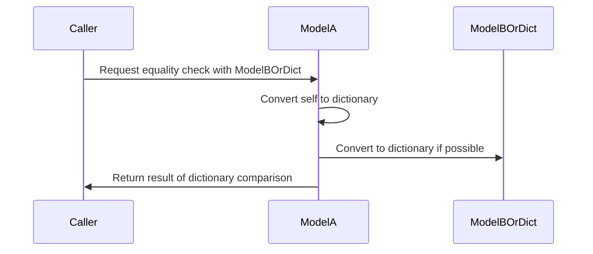
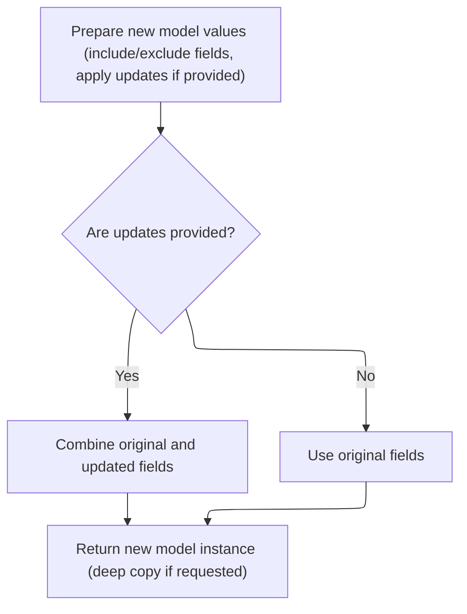
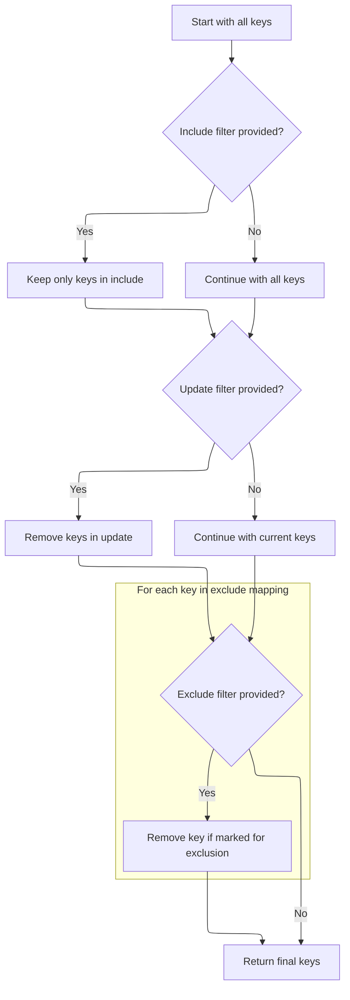
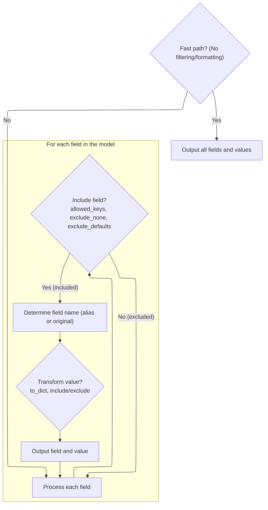

Equality between model instances is determined by comparing their data content, not their identity or type. By converting both objects to dictionaries, the comparison can be made between two models or between a model and a dictionary, ensuring consistent and flexible equality checks.

The main steps are:

- Convert both objects to their dictionary representations
- Compare the resulting dictionaries
- Return the boolean result



# Spec

## Detailed View of the Program's Functionality

a. Comparing Model Instances for Equality

When checking if two model instances are equal, the process begins by determining the type of the object being compared. If the other object is also a model instance, both objects are converted to their dictionary representations, and these dictionaries are compared. This ensures that equality is based on the actual data content of the models, not their identities or types. If the other object is not a model instance, the current model's dictionary representation is compared directly to the other object, assuming it behaves like a dictionary. This approach allows for flexible equality checks between models and plain dictionaries.

b. Generating a Model's Dictionary Representation

To produce a dictionary representation of a model, a dedicated method is used. This method allows for optional filtering of fields to include or exclude, as well as options for using aliases, skipping unset or default values, and omitting fields with None values. If a deprecated option is used, a warning is issued and the new option is set accordingly. The method then delegates to an internal iterator, which yields the appropriate field-value pairs based on the specified options. The result is collected into a dictionary and returned, providing a standardized and customizable view of the model's data.

c. Filtering and Iterating Model Fields

The internal iterator is responsible for determining which fields should be included in the output and how their values should be processed. It first merges any global include/exclude settings with those provided for the current call. It then calls a helper to calculate the exact set of keys to process, taking into account includes, excludes, and whether only explicitly set fields should be considered. If no filtering or formatting is needed, it yields all fields and values directly for efficiency. Otherwise, it loops through each field, checking if it should be included based on the calculated keys and various exclusion rules (such as omitting None or default values). For each included field, it determines the output key (using an alias if requested) and processes the value, potentially handling nested models or applying further filtering. Each processed field and value is then yielded for collection.

d. Determining Which Fields to Include or Exclude

The helper for calculating which keys to include starts by checking if any filtering is needed. If not, it returns None, signaling that all fields should be included. If filtering is required, it decides whether to start with all fields or only those that have been explicitly set, depending on the options. It then applies the include filter (if present) to restrict the set of keys, removes any keys specified in an update (for copy operations), and finally applies the exclude filter, removing any keys marked for exclusion. The resulting set of keys is returned for use in the iteration process.

e. Duplicating a Model with Field Selection

When duplicating a model, the process begins by preparing a dictionary of values for the new instance. This is done by iterating over the current model's fields, applying any include or exclude filters as specified. If updates are provided, these are merged into the values, overriding or adding fields as needed. The set of fields considered "set" is also updated to include any new keys from the updates. Finally, a new model instance is created using these values and the updated set of fields, with an option to perform a deep copy if requested. This allows for flexible duplication of models, including selective copying and modification of fields.

f. Finalizing the Set of Keys to Use

After preparing the initial set of keys for inclusion, further filtering is applied. If an include filter is present, only those keys are kept. If updates are being applied, any keys present in the updates are removed from the set. If an exclude filter is present, any keys marked for exclusion (according to custom logic) are also removed. The final set of keys is then returned, ensuring that only the desired fields will be processed in subsequent steps.

g. Yielding Filtered Model Fields

With the final set of keys determined, the iterator either yields all fields directly (if no filtering is needed) or processes each field individually. For each field, it checks if the field should be included based on the allowed keys and exclusion rules. If the field passes these checks, the output key is determined (using an alias if requested), and the value is processed. This processing may involve recursively handling nested models, dictionaries, or sequences, and applying further filtering as needed. Each resulting key-value pair is yielded for collection into the final output.

h. Recursively Processing Field Values

When processing a field's value, the method first checks if the value is itself a model instance. If so, and if a dictionary output is requested, the value is converted to a dictionary using the same filtering and formatting options as the parent. If only a model instance is needed, a filtered copy is created instead. If the value is a dictionary, each key-value pair is processed recursively, applying include/exclude logic at each level. If the value is a sequence (like a list or tuple), each element is processed recursively in the same way. If the value is an enumeration and the configuration specifies using enum values, the raw value is returned. Otherwise, the value is returned as-is. This recursive approach ensures that complex, nested data structures are handled consistently and according to the specified options.

i. Building the Output from Filtered Values

After processing each field and its value, the iterator yields the final key-value pair. These pairs are collected into a dictionary (or used to construct a new model instance, in the case of copying), forming the final output. This output reflects all the filtering, formatting, and recursive processing specified by the options, providing a flexible and consistent way to represent model data.

# Rule Definition

| Paragraph Name                                                                                                                                                                                                                                                                                                                                | Rule ID | Category          | Description                                                                                                                                                                                                                                                                                                                                                                                                                                                                                                                             | Conditions                                                                                                                                                                                                                                                                                                                                                                                                                                             | Remarks                                                                                                                                                                                                                                        |
| --------------------------------------------------------------------------------------------------------------------------------------------------------------------------------------------------------------------------------------------------------------------------------------------------------------------------------------------- | ------- | ----------------- | --------------------------------------------------------------------------------------------------------------------------------------------------------------------------------------------------------------------------------------------------------------------------------------------------------------------------------------------------------------------------------------------------------------------------------------------------------------------------------------------------------------------------------------- | ------------------------------------------------------------------------------------------------------------------------------------------------------------------------------------------------------------------------------------------------------------------------------------------------------------------------------------------------------------------------------------------------------------------------------------------------------ | ---------------------------------------------------------------------------------------------------------------------------------------------------------------------------------------------------------------------------------------------- |
| class <SwmToken path="pydantic/v1/main.py" pos="746:8:8" line-data="        if isinstance(v, BaseModel):">`BaseModel`</SwmToken>, def dict, def copy, def \_iter                                                                                                                                                                              | RL-001  | Conditional Logic | When serializing (dict()) or copying (copy()) a model, only the model fields are included in the output. Private attributes and class variables are excluded.                                                                                                                                                                                                                                                                                                                                                                           | Serialization or copying is performed on a model instance.                                                                                                                                                                                                                                                                                                                                                                                             | Output is a dictionary (for dict()) or a new model instance (for copy()) containing only the model fields. Private attributes and class variables are not present in the output.                                                               |
| def dict, def copy, def \_iter, def <SwmToken path="pydantic/v1/main.py" pos="735:3:3" line-data="    def _get_value(">`_get_value`</SwmToken>                                                                                                                                                                                                | RL-002  | Conditional Logic | When serializing or copying, include and exclude filters can be provided as sets or mappings. These filters are merged with field-level include/exclude and are applied recursively to nested models, dictionaries, and sequences.                                                                                                                                                                                                                                                                                                      | Serialization or copying is performed with include/exclude filters.                                                                                                                                                                                                                                                                                                                                                                                    | Filters can be sets of field names or mappings from field names to nested filters. Filtering is recursive for nested models and collections.                                                                                                   |
| def dict, def \_iter                                                                                                                                                                                                                                                                                                                          | RL-003  | Conditional Logic | When the <SwmToken path="pydantic/v1/main.py" pos="438:1:1" line-data="        by_alias: bool = False,">`by_alias`</SwmToken> option is enabled, field names in the output are replaced with their aliases as defined in the field metadata.                                                                                                                                                                                                                                                                                            | Serialization or copying is performed with <SwmToken path="pydantic/v1/main.py" pos="438:1:1" line-data="        by_alias: bool = False,">`by_alias`</SwmToken>=True.                                                                                                                                                                                                                                                                                  | Output dictionary keys are the field aliases instead of the field names when <SwmToken path="pydantic/v1/main.py" pos="438:1:1" line-data="        by_alias: bool = False,">`by_alias`</SwmToken> is True.                                     |
| def dict, def \_iter                                                                                                                                                                                                                                                                                                                          | RL-004  | Conditional Logic | The dict() method supports options to exclude fields that are unset, have default values, or are None, according to the <SwmToken path="pydantic/v1/main.py" pos="440:1:1" line-data="        exclude_unset: bool = False,">`exclude_unset`</SwmToken>, <SwmToken path="pydantic/v1/main.py" pos="441:1:1" line-data="        exclude_defaults: bool = False,">`exclude_defaults`</SwmToken>, and <SwmToken path="pydantic/v1/main.py" pos="442:1:1" line-data="        exclude_none: bool = False,">`exclude_none`</SwmToken> options. | Serialization is performed with <SwmToken path="pydantic/v1/main.py" pos="440:1:1" line-data="        exclude_unset: bool = False,">`exclude_unset`</SwmToken>, <SwmToken path="pydantic/v1/main.py" pos="441:1:1" line-data="        exclude_defaults: bool = False,">`exclude_defaults`</SwmToken>, or <SwmToken path="pydantic/v1/main.py" pos="442:1:1" line-data="        exclude_none: bool = False,">`exclude_none`</SwmToken> options enabled. | Fields are omitted from the output dictionary if they meet the exclusion criteria specified by the options.                                                                                                                                    |
| def <SwmToken path="pydantic/v1/main.py" pos="735:3:3" line-data="    def _get_value(">`_get_value`</SwmToken>                                                                                                                                                                                                                                | RL-005  | Conditional Logic | When serializing or copying, if a field value is a nested model, dictionary, or sequence, the same serialization/copying logic (including filtering and formatting options) is applied recursively to each element or key-value pair.                                                                                                                                                                                                                                                                                                   | A field value is a nested model, dictionary, or sequence.                                                                                                                                                                                                                                                                                                                                                                                              | Recursion applies the same include/exclude and formatting options at each level.                                                                                                                                                               |
| def <SwmToken path="pydantic/v1/main.py" pos="735:3:3" line-data="    def _get_value(">`_get_value`</SwmToken>                                                                                                                                                                                                                                | RL-006  | Conditional Logic | If a field value is an Enum and the <SwmToken path="pydantic/v1/main.py" pos="801:21:21" line-data="        elif isinstance(v, Enum) and getattr(cls.Config, &#39;use_enum_values&#39;, False):">`use_enum_values`</SwmToken> option is enabled in the config, the Enum's value is used in the output instead of the Enum instance.                                                                                                                                                                                                     | A field value is an Enum and <SwmToken path="pydantic/v1/main.py" pos="801:21:21" line-data="        elif isinstance(v, Enum) and getattr(cls.Config, &#39;use_enum_values&#39;, False):">`use_enum_values`</SwmToken> is True.                                                                                                                                                                                                                        | The output contains the Enum's value (<SwmToken path="pydantic/v1/main.py" pos="295:16:18" line-data="        # for attributes not in `new_namespace` (e.g. private attributes)">`e.g`</SwmToken>., string or int) instead of the Enum object. |
| def dict, def json, def <SwmToken path="pydantic/v1/main.py" pos="513:3:3" line-data="    def _enforce_dict_if_root(cls, obj: Any) -&gt; Any:">`_enforce_dict_if_root`</SwmToken>                                                                                                                                                             | RL-007  | Conditional Logic | For models with a single field named <SwmToken path="pydantic/v1/main.py" pos="756:3:3" line-data="                if ROOT_KEY in v_dict:">`ROOT_KEY`</SwmToken>, dict() returns a dictionary with the root key and its value, while json() outputs only the root value (not a dictionary).                                                                                                                                                                                                                                             | The model is a custom root model (has <SwmToken path="pydantic/v1/main.py" pos="756:3:3" line-data="                if ROOT_KEY in v_dict:">`ROOT_KEY`</SwmToken> as its only field).                                                                                                                                                                                                                                                                  | dict() output: <SwmToken path="pydantic/v1/main.py" pos="99:7:8" line-data="        raise ValueError(f&#39;{ROOT_KEY} cannot be mixed with other fields&#39;)">`{ROOT_KEY`</SwmToken>: value}. json() output: value (not wrapped in a dict).   |
| def copy                                                                                                                                                                                                                                                                                                                                      | RL-008  | Data Assignment   | When copying a model, the update parameter allows new values to be added or existing field values to be overridden in the copied model.                                                                                                                                                                                                                                                                                                                                                                                                 | copy() is called with an update mapping.                                                                                                                                                                                                                                                                                                                                                                                                               | The update mapping is merged into the copied model's field values.                                                                                                                                                                             |
| def **eq**                                                                                                                                                                                                                                                                                                                                    | RL-009  | Conditional Logic | Two model instances are considered equal if their dictionary representations are equal, regardless of their types. A model is also equal to a dictionary if its dict() output equals the dictionary.                                                                                                                                                                                                                                                                                                                                    | Equality comparison is performed between two models or a model and a dictionary.                                                                                                                                                                                                                                                                                                                                                                       | Comparison uses the output of dict() for both operands.                                                                                                                                                                                        |
| class <SwmToken path="pydantic/v1/main.py" pos="746:8:8" line-data="        if isinstance(v, BaseModel):">`BaseModel`</SwmToken>, def dict, def copy, def **eq**, def **init**, def <SwmToken path="pydantic/v1/main.py" pos="355:3:3" line-data="        __pydantic_self__._init_private_attributes()">`_init_private_attributes`</SwmToken> | RL-010  | Conditional Logic | The system supports creating model instances with required and optional fields, serializing to dict with/without filters, copying with/without filters and updates, comparing models and dicts for equality, excluding private/class vars from serialization/copying, and handling custom root models.                                                                                                                                                                                                                                  | User interacts with the model using the documented API.                                                                                                                                                                                                                                                                                                                                                                                                | Covers all minimal usage scenarios described in the spec.                                                                                                                                                                                      |

# User Stories

## User Story 1: Comprehensive model usage: serialization, copying, filtering, aliasing, recursion, updates, equality, and minimal scenarios

---

### Story Description:

As a user of data models, I want to create, serialize, copy, and compare model instances with support for include/exclude filters, field aliases, recursive handling of nested models and collections, options to exclude unset/default/None fields, updates during copying, equality comparison to other models or dictionaries, and correct handling of private/class variables and custom root models, so that I can flexibly and reliably manage data in all common workflows.

---

### Business Rule Mapping:

| Rule ID | Paragraph Name                                                                                                                                                                                                                                                                                                                                | Rule Description                                                                                                                                                                                                                                                                                                                                                                                                                                                                                                                        |
| ------- | --------------------------------------------------------------------------------------------------------------------------------------------------------------------------------------------------------------------------------------------------------------------------------------------------------------------------------------------- | --------------------------------------------------------------------------------------------------------------------------------------------------------------------------------------------------------------------------------------------------------------------------------------------------------------------------------------------------------------------------------------------------------------------------------------------------------------------------------------------------------------------------------------- |
| RL-001  | class <SwmToken path="pydantic/v1/main.py" pos="746:8:8" line-data="        if isinstance(v, BaseModel):">`BaseModel`</SwmToken>, def dict, def copy, def \_iter                                                                                                                                                                              | When serializing (dict()) or copying (copy()) a model, only the model fields are included in the output. Private attributes and class variables are excluded.                                                                                                                                                                                                                                                                                                                                                                           |
| RL-010  | class <SwmToken path="pydantic/v1/main.py" pos="746:8:8" line-data="        if isinstance(v, BaseModel):">`BaseModel`</SwmToken>, def dict, def copy, def **eq**, def **init**, def <SwmToken path="pydantic/v1/main.py" pos="355:3:3" line-data="        __pydantic_self__._init_private_attributes()">`_init_private_attributes`</SwmToken> | The system supports creating model instances with required and optional fields, serializing to dict with/without filters, copying with/without filters and updates, comparing models and dicts for equality, excluding private/class vars from serialization/copying, and handling custom root models.                                                                                                                                                                                                                                  |
| RL-002  | def dict, def copy, def \_iter, def <SwmToken path="pydantic/v1/main.py" pos="735:3:3" line-data="    def _get_value(">`_get_value`</SwmToken>                                                                                                                                                                                                | When serializing or copying, include and exclude filters can be provided as sets or mappings. These filters are merged with field-level include/exclude and are applied recursively to nested models, dictionaries, and sequences.                                                                                                                                                                                                                                                                                                      |
| RL-003  | def dict, def \_iter                                                                                                                                                                                                                                                                                                                          | When the <SwmToken path="pydantic/v1/main.py" pos="438:1:1" line-data="        by_alias: bool = False,">`by_alias`</SwmToken> option is enabled, field names in the output are replaced with their aliases as defined in the field metadata.                                                                                                                                                                                                                                                                                            |
| RL-004  | def dict, def \_iter                                                                                                                                                                                                                                                                                                                          | The dict() method supports options to exclude fields that are unset, have default values, or are None, according to the <SwmToken path="pydantic/v1/main.py" pos="440:1:1" line-data="        exclude_unset: bool = False,">`exclude_unset`</SwmToken>, <SwmToken path="pydantic/v1/main.py" pos="441:1:1" line-data="        exclude_defaults: bool = False,">`exclude_defaults`</SwmToken>, and <SwmToken path="pydantic/v1/main.py" pos="442:1:1" line-data="        exclude_none: bool = False,">`exclude_none`</SwmToken> options. |
| RL-007  | def dict, def json, def <SwmToken path="pydantic/v1/main.py" pos="513:3:3" line-data="    def _enforce_dict_if_root(cls, obj: Any) -&gt; Any:">`_enforce_dict_if_root`</SwmToken>                                                                                                                                                             | For models with a single field named <SwmToken path="pydantic/v1/main.py" pos="756:3:3" line-data="                if ROOT_KEY in v_dict:">`ROOT_KEY`</SwmToken>, dict() returns a dictionary with the root key and its value, while json() outputs only the root value (not a dictionary).                                                                                                                                                                                                                                             |
| RL-005  | def <SwmToken path="pydantic/v1/main.py" pos="735:3:3" line-data="    def _get_value(">`_get_value`</SwmToken>                                                                                                                                                                                                                                | When serializing or copying, if a field value is a nested model, dictionary, or sequence, the same serialization/copying logic (including filtering and formatting options) is applied recursively to each element or key-value pair.                                                                                                                                                                                                                                                                                                   |
| RL-006  | def <SwmToken path="pydantic/v1/main.py" pos="735:3:3" line-data="    def _get_value(">`_get_value`</SwmToken>                                                                                                                                                                                                                                | If a field value is an Enum and the <SwmToken path="pydantic/v1/main.py" pos="801:21:21" line-data="        elif isinstance(v, Enum) and getattr(cls.Config, &#39;use_enum_values&#39;, False):">`use_enum_values`</SwmToken> option is enabled in the config, the Enum's value is used in the output instead of the Enum instance.                                                                                                                                                                                                     |
| RL-008  | def copy                                                                                                                                                                                                                                                                                                                                      | When copying a model, the update parameter allows new values to be added or existing field values to be overridden in the copied model.                                                                                                                                                                                                                                                                                                                                                                                                 |
| RL-009  | def **eq**                                                                                                                                                                                                                                                                                                                                    | Two model instances are considered equal if their dictionary representations are equal, regardless of their types. A model is also equal to a dictionary if its dict() output equals the dictionary.                                                                                                                                                                                                                                                                                                                                    |

---

### Relevant Functionality:

- **class** <SwmToken path="pydantic/v1/main.py" pos="746:8:8" line-data="        if isinstance(v, BaseModel):">`BaseModel`</SwmToken>
  1. **RL-001:**
     - When dict() or copy() is called:
       - Iterate over the model's **dict**
       - For each key, check if it is a model field (present in **fields**)
       - Exclude keys that are private attributes or class variables
       - Return the filtered dictionary or use it to construct a new model instance
  2. **RL-010:**
     - Allow creation of model with required/optional fields
     - Allow dict() with/without include/exclude
     - Allow copy() with/without include/exclude and update
     - Allow equality comparison with models and dicts
     - Exclude private/class vars from serialization/copying
     - Support custom root model serialization
- **def dict**
  1. **RL-002:**
     - Merge include/exclude filters with field-level filters
     - For each field:
       - If include is set, only process fields in include
       - If exclude is set, skip fields in exclude
       - If the field value is a nested model, dict, or sequence, apply the same filtering logic recursively
  2. **RL-003:**
     - For each field in the output:
       - If <SwmToken path="pydantic/v1/main.py" pos="438:1:1" line-data="        by_alias: bool = False,">`by_alias`</SwmToken> is True, use the field's alias as the key
       - Otherwise, use the field's name
  3. **RL-004:**
     - For each field:
       - If <SwmToken path="pydantic/v1/main.py" pos="440:1:1" line-data="        exclude_unset: bool = False,">`exclude_unset`</SwmToken> is True and the field is not set, skip it
       - If <SwmToken path="pydantic/v1/main.py" pos="441:1:1" line-data="        exclude_defaults: bool = False,">`exclude_defaults`</SwmToken> is True and the field value equals its default, skip it
       - If <SwmToken path="pydantic/v1/main.py" pos="442:1:1" line-data="        exclude_none: bool = False,">`exclude_none`</SwmToken> is True and the field value is None, skip it
  4. **RL-007:**
     - If the model is a custom root model:
       - dict() returns <SwmToken path="pydantic/v1/main.py" pos="99:7:8" line-data="        raise ValueError(f&#39;{ROOT_KEY} cannot be mixed with other fields&#39;)">`{ROOT_KEY`</SwmToken>: value}
       - json() returns just the value
- **def** <SwmToken path="pydantic/v1/main.py" pos="735:3:3" line-data="    def _get_value(">`_get_value`</SwmToken>
  1. **RL-005:**
     - If the field value is a <SwmToken path="pydantic/v1/main.py" pos="746:8:8" line-data="        if isinstance(v, BaseModel):">`BaseModel`</SwmToken>, call dict() or copy() recursively
     - If the field value is a dict, apply filtering and serialization recursively to each key-value pair
     - If the field value is a sequence, apply filtering and serialization recursively to each element
  2. **RL-006:**
     - If the field value is an Enum and <SwmToken path="pydantic/v1/main.py" pos="801:21:21" line-data="        elif isinstance(v, Enum) and getattr(cls.Config, &#39;use_enum_values&#39;, False):">`use_enum_values`</SwmToken> is True:
       - Output the Enum's value
- **def copy**
  1. **RL-008:**
     - Call \_iter() to get filtered field values
     - Merge update mapping into the field values
     - Construct a new model instance with the merged values
- **def eq**
  1. **RL-009:**
     - If other is a <SwmToken path="pydantic/v1/main.py" pos="746:8:8" line-data="        if isinstance(v, BaseModel):">`BaseModel`</SwmToken>, compare <SwmToken path="pydantic/v1/main.py" pos="913:3:7" line-data="            return self.dict() == other.dict()">`self.dict()`</SwmToken> == <SwmToken path="pydantic/v1/main.py" pos="913:11:15" line-data="            return self.dict() == other.dict()">`other.dict()`</SwmToken>
     - If other is a dict, compare <SwmToken path="pydantic/v1/main.py" pos="913:3:7" line-data="            return self.dict() == other.dict()">`self.dict()`</SwmToken> == other

# Code Walkthrough

## Comparing Model Instances for Equality

<SwmSnippet path="/pydantic/v1/main.py" line="911">

---

<SwmToken path="pydantic/v1/main.py" pos="911:3:3" line-data="    def __eq__(self, other: Any) -&gt; bool:">`__eq__`</SwmToken> starts the equality check by comparing the dict representation of self and other if other is a <SwmToken path="pydantic/v1/main.py" pos="912:8:8" line-data="        if isinstance(other, BaseModel):">`BaseModel`</SwmToken>. If not, it compares self's dict to other directly, assuming other is dict-like. Calling dict here standardizes the comparison to the actual data content, not object identity or type, and lets you compare models to plain dicts if needed.

```python
    def __eq__(self, other: Any) -> bool:
        if isinstance(other, BaseModel):
            return self.dict() == other.dict()
        else:
            return self.dict() == other
```

---

</SwmSnippet>

## Generating a Model's Dictionary Representation

<SwmSnippet path="/pydantic/v1/main.py" line="433">

---

<SwmToken path="pydantic/v1/main.py" pos="433:3:3" line-data="    def dict(">`dict`</SwmToken> builds the model's dictionary output, handling all the filtering and field selection logic. It calls \_iter to get the right fields and values, including support for aliases, includes/excludes, and nested models. \_iter is where the actual logic for which fields to include happens.

```python
    def dict(
        self,
        *,
        include: Optional[Union['AbstractSetIntStr', 'MappingIntStrAny']] = None,
        exclude: Optional[Union['AbstractSetIntStr', 'MappingIntStrAny']] = None,
        by_alias: bool = False,
        skip_defaults: Optional[bool] = None,
        exclude_unset: bool = False,
        exclude_defaults: bool = False,
        exclude_none: bool = False,
    ) -> 'DictStrAny':
        """
        Generate a dictionary representation of the model, optionally specifying which fields to include or exclude.

        """
        if skip_defaults is not None:
            warnings.warn(
                f'{self.__class__.__name__}.dict(): "skip_defaults" is deprecated and replaced by "exclude_unset"',
                DeprecationWarning,
            )
            exclude_unset = skip_defaults

        return dict(
            self._iter(
                to_dict=True,
                by_alias=by_alias,
                include=include,
                exclude=exclude,
                exclude_unset=exclude_unset,
                exclude_defaults=exclude_defaults,
                exclude_none=exclude_none,
            )
        )
```

---

</SwmSnippet>

## Filtering and Iterating Model Fields

```mermaid
%%{init: {"flowchart": {"defaultRenderer": "elk"}} }%%
flowchart TD
    node1["Determine allowed fields (include/exclude rules)"] --> loop1
    click node1 openCode "pydantic/v1/main.py:846:848"
    subgraph loop1["For each field in the model"]
        node2{"Should field be included? (exclude_none, exclude_defaults, etc.)"}
        click node2 openCode "pydantic/v1/main.py:857:864"
        node2 -->|"Yes"| node3["Transform value for output (to_dict, by_alias, etc.)"]
        click node3 openCode "pydantic/v1/main.py:871:881"
        node3 --> node4["Yield field and value"]
        click node4 openCode "pydantic/v1/main.py:882:882"
        node2 -->|"No"| node5["Skip field"]
        click node5 openCode "pydantic/v1/main.py:858:859"
    end


subgraph node1 [_calculate_keys]
  sgmain_1_node1{"Are any field filters specified? (include, exclude, exclude_unset)"} -->|"No"| sgmain_1_node4["Return all fields"]
  click sgmain_1_node1 openCode "pydantic/v1/main.py:891:892"
  sgmain_1_node1 -->|"Yes"| sgmain_1_node2["Choose starting fields (all fields or only set fields)"]
  click sgmain_1_node2 openCode "pydantic/v1/main.py:895:898"
  sgmain_1_node2 --> sgmain_1_node3["Apply include, exclude, and update rules to fields"]
  click sgmain_1_node3 openCode "pydantic/v1/main.py:900:907"
  sgmain_1_node3 --> sgmain_1_node4["Return the final set of fields"]
  click sgmain_1_node4 openCode "pydantic/v1/main.py:909:909"
end

%% Swimm:
%% %%{init: {"flowchart": {"defaultRenderer": "elk"}} }%%
%% flowchart TD
%%     node1["Determine allowed fields (include/exclude rules)"] --> loop1
%%     click node1 openCode "<SwmPath>[pydantic/v1/main.py](pydantic/v1/main.py)</SwmPath>:846:848"
%%     subgraph loop1["For each field in the model"]
%%         node2{"Should field be included? (<SwmToken path="pydantic/v1/main.py" pos="442:1:1" line-data="        exclude_none: bool = False,">`exclude_none`</SwmToken>, <SwmToken path="pydantic/v1/main.py" pos="441:1:1" line-data="        exclude_defaults: bool = False,">`exclude_defaults`</SwmToken>, etc.)"}
%%         click node2 openCode "<SwmPath>[pydantic/v1/main.py](pydantic/v1/main.py)</SwmPath>:857:864"
%%         node2 -->|"Yes"| node3["Transform value for output (<SwmToken path="pydantic/v1/main.py" pos="457:1:1" line-data="                to_dict=True,">`to_dict`</SwmToken>, <SwmToken path="pydantic/v1/main.py" pos="438:1:1" line-data="        by_alias: bool = False,">`by_alias`</SwmToken>, etc.)"]
%%         click node3 openCode "<SwmPath>[pydantic/v1/main.py](pydantic/v1/main.py)</SwmPath>:871:881"
%%         node3 --> node4["Yield field and value"]
%%         click node4 openCode "<SwmPath>[pydantic/v1/main.py](pydantic/v1/main.py)</SwmPath>:882:882"
%%         node2 -->|"No"| node5["Skip field"]
%%         click node5 openCode "<SwmPath>[pydantic/v1/main.py](pydantic/v1/main.py)</SwmPath>:858:859"
%%     end
%% 
%% 
%% subgraph node1 [<SwmToken path="pydantic/v1/main.py" pos="846:7:7" line-data="        allowed_keys = self._calculate_keys(">`_calculate_keys`</SwmToken>]
%%   sgmain_1_node1{"Are any field filters specified? (include, exclude, <SwmToken path="pydantic/v1/main.py" pos="440:1:1" line-data="        exclude_unset: bool = False,">`exclude_unset`</SwmToken>)"} -->|"No"| sgmain_1_node4["Return all fields"]
%%   click sgmain_1_node1 openCode "<SwmPath>[pydantic/v1/main.py](pydantic/v1/main.py)</SwmPath>:891:892"
%%   sgmain_1_node1 -->|"Yes"| sgmain_1_node2["Choose starting fields (all fields or only set fields)"]
%%   click sgmain_1_node2 openCode "<SwmPath>[pydantic/v1/main.py](pydantic/v1/main.py)</SwmPath>:895:898"
%%   sgmain_1_node2 --> sgmain_1_node3["Apply include, exclude, and update rules to fields"]
%%   click sgmain_1_node3 openCode "<SwmPath>[pydantic/v1/main.py](pydantic/v1/main.py)</SwmPath>:900:907"
%%   sgmain_1_node3 --> sgmain_1_node4["Return the final set of fields"]
%%   click sgmain_1_node4 openCode "<SwmPath>[pydantic/v1/main.py](pydantic/v1/main.py)</SwmPath>:909:909"
%% end
```



<SwmSnippet path="/pydantic/v1/main.py" line="828">

---

In <SwmToken path="pydantic/v1/main.py" pos="828:3:3" line-data="    def _iter(">`_iter`</SwmToken>, we merge any include/exclude options and then call <SwmToken path="pydantic/v1/main.py" pos="846:7:7" line-data="        allowed_keys = self._calculate_keys(">`_calculate_keys`</SwmToken> to figure out exactly which fields should be processed. This sets up the rest of the iteration logic to only yield the right keys.

```python
    def _iter(
        self,
        to_dict: bool = False,
        by_alias: bool = False,
        include: Optional[Union['AbstractSetIntStr', 'MappingIntStrAny']] = None,
        exclude: Optional[Union['AbstractSetIntStr', 'MappingIntStrAny']] = None,
        exclude_unset: bool = False,
        exclude_defaults: bool = False,
        exclude_none: bool = False,
    ) -> 'TupleGenerator':
        # Merge field set excludes with explicit exclude parameter with explicit overriding field set options.
        # The extra "is not None" guards are not logically necessary but optimizes performance for the simple case.
        if exclude is not None or self.__exclude_fields__ is not None:
            exclude = ValueItems.merge(self.__exclude_fields__, exclude)

        if include is not None or self.__include_fields__ is not None:
            include = ValueItems.merge(self.__include_fields__, include, intersect=True)

        allowed_keys = self._calculate_keys(
            include=include, exclude=exclude, exclude_unset=exclude_unset  # type: ignore
        )
```

---

</SwmSnippet>

### Determining Which Fields to Include or Exclude

<SwmSnippet path="/pydantic/v1/main.py" line="884">

---

In <SwmToken path="pydantic/v1/main.py" pos="884:3:3" line-data="    def _calculate_keys(">`_calculate_keys`</SwmToken>, we decide which keys to start with: if <SwmToken path="pydantic/v1/main.py" pos="888:1:1" line-data="        exclude_unset: bool,">`exclude_unset`</SwmToken> is True, we use a copy of <SwmToken path="pydantic/v1/main.py" pos="659:1:1" line-data="            fields_set = self.__fields_set__ | update.keys()">`fields_set`</SwmToken> (fields that were set); otherwise, we use all keys from **dict**. Calling copy here avoids mutating the original set of fields.

```python
    def _calculate_keys(
        self,
        include: Optional['MappingIntStrAny'],
        exclude: Optional['MappingIntStrAny'],
        exclude_unset: bool,
        update: Optional['DictStrAny'] = None,
    ) -> Optional[AbstractSet[str]]:
        if include is None and exclude is None and exclude_unset is False:
            return None

        keys: AbstractSet[str]
        if exclude_unset:
            keys = self.__fields_set__.copy()
        else:
            keys = self.__dict__.keys()

```

---

</SwmSnippet>

#### Duplicating a Model with Field Selection



<SwmSnippet path="/pydantic/v1/main.py" line="633">

---

In <SwmToken path="pydantic/v1/main.py" pos="633:3:3" line-data="    def copy(">`copy`</SwmToken>, we use \_iter to get the filtered set of fields and values, so the new model only includes what's specified by include/exclude. This lets you customize the copy, not just duplicate everything.

```python
    def copy(
        self: 'Model',
        *,
        include: Optional[Union['AbstractSetIntStr', 'MappingIntStrAny']] = None,
        exclude: Optional[Union['AbstractSetIntStr', 'MappingIntStrAny']] = None,
        update: Optional['DictStrAny'] = None,
        deep: bool = False,
    ) -> 'Model':
        """
        Duplicate a model, optionally choose which fields to include, exclude and change.

        :param include: fields to include in new model
        :param exclude: fields to exclude from new model, as with values this takes precedence over include
        :param update: values to change/add in the new model. Note: the data is not validated before creating
            the new model: you should trust this data
        :param deep: set to `True` to make a deep copy of the model
        :return: new model instance
        """

        values = dict(
            self._iter(to_dict=False, by_alias=False, include=include, exclude=exclude, exclude_unset=False),
```

---

</SwmSnippet>

<SwmSnippet path="/pydantic/v1/main.py" line="652">

---

Back in <SwmToken path="pydantic/v1/main.py" pos="633:3:3" line-data="    def copy(">`copy`</SwmToken>, after getting the filtered fields from \_iter, we merge in any updates (overriding or adding fields) and wrap it all in dict to build the data for the new model instance.

```python
        values = dict(
            self._iter(to_dict=False, by_alias=False, include=include, exclude=exclude, exclude_unset=False),
            **(update or {}),
        )

```

---

</SwmSnippet>

<SwmSnippet path="/pydantic/v1/main.py" line="657">

---

Back in <SwmToken path="pydantic/v1/main.py" pos="633:3:3" line-data="    def copy(">`copy`</SwmToken>, after building the values dict, we update <SwmToken path="pydantic/v1/main.py" pos="659:1:1" line-data="            fields_set = self.__fields_set__ | update.keys()">`fields_set`</SwmToken> to include any new keys from update, then call <SwmToken path="pydantic/v1/main.py" pos="663:5:5" line-data="        return self._copy_and_set_values(values, fields_set, deep=deep)">`_copy_and_set_values`</SwmToken> to actually create the new model instance with the right data and field tracking.

```python
        # new `__fields_set__` can have unset optional fields with a set value in `update` kwarg
        if update:
            fields_set = self.__fields_set__ | update.keys()
        else:
            fields_set = set(self.__fields_set__)

        return self._copy_and_set_values(values, fields_set, deep=deep)
```

---

</SwmSnippet>

#### Creating a New Model Instance with Updated Data

See <SwmLink doc-title="Copying a Model Instance with All Attributes">[Copying a Model Instance with All Attributes](/.swm/copying-a-model-instance-with-all-attributes.ktpato5j.sw.md)</SwmLink>

#### Finalizing the Set of Keys to Use



<SwmSnippet path="/pydantic/v1/main.py" line="900">

---

After returning from copy in <SwmToken path="pydantic/v1/main.py" pos="846:7:7" line-data="        allowed_keys = self._calculate_keys(">`_calculate_keys`</SwmToken>, we finalize the set of keys by applying include, update, and exclude logic. For exclude, we filter out any keys where <SwmToken path="pydantic/v1/main.py" pos="907:25:27" line-data="            keys -= {k for k, v in exclude.items() if ValueItems.is_true(v)}">`ValueItems.is_true`</SwmToken> marks the value as true, which lets us use custom exclusion rules beyond just True/False.

```python
        if include is not None:
            keys &= include.keys()

        if update:
            keys -= update.keys()

        if exclude:
            keys -= {k for k, v in exclude.items() if ValueItems.is_true(v)}

        return keys
```

---

</SwmSnippet>

### Yielding Filtered Model Fields



<SwmSnippet path="/pydantic/v1/main.py" line="849">

---

Back in <SwmToken path="pydantic/v1/main.py" pos="850:11:11" line-data="            # huge boost for plain _iter()">`_iter`</SwmToken>, after getting <SwmToken path="pydantic/v1/main.py" pos="849:3:3" line-data="        if allowed_keys is None and not (to_dict or by_alias or exclude_unset or exclude_defaults or exclude_none):">`allowed_keys`</SwmToken>, we either yield fields directly (if no filtering is needed) or loop through each field, calling <SwmToken path="pydantic/v1/main.py" pos="872:7:7" line-data="                v = self._get_value(">`_get_value`</SwmToken> to handle nested models, filtering, and formatting for each value.

```python
        if allowed_keys is None and not (to_dict or by_alias or exclude_unset or exclude_defaults or exclude_none):
            # huge boost for plain _iter()
            yield from self.__dict__.items()
            return

        value_exclude = ValueItems(self, exclude) if exclude is not None else None
        value_include = ValueItems(self, include) if include is not None else None

        for field_key, v in self.__dict__.items():
            if (allowed_keys is not None and field_key not in allowed_keys) or (exclude_none and v is None):
                continue

            if exclude_defaults:
                model_field = self.__fields__.get(field_key)
                if not getattr(model_field, 'required', True) and getattr(model_field, 'default', _missing) == v:
                    continue

            if by_alias and field_key in self.__fields__:
                dict_key = self.__fields__[field_key].alias
            else:
                dict_key = field_key

            if to_dict or value_include or value_exclude:
                v = self._get_value(
                    v,
                    to_dict=to_dict,
                    by_alias=by_alias,
                    include=value_include and value_include.for_element(field_key),
                    exclude=value_exclude and value_exclude.for_element(field_key),
                    exclude_unset=exclude_unset,
                    exclude_defaults=exclude_defaults,
                    exclude_none=exclude_none,
                )
```

---

</SwmSnippet>

### Recursively Processing Field Values

```mermaid
%%{init: {"flowchart": {"defaultRenderer": "elk"}} }%%
flowchart TD
  node1["Receive value to export"] --> node2{"Is value a Pydantic model?"}
  click node1 openCode "pydantic/v1/main.py:735:805"
  node2 -->|"Yes"| node3{"to_dict option?"}
  click node2 openCode "pydantic/v1/main.py:746:759"
  node3 -->|"Yes"| node4["Convert model to dict (apply include/exclude, by_alias, exclude_unset/defaults/none)"]
  click node3 openCode "pydantic/v1/main.py:747:758"
  node3 -->|"No"| node5["Copy model (apply include/exclude)"]
  click node5 openCode "pydantic/v1/main.py:759:760"
  node4 --> node6["Return processed model"]
  click node4 openCode "pydantic/v1/main.py:758:758"
  node5 --> node6
  node2 -->|"No"| node7{"Is value a dict?"}
  click node7 openCode "pydantic/v1/main.py:765:781"
  node7 -->|"Yes"| loop1
  node7 -->|"No"| node9{"Is value a sequence?"}
  click node9 openCode "pydantic/v1/main.py:782:799"
  node9 -->|"Yes"| loop2
  node9 -->|"No"| node11{"Is value an Enum and use_enum_values?"}
  click node11 openCode "pydantic/v1/main.py:801:802"
  node11 -->|"Yes"| node12["Return Enum value"]
  click node12 openCode "pydantic/v1/main.py:802:802"
  node11 -->|"No"| node13["Return value as-is"]
  click node13 openCode "pydantic/v1/main.py:804:805"
  node12 --> node6
  node13 --> node6

  subgraph loop1["For each key-value in dict"]
    node8["Recursively process value (apply include/exclude)"]
    click node8 openCode "pydantic/v1/main.py:766:780"
  end
  loop1 --> node6

  subgraph loop2["For each element in sequence"]
    node10["Recursively process element (apply include/exclude)"]
    click node10 openCode "pydantic/v1/main.py:783:797"
  end
  loop2 --> node6
  click node6 openCode "pydantic/v1/main.py:758:805"

%% Swimm:
%% %%{init: {"flowchart": {"defaultRenderer": "elk"}} }%%
%% flowchart TD
%%   node1["Receive value to export"] --> node2{"Is value a Pydantic model?"}
%%   click node1 openCode "<SwmPath>[pydantic/v1/main.py](pydantic/v1/main.py)</SwmPath>:735:805"
%%   node2 -->|"Yes"| node3{"<SwmToken path="pydantic/v1/main.py" pos="457:1:1" line-data="                to_dict=True,">`to_dict`</SwmToken> option?"}
%%   click node2 openCode "<SwmPath>[pydantic/v1/main.py](pydantic/v1/main.py)</SwmPath>:746:759"
%%   node3 -->|"Yes"| node4["Convert model to dict (apply include/exclude, <SwmToken path="pydantic/v1/main.py" pos="438:1:1" line-data="        by_alias: bool = False,">`by_alias`</SwmToken>, exclude_unset/defaults/none)"]
%%   click node3 openCode "<SwmPath>[pydantic/v1/main.py](pydantic/v1/main.py)</SwmPath>:747:758"
%%   node3 -->|"No"| node5["Copy model (apply include/exclude)"]
%%   click node5 openCode "<SwmPath>[pydantic/v1/main.py](pydantic/v1/main.py)</SwmPath>:759:760"
%%   node4 --> node6["Return processed model"]
%%   click node4 openCode "<SwmPath>[pydantic/v1/main.py](pydantic/v1/main.py)</SwmPath>:758:758"
%%   node5 --> node6
%%   node2 -->|"No"| node7{"Is value a dict?"}
%%   click node7 openCode "<SwmPath>[pydantic/v1/main.py](pydantic/v1/main.py)</SwmPath>:765:781"
%%   node7 -->|"Yes"| loop1
%%   node7 -->|"No"| node9{"Is value a sequence?"}
%%   click node9 openCode "<SwmPath>[pydantic/v1/main.py](pydantic/v1/main.py)</SwmPath>:782:799"
%%   node9 -->|"Yes"| loop2
%%   node9 -->|"No"| node11{"Is value an Enum and <SwmToken path="pydantic/v1/main.py" pos="801:21:21" line-data="        elif isinstance(v, Enum) and getattr(cls.Config, &#39;use_enum_values&#39;, False):">`use_enum_values`</SwmToken>?"}
%%   click node11 openCode "<SwmPath>[pydantic/v1/main.py](pydantic/v1/main.py)</SwmPath>:801:802"
%%   node11 -->|"Yes"| node12["Return Enum value"]
%%   click node12 openCode "<SwmPath>[pydantic/v1/main.py](pydantic/v1/main.py)</SwmPath>:802:802"
%%   node11 -->|"No"| node13["Return value as-is"]
%%   click node13 openCode "<SwmPath>[pydantic/v1/main.py](pydantic/v1/main.py)</SwmPath>:804:805"
%%   node12 --> node6
%%   node13 --> node6
%% 
%%   subgraph loop1["For each key-value in dict"]
%%     node8["Recursively process value (apply include/exclude)"]
%%     click node8 openCode "<SwmPath>[pydantic/v1/main.py](pydantic/v1/main.py)</SwmPath>:766:780"
%%   end
%%   loop1 --> node6
%% 
%%   subgraph loop2["For each element in sequence"]
%%     node10["Recursively process element (apply include/exclude)"]
%%     click node10 openCode "<SwmPath>[pydantic/v1/main.py](pydantic/v1/main.py)</SwmPath>:783:797"
%%   end
%%   loop2 --> node6
%%   click node6 openCode "<SwmPath>[pydantic/v1/main.py](pydantic/v1/main.py)</SwmPath>:758:805"
```



<SwmSnippet path="/pydantic/v1/main.py" line="735">

---

In <SwmToken path="pydantic/v1/main.py" pos="735:3:3" line-data="    def _get_value(">`_get_value`</SwmToken>, when v is a <SwmToken path="pydantic/v1/main.py" pos="746:8:8" line-data="        if isinstance(v, BaseModel):">`BaseModel`</SwmToken> and <SwmToken path="pydantic/v1/main.py" pos="738:1:1" line-data="        to_dict: bool,">`to_dict`</SwmToken> is True, we call dict on it to get its filtered dict representation, handling nested models and applying all the same include/exclude logic. If <SwmToken path="pydantic/v1/main.py" pos="756:3:3" line-data="                if ROOT_KEY in v_dict:">`ROOT_KEY`</SwmToken> is present, we return just that value; otherwise, we return the whole dict.

```python
    def _get_value(
        cls,
        v: Any,
        to_dict: bool,
        by_alias: bool,
        include: Optional[Union['AbstractSetIntStr', 'MappingIntStrAny']],
        exclude: Optional[Union['AbstractSetIntStr', 'MappingIntStrAny']],
        exclude_unset: bool,
        exclude_defaults: bool,
        exclude_none: bool,
    ) -> Any:
        if isinstance(v, BaseModel):
            if to_dict:
                v_dict = v.dict(
                    by_alias=by_alias,
                    exclude_unset=exclude_unset,
                    exclude_defaults=exclude_defaults,
                    include=include,
                    exclude=exclude,
                    exclude_none=exclude_none,
                )
                if ROOT_KEY in v_dict:
                    return v_dict[ROOT_KEY]
                return v_dict
            else:
```

---

</SwmSnippet>

<SwmSnippet path="/pydantic/v1/main.py" line="760">

---

Back in <SwmToken path="pydantic/v1/main.py" pos="735:3:3" line-data="    def _get_value(">`_get_value`</SwmToken>, if we're not outputting a dict, we call copy on the nested model to get a filtered model instance instead of a dict, still applying include/exclude as needed.

```python
                return v.copy(include=include, exclude=exclude)

```

---

</SwmSnippet>

<SwmSnippet path="/pydantic/v1/main.py" line="762">

---

In <SwmToken path="pydantic/v1/main.py" pos="767:6:6" line-data="                k_: cls._get_value(">`_get_value`</SwmToken>, after copy, we recursively process dicts and sequences, applying filtering at every level.

```python
        value_exclude = ValueItems(v, exclude) if exclude else None
        value_include = ValueItems(v, include) if include else None

        if isinstance(v, dict):
            return {
                k_: cls._get_value(
                    v_,
                    to_dict=to_dict,
                    by_alias=by_alias,
                    exclude_unset=exclude_unset,
                    exclude_defaults=exclude_defaults,
                    include=value_include and value_include.for_element(k_),
                    exclude=value_exclude and value_exclude.for_element(k_),
                    exclude_none=exclude_none,
                )
                for k_, v_ in v.items()
                if (not value_exclude or not value_exclude.is_excluded(k_))
                and (not value_include or value_include.is_included(k_))
            }

        elif sequence_like(v):
            seq_args = (
                cls._get_value(
                    v_,
                    to_dict=to_dict,
                    by_alias=by_alias,
                    exclude_unset=exclude_unset,
                    exclude_defaults=exclude_defaults,
                    include=value_include and value_include.for_element(i),
                    exclude=value_exclude and value_exclude.for_element(i),
                    exclude_none=exclude_none,
                )
                for i, v_ in enumerate(v)
                if (not value_exclude or not value_exclude.is_excluded(i))
                and (not value_include or value_include.is_included(i))
            )

            return v.__class__(*seq_args) if is_namedtuple(v.__class__) else v.__class__(seq_args)

        elif isinstance(v, Enum) and getattr(cls.Config, 'use_enum_values', False):
            return v.value

        else:
            return v
```

---

</SwmSnippet>

### Building the Output from Filtered Values

<SwmSnippet path="/pydantic/v1/main.py" line="882">

---

After returning from <SwmToken path="pydantic/v1/main.py" pos="735:3:3" line-data="    def _get_value(">`_get_value`</SwmToken> in <SwmToken path="pydantic/v1/main.py" pos="456:3:3" line-data="            self._iter(">`_iter`</SwmToken>, we yield each (<SwmToken path="pydantic/v1/main.py" pos="882:3:3" line-data="            yield dict_key, v">`dict_key`</SwmToken>, v) pair, which builds the final output dict or model with all the right keys and filtered values.

```python
            yield dict_key, v
```

---

</SwmSnippet>

&nbsp;

*This is an auto-generated document by Swimm 🌊 and has not yet been verified by a human*

<SwmMeta version="3.0.0" repo-id="Z2l0aHViJTNBJTNBcHlkYW50aWMlM0ElM0FTd2ltbS1EZW1v" repo-name="pydantic"><sup>Powered by [Swimm](/)</sup></SwmMeta>
