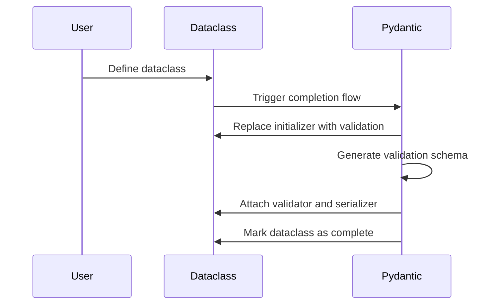
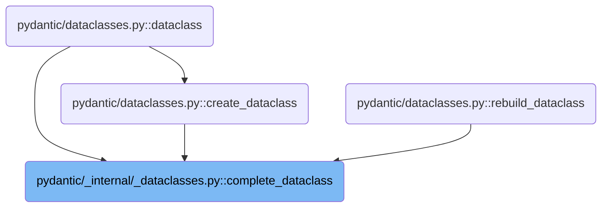
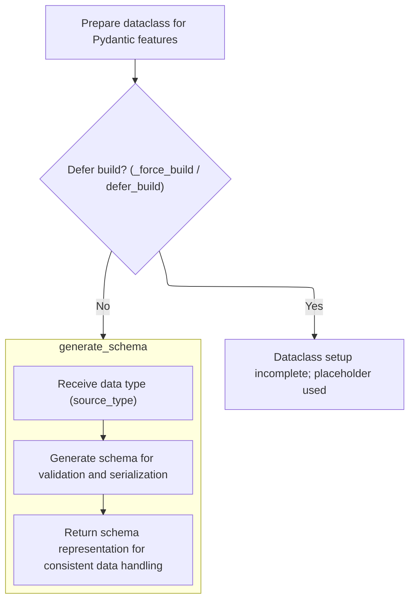
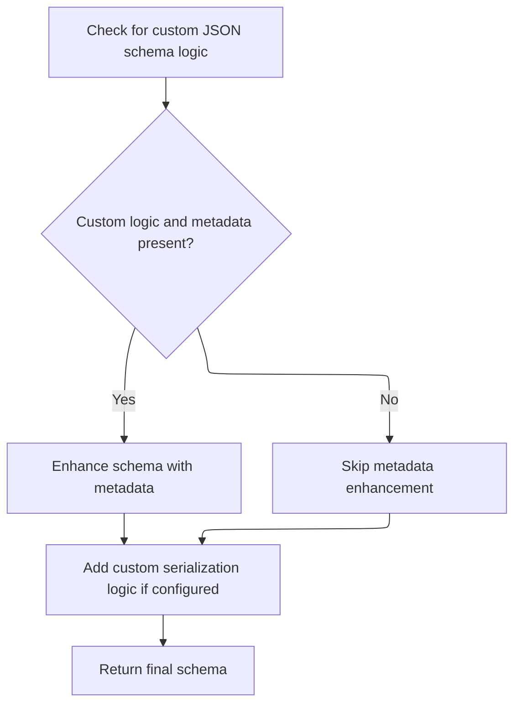

This flow completes the transformation of a Python dataclass into a Pydantic dataclass by adding validation and serialization capabilities. It replaces the initializer to validate instances, generates a schema to enforce data rules, and attaches validators and serializers to the class. The flow also supports deferred building and ensures the dataclass is fully prepared for Pydantic's features.



# Where is this flow used?

This flow is used multiple times in the codebase as represented in the following diagram:



# Spec

## Detailed View of the Program's Functionality

a. Preparing the Dataclass for Pydantic Features

The process begins by preparing a standard Python dataclass to be enhanced with Pydantic's validation and serialization features. This involves replacing the dataclass's constructor so that every time an instance is created, Pydantic's validation logic is triggered. The original constructor is saved, and a new one is defined that, upon instantiation, calls Pydantic's validator to check and process the input arguments. Additionally, <SwmToken path="pydantic/_internal/_dataclasses.py" pos="45:4:6" line-data="            __pydantic_config__: Pydantic-specific configuration settings for the dataclass.">`Pydantic-specific`</SwmToken> configuration is attached to the class, and the fields of the dataclass are collected and stored in a special attribute for later use.

b. Deciding Whether to Defer Building

Before proceeding with the full setup, the code checks if schema and validator construction should be deferred. This is controlled by configuration flags or explicit instructions to force building. If building is deferred, the class is set up with placeholder mocks instead of real validation logic, and the process exits early, indicating that the dataclass is not yet fully ready for Pydantic validation.

c. Finalizing the Dataclass Setup

If building is not deferred, the process continues to finalize the dataclass for Pydantic. This includes:

- Warning about deprecated post-initialization hooks if present.
- Resolving any type variables used in generic dataclasses.
- Creating a schema generator object, which will be responsible for building the validation and serialization schema.
- Setting up a lazy attribute for the class's signature, ensuring that introspection tools see the correct constructor signature, reflecting both the original dataclass and Pydantic's enhancements.

d. Generating the Schema

The schema generation step is the core of Pydantic's validation logic. The schema generator receives the dataclass type and produces a structured schema that describes how to validate and serialize instances of the dataclass. This schema is built by:

- Attempting to use any custom schema generation methods provided by the dataclass.
- If no custom method is found, falling back to the default schema generation logic, which inspects the dataclass fields, their types, and any attached metadata or validators.

e. Attaching Custom Metadata and Serialization Logic

After the initial schema is generated, the process checks for any custom JSON schema logic or additional metadata hooks defined on the dataclass. If such hooks are present, they are attached to the schema, enhancing it with extra information or custom serialization behavior. Additionally, if there are custom JSON encoders configured for the dataclass or its fields, these are integrated into the schema to ensure correct serialization.

f. Cleaning and Finalizing the Schema

Once the schema is fully constructed and enhanced, it is "cleaned" to ensure it is valid and ready for use. This step may involve resolving references, inlining definitions, and applying any deferred logic such as discriminators for unions. If the schema is found to be invalid at this stage, the class is reverted to using mocks, and the process exits early.

g. Activating Validation and Serialization

If schema cleaning succeeds, the class is now fully wired up for Pydantic validation and serialization. The following actions are performed:

- The finalized schema is attached to the class.
- A validator object is created and attached, enabling runtime validation of instances.
- A serializer object is created and attached, enabling conversion of instances to JSON or other formats.
- A flag is set to indicate that the dataclass is now fully complete and ready for use with Pydantic.

h. Summary of the Flow

In summary, the process takes a standard Python dataclass and, depending on configuration, either sets it up immediately or defers setup. If setup proceeds, the class is enhanced with a new constructor, field metadata, and a detailed validation/serialization schema. Custom hooks and encoders are integrated, and the schema is finalized. The class is then equipped with validator and serializer objects, making it fully compatible with Pydantic's data validation and serialization ecosystem. If any step fails or is deferred, the class is set up with placeholder mocks instead.

# Rule Definition

| Paragraph Name                                                                                                                                                                                                                                                                                                                                                              | Rule ID | Category          | Description                                                                                                                                                                                                                                                                                                                                                                                                                                                                                                                                                                                                                                                                                             | Conditions                                       | Remarks                                                                                                                                                                                                                                                                                                                                                                                                                                                                                                                                        |
| --------------------------------------------------------------------------------------------------------------------------------------------------------------------------------------------------------------------------------------------------------------------------------------------------------------------------------------------------------------------------- | ------- | ----------------- | ------------------------------------------------------------------------------------------------------------------------------------------------------------------------------------------------------------------------------------------------------------------------------------------------------------------------------------------------------------------------------------------------------------------------------------------------------------------------------------------------------------------------------------------------------------------------------------------------------------------------------------------------------------------------------------------------------- | ------------------------------------------------ | ---------------------------------------------------------------------------------------------------------------------------------------------------------------------------------------------------------------------------------------------------------------------------------------------------------------------------------------------------------------------------------------------------------------------------------------------------------------------------------------------------------------------------------------------- |
| <SwmToken path="pydantic/_internal/_dataclasses.py" pos="91:2:2" line-data="def complete_dataclass(">`complete_dataclass`</SwmToken>                                                                                                                                                                                                                                        | RL-001  | Data Assignment   | The system must accept a Python dataclass as input, along with a configuration object (<SwmToken path="pydantic/_internal/_dataclasses.py" pos="93:1:1" line-data="    config_wrapper: _config.ConfigWrapper,">`config_wrapper`</SwmToken>) and optional parameters (<SwmToken path="pydantic/_internal/_dataclasses.py" pos="95:1:1" line-data="    raise_errors: bool = True,">`raise_errors`</SwmToken>, <SwmToken path="pydantic/_internal/_dataclasses.py" pos="96:1:1" line-data="    ns_resolver: NsResolver \| None = None,">`ns_resolver`</SwmToken>, <SwmToken path="pydantic/_internal/_dataclasses.py" pos="97:1:1" line-data="    _force_build: bool = False,">`_force_build`</SwmToken>). | Whenever the dataclass setup process is invoked. | The input dataclass must already be wrapped with <SwmToken path="pydantic/_internal/_dataclasses.py" pos="101:28:32" line-data="    This logic is called on a class which has already been wrapped in `dataclasses.dataclass()`.">`dataclasses.dataclass()`</SwmToken>. The <SwmToken path="pydantic/_internal/_dataclasses.py" pos="93:1:1" line-data="    config_wrapper: _config.ConfigWrapper,">`config_wrapper`</SwmToken> provides configuration, and optional parameters control error raising, namespace resolution, and forced build. |
| <SwmToken path="pydantic/_internal/_dataclasses.py" pos="91:2:2" line-data="def complete_dataclass(">`complete_dataclass`</SwmToken>                                                                                                                                                                                                                                        | RL-002  | Conditional Logic | The system must determine whether to defer the build process based on the configuration (<SwmToken path="pydantic/_internal/_dataclasses.py" pos="136:9:11" line-data="    if not _force_build and config_wrapper.defer_build:">`config_wrapper.defer_build`</SwmToken>) or the <SwmToken path="pydantic/_internal/_dataclasses.py" pos="97:1:1" line-data="    _force_build: bool = False,">`_force_build`</SwmToken> parameter.                                                                                                                                                                                                                                                                       | On invocation of the dataclass setup process.    | If <SwmToken path="pydantic/_internal/_dataclasses.py" pos="97:1:1" line-data="    _force_build: bool = False,">`_force_build`</SwmToken> is False and <SwmToken path="pydantic/_internal/_dataclasses.py" pos="136:9:11" line-data="    if not _force_build and config_wrapper.defer_build:">`config_wrapper.defer_build`</SwmToken> is True, the build is deferred.                                                                                                                                                                          |
| <SwmToken path="pydantic/_internal/_dataclasses.py" pos="91:2:2" line-data="def complete_dataclass(">`complete_dataclass`</SwmToken>, <SwmToken path="pydantic/_internal/_dataclasses.py" pos="137:1:1" line-data="        set_dataclass_mocks(cls)">`set_dataclass_mocks`</SwmToken>                                                                                       | RL-003  | Data Assignment   | If the build is deferred, the dataclass must be assigned placeholder ('mock') attributes for validation, serialization, and schema. These placeholders must prevent actual validation or serialization from occurring.                                                                                                                                                                                                                                                                                                                                                                                                                                                                                  | Build is deferred (see previous rule).           | Placeholder validator and serializer must raise errors or otherwise prevent use. Placeholder schema is a mock object, not a real schema.                                                                                                                                                                                                                                                                                                                                                                                                       |
| <SwmToken path="pydantic/_internal/_dataclasses.py" pos="91:2:2" line-data="def complete_dataclass(">`complete_dataclass`</SwmToken>, <SwmToken path="pydantic/_internal/_dataclasses.py" pos="134:1:1" line-data="    set_dataclass_fields(cls, config_wrapper=config_wrapper, ns_resolver=ns_resolver)">`set_dataclass_fields`</SwmToken>, GenerateSchema.generate_schema | RL-004  | Data Assignment   | If the build is not deferred, the system must prepare the dataclass for Pydantic features, including setting up fields, configuration, and generating a schema.                                                                                                                                                                                                                                                                                                                                                                                                                                                                                                                                         | Build is not deferred.                           | Fields are collected and assigned. Configuration is attached. Schema is generated using the schema generator.                                                                                                                                                                                                                                                                                                                                                                                                                                  |
| GenerateSchema.\_dataclass_schema                                                                                                                                                                                                                                                                                                                                           | RL-005  | Computation       | The generated schema must be a nested data structure that describes the dataclass, its fields, and their types. It must include a top-level type indicator, a reference to the dataclass, a nested schema for arguments (fields), and any additional metadata.                                                                                                                                                                                                                                                                                                                                                                                                                                          | Schema generation for a dataclass.               | Schema format:                                                                                                                                                                                                                                                                                                                                                                                                                                                                                                                                 |

- Top-level: {'type': 'dataclass', 'cls': <dataclass>, ...}
- Nested: {<SwmToken path="pydantic/_internal/_generate_schema.py" pos="1876:1:1" line-data="                args_schema = core_schema.dataclass_args_schema(">`args_schema`</SwmToken>: {'name': <dataclass name>, 'fields': \[ ... \]}}
- Each field: {'name': <field name>, 'schema': <field type schema>, ...}
- Additional metadata as needed. | | GenerateSchema.generate_schema | RL-006 | Computation | The system must check for custom schema logic or metadata hooks on the dataclass and, if present, enhance the generated schema with this metadata. | Custom schema hooks or metadata are defined on the dataclass. | Custom hooks may be **get_pydantic_json_schema** or similar. Enhanced schema must include any additional metadata provided. | | GenerateSchema.\_apply_model_serializers, <SwmToken path="pydantic/_internal/_dataclasses.py" pos="91:2:2" line-data="def complete_dataclass(">`complete_dataclass`</SwmToken> | RL-007 | Data Assignment | If custom serialization logic is configured, the system must attach it to the schema and ensure it is used for serialization. | Custom serialization logic is configured for the dataclass. | Custom serializer is attached to the schema under the 'serialization' key. | | <SwmToken path="pydantic/_internal/_dataclasses.py" pos="91:2:2" line-data="def complete_dataclass(">`complete_dataclass`</SwmToken> | RL-008 | Data Assignment | The finalized schema, validator, and serializer must be returned and attached to the dataclass, enabling validation and serialization of instances. | Build is not deferred and schema generation is successful. | Schema, validator, and serializer are attached as class attributes. Validator and serializer are constructed from the schema. | | <SwmToken path="pydantic/_internal/_dataclasses.py" pos="91:2:2" line-data="def complete_dataclass(">`complete_dataclass`</SwmToken> | RL-009 | Conditional Logic | The output of the process must be a dataclass that is either fully set up for Pydantic validation and serialization (with complete schema, validator, and serializer), or, if build is deferred, a dataclass with placeholder attributes that prevent validation and serialization until the build is completed. | After the setup process completes. | Output dataclass must have either real or placeholder attributes for schema, validator, and serializer, depending on build state. | | GenerateSchema.\_dataclass_schema, GenerateSchema.generate_schema | RL-010 | Computation | The generated schema must be suitable for use by Pydantic’s core engine for both validation and serialization tasks. | Whenever a schema is generated for a dataclass. | Schema must conform to Pydantic core schema format and support both validation and serialization. |

# User Stories

## User Story 1: Dataclass setup with immediate or deferred build

---

### Story Description:

As a user of Pydantic, I want to provide a Python dataclass and configuration so that the system can either fully set up or defer setup with placeholders based on my configuration.

---

### Business Rule Mapping:

| Rule ID | Paragraph Name                                                                                                                                                                                                                                                                        | Rule Description                                                                                                                                                                                                                                                                                                                                                                                                                                                                                                                                                                                                                                                                                        |
| ------- | ------------------------------------------------------------------------------------------------------------------------------------------------------------------------------------------------------------------------------------------------------------------------------------- | ------------------------------------------------------------------------------------------------------------------------------------------------------------------------------------------------------------------------------------------------------------------------------------------------------------------------------------------------------------------------------------------------------------------------------------------------------------------------------------------------------------------------------------------------------------------------------------------------------------------------------------------------------------------------------------------------------- |
| RL-001  | <SwmToken path="pydantic/_internal/_dataclasses.py" pos="91:2:2" line-data="def complete_dataclass(">`complete_dataclass`</SwmToken>                                                                                                                                                  | The system must accept a Python dataclass as input, along with a configuration object (<SwmToken path="pydantic/_internal/_dataclasses.py" pos="93:1:1" line-data="    config_wrapper: _config.ConfigWrapper,">`config_wrapper`</SwmToken>) and optional parameters (<SwmToken path="pydantic/_internal/_dataclasses.py" pos="95:1:1" line-data="    raise_errors: bool = True,">`raise_errors`</SwmToken>, <SwmToken path="pydantic/_internal/_dataclasses.py" pos="96:1:1" line-data="    ns_resolver: NsResolver \| None = None,">`ns_resolver`</SwmToken>, <SwmToken path="pydantic/_internal/_dataclasses.py" pos="97:1:1" line-data="    _force_build: bool = False,">`_force_build`</SwmToken>). |
| RL-002  | <SwmToken path="pydantic/_internal/_dataclasses.py" pos="91:2:2" line-data="def complete_dataclass(">`complete_dataclass`</SwmToken>                                                                                                                                                  | The system must determine whether to defer the build process based on the configuration (<SwmToken path="pydantic/_internal/_dataclasses.py" pos="136:9:11" line-data="    if not _force_build and config_wrapper.defer_build:">`config_wrapper.defer_build`</SwmToken>) or the <SwmToken path="pydantic/_internal/_dataclasses.py" pos="97:1:1" line-data="    _force_build: bool = False,">`_force_build`</SwmToken> parameter.                                                                                                                                                                                                                                                                       |
| RL-003  | <SwmToken path="pydantic/_internal/_dataclasses.py" pos="91:2:2" line-data="def complete_dataclass(">`complete_dataclass`</SwmToken>, <SwmToken path="pydantic/_internal/_dataclasses.py" pos="137:1:1" line-data="        set_dataclass_mocks(cls)">`set_dataclass_mocks`</SwmToken> | If the build is deferred, the dataclass must be assigned placeholder ('mock') attributes for validation, serialization, and schema. These placeholders must prevent actual validation or serialization from occurring.                                                                                                                                                                                                                                                                                                                                                                                                                                                                                  |
| RL-009  | <SwmToken path="pydantic/_internal/_dataclasses.py" pos="91:2:2" line-data="def complete_dataclass(">`complete_dataclass`</SwmToken>                                                                                                                                                  | The output of the process must be a dataclass that is either fully set up for Pydantic validation and serialization (with complete schema, validator, and serializer), or, if build is deferred, a dataclass with placeholder attributes that prevent validation and serialization until the build is completed.                                                                                                                                                                                                                                                                                                                                                                                        |

---

### Relevant Functionality:

- <SwmToken path="pydantic/_internal/_dataclasses.py" pos="91:2:2" line-data="def complete_dataclass(">`complete_dataclass`</SwmToken>
  1. **RL-001:**
     - Accept dataclass, <SwmToken path="pydantic/_internal/_dataclasses.py" pos="93:1:1" line-data="    config_wrapper: _config.ConfigWrapper,">`config_wrapper`</SwmToken>, and optional parameters (<SwmToken path="pydantic/_internal/_dataclasses.py" pos="95:1:1" line-data="    raise_errors: bool = True,">`raise_errors`</SwmToken>, <SwmToken path="pydantic/_internal/_dataclasses.py" pos="96:1:1" line-data="    ns_resolver: NsResolver | None = None,">`ns_resolver`</SwmToken>, <SwmToken path="pydantic/_internal/_dataclasses.py" pos="97:1:1" line-data="    _force_build: bool = False,">`_force_build`</SwmToken>) as arguments to the setup function.
     - Ensure the dataclass is already a valid dataclass instance.
  2. **RL-002:**
     - If not <SwmToken path="pydantic/_internal/_dataclasses.py" pos="97:1:1" line-data="    _force_build: bool = False,">`_force_build`</SwmToken> and <SwmToken path="pydantic/_internal/_dataclasses.py" pos="136:9:11" line-data="    if not _force_build and config_wrapper.defer_build:">`config_wrapper.defer_build`</SwmToken> is True:
       - Defer the build process.
       - Proceed to assign placeholder attributes.
  3. **RL-003:**
     - Assign mock validator to dataclass that raises on validation attempt.
     - Assign mock serializer to dataclass that raises on serialization attempt.
     - Assign mock schema object to dataclass.
     - Ensure these attributes prevent actual validation/serialization.
  4. **RL-009:**
     - If build was deferred:
       - Output dataclass with placeholder attributes.
     - Else:
       - Output dataclass with complete schema, validator, and serializer attached.

## User Story 2: Schema generation and enhancement

---

### Story Description:

As a user of Pydantic, I want the system to generate a detailed schema for my dataclass, including custom metadata and hooks, so that the schema is accurate and compatible with Pydantic's core engine for validation and serialization.

---

### Business Rule Mapping:

| Rule ID | Paragraph Name                                                                                                                                                                                                                                                                                                                                                              | Rule Description                                                                                                                                                                                                                                               |
| ------- | --------------------------------------------------------------------------------------------------------------------------------------------------------------------------------------------------------------------------------------------------------------------------------------------------------------------------------------------------------------------------- | -------------------------------------------------------------------------------------------------------------------------------------------------------------------------------------------------------------------------------------------------------------- |
| RL-004  | <SwmToken path="pydantic/_internal/_dataclasses.py" pos="91:2:2" line-data="def complete_dataclass(">`complete_dataclass`</SwmToken>, <SwmToken path="pydantic/_internal/_dataclasses.py" pos="134:1:1" line-data="    set_dataclass_fields(cls, config_wrapper=config_wrapper, ns_resolver=ns_resolver)">`set_dataclass_fields`</SwmToken>, GenerateSchema.generate_schema | If the build is not deferred, the system must prepare the dataclass for Pydantic features, including setting up fields, configuration, and generating a schema.                                                                                                |
| RL-005  | GenerateSchema.\_dataclass_schema                                                                                                                                                                                                                                                                                                                                           | The generated schema must be a nested data structure that describes the dataclass, its fields, and their types. It must include a top-level type indicator, a reference to the dataclass, a nested schema for arguments (fields), and any additional metadata. |
| RL-010  | GenerateSchema.\_dataclass_schema, GenerateSchema.generate_schema                                                                                                                                                                                                                                                                                                           | The generated schema must be suitable for use by Pydantic’s core engine for both validation and serialization tasks.                                                                                                                                           |
| RL-006  | GenerateSchema.generate_schema                                                                                                                                                                                                                                                                                                                                              | The system must check for custom schema logic or metadata hooks on the dataclass and, if present, enhance the generated schema with this metadata.                                                                                                             |

---

### Relevant Functionality:

- <SwmToken path="pydantic/_internal/_dataclasses.py" pos="91:2:2" line-data="def complete_dataclass(">`complete_dataclass`</SwmToken>
  1. **RL-004:**
     - Collect and assign field definitions to the dataclass.
     - Attach configuration from <SwmToken path="pydantic/_internal/_dataclasses.py" pos="93:1:1" line-data="    config_wrapper: _config.ConfigWrapper,">`config_wrapper`</SwmToken>.
     - Generate schema using schema generator.
- **GenerateSchema.\_dataclass_schema**
  1. **RL-005:**
     - Create schema dict with 'type': 'dataclass' and 'cls' set to the dataclass.
     - Add nested <SwmToken path="pydantic/_internal/_generate_schema.py" pos="1876:1:1" line-data="                args_schema = core_schema.dataclass_args_schema(">`args_schema`</SwmToken> with dataclass name and list of field definitions.
     - Each field definition includes name, type schema, and metadata.
     - Attach any additional dataclass-level metadata.
  2. **RL-010:**
     - Ensure generated schema matches Pydantic core schema format.
     - Validate that schema supports both validation and serialization operations.
- **GenerateSchema.generate_schema**
  1. **RL-006:**
     - Check for presence of custom schema logic or metadata hooks on the dataclass.
     - If found, call the hook and merge returned metadata into the schema.

## User Story 3: Attachment of validators and serializers

---

### Story Description:

As a user of Pydantic, I want the system to attach validators and serializers (including custom serialization logic if configured) to my dataclass so that I can validate and serialize instances using Pydantic features.

---

### Business Rule Mapping:

| Rule ID | Paragraph Name                                                                                                                                                                 | Rule Description                                                                                                                                    |
| ------- | ------------------------------------------------------------------------------------------------------------------------------------------------------------------------------ | --------------------------------------------------------------------------------------------------------------------------------------------------- |
| RL-008  | <SwmToken path="pydantic/_internal/_dataclasses.py" pos="91:2:2" line-data="def complete_dataclass(">`complete_dataclass`</SwmToken>                                           | The finalized schema, validator, and serializer must be returned and attached to the dataclass, enabling validation and serialization of instances. |
| RL-007  | GenerateSchema.\_apply_model_serializers, <SwmToken path="pydantic/_internal/_dataclasses.py" pos="91:2:2" line-data="def complete_dataclass(">`complete_dataclass`</SwmToken> | If custom serialization logic is configured, the system must attach it to the schema and ensure it is used for serialization.                       |

---

### Relevant Functionality:

- <SwmToken path="pydantic/_internal/_dataclasses.py" pos="91:2:2" line-data="def complete_dataclass(">`complete_dataclass`</SwmToken>
  1. **RL-008:**
     - Attach finalized schema to dataclass as a class attribute.
     - Create validator and serializer objects from schema and attach as class attributes.
     - Mark dataclass as complete for Pydantic features.
- **GenerateSchema.\_apply_model_serializers**
  1. **RL-007:**
     - If custom serializer is configured:
       - Attach serializer to schema under 'serialization'.
       - Ensure serializer is used for serialization tasks.

# Code Walkthrough

## Wiring Up Validation for Dataclasses



<SwmSnippet path="/pydantic/_internal/_dataclasses.py" line="91">

---

In <SwmToken path="pydantic/_internal/_dataclasses.py" pos="91:2:2" line-data="def complete_dataclass(">`complete_dataclass`</SwmToken>, we start by swapping out the dataclass's **init** so that every instance gets validated by Pydantic on creation. If building is deferred, we bail early with mocks. Otherwise, we prep the class for schema generation, which is needed to set up validation and serialization for the dataclass. Next up is generating the schema, which is the backbone for all the validation logic that follows.

```python
def complete_dataclass(
    cls: type[Any],
    config_wrapper: _config.ConfigWrapper,
    *,
    raise_errors: bool = True,
    ns_resolver: NsResolver | None = None,
    _force_build: bool = False,
) -> bool:
    """Finish building a pydantic dataclass.

    This logic is called on a class which has already been wrapped in `dataclasses.dataclass()`.

    This is somewhat analogous to `pydantic._internal._model_construction.complete_model_class`.

    Args:
        cls: The class.
        config_wrapper: The config wrapper instance.
        raise_errors: Whether to raise errors, defaults to `True`.
        ns_resolver: The namespace resolver instance to use when collecting dataclass fields
            and during schema building.
        _force_build: Whether to force building the dataclass, no matter if
            [`defer_build`][pydantic.config.ConfigDict.defer_build] is set.

    Returns:
        `True` if building a pydantic dataclass is successfully completed, `False` otherwise.

    Raises:
        PydanticUndefinedAnnotation: If `raise_error` is `True` and there is an undefined annotations.
    """
    original_init = cls.__init__

    # dataclass.__init__ must be defined here so its `__qualname__` can be changed since functions can't be copied,
    # and so that the mock validator is used if building was deferred:
    def __init__(__dataclass_self__: PydanticDataclass, *args: Any, **kwargs: Any) -> None:
        __tracebackhide__ = True
        s = __dataclass_self__
        s.__pydantic_validator__.validate_python(ArgsKwargs(args, kwargs), self_instance=s)

    __init__.__qualname__ = f'{cls.__qualname__}.__init__'

    cls.__init__ = __init__  # type: ignore
    cls.__pydantic_config__ = config_wrapper.config_dict  # type: ignore

    set_dataclass_fields(cls, config_wrapper=config_wrapper, ns_resolver=ns_resolver)

    if not _force_build and config_wrapper.defer_build:
        set_dataclass_mocks(cls)
        return False

    if hasattr(cls, '__post_init_post_parse__'):
        warnings.warn(
            'Support for `__post_init_post_parse__` has been dropped, the method will not be called', DeprecationWarning
        )

    typevars_map = get_standard_typevars_map(cls)
    gen_schema = GenerateSchema(
        config_wrapper,
        ns_resolver=ns_resolver,
        typevars_map=typevars_map,
    )

    # set __signature__ attr only for the class, but not for its instances
    # (because instances can define `__call__`, and `inspect.signature` shouldn't
    # use the `__signature__` attribute and instead generate from `__call__`).
    cls.__signature__ = LazyClassAttribute(
        '__signature__',
        partial(
            generate_pydantic_signature,
            # It's important that we reference the `original_init` here,
            # as it is the one synthesized by the stdlib `dataclass` module:
            init=original_init,
            fields=cls.__pydantic_fields__,  # type: ignore
            validate_by_name=config_wrapper.validate_by_name,
            extra=config_wrapper.extra,
            is_dataclass=True,
        ),
    )

    try:
        schema = gen_schema.generate_schema(cls)
    except PydanticUndefinedAnnotation as e:
        if raise_errors:
            raise
        set_dataclass_mocks(cls, f'`{e.name}`')
        return False

```

---

</SwmSnippet>

### Delegating Schema Creation

<SwmSnippet path="/pydantic/_internal/_schema_generation_shared.py" line="95">

---

<SwmToken path="pydantic/_internal/_schema_generation_shared.py" pos="95:3:3" line-data="    def generate_schema(self, source_type: Any, /) -&gt; core_schema.CoreSchema:">`generate_schema`</SwmToken> just hands off the schema creation to its internal generator. This keeps the interface simple and lets the lower-level logic handle the details of building the schema for the dataclass.

```python
    def generate_schema(self, source_type: Any, /) -> core_schema.CoreSchema:
        return self._generate_schema.generate_schema(source_type)
```

---

</SwmSnippet>

### Building the Core Schema

<SwmSnippet path="/pydantic/_internal/_generate_schema.py" line="697">

---

In <SwmToken path="pydantic/_internal/_generate_schema.py" pos="697:3:3" line-data="    def generate_schema(">`generate_schema`</SwmToken>, we try a custom schema method first, then use the default builder if that's not available.

```python
    def generate_schema(
        self,
        obj: Any,
    ) -> core_schema.CoreSchema:
        """Generate core schema.

        Args:
            obj: The object to generate core schema for.

        Returns:
            The generated core schema.

        Raises:
            PydanticUndefinedAnnotation:
                If it is not possible to evaluate forward reference.
            PydanticSchemaGenerationError:
                If it is not possible to generate pydantic-core schema.
            TypeError:
                - If `alias_generator` returns a disallowed type (must be str, AliasPath or AliasChoices).
                - If V1 style validator with `each_item=True` applied on a wrong field.
            PydanticUserError:
                - If `typing.TypedDict` is used instead of `typing_extensions.TypedDict` on Python < 3.12.
                - If `__modify_schema__` method is used instead of `__get_pydantic_json_schema__`.
        """
        schema = self._generate_schema_from_get_schema_method(obj, obj)

        if schema is None:
            schema = self._generate_schema_inner(obj)

```

---

</SwmSnippet>

#### Default Schema Generation Logic

See <SwmLink doc-title="Schema Generation Flow for Python Types and Models">[Schema Generation Flow for Python Types and Models](/.swm/schema-generation-flow-for-python-types-and-models.qdoefkw2.sw.md)</SwmLink>

#### Finalizing and Customizing the Schema



<SwmSnippet path="/pydantic/_internal/_generate_schema.py" line="726">

---

After coming back from <SwmToken path="pydantic/_internal/_generate_schema.py" pos="724:7:7" line-data="            schema = self._generate_schema_inner(obj)">`_generate_schema_inner`</SwmToken>, <SwmToken path="pydantic/_internal/_dataclasses.py" pos="170:7:7" line-data="        schema = gen_schema.generate_schema(cls)">`generate_schema`</SwmToken> checks for any extra metadata hooks and attaches custom JSON encoders if needed. The schema is now ready to be used for validation and serialization.

```python
        metadata_js_function = _extract_get_pydantic_json_schema(obj)
        if metadata_js_function is not None:
            metadata_schema = resolve_original_schema(schema, self.defs)
            if metadata_schema:
                self._add_js_function(metadata_schema, metadata_js_function)

        schema = _add_custom_serialization_from_json_encoders(self._config_wrapper.json_encoders, obj, schema)

        return schema
```

---

</SwmSnippet>

### Activating Validation and Serialization

<SwmSnippet path="/pydantic/_internal/_dataclasses.py" line="177">

---

After returning from <SwmToken path="pydantic/_internal/_dataclasses.py" pos="170:7:7" line-data="        schema = gen_schema.generate_schema(cls)">`generate_schema`</SwmToken>, <SwmToken path="pydantic/_internal/_dataclasses.py" pos="91:2:2" line-data="def complete_dataclass(">`complete_dataclass`</SwmToken> cleans up the schema and wires up the class with Pydantic's validator and serializer. If schema cleaning fails, it falls back to mocks. Otherwise, the class is now fully set up for validation and serialization.

```python
    core_config = config_wrapper.core_config(title=cls.__name__)

    try:
        schema = gen_schema.clean_schema(schema)
    except InvalidSchemaError:
        set_dataclass_mocks(cls)
        return False

    # We are about to set all the remaining required properties expected for this cast;
    # __pydantic_decorators__ and __pydantic_fields__ should already be set
    cls = typing.cast('type[PydanticDataclass]', cls)

    cls.__pydantic_core_schema__ = schema
    cls.__pydantic_validator__ = create_schema_validator(
        schema, cls, cls.__module__, cls.__qualname__, 'dataclass', core_config, config_wrapper.plugin_settings
    )
    cls.__pydantic_serializer__ = SchemaSerializer(schema, core_config)
    cls.__pydantic_complete__ = True
    return True
```

---

</SwmSnippet>

&nbsp;

*This is an auto-generated document by Swimm 🌊 and has not yet been verified by a human*

<SwmMeta version="3.0.0" repo-id="Z2l0aHViJTNBJTNBcHlkYW50aWMlM0ElM0FTd2ltbS1EZW1v" repo-name="pydantic"><sup>Powered by [Swimm](/)</sup></SwmMeta>
