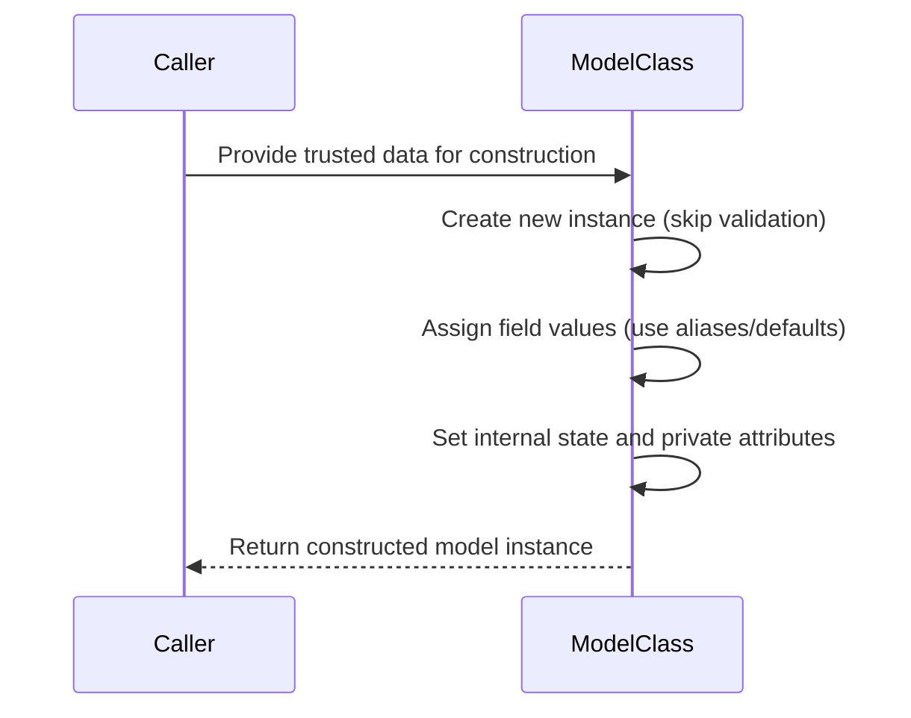
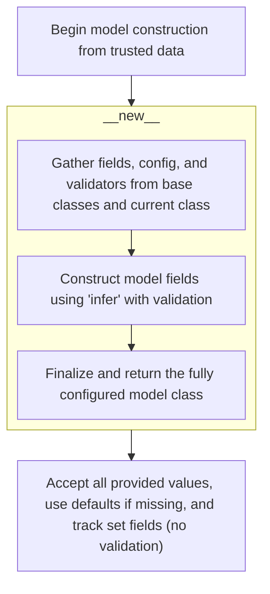
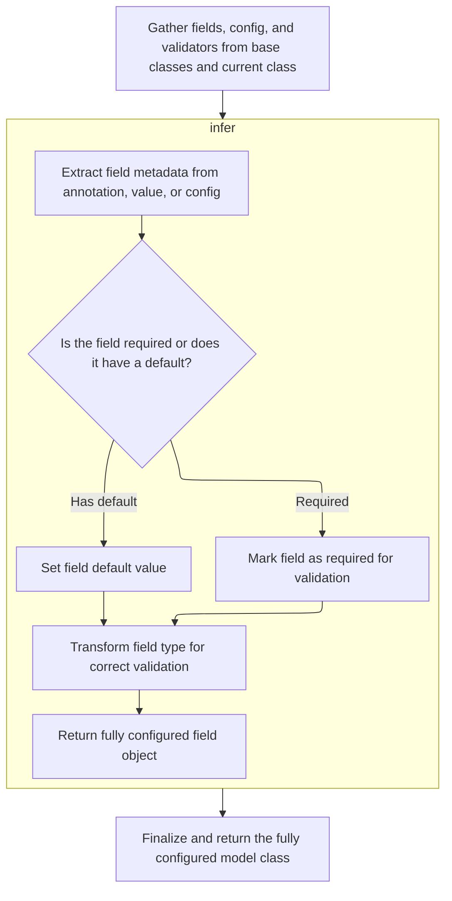
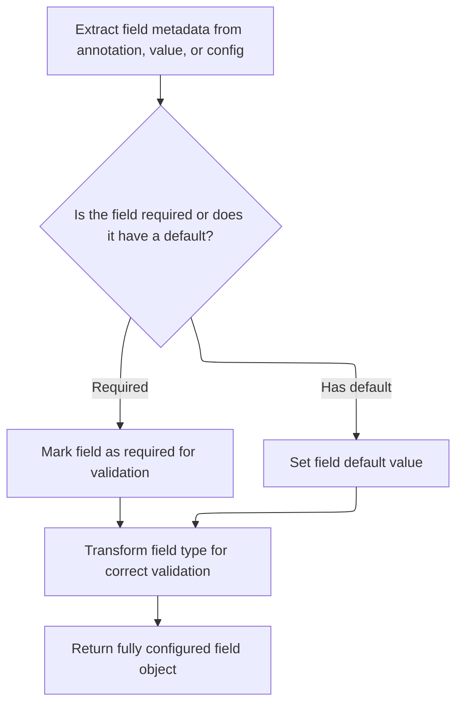
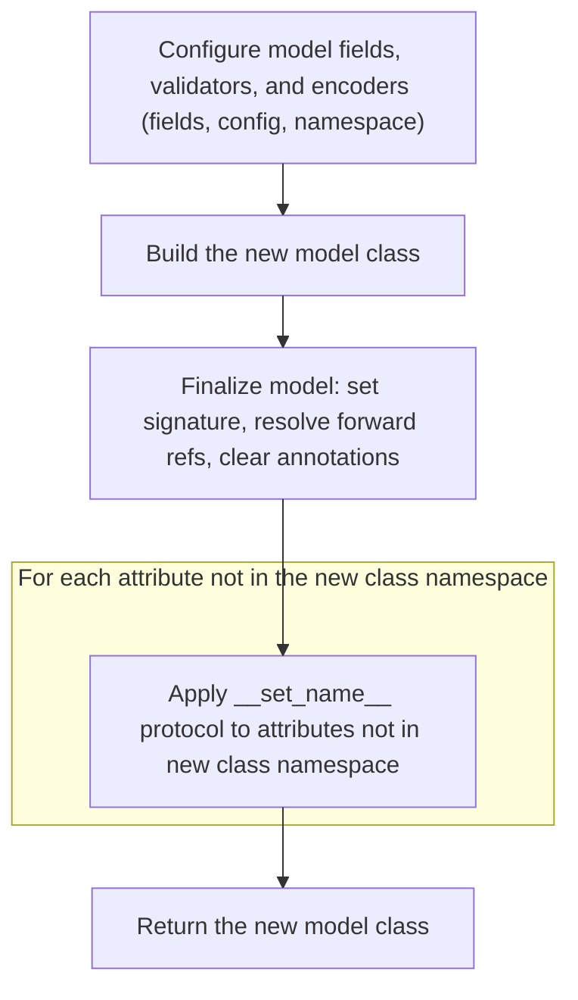
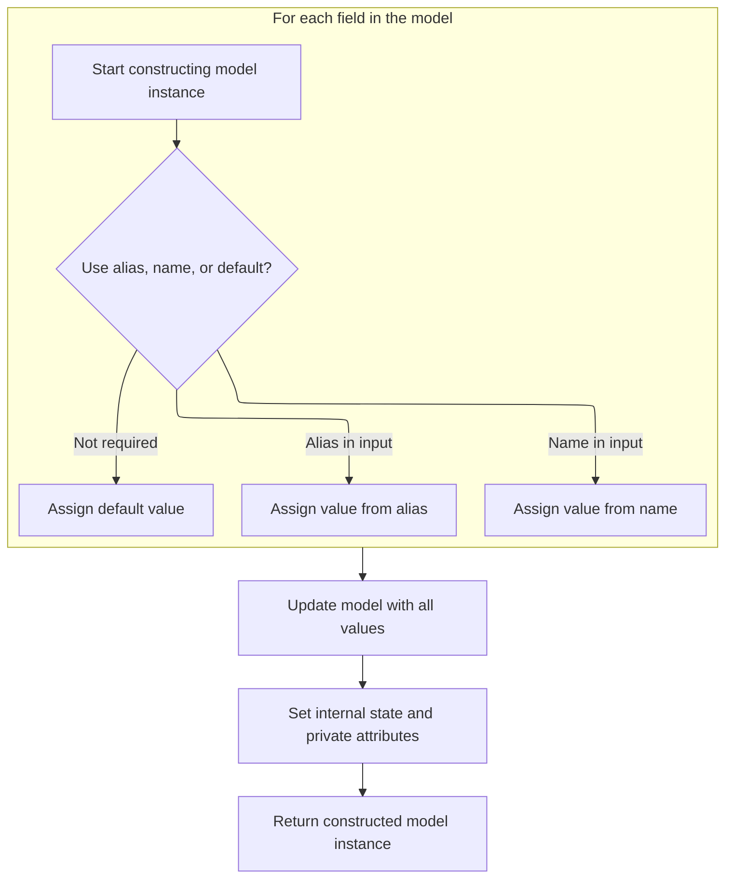

This document explains how to rapidly construct a model instance from trusted data without running validation. This method is ideal when the data source is reliable and performance is a priority.

The main steps are:

- Begin model construction using trusted data
- Create a new model instance without triggering validation
- For each field, assign values from input data, using aliases or defaults as needed
- Set the model's internal state and private attributes
- Return the fully constructed model instance



# Spec

## Detailed View of the Program's Functionality

a. Building a Model Instance from Raw Data

The process begins when a new model instance is constructed from trusted data, bypassing validation. This is done using a special method that creates the instance without calling the usual initialization logic. Instead of running validation or transformation, the method directly sets the model's internal data structures. This is only safe when the input data is already known to be valid.

- The method for constructing the model instance is called with the class and the trusted data.
- A new instance is created using the class's low-level object creation method, which skips the normal initialization.
- The method then prepares to populate the model's fields with the provided data.

b. Combining Model Metadata and Inheritance

Before any instance can be created, the model class itself must be constructed. This involves gathering all the necessary metadata, configuration, and validation logic from the class and its base classes.

- The metaclass's special method is responsible for building the model class.
- It starts by collecting fields, configuration, and validators from all base classes, ensuring that subclasses can override their parents.
- Configuration is merged from either the class namespace or keyword arguments, but not both, to avoid ambiguity.
- Validators defined in the class are extracted and combined with those inherited from base classes.
- Each field is prepared by setting its configuration and attaching any extra validators.
- The method resolves type annotations and determines which names are fields, class variables, or private attributes.
- For each valid field, it validates the name and uses a helper to build the field object, which encapsulates all the field's metadata.
- Private attributes and class variables are also handled, ensuring they are not treated as regular fields.
- After all fields are processed, the method finalizes the model class by setting up custom root types, root validators, JSON encoders, and other metadata.
- The new class is created, its signature is set, and any remaining setup (such as resolving forward references and applying special attribute hooks) is performed.
- The fully configured model class is then returned, ready for use.

c. Resolving Field Metadata and Defaults

When building each field, the system must determine its metadata, such as whether it is required, its default value, and any constraints.

- A helper function is used to extract field metadata from type annotations, assigned values, or configuration defaults.
- If the field uses a special annotation, the metadata is extracted from there, ensuring that only one source provides the field information.
- If the value assigned to the field is itself a metadata object, it is used directly, with configuration-level settings merged in.
- If neither the annotation nor the value provides metadata, a new metadata object is created using configuration defaults.
- The function determines if the field is required or has a default value, and updates the metadata accordingly.
- The finalized metadata and value are returned for use in constructing the field object.

d. Finalizing Model Class Construction

After all fields and metadata are prepared, the model class is finalized.

- Custom root types are validated if present.
- Validators are checked for any that are defined but not used.
- The appropriate JSON encoder is selected based on configuration.
- Root validators are extracted from the class namespace.
- A hash function is generated if needed.
- The class namespace is built, including all fields, validators, configuration, and other metadata.
- The new class is created using the metaclass, and its signature is set.
- Forward references are resolved if necessary.
- The special attribute protocol is applied to any attributes not in the new class namespace.
- The fully constructed model class is returned.

e. Populating Model Fields Without Validation

When constructing a model instance from trusted data, the fields are populated directly, without validation.

- The method loops through all fields defined in the model class.
- For each field, it checks if an alias is used and present in the input data; if so, the value is assigned from the alias.
- If the field's name is present in the input data, the value is assigned from there.
- If the field is not required, its default value is assigned.
- After all fields are processed, the method updates the model's internal data dictionary with all values, including any extra values provided.
- The set of fields that were explicitly set is determined, defaulting to the keys of the input data if not provided.
- The model's internal state is updated, including setting private attributes.
- The fully constructed model instance is returned, ready for use, with no validation having been performed.

# Rule Definition

| Paragraph Name                                                                                                                                                                                                                                                                                                                                                                                                                                                                                                                                                                                                                                                                                                                                                                                                                                     | Rule ID | Category          | Description                                                                                                                                                                                                                                                                                                                                                                                     | Conditions                                                                      | Remarks                                                                                                                                                                                                                            |
| -------------------------------------------------------------------------------------------------------------------------------------------------------------------------------------------------------------------------------------------------------------------------------------------------------------------------------------------------------------------------------------------------------------------------------------------------------------------------------------------------------------------------------------------------------------------------------------------------------------------------------------------------------------------------------------------------------------------------------------------------------------------------------------------------------------------------------------------------- | ------- | ----------------- | ----------------------------------------------------------------------------------------------------------------------------------------------------------------------------------------------------------------------------------------------------------------------------------------------------------------------------------------------------------------------------------------------- | ------------------------------------------------------------------------------- | ---------------------------------------------------------------------------------------------------------------------------------------------------------------------------------------------------------------------------------- |
| <SwmToken path="pydantic/v1/main.py" pos="113:5:5" line-data="# Note `ModelMetaclass` refers to `BaseModel`, but is also used to *create* `BaseModel`, so we need to add this extra">`ModelMetaclass`</SwmToken>.**new**                                                                                                                                                                                                                                                                                                                                                                                                                                                                                                                                                                                                                           | RL-001  | Data Assignment   | When a model class is defined, it must inherit from a base model class. At class creation time, the model must collect and store its field definitions, configuration, and validators. These are stored as class-level attributes.                                                                                                                                                              | A class is being defined that inherits from the base model.                     | Fields are stored in a dictionary mapping field names to field metadata objects. Configuration is stored as a class-level attribute referencing a configuration class. Validators are stored in class-level dictionaries or lists. |
| <SwmToken path="pydantic/v1/main.py" pos="124:9:9" line-data="        fields: Dict[str, ModelField] = {}">`ModelField`</SwmToken>.**init**, <SwmToken path="pydantic/v1/main.py" pos="197:8:10" line-data="                    fields[ann_name] = ModelField.infer(">`ModelField.infer`</SwmToken>, ModelField.\_get_field_info                                                                                                                                                                                                                                                                                                                                                                                                                                                                                                                    | RL-002  | Data Assignment   | Each field's metadata object must include the field's name, type, default value (if any), alias (if any), whether the field is required, and any associated validators.                                                                                                                                                                                                                         | A field is defined on a model.                                                  | Field metadata is stored in a <SwmToken path="pydantic/v1/main.py" pos="124:9:9" line-data="        fields: Dict[str, ModelField] = {}">`ModelField`</SwmToken> object. The object includes all required metadata fields.          |
| BaseModel.construct                                                                                                                                                                                                                                                                                                                                                                                                                                                                                                                                                                                                                                                                                                                                                                                                                                | RL-003  | Conditional Logic | When constructing a model instance from trusted data, the system must accept keyword arguments for each field (by name or alias), optionally a set of explicitly set fields, and must not perform validation. For each field, if the input contains a value for the alias, use it; else if the input contains a value for the name, use it; else if the field is not required, use the default. | A model is being constructed from trusted data using the construct method.      | No validation or parsing is performed. The internal data mapping is populated with resolved values. The set of explicitly set fields is tracked.                                                                                   |
| BaseModel.construct, <SwmToken path="pydantic/v1/main.py" pos="137:12:12" line-data="            if _is_base_model_class_defined and issubclass(base, BaseModel) and base != BaseModel:">`BaseModel`</SwmToken>.**init**, <SwmToken path="pydantic/v1/main.py" pos="137:12:12" line-data="            if _is_base_model_class_defined and issubclass(base, BaseModel) and base != BaseModel:">`BaseModel`</SwmToken>.**setattr**, <SwmToken path="pydantic/v1/main.py" pos="137:12:12" line-data="            if _is_base_model_class_defined and issubclass(base, BaseModel) and base != BaseModel:">`BaseModel`</SwmToken>.**getstate**, <SwmToken path="pydantic/v1/main.py" pos="137:12:12" line-data="            if _is_base_model_class_defined and issubclass(base, BaseModel) and base != BaseModel:">`BaseModel`</SwmToken>.**setstate** | RL-004  | Data Assignment   | The resulting model instance must have all fields set to either the provided value or the default value. Attribute access to field values must be supported.                                                                                                                                                                                                                                    | A model instance has been constructed.                                          | Fields are accessible as attributes. All fields are set to provided or default values.                                                                                                                                             |
| BaseModel.construct, <SwmToken path="pydantic/v1/main.py" pos="137:12:12" line-data="            if _is_base_model_class_defined and issubclass(base, BaseModel) and base != BaseModel:">`BaseModel`</SwmToken>.**init**, BaseModel.copy                                                                                                                                                                                                                                                                                                                                                                                                                                                                                                                                                                                                           | RL-005  | Data Assignment   | The model instance must track which fields were explicitly set during construction and expose this information on the instance.                                                                                                                                                                                                                                                                 | A model instance is constructed or copied.                                      | The set of explicitly set fields is stored in an internal attribute and can be accessed.                                                                                                                                           |
| BaseModel.construct                                                                                                                                                                                                                                                                                                                                                                                                                                                                                                                                                                                                                                                                                                                                                                                                                                | RL-006  | Conditional Logic | When constructing a model from trusted data, no validation or error recording must occur, regardless of the input data.                                                                                                                                                                                                                                                                         | A model is constructed using the construct method.                              | No validation logic is invoked. No errors are recorded.                                                                                                                                                                            |
| <SwmToken path="pydantic/v1/main.py" pos="113:5:5" line-data="# Note `ModelMetaclass` refers to `BaseModel`, but is also used to *create* `BaseModel`, so we need to add this extra">`ModelMetaclass`</SwmToken>.**new**                                                                                                                                                                                                                                                                                                                                                                                                                                                                                                                                                                                                                           | RL-007  | Data Assignment   | The system must support inheritance of fields, configuration, and validators from base model classes, with subclasses able to override or extend these definitions.                                                                                                                                                                                                                             | A model class is defined that inherits from one or more base model classes.     | Fields, config, and validators from base classes are merged or overridden as appropriate.                                                                                                                                          |
| <SwmToken path="pydantic/v1/main.py" pos="113:5:5" line-data="# Note `ModelMetaclass` refers to `BaseModel`, but is also used to *create* `BaseModel`, so we need to add this extra">`ModelMetaclass`</SwmToken>.**new**, ModelField.\_get_field_info                                                                                                                                                                                                                                                                                                                                                                                                                                                                                                                                                                                              | RL-008  | Computation       | Field metadata must be resolved by merging information from type annotations, explicit values, and configuration, ensuring only one source provides the primary field information.                                                                                                                                                                                                              | A field is being defined on a model.                                            | If multiple sources provide conflicting information, an error is raised. Only one source should provide the primary field info.                                                                                                    |
| <SwmToken path="pydantic/v1/main.py" pos="113:5:5" line-data="# Note `ModelMetaclass` refers to `BaseModel`, but is also used to *create* `BaseModel`, so we need to add this extra">`ModelMetaclass`</SwmToken>.**new**                                                                                                                                                                                                                                                                                                                                                                                                                                                                                                                                                                                                                           | RL-009  | Data Assignment   | The system must allow for the definition of custom configuration classes and validators, which are associated with the model at class creation time.                                                                                                                                                                                                                                            | A model class is being defined.                                                 | Custom config classes and validators are associated with the model class.                                                                                                                                                          |
| <SwmToken path="pydantic/v1/main.py" pos="113:5:5" line-data="# Note `ModelMetaclass` refers to `BaseModel`, but is also used to *create* `BaseModel`, so we need to add this extra">`ModelMetaclass`</SwmToken>.**new**, BaseModel.construct                                                                                                                                                                                                                                                                                                                                                                                                                                                                                                                                                                                                      | RL-010  | Data Assignment   | The system must support both field-level and root-level validators, which are collected and stored on the model class, but are not invoked during construction from trusted data.                                                                                                                                                                                                               | A model class is being defined and/or a model is constructed from trusted data. | Validators are collected and stored at class creation. They are not invoked during construction from trusted data.                                                                                                                 |

# User Stories

## User Story 1: Defining a data model class with fields, configuration, and validators

---

### Story Description:

As a user, I want to define data models as classes that inherit from a base model so that I can specify fields, configuration, and validators at class creation time, with support for inheritance, custom configuration, and collection of both field-level and root-level validators.

---

### Business Rule Mapping:

| Rule ID | Paragraph Name                                                                                                                                                                                                                                                                                                                  | Rule Description                                                                                                                                                                                                                   |
| ------- | ------------------------------------------------------------------------------------------------------------------------------------------------------------------------------------------------------------------------------------------------------------------------------------------------------------------------------- | ---------------------------------------------------------------------------------------------------------------------------------------------------------------------------------------------------------------------------------- |
| RL-001  | <SwmToken path="pydantic/v1/main.py" pos="113:5:5" line-data="# Note `ModelMetaclass` refers to `BaseModel`, but is also used to *create* `BaseModel`, so we need to add this extra">`ModelMetaclass`</SwmToken>.**new**                                                                                                        | When a model class is defined, it must inherit from a base model class. At class creation time, the model must collect and store its field definitions, configuration, and validators. These are stored as class-level attributes. |
| RL-007  | <SwmToken path="pydantic/v1/main.py" pos="113:5:5" line-data="# Note `ModelMetaclass` refers to `BaseModel`, but is also used to *create* `BaseModel`, so we need to add this extra">`ModelMetaclass`</SwmToken>.**new**                                                                                                        | The system must support inheritance of fields, configuration, and validators from base model classes, with subclasses able to override or extend these definitions.                                                                |
| RL-008  | <SwmToken path="pydantic/v1/main.py" pos="113:5:5" line-data="# Note `ModelMetaclass` refers to `BaseModel`, but is also used to *create* `BaseModel`, so we need to add this extra">`ModelMetaclass`</SwmToken>.**new**, ModelField.\_get_field_info                                                                           | Field metadata must be resolved by merging information from type annotations, explicit values, and configuration, ensuring only one source provides the primary field information.                                                 |
| RL-009  | <SwmToken path="pydantic/v1/main.py" pos="113:5:5" line-data="# Note `ModelMetaclass` refers to `BaseModel`, but is also used to *create* `BaseModel`, so we need to add this extra">`ModelMetaclass`</SwmToken>.**new**                                                                                                        | The system must allow for the definition of custom configuration classes and validators, which are associated with the model at class creation time.                                                                               |
| RL-010  | <SwmToken path="pydantic/v1/main.py" pos="113:5:5" line-data="# Note `ModelMetaclass` refers to `BaseModel`, but is also used to *create* `BaseModel`, so we need to add this extra">`ModelMetaclass`</SwmToken>.**new**, BaseModel.construct                                                                                   | The system must support both field-level and root-level validators, which are collected and stored on the model class, but are not invoked during construction from trusted data.                                                  |
| RL-002  | <SwmToken path="pydantic/v1/main.py" pos="124:9:9" line-data="        fields: Dict[str, ModelField] = {}">`ModelField`</SwmToken>.**init**, <SwmToken path="pydantic/v1/main.py" pos="197:8:10" line-data="                    fields[ann_name] = ModelField.infer(">`ModelField.infer`</SwmToken>, ModelField.\_get_field_info | Each field's metadata object must include the field's name, type, default value (if any), alias (if any), whether the field is required, and any associated validators.                                                            |

---

### Relevant Functionality:

- **ModelMetaclass.new**
  1. **RL-001:**
     - When a new model class is created:
       - Inherit fields, config, and validators from base classes.
       - Collect field definitions from annotations and class attributes.
       - Store fields in a class-level dictionary.
       - Store configuration as a class-level attribute.
       - Store validators in class-level dictionaries/lists.
  2. **RL-007:**
     - When creating a subclass:
       - Merge fields, config, and validators from base classes.
       - Allow subclass to override or extend these definitions.
  3. **RL-008:**
     - For each field:
       - Merge type annotation, explicit value, and config info.
       - If multiple sources provide primary info, raise an error.
       - Use the merged result as the field metadata.
  4. **RL-009:**
     - At class creation, associate any custom config class or validators with the model.
  5. **RL-010:**
     - At class creation, collect and store field-level and root-level validators.
     - Do not invoke validators during construction from trusted data.
- **ModelField.init**
  1. **RL-002:**
     - For each field:
       - Collect name, type, default, alias, required status, and validators.
       - Store these in a field metadata object.

## User Story 2: Constructing a model instance from trusted data

---

### Story Description:

As a user, I want to construct a model instance from trusted data using field names or aliases, have all fields set to provided or default values, track which fields were explicitly set, ensure no validation or error recording occurs, and ensure that validators are not invoked during this process.

---

### Business Rule Mapping:

| Rule ID | Paragraph Name                                                                                                                                                                                                                                                                                                                                                                                                                                                                                                                                                                                                                                                                                                                                                                                                                                     | Rule Description                                                                                                                                                                                                                                                                                                                                                                                |
| ------- | -------------------------------------------------------------------------------------------------------------------------------------------------------------------------------------------------------------------------------------------------------------------------------------------------------------------------------------------------------------------------------------------------------------------------------------------------------------------------------------------------------------------------------------------------------------------------------------------------------------------------------------------------------------------------------------------------------------------------------------------------------------------------------------------------------------------------------------------------- | ----------------------------------------------------------------------------------------------------------------------------------------------------------------------------------------------------------------------------------------------------------------------------------------------------------------------------------------------------------------------------------------------- |
| RL-003  | BaseModel.construct                                                                                                                                                                                                                                                                                                                                                                                                                                                                                                                                                                                                                                                                                                                                                                                                                                | When constructing a model instance from trusted data, the system must accept keyword arguments for each field (by name or alias), optionally a set of explicitly set fields, and must not perform validation. For each field, if the input contains a value for the alias, use it; else if the input contains a value for the name, use it; else if the field is not required, use the default. |
| RL-004  | BaseModel.construct, <SwmToken path="pydantic/v1/main.py" pos="137:12:12" line-data="            if _is_base_model_class_defined and issubclass(base, BaseModel) and base != BaseModel:">`BaseModel`</SwmToken>.**init**, <SwmToken path="pydantic/v1/main.py" pos="137:12:12" line-data="            if _is_base_model_class_defined and issubclass(base, BaseModel) and base != BaseModel:">`BaseModel`</SwmToken>.**setattr**, <SwmToken path="pydantic/v1/main.py" pos="137:12:12" line-data="            if _is_base_model_class_defined and issubclass(base, BaseModel) and base != BaseModel:">`BaseModel`</SwmToken>.**getstate**, <SwmToken path="pydantic/v1/main.py" pos="137:12:12" line-data="            if _is_base_model_class_defined and issubclass(base, BaseModel) and base != BaseModel:">`BaseModel`</SwmToken>.**setstate** | The resulting model instance must have all fields set to either the provided value or the default value. Attribute access to field values must be supported.                                                                                                                                                                                                                                    |
| RL-005  | BaseModel.construct, <SwmToken path="pydantic/v1/main.py" pos="137:12:12" line-data="            if _is_base_model_class_defined and issubclass(base, BaseModel) and base != BaseModel:">`BaseModel`</SwmToken>.**init**, BaseModel.copy                                                                                                                                                                                                                                                                                                                                                                                                                                                                                                                                                                                                           | The model instance must track which fields were explicitly set during construction and expose this information on the instance.                                                                                                                                                                                                                                                                 |
| RL-006  | BaseModel.construct                                                                                                                                                                                                                                                                                                                                                                                                                                                                                                                                                                                                                                                                                                                                                                                                                                | When constructing a model from trusted data, no validation or error recording must occur, regardless of the input data.                                                                                                                                                                                                                                                                         |
| RL-010  | <SwmToken path="pydantic/v1/main.py" pos="113:5:5" line-data="# Note `ModelMetaclass` refers to `BaseModel`, but is also used to *create* `BaseModel`, so we need to add this extra">`ModelMetaclass`</SwmToken>.**new**, BaseModel.construct                                                                                                                                                                                                                                                                                                                                                                                                                                                                                                                                                                                                      | The system must support both field-level and root-level validators, which are collected and stored on the model class, but are not invoked during construction from trusted data.                                                                                                                                                                                                               |

---

### Relevant Functionality:

- **BaseModel.construct**
  1. **RL-003:**
     - For each field in the model:
       - If input contains value for alias, use it.
       - Else if input contains value for name, use it.
       - Else if field is not required, use default value.
     - Populate internal data mapping with resolved values.
     - Set internal attribute to set of explicitly set fields.
     - Initialize private attributes.
     - Return constructed instance.
  2. **RL-004:**
     - After construction, all fields are set on the instance.
     - Attribute access returns the value for each field.
  3. **RL-005:**
     - During construction or copy, record the set of explicitly set fields.
     - Expose this set on the instance.
  4. **RL-006:**
     - Do not invoke any validators or parsing logic during construction from trusted data.
- **ModelMetaclass.new**
  1. **RL-010:**
     - At class creation, collect and store field-level and root-level validators.
     - Do not invoke validators during construction from trusted data.

# Code Walkthrough

## Building a Model Instance from Raw Data



<SwmSnippet path="/pydantic/v1/main.py" line="592">

---

In <SwmToken path="pydantic/v1/main.py" pos="592:3:3" line-data="    def construct(cls: Type[&#39;Model&#39;], _fields_set: Optional[&#39;SetStr&#39;] = None, **values: Any) -&gt; &#39;Model&#39;:">`construct`</SwmToken>, we kick things off by creating a new model instance using <SwmToken path="pydantic/v1/main.py" pos="598:7:7" line-data="        m = cls.__new__(cls)">`__new__`</SwmToken> instead of <SwmToken path="pydantic/v1/main.py" pos="284:18:18" line-data="        cls.__signature__ = ClassAttribute(&#39;__signature__&#39;, generate_model_signature(cls.__init__, fields, config))">`__init__`</SwmToken>. This lets us skip all validation and initialization logic, so we can set the model's data directly. We do this when we know the input is already valid and want to avoid the cost of validation. Calling <SwmToken path="pydantic/v1/main.py" pos="598:7:7" line-data="        m = cls.__new__(cls)">`__new__`</SwmToken> here is what lets us bypass the normal checks and just stuff the data straight into the model.

```python
    def construct(cls: Type['Model'], _fields_set: Optional['SetStr'] = None, **values: Any) -> 'Model':
        """
        Creates a new model setting __dict__ and __fields_set__ from trusted or pre-validated data.
        Default values are respected, but no other validation is performed.
        Behaves as if `Config.extra = 'allow'` was set since it adds all passed values
        """
        m = cls.__new__(cls)
```

---

</SwmSnippet>

### Combining Model Metadata and Inheritance



<SwmSnippet path="/pydantic/v1/main.py" line="123">

---

In <SwmToken path="pydantic/v1/main.py" pos="123:3:3" line-data="    def __new__(mcs, name, bases, namespace, **kwargs):  # noqa C901">`__new__`</SwmToken>, we start by collecting fields, config, validators, and other metadata from all base classes, working backwards so that subclasses override their parents. This sets up the groundwork for the new model class, making sure it inherits everything it needs from its ancestors.

```python
    def __new__(mcs, name, bases, namespace, **kwargs):  # noqa C901
        fields: Dict[str, ModelField] = {}
        config = BaseConfig
        validators: 'ValidatorListDict' = {}

        pre_root_validators, post_root_validators = [], []
        private_attributes: Dict[str, ModelPrivateAttr] = {}
        base_private_attributes: Dict[str, ModelPrivateAttr] = {}
        slots: SetStr = namespace.get('__slots__', ())
        slots = {slots} if isinstance(slots, str) else set(slots)
        class_vars: SetStr = set()
        hash_func: Optional[Callable[[Any], int]] = None

        for base in reversed(bases):
            if _is_base_model_class_defined and issubclass(base, BaseModel) and base != BaseModel:
                fields.update(smart_deepcopy(base.__fields__))
                config = inherit_config(base.__config__, config)
                validators = inherit_validators(base.__validators__, validators)
                pre_root_validators += base.__pre_root_validators__
                post_root_validators += base.__post_root_validators__
                base_private_attributes.update(base.__private_attributes__)
                class_vars.update(base.__class_vars__)
                hash_func = base.__hash__
```

---

</SwmSnippet>

<SwmSnippet path="/pydantic/v1/main.py" line="145">

---

After inheriting from base classes, we merge config from either the class namespace or kwargs (but not both, to avoid ambiguity), then extract validators from the namespace and combine them with inherited ones. Next, we prep each field by setting its config and attaching any extra validators found.

```python
                hash_func = base.__hash__

        resolve_forward_refs = kwargs.pop('__resolve_forward_refs__', True)
        allowed_config_kwargs: SetStr = {
            key
            for key in dir(config)
            if not (key.startswith('__') and key.endswith('__'))  # skip dunder methods and attributes
        }
        config_kwargs = {key: kwargs.pop(key) for key in kwargs.keys() & allowed_config_kwargs}
        config_from_namespace = namespace.get('Config')
        if config_kwargs and config_from_namespace:
            raise TypeError('Specifying config in two places is ambiguous, use either Config attribute or class kwargs')
        config = inherit_config(config_from_namespace, config, **config_kwargs)

        validators = inherit_validators(extract_validators(namespace), validators)
        vg = ValidatorGroup(validators)

        for f in fields.values():
            f.set_config(config)
            extra_validators = vg.get_validators(f.name)
            if extra_validators:
                f.class_validators.update(extra_validators)
                # re-run prepare to add extra validators
                f.populate_validators()
```

---

</SwmSnippet>

<SwmSnippet path="/pydantic/v1/main.py" line="168">

---

Here we resolve annotations and figure out which names are fields, class vars, or private attributes. For valid fields, we validate the name and call <SwmToken path="pydantic/v1/main.py" pos="197:10:10" line-data="                    fields[ann_name] = ModelField.infer(">`infer`</SwmToken> to build the field object. This sets up the model's structure before moving on to the next step.

```python
                f.populate_validators()

        prepare_config(config, name)

        untouched_types = ANNOTATED_FIELD_UNTOUCHED_TYPES

        def is_untouched(v: Any) -> bool:
            return isinstance(v, untouched_types) or v.__class__.__name__ == 'cython_function_or_method'

        if (namespace.get('__module__'), namespace.get('__qualname__')) != ('pydantic.main', 'BaseModel'):
            annotations = resolve_annotations(namespace.get('__annotations__', {}), namespace.get('__module__', None))
            # annotation only fields need to come first in fields
            for ann_name, ann_type in annotations.items():
                if is_classvar(ann_type):
                    class_vars.add(ann_name)
                elif is_finalvar_with_default_val(ann_type, namespace.get(ann_name, Undefined)):
                    class_vars.add(ann_name)
                elif is_valid_field(ann_name):
                    validate_field_name(bases, ann_name)
                    value = namespace.get(ann_name, Undefined)
                    allowed_types = get_args(ann_type) if is_union(get_origin(ann_type)) else (ann_type,)
                    if (
                        is_untouched(value)
                        and ann_type != PyObject
                        and not any(
                            lenient_issubclass(get_origin(allowed_type), Type) for allowed_type in allowed_types
                        )
                    ):
                        continue
                    fields[ann_name] = ModelField.infer(
                        name=ann_name,
                        value=value,
                        annotation=ann_type,
                        class_validators=vg.get_validators(ann_name),
                        config=config,
                    )
                elif ann_name not in namespace and config.underscore_attrs_are_private:
                    private_attributes[ann_name] = PrivateAttr()
```

---

</SwmSnippet>

<SwmSnippet path="/pydantic/v1/main.py" line="205">

---

For each namespace item that's a valid field and not already handled, we call <SwmToken path="pydantic/v1/main.py" pos="221:7:7" line-data="                    inferred = ModelField.infer(">`infer`</SwmToken> to build the <SwmToken path="pydantic/v1/main.py" pos="221:5:5" line-data="                    inferred = ModelField.infer(">`ModelField`</SwmToken>. This centralizes all the logic for combining type info, defaults, and validators, so the rest of the flow doesn't have to worry about those details.

```python
                    private_attributes[ann_name] = PrivateAttr()

            untouched_types = UNTOUCHED_TYPES + config.keep_untouched
            for var_name, value in namespace.items():
                can_be_changed = var_name not in class_vars and not is_untouched(value)
                if isinstance(value, ModelPrivateAttr):
                    if not is_valid_private_name(var_name):
                        raise NameError(
                            f'Private attributes "{var_name}" must not be a valid field name; '
                            f'Use sunder or dunder names, e. g. "_{var_name}" or "__{var_name}__"'
                        )
                    private_attributes[var_name] = value
                elif config.underscore_attrs_are_private and is_valid_private_name(var_name) and can_be_changed:
                    private_attributes[var_name] = PrivateAttr(default=value)
                elif is_valid_field(var_name) and var_name not in annotations and can_be_changed:
                    validate_field_name(bases, var_name)
                    inferred = ModelField.infer(
                        name=var_name,
                        value=value,
                        annotation=annotations.get(var_name, Undefined),
                        class_validators=vg.get_validators(var_name),
                        config=config,
                    )
```

---

</SwmSnippet>

#### Resolving Field Metadata and Defaults



<SwmSnippet path="/pydantic/v1/fields.py" line="484">

---

In <SwmToken path="pydantic/v1/fields.py" pos="484:3:3" line-data="    def infer(">`infer`</SwmToken>, we grab all the metadata for the field by calling <SwmToken path="pydantic/v1/fields.py" pos="495:10:10" line-data="        field_info, value = cls._get_field_info(name, annotation, value, config)">`_get_field_info`</SwmToken>. This merges info from annotations, values, and config, and makes sure we don't have conflicting sources. It's the central place for figuring out what the field should look like.

```python
    def infer(
        cls,
        *,
        name: str,
        value: Any,
        annotation: Any,
        class_validators: Optional[Dict[str, Validator]],
        config: Type['BaseConfig'],
    ) -> 'ModelField':
        from pydantic.v1.schema import get_annotation_from_field_info

        field_info, value = cls._get_field_info(name, annotation, value, config)
```

---

</SwmSnippet>

<SwmSnippet path="/pydantic/v1/fields.py" line="440">

---

<SwmToken path="pydantic/v1/fields.py" pos="440:3:3" line-data="    def _get_field_info(">`_get_field_info`</SwmToken> merges field metadata from annotation, value, and config, making sure only one source provides <SwmToken path="pydantic/v1/fields.py" pos="442:7:7" line-data="    ) -&gt; Tuple[FieldInfo, Any]:">`FieldInfo`</SwmToken>. It also handles special cases for required fields and defaults, and updates the field info with config-level settings.

```python
    def _get_field_info(
        field_name: str, annotation: Any, value: Any, config: Type['BaseConfig']
    ) -> Tuple[FieldInfo, Any]:
        """
        Get a FieldInfo from a root typing.Annotated annotation, value, or config default.

        The FieldInfo may be set in typing.Annotated or the value, but not both. If neither contain
        a FieldInfo, a new one will be created using the config.

        :param field_name: name of the field for use in error messages
        :param annotation: a type hint such as `str` or `Annotated[str, Field(..., min_length=5)]`
        :param value: the field's assigned value
        :param config: the model's config object
        :return: the FieldInfo contained in the `annotation`, the value, or a new one from the config.
        """
        field_info_from_config = config.get_field_info(field_name)

        field_info = None
        if get_origin(annotation) is Annotated:
            field_infos = [arg for arg in get_args(annotation)[1:] if isinstance(arg, FieldInfo)]
            if len(field_infos) > 1:
                raise ValueError(f'cannot specify multiple `Annotated` `Field`s for {field_name!r}')
            field_info = next(iter(field_infos), None)
            if field_info is not None:
                field_info = copy.copy(field_info)
                field_info.update_from_config(field_info_from_config)
                if field_info.default not in (Undefined, Required):
                    raise ValueError(f'`Field` default cannot be set in `Annotated` for {field_name!r}')
                if value is not Undefined and value is not Required:
                    # check also `Required` because of `validate_arguments` that sets `...` as default value
                    field_info.default = value

        if isinstance(value, FieldInfo):
            if field_info is not None:
                raise ValueError(f'cannot specify `Annotated` and value `Field`s together for {field_name!r}')
            field_info = value
            field_info.update_from_config(field_info_from_config)
        elif field_info is None:
            field_info = FieldInfo(value, **field_info_from_config)
        value = None if field_info.default_factory is not None else field_info.default
        field_info._validate()
        return field_info, value
```

---

</SwmSnippet>

<SwmSnippet path="/pydantic/v1/fields.py" line="496">

---

Back in <SwmToken path="pydantic/v1/main.py" pos="197:10:10" line-data="                    fields[ann_name] = ModelField.infer(">`infer`</SwmToken>, we use the merged field info and value from <SwmToken path="pydantic/v1/fields.py" pos="440:3:3" line-data="    def _get_field_info(">`_get_field_info`</SwmToken> to decide if the field is required, set up the annotation, and finally build the <SwmToken path="pydantic/v1/main.py" pos="124:9:9" line-data="        fields: Dict[str, ModelField] = {}">`ModelField`</SwmToken> instance with all the right metadata.

```python
        required: 'BoolUndefined' = Undefined
        if value is Required:
            required = True
            value = None
        elif value is not Undefined:
            required = False
        annotation = get_annotation_from_field_info(annotation, field_info, name, config.validate_assignment)

        return cls(
            name=name,
            type_=annotation,
            alias=field_info.alias,
            class_validators=class_validators,
            default=value,
            default_factory=field_info.default_factory,
            required=required,
            model_config=config,
            field_info=field_info,
        )
```

---

</SwmSnippet>

#### Finalizing Model Class Construction



<SwmSnippet path="/pydantic/v1/main.py" line="228">

---

Back in <SwmToken path="pydantic/v1/main.py" pos="282:9:9" line-data="        cls = super().__new__(mcs, name, bases, new_namespace, **kwargs)">`__new__`</SwmToken>, after building all the ModelFields with <SwmToken path="pydantic/v1/main.py" pos="197:10:10" line-data="                    fields[ann_name] = ModelField.infer(">`infer`</SwmToken>, we handle custom root types, set up root validators, pick the JSON encoder, and build the class namespace. Then we create the class, set up its signature, and handle any extra setup like forward refs and private attribute hooks.

```python
                    if var_name in fields:
                        if lenient_issubclass(inferred.type_, fields[var_name].type_):
                            inferred.type_ = fields[var_name].type_
                        else:
                            raise TypeError(
                                f'The type of {name}.{var_name} differs from the new default value; '
                                f'if you wish to change the type of this field, please use a type annotation'
                            )
                    fields[var_name] = inferred

        _custom_root_type = ROOT_KEY in fields
        if _custom_root_type:
            validate_custom_root_type(fields)
        vg.check_for_unused()
        if config.json_encoders:
            json_encoder = partial(custom_pydantic_encoder, config.json_encoders)
        else:
            json_encoder = pydantic_encoder
        pre_rv_new, post_rv_new = extract_root_validators(namespace)

        if hash_func is None:
            hash_func = generate_hash_function(config.frozen)

        exclude_from_namespace = fields | private_attributes.keys() | {'__slots__'}
        new_namespace = {
            '__config__': config,
            '__fields__': fields,
            '__exclude_fields__': {
                name: field.field_info.exclude for name, field in fields.items() if field.field_info.exclude is not None
            }
            or None,
            '__include_fields__': {
                name: field.field_info.include for name, field in fields.items() if field.field_info.include is not None
            }
            or None,
            '__validators__': vg.validators,
            '__pre_root_validators__': unique_list(
                pre_root_validators + pre_rv_new,
                name_factory=lambda v: v.__name__,
            ),
            '__post_root_validators__': unique_list(
                post_root_validators + post_rv_new,
                name_factory=lambda skip_on_failure_and_v: skip_on_failure_and_v[1].__name__,
            ),
            '__schema_cache__': {},
            '__json_encoder__': staticmethod(json_encoder),
            '__custom_root_type__': _custom_root_type,
            '__private_attributes__': {**base_private_attributes, **private_attributes},
            '__slots__': slots | private_attributes.keys(),
            '__hash__': hash_func,
            '__class_vars__': class_vars,
            **{n: v for n, v in namespace.items() if n not in exclude_from_namespace},
        }

        cls = super().__new__(mcs, name, bases, new_namespace, **kwargs)
        # set __signature__ attr only for model class, but not for its instances
        cls.__signature__ = ClassAttribute('__signature__', generate_model_signature(cls.__init__, fields, config))

        if not _is_base_model_class_defined:
            # Cython does not understand the `if TYPE_CHECKING:` condition in the
            # BaseModel's body (where annotations are set), so clear them manually:
            getattr(cls, '__annotations__', {}).clear()

        if resolve_forward_refs:
            cls.__try_update_forward_refs__()

        # preserve `__set_name__` protocol defined in https://peps.python.org/pep-0487
        # for attributes not in `new_namespace` (e.g. private attributes)
        for name, obj in namespace.items():
            if name not in new_namespace:
                set_name = getattr(obj, '__set_name__', None)
                if callable(set_name):
                    set_name(cls, name)
```

---

</SwmSnippet>

<SwmSnippet path="/pydantic/v1/main.py" line="300">

---

At the end of <SwmToken path="pydantic/v1/main.py" pos="123:3:3" line-data="    def __new__(mcs, name, bases, namespace, **kwargs):  # noqa C901">`__new__`</SwmToken>, we return the finished model class, fully set up with all its fields, config, validators, and metadata. It's ready to be used for creating model instances or as a base for more models.

```python
                    set_name(cls, name)

        return cls
```

---

</SwmSnippet>

### Populating Model Fields Without Validation



<SwmSnippet path="/pydantic/v1/main.py" line="599">

---

Back in <SwmToken path="pydantic/v1/main.py" pos="592:3:3" line-data="    def construct(cls: Type[&#39;Model&#39;], _fields_set: Optional[&#39;SetStr&#39;] = None, **values: Any) -&gt; &#39;Model&#39;:">`construct`</SwmToken>, after getting the model class from <SwmToken path="pydantic/v1/main.py" pos="123:3:3" line-data="    def __new__(mcs, name, bases, namespace, **kwargs):  # noqa C901">`__new__`</SwmToken>, we loop through all fields in <SwmToken path="pydantic/v1/main.py" pos="600:12:12" line-data="        for name, field in cls.__fields__.items():">`__fields__`</SwmToken>, mapping input values to the right field names, handling aliases, and filling in defaults for optional fields. This sets up the raw data for the model instance.

```python
        fields_values: Dict[str, Any] = {}
        for name, field in cls.__fields__.items():
            if field.alt_alias and field.alias in values:
                fields_values[name] = values[field.alias]
            elif name in values:
                fields_values[name] = values[name]
            elif not field.required:
                fields_values[name] = field.get_default()
```

---

</SwmSnippet>

<SwmSnippet path="/pydantic/v1/main.py" line="606">

---

At the end of <SwmToken path="pydantic/v1/main.py" pos="592:3:3" line-data="    def construct(cls: Type[&#39;Model&#39;], _fields_set: Optional[&#39;SetStr&#39;] = None, **values: Any) -&gt; &#39;Model&#39;:">`construct`</SwmToken>, we set the model's <SwmToken path="pydantic/v1/main.py" pos="608:7:7" line-data="        object_setattr(m, &#39;__dict__&#39;, fields_values)">`__dict__`</SwmToken> and <SwmToken path="pydantic/v1/main.py" pos="611:7:7" line-data="        object_setattr(m, &#39;__fields_set__&#39;, _fields_set)">`__fields_set__`</SwmToken> directly, initialize private attributes, and return the model instance. This skips all validation, so it's fast but only safe if the data is already good.

```python
                fields_values[name] = field.get_default()
        fields_values.update(values)
        object_setattr(m, '__dict__', fields_values)
        if _fields_set is None:
            _fields_set = set(values.keys())
        object_setattr(m, '__fields_set__', _fields_set)
        m._init_private_attributes()
        return m
```

---

</SwmSnippet>

&nbsp;

*This is an auto-generated document by Swimm 🌊 and has not yet been verified by a human*

<SwmMeta version="3.0.0" repo-id="Z2l0aHViJTNBJTNBcHlkYW50aWMlM0ElM0FTd2ltbS1EZW1v" repo-name="pydantic"><sup>Powered by [Swimm](/)</sup></SwmMeta>
