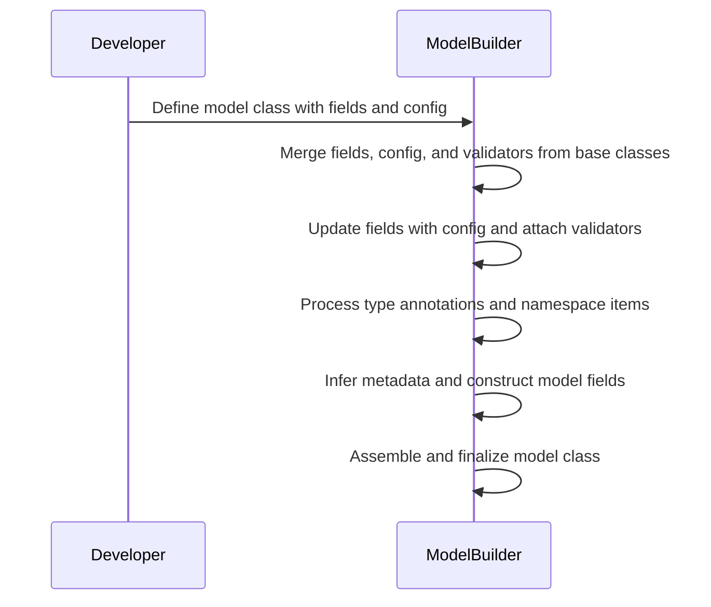
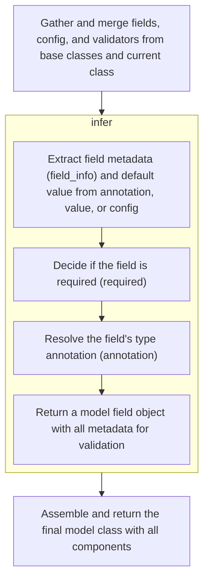

The process of constructing a new model class involves merging fields, configuration, and validators from all relevant base classes and the current class definition. Each field is updated with configuration-driven settings and any additional validators, ensuring that both annotated and non-annotated fields are handled consistently. The result is a fully constructed model class, ready for robust data validation and serialization.

The main steps are:

- Gather and merge fields, configuration, and validators from base classes and the current class
- Update each field with configuration settings and attach extra validators
- Process type annotations and namespace items to identify class variables, private attributes, and valid fields
- Infer metadata and construct model fields for both annotated and non-annotated fields
- Assemble the final model class with all components and perform final setup



# Spec

## Detailed View of the Program's Functionality

a. Gathering and Merging Model Metadata

The process begins when a new model class is created (typically by subclassing Pydantic's base model). The metaclass responsible for this, upon class creation, collects and merges all relevant metadata from the base classes and the current class definition. This includes:

- Fields: All field definitions from base classes are deep-copied and merged, ensuring that inherited fields are preserved and can be overridden.
- Configuration: The configuration settings (such as validation options, serialization behavior, etc.) are inherited and merged from base classes and the current class, with the most specific (current class) taking precedence.
- Validators: Both field-level and root-level validators are collected and merged, ensuring that validation logic defined in base classes is preserved and extended.
- Private Attributes: Attributes meant for internal use (not part of the public model schema) are gathered from base classes and the current class.
- Class Variables and Hash Functions: Any class-level variables and custom hash functions are also merged.

This merging process respects Python's method resolution order, so the most derived class's definitions take precedence.

b. Updating Field Configurations and Validators

After merging, each field is updated to ensure its configuration matches the final, resolved configuration for the model. This involves:

- Applying configuration-driven settings (such as aliases, inclusion/exclusion rules) to each field.
- Attaching any additional validators that may have been defined in the current class or inherited from base classes.
- Re-running the field's preparation logic if new validators are added, ensuring the field is fully configured for validation.

c. Processing Annotations and Namespace Items

Next, the metaclass processes all type annotations and namespace items in the current class:

- For each annotated attribute:
  - If it's a class variable or a final variable with a default, it's added to the set of class variables.
  - If it's a valid field, its name and type are validated, and its value is retrieved from the namespace (or marked as undefined).
  - If the value is not a special untouched type (like a property or method), a new field object is created using the infer method, which gathers all metadata and prepares the field for validation.
  - If the attribute is not present in the namespace but the configuration allows private attributes, it's added as a private attribute.
- For each item in the namespace that isn't annotated but looks like a field (i.e., not a class var or untouched type), a field object is also created using infer, ensuring that even unannotated fields are properly handled.

d. Field Metadata Extraction and <SwmToken path="pydantic/v1/main.py" pos="124:9:9" line-data="        fields: Dict[str, ModelField] = {}">`ModelField`</SwmToken> Construction

When creating a field object (<SwmToken path="pydantic/v1/main.py" pos="124:9:9" line-data="        fields: Dict[str, ModelField] = {}">`ModelField`</SwmToken>), the following steps occur:

- Metadata Extraction: The infer method calls a helper to extract all relevant metadata for the field. This includes constraints, default values, aliases, and any extra information from annotations, direct assignments, or configuration.
- Conflict Resolution: If both an annotation and a value specify field metadata, conflicts are detected and reported. The final metadata is merged, with precedence rules applied.
- Required/Optional Determination: The field is marked as required or optional based on the presence of a default value or explicit markers.
- Type Resolution: The field's type annotation is resolved, possibly adjusted based on the metadata or configuration.
- <SwmToken path="pydantic/v1/main.py" pos="124:9:9" line-data="        fields: Dict[str, ModelField] = {}">`ModelField`</SwmToken> Construction: A fully configured <SwmToken path="pydantic/v1/main.py" pos="124:9:9" line-data="        fields: Dict[str, ModelField] = {}">`ModelField`</SwmToken> object is created, encapsulating all metadata, type information, validators, and configuration needed for validation and serialization.

e. Finalizing Model Class Creation and Namespace Setup

After all fields and metadata are processed, the metaclass finalizes the creation of the model class:

- Custom Root Type: If the model uses a custom root field, this is validated to ensure no conflicts with other fields.
- JSON Encoder: The appropriate JSON encoder is prepared, either from the configuration or using a default.
- Root Validators: Any new root validators defined in the current class are extracted and merged with inherited ones.
- Hash Function: If no custom hash function is defined, one is generated based on whether the model is frozen (immutable).
- Namespace Assembly: A new class namespace is constructed, containing:
  - The resolved configuration, fields, validators, and private attributes.
  - Inclusion/exclusion rules for serialization.
  - The JSON encoder and schema cache.
  - Slots and class variables.
  - Any remaining items from the original namespace that aren't fields or private attributes.
- Class Creation: The new model class is created using the assembled namespace and base classes.
- Signature Generation: The model's constructor signature is generated for introspection and IDE support.
- Annotation Cleanup: If this is the base model class, any leftover annotations are cleared to avoid confusion.
- Forward Reference Resolution: If enabled, any forward references in type annotations are resolved.
- Attribute Protocol Preservation: For any attributes not present in the new namespace (such as private attributes), the <SwmToken path="pydantic/v1/main.py" pos="298:1:1" line-data="                set_name = getattr(obj, &#39;__set_name__&#39;, None)">`set_name`</SwmToken> protocol is preserved, ensuring correct behavior for descriptors.

f. Returning the Final Model Class

Finally, the fully constructed model class is returned, ready for use. This class now has:

- All fields, configuration, and validators properly set up.
- Support for validation, serialization, and introspection.
- Inherited and extended behavior from base classes, following Python's inheritance rules.

# Rule Definition

| Paragraph Name                                                                                                                                                                                                                                                                                                                                                                                                                                                                                                                                                                                                                                                                                                                                                                                                                                                            | Rule ID | Category          | Description                                                                                                                                                                                                                                                                                                                                                                                                                                                                                                                                                                                                                                                                                                                                                                                                                                                                                                                                                                                                                                                                                                                                                                                                                                                                                                                                                                                                                                                                                                                                                                                                                                                                                                                                                                                     | Conditions                                                                                                                                                                                                                                                                                                                                                                            | Remarks                                                                                                                                                                                                                                                                                                                                                                                                                                                                                                                                                                                                                                                                                                                                                                                                                                                                                                                                                                                                                                                                                                                                                                                                                                            |
| ------------------------------------------------------------------------------------------------------------------------------------------------------------------------------------------------------------------------------------------------------------------------------------------------------------------------------------------------------------------------------------------------------------------------------------------------------------------------------------------------------------------------------------------------------------------------------------------------------------------------------------------------------------------------------------------------------------------------------------------------------------------------------------------------------------------------------------------------------------------------- | ------- | ----------------- | ----------------------------------------------------------------------------------------------------------------------------------------------------------------------------------------------------------------------------------------------------------------------------------------------------------------------------------------------------------------------------------------------------------------------------------------------------------------------------------------------------------------------------------------------------------------------------------------------------------------------------------------------------------------------------------------------------------------------------------------------------------------------------------------------------------------------------------------------------------------------------------------------------------------------------------------------------------------------------------------------------------------------------------------------------------------------------------------------------------------------------------------------------------------------------------------------------------------------------------------------------------------------------------------------------------------------------------------------------------------------------------------------------------------------------------------------------------------------------------------------------------------------------------------------------------------------------------------------------------------------------------------------------------------------------------------------------------------------------------------------------------------------------------------------- | ------------------------------------------------------------------------------------------------------------------------------------------------------------------------------------------------------------------------------------------------------------------------------------------------------------------------------------------------------------------------------------- | -------------------------------------------------------------------------------------------------------------------------------------------------------------------------------------------------------------------------------------------------------------------------------------------------------------------------------------------------------------------------------------------------------------------------------------------------------------------------------------------------------------------------------------------------------------------------------------------------------------------------------------------------------------------------------------------------------------------------------------------------------------------------------------------------------------------------------------------------------------------------------------------------------------------------------------------------------------------------------------------------------------------------------------------------------------------------------------------------------------------------------------------------------------------------------------------------------------------------------------------------- |
| <SwmToken path="pydantic/v1/main.py" pos="113:5:5" line-data="# Note `ModelMetaclass` refers to `BaseModel`, but is also used to *create* `BaseModel`, so we need to add this extra">`ModelMetaclass`</SwmToken>.**new**                                                                                                                                                                                                                                                                                                                                                                                                                                                                                                                                                                                                                                                  | RL-001  | Computation       | When constructing a model class, the system must gather and merge fields, configuration, and validators from all base classes (excluding the root base model) and the current class, following Python's method resolution order.                                                                                                                                                                                                                                                                                                                                                                                                                                                                                                                                                                                                                                                                                                                                                                                                                                                                                                                                                                                                                                                                                                                                                                                                                                                                                                                                                                                                                                                                                                                                                                | A new model class is being created via the metaclass.                                                                                                                                                                                                                                                                                                                                 | Merging includes fields, config, validators, root validators, private attributes, class variables, and hash functions.                                                                                                                                                                                                                                                                                                                                                                                                                                                                                                                                                                                                                                                                                                                                                                                                                                                                                                                                                                                                                                                                                                                             |
| <SwmToken path="pydantic/v1/main.py" pos="113:5:5" line-data="# Note `ModelMetaclass` refers to `BaseModel`, but is also used to *create* `BaseModel`, so we need to add this extra">`ModelMetaclass`</SwmToken>.**new**                                                                                                                                                                                                                                                                                                                                                                                                                                                                                                                                                                                                                                                  | RL-002  | Conditional Logic | If both a Config class and config keyword arguments are provided for the model, a <SwmToken path="pydantic/v1/main.py" pos="156:3:3" line-data="            raise TypeError(&#39;Specifying config in two places is ambiguous, use either Config attribute or class kwargs&#39;)">`TypeError`</SwmToken> must be raised with the specified message.                                                                                                                                                                                                                                                                                                                                                                                                                                                                                                                                                                                                                                                                                                                                                                                                                                                                                                                                                                                                                                                                                                                                                                                                                                                                                                                                                                                                                                             | Both <SwmToken path="pydantic/v1/main.py" pos="153:1:1" line-data="        config_kwargs = {key: kwargs.pop(key) for key in kwargs.keys() &amp; allowed_config_kwargs}">`config_kwargs`</SwmToken> and <SwmToken path="pydantic/v1/main.py" pos="154:1:1" line-data="        config_from_namespace = namespace.get(&#39;Config&#39;)">`config_from_namespace`</SwmToken> are present. | Error message: 'Specifying config in two places is ambiguous, use either Config attribute or class kwargs'                                                                                                                                                                                                                                                                                                                                                                                                                                                                                                                                                                                                                                                                                                                                                                                                                                                                                                                                                                                                                                                                                                                                         |
| <SwmToken path="pydantic/v1/main.py" pos="113:5:5" line-data="# Note `ModelMetaclass` refers to `BaseModel`, but is also used to *create* `BaseModel`, so we need to add this extra">`ModelMetaclass`</SwmToken>.**new**                                                                                                                                                                                                                                                                                                                                                                                                                                                                                                                                                                                                                                                  | RL-003  | Computation       | After merging fields and config, each field must have its configuration updated using <SwmToken path="pydantic/v1/main.py" pos="163:3:3" line-data="            f.set_config(config)">`set_config`</SwmToken>, which merges config-driven alias, exclude, and include settings into the field.                                                                                                                                                                                                                                                                                                                                                                                                                                                                                                                                                                                                                                                                                                                                                                                                                                                                                                                                                                                                                                                                                                                                                                                                                                                                                                                                                                                                                                                                                                  | After merging fields and config in model construction.                                                                                                                                                                                                                                                                                                                                | <SwmToken path="pydantic/v1/main.py" pos="163:3:3" line-data="            f.set_config(config)">`set_config`</SwmToken> merges config-driven alias, exclude, and include settings, updating only if priorities or values require it.                                                                                                                                                                                                                                                                                                                                                                                                                                                                                                                                                                                                                                                                                                                                                                                                                                                                                                                                                                                                               |
| <SwmToken path="pydantic/v1/main.py" pos="113:5:5" line-data="# Note `ModelMetaclass` refers to `BaseModel`, but is also used to *create* `BaseModel`, so we need to add this extra">`ModelMetaclass`</SwmToken>.**new**                                                                                                                                                                                                                                                                                                                                                                                                                                                                                                                                                                                                                                                  | RL-004  | Computation       | For each field, any extra validators from the merged validator group must be attached, and the field's validator preparation must be updated accordingly.                                                                                                                                                                                                                                                                                                                                                                                                                                                                                                                                                                                                                                                                                                                                                                                                                                                                                                                                                                                                                                                                                                                                                                                                                                                                                                                                                                                                                                                                                                                                                                                                                                       | After merging validators and fields.                                                                                                                                                                                                                                                                                                                                                  | Extra validators are attached via <SwmToken path="pydantic/v1/main.py" pos="166:3:3" line-data="                f.class_validators.update(extra_validators)">`class_validators`</SwmToken> and <SwmToken path="pydantic/v1/main.py" pos="168:3:3" line-data="                f.populate_validators()">`populate_validators`</SwmToken>.                                                                                                                                                                                                                                                                                                                                                                                                                                                                                                                                                                                                                                                                                                                                                                                                                                                                                                            |
| <SwmToken path="pydantic/v1/main.py" pos="113:5:5" line-data="# Note `ModelMetaclass` refers to `BaseModel`, but is also used to *create* `BaseModel`, so we need to add this extra">`ModelMetaclass`</SwmToken>.**new**                                                                                                                                                                                                                                                                                                                                                                                                                                                                                                                                                                                                                                                  | RL-005  | Computation       | For each valid field (determined by type annotations or namespace items that appear to be fields), a <SwmToken path="pydantic/v1/main.py" pos="124:9:9" line-data="        fields: Dict[str, ModelField] = {}">`ModelField`</SwmToken> instance must be constructed using the field's name, type annotation, default value, validators, and the finalized config.                                                                                                                                                                                                                                                                                                                                                                                                                                                                                                                                                                                                                                                                                                                                                                                                                                                                                                                                                                                                                                                                                                                                                                                                                                                                                                                                                                                                                               | A field is valid if it is in type annotations or is a namespace item that appears to be a field.                                                                                                                                                                                                                                                                                      | <SwmToken path="pydantic/v1/main.py" pos="124:9:9" line-data="        fields: Dict[str, ModelField] = {}">`ModelField`</SwmToken> must be constructed with name, type, alias, required, default, <SwmToken path="pydantic/v1/fields.py" pos="479:11:11" line-data="        value = None if field_info.default_factory is not None else field_info.default">`default_factory`</SwmToken>, <SwmToken path="pydantic/v1/main.py" pos="256:6:6" line-data="                name: field.field_info.exclude for name, field in fields.items() if field.field_info.exclude is not None">`field_info`</SwmToken>, <SwmToken path="pydantic/v1/main.py" pos="166:3:3" line-data="                f.class_validators.update(extra_validators)">`class_validators`</SwmToken>, <SwmToken path="pydantic/v1/fields.py" pos="512:1:1" line-data="            model_config=config,">`model_config`</SwmToken>, and <SwmToken path="pydantic/v1/main.py" pos="601:5:5" line-data="            if field.alt_alias and field.alias in values:">`alt_alias`</SwmToken>.                                                                                                                                                                                              |
| <SwmToken path="pydantic/v1/main.py" pos="124:9:9" line-data="        fields: Dict[str, ModelField] = {}">`ModelField`</SwmToken> class definition                                                                                                                                                                                                                                                                                                                                                                                                                                                                                                                                                                                                                                                                                                                        | RL-006  | Data Assignment   | The <SwmToken path="pydantic/v1/main.py" pos="124:9:9" line-data="        fields: Dict[str, ModelField] = {}">`ModelField`</SwmToken> must expose at least the following attributes: name, type\_, alias, required, default, <SwmToken path="pydantic/v1/fields.py" pos="479:11:11" line-data="        value = None if field_info.default_factory is not None else field_info.default">`default_factory`</SwmToken>, <SwmToken path="pydantic/v1/main.py" pos="256:6:6" line-data="                name: field.field_info.exclude for name, field in fields.items() if field.field_info.exclude is not None">`field_info`</SwmToken>, <SwmToken path="pydantic/v1/main.py" pos="166:3:3" line-data="                f.class_validators.update(extra_validators)">`class_validators`</SwmToken>, <SwmToken path="pydantic/v1/fields.py" pos="512:1:1" line-data="            model_config=config,">`model_config`</SwmToken>, and <SwmToken path="pydantic/v1/main.py" pos="601:5:5" line-data="            if field.alt_alias and field.alias in values:">`alt_alias`</SwmToken>. It must also expose the following methods: <SwmToken path="pydantic/v1/main.py" pos="429:7:9" line-data="            default = private_attr.get_default()">`get_default()`</SwmToken>, validate(value, values, loc, cls), <SwmToken path="pydantic/v1/main.py" pos="163:3:3" line-data="            f.set_config(config)">`set_config`</SwmToken>(config), infer(...), and <SwmToken path="pydantic/v1/main.py" pos="168:3:5" line-data="                f.populate_validators()">`populate_validators()`</SwmToken>.                                                                                                                                                                                         | Any <SwmToken path="pydantic/v1/main.py" pos="124:9:9" line-data="        fields: Dict[str, ModelField] = {}">`ModelField`</SwmToken> instance.                                                                                                                                                                                                                                       | Attributes: name, type\_, alias, required, default, <SwmToken path="pydantic/v1/fields.py" pos="479:11:11" line-data="        value = None if field_info.default_factory is not None else field_info.default">`default_factory`</SwmToken>, <SwmToken path="pydantic/v1/main.py" pos="256:6:6" line-data="                name: field.field_info.exclude for name, field in fields.items() if field.field_info.exclude is not None">`field_info`</SwmToken>, <SwmToken path="pydantic/v1/main.py" pos="166:3:3" line-data="                f.class_validators.update(extra_validators)">`class_validators`</SwmToken>, <SwmToken path="pydantic/v1/fields.py" pos="512:1:1" line-data="            model_config=config,">`model_config`</SwmToken>, <SwmToken path="pydantic/v1/main.py" pos="601:5:5" line-data="            if field.alt_alias and field.alias in values:">`alt_alias`</SwmToken> (property). Methods: <SwmToken path="pydantic/v1/main.py" pos="429:7:9" line-data="            default = private_attr.get_default()">`get_default()`</SwmToken>, validate(), set_config(), infer(), <SwmToken path="pydantic/v1/main.py" pos="168:3:5" line-data="                f.populate_validators()">`populate_validators()`</SwmToken>. |
| <SwmToken path="pydantic/v1/main.py" pos="124:9:9" line-data="        fields: Dict[str, ModelField] = {}">`ModelField`</SwmToken> class definition                                                                                                                                                                                                                                                                                                                                                                                                                                                                                                                                                                                                                                                                                                                        | RL-007  | Conditional Logic | <SwmToken path="pydantic/v1/main.py" pos="124:9:9" line-data="        fields: Dict[str, ModelField] = {}">`ModelField`</SwmToken> must not require special methods such as **getattr** or **call** for model class functionality.                                                                                                                                                                                                                                                                                                                                                                                                                                                                                                                                                                                                                                                                                                                                                                                                                                                                                                                                                                                                                                                                                                                                                                                                                                                                                                                                                                                                                                                                                                                                                               | Any <SwmToken path="pydantic/v1/main.py" pos="124:9:9" line-data="        fields: Dict[str, ModelField] = {}">`ModelField`</SwmToken> instance.                                                                                                                                                                                                                                       | No **getattr** or **call** required for <SwmToken path="pydantic/v1/main.py" pos="124:9:9" line-data="        fields: Dict[str, ModelField] = {}">`ModelField`</SwmToken> to function in the model.                                                                                                                                                                                                                                                                                                                                                                                                                                                                                                                                                                                                                                                                                                                                                                                                                                                                                                                                                                                                                                                |
| ModelField.\_get_field_info                                                                                                                                                                                                                                                                                                                                                                                                                                                                                                                                                                                                                                                                                                                                                                                                                                               | RL-008  | Conditional Logic | Field metadata extraction must ensure that if both Annotated and value Fields are specified for a field, an error is raised with the specified message.                                                                                                                                                                                                                                                                                                                                                                                                                                                                                                                                                                                                                                                                                                                                                                                                                                                                                                                                                                                                                                                                                                                                                                                                                                                                                                                                                                                                                                                                                                                                                                                                                                         | Both an Annotated <SwmToken path="pydantic/v1/fields.py" pos="442:7:7" line-data="    ) -&gt; Tuple[FieldInfo, Any]:">`FieldInfo`</SwmToken> and a value <SwmToken path="pydantic/v1/fields.py" pos="442:7:7" line-data="    ) -&gt; Tuple[FieldInfo, Any]:">`FieldInfo`</SwmToken> are present for a field.                                                                          | Error message: 'cannot specify Annotated and value Fields together for <SwmToken path="pydantic/v1/fields.py" pos="461:24:25" line-data="                raise ValueError(f&#39;cannot specify multiple `Annotated` `Field`s for {field_name!r}&#39;)">`{field_name`</SwmToken>!r}'                                                                                                                                                                                                                                                                                                                                                                                                                                                                                                                                                                                                                                                                                                                                                                                                                                                                                                                                                                |
| FieldInfo.\_validate, Field, <SwmToken path="pydantic/v1/main.py" pos="129:9:9" line-data="        private_attributes: Dict[str, ModelPrivateAttr] = {}">`ModelPrivateAttr`</SwmToken>, <SwmToken path="pydantic/v1/main.py" pos="205:8:8" line-data="                    private_attributes[ann_name] = PrivateAttr()">`PrivateAttr`</SwmToken>                                                                                                                                                                                                                                                                                                                                                                                                                                                                                                                          | RL-009  | Conditional Logic | If both default and <SwmToken path="pydantic/v1/fields.py" pos="479:11:11" line-data="        value = None if field_info.default_factory is not None else field_info.default">`default_factory`</SwmToken> are specified for a field, an error must be raised with the specified message.                                                                                                                                                                                                                                                                                                                                                                                                                                                                                                                                                                                                                                                                                                                                                                                                                                                                                                                                                                                                                                                                                                                                                                                                                                                                                                                                                                                                                                                                                                       | Both default and <SwmToken path="pydantic/v1/fields.py" pos="479:11:11" line-data="        value = None if field_info.default_factory is not None else field_info.default">`default_factory`</SwmToken> are not None/Undefined.                                                                                                                                                       | Error message: 'cannot specify both default and <SwmToken path="pydantic/v1/fields.py" pos="479:11:11" line-data="        value = None if field_info.default_factory is not None else field_info.default">`default_factory`</SwmToken>'                                                                                                                                                                                                                                                                                                                                                                                                                                                                                                                                                                                                                                                                                                                                                                                                                                                                                                                                                                                                            |
| <SwmToken path="pydantic/v1/main.py" pos="137:12:12" line-data="            if _is_base_model_class_defined and issubclass(base, BaseModel) and base != BaseModel:">`BaseModel`</SwmToken> class definition                                                                                                                                                                                                                                                                                                                                                                                                                                                                                                                                                                                                                                                               | RL-010  | Data Assignment   | The final model class must support attribute access for fields, .dict(), .json(), .copy(), .parse_obj(), .parse_raw(), .parse_file(), .from_orm(), .construct(), equality comparison (==), iteration over field name/value pairs, .schema(), .schema_json(), .validate(), <SwmToken path="pydantic/v1/fields.py" pos="547:14:17" line-data="            # user will need to call model.update_forward_refs()">`.update_forward_refs()`</SwmToken>, and **try_update_forward_refs**().                                                                                                                                                                                                                                                                                                                                                                                                                                                                                                                                                                                                                                                                                                                                                                                                                                                                                                                                                                                                                                                                                                                                                                                                                                                                                                           | Any constructed model class.                                                                                                                                                                                                                                                                                                                                                          | Methods must be present and function as described in the spec.                                                                                                                                                                                                                                                                                                                                                                                                                                                                                                                                                                                                                                                                                                                                                                                                                                                                                                                                                                                                                                                                                                                                                                                     |
| <SwmToken path="pydantic/v1/main.py" pos="383:26:28" line-data="                # - keep other values (e.g. submodels) untouched (using `BaseModel.dict()` will change them into dicts)">`BaseModel.dict`</SwmToken>, BaseModel.json                                                                                                                                                                                                                                                                                                                                                                                                                                                                                                                                                                                                                                      | RL-011  | Computation       | .dict() and .json() methods must, by default, include all fields present in the model instance, use field names as keys (unless <SwmToken path="pydantic/v1/main.py" pos="438:1:1" line-data="        by_alias: bool = False,">`by_alias`</SwmToken>=True), and include unset, default, and None values unless <SwmToken path="pydantic/v1/main.py" pos="440:1:1" line-data="        exclude_unset: bool = False,">`exclude_unset`</SwmToken>, <SwmToken path="pydantic/v1/main.py" pos="441:1:1" line-data="        exclude_defaults: bool = False,">`exclude_defaults`</SwmToken>, or <SwmToken path="pydantic/v1/main.py" pos="442:1:1" line-data="        exclude_none: bool = False,">`exclude_none`</SwmToken> are set to True, respectively. They must accept the specified keyword arguments with defaults, and for .json(), encoder and <SwmToken path="pydantic/v1/main.py" pos="478:1:1" line-data="        models_as_dict: bool = True,">`models_as_dict`</SwmToken> must also be accepted.                                                                                                                                                                                                                                                                                                                                                                                                                                                                                                                                                                                                                                                                                                                                                                                         | Calling .dict() or .json() on a model instance.                                                                                                                                                                                                                                                                                                                                       | Keyword arguments: include=None, exclude=None, <SwmToken path="pydantic/v1/main.py" pos="438:1:1" line-data="        by_alias: bool = False,">`by_alias`</SwmToken>=False, <SwmToken path="pydantic/v1/main.py" pos="439:1:1" line-data="        skip_defaults: Optional[bool] = None,">`skip_defaults`</SwmToken>=None (deprecated), <SwmToken path="pydantic/v1/main.py" pos="440:1:1" line-data="        exclude_unset: bool = False,">`exclude_unset`</SwmToken>=False, <SwmToken path="pydantic/v1/main.py" pos="441:1:1" line-data="        exclude_defaults: bool = False,">`exclude_defaults`</SwmToken>=False, <SwmToken path="pydantic/v1/main.py" pos="442:1:1" line-data="        exclude_none: bool = False,">`exclude_none`</SwmToken>=False. For .json(), encoder=None, <SwmToken path="pydantic/v1/main.py" pos="478:1:1" line-data="        models_as_dict: bool = True,">`models_as_dict`</SwmToken>=True.                                                                                                                                                                                                                                                                                                                       |
| BaseModel.\_iter                                                                                                                                                                                                                                                                                                                                                                                                                                                                                                                                                                                                                                                                                                                                                                                                                                                          | RL-012  | Conditional Logic | If both include and exclude are provided to .dict() or .json(), exclusion must take precedence.                                                                                                                                                                                                                                                                                                                                                                                                                                                                                                                                                                                                                                                                                                                                                                                                                                                                                                                                                                                                                                                                                                                                                                                                                                                                                                                                                                                                                                                                                                                                                                                                                                                                                                 | Both include and exclude are provided.                                                                                                                                                                                                                                                                                                                                                | Exclusion takes precedence over inclusion.                                                                                                                                                                                                                                                                                                                                                                                                                                                                                                                                                                                                                                                                                                                                                                                                                                                                                                                                                                                                                                                                                                                                                                                                         |
| <SwmToken path="pydantic/v1/main.py" pos="92:15:15" line-data="__all__ = &#39;BaseModel&#39;, &#39;create_model&#39;, &#39;validate_model&#39;">`validate_model`</SwmToken>, ModelField.validate                                                                                                                                                                                                                                                                                                                                                                                                                                                                                                                                                                                                                                                                          | RL-013  | Computation       | Field validation must collect all errors encountered during validation and report them together in a single <SwmToken path="pydantic/v1/main.py" pos="31:13:13" line-data="from pydantic.v1.error_wrappers import ErrorWrapper, ValidationError">`ValidationError`</SwmToken>, including the correct location and error type for each error.                                                                                                                                                                                                                                                                                                                                                                                                                                                                                                                                                                                                                                                                                                                                                                                                                                                                                                                                                                                                                                                                                                                                                                                                                                                                                                                                                                                                                                                    | Validation of model fields.                                                                                                                                                                                                                                                                                                                                                           | <SwmToken path="pydantic/v1/main.py" pos="31:13:13" line-data="from pydantic.v1.error_wrappers import ErrorWrapper, ValidationError">`ValidationError`</SwmToken> must include all errors, with correct location and error type.                                                                                                                                                                                                                                                                                                                                                                                                                                                                                                                                                                                                                                                                                                                                                                                                                                                                                                                                                                                                                   |
| Throughout <SwmToken path="pydantic/v1/main.py" pos="137:12:12" line-data="            if _is_base_model_class_defined and issubclass(base, BaseModel) and base != BaseModel:">`BaseModel`</SwmToken>, <SwmToken path="pydantic/v1/main.py" pos="113:5:5" line-data="# Note `ModelMetaclass` refers to `BaseModel`, but is also used to *create* `BaseModel`, so we need to add this extra">`ModelMetaclass`</SwmToken>, <SwmToken path="pydantic/v1/main.py" pos="124:9:9" line-data="        fields: Dict[str, ModelField] = {}">`ModelField`</SwmToken>, <SwmToken path="pydantic/v1/fields.py" pos="442:7:7" line-data="    ) -&gt; Tuple[FieldInfo, Any]:">`FieldInfo`</SwmToken>, <SwmToken path="pydantic/v1/main.py" pos="92:15:15" line-data="__all__ = &#39;BaseModel&#39;, &#39;create_model&#39;, &#39;validate_model&#39;">`validate_model`</SwmToken>, etc. | RL-014  | Conditional Logic | The following exception types must be used as appropriate: <SwmToken path="pydantic/v1/main.py" pos="31:13:13" line-data="from pydantic.v1.error_wrappers import ErrorWrapper, ValidationError">`ValidationError`</SwmToken> (for validation failures), <SwmToken path="pydantic/v1/main.py" pos="156:3:3" line-data="            raise TypeError(&#39;Specifying config in two places is ambiguous, use either Config attribute or class kwargs&#39;)">`TypeError`</SwmToken> (for config conflicts, assignment to immutable/final fields, or wrong types), <SwmToken path="pydantic/v1/fields.py" pos="461:3:3" line-data="                raise ValueError(f&#39;cannot specify multiple `Annotated` `Field`s for {field_name!r}&#39;)">`ValueError`</SwmToken> (for invalid field definitions or config), <SwmToken path="pydantic/v1/main.py" pos="32:10:10" line-data="from pydantic.v1.errors import ConfigError, DictError, ExtraError, MissingError">`ConfigError`</SwmToken> (for configuration issues), <SwmToken path="pydantic/v1/main.py" pos="212:3:3" line-data="                        raise NameError(">`NameError`</SwmToken> (for invalid private attribute names), <SwmToken path="pydantic/v1/main.py" pos="32:19:19" line-data="from pydantic.v1.errors import ConfigError, DictError, ExtraError, MissingError">`MissingError`</SwmToken>, <SwmToken path="pydantic/v1/main.py" pos="32:16:16" line-data="from pydantic.v1.errors import ConfigError, DictError, ExtraError, MissingError">`ExtraError`</SwmToken>, and <SwmToken path="pydantic/v1/main.py" pos="32:13:13" line-data="from pydantic.v1.errors import ConfigError, DictError, ExtraError, MissingError">`DictError`</SwmToken>. The following error messages must be matched exactly where applicable. | Error conditions as described in the spec.                                                                                                                                                                                                                                                                                                                                            | Error messages must match exactly as specified in the spec.                                                                                                                                                                                                                                                                                                                                                                                                                                                                                                                                                                                                                                                                                                                                                                                                                                                                                                                                                                                                                                                                                                                                                                                        |
| <SwmToken path="pydantic/v1/main.py" pos="137:12:12" line-data="            if _is_base_model_class_defined and issubclass(base, BaseModel) and base != BaseModel:">`BaseModel`</SwmToken>.**try_update_forward_refs**, BaseModel.update_forward_refs                                                                                                                                                                                                                                                                                                                                                                                                                                                                                                                                                                                                                     | RL-015  | Computation       | The model class must be able to resolve forward references and update them as needed.                                                                                                                                                                                                                                                                                                                                                                                                                                                                                                                                                                                                                                                                                                                                                                                                                                                                                                                                                                                                                                                                                                                                                                                                                                                                                                                                                                                                                                                                                                                                                                                                                                                                                                           | Model class contains forward references.                                                                                                                                                                                                                                                                                                                                              | Methods **try_update_forward_refs** and <SwmToken path="pydantic/v1/main.py" pos="810:5:5" line-data="        Same as update_forward_refs but will not raise exception">`update_forward_refs`</SwmToken> must be present and functional.                                                                                                                                                                                                                                                                                                                                                                                                                                                                                                                                                                                                                                                                                                                                                                                                                                                                                                                                                                                                           |
| <SwmToken path="pydantic/v1/main.py" pos="113:5:5" line-data="# Note `ModelMetaclass` refers to `BaseModel`, but is also used to *create* `BaseModel`, so we need to add this extra">`ModelMetaclass`</SwmToken>.**new**                                                                                                                                                                                                                                                                                                                                                                                                                                                                                                                                                                                                                                                  | RL-016  | Data Assignment   | The model class must preserve attribute protocols such as <SwmToken path="pydantic/v1/main.py" pos="298:1:1" line-data="                set_name = getattr(obj, &#39;__set_name__&#39;, None)">`set_name`</SwmToken> for attributes not present in the new class.                                                                                                                                                                                                                                                                                                                                                                                                                                                                                                                                                                                                                                                                                                                                                                                                                                                                                                                                                                                                                                                                                                                                                                                                                                                                                                                                                                                                                                                                                                                               | Attributes in the namespace not present in the new class.                                                                                                                                                                                                                                                                                                                             | Call <SwmToken path="pydantic/v1/main.py" pos="298:1:1" line-data="                set_name = getattr(obj, &#39;__set_name__&#39;, None)">`set_name`</SwmToken> on such attributes if present.                                                                                                                                                                                                                                                                                                                                                                                                                                                                                                                                                                                                                                                                                                                                                                                                                                                                                                                                                                                                                                                     |
| <SwmToken path="pydantic/v1/main.py" pos="113:5:5" line-data="# Note `ModelMetaclass` refers to `BaseModel`, but is also used to *create* `BaseModel`, so we need to add this extra">`ModelMetaclass`</SwmToken>.**new**                                                                                                                                                                                                                                                                                                                                                                                                                                                                                                                                                                                                                                                  | RL-017  | Data Assignment   | The model class must be returned fully constructed, with all fields, config, validators, and metadata set up and ready for use.                                                                                                                                                                                                                                                                                                                                                                                                                                                                                                                                                                                                                                                                                                                                                                                                                                                                                                                                                                                                                                                                                                                                                                                                                                                                                                                                                                                                                                                                                                                                                                                                                                                                 | After all merging, field construction, and setup.                                                                                                                                                                                                                                                                                                                                     | The returned class must be ready for instantiation and use.                                                                                                                                                                                                                                                                                                                                                                                                                                                                                                                                                                                                                                                                                                                                                                                                                                                                                                                                                                                                                                                                                                                                                                                        |

# User Stories

## User Story 1: Model class construction and merging

---

### Story Description:

As a system user, I want model classes to be constructed by merging fields, configuration, and validators from all base classes and the current class, following Python's method resolution order, so that I can define models with inheritance and have all relevant settings and behaviors combined correctly, with errors raised for ambiguous or invalid configurations.

---

### Business Rule Mapping:

| Rule ID | Paragraph Name                                                                                                                                                                                                           | Rule Description                                                                                                                                                                                                                                                                                                                                                  |
| ------- | ------------------------------------------------------------------------------------------------------------------------------------------------------------------------------------------------------------------------ | ----------------------------------------------------------------------------------------------------------------------------------------------------------------------------------------------------------------------------------------------------------------------------------------------------------------------------------------------------------------- |
| RL-001  | <SwmToken path="pydantic/v1/main.py" pos="113:5:5" line-data="# Note `ModelMetaclass` refers to `BaseModel`, but is also used to *create* `BaseModel`, so we need to add this extra">`ModelMetaclass`</SwmToken>.**new** | When constructing a model class, the system must gather and merge fields, configuration, and validators from all base classes (excluding the root base model) and the current class, following Python's method resolution order.                                                                                                                                  |
| RL-002  | <SwmToken path="pydantic/v1/main.py" pos="113:5:5" line-data="# Note `ModelMetaclass` refers to `BaseModel`, but is also used to *create* `BaseModel`, so we need to add this extra">`ModelMetaclass`</SwmToken>.**new** | If both a Config class and config keyword arguments are provided for the model, a <SwmToken path="pydantic/v1/main.py" pos="156:3:3" line-data="            raise TypeError(&#39;Specifying config in two places is ambiguous, use either Config attribute or class kwargs&#39;)">`TypeError`</SwmToken> must be raised with the specified message.               |
| RL-003  | <SwmToken path="pydantic/v1/main.py" pos="113:5:5" line-data="# Note `ModelMetaclass` refers to `BaseModel`, but is also used to *create* `BaseModel`, so we need to add this extra">`ModelMetaclass`</SwmToken>.**new** | After merging fields and config, each field must have its configuration updated using <SwmToken path="pydantic/v1/main.py" pos="163:3:3" line-data="            f.set_config(config)">`set_config`</SwmToken>, which merges config-driven alias, exclude, and include settings into the field.                                                                    |
| RL-004  | <SwmToken path="pydantic/v1/main.py" pos="113:5:5" line-data="# Note `ModelMetaclass` refers to `BaseModel`, but is also used to *create* `BaseModel`, so we need to add this extra">`ModelMetaclass`</SwmToken>.**new** | For each field, any extra validators from the merged validator group must be attached, and the field's validator preparation must be updated accordingly.                                                                                                                                                                                                         |
| RL-005  | <SwmToken path="pydantic/v1/main.py" pos="113:5:5" line-data="# Note `ModelMetaclass` refers to `BaseModel`, but is also used to *create* `BaseModel`, so we need to add this extra">`ModelMetaclass`</SwmToken>.**new** | For each valid field (determined by type annotations or namespace items that appear to be fields), a <SwmToken path="pydantic/v1/main.py" pos="124:9:9" line-data="        fields: Dict[str, ModelField] = {}">`ModelField`</SwmToken> instance must be constructed using the field's name, type annotation, default value, validators, and the finalized config. |
| RL-016  | <SwmToken path="pydantic/v1/main.py" pos="113:5:5" line-data="# Note `ModelMetaclass` refers to `BaseModel`, but is also used to *create* `BaseModel`, so we need to add this extra">`ModelMetaclass`</SwmToken>.**new** | The model class must preserve attribute protocols such as <SwmToken path="pydantic/v1/main.py" pos="298:1:1" line-data="                set_name = getattr(obj, &#39;__set_name__&#39;, None)">`set_name`</SwmToken> for attributes not present in the new class.                                                                                                 |
| RL-017  | <SwmToken path="pydantic/v1/main.py" pos="113:5:5" line-data="# Note `ModelMetaclass` refers to `BaseModel`, but is also used to *create* `BaseModel`, so we need to add this extra">`ModelMetaclass`</SwmToken>.**new** | The model class must be returned fully constructed, with all fields, config, validators, and metadata set up and ready for use.                                                                                                                                                                                                                                   |

---

### Relevant Functionality:

- **ModelMetaclass.new**
  1. **RL-001:**
     - For each base in reversed(bases):
       - If base is a subclass of <SwmToken path="pydantic/v1/main.py" pos="137:12:12" line-data="            if _is_base_model_class_defined and issubclass(base, BaseModel) and base != BaseModel:">`BaseModel`</SwmToken> and not <SwmToken path="pydantic/v1/main.py" pos="137:12:12" line-data="            if _is_base_model_class_defined and issubclass(base, BaseModel) and base != BaseModel:">`BaseModel`</SwmToken> itself:
         - Merge fields, config, validators, root validators, private attributes, class vars, and hash function from base into current class.
     - Merge current class's namespace fields, config, and validators.
  2. **RL-002:**
     - If <SwmToken path="pydantic/v1/main.py" pos="153:1:1" line-data="        config_kwargs = {key: kwargs.pop(key) for key in kwargs.keys() &amp; allowed_config_kwargs}">`config_kwargs`</SwmToken> and <SwmToken path="pydantic/v1/main.py" pos="154:1:1" line-data="        config_from_namespace = namespace.get(&#39;Config&#39;)">`config_from_namespace`</SwmToken>:
       - Raise <SwmToken path="pydantic/v1/main.py" pos="156:3:3" line-data="            raise TypeError(&#39;Specifying config in two places is ambiguous, use either Config attribute or class kwargs&#39;)">`TypeError`</SwmToken> with the specified message.
  3. **RL-003:**
     - For each field in <SwmToken path="pydantic/v1/main.py" pos="162:7:11" line-data="        for f in fields.values():">`fields.values()`</SwmToken>:
       - Call field.set_config(config)
  4. **RL-004:**
     - For each field in <SwmToken path="pydantic/v1/main.py" pos="162:7:11" line-data="        for f in fields.values():">`fields.values()`</SwmToken>:
       - Get <SwmToken path="pydantic/v1/main.py" pos="164:1:1" line-data="            extra_validators = vg.get_validators(f.name)">`extra_validators`</SwmToken> from validator group for [field.name](http://field.name)
       - If <SwmToken path="pydantic/v1/main.py" pos="164:1:1" line-data="            extra_validators = vg.get_validators(f.name)">`extra_validators`</SwmToken>:
         - Update field.class_validators
         - Call field.populate_validators()
  5. **RL-005:**
     - For each valid field:
       - Call <SwmToken path="pydantic/v1/main.py" pos="197:8:10" line-data="                    fields[ann_name] = ModelField.infer(">`ModelField.infer`</SwmToken> with name, value, annotation, <SwmToken path="pydantic/v1/main.py" pos="166:3:3" line-data="                f.class_validators.update(extra_validators)">`class_validators`</SwmToken>, config
  6. **RL-016:**
     - For each name, obj in <SwmToken path="pydantic/v1/main.py" pos="208:10:14" line-data="            for var_name, value in namespace.items():">`namespace.items()`</SwmToken>:
       - If name not in <SwmToken path="pydantic/v1/main.py" pos="252:1:1" line-data="        new_namespace = {">`new_namespace`</SwmToken> and obj has <SwmToken path="pydantic/v1/main.py" pos="298:1:1" line-data="                set_name = getattr(obj, &#39;__set_name__&#39;, None)">`set_name`</SwmToken>:
         - Call obj.<SwmToken path="pydantic/v1/main.py" pos="298:1:1" line-data="                set_name = getattr(obj, &#39;__set_name__&#39;, None)">`set_name`</SwmToken>(cls, name)
  7. **RL-017:**
     - After all setup, return the constructed class.

## User Story 2: <SwmToken path="pydantic/v1/main.py" pos="124:9:9" line-data="        fields: Dict[str, ModelField] = {}">`ModelField`</SwmToken> correctness and error handling

---

### Story Description:

As a system user, I want each field in a model to be represented by a <SwmToken path="pydantic/v1/main.py" pos="124:9:9" line-data="        fields: Dict[str, ModelField] = {}">`ModelField`</SwmToken> instance that exposes the required attributes and methods, handles configuration and metadata extraction correctly, and raises clear errors for invalid field definitions, so that field behavior is predictable and errors are easy to diagnose.

---

### Business Rule Mapping:

| Rule ID | Paragraph Name                                                                                                                                                                                                                                                                                                                                   | Rule Description                                                                                                                                                                                                                                                                                                                                                                                                                                                                                                                                                                                                                                                                                                                                                                                                                                                                                                                                                                                                                                                                                                                                                                                                                                                                                                                                                                                                                                                                                                                                                                                        |
| ------- | ------------------------------------------------------------------------------------------------------------------------------------------------------------------------------------------------------------------------------------------------------------------------------------------------------------------------------------------------ | ------------------------------------------------------------------------------------------------------------------------------------------------------------------------------------------------------------------------------------------------------------------------------------------------------------------------------------------------------------------------------------------------------------------------------------------------------------------------------------------------------------------------------------------------------------------------------------------------------------------------------------------------------------------------------------------------------------------------------------------------------------------------------------------------------------------------------------------------------------------------------------------------------------------------------------------------------------------------------------------------------------------------------------------------------------------------------------------------------------------------------------------------------------------------------------------------------------------------------------------------------------------------------------------------------------------------------------------------------------------------------------------------------------------------------------------------------------------------------------------------------------------------------------------------------------------------------------------------------- |
| RL-006  | <SwmToken path="pydantic/v1/main.py" pos="124:9:9" line-data="        fields: Dict[str, ModelField] = {}">`ModelField`</SwmToken> class definition                                                                                                                                                                                               | The <SwmToken path="pydantic/v1/main.py" pos="124:9:9" line-data="        fields: Dict[str, ModelField] = {}">`ModelField`</SwmToken> must expose at least the following attributes: name, type\_, alias, required, default, <SwmToken path="pydantic/v1/fields.py" pos="479:11:11" line-data="        value = None if field_info.default_factory is not None else field_info.default">`default_factory`</SwmToken>, <SwmToken path="pydantic/v1/main.py" pos="256:6:6" line-data="                name: field.field_info.exclude for name, field in fields.items() if field.field_info.exclude is not None">`field_info`</SwmToken>, <SwmToken path="pydantic/v1/main.py" pos="166:3:3" line-data="                f.class_validators.update(extra_validators)">`class_validators`</SwmToken>, <SwmToken path="pydantic/v1/fields.py" pos="512:1:1" line-data="            model_config=config,">`model_config`</SwmToken>, and <SwmToken path="pydantic/v1/main.py" pos="601:5:5" line-data="            if field.alt_alias and field.alias in values:">`alt_alias`</SwmToken>. It must also expose the following methods: <SwmToken path="pydantic/v1/main.py" pos="429:7:9" line-data="            default = private_attr.get_default()">`get_default()`</SwmToken>, validate(value, values, loc, cls), <SwmToken path="pydantic/v1/main.py" pos="163:3:3" line-data="            f.set_config(config)">`set_config`</SwmToken>(config), infer(...), and <SwmToken path="pydantic/v1/main.py" pos="168:3:5" line-data="                f.populate_validators()">`populate_validators()`</SwmToken>. |
| RL-007  | <SwmToken path="pydantic/v1/main.py" pos="124:9:9" line-data="        fields: Dict[str, ModelField] = {}">`ModelField`</SwmToken> class definition                                                                                                                                                                                               | <SwmToken path="pydantic/v1/main.py" pos="124:9:9" line-data="        fields: Dict[str, ModelField] = {}">`ModelField`</SwmToken> must not require special methods such as **getattr** or **call** for model class functionality.                                                                                                                                                                                                                                                                                                                                                                                                                                                                                                                                                                                                                                                                                                                                                                                                                                                                                                                                                                                                                                                                                                                                                                                                                                                                                                                                                                       |
| RL-008  | ModelField.\_get_field_info                                                                                                                                                                                                                                                                                                                      | Field metadata extraction must ensure that if both Annotated and value Fields are specified for a field, an error is raised with the specified message.                                                                                                                                                                                                                                                                                                                                                                                                                                                                                                                                                                                                                                                                                                                                                                                                                                                                                                                                                                                                                                                                                                                                                                                                                                                                                                                                                                                                                                                 |
| RL-009  | FieldInfo.\_validate, Field, <SwmToken path="pydantic/v1/main.py" pos="129:9:9" line-data="        private_attributes: Dict[str, ModelPrivateAttr] = {}">`ModelPrivateAttr`</SwmToken>, <SwmToken path="pydantic/v1/main.py" pos="205:8:8" line-data="                    private_attributes[ann_name] = PrivateAttr()">`PrivateAttr`</SwmToken> | If both default and <SwmToken path="pydantic/v1/fields.py" pos="479:11:11" line-data="        value = None if field_info.default_factory is not None else field_info.default">`default_factory`</SwmToken> are specified for a field, an error must be raised with the specified message.                                                                                                                                                                                                                                                                                                                                                                                                                                                                                                                                                                                                                                                                                                                                                                                                                                                                                                                                                                                                                                                                                                                                                                                                                                                                                                               |

---

### Relevant Functionality:

- <SwmToken path="pydantic/v1/main.py" pos="124:9:9" line-data="        fields: Dict[str, ModelField] = {}">`ModelField`</SwmToken> **class definition**
  1. **RL-006:**
     - <SwmToken path="pydantic/v1/main.py" pos="124:9:9" line-data="        fields: Dict[str, ModelField] = {}">`ModelField`</SwmToken> class defines all required attributes and methods.
  2. **RL-007:**
     - <SwmToken path="pydantic/v1/main.py" pos="124:9:9" line-data="        fields: Dict[str, ModelField] = {}">`ModelField`</SwmToken> does not implement or require **getattr** or **call** for model class functionality.
- **ModelField.\_get_field_info**
  1. **RL-008:**
     - If both <SwmToken path="pydantic/v1/main.py" pos="256:6:6" line-data="                name: field.field_info.exclude for name, field in fields.items() if field.field_info.exclude is not None">`field_info`</SwmToken> (from Annotated) and value (<SwmToken path="pydantic/v1/fields.py" pos="442:7:7" line-data="    ) -&gt; Tuple[FieldInfo, Any]:">`FieldInfo`</SwmToken>) are present:
       - Raise <SwmToken path="pydantic/v1/fields.py" pos="461:3:3" line-data="                raise ValueError(f&#39;cannot specify multiple `Annotated` `Field`s for {field_name!r}&#39;)">`ValueError`</SwmToken> with the specified message.
- **FieldInfo.\_validate**
  1. **RL-009:**
     - If default is not Undefined and <SwmToken path="pydantic/v1/fields.py" pos="479:11:11" line-data="        value = None if field_info.default_factory is not None else field_info.default">`default_factory`</SwmToken> is not None:
       - Raise <SwmToken path="pydantic/v1/fields.py" pos="461:3:3" line-data="                raise ValueError(f&#39;cannot specify multiple `Annotated` `Field`s for {field_name!r}&#39;)">`ValueError`</SwmToken> with the specified message.

## User Story 3: Model instance behavior and API correctness

---

### Story Description:

As a system user, I want the constructed model class to support attribute access, serialization, validation, error reporting, forward reference resolution, and protocol preservation, with all relevant methods and error handling behaving as specified, so that I can reliably use models for data validation and manipulation in my applications.

---

### Business Rule Mapping:

| Rule ID | Paragraph Name                                                                                                                                                                                                                                                                                                                                                                                                                                                                                                                                                                                                                                                                                                                                                                                                                                                            | Rule Description                                                                                                                                                                                                                                                                                                                                                                                                                                                                                                                                                                                                                                                                                                                                                                                                                                                                                                                                                                                                                                                                                                                                                                                                                                                                                                                                                                                                                                                                                                                                                                                                                                                                                                                                                                                |
| ------- | ------------------------------------------------------------------------------------------------------------------------------------------------------------------------------------------------------------------------------------------------------------------------------------------------------------------------------------------------------------------------------------------------------------------------------------------------------------------------------------------------------------------------------------------------------------------------------------------------------------------------------------------------------------------------------------------------------------------------------------------------------------------------------------------------------------------------------------------------------------------------- | ----------------------------------------------------------------------------------------------------------------------------------------------------------------------------------------------------------------------------------------------------------------------------------------------------------------------------------------------------------------------------------------------------------------------------------------------------------------------------------------------------------------------------------------------------------------------------------------------------------------------------------------------------------------------------------------------------------------------------------------------------------------------------------------------------------------------------------------------------------------------------------------------------------------------------------------------------------------------------------------------------------------------------------------------------------------------------------------------------------------------------------------------------------------------------------------------------------------------------------------------------------------------------------------------------------------------------------------------------------------------------------------------------------------------------------------------------------------------------------------------------------------------------------------------------------------------------------------------------------------------------------------------------------------------------------------------------------------------------------------------------------------------------------------------- |
| RL-010  | <SwmToken path="pydantic/v1/main.py" pos="137:12:12" line-data="            if _is_base_model_class_defined and issubclass(base, BaseModel) and base != BaseModel:">`BaseModel`</SwmToken> class definition                                                                                                                                                                                                                                                                                                                                                                                                                                                                                                                                                                                                                                                               | The final model class must support attribute access for fields, .dict(), .json(), .copy(), .parse_obj(), .parse_raw(), .parse_file(), .from_orm(), .construct(), equality comparison (==), iteration over field name/value pairs, .schema(), .schema_json(), .validate(), <SwmToken path="pydantic/v1/fields.py" pos="547:14:17" line-data="            # user will need to call model.update_forward_refs()">`.update_forward_refs()`</SwmToken>, and **try_update_forward_refs**().                                                                                                                                                                                                                                                                                                                                                                                                                                                                                                                                                                                                                                                                                                                                                                                                                                                                                                                                                                                                                                                                                                                                                                                                                                                                                                           |
| RL-011  | <SwmToken path="pydantic/v1/main.py" pos="383:26:28" line-data="                # - keep other values (e.g. submodels) untouched (using `BaseModel.dict()` will change them into dicts)">`BaseModel.dict`</SwmToken>, BaseModel.json                                                                                                                                                                                                                                                                                                                                                                                                                                                                                                                                                                                                                                      | .dict() and .json() methods must, by default, include all fields present in the model instance, use field names as keys (unless <SwmToken path="pydantic/v1/main.py" pos="438:1:1" line-data="        by_alias: bool = False,">`by_alias`</SwmToken>=True), and include unset, default, and None values unless <SwmToken path="pydantic/v1/main.py" pos="440:1:1" line-data="        exclude_unset: bool = False,">`exclude_unset`</SwmToken>, <SwmToken path="pydantic/v1/main.py" pos="441:1:1" line-data="        exclude_defaults: bool = False,">`exclude_defaults`</SwmToken>, or <SwmToken path="pydantic/v1/main.py" pos="442:1:1" line-data="        exclude_none: bool = False,">`exclude_none`</SwmToken> are set to True, respectively. They must accept the specified keyword arguments with defaults, and for .json(), encoder and <SwmToken path="pydantic/v1/main.py" pos="478:1:1" line-data="        models_as_dict: bool = True,">`models_as_dict`</SwmToken> must also be accepted.                                                                                                                                                                                                                                                                                                                                                                                                                                                                                                                                                                                                                                                                                                                                                                                         |
| RL-012  | BaseModel.\_iter                                                                                                                                                                                                                                                                                                                                                                                                                                                                                                                                                                                                                                                                                                                                                                                                                                                          | If both include and exclude are provided to .dict() or .json(), exclusion must take precedence.                                                                                                                                                                                                                                                                                                                                                                                                                                                                                                                                                                                                                                                                                                                                                                                                                                                                                                                                                                                                                                                                                                                                                                                                                                                                                                                                                                                                                                                                                                                                                                                                                                                                                                 |
| RL-013  | <SwmToken path="pydantic/v1/main.py" pos="92:15:15" line-data="__all__ = &#39;BaseModel&#39;, &#39;create_model&#39;, &#39;validate_model&#39;">`validate_model`</SwmToken>, ModelField.validate                                                                                                                                                                                                                                                                                                                                                                                                                                                                                                                                                                                                                                                                          | Field validation must collect all errors encountered during validation and report them together in a single <SwmToken path="pydantic/v1/main.py" pos="31:13:13" line-data="from pydantic.v1.error_wrappers import ErrorWrapper, ValidationError">`ValidationError`</SwmToken>, including the correct location and error type for each error.                                                                                                                                                                                                                                                                                                                                                                                                                                                                                                                                                                                                                                                                                                                                                                                                                                                                                                                                                                                                                                                                                                                                                                                                                                                                                                                                                                                                                                                    |
| RL-014  | Throughout <SwmToken path="pydantic/v1/main.py" pos="137:12:12" line-data="            if _is_base_model_class_defined and issubclass(base, BaseModel) and base != BaseModel:">`BaseModel`</SwmToken>, <SwmToken path="pydantic/v1/main.py" pos="113:5:5" line-data="# Note `ModelMetaclass` refers to `BaseModel`, but is also used to *create* `BaseModel`, so we need to add this extra">`ModelMetaclass`</SwmToken>, <SwmToken path="pydantic/v1/main.py" pos="124:9:9" line-data="        fields: Dict[str, ModelField] = {}">`ModelField`</SwmToken>, <SwmToken path="pydantic/v1/fields.py" pos="442:7:7" line-data="    ) -&gt; Tuple[FieldInfo, Any]:">`FieldInfo`</SwmToken>, <SwmToken path="pydantic/v1/main.py" pos="92:15:15" line-data="__all__ = &#39;BaseModel&#39;, &#39;create_model&#39;, &#39;validate_model&#39;">`validate_model`</SwmToken>, etc. | The following exception types must be used as appropriate: <SwmToken path="pydantic/v1/main.py" pos="31:13:13" line-data="from pydantic.v1.error_wrappers import ErrorWrapper, ValidationError">`ValidationError`</SwmToken> (for validation failures), <SwmToken path="pydantic/v1/main.py" pos="156:3:3" line-data="            raise TypeError(&#39;Specifying config in two places is ambiguous, use either Config attribute or class kwargs&#39;)">`TypeError`</SwmToken> (for config conflicts, assignment to immutable/final fields, or wrong types), <SwmToken path="pydantic/v1/fields.py" pos="461:3:3" line-data="                raise ValueError(f&#39;cannot specify multiple `Annotated` `Field`s for {field_name!r}&#39;)">`ValueError`</SwmToken> (for invalid field definitions or config), <SwmToken path="pydantic/v1/main.py" pos="32:10:10" line-data="from pydantic.v1.errors import ConfigError, DictError, ExtraError, MissingError">`ConfigError`</SwmToken> (for configuration issues), <SwmToken path="pydantic/v1/main.py" pos="212:3:3" line-data="                        raise NameError(">`NameError`</SwmToken> (for invalid private attribute names), <SwmToken path="pydantic/v1/main.py" pos="32:19:19" line-data="from pydantic.v1.errors import ConfigError, DictError, ExtraError, MissingError">`MissingError`</SwmToken>, <SwmToken path="pydantic/v1/main.py" pos="32:16:16" line-data="from pydantic.v1.errors import ConfigError, DictError, ExtraError, MissingError">`ExtraError`</SwmToken>, and <SwmToken path="pydantic/v1/main.py" pos="32:13:13" line-data="from pydantic.v1.errors import ConfigError, DictError, ExtraError, MissingError">`DictError`</SwmToken>. The following error messages must be matched exactly where applicable. |
| RL-015  | <SwmToken path="pydantic/v1/main.py" pos="137:12:12" line-data="            if _is_base_model_class_defined and issubclass(base, BaseModel) and base != BaseModel:">`BaseModel`</SwmToken>.**try_update_forward_refs**, BaseModel.update_forward_refs                                                                                                                                                                                                                                                                                                                                                                                                                                                                                                                                                                                                                     | The model class must be able to resolve forward references and update them as needed.                                                                                                                                                                                                                                                                                                                                                                                                                                                                                                                                                                                                                                                                                                                                                                                                                                                                                                                                                                                                                                                                                                                                                                                                                                                                                                                                                                                                                                                                                                                                                                                                                                                                                                           |

---

### Relevant Functionality:

- <SwmToken path="pydantic/v1/main.py" pos="137:12:12" line-data="            if _is_base_model_class_defined and issubclass(base, BaseModel) and base != BaseModel:">`BaseModel`</SwmToken> **class definition**
  1. **RL-010:**
     - <SwmToken path="pydantic/v1/main.py" pos="137:12:12" line-data="            if _is_base_model_class_defined and issubclass(base, BaseModel) and base != BaseModel:">`BaseModel`</SwmToken> defines all required methods and supports attribute access for fields.
- <SwmToken path="pydantic/v1/main.py" pos="383:26:28" line-data="                # - keep other values (e.g. submodels) untouched (using `BaseModel.dict()` will change them into dicts)">`BaseModel.dict`</SwmToken>
  1. **RL-011:**
     - .dict() and .json() accept the specified arguments and implement the described logic for field inclusion/exclusion.
- **BaseModel.\_iter**
  1. **RL-012:**
     - In \_iter, merge include and exclude, with exclude overriding include.
- <SwmToken path="pydantic/v1/main.py" pos="92:15:15" line-data="__all__ = &#39;BaseModel&#39;, &#39;create_model&#39;, &#39;validate_model&#39;">`validate_model`</SwmToken>
  1. **RL-013:**
     - Collect errors during validation.
     - If errors exist, raise or return a single <SwmToken path="pydantic/v1/main.py" pos="31:13:13" line-data="from pydantic.v1.error_wrappers import ErrorWrapper, ValidationError">`ValidationError`</SwmToken> with all errors.
- **Throughout** <SwmToken path="pydantic/v1/main.py" pos="137:12:12" line-data="            if _is_base_model_class_defined and issubclass(base, BaseModel) and base != BaseModel:">`BaseModel`</SwmToken>
  1. **RL-014:**
     - Raise the specified exception type with the exact error message for each error condition.
- **BaseModel.try_update_forward_refs**
  1. **RL-015:**
     - Provide methods to update forward references for fields in the model.

# Code Walkthrough

## Building Model Class Metadata and Field Configuration



<SwmSnippet path="/pydantic/v1/main.py" line="123">

---

In <SwmToken path="pydantic/v1/main.py" pos="123:3:3" line-data="    def __new__(mcs, name, bases, namespace, **kwargs):  # noqa C901">`__new__`</SwmToken>, we start by collecting and merging fields, config, validators, root validators, private attributes, class vars, and hash functions from all base classes that inherit from <SwmToken path="pydantic/v1/main.py" pos="137:12:12" line-data="            if _is_base_model_class_defined and issubclass(base, BaseModel) and base != BaseModel:">`BaseModel`</SwmToken> (except <SwmToken path="pydantic/v1/main.py" pos="137:12:12" line-data="            if _is_base_model_class_defined and issubclass(base, BaseModel) and base != BaseModel:">`BaseModel`</SwmToken> itself). This sets up the new model class to inherit and extend everything from its ancestors, following Python's inheritance order.

```python
    def __new__(mcs, name, bases, namespace, **kwargs):  # noqa C901
        fields: Dict[str, ModelField] = {}
        config = BaseConfig
        validators: 'ValidatorListDict' = {}

        pre_root_validators, post_root_validators = [], []
        private_attributes: Dict[str, ModelPrivateAttr] = {}
        base_private_attributes: Dict[str, ModelPrivateAttr] = {}
        slots: SetStr = namespace.get('__slots__', ())
        slots = {slots} if isinstance(slots, str) else set(slots)
        class_vars: SetStr = set()
        hash_func: Optional[Callable[[Any], int]] = None

        for base in reversed(bases):
            if _is_base_model_class_defined and issubclass(base, BaseModel) and base != BaseModel:
                fields.update(smart_deepcopy(base.__fields__))
                config = inherit_config(base.__config__, config)
                validators = inherit_validators(base.__validators__, validators)
                pre_root_validators += base.__pre_root_validators__
                post_root_validators += base.__post_root_validators__
                base_private_attributes.update(base.__private_attributes__)
                class_vars.update(base.__class_vars__)
                hash_func = base.__hash__
```

---

</SwmSnippet>

<SwmSnippet path="/pydantic/v1/main.py" line="145">

---

After merging configs and validators, we update each field with <SwmToken path="pydantic/v1/main.py" pos="163:3:3" line-data="            f.set_config(config)">`set_config`</SwmToken> so its settings match the final config, and attach any extra validators.

```python
                hash_func = base.__hash__

        resolve_forward_refs = kwargs.pop('__resolve_forward_refs__', True)
        allowed_config_kwargs: SetStr = {
            key
            for key in dir(config)
            if not (key.startswith('__') and key.endswith('__'))  # skip dunder methods and attributes
        }
        config_kwargs = {key: kwargs.pop(key) for key in kwargs.keys() & allowed_config_kwargs}
        config_from_namespace = namespace.get('Config')
        if config_kwargs and config_from_namespace:
            raise TypeError('Specifying config in two places is ambiguous, use either Config attribute or class kwargs')
        config = inherit_config(config_from_namespace, config, **config_kwargs)

        validators = inherit_validators(extract_validators(namespace), validators)
        vg = ValidatorGroup(validators)

        for f in fields.values():
            f.set_config(config)
            extra_validators = vg.get_validators(f.name)
            if extra_validators:
                f.class_validators.update(extra_validators)
                # re-run prepare to add extra validators
                f.populate_validators()

```

---

</SwmSnippet>

<SwmSnippet path="/pydantic/v1/fields.py" line="516">

---

<SwmToken path="pydantic/v1/fields.py" pos="516:3:3" line-data="    def set_config(self, config: Type[&#39;BaseConfig&#39;]) -&gt; None:">`set_config`</SwmToken> merges config-driven alias, exclude, and include into the field, updating only if priorities or values require it.

```python
    def set_config(self, config: Type['BaseConfig']) -> None:
        self.model_config = config
        info_from_config = config.get_field_info(self.name)
        config.prepare_field(self)
        new_alias = info_from_config.get('alias')
        new_alias_priority = info_from_config.get('alias_priority') or 0
        if new_alias and new_alias_priority >= (self.field_info.alias_priority or 0):
            self.field_info.alias = new_alias
            self.field_info.alias_priority = new_alias_priority
            self.alias = new_alias
        new_exclude = info_from_config.get('exclude')
        if new_exclude is not None:
            self.field_info.exclude = ValueItems.merge(self.field_info.exclude, new_exclude)
        new_include = info_from_config.get('include')
        if new_include is not None:
            self.field_info.include = ValueItems.merge(self.field_info.include, new_include, intersect=True)
```

---

</SwmSnippet>

<SwmSnippet path="/pydantic/v1/main.py" line="170">

---

Back in <SwmToken path="pydantic/v1/main.py" pos="123:3:3" line-data="    def __new__(mcs, name, bases, namespace, **kwargs):  # noqa C901">`__new__`</SwmToken>, after <SwmToken path="pydantic/v1/main.py" pos="163:3:3" line-data="            f.set_config(config)">`set_config`</SwmToken> has updated field metadata, we process type annotations and namespace items. We sort out class vars, private attributes, and valid fields, and for each valid field, we infer a <SwmToken path="pydantic/v1/main.py" pos="197:8:8" line-data="                    fields[ann_name] = ModelField.infer(">`ModelField`</SwmToken> instance using the updated config and validators. This sets up the model's fields and private attributes for the new class.

```python
        prepare_config(config, name)

        untouched_types = ANNOTATED_FIELD_UNTOUCHED_TYPES

        def is_untouched(v: Any) -> bool:
            return isinstance(v, untouched_types) or v.__class__.__name__ == 'cython_function_or_method'

        if (namespace.get('__module__'), namespace.get('__qualname__')) != ('pydantic.main', 'BaseModel'):
            annotations = resolve_annotations(namespace.get('__annotations__', {}), namespace.get('__module__', None))
            # annotation only fields need to come first in fields
            for ann_name, ann_type in annotations.items():
                if is_classvar(ann_type):
                    class_vars.add(ann_name)
                elif is_finalvar_with_default_val(ann_type, namespace.get(ann_name, Undefined)):
                    class_vars.add(ann_name)
                elif is_valid_field(ann_name):
                    validate_field_name(bases, ann_name)
                    value = namespace.get(ann_name, Undefined)
                    allowed_types = get_args(ann_type) if is_union(get_origin(ann_type)) else (ann_type,)
                    if (
                        is_untouched(value)
                        and ann_type != PyObject
                        and not any(
                            lenient_issubclass(get_origin(allowed_type), Type) for allowed_type in allowed_types
                        )
                    ):
                        continue
                    fields[ann_name] = ModelField.infer(
                        name=ann_name,
                        value=value,
                        annotation=ann_type,
                        class_validators=vg.get_validators(ann_name),
                        config=config,
                    )
                elif ann_name not in namespace and config.underscore_attrs_are_private:
                    private_attributes[ann_name] = PrivateAttr()
```

---

</SwmSnippet>

<SwmSnippet path="/pydantic/v1/main.py" line="205">

---

For namespace items that aren't annotated but look like fields, we call infer to build a <SwmToken path="pydantic/v1/main.py" pos="221:5:5" line-data="                    inferred = ModelField.infer(">`ModelField`</SwmToken> with all the right metadata, config, and validators. This way, even fields defined without annotations get the same treatment as annotated ones.

```python
                    private_attributes[ann_name] = PrivateAttr()

            untouched_types = UNTOUCHED_TYPES + config.keep_untouched
            for var_name, value in namespace.items():
                can_be_changed = var_name not in class_vars and not is_untouched(value)
                if isinstance(value, ModelPrivateAttr):
                    if not is_valid_private_name(var_name):
                        raise NameError(
                            f'Private attributes "{var_name}" must not be a valid field name; '
                            f'Use sunder or dunder names, e. g. "_{var_name}" or "__{var_name}__"'
                        )
                    private_attributes[var_name] = value
                elif config.underscore_attrs_are_private and is_valid_private_name(var_name) and can_be_changed:
                    private_attributes[var_name] = PrivateAttr(default=value)
                elif is_valid_field(var_name) and var_name not in annotations and can_be_changed:
                    validate_field_name(bases, var_name)
                    inferred = ModelField.infer(
                        name=var_name,
                        value=value,
                        annotation=annotations.get(var_name, Undefined),
                        class_validators=vg.get_validators(var_name),
                        config=config,
                    )
```

---

</SwmSnippet>

### Field Metadata Extraction and <SwmToken path="pydantic/v1/main.py" pos="124:9:9" line-data="        fields: Dict[str, ModelField] = {}">`ModelField`</SwmToken> Construction

<SwmSnippet path="/pydantic/v1/fields.py" line="484">

---

In <SwmToken path="pydantic/v1/fields.py" pos="484:3:3" line-data="    def infer(">`infer`</SwmToken>, we start by calling <SwmToken path="pydantic/v1/fields.py" pos="495:10:10" line-data="        field_info, value = cls._get_field_info(name, annotation, value, config)">`_get_field_info`</SwmToken> to pull together all the metadata and constraints for the field from annotations, direct assignments, and config. This gives us everything we need to build a proper <SwmToken path="pydantic/v1/fields.py" pos="492:6:6" line-data="    ) -&gt; &#39;ModelField&#39;:">`ModelField`</SwmToken>.

```python
    def infer(
        cls,
        *,
        name: str,
        value: Any,
        annotation: Any,
        class_validators: Optional[Dict[str, Validator]],
        config: Type['BaseConfig'],
    ) -> 'ModelField':
        from pydantic.v1.schema import get_annotation_from_field_info

        field_info, value = cls._get_field_info(name, annotation, value, config)
```

---

</SwmSnippet>

<SwmSnippet path="/pydantic/v1/fields.py" line="440">

---

<SwmToken path="pydantic/v1/fields.py" pos="440:3:3" line-data="    def _get_field_info(">`_get_field_info`</SwmToken> pulls <SwmToken path="pydantic/v1/fields.py" pos="442:7:7" line-data="    ) -&gt; Tuple[FieldInfo, Any]:">`FieldInfo`</SwmToken> from Annotated or value, but not both, and merges in config defaults. It checks for conflicts, sets the default if needed, and validates the result. This way, each field's metadata is unambiguous and consistent.

```python
    def _get_field_info(
        field_name: str, annotation: Any, value: Any, config: Type['BaseConfig']
    ) -> Tuple[FieldInfo, Any]:
        """
        Get a FieldInfo from a root typing.Annotated annotation, value, or config default.

        The FieldInfo may be set in typing.Annotated or the value, but not both. If neither contain
        a FieldInfo, a new one will be created using the config.

        :param field_name: name of the field for use in error messages
        :param annotation: a type hint such as `str` or `Annotated[str, Field(..., min_length=5)]`
        :param value: the field's assigned value
        :param config: the model's config object
        :return: the FieldInfo contained in the `annotation`, the value, or a new one from the config.
        """
        field_info_from_config = config.get_field_info(field_name)

        field_info = None
        if get_origin(annotation) is Annotated:
            field_infos = [arg for arg in get_args(annotation)[1:] if isinstance(arg, FieldInfo)]
            if len(field_infos) > 1:
                raise ValueError(f'cannot specify multiple `Annotated` `Field`s for {field_name!r}')
            field_info = next(iter(field_infos), None)
            if field_info is not None:
                field_info = copy.copy(field_info)
                field_info.update_from_config(field_info_from_config)
                if field_info.default not in (Undefined, Required):
                    raise ValueError(f'`Field` default cannot be set in `Annotated` for {field_name!r}')
                if value is not Undefined and value is not Required:
                    # check also `Required` because of `validate_arguments` that sets `...` as default value
                    field_info.default = value

        if isinstance(value, FieldInfo):
            if field_info is not None:
                raise ValueError(f'cannot specify `Annotated` and value `Field`s together for {field_name!r}')
            field_info = value
            field_info.update_from_config(field_info_from_config)
        elif field_info is None:
            field_info = FieldInfo(value, **field_info_from_config)
        value = None if field_info.default_factory is not None else field_info.default
        field_info._validate()
        return field_info, value
```

---

</SwmSnippet>

<SwmSnippet path="/pydantic/v1/fields.py" line="496">

---

After <SwmToken path="pydantic/v1/fields.py" pos="440:3:3" line-data="    def _get_field_info(">`_get_field_info`</SwmToken> returns, <SwmToken path="pydantic/v1/main.py" pos="197:10:10" line-data="                    fields[ann_name] = ModelField.infer(">`infer`</SwmToken> checks if the field is required or has a default, tweaks the annotation if needed, and then builds a <SwmToken path="pydantic/v1/main.py" pos="124:9:9" line-data="        fields: Dict[str, ModelField] = {}">`ModelField`</SwmToken> with all the processed metadata. This <SwmToken path="pydantic/v1/main.py" pos="124:9:9" line-data="        fields: Dict[str, ModelField] = {}">`ModelField`</SwmToken> is what the rest of the model machinery uses for validation and serialization.

```python
        required: 'BoolUndefined' = Undefined
        if value is Required:
            required = True
            value = None
        elif value is not Undefined:
            required = False
        annotation = get_annotation_from_field_info(annotation, field_info, name, config.validate_assignment)

        return cls(
            name=name,
            type_=annotation,
            alias=field_info.alias,
            class_validators=class_validators,
            default=value,
            default_factory=field_info.default_factory,
            required=required,
            model_config=config,
            field_info=field_info,
        )
```

---

</SwmSnippet>

### Finalizing Model Class Creation and Namespace Setup

```mermaid
%%{init: {"flowchart": {"defaultRenderer": "elk"}} }%%
flowchart TD
    node1["Assemble model fields, config, and validators"] --> node2{"Custom root type in fields?"}
    click node1 openCode "pydantic/v1/main.py:228:238"
    node2 -->|"Yes"| node3["Validate custom root type"]
    click node2 openCode "pydantic/v1/main.py:238:240"
    node2 -->|"No"| node4["Prepare JSON encoder (from config)"]
    node3 --> node4
    click node3 openCode "pydantic/v1/main.py:240:243"
    node4 --> node5["Create new model class with all configuration"]
    click node4 openCode "pydantic/v1/main.py:243:282"
    node5 --> node6{"Is this the base model class?"}
    click node5 openCode "pydantic/v1/main.py:282:286"
    node6 -->|"Yes"| node7["Clear class annotations"]
    node6 -->|"No"| node8{"Resolve forward refs?"}
    click node6 openCode "pydantic/v1/main.py:286:291"
    node7 --> node8
    click node7 openCode "pydantic/v1/main.py:289:290"
    node8 -->|"Yes"| node9["Update forward refs"]
    node8 -->|"No"| node10["Skip"]
    click node8 openCode "pydantic/v1/main.py:291:293"
    node9 --> node11["Preserve attribute protocols"]
    node10 --> node11
    click node9 openCode "pydantic/v1/main.py:292:293"
    subgraph loop1["For each attribute not in new class"]
      node11["Preserve __set_name__ protocol"]
      click node11 openCode "pydantic/v1/main.py:295:300"
    end
    node11 --> node12["Return new model class"]
    click node12 openCode "pydantic/v1/main.py:302:302"

%% Swimm:
%% %%{init: {"flowchart": {"defaultRenderer": "elk"}} }%%
%% flowchart TD
%%     node1["Assemble model fields, config, and validators"] --> node2{"Custom root type in fields?"}
%%     click node1 openCode "<SwmPath>[pydantic/v1/main.py](pydantic/v1/main.py)</SwmPath>:228:238"
%%     node2 -->|"Yes"| node3["Validate custom root type"]
%%     click node2 openCode "<SwmPath>[pydantic/v1/main.py](pydantic/v1/main.py)</SwmPath>:238:240"
%%     node2 -->|"No"| node4["Prepare JSON encoder (from config)"]
%%     node3 --> node4
%%     click node3 openCode "<SwmPath>[pydantic/v1/main.py](pydantic/v1/main.py)</SwmPath>:240:243"
%%     node4 --> node5["Create new model class with all configuration"]
%%     click node4 openCode "<SwmPath>[pydantic/v1/main.py](pydantic/v1/main.py)</SwmPath>:243:282"
%%     node5 --> node6{"Is this the base model class?"}
%%     click node5 openCode "<SwmPath>[pydantic/v1/main.py](pydantic/v1/main.py)</SwmPath>:282:286"
%%     node6 -->|"Yes"| node7["Clear class annotations"]
%%     node6 -->|"No"| node8{"Resolve forward refs?"}
%%     click node6 openCode "<SwmPath>[pydantic/v1/main.py](pydantic/v1/main.py)</SwmPath>:286:291"
%%     node7 --> node8
%%     click node7 openCode "<SwmPath>[pydantic/v1/main.py](pydantic/v1/main.py)</SwmPath>:289:290"
%%     node8 -->|"Yes"| node9["Update forward refs"]
%%     node8 -->|"No"| node10["Skip"]
%%     click node8 openCode "<SwmPath>[pydantic/v1/main.py](pydantic/v1/main.py)</SwmPath>:291:293"
%%     node9 --> node11["Preserve attribute protocols"]
%%     node10 --> node11
%%     click node9 openCode "<SwmPath>[pydantic/v1/main.py](pydantic/v1/main.py)</SwmPath>:292:293"
%%     subgraph loop1["For each attribute not in new class"]
%%       node11["Preserve <SwmToken path="pydantic/v1/main.py" pos="294:6:6" line-data="        # preserve `__set_name__` protocol defined in https://peps.python.org/pep-0487">`__set_name__`</SwmToken> protocol"]
%%       click node11 openCode "<SwmPath>[pydantic/v1/main.py](pydantic/v1/main.py)</SwmPath>:295:300"
%%     end
%%     node11 --> node12["Return new model class"]
%%     click node12 openCode "<SwmPath>[pydantic/v1/main.py](pydantic/v1/main.py)</SwmPath>:302:302"
```



<SwmSnippet path="/pydantic/v1/main.py" line="228">

---

After infer, <SwmToken path="pydantic/v1/main.py" pos="282:9:9" line-data="        cls = super().__new__(mcs, name, bases, new_namespace, **kwargs)">`__new__`</SwmToken> wraps up by building the class with all the processed fields, validators, config, and metadata, and does some final setup.

```python
                    if var_name in fields:
                        if lenient_issubclass(inferred.type_, fields[var_name].type_):
                            inferred.type_ = fields[var_name].type_
                        else:
                            raise TypeError(
                                f'The type of {name}.{var_name} differs from the new default value; '
                                f'if you wish to change the type of this field, please use a type annotation'
                            )
                    fields[var_name] = inferred

        _custom_root_type = ROOT_KEY in fields
        if _custom_root_type:
            validate_custom_root_type(fields)
        vg.check_for_unused()
        if config.json_encoders:
            json_encoder = partial(custom_pydantic_encoder, config.json_encoders)
        else:
            json_encoder = pydantic_encoder
        pre_rv_new, post_rv_new = extract_root_validators(namespace)

        if hash_func is None:
            hash_func = generate_hash_function(config.frozen)

        exclude_from_namespace = fields | private_attributes.keys() | {'__slots__'}
        new_namespace = {
            '__config__': config,
            '__fields__': fields,
            '__exclude_fields__': {
                name: field.field_info.exclude for name, field in fields.items() if field.field_info.exclude is not None
            }
            or None,
            '__include_fields__': {
                name: field.field_info.include for name, field in fields.items() if field.field_info.include is not None
            }
            or None,
            '__validators__': vg.validators,
            '__pre_root_validators__': unique_list(
                pre_root_validators + pre_rv_new,
                name_factory=lambda v: v.__name__,
            ),
            '__post_root_validators__': unique_list(
                post_root_validators + post_rv_new,
                name_factory=lambda skip_on_failure_and_v: skip_on_failure_and_v[1].__name__,
            ),
            '__schema_cache__': {},
            '__json_encoder__': staticmethod(json_encoder),
            '__custom_root_type__': _custom_root_type,
            '__private_attributes__': {**base_private_attributes, **private_attributes},
            '__slots__': slots | private_attributes.keys(),
            '__hash__': hash_func,
            '__class_vars__': class_vars,
            **{n: v for n, v in namespace.items() if n not in exclude_from_namespace},
        }

        cls = super().__new__(mcs, name, bases, new_namespace, **kwargs)
        # set __signature__ attr only for model class, but not for its instances
        cls.__signature__ = ClassAttribute('__signature__', generate_model_signature(cls.__init__, fields, config))

        if not _is_base_model_class_defined:
            # Cython does not understand the `if TYPE_CHECKING:` condition in the
            # BaseModel's body (where annotations are set), so clear them manually:
            getattr(cls, '__annotations__', {}).clear()

        if resolve_forward_refs:
            cls.__try_update_forward_refs__()

        # preserve `__set_name__` protocol defined in https://peps.python.org/pep-0487
        # for attributes not in `new_namespace` (e.g. private attributes)
        for name, obj in namespace.items():
            if name not in new_namespace:
                set_name = getattr(obj, '__set_name__', None)
                if callable(set_name):
                    set_name(cls, name)
```

---

</SwmSnippet>

<SwmSnippet path="/pydantic/v1/main.py" line="300">

---

Finally, <SwmToken path="pydantic/v1/main.py" pos="123:3:3" line-data="    def __new__(mcs, name, bases, namespace, **kwargs):  # noqa C901">`__new__`</SwmToken> returns the fully constructed model class, with all fields, config, validators, and metadata set up. It's ready to be used as a Pydantic model.

```python
                    set_name(cls, name)

        return cls
```

---

</SwmSnippet>

&nbsp;

*This is an auto-generated document by Swimm 🌊 and has not yet been verified by a human*

<SwmMeta version="3.0.0" repo-id="Z2l0aHViJTNBJTNBcHlkYW50aWMlM0ElM0FTd2ltbS1EZW1v" repo-name="pydantic"><sup>Powered by [Swimm](/)</sup></SwmMeta>
