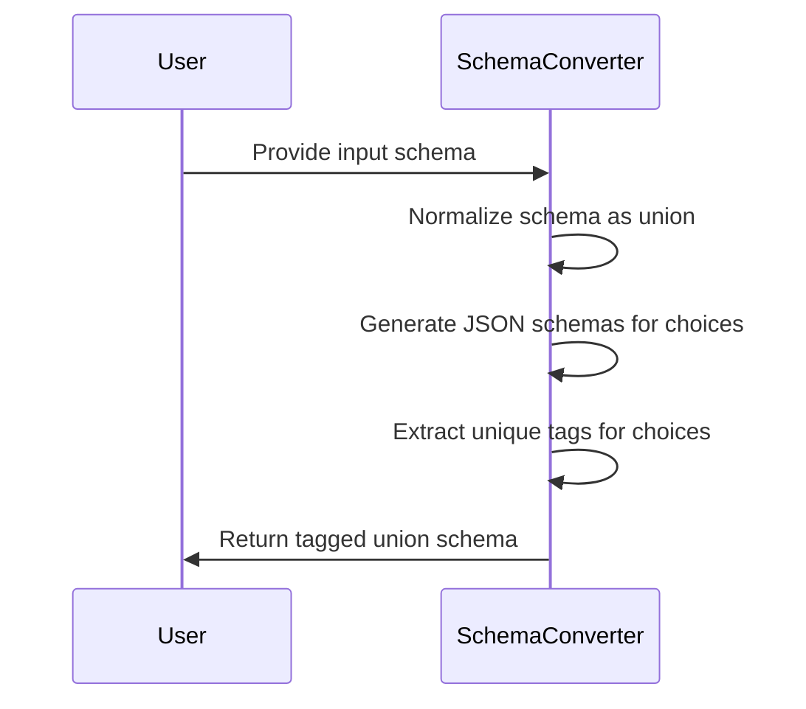
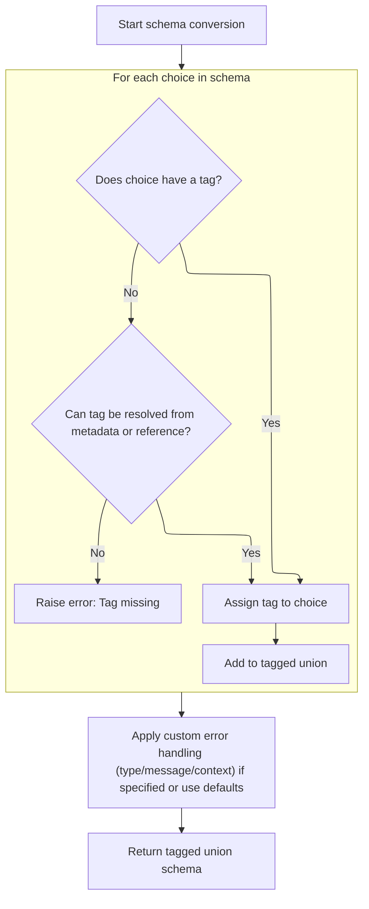

This document describes the conversion of an input schema into a tagged union schema that supports discrimination and custom error handling.

The main steps are:

- Normalize the input schema as a union
- Generate JSON schemas for each choice
- Extract and assign unique tags for each choice
- Assemble and return the tagged union schema



# Spec

## Detailed View of the Program's Functionality

a. Normalizing and Preparing the Input Schema

The process begins by ensuring that the schema provided for union validation is always treated as a union, even if it was originally a single non-union schema. This normalization is crucial for consistent downstream handling. If the schema is not already a union, it is wrapped into a union schema containing just that one schema. This step guarantees that all subsequent logic can uniformly expect to work with a union schema structure.

b. Generating JSON Schemas for Each Choice

Once the schema is normalized to a union, the system proceeds to generate JSON schemas for each possible choice within the union. It extracts all the choices from the union schema. For each choice:

- If the choice is a tuple (which can happen if an explicit label/tag is provided), it extracts the actual schema part.
- It attempts to generate a JSON schema for the choice. If the schema generation is successful, the resulting schema is added to a list of generated schemas.
- If the schema cannot be represented (for example, if it is a type that cannot be expressed in JSON Schema), it is skipped, and a warning may be emitted. After processing all choices:
- If only one valid schema was generated, that schema is returned directly.
- If multiple valid schemas were generated, they are combined using an <SwmToken path="pydantic/types.py" pos="1164:6:6" line-data="        field_schema.pop(&#39;anyOf&#39;, None)  # remove the bytes/str union">`anyOf`</SwmToken> construct, which allows the input to match any of the valid choices.

c. Tag Extraction and Discriminator Handling

After generating the union schema, the system needs to ensure that each choice in the union can be uniquely identified—this is essential for discriminated unions, where a discriminator (such as a field or a callable) determines which schema to use for validation. For each choice in the union:

- It checks if the choice already has an explicit tag (either as part of a tuple or in its metadata).
- If no tag is found, and the choice is a reference to a definition, it attempts to resolve the reference and look for a tag in the resolved schema's metadata.
- If a tag still cannot be found, an error is raised, indicating that every choice in a callable-discriminated union must have a tag.
- Each choice, along with its resolved tag, is added to a mapping of tags to schemas. This process ensures that every choice in the union is uniquely addressable by a tag, which is necessary for the discriminator logic to function correctly.

d. Producing the Tagged Union Schema

Finally, the system constructs a tagged union schema. This schema includes:

- The mapping of tags to their corresponding schemas.
- The discriminator (which may be a field name or a callable).
- Any custom error type, message, or context specified either on the Discriminator or inherited from the original schema.
- Additional metadata, such as strictness, references, and serialization information. This tagged union schema is then returned, ready to be used by the rest of the system for validation, error handling, and JSON schema generation.

e. Summary of the Flow

1. The input schema is normalized to always be a union.
2. Each choice in the union is processed to generate a JSON schema, skipping those that cannot be represented.
3. If only one valid schema is found, it is returned; otherwise, an <SwmToken path="pydantic/types.py" pos="1164:6:6" line-data="        field_schema.pop(&#39;anyOf&#39;, None)  # remove the bytes/str union">`anyOf`</SwmToken> schema is produced.
4. Each choice is assigned a unique tag, either from explicit annotation, metadata, or by resolving references.
5. If any choice lacks a tag, an error is raised.
6. A tagged union schema is constructed, incorporating the choices, discriminator, and any custom error or metadata.
7. The resulting schema is ready for use in validation and JSON schema generation, supporting clear discrimination and custom error reporting.

# Rule Definition

| Paragraph Name                                                                                                                                                                                                                                                                                                                                                                                                                                                                                                                   | Rule ID | Category          | Description                                                                                                                                                                                                                                                                                                                                        | Conditions                                                       | Remarks                                                                                                                                                                                                                                                                                         |
| -------------------------------------------------------------------------------------------------------------------------------------------------------------------------------------------------------------------------------------------------------------------------------------------------------------------------------------------------------------------------------------------------------------------------------------------------------------------------------------------------------------------------------- | ------- | ----------------- | -------------------------------------------------------------------------------------------------------------------------------------------------------------------------------------------------------------------------------------------------------------------------------------------------------------------------------------------------- | ---------------------------------------------------------------- | ----------------------------------------------------------------------------------------------------------------------------------------------------------------------------------------------------------------------------------------------------------------------------------------------- |
| The system must accept an input schema object that is a dictionary with at least the keys 'type' (with value 'union') and 'choices' (a list of possible type schemas).                                                                                                                                                                                                                                                                                                                                                           | RL-001  | Conditional Logic | The system only processes input schema objects that are dictionaries containing a 'type' key with value 'union' and a 'choices' key containing a list of possible type schemas.                                                                                                                                                                    | Input schema is provided for processing.                         | 'type' must be the string 'union'. 'choices' must be a list. No specific format for the elements of 'choices' at this stage.                                                                                                                                                                    |
| Each element in the 'choices' list may be: A schema dictionary describing a type, A tuple of (schema_dict, tag_string), A schema dictionary with a 'metadata' key containing a <SwmToken path="pydantic/types.py" pos="3092:10:10" line-data="                tag = metadata.get(&#39;pydantic_internal_union_tag_key&#39;) or tag">`pydantic_internal_union_tag_key`</SwmToken> entry, A reference dictionary.                                                                                                                  | RL-002  | Conditional Logic | Each choice in the 'choices' list of a union schema can be one of several forms: a plain schema dictionary, a tuple of (schema_dict, tag_string), a schema dict with a 'metadata' key containing a tag, or a reference dict.                                                                                                                       | Processing each element of the 'choices' list in a union schema. | The tag string must be unique for each choice if present. Reference dictionaries may require resolution to access the schema and tag.                                                                                                                                                           |
| The system must ensure that all input schemas, including non-union schemas, are treated as union schemas by wrapping them if necessary.                                                                                                                                                                                                                                                                                                                                                                                          | RL-003  | Data Assignment   | If an input schema is not already a union schema, it must be wrapped in a union schema structure so that all schemas are processed uniformly as unions.                                                                                                                                                                                            | Input schema is not a union schema.                              | Wrapping format: {'type': 'union', 'choices': \[<SwmToken path="pydantic/types.py" pos="3076:4:4" line-data="        self, original_schema: core_schema.CoreSchema, handler: GetCoreSchemaHandler \| None = None">`original_schema`</SwmToken>\]}                                               |
| For each choice in the union: The system must attempt to generate a JSON Schema representation using a function that converts the core schema to a JSON Schema dictionary. If a choice cannot be converted to a valid JSON Schema, it must be skipped.                                                                                                                                                                                                                                                                           | RL-004  | Computation       | For each choice in the union, attempt to generate a JSON Schema. If the conversion fails (<SwmToken path="pydantic/types.py" pos="917:27:29" line-data="        Attributes of modules may be separated from the module by `:` or `.`, e.g. if `&#39;math:cos&#39;` is provided,">`e.g`</SwmToken>., due to an unsupported type), skip that choice. | Processing each choice in the union schema.                      | The JSON Schema representation must be a dictionary. Skipped choices are not included in the output.                                                                                                                                                                                            |
| After processing all choices: If only one valid JSON Schema is generated, the system must return that schema directly. If multiple valid JSON Schemas are generated, the system must return a schema with an <SwmToken path="pydantic/types.py" pos="1164:6:6" line-data="        field_schema.pop(&#39;anyOf&#39;, None)  # remove the bytes/str union">`anyOf`</SwmToken> key whose value is a list of the generated schemas.                                                                                                  | RL-005  | Conditional Logic | After generating JSON Schemas for all valid choices, if only one schema is valid, return it directly. If more than one, return a schema with <SwmToken path="pydantic/types.py" pos="1164:6:6" line-data="        field_schema.pop(&#39;anyOf&#39;, None)  # remove the bytes/str union">`anyOf`</SwmToken> containing all valid schemas.          | After processing all choices in the union schema.                | If only one valid schema: output is that schema (dict). If multiple: output is {<SwmToken path="pydantic/types.py" pos="1164:6:6" line-data="        field_schema.pop(&#39;anyOf&#39;, None)  # remove the bytes/str union">`anyOf`</SwmToken>: \[schema1, schema2, ...\]}                      |
| For discriminated (tagged) unions: The system must extract a unique tag for each choice, using the following precedence: If the choice is a tuple, use the second element as the tag. If the choice is a dictionary with 'metadata' containing <SwmToken path="pydantic/types.py" pos="3092:10:10" line-data="                tag = metadata.get(&#39;pydantic_internal_union_tag_key&#39;) or tag">`pydantic_internal_union_tag_key`</SwmToken>, use its value as the tag. If the choice is a reference, resolve the reference. | RL-006  | Conditional Logic | For discriminated unions, extract a unique tag for each choice using a specific precedence: tuple's second element, metadata key, or by resolving references.                                                                                                                                                                                      | Processing a discriminated (tagged) union.                       | Tag extraction precedence: 1) tuple's second element, 2) 'metadata'\[<SwmToken path="pydantic/types.py" pos="3092:10:10" line-data="                tag = metadata.get(&#39;pydantic_internal_union_tag_key&#39;) or tag">`pydantic_internal_union_tag_key`</SwmToken>\], 3) resolve reference. |

# User Stories

## User Story 1: Schema Intake and Normalization

---

### Story Description:

As a system user, I want the system to accept both union and non-union schema objects and ensure all are treated as union schemas so that schema processing is consistent and reliable.

---

### Business Rule Mapping:

| Rule ID | Paragraph Name                                                                                                                                                         | Rule Description                                                                                                                                                                |
| ------- | ---------------------------------------------------------------------------------------------------------------------------------------------------------------------- | ------------------------------------------------------------------------------------------------------------------------------------------------------------------------------- |
| RL-001  | The system must accept an input schema object that is a dictionary with at least the keys 'type' (with value 'union') and 'choices' (a list of possible type schemas). | The system only processes input schema objects that are dictionaries containing a 'type' key with value 'union' and a 'choices' key containing a list of possible type schemas. |
| RL-003  | The system must ensure that all input schemas, including non-union schemas, are treated as union schemas by wrapping them if necessary.                                | If an input schema is not already a union schema, it must be wrapped in a union schema structure so that all schemas are processed uniformly as unions.                         |

---

### Relevant Functionality:

- **The system must accept an input schema object that is a dictionary with at least the keys 'type' (with value 'union') and 'choices' (a list of possible type schemas).**
  1. **RL-001:**
     - When receiving an input schema:
       - Check if it is a dictionary.
       - Check if it contains a 'type' key with value 'union'.
       - Check if it contains a 'choices' key which is a list.
       - If any of these checks fail, reject or wrap the schema as needed.
- **The system must ensure that all input schemas**
  1. **RL-003:**
     - If the input schema is not a dict with 'type'=='union':
       - Wrap it as {'type': 'union', 'choices': \[<SwmToken path="pydantic/json_schema.py" pos="1107:16:16" line-data="        if self.mode == &#39;validation&#39; and (input_schema := schema.get(&#39;json_schema_input_schema&#39;)):">`input_schema`</SwmToken>\]}.

## User Story 2: Choice Processing and Tag Extraction

---

### Story Description:

As a system user, I want the system to correctly interpret each choice in a union schema, supporting various formats and extracting unique tags for discriminated unions so that all valid schema forms and tagging mechanisms are supported.

---

### Business Rule Mapping:

| Rule ID | Paragraph Name                                                                                                                                                                                                                                                                                                                                                                                                                                                                                                                   | Rule Description                                                                                                                                                                                                             |
| ------- | -------------------------------------------------------------------------------------------------------------------------------------------------------------------------------------------------------------------------------------------------------------------------------------------------------------------------------------------------------------------------------------------------------------------------------------------------------------------------------------------------------------------------------- | ---------------------------------------------------------------------------------------------------------------------------------------------------------------------------------------------------------------------------- |
| RL-002  | Each element in the 'choices' list may be: A schema dictionary describing a type, A tuple of (schema_dict, tag_string), A schema dictionary with a 'metadata' key containing a <SwmToken path="pydantic/types.py" pos="3092:10:10" line-data="                tag = metadata.get(&#39;pydantic_internal_union_tag_key&#39;) or tag">`pydantic_internal_union_tag_key`</SwmToken> entry, A reference dictionary.                                                                                                                  | Each choice in the 'choices' list of a union schema can be one of several forms: a plain schema dictionary, a tuple of (schema_dict, tag_string), a schema dict with a 'metadata' key containing a tag, or a reference dict. |
| RL-006  | For discriminated (tagged) unions: The system must extract a unique tag for each choice, using the following precedence: If the choice is a tuple, use the second element as the tag. If the choice is a dictionary with 'metadata' containing <SwmToken path="pydantic/types.py" pos="3092:10:10" line-data="                tag = metadata.get(&#39;pydantic_internal_union_tag_key&#39;) or tag">`pydantic_internal_union_tag_key`</SwmToken>, use its value as the tag. If the choice is a reference, resolve the reference. | For discriminated unions, extract a unique tag for each choice using a specific precedence: tuple's second element, metadata key, or by resolving references.                                                                |

---

### Relevant Functionality:

- **Each element in the 'choices' list may be: A schema dictionary describing a type**
  1. **RL-002:**
     - For each element in the 'choices' list:
       - If it is a tuple, treat the first element as the schema and the second as the tag.
       - If it is a dict with 'metadata' and <SwmToken path="pydantic/types.py" pos="3092:10:10" line-data="                tag = metadata.get(&#39;pydantic_internal_union_tag_key&#39;) or tag">`pydantic_internal_union_tag_key`</SwmToken>, extract the tag from metadata.
       - If it is a reference dict (<SwmToken path="pydantic/types.py" pos="917:27:29" line-data="        Attributes of modules may be separated from the module by `:` or `.`, e.g. if `&#39;math:cos&#39;` is provided,">`e.g`</SwmToken>., {'type': <SwmToken path="pydantic/types.py" pos="3095:23:25" line-data="                if handler is not None and choice[&#39;type&#39;] == &#39;definition-ref&#39;:">`definition-ref`</SwmToken>, ...}), resolve the reference to access the schema and tag.
       - Otherwise, treat it as a plain schema dictionary.
- **For discriminated (tagged) unions: The system must extract a unique tag for each choice**
  1. **RL-006:**
     - For each choice in the union:
       - If the choice is a tuple, use the second element as the tag.
       - Else if the choice is a dict with 'metadata' and <SwmToken path="pydantic/types.py" pos="3092:10:10" line-data="                tag = metadata.get(&#39;pydantic_internal_union_tag_key&#39;) or tag">`pydantic_internal_union_tag_key`</SwmToken>, use that value as the tag.
       - Else if the choice is a reference dict, resolve the reference and extract the tag.
       - Ensure each tag is unique among choices.

## User Story 3: JSON Schema Generation and Output Logic

---

### Story Description:

As a system user, I want the system to generate JSON Schema representations for each valid choice, skip invalid ones, and return either a single schema or an <SwmToken path="pydantic/types.py" pos="1164:6:6" line-data="        field_schema.pop(&#39;anyOf&#39;, None)  # remove the bytes/str union">`anyOf`</SwmToken> schema as appropriate so that the output is accurate and conforms to JSON Schema standards.

---

### Business Rule Mapping:

| Rule ID | Paragraph Name                                                                                                                                                                                                                                                                                                                                                                                                                  | Rule Description                                                                                                                                                                                                                                                                                                                                   |
| ------- | ------------------------------------------------------------------------------------------------------------------------------------------------------------------------------------------------------------------------------------------------------------------------------------------------------------------------------------------------------------------------------------------------------------------------------- | -------------------------------------------------------------------------------------------------------------------------------------------------------------------------------------------------------------------------------------------------------------------------------------------------------------------------------------------------- |
| RL-004  | For each choice in the union: The system must attempt to generate a JSON Schema representation using a function that converts the core schema to a JSON Schema dictionary. If a choice cannot be converted to a valid JSON Schema, it must be skipped.                                                                                                                                                                          | For each choice in the union, attempt to generate a JSON Schema. If the conversion fails (<SwmToken path="pydantic/types.py" pos="917:27:29" line-data="        Attributes of modules may be separated from the module by `:` or `.`, e.g. if `&#39;math:cos&#39;` is provided,">`e.g`</SwmToken>., due to an unsupported type), skip that choice. |
| RL-005  | After processing all choices: If only one valid JSON Schema is generated, the system must return that schema directly. If multiple valid JSON Schemas are generated, the system must return a schema with an <SwmToken path="pydantic/types.py" pos="1164:6:6" line-data="        field_schema.pop(&#39;anyOf&#39;, None)  # remove the bytes/str union">`anyOf`</SwmToken> key whose value is a list of the generated schemas. | After generating JSON Schemas for all valid choices, if only one schema is valid, return it directly. If more than one, return a schema with <SwmToken path="pydantic/types.py" pos="1164:6:6" line-data="        field_schema.pop(&#39;anyOf&#39;, None)  # remove the bytes/str union">`anyOf`</SwmToken> containing all valid schemas.          |

---

### Relevant Functionality:

- **For each choice in the union: The system must attempt to generate a JSON Schema representation using a function that converts the core schema to a JSON Schema dictionary. If a choice cannot be converted to a valid JSON Schema**
  1. **RL-004:**
     - For each choice in the union:
       - Try to convert the choice to a JSON Schema dict using the conversion function.
       - If conversion fails or raises an error, skip this choice.
- **After processing all choices: If only one valid JSON Schema is generated**
  1. **RL-005:**
     - If the list of valid JSON Schemas has length 1:
       - Return the single schema.
     - Else if length > 1:
       - Return {<SwmToken path="pydantic/types.py" pos="1164:6:6" line-data="        field_schema.pop(&#39;anyOf&#39;, None)  # remove the bytes/str union">`anyOf`</SwmToken>: \[list of valid schemas\]}.

# Code Walkthrough

## Normalizing and Preparing the Input Schema

```mermaid
%%{init: {"flowchart": {"defaultRenderer": "elk"}} }%%
flowchart TD
    node1["Ensure input is treated as a union schema for consistent validation"]
    click node1 openCode "pydantic/types.py:3078:3083"
    node1 --> node2["Assign unique tags to each choice and prepare error/metadata info"]
    click node2 openCode "pydantic/types.py:3085:3111"
    node2 --> node3["Produce a tagged union schema supporting clear discrimination and custom error messages"]
    click node3 openCode "pydantic/types.py:3113:3137"


subgraph node2 [union_schema]
  sgmain_1_node1["Start: Prepare to generate union schema"] --> sgmain_1_node2["Extract all possible schema choices"]
  click sgmain_1_node1 openCode "pydantic/json_schema.py:1241:1252"
  click sgmain_1_node2 openCode "pydantic/json_schema.py:1252:1253"
  sgmain_1_node2 --> sgmain_1_node3["Process each choice"]
  click sgmain_1_node3 openCode "pydantic/json_schema.py:1253:1261"
  subgraph sgmain_1_loop1["For each possible schema choice"]
  sgmain_1_node3 --> sgmain_1_node4["Try to generate JSON schema"]
  click sgmain_1_node4 openCode "pydantic/json_schema.py:1255:1257"
  sgmain_1_node4 --> sgmain_1_node5{"Valid?"}
  click sgmain_1_node5 openCode "pydantic/json_schema.py:1258:1261"
  sgmain_1_node5 -->|"Yes"| sgmain_1_node6["Add to generated list"]
  click sgmain_1_node6 openCode "pydantic/json_schema.py:1257:1257"
  sgmain_1_node5 -->|"No"| sgmain_1_node7["Skip or warn"]
  click sgmain_1_node7 openCode "pydantic/json_schema.py:1258:1261"
  sgmain_1_node6 --> sgmain_1_node3
  sgmain_1_node7 --> sgmain_1_node3
  end
  sgmain_1_node3 --> sgmain_1_node8{"How many valid schemas?"}
  click sgmain_1_node8 openCode "pydantic/json_schema.py:1262:1264"
  sgmain_1_node8 -->|"One"| sgmain_1_node9["Return the single schema"]
  click sgmain_1_node9 openCode "pydantic/json_schema.py:1263:1263"
  sgmain_1_node8 -->|"Multiple"| sgmain_1_node10["Return a union (anyOf) schema"]
  click sgmain_1_node10 openCode "pydantic/json_schema.py:1264:1264"
end

%% Swimm:
%% %%{init: {"flowchart": {"defaultRenderer": "elk"}} }%%
%% flowchart TD
%%     node1["Ensure input is treated as a union schema for consistent validation"]
%%     click node1 openCode "<SwmPath>[pydantic/types.py](pydantic/types.py)</SwmPath>:3078:3083"
%%     node1 --> node2["Assign unique tags to each choice and prepare error/metadata info"]
%%     click node2 openCode "<SwmPath>[pydantic/types.py](pydantic/types.py)</SwmPath>:3085:3111"
%%     node2 --> node3["Produce a tagged union schema supporting clear discrimination and custom error messages"]
%%     click node3 openCode "<SwmPath>[pydantic/types.py](pydantic/types.py)</SwmPath>:3113:3137"
%% 
%% 
%% subgraph node2 [<SwmToken path="pydantic/types.py" pos="3083:7:7" line-data="            original_schema = core_schema.union_schema([original_schema])">`union_schema`</SwmToken>]
%%   sgmain_1_node1["Start: Prepare to generate union schema"] --> sgmain_1_node2["Extract all possible schema choices"]
%%   click sgmain_1_node1 openCode "<SwmPath>[pydantic/json_schema.py](pydantic/json_schema.py)</SwmPath>:1241:1252"
%%   click sgmain_1_node2 openCode "<SwmPath>[pydantic/json_schema.py](pydantic/json_schema.py)</SwmPath>:1252:1253"
%%   sgmain_1_node2 --> sgmain_1_node3["Process each choice"]
%%   click sgmain_1_node3 openCode "<SwmPath>[pydantic/json_schema.py](pydantic/json_schema.py)</SwmPath>:1253:1261"
%%   subgraph sgmain_1_loop1["For each possible schema choice"]
%%   sgmain_1_node3 --> sgmain_1_node4["Try to generate JSON schema"]
%%   click sgmain_1_node4 openCode "<SwmPath>[pydantic/json_schema.py](pydantic/json_schema.py)</SwmPath>:1255:1257"
%%   sgmain_1_node4 --> sgmain_1_node5{"Valid?"}
%%   click sgmain_1_node5 openCode "<SwmPath>[pydantic/json_schema.py](pydantic/json_schema.py)</SwmPath>:1258:1261"
%%   sgmain_1_node5 -->|"Yes"| sgmain_1_node6["Add to generated list"]
%%   click sgmain_1_node6 openCode "<SwmPath>[pydantic/json_schema.py](pydantic/json_schema.py)</SwmPath>:1257:1257"
%%   sgmain_1_node5 -->|"No"| sgmain_1_node7["Skip or warn"]
%%   click sgmain_1_node7 openCode "<SwmPath>[pydantic/json_schema.py](pydantic/json_schema.py)</SwmPath>:1258:1261"
%%   sgmain_1_node6 --> sgmain_1_node3
%%   sgmain_1_node7 --> sgmain_1_node3
%%   end
%%   sgmain_1_node3 --> sgmain_1_node8{"How many valid schemas?"}
%%   click sgmain_1_node8 openCode "<SwmPath>[pydantic/json_schema.py](pydantic/json_schema.py)</SwmPath>:1262:1264"
%%   sgmain_1_node8 -->|"One"| sgmain_1_node9["Return the single schema"]
%%   click sgmain_1_node9 openCode "<SwmPath>[pydantic/json_schema.py](pydantic/json_schema.py)</SwmPath>:1263:1263"
%%   sgmain_1_node8 -->|"Multiple"| sgmain_1_node10["Return a union (<SwmToken path="pydantic/types.py" pos="1164:6:6" line-data="        field_schema.pop(&#39;anyOf&#39;, None)  # remove the bytes/str union">`anyOf`</SwmToken>) schema"]
%%   click sgmain_1_node10 openCode "<SwmPath>[pydantic/json_schema.py](pydantic/json_schema.py)</SwmPath>:1264:1264"
%% end
```



<SwmSnippet path="/pydantic/types.py" line="3075">

---

In <SwmToken path="pydantic/types.py" pos="3075:3:3" line-data="    def _convert_schema(">`_convert_schema`</SwmToken>, we make sure the schema is always treated as a union by wrapping non-union schemas. Then we call <SwmToken path="pydantic/types.py" pos="3083:7:7" line-data="            original_schema = core_schema.union_schema([original_schema])">`union_schema`</SwmToken> to handle the choices uniformly.

```python
    def _convert_schema(
        self, original_schema: core_schema.CoreSchema, handler: GetCoreSchemaHandler | None = None
    ) -> core_schema.TaggedUnionSchema:
        if original_schema['type'] != 'union':
            # This likely indicates that the schema was a single-item union that was simplified.
            # In this case, we do the same thing we do in
            # `pydantic._internal._discriminated_union._ApplyInferredDiscriminator._apply_to_root`, namely,
            # package the generated schema back into a single-item union.
            original_schema = core_schema.union_schema([original_schema])

```

---

</SwmSnippet>

### Generating JSON Schemas for Each Choice

```mermaid
%%{init: {"flowchart": {"defaultRenderer": "elk"}} }%%
flowchart TD
    node1["Start: Prepare to generate union schema"] --> node2["Extract all possible schema choices"]
    click node1 openCode "pydantic/json_schema.py:1241:1252"
    click node2 openCode "pydantic/json_schema.py:1252:1253"
    node2 --> node3["Process each choice"]
    click node3 openCode "pydantic/json_schema.py:1253:1261"
    
    subgraph loop1["For each possible schema choice"]
        node3 --> node4["Try to generate JSON schema"]
        click node4 openCode "pydantic/json_schema.py:1255:1257"
        node4 --> node5{"Valid?"}
        click node5 openCode "pydantic/json_schema.py:1258:1261"
        node5 -->|"Yes"| node6["Add to generated list"]
        click node6 openCode "pydantic/json_schema.py:1257:1257"
        node5 -->|"No"| node7["Skip or warn"]
        click node7 openCode "pydantic/json_schema.py:1258:1261"
        node6 --> node3
        node7 --> node3
    end
    node3 --> node8{"How many valid schemas?"}
    click node8 openCode "pydantic/json_schema.py:1262:1264"
    node8 -->|"One"| node9["Return the single schema"]
    click node9 openCode "pydantic/json_schema.py:1263:1263"
    node8 -->|"Multiple"| node10["Return a union (anyOf) schema"]
    click node10 openCode "pydantic/json_schema.py:1264:1264"

%% Swimm:
%% %%{init: {"flowchart": {"defaultRenderer": "elk"}} }%%
%% flowchart TD
%%     node1["Start: Prepare to generate union schema"] --> node2["Extract all possible schema choices"]
%%     click node1 openCode "<SwmPath>[pydantic/json_schema.py](pydantic/json_schema.py)</SwmPath>:1241:1252"
%%     click node2 openCode "<SwmPath>[pydantic/json_schema.py](pydantic/json_schema.py)</SwmPath>:1252:1253"
%%     node2 --> node3["Process each choice"]
%%     click node3 openCode "<SwmPath>[pydantic/json_schema.py](pydantic/json_schema.py)</SwmPath>:1253:1261"
%%     
%%     subgraph loop1["For each possible schema choice"]
%%         node3 --> node4["Try to generate JSON schema"]
%%         click node4 openCode "<SwmPath>[pydantic/json_schema.py](pydantic/json_schema.py)</SwmPath>:1255:1257"
%%         node4 --> node5{"Valid?"}
%%         click node5 openCode "<SwmPath>[pydantic/json_schema.py](pydantic/json_schema.py)</SwmPath>:1258:1261"
%%         node5 -->|"Yes"| node6["Add to generated list"]
%%         click node6 openCode "<SwmPath>[pydantic/json_schema.py](pydantic/json_schema.py)</SwmPath>:1257:1257"
%%         node5 -->|"No"| node7["Skip or warn"]
%%         click node7 openCode "<SwmPath>[pydantic/json_schema.py](pydantic/json_schema.py)</SwmPath>:1258:1261"
%%         node6 --> node3
%%         node7 --> node3
%%     end
%%     node3 --> node8{"How many valid schemas?"}
%%     click node8 openCode "<SwmPath>[pydantic/json_schema.py](pydantic/json_schema.py)</SwmPath>:1262:1264"
%%     node8 -->|"One"| node9["Return the single schema"]
%%     click node9 openCode "<SwmPath>[pydantic/json_schema.py](pydantic/json_schema.py)</SwmPath>:1263:1263"
%%     node8 -->|"Multiple"| node10["Return a union (<SwmToken path="pydantic/types.py" pos="1164:6:6" line-data="        field_schema.pop(&#39;anyOf&#39;, None)  # remove the bytes/str union">`anyOf`</SwmToken>) schema"]
%%     click node10 openCode "<SwmPath>[pydantic/json_schema.py](pydantic/json_schema.py)</SwmPath>:1264:1264"
```



<SwmSnippet path="/pydantic/json_schema.py" line="1241">

---

In <SwmToken path="pydantic/json_schema.py" pos="1241:3:3" line-data="    def union_schema(self, schema: core_schema.UnionSchema) -&gt; JsonSchemaValue:">`union_schema`</SwmToken>, we loop through each choice in the union. If a choice is a tuple, we pull out the schema part. We generate a JSON schema for each choice using <SwmToken path="pydantic/json_schema.py" pos="1257:7:7" line-data="                generated.append(self.generate_inner(choice_schema))">`generate_inner`</SwmToken>, skipping any that can't be represented. If there's more than one valid schema, we combine them with <SwmToken path="pydantic/types.py" pos="1164:6:6" line-data="        field_schema.pop(&#39;anyOf&#39;, None)  # remove the bytes/str union">`anyOf`</SwmToken> to allow matching any of them.

```python
    def union_schema(self, schema: core_schema.UnionSchema) -> JsonSchemaValue:
        """Generates a JSON schema that matches a schema that allows values matching any of the given schemas.

        Args:
            schema: The core schema.

        Returns:
            The generated JSON schema.
        """
        generated: list[JsonSchemaValue] = []

        choices = schema['choices']
        for choice in choices:
            # choice will be a tuple if an explicit label was provided
            choice_schema = choice[0] if isinstance(choice, tuple) else choice
            try:
                generated.append(self.generate_inner(choice_schema))
            except PydanticOmit:
                continue
            except PydanticInvalidForJsonSchema as exc:
                self.emit_warning('skipped-choice', exc.message)
```

---

</SwmSnippet>

<SwmSnippet path="/pydantic/json_schema.py" line="1261">

---

After generating schemas for all choices, if there's only one, we return it as-is. If there are multiple, we use <SwmToken path="pydantic/json_schema.py" pos="1264:5:5" line-data="        return self.get_flattened_anyof(generated)">`get_flattened_anyof`</SwmToken> to combine them into an <SwmToken path="pydantic/types.py" pos="1164:6:6" line-data="        field_schema.pop(&#39;anyOf&#39;, None)  # remove the bytes/str union">`anyOf`</SwmToken> schema, so the result can match any of the valid choices.

```python
                self.emit_warning('skipped-choice', exc.message)
        if len(generated) == 1:
            return generated[0]
        return self.get_flattened_anyof(generated)
```

---

</SwmSnippet>

### Tag Extraction and Discriminator Handling



<SwmSnippet path="/pydantic/types.py" line="3085">

---

Back in <SwmToken path="pydantic/types.py" pos="3075:3:3" line-data="    def _convert_schema(">`_convert_schema`</SwmToken> after calling <SwmToken path="pydantic/types.py" pos="3083:7:7" line-data="            original_schema = core_schema.union_schema([original_schema])">`union_schema`</SwmToken>, we loop through each choice in the union to extract a unique tag. We check for tags in tuples or metadata, and if missing, try to resolve references using the handler. If we still can't find a tag, we raise an error. This guarantees every choice in the union can be uniquely identified by a discriminator.

```python
        tagged_union_choices = {}
        for choice in original_schema['choices']:
            tag = None
            if isinstance(choice, tuple):
                choice, tag = choice
            metadata = cast('CoreMetadata | None', choice.get('metadata'))
            if metadata is not None:
                tag = metadata.get('pydantic_internal_union_tag_key') or tag
            if tag is None:
                # `handler` is None when this method is called from `apply_discriminator()` (deferred discriminators)
                if handler is not None and choice['type'] == 'definition-ref':
                    # If choice was built from a PEP 695 type alias, try to resolve the def:
                    try:
                        choice = handler.resolve_ref_schema(choice)
                    except LookupError:
                        pass
                    else:
                        metadata = cast('CoreMetadata | None', choice.get('metadata'))
                        if metadata is not None:
                            tag = metadata.get('pydantic_internal_union_tag_key')

                if tag is None:
                    raise PydanticUserError(
                        f'`Tag` not provided for choice {choice} used with `Discriminator`',
                        code='callable-discriminator-no-tag',
                    )
            tagged_union_choices[tag] = choice
```

---

</SwmSnippet>

<SwmSnippet path="/pydantic/types.py" line="3111">

---

Finally, <SwmToken path="pydantic/types.py" pos="3075:3:3" line-data="    def _convert_schema(">`_convert_schema`</SwmToken> returns a tagged union schema built from the tagged choices and discriminator, along with any custom error info and metadata. This wraps up the conversion so the rest of the system can use the schema for validation and error handling.

```python
            tagged_union_choices[tag] = choice

        # Have to do these verbose checks to ensure falsy values ('' and {}) don't get ignored
        custom_error_type = self.custom_error_type
        if custom_error_type is None:
            custom_error_type = original_schema.get('custom_error_type')

        custom_error_message = self.custom_error_message
        if custom_error_message is None:
            custom_error_message = original_schema.get('custom_error_message')

        custom_error_context = self.custom_error_context
        if custom_error_context is None:
            custom_error_context = original_schema.get('custom_error_context')

        custom_error_type = original_schema.get('custom_error_type') if custom_error_type is None else custom_error_type
        return core_schema.tagged_union_schema(
            tagged_union_choices,
            self.discriminator,
            custom_error_type=custom_error_type,
            custom_error_message=custom_error_message,
            custom_error_context=custom_error_context,
            strict=original_schema.get('strict'),
            ref=original_schema.get('ref'),
            metadata=original_schema.get('metadata'),
            serialization=original_schema.get('serialization'),
        )
```

---

</SwmSnippet>

&nbsp;

*This is an auto-generated document by Swimm 🌊 and has not yet been verified by a human*

<SwmMeta version="3.0.0" repo-id="Z2l0aHViJTNBJTNBcHlkYW50aWMlM0ElM0FTd2ltbS1EZW1v" repo-name="pydantic"><sup>Powered by [Swimm](/)</sup></SwmMeta>
