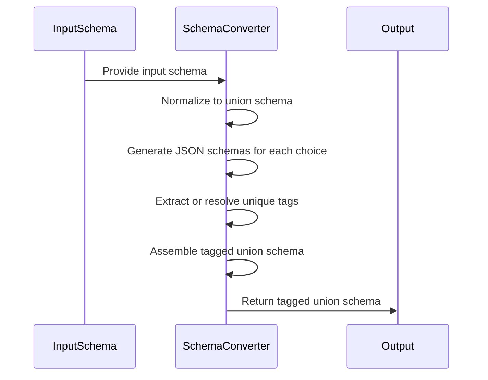
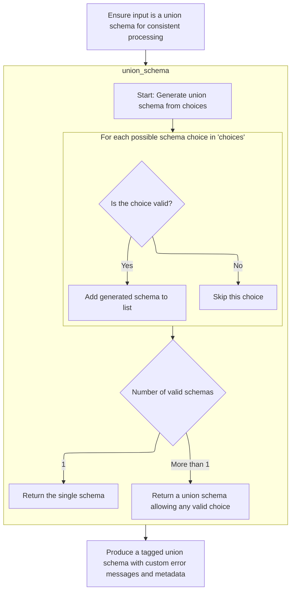
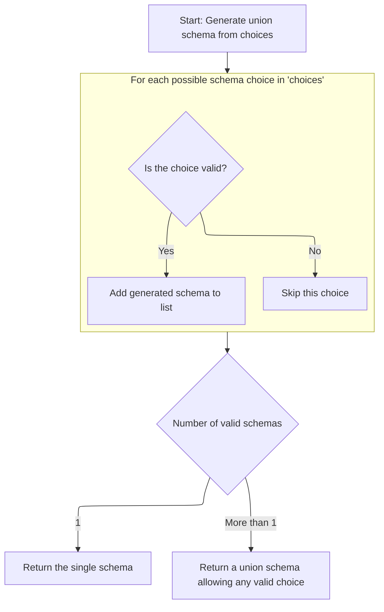
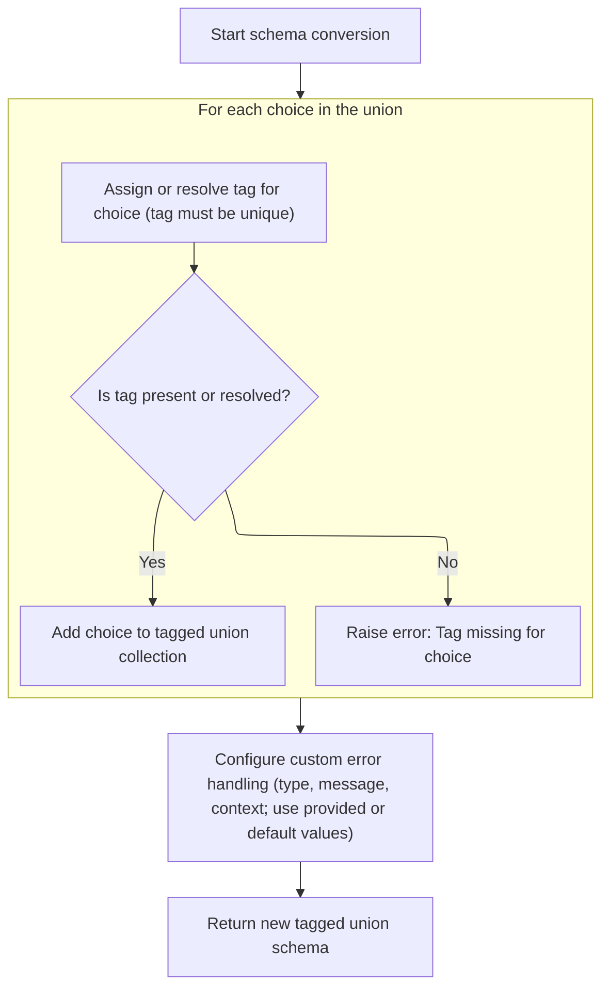

This document explains how input schemas are normalized and converted into tagged union schemas to support validation and serialization. The main steps are:

- Normalize the input schema to a union format
- Generate JSON schemas for each union choice
- Extract or resolve unique tags for each choice
- Assemble and return the tagged union schema with error handling and metadata



# Spec

## Detailed View of the Program's Functionality

a. Normalizing and Preparing the Input Schema

The process begins by ensuring that the input schema is always treated as a union schema, even if it was originally a single schema. This normalization is crucial for consistent downstream processing. If the schema is not already a union, it is wrapped into a union schema containing just that one schema. This step guarantees that all subsequent logic can operate under the assumption that it is dealing with a union of choices, simplifying the handling of both single and multiple schema cases.

b. Generating the JSON Schema for Each Union Choice

Once the schema is normalized to a union, the next step is to generate the JSON Schema representation for each possible choice within the union. The process iterates over each choice:

- If a choice is a tuple (which can happen if an explicit label or tag is provided), only the schema part is used for JSON Schema generation, ignoring the label.
- For each choice, an attempt is made to generate its JSON Schema. If the generation fails due to the schema being omitted or invalid for JSON Schema, that choice is skipped, and a warning may be emitted.
- All successfully generated schemas are collected into a list.

After processing all choices:

- If only one valid schema was generated, it is returned directly as the JSON Schema for the union.
- If multiple valid schemas exist, they are combined into an <SwmToken path="pydantic/types.py" pos="1164:6:6" line-data="        field_schema.pop(&#39;anyOf&#39;, None)  # remove the bytes/str union">`anyOf`</SwmToken> JSON Schema, meaning the data can match any of the listed schemas.

c. Tag Extraction and Discriminator Resolution

After generating the union schema, the process continues by assigning a unique tag (discriminator) to each choice. This is essential for discriminated unions, where the system needs to know which schema to use for validation based on a specific value (the discriminator).

For each choice in the union:

- If the choice is a tuple, the tag may be provided directly.
- If not, the code checks for metadata attached to the schema for a tag.
- If the tag is still missing and the choice is a reference to a definition (such as a type alias), the handler is used to resolve the reference and attempt to extract the tag from the resolved schema's metadata.
- If, after all these attempts, a tag cannot be determined, an error is raised, indicating that a tag is required for every choice in a callable-discriminated union.

This process ensures that every choice in the union is uniquely identifiable by a tag, which is critical for correct discrimination during validation.

d. Producing the Tagged Union Schema

With all choices tagged, the system constructs a new tagged union schema. This schema includes:

- The mapping of tags to their corresponding choices.
- The discriminator (which can be a field name or a callable).
- Any custom error type, message, or context, either from the instance or inherited from the original schema.
- Additional metadata, strictness, references, and serialization information as needed.

The resulting tagged union schema is now fully prepared for both validation and serialization, supporting robust discrimination between union choices and providing clear error messages and metadata as configured.

# Rule Definition

| Paragraph Name                                                                                                                                                                                                                                                                                                                                                                                                                                                                                                                                                                                                                                                                                                                                                                                                                                                                         | Rule ID | Category          | Description                                                                                                                                                                                          | Conditions                                                                                                 | Remarks                                                                                                                                                                                                                                                                                                                                                            |
| -------------------------------------------------------------------------------------------------------------------------------------------------------------------------------------------------------------------------------------------------------------------------------------------------------------------------------------------------------------------------------------------------------------------------------------------------------------------------------------------------------------------------------------------------------------------------------------------------------------------------------------------------------------------------------------------------------------------------------------------------------------------------------------------------------------------------------------------------------------------------------------- | ------- | ----------------- | ---------------------------------------------------------------------------------------------------------------------------------------------------------------------------------------------------- | ---------------------------------------------------------------------------------------------------------- | ------------------------------------------------------------------------------------------------------------------------------------------------------------------------------------------------------------------------------------------------------------------------------------------------------------------------------------------------------------------ |
| The system must accept an input schema that may be a single schema dict, a list of schema dicts, or a list of tuples where each tuple contains a schema dict and a tag string. The system must normalize the input so that it is always processed as a union of choices, even if the input was a single schema.                                                                                                                                                                                                                                                                                                                                                                                                                                                                                                                                                                        | RL-001  | Data Assignment   | All input schemas, regardless of their initial format (single dict, list of dicts, or list of (dict, tag) tuples), must be normalized into a standard internal representation as a union of choices. | Input is provided as a schema dict, a list of schema dicts, or a list of (schema dict, tag string) tuples. | The normalized format is a list of choices, where each choice is either a schema dict or a (schema dict, tag string) tuple.                                                                                                                                                                                                                                        |
| For each choice, the system must assign a unique tag string: If the choice is a tuple, the tag is the second element. If the choice is a dict, the system must attempt to extract a tag from a designated metadata field within the dict. If the choice is a reference, the system must resolve the reference and attempt to extract the tag from the resolved schema’s metadata. If a tag cannot be determined for a choice, the system must raise an error.                                                                                                                                                                                                                                                                                                                                                                                                                          | RL-002  | Conditional Logic | Each choice in the union must have a tag string assigned. The tag is determined by tuple value, dict metadata, or resolved reference. If no tag can be determined, an error is raised.               | Processing each choice in the normalized union.                                                            | The tag must be a string. The metadata field for tag extraction must be designated (<SwmToken path="pydantic/types.py" pos="917:27:29" line-data="        Attributes of modules may be separated from the module by `:` or `.`, e.g. if `&#39;math:cos&#39;` is provided,">`e.g`</SwmToken>., a specific key in the dict). Error must be raised if tag is missing. |
| All tags must be unique within the union.                                                                                                                                                                                                                                                                                                                                                                                                                                                                                                                                                                                                                                                                                                                                                                                                                                              | RL-003  | Conditional Logic | Ensure that all tags assigned to choices in the union are unique. If duplicate tags are found, raise an error.                                                                                       | After assigning tags to all choices.                                                                       | Tags are strings. Uniqueness is enforced within the set of choices.                                                                                                                                                                                                                                                                                                |
| The system must generate a tagged union schema with the following structure: A "choices" mapping from tag string to the corresponding schema dict. A "discriminator" field indicating the property name or callable used to extract the tag from input data. Optional fields for <SwmToken path="pydantic/types.py" pos="3114:1:1" line-data="        custom_error_type = self.custom_error_type">`custom_error_type`</SwmToken>, <SwmToken path="pydantic/types.py" pos="3118:1:1" line-data="        custom_error_message = self.custom_error_message">`custom_error_message`</SwmToken>, and <SwmToken path="pydantic/types.py" pos="3122:1:1" line-data="        custom_error_context = self.custom_error_context">`custom_error_context`</SwmToken> for custom error handling. Optional fields for "strict", "ref", "metadata", and "serialization" for additional configuration. | RL-004  | Data Assignment   | Generate a tagged union schema object that includes a mapping of tags to schemas, discriminator information, and optional fields for error handling and configuration.                               | After tags have been assigned and uniqueness enforced.                                                     | Output format:                                                                                                                                                                                                                                                                                                                                                     |

- Object with keys:
  - "choices": {tag_string: schema_dict, ...}
  - "discriminator": string or callable
  - Optional: <SwmToken path="pydantic/types.py" pos="3114:1:1" line-data="        custom_error_type = self.custom_error_type">`custom_error_type`</SwmToken>: string
  - Optional: <SwmToken path="pydantic/types.py" pos="3118:1:1" line-data="        custom_error_message = self.custom_error_message">`custom_error_message`</SwmToken>: string
  - Optional: <SwmToken path="pydantic/types.py" pos="3122:1:1" line-data="        custom_error_context = self.custom_error_context">`custom_error_context`</SwmToken>: object
  - Optional: "strict": boolean
  - Optional: "ref": string
  - Optional: "metadata": object
  - Optional: "serialization": object | | When generating a JSON Schema representation of the tagged union: The output must include a <SwmToken path="pydantic/json_schema.py" pos="1237:27:27" line-data="            # Thanks to the equality check against `null_schema` above, I think &#39;oneOf&#39; would also be valid here;">`oneOf`</SwmToken> key whose value is a list of the schema dicts for each choice. The output must include a "discriminator" object with: <SwmToken path="pydantic/json_schema.py" pos="1297:2:2" line-data="                &#39;propertyName&#39;: openapi_discriminator,">`propertyName`</SwmToken>: the field name used for discrimination. "mapping": a mapping from tag string to the schema reference for each choice. When generating the JSON Schema, if only one valid schema is present in the union, the output must be that schema directly. When generating the JSON Schema, if multiple valid schemas are present, the output must be a union schema allowing any valid choice, as described above. | RL-005 | Computation | When converting the tagged union schema to JSON Schema, output must use <SwmToken path="pydantic/json_schema.py" pos="1237:27:27" line-data="            # Thanks to the equality check against `null_schema` above, I think &#39;oneOf&#39; would also be valid here;">`oneOf`</SwmToken> for multiple choices, include a discriminator object, and handle single-choice unions by outputting the schema directly. | When generating JSON Schema from a tagged union schema. | Output format:
- If multiple choices:
  - { <SwmToken path="pydantic/json_schema.py" pos="1237:27:27" line-data="            # Thanks to the equality check against `null_schema` above, I think &#39;oneOf&#39; would also be valid here;">`oneOf`</SwmToken>: \[schema_dict, ...\], "discriminator": { <SwmToken path="pydantic/json_schema.py" pos="1297:2:2" line-data="                &#39;propertyName&#39;: openapi_discriminator,">`propertyName`</SwmToken>: string, "mapping": {tag_string: <SwmToken path="pydantic/json_schema.py" pos="2028:10:10" line-data="        core_ref = CoreRef(schema[&#39;schema_ref&#39;])">`schema_ref`</SwmToken>, ...} } }
- If only one choice:
  - Output the schema dict directly.
- Must preserve and include any additional metadata or serialization information from the original input schema. | | The system must support custom error handling by allowing the inclusion of custom error type, message, and context in the tagged union schema. The system must preserve and include any additional metadata or serialization information from the original input schema in the output tagged union schema. | RL-006 | Data Assignment | Any custom error handling fields and additional metadata or serialization information from the input schemas must be preserved and included in the output tagged union schema. | When generating the tagged union schema and its JSON Schema representation. | Custom error fields: <SwmToken path="pydantic/types.py" pos="3114:1:1" line-data="        custom_error_type = self.custom_error_type">`custom_error_type`</SwmToken>, <SwmToken path="pydantic/types.py" pos="3118:1:1" line-data="        custom_error_message = self.custom_error_message">`custom_error_message`</SwmToken>, <SwmToken path="pydantic/types.py" pos="3122:1:1" line-data="        custom_error_context = self.custom_error_context">`custom_error_context`</SwmToken>. Additional fields: 'metadata', 'serialization'. All preserved as objects or strings as appropriate. |

# User Stories

## User Story 1: Schema input normalization and tag assignment

---

### Story Description:

As a user of the schema system, I want to provide input schemas in various formats (single dict, list of dicts, or list of (dict, tag) tuples) so that the system can normalize them into a union of choices with unique tags, raising errors if tags are missing or duplicated.

---

### Business Rule Mapping:

| Rule ID | Paragraph Name                                                                                                                                                                                                                                                                                                                                                                                                                                                | Rule Description                                                                                                                                                                                     |
| ------- | ------------------------------------------------------------------------------------------------------------------------------------------------------------------------------------------------------------------------------------------------------------------------------------------------------------------------------------------------------------------------------------------------------------------------------------------------------------- | ---------------------------------------------------------------------------------------------------------------------------------------------------------------------------------------------------- |
| RL-001  | The system must accept an input schema that may be a single schema dict, a list of schema dicts, or a list of tuples where each tuple contains a schema dict and a tag string. The system must normalize the input so that it is always processed as a union of choices, even if the input was a single schema.                                                                                                                                               | All input schemas, regardless of their initial format (single dict, list of dicts, or list of (dict, tag) tuples), must be normalized into a standard internal representation as a union of choices. |
| RL-002  | For each choice, the system must assign a unique tag string: If the choice is a tuple, the tag is the second element. If the choice is a dict, the system must attempt to extract a tag from a designated metadata field within the dict. If the choice is a reference, the system must resolve the reference and attempt to extract the tag from the resolved schema’s metadata. If a tag cannot be determined for a choice, the system must raise an error. | Each choice in the union must have a tag string assigned. The tag is determined by tuple value, dict metadata, or resolved reference. If no tag can be determined, an error is raised.               |
| RL-003  | All tags must be unique within the union.                                                                                                                                                                                                                                                                                                                                                                                                                     | Ensure that all tags assigned to choices in the union are unique. If duplicate tags are found, raise an error.                                                                                       |

---

### Relevant Functionality:

- **The system must accept an input schema that may be a single schema dict**
  1. **RL-001:**
     - If input is a single schema dict:
       - Wrap it in a list as a single choice.
     - If input is a list of schema dicts:
       - Treat each dict as a separate choice.
     - If input is a list of (schema dict, tag string) tuples:
       - Use as-is.
     - Store the result as the union of choices for further processing.
- **For each choice**
  1. **RL-002:**
     - For each choice:
       - If choice is a (schema dict, tag string) tuple:
         - Use the tag string directly.
       - Else if choice is a schema dict:
         - Attempt to extract tag from the designated metadata field.
       - Else if choice is a reference:
         - Resolve the reference to a schema dict.
         - Attempt to extract tag from the resolved schema’s metadata.
       - If tag cannot be determined:
         - Raise an error indicating missing tag.
- **All tags must be unique within the union.**
  1. **RL-003:**
     - Collect all tags from choices.
     - If any tag appears more than once:
       - Raise an error indicating duplicate tags.

## User Story 2: Tagged union schema generation with configuration and error handling

---

### Story Description:

As a user of the schema system, I want the system to generate a tagged union schema that maps tags to schemas, includes a discriminator, and supports optional fields for custom error handling and configuration, while preserving all relevant metadata and serialization information from the input.

---

### Business Rule Mapping:

| Rule ID | Paragraph Name                                                                                                                                                                                                                                                                                                                                                                                                                                                                                                                                                                                                                                                                                                                                                                                                                                                                         | Rule Description                                                                                                                                                               |
| ------- | -------------------------------------------------------------------------------------------------------------------------------------------------------------------------------------------------------------------------------------------------------------------------------------------------------------------------------------------------------------------------------------------------------------------------------------------------------------------------------------------------------------------------------------------------------------------------------------------------------------------------------------------------------------------------------------------------------------------------------------------------------------------------------------------------------------------------------------------------------------------------------------- | ------------------------------------------------------------------------------------------------------------------------------------------------------------------------------ |
| RL-004  | The system must generate a tagged union schema with the following structure: A "choices" mapping from tag string to the corresponding schema dict. A "discriminator" field indicating the property name or callable used to extract the tag from input data. Optional fields for <SwmToken path="pydantic/types.py" pos="3114:1:1" line-data="        custom_error_type = self.custom_error_type">`custom_error_type`</SwmToken>, <SwmToken path="pydantic/types.py" pos="3118:1:1" line-data="        custom_error_message = self.custom_error_message">`custom_error_message`</SwmToken>, and <SwmToken path="pydantic/types.py" pos="3122:1:1" line-data="        custom_error_context = self.custom_error_context">`custom_error_context`</SwmToken> for custom error handling. Optional fields for "strict", "ref", "metadata", and "serialization" for additional configuration. | Generate a tagged union schema object that includes a mapping of tags to schemas, discriminator information, and optional fields for error handling and configuration.         |
| RL-006  | The system must support custom error handling by allowing the inclusion of custom error type, message, and context in the tagged union schema. The system must preserve and include any additional metadata or serialization information from the original input schema in the output tagged union schema.                                                                                                                                                                                                                                                                                                                                                                                                                                                                                                                                                                             | Any custom error handling fields and additional metadata or serialization information from the input schemas must be preserved and included in the output tagged union schema. |

---

### Relevant Functionality:

- **The system must generate a tagged union schema with the following structure: A "choices" mapping from tag string to the corresponding schema dict. A "discriminator" field indicating the property name or callable used to extract the tag from input data. Optional fields for** <SwmToken path="pydantic/types.py" pos="3114:1:1" line-data="        custom_error_type = self.custom_error_type">`custom_error_type`</SwmToken>
  1. **RL-004:**
     - Create a mapping from tag string to schema dict for all choices.
     - Set the discriminator field (property name or callable).
     - Include optional fields for custom error handling and configuration if provided.
     - Output the tagged union schema object.
- **The system must support custom error handling by allowing the inclusion of custom error type**
  1. **RL-006:**
     - When building the tagged union schema, check for presence of custom error fields and metadata/serialization info in input.
     - Copy these fields into the output tagged union schema and JSON Schema as appropriate.

## User Story 3: JSON Schema generation from tagged union schema

---

### Story Description:

As a user of the schema system, I want the system to generate a JSON Schema representation of the tagged union, using <SwmToken path="pydantic/json_schema.py" pos="1237:27:27" line-data="            # Thanks to the equality check against `null_schema` above, I think &#39;oneOf&#39; would also be valid here;">`oneOf`</SwmToken> and 'discriminator' for multiple choices, outputting the schema directly for single choices, and preserving all metadata and configuration fields.

---

### Business Rule Mapping:

| Rule ID | Paragraph Name                                                                                                                                                                                                                                                                                                                                                                                                                                                                                                                                                                                                                                                                                                                                                                                                                                                                                                                                                                                                | Rule Description                                                                                                                                                                                                                                                                                                                                                                                                    |
| ------- | ------------------------------------------------------------------------------------------------------------------------------------------------------------------------------------------------------------------------------------------------------------------------------------------------------------------------------------------------------------------------------------------------------------------------------------------------------------------------------------------------------------------------------------------------------------------------------------------------------------------------------------------------------------------------------------------------------------------------------------------------------------------------------------------------------------------------------------------------------------------------------------------------------------------------------------------------------------------------------------------------------------- | ------------------------------------------------------------------------------------------------------------------------------------------------------------------------------------------------------------------------------------------------------------------------------------------------------------------------------------------------------------------------------------------------------------------- |
| RL-005  | When generating a JSON Schema representation of the tagged union: The output must include a <SwmToken path="pydantic/json_schema.py" pos="1237:27:27" line-data="            # Thanks to the equality check against `null_schema` above, I think &#39;oneOf&#39; would also be valid here;">`oneOf`</SwmToken> key whose value is a list of the schema dicts for each choice. The output must include a "discriminator" object with: <SwmToken path="pydantic/json_schema.py" pos="1297:2:2" line-data="                &#39;propertyName&#39;: openapi_discriminator,">`propertyName`</SwmToken>: the field name used for discrimination. "mapping": a mapping from tag string to the schema reference for each choice. When generating the JSON Schema, if only one valid schema is present in the union, the output must be that schema directly. When generating the JSON Schema, if multiple valid schemas are present, the output must be a union schema allowing any valid choice, as described above. | When converting the tagged union schema to JSON Schema, output must use <SwmToken path="pydantic/json_schema.py" pos="1237:27:27" line-data="            # Thanks to the equality check against `null_schema` above, I think &#39;oneOf&#39; would also be valid here;">`oneOf`</SwmToken> for multiple choices, include a discriminator object, and handle single-choice unions by outputting the schema directly. |
| RL-006  | The system must support custom error handling by allowing the inclusion of custom error type, message, and context in the tagged union schema. The system must preserve and include any additional metadata or serialization information from the original input schema in the output tagged union schema.                                                                                                                                                                                                                                                                                                                                                                                                                                                                                                                                                                                                                                                                                                    | Any custom error handling fields and additional metadata or serialization information from the input schemas must be preserved and included in the output tagged union schema.                                                                                                                                                                                                                                      |

---

### Relevant Functionality:

- **When generating a JSON Schema representation of the tagged union: The output must include a** <SwmToken path="pydantic/json_schema.py" pos="1237:27:27" line-data="            # Thanks to the equality check against `null_schema` above, I think &#39;oneOf&#39; would also be valid here;">`oneOf`</SwmToken> **key whose value is a list of the schema dicts for each choice. The output must include a "discriminator" object with:** <SwmToken path="pydantic/json_schema.py" pos="1297:2:2" line-data="                &#39;propertyName&#39;: openapi_discriminator,">`propertyName`</SwmToken>**: the field name used for discrimination. "mapping": a mapping from tag string to the schema reference for each choice. When generating the JSON Schema**
  1. **RL-005:**
     - If number of choices > 1:
       - Create a <SwmToken path="pydantic/json_schema.py" pos="1237:27:27" line-data="            # Thanks to the equality check against `null_schema` above, I think &#39;oneOf&#39; would also be valid here;">`oneOf`</SwmToken> list with all schema dicts.
       - Create a 'discriminator' object with <SwmToken path="pydantic/json_schema.py" pos="1297:2:2" line-data="                &#39;propertyName&#39;: openapi_discriminator,">`propertyName`</SwmToken> and 'mapping' from tag to schema reference.
       - Include any preserved metadata or serialization info.
     - Else if only one choice:
       - Output the schema dict directly.
     - Support custom error handling fields if present.
- **The system must support custom error handling by allowing the inclusion of custom error type**
  1. **RL-006:**
     - When building the tagged union schema, check for presence of custom error fields and metadata/serialization info in input.
     - Copy these fields into the output tagged union schema and JSON Schema as appropriate.

# Code Walkthrough

## Normalizing and Preparing the Input Schema



<SwmSnippet path="/pydantic/types.py" line="3075">

---

In <SwmToken path="pydantic/types.py" pos="3075:3:3" line-data="    def _convert_schema(">`_convert_schema`</SwmToken>, we make sure the schema is always treated as a union, even if it started as a single schema. This keeps the flow consistent for later steps.

```python
    def _convert_schema(
        self, original_schema: core_schema.CoreSchema, handler: GetCoreSchemaHandler | None = None
    ) -> core_schema.TaggedUnionSchema:
        if original_schema['type'] != 'union':
            # This likely indicates that the schema was a single-item union that was simplified.
            # In this case, we do the same thing we do in
            # `pydantic._internal._discriminated_union._ApplyInferredDiscriminator._apply_to_root`, namely,
            # package the generated schema back into a single-item union.
            original_schema = core_schema.union_schema([original_schema])

```

---

</SwmSnippet>

### Generating the JSON Schema for Each Union Choice



<SwmSnippet path="/pydantic/json_schema.py" line="1241">

---

In <SwmToken path="pydantic/json_schema.py" pos="1241:3:3" line-data="    def union_schema(self, schema: core_schema.UnionSchema) -&gt; JsonSchemaValue:">`union_schema`</SwmToken>, we loop through each choice in the union. If a choice is a tuple, we pull out the schema part and ignore the label for JSON schema generation. We try to generate a JSON schema for each, skipping any that can't be converted or should be omitted. This builds up a list of valid schemas for the union.

```python
    def union_schema(self, schema: core_schema.UnionSchema) -> JsonSchemaValue:
        """Generates a JSON schema that matches a schema that allows values matching any of the given schemas.

        Args:
            schema: The core schema.

        Returns:
            The generated JSON schema.
        """
        generated: list[JsonSchemaValue] = []

        choices = schema['choices']
        for choice in choices:
            # choice will be a tuple if an explicit label was provided
            choice_schema = choice[0] if isinstance(choice, tuple) else choice
            try:
                generated.append(self.generate_inner(choice_schema))
            except PydanticOmit:
                continue
            except PydanticInvalidForJsonSchema as exc:
                self.emit_warning('skipped-choice', exc.message)
```

---

</SwmSnippet>

<SwmSnippet path="/pydantic/json_schema.py" line="1261">

---

After generating schemas for all union choices, if there's only one valid schema, we return it directly. If there are multiple, we combine them into an <SwmToken path="pydantic/types.py" pos="1164:6:6" line-data="        field_schema.pop(&#39;anyOf&#39;, None)  # remove the bytes/str union">`anyOf`</SwmToken> schema for the union.

```python
                self.emit_warning('skipped-choice', exc.message)
        if len(generated) == 1:
            return generated[0]
        return self.get_flattened_anyof(generated)
```

---

</SwmSnippet>

### Tag Extraction and Discriminator Resolution



<SwmSnippet path="/pydantic/types.py" line="3085">

---

Back in <SwmToken path="pydantic/types.py" pos="3075:3:3" line-data="    def _convert_schema(">`_convert_schema`</SwmToken> after getting the union schema, we go through each union choice to extract a tag (discriminator) for it. We check both the tuple and the metadata, and if it's still missing, we try to resolve it using the handler. If we can't get a tag, we raise an error. This guarantees every choice is uniquely tagged for discrimination.

```python
        tagged_union_choices = {}
        for choice in original_schema['choices']:
            tag = None
            if isinstance(choice, tuple):
                choice, tag = choice
            metadata = cast('CoreMetadata | None', choice.get('metadata'))
            if metadata is not None:
                tag = metadata.get('pydantic_internal_union_tag_key') or tag
            if tag is None:
                # `handler` is None when this method is called from `apply_discriminator()` (deferred discriminators)
                if handler is not None and choice['type'] == 'definition-ref':
                    # If choice was built from a PEP 695 type alias, try to resolve the def:
                    try:
                        choice = handler.resolve_ref_schema(choice)
                    except LookupError:
                        pass
                    else:
                        metadata = cast('CoreMetadata | None', choice.get('metadata'))
                        if metadata is not None:
                            tag = metadata.get('pydantic_internal_union_tag_key')

                if tag is None:
                    raise PydanticUserError(
                        f'`Tag` not provided for choice {choice} used with `Discriminator`',
                        code='callable-discriminator-no-tag',
                    )
            tagged_union_choices[tag] = choice
```

---

</SwmSnippet>

<SwmSnippet path="/pydantic/types.py" line="3111">

---

Finally, <SwmToken path="pydantic/types.py" pos="3075:3:3" line-data="    def _convert_schema(">`_convert_schema`</SwmToken> builds and returns a tagged union schema using the collected choices and their tags, the discriminator, and any custom error or metadata info from either the instance or the original schema. This schema is ready for validation and serialization.

```python
            tagged_union_choices[tag] = choice

        # Have to do these verbose checks to ensure falsy values ('' and {}) don't get ignored
        custom_error_type = self.custom_error_type
        if custom_error_type is None:
            custom_error_type = original_schema.get('custom_error_type')

        custom_error_message = self.custom_error_message
        if custom_error_message is None:
            custom_error_message = original_schema.get('custom_error_message')

        custom_error_context = self.custom_error_context
        if custom_error_context is None:
            custom_error_context = original_schema.get('custom_error_context')

        custom_error_type = original_schema.get('custom_error_type') if custom_error_type is None else custom_error_type
        return core_schema.tagged_union_schema(
            tagged_union_choices,
            self.discriminator,
            custom_error_type=custom_error_type,
            custom_error_message=custom_error_message,
            custom_error_context=custom_error_context,
            strict=original_schema.get('strict'),
            ref=original_schema.get('ref'),
            metadata=original_schema.get('metadata'),
            serialization=original_schema.get('serialization'),
        )
```

---

</SwmSnippet>

&nbsp;

*This is an auto-generated document by Swimm 🌊 and has not yet been verified by a human*

<SwmMeta version="3.0.0" repo-id="Z2l0aHViJTNBJTNBcHlkYW50aWMlM0ElM0FTd2ltbS1EZW1v" repo-name="pydantic"><sup>Powered by [Swimm](/)</sup></SwmMeta>
