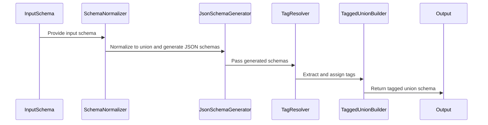
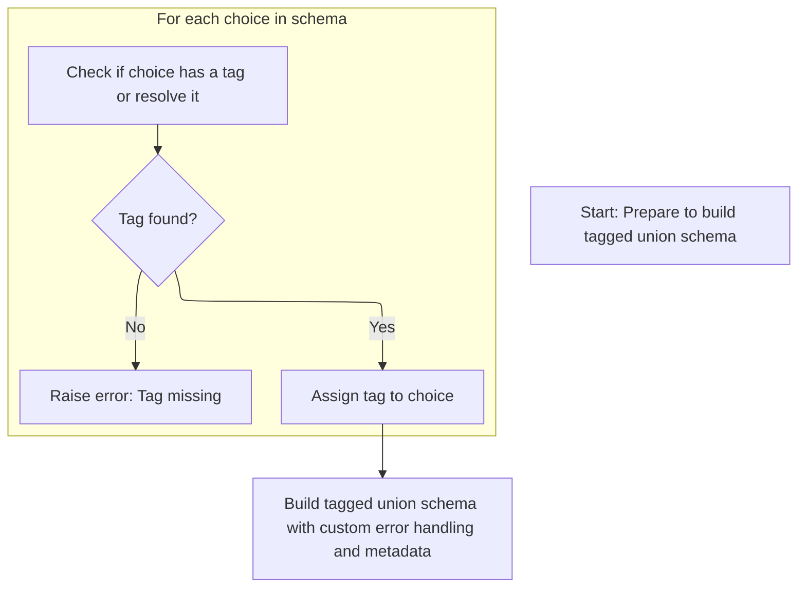

This document describes the process of converting input schemas into a tagged union schema that supports discriminator-based validation.

The main steps are:

- Normalize input into a union schema
- Generate JSON schemas for union choices
- Extract or resolve tags for discrimination
- Build the tagged union schema with metadata and error info



# Spec

## Detailed View of the Program's Functionality

a. Normalizing and Preparing the Input Schema

The process begins by ensuring that the input schema is in a consistent format for union handling. If the schema is not already a union type, it is wrapped into a <SwmToken path="pydantic/types.py" pos="3079:19:21" line-data="            # This likely indicates that the schema was a single-item union that was simplified.">`single-item`</SwmToken> union schema. This normalization step guarantees that all subsequent logic can treat the schema as a union, even if it originally represented only a single type. This is particularly important because earlier simplification steps might have reduced a union to a single type, but for discrimination and tagging logic, the union structure must be preserved.

b. Generating JSON Schema for Union Types

Once the schema is normalized as a union, the system proceeds to generate the JSON schema for each possible choice within the union. For each choice:

- It checks if the schema is valid for JSON schema generation.
- If valid, it generates and collects the JSON schema for that choice.
- If not valid (for example, if the type cannot be represented in JSON schema), it skips that choice and may emit a warning.
- This process continues for all choices in the union.

After processing all choices:

- If only one valid schema was generated, it returns that schema directly.
- If multiple valid schemas were generated, it combines them using the <SwmToken path="pydantic/types.py" pos="1164:6:6" line-data="        field_schema.pop(&#39;anyOf&#39;, None)  # remove the bytes/str union">`anyOf`</SwmToken> construct, which is the standard way to represent unions in JSON schema. This combination is flattened to avoid unnecessary nesting.

c. Tag Extraction and Discriminator Resolution

After generating the union schema, the next step is to prepare for discrimination between the union choices. This involves:

- Iterating over each choice in the union.
- Attempting to extract a unique tag for each choice, which will be used as the discriminator value.
  - If the choice is a tuple, it may already have an explicit tag.
  - If not, the system checks for metadata that might specify the tag.
  - If the tag is still not found and the choice is a reference (such as a type alias), it attempts to resolve the reference and extract the tag from the resolved schema.
  - If no tag can be found after all these attempts, an error is raised, indicating that every choice in a callable-discriminated union must have a tag.
- Each tag is mapped to its corresponding choice, building a dictionary of tagged union choices.

d. Producing the Final Tagged Union Schema

With all choices tagged, the system constructs the final tagged union schema. This schema includes:

- The mapping of tags to their respective choices.
- The discriminator logic (which may be a callable or a field name).
- Any custom error type, message, or context specified either in the discriminator or inherited from the original schema.
- Additional metadata, strictness, references, and serialization information from the original schema.

The resulting tagged union schema is now fully prepared for downstream use, supporting both validation and JSON schema generation with correct discrimination between union choices. This ensures that, at runtime and in generated documentation, the system can accurately distinguish between different types within the union based on the provided tags and discriminator logic.

# Rule Definition

| Paragraph Name                                                                                                                                                                                                                                                                                                                                                                                                                                                                                                                                                                                                                                                                                                                                                                                                                                                                                                                                                                        | Rule ID | Category          | Description                                                                                                                                                                                                                                                                                                                                                                                                                                                         | Conditions                                                                                                                                                                                                                                                          | Remarks                                                                                                                                                                                                                                                                                                                                                                                                                                                                                                                                                                                                                   |
| ------------------------------------------------------------------------------------------------------------------------------------------------------------------------------------------------------------------------------------------------------------------------------------------------------------------------------------------------------------------------------------------------------------------------------------------------------------------------------------------------------------------------------------------------------------------------------------------------------------------------------------------------------------------------------------------------------------------------------------------------------------------------------------------------------------------------------------------------------------------------------------------------------------------------------------------------------------------------------------- | ------- | ----------------- | ------------------------------------------------------------------------------------------------------------------------------------------------------------------------------------------------------------------------------------------------------------------------------------------------------------------------------------------------------------------------------------------------------------------------------------------------------------------- | ------------------------------------------------------------------------------------------------------------------------------------------------------------------------------------------------------------------------------------------------------------------- | ------------------------------------------------------------------------------------------------------------------------------------------------------------------------------------------------------------------------------------------------------------------------------------------------------------------------------------------------------------------------------------------------------------------------------------------------------------------------------------------------------------------------------------------------------------------------------------------------------------------------- |
| The system should accept an input schema represented as a dictionary with at least the keys 'type' (with value 'union') and 'choices' (a list of possible schemas). The system must normalize the input so that if the schema is not already a union, it is wrapped as a union with a single choice.                                                                                                                                                                                                                                                                                                                                                                                                                                                                                                                                                                                                                                                                                  | RL-001  | Data Assignment   | If the input schema is not a union, it must be wrapped as a union with a single choice.                                                                                                                                                                                                                                                                                                                                                                             | Input schema is not a union (<SwmToken path="pydantic/json_schema.py" pos="165:14:16" line-data="            # if it introduces no ambiguity, i.e., there is only one distinct schema for that DefsRef.">`i.e`</SwmToken>., 'type' != 'union').                     | The normalized schema must have 'type': 'union' and 'choices': \[<SwmToken path="pydantic/types.py" pos="3076:4:4" line-data="        self, original_schema: core_schema.CoreSchema, handler: GetCoreSchemaHandler \| None = None">`original_schema`</SwmToken>\].                                                                                                                                                                                                                                                                                                                                                        |
| Each item in the 'choices' list may be a schema dictionary or a tuple (schema_dict, tag). If a choice is a tuple, the second element must be used as the tag. If a choice is a dictionary and contains a 'metadata' key with a subkey <SwmToken path="pydantic/types.py" pos="3092:10:10" line-data="                tag = metadata.get(&#39;pydantic_internal_union_tag_key&#39;) or tag">`pydantic_internal_union_tag_key`</SwmToken>, the value of that subkey must be used as the tag. If a choice is a reference to another schema, the system must attempt to resolve the reference and extract the tag using the same rules. If a tag cannot be determined for a choice, the system must not include that choice in the output and must indicate that a tag is required for all choices in a tagged union.                                                                                                                                                                     | RL-002  | Conditional Logic | For each choice, extract the tag according to the rules. If no tag can be determined, skip the choice and indicate an error.                                                                                                                                                                                                                                                                                                                                        | Choice is a tuple, or a dict with metadata, or a reference.                                                                                                                                                                                                         | Tag must be a string or hashable value. If missing, the choice is skipped and an error is indicated (<SwmToken path="pydantic/types.py" pos="917:27:29" line-data="        Attributes of modules may be separated from the module by `:` or `.`, e.g. if `&#39;math:cos&#39;` is provided,">`e.g`</SwmToken>., via warning or error message).                                                                                                                                                                                                                                                                             |
| If a choice is a reference to another schema, the system must attempt to resolve the reference and extract the tag using the same rules.                                                                                                                                                                                                                                                                                                                                                                                                                                                                                                                                                                                                                                                                                                                                                                                                                                              | RL-003  | Conditional Logic | When a choice is a reference, resolve it and apply tag extraction rules recursively.                                                                                                                                                                                                                                                                                                                                                                                | Choice is a reference (<SwmToken path="pydantic/types.py" pos="917:27:29" line-data="        Attributes of modules may be separated from the module by `:` or `.`, e.g. if `&#39;math:cos&#39;` is provided,">`e.g`</SwmToken>., contains a reference key or type). | Reference resolution must be recursive and follow the same tag extraction logic as direct choices.                                                                                                                                                                                                                                                                                                                                                                                                                                                                                                                        |
| If a tag cannot be determined for a choice, the system must not include that choice in the output and must indicate that a tag is required for all choices in a tagged union. For each choice in the union, the system must determine if the schema is valid for JSON Schema generation. If a schema cannot be represented as JSON Schema, it must be skipped and not included in the output.                                                                                                                                                                                                                                                                                                                                                                                                                                                                                                                                                                                         | RL-004  | Conditional Logic | Choices without a tag or not valid for JSON Schema are skipped and not included in the output.                                                                                                                                                                                                                                                                                                                                                                      | Choice has no tag or is not valid for JSON Schema.                                                                                                                                                                                                                  | Validity for JSON Schema is determined by Pydantic rules. Skipped choices should be logged or reported.                                                                                                                                                                                                                                                                                                                                                                                                                                                                                                                   |
| For each valid choice, the system must generate the corresponding JSON Schema representation.                                                                                                                                                                                                                                                                                                                                                                                                                                                                                                                                                                                                                                                                                                                                                                                                                                                                                         | RL-005  | Computation       | Generate JSON Schema for each valid choice using Pydantic's JSON Schema generation logic.                                                                                                                                                                                                                                                                                                                                                                           | Choice is valid and has a tag (if required).                                                                                                                                                                                                                        | Output must be a valid JSON Schema dictionary for each choice.                                                                                                                                                                                                                                                                                                                                                                                                                                                                                                                                                            |
| If only one valid schema remains after filtering, the system must return that schema as the output. If multiple valid schemas remain, the system must return a JSON Schema dictionary using the <SwmToken path="pydantic/types.py" pos="1164:6:6" line-data="        field_schema.pop(&#39;anyOf&#39;, None)  # remove the bytes/str union">`anyOf`</SwmToken> keyword, with the value being a list of the generated schemas.                                                                                                                                                                                                                                                                                                                                                                                                                                                                                                                                                         | RL-006  | Conditional Logic | If one valid schema, return it directly. If multiple, return {<SwmToken path="pydantic/types.py" pos="1164:6:6" line-data="        field_schema.pop(&#39;anyOf&#39;, None)  # remove the bytes/str union">`anyOf`</SwmToken>: \[schemas\]}                                                                                                                                                                                                                          | Number of valid schemas after filtering.                                                                                                                                                                                                                            | Output is a JSON Schema dict. For multiple schemas: {<SwmToken path="pydantic/types.py" pos="1164:6:6" line-data="        field_schema.pop(&#39;anyOf&#39;, None)  # remove the bytes/str union">`anyOf`</SwmToken>: \[schema1, schema2, ...\]}                                                                                                                                                                                                                                                                                                                                                                           |
| If the union is a discriminated (tagged) union, the system must: Return a JSON Schema dictionary using the <SwmToken path="pydantic/json_schema.py" pos="1237:27:27" line-data="            # Thanks to the equality check against `null_schema` above, I think &#39;oneOf&#39; would also be valid here;">`oneOf`</SwmToken> keyword, with the value being a list of the generated schemas. Include a discriminator field in the output, which must be a dictionary containing: <SwmToken path="pydantic/json_schema.py" pos="1297:2:2" line-data="                &#39;propertyName&#39;: openapi_discriminator,">`propertyName`</SwmToken>: the name of the discriminator field; mapping: a dictionary mapping each tag to a schema reference (<SwmToken path="pydantic/types.py" pos="917:27:29" line-data="        Attributes of modules may be separated from the module by `:` or `.`, e.g. if `&#39;math:cos&#39;` is provided,">`e.g`</SwmToken>., '#/$defs/SchemaForTag1'). | RL-007  | Conditional Logic | For tagged unions, output uses <SwmToken path="pydantic/json_schema.py" pos="1237:27:27" line-data="            # Thanks to the equality check against `null_schema` above, I think &#39;oneOf&#39; would also be valid here;">`oneOf`</SwmToken> and includes a discriminator field with <SwmToken path="pydantic/json_schema.py" pos="1297:2:2" line-data="                &#39;propertyName&#39;: openapi_discriminator,">`propertyName`</SwmToken> and mapping. | Union is a tagged/discriminated union.                                                                                                                                                                                                                              | Output format: {<SwmToken path="pydantic/json_schema.py" pos="1237:27:27" line-data="            # Thanks to the equality check against `null_schema` above, I think &#39;oneOf&#39; would also be valid here;">`oneOf`</SwmToken>: \[schemas\], 'discriminator': {<SwmToken path="pydantic/json_schema.py" pos="1297:2:2" line-data="                &#39;propertyName&#39;: openapi_discriminator,">`propertyName`</SwmToken>: <field>, 'mapping': {tag: <SwmToken path="pydantic/json_schema.py" pos="2028:10:10" line-data="        core_ref = CoreRef(schema[&#39;schema_ref&#39;])">`schema_ref`</SwmToken>, ...}}} |
| Any custom error messages or metadata present in the original schema must be preserved and included in the output schema where applicable.                                                                                                                                                                                                                                                                                                                                                                                                                                                                                                                                                                                                                                                                                                                                                                                                                                            | RL-008  | Data Assignment   | Custom error messages and metadata from the input schema must be copied to the output JSON Schema.                                                                                                                                                                                                                                                                                                                                                                  | Custom error messages or metadata are present in the input schema.                                                                                                                                                                                                  | Metadata and error messages should be included in the output JSON Schema in the appropriate fields.                                                                                                                                                                                                                                                                                                                                                                                                                                                                                                                       |

# User Stories

## User Story 1: Schema normalization and metadata preservation

---

### Story Description:

As a system user, I want the system to accept any input schema and normalize it to a union schema if necessary, while preserving any custom error messages or metadata, so that the schema can be processed consistently and important information is not lost.

---

### Business Rule Mapping:

| Rule ID | Paragraph Name                                                                                                                                                                                                                                                                                       | Rule Description                                                                                   |
| ------- | ---------------------------------------------------------------------------------------------------------------------------------------------------------------------------------------------------------------------------------------------------------------------------------------------------- | -------------------------------------------------------------------------------------------------- |
| RL-001  | The system should accept an input schema represented as a dictionary with at least the keys 'type' (with value 'union') and 'choices' (a list of possible schemas). The system must normalize the input so that if the schema is not already a union, it is wrapped as a union with a single choice. | If the input schema is not a union, it must be wrapped as a union with a single choice.            |
| RL-008  | Any custom error messages or metadata present in the original schema must be preserved and included in the output schema where applicable.                                                                                                                                                           | Custom error messages and metadata from the input schema must be copied to the output JSON Schema. |

---

### Relevant Functionality:

- **The system should accept an input schema represented as a dictionary with at least the keys 'type' (with value 'union') and 'choices' (a list of possible schemas). The system must normalize the input so that if the schema is not already a union**
  1. **RL-001:**
     - If <SwmToken path="pydantic/json_schema.py" pos="1107:16:16" line-data="        if self.mode == &#39;validation&#39; and (input_schema := schema.get(&#39;json_schema_input_schema&#39;)):">`input_schema`</SwmToken>\['type'\] != 'union':
       - <SwmToken path="pydantic/json_schema.py" pos="1107:16:16" line-data="        if self.mode == &#39;validation&#39; and (input_schema := schema.get(&#39;json_schema_input_schema&#39;)):">`input_schema`</SwmToken> = {'type': 'union', 'choices': \[<SwmToken path="pydantic/json_schema.py" pos="1107:16:16" line-data="        if self.mode == &#39;validation&#39; and (input_schema := schema.get(&#39;json_schema_input_schema&#39;)):">`input_schema`</SwmToken>\]}
- **Any custom error messages or metadata present in the original schema must be preserved and included in the output schema where applicable.**
  1. **RL-008:**
     - For each schema and field:
       - If custom error messages or metadata are present:
         - Copy them to the output JSON Schema

## User Story 2: Tag extraction and validation for union choices

---

### Story Description:

As a system user, I want the system to extract tags for each choice in a union according to the defined rules (tuple, metadata, or reference), and skip any choices that lack a valid tag or cannot be represented as JSON Schema, so that only valid and properly tagged choices are included in the output and errors are clearly indicated.

---

### Business Rule Mapping:

| Rule ID | Paragraph Name                                                                                                                                                                                                                                                                                                                                                                                                                                                                                                                                                                                                                                                                                                                                                                                                    | Rule Description                                                                                                             |
| ------- | ----------------------------------------------------------------------------------------------------------------------------------------------------------------------------------------------------------------------------------------------------------------------------------------------------------------------------------------------------------------------------------------------------------------------------------------------------------------------------------------------------------------------------------------------------------------------------------------------------------------------------------------------------------------------------------------------------------------------------------------------------------------------------------------------------------------- | ---------------------------------------------------------------------------------------------------------------------------- |
| RL-002  | Each item in the 'choices' list may be a schema dictionary or a tuple (schema_dict, tag). If a choice is a tuple, the second element must be used as the tag. If a choice is a dictionary and contains a 'metadata' key with a subkey <SwmToken path="pydantic/types.py" pos="3092:10:10" line-data="                tag = metadata.get(&#39;pydantic_internal_union_tag_key&#39;) or tag">`pydantic_internal_union_tag_key`</SwmToken>, the value of that subkey must be used as the tag. If a choice is a reference to another schema, the system must attempt to resolve the reference and extract the tag using the same rules. If a tag cannot be determined for a choice, the system must not include that choice in the output and must indicate that a tag is required for all choices in a tagged union. | For each choice, extract the tag according to the rules. If no tag can be determined, skip the choice and indicate an error. |
| RL-003  | If a choice is a reference to another schema, the system must attempt to resolve the reference and extract the tag using the same rules.                                                                                                                                                                                                                                                                                                                                                                                                                                                                                                                                                                                                                                                                          | When a choice is a reference, resolve it and apply tag extraction rules recursively.                                         |
| RL-004  | If a tag cannot be determined for a choice, the system must not include that choice in the output and must indicate that a tag is required for all choices in a tagged union. For each choice in the union, the system must determine if the schema is valid for JSON Schema generation. If a schema cannot be represented as JSON Schema, it must be skipped and not included in the output.                                                                                                                                                                                                                                                                                                                                                                                                                     | Choices without a tag or not valid for JSON Schema are skipped and not included in the output.                               |

---

### Relevant Functionality:

- **Each item in the 'choices' list may be a schema dictionary or a tuple (schema_dict**
  1. **RL-002:**
     - For each choice in choices:
       - If choice is a tuple: tag = choice\[1\]
       - Else if choice is dict and 'metadata' in choice and <SwmToken path="pydantic/types.py" pos="3092:10:10" line-data="                tag = metadata.get(&#39;pydantic_internal_union_tag_key&#39;) or tag">`pydantic_internal_union_tag_key`</SwmToken> in choice\['metadata'\]: tag = choice\['metadata'\]\[<SwmToken path="pydantic/types.py" pos="3092:10:10" line-data="                tag = metadata.get(&#39;pydantic_internal_union_tag_key&#39;) or tag">`pydantic_internal_union_tag_key`</SwmToken>\]
       - Else if choice is a reference: resolve reference and repeat extraction
       - If tag is None: skip choice and record error
- **If a choice is a reference to another schema**
  1. **RL-003:**
     - If choice is a reference:
       - Resolve the reference to obtain the actual schema
       - Apply tag extraction rules to the resolved schema
- **If a tag cannot be determined for a choice**
  1. **RL-004:**
     - For each choice:
       - If tag is None or schema is not valid for JSON Schema:
         - Skip choice and record warning/error

## User Story 3: JSON Schema generation and output formatting

---

### Story Description:

As a system user, I want the system to generate valid JSON Schemas for all valid and tagged choices, and return the output as a single schema, an <SwmToken path="pydantic/types.py" pos="1164:6:6" line-data="        field_schema.pop(&#39;anyOf&#39;, None)  # remove the bytes/str union">`anyOf`</SwmToken> schema, or a <SwmToken path="pydantic/json_schema.py" pos="1237:27:27" line-data="            # Thanks to the equality check against `null_schema` above, I think &#39;oneOf&#39; would also be valid here;">`oneOf`</SwmToken> schema with a discriminator field as appropriate, so that the output conforms to the JSON Schema specification and supports discriminated unions where needed.

---

### Business Rule Mapping:

| Rule ID | Paragraph Name                                                                                                                                                                                                                                                                                                                                                                                                                                                                                                                                                                                                                                                                                                                                                                                                                                                                                                                                                                        | Rule Description                                                                                                                                                                                                                                                                                                                                                                                                                                                    |
| ------- | ------------------------------------------------------------------------------------------------------------------------------------------------------------------------------------------------------------------------------------------------------------------------------------------------------------------------------------------------------------------------------------------------------------------------------------------------------------------------------------------------------------------------------------------------------------------------------------------------------------------------------------------------------------------------------------------------------------------------------------------------------------------------------------------------------------------------------------------------------------------------------------------------------------------------------------------------------------------------------------- | ------------------------------------------------------------------------------------------------------------------------------------------------------------------------------------------------------------------------------------------------------------------------------------------------------------------------------------------------------------------------------------------------------------------------------------------------------------------- |
| RL-005  | For each valid choice, the system must generate the corresponding JSON Schema representation.                                                                                                                                                                                                                                                                                                                                                                                                                                                                                                                                                                                                                                                                                                                                                                                                                                                                                         | Generate JSON Schema for each valid choice using Pydantic's JSON Schema generation logic.                                                                                                                                                                                                                                                                                                                                                                           |
| RL-006  | If only one valid schema remains after filtering, the system must return that schema as the output. If multiple valid schemas remain, the system must return a JSON Schema dictionary using the <SwmToken path="pydantic/types.py" pos="1164:6:6" line-data="        field_schema.pop(&#39;anyOf&#39;, None)  # remove the bytes/str union">`anyOf`</SwmToken> keyword, with the value being a list of the generated schemas.                                                                                                                                                                                                                                                                                                                                                                                                                                                                                                                                                         | If one valid schema, return it directly. If multiple, return {<SwmToken path="pydantic/types.py" pos="1164:6:6" line-data="        field_schema.pop(&#39;anyOf&#39;, None)  # remove the bytes/str union">`anyOf`</SwmToken>: \[schemas\]}                                                                                                                                                                                                                          |
| RL-007  | If the union is a discriminated (tagged) union, the system must: Return a JSON Schema dictionary using the <SwmToken path="pydantic/json_schema.py" pos="1237:27:27" line-data="            # Thanks to the equality check against `null_schema` above, I think &#39;oneOf&#39; would also be valid here;">`oneOf`</SwmToken> keyword, with the value being a list of the generated schemas. Include a discriminator field in the output, which must be a dictionary containing: <SwmToken path="pydantic/json_schema.py" pos="1297:2:2" line-data="                &#39;propertyName&#39;: openapi_discriminator,">`propertyName`</SwmToken>: the name of the discriminator field; mapping: a dictionary mapping each tag to a schema reference (<SwmToken path="pydantic/types.py" pos="917:27:29" line-data="        Attributes of modules may be separated from the module by `:` or `.`, e.g. if `&#39;math:cos&#39;` is provided,">`e.g`</SwmToken>., '#/$defs/SchemaForTag1'). | For tagged unions, output uses <SwmToken path="pydantic/json_schema.py" pos="1237:27:27" line-data="            # Thanks to the equality check against `null_schema` above, I think &#39;oneOf&#39; would also be valid here;">`oneOf`</SwmToken> and includes a discriminator field with <SwmToken path="pydantic/json_schema.py" pos="1297:2:2" line-data="                &#39;propertyName&#39;: openapi_discriminator,">`propertyName`</SwmToken> and mapping. |

---

### Relevant Functionality:

- **For each valid choice**
  1. **RL-005:**
     - For each valid choice:
       - Generate JSON Schema representation
- **If only one valid schema remains after filtering**
  1. **RL-006:**
     - If len(valid_schemas) == 1:
       - Return valid_schemas\[0\]
     - Else:
       - Return {<SwmToken path="pydantic/types.py" pos="1164:6:6" line-data="        field_schema.pop(&#39;anyOf&#39;, None)  # remove the bytes/str union">`anyOf`</SwmToken>: valid_schemas}
- **If the union is a discriminated (tagged) union**
  1. **RL-007:**
     - If union is tagged/discriminated:
       - Output = {<SwmToken path="pydantic/json_schema.py" pos="1237:27:27" line-data="            # Thanks to the equality check against `null_schema` above, I think &#39;oneOf&#39; would also be valid here;">`oneOf`</SwmToken>: \[schemas\], 'discriminator': {<SwmToken path="pydantic/json_schema.py" pos="1297:2:2" line-data="                &#39;propertyName&#39;: openapi_discriminator,">`propertyName`</SwmToken>: discriminator_field, 'mapping': {tag: <SwmToken path="pydantic/json_schema.py" pos="2028:10:10" line-data="        core_ref = CoreRef(schema[&#39;schema_ref&#39;])">`schema_ref`</SwmToken>, ...}}}

# Code Walkthrough

## Normalizing and Preparing the Input Schema

```mermaid
%%{init: {"flowchart": {"defaultRenderer": "elk"}} }%%
flowchart TD
  node1["Ensure input is a union schema for consistent handling"] --> node2["Assign unique tags to each union choice for correct discrimination"]
  click node1 openCode "pydantic/types.py:3075:3083"
  node2 --> node3["Produce final tagged union schema with custom error messages and metadata"]
  click node2 openCode "pydantic/types.py:3085:3111"
  click node3 openCode "pydantic/types.py:3111:3137"


subgraph node2 [union_schema]
  sgmain_1_node1["Start: Receive union of schemas"]
  click sgmain_1_node1 openCode "pydantic/json_schema.py:1241:1252"
  subgraph sgmain_1_loop1["For each possible schema in the union"]
  sgmain_1_node1 --> sgmain_1_node2{"Is schema valid for JSON?"}
  click sgmain_1_node2 openCode "pydantic/json_schema.py:1253:1261"
  sgmain_1_node2 -->|"Yes"| sgmain_1_node3["Generate and collect JSON schema"]
  click sgmain_1_node3 openCode "pydantic/json_schema.py:1257:1257"
  sgmain_1_node2 -->|"No"| sgmain_1_node4["Skip invalid schema"]
  click sgmain_1_node4 openCode "pydantic/json_schema.py:1258:1261"
  sgmain_1_node3 --> sgmain_1_node5
  sgmain_1_node4 --> sgmain_1_node5
  sgmain_1_node5 --> sgmain_1_node2
  end
  sgmain_1_node5 --> sgmain_1_node6{"Number of valid schemas"}
  click sgmain_1_node6 openCode "pydantic/json_schema.py:1262:1264"
  sgmain_1_node6 -->|"One"| sgmain_1_node7["Return single schema"]
  click sgmain_1_node7 openCode "pydantic/json_schema.py:1263:1263"
  sgmain_1_node6 -->|"Multiple"| sgmain_1_node8["Return union schema (anyOf)"]
  click sgmain_1_node8 openCode "pydantic/json_schema.py:1264:1264"
end

%% Swimm:
%% %%{init: {"flowchart": {"defaultRenderer": "elk"}} }%%
%% flowchart TD
%%   node1["Ensure input is a union schema for consistent handling"] --> node2["Assign unique tags to each union choice for correct discrimination"]
%%   click node1 openCode "<SwmPath>[pydantic/types.py](pydantic/types.py)</SwmPath>:3075:3083"
%%   node2 --> node3["Produce final tagged union schema with custom error messages and metadata"]
%%   click node2 openCode "<SwmPath>[pydantic/types.py](pydantic/types.py)</SwmPath>:3085:3111"
%%   click node3 openCode "<SwmPath>[pydantic/types.py](pydantic/types.py)</SwmPath>:3111:3137"
%% 
%% 
%% subgraph node2 [<SwmToken path="pydantic/types.py" pos="3083:7:7" line-data="            original_schema = core_schema.union_schema([original_schema])">`union_schema`</SwmToken>]
%%   sgmain_1_node1["Start: Receive union of schemas"]
%%   click sgmain_1_node1 openCode "<SwmPath>[pydantic/json_schema.py](pydantic/json_schema.py)</SwmPath>:1241:1252"
%%   subgraph sgmain_1_loop1["For each possible schema in the union"]
%%   sgmain_1_node1 --> sgmain_1_node2{"Is schema valid for JSON?"}
%%   click sgmain_1_node2 openCode "<SwmPath>[pydantic/json_schema.py](pydantic/json_schema.py)</SwmPath>:1253:1261"
%%   sgmain_1_node2 -->|"Yes"| sgmain_1_node3["Generate and collect JSON schema"]
%%   click sgmain_1_node3 openCode "<SwmPath>[pydantic/json_schema.py](pydantic/json_schema.py)</SwmPath>:1257:1257"
%%   sgmain_1_node2 -->|"No"| sgmain_1_node4["Skip invalid schema"]
%%   click sgmain_1_node4 openCode "<SwmPath>[pydantic/json_schema.py](pydantic/json_schema.py)</SwmPath>:1258:1261"
%%   sgmain_1_node3 --> sgmain_1_node5
%%   sgmain_1_node4 --> sgmain_1_node5
%%   sgmain_1_node5 --> sgmain_1_node2
%%   end
%%   sgmain_1_node5 --> sgmain_1_node6{"Number of valid schemas"}
%%   click sgmain_1_node6 openCode "<SwmPath>[pydantic/json_schema.py](pydantic/json_schema.py)</SwmPath>:1262:1264"
%%   sgmain_1_node6 -->|"One"| sgmain_1_node7["Return single schema"]
%%   click sgmain_1_node7 openCode "<SwmPath>[pydantic/json_schema.py](pydantic/json_schema.py)</SwmPath>:1263:1263"
%%   sgmain_1_node6 -->|"Multiple"| sgmain_1_node8["Return union schema (<SwmToken path="pydantic/types.py" pos="1164:6:6" line-data="        field_schema.pop(&#39;anyOf&#39;, None)  # remove the bytes/str union">`anyOf`</SwmToken>)"]
%%   click sgmain_1_node8 openCode "<SwmPath>[pydantic/json_schema.py](pydantic/json_schema.py)</SwmPath>:1264:1264"
%% end
```



<SwmSnippet path="/pydantic/types.py" line="3075">

---

In <SwmToken path="pydantic/types.py" pos="3075:3:3" line-data="    def _convert_schema(">`_convert_schema`</SwmToken>, we check if the input schema isn't already a union. If it's not, we wrap it into a <SwmToken path="pydantic/types.py" pos="3079:19:21" line-data="            # This likely indicates that the schema was a single-item union that was simplified.">`single-item`</SwmToken> union schema. This way, even if a union got simplified earlier, we still treat it as a union for the rest of the flow. Next, we call <SwmToken path="pydantic/types.py" pos="3083:7:7" line-data="            original_schema = core_schema.union_schema([original_schema])">`union_schema`</SwmToken> to generate the JSON schema for this normalized union structure.

```python
    def _convert_schema(
        self, original_schema: core_schema.CoreSchema, handler: GetCoreSchemaHandler | None = None
    ) -> core_schema.TaggedUnionSchema:
        if original_schema['type'] != 'union':
            # This likely indicates that the schema was a single-item union that was simplified.
            # In this case, we do the same thing we do in
            # `pydantic._internal._discriminated_union._ApplyInferredDiscriminator._apply_to_root`, namely,
            # package the generated schema back into a single-item union.
            original_schema = core_schema.union_schema([original_schema])

```

---

</SwmSnippet>

### Generating JSON Schema for Union Types

```mermaid
%%{init: {"flowchart": {"defaultRenderer": "elk"}} }%%
flowchart TD
    node1["Start: Receive union of schemas"]
    click node1 openCode "pydantic/json_schema.py:1241:1252"
    
    subgraph loop1["For each possible schema in the union"]
        node1 --> node2{"Is schema valid for JSON?"}
        click node2 openCode "pydantic/json_schema.py:1253:1261"
        node2 -->|"Yes"| node3["Generate and collect JSON schema"]
        click node3 openCode "pydantic/json_schema.py:1257:1257"
        node2 -->|"No"| node4["Skip invalid schema"]
        click node4 openCode "pydantic/json_schema.py:1258:1261"
        node3 --> node5
        node4 --> node5
        node5 --> node2
    end
    node5 --> node6{"Number of valid schemas"}
    click node6 openCode "pydantic/json_schema.py:1262:1264"
    node6 -->|"One"| node7["Return single schema"]
    click node7 openCode "pydantic/json_schema.py:1263:1263"
    node6 -->|"Multiple"| node8["Return union schema (anyOf)"]
    click node8 openCode "pydantic/json_schema.py:1264:1264"

%% Swimm:
%% %%{init: {"flowchart": {"defaultRenderer": "elk"}} }%%
%% flowchart TD
%%     node1["Start: Receive union of schemas"]
%%     click node1 openCode "<SwmPath>[pydantic/json_schema.py](pydantic/json_schema.py)</SwmPath>:1241:1252"
%%     
%%     subgraph loop1["For each possible schema in the union"]
%%         node1 --> node2{"Is schema valid for JSON?"}
%%         click node2 openCode "<SwmPath>[pydantic/json_schema.py](pydantic/json_schema.py)</SwmPath>:1253:1261"
%%         node2 -->|"Yes"| node3["Generate and collect JSON schema"]
%%         click node3 openCode "<SwmPath>[pydantic/json_schema.py](pydantic/json_schema.py)</SwmPath>:1257:1257"
%%         node2 -->|"No"| node4["Skip invalid schema"]
%%         click node4 openCode "<SwmPath>[pydantic/json_schema.py](pydantic/json_schema.py)</SwmPath>:1258:1261"
%%         node3 --> node5
%%         node4 --> node5
%%         node5 --> node2
%%     end
%%     node5 --> node6{"Number of valid schemas"}
%%     click node6 openCode "<SwmPath>[pydantic/json_schema.py](pydantic/json_schema.py)</SwmPath>:1262:1264"
%%     node6 -->|"One"| node7["Return single schema"]
%%     click node7 openCode "<SwmPath>[pydantic/json_schema.py](pydantic/json_schema.py)</SwmPath>:1263:1263"
%%     node6 -->|"Multiple"| node8["Return union schema (<SwmToken path="pydantic/types.py" pos="1164:6:6" line-data="        field_schema.pop(&#39;anyOf&#39;, None)  # remove the bytes/str union">`anyOf`</SwmToken>)"]
%%     click node8 openCode "<SwmPath>[pydantic/json_schema.py](pydantic/json_schema.py)</SwmPath>:1264:1264"
```



<SwmSnippet path="/pydantic/json_schema.py" line="1241">

---

In <SwmToken path="pydantic/json_schema.py" pos="1241:3:3" line-data="    def union_schema(self, schema: core_schema.UnionSchema) -&gt; JsonSchemaValue:">`union_schema`</SwmToken>, we process each union choice, handling both plain schemas and labeled tuples, and generate their JSON schemas.

```python
    def union_schema(self, schema: core_schema.UnionSchema) -> JsonSchemaValue:
        """Generates a JSON schema that matches a schema that allows values matching any of the given schemas.

        Args:
            schema: The core schema.

        Returns:
            The generated JSON schema.
        """
        generated: list[JsonSchemaValue] = []

        choices = schema['choices']
        for choice in choices:
            # choice will be a tuple if an explicit label was provided
            choice_schema = choice[0] if isinstance(choice, tuple) else choice
            try:
                generated.append(self.generate_inner(choice_schema))
            except PydanticOmit:
                continue
            except PydanticInvalidForJsonSchema as exc:
                self.emit_warning('skipped-choice', exc.message)
```

---

</SwmSnippet>

<SwmSnippet path="/pydantic/json_schema.py" line="1261">

---

After generating all the JSON schemas for the union choices, if there's only one, we just return it as-is. If there are multiple, we combine them using a flattened <SwmToken path="pydantic/types.py" pos="1164:6:6" line-data="        field_schema.pop(&#39;anyOf&#39;, None)  # remove the bytes/str union">`anyOf`</SwmToken>, which is the standard way to represent unions in JSON schema.

```python
                self.emit_warning('skipped-choice', exc.message)
        if len(generated) == 1:
            return generated[0]
        return self.get_flattened_anyof(generated)
```

---

</SwmSnippet>

### Tag Extraction and Discriminator Resolution



<SwmSnippet path="/pydantic/types.py" line="3085">

---

Back in <SwmToken path="pydantic/types.py" pos="3075:3:3" line-data="    def _convert_schema(">`_convert_schema`</SwmToken> after getting the union schema, we go through each union choice to extract a tag for the discriminator. If the tag isn't directly available, we try to resolve it from metadata or by resolving references. If we can't find a tag, we raise an error. This guarantees every union choice is tagged for the discriminator logic.

```python
        tagged_union_choices = {}
        for choice in original_schema['choices']:
            tag = None
            if isinstance(choice, tuple):
                choice, tag = choice
            metadata = cast('CoreMetadata | None', choice.get('metadata'))
            if metadata is not None:
                tag = metadata.get('pydantic_internal_union_tag_key') or tag
            if tag is None:
                # `handler` is None when this method is called from `apply_discriminator()` (deferred discriminators)
                if handler is not None and choice['type'] == 'definition-ref':
                    # If choice was built from a PEP 695 type alias, try to resolve the def:
                    try:
                        choice = handler.resolve_ref_schema(choice)
                    except LookupError:
                        pass
                    else:
                        metadata = cast('CoreMetadata | None', choice.get('metadata'))
                        if metadata is not None:
                            tag = metadata.get('pydantic_internal_union_tag_key')

                if tag is None:
                    raise PydanticUserError(
                        f'`Tag` not provided for choice {choice} used with `Discriminator`',
                        code='callable-discriminator-no-tag',
                    )
            tagged_union_choices[tag] = choice
```

---

</SwmSnippet>

<SwmSnippet path="/pydantic/types.py" line="3111">

---

Finally, <SwmToken path="pydantic/types.py" pos="3075:3:3" line-data="    def _convert_schema(">`_convert_schema`</SwmToken> builds and returns the tagged union schema using the collected choices and their tags, the discriminator, and any custom error info or metadata from the original schema. This output is ready for downstream use.

```python
            tagged_union_choices[tag] = choice

        # Have to do these verbose checks to ensure falsy values ('' and {}) don't get ignored
        custom_error_type = self.custom_error_type
        if custom_error_type is None:
            custom_error_type = original_schema.get('custom_error_type')

        custom_error_message = self.custom_error_message
        if custom_error_message is None:
            custom_error_message = original_schema.get('custom_error_message')

        custom_error_context = self.custom_error_context
        if custom_error_context is None:
            custom_error_context = original_schema.get('custom_error_context')

        custom_error_type = original_schema.get('custom_error_type') if custom_error_type is None else custom_error_type
        return core_schema.tagged_union_schema(
            tagged_union_choices,
            self.discriminator,
            custom_error_type=custom_error_type,
            custom_error_message=custom_error_message,
            custom_error_context=custom_error_context,
            strict=original_schema.get('strict'),
            ref=original_schema.get('ref'),
            metadata=original_schema.get('metadata'),
            serialization=original_schema.get('serialization'),
        )
```

---

</SwmSnippet>

&nbsp;

*This is an auto-generated document by Swimm 🌊 and has not yet been verified by a human*

<SwmMeta version="3.0.0" repo-id="Z2l0aHViJTNBJTNBcHlkYW50aWMlM0ElM0FTd2ltbS1EZW1v" repo-name="pydantic"><sup>Powered by [Swimm](/)</sup></SwmMeta>
