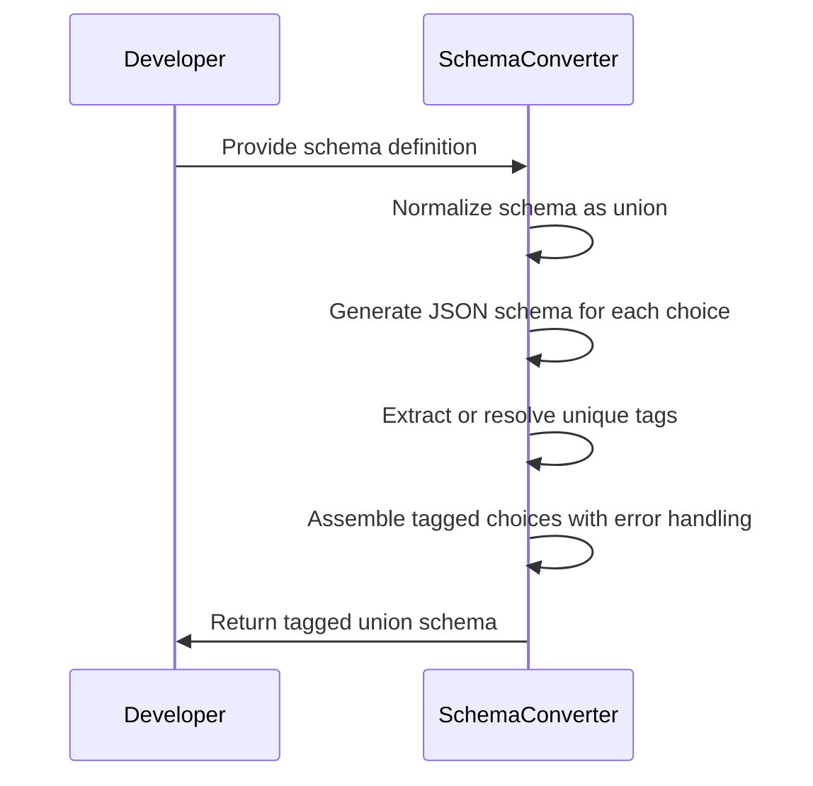
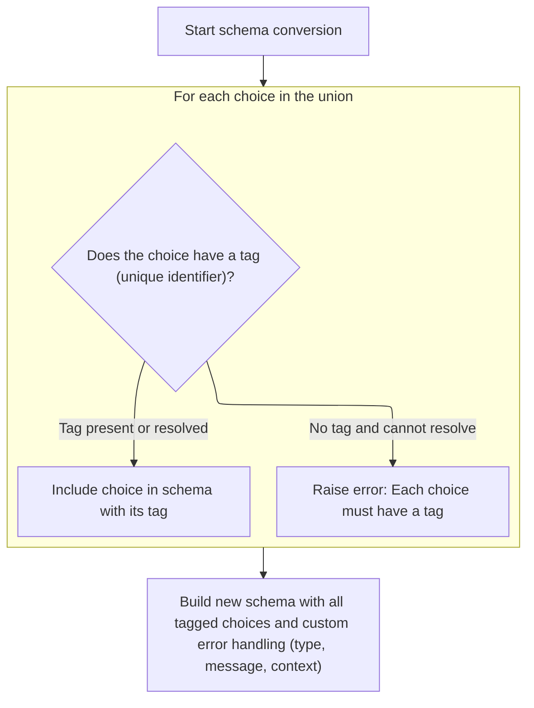
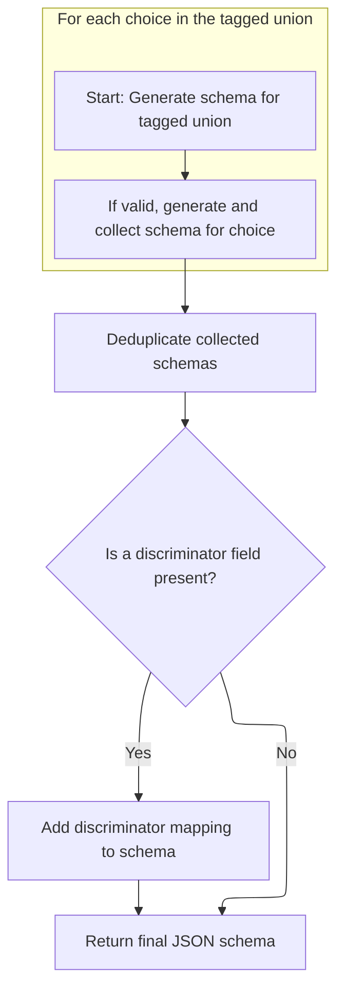

This flow describes how a schema representing a union of types is transformed into a tagged union schema, where each possible type is assigned a unique tag. The process ensures that all choices are normalized, tagged, and assembled into a structure that supports accurate validation and serialization. The main steps include normalizing the schema, generating JSON schemas for each choice, extracting or resolving unique tags, and assembling the final tagged union schema.



# Spec

## Detailed View of the Program's Functionality

a. Normalizing and Preparing Union Schemas

The process begins by determining whether the provided schema is already a union type. If it is not, the schema is wrapped into a union schema containing just the original schema as its only choice. This normalization ensures that subsequent logic can always assume it is working with a union, simplifying the code and avoiding special-case handling for <SwmToken path="pydantic/types.py" pos="3079:19:21" line-data="            # This likely indicates that the schema was a single-item union that was simplified.">`single-item`</SwmToken> unions. Once normalized, the code proceeds to process the union schema as if it were a standard union, regardless of the number of choices.

b. Generating JSON Schema for Union Types

After normalization, the code generates a JSON schema for the union. It iterates over each possible choice in the union. For each choice, it determines whether the choice is valid for JSON schema generation. If it is valid, the code generates the JSON schema for that choice and adds it to a list. If the choice is not valid or should be omitted, it is skipped, and a warning may be emitted. After processing all choices, the code checks how many valid schemas were collected. If only one valid schema is present, it returns that schema directly. If multiple valid schemas are present, it returns a union schema using the <SwmToken path="pydantic/types.py" pos="1164:6:6" line-data="        field_schema.pop(&#39;anyOf&#39;, None)  # remove the bytes/str union">`anyOf`</SwmToken> keyword, which allows any of the collected schemas to match.

c. Building JSON Schema for Individual Choices

For each choice in the union, the code generates its JSON schema. If the choice is a reference to another schema, it returns a reference to the existing JSON schema. Otherwise, it extracts any metadata from the schema, such as updates or extra fields. If updates or extra fields are present, it wraps the schema handler to apply these customizations. The code then applies any modification functions specified in the metadata, wrapping the handler for each function so that customizations are stacked. After all customizations are applied, the handler is called to generate the JSON schema. If the input is a core schema, the code finalizes its definitions to avoid duplicates. The result is a JSON schema that incorporates all metadata-driven customizations.

d. Extracting and Resolving Discriminator Tags

When handling discriminated unions (tagged unions), the code loops through each choice in the union to extract a unique tag. It first checks if the choice is a tuple containing an explicit tag. If not, it looks for a tag in the choice's metadata. If the tag is still not found and the choice is a reference, the code attempts to resolve the reference using the handler and then checks for the tag again. If no tag can be found after these steps, an error is raised, indicating that every choice in a <SwmToken path="pydantic/types.py" pos="3109:4:6" line-data="                        code=&#39;callable-discriminator-no-tag&#39;,">`callable-discriminator`</SwmToken> union must have a tag. This ensures that each union choice is uniquely identifiable for validation and error reporting.

e. Assembling the Tagged Union Schema

After collecting all tagged choices and resolving any custom error information (such as custom error type, message, or context), the code assembles the final tagged union schema. This schema includes the mapping of tags to choices, the discriminator (which may be a field name or a callable), and any custom error handling information. The resulting schema is ready for use in validation and serialization, supporting efficient and accurate discrimination between union choices.

f. Generating JSON Schema for Tagged Unions

When generating the JSON schema for a tagged union, the code iterates over each tagged choice. For each choice, it ensures that the tag is a valid JSON key (converting Enum keys to their values if necessary) and generates the JSON schema for the choice. If a choice cannot be represented, it is skipped. After generating schemas for all valid choices, the code deduplicates the schemas and constructs the final JSON schema using the <SwmToken path="pydantic/json_schema.py" pos="1291:10:10" line-data="        json_schema: JsonSchemaValue = {&#39;oneOf&#39;: one_of_choices}">`oneOf`</SwmToken> keyword. If a discriminator field is present, it adds a discriminator mapping to the schema, which helps <SwmToken path="pydantic/json_schema.py" pos="1293:31:31" line-data="        # This reflects the v1 behavior; TODO: we should make it possible to exclude OpenAPI stuff from the JSON schema">`OpenAPI`</SwmToken> clients map input values to the correct schema. The final JSON schema for the tagged union is then returned, fully supporting both validation and <SwmToken path="pydantic/json_schema.py" pos="1293:31:31" line-data="        # This reflects the v1 behavior; TODO: we should make it possible to exclude OpenAPI stuff from the JSON schema">`OpenAPI`</SwmToken> compatibility.

# Rule Definition

| Paragraph Name                      | Rule ID | Category          | Description                                                                                                                                                                                                                                                                                                                                                                                                                                                                                                                                                                                                                                                                                                                                                                                                                                                                                                                                                                                                                                                                                                                                                                                                                                                                    | Conditions                                                                                                                                                                                                                                            | Remarks                                                                                                                                                                                                                                                                                                                                                                                                                                                                                                                                                                                                                                       |
| ----------------------------------- | ------- | ----------------- | ------------------------------------------------------------------------------------------------------------------------------------------------------------------------------------------------------------------------------------------------------------------------------------------------------------------------------------------------------------------------------------------------------------------------------------------------------------------------------------------------------------------------------------------------------------------------------------------------------------------------------------------------------------------------------------------------------------------------------------------------------------------------------------------------------------------------------------------------------------------------------------------------------------------------------------------------------------------------------------------------------------------------------------------------------------------------------------------------------------------------------------------------------------------------------------------------------------------------------------------------------------------------------ | ----------------------------------------------------------------------------------------------------------------------------------------------------------------------------------------------------------------------------------------------------- | --------------------------------------------------------------------------------------------------------------------------------------------------------------------------------------------------------------------------------------------------------------------------------------------------------------------------------------------------------------------------------------------------------------------------------------------------------------------------------------------------------------------------------------------------------------------------------------------------------------------------------------------- |
| First paragraph                     | RL-001  | Conditional Logic | The system must accept a schema object, which is a dictionary with at least a 'type' key. The 'type' may be 'union', 'tagged-union', or other core schema types.                                                                                                                                                                                                                                                                                                                                                                                                                                                                                                                                                                                                                                                                                                                                                                                                                                                                                                                                                                                                                                                                                                               | Input is a schema object (dictionary).                                                                                                                                                                                                                | The schema must be a dictionary and must contain a 'type' key. Valid types include 'union', 'tagged-union', and others as defined by the system.                                                                                                                                                                                                                                                                                                                                                                                                                                                                                              |
| Second paragraph                    | RL-002  | Conditional Logic | For schemas of type 'union', the schema must have a 'choices' key, which is a list. Each element of this list must be either a schema dictionary or a tuple of (schema dictionary, tag), where tag is a string.                                                                                                                                                                                                                                                                                                                                                                                                                                                                                                                                                                                                                                                                                                                                                                                                                                                                                                                                                                                                                                                                | Schema 'type' is 'union'.                                                                                                                                                                                                                             | 'choices' must be a list. Each element must be a dictionary or a tuple (dictionary, string).                                                                                                                                                                                                                                                                                                                                                                                                                                                                                                                                                  |
| Third paragraph                     | RL-003  | Data Assignment   | If a choice is a tuple, the second element (tag) must be a string and is used as the unique identifier for that choice.                                                                                                                                                                                                                                                                                                                                                                                                                                                                                                                                                                                                                                                                                                                                                                                                                                                                                                                                                                                                                                                                                                                                                        | Choice is a tuple in the 'choices' list.                                                                                                                                                                                                              | Tag must be a string and unique within the union.                                                                                                                                                                                                                                                                                                                                                                                                                                                                                                                                                                                             |
| Fourth paragraph                    | RL-004  | Data Assignment   | If a choice is a schema dictionary and it has a 'metadata' key, the value of 'metadata' must be a dictionary. If present, the tag for this choice must be found under the key <SwmToken path="pydantic/types.py" pos="3092:10:10" line-data="                tag = metadata.get(&#39;pydantic_internal_union_tag_key&#39;) or tag">`pydantic_internal_union_tag_key`</SwmToken> in the metadata dictionary, and must be a string.                                                                                                                                                                                                                                                                                                                                                                                                                                                                                                                                                                                                                                                                                                                                                                                                                                              | Choice is a dictionary with 'metadata' key.                                                                                                                                                                                                           | 'metadata' must be a dictionary. Tag must be found under <SwmToken path="pydantic/types.py" pos="3092:10:10" line-data="                tag = metadata.get(&#39;pydantic_internal_union_tag_key&#39;) or tag">`pydantic_internal_union_tag_key`</SwmToken> and must be a string.                                                                                                                                                                                                                                                                                                                                                              |
| Fifth paragraph                     | RL-005  | Computation       | If a choice is a schema dictionary without a tag in its metadata, and its 'type' is <SwmToken path="pydantic/types.py" pos="3095:23:25" line-data="                if handler is not None and choice[&#39;type&#39;] == &#39;definition-ref&#39;:">`definition-ref`</SwmToken>, the system must attempt to resolve the reference using the provided handler's <SwmToken path="pydantic/types.py" pos="3098:7:7" line-data="                        choice = handler.resolve_ref_schema(choice)">`resolve_ref_schema`</SwmToken>(schema) method, and then check the resolved schema's metadata for the tag under <SwmToken path="pydantic/types.py" pos="3092:10:10" line-data="                tag = metadata.get(&#39;pydantic_internal_union_tag_key&#39;) or tag">`pydantic_internal_union_tag_key`</SwmToken>.                                                                                                                                                                                                                                                                                                                                                                                                                                                             | Choice is a dictionary, no tag in metadata, and 'type' is <SwmToken path="pydantic/types.py" pos="3095:23:25" line-data="                if handler is not None and choice[&#39;type&#39;] == &#39;definition-ref&#39;:">`definition-ref`</SwmToken>. | Handler must provide <SwmToken path="pydantic/types.py" pos="3098:7:7" line-data="                        choice = handler.resolve_ref_schema(choice)">`resolve_ref_schema`</SwmToken>(schema) method. Tag must be extracted from resolved schema's metadata.                                                                                                                                                                                                                                                                                                                                                                                 |
| Sixth paragraph                     | RL-006  | Conditional Logic | If a tag cannot be found for any choice (after reference resolution if applicable), the system must raise an error with the message: '<SwmToken path="pydantic/types.py" pos="3108:4:4" line-data="                        f&#39;`Tag` not provided for choice {choice} used with `Discriminator`&#39;,">`Tag`</SwmToken> not provided for choice {choice} used with <SwmToken path="pydantic/types.py" pos="3108:24:24" line-data="                        f&#39;`Tag` not provided for choice {choice} used with `Discriminator`&#39;,">`Discriminator`</SwmToken>', and the error code <SwmToken path="pydantic/types.py" pos="3109:4:10" line-data="                        code=&#39;callable-discriminator-no-tag&#39;,">`callable-discriminator-no-tag`</SwmToken>.                                                                                                                                                                                                                                                                                                                                                                                                                                                                                                     | No valid tag found for a choice after all extraction attempts.                                                                                                                                                                                        | Error message: '<SwmToken path="pydantic/types.py" pos="3108:4:4" line-data="                        f&#39;`Tag` not provided for choice {choice} used with `Discriminator`&#39;,">`Tag`</SwmToken> not provided for choice {choice} used with <SwmToken path="pydantic/types.py" pos="3108:24:24" line-data="                        f&#39;`Tag` not provided for choice {choice} used with `Discriminator`&#39;,">`Discriminator`</SwmToken>'. Error code: <SwmToken path="pydantic/types.py" pos="3109:4:10" line-data="                        code=&#39;callable-discriminator-no-tag&#39;,">`callable-discriminator-no-tag`</SwmToken>. |
| Seventh paragraph                   | RL-007  | Computation       | The system must normalize all union schemas so that downstream logic always receives a union schema, even if the original input was not a union.                                                                                                                                                                                                                                                                                                                                                                                                                                                                                                                                                                                                                                                                                                                                                                                                                                                                                                                                                                                                                                                                                                                               | Input schema is not a union but needs to be processed as one.                                                                                                                                                                                         | Normalization ensures consistent downstream processing.                                                                                                                                                                                                                                                                                                                                                                                                                                                                                                                                                                                       |
| Eighth paragraph                    | RL-008  | Computation       | When generating a JSON schema for a union, the output must be a dictionary following the JSON Schema specification: if there is only one valid choice, the output must be the JSON schema for that choice; if there are multiple valid choices, the output must be a dictionary with the key <SwmToken path="pydantic/types.py" pos="1164:6:6" line-data="        field_schema.pop(&#39;anyOf&#39;, None)  # remove the bytes/str union">`anyOf`</SwmToken>, whose value is a list of the JSON schemas for each valid choice.                                                                                                                                                                                                                                                                                                                                                                                                                                                                                                                                                                                                                                                                                                                                                  | Generating JSON schema for a union type.                                                                                                                                                                                                              | Output: If one choice, output that schema. If multiple, output {<SwmToken path="pydantic/types.py" pos="1164:6:6" line-data="        field_schema.pop(&#39;anyOf&#39;, None)  # remove the bytes/str union">`anyOf`</SwmToken>: \[schemas...\]}.                                                                                                                                                                                                                                                                                                                                                                                              |
| Ninth paragraph                     | RL-009  | Computation       | When generating a JSON schema for a tagged union, the output must be a dictionary with the key <SwmToken path="pydantic/json_schema.py" pos="1291:10:10" line-data="        json_schema: JsonSchemaValue = {&#39;oneOf&#39;: one_of_choices}">`oneOf`</SwmToken>, whose value is a list of the JSON schemas for each tagged choice. If a discriminator is present, the key 'discriminator', whose value is a dictionary with <SwmToken path="pydantic/json_schema.py" pos="1297:2:2" line-data="                &#39;propertyName&#39;: openapi_discriminator,">`propertyName`</SwmToken> and 'mapping', must be included.                                                                                                                                                                                                                                                                                                                                                                                                                                                                                                                                                                                                                                                     | Generating JSON schema for a tagged union type.                                                                                                                                                                                                       | Output: {<SwmToken path="pydantic/json_schema.py" pos="1291:10:10" line-data="        json_schema: JsonSchemaValue = {&#39;oneOf&#39;: one_of_choices}">`oneOf`</SwmToken>: \[...\], 'discriminator': {<SwmToken path="pydantic/json_schema.py" pos="1297:2:2" line-data="                &#39;propertyName&#39;: openapi_discriminator,">`propertyName`</SwmToken>: ..., 'mapping': {...}}} if discriminator is present.                                                                                                                                                                                                                     |
| Tenth paragraph                     | RL-010  | Computation       | When generating a JSON schema for any schema dictionary, if the schema has a 'ref' key, the output must be a dictionary with a single key '$ref', whose value is a string reference (<SwmToken path="pydantic/types.py" pos="917:27:29" line-data="        Attributes of modules may be separated from the module by `:` or `.`, e.g. if `&#39;math:cos&#39;` is provided,">`e.g`</SwmToken>., '#/$defs/SomeRef').                                                                                                                                                                                                                                                                                                                                                                                                                                                                                                                                                                                                                                                                                                                                                                                                                                                             | Schema dictionary has a 'ref' key.                                                                                                                                                                                                                    | Output: {'$ref': <string reference>}                                                                                                                                                                                                                                                                                                                                                                                                                                                                                                                                                                                                          |
| Eleventh paragraph                  | RL-011  | Conditional Logic | The handler argument, if provided, must be an object with a method <SwmToken path="pydantic/types.py" pos="3098:7:7" line-data="                        choice = handler.resolve_ref_schema(choice)">`resolve_ref_schema`</SwmToken>(schema), which takes a schema dictionary and returns a resolved schema dictionary.                                                                                                                                                                                                                                                                                                                                                                                                                                                                                                                                                                                                                                                                                                                                                                                                                                                                                                                                                        | Handler argument is provided.                                                                                                                                                                                                                         | Handler must implement <SwmToken path="pydantic/types.py" pos="3098:7:7" line-data="                        choice = handler.resolve_ref_schema(choice)">`resolve_ref_schema`</SwmToken>(schema).                                                                                                                                                                                                                                                                                                                                                                                                                                             |
| Twelfth paragraph                   | RL-012  | Conditional Logic | The system must ensure that all tags used as keys in the tagged union mapping are strings and are unique within the union.                                                                                                                                                                                                                                                                                                                                                                                                                                                                                                                                                                                                                                                                                                                                                                                                                                                                                                                                                                                                                                                                                                                                                     | Processing tagged union choices.                                                                                                                                                                                                                      | Tags must be strings and unique within the union.                                                                                                                                                                                                                                                                                                                                                                                                                                                                                                                                                                                             |
| Thirteenth paragraph                | RL-013  | Computation       | The system must deduplicate schemas in the final JSON schema output for tagged unions, so that each schema appears only once in the <SwmToken path="pydantic/json_schema.py" pos="1291:10:10" line-data="        json_schema: JsonSchemaValue = {&#39;oneOf&#39;: one_of_choices}">`oneOf`</SwmToken> list.                                                                                                                                                                                                                                                                                                                                                                                                                                                                                                                                                                                                                                                                                                                                                                                                                                                                                                                                                                    | Generating JSON schema for tagged union.                                                                                                                                                                                                              | Each schema appears only once in <SwmToken path="pydantic/json_schema.py" pos="1291:10:10" line-data="        json_schema: JsonSchemaValue = {&#39;oneOf&#39;: one_of_choices}">`oneOf`</SwmToken>.                                                                                                                                                                                                                                                                                                                                                                                                                                           |
| Fourteenth and Fifteenth paragraphs | RL-014  | Data Assignment   | The system must support optional keys in the tagged union schema dictionary, including <SwmToken path="pydantic/types.py" pos="3114:1:1" line-data="        custom_error_type = self.custom_error_type">`custom_error_type`</SwmToken>, <SwmToken path="pydantic/types.py" pos="3118:1:1" line-data="        custom_error_message = self.custom_error_message">`custom_error_message`</SwmToken>, <SwmToken path="pydantic/types.py" pos="3122:1:1" line-data="        custom_error_context = self.custom_error_context">`custom_error_context`</SwmToken>, 'strict', 'ref', 'metadata', and 'serialization', and must include them in the output if present in the input. It must also allow for custom error information to be included using the keys <SwmToken path="pydantic/types.py" pos="3114:1:1" line-data="        custom_error_type = self.custom_error_type">`custom_error_type`</SwmToken>, <SwmToken path="pydantic/types.py" pos="3118:1:1" line-data="        custom_error_message = self.custom_error_message">`custom_error_message`</SwmToken>, and <SwmToken path="pydantic/types.py" pos="3122:1:1" line-data="        custom_error_context = self.custom_error_context">`custom_error_context`</SwmToken>, with values as provided in the input schema. | Optional/custom keys are present in the input tagged union schema.                                                                                                                                                                                    | If present in input, these keys and their values must be included in the output schema.                                                                                                                                                                                                                                                                                                                                                                                                                                                                                                                                                       |
| Last paragraph                      | RL-015  | Conditional Logic | The system must treat any missing or non-string tag as an error and must not silently accept or convert such cases.                                                                                                                                                                                                                                                                                                                                                                                                                                                                                                                                                                                                                                                                                                                                                                                                                                                                                                                                                                                                                                                                                                                                                            | Tag is missing or not a string.                                                                                                                                                                                                                       | No silent conversion or acceptance. Error must be raised as per error rule above.                                                                                                                                                                                                                                                                                                                                                                                                                                                                                                                                                             |

# User Stories

## User Story 1: Schema acceptance and normalization

---

### Story Description:

As a system processing schema definitions, I want to accept and normalize schema objects with required keys and types so that downstream logic can consistently process union and tagged-union schemas.

---

### Business Rule Mapping:

| Rule ID | Paragraph Name    | Rule Description                                                                                                                                                                                                |
| ------- | ----------------- | --------------------------------------------------------------------------------------------------------------------------------------------------------------------------------------------------------------- |
| RL-001  | First paragraph   | The system must accept a schema object, which is a dictionary with at least a 'type' key. The 'type' may be 'union', 'tagged-union', or other core schema types.                                                |
| RL-002  | Second paragraph  | For schemas of type 'union', the schema must have a 'choices' key, which is a list. Each element of this list must be either a schema dictionary or a tuple of (schema dictionary, tag), where tag is a string. |
| RL-007  | Seventh paragraph | The system must normalize all union schemas so that downstream logic always receives a union schema, even if the original input was not a union.                                                                |

---

### Relevant Functionality:

- **First paragraph**
  1. **RL-001:**
     - Check if input is a dictionary
     - Ensure 'type' key exists in the dictionary
     - Validate that 'type' is a recognized schema type
- **Second paragraph**
  1. **RL-002:**
     - If schema\['type'\] == 'union':
       - Check that 'choices' key exists and is a list
       - For each element in 'choices':
         - If tuple: first element is dict, second is string
         - If dict: proceed to tag extraction
- **Seventh paragraph**
  1. **RL-007:**
     - If input is not a union schema:
       - Convert/wrap input into a union schema format

## User Story 2: Tag extraction, validation, and error handling

---

### Story Description:

As a system handling union and tagged-union schemas, I want to extract, validate, and ensure uniqueness of tags for each choice, including resolving references and raising errors for missing or invalid tags, so that each choice can be uniquely identified and errors are handled explicitly.

---

### Business Rule Mapping:

| Rule ID | Paragraph Name     | Rule Description                                                                                                                                                                                                                                                                                                                                                                                                                                                                                                                                                                                                                                                                                                                                                                                                   |
| ------- | ------------------ | ------------------------------------------------------------------------------------------------------------------------------------------------------------------------------------------------------------------------------------------------------------------------------------------------------------------------------------------------------------------------------------------------------------------------------------------------------------------------------------------------------------------------------------------------------------------------------------------------------------------------------------------------------------------------------------------------------------------------------------------------------------------------------------------------------------------ |
| RL-003  | Third paragraph    | If a choice is a tuple, the second element (tag) must be a string and is used as the unique identifier for that choice.                                                                                                                                                                                                                                                                                                                                                                                                                                                                                                                                                                                                                                                                                            |
| RL-004  | Fourth paragraph   | If a choice is a schema dictionary and it has a 'metadata' key, the value of 'metadata' must be a dictionary. If present, the tag for this choice must be found under the key <SwmToken path="pydantic/types.py" pos="3092:10:10" line-data="                tag = metadata.get(&#39;pydantic_internal_union_tag_key&#39;) or tag">`pydantic_internal_union_tag_key`</SwmToken> in the metadata dictionary, and must be a string.                                                                                                                                                                                                                                                                                                                                                                                  |
| RL-005  | Fifth paragraph    | If a choice is a schema dictionary without a tag in its metadata, and its 'type' is <SwmToken path="pydantic/types.py" pos="3095:23:25" line-data="                if handler is not None and choice[&#39;type&#39;] == &#39;definition-ref&#39;:">`definition-ref`</SwmToken>, the system must attempt to resolve the reference using the provided handler's <SwmToken path="pydantic/types.py" pos="3098:7:7" line-data="                        choice = handler.resolve_ref_schema(choice)">`resolve_ref_schema`</SwmToken>(schema) method, and then check the resolved schema's metadata for the tag under <SwmToken path="pydantic/types.py" pos="3092:10:10" line-data="                tag = metadata.get(&#39;pydantic_internal_union_tag_key&#39;) or tag">`pydantic_internal_union_tag_key`</SwmToken>. |
| RL-006  | Sixth paragraph    | If a tag cannot be found for any choice (after reference resolution if applicable), the system must raise an error with the message: '<SwmToken path="pydantic/types.py" pos="3108:4:4" line-data="                        f&#39;`Tag` not provided for choice {choice} used with `Discriminator`&#39;,">`Tag`</SwmToken> not provided for choice {choice} used with <SwmToken path="pydantic/types.py" pos="3108:24:24" line-data="                        f&#39;`Tag` not provided for choice {choice} used with `Discriminator`&#39;,">`Discriminator`</SwmToken>', and the error code <SwmToken path="pydantic/types.py" pos="3109:4:10" line-data="                        code=&#39;callable-discriminator-no-tag&#39;,">`callable-discriminator-no-tag`</SwmToken>.                                         |
| RL-011  | Eleventh paragraph | The handler argument, if provided, must be an object with a method <SwmToken path="pydantic/types.py" pos="3098:7:7" line-data="                        choice = handler.resolve_ref_schema(choice)">`resolve_ref_schema`</SwmToken>(schema), which takes a schema dictionary and returns a resolved schema dictionary.                                                                                                                                                                                                                                                                                                                                                                                                                                                                                            |
| RL-012  | Twelfth paragraph  | The system must ensure that all tags used as keys in the tagged union mapping are strings and are unique within the union.                                                                                                                                                                                                                                                                                                                                                                                                                                                                                                                                                                                                                                                                                         |
| RL-015  | Last paragraph     | The system must treat any missing or non-string tag as an error and must not silently accept or convert such cases.                                                                                                                                                                                                                                                                                                                                                                                                                                                                                                                                                                                                                                                                                                |

---

### Relevant Functionality:

- **Third paragraph**
  1. **RL-003:**
     - For each tuple choice:
       - Extract second element as tag
       - Validate that tag is a string
       - Store tag as identifier for the choice
- **Fourth paragraph**
  1. **RL-004:**
     - For each dict choice with 'metadata':
       - Check 'metadata' is a dict
       - Extract tag from 'metadata'\[<SwmToken path="pydantic/types.py" pos="3092:10:10" line-data="                tag = metadata.get(&#39;pydantic_internal_union_tag_key&#39;) or tag">`pydantic_internal_union_tag_key`</SwmToken>\]
       - Validate tag is a string
- **Fifth paragraph**
  1. **RL-005:**
     - If choice\['type'\] == <SwmToken path="pydantic/types.py" pos="3095:23:25" line-data="                if handler is not None and choice[&#39;type&#39;] == &#39;definition-ref&#39;:">`definition-ref`</SwmToken> and no tag in metadata:
       - Use <SwmToken path="pydantic/types.py" pos="3098:5:7" line-data="                        choice = handler.resolve_ref_schema(choice)">`handler.resolve_ref_schema`</SwmToken>(choice)
       - Extract tag from resolved\['metadata'\]\[<SwmToken path="pydantic/types.py" pos="3092:10:10" line-data="                tag = metadata.get(&#39;pydantic_internal_union_tag_key&#39;) or tag">`pydantic_internal_union_tag_key`</SwmToken>\]
- **Sixth paragraph**
  1. **RL-006:**
     - If tag is missing or not a string after all extraction:
       - Raise error with specified message and code
- **Eleventh paragraph**
  1. **RL-011:**
     - If handler is provided:
       - Ensure handler has <SwmToken path="pydantic/types.py" pos="3098:7:7" line-data="                        choice = handler.resolve_ref_schema(choice)">`resolve_ref_schema`</SwmToken>(schema) method
- **Twelfth paragraph**
  1. **RL-012:**
     - Collect all tags
     - Ensure all are strings
     - Ensure all are unique
- **Last paragraph**
  1. **RL-015:**
     - If tag is missing or not a string:
       - Raise error (see error rule above)

## User Story 3: JSON schema generation for unions and tagged-unions

---

### Story Description:

As a user generating JSON schemas, I want the system to output valid JSON schema representations for unions and tagged-unions, including correct use of <SwmToken path="pydantic/types.py" pos="1164:6:6" line-data="        field_schema.pop(&#39;anyOf&#39;, None)  # remove the bytes/str union">`anyOf`</SwmToken>, <SwmToken path="pydantic/json_schema.py" pos="1291:10:10" line-data="        json_schema: JsonSchemaValue = {&#39;oneOf&#39;: one_of_choices}">`oneOf`</SwmToken>, 'discriminator', '$ref', deduplication, and support for optional/custom keys, so that the output is standards-compliant and includes all necessary information.

---

### Business Rule Mapping:

| Rule ID | Paragraph Name                      | Rule Description                                                                                                                                                                                                                                                                                                                                                                                                                                                                                                                                                                                                                                                                                                                                                                                                                                                                                                                                                                                                                                                                                                                                                                                                                                                               |
| ------- | ----------------------------------- | ------------------------------------------------------------------------------------------------------------------------------------------------------------------------------------------------------------------------------------------------------------------------------------------------------------------------------------------------------------------------------------------------------------------------------------------------------------------------------------------------------------------------------------------------------------------------------------------------------------------------------------------------------------------------------------------------------------------------------------------------------------------------------------------------------------------------------------------------------------------------------------------------------------------------------------------------------------------------------------------------------------------------------------------------------------------------------------------------------------------------------------------------------------------------------------------------------------------------------------------------------------------------------ |
| RL-008  | Eighth paragraph                    | When generating a JSON schema for a union, the output must be a dictionary following the JSON Schema specification: if there is only one valid choice, the output must be the JSON schema for that choice; if there are multiple valid choices, the output must be a dictionary with the key <SwmToken path="pydantic/types.py" pos="1164:6:6" line-data="        field_schema.pop(&#39;anyOf&#39;, None)  # remove the bytes/str union">`anyOf`</SwmToken>, whose value is a list of the JSON schemas for each valid choice.                                                                                                                                                                                                                                                                                                                                                                                                                                                                                                                                                                                                                                                                                                                                                  |
| RL-009  | Ninth paragraph                     | When generating a JSON schema for a tagged union, the output must be a dictionary with the key <SwmToken path="pydantic/json_schema.py" pos="1291:10:10" line-data="        json_schema: JsonSchemaValue = {&#39;oneOf&#39;: one_of_choices}">`oneOf`</SwmToken>, whose value is a list of the JSON schemas for each tagged choice. If a discriminator is present, the key 'discriminator', whose value is a dictionary with <SwmToken path="pydantic/json_schema.py" pos="1297:2:2" line-data="                &#39;propertyName&#39;: openapi_discriminator,">`propertyName`</SwmToken> and 'mapping', must be included.                                                                                                                                                                                                                                                                                                                                                                                                                                                                                                                                                                                                                                                     |
| RL-010  | Tenth paragraph                     | When generating a JSON schema for any schema dictionary, if the schema has a 'ref' key, the output must be a dictionary with a single key '$ref', whose value is a string reference (<SwmToken path="pydantic/types.py" pos="917:27:29" line-data="        Attributes of modules may be separated from the module by `:` or `.`, e.g. if `&#39;math:cos&#39;` is provided,">`e.g`</SwmToken>., '#/$defs/SomeRef').                                                                                                                                                                                                                                                                                                                                                                                                                                                                                                                                                                                                                                                                                                                                                                                                                                                             |
| RL-013  | Thirteenth paragraph                | The system must deduplicate schemas in the final JSON schema output for tagged unions, so that each schema appears only once in the <SwmToken path="pydantic/json_schema.py" pos="1291:10:10" line-data="        json_schema: JsonSchemaValue = {&#39;oneOf&#39;: one_of_choices}">`oneOf`</SwmToken> list.                                                                                                                                                                                                                                                                                                                                                                                                                                                                                                                                                                                                                                                                                                                                                                                                                                                                                                                                                                    |
| RL-014  | Fourteenth and Fifteenth paragraphs | The system must support optional keys in the tagged union schema dictionary, including <SwmToken path="pydantic/types.py" pos="3114:1:1" line-data="        custom_error_type = self.custom_error_type">`custom_error_type`</SwmToken>, <SwmToken path="pydantic/types.py" pos="3118:1:1" line-data="        custom_error_message = self.custom_error_message">`custom_error_message`</SwmToken>, <SwmToken path="pydantic/types.py" pos="3122:1:1" line-data="        custom_error_context = self.custom_error_context">`custom_error_context`</SwmToken>, 'strict', 'ref', 'metadata', and 'serialization', and must include them in the output if present in the input. It must also allow for custom error information to be included using the keys <SwmToken path="pydantic/types.py" pos="3114:1:1" line-data="        custom_error_type = self.custom_error_type">`custom_error_type`</SwmToken>, <SwmToken path="pydantic/types.py" pos="3118:1:1" line-data="        custom_error_message = self.custom_error_message">`custom_error_message`</SwmToken>, and <SwmToken path="pydantic/types.py" pos="3122:1:1" line-data="        custom_error_context = self.custom_error_context">`custom_error_context`</SwmToken>, with values as provided in the input schema. |

---

### Relevant Functionality:

- **Eighth paragraph**
  1. **RL-008:**
     - If len(choices) == 1:
       - Output JSON schema for that choice
     - Else:
       - Output {<SwmToken path="pydantic/types.py" pos="1164:6:6" line-data="        field_schema.pop(&#39;anyOf&#39;, None)  # remove the bytes/str union">`anyOf`</SwmToken>: \[schemas for each choice\]}
- **Ninth paragraph**
  1. **RL-009:**
     - Output {<SwmToken path="pydantic/json_schema.py" pos="1291:10:10" line-data="        json_schema: JsonSchemaValue = {&#39;oneOf&#39;: one_of_choices}">`oneOf`</SwmToken>: \[schemas for each tagged choice\]}
     - If discriminator present:
       - Add 'discriminator' key with <SwmToken path="pydantic/json_schema.py" pos="1297:2:2" line-data="                &#39;propertyName&#39;: openapi_discriminator,">`propertyName`</SwmToken> and 'mapping'
- **Tenth paragraph**
  1. **RL-010:**
     - If 'ref' in schema:
       - Output {'$ref': schema\['ref'\]}
- **Thirteenth paragraph**
  1. **RL-013:**
     - When building <SwmToken path="pydantic/json_schema.py" pos="1291:10:10" line-data="        json_schema: JsonSchemaValue = {&#39;oneOf&#39;: one_of_choices}">`oneOf`</SwmToken> list:
       - Remove duplicate schemas
- **Fourteenth and Fifteenth paragraphs**
  1. **RL-014:**
     - For each optional/custom key in input schema:
       - If present, include in output schema

# Code Walkthrough

## Normalizing and Preparing Union Schemas

```mermaid
%%{init: {"flowchart": {"defaultRenderer": "elk"}} }%%
flowchart TD
  node1{"Is schema type 'union'?"} 
  click node1 openCode "pydantic/types.py:3078:3083"
  node1 -- No --> node2["Wrap schema as union"]
  click node2 openCode "pydantic/json_schema.py:1241:1241"
  node1 -- Yes --> node3["Process and tag each choice in the union"]
  node2 --> node3
  subgraph loop1["For each choice in the union"]
    node3["Ensure each choice has a tag (or raise error if missing)"]
    click node3 openCode "pydantic/types.py:3085:3111"
  end
  node3 --> node4["Return tagged union schema with custom error info"]
  click node4 openCode "pydantic/types.py:3112:3137"

subgraph node2 [union_schema]
  sgmain_1_node1["Start: Generate union JSON schema"] --> sgmain_1_loop1
  click sgmain_1_node1 openCode "pydantic/json_schema.py:1241:1264"
  subgraph sgmain_1_loop1["For each possible schema in the union"]
  sgmain_1_node2{"Is choice valid for JSON schema?"}
  click sgmain_1_node2 openCode "pydantic/json_schema.py:1253:1262"
  sgmain_1_node2 -->|"Yes"| sgmain_1_node3["Add generated schema to list"]
  click sgmain_1_node3 openCode "pydantic/json_schema.py:1257:1257"
  sgmain_1_node2 -->|"No"| sgmain_1_node4["Skip and optionally emit warning"]
  click sgmain_1_node4 openCode "pydantic/json_schema.py:1258:1261"
  sgmain_1_node3 --> sgmain_1_node5["Next choice"]
  sgmain_1_node4 --> sgmain_1_node5
  sgmain_1_node5 --> sgmain_1_node2
  end
  sgmain_1_loop1 --> sgmain_1_node6{"How many valid schemas collected?"}
  click sgmain_1_node6 openCode "pydantic/json_schema.py:1262:1264"
  sgmain_1_node6 -->|"One"| sgmain_1_node7["Return the single schema"]
  click sgmain_1_node7 openCode "pydantic/json_schema.py:1263:1263"
  sgmain_1_node6 -->|"Multiple"| sgmain_1_node8["Return a union schema (anyOf)"]
  click sgmain_1_node8 openCode "pydantic/json_schema.py:1264:1264"
end

%% Swimm:
%% %%{init: {"flowchart": {"defaultRenderer": "elk"}} }%%
%% flowchart TD
%%   node1{"Is schema type 'union'?"} 
%%   click node1 openCode "<SwmPath>[pydantic/types.py](pydantic/types.py)</SwmPath>:3078:3083"
%%   node1 -- No --> node2["Wrap schema as union"]
%%   click node2 openCode "<SwmPath>[pydantic/json_schema.py](pydantic/json_schema.py)</SwmPath>:1241:1241"
%%   node1 -- Yes --> node3["Process and tag each choice in the union"]
%%   node2 --> node3
%%   subgraph loop1["For each choice in the union"]
%%     node3["Ensure each choice has a tag (or raise error if missing)"]
%%     click node3 openCode "<SwmPath>[pydantic/types.py](pydantic/types.py)</SwmPath>:3085:3111"
%%   end
%%   node3 --> node4["Return tagged union schema with custom error info"]
%%   click node4 openCode "<SwmPath>[pydantic/types.py](pydantic/types.py)</SwmPath>:3112:3137"
%% 
%% subgraph node2 [<SwmToken path="pydantic/types.py" pos="3083:7:7" line-data="            original_schema = core_schema.union_schema([original_schema])">`union_schema`</SwmToken>]
%%   sgmain_1_node1["Start: Generate union JSON schema"] --> sgmain_1_loop1
%%   click sgmain_1_node1 openCode "<SwmPath>[pydantic/json_schema.py](pydantic/json_schema.py)</SwmPath>:1241:1264"
%%   subgraph sgmain_1_loop1["For each possible schema in the union"]
%%   sgmain_1_node2{"Is choice valid for JSON schema?"}
%%   click sgmain_1_node2 openCode "<SwmPath>[pydantic/json_schema.py](pydantic/json_schema.py)</SwmPath>:1253:1262"
%%   sgmain_1_node2 -->|"Yes"| sgmain_1_node3["Add generated schema to list"]
%%   click sgmain_1_node3 openCode "<SwmPath>[pydantic/json_schema.py](pydantic/json_schema.py)</SwmPath>:1257:1257"
%%   sgmain_1_node2 -->|"No"| sgmain_1_node4["Skip and optionally emit warning"]
%%   click sgmain_1_node4 openCode "<SwmPath>[pydantic/json_schema.py](pydantic/json_schema.py)</SwmPath>:1258:1261"
%%   sgmain_1_node3 --> sgmain_1_node5["Next choice"]
%%   sgmain_1_node4 --> sgmain_1_node5
%%   sgmain_1_node5 --> sgmain_1_node2
%%   end
%%   sgmain_1_loop1 --> sgmain_1_node6{"How many valid schemas collected?"}
%%   click sgmain_1_node6 openCode "<SwmPath>[pydantic/json_schema.py](pydantic/json_schema.py)</SwmPath>:1262:1264"
%%   sgmain_1_node6 -->|"One"| sgmain_1_node7["Return the single schema"]
%%   click sgmain_1_node7 openCode "<SwmPath>[pydantic/json_schema.py](pydantic/json_schema.py)</SwmPath>:1263:1263"
%%   sgmain_1_node6 -->|"Multiple"| sgmain_1_node8["Return a union schema (<SwmToken path="pydantic/types.py" pos="1164:6:6" line-data="        field_schema.pop(&#39;anyOf&#39;, None)  # remove the bytes/str union">`anyOf`</SwmToken>)"]
%%   click sgmain_1_node8 openCode "<SwmPath>[pydantic/json_schema.py](pydantic/json_schema.py)</SwmPath>:1264:1264"
%% end
```



<SwmSnippet path="/pydantic/types.py" line="3075">

---

In <SwmToken path="pydantic/types.py" pos="3075:3:3" line-data="    def _convert_schema(">`_convert_schema`</SwmToken>, we start by checking if the input schema is actually a union. If not, we wrap it into a union schema so the rest of the logic can always assume it's dealing with a union, even if there's only one choice. This avoids branching later and keeps the flow uniform. Next, we call <SwmToken path="pydantic/types.py" pos="3083:7:7" line-data="            original_schema = core_schema.union_schema([original_schema])">`union_schema`</SwmToken> to generate the JSON schema for this normalized union structure.

```python
    def _convert_schema(
        self, original_schema: core_schema.CoreSchema, handler: GetCoreSchemaHandler | None = None
    ) -> core_schema.TaggedUnionSchema:
        if original_schema['type'] != 'union':
            # This likely indicates that the schema was a single-item union that was simplified.
            # In this case, we do the same thing we do in
            # `pydantic._internal._discriminated_union._ApplyInferredDiscriminator._apply_to_root`, namely,
            # package the generated schema back into a single-item union.
            original_schema = core_schema.union_schema([original_schema])

```

---

</SwmSnippet>

### Generating JSON Schema for Union Types

```mermaid
%%{init: {"flowchart": {"defaultRenderer": "elk"}} }%%
flowchart TD
    node1["Start: Generate union JSON schema"] --> loop1
    click node1 openCode "pydantic/json_schema.py:1241:1264"
    
    subgraph loop1["For each possible schema in the union"]
        node2{"Is choice valid for JSON schema?"}
        click node2 openCode "pydantic/json_schema.py:1253:1262"
        node2 -->|"Yes"| node3["Add generated schema to list"]
        click node3 openCode "pydantic/json_schema.py:1257:1257"
        node2 -->|"No"| node4["Skip and optionally emit warning"]
        click node4 openCode "pydantic/json_schema.py:1258:1261"
        node3 --> node5["Next choice"]
        node4 --> node5
        node5 --> node2
    end
    loop1 --> node6{"How many valid schemas collected?"}
    click node6 openCode "pydantic/json_schema.py:1262:1264"
    node6 -->|"One"| node7["Return the single schema"]
    click node7 openCode "pydantic/json_schema.py:1263:1263"
    node6 -->|"Multiple"| node8["Return a union schema (anyOf)"]
    click node8 openCode "pydantic/json_schema.py:1264:1264"

%% Swimm:
%% %%{init: {"flowchart": {"defaultRenderer": "elk"}} }%%
%% flowchart TD
%%     node1["Start: Generate union JSON schema"] --> loop1
%%     click node1 openCode "<SwmPath>[pydantic/json_schema.py](pydantic/json_schema.py)</SwmPath>:1241:1264"
%%     
%%     subgraph loop1["For each possible schema in the union"]
%%         node2{"Is choice valid for JSON schema?"}
%%         click node2 openCode "<SwmPath>[pydantic/json_schema.py](pydantic/json_schema.py)</SwmPath>:1253:1262"
%%         node2 -->|"Yes"| node3["Add generated schema to list"]
%%         click node3 openCode "<SwmPath>[pydantic/json_schema.py](pydantic/json_schema.py)</SwmPath>:1257:1257"
%%         node2 -->|"No"| node4["Skip and optionally emit warning"]
%%         click node4 openCode "<SwmPath>[pydantic/json_schema.py](pydantic/json_schema.py)</SwmPath>:1258:1261"
%%         node3 --> node5["Next choice"]
%%         node4 --> node5
%%         node5 --> node2
%%     end
%%     loop1 --> node6{"How many valid schemas collected?"}
%%     click node6 openCode "<SwmPath>[pydantic/json_schema.py](pydantic/json_schema.py)</SwmPath>:1262:1264"
%%     node6 -->|"One"| node7["Return the single schema"]
%%     click node7 openCode "<SwmPath>[pydantic/json_schema.py](pydantic/json_schema.py)</SwmPath>:1263:1263"
%%     node6 -->|"Multiple"| node8["Return a union schema (<SwmToken path="pydantic/types.py" pos="1164:6:6" line-data="        field_schema.pop(&#39;anyOf&#39;, None)  # remove the bytes/str union">`anyOf`</SwmToken>)"]
%%     click node8 openCode "<SwmPath>[pydantic/json_schema.py](pydantic/json_schema.py)</SwmPath>:1264:1264"
```



<SwmSnippet path="/pydantic/json_schema.py" line="1241">

---

<SwmToken path="pydantic/json_schema.py" pos="1241:3:3" line-data="    def union_schema(self, schema: core_schema.UnionSchema) -&gt; JsonSchemaValue:">`union_schema`</SwmToken> loops through each union choice, handling both plain schemas and those with explicit labels. For each, it calls <SwmToken path="pydantic/json_schema.py" pos="1257:7:7" line-data="                generated.append(self.generate_inner(choice_schema))">`generate_inner`</SwmToken> to build the JSON schema. If a choice can't be represented or should be omitted, it's skipped. After all choices are processed, the function either returns the single schema or combines them with <SwmToken path="pydantic/types.py" pos="1164:6:6" line-data="        field_schema.pop(&#39;anyOf&#39;, None)  # remove the bytes/str union">`anyOf`</SwmToken>.

```python
    def union_schema(self, schema: core_schema.UnionSchema) -> JsonSchemaValue:
        """Generates a JSON schema that matches a schema that allows values matching any of the given schemas.

        Args:
            schema: The core schema.

        Returns:
            The generated JSON schema.
        """
        generated: list[JsonSchemaValue] = []

        choices = schema['choices']
        for choice in choices:
            # choice will be a tuple if an explicit label was provided
            choice_schema = choice[0] if isinstance(choice, tuple) else choice
            try:
                generated.append(self.generate_inner(choice_schema))
            except PydanticOmit:
                continue
            except PydanticInvalidForJsonSchema as exc:
                self.emit_warning('skipped-choice', exc.message)
        if len(generated) == 1:
            return generated[0]
        return self.get_flattened_anyof(generated)
```

---

</SwmSnippet>

### Building JSON Schema for Individual Choices

```mermaid
%%{init: {"flowchart": {"defaultRenderer": "elk"}} }%%
flowchart TD
    node1["Start: Receive core schema"] --> node2{"Is schema a reference?"}
    click node1 openCode "pydantic/json_schema.py:427:443"
    node2 -- Yes --> node3["Return reference to existing JSON schema"]
    click node2 openCode "pydantic/json_schema.py:443:448"
    click node3 openCode "pydantic/json_schema.py:446:447"
    node2 -- No --> node4["Extract metadata from schema"]
    click node4 openCode "pydantic/json_schema.py:503:504"
    node4 --> node5{"Are updates or extra fields present in metadata?"}
    click node5 openCode "pydantic/json_schema.py:507:533"
    node5 -- Yes --> node6["Apply docs/extra to schema handler"]
    click node6 openCode "pydantic/json_schema.py:507:533"
    node5 -- No --> loop1
    node6 --> loop1
    subgraph loop1["For each function in pydantic_js_functions"]
      node7["Apply modification function to handler"]
      click node7 openCode "pydantic/json_schema.py:534:550"
    end
    loop1 --> loop2
    subgraph loop2["For each function in pydantic_js_annotation_functions"]
      node8["Apply annotation function to handler"]
      click node8 openCode "pydantic/json_schema.py:552:561"
    end
    loop2 --> node9["Generate JSON schema and populate definitions if needed"]
    click node9 openCode "pydantic/json_schema.py:563:566"
    node9 --> node10["Return JSON schema"]
    click node10 openCode "pydantic/json_schema.py:566:566"

%% Swimm:
%% %%{init: {"flowchart": {"defaultRenderer": "elk"}} }%%
%% flowchart TD
%%     node1["Start: Receive core schema"] --> node2{"Is schema a reference?"}
%%     click node1 openCode "<SwmPath>[pydantic/json_schema.py](pydantic/json_schema.py)</SwmPath>:427:443"
%%     node2 -- Yes --> node3["Return reference to existing JSON schema"]
%%     click node2 openCode "<SwmPath>[pydantic/json_schema.py](pydantic/json_schema.py)</SwmPath>:443:448"
%%     click node3 openCode "<SwmPath>[pydantic/json_schema.py](pydantic/json_schema.py)</SwmPath>:446:447"
%%     node2 -- No --> node4["Extract metadata from schema"]
%%     click node4 openCode "<SwmPath>[pydantic/json_schema.py](pydantic/json_schema.py)</SwmPath>:503:504"
%%     node4 --> node5{"Are updates or extra fields present in metadata?"}
%%     click node5 openCode "<SwmPath>[pydantic/json_schema.py](pydantic/json_schema.py)</SwmPath>:507:533"
%%     node5 -- Yes --> node6["Apply <SwmPath>[docs/extra/](docs/extra/)</SwmPath> to schema handler"]
%%     click node6 openCode "<SwmPath>[pydantic/json_schema.py](pydantic/json_schema.py)</SwmPath>:507:533"
%%     node5 -- No --> loop1
%%     node6 --> loop1
%%     subgraph loop1["For each function in <SwmToken path="pydantic/json_schema.py" pos="534:12:12" line-data="        for js_modify_function in metadata.get(&#39;pydantic_js_functions&#39;, ()):">`pydantic_js_functions`</SwmToken>"]
%%       node7["Apply modification function to handler"]
%%       click node7 openCode "<SwmPath>[pydantic/json_schema.py](pydantic/json_schema.py)</SwmPath>:534:550"
%%     end
%%     loop1 --> loop2
%%     subgraph loop2["For each function in <SwmToken path="pydantic/json_schema.py" pos="552:12:12" line-data="        for js_modify_function in metadata.get(&#39;pydantic_js_annotation_functions&#39;, ()):">`pydantic_js_annotation_functions`</SwmToken>"]
%%       node8["Apply annotation function to handler"]
%%       click node8 openCode "<SwmPath>[pydantic/json_schema.py](pydantic/json_schema.py)</SwmPath>:552:561"
%%     end
%%     loop2 --> node9["Generate JSON schema and populate definitions if needed"]
%%     click node9 openCode "<SwmPath>[pydantic/json_schema.py](pydantic/json_schema.py)</SwmPath>:563:566"
%%     node9 --> node10["Return JSON schema"]
%%     click node10 openCode "<SwmPath>[pydantic/json_schema.py](pydantic/json_schema.py)</SwmPath>:566:566"
```



<SwmSnippet path="/pydantic/json_schema.py" line="427">

---

In <SwmToken path="pydantic/json_schema.py" pos="427:3:3" line-data="    def generate_inner(self, schema: CoreSchemaOrField) -&gt; JsonSchemaValue:  # noqa: C901">`generate_inner`</SwmToken>, we handle schema references, set up helpers for definitions and type dispatch, and wrap the handler with any metadata-driven customizations before generating the JSON schema.

```python
    def generate_inner(self, schema: CoreSchemaOrField) -> JsonSchemaValue:  # noqa: C901
        """Generates a JSON schema for a given core schema.

        Args:
            schema: The given core schema.

        Returns:
            The generated JSON schema.

        TODO: the nested function definitions here seem like bad practice, I'd like to unpack these
        in a future PR. It'd be great if we could shorten the call stack a bit for JSON schema generation,
        and I think there's potential for that here.
        """
        # If a schema with the same CoreRef has been handled, just return a reference to it
        # Note that this assumes that it will _never_ be the case that the same CoreRef is used
        # on types that should have different JSON schemas
        if 'ref' in schema:
            core_ref = CoreRef(schema['ref'])  # type: ignore[typeddict-item]
            core_mode_ref = (core_ref, self.mode)
            if core_mode_ref in self.core_to_defs_refs and self.core_to_defs_refs[core_mode_ref] in self.definitions:
                return {'$ref': self.core_to_json_refs[core_mode_ref]}

        def populate_defs(core_schema: CoreSchema, json_schema: JsonSchemaValue) -> JsonSchemaValue:
            if 'ref' in core_schema:
                core_ref = CoreRef(core_schema['ref'])  # type: ignore[typeddict-item]
                defs_ref, ref_json_schema = self.get_cache_defs_ref_schema(core_ref)
                json_ref = JsonRef(ref_json_schema['$ref'])
                # Replace the schema if it's not a reference to itself
                # What we want to avoid is having the def be just a ref to itself
                # which is what would happen if we blindly assigned any
                if json_schema.get('$ref', None) != json_ref:
                    self.definitions[defs_ref] = json_schema
                    self._core_defs_invalid_for_json_schema.pop(defs_ref, None)
                json_schema = ref_json_schema
            return json_schema

        def handler_func(schema_or_field: CoreSchemaOrField) -> JsonSchemaValue:
            """Generate a JSON schema based on the input schema.

            Args:
                schema_or_field: The core schema to generate a JSON schema from.

            Returns:
                The generated JSON schema.

            Raises:
                TypeError: If an unexpected schema type is encountered.
            """
            # Generate the core-schema-type-specific bits of the schema generation:
            json_schema: JsonSchemaValue | None = None
            if self.mode == 'serialization' and 'serialization' in schema_or_field:
                # In this case, we skip the JSON Schema generation of the schema
                # and use the `'serialization'` schema instead (canonical example:
                # `Annotated[int, PlainSerializer(str)]`).
                ser_schema = schema_or_field['serialization']  # type: ignore
                json_schema = self.ser_schema(ser_schema)

                # It might be that the 'serialization'` is skipped depending on `when_used`.
                # This is only relevant for `nullable` schemas though, so we special case here.
                if (
                    json_schema is not None
                    and ser_schema.get('when_used') in ('unless-none', 'json-unless-none')
                    and schema_or_field['type'] == 'nullable'
                ):
                    json_schema = self.get_flattened_anyof([{'type': 'null'}, json_schema])
            if json_schema is None:
                if _core_utils.is_core_schema(schema_or_field) or _core_utils.is_core_schema_field(schema_or_field):
                    generate_for_schema_type = self._schema_type_to_method[schema_or_field['type']]
                    json_schema = generate_for_schema_type(schema_or_field)
                else:
                    raise TypeError(f'Unexpected schema type: schema={schema_or_field}')

            return json_schema

        current_handler = _schema_generation_shared.GenerateJsonSchemaHandler(self, handler_func)

        metadata = cast(_core_metadata.CoreMetadata, schema.get('metadata', {}))

        # TODO: I dislike that we have to wrap these basic dict updates in callables, is there any way around this?

        if js_updates := metadata.get('pydantic_js_updates'):

            def js_updates_handler_func(
                schema_or_field: CoreSchemaOrField,
                current_handler: GetJsonSchemaHandler = current_handler,
            ) -> JsonSchemaValue:
                json_schema = {**current_handler(schema_or_field), **js_updates}
                return json_schema

            current_handler = _schema_generation_shared.GenerateJsonSchemaHandler(self, js_updates_handler_func)

        if js_extra := metadata.get('pydantic_js_extra'):

            def js_extra_handler_func(
                schema_or_field: CoreSchemaOrField,
                current_handler: GetJsonSchemaHandler = current_handler,
            ) -> JsonSchemaValue:
                json_schema = current_handler(schema_or_field)
                if isinstance(js_extra, dict):
                    json_schema.update(to_jsonable_python(js_extra))
                elif callable(js_extra):
                    # similar to typing issue in _update_class_schema when we're working with callable js extra
                    js_extra(json_schema)  # type: ignore
                return json_schema

            current_handler = _schema_generation_shared.GenerateJsonSchemaHandler(self, js_extra_handler_func)

        for js_modify_function in metadata.get('pydantic_js_functions', ()):

            def new_handler_func(
                schema_or_field: CoreSchemaOrField,
                current_handler: GetJsonSchemaHandler = current_handler,
                js_modify_function: GetJsonSchemaFunction = js_modify_function,
            ) -> JsonSchemaValue:
                json_schema = js_modify_function(schema_or_field, current_handler)
                if _core_utils.is_core_schema(schema_or_field):
                    json_schema = populate_defs(schema_or_field, json_schema)
                original_schema = current_handler.resolve_ref_schema(json_schema)
                ref = json_schema.pop('$ref', None)
                if ref and json_schema:
                    original_schema.update(json_schema)
                return original_schema

            current_handler = _schema_generation_shared.GenerateJsonSchemaHandler(self, new_handler_func)
```

---

</SwmSnippet>

<SwmSnippet path="/pydantic/json_schema.py" line="550">

---

After setting up the main handler, we loop through any js_annotation_functions in the metadata and wrap the handler again for each. This lets each function further tweak the schema generation, stacking up any customizations before we actually generate the schema.

```python
            current_handler = _schema_generation_shared.GenerateJsonSchemaHandler(self, new_handler_func)

        for js_modify_function in metadata.get('pydantic_js_annotation_functions', ()):

            def new_handler_func(
                schema_or_field: CoreSchemaOrField,
                current_handler: GetJsonSchemaHandler = current_handler,
                js_modify_function: GetJsonSchemaFunction = js_modify_function,
            ) -> JsonSchemaValue:
                return js_modify_function(schema_or_field, current_handler)

            current_handler = _schema_generation_shared.GenerateJsonSchemaHandler(self, new_handler_func)
```

---

</SwmSnippet>

<SwmSnippet path="/pydantic/json_schema.py" line="561">

---

After all the handler wrapping, we call the handler to generate the JSON schema. If the input is a core schema, we finalize its definitions. The result is a JSON schema that includes all the customizations from the metadata and avoids duplicate definitions.

```python
            current_handler = _schema_generation_shared.GenerateJsonSchemaHandler(self, new_handler_func)

        json_schema = current_handler(schema)
        if _core_utils.is_core_schema(schema):
            json_schema = populate_defs(schema, json_schema)
        return json_schema
```

---

</SwmSnippet>

### Extracting and Resolving Discriminator Tags



<SwmSnippet path="/pydantic/types.py" line="3085">

---

Back in <SwmToken path="pydantic/types.py" pos="3075:3:3" line-data="    def _convert_schema(">`_convert_schema`</SwmToken> after getting the union schema, we loop through each choice to extract a unique tag from its metadata or from an explicit tuple. If the tag isn't present and the choice is a reference, we try to resolve it using the handler. If we still can't find a tag, we raise an error. This guarantees every union choice is uniquely identifiable.

```python
        tagged_union_choices = {}
        for choice in original_schema['choices']:
            tag = None
            if isinstance(choice, tuple):
                choice, tag = choice
            metadata = cast('CoreMetadata | None', choice.get('metadata'))
            if metadata is not None:
                tag = metadata.get('pydantic_internal_union_tag_key') or tag
            if tag is None:
                # `handler` is None when this method is called from `apply_discriminator()` (deferred discriminators)
                if handler is not None and choice['type'] == 'definition-ref':
                    # If choice was built from a PEP 695 type alias, try to resolve the def:
                    try:
                        choice = handler.resolve_ref_schema(choice)
                    except LookupError:
                        pass
                    else:
                        metadata = cast('CoreMetadata | None', choice.get('metadata'))
                        if metadata is not None:
                            tag = metadata.get('pydantic_internal_union_tag_key')

                if tag is None:
                    raise PydanticUserError(
                        f'`Tag` not provided for choice {choice} used with `Discriminator`',
                        code='callable-discriminator-no-tag',
                    )
            tagged_union_choices[tag] = choice
```

---

</SwmSnippet>

<SwmSnippet path="/pydantic/types.py" line="3111">

---

Finally in <SwmToken path="pydantic/types.py" pos="3075:3:3" line-data="    def _convert_schema(">`_convert_schema`</SwmToken>, after collecting all the tagged choices and resolving custom error info, we call <SwmToken path="pydantic/types.py" pos="3127:5:5" line-data="        return core_schema.tagged_union_schema(">`tagged_union_schema`</SwmToken> to assemble the final schema. This step brings together the tags, discriminator, and error handling so the schema can be used for validation and serialization.

```python
            tagged_union_choices[tag] = choice

        # Have to do these verbose checks to ensure falsy values ('' and {}) don't get ignored
        custom_error_type = self.custom_error_type
        if custom_error_type is None:
            custom_error_type = original_schema.get('custom_error_type')

        custom_error_message = self.custom_error_message
        if custom_error_message is None:
            custom_error_message = original_schema.get('custom_error_message')

        custom_error_context = self.custom_error_context
        if custom_error_context is None:
            custom_error_context = original_schema.get('custom_error_context')

        custom_error_type = original_schema.get('custom_error_type') if custom_error_type is None else custom_error_type
        return core_schema.tagged_union_schema(
            tagged_union_choices,
            self.discriminator,
            custom_error_type=custom_error_type,
            custom_error_message=custom_error_message,
            custom_error_context=custom_error_context,
            strict=original_schema.get('strict'),
            ref=original_schema.get('ref'),
            metadata=original_schema.get('metadata'),
            serialization=original_schema.get('serialization'),
        )
```

---

</SwmSnippet>

## Generating JSON Schema for Tagged Unions



<SwmSnippet path="/pydantic/json_schema.py" line="1266">

---

In <SwmToken path="pydantic/json_schema.py" pos="1266:3:3" line-data="    def tagged_union_schema(self, schema: core_schema.TaggedUnionSchema) -&gt; JsonSchemaValue:">`tagged_union_schema`</SwmToken>, we loop through each tagged choice, converting Enum keys to their values so they're valid JSON keys. For each, we call <SwmToken path="pydantic/json_schema.py" pos="1284:13:13" line-data="                generated[str(k)] = self.generate_inner(v).copy()">`generate_inner`</SwmToken> to build the schema. If a choice can't be represented, it's skipped. This way, only valid, JSON-compatible schemas are included.

```python
    def tagged_union_schema(self, schema: core_schema.TaggedUnionSchema) -> JsonSchemaValue:
        """Generates a JSON schema that matches a schema that allows values matching any of the given schemas, where
        the schemas are tagged with a discriminator field that indicates which schema should be used to validate
        the value.

        Args:
            schema: The core schema.

        Returns:
            The generated JSON schema.
        """
        generated: dict[str, JsonSchemaValue] = {}
        for k, v in schema['choices'].items():
            if isinstance(k, Enum):
                k = k.value
            try:
                # Use str(k) since keys must be strings for json; while not technically correct,
                # it's the closest that can be represented in valid JSON
                generated[str(k)] = self.generate_inner(v).copy()
            except PydanticOmit:
                continue
            except PydanticInvalidForJsonSchema as exc:
                self.emit_warning('skipped-choice', exc.message)

```

---

</SwmSnippet>

<SwmSnippet path="/pydantic/json_schema.py" line="1290">

---

After generating all the inner schemas in <SwmToken path="pydantic/types.py" pos="3127:5:5" line-data="        return core_schema.tagged_union_schema(">`tagged_union_schema`</SwmToken>, we deduplicate them and build the final JSON schema with a <SwmToken path="pydantic/json_schema.py" pos="1291:10:10" line-data="        json_schema: JsonSchemaValue = {&#39;oneOf&#39;: one_of_choices}">`oneOf`</SwmToken> key. If there's a discriminator, we add it to the schema so <SwmToken path="pydantic/json_schema.py" pos="1293:31:31" line-data="        # This reflects the v1 behavior; TODO: we should make it possible to exclude OpenAPI stuff from the JSON schema">`OpenAPI`</SwmToken> clients can map values to the right schema. This wraps up the tagged union handling.

```python
        one_of_choices = _deduplicate_schemas(generated.values())
        json_schema: JsonSchemaValue = {'oneOf': one_of_choices}

        # This reflects the v1 behavior; TODO: we should make it possible to exclude OpenAPI stuff from the JSON schema
        openapi_discriminator = self._extract_discriminator(schema, one_of_choices)
        if openapi_discriminator is not None:
            json_schema['discriminator'] = {
                'propertyName': openapi_discriminator,
                'mapping': {k: v.get('$ref', v) for k, v in generated.items()},
            }

        return json_schema
```

---

</SwmSnippet>

&nbsp;

*This is an auto-generated document by Swimm 🌊 and has not yet been verified by a human*

<SwmMeta version="3.0.0" repo-id="Z2l0aHViJTNBJTNBcHlkYW50aWMlM0ElM0FTd2ltbS1EZW1v" repo-name="pydantic"><sup>Powered by [Swimm](/)</sup></SwmMeta>
