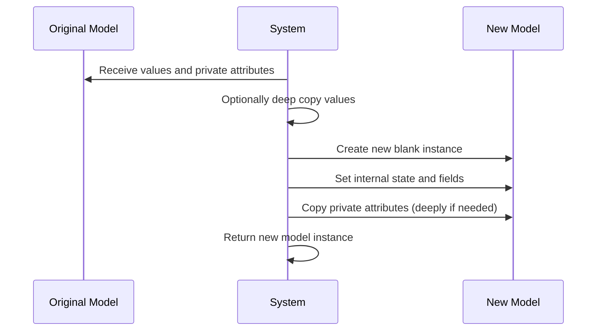
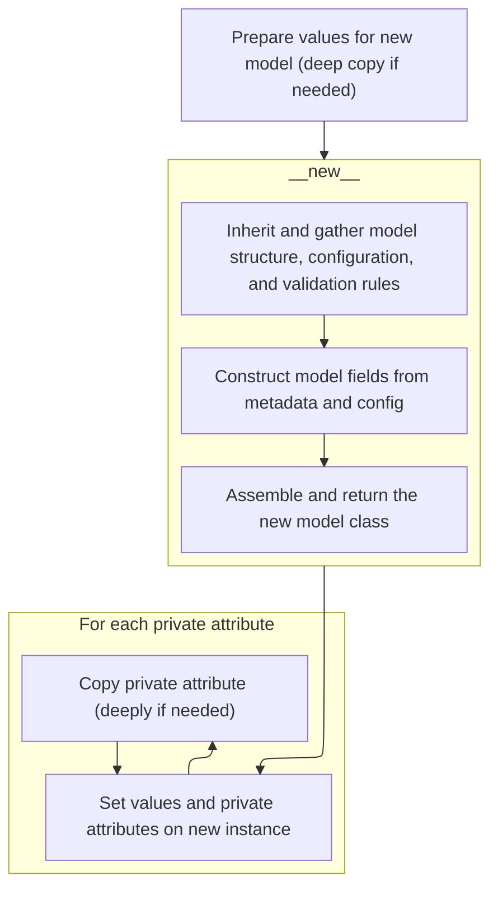
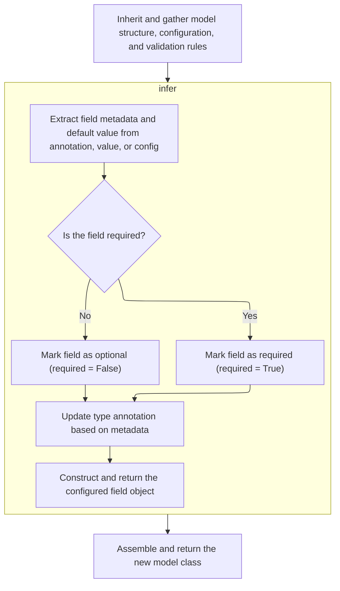
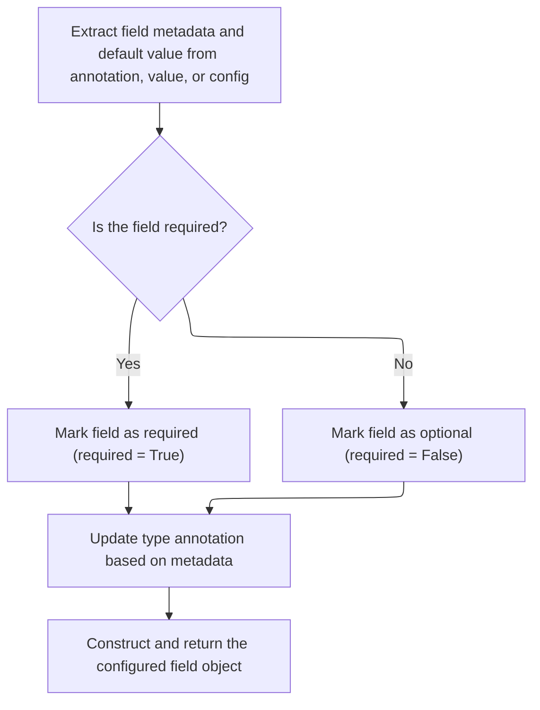
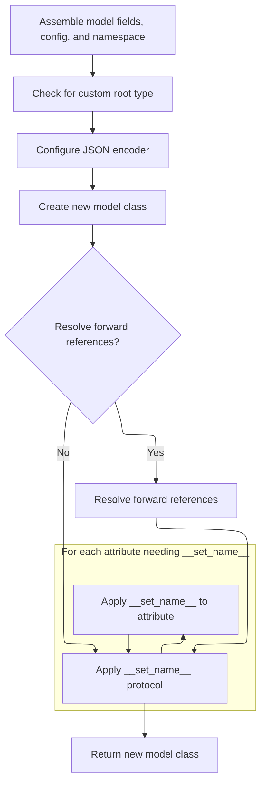
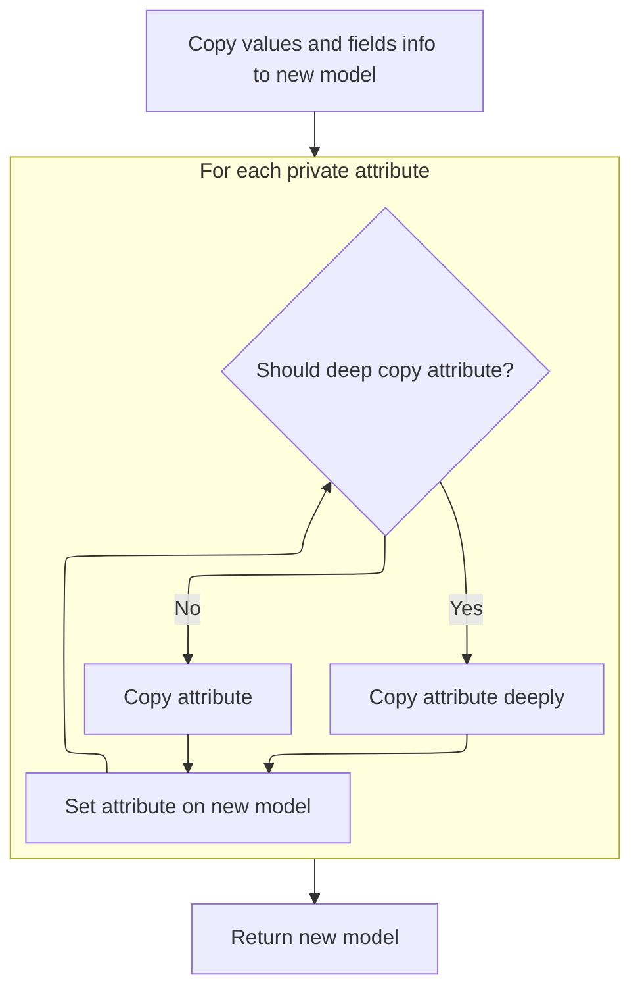

This flow creates a new model instance as a copy of an existing one, including all data and private attributes, with optional deep copying. The process involves preparing the values, creating a new instance, setting its state, copying private attributes, and returning the new model.



# Spec

## Detailed View of the Program's Functionality

a. Preparing Values for the New Model (Deep Copy if Needed)

The process begins by preparing the data that will be used to create a new model instance. If a deep copy is requested, the values dictionary is duplicated deeply to ensure that any nested objects are also copied, not just referenced. This is important for cases where the new model should not share mutable data with the original.

b. Creating a New Model Instance

Next, the code retrieves the model class of the current instance and creates a new, uninitialized instance of that class. This is done by directly invoking the class's low-level object creation method, bypassing the usual initialization logic. This allows the code to set up the model's internal state manually, without triggering validation or other side effects that would normally occur during standard construction.

c. Setting Values and Private Attributes on the New Instance

After creating the blank instance, the code sets the internal dictionary and the set of fields that have been explicitly set. This is done directly, ensuring that the new instance has the same data as the original (or the provided values). The code then iterates over all private attributes defined on the model. For each private attribute, it retrieves the value from the original instance. If the value exists, it is copied—deeply if requested—and set on the new instance. This ensures that private, internal state is also cloned.

d. Loop: Copying Private Attributes

For each private attribute, the code checks if a deep copy is needed. If so, it performs a deep copy of the attribute's value; otherwise, it copies the value as-is. The copied value is then set on the new model instance. This loop ensures that all private attributes are faithfully replicated in the new instance, preserving any internal state that may not be part of the public model fields.

e. Returning the New Model Instance

Once all values and private attributes have been set, the new model instance is returned. At this point, the new instance is a complete, independent copy of the original, with all data and private state duplicated as specified.

---

f. Building Model Class Internals

When a new model class is created (not just an instance), the process starts by gathering all relevant information from base classes. This includes fields, configuration, validators, root validators, private attributes, and class variables. The code loops through base classes in reverse order, merging their internals into the new class. This ensures that inheritance works correctly and that all necessary components are present.

g. Merging and Finalizing Configuration

After collecting configuration from base classes, class keyword arguments, and any Config class defined in the namespace, the code resolves any conflicts and finalizes the configuration. Each field is then updated with the finalized configuration, applying settings such as aliases and include/exclude rules. This step ensures that all fields are configured according to the most specific and relevant settings.

h. Processing Annotations and Namespace Items

The code then examines all type annotations and items in the class namespace. For each annotated item, it determines whether it is a class variable, a final variable with a default value, a valid field, or a private attribute. For valid fields, it validates the field name and uses a helper to infer the field's metadata and validation setup. If a field is not annotated but is present in the namespace and is a valid field, it is also processed and included in the model.

i. Extracting Field Metadata and Defaults

For each field, the code extracts metadata such as alias, default value, and constraints. This is done by checking for special annotations, explicit field info objects, or falling back to configuration defaults. The code ensures that only one source of field info is used and validates the result. The extracted metadata is then used to construct a field object that encapsulates all necessary information for validation and serialization.

j. Determining Field Requiredness and Finalizing Field Objects

After extracting metadata, the code determines whether the field is required or optional based on the presence and value of defaults. It updates the type annotation if needed and constructs a field object with all relevant details, including validators, defaults, and configuration.

k. Finalizing Model Class Construction

Once all fields and configuration are processed, the code assembles the model class. It checks for special root types, sets up root validators, and builds a new class namespace containing all processed fields, configuration, and hooks. The class is then created, its signature is set, and any forward references are resolved. The code also ensures that any attributes needing special setup (such as those implementing a certain protocol) are handled appropriately.

l. Returning the Fully Constructed Model Class

The final step in class construction is to return the new model class, which now has all fields, configuration, validators, and hooks set up. This class is ready to be used for creating validated model instances.

---

m. Populating the New Model Instance

Returning to the instance copying process, after the new instance is created and its internal state is set, the code ensures that all private attributes are also copied over. This involves iterating over each private attribute, copying its value (deeply if requested), and setting it on the new instance.

n. Returning the New Model Instance (Final Step)

After all values and private attributes have been set, the new model instance is returned. This instance is a complete, independent copy of the original, with all data and internal state duplicated as specified. It is ready to be used just like any other model instance.

# Rule Definition

| Paragraph Name                                                                                                                                                                                                                                                                                                                                                                                                                                                                  | Rule ID | Category          | Description                                                                                                                                                                                                                                                                                                                                                                                                                                                                                                                                                                                                                        | Conditions                                                                                                                                                                                                                                                                                                                                                     | Remarks                                                                                                                                                                                                                                                                                                                                                                                                                                                                                                                                                                                                                                                                                                                                                                                                                      |
| ------------------------------------------------------------------------------------------------------------------------------------------------------------------------------------------------------------------------------------------------------------------------------------------------------------------------------------------------------------------------------------------------------------------------------------------------------------------------------- | ------- | ----------------- | ---------------------------------------------------------------------------------------------------------------------------------------------------------------------------------------------------------------------------------------------------------------------------------------------------------------------------------------------------------------------------------------------------------------------------------------------------------------------------------------------------------------------------------------------------------------------------------------------------------------------------------- | -------------------------------------------------------------------------------------------------------------------------------------------------------------------------------------------------------------------------------------------------------------------------------------------------------------------------------------------------------------- | ---------------------------------------------------------------------------------------------------------------------------------------------------------------------------------------------------------------------------------------------------------------------------------------------------------------------------------------------------------------------------------------------------------------------------------------------------------------------------------------------------------------------------------------------------------------------------------------------------------------------------------------------------------------------------------------------------------------------------------------------------------------------------------------------------------------------------- |
| BaseModel.\_copy_and_set_values, BaseModel.copy                                                                                                                                                                                                                                                                                                                                                                                                                                 | RL-001  | Computation       | When duplicating a model instance, the system must allow for a shallow or deep copy of both field values and private attributes. The new instance must be created without invoking the standard constructor, and its internal state must be set directly. Private attributes are copied if present, and skipped if missing.                                                                                                                                                                                                                                                                                                        | Triggered when BaseModel.copy or BaseModel.\_copy_and_set_values is called, with parameters specifying which fields to include/exclude, updates, and whether to perform a deep copy.                                                                                                                                                                           | The 'deep' parameter controls whether deepcopy is used. Private attributes are copied using getattr and set directly. The output is a new instance of the same class, with **dict** and <SwmToken path="pydantic/v1/main.py" pos="615:21:21" line-data="    def _copy_and_set_values(self: &#39;Model&#39;, values: &#39;DictStrAny&#39;, fields_set: &#39;SetStr&#39;, *, deep: bool) -&gt; &#39;Model&#39;:">`fields_set`</SwmToken> set directly, and private attributes copied as needed.                                                                                                                                                                                                                                                                                                                                |
| <SwmToken path="pydantic/v1/main.py" pos="113:5:5" line-data="# Note `ModelMetaclass` refers to `BaseModel`, but is also used to *create* `BaseModel`, so we need to add this extra">`ModelMetaclass`</SwmToken>.**new**                                                                                                                                                                                                                                                        | RL-002  | Conditional Logic | When constructing a new model class, the metaclass must merge fields, configuration, validators, root validators, private attributes, and class variables from all base classes (in reverse order). Configuration is merged from base classes, keyword arguments, and any Config class in the namespace, with error raised if both kwargs and Config are provided. After merging, configuration is applied to all fields, including aliases and include/exclude rules. The system must distinguish between fields, class variables, and private attributes, and set up special attributes like **slots** and **hash** as required. | Triggered when a new model class is defined (i.e., <SwmToken path="pydantic/v1/main.py" pos="113:5:5" line-data="# Note `ModelMetaclass` refers to `BaseModel`, but is also used to *create* `BaseModel`, so we need to add this extra">`ModelMetaclass`</SwmToken>.**new** is called). Applies to all new model classes, including those created dynamically. | If both config kwargs and a Config class are present, a <SwmToken path="pydantic/v1/main.py" pos="156:3:3" line-data="            raise TypeError(&#39;Specifying config in two places is ambiguous, use either Config attribute or class kwargs&#39;)">`TypeError`</SwmToken> is raised. Fields, private attributes, and class variables are separated based on annotations and namespace items. The output is a new class object with all merged and processed attributes, fields, and configuration.                                                                                                                                                                                                                                                                                                                      |
| <SwmToken path="pydantic/v1/main.py" pos="197:8:10" line-data="                    fields[ann_name] = ModelField.infer(">`ModelField.infer`</SwmToken>, ModelField.\_get_field_info                                                                                                                                                                                                                                                                                             | RL-003  | Computation       | When inferring a field object, the system must extract all relevant metadata (name, type, alias, validators, default, required flag, config, field info) from the annotation, value, or configuration. If both annotation and value specify field info, an error is raised. If a default factory is present, no default value may be set. The required status is determined by whether the value is marked as required or undefined. The type annotation may be updated based on field info. The constructed field object encapsulates all metadata and validation setup.                                                          | Triggered when <SwmToken path="pydantic/v1/main.py" pos="197:8:10" line-data="                    fields[ann_name] = ModelField.infer(">`ModelField.infer`</SwmToken> is called during model class construction.                                                                                                                                               | If both annotation and value specify <SwmToken path="pydantic/v1/fields.py" pos="442:7:7" line-data="    ) -&gt; Tuple[FieldInfo, Any]:">`FieldInfo`</SwmToken>, a <SwmToken path="pydantic/v1/fields.py" pos="461:3:3" line-data="                raise ValueError(f&#39;cannot specify multiple `Annotated` `Field`s for {field_name!r}&#39;)">`ValueError`</SwmToken> is raised. If <SwmToken path="pydantic/v1/fields.py" pos="479:11:11" line-data="        value = None if field_info.default_factory is not None else field_info.default">`default_factory`</SwmToken> is present, default must not be set. The output is a <SwmToken path="pydantic/v1/main.py" pos="124:9:9" line-data="        fields: Dict[str, ModelField] = {}">`ModelField`</SwmToken> object with all relevant metadata and validation setup. |
| BaseModel.\_copy_and_set_values, <SwmToken path="pydantic/v1/main.py" pos="113:5:5" line-data="# Note `ModelMetaclass` refers to `BaseModel`, but is also used to *create* `BaseModel`, so we need to add this extra">`ModelMetaclass`</SwmToken>.**new**                                                                                                                                                                                                                       | RL-004  | Data Assignment   | Private attributes are excluded from public fields but must be copied and set directly on new instances as required. When copying or constructing models, private attributes are handled separately from fields.                                                                                                                                                                                                                                                                                                                                                                                                                   | Whenever a model instance is copied or a new instance is constructed.                                                                                                                                                                                                                                                                                          | Private attributes are defined in <SwmToken path="pydantic/v1/main.py" pos="129:1:1" line-data="        private_attributes: Dict[str, ModelPrivateAttr] = {}">`private_attributes`</SwmToken> and set directly using <SwmToken path="pydantic/v1/main.py" pos="622:1:1" line-data="        object_setattr(m, &#39;__dict__&#39;, values)">`object_setattr`</SwmToken>. If a private attribute is missing on the source, it is skipped.                                                                                                                                                                                                                                                                                                                                                                                       |
| <SwmToken path="pydantic/v1/main.py" pos="113:5:5" line-data="# Note `ModelMetaclass` refers to `BaseModel`, but is also used to *create* `BaseModel`, so we need to add this extra">`ModelMetaclass`</SwmToken>.**new**                                                                                                                                                                                                                                                        | RL-005  | Conditional Logic | Configuration is merged from base classes, keyword arguments, and any Config class in the namespace. If configuration is specified in both keyword arguments and a Config class, an error is raised. After merging, configuration is applied to all fields.                                                                                                                                                                                                                                                                                                                                                                        | During model class construction in the metaclass.                                                                                                                                                                                                                                                                                                              | If both config kwargs and Config class are present, a <SwmToken path="pydantic/v1/main.py" pos="156:3:3" line-data="            raise TypeError(&#39;Specifying config in two places is ambiguous, use either Config attribute or class kwargs&#39;)">`TypeError`</SwmToken> is raised. Merged config is applied to all fields.                                                                                                                                                                                                                                                                                                                                                                                                                                                                                              |
| <SwmToken path="pydantic/v1/main.py" pos="113:5:5" line-data="# Note `ModelMetaclass` refers to `BaseModel`, but is also used to *create* `BaseModel`, so we need to add this extra">`ModelMetaclass`</SwmToken>.**new**, ModelField.set_config                                                                                                                                                                                                                                 | RL-006  | Data Assignment   | Field aliases and include/exclude rules are set according to configuration priorities. Aliases and include/exclude rules from config override those from field info if their priority is higher.                                                                                                                                                                                                                                                                                                                                                                                                                                   | When applying configuration to fields during model class construction.                                                                                                                                                                                                                                                                                         | Alias and include/exclude rules are merged using <SwmToken path="pydantic/v1/fields.py" pos="528:9:11" line-data="            self.field_info.exclude = ValueItems.merge(self.field_info.exclude, new_exclude)">`ValueItems.merge`</SwmToken>. Alias priority is compared numerically.                                                                                                                                                                                                                                                                                                                                                                                                                                                                                                                                       |
| <SwmToken path="pydantic/v1/main.py" pos="197:8:10" line-data="                    fields[ann_name] = ModelField.infer(">`ModelField.infer`</SwmToken>, ModelField.\_get_field_info                                                                                                                                                                                                                                                                                             | RL-007  | Conditional Logic | A field is marked as required if its value is Required/Ellipsis, or if no default/default_factory is set. If a <SwmToken path="pydantic/v1/fields.py" pos="479:11:11" line-data="        value = None if field_info.default_factory is not None else field_info.default">`default_factory`</SwmToken> is present, the field is not required.                                                                                                                                                                                                                                                                                       | When inferring a field during model class construction.                                                                                                                                                                                                                                                                                                        | Required is set to True if value is Required/Ellipsis, otherwise False. If <SwmToken path="pydantic/v1/fields.py" pos="479:11:11" line-data="        value = None if field_info.default_factory is not None else field_info.default">`default_factory`</SwmToken> is present, required is False.                                                                                                                                                                                                                                                                                                                                                                                                                                                                                                                             |
| BaseModel.\_copy_and_set_values, BaseModel.construct                                                                                                                                                                                                                                                                                                                                                                                                                            | RL-008  | Computation       | When copying or constructing models via these mechanisms, validation is not triggered. The internal state (**dict**, <SwmToken path="pydantic/v1/main.py" pos="615:21:21" line-data="    def _copy_and_set_values(self: &#39;Model&#39;, values: &#39;DictStrAny&#39;, fields_set: &#39;SetStr&#39;, *, deep: bool) -&gt; &#39;Model&#39;:">`fields_set`</SwmToken>, private attributes) is set directly.                                                                                                                                                                                                                          | When BaseModel.\_copy_and_set_values or BaseModel.construct is called.                                                                                                                                                                                                                                                                                         | Bypasses **init** and validation logic. Sets **dict**, <SwmToken path="pydantic/v1/main.py" pos="615:21:21" line-data="    def _copy_and_set_values(self: &#39;Model&#39;, values: &#39;DictStrAny&#39;, fields_set: &#39;SetStr&#39;, *, deep: bool) -&gt; &#39;Model&#39;:">`fields_set`</SwmToken>, and private attributes directly.                                                                                                                                                                                                                                                                                                                                                                                                                                                                                      |
| <SwmToken path="pydantic/v1/main.py" pos="113:5:5" line-data="# Note `ModelMetaclass` refers to `BaseModel`, but is also used to *create* `BaseModel`, so we need to add this extra">`ModelMetaclass`</SwmToken>.**new**, <SwmToken path="pydantic/v1/main.py" pos="137:12:12" line-data="            if _is_base_model_class_defined and issubclass(base, BaseModel) and base != BaseModel:">`BaseModel`</SwmToken>.**try_update_forward_refs**, BaseModel.update_forward_refs | RL-009  | Computation       | If configuration requires, forward references in type annotations are resolved after class creation.                                                                                                                                                                                                                                                                                                                                                                                                                                                                                                                               | After model class is created and if <SwmToken path="pydantic/v1/main.py" pos="147:1:1" line-data="        resolve_forward_refs = kwargs.pop(&#39;__resolve_forward_refs__&#39;, True)">`resolve_forward_refs`</SwmToken> is True.                                                                                                                              | Uses <SwmToken path="pydantic/v1/main.py" pos="54:1:1" line-data="    update_model_forward_refs,">`update_model_forward_refs`</SwmToken> to resolve references. Only runs if <SwmToken path="pydantic/v1/main.py" pos="147:1:1" line-data="        resolve_forward_refs = kwargs.pop(&#39;__resolve_forward_refs__&#39;, True)">`resolve_forward_refs`</SwmToken> is True.                                                                                                                                                                                                                                                                                                                                                                                                                                                   |

# User Stories

## User Story 1: Copying model instances with deep/shallow options and private attribute handling

---

### Story Description:

As a user of the data validation system, I want to create a copy of a model instance with the option for a deep or shallow copy, ensuring that both field values and private attributes are copied correctly, and that the new instance is created without triggering validation or the standard constructor, so that I can efficiently duplicate models for further processing or modification.

---

### Business Rule Mapping:

| Rule ID | Paragraph Name                                                                                                                                                                                                                                            | Rule Description                                                                                                                                                                                                                                                                                                                                                                                          |
| ------- | --------------------------------------------------------------------------------------------------------------------------------------------------------------------------------------------------------------------------------------------------------- | --------------------------------------------------------------------------------------------------------------------------------------------------------------------------------------------------------------------------------------------------------------------------------------------------------------------------------------------------------------------------------------------------------- |
| RL-001  | BaseModel.\_copy_and_set_values, BaseModel.copy                                                                                                                                                                                                           | When duplicating a model instance, the system must allow for a shallow or deep copy of both field values and private attributes. The new instance must be created without invoking the standard constructor, and its internal state must be set directly. Private attributes are copied if present, and skipped if missing.                                                                               |
| RL-004  | BaseModel.\_copy_and_set_values, <SwmToken path="pydantic/v1/main.py" pos="113:5:5" line-data="# Note `ModelMetaclass` refers to `BaseModel`, but is also used to *create* `BaseModel`, so we need to add this extra">`ModelMetaclass`</SwmToken>.**new** | Private attributes are excluded from public fields but must be copied and set directly on new instances as required. When copying or constructing models, private attributes are handled separately from fields.                                                                                                                                                                                          |
| RL-008  | BaseModel.\_copy_and_set_values, BaseModel.construct                                                                                                                                                                                                      | When copying or constructing models via these mechanisms, validation is not triggered. The internal state (**dict**, <SwmToken path="pydantic/v1/main.py" pos="615:21:21" line-data="    def _copy_and_set_values(self: &#39;Model&#39;, values: &#39;DictStrAny&#39;, fields_set: &#39;SetStr&#39;, *, deep: bool) -&gt; &#39;Model&#39;:">`fields_set`</SwmToken>, private attributes) is set directly. |

---

### Relevant Functionality:

- **BaseModel.\_copy_and_set_values**
  1. **RL-001:**
     - If deep copy is requested, deepcopy the values dictionary.
     - Create a new instance of the model class using **new** (bypassing **init**).
     - Set the instance's **dict** and <SwmToken path="pydantic/v1/main.py" pos="615:21:21" line-data="    def _copy_and_set_values(self: &#39;Model&#39;, values: &#39;DictStrAny&#39;, fields_set: &#39;SetStr&#39;, *, deep: bool) -&gt; &#39;Model&#39;:">`fields_set`</SwmToken> directly.
     - For each private attribute defined in the model, get its value from the original; if present, copy (deeply if requested) and set it on the new instance.
     - Return the new instance.
  2. **RL-004:**
     - For each private attribute in the model's <SwmToken path="pydantic/v1/main.py" pos="129:1:1" line-data="        private_attributes: Dict[str, ModelPrivateAttr] = {}">`private_attributes`</SwmToken>:
       - Get its value from the source instance.
       - If present, set it directly on the new instance (deepcopy if requested).
  3. **RL-008:**
     - Create new instance with **new**.
     - Set **dict** and <SwmToken path="pydantic/v1/main.py" pos="615:21:21" line-data="    def _copy_and_set_values(self: &#39;Model&#39;, values: &#39;DictStrAny&#39;, fields_set: &#39;SetStr&#39;, *, deep: bool) -&gt; &#39;Model&#39;:">`fields_set`</SwmToken> directly.
     - Set private attributes directly.
     - Do not call validation logic.

## User Story 2: Constructing new model classes with metaclass merging and configuration logic

---

### Story Description:

As a system that defines new data models, I want to construct new model classes using a metaclass that merges fields, configuration, validators, root validators, private attributes, and class variables from all base classes, applies configuration and field alias/include/exclude rules according to priorities, distinguishes between fields, class variables, and private attributes, sets up special attributes, and resolves forward references if required, so that new model classes are fully configured and ready for use.

---

### Business Rule Mapping:

| Rule ID | Paragraph Name                                                                                                                                                                                                                                                                                                                                                                                                                                                                  | Rule Description                                                                                                                                                                                                                                                                                                                                                                                                                                                                                                                                                                                                                   |
| ------- | ------------------------------------------------------------------------------------------------------------------------------------------------------------------------------------------------------------------------------------------------------------------------------------------------------------------------------------------------------------------------------------------------------------------------------------------------------------------------------- | ---------------------------------------------------------------------------------------------------------------------------------------------------------------------------------------------------------------------------------------------------------------------------------------------------------------------------------------------------------------------------------------------------------------------------------------------------------------------------------------------------------------------------------------------------------------------------------------------------------------------------------- |
| RL-002  | <SwmToken path="pydantic/v1/main.py" pos="113:5:5" line-data="# Note `ModelMetaclass` refers to `BaseModel`, but is also used to *create* `BaseModel`, so we need to add this extra">`ModelMetaclass`</SwmToken>.**new**                                                                                                                                                                                                                                                        | When constructing a new model class, the metaclass must merge fields, configuration, validators, root validators, private attributes, and class variables from all base classes (in reverse order). Configuration is merged from base classes, keyword arguments, and any Config class in the namespace, with error raised if both kwargs and Config are provided. After merging, configuration is applied to all fields, including aliases and include/exclude rules. The system must distinguish between fields, class variables, and private attributes, and set up special attributes like **slots** and **hash** as required. |
| RL-005  | <SwmToken path="pydantic/v1/main.py" pos="113:5:5" line-data="# Note `ModelMetaclass` refers to `BaseModel`, but is also used to *create* `BaseModel`, so we need to add this extra">`ModelMetaclass`</SwmToken>.**new**                                                                                                                                                                                                                                                        | Configuration is merged from base classes, keyword arguments, and any Config class in the namespace. If configuration is specified in both keyword arguments and a Config class, an error is raised. After merging, configuration is applied to all fields.                                                                                                                                                                                                                                                                                                                                                                        |
| RL-006  | <SwmToken path="pydantic/v1/main.py" pos="113:5:5" line-data="# Note `ModelMetaclass` refers to `BaseModel`, but is also used to *create* `BaseModel`, so we need to add this extra">`ModelMetaclass`</SwmToken>.**new**, ModelField.set_config                                                                                                                                                                                                                                 | Field aliases and include/exclude rules are set according to configuration priorities. Aliases and include/exclude rules from config override those from field info if their priority is higher.                                                                                                                                                                                                                                                                                                                                                                                                                                   |
| RL-009  | <SwmToken path="pydantic/v1/main.py" pos="113:5:5" line-data="# Note `ModelMetaclass` refers to `BaseModel`, but is also used to *create* `BaseModel`, so we need to add this extra">`ModelMetaclass`</SwmToken>.**new**, <SwmToken path="pydantic/v1/main.py" pos="137:12:12" line-data="            if _is_base_model_class_defined and issubclass(base, BaseModel) and base != BaseModel:">`BaseModel`</SwmToken>.**try_update_forward_refs**, BaseModel.update_forward_refs | If configuration requires, forward references in type annotations are resolved after class creation.                                                                                                                                                                                                                                                                                                                                                                                                                                                                                                                               |
| RL-004  | BaseModel.\_copy_and_set_values, <SwmToken path="pydantic/v1/main.py" pos="113:5:5" line-data="# Note `ModelMetaclass` refers to `BaseModel`, but is also used to *create* `BaseModel`, so we need to add this extra">`ModelMetaclass`</SwmToken>.**new**                                                                                                                                                                                                                       | Private attributes are excluded from public fields but must be copied and set directly on new instances as required. When copying or constructing models, private attributes are handled separately from fields.                                                                                                                                                                                                                                                                                                                                                                                                                   |

---

### Relevant Functionality:

- **ModelMetaclass.new**
  1. **RL-002:**
     - For each base class (in reverse order):
       - Merge fields, config, validators, root validators, private attributes, class vars, and hash function.
     - Extract config from kwargs and/or Config class; raise error if both present.
     - Merge config and apply to all fields (set aliases, include/exclude, etc.).
     - Distinguish fields, class vars, and private attributes from annotations and namespace.
     - For each field, construct a <SwmToken path="pydantic/v1/main.py" pos="124:9:9" line-data="        fields: Dict[str, ModelField] = {}">`ModelField`</SwmToken> using the inference mechanism.
     - Handle private attributes according to config.
     - Build the new class namespace with all processed fields, config, validators, hooks, and special attributes.
     - Apply <SwmToken path="pydantic/v1/main.py" pos="298:1:1" line-data="                set_name = getattr(obj, &#39;__set_name__&#39;, None)">`set_name`</SwmToken> protocol to attributes not in the new namespace.
     - Return the fully constructed class.
  2. **RL-005:**
     - Extract config from base classes, kwargs, and Config class.
     - If both kwargs and Config class are present, raise <SwmToken path="pydantic/v1/main.py" pos="156:3:3" line-data="            raise TypeError(&#39;Specifying config in two places is ambiguous, use either Config attribute or class kwargs&#39;)">`TypeError`</SwmToken>.
     - Merge config and apply to fields.
  3. **RL-006:**
     - For each field:
       - If config provides an alias with higher or equal priority, override field's alias.
       - Merge include/exclude rules from config and field info.
  4. **RL-009:**
     - After class is created, check if <SwmToken path="pydantic/v1/main.py" pos="147:1:1" line-data="        resolve_forward_refs = kwargs.pop(&#39;__resolve_forward_refs__&#39;, True)">`resolve_forward_refs`</SwmToken> is True.
     - If so, call <SwmToken path="pydantic/v1/main.py" pos="54:1:1" line-data="    update_model_forward_refs,">`update_model_forward_refs`</SwmToken> with the class and its fields.
- **BaseModel.\_copy_and_set_values**
  1. **RL-004:**
     - For each private attribute in the model's <SwmToken path="pydantic/v1/main.py" pos="129:1:1" line-data="        private_attributes: Dict[str, ModelPrivateAttr] = {}">`private_attributes`</SwmToken>:
       - Get its value from the source instance.
       - If present, set it directly on the new instance (deepcopy if requested).

## User Story 3: Inferring and constructing field objects with metadata and validation

---

### Story Description:

As a system constructing model fields, I want to infer and construct field objects by extracting all relevant metadata (name, type, alias, validators, default, required flag, config, field info) from annotations, values, and configuration, ensuring correct required status, error handling for conflicting field info, and proper encapsulation of validation setup, so that each field in a model is accurately represented and validated.

---

### Business Rule Mapping:

| Rule ID | Paragraph Name                                                                                                                                                                                                                                  | Rule Description                                                                                                                                                                                                                                                                                                                                                                                                                                                                                                                                                          |
| ------- | ----------------------------------------------------------------------------------------------------------------------------------------------------------------------------------------------------------------------------------------------- | ------------------------------------------------------------------------------------------------------------------------------------------------------------------------------------------------------------------------------------------------------------------------------------------------------------------------------------------------------------------------------------------------------------------------------------------------------------------------------------------------------------------------------------------------------------------------- |
| RL-003  | <SwmToken path="pydantic/v1/main.py" pos="197:8:10" line-data="                    fields[ann_name] = ModelField.infer(">`ModelField.infer`</SwmToken>, ModelField.\_get_field_info                                                             | When inferring a field object, the system must extract all relevant metadata (name, type, alias, validators, default, required flag, config, field info) from the annotation, value, or configuration. If both annotation and value specify field info, an error is raised. If a default factory is present, no default value may be set. The required status is determined by whether the value is marked as required or undefined. The type annotation may be updated based on field info. The constructed field object encapsulates all metadata and validation setup. |
| RL-007  | <SwmToken path="pydantic/v1/main.py" pos="197:8:10" line-data="                    fields[ann_name] = ModelField.infer(">`ModelField.infer`</SwmToken>, ModelField.\_get_field_info                                                             | A field is marked as required if its value is Required/Ellipsis, or if no default/default_factory is set. If a <SwmToken path="pydantic/v1/fields.py" pos="479:11:11" line-data="        value = None if field_info.default_factory is not None else field_info.default">`default_factory`</SwmToken> is present, the field is not required.                                                                                                                                                                                                                              |
| RL-006  | <SwmToken path="pydantic/v1/main.py" pos="113:5:5" line-data="# Note `ModelMetaclass` refers to `BaseModel`, but is also used to *create* `BaseModel`, so we need to add this extra">`ModelMetaclass`</SwmToken>.**new**, ModelField.set_config | Field aliases and include/exclude rules are set according to configuration priorities. Aliases and include/exclude rules from config override those from field info if their priority is higher.                                                                                                                                                                                                                                                                                                                                                                          |

---

### Relevant Functionality:

- <SwmToken path="pydantic/v1/main.py" pos="197:8:10" line-data="                    fields[ann_name] = ModelField.infer(">`ModelField.infer`</SwmToken>
  1. **RL-003:**
     - Extract field info from annotation (Annotated), value, or config.
     - If both annotation and value specify <SwmToken path="pydantic/v1/fields.py" pos="442:7:7" line-data="    ) -&gt; Tuple[FieldInfo, Any]:">`FieldInfo`</SwmToken>, raise error.
     - If <SwmToken path="pydantic/v1/fields.py" pos="479:11:11" line-data="        value = None if field_info.default_factory is not None else field_info.default">`default_factory`</SwmToken> is present, ensure default is not set.
     - Determine if field is required based on value (Required/Ellipsis/Undefined).
     - Update type annotation if needed based on field info.
     - Construct and return a <SwmToken path="pydantic/v1/main.py" pos="124:9:9" line-data="        fields: Dict[str, ModelField] = {}">`ModelField`</SwmToken> with all metadata and validation.
  2. **RL-007:**
     - If value is Required/Ellipsis, set required=True.
     - If value is not Undefined, set required=False.
     - If <SwmToken path="pydantic/v1/fields.py" pos="479:11:11" line-data="        value = None if field_info.default_factory is not None else field_info.default">`default_factory`</SwmToken> is present, required=False.
- **ModelMetaclass.new**
  1. **RL-006:**
     - For each field:
       - If config provides an alias with higher or equal priority, override field's alias.
       - Merge include/exclude rules from config and field info.

# Code Walkthrough

## Copying Model State Efficiently



<SwmSnippet path="/pydantic/v1/main.py" line="615">

---

In <SwmToken path="pydantic/v1/main.py" pos="615:3:3" line-data="    def _copy_and_set_values(self: &#39;Model&#39;, values: &#39;DictStrAny&#39;, fields_set: &#39;SetStr&#39;, *, deep: bool) -&gt; &#39;Model&#39;:">`_copy_and_set_values`</SwmToken>, we start by optionally deep copying the values dict if requested, then grab the model class and create a new instance using <SwmToken path="pydantic/v1/main.py" pos="621:5:10" line-data="        m = cls.__new__(cls)">`cls.__new__(cls)`</SwmToken>. This skips the normal <SwmToken path="pydantic/v1/main.py" pos="284:18:18" line-data="        cls.__signature__ = ClassAttribute(&#39;__signature__&#39;, generate_model_signature(cls.__init__, fields, config))">`__init__`</SwmToken> logic, letting us set up the model's state directly. We need to call <SwmToken path="pydantic/v1/main.py" pos="621:7:7" line-data="        m = cls.__new__(cls)">`__new__`</SwmToken> here so we can inject the copied data and fields without triggering validation or other side effects from the constructor.

```python
    def _copy_and_set_values(self: 'Model', values: 'DictStrAny', fields_set: 'SetStr', *, deep: bool) -> 'Model':
        if deep:
            # chances of having empty dict here are quite low for using smart_deepcopy
            values = deepcopy(values)

        cls = self.__class__
        m = cls.__new__(cls)
```

---

</SwmSnippet>

### Building Model Class Internals



<SwmSnippet path="/pydantic/v1/main.py" line="123">

---

In <SwmToken path="pydantic/v1/main.py" pos="123:3:3" line-data="    def __new__(mcs, name, bases, namespace, **kwargs):  # noqa C901">`__new__`</SwmToken>, we loop through base classes in reverse, merging their fields, config, validators, root validators, private attributes, and class vars into the new model class. This sets up the inheritance chain so that all relevant model internals are combined before we process the current class's own stuff.

```python
    def __new__(mcs, name, bases, namespace, **kwargs):  # noqa C901
        fields: Dict[str, ModelField] = {}
        config = BaseConfig
        validators: 'ValidatorListDict' = {}

        pre_root_validators, post_root_validators = [], []
        private_attributes: Dict[str, ModelPrivateAttr] = {}
        base_private_attributes: Dict[str, ModelPrivateAttr] = {}
        slots: SetStr = namespace.get('__slots__', ())
        slots = {slots} if isinstance(slots, str) else set(slots)
        class_vars: SetStr = set()
        hash_func: Optional[Callable[[Any], int]] = None

        for base in reversed(bases):
            if _is_base_model_class_defined and issubclass(base, BaseModel) and base != BaseModel:
                fields.update(smart_deepcopy(base.__fields__))
                config = inherit_config(base.__config__, config)
                validators = inherit_validators(base.__validators__, validators)
                pre_root_validators += base.__pre_root_validators__
                post_root_validators += base.__post_root_validators__
                base_private_attributes.update(base.__private_attributes__)
                class_vars.update(base.__class_vars__)
                hash_func = base.__hash__
```

---

</SwmSnippet>

<SwmSnippet path="/pydantic/v1/main.py" line="145">

---

After merging config from base classes, class kwargs, and any Config class, we resolve conflicts and finalize the config. We then call <SwmToken path="pydantic/v1/main.py" pos="163:3:3" line-data="            f.set_config(config)">`set_config`</SwmToken> on each field so they all get the right config-driven settings like aliases and include/exclude rules.

```python
                hash_func = base.__hash__

        resolve_forward_refs = kwargs.pop('__resolve_forward_refs__', True)
        allowed_config_kwargs: SetStr = {
            key
            for key in dir(config)
            if not (key.startswith('__') and key.endswith('__'))  # skip dunder methods and attributes
        }
        config_kwargs = {key: kwargs.pop(key) for key in kwargs.keys() & allowed_config_kwargs}
        config_from_namespace = namespace.get('Config')
        if config_kwargs and config_from_namespace:
            raise TypeError('Specifying config in two places is ambiguous, use either Config attribute or class kwargs')
        config = inherit_config(config_from_namespace, config, **config_kwargs)

        validators = inherit_validators(extract_validators(namespace), validators)
        vg = ValidatorGroup(validators)

        for f in fields.values():
            f.set_config(config)
            extra_validators = vg.get_validators(f.name)
            if extra_validators:
                f.class_validators.update(extra_validators)
                # re-run prepare to add extra validators
                f.populate_validators()

```

---

</SwmSnippet>

<SwmSnippet path="/pydantic/v1/fields.py" line="516">

---

<SwmToken path="pydantic/v1/fields.py" pos="516:3:3" line-data="    def set_config(self, config: Type[&#39;BaseConfig&#39;]) -&gt; None:">`set_config`</SwmToken> applies config-driven changes to field aliases and include/exclude rules, using priorities to decide what wins.

```python
    def set_config(self, config: Type['BaseConfig']) -> None:
        self.model_config = config
        info_from_config = config.get_field_info(self.name)
        config.prepare_field(self)
        new_alias = info_from_config.get('alias')
        new_alias_priority = info_from_config.get('alias_priority') or 0
        if new_alias and new_alias_priority >= (self.field_info.alias_priority or 0):
            self.field_info.alias = new_alias
            self.field_info.alias_priority = new_alias_priority
            self.alias = new_alias
        new_exclude = info_from_config.get('exclude')
        if new_exclude is not None:
            self.field_info.exclude = ValueItems.merge(self.field_info.exclude, new_exclude)
        new_include = info_from_config.get('include')
        if new_include is not None:
            self.field_info.include = ValueItems.merge(self.field_info.include, new_include, intersect=True)
```

---

</SwmSnippet>

<SwmSnippet path="/pydantic/v1/main.py" line="170">

---

Back in <SwmToken path="pydantic/v1/main.py" pos="123:3:3" line-data="    def __new__(mcs, name, bases, namespace, **kwargs):  # noqa C901">`__new__`</SwmToken>, after <SwmToken path="pydantic/v1/main.py" pos="163:3:3" line-data="            f.set_config(config)">`set_config`</SwmToken>, we walk through annotations and namespace items to figure out which are fields, class vars, or private attributes. For each valid field, we use <SwmToken path="pydantic/v1/main.py" pos="197:8:10" line-data="                    fields[ann_name] = ModelField.infer(">`ModelField.infer`</SwmToken> to build out the field's metadata and validation setup, using the config we just finalized.

```python
        prepare_config(config, name)

        untouched_types = ANNOTATED_FIELD_UNTOUCHED_TYPES

        def is_untouched(v: Any) -> bool:
            return isinstance(v, untouched_types) or v.__class__.__name__ == 'cython_function_or_method'

        if (namespace.get('__module__'), namespace.get('__qualname__')) != ('pydantic.main', 'BaseModel'):
            annotations = resolve_annotations(namespace.get('__annotations__', {}), namespace.get('__module__', None))
            # annotation only fields need to come first in fields
            for ann_name, ann_type in annotations.items():
                if is_classvar(ann_type):
                    class_vars.add(ann_name)
                elif is_finalvar_with_default_val(ann_type, namespace.get(ann_name, Undefined)):
                    class_vars.add(ann_name)
                elif is_valid_field(ann_name):
                    validate_field_name(bases, ann_name)
                    value = namespace.get(ann_name, Undefined)
                    allowed_types = get_args(ann_type) if is_union(get_origin(ann_type)) else (ann_type,)
                    if (
                        is_untouched(value)
                        and ann_type != PyObject
                        and not any(
                            lenient_issubclass(get_origin(allowed_type), Type) for allowed_type in allowed_types
                        )
                    ):
                        continue
                    fields[ann_name] = ModelField.infer(
                        name=ann_name,
                        value=value,
                        annotation=ann_type,
                        class_validators=vg.get_validators(ann_name),
                        config=config,
                    )
                elif ann_name not in namespace and config.underscore_attrs_are_private:
                    private_attributes[ann_name] = PrivateAttr()
```

---

</SwmSnippet>

<SwmSnippet path="/pydantic/v1/main.py" line="205">

---

For namespace items that are valid fields but not annotated, we still call <SwmToken path="pydantic/v1/main.py" pos="221:5:7" line-data="                    inferred = ModelField.infer(">`ModelField.infer`</SwmToken> to build their field metadata. This way, even fields without type hints get processed and included in the model.

```python
                    private_attributes[ann_name] = PrivateAttr()

            untouched_types = UNTOUCHED_TYPES + config.keep_untouched
            for var_name, value in namespace.items():
                can_be_changed = var_name not in class_vars and not is_untouched(value)
                if isinstance(value, ModelPrivateAttr):
                    if not is_valid_private_name(var_name):
                        raise NameError(
                            f'Private attributes "{var_name}" must not be a valid field name; '
                            f'Use sunder or dunder names, e. g. "_{var_name}" or "__{var_name}__"'
                        )
                    private_attributes[var_name] = value
                elif config.underscore_attrs_are_private and is_valid_private_name(var_name) and can_be_changed:
                    private_attributes[var_name] = PrivateAttr(default=value)
                elif is_valid_field(var_name) and var_name not in annotations and can_be_changed:
                    validate_field_name(bases, var_name)
                    inferred = ModelField.infer(
                        name=var_name,
                        value=value,
                        annotation=annotations.get(var_name, Undefined),
                        class_validators=vg.get_validators(var_name),
                        config=config,
                    )
```

---

</SwmSnippet>

#### Extracting Field Metadata and Defaults



<SwmSnippet path="/pydantic/v1/fields.py" line="484">

---

In <SwmToken path="pydantic/v1/fields.py" pos="484:3:3" line-data="    def infer(">`infer`</SwmToken>, we call <SwmToken path="pydantic/v1/fields.py" pos="495:10:10" line-data="        field_info, value = cls._get_field_info(name, annotation, value, config)">`_get_field_info`</SwmToken> to grab all the metadata for the field—like alias, default, and constraints—using the annotation, value, and config. This sets up everything we need to build the <SwmToken path="pydantic/v1/fields.py" pos="492:6:6" line-data="    ) -&gt; &#39;ModelField&#39;:">`ModelField`</SwmToken>.

```python
    def infer(
        cls,
        *,
        name: str,
        value: Any,
        annotation: Any,
        class_validators: Optional[Dict[str, Validator]],
        config: Type['BaseConfig'],
    ) -> 'ModelField':
        from pydantic.v1.schema import get_annotation_from_field_info

        field_info, value = cls._get_field_info(name, annotation, value, config)
```

---

</SwmSnippet>

<SwmSnippet path="/pydantic/v1/fields.py" line="440">

---

<SwmToken path="pydantic/v1/fields.py" pos="440:3:3" line-data="    def _get_field_info(">`_get_field_info`</SwmToken> checks if the annotation is Annotated and pulls out <SwmToken path="pydantic/v1/fields.py" pos="442:7:7" line-data="    ) -&gt; Tuple[FieldInfo, Any]:">`FieldInfo`</SwmToken> if present, making sure there's only one. If value is a <SwmToken path="pydantic/v1/fields.py" pos="442:7:7" line-data="    ) -&gt; Tuple[FieldInfo, Any]:">`FieldInfo`</SwmToken>, it uses that (unless Annotated already provided one, which is an error). If neither, it builds <SwmToken path="pydantic/v1/fields.py" pos="442:7:7" line-data="    ) -&gt; Tuple[FieldInfo, Any]:">`FieldInfo`</SwmToken> from config. It also handles <SwmToken path="pydantic/v1/fields.py" pos="479:11:11" line-data="        value = None if field_info.default_factory is not None else field_info.default">`default_factory`</SwmToken> and validates the result before returning.

```python
    def _get_field_info(
        field_name: str, annotation: Any, value: Any, config: Type['BaseConfig']
    ) -> Tuple[FieldInfo, Any]:
        """
        Get a FieldInfo from a root typing.Annotated annotation, value, or config default.

        The FieldInfo may be set in typing.Annotated or the value, but not both. If neither contain
        a FieldInfo, a new one will be created using the config.

        :param field_name: name of the field for use in error messages
        :param annotation: a type hint such as `str` or `Annotated[str, Field(..., min_length=5)]`
        :param value: the field's assigned value
        :param config: the model's config object
        :return: the FieldInfo contained in the `annotation`, the value, or a new one from the config.
        """
        field_info_from_config = config.get_field_info(field_name)

        field_info = None
        if get_origin(annotation) is Annotated:
            field_infos = [arg for arg in get_args(annotation)[1:] if isinstance(arg, FieldInfo)]
            if len(field_infos) > 1:
                raise ValueError(f'cannot specify multiple `Annotated` `Field`s for {field_name!r}')
            field_info = next(iter(field_infos), None)
            if field_info is not None:
                field_info = copy.copy(field_info)
                field_info.update_from_config(field_info_from_config)
                if field_info.default not in (Undefined, Required):
                    raise ValueError(f'`Field` default cannot be set in `Annotated` for {field_name!r}')
                if value is not Undefined and value is not Required:
                    # check also `Required` because of `validate_arguments` that sets `...` as default value
                    field_info.default = value

        if isinstance(value, FieldInfo):
            if field_info is not None:
                raise ValueError(f'cannot specify `Annotated` and value `Field`s together for {field_name!r}')
            field_info = value
            field_info.update_from_config(field_info_from_config)
        elif field_info is None:
            field_info = FieldInfo(value, **field_info_from_config)
        value = None if field_info.default_factory is not None else field_info.default
        field_info._validate()
        return field_info, value
```

---

</SwmSnippet>

<SwmSnippet path="/pydantic/v1/fields.py" line="496">

---

Back in <SwmToken path="pydantic/v1/main.py" pos="197:10:10" line-data="                    fields[ann_name] = ModelField.infer(">`infer`</SwmToken>, after getting <SwmToken path="pydantic/v1/fields.py" pos="502:10:10" line-data="        annotation = get_annotation_from_field_info(annotation, field_info, name, config.validate_assignment)">`field_info`</SwmToken>, we check if the value is Required or Undefined to set the required flag. We update the annotation if needed, then return a <SwmToken path="pydantic/v1/main.py" pos="124:9:9" line-data="        fields: Dict[str, ModelField] = {}">`ModelField`</SwmToken> instance with all the details packed in.

```python
        required: 'BoolUndefined' = Undefined
        if value is Required:
            required = True
            value = None
        elif value is not Undefined:
            required = False
        annotation = get_annotation_from_field_info(annotation, field_info, name, config.validate_assignment)

        return cls(
            name=name,
            type_=annotation,
            alias=field_info.alias,
            class_validators=class_validators,
            default=value,
            default_factory=field_info.default_factory,
            required=required,
            model_config=config,
            field_info=field_info,
        )
```

---

</SwmSnippet>

#### Finalizing Model Class Construction



<SwmSnippet path="/pydantic/v1/main.py" line="228">

---

Back in <SwmToken path="pydantic/v1/main.py" pos="282:9:9" line-data="        cls = super().__new__(mcs, name, bases, new_namespace, **kwargs)">`__new__`</SwmToken>, after infer returns ModelFields, we check for custom root types, set up root validators, and build a new class namespace with all the processed fields, config, and hooks. Then we create the class, set up its signature, handle forward refs, and finalize private attributes.

```python
                    if var_name in fields:
                        if lenient_issubclass(inferred.type_, fields[var_name].type_):
                            inferred.type_ = fields[var_name].type_
                        else:
                            raise TypeError(
                                f'The type of {name}.{var_name} differs from the new default value; '
                                f'if you wish to change the type of this field, please use a type annotation'
                            )
                    fields[var_name] = inferred

        _custom_root_type = ROOT_KEY in fields
        if _custom_root_type:
            validate_custom_root_type(fields)
        vg.check_for_unused()
        if config.json_encoders:
            json_encoder = partial(custom_pydantic_encoder, config.json_encoders)
        else:
            json_encoder = pydantic_encoder
        pre_rv_new, post_rv_new = extract_root_validators(namespace)

        if hash_func is None:
            hash_func = generate_hash_function(config.frozen)

        exclude_from_namespace = fields | private_attributes.keys() | {'__slots__'}
        new_namespace = {
            '__config__': config,
            '__fields__': fields,
            '__exclude_fields__': {
                name: field.field_info.exclude for name, field in fields.items() if field.field_info.exclude is not None
            }
            or None,
            '__include_fields__': {
                name: field.field_info.include for name, field in fields.items() if field.field_info.include is not None
            }
            or None,
            '__validators__': vg.validators,
            '__pre_root_validators__': unique_list(
                pre_root_validators + pre_rv_new,
                name_factory=lambda v: v.__name__,
            ),
            '__post_root_validators__': unique_list(
                post_root_validators + post_rv_new,
                name_factory=lambda skip_on_failure_and_v: skip_on_failure_and_v[1].__name__,
            ),
            '__schema_cache__': {},
            '__json_encoder__': staticmethod(json_encoder),
            '__custom_root_type__': _custom_root_type,
            '__private_attributes__': {**base_private_attributes, **private_attributes},
            '__slots__': slots | private_attributes.keys(),
            '__hash__': hash_func,
            '__class_vars__': class_vars,
            **{n: v for n, v in namespace.items() if n not in exclude_from_namespace},
        }

        cls = super().__new__(mcs, name, bases, new_namespace, **kwargs)
        # set __signature__ attr only for model class, but not for its instances
        cls.__signature__ = ClassAttribute('__signature__', generate_model_signature(cls.__init__, fields, config))

        if not _is_base_model_class_defined:
            # Cython does not understand the `if TYPE_CHECKING:` condition in the
            # BaseModel's body (where annotations are set), so clear them manually:
            getattr(cls, '__annotations__', {}).clear()

        if resolve_forward_refs:
            cls.__try_update_forward_refs__()

        # preserve `__set_name__` protocol defined in https://peps.python.org/pep-0487
        # for attributes not in `new_namespace` (e.g. private attributes)
        for name, obj in namespace.items():
            if name not in new_namespace:
                set_name = getattr(obj, '__set_name__', None)
                if callable(set_name):
                    set_name(cls, name)
```

---

</SwmSnippet>

<SwmSnippet path="/pydantic/v1/main.py" line="300">

---

<SwmToken path="pydantic/v1/main.py" pos="123:3:3" line-data="    def __new__(mcs, name, bases, namespace, **kwargs):  # noqa C901">`__new__`</SwmToken> returns the fully constructed model class, with all fields, config, validators, and hooks set up. It's ready to be used as a Pydantic model.

```python
                    set_name(cls, name)

        return cls
```

---

</SwmSnippet>

### Populating the New Model Instance



<SwmSnippet path="/pydantic/v1/main.py" line="622">

---

Back in <SwmToken path="pydantic/v1/main.py" pos="615:3:3" line-data="    def _copy_and_set_values(self: &#39;Model&#39;, values: &#39;DictStrAny&#39;, fields_set: &#39;SetStr&#39;, *, deep: bool) -&gt; &#39;Model&#39;:">`_copy_and_set_values`</SwmToken>, after getting the blank instance from **new**, we set its **dict** and <SwmToken path="pydantic/v1/main.py" pos="623:11:11" line-data="        object_setattr(m, &#39;__fields_set__&#39;, fields_set)">`fields_set`</SwmToken> directly, then copy over all private attributes from the original instance, deep copying if needed. This makes the new instance a true copy, including internals.

```python
        object_setattr(m, '__dict__', values)
        object_setattr(m, '__fields_set__', fields_set)
        for name in self.__private_attributes__:
            value = getattr(self, name, Undefined)
            if value is not Undefined:
                if deep:
                    value = deepcopy(value)
                object_setattr(m, name, value)
```

---

</SwmSnippet>

<SwmSnippet path="/pydantic/v1/main.py" line="629">

---

<SwmToken path="pydantic/v1/main.py" pos="615:3:3" line-data="    def _copy_and_set_values(self: &#39;Model&#39;, values: &#39;DictStrAny&#39;, fields_set: &#39;SetStr&#39;, *, deep: bool) -&gt; &#39;Model&#39;:">`_copy_and_set_values`</SwmToken> returns the new model instance, with all data and private attributes copied over. It's a full clone of the original, ready to use.

```python
                object_setattr(m, name, value)

        return m
```

---

</SwmSnippet>

&nbsp;

*This is an auto-generated document by Swimm 🌊 and has not yet been verified by a human*

<SwmMeta version="3.0.0" repo-id="Z2l0aHViJTNBJTNBcHlkYW50aWMlM0ElM0FTd2ltbS1EZW1v" repo-name="pydantic"><sup>Powered by [Swimm](/)</sup></SwmMeta>
