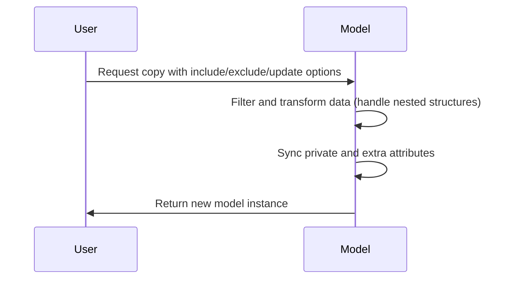
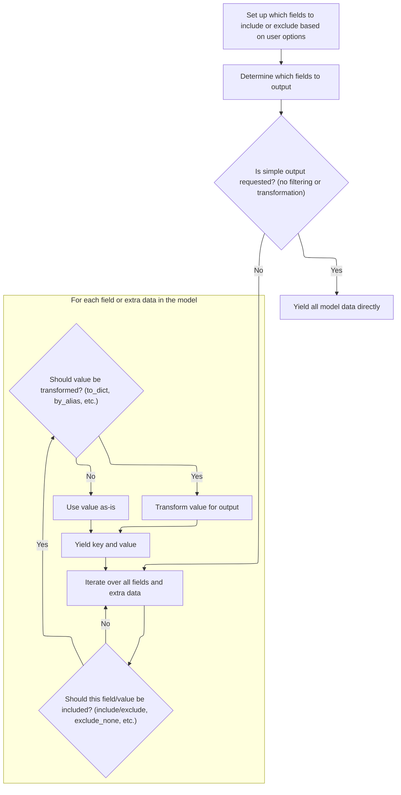
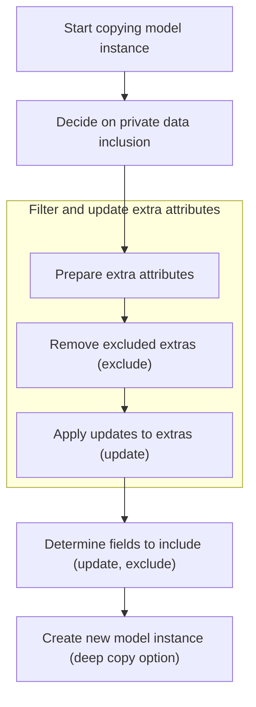

Copying a model instance enables users to create a new version of a model with selected fields included, excluded, or updated, and with the option for deep copying. The process involves filtering and transforming the model's data, handling nested structures, and syncing internal state such as private and extra attributes. The main steps are:

- Select fields to include, exclude, or update
- Filter and transform model data, including nested elements
- Adjust internal state and extra attributes
- Create and return the new model instance



# Spec

## Detailed View of the Program's Functionality

a. Selecting Fields to Copy and Filtering Model Data

The process begins when a request is made to duplicate a model instance, possibly with modifications such as including or excluding certain fields, updating values, or performing a deep copy. The system first issues a deprecation warning, indicating that this method is outdated and suggesting a newer alternative.

Next, the legacy logic for copying is invoked. This logic is responsible for determining which fields and data should be included in the copy. It does this by merging any field-level exclusion rules with those provided by the user, ensuring that explicit user choices take precedence. Similarly, if there are inclusion rules, it intersects them with the set of all possible fields.

After merging these rules, the system calculates the set of keys (field names) that are allowed in the output, taking into account the include/exclude options and whether unset fields should be omitted. If no filtering or transformation is needed, it quickly yields all the model's data and any extra attributes <SwmToken path="pydantic/main.py" pos="504:24:26" line-data="                If `False` (the default), these characters will be output as-is.">`as-is`</SwmToken> for efficiency.

If filtering or transformation is required, the system prepares to iterate over all fields and extra data. For each item, it checks whether it should be included based on the calculated keys and any additional rules (such as excluding fields with a value of None). If a field is set to be excluded by default and its value matches the default, it is also skipped.

b. Applying Include/Exclude Logic and Value Transformation

For each field or extra attribute that passes the initial checks, the system determines the appropriate key to use in the output (using an alias if specified). If any transformation is needed—such as converting nested models to dictionaries, applying aliases, or recursively applying include/exclude rules—the system delegates this to a specialized value-processing function.

This function examines the type of each value:

- If the value is itself a model, it either serializes it to a dictionary or recursively copies it, applying the same filtering logic.
- If the value is a dictionary or a sequence (like a list or tuple), it recurses into each element, applying the include/exclude logic at every level.
- If the value is an enumeration and the configuration specifies, it converts the enum to its underlying value.
- Otherwise, the value is used <SwmToken path="pydantic/main.py" pos="504:24:26" line-data="                If `False` (the default), these characters will be output as-is.">`as-is`</SwmToken>.

After processing, the key and the (possibly transformed) value are yielded for inclusion in the new model's data.

c. Syncing Internal State and Handling Extras

Once all relevant fields and values have been gathered and filtered, the system prepares the internal state for the new model instance. Private attributes are filtered to remove any undefined values. Extra attributes (those not defined as standard fields) are copied, but any that were excluded by the filtering logic are removed.

If any of the values to be copied originated from extra attributes, they are moved back into the extra attributes dictionary to maintain the distinction between standard and extra fields.

d. Finalizing the New Model Instance

The system then determines the set of fields that should be marked as explicitly set in the new instance. If any updates were provided, these fields are added to the set. Any fields that were excluded are removed from this set.

Finally, a new model instance is created using all the prepared data: the filtered and possibly transformed values, the updated set of explicitly set fields, the adjusted extra attributes, and the filtered private attributes. If a deep copy was requested, all data structures are deeply copied to ensure complete independence from the original instance. The new model instance is then returned as the result of the copy operation.

# Rule Definition

| Paragraph Name                                                                                                                                                                                                                                                                                                                                                                                                                                                                                                                                                            | Rule ID | Category          | Description                                                                                                                                                                                                                                                                                                                                                                              | Conditions                                                                                                                                                                                                                                             | Remarks                                                                                                                                                                                                                                                                                                                                                                                                                                                                               |
| ------------------------------------------------------------------------------------------------------------------------------------------------------------------------------------------------------------------------------------------------------------------------------------------------------------------------------------------------------------------------------------------------------------------------------------------------------------------------------------------------------------------------------------------------------------------------- | ------- | ----------------- | ---------------------------------------------------------------------------------------------------------------------------------------------------------------------------------------------------------------------------------------------------------------------------------------------------------------------------------------------------------------------------------------- | ------------------------------------------------------------------------------------------------------------------------------------------------------------------------------------------------------------------------------------------------------ | ------------------------------------------------------------------------------------------------------------------------------------------------------------------------------------------------------------------------------------------------------------------------------------------------------------------------------------------------------------------------------------------------------------------------------------------------------------------------------------- |
| <SwmToken path="pydantic/main.py" pos="1490:11:13" line-data="            &#39;See the docstring of `BaseModel.copy` for details about how to handle `include` and `exclude`.&#39;,">`BaseModel.copy`</SwmToken>, <SwmToken path="pydantic/main.py" pos="1497:1:3" line-data="            copy_internals._iter(">`copy_internals._iter`</SwmToken>, <SwmToken path="pydantic/main.py" pos="1644:3:5" line-data="        return copy_internals._calculate_keys(self, *args, **kwargs)">`copy_internals._calculate_keys`</SwmToken>                                         | RL-001  | Conditional Logic | When copying a model, only fields specified in the 'include' argument are considered for the copy, and fields specified in the 'exclude' argument are omitted. If both are provided, only fields present in 'include' and not present in 'exclude' are included.                                                                                                                         | 'include' and/or 'exclude' arguments are provided to the copy operation.                                                                                                                                                                               | 'include' and 'exclude' can be sets or mappings of field names. The resulting set of fields is determined by intersecting 'include' and the complement of 'exclude'.                                                                                                                                                                                                                                                                                                                  |
| <SwmToken path="pydantic/main.py" pos="1490:11:13" line-data="            &#39;See the docstring of `BaseModel.copy` for details about how to handle `include` and `exclude`.&#39;,">`BaseModel.copy`</SwmToken>, <SwmToken path="pydantic/main.py" pos="1528:3:5" line-data="        return copy_internals._copy_and_set_values(self, values, fields_set, extra, private, deep=deep)">`copy_internals._copy_and_set_values`</SwmToken>                                                                                                                                   | RL-002  | Data Assignment   | For each field included in the copy, if a corresponding entry exists in the 'update' dictionary, the value from 'update' is used in the copy instead of the original value.                                                                                                                                                                                                              | 'update' argument is provided and contains keys matching included fields.                                                                                                                                                                              | 'update' is a dictionary mapping field names to new values. These values override the original values in the copy.                                                                                                                                                                                                                                                                                                                                                                    |
| <SwmToken path="pydantic/main.py" pos="1490:11:13" line-data="            &#39;See the docstring of `BaseModel.copy` for details about how to handle `include` and `exclude`.&#39;,">`BaseModel.copy`</SwmToken>, <SwmToken path="pydantic/main.py" pos="1528:3:5" line-data="        return copy_internals._copy_and_set_values(self, values, fields_set, extra, private, deep=deep)">`copy_internals._copy_and_set_values`</SwmToken>                                                                                                                                   | RL-003  | Conditional Logic | If the 'deep' argument is true, all values (including nested models, dictionaries, sequences, and extra/private fields) are recursively <SwmToken path="pydantic/main.py" pos="1483:29:31" line-data="            deep: If True, the values of fields that are Pydantic models will be deep-copied.">`deep-copied`</SwmToken>. Otherwise, values are copied by reference (shallow copy). | 'deep' argument is provided and is True.                                                                                                                                                                                                               | 'deep' is a boolean. If true, use deepcopy on all relevant values; otherwise, use shallow copy.                                                                                                                                                                                                                                                                                                                                                                                       |
| <SwmToken path="pydantic/main.py" pos="1490:11:13" line-data="            &#39;See the docstring of `BaseModel.copy` for details about how to handle `include` and `exclude`.&#39;,">`BaseModel.copy`</SwmToken>, <SwmToken path="pydantic/main.py" pos="1497:1:3" line-data="            copy_internals._iter(">`copy_internals._iter`</SwmToken>, <SwmToken path="pydantic/main.py" pos="1528:3:5" line-data="        return copy_internals._copy_and_set_values(self, values, fields_set, extra, private, deep=deep)">`copy_internals._copy_and_set_values`</SwmToken> | RL-004  | Conditional Logic | Extra fields are only included in the copy if the model configuration allows extra fields. Only extra fields not excluded by 'exclude' and present in 'include' (if provided) are included. If an extra field is present in 'update', its value is replaced by the value from 'update'.                                                                                                  | Model configuration allows extra fields (<SwmToken path="pydantic/main.py" pos="292:21:23" line-data="            A dictionary of extra fields, or `None` if `config.extra` is not set to `&quot;allow&quot;`.">`config.extra`</SwmToken> == 'allow'). | Extra fields are stored in a separate dictionary. Only those passing the include/exclude filter and not set to be excluded are copied. Updated values from 'update' are used if present.                                                                                                                                                                                                                                                                                              |
| <SwmToken path="pydantic/main.py" pos="1490:11:13" line-data="            &#39;See the docstring of `BaseModel.copy` for details about how to handle `include` and `exclude`.&#39;,">`BaseModel.copy`</SwmToken>, <SwmToken path="pydantic/main.py" pos="1528:3:5" line-data="        return copy_internals._copy_and_set_values(self, values, fields_set, extra, private, deep=deep)">`copy_internals._copy_and_set_values`</SwmToken>                                                                                                                                   | RL-005  | Conditional Logic | Only private fields whose value is not equal to the special undefined marker are included in the copy. Private fields are not affected by 'include', 'exclude', or 'update'.                                                                                                                                                                                                             | Model instance has private fields set to values other than the undefined marker.                                                                                                                                                                       | The undefined marker is <SwmToken path="pydantic/main.py" pos="1505:36:36" line-data="            private = {k: v for k, v in self.__pydantic_private__.items() if v is not PydanticUndefined}">`PydanticUndefined`</SwmToken>. Private fields are stored in a separate dictionary and are copied <SwmToken path="pydantic/main.py" pos="504:24:26" line-data="                If `False` (the default), these characters will be output as-is.">`as-is`</SwmToken> if not undefined. |
| <SwmToken path="pydantic/main.py" pos="1490:11:13" line-data="            &#39;See the docstring of `BaseModel.copy` for details about how to handle `include` and `exclude`.&#39;,">`BaseModel.copy`</SwmToken>, <SwmToken path="pydantic/main.py" pos="1644:3:5" line-data="        return copy_internals._calculate_keys(self, *args, **kwargs)">`copy_internals._calculate_keys`</SwmToken>                                                                                                                                                                           | RL-006  | Computation       | The set of explicitly set fields in the copy is updated to reflect any changes from 'include', 'exclude', and 'update'. Excluded fields are removed from the set, and updated fields are added.                                                                                                                                                                                          | 'include', 'exclude', or 'update' arguments are provided.                                                                                                                                                                                              | The set of explicitly set fields is a set of field names. Excluded fields are removed, and updated fields are added.                                                                                                                                                                                                                                                                                                                                                                  |
| <SwmToken path="pydantic/main.py" pos="1490:11:13" line-data="            &#39;See the docstring of `BaseModel.copy` for details about how to handle `include` and `exclude`.&#39;,">`BaseModel.copy`</SwmToken>, <SwmToken path="pydantic/main.py" pos="1528:3:5" line-data="        return copy_internals._copy_and_set_values(self, values, fields_set, extra, private, deep=deep)">`copy_internals._copy_and_set_values`</SwmToken>                                                                                                                                   | RL-007  | Data Assignment   | The distinction between regular fields and extra fields is preserved in the new model instance after copying.                                                                                                                                                                                                                                                                            | Copy operation is performed.                                                                                                                                                                                                                           | Regular fields are stored in the main data dictionary; extra fields are stored in a separate dictionary if allowed by config.                                                                                                                                                                                                                                                                                                                                                         |
| <SwmToken path="pydantic/main.py" pos="1490:11:13" line-data="            &#39;See the docstring of `BaseModel.copy` for details about how to handle `include` and `exclude`.&#39;,">`BaseModel.copy`</SwmToken>, <SwmToken path="pydantic/main.py" pos="1528:3:5" line-data="        return copy_internals._copy_and_set_values(self, values, fields_set, extra, private, deep=deep)">`copy_internals._copy_and_set_values`</SwmToken>                                                                                                                                   | RL-008  | Data Assignment   | The output of the copy operation is a new model instance with the correct fields, extras, privates, and set of explicitly set fields, as determined by the filtering and update logic.                                                                                                                                                                                                   | Copy operation is performed.                                                                                                                                                                                                                           | The output is a new model instance with:                                                                                                                                                                                                                                                                                                                                                                                                                                              |

- Regular fields (dict of field name to value)
- Extra fields (dict of field name to value, or None)
- Private fields (dict of field name to value, or None)
- Set of explicitly set fields (set of field names) All fields are assigned according to the filtering, update, and deep/shallow copy logic. |

# User Stories

## User Story 1: Copy a model instance with field filtering, updates, and deep/shallow copy options

---

### Story Description:

As a user of the model, I want to create a copy of a model instance with the ability to include or exclude specific fields, update field values, and choose between a deep or shallow copy so that I can flexibly duplicate and modify model data as needed.

---

### Business Rule Mapping:

| Rule ID | Paragraph Name                                                                                                                                                                                                                                                                                                                                                                                                                                                                                                                    | Rule Description                                                                                                                                                                                                                                                                                                                                                                         |
| ------- | --------------------------------------------------------------------------------------------------------------------------------------------------------------------------------------------------------------------------------------------------------------------------------------------------------------------------------------------------------------------------------------------------------------------------------------------------------------------------------------------------------------------------------- | ---------------------------------------------------------------------------------------------------------------------------------------------------------------------------------------------------------------------------------------------------------------------------------------------------------------------------------------------------------------------------------------- |
| RL-001  | <SwmToken path="pydantic/main.py" pos="1490:11:13" line-data="            &#39;See the docstring of `BaseModel.copy` for details about how to handle `include` and `exclude`.&#39;,">`BaseModel.copy`</SwmToken>, <SwmToken path="pydantic/main.py" pos="1497:1:3" line-data="            copy_internals._iter(">`copy_internals._iter`</SwmToken>, <SwmToken path="pydantic/main.py" pos="1644:3:5" line-data="        return copy_internals._calculate_keys(self, *args, **kwargs)">`copy_internals._calculate_keys`</SwmToken> | When copying a model, only fields specified in the 'include' argument are considered for the copy, and fields specified in the 'exclude' argument are omitted. If both are provided, only fields present in 'include' and not present in 'exclude' are included.                                                                                                                         |
| RL-002  | <SwmToken path="pydantic/main.py" pos="1490:11:13" line-data="            &#39;See the docstring of `BaseModel.copy` for details about how to handle `include` and `exclude`.&#39;,">`BaseModel.copy`</SwmToken>, <SwmToken path="pydantic/main.py" pos="1528:3:5" line-data="        return copy_internals._copy_and_set_values(self, values, fields_set, extra, private, deep=deep)">`copy_internals._copy_and_set_values`</SwmToken>                                                                                           | For each field included in the copy, if a corresponding entry exists in the 'update' dictionary, the value from 'update' is used in the copy instead of the original value.                                                                                                                                                                                                              |
| RL-003  | <SwmToken path="pydantic/main.py" pos="1490:11:13" line-data="            &#39;See the docstring of `BaseModel.copy` for details about how to handle `include` and `exclude`.&#39;,">`BaseModel.copy`</SwmToken>, <SwmToken path="pydantic/main.py" pos="1528:3:5" line-data="        return copy_internals._copy_and_set_values(self, values, fields_set, extra, private, deep=deep)">`copy_internals._copy_and_set_values`</SwmToken>                                                                                           | If the 'deep' argument is true, all values (including nested models, dictionaries, sequences, and extra/private fields) are recursively <SwmToken path="pydantic/main.py" pos="1483:29:31" line-data="            deep: If True, the values of fields that are Pydantic models will be deep-copied.">`deep-copied`</SwmToken>. Otherwise, values are copied by reference (shallow copy). |
| RL-006  | <SwmToken path="pydantic/main.py" pos="1490:11:13" line-data="            &#39;See the docstring of `BaseModel.copy` for details about how to handle `include` and `exclude`.&#39;,">`BaseModel.copy`</SwmToken>, <SwmToken path="pydantic/main.py" pos="1644:3:5" line-data="        return copy_internals._calculate_keys(self, *args, **kwargs)">`copy_internals._calculate_keys`</SwmToken>                                                                                                                                   | The set of explicitly set fields in the copy is updated to reflect any changes from 'include', 'exclude', and 'update'. Excluded fields are removed from the set, and updated fields are added.                                                                                                                                                                                          |

---

### Relevant Functionality:

- <SwmToken path="pydantic/main.py" pos="1490:11:13" line-data="            &#39;See the docstring of `BaseModel.copy` for details about how to handle `include` and `exclude`.&#39;,">`BaseModel.copy`</SwmToken>
  1. **RL-001:**
     - If 'include' is provided, build a set of included fields.
     - If 'exclude' is provided, build a set of excluded fields.
     - The final set of fields to copy is: (all fields if 'include' is None else included fields) minus excluded fields.
     - Only these fields are copied to the new model instance.
  2. **RL-002:**
     - For each field in the set of fields to copy:
       - If the field is present in 'update', use the value from 'update'.
       - Otherwise, use the value from the original model.
  3. **RL-003:**
     - If 'deep' is True:
       - Apply deepcopy to the values, extra fields, and private fields before assigning them to the new model instance.
     - Else:
       - Assign values, extra fields, and private fields by reference.
  4. **RL-006:**
     - Start with the original set of explicitly set fields.
     - If 'update' is provided, add all keys from 'update' to the set.
     - If 'exclude' is provided, remove all keys from 'exclude' from the set.
     - The resulting set is assigned to the new model instance.

## User Story 2: Handle extra and private fields correctly during copy

---

### Story Description:

As a user of the model, I want extra fields to be copied only if allowed by the model configuration, and private fields to be copied only if they are set, so that the copied model accurately reflects the original's configuration and state.

---

### Business Rule Mapping:

| Rule ID | Paragraph Name                                                                                                                                                                                                                                                                                                                                                                                                                                                                                                                                                            | Rule Description                                                                                                                                                                                                                                                                        |
| ------- | ------------------------------------------------------------------------------------------------------------------------------------------------------------------------------------------------------------------------------------------------------------------------------------------------------------------------------------------------------------------------------------------------------------------------------------------------------------------------------------------------------------------------------------------------------------------------- | --------------------------------------------------------------------------------------------------------------------------------------------------------------------------------------------------------------------------------------------------------------------------------------- |
| RL-004  | <SwmToken path="pydantic/main.py" pos="1490:11:13" line-data="            &#39;See the docstring of `BaseModel.copy` for details about how to handle `include` and `exclude`.&#39;,">`BaseModel.copy`</SwmToken>, <SwmToken path="pydantic/main.py" pos="1497:1:3" line-data="            copy_internals._iter(">`copy_internals._iter`</SwmToken>, <SwmToken path="pydantic/main.py" pos="1528:3:5" line-data="        return copy_internals._copy_and_set_values(self, values, fields_set, extra, private, deep=deep)">`copy_internals._copy_and_set_values`</SwmToken> | Extra fields are only included in the copy if the model configuration allows extra fields. Only extra fields not excluded by 'exclude' and present in 'include' (if provided) are included. If an extra field is present in 'update', its value is replaced by the value from 'update'. |
| RL-005  | <SwmToken path="pydantic/main.py" pos="1490:11:13" line-data="            &#39;See the docstring of `BaseModel.copy` for details about how to handle `include` and `exclude`.&#39;,">`BaseModel.copy`</SwmToken>, <SwmToken path="pydantic/main.py" pos="1528:3:5" line-data="        return copy_internals._copy_and_set_values(self, values, fields_set, extra, private, deep=deep)">`copy_internals._copy_and_set_values`</SwmToken>                                                                                                                                   | Only private fields whose value is not equal to the special undefined marker are included in the copy. Private fields are not affected by 'include', 'exclude', or 'update'.                                                                                                            |

---

### Relevant Functionality:

- <SwmToken path="pydantic/main.py" pos="1490:11:13" line-data="            &#39;See the docstring of `BaseModel.copy` for details about how to handle `include` and `exclude`.&#39;,">`BaseModel.copy`</SwmToken>
  1. **RL-004:**
     - If model config allows extra fields:
       - For each extra field:
         - If the field is not excluded and (if 'include' is provided) is included:
           - If the field is present in 'update', use the value from 'update'.
           - Otherwise, use the original value.
  2. **RL-005:**
     - For each private field in the original model:
       - If the value is not <SwmToken path="pydantic/main.py" pos="1505:36:36" line-data="            private = {k: v for k, v in self.__pydantic_private__.items() if v is not PydanticUndefined}">`PydanticUndefined`</SwmToken>, include it in the copy.
       - Otherwise, do not include it.
     - Do not apply 'include', 'exclude', or 'update' to private fields.

## User Story 3: Ensure the output model instance is correct and consistent

---

### Story Description:

As a user of the model, I want the copied model instance to preserve the distinction between regular and extra fields and to have the correct fields, extras, privates, and explicitly set fields, so that the copy behaves as expected and maintains data integrity.

---

### Business Rule Mapping:

| Rule ID | Paragraph Name                                                                                                                                                                                                                                                                                                                                                                                                                          | Rule Description                                                                                                                                                                       |
| ------- | --------------------------------------------------------------------------------------------------------------------------------------------------------------------------------------------------------------------------------------------------------------------------------------------------------------------------------------------------------------------------------------------------------------------------------------- | -------------------------------------------------------------------------------------------------------------------------------------------------------------------------------------- |
| RL-007  | <SwmToken path="pydantic/main.py" pos="1490:11:13" line-data="            &#39;See the docstring of `BaseModel.copy` for details about how to handle `include` and `exclude`.&#39;,">`BaseModel.copy`</SwmToken>, <SwmToken path="pydantic/main.py" pos="1528:3:5" line-data="        return copy_internals._copy_and_set_values(self, values, fields_set, extra, private, deep=deep)">`copy_internals._copy_and_set_values`</SwmToken> | The distinction between regular fields and extra fields is preserved in the new model instance after copying.                                                                          |
| RL-008  | <SwmToken path="pydantic/main.py" pos="1490:11:13" line-data="            &#39;See the docstring of `BaseModel.copy` for details about how to handle `include` and `exclude`.&#39;,">`BaseModel.copy`</SwmToken>, <SwmToken path="pydantic/main.py" pos="1528:3:5" line-data="        return copy_internals._copy_and_set_values(self, values, fields_set, extra, private, deep=deep)">`copy_internals._copy_and_set_values`</SwmToken> | The output of the copy operation is a new model instance with the correct fields, extras, privates, and set of explicitly set fields, as determined by the filtering and update logic. |

---

### Relevant Functionality:

- <SwmToken path="pydantic/main.py" pos="1490:11:13" line-data="            &#39;See the docstring of `BaseModel.copy` for details about how to handle `include` and `exclude`.&#39;,">`BaseModel.copy`</SwmToken>
  1. **RL-007:**
     - Assign regular fields to the main data dictionary of the new model.
     - Assign extra fields to the extra fields dictionary of the new model (if allowed).
     - Do not mix regular and extra fields.
  2. **RL-008:**
     - Create a new model instance.
     - Assign filtered and updated regular fields to the main data dictionary.
     - Assign filtered and updated extra fields to the extra fields dictionary (if allowed).
     - Assign filtered private fields to the private fields dictionary.
     - Assign the updated set of explicitly set fields.
     - Return the new model instance.

# Code Walkthrough

## Legacy Model Duplication Entry Point

```mermaid
%%{init: {"flowchart": {"defaultRenderer": "elk"}} }%%
flowchart TD
    node1["Select fields to copy (include, exclude, update, deep)"] --> node2["Filter model data using business rules"]
    click node1 openCode "pydantic/main.py:1458:1502"
    node2 --> node3["Adjust extra and private data for the copy"]
    click node2 openCode "pydantic/deprecated/copy_internals.py:29:1501"
    node3 --> node4["Return the new model copy"]
    click node3 openCode "pydantic/main.py:1502:1528"
    click node4 openCode "pydantic/main.py:1528:1528"


subgraph node2 [_iter]
  sgmain_1_node1["Set up which fields to include or exclude based on user options"] --> sgmain_1_node2["Determine which fields to output"]
  click sgmain_1_node1 openCode "pydantic/deprecated/copy_internals.py:41:49"
  click sgmain_1_node2 openCode "pydantic/deprecated/copy_internals.py:49:50"
  sgmain_1_node2 --> sgmain_1_node3{"Is simple output requested? (no filtering or transformation)"}
  click sgmain_1_node3 openCode "pydantic/deprecated/copy_internals.py:50:55"
  sgmain_1_node3 -->|"Yes"| sgmain_1_node4["Yield all model data directly"]
  click sgmain_1_node4 openCode "pydantic/deprecated/copy_internals.py:52:55"
  sgmain_1_node3 -->|"No"| sgmain_1_node5["Iterate over all fields and extra data"]
  click sgmain_1_node5 openCode "pydantic/deprecated/copy_internals.py:60:64"
  subgraph sgmain_1_loop1["For each field or extra data in the model"]
  sgmain_1_node5 --> sgmain_1_node6{"Should this field/value be included? (include/exclude, exclude_none, etc.)"}
  click sgmain_1_node6 openCode "pydantic/deprecated/copy_internals.py:65:67"
  sgmain_1_node6 -->|"No"| sgmain_1_node5
  sgmain_1_node6 -->|"Yes"| sgmain_1_node7{"Should value be transformed? (to_dict, by_alias, etc.)"}
  click sgmain_1_node7 openCode "pydantic/deprecated/copy_internals.py:78:94"
  sgmain_1_node7 -->|"Yes"| sgmain_1_node8["Transform value for output"]
  click sgmain_1_node8 openCode "pydantic/deprecated/copy_internals.py:84:94"
  sgmain_1_node7 -->|"No"| sgmain_1_node9["Use value as-is"]
  click sgmain_1_node9 openCode "pydantic/deprecated/copy_internals.py:95:95"
  sgmain_1_node8 --> sgmain_1_node10["Yield key and value"]
  click sgmain_1_node10 openCode "pydantic/deprecated/copy_internals.py:95:95"
  sgmain_1_node9 --> sgmain_1_node10
  sgmain_1_node10 --> sgmain_1_node5
  end
end

%% Swimm:
%% %%{init: {"flowchart": {"defaultRenderer": "elk"}} }%%
%% flowchart TD
%%     node1["Select fields to copy (include, exclude, update, deep)"] --> node2["Filter model data using business rules"]
%%     click node1 openCode "<SwmPath>[pydantic/main.py](pydantic/main.py)</SwmPath>:1458:1502"
%%     node2 --> node3["Adjust extra and private data for the copy"]
%%     click node2 openCode "<SwmPath>[pydantic/deprecated/copy_internals.py](pydantic/deprecated/copy_internals.py)</SwmPath>:29:1501"
%%     node3 --> node4["Return the new model copy"]
%%     click node3 openCode "<SwmPath>[pydantic/main.py](pydantic/main.py)</SwmPath>:1502:1528"
%%     click node4 openCode "<SwmPath>[pydantic/main.py](pydantic/main.py)</SwmPath>:1528:1528"
%% 
%% 
%% subgraph node2 [_iter]
%%   sgmain_1_node1["Set up which fields to include or exclude based on user options"] --> sgmain_1_node2["Determine which fields to output"]
%%   click sgmain_1_node1 openCode "<SwmPath>[pydantic/deprecated/copy_internals.py](pydantic/deprecated/copy_internals.py)</SwmPath>:41:49"
%%   click sgmain_1_node2 openCode "<SwmPath>[pydantic/deprecated/copy_internals.py](pydantic/deprecated/copy_internals.py)</SwmPath>:49:50"
%%   sgmain_1_node2 --> sgmain_1_node3{"Is simple output requested? (no filtering or transformation)"}
%%   click sgmain_1_node3 openCode "<SwmPath>[pydantic/deprecated/copy_internals.py](pydantic/deprecated/copy_internals.py)</SwmPath>:50:55"
%%   sgmain_1_node3 -->|"Yes"| sgmain_1_node4["Yield all model data directly"]
%%   click sgmain_1_node4 openCode "<SwmPath>[pydantic/deprecated/copy_internals.py](pydantic/deprecated/copy_internals.py)</SwmPath>:52:55"
%%   sgmain_1_node3 -->|"No"| sgmain_1_node5["Iterate over all fields and extra data"]
%%   click sgmain_1_node5 openCode "<SwmPath>[pydantic/deprecated/copy_internals.py](pydantic/deprecated/copy_internals.py)</SwmPath>:60:64"
%%   subgraph sgmain_1_loop1["For each field or extra data in the model"]
%%   sgmain_1_node5 --> sgmain_1_node6{"Should this field/value be included? (include/exclude, <SwmToken path="pydantic/deprecated/copy_internals.py" pos="37:1:1" line-data="    exclude_none: bool = False,">`exclude_none`</SwmToken>, etc.)"}
%%   click sgmain_1_node6 openCode "<SwmPath>[pydantic/deprecated/copy_internals.py](pydantic/deprecated/copy_internals.py)</SwmPath>:65:67"
%%   sgmain_1_node6 -->|"No"| sgmain_1_node5
%%   sgmain_1_node6 -->|"Yes"| sgmain_1_node7{"Should value be transformed? (<SwmToken path="pydantic/main.py" pos="1498:4:4" line-data="                self, to_dict=False, by_alias=False, include=include, exclude=exclude, exclude_unset=False">`to_dict`</SwmToken>, <SwmToken path="pydantic/main.py" pos="1498:9:9" line-data="                self, to_dict=False, by_alias=False, include=include, exclude=exclude, exclude_unset=False">`by_alias`</SwmToken>, etc.)"}
%%   click sgmain_1_node7 openCode "<SwmPath>[pydantic/deprecated/copy_internals.py](pydantic/deprecated/copy_internals.py)</SwmPath>:78:94"
%%   sgmain_1_node7 -->|"Yes"| sgmain_1_node8["Transform value for output"]
%%   click sgmain_1_node8 openCode "<SwmPath>[pydantic/deprecated/copy_internals.py](pydantic/deprecated/copy_internals.py)</SwmPath>:84:94"
%%   sgmain_1_node7 -->|"No"| sgmain_1_node9["Use value <SwmToken path="pydantic/main.py" pos="504:24:26" line-data="                If `False` (the default), these characters will be output as-is.">`as-is`</SwmToken>"]
%%   click sgmain_1_node9 openCode "<SwmPath>[pydantic/deprecated/copy_internals.py](pydantic/deprecated/copy_internals.py)</SwmPath>:95:95"
%%   sgmain_1_node8 --> sgmain_1_node10["Yield key and value"]
%%   click sgmain_1_node10 openCode "<SwmPath>[pydantic/deprecated/copy_internals.py](pydantic/deprecated/copy_internals.py)</SwmPath>:95:95"
%%   sgmain_1_node9 --> sgmain_1_node10
%%   sgmain_1_node10 --> sgmain_1_node5
%%   end
%% end
```



<SwmSnippet path="/pydantic/main.py" line="1458">

---

In <SwmToken path="pydantic/main.py" pos="1458:3:3" line-data="    def copy(">`copy`</SwmToken>, the flow starts by warning users that this method is deprecated and points them to use <SwmToken path="pydantic/main.py" pos="1469:15:15" line-data="            This method is now deprecated; use `model_copy` instead.">`model_copy`</SwmToken> instead. It then imports the legacy <SwmToken path="pydantic/main.py" pos="1494:8:8" line-data="        from .deprecated import copy_internals">`copy_internals`</SwmToken> module and uses its <SwmToken path="pydantic/main.py" pos="1497:3:3" line-data="            copy_internals._iter(">`_iter`</SwmToken> function to gather the model's data, applying any include/exclude filters. This sets up the data that will be copied, and prepares for merging in any updates. Calling <SwmToken path="pydantic/main.py" pos="1497:3:3" line-data="            copy_internals._iter(">`_iter`</SwmToken> here is necessary to get a filtered snapshot of the model's fields, which is the basis for the rest of the copy logic.

````python
    def copy(
        self,
        *,
        include: AbstractSetIntStr | MappingIntStrAny | None = None,
        exclude: AbstractSetIntStr | MappingIntStrAny | None = None,
        update: Dict[str, Any] | None = None,  # noqa UP006
        deep: bool = False,
    ) -> Self:  # pragma: no cover
        """Returns a copy of the model.

        !!! warning "Deprecated"
            This method is now deprecated; use `model_copy` instead.

        If you need `include` or `exclude`, use:

        ```python {test="skip" lint="skip"}
        data = self.model_dump(include=include, exclude=exclude, round_trip=True)
        data = {**data, **(update or {})}
        copied = self.model_validate(data)
        ```

        Args:
            include: Optional set or mapping specifying which fields to include in the copied model.
            exclude: Optional set or mapping specifying which fields to exclude in the copied model.
            update: Optional dictionary of field-value pairs to override field values in the copied model.
            deep: If True, the values of fields that are Pydantic models will be deep-copied.

        Returns:
            A copy of the model with included, excluded and updated fields as specified.
        """
        warnings.warn(
            'The `copy` method is deprecated; use `model_copy` instead. '
            'See the docstring of `BaseModel.copy` for details about how to handle `include` and `exclude`.',
            category=PydanticDeprecatedSince20,
            stacklevel=2,
        )
        from .deprecated import copy_internals

        values = dict(
            copy_internals._iter(
                self, to_dict=False, by_alias=False, include=include, exclude=exclude, exclude_unset=False
            ),
            **(update or {}),
        )
````

---

</SwmSnippet>

### Field Filtering and Extraction

<SwmSnippet path="/pydantic/main.py" line="1593">

---

<SwmToken path="pydantic/main.py" pos="1593:3:3" line-data="    def _iter(self, *args: Any, **kwargs: Any) -&gt; Any:">`_iter`</SwmToken> just passes all arguments to the deprecated <SwmToken path="pydantic/main.py" pos="1601:3:5" line-data="        return copy_internals._iter(self, *args, **kwargs)">`copy_internals._iter`</SwmToken> after warning about its own deprecation. This lets us apply all the filtering and transformation logic defined in the legacy code, instead of just dumping the model's raw fields.

```python
    def _iter(self, *args: Any, **kwargs: Any) -> Any:
        warnings.warn(
            'The private method `_iter` will be removed and should no longer be used.',
            category=PydanticDeprecatedSince20,
            stacklevel=2,
        )
        from .deprecated import copy_internals

        return copy_internals._iter(self, *args, **kwargs)
```

---

</SwmSnippet>

### Applying Include/Exclude and Value Transformation



<SwmSnippet path="/pydantic/deprecated/copy_internals.py" line="29">

---

In <SwmToken path="pydantic/deprecated/copy_internals.py" pos="29:2:2" line-data="def _iter(">`_iter`</SwmToken>, we prep the include/exclude logic and then call <SwmToken path="pydantic/deprecated/copy_internals.py" pos="84:5:5" line-data="            v = _get_value(">`_get_value`</SwmToken> for each item to handle nested filtering and transformations.

```python
def _iter(
    self: BaseModel,
    to_dict: bool = False,
    by_alias: bool = False,
    include: AbstractSetIntStr | MappingIntStrAny | None = None,
    exclude: AbstractSetIntStr | MappingIntStrAny | None = None,
    exclude_unset: bool = False,
    exclude_defaults: bool = False,
    exclude_none: bool = False,
) -> TupleGenerator:
    # Merge field set excludes with explicit exclude parameter with explicit overriding field set options.
    # The extra "is not None" guards are not logically necessary but optimizes performance for the simple case.
    if exclude is not None:
        exclude = _utils.ValueItems.merge(
            {k: v.exclude for k, v in self.__pydantic_fields__.items() if v.exclude is not None}, exclude
        )

    if include is not None:
        include = _utils.ValueItems.merge({k: True for k in self.__pydantic_fields__}, include, intersect=True)

    allowed_keys = _calculate_keys(self, include=include, exclude=exclude, exclude_unset=exclude_unset)  # type: ignore
    if allowed_keys is None and not (to_dict or by_alias or exclude_unset or exclude_defaults or exclude_none):
        # huge boost for plain _iter()
        yield from self.__dict__.items()
        if self.__pydantic_extra__:
            yield from self.__pydantic_extra__.items()
        return

    value_exclude = _utils.ValueItems(self, exclude) if exclude is not None else None
    value_include = _utils.ValueItems(self, include) if include is not None else None

    if self.__pydantic_extra__ is None:
        items = self.__dict__.items()
    else:
        items = list(self.__dict__.items()) + list(self.__pydantic_extra__.items())

    for field_key, v in items:
        if (allowed_keys is not None and field_key not in allowed_keys) or (exclude_none and v is None):
            continue

        if exclude_defaults:
            try:
                field = self.__pydantic_fields__[field_key]
            except KeyError:
                pass
            else:
                if not field.is_required() and field.default == v:
                    continue

        if by_alias and field_key in self.__pydantic_fields__:
            dict_key = self.__pydantic_fields__[field_key].alias or field_key
        else:
            dict_key = field_key

        if to_dict or value_include or value_exclude:
            v = _get_value(
                type(self),
                v,
                to_dict=to_dict,
                by_alias=by_alias,
                include=value_include and value_include.for_element(field_key),
                exclude=value_exclude and value_exclude.for_element(field_key),
                exclude_unset=exclude_unset,
                exclude_defaults=exclude_defaults,
                exclude_none=exclude_none,
            )
```

---

</SwmSnippet>

<SwmSnippet path="/pydantic/deprecated/copy_internals.py" line="124">

---

<SwmToken path="pydantic/deprecated/copy_internals.py" pos="124:2:2" line-data="def _get_value(">`_get_value`</SwmToken> checks if the value is a <SwmToken path="pydantic/deprecated/copy_internals.py" pos="125:6:6" line-data="    cls: type[BaseModel],">`BaseModel`</SwmToken>, dict, sequence, or Enum, and handles each case. For models, it either serializes or copies them with the right filters. For dicts and sequences, it recurses into each element, applying include/exclude logic at every level. Enums can be converted to their values if the config says so. This way, everything gets filtered and transformed as needed, even deep inside nested structures.

```python
def _get_value(
    cls: type[BaseModel],
    v: Any,
    to_dict: bool,
    by_alias: bool,
    include: AbstractSetIntStr | MappingIntStrAny | None,
    exclude: AbstractSetIntStr | MappingIntStrAny | None,
    exclude_unset: bool,
    exclude_defaults: bool,
    exclude_none: bool,
) -> Any:
    from .. import BaseModel

    if isinstance(v, BaseModel):
        if to_dict:
            return v.model_dump(
                by_alias=by_alias,
                exclude_unset=exclude_unset,
                exclude_defaults=exclude_defaults,
                include=include,  # type: ignore
                exclude=exclude,  # type: ignore
                exclude_none=exclude_none,
            )
        else:
            return v.copy(include=include, exclude=exclude)

    value_exclude = _utils.ValueItems(v, exclude) if exclude else None
    value_include = _utils.ValueItems(v, include) if include else None

    if isinstance(v, dict):
        return {
            k_: _get_value(
                cls,
                v_,
                to_dict=to_dict,
                by_alias=by_alias,
                exclude_unset=exclude_unset,
                exclude_defaults=exclude_defaults,
                include=value_include and value_include.for_element(k_),
                exclude=value_exclude and value_exclude.for_element(k_),
                exclude_none=exclude_none,
            )
            for k_, v_ in v.items()
            if (not value_exclude or not value_exclude.is_excluded(k_))
            and (not value_include or value_include.is_included(k_))
        }

    elif _utils.sequence_like(v):
        seq_args = (
            _get_value(
                cls,
                v_,
                to_dict=to_dict,
                by_alias=by_alias,
                exclude_unset=exclude_unset,
                exclude_defaults=exclude_defaults,
                include=value_include and value_include.for_element(i),
                exclude=value_exclude and value_exclude.for_element(i),
                exclude_none=exclude_none,
            )
            for i, v_ in enumerate(v)
            if (not value_exclude or not value_exclude.is_excluded(i))
            and (not value_include or value_include.is_included(i))
        )

        return v.__class__(*seq_args) if _typing_extra.is_namedtuple(v.__class__) else v.__class__(seq_args)

    elif isinstance(v, Enum) and getattr(cls.model_config, 'use_enum_values', False):
        return v.value

    else:
        return v
```

---

</SwmSnippet>

<SwmSnippet path="/pydantic/deprecated/copy_internals.py" line="95">

---

Back in <SwmToken path="pydantic/main.py" pos="1497:3:3" line-data="            copy_internals._iter(">`_iter`</SwmToken>, after getting the transformed value from <SwmToken path="pydantic/deprecated/copy_internals.py" pos="84:5:5" line-data="            v = _get_value(">`_get_value`</SwmToken>, we yield the key and value pair. This means the output from <SwmToken path="pydantic/deprecated/copy_internals.py" pos="84:5:5" line-data="            v = _get_value(">`_get_value`</SwmToken> directly shapes what ends up in the final result of <SwmToken path="pydantic/main.py" pos="1497:3:3" line-data="            copy_internals._iter(">`_iter`</SwmToken>.

```python
        yield dict_key, v
```

---

</SwmSnippet>

### Syncing Internal State and Extras



<SwmSnippet path="/pydantic/main.py" line="1502">

---

Back in <SwmToken path="pydantic/main.py" pos="1510:9:9" line-data="            extra = self.__pydantic_extra__.copy()">`copy`</SwmToken>, after getting the filtered values from <SwmToken path="pydantic/main.py" pos="1497:3:3" line-data="            copy_internals._iter(">`_iter`</SwmToken>, we handle internal attributes. Private attributes are filtered for undefined values, and extra attributes are copied and synced with the filtered values, making sure excluded keys are dropped. This keeps the internal state consistent with the new set of values.

```python
        if self.__pydantic_private__ is None:
            private = None
        else:
            private = {k: v for k, v in self.__pydantic_private__.items() if v is not PydanticUndefined}

        if self.__pydantic_extra__ is None:
            extra: dict[str, Any] | None = None
        else:
            extra = self.__pydantic_extra__.copy()
            for k in list(self.__pydantic_extra__):
                if k not in values:  # k was in the exclude
                    extra.pop(k)
```

---

</SwmSnippet>

<SwmSnippet path="/pydantic/main.py" line="1513">

---

After syncing extra attributes, we move any keys that belong to extra from the values dict back into extra. This keeps the distinction between regular and extra fields clear for the copied model.

```python
                    extra.pop(k)
            for k in list(values):
                if k in self.__pydantic_extra__:  # k must have come from extra
                    extra[k] = values.pop(k)
```

---

</SwmSnippet>

<SwmSnippet path="/pydantic/main.py" line="1516">

---

Finally in <SwmToken path="pydantic/main.py" pos="1458:3:3" line-data="    def copy(">`copy`</SwmToken>, we update the <SwmToken path="pydantic/main.py" pos="1520:1:1" line-data="            fields_set = self.__pydantic_fields_set__ | update.keys()">`fields_set`</SwmToken> to reflect any updates or exclusions, then call <SwmToken path="pydantic/main.py" pos="1528:5:5" line-data="        return copy_internals._copy_and_set_values(self, values, fields_set, extra, private, deep=deep)">`_copy_and_set_values`</SwmToken> with all the prepared data. This returns a new model instance with the correct values, extras, privates, and field set.

```python
                    extra[k] = values.pop(k)

        # new `__pydantic_fields_set__` can have unset optional fields with a set value in `update` kwarg
        if update:
            fields_set = self.__pydantic_fields_set__ | update.keys()
        else:
            fields_set = set(self.__pydantic_fields_set__)

        # removing excluded fields from `__pydantic_fields_set__`
        if exclude:
            fields_set -= set(exclude)

        return copy_internals._copy_and_set_values(self, values, fields_set, extra, private, deep=deep)
```

---

</SwmSnippet>

&nbsp;

*This is an auto-generated document by Swimm 🌊 and has not yet been verified by a human*

<SwmMeta version="3.0.0" repo-id="Z2l0aHViJTNBJTNBcHlkYW50aWMlM0ElM0FTd2ltbS1EZW1v" repo-name="pydantic"><sup>Powered by [Swimm](/)</sup></SwmMeta>
