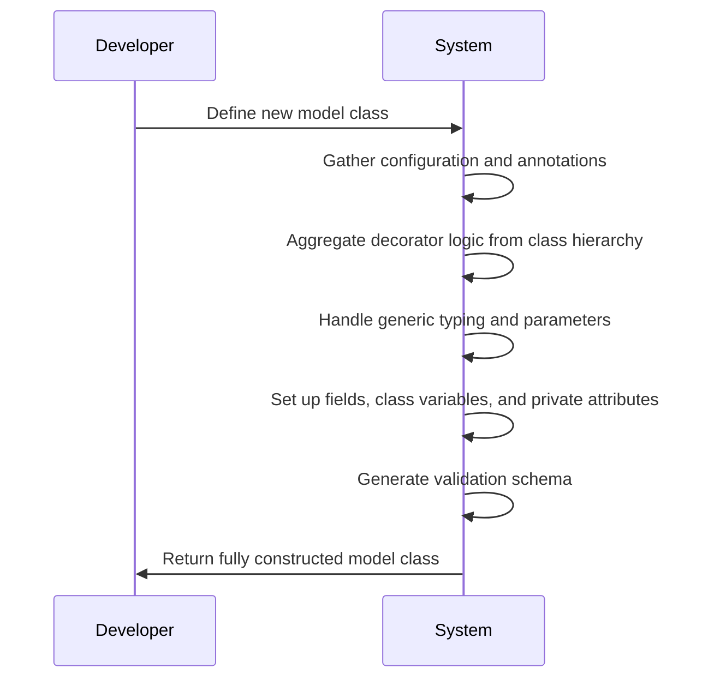
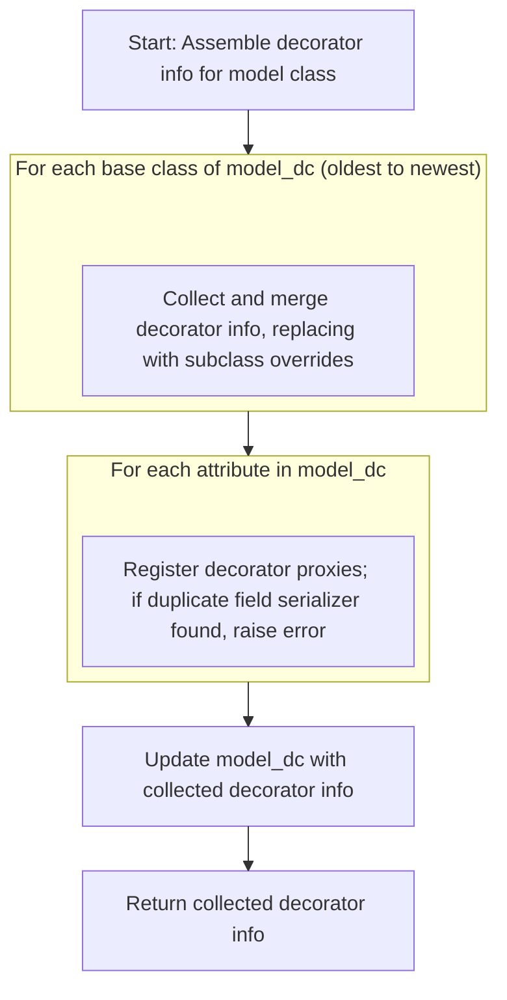
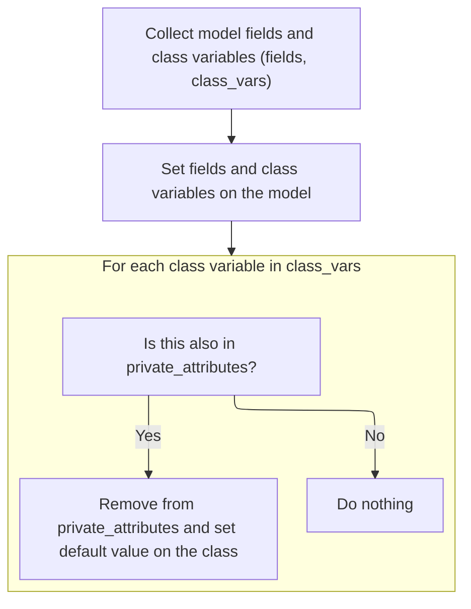
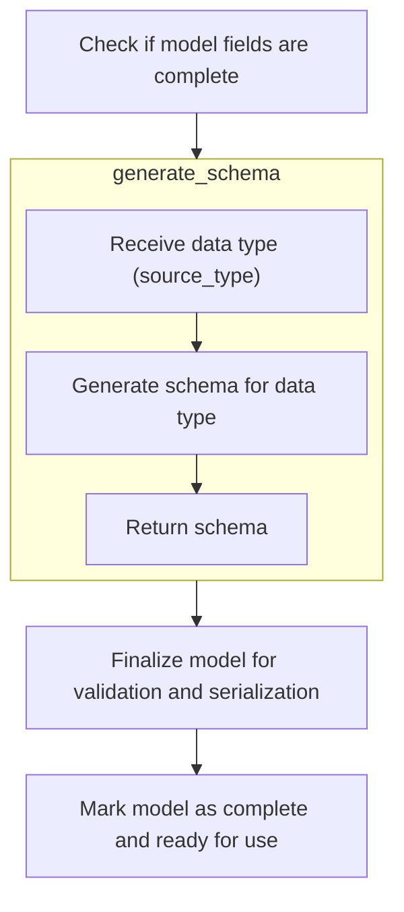
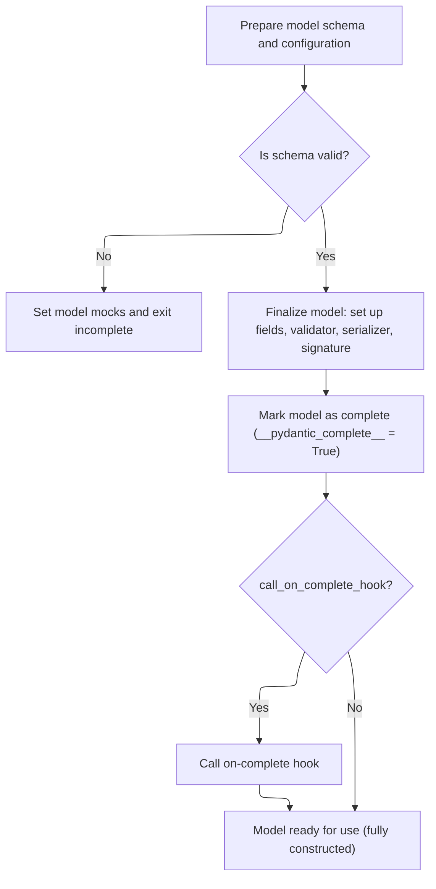

When a new model class is defined, a sequence of steps prepares it for data validation and serialization. This includes collecting configuration and annotations, aggregating decorator logic from the class hierarchy, handling generic typing, and setting up fields and class variables. The process concludes by generating the model's validation schema, resulting in a class that is ready for use in data validation tasks.

The main steps are:

- Gather configuration, annotations, and private attributes
- Aggregate decorator logic from the class and its bases
- Handle generic typing and parameters
- Set up model fields, class variables, and private attributes
- Generate the validation schema and finalize the model
- Return the constructed model class



# Spec

## Detailed View of the Program's Functionality

a. Metaclass Construction and Setup

When a new Pydantic model class is created, a special metaclass is invoked to orchestrate the setup. The process begins by extracting type annotations from the class namespace, handling both standard and future-annotations scenarios. It then gathers information from all base classes, including field names, class variables, and private attributes. Configuration for the model is assembled, and private attributes are identified and prepared. If private attributes or inherited private attributes are present, the metaclass ensures that the model's initialization logic will properly initialize these attributes, either by wrapping the <SwmToken path="pydantic/_internal/_model_construction.py" pos="139:24:26" line-data="                        &quot;&quot;&quot;We need to both initialize private attributes and call the user-defined model_post_init">`user-defined`</SwmToken> post-init method or by assigning a default initializer.

The metaclass then stores class variables and private attributes in the class namespace. The actual class object is created using the parent metaclass. The method resolution order (MRO) is checked to ensure that the base model class appears before any generic base classes, warning the user if not. The class is marked as having a custom initializer if appropriate, and the post-init hook is set up if needed. An empty dictionary is prepared for attribute handlers.

Next, the metaclass aggregates all decorator-based logic (validators, serializers, computed fields, etc.) from the class and its ancestors using a dedicated build process. This ensures that all decorator logic is available for validation and serialization.

b. Decorator Aggregation Across Inheritance

The decorator aggregation process traverses the class hierarchy from the oldest ancestor to the most derived class. For each base class, it collects any previously gathered decorator information, ensuring that subclass overrides replace base class definitions while maintaining the original order. This includes validators, field validators, root validators, field serializers, model serializers, model validators, and computed fields.

After collecting from base classes, the process inspects the current class's attributes. If any attribute is a decorator proxy (a special wrapper for decorated methods), it builds the appropriate decorator object and adds it to the result. For field serializers, it checks for duplicate serializers for the same field and raises an error if found. It also collects any wrapped functions that need to replace the proxies in the class namespace, ensuring that the class ends up with the actual methods rather than proxies.

Finally, the decorator information is cached on the class, and the proxies are replaced with the real methods, so decorated methods behave like normal Python methods.

c. Generic Metadata and Attribute Finalization

After decorator aggregation, the metaclass updates decorator information based on the model's configuration. It then handles generic typing metadata. If explicit generic metadata is provided, it is set on the class. Otherwise, it checks for required generic parameters, ensuring that all necessary parameters are present and correctly ordered. If parameters are missing or misordered, it raises a descriptive error, especially for common mistakes involving root models and generics.

The class is marked as incomplete to ensure further setup. The metaclass then calls the **set_name** protocol on all private attributes, which is necessary for correct descriptor behavior. If requested, it resets the parent namespace using weak references to avoid memory leaks. A namespace resolver is created to help with annotation resolution.

The model fields and class variables are then set up using a dedicated function, which collects all fields and class variables and updates the class accordingly.

d. Field and Class Variable Assignment

The field and class variable setup function collects all model fields and class variables, updating the class with this information. For each class variable, if it was also detected as a private attribute (which can happen with forward references or future annotations), it is removed from the private attributes and its default value is set on the class if provided. This prevents conflicts between class variables and private attributes.

e. Finalization and Model Completion

Once fields and class variables are set, the metaclass finalizes computed fields for backward compatibility. If the configuration requests deferred building, mock validators and serializers are set up. Otherwise, a finalization function is called to complete the model class. This function ensures all fields are finalized, resolves any outstanding type annotations, and prepares the model for validation and serialization.

f. Model Schema and Validator Setup

The model completion function checks if all fields are complete. If not, it attempts to rebuild them, handling any unresolved annotations and raising errors if necessary. Once fields are finalized, a schema generator is created and used to generate the core validation schema for the model. If schema generation fails due to unresolved references, mock validators and serializers are set up, and the process exits early.

If schema generation succeeds, the schema is cleaned and validated. The model's computed fields are finalized, deprecated descriptors are set up for any deprecated fields, and the core schema is stored on the class. Validators and serializers are created and attached to the class, and a lazy signature object is set up for introspection. The model is marked as complete, and any on-complete hooks are called.

g. Final Steps and Class Return

After model completion, if the model is configured as frozen and does not have a custom hash function, a default hash function is set. The parent class's subclass initialization hook is called to allow for any additional setup. The fully constructed model class is then returned, ready for use.

If the class being constructed is not a Pydantic model, special instance variables are removed from the namespace, annotations are cleared, and the class is created using the standard metaclass logic. The result is either a fully constructed Pydantic model class or a standard Python class, depending on the context.

# Rule Definition

| Paragraph Name                                                                                                                                                                                                                                                                                                                                                                                                                                                                                                                                                                                                                                                                                    | Rule ID | Category          | Description                                                                                                                                                                                                                                                                                                                                                                                                                                                                                                                                                                                                                                                                                                                                                                                                                                                                                                                                                                                                                                                                                                                                                                                                                                                                                                                                                                                                                                                                                                                                                                                                                                                                                                                                                                                                                                                                                                                                                                                                                                                                                                                                                                                                                                                                                                                                                                                                                                                                                                                                                                                                                                                                                                                                                                                                                                                                                                                                                                                                                                                                                                                                                                                                                                                                                 | Conditions                                                                                                                                                                                                                                                                                 | Remarks                                                                                                                                                                                                                                                                                                                                                                                                                                                                                                                                                                                                                                                                                                                                                                                                                                                                                                                                                                                                                                                                                                                                                                                                                                                                                                                                                                                                                                                                                                                                                                                                                                                                      |
| ------------------------------------------------------------------------------------------------------------------------------------------------------------------------------------------------------------------------------------------------------------------------------------------------------------------------------------------------------------------------------------------------------------------------------------------------------------------------------------------------------------------------------------------------------------------------------------------------------------------------------------------------------------------------------------------------- | ------- | ----------------- | ------------------------------------------------------------------------------------------------------------------------------------------------------------------------------------------------------------------------------------------------------------------------------------------------------------------------------------------------------------------------------------------------------------------------------------------------------------------------------------------------------------------------------------------------------------------------------------------------------------------------------------------------------------------------------------------------------------------------------------------------------------------------------------------------------------------------------------------------------------------------------------------------------------------------------------------------------------------------------------------------------------------------------------------------------------------------------------------------------------------------------------------------------------------------------------------------------------------------------------------------------------------------------------------------------------------------------------------------------------------------------------------------------------------------------------------------------------------------------------------------------------------------------------------------------------------------------------------------------------------------------------------------------------------------------------------------------------------------------------------------------------------------------------------------------------------------------------------------------------------------------------------------------------------------------------------------------------------------------------------------------------------------------------------------------------------------------------------------------------------------------------------------------------------------------------------------------------------------------------------------------------------------------------------------------------------------------------------------------------------------------------------------------------------------------------------------------------------------------------------------------------------------------------------------------------------------------------------------------------------------------------------------------------------------------------------------------------------------------------------------------------------------------------------------------------------------------------------------------------------------------------------------------------------------------------------------------------------------------------------------------------------------------------------------------------------------------------------------------------------------------------------------------------------------------------------------------------------------------------------------------------------------------------------- | ------------------------------------------------------------------------------------------------------------------------------------------------------------------------------------------------------------------------------------------------------------------------------------------ | ---------------------------------------------------------------------------------------------------------------------------------------------------------------------------------------------------------------------------------------------------------------------------------------------------------------------------------------------------------------------------------------------------------------------------------------------------------------------------------------------------------------------------------------------------------------------------------------------------------------------------------------------------------------------------------------------------------------------------------------------------------------------------------------------------------------------------------------------------------------------------------------------------------------------------------------------------------------------------------------------------------------------------------------------------------------------------------------------------------------------------------------------------------------------------------------------------------------------------------------------------------------------------------------------------------------------------------------------------------------------------------------------------------------------------------------------------------------------------------------------------------------------------------------------------------------------------------------------------------------------------------------------------------------------------- |
| <SwmToken path="pydantic/_internal/_model_construction.py" pos="104:6:6" line-data="        # Note `ModelMetaclass` refers to `BaseModel`, but is also used to *create* `BaseModel`, so we rely on the fact">`ModelMetaclass`</SwmToken>.**new**                                                                                                                                                                                                                                                                                                                                                                                                                                                  | RL-001  | Data Assignment   | The metaclass responsible for Pydantic model construction must accept the metaclass itself, class name (string), tuple of base classes, class attribute dictionary (namespace), and optional keyword arguments including **pydantic_generic_metadata**, **pydantic_reset_parent_namespace**, and <SwmToken path="pydantic/_internal/_model_construction.py" pos="87:1:1" line-data="        _create_model_module: str \| None = None,">`_create_model_module`</SwmToken>. The output must be a fully initialized model class (type object) with all Pydantic machinery in place.                                                                                                                                                                                                                                                                                                                                                                                                                                                                                                                                                                                                                                                                                                                                                                                                                                                                                                                                                                                                                                                                                                                                                                                                                                                                                                                                                                                                                                                                                                                                                                                                                                                                                                                                                                                                                                                                                                                                                                                                                                                                                                                                                                                                                                                                                                                                                                                                                                                                                                                                                                                                                                                                                                            | When constructing a new Pydantic model class via the metaclass.                                                                                                                                                                                                                            | The optional keyword arguments are: **pydantic_generic_metadata**, **pydantic_reset_parent_namespace**, <SwmToken path="pydantic/_internal/_model_construction.py" pos="87:1:1" line-data="        _create_model_module: str \| None = None,">`_create_model_module`</SwmToken>.                                                                                                                                                                                                                                                                                                                                                                                                                                                                                                                                                                                                                                                                                                                                                                                                                                                                                                                                                                                                                                                                                                                                                                                                                                                                                                                                                                                             |
| <SwmToken path="pydantic/_internal/_model_construction.py" pos="104:6:6" line-data="        # Note `ModelMetaclass` refers to `BaseModel`, but is also used to *create* `BaseModel`, so we rely on the fact">`ModelMetaclass`</SwmToken>.**new**, <SwmToken path="pydantic/_internal/_model_construction.py" pos="172:7:9" line-data="            cls.__pydantic_decorators__ = DecoratorInfos.build(cls)">`DecoratorInfos.build`</SwmToken>                                                                                                                                                                                                                                                      | RL-002  | Conditional Logic | During model construction, decorator information for validation and serialization must be gathered from the class and all base classes. Subclass decorators override base class decorators. The aggregated information is stored in a <SwmToken path="pydantic/_internal/_model_construction.py" pos="172:7:7" line-data="            cls.__pydantic_decorators__ = DecoratorInfos.build(cls)">`DecoratorInfos`</SwmToken> object.                                                                                                                                                                                                                                                                                                                                                                                                                                                                                                                                                                                                                                                                                                                                                                                                                                                                                                                                                                                                                                                                                                                                                                                                                                                                                                                                                                                                                                                                                                                                                                                                                                                                                                                                                                                                                                                                                                                                                                                                                                                                                                                                                                                                                                                                                                                                                                                                                                                                                                                                                                                                                                                                                                                                                                                                                                                          | When building a new model class and decorators are present in the class or its bases.                                                                                                                                                                                                      | <SwmToken path="pydantic/_internal/_model_construction.py" pos="172:7:7" line-data="            cls.__pydantic_decorators__ = DecoratorInfos.build(cls)">`DecoratorInfos`</SwmToken> object must have attributes: validators, <SwmToken path="pydantic/_internal/_decorators.py" pos="450:3:3" line-data="            res.field_validators.update({k: v.bind_to_cls(model_dc) for k, v in existing.field_validators.items()})">`field_validators`</SwmToken>, <SwmToken path="pydantic/_internal/_decorators.py" pos="451:3:3" line-data="            res.root_validators.update({k: v.bind_to_cls(model_dc) for k, v in existing.root_validators.items()})">`root_validators`</SwmToken>, <SwmToken path="pydantic/_internal/_decorators.py" pos="452:3:3" line-data="            res.field_serializers.update({k: v.bind_to_cls(model_dc) for k, v in existing.field_serializers.items()})">`field_serializers`</SwmToken>, <SwmToken path="pydantic/_internal/_decorators.py" pos="453:3:3" line-data="            res.model_serializers.update({k: v.bind_to_cls(model_dc) for k, v in existing.model_serializers.items()})">`model_serializers`</SwmToken>, <SwmToken path="pydantic/_internal/_decorators.py" pos="454:3:3" line-data="            res.model_validators.update({k: v.bind_to_cls(model_dc) for k, v in existing.model_validators.items()})">`model_validators`</SwmToken>, <SwmToken path="pydantic/_internal/_model_construction.py" pos="244:21:21" line-data="                k: v.info for k, v in cls.__pydantic_decorators__.computed_fields.items()">`computed_fields`</SwmToken>. Each is a dict mapping attribute names to Decorator objects. |
| Decorator, <SwmToken path="pydantic/_internal/_model_construction.py" pos="172:7:7" line-data="            cls.__pydantic_decorators__ = DecoratorInfos.build(cls)">`DecoratorInfos`</SwmToken>                                                                                                                                                                                                                                                                                                                                                                                                                                                                                                   | RL-003  | Data Assignment   | Each Decorator object must contain a reference to the class (<SwmToken path="pydantic/_internal/_decorators.py" pos="225:1:1" line-data="        cls_ref: The class ref.">`cls_ref`</SwmToken>), the name of the decorated attribute (<SwmToken path="pydantic/_internal/_decorators.py" pos="464:4:4" line-data="                        model_dc, cls_var_name=var_name, shim=var_value.shim, info=info">`cls_var_name`</SwmToken>), the actual function (func), an optional wrapper (shim), and decorator metadata (info).                                                                                                                                                                                                                                                                                                                                                                                                                                                                                                                                                                                                                                                                                                                                                                                                                                                                                                                                                                                                                                                                                                                                                                                                                                                                                                                                                                                                                                                                                                                                                                                                                                                                                                                                                                                                                                                                                                                                                                                                                                                                                                                                                                                                                                                                                                                                                                                                                                                                                                                                                                                                                                                                                                                                                               | Whenever a decorator is registered for a model class.                                                                                                                                                                                                                                      | Decorator objects are stored in the <SwmToken path="pydantic/_internal/_model_construction.py" pos="172:7:7" line-data="            cls.__pydantic_decorators__ = DecoratorInfos.build(cls)">`DecoratorInfos`</SwmToken> dicts.                                                                                                                                                                                                                                                                                                                                                                                                                                                                                                                                                                                                                                                                                                                                                                                                                                                                                                                                                                                                                                                                                                                                                                                                                                                                                                                                                                                                                                              |
| <SwmToken path="pydantic/_internal/_model_construction.py" pos="104:6:6" line-data="        # Note `ModelMetaclass` refers to `BaseModel`, but is also used to *create* `BaseModel`, so we rely on the fact">`ModelMetaclass`</SwmToken>.**new**, <SwmToken path="pydantic/_internal/_model_construction.py" pos="239:1:1" line-data="            set_model_fields(cls, config_wrapper=config_wrapper, ns_resolver=ns_resolver)">`set_model_fields`</SwmToken>, <SwmToken path="pydantic/_internal/_model_construction.py" pos="241:14:14" line-data="            # This is also set in `complete_model_class()`, after schema gen because they are recreated.">`complete_model_class`</SwmToken> | RL-004  | Data Assignment   | The model class must set up the following attributes: **pydantic_fields**, <SwmToken path="pydantic/_internal/_model_construction.py" pos="125:4:4" line-data="            base_field_names, class_vars, base_private_attributes = mcs._collect_bases_data(bases)">`class_vars`</SwmToken>, <SwmToken path="pydantic/_internal/_model_construction.py" pos="129:1:1" line-data="            private_attributes = inspect_namespace(">`private_attributes`</SwmToken>, **pydantic_decorators**, **pydantic_computed_fields**, **pydantic_core_schema**, **pydantic_validator**, **pydantic_serializer**, **signature**, **pydantic_complete**, **pydantic_generic_metadata**, <SwmToken path="pydantic/_internal/_model_construction.py" pos="128:4:4" line-data="            namespace[&#39;model_config&#39;] = config_wrapper.config_dict">`model_config`</SwmToken>, <SwmToken path="pydantic/_internal/_model_construction.py" pos="135:15:15" line-data="                    # if there are private_attributes and a model_post_init function, we handle both">`model_post_init`</SwmToken>, **pydantic_setattr_handlers**, **pydantic_custom_init**, **pydantic_post_init**.                                                                                                                                                                                                                                                                                                                                                                                                                                                                                                                                                                                                                                                                                                                                                                                                                                                                                                                                                                                                                                                                                                                                                                                                                                                                                                                                                                                                                                                                                                                                                                                                                                                                                                                                                                                                                                                                                                                                                                                                                                                                                                          | When a new model class is created.                                                                                                                                                                                                                                                         | Each attribute has a specific type and purpose. For example, **pydantic_fields** is a dict of field names to <SwmToken path="pydantic/_internal/_model_construction.py" pos="42:8:8" line-data="    from ..fields import FieldInfo, ModelPrivateAttr">`FieldInfo`</SwmToken> objects.                                                                                                                                                                                                                                                                                                                                                                                                                                                                                                                                                                                                                                                                                                                                                                                                                                                                                                                                                                                                                                                                                                                                                                                                                                                                                                                                                                                        |
| <SwmToken path="pydantic/_internal/_model_construction.py" pos="42:8:8" line-data="    from ..fields import FieldInfo, ModelPrivateAttr">`FieldInfo`</SwmToken>, <SwmToken path="pydantic/_internal/_model_construction.py" pos="239:1:1" line-data="            set_model_fields(cls, config_wrapper=config_wrapper, ns_resolver=ns_resolver)">`set_model_fields`</SwmToken>, <SwmToken path="pydantic/_internal/_model_construction.py" pos="241:14:14" line-data="            # This is also set in `complete_model_class()`, after schema gen because they are recreated.">`complete_model_class`</SwmToken>                                                                                  | RL-005  | Data Assignment   | Each <SwmToken path="pydantic/_internal/_model_construction.py" pos="42:8:8" line-data="    from ..fields import FieldInfo, ModelPrivateAttr">`FieldInfo`</SwmToken> object for a field must include: name (string), type\_ (type), default (any value or undefined marker), required (boolean), alias (string or None), description (string or None), <SwmToken path="pydantic/_internal/_model_construction.py" pos="701:10:10" line-data="        if (msg := field_info.deprecation_message) is not None:">`deprecation_message`</SwmToken> (string or None), and \_complete (boolean). Additional attributes for constraints and validators may be present.                                                                                                                                                                                                                                                                                                                                                                                                                                                                                                                                                                                                                                                                                                                                                                                                                                                                                                                                                                                                                                                                                                                                                                                                                                                                                                                                                                                                                                                                                                                                                                                                                                                                                                                                                                                                                                                                                                                                                                                                                                                                                                                                                                                                                                                                                                                                                                                                                                                                                                                                                                                                                             | When defining fields for a model.                                                                                                                                                                                                                                                          | <SwmToken path="pydantic/_internal/_model_construction.py" pos="42:8:8" line-data="    from ..fields import FieldInfo, ModelPrivateAttr">`FieldInfo`</SwmToken> objects are stored in **pydantic_fields**.                                                                                                                                                                                                                                                                                                                                                                                                                                                                                                                                                                                                                                                                                                                                                                                                                                                                                                                                                                                                                                                                                                                                                                                                                                                                                                                                                                                                                                                                   |
| <SwmToken path="pydantic/_internal/_model_construction.py" pos="129:5:5" line-data="            private_attributes = inspect_namespace(">`inspect_namespace`</SwmToken>, <SwmToken path="pydantic/_internal/_model_construction.py" pos="142:1:1" line-data="                        init_private_attributes(self, context)">`init_private_attributes`</SwmToken>, <SwmToken path="pydantic/_internal/_model_construction.py" pos="104:6:6" line-data="        # Note `ModelMetaclass` refers to `BaseModel`, but is also used to *create* `BaseModel`, so we rely on the fact">`ModelMetaclass`</SwmToken>.**new**                                                                               | RL-006  | Conditional Logic | Private attributes must be managed by a descriptor that implements **get**, **set**, and **set_name**, stores a default value if provided, and provides a <SwmToken path="pydantic/_internal/_model_construction.py" pos="363:7:9" line-data="            default = private_attr.get_default()">`get_default()`</SwmToken> method for initialization. Private attributes must not be included in serialization or validation.                                                                                                                                                                                                                                                                                                                                                                                                                                                                                                                                                                                                                                                                                                                                                                                                                                                                                                                                                                                                                                                                                                                                                                                                                                                                                                                                                                                                                                                                                                                                                                                                                                                                                                                                                                                                                                                                                                                                                                                                                                                                                                                                                                                                                                                                                                                                                                                                                                                                                                                                                                                                                                                                                                                                                                                                                                                               | When a model defines private attributes.                                                                                                                                                                                                                                                   | Private attributes are stored in <SwmToken path="pydantic/_internal/_model_construction.py" pos="129:1:1" line-data="            private_attributes = inspect_namespace(">`private_attributes`</SwmToken> and are excluded from serialization/validation.                                                                                                                                                                                                                                                                                                                                                                                                                                                                                                                                                                                                                                                                                                                                                                                                                                                                                                                                                                                                                                                                                                                                                                                                                                                                                                                                                                                                                    |
| <SwmToken path="pydantic/_internal/_model_construction.py" pos="241:14:14" line-data="            # This is also set in `complete_model_class()`, after schema gen because they are recreated.">`complete_model_class`</SwmToken>, <SwmToken path="pydantic/_internal/_model_construction.py" pos="104:6:6" line-data="        # Note `ModelMetaclass` refers to `BaseModel`, but is also used to *create* `BaseModel`, so we rely on the fact">`ModelMetaclass`</SwmToken>.**new**                                                                                                                                                                                                               | RL-007  | Computation       | The compiled validator callable (**pydantic_validator**) must accept input data and return a validated model instance or raise a validation error. The compiled serializer callable (**pydantic_serializer**) must accept a model instance and return a serialized representation (<SwmToken path="pydantic/_internal/_model_construction.py" pos="159:21:23" line-data="                        &#39;Classes should inherit from `BaseModel` before generic classes (e.g. `typing.Generic[T]`) &#39;">`e.g`</SwmToken>., dict or JSON-compatible structure).                                                                                                                                                                                                                                                                                                                                                                                                                                                                                                                                                                                                                                                                                                                                                                                                                                                                                                                                                                                                                                                                                                                                                                                                                                                                                                                                                                                                                                                                                                                                                                                                                                                                                                                                                                                                                                                                                                                                                                                                                                                                                                                                                                                                                                                                                                                                                                                                                                                                                                                                                                                                                                                                                                                               | When the model is used for validation or serialization.                                                                                                                                                                                                                                    | Validator and serializer are stored as callables on the model class.                                                                                                                                                                                                                                                                                                                                                                                                                                                                                                                                                                                                                                                                                                                                                                                                                                                                                                                                                                                                                                                                                                                                                                                                                                                                                                                                                                                                                                                                                                                                                                                                         |
| <SwmToken path="pydantic/_internal/_model_construction.py" pos="104:6:6" line-data="        # Note `ModelMetaclass` refers to `BaseModel`, but is also used to *create* `BaseModel`, so we rely on the fact">`ModelMetaclass`</SwmToken>.**new**                                                                                                                                                                                                                                                                                                                                                                                                                                                  | RL-008  | Conditional Logic | If a subclass of <SwmToken path="pydantic/_internal/_model_construction.py" pos="186:24:24" line-data="                        # This is a special case where the user has subclassed `RootModel`, but has not parametrized">`RootModel`</SwmToken> does not include the required generic type identifiers, raise <SwmToken path="pydantic/_internal/_model_construction.py" pos="216:3:3" line-data="                    raise TypeError(error_message)">`TypeError`</SwmToken> with the message: '<ModelName> is a subclass of <SwmToken path="pydantic/_internal/_model_construction.py" pos="186:24:24" line-data="                        # This is a special case where the user has subclassed `RootModel`, but has not parametrized">`RootModel`</SwmToken>, but does not include the generic type identifier(s) <T> in its parameters. You should parametrize <SwmToken path="pydantic/_internal/_model_construction.py" pos="186:24:24" line-data="                        # This is a special case where the user has subclassed `RootModel`, but has not parametrized">`RootModel`</SwmToken> directly, <SwmToken path="pydantic/_internal/_model_construction.py" pos="159:21:23" line-data="                        &#39;Classes should inherit from `BaseModel` before generic classes (e.g. `typing.Generic[T]`) &#39;">`e.g`</SwmToken>., class <ModelName>(<SwmToken path="pydantic/_internal/_model_construction.py" pos="186:24:24" line-data="                        # This is a special case where the user has subclassed `RootModel`, but has not parametrized">`RootModel`</SwmToken>\[<T>\]): ...'. If not all generic parameters are present, raise <SwmToken path="pydantic/_internal/_model_construction.py" pos="216:3:3" line-data="                    raise TypeError(error_message)">`TypeError`</SwmToken> with the message: 'All parameters must be present on <SwmToken path="pydantic/_internal/_model_construction.py" pos="159:27:29" line-data="                        &#39;Classes should inherit from `BaseModel` before generic classes (e.g. `typing.Generic[T]`) &#39;">`typing.Generic`</SwmToken>; you should inherit from <SwmToken path="pydantic/_internal/_model_construction.py" pos="159:27:29" line-data="                        &#39;Classes should inherit from `BaseModel` before generic classes (e.g. `typing.Generic[T]`) &#39;">`typing.Generic`</SwmToken>\[<T>, ...\].' If Generic is not last in the base classes, append: 'Note: <SwmToken path="pydantic/_internal/_model_construction.py" pos="159:27:29" line-data="                        &#39;Classes should inherit from `BaseModel` before generic classes (e.g. `typing.Generic[T]`) &#39;">`typing.Generic`</SwmToken> must go last: class <ModelName>(<SwmToken path="pydantic/_internal/_model_construction.py" pos="104:14:14" line-data="        # Note `ModelMetaclass` refers to `BaseModel`, but is also used to *create* `BaseModel`, so we rely on the fact">`BaseModel`</SwmToken>, <SwmToken path="pydantic/_internal/_model_construction.py" pos="159:27:29" line-data="                        &#39;Classes should inherit from `BaseModel` before generic classes (e.g. `typing.Generic[T]`) &#39;">`typing.Generic`</SwmToken>\[<T>\]): ...'. | When constructing a generic model class or subclassing <SwmToken path="pydantic/_internal/_model_construction.py" pos="186:24:24" line-data="                        # This is a special case where the user has subclassed `RootModel`, but has not parametrized">`RootModel`</SwmToken>. | Error messages must match the specified formats.                                                                                                                                                                                                                                                                                                                                                                                                                                                                                                                                                                                                                                                                                                                                                                                                                                                                                                                                                                                                                                                                                                                                                                                                                                                                                                                                                                                                                                                                                                                                                                                                                             |
| <SwmToken path="pydantic/_internal/_model_construction.py" pos="241:14:14" line-data="            # This is also set in `complete_model_class()`, after schema gen because they are recreated.">`complete_model_class`</SwmToken>, <SwmToken path="pydantic/_internal/_model_construction.py" pos="612:13:13" line-data="        # Alternatively, we could let `GenerateSchema()` raise the error, but there are cases where incomplete">`GenerateSchema`</SwmToken>, <SwmPath>[pydantic/\_internal/\_schema_generation_shared.py](pydantic/_internal/_schema_generation_shared.py)</SwmPath>                                                                                                     | RL-009  | Data Assignment   | The schema generated for the model must be a nested dictionary with at least a 'type' key (such as 'model' or <SwmToken path="pydantic/_internal/_schema_generation_shared.py" pos="114:13:15" line-data="        if maybe_ref_schema[&#39;type&#39;] == &#39;definition-ref&#39;:">`definition-ref`</SwmToken>), and may include keys like 'fields', <SwmToken path="pydantic/_internal/_schema_generation_shared.py" pos="115:8:8" line-data="            ref = maybe_ref_schema[&#39;schema_ref&#39;]">`schema_ref`</SwmToken>, and 'definitions'. The schema must support references for recursive models.                                                                                                                                                                                                                                                                                                                                                                                                                                                                                                                                                                                                                                                                                                                                                                                                                                                                                                                                                                                                                                                                                                                                                                                                                                                                                                                                                                                                                                                                                                                                                                                                                                                                                                                                                                                                                                                                                                                                                                                                                                                                                                                                                                                                                                                                                                                                                                                                                                                                                                                                                                                                                                                                              | When generating the schema for a model.                                                                                                                                                                                                                                                    | Schema is a nested dict with required and optional keys. Must support recursive references.                                                                                                                                                                                                                                                                                                                                                                                                                                                                                                                                                                                                                                                                                                                                                                                                                                                                                                                                                                                                                                                                                                                                                                                                                                                                                                                                                                                                                                                                                                                                                                                  |
| <SwmToken path="pydantic/_internal/_model_construction.py" pos="241:14:14" line-data="            # This is also set in `complete_model_class()`, after schema gen because they are recreated.">`complete_model_class`</SwmToken>, <SwmToken path="pydantic/_internal/_model_construction.py" pos="661:1:1" line-data="    set_deprecated_descriptors(cls)">`set_deprecated_descriptors`</SwmToken>, <SwmToken path="pydantic/_internal/_model_construction.py" pos="658:18:18" line-data="    # of the properties are evaluated and the `ComputedFieldInfo` are recreated:">`ComputedFieldInfo`</SwmToken>                                                                                       | RL-010  | Conditional Logic | Computed fields must be represented by <SwmToken path="pydantic/_internal/_model_construction.py" pos="658:18:18" line-data="    # of the properties are evaluated and the `ComputedFieldInfo` are recreated:">`ComputedFieldInfo`</SwmToken> objects, each containing: name (string), <SwmToken path="pydantic/_internal/_model_construction.py" pos="710:11:11" line-data="            and not hasattr(unwrap_wrapped_function(computed_field_info.wrapped_property), &#39;__deprecated__&#39;)">`wrapped_property`</SwmToken> (property object), <SwmToken path="pydantic/_internal/_model_construction.py" pos="701:10:10" line-data="        if (msg := field_info.deprecation_message) is not None:">`deprecation_message`</SwmToken> (string or None), and additional metadata. Computed fields must be included in serialization output if configured, and must emit a deprecation warning if accessed and deprecated.                                                                                                                                                                                                                                                                                                                                                                                                                                                                                                                                                                                                                                                                                                                                                                                                                                                                                                                                                                                                                                                                                                                                                                                                                                                                                                                                                                                                                                                                                                                                                                                                                                                                                                                                                                                                                                                                                                                                                                                                                                                                                                                                                                                                                                                                                                                                                              | When a model defines computed fields.                                                                                                                                                                                                                                                      | <SwmToken path="pydantic/_internal/_model_construction.py" pos="658:18:18" line-data="    # of the properties are evaluated and the `ComputedFieldInfo` are recreated:">`ComputedFieldInfo`</SwmToken> objects are stored in **pydantic_computed_fields**. Deprecation warnings must be emitted if <SwmToken path="pydantic/_internal/_model_construction.py" pos="701:10:10" line-data="        if (msg := field_info.deprecation_message) is not None:">`deprecation_message`</SwmToken> is set.                                                                                                                                                                                                                                                                                                                                                                                                                                                                                                                                                                                                                                                                                                                                                                                                                                                                                                                                                                                                                                                                                                                                                                           |
| <SwmToken path="pydantic/_internal/_model_construction.py" pos="239:1:1" line-data="            set_model_fields(cls, config_wrapper=config_wrapper, ns_resolver=ns_resolver)">`set_model_fields`</SwmToken>                                                                                                                                                                                                                                                                                                                                                                                                                                                                                      | RL-011  | Conditional Logic | During model construction, class variables that are also present as private attributes must be removed from the private attributes collection and have their default value set on the class to avoid clashes.                                                                                                                                                                                                                                                                                                                                                                                                                                                                                                                                                                                                                                                                                                                                                                                                                                                                                                                                                                                                                                                                                                                                                                                                                                                                                                                                                                                                                                                                                                                                                                                                                                                                                                                                                                                                                                                                                                                                                                                                                                                                                                                                                                                                                                                                                                                                                                                                                                                                                                                                                                                                                                                                                                                                                                                                                                                                                                                                                                                                                                                                               | When a class variable name matches a private attribute name.                                                                                                                                                                                                                               | Default value is set on the class if present.                                                                                                                                                                                                                                                                                                                                                                                                                                                                                                                                                                                                                                                                                                                                                                                                                                                                                                                                                                                                                                                                                                                                                                                                                                                                                                                                                                                                                                                                                                                                                                                                                                |
| <SwmToken path="pydantic/_internal/_model_construction.py" pos="241:14:14" line-data="            # This is also set in `complete_model_class()`, after schema gen because they are recreated.">`complete_model_class`</SwmToken>, <SwmToken path="pydantic/_internal/_model_construction.py" pos="104:6:6" line-data="        # Note `ModelMetaclass` refers to `BaseModel`, but is also used to *create* `BaseModel`, so we rely on the fact">`ModelMetaclass`</SwmToken>.**new**                                                                                                                                                                                                               | RL-012  | Data Assignment   | After all setup, the model class must be marked as complete and ready for use, with all fields, validators, serializers, computed fields, and schema finalized and accessible via the documented attributes.                                                                                                                                                                                                                                                                                                                                                                                                                                                                                                                                                                                                                                                                                                                                                                                                                                                                                                                                                                                                                                                                                                                                                                                                                                                                                                                                                                                                                                                                                                                                                                                                                                                                                                                                                                                                                                                                                                                                                                                                                                                                                                                                                                                                                                                                                                                                                                                                                                                                                                                                                                                                                                                                                                                                                                                                                                                                                                                                                                                                                                                                                | After model construction and setup.                                                                                                                                                                                                                                                        | Set **pydantic_complete** to True and ensure all machinery is accessible.                                                                                                                                                                                                                                                                                                                                                                                                                                                                                                                                                                                                                                                                                                                                                                                                                                                                                                                                                                                                                                                                                                                                                                                                                                                                                                                                                                                                                                                                                                                                                                                                    |

# User Stories

## User Story 1: Model construction and readiness

---

### Story Description:

As a user of Pydantic, I want to define model classes that are fully initialized with all required machinery, handle generic models correctly, and ensure the model is ready for use so that I can reliably create, validate, and serialize data structures.

---

### Business Rule Mapping:

| Rule ID | Paragraph Name                                                                                                                                                                                                                                                                                                                                                                                                                                                                                                                                                                                                                                                                                    | Rule Description                                                                                                                                                                                                                                                                                                                                                                                                                                                                                                                                                                                                                                                                                                                                                                                                                                                                                                                                                                                                                                                                                                                                                                                                                                                                                                                                                                                                                                                                                                                                                                                                                                                                                                                                                                                                                                                                                                                                                                                                                                                                                                                                                                                                                                                                                                                                                                                                                                                                                                                                                                                                                                                                                                                                                                                                                                                                                                                                                                                                                                                                                                                                                                                                                                                                            |
| ------- | ------------------------------------------------------------------------------------------------------------------------------------------------------------------------------------------------------------------------------------------------------------------------------------------------------------------------------------------------------------------------------------------------------------------------------------------------------------------------------------------------------------------------------------------------------------------------------------------------------------------------------------------------------------------------------------------------- | ------------------------------------------------------------------------------------------------------------------------------------------------------------------------------------------------------------------------------------------------------------------------------------------------------------------------------------------------------------------------------------------------------------------------------------------------------------------------------------------------------------------------------------------------------------------------------------------------------------------------------------------------------------------------------------------------------------------------------------------------------------------------------------------------------------------------------------------------------------------------------------------------------------------------------------------------------------------------------------------------------------------------------------------------------------------------------------------------------------------------------------------------------------------------------------------------------------------------------------------------------------------------------------------------------------------------------------------------------------------------------------------------------------------------------------------------------------------------------------------------------------------------------------------------------------------------------------------------------------------------------------------------------------------------------------------------------------------------------------------------------------------------------------------------------------------------------------------------------------------------------------------------------------------------------------------------------------------------------------------------------------------------------------------------------------------------------------------------------------------------------------------------------------------------------------------------------------------------------------------------------------------------------------------------------------------------------------------------------------------------------------------------------------------------------------------------------------------------------------------------------------------------------------------------------------------------------------------------------------------------------------------------------------------------------------------------------------------------------------------------------------------------------------------------------------------------------------------------------------------------------------------------------------------------------------------------------------------------------------------------------------------------------------------------------------------------------------------------------------------------------------------------------------------------------------------------------------------------------------------------------------------------------------------- |
| RL-011  | <SwmToken path="pydantic/_internal/_model_construction.py" pos="239:1:1" line-data="            set_model_fields(cls, config_wrapper=config_wrapper, ns_resolver=ns_resolver)">`set_model_fields`</SwmToken>                                                                                                                                                                                                                                                                                                                                                                                                                                                                                      | During model construction, class variables that are also present as private attributes must be removed from the private attributes collection and have their default value set on the class to avoid clashes.                                                                                                                                                                                                                                                                                                                                                                                                                                                                                                                                                                                                                                                                                                                                                                                                                                                                                                                                                                                                                                                                                                                                                                                                                                                                                                                                                                                                                                                                                                                                                                                                                                                                                                                                                                                                                                                                                                                                                                                                                                                                                                                                                                                                                                                                                                                                                                                                                                                                                                                                                                                                                                                                                                                                                                                                                                                                                                                                                                                                                                                                               |
| RL-012  | <SwmToken path="pydantic/_internal/_model_construction.py" pos="241:14:14" line-data="            # This is also set in `complete_model_class()`, after schema gen because they are recreated.">`complete_model_class`</SwmToken>, <SwmToken path="pydantic/_internal/_model_construction.py" pos="104:6:6" line-data="        # Note `ModelMetaclass` refers to `BaseModel`, but is also used to *create* `BaseModel`, so we rely on the fact">`ModelMetaclass`</SwmToken>.**new**                                                                                                                                                                                                               | After all setup, the model class must be marked as complete and ready for use, with all fields, validators, serializers, computed fields, and schema finalized and accessible via the documented attributes.                                                                                                                                                                                                                                                                                                                                                                                                                                                                                                                                                                                                                                                                                                                                                                                                                                                                                                                                                                                                                                                                                                                                                                                                                                                                                                                                                                                                                                                                                                                                                                                                                                                                                                                                                                                                                                                                                                                                                                                                                                                                                                                                                                                                                                                                                                                                                                                                                                                                                                                                                                                                                                                                                                                                                                                                                                                                                                                                                                                                                                                                                |
| RL-001  | <SwmToken path="pydantic/_internal/_model_construction.py" pos="104:6:6" line-data="        # Note `ModelMetaclass` refers to `BaseModel`, but is also used to *create* `BaseModel`, so we rely on the fact">`ModelMetaclass`</SwmToken>.**new**                                                                                                                                                                                                                                                                                                                                                                                                                                                  | The metaclass responsible for Pydantic model construction must accept the metaclass itself, class name (string), tuple of base classes, class attribute dictionary (namespace), and optional keyword arguments including **pydantic_generic_metadata**, **pydantic_reset_parent_namespace**, and <SwmToken path="pydantic/_internal/_model_construction.py" pos="87:1:1" line-data="        _create_model_module: str \| None = None,">`_create_model_module`</SwmToken>. The output must be a fully initialized model class (type object) with all Pydantic machinery in place.                                                                                                                                                                                                                                                                                                                                                                                                                                                                                                                                                                                                                                                                                                                                                                                                                                                                                                                                                                                                                                                                                                                                                                                                                                                                                                                                                                                                                                                                                                                                                                                                                                                                                                                                                                                                                                                                                                                                                                                                                                                                                                                                                                                                                                                                                                                                                                                                                                                                                                                                                                                                                                                                                                            |
| RL-004  | <SwmToken path="pydantic/_internal/_model_construction.py" pos="104:6:6" line-data="        # Note `ModelMetaclass` refers to `BaseModel`, but is also used to *create* `BaseModel`, so we rely on the fact">`ModelMetaclass`</SwmToken>.**new**, <SwmToken path="pydantic/_internal/_model_construction.py" pos="239:1:1" line-data="            set_model_fields(cls, config_wrapper=config_wrapper, ns_resolver=ns_resolver)">`set_model_fields`</SwmToken>, <SwmToken path="pydantic/_internal/_model_construction.py" pos="241:14:14" line-data="            # This is also set in `complete_model_class()`, after schema gen because they are recreated.">`complete_model_class`</SwmToken> | The model class must set up the following attributes: **pydantic_fields**, <SwmToken path="pydantic/_internal/_model_construction.py" pos="125:4:4" line-data="            base_field_names, class_vars, base_private_attributes = mcs._collect_bases_data(bases)">`class_vars`</SwmToken>, <SwmToken path="pydantic/_internal/_model_construction.py" pos="129:1:1" line-data="            private_attributes = inspect_namespace(">`private_attributes`</SwmToken>, **pydantic_decorators**, **pydantic_computed_fields**, **pydantic_core_schema**, **pydantic_validator**, **pydantic_serializer**, **signature**, **pydantic_complete**, **pydantic_generic_metadata**, <SwmToken path="pydantic/_internal/_model_construction.py" pos="128:4:4" line-data="            namespace[&#39;model_config&#39;] = config_wrapper.config_dict">`model_config`</SwmToken>, <SwmToken path="pydantic/_internal/_model_construction.py" pos="135:15:15" line-data="                    # if there are private_attributes and a model_post_init function, we handle both">`model_post_init`</SwmToken>, **pydantic_setattr_handlers**, **pydantic_custom_init**, **pydantic_post_init**.                                                                                                                                                                                                                                                                                                                                                                                                                                                                                                                                                                                                                                                                                                                                                                                                                                                                                                                                                                                                                                                                                                                                                                                                                                                                                                                                                                                                                                                                                                                                                                                                                                                                                                                                                                                                                                                                                                                                                                                                                                                                                                          |
| RL-008  | <SwmToken path="pydantic/_internal/_model_construction.py" pos="104:6:6" line-data="        # Note `ModelMetaclass` refers to `BaseModel`, but is also used to *create* `BaseModel`, so we rely on the fact">`ModelMetaclass`</SwmToken>.**new**                                                                                                                                                                                                                                                                                                                                                                                                                                                  | If a subclass of <SwmToken path="pydantic/_internal/_model_construction.py" pos="186:24:24" line-data="                        # This is a special case where the user has subclassed `RootModel`, but has not parametrized">`RootModel`</SwmToken> does not include the required generic type identifiers, raise <SwmToken path="pydantic/_internal/_model_construction.py" pos="216:3:3" line-data="                    raise TypeError(error_message)">`TypeError`</SwmToken> with the message: '<ModelName> is a subclass of <SwmToken path="pydantic/_internal/_model_construction.py" pos="186:24:24" line-data="                        # This is a special case where the user has subclassed `RootModel`, but has not parametrized">`RootModel`</SwmToken>, but does not include the generic type identifier(s) <T> in its parameters. You should parametrize <SwmToken path="pydantic/_internal/_model_construction.py" pos="186:24:24" line-data="                        # This is a special case where the user has subclassed `RootModel`, but has not parametrized">`RootModel`</SwmToken> directly, <SwmToken path="pydantic/_internal/_model_construction.py" pos="159:21:23" line-data="                        &#39;Classes should inherit from `BaseModel` before generic classes (e.g. `typing.Generic[T]`) &#39;">`e.g`</SwmToken>., class <ModelName>(<SwmToken path="pydantic/_internal/_model_construction.py" pos="186:24:24" line-data="                        # This is a special case where the user has subclassed `RootModel`, but has not parametrized">`RootModel`</SwmToken>\[<T>\]): ...'. If not all generic parameters are present, raise <SwmToken path="pydantic/_internal/_model_construction.py" pos="216:3:3" line-data="                    raise TypeError(error_message)">`TypeError`</SwmToken> with the message: 'All parameters must be present on <SwmToken path="pydantic/_internal/_model_construction.py" pos="159:27:29" line-data="                        &#39;Classes should inherit from `BaseModel` before generic classes (e.g. `typing.Generic[T]`) &#39;">`typing.Generic`</SwmToken>; you should inherit from <SwmToken path="pydantic/_internal/_model_construction.py" pos="159:27:29" line-data="                        &#39;Classes should inherit from `BaseModel` before generic classes (e.g. `typing.Generic[T]`) &#39;">`typing.Generic`</SwmToken>\[<T>, ...\].' If Generic is not last in the base classes, append: 'Note: <SwmToken path="pydantic/_internal/_model_construction.py" pos="159:27:29" line-data="                        &#39;Classes should inherit from `BaseModel` before generic classes (e.g. `typing.Generic[T]`) &#39;">`typing.Generic`</SwmToken> must go last: class <ModelName>(<SwmToken path="pydantic/_internal/_model_construction.py" pos="104:14:14" line-data="        # Note `ModelMetaclass` refers to `BaseModel`, but is also used to *create* `BaseModel`, so we rely on the fact">`BaseModel`</SwmToken>, <SwmToken path="pydantic/_internal/_model_construction.py" pos="159:27:29" line-data="                        &#39;Classes should inherit from `BaseModel` before generic classes (e.g. `typing.Generic[T]`) &#39;">`typing.Generic`</SwmToken>\[<T>\]): ...'. |

---

### Relevant Functionality:

- <SwmToken path="pydantic/_internal/_model_construction.py" pos="239:1:1" line-data="            set_model_fields(cls, config_wrapper=config_wrapper, ns_resolver=ns_resolver)">`set_model_fields`</SwmToken>
  1. **RL-011:**
     - For each class variable, check if it exists in private attributes.
     - If so, remove from private attributes and set default on the class.
- <SwmToken path="pydantic/_internal/_model_construction.py" pos="241:14:14" line-data="            # This is also set in `complete_model_class()`, after schema gen because they are recreated.">`complete_model_class`</SwmToken>
  1. **RL-012:**
     - After setup, set **pydantic_complete** to True.
     - Ensure all required attributes are present and accessible.
- **ModelMetaclass.new**
  1. **RL-001:**
     - Accept the required arguments in the metaclass **new** method.
     - Process the namespace and bases to build the model class.
     - Return the fully initialized model class.
  2. **RL-004:**
     - After class creation, assign all required attributes to the model class.
     - Use helper functions to collect fields, decorators, etc.
  3. **RL-008:**
     - Check for presence and order of generic parameters.
     - Raise <SwmToken path="pydantic/_internal/_model_construction.py" pos="216:3:3" line-data="                    raise TypeError(error_message)">`TypeError`</SwmToken> with the correct message if requirements are not met.

## User Story 2: Decorator and computed field management

---

### Story Description:

As a user of Pydantic, I want to use decorators and computed fields in my models, with proper overriding, metadata, and deprecation handling, so that I can customize validation, serialization, and computed properties in a maintainable way.

---

### Business Rule Mapping:

| Rule ID | Paragraph Name                                                                                                                                                                                                                                                                                                                                                                                                                                                                                                                                                                                              | Rule Description                                                                                                                                                                                                                                                                                                                                                                                                                                                                                                                                                                                                                                                                                                                                                                                                                                                                                                               |
| ------- | ----------------------------------------------------------------------------------------------------------------------------------------------------------------------------------------------------------------------------------------------------------------------------------------------------------------------------------------------------------------------------------------------------------------------------------------------------------------------------------------------------------------------------------------------------------------------------------------------------------- | ------------------------------------------------------------------------------------------------------------------------------------------------------------------------------------------------------------------------------------------------------------------------------------------------------------------------------------------------------------------------------------------------------------------------------------------------------------------------------------------------------------------------------------------------------------------------------------------------------------------------------------------------------------------------------------------------------------------------------------------------------------------------------------------------------------------------------------------------------------------------------------------------------------------------------ |
| RL-010  | <SwmToken path="pydantic/_internal/_model_construction.py" pos="241:14:14" line-data="            # This is also set in `complete_model_class()`, after schema gen because they are recreated.">`complete_model_class`</SwmToken>, <SwmToken path="pydantic/_internal/_model_construction.py" pos="661:1:1" line-data="    set_deprecated_descriptors(cls)">`set_deprecated_descriptors`</SwmToken>, <SwmToken path="pydantic/_internal/_model_construction.py" pos="658:18:18" line-data="    # of the properties are evaluated and the `ComputedFieldInfo` are recreated:">`ComputedFieldInfo`</SwmToken> | Computed fields must be represented by <SwmToken path="pydantic/_internal/_model_construction.py" pos="658:18:18" line-data="    # of the properties are evaluated and the `ComputedFieldInfo` are recreated:">`ComputedFieldInfo`</SwmToken> objects, each containing: name (string), <SwmToken path="pydantic/_internal/_model_construction.py" pos="710:11:11" line-data="            and not hasattr(unwrap_wrapped_function(computed_field_info.wrapped_property), &#39;__deprecated__&#39;)">`wrapped_property`</SwmToken> (property object), <SwmToken path="pydantic/_internal/_model_construction.py" pos="701:10:10" line-data="        if (msg := field_info.deprecation_message) is not None:">`deprecation_message`</SwmToken> (string or None), and additional metadata. Computed fields must be included in serialization output if configured, and must emit a deprecation warning if accessed and deprecated. |
| RL-002  | <SwmToken path="pydantic/_internal/_model_construction.py" pos="104:6:6" line-data="        # Note `ModelMetaclass` refers to `BaseModel`, but is also used to *create* `BaseModel`, so we rely on the fact">`ModelMetaclass`</SwmToken>.**new**, <SwmToken path="pydantic/_internal/_model_construction.py" pos="172:7:9" line-data="            cls.__pydantic_decorators__ = DecoratorInfos.build(cls)">`DecoratorInfos.build`</SwmToken>                                                                                                                                                                | During model construction, decorator information for validation and serialization must be gathered from the class and all base classes. Subclass decorators override base class decorators. The aggregated information is stored in a <SwmToken path="pydantic/_internal/_model_construction.py" pos="172:7:7" line-data="            cls.__pydantic_decorators__ = DecoratorInfos.build(cls)">`DecoratorInfos`</SwmToken> object.                                                                                                                                                                                                                                                                                                                                                                                                                                                                                             |
| RL-003  | Decorator, <SwmToken path="pydantic/_internal/_model_construction.py" pos="172:7:7" line-data="            cls.__pydantic_decorators__ = DecoratorInfos.build(cls)">`DecoratorInfos`</SwmToken>                                                                                                                                                                                                                                                                                                                                                                                                             | Each Decorator object must contain a reference to the class (<SwmToken path="pydantic/_internal/_decorators.py" pos="225:1:1" line-data="        cls_ref: The class ref.">`cls_ref`</SwmToken>), the name of the decorated attribute (<SwmToken path="pydantic/_internal/_decorators.py" pos="464:4:4" line-data="                        model_dc, cls_var_name=var_name, shim=var_value.shim, info=info">`cls_var_name`</SwmToken>), the actual function (func), an optional wrapper (shim), and decorator metadata (info).                                                                                                                                                                                                                                                                                                                                                                                                  |

---

### Relevant Functionality:

- <SwmToken path="pydantic/_internal/_model_construction.py" pos="241:14:14" line-data="            # This is also set in `complete_model_class()`, after schema gen because they are recreated.">`complete_model_class`</SwmToken>
  1. **RL-010:**
     - For each computed field, create a <SwmToken path="pydantic/_internal/_model_construction.py" pos="658:18:18" line-data="    # of the properties are evaluated and the `ComputedFieldInfo` are recreated:">`ComputedFieldInfo`</SwmToken> object.
     - Include it in **pydantic_computed_fields**.
     - If deprecated, wrap with a descriptor that emits a warning on access.
- **ModelMetaclass.new**
  1. **RL-002:**
     - Traverse the MRO from base to subclass.
     - Collect decorator info from each class.
     - For each decorator type, if a subclass defines a decorator with the same name, it overrides the base.
     - Store the result in a <SwmToken path="pydantic/_internal/_model_construction.py" pos="172:7:7" line-data="            cls.__pydantic_decorators__ = DecoratorInfos.build(cls)">`DecoratorInfos`</SwmToken> object.
- **Decorator**
  1. **RL-003:**
     - When registering a decorator, create a Decorator object with the required attributes.
     - Store it in the appropriate dict in <SwmToken path="pydantic/_internal/_model_construction.py" pos="172:7:7" line-data="            cls.__pydantic_decorators__ = DecoratorInfos.build(cls)">`DecoratorInfos`</SwmToken>.

## User Story 3: Field and private attribute management

---

### Story Description:

As a user of Pydantic, I want fields and private attributes to be managed correctly, with fields having rich metadata and private attributes being excluded from serialization and validation, so that my models behave as expected and sensitive data is protected.

---

### Business Rule Mapping:

| Rule ID | Paragraph Name                                                                                                                                                                                                                                                                                                                                                                                                                                                                                                                                                                                                      | Rule Description                                                                                                                                                                                                                                                                                                                                                                                                                                                                                                                                                                                                                                                |
| ------- | ------------------------------------------------------------------------------------------------------------------------------------------------------------------------------------------------------------------------------------------------------------------------------------------------------------------------------------------------------------------------------------------------------------------------------------------------------------------------------------------------------------------------------------------------------------------------------------------------------------------- | --------------------------------------------------------------------------------------------------------------------------------------------------------------------------------------------------------------------------------------------------------------------------------------------------------------------------------------------------------------------------------------------------------------------------------------------------------------------------------------------------------------------------------------------------------------------------------------------------------------------------------------------------------------- |
| RL-005  | <SwmToken path="pydantic/_internal/_model_construction.py" pos="42:8:8" line-data="    from ..fields import FieldInfo, ModelPrivateAttr">`FieldInfo`</SwmToken>, <SwmToken path="pydantic/_internal/_model_construction.py" pos="239:1:1" line-data="            set_model_fields(cls, config_wrapper=config_wrapper, ns_resolver=ns_resolver)">`set_model_fields`</SwmToken>, <SwmToken path="pydantic/_internal/_model_construction.py" pos="241:14:14" line-data="            # This is also set in `complete_model_class()`, after schema gen because they are recreated.">`complete_model_class`</SwmToken>    | Each <SwmToken path="pydantic/_internal/_model_construction.py" pos="42:8:8" line-data="    from ..fields import FieldInfo, ModelPrivateAttr">`FieldInfo`</SwmToken> object for a field must include: name (string), type\_ (type), default (any value or undefined marker), required (boolean), alias (string or None), description (string or None), <SwmToken path="pydantic/_internal/_model_construction.py" pos="701:10:10" line-data="        if (msg := field_info.deprecation_message) is not None:">`deprecation_message`</SwmToken> (string or None), and \_complete (boolean). Additional attributes for constraints and validators may be present. |
| RL-006  | <SwmToken path="pydantic/_internal/_model_construction.py" pos="129:5:5" line-data="            private_attributes = inspect_namespace(">`inspect_namespace`</SwmToken>, <SwmToken path="pydantic/_internal/_model_construction.py" pos="142:1:1" line-data="                        init_private_attributes(self, context)">`init_private_attributes`</SwmToken>, <SwmToken path="pydantic/_internal/_model_construction.py" pos="104:6:6" line-data="        # Note `ModelMetaclass` refers to `BaseModel`, but is also used to *create* `BaseModel`, so we rely on the fact">`ModelMetaclass`</SwmToken>.**new** | Private attributes must be managed by a descriptor that implements **get**, **set**, and **set_name**, stores a default value if provided, and provides a <SwmToken path="pydantic/_internal/_model_construction.py" pos="363:7:9" line-data="            default = private_attr.get_default()">`get_default()`</SwmToken> method for initialization. Private attributes must not be included in serialization or validation.                                                                                                                                                                                                                                   |

---

### Relevant Functionality:

- <SwmToken path="pydantic/_internal/_model_construction.py" pos="42:8:8" line-data="    from ..fields import FieldInfo, ModelPrivateAttr">`FieldInfo`</SwmToken>
  1. **RL-005:**
     - For each field, create a <SwmToken path="pydantic/_internal/_model_construction.py" pos="42:8:8" line-data="    from ..fields import FieldInfo, ModelPrivateAttr">`FieldInfo`</SwmToken> object with the required attributes.
     - Store it in the **pydantic_fields** dict.
- <SwmToken path="pydantic/_internal/_model_construction.py" pos="129:5:5" line-data="            private_attributes = inspect_namespace(">`inspect_namespace`</SwmToken>
  1. **RL-006:**
     - Detect private attributes in the namespace.
     - Assign descriptors to manage them.
     - Exclude them from serialization and validation logic.

## User Story 4: Schema generation and runtime behavior

---

### Story Description:

As a user of Pydantic, I want my models to generate accurate schemas and provide validator and serializer callables, so that I can validate input data, serialize model instances, and integrate with tools that consume model schemas.

---

### Business Rule Mapping:

| Rule ID | Paragraph Name                                                                                                                                                                                                                                                                                                                                                                                                                                                                                                                                                                                | Rule Description                                                                                                                                                                                                                                                                                                                                                                                                                                                                                                                                                                                               |
| ------- | --------------------------------------------------------------------------------------------------------------------------------------------------------------------------------------------------------------------------------------------------------------------------------------------------------------------------------------------------------------------------------------------------------------------------------------------------------------------------------------------------------------------------------------------------------------------------------------------- | -------------------------------------------------------------------------------------------------------------------------------------------------------------------------------------------------------------------------------------------------------------------------------------------------------------------------------------------------------------------------------------------------------------------------------------------------------------------------------------------------------------------------------------------------------------------------------------------------------------- |
| RL-007  | <SwmToken path="pydantic/_internal/_model_construction.py" pos="241:14:14" line-data="            # This is also set in `complete_model_class()`, after schema gen because they are recreated.">`complete_model_class`</SwmToken>, <SwmToken path="pydantic/_internal/_model_construction.py" pos="104:6:6" line-data="        # Note `ModelMetaclass` refers to `BaseModel`, but is also used to *create* `BaseModel`, so we rely on the fact">`ModelMetaclass`</SwmToken>.**new**                                                                                                           | The compiled validator callable (**pydantic_validator**) must accept input data and return a validated model instance or raise a validation error. The compiled serializer callable (**pydantic_serializer**) must accept a model instance and return a serialized representation (<SwmToken path="pydantic/_internal/_model_construction.py" pos="159:21:23" line-data="                        &#39;Classes should inherit from `BaseModel` before generic classes (e.g. `typing.Generic[T]`) &#39;">`e.g`</SwmToken>., dict or JSON-compatible structure).                                                  |
| RL-009  | <SwmToken path="pydantic/_internal/_model_construction.py" pos="241:14:14" line-data="            # This is also set in `complete_model_class()`, after schema gen because they are recreated.">`complete_model_class`</SwmToken>, <SwmToken path="pydantic/_internal/_model_construction.py" pos="612:13:13" line-data="        # Alternatively, we could let `GenerateSchema()` raise the error, but there are cases where incomplete">`GenerateSchema`</SwmToken>, <SwmPath>[pydantic/\_internal/\_schema_generation_shared.py](pydantic/_internal/_schema_generation_shared.py)</SwmPath> | The schema generated for the model must be a nested dictionary with at least a 'type' key (such as 'model' or <SwmToken path="pydantic/_internal/_schema_generation_shared.py" pos="114:13:15" line-data="        if maybe_ref_schema[&#39;type&#39;] == &#39;definition-ref&#39;:">`definition-ref`</SwmToken>), and may include keys like 'fields', <SwmToken path="pydantic/_internal/_schema_generation_shared.py" pos="115:8:8" line-data="            ref = maybe_ref_schema[&#39;schema_ref&#39;]">`schema_ref`</SwmToken>, and 'definitions'. The schema must support references for recursive models. |

---

### Relevant Functionality:

- <SwmToken path="pydantic/_internal/_model_construction.py" pos="241:14:14" line-data="            # This is also set in `complete_model_class()`, after schema gen because they are recreated.">`complete_model_class`</SwmToken>
  1. **RL-007:**
     - Compile the validator and serializer during model finalization.
     - Store them as **pydantic_validator** and **pydantic_serializer**.
  2. **RL-009:**
     - Generate the schema as a nested dict.
     - Include 'type' and other relevant keys.
     - Support references for recursive models.

# Code Walkthrough

## Metaclass Construction and Setup

```mermaid
%%{init: {"flowchart": {"defaultRenderer": "elk"}} }%%
flowchart TD
    node1["Create new Pydantic model class"] --> node2["Gather decorator info for validation/serialization"]
    click node1 openCode "pydantic/_internal/_model_construction.py:80:152"
    click node2 openCode "pydantic/_internal/_decorators.py:430:430"
    node2 --> node3{"Is model generic?"}
    click node3 openCode "pydantic/_internal/_model_construction.py:173:218"
    node3 -- Yes --> node4["Handle generic typing and parameters"]
    node3 -- No --> node5["Assign special handling to private attributes"]
    click node4 openCode "pydantic/_internal/_model_construction.py:173:218"
    node4 --> node5
    click node5 openCode "pydantic/_internal/_model_construction.py:229:239"
    node5 --> node6["Set up model fields and finalize class"]
    click node6 openCode "pydantic/_internal/_model_construction.py:547:578"
    node6 --> node7["Model ready for use"]
    click node7 openCode "pydantic/_internal/_model_construction.py:260:267"

subgraph node2 [build]
  sgmain_1_node1["Start: Assemble decorator info for model class"] --> sgmain_1_loop1
  click sgmain_1_node1 openCode "pydantic/_internal/_decorators.py:430:444"
  subgraph sgmain_1_loop1["For each base class of model_dc (oldest to newest)"]
  sgmain_1_node2["Collect and merge decorator info, replacing with subclass overrides"]
  click sgmain_1_node2 openCode "pydantic/_internal/_decorators.py:445:455"
  end
  sgmain_1_loop1 --> sgmain_1_loop2
  subgraph sgmain_1_loop2["For each attribute in model_dc"]
  sgmain_1_node3["Register decorator proxies; if duplicate field serializer found, raise error"]
  click sgmain_1_node3 openCode "pydantic/_internal/_decorators.py:459:507"
  end
  sgmain_1_loop2 --> sgmain_1_node4["Update model_dc with collected decorator info"]
  click sgmain_1_node4 openCode "pydantic/_internal/_decorators.py:508:515"
  sgmain_1_node4 --> sgmain_1_node5["Return collected decorator info"]
  click sgmain_1_node5 openCode "pydantic/_internal/_decorators.py:516:516"
end

%% Swimm:
%% %%{init: {"flowchart": {"defaultRenderer": "elk"}} }%%
%% flowchart TD
%%     node1["Create new Pydantic model class"] --> node2["Gather decorator info for validation/serialization"]
%%     click node1 openCode "<SwmPath>[pydantic/\_internal/\_model_construction.py](pydantic/_internal/_model_construction.py)</SwmPath>:80:152"
%%     click node2 openCode "<SwmPath>[pydantic/\_internal/\_decorators.py](pydantic/_internal/_decorators.py)</SwmPath>:430:430"
%%     node2 --> node3{"Is model generic?"}
%%     click node3 openCode "<SwmPath>[pydantic/\_internal/\_model_construction.py](pydantic/_internal/_model_construction.py)</SwmPath>:173:218"
%%     node3 -- Yes --> node4["Handle generic typing and parameters"]
%%     node3 -- No --> node5["Assign special handling to private attributes"]
%%     click node4 openCode "<SwmPath>[pydantic/\_internal/\_model_construction.py](pydantic/_internal/_model_construction.py)</SwmPath>:173:218"
%%     node4 --> node5
%%     click node5 openCode "<SwmPath>[pydantic/\_internal/\_model_construction.py](pydantic/_internal/_model_construction.py)</SwmPath>:229:239"
%%     node5 --> node6["Set up model fields and finalize class"]
%%     click node6 openCode "<SwmPath>[pydantic/\_internal/\_model_construction.py](pydantic/_internal/_model_construction.py)</SwmPath>:547:578"
%%     node6 --> node7["Model ready for use"]
%%     click node7 openCode "<SwmPath>[pydantic/\_internal/\_model_construction.py](pydantic/_internal/_model_construction.py)</SwmPath>:260:267"
%% 
%% subgraph node2 [build]
%%   sgmain_1_node1["Start: Assemble decorator info for model class"] --> sgmain_1_loop1
%%   click sgmain_1_node1 openCode "<SwmPath>[pydantic/\_internal/\_decorators.py](pydantic/_internal/_decorators.py)</SwmPath>:430:444"
%%   subgraph sgmain_1_loop1["For each base class of <SwmToken path="pydantic/_internal/_decorators.py" pos="430:5:5" line-data="    def build(model_dc: type[Any]) -&gt; DecoratorInfos:  # noqa: C901 (ignore complexity)">`model_dc`</SwmToken> (oldest to newest)"]
%%   sgmain_1_node2["Collect and merge decorator info, replacing with subclass overrides"]
%%   click sgmain_1_node2 openCode "<SwmPath>[pydantic/\_internal/\_decorators.py](pydantic/_internal/_decorators.py)</SwmPath>:445:455"
%%   end
%%   sgmain_1_loop1 --> sgmain_1_loop2
%%   subgraph sgmain_1_loop2["For each attribute in <SwmToken path="pydantic/_internal/_decorators.py" pos="430:5:5" line-data="    def build(model_dc: type[Any]) -&gt; DecoratorInfos:  # noqa: C901 (ignore complexity)">`model_dc`</SwmToken>"]
%%   sgmain_1_node3["Register decorator proxies; if duplicate field serializer found, raise error"]
%%   click sgmain_1_node3 openCode "<SwmPath>[pydantic/\_internal/\_decorators.py](pydantic/_internal/_decorators.py)</SwmPath>:459:507"
%%   end
%%   sgmain_1_loop2 --> sgmain_1_node4["Update <SwmToken path="pydantic/_internal/_decorators.py" pos="430:5:5" line-data="    def build(model_dc: type[Any]) -&gt; DecoratorInfos:  # noqa: C901 (ignore complexity)">`model_dc`</SwmToken> with collected decorator info"]
%%   click sgmain_1_node4 openCode "<SwmPath>[pydantic/\_internal/\_decorators.py](pydantic/_internal/_decorators.py)</SwmPath>:508:515"
%%   sgmain_1_node4 --> sgmain_1_node5["Return collected decorator info"]
%%   click sgmain_1_node5 openCode "<SwmPath>[pydantic/\_internal/\_decorators.py](pydantic/_internal/_decorators.py)</SwmPath>:516:516"
%% end
```



<SwmSnippet path="/pydantic/_internal/_model_construction.py" line="80">

---

In <SwmToken path="pydantic/_internal/_model_construction.py" pos="80:3:3" line-data="    def __new__(">`__new__`</SwmToken>, we prep the class by collecting config, annotations, and private attributes, and set up the right hooks for initialization. We call build next to gather all decorator-based logic from the class and its bases, so the model is ready for validation and serialization.

```python
    def __new__(
        mcs,
        cls_name: str,
        bases: tuple[type[Any], ...],
        namespace: dict[str, Any],
        __pydantic_generic_metadata__: PydanticGenericMetadata | None = None,
        __pydantic_reset_parent_namespace__: bool = True,
        _create_model_module: str | None = None,
        **kwargs: Any,
    ) -> type:
        """Metaclass for creating Pydantic models.

        Args:
            cls_name: The name of the class to be created.
            bases: The base classes of the class to be created.
            namespace: The attribute dictionary of the class to be created.
            __pydantic_generic_metadata__: Metadata for generic models.
            __pydantic_reset_parent_namespace__: Reset parent namespace.
            _create_model_module: The module of the class to be created, if created by `create_model`.
            **kwargs: Catch-all for any other keyword arguments.

        Returns:
            The new class created by the metaclass.
        """
        # Note `ModelMetaclass` refers to `BaseModel`, but is also used to *create* `BaseModel`, so we rely on the fact
        # that `BaseModel` itself won't have any bases, but any subclass of it will, to determine whether the `__new__`
        # call we're in the middle of is for the `BaseModel` class.
        if bases:
            raw_annotations: dict[str, Any]
            if sys.version_info >= (3, 14):
                if (
                    '__annotations__' in namespace
                ):  # `from __future__ import annotations` was used in the model's module
                    raw_annotations = namespace['__annotations__']
                else:
                    # See https://docs.python.org/3.14/library/annotationlib.html#using-annotations-in-a-metaclass:
                    from annotationlib import Format, call_annotate_function, get_annotate_from_class_namespace

                    if annotate := get_annotate_from_class_namespace(namespace):
                        raw_annotations = call_annotate_function(annotate, format=Format.FORWARDREF)
                    else:
                        raw_annotations = {}
            else:
                raw_annotations = namespace.get('__annotations__', {})

            base_field_names, class_vars, base_private_attributes = mcs._collect_bases_data(bases)

            config_wrapper = ConfigWrapper.for_model(bases, namespace, raw_annotations, kwargs)
            namespace['model_config'] = config_wrapper.config_dict
            private_attributes = inspect_namespace(
                namespace, raw_annotations, config_wrapper.ignored_types, class_vars, base_field_names
            )
            if private_attributes or base_private_attributes:
                original_model_post_init = get_model_post_init(namespace, bases)
                if original_model_post_init is not None:
                    # if there are private_attributes and a model_post_init function, we handle both

                    @wraps(original_model_post_init)
                    def wrapped_model_post_init(self: BaseModel, context: Any, /) -> None:
                        """We need to both initialize private attributes and call the user-defined model_post_init
                        method.
                        """
                        init_private_attributes(self, context)
                        original_model_post_init(self, context)

                    namespace['model_post_init'] = wrapped_model_post_init
                else:
                    namespace['model_post_init'] = init_private_attributes

            namespace['__class_vars__'] = class_vars
            namespace['__private_attributes__'] = {**base_private_attributes, **private_attributes}

            cls = cast('type[BaseModel]', super().__new__(mcs, cls_name, bases, namespace, **kwargs))
            BaseModel_ = import_cached_base_model()

            mro = cls.__mro__
            if Generic in mro and mro.index(Generic) < mro.index(BaseModel_):
                warnings.warn(
                    GenericBeforeBaseModelWarning(
                        'Classes should inherit from `BaseModel` before generic classes (e.g. `typing.Generic[T]`) '
                        'for pydantic generics to work properly.'
                    ),
                    stacklevel=2,
                )

            cls.__pydantic_custom_init__ = not getattr(cls.__init__, '__pydantic_base_init__', False)
            cls.__pydantic_post_init__ = (
                None if cls.model_post_init is BaseModel_.model_post_init else 'model_post_init'
            )

            cls.__pydantic_setattr_handlers__ = {}

            cls.__pydantic_decorators__ = DecoratorInfos.build(cls)
```

---

</SwmSnippet>

### Decorator Aggregation Across Inheritance



<SwmSnippet path="/pydantic/_internal/_decorators.py" line="430">

---

In <SwmToken path="pydantic/_internal/_decorators.py" pos="430:3:3" line-data="    def build(model_dc: type[Any]) -&gt; DecoratorInfos:  # noqa: C901 (ignore complexity)">`build`</SwmToken>, we gather all decorator info from the class hierarchy, making sure that subclass decorators override base ones, and bind everything to the current class.

```python
    def build(model_dc: type[Any]) -> DecoratorInfos:  # noqa: C901 (ignore complexity)
        """We want to collect all DecFunc instances that exist as
        attributes in the namespace of the class (a BaseModel or dataclass)
        that called us
        But we want to collect these in the order of the bases
        So instead of getting them all from the leaf class (the class that called us),
        we traverse the bases from root (the oldest ancestor class) to leaf
        and collect all of the instances as we go, taking care to replace
        any duplicate ones with the last one we see to mimic how function overriding
        works with inheritance.
        If we do replace any functions we put the replacement into the position
        the replaced function was in; that is, we maintain the order.
        """
        # reminder: dicts are ordered and replacement does not alter the order
        res = DecoratorInfos()
        for base in reversed(mro(model_dc)[1:]):
            existing: DecoratorInfos | None = base.__dict__.get('__pydantic_decorators__')
            if existing is None:
                existing = DecoratorInfos.build(base)
            res.validators.update({k: v.bind_to_cls(model_dc) for k, v in existing.validators.items()})
            res.field_validators.update({k: v.bind_to_cls(model_dc) for k, v in existing.field_validators.items()})
            res.root_validators.update({k: v.bind_to_cls(model_dc) for k, v in existing.root_validators.items()})
            res.field_serializers.update({k: v.bind_to_cls(model_dc) for k, v in existing.field_serializers.items()})
            res.model_serializers.update({k: v.bind_to_cls(model_dc) for k, v in existing.model_serializers.items()})
            res.model_validators.update({k: v.bind_to_cls(model_dc) for k, v in existing.model_validators.items()})
            res.computed_fields.update({k: v.bind_to_cls(model_dc) for k, v in existing.computed_fields.items()})
```

---

</SwmSnippet>

<SwmSnippet path="/pydantic/_internal/_decorators.py" line="455">

---

After collecting decorator info from the base classes, we loop through the current class's attributes. If any are decorator proxies, we build the right Decorator object and add it to the result. For field serializers, we check for duplicates and raise if needed. We also collect wrapped functions for later replacement, so the class ends up with the actual methods, not proxies.

```python
            res.computed_fields.update({k: v.bind_to_cls(model_dc) for k, v in existing.computed_fields.items()})

        to_replace: list[tuple[str, Any]] = []

        for var_name, var_value in vars(model_dc).items():
            if isinstance(var_value, PydanticDescriptorProxy):
                info = var_value.decorator_info
                if isinstance(info, ValidatorDecoratorInfo):
                    res.validators[var_name] = Decorator.build(
                        model_dc, cls_var_name=var_name, shim=var_value.shim, info=info
                    )
                elif isinstance(info, FieldValidatorDecoratorInfo):
                    res.field_validators[var_name] = Decorator.build(
                        model_dc, cls_var_name=var_name, shim=var_value.shim, info=info
                    )
                elif isinstance(info, RootValidatorDecoratorInfo):
                    res.root_validators[var_name] = Decorator.build(
                        model_dc, cls_var_name=var_name, shim=var_value.shim, info=info
                    )
                elif isinstance(info, FieldSerializerDecoratorInfo):
                    # check whether a serializer function is already registered for fields
                    for field_serializer_decorator in res.field_serializers.values():
                        # check that each field has at most one serializer function.
                        # serializer functions for the same field in subclasses are allowed,
                        # and are treated as overrides
                        if field_serializer_decorator.cls_var_name == var_name:
                            continue
                        for f in info.fields:
                            if f in field_serializer_decorator.info.fields:
                                raise PydanticUserError(
                                    'Multiple field serializer functions were defined '
                                    f'for field {f!r}, this is not allowed.',
                                    code='multiple-field-serializers',
                                )
                    res.field_serializers[var_name] = Decorator.build(
                        model_dc, cls_var_name=var_name, shim=var_value.shim, info=info
                    )
                elif isinstance(info, ModelValidatorDecoratorInfo):
                    res.model_validators[var_name] = Decorator.build(
                        model_dc, cls_var_name=var_name, shim=var_value.shim, info=info
                    )
                elif isinstance(info, ModelSerializerDecoratorInfo):
                    res.model_serializers[var_name] = Decorator.build(
                        model_dc, cls_var_name=var_name, shim=var_value.shim, info=info
                    )
                else:
                    from ..fields import ComputedFieldInfo

                    isinstance(var_value, ComputedFieldInfo)
                    res.computed_fields[var_name] = Decorator.build(
                        model_dc, cls_var_name=var_name, shim=None, info=info
                    )
                to_replace.append((var_name, var_value.wrapped))
```

---

</SwmSnippet>

<SwmSnippet path="/pydantic/_internal/_decorators.py" line="507">

---

We swap out decorator proxies for the actual methods and cache the decorator info on the class, so everything works like normal Python methods.

```python
                to_replace.append((var_name, var_value.wrapped))
        if to_replace:
            # If we can save `__pydantic_decorators__` on the class we'll be able to check for it above
            # so then we don't need to re-process the type, which means we can discard our descriptor wrappers
            # and replace them with the thing they are wrapping (see the other setattr call below)
            # which allows validator class methods to also function as regular class methods
            model_dc.__pydantic_decorators__ = res
            for name, value in to_replace:
                setattr(model_dc, name, value)
```

---

</SwmSnippet>

<SwmSnippet path="/pydantic/_internal/_decorators.py" line="515">

---

Build returns a <SwmToken path="pydantic/_internal/_model_construction.py" pos="172:7:7" line-data="            cls.__pydantic_decorators__ = DecoratorInfos.build(cls)">`DecoratorInfos`</SwmToken> object with all the decorator logic for the class, so the rest of the model setup can use it for validation and serialization.

```python
                setattr(model_dc, name, value)
        return res
```

---

</SwmSnippet>

### Generic Metadata and Attribute Finalization

```mermaid
%%{init: {"flowchart": {"defaultRenderer": "elk"}} }%%
flowchart TD
    node1["Apply configuration decorators to model class"]
    click node1 openCode "pydantic/_internal/_model_construction.py:173:174"
    node1 --> node2{"Is generic metadata provided?"}
    click node2 openCode "pydantic/_internal/_model_construction.py:176:177"
    node2 -->|"Yes"| node3["Set generic metadata on model"]
    click node3 openCode "pydantic/_internal/_model_construction.py:177:178"
    node2 -->|"No"| node4{"Are all required generic parameters present? (parameters, parent_parameters)"}
    click node4 openCode "pydantic/_internal/_model_construction.py:179:181"
    node4 -->|"No"| node5{"Is this a RootModel subclassing error? (RootModelRootType, bases)"}
    click node5 openCode "pydantic/_internal/_model_construction.py:185:191"
    node5 -->|"Yes"| node6["Raise TypeError: RootModel must be parametrized"]
    click node6 openCode "pydantic/_internal/_model_construction.py:194:198"
    node5 -->|"No"| node7["Raise TypeError: All generic parameters must be present"]
    click node7 openCode "pydantic/_internal/_model_construction.py:203:216"
    node4 -->|"Yes"| node8["Set generic metadata on model"]
    click node8 openCode "pydantic/_internal/_model_construction.py:218:222"
    node3 --> node9["Mark model as incomplete"]
    click node9 openCode "pydantic/_internal/_model_construction.py:224:224"
    node8 --> node9
    node9 --> node10["Initialize private attributes"]
    
    subgraph loop1["For each private attribute: set up attribute on model class"]
      node10 --> node10a["Call __set_name__ on attribute"]
      click node10a openCode "pydantic/_internal/_model_construction.py:228:229"
    end
    node10a --> node11{"Reset parent namespace? (__pydantic_reset_parent_namespace__)"}
    click node11 openCode "pydantic/_internal/_model_construction.py:231:232"
    node11 -->|"Yes"| node12["Reset parent namespace"]
    click node12 openCode "pydantic/_internal/_model_construction.py:232:232"
    node11 -->|"No"| node14["Set up model fields"]
    node12 --> node14["Set up model fields"]
    click node14 openCode "pydantic/_internal/_model_construction.py:239:239"

%% Swimm:
%% %%{init: {"flowchart": {"defaultRenderer": "elk"}} }%%
%% flowchart TD
%%     node1["Apply configuration decorators to model class"]
%%     click node1 openCode "<SwmPath>[pydantic/\_internal/\_model_construction.py](pydantic/_internal/_model_construction.py)</SwmPath>:173:174"
%%     node1 --> node2{"Is generic metadata provided?"}
%%     click node2 openCode "<SwmPath>[pydantic/\_internal/\_model_construction.py](pydantic/_internal/_model_construction.py)</SwmPath>:176:177"
%%     node2 -->|"Yes"| node3["Set generic metadata on model"]
%%     click node3 openCode "<SwmPath>[pydantic/\_internal/\_model_construction.py](pydantic/_internal/_model_construction.py)</SwmPath>:177:178"
%%     node2 -->|"No"| node4{"Are all required generic parameters present? (parameters, <SwmToken path="pydantic/_internal/_model_construction.py" pos="179:1:1" line-data="                parent_parameters = getattr(cls, &#39;__pydantic_generic_metadata__&#39;, {}).get(&#39;parameters&#39;, ())">`parent_parameters`</SwmToken>)"}
%%     click node4 openCode "<SwmPath>[pydantic/\_internal/\_model_construction.py](pydantic/_internal/_model_construction.py)</SwmPath>:179:181"
%%     node4 -->|"No"| node5{"Is this a <SwmToken path="pydantic/_internal/_model_construction.py" pos="186:24:24" line-data="                        # This is a special case where the user has subclassed `RootModel`, but has not parametrized">`RootModel`</SwmToken> subclassing error? (<SwmToken path="pydantic/_internal/_model_construction.py" pos="182:8:8" line-data="                    from ..root_model import RootModelRootType">`RootModelRootType`</SwmToken>, bases)"}
%%     click node5 openCode "<SwmPath>[pydantic/\_internal/\_model_construction.py](pydantic/_internal/_model_construction.py)</SwmPath>:185:191"
%%     node5 -->|"Yes"| node6["Raise <SwmToken path="pydantic/_internal/_model_construction.py" pos="216:3:3" line-data="                    raise TypeError(error_message)">`TypeError`</SwmToken>: <SwmToken path="pydantic/_internal/_model_construction.py" pos="186:24:24" line-data="                        # This is a special case where the user has subclassed `RootModel`, but has not parametrized">`RootModel`</SwmToken> must be parametrized"]
%%     click node6 openCode "<SwmPath>[pydantic/\_internal/\_model_construction.py](pydantic/_internal/_model_construction.py)</SwmPath>:194:198"
%%     node5 -->|"No"| node7["Raise <SwmToken path="pydantic/_internal/_model_construction.py" pos="216:3:3" line-data="                    raise TypeError(error_message)">`TypeError`</SwmToken>: All generic parameters must be present"]
%%     click node7 openCode "<SwmPath>[pydantic/\_internal/\_model_construction.py](pydantic/_internal/_model_construction.py)</SwmPath>:203:216"
%%     node4 -->|"Yes"| node8["Set generic metadata on model"]
%%     click node8 openCode "<SwmPath>[pydantic/\_internal/\_model_construction.py](pydantic/_internal/_model_construction.py)</SwmPath>:218:222"
%%     node3 --> node9["Mark model as incomplete"]
%%     click node9 openCode "<SwmPath>[pydantic/\_internal/\_model_construction.py](pydantic/_internal/_model_construction.py)</SwmPath>:224:224"
%%     node8 --> node9
%%     node9 --> node10["Initialize private attributes"]
%%     
%%     subgraph loop1["For each private attribute: set up attribute on model class"]
%%       node10 --> node10a["Call <SwmToken path="pydantic/_internal/_model_construction.py" pos="226:6:6" line-data="            # preserve `__set_name__` protocol defined in https://peps.python.org/pep-0487">`__set_name__`</SwmToken> on attribute"]
%%       click node10a openCode "<SwmPath>[pydantic/\_internal/\_model_construction.py](pydantic/_internal/_model_construction.py)</SwmPath>:228:229"
%%     end
%%     node10a --> node11{"Reset parent namespace? (<SwmToken path="pydantic/_internal/_model_construction.py" pos="86:1:1" line-data="        __pydantic_reset_parent_namespace__: bool = True,">`__pydantic_reset_parent_namespace__`</SwmToken>)"}
%%     click node11 openCode "<SwmPath>[pydantic/\_internal/\_model_construction.py](pydantic/_internal/_model_construction.py)</SwmPath>:231:232"
%%     node11 -->|"Yes"| node12["Reset parent namespace"]
%%     click node12 openCode "<SwmPath>[pydantic/\_internal/\_model_construction.py](pydantic/_internal/_model_construction.py)</SwmPath>:232:232"
%%     node11 -->|"No"| node14["Set up model fields"]
%%     node12 --> node14["Set up model fields"]
%%     click node14 openCode "<SwmPath>[pydantic/\_internal/\_model_construction.py](pydantic/_internal/_model_construction.py)</SwmPath>:239:239"
```



<SwmSnippet path="/pydantic/_internal/_model_construction.py" line="173">

---

Back in <SwmToken path="pydantic/_internal/_model_construction.py" pos="80:3:3" line-data="    def __new__(">`__new__`</SwmToken>, after getting decorator info from build, we update decorators from config and handle generic metadata. This is where we check for missing or misordered generic parameters, set up computed fields, and make sure the class is ready for generic use. Any problems with generics are caught here before moving on.

```python
            cls.__pydantic_decorators__.update_from_config(config_wrapper)

            # Use the getattr below to grab the __parameters__ from the `typing.Generic` parent class
            if __pydantic_generic_metadata__:
                cls.__pydantic_generic_metadata__ = __pydantic_generic_metadata__
            else:
                parent_parameters = getattr(cls, '__pydantic_generic_metadata__', {}).get('parameters', ())
                parameters = getattr(cls, '__parameters__', None) or parent_parameters
                if parameters and parent_parameters and not all(x in parameters for x in parent_parameters):
                    from ..root_model import RootModelRootType

                    missing_parameters = tuple(x for x in parameters if x not in parent_parameters)
                    if RootModelRootType in parent_parameters and RootModelRootType not in parameters:
                        # This is a special case where the user has subclassed `RootModel`, but has not parametrized
                        # RootModel with the generic type identifiers being used. Ex:
                        # class MyModel(RootModel, Generic[T]):
                        #    root: T
                        # Should instead just be:
                        # class MyModel(RootModel[T]):
                        #   root: T
                        parameters_str = ', '.join([x.__name__ for x in missing_parameters])
                        error_message = (
                            f'{cls.__name__} is a subclass of `RootModel`, but does not include the generic type identifier(s) '
                            f'{parameters_str} in its parameters. '
                            f'You should parametrize RootModel directly, e.g., `class {cls.__name__}(RootModel[{parameters_str}]): ...`.'
                        )
                    else:
                        combined_parameters = parent_parameters + missing_parameters
                        parameters_str = ', '.join([str(x) for x in combined_parameters])
                        generic_type_label = f'typing.Generic[{parameters_str}]'
                        error_message = (
                            f'All parameters must be present on typing.Generic;'
                            f' you should inherit from {generic_type_label}.'
                        )
                        if Generic not in bases:  # pragma: no cover
                            # We raise an error here not because it is desirable, but because some cases are mishandled.
                            # It would be nice to remove this error and still have things behave as expected, it's just
                            # challenging because we are using a custom `__class_getitem__` to parametrize generic models,
                            # and not returning a typing._GenericAlias from it.
                            bases_str = ', '.join([x.__name__ for x in bases] + [generic_type_label])
                            error_message += (
                                f' Note: `typing.Generic` must go last: `class {cls.__name__}({bases_str}): ...`)'
                            )
                    raise TypeError(error_message)

                cls.__pydantic_generic_metadata__ = {
                    'origin': None,
                    'args': (),
                    'parameters': parameters,
                }

            cls.__pydantic_complete__ = False  # Ensure this specific class gets completed

            # preserve `__set_name__` protocol defined in https://peps.python.org/pep-0487
            # for attributes not in `new_namespace` (e.g. private attributes)
            for name, obj in private_attributes.items():
                obj.__set_name__(cls, name)
```

---

</SwmSnippet>

<SwmSnippet path="/pydantic/_internal/_model_construction.py" line="229">

---

We call <SwmToken path="pydantic/_internal/_model_construction.py" pos="239:1:1" line-data="            set_model_fields(cls, config_wrapper=config_wrapper, ns_resolver=ns_resolver)">`set_model_fields`</SwmToken> now to finish setting up fields and class vars, making sure everything is ready for the next steps.

```python
                obj.__set_name__(cls, name)

            if __pydantic_reset_parent_namespace__:
                cls.__pydantic_parent_namespace__ = build_lenient_weakvaluedict(parent_frame_namespace())
            parent_namespace: dict[str, Any] | None = getattr(cls, '__pydantic_parent_namespace__', None)
            if isinstance(parent_namespace, dict):
                parent_namespace = unpack_lenient_weakvaluedict(parent_namespace)

            ns_resolver = NsResolver(parent_namespace=parent_namespace)

            set_model_fields(cls, config_wrapper=config_wrapper, ns_resolver=ns_resolver)

```

---

</SwmSnippet>

### Field and Class Variable Assignment



<SwmSnippet path="/pydantic/_internal/_model_construction.py" line="547">

---

In <SwmToken path="pydantic/_internal/_model_construction.py" pos="547:2:2" line-data="def set_model_fields(">`set_model_fields`</SwmToken>, we collect all model fields and class vars, then update the class. For each class var, if it was also detected as a private attribute, we remove it from <SwmToken path="pydantic/_internal/_model_construction.py" pos="129:1:1" line-data="            private_attributes = inspect_namespace(">`private_attributes`</SwmToken> and set its default if needed. This keeps class vars and private attributes from clashing, especially with future annotations.

```python
def set_model_fields(
    cls: type[BaseModel],
    config_wrapper: ConfigWrapper,
    ns_resolver: NsResolver | None,
) -> None:
    """Collect and set `cls.__pydantic_fields__` and `cls.__class_vars__`.

    Args:
        cls: BaseModel or dataclass.
        config_wrapper: The config wrapper instance.
        ns_resolver: Namespace resolver to use when getting model annotations.
    """
    typevars_map = get_model_typevars_map(cls)
    fields, class_vars = collect_model_fields(cls, config_wrapper, ns_resolver, typevars_map=typevars_map)

    cls.__pydantic_fields__ = fields
    cls.__class_vars__.update(class_vars)

    for k in class_vars:
        # Class vars should not be private attributes
        #     We remove them _here_ and not earlier because we rely on inspecting the class to determine its classvars,
        #     but private attributes are determined by inspecting the namespace _prior_ to class creation.
        #     In the case that a classvar with a leading-'_' is defined via a ForwardRef (e.g., when using
        #     `__future__.annotations`), we want to remove the private attribute which was detected _before_ we knew it
        #     evaluated to a classvar

        value = cls.__private_attributes__.pop(k, None)
        if value is not None and value.default is not PydanticUndefined:
            setattr(cls, k, value.default)
```

---

</SwmSnippet>

<SwmSnippet path="/pydantic/_internal/_model_construction.py" line="575">

---

Set_model_fields doesn't return anything. It just updates the class so fields, class vars, and private attributes are all set up right.

```python
            setattr(cls, k, value.default)
```

---

</SwmSnippet>

### Finalization and Model Completion

<SwmSnippet path="/pydantic/_internal/_model_construction.py" line="241">

---

After <SwmToken path="pydantic/_internal/_model_construction.py" pos="239:1:1" line-data="            set_model_fields(cls, config_wrapper=config_wrapper, ns_resolver=ns_resolver)">`set_model_fields`</SwmToken> finishes updating the class, <SwmToken path="pydantic/_internal/_model_construction.py" pos="80:3:3" line-data="    def __new__(">`__new__`</SwmToken> calls <SwmToken path="pydantic/_internal/_model_construction.py" pos="241:14:14" line-data="            # This is also set in `complete_model_class()`, after schema gen because they are recreated.">`complete_model_class`</SwmToken> to wrap up the model setup. This step finalizes fields, generates the schema, and sets up validators and serializers, making the model ready for use.

```python
            # This is also set in `complete_model_class()`, after schema gen because they are recreated.
            # We set them here as well for backwards compatibility:
            cls.__pydantic_computed_fields__ = {
                k: v.info for k, v in cls.__pydantic_decorators__.computed_fields.items()
            }

            if config_wrapper.defer_build:
                set_model_mocks(cls)
            else:
                # Any operation that requires accessing the field infos instances should be put inside
                # `complete_model_class()`:
                complete_model_class(
                    cls,
                    config_wrapper,
                    ns_resolver,
                    raise_errors=False,
                    create_model_module=_create_model_module,
                )

```

---

</SwmSnippet>

### Model Schema and Validator Setup



<SwmSnippet path="/pydantic/_internal/_model_construction.py" line="578">

---

In <SwmToken path="pydantic/_internal/_model_construction.py" pos="578:2:2" line-data="def complete_model_class(">`complete_model_class`</SwmToken>, we make sure all fields are finalized and handle any unresolved annotations. Then we call <SwmToken path="pydantic/_internal/_model_construction.py" pos="642:7:7" line-data="        schema = gen_schema.generate_schema(cls)">`generate_schema`</SwmToken> to build the validation schema for the model, which is needed for data validation and serialization.

```python
def complete_model_class(
    cls: type[BaseModel],
    config_wrapper: ConfigWrapper,
    ns_resolver: NsResolver,
    *,
    raise_errors: bool = True,
    call_on_complete_hook: bool = True,
    create_model_module: str | None = None,
) -> bool:
    """Finish building a model class.

    This logic must be called after class has been created since validation functions must be bound
    and `get_type_hints` requires a class object.

    Args:
        cls: BaseModel or dataclass.
        config_wrapper: The config wrapper instance.
        ns_resolver: The namespace resolver instance to use during schema building.
        raise_errors: Whether to raise errors.
        call_on_complete_hook: Whether to call the `__pydantic_on_complete__` hook.
        create_model_module: The module of the class to be created, if created by `create_model`.

    Returns:
        `True` if the model is successfully completed, else `False`.

    Raises:
        PydanticUndefinedAnnotation: If `PydanticUndefinedAnnotation` occurs in`__get_pydantic_core_schema__`
            and `raise_errors=True`.
    """
    typevars_map = get_model_typevars_map(cls)

    if not cls.__pydantic_fields_complete__:
        # Note: when coming from `ModelMetaclass.__new__()`, this results in fields being built twice.
        # We do so a second time here so that we can get the `NameError` for the specific undefined annotation.
        # Alternatively, we could let `GenerateSchema()` raise the error, but there are cases where incomplete
        # fields are inherited in `collect_model_fields()` and can actually have their annotation resolved in the
        # generate schema process. As we want to avoid having `__pydantic_fields_complete__` set to `False`
        # when `__pydantic_complete__` is `True`, we rebuild here:
        try:
            cls.__pydantic_fields__ = rebuild_model_fields(
                cls,
                config_wrapper=config_wrapper,
                ns_resolver=ns_resolver,
                typevars_map=typevars_map,
            )
        except NameError as e:
            exc = PydanticUndefinedAnnotation.from_name_error(e)
            set_model_mocks(cls, f'`{exc.name}`')
            if raise_errors:
                raise exc from e

        if not raise_errors and not cls.__pydantic_fields_complete__:
            # No need to continue with schema gen, it is guaranteed to fail
            return False

        assert cls.__pydantic_fields_complete__

    gen_schema = GenerateSchema(
        config_wrapper,
        ns_resolver,
        typevars_map,
    )

    try:
        schema = gen_schema.generate_schema(cls)
    except PydanticUndefinedAnnotation as e:
        if raise_errors:
            raise
        set_model_mocks(cls, f'`{e.name}`')
        return False

```

---

</SwmSnippet>

#### Delegated Schema Generation

<SwmSnippet path="/pydantic/_internal/_schema_generation_shared.py" line="95">

---

Generate_schema just hands off the schema generation work to another component, producing the core schema the model needs for validation and serialization.

```python
    def generate_schema(self, source_type: Any, /) -> core_schema.CoreSchema:
        return self._generate_schema.generate_schema(source_type)
```

---

</SwmSnippet>

#### Delegated Schema Generation

See <SwmLink doc-title="Generating validation schemas for Python types">[Generating validation schemas for Python types](/.swm/generating-validation-schemas-for-python-types.yp6eh4nu.sw.md)</SwmLink>

#### Schema Finalization and Model Readiness



<SwmSnippet path="/pydantic/_internal/_model_construction.py" line="649">

---

Back in <SwmToken path="pydantic/_internal/_model_construction.py" pos="80:3:3" line-data="    def __new__(">`__new__`</SwmToken>, after <SwmToken path="pydantic/_internal/_model_construction.py" pos="241:14:14" line-data="            # This is also set in `complete_model_class()`, after schema gen because they are recreated.">`complete_model_class`</SwmToken>, we set up a default hash if needed and call the parent **pydantic_init_subclass** to finish any last setup. The class is now fully built and ready to use.

```python
    core_config = config_wrapper.core_config(title=cls.__name__)

    try:
        schema = gen_schema.clean_schema(schema)
    except InvalidSchemaError:
        set_model_mocks(cls)
        return False

    # This needs to happen *after* model schema generation, as the return type
    # of the properties are evaluated and the `ComputedFieldInfo` are recreated:
    cls.__pydantic_computed_fields__ = {k: v.info for k, v in cls.__pydantic_decorators__.computed_fields.items()}

    set_deprecated_descriptors(cls)

    cls.__pydantic_core_schema__ = schema

    cls.__pydantic_validator__ = create_schema_validator(
        schema,
        cls,
        create_model_module or cls.__module__,
        cls.__qualname__,
        'create_model' if create_model_module else 'BaseModel',
        core_config,
        config_wrapper.plugin_settings,
    )
    cls.__pydantic_serializer__ = SchemaSerializer(schema, core_config)

    # set __signature__ attr only for model class, but not for its instances
    # (because instances can define `__call__`, and `inspect.signature` shouldn't
    # use the `__signature__` attribute and instead generate from `__call__`).
    cls.__signature__ = LazyClassAttribute(
        '__signature__',
        partial(
            generate_pydantic_signature,
            init=cls.__init__,
            fields=cls.__pydantic_fields__,
            validate_by_name=config_wrapper.validate_by_name,
            extra=config_wrapper.extra,
        ),
    )

    cls.__pydantic_complete__ = True

    if call_on_complete_hook:
        cls.__pydantic_on_complete__()

    return True
```

---

</SwmSnippet>

### Final Steps and Class Return

```mermaid
%%{init: {"flowchart": {"defaultRenderer": "elk"}} }%%
flowchart TD
    node1["Start class creation"] --> node2{"Is this a Pydantic model?"}
    click node1 openCode "pydantic/_internal/_model_construction.py:260:276"
    node2 -->|"Yes"| node3{"Is model frozen? (config_wrapper.frozen)"}
    click node2 openCode "pydantic/_internal/_model_construction.py:260:263"
    node3 -->|"Yes"| node4["Set default hash function"]
    click node3 openCode "pydantic/_internal/_model_construction.py:260:261"
    node3 -->|"No"| node5["Run Pydantic subclass initialization"]
    click node4 openCode "pydantic/_internal/_model_construction.py:261:261"
    node4 --> node5
    node5 --> node6["Return new Pydantic model class"]
    click node5 openCode "pydantic/_internal/_model_construction.py:266:267"
    click node6 openCode "pydantic/_internal/_model_construction.py:267:267"
    node2 -->|"No"| loop1
    subgraph loop1["For each special instance variable (__pydantic_fields_set__, __pydantic_extra__, __pydantic_private__)"]
        node7["Remove from namespace"]
        click node7 openCode "pydantic/_internal/_model_construction.py:270:274"
    end
    loop1 --> node8["Clear annotations"]
    click node8 openCode "pydantic/_internal/_model_construction.py:275:275"
    node8 --> node9["Standard class creation"]
    click node9 openCode "pydantic/_internal/_model_construction.py:276:276"
    node9 --> node6

%% Swimm:
%% %%{init: {"flowchart": {"defaultRenderer": "elk"}} }%%
%% flowchart TD
%%     node1["Start class creation"] --> node2{"Is this a Pydantic model?"}
%%     click node1 openCode "<SwmPath>[pydantic/\_internal/\_model_construction.py](pydantic/_internal/_model_construction.py)</SwmPath>:260:276"
%%     node2 -->|"Yes"| node3{"Is model frozen? (<SwmToken path="pydantic/_internal/_model_construction.py" pos="260:3:5" line-data="            if config_wrapper.frozen and &#39;__hash__&#39; not in namespace:">`config_wrapper.frozen`</SwmToken>)"}
%%     click node2 openCode "<SwmPath>[pydantic/\_internal/\_model_construction.py](pydantic/_internal/_model_construction.py)</SwmPath>:260:263"
%%     node3 -->|"Yes"| node4["Set default hash function"]
%%     click node3 openCode "<SwmPath>[pydantic/\_internal/\_model_construction.py](pydantic/_internal/_model_construction.py)</SwmPath>:260:261"
%%     node3 -->|"No"| node5["Run Pydantic subclass initialization"]
%%     click node4 openCode "<SwmPath>[pydantic/\_internal/\_model_construction.py](pydantic/_internal/_model_construction.py)</SwmPath>:261:261"
%%     node4 --> node5
%%     node5 --> node6["Return new Pydantic model class"]
%%     click node5 openCode "<SwmPath>[pydantic/\_internal/\_model_construction.py](pydantic/_internal/_model_construction.py)</SwmPath>:266:267"
%%     click node6 openCode "<SwmPath>[pydantic/\_internal/\_model_construction.py](pydantic/_internal/_model_construction.py)</SwmPath>:267:267"
%%     node2 -->|"No"| loop1
%%     subgraph loop1["For each special instance variable (<SwmToken path="pydantic/_internal/_model_construction.py" pos="270:8:8" line-data="            for instance_slot in &#39;__pydantic_fields_set__&#39;, &#39;__pydantic_extra__&#39;, &#39;__pydantic_private__&#39;:">`__pydantic_fields_set__`</SwmToken>, <SwmToken path="pydantic/_internal/_model_construction.py" pos="270:13:13" line-data="            for instance_slot in &#39;__pydantic_fields_set__&#39;, &#39;__pydantic_extra__&#39;, &#39;__pydantic_private__&#39;:">`__pydantic_extra__`</SwmToken>, <SwmToken path="pydantic/_internal/_model_construction.py" pos="270:18:18" line-data="            for instance_slot in &#39;__pydantic_fields_set__&#39;, &#39;__pydantic_extra__&#39;, &#39;__pydantic_private__&#39;:">`__pydantic_private__`</SwmToken>)"]
%%         node7["Remove from namespace"]
%%         click node7 openCode "<SwmPath>[pydantic/\_internal/\_model_construction.py](pydantic/_internal/_model_construction.py)</SwmPath>:270:274"
%%     end
%%     loop1 --> node8["Clear annotations"]
%%     click node8 openCode "<SwmPath>[pydantic/\_internal/\_model_construction.py](pydantic/_internal/_model_construction.py)</SwmPath>:275:275"
%%     node8 --> node9["Standard class creation"]
%%     click node9 openCode "<SwmPath>[pydantic/\_internal/\_model_construction.py](pydantic/_internal/_model_construction.py)</SwmPath>:276:276"
%%     node9 --> node6
```



<SwmSnippet path="/pydantic/_internal/_model_construction.py" line="260">

---

Back in <SwmToken path="pydantic/_internal/_model_construction.py" pos="80:3:3" line-data="    def __new__(">`__new__`</SwmToken>, after <SwmToken path="pydantic/_internal/_model_construction.py" pos="241:14:14" line-data="            # This is also set in `complete_model_class()`, after schema gen because they are recreated.">`complete_model_class`</SwmToken>, we set up a default hash if needed and call the parent **pydantic_init_subclass** to finish any last setup. The class is now fully built and ready to use.

```python
            if config_wrapper.frozen and '__hash__' not in namespace:
                set_default_hash_func(cls, bases)

            # using super(cls, cls) on the next line ensures we only call the parent class's __pydantic_init_subclass__
            # I believe the `type: ignore` is only necessary because mypy doesn't realize that this code branch is
            # only hit for _proper_ subclasses of BaseModel
            super(cls, cls).__pydantic_init_subclass__(**kwargs)  # type: ignore[misc]
            return cls
        else:
            # These are instance variables, but have been assigned to `NoInitField` to trick the type checker.
            for instance_slot in '__pydantic_fields_set__', '__pydantic_extra__', '__pydantic_private__':
                namespace.pop(
                    instance_slot,
                    None,  # In case the metaclass is used with a class other than `BaseModel`.
                )
```

---

</SwmSnippet>

<SwmSnippet path="/pydantic/_internal/_model_construction.py" line="275">

---

**new** returns the fully constructed model class. If it's not a subclass, it just creates the class normally.

```python
            namespace.get('__annotations__', {}).clear()
            return super().__new__(mcs, cls_name, bases, namespace, **kwargs)
```

---

</SwmSnippet>

&nbsp;

*This is an auto-generated document by Swimm 🌊 and has not yet been verified by a human*

<SwmMeta version="3.0.0" repo-id="Z2l0aHViJTNBJTNBcHlkYW50aWMlM0ElM0FTd2ltbS1EZW1v" repo-name="pydantic"><sup>Powered by [Swimm](/)</sup></SwmMeta>
