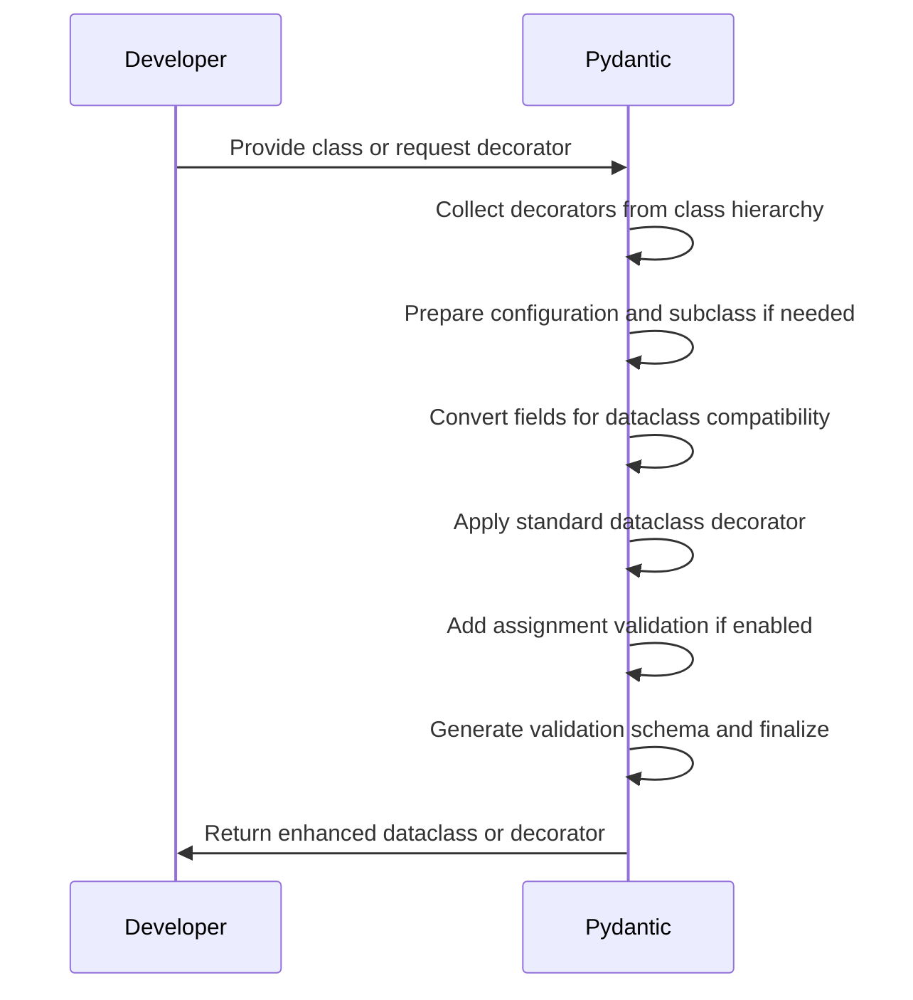
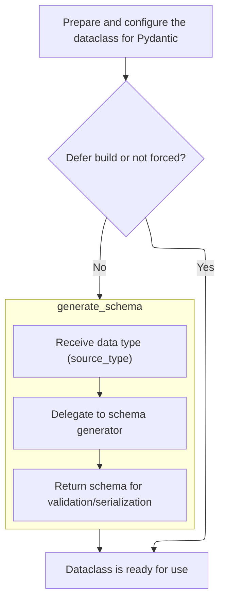
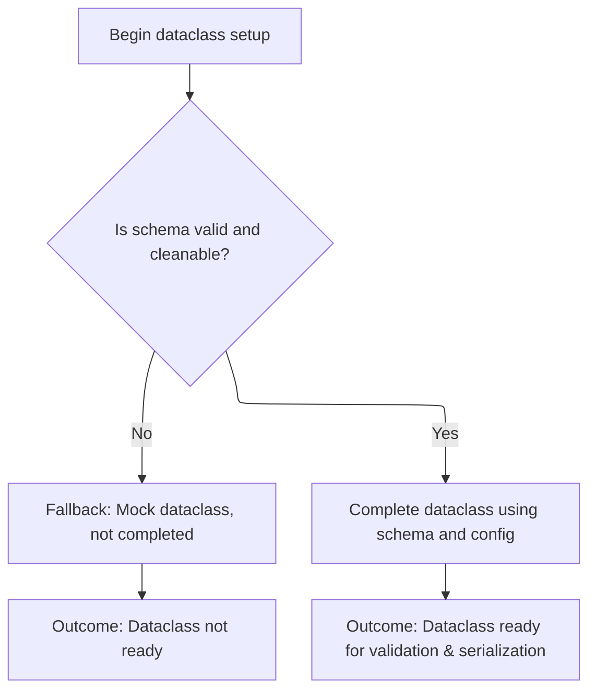
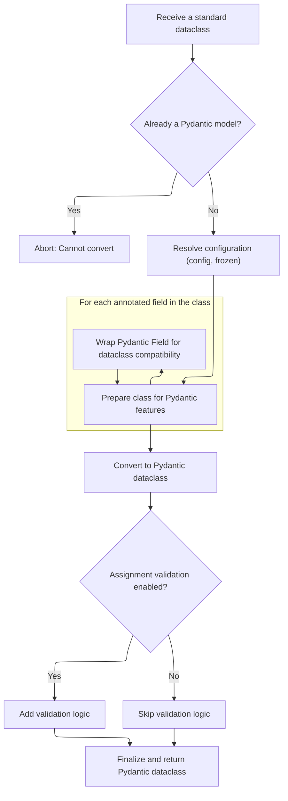

The dataclass flow converts a user-defined Python class into a dataclass that incorporates Pydantic's validation and serialization features. This process involves collecting decorator metadata, configuring the class, converting fields for compatibility, applying the dataclass decorator, and finalizing with schema generation. The result is a dataclass that is both easy to use and robust in handling data.

Main steps:

- Decide whether to return a decorator or process a provided class
- Gather validation and serialization decorators from the class hierarchy
- Prepare configuration and subclass if necessary
- Convert Pydantic fields for dataclass compatibility
- Apply the standard dataclass decorator and add assignment validation if enabled
- Finalize by generating validation schema and setting up internal attributes
- Return the enhanced dataclass or decorator



# Spec

## Detailed View of the Program's Functionality

a. Starting the Pydantic Dataclass Decoration

The process begins with a function that can be used either as a decorator or as a direct function call. It checks if a class is provided as an argument. If not, it returns a decorator function that will later be used to decorate a class. If a class is provided, it proceeds to gather all validation and serialization decorators attached to the class or inherited from its base classes. This is necessary to wire up Pydantic's validation and serialization logic.

b. Collecting Decorator Metadata from Class Hierarchy

To gather decorator metadata, the system traverses the class hierarchy from the oldest ancestor to the most derived class. For each base class, it checks if decorator information is already cached; if not, it recursively builds it. Decorators from base classes are merged, with subclass overrides replacing base class decorators, but the original order is preserved. After processing base classes, the system inspects the current class for any attributes that are proxies for Pydantic decorators (such as validators or serializers). Each proxy is registered in the appropriate collection, and for field serializers, it checks for conflicts to ensure only one serializer per field. After all proxies are processed, the decorator metadata is cached on the class, and the proxies are replaced with their wrapped functions so that class methods behave normally.

c. Subclassing and Field Preparation for Dataclass

Once decorator metadata is collected, the system checks if the class is already a standard library dataclass. If it is, a new subclass is created (handling generics if necessary) to avoid modifying the original class. The system then prepares the fields: for each annotated field, if it is a Pydantic Field, it is wrapped with a standard <SwmToken path="pydantic/dataclasses.py" pos="31:7:9" line-data="    @dataclass_transform(field_specifiers=(dataclasses.field, Field, PrivateAttr))">`dataclasses.field`</SwmToken> to ensure compatibility with the standard library dataclass machinery. This preparation ensures that attributes like <SwmToken path="pydantic/dataclasses.py" pos="110:1:1" line-data="    kw_only: bool = False,">`kw_only`</SwmToken> and <SwmToken path="pydantic/dataclasses.py" pos="103:1:1" line-data="    repr: bool = True,">`repr`</SwmToken> are correctly handled during dataclass creation.

d. Decorating the Class as a Dataclass

With fields prepared, the system temporarily patches any base dataclasses to ensure their fields are compatible, then applies the standard library dataclass decorator to the class. This step generates the necessary dataclass methods (like <SwmToken path="pydantic/dataclasses.py" pos="125:4:4" line-data="            own  `__init__` function.">`__init__`</SwmToken>, <SwmToken path="pydantic/dataclasses.py" pos="126:25:25" line-data="        repr: A boolean indicating whether to include the field in the `__repr__` output.">`__repr__`</SwmToken>, etc.) according to the provided configuration (<SwmToken path="pydantic/_internal/_decorators.py" pos="202:10:12" line-data="            # not a descriptor, e.g. a partial object">`e.g`</SwmToken>., frozen, slots, keyword-only arguments).

e. Assignment Validation and Pickling Support

If assignment validation is enabled in the configuration, the system overrides the class's <SwmToken path="pydantic/dataclasses.py" pos="253:8:8" line-data="            @functools.wraps(cls.__setattr__)">`__setattr__`</SwmToken> method to validate every attribute assignment using Pydantic's validator. If the class uses slots and does not already have a <SwmToken path="pydantic/dataclasses.py" pos="259:15:15" line-data="            if slots and not hasattr(cls, &#39;__setstate__&#39;):">`__setstate__`</SwmToken> method, custom methods for getting and setting state are added to support pickling and copying, ensuring that the custom <SwmToken path="pydantic/dataclasses.py" pos="253:8:8" line-data="            @functools.wraps(cls.__setattr__)">`__setattr__`</SwmToken> does not interfere with object reconstruction.

f. Finalizing Pydantic Attributes and Returning the Dataclass

After all setup, several internal attributes are set on the class to mark it as a Pydantic dataclass and to store the collected decorator metadata. The original docstring and module information are restored or set as needed. The system then calls a function to complete the dataclass setup, which includes generating the validation schema and wiring up the validator and serializer. The finalized class is then returned.

g. Finalizing the Pydantic Dataclass

In the finalization step, the system replaces the standard <SwmToken path="pydantic/dataclasses.py" pos="125:4:4" line-data="            own  `__init__` function.">`__init__`</SwmToken> with a custom one that performs validation on initialization. It collects and sets metadata about the fields, and checks if schema generation should be deferred (based on configuration). If not deferred, it prepares for schema generation by creating a schema generator and generating the schema for validation and serialization. If schema generation fails due to unresolved annotations, it can fall back to a mock setup if error raising is not requested.

h. Generating the Validation Schema

Schema generation is delegated to an internal schema generator, which produces a schema describing how to validate and serialize the dataclass. This schema is then cleaned and validated.

i. Wiring Up Validation and Serialization Internals

If schema cleaning succeeds, the system sets up the validator and serializer objects on the class, using the generated schema and configuration. The class is marked as complete, indicating it is ready for use as a fully functional Pydantic dataclass.

j. Returning the Decorator or the Final Dataclass

Finally, depending on how the original function was called, it either returns the decorator (if no class was provided initially) or the fully constructed Pydantic dataclass (if a class was provided). This allows flexible usage as both a decorator and a direct function call.

k. Building the Pydantic Dataclass Internals (Summary)

Throughout the process, the system ensures that only non-Pydantic models are wrapped, warns about configuration conflicts, and handles subclassing, field preparation, and compatibility with both Pydantic and standard library dataclasses. It also ensures that assignment validation, pickling, and copying work as expected, and that all necessary metadata and internal attributes are set for Pydantic's validation and serialization features to function correctly.

# Rule Definition

| Paragraph Name                                                                                                                                                                                                                                                                                                                                                                                                                                                                                                                                                | Rule ID | Category          | Description                                                                                                                                                                                                                                                                                                                                                                                                                                                                                                                                                                                                                                                                                                                                                                                                                                                                                                                                                                                                                                                                                                                                                                                                                                                                                                                          | Conditions                                                                                                                                                                                                                                        | Remarks                                                                                                                                                                                                                                                                                                                                                                                                                                                                                                                                                                                                                                                                                                                                                                                                                                                                                                                                                                                                                                                                                                                                                                                                                                                                                                                                                                                                                                                                                                                                                                                                                                                         |
| ------------------------------------------------------------------------------------------------------------------------------------------------------------------------------------------------------------------------------------------------------------------------------------------------------------------------------------------------------------------------------------------------------------------------------------------------------------------------------------------------------------------------------------------------------------- | ------- | ----------------- | ------------------------------------------------------------------------------------------------------------------------------------------------------------------------------------------------------------------------------------------------------------------------------------------------------------------------------------------------------------------------------------------------------------------------------------------------------------------------------------------------------------------------------------------------------------------------------------------------------------------------------------------------------------------------------------------------------------------------------------------------------------------------------------------------------------------------------------------------------------------------------------------------------------------------------------------------------------------------------------------------------------------------------------------------------------------------------------------------------------------------------------------------------------------------------------------------------------------------------------------------------------------------------------------------------------------------------------ | ------------------------------------------------------------------------------------------------------------------------------------------------------------------------------------------------------------------------------------------------- | --------------------------------------------------------------------------------------------------------------------------------------------------------------------------------------------------------------------------------------------------------------------------------------------------------------------------------------------------------------------------------------------------------------------------------------------------------------------------------------------------------------------------------------------------------------------------------------------------------------------------------------------------------------------------------------------------------------------------------------------------------------------------------------------------------------------------------------------------------------------------------------------------------------------------------------------------------------------------------------------------------------------------------------------------------------------------------------------------------------------------------------------------------------------------------------------------------------------------------------------------------------------------------------------------------------------------------------------------------------------------------------------------------------------------------------------------------------------------------------------------------------------------------------------------------------------------------------------------------------------------------------------------------------- |
| dataclass function (lines 99-303), <SwmToken path="pydantic/dataclasses.py" pos="153:3:3" line-data="    def create_dataclass(cls: type[Any]) -&gt; type[PydanticDataclass]:">`create_dataclass`</SwmToken> inner function                                                                                                                                                                                                                                                                                                                                    | RL-001  | Conditional Logic | The system must accept either a class or no class as input. If no class is provided, it must return a decorator that can later be used to create a Pydantic dataclass. If a class is provided, it must immediately process and return the Pydantic dataclass.                                                                                                                                                                                                                                                                                                                                                                                                                                                                                                                                                                                                                                                                                                                                                                                                                                                                                                                                                                                                                                                                        | Input to the dataclass function is either a class or None.                                                                                                                                                                                        | If called as a decorator (with a class), returns the finished Pydantic dataclass. If called as a function (without a class), returns a decorator for later use.                                                                                                                                                                                                                                                                                                                                                                                                                                                                                                                                                                                                                                                                                                                                                                                                                                                                                                                                                                                                                                                                                                                                                                                                                                                                                                                                                                                                                                                                                                 |
| <SwmToken path="pydantic/dataclasses.py" pos="186:7:9" line-data="        decorators = _decorators.DecoratorInfos.build(cls)">`DecoratorInfos.build`</SwmToken> (<SwmPath>[pydantic/\_internal/\_decorators.py](pydantic/_internal/_decorators.py)</SwmPath>), <SwmToken path="pydantic/dataclasses.py" pos="153:3:3" line-data="    def create_dataclass(cls: type[Any]) -&gt; type[PydanticDataclass]:">`create_dataclass`</SwmToken> (<SwmPath>[pydantic/dataclasses.py](pydantic/dataclasses.py)</SwmPath>)                                               | RL-002  | Computation       | When a class is provided, the system must collect all Pydantic-related decorators (validators, serializers, etc.) from the class and its base classes, ensuring that subclass decorators override base class decorators and that the order of application is preserved.                                                                                                                                                                                                                                                                                                                                                                                                                                                                                                                                                                                                                                                                                                                                                                                                                                                                                                                                                                                                                                                              | A class is being processed to become a Pydantic dataclass.                                                                                                                                                                                        | Decorator types include: validators, <SwmToken path="pydantic/_internal/_decorators.py" pos="450:3:3" line-data="            res.field_validators.update({k: v.bind_to_cls(model_dc) for k, v in existing.field_validators.items()})">`field_validators`</SwmToken>, <SwmToken path="pydantic/_internal/_decorators.py" pos="451:3:3" line-data="            res.root_validators.update({k: v.bind_to_cls(model_dc) for k, v in existing.root_validators.items()})">`root_validators`</SwmToken>, <SwmToken path="pydantic/_internal/_decorators.py" pos="452:3:3" line-data="            res.field_serializers.update({k: v.bind_to_cls(model_dc) for k, v in existing.field_serializers.items()})">`field_serializers`</SwmToken>, <SwmToken path="pydantic/_internal/_decorators.py" pos="453:3:3" line-data="            res.model_serializers.update({k: v.bind_to_cls(model_dc) for k, v in existing.model_serializers.items()})">`model_serializers`</SwmToken>, <SwmToken path="pydantic/_internal/_decorators.py" pos="454:3:3" line-data="            res.model_validators.update({k: v.bind_to_cls(model_dc) for k, v in existing.model_validators.items()})">`model_validators`</SwmToken>, <SwmToken path="pydantic/_internal/_decorators.py" pos="455:3:3" line-data="            res.computed_fields.update({k: v.bind_to_cls(model_dc) for k, v in existing.computed_fields.items()})">`computed_fields`</SwmToken>.                                                                                                                                                                                                                            |
| <SwmToken path="pydantic/dataclasses.py" pos="186:7:9" line-data="        decorators = _decorators.DecoratorInfos.build(cls)">`DecoratorInfos.build`</SwmToken> (<SwmPath>[pydantic/\_internal/\_decorators.py](pydantic/_internal/_decorators.py)</SwmPath>)                                                                                                                                                                                                                                                                                                 | RL-003  | Conditional Logic | The system must identify decorator proxies by checking if a class attribute is a <SwmToken path="pydantic/_internal/_decorators.py" pos="460:8:8" line-data="            if isinstance(var_value, PydanticDescriptorProxy):">`PydanticDescriptorProxy`</SwmToken>. For each proxy found, it must determine the decorator type from the proxy’s metadata, register the decorator in the appropriate collection for its type, keyed by the attribute name, and replace the proxy attribute on the class with its underlying wrapped function after processing.                                                                                                                                                                                                                                                                                                                                                                                                                                                                                                                                                                                                                                                                                                                                                                         | Class attribute is an instance of <SwmToken path="pydantic/_internal/_decorators.py" pos="460:8:8" line-data="            if isinstance(var_value, PydanticDescriptorProxy):">`PydanticDescriptorProxy`</SwmToken>.                               | Decorator types and their metadata are determined from the proxy's <SwmToken path="pydantic/_internal/_decorators.py" pos="461:7:7" line-data="                info = var_value.decorator_info">`decorator_info`</SwmToken>.                                                                                                                                                                                                                                                                                                                                                                                                                                                                                                                                                                                                                                                                                                                                                                                                                                                                                                                                                                                                                                                                                                                                                                                                                                                                                                                                                                                                                                    |
| <SwmToken path="pydantic/dataclasses.py" pos="186:7:9" line-data="        decorators = _decorators.DecoratorInfos.build(cls)">`DecoratorInfos.build`</SwmToken>, <SwmToken path="pydantic/dataclasses.py" pos="153:3:3" line-data="    def create_dataclass(cls: type[Any]) -&gt; type[PydanticDataclass]:">`create_dataclass`</SwmToken>                                                                                                                                                                                                                     | RL-004  | Data Assignment   | The system must assemble all decorator metadata into a <SwmToken path="pydantic/dataclasses.py" pos="186:7:7" line-data="        decorators = _decorators.DecoratorInfos.build(cls)">`DecoratorInfos`</SwmToken> object, which contains dictionaries for each decorator type, each mapping attribute names to Decorator objects. Each Decorator object must include the class reference, attribute name, the unwrapped function, any compatibility shim, and the decorator’s metadata.                                                                                                                                                                                                                                                                                                                                                                                                                                                                                                                                                                                                                                                                                                                                                                                                                                               | After collecting all decorator proxies and their metadata.                                                                                                                                                                                        | <SwmToken path="pydantic/dataclasses.py" pos="186:7:7" line-data="        decorators = _decorators.DecoratorInfos.build(cls)">`DecoratorInfos`</SwmToken> object contains: validators, <SwmToken path="pydantic/_internal/_decorators.py" pos="450:3:3" line-data="            res.field_validators.update({k: v.bind_to_cls(model_dc) for k, v in existing.field_validators.items()})">`field_validators`</SwmToken>, <SwmToken path="pydantic/_internal/_decorators.py" pos="451:3:3" line-data="            res.root_validators.update({k: v.bind_to_cls(model_dc) for k, v in existing.root_validators.items()})">`root_validators`</SwmToken>, <SwmToken path="pydantic/_internal/_decorators.py" pos="452:3:3" line-data="            res.field_serializers.update({k: v.bind_to_cls(model_dc) for k, v in existing.field_serializers.items()})">`field_serializers`</SwmToken>, <SwmToken path="pydantic/_internal/_decorators.py" pos="453:3:3" line-data="            res.model_serializers.update({k: v.bind_to_cls(model_dc) for k, v in existing.model_serializers.items()})">`model_serializers`</SwmToken>, <SwmToken path="pydantic/_internal/_decorators.py" pos="454:3:3" line-data="            res.model_validators.update({k: v.bind_to_cls(model_dc) for k, v in existing.model_validators.items()})">`model_validators`</SwmToken>, <SwmToken path="pydantic/_internal/_decorators.py" pos="455:3:3" line-data="            res.computed_fields.update({k: v.bind_to_cls(model_dc) for k, v in existing.computed_fields.items()})">`computed_fields`</SwmToken>. Each maps attribute names to Decorator objects with the required fields. |
| <SwmToken path="pydantic/dataclasses.py" pos="153:3:3" line-data="    def create_dataclass(cls: type[Any]) -&gt; type[PydanticDataclass]:">`create_dataclass`</SwmToken> (<SwmPath>[pydantic/dataclasses.py](pydantic/dataclasses.py)</SwmPath>), <SwmToken path="pydantic/dataclasses.py" pos="227:15:15" line-data="        # two attributes set (done in `as_dataclass_field()`)">`as_dataclass_field`</SwmToken> (<SwmPath>[pydantic/\_internal/\_dataclasses.py](pydantic/_internal/_dataclasses.py)</SwmPath>)                                          | RL-005  | Computation       | Before applying the standard library dataclass decorator, the system must process all annotated fields in the class. If a field’s value is a Pydantic <SwmToken path="pydantic/dataclasses.py" pos="233:8:8" line-data="            if isinstance(field_value, FieldInfo):">`FieldInfo`</SwmToken> object, it must be replaced with a <SwmToken path="pydantic/_internal/_dataclasses.py" pos="213:12:14" line-data="def as_dataclass_field(pydantic_field: FieldInfo) -&gt; dataclasses.Field[Any]:">`dataclasses.Field`</SwmToken> object. The <SwmToken path="pydantic/_internal/_dataclasses.py" pos="213:12:14" line-data="def as_dataclass_field(pydantic_field: FieldInfo) -&gt; dataclasses.Field[Any]:">`dataclasses.Field`</SwmToken> object must have its default set to the <SwmToken path="pydantic/dataclasses.py" pos="233:8:8" line-data="            if isinstance(field_value, FieldInfo):">`FieldInfo`</SwmToken> object and must set additional keyword arguments (such as repr, <SwmToken path="pydantic/dataclasses.py" pos="110:1:1" line-data="    kw_only: bool = False,">`kw_only`</SwmToken>, doc) based on the <SwmToken path="pydantic/dataclasses.py" pos="233:8:8" line-data="            if isinstance(field_value, FieldInfo):">`FieldInfo`</SwmToken> properties and Python version compatibility. | Class has annotated fields with values that are instances of <SwmToken path="pydantic/dataclasses.py" pos="233:8:8" line-data="            if isinstance(field_value, FieldInfo):">`FieldInfo`</SwmToken>.                                        | <SwmToken path="pydantic/_internal/_dataclasses.py" pos="213:12:14" line-data="def as_dataclass_field(pydantic_field: FieldInfo) -&gt; dataclasses.Field[Any]:">`dataclasses.Field`</SwmToken> object: default is the <SwmToken path="pydantic/dataclasses.py" pos="233:8:8" line-data="            if isinstance(field_value, FieldInfo):">`FieldInfo`</SwmToken> object; repr, <SwmToken path="pydantic/dataclasses.py" pos="110:1:1" line-data="    kw_only: bool = False,">`kw_only`</SwmToken>, doc set as per <SwmToken path="pydantic/dataclasses.py" pos="233:8:8" line-data="            if isinstance(field_value, FieldInfo):">`FieldInfo`</SwmToken> and Python version.                                                                                                                                                                                                                                                                                                                                                                                                                                                                                                                                                                                                                                                                                                                                                                                                                                                                                                                                                                            |
| <SwmToken path="pydantic/dataclasses.py" pos="153:3:3" line-data="    def create_dataclass(cls: type[Any]) -&gt; type[PydanticDataclass]:">`create_dataclass`</SwmToken> (<SwmPath>[pydantic/dataclasses.py](pydantic/dataclasses.py)</SwmPath>)                                                                                                                                                                                                                                                                                                              | RL-006  | Conditional Logic | The system must ensure that the dataclass configuration (such as frozen, <SwmToken path="pydantic/dataclasses.py" pos="110:1:1" line-data="    kw_only: bool = False,">`kw_only`</SwmToken>, slots) is determined from either the decorator arguments or the class’s own configuration, with decorator arguments taking precedence.                                                                                                                                                                                                                                                                                                                                                                                                                                                                                                                                                                                                                                                                                                                                                                                                                                                                                                                                                                                                  | Both decorator arguments and class configuration are present.                                                                                                                                                                                     | Decorator arguments (frozen, <SwmToken path="pydantic/dataclasses.py" pos="110:1:1" line-data="    kw_only: bool = False,">`kw_only`</SwmToken>, slots) override class config. If both are set, a warning is issued.                                                                                                                                                                                                                                                                                                                                                                                                                                                                                                                                                                                                                                                                                                                                                                                                                                                                                                                                                                                                                                                                                                                                                                                                                                                                                                                                                                                                                                            |
| <SwmToken path="pydantic/dataclasses.py" pos="153:3:3" line-data="    def create_dataclass(cls: type[Any]) -&gt; type[PydanticDataclass]:">`create_dataclass`</SwmToken> (<SwmPath>[pydantic/dataclasses.py](pydantic/dataclasses.py)</SwmPath>), <SwmToken path="pydantic/dataclasses.py" pos="194:5:5" line-data="        if _pydantic_dataclasses.is_stdlib_dataclass(cls):">`is_stdlib_dataclass`</SwmToken> (<SwmPath>[pydantic/\_internal/\_dataclasses.py](pydantic/_internal/_dataclasses.py)</SwmPath>)                                              | RL-007  | Conditional Logic | If the class is already a standard library dataclass, the system must create a subclass (preserving generic parameters if present) to avoid modifying the original class.                                                                                                                                                                                                                                                                                                                                                                                                                                                                                                                                                                                                                                                                                                                                                                                                                                                                                                                                                                                                                                                                                                                                                            | Class is a stdlib dataclass (not already a Pydantic dataclass).                                                                                                                                                                                   | Subclass is created with the same name and bases, preserving generics if present.                                                                                                                                                                                                                                                                                                                                                                                                                                                                                                                                                                                                                                                                                                                                                                                                                                                                                                                                                                                                                                                                                                                                                                                                                                                                                                                                                                                                                                                                                                                                                                               |
| <SwmToken path="pydantic/dataclasses.py" pos="153:3:3" line-data="    def create_dataclass(cls: type[Any]) -&gt; type[PydanticDataclass]:">`create_dataclass`</SwmToken> (<SwmPath>[pydantic/dataclasses.py](pydantic/dataclasses.py)</SwmPath>)                                                                                                                                                                                                                                                                                                              | RL-008  | Conditional Logic | If assignment validation is enabled (via configuration), the system must override the class’s **setattr** method so that any attribute assignment triggers validation by calling the class’s **pydantic_validator**<SwmToken path="pydantic/dataclasses.py" pos="251:4:5" line-data="        if config_wrapper.validate_assignment:">`.validate_assignment`</SwmToken> method.                                                                                                                                                                                                                                                                                                                                                                                                                                                                                                                                                                                                                                                                                                                                                                                                                                                                                                                                                       | Assignment validation is enabled in the configuration.                                                                                                                                                                                            | The new **setattr** calls **pydantic_validator**<SwmToken path="pydantic/dataclasses.py" pos="251:4:5" line-data="        if config_wrapper.validate_assignment:">`.validate_assignment`</SwmToken>(instance, field, value).                                                                                                                                                                                                                                                                                                                                                                                                                                                                                                                                                                                                                                                                                                                                                                                                                                                                                                                                                                                                                                                                                                                                                                                                                                                                                                                                                                                                                                    |
| <SwmToken path="pydantic/dataclasses.py" pos="153:3:3" line-data="    def create_dataclass(cls: type[Any]) -&gt; type[PydanticDataclass]:">`create_dataclass`</SwmToken> (<SwmPath>[pydantic/dataclasses.py](pydantic/dataclasses.py)</SwmPath>)                                                                                                                                                                                                                                                                                                              | RL-009  | Conditional Logic | If the dataclass uses slots and does not have a **setstate** method, the system must add custom **getstate** and **setstate** methods to support pickling and copying, ensuring that object.**setattr** is used to bypass validation during deserialization.                                                                                                                                                                                                                                                                                                                                                                                                                                                                                                                                                                                                                                                                                                                                                                                                                                                                                                                                                                                                                                                                         | Dataclass uses slots and does not define **setstate**.                                                                                                                                                                                            | **getstate** returns a list of field values. **setstate** sets field values using object.**setattr**.                                                                                                                                                                                                                                                                                                                                                                                                                                                                                                                                                                                                                                                                                                                                                                                                                                                                                                                                                                                                                                                                                                                                                                                                                                                                                                                                                                                                                                                                                                                                                           |
| <SwmToken path="pydantic/dataclasses.py" pos="295:12:12" line-data="        cls.__pydantic_complete__ = False  # `complete_dataclass` will set it to `True` if successful.">`complete_dataclass`</SwmToken> (<SwmPath>[pydantic/\_internal/\_dataclasses.py](pydantic/_internal/_dataclasses.py)</SwmPath>), <SwmToken path="pydantic/dataclasses.py" pos="153:3:3" line-data="    def create_dataclass(cls: type[Any]) -&gt; type[PydanticDataclass]:">`create_dataclass`</SwmToken> (<SwmPath>[pydantic/dataclasses.py](pydantic/dataclasses.py)</SwmPath>) | RL-010  | Computation       | The system must finalize the dataclass by generating a validation and serialization schema using a schema generator interface that accepts the class as input and returns a <SwmToken path="pydantic/_internal/_schema_generation_shared.py" pos="95:21:21" line-data="    def generate_schema(self, source_type: Any, /) -&gt; core_schema.CoreSchema:">`CoreSchema`</SwmToken> object describing validation and serialization rules for the dataclass. The schema must be post-processed for correctness before use. The system must create and attach a <SwmToken path="pydantic/_internal/_dataclasses.py" pos="18:1:1" line-data="    SchemaValidator,">`SchemaValidator`</SwmToken> and <SwmToken path="pydantic/_internal/_dataclasses.py" pos="193:7:7" line-data="    cls.__pydantic_serializer__ = SchemaSerializer(schema, core_config)">`SchemaSerializer`</SwmToken> to the class, using the generated schema, as **pydantic_validator** and **pydantic_serializer** respectively.                                                                                                                                                                                                                                                                                                                                      | Dataclass is ready for finalization.                                                                                                                                                                                                              | <SwmToken path="pydantic/_internal/_schema_generation_shared.py" pos="95:21:21" line-data="    def generate_schema(self, source_type: Any, /) -&gt; core_schema.CoreSchema:">`CoreSchema`</SwmToken> object includes field types, validators, and serialization rules. <SwmToken path="pydantic/_internal/_dataclasses.py" pos="18:1:1" line-data="    SchemaValidator,">`SchemaValidator`</SwmToken> and <SwmToken path="pydantic/_internal/_dataclasses.py" pos="193:7:7" line-data="    cls.__pydantic_serializer__ = SchemaSerializer(schema, core_config)">`SchemaSerializer`</SwmToken> are attached as class attributes.                                                                                                                                                                                                                                                                                                                                                                                                                                                                                                                                                                                                                                                                                                                                                                                                                                                                                                                                                                                                                                 |
| <SwmToken path="pydantic/dataclasses.py" pos="295:12:12" line-data="        cls.__pydantic_complete__ = False  # `complete_dataclass` will set it to `True` if successful.">`complete_dataclass`</SwmToken> (<SwmPath>[pydantic/\_internal/\_dataclasses.py](pydantic/_internal/_dataclasses.py)</SwmPath>), <SwmToken path="pydantic/dataclasses.py" pos="153:3:3" line-data="    def create_dataclass(cls: type[Any]) -&gt; type[PydanticDataclass]:">`create_dataclass`</SwmToken> (<SwmPath>[pydantic/dataclasses.py](pydantic/dataclasses.py)</SwmPath>) | RL-011  | Data Assignment   | The system must mark the class as a completed Pydantic dataclass, ready for validation and serialization.                                                                                                                                                                                                                                                                                                                                                                                                                                                                                                                                                                                                                                                                                                                                                                                                                                                                                                                                                                                                                                                                                                                                                                                                                            | Schema generation and <SwmToken path="pydantic/dataclasses.py" pos="360:7:9" line-data="            # Deleting the validator/serializer is necessary as otherwise they can get reused in">`validator/serializer`</SwmToken> attachment succeeded. | Class attribute **pydantic_complete** is set to True.                                                                                                                                                                                                                                                                                                                                                                                                                                                                                                                                                                                                                                                                                                                                                                                                                                                                                                                                                                                                                                                                                                                                                                                                                                                                                                                                                                                                                                                                                                                                                                                                           |
| <SwmToken path="pydantic/dataclasses.py" pos="295:12:12" line-data="        cls.__pydantic_complete__ = False  # `complete_dataclass` will set it to `True` if successful.">`complete_dataclass`</SwmToken> (<SwmPath>[pydantic/\_internal/\_dataclasses.py](pydantic/_internal/_dataclasses.py)</SwmPath>), <SwmToken path="pydantic/dataclasses.py" pos="153:3:3" line-data="    def create_dataclass(cls: type[Any]) -&gt; type[PydanticDataclass]:">`create_dataclass`</SwmToken> (<SwmPath>[pydantic/dataclasses.py](pydantic/dataclasses.py)</SwmPath>) | RL-012  | Conditional Logic | If schema generation or cleaning fails, the system must fall back to a mock dataclass state, indicating that the dataclass is not ready for validation and serialization.                                                                                                                                                                                                                                                                                                                                                                                                                                                                                                                                                                                                                                                                                                                                                                                                                                                                                                                                                                                                                                                                                                                                                            | Schema generation or cleaning raises an error or fails.                                                                                                                                                                                           | Class is left in a mock state; **pydantic_complete** is False; mock <SwmToken path="pydantic/dataclasses.py" pos="360:7:9" line-data="            # Deleting the validator/serializer is necessary as otherwise they can get reused in">`validator/serializer`</SwmToken> may be attached.                                                                                                                                                                                                                                                                                                                                                                                                                                                                                                                                                                                                                                                                                                                                                                                                                                                                                                                                                                                                                                                                                                                                                                                                                                                                                                                                                                      |

# User Stories

## User Story 1: Create and process Pydantic dataclasses via decorator or function

---

### Story Description:

As a user or system, I want to create a Pydantic dataclass either by using a decorator or by calling a function, and have all Pydantic-related decorators (validators, serializers, etc.) collected and processed from the class hierarchy, so that the resulting dataclass is correctly set up for validation and serialization.

---

### Business Rule Mapping:

| Rule ID | Paragraph Name                                                                                                                                                                                                                                                                                                                                                                                                                                                                                                  | Rule Description                                                                                                                                                                                                                                                                                                                                                                                                                                                                                                                                             |
| ------- | --------------------------------------------------------------------------------------------------------------------------------------------------------------------------------------------------------------------------------------------------------------------------------------------------------------------------------------------------------------------------------------------------------------------------------------------------------------------------------------------------------------- | ------------------------------------------------------------------------------------------------------------------------------------------------------------------------------------------------------------------------------------------------------------------------------------------------------------------------------------------------------------------------------------------------------------------------------------------------------------------------------------------------------------------------------------------------------------ |
| RL-001  | dataclass function (lines 99-303), <SwmToken path="pydantic/dataclasses.py" pos="153:3:3" line-data="    def create_dataclass(cls: type[Any]) -&gt; type[PydanticDataclass]:">`create_dataclass`</SwmToken> inner function                                                                                                                                                                                                                                                                                      | The system must accept either a class or no class as input. If no class is provided, it must return a decorator that can later be used to create a Pydantic dataclass. If a class is provided, it must immediately process and return the Pydantic dataclass.                                                                                                                                                                                                                                                                                                |
| RL-002  | <SwmToken path="pydantic/dataclasses.py" pos="186:7:9" line-data="        decorators = _decorators.DecoratorInfos.build(cls)">`DecoratorInfos.build`</SwmToken> (<SwmPath>[pydantic/\_internal/\_decorators.py](pydantic/_internal/_decorators.py)</SwmPath>), <SwmToken path="pydantic/dataclasses.py" pos="153:3:3" line-data="    def create_dataclass(cls: type[Any]) -&gt; type[PydanticDataclass]:">`create_dataclass`</SwmToken> (<SwmPath>[pydantic/dataclasses.py](pydantic/dataclasses.py)</SwmPath>) | When a class is provided, the system must collect all Pydantic-related decorators (validators, serializers, etc.) from the class and its base classes, ensuring that subclass decorators override base class decorators and that the order of application is preserved.                                                                                                                                                                                                                                                                                      |
| RL-003  | <SwmToken path="pydantic/dataclasses.py" pos="186:7:9" line-data="        decorators = _decorators.DecoratorInfos.build(cls)">`DecoratorInfos.build`</SwmToken> (<SwmPath>[pydantic/\_internal/\_decorators.py](pydantic/_internal/_decorators.py)</SwmPath>)                                                                                                                                                                                                                                                   | The system must identify decorator proxies by checking if a class attribute is a <SwmToken path="pydantic/_internal/_decorators.py" pos="460:8:8" line-data="            if isinstance(var_value, PydanticDescriptorProxy):">`PydanticDescriptorProxy`</SwmToken>. For each proxy found, it must determine the decorator type from the proxy’s metadata, register the decorator in the appropriate collection for its type, keyed by the attribute name, and replace the proxy attribute on the class with its underlying wrapped function after processing. |
| RL-004  | <SwmToken path="pydantic/dataclasses.py" pos="186:7:9" line-data="        decorators = _decorators.DecoratorInfos.build(cls)">`DecoratorInfos.build`</SwmToken>, <SwmToken path="pydantic/dataclasses.py" pos="153:3:3" line-data="    def create_dataclass(cls: type[Any]) -&gt; type[PydanticDataclass]:">`create_dataclass`</SwmToken>                                                                                                                                                                       | The system must assemble all decorator metadata into a <SwmToken path="pydantic/dataclasses.py" pos="186:7:7" line-data="        decorators = _decorators.DecoratorInfos.build(cls)">`DecoratorInfos`</SwmToken> object, which contains dictionaries for each decorator type, each mapping attribute names to Decorator objects. Each Decorator object must include the class reference, attribute name, the unwrapped function, any compatibility shim, and the decorator’s metadata.                                                                       |

---

### Relevant Functionality:

- **dataclass function (lines 99-303)**
  1. **RL-001:**
     - If input is None:
       - Return a decorator function that will process a class later.
     - Else:
       - Process the class immediately and return the Pydantic dataclass.
- <SwmToken path="pydantic/dataclasses.py" pos="186:7:9" line-data="        decorators = _decorators.DecoratorInfos.build(cls)">`DecoratorInfos.build`</SwmToken> **(**<SwmPath>[pydantic/\_internal/\_decorators.py](pydantic/_internal/_decorators.py)</SwmPath>**)**
  1. **RL-002:**
     - Traverse the MRO from base to leaf.
     - For each class, collect decorator proxies.
     - If a decorator with the same name exists in a subclass, it overrides the base class's decorator.
     - Maintain the order of decorators as per MRO.
  2. **RL-003:**
     - For each attribute in the class:
       - If attribute is a <SwmToken path="pydantic/_internal/_decorators.py" pos="460:8:8" line-data="            if isinstance(var_value, PydanticDescriptorProxy):">`PydanticDescriptorProxy`</SwmToken>:
         - Determine decorator type from metadata.
         - Register in the corresponding decorator collection.
         - Replace the attribute with the wrapped function.
- <SwmToken path="pydantic/dataclasses.py" pos="186:7:9" line-data="        decorators = _decorators.DecoratorInfos.build(cls)">`DecoratorInfos.build`</SwmToken>
  1. **RL-004:**
     - For each decorator type, build a dictionary mapping attribute names to Decorator objects.
     - Store all dictionaries in a <SwmToken path="pydantic/dataclasses.py" pos="186:7:7" line-data="        decorators = _decorators.DecoratorInfos.build(cls)">`DecoratorInfos`</SwmToken> object.
     - Attach <SwmToken path="pydantic/dataclasses.py" pos="186:7:7" line-data="        decorators = _decorators.DecoratorInfos.build(cls)">`DecoratorInfos`</SwmToken> to the class.

## User Story 2: Process annotated fields and configure dataclass properties

---

### Story Description:

As a system, I want to process all annotated fields and configure dataclass properties (such as frozen, <SwmToken path="pydantic/dataclasses.py" pos="110:1:1" line-data="    kw_only: bool = False,">`kw_only`</SwmToken>, slots), replacing Pydantic <SwmToken path="pydantic/dataclasses.py" pos="233:8:8" line-data="            if isinstance(field_value, FieldInfo):">`FieldInfo`</SwmToken> objects with <SwmToken path="pydantic/_internal/_dataclasses.py" pos="213:12:14" line-data="def as_dataclass_field(pydantic_field: FieldInfo) -&gt; dataclasses.Field[Any]:">`dataclasses.Field`</SwmToken> objects and ensuring configuration precedence, so that the dataclass fields and configuration are correctly set up for Pydantic usage.

---

### Business Rule Mapping:

| Rule ID | Paragraph Name                                                                                                                                                                                                                                                                                                                                                                                                                                                                                                       | Rule Description                                                                                                                                                                                                                                                                                                                                                                                                                                                                                                                                                                                                                                                                                                                                                                                                                                                                                                                                                                                                                                                                                                                                                                                                                                                                                                                     |
| ------- | -------------------------------------------------------------------------------------------------------------------------------------------------------------------------------------------------------------------------------------------------------------------------------------------------------------------------------------------------------------------------------------------------------------------------------------------------------------------------------------------------------------------- | ------------------------------------------------------------------------------------------------------------------------------------------------------------------------------------------------------------------------------------------------------------------------------------------------------------------------------------------------------------------------------------------------------------------------------------------------------------------------------------------------------------------------------------------------------------------------------------------------------------------------------------------------------------------------------------------------------------------------------------------------------------------------------------------------------------------------------------------------------------------------------------------------------------------------------------------------------------------------------------------------------------------------------------------------------------------------------------------------------------------------------------------------------------------------------------------------------------------------------------------------------------------------------------------------------------------------------------ |
| RL-005  | <SwmToken path="pydantic/dataclasses.py" pos="153:3:3" line-data="    def create_dataclass(cls: type[Any]) -&gt; type[PydanticDataclass]:">`create_dataclass`</SwmToken> (<SwmPath>[pydantic/dataclasses.py](pydantic/dataclasses.py)</SwmPath>), <SwmToken path="pydantic/dataclasses.py" pos="227:15:15" line-data="        # two attributes set (done in `as_dataclass_field()`)">`as_dataclass_field`</SwmToken> (<SwmPath>[pydantic/\_internal/\_dataclasses.py](pydantic/_internal/_dataclasses.py)</SwmPath>) | Before applying the standard library dataclass decorator, the system must process all annotated fields in the class. If a field’s value is a Pydantic <SwmToken path="pydantic/dataclasses.py" pos="233:8:8" line-data="            if isinstance(field_value, FieldInfo):">`FieldInfo`</SwmToken> object, it must be replaced with a <SwmToken path="pydantic/_internal/_dataclasses.py" pos="213:12:14" line-data="def as_dataclass_field(pydantic_field: FieldInfo) -&gt; dataclasses.Field[Any]:">`dataclasses.Field`</SwmToken> object. The <SwmToken path="pydantic/_internal/_dataclasses.py" pos="213:12:14" line-data="def as_dataclass_field(pydantic_field: FieldInfo) -&gt; dataclasses.Field[Any]:">`dataclasses.Field`</SwmToken> object must have its default set to the <SwmToken path="pydantic/dataclasses.py" pos="233:8:8" line-data="            if isinstance(field_value, FieldInfo):">`FieldInfo`</SwmToken> object and must set additional keyword arguments (such as repr, <SwmToken path="pydantic/dataclasses.py" pos="110:1:1" line-data="    kw_only: bool = False,">`kw_only`</SwmToken>, doc) based on the <SwmToken path="pydantic/dataclasses.py" pos="233:8:8" line-data="            if isinstance(field_value, FieldInfo):">`FieldInfo`</SwmToken> properties and Python version compatibility. |
| RL-006  | <SwmToken path="pydantic/dataclasses.py" pos="153:3:3" line-data="    def create_dataclass(cls: type[Any]) -&gt; type[PydanticDataclass]:">`create_dataclass`</SwmToken> (<SwmPath>[pydantic/dataclasses.py](pydantic/dataclasses.py)</SwmPath>)                                                                                                                                                                                                                                                                     | The system must ensure that the dataclass configuration (such as frozen, <SwmToken path="pydantic/dataclasses.py" pos="110:1:1" line-data="    kw_only: bool = False,">`kw_only`</SwmToken>, slots) is determined from either the decorator arguments or the class’s own configuration, with decorator arguments taking precedence.                                                                                                                                                                                                                                                                                                                                                                                                                                                                                                                                                                                                                                                                                                                                                                                                                                                                                                                                                                                                  |

---

### Relevant Functionality:

- <SwmToken path="pydantic/dataclasses.py" pos="153:3:3" line-data="    def create_dataclass(cls: type[Any]) -&gt; type[PydanticDataclass]:">`create_dataclass`</SwmToken> **(**<SwmPath>[pydantic/dataclasses.py](pydantic/dataclasses.py)</SwmPath>**)**
  1. **RL-005:**
     - For each annotated field:
       - If value is <SwmToken path="pydantic/dataclasses.py" pos="233:8:8" line-data="            if isinstance(field_value, FieldInfo):">`FieldInfo`</SwmToken>:
         - Replace with <SwmToken path="pydantic/_internal/_dataclasses.py" pos="213:12:14" line-data="def as_dataclass_field(pydantic_field: FieldInfo) -&gt; dataclasses.Field[Any]:">`dataclasses.Field`</SwmToken>(default=<SwmToken path="pydantic/dataclasses.py" pos="233:8:8" line-data="            if isinstance(field_value, FieldInfo):">`FieldInfo`</SwmToken>, repr=..., <SwmToken path="pydantic/dataclasses.py" pos="110:1:1" line-data="    kw_only: bool = False,">`kw_only`</SwmToken>=..., doc=...)
  2. **RL-006:**
     - If decorator argument is provided, use it.
     - Else, use class config.
     - If both are set, warn the user.

## User Story 3: Handle standard library dataclasses and advanced features

---

### Story Description:

As a system, I want to handle cases where the input class is already a standard library dataclass, preserve generic parameters, support assignment validation, and add pickling/copying support for slots, so that the resulting Pydantic dataclass is robust and compatible with advanced Python features.

---

### Business Rule Mapping:

| Rule ID | Paragraph Name                                                                                                                                                                                                                                                                                                                                                                                                                                                                                                   | Rule Description                                                                                                                                                                                                                                                                                                                                                               |
| ------- | ---------------------------------------------------------------------------------------------------------------------------------------------------------------------------------------------------------------------------------------------------------------------------------------------------------------------------------------------------------------------------------------------------------------------------------------------------------------------------------------------------------------- | ------------------------------------------------------------------------------------------------------------------------------------------------------------------------------------------------------------------------------------------------------------------------------------------------------------------------------------------------------------------------------ |
| RL-007  | <SwmToken path="pydantic/dataclasses.py" pos="153:3:3" line-data="    def create_dataclass(cls: type[Any]) -&gt; type[PydanticDataclass]:">`create_dataclass`</SwmToken> (<SwmPath>[pydantic/dataclasses.py](pydantic/dataclasses.py)</SwmPath>), <SwmToken path="pydantic/dataclasses.py" pos="194:5:5" line-data="        if _pydantic_dataclasses.is_stdlib_dataclass(cls):">`is_stdlib_dataclass`</SwmToken> (<SwmPath>[pydantic/\_internal/\_dataclasses.py](pydantic/_internal/_dataclasses.py)</SwmPath>) | If the class is already a standard library dataclass, the system must create a subclass (preserving generic parameters if present) to avoid modifying the original class.                                                                                                                                                                                                      |
| RL-008  | <SwmToken path="pydantic/dataclasses.py" pos="153:3:3" line-data="    def create_dataclass(cls: type[Any]) -&gt; type[PydanticDataclass]:">`create_dataclass`</SwmToken> (<SwmPath>[pydantic/dataclasses.py](pydantic/dataclasses.py)</SwmPath>)                                                                                                                                                                                                                                                                 | If assignment validation is enabled (via configuration), the system must override the class’s **setattr** method so that any attribute assignment triggers validation by calling the class’s **pydantic_validator**<SwmToken path="pydantic/dataclasses.py" pos="251:4:5" line-data="        if config_wrapper.validate_assignment:">`.validate_assignment`</SwmToken> method. |
| RL-009  | <SwmToken path="pydantic/dataclasses.py" pos="153:3:3" line-data="    def create_dataclass(cls: type[Any]) -&gt; type[PydanticDataclass]:">`create_dataclass`</SwmToken> (<SwmPath>[pydantic/dataclasses.py](pydantic/dataclasses.py)</SwmPath>)                                                                                                                                                                                                                                                                 | If the dataclass uses slots and does not have a **setstate** method, the system must add custom **getstate** and **setstate** methods to support pickling and copying, ensuring that object.**setattr** is used to bypass validation during deserialization.                                                                                                                   |

---

### Relevant Functionality:

- <SwmToken path="pydantic/dataclasses.py" pos="153:3:3" line-data="    def create_dataclass(cls: type[Any]) -&gt; type[PydanticDataclass]:">`create_dataclass`</SwmToken> **(**<SwmPath>[pydantic/dataclasses.py](pydantic/dataclasses.py)</SwmPath>**)**
  1. **RL-007:**
     - If class is a stdlib dataclass:
       - Create a new subclass with the same name and bases (including generics if needed).
       - Use the subclass for further processing.
  2. **RL-008:**
     - If <SwmToken path="pydantic/dataclasses.py" pos="251:5:5" line-data="        if config_wrapper.validate_assignment:">`validate_assignment`</SwmToken> is enabled:
       - Override **setattr** to call **pydantic_validator**<SwmToken path="pydantic/dataclasses.py" pos="251:4:5" line-data="        if config_wrapper.validate_assignment:">`.validate_assignment`</SwmToken> on assignment.
  3. **RL-009:**
     - If slots is True and **setstate** is not defined:
       - Add **getstate** and **setstate** methods for pickling/copying.
       - Use object.**setattr** in **setstate**.

## User Story 4: Finalize dataclass with schema generation, completion, and fallback

---

### Story Description:

As a system, I want to generate and attach a validation and serialization schema for the dataclass, mark the class as completed, and fall back to a mock state if schema generation fails, so that the dataclass is ready for use or gracefully indicates when it is not.

---

### Business Rule Mapping:

| Rule ID | Paragraph Name                                                                                                                                                                                                                                                                                                                                                                                                                                                                                                                                                | Rule Description                                                                                                                                                                                                                                                                                                                                                                                                                                                                                                                                                                                                                                                                                                                                                                                                                                                                                                                                                                                |
| ------- | ------------------------------------------------------------------------------------------------------------------------------------------------------------------------------------------------------------------------------------------------------------------------------------------------------------------------------------------------------------------------------------------------------------------------------------------------------------------------------------------------------------------------------------------------------------- | ----------------------------------------------------------------------------------------------------------------------------------------------------------------------------------------------------------------------------------------------------------------------------------------------------------------------------------------------------------------------------------------------------------------------------------------------------------------------------------------------------------------------------------------------------------------------------------------------------------------------------------------------------------------------------------------------------------------------------------------------------------------------------------------------------------------------------------------------------------------------------------------------------------------------------------------------------------------------------------------------- |
| RL-010  | <SwmToken path="pydantic/dataclasses.py" pos="295:12:12" line-data="        cls.__pydantic_complete__ = False  # `complete_dataclass` will set it to `True` if successful.">`complete_dataclass`</SwmToken> (<SwmPath>[pydantic/\_internal/\_dataclasses.py](pydantic/_internal/_dataclasses.py)</SwmPath>), <SwmToken path="pydantic/dataclasses.py" pos="153:3:3" line-data="    def create_dataclass(cls: type[Any]) -&gt; type[PydanticDataclass]:">`create_dataclass`</SwmToken> (<SwmPath>[pydantic/dataclasses.py](pydantic/dataclasses.py)</SwmPath>) | The system must finalize the dataclass by generating a validation and serialization schema using a schema generator interface that accepts the class as input and returns a <SwmToken path="pydantic/_internal/_schema_generation_shared.py" pos="95:21:21" line-data="    def generate_schema(self, source_type: Any, /) -&gt; core_schema.CoreSchema:">`CoreSchema`</SwmToken> object describing validation and serialization rules for the dataclass. The schema must be post-processed for correctness before use. The system must create and attach a <SwmToken path="pydantic/_internal/_dataclasses.py" pos="18:1:1" line-data="    SchemaValidator,">`SchemaValidator`</SwmToken> and <SwmToken path="pydantic/_internal/_dataclasses.py" pos="193:7:7" line-data="    cls.__pydantic_serializer__ = SchemaSerializer(schema, core_config)">`SchemaSerializer`</SwmToken> to the class, using the generated schema, as **pydantic_validator** and **pydantic_serializer** respectively. |
| RL-011  | <SwmToken path="pydantic/dataclasses.py" pos="295:12:12" line-data="        cls.__pydantic_complete__ = False  # `complete_dataclass` will set it to `True` if successful.">`complete_dataclass`</SwmToken> (<SwmPath>[pydantic/\_internal/\_dataclasses.py](pydantic/_internal/_dataclasses.py)</SwmPath>), <SwmToken path="pydantic/dataclasses.py" pos="153:3:3" line-data="    def create_dataclass(cls: type[Any]) -&gt; type[PydanticDataclass]:">`create_dataclass`</SwmToken> (<SwmPath>[pydantic/dataclasses.py](pydantic/dataclasses.py)</SwmPath>) | The system must mark the class as a completed Pydantic dataclass, ready for validation and serialization.                                                                                                                                                                                                                                                                                                                                                                                                                                                                                                                                                                                                                                                                                                                                                                                                                                                                                       |
| RL-012  | <SwmToken path="pydantic/dataclasses.py" pos="295:12:12" line-data="        cls.__pydantic_complete__ = False  # `complete_dataclass` will set it to `True` if successful.">`complete_dataclass`</SwmToken> (<SwmPath>[pydantic/\_internal/\_dataclasses.py](pydantic/_internal/_dataclasses.py)</SwmPath>), <SwmToken path="pydantic/dataclasses.py" pos="153:3:3" line-data="    def create_dataclass(cls: type[Any]) -&gt; type[PydanticDataclass]:">`create_dataclass`</SwmToken> (<SwmPath>[pydantic/dataclasses.py](pydantic/dataclasses.py)</SwmPath>) | If schema generation or cleaning fails, the system must fall back to a mock dataclass state, indicating that the dataclass is not ready for validation and serialization.                                                                                                                                                                                                                                                                                                                                                                                                                                                                                                                                                                                                                                                                                                                                                                                                                       |

---

### Relevant Functionality:

- <SwmToken path="pydantic/dataclasses.py" pos="295:12:12" line-data="        cls.__pydantic_complete__ = False  # `complete_dataclass` will set it to `True` if successful.">`complete_dataclass`</SwmToken> **(**<SwmPath>[pydantic/\_internal/\_dataclasses.py](pydantic/_internal/_dataclasses.py)</SwmPath>**)**
  1. **RL-010:**
     - Generate schema using schema generator.
     - Post-process schema for correctness.
     - Attach <SwmToken path="pydantic/_internal/_dataclasses.py" pos="18:1:1" line-data="    SchemaValidator,">`SchemaValidator`</SwmToken> and <SwmToken path="pydantic/_internal/_dataclasses.py" pos="193:7:7" line-data="    cls.__pydantic_serializer__ = SchemaSerializer(schema, core_config)">`SchemaSerializer`</SwmToken> to the class.
  2. **RL-011:**
     - Set **pydantic_complete** = True on the class.
  3. **RL-012:**
     - If schema generation or cleaning fails:
       - Set mock <SwmToken path="pydantic/dataclasses.py" pos="360:7:9" line-data="            # Deleting the validator/serializer is necessary as otherwise they can get reused in">`validator/serializer`</SwmToken> on the class.
       - Set **pydantic_complete** = False.

# Code Walkthrough

## Starting the Pydantic Dataclass Decoration

```mermaid
%%{init: {"flowchart": {"defaultRenderer": "elk"}} }%%
flowchart TD
    node1{"Is a class provided?"}
    click node1 openCode "pydantic/dataclasses.py:99:153"
    node1 -->|"No"| node5["Return a decorator for future dataclass creation"]
    click node5 openCode "pydantic/dataclasses.py:302:302"
    node1 -->|"Yes"| node2["Gather validation and serialization decorators"]
    click node2 openCode "pydantic/_internal/_decorators.py:430:430"
    node2 --> node3["Apply configuration (config, frozen) from decorator or class"]
    click node3 openCode "pydantic/dataclasses.py:187:299"
    node3 --> node4["Finalize and return Pydantic dataclass with validation enabled"]
    click node4 openCode "pydantic/_internal/_dataclasses.py:91:91"


subgraph node2 [build]
  sgmain_1_node1["Start: Prepare decorator info for model/dataclass"]
  click sgmain_1_node1 openCode "pydantic/_internal/_decorators.py:430:444"
  subgraph sgmain_1_loop1["For each base class (oldest to newest)"]
  sgmain_1_node2["Collect and merge decorator info, overriding duplicates and preserving order"]
  click sgmain_1_node2 openCode "pydantic/_internal/_decorators.py:445:455"
  end
  sgmain_1_node1 --> sgmain_1_node2
  subgraph sgmain_1_loop2["For each attribute in current class"]
  sgmain_1_node3["If attribute is a decorator proxy, register it"]
  click sgmain_1_node3 openCode "pydantic/_internal/_decorators.py:459:507"
  sgmain_1_node3 --> sgmain_1_node4{"Is it a field serializer?"}
  click sgmain_1_node4 openCode "pydantic/_internal/_decorators.py:474:489"
  sgmain_1_node4 -->|"Yes"| sgmain_1_node5["Check for conflicts"]
  click sgmain_1_node5 openCode "pydantic/_internal/_decorators.py:474:489"
  sgmain_1_node4 -->|"No"| sgmain_1_node6["Register decorator"]
  click sgmain_1_node6 openCode "pydantic/_internal/_decorators.py:459:507"
  sgmain_1_node5 --> sgmain_1_node6
  end
  sgmain_1_node2 --> sgmain_1_node3
  sgmain_1_node6 --> sgmain_1_node7["Save assembled decorator info to class and replace descriptors"]
  click sgmain_1_node7 openCode "pydantic/_internal/_decorators.py:508:515"
  sgmain_1_node7 --> sgmain_1_node8["Return assembled decorator info"]
  click sgmain_1_node8 openCode "pydantic/_internal/_decorators.py:516:516"
end

%% Swimm:
%% %%{init: {"flowchart": {"defaultRenderer": "elk"}} }%%
%% flowchart TD
%%     node1{"Is a class provided?"}
%%     click node1 openCode "<SwmPath>[pydantic/dataclasses.py](pydantic/dataclasses.py)</SwmPath>:99:153"
%%     node1 -->|"No"| node5["Return a decorator for future dataclass creation"]
%%     click node5 openCode "<SwmPath>[pydantic/dataclasses.py](pydantic/dataclasses.py)</SwmPath>:302:302"
%%     node1 -->|"Yes"| node2["Gather validation and serialization decorators"]
%%     click node2 openCode "<SwmPath>[pydantic/\_internal/\_decorators.py](pydantic/_internal/_decorators.py)</SwmPath>:430:430"
%%     node2 --> node3["Apply configuration (config, frozen) from decorator or class"]
%%     click node3 openCode "<SwmPath>[pydantic/dataclasses.py](pydantic/dataclasses.py)</SwmPath>:187:299"
%%     node3 --> node4["Finalize and return Pydantic dataclass with validation enabled"]
%%     click node4 openCode "<SwmPath>[pydantic/\_internal/\_dataclasses.py](pydantic/_internal/_dataclasses.py)</SwmPath>:91:91"
%% 
%% 
%% subgraph node2 [build]
%%   sgmain_1_node1["Start: Prepare decorator info for model/dataclass"]
%%   click sgmain_1_node1 openCode "<SwmPath>[pydantic/\_internal/\_decorators.py](pydantic/_internal/_decorators.py)</SwmPath>:430:444"
%%   subgraph sgmain_1_loop1["For each base class (oldest to newest)"]
%%   sgmain_1_node2["Collect and merge decorator info, overriding duplicates and preserving order"]
%%   click sgmain_1_node2 openCode "<SwmPath>[pydantic/\_internal/\_decorators.py](pydantic/_internal/_decorators.py)</SwmPath>:445:455"
%%   end
%%   sgmain_1_node1 --> sgmain_1_node2
%%   subgraph sgmain_1_loop2["For each attribute in current class"]
%%   sgmain_1_node3["If attribute is a decorator proxy, register it"]
%%   click sgmain_1_node3 openCode "<SwmPath>[pydantic/\_internal/\_decorators.py](pydantic/_internal/_decorators.py)</SwmPath>:459:507"
%%   sgmain_1_node3 --> sgmain_1_node4{"Is it a field serializer?"}
%%   click sgmain_1_node4 openCode "<SwmPath>[pydantic/\_internal/\_decorators.py](pydantic/_internal/_decorators.py)</SwmPath>:474:489"
%%   sgmain_1_node4 -->|"Yes"| sgmain_1_node5["Check for conflicts"]
%%   click sgmain_1_node5 openCode "<SwmPath>[pydantic/\_internal/\_decorators.py](pydantic/_internal/_decorators.py)</SwmPath>:474:489"
%%   sgmain_1_node4 -->|"No"| sgmain_1_node6["Register decorator"]
%%   click sgmain_1_node6 openCode "<SwmPath>[pydantic/\_internal/\_decorators.py](pydantic/_internal/_decorators.py)</SwmPath>:459:507"
%%   sgmain_1_node5 --> sgmain_1_node6
%%   end
%%   sgmain_1_node2 --> sgmain_1_node3
%%   sgmain_1_node6 --> sgmain_1_node7["Save assembled decorator info to class and replace descriptors"]
%%   click sgmain_1_node7 openCode "<SwmPath>[pydantic/\_internal/\_decorators.py](pydantic/_internal/_decorators.py)</SwmPath>:508:515"
%%   sgmain_1_node7 --> sgmain_1_node8["Return assembled decorator info"]
%%   click sgmain_1_node8 openCode "<SwmPath>[pydantic/\_internal/\_decorators.py](pydantic/_internal/_decorators.py)</SwmPath>:516:516"
%% end
```



<SwmSnippet path="/pydantic/dataclasses.py" line="99">

---

In <SwmToken path="pydantic/dataclasses.py" pos="99:2:2" line-data="def dataclass(">`dataclass`</SwmToken>, we're kicking off the process by enforcing that only Pydantic's own <SwmToken path="pydantic/dataclasses.py" pos="125:4:4" line-data="            own  `__init__` function.">`__init__`</SwmToken> is used and that validation always happens on init. We prep the kwargs for the stdlib dataclass decorator, making sure to only add <SwmToken path="pydantic/dataclasses.py" pos="110:1:1" line-data="    kw_only: bool = False,">`kw_only`</SwmToken> and <SwmToken path="pydantic/dataclasses.py" pos="111:1:1" line-data="    slots: bool = False,">`slots`</SwmToken> if the Python version supports them. Before doing anything else, we set up the inner function that will actually convert a class into a Pydantic dataclass. The next step is to call <SwmToken path="pydantic/dataclasses.py" pos="186:9:9" line-data="        decorators = _decorators.DecoratorInfos.build(cls)">`build`</SwmToken> to gather all decorator info from the class and its bases, which is needed to wire up validation and serialization logic correctly.

```python
def dataclass(
    _cls: type[_T] | None = None,
    *,
    init: Literal[False] = False,
    repr: bool = True,
    eq: bool = True,
    order: bool = False,
    unsafe_hash: bool = False,
    frozen: bool | None = None,
    config: ConfigDict | type[object] | None = None,
    validate_on_init: bool | None = None,
    kw_only: bool = False,
    slots: bool = False,
) -> Callable[[type[_T]], type[PydanticDataclass]] | type[PydanticDataclass]:
    """!!! abstract "Usage Documentation"
        [`dataclasses`](../concepts/dataclasses.md)

    A decorator used to create a Pydantic-enhanced dataclass, similar to the standard Python `dataclass`,
    but with added validation.

    This function should be used similarly to `dataclasses.dataclass`.

    Args:
        _cls: The target `dataclass`.
        init: Included for signature compatibility with `dataclasses.dataclass`, and is passed through to
            `dataclasses.dataclass` when appropriate. If specified, must be set to `False`, as pydantic inserts its
            own  `__init__` function.
        repr: A boolean indicating whether to include the field in the `__repr__` output.
        eq: Determines if a `__eq__` method should be generated for the class.
        order: Determines if comparison magic methods should be generated, such as `__lt__`, but not `__eq__`.
        unsafe_hash: Determines if a `__hash__` method should be included in the class, as in `dataclasses.dataclass`.
        frozen: Determines if the generated class should be a 'frozen' `dataclass`, which does not allow its
            attributes to be modified after it has been initialized. If not set, the value from the provided `config` argument will be used (and will default to `False` otherwise).
        config: The Pydantic config to use for the `dataclass`.
        validate_on_init: A deprecated parameter included for backwards compatibility; in V2, all Pydantic dataclasses
            are validated on init.
        kw_only: Determines if `__init__` method parameters must be specified by keyword only. Defaults to `False`.
        slots: Determines if the generated class should be a 'slots' `dataclass`, which does not allow the addition of
            new attributes after instantiation.

    Returns:
        A decorator that accepts a class as its argument and returns a Pydantic `dataclass`.

    Raises:
        AssertionError: Raised if `init` is not `False` or `validate_on_init` is `False`.
    """
    assert init is False, 'pydantic.dataclasses.dataclass only supports init=False'
    assert validate_on_init is not False, 'validate_on_init=False is no longer supported'

    if sys.version_info >= (3, 10):
        kwargs = {'kw_only': kw_only, 'slots': slots}
    else:
        kwargs = {}

    def create_dataclass(cls: type[Any]) -> type[PydanticDataclass]:
        """Create a Pydantic dataclass from a regular dataclass.

        Args:
            cls: The class to create the Pydantic dataclass from.

        Returns:
            A Pydantic dataclass.
        """
        from ._internal._utils import is_model_class

        if is_model_class(cls):
            raise PydanticUserError(
                f'Cannot create a Pydantic dataclass from {cls.__name__} as it is already a Pydantic model',
                code='dataclass-on-model',
            )

        original_cls = cls

        # we warn on conflicting config specifications, but only if the class doesn't have a dataclass base
        # because a dataclass base might provide a __pydantic_config__ attribute that we don't want to warn about
        has_dataclass_base = any(dataclasses.is_dataclass(base) for base in cls.__bases__)
        if not has_dataclass_base and config is not None and hasattr(cls, '__pydantic_config__'):
            warn(
                f'`config` is set via both the `dataclass` decorator and `__pydantic_config__` for dataclass {cls.__name__}. '
                f'The `config` specification from `dataclass` decorator will take priority.',
                category=UserWarning,
                stacklevel=2,
            )

        # if config is not explicitly provided, try to read it from the type
        config_dict = config if config is not None else getattr(cls, '__pydantic_config__', None)
        config_wrapper = _config.ConfigWrapper(config_dict)
        decorators = _decorators.DecoratorInfos.build(cls)
```

---

</SwmSnippet>

### Collecting Decorator Metadata from Class Hierarchy

```mermaid
%%{init: {"flowchart": {"defaultRenderer": "elk"}} }%%
flowchart TD
    node1["Start: Prepare decorator info for model/dataclass"]
    click node1 openCode "pydantic/_internal/_decorators.py:430:444"
    subgraph loop1["For each base class (oldest to newest)"]
      node2["Collect and merge decorator info, overriding duplicates and preserving order"]
      click node2 openCode "pydantic/_internal/_decorators.py:445:455"
    end
    node1 --> node2
    subgraph loop2["For each attribute in current class"]
      node3["If attribute is a decorator proxy, register it"]
      click node3 openCode "pydantic/_internal/_decorators.py:459:507"
      node3 --> node4{"Is it a field serializer?"}
      click node4 openCode "pydantic/_internal/_decorators.py:474:489"
      node4 -->|"Yes"| node5["Check for conflicts"]
      click node5 openCode "pydantic/_internal/_decorators.py:474:489"
      node4 -->|"No"| node6["Register decorator"]
      click node6 openCode "pydantic/_internal/_decorators.py:459:507"
      node5 --> node6
    end
    node2 --> node3
    node6 --> node7["Save assembled decorator info to class and replace descriptors"]
    click node7 openCode "pydantic/_internal/_decorators.py:508:515"
    node7 --> node8["Return assembled decorator info"]
    click node8 openCode "pydantic/_internal/_decorators.py:516:516"

%% Swimm:
%% %%{init: {"flowchart": {"defaultRenderer": "elk"}} }%%
%% flowchart TD
%%     node1["Start: Prepare decorator info for model/dataclass"]
%%     click node1 openCode "<SwmPath>[pydantic/\_internal/\_decorators.py](pydantic/_internal/_decorators.py)</SwmPath>:430:444"
%%     subgraph loop1["For each base class (oldest to newest)"]
%%       node2["Collect and merge decorator info, overriding duplicates and preserving order"]
%%       click node2 openCode "<SwmPath>[pydantic/\_internal/\_decorators.py](pydantic/_internal/_decorators.py)</SwmPath>:445:455"
%%     end
%%     node1 --> node2
%%     subgraph loop2["For each attribute in current class"]
%%       node3["If attribute is a decorator proxy, register it"]
%%       click node3 openCode "<SwmPath>[pydantic/\_internal/\_decorators.py](pydantic/_internal/_decorators.py)</SwmPath>:459:507"
%%       node3 --> node4{"Is it a field serializer?"}
%%       click node4 openCode "<SwmPath>[pydantic/\_internal/\_decorators.py](pydantic/_internal/_decorators.py)</SwmPath>:474:489"
%%       node4 -->|"Yes"| node5["Check for conflicts"]
%%       click node5 openCode "<SwmPath>[pydantic/\_internal/\_decorators.py](pydantic/_internal/_decorators.py)</SwmPath>:474:489"
%%       node4 -->|"No"| node6["Register decorator"]
%%       click node6 openCode "<SwmPath>[pydantic/\_internal/\_decorators.py](pydantic/_internal/_decorators.py)</SwmPath>:459:507"
%%       node5 --> node6
%%     end
%%     node2 --> node3
%%     node6 --> node7["Save assembled decorator info to class and replace descriptors"]
%%     click node7 openCode "<SwmPath>[pydantic/\_internal/\_decorators.py](pydantic/_internal/_decorators.py)</SwmPath>:508:515"
%%     node7 --> node8["Return assembled decorator info"]
%%     click node8 openCode "<SwmPath>[pydantic/\_internal/\_decorators.py](pydantic/_internal/_decorators.py)</SwmPath>:516:516"
```



<SwmSnippet path="/pydantic/_internal/_decorators.py" line="430">

---

In <SwmToken path="pydantic/_internal/_decorators.py" pos="430:3:3" line-data="    def build(model_dc: type[Any]) -&gt; DecoratorInfos:  # noqa: C901 (ignore complexity)">`build`</SwmToken>, we're traversing the class hierarchy from base to leaf, collecting all decorator instances (validators, serializers, etc.) from each base class. We merge them into a single structure, making sure that subclass overrides replace base class decorators, and bind each decorator to the current class for correct context.

```python
    def build(model_dc: type[Any]) -> DecoratorInfos:  # noqa: C901 (ignore complexity)
        """We want to collect all DecFunc instances that exist as
        attributes in the namespace of the class (a BaseModel or dataclass)
        that called us
        But we want to collect these in the order of the bases
        So instead of getting them all from the leaf class (the class that called us),
        we traverse the bases from root (the oldest ancestor class) to leaf
        and collect all of the instances as we go, taking care to replace
        any duplicate ones with the last one we see to mimic how function overriding
        works with inheritance.
        If we do replace any functions we put the replacement into the position
        the replaced function was in; that is, we maintain the order.
        """
        # reminder: dicts are ordered and replacement does not alter the order
        res = DecoratorInfos()
        for base in reversed(mro(model_dc)[1:]):
            existing: DecoratorInfos | None = base.__dict__.get('__pydantic_decorators__')
            if existing is None:
                existing = DecoratorInfos.build(base)
            res.validators.update({k: v.bind_to_cls(model_dc) for k, v in existing.validators.items()})
            res.field_validators.update({k: v.bind_to_cls(model_dc) for k, v in existing.field_validators.items()})
            res.root_validators.update({k: v.bind_to_cls(model_dc) for k, v in existing.root_validators.items()})
            res.field_serializers.update({k: v.bind_to_cls(model_dc) for k, v in existing.field_serializers.items()})
            res.model_serializers.update({k: v.bind_to_cls(model_dc) for k, v in existing.model_serializers.items()})
            res.model_validators.update({k: v.bind_to_cls(model_dc) for k, v in existing.model_validators.items()})
            res.computed_fields.update({k: v.bind_to_cls(model_dc) for k, v in existing.computed_fields.items()})
```

---

</SwmSnippet>

<SwmSnippet path="/pydantic/_internal/_decorators.py" line="455">

---

After merging decorator info from base classes, we now scan the current class for any <SwmToken path="pydantic/_internal/_decorators.py" pos="460:8:8" line-data="            if isinstance(var_value, PydanticDescriptorProxy):">`PydanticDescriptorProxy`</SwmToken> attributes. For each one, we build the right decorator and add it to the result. If we find multiple serializers for the same field, we throw an error. We also queue up these proxies to be replaced with their wrapped functions, so the class methods behave normally and we don't reprocess decorators.

```python
            res.computed_fields.update({k: v.bind_to_cls(model_dc) for k, v in existing.computed_fields.items()})

        to_replace: list[tuple[str, Any]] = []

        for var_name, var_value in vars(model_dc).items():
            if isinstance(var_value, PydanticDescriptorProxy):
                info = var_value.decorator_info
                if isinstance(info, ValidatorDecoratorInfo):
                    res.validators[var_name] = Decorator.build(
                        model_dc, cls_var_name=var_name, shim=var_value.shim, info=info
                    )
                elif isinstance(info, FieldValidatorDecoratorInfo):
                    res.field_validators[var_name] = Decorator.build(
                        model_dc, cls_var_name=var_name, shim=var_value.shim, info=info
                    )
                elif isinstance(info, RootValidatorDecoratorInfo):
                    res.root_validators[var_name] = Decorator.build(
                        model_dc, cls_var_name=var_name, shim=var_value.shim, info=info
                    )
                elif isinstance(info, FieldSerializerDecoratorInfo):
                    # check whether a serializer function is already registered for fields
                    for field_serializer_decorator in res.field_serializers.values():
                        # check that each field has at most one serializer function.
                        # serializer functions for the same field in subclasses are allowed,
                        # and are treated as overrides
                        if field_serializer_decorator.cls_var_name == var_name:
                            continue
                        for f in info.fields:
                            if f in field_serializer_decorator.info.fields:
                                raise PydanticUserError(
                                    'Multiple field serializer functions were defined '
                                    f'for field {f!r}, this is not allowed.',
                                    code='multiple-field-serializers',
                                )
                    res.field_serializers[var_name] = Decorator.build(
                        model_dc, cls_var_name=var_name, shim=var_value.shim, info=info
                    )
                elif isinstance(info, ModelValidatorDecoratorInfo):
                    res.model_validators[var_name] = Decorator.build(
                        model_dc, cls_var_name=var_name, shim=var_value.shim, info=info
                    )
                elif isinstance(info, ModelSerializerDecoratorInfo):
                    res.model_serializers[var_name] = Decorator.build(
                        model_dc, cls_var_name=var_name, shim=var_value.shim, info=info
                    )
                else:
                    from ..fields import ComputedFieldInfo

                    isinstance(var_value, ComputedFieldInfo)
                    res.computed_fields[var_name] = Decorator.build(
                        model_dc, cls_var_name=var_name, shim=None, info=info
                    )
                to_replace.append((var_name, var_value.wrapped))
```

---

</SwmSnippet>

<SwmSnippet path="/pydantic/_internal/_decorators.py" line="507">

---

After building all decorators, we cache the result on the class and swap out any decorator proxies for their wrapped functions. This means future calls to build are fast and class methods work as normal.

```python
                to_replace.append((var_name, var_value.wrapped))
        if to_replace:
            # If we can save `__pydantic_decorators__` on the class we'll be able to check for it above
            # so then we don't need to re-process the type, which means we can discard our descriptor wrappers
            # and replace them with the thing they are wrapping (see the other setattr call below)
            # which allows validator class methods to also function as regular class methods
            model_dc.__pydantic_decorators__ = res
            for name, value in to_replace:
                setattr(model_dc, name, value)
```

---

</SwmSnippet>

<SwmSnippet path="/pydantic/_internal/_decorators.py" line="515">

---

Finally, <SwmToken path="pydantic/dataclasses.py" pos="186:9:9" line-data="        decorators = _decorators.DecoratorInfos.build(cls)">`build`</SwmToken> returns the <SwmToken path="pydantic/dataclasses.py" pos="186:7:7" line-data="        decorators = _decorators.DecoratorInfos.build(cls)">`DecoratorInfos`</SwmToken> object with all the decorator metadata, ready for the rest of the dataclass setup.

```python
                setattr(model_dc, name, value)
        return res
```

---

</SwmSnippet>

### Subclassing and Field Preparation for Dataclass

```mermaid
%%{init: {"flowchart": {"defaultRenderer": "elk"}} }%%
flowchart TD
    node1["Receive user class for Pydantic dataclass transformation"]
    click node1 openCode "pydantic/dataclasses.py:187:300"
    node1 --> node2{"Is class a stdlib dataclass?"}
    click node2 openCode "pydantic/dataclasses.py:194:198"
    node2 -->|"Yes"| node3["Subclass and reset docstring"]
    click node3 openCode "pydantic/dataclasses.py:199:207"
    node2 -->|"No"| node4["Proceed with original class"]
    click node4 openCode "pydantic/dataclasses.py:192:193"
    node3 --> node5{"Should dataclass be frozen? (.hyperlint/styles/config)"}
    click node5 openCode "pydantic/dataclasses.py:209:220"
    node4 --> node5
    node5 --> subgraph loop1["For each field in the class"]
      node6["Wrap Pydantic Field for dataclass compatibility"]
      click node6 openCode "pydantic/dataclasses.py:228:234"
    end
    loop1 --> node7["Decorate class as a dataclass"]
    click node7 openCode "pydantic/dataclasses.py:238:249"
    node7 --> node8{"Enable assignment validation? (validate_assignment)"}
    click node8 openCode "pydantic/dataclasses.py:251:257"
    node8 -->|"Yes"| node9["Add assignment validation logic"]
    click node9 openCode "pydantic/dataclasses.py:253:257"
    node8 -->|"No"| node10["Skip assignment validation"]
    click node10 openCode "pydantic/dataclasses.py:258:299"
    node9 --> node11["Finalize Pydantic attributes and return dataclass"]
    click node11 openCode "pydantic/dataclasses.py:280:300"
    node10 --> node11

%% Swimm:
%% %%{init: {"flowchart": {"defaultRenderer": "elk"}} }%%
%% flowchart TD
%%     node1["Receive user class for Pydantic dataclass transformation"]
%%     click node1 openCode "<SwmPath>[pydantic/dataclasses.py](pydantic/dataclasses.py)</SwmPath>:187:300"
%%     node1 --> node2{"Is class a stdlib dataclass?"}
%%     click node2 openCode "<SwmPath>[pydantic/dataclasses.py](pydantic/dataclasses.py)</SwmPath>:194:198"
%%     node2 -->|"Yes"| node3["Subclass and reset docstring"]
%%     click node3 openCode "<SwmPath>[pydantic/dataclasses.py](pydantic/dataclasses.py)</SwmPath>:199:207"
%%     node2 -->|"No"| node4["Proceed with original class"]
%%     click node4 openCode "<SwmPath>[pydantic/dataclasses.py](pydantic/dataclasses.py)</SwmPath>:192:193"
%%     node3 --> node5{"Should dataclass be frozen? (<SwmPath>[.hyperlint/styles/config/](.hyperlint/styles/config/)</SwmPath>)"}
%%     click node5 openCode "<SwmPath>[pydantic/dataclasses.py](pydantic/dataclasses.py)</SwmPath>:209:220"
%%     node4 --> node5
%%     node5 --> subgraph loop1["For each field in the class"]
%%       node6["Wrap Pydantic Field for dataclass compatibility"]
%%       click node6 openCode "<SwmPath>[pydantic/dataclasses.py](pydantic/dataclasses.py)</SwmPath>:228:234"
%%     end
%%     loop1 --> node7["Decorate class as a dataclass"]
%%     click node7 openCode "<SwmPath>[pydantic/dataclasses.py](pydantic/dataclasses.py)</SwmPath>:238:249"
%%     node7 --> node8{"Enable assignment validation? (<SwmToken path="pydantic/dataclasses.py" pos="251:5:5" line-data="        if config_wrapper.validate_assignment:">`validate_assignment`</SwmToken>)"}
%%     click node8 openCode "<SwmPath>[pydantic/dataclasses.py](pydantic/dataclasses.py)</SwmPath>:251:257"
%%     node8 -->|"Yes"| node9["Add assignment validation logic"]
%%     click node9 openCode "<SwmPath>[pydantic/dataclasses.py](pydantic/dataclasses.py)</SwmPath>:253:257"
%%     node8 -->|"No"| node10["Skip assignment validation"]
%%     click node10 openCode "<SwmPath>[pydantic/dataclasses.py](pydantic/dataclasses.py)</SwmPath>:258:299"
%%     node9 --> node11["Finalize Pydantic attributes and return dataclass"]
%%     click node11 openCode "<SwmPath>[pydantic/dataclasses.py](pydantic/dataclasses.py)</SwmPath>:280:300"
%%     node10 --> node11
```

<SwmSnippet path="/pydantic/dataclasses.py" line="187">

---

Back in <SwmToken path="pydantic/dataclasses.py" pos="191:7:7" line-data="        # since dataclasses.dataclass will set this as the __doc__">`dataclass`</SwmToken>, after getting decorator info from <SwmToken path="pydantic/dataclasses.py" pos="186:9:9" line-data="        decorators = _decorators.DecoratorInfos.build(cls)">`build`</SwmToken>, we check if the class is a stdlib dataclass. If so, we create a subclass (handling generics if needed) so we don't mess with the original. Then, we swap out any Pydantic Field instances for <SwmToken path="pydantic/dataclasses.py" pos="31:7:9" line-data="    @dataclass_transform(field_specifiers=(dataclasses.field, Field, PrivateAttr))">`dataclasses.field`</SwmToken> to make them compatible before applying the dataclass decorator.

```python
        decorators.update_from_config(config_wrapper)

        # Keep track of the original __doc__ so that we can restore it after applying the dataclasses decorator
        # Otherwise, classes with no __doc__ will have their signature added into the JSON schema description,
        # since dataclasses.dataclass will set this as the __doc__
        original_doc = cls.__doc__

        if _pydantic_dataclasses.is_stdlib_dataclass(cls):
            # Vanilla dataclasses include a default docstring (representing the class signature),
            # which we don't want to preserve.
            original_doc = None

            # We don't want to add validation to the existing std lib dataclass, so we will subclass it
            #   If the class is generic, we need to make sure the subclass also inherits from Generic
            #   with all the same parameters.
            bases = (cls,)
            if issubclass(cls, Generic):
                generic_base = Generic[cls.__parameters__]  # type: ignore
                bases = bases + (generic_base,)
            cls = types.new_class(cls.__name__, bases)

        # Respect frozen setting from dataclass constructor and fallback to config setting if not provided
        if frozen is not None:
            frozen_ = frozen
            if config_wrapper.frozen:
                # It's not recommended to define both, as the setting from the dataclass decorator will take priority.
                warn(
                    f'`frozen` is set via both the `dataclass` decorator and `config` for dataclass {cls.__name__!r}.'
                    'This is not recommended. The `frozen` specification on `dataclass` will take priority.',
                    category=UserWarning,
                    stacklevel=2,
                )
        else:
            frozen_ = config_wrapper.frozen or False

        # Make Pydantic's `Field()` function compatible with stdlib dataclasses. As we'll decorate
        # `cls` with the stdlib `@dataclass` decorator first, there are two attributes, `kw_only` and
        # `repr` that need to be understood *during* the stdlib creation. We do so in two steps:

        # 1. On the decorated class, wrap `Field()` assignment with `dataclass.field()`, with the
        # two attributes set (done in `as_dataclass_field()`)
        cls_anns = _typing_extra.safe_get_annotations(cls)
        for field_name in cls_anns:
            # We should look for assignments in `__dict__` instead, but for now we follow
            # the same behavior as stdlib dataclasses (see https://github.com/python/cpython/issues/88609)
            field_value = getattr(cls, field_name, None)
            if isinstance(field_value, FieldInfo):
                setattr(cls, field_name, _pydantic_dataclasses.as_dataclass_field(field_value))
```

---

</SwmSnippet>

<SwmSnippet path="/pydantic/dataclasses.py" line="234">

---

After prepping the fields, we patch base dataclass fields if needed and apply the stdlib dataclass decorator. If <SwmToken path="pydantic/dataclasses.py" pos="251:5:5" line-data="        if config_wrapper.validate_assignment:">`validate_assignment`</SwmToken> is on, we override **setattr** to validate every assignment, and if slots are used, we add custom get/set state methods to keep pickling and copying working.

```python
                setattr(cls, field_name, _pydantic_dataclasses.as_dataclass_field(field_value))

        # 2. For bases of `cls` that are stdlib dataclasses, we temporarily patch their fields
        # (see the docstring of the context manager):
        with _pydantic_dataclasses.patch_base_fields(cls):
            cls = dataclasses.dataclass(  # pyright: ignore[reportCallIssue]
                cls,
                # the value of init here doesn't affect anything except that it makes it easier to generate a signature
                init=True,
                repr=repr,
                eq=eq,
                order=order,
                unsafe_hash=unsafe_hash,
                frozen=frozen_,
                **kwargs,
            )

        if config_wrapper.validate_assignment:

            @functools.wraps(cls.__setattr__)
            def validated_setattr(instance: Any, field: str, value: str, /) -> None:
                type(instance).__pydantic_validator__.validate_assignment(instance, field, value)

            cls.__setattr__ = validated_setattr.__get__(None, cls)  # type: ignore

            if slots and not hasattr(cls, '__setstate__'):
                # If slots is set, `pickle` (relied on by `copy.copy()`) will use
                # `__setattr__()` to reconstruct the dataclass. However, the custom
                # `__setattr__()` set above relies on `validate_assignment()`, which
                # in turn expects all the field values to be already present on the
                # instance, resulting in attribute errors.
                # As such, we make use of `object.__setattr__()` instead.
                # Note that we do so only if `__setstate__()` isn't already set (this is the
                # case if on top of `slots`, `frozen` is used).

                # Taken from `dataclasses._dataclass_get/setstate()`:
                def _dataclass_getstate(self: Any) -> list[Any]:
                    return [getattr(self, f.name) for f in dataclasses.fields(self)]

                def _dataclass_setstate(self: Any, state: list[Any]) -> None:
                    for field, value in zip(dataclasses.fields(self), state):
                        object.__setattr__(self, field.name, value)
```

---

</SwmSnippet>

<SwmSnippet path="/pydantic/dataclasses.py" line="275">

---

After all the setup—assignment validation, pickling support, and internal attributes—we call <SwmToken path="pydantic/dataclasses.py" pos="295:12:12" line-data="        cls.__pydantic_complete__ = False  # `complete_dataclass` will set it to `True` if successful.">`complete_dataclass`</SwmToken> to finish wiring up validation, schema, and everything else needed for a Pydantic dataclass. This is the last step before returning the class.

```python
                        object.__setattr__(self, field.name, value)

                cls.__getstate__ = _dataclass_getstate  # pyright: ignore[reportAttributeAccessIssue]
                cls.__setstate__ = _dataclass_setstate  # pyright: ignore[reportAttributeAccessIssue]

        # This is an undocumented attribute to distinguish stdlib/Pydantic dataclasses.
        # It should be set as early as possible:
        cls.__is_pydantic_dataclass__ = True
        cls.__pydantic_decorators__ = decorators  # type: ignore
        cls.__doc__ = original_doc
        # Can be non-existent for dynamically created classes:
        firstlineno = getattr(original_cls, '__firstlineno__', None)
        cls.__module__ = original_cls.__module__
        if sys.version_info >= (3, 13) and firstlineno is not None:
            # As per https://docs.python.org/3/reference/datamodel.html#type.__firstlineno__:
            # Setting the `__module__` attribute removes the `__firstlineno__` item from the type’s dictionary.
            original_cls.__firstlineno__ = firstlineno
            cls.__firstlineno__ = firstlineno
        cls.__qualname__ = original_cls.__qualname__
        cls.__pydantic_fields_complete__ = classmethod(_pydantic_fields_complete)
        cls.__pydantic_complete__ = False  # `complete_dataclass` will set it to `True` if successful.
        # TODO `parent_namespace` is currently None, but we could do the same thing as Pydantic models:
        # fetch the parent ns using `parent_frame_namespace` (if the dataclass was defined in a function),
        # and possibly cache it (see the `__pydantic_parent_namespace__` logic for models).
        _pydantic_dataclasses.complete_dataclass(cls, config_wrapper, raise_errors=False)
        return cls

```

---

</SwmSnippet>

### Finalizing the Pydantic Dataclass



<SwmSnippet path="/pydantic/_internal/_dataclasses.py" line="91">

---

In <SwmToken path="pydantic/_internal/_dataclasses.py" pos="91:2:2" line-data="def complete_dataclass(">`complete_dataclass`</SwmToken>, we swap in a custom **init** that runs validation, set up field metadata, and check if we should defer building. If not, we prep for schema generation by creating a <SwmToken path="pydantic/_internal/_dataclasses.py" pos="146:5:5" line-data="    gen_schema = GenerateSchema(">`GenerateSchema`</SwmToken> instance and then call <SwmToken path="pydantic/_internal/_dataclasses.py" pos="170:7:7" line-data="        schema = gen_schema.generate_schema(cls)">`generate_schema`</SwmToken> to build the schema for validation and serialization.

```python
def complete_dataclass(
    cls: type[Any],
    config_wrapper: _config.ConfigWrapper,
    *,
    raise_errors: bool = True,
    ns_resolver: NsResolver | None = None,
    _force_build: bool = False,
) -> bool:
    """Finish building a pydantic dataclass.

    This logic is called on a class which has already been wrapped in `dataclasses.dataclass()`.

    This is somewhat analogous to `pydantic._internal._model_construction.complete_model_class`.

    Args:
        cls: The class.
        config_wrapper: The config wrapper instance.
        raise_errors: Whether to raise errors, defaults to `True`.
        ns_resolver: The namespace resolver instance to use when collecting dataclass fields
            and during schema building.
        _force_build: Whether to force building the dataclass, no matter if
            [`defer_build`][pydantic.config.ConfigDict.defer_build] is set.

    Returns:
        `True` if building a pydantic dataclass is successfully completed, `False` otherwise.

    Raises:
        PydanticUndefinedAnnotation: If `raise_error` is `True` and there is an undefined annotations.
    """
    original_init = cls.__init__

    # dataclass.__init__ must be defined here so its `__qualname__` can be changed since functions can't be copied,
    # and so that the mock validator is used if building was deferred:
    def __init__(__dataclass_self__: PydanticDataclass, *args: Any, **kwargs: Any) -> None:
        __tracebackhide__ = True
        s = __dataclass_self__
        s.__pydantic_validator__.validate_python(ArgsKwargs(args, kwargs), self_instance=s)

    __init__.__qualname__ = f'{cls.__qualname__}.__init__'

    cls.__init__ = __init__  # type: ignore
    cls.__pydantic_config__ = config_wrapper.config_dict  # type: ignore

    set_dataclass_fields(cls, config_wrapper=config_wrapper, ns_resolver=ns_resolver)

    if not _force_build and config_wrapper.defer_build:
        set_dataclass_mocks(cls)
        return False

    if hasattr(cls, '__post_init_post_parse__'):
        warnings.warn(
            'Support for `__post_init_post_parse__` has been dropped, the method will not be called', DeprecationWarning
        )

    typevars_map = get_standard_typevars_map(cls)
    gen_schema = GenerateSchema(
        config_wrapper,
        ns_resolver=ns_resolver,
        typevars_map=typevars_map,
    )

    # set __signature__ attr only for the class, but not for its instances
    # (because instances can define `__call__`, and `inspect.signature` shouldn't
    # use the `__signature__` attribute and instead generate from `__call__`).
    cls.__signature__ = LazyClassAttribute(
        '__signature__',
        partial(
            generate_pydantic_signature,
            # It's important that we reference the `original_init` here,
            # as it is the one synthesized by the stdlib `dataclass` module:
            init=original_init,
            fields=cls.__pydantic_fields__,  # type: ignore
            validate_by_name=config_wrapper.validate_by_name,
            extra=config_wrapper.extra,
            is_dataclass=True,
        ),
    )

    try:
        schema = gen_schema.generate_schema(cls)
    except PydanticUndefinedAnnotation as e:
        if raise_errors:
            raise
        set_dataclass_mocks(cls, f'`{e.name}`')
        return False

```

---

</SwmSnippet>

#### Generating the Validation Schema

<SwmSnippet path="/pydantic/_internal/_schema_generation_shared.py" line="95">

---

<SwmToken path="pydantic/_internal/_schema_generation_shared.py" pos="95:3:3" line-data="    def generate_schema(self, source_type: Any, /) -&gt; core_schema.CoreSchema:">`generate_schema`</SwmToken> just delegates to the internal schema generator, returning a <SwmToken path="pydantic/_internal/_schema_generation_shared.py" pos="95:21:21" line-data="    def generate_schema(self, source_type: Any, /) -&gt; core_schema.CoreSchema:">`CoreSchema`</SwmToken> that describes how to validate and serialize the dataclass.

```python
    def generate_schema(self, source_type: Any, /) -> core_schema.CoreSchema:
        return self._generate_schema.generate_schema(source_type)
```

---

</SwmSnippet>

#### Schema Generation Details

See <SwmLink doc-title="Schema Generation Flow">[Schema Generation Flow](/.swm/schema-generation-flow.n8gvs9az.sw.md)</SwmLink>

#### Wiring Up Validation and Serialization Internals



<SwmSnippet path="/pydantic/_internal/_dataclasses.py" line="177">

---

After <SwmToken path="pydantic/_internal/_dataclasses.py" pos="170:7:7" line-data="        schema = gen_schema.generate_schema(cls)">`generate_schema`</SwmToken> returns, <SwmToken path="pydantic/dataclasses.py" pos="295:12:12" line-data="        cls.__pydantic_complete__ = False  # `complete_dataclass` will set it to `True` if successful.">`complete_dataclass`</SwmToken> cleans up the schema, sets up the validator and serializer objects, and marks the class as complete. If schema cleaning fails, it falls back to mocks and returns False.

```python
    core_config = config_wrapper.core_config(title=cls.__name__)

    try:
        schema = gen_schema.clean_schema(schema)
    except InvalidSchemaError:
        set_dataclass_mocks(cls)
        return False

    # We are about to set all the remaining required properties expected for this cast;
    # __pydantic_decorators__ and __pydantic_fields__ should already be set
    cls = typing.cast('type[PydanticDataclass]', cls)

    cls.__pydantic_core_schema__ = schema
    cls.__pydantic_validator__ = create_schema_validator(
        schema, cls, cls.__module__, cls.__qualname__, 'dataclass', core_config, config_wrapper.plugin_settings
    )
    cls.__pydantic_serializer__ = SchemaSerializer(schema, core_config)
    cls.__pydantic_complete__ = True
    return True
```

---

</SwmSnippet>

### Returning the Decorator or the Final Dataclass

<SwmSnippet path="/pydantic/dataclasses.py" line="302">

---

After <SwmToken path="pydantic/dataclasses.py" pos="295:12:12" line-data="        cls.__pydantic_complete__ = False  # `complete_dataclass` will set it to `True` if successful.">`complete_dataclass`</SwmToken>, the last thing <SwmToken path="pydantic/dataclasses.py" pos="99:2:2" line-data="def dataclass(">`dataclass`</SwmToken> does is either return the decorator or the finished Pydantic dataclass, depending on how it was called. This lets you use it as a decorator or as a function.

```python
    return create_dataclass if _cls is None else create_dataclass(_cls)
```

---

</SwmSnippet>

## Building the Pydantic Dataclass Internals



<SwmSnippet path="/pydantic/dataclasses.py" line="153">

---

In <SwmToken path="pydantic/dataclasses.py" pos="153:3:3" line-data="    def create_dataclass(cls: type[Any]) -&gt; type[PydanticDataclass]:">`create_dataclass`</SwmToken>, we first make sure we're not wrapping a Pydantic model. We check for config conflicts and warn if needed, figure out the config to use, and collect decorator info. If the class is a stdlib dataclass, we subclass it (handling generics) to avoid touching the original. We also convert Pydantic Field to <SwmToken path="pydantic/dataclasses.py" pos="31:7:9" line-data="    @dataclass_transform(field_specifiers=(dataclasses.field, Field, PrivateAttr))">`dataclasses.field`</SwmToken> so everything works with the stdlib decorator.

```python
    def create_dataclass(cls: type[Any]) -> type[PydanticDataclass]:
        """Create a Pydantic dataclass from a regular dataclass.

        Args:
            cls: The class to create the Pydantic dataclass from.

        Returns:
            A Pydantic dataclass.
        """
        from ._internal._utils import is_model_class

        if is_model_class(cls):
            raise PydanticUserError(
                f'Cannot create a Pydantic dataclass from {cls.__name__} as it is already a Pydantic model',
                code='dataclass-on-model',
            )

        original_cls = cls

        # we warn on conflicting config specifications, but only if the class doesn't have a dataclass base
        # because a dataclass base might provide a __pydantic_config__ attribute that we don't want to warn about
        has_dataclass_base = any(dataclasses.is_dataclass(base) for base in cls.__bases__)
        if not has_dataclass_base and config is not None and hasattr(cls, '__pydantic_config__'):
            warn(
                f'`config` is set via both the `dataclass` decorator and `__pydantic_config__` for dataclass {cls.__name__}. '
                f'The `config` specification from `dataclass` decorator will take priority.',
                category=UserWarning,
                stacklevel=2,
            )

        # if config is not explicitly provided, try to read it from the type
        config_dict = config if config is not None else getattr(cls, '__pydantic_config__', None)
        config_wrapper = _config.ConfigWrapper(config_dict)
        decorators = _decorators.DecoratorInfos.build(cls)
        decorators.update_from_config(config_wrapper)

        # Keep track of the original __doc__ so that we can restore it after applying the dataclasses decorator
        # Otherwise, classes with no __doc__ will have their signature added into the JSON schema description,
        # since dataclasses.dataclass will set this as the __doc__
        original_doc = cls.__doc__

        if _pydantic_dataclasses.is_stdlib_dataclass(cls):
            # Vanilla dataclasses include a default docstring (representing the class signature),
            # which we don't want to preserve.
            original_doc = None

            # We don't want to add validation to the existing std lib dataclass, so we will subclass it
            #   If the class is generic, we need to make sure the subclass also inherits from Generic
            #   with all the same parameters.
            bases = (cls,)
            if issubclass(cls, Generic):
                generic_base = Generic[cls.__parameters__]  # type: ignore
                bases = bases + (generic_base,)
            cls = types.new_class(cls.__name__, bases)

        # Respect frozen setting from dataclass constructor and fallback to config setting if not provided
        if frozen is not None:
            frozen_ = frozen
            if config_wrapper.frozen:
                # It's not recommended to define both, as the setting from the dataclass decorator will take priority.
                warn(
                    f'`frozen` is set via both the `dataclass` decorator and `config` for dataclass {cls.__name__!r}.'
                    'This is not recommended. The `frozen` specification on `dataclass` will take priority.',
                    category=UserWarning,
                    stacklevel=2,
                )
        else:
            frozen_ = config_wrapper.frozen or False

        # Make Pydantic's `Field()` function compatible with stdlib dataclasses. As we'll decorate
        # `cls` with the stdlib `@dataclass` decorator first, there are two attributes, `kw_only` and
        # `repr` that need to be understood *during* the stdlib creation. We do so in two steps:

        # 1. On the decorated class, wrap `Field()` assignment with `dataclass.field()`, with the
        # two attributes set (done in `as_dataclass_field()`)
        cls_anns = _typing_extra.safe_get_annotations(cls)
        for field_name in cls_anns:
            # We should look for assignments in `__dict__` instead, but for now we follow
            # the same behavior as stdlib dataclasses (see https://github.com/python/cpython/issues/88609)
            field_value = getattr(cls, field_name, None)
            if isinstance(field_value, FieldInfo):
                setattr(cls, field_name, _pydantic_dataclasses.as_dataclass_field(field_value))
```

---

</SwmSnippet>

<SwmSnippet path="/pydantic/dataclasses.py" line="234">

---

After prepping the fields, we patch base dataclass fields if needed and apply the stdlib dataclass decorator. If <SwmToken path="pydantic/dataclasses.py" pos="251:5:5" line-data="        if config_wrapper.validate_assignment:">`validate_assignment`</SwmToken> is on, we override **setattr** to validate every assignment, and if slots are used, we add custom get/set state methods to keep pickling and copying working.

```python
                setattr(cls, field_name, _pydantic_dataclasses.as_dataclass_field(field_value))

        # 2. For bases of `cls` that are stdlib dataclasses, we temporarily patch their fields
        # (see the docstring of the context manager):
        with _pydantic_dataclasses.patch_base_fields(cls):
            cls = dataclasses.dataclass(  # pyright: ignore[reportCallIssue]
                cls,
                # the value of init here doesn't affect anything except that it makes it easier to generate a signature
                init=True,
                repr=repr,
                eq=eq,
                order=order,
                unsafe_hash=unsafe_hash,
                frozen=frozen_,
                **kwargs,
            )

        if config_wrapper.validate_assignment:

            @functools.wraps(cls.__setattr__)
            def validated_setattr(instance: Any, field: str, value: str, /) -> None:
                type(instance).__pydantic_validator__.validate_assignment(instance, field, value)

            cls.__setattr__ = validated_setattr.__get__(None, cls)  # type: ignore

            if slots and not hasattr(cls, '__setstate__'):
                # If slots is set, `pickle` (relied on by `copy.copy()`) will use
                # `__setattr__()` to reconstruct the dataclass. However, the custom
                # `__setattr__()` set above relies on `validate_assignment()`, which
                # in turn expects all the field values to be already present on the
                # instance, resulting in attribute errors.
                # As such, we make use of `object.__setattr__()` instead.
                # Note that we do so only if `__setstate__()` isn't already set (this is the
                # case if on top of `slots`, `frozen` is used).

                # Taken from `dataclasses._dataclass_get/setstate()`:
                def _dataclass_getstate(self: Any) -> list[Any]:
                    return [getattr(self, f.name) for f in dataclasses.fields(self)]

                def _dataclass_setstate(self: Any, state: list[Any]) -> None:
                    for field, value in zip(dataclasses.fields(self), state):
                        object.__setattr__(self, field.name, value)
```

---

</SwmSnippet>

<SwmSnippet path="/pydantic/dataclasses.py" line="275">

---

After all the setup—assignment validation, pickling support, and internal attributes—we call <SwmToken path="pydantic/dataclasses.py" pos="295:12:12" line-data="        cls.__pydantic_complete__ = False  # `complete_dataclass` will set it to `True` if successful.">`complete_dataclass`</SwmToken> to finish wiring up validation, schema, and everything else needed for a Pydantic dataclass. This is the last step before returning the class.

```python
                        object.__setattr__(self, field.name, value)

                cls.__getstate__ = _dataclass_getstate  # pyright: ignore[reportAttributeAccessIssue]
                cls.__setstate__ = _dataclass_setstate  # pyright: ignore[reportAttributeAccessIssue]

        # This is an undocumented attribute to distinguish stdlib/Pydantic dataclasses.
        # It should be set as early as possible:
        cls.__is_pydantic_dataclass__ = True
        cls.__pydantic_decorators__ = decorators  # type: ignore
        cls.__doc__ = original_doc
        # Can be non-existent for dynamically created classes:
        firstlineno = getattr(original_cls, '__firstlineno__', None)
        cls.__module__ = original_cls.__module__
        if sys.version_info >= (3, 13) and firstlineno is not None:
            # As per https://docs.python.org/3/reference/datamodel.html#type.__firstlineno__:
            # Setting the `__module__` attribute removes the `__firstlineno__` item from the type’s dictionary.
            original_cls.__firstlineno__ = firstlineno
            cls.__firstlineno__ = firstlineno
        cls.__qualname__ = original_cls.__qualname__
        cls.__pydantic_fields_complete__ = classmethod(_pydantic_fields_complete)
        cls.__pydantic_complete__ = False  # `complete_dataclass` will set it to `True` if successful.
        # TODO `parent_namespace` is currently None, but we could do the same thing as Pydantic models:
        # fetch the parent ns using `parent_frame_namespace` (if the dataclass was defined in a function),
        # and possibly cache it (see the `__pydantic_parent_namespace__` logic for models).
        _pydantic_dataclasses.complete_dataclass(cls, config_wrapper, raise_errors=False)
        return cls
```

---

</SwmSnippet>

&nbsp;

*This is an auto-generated document by Swimm 🌊 and has not yet been verified by a human*

<SwmMeta version="3.0.0" repo-id="Z2l0aHViJTNBJTNBcHlkYW50aWMlM0ElM0FTd2ltbS1EZW1v" repo-name="pydantic"><sup>Powered by [Swimm](/)</sup></SwmMeta>
