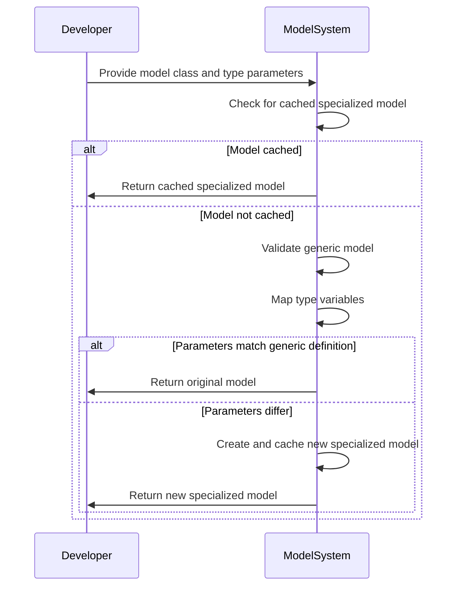
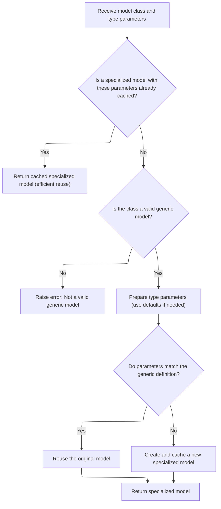
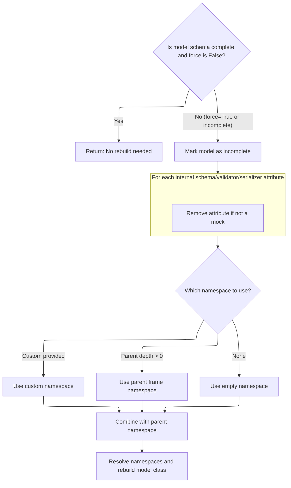
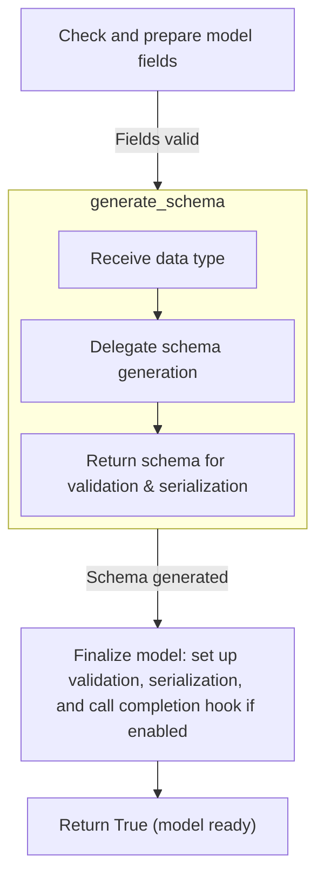
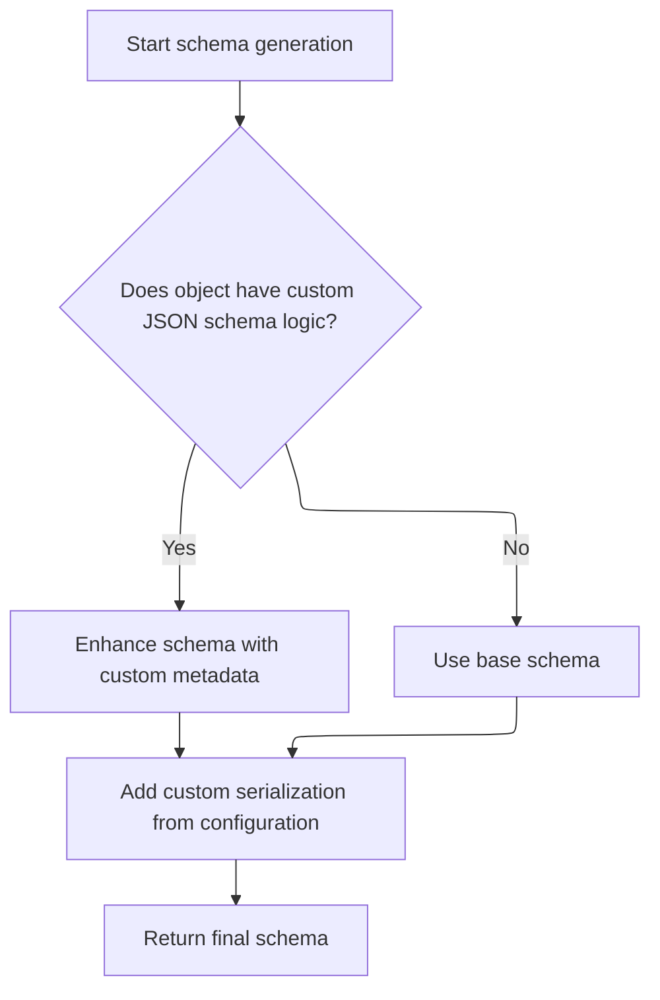
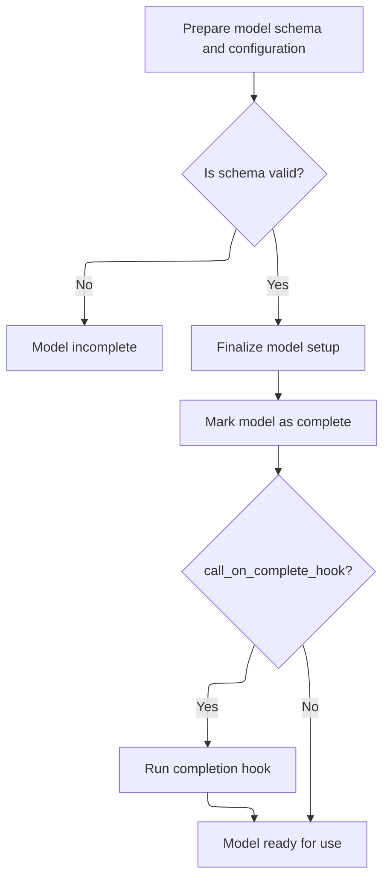

This document explains how specialized model classes are created and reused when type parameters are supplied. The process involves checking for existing cached models, validating generic model definitions, mapping type variables, and either reusing or creating new specialized models as needed. This enables flexible and efficient use of generic data models for validation and serialization.



# Spec

## Detailed View of the Program's Functionality

a. Generic Model Parametrization and Caching

The process begins when a model class and a set of type parameters are provided for generic model specialization. The system first checks if a specialized version of the model with these parameters has already been created and cached. If such a cached model exists, it is immediately returned, ensuring efficient reuse and avoiding unnecessary recomputation.

If no cached specialized model is found, the system validates whether the provided class is a valid generic model. This involves checking that the class is not the base model itself, that it inherits from the appropriate generic base, and that it has the necessary generic parameters. If any of these checks fail, an error is raised to inform the user that the class cannot be parametrized as requested.

If the class is a valid generic model, the system prepares the type parameters, filling in any defaults as needed. For example, if the model is defined with three type variables but only two are provided, the third is filled with its default value. The mapping from type variables to actual types is constructed, and the full tuple of type arguments (including defaults) is assembled.

Next, the system checks if the provided parameters exactly match the generic definition (<SwmToken path="pydantic/main.py" pos="302:1:3" line-data="                i.e. that were not filled from defaults.">`i.e`</SwmToken>., the type variables map to themselves). If so, the original model class is reused, and this mapping is cached for future requests.

If the parameters do not match the generic definition, a new specialized submodel must be created. The system determines the correct arguments for the submodel, possibly replacing types in parent arguments according to the mapping. It then computes the origin of the generic model and generates a unique name for the specialized model based on its parameters. The set of type variables used is also determined.

Before creating the new submodel, the system checks for recursive generic parametrization and handles it appropriately. It also checks again for a late cache hit, in case another thread created the specialized model in the meantime. If a recursive <SwmToken path="pydantic/_internal/_generate_schema.py" pos="881:29:31" line-data="            raise PydanticUserError(&#39;`typing.Self` is invalid in this context&#39;, code=&#39;invalid-self-type&#39;)">`self-type`</SwmToken> is detected, it is returned.

Before finalizing the new submodel, the system ensures that the origin model is up-to-date by calling the model rebuild logic, passing in the appropriate namespace. This step is crucial for resolving any forward references or newly defined types that may affect the model's schema.

Finally, the new specialized submodel is created and cached for future use. The specialized model is then returned to the caller.

b. Model Schema Refresh and Cleanup

When a model's schema needs to be rebuilt—either because it is incomplete or because a forced rebuild is requested—the system first checks if the model is already marked as complete and whether a rebuild is necessary. If the model is complete and no force flag is set, the rebuild is skipped.

If a rebuild is needed, the model is marked as incomplete. The system then iterates over internal attributes related to the schema, validator, and serializer, removing them from the class unless they are mock objects. This cleanup step is essential to prevent stale or outdated logic from being reused, which could lead to subtle bugs if the model's structure has changed.

Next, the system determines which namespace to use for resolving types during the rebuild. This could be a custom namespace provided by the caller, the parent frame's namespace (if a parent depth is specified), or an empty namespace if neither is available. The chosen namespace is combined with any parent namespace associated with the model.

A namespace resolver is then constructed using the combined namespace. The system calls the function responsible for completing the model class, passing in the model, configuration, namespace resolver, and other relevant options. This function will handle rebuilding the model's fields, schema, validators, and serializers as needed.

c. Finalizing Model Structure and Schema

The finalization process ensures that the model's fields are complete and up-to-date. If the fields are not complete, they are rebuilt, and any errors (such as unresolved forward references) are handled appropriately. If rebuilding fails due to unresolved annotations and errors are not to be raised, the process is aborted early.

Once the fields are ready, a schema generator is set up with the current configuration, namespace resolver, and type variable mapping. The schema generator is used to produce the model's core schema, which describes its structure, validation rules, and serialization logic.

If schema generation fails due to unresolved annotations, the model is set to use mock objects, and the process returns failure. Otherwise, the schema is cleaned and finalized, ensuring that all references and definitions are properly resolved and that any deferred logic (such as discriminators for unions) is applied.

After schema generation, the system sets up computed fields and deprecated field descriptors, ensuring that any computed properties or deprecated fields are handled correctly at runtime. The finalized schema, validator, and serializer are attached to the model class.

The model's introspection signature is also set up, allowing tools and users to inspect the model's constructor and fields programmatically. The model is then marked as complete.

If a completion hook is enabled, it is called to allow for any additional <SwmToken path="pydantic/main.py" pos="106:14:16" line-data="        # is initialized, by wrapping the user-defined `model_post_init()`), e.g. if they mock">`user-defined`</SwmToken> logic to run after the model is fully initialized. The process concludes by returning success, indicating that the model is ready for use.

d. Delegating Schema Generation

When schema generation is requested, the schema generator delegates the actual work to its internal schema generation logic. This delegation allows for a clean separation between the interface and the implementation, making it easier to customize or extend schema generation in the future.

e. Schema Generation Logic

The schema generation logic first checks if the object being processed provides a custom method for generating its schema. If such a method exists, it is called, and the resulting schema is used. If not, the default schema generation logic is invoked, which handles all standard types and model structures.

After the core schema is generated, the system checks for any custom JSON schema logic attached to the object. If present, this logic is used to enhance the schema with additional metadata or customization. The system also checks for any custom serialization logic specified in the configuration and attaches it to the schema if needed.

The finalized schema, now containing all necessary metadata and customizations, is returned for use in validation and serialization.

f. Schema Finalization and Validator Setup

Once the schema is prepared, the system checks its validity. If the schema is invalid, the model is marked as incomplete, and the process is aborted. If the schema is valid, the system finalizes the model setup by attaching the schema, validator, and serializer to the model class.

Any computed fields and deprecated descriptors are set up at this stage. The model's introspection signature is established, and the model is marked as complete. If a completion hook is enabled, it is called to allow for any final <SwmToken path="pydantic/main.py" pos="106:14:16" line-data="        # is initialized, by wrapping the user-defined `model_post_init()`), e.g. if they mock">`user-defined`</SwmToken> setup.

At the end of this process, the model is fully ready for use, with all validation, serialization, and introspection features properly configured.

# Rule Definition

| Paragraph Name                                                                                                                                                                                                                                                                                                                                                                                                                                                                                                                                                                                                                                                                                                                                                                                                                                                                                                                   | Rule ID | Category          | Description                                                                                                                                                                                                                                                                                                                                                                                                                                                                                                                                                                                                                                                                                                    | Conditions                                                                                                                                                                                                                                                                                                                                                                                                                                  | Remarks                                                                                                                                                                                                                                                                                                                                                                                                           |
| -------------------------------------------------------------------------------------------------------------------------------------------------------------------------------------------------------------------------------------------------------------------------------------------------------------------------------------------------------------------------------------------------------------------------------------------------------------------------------------------------------------------------------------------------------------------------------------------------------------------------------------------------------------------------------------------------------------------------------------------------------------------------------------------------------------------------------------------------------------------------------------------------------------------------------- | ------- | ----------------- | -------------------------------------------------------------------------------------------------------------------------------------------------------------------------------------------------------------------------------------------------------------------------------------------------------------------------------------------------------------------------------------------------------------------------------------------------------------------------------------------------------------------------------------------------------------------------------------------------------------------------------------------------------------------------------------------------------------- | ------------------------------------------------------------------------------------------------------------------------------------------------------------------------------------------------------------------------------------------------------------------------------------------------------------------------------------------------------------------------------------------------------------------------------------------- | ----------------------------------------------------------------------------------------------------------------------------------------------------------------------------------------------------------------------------------------------------------------------------------------------------------------------------------------------------------------------------------------------------------------- |
| class <SwmToken path="pydantic/main.py" pos="853:7:7" line-data="    ) -&gt; type[BaseModel] \| _forward_ref.PydanticRecursiveRef:">`BaseModel`</SwmToken>(metaclass=<SwmToken path="pydantic/main.py" pos="121:6:8" line-data="class BaseModel(metaclass=_model_construction.ModelMetaclass):">`_model_construction.ModelMetaclass`</SwmToken>):, <SwmToken path="pydantic/_internal/_model_construction.py" pos="610:13:13" line-data="        # Note: when coming from `ModelMetaclass.__new__()`, this results in fields being built twice.">`ModelMetaclass`</SwmToken>.**new**                                                                                                                                                                                                                                                                                                                                             | RL-001  | Conditional Logic | Users can define generic models by inheriting from both the base model class and Python's generic base (<SwmToken path="pydantic/main.py" pos="77:7:9" line-data="# type inference (e.g. when using `{&#39;a&#39;: {&#39;b&#39;: True}}`):">`e.g`</SwmToken>., Generic\[T\]), where T is a type variable.                                                                                                                                                                                                                                                                                                                                                                                                      | A class must inherit from both <SwmToken path="pydantic/main.py" pos="853:7:7" line-data="    ) -&gt; type[BaseModel] \| _forward_ref.PydanticRecursiveRef:">`BaseModel`</SwmToken> and <SwmToken path="pydantic/main.py" pos="859:18:20" line-data="            raise TypeError(&#39;Type parameters should be placed on typing.Generic, not BaseModel&#39;)">`typing.Generic`</SwmToken> (or equivalent) with at least one type variable. | No constants. The type variable(s) must be valid Python <SwmToken path="pydantic/main.py" pos="24:1:1" line-data="    TypeVar,">`TypeVar`</SwmToken> instances.                                                                                                                                                                                                                                                   |
| <SwmToken path="pydantic/main.py" pos="853:7:7" line-data="    ) -&gt; type[BaseModel] \| _forward_ref.PydanticRecursiveRef:">`BaseModel`</SwmToken>.**class_getitem**                                                                                                                                                                                                                                                                                                                                                                                                                                                                                                                                                                                                                                                                                                                                                           | RL-002  | Computation       | When a user subscripts a generic model class with concrete type arguments (<SwmToken path="pydantic/main.py" pos="77:7:9" line-data="# type inference (e.g. when using `{&#39;a&#39;: {&#39;b&#39;: True}}`):">`e.g`</SwmToken>., Box\[int\]), the system returns a specialized model class where all references to the type variables are replaced with the provided types.                                                                                                                                                                                                                                                                                                                                   | The model class must be generic and be subscripted with the correct number of type arguments.                                                                                                                                                                                                                                                                                                                                               | The specialized model class is a new type with type variables replaced by the provided types.                                                                                                                                                                                                                                                                                                                     |
| <SwmToken path="pydantic/main.py" pos="853:7:7" line-data="    ) -&gt; type[BaseModel] \| _forward_ref.PydanticRecursiveRef:">`BaseModel`</SwmToken>.**class_getitem**, <SwmToken path="pydantic/main.py" pos="854:5:7" line-data="        cached = _generics.get_cached_generic_type_early(cls, typevar_values)">`_generics.get_cached_generic_type_early`</SwmToken>, <SwmToken path="pydantic/main.py" pos="876:1:3" line-data="            _generics.set_cached_generic_type(cls, typevar_values, submodel)">`_generics.set_cached_generic_type`</SwmToken>                                                                                                                                                                                                                                                                                                                                                                  | RL-003  | Data Assignment   | Each unique parametrization of a generic model is cached so that repeated requests for the same parametrization return the same specialized model class instance.                                                                                                                                                                                                                                                                                                                                                                                                                                                                                                                                              | A generic model is parametrized with a specific set of type arguments.                                                                                                                                                                                                                                                                                                                                                                      | The cache key is based on the model class and the tuple of type arguments.                                                                                                                                                                                                                                                                                                                                        |
| <SwmToken path="pydantic/main.py" pos="853:7:7" line-data="    ) -&gt; type[BaseModel] \| _forward_ref.PydanticRecursiveRef:">`BaseModel`</SwmToken>.**class_getitem**                                                                                                                                                                                                                                                                                                                                                                                                                                                                                                                                                                                                                                                                                                                                                           | RL-004  | Conditional Logic | If a user attempts to parametrize a model that does not inherit from the generic base, the system raises a <SwmToken path="pydantic/main.py" pos="859:3:3" line-data="            raise TypeError(&#39;Type parameters should be placed on typing.Generic, not BaseModel&#39;)">`TypeError`</SwmToken> with a message indicating that the class cannot be parametrized because it is not a generic class.                                                                                                                                                                                                                                                                                                      | A model class that does not inherit from <SwmToken path="pydantic/main.py" pos="859:18:20" line-data="            raise TypeError(&#39;Type parameters should be placed on typing.Generic, not BaseModel&#39;)">`typing.Generic`</SwmToken> is subscripted with type arguments.                                                                                                                                                             | Error message: '{cls} cannot be parametrized because it does not inherit from <SwmToken path="pydantic/main.py" pos="859:18:20" line-data="            raise TypeError(&#39;Type parameters should be placed on typing.Generic, not BaseModel&#39;)">`typing.Generic`</SwmToken>'                                                                                                                                 |
| <SwmToken path="pydantic/main.py" pos="853:7:7" line-data="    ) -&gt; type[BaseModel] \| _forward_ref.PydanticRecursiveRef:">`BaseModel`</SwmToken>.**class_getitem**                                                                                                                                                                                                                                                                                                                                                                                                                                                                                                                                                                                                                                                                                                                                                           | RL-005  | Conditional Logic | If a user attempts to parametrize the base model class directly (<SwmToken path="pydantic/main.py" pos="77:7:9" line-data="# type inference (e.g. when using `{&#39;a&#39;: {&#39;b&#39;: True}}`):">`e.g`</SwmToken>., <SwmToken path="pydantic/main.py" pos="853:7:7" line-data="    ) -&gt; type[BaseModel] \| _forward_ref.PydanticRecursiveRef:">`BaseModel`</SwmToken>\[int\]), the system raises a <SwmToken path="pydantic/main.py" pos="859:3:3" line-data="            raise TypeError(&#39;Type parameters should be placed on typing.Generic, not BaseModel&#39;)">`TypeError`</SwmToken> with a message indicating that type parameters should be placed on the generic base, not the base model. | <SwmToken path="pydantic/main.py" pos="853:7:7" line-data="    ) -&gt; type[BaseModel] \| _forward_ref.PydanticRecursiveRef:">`BaseModel`</SwmToken> is subscripted with type arguments.                                                                                                                                                                                                                                                    | Error message: 'Type parameters should be placed on <SwmToken path="pydantic/main.py" pos="859:18:20" line-data="            raise TypeError(&#39;Type parameters should be placed on typing.Generic, not BaseModel&#39;)">`typing.Generic`</SwmToken>, not <SwmToken path="pydantic/main.py" pos="853:7:7" line-data="    ) -&gt; type[BaseModel] \| _forward_ref.PydanticRecursiveRef:">`BaseModel`</SwmToken>' |
| <SwmToken path="pydantic/main.py" pos="853:7:7" line-data="    ) -&gt; type[BaseModel] \| _forward_ref.PydanticRecursiveRef:">`BaseModel`</SwmToken>.**class_getitem**, <SwmToken path="pydantic/main.py" pos="870:5:7" line-data="        typevars_map = _generics.map_generic_model_arguments(cls, typevar_values)">`_generics.map_generic_model_arguments`</SwmToken>                                                                                                                                                                                                                                                                                                                                                                                                                                                                                                                                                         | RL-006  | Conditional Logic | If a user provides an incorrect number of type arguments when parametrizing a generic model, the system raises a <SwmToken path="pydantic/main.py" pos="859:3:3" line-data="            raise TypeError(&#39;Type parameters should be placed on typing.Generic, not BaseModel&#39;)">`TypeError`</SwmToken> with a message indicating the mismatch.                                                                                                                                                                                                                                                                                                                                                           | The number of provided type arguments does not match the number of type variables defined on the generic model.                                                                                                                                                                                                                                                                                                                             | Error message includes details about the expected and provided number of type arguments.                                                                                                                                                                                                                                                                                                                          |
| <SwmToken path="pydantic/main.py" pos="853:7:7" line-data="    ) -&gt; type[BaseModel] \| _forward_ref.PydanticRecursiveRef:">`BaseModel`</SwmToken>.**class_getitem**, <SwmToken path="pydantic/main.py" pos="870:5:7" line-data="        typevars_map = _generics.map_generic_model_arguments(cls, typevar_values)">`_generics.map_generic_model_arguments`</SwmToken>, <SwmToken path="pydantic/main.py" pos="882:7:9" line-data="                args = tuple(_generics.replace_types(arg, typevars_map) for arg in parent_args)">`_generics.replace_types`</SwmToken>, <SwmToken path="pydantic/main.py" pos="646:3:5" line-data="        return _model_construction.complete_model_class(">`_model_construction.complete_model_class`</SwmToken>, <SwmToken path="pydantic/main.py" pos="784:12:14" line-data="        # Logic copied over from `GenerateSchema._model_schema`:">`GenerateSchema._model_schema`</SwmToken> | RL-007  | Computation       | When a specialized model class is created via parametrization, all field type annotations in the model must be resolved using the provided type arguments, including support for default type arguments if defined.                                                                                                                                                                                                                                                                                                                                                                                                                                                                                            | A generic model is parametrized and a specialized model class is created.                                                                                                                                                                                                                                                                                                                                                                   | Field type annotations are replaced with the concrete types as per the type argument mapping.                                                                                                                                                                                                                                                                                                                     |
| GenerateSchema.\_generate_schema_from_get_schema_method, <SwmToken path="pydantic/main.py" pos="853:7:7" line-data="    ) -&gt; type[BaseModel] \| _forward_ref.PydanticRecursiveRef:">`BaseModel`</SwmToken>.**get_pydantic_core_schema**                                                                                                                                                                                                                                                                                                                                                                                                                                                                                                                                                                                                                                                                                       | RL-008  | Conditional Logic | The system supports custom schema generation by allowing users to define a method named **get_pydantic_core_schema** on their model or type.                                                                                                                                                                                                                                                                                                                                                                                                                                                                                                                                                                   | A model or type defines a **get_pydantic_core_schema** method.                                                                                                                                                                                                                                                                                                                                                                              | The method signature is (cls, source, handler) -> <SwmToken path="pydantic/_internal/_schema_generation_shared.py" pos="95:21:21" line-data="    def generate_schema(self, source_type: Any, /) -&gt; core_schema.CoreSchema:">`CoreSchema`</SwmToken>.                                                                                                                                                           |
| GenerateSchema.\_generate_schema_from_get_schema_method                                                                                                                                                                                                                                                                                                                                                                                                                                                                                                                                                                                                                                                                                                                                                                                                                                                                          | RL-009  | Computation       | If a model or type defines **get_pydantic_core_schema**, the system calls this method during schema generation, passing the type and a handler function for default schema generation.                                                                                                                                                                                                                                                                                                                                                                                                                                                                                                                         | A model or type with **get_pydantic_core_schema** is being processed for schema generation.                                                                                                                                                                                                                                                                                                                                                 | The handler function allows the custom method to delegate to the default schema logic.                                                                                                                                                                                                                                                                                                                            |
| GenerateSchema.\_generate_schema_from_get_schema_method                                                                                                                                                                                                                                                                                                                                                                                                                                                                                                                                                                                                                                                                                                                                                                                                                                                                          | RL-010  | Conditional Logic | If the custom schema method returns a schema, that schema is used for validation and serialization of the model.                                                                                                                                                                                                                                                                                                                                                                                                                                                                                                                                                                                               | The custom schema method returns a non-None schema.                                                                                                                                                                                                                                                                                                                                                                                         | The returned schema must be a valid <SwmToken path="pydantic/_internal/_schema_generation_shared.py" pos="95:21:21" line-data="    def generate_schema(self, source_type: Any, /) -&gt; core_schema.CoreSchema:">`CoreSchema`</SwmToken> object.                                                                                                                                                                  |
| GenerateSchema.\_generate_schema_from_get_schema_method                                                                                                                                                                                                                                                                                                                                                                                                                                                                                                                                                                                                                                                                                                                                                                                                                                                                          | RL-011  | Conditional Logic | If the custom schema method is not present or returns None, the system uses the default schema generation logic.                                                                                                                                                                                                                                                                                                                                                                                                                                                                                                                                                                                               | No **get_pydantic_core_schema** method is defined, or it returns None.                                                                                                                                                                                                                                                                                                                                                                      | Default schema logic is used as implemented in <SwmToken path="pydantic/_internal/_model_construction.py" pos="612:13:13" line-data="        # Alternatively, we could let `GenerateSchema()` raise the error, but there are cases where incomplete">`GenerateSchema`</SwmToken>.                                                                                                                                 |
| <SwmToken path="pydantic/main.py" pos="853:7:7" line-data="    ) -&gt; type[BaseModel] \| _forward_ref.PydanticRecursiveRef:">`BaseModel`</SwmToken>.**get_pydantic_core_schema**                                                                                                                                                                                                                                                                                                                                                                                                                                                                                                                                                                                                                                                                                                                                                | RL-012  | Conditional Logic | If the custom schema method calls super().**get_pydantic_core_schema**, the system issues a deprecation warning and advises the user to use the provided handler function instead.                                                                                                                                                                                                                                                                                                                                                                                                                                                                                                                             | super().**get_pydantic_core_schema** is called in a custom schema method.                                                                                                                                                                                                                                                                                                                                                                   | Deprecation warning is issued with guidance to use the handler.                                                                                                                                                                                                                                                                                                                                                   |
| <SwmToken path="pydantic/main.py" pos="853:7:7" line-data="    ) -&gt; type[BaseModel] \| _forward_ref.PydanticRecursiveRef:">`BaseModel`</SwmToken>.**init**, BaseModel.model_validate, BaseModel.model_validate_json, BaseModel.model_validate_strings                                                                                                                                                                                                                                                                                                                                                                                                                                                                                                                                                                                                                                                                         | RL-013  | Computation       | When a model is parametrized and then instantiated, the system validates input data according to the resolved field types of the specialized model.                                                                                                                                                                                                                                                                                                                                                                                                                                                                                                                                                            | A specialized model instance is created or validated.                                                                                                                                                                                                                                                                                                                                                                                       | Validation uses the resolved field types as per the parametrization.                                                                                                                                                                                                                                                                                                                                              |
| <SwmToken path="pydantic/main.py" pos="853:7:7" line-data="    ) -&gt; type[BaseModel] \| _forward_ref.PydanticRecursiveRef:">`BaseModel`</SwmToken>.**class_getitem**                                                                                                                                                                                                                                                                                                                                                                                                                                                                                                                                                                                                                                                                                                                                                           | RL-014  | Conditional Logic | The system provides clear and descriptive error messages for all invalid parametrization attempts, including <SwmToken path="pydantic/main.py" pos="578:20:22" line-data="            TypeError: Raised when trying to generate concrete names for non-generic models.">`non-generic`</SwmToken> parametrization, parametrizing the base model, and incorrect type argument counts.                                                                                                                                                                                                                                                                                                                            | Any invalid parametrization attempt occurs.                                                                                                                                                                                                                                                                                                                                                                                                 | Error messages specify the nature of the error and guidance for correction.                                                                                                                                                                                                                                                                                                                                       |
| GenerateSchema.\_generate_schema_from_get_schema_method, <SwmToken path="pydantic/main.py" pos="853:7:7" line-data="    ) -&gt; type[BaseModel] \| _forward_ref.PydanticRecursiveRef:">`BaseModel`</SwmToken>.**get_pydantic_core_schema**                                                                                                                                                                                                                                                                                                                                                                                                                                                                                                                                                                                                                                                                                       | RL-015  | Computation       | The system ensures that custom schema logic, if present, is automatically invoked during schema creation, validation, and serialization processes for the relevant model or type.                                                                                                                                                                                                                                                                                                                                                                                                                                                                                                                              | A model or type with custom schema logic is involved in schema creation, validation, or serialization.                                                                                                                                                                                                                                                                                                                                      | Custom schema logic is invoked as part of the schema generation pipeline.                                                                                                                                                                                                                                                                                                                                         |

# User Stories

## User Story 1: Define and use generic models with parametrization and validation

---

### Story Description:

As a user, I want to define generic models by inheriting from both the base model class and Python's generic base, parametrize them with concrete types, and have the system resolve all type variables and validate input data accordingly, so that I can create reusable and type-safe data models.

---

### Business Rule Mapping:

| Rule ID | Paragraph Name                                                                                                                                                                                                                                                                                                                                                                                                                                                                                                                                                                                                                                                                                                                                                                                                                                                                                                                   | Rule Description                                                                                                                                                                                                                                                                                                                                                             |
| ------- | -------------------------------------------------------------------------------------------------------------------------------------------------------------------------------------------------------------------------------------------------------------------------------------------------------------------------------------------------------------------------------------------------------------------------------------------------------------------------------------------------------------------------------------------------------------------------------------------------------------------------------------------------------------------------------------------------------------------------------------------------------------------------------------------------------------------------------------------------------------------------------------------------------------------------------- | ---------------------------------------------------------------------------------------------------------------------------------------------------------------------------------------------------------------------------------------------------------------------------------------------------------------------------------------------------------------------------- |
| RL-001  | class <SwmToken path="pydantic/main.py" pos="853:7:7" line-data="    ) -&gt; type[BaseModel] \| _forward_ref.PydanticRecursiveRef:">`BaseModel`</SwmToken>(metaclass=<SwmToken path="pydantic/main.py" pos="121:6:8" line-data="class BaseModel(metaclass=_model_construction.ModelMetaclass):">`_model_construction.ModelMetaclass`</SwmToken>):, <SwmToken path="pydantic/_internal/_model_construction.py" pos="610:13:13" line-data="        # Note: when coming from `ModelMetaclass.__new__()`, this results in fields being built twice.">`ModelMetaclass`</SwmToken>.**new**                                                                                                                                                                                                                                                                                                                                             | Users can define generic models by inheriting from both the base model class and Python's generic base (<SwmToken path="pydantic/main.py" pos="77:7:9" line-data="# type inference (e.g. when using `{&#39;a&#39;: {&#39;b&#39;: True}}`):">`e.g`</SwmToken>., Generic\[T\]), where T is a type variable.                                                                    |
| RL-002  | <SwmToken path="pydantic/main.py" pos="853:7:7" line-data="    ) -&gt; type[BaseModel] \| _forward_ref.PydanticRecursiveRef:">`BaseModel`</SwmToken>.**class_getitem**                                                                                                                                                                                                                                                                                                                                                                                                                                                                                                                                                                                                                                                                                                                                                           | When a user subscripts a generic model class with concrete type arguments (<SwmToken path="pydantic/main.py" pos="77:7:9" line-data="# type inference (e.g. when using `{&#39;a&#39;: {&#39;b&#39;: True}}`):">`e.g`</SwmToken>., Box\[int\]), the system returns a specialized model class where all references to the type variables are replaced with the provided types. |
| RL-003  | <SwmToken path="pydantic/main.py" pos="853:7:7" line-data="    ) -&gt; type[BaseModel] \| _forward_ref.PydanticRecursiveRef:">`BaseModel`</SwmToken>.**class_getitem**, <SwmToken path="pydantic/main.py" pos="854:5:7" line-data="        cached = _generics.get_cached_generic_type_early(cls, typevar_values)">`_generics.get_cached_generic_type_early`</SwmToken>, <SwmToken path="pydantic/main.py" pos="876:1:3" line-data="            _generics.set_cached_generic_type(cls, typevar_values, submodel)">`_generics.set_cached_generic_type`</SwmToken>                                                                                                                                                                                                                                                                                                                                                                  | Each unique parametrization of a generic model is cached so that repeated requests for the same parametrization return the same specialized model class instance.                                                                                                                                                                                                            |
| RL-006  | <SwmToken path="pydantic/main.py" pos="853:7:7" line-data="    ) -&gt; type[BaseModel] \| _forward_ref.PydanticRecursiveRef:">`BaseModel`</SwmToken>.**class_getitem**, <SwmToken path="pydantic/main.py" pos="870:5:7" line-data="        typevars_map = _generics.map_generic_model_arguments(cls, typevar_values)">`_generics.map_generic_model_arguments`</SwmToken>                                                                                                                                                                                                                                                                                                                                                                                                                                                                                                                                                         | If a user provides an incorrect number of type arguments when parametrizing a generic model, the system raises a <SwmToken path="pydantic/main.py" pos="859:3:3" line-data="            raise TypeError(&#39;Type parameters should be placed on typing.Generic, not BaseModel&#39;)">`TypeError`</SwmToken> with a message indicating the mismatch.                         |
| RL-007  | <SwmToken path="pydantic/main.py" pos="853:7:7" line-data="    ) -&gt; type[BaseModel] \| _forward_ref.PydanticRecursiveRef:">`BaseModel`</SwmToken>.**class_getitem**, <SwmToken path="pydantic/main.py" pos="870:5:7" line-data="        typevars_map = _generics.map_generic_model_arguments(cls, typevar_values)">`_generics.map_generic_model_arguments`</SwmToken>, <SwmToken path="pydantic/main.py" pos="882:7:9" line-data="                args = tuple(_generics.replace_types(arg, typevars_map) for arg in parent_args)">`_generics.replace_types`</SwmToken>, <SwmToken path="pydantic/main.py" pos="646:3:5" line-data="        return _model_construction.complete_model_class(">`_model_construction.complete_model_class`</SwmToken>, <SwmToken path="pydantic/main.py" pos="784:12:14" line-data="        # Logic copied over from `GenerateSchema._model_schema`:">`GenerateSchema._model_schema`</SwmToken> | When a specialized model class is created via parametrization, all field type annotations in the model must be resolved using the provided type arguments, including support for default type arguments if defined.                                                                                                                                                          |
| RL-013  | <SwmToken path="pydantic/main.py" pos="853:7:7" line-data="    ) -&gt; type[BaseModel] \| _forward_ref.PydanticRecursiveRef:">`BaseModel`</SwmToken>.**init**, BaseModel.model_validate, BaseModel.model_validate_json, BaseModel.model_validate_strings                                                                                                                                                                                                                                                                                                                                                                                                                                                                                                                                                                                                                                                                         | When a model is parametrized and then instantiated, the system validates input data according to the resolved field types of the specialized model.                                                                                                                                                                                                                          |

---

### Relevant Functionality:

- **class** <SwmToken path="pydantic/main.py" pos="853:7:7" line-data="    ) -&gt; type[BaseModel] | _forward_ref.PydanticRecursiveRef:">`BaseModel`</SwmToken>**(metaclass=**<SwmToken path="pydantic/main.py" pos="121:6:8" line-data="class BaseModel(metaclass=_model_construction.ModelMetaclass):">`_model_construction.ModelMetaclass`</SwmToken>**):**
  1. **RL-001:**
     - When a new model class is created:
       - Check if the class inherits from both <SwmToken path="pydantic/main.py" pos="853:7:7" line-data="    ) -&gt; type[BaseModel] | _forward_ref.PydanticRecursiveRef:">`BaseModel`</SwmToken> and Generic.
       - If so, set up generic metadata (**pydantic_generic_metadata**) to track type parameters.
- **BaseModel.class_getitem**
  1. **RL-002:**
     - On **class_getitem**:
       - Validate that the class is a generic model.
       - Map type variables to provided type arguments.
       - Create a new model class with type variables replaced by concrete types.
  2. **RL-003:**
     - Before creating a new specialized model:
       - Check if a cached version exists for the given type arguments.
       - If found, return the cached model class.
       - If not, create and cache the new specialized model class.
  3. **RL-006:**
     - On **class_getitem**:
       - Map type variables to provided arguments.
       - If the count does not match, raise <SwmToken path="pydantic/main.py" pos="859:3:3" line-data="            raise TypeError(&#39;Type parameters should be placed on typing.Generic, not BaseModel&#39;)">`TypeError`</SwmToken> with a descriptive message.
  4. **RL-007:**
     - Map type variables to provided arguments (using defaults if necessary).
     - Replace all field type annotations in the model with the resolved types.
- **BaseModel.init**
  1. **RL-013:**
     - On instantiation or validation:
       - Use the specialized model's validator to validate input data according to resolved field types.

## User Story 2: Handle invalid parametrization attempts with clear error messages

---

### Story Description:

As a user, I want the system to provide clear and descriptive error messages when I attempt to parametrize a <SwmToken path="pydantic/main.py" pos="578:20:22" line-data="            TypeError: Raised when trying to generate concrete names for non-generic models.">`non-generic`</SwmToken> model, the base model, or use the wrong number of type arguments, so that I understand what went wrong and how to correct it.

---

### Business Rule Mapping:

| Rule ID | Paragraph Name                                                                                                                                                                                                                                                                                                                                                           | Rule Description                                                                                                                                                                                                                                                                                                                                                                                                                                                                                                                                                                                                                                                                                               |
| ------- | ------------------------------------------------------------------------------------------------------------------------------------------------------------------------------------------------------------------------------------------------------------------------------------------------------------------------------------------------------------------------ | -------------------------------------------------------------------------------------------------------------------------------------------------------------------------------------------------------------------------------------------------------------------------------------------------------------------------------------------------------------------------------------------------------------------------------------------------------------------------------------------------------------------------------------------------------------------------------------------------------------------------------------------------------------------------------------------------------------- |
| RL-004  | <SwmToken path="pydantic/main.py" pos="853:7:7" line-data="    ) -&gt; type[BaseModel] \| _forward_ref.PydanticRecursiveRef:">`BaseModel`</SwmToken>.**class_getitem**                                                                                                                                                                                                   | If a user attempts to parametrize a model that does not inherit from the generic base, the system raises a <SwmToken path="pydantic/main.py" pos="859:3:3" line-data="            raise TypeError(&#39;Type parameters should be placed on typing.Generic, not BaseModel&#39;)">`TypeError`</SwmToken> with a message indicating that the class cannot be parametrized because it is not a generic class.                                                                                                                                                                                                                                                                                                      |
| RL-005  | <SwmToken path="pydantic/main.py" pos="853:7:7" line-data="    ) -&gt; type[BaseModel] \| _forward_ref.PydanticRecursiveRef:">`BaseModel`</SwmToken>.**class_getitem**                                                                                                                                                                                                   | If a user attempts to parametrize the base model class directly (<SwmToken path="pydantic/main.py" pos="77:7:9" line-data="# type inference (e.g. when using `{&#39;a&#39;: {&#39;b&#39;: True}}`):">`e.g`</SwmToken>., <SwmToken path="pydantic/main.py" pos="853:7:7" line-data="    ) -&gt; type[BaseModel] \| _forward_ref.PydanticRecursiveRef:">`BaseModel`</SwmToken>\[int\]), the system raises a <SwmToken path="pydantic/main.py" pos="859:3:3" line-data="            raise TypeError(&#39;Type parameters should be placed on typing.Generic, not BaseModel&#39;)">`TypeError`</SwmToken> with a message indicating that type parameters should be placed on the generic base, not the base model. |
| RL-006  | <SwmToken path="pydantic/main.py" pos="853:7:7" line-data="    ) -&gt; type[BaseModel] \| _forward_ref.PydanticRecursiveRef:">`BaseModel`</SwmToken>.**class_getitem**, <SwmToken path="pydantic/main.py" pos="870:5:7" line-data="        typevars_map = _generics.map_generic_model_arguments(cls, typevar_values)">`_generics.map_generic_model_arguments`</SwmToken> | If a user provides an incorrect number of type arguments when parametrizing a generic model, the system raises a <SwmToken path="pydantic/main.py" pos="859:3:3" line-data="            raise TypeError(&#39;Type parameters should be placed on typing.Generic, not BaseModel&#39;)">`TypeError`</SwmToken> with a message indicating the mismatch.                                                                                                                                                                                                                                                                                                                                                           |
| RL-014  | <SwmToken path="pydantic/main.py" pos="853:7:7" line-data="    ) -&gt; type[BaseModel] \| _forward_ref.PydanticRecursiveRef:">`BaseModel`</SwmToken>.**class_getitem**                                                                                                                                                                                                   | The system provides clear and descriptive error messages for all invalid parametrization attempts, including <SwmToken path="pydantic/main.py" pos="578:20:22" line-data="            TypeError: Raised when trying to generate concrete names for non-generic models.">`non-generic`</SwmToken> parametrization, parametrizing the base model, and incorrect type argument counts.                                                                                                                                                                                                                                                                                                                            |

---

### Relevant Functionality:

- **BaseModel.class_getitem**
  1. **RL-004:**
     - On **class_getitem**:
       - If the class does not have **parameters** or is not generic, raise <SwmToken path="pydantic/main.py" pos="859:3:3" line-data="            raise TypeError(&#39;Type parameters should be placed on typing.Generic, not BaseModel&#39;)">`TypeError`</SwmToken> with the appropriate message.
  2. **RL-005:**
     - On **class_getitem**:
       - If cls is <SwmToken path="pydantic/main.py" pos="853:7:7" line-data="    ) -&gt; type[BaseModel] | _forward_ref.PydanticRecursiveRef:">`BaseModel`</SwmToken>, raise <SwmToken path="pydantic/main.py" pos="859:3:3" line-data="            raise TypeError(&#39;Type parameters should be placed on typing.Generic, not BaseModel&#39;)">`TypeError`</SwmToken> with the specified message.
  3. **RL-006:**
     - On **class_getitem**:
       - Map type variables to provided arguments.
       - If the count does not match, raise <SwmToken path="pydantic/main.py" pos="859:3:3" line-data="            raise TypeError(&#39;Type parameters should be placed on typing.Generic, not BaseModel&#39;)">`TypeError`</SwmToken> with a descriptive message.
  4. **RL-014:**
     - On invalid parametrization:
       - Raise <SwmToken path="pydantic/main.py" pos="859:3:3" line-data="            raise TypeError(&#39;Type parameters should be placed on typing.Generic, not BaseModel&#39;)">`TypeError`</SwmToken> with a descriptive message indicating the specific issue.

## User Story 3: Support and invoke custom schema generation logic

---

### Story Description:

As a user, I want to define a custom schema generation method on my model or type, have the system automatically invoke it during schema creation, validation, and serialization, and receive guidance if I use deprecated patterns, so that I can customize how my models are represented and validated.

---

### Business Rule Mapping:

| Rule ID | Paragraph Name                                                                                                                                                                                                                             | Rule Description                                                                                                                                                                       |
| ------- | ------------------------------------------------------------------------------------------------------------------------------------------------------------------------------------------------------------------------------------------ | -------------------------------------------------------------------------------------------------------------------------------------------------------------------------------------- |
| RL-008  | GenerateSchema.\_generate_schema_from_get_schema_method, <SwmToken path="pydantic/main.py" pos="853:7:7" line-data="    ) -&gt; type[BaseModel] \| _forward_ref.PydanticRecursiveRef:">`BaseModel`</SwmToken>.**get_pydantic_core_schema** | The system supports custom schema generation by allowing users to define a method named **get_pydantic_core_schema** on their model or type.                                           |
| RL-009  | GenerateSchema.\_generate_schema_from_get_schema_method                                                                                                                                                                                    | If a model or type defines **get_pydantic_core_schema**, the system calls this method during schema generation, passing the type and a handler function for default schema generation. |
| RL-010  | GenerateSchema.\_generate_schema_from_get_schema_method                                                                                                                                                                                    | If the custom schema method returns a schema, that schema is used for validation and serialization of the model.                                                                       |
| RL-011  | GenerateSchema.\_generate_schema_from_get_schema_method                                                                                                                                                                                    | If the custom schema method is not present or returns None, the system uses the default schema generation logic.                                                                       |
| RL-015  | GenerateSchema.\_generate_schema_from_get_schema_method, <SwmToken path="pydantic/main.py" pos="853:7:7" line-data="    ) -&gt; type[BaseModel] \| _forward_ref.PydanticRecursiveRef:">`BaseModel`</SwmToken>.**get_pydantic_core_schema** | The system ensures that custom schema logic, if present, is automatically invoked during schema creation, validation, and serialization processes for the relevant model or type.      |
| RL-012  | <SwmToken path="pydantic/main.py" pos="853:7:7" line-data="    ) -&gt; type[BaseModel] \| _forward_ref.PydanticRecursiveRef:">`BaseModel`</SwmToken>.**get_pydantic_core_schema**                                                          | If the custom schema method calls super().**get_pydantic_core_schema**, the system issues a deprecation warning and advises the user to use the provided handler function instead.     |

---

### Relevant Functionality:

- **GenerateSchema.\_generate_schema_from_get_schema_method**
  1. **RL-008:**
     - When generating a schema for a type:
       - If **get_pydantic_core_schema** is defined and not the default, call it with the type and a handler.
  2. **RL-009:**
     - During schema generation:
       - Call **get_pydantic_core_schema**(source, handler) if present.
  3. **RL-010:**
     - If **get_pydantic_core_schema** returns a schema, use it for validation and serialization.
  4. **RL-011:**
     - If no custom schema method or it returns None, proceed with default schema generation.
  5. **RL-015:**
     - During schema creation, validation, or serialization:
       - If custom schema logic is defined, invoke it as part of the process.
- **BaseModel.get_pydantic_core_schema**
  1. **RL-012:**
     - If super().**get_pydantic_core_schema** is called, emit a deprecation warning.

# Code Walkthrough

## Generic Model Parametrization and Caching



<SwmSnippet path="/pydantic/main.py" line="851">

---

<SwmToken path="pydantic/main.py" pos="851:3:3" line-data="    def __class_getitem__(">`__class_getitem__`</SwmToken> checks for a cached parametrized model, validates the class, maps type variables (with defaults), and either returns the original or sets up a new submodel. Before creating a new submodel, it calls <SwmToken path="pydantic/main.py" pos="902:4:4" line-data="                    # `model_rebuild` will use the parent ns no matter if it is the ns of a module.">`model_rebuild`</SwmToken> to make sure the origin model is up-to-date.

```python
    def __class_getitem__(
        cls, typevar_values: type[Any] | tuple[type[Any], ...]
    ) -> type[BaseModel] | _forward_ref.PydanticRecursiveRef:
        cached = _generics.get_cached_generic_type_early(cls, typevar_values)
        if cached is not None:
            return cached

        if cls is BaseModel:
            raise TypeError('Type parameters should be placed on typing.Generic, not BaseModel')
        if not hasattr(cls, '__parameters__'):
            raise TypeError(f'{cls} cannot be parametrized because it does not inherit from typing.Generic')
        if not cls.__pydantic_generic_metadata__['parameters'] and typing.Generic not in cls.__bases__:
            raise TypeError(f'{cls} is not a generic class')

        if not isinstance(typevar_values, tuple):
            typevar_values = (typevar_values,)

        # For a model `class Model[T, U, V = int](BaseModel): ...` parametrized with `(str, bool)`,
        # this gives us `{T: str, U: bool, V: int}`:
        typevars_map = _generics.map_generic_model_arguments(cls, typevar_values)
        # We also update the provided args to use defaults values (`(str, bool)` becomes `(str, bool, int)`):
        typevar_values = tuple(v for v in typevars_map.values())

        if _utils.all_identical(typevars_map.keys(), typevars_map.values()) and typevars_map:
            submodel = cls  # if arguments are equal to parameters it's the same object
            _generics.set_cached_generic_type(cls, typevar_values, submodel)
        else:
            parent_args = cls.__pydantic_generic_metadata__['args']
            if not parent_args:
                args = typevar_values
            else:
                args = tuple(_generics.replace_types(arg, typevars_map) for arg in parent_args)

            origin = cls.__pydantic_generic_metadata__['origin'] or cls
            model_name = origin.model_parametrized_name(args)
            params = tuple(
                {param: None for param in _generics.iter_contained_typevars(typevars_map.values())}
            )  # use dict as ordered set

            with _generics.generic_recursion_self_type(origin, args) as maybe_self_type:
                cached = _generics.get_cached_generic_type_late(cls, typevar_values, origin, args)
                if cached is not None:
                    return cached

                if maybe_self_type is not None:
                    return maybe_self_type

                # Attempt to rebuild the origin in case new types have been defined
                try:
                    # depth 2 gets you above this __class_getitem__ call.
                    # Note that we explicitly provide the parent ns, otherwise
                    # `model_rebuild` will use the parent ns no matter if it is the ns of a module.
                    # We don't want this here, as this has unexpected effects when a model
                    # is being parametrized during a forward annotation evaluation.
                    parent_ns = _typing_extra.parent_frame_namespace(parent_depth=2) or {}
                    origin.model_rebuild(_types_namespace=parent_ns)
                except PydanticUndefinedAnnotation:
                    # It's okay if it fails, it just means there are still undefined types
                    # that could be evaluated later.
                    pass

                submodel = _generics.create_generic_submodel(model_name, origin, args, params)

                _generics.set_cached_generic_type(cls, typevar_values, submodel, origin, args)

        return submodel
```

---

</SwmSnippet>

## Model Schema Refresh and Cleanup



<SwmSnippet path="/pydantic/main.py" line="596">

---

In <SwmToken path="pydantic/main.py" pos="596:3:3" line-data="    def model_rebuild(">`model_rebuild`</SwmToken>, we check if the model is already marked complete and skip rebuilding unless forced. If rebuilding, we mark the model as incomplete and delete any cached schema, validator, or serializer attributes (unless they're mocks) to prevent stale logic from being reused. This avoids bugs from outdated validation or serialization when the model changes.

```python
    def model_rebuild(
        cls,
        *,
        force: bool = False,
        raise_errors: bool = True,
        _parent_namespace_depth: int = 2,
        _types_namespace: MappingNamespace | None = None,
    ) -> bool | None:
        """Try to rebuild the pydantic-core schema for the model.

        This may be necessary when one of the annotations is a ForwardRef which could not be resolved during
        the initial attempt to build the schema, and automatic rebuilding fails.

        Args:
            force: Whether to force the rebuilding of the model schema, defaults to `False`.
            raise_errors: Whether to raise errors, defaults to `True`.
            _parent_namespace_depth: The depth level of the parent namespace, defaults to 2.
            _types_namespace: The types namespace, defaults to `None`.

        Returns:
            Returns `None` if the schema is already "complete" and rebuilding was not required.
            If rebuilding _was_ required, returns `True` if rebuilding was successful, otherwise `False`.
        """
        already_complete = cls.__pydantic_complete__
        if already_complete and not force:
            return None

        cls.__pydantic_complete__ = False

        for attr in ('__pydantic_core_schema__', '__pydantic_validator__', '__pydantic_serializer__'):
            if attr in cls.__dict__ and not isinstance(getattr(cls, attr), _mock_val_ser.MockValSer):
                # Deleting the validator/serializer is necessary as otherwise they can get reused in
                # pydantic-core. We do so only if they aren't mock instances, otherwise — as `model_rebuild()`
                # isn't thread-safe — concurrent model instantiations can lead to the parent validator being used.
                # Same applies for the core schema that can be reused in schema generation.
                delattr(cls, attr)
```

---

</SwmSnippet>

<SwmSnippet path="/pydantic/main.py" line="631">

---

After clearing out any cached schema/validator/serializer, we resolve the namespace for rebuilding (using either the provided types namespace or the parent frame), unpack any parent namespaces, and combine them. Then we call <SwmToken path="pydantic/main.py" pos="646:5:5" line-data="        return _model_construction.complete_model_class(">`complete_model_class`</SwmToken>, which actually rebuilds the model's schema, validators, and serializers using the resolved namespaces and config. This is what gets the model ready for use again.

```python
                delattr(cls, attr)

        if _types_namespace is not None:
            rebuild_ns = _types_namespace
        elif _parent_namespace_depth > 0:
            rebuild_ns = _typing_extra.parent_frame_namespace(parent_depth=_parent_namespace_depth, force=True) or {}
        else:
            rebuild_ns = {}

        parent_ns = _model_construction.unpack_lenient_weakvaluedict(cls.__pydantic_parent_namespace__) or {}

        ns_resolver = _namespace_utils.NsResolver(
            parent_namespace={**rebuild_ns, **parent_ns},
        )

        return _model_construction.complete_model_class(
            cls,
            _config.ConfigWrapper(cls.model_config, check=False),
            ns_resolver,
            raise_errors=raise_errors,
            # If the model was already complete, we don't need to call the hook again.
            call_on_complete_hook=not already_complete,
        )
```

---

</SwmSnippet>

## Finalizing Model Structure and Schema



<SwmSnippet path="/pydantic/_internal/_model_construction.py" line="578">

---

In <SwmToken path="pydantic/_internal/_model_construction.py" pos="578:2:2" line-data="def complete_model_class(">`complete_model_class`</SwmToken>, we check if the model fields are complete—if not, we rebuild them, handling errors and mocks as needed. Once fields are ready, we set up <SwmToken path="pydantic/_internal/_model_construction.py" pos="612:13:13" line-data="        # Alternatively, we could let `GenerateSchema()` raise the error, but there are cases where incomplete">`GenerateSchema`</SwmToken> and call <SwmToken path="pydantic/_internal/_model_construction.py" pos="642:7:7" line-data="        schema = gen_schema.generate_schema(cls)">`generate_schema`</SwmToken> to produce the model's schema, which is required for validation and serialization. This step depends on the fields being finalized.

```python
def complete_model_class(
    cls: type[BaseModel],
    config_wrapper: ConfigWrapper,
    ns_resolver: NsResolver,
    *,
    raise_errors: bool = True,
    call_on_complete_hook: bool = True,
    create_model_module: str | None = None,
) -> bool:
    """Finish building a model class.

    This logic must be called after class has been created since validation functions must be bound
    and `get_type_hints` requires a class object.

    Args:
        cls: BaseModel or dataclass.
        config_wrapper: The config wrapper instance.
        ns_resolver: The namespace resolver instance to use during schema building.
        raise_errors: Whether to raise errors.
        call_on_complete_hook: Whether to call the `__pydantic_on_complete__` hook.
        create_model_module: The module of the class to be created, if created by `create_model`.

    Returns:
        `True` if the model is successfully completed, else `False`.

    Raises:
        PydanticUndefinedAnnotation: If `PydanticUndefinedAnnotation` occurs in`__get_pydantic_core_schema__`
            and `raise_errors=True`.
    """
    typevars_map = get_model_typevars_map(cls)

    if not cls.__pydantic_fields_complete__:
        # Note: when coming from `ModelMetaclass.__new__()`, this results in fields being built twice.
        # We do so a second time here so that we can get the `NameError` for the specific undefined annotation.
        # Alternatively, we could let `GenerateSchema()` raise the error, but there are cases where incomplete
        # fields are inherited in `collect_model_fields()` and can actually have their annotation resolved in the
        # generate schema process. As we want to avoid having `__pydantic_fields_complete__` set to `False`
        # when `__pydantic_complete__` is `True`, we rebuild here:
        try:
            cls.__pydantic_fields__ = rebuild_model_fields(
                cls,
                config_wrapper=config_wrapper,
                ns_resolver=ns_resolver,
                typevars_map=typevars_map,
            )
        except NameError as e:
            exc = PydanticUndefinedAnnotation.from_name_error(e)
            set_model_mocks(cls, f'`{exc.name}`')
            if raise_errors:
                raise exc from e

        if not raise_errors and not cls.__pydantic_fields_complete__:
            # No need to continue with schema gen, it is guaranteed to fail
            return False

        assert cls.__pydantic_fields_complete__

    gen_schema = GenerateSchema(
        config_wrapper,
        ns_resolver,
        typevars_map,
    )

    try:
        schema = gen_schema.generate_schema(cls)
    except PydanticUndefinedAnnotation as e:
        if raise_errors:
            raise
        set_model_mocks(cls, f'`{e.name}`')
        return False

```

---

</SwmSnippet>

### Delegating Schema Generation

<SwmSnippet path="/pydantic/_internal/_schema_generation_shared.py" line="95">

---

<SwmToken path="pydantic/_internal/_schema_generation_shared.py" pos="95:3:3" line-data="    def generate_schema(self, source_type: Any, /) -&gt; core_schema.CoreSchema:">`generate_schema`</SwmToken> here just delegates the schema generation to its internal <SwmToken path="pydantic/_internal/_schema_generation_shared.py" pos="96:5:5" line-data="        return self._generate_schema.generate_schema(source_type)">`_generate_schema`</SwmToken> object. This keeps the interface simple and lets the actual schema logic be handled elsewhere, making it easier to customize or extend.

```python
    def generate_schema(self, source_type: Any, /) -> core_schema.CoreSchema:
        return self._generate_schema.generate_schema(source_type)
```

---

</SwmSnippet>

### Schema Generation Logic

<SwmSnippet path="/pydantic/_internal/_generate_schema.py" line="697">

---

In <SwmToken path="pydantic/_internal/_generate_schema.py" pos="697:3:3" line-data="    def generate_schema(">`generate_schema`</SwmToken>, it first tries to get a schema using any custom method the object might provide. If that doesn't return anything, it falls back to <SwmToken path="pydantic/_internal/_generate_schema.py" pos="724:7:7" line-data="            schema = self._generate_schema_inner(obj)">`_generate_schema_inner`</SwmToken> to handle the default schema logic. This way, custom and default schema generation are both supported.

```python
    def generate_schema(
        self,
        obj: Any,
    ) -> core_schema.CoreSchema:
        """Generate core schema.

        Args:
            obj: The object to generate core schema for.

        Returns:
            The generated core schema.

        Raises:
            PydanticUndefinedAnnotation:
                If it is not possible to evaluate forward reference.
            PydanticSchemaGenerationError:
                If it is not possible to generate pydantic-core schema.
            TypeError:
                - If `alias_generator` returns a disallowed type (must be str, AliasPath or AliasChoices).
                - If V1 style validator with `each_item=True` applied on a wrong field.
            PydanticUserError:
                - If `typing.TypedDict` is used instead of `typing_extensions.TypedDict` on Python < 3.12.
                - If `__modify_schema__` method is used instead of `__get_pydantic_json_schema__`.
        """
        schema = self._generate_schema_from_get_schema_method(obj, obj)

        if schema is None:
            schema = self._generate_schema_inner(obj)

```

---

</SwmSnippet>

#### Default Schema Generation Path

See <SwmLink doc-title="Schema Generation Flow">[Schema Generation Flow](/.swm/schema-generation-flow.na4n7ish.sw.md)</SwmLink>

#### Schema Metadata and Customization



<SwmSnippet path="/pydantic/_internal/_generate_schema.py" line="726">

---

After returning from <SwmToken path="pydantic/_internal/_generate_schema.py" pos="724:7:7" line-data="            schema = self._generate_schema_inner(obj)">`_generate_schema_inner`</SwmToken>, <SwmToken path="pydantic/_internal/_model_construction.py" pos="642:7:7" line-data="        schema = gen_schema.generate_schema(cls)">`generate_schema`</SwmToken> checks for any extra metadata or custom serialization logic to attach to the schema. This is where user customizations or tweaks get added before the schema is finalized and returned.

```python
        metadata_js_function = _extract_get_pydantic_json_schema(obj)
        if metadata_js_function is not None:
            metadata_schema = resolve_original_schema(schema, self.defs)
            if metadata_schema:
                self._add_js_function(metadata_schema, metadata_js_function)

        schema = _add_custom_serialization_from_json_encoders(self._config_wrapper.json_encoders, obj, schema)

        return schema
```

---

</SwmSnippet>

### Schema Finalization and Validator Setup



<SwmSnippet path="/pydantic/_internal/_model_construction.py" line="649">

---

After returning from <SwmToken path="pydantic/_internal/_model_construction.py" pos="642:7:7" line-data="        schema = gen_schema.generate_schema(cls)">`generate_schema`</SwmToken>, <SwmToken path="pydantic/main.py" pos="646:5:5" line-data="        return _model_construction.complete_model_class(">`complete_model_class`</SwmToken> cleans up the schema, sets up computed fields and deprecated descriptors, then attaches the schema, validator, and serializer to the model. It also sets up the **signature** for introspection and marks the model as complete. If needed, it calls the on_complete hook. This is the last step to make the model fully usable.

```python
    core_config = config_wrapper.core_config(title=cls.__name__)

    try:
        schema = gen_schema.clean_schema(schema)
    except InvalidSchemaError:
        set_model_mocks(cls)
        return False

    # This needs to happen *after* model schema generation, as the return type
    # of the properties are evaluated and the `ComputedFieldInfo` are recreated:
    cls.__pydantic_computed_fields__ = {k: v.info for k, v in cls.__pydantic_decorators__.computed_fields.items()}

    set_deprecated_descriptors(cls)

    cls.__pydantic_core_schema__ = schema

    cls.__pydantic_validator__ = create_schema_validator(
        schema,
        cls,
        create_model_module or cls.__module__,
        cls.__qualname__,
        'create_model' if create_model_module else 'BaseModel',
        core_config,
        config_wrapper.plugin_settings,
    )
    cls.__pydantic_serializer__ = SchemaSerializer(schema, core_config)

    # set __signature__ attr only for model class, but not for its instances
    # (because instances can define `__call__`, and `inspect.signature` shouldn't
    # use the `__signature__` attribute and instead generate from `__call__`).
    cls.__signature__ = LazyClassAttribute(
        '__signature__',
        partial(
            generate_pydantic_signature,
            init=cls.__init__,
            fields=cls.__pydantic_fields__,
            validate_by_name=config_wrapper.validate_by_name,
            extra=config_wrapper.extra,
        ),
    )

    cls.__pydantic_complete__ = True

    if call_on_complete_hook:
        cls.__pydantic_on_complete__()

    return True
```

---

</SwmSnippet>

&nbsp;

*This is an auto-generated document by Swimm 🌊 and has not yet been verified by a human*

<SwmMeta version="3.0.0" repo-id="Z2l0aHViJTNBJTNBcHlkYW50aWMlM0ElM0FTd2ltbS1EZW1v" repo-name="pydantic"><sup>Powered by [Swimm](/)</sup></SwmMeta>
