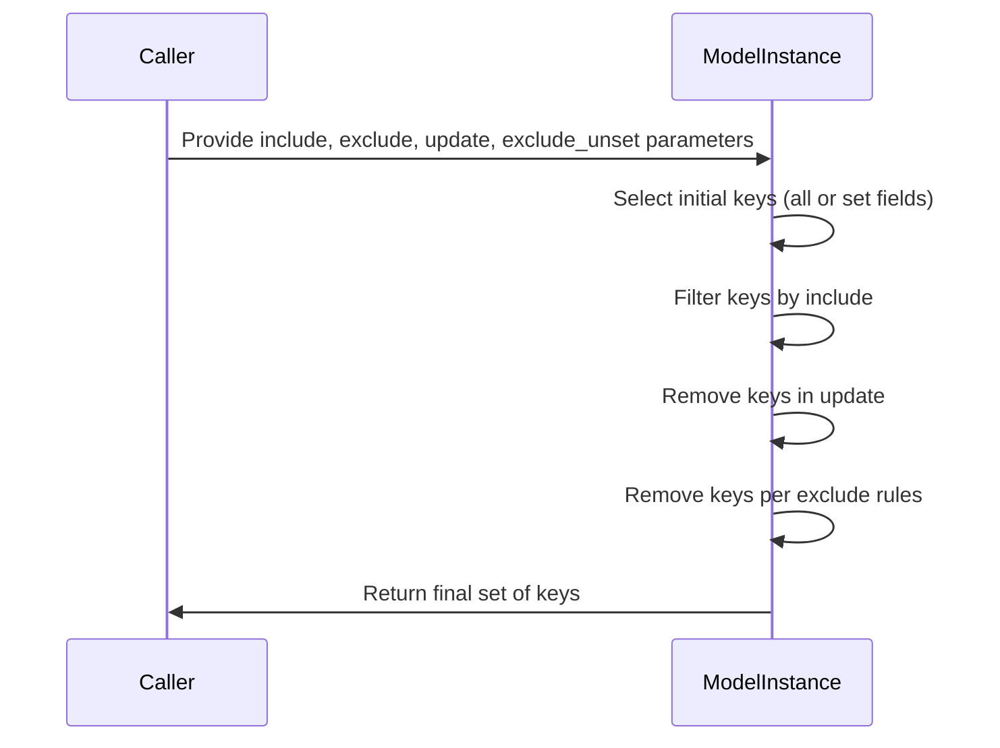
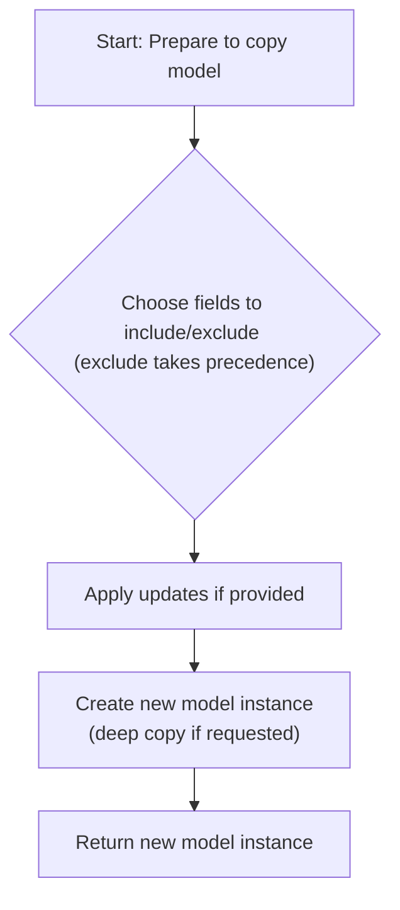
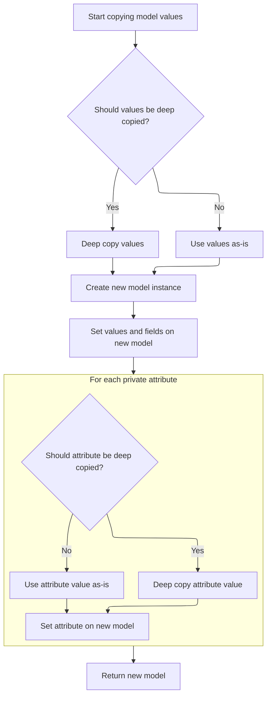
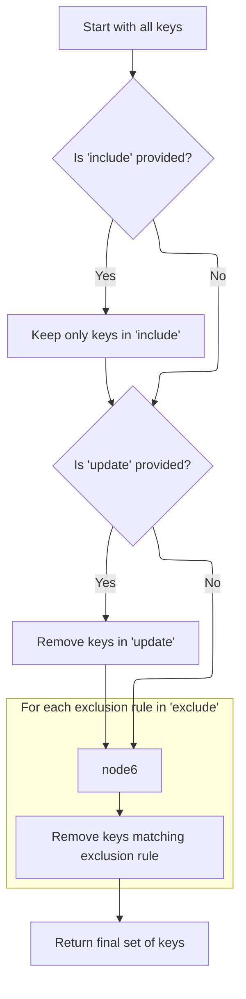

This flow calculates which fields of a model instance should be processed based on include, exclude, update, and unset parameters. It starts with an initial set of keys and applies filters to produce the final set used in copying or serialization operations.

The main steps are:

- Select initial keys based on whether to exclude unset fields
- Intersect keys with include set if provided
- Remove keys present in update set if any
- Exclude keys based on exclude rules
- Return the final set of keys



# Spec

## Detailed View of the Program's Functionality

a. Determining Which Keys to Process

The process begins by deciding which keys (fields) of a model instance should be considered for further operations like copying or serialization. This is handled in a method that checks several conditions:

- If no specific instructions are given (no include, no exclude, and <SwmToken path="pydantic/v1/main.py" pos="440:1:1" line-data="        exclude_unset: bool = False,">`exclude_unset`</SwmToken> is False), it returns None, meaning all keys will be used.
- If <SwmToken path="pydantic/v1/main.py" pos="440:1:1" line-data="        exclude_unset: bool = False,">`exclude_unset`</SwmToken> is True, it uses the set of fields that were actually set on the model instance (not just those with default values). This set is copied to avoid modifying the original.
- If <SwmToken path="pydantic/v1/main.py" pos="440:1:1" line-data="        exclude_unset: bool = False,">`exclude_unset`</SwmToken> is False, it uses all keys present in the instance’s internal dictionary (which holds all field values).

This initial set of keys is then ready to be filtered further based on include, exclude, or update instructions.

b. Filtering Keys Based on Include, Exclude, and Update

Once the initial set of keys is determined, further filtering is applied:

- If an include mapping is provided, only the keys present in this mapping are kept (intersection).
- If an update mapping is provided, any keys present in this mapping are removed from the set (since they will be replaced).
- If an exclude mapping is provided, any keys for which the exclusion rule evaluates to true are removed from the set.

The result is a final set of keys that will be processed in subsequent steps.

c. Duplicating and Modifying Model Data

When duplicating a model (for example, using a copy operation), the following steps occur:

1. The method starts by preparing the values for the new model. It does this by iterating over the current model’s fields, applying include/exclude logic, and skipping fields as needed. This is more precise than simply copying the internal dictionary, as it respects the caller’s filtering instructions.
2. The field-value pairs produced by this iteration are collected into a dictionary. If an update mapping is provided, its contents are merged into this dictionary, overriding any existing values or adding new ones.
3. The method then determines which fields should be marked as “set” in the new instance. If updates were provided, the set of set fields is expanded to include the updated keys; otherwise, it’s just a copy of the original set.
4. Finally, a helper method is called to actually create the new model instance with the prepared data and field state.

d. Building the New Model Instance

The helper method responsible for constructing the new model instance works as follows:

1. If a deep copy is requested, all values are deep-copied to ensure that the new instance does not share references with the original.
2. A new instance of the model’s class is created without calling its initializer.
3. The new instance’s internal dictionary and set of set fields are directly assigned the prepared values.
4. For each private attribute defined on the model, its value is copied over. If deep copying is requested, the attribute value is deep-copied as well.
5. The fully constructed and initialized model instance is returned.

e. Iterating and Serializing Model Data

When converting a model to a dictionary (for serialization or other purposes), the following steps are performed:

1. The method merges any field-level include/exclude settings with those provided by the caller.
2. It determines the set of allowed keys using the filtering logic described above.
3. For each field in the model’s internal dictionary:
   - If the field is not in the allowed set or should be excluded (<SwmToken path="pydantic/v1/main.py" pos="295:16:18" line-data="        # for attributes not in `new_namespace` (e.g. private attributes)">`e.g`</SwmToken>., because its value is None and <SwmToken path="pydantic/v1/main.py" pos="442:1:1" line-data="        exclude_none: bool = False,">`exclude_none`</SwmToken> is True), it is skipped.
   - If <SwmToken path="pydantic/v1/main.py" pos="441:1:1" line-data="        exclude_defaults: bool = False,">`exclude_defaults`</SwmToken> is True and the field’s value matches its default, it is skipped.
   - The key used in the output may be replaced by an alias if requested.
   - If further processing is needed (<SwmToken path="pydantic/v1/main.py" pos="295:16:18" line-data="        # for attributes not in `new_namespace` (e.g. private attributes)">`e.g`</SwmToken>., nested models, include/exclude rules for subfields), the value is recursively processed.
4. The result is a generator of key-value pairs, which can be collected into a dictionary for output.

f. Summary

The overall flow ensures that model data can be precisely duplicated, filtered, and serialized according to a variety of rules. The process is careful to avoid mutating the original model’s state, supports both shallow and deep copying, and allows for fine-grained control over which fields are included or excluded in any operation. This design enables robust and flexible data validation and manipulation in applications using Pydantic models.

# Rule Definition

| Paragraph Name                                               | Rule ID | Category          | Description                                                                                                                                                                                                                                                                                                                                       | Conditions                                                                                                                                    | Remarks                                                                                                                                                                                                                    |
| ------------------------------------------------------------ | ------- | ----------------- | ------------------------------------------------------------------------------------------------------------------------------------------------------------------------------------------------------------------------------------------------------------------------------------------------------------------------------------------------- | --------------------------------------------------------------------------------------------------------------------------------------------- | -------------------------------------------------------------------------------------------------------------------------------------------------------------------------------------------------------------------------- |
| BaseModel.\_calculate_keys, BaseModel.\_iter, BaseModel.copy | RL-001  | Conditional Logic | The set of keys (field names) to process for a model instance is determined by the values of include, exclude, <SwmToken path="pydantic/v1/main.py" pos="440:1:1" line-data="        exclude_unset: bool = False,">`exclude_unset`</SwmToken>, and optionally update. The logic applies a sequence of filters to arrive at the final set of keys. | Triggered whenever a model instance is being serialized, copied, or otherwise filtered using include/exclude/exclude_unset/update parameters. | \- If include and exclude are both None and <SwmToken path="pydantic/v1/main.py" pos="440:1:1" line-data="        exclude_unset: bool = False,">`exclude_unset`</SwmToken> is False, all keys are included (no filtering). |

- If <SwmToken path="pydantic/v1/main.py" pos="440:1:1" line-data="        exclude_unset: bool = False,">`exclude_unset`</SwmToken> is True, start with <SwmToken path="pydantic/v1/main.py" pos="615:21:21" line-data="    def _copy_and_set_values(self: &#39;Model&#39;, values: &#39;DictStrAny&#39;, fields_set: &#39;SetStr&#39;, *, deep: bool) -&gt; &#39;Model&#39;:">`fields_set`</SwmToken> (fields actually set on the model).
- If <SwmToken path="pydantic/v1/main.py" pos="440:1:1" line-data="        exclude_unset: bool = False,">`exclude_unset`</SwmToken> is False, start with all keys in **dict** (all current field values).
- If include is provided, intersect the set with <SwmToken path="pydantic/v1/main.py" pos="901:5:9" line-data="            keys &amp;= include.keys()">`include.keys()`</SwmToken>.
- If update is provided, remove <SwmToken path="pydantic/v1/main.py" pos="659:11:15" line-data="            fields_set = self.__fields_set__ | update.keys()">`update.keys()`</SwmToken> from the set.
- If exclude is provided, remove any key for which <SwmToken path="pydantic/v1/main.py" pos="907:25:27" line-data="            keys -= {k for k, v in exclude.items() if ValueItems.is_true(v)}">`ValueItems.is_true`</SwmToken>(exclude\[key\]) is True.
- The output is a set of string keys to process, or None if all keys are included. | | BaseModel.copy, BaseModel.\_copy_and_set_values, BaseModel.\_iter, BaseModel.\_calculate_keys | RL-002 | Computation | When duplicating a model instance, the system applies include/exclude filters, merges updates, determines the new set of fields set, and optionally deep-copies values and private attributes. | Triggered when BaseModel.copy is called, with optional include, exclude, update, and deep parameters. | - The copy operation uses \_iter to yield field-value pairs, applying include/exclude/exclude_unset filters.
- Builds a dictionary of values from these pairs.
- If update is provided, merges update mapping into the values dictionary (update values take precedence).
- The new <SwmToken path="pydantic/v1/main.py" pos="615:21:21" line-data="    def _copy_and_set_values(self: &#39;Model&#39;, values: &#39;DictStrAny&#39;, fields_set: &#39;SetStr&#39;, *, deep: bool) -&gt; &#39;Model&#39;:">`fields_set`</SwmToken> is the union of the original <SwmToken path="pydantic/v1/main.py" pos="615:21:21" line-data="    def _copy_and_set_values(self: &#39;Model&#39;, values: &#39;DictStrAny&#39;, fields_set: &#39;SetStr&#39;, *, deep: bool) -&gt; &#39;Model&#39;:">`fields_set`</SwmToken> and <SwmToken path="pydantic/v1/main.py" pos="659:11:15" line-data="            fields_set = self.__fields_set__ | update.keys()">`update.keys()`</SwmToken> (if any).
- If deep is True, all values and private attributes are deep-copied.
- Private attributes are copied from the original instance; if deep is True, they are deep-copied.
- The new model instance has its **dict** and <SwmToken path="pydantic/v1/main.py" pos="615:21:21" line-data="    def _copy_and_set_values(self: &#39;Model&#39;, values: &#39;DictStrAny&#39;, fields_set: &#39;SetStr&#39;, *, deep: bool) -&gt; &#39;Model&#39;:">`fields_set`</SwmToken> set directly.
- Output is a new model instance with the specified values, fields set, and private attributes. | | BaseModel.\_calculate_keys, <SwmToken path="pydantic/v1/main.py" pos="907:25:27" line-data="            keys -= {k for k, v in exclude.items() if ValueItems.is_true(v)}">`ValueItems.is_true`</SwmToken> | RL-003 | Conditional Logic | When exclude is provided, any key for which <SwmToken path="pydantic/v1/main.py" pos="907:25:27" line-data="            keys -= {k for k, v in exclude.items() if ValueItems.is_true(v)}">`ValueItems.is_true`</SwmToken>(exclude\[key\]) returns True is removed from the set of keys to process. | Triggered during key calculation when exclude is not None. | - <SwmToken path="pydantic/v1/main.py" pos="907:25:27" line-data="            keys -= {k for k, v in exclude.items() if ValueItems.is_true(v)}">`ValueItems.is_true`</SwmToken> determines if a value means a key should be excluded (implementation not shown here, but must return True for exclusion). | | <SwmToken path="pydantic/v1/main.py" pos="90:15:15" line-data="    Model = TypeVar(&#39;Model&#39;, bound=&#39;BaseModel&#39;)">`BaseModel`</SwmToken>.**init**, BaseModel.copy, BaseModel.\_copy_and_set_values, BaseModel.\_init_private_attributes | RL-004 | Data Assignment | The model instance must maintain <SwmToken path="pydantic/v1/main.py" pos="615:21:21" line-data="    def _copy_and_set_values(self: &#39;Model&#39;, values: &#39;DictStrAny&#39;, fields_set: &#39;SetStr&#39;, *, deep: bool) -&gt; &#39;Model&#39;:">`fields_set`</SwmToken> (fields actually set), **dict** (current field values), and <SwmToken path="pydantic/v1/main.py" pos="129:1:1" line-data="        private_attributes: Dict[str, ModelPrivateAttr] = {}">`private_attributes`</SwmToken> (private attribute descriptors). Private attributes are stored directly on the instance. | Whenever a model instance is created, copied, or private attributes are initialized. | - <SwmToken path="pydantic/v1/main.py" pos="615:21:21" line-data="    def _copy_and_set_values(self: &#39;Model&#39;, values: &#39;DictStrAny&#39;, fields_set: &#39;SetStr&#39;, *, deep: bool) -&gt; &#39;Model&#39;:">`fields_set`</SwmToken> is a set of field names that were set.
- **dict** is a dictionary of all current field values.
- <SwmToken path="pydantic/v1/main.py" pos="129:1:1" line-data="        private_attributes: Dict[str, ModelPrivateAttr] = {}">`private_attributes`</SwmToken> is a class-level dictionary mapping private attribute names to descriptors.
- Private attributes are stored directly on the instance. | | BaseModel.\_calculate_keys, BaseModel.copy | RL-005 | Data Assignment | The input data for key calculation and copy operations consists of the model instance, optional mappings for include, exclude, update, and boolean flags <SwmToken path="pydantic/v1/main.py" pos="440:1:1" line-data="        exclude_unset: bool = False,">`exclude_unset`</SwmToken> and deep. The output is either a set of keys to process (or None), or a new model instance. | Whenever key calculation or copy is performed. | - Input: model instance, include/exclude/update mappings, <SwmToken path="pydantic/v1/main.py" pos="440:1:1" line-data="        exclude_unset: bool = False,">`exclude_unset`</SwmToken> (bool), deep (bool)
- Output for key calculation: set of string keys or None
- Output for copy: new model instance with specified values, fields set, and private attributes |

# User Stories

## User Story 1: Key calculation for model instance filtering and serialization

---

### Story Description:

As a user of data models, I want the system to determine which fields to process based on include, exclude, <SwmToken path="pydantic/v1/main.py" pos="440:1:1" line-data="        exclude_unset: bool = False,">`exclude_unset`</SwmToken>, and update parameters so that I can flexibly filter or serialize model data according to my needs.

---

### Business Rule Mapping:

| Rule ID | Paragraph Name                                                                                                                                                                                            | Rule Description                                                                                                                                                                                                                                                                                                                                                                    |
| ------- | --------------------------------------------------------------------------------------------------------------------------------------------------------------------------------------------------------- | ----------------------------------------------------------------------------------------------------------------------------------------------------------------------------------------------------------------------------------------------------------------------------------------------------------------------------------------------------------------------------------- |
| RL-001  | BaseModel.\_calculate_keys, BaseModel.\_iter, BaseModel.copy                                                                                                                                              | The set of keys (field names) to process for a model instance is determined by the values of include, exclude, <SwmToken path="pydantic/v1/main.py" pos="440:1:1" line-data="        exclude_unset: bool = False,">`exclude_unset`</SwmToken>, and optionally update. The logic applies a sequence of filters to arrive at the final set of keys.                                   |
| RL-003  | BaseModel.\_calculate_keys, <SwmToken path="pydantic/v1/main.py" pos="907:25:27" line-data="            keys -= {k for k, v in exclude.items() if ValueItems.is_true(v)}">`ValueItems.is_true`</SwmToken> | When exclude is provided, any key for which <SwmToken path="pydantic/v1/main.py" pos="907:25:27" line-data="            keys -= {k for k, v in exclude.items() if ValueItems.is_true(v)}">`ValueItems.is_true`</SwmToken>(exclude\[key\]) returns True is removed from the set of keys to process.                                                                                  |
| RL-005  | BaseModel.\_calculate_keys, BaseModel.copy                                                                                                                                                                | The input data for key calculation and copy operations consists of the model instance, optional mappings for include, exclude, update, and boolean flags <SwmToken path="pydantic/v1/main.py" pos="440:1:1" line-data="        exclude_unset: bool = False,">`exclude_unset`</SwmToken> and deep. The output is either a set of keys to process (or None), or a new model instance. |

---

### Relevant Functionality:

- **BaseModel.\_calculate_keys**
  1. **RL-001:**
     - If include is None and exclude is None and <SwmToken path="pydantic/v1/main.py" pos="440:1:1" line-data="        exclude_unset: bool = False,">`exclude_unset`</SwmToken> is False:
       - Return None (all keys included)
     - If <SwmToken path="pydantic/v1/main.py" pos="440:1:1" line-data="        exclude_unset: bool = False,">`exclude_unset`</SwmToken> is True:
       - keys = copy of <SwmToken path="pydantic/v1/main.py" pos="615:21:21" line-data="    def _copy_and_set_values(self: &#39;Model&#39;, values: &#39;DictStrAny&#39;, fields_set: &#39;SetStr&#39;, *, deep: bool) -&gt; &#39;Model&#39;:">`fields_set`</SwmToken>
     - Else:
       - keys = keys of **dict**
     - If include is not None:
       - keys = keys & <SwmToken path="pydantic/v1/main.py" pos="901:5:9" line-data="            keys &amp;= include.keys()">`include.keys()`</SwmToken>
     - If update is provided:
       - keys = keys - <SwmToken path="pydantic/v1/main.py" pos="659:11:15" line-data="            fields_set = self.__fields_set__ | update.keys()">`update.keys()`</SwmToken>
     - If exclude is provided:
       - For each k, v in <SwmToken path="pydantic/v1/main.py" pos="907:17:21" line-data="            keys -= {k for k, v in exclude.items() if ValueItems.is_true(v)}">`exclude.items()`</SwmToken>:
         - If <SwmToken path="pydantic/v1/main.py" pos="907:25:27" line-data="            keys -= {k for k, v in exclude.items() if ValueItems.is_true(v)}">`ValueItems.is_true`</SwmToken>(v):
           - Remove k from keys
     - Return keys
  2. **RL-003:**
     - For each k, v in <SwmToken path="pydantic/v1/main.py" pos="907:17:21" line-data="            keys -= {k for k, v in exclude.items() if ValueItems.is_true(v)}">`exclude.items()`</SwmToken>:
       - If <SwmToken path="pydantic/v1/main.py" pos="907:25:27" line-data="            keys -= {k for k, v in exclude.items() if ValueItems.is_true(v)}">`ValueItems.is_true`</SwmToken>(v):
         - Remove k from keys
  3. **RL-005:**
     - For key calculation:
       - Receive model instance and filter parameters
       - Return set of keys or None
     - For copy:
       - Receive model instance, filter parameters, update, deep
       - Return new model instance

## User Story 2: Copying and duplicating model instances with flexible field and attribute handling

---

### Story Description:

As a user of data models, I want to be able to duplicate a model instance with options to filter fields, merge updates, and deep-copy values and private attributes so that I can create independent copies of models tailored to specific requirements.

---

### Business Rule Mapping:

| Rule ID | Paragraph Name                                                                                                                                                                                                                                        | Rule Description                                                                                                                                                                                                                                                                                                                                                                                                                                                                                                                                                                                 |
| ------- | ----------------------------------------------------------------------------------------------------------------------------------------------------------------------------------------------------------------------------------------------------- | ------------------------------------------------------------------------------------------------------------------------------------------------------------------------------------------------------------------------------------------------------------------------------------------------------------------------------------------------------------------------------------------------------------------------------------------------------------------------------------------------------------------------------------------------------------------------------------------------ |
| RL-002  | BaseModel.copy, BaseModel.\_copy_and_set_values, BaseModel.\_iter, BaseModel.\_calculate_keys                                                                                                                                                         | When duplicating a model instance, the system applies include/exclude filters, merges updates, determines the new set of fields set, and optionally deep-copies values and private attributes.                                                                                                                                                                                                                                                                                                                                                                                                   |
| RL-004  | <SwmToken path="pydantic/v1/main.py" pos="90:15:15" line-data="    Model = TypeVar(&#39;Model&#39;, bound=&#39;BaseModel&#39;)">`BaseModel`</SwmToken>.**init**, BaseModel.copy, BaseModel.\_copy_and_set_values, BaseModel.\_init_private_attributes | The model instance must maintain <SwmToken path="pydantic/v1/main.py" pos="615:21:21" line-data="    def _copy_and_set_values(self: &#39;Model&#39;, values: &#39;DictStrAny&#39;, fields_set: &#39;SetStr&#39;, *, deep: bool) -&gt; &#39;Model&#39;:">`fields_set`</SwmToken> (fields actually set), **dict** (current field values), and <SwmToken path="pydantic/v1/main.py" pos="129:1:1" line-data="        private_attributes: Dict[str, ModelPrivateAttr] = {}">`private_attributes`</SwmToken> (private attribute descriptors). Private attributes are stored directly on the instance. |
| RL-005  | BaseModel.\_calculate_keys, BaseModel.copy                                                                                                                                                                                                            | The input data for key calculation and copy operations consists of the model instance, optional mappings for include, exclude, update, and boolean flags <SwmToken path="pydantic/v1/main.py" pos="440:1:1" line-data="        exclude_unset: bool = False,">`exclude_unset`</SwmToken> and deep. The output is either a set of keys to process (or None), or a new model instance.                                                                                                                                                                                                              |

---

### Relevant Functionality:

- **BaseModel.copy**
  1. **RL-002:**
     - Call \_iter with include, exclude, <SwmToken path="pydantic/v1/main.py" pos="440:1:1" line-data="        exclude_unset: bool = False,">`exclude_unset`</SwmToken>=False to get field-value pairs
     - Build values dict from these pairs
     - If update is provided:
       - Merge update into values (update takes precedence)
       - <SwmToken path="pydantic/v1/main.py" pos="615:21:21" line-data="    def _copy_and_set_values(self: &#39;Model&#39;, values: &#39;DictStrAny&#39;, fields_set: &#39;SetStr&#39;, *, deep: bool) -&gt; &#39;Model&#39;:">`fields_set`</SwmToken> = original <SwmToken path="pydantic/v1/main.py" pos="615:21:21" line-data="    def _copy_and_set_values(self: &#39;Model&#39;, values: &#39;DictStrAny&#39;, fields_set: &#39;SetStr&#39;, *, deep: bool) -&gt; &#39;Model&#39;:">`fields_set`</SwmToken> | <SwmToken path="pydantic/v1/main.py" pos="659:11:15" line-data="            fields_set = self.__fields_set__ | update.keys()">`update.keys()`</SwmToken>
     - Else:
       - <SwmToken path="pydantic/v1/main.py" pos="615:21:21" line-data="    def _copy_and_set_values(self: &#39;Model&#39;, values: &#39;DictStrAny&#39;, fields_set: &#39;SetStr&#39;, *, deep: bool) -&gt; &#39;Model&#39;:">`fields_set`</SwmToken> = copy of original <SwmToken path="pydantic/v1/main.py" pos="615:21:21" line-data="    def _copy_and_set_values(self: &#39;Model&#39;, values: &#39;DictStrAny&#39;, fields_set: &#39;SetStr&#39;, *, deep: bool) -&gt; &#39;Model&#39;:">`fields_set`</SwmToken>
     - If deep is True:
       - Deep-copy values and private attributes
     - Create new model instance via **new**
     - Set **dict** and <SwmToken path="pydantic/v1/main.py" pos="615:21:21" line-data="    def _copy_and_set_values(self: &#39;Model&#39;, values: &#39;DictStrAny&#39;, fields_set: &#39;SetStr&#39;, *, deep: bool) -&gt; &#39;Model&#39;:">`fields_set`</SwmToken> directly
     - Copy private attributes (deep-copy if deep is True)
     - Return new model instance
- **BaseModel.init**
  1. **RL-004:**
     - On model creation (**init**):
       - Set **dict** to values
       - Set <SwmToken path="pydantic/v1/main.py" pos="615:21:21" line-data="    def _copy_and_set_values(self: &#39;Model&#39;, values: &#39;DictStrAny&#39;, fields_set: &#39;SetStr&#39;, *, deep: bool) -&gt; &#39;Model&#39;:">`fields_set`</SwmToken> to <SwmToken path="pydantic/v1/main.py" pos="615:21:21" line-data="    def _copy_and_set_values(self: &#39;Model&#39;, values: &#39;DictStrAny&#39;, fields_set: &#39;SetStr&#39;, *, deep: bool) -&gt; &#39;Model&#39;:">`fields_set`</SwmToken>
       - Call <SwmToken path="pydantic/v1/main.py" pos="355:3:3" line-data="        __pydantic_self__._init_private_attributes()">`_init_private_attributes`</SwmToken> to initialize private attributes
     - On copy:
       - Set **dict** and <SwmToken path="pydantic/v1/main.py" pos="615:21:21" line-data="    def _copy_and_set_values(self: &#39;Model&#39;, values: &#39;DictStrAny&#39;, fields_set: &#39;SetStr&#39;, *, deep: bool) -&gt; &#39;Model&#39;:">`fields_set`</SwmToken> on new instance
       - Copy private attributes from original to new instance
- **BaseModel.\_calculate_keys**
  1. **RL-005:**
     - For key calculation:
       - Receive model instance and filter parameters
       - Return set of keys or None
     - For copy:
       - Receive model instance, filter parameters, update, deep
       - Return new model instance

# Code Walkthrough

## Determining Which Keys to Process

<SwmSnippet path="/pydantic/v1/main.py" line="884">

---

In <SwmToken path="pydantic/v1/main.py" pos="884:3:3" line-data="    def _calculate_keys(">`_calculate_keys`</SwmToken>, we start by figuring out which keys to work with: if <SwmToken path="pydantic/v1/main.py" pos="888:1:1" line-data="        exclude_unset: bool,">`exclude_unset`</SwmToken> is True, we use the set of fields that were actually set on the model (<SwmToken path="pydantic/v1/main.py" pos="896:7:7" line-data="            keys = self.__fields_set__.copy()">`__fields_set__`</SwmToken>), otherwise we use all keys in the instance's dict. We copy this set to avoid mutating the original. This setup is needed before we start filtering keys based on include, exclude, or update.

```python
    def _calculate_keys(
        self,
        include: Optional['MappingIntStrAny'],
        exclude: Optional['MappingIntStrAny'],
        exclude_unset: bool,
        update: Optional['DictStrAny'] = None,
    ) -> Optional[AbstractSet[str]]:
        if include is None and exclude is None and exclude_unset is False:
            return None

        keys: AbstractSet[str]
        if exclude_unset:
            keys = self.__fields_set__.copy()
        else:
            keys = self.__dict__.keys()

```

---

</SwmSnippet>

### Duplicating and Modifying Model Data



<SwmSnippet path="/pydantic/v1/main.py" line="633">

---

In <SwmToken path="pydantic/v1/main.py" pos="633:3:3" line-data="    def copy(">`copy`</SwmToken>, we start by building the values for the new model using <SwmToken path="pydantic/v1/main.py" pos="653:3:3" line-data="            self._iter(to_dict=False, by_alias=False, include=include, exclude=exclude, exclude_unset=False),">`_iter`</SwmToken>, which lets us apply include/exclude logic and skip fields as needed. This is more precise than just copying **dict**, and sets us up to merge in any updates next.

```python
    def copy(
        self: 'Model',
        *,
        include: Optional[Union['AbstractSetIntStr', 'MappingIntStrAny']] = None,
        exclude: Optional[Union['AbstractSetIntStr', 'MappingIntStrAny']] = None,
        update: Optional['DictStrAny'] = None,
        deep: bool = False,
    ) -> 'Model':
        """
        Duplicate a model, optionally choose which fields to include, exclude and change.

        :param include: fields to include in new model
        :param exclude: fields to exclude from new model, as with values this takes precedence over include
        :param update: values to change/add in the new model. Note: the data is not validated before creating
            the new model: you should trust this data
        :param deep: set to `True` to make a deep copy of the model
        :return: new model instance
        """

        values = dict(
            self._iter(to_dict=False, by_alias=False, include=include, exclude=exclude, exclude_unset=False),
```

---

</SwmSnippet>

<SwmSnippet path="/pydantic/v1/main.py" line="652">

---

Back in <SwmToken path="pydantic/v1/main.py" pos="633:3:3" line-data="    def copy(">`copy`</SwmToken>, after getting the field-value pairs from <SwmToken path="pydantic/v1/main.py" pos="653:3:3" line-data="            self._iter(to_dict=False, by_alias=False, include=include, exclude=exclude, exclude_unset=False),">`_iter`</SwmToken>, we convert them to a dict so we can merge in any updates. This gives us a single mapping of all the values we want in the new model.

```python
        values = dict(
            self._iter(to_dict=False, by_alias=False, include=include, exclude=exclude, exclude_unset=False),
            **(update or {}),
        )

```

---

</SwmSnippet>

<SwmSnippet path="/pydantic/v1/main.py" line="433">

---

<SwmToken path="pydantic/v1/main.py" pos="433:3:3" line-data="    def dict(">`dict`</SwmToken> calls <SwmToken path="pydantic/v1/main.py" pos="456:3:3" line-data="            self._iter(">`_iter`</SwmToken> to generate the field-value pairs, applying all the requested filters and transformations. This way, the output dict only contains what the caller wants, not just everything in **dict**.

```python
    def dict(
        self,
        *,
        include: Optional[Union['AbstractSetIntStr', 'MappingIntStrAny']] = None,
        exclude: Optional[Union['AbstractSetIntStr', 'MappingIntStrAny']] = None,
        by_alias: bool = False,
        skip_defaults: Optional[bool] = None,
        exclude_unset: bool = False,
        exclude_defaults: bool = False,
        exclude_none: bool = False,
    ) -> 'DictStrAny':
        """
        Generate a dictionary representation of the model, optionally specifying which fields to include or exclude.

        """
        if skip_defaults is not None:
            warnings.warn(
                f'{self.__class__.__name__}.dict(): "skip_defaults" is deprecated and replaced by "exclude_unset"',
                DeprecationWarning,
            )
            exclude_unset = skip_defaults

        return dict(
            self._iter(
                to_dict=True,
                by_alias=by_alias,
                include=include,
                exclude=exclude,
                exclude_unset=exclude_unset,
                exclude_defaults=exclude_defaults,
                exclude_none=exclude_none,
            )
        )
```

---

</SwmSnippet>

<SwmSnippet path="/pydantic/v1/main.py" line="657">

---

After building the values dict (possibly with updates), <SwmToken path="pydantic/v1/main.py" pos="633:3:3" line-data="    def copy(">`copy`</SwmToken> figures out which fields should be marked as set in the new instance. Then it calls <SwmToken path="pydantic/v1/main.py" pos="663:5:5" line-data="        return self._copy_and_set_values(values, fields_set, deep=deep)">`_copy_and_set_values`</SwmToken> to actually create the new model with the right data and field state.

```python
        # new `__fields_set__` can have unset optional fields with a set value in `update` kwarg
        if update:
            fields_set = self.__fields_set__ | update.keys()
        else:
            fields_set = set(self.__fields_set__)

        return self._copy_and_set_values(values, fields_set, deep=deep)
```

---

</SwmSnippet>

### Building the New Model Instance



<SwmSnippet path="/pydantic/v1/main.py" line="615">

---

In <SwmToken path="pydantic/v1/main.py" pos="615:3:3" line-data="    def _copy_and_set_values(self: &#39;Model&#39;, values: &#39;DictStrAny&#39;, fields_set: &#39;SetStr&#39;, *, deep: bool) -&gt; &#39;Model&#39;:">`_copy_and_set_values`</SwmToken>, we create a new model instance without calling **init**, set its **dict** and <SwmToken path="pydantic/v1/main.py" pos="615:21:21" line-data="    def _copy_and_set_values(self: &#39;Model&#39;, values: &#39;DictStrAny&#39;, fields_set: &#39;SetStr&#39;, *, deep: bool) -&gt; &#39;Model&#39;:">`fields_set`</SwmToken> directly, and copy over any private attributes. If deep is True, we deepcopy both the values and private attributes to avoid shared references.

```python
    def _copy_and_set_values(self: 'Model', values: 'DictStrAny', fields_set: 'SetStr', *, deep: bool) -> 'Model':
        if deep:
            # chances of having empty dict here are quite low for using smart_deepcopy
            values = deepcopy(values)

        cls = self.__class__
        m = cls.__new__(cls)
        object_setattr(m, '__dict__', values)
        object_setattr(m, '__fields_set__', fields_set)
        for name in self.__private_attributes__:
            value = getattr(self, name, Undefined)
            if value is not Undefined:
                if deep:
                    value = deepcopy(value)
                object_setattr(m, name, value)
```

---

</SwmSnippet>

<SwmSnippet path="/pydantic/v1/main.py" line="629">

---

<SwmToken path="pydantic/v1/main.py" pos="615:3:3" line-data="    def _copy_and_set_values(self: &#39;Model&#39;, values: &#39;DictStrAny&#39;, fields_set: &#39;SetStr&#39;, *, deep: bool) -&gt; &#39;Model&#39;:">`_copy_and_set_values`</SwmToken> returns the new model instance, with all data and private attributes set up as needed. If deep copying was requested, everything is independent from the original.

```python
                object_setattr(m, name, value)

        return m
```

---

</SwmSnippet>

### Filtering Keys Based on Include, Exclude, and Update



<SwmSnippet path="/pydantic/v1/main.py" line="900">

---

After coming back from <SwmToken path="pydantic/v1/main.py" pos="633:3:3" line-data="    def copy(">`copy`</SwmToken>, <SwmToken path="pydantic/v1/main.py" pos="884:3:3" line-data="    def _calculate_keys(">`_calculate_keys`</SwmToken> filters the set of keys: it intersects with include if given, removes any keys present in update, and drops keys from exclude if their value is 'true' according to <SwmToken path="pydantic/v1/main.py" pos="907:25:27" line-data="            keys -= {k for k, v in exclude.items() if ValueItems.is_true(v)}">`ValueItems.is_true`</SwmToken>. The result is the final set of keys to use.

```python
        if include is not None:
            keys &= include.keys()

        if update:
            keys -= update.keys()

        if exclude:
            keys -= {k for k, v in exclude.items() if ValueItems.is_true(v)}

        return keys
```

---

</SwmSnippet>

&nbsp;

*This is an auto-generated document by Swimm 🌊 and has not yet been verified by a human*

<SwmMeta version="3.0.0" repo-id="Z2l0aHViJTNBJTNBcHlkYW50aWMlM0ElM0FTd2ltbS1EZW1v" repo-name="pydantic"><sup>Powered by [Swimm](/)</sup></SwmMeta>
