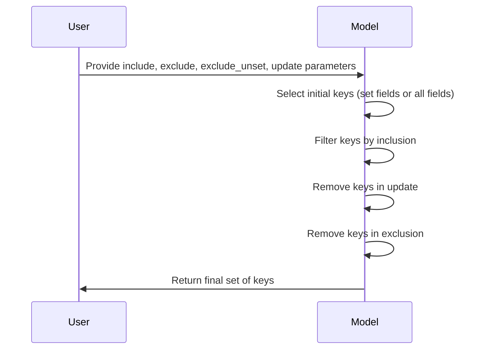
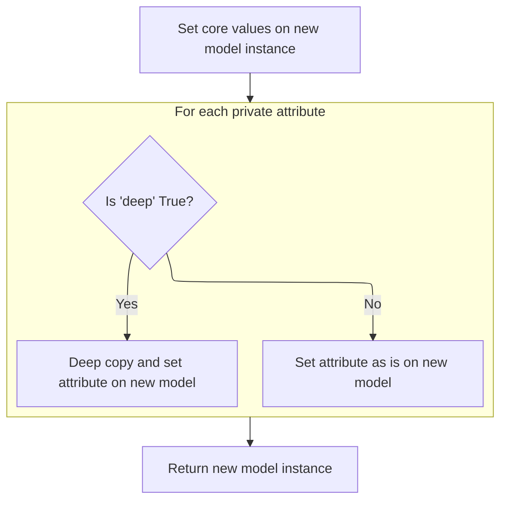
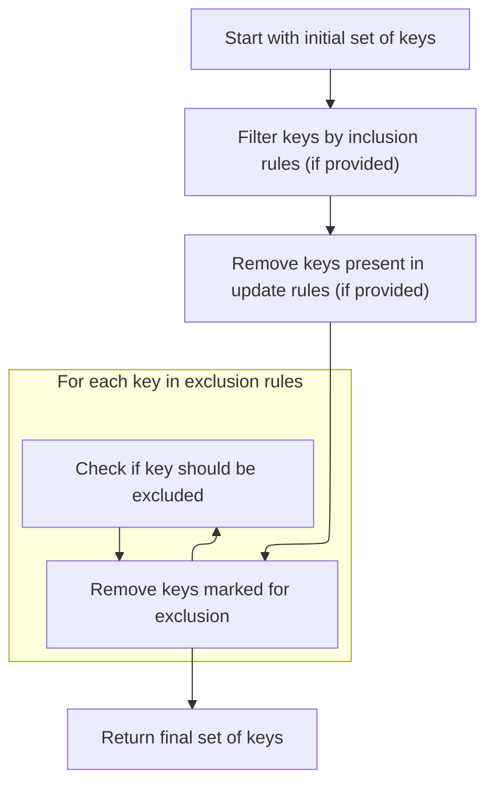

This document describes the process of selecting keys from a data model to be included or excluded during operations like copying. It covers how initial keys are chosen and then filtered according to inclusion, exclusion, and update criteria, resulting in the final set of keys to process.

The main steps are:

- Determine initial keys based on set fields or all fields
- Apply inclusion filters
- Remove keys marked for update
- Exclude keys based on exclusion rules
- Return the final set of keys



# Spec

## Detailed View of the Program's Functionality

a. Determining Which Keys to Process

The process begins by deciding which set of keys (field names) should be considered for further operations, such as serialization or copying. This is handled in a function that checks the provided inclusion and exclusion rules, as well as whether only explicitly set fields should be considered (controlled by an <SwmToken path="pydantic/v1/main.py" pos="653:25:25" line-data="            self._iter(to_dict=False, by_alias=False, include=include, exclude=exclude, exclude_unset=False),">`exclude_unset`</SwmToken> flag).

- If no inclusion or exclusion rules are provided and the <SwmToken path="pydantic/v1/main.py" pos="653:25:25" line-data="            self._iter(to_dict=False, by_alias=False, include=include, exclude=exclude, exclude_unset=False),">`exclude_unset`</SwmToken> flag is not set, the function returns `None`, indicating that all keys should be processed.
- If the <SwmToken path="pydantic/v1/main.py" pos="653:25:25" line-data="            self._iter(to_dict=False, by_alias=False, include=include, exclude=exclude, exclude_unset=False),">`exclude_unset`</SwmToken> flag is set, the function creates a copy of the set of fields that have been explicitly set on the model instance. This ensures that modifications to the set do not affect the original.
- If the <SwmToken path="pydantic/v1/main.py" pos="653:25:25" line-data="            self._iter(to_dict=False, by_alias=False, include=include, exclude=exclude, exclude_unset=False),">`exclude_unset`</SwmToken> flag is not set, the function uses all keys currently present in the instance's internal dictionary (i.e., all fields with values).

b. Filtering Keys Based on Include, Exclude, and Update

Once the initial set of keys is determined, the function applies several filters in sequence:

- If an inclusion rule is provided, the set of keys is intersected with the keys specified in the inclusion rule, narrowing down the set to only those explicitly included.
- If an update dictionary is provided (representing fields to be updated or added), any keys present in this dictionary are removed from the set. This prevents these keys from being processed in the standard way, as they will be handled separately.
- If an exclusion rule is provided, the function iterates over the exclusion rule and removes any keys for which the exclusion condition is considered "true" (using a helper to evaluate the exclusion value).

After all filters are applied, the resulting set of keys is returned. This set represents the final list of fields that should be processed in subsequent operations.

c. Duplicating the Model Instance

When duplicating a model instance (for example, via a "copy" method), the process starts by building a dictionary of values for the new instance. This is done by iterating over the current instance's fields, applying any inclusion or exclusion filters, and collecting the resulting key-value pairs.

- The iteration is performed using a helper that yields key-value pairs according to the specified filters (include, exclude, etc.).
- The resulting key-value pairs are collected into a dictionary.
- If an update dictionary is provided, its contents are merged into the values dictionary, overriding or adding fields as specified.

d. Updating the Set of Explicitly Set Fields

After constructing the values dictionary for the new instance, the set of explicitly set fields is updated:

- If an update dictionary was provided, the set of explicitly set fields is expanded to include any new keys from the update dictionary, in addition to the original set.
- If no update dictionary was provided, the set of explicitly set fields is simply copied from the original instance.

e. Building the New Model Object

To create the new model instance, a helper function is called with the values dictionary, the set of explicitly set fields, and a flag indicating whether a deep copy is required.

- If a deep copy is requested, the values dictionary is deep-copied to ensure that nested objects are also duplicated.
- A new, uninitialized instance of the model class is allocated using a low-level constructor that bypasses the standard initialization logic.
- The internal dictionary and set of explicitly set fields are assigned directly to the new instance.

f. Populating the New Instance

After allocating the new instance and setting its core attributes, the process continues by copying any private attributes from the original instance:

- For each private attribute defined on the model, the value is retrieved from the original instance.
- If the value is defined, it is either deep-copied (if a deep copy was requested) or assigned as-is.
- The private attribute is then set directly on the new instance.

Finally, the fully constructed and populated new model instance is returned. This instance will behave identically to the original, except for any changes introduced by the update dictionary or the effects of deep copying.

g. Summary of the Flow

- The process starts by determining which keys (fields) should be processed, based on inclusion, exclusion, and update rules, as well as whether only explicitly set fields should be considered.
- The set of keys is filtered according to these rules, resulting in the final set of fields to process.
- When duplicating a model, the relevant field values are collected, updates are merged in, and the set of explicitly set fields is updated.
- A new model instance is created by directly assigning its internal state, and private attributes are copied over.
- The result is a new model instance that reflects the specified filters and updates, with all relevant state correctly set.

# Rule Definition

| Paragraph Name                                                                                                                                                                                            | Rule ID | Category          | Description                                                                                                                                                                                                                                                                                                                                                                                                                                                                                                                                                                                                                                                                                                                                                                                                                                                                                                                                                                                      | Conditions                                                                                                                                                                                                                                                                                                                                                                                                                                                                                                    | Remarks                                                                                                                                                                                                                                                                                                                                      |
| --------------------------------------------------------------------------------------------------------------------------------------------------------------------------------------------------------- | ------- | ----------------- | ------------------------------------------------------------------------------------------------------------------------------------------------------------------------------------------------------------------------------------------------------------------------------------------------------------------------------------------------------------------------------------------------------------------------------------------------------------------------------------------------------------------------------------------------------------------------------------------------------------------------------------------------------------------------------------------------------------------------------------------------------------------------------------------------------------------------------------------------------------------------------------------------------------------------------------------------------------------------------------------------ | ------------------------------------------------------------------------------------------------------------------------------------------------------------------------------------------------------------------------------------------------------------------------------------------------------------------------------------------------------------------------------------------------------------------------------------------------------------------------------------------------------------- | -------------------------------------------------------------------------------------------------------------------------------------------------------------------------------------------------------------------------------------------------------------------------------------------------------------------------------------------- |
| BaseModel.\_calculate_keys, BaseModel.copy                                                                                                                                                                | RL-001  | Conditional Logic | The initial set of keys to process for a model instance is determined by the <SwmToken path="pydantic/v1/main.py" pos="653:25:25" line-data="            self._iter(to_dict=False, by_alias=False, include=include, exclude=exclude, exclude_unset=False),">`exclude_unset`</SwmToken> flag. If <SwmToken path="pydantic/v1/main.py" pos="653:25:25" line-data="            self._iter(to_dict=False, by_alias=False, include=include, exclude=exclude, exclude_unset=False),">`exclude_unset`</SwmToken> is true, only explicitly set fields (from <SwmToken path="pydantic/v1/main.py" pos="615:21:21" line-data="    def _copy_and_set_values(self: &#39;Model&#39;, values: &#39;DictStrAny&#39;, fields_set: &#39;SetStr&#39;, *, deep: bool) -&gt; &#39;Model&#39;:">`fields_set`</SwmToken>) are considered. If false, all field names defined on the model are considered.                                                                                                               | <SwmToken path="pydantic/v1/main.py" pos="653:25:25" line-data="            self._iter(to_dict=False, by_alias=False, include=include, exclude=exclude, exclude_unset=False),">`exclude_unset`</SwmToken> is a boolean input; model instance has <SwmToken path="pydantic/v1/main.py" pos="615:21:21" line-data="    def _copy_and_set_values(self: &#39;Model&#39;, values: &#39;DictStrAny&#39;, fields_set: &#39;SetStr&#39;, *, deep: bool) -&gt; &#39;Model&#39;:">`fields_set`</SwmToken> and **dict**. | The set of keys is always copied before modification to avoid side effects. Keys are strings representing field names.                                                                                                                                                                                                                       |
| BaseModel.\_calculate_keys, BaseModel.copy                                                                                                                                                                | RL-002  | Conditional Logic | After determining the initial set of keys, the system applies include, exclude, and update filters. Only keys present in include are retained (if include is provided). Keys present in update are removed before further processing. Keys for which <SwmToken path="pydantic/v1/main.py" pos="907:25:27" line-data="            keys -= {k for k, v in exclude.items() if ValueItems.is_true(v)}">`ValueItems.is_true`</SwmToken>(exclude\[key\]) is true are removed.                                                                                                                                                                                                                                                                                                                                                                                                                                                                                                                          | include, exclude, and update may be provided as mappings or sets.                                                                                                                                                                                                                                                                                                                                                                                                                                             | <SwmToken path="pydantic/v1/main.py" pos="907:25:27" line-data="            keys -= {k for k, v in exclude.items() if ValueItems.is_true(v)}">`ValueItems.is_true`</SwmToken> returns true for boolean true, non-empty collections, or other truthy values; false for false, None, zero, or empty collections.                               |
| BaseModel.copy                                                                                                                                                                                            | RL-003  | Data Assignment   | The values dictionary for the new model instance is built by iterating over the model's fields, applying the include/exclude filters, and considering <SwmToken path="pydantic/v1/main.py" pos="653:25:25" line-data="            self._iter(to_dict=False, by_alias=False, include=include, exclude=exclude, exclude_unset=False),">`exclude_unset`</SwmToken>. Any key-value pairs from the update dictionary are merged in, overwriting existing values if keys overlap.                                                                                                                                                                                                                                                                                                                                                                                                                                                                                                                      | Model instance, include/exclude/exclude_unset/update provided as inputs.                                                                                                                                                                                                                                                                                                                                                                                                                                      | The resulting values dictionary contains all public field values to be set on the new instance.                                                                                                                                                                                                                                              |
| BaseModel.copy                                                                                                                                                                                            | RL-004  | Data Assignment   | The set of explicitly set fields (<SwmToken path="pydantic/v1/main.py" pos="615:21:21" line-data="    def _copy_and_set_values(self: &#39;Model&#39;, values: &#39;DictStrAny&#39;, fields_set: &#39;SetStr&#39;, *, deep: bool) -&gt; &#39;Model&#39;:">`fields_set`</SwmToken>) for the new instance is updated to include any new keys from the update dictionary.                                                                                                                                                                                                                                                                                                                                                                                                                                                                                                                                                                                                                            | update is provided.                                                                                                                                                                                                                                                                                                                                                                                                                                                                                           | <SwmToken path="pydantic/v1/main.py" pos="615:21:21" line-data="    def _copy_and_set_values(self: &#39;Model&#39;, values: &#39;DictStrAny&#39;, fields_set: &#39;SetStr&#39;, *, deep: bool) -&gt; &#39;Model&#39;:">`fields_set`</SwmToken> is a set of strings representing field names.                                                 |
| BaseModel.\_copy_and_set_values, BaseModel.copy                                                                                                                                                           | RL-005  | Data Assignment   | The new model instance is created by calling **new** and setting **dict** and <SwmToken path="pydantic/v1/main.py" pos="615:21:21" line-data="    def _copy_and_set_values(self: &#39;Model&#39;, values: &#39;DictStrAny&#39;, fields_set: &#39;SetStr&#39;, *, deep: bool) -&gt; &#39;Model&#39;:">`fields_set`</SwmToken> directly, bypassing the standard constructor.                                                                                                                                                                                                                                                                                                                                                                                                                                                                                                                                                                                                                       | values and <SwmToken path="pydantic/v1/main.py" pos="615:21:21" line-data="    def _copy_and_set_values(self: &#39;Model&#39;, values: &#39;DictStrAny&#39;, fields_set: &#39;SetStr&#39;, *, deep: bool) -&gt; &#39;Model&#39;:">`fields_set`</SwmToken> have been prepared.                                                                                                                                                                                                                                 | This avoids validation and other side effects of the constructor.                                                                                                                                                                                                                                                                            |
| BaseModel.\_copy_and_set_values                                                                                                                                                                           | RL-006  | Data Assignment   | For each private attribute defined in the model's <SwmToken path="pydantic/v1/main.py" pos="129:1:1" line-data="        private_attributes: Dict[str, ModelPrivateAttr] = {}">`private_attributes`</SwmToken>, copy its value from the original instance to the new instance. If deep copying is requested, deep copy the value; otherwise, assign as is.                                                                                                                                                                                                                                                                                                                                                                                                                                                                                                                                                                                                                                        | deep boolean input; <SwmToken path="pydantic/v1/main.py" pos="129:1:1" line-data="        private_attributes: Dict[str, ModelPrivateAttr] = {}">`private_attributes`</SwmToken> mapping exists.                                                                                                                                                                                                                                                                                                               | Private attributes are identified by their names and stored directly on the instance.                                                                                                                                                                                                                                                        |
| BaseModel.copy, BaseModel.\_copy_and_set_values                                                                                                                                                           | RL-007  | Data Assignment   | The final output of the duplication process is a new model instance with all public field values set according to the filtered and updated values dictionary, all private attributes copied, and the set of explicitly set fields updated.                                                                                                                                                                                                                                                                                                                                                                                                                                                                                                                                                                                                                                                                                                                                                       | All previous steps completed successfully.                                                                                                                                                                                                                                                                                                                                                                                                                                                                    | Output is a model instance with **dict**, <SwmToken path="pydantic/v1/main.py" pos="615:21:21" line-data="    def _copy_and_set_values(self: &#39;Model&#39;, values: &#39;DictStrAny&#39;, fields_set: &#39;SetStr&#39;, *, deep: bool) -&gt; &#39;Model&#39;:">`fields_set`</SwmToken>, and private attributes set as described.           |
| BaseModel.\_calculate_keys, <SwmToken path="pydantic/v1/main.py" pos="907:25:27" line-data="            keys -= {k for k, v in exclude.items() if ValueItems.is_true(v)}">`ValueItems.is_true`</SwmToken> | RL-008  | Conditional Logic | When filtering keys for exclusion, <SwmToken path="pydantic/v1/main.py" pos="907:25:27" line-data="            keys -= {k for k, v in exclude.items() if ValueItems.is_true(v)}">`ValueItems.is_true`</SwmToken> determines if a key should be excluded. It returns true for boolean true, non-empty collections, or other truthy values, and false for boolean false, None, zero, or empty collections.                                                                                                                                                                                                                                                                                                                                                                                                                                                                                                                                                                                         | exclude mapping/set is provided.                                                                                                                                                                                                                                                                                                                                                                                                                                                                              | This logic is used to decide which keys to remove from the set of keys to process.                                                                                                                                                                                                                                                           |
| BaseModel.copy, BaseModel.\_copy_and_set_values                                                                                                                                                           | RL-009  | Data Assignment   | The input data consists of the model instance (with <SwmToken path="pydantic/v1/main.py" pos="615:21:21" line-data="    def _copy_and_set_values(self: &#39;Model&#39;, values: &#39;DictStrAny&#39;, fields_set: &#39;SetStr&#39;, *, deep: bool) -&gt; &#39;Model&#39;:">`fields_set`</SwmToken>, **dict**, and private attributes), optional include/exclude mappings or sets, optional update dictionary, <SwmToken path="pydantic/v1/main.py" pos="653:25:25" line-data="            self._iter(to_dict=False, by_alias=False, include=include, exclude=exclude, exclude_unset=False),">`exclude_unset`</SwmToken> boolean, and deep boolean. The output is a new model instance with the appropriate field values, private attributes, and <SwmToken path="pydantic/v1/main.py" pos="615:21:21" line-data="    def _copy_and_set_values(self: &#39;Model&#39;, values: &#39;DictStrAny&#39;, fields_set: &#39;SetStr&#39;, *, deep: bool) -&gt; &#39;Model&#39;:">`fields_set`</SwmToken>. | copy method is called with the specified arguments.                                                                                                                                                                                                                                                                                                                                                                                                                                                           | Input: model instance, include/exclude (mapping/set), update (dict), <SwmToken path="pydantic/v1/main.py" pos="653:25:25" line-data="            self._iter(to_dict=False, by_alias=False, include=include, exclude=exclude, exclude_unset=False),">`exclude_unset`</SwmToken> (bool), deep (bool). Output: new model instance as described. |

# User Stories

## User Story 1: Field Filtering and Key Calculation

---

### Story Description:

As a user of model duplication, I want to control which fields are included or excluded in the copy process using include, exclude, update, and <SwmToken path="pydantic/v1/main.py" pos="653:25:25" line-data="            self._iter(to_dict=False, by_alias=False, include=include, exclude=exclude, exclude_unset=False),">`exclude_unset`</SwmToken> options so that I can precisely determine which data is carried over to the new instance.

---

### Business Rule Mapping:

| Rule ID | Paragraph Name                                                                                                                                                                                            | Rule Description                                                                                                                                                                                                                                                                                                                                                                                                                                                                                                                                                                                                                                                                                                                                                                                                                                                                   |
| ------- | --------------------------------------------------------------------------------------------------------------------------------------------------------------------------------------------------------- | ---------------------------------------------------------------------------------------------------------------------------------------------------------------------------------------------------------------------------------------------------------------------------------------------------------------------------------------------------------------------------------------------------------------------------------------------------------------------------------------------------------------------------------------------------------------------------------------------------------------------------------------------------------------------------------------------------------------------------------------------------------------------------------------------------------------------------------------------------------------------------------- |
| RL-001  | BaseModel.\_calculate_keys, BaseModel.copy                                                                                                                                                                | The initial set of keys to process for a model instance is determined by the <SwmToken path="pydantic/v1/main.py" pos="653:25:25" line-data="            self._iter(to_dict=False, by_alias=False, include=include, exclude=exclude, exclude_unset=False),">`exclude_unset`</SwmToken> flag. If <SwmToken path="pydantic/v1/main.py" pos="653:25:25" line-data="            self._iter(to_dict=False, by_alias=False, include=include, exclude=exclude, exclude_unset=False),">`exclude_unset`</SwmToken> is true, only explicitly set fields (from <SwmToken path="pydantic/v1/main.py" pos="615:21:21" line-data="    def _copy_and_set_values(self: &#39;Model&#39;, values: &#39;DictStrAny&#39;, fields_set: &#39;SetStr&#39;, *, deep: bool) -&gt; &#39;Model&#39;:">`fields_set`</SwmToken>) are considered. If false, all field names defined on the model are considered. |
| RL-002  | BaseModel.\_calculate_keys, BaseModel.copy                                                                                                                                                                | After determining the initial set of keys, the system applies include, exclude, and update filters. Only keys present in include are retained (if include is provided). Keys present in update are removed before further processing. Keys for which <SwmToken path="pydantic/v1/main.py" pos="907:25:27" line-data="            keys -= {k for k, v in exclude.items() if ValueItems.is_true(v)}">`ValueItems.is_true`</SwmToken>(exclude\[key\]) is true are removed.                                                                                                                                                                                                                                                                                                                                                                                                            |
| RL-008  | BaseModel.\_calculate_keys, <SwmToken path="pydantic/v1/main.py" pos="907:25:27" line-data="            keys -= {k for k, v in exclude.items() if ValueItems.is_true(v)}">`ValueItems.is_true`</SwmToken> | When filtering keys for exclusion, <SwmToken path="pydantic/v1/main.py" pos="907:25:27" line-data="            keys -= {k for k, v in exclude.items() if ValueItems.is_true(v)}">`ValueItems.is_true`</SwmToken> determines if a key should be excluded. It returns true for boolean true, non-empty collections, or other truthy values, and false for boolean false, None, zero, or empty collections.                                                                                                                                                                                                                                                                                                                                                                                                                                                                           |

---

### Relevant Functionality:

- **BaseModel.\_calculate_keys**
  1. **RL-001:**
     - If <SwmToken path="pydantic/v1/main.py" pos="653:25:25" line-data="            self._iter(to_dict=False, by_alias=False, include=include, exclude=exclude, exclude_unset=False),">`exclude_unset`</SwmToken> is true:
       - keys = copy of <SwmToken path="pydantic/v1/main.py" pos="615:21:21" line-data="    def _copy_and_set_values(self: &#39;Model&#39;, values: &#39;DictStrAny&#39;, fields_set: &#39;SetStr&#39;, *, deep: bool) -&gt; &#39;Model&#39;:">`fields_set`</SwmToken>
     - Else:
       - keys = copy of **dict**.keys()
  2. **RL-002:**
     - If include is provided:
       - keys = keys & <SwmToken path="pydantic/v1/main.py" pos="901:5:9" line-data="            keys &amp;= include.keys()">`include.keys()`</SwmToken>
     - If update is provided:
       - keys = keys - <SwmToken path="pydantic/v1/main.py" pos="659:11:15" line-data="            fields_set = self.__fields_set__ | update.keys()">`update.keys()`</SwmToken>
     - If exclude is provided:
       - For each key in exclude:
         - If <SwmToken path="pydantic/v1/main.py" pos="907:25:27" line-data="            keys -= {k for k, v in exclude.items() if ValueItems.is_true(v)}">`ValueItems.is_true`</SwmToken>(exclude\[key\]):
           - Remove key from keys
  3. **RL-008:**
     - For each key in exclude:
       - If <SwmToken path="pydantic/v1/main.py" pos="907:25:27" line-data="            keys -= {k for k, v in exclude.items() if ValueItems.is_true(v)}">`ValueItems.is_true`</SwmToken>(exclude\[key\]):
         - Remove key from keys

## User Story 2: Building and Updating the New Model Instance

---

### Story Description:

As a user of model duplication, I want the new model instance to have its field values and explicitly set fields updated according to the filtered keys and any updates provided so that the new instance accurately reflects my intended changes.

---

### Business Rule Mapping:

| Rule ID | Paragraph Name | Rule Description                                                                                                                                                                                                                                                                                                                                                                                                                                                            |
| ------- | -------------- | --------------------------------------------------------------------------------------------------------------------------------------------------------------------------------------------------------------------------------------------------------------------------------------------------------------------------------------------------------------------------------------------------------------------------------------------------------------------------- |
| RL-003  | BaseModel.copy | The values dictionary for the new model instance is built by iterating over the model's fields, applying the include/exclude filters, and considering <SwmToken path="pydantic/v1/main.py" pos="653:25:25" line-data="            self._iter(to_dict=False, by_alias=False, include=include, exclude=exclude, exclude_unset=False),">`exclude_unset`</SwmToken>. Any key-value pairs from the update dictionary are merged in, overwriting existing values if keys overlap. |
| RL-004  | BaseModel.copy | The set of explicitly set fields (<SwmToken path="pydantic/v1/main.py" pos="615:21:21" line-data="    def _copy_and_set_values(self: &#39;Model&#39;, values: &#39;DictStrAny&#39;, fields_set: &#39;SetStr&#39;, *, deep: bool) -&gt; &#39;Model&#39;:">`fields_set`</SwmToken>) for the new instance is updated to include any new keys from the update dictionary.                                                                                                       |

---

### Relevant Functionality:

- **BaseModel.copy**
  1. **RL-003:**
     - values = dict(<SwmToken path="pydantic/v1/main.py" pos="653:1:3" line-data="            self._iter(to_dict=False, by_alias=False, include=include, exclude=exclude, exclude_unset=False),">`self._iter`</SwmToken>(..., include=include, exclude=exclude, <SwmToken path="pydantic/v1/main.py" pos="653:25:25" line-data="            self._iter(to_dict=False, by_alias=False, include=include, exclude=exclude, exclude_unset=False),">`exclude_unset`</SwmToken>=<SwmToken path="pydantic/v1/main.py" pos="653:25:25" line-data="            self._iter(to_dict=False, by_alias=False, include=include, exclude=exclude, exclude_unset=False),">`exclude_unset`</SwmToken>))
     - If update is provided:
       - values.update(update)
  2. **RL-004:**
     - If update is provided:
       - <SwmToken path="pydantic/v1/main.py" pos="615:21:21" line-data="    def _copy_and_set_values(self: &#39;Model&#39;, values: &#39;DictStrAny&#39;, fields_set: &#39;SetStr&#39;, *, deep: bool) -&gt; &#39;Model&#39;:">`fields_set`</SwmToken> = self.<SwmToken path="pydantic/v1/main.py" pos="615:21:21" line-data="    def _copy_and_set_values(self: &#39;Model&#39;, values: &#39;DictStrAny&#39;, fields_set: &#39;SetStr&#39;, *, deep: bool) -&gt; &#39;Model&#39;:">`fields_set`</SwmToken> | <SwmToken path="pydantic/v1/main.py" pos="659:11:15" line-data="            fields_set = self.__fields_set__ | update.keys()">`update.keys()`</SwmToken>
     - Else:
       - <SwmToken path="pydantic/v1/main.py" pos="615:21:21" line-data="    def _copy_and_set_values(self: &#39;Model&#39;, values: &#39;DictStrAny&#39;, fields_set: &#39;SetStr&#39;, *, deep: bool) -&gt; &#39;Model&#39;:">`fields_set`</SwmToken> = copy of self.<SwmToken path="pydantic/v1/main.py" pos="615:21:21" line-data="    def _copy_and_set_values(self: &#39;Model&#39;, values: &#39;DictStrAny&#39;, fields_set: &#39;SetStr&#39;, *, deep: bool) -&gt; &#39;Model&#39;:">`fields_set`</SwmToken>

## User Story 3: Bypassing Constructor and Copying Private Attributes

---

### Story Description:

As a user of model duplication, I want the new model instance to be created without invoking the standard constructor and to have all private attributes copied (deeply or shallowly as specified) so that the copy process is efficient and preserves all necessary data.

---

### Business Rule Mapping:

| Rule ID | Paragraph Name                                  | Rule Description                                                                                                                                                                                                                                                                                                                                                           |
| ------- | ----------------------------------------------- | -------------------------------------------------------------------------------------------------------------------------------------------------------------------------------------------------------------------------------------------------------------------------------------------------------------------------------------------------------------------------- |
| RL-005  | BaseModel.\_copy_and_set_values, BaseModel.copy | The new model instance is created by calling **new** and setting **dict** and <SwmToken path="pydantic/v1/main.py" pos="615:21:21" line-data="    def _copy_and_set_values(self: &#39;Model&#39;, values: &#39;DictStrAny&#39;, fields_set: &#39;SetStr&#39;, *, deep: bool) -&gt; &#39;Model&#39;:">`fields_set`</SwmToken> directly, bypassing the standard constructor. |
| RL-006  | BaseModel.\_copy_and_set_values                 | For each private attribute defined in the model's <SwmToken path="pydantic/v1/main.py" pos="129:1:1" line-data="        private_attributes: Dict[str, ModelPrivateAttr] = {}">`private_attributes`</SwmToken>, copy its value from the original instance to the new instance. If deep copying is requested, deep copy the value; otherwise, assign as is.                  |

---

### Relevant Functionality:

- **BaseModel.\_copy_and_set_values**
  1. **RL-005:**
     - m = cls.**new**(cls)
     - Set m.**dict** = values
     - Set m.<SwmToken path="pydantic/v1/main.py" pos="615:21:21" line-data="    def _copy_and_set_values(self: &#39;Model&#39;, values: &#39;DictStrAny&#39;, fields_set: &#39;SetStr&#39;, *, deep: bool) -&gt; &#39;Model&#39;:">`fields_set`</SwmToken> = <SwmToken path="pydantic/v1/main.py" pos="615:21:21" line-data="    def _copy_and_set_values(self: &#39;Model&#39;, values: &#39;DictStrAny&#39;, fields_set: &#39;SetStr&#39;, *, deep: bool) -&gt; &#39;Model&#39;:">`fields_set`</SwmToken>
  2. **RL-006:**
     - For each name in self.<SwmToken path="pydantic/v1/main.py" pos="129:1:1" line-data="        private_attributes: Dict[str, ModelPrivateAttr] = {}">`private_attributes`</SwmToken>:
       - value = getattr(self, name, Undefined)
       - If value is not Undefined:
         - If deep:
           - value = deepcopy(value)
         - Set on new instance

## User Story 4: Complete Copy Process and Input/Output Contract

---

### Story Description:

As a user of model duplication, I want the copy method to accept all relevant options (include, exclude, update, <SwmToken path="pydantic/v1/main.py" pos="653:25:25" line-data="            self._iter(to_dict=False, by_alias=False, include=include, exclude=exclude, exclude_unset=False),">`exclude_unset`</SwmToken>, deep) and return a new model instance with the correct field values, private attributes, and explicitly set fields so that I can reliably duplicate models with the desired configuration.

---

### Business Rule Mapping:

| Rule ID | Paragraph Name                                  | Rule Description                                                                                                                                                                                                                                                                                                                                                                                                                                                                                                                                                                                                                                                                                                                                                                                                                                                                                                                                                                                 |
| ------- | ----------------------------------------------- | ------------------------------------------------------------------------------------------------------------------------------------------------------------------------------------------------------------------------------------------------------------------------------------------------------------------------------------------------------------------------------------------------------------------------------------------------------------------------------------------------------------------------------------------------------------------------------------------------------------------------------------------------------------------------------------------------------------------------------------------------------------------------------------------------------------------------------------------------------------------------------------------------------------------------------------------------------------------------------------------------ |
| RL-007  | BaseModel.copy, BaseModel.\_copy_and_set_values | The final output of the duplication process is a new model instance with all public field values set according to the filtered and updated values dictionary, all private attributes copied, and the set of explicitly set fields updated.                                                                                                                                                                                                                                                                                                                                                                                                                                                                                                                                                                                                                                                                                                                                                       |
| RL-009  | BaseModel.copy, BaseModel.\_copy_and_set_values | The input data consists of the model instance (with <SwmToken path="pydantic/v1/main.py" pos="615:21:21" line-data="    def _copy_and_set_values(self: &#39;Model&#39;, values: &#39;DictStrAny&#39;, fields_set: &#39;SetStr&#39;, *, deep: bool) -&gt; &#39;Model&#39;:">`fields_set`</SwmToken>, **dict**, and private attributes), optional include/exclude mappings or sets, optional update dictionary, <SwmToken path="pydantic/v1/main.py" pos="653:25:25" line-data="            self._iter(to_dict=False, by_alias=False, include=include, exclude=exclude, exclude_unset=False),">`exclude_unset`</SwmToken> boolean, and deep boolean. The output is a new model instance with the appropriate field values, private attributes, and <SwmToken path="pydantic/v1/main.py" pos="615:21:21" line-data="    def _copy_and_set_values(self: &#39;Model&#39;, values: &#39;DictStrAny&#39;, fields_set: &#39;SetStr&#39;, *, deep: bool) -&gt; &#39;Model&#39;:">`fields_set`</SwmToken>. |

---

### Relevant Functionality:

- **BaseModel.copy**
  1. **RL-007:**
     - Return the new model instance created in previous steps
  2. **RL-009:**
     - Accept inputs as described
     - Perform filtering, merging, copying as per above rules
     - Return new model instance

# Code Walkthrough

## Determining Which Keys to Process

<SwmSnippet path="/pydantic/v1/main.py" line="884">

---

In <SwmToken path="pydantic/v1/main.py" pos="884:3:3" line-data="    def _calculate_keys(">`_calculate_keys`</SwmToken>, we decide which keys to start with: either the explicitly set fields or all fields, depending on <SwmToken path="pydantic/v1/main.py" pos="888:1:1" line-data="        exclude_unset: bool,">`exclude_unset`</SwmToken>. We copy <SwmToken path="pydantic/v1/main.py" pos="615:21:21" line-data="    def _copy_and_set_values(self: &#39;Model&#39;, values: &#39;DictStrAny&#39;, fields_set: &#39;SetStr&#39;, *, deep: bool) -&gt; &#39;Model&#39;:">`fields_set`</SwmToken> so we can safely modify the set without side effects.

```python
    def _calculate_keys(
        self,
        include: Optional['MappingIntStrAny'],
        exclude: Optional['MappingIntStrAny'],
        exclude_unset: bool,
        update: Optional['DictStrAny'] = None,
    ) -> Optional[AbstractSet[str]]:
        if include is None and exclude is None and exclude_unset is False:
            return None

        keys: AbstractSet[str]
        if exclude_unset:
            keys = self.__fields_set__.copy()
        else:
            keys = self.__dict__.keys()

```

---

</SwmSnippet>

### Duplicating the Model Instance

<SwmSnippet path="/pydantic/v1/main.py" line="633">

---

In <SwmToken path="pydantic/v1/main.py" pos="633:3:3" line-data="    def copy(">`copy`</SwmToken>, we start by building a dictionary of values for the new instance using \_iter. This lets us apply include/exclude filters and control exactly which fields are copied. We need to call \_iter next to get this filtered set of key-value pairs.

```python
    def copy(
        self: 'Model',
        *,
        include: Optional[Union['AbstractSetIntStr', 'MappingIntStrAny']] = None,
        exclude: Optional[Union['AbstractSetIntStr', 'MappingIntStrAny']] = None,
        update: Optional['DictStrAny'] = None,
        deep: bool = False,
    ) -> 'Model':
        """
        Duplicate a model, optionally choose which fields to include, exclude and change.

        :param include: fields to include in new model
        :param exclude: fields to exclude from new model, as with values this takes precedence over include
        :param update: values to change/add in the new model. Note: the data is not validated before creating
            the new model: you should trust this data
        :param deep: set to `True` to make a deep copy of the model
        :return: new model instance
        """

        values = dict(
            self._iter(to_dict=False, by_alias=False, include=include, exclude=exclude, exclude_unset=False),
```

---

</SwmSnippet>

<SwmSnippet path="/pydantic/v1/main.py" line="652">

---

Back in <SwmToken path="pydantic/v1/main.py" pos="633:3:3" line-data="    def copy(">`copy`</SwmToken>, after getting the filtered fields from \_iter, we turn them into a dict and merge in any updates. This gives us the full set of values for the new instance.

```python
        values = dict(
            self._iter(to_dict=False, by_alias=False, include=include, exclude=exclude, exclude_unset=False),
            **(update or {}),
        )

```

---

</SwmSnippet>

<SwmSnippet path="/pydantic/v1/main.py" line="657">

---

After building the values dict in <SwmToken path="pydantic/v1/main.py" pos="633:3:3" line-data="    def copy(">`copy`</SwmToken>, we update <SwmToken path="pydantic/v1/main.py" pos="659:1:1" line-data="            fields_set = self.__fields_set__ | update.keys()">`fields_set`</SwmToken> to include any new keys from update. Then we call <SwmToken path="pydantic/v1/main.py" pos="663:5:5" line-data="        return self._copy_and_set_values(values, fields_set, deep=deep)">`_copy_and_set_values`</SwmToken> to actually create the new model instance with these values and fields.

```python
        # new `__fields_set__` can have unset optional fields with a set value in `update` kwarg
        if update:
            fields_set = self.__fields_set__ | update.keys()
        else:
            fields_set = set(self.__fields_set__)

        return self._copy_and_set_values(values, fields_set, deep=deep)
```

---

</SwmSnippet>

### Building the New Model Object

<SwmSnippet path="/pydantic/v1/main.py" line="615">

---

In <SwmToken path="pydantic/v1/main.py" pos="615:3:3" line-data="    def _copy_and_set_values(self: &#39;Model&#39;, values: &#39;DictStrAny&#39;, fields_set: &#39;SetStr&#39;, *, deep: bool) -&gt; &#39;Model&#39;:">`_copy_and_set_values`</SwmToken>, we optionally deepcopy the values, then use **new** to make a blank instance of the model class. This avoids running the constructor and lets us set up the instance exactly how we want.

```python
    def _copy_and_set_values(self: 'Model', values: 'DictStrAny', fields_set: 'SetStr', *, deep: bool) -> 'Model':
        if deep:
            # chances of having empty dict here are quite low for using smart_deepcopy
            values = deepcopy(values)

        cls = self.__class__
        m = cls.__new__(cls)
```

---

</SwmSnippet>

#### Allocating a Fresh Model Instance

See <SwmLink doc-title="Constructing a New Model Class">[Constructing a New Model Class](/.swm/constructing-a-new-model-class.cbs4oit3.sw.md)</SwmLink>

#### Populating the New Instance



<SwmSnippet path="/pydantic/v1/main.py" line="622">

---

After **new** in <SwmToken path="pydantic/v1/main.py" pos="615:3:3" line-data="    def _copy_and_set_values(self: &#39;Model&#39;, values: &#39;DictStrAny&#39;, fields_set: &#39;SetStr&#39;, *, deep: bool) -&gt; &#39;Model&#39;:">`_copy_and_set_values`</SwmToken>, we set up the new instance by assigning **dict** and <SwmToken path="pydantic/v1/main.py" pos="623:11:11" line-data="        object_setattr(m, &#39;__fields_set__&#39;, fields_set)">`fields_set`</SwmToken> directly. Then we loop over private attributes, copying each one (deepcopying if needed) so the new model keeps all internal state.

```python
        object_setattr(m, '__dict__', values)
        object_setattr(m, '__fields_set__', fields_set)
        for name in self.__private_attributes__:
            value = getattr(self, name, Undefined)
            if value is not Undefined:
                if deep:
                    value = deepcopy(value)
                object_setattr(m, name, value)
```

---

</SwmSnippet>

<SwmSnippet path="/pydantic/v1/main.py" line="629">

---

Finally, <SwmToken path="pydantic/v1/main.py" pos="615:3:3" line-data="    def _copy_and_set_values(self: &#39;Model&#39;, values: &#39;DictStrAny&#39;, fields_set: &#39;SetStr&#39;, *, deep: bool) -&gt; &#39;Model&#39;:">`_copy_and_set_values`</SwmToken> returns the new model instance with all public and private attributes set up, so it acts just like the original (unless you changed something in update or used deep copy).

```python
                object_setattr(m, name, value)

        return m
```

---

</SwmSnippet>

### Filtering Keys Based on Include, Exclude, and Update



<SwmSnippet path="/pydantic/v1/main.py" line="900">

---

After returning from <SwmToken path="pydantic/v1/main.py" pos="633:3:3" line-data="    def copy(">`copy`</SwmToken> in <SwmToken path="pydantic/v1/main.py" pos="884:3:3" line-data="    def _calculate_keys(">`_calculate_keys`</SwmToken>, we filter the keys set: intersect with include, subtract update keys, and remove any keys from exclude where <SwmToken path="pydantic/v1/main.py" pos="907:25:27" line-data="            keys -= {k for k, v in exclude.items() if ValueItems.is_true(v)}">`ValueItems.is_true`</SwmToken> says to. This gives us the final set of keys to work with.

```python
        if include is not None:
            keys &= include.keys()

        if update:
            keys -= update.keys()

        if exclude:
            keys -= {k for k, v in exclude.items() if ValueItems.is_true(v)}

        return keys
```

---

</SwmSnippet>

&nbsp;

*This is an auto-generated document by Swimm 🌊 and has not yet been verified by a human*

<SwmMeta version="3.0.0" repo-id="Z2l0aHViJTNBJTNBcHlkYW50aWMlM0ElM0FTd2ltbS1EZW1v" repo-name="pydantic"><sup>Powered by [Swimm](/)</sup></SwmMeta>
