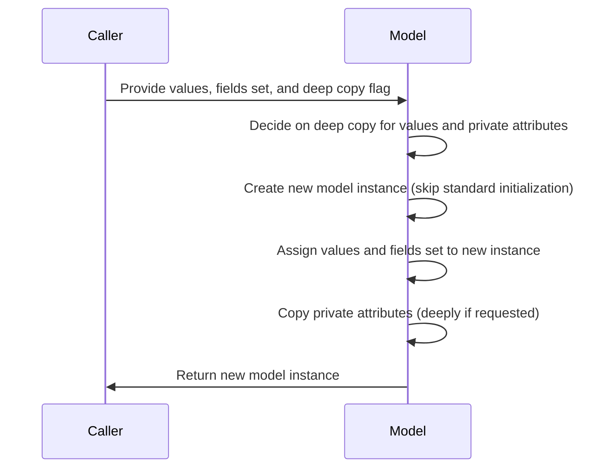
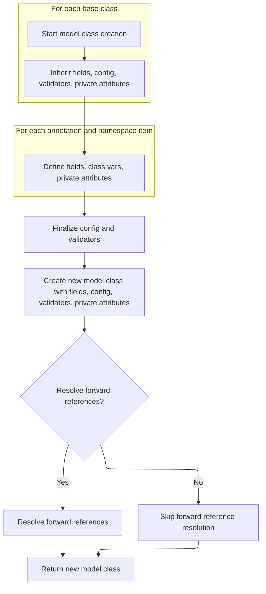
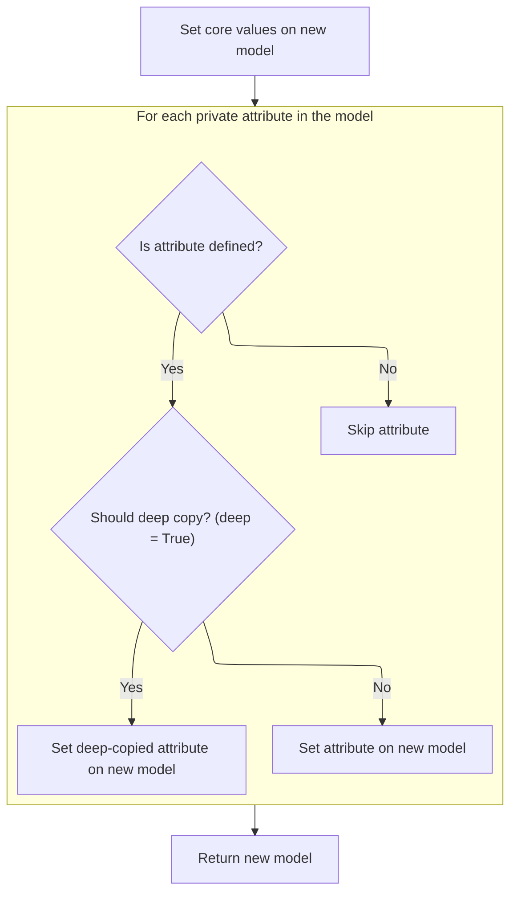

This flow describes how to efficiently duplicate a model instance by copying its values and private attributes, optionally performing a deep copy for data isolation. By bypassing standard initialization, it avoids triggering validation or side effects, making it suitable for safely copying or mutating models. The main steps are:

- Decide if deep copying is needed.
- Create a new model instance without standard initialization.
- Assign values and fields set directly.
- Copy private attributes as needed.
- Return the new model instance.



# Spec

## Detailed View of the Program's Functionality

a. Deciding Whether to Deep Copy Values and Private Attributes

The process begins by determining if the data (the internal dictionary of values and private attributes) should be deep copied. This is important for data isolation: if deep copying is requested, a full, independent copy of the data is made so that changes to the new model instance do not affect the original. If not, the data is simply referenced, which is faster but means changes could affect both instances.

b. Creating a New Model Instance

A new instance of the model is created using a special method that bypasses the usual initialization logic. This is done to avoid triggering validation or other side effects that would normally occur during standard object creation. Instead, the new instance is created in a "blank" state, ready to have its internal data set directly.

c. Building Model Class Internals

When a new model class is created (not just an instance), several steps are performed to set up its internal structure:

- Empty containers are prepared for fields, configuration, validators, root validators, private attributes, class variables, and a hash function.
- The base classes are processed in reverse order to inherit fields, configuration, validators, and private attributes, ensuring correct precedence.
- Configuration options are merged from various sources, and any conflicts are checked.
- Validators are extracted from the class namespace and combined with inherited validators.
- Each field is updated with the final configuration and any extra validators.
- Annotations (type hints) are resolved, and for each annotation:
  - If it is a class variable or a final variable with a default, it is marked as such.
  - If it is a valid field, its name is validated, its value and type are determined, and a field object is created.
  - If it is a private attribute and not present in the namespace, it is added as a private attribute.
- Namespace items not already handled by annotations are processed:
  - Private attributes are validated and added.
  - Valid fields not already in annotations are inferred and added, with type checks to prevent mismatches.
- After all fields and private attributes are set up, the class is finalized:
  - Custom root types are validated.
  - Root validators are combined.
  - The JSON encoder is set up.
  - The new class namespace is built with all collected metadata.
  - The class is created, its signature is set, and forward references are resolved if needed.
  - The <SwmToken path="pydantic/v1/main.py" pos="294:6:6" line-data="        # preserve `__set_name__` protocol defined in https://peps.python.org/pep-0487">`__set_name__`</SwmToken> protocol is preserved for private attributes.

d. Assigning State to the New Model Instance

Once the new instance is created, its internal state is set directly:

- The internal dictionary of values is assigned to the new instance.
- The set of fields that have been set is also assigned.
- For each private attribute defined on the model:
  - The value is retrieved from the original instance.
  - If the value exists, it is deep copied if requested, or simply assigned otherwise.
  - The value is set directly on the new instance.

e. Returning the New Model Instance

After all values and private attributes have been assigned, the new model instance is returned. If deep copying was used, the new instance is fully independent from the original; otherwise, it may share references to the same data.

This process ensures that copying a model instance is efficient and avoids unnecessary validation or side effects, while still allowing for deep or shallow copies as needed. The careful handling of class internals and private attributes ensures that the new instance behaves exactly as expected, with all relevant data and configuration in place.

# Rule Definition

| Paragraph Name                                                                                                                                                                                                                                                                                                                                                                                                                                | Rule ID | Category          | Description                                                                                                                                                                                                                                                                                                                                                                                                                                                              | Conditions                                                                                                                                                                                                                                                                                                                                | Remarks                                                                                                                                                                                                                                                                                                                                                                                                                                                                                                                                                                 |
| --------------------------------------------------------------------------------------------------------------------------------------------------------------------------------------------------------------------------------------------------------------------------------------------------------------------------------------------------------------------------------------------------------------------------------------------- | ------- | ----------------- | ------------------------------------------------------------------------------------------------------------------------------------------------------------------------------------------------------------------------------------------------------------------------------------------------------------------------------------------------------------------------------------------------------------------------------------------------------------------------ | ----------------------------------------------------------------------------------------------------------------------------------------------------------------------------------------------------------------------------------------------------------------------------------------------------------------------------------------- | ----------------------------------------------------------------------------------------------------------------------------------------------------------------------------------------------------------------------------------------------------------------------------------------------------------------------------------------------------------------------------------------------------------------------------------------------------------------------------------------------------------------------------------------------------------------------- |
| BaseModel.\_copy_and_set_values, BaseModel.copy                                                                                                                                                                                                                                                                                                                                                                                               | RL-001  | Data Assignment   | When creating a new model instance, the field values and the set of explicitly set fields must be assigned directly from the provided values dictionary and <SwmToken path="pydantic/v1/main.py" pos="615:21:21" line-data="    def _copy_and_set_values(self: &#39;Model&#39;, values: &#39;DictStrAny&#39;, fields_set: &#39;SetStr&#39;, *, deep: bool) -&gt; &#39;Model&#39;:">`fields_set`</SwmToken> set, without invoking any validation or constructor logic.    | A new instance is being created from an existing model instance, with provided values and <SwmToken path="pydantic/v1/main.py" pos="615:21:21" line-data="    def _copy_and_set_values(self: &#39;Model&#39;, values: &#39;DictStrAny&#39;, fields_set: &#39;SetStr&#39;, *, deep: bool) -&gt; &#39;Model&#39;:">`fields_set`</SwmToken>. | The values are provided as a dictionary mapping field names to values. The <SwmToken path="pydantic/v1/main.py" pos="615:21:21" line-data="    def _copy_and_set_values(self: &#39;Model&#39;, values: &#39;DictStrAny&#39;, fields_set: &#39;SetStr&#39;, *, deep: bool) -&gt; &#39;Model&#39;:">`fields_set`</SwmToken> is a set of field names. Assignment is done using <SwmToken path="pydantic/v1/main.py" pos="622:1:1" line-data="        object_setattr(m, &#39;__dict__&#39;, values)">`object_setattr`</SwmToken> to bypass property setters and validation. |
| BaseModel.\_copy_and_set_values                                                                                                                                                                                                                                                                                                                                                                                                               | RL-002  | Conditional Logic | For each private attribute defined in the model's <SwmToken path="pydantic/v1/main.py" pos="129:1:1" line-data="        private_attributes: Dict[str, ModelPrivateAttr] = {}">`private_attributes`</SwmToken>, if the attribute is present on the source instance (i.e., its value is not the sentinel Undefined), its value must be copied to the new instance. If the attribute is not present (i.e., its value is Undefined), it must not be set on the new instance. | The model class defines private attributes in <SwmToken path="pydantic/v1/main.py" pos="129:1:1" line-data="        private_attributes: Dict[str, ModelPrivateAttr] = {}">`private_attributes`</SwmToken>. The source instance may or may not have a value for each private attribute.                                                    | The sentinel object Undefined is used to distinguish unset attributes. Only attributes with a value other than Undefined are copied.                                                                                                                                                                                                                                                                                                                                                                                                                                    |
| BaseModel.\_copy_and_set_values                                                                                                                                                                                                                                                                                                                                                                                                               | RL-003  | Conditional Logic | If the deep flag is true, the values dictionary and each private attribute value must be deep-copied before assignment to the new instance, ensuring that the new instance is fully independent from the source.                                                                                                                                                                                                                                                         | The deep parameter is set to True when creating the new instance.                                                                                                                                                                                                                                                                         | Deep copying is performed using the standard library deepcopy function. This applies to both the values dictionary and each private attribute value that is copied.                                                                                                                                                                                                                                                                                                                                                                                                     |
| BaseModel.\_copy_and_set_values, BaseModel.copy                                                                                                                                                                                                                                                                                                                                                                                               | RL-004  | Conditional Logic | The creation of the new instance must not invoke any validation, property setters, or custom logic that could cause side effects. Only direct assignment is allowed.                                                                                                                                                                                                                                                                                                     | Whenever a new instance is created using this feature.                                                                                                                                                                                                                                                                                    | Assignment is performed using <SwmToken path="pydantic/v1/main.py" pos="622:1:1" line-data="        object_setattr(m, &#39;__dict__&#39;, values)">`object_setattr`</SwmToken> and **new**, not **init** or property setters.                                                                                                                                                                                                                                                                                                                                           |
| BaseModel.\_copy_and_set_values                                                                                                                                                                                                                                                                                                                                                                                                               | RL-005  | Conditional Logic | If a private attribute is missing on the source instance (i.e., its value is Undefined), the feature must not raise errors or exceptions; such attributes are simply skipped and not set on the new instance.                                                                                                                                                                                                                                                            | A private attribute is defined on the model class but not set on the source instance.                                                                                                                                                                                                                                                     | The sentinel Undefined is used to detect missing attributes. No error is raised if the attribute is missing.                                                                                                                                                                                                                                                                                                                                                                                                                                                            |
| BaseModel.\_copy_and_set_values, <SwmToken path="pydantic/v1/main.py" pos="129:9:9" line-data="        private_attributes: Dict[str, ModelPrivateAttr] = {}">`ModelPrivateAttr`</SwmToken>, <SwmToken path="pydantic/v1/main.py" pos="205:8:8" line-data="                    private_attributes[ann_name] = PrivateAttr()">`PrivateAttr`</SwmToken>, Undefined                                                                               | RL-006  | Conditional Logic | A unique sentinel object (Undefined) is used to distinguish between unset and explicitly set private attributes. This sentinel must be distinct from all possible user values, including None.                                                                                                                                                                                                                                                                           | Whenever checking if a private attribute is set on the source instance.                                                                                                                                                                                                                                                                   | Undefined is a unique object imported from <SwmToken path="pydantic/v1/main.py" pos="33:2:6" line-data="from pydantic.v1.fields import (">`pydantic.v1.fields`</SwmToken>. It is used as the default value for unset private attributes.                                                                                                                                                                                                                                                                                                                                |
| <SwmToken path="pydantic/v1/main.py" pos="137:12:12" line-data="            if _is_base_model_class_defined and issubclass(base, BaseModel) and base != BaseModel:">`BaseModel`</SwmToken>, <SwmToken path="pydantic/v1/main.py" pos="113:5:5" line-data="# Note `ModelMetaclass` refers to `BaseModel`, but is also used to *create* `BaseModel`, so we need to add this extra">`ModelMetaclass`</SwmToken>, BaseModel.\_copy_and_set_values | RL-007  | Conditional Logic | The feature must work with models where field definitions, private attribute definitions, configuration, and validators are stored at the class level, and instance state (field values, private attribute values, set fields) is stored at the instance level.                                                                                                                                                                                                          | The model class uses Pydantic's standard structure for class-level and instance-level state.                                                                                                                                                                                                                                              | Class-level state includes **fields**, <SwmToken path="pydantic/v1/main.py" pos="129:1:1" line-data="        private_attributes: Dict[str, ModelPrivateAttr] = {}">`private_attributes`</SwmToken>, **config**, etc. Instance-level state includes **dict**, <SwmToken path="pydantic/v1/main.py" pos="615:21:21" line-data="    def _copy_and_set_values(self: &#39;Model&#39;, values: &#39;DictStrAny&#39;, fields_set: &#39;SetStr&#39;, *, deep: bool) -&gt; &#39;Model&#39;:">`fields_set`</SwmToken>, and private attribute values.                              |

# User Stories

## User Story 1: Efficient model instance copying with deep copy option and Pydantic compatibility

---

### Story Description:

As a user of data models, I want to create a new instance of a model by copying field values and private attributes from an existing instance, with the option to deep copy, so that I can efficiently duplicate or modify models without triggering validation or side effects, and ensure compatibility with Pydantic's standard model architecture.

---

### Business Rule Mapping:

| Rule ID | Paragraph Name                                                                                                                                                                                                                                                                                                                                                                                                                                | Rule Description                                                                                                                                                                                                                                                                                                                                                                                                                                                      |
| ------- | --------------------------------------------------------------------------------------------------------------------------------------------------------------------------------------------------------------------------------------------------------------------------------------------------------------------------------------------------------------------------------------------------------------------------------------------- | --------------------------------------------------------------------------------------------------------------------------------------------------------------------------------------------------------------------------------------------------------------------------------------------------------------------------------------------------------------------------------------------------------------------------------------------------------------------- |
| RL-001  | BaseModel.\_copy_and_set_values, BaseModel.copy                                                                                                                                                                                                                                                                                                                                                                                               | When creating a new model instance, the field values and the set of explicitly set fields must be assigned directly from the provided values dictionary and <SwmToken path="pydantic/v1/main.py" pos="615:21:21" line-data="    def _copy_and_set_values(self: &#39;Model&#39;, values: &#39;DictStrAny&#39;, fields_set: &#39;SetStr&#39;, *, deep: bool) -&gt; &#39;Model&#39;:">`fields_set`</SwmToken> set, without invoking any validation or constructor logic. |
| RL-003  | BaseModel.\_copy_and_set_values                                                                                                                                                                                                                                                                                                                                                                                                               | If the deep flag is true, the values dictionary and each private attribute value must be deep-copied before assignment to the new instance, ensuring that the new instance is fully independent from the source.                                                                                                                                                                                                                                                      |
| RL-004  | BaseModel.\_copy_and_set_values, BaseModel.copy                                                                                                                                                                                                                                                                                                                                                                                               | The creation of the new instance must not invoke any validation, property setters, or custom logic that could cause side effects. Only direct assignment is allowed.                                                                                                                                                                                                                                                                                                  |
| RL-007  | <SwmToken path="pydantic/v1/main.py" pos="137:12:12" line-data="            if _is_base_model_class_defined and issubclass(base, BaseModel) and base != BaseModel:">`BaseModel`</SwmToken>, <SwmToken path="pydantic/v1/main.py" pos="113:5:5" line-data="# Note `ModelMetaclass` refers to `BaseModel`, but is also used to *create* `BaseModel`, so we need to add this extra">`ModelMetaclass`</SwmToken>, BaseModel.\_copy_and_set_values | The feature must work with models where field definitions, private attribute definitions, configuration, and validators are stored at the class level, and instance state (field values, private attribute values, set fields) is stored at the instance level.                                                                                                                                                                                                       |

---

### Relevant Functionality:

- **BaseModel.\_copy_and_set_values**
  1. **RL-001:**
     - Create a new instance of the model class using **new**
     - Assign the values dictionary directly to the instance's **dict**
     - Assign the <SwmToken path="pydantic/v1/main.py" pos="615:21:21" line-data="    def _copy_and_set_values(self: &#39;Model&#39;, values: &#39;DictStrAny&#39;, fields_set: &#39;SetStr&#39;, *, deep: bool) -&gt; &#39;Model&#39;:">`fields_set`</SwmToken> directly to the instance's <SwmToken path="pydantic/v1/main.py" pos="615:21:21" line-data="    def _copy_and_set_values(self: &#39;Model&#39;, values: &#39;DictStrAny&#39;, fields_set: &#39;SetStr&#39;, *, deep: bool) -&gt; &#39;Model&#39;:">`fields_set`</SwmToken>
     - Do not call **init** or any validation logic
  2. **RL-003:**
     - If deep is true:
       - Deep copy the values dictionary before assignment
     - For each private attribute to be copied:
       - If deep is true, deep copy the attribute value before assignment
  3. **RL-004:**
     - Use **new** to create the instance
     - Use <SwmToken path="pydantic/v1/main.py" pos="622:1:1" line-data="        object_setattr(m, &#39;__dict__&#39;, values)">`object_setattr`</SwmToken> to assign **dict**, <SwmToken path="pydantic/v1/main.py" pos="615:21:21" line-data="    def _copy_and_set_values(self: &#39;Model&#39;, values: &#39;DictStrAny&#39;, fields_set: &#39;SetStr&#39;, *, deep: bool) -&gt; &#39;Model&#39;:">`fields_set`</SwmToken>, and private attributes
     - Do not call **init**, validation, or any property setters
- <SwmToken path="pydantic/v1/main.py" pos="137:12:12" line-data="            if _is_base_model_class_defined and issubclass(base, BaseModel) and base != BaseModel:">`BaseModel`</SwmToken>
  1. **RL-007:**
     - Access class-level definitions from the model class
     - Assign instance-level state directly to the new instance

## User Story 2: Correct handling of private attributes and unset values

---

### Story Description:

As a user of data models, I want private attributes to be copied only if they are set on the source instance, using a unique sentinel to distinguish unset attributes, so that missing attributes are skipped without error and only explicitly set attributes are copied.

---

### Business Rule Mapping:

| Rule ID | Paragraph Name                                                                                                                                                                                                                                                                                                                                                  | Rule Description                                                                                                                                                                                                                                                                                                                                                                                                                                                         |
| ------- | --------------------------------------------------------------------------------------------------------------------------------------------------------------------------------------------------------------------------------------------------------------------------------------------------------------------------------------------------------------- | ------------------------------------------------------------------------------------------------------------------------------------------------------------------------------------------------------------------------------------------------------------------------------------------------------------------------------------------------------------------------------------------------------------------------------------------------------------------------ |
| RL-002  | BaseModel.\_copy_and_set_values                                                                                                                                                                                                                                                                                                                                 | For each private attribute defined in the model's <SwmToken path="pydantic/v1/main.py" pos="129:1:1" line-data="        private_attributes: Dict[str, ModelPrivateAttr] = {}">`private_attributes`</SwmToken>, if the attribute is present on the source instance (i.e., its value is not the sentinel Undefined), its value must be copied to the new instance. If the attribute is not present (i.e., its value is Undefined), it must not be set on the new instance. |
| RL-005  | BaseModel.\_copy_and_set_values                                                                                                                                                                                                                                                                                                                                 | If a private attribute is missing on the source instance (i.e., its value is Undefined), the feature must not raise errors or exceptions; such attributes are simply skipped and not set on the new instance.                                                                                                                                                                                                                                                            |
| RL-006  | BaseModel.\_copy_and_set_values, <SwmToken path="pydantic/v1/main.py" pos="129:9:9" line-data="        private_attributes: Dict[str, ModelPrivateAttr] = {}">`ModelPrivateAttr`</SwmToken>, <SwmToken path="pydantic/v1/main.py" pos="205:8:8" line-data="                    private_attributes[ann_name] = PrivateAttr()">`PrivateAttr`</SwmToken>, Undefined | A unique sentinel object (Undefined) is used to distinguish between unset and explicitly set private attributes. This sentinel must be distinct from all possible user values, including None.                                                                                                                                                                                                                                                                           |

---

### Relevant Functionality:

- **BaseModel.\_copy_and_set_values**
  1. **RL-002:**
     - For each private attribute name in <SwmToken path="pydantic/v1/main.py" pos="129:1:1" line-data="        private_attributes: Dict[str, ModelPrivateAttr] = {}">`private_attributes`</SwmToken>:
       - Get the value from the source instance using getattr
       - If the value is not Undefined:
         - Assign the value to the new instance using <SwmToken path="pydantic/v1/main.py" pos="622:1:1" line-data="        object_setattr(m, &#39;__dict__&#39;, values)">`object_setattr`</SwmToken>
       - If the value is Undefined:
         - Do not set the attribute on the new instance
  2. **RL-005:**
     - For each private attribute:
       - If the value on the source instance is Undefined, do nothing
  3. **RL-006:**
     - When checking a private attribute's value:
       - Compare to Undefined to determine if it is unset

# Code Walkthrough

## Copying Model State Efficiently

```mermaid
%%{init: {"flowchart": {"defaultRenderer": "elk"}} }%%
flowchart TD
    node1["Decide whether to deep copy values and private attributes for data isolation"] --> node2["Create a new model instance"]
    click node1 openCode "pydantic/v1/main.py:615:621"
    node2["Create a new model instance"] --> node3["Set all relevant attributes on the new model"]
    click node2 openCode "pydantic/v1/main.py:621:622"
    subgraph loop1["For each private attribute"]
      node3 --> node3
    end
    click node3 openCode "pydantic/v1/main.py:622:631"

subgraph node2 [__new__]
  sgmain_1_node1["Start model class creation"]
  click sgmain_1_node1 openCode "pydantic/v1/main.py:123:136"
  subgraph sgmain_1_loop1["For each base class"]
  sgmain_1_node1 --> sgmain_1_node2["Inherit fields, config, validators, private attributes"]
  click sgmain_1_node2 openCode "pydantic/v1/main.py:136:147"
  end
  subgraph sgmain_1_loop2["For each annotation and namespace item"]
  sgmain_1_node2 --> sgmain_1_node3["Define fields, class vars, private attributes"]
  click sgmain_1_node3 openCode "pydantic/v1/main.py:177:236"
  end
  sgmain_1_node3 --> sgmain_1_node4["Finalize config and validators"]
  click sgmain_1_node4 openCode "pydantic/v1/main.py:147:177"
  sgmain_1_node4 --> sgmain_1_node5["Create new model class with fields, config, validators, private attributes"]
  click sgmain_1_node5 openCode "pydantic/v1/main.py:252:282"
  sgmain_1_node5 --> sgmain_1_node6{"Resolve forward references?"}
  click sgmain_1_node6 openCode "pydantic/v1/main.py:291:292"
  sgmain_1_node6 -- Yes --> sgmain_1_node7["Resolve forward references"]
  click sgmain_1_node7 openCode "pydantic/v1/main.py:291:292"
  sgmain_1_node6 -- No --> sgmain_1_node8["Skip forward reference resolution"]
  click sgmain_1_node8 openCode "pydantic/v1/main.py:291:292"
  sgmain_1_node7 --> sgmain_1_node9["Return new model class"]
  click sgmain_1_node9 openCode "pydantic/v1/main.py:302:302"
  sgmain_1_node8 --> sgmain_1_node9
end

%% Swimm:
%% %%{init: {"flowchart": {"defaultRenderer": "elk"}} }%%
%% flowchart TD
%%     node1["Decide whether to deep copy values and private attributes for data isolation"] --> node2["Create a new model instance"]
%%     click node1 openCode "<SwmPath>[pydantic/v1/main.py](pydantic/v1/main.py)</SwmPath>:615:621"
%%     node2["Create a new model instance"] --> node3["Set all relevant attributes on the new model"]
%%     click node2 openCode "<SwmPath>[pydantic/v1/main.py](pydantic/v1/main.py)</SwmPath>:621:622"
%%     subgraph loop1["For each private attribute"]
%%       node3 --> node3
%%     end
%%     click node3 openCode "<SwmPath>[pydantic/v1/main.py](pydantic/v1/main.py)</SwmPath>:622:631"
%% 
%% subgraph node2 [__new__]
%%   sgmain_1_node1["Start model class creation"]
%%   click sgmain_1_node1 openCode "<SwmPath>[pydantic/v1/main.py](pydantic/v1/main.py)</SwmPath>:123:136"
%%   subgraph sgmain_1_loop1["For each base class"]
%%   sgmain_1_node1 --> sgmain_1_node2["Inherit fields, config, validators, private attributes"]
%%   click sgmain_1_node2 openCode "<SwmPath>[pydantic/v1/main.py](pydantic/v1/main.py)</SwmPath>:136:147"
%%   end
%%   subgraph sgmain_1_loop2["For each annotation and namespace item"]
%%   sgmain_1_node2 --> sgmain_1_node3["Define fields, class vars, private attributes"]
%%   click sgmain_1_node3 openCode "<SwmPath>[pydantic/v1/main.py](pydantic/v1/main.py)</SwmPath>:177:236"
%%   end
%%   sgmain_1_node3 --> sgmain_1_node4["Finalize config and validators"]
%%   click sgmain_1_node4 openCode "<SwmPath>[pydantic/v1/main.py](pydantic/v1/main.py)</SwmPath>:147:177"
%%   sgmain_1_node4 --> sgmain_1_node5["Create new model class with fields, config, validators, private attributes"]
%%   click sgmain_1_node5 openCode "<SwmPath>[pydantic/v1/main.py](pydantic/v1/main.py)</SwmPath>:252:282"
%%   sgmain_1_node5 --> sgmain_1_node6{"Resolve forward references?"}
%%   click sgmain_1_node6 openCode "<SwmPath>[pydantic/v1/main.py](pydantic/v1/main.py)</SwmPath>:291:292"
%%   sgmain_1_node6 -- Yes --> sgmain_1_node7["Resolve forward references"]
%%   click sgmain_1_node7 openCode "<SwmPath>[pydantic/v1/main.py](pydantic/v1/main.py)</SwmPath>:291:292"
%%   sgmain_1_node6 -- No --> sgmain_1_node8["Skip forward reference resolution"]
%%   click sgmain_1_node8 openCode "<SwmPath>[pydantic/v1/main.py](pydantic/v1/main.py)</SwmPath>:291:292"
%%   sgmain_1_node7 --> sgmain_1_node9["Return new model class"]
%%   click sgmain_1_node9 openCode "<SwmPath>[pydantic/v1/main.py](pydantic/v1/main.py)</SwmPath>:302:302"
%%   sgmain_1_node8 --> sgmain_1_node9
%% end
```



<SwmSnippet path="/pydantic/v1/main.py" line="615">

---

In <SwmToken path="pydantic/v1/main.py" pos="615:3:3" line-data="    def _copy_and_set_values(self: &#39;Model&#39;, values: &#39;DictStrAny&#39;, fields_set: &#39;SetStr&#39;, *, deep: bool) -&gt; &#39;Model&#39;:">`_copy_and_set_values`</SwmToken>, we start by optionally deep copying the values dict if requested, then grab the model's class and create a new instance using <SwmToken path="pydantic/v1/main.py" pos="621:7:7" line-data="        m = cls.__new__(cls)">`__new__`</SwmToken>. Using <SwmToken path="pydantic/v1/main.py" pos="621:7:7" line-data="        m = cls.__new__(cls)">`__new__`</SwmToken> skips the normal <SwmToken path="pydantic/v1/main.py" pos="284:18:18" line-data="        cls.__signature__ = ClassAttribute(&#39;__signature__&#39;, generate_model_signature(cls.__init__, fields, config))">`__init__`</SwmToken> logic, letting us set up the instance's state directly. This is needed so we can assign the internal dict and fields set without triggering validation or other side effects.

```python
    def _copy_and_set_values(self: 'Model', values: 'DictStrAny', fields_set: 'SetStr', *, deep: bool) -> 'Model':
        if deep:
            # chances of having empty dict here are quite low for using smart_deepcopy
            values = deepcopy(values)

        cls = self.__class__
        m = cls.__new__(cls)
```

---

</SwmSnippet>

### Building Model Class Internals



<SwmSnippet path="/pydantic/v1/main.py" line="123">

---

In <SwmToken path="pydantic/v1/main.py" pos="123:3:3" line-data="    def __new__(mcs, name, bases, namespace, **kwargs):  # noqa C901">`__new__`</SwmToken>, we start by setting up empty containers for fields, config, validators, root validators, private attributes, class vars, and hash function. Then we walk through the base classes in reverse, merging in their fields, configs, validators, and other metadata. This way, the new model class inherits everything it needs from its ancestors, with the right precedence.

```python
    def __new__(mcs, name, bases, namespace, **kwargs):  # noqa C901
        fields: Dict[str, ModelField] = {}
        config = BaseConfig
        validators: 'ValidatorListDict' = {}

        pre_root_validators, post_root_validators = [], []
        private_attributes: Dict[str, ModelPrivateAttr] = {}
        base_private_attributes: Dict[str, ModelPrivateAttr] = {}
        slots: SetStr = namespace.get('__slots__', ())
        slots = {slots} if isinstance(slots, str) else set(slots)
        class_vars: SetStr = set()
        hash_func: Optional[Callable[[Any], int]] = None

        for base in reversed(bases):
            if _is_base_model_class_defined and issubclass(base, BaseModel) and base != BaseModel:
                fields.update(smart_deepcopy(base.__fields__))
                config = inherit_config(base.__config__, config)
                validators = inherit_validators(base.__validators__, validators)
                pre_root_validators += base.__pre_root_validators__
                post_root_validators += base.__post_root_validators__
                base_private_attributes.update(base.__private_attributes__)
                class_vars.update(base.__class_vars__)
                hash_func = base.__hash__
```

---

</SwmSnippet>

<SwmSnippet path="/pydantic/v1/main.py" line="145">

---

Here, we merge config from all sources, extract and combine validators, and prep each field with its config and validators before handling annotations.

```python
                hash_func = base.__hash__

        resolve_forward_refs = kwargs.pop('__resolve_forward_refs__', True)
        allowed_config_kwargs: SetStr = {
            key
            for key in dir(config)
            if not (key.startswith('__') and key.endswith('__'))  # skip dunder methods and attributes
        }
        config_kwargs = {key: kwargs.pop(key) for key in kwargs.keys() & allowed_config_kwargs}
        config_from_namespace = namespace.get('Config')
        if config_kwargs and config_from_namespace:
            raise TypeError('Specifying config in two places is ambiguous, use either Config attribute or class kwargs')
        config = inherit_config(config_from_namespace, config, **config_kwargs)

        validators = inherit_validators(extract_validators(namespace), validators)
        vg = ValidatorGroup(validators)

        for f in fields.values():
            f.set_config(config)
            extra_validators = vg.get_validators(f.name)
            if extra_validators:
                f.class_validators.update(extra_validators)
                # re-run prepare to add extra validators
                f.populate_validators()
```

---

</SwmSnippet>

<SwmSnippet path="/pydantic/v1/main.py" line="168">

---

After prepping validators, we resolve annotation types and process each one: class vars and finals are marked, valid fields are validated and turned into ModelFields, and private attributes are handled based on config and naming. This sets up all the fields and private attributes before moving on to namespace items.

```python
                f.populate_validators()

        prepare_config(config, name)

        untouched_types = ANNOTATED_FIELD_UNTOUCHED_TYPES

        def is_untouched(v: Any) -> bool:
            return isinstance(v, untouched_types) or v.__class__.__name__ == 'cython_function_or_method'

        if (namespace.get('__module__'), namespace.get('__qualname__')) != ('pydantic.main', 'BaseModel'):
            annotations = resolve_annotations(namespace.get('__annotations__', {}), namespace.get('__module__', None))
            # annotation only fields need to come first in fields
            for ann_name, ann_type in annotations.items():
                if is_classvar(ann_type):
                    class_vars.add(ann_name)
                elif is_finalvar_with_default_val(ann_type, namespace.get(ann_name, Undefined)):
                    class_vars.add(ann_name)
                elif is_valid_field(ann_name):
                    validate_field_name(bases, ann_name)
                    value = namespace.get(ann_name, Undefined)
                    allowed_types = get_args(ann_type) if is_union(get_origin(ann_type)) else (ann_type,)
                    if (
                        is_untouched(value)
                        and ann_type != PyObject
                        and not any(
                            lenient_issubclass(get_origin(allowed_type), Type) for allowed_type in allowed_types
                        )
                    ):
                        continue
                    fields[ann_name] = ModelField.infer(
                        name=ann_name,
                        value=value,
                        annotation=ann_type,
                        class_validators=vg.get_validators(ann_name),
                        config=config,
                    )
                elif ann_name not in namespace and config.underscore_attrs_are_private:
                    private_attributes[ann_name] = PrivateAttr()
```

---

</SwmSnippet>

<SwmSnippet path="/pydantic/v1/main.py" line="205">

---

Now we loop through namespace items that aren't already handled by annotations. If they're private attributes, we validate their names and add them. If they're valid fields, we infer their type and value, and check for type mismatches with existing fields, raising an error if needed. This fills in any remaining fields and private attributes before finalizing the class setup.

```python
                    private_attributes[ann_name] = PrivateAttr()

            untouched_types = UNTOUCHED_TYPES + config.keep_untouched
            for var_name, value in namespace.items():
                can_be_changed = var_name not in class_vars and not is_untouched(value)
                if isinstance(value, ModelPrivateAttr):
                    if not is_valid_private_name(var_name):
                        raise NameError(
                            f'Private attributes "{var_name}" must not be a valid field name; '
                            f'Use sunder or dunder names, e. g. "_{var_name}" or "__{var_name}__"'
                        )
                    private_attributes[var_name] = value
                elif config.underscore_attrs_are_private and is_valid_private_name(var_name) and can_be_changed:
                    private_attributes[var_name] = PrivateAttr(default=value)
                elif is_valid_field(var_name) and var_name not in annotations and can_be_changed:
                    validate_field_name(bases, var_name)
                    inferred = ModelField.infer(
                        name=var_name,
                        value=value,
                        annotation=annotations.get(var_name, Undefined),
                        class_validators=vg.get_validators(var_name),
                        config=config,
                    )
                    if var_name in fields:
                        if lenient_issubclass(inferred.type_, fields[var_name].type_):
                            inferred.type_ = fields[var_name].type_
                        else:
                            raise TypeError(
                                f'The type of {name}.{var_name} differs from the new default value; '
                                f'if you wish to change the type of this field, please use a type annotation'
                            )
                    fields[var_name] = inferred
```

---

</SwmSnippet>

<SwmSnippet path="/pydantic/v1/main.py" line="236">

---

After setting up fields and private attributes, we check for a custom root type and validate it. We also combine root validators, set up the JSON encoder, and build the new class namespace with all the collected metadata. Then we create the class using super().**new**, set its signature, clear annotations if needed, resolve forward refs, and preserve <SwmToken path="pydantic/v1/main.py" pos="298:1:1" line-data="                set_name = getattr(obj, &#39;__set_name__&#39;, None)">`set_name`</SwmToken> for private attributes. This wraps up the model class creation.

```python
                    fields[var_name] = inferred

        _custom_root_type = ROOT_KEY in fields
        if _custom_root_type:
            validate_custom_root_type(fields)
        vg.check_for_unused()
        if config.json_encoders:
            json_encoder = partial(custom_pydantic_encoder, config.json_encoders)
        else:
            json_encoder = pydantic_encoder
        pre_rv_new, post_rv_new = extract_root_validators(namespace)

        if hash_func is None:
            hash_func = generate_hash_function(config.frozen)

        exclude_from_namespace = fields | private_attributes.keys() | {'__slots__'}
        new_namespace = {
            '__config__': config,
            '__fields__': fields,
            '__exclude_fields__': {
                name: field.field_info.exclude for name, field in fields.items() if field.field_info.exclude is not None
            }
            or None,
            '__include_fields__': {
                name: field.field_info.include for name, field in fields.items() if field.field_info.include is not None
            }
            or None,
            '__validators__': vg.validators,
            '__pre_root_validators__': unique_list(
                pre_root_validators + pre_rv_new,
                name_factory=lambda v: v.__name__,
            ),
            '__post_root_validators__': unique_list(
                post_root_validators + post_rv_new,
                name_factory=lambda skip_on_failure_and_v: skip_on_failure_and_v[1].__name__,
            ),
            '__schema_cache__': {},
            '__json_encoder__': staticmethod(json_encoder),
            '__custom_root_type__': _custom_root_type,
            '__private_attributes__': {**base_private_attributes, **private_attributes},
            '__slots__': slots | private_attributes.keys(),
            '__hash__': hash_func,
            '__class_vars__': class_vars,
            **{n: v for n, v in namespace.items() if n not in exclude_from_namespace},
        }

        cls = super().__new__(mcs, name, bases, new_namespace, **kwargs)
        # set __signature__ attr only for model class, but not for its instances
        cls.__signature__ = ClassAttribute('__signature__', generate_model_signature(cls.__init__, fields, config))

        if not _is_base_model_class_defined:
            # Cython does not understand the `if TYPE_CHECKING:` condition in the
            # BaseModel's body (where annotations are set), so clear them manually:
            getattr(cls, '__annotations__', {}).clear()

        if resolve_forward_refs:
            cls.__try_update_forward_refs__()

        # preserve `__set_name__` protocol defined in https://peps.python.org/pep-0487
        # for attributes not in `new_namespace` (e.g. private attributes)
        for name, obj in namespace.items():
            if name not in new_namespace:
                set_name = getattr(obj, '__set_name__', None)
                if callable(set_name):
                    set_name(cls, name)
```

---

</SwmSnippet>

<SwmSnippet path="/pydantic/v1/main.py" line="300">

---

Finally, <SwmToken path="pydantic/v1/main.py" pos="123:3:3" line-data="    def __new__(mcs, name, bases, namespace, **kwargs):  # noqa C901">`__new__`</SwmToken> returns the fully constructed model class, with all fields, validators, config, and metadata in place. It's ready to be used for creating model instances.

```python
                    set_name(cls, name)

        return cls
```

---

</SwmSnippet>

### Assigning State to the New Model Instance



<SwmSnippet path="/pydantic/v1/main.py" line="622">

---

After getting the new instance from <SwmToken path="pydantic/v1/main.py" pos="123:3:3" line-data="    def __new__(mcs, name, bases, namespace, **kwargs):  # noqa C901">`__new__`</SwmToken>, we assign its state and private attributes directly, skipping any extra logic.

```python
        object_setattr(m, '__dict__', values)
        object_setattr(m, '__fields_set__', fields_set)
        for name in self.__private_attributes__:
            value = getattr(self, name, Undefined)
            if value is not Undefined:
                if deep:
                    value = deepcopy(value)
                object_setattr(m, name, value)
```

---

</SwmSnippet>

<SwmSnippet path="/pydantic/v1/main.py" line="629">

---

Finally, <SwmToken path="pydantic/v1/main.py" pos="615:3:3" line-data="    def _copy_and_set_values(self: &#39;Model&#39;, values: &#39;DictStrAny&#39;, fields_set: &#39;SetStr&#39;, *, deep: bool) -&gt; &#39;Model&#39;:">`_copy_and_set_values`</SwmToken> returns the new model instance with all fields and private attributes copied over. If deep copying was used, it's fully independent from the original.

```python
                object_setattr(m, name, value)

        return m
```

---

</SwmSnippet>

&nbsp;

*This is an auto-generated document by Swimm 🌊 and has not yet been verified by a human*

<SwmMeta version="3.0.0" repo-id="Z2l0aHViJTNBJTNBcHlkYW50aWMlM0ElM0FTd2ltbS1EZW1v" repo-name="pydantic"><sup>Powered by [Swimm](/)</sup></SwmMeta>
