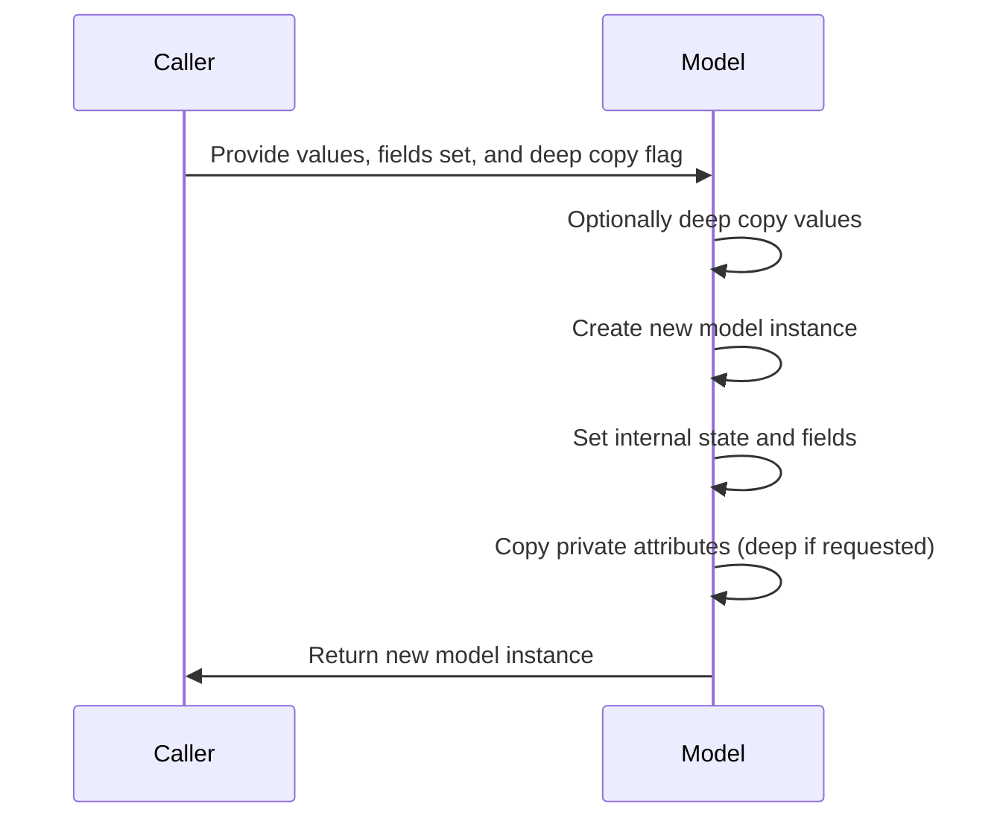
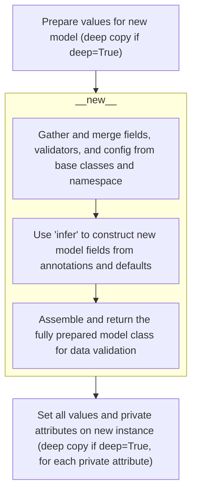
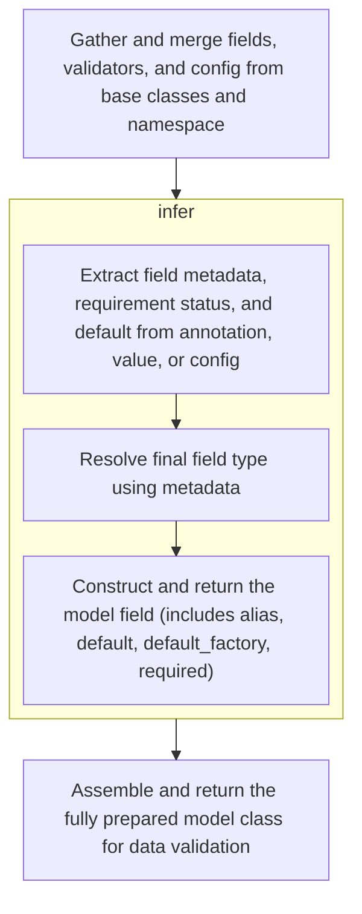

This flow describes how to duplicate a model instance by copying all its fields and private attributes, supporting both shallow and deep copying. The process involves optionally deep copying the values, creating a new instance, setting its internal state, and copying private attributes to ensure the new instance is a complete replica. This is useful when independent copies of models are needed for further processing or state management.

The main steps are:

- Optionally deep copy the provided values
- Create a new, uninitialized model instance
- Set the internal state and fields on the new instance
- Copy over all private attributes, deeply if requested
- Return the fully populated new model instance



# Spec

## Detailed View of the Program's Functionality

a. Cloning and Preparing Model Instances

The process begins with a function that is responsible for creating a copy of a model instance, potentially performing a deep copy of its data. If deep copying is requested, the dictionary of field values is duplicated to ensure that nested objects are also copied, not just referenced. The model's class is then retrieved, and a new, uninitialized instance of the model is created using the class's special method for object creation. This bypasses the usual initialization logic, allowing the internal state to be set up directly.

b. Creating a New Model Instance

After obtaining a blank model object, the function sets the internal dictionary of field values and the set of fields that have been explicitly set. It then iterates over all private attributes defined for the model. For each private attribute, it retrieves the value from the original instance. If the value exists, it is deep-copied if requested, and then set directly on the new instance. This ensures that both public fields and private attributes are faithfully copied to the new model instance.

c. Building Model Class Metadata

When a new model class is created (not just an instance), a metaclass is responsible for assembling all the necessary metadata. This involves traversing the inheritance chain in reverse order, merging fields, configuration settings, validators, root validators, private attributes, class variables, and hash functions from all base classes. This ensures that the new model class inherits all relevant behaviors and metadata from its ancestors.

After merging, the configuration is finalized, and any additional configuration specified in the class namespace or as keyword arguments is applied. Validators defined in the class namespace are extracted and merged with those from base classes. Each field from the base classes has its configuration updated, and any extra validators are attached and prepared.

d. Field Metadata Extraction and Validation

For each field defined in the model (either via annotations or as class variables), the system determines whether it is a class variable, a final variable with a default value, or a valid model field. For valid fields, the name is validated, and a function is called to construct the field object. This function merges metadata from the annotation, the value, and the configuration, resolving any conflicts and ensuring that the field's configuration is up to date.

The field construction process determines whether the field is required, sets the appropriate type annotation (possibly resolving forward references or applying configuration-specific adjustments), and returns a fully prepared field object. This object contains all the information needed for validation, serialization, and other model behaviors.

e. Finalizing Model Class Construction

Once all fields have been processed, the metaclass checks if the model uses a custom root type (a special case where the model wraps a single value). If so, it validates this setup. It then checks for any unused validators, sets up the JSON encoder (for serialization), and collects root validators. The new class namespace is assembled, containing all fields, configuration, validators, private attributes, and other metadata.

The class object is then created using the assembled namespace. The model's signature is set for introspection, and any type annotations are cleared if necessary. If forward references need to be resolved (for fields that refer to types not yet defined), this is done at this stage. Finally, the descriptor protocol is applied for any attributes not present in the new namespace, ensuring that special behaviors (like private attributes) are preserved.

f. Populating and Returning the New Model Instance

Returning to the instance copying function, after setting up the new instance's internal state and copying all private attributes, the new model instance is returned. This instance is a faithful clone of the original, with all fields and private attributes copied, and with the option to perform a deep copy of all data if requested. This mechanism allows for efficient and flexible duplication of model instances, supporting both shallow and deep copying semantics.

# Rule Definition

| Paragraph Name                                                                                                                                                                                                                                                                                                                                                                                      | Rule ID | Category          | Description                                                                                                                                                                                                                                                                                                                                                                                                                                                                                                                                                                                                                                                                                                                                                          | Conditions                                                                                                                                                                                                                                                                                                                                                               | Remarks                                                                                                                                                                                                                                                                                                                                                                                                                                                                                                                                                                                                              |
| --------------------------------------------------------------------------------------------------------------------------------------------------------------------------------------------------------------------------------------------------------------------------------------------------------------------------------------------------------------------------------------------------- | ------- | ----------------- | -------------------------------------------------------------------------------------------------------------------------------------------------------------------------------------------------------------------------------------------------------------------------------------------------------------------------------------------------------------------------------------------------------------------------------------------------------------------------------------------------------------------------------------------------------------------------------------------------------------------------------------------------------------------------------------------------------------------------------------------------------------------- | ------------------------------------------------------------------------------------------------------------------------------------------------------------------------------------------------------------------------------------------------------------------------------------------------------------------------------------------------------------------------ | -------------------------------------------------------------------------------------------------------------------------------------------------------------------------------------------------------------------------------------------------------------------------------------------------------------------------------------------------------------------------------------------------------------------------------------------------------------------------------------------------------------------------------------------------------------------------------------------------------------------- |
| BaseModel.\_copy_and_set_values, BaseModel.copy                                                                                                                                                                                                                                                                                                                                                     | RL-001  | Computation       | When cloning a model instance, a new instance must be created with field values set according to a provided dictionary, the set of fields considered 'set' matching a provided set, and all private attributes copied from the original instance. If deep copy is requested, both field values and private attributes must be deep copied.                                                                                                                                                                                                                                                                                                                                                                                                                           | Cloning is triggered via the copy() method or \_copy_and_set_values(), with parameters specifying values, <SwmToken path="pydantic/v1/main.py" pos="615:21:21" line-data="    def _copy_and_set_values(self: &#39;Model&#39;, values: &#39;DictStrAny&#39;, fields_set: &#39;SetStr&#39;, *, deep: bool) -&gt; &#39;Model&#39;:">`fields_set`</SwmToken>, and deep flag. | The output is a new model instance of the same class, with **dict** set to the provided values, <SwmToken path="pydantic/v1/main.py" pos="615:21:21" line-data="    def _copy_and_set_values(self: &#39;Model&#39;, values: &#39;DictStrAny&#39;, fields_set: &#39;SetStr&#39;, *, deep: bool) -&gt; &#39;Model&#39;:">`fields_set`</SwmToken> set to the provided set, and private attributes copied (deeply or by reference).                                                                                                                                                                                      |
| <SwmToken path="pydantic/v1/main.py" pos="113:5:5" line-data="# Note `ModelMetaclass` refers to `BaseModel`, but is also used to *create* `BaseModel`, so we need to add this extra">`ModelMetaclass`</SwmToken>.**new**                                                                                                                                                                            | RL-002  | Data Assignment   | Model classes must store field definitions in a dictionary named **fields**, mapping field names to <SwmToken path="pydantic/v1/main.py" pos="124:9:9" line-data="        fields: Dict[str, ModelField] = {}">`ModelField`</SwmToken> objects containing metadata and validation logic.                                                                                                                                                                                                                                                                                                                                                                                                                                                                              | Whenever a model class is constructed.                                                                                                                                                                                                                                                                                                                                   | **fields** is a dictionary where keys are field names (string) and values are <SwmToken path="pydantic/v1/main.py" pos="124:9:9" line-data="        fields: Dict[str, ModelField] = {}">`ModelField`</SwmToken> objects.                                                                                                                                                                                                                                                                                                                                                                                             |
| <SwmToken path="pydantic/v1/main.py" pos="113:5:5" line-data="# Note `ModelMetaclass` refers to `BaseModel`, but is also used to *create* `BaseModel`, so we need to add this extra">`ModelMetaclass`</SwmToken>.**new**                                                                                                                                                                            | RL-003  | Data Assignment   | Validators must be stored in **validators**, and root validators in <SwmToken path="pydantic/v1/main.py" pos="128:1:1" line-data="        pre_root_validators, post_root_validators = [], []">`pre_root_validators`</SwmToken> and <SwmToken path="pydantic/v1/main.py" pos="128:4:4" line-data="        pre_root_validators, post_root_validators = [], []">`post_root_validators`</SwmToken> lists.                                                                                                                                                                                                                                                                                                                                                                | Whenever a model class is constructed.                                                                                                                                                                                                                                                                                                                                   | **validators** is a dictionary mapping field names to validator callables. <SwmToken path="pydantic/v1/main.py" pos="128:1:1" line-data="        pre_root_validators, post_root_validators = [], []">`pre_root_validators`</SwmToken> and <SwmToken path="pydantic/v1/main.py" pos="128:4:4" line-data="        pre_root_validators, post_root_validators = [], []">`post_root_validators`</SwmToken> are lists of callables (or tuples for post-root).                                                                                                                                                              |
| <SwmToken path="pydantic/v1/main.py" pos="113:5:5" line-data="# Note `ModelMetaclass` refers to `BaseModel`, but is also used to *create* `BaseModel`, so we need to add this extra">`ModelMetaclass`</SwmToken>.**new**                                                                                                                                                                            | RL-004  | Data Assignment   | Configuration options must be stored in an object named **config**, which may include options such as <SwmToken path="pydantic/v1/main.py" pos="364:9:9" line-data="        elif not self.__config__.allow_mutation or self.__config__.frozen:">`allow_mutation`</SwmToken>, <SwmToken path="pydantic/v1/main.py" pos="579:9:9" line-data="        if not cls.__config__.orm_mode:">`orm_mode`</SwmToken>, <SwmToken path="pydantic/v1/main.py" pos="242:5:5" line-data="        if config.json_encoders:">`json_encoders`</SwmToken>, etc.                                                                                                                                                                                                                          | Whenever a model class is constructed.                                                                                                                                                                                                                                                                                                                                   | **config** is an object (usually a subclass of <SwmToken path="pydantic/v1/main.py" pos="125:5:5" line-data="        config = BaseConfig">`BaseConfig`</SwmToken>) with various configuration attributes.                                                                                                                                                                                                                                                                                                                                                                                                            |
| <SwmToken path="pydantic/v1/main.py" pos="113:5:5" line-data="# Note `ModelMetaclass` refers to `BaseModel`, but is also used to *create* `BaseModel`, so we need to add this extra">`ModelMetaclass`</SwmToken>.**new**                                                                                                                                                                            | RL-005  | Data Assignment   | Private attributes must be tracked in a dictionary named <SwmToken path="pydantic/v1/main.py" pos="129:1:1" line-data="        private_attributes: Dict[str, ModelPrivateAttr] = {}">`private_attributes`</SwmToken>, mapping attribute names to <SwmToken path="pydantic/v1/main.py" pos="129:9:9" line-data="        private_attributes: Dict[str, ModelPrivateAttr] = {}">`ModelPrivateAttr`</SwmToken> objects.                                                                                                                                                                                                                                                                                                                                                  | Whenever a model class is constructed.                                                                                                                                                                                                                                                                                                                                   | <SwmToken path="pydantic/v1/main.py" pos="129:1:1" line-data="        private_attributes: Dict[str, ModelPrivateAttr] = {}">`private_attributes`</SwmToken> is a dictionary mapping attribute names (string) to <SwmToken path="pydantic/v1/main.py" pos="129:9:9" line-data="        private_attributes: Dict[str, ModelPrivateAttr] = {}">`ModelPrivateAttr`</SwmToken> objects.                                                                                                                                                                                                                                   |
| <SwmToken path="pydantic/v1/main.py" pos="137:12:12" line-data="            if _is_base_model_class_defined and issubclass(base, BaseModel) and base != BaseModel:">`BaseModel`</SwmToken>.**init**, BaseModel.construct, BaseModel.\_copy_and_set_values                                                                                                                                           | RL-006  | Data Assignment   | The set of fields that were set during initialization must be tracked in a set named <SwmToken path="pydantic/v1/main.py" pos="615:21:21" line-data="    def _copy_and_set_values(self: &#39;Model&#39;, values: &#39;DictStrAny&#39;, fields_set: &#39;SetStr&#39;, *, deep: bool) -&gt; &#39;Model&#39;:">`fields_set`</SwmToken>.                                                                                                                                                                                                                                                                                                                                                                                                                                 | Whenever a model instance is created or cloned.                                                                                                                                                                                                                                                                                                                          | <SwmToken path="pydantic/v1/main.py" pos="615:21:21" line-data="    def _copy_and_set_values(self: &#39;Model&#39;, values: &#39;DictStrAny&#39;, fields_set: &#39;SetStr&#39;, *, deep: bool) -&gt; &#39;Model&#39;:">`fields_set`</SwmToken> is a set of field names (strings).                                                                                                                                                                                                                                                                                                                                    |
| <SwmToken path="pydantic/v1/main.py" pos="113:5:5" line-data="# Note `ModelMetaclass` refers to `BaseModel`, but is also used to *create* `BaseModel`, so we need to add this extra">`ModelMetaclass`</SwmToken>.**new**                                                                                                                                                                            | RL-007  | Data Assignment   | The model class must track class variable names in a set named <SwmToken path="pydantic/v1/main.py" pos="133:1:1" line-data="        class_vars: SetStr = set()">`class_vars`</SwmToken>, and slot names in a tuple named **slots**.                                                                                                                                                                                                                                                                                                                                                                                                                                                                                                                                 | Whenever a model class is constructed.                                                                                                                                                                                                                                                                                                                                   | <SwmToken path="pydantic/v1/main.py" pos="133:1:1" line-data="        class_vars: SetStr = set()">`class_vars`</SwmToken> is a set of variable names (strings). **slots** is a tuple of attribute names (strings).                                                                                                                                                                                                                                                                                                                                                                                                   |
| <SwmToken path="pydantic/v1/main.py" pos="113:5:5" line-data="# Note `ModelMetaclass` refers to `BaseModel`, but is also used to *create* `BaseModel`, so we need to add this extra">`ModelMetaclass`</SwmToken>.**new**                                                                                                                                                                            | RL-008  | Data Assignment   | The model class must provide a function signature for initialization in **signature**.                                                                                                                                                                                                                                                                                                                                                                                                                                                                                                                                                                                                                                                                               | Whenever a model class is constructed.                                                                                                                                                                                                                                                                                                                                   | **signature** is a Signature object representing the **init** method's signature.                                                                                                                                                                                                                                                                                                                                                                                                                                                                                                                                    |
| <SwmToken path="pydantic/v1/main.py" pos="113:5:5" line-data="# Note `ModelMetaclass` refers to `BaseModel`, but is also used to *create* `BaseModel`, so we need to add this extra">`ModelMetaclass`</SwmToken>.**new**, BaseModel.\_init_private_attributes                                                                                                                                       | RL-009  | Conditional Logic | Private attributes must be identified using the <SwmToken path="pydantic/v1/main.py" pos="129:1:1" line-data="        private_attributes: Dict[str, ModelPrivateAttr] = {}">`private_attributes`</SwmToken> dictionary on the class, and initialized on instance creation.                                                                                                                                                                                                                                                                                                                                                                                                                                                                                           | Whenever a model instance is created.                                                                                                                                                                                                                                                                                                                                    | Private attributes are initialized using their default or <SwmToken path="pydantic/v1/fields.py" pos="479:11:11" line-data="        value = None if field_info.default_factory is not None else field_info.default">`default_factory`</SwmToken>.                                                                                                                                                                                                                                                                                                                                                                    |
| <SwmToken path="pydantic/v1/fields.py" pos="442:7:7" line-data="    ) -&gt; Tuple[FieldInfo, Any]:">`FieldInfo`</SwmToken>, Field, <SwmToken path="pydantic/v1/main.py" pos="124:9:9" line-data="        fields: Dict[str, ModelField] = {}">`ModelField`</SwmToken>                                                                                                                                | RL-010  | Data Assignment   | Field metadata must be represented by a <SwmToken path="pydantic/v1/fields.py" pos="442:7:7" line-data="    ) -&gt; Tuple[FieldInfo, Any]:">`FieldInfo`</SwmToken> object, which includes default value, default factory, alias, constraints, description, and include/exclude rules.                                                                                                                                                                                                                                                                                                                                                                                                                                                                                | Whenever a field is defined.                                                                                                                                                                                                                                                                                                                                             | <SwmToken path="pydantic/v1/fields.py" pos="442:7:7" line-data="    ) -&gt; Tuple[FieldInfo, Any]:">`FieldInfo`</SwmToken> contains all metadata for a field, including constraints and extra info.                                                                                                                                                                                                                                                                                                                                                                                                                  |
| FieldInfo.update_from_config, FieldInfo.\_validate                                                                                                                                                                                                                                                                                                                                                  | RL-011  | Computation       | <SwmToken path="pydantic/v1/fields.py" pos="442:7:7" line-data="    ) -&gt; Tuple[FieldInfo, Any]:">`FieldInfo`</SwmToken> must provide methods to merge configuration-provided field info and to validate for invalid combinations of settings.                                                                                                                                                                                                                                                                                                                                                                                                                                                                                                                     | When merging config or validating a field.                                                                                                                                                                                                                                                                                                                               | <SwmToken path="pydantic/v1/fields.py" pos="465:3:3" line-data="                field_info.update_from_config(field_info_from_config)">`update_from_config`</SwmToken> merges config values; \_validate checks for invalid combinations (<SwmToken path="pydantic/v1/main.py" pos="295:16:18" line-data="        # for attributes not in `new_namespace` (e.g. private attributes)">`e.g`</SwmToken>., both default and <SwmToken path="pydantic/v1/fields.py" pos="479:11:11" line-data="        value = None if field_info.default_factory is not None else field_info.default">`default_factory`</SwmToken> set). |
| <SwmToken path="pydantic/v1/main.py" pos="124:9:9" line-data="        fields: Dict[str, ModelField] = {}">`ModelField`</SwmToken>, <SwmToken path="pydantic/v1/main.py" pos="197:8:10" line-data="                    fields[ann_name] = ModelField.infer(">`ModelField.infer`</SwmToken>                                                                                                           | RL-012  | Data Assignment   | Each field must be represented by a <SwmToken path="pydantic/v1/main.py" pos="124:9:9" line-data="        fields: Dict[str, ModelField] = {}">`ModelField`</SwmToken> object, which includes type, default, validators, shape, and associated <SwmToken path="pydantic/v1/fields.py" pos="442:7:7" line-data="    ) -&gt; Tuple[FieldInfo, Any]:">`FieldInfo`</SwmToken>.                                                                                                                                                                                                                                                                                                                                                                                            | Whenever a field is defined or inferred.                                                                                                                                                                                                                                                                                                                                 | <SwmToken path="pydantic/v1/main.py" pos="124:9:9" line-data="        fields: Dict[str, ModelField] = {}">`ModelField`</SwmToken> contains all logic and metadata for a field.                                                                                                                                                                                                                                                                                                                                                                                                                                       |
| <SwmToken path="pydantic/v1/main.py" pos="197:8:10" line-data="                    fields[ann_name] = ModelField.infer(">`ModelField.infer`</SwmToken>, ModelField.set_config, ModelField.validate                                                                                                                                                                                                  | RL-013  | Computation       | <SwmToken path="pydantic/v1/main.py" pos="124:9:9" line-data="        fields: Dict[str, ModelField] = {}">`ModelField`</SwmToken> must provide methods to construct itself from name, annotation, value, validators, and config; to apply config; to retrieve the default value; to validate a value; and to set up validator lists.                                                                                                                                                                                                                                                                                                                                                                                                                                 | Whenever a <SwmToken path="pydantic/v1/main.py" pos="124:9:9" line-data="        fields: Dict[str, ModelField] = {}">`ModelField`</SwmToken> is created or used for validation.                                                                                                                                                                                          | Methods include infer, <SwmToken path="pydantic/v1/main.py" pos="163:3:3" line-data="            f.set_config(config)">`set_config`</SwmToken>, <SwmToken path="pydantic/v1/main.py" pos="429:7:7" line-data="            default = private_attr.get_default()">`get_default`</SwmToken>, validate, and <SwmToken path="pydantic/v1/main.py" pos="168:3:3" line-data="                f.populate_validators()">`populate_validators`</SwmToken>.                                                                                                                                                                     |
| ModelField.set_config                                                                                                                                                                                                                                                                                                                                                                               | RL-014  | Computation       | The <SwmToken path="pydantic/v1/main.py" pos="163:3:3" line-data="            f.set_config(config)">`set_config`</SwmToken> method on <SwmToken path="pydantic/v1/main.py" pos="124:9:9" line-data="        fields: Dict[str, ModelField] = {}">`ModelField`</SwmToken> must set the field's <SwmToken path="pydantic/v1/fields.py" pos="512:1:1" line-data="            model_config=config,">`model_config`</SwmToken>, retrieve field-specific info from config, call config-specific preparation logic, update alias and alias priority if config provides a higher-priority alias, and merge exclude/include rules from config into <SwmToken path="pydantic/v1/fields.py" pos="442:7:7" line-data="    ) -&gt; Tuple[FieldInfo, Any]:">`FieldInfo`</SwmToken>. | Whenever <SwmToken path="pydantic/v1/main.py" pos="163:3:3" line-data="            f.set_config(config)">`set_config`</SwmToken> is called on a <SwmToken path="pydantic/v1/main.py" pos="124:9:9" line-data="        fields: Dict[str, ModelField] = {}">`ModelField`</SwmToken>.                                                                                       | Config options include alias, <SwmToken path="pydantic/v1/fields.py" pos="521:10:10" line-data="        new_alias_priority = info_from_config.get(&#39;alias_priority&#39;) or 0">`alias_priority`</SwmToken>, exclude, include, etc.                                                                                                                                                                                                                                                                                                                                                                                |
| <SwmToken path="pydantic/v1/main.py" pos="113:5:5" line-data="# Note `ModelMetaclass` refers to `BaseModel`, but is also used to *create* `BaseModel`, so we need to add this extra">`ModelMetaclass`</SwmToken>.**new**, <SwmToken path="pydantic/v1/main.py" pos="92:10:10" line-data="__all__ = &#39;BaseModel&#39;, &#39;create_model&#39;, &#39;validate_model&#39;">`create_model`</SwmToken> | RL-015  | Computation       | Model class construction must accept as input a class name, base classes, and a namespace containing annotations, defaults, config, validators, and other metadata, and output a new model class with all fields, config, validators, and metadata set up, including inheritance.                                                                                                                                                                                                                                                                                                                                                                                                                                                                                    | Whenever a new model class is created.                                                                                                                                                                                                                                                                                                                                   | Inputs: class name (string), base classes (tuple), namespace (dict). Output: new model class.                                                                                                                                                                                                                                                                                                                                                                                                                                                                                                                        |
| <SwmToken path="pydantic/v1/main.py" pos="197:8:10" line-data="                    fields[ann_name] = ModelField.infer(">`ModelField.infer`</SwmToken>                                                                                                                                                                                                                                              | RL-016  | Computation       | Field construction must accept as input the field name, annotation, value, validators, and config, and must output a <SwmToken path="pydantic/v1/main.py" pos="124:9:9" line-data="        fields: Dict[str, ModelField] = {}">`ModelField`</SwmToken> instance with all metadata and validation logic.                                                                                                                                                                                                                                                                                                                                                                                                                                                              | Whenever a field is constructed.                                                                                                                                                                                                                                                                                                                                         | Inputs: name (string), annotation (type), value (any), validators (dict), config (object). Output: <SwmToken path="pydantic/v1/main.py" pos="124:9:9" line-data="        fields: Dict[str, ModelField] = {}">`ModelField`</SwmToken> instance.                                                                                                                                                                                                                                                                                                                                                                       |
| BaseModel.\_copy_and_set_values, BaseModel.copy                                                                                                                                                                                                                                                                                                                                                     | RL-017  | Computation       | The cloning process must return a new model instance with all fields and private attributes copied, and with internal state matching the original instance.                                                                                                                                                                                                                                                                                                                                                                                                                                                                                                                                                                                                          | Whenever a model is cloned.                                                                                                                                                                                                                                                                                                                                              | The new instance is of the same class, with all fields and private attributes set as specified.                                                                                                                                                                                                                                                                                                                                                                                                                                                                                                                      |

# User Stories

## User Story 1: Clone model instances with correct field and private attribute handling

---

### Story Description:

As a user of data models, I want to clone model instances with the option to deep copy field values and private attributes, so that I can safely duplicate models with all relevant state and configuration preserved.

---

### Business Rule Mapping:

| Rule ID | Paragraph Name                                                                                                                                                                                                                                                | Rule Description                                                                                                                                                                                                                                                                                                                           |
| ------- | ------------------------------------------------------------------------------------------------------------------------------------------------------------------------------------------------------------------------------------------------------------- | ------------------------------------------------------------------------------------------------------------------------------------------------------------------------------------------------------------------------------------------------------------------------------------------------------------------------------------------ |
| RL-001  | BaseModel.\_copy_and_set_values, BaseModel.copy                                                                                                                                                                                                               | When cloning a model instance, a new instance must be created with field values set according to a provided dictionary, the set of fields considered 'set' matching a provided set, and all private attributes copied from the original instance. If deep copy is requested, both field values and private attributes must be deep copied. |
| RL-017  | BaseModel.\_copy_and_set_values, BaseModel.copy                                                                                                                                                                                                               | The cloning process must return a new model instance with all fields and private attributes copied, and with internal state matching the original instance.                                                                                                                                                                                |
| RL-006  | <SwmToken path="pydantic/v1/main.py" pos="137:12:12" line-data="            if _is_base_model_class_defined and issubclass(base, BaseModel) and base != BaseModel:">`BaseModel`</SwmToken>.**init**, BaseModel.construct, BaseModel.\_copy_and_set_values     | The set of fields that were set during initialization must be tracked in a set named <SwmToken path="pydantic/v1/main.py" pos="615:21:21" line-data="    def _copy_and_set_values(self: &#39;Model&#39;, values: &#39;DictStrAny&#39;, fields_set: &#39;SetStr&#39;, *, deep: bool) -&gt; &#39;Model&#39;:">`fields_set`</SwmToken>.       |
| RL-009  | <SwmToken path="pydantic/v1/main.py" pos="113:5:5" line-data="# Note `ModelMetaclass` refers to `BaseModel`, but is also used to *create* `BaseModel`, so we need to add this extra">`ModelMetaclass`</SwmToken>.**new**, BaseModel.\_init_private_attributes | Private attributes must be identified using the <SwmToken path="pydantic/v1/main.py" pos="129:1:1" line-data="        private_attributes: Dict[str, ModelPrivateAttr] = {}">`private_attributes`</SwmToken> dictionary on the class, and initialized on instance creation.                                                                 |

---

### Relevant Functionality:

- **BaseModel.\_copy_and_set_values**
  1. **RL-001:**
     - If deep is True:
       - Deep copy the values dictionary.
     - Create a new instance of the model class.
     - Set the instance's **dict** to the values.
     - Set the instance's <SwmToken path="pydantic/v1/main.py" pos="615:21:21" line-data="    def _copy_and_set_values(self: &#39;Model&#39;, values: &#39;DictStrAny&#39;, fields_set: &#39;SetStr&#39;, *, deep: bool) -&gt; &#39;Model&#39;:">`fields_set`</SwmToken> to the provided set.
     - For each private attribute in the original instance:
       - If deep is True, deep copy the value; else, copy by reference.
       - Set the attribute on the new instance.
     - Return the new instance.
  2. **RL-017:**
     - Copy all fields and private attributes (deeply or by reference as requested).
     - Set internal state (**dict**, <SwmToken path="pydantic/v1/main.py" pos="615:21:21" line-data="    def _copy_and_set_values(self: &#39;Model&#39;, values: &#39;DictStrAny&#39;, fields_set: &#39;SetStr&#39;, *, deep: bool) -&gt; &#39;Model&#39;:">`fields_set`</SwmToken>) to match the original or as specified.
     - Return the new instance.
- **BaseModel.init**
  1. **RL-006:**
     - During model initialization or cloning:
       - Determine which fields were set.
       - Store the set in the <SwmToken path="pydantic/v1/main.py" pos="615:21:21" line-data="    def _copy_and_set_values(self: &#39;Model&#39;, values: &#39;DictStrAny&#39;, fields_set: &#39;SetStr&#39;, *, deep: bool) -&gt; &#39;Model&#39;:">`fields_set`</SwmToken> attribute.
- **ModelMetaclass.new**
  1. **RL-009:**
     - For each private attribute in <SwmToken path="pydantic/v1/main.py" pos="129:1:1" line-data="        private_attributes: Dict[str, ModelPrivateAttr] = {}">`private_attributes`</SwmToken>:
       - If a default is provided, set the attribute on the instance.

## User Story 2: Construct model classes with fields, validators, config, and metadata

---

### Story Description:

As a system creating data models, I want to construct model classes with all fields, validators, configuration options, private attributes, class variables, slots, and initialization signature set up, so that models are fully functional and support inheritance and customization.

---

### Business Rule Mapping:

| Rule ID | Paragraph Name                                                                                                                                                                                                                                                                                                                                                                                      | Rule Description                                                                                                                                                                                                                                                                                                                                                                                                                                                                                                                            |
| ------- | --------------------------------------------------------------------------------------------------------------------------------------------------------------------------------------------------------------------------------------------------------------------------------------------------------------------------------------------------------------------------------------------------- | ------------------------------------------------------------------------------------------------------------------------------------------------------------------------------------------------------------------------------------------------------------------------------------------------------------------------------------------------------------------------------------------------------------------------------------------------------------------------------------------------------------------------------------------- |
| RL-002  | <SwmToken path="pydantic/v1/main.py" pos="113:5:5" line-data="# Note `ModelMetaclass` refers to `BaseModel`, but is also used to *create* `BaseModel`, so we need to add this extra">`ModelMetaclass`</SwmToken>.**new**                                                                                                                                                                            | Model classes must store field definitions in a dictionary named **fields**, mapping field names to <SwmToken path="pydantic/v1/main.py" pos="124:9:9" line-data="        fields: Dict[str, ModelField] = {}">`ModelField`</SwmToken> objects containing metadata and validation logic.                                                                                                                                                                                                                                                     |
| RL-003  | <SwmToken path="pydantic/v1/main.py" pos="113:5:5" line-data="# Note `ModelMetaclass` refers to `BaseModel`, but is also used to *create* `BaseModel`, so we need to add this extra">`ModelMetaclass`</SwmToken>.**new**                                                                                                                                                                            | Validators must be stored in **validators**, and root validators in <SwmToken path="pydantic/v1/main.py" pos="128:1:1" line-data="        pre_root_validators, post_root_validators = [], []">`pre_root_validators`</SwmToken> and <SwmToken path="pydantic/v1/main.py" pos="128:4:4" line-data="        pre_root_validators, post_root_validators = [], []">`post_root_validators`</SwmToken> lists.                                                                                                                                       |
| RL-004  | <SwmToken path="pydantic/v1/main.py" pos="113:5:5" line-data="# Note `ModelMetaclass` refers to `BaseModel`, but is also used to *create* `BaseModel`, so we need to add this extra">`ModelMetaclass`</SwmToken>.**new**                                                                                                                                                                            | Configuration options must be stored in an object named **config**, which may include options such as <SwmToken path="pydantic/v1/main.py" pos="364:9:9" line-data="        elif not self.__config__.allow_mutation or self.__config__.frozen:">`allow_mutation`</SwmToken>, <SwmToken path="pydantic/v1/main.py" pos="579:9:9" line-data="        if not cls.__config__.orm_mode:">`orm_mode`</SwmToken>, <SwmToken path="pydantic/v1/main.py" pos="242:5:5" line-data="        if config.json_encoders:">`json_encoders`</SwmToken>, etc. |
| RL-005  | <SwmToken path="pydantic/v1/main.py" pos="113:5:5" line-data="# Note `ModelMetaclass` refers to `BaseModel`, but is also used to *create* `BaseModel`, so we need to add this extra">`ModelMetaclass`</SwmToken>.**new**                                                                                                                                                                            | Private attributes must be tracked in a dictionary named <SwmToken path="pydantic/v1/main.py" pos="129:1:1" line-data="        private_attributes: Dict[str, ModelPrivateAttr] = {}">`private_attributes`</SwmToken>, mapping attribute names to <SwmToken path="pydantic/v1/main.py" pos="129:9:9" line-data="        private_attributes: Dict[str, ModelPrivateAttr] = {}">`ModelPrivateAttr`</SwmToken> objects.                                                                                                                         |
| RL-007  | <SwmToken path="pydantic/v1/main.py" pos="113:5:5" line-data="# Note `ModelMetaclass` refers to `BaseModel`, but is also used to *create* `BaseModel`, so we need to add this extra">`ModelMetaclass`</SwmToken>.**new**                                                                                                                                                                            | The model class must track class variable names in a set named <SwmToken path="pydantic/v1/main.py" pos="133:1:1" line-data="        class_vars: SetStr = set()">`class_vars`</SwmToken>, and slot names in a tuple named **slots**.                                                                                                                                                                                                                                                                                                        |
| RL-008  | <SwmToken path="pydantic/v1/main.py" pos="113:5:5" line-data="# Note `ModelMetaclass` refers to `BaseModel`, but is also used to *create* `BaseModel`, so we need to add this extra">`ModelMetaclass`</SwmToken>.**new**                                                                                                                                                                            | The model class must provide a function signature for initialization in **signature**.                                                                                                                                                                                                                                                                                                                                                                                                                                                      |
| RL-015  | <SwmToken path="pydantic/v1/main.py" pos="113:5:5" line-data="# Note `ModelMetaclass` refers to `BaseModel`, but is also used to *create* `BaseModel`, so we need to add this extra">`ModelMetaclass`</SwmToken>.**new**, <SwmToken path="pydantic/v1/main.py" pos="92:10:10" line-data="__all__ = &#39;BaseModel&#39;, &#39;create_model&#39;, &#39;validate_model&#39;">`create_model`</SwmToken> | Model class construction must accept as input a class name, base classes, and a namespace containing annotations, defaults, config, validators, and other metadata, and output a new model class with all fields, config, validators, and metadata set up, including inheritance.                                                                                                                                                                                                                                                           |

---

### Relevant Functionality:

- **ModelMetaclass.new**
  1. **RL-002:**
     - During class construction:
       - Collect all field definitions from base classes and the current class.
       - For each field, create a <SwmToken path="pydantic/v1/main.py" pos="124:9:9" line-data="        fields: Dict[str, ModelField] = {}">`ModelField`</SwmToken> object with type, default, validators, and config.
       - Store the mapping in the **fields** attribute of the class.
  2. **RL-003:**
     - Extract validators from the class namespace and base classes.
     - Store them in **validators**, <SwmToken path="pydantic/v1/main.py" pos="128:1:1" line-data="        pre_root_validators, post_root_validators = [], []">`pre_root_validators`</SwmToken>, and <SwmToken path="pydantic/v1/main.py" pos="128:4:4" line-data="        pre_root_validators, post_root_validators = [], []">`post_root_validators`</SwmToken> attributes.
  3. **RL-004:**
     - Merge config from base classes and the current class.
     - Store the resulting config object in the **config** attribute.
  4. **RL-005:**
     - Identify private attributes in the class namespace and base classes.
     - Store them in the <SwmToken path="pydantic/v1/main.py" pos="129:1:1" line-data="        private_attributes: Dict[str, ModelPrivateAttr] = {}">`private_attributes`</SwmToken> attribute.
  5. **RL-007:**
     - Collect class variable names and slot names during class construction.
     - Store them in <SwmToken path="pydantic/v1/main.py" pos="133:1:1" line-data="        class_vars: SetStr = set()">`class_vars`</SwmToken> and **slots** attributes.
  6. **RL-008:**
     - Generate a function signature for the **init** method based on fields and config.
     - Store it in the **signature** attribute.
  7. **RL-015:**
     - Accept class name, bases, and namespace.
     - Merge fields, config, validators, and metadata from bases and namespace.
     - Create and return new model class.

## User Story 3: Define and manage field metadata and validation logic

---

### Story Description:

As a user defining model fields, I want each field to have comprehensive metadata, validation logic, and configuration merging, so that fields behave correctly according to type hints, constraints, and custom settings.

---

### Business Rule Mapping:

| Rule ID | Paragraph Name                                                                                                                                                                                                                                                                            | Rule Description                                                                                                                                                                                                                                                                                                                                                                                                                                                                                                                                                                                                                                                                                                                                                     |
| ------- | ----------------------------------------------------------------------------------------------------------------------------------------------------------------------------------------------------------------------------------------------------------------------------------------- | -------------------------------------------------------------------------------------------------------------------------------------------------------------------------------------------------------------------------------------------------------------------------------------------------------------------------------------------------------------------------------------------------------------------------------------------------------------------------------------------------------------------------------------------------------------------------------------------------------------------------------------------------------------------------------------------------------------------------------------------------------------------- |
| RL-010  | <SwmToken path="pydantic/v1/fields.py" pos="442:7:7" line-data="    ) -&gt; Tuple[FieldInfo, Any]:">`FieldInfo`</SwmToken>, Field, <SwmToken path="pydantic/v1/main.py" pos="124:9:9" line-data="        fields: Dict[str, ModelField] = {}">`ModelField`</SwmToken>                      | Field metadata must be represented by a <SwmToken path="pydantic/v1/fields.py" pos="442:7:7" line-data="    ) -&gt; Tuple[FieldInfo, Any]:">`FieldInfo`</SwmToken> object, which includes default value, default factory, alias, constraints, description, and include/exclude rules.                                                                                                                                                                                                                                                                                                                                                                                                                                                                                |
| RL-011  | FieldInfo.update_from_config, FieldInfo.\_validate                                                                                                                                                                                                                                        | <SwmToken path="pydantic/v1/fields.py" pos="442:7:7" line-data="    ) -&gt; Tuple[FieldInfo, Any]:">`FieldInfo`</SwmToken> must provide methods to merge configuration-provided field info and to validate for invalid combinations of settings.                                                                                                                                                                                                                                                                                                                                                                                                                                                                                                                     |
| RL-012  | <SwmToken path="pydantic/v1/main.py" pos="124:9:9" line-data="        fields: Dict[str, ModelField] = {}">`ModelField`</SwmToken>, <SwmToken path="pydantic/v1/main.py" pos="197:8:10" line-data="                    fields[ann_name] = ModelField.infer(">`ModelField.infer`</SwmToken> | Each field must be represented by a <SwmToken path="pydantic/v1/main.py" pos="124:9:9" line-data="        fields: Dict[str, ModelField] = {}">`ModelField`</SwmToken> object, which includes type, default, validators, shape, and associated <SwmToken path="pydantic/v1/fields.py" pos="442:7:7" line-data="    ) -&gt; Tuple[FieldInfo, Any]:">`FieldInfo`</SwmToken>.                                                                                                                                                                                                                                                                                                                                                                                            |
| RL-013  | <SwmToken path="pydantic/v1/main.py" pos="197:8:10" line-data="                    fields[ann_name] = ModelField.infer(">`ModelField.infer`</SwmToken>, ModelField.set_config, ModelField.validate                                                                                        | <SwmToken path="pydantic/v1/main.py" pos="124:9:9" line-data="        fields: Dict[str, ModelField] = {}">`ModelField`</SwmToken> must provide methods to construct itself from name, annotation, value, validators, and config; to apply config; to retrieve the default value; to validate a value; and to set up validator lists.                                                                                                                                                                                                                                                                                                                                                                                                                                 |
| RL-016  | <SwmToken path="pydantic/v1/main.py" pos="197:8:10" line-data="                    fields[ann_name] = ModelField.infer(">`ModelField.infer`</SwmToken>                                                                                                                                    | Field construction must accept as input the field name, annotation, value, validators, and config, and must output a <SwmToken path="pydantic/v1/main.py" pos="124:9:9" line-data="        fields: Dict[str, ModelField] = {}">`ModelField`</SwmToken> instance with all metadata and validation logic.                                                                                                                                                                                                                                                                                                                                                                                                                                                              |
| RL-014  | ModelField.set_config                                                                                                                                                                                                                                                                     | The <SwmToken path="pydantic/v1/main.py" pos="163:3:3" line-data="            f.set_config(config)">`set_config`</SwmToken> method on <SwmToken path="pydantic/v1/main.py" pos="124:9:9" line-data="        fields: Dict[str, ModelField] = {}">`ModelField`</SwmToken> must set the field's <SwmToken path="pydantic/v1/fields.py" pos="512:1:1" line-data="            model_config=config,">`model_config`</SwmToken>, retrieve field-specific info from config, call config-specific preparation logic, update alias and alias priority if config provides a higher-priority alias, and merge exclude/include rules from config into <SwmToken path="pydantic/v1/fields.py" pos="442:7:7" line-data="    ) -&gt; Tuple[FieldInfo, Any]:">`FieldInfo`</SwmToken>. |

---

### Relevant Functionality:

- <SwmToken path="pydantic/v1/fields.py" pos="442:7:7" line-data="    ) -&gt; Tuple[FieldInfo, Any]:">`FieldInfo`</SwmToken>
  1. **RL-010:**
     - When defining a field, create a <SwmToken path="pydantic/v1/fields.py" pos="442:7:7" line-data="    ) -&gt; Tuple[FieldInfo, Any]:">`FieldInfo`</SwmToken> object with all relevant metadata.
- **FieldInfo.update_from_config**
  1. **RL-011:**
     - When merging config:
       - For each attribute, if not set, update from config.
     - When validating:
       - Raise error if both default and <SwmToken path="pydantic/v1/fields.py" pos="479:11:11" line-data="        value = None if field_info.default_factory is not None else field_info.default">`default_factory`</SwmToken> are set.
- <SwmToken path="pydantic/v1/main.py" pos="124:9:9" line-data="        fields: Dict[str, ModelField] = {}">`ModelField`</SwmToken>
  1. **RL-012:**
     - When defining or inferring a field, create a <SwmToken path="pydantic/v1/main.py" pos="124:9:9" line-data="        fields: Dict[str, ModelField] = {}">`ModelField`</SwmToken> with type, default, validators, shape, and <SwmToken path="pydantic/v1/fields.py" pos="442:7:7" line-data="    ) -&gt; Tuple[FieldInfo, Any]:">`FieldInfo`</SwmToken>.
- <SwmToken path="pydantic/v1/main.py" pos="197:8:10" line-data="                    fields[ann_name] = ModelField.infer(">`ModelField.infer`</SwmToken>
  1. **RL-013:**
     - Use infer to create <SwmToken path="pydantic/v1/main.py" pos="124:9:9" line-data="        fields: Dict[str, ModelField] = {}">`ModelField`</SwmToken> from field definition.
     - Use <SwmToken path="pydantic/v1/main.py" pos="163:3:3" line-data="            f.set_config(config)">`set_config`</SwmToken> to merge config and update alias/include/exclude.
     - Use validate to check values.
     - Use <SwmToken path="pydantic/v1/main.py" pos="168:3:3" line-data="                f.populate_validators()">`populate_validators`</SwmToken> to set up validator lists.
  2. **RL-016:**
     - Accept field name, annotation, value, validators, and config.
     - Create and return a <SwmToken path="pydantic/v1/main.py" pos="124:9:9" line-data="        fields: Dict[str, ModelField] = {}">`ModelField`</SwmToken> instance.
- **ModelField.set_config**
  1. **RL-014:**
     - Set <SwmToken path="pydantic/v1/fields.py" pos="512:1:1" line-data="            model_config=config,">`model_config`</SwmToken> to provided config.
     - Retrieve field info from config.
     - Call <SwmToken path="pydantic/v1/fields.py" pos="519:1:3" line-data="        config.prepare_field(self)">`config.prepare_field`</SwmToken>.
     - If config alias has higher priority, update alias and <SwmToken path="pydantic/v1/fields.py" pos="521:10:10" line-data="        new_alias_priority = info_from_config.get(&#39;alias_priority&#39;) or 0">`alias_priority`</SwmToken>.
     - Merge exclude/include from config into <SwmToken path="pydantic/v1/fields.py" pos="442:7:7" line-data="    ) -&gt; Tuple[FieldInfo, Any]:">`FieldInfo`</SwmToken>.

# Code Walkthrough

## Cloning and Preparing Model Instances



<SwmSnippet path="/pydantic/v1/main.py" line="615">

---

In <SwmToken path="pydantic/v1/main.py" pos="615:3:3" line-data="    def _copy_and_set_values(self: &#39;Model&#39;, values: &#39;DictStrAny&#39;, fields_set: &#39;SetStr&#39;, *, deep: bool) -&gt; &#39;Model&#39;:">`_copy_and_set_values`</SwmToken>, we start by optionally deep copying the values dict if requested, then grab the model class and create a new instance using <SwmToken path="pydantic/v1/main.py" pos="621:7:7" line-data="        m = cls.__new__(cls)">`__new__`</SwmToken> (not <SwmToken path="pydantic/v1/main.py" pos="284:18:18" line-data="        cls.__signature__ = ClassAttribute(&#39;__signature__&#39;, generate_model_signature(cls.__init__, fields, config))">`__init__`</SwmToken>). Calling <SwmToken path="pydantic/v1/main.py" pos="621:7:7" line-data="        m = cls.__new__(cls)">`__new__`</SwmToken> here gives us a blank model object so we can set up its internal state directly, which is needed for copying models without triggering validation or other logic in <SwmToken path="pydantic/v1/main.py" pos="284:18:18" line-data="        cls.__signature__ = ClassAttribute(&#39;__signature__&#39;, generate_model_signature(cls.__init__, fields, config))">`__init__`</SwmToken>.

```python
    def _copy_and_set_values(self: 'Model', values: 'DictStrAny', fields_set: 'SetStr', *, deep: bool) -> 'Model':
        if deep:
            # chances of having empty dict here are quite low for using smart_deepcopy
            values = deepcopy(values)

        cls = self.__class__
        m = cls.__new__(cls)
```

---

</SwmSnippet>

### Building Model Class Metadata



<SwmSnippet path="/pydantic/v1/main.py" line="123">

---

In <SwmToken path="pydantic/v1/main.py" pos="123:3:3" line-data="    def __new__(mcs, name, bases, namespace, **kwargs):  # noqa C901">`__new__`</SwmToken>, we loop through base classes in reverse and merge their fields, config, validators, root validators, private attributes, class vars, and hash function into the new class. This sets up the inheritance chain so the new model class has all the right metadata and behaviors from its ancestors.

```python
    def __new__(mcs, name, bases, namespace, **kwargs):  # noqa C901
        fields: Dict[str, ModelField] = {}
        config = BaseConfig
        validators: 'ValidatorListDict' = {}

        pre_root_validators, post_root_validators = [], []
        private_attributes: Dict[str, ModelPrivateAttr] = {}
        base_private_attributes: Dict[str, ModelPrivateAttr] = {}
        slots: SetStr = namespace.get('__slots__', ())
        slots = {slots} if isinstance(slots, str) else set(slots)
        class_vars: SetStr = set()
        hash_func: Optional[Callable[[Any], int]] = None

        for base in reversed(bases):
            if _is_base_model_class_defined and issubclass(base, BaseModel) and base != BaseModel:
                fields.update(smart_deepcopy(base.__fields__))
                config = inherit_config(base.__config__, config)
                validators = inherit_validators(base.__validators__, validators)
                pre_root_validators += base.__pre_root_validators__
                post_root_validators += base.__post_root_validators__
                base_private_attributes.update(base.__private_attributes__)
                class_vars.update(base.__class_vars__)
                hash_func = base.__hash__
```

---

</SwmSnippet>

<SwmSnippet path="/pydantic/v1/main.py" line="145">

---

After merging configs and validators, we call <SwmToken path="pydantic/v1/main.py" pos="163:3:3" line-data="            f.set_config(config)">`set_config`</SwmToken> on each field to apply the final config, then attach any extra validators.

```python
                hash_func = base.__hash__

        resolve_forward_refs = kwargs.pop('__resolve_forward_refs__', True)
        allowed_config_kwargs: SetStr = {
            key
            for key in dir(config)
            if not (key.startswith('__') and key.endswith('__'))  # skip dunder methods and attributes
        }
        config_kwargs = {key: kwargs.pop(key) for key in kwargs.keys() & allowed_config_kwargs}
        config_from_namespace = namespace.get('Config')
        if config_kwargs and config_from_namespace:
            raise TypeError('Specifying config in two places is ambiguous, use either Config attribute or class kwargs')
        config = inherit_config(config_from_namespace, config, **config_kwargs)

        validators = inherit_validators(extract_validators(namespace), validators)
        vg = ValidatorGroup(validators)

        for f in fields.values():
            f.set_config(config)
            extra_validators = vg.get_validators(f.name)
            if extra_validators:
                f.class_validators.update(extra_validators)
                # re-run prepare to add extra validators
                f.populate_validators()

```

---

</SwmSnippet>

<SwmSnippet path="/pydantic/v1/fields.py" line="516">

---

<SwmToken path="pydantic/v1/fields.py" pos="516:3:3" line-data="    def set_config(self, config: Type[&#39;BaseConfig&#39;]) -&gt; None:">`set_config`</SwmToken> updates the field's config, pulls field info from the config, and runs config-specific preparation. If a new alias is provided and its priority is high enough, it updates the alias and its priority. It also merges exclude/include sets from the config into the field info, using pydantic's merge logic. This lets config fine-tune field behavior, including naming and serialization rules.

```python
    def set_config(self, config: Type['BaseConfig']) -> None:
        self.model_config = config
        info_from_config = config.get_field_info(self.name)
        config.prepare_field(self)
        new_alias = info_from_config.get('alias')
        new_alias_priority = info_from_config.get('alias_priority') or 0
        if new_alias and new_alias_priority >= (self.field_info.alias_priority or 0):
            self.field_info.alias = new_alias
            self.field_info.alias_priority = new_alias_priority
            self.alias = new_alias
        new_exclude = info_from_config.get('exclude')
        if new_exclude is not None:
            self.field_info.exclude = ValueItems.merge(self.field_info.exclude, new_exclude)
        new_include = info_from_config.get('include')
        if new_include is not None:
            self.field_info.include = ValueItems.merge(self.field_info.include, new_include, intersect=True)
```

---

</SwmSnippet>

<SwmSnippet path="/pydantic/v1/main.py" line="170">

---

Back in <SwmToken path="pydantic/v1/main.py" pos="123:3:3" line-data="    def __new__(mcs, name, bases, namespace, **kwargs):  # noqa C901">`__new__`</SwmToken>, after <SwmToken path="pydantic/v1/main.py" pos="163:3:3" line-data="            f.set_config(config)">`set_config`</SwmToken> has updated each field's config, we resolve type annotations and process each one to figure out if it's a class var, final var, or a valid field. For valid fields, we validate the name and call <SwmToken path="pydantic/v1/main.py" pos="197:8:10" line-data="                    fields[ann_name] = ModelField.infer(">`ModelField.infer`</SwmToken> to build the field object using the latest config and validators. This sets up the fields dict for the model class.

```python
        prepare_config(config, name)

        untouched_types = ANNOTATED_FIELD_UNTOUCHED_TYPES

        def is_untouched(v: Any) -> bool:
            return isinstance(v, untouched_types) or v.__class__.__name__ == 'cython_function_or_method'

        if (namespace.get('__module__'), namespace.get('__qualname__')) != ('pydantic.main', 'BaseModel'):
            annotations = resolve_annotations(namespace.get('__annotations__', {}), namespace.get('__module__', None))
            # annotation only fields need to come first in fields
            for ann_name, ann_type in annotations.items():
                if is_classvar(ann_type):
                    class_vars.add(ann_name)
                elif is_finalvar_with_default_val(ann_type, namespace.get(ann_name, Undefined)):
                    class_vars.add(ann_name)
                elif is_valid_field(ann_name):
                    validate_field_name(bases, ann_name)
                    value = namespace.get(ann_name, Undefined)
                    allowed_types = get_args(ann_type) if is_union(get_origin(ann_type)) else (ann_type,)
                    if (
                        is_untouched(value)
                        and ann_type != PyObject
                        and not any(
                            lenient_issubclass(get_origin(allowed_type), Type) for allowed_type in allowed_types
                        )
                    ):
                        continue
                    fields[ann_name] = ModelField.infer(
                        name=ann_name,
                        value=value,
                        annotation=ann_type,
                        class_validators=vg.get_validators(ann_name),
                        config=config,
                    )
                elif ann_name not in namespace and config.underscore_attrs_are_private:
                    private_attributes[ann_name] = PrivateAttr()
```

---

</SwmSnippet>

<SwmSnippet path="/pydantic/v1/main.py" line="205">

---

Here we handle fields that are either private attributes or present in the namespace but not in annotations. For valid fields, we validate the name and call <SwmToken path="pydantic/v1/main.py" pos="221:5:7" line-data="                    inferred = ModelField.infer(">`ModelField.infer`</SwmToken>, passing in the value, annotation, validators, and config. Calling infer here constructs the <SwmToken path="pydantic/v1/main.py" pos="221:5:5" line-data="                    inferred = ModelField.infer(">`ModelField`</SwmToken> object, which is what the model uses for validation and serialization.

```python
                    private_attributes[ann_name] = PrivateAttr()

            untouched_types = UNTOUCHED_TYPES + config.keep_untouched
            for var_name, value in namespace.items():
                can_be_changed = var_name not in class_vars and not is_untouched(value)
                if isinstance(value, ModelPrivateAttr):
                    if not is_valid_private_name(var_name):
                        raise NameError(
                            f'Private attributes "{var_name}" must not be a valid field name; '
                            f'Use sunder or dunder names, e. g. "_{var_name}" or "__{var_name}__"'
                        )
                    private_attributes[var_name] = value
                elif config.underscore_attrs_are_private and is_valid_private_name(var_name) and can_be_changed:
                    private_attributes[var_name] = PrivateAttr(default=value)
                elif is_valid_field(var_name) and var_name not in annotations and can_be_changed:
                    validate_field_name(bases, var_name)
                    inferred = ModelField.infer(
                        name=var_name,
                        value=value,
                        annotation=annotations.get(var_name, Undefined),
                        class_validators=vg.get_validators(var_name),
                        config=config,
                    )
```

---

</SwmSnippet>

#### Field Metadata Extraction and Validation

<SwmSnippet path="/pydantic/v1/fields.py" line="484">

---

In <SwmToken path="pydantic/v1/fields.py" pos="484:3:3" line-data="    def infer(">`infer`</SwmToken>, we start by calling <SwmToken path="pydantic/v1/fields.py" pos="495:10:10" line-data="        field_info, value = cls._get_field_info(name, annotation, value, config)">`_get_field_info`</SwmToken> to pull together all the metadata for the field from the annotation, value, and config. This gives us the <SwmToken path="pydantic/v1/fields.py" pos="442:7:7" line-data="    ) -&gt; Tuple[FieldInfo, Any]:">`FieldInfo`</SwmToken> object and the value to use, handling any merging or conflict resolution needed.

```python
    def infer(
        cls,
        *,
        name: str,
        value: Any,
        annotation: Any,
        class_validators: Optional[Dict[str, Validator]],
        config: Type['BaseConfig'],
    ) -> 'ModelField':
        from pydantic.v1.schema import get_annotation_from_field_info

        field_info, value = cls._get_field_info(name, annotation, value, config)
```

---

</SwmSnippet>

<SwmSnippet path="/pydantic/v1/fields.py" line="440">

---

<SwmToken path="pydantic/v1/fields.py" pos="440:3:3" line-data="    def _get_field_info(">`_get_field_info`</SwmToken> merges annotation, value, and config into a single <SwmToken path="pydantic/v1/fields.py" pos="442:7:7" line-data="    ) -&gt; Tuple[FieldInfo, Any]:">`FieldInfo`</SwmToken>, checks for conflicts, and validates the result.

```python
    def _get_field_info(
        field_name: str, annotation: Any, value: Any, config: Type['BaseConfig']
    ) -> Tuple[FieldInfo, Any]:
        """
        Get a FieldInfo from a root typing.Annotated annotation, value, or config default.

        The FieldInfo may be set in typing.Annotated or the value, but not both. If neither contain
        a FieldInfo, a new one will be created using the config.

        :param field_name: name of the field for use in error messages
        :param annotation: a type hint such as `str` or `Annotated[str, Field(..., min_length=5)]`
        :param value: the field's assigned value
        :param config: the model's config object
        :return: the FieldInfo contained in the `annotation`, the value, or a new one from the config.
        """
        field_info_from_config = config.get_field_info(field_name)

        field_info = None
        if get_origin(annotation) is Annotated:
            field_infos = [arg for arg in get_args(annotation)[1:] if isinstance(arg, FieldInfo)]
            if len(field_infos) > 1:
                raise ValueError(f'cannot specify multiple `Annotated` `Field`s for {field_name!r}')
            field_info = next(iter(field_infos), None)
            if field_info is not None:
                field_info = copy.copy(field_info)
                field_info.update_from_config(field_info_from_config)
                if field_info.default not in (Undefined, Required):
                    raise ValueError(f'`Field` default cannot be set in `Annotated` for {field_name!r}')
                if value is not Undefined and value is not Required:
                    # check also `Required` because of `validate_arguments` that sets `...` as default value
                    field_info.default = value

        if isinstance(value, FieldInfo):
            if field_info is not None:
                raise ValueError(f'cannot specify `Annotated` and value `Field`s together for {field_name!r}')
            field_info = value
            field_info.update_from_config(field_info_from_config)
        elif field_info is None:
            field_info = FieldInfo(value, **field_info_from_config)
        value = None if field_info.default_factory is not None else field_info.default
        field_info._validate()
        return field_info, value
```

---

</SwmSnippet>

<SwmSnippet path="/pydantic/v1/fields.py" line="496">

---

Back in <SwmToken path="pydantic/v1/main.py" pos="197:10:10" line-data="                    fields[ann_name] = ModelField.infer(">`infer`</SwmToken>, after getting the merged <SwmToken path="pydantic/v1/fields.py" pos="442:7:7" line-data="    ) -&gt; Tuple[FieldInfo, Any]:">`FieldInfo`</SwmToken> and value from <SwmToken path="pydantic/v1/fields.py" pos="440:3:3" line-data="    def _get_field_info(">`_get_field_info`</SwmToken>, we set up the <SwmToken path="pydantic/v1/main.py" pos="124:9:9" line-data="        fields: Dict[str, ModelField] = {}">`ModelField`</SwmToken>'s required flag, adjust the annotation if needed, and return a new <SwmToken path="pydantic/v1/main.py" pos="124:9:9" line-data="        fields: Dict[str, ModelField] = {}">`ModelField`</SwmToken> instance with all the right metadata. This finalizes the field's setup for the model.

```python
        required: 'BoolUndefined' = Undefined
        if value is Required:
            required = True
            value = None
        elif value is not Undefined:
            required = False
        annotation = get_annotation_from_field_info(annotation, field_info, name, config.validate_assignment)

        return cls(
            name=name,
            type_=annotation,
            alias=field_info.alias,
            class_validators=class_validators,
            default=value,
            default_factory=field_info.default_factory,
            required=required,
            model_config=config,
            field_info=field_info,
        )
```

---

</SwmSnippet>

#### Finalizing Model Class Construction

```mermaid
%%{init: {"flowchart": {"defaultRenderer": "elk"}} }%%
flowchart TD
    node1["Assemble model configuration, fields, and validators"] --> node2{"Custom root type?"}
    click node1 openCode "pydantic/v1/main.py:228:238"
    node2 -->|"Yes"| node3["Validate custom root type"]
    click node2 openCode "pydantic/v1/main.py:238:240"
    node2 -->|"No"| node4["Check for unused validators"]
    click node3 openCode "pydantic/v1/main.py:240:241"
    node3 --> node4
    click node4 openCode "pydantic/v1/main.py:241:242"
    node4 --> node5["Set up JSON encoder and hash function"]
    click node5 openCode "pydantic/v1/main.py:242:250"
    node5 --> node6["Create new model class"]
    click node6 openCode "pydantic/v1/main.py:252:282"
    node6 --> node7{"Resolve forward references?"}
    click node7 openCode "pydantic/v1/main.py:291:292"
    node7 -->|"Yes"| node8["Resolve forward references"]
    click node8 openCode "pydantic/v1/main.py:292:293"
    node7 -->|"No"| node9["Apply __set_name__ protocol"]
    click node9 openCode "pydantic/v1/main.py:295:300"
    node8 --> node9
    subgraph loop1["For each attribute not in new class namespace"]
        node9 --> node10["Apply __set_name__ protocol"]
        click node10 openCode "pydantic/v1/main.py:296:300"
    end
    node9 --> node11["Return new model class"]
    click node11 openCode "pydantic/v1/main.py:302:302"

%% Swimm:
%% %%{init: {"flowchart": {"defaultRenderer": "elk"}} }%%
%% flowchart TD
%%     node1["Assemble model configuration, fields, and validators"] --> node2{"Custom root type?"}
%%     click node1 openCode "<SwmPath>[pydantic/v1/main.py](pydantic/v1/main.py)</SwmPath>:228:238"
%%     node2 -->|"Yes"| node3["Validate custom root type"]
%%     click node2 openCode "<SwmPath>[pydantic/v1/main.py](pydantic/v1/main.py)</SwmPath>:238:240"
%%     node2 -->|"No"| node4["Check for unused validators"]
%%     click node3 openCode "<SwmPath>[pydantic/v1/main.py](pydantic/v1/main.py)</SwmPath>:240:241"
%%     node3 --> node4
%%     click node4 openCode "<SwmPath>[pydantic/v1/main.py](pydantic/v1/main.py)</SwmPath>:241:242"
%%     node4 --> node5["Set up JSON encoder and hash function"]
%%     click node5 openCode "<SwmPath>[pydantic/v1/main.py](pydantic/v1/main.py)</SwmPath>:242:250"
%%     node5 --> node6["Create new model class"]
%%     click node6 openCode "<SwmPath>[pydantic/v1/main.py](pydantic/v1/main.py)</SwmPath>:252:282"
%%     node6 --> node7{"Resolve forward references?"}
%%     click node7 openCode "<SwmPath>[pydantic/v1/main.py](pydantic/v1/main.py)</SwmPath>:291:292"
%%     node7 -->|"Yes"| node8["Resolve forward references"]
%%     click node8 openCode "<SwmPath>[pydantic/v1/main.py](pydantic/v1/main.py)</SwmPath>:292:293"
%%     node7 -->|"No"| node9["Apply <SwmToken path="pydantic/v1/main.py" pos="294:6:6" line-data="        # preserve `__set_name__` protocol defined in https://peps.python.org/pep-0487">`__set_name__`</SwmToken> protocol"]
%%     click node9 openCode "<SwmPath>[pydantic/v1/main.py](pydantic/v1/main.py)</SwmPath>:295:300"
%%     node8 --> node9
%%     subgraph loop1["For each attribute not in new class namespace"]
%%         node9 --> node10["Apply <SwmToken path="pydantic/v1/main.py" pos="294:6:6" line-data="        # preserve `__set_name__` protocol defined in https://peps.python.org/pep-0487">`__set_name__`</SwmToken> protocol"]
%%         click node10 openCode "<SwmPath>[pydantic/v1/main.py](pydantic/v1/main.py)</SwmPath>:296:300"
%%     end
%%     node9 --> node11["Return new model class"]
%%     click node11 openCode "<SwmPath>[pydantic/v1/main.py](pydantic/v1/main.py)</SwmPath>:302:302"
```



<SwmSnippet path="/pydantic/v1/main.py" line="228">

---

Back in <SwmToken path="pydantic/v1/main.py" pos="282:9:9" line-data="        cls = super().__new__(mcs, name, bases, new_namespace, **kwargs)">`__new__`</SwmToken>, after building fields with infer, we handle custom root types, set up the JSON encoder, collect root validators, and build the new class namespace with all the metadata. We then create the class object, set its signature, clear annotations if needed, resolve forward refs, and preserve <SwmToken path="pydantic/v1/main.py" pos="298:1:1" line-data="                set_name = getattr(obj, &#39;__set_name__&#39;, None)">`set_name`</SwmToken> for any attributes not in the new namespace. This wraps up the model class construction.

```python
                    if var_name in fields:
                        if lenient_issubclass(inferred.type_, fields[var_name].type_):
                            inferred.type_ = fields[var_name].type_
                        else:
                            raise TypeError(
                                f'The type of {name}.{var_name} differs from the new default value; '
                                f'if you wish to change the type of this field, please use a type annotation'
                            )
                    fields[var_name] = inferred

        _custom_root_type = ROOT_KEY in fields
        if _custom_root_type:
            validate_custom_root_type(fields)
        vg.check_for_unused()
        if config.json_encoders:
            json_encoder = partial(custom_pydantic_encoder, config.json_encoders)
        else:
            json_encoder = pydantic_encoder
        pre_rv_new, post_rv_new = extract_root_validators(namespace)

        if hash_func is None:
            hash_func = generate_hash_function(config.frozen)

        exclude_from_namespace = fields | private_attributes.keys() | {'__slots__'}
        new_namespace = {
            '__config__': config,
            '__fields__': fields,
            '__exclude_fields__': {
                name: field.field_info.exclude for name, field in fields.items() if field.field_info.exclude is not None
            }
            or None,
            '__include_fields__': {
                name: field.field_info.include for name, field in fields.items() if field.field_info.include is not None
            }
            or None,
            '__validators__': vg.validators,
            '__pre_root_validators__': unique_list(
                pre_root_validators + pre_rv_new,
                name_factory=lambda v: v.__name__,
            ),
            '__post_root_validators__': unique_list(
                post_root_validators + post_rv_new,
                name_factory=lambda skip_on_failure_and_v: skip_on_failure_and_v[1].__name__,
            ),
            '__schema_cache__': {},
            '__json_encoder__': staticmethod(json_encoder),
            '__custom_root_type__': _custom_root_type,
            '__private_attributes__': {**base_private_attributes, **private_attributes},
            '__slots__': slots | private_attributes.keys(),
            '__hash__': hash_func,
            '__class_vars__': class_vars,
            **{n: v for n, v in namespace.items() if n not in exclude_from_namespace},
        }

        cls = super().__new__(mcs, name, bases, new_namespace, **kwargs)
        # set __signature__ attr only for model class, but not for its instances
        cls.__signature__ = ClassAttribute('__signature__', generate_model_signature(cls.__init__, fields, config))

        if not _is_base_model_class_defined:
            # Cython does not understand the `if TYPE_CHECKING:` condition in the
            # BaseModel's body (where annotations are set), so clear them manually:
            getattr(cls, '__annotations__', {}).clear()

        if resolve_forward_refs:
            cls.__try_update_forward_refs__()

        # preserve `__set_name__` protocol defined in https://peps.python.org/pep-0487
        # for attributes not in `new_namespace` (e.g. private attributes)
        for name, obj in namespace.items():
            if name not in new_namespace:
                set_name = getattr(obj, '__set_name__', None)
                if callable(set_name):
                    set_name(cls, name)
```

---

</SwmSnippet>

<SwmSnippet path="/pydantic/v1/main.py" line="300">

---

At the end of <SwmToken path="pydantic/v1/main.py" pos="123:3:3" line-data="    def __new__(mcs, name, bases, namespace, **kwargs):  # noqa C901">`__new__`</SwmToken>, we return the fully constructed model class, with all fields, config, validators, and metadata set up, forward references resolved, and descriptor protocols preserved for any special attributes.

```python
                    set_name(cls, name)

        return cls
```

---

</SwmSnippet>

### Populating and Returning the New Model Instance

<SwmSnippet path="/pydantic/v1/main.py" line="622">

---

Back in <SwmToken path="pydantic/v1/main.py" pos="615:3:3" line-data="    def _copy_and_set_values(self: &#39;Model&#39;, values: &#39;DictStrAny&#39;, fields_set: &#39;SetStr&#39;, *, deep: bool) -&gt; &#39;Model&#39;:">`_copy_and_set_values`</SwmToken>, we set up the new instance's state and copy over private attributes, using <SwmToken path="pydantic/v1/main.py" pos="622:1:1" line-data="        object_setattr(m, &#39;__dict__&#39;, values)">`object_setattr`</SwmToken> for direct state manipulation.

```python
        object_setattr(m, '__dict__', values)
        object_setattr(m, '__fields_set__', fields_set)
        for name in self.__private_attributes__:
            value = getattr(self, name, Undefined)
            if value is not Undefined:
                if deep:
                    value = deepcopy(value)
                object_setattr(m, name, value)
```

---

</SwmSnippet>

<SwmSnippet path="/pydantic/v1/main.py" line="629">

---

At the end of <SwmToken path="pydantic/v1/main.py" pos="615:3:3" line-data="    def _copy_and_set_values(self: &#39;Model&#39;, values: &#39;DictStrAny&#39;, fields_set: &#39;SetStr&#39;, *, deep: bool) -&gt; &#39;Model&#39;:">`_copy_and_set_values`</SwmToken>, we return the new model instance with all fields and private attributes copied over, so it's a full clone of the original, including internal state.

```python
                object_setattr(m, name, value)

        return m
```

---

</SwmSnippet>

&nbsp;

*This is an auto-generated document by Swimm 🌊 and has not yet been verified by a human*

<SwmMeta version="3.0.0" repo-id="Z2l0aHViJTNBJTNBcHlkYW50aWMlM0ElM0FTd2ltbS1EZW1v" repo-name="pydantic"><sup>Powered by [Swimm](/)</sup></SwmMeta>
