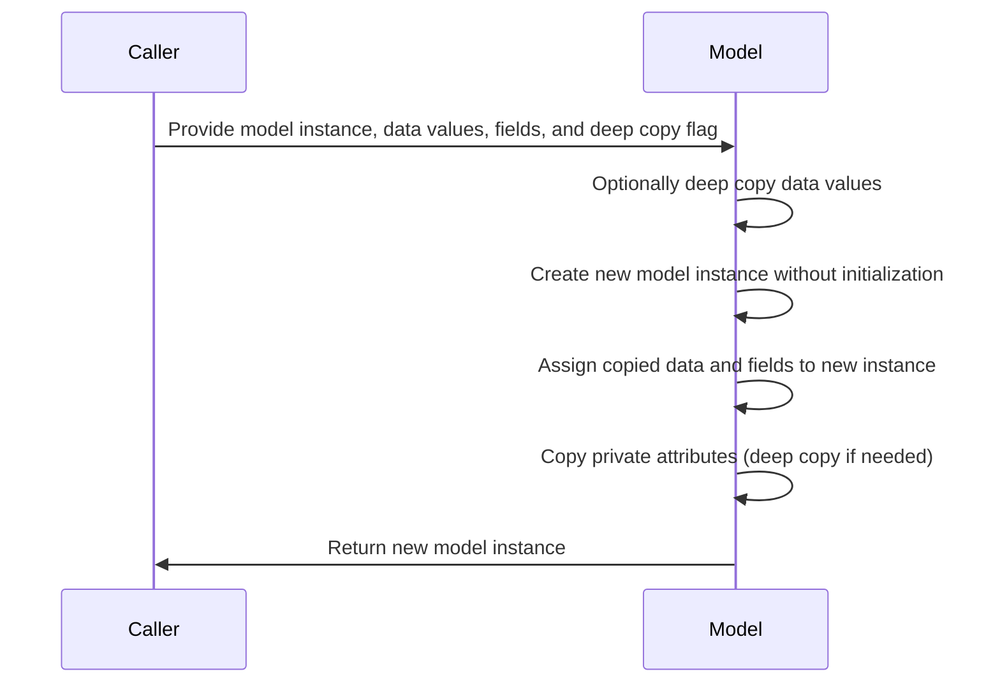
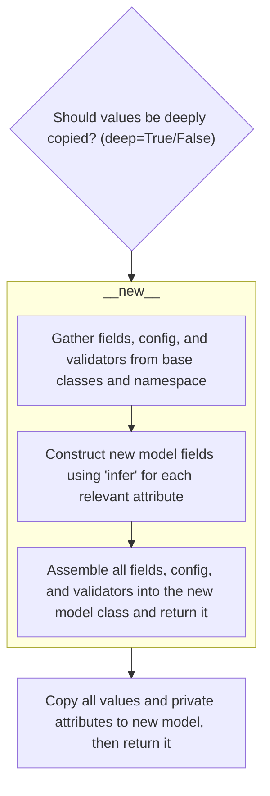
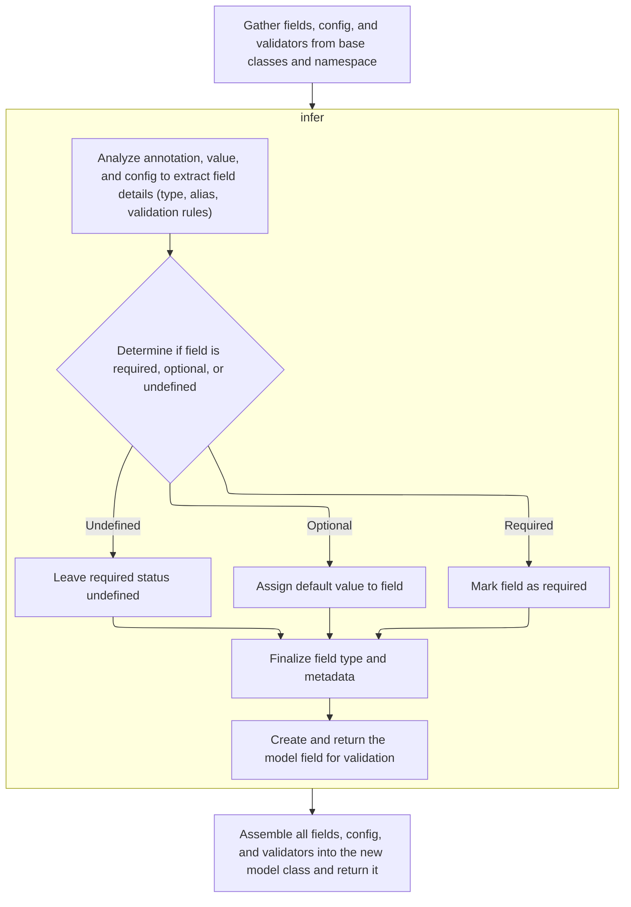
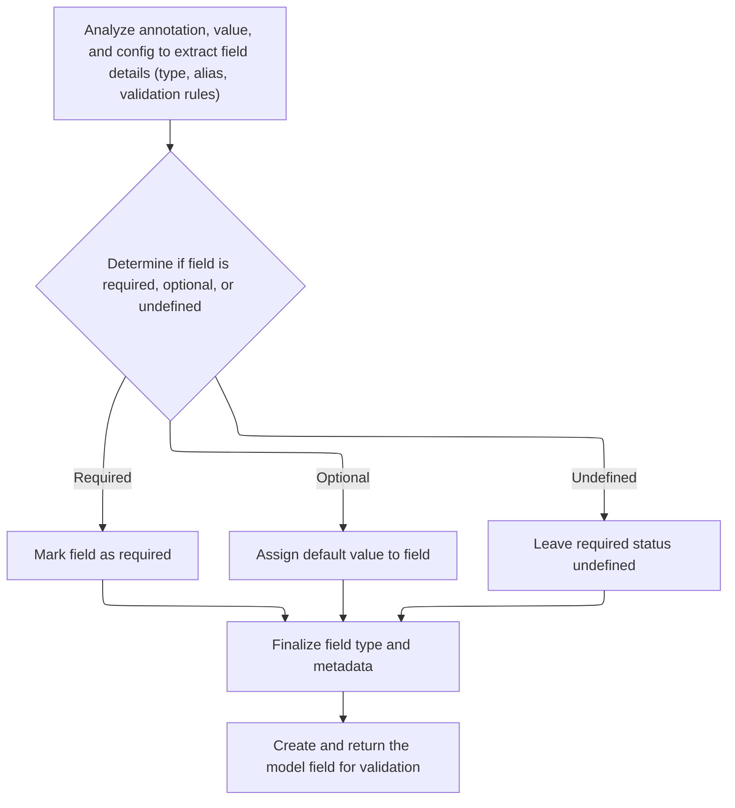

This flow outlines how to duplicate a model instance so that all data and private attributes are copied to a new instance, allowing independent use or modification. The process involves optionally deep copying the data, creating a new instance without initialization, assigning the copied data and fields, copying private attributes, and returning the new model.



# Spec

## Detailed View of the Program's Functionality

a. Deciding Whether to Deep Copy Model Values

The process begins by determining if the values dictionary (which holds the model's data) should be deeply copied. If deep copying is requested, a full, independent copy of the values is made. This ensures that the new model instance will not share mutable data structures with the original, preventing unintended side effects if either instance is modified later.

b. Creating a New Model Instance Without Initialization

Next, a new instance of the model's class is created, but crucially, this is done without calling the usual initialization logic. Instead, the low-level object creation method is used. This allows the code to set up the internal state of the new instance directly, bypassing any validation or setup that would normally occur in the constructor. This is important for copying, as it avoids re-validating or altering the data during the copy process.

c. Building Model Class Internals

When a new model class is created (for example, when defining a new model or subclass), the following steps are performed:

- The system gathers all fields, configuration settings, and validators from the base classes and the current class's namespace. This includes merging inherited fields and settings, and collecting any custom validation logic.
- For each attribute that should become a field, the system constructs a model field. This involves inferring the field's type, default value, alias, and validation rules, using both type annotations and any extra metadata provided.
- The system then assembles all the fields, configuration, and validators into the new model class, ensuring that it inherits everything it needs from its parent classes, except for the ultimate base model itself.

d. Inferring Field Metadata and Defaults

For each field, the system analyzes its annotation, value, and configuration to extract all relevant details. This includes:

- Determining if the field is required, optional, or has an undefined status, based on whether a default value or factory is provided.
- If the field is required, it is marked as such; if it has a default, that value is assigned; if neither, its required status remains undefined.
- The field's type and metadata are finalized, including any constraints or validation rules.
- A model field object is created, encapsulating all this information for use in validation and serialization.

e. Finalizing Model Class Creation

After all fields and configuration are processed, the system:

- Assembles the model class, including fields, validators, private attributes, and configuration.
- Checks if the model uses a custom root type (a special case where the model wraps a single value), and validates this setup.
- Sets up custom JSON encoders if specified, or defaults to the standard encoder.
- Creates the new model class, sets up its signature for introspection, and resolves any forward references in type annotations.
- Preserves special attribute protocols, such as those needed for private attributes, and returns the fully constructed model class.

f. Restoring Model Data and Private Attributes

Returning to the copying process, after the new instance is created:

- The internal dictionary and set of explicitly set fields are assigned directly to the new instance.
- For each private attribute defined on the model, its value is copied from the original instance to the new one. If deep copying is requested, these values are also deeply copied.
- The copying uses a low-level attribute setter to ensure that any special logic for private attributes is respected.

g. Returning the New Model Instance

Finally, the new model instance, now fully populated with copied data and private attributes, is returned. This instance is a complete, independent clone of the original, with all internal state and configuration preserved.

# Rule Definition

| Paragraph Name                                                                                                                                                                                                                                                                                                                                                                                                                                                                  | Rule ID | Category          | Description                                                                                                                                                                                                                                                                                                                                                                                                                                             | Conditions                                                                                                                                                                                                                | Remarks                                                                                                                                                                                                                                                                                                                                                                                                                                                                                                                                                                                                                                                        |
| ------------------------------------------------------------------------------------------------------------------------------------------------------------------------------------------------------------------------------------------------------------------------------------------------------------------------------------------------------------------------------------------------------------------------------------------------------------------------------- | ------- | ----------------- | ------------------------------------------------------------------------------------------------------------------------------------------------------------------------------------------------------------------------------------------------------------------------------------------------------------------------------------------------------------------------------------------------------------------------------------------------------- | ------------------------------------------------------------------------------------------------------------------------------------------------------------------------------------------------------------------------- | -------------------------------------------------------------------------------------------------------------------------------------------------------------------------------------------------------------------------------------------------------------------------------------------------------------------------------------------------------------------------------------------------------------------------------------------------------------------------------------------------------------------------------------------------------------------------------------------------------------------------------------------------------------- |
| BaseModel.copy, BaseModel.\_copy_and_set_values                                                                                                                                                                                                                                                                                                                                                                                                                                 | RL-001  | Computation       | The system must provide a mechanism to create a new instance of a model that is a copy of an existing instance, supporting both shallow and deep copy modes controlled by a boolean parameter named deep.                                                                                                                                                                                                                                               | A model instance exists and the copy method is called, with the deep parameter set to either True or False.                                                                                                               | If deep is True, all values and private attributes are deeply copied using deepcopy; if False, a shallow copy is performed. The new instance must not share mutable state with the original when deep is True.                                                                                                                                                                                                                                                                                                                                                                                                                                                 |
| BaseModel.\_copy_and_set_values                                                                                                                                                                                                                                                                                                                                                                                                                                                 | RL-002  | Conditional Logic | The copying process must not invoke the model’s initialization logic; instead, the new instance must be created in a way that allows direct assignment of internal state.                                                                                                                                                                                                                                                                               | A model instance is being copied.                                                                                                                                                                                         | The new instance is created using **new** and internal attributes (**dict**, <SwmToken path="pydantic/v1/main.py" pos="615:21:21" line-data="    def _copy_and_set_values(self: &#39;Model&#39;, values: &#39;DictStrAny&#39;, fields_set: &#39;SetStr&#39;, *, deep: bool) -&gt; &#39;Model&#39;:">`fields_set`</SwmToken>) are set directly.                                                                                                                                                                                                                                                                                                                 |
| BaseModel.\_copy_and_set_values                                                                                                                                                                                                                                                                                                                                                                                                                                                 | RL-003  | Data Assignment   | All field values and private attributes from the original instance must be copied to the new instance, using deep copy if deep is True.                                                                                                                                                                                                                                                                                                                 | A model instance is being copied.                                                                                                                                                                                         | Private attributes are listed in <SwmToken path="pydantic/v1/main.py" pos="129:1:1" line-data="        private_attributes: Dict[str, ModelPrivateAttr] = {}">`private_attributes`</SwmToken> and are handled separately from regular fields.                                                                                                                                                                                                                                                                                                                                                                                                                   |
| <SwmToken path="pydantic/v1/main.py" pos="113:5:5" line-data="# Note `ModelMetaclass` refers to `BaseModel`, but is also used to *create* `BaseModel`, so we need to add this extra">`ModelMetaclass`</SwmToken>.**new**                                                                                                                                                                                                                                                        | RL-004  | Computation       | The model class must be constructed by gathering fields, configuration, and validators from all base classes and the class namespace, merging them in reverse order of base classes.                                                                                                                                                                                                                                                                    | A new model class is being defined.                                                                                                                                                                                       | Merging is done in reverse order of base classes to ensure correct override precedence.                                                                                                                                                                                                                                                                                                                                                                                                                                                                                                                                                                        |
| <SwmToken path="pydantic/v1/main.py" pos="113:5:5" line-data="# Note `ModelMetaclass` refers to `BaseModel`, but is also used to *create* `BaseModel`, so we need to add this extra">`ModelMetaclass`</SwmToken>.**new**                                                                                                                                                                                                                                                        | RL-005  | Conditional Logic | If both a Config class and configuration keyword arguments are provided in the class namespace, the system must raise an error to prevent ambiguity.                                                                                                                                                                                                                                                                                                    | Both a Config class and config keyword arguments are present in the namespace.                                                                                                                                            | Raises <SwmToken path="pydantic/v1/main.py" pos="156:3:3" line-data="            raise TypeError(&#39;Specifying config in two places is ambiguous, use either Config attribute or class kwargs&#39;)">`TypeError`</SwmToken> with a descriptive message.                                                                                                                                                                                                                                                                                                                                                                                                      |
| <SwmToken path="pydantic/v1/main.py" pos="113:5:5" line-data="# Note `ModelMetaclass` refers to `BaseModel`, but is also used to *create* `BaseModel`, so we need to add this extra">`ModelMetaclass`</SwmToken>.**new**, <SwmToken path="pydantic/v1/main.py" pos="197:8:10" line-data="                    fields[ann_name] = ModelField.infer(">`ModelField.infer`</SwmToken>, ModelField.\_get_field_info                                                                   | RL-006  | Computation       | Each field in the model must be constructed by analyzing its annotation, default value, and config, extracting metadata such as type, alias, and validation rules. Annotated types and <SwmToken path="pydantic/v1/fields.py" pos="442:7:7" line-data="    ) -&gt; Tuple[FieldInfo, Any]:">`FieldInfo`</SwmToken> are handled according to their presence.                                                                                              | A field is being defined in the model class.                                                                                                                                                                              | If annotation is Annotated with <SwmToken path="pydantic/v1/fields.py" pos="442:7:7" line-data="    ) -&gt; Tuple[FieldInfo, Any]:">`FieldInfo`</SwmToken>, use that <SwmToken path="pydantic/v1/fields.py" pos="442:7:7" line-data="    ) -&gt; Tuple[FieldInfo, Any]:">`FieldInfo`</SwmToken> and merge config. If value is a <SwmToken path="pydantic/v1/fields.py" pos="442:7:7" line-data="    ) -&gt; Tuple[FieldInfo, Any]:">`FieldInfo`</SwmToken>, use it and merge config. Otherwise, create a new <SwmToken path="pydantic/v1/fields.py" pos="442:7:7" line-data="    ) -&gt; Tuple[FieldInfo, Any]:">`FieldInfo`</SwmToken> from value and config. |
| <SwmToken path="pydantic/v1/main.py" pos="197:8:10" line-data="                    fields[ann_name] = ModelField.infer(">`ModelField.infer`</SwmToken>                                                                                                                                                                                                                                                                                                                          | RL-007  | Computation       | For each field, the system must determine if it is required (no default), optional (has a default), or undefined (no value or default).                                                                                                                                                                                                                                                                                                                 | A field is being constructed.                                                                                                                                                                                             | Required if value is Required, optional if value is not Undefined, undefined otherwise.                                                                                                                                                                                                                                                                                                                                                                                                                                                                                                                                                                        |
| <SwmToken path="pydantic/v1/main.py" pos="197:8:10" line-data="                    fields[ann_name] = ModelField.infer(">`ModelField.infer`</SwmToken>, ModelField.\_get_field_info, <SwmToken path="pydantic/v1/fields.py" pos="442:7:7" line-data="    ) -&gt; Tuple[FieldInfo, Any]:">`FieldInfo`</SwmToken>                                                                                                                                                                 | RL-008  | Data Assignment   | Each field must be associated with a <SwmToken path="pydantic/v1/fields.py" pos="442:7:7" line-data="    ) -&gt; Tuple[FieldInfo, Any]:">`FieldInfo`</SwmToken> object that contains all metadata and constraints, including any config-provided defaults, aliases, and validation rules.                                                                                                                                                               | A field is being constructed.                                                                                                                                                                                             | <SwmToken path="pydantic/v1/fields.py" pos="442:7:7" line-data="    ) -&gt; Tuple[FieldInfo, Any]:">`FieldInfo`</SwmToken> is updated from config using <SwmToken path="pydantic/v1/fields.py" pos="465:3:3" line-data="                field_info.update_from_config(field_info_from_config)">`update_from_config`</SwmToken>.                                                                                                                                                                                                                                                                                                                                |
| <SwmToken path="pydantic/v1/main.py" pos="197:8:10" line-data="                    fields[ann_name] = ModelField.infer(">`ModelField.infer`</SwmToken>, FieldInfo.\_validate                                                                                                                                                                                                                                                                                                    | RL-009  | Conditional Logic | The system must handle default factories for fields and validate the resulting <SwmToken path="pydantic/v1/fields.py" pos="442:7:7" line-data="    ) -&gt; Tuple[FieldInfo, Any]:">`FieldInfo`</SwmToken>, ensuring both default and <SwmToken path="pydantic/v1/fields.py" pos="479:11:11" line-data="        value = None if field_info.default_factory is not None else field_info.default">`default_factory`</SwmToken> are not set simultaneously. | A field is being constructed with <SwmToken path="pydantic/v1/fields.py" pos="479:11:11" line-data="        value = None if field_info.default_factory is not None else field_info.default">`default_factory`</SwmToken>. | Raises <SwmToken path="pydantic/v1/fields.py" pos="461:3:3" line-data="                raise ValueError(f&#39;cannot specify multiple `Annotated` `Field`s for {field_name!r}&#39;)">`ValueError`</SwmToken> if both default and <SwmToken path="pydantic/v1/fields.py" pos="479:11:11" line-data="        value = None if field_info.default_factory is not None else field_info.default">`default_factory`</SwmToken> are set.                                                                                                                                                                                                                               |
| <SwmToken path="pydantic/v1/main.py" pos="197:8:10" line-data="                    fields[ann_name] = ModelField.infer(">`ModelField.infer`</SwmToken>                                                                                                                                                                                                                                                                                                                          | RL-010  | Data Assignment   | The system must update the field’s annotation to reflect any constraints or validation rules from the <SwmToken path="pydantic/v1/fields.py" pos="442:7:7" line-data="    ) -&gt; Tuple[FieldInfo, Any]:">`FieldInfo`</SwmToken>.                                                                                                                                                                                                                       | A field is being constructed.                                                                                                                                                                                             | Uses <SwmToken path="pydantic/v1/fields.py" pos="493:11:11" line-data="        from pydantic.v1.schema import get_annotation_from_field_info">`get_annotation_from_field_info`</SwmToken> to update annotation.                                                                                                                                                                                                                                                                                                                                                                                                                                                |
| <SwmToken path="pydantic/v1/main.py" pos="124:9:9" line-data="        fields: Dict[str, ModelField] = {}">`ModelField`</SwmToken>, <SwmToken path="pydantic/v1/main.py" pos="113:5:5" line-data="# Note `ModelMetaclass` refers to `BaseModel`, but is also used to *create* `BaseModel`, so we need to add this extra">`ModelMetaclass`</SwmToken>.**new**                                                                                                                     | RL-011  | Data Assignment   | Each field must be represented internally by an object containing its name, type, default value, required/optional status, alias, validators, config, and <SwmToken path="pydantic/v1/fields.py" pos="442:7:7" line-data="    ) -&gt; Tuple[FieldInfo, Any]:">`FieldInfo`</SwmToken>.                                                                                                                                                                   | A field is being constructed.                                                                                                                                                                                             | <SwmToken path="pydantic/v1/main.py" pos="124:9:9" line-data="        fields: Dict[str, ModelField] = {}">`ModelField`</SwmToken> object holds all relevant metadata.                                                                                                                                                                                                                                                                                                                                                                                                                                                                                          |
| <SwmToken path="pydantic/v1/main.py" pos="113:5:5" line-data="# Note `ModelMetaclass` refers to `BaseModel`, but is also used to *create* `BaseModel`, so we need to add this extra">`ModelMetaclass`</SwmToken>.**new**, BaseModel.\_init_private_attributes, <SwmToken path="pydantic/v1/main.py" pos="129:9:9" line-data="        private_attributes: Dict[str, ModelPrivateAttr] = {}">`ModelPrivateAttr`</SwmToken>                                                        | RL-012  | Data Assignment   | The model class must support private attributes, which are managed separately from regular fields.                                                                                                                                                                                                                                                                                                                                                      | A model class is being constructed or an instance is being initialized/copied.                                                                                                                                            | Private attributes are stored in <SwmToken path="pydantic/v1/main.py" pos="129:1:1" line-data="        private_attributes: Dict[str, ModelPrivateAttr] = {}">`private_attributes`</SwmToken> and initialized via <SwmToken path="pydantic/v1/main.py" pos="355:3:3" line-data="        __pydantic_self__._init_private_attributes()">`_init_private_attributes`</SwmToken>.                                                                                                                                                                                                                                                                                    |
| <SwmToken path="pydantic/v1/main.py" pos="113:5:5" line-data="# Note `ModelMetaclass` refers to `BaseModel`, but is also used to *create* `BaseModel`, so we need to add this extra">`ModelMetaclass`</SwmToken>.**new**, BaseModel.json                                                                                                                                                                                                                                        | RL-013  | Data Assignment   | The model class must support custom root types and custom JSON encoders, as specified in the configuration.                                                                                                                                                                                                                                                                                                                                             | A model class is being constructed or serialized.                                                                                                                                                                         | Custom root type is indicated by <SwmToken path="pydantic/v1/main.py" pos="238:5:5" line-data="        _custom_root_type = ROOT_KEY in fields">`ROOT_KEY`</SwmToken> in fields; custom JSON encoder is set in <SwmToken path="pydantic/v1/main.py" pos="243:1:1" line-data="            json_encoder = partial(custom_pydantic_encoder, config.json_encoders)">`json_encoder`</SwmToken>.                                                                                                                                                                                                                                                                      |
| <SwmToken path="pydantic/v1/main.py" pos="113:5:5" line-data="# Note `ModelMetaclass` refers to `BaseModel`, but is also used to *create* `BaseModel`, so we need to add this extra">`ModelMetaclass`</SwmToken>.**new**, <SwmToken path="pydantic/v1/main.py" pos="137:12:12" line-data="            if _is_base_model_class_defined and issubclass(base, BaseModel) and base != BaseModel:">`BaseModel`</SwmToken>.**try_update_forward_refs**, BaseModel.update_forward_refs | RL-014  | Computation       | The model class must resolve forward references in type annotations if required.                                                                                                                                                                                                                                                                                                                                                                        | A model class is being constructed or <SwmToken path="pydantic/v1/main.py" pos="810:5:5" line-data="        Same as update_forward_refs but will not raise exception">`update_forward_refs`</SwmToken> is called.         | <SwmToken path="pydantic/v1/main.py" pos="54:1:1" line-data="    update_model_forward_refs,">`update_model_forward_refs`</SwmToken> is used to resolve references.                                                                                                                                                                                                                                                                                                                                                                                                                                                                                             |
| <SwmToken path="pydantic/v1/main.py" pos="113:5:5" line-data="# Note `ModelMetaclass` refers to `BaseModel`, but is also used to *create* `BaseModel`, so we need to add this extra">`ModelMetaclass`</SwmToken>.**new**                                                                                                                                                                                                                                                        | RL-015  | Data Assignment   | The model class must preserve attribute protocols (such as <SwmToken path="pydantic/v1/main.py" pos="298:1:1" line-data="                set_name = getattr(obj, &#39;__set_name__&#39;, None)">`set_name`</SwmToken>) for any attributes not present in the new class.                                                                                                                                                                                 | A model class is being constructed.                                                                                                                                                                                       | If an attribute in the namespace is not in the new class namespace, call its <SwmToken path="pydantic/v1/main.py" pos="298:1:1" line-data="                set_name = getattr(obj, &#39;__set_name__&#39;, None)">`set_name`</SwmToken> if present.                                                                                                                                                                                                                                                                                                                                                                                                            |
| <SwmToken path="pydantic/v1/main.py" pos="113:5:5" line-data="# Note `ModelMetaclass` refers to `BaseModel`, but is also used to *create* `BaseModel`, so we need to add this extra">`ModelMetaclass`</SwmToken>.**new**                                                                                                                                                                                                                                                        | RL-016  | Data Assignment   | The final model class must be returned fully configured, with all fields, config, validators, and special attribute handling in place.                                                                                                                                                                                                                                                                                                                  | A model class is being constructed.                                                                                                                                                                                       | All merged fields, config, validators, private attributes, and special attributes are set in the class namespace.                                                                                                                                                                                                                                                                                                                                                                                                                                                                                                                                              |
| BaseModel.copy, BaseModel.\_copy_and_set_values                                                                                                                                                                                                                                                                                                                                                                                                                                 | RL-017  | Computation       | The copy operation must return a new model instance that is a full clone of the original, including all internal state and private attributes.                                                                                                                                                                                                                                                                                                          | A model instance is being copied.                                                                                                                                                                                         | The returned instance has all field values, <SwmToken path="pydantic/v1/main.py" pos="615:21:21" line-data="    def _copy_and_set_values(self: &#39;Model&#39;, values: &#39;DictStrAny&#39;, fields_set: &#39;SetStr&#39;, *, deep: bool) -&gt; &#39;Model&#39;:">`fields_set`</SwmToken>, and private attributes cloned.                                                                                                                                                                                                                                                                                                                                     |

# User Stories

## User Story 1: Copying a model instance (deep and shallow)

---

### Story Description:

As a user, I want to create a copy of a model instance, with the option for deep or shallow copying, so that I can safely duplicate models without unintended shared state, including all field values and private attributes.

---

### Business Rule Mapping:

| Rule ID | Paragraph Name                                  | Rule Description                                                                                                                                                                                          |
| ------- | ----------------------------------------------- | --------------------------------------------------------------------------------------------------------------------------------------------------------------------------------------------------------- |
| RL-001  | BaseModel.copy, BaseModel.\_copy_and_set_values | The system must provide a mechanism to create a new instance of a model that is a copy of an existing instance, supporting both shallow and deep copy modes controlled by a boolean parameter named deep. |
| RL-017  | BaseModel.copy, BaseModel.\_copy_and_set_values | The copy operation must return a new model instance that is a full clone of the original, including all internal state and private attributes.                                                            |
| RL-002  | BaseModel.\_copy_and_set_values                 | The copying process must not invoke the model’s initialization logic; instead, the new instance must be created in a way that allows direct assignment of internal state.                                 |
| RL-003  | BaseModel.\_copy_and_set_values                 | All field values and private attributes from the original instance must be copied to the new instance, using deep copy if deep is True.                                                                   |

---

### Relevant Functionality:

- **BaseModel.copy**
  1. **RL-001:**
     - When copy() is called:
       - Gather current field values (optionally filtered by include/exclude/update).
       - Determine <SwmToken path="pydantic/v1/main.py" pos="615:21:21" line-data="    def _copy_and_set_values(self: &#39;Model&#39;, values: &#39;DictStrAny&#39;, fields_set: &#39;SetStr&#39;, *, deep: bool) -&gt; &#39;Model&#39;:">`fields_set`</SwmToken> for the new instance.
       - Call <SwmToken path="pydantic/v1/main.py" pos="615:3:3" line-data="    def _copy_and_set_values(self: &#39;Model&#39;, values: &#39;DictStrAny&#39;, fields_set: &#39;SetStr&#39;, *, deep: bool) -&gt; &#39;Model&#39;:">`_copy_and_set_values`</SwmToken> with values, <SwmToken path="pydantic/v1/main.py" pos="615:21:21" line-data="    def _copy_and_set_values(self: &#39;Model&#39;, values: &#39;DictStrAny&#39;, fields_set: &#39;SetStr&#39;, *, deep: bool) -&gt; &#39;Model&#39;:">`fields_set`</SwmToken>, and deep parameter.
     - In <SwmToken path="pydantic/v1/main.py" pos="615:3:3" line-data="    def _copy_and_set_values(self: &#39;Model&#39;, values: &#39;DictStrAny&#39;, fields_set: &#39;SetStr&#39;, *, deep: bool) -&gt; &#39;Model&#39;:">`_copy_and_set_values`</SwmToken>:
       - If deep is True, deepcopy the values dict.
       - Create a new instance without calling **init**.
       - Assign **dict** and <SwmToken path="pydantic/v1/main.py" pos="615:21:21" line-data="    def _copy_and_set_values(self: &#39;Model&#39;, values: &#39;DictStrAny&#39;, fields_set: &#39;SetStr&#39;, *, deep: bool) -&gt; &#39;Model&#39;:">`fields_set`</SwmToken> directly.
       - For each private attribute:
         - Get its value from the original instance.
         - If deep is True, deepcopy the value.
         - Assign it directly to the new instance.
       - Return the new instance.
  2. **RL-017:**
     - Gather values and <SwmToken path="pydantic/v1/main.py" pos="615:21:21" line-data="    def _copy_and_set_values(self: &#39;Model&#39;, values: &#39;DictStrAny&#39;, fields_set: &#39;SetStr&#39;, *, deep: bool) -&gt; &#39;Model&#39;:">`fields_set`</SwmToken> from the original instance (optionally updated).
     - Call <SwmToken path="pydantic/v1/main.py" pos="615:3:3" line-data="    def _copy_and_set_values(self: &#39;Model&#39;, values: &#39;DictStrAny&#39;, fields_set: &#39;SetStr&#39;, *, deep: bool) -&gt; &#39;Model&#39;:">`_copy_and_set_values`</SwmToken> to create the new instance with all state and private attributes.
- **BaseModel.\_copy_and_set_values**
  1. **RL-002:**
     - Use cls.**new**(cls) to create a new instance without calling **init**.
     - Assign **dict** and <SwmToken path="pydantic/v1/main.py" pos="615:21:21" line-data="    def _copy_and_set_values(self: &#39;Model&#39;, values: &#39;DictStrAny&#39;, fields_set: &#39;SetStr&#39;, *, deep: bool) -&gt; &#39;Model&#39;:">`fields_set`</SwmToken> directly using <SwmToken path="pydantic/v1/main.py" pos="622:1:1" line-data="        object_setattr(m, &#39;__dict__&#39;, values)">`object_setattr`</SwmToken>.
  2. **RL-003:**
     - For each private attribute name in <SwmToken path="pydantic/v1/main.py" pos="129:1:1" line-data="        private_attributes: Dict[str, ModelPrivateAttr] = {}">`private_attributes`</SwmToken>:
       - Get the value from the original instance.
       - If value is not Undefined:
         - If deep is True, deepcopy the value.
         - Assign it to the new instance using <SwmToken path="pydantic/v1/main.py" pos="622:1:1" line-data="        object_setattr(m, &#39;__dict__&#39;, values)">`object_setattr`</SwmToken>.

## User Story 2: Constructing a model class with merged configuration and validation

---

### Story Description:

As a system, I want to construct a model class by gathering and merging fields, configuration, and validators from all base classes and the class namespace, resolving conflicts and forward references, so that the resulting model class is fully configured and ready for use.

---

### Business Rule Mapping:

| Rule ID | Paragraph Name                                                                                                                                                                                                                                                                                                                                                                                                                                                                  | Rule Description                                                                                                                                                                                                                                                        |
| ------- | ------------------------------------------------------------------------------------------------------------------------------------------------------------------------------------------------------------------------------------------------------------------------------------------------------------------------------------------------------------------------------------------------------------------------------------------------------------------------------- | ----------------------------------------------------------------------------------------------------------------------------------------------------------------------------------------------------------------------------------------------------------------------- |
| RL-004  | <SwmToken path="pydantic/v1/main.py" pos="113:5:5" line-data="# Note `ModelMetaclass` refers to `BaseModel`, but is also used to *create* `BaseModel`, so we need to add this extra">`ModelMetaclass`</SwmToken>.**new**                                                                                                                                                                                                                                                        | The model class must be constructed by gathering fields, configuration, and validators from all base classes and the class namespace, merging them in reverse order of base classes.                                                                                    |
| RL-005  | <SwmToken path="pydantic/v1/main.py" pos="113:5:5" line-data="# Note `ModelMetaclass` refers to `BaseModel`, but is also used to *create* `BaseModel`, so we need to add this extra">`ModelMetaclass`</SwmToken>.**new**                                                                                                                                                                                                                                                        | If both a Config class and configuration keyword arguments are provided in the class namespace, the system must raise an error to prevent ambiguity.                                                                                                                    |
| RL-014  | <SwmToken path="pydantic/v1/main.py" pos="113:5:5" line-data="# Note `ModelMetaclass` refers to `BaseModel`, but is also used to *create* `BaseModel`, so we need to add this extra">`ModelMetaclass`</SwmToken>.**new**, <SwmToken path="pydantic/v1/main.py" pos="137:12:12" line-data="            if _is_base_model_class_defined and issubclass(base, BaseModel) and base != BaseModel:">`BaseModel`</SwmToken>.**try_update_forward_refs**, BaseModel.update_forward_refs | The model class must resolve forward references in type annotations if required.                                                                                                                                                                                        |
| RL-015  | <SwmToken path="pydantic/v1/main.py" pos="113:5:5" line-data="# Note `ModelMetaclass` refers to `BaseModel`, but is also used to *create* `BaseModel`, so we need to add this extra">`ModelMetaclass`</SwmToken>.**new**                                                                                                                                                                                                                                                        | The model class must preserve attribute protocols (such as <SwmToken path="pydantic/v1/main.py" pos="298:1:1" line-data="                set_name = getattr(obj, &#39;__set_name__&#39;, None)">`set_name`</SwmToken>) for any attributes not present in the new class. |
| RL-016  | <SwmToken path="pydantic/v1/main.py" pos="113:5:5" line-data="# Note `ModelMetaclass` refers to `BaseModel`, but is also used to *create* `BaseModel`, so we need to add this extra">`ModelMetaclass`</SwmToken>.**new**                                                                                                                                                                                                                                                        | The final model class must be returned fully configured, with all fields, config, validators, and special attribute handling in place.                                                                                                                                  |
| RL-013  | <SwmToken path="pydantic/v1/main.py" pos="113:5:5" line-data="# Note `ModelMetaclass` refers to `BaseModel`, but is also used to *create* `BaseModel`, so we need to add this extra">`ModelMetaclass`</SwmToken>.**new**, BaseModel.json                                                                                                                                                                                                                                        | The model class must support custom root types and custom JSON encoders, as specified in the configuration.                                                                                                                                                             |
| RL-012  | <SwmToken path="pydantic/v1/main.py" pos="113:5:5" line-data="# Note `ModelMetaclass` refers to `BaseModel`, but is also used to *create* `BaseModel`, so we need to add this extra">`ModelMetaclass`</SwmToken>.**new**, BaseModel.\_init_private_attributes, <SwmToken path="pydantic/v1/main.py" pos="129:9:9" line-data="        private_attributes: Dict[str, ModelPrivateAttr] = {}">`ModelPrivateAttr`</SwmToken>                                                        | The model class must support private attributes, which are managed separately from regular fields.                                                                                                                                                                      |

---

### Relevant Functionality:

- **ModelMetaclass.new**
  1. **RL-004:**
     - For each base in reversed(bases):
       - Update fields, config, validators, root validators, and private attributes from the base.
     - Extract validators from the namespace and merge with inherited validators.
     - Merge config from base, namespace Config, and keyword arguments.
  2. **RL-005:**
     - If <SwmToken path="pydantic/v1/main.py" pos="153:1:1" line-data="        config_kwargs = {key: kwargs.pop(key) for key in kwargs.keys() &amp; allowed_config_kwargs}">`config_kwargs`</SwmToken> and <SwmToken path="pydantic/v1/main.py" pos="154:1:1" line-data="        config_from_namespace = namespace.get(&#39;Config&#39;)">`config_from_namespace`</SwmToken> are both present:
       - Raise <SwmToken path="pydantic/v1/main.py" pos="156:3:3" line-data="            raise TypeError(&#39;Specifying config in two places is ambiguous, use either Config attribute or class kwargs&#39;)">`TypeError`</SwmToken>('Specifying config in two places is ambiguous, use either Config attribute or class kwargs')
  3. **RL-014:**
     - On class construction, if <SwmToken path="pydantic/v1/main.py" pos="147:1:1" line-data="        resolve_forward_refs = kwargs.pop(&#39;__resolve_forward_refs__&#39;, True)">`resolve_forward_refs`</SwmToken> is True, call **try_update_forward_refs**.
     - <SwmToken path="pydantic/v1/main.py" pos="810:5:5" line-data="        Same as update_forward_refs but will not raise exception">`update_forward_refs`</SwmToken> can be called explicitly to update references.
  4. **RL-015:**
     - For each name, obj in <SwmToken path="pydantic/v1/main.py" pos="208:10:14" line-data="            for var_name, value in namespace.items():">`namespace.items()`</SwmToken>:
       - If name not in <SwmToken path="pydantic/v1/main.py" pos="252:1:1" line-data="        new_namespace = {">`new_namespace`</SwmToken> and obj has <SwmToken path="pydantic/v1/main.py" pos="298:1:1" line-data="                set_name = getattr(obj, &#39;__set_name__&#39;, None)">`set_name`</SwmToken>:
         - Call obj.<SwmToken path="pydantic/v1/main.py" pos="298:1:1" line-data="                set_name = getattr(obj, &#39;__set_name__&#39;, None)">`set_name`</SwmToken>(cls, name)
  5. **RL-016:**
     - After merging and setting all fields, config, validators, and attributes, call super().**new** to create the class and return it.
  6. **RL-013:**
     - If <SwmToken path="pydantic/v1/main.py" pos="238:5:5" line-data="        _custom_root_type = ROOT_KEY in fields">`ROOT_KEY`</SwmToken> in fields, set **custom_root_type** to True.
     - If <SwmToken path="pydantic/v1/main.py" pos="242:3:5" line-data="        if config.json_encoders:">`config.json_encoders`</SwmToken> is set, use <SwmToken path="pydantic/v1/main.py" pos="243:7:7" line-data="            json_encoder = partial(custom_pydantic_encoder, config.json_encoders)">`custom_pydantic_encoder`</SwmToken>; otherwise, use default encoder.
  7. **RL-012:**
     - During class construction, collect private attributes from namespace and bases.
     - On instance initialization or copy, call <SwmToken path="pydantic/v1/main.py" pos="355:3:3" line-data="        __pydantic_self__._init_private_attributes()">`_init_private_attributes`</SwmToken> to set private attribute values.

## User Story 3: Field construction and metadata extraction

---

### Story Description:

As a system, I want to construct each field in the model by analyzing its annotation, default value, and config, extracting all relevant metadata and constraints, so that each field is properly validated, represented, and integrated into the model.

---

### Business Rule Mapping:

| Rule ID | Paragraph Name                                                                                                                                                                                                                                                                                                                                                                                                | Rule Description                                                                                                                                                                                                                                                                                                                                                                                                                                        |
| ------- | ------------------------------------------------------------------------------------------------------------------------------------------------------------------------------------------------------------------------------------------------------------------------------------------------------------------------------------------------------------------------------------------------------------- | ------------------------------------------------------------------------------------------------------------------------------------------------------------------------------------------------------------------------------------------------------------------------------------------------------------------------------------------------------------------------------------------------------------------------------------------------------- |
| RL-006  | <SwmToken path="pydantic/v1/main.py" pos="113:5:5" line-data="# Note `ModelMetaclass` refers to `BaseModel`, but is also used to *create* `BaseModel`, so we need to add this extra">`ModelMetaclass`</SwmToken>.**new**, <SwmToken path="pydantic/v1/main.py" pos="197:8:10" line-data="                    fields[ann_name] = ModelField.infer(">`ModelField.infer`</SwmToken>, ModelField.\_get_field_info | Each field in the model must be constructed by analyzing its annotation, default value, and config, extracting metadata such as type, alias, and validation rules. Annotated types and <SwmToken path="pydantic/v1/fields.py" pos="442:7:7" line-data="    ) -&gt; Tuple[FieldInfo, Any]:">`FieldInfo`</SwmToken> are handled according to their presence.                                                                                              |
| RL-007  | <SwmToken path="pydantic/v1/main.py" pos="197:8:10" line-data="                    fields[ann_name] = ModelField.infer(">`ModelField.infer`</SwmToken>                                                                                                                                                                                                                                                        | For each field, the system must determine if it is required (no default), optional (has a default), or undefined (no value or default).                                                                                                                                                                                                                                                                                                                 |
| RL-008  | <SwmToken path="pydantic/v1/main.py" pos="197:8:10" line-data="                    fields[ann_name] = ModelField.infer(">`ModelField.infer`</SwmToken>, ModelField.\_get_field_info, <SwmToken path="pydantic/v1/fields.py" pos="442:7:7" line-data="    ) -&gt; Tuple[FieldInfo, Any]:">`FieldInfo`</SwmToken>                                                                                               | Each field must be associated with a <SwmToken path="pydantic/v1/fields.py" pos="442:7:7" line-data="    ) -&gt; Tuple[FieldInfo, Any]:">`FieldInfo`</SwmToken> object that contains all metadata and constraints, including any config-provided defaults, aliases, and validation rules.                                                                                                                                                               |
| RL-009  | <SwmToken path="pydantic/v1/main.py" pos="197:8:10" line-data="                    fields[ann_name] = ModelField.infer(">`ModelField.infer`</SwmToken>, FieldInfo.\_validate                                                                                                                                                                                                                                  | The system must handle default factories for fields and validate the resulting <SwmToken path="pydantic/v1/fields.py" pos="442:7:7" line-data="    ) -&gt; Tuple[FieldInfo, Any]:">`FieldInfo`</SwmToken>, ensuring both default and <SwmToken path="pydantic/v1/fields.py" pos="479:11:11" line-data="        value = None if field_info.default_factory is not None else field_info.default">`default_factory`</SwmToken> are not set simultaneously. |
| RL-010  | <SwmToken path="pydantic/v1/main.py" pos="197:8:10" line-data="                    fields[ann_name] = ModelField.infer(">`ModelField.infer`</SwmToken>                                                                                                                                                                                                                                                        | The system must update the field’s annotation to reflect any constraints or validation rules from the <SwmToken path="pydantic/v1/fields.py" pos="442:7:7" line-data="    ) -&gt; Tuple[FieldInfo, Any]:">`FieldInfo`</SwmToken>.                                                                                                                                                                                                                       |
| RL-011  | <SwmToken path="pydantic/v1/main.py" pos="124:9:9" line-data="        fields: Dict[str, ModelField] = {}">`ModelField`</SwmToken>, <SwmToken path="pydantic/v1/main.py" pos="113:5:5" line-data="# Note `ModelMetaclass` refers to `BaseModel`, but is also used to *create* `BaseModel`, so we need to add this extra">`ModelMetaclass`</SwmToken>.**new**                                                   | Each field must be represented internally by an object containing its name, type, default value, required/optional status, alias, validators, config, and <SwmToken path="pydantic/v1/fields.py" pos="442:7:7" line-data="    ) -&gt; Tuple[FieldInfo, Any]:">`FieldInfo`</SwmToken>.                                                                                                                                                                   |

---

### Relevant Functionality:

- **ModelMetaclass.new**
  1. **RL-006:**
     - For each field:
       - If annotation is Annotated with <SwmToken path="pydantic/v1/fields.py" pos="442:7:7" line-data="    ) -&gt; Tuple[FieldInfo, Any]:">`FieldInfo`</SwmToken>:
         - Use <SwmToken path="pydantic/v1/fields.py" pos="442:7:7" line-data="    ) -&gt; Tuple[FieldInfo, Any]:">`FieldInfo`</SwmToken> from annotation, merge config, set default from value if present.
       - Else if value is <SwmToken path="pydantic/v1/fields.py" pos="442:7:7" line-data="    ) -&gt; Tuple[FieldInfo, Any]:">`FieldInfo`</SwmToken>:
         - Use value as <SwmToken path="pydantic/v1/fields.py" pos="442:7:7" line-data="    ) -&gt; Tuple[FieldInfo, Any]:">`FieldInfo`</SwmToken>, merge config.
       - Else:
         - Create new <SwmToken path="pydantic/v1/fields.py" pos="442:7:7" line-data="    ) -&gt; Tuple[FieldInfo, Any]:">`FieldInfo`</SwmToken> from value and config.
       - Determine required/optional status based on default/Required/Undefined.
       - Validate <SwmToken path="pydantic/v1/fields.py" pos="442:7:7" line-data="    ) -&gt; Tuple[FieldInfo, Any]:">`FieldInfo`</SwmToken>.
- <SwmToken path="pydantic/v1/main.py" pos="197:8:10" line-data="                    fields[ann_name] = ModelField.infer(">`ModelField.infer`</SwmToken>
  1. **RL-007:**
     - If value is Required:
       - required = True
     - Else if value is not Undefined:
       - required = False
     - Else:
       - required = Undefined
  2. **RL-008:**
     - Obtain <SwmToken path="pydantic/v1/fields.py" pos="442:7:7" line-data="    ) -&gt; Tuple[FieldInfo, Any]:">`FieldInfo`</SwmToken> from annotation, value, or create new.
     - Update <SwmToken path="pydantic/v1/fields.py" pos="442:7:7" line-data="    ) -&gt; Tuple[FieldInfo, Any]:">`FieldInfo`</SwmToken> from config using <SwmToken path="pydantic/v1/fields.py" pos="465:3:3" line-data="                field_info.update_from_config(field_info_from_config)">`update_from_config`</SwmToken>.
  3. **RL-009:**
     - If FieldInfo.default is not Undefined and FieldInfo.default_factory is not None:
       - Raise <SwmToken path="pydantic/v1/fields.py" pos="461:3:3" line-data="                raise ValueError(f&#39;cannot specify multiple `Annotated` `Field`s for {field_name!r}&#39;)">`ValueError`</SwmToken>('cannot specify both default and <SwmToken path="pydantic/v1/fields.py" pos="479:11:11" line-data="        value = None if field_info.default_factory is not None else field_info.default">`default_factory`</SwmToken>')
  4. **RL-010:**
     - Update annotation using <SwmToken path="pydantic/v1/fields.py" pos="493:11:11" line-data="        from pydantic.v1.schema import get_annotation_from_field_info">`get_annotation_from_field_info`</SwmToken>(annotation, <SwmToken path="pydantic/v1/main.py" pos="256:6:6" line-data="                name: field.field_info.exclude for name, field in fields.items() if field.field_info.exclude is not None">`field_info`</SwmToken>, name, <SwmToken path="pydantic/v1/fields.py" pos="502:16:18" line-data="        annotation = get_annotation_from_field_info(annotation, field_info, name, config.validate_assignment)">`config.validate_assignment`</SwmToken>)
- <SwmToken path="pydantic/v1/main.py" pos="124:9:9" line-data="        fields: Dict[str, ModelField] = {}">`ModelField`</SwmToken>
  1. **RL-011:**
     - Construct <SwmToken path="pydantic/v1/main.py" pos="124:9:9" line-data="        fields: Dict[str, ModelField] = {}">`ModelField`</SwmToken> with name, type, alias, validators, default, required, config, and <SwmToken path="pydantic/v1/fields.py" pos="442:7:7" line-data="    ) -&gt; Tuple[FieldInfo, Any]:">`FieldInfo`</SwmToken>.

# Code Walkthrough

## Copying Model State



<SwmSnippet path="/pydantic/v1/main.py" line="615">

---

In <SwmToken path="pydantic/v1/main.py" pos="615:3:3" line-data="    def _copy_and_set_values(self: &#39;Model&#39;, values: &#39;DictStrAny&#39;, fields_set: &#39;SetStr&#39;, *, deep: bool) -&gt; &#39;Model&#39;:">`_copy_and_set_values`</SwmToken>, we start by optionally deep copying the values dict if <SwmToken path="pydantic/v1/main.py" pos="615:31:31" line-data="    def _copy_and_set_values(self: &#39;Model&#39;, values: &#39;DictStrAny&#39;, fields_set: &#39;SetStr&#39;, *, deep: bool) -&gt; &#39;Model&#39;:">`deep`</SwmToken> is True, so that the new model instance doesn't share mutable state with the original. Then, we grab the class and create a new instance using <SwmToken path="pydantic/v1/main.py" pos="621:5:10" line-data="        m = cls.__new__(cls)">`cls.__new__(cls)`</SwmToken> instead of calling <SwmToken path="pydantic/v1/main.py" pos="284:18:18" line-data="        cls.__signature__ = ClassAttribute(&#39;__signature__&#39;, generate_model_signature(cls.__init__, fields, config))">`__init__`</SwmToken>, which lets us set up the instance's internals directly without running any initialization logic that could mess with our copied state. This is necessary before we can assign the copied data and private attributes.

```python
    def _copy_and_set_values(self: 'Model', values: 'DictStrAny', fields_set: 'SetStr', *, deep: bool) -> 'Model':
        if deep:
            # chances of having empty dict here are quite low for using smart_deepcopy
            values = deepcopy(values)

        cls = self.__class__
        m = cls.__new__(cls)
```

---

</SwmSnippet>

### Building Model Class Internals



<SwmSnippet path="/pydantic/v1/main.py" line="123">

---

In <SwmToken path="pydantic/v1/main.py" pos="123:3:3" line-data="    def __new__(mcs, name, bases, namespace, **kwargs):  # noqa C901">`__new__`</SwmToken>, we loop through the base classes in reverse and merge their fields, config, validators, root validators, private attributes, class vars, and hash function into the new class. This sets up the new model class so it inherits everything it needs from its parents, except for the base <SwmToken path="pydantic/v1/main.py" pos="137:12:12" line-data="            if _is_base_model_class_defined and issubclass(base, BaseModel) and base != BaseModel:">`BaseModel`</SwmToken> itself.

```python
    def __new__(mcs, name, bases, namespace, **kwargs):  # noqa C901
        fields: Dict[str, ModelField] = {}
        config = BaseConfig
        validators: 'ValidatorListDict' = {}

        pre_root_validators, post_root_validators = [], []
        private_attributes: Dict[str, ModelPrivateAttr] = {}
        base_private_attributes: Dict[str, ModelPrivateAttr] = {}
        slots: SetStr = namespace.get('__slots__', ())
        slots = {slots} if isinstance(slots, str) else set(slots)
        class_vars: SetStr = set()
        hash_func: Optional[Callable[[Any], int]] = None

        for base in reversed(bases):
            if _is_base_model_class_defined and issubclass(base, BaseModel) and base != BaseModel:
                fields.update(smart_deepcopy(base.__fields__))
                config = inherit_config(base.__config__, config)
                validators = inherit_validators(base.__validators__, validators)
                pre_root_validators += base.__pre_root_validators__
                post_root_validators += base.__post_root_validators__
                base_private_attributes.update(base.__private_attributes__)
                class_vars.update(base.__class_vars__)
                hash_func = base.__hash__
```

---

</SwmSnippet>

<SwmSnippet path="/pydantic/v1/main.py" line="145">

---

After merging base class stuff, we check for config keyword arguments and a Config class in the namespace. If both are present, we raise an error to avoid ambiguity. Then we merge the config from the base, the namespace, and any extra kwargs. After that, we call <SwmToken path="pydantic/v1/main.py" pos="163:3:3" line-data="            f.set_config(config)">`set_config`</SwmToken> on each field to apply the final config settings.

```python
                hash_func = base.__hash__

        resolve_forward_refs = kwargs.pop('__resolve_forward_refs__', True)
        allowed_config_kwargs: SetStr = {
            key
            for key in dir(config)
            if not (key.startswith('__') and key.endswith('__'))  # skip dunder methods and attributes
        }
        config_kwargs = {key: kwargs.pop(key) for key in kwargs.keys() & allowed_config_kwargs}
        config_from_namespace = namespace.get('Config')
        if config_kwargs and config_from_namespace:
            raise TypeError('Specifying config in two places is ambiguous, use either Config attribute or class kwargs')
        config = inherit_config(config_from_namespace, config, **config_kwargs)

        validators = inherit_validators(extract_validators(namespace), validators)
        vg = ValidatorGroup(validators)

        for f in fields.values():
            f.set_config(config)
            extra_validators = vg.get_validators(f.name)
            if extra_validators:
                f.class_validators.update(extra_validators)
                # re-run prepare to add extra validators
                f.populate_validators()

```

---

</SwmSnippet>

<SwmSnippet path="/pydantic/v1/fields.py" line="516">

---

<SwmToken path="pydantic/v1/fields.py" pos="516:3:3" line-data="    def set_config(self, config: Type[&#39;BaseConfig&#39;]) -&gt; None:">`set_config`</SwmToken> applies config to the field: it grabs field info from config, calls <SwmToken path="pydantic/v1/fields.py" pos="519:3:3" line-data="        config.prepare_field(self)">`prepare_field`</SwmToken>, and updates alias/alias_priority if the config's priority is higher. It also merges exclude/include sets from config into the field info, so config can tweak field behavior incrementally.

```python
    def set_config(self, config: Type['BaseConfig']) -> None:
        self.model_config = config
        info_from_config = config.get_field_info(self.name)
        config.prepare_field(self)
        new_alias = info_from_config.get('alias')
        new_alias_priority = info_from_config.get('alias_priority') or 0
        if new_alias and new_alias_priority >= (self.field_info.alias_priority or 0):
            self.field_info.alias = new_alias
            self.field_info.alias_priority = new_alias_priority
            self.alias = new_alias
        new_exclude = info_from_config.get('exclude')
        if new_exclude is not None:
            self.field_info.exclude = ValueItems.merge(self.field_info.exclude, new_exclude)
        new_include = info_from_config.get('include')
        if new_include is not None:
            self.field_info.include = ValueItems.merge(self.field_info.include, new_include, intersect=True)
```

---

</SwmSnippet>

<SwmSnippet path="/pydantic/v1/main.py" line="170">

---

Back in <SwmToken path="pydantic/v1/main.py" pos="123:3:3" line-data="    def __new__(mcs, name, bases, namespace, **kwargs):  # noqa C901">`__new__`</SwmToken> after <SwmToken path="pydantic/v1/main.py" pos="163:3:3" line-data="            f.set_config(config)">`set_config`</SwmToken>, we resolve type annotations and process each one to decide if it's a class var, a final var, or a valid field. For valid fields, we validate the name and call <SwmToken path="pydantic/v1/main.py" pos="197:8:10" line-data="                    fields[ann_name] = ModelField.infer(">`ModelField.infer`</SwmToken> to build the field's schema and validation logic, using the annotation, default, validators, and config. We also handle private attributes and fields with defaults but no annotation.

```python
        prepare_config(config, name)

        untouched_types = ANNOTATED_FIELD_UNTOUCHED_TYPES

        def is_untouched(v: Any) -> bool:
            return isinstance(v, untouched_types) or v.__class__.__name__ == 'cython_function_or_method'

        if (namespace.get('__module__'), namespace.get('__qualname__')) != ('pydantic.main', 'BaseModel'):
            annotations = resolve_annotations(namespace.get('__annotations__', {}), namespace.get('__module__', None))
            # annotation only fields need to come first in fields
            for ann_name, ann_type in annotations.items():
                if is_classvar(ann_type):
                    class_vars.add(ann_name)
                elif is_finalvar_with_default_val(ann_type, namespace.get(ann_name, Undefined)):
                    class_vars.add(ann_name)
                elif is_valid_field(ann_name):
                    validate_field_name(bases, ann_name)
                    value = namespace.get(ann_name, Undefined)
                    allowed_types = get_args(ann_type) if is_union(get_origin(ann_type)) else (ann_type,)
                    if (
                        is_untouched(value)
                        and ann_type != PyObject
                        and not any(
                            lenient_issubclass(get_origin(allowed_type), Type) for allowed_type in allowed_types
                        )
                    ):
                        continue
                    fields[ann_name] = ModelField.infer(
                        name=ann_name,
                        value=value,
                        annotation=ann_type,
                        class_validators=vg.get_validators(ann_name),
                        config=config,
                    )
                elif ann_name not in namespace and config.underscore_attrs_are_private:
                    private_attributes[ann_name] = PrivateAttr()
```

---

</SwmSnippet>

<SwmSnippet path="/pydantic/v1/main.py" line="205">

---

Here we handle namespace items that aren't covered by annotations. If they're valid fields and not untouched, we call <SwmToken path="pydantic/v1/main.py" pos="221:5:7" line-data="                    inferred = ModelField.infer(">`ModelField.infer`</SwmToken> to create the field, using the value, any annotation, validators, and config. This way, even fields defined by assignment get full model support.

```python
                    private_attributes[ann_name] = PrivateAttr()

            untouched_types = UNTOUCHED_TYPES + config.keep_untouched
            for var_name, value in namespace.items():
                can_be_changed = var_name not in class_vars and not is_untouched(value)
                if isinstance(value, ModelPrivateAttr):
                    if not is_valid_private_name(var_name):
                        raise NameError(
                            f'Private attributes "{var_name}" must not be a valid field name; '
                            f'Use sunder or dunder names, e. g. "_{var_name}" or "__{var_name}__"'
                        )
                    private_attributes[var_name] = value
                elif config.underscore_attrs_are_private and is_valid_private_name(var_name) and can_be_changed:
                    private_attributes[var_name] = PrivateAttr(default=value)
                elif is_valid_field(var_name) and var_name not in annotations and can_be_changed:
                    validate_field_name(bases, var_name)
                    inferred = ModelField.infer(
                        name=var_name,
                        value=value,
                        annotation=annotations.get(var_name, Undefined),
                        class_validators=vg.get_validators(var_name),
                        config=config,
                    )
```

---

</SwmSnippet>

#### Inferring Field Metadata and Defaults



<SwmSnippet path="/pydantic/v1/fields.py" line="484">

---

In <SwmToken path="pydantic/v1/fields.py" pos="484:3:3" line-data="    def infer(">`infer`</SwmToken>, we call <SwmToken path="pydantic/v1/fields.py" pos="495:10:10" line-data="        field_info, value = cls._get_field_info(name, annotation, value, config)">`_get_field_info`</SwmToken> to pull together all the metadata for the field from the annotation, value, and config. This gives us the right <SwmToken path="pydantic/v1/fields.py" pos="442:7:7" line-data="    ) -&gt; Tuple[FieldInfo, Any]:">`FieldInfo`</SwmToken> object and possibly updates the value, so we have everything needed for validation and defaults.

```python
    def infer(
        cls,
        *,
        name: str,
        value: Any,
        annotation: Any,
        class_validators: Optional[Dict[str, Validator]],
        config: Type['BaseConfig'],
    ) -> 'ModelField':
        from pydantic.v1.schema import get_annotation_from_field_info

        field_info, value = cls._get_field_info(name, annotation, value, config)
```

---

</SwmSnippet>

<SwmSnippet path="/pydantic/v1/fields.py" line="440">

---

<SwmToken path="pydantic/v1/fields.py" pos="440:3:3" line-data="    def _get_field_info(">`_get_field_info`</SwmToken> checks if the annotation is Annotated and extracts <SwmToken path="pydantic/v1/fields.py" pos="442:7:7" line-data="    ) -&gt; Tuple[FieldInfo, Any]:">`FieldInfo`</SwmToken> if present, making sure there's only one. It copies and merges config defaults into it, and sets the default from the value if needed. If value is a <SwmToken path="pydantic/v1/fields.py" pos="442:7:7" line-data="    ) -&gt; Tuple[FieldInfo, Any]:">`FieldInfo`</SwmToken>, it merges config into that. If neither, it builds a new <SwmToken path="pydantic/v1/fields.py" pos="442:7:7" line-data="    ) -&gt; Tuple[FieldInfo, Any]:">`FieldInfo`</SwmToken> from value and config. It also handles <SwmToken path="pydantic/v1/fields.py" pos="479:11:11" line-data="        value = None if field_info.default_factory is not None else field_info.default">`default_factory`</SwmToken> and validates the result before returning.

```python
    def _get_field_info(
        field_name: str, annotation: Any, value: Any, config: Type['BaseConfig']
    ) -> Tuple[FieldInfo, Any]:
        """
        Get a FieldInfo from a root typing.Annotated annotation, value, or config default.

        The FieldInfo may be set in typing.Annotated or the value, but not both. If neither contain
        a FieldInfo, a new one will be created using the config.

        :param field_name: name of the field for use in error messages
        :param annotation: a type hint such as `str` or `Annotated[str, Field(..., min_length=5)]`
        :param value: the field's assigned value
        :param config: the model's config object
        :return: the FieldInfo contained in the `annotation`, the value, or a new one from the config.
        """
        field_info_from_config = config.get_field_info(field_name)

        field_info = None
        if get_origin(annotation) is Annotated:
            field_infos = [arg for arg in get_args(annotation)[1:] if isinstance(arg, FieldInfo)]
            if len(field_infos) > 1:
                raise ValueError(f'cannot specify multiple `Annotated` `Field`s for {field_name!r}')
            field_info = next(iter(field_infos), None)
            if field_info is not None:
                field_info = copy.copy(field_info)
                field_info.update_from_config(field_info_from_config)
                if field_info.default not in (Undefined, Required):
                    raise ValueError(f'`Field` default cannot be set in `Annotated` for {field_name!r}')
                if value is not Undefined and value is not Required:
                    # check also `Required` because of `validate_arguments` that sets `...` as default value
                    field_info.default = value

        if isinstance(value, FieldInfo):
            if field_info is not None:
                raise ValueError(f'cannot specify `Annotated` and value `Field`s together for {field_name!r}')
            field_info = value
            field_info.update_from_config(field_info_from_config)
        elif field_info is None:
            field_info = FieldInfo(value, **field_info_from_config)
        value = None if field_info.default_factory is not None else field_info.default
        field_info._validate()
        return field_info, value
```

---

</SwmSnippet>

<SwmSnippet path="/pydantic/v1/fields.py" line="496">

---

Back in <SwmToken path="pydantic/v1/main.py" pos="197:10:10" line-data="                    fields[ann_name] = ModelField.infer(">`infer`</SwmToken> after <SwmToken path="pydantic/v1/fields.py" pos="440:3:3" line-data="    def _get_field_info(">`_get_field_info`</SwmToken>, we check if the value is Required or Undefined to decide if the field is required or has a default. We also update the annotation using <SwmToken path="pydantic/v1/fields.py" pos="502:5:5" line-data="        annotation = get_annotation_from_field_info(annotation, field_info, name, config.validate_assignment)">`get_annotation_from_field_info`</SwmToken> to make sure it matches any constraints or validation rules from the field info. Then we build and return the <SwmToken path="pydantic/v1/main.py" pos="124:9:9" line-data="        fields: Dict[str, ModelField] = {}">`ModelField`</SwmToken> instance with all this info.

```python
        required: 'BoolUndefined' = Undefined
        if value is Required:
            required = True
            value = None
        elif value is not Undefined:
            required = False
        annotation = get_annotation_from_field_info(annotation, field_info, name, config.validate_assignment)

        return cls(
            name=name,
            type_=annotation,
            alias=field_info.alias,
            class_validators=class_validators,
            default=value,
            default_factory=field_info.default_factory,
            required=required,
            model_config=config,
            field_info=field_info,
        )
```

---

</SwmSnippet>

#### Finalizing Model Class Creation

```mermaid
%%{init: {"flowchart": {"defaultRenderer": "elk"}} }%%
flowchart TD
    node1["Assemble model (fields, validators, private attributes, config)"] --> node2{"Custom root type?"}
    click node1 openCode "pydantic/v1/main.py:228:252"
    node2 -->|"Yes"| node3["Validate custom root type"]
    click node2 openCode "pydantic/v1/main.py:238:240"
    click node3 openCode "pydantic/v1/main.py:240:241"
    node2 -->|"No"| node4["Continue"]
    node3 --> node5{"Custom JSON encoders?"}
    node4 --> node5
    node5 -->|"Yes"| node6["Set up custom JSON encoder"]
    click node5 openCode "pydantic/v1/main.py:242:243"
    click node6 openCode "pydantic/v1/main.py:243:244"
    node5 -->|"No"| node7["Use default JSON encoder"]
    click node7 openCode "pydantic/v1/main.py:244:245"
    node6 --> node8["Create new model class"]
    node7 --> node8
    click node8 openCode "pydantic/v1/main.py:252:282"
    node8 --> node9{"Base model class?"}
    node9 -->|"Yes"| node10["Clear type annotations"]
    click node10 openCode "pydantic/v1/main.py:286:289"
    node9 -->|"No"| node11["Continue"]
    node10 --> node12{"Resolve forward references?"}
    node11 --> node12
    node12 -->|"Yes"| node13["Update forward references"]
    click node13 openCode "pydantic/v1/main.py:291:292"
    node12 -->|"No"| node14["Continue"]
    node13 --> node15["Preserve attribute protocols"]
    node14 --> node15
    subgraph loop1["For each attribute not in new class"]
      node15["Preserve attribute protocol"]
      click node15 openCode "pydantic/v1/main.py:296:300"
    end
    node15 --> node16["Return new model class"]
    click node16 openCode "pydantic/v1/main.py:302:302"

%% Swimm:
%% %%{init: {"flowchart": {"defaultRenderer": "elk"}} }%%
%% flowchart TD
%%     node1["Assemble model (fields, validators, private attributes, config)"] --> node2{"Custom root type?"}
%%     click node1 openCode "<SwmPath>[pydantic/v1/main.py](pydantic/v1/main.py)</SwmPath>:228:252"
%%     node2 -->|"Yes"| node3["Validate custom root type"]
%%     click node2 openCode "<SwmPath>[pydantic/v1/main.py](pydantic/v1/main.py)</SwmPath>:238:240"
%%     click node3 openCode "<SwmPath>[pydantic/v1/main.py](pydantic/v1/main.py)</SwmPath>:240:241"
%%     node2 -->|"No"| node4["Continue"]
%%     node3 --> node5{"Custom JSON encoders?"}
%%     node4 --> node5
%%     node5 -->|"Yes"| node6["Set up custom JSON encoder"]
%%     click node5 openCode "<SwmPath>[pydantic/v1/main.py](pydantic/v1/main.py)</SwmPath>:242:243"
%%     click node6 openCode "<SwmPath>[pydantic/v1/main.py](pydantic/v1/main.py)</SwmPath>:243:244"
%%     node5 -->|"No"| node7["Use default JSON encoder"]
%%     click node7 openCode "<SwmPath>[pydantic/v1/main.py](pydantic/v1/main.py)</SwmPath>:244:245"
%%     node6 --> node8["Create new model class"]
%%     node7 --> node8
%%     click node8 openCode "<SwmPath>[pydantic/v1/main.py](pydantic/v1/main.py)</SwmPath>:252:282"
%%     node8 --> node9{"Base model class?"}
%%     node9 -->|"Yes"| node10["Clear type annotations"]
%%     click node10 openCode "<SwmPath>[pydantic/v1/main.py](pydantic/v1/main.py)</SwmPath>:286:289"
%%     node9 -->|"No"| node11["Continue"]
%%     node10 --> node12{"Resolve forward references?"}
%%     node11 --> node12
%%     node12 -->|"Yes"| node13["Update forward references"]
%%     click node13 openCode "<SwmPath>[pydantic/v1/main.py](pydantic/v1/main.py)</SwmPath>:291:292"
%%     node12 -->|"No"| node14["Continue"]
%%     node13 --> node15["Preserve attribute protocols"]
%%     node14 --> node15
%%     subgraph loop1["For each attribute not in new class"]
%%       node15["Preserve attribute protocol"]
%%       click node15 openCode "<SwmPath>[pydantic/v1/main.py](pydantic/v1/main.py)</SwmPath>:296:300"
%%     end
%%     node15 --> node16["Return new model class"]
%%     click node16 openCode "<SwmPath>[pydantic/v1/main.py](pydantic/v1/main.py)</SwmPath>:302:302"
```



<SwmSnippet path="/pydantic/v1/main.py" line="228">

---

After <SwmToken path="pydantic/v1/main.py" pos="197:10:10" line-data="                    fields[ann_name] = ModelField.infer(">`infer`</SwmToken>, we build the final class with all the processed fields and config, then create it and do some cleanup like signature and forward refs.

```python
                    if var_name in fields:
                        if lenient_issubclass(inferred.type_, fields[var_name].type_):
                            inferred.type_ = fields[var_name].type_
                        else:
                            raise TypeError(
                                f'The type of {name}.{var_name} differs from the new default value; '
                                f'if you wish to change the type of this field, please use a type annotation'
                            )
                    fields[var_name] = inferred

        _custom_root_type = ROOT_KEY in fields
        if _custom_root_type:
            validate_custom_root_type(fields)
        vg.check_for_unused()
        if config.json_encoders:
            json_encoder = partial(custom_pydantic_encoder, config.json_encoders)
        else:
            json_encoder = pydantic_encoder
        pre_rv_new, post_rv_new = extract_root_validators(namespace)

        if hash_func is None:
            hash_func = generate_hash_function(config.frozen)

        exclude_from_namespace = fields | private_attributes.keys() | {'__slots__'}
        new_namespace = {
            '__config__': config,
            '__fields__': fields,
            '__exclude_fields__': {
                name: field.field_info.exclude for name, field in fields.items() if field.field_info.exclude is not None
            }
            or None,
            '__include_fields__': {
                name: field.field_info.include for name, field in fields.items() if field.field_info.include is not None
            }
            or None,
            '__validators__': vg.validators,
            '__pre_root_validators__': unique_list(
                pre_root_validators + pre_rv_new,
                name_factory=lambda v: v.__name__,
            ),
            '__post_root_validators__': unique_list(
                post_root_validators + post_rv_new,
                name_factory=lambda skip_on_failure_and_v: skip_on_failure_and_v[1].__name__,
            ),
            '__schema_cache__': {},
            '__json_encoder__': staticmethod(json_encoder),
            '__custom_root_type__': _custom_root_type,
            '__private_attributes__': {**base_private_attributes, **private_attributes},
            '__slots__': slots | private_attributes.keys(),
            '__hash__': hash_func,
            '__class_vars__': class_vars,
            **{n: v for n, v in namespace.items() if n not in exclude_from_namespace},
        }

        cls = super().__new__(mcs, name, bases, new_namespace, **kwargs)
        # set __signature__ attr only for model class, but not for its instances
        cls.__signature__ = ClassAttribute('__signature__', generate_model_signature(cls.__init__, fields, config))

        if not _is_base_model_class_defined:
            # Cython does not understand the `if TYPE_CHECKING:` condition in the
            # BaseModel's body (where annotations are set), so clear them manually:
            getattr(cls, '__annotations__', {}).clear()

        if resolve_forward_refs:
            cls.__try_update_forward_refs__()

        # preserve `__set_name__` protocol defined in https://peps.python.org/pep-0487
        # for attributes not in `new_namespace` (e.g. private attributes)
        for name, obj in namespace.items():
            if name not in new_namespace:
                set_name = getattr(obj, '__set_name__', None)
                if callable(set_name):
                    set_name(cls, name)
```

---

</SwmSnippet>

<SwmSnippet path="/pydantic/v1/main.py" line="300">

---

<SwmToken path="pydantic/v1/main.py" pos="123:3:3" line-data="    def __new__(mcs, name, bases, namespace, **kwargs):  # noqa C901">`__new__`</SwmToken> returns the new model class, fully set up with all its fields, config, validators, signature, and any special attribute handling. It's ready to be used for validation and serialization.

```python
                    set_name(cls, name)

        return cls
```

---

</SwmSnippet>

### Restoring Model Data and Private Attributes

<SwmSnippet path="/pydantic/v1/main.py" line="622">

---

Back in <SwmToken path="pydantic/v1/main.py" pos="615:3:3" line-data="    def _copy_and_set_values(self: &#39;Model&#39;, values: &#39;DictStrAny&#39;, fields_set: &#39;SetStr&#39;, *, deep: bool) -&gt; &#39;Model&#39;:">`_copy_and_set_values`</SwmToken> after <SwmToken path="pydantic/v1/main.py" pos="123:3:3" line-data="    def __new__(mcs, name, bases, namespace, **kwargs):  # noqa C901">`__new__`</SwmToken>, we set the new instance's <SwmToken path="pydantic/v1/main.py" pos="622:7:7" line-data="        object_setattr(m, &#39;__dict__&#39;, values)">`__dict__`</SwmToken> and <SwmToken path="pydantic/v1/main.py" pos="623:7:7" line-data="        object_setattr(m, &#39;__fields_set__&#39;, fields_set)">`__fields_set__`</SwmToken> directly, then loop over all private attributes and copy them over, deep copying if needed. We use <SwmToken path="pydantic/v1/main.py" pos="622:1:1" line-data="        object_setattr(m, &#39;__dict__&#39;, values)">`object_setattr`</SwmToken> to handle any special logic for private attributes. This makes sure the new instance is a full copy, including internals.

```python
        object_setattr(m, '__dict__', values)
        object_setattr(m, '__fields_set__', fields_set)
        for name in self.__private_attributes__:
            value = getattr(self, name, Undefined)
            if value is not Undefined:
                if deep:
                    value = deepcopy(value)
                object_setattr(m, name, value)
```

---

</SwmSnippet>

<SwmSnippet path="/pydantic/v1/main.py" line="629">

---

<SwmToken path="pydantic/v1/main.py" pos="615:3:3" line-data="    def _copy_and_set_values(self: &#39;Model&#39;, values: &#39;DictStrAny&#39;, fields_set: &#39;SetStr&#39;, *, deep: bool) -&gt; &#39;Model&#39;:">`_copy_and_set_values`</SwmToken> returns the new model instance, with all its data and private attributes copied over. It's a full clone of the original, including any internal state.

```python
                object_setattr(m, name, value)

        return m
```

---

</SwmSnippet>

&nbsp;

*This is an auto-generated document by Swimm 🌊 and has not yet been verified by a human*

<SwmMeta version="3.0.0" repo-id="Z2l0aHViJTNBJTNBcHlkYW50aWMlM0ElM0FTd2ltbS1EZW1v" repo-name="pydantic"><sup>Powered by [Swimm](/)</sup></SwmMeta>
