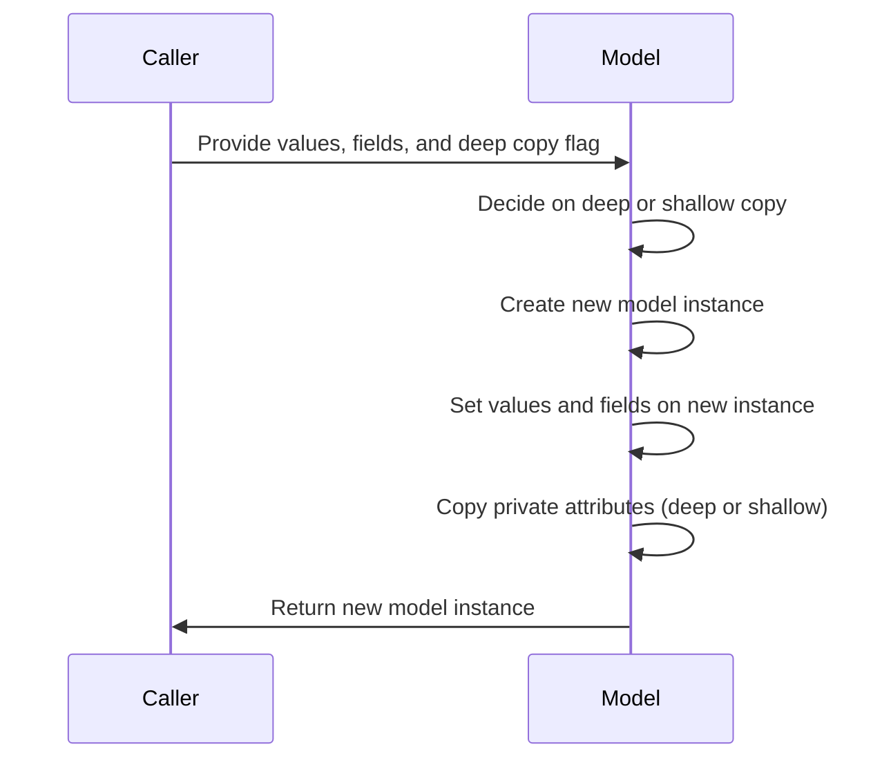
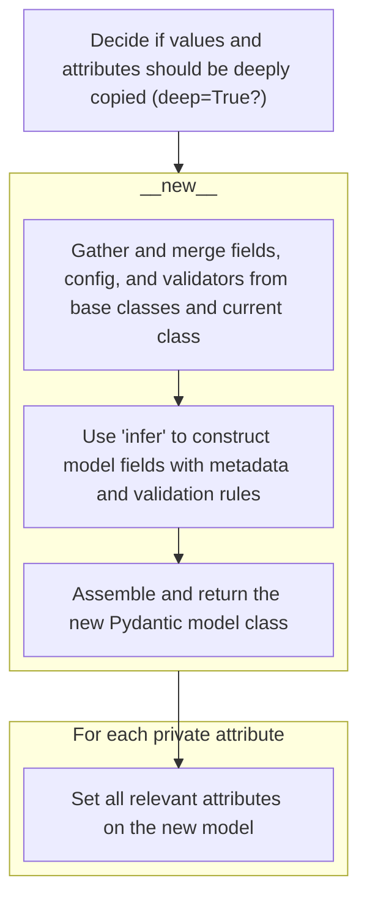
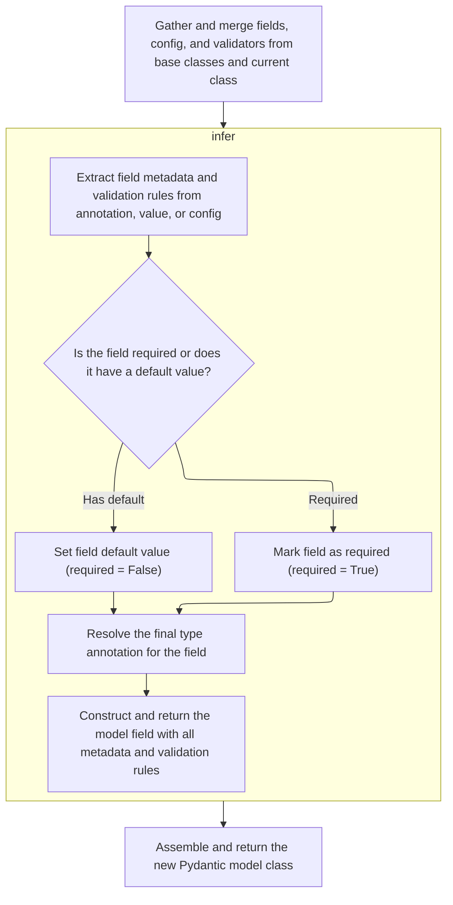
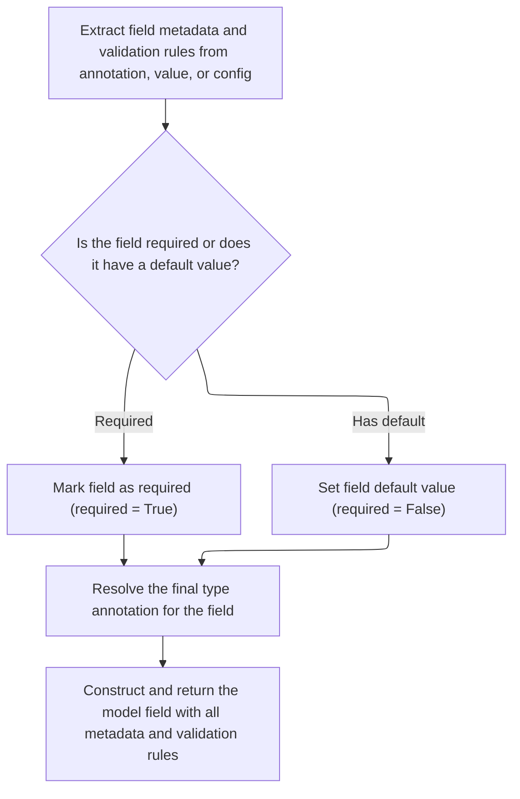
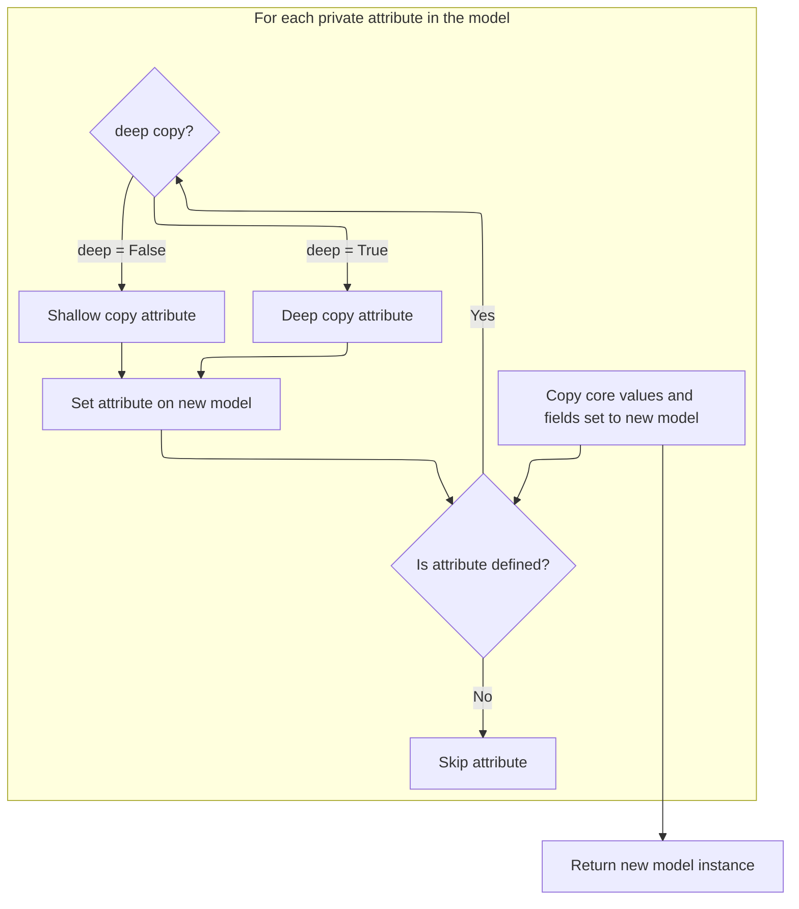

This flow describes how to duplicate a model instance, including its core values and private attributes, with the option for deep or shallow copying. The process ensures the new instance mirrors the original in both data and internal state.

The main steps are:

- Decide on deep or shallow copying.
- Create a new model instance.
- Set values and fields on the new instance.
- Copy private attributes as needed.
- Return the new model instance.



# Spec

## Detailed View of the Program's Functionality

a. Deciding Whether to Deep Copy Values and Attributes

The process begins by determining whether the values and attributes of a model instance should be deeply copied. This is controlled by a boolean flag. If deep copying is requested, the values dictionary is duplicated using a deep copy operation to ensure that all nested objects are also copied, not just the top-level references. This prevents changes in the new model from affecting the original.

b. Creating a New Model Instance

After deciding on the copying strategy, a new, uninitialized model instance is created. This is done by invoking the special method for creating objects without calling their initializer. This blank instance will be used to set the copied state directly, bypassing normal validation and initialization logic.

c. Building the Model Class Structure

When a new model class is created (either during normal use or as part of copying), the class construction process gathers and merges all relevant fields, configuration options, and validators from its base classes and the current class definition. This involves:

- Collecting fields, configuration, and validators from each base class in reverse order to respect inheritance.
- Merging private attributes and class variables from base classes.
- Extracting configuration options from both class attributes and keyword arguments, ensuring there are no conflicts.
- Combining all validators and grouping them for later use.

d. Applying Configuration to Fields

Once the fields are collected, each field is updated with configuration-driven metadata. This includes:

- Setting field aliases if the configuration provides a higher-priority alias.
- Merging exclude/include rules from the configuration with those already present on the field.
- Applying any other configuration-specific tweaks to the field.

e. Processing Annotations and Namespace Items

The class construction then processes all annotations and namespace items to determine which are fields, class variables, or private attributes. For each item:

- If it is a class variable or a final variable with a default, it is added to the set of class variables.
- If it is a valid field, its name is validated, and its value and annotation are used to infer the field's metadata.
- If it is not present in the namespace but should be a private attribute (based on configuration), it is added as a private attribute.

f. Inferring Field Metadata

For each field, the inference process:

- Extracts metadata from the annotation, value, or configuration, consolidating it into a single metadata object.
- Determines whether the field is required or has a default value.
- Resolves the final type annotation, possibly updating it based on field metadata and configuration.
- Constructs a field object containing all metadata, type information, and validation rules.

g. Finalizing the Model Class

After all fields and configuration are set up:

- The process checks for custom root types and enforces any special rules.
- Sets up JSON encoding logic, including custom encoders if specified in the configuration.
- Extracts and attaches root validators.
- Assembles a new class namespace containing all fields, configuration, validators, and internal attributes.
- Creates the new model class using the assembled namespace.
- Optionally resolves forward references in type annotations.
- Applies the special name-setting protocol to any attributes not already in the namespace.
- Returns the fully constructed model class, ready for use.

h. Restoring Model Instance State

Returning to the copying process, the new model instance's state is restored by:

- Assigning the copied values dictionary to the new instance.
- Assigning the set of fields that were set in the original instance.
- Iterating over each private attribute defined on the model:
  - If the attribute exists on the original instance, it is copied (deeply or shallowly, depending on the flag) and set on the new instance.
  - If the attribute does not exist, it is skipped.
- After all attributes are set, the new model instance is returned.

i. Summary

The overall flow ensures that when copying a model instance, all relevant state—including fields, configuration, validators, and private attributes—is faithfully reproduced in the new instance. The process leverages the model class construction logic to ensure that the new instance is structurally identical to the original, with the option to deeply copy all data to prevent unintended side effects.

# Rule Definition

| Paragraph Name                                                                                                                                                                                                                                                                                                                                                                                                                                                                                                                                                                                                                                                                                                                                                                                                                                                                                                                                                                                                                                                                                                                              | Rule ID | Category          | Description                                                                                                                                                                                                                                                                                                                                                                                                                                                                                                                                                                                                                                                | Conditions                                                                                                                                                                                                                                      | Remarks                                                                                                                                                                                                                                                                                                                                                                                                                                                                                                                                                                                                                                                                                                                                                  |
| ------------------------------------------------------------------------------------------------------------------------------------------------------------------------------------------------------------------------------------------------------------------------------------------------------------------------------------------------------------------------------------------------------------------------------------------------------------------------------------------------------------------------------------------------------------------------------------------------------------------------------------------------------------------------------------------------------------------------------------------------------------------------------------------------------------------------------------------------------------------------------------------------------------------------------------------------------------------------------------------------------------------------------------------------------------------------------------------------------------------------------------------- | ------- | ----------------- | ---------------------------------------------------------------------------------------------------------------------------------------------------------------------------------------------------------------------------------------------------------------------------------------------------------------------------------------------------------------------------------------------------------------------------------------------------------------------------------------------------------------------------------------------------------------------------------------------------------------------------------------------------------- | ----------------------------------------------------------------------------------------------------------------------------------------------------------------------------------------------------------------------------------------------- | -------------------------------------------------------------------------------------------------------------------------------------------------------------------------------------------------------------------------------------------------------------------------------------------------------------------------------------------------------------------------------------------------------------------------------------------------------------------------------------------------------------------------------------------------------------------------------------------------------------------------------------------------------------------------------------------------------------------------------------------------------- |
| The new model instance must be created without invoking the standard constructor, ensuring that no validation or default value logic is triggered during instantiation.                                                                                                                                                                                                                                                                                                                                                                                                                                                                                                                                                                                                                                                                                                                                                                                                                                                                                                                                                                     | RL-001  | Conditional Logic | A new instance of the model class must be created in such a way that the standard constructor (**init**) is not called, so that validation and default value logic are bypassed.                                                                                                                                                                                                                                                                                                                                                                                                                                                                           | Whenever a new model instance is created as a copy of an existing instance using this feature.                                                                                                                                                  | The new instance must be of the same class as the original. No validation or default value logic should be triggered. The output is a Python object of the same class as the original instance.                                                                                                                                                                                                                                                                                                                                                                                                                                                                                                                                                          |
| The function must accept the following inputs: values (dict), <SwmToken path="pydantic/v1/main.py" pos="615:21:21" line-data="    def _copy_and_set_values(self: &#39;Model&#39;, values: &#39;DictStrAny&#39;, fields_set: &#39;SetStr&#39;, *, deep: bool) -&gt; &#39;Model&#39;:">`fields_set`</SwmToken> (set), deep (bool). If deep is True, all values in the values dictionary and all private attribute values must be deep copied before being set on the new instance. The new instance’s **dict** attribute must be set to the (possibly deep-copied) values dictionary. The new instance’s <SwmToken path="pydantic/v1/main.py" pos="615:21:21" line-data="    def _copy_and_set_values(self: &#39;Model&#39;, values: &#39;DictStrAny&#39;, fields_set: &#39;SetStr&#39;, *, deep: bool) -&gt; &#39;Model&#39;:">`fields_set`</SwmToken> attribute must be set to the provided <SwmToken path="pydantic/v1/main.py" pos="615:21:21" line-data="    def _copy_and_set_values(self: &#39;Model&#39;, values: &#39;DictStrAny&#39;, fields_set: &#39;SetStr&#39;, *, deep: bool) -&gt; &#39;Model&#39;:">`fields_set`</SwmToken>. | RL-002  | Data Assignment   | The new instance's **dict** and <SwmToken path="pydantic/v1/main.py" pos="615:21:21" line-data="    def _copy_and_set_values(self: &#39;Model&#39;, values: &#39;DictStrAny&#39;, fields_set: &#39;SetStr&#39;, *, deep: bool) -&gt; &#39;Model&#39;:">`fields_set`</SwmToken> attributes must be set to the provided values and <SwmToken path="pydantic/v1/main.py" pos="615:21:21" line-data="    def _copy_and_set_values(self: &#39;Model&#39;, values: &#39;DictStrAny&#39;, fields_set: &#39;SetStr&#39;, *, deep: bool) -&gt; &#39;Model&#39;:">`fields_set`</SwmToken>, with values deep copied if deep=True, or assigned directly if deep=False. | When creating a new instance via this feature, and after the instance has been allocated.                                                                                                                                                       | The 'deep' parameter: True means use deepcopy, False means assign references directly. The values input is a dictionary mapping field names to values. The <SwmToken path="pydantic/v1/main.py" pos="615:21:21" line-data="    def _copy_and_set_values(self: &#39;Model&#39;, values: &#39;DictStrAny&#39;, fields_set: &#39;SetStr&#39;, *, deep: bool) -&gt; &#39;Model&#39;:">`fields_set`</SwmToken> input is a set of field names. The output is a Python object with **dict** and <SwmToken path="pydantic/v1/main.py" pos="615:21:21" line-data="    def _copy_and_set_values(self: &#39;Model&#39;, values: &#39;DictStrAny&#39;, fields_set: &#39;SetStr&#39;, *, deep: bool) -&gt; &#39;Model&#39;:">`fields_set`</SwmToken> set accordingly. |
| For each private attribute defined in the model’s <SwmToken path="pydantic/v1/main.py" pos="129:1:1" line-data="        private_attributes: Dict[str, ModelPrivateAttr] = {}">`private_attributes`</SwmToken> mapping: If the attribute is present on the original instance, its value must be copied (deeply or shallowly, according to the deep parameter) and set on the new instance. If the attribute is not present on the original instance, it must not be set on the new instance.                                                                                                                                                                                                                                                                                                                                                                                                                                                                                                                                                                                                                                                 | RL-003  | Conditional Logic | Private attributes defined in the model's <SwmToken path="pydantic/v1/main.py" pos="129:1:1" line-data="        private_attributes: Dict[str, ModelPrivateAttr] = {}">`private_attributes`</SwmToken> mapping must be copied from the original instance to the new instance, using deep copy if deep=True, or shallow copy (reference assignment) if deep=False. Only attributes present on the original instance are copied.                                                                                                                                                                                                                              | For each private attribute defined in the model’s <SwmToken path="pydantic/v1/main.py" pos="129:1:1" line-data="        private_attributes: Dict[str, ModelPrivateAttr] = {}">`private_attributes`</SwmToken> mapping, during the copy process. | The 'deep' parameter: True means use deepcopy, False means assign references directly. Only attributes present on the original instance are copied. The output is that the new instance has the same private attributes (by value or reference) as the original, except for any not present on the original.                                                                                                                                                                                                                                                                                                                                                                                                                                             |
| The new instance must be of the same class as the original instance. The new instance must preserve all configuration and field definitions from the model class.                                                                                                                                                                                                                                                                                                                                                                                                                                                                                                                                                                                                                                                                                                                                                                                                                                                                                                                                                                           | RL-004  | Data Assignment   | The new instance must be of the same class as the original, and must preserve all configuration and field definitions from the model class.                                                                                                                                                                                                                                                                                                                                                                                                                                                                                                                | Whenever a new instance is created using this feature.                                                                                                                                                                                          | The output is a Python object of the same class as the original, with the same configuration and field definitions (as these are class-level, not instance-level).                                                                                                                                                                                                                                                                                                                                                                                                                                                                                                                                                                                       |
| The returned instance must be a distinct object from the original, with identical field and private attribute values except for any changes specified in the values input.                                                                                                                                                                                                                                                                                                                                                                                                                                                                                                                                                                                                                                                                                                                                                                                                                                                                                                                                                                  | RL-005  | Conditional Logic | The new instance must not be the same object as the original, and must have identical field and private attribute values, except for any changes specified in the values input.                                                                                                                                                                                                                                                                                                                                                                                                                                                                            | After the new instance has been created and all values and private attributes have been set.                                                                                                                                                    | The output is a new Python object, not the same as the original. Field and private attribute values are identical except for any updates provided in the values input.                                                                                                                                                                                                                                                                                                                                                                                                                                                                                                                                                                                   |
| If a private attribute or field value is a mutable object and deep is False, the reference must be shared between the original and the new instance. If a private attribute or field value is a mutable object and deep is True, the object must be recursively copied so that the new instance has its own independent copy.                                                                                                                                                                                                                                                                                                                                                                                                                                                                                                                                                                                                                                                                                                                                                                                                               | RL-006  | Conditional Logic | For mutable field or private attribute values, if deep=False, the new instance shares the reference with the original; if deep=True, the value is recursively deep copied so the new instance has an independent copy.                                                                                                                                                                                                                                                                                                                                                                                                                                     | For each field and private attribute value that is a mutable object, during the copy process.                                                                                                                                                   | The 'deep' parameter: True means use deepcopy (recursively copy), False means assign references directly (shared). Applies to any mutable object (<SwmToken path="pydantic/v1/main.py" pos="295:16:18" line-data="        # for attributes not in `new_namespace` (e.g. private attributes)">`e.g`</SwmToken>., lists, dicts, sets, custom objects).                                                                                                                                                                                                                                                                                                                                                                                                     |
| The function must return the new model instance with all specified state and attributes set.                                                                                                                                                                                                                                                                                                                                                                                                                                                                                                                                                                                                                                                                                                                                                                                                                                                                                                                                                                                                                                                | RL-007  | Data Assignment   | After all copying and assignments are complete, the function must return the new model instance.                                                                                                                                                                                                                                                                                                                                                                                                                                                                                                                                                           | After all previous steps have been completed.                                                                                                                                                                                                   | The output is the new model instance, with all fields, private attributes, and state set as specified by the previous rules.                                                                                                                                                                                                                                                                                                                                                                                                                                                                                                                                                                                                                             |

# User Stories

## User Story 1: Copy a model instance with control over deep or shallow copying

---

### Story Description:

As a user of the data validation library, I want to create a new instance of a model class by copying the state from an existing instance, with the option to deep copy or shallow copy the values and private attributes, so that I can efficiently duplicate models with the desired level of independence between instances.

---

### Business Rule Mapping:

| Rule ID | Paragraph Name                                                                                                                                                                                                                                                                                                                                                                                                                                                                                                                                                                                                                                                                                                                                                                                                                                                                                                                                                                                                                                                                                                                              | Rule Description                                                                                                                                                                                                                                                                                                                                                                                                                                                                                                                                                                                                                                           |
| ------- | ------------------------------------------------------------------------------------------------------------------------------------------------------------------------------------------------------------------------------------------------------------------------------------------------------------------------------------------------------------------------------------------------------------------------------------------------------------------------------------------------------------------------------------------------------------------------------------------------------------------------------------------------------------------------------------------------------------------------------------------------------------------------------------------------------------------------------------------------------------------------------------------------------------------------------------------------------------------------------------------------------------------------------------------------------------------------------------------------------------------------------------------- | ---------------------------------------------------------------------------------------------------------------------------------------------------------------------------------------------------------------------------------------------------------------------------------------------------------------------------------------------------------------------------------------------------------------------------------------------------------------------------------------------------------------------------------------------------------------------------------------------------------------------------------------------------------- |
| RL-002  | The function must accept the following inputs: values (dict), <SwmToken path="pydantic/v1/main.py" pos="615:21:21" line-data="    def _copy_and_set_values(self: &#39;Model&#39;, values: &#39;DictStrAny&#39;, fields_set: &#39;SetStr&#39;, *, deep: bool) -&gt; &#39;Model&#39;:">`fields_set`</SwmToken> (set), deep (bool). If deep is True, all values in the values dictionary and all private attribute values must be deep copied before being set on the new instance. The new instance’s **dict** attribute must be set to the (possibly deep-copied) values dictionary. The new instance’s <SwmToken path="pydantic/v1/main.py" pos="615:21:21" line-data="    def _copy_and_set_values(self: &#39;Model&#39;, values: &#39;DictStrAny&#39;, fields_set: &#39;SetStr&#39;, *, deep: bool) -&gt; &#39;Model&#39;:">`fields_set`</SwmToken> attribute must be set to the provided <SwmToken path="pydantic/v1/main.py" pos="615:21:21" line-data="    def _copy_and_set_values(self: &#39;Model&#39;, values: &#39;DictStrAny&#39;, fields_set: &#39;SetStr&#39;, *, deep: bool) -&gt; &#39;Model&#39;:">`fields_set`</SwmToken>. | The new instance's **dict** and <SwmToken path="pydantic/v1/main.py" pos="615:21:21" line-data="    def _copy_and_set_values(self: &#39;Model&#39;, values: &#39;DictStrAny&#39;, fields_set: &#39;SetStr&#39;, *, deep: bool) -&gt; &#39;Model&#39;:">`fields_set`</SwmToken> attributes must be set to the provided values and <SwmToken path="pydantic/v1/main.py" pos="615:21:21" line-data="    def _copy_and_set_values(self: &#39;Model&#39;, values: &#39;DictStrAny&#39;, fields_set: &#39;SetStr&#39;, *, deep: bool) -&gt; &#39;Model&#39;:">`fields_set`</SwmToken>, with values deep copied if deep=True, or assigned directly if deep=False. |
| RL-003  | For each private attribute defined in the model’s <SwmToken path="pydantic/v1/main.py" pos="129:1:1" line-data="        private_attributes: Dict[str, ModelPrivateAttr] = {}">`private_attributes`</SwmToken> mapping: If the attribute is present on the original instance, its value must be copied (deeply or shallowly, according to the deep parameter) and set on the new instance. If the attribute is not present on the original instance, it must not be set on the new instance.                                                                                                                                                                                                                                                                                                                                                                                                                                                                                                                                                                                                                                                 | Private attributes defined in the model's <SwmToken path="pydantic/v1/main.py" pos="129:1:1" line-data="        private_attributes: Dict[str, ModelPrivateAttr] = {}">`private_attributes`</SwmToken> mapping must be copied from the original instance to the new instance, using deep copy if deep=True, or shallow copy (reference assignment) if deep=False. Only attributes present on the original instance are copied.                                                                                                                                                                                                                              |
| RL-006  | If a private attribute or field value is a mutable object and deep is False, the reference must be shared between the original and the new instance. If a private attribute or field value is a mutable object and deep is True, the object must be recursively copied so that the new instance has its own independent copy.                                                                                                                                                                                                                                                                                                                                                                                                                                                                                                                                                                                                                                                                                                                                                                                                               | For mutable field or private attribute values, if deep=False, the new instance shares the reference with the original; if deep=True, the value is recursively deep copied so the new instance has an independent copy.                                                                                                                                                                                                                                                                                                                                                                                                                                     |

---

### Relevant Functionality:

- **The function must accept the following inputs: values (dict)**
  1. **RL-002:**
     - If deep is True:
       - Deep copy the values dictionary.
     - Set the new instance's **dict** to the (possibly deep-copied) values dictionary.
     - Set the new instance's <SwmToken path="pydantic/v1/main.py" pos="615:21:21" line-data="    def _copy_and_set_values(self: &#39;Model&#39;, values: &#39;DictStrAny&#39;, fields_set: &#39;SetStr&#39;, *, deep: bool) -&gt; &#39;Model&#39;:">`fields_set`</SwmToken> to the provided <SwmToken path="pydantic/v1/main.py" pos="615:21:21" line-data="    def _copy_and_set_values(self: &#39;Model&#39;, values: &#39;DictStrAny&#39;, fields_set: &#39;SetStr&#39;, *, deep: bool) -&gt; &#39;Model&#39;:">`fields_set`</SwmToken>.
- **For each private attribute defined in the model’s** <SwmToken path="pydantic/v1/main.py" pos="129:1:1" line-data="        private_attributes: Dict[str, ModelPrivateAttr] = {}">`private_attributes`</SwmToken> mapping: If the attribute is present on the original instance
  1. **RL-003:**
     - For each private attribute defined in the model's <SwmToken path="pydantic/v1/main.py" pos="129:1:1" line-data="        private_attributes: Dict[str, ModelPrivateAttr] = {}">`private_attributes`</SwmToken> mapping:
       - If the attribute exists on the original instance:
         - If deep is True:
           - Deep copy the attribute value.
         - Else:
           - Assign the attribute value by reference.
         - Set the attribute on the new instance.
       - If the attribute does not exist on the original instance:
         - Do not set the attribute on the new instance.
- **If a private attribute or field value is a mutable object and deep is False**
  1. **RL-006:**
     - For each field and private attribute value:
       - If the value is mutable:
         - If deep is True:
           - Deep copy the value.
         - Else:
           - Assign the value by reference (shared).

## User Story 2: Create a new model instance without triggering validation or defaults

---

### Story Description:

As a user of the data validation library, I want the new model instance to be created without invoking the standard constructor, so that no validation or default value logic is triggered and the instance is an exact copy of the original's state.

---

### Business Rule Mapping:

| Rule ID | Paragraph Name                                                                                                                                                          | Rule Description                                                                                                                                                                 |
| ------- | ----------------------------------------------------------------------------------------------------------------------------------------------------------------------- | -------------------------------------------------------------------------------------------------------------------------------------------------------------------------------- |
| RL-001  | The new model instance must be created without invoking the standard constructor, ensuring that no validation or default value logic is triggered during instantiation. | A new instance of the model class must be created in such a way that the standard constructor (**init**) is not called, so that validation and default value logic are bypassed. |
| RL-004  | The new instance must be of the same class as the original instance. The new instance must preserve all configuration and field definitions from the model class.       | The new instance must be of the same class as the original, and must preserve all configuration and field definitions from the model class.                                      |

---

### Relevant Functionality:

- **The new model instance must be created without invoking the standard constructor**
  1. **RL-001:**
     - Use the class's **new** method to create a new instance without calling **init**.
     - Do not perform any validation or default value assignment during this process.
- **The new instance must be of the same class as the original instance. The new instance must preserve all configuration and field definitions from the model class.**
  1. **RL-004:**
     - Use the original instance's class to create the new instance.
     - Do not modify or reassign any class-level configuration or field definitions.

## User Story 3: Receive a distinct new instance with all specified state and changes applied

---

### Story Description:

As a user of the data validation library, I want the function to return a new, distinct model instance that reflects all specified state, attributes, and any changes I provide, so that I can safely use or modify the new instance without affecting the original.

---

### Business Rule Mapping:

| Rule ID | Paragraph Name                                                                                                                                                             | Rule Description                                                                                                                                                                |
| ------- | -------------------------------------------------------------------------------------------------------------------------------------------------------------------------- | ------------------------------------------------------------------------------------------------------------------------------------------------------------------------------- |
| RL-005  | The returned instance must be a distinct object from the original, with identical field and private attribute values except for any changes specified in the values input. | The new instance must not be the same object as the original, and must have identical field and private attribute values, except for any changes specified in the values input. |
| RL-007  | The function must return the new model instance with all specified state and attributes set.                                                                               | After all copying and assignments are complete, the function must return the new model instance.                                                                                |

---

### Relevant Functionality:

- **The returned instance must be a distinct object from the original**
  1. **RL-005:**
     - Ensure the new instance is not the same object as the original.
     - All field and private attribute values must match the original, except for any fields updated via the values input.
- **The function must return the new model instance with all specified state and attributes set.**
  1. **RL-007:**
     - Return the new instance after all assignments are complete.

# Code Walkthrough

## Copying Model State



<SwmSnippet path="/pydantic/v1/main.py" line="615">

---

In <SwmToken path="pydantic/v1/main.py" pos="615:3:3" line-data="    def _copy_and_set_values(self: &#39;Model&#39;, values: &#39;DictStrAny&#39;, fields_set: &#39;SetStr&#39;, *, deep: bool) -&gt; &#39;Model&#39;:">`_copy_and_set_values`</SwmToken>, we deep copy values if needed, then use <SwmToken path="pydantic/v1/main.py" pos="621:7:7" line-data="        m = cls.__new__(cls)">`__new__`</SwmToken> to get a blank model instance so we can set its state directly.

```python
    def _copy_and_set_values(self: 'Model', values: 'DictStrAny', fields_set: 'SetStr', *, deep: bool) -> 'Model':
        if deep:
            # chances of having empty dict here are quite low for using smart_deepcopy
            values = deepcopy(values)

        cls = self.__class__
        m = cls.__new__(cls)
```

---

</SwmSnippet>

### Building the Model Class Structure



<SwmSnippet path="/pydantic/v1/main.py" line="123">

---

In <SwmToken path="pydantic/v1/main.py" pos="123:3:3" line-data="    def __new__(mcs, name, bases, namespace, **kwargs):  # noqa C901">`__new__`</SwmToken>, we start by setting up empty containers for fields, config, validators, and private attributes. Then, we loop through base classes in reverse to merge their fields, config, validators, and other internals into the new class. This sets up the inheritance chain so that the new model class has all the right pieces from its ancestors.

```python
    def __new__(mcs, name, bases, namespace, **kwargs):  # noqa C901
        fields: Dict[str, ModelField] = {}
        config = BaseConfig
        validators: 'ValidatorListDict' = {}

        pre_root_validators, post_root_validators = [], []
        private_attributes: Dict[str, ModelPrivateAttr] = {}
        base_private_attributes: Dict[str, ModelPrivateAttr] = {}
        slots: SetStr = namespace.get('__slots__', ())
        slots = {slots} if isinstance(slots, str) else set(slots)
        class_vars: SetStr = set()
        hash_func: Optional[Callable[[Any], int]] = None

        for base in reversed(bases):
            if _is_base_model_class_defined and issubclass(base, BaseModel) and base != BaseModel:
                fields.update(smart_deepcopy(base.__fields__))
                config = inherit_config(base.__config__, config)
                validators = inherit_validators(base.__validators__, validators)
                pre_root_validators += base.__pre_root_validators__
                post_root_validators += base.__post_root_validators__
                base_private_attributes.update(base.__private_attributes__)
                class_vars.update(base.__class_vars__)
                hash_func = base.__hash__
```

---

</SwmSnippet>

<SwmSnippet path="/pydantic/v1/main.py" line="145">

---

After merging configs and validators, we extract config options from kwargs and the Config class, making sure they're not both set (that's an error). Then, we merge everything into a final config and update each field with <SwmToken path="pydantic/v1/main.py" pos="163:3:3" line-data="            f.set_config(config)">`set_config`</SwmToken>, so all config-driven tweaks are applied. Validators are also grouped and attached to fields as needed.

```python
                hash_func = base.__hash__

        resolve_forward_refs = kwargs.pop('__resolve_forward_refs__', True)
        allowed_config_kwargs: SetStr = {
            key
            for key in dir(config)
            if not (key.startswith('__') and key.endswith('__'))  # skip dunder methods and attributes
        }
        config_kwargs = {key: kwargs.pop(key) for key in kwargs.keys() & allowed_config_kwargs}
        config_from_namespace = namespace.get('Config')
        if config_kwargs and config_from_namespace:
            raise TypeError('Specifying config in two places is ambiguous, use either Config attribute or class kwargs')
        config = inherit_config(config_from_namespace, config, **config_kwargs)

        validators = inherit_validators(extract_validators(namespace), validators)
        vg = ValidatorGroup(validators)

        for f in fields.values():
            f.set_config(config)
            extra_validators = vg.get_validators(f.name)
            if extra_validators:
                f.class_validators.update(extra_validators)
                # re-run prepare to add extra validators
                f.populate_validators()

```

---

</SwmSnippet>

<SwmSnippet path="/pydantic/v1/fields.py" line="516">

---

<SwmToken path="pydantic/v1/fields.py" pos="516:3:3" line-data="    def set_config(self, config: Type[&#39;BaseConfig&#39;]) -&gt; None:">`set_config`</SwmToken> updates the field's config-driven metadata: it sets the alias if the new <SwmToken path="pydantic/v1/fields.py" pos="521:10:10" line-data="        new_alias_priority = info_from_config.get(&#39;alias_priority&#39;) or 0">`alias_priority`</SwmToken> is higher, and merges exclude/include rules from config with what's already on the field. This lets config override or combine with field-level settings as needed.

```python
    def set_config(self, config: Type['BaseConfig']) -> None:
        self.model_config = config
        info_from_config = config.get_field_info(self.name)
        config.prepare_field(self)
        new_alias = info_from_config.get('alias')
        new_alias_priority = info_from_config.get('alias_priority') or 0
        if new_alias and new_alias_priority >= (self.field_info.alias_priority or 0):
            self.field_info.alias = new_alias
            self.field_info.alias_priority = new_alias_priority
            self.alias = new_alias
        new_exclude = info_from_config.get('exclude')
        if new_exclude is not None:
            self.field_info.exclude = ValueItems.merge(self.field_info.exclude, new_exclude)
        new_include = info_from_config.get('include')
        if new_include is not None:
            self.field_info.include = ValueItems.merge(self.field_info.include, new_include, intersect=True)
```

---

</SwmSnippet>

<SwmSnippet path="/pydantic/v1/main.py" line="170">

---

Back in <SwmToken path="pydantic/v1/main.py" pos="123:3:3" line-data="    def __new__(mcs, name, bases, namespace, **kwargs):  # noqa C901">`__new__`</SwmToken>, after <SwmToken path="pydantic/v1/main.py" pos="163:3:3" line-data="            f.set_config(config)">`set_config`</SwmToken> has updated each field's config, we process annotations and namespace items to figure out which are fields, class vars, or private attributes. We skip untouched types and validate field names, using the config-influenced settings from earlier.

```python
        prepare_config(config, name)

        untouched_types = ANNOTATED_FIELD_UNTOUCHED_TYPES

        def is_untouched(v: Any) -> bool:
            return isinstance(v, untouched_types) or v.__class__.__name__ == 'cython_function_or_method'

        if (namespace.get('__module__'), namespace.get('__qualname__')) != ('pydantic.main', 'BaseModel'):
            annotations = resolve_annotations(namespace.get('__annotations__', {}), namespace.get('__module__', None))
            # annotation only fields need to come first in fields
            for ann_name, ann_type in annotations.items():
                if is_classvar(ann_type):
                    class_vars.add(ann_name)
                elif is_finalvar_with_default_val(ann_type, namespace.get(ann_name, Undefined)):
                    class_vars.add(ann_name)
                elif is_valid_field(ann_name):
                    validate_field_name(bases, ann_name)
                    value = namespace.get(ann_name, Undefined)
                    allowed_types = get_args(ann_type) if is_union(get_origin(ann_type)) else (ann_type,)
                    if (
                        is_untouched(value)
                        and ann_type != PyObject
                        and not any(
                            lenient_issubclass(get_origin(allowed_type), Type) for allowed_type in allowed_types
                        )
                    ):
                        continue
                    fields[ann_name] = ModelField.infer(
                        name=ann_name,
                        value=value,
                        annotation=ann_type,
                        class_validators=vg.get_validators(ann_name),
                        config=config,
                    )
                elif ann_name not in namespace and config.underscore_attrs_are_private:
                    private_attributes[ann_name] = PrivateAttr()
```

---

</SwmSnippet>

<SwmSnippet path="/pydantic/v1/main.py" line="205">

---

For each namespace item that looks like a field (not a class var or untouched), we call infer to build a <SwmToken path="pydantic/v1/main.py" pos="221:5:5" line-data="                    inferred = ModelField.infer(">`ModelField`</SwmToken> with all the right metadata, type info, and config. This is how we turn raw attributes into real model fields.

```python
                    private_attributes[ann_name] = PrivateAttr()

            untouched_types = UNTOUCHED_TYPES + config.keep_untouched
            for var_name, value in namespace.items():
                can_be_changed = var_name not in class_vars and not is_untouched(value)
                if isinstance(value, ModelPrivateAttr):
                    if not is_valid_private_name(var_name):
                        raise NameError(
                            f'Private attributes "{var_name}" must not be a valid field name; '
                            f'Use sunder or dunder names, e. g. "_{var_name}" or "__{var_name}__"'
                        )
                    private_attributes[var_name] = value
                elif config.underscore_attrs_are_private and is_valid_private_name(var_name) and can_be_changed:
                    private_attributes[var_name] = PrivateAttr(default=value)
                elif is_valid_field(var_name) and var_name not in annotations and can_be_changed:
                    validate_field_name(bases, var_name)
                    inferred = ModelField.infer(
                        name=var_name,
                        value=value,
                        annotation=annotations.get(var_name, Undefined),
                        class_validators=vg.get_validators(var_name),
                        config=config,
                    )
```

---

</SwmSnippet>

#### Inferring Field Metadata



<SwmSnippet path="/pydantic/v1/fields.py" line="484">

---

In <SwmToken path="pydantic/v1/fields.py" pos="484:3:3" line-data="    def infer(">`infer`</SwmToken>, we start by calling <SwmToken path="pydantic/v1/fields.py" pos="495:10:10" line-data="        field_info, value = cls._get_field_info(name, annotation, value, config)">`_get_field_info`</SwmToken> to pull together all the metadata for the field—whether it's from the annotation, the value, or config. This gives us a single <SwmToken path="pydantic/v1/fields.py" pos="442:7:7" line-data="    ) -&gt; Tuple[FieldInfo, Any]:">`FieldInfo`</SwmToken> object to drive the rest of the field setup.

```python
    def infer(
        cls,
        *,
        name: str,
        value: Any,
        annotation: Any,
        class_validators: Optional[Dict[str, Validator]],
        config: Type['BaseConfig'],
    ) -> 'ModelField':
        from pydantic.v1.schema import get_annotation_from_field_info

        field_info, value = cls._get_field_info(name, annotation, value, config)
```

---

</SwmSnippet>

<SwmSnippet path="/pydantic/v1/fields.py" line="440">

---

<SwmToken path="pydantic/v1/fields.py" pos="440:3:3" line-data="    def _get_field_info(">`_get_field_info`</SwmToken> checks if the annotation is Annotated and pulls out any <SwmToken path="pydantic/v1/fields.py" pos="442:7:7" line-data="    ) -&gt; Tuple[FieldInfo, Any]:">`FieldInfo`</SwmToken>, making sure there's only one. If the value is a <SwmToken path="pydantic/v1/fields.py" pos="442:7:7" line-data="    ) -&gt; Tuple[FieldInfo, Any]:">`FieldInfo`</SwmToken>, it uses that (but not both). If neither, it builds a new <SwmToken path="pydantic/v1/fields.py" pos="442:7:7" line-data="    ) -&gt; Tuple[FieldInfo, Any]:">`FieldInfo`</SwmToken> from config. It also updates the <SwmToken path="pydantic/v1/fields.py" pos="442:7:7" line-data="    ) -&gt; Tuple[FieldInfo, Any]:">`FieldInfo`</SwmToken> from config and validates it before returning, so the field metadata is always consistent.

```python
    def _get_field_info(
        field_name: str, annotation: Any, value: Any, config: Type['BaseConfig']
    ) -> Tuple[FieldInfo, Any]:
        """
        Get a FieldInfo from a root typing.Annotated annotation, value, or config default.

        The FieldInfo may be set in typing.Annotated or the value, but not both. If neither contain
        a FieldInfo, a new one will be created using the config.

        :param field_name: name of the field for use in error messages
        :param annotation: a type hint such as `str` or `Annotated[str, Field(..., min_length=5)]`
        :param value: the field's assigned value
        :param config: the model's config object
        :return: the FieldInfo contained in the `annotation`, the value, or a new one from the config.
        """
        field_info_from_config = config.get_field_info(field_name)

        field_info = None
        if get_origin(annotation) is Annotated:
            field_infos = [arg for arg in get_args(annotation)[1:] if isinstance(arg, FieldInfo)]
            if len(field_infos) > 1:
                raise ValueError(f'cannot specify multiple `Annotated` `Field`s for {field_name!r}')
            field_info = next(iter(field_infos), None)
            if field_info is not None:
                field_info = copy.copy(field_info)
                field_info.update_from_config(field_info_from_config)
                if field_info.default not in (Undefined, Required):
                    raise ValueError(f'`Field` default cannot be set in `Annotated` for {field_name!r}')
                if value is not Undefined and value is not Required:
                    # check also `Required` because of `validate_arguments` that sets `...` as default value
                    field_info.default = value

        if isinstance(value, FieldInfo):
            if field_info is not None:
                raise ValueError(f'cannot specify `Annotated` and value `Field`s together for {field_name!r}')
            field_info = value
            field_info.update_from_config(field_info_from_config)
        elif field_info is None:
            field_info = FieldInfo(value, **field_info_from_config)
        value = None if field_info.default_factory is not None else field_info.default
        field_info._validate()
        return field_info, value
```

---

</SwmSnippet>

<SwmSnippet path="/pydantic/v1/fields.py" line="496">

---

After getting <SwmToken path="pydantic/v1/fields.py" pos="502:10:10" line-data="        annotation = get_annotation_from_field_info(annotation, field_info, name, config.validate_assignment)">`field_info`</SwmToken> from <SwmToken path="pydantic/v1/fields.py" pos="440:3:3" line-data="    def _get_field_info(">`_get_field_info`</SwmToken> in <SwmToken path="pydantic/v1/main.py" pos="197:10:10" line-data="                    fields[ann_name] = ModelField.infer(">`infer`</SwmToken>, we check if the value is Required or not Undefined to set the required flag. Then we update the annotation with any extra info from <SwmToken path="pydantic/v1/fields.py" pos="502:10:10" line-data="        annotation = get_annotation_from_field_info(annotation, field_info, name, config.validate_assignment)">`field_info`</SwmToken> and config, and finally build the <SwmToken path="pydantic/v1/main.py" pos="124:9:9" line-data="        fields: Dict[str, ModelField] = {}">`ModelField`</SwmToken> instance with all the details.

```python
        required: 'BoolUndefined' = Undefined
        if value is Required:
            required = True
            value = None
        elif value is not Undefined:
            required = False
        annotation = get_annotation_from_field_info(annotation, field_info, name, config.validate_assignment)

        return cls(
            name=name,
            type_=annotation,
            alias=field_info.alias,
            class_validators=class_validators,
            default=value,
            default_factory=field_info.default_factory,
            required=required,
            model_config=config,
            field_info=field_info,
        )
```

---

</SwmSnippet>

#### Finalizing the Model Class

```mermaid
%%{init: {"flowchart": {"defaultRenderer": "elk"}} }%%
flowchart TD
    node1["Assemble model configuration, fields, and validators"] --> node2{"Is custom root type used?"}
    click node1 openCode "pydantic/v1/main.py:228:252"
    node2 -->|"Yes"| node3["Enforce custom root type rules"]
    click node2 openCode "pydantic/v1/main.py:238:240"
    node2 -->|"No"| node4["Enforce model rules"]
    click node3 openCode "pydantic/v1/main.py:240:241"
    node3 --> node4
    node4 --> node5{"Is custom JSON encoder set in config?"}
    click node4 openCode "pydantic/v1/main.py:241:245"
    node5 -->|"Yes"| node6["Set up custom JSON encoder"]
    node5 -->|"No"| node6
    click node5 openCode "pydantic/v1/main.py:242:245"
    click node6 openCode "pydantic/v1/main.py:243:245"
    node6 --> node7["Create new model class with all metadata"]
    click node7 openCode "pydantic/v1/main.py:252:282"
    node7 --> node8{"Should forward references be resolved?"}
    click node8 openCode "pydantic/v1/main.py:291:292"
    node8 -->|"Yes"| node9["Resolve forward references"]
    node8 -->|"No"| node10["Apply __set_name__ protocol to attributes"]
    click node9 openCode "pydantic/v1/main.py:292:293"
    node9 --> node10
    subgraph loop1["For each attribute not in new_namespace"]
        node10 --> node11["Apply __set_name__ if available"]
        click node11 openCode "pydantic/v1/main.py:296:300"
        node11 --> node10
    end
    node10 --> node12["Return new model class"]
    click node12 openCode "pydantic/v1/main.py:302:302"

%% Swimm:
%% %%{init: {"flowchart": {"defaultRenderer": "elk"}} }%%
%% flowchart TD
%%     node1["Assemble model configuration, fields, and validators"] --> node2{"Is custom root type used?"}
%%     click node1 openCode "<SwmPath>[pydantic/v1/main.py](pydantic/v1/main.py)</SwmPath>:228:252"
%%     node2 -->|"Yes"| node3["Enforce custom root type rules"]
%%     click node2 openCode "<SwmPath>[pydantic/v1/main.py](pydantic/v1/main.py)</SwmPath>:238:240"
%%     node2 -->|"No"| node4["Enforce model rules"]
%%     click node3 openCode "<SwmPath>[pydantic/v1/main.py](pydantic/v1/main.py)</SwmPath>:240:241"
%%     node3 --> node4
%%     node4 --> node5{"Is custom JSON encoder set in config?"}
%%     click node4 openCode "<SwmPath>[pydantic/v1/main.py](pydantic/v1/main.py)</SwmPath>:241:245"
%%     node5 -->|"Yes"| node6["Set up custom JSON encoder"]
%%     node5 -->|"No"| node6
%%     click node5 openCode "<SwmPath>[pydantic/v1/main.py](pydantic/v1/main.py)</SwmPath>:242:245"
%%     click node6 openCode "<SwmPath>[pydantic/v1/main.py](pydantic/v1/main.py)</SwmPath>:243:245"
%%     node6 --> node7["Create new model class with all metadata"]
%%     click node7 openCode "<SwmPath>[pydantic/v1/main.py](pydantic/v1/main.py)</SwmPath>:252:282"
%%     node7 --> node8{"Should forward references be resolved?"}
%%     click node8 openCode "<SwmPath>[pydantic/v1/main.py](pydantic/v1/main.py)</SwmPath>:291:292"
%%     node8 -->|"Yes"| node9["Resolve forward references"]
%%     node8 -->|"No"| node10["Apply <SwmToken path="pydantic/v1/main.py" pos="294:6:6" line-data="        # preserve `__set_name__` protocol defined in https://peps.python.org/pep-0487">`__set_name__`</SwmToken> protocol to attributes"]
%%     click node9 openCode "<SwmPath>[pydantic/v1/main.py](pydantic/v1/main.py)</SwmPath>:292:293"
%%     node9 --> node10
%%     subgraph loop1["For each attribute not in <SwmToken path="pydantic/v1/main.py" pos="252:1:1" line-data="        new_namespace = {">`new_namespace`</SwmToken>"]
%%         node10 --> node11["Apply <SwmToken path="pydantic/v1/main.py" pos="294:6:6" line-data="        # preserve `__set_name__` protocol defined in https://peps.python.org/pep-0487">`__set_name__`</SwmToken> if available"]
%%         click node11 openCode "<SwmPath>[pydantic/v1/main.py](pydantic/v1/main.py)</SwmPath>:296:300"
%%         node11 --> node10
%%     end
%%     node10 --> node12["Return new model class"]
%%     click node12 openCode "<SwmPath>[pydantic/v1/main.py](pydantic/v1/main.py)</SwmPath>:302:302"
```



<SwmSnippet path="/pydantic/v1/main.py" line="228">

---

After returning from infer in <SwmToken path="pydantic/v1/main.py" pos="282:9:9" line-data="        cls = super().__new__(mcs, name, bases, new_namespace, **kwargs)">`__new__`</SwmToken>, we validate any custom root types, set up JSON encoding and root validators, and build a new class namespace with all the fields, config, and internals. This is where the actual model class gets created and finalized.

```python
                    if var_name in fields:
                        if lenient_issubclass(inferred.type_, fields[var_name].type_):
                            inferred.type_ = fields[var_name].type_
                        else:
                            raise TypeError(
                                f'The type of {name}.{var_name} differs from the new default value; '
                                f'if you wish to change the type of this field, please use a type annotation'
                            )
                    fields[var_name] = inferred

        _custom_root_type = ROOT_KEY in fields
        if _custom_root_type:
            validate_custom_root_type(fields)
        vg.check_for_unused()
        if config.json_encoders:
            json_encoder = partial(custom_pydantic_encoder, config.json_encoders)
        else:
            json_encoder = pydantic_encoder
        pre_rv_new, post_rv_new = extract_root_validators(namespace)

        if hash_func is None:
            hash_func = generate_hash_function(config.frozen)

        exclude_from_namespace = fields | private_attributes.keys() | {'__slots__'}
        new_namespace = {
            '__config__': config,
            '__fields__': fields,
            '__exclude_fields__': {
                name: field.field_info.exclude for name, field in fields.items() if field.field_info.exclude is not None
            }
            or None,
            '__include_fields__': {
                name: field.field_info.include for name, field in fields.items() if field.field_info.include is not None
            }
            or None,
            '__validators__': vg.validators,
            '__pre_root_validators__': unique_list(
                pre_root_validators + pre_rv_new,
                name_factory=lambda v: v.__name__,
            ),
            '__post_root_validators__': unique_list(
                post_root_validators + post_rv_new,
                name_factory=lambda skip_on_failure_and_v: skip_on_failure_and_v[1].__name__,
            ),
            '__schema_cache__': {},
            '__json_encoder__': staticmethod(json_encoder),
            '__custom_root_type__': _custom_root_type,
            '__private_attributes__': {**base_private_attributes, **private_attributes},
            '__slots__': slots | private_attributes.keys(),
            '__hash__': hash_func,
            '__class_vars__': class_vars,
            **{n: v for n, v in namespace.items() if n not in exclude_from_namespace},
        }

        cls = super().__new__(mcs, name, bases, new_namespace, **kwargs)
        # set __signature__ attr only for model class, but not for its instances
        cls.__signature__ = ClassAttribute('__signature__', generate_model_signature(cls.__init__, fields, config))

        if not _is_base_model_class_defined:
            # Cython does not understand the `if TYPE_CHECKING:` condition in the
            # BaseModel's body (where annotations are set), so clear them manually:
            getattr(cls, '__annotations__', {}).clear()

        if resolve_forward_refs:
            cls.__try_update_forward_refs__()

        # preserve `__set_name__` protocol defined in https://peps.python.org/pep-0487
        # for attributes not in `new_namespace` (e.g. private attributes)
        for name, obj in namespace.items():
            if name not in new_namespace:
                set_name = getattr(obj, '__set_name__', None)
                if callable(set_name):
                    set_name(cls, name)
```

---

</SwmSnippet>

<SwmSnippet path="/pydantic/v1/main.py" line="300">

---

<SwmToken path="pydantic/v1/main.py" pos="123:3:3" line-data="    def __new__(mcs, name, bases, namespace, **kwargs):  # noqa C901">`__new__`</SwmToken> returns the finished model class, with all fields, config, and internals set up. It's ready for use or subclassing, with all the Pydantic-specific machinery in place.

```python
                    set_name(cls, name)

        return cls
```

---

</SwmSnippet>

### Restoring Model Instance State



<SwmSnippet path="/pydantic/v1/main.py" line="622">

---

After **new**, <SwmToken path="pydantic/v1/main.py" pos="615:3:3" line-data="    def _copy_and_set_values(self: &#39;Model&#39;, values: &#39;DictStrAny&#39;, fields_set: &#39;SetStr&#39;, *, deep: bool) -&gt; &#39;Model&#39;:">`_copy_and_set_values`</SwmToken> sets the new instance's state and copies private attributes, using <SwmToken path="pydantic/v1/main.py" pos="622:1:1" line-data="        object_setattr(m, &#39;__dict__&#39;, values)">`object_setattr`</SwmToken> for direct assignment.

```python
        object_setattr(m, '__dict__', values)
        object_setattr(m, '__fields_set__', fields_set)
        for name in self.__private_attributes__:
            value = getattr(self, name, Undefined)
            if value is not Undefined:
                if deep:
                    value = deepcopy(value)
                object_setattr(m, name, value)
```

---

</SwmSnippet>

<SwmSnippet path="/pydantic/v1/main.py" line="629">

---

<SwmToken path="pydantic/v1/main.py" pos="615:3:3" line-data="    def _copy_and_set_values(self: &#39;Model&#39;, values: &#39;DictStrAny&#39;, fields_set: &#39;SetStr&#39;, *, deep: bool) -&gt; &#39;Model&#39;:">`_copy_and_set_values`</SwmToken> returns the new model instance with all its state and private attributes copied over. It's a fresh object but matches the original in content.

```python
                object_setattr(m, name, value)

        return m
```

---

</SwmSnippet>

&nbsp;

*This is an auto-generated document by Swimm 🌊 and has not yet been verified by a human*

<SwmMeta version="3.0.0" repo-id="Z2l0aHViJTNBJTNBcHlkYW50aWMlM0ElM0FTd2ltbS1EZW1v" repo-name="pydantic"><sup>Powered by [Swimm](/)</sup></SwmMeta>
