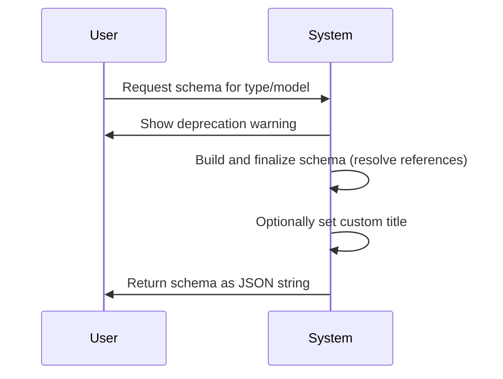
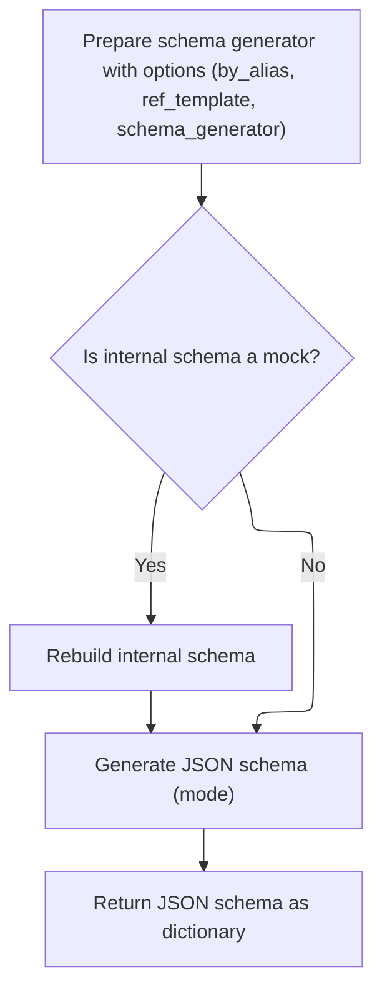
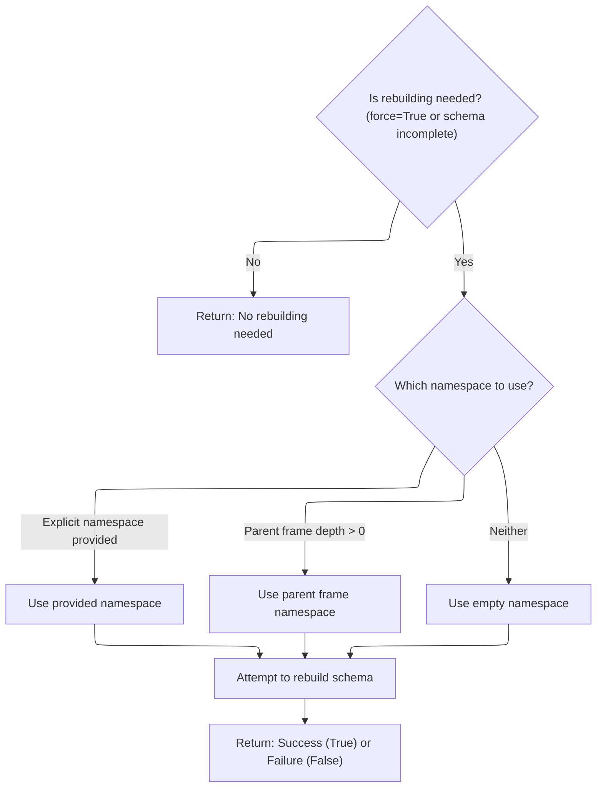
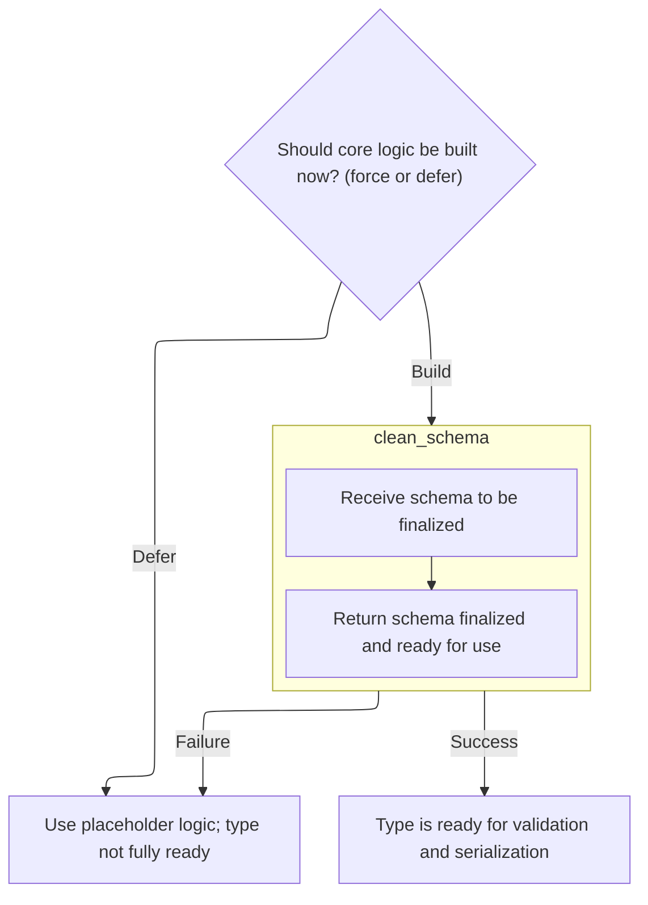

This document outlines how a JSON schema is exported for a Python type or model. When a schema is requested, a deprecation warning is shown, the schema is built and finalized (with references resolved), a custom title may be set, and the schema is returned as a JSON string. This enables users to document or share their data model structures.

Main steps:

- Receive schema request
- Show deprecation warning
- Build and finalize schema
- Optionally set title
- Serialize and return as JSON



# Spec

## Detailed View of the Program's Functionality

a. Exporting the Schema as JSON

The process begins when a user requests a JSON schema for a given type or model using a function designed for this purpose. This function first issues a warning to inform the user that it is deprecated and suggests using a newer alternative. After the warning, it delegates the actual schema generation to another function that produces a schema dictionary for the specified type. Once the schema dictionary is obtained, it is serialized into a JSON string using a standard serialization utility, and any additional keyword arguments for serialization can be passed through. The function then returns this JSON string to the user.

b. Building the Schema Dictionary

The function responsible for building the schema dictionary also starts by issuing a deprecation warning, guiding users toward a newer method. It then creates an adapter for the given type, which is responsible for handling type adaptation and schema generation. The adapter's method for generating a JSON schema is called, which returns a dictionary representing the schema. If a title is provided, the function checks its type: if it's a string, it sets it directly in the schema dictionary; if it's a callable (function), it warns that this usage is deprecated, calls the function to obtain the title, and sets it in the schema. Finally, the schema dictionary is returned.

c. Generating the Schema from the Adapter

The adapter's method for generating a JSON schema prepares a schema generator instance, configuring it with options such as whether to use field aliases and the template for references. It then checks if the internal schema is a mock (a placeholder indicating the schema is not yet fully built). If it is a mock, the adapter triggers a rebuild process to finalize the schema. After ensuring the schema is complete, the schema generator's method is called to produce the JSON schema dictionary, which is then returned.

d. Resolving Forward References and Rebuilding the Schema

When rebuilding is necessary (either forced or because the schema is incomplete), the adapter determines the appropriate namespace for resolving forward references. This can be an explicitly provided namespace, the namespace from a parent frame in the call stack, or an empty namespace if neither is available. The adapter then constructs a namespace resolver using the chosen namespace and the global namespace from the relevant frame. With this resolver, the adapter calls its internal initialization method to rebuild the core schema, validator, and serializer, ensuring that all forward references are resolved correctly.

e. Initializing Core Schema, Validator, and Serializer

During initialization, the adapter first checks whether to defer building the core logic based on configuration. If building is deferred, it sets placeholder (mock) logic and marks the adapter as incomplete. Otherwise, it attempts to retrieve the schema, validator, and serializer directly from the type. If any of these are missing or are still mocks, the adapter generates the schema using a schema generator, then calls a method to clean and finalize the schema. If schema generation fails due to unresolved annotations, it either raises an error or sets mocks, depending on configuration. Once the schema is finalized, the adapter creates the validator and serializer using the finalized schema and configuration, and marks itself as complete.

f. Sanitizing the Generated Schema

The schema generator's cleaning method simply passes the generated schema to a finalization method. This method processes the schema to resolve all references and definitions, ensuring that the schema is fully usable for validation and serialization. The finalized schema is then returned.

g. Completing Validator and Serializer Setup

After the schema has been cleaned and finalized, the adapter uses it to create the validator and serializer. The validator is responsible for checking data against the schema, while the serializer handles converting data to and from the schema's format. Once these are set up, the adapter marks itself as complete, indicating that it is ready for use.

h. Finalizing the Schema Dict with Title

After obtaining the schema dictionary from the adapter, the function checks if a title was provided. If the title is a string, it is set directly in the schema dictionary. If the title is a callable, a deprecation warning is issued, and the callable is invoked with the type to obtain the title, which is then set in the schema. This step ensures backward compatibility with older code that may have used callables for titles. The finalized schema dictionary is then returned to the caller.

# Rule Definition

| Paragraph Name                                                                                                                                                                                                                           | Rule ID | Category          | Description                                                                                                                                                                                                                                                                                                                                                                                                                                                                                                                                                                                                                                                   | Conditions                                                                                                                                                          | Remarks                                                                                                                                                                                                                                  |
| ---------------------------------------------------------------------------------------------------------------------------------------------------------------------------------------------------------------------------------------- | ------- | ----------------- | ------------------------------------------------------------------------------------------------------------------------------------------------------------------------------------------------------------------------------------------------------------------------------------------------------------------------------------------------------------------------------------------------------------------------------------------------------------------------------------------------------------------------------------------------------------------------------------------------------------------------------------------------------------- | ------------------------------------------------------------------------------------------------------------------------------------------------------------------- | ---------------------------------------------------------------------------------------------------------------------------------------------------------------------------------------------------------------------------------------- |
| <SwmToken path="pydantic/deprecated/tools.py" pos="49:2:2" line-data="def schema_of(">`schema_of`</SwmToken>, <SwmToken path="pydantic/deprecated/tools.py" pos="85:2:2" line-data="def schema_json_of(">`schema_json_of`</SwmToken>     | RL-001  | Conditional Logic | Both functions must accept arguments: type\_, title (string or callable), <SwmToken path="pydantic/deprecated/tools.py" pos="53:1:1" line-data="    by_alias: bool = True,">`by_alias`</SwmToken>, <SwmToken path="pydantic/deprecated/tools.py" pos="54:1:1" line-data="    ref_template: str = DEFAULT_REF_TEMPLATE,">`ref_template`</SwmToken>, <SwmToken path="pydantic/deprecated/tools.py" pos="55:1:1" line-data="    schema_generator: type[GenerateJsonSchema] = GenerateJsonSchema,">`schema_generator`</SwmToken>. If title is a callable, a deprecation warning must be issued and the callable must be called with the type to obtain the title. | Function is called with a title argument that is a callable.                                                                                                        | The title can be a string or a callable. If callable, a deprecation warning must be issued and the result used as the schema's title.                                                                                                    |
| <SwmToken path="pydantic/deprecated/tools.py" pos="49:2:2" line-data="def schema_of(">`schema_of`</SwmToken>, <SwmToken path="pydantic/deprecated/tools.py" pos="85:2:2" line-data="def schema_json_of(">`schema_json_of`</SwmToken>     | RL-002  | Conditional Logic | Both functions must issue a deprecation warning at runtime using a warning category equivalent to <SwmToken path="pydantic/deprecated/tools.py" pos="60:3:3" line-data="        category=PydanticDeprecatedSince20,">`PydanticDeprecatedSince20`</SwmToken>, with a stack level such that the warning points to the caller.                                                                                                                                                                                                                                                                                                                                   | Function is called.                                                                                                                                                 | Warning category: <SwmToken path="pydantic/deprecated/tools.py" pos="60:3:3" line-data="        category=PydanticDeprecatedSince20,">`PydanticDeprecatedSince20`</SwmToken>. Stacklevel must be set so the warning points to the caller. |
| <SwmToken path="pydantic/deprecated/tools.py" pos="49:2:2" line-data="def schema_of(">`schema_of`</SwmToken>                                                                                                                             | RL-003  | Data Assignment   | The schema dictionary returned must conform to JSON Schema draft 2020-12 and include at least the following fields when applicable: 'title', 'type', 'properties', 'required'.                                                                                                                                                                                                                                                                                                                                                                                                                                                                                | Schema is generated for a type.                                                                                                                                     | JSON Schema draft 2020-12. Fields: 'title' (string), 'type' (string), 'properties' (object), 'required' (array of strings).                                                                                                              |
| <SwmToken path="pydantic/deprecated/tools.py" pos="49:2:2" line-data="def schema_of(">`schema_of`</SwmToken>                                                                                                                             | RL-004  | Conditional Logic | The schema generation must support arbitrary types, not just Pydantic models. If the type cannot be handled, the schema generator must raise an error.                                                                                                                                                                                                                                                                                                                                                                                                                                                                                                        | Type provided is not a Pydantic model or standard supported type.                                                                                                   | If type is not supported, an error must be raised.                                                                                                                                                                                       |
| <SwmToken path="pydantic/deprecated/tools.py" pos="85:2:2" line-data="def schema_json_of(">`schema_json_of`</SwmToken>                                                                                                                   | RL-005  | Computation       | The function that returns the JSON string must accept arbitrary keyword arguments to be passed to the JSON serialization function (<SwmToken path="pydantic/type_adapter.py" pos="401:20:22" line-data="                [partial validation](../concepts/experimental.md#partial-validation), e.g. to process streams.">`e.g`</SwmToken>., indent, sort_keys). The output must be a valid JSON serialization of the schema dictionary.                                                                                                                                                                                                                        | <SwmToken path="pydantic/deprecated/tools.py" pos="85:2:2" line-data="def schema_json_of(">`schema_json_of`</SwmToken> is called with additional keyword arguments. | Output: JSON string. Accepts arbitrary keyword arguments for <SwmToken path="pydantic/deprecated/tools.py" pos="100:3:5" line-data="    return json.dumps(">`json.dumps`</SwmToken>.                                                     |
| <SwmToken path="pydantic/deprecated/tools.py" pos="59:16:18" line-data="        &#39;`schema_of` is deprecated. Use `pydantic.TypeAdapter.json_schema` instead.&#39;,">`TypeAdapter.json_schema`</SwmToken>, GenerateJsonSchema.generate | RL-006  | Computation       | The schema generation process must ensure that the schema is finalized and ready for use, resolving references and definitions as needed so that the schema is usable for validation and serialization.                                                                                                                                                                                                                                                                                                                                                                                                                                                       | Schema is generated for a type.                                                                                                                                     | Schema must be finalized, with all references and definitions resolved.                                                                                                                                                                  |

# User Stories

## User Story 1: Unified schema generation interface, output, and deprecation handling

---

### Story Description:

As a user of schema generation functions, I want to provide a type and optional arguments (including a title as a string or callable), receive a finalized schema (as a dictionary or JSON string), control JSON serialization options, and receive clear deprecation warnings when needed, so that I can generate and use schemas for any type and be informed about deprecated usage.

---

### Business Rule Mapping:

| Rule ID | Paragraph Name                                                                                                                                                                                                                           | Rule Description                                                                                                                                                                                                                                                                                                                                                                                                                                                                                                                                                                                                                                              |
| ------- | ---------------------------------------------------------------------------------------------------------------------------------------------------------------------------------------------------------------------------------------- | ------------------------------------------------------------------------------------------------------------------------------------------------------------------------------------------------------------------------------------------------------------------------------------------------------------------------------------------------------------------------------------------------------------------------------------------------------------------------------------------------------------------------------------------------------------------------------------------------------------------------------------------------------------- |
| RL-005  | <SwmToken path="pydantic/deprecated/tools.py" pos="85:2:2" line-data="def schema_json_of(">`schema_json_of`</SwmToken>                                                                                                                   | The function that returns the JSON string must accept arbitrary keyword arguments to be passed to the JSON serialization function (<SwmToken path="pydantic/type_adapter.py" pos="401:20:22" line-data="                [partial validation](../concepts/experimental.md#partial-validation), e.g. to process streams.">`e.g`</SwmToken>., indent, sort_keys). The output must be a valid JSON serialization of the schema dictionary.                                                                                                                                                                                                                        |
| RL-001  | <SwmToken path="pydantic/deprecated/tools.py" pos="49:2:2" line-data="def schema_of(">`schema_of`</SwmToken>, <SwmToken path="pydantic/deprecated/tools.py" pos="85:2:2" line-data="def schema_json_of(">`schema_json_of`</SwmToken>     | Both functions must accept arguments: type\_, title (string or callable), <SwmToken path="pydantic/deprecated/tools.py" pos="53:1:1" line-data="    by_alias: bool = True,">`by_alias`</SwmToken>, <SwmToken path="pydantic/deprecated/tools.py" pos="54:1:1" line-data="    ref_template: str = DEFAULT_REF_TEMPLATE,">`ref_template`</SwmToken>, <SwmToken path="pydantic/deprecated/tools.py" pos="55:1:1" line-data="    schema_generator: type[GenerateJsonSchema] = GenerateJsonSchema,">`schema_generator`</SwmToken>. If title is a callable, a deprecation warning must be issued and the callable must be called with the type to obtain the title. |
| RL-002  | <SwmToken path="pydantic/deprecated/tools.py" pos="49:2:2" line-data="def schema_of(">`schema_of`</SwmToken>, <SwmToken path="pydantic/deprecated/tools.py" pos="85:2:2" line-data="def schema_json_of(">`schema_json_of`</SwmToken>     | Both functions must issue a deprecation warning at runtime using a warning category equivalent to <SwmToken path="pydantic/deprecated/tools.py" pos="60:3:3" line-data="        category=PydanticDeprecatedSince20,">`PydanticDeprecatedSince20`</SwmToken>, with a stack level such that the warning points to the caller.                                                                                                                                                                                                                                                                                                                                   |
| RL-006  | <SwmToken path="pydantic/deprecated/tools.py" pos="59:16:18" line-data="        &#39;`schema_of` is deprecated. Use `pydantic.TypeAdapter.json_schema` instead.&#39;,">`TypeAdapter.json_schema`</SwmToken>, GenerateJsonSchema.generate | The schema generation process must ensure that the schema is finalized and ready for use, resolving references and definitions as needed so that the schema is usable for validation and serialization.                                                                                                                                                                                                                                                                                                                                                                                                                                                       |

---

### Relevant Functionality:

- <SwmToken path="pydantic/deprecated/tools.py" pos="85:2:2" line-data="def schema_json_of(">`schema_json_of`</SwmToken>

  1. **RL-005:**
     - Call <SwmToken path="pydantic/deprecated/tools.py" pos="49:2:2" line-data="def schema_of(">`schema_of`</SwmToken> to get schema dict
     - Call <SwmToken path="pydantic/deprecated/tools.py" pos="100:3:5" line-data="    return json.dumps(">`json.dumps`</SwmToken>(schema, \*\*<SwmToken path="pydantic/deprecated/tools.py" pos="92:2:2" line-data="    **dumps_kwargs: Any,">`dumps_kwargs`</SwmToken>)
     - Return resulting JSON string

- <SwmToken path="pydantic/deprecated/tools.py" pos="49:2:2" line-data="def schema_of(">`schema_of`</SwmToken>

  1. **RL-001:**

     - If title is not None:
       - If title is a string:
         - Set schema\['title'\] = title
       - Else (title is callable):
         - Issue deprecation warning
         - Set schema\['title'\] = title(type\_)

  2. **RL-002:**

     - On function entry:
       - Issue <SwmToken path="pydantic/deprecated/tools.py" pos="58:1:3" line-data="    warnings.warn(">`warnings.warn`</SwmToken>(message, category=<SwmToken path="pydantic/deprecated/tools.py" pos="60:3:3" line-data="        category=PydanticDeprecatedSince20,">`PydanticDeprecatedSince20`</SwmToken>, stacklevel=2)

- <SwmToken path="pydantic/deprecated/tools.py" pos="59:16:18" line-data="        &#39;`schema_of` is deprecated. Use `pydantic.TypeAdapter.json_schema` instead.&#39;,">`TypeAdapter.json_schema`</SwmToken>

  1. **RL-006:**
     - Generate schema using <SwmToken path="pydantic/deprecated/tools.py" pos="59:16:18" line-data="        &#39;`schema_of` is deprecated. Use `pydantic.TypeAdapter.json_schema` instead.&#39;,">`TypeAdapter.json_schema`</SwmToken>(...)
     - Ensure schema is finalized (references and definitions resolved) before returning

## User Story 2: Schema dictionary structure, type support, and error handling

---

### Story Description:

As a user requesting a schema dictionary, I want the returned schema to conform to JSON Schema draft 2020-12, include required fields when applicable, and support arbitrary types, so that I can use the schema for validation and serialization, and receive clear errors if the type is unsupported.

---

### Business Rule Mapping:

| Rule ID | Paragraph Name                                                                                               | Rule Description                                                                                                                                                               |
| ------- | ------------------------------------------------------------------------------------------------------------ | ------------------------------------------------------------------------------------------------------------------------------------------------------------------------------ |
| RL-003  | <SwmToken path="pydantic/deprecated/tools.py" pos="49:2:2" line-data="def schema_of(">`schema_of`</SwmToken> | The schema dictionary returned must conform to JSON Schema draft 2020-12 and include at least the following fields when applicable: 'title', 'type', 'properties', 'required'. |
| RL-004  | <SwmToken path="pydantic/deprecated/tools.py" pos="49:2:2" line-data="def schema_of(">`schema_of`</SwmToken> | The schema generation must support arbitrary types, not just Pydantic models. If the type cannot be handled, the schema generator must raise an error.                         |

---

### Relevant Functionality:

- <SwmToken path="pydantic/deprecated/tools.py" pos="49:2:2" line-data="def schema_of(">`schema_of`</SwmToken>
  1. **RL-003:**

     - Generate schema using <SwmToken path="pydantic/deprecated/tools.py" pos="59:16:18" line-data="        &#39;`schema_of` is deprecated. Use `pydantic.TypeAdapter.json_schema` instead.&#39;,">`TypeAdapter.json_schema`</SwmToken>(...)
     - If title is provided, set schema\['title'\]
     - Ensure schema includes 'type', and for object types, 'properties' and 'required' as appropriate

  2. **RL-004:**

     - Attempt to generate schema for type\_
     - If schema generation fails due to unsupported type, raise an error

# Code Walkthrough

## Exporting the Schema as JSON

<SwmSnippet path="/pydantic/deprecated/tools.py" line="85">

---

<SwmToken path="pydantic/deprecated/tools.py" pos="85:2:2" line-data="def schema_json_of(">`schema_json_of`</SwmToken> kicks off the flow by warning about deprecation and then calling <SwmToken path="pydantic/deprecated/tools.py" pos="101:1:1" line-data="        schema_of(type_, title=title, by_alias=by_alias, ref_template=ref_template, schema_generator=schema_generator),">`schema_of`</SwmToken> to get the schema dict for the given type. It then serializes that dict to a JSON string. We call <SwmToken path="pydantic/deprecated/tools.py" pos="101:1:1" line-data="        schema_of(type_, title=title, by_alias=by_alias, ref_template=ref_template, schema_generator=schema_generator),">`schema_of`</SwmToken> next because that's where the actual schema-building logic lives; this function just handles the JSON serialization and deprecation notice.

```python
def schema_json_of(
    type_: Any,
    *,
    title: NameFactory | None = None,
    by_alias: bool = True,
    ref_template: str = DEFAULT_REF_TEMPLATE,
    schema_generator: type[GenerateJsonSchema] = GenerateJsonSchema,
    **dumps_kwargs: Any,
) -> str:
    """Generate a JSON schema (as JSON) for the passed model or dynamically generated one."""
    warnings.warn(
        '`schema_json_of` is deprecated. Use `pydantic.TypeAdapter.json_schema` instead.',
        category=PydanticDeprecatedSince20,
        stacklevel=2,
    )
    return json.dumps(
        schema_of(type_, title=title, by_alias=by_alias, ref_template=ref_template, schema_generator=schema_generator),
        **dumps_kwargs,
    )
```

---

</SwmSnippet>

## Building the Schema Dictionary

```mermaid
%%{init: {"flowchart": {"defaultRenderer": "elk"}} }%%
flowchart TD
    node1["User requests schema for a type or model"] --> node2["Show deprecation warning for this function"]
    click node1 openCode "pydantic/deprecated/tools.py:49:57"
    click node2 openCode "pydantic/deprecated/tools.py:58:62"
    node2 --> node3["Generate JSON schema for the type"]
    click node3 openCode "pydantic/type_adapter.py:650:650"
    node3 --> node4{"Is a custom title provided?"}
    click node4 openCode "pydantic/deprecated/tools.py:68:78"
    node4 -->|"No"| node5["Provide schema to user"]
    node4 -->|"Yes, string"| node5
    node4 -->|"Yes, function (deprecated)"| node5
    click node5 openCode "pydantic/deprecated/tools.py:78:78"


subgraph node3 [json_schema]
  sgmain_1_node1["Prepare schema generator with options (by_alias, ref_template, schema_generator)"] --> sgmain_1_node2{"Is internal schema a mock?"}
  click sgmain_1_node1 openCode "pydantic/type_adapter.py:669:669"
  sgmain_1_node2 -->|"Yes"| sgmain_1_node3["Rebuild internal schema"]
  click sgmain_1_node2 openCode "pydantic/type_adapter.py:670:672"
  sgmain_1_node2 -->|"No"| sgmain_1_node4["Generate JSON schema (mode)"]
  click sgmain_1_node3 openCode "pydantic/type_adapter.py:671:672"
  sgmain_1_node3 --> sgmain_1_node4["Generate JSON schema (mode)"]
  sgmain_1_node4 --> sgmain_1_node5["Return JSON schema as dictionary"]
  click sgmain_1_node4 openCode "pydantic/type_adapter.py:673:673"
  click sgmain_1_node5 openCode "pydantic/type_adapter.py:673:673"
end

%% Swimm:
%% %%{init: {"flowchart": {"defaultRenderer": "elk"}} }%%
%% flowchart TD
%%     node1["User requests schema for a type or model"] --> node2["Show deprecation warning for this function"]
%%     click node1 openCode "<SwmPath>[pydantic/deprecated/tools.py](pydantic/deprecated/tools.py)</SwmPath>:49:57"
%%     click node2 openCode "<SwmPath>[pydantic/deprecated/tools.py](pydantic/deprecated/tools.py)</SwmPath>:58:62"
%%     node2 --> node3["Generate JSON schema for the type"]
%%     click node3 openCode "<SwmPath>[pydantic/type_adapter.py](pydantic/type_adapter.py)</SwmPath>:650:650"
%%     node3 --> node4{"Is a custom title provided?"}
%%     click node4 openCode "<SwmPath>[pydantic/deprecated/tools.py](pydantic/deprecated/tools.py)</SwmPath>:68:78"
%%     node4 -->|"No"| node5["Provide schema to user"]
%%     node4 -->|"Yes, string"| node5
%%     node4 -->|"Yes, function (deprecated)"| node5
%%     click node5 openCode "<SwmPath>[pydantic/deprecated/tools.py](pydantic/deprecated/tools.py)</SwmPath>:78:78"
%% 
%% 
%% subgraph node3 [<SwmToken path="pydantic/deprecated/tools.py" pos="59:18:18" line-data="        &#39;`schema_of` is deprecated. Use `pydantic.TypeAdapter.json_schema` instead.&#39;,">`json_schema`</SwmToken>]
%%   sgmain_1_node1["Prepare schema generator with options (<SwmToken path="pydantic/deprecated/tools.py" pos="53:1:1" line-data="    by_alias: bool = True,">`by_alias`</SwmToken>, <SwmToken path="pydantic/deprecated/tools.py" pos="54:1:1" line-data="    ref_template: str = DEFAULT_REF_TEMPLATE,">`ref_template`</SwmToken>, <SwmToken path="pydantic/deprecated/tools.py" pos="55:1:1" line-data="    schema_generator: type[GenerateJsonSchema] = GenerateJsonSchema,">`schema_generator`</SwmToken>)"] --> sgmain_1_node2{"Is internal schema a mock?"}
%%   click sgmain_1_node1 openCode "<SwmPath>[pydantic/type_adapter.py](pydantic/type_adapter.py)</SwmPath>:669:669"
%%   sgmain_1_node2 -->|"Yes"| sgmain_1_node3["Rebuild internal schema"]
%%   click sgmain_1_node2 openCode "<SwmPath>[pydantic/type_adapter.py](pydantic/type_adapter.py)</SwmPath>:670:672"
%%   sgmain_1_node2 -->|"No"| sgmain_1_node4["Generate JSON schema (mode)"]
%%   click sgmain_1_node3 openCode "<SwmPath>[pydantic/type_adapter.py](pydantic/type_adapter.py)</SwmPath>:671:672"
%%   sgmain_1_node3 --> sgmain_1_node4["Generate JSON schema (mode)"]
%%   sgmain_1_node4 --> sgmain_1_node5["Return JSON schema as dictionary"]
%%   click sgmain_1_node4 openCode "<SwmPath>[pydantic/type_adapter.py](pydantic/type_adapter.py)</SwmPath>:673:673"
%%   click sgmain_1_node5 openCode "<SwmPath>[pydantic/type_adapter.py](pydantic/type_adapter.py)</SwmPath>:673:673"
%% end
```



<SwmSnippet path="/pydantic/deprecated/tools.py" line="49">

---

In <SwmToken path="pydantic/deprecated/tools.py" pos="49:2:2" line-data="def schema_of(">`schema_of`</SwmToken>, we issue another deprecation warning and then use <SwmToken path="pydantic/deprecated/tools.py" pos="59:16:16" line-data="        &#39;`schema_of` is deprecated. Use `pydantic.TypeAdapter.json_schema` instead.&#39;,">`TypeAdapter`</SwmToken> to generate the schema dict for the given type. The next step is calling <SwmToken path="pydantic/deprecated/tools.py" pos="59:18:18" line-data="        &#39;`schema_of` is deprecated. Use `pydantic.TypeAdapter.json_schema` instead.&#39;,">`json_schema`</SwmToken> on the adapter, which actually builds the schema structure. This separation lets us handle type adaptation and schema generation in a consistent way across the codebase.

```python
def schema_of(
    type_: Any,
    *,
    title: NameFactory | None = None,
    by_alias: bool = True,
    ref_template: str = DEFAULT_REF_TEMPLATE,
    schema_generator: type[GenerateJsonSchema] = GenerateJsonSchema,
) -> dict[str, Any]:
    """Generate a JSON schema (as dict) for the passed model or dynamically generated one."""
    warnings.warn(
        '`schema_of` is deprecated. Use `pydantic.TypeAdapter.json_schema` instead.',
        category=PydanticDeprecatedSince20,
        stacklevel=2,
    )
    res = TypeAdapter(type_).json_schema(
        by_alias=by_alias,
        schema_generator=schema_generator,
        ref_template=ref_template,
    )
```

---

</SwmSnippet>

### Generating the Schema from the Adapter



<SwmSnippet path="/pydantic/type_adapter.py" line="650">

---

<SwmToken path="pydantic/type_adapter.py" pos="650:3:3" line-data="    def json_schema(">`json_schema`</SwmToken> sets up the schema generator and checks if the core schema is a mock. If so, it calls <SwmToken path="pydantic/type_adapter.py" pos="671:5:5" line-data="            self.core_schema.rebuild()">`rebuild`</SwmToken> to finalize the schema before generating the JSON schema. This step is needed to make sure we're not generating a schema from an incomplete or placeholder state.

```python
    def json_schema(
        self,
        *,
        by_alias: bool = True,
        ref_template: str = DEFAULT_REF_TEMPLATE,
        schema_generator: type[GenerateJsonSchema] = GenerateJsonSchema,
        mode: JsonSchemaMode = 'validation',
    ) -> dict[str, Any]:
        """Generate a JSON schema for the adapted type.

        Args:
            by_alias: Whether to use alias names for field names.
            ref_template: The format string used for generating $ref strings.
            schema_generator: The generator class used for creating the schema.
            mode: The mode to use for schema generation.

        Returns:
            The JSON schema for the model as a dictionary.
        """
        schema_generator_instance = schema_generator(by_alias=by_alias, ref_template=ref_template)
        if isinstance(self.core_schema, _mock_val_ser.MockCoreSchema):
            self.core_schema.rebuild()
            assert not isinstance(self.core_schema, _mock_val_ser.MockCoreSchema), 'this is a bug! please report it'
        return schema_generator_instance.generate(self.core_schema, mode=mode)
```

---

</SwmSnippet>

### Resolving Forward References and Rebuilding the Schema



<SwmSnippet path="/pydantic/type_adapter.py" line="335">

---

<SwmToken path="pydantic/type_adapter.py" pos="335:3:3" line-data="    def rebuild(">`rebuild`</SwmToken> checks if the schema is already complete, and if not, figures out the right namespace for resolving forward references by inspecting the call stack or using an explicit namespace. It then sets up an <SwmToken path="pydantic/type_adapter.py" pos="372:37:37" line-data="        # we have to manually fetch globals here because there&#39;s no type on the stack of the NsResolver">`NsResolver`</SwmToken> and calls <SwmToken path="pydantic/type_adapter.py" pos="379:5:5" line-data="        return self._init_core_attrs(ns_resolver=ns_resolver, force=True, raise_errors=raise_errors)">`_init_core_attrs`</SwmToken> to actually rebuild the schema with the right context.

```python
    def rebuild(
        self,
        *,
        force: bool = False,
        raise_errors: bool = True,
        _parent_namespace_depth: int = 2,
        _types_namespace: _namespace_utils.MappingNamespace | None = None,
    ) -> bool | None:
        """Try to rebuild the pydantic-core schema for the adapter's type.

        This may be necessary when one of the annotations is a ForwardRef which could not be resolved during
        the initial attempt to build the schema, and automatic rebuilding fails.

        Args:
            force: Whether to force the rebuilding of the type adapter's schema, defaults to `False`.
            raise_errors: Whether to raise errors, defaults to `True`.
            _parent_namespace_depth: Depth at which to search for the [parent frame][frame-objects]. This
                frame is used when resolving forward annotations during schema rebuilding, by looking for
                the locals of this frame. Defaults to 2, which will result in the frame where the method
                was called.
            _types_namespace: An explicit types namespace to use, instead of using the local namespace
                from the parent frame. Defaults to `None`.

        Returns:
            Returns `None` if the schema is already "complete" and rebuilding was not required.
            If rebuilding _was_ required, returns `True` if rebuilding was successful, otherwise `False`.
        """
        if not force and self.pydantic_complete:
            return None

        if _types_namespace is not None:
            rebuild_ns = _types_namespace
        elif _parent_namespace_depth > 0:
            rebuild_ns = _typing_extra.parent_frame_namespace(parent_depth=_parent_namespace_depth, force=True) or {}
        else:
            rebuild_ns = {}

        # we have to manually fetch globals here because there's no type on the stack of the NsResolver
        # and so we skip the globalns = get_module_ns_of(typ) call that would normally happen
        globalns = sys._getframe(max(_parent_namespace_depth - 1, 1)).f_globals
        ns_resolver = _namespace_utils.NsResolver(
            namespaces_tuple=_namespace_utils.NamespacesTuple(locals=rebuild_ns, globals=globalns),
            parent_namespace=rebuild_ns,
        )
        return self._init_core_attrs(ns_resolver=ns_resolver, force=True, raise_errors=raise_errors)
```

---

</SwmSnippet>

### Initializing Core Schema, Validator, and Serializer



<SwmSnippet path="/pydantic/type_adapter.py" line="246">

---

In <SwmToken path="pydantic/type_adapter.py" pos="246:3:3" line-data="    def _init_core_attrs(">`_init_core_attrs`</SwmToken>, we try to grab the schema, validator, and serializer directly from the type. If any are missing or mocks, we generate the schema using a schema generator, then call <SwmToken path="pydantic/type_adapter.py" pos="297:9:9" line-data="                self.core_schema = schema_generator.clean_schema(core_schema)">`clean_schema`</SwmToken> to finalize it before moving on. This makes sure we don't end up with incomplete or placeholder schemas.

```python
    def _init_core_attrs(
        self, ns_resolver: _namespace_utils.NsResolver, force: bool, raise_errors: bool = False
    ) -> bool:
        """Initialize the core schema, validator, and serializer for the type.

        Args:
            ns_resolver: The namespace resolver to use when building the core schema for the adapted type.
            force: Whether to force the construction of the core schema, validator, and serializer.
                If `force` is set to `False` and `_defer_build` is `True`, the core schema, validator, and serializer will be set to mocks.
            raise_errors: Whether to raise errors if initializing any of the core attrs fails.

        Returns:
            `True` if the core schema, validator, and serializer were successfully initialized, otherwise `False`.

        Raises:
            PydanticUndefinedAnnotation: If `PydanticUndefinedAnnotation` occurs in`__get_pydantic_core_schema__`
                and `raise_errors=True`.
        """
        if not force and self._defer_build:
            _mock_val_ser.set_type_adapter_mocks(self)
            self.pydantic_complete = False
            return False

        try:
            self.core_schema = _getattr_no_parents(self._type, '__pydantic_core_schema__')
            self.validator = _getattr_no_parents(self._type, '__pydantic_validator__')
            self.serializer = _getattr_no_parents(self._type, '__pydantic_serializer__')

            # TODO: we don't go through the rebuild logic here directly because we don't want
            # to repeat all of the namespace fetching logic that we've already done
            # so we simply skip to the block below that does the actual schema generation
            if (
                isinstance(self.core_schema, _mock_val_ser.MockCoreSchema)
                or isinstance(self.validator, _mock_val_ser.MockValSer)
                or isinstance(self.serializer, _mock_val_ser.MockValSer)
            ):
                raise AttributeError()
        except AttributeError:
            config_wrapper = _config.ConfigWrapper(self._config)

            schema_generator = _generate_schema.GenerateSchema(config_wrapper, ns_resolver=ns_resolver)

            try:
                core_schema = schema_generator.generate_schema(self._type)
            except PydanticUndefinedAnnotation:
                if raise_errors:
                    raise
                _mock_val_ser.set_type_adapter_mocks(self)
                return False

            try:
                self.core_schema = schema_generator.clean_schema(core_schema)
            except _generate_schema.InvalidSchemaError:
                _mock_val_ser.set_type_adapter_mocks(self)
                return False

```

---

</SwmSnippet>

#### Sanitizing the Generated Schema

<SwmSnippet path="/pydantic/_internal/_generate_schema.py" line="683">

---

<SwmToken path="pydantic/_internal/_generate_schema.py" pos="683:3:3" line-data="    def clean_schema(self, schema: CoreSchema) -&gt; CoreSchema:">`clean_schema`</SwmToken> just hands off the schema to <SwmToken path="pydantic/_internal/_generate_schema.py" pos="684:7:7" line-data="        return self.defs.finalize_schema(schema)">`finalize_schema`</SwmToken>, which processes it to resolve references and definitions. This step is needed to make sure the schema is actually usable for validation and serialization.

```python
    def clean_schema(self, schema: CoreSchema) -> CoreSchema:
        return self.defs.finalize_schema(schema)
```

---

</SwmSnippet>

#### Finalizing the Schema Structure

See <SwmLink doc-title="Finalizing a Schema for Validation">[Finalizing a Schema for Validation](/.swm/finalizing-a-schema-for-validation.ulnhz5vv.sw.md)</SwmLink>

#### Completing Validator and Serializer Setup

<SwmSnippet path="/pydantic/type_adapter.py" line="302">

---

We just got back from <SwmToken path="pydantic/type_adapter.py" pos="297:9:9" line-data="                self.core_schema = schema_generator.clean_schema(core_schema)">`clean_schema`</SwmToken> in <SwmToken path="pydantic/type_adapter.py" pos="246:3:3" line-data="    def _init_core_attrs(">`_init_core_attrs`</SwmToken>. Now, we use the finalized schema to create the validator and serializer, then mark the adapter as complete. This wraps up the schema/validator/serializer setup so the adapter is ready for use.

```python
            core_config = config_wrapper.core_config(None)

            self.validator = create_schema_validator(
                schema=self.core_schema,
                schema_type=self._type,
                schema_type_module=self._module_name,
                schema_type_name=str(self._type),
                schema_kind='TypeAdapter',
                config=core_config,
                plugin_settings=config_wrapper.plugin_settings,
            )
            self.serializer = SchemaSerializer(self.core_schema, core_config)

        self.pydantic_complete = True
        return True
```

---

</SwmSnippet>

### Finalizing the Schema Dict with Title

<SwmSnippet path="/pydantic/deprecated/tools.py" line="68">

---

We just got back from <SwmToken path="pydantic/deprecated/tools.py" pos="59:18:18" line-data="        &#39;`schema_of` is deprecated. Use `pydantic.TypeAdapter.json_schema` instead.&#39;,">`json_schema`</SwmToken> in <SwmToken path="pydantic/deprecated/tools.py" pos="49:2:2" line-data="def schema_of(">`schema_of`</SwmToken>. Now, if a title is provided, we set it in the schema dict—if it's a string, we use it directly; if it's a callable, we warn that this is deprecated and call it to get the title. This is just legacy support for older code that used callables for titles.

```python
    if title is not None:
        if isinstance(title, str):
            res['title'] = title
        else:
            warnings.warn(
                'Passing a callable for the `title` parameter is deprecated and no longer supported',
                DeprecationWarning,
                stacklevel=2,
            )
            res['title'] = title(type_)
    return res
```

---

</SwmSnippet>

&nbsp;

*This is an auto-generated document by Swimm 🌊 and has not yet been verified by a human*

<SwmMeta version="3.0.0" repo-id="Z2l0aHViJTNBJTNBcHlkYW50aWMlM0ElM0FTd2ltbS1EZW1v" repo-name="pydantic"><sup>Powered by [Swimm](/)</sup></SwmMeta>
