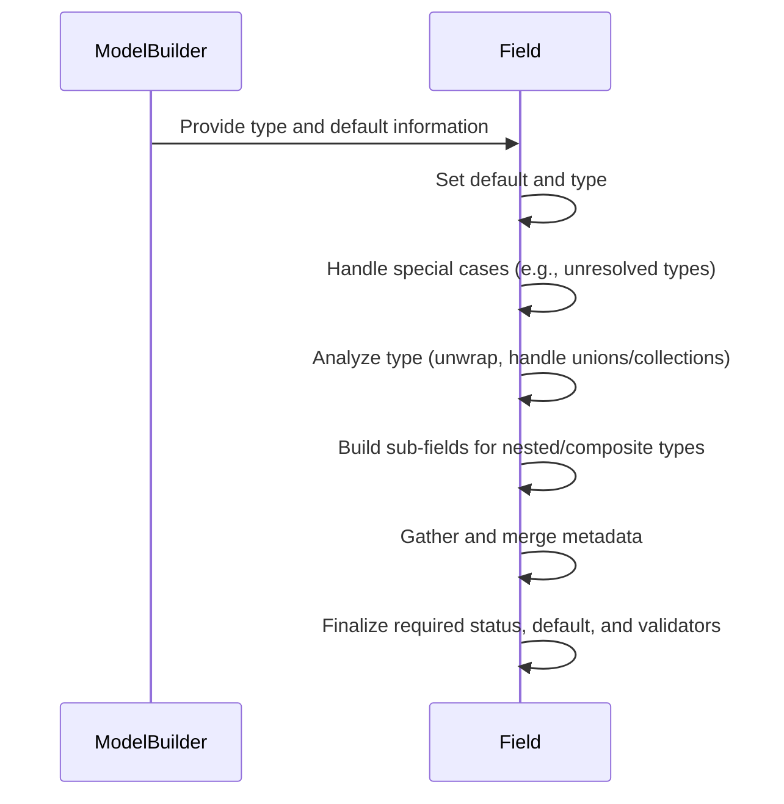

Field preparation configures a model field to ensure it is ready for data validation and serialization. This process sets up the field's type and default, resolves special cases like forward references, analyzes the type for wrappers, unions, and collections, constructs sub-fields for nested types, merges metadata, and establishes validation rules.

The main steps are:

- Set up the field's default value and type
- Handle special cases such as unresolved or deferred types
- Analyze the field's type, including unwrapping wrappers and handling unions or collections
- Build sub-fields for nested or composite types
- Gather and merge field metadata
- Finalize required status, default value, and validators



# Spec

## Detailed View of the Program's Functionality

a. Field Preparation Entry Point

The process begins with a method that prepares a field for validation and usage. This method first sets up the field's default value and type, ensuring that if a default factory is provided, a type must also be specified. If the type is still undefined after attempting to infer it from the default value, an error is raised. If the type is a special unresolved reference (such as a forward reference or a deferred type used for recursive models), the method exits early, deferring further processing until the type can be resolved later. Otherwise, the method proceeds to analyze the type in detail.

b. Type Structure and Special Cases

The type analysis method is responsible for breaking down the field's type and handling various special cases:

- If the type is a wrapper for JSON, it unwraps the inner type and marks the field to parse JSON.
- If the type is a generic JSON type, it sets the type to a generic "any" type and marks it for JSON parsing.
- If the type is a type variable (used in generics), it resolves it to its bound type, its constraints, or defaults to "any" if neither is present.
- If the type is a "new type" (a user-defined type based on another), it unwraps it to its underlying type.
- If the type is "any" or a generic object, it marks the field as not required and allows None as a value.
- If the type is a regular expression pattern, a literal, or a typed dictionary, it returns without further processing.
- If the type is a "final" variable (meant to be immutable), it marks the field as final and unwraps the type, then recursively analyzes the new type.
- If the type is an annotated type or a special typed dictionary, it unwraps the annotation and recursively analyzes the new type.
- If a discriminator is set (for tagged unions), but the type is not a union, it raises an error.
- If the type is a basic type (not a typing construct), it checks if None is a valid value and returns.
- If the type is a callable, it returns without further processing.

For union types (types that can be one of several options), it collects all possible types, marks the field as allowing None if any of the options is None, and if only one non-None type remains, it treats the field as optional and re-analyzes. Otherwise, it creates sub-fields for each type in the union and, if a discriminator is present, prepares a mapping for discriminated unions.

For collection types (tuples, lists, sets, etc.), it sets the field's shape accordingly and creates sub-fields for the elements or key/value pairs. For mappings (dictionaries and similar), it creates a sub-field for the keys and another for the values, setting the appropriate shape.

If the type is a generic or a user-defined type with custom validators, or if arbitrary types are allowed by configuration, it sets the shape to generic and creates sub-fields for each type argument.

If none of the above cases match, and the type is unsupported, it raises an error.

After refining the type (for example, extracting the element type from a list), it creates a sub-field for the refined type.

c. Subfield Construction and Metadata

When creating a sub-field for a nested type (such as an element in a list or a value in a dictionary), the method checks if the sub-field is for keys. If so, it skips attaching validators, as key validation is typically simpler. Otherwise, it filters and adjusts validators so that only those meant for the first sublevel are applied.

It then gathers metadata for the sub-field, merging information from type annotations, explicit field values, and model configuration. If conflicting metadata sources are found (such as multiple field info objects), it raises an error. The method ensures that only one source of field info is used and fills in any missing defaults from the configuration.

Finally, it returns a new field instance representing the sub-type, with all the gathered metadata and validation rules.

d. Finalizing Field Defaults and Validators

After type analysis, the preparation method checks if the field's "required" status is still undefined. If so, it marks the field as required. If no default value or default factory is set, it defaults the value to None. The method then sets up the field's validators, preparing lists of pre-validators, main validators, and post-validators based on the field's type and any custom validators provided.

This completes the field's setup, ensuring it is fully configured for validation, with all type information, default values, metadata, and validation logic in place.

# Rule Definition

| Paragraph Name                                                                                                                                                                                                                                                                            | Rule ID | Category          | Description                                                                                                                                                                                                                                                                                                                                                                                                                                                                                                                                                                                                                                                                                                                                                                                                                                                      | Conditions                                                                                                                                                                                                                                                                                                | Remarks                                                                                                                                                                                                                                                                                                                                                                                                                                                                                                                                                                                                                                                                                                                                                                                                                                                                                                                                                                                                                                                                                                                                                                                                                                                                                                                                                                                     |
| ----------------------------------------------------------------------------------------------------------------------------------------------------------------------------------------------------------------------------------------------------------------------------------------- | ------- | ----------------- | ---------------------------------------------------------------------------------------------------------------------------------------------------------------------------------------------------------------------------------------------------------------------------------------------------------------------------------------------------------------------------------------------------------------------------------------------------------------------------------------------------------------------------------------------------------------------------------------------------------------------------------------------------------------------------------------------------------------------------------------------------------------------------------------------------------------------------------------------------------------- | --------------------------------------------------------------------------------------------------------------------------------------------------------------------------------------------------------------------------------------------------------------------------------------------------------- | ------------------------------------------------------------------------------------------------------------------------------------------------------------------------------------------------------------------------------------------------------------------------------------------------------------------------------------------------------------------------------------------------------------------------------------------------------------------------------------------------------------------------------------------------------------------------------------------------------------------------------------------------------------------------------------------------------------------------------------------------------------------------------------------------------------------------------------------------------------------------------------------------------------------------------------------------------------------------------------------------------------------------------------------------------------------------------------------------------------------------------------------------------------------------------------------------------------------------------------------------------------------------------------------------------------------------------------------------------------------------------------------- |
| <SwmToken path="pydantic/v1/fields.py" pos="786:38:38" line-data="    def _create_sub_type(self, type_: Type[Any], name: str, *, for_keys: bool = False) -&gt; &#39;ModelField&#39;:">`ModelField`</SwmToken>.**init**, ModelField.infer, ModelField.prepare, ModelField.\_get_field_info | RL-001  | Data Assignment   | The system must prepare model fields using the provided name, type annotation, default value, and metadata, resulting in a fully specified field object ready for validation and use in data models.                                                                                                                                                                                                                                                                                                                                                                                                                                                                                                                                                                                                                                                             | Whenever a new field is defined in a model, or when ModelField.infer or <SwmToken path="pydantic/v1/fields.py" pos="786:38:38" line-data="    def _create_sub_type(self, type_: Type[Any], name: str, *, for_keys: bool = False) -&gt; &#39;ModelField&#39;:">`ModelField`</SwmToken>.**init** is called. | The resulting field object must include all relevant attributes: name, type\_, <SwmToken path="pydantic/v1/fields.py" pos="657:3:3" line-data="                self.outer_type_ = self.type_">`outer_type_`</SwmToken>, default, required, <SwmToken path="pydantic/v1/fields.py" pos="602:3:3" line-data="            self.allow_none = True">`allow_none`</SwmToken>, shape, <SwmToken path="pydantic/v1/fields.py" pos="661:3:3" line-data="                self.sub_fields = [self._create_sub_type(t, f&#39;{self.name}_{display_as_type(t)}&#39;) for t in types_]">`sub_fields`</SwmToken>, <SwmToken path="pydantic/v1/fields.py" pos="722:3:3" line-data="            self.key_field = self._create_sub_type(get_args(self.type_)[0], &#39;key_&#39; + self.name, for_keys=True)">`key_field`</SwmToken>, validators, and <SwmToken path="pydantic/v1/fields.py" pos="457:1:1" line-data="        field_info = None">`field_info`</SwmToken>.                                                                                                                                                                                                                                                                                                                                                                                                                                      |
| ModelField.\_type_analysis, ModelField.prepare                                                                                                                                                                                                                                            | RL-002  | Computation       | The field preparation process must analyze the type annotation and default value to determine attributes such as type\_, <SwmToken path="pydantic/v1/fields.py" pos="657:3:3" line-data="                self.outer_type_ = self.type_">`outer_type_`</SwmToken>, default, required, <SwmToken path="pydantic/v1/fields.py" pos="602:3:3" line-data="            self.allow_none = True">`allow_none`</SwmToken>, shape, <SwmToken path="pydantic/v1/fields.py" pos="661:3:3" line-data="                self.sub_fields = [self._create_sub_type(t, f&#39;{self.name}_{display_as_type(t)}&#39;) for t in types_]">`sub_fields`</SwmToken>, and <SwmToken path="pydantic/v1/fields.py" pos="722:3:3" line-data="            self.key_field = self._create_sub_type(get_args(self.type_)[0], &#39;key_&#39; + self.name, for_keys=True)">`key_field`</SwmToken>. | During field preparation, after initial assignment of type and default.                                                                                                                                                                                                                                   | Shape constants: 1 (singleton), 2 (list), 3 (set), 4 (mapping), 5 (tuple), 6 (tuple ellipsis), 7 (sequence), 8 (frozenset), 9 (iterable), 10 (generic), 11 (deque), 12 (dict), 13 (defaultdict), 14 (counter).                                                                                                                                                                                                                                                                                                                                                                                                                                                                                                                                                                                                                                                                                                                                                                                                                                                                                                                                                                                                                                                                                                                                                                              |
| ModelField.\_type_analysis                                                                                                                                                                                                                                                                | RL-003  | Conditional Logic | The system must support special behaviors for union types, optional types, collection types, and mapping types, setting attributes such as shape, <SwmToken path="pydantic/v1/fields.py" pos="661:3:3" line-data="                self.sub_fields = [self._create_sub_type(t, f&#39;{self.name}_{display_as_type(t)}&#39;) for t in types_]">`sub_fields`</SwmToken>, <SwmToken path="pydantic/v1/fields.py" pos="722:3:3" line-data="            self.key_field = self._create_sub_type(get_args(self.type_)[0], &#39;key_&#39; + self.name, for_keys=True)">`key_field`</SwmToken>, and <SwmToken path="pydantic/v1/fields.py" pos="602:3:3" line-data="            self.allow_none = True">`allow_none`</SwmToken> appropriately.                                                                                                                             | When the type annotation is a union, optional, collection, or mapping.                                                                                                                                                                                                                                    | For union types, <SwmToken path="pydantic/v1/fields.py" pos="661:3:3" line-data="                self.sub_fields = [self._create_sub_type(t, f&#39;{self.name}_{display_as_type(t)}&#39;) for t in types_]">`sub_fields`</SwmToken> is a list of <SwmToken path="pydantic/v1/fields.py" pos="786:38:38" line-data="    def _create_sub_type(self, type_: Type[Any], name: str, *, for_keys: bool = False) -&gt; &#39;ModelField&#39;:">`ModelField`</SwmToken> objects for each type. For optional types, <SwmToken path="pydantic/v1/fields.py" pos="602:3:3" line-data="            self.allow_none = True">`allow_none`</SwmToken> is True. For collections, shape is set and <SwmToken path="pydantic/v1/fields.py" pos="661:3:3" line-data="                self.sub_fields = [self._create_sub_type(t, f&#39;{self.name}_{display_as_type(t)}&#39;) for t in types_]">`sub_fields`</SwmToken> contains the element type. For mappings, <SwmToken path="pydantic/v1/fields.py" pos="722:3:3" line-data="            self.key_field = self._create_sub_type(get_args(self.type_)[0], &#39;key_&#39; + self.name, for_keys=True)">`key_field`</SwmToken> and <SwmToken path="pydantic/v1/fields.py" pos="661:3:3" line-data="                self.sub_fields = [self._create_sub_type(t, f&#39;{self.name}_{display_as_type(t)}&#39;) for t in types_]">`sub_fields`</SwmToken> are set. |
| <SwmToken path="pydantic/v1/fields.py" pos="69:2:2" line-data="class UndefinedType:">`UndefinedType`</SwmToken>, Required, ModelField.\_get_field_info, ModelField.infer                                                                                                                  | RL-004  | Data Assignment   | The system must use special singleton values to represent unset (Undefined) or required (Required/Ellipsis) defaults.                                                                                                                                                                                                                                                                                                                                                                                                                                                                                                                                                                                                                                                                                                                                            | When a field's default is not provided or is explicitly required.                                                                                                                                                                                                                                         | Undefined is a singleton instance of <SwmToken path="pydantic/v1/fields.py" pos="69:2:2" line-data="class UndefinedType:">`UndefinedType`</SwmToken>. Required is the Ellipsis object.                                                                                                                                                                                                                                                                                                                                                                                                                                                                                                                                                                                                                                                                                                                                                                                                                                                                                                                                                                                                                                                                                                                                                                                                      |
| ModelField.populate_validators, ModelField.\_create_sub_type                                                                                                                                                                                                                              | RL-005  | Data Assignment   | The system must support validator objects with attributes func, pre, <SwmToken path="pydantic/v1/fields.py" pos="790:18:18" line-data="            # validators for sub items should not have `each_item` as we want to check only the first sublevel">`each_item`</SwmToken>, always, <SwmToken path="pydantic/v1/fields.py" pos="797:1:1" line-data="                    check_fields=v.check_fields,">`check_fields`</SwmToken>, and <SwmToken path="pydantic/v1/fields.py" pos="798:1:1" line-data="                    skip_on_failure=v.skip_on_failure,">`skip_on_failure`</SwmToken>, and attach them to the appropriate field.                                                                                                                                                                                                                          | When validators are defined for a field.                                                                                                                                                                                                                                                                  | Validator objects must have the specified attributes. Validators are attached to ModelField.validators, <SwmToken path="pydantic/v1/fields.py" pos="373:2:2" line-data="        &#39;pre_validators&#39;,">`pre_validators`</SwmToken>, and <SwmToken path="pydantic/v1/fields.py" pos="374:2:2" line-data="        &#39;post_validators&#39;,">`post_validators`</SwmToken> as appropriate.                                                                                                                                                                                                                                                                                                                                                                                                                                                                                                                                                                                                                                                                                                                                                                                                                                                                                                                                                                                                |
| ModelField.\_get_field_info                                                                                                                                                                                                                                                               | RL-006  | Conditional Logic | The system must merge field metadata from annotation, value, and configuration, and must raise an error if multiple sources of field metadata are present.                                                                                                                                                                                                                                                                                                                                                                                                                                                                                                                                                                                                                                                                                                       | When field metadata is present in more than one source (<SwmToken path="pydantic/v1/fields.py" pos="542:1:3" line-data="        e.g. calling it it multiple times may modify the field and configure it incorrectly.">`e.g`</SwmToken>., both annotation and value).                                      | Only one source of field metadata is allowed. If multiple sources are present, a <SwmToken path="pydantic/v1/fields.py" pos="461:3:3" line-data="                raise ValueError(f&#39;cannot specify multiple `Annotated` `Field`s for {field_name!r}&#39;)">`ValueError`</SwmToken> is raised.                                                                                                                                                                                                                                                                                                                                                                                                                                                                                                                                                                                                                                                                                                                                                                                                                                                                                                                                                                                                                                                                                           |
| ModelField.prepare, ModelField.\_type_analysis                                                                                                                                                                                                                                            | RL-007  | Computation       | After preparation, the resulting field object must contain all necessary information for validation, including type, default, required status, allowance of None, shape, sub-fields, key field, validators, and metadata.                                                                                                                                                                                                                                                                                                                                                                                                                                                                                                                                                                                                                                        | After ModelField.prepare is called.                                                                                                                                                                                                                                                                       | All attributes must be set and ready for validation. The field object must be complete.                                                                                                                                                                                                                                                                                                                                                                                                                                                                                                                                                                                                                                                                                                                                                                                                                                                                                                                                                                                                                                                                                                                                                                                                                                                                                                     |

# User Stories

## User Story 1: Comprehensive field preparation, validation, and metadata handling

---

### Story Description:

As a user defining data models, I want the system to prepare model fields using the provided name, type annotation, default value, metadata, and validators, merging metadata from all sources and raising errors for conflicts, so that the resulting field object is fully specified, supports custom validation, and is ready for use in data models.

---

### Business Rule Mapping:

| Rule ID | Paragraph Name                                                                                                                                                                                                                                                                            | Rule Description                                                                                                                                                                                                                                                                                                                                                                                                                                                                                                                                                                                                                                                                                                                                                                                                                                                 |
| ------- | ----------------------------------------------------------------------------------------------------------------------------------------------------------------------------------------------------------------------------------------------------------------------------------------- | ---------------------------------------------------------------------------------------------------------------------------------------------------------------------------------------------------------------------------------------------------------------------------------------------------------------------------------------------------------------------------------------------------------------------------------------------------------------------------------------------------------------------------------------------------------------------------------------------------------------------------------------------------------------------------------------------------------------------------------------------------------------------------------------------------------------------------------------------------------------- |
| RL-001  | <SwmToken path="pydantic/v1/fields.py" pos="786:38:38" line-data="    def _create_sub_type(self, type_: Type[Any], name: str, *, for_keys: bool = False) -&gt; &#39;ModelField&#39;:">`ModelField`</SwmToken>.**init**, ModelField.infer, ModelField.prepare, ModelField.\_get_field_info | The system must prepare model fields using the provided name, type annotation, default value, and metadata, resulting in a fully specified field object ready for validation and use in data models.                                                                                                                                                                                                                                                                                                                                                                                                                                                                                                                                                                                                                                                             |
| RL-002  | ModelField.\_type_analysis, ModelField.prepare                                                                                                                                                                                                                                            | The field preparation process must analyze the type annotation and default value to determine attributes such as type\_, <SwmToken path="pydantic/v1/fields.py" pos="657:3:3" line-data="                self.outer_type_ = self.type_">`outer_type_`</SwmToken>, default, required, <SwmToken path="pydantic/v1/fields.py" pos="602:3:3" line-data="            self.allow_none = True">`allow_none`</SwmToken>, shape, <SwmToken path="pydantic/v1/fields.py" pos="661:3:3" line-data="                self.sub_fields = [self._create_sub_type(t, f&#39;{self.name}_{display_as_type(t)}&#39;) for t in types_]">`sub_fields`</SwmToken>, and <SwmToken path="pydantic/v1/fields.py" pos="722:3:3" line-data="            self.key_field = self._create_sub_type(get_args(self.type_)[0], &#39;key_&#39; + self.name, for_keys=True)">`key_field`</SwmToken>. |
| RL-003  | ModelField.\_type_analysis                                                                                                                                                                                                                                                                | The system must support special behaviors for union types, optional types, collection types, and mapping types, setting attributes such as shape, <SwmToken path="pydantic/v1/fields.py" pos="661:3:3" line-data="                self.sub_fields = [self._create_sub_type(t, f&#39;{self.name}_{display_as_type(t)}&#39;) for t in types_]">`sub_fields`</SwmToken>, <SwmToken path="pydantic/v1/fields.py" pos="722:3:3" line-data="            self.key_field = self._create_sub_type(get_args(self.type_)[0], &#39;key_&#39; + self.name, for_keys=True)">`key_field`</SwmToken>, and <SwmToken path="pydantic/v1/fields.py" pos="602:3:3" line-data="            self.allow_none = True">`allow_none`</SwmToken> appropriately.                                                                                                                             |
| RL-004  | <SwmToken path="pydantic/v1/fields.py" pos="69:2:2" line-data="class UndefinedType:">`UndefinedType`</SwmToken>, Required, ModelField.\_get_field_info, ModelField.infer                                                                                                                  | The system must use special singleton values to represent unset (Undefined) or required (Required/Ellipsis) defaults.                                                                                                                                                                                                                                                                                                                                                                                                                                                                                                                                                                                                                                                                                                                                            |
| RL-005  | ModelField.populate_validators, ModelField.\_create_sub_type                                                                                                                                                                                                                              | The system must support validator objects with attributes func, pre, <SwmToken path="pydantic/v1/fields.py" pos="790:18:18" line-data="            # validators for sub items should not have `each_item` as we want to check only the first sublevel">`each_item`</SwmToken>, always, <SwmToken path="pydantic/v1/fields.py" pos="797:1:1" line-data="                    check_fields=v.check_fields,">`check_fields`</SwmToken>, and <SwmToken path="pydantic/v1/fields.py" pos="798:1:1" line-data="                    skip_on_failure=v.skip_on_failure,">`skip_on_failure`</SwmToken>, and attach them to the appropriate field.                                                                                                                                                                                                                          |
| RL-006  | ModelField.\_get_field_info                                                                                                                                                                                                                                                               | The system must merge field metadata from annotation, value, and configuration, and must raise an error if multiple sources of field metadata are present.                                                                                                                                                                                                                                                                                                                                                                                                                                                                                                                                                                                                                                                                                                       |
| RL-007  | ModelField.prepare, ModelField.\_type_analysis                                                                                                                                                                                                                                            | After preparation, the resulting field object must contain all necessary information for validation, including type, default, required status, allowance of None, shape, sub-fields, key field, validators, and metadata.                                                                                                                                                                                                                                                                                                                                                                                                                                                                                                                                                                                                                                        |

---

### Relevant Functionality:

- **ModelField.init**
  1. **RL-001:**
     - When a field is defined:
       - Extract name, type annotation, default value, and metadata.
       - Use ModelField.infer to process these inputs.
       - Call ModelField.\_get_field_info to merge metadata and resolve conflicts.
       - Initialize a <SwmToken path="pydantic/v1/fields.py" pos="786:38:38" line-data="    def _create_sub_type(self, type_: Type[Any], name: str, *, for_keys: bool = False) -&gt; &#39;ModelField&#39;:">`ModelField`</SwmToken> instance with the resolved information.
       - Call ModelField.prepare to finalize the field object.
- **ModelField.\_type_analysis**
  1. **RL-002:**
     - Analyze the type annotation:
       - If it's a union, set <SwmToken path="pydantic/v1/fields.py" pos="661:3:3" line-data="                self.sub_fields = [self._create_sub_type(t, f&#39;{self.name}_{display_as_type(t)}&#39;) for t in types_]">`sub_fields`</SwmToken> to a list of <SwmToken path="pydantic/v1/fields.py" pos="786:38:38" line-data="    def _create_sub_type(self, type_: Type[Any], name: str, *, for_keys: bool = False) -&gt; &#39;ModelField&#39;:">`ModelField`</SwmToken> objects for each type.
       - If it's optional, set <SwmToken path="pydantic/v1/fields.py" pos="602:3:3" line-data="            self.allow_none = True">`allow_none`</SwmToken> to True.
       - If it's a collection, set shape to the appropriate constant and <SwmToken path="pydantic/v1/fields.py" pos="661:3:3" line-data="                self.sub_fields = [self._create_sub_type(t, f&#39;{self.name}_{display_as_type(t)}&#39;) for t in types_]">`sub_fields`</SwmToken> to the element type.
       - If it's a mapping, set <SwmToken path="pydantic/v1/fields.py" pos="722:3:3" line-data="            self.key_field = self._create_sub_type(get_args(self.type_)[0], &#39;key_&#39; + self.name, for_keys=True)">`key_field`</SwmToken> and <SwmToken path="pydantic/v1/fields.py" pos="661:3:3" line-data="                self.sub_fields = [self._create_sub_type(t, f&#39;{self.name}_{display_as_type(t)}&#39;) for t in types_]">`sub_fields`</SwmToken> accordingly.
       - For simple types, set shape to singleton and <SwmToken path="pydantic/v1/fields.py" pos="661:3:3" line-data="                self.sub_fields = [self._create_sub_type(t, f&#39;{self.name}_{display_as_type(t)}&#39;) for t in types_]">`sub_fields`</SwmToken> to None.
     - Determine required based on presence of default.
  2. **RL-003:**
     - If type is Union:
       - Set shape to singleton.
       - Set <SwmToken path="pydantic/v1/fields.py" pos="661:3:3" line-data="                self.sub_fields = [self._create_sub_type(t, f&#39;{self.name}_{display_as_type(t)}&#39;) for t in types_]">`sub_fields`</SwmToken> to list of <SwmToken path="pydantic/v1/fields.py" pos="786:38:38" line-data="    def _create_sub_type(self, type_: Type[Any], name: str, *, for_keys: bool = False) -&gt; &#39;ModelField&#39;:">`ModelField`</SwmToken> for each type in the union.
     - If type is Optional or Union\[..., None\]:
       - Set <SwmToken path="pydantic/v1/fields.py" pos="602:3:3" line-data="            self.allow_none = True">`allow_none`</SwmToken> to True.
       - If only one non-None type, set <SwmToken path="pydantic/v1/fields.py" pos="661:3:3" line-data="                self.sub_fields = [self._create_sub_type(t, f&#39;{self.name}_{display_as_type(t)}&#39;) for t in types_]">`sub_fields`</SwmToken> to None.
     - If type is a collection (List, Set, etc.):
       - Set shape to the corresponding constant.
       - Set <SwmToken path="pydantic/v1/fields.py" pos="661:3:3" line-data="                self.sub_fields = [self._create_sub_type(t, f&#39;{self.name}_{display_as_type(t)}&#39;) for t in types_]">`sub_fields`</SwmToken> to a list with the element type.
     - If type is a mapping (Dict, <SwmToken path="pydantic/v1/fields.py" pos="725:8:8" line-data="        elif issubclass(origin, DefaultDict):">`DefaultDict`</SwmToken>, etc.):
       - Set shape to mapping constant.
       - Set <SwmToken path="pydantic/v1/fields.py" pos="722:3:3" line-data="            self.key_field = self._create_sub_type(get_args(self.type_)[0], &#39;key_&#39; + self.name, for_keys=True)">`key_field`</SwmToken> to key type and <SwmToken path="pydantic/v1/fields.py" pos="661:3:3" line-data="                self.sub_fields = [self._create_sub_type(t, f&#39;{self.name}_{display_as_type(t)}&#39;) for t in types_]">`sub_fields`</SwmToken> to value type.
- <SwmToken path="pydantic/v1/fields.py" pos="69:2:2" line-data="class UndefinedType:">`UndefinedType`</SwmToken>
  1. **RL-004:**
     - If no default is provided, set default to Undefined.
     - If the field is required, set default to Required (Ellipsis).
- **ModelField.populate_validators**
  1. **RL-005:**
     - For each validator defined for the field:
       - Create a Validator object with the required attributes.
       - Attach to the field's validators, <SwmToken path="pydantic/v1/fields.py" pos="373:2:2" line-data="        &#39;pre_validators&#39;,">`pre_validators`</SwmToken>, or <SwmToken path="pydantic/v1/fields.py" pos="374:2:2" line-data="        &#39;post_validators&#39;,">`post_validators`</SwmToken> as needed.
- **ModelField.\_get_field_info**
  1. **RL-006:**
     - Check for presence of <SwmToken path="pydantic/v1/fields.py" pos="442:7:7" line-data="    ) -&gt; Tuple[FieldInfo, Any]:">`FieldInfo`</SwmToken> in annotation and value.
     - If both are present, raise <SwmToken path="pydantic/v1/fields.py" pos="461:3:3" line-data="                raise ValueError(f&#39;cannot specify multiple `Annotated` `Field`s for {field_name!r}&#39;)">`ValueError`</SwmToken>.
     - Otherwise, merge metadata from the available source and configuration.
- **ModelField.prepare**
  1. **RL-007:**
     - After preparation, verify that all required attributes are set on the field object.
     - Ensure that the field is ready for validation and use in data models.

# Code Walkthrough

## Field Preparation Entry Point

<SwmSnippet path="/pydantic/v1/fields.py" line="537">

---

In <SwmToken path="pydantic/v1/fields.py" pos="537:3:3" line-data="    def prepare(self) -&gt; None:">`prepare`</SwmToken>, we kick things off by setting up the field's default and type. If the type is a <SwmToken path="pydantic/v1/fields.py" pos="545:11:11" line-data="        if self.type_.__class__ is ForwardRef or self.type_.__class__ is DeferredType:">`ForwardRef`</SwmToken> or <SwmToken path="pydantic/v1/fields.py" pos="545:23:23" line-data="        if self.type_.__class__ is ForwardRef or self.type_.__class__ is DeferredType:">`DeferredType`</SwmToken>, we bail out early since those types can't be resolved yet—they'll be handled later when forward refs are updated. Otherwise, we move on to <SwmToken path="pydantic/v1/fields.py" pos="541:19:19" line-data="        Note: this method is **not** idempotent (because _type_analysis is not idempotent),">`_type_analysis`</SwmToken> to break down the type further. This step is not idempotent, so calling prepare more than once can mess up the field's setup.

```python
    def prepare(self) -> None:
        """
        Prepare the field but inspecting self.default, self.type_ etc.

        Note: this method is **not** idempotent (because _type_analysis is not idempotent),
        e.g. calling it it multiple times may modify the field and configure it incorrectly.
        """
        self._set_default_and_type()
        if self.type_.__class__ is ForwardRef or self.type_.__class__ is DeferredType:
            # self.type_ is currently a ForwardRef and there's nothing we can do now,
            # user will need to call model.update_forward_refs()
            return

        self._type_analysis()
```

---

</SwmSnippet>

### Type Structure and Special Cases

```mermaid
%%{init: {"flowchart": {"defaultRenderer": "elk"}} }%%
flowchart TD
    node1["Start type analysis"] --> node2{"Does type need unwrapping or special handling?"}
    click node1 openCode "pydantic/v1/fields.py:581:754"
    node2 -->|"Yes"| node3["Unwrap/refine type, set business variables (e.g., allow_none, required)"]
    click node2 openCode "pydantic/v1/fields.py:583:618"
    node3 --> node4["Re-analyze type recursively"]
    click node3 openCode "pydantic/v1/fields.py:620:621"
    node2 -->|"No"| node5{"Is type a Union?"}
    node4 --> node5

    subgraph loop1["For each type in Union"]
        node5 -->|"Yes"| node6["Analyze type, set allow_none/required, build sub-fields"]
        click node6 openCode "pydantic/v1/fields.py:643:651"
        node6 --> node7{"Only one non-None type?"}
        node7 -->|"Yes"| node8["Refine type, re-analyze"]
        click node8 openCode "pydantic/v1/fields.py:655:659"
        node7 -->|"No"| node9["Build sub-fields, handle discriminator"]
        click node9 openCode "pydantic/v1/fields.py:661:664"
    end
    node5 -->|"No"| node10{"Is type a collection or mapping?"}
    node9 --> node10
    node10 -->|"Yes"| node11["Set shape (e.g., LIST, TUPLE), build sub-fields"]
    click node11 openCode "pydantic/v1/fields.py:666:755"
    node10 -->|"No"| node12{"Is type Any/object or special?"}
    node11 --> node13["Finish type analysis"]
    node12 -->|"Yes"| node13["Set allow_none/required, finish"]
    click node12 openCode "pydantic/v1/fields.py:599:603"
    node12 -->|"No"| node14{"Is type unsupported?"}
    node14 -->|"Yes"| node15["Raise error: unsupported type"]
    click node15 openCode "pydantic/v1/fields.py:753:753"
    node14 -->|"No"| node13["Finish type analysis"]
    click node13 openCode "pydantic/v1/fields.py:754:755"

%% Swimm:
%% %%{init: {"flowchart": {"defaultRenderer": "elk"}} }%%
%% flowchart TD
%%     node1["Start type analysis"] --> node2{"Does type need unwrapping or special handling?"}
%%     click node1 openCode "<SwmPath>[pydantic/v1/fields.py](pydantic/v1/fields.py)</SwmPath>:581:754"
%%     node2 -->|"Yes"| node3["Unwrap/refine type, set business variables (<SwmToken path="pydantic/v1/fields.py" pos="542:1:3" line-data="        e.g. calling it it multiple times may modify the field and configure it incorrectly.">`e.g`</SwmToken>., <SwmToken path="pydantic/v1/fields.py" pos="602:3:3" line-data="            self.allow_none = True">`allow_none`</SwmToken>, required)"]
%%     click node2 openCode "<SwmPath>[pydantic/v1/fields.py](pydantic/v1/fields.py)</SwmPath>:583:618"
%%     node3 --> node4["Re-analyze type recursively"]
%%     click node3 openCode "<SwmPath>[pydantic/v1/fields.py](pydantic/v1/fields.py)</SwmPath>:620:621"
%%     node2 -->|"No"| node5{"Is type a Union?"}
%%     node4 --> node5
%% 
%%     subgraph loop1["For each type in Union"]
%%         node5 -->|"Yes"| node6["Analyze type, set allow_none/required, build sub-fields"]
%%         click node6 openCode "<SwmPath>[pydantic/v1/fields.py](pydantic/v1/fields.py)</SwmPath>:643:651"
%%         node6 --> node7{"Only one non-None type?"}
%%         node7 -->|"Yes"| node8["Refine type, re-analyze"]
%%         click node8 openCode "<SwmPath>[pydantic/v1/fields.py](pydantic/v1/fields.py)</SwmPath>:655:659"
%%         node7 -->|"No"| node9["Build sub-fields, handle discriminator"]
%%         click node9 openCode "<SwmPath>[pydantic/v1/fields.py](pydantic/v1/fields.py)</SwmPath>:661:664"
%%     end
%%     node5 -->|"No"| node10{"Is type a collection or mapping?"}
%%     node9 --> node10
%%     node10 -->|"Yes"| node11["Set shape (<SwmToken path="pydantic/v1/fields.py" pos="542:1:3" line-data="        e.g. calling it it multiple times may modify the field and configure it incorrectly.">`e.g`</SwmToken>., LIST, TUPLE), build sub-fields"]
%%     click node11 openCode "<SwmPath>[pydantic/v1/fields.py](pydantic/v1/fields.py)</SwmPath>:666:755"
%%     node10 -->|"No"| node12{"Is type Any/object or special?"}
%%     node11 --> node13["Finish type analysis"]
%%     node12 -->|"Yes"| node13["Set allow_none/required, finish"]
%%     click node12 openCode "<SwmPath>[pydantic/v1/fields.py](pydantic/v1/fields.py)</SwmPath>:599:603"
%%     node12 -->|"No"| node14{"Is type unsupported?"}
%%     node14 -->|"Yes"| node15["Raise error: unsupported type"]
%%     click node15 openCode "<SwmPath>[pydantic/v1/fields.py](pydantic/v1/fields.py)</SwmPath>:753:753"
%%     node14 -->|"No"| node13["Finish type analysis"]
%%     click node13 openCode "<SwmPath>[pydantic/v1/fields.py](pydantic/v1/fields.py)</SwmPath>:754:755"
```



<SwmSnippet path="/pydantic/v1/fields.py" line="581">

---

In <SwmToken path="pydantic/v1/fields.py" pos="581:3:3" line-data="    def _type_analysis(self) -&gt; None:  # noqa: C901 (ignore complexity)">`_type_analysis`</SwmToken>, we break down the field's type, handling special cases like <SwmToken path="pydantic/v1/fields.py" pos="583:10:10" line-data="        if lenient_issubclass(self.type_, JsonWrapper):">`JsonWrapper`</SwmToken>, <SwmToken path="pydantic/v1/fields.py" pos="589:10:10" line-data="        elif isinstance(self.type_, TypeVar):">`TypeVar`</SwmToken>, Final, Annotated, and TypedDict. For each, we unwrap or resolve the type as needed, sometimes calling <SwmToken path="pydantic/v1/fields.py" pos="581:3:3" line-data="    def _type_analysis(self) -&gt; None:  # noqa: C901 (ignore complexity)">`_type_analysis`</SwmToken> again to handle nested wrappers. This is where we also check for Union types, set required/allow_none flags, and enforce that discriminators only work with valid Unions. All these checks make sure the field's type is fully understood before moving on.

```python
    def _type_analysis(self) -> None:  # noqa: C901 (ignore complexity)
        # typing interface is horrible, we have to do some ugly checks
        if lenient_issubclass(self.type_, JsonWrapper):
            self.type_ = self.type_.inner_type
            self.parse_json = True
        elif lenient_issubclass(self.type_, Json):
            self.type_ = Any
            self.parse_json = True
        elif isinstance(self.type_, TypeVar):
            if self.type_.__bound__:
                self.type_ = self.type_.__bound__
            elif self.type_.__constraints__:
                self.type_ = Union[self.type_.__constraints__]
            else:
                self.type_ = Any
        elif is_new_type(self.type_):
            self.type_ = new_type_supertype(self.type_)

        if self.type_ is Any or self.type_ is object:
            if self.required is Undefined:
                self.required = False
            self.allow_none = True
            return
        elif self.type_ is Pattern or self.type_ is re.Pattern:
            # python 3.7 only, Pattern is a typing object but without sub fields
            return
        elif is_literal_type(self.type_):
            return
        elif is_typeddict(self.type_):
            return

        if is_finalvar(self.type_):
            self.final = True

            if self.type_ is Final:
                self.type_ = Any
            else:
                self.type_ = get_args(self.type_)[0]

            self._type_analysis()
            return

        origin = get_origin(self.type_)

        if origin is Annotated or is_typeddict_special(origin):
            self.type_ = get_args(self.type_)[0]
            self._type_analysis()
            return

        if self.discriminator_key is not None and not is_union(origin):
            raise TypeError('`discriminator` can only be used with `Union` type with more than one variant')

        # add extra check for `collections.abc.Hashable` for python 3.10+ where origin is not `None`
        if origin is None or origin is CollectionsHashable:
            # field is not "typing" object eg. Union, Dict, List etc.
            # allow None for virtual superclasses of NoneType, e.g. Hashable
            if isinstance(self.type_, type) and isinstance(None, self.type_):
                self.allow_none = True
            return
        elif origin is Callable:
            return
        elif is_union(origin):
            types_ = []
            for type_ in get_args(self.type_):
                if is_none_type(type_) or type_ is Any or type_ is object:
                    if self.required is Undefined:
                        self.required = False
                    self.allow_none = True
                if is_none_type(type_):
                    continue
                types_.append(type_)
```

---

</SwmSnippet>

<SwmSnippet path="/pydantic/v1/fields.py" line="651">

---

After breaking down the type, we handle unions and collections by creating <SwmToken path="pydantic/v1/fields.py" pos="661:3:3" line-data="                self.sub_fields = [self._create_sub_type(t, f&#39;{self.name}_{display_as_type(t)}&#39;) for t in types_]">`sub_fields`</SwmToken> for each possible type or element. For unions, if there's only one non-None type left, we treat it as Optional and re-analyze. For collections, we set the shape and build <SwmToken path="pydantic/v1/fields.py" pos="661:3:3" line-data="                self.sub_fields = [self._create_sub_type(t, f&#39;{self.name}_{display_as_type(t)}&#39;) for t in types_]">`sub_fields`</SwmToken> for elements or key/value pairs. This setup is what lets Pydantic validate nested structures and all the variants in unions.

```python
                types_.append(type_)

            if len(types_) == 1:
                # Optional[]
                self.type_ = types_[0]
                # this is the one case where the "outer type" isn't just the original type
                self.outer_type_ = self.type_
                # re-run to correctly interpret the new self.type_
                self._type_analysis()
            else:
                self.sub_fields = [self._create_sub_type(t, f'{self.name}_{display_as_type(t)}') for t in types_]

                if self.discriminator_key is not None:
                    self.prepare_discriminated_union_sub_fields()
            return
        elif issubclass(origin, Tuple):  # type: ignore
            # origin == Tuple without item type
            args = get_args(self.type_)
            if not args:  # plain tuple
                self.type_ = Any
                self.shape = SHAPE_TUPLE_ELLIPSIS
            elif len(args) == 2 and args[1] is Ellipsis:  # e.g. Tuple[int, ...]
                self.type_ = args[0]
                self.shape = SHAPE_TUPLE_ELLIPSIS
                self.sub_fields = [self._create_sub_type(args[0], f'{self.name}_0')]
            elif args == ((),):  # Tuple[()] means empty tuple
                self.shape = SHAPE_TUPLE
                self.type_ = Any
                self.sub_fields = []
            else:
                self.shape = SHAPE_TUPLE
                self.sub_fields = [self._create_sub_type(t, f'{self.name}_{i}') for i, t in enumerate(args)]
            return
        elif issubclass(origin, List):
            # Create self validators
            get_validators = getattr(self.type_, '__get_validators__', None)
            if get_validators:
                self.class_validators.update(
                    {f'list_{i}': Validator(validator, pre=True) for i, validator in enumerate(get_validators())}
                )

            self.type_ = get_args(self.type_)[0]
            self.shape = SHAPE_LIST
        elif issubclass(origin, Set):
            # Create self validators
            get_validators = getattr(self.type_, '__get_validators__', None)
            if get_validators:
                self.class_validators.update(
                    {f'set_{i}': Validator(validator, pre=True) for i, validator in enumerate(get_validators())}
                )

            self.type_ = get_args(self.type_)[0]
            self.shape = SHAPE_SET
        elif issubclass(origin, FrozenSet):
            # Create self validators
            get_validators = getattr(self.type_, '__get_validators__', None)
            if get_validators:
                self.class_validators.update(
                    {f'frozenset_{i}': Validator(validator, pre=True) for i, validator in enumerate(get_validators())}
                )

            self.type_ = get_args(self.type_)[0]
            self.shape = SHAPE_FROZENSET
        elif issubclass(origin, Deque):
            self.type_ = get_args(self.type_)[0]
            self.shape = SHAPE_DEQUE
        elif issubclass(origin, Sequence):
            self.type_ = get_args(self.type_)[0]
            self.shape = SHAPE_SEQUENCE
        # priority to most common mapping: dict
        elif origin is dict or origin is Dict:
            self.key_field = self._create_sub_type(get_args(self.type_)[0], 'key_' + self.name, for_keys=True)
            self.type_ = get_args(self.type_)[1]
            self.shape = SHAPE_DICT
        elif issubclass(origin, DefaultDict):
            self.key_field = self._create_sub_type(get_args(self.type_)[0], 'key_' + self.name, for_keys=True)
            self.type_ = get_args(self.type_)[1]
            self.shape = SHAPE_DEFAULTDICT
        elif issubclass(origin, Counter):
            self.key_field = self._create_sub_type(get_args(self.type_)[0], 'key_' + self.name, for_keys=True)
            self.type_ = int
            self.shape = SHAPE_COUNTER
        elif issubclass(origin, Mapping):
            self.key_field = self._create_sub_type(get_args(self.type_)[0], 'key_' + self.name, for_keys=True)
            self.type_ = get_args(self.type_)[1]
            self.shape = SHAPE_MAPPING
        # Equality check as almost everything inherits form Iterable, including str
        # check for Iterable and CollectionsIterable, as it could receive one even when declared with the other
        elif origin in {Iterable, CollectionsIterable}:
            self.type_ = get_args(self.type_)[0]
            self.shape = SHAPE_ITERABLE
            self.sub_fields = [self._create_sub_type(self.type_, f'{self.name}_type')]
        elif issubclass(origin, Type):  # type: ignore
            return
        elif hasattr(origin, '__get_validators__') or self.model_config.arbitrary_types_allowed:
            # Is a Pydantic-compatible generic that handles itself
            # or we have arbitrary_types_allowed = True
            self.shape = SHAPE_GENERIC
            self.sub_fields = [self._create_sub_type(t, f'{self.name}_{i}') for i, t in enumerate(get_args(self.type_))]
            self.type_ = origin
            return
        else:
            raise TypeError(f'Fields of type "{origin}" are not supported.')

        # type_ has been refined eg. as the type of a List and sub_fields needs to be populated
        self.sub_fields = [self._create_sub_type(self.type_, '_' + self.name)]
```

---

</SwmSnippet>

### Subfield Construction and Metadata

```mermaid
%%{init: {"flowchart": {"defaultRenderer": "elk"}} }%%
flowchart TD
    node1{"Is this field for keys? (for_keys)"}
    click node1 openCode "pydantic/v1/fields.py:787:789"
    node1 -- Yes --> node2["Skip validation rules"]
    click node2 openCode "pydantic/v1/fields.py:788:789"
    node1 -- No --> node3["Set validation rules for sub-type"]
    click node3 openCode "pydantic/v1/fields.py:790:802"
    node2 --> node4["Create field metadata and combine with validation rules"]
    click node4 openCode "pydantic/v1/fields.py:804:812"
    node3 --> node4
    node4 --> node5["Return new sub-type field"]
    click node5 openCode "pydantic/v1/fields.py:806:812"

%% Swimm:
%% %%{init: {"flowchart": {"defaultRenderer": "elk"}} }%%
%% flowchart TD
%%     node1{"Is this field for keys? (<SwmToken path="pydantic/v1/fields.py" pos="722:33:33" line-data="            self.key_field = self._create_sub_type(get_args(self.type_)[0], &#39;key_&#39; + self.name, for_keys=True)">`for_keys`</SwmToken>)"}
%%     click node1 openCode "<SwmPath>[pydantic/v1/fields.py](pydantic/v1/fields.py)</SwmPath>:787:789"
%%     node1 -- Yes --> node2["Skip validation rules"]
%%     click node2 openCode "<SwmPath>[pydantic/v1/fields.py](pydantic/v1/fields.py)</SwmPath>:788:789"
%%     node1 -- No --> node3["Set validation rules for sub-type"]
%%     click node3 openCode "<SwmPath>[pydantic/v1/fields.py](pydantic/v1/fields.py)</SwmPath>:790:802"
%%     node2 --> node4["Create field metadata and combine with validation rules"]
%%     click node4 openCode "<SwmPath>[pydantic/v1/fields.py](pydantic/v1/fields.py)</SwmPath>:804:812"
%%     node3 --> node4
%%     node4 --> node5["Return new sub-type field"]
%%     click node5 openCode "<SwmPath>[pydantic/v1/fields.py](pydantic/v1/fields.py)</SwmPath>:806:812"
```



<SwmSnippet path="/pydantic/v1/fields.py" line="786">

---

<SwmToken path="pydantic/v1/fields.py" pos="786:3:3" line-data="    def _create_sub_type(self, type_: Type[Any], name: str, *, for_keys: bool = False) -&gt; &#39;ModelField&#39;:">`_create_sub_type`</SwmToken> builds a new field for a nested type. If it's for keys, we skip validators; otherwise, we filter and adjust validators to only apply at the first sublevel. We grab field metadata using <SwmToken path="pydantic/v1/fields.py" pos="804:10:10" line-data="        field_info, _ = self._get_field_info(name, type_, None, self.model_config)">`_get_field_info`</SwmToken>, then return a new field instance with all this info. This lets Pydantic handle validation and metadata for every nested piece.

```python
    def _create_sub_type(self, type_: Type[Any], name: str, *, for_keys: bool = False) -> 'ModelField':
        if for_keys:
            class_validators = None
        else:
            # validators for sub items should not have `each_item` as we want to check only the first sublevel
            class_validators = {
                k: Validator(
                    func=v.func,
                    pre=v.pre,
                    each_item=False,
                    always=v.always,
                    check_fields=v.check_fields,
                    skip_on_failure=v.skip_on_failure,
                )
                for k, v in self.class_validators.items()
                if v.each_item
            }

        field_info, _ = self._get_field_info(name, type_, None, self.model_config)

        return self.__class__(
            type_=type_,
            name=name,
            class_validators=class_validators,
            model_config=self.model_config,
            field_info=field_info,
        )
```

---

</SwmSnippet>

<SwmSnippet path="/pydantic/v1/fields.py" line="440">

---

<SwmToken path="pydantic/v1/fields.py" pos="440:3:3" line-data="    def _get_field_info(">`_get_field_info`</SwmToken> merges field metadata from annotation, value, and config, but only allows one source for <SwmToken path="pydantic/v1/fields.py" pos="442:7:7" line-data="    ) -&gt; Tuple[FieldInfo, Any]:">`FieldInfo`</SwmToken> to avoid conflicts. It checks for multiple FieldInfos, raises if both are set, and fills in defaults from config if needed. This keeps field setup clear and avoids ambiguity.

```python
    def _get_field_info(
        field_name: str, annotation: Any, value: Any, config: Type['BaseConfig']
    ) -> Tuple[FieldInfo, Any]:
        """
        Get a FieldInfo from a root typing.Annotated annotation, value, or config default.

        The FieldInfo may be set in typing.Annotated or the value, but not both. If neither contain
        a FieldInfo, a new one will be created using the config.

        :param field_name: name of the field for use in error messages
        :param annotation: a type hint such as `str` or `Annotated[str, Field(..., min_length=5)]`
        :param value: the field's assigned value
        :param config: the model's config object
        :return: the FieldInfo contained in the `annotation`, the value, or a new one from the config.
        """
        field_info_from_config = config.get_field_info(field_name)

        field_info = None
        if get_origin(annotation) is Annotated:
            field_infos = [arg for arg in get_args(annotation)[1:] if isinstance(arg, FieldInfo)]
            if len(field_infos) > 1:
                raise ValueError(f'cannot specify multiple `Annotated` `Field`s for {field_name!r}')
            field_info = next(iter(field_infos), None)
            if field_info is not None:
                field_info = copy.copy(field_info)
                field_info.update_from_config(field_info_from_config)
                if field_info.default not in (Undefined, Required):
                    raise ValueError(f'`Field` default cannot be set in `Annotated` for {field_name!r}')
                if value is not Undefined and value is not Required:
                    # check also `Required` because of `validate_arguments` that sets `...` as default value
                    field_info.default = value

        if isinstance(value, FieldInfo):
            if field_info is not None:
                raise ValueError(f'cannot specify `Annotated` and value `Field`s together for {field_name!r}')
            field_info = value
            field_info.update_from_config(field_info_from_config)
        elif field_info is None:
            field_info = FieldInfo(value, **field_info_from_config)
        value = None if field_info.default_factory is not None else field_info.default
        field_info._validate()
        return field_info, value
```

---

</SwmSnippet>

### Finalizing Field Defaults and Validators

<SwmSnippet path="/pydantic/v1/fields.py" line="551">

---

Back in <SwmToken path="pydantic/v1/fields.py" pos="537:3:3" line-data="    def prepare(self) -&gt; None:">`prepare`</SwmToken>, after returning from <SwmToken path="pydantic/v1/fields.py" pos="541:19:19" line-data="        Note: this method is **not** idempotent (because _type_analysis is not idempotent),">`_type_analysis`</SwmToken>, we check if required is still Undefined—if so, we set it to True, meaning the field must be provided. If no default or <SwmToken path="pydantic/v1/fields.py" pos="553:15:15" line-data="        if self.default is Undefined and self.default_factory is None:">`default_factory`</SwmToken> is set, we default to None. Finally, we set up validators for the field. This wraps up the field's setup, making sure it's ready for validation.

```python
        if self.required is Undefined:
            self.required = True
        if self.default is Undefined and self.default_factory is None:
            self.default = None
        self.populate_validators()
```

---

</SwmSnippet>

&nbsp;

*This is an auto-generated document by Swimm 🌊 and has not yet been verified by a human*

<SwmMeta version="3.0.0" repo-id="Z2l0aHViJTNBJTNBcHlkYW50aWMlM0ElM0FTd2ltbS1EZW1v" repo-name="pydantic"><sup>Powered by [Swimm](/)</sup></SwmMeta>
