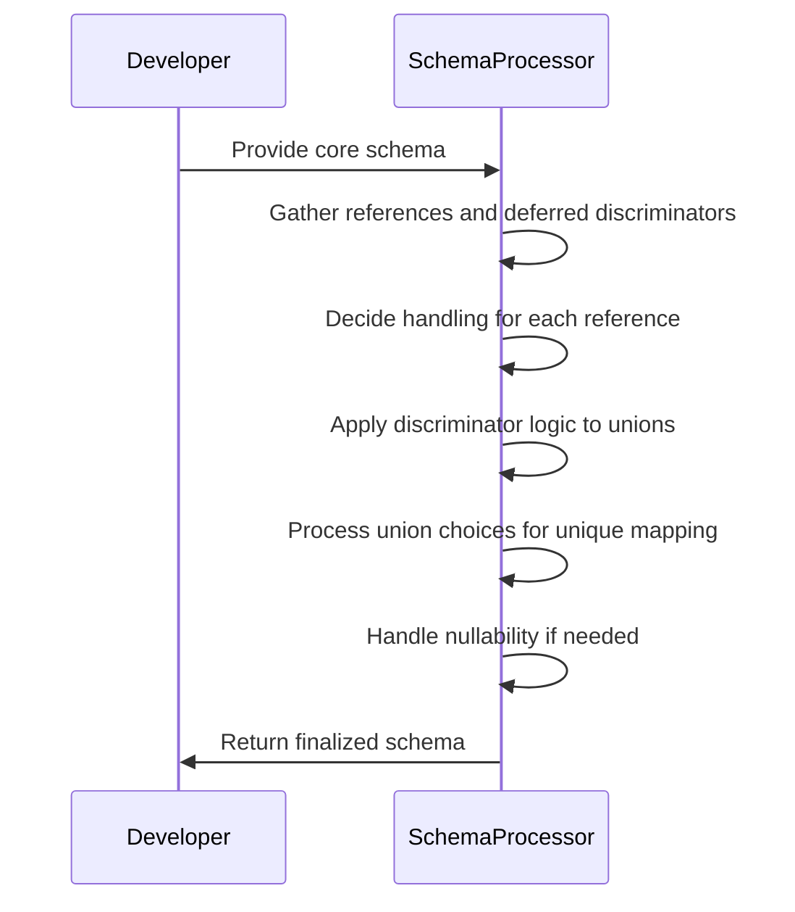
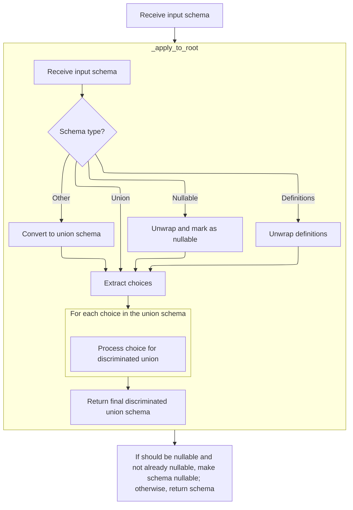
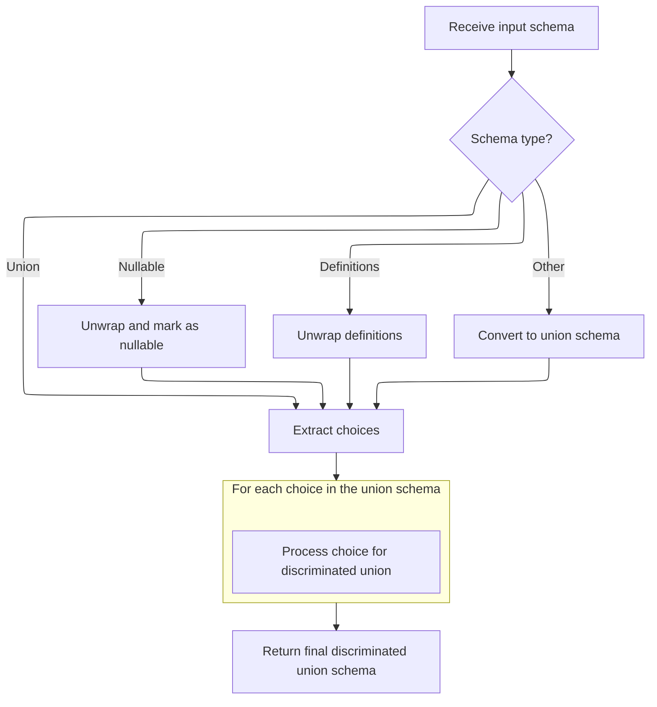

This flow prepares a schema for data validation and serialization by resolving references, applying discriminator logic for union types, and ensuring the schema is structured for advanced features like tagged unions and nullability.

The main steps are:

- Gather references and deferred discriminators.
- Decide how to handle each reference.
- Apply discriminators to union types.
- Process union choices for unique mapping.
- Handle nullability if needed.
- Attach remaining definitions and return the finalized schema.



# Spec

## Detailed View of the Program's Functionality

a. Resolving References and Cleaning the Schema

The process begins by finalizing the schema, which involves traversing the schema and its referenced definitions. The goal is to replace reference placeholders with their actual definitions where possible and to prepare the schema for further processing, such as discriminator application.

- All definitions (reusable schema fragments) are collected.
- The schema is traversed to gather references and identify which references can be inlined (replaced directly with their definition) and which must remain as references (for example, if they are used multiple times or have special metadata).
- For each reference:
  - If it is only used once and has no special serialization or metadata, it is inlined.
  - If it has only discriminator metadata, it is inlined but the metadata is preserved for later use.
  - Otherwise, the reference is kept, and the definition is stored for inclusion in the final schema.
- This step ensures that the schema is as flat as possible, reducing unnecessary indirection, but preserves references where needed for correctness or efficiency.

b. Applying Deferred Discriminators

After references are resolved, the next step is to apply any deferred discriminators. Discriminators are used to distinguish between different types in a union (for example, to implement tagged unions).

- The process iterates over all schemas that have deferred discriminator metadata.
- For each such schema:
  - The discriminator value is extracted from the metadata.
  - If the discriminator has already been applied (which can happen in rare cases), the schema is skipped.
  - Otherwise, the discriminator logic is applied to the schema, transforming it into a tagged union schema.
  - The schema is updated in place to reflect the application of the discriminator.

c. Discriminator Application Logic

When applying a discriminator, the logic checks whether the discriminator is a special object or a simple field name.

- If the discriminator is a special object (such as a custom Discriminator type), it may have its own method for converting the schema, which is invoked directly.
- If the discriminator is a simple field name, a helper class is instantiated to walk the schema and build a tagged union structure.
- This helper class:
  - Recursively unwraps nullable and definitions wrappers to get to the core union.
  - If the schema is not already a union, it is wrapped as a union for uniform processing.
  - Each choice in the union is processed:
    - Nested unions are flattened.
    - Tagged unions with the same discriminator are merged.
    - Each choice is analyzed to determine which discriminator values map to it, ensuring that each value is unique.
    - Nullable types are tracked so that the final schema can be made nullable if needed.
  - After all choices are processed, a tagged union schema is constructed, specifying the mapping from discriminator values to schemas and including the discriminator field (and alias, if necessary).

d. Finalizing Nullability

After building the tagged union structure, the logic checks if the schema should be nullable (<SwmToken path="pydantic/_internal/_generate_schema.py" pos="925:22:24" line-data="            # safety measure (because these are inlined in place -- i.e. mutated directly)">`i.e`</SwmToken>., accept null values) but is not yet marked as such.

- If so, the schema is wrapped in a nullable schema, which allows both the original type and null.
- The nullable schema is represented in JSON Schema as an <SwmToken path="pydantic/json_schema.py" pos="1238:10:10" line-data="            # I&#39;ll use &#39;anyOf&#39; for now, but it could be changed it if it would work better with some external tooling">`anyOf`</SwmToken> with the original schema and a null type.

e. Returning the Final Schema

Once all references are resolved, discriminators are applied, and nullability is finalized, the schema is checked for any remaining definitions.

- If there are leftover definitions (<SwmToken path="pydantic/_internal/_generate_schema.py" pos="925:22:24" line-data="            # safety measure (because these are inlined in place -- i.e. mutated directly)">`i.e`</SwmToken>., reusable schema fragments that must be included), the schema is wrapped with a definitions container.
- The finalized schema, now fully resolved and ready for downstream use (such as JSON Schema generation or validation), is returned.

This process ensures that the resulting schema is as simple as possible, with all necessary information for discriminated unions and references, and is ready for use in validation, serialization, or documentation generation.

# Rule Definition

| Paragraph Name                                                                                                                                                                                                                                                                                                                                                                                                                                                                                                                                                                                                                                                                                                                                                                                                                                                                                                                                                                                                                                                                                                                              | Rule ID | Category          | Description                                                                                                                                                                                                                                                                                                                                                                                                                                                                                                                                                                                                                                                                                                                                                                                                                                                                                                                                                      | Conditions                                                                                                                                                                                                                                                                                                                                                 | Remarks                                                                                                                                                                                                                                                                                                                                                                                                                                                                                                                                                                                                                                                                                                                                                                                                                                                                              |
| ------------------------------------------------------------------------------------------------------------------------------------------------------------------------------------------------------------------------------------------------------------------------------------------------------------------------------------------------------------------------------------------------------------------------------------------------------------------------------------------------------------------------------------------------------------------------------------------------------------------------------------------------------------------------------------------------------------------------------------------------------------------------------------------------------------------------------------------------------------------------------------------------------------------------------------------------------------------------------------------------------------------------------------------------------------------------------------------------------------------------------------------- | ------- | ----------------- | ---------------------------------------------------------------------------------------------------------------------------------------------------------------------------------------------------------------------------------------------------------------------------------------------------------------------------------------------------------------------------------------------------------------------------------------------------------------------------------------------------------------------------------------------------------------------------------------------------------------------------------------------------------------------------------------------------------------------------------------------------------------------------------------------------------------------------------------------------------------------------------------------------------------------------------------------------------------- | ---------------------------------------------------------------------------------------------------------------------------------------------------------------------------------------------------------------------------------------------------------------------------------------------------------------------------------------------------------- | ------------------------------------------------------------------------------------------------------------------------------------------------------------------------------------------------------------------------------------------------------------------------------------------------------------------------------------------------------------------------------------------------------------------------------------------------------------------------------------------------------------------------------------------------------------------------------------------------------------------------------------------------------------------------------------------------------------------------------------------------------------------------------------------------------------------------------------------------------------------------------------ |
| The feature must traverse the input schema and identify all references (objects with type <SwmToken path="pydantic/_internal/_generate_schema.py" pos="2739:22:24" line-data="        This traverses the core schema and referenced definitions, replaces `&#39;definition-ref&#39;` schemas">`definition-ref`</SwmToken> and a <SwmToken path="pydantic/_internal/_discriminated_union.py" pos="238:6:6" line-data="            if choice[&#39;schema_ref&#39;] not in self.definitions:">`schema_ref`</SwmToken> key) and any deferred discriminator metadata (<SwmToken path="pydantic/_internal/_generate_schema.py" pos="2782:8:10" line-data="                # gather result (e.g. when using the `Sequence` type -- see `test_sequence_discriminated_union()`).">`e.g`</SwmToken>., <SwmToken path="pydantic/_internal/_generate_schema.py" pos="2779:22:22" line-data="            discriminator: str \| None = cs[&#39;metadata&#39;].pop(&#39;pydantic_internal_union_discriminator&#39;, None)  # pyright: ignore[reportTypedDictNotRequiredAccess]">`pydantic_internal_union_discriminator`</SwmToken> in the 'metadata' key). | RL-001  | Conditional Logic | The program must recursively traverse the input core schema object and collect all references (objects with type <SwmToken path="pydantic/_internal/_generate_schema.py" pos="2739:22:24" line-data="        This traverses the core schema and referenced definitions, replaces `&#39;definition-ref&#39;` schemas">`definition-ref`</SwmToken> and a <SwmToken path="pydantic/_internal/_discriminated_union.py" pos="238:6:6" line-data="            if choice[&#39;schema_ref&#39;] not in self.definitions:">`schema_ref`</SwmToken> key) and any schemas containing deferred discriminator metadata (the <SwmToken path="pydantic/_internal/_generate_schema.py" pos="2779:22:22" line-data="            discriminator: str \| None = cs[&#39;metadata&#39;].pop(&#39;pydantic_internal_union_discriminator&#39;, None)  # pyright: ignore[reportTypedDictNotRequiredAccess]">`pydantic_internal_union_discriminator`</SwmToken> key in their 'metadata'). | Input is a core schema object (nested dictionary) that may contain references and deferred discriminator metadata.                                                                                                                                                                                                                                         | References are identified by type <SwmToken path="pydantic/_internal/_generate_schema.py" pos="2739:22:24" line-data="        This traverses the core schema and referenced definitions, replaces `&#39;definition-ref&#39;` schemas">`definition-ref`</SwmToken> and presence of <SwmToken path="pydantic/_internal/_discriminated_union.py" pos="238:6:6" line-data="            if choice[&#39;schema_ref&#39;] not in self.definitions:">`schema_ref`</SwmToken>. Deferred discriminator metadata is identified by the <SwmToken path="pydantic/_internal/_generate_schema.py" pos="2779:22:22" line-data="            discriminator: str \| None = cs[&#39;metadata&#39;].pop(&#39;pydantic_internal_union_discriminator&#39;, None)  # pyright: ignore[reportTypedDictNotRequiredAccess]">`pydantic_internal_union_discriminator`</SwmToken> key in the 'metadata' dictionary. |
| For each reference: If the reference is used only once and does not have extra metadata or serialization information, it must be inlined by replacing the <SwmToken path="pydantic/_internal/_generate_schema.py" pos="2739:22:24" line-data="        This traverses the core schema and referenced definitions, replaces `&#39;definition-ref&#39;` schemas">`definition-ref`</SwmToken> object with the corresponding schema from the definitions dictionary. If the reference is used more than once, or has extra metadata or serialization information, it must be preserved as a reference, and the output schema must include a 'definitions' wrapper at the top level containing all such referenced definitions.                                                                                                                                                                                                                                                                                                                                                                                                                   | RL-002  | Conditional Logic | For each reference found, determine if it should be inlined or preserved. Inline if used only once and has no extra metadata or serialization; otherwise, preserve as a reference and include in the output's 'definitions' wrapper.                                                                                                                                                                                                                                                                                                                                                                                                                                                                                                                                                                                                                                                                                                                             | Reference is found in the schema. Usage count and presence of extra metadata or serialization are determined.                                                                                                                                                                                                                                              | Inlined references are replaced by their full schema definition. Preserved references remain as <SwmToken path="pydantic/_internal/_generate_schema.py" pos="2739:22:24" line-data="        This traverses the core schema and referenced definitions, replaces `&#39;definition-ref&#39;` schemas">`definition-ref`</SwmToken> objects and are included in a 'definitions' wrapper at the top level of the output schema.                                                                                                                                                                                                                                                                                                                                                                                                                                                           |
| For each schema with deferred discriminator metadata: The discriminator metadata must be removed from the schema's metadata. The discriminator logic must be applied to the schema, using the specified discriminator field name. The discriminator logic must produce a tagged union schema with: type: <SwmToken path="pydantic/_internal/_discriminated_union.py" pos="141:26:28" line-data="        &quot;&quot;&quot;Return a new CoreSchema based on `schema` that uses a tagged-union with the discriminator provided">`tagged-union`</SwmToken>, discriminator: the specified field name (string), choices: a mapping from discriminator values (<SwmToken path="pydantic/_internal/_generate_schema.py" pos="2782:8:10" line-data="                # gather result (e.g. when using the `Sequence` type -- see `test_sequence_discriminated_union()`).">`e.g`</SwmToken>., 'cat', 'dog') to the corresponding model schemas                                                                                                                                                                                                        | RL-003  | Computation       | For each schema with deferred discriminator metadata, remove the metadata and apply discriminator logic to transform the schema into a tagged union schema using the specified discriminator field.                                                                                                                                                                                                                                                                                                                                                                                                                                                                                                                                                                                                                                                                                                                                                              | Schema contains <SwmToken path="pydantic/_internal/_generate_schema.py" pos="2779:22:22" line-data="            discriminator: str \| None = cs[&#39;metadata&#39;].pop(&#39;pydantic_internal_union_discriminator&#39;, None)  # pyright: ignore[reportTypedDictNotRequiredAccess]">`pydantic_internal_union_discriminator`</SwmToken> in its 'metadata'. | The resulting tagged union schema must have type <SwmToken path="pydantic/_internal/_discriminated_union.py" pos="141:26:28" line-data="        &quot;&quot;&quot;Return a new CoreSchema based on `schema` that uses a tagged-union with the discriminator provided">`tagged-union`</SwmToken>, a 'discriminator' field (string), and a 'choices' mapping discriminator values to model schemas.                                                                                                                                                                                                                                                                                                                                                                                                                                                                                    |
| If the input schema is a union of references (<SwmToken path="pydantic/_internal/_generate_schema.py" pos="2782:8:10" line-data="                # gather result (e.g. when using the `Sequence` type -- see `test_sequence_discriminated_union()`).">`e.g`</SwmToken>., <SwmToken path="pydantic/_internal/_generate_schema.py" pos="2739:22:24" line-data="        This traverses the core schema and referenced definitions, replaces `&#39;definition-ref&#39;` schemas">`definition-ref`</SwmToken> to 'Cat' and 'Dog'), and both have the same deferred discriminator, the output must be a tagged union schema with the discriminator field and choices mapping discriminator values to the inlined model schemas.                                                                                                                                                                                                                                                                                                                                                                                                                   | RL-004  | Computation       | If a union consists of references that all share the same deferred discriminator, transform the union into a tagged union schema with the discriminator field and choices mapping discriminator values to the inlined model schemas.                                                                                                                                                                                                                                                                                                                                                                                                                                                                                                                                                                                                                                                                                                                             | Input schema is a union of references, and all referenced schemas have the same deferred discriminator.                                                                                                                                                                                                                                                    | The output is a tagged union schema as described above, with inlined model schemas for each discriminator value.                                                                                                                                                                                                                                                                                                                                                                                                                                                                                                                                                                                                                                                                                                                                                                     |
| If the union is nullable (<SwmToken path="pydantic/_internal/_generate_schema.py" pos="925:22:24" line-data="            # safety measure (because these are inlined in place -- i.e. mutated directly)">`i.e`</SwmToken>., includes a 'nullable' schema or a None type), the output must be wrapped in a 'nullable' schema, with the inner schema being the tagged union schema.                                                                                                                                                                                                                                                                                                                                                                                                                                                                                                                                                                                                                                                                                                                                                           | RL-005  | Conditional Logic | If a union includes a nullable schema or None type, wrap the resulting tagged union schema in a 'nullable' schema.                                                                                                                                                                                                                                                                                                                                                                                                                                                                                                                                                                                                                                                                                                                                                                                                                                               | Union includes a 'nullable' schema or a None type.                                                                                                                                                                                                                                                                                                         | The output is a schema with type 'nullable', and its 'schema' key contains the tagged union schema.                                                                                                                                                                                                                                                                                                                                                                                                                                                                                                                                                                                                                                                                                                                                                                                  |
| The output schema must not contain any <SwmToken path="pydantic/_internal/_generate_schema.py" pos="2739:22:24" line-data="        This traverses the core schema and referenced definitions, replaces `&#39;definition-ref&#39;` schemas">`definition-ref`</SwmToken> objects that were inlined; all such references must be replaced with their full schema definitions. If any definitions remain that were not inlined, the output schema must be wrapped in a 'definitions' schema, which includes a 'definitions' key mapping reference names to their schema objects, and a 'schema' key containing the main schema.                                                                                                                                                                                                                                                                                                                                                                                                                                                                                                                 | RL-006  | Conditional Logic | After processing, ensure that all inlined references are replaced by their full schema definitions, and any remaining references are included in a 'definitions' wrapper at the top level.                                                                                                                                                                                                                                                                                                                                                                                                                                                                                                                                                                                                                                                                                                                                                                       | After all inlining and discriminator application is complete.                                                                                                                                                                                                                                                                                              | Output schema must not contain any inlined <SwmToken path="pydantic/_internal/_generate_schema.py" pos="2739:22:24" line-data="        This traverses the core schema and referenced definitions, replaces `&#39;definition-ref&#39;` schemas">`definition-ref`</SwmToken> objects. Remaining references are included in a 'definitions' schema with 'definitions' and 'schema' keys.                                                                                                                                                                                                                                                                                                                                                                                                                                                                                                |
| The output schema must be a fully resolved, tagged union schema with all references inlined where possible, all deferred discriminators applied, and all remaining definitions included as needed for downstream use. The output data format is a core schema object (nested dictionary) matching the described structure, with no unresolved references or deferred discriminator metadata.                                                                                                                                                                                                                                                                                                                                                                                                                                                                                                                                                                                                                                                                                                                                                | RL-007  | Data Assignment   | The final output must be a core schema object (nested dictionary) with all references inlined where possible, all deferred discriminators applied, and any remaining definitions included as needed. No unresolved references or deferred discriminator metadata should remain.                                                                                                                                                                                                                                                                                                                                                                                                                                                                                                                                                                                                                                                                                  | After all previous processing steps are complete.                                                                                                                                                                                                                                                                                                          | Output format: core schema object (nested dictionary) with no unresolved references or deferred discriminator metadata.                                                                                                                                                                                                                                                                                                                                                                                                                                                                                                                                                                                                                                                                                                                                                              |

# User Stories

## User Story 1: Traverse schema, handle references, and structure output

---

### Story Description:

As a system transforming core schema objects, I want to traverse the input schema, identify and process all references and deferred discriminator metadata, inline or preserve references as appropriate, and wrap the output with definitions if needed, so that the schema is efficiently structured and ready for further transformation.

---

### Business Rule Mapping:

| Rule ID | Paragraph Name                                                                                                                                                                                                                                                                                                                                                                                                                                                                                                                                                                                                                                                                                                                                                                                                                                                                                                                                                                                                                                                                                                                              | Rule Description                                                                                                                                                                                                                                                                                                                                                                                                                                                                                                                                                                                                                                                                                                                                                                                                                                                                                                                                                 |
| ------- | ------------------------------------------------------------------------------------------------------------------------------------------------------------------------------------------------------------------------------------------------------------------------------------------------------------------------------------------------------------------------------------------------------------------------------------------------------------------------------------------------------------------------------------------------------------------------------------------------------------------------------------------------------------------------------------------------------------------------------------------------------------------------------------------------------------------------------------------------------------------------------------------------------------------------------------------------------------------------------------------------------------------------------------------------------------------------------------------------------------------------------------------- | ---------------------------------------------------------------------------------------------------------------------------------------------------------------------------------------------------------------------------------------------------------------------------------------------------------------------------------------------------------------------------------------------------------------------------------------------------------------------------------------------------------------------------------------------------------------------------------------------------------------------------------------------------------------------------------------------------------------------------------------------------------------------------------------------------------------------------------------------------------------------------------------------------------------------------------------------------------------- |
| RL-001  | The feature must traverse the input schema and identify all references (objects with type <SwmToken path="pydantic/_internal/_generate_schema.py" pos="2739:22:24" line-data="        This traverses the core schema and referenced definitions, replaces `&#39;definition-ref&#39;` schemas">`definition-ref`</SwmToken> and a <SwmToken path="pydantic/_internal/_discriminated_union.py" pos="238:6:6" line-data="            if choice[&#39;schema_ref&#39;] not in self.definitions:">`schema_ref`</SwmToken> key) and any deferred discriminator metadata (<SwmToken path="pydantic/_internal/_generate_schema.py" pos="2782:8:10" line-data="                # gather result (e.g. when using the `Sequence` type -- see `test_sequence_discriminated_union()`).">`e.g`</SwmToken>., <SwmToken path="pydantic/_internal/_generate_schema.py" pos="2779:22:22" line-data="            discriminator: str \| None = cs[&#39;metadata&#39;].pop(&#39;pydantic_internal_union_discriminator&#39;, None)  # pyright: ignore[reportTypedDictNotRequiredAccess]">`pydantic_internal_union_discriminator`</SwmToken> in the 'metadata' key). | The program must recursively traverse the input core schema object and collect all references (objects with type <SwmToken path="pydantic/_internal/_generate_schema.py" pos="2739:22:24" line-data="        This traverses the core schema and referenced definitions, replaces `&#39;definition-ref&#39;` schemas">`definition-ref`</SwmToken> and a <SwmToken path="pydantic/_internal/_discriminated_union.py" pos="238:6:6" line-data="            if choice[&#39;schema_ref&#39;] not in self.definitions:">`schema_ref`</SwmToken> key) and any schemas containing deferred discriminator metadata (the <SwmToken path="pydantic/_internal/_generate_schema.py" pos="2779:22:22" line-data="            discriminator: str \| None = cs[&#39;metadata&#39;].pop(&#39;pydantic_internal_union_discriminator&#39;, None)  # pyright: ignore[reportTypedDictNotRequiredAccess]">`pydantic_internal_union_discriminator`</SwmToken> key in their 'metadata'). |
| RL-002  | For each reference: If the reference is used only once and does not have extra metadata or serialization information, it must be inlined by replacing the <SwmToken path="pydantic/_internal/_generate_schema.py" pos="2739:22:24" line-data="        This traverses the core schema and referenced definitions, replaces `&#39;definition-ref&#39;` schemas">`definition-ref`</SwmToken> object with the corresponding schema from the definitions dictionary. If the reference is used more than once, or has extra metadata or serialization information, it must be preserved as a reference, and the output schema must include a 'definitions' wrapper at the top level containing all such referenced definitions.                                                                                                                                                                                                                                                                                                                                                                                                                   | For each reference found, determine if it should be inlined or preserved. Inline if used only once and has no extra metadata or serialization; otherwise, preserve as a reference and include in the output's 'definitions' wrapper.                                                                                                                                                                                                                                                                                                                                                                                                                                                                                                                                                                                                                                                                                                                             |
| RL-006  | The output schema must not contain any <SwmToken path="pydantic/_internal/_generate_schema.py" pos="2739:22:24" line-data="        This traverses the core schema and referenced definitions, replaces `&#39;definition-ref&#39;` schemas">`definition-ref`</SwmToken> objects that were inlined; all such references must be replaced with their full schema definitions. If any definitions remain that were not inlined, the output schema must be wrapped in a 'definitions' schema, which includes a 'definitions' key mapping reference names to their schema objects, and a 'schema' key containing the main schema.                                                                                                                                                                                                                                                                                                                                                                                                                                                                                                                 | After processing, ensure that all inlined references are replaced by their full schema definitions, and any remaining references are included in a 'definitions' wrapper at the top level.                                                                                                                                                                                                                                                                                                                                                                                                                                                                                                                                                                                                                                                                                                                                                                       |

---

### Relevant Functionality:

- **The feature must traverse the input schema and identify all references (objects with type** <SwmToken path="pydantic/_internal/_generate_schema.py" pos="2739:22:24" line-data="        This traverses the core schema and referenced definitions, replaces `&#39;definition-ref&#39;` schemas">`definition-ref`</SwmToken> **and a** <SwmToken path="pydantic/_internal/_discriminated_union.py" pos="238:6:6" line-data="            if choice[&#39;schema_ref&#39;] not in self.definitions:">`schema_ref`</SwmToken> **key) and any deferred discriminator metadata (**<SwmToken path="pydantic/_internal/_generate_schema.py" pos="2782:8:10" line-data="                # gather result (e.g. when using the `Sequence` type -- see `test_sequence_discriminated_union()`).">`e.g`</SwmToken>**.**
  1. **RL-001:**
     - Recursively walk the input schema dictionary
     - For each object:
       - If type == <SwmToken path="pydantic/_internal/_generate_schema.py" pos="2739:22:24" line-data="        This traverses the core schema and referenced definitions, replaces `&#39;definition-ref&#39;` schemas">`definition-ref`</SwmToken> and <SwmToken path="pydantic/_internal/_discriminated_union.py" pos="238:6:6" line-data="            if choice[&#39;schema_ref&#39;] not in self.definitions:">`schema_ref`</SwmToken> exists, record as a reference
       - If 'metadata' contains <SwmToken path="pydantic/_internal/_generate_schema.py" pos="2779:22:22" line-data="            discriminator: str | None = cs[&#39;metadata&#39;].pop(&#39;pydantic_internal_union_discriminator&#39;, None)  # pyright: ignore[reportTypedDictNotRequiredAccess]">`pydantic_internal_union_discriminator`</SwmToken>, record as deferred discriminator
- **For each reference: If the reference is used only once and does not have extra metadata or serialization information**
  1. **RL-002:**
     - For each reference:
       - Count occurrences in the schema
       - Check for extra metadata or serialization
       - If used once and no extra metadata/serialization:
         - Replace <SwmToken path="pydantic/_internal/_generate_schema.py" pos="2739:22:24" line-data="        This traverses the core schema and referenced definitions, replaces `&#39;definition-ref&#39;` schemas">`definition-ref`</SwmToken> with schema from definitions
       - Else:
         - Keep as <SwmToken path="pydantic/_internal/_generate_schema.py" pos="2739:22:24" line-data="        This traverses the core schema and referenced definitions, replaces `&#39;definition-ref&#39;` schemas">`definition-ref`</SwmToken>
         - Add referenced schema to output 'definitions' dictionary
- **The output schema must not contain any** <SwmToken path="pydantic/_internal/_generate_schema.py" pos="2739:22:24" line-data="        This traverses the core schema and referenced definitions, replaces `&#39;definition-ref&#39;` schemas">`definition-ref`</SwmToken> **objects that were inlined; all such references must be replaced with their full schema definitions. If any definitions remain that were not inlined**
  1. **RL-006:**
     - Traverse output schema
     - Replace all inlined <SwmToken path="pydantic/_internal/_generate_schema.py" pos="2739:22:24" line-data="        This traverses the core schema and referenced definitions, replaces `&#39;definition-ref&#39;` schemas">`definition-ref`</SwmToken> objects with full schema definitions
     - If any references remain:
       - Wrap output in 'definitions' schema with 'definitions' and 'schema' keys

## User Story 2: Apply discriminator logic, handle unions, and produce fully resolved output

---

### Story Description:

As a system transforming core schema objects, I want to remove deferred discriminator metadata, apply discriminator logic to create tagged union schemas, handle unions (including nullable unions), and ensure the output schema is fully resolved with all references inlined where possible and all remaining definitions included, so that downstream consumers receive a complete and ready-to-use schema.

---

### Business Rule Mapping:

| Rule ID | Paragraph Name                                                                                                                                                                                                                                                                                                                                                                                                                                                                                                                                                                                                                                                                                                                                                                                                                                                                                                                       | Rule Description                                                                                                                                                                                                                                                                |
| ------- | ------------------------------------------------------------------------------------------------------------------------------------------------------------------------------------------------------------------------------------------------------------------------------------------------------------------------------------------------------------------------------------------------------------------------------------------------------------------------------------------------------------------------------------------------------------------------------------------------------------------------------------------------------------------------------------------------------------------------------------------------------------------------------------------------------------------------------------------------------------------------------------------------------------------------------------ | ------------------------------------------------------------------------------------------------------------------------------------------------------------------------------------------------------------------------------------------------------------------------------- |
| RL-003  | For each schema with deferred discriminator metadata: The discriminator metadata must be removed from the schema's metadata. The discriminator logic must be applied to the schema, using the specified discriminator field name. The discriminator logic must produce a tagged union schema with: type: <SwmToken path="pydantic/_internal/_discriminated_union.py" pos="141:26:28" line-data="        &quot;&quot;&quot;Return a new CoreSchema based on `schema` that uses a tagged-union with the discriminator provided">`tagged-union`</SwmToken>, discriminator: the specified field name (string), choices: a mapping from discriminator values (<SwmToken path="pydantic/_internal/_generate_schema.py" pos="2782:8:10" line-data="                # gather result (e.g. when using the `Sequence` type -- see `test_sequence_discriminated_union()`).">`e.g`</SwmToken>., 'cat', 'dog') to the corresponding model schemas | For each schema with deferred discriminator metadata, remove the metadata and apply discriminator logic to transform the schema into a tagged union schema using the specified discriminator field.                                                                             |
| RL-004  | If the input schema is a union of references (<SwmToken path="pydantic/_internal/_generate_schema.py" pos="2782:8:10" line-data="                # gather result (e.g. when using the `Sequence` type -- see `test_sequence_discriminated_union()`).">`e.g`</SwmToken>., <SwmToken path="pydantic/_internal/_generate_schema.py" pos="2739:22:24" line-data="        This traverses the core schema and referenced definitions, replaces `&#39;definition-ref&#39;` schemas">`definition-ref`</SwmToken> to 'Cat' and 'Dog'), and both have the same deferred discriminator, the output must be a tagged union schema with the discriminator field and choices mapping discriminator values to the inlined model schemas.                                                                                                                                                                                                            | If a union consists of references that all share the same deferred discriminator, transform the union into a tagged union schema with the discriminator field and choices mapping discriminator values to the inlined model schemas.                                            |
| RL-005  | If the union is nullable (<SwmToken path="pydantic/_internal/_generate_schema.py" pos="925:22:24" line-data="            # safety measure (because these are inlined in place -- i.e. mutated directly)">`i.e`</SwmToken>., includes a 'nullable' schema or a None type), the output must be wrapped in a 'nullable' schema, with the inner schema being the tagged union schema.                                                                                                                                                                                                                                                                                                                                                                                                                                                                                                                                                    | If a union includes a nullable schema or None type, wrap the resulting tagged union schema in a 'nullable' schema.                                                                                                                                                              |
| RL-007  | The output schema must be a fully resolved, tagged union schema with all references inlined where possible, all deferred discriminators applied, and all remaining definitions included as needed for downstream use. The output data format is a core schema object (nested dictionary) matching the described structure, with no unresolved references or deferred discriminator metadata.                                                                                                                                                                                                                                                                                                                                                                                                                                                                                                                                         | The final output must be a core schema object (nested dictionary) with all references inlined where possible, all deferred discriminators applied, and any remaining definitions included as needed. No unresolved references or deferred discriminator metadata should remain. |

---

### Relevant Functionality:

- **For each schema with deferred discriminator metadata: The discriminator metadata must be removed from the schema's metadata. The discriminator logic must be applied to the schema**
  1. **RL-003:**
     - For each schema with deferred discriminator metadata:
       - Remove <SwmToken path="pydantic/_internal/_generate_schema.py" pos="2779:22:22" line-data="            discriminator: str | None = cs[&#39;metadata&#39;].pop(&#39;pydantic_internal_union_discriminator&#39;, None)  # pyright: ignore[reportTypedDictNotRequiredAccess]">`pydantic_internal_union_discriminator`</SwmToken> from metadata
       - Apply discriminator logic:
         - Use discriminator field name
         - Build 'choices' mapping discriminator values to model schemas
       - Replace schema with tagged union schema
- **If the input schema is a union of references (**<SwmToken path="pydantic/_internal/_generate_schema.py" pos="2782:8:10" line-data="                # gather result (e.g. when using the `Sequence` type -- see `test_sequence_discriminated_union()`).">`e.g`</SwmToken>**.**
  1. **RL-004:**
     - If union of references with shared deferred discriminator:
       - Remove deferred discriminator metadata from all
       - Build tagged union schema with discriminator and choices mapping to inlined schemas
- **If the union is nullable (**<SwmToken path="pydantic/_internal/_generate_schema.py" pos="925:22:24" line-data="            # safety measure (because these are inlined in place -- i.e. mutated directly)">`i.e`</SwmToken>**.**
  1. **RL-005:**
     - If union includes nullable or None:
       - After building tagged union schema, wrap it in a 'nullable' schema
- **The output schema must be a fully resolved**
  1. **RL-007:**
     - After all processing:
       - Output the core schema object
       - Ensure all references are inlined or included in 'definitions'
       - Ensure all deferred discriminators are applied
       - Ensure no unresolved references or deferred discriminator metadata remain

# Code Walkthrough

## Cleaning and Inlining Schema References

```mermaid
%%{init: {"flowchart": {"defaultRenderer": "elk"}} }%%
flowchart TD
    node1["Resolve references in schema (collected_references)"] --> node2["Apply discriminator logic (apply_discriminator, apply) to deferred_discriminator_schemas"]
    click node1 openCode "pydantic/_internal/_generate_schema.py:2736:2776"
    node2 --> node3{"Are there remaining definitions (remaining_defs)?"}
    click node2 openCode "pydantic/_internal/_discriminated_union.py:34:160"
    node3 -->|"Yes"| node4["Add remaining_defs and return finalized schema"]
    node3 -->|"No"| node4["Return finalized schema"]
    click node3 openCode "pydantic/_internal/_generate_schema.py:2790:2792"
    click node4 openCode "pydantic/_internal/_generate_schema.py:2790:2792"


subgraph node2 [apply_discriminator]
  sgmain_1_node1["Decide if the discriminator is a special object or a simple field name"]
  click sgmain_1_node1 openCode "pydantic/_internal/_discriminated_union.py:64:68"
  sgmain_1_node1 -->|"Special object"| sgmain_1_node2["Convert schema using the Discriminator object"]
  click sgmain_1_node2 openCode "pydantic/types.py:3075:3075"
  sgmain_1_node1 -->|"Simple field name"| sgmain_1_node3["Apply discriminator to schema and return new schema"]
  click sgmain_1_node3 openCode "pydantic/_internal/_discriminated_union.py:70:70"
  sgmain_1_node2 --> sgmain_1_node3
end

subgraph node2 [apply]
  sgmain_2_node1["Receive input schema"]
  click sgmain_2_node1 openCode "pydantic/_internal/_discriminated_union.py:140:163"
  sgmain_2_node1 --> sgmain_2_node2["Transform to tagged union schema using discriminator"]
  click sgmain_2_node2 openCode "pydantic/_internal/_discriminated_union.py:170:170"
  sgmain_2_node2 --> sgmain_2_node3["If should be nullable and not already nullable, make schema nullable; otherwise, return schema"]
  click sgmain_2_node3 openCode "pydantic/_internal/_discriminated_union.py:165:168"
end

%% Swimm:
%% %%{init: {"flowchart": {"defaultRenderer": "elk"}} }%%
%% flowchart TD
%%     node1["Resolve references in schema (<SwmToken path="pydantic/_internal/_generate_schema.py" pos="2755:13:13" line-data="        for ref, inlinable_def_ref in gather_result[&#39;collected_references&#39;].items():">`collected_references`</SwmToken>)"] --> node2["Apply discriminator logic (<SwmToken path="pydantic/_internal/_generate_schema.py" pos="2785:7:7" line-data="            applied = _discriminated_union.apply_discriminator(cs.copy(), discriminator, remaining_defs)">`apply_discriminator`</SwmToken>, apply) to <SwmToken path="pydantic/_internal/_generate_schema.py" pos="2778:10:10" line-data="        for cs in gather_result[&#39;deferred_discriminator_schemas&#39;]:">`deferred_discriminator_schemas`</SwmToken>"]
%%     click node1 openCode "<SwmPath>[pydantic/\_internal/\_generate_schema.py](pydantic/_internal/_generate_schema.py)</SwmPath>:2736:2776"
%%     node2 --> node3{"Are there remaining definitions (<SwmToken path="pydantic/_internal/_generate_schema.py" pos="2751:1:1" line-data="        remaining_defs: dict[str, CoreSchema] = {}">`remaining_defs`</SwmToken>)?"}
%%     click node2 openCode "<SwmPath>[pydantic/\_internal/\_discriminated_union.py](pydantic/_internal/_discriminated_union.py)</SwmPath>:34:160"
%%     node3 -->|"Yes"| node4["Add <SwmToken path="pydantic/_internal/_generate_schema.py" pos="2751:1:1" line-data="        remaining_defs: dict[str, CoreSchema] = {}">`remaining_defs`</SwmToken> and return finalized schema"]
%%     node3 -->|"No"| node4["Return finalized schema"]
%%     click node3 openCode "<SwmPath>[pydantic/\_internal/\_generate_schema.py](pydantic/_internal/_generate_schema.py)</SwmPath>:2790:2792"
%%     click node4 openCode "<SwmPath>[pydantic/\_internal/\_generate_schema.py](pydantic/_internal/_generate_schema.py)</SwmPath>:2790:2792"
%% 
%% 
%% subgraph node2 [<SwmToken path="pydantic/_internal/_generate_schema.py" pos="2785:7:7" line-data="            applied = _discriminated_union.apply_discriminator(cs.copy(), discriminator, remaining_defs)">`apply_discriminator`</SwmToken>]
%%   sgmain_1_node1["Decide if the discriminator is a special object or a simple field name"]
%%   click sgmain_1_node1 openCode "<SwmPath>[pydantic/\_internal/\_discriminated_union.py](pydantic/_internal/_discriminated_union.py)</SwmPath>:64:68"
%%   sgmain_1_node1 -->|"Special object"| sgmain_1_node2["Convert schema using the Discriminator object"]
%%   click sgmain_1_node2 openCode "<SwmPath>[pydantic/types.py](pydantic/types.py)</SwmPath>:3075:3075"
%%   sgmain_1_node1 -->|"Simple field name"| sgmain_1_node3["Apply discriminator to schema and return new schema"]
%%   click sgmain_1_node3 openCode "<SwmPath>[pydantic/\_internal/\_discriminated_union.py](pydantic/_internal/_discriminated_union.py)</SwmPath>:70:70"
%%   sgmain_1_node2 --> sgmain_1_node3
%% end
%% 
%% subgraph node2 [apply]
%%   sgmain_2_node1["Receive input schema"]
%%   click sgmain_2_node1 openCode "<SwmPath>[pydantic/\_internal/\_discriminated_union.py](pydantic/_internal/_discriminated_union.py)</SwmPath>:140:163"
%%   sgmain_2_node1 --> sgmain_2_node2["Transform to tagged union schema using discriminator"]
%%   click sgmain_2_node2 openCode "<SwmPath>[pydantic/\_internal/\_discriminated_union.py](pydantic/_internal/_discriminated_union.py)</SwmPath>:170:170"
%%   sgmain_2_node2 --> sgmain_2_node3["If should be nullable and not already nullable, make schema nullable; otherwise, return schema"]
%%   click sgmain_2_node3 openCode "<SwmPath>[pydantic/\_internal/\_discriminated_union.py](pydantic/_internal/_discriminated_union.py)</SwmPath>:165:168"
%% end
```



<SwmSnippet path="/pydantic/_internal/_generate_schema.py" line="2736">

---

In <SwmToken path="pydantic/_internal/_generate_schema.py" pos="2736:3:3" line-data="    def finalize_schema(self, schema: CoreSchema) -&gt; CoreSchema:">`finalize_schema`</SwmToken>, we gather references and deferred discriminators, then decide for each reference whether to inline, preserve metadata, or keep it for later, depending on its inlining behavior.

```python
    def finalize_schema(self, schema: CoreSchema) -> CoreSchema:
        """Finalize the core schema.

        This traverses the core schema and referenced definitions, replaces `'definition-ref'` schemas
        by the referenced definition if possible, and applies deferred discriminators.
        """
        definitions = self._definitions
        try:
            gather_result = gather_schemas_for_cleaning(
                schema,
                definitions=definitions,
            )
        except MissingDefinitionError as e:
            raise InvalidSchemaError from e

        remaining_defs: dict[str, CoreSchema] = {}

        # Note: this logic doesn't play well when core schemas with deferred discriminator metadata
        # and references are encountered. See the `test_deferred_discriminated_union_and_references()` test.
        for ref, inlinable_def_ref in gather_result['collected_references'].items():
            if inlinable_def_ref is not None and (inlining_behavior := _inlining_behavior(inlinable_def_ref)) != 'keep':
                if inlining_behavior == 'inline':
                    # `ref` was encountered, and only once:
                    #  - `inlinable_def_ref` is a `'definition-ref'` schema and is guaranteed to be
                    #    the only one. Transform it into the definition it points to.
                    #  - Do not store the definition in the `remaining_defs`.
                    inlinable_def_ref.clear()  # pyright: ignore[reportAttributeAccessIssue]
                    inlinable_def_ref.update(self._resolve_definition(ref, definitions))  # pyright: ignore
                elif inlining_behavior == 'preserve_metadata':
                    # `ref` was encountered, and only once, but contains discriminator metadata.
                    # We will do the same thing as if `inlining_behavior` was `'inline'`, but make
                    # sure to keep the metadata for the deferred discriminator application logic below.
                    meta = inlinable_def_ref.pop('metadata')
                    inlinable_def_ref.clear()  # pyright: ignore[reportAttributeAccessIssue]
                    inlinable_def_ref.update(self._resolve_definition(ref, definitions))  # pyright: ignore
                    inlinable_def_ref['metadata'] = meta
            else:
                # `ref` was encountered, at least two times (or only once, but with metadata or a serialization schema):
                # - Do not inline the `'definition-ref'` schemas (they are not provided in the gather result anyway).
                # - Store the the definition in the `remaining_defs`
                remaining_defs[ref] = self._resolve_definition(ref, definitions)
```

---

</SwmSnippet>

<SwmSnippet path="/pydantic/_internal/_generate_schema.py" line="2776">

---

Next, we apply discriminators to schemas that need them, now that all references are resolved, so union types work as expected.

```python
                remaining_defs[ref] = self._resolve_definition(ref, definitions)

        for cs in gather_result['deferred_discriminator_schemas']:
            discriminator: str | None = cs['metadata'].pop('pydantic_internal_union_discriminator', None)  # pyright: ignore[reportTypedDictNotRequiredAccess]
            if discriminator is None:
                # This can happen in rare scenarios, when a deferred schema is present multiple times in the
                # gather result (e.g. when using the `Sequence` type -- see `test_sequence_discriminated_union()`).
                # In this case, a previous loop iteration applied the discriminator and so we can just skip it here.
                continue
            applied = _discriminated_union.apply_discriminator(cs.copy(), discriminator, remaining_defs)
            # Mutate the schema directly to have the discriminator applied
            cs.clear()  # pyright: ignore[reportAttributeAccessIssue]
            cs.update(applied)  # pyright: ignore

```

---

</SwmSnippet>

### Setting Up Discriminator Logic

<SwmSnippet path="/pydantic/_internal/_discriminated_union.py" line="34">

---

In <SwmToken path="pydantic/_internal/_discriminated_union.py" pos="34:2:2" line-data="def apply_discriminator(">`apply_discriminator`</SwmToken>, we handle special Discriminator objects and, if needed, convert the schema to support tagged unions before moving on.

```python
def apply_discriminator(
    schema: core_schema.CoreSchema,
    discriminator: str | Discriminator,
    definitions: dict[str, core_schema.CoreSchema] | None = None,
) -> core_schema.CoreSchema:
    """Applies the discriminator and returns a new core schema.

    Args:
        schema: The input schema.
        discriminator: The name of the field which will serve as the discriminator.
        definitions: A mapping of schema ref to schema.

    Returns:
        The new core schema.

    Raises:
        TypeError:
            - If `discriminator` is used with invalid union variant.
            - If `discriminator` is used with `Union` type with one variant.
            - If `discriminator` value mapped to multiple choices.
        MissingDefinitionForUnionRef:
            If the definition for ref is missing.
        PydanticUserError:
            - If a model in union doesn't have a discriminator field.
            - If discriminator field has a non-string alias.
            - If discriminator fields have different aliases.
            - If discriminator field not of type `Literal`.
    """
    from ..types import Discriminator

    if isinstance(discriminator, Discriminator):
        if isinstance(discriminator.discriminator, str):
            discriminator = discriminator.discriminator
        else:
            return discriminator._convert_schema(schema)

```

---

</SwmSnippet>

#### Converting to Tagged Union Schema

See <SwmLink doc-title="Converting schemas to tagged unions">[Converting schemas to tagged unions](/.swm/converting-schemas-to-tagged-unions.3gt2pagw.sw.md)</SwmLink>

#### Inferring and Applying Discriminator Mapping

<SwmSnippet path="/pydantic/_internal/_discriminated_union.py" line="70">

---

After returning from <SwmToken path="pydantic/_internal/_discriminated_union.py" pos="68:5:5" line-data="            return discriminator._convert_schema(schema)">`_convert_schema`</SwmToken>, <SwmToken path="pydantic/_internal/_generate_schema.py" pos="2785:7:7" line-data="            applied = _discriminated_union.apply_discriminator(cs.copy(), discriminator, remaining_defs)">`apply_discriminator`</SwmToken> instantiates a helper and calls its apply method. This step actually walks the schema and builds the tagged union using the discriminator and definitions, finalizing the structure needed for discrimination.

```python
    return _ApplyInferredDiscriminator(discriminator, definitions or {}).apply(schema)
```

---

</SwmSnippet>

### Building the Tagged Union Structure



<SwmSnippet path="/pydantic/_internal/_discriminated_union.py" line="140">

---

In <SwmToken path="pydantic/_internal/_discriminated_union.py" pos="140:3:3" line-data="    def apply(self, schema: core_schema.CoreSchema) -&gt; core_schema.CoreSchema:">`apply`</SwmToken>, we make sure this instance hasn't been used before, then call <SwmToken path="pydantic/_internal/_discriminated_union.py" pos="164:7:7" line-data="        schema = self._apply_to_root(schema)">`_apply_to_root`</SwmToken> to recursively process the schema. This step unwraps any nullable or definitions wrappers and prepares the union structure for discriminator handling.

```python
    def apply(self, schema: core_schema.CoreSchema) -> core_schema.CoreSchema:
        """Return a new CoreSchema based on `schema` that uses a tagged-union with the discriminator provided
        to this class.

        Args:
            schema: The input schema.

        Returns:
            The new core schema.

        Raises:
            TypeError:
                - If `discriminator` is used with invalid union variant.
                - If `discriminator` is used with `Union` type with one variant.
                - If `discriminator` value mapped to multiple choices.
            ValueError:
                If the definition for ref is missing.
            PydanticUserError:
                - If a model in union doesn't have a discriminator field.
                - If discriminator field has a non-string alias.
                - If discriminator fields have different aliases.
                - If discriminator field not of type `Literal`.
        """
        assert not self._used
        schema = self._apply_to_root(schema)
```

---

</SwmSnippet>

#### Unwrapping and Flattening Union Choices



<SwmSnippet path="/pydantic/_internal/_discriminated_union.py" line="170">

---

In <SwmToken path="pydantic/_internal/_discriminated_union.py" pos="170:3:3" line-data="    def _apply_to_root(self, schema: core_schema.CoreSchema) -&gt; core_schema.CoreSchema:">`_apply_to_root`</SwmToken>, we recursively unwrap nullable and definitions schemas, and if the schema isn't a union, we wrap it into a union schema. This guarantees that all schemas are processed in a uniform way, making downstream discriminator logic and error handling consistent.

```python
    def _apply_to_root(self, schema: core_schema.CoreSchema) -> core_schema.CoreSchema:
        """This method handles the outer-most stage of recursion over the input schema:
        unwrapping nullable or definitions schemas, and calling the `_handle_choice`
        method iteratively on the choices extracted (recursively) from the possibly-wrapped union.
        """
        if schema['type'] == 'nullable':
            self._is_nullable = True
            wrapped = self._apply_to_root(schema['schema'])
            nullable_wrapper = schema.copy()
            nullable_wrapper['schema'] = wrapped
            return nullable_wrapper

        if schema['type'] == 'definitions':
            wrapped = self._apply_to_root(schema['schema'])
            definitions_wrapper = schema.copy()
            definitions_wrapper['schema'] = wrapped
            return definitions_wrapper

        if schema['type'] != 'union':
            # If the schema is not a union, it probably means it just had a single member and
            # was flattened by pydantic_core.
            # However, it still may make sense to apply the discriminator to this schema,
            # as a way to get discriminated-union-style error messages, so we allow this here.
            schema = core_schema.union_schema([schema])

```

---

</SwmSnippet>

<SwmSnippet path="/pydantic/_internal/_discriminated_union.py" line="195">

---

After wrapping with <SwmToken path="pydantic/_internal/_discriminated_union.py" pos="193:7:7" line-data="            schema = core_schema.union_schema([schema])">`union_schema`</SwmToken>, <SwmToken path="pydantic/_internal/_discriminated_union.py" pos="164:7:7" line-data="        schema = self._apply_to_root(schema)">`_apply_to_root`</SwmToken> reverses the union choices and pushes them onto a stack. It then pops each one and processes it with <SwmToken path="pydantic/_internal/_discriminated_union.py" pos="200:3:3" line-data="            self._handle_choice(choice)">`_handle_choice`</SwmToken>, so all union members (including nested ones) are handled in the right order.

```python
        # Reverse the choices list before extending the stack so that they get handled in the order they occur
        choices_schemas = [v[0] if isinstance(v, tuple) else v for v in schema['choices'][::-1]]
        self._choices_to_handle.extend(choices_schemas)
        while self._choices_to_handle:
            choice = self._choices_to_handle.pop()
            self._handle_choice(choice)

```

---

</SwmSnippet>

<SwmSnippet path="/pydantic/_internal/_discriminated_union.py" line="226">

---

<SwmToken path="pydantic/_internal/_discriminated_union.py" pos="226:3:3" line-data="    def _handle_choice(self, choice: core_schema.CoreSchema) -&gt; None:">`_handle_choice`</SwmToken> processes each union member, recursively flattening nested unions and tagged unions, tracking nullable types, and making sure each discriminator value maps to a unique choice. This builds up the mapping needed for the final tagged union schema.

```python
    def _handle_choice(self, choice: core_schema.CoreSchema) -> None:
        """This method handles the "middle" stage of recursion over the input schema.
        Specifically, it is responsible for handling each choice of the outermost union
        (and any "coalesced" choices obtained from inner unions).

        Here, "handling" entails:
        * Coalescing nested unions and compatible tagged-unions
        * Tracking the presence of 'none' and 'nullable' schemas occurring as choices
        * Validating that each allowed discriminator value maps to a unique choice
        * Updating the _tagged_union_choices mapping that will ultimately be used to build the TaggedUnionSchema.
        """
        if choice['type'] == 'definition-ref':
            if choice['schema_ref'] not in self.definitions:
                raise MissingDefinitionForUnionRef(choice['schema_ref'])

        if choice['type'] == 'none':
            self._should_be_nullable = True
        elif choice['type'] == 'definitions':
            self._handle_choice(choice['schema'])
        elif choice['type'] == 'nullable':
            self._should_be_nullable = True
            self._handle_choice(choice['schema'])  # unwrap the nullable schema
        elif choice['type'] == 'union':
            # Reverse the choices list before extending the stack so that they get handled in the order they occur
            choices_schemas = [v[0] if isinstance(v, tuple) else v for v in choice['choices'][::-1]]
            self._choices_to_handle.extend(choices_schemas)
        elif choice['type'] not in {
            'model',
            'typed-dict',
            'tagged-union',
            'lax-or-strict',
            'dataclass',
            'dataclass-args',
            'definition-ref',
        } and not _core_utils.is_function_with_inner_schema(choice):
            # We should eventually handle 'definition-ref' as well
            err_str = f'The core schema type {choice["type"]!r} is not a valid discriminated union variant.'
            if choice['type'] == 'list':
                err_str += (
                    ' If you are making use of a list of union types, make sure the discriminator is applied to the '
                    'union type and not the list (e.g. `list[Annotated[<T> | <U>, Field(discriminator=...)]]`).'
                )
            raise TypeError(err_str)
        else:
            if choice['type'] == 'tagged-union' and self._is_discriminator_shared(choice):
                # In this case, this inner tagged-union is compatible with the outer tagged-union,
                # and its choices can be coalesced into the outer TaggedUnionSchema.
                subchoices = [x for x in choice['choices'].values() if not isinstance(x, (str, int))]
                # Reverse the choices list before extending the stack so that they get handled in the order they occur
                self._choices_to_handle.extend(subchoices[::-1])
                return

            inferred_discriminator_values = self._infer_discriminator_values_for_choice(choice, source_name=None)
            self._set_unique_choice_for_values(choice, inferred_discriminator_values)
```

---

</SwmSnippet>

<SwmSnippet path="/pydantic/_internal/_discriminated_union.py" line="202">

---

After <SwmToken path="pydantic/_internal/_discriminated_union.py" pos="172:19:19" line-data="        unwrapping nullable or definitions schemas, and calling the `_handle_choice`">`_handle_choice`</SwmToken>, <SwmToken path="pydantic/_internal/_discriminated_union.py" pos="164:7:7" line-data="        schema = self._apply_to_root(schema)">`_apply_to_root`</SwmToken> sets up the discriminator (with alias if needed) and builds the final tagged union schema.

```python
        if self._discriminator_alias is not None and self._discriminator_alias != self.discriminator:
            # * We need to annotate `discriminator` as a union here to handle both branches of this conditional
            # * We need to annotate `discriminator` as list[list[str | int]] and not list[list[str]] due to the
            #   invariance of list, and because list[list[str | int]] is the type of the discriminator argument
            #   to tagged_union_schema below
            # * See the docstring of pydantic_core.core_schema.tagged_union_schema for more details about how to
            #   interpret the value of the discriminator argument to tagged_union_schema. (The list[list[str]] here
            #   is the appropriate way to provide a list of fallback attributes to check for a discriminator value.)
            discriminator: str | list[list[str | int]] = [[self.discriminator], [self._discriminator_alias]]
        else:
            discriminator = self.discriminator
        return core_schema.tagged_union_schema(
            choices=self._tagged_union_choices,
            discriminator=discriminator,
            custom_error_type=schema.get('custom_error_type'),
            custom_error_message=schema.get('custom_error_message'),
            custom_error_context=schema.get('custom_error_context'),
            strict=False,
            from_attributes=True,
            ref=schema.get('ref'),
            metadata=schema.get('metadata'),
            serialization=schema.get('serialization'),
        )
```

---

</SwmSnippet>

#### Finalizing Nullability in Tagged Unions

<SwmSnippet path="/pydantic/_internal/_discriminated_union.py" line="165">

---

After returning from <SwmToken path="pydantic/_internal/_discriminated_union.py" pos="164:7:7" line-data="        schema = self._apply_to_root(schema)">`_apply_to_root`</SwmToken>, <SwmToken path="pydantic/_internal/_discriminated_union.py" pos="70:16:16" line-data="    return _ApplyInferredDiscriminator(discriminator, definitions or {}).apply(schema)">`apply`</SwmToken> checks if the schema should be nullable but isn't yet. If so, it wraps the schema with <SwmToken path="pydantic/_internal/_discriminated_union.py" pos="166:7:7" line-data="            schema = core_schema.nullable_schema(schema)">`nullable_schema`</SwmToken> so null values are accepted as valid.

```python
        if self._should_be_nullable and not self._is_nullable:
            schema = core_schema.nullable_schema(schema)
```

---

</SwmSnippet>

<SwmSnippet path="/pydantic/json_schema.py" line="1222">

---

<SwmToken path="pydantic/json_schema.py" pos="1222:3:3" line-data="    def nullable_schema(self, schema: core_schema.NullableSchema) -&gt; JsonSchemaValue:">`nullable_schema`</SwmToken> builds a JSON schema that allows null values by combining the inner schema and a null type using <SwmToken path="pydantic/json_schema.py" pos="1238:10:10" line-data="            # I&#39;ll use &#39;anyOf&#39; for now, but it could be changed it if it would work better with some external tooling">`anyOf`</SwmToken>. If the inner schema is already null, it just returns that. This approach is compatible with most external tools.

```python
    def nullable_schema(self, schema: core_schema.NullableSchema) -> JsonSchemaValue:
        """Generates a JSON schema that matches a schema that allows null values.

        Args:
            schema: The core schema.

        Returns:
            The generated JSON schema.
        """
        null_schema = {'type': 'null'}
        inner_json_schema = self.generate_inner(schema['schema'])

        if inner_json_schema == null_schema:
            return null_schema
        else:
            # Thanks to the equality check against `null_schema` above, I think 'oneOf' would also be valid here;
            # I'll use 'anyOf' for now, but it could be changed it if it would work better with some external tooling
            return self.get_flattened_anyof([inner_json_schema, null_schema])
```

---

</SwmSnippet>

<SwmSnippet path="/pydantic/_internal/_discriminated_union.py" line="167">

---

After <SwmToken path="pydantic/_internal/_discriminated_union.py" pos="166:7:7" line-data="            schema = core_schema.nullable_schema(schema)">`nullable_schema`</SwmToken>, <SwmToken path="pydantic/_internal/_discriminated_union.py" pos="70:16:16" line-data="    return _ApplyInferredDiscriminator(discriminator, definitions or {}).apply(schema)">`apply`</SwmToken> marks the instance as used and returns the final schema, which now supports tagged unions and nullability as needed.

```python
        self._used = True
        return schema
```

---

</SwmSnippet>

### Wrapping Up and Returning the Final Schema

<SwmSnippet path="/pydantic/_internal/_generate_schema.py" line="2790">

---

After <SwmToken path="pydantic/_internal/_generate_schema.py" pos="2785:7:7" line-data="            applied = _discriminated_union.apply_discriminator(cs.copy(), discriminator, remaining_defs)">`apply_discriminator`</SwmToken>, <SwmToken path="pydantic/_internal/_generate_schema.py" pos="2736:3:3" line-data="    def finalize_schema(self, schema: CoreSchema) -&gt; CoreSchema:">`finalize_schema`</SwmToken> checks if there are any leftover definitions. If so, it wraps the schema with them before returning, making sure all needed definitions are present for downstream use.

```python
        if remaining_defs:
            schema = core_schema.definitions_schema(schema=schema, definitions=[*remaining_defs.values()])
        return schema
```

---

</SwmSnippet>

&nbsp;

*This is an auto-generated document by Swimm 🌊 and has not yet been verified by a human*

<SwmMeta version="3.0.0" repo-id="Z2l0aHViJTNBJTNBcHlkYW50aWMlM0ElM0FTd2ltbS1EZW1v" repo-name="pydantic"><sup>Powered by [Swimm](/)</sup></SwmMeta>
