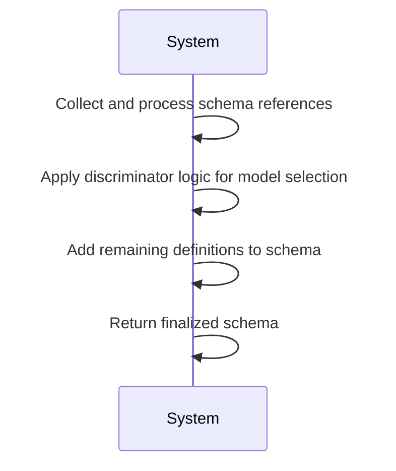
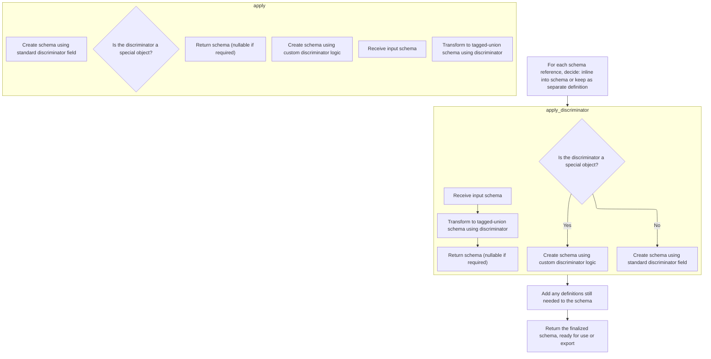
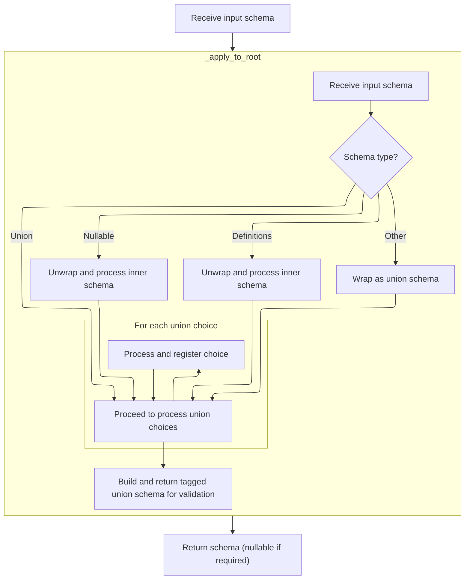
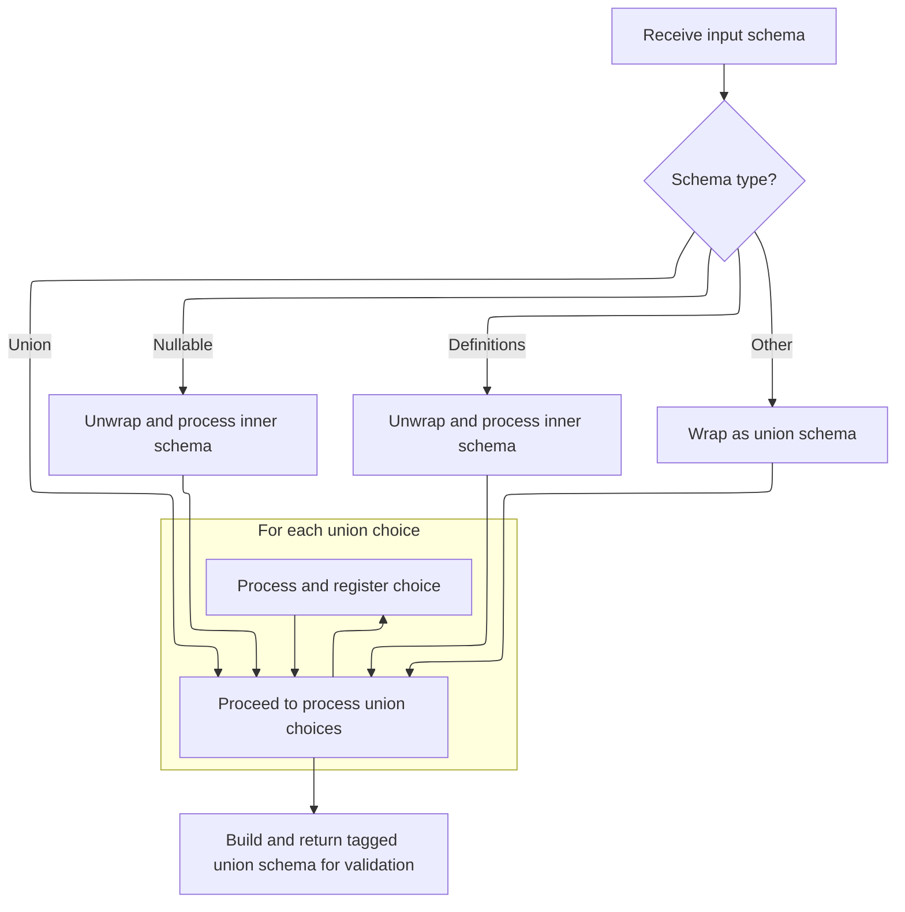

This flow prepares a schema for data validation and serialization by resolving references, applying discriminators for model selection, and including any necessary definitions. The main steps are:

- Collect and process schema references
- Apply discriminator logic for tagged unions
- Add remaining definitions to the schema
- Return the finalized schema ready for use



# Spec

## Detailed View of the Program's Functionality

a. Resolving and Inlining Schema References

The process begins by examining all schema references within the schema structure. For each reference, a decision is made: either inline the referenced definition directly into the schema, preserve its metadata for later processing, or keep it as a separate reference to be included as a definition at the end. This is determined by analyzing the reference's usage count and whether it contains special metadata (such as discriminator information) or serialization logic. If a reference is only used once and has no special metadata, it is inlined by replacing the reference node with the actual definition. If it contains only discriminator metadata, it is inlined but the metadata is preserved for later use. If the reference is used multiple times or contains other important metadata or serialization logic, it is kept as a separate definition and tracked for inclusion at the end of the process.

b. Applying Discriminator Logic to Deferred Schemas

After handling references, the process identifies schemas that have deferred discriminator metadata. For each such schema, it checks if the discriminator metadata is still present. If so, it applies the discriminator logic, which transforms the schema into a tagged union (a structure that allows model selection based on a discriminator field). This is done by copying the schema, applying the discriminator logic, and then updating the original schema in place with the result. This ensures that discriminated unions are set up only after all references have been resolved, preventing issues with circular or unresolved references.

c. Dispatching Discriminator Logic

When applying a discriminator, the logic checks if the discriminator is a special object (such as a custom Discriminator instance). If it is, and it contains custom logic, the process delegates to the custom logic to transform the schema. Otherwise, it uses the provided string as the discriminator field name and proceeds with the standard tagged union logic.

d. Building the Tagged Union Schema

The core of the discriminator application is handled by a class that recursively processes the schema. It starts by unwrapping any nullable or definitions wrappers, ensuring that the core union structure is exposed. If the schema is not already a union, it is wrapped as a union for consistency. The process then iterates over each choice in the union, handling nested unions, tagged unions, and other complex cases. For each choice, it determines the set of discriminator values that should map to that choice, ensuring that each value is unique across all choices. If a choice is itself a compatible tagged union, its choices are merged into the outer tagged union. The process also tracks whether the union should be nullable, based on the presence of 'none' or nullable schemas among the choices.

e. Normalizing and Flattening Union Choices

During the recursive processing of union choices, the logic flattens nested unions and tagged unions, ensuring that all valid choices are considered at the top level. It also validates that each discriminator value is unique and that each choice is structurally valid for use in a discriminated union. Special care is taken to handle cases where a choice is a reference to a definition, ensuring that the referenced schema is available and properly processed.

f. Finalizing the Tagged Union Schema

Once all choices have been processed and the mapping from discriminator values to choices has been established, the process constructs the final tagged union schema. If an alias for the discriminator field is needed (for example, if different choices use different field names or aliases for the discriminator), this is handled by providing a list of possible field names to check. The resulting schema includes all necessary metadata, error handling, and serialization logic. If the union should be nullable, the schema is wrapped as nullable at the end.

g. Wrapping with Remaining Definitions

After the tagged union schema is constructed and all discriminators have been applied, the process checks for any remaining definitions that were not inlined. If any such definitions exist, the schema is wrapped in a definitions structure that includes all these definitions. This ensures that all referenced types are available in the final schema, making it ready for use or export.

h. Returning the Finalized Schema

The process concludes by returning the fully resolved, inlined, and discriminator-applied schema. This schema is now ready for use in validation, serialization, or export, with all references and discriminators properly handled.

# Rule Definition

| Paragraph Name                                                                                                                                                                                                                                                                                                                                                                                                                                                                                                                                                                                                                                                                                                                                                                                                                                                                                                                                                                                                                                                                                                                                                                                                                                                                                                                                                                                                                                                                                                                                                                                                                                                                                                                                                                                                                                                                                                                                                                                                                                                                                                                                                                                                                                                                                                                                                                                                                                                                                                                                                                                                                                                                                                                                                                                                                                                                                                                                                                                                                                                                                                                                                                                                                                                                                               | Rule ID | Category          | Description                                                                                                                                                                                                                                                                                                                                                                                                                                                                                                                                                                                                                      | Conditions                                                                                                                                                                                                                                                                                 | Remarks                                                                                                                                                                                                                                                                                                                                                                                                                                                                                                                                                                                                                                                                                                                                                                                                                         |
| ------------------------------------------------------------------------------------------------------------------------------------------------------------------------------------------------------------------------------------------------------------------------------------------------------------------------------------------------------------------------------------------------------------------------------------------------------------------------------------------------------------------------------------------------------------------------------------------------------------------------------------------------------------------------------------------------------------------------------------------------------------------------------------------------------------------------------------------------------------------------------------------------------------------------------------------------------------------------------------------------------------------------------------------------------------------------------------------------------------------------------------------------------------------------------------------------------------------------------------------------------------------------------------------------------------------------------------------------------------------------------------------------------------------------------------------------------------------------------------------------------------------------------------------------------------------------------------------------------------------------------------------------------------------------------------------------------------------------------------------------------------------------------------------------------------------------------------------------------------------------------------------------------------------------------------------------------------------------------------------------------------------------------------------------------------------------------------------------------------------------------------------------------------------------------------------------------------------------------------------------------------------------------------------------------------------------------------------------------------------------------------------------------------------------------------------------------------------------------------------------------------------------------------------------------------------------------------------------------------------------------------------------------------------------------------------------------------------------------------------------------------------------------------------------------------------------------------------------------------------------------------------------------------------------------------------------------------------------------------------------------------------------------------------------------------------------------------------------------------------------------------------------------------------------------------------------------------------------------------------------------------------------------------------------------------ | ------- | ----------------- | -------------------------------------------------------------------------------------------------------------------------------------------------------------------------------------------------------------------------------------------------------------------------------------------------------------------------------------------------------------------------------------------------------------------------------------------------------------------------------------------------------------------------------------------------------------------------------------------------------------------------------- | ------------------------------------------------------------------------------------------------------------------------------------------------------------------------------------------------------------------------------------------------------------------------------------------ | ------------------------------------------------------------------------------------------------------------------------------------------------------------------------------------------------------------------------------------------------------------------------------------------------------------------------------------------------------------------------------------------------------------------------------------------------------------------------------------------------------------------------------------------------------------------------------------------------------------------------------------------------------------------------------------------------------------------------------------------------------------------------------------------------------------------------------- |
| The system must process input schemas represented as nested dictionaries, each with a required 'type' key (<SwmToken path="pydantic/_internal/_generate_schema.py" pos="2782:8:10" line-data="                # gather result (e.g. when using the `Sequence` type -- see `test_sequence_discriminated_union()`).">`e.g`</SwmToken>., 'model', 'union', <SwmToken path="pydantic/_internal/_discriminated_union.py" pos="141:26:28" line-data="        &quot;&quot;&quot;Return a new CoreSchema based on `schema` that uses a tagged-union with the discriminator provided">`tagged-union`</SwmToken>, <SwmToken path="pydantic/_internal/_generate_schema.py" pos="2739:22:24" line-data="        This traverses the core schema and referenced definitions, replaces `&#39;definition-ref&#39;` schemas">`definition-ref`</SwmToken>, 'definitions', 'nullable', etc.), and additional keys as required by the type.                                                                                                                                                                                                                                                                                                                                                                                                                                                                                                                                                                                                                                                                                                                                                                                                                                                                                                                                                                                                                                                                                                                                                                                                                                                                                                                                                                                                                                                                                                                                                                                                                                                                                                                                                                                                                                                                                                                                                                                                                                                                                                                                                                                                                                                                                                                                                                                      | RL-001  | Conditional Logic | All input schemas must be dictionaries with a 'type' key indicating the schema type. Additional keys must be present as required by the specific type.                                                                                                                                                                                                                                                                                                                                                                                                                                                                           | Whenever a schema is processed as input.                                                                                                                                                                                                                                                   | The 'type' key must be present in every schema dictionary. Supported types include 'model', 'union', <SwmToken path="pydantic/_internal/_discriminated_union.py" pos="141:26:28" line-data="        &quot;&quot;&quot;Return a new CoreSchema based on `schema` that uses a tagged-union with the discriminator provided">`tagged-union`</SwmToken>, <SwmToken path="pydantic/_internal/_generate_schema.py" pos="2739:22:24" line-data="        This traverses the core schema and referenced definitions, replaces `&#39;definition-ref&#39;` schemas">`definition-ref`</SwmToken>, 'definitions', 'nullable', and others as needed.                                                                                                                                                                                          |
| The system must support schemas that reference other schemas via <SwmToken path="pydantic/_internal/_generate_schema.py" pos="2739:22:24" line-data="        This traverses the core schema and referenced definitions, replaces `&#39;definition-ref&#39;` schemas">`definition-ref`</SwmToken> objects, where the referenced schema is identified by the <SwmToken path="pydantic/_internal/_discriminated_union.py" pos="238:6:6" line-data="            if choice[&#39;schema_ref&#39;] not in self.definitions:">`schema_ref`</SwmToken> key.                                                                                                                                                                                                                                                                                                                                                                                                                                                                                                                                                                                                                                                                                                                                                                                                                                                                                                                                                                                                                                                                                                                                                                                                                                                                                                                                                                                                                                                                                                                                                                                                                                                                                                                                                                                                                                                                                                                                                                                                                                                                                                                                                                                                                                                                                                                                                                                                                                                                                                                                                                                                                                                                                                                                                           | RL-002  | Conditional Logic | Schemas of type <SwmToken path="pydantic/_internal/_generate_schema.py" pos="2739:22:24" line-data="        This traverses the core schema and referenced definitions, replaces `&#39;definition-ref&#39;` schemas">`definition-ref`</SwmToken> must reference another schema using the <SwmToken path="pydantic/_internal/_discriminated_union.py" pos="238:6:6" line-data="            if choice[&#39;schema_ref&#39;] not in self.definitions:">`schema_ref`</SwmToken> key. The system must resolve these references by either inlining the referenced schema or keeping it as a reference, depending on usage and metadata. | When a schema of type <SwmToken path="pydantic/_internal/_generate_schema.py" pos="2739:22:24" line-data="        This traverses the core schema and referenced definitions, replaces `&#39;definition-ref&#39;` schemas">`definition-ref`</SwmToken> is encountered.                      | <SwmToken path="pydantic/_internal/_generate_schema.py" pos="2739:22:24" line-data="        This traverses the core schema and referenced definitions, replaces `&#39;definition-ref&#39;` schemas">`definition-ref`</SwmToken> schemas must have a <SwmToken path="pydantic/_internal/_discriminated_union.py" pos="238:6:6" line-data="            if choice[&#39;schema_ref&#39;] not in self.definitions:">`schema_ref`</SwmToken> key. Inlining or keeping as reference depends on whether the schema is used multiple times or has special metadata (<SwmToken path="pydantic/_internal/_generate_schema.py" pos="2782:8:10" line-data="                # gather result (e.g. when using the `Sequence` type -- see `test_sequence_discriminated_union()`).">`e.g`</SwmToken>., serialization or discriminator metadata). |
| The system must support schemas that are wrapped in 'nullable' or 'definitions' wrappers, preserving these wrappers in the output.                                                                                                                                                                                                                                                                                                                                                                                                                                                                                                                                                                                                                                                                                                                                                                                                                                                                                                                                                                                                                                                                                                                                                                                                                                                                                                                                                                                                                                                                                                                                                                                                                                                                                                                                                                                                                                                                                                                                                                                                                                                                                                                                                                                                                                                                                                                                                                                                                                                                                                                                                                                                                                                                                                                                                                                                                                                                                                                                                                                                                                                                                                                                                                           | RL-003  | Data Assignment   | If an input schema is wrapped in a 'nullable' or 'definitions' schema, the output must also be wrapped in the same way, preserving the wrapper and its contents.                                                                                                                                                                                                                                                                                                                                                                                                                                                                 | When processing or finalizing schemas with 'nullable' or 'definitions' wrappers.                                                                                                                                                                                                           | The output schema must maintain the same wrapper structure as the input, including any additional definitions required by the resolved schema.                                                                                                                                                                                                                                                                                                                                                                                                                                                                                                                                                                                                                                                                                  |
| The system must support union schemas, where the 'choices' key contains a list of schemas representing the possible types. The system must support <SwmToken path="pydantic/_internal/_discriminated_union.py" pos="141:26:28" line-data="        &quot;&quot;&quot;Return a new CoreSchema based on `schema` that uses a tagged-union with the discriminator provided">`tagged-union`</SwmToken> schemas, where the 'choices' key is a mapping from discriminator values to schemas, and the 'discriminator' key specifies the field or alias used for discrimination.                                                                                                                                                                                                                                                                                                                                                                                                                                                                                                                                                                                                                                                                                                                                                                                                                                                                                                                                                                                                                                                                                                                                                                                                                                                                                                                                                                                                                                                                                                                                                                                                                                                                                                                                                                                                                                                                                                                                                                                                                                                                                                                                                                                                                                                                                                                                                                                                                                                                                                                                                                                                                                                                                                                                      | RL-004  | Conditional Logic | Union schemas must be represented with a 'choices' key containing a list of possible schemas. Tagged-union schemas must use a mapping from discriminator values to schemas, with a 'discriminator' key indicating the field or alias.                                                                                                                                                                                                                                                                                                                                                                                            | When processing schemas of type 'union' or <SwmToken path="pydantic/_internal/_discriminated_union.py" pos="141:26:28" line-data="        &quot;&quot;&quot;Return a new CoreSchema based on `schema` that uses a tagged-union with the discriminator provided">`tagged-union`</SwmToken>. | Union: 'choices' is a list of schemas. Tagged-union: 'choices' is a dict mapping discriminator values to schemas, and 'discriminator' is a string or list of strings.                                                                                                                                                                                                                                                                                                                                                                                                                                                                                                                                                                                                                                                           |
| The system must apply deferred discriminators to schemas, converting unions to <SwmToken path="pydantic/_internal/_discriminated_union.py" pos="232:13:15" line-data="        * Coalescing nested unions and compatible tagged-unions">`tagged-unions`</SwmToken> as needed, after all references are resolved. The system must extract discriminator values from the schema of the discriminator field, which must be a 'literal' schema or a union of literals. The system must ensure that each discriminator value maps to a unique schema within a <SwmToken path="pydantic/_internal/_discriminated_union.py" pos="141:26:28" line-data="        &quot;&quot;&quot;Return a new CoreSchema based on `schema` that uses a tagged-union with the discriminator provided">`tagged-union`</SwmToken>.                                                                                                                                                                                                                                                                                                                                                                                                                                                                                                                                                                                                                                                                                                                                                                                                                                                                                                                                                                                                                                                                                                                                                                                                                                                                                                                                                                                                                                                                                                                                                                                                                                                                                                                                                                                                                                                                                                                                                                                                                                                                                                                                                                                                                                                                                                                                                                                                                                                                                                      | RL-005  | Computation       | After resolving all references, deferred discriminators must be applied to convert unions to <SwmToken path="pydantic/_internal/_discriminated_union.py" pos="232:13:15" line-data="        * Coalescing nested unions and compatible tagged-unions">`tagged-unions`</SwmToken>. Discriminator values must be extracted from 'literal' schemas or unions of literals, and each value must map uniquely to a schema.                                                                                                                                                                                                              | When finalizing schemas with deferred discriminators or unions requiring discrimination.                                                                                                                                                                                                   | Discriminator field must be a 'literal' or union of literals. Each discriminator value must be unique across choices.                                                                                                                                                                                                                                                                                                                                                                                                                                                                                                                                                                                                                                                                                                           |
| The system must handle custom discriminator logic if the discriminator is a special object (<SwmToken path="pydantic/_internal/_generate_schema.py" pos="2782:8:10" line-data="                # gather result (e.g. when using the `Sequence` type -- see `test_sequence_discriminated_union()`).">`e.g`</SwmToken>., a Discriminator instance), delegating schema transformation to the object's custom logic.                                                                                                                                                                                                                                                                                                                                                                                                                                                                                                                                                                                                                                                                                                                                                                                                                                                                                                                                                                                                                                                                                                                                                                                                                                                                                                                                                                                                                                                                                                                                                                                                                                                                                                                                                                                                                                                                                                                                                                                                                                                                                                                                                                                                                                                                                                                                                                                                                                                                                                                                                                                                                                                                                                                                                                                                                                                                                             | RL-006  | Conditional Logic | If the discriminator is a special object with custom logic, the system must delegate the schema transformation to the object's method.                                                                                                                                                                                                                                                                                                                                                                                                                                                                                           | When the discriminator is an object with a custom schema conversion method.                                                                                                                                                                                                                | Custom discriminator objects must provide a method for schema transformation.                                                                                                                                                                                                                                                                                                                                                                                                                                                                                                                                                                                                                                                                                                                                                   |
| The system must support the inclusion of arbitrary metadata in any schema via a 'metadata' key, which is a dictionary. The system must recognize deferred discriminators, which are stored in a schema's 'metadata' under the key <SwmToken path="pydantic/_internal/_generate_schema.py" pos="2779:22:22" line-data="            discriminator: str \| None = cs[&#39;metadata&#39;].pop(&#39;pydantic_internal_union_discriminator&#39;, None)  # pyright: ignore[reportTypedDictNotRequiredAccess]">`pydantic_internal_union_discriminator`</SwmToken>.                                                                                                                                                                                                                                                                                                                                                                                                                                                                                                                                                                                                                                                                                                                                                                                                                                                                                                                                                                                                                                                                                                                                                                                                                                                                                                                                                                                                                                                                                                                                                                                                                                                                                                                                                                                                                                                                                                                                                                                                                                                                                                                                                                                                                                                                                                                                                                                                                                                                                                                                                                                                                                                                                                                                                   | RL-007  | Data Assignment   | Any schema may include a 'metadata' key with arbitrary data. Deferred discriminators are recognized by the presence of a specific key in the metadata.                                                                                                                                                                                                                                                                                                                                                                                                                                                                           | When processing or finalizing any schema.                                                                                                                                                                                                                                                  | The 'metadata' key is a dictionary. Deferred discriminators are stored under <SwmToken path="pydantic/_internal/_generate_schema.py" pos="2779:22:22" line-data="            discriminator: str \| None = cs[&#39;metadata&#39;].pop(&#39;pydantic_internal_union_discriminator&#39;, None)  # pyright: ignore[reportTypedDictNotRequiredAccess]">`pydantic_internal_union_discriminator`</SwmToken>.                                                                                                                                                                                                                                                                                                                                                                                                                           |
| The system must output a finalized schema in the same nested dictionary format, with all references resolved, discriminators applied, and all required definitions included at the top level if needed. The system must ensure that the output schema is ready for use or export, with all references, discriminators, and definitions properly resolved and included.                                                                                                                                                                                                                                                                                                                                                                                                                                                                                                                                                                                                                                                                                                                                                                                                                                                                                                                                                                                                                                                                                                                                                                                                                                                                                                                                                                                                                                                                                                                                                                                                                                                                                                                                                                                                                                                                                                                                                                                                                                                                                                                                                                                                                                                                                                                                                                                                                                                                                                                                                                                                                                                                                                                                                                                                                                                                                                                                       | RL-008  | Computation       | The output schema must be a nested dictionary with all references resolved, discriminators applied, and all required definitions included at the top level if necessary.                                                                                                                                                                                                                                                                                                                                                                                                                                                         | When finalizing the schema for output or export.                                                                                                                                                                                                                                           | Output format matches input: nested dictionaries with 'type' keys, all references resolved, and definitions included at the top level if needed.                                                                                                                                                                                                                                                                                                                                                                                                                                                                                                                                                                                                                                                                                |
| The system must support the following function behaviors: <SwmToken path="pydantic/_internal/_generate_schema.py" pos="2736:3:3" line-data="    def finalize_schema(self, schema: CoreSchema) -&gt; CoreSchema:">`finalize_schema`</SwmToken>(schema: <SwmToken path="pydantic/_internal/_generate_schema.py" pos="2736:11:11" line-data="    def finalize_schema(self, schema: CoreSchema) -&gt; CoreSchema:">`CoreSchema`</SwmToken>) -> <SwmToken path="pydantic/_internal/_generate_schema.py" pos="2736:11:11" line-data="    def finalize_schema(self, schema: CoreSchema) -&gt; CoreSchema:">`CoreSchema`</SwmToken>: Accepts a schema with possible references and deferred discriminators, returns a schema with all references resolved, discriminators applied, and all required definitions included. <SwmToken path="pydantic/_internal/_generate_schema.py" pos="2785:7:7" line-data="            applied = _discriminated_union.apply_discriminator(cs.copy(), discriminator, remaining_defs)">`apply_discriminator`</SwmToken>(schema: <SwmToken path="pydantic/_internal/_generate_schema.py" pos="2736:11:11" line-data="    def finalize_schema(self, schema: CoreSchema) -&gt; CoreSchema:">`CoreSchema`</SwmToken>, discriminator, definitions: dict = None) -> <SwmToken path="pydantic/_internal/_generate_schema.py" pos="2736:11:11" line-data="    def finalize_schema(self, schema: CoreSchema) -&gt; CoreSchema:">`CoreSchema`</SwmToken>: Accepts a union schema and a discriminator (string or object), returns a <SwmToken path="pydantic/_internal/_discriminated_union.py" pos="141:26:28" line-data="        &quot;&quot;&quot;Return a new CoreSchema based on `schema` that uses a tagged-union with the discriminator provided">`tagged-union`</SwmToken> schema using the discriminator to map values to choices. <SwmToken path="pydantic/_internal/_discriminated_union.py" pos="164:7:7" line-data="        schema = self._apply_to_root(schema)">`_apply_to_root`</SwmToken>(schema: <SwmToken path="pydantic/_internal/_generate_schema.py" pos="2736:11:11" line-data="    def finalize_schema(self, schema: CoreSchema) -&gt; CoreSchema:">`CoreSchema`</SwmToken>) -> <SwmToken path="pydantic/_internal/_generate_schema.py" pos="2736:11:11" line-data="    def finalize_schema(self, schema: CoreSchema) -&gt; CoreSchema:">`CoreSchema`</SwmToken>: Accepts any schema (possibly wrapped), returns the schema with unions replaced by <SwmToken path="pydantic/_internal/_discriminated_union.py" pos="232:13:15" line-data="        * Coalescing nested unions and compatible tagged-unions">`tagged-unions`</SwmToken>, preserving wrappers. <SwmToken path="pydantic/_internal/_discriminated_union.py" pos="172:19:19" line-data="        unwrapping nullable or definitions schemas, and calling the `_handle_choice`">`_handle_choice`</SwmToken>(choice: <SwmToken path="pydantic/_internal/_generate_schema.py" pos="2736:11:11" line-data="    def finalize_schema(self, schema: CoreSchema) -&gt; CoreSchema:">`CoreSchema`</SwmToken>) -> None: Accepts a single schema representing a union choice, updates the internal mapping of discriminator values to schemas, ensuring uniqueness and flattening nested unions/tagged-unions as needed. | RL-009  | Computation       | The system must implement the specified function behaviors for schema finalization, discriminator application, root-level union conversion, and choice handling.                                                                                                                                                                                                                                                                                                                                                                                                                                                                 | When the respective function is called.                                                                                                                                                                                                                                                    | Function signatures and behaviors must match the specification. Output schemas must conform to the nested dictionary format.                                                                                                                                                                                                                                                                                                                                                                                                                                                                                                                                                                                                                                                                                                    |

# User Stories

## User Story 1: Finalize and export schemas with all references and discriminators resolved

---

### Story Description:

As a system user, I want to submit a schema and receive a finalized schema with all references resolved, discriminators applied, and all required definitions included so that I can use or export the schema in a ready-to-use format.

---

### Business Rule Mapping:

| Rule ID | Paragraph Name                                                                                                                                                                                                                                                                                                                                                                                                                                                                                                                                                                                                                                                                                                                                                                                                                                                                                                                                                                                                                                                                                                                                                                                                                                                                                                                                                                                                                                                                                                                                                                                                                                                                                                                                                                                                                                                                                                                                                                                                                                                                                                                                                                                                                                                                                                                                                                                                                                                                                                                                                                                                                                                                                                                                                                                                                                                                                                                                                                                                                                                                                                                                                                                                                                                                                               | Rule Description                                                                                                                                                                                                                                                                                                                                                                                                                                                                                                                                                                                                                 |
| ------- | ------------------------------------------------------------------------------------------------------------------------------------------------------------------------------------------------------------------------------------------------------------------------------------------------------------------------------------------------------------------------------------------------------------------------------------------------------------------------------------------------------------------------------------------------------------------------------------------------------------------------------------------------------------------------------------------------------------------------------------------------------------------------------------------------------------------------------------------------------------------------------------------------------------------------------------------------------------------------------------------------------------------------------------------------------------------------------------------------------------------------------------------------------------------------------------------------------------------------------------------------------------------------------------------------------------------------------------------------------------------------------------------------------------------------------------------------------------------------------------------------------------------------------------------------------------------------------------------------------------------------------------------------------------------------------------------------------------------------------------------------------------------------------------------------------------------------------------------------------------------------------------------------------------------------------------------------------------------------------------------------------------------------------------------------------------------------------------------------------------------------------------------------------------------------------------------------------------------------------------------------------------------------------------------------------------------------------------------------------------------------------------------------------------------------------------------------------------------------------------------------------------------------------------------------------------------------------------------------------------------------------------------------------------------------------------------------------------------------------------------------------------------------------------------------------------------------------------------------------------------------------------------------------------------------------------------------------------------------------------------------------------------------------------------------------------------------------------------------------------------------------------------------------------------------------------------------------------------------------------------------------------------------------------------------------------ | -------------------------------------------------------------------------------------------------------------------------------------------------------------------------------------------------------------------------------------------------------------------------------------------------------------------------------------------------------------------------------------------------------------------------------------------------------------------------------------------------------------------------------------------------------------------------------------------------------------------------------- |
| RL-001  | The system must process input schemas represented as nested dictionaries, each with a required 'type' key (<SwmToken path="pydantic/_internal/_generate_schema.py" pos="2782:8:10" line-data="                # gather result (e.g. when using the `Sequence` type -- see `test_sequence_discriminated_union()`).">`e.g`</SwmToken>., 'model', 'union', <SwmToken path="pydantic/_internal/_discriminated_union.py" pos="141:26:28" line-data="        &quot;&quot;&quot;Return a new CoreSchema based on `schema` that uses a tagged-union with the discriminator provided">`tagged-union`</SwmToken>, <SwmToken path="pydantic/_internal/_generate_schema.py" pos="2739:22:24" line-data="        This traverses the core schema and referenced definitions, replaces `&#39;definition-ref&#39;` schemas">`definition-ref`</SwmToken>, 'definitions', 'nullable', etc.), and additional keys as required by the type.                                                                                                                                                                                                                                                                                                                                                                                                                                                                                                                                                                                                                                                                                                                                                                                                                                                                                                                                                                                                                                                                                                                                                                                                                                                                                                                                                                                                                                                                                                                                                                                                                                                                                                                                                                                                                                                                                                                                                                                                                                                                                                                                                                                                                                                                                                                                                                                      | All input schemas must be dictionaries with a 'type' key indicating the schema type. Additional keys must be present as required by the specific type.                                                                                                                                                                                                                                                                                                                                                                                                                                                                           |
| RL-002  | The system must support schemas that reference other schemas via <SwmToken path="pydantic/_internal/_generate_schema.py" pos="2739:22:24" line-data="        This traverses the core schema and referenced definitions, replaces `&#39;definition-ref&#39;` schemas">`definition-ref`</SwmToken> objects, where the referenced schema is identified by the <SwmToken path="pydantic/_internal/_discriminated_union.py" pos="238:6:6" line-data="            if choice[&#39;schema_ref&#39;] not in self.definitions:">`schema_ref`</SwmToken> key.                                                                                                                                                                                                                                                                                                                                                                                                                                                                                                                                                                                                                                                                                                                                                                                                                                                                                                                                                                                                                                                                                                                                                                                                                                                                                                                                                                                                                                                                                                                                                                                                                                                                                                                                                                                                                                                                                                                                                                                                                                                                                                                                                                                                                                                                                                                                                                                                                                                                                                                                                                                                                                                                                                                                                           | Schemas of type <SwmToken path="pydantic/_internal/_generate_schema.py" pos="2739:22:24" line-data="        This traverses the core schema and referenced definitions, replaces `&#39;definition-ref&#39;` schemas">`definition-ref`</SwmToken> must reference another schema using the <SwmToken path="pydantic/_internal/_discriminated_union.py" pos="238:6:6" line-data="            if choice[&#39;schema_ref&#39;] not in self.definitions:">`schema_ref`</SwmToken> key. The system must resolve these references by either inlining the referenced schema or keeping it as a reference, depending on usage and metadata. |
| RL-005  | The system must apply deferred discriminators to schemas, converting unions to <SwmToken path="pydantic/_internal/_discriminated_union.py" pos="232:13:15" line-data="        * Coalescing nested unions and compatible tagged-unions">`tagged-unions`</SwmToken> as needed, after all references are resolved. The system must extract discriminator values from the schema of the discriminator field, which must be a 'literal' schema or a union of literals. The system must ensure that each discriminator value maps to a unique schema within a <SwmToken path="pydantic/_internal/_discriminated_union.py" pos="141:26:28" line-data="        &quot;&quot;&quot;Return a new CoreSchema based on `schema` that uses a tagged-union with the discriminator provided">`tagged-union`</SwmToken>.                                                                                                                                                                                                                                                                                                                                                                                                                                                                                                                                                                                                                                                                                                                                                                                                                                                                                                                                                                                                                                                                                                                                                                                                                                                                                                                                                                                                                                                                                                                                                                                                                                                                                                                                                                                                                                                                                                                                                                                                                                                                                                                                                                                                                                                                                                                                                                                                                                                                                                      | After resolving all references, deferred discriminators must be applied to convert unions to <SwmToken path="pydantic/_internal/_discriminated_union.py" pos="232:13:15" line-data="        * Coalescing nested unions and compatible tagged-unions">`tagged-unions`</SwmToken>. Discriminator values must be extracted from 'literal' schemas or unions of literals, and each value must map uniquely to a schema.                                                                                                                                                                                                              |
| RL-008  | The system must output a finalized schema in the same nested dictionary format, with all references resolved, discriminators applied, and all required definitions included at the top level if needed. The system must ensure that the output schema is ready for use or export, with all references, discriminators, and definitions properly resolved and included.                                                                                                                                                                                                                                                                                                                                                                                                                                                                                                                                                                                                                                                                                                                                                                                                                                                                                                                                                                                                                                                                                                                                                                                                                                                                                                                                                                                                                                                                                                                                                                                                                                                                                                                                                                                                                                                                                                                                                                                                                                                                                                                                                                                                                                                                                                                                                                                                                                                                                                                                                                                                                                                                                                                                                                                                                                                                                                                                       | The output schema must be a nested dictionary with all references resolved, discriminators applied, and all required definitions included at the top level if necessary.                                                                                                                                                                                                                                                                                                                                                                                                                                                         |
| RL-009  | The system must support the following function behaviors: <SwmToken path="pydantic/_internal/_generate_schema.py" pos="2736:3:3" line-data="    def finalize_schema(self, schema: CoreSchema) -&gt; CoreSchema:">`finalize_schema`</SwmToken>(schema: <SwmToken path="pydantic/_internal/_generate_schema.py" pos="2736:11:11" line-data="    def finalize_schema(self, schema: CoreSchema) -&gt; CoreSchema:">`CoreSchema`</SwmToken>) -> <SwmToken path="pydantic/_internal/_generate_schema.py" pos="2736:11:11" line-data="    def finalize_schema(self, schema: CoreSchema) -&gt; CoreSchema:">`CoreSchema`</SwmToken>: Accepts a schema with possible references and deferred discriminators, returns a schema with all references resolved, discriminators applied, and all required definitions included. <SwmToken path="pydantic/_internal/_generate_schema.py" pos="2785:7:7" line-data="            applied = _discriminated_union.apply_discriminator(cs.copy(), discriminator, remaining_defs)">`apply_discriminator`</SwmToken>(schema: <SwmToken path="pydantic/_internal/_generate_schema.py" pos="2736:11:11" line-data="    def finalize_schema(self, schema: CoreSchema) -&gt; CoreSchema:">`CoreSchema`</SwmToken>, discriminator, definitions: dict = None) -> <SwmToken path="pydantic/_internal/_generate_schema.py" pos="2736:11:11" line-data="    def finalize_schema(self, schema: CoreSchema) -&gt; CoreSchema:">`CoreSchema`</SwmToken>: Accepts a union schema and a discriminator (string or object), returns a <SwmToken path="pydantic/_internal/_discriminated_union.py" pos="141:26:28" line-data="        &quot;&quot;&quot;Return a new CoreSchema based on `schema` that uses a tagged-union with the discriminator provided">`tagged-union`</SwmToken> schema using the discriminator to map values to choices. <SwmToken path="pydantic/_internal/_discriminated_union.py" pos="164:7:7" line-data="        schema = self._apply_to_root(schema)">`_apply_to_root`</SwmToken>(schema: <SwmToken path="pydantic/_internal/_generate_schema.py" pos="2736:11:11" line-data="    def finalize_schema(self, schema: CoreSchema) -&gt; CoreSchema:">`CoreSchema`</SwmToken>) -> <SwmToken path="pydantic/_internal/_generate_schema.py" pos="2736:11:11" line-data="    def finalize_schema(self, schema: CoreSchema) -&gt; CoreSchema:">`CoreSchema`</SwmToken>: Accepts any schema (possibly wrapped), returns the schema with unions replaced by <SwmToken path="pydantic/_internal/_discriminated_union.py" pos="232:13:15" line-data="        * Coalescing nested unions and compatible tagged-unions">`tagged-unions`</SwmToken>, preserving wrappers. <SwmToken path="pydantic/_internal/_discriminated_union.py" pos="172:19:19" line-data="        unwrapping nullable or definitions schemas, and calling the `_handle_choice`">`_handle_choice`</SwmToken>(choice: <SwmToken path="pydantic/_internal/_generate_schema.py" pos="2736:11:11" line-data="    def finalize_schema(self, schema: CoreSchema) -&gt; CoreSchema:">`CoreSchema`</SwmToken>) -> None: Accepts a single schema representing a union choice, updates the internal mapping of discriminator values to schemas, ensuring uniqueness and flattening nested unions/tagged-unions as needed. | The system must implement the specified function behaviors for schema finalization, discriminator application, root-level union conversion, and choice handling.                                                                                                                                                                                                                                                                                                                                                                                                                                                                 |

---

### Relevant Functionality:

- **The system must process input schemas represented as nested dictionaries**
  1. **RL-001:**
     - When receiving a schema:
       - Check that it is a dictionary.
       - Ensure the 'type' key exists.
       - Validate that all required keys for the given type are present.
- **The system must support schemas that reference other schemas via** <SwmToken path="pydantic/_internal/_generate_schema.py" pos="2739:22:24" line-data="        This traverses the core schema and referenced definitions, replaces `&#39;definition-ref&#39;` schemas">`definition-ref`</SwmToken> **objects**
  1. **RL-002:**
     - If a <SwmToken path="pydantic/_internal/_generate_schema.py" pos="2739:22:24" line-data="        This traverses the core schema and referenced definitions, replaces `&#39;definition-ref&#39;` schemas">`definition-ref`</SwmToken> schema is found:
       - Retrieve the referenced schema using <SwmToken path="pydantic/_internal/_discriminated_union.py" pos="238:6:6" line-data="            if choice[&#39;schema_ref&#39;] not in self.definitions:">`schema_ref`</SwmToken>.
       - Decide to inline or keep as reference based on usage count and metadata.
       - If inlined, replace the reference with the actual schema.
- **The system must apply deferred discriminators to schemas**
  1. **RL-005:**
     - After resolving references:
       - For each union with a deferred discriminator:
         - Extract discriminator values from the relevant field schema.
         - Map each value to a unique schema.
         - Convert the union to a <SwmToken path="pydantic/_internal/_discriminated_union.py" pos="141:26:28" line-data="        &quot;&quot;&quot;Return a new CoreSchema based on `schema` that uses a tagged-union with the discriminator provided">`tagged-union`</SwmToken> schema.
- **The system must output a finalized schema in the same nested dictionary format**
  1. **RL-008:**
     - After processing:
       - Ensure all <SwmToken path="pydantic/_internal/_generate_schema.py" pos="2739:22:24" line-data="        This traverses the core schema and referenced definitions, replaces `&#39;definition-ref&#39;` schemas">`definition-ref`</SwmToken> references are resolved or included as references as needed.
       - Ensure all discriminators are applied and unions are converted to <SwmToken path="pydantic/_internal/_discriminated_union.py" pos="232:13:15" line-data="        * Coalescing nested unions and compatible tagged-unions">`tagged-unions`</SwmToken> where required.
       - Include all required definitions at the top level if the schema uses them.
- **The system must support the following function behaviors:** <SwmToken path="pydantic/_internal/_generate_schema.py" pos="2736:3:3" line-data="    def finalize_schema(self, schema: CoreSchema) -&gt; CoreSchema:">`finalize_schema`</SwmToken>**(schema:** <SwmToken path="pydantic/_internal/_generate_schema.py" pos="2736:11:11" line-data="    def finalize_schema(self, schema: CoreSchema) -&gt; CoreSchema:">`CoreSchema`</SwmToken>**) ->** <SwmToken path="pydantic/_internal/_generate_schema.py" pos="2736:11:11" line-data="    def finalize_schema(self, schema: CoreSchema) -&gt; CoreSchema:">`CoreSchema`</SwmToken>**: Accepts a schema with possible references and deferred discriminators**
  1. **RL-009:**
     - <SwmToken path="pydantic/_internal/_generate_schema.py" pos="2736:3:3" line-data="    def finalize_schema(self, schema: CoreSchema) -&gt; CoreSchema:">`finalize_schema`</SwmToken>:
       - Resolve all references and apply deferred discriminators.
       - Return finalized schema with all definitions included if needed.
     - <SwmToken path="pydantic/_internal/_generate_schema.py" pos="2785:7:7" line-data="            applied = _discriminated_union.apply_discriminator(cs.copy(), discriminator, remaining_defs)">`apply_discriminator`</SwmToken>:
       - Convert union to <SwmToken path="pydantic/_internal/_discriminated_union.py" pos="141:26:28" line-data="        &quot;&quot;&quot;Return a new CoreSchema based on `schema` that uses a tagged-union with the discriminator provided">`tagged-union`</SwmToken> using the discriminator.
     - <SwmToken path="pydantic/_internal/_discriminated_union.py" pos="164:7:7" line-data="        schema = self._apply_to_root(schema)">`_apply_to_root`</SwmToken>:
       - Replace unions with <SwmToken path="pydantic/_internal/_discriminated_union.py" pos="232:13:15" line-data="        * Coalescing nested unions and compatible tagged-unions">`tagged-unions`</SwmToken>, preserving wrappers.
     - <SwmToken path="pydantic/_internal/_discriminated_union.py" pos="172:19:19" line-data="        unwrapping nullable or definitions schemas, and calling the `_handle_choice`">`_handle_choice`</SwmToken>:
       - Update mapping of discriminator values to schemas, ensuring uniqueness and flattening as needed.

## User Story 2: Preserve wrappers and metadata in schema processing

---

### Story Description:

As a system user, I want the system to preserve nullable and definitions wrappers, as well as arbitrary metadata, throughout schema processing so that the output schema maintains the same structure and information as the input.

---

### Business Rule Mapping:

| Rule ID | Paragraph Name                                                                                                                                                                                                                                                                                                                                                                                                                                                                                                                                                                                                                                                                                                                                                                                                                                                                                                                                                                                                                                                                                                                                                                                                                                                                                                                                                                                                                                                                                                                                                                                                                                                                                                                                                                                                                                                                                                                                                                                                                                                                                                                                                                                                                                                                                                                                                                                                                                                                                                                                                                                                                                                                                                                                                                                                                                                                                                                                                                                                                                                                                                                                                                                                                                                                                               | Rule Description                                                                                                                                                 |
| ------- | ------------------------------------------------------------------------------------------------------------------------------------------------------------------------------------------------------------------------------------------------------------------------------------------------------------------------------------------------------------------------------------------------------------------------------------------------------------------------------------------------------------------------------------------------------------------------------------------------------------------------------------------------------------------------------------------------------------------------------------------------------------------------------------------------------------------------------------------------------------------------------------------------------------------------------------------------------------------------------------------------------------------------------------------------------------------------------------------------------------------------------------------------------------------------------------------------------------------------------------------------------------------------------------------------------------------------------------------------------------------------------------------------------------------------------------------------------------------------------------------------------------------------------------------------------------------------------------------------------------------------------------------------------------------------------------------------------------------------------------------------------------------------------------------------------------------------------------------------------------------------------------------------------------------------------------------------------------------------------------------------------------------------------------------------------------------------------------------------------------------------------------------------------------------------------------------------------------------------------------------------------------------------------------------------------------------------------------------------------------------------------------------------------------------------------------------------------------------------------------------------------------------------------------------------------------------------------------------------------------------------------------------------------------------------------------------------------------------------------------------------------------------------------------------------------------------------------------------------------------------------------------------------------------------------------------------------------------------------------------------------------------------------------------------------------------------------------------------------------------------------------------------------------------------------------------------------------------------------------------------------------------------------------------------------------------ | ---------------------------------------------------------------------------------------------------------------------------------------------------------------- |
| RL-003  | The system must support schemas that are wrapped in 'nullable' or 'definitions' wrappers, preserving these wrappers in the output.                                                                                                                                                                                                                                                                                                                                                                                                                                                                                                                                                                                                                                                                                                                                                                                                                                                                                                                                                                                                                                                                                                                                                                                                                                                                                                                                                                                                                                                                                                                                                                                                                                                                                                                                                                                                                                                                                                                                                                                                                                                                                                                                                                                                                                                                                                                                                                                                                                                                                                                                                                                                                                                                                                                                                                                                                                                                                                                                                                                                                                                                                                                                                                           | If an input schema is wrapped in a 'nullable' or 'definitions' schema, the output must also be wrapped in the same way, preserving the wrapper and its contents. |
| RL-007  | The system must support the inclusion of arbitrary metadata in any schema via a 'metadata' key, which is a dictionary. The system must recognize deferred discriminators, which are stored in a schema's 'metadata' under the key <SwmToken path="pydantic/_internal/_generate_schema.py" pos="2779:22:22" line-data="            discriminator: str \| None = cs[&#39;metadata&#39;].pop(&#39;pydantic_internal_union_discriminator&#39;, None)  # pyright: ignore[reportTypedDictNotRequiredAccess]">`pydantic_internal_union_discriminator`</SwmToken>.                                                                                                                                                                                                                                                                                                                                                                                                                                                                                                                                                                                                                                                                                                                                                                                                                                                                                                                                                                                                                                                                                                                                                                                                                                                                                                                                                                                                                                                                                                                                                                                                                                                                                                                                                                                                                                                                                                                                                                                                                                                                                                                                                                                                                                                                                                                                                                                                                                                                                                                                                                                                                                                                                                                                                   | Any schema may include a 'metadata' key with arbitrary data. Deferred discriminators are recognized by the presence of a specific key in the metadata.           |
| RL-009  | The system must support the following function behaviors: <SwmToken path="pydantic/_internal/_generate_schema.py" pos="2736:3:3" line-data="    def finalize_schema(self, schema: CoreSchema) -&gt; CoreSchema:">`finalize_schema`</SwmToken>(schema: <SwmToken path="pydantic/_internal/_generate_schema.py" pos="2736:11:11" line-data="    def finalize_schema(self, schema: CoreSchema) -&gt; CoreSchema:">`CoreSchema`</SwmToken>) -> <SwmToken path="pydantic/_internal/_generate_schema.py" pos="2736:11:11" line-data="    def finalize_schema(self, schema: CoreSchema) -&gt; CoreSchema:">`CoreSchema`</SwmToken>: Accepts a schema with possible references and deferred discriminators, returns a schema with all references resolved, discriminators applied, and all required definitions included. <SwmToken path="pydantic/_internal/_generate_schema.py" pos="2785:7:7" line-data="            applied = _discriminated_union.apply_discriminator(cs.copy(), discriminator, remaining_defs)">`apply_discriminator`</SwmToken>(schema: <SwmToken path="pydantic/_internal/_generate_schema.py" pos="2736:11:11" line-data="    def finalize_schema(self, schema: CoreSchema) -&gt; CoreSchema:">`CoreSchema`</SwmToken>, discriminator, definitions: dict = None) -> <SwmToken path="pydantic/_internal/_generate_schema.py" pos="2736:11:11" line-data="    def finalize_schema(self, schema: CoreSchema) -&gt; CoreSchema:">`CoreSchema`</SwmToken>: Accepts a union schema and a discriminator (string or object), returns a <SwmToken path="pydantic/_internal/_discriminated_union.py" pos="141:26:28" line-data="        &quot;&quot;&quot;Return a new CoreSchema based on `schema` that uses a tagged-union with the discriminator provided">`tagged-union`</SwmToken> schema using the discriminator to map values to choices. <SwmToken path="pydantic/_internal/_discriminated_union.py" pos="164:7:7" line-data="        schema = self._apply_to_root(schema)">`_apply_to_root`</SwmToken>(schema: <SwmToken path="pydantic/_internal/_generate_schema.py" pos="2736:11:11" line-data="    def finalize_schema(self, schema: CoreSchema) -&gt; CoreSchema:">`CoreSchema`</SwmToken>) -> <SwmToken path="pydantic/_internal/_generate_schema.py" pos="2736:11:11" line-data="    def finalize_schema(self, schema: CoreSchema) -&gt; CoreSchema:">`CoreSchema`</SwmToken>: Accepts any schema (possibly wrapped), returns the schema with unions replaced by <SwmToken path="pydantic/_internal/_discriminated_union.py" pos="232:13:15" line-data="        * Coalescing nested unions and compatible tagged-unions">`tagged-unions`</SwmToken>, preserving wrappers. <SwmToken path="pydantic/_internal/_discriminated_union.py" pos="172:19:19" line-data="        unwrapping nullable or definitions schemas, and calling the `_handle_choice`">`_handle_choice`</SwmToken>(choice: <SwmToken path="pydantic/_internal/_generate_schema.py" pos="2736:11:11" line-data="    def finalize_schema(self, schema: CoreSchema) -&gt; CoreSchema:">`CoreSchema`</SwmToken>) -> None: Accepts a single schema representing a union choice, updates the internal mapping of discriminator values to schemas, ensuring uniqueness and flattening nested unions/tagged-unions as needed. | The system must implement the specified function behaviors for schema finalization, discriminator application, root-level union conversion, and choice handling. |

---

### Relevant Functionality:

- **The system must support schemas that are wrapped in 'nullable' or 'definitions' wrappers**
  1. **RL-003:**
     - When encountering a 'nullable' or 'definitions' wrapper:
       - Process the inner schema as usual.
       - Re-wrap the processed schema in the same wrapper type for output.
- **The system must support the inclusion of arbitrary metadata in any schema via a 'metadata' key**
  1. **RL-007:**
     - When processing a schema:
       - If 'metadata' is present, preserve it in the output.
       - If <SwmToken path="pydantic/_internal/_generate_schema.py" pos="2779:22:22" line-data="            discriminator: str | None = cs[&#39;metadata&#39;].pop(&#39;pydantic_internal_union_discriminator&#39;, None)  # pyright: ignore[reportTypedDictNotRequiredAccess]">`pydantic_internal_union_discriminator`</SwmToken> is present in metadata, recognize it as a deferred discriminator.
- **The system must support the following function behaviors:** <SwmToken path="pydantic/_internal/_generate_schema.py" pos="2736:3:3" line-data="    def finalize_schema(self, schema: CoreSchema) -&gt; CoreSchema:">`finalize_schema`</SwmToken>**(schema:** <SwmToken path="pydantic/_internal/_generate_schema.py" pos="2736:11:11" line-data="    def finalize_schema(self, schema: CoreSchema) -&gt; CoreSchema:">`CoreSchema`</SwmToken>**) ->** <SwmToken path="pydantic/_internal/_generate_schema.py" pos="2736:11:11" line-data="    def finalize_schema(self, schema: CoreSchema) -&gt; CoreSchema:">`CoreSchema`</SwmToken>**: Accepts a schema with possible references and deferred discriminators**
  1. **RL-009:**
     - <SwmToken path="pydantic/_internal/_generate_schema.py" pos="2736:3:3" line-data="    def finalize_schema(self, schema: CoreSchema) -&gt; CoreSchema:">`finalize_schema`</SwmToken>:
       - Resolve all references and apply deferred discriminators.
       - Return finalized schema with all definitions included if needed.
     - <SwmToken path="pydantic/_internal/_generate_schema.py" pos="2785:7:7" line-data="            applied = _discriminated_union.apply_discriminator(cs.copy(), discriminator, remaining_defs)">`apply_discriminator`</SwmToken>:
       - Convert union to <SwmToken path="pydantic/_internal/_discriminated_union.py" pos="141:26:28" line-data="        &quot;&quot;&quot;Return a new CoreSchema based on `schema` that uses a tagged-union with the discriminator provided">`tagged-union`</SwmToken> using the discriminator.
     - <SwmToken path="pydantic/_internal/_discriminated_union.py" pos="164:7:7" line-data="        schema = self._apply_to_root(schema)">`_apply_to_root`</SwmToken>:
       - Replace unions with <SwmToken path="pydantic/_internal/_discriminated_union.py" pos="232:13:15" line-data="        * Coalescing nested unions and compatible tagged-unions">`tagged-unions`</SwmToken>, preserving wrappers.
     - <SwmToken path="pydantic/_internal/_discriminated_union.py" pos="172:19:19" line-data="        unwrapping nullable or definitions schemas, and calling the `_handle_choice`">`_handle_choice`</SwmToken>:
       - Update mapping of discriminator values to schemas, ensuring uniqueness and flattening as needed.

## User Story 3: Support unions, <SwmToken path="pydantic/_internal/_discriminated_union.py" pos="232:13:15" line-data="        * Coalescing nested unions and compatible tagged-unions">`tagged-unions`</SwmToken>, and discriminators

---

### Story Description:

As a system user, I want to define unions and <SwmToken path="pydantic/_internal/_discriminated_union.py" pos="232:13:15" line-data="        * Coalescing nested unions and compatible tagged-unions">`tagged-unions`</SwmToken> with discriminators, including support for custom discriminator logic, so that I can model complex data structures with clear type discrimination.

---

### Business Rule Mapping:

| Rule ID | Paragraph Name                                                                                                                                                                                                                                                                                                                                                                                                                                                                                                                                                                                                                                                                                                                                                                                                                                                                                                                                                                                                                                                                                                                                                                                                                                                                                                                                                                                                                                                                                                                                                                                                                                                                                                                                                                                                                                                                                                                                                                                                                                                                                                                                                                                                                                                                                                                                                                                                                                                                                                                                                                                                                                                                                                                                                                                                                                                                                                                                                                                                                                                                                                                                                                                                                                                                                               | Rule Description                                                                                                                                                                                                                                                                                                                                                                                                    |
| ------- | ------------------------------------------------------------------------------------------------------------------------------------------------------------------------------------------------------------------------------------------------------------------------------------------------------------------------------------------------------------------------------------------------------------------------------------------------------------------------------------------------------------------------------------------------------------------------------------------------------------------------------------------------------------------------------------------------------------------------------------------------------------------------------------------------------------------------------------------------------------------------------------------------------------------------------------------------------------------------------------------------------------------------------------------------------------------------------------------------------------------------------------------------------------------------------------------------------------------------------------------------------------------------------------------------------------------------------------------------------------------------------------------------------------------------------------------------------------------------------------------------------------------------------------------------------------------------------------------------------------------------------------------------------------------------------------------------------------------------------------------------------------------------------------------------------------------------------------------------------------------------------------------------------------------------------------------------------------------------------------------------------------------------------------------------------------------------------------------------------------------------------------------------------------------------------------------------------------------------------------------------------------------------------------------------------------------------------------------------------------------------------------------------------------------------------------------------------------------------------------------------------------------------------------------------------------------------------------------------------------------------------------------------------------------------------------------------------------------------------------------------------------------------------------------------------------------------------------------------------------------------------------------------------------------------------------------------------------------------------------------------------------------------------------------------------------------------------------------------------------------------------------------------------------------------------------------------------------------------------------------------------------------------------------------------------------ | ------------------------------------------------------------------------------------------------------------------------------------------------------------------------------------------------------------------------------------------------------------------------------------------------------------------------------------------------------------------------------------------------------------------- |
| RL-004  | The system must support union schemas, where the 'choices' key contains a list of schemas representing the possible types. The system must support <SwmToken path="pydantic/_internal/_discriminated_union.py" pos="141:26:28" line-data="        &quot;&quot;&quot;Return a new CoreSchema based on `schema` that uses a tagged-union with the discriminator provided">`tagged-union`</SwmToken> schemas, where the 'choices' key is a mapping from discriminator values to schemas, and the 'discriminator' key specifies the field or alias used for discrimination.                                                                                                                                                                                                                                                                                                                                                                                                                                                                                                                                                                                                                                                                                                                                                                                                                                                                                                                                                                                                                                                                                                                                                                                                                                                                                                                                                                                                                                                                                                                                                                                                                                                                                                                                                                                                                                                                                                                                                                                                                                                                                                                                                                                                                                                                                                                                                                                                                                                                                                                                                                                                                                                                                                                                      | Union schemas must be represented with a 'choices' key containing a list of possible schemas. Tagged-union schemas must use a mapping from discriminator values to schemas, with a 'discriminator' key indicating the field or alias.                                                                                                                                                                               |
| RL-005  | The system must apply deferred discriminators to schemas, converting unions to <SwmToken path="pydantic/_internal/_discriminated_union.py" pos="232:13:15" line-data="        * Coalescing nested unions and compatible tagged-unions">`tagged-unions`</SwmToken> as needed, after all references are resolved. The system must extract discriminator values from the schema of the discriminator field, which must be a 'literal' schema or a union of literals. The system must ensure that each discriminator value maps to a unique schema within a <SwmToken path="pydantic/_internal/_discriminated_union.py" pos="141:26:28" line-data="        &quot;&quot;&quot;Return a new CoreSchema based on `schema` that uses a tagged-union with the discriminator provided">`tagged-union`</SwmToken>.                                                                                                                                                                                                                                                                                                                                                                                                                                                                                                                                                                                                                                                                                                                                                                                                                                                                                                                                                                                                                                                                                                                                                                                                                                                                                                                                                                                                                                                                                                                                                                                                                                                                                                                                                                                                                                                                                                                                                                                                                                                                                                                                                                                                                                                                                                                                                                                                                                                                                                      | After resolving all references, deferred discriminators must be applied to convert unions to <SwmToken path="pydantic/_internal/_discriminated_union.py" pos="232:13:15" line-data="        * Coalescing nested unions and compatible tagged-unions">`tagged-unions`</SwmToken>. Discriminator values must be extracted from 'literal' schemas or unions of literals, and each value must map uniquely to a schema. |
| RL-006  | The system must handle custom discriminator logic if the discriminator is a special object (<SwmToken path="pydantic/_internal/_generate_schema.py" pos="2782:8:10" line-data="                # gather result (e.g. when using the `Sequence` type -- see `test_sequence_discriminated_union()`).">`e.g`</SwmToken>., a Discriminator instance), delegating schema transformation to the object's custom logic.                                                                                                                                                                                                                                                                                                                                                                                                                                                                                                                                                                                                                                                                                                                                                                                                                                                                                                                                                                                                                                                                                                                                                                                                                                                                                                                                                                                                                                                                                                                                                                                                                                                                                                                                                                                                                                                                                                                                                                                                                                                                                                                                                                                                                                                                                                                                                                                                                                                                                                                                                                                                                                                                                                                                                                                                                                                                                             | If the discriminator is a special object with custom logic, the system must delegate the schema transformation to the object's method.                                                                                                                                                                                                                                                                              |
| RL-009  | The system must support the following function behaviors: <SwmToken path="pydantic/_internal/_generate_schema.py" pos="2736:3:3" line-data="    def finalize_schema(self, schema: CoreSchema) -&gt; CoreSchema:">`finalize_schema`</SwmToken>(schema: <SwmToken path="pydantic/_internal/_generate_schema.py" pos="2736:11:11" line-data="    def finalize_schema(self, schema: CoreSchema) -&gt; CoreSchema:">`CoreSchema`</SwmToken>) -> <SwmToken path="pydantic/_internal/_generate_schema.py" pos="2736:11:11" line-data="    def finalize_schema(self, schema: CoreSchema) -&gt; CoreSchema:">`CoreSchema`</SwmToken>: Accepts a schema with possible references and deferred discriminators, returns a schema with all references resolved, discriminators applied, and all required definitions included. <SwmToken path="pydantic/_internal/_generate_schema.py" pos="2785:7:7" line-data="            applied = _discriminated_union.apply_discriminator(cs.copy(), discriminator, remaining_defs)">`apply_discriminator`</SwmToken>(schema: <SwmToken path="pydantic/_internal/_generate_schema.py" pos="2736:11:11" line-data="    def finalize_schema(self, schema: CoreSchema) -&gt; CoreSchema:">`CoreSchema`</SwmToken>, discriminator, definitions: dict = None) -> <SwmToken path="pydantic/_internal/_generate_schema.py" pos="2736:11:11" line-data="    def finalize_schema(self, schema: CoreSchema) -&gt; CoreSchema:">`CoreSchema`</SwmToken>: Accepts a union schema and a discriminator (string or object), returns a <SwmToken path="pydantic/_internal/_discriminated_union.py" pos="141:26:28" line-data="        &quot;&quot;&quot;Return a new CoreSchema based on `schema` that uses a tagged-union with the discriminator provided">`tagged-union`</SwmToken> schema using the discriminator to map values to choices. <SwmToken path="pydantic/_internal/_discriminated_union.py" pos="164:7:7" line-data="        schema = self._apply_to_root(schema)">`_apply_to_root`</SwmToken>(schema: <SwmToken path="pydantic/_internal/_generate_schema.py" pos="2736:11:11" line-data="    def finalize_schema(self, schema: CoreSchema) -&gt; CoreSchema:">`CoreSchema`</SwmToken>) -> <SwmToken path="pydantic/_internal/_generate_schema.py" pos="2736:11:11" line-data="    def finalize_schema(self, schema: CoreSchema) -&gt; CoreSchema:">`CoreSchema`</SwmToken>: Accepts any schema (possibly wrapped), returns the schema with unions replaced by <SwmToken path="pydantic/_internal/_discriminated_union.py" pos="232:13:15" line-data="        * Coalescing nested unions and compatible tagged-unions">`tagged-unions`</SwmToken>, preserving wrappers. <SwmToken path="pydantic/_internal/_discriminated_union.py" pos="172:19:19" line-data="        unwrapping nullable or definitions schemas, and calling the `_handle_choice`">`_handle_choice`</SwmToken>(choice: <SwmToken path="pydantic/_internal/_generate_schema.py" pos="2736:11:11" line-data="    def finalize_schema(self, schema: CoreSchema) -&gt; CoreSchema:">`CoreSchema`</SwmToken>) -> None: Accepts a single schema representing a union choice, updates the internal mapping of discriminator values to schemas, ensuring uniqueness and flattening nested unions/tagged-unions as needed. | The system must implement the specified function behaviors for schema finalization, discriminator application, root-level union conversion, and choice handling.                                                                                                                                                                                                                                                    |

---

### Relevant Functionality:

- **The system must support union schemas**
  1. **RL-004:**
     - For 'union' schemas:
       - Ensure 'choices' is a list of schemas.
     - For <SwmToken path="pydantic/_internal/_discriminated_union.py" pos="141:26:28" line-data="        &quot;&quot;&quot;Return a new CoreSchema based on `schema` that uses a tagged-union with the discriminator provided">`tagged-union`</SwmToken> schemas:
       - Ensure 'choices' is a mapping from discriminator values to schemas.
       - Ensure 'discriminator' is present and valid.
- **The system must apply deferred discriminators to schemas**
  1. **RL-005:**
     - After resolving references:
       - For each union with a deferred discriminator:
         - Extract discriminator values from the relevant field schema.
         - Map each value to a unique schema.
         - Convert the union to a <SwmToken path="pydantic/_internal/_discriminated_union.py" pos="141:26:28" line-data="        &quot;&quot;&quot;Return a new CoreSchema based on `schema` that uses a tagged-union with the discriminator provided">`tagged-union`</SwmToken> schema.
- **The system must handle custom discriminator logic if the discriminator is a special object (**<SwmToken path="pydantic/_internal/_generate_schema.py" pos="2782:8:10" line-data="                # gather result (e.g. when using the `Sequence` type -- see `test_sequence_discriminated_union()`).">`e.g`</SwmToken>**.**
  1. **RL-006:**
     - If discriminator is a custom object:
       - Call the object's schema transformation method with the schema.
- **The system must support the following function behaviors:** <SwmToken path="pydantic/_internal/_generate_schema.py" pos="2736:3:3" line-data="    def finalize_schema(self, schema: CoreSchema) -&gt; CoreSchema:">`finalize_schema`</SwmToken>**(schema:** <SwmToken path="pydantic/_internal/_generate_schema.py" pos="2736:11:11" line-data="    def finalize_schema(self, schema: CoreSchema) -&gt; CoreSchema:">`CoreSchema`</SwmToken>**) ->** <SwmToken path="pydantic/_internal/_generate_schema.py" pos="2736:11:11" line-data="    def finalize_schema(self, schema: CoreSchema) -&gt; CoreSchema:">`CoreSchema`</SwmToken>**: Accepts a schema with possible references and deferred discriminators**
  1. **RL-009:**
     - <SwmToken path="pydantic/_internal/_generate_schema.py" pos="2736:3:3" line-data="    def finalize_schema(self, schema: CoreSchema) -&gt; CoreSchema:">`finalize_schema`</SwmToken>:
       - Resolve all references and apply deferred discriminators.
       - Return finalized schema with all definitions included if needed.
     - <SwmToken path="pydantic/_internal/_generate_schema.py" pos="2785:7:7" line-data="            applied = _discriminated_union.apply_discriminator(cs.copy(), discriminator, remaining_defs)">`apply_discriminator`</SwmToken>:
       - Convert union to <SwmToken path="pydantic/_internal/_discriminated_union.py" pos="141:26:28" line-data="        &quot;&quot;&quot;Return a new CoreSchema based on `schema` that uses a tagged-union with the discriminator provided">`tagged-union`</SwmToken> using the discriminator.
     - <SwmToken path="pydantic/_internal/_discriminated_union.py" pos="164:7:7" line-data="        schema = self._apply_to_root(schema)">`_apply_to_root`</SwmToken>:
       - Replace unions with <SwmToken path="pydantic/_internal/_discriminated_union.py" pos="232:13:15" line-data="        * Coalescing nested unions and compatible tagged-unions">`tagged-unions`</SwmToken>, preserving wrappers.
     - <SwmToken path="pydantic/_internal/_discriminated_union.py" pos="172:19:19" line-data="        unwrapping nullable or definitions schemas, and calling the `_handle_choice`">`_handle_choice`</SwmToken>:
       - Update mapping of discriminator values to schemas, ensuring uniqueness and flattening as needed.

# Code Walkthrough

## Resolving and Inlining Schema References



<SwmSnippet path="/pydantic/_internal/_generate_schema.py" line="2736">

---

In <SwmToken path="pydantic/_internal/_generate_schema.py" pos="2736:3:3" line-data="    def finalize_schema(self, schema: CoreSchema) -&gt; CoreSchema:">`finalize_schema`</SwmToken>, we start by collecting all schema references and deciding for each whether to inline the definition, preserve its metadata, or keep it as a reference for later. This sets up the schema so that references are either replaced directly or tracked for inclusion at the end, depending on their usage and metadata.

```python
    def finalize_schema(self, schema: CoreSchema) -> CoreSchema:
        """Finalize the core schema.

        This traverses the core schema and referenced definitions, replaces `'definition-ref'` schemas
        by the referenced definition if possible, and applies deferred discriminators.
        """
        definitions = self._definitions
        try:
            gather_result = gather_schemas_for_cleaning(
                schema,
                definitions=definitions,
            )
        except MissingDefinitionError as e:
            raise InvalidSchemaError from e

        remaining_defs: dict[str, CoreSchema] = {}

        # Note: this logic doesn't play well when core schemas with deferred discriminator metadata
        # and references are encountered. See the `test_deferred_discriminated_union_and_references()` test.
        for ref, inlinable_def_ref in gather_result['collected_references'].items():
            if inlinable_def_ref is not None and (inlining_behavior := _inlining_behavior(inlinable_def_ref)) != 'keep':
                if inlining_behavior == 'inline':
                    # `ref` was encountered, and only once:
                    #  - `inlinable_def_ref` is a `'definition-ref'` schema and is guaranteed to be
                    #    the only one. Transform it into the definition it points to.
                    #  - Do not store the definition in the `remaining_defs`.
                    inlinable_def_ref.clear()  # pyright: ignore[reportAttributeAccessIssue]
                    inlinable_def_ref.update(self._resolve_definition(ref, definitions))  # pyright: ignore
                elif inlining_behavior == 'preserve_metadata':
                    # `ref` was encountered, and only once, but contains discriminator metadata.
                    # We will do the same thing as if `inlining_behavior` was `'inline'`, but make
                    # sure to keep the metadata for the deferred discriminator application logic below.
                    meta = inlinable_def_ref.pop('metadata')
                    inlinable_def_ref.clear()  # pyright: ignore[reportAttributeAccessIssue]
                    inlinable_def_ref.update(self._resolve_definition(ref, definitions))  # pyright: ignore
                    inlinable_def_ref['metadata'] = meta
            else:
                # `ref` was encountered, at least two times (or only once, but with metadata or a serialization schema):
                # - Do not inline the `'definition-ref'` schemas (they are not provided in the gather result anyway).
                # - Store the the definition in the `remaining_defs`
                remaining_defs[ref] = self._resolve_definition(ref, definitions)
```

---

</SwmSnippet>

<SwmSnippet path="/pydantic/_internal/_generate_schema.py" line="2776">

---

After handling references, we loop through schemas with deferred discriminator metadata and apply the discriminator logic. This step updates each schema in place, making sure discriminated unions are set up only after all references are resolved.

```python
                remaining_defs[ref] = self._resolve_definition(ref, definitions)

        for cs in gather_result['deferred_discriminator_schemas']:
            discriminator: str | None = cs['metadata'].pop('pydantic_internal_union_discriminator', None)  # pyright: ignore[reportTypedDictNotRequiredAccess]
            if discriminator is None:
                # This can happen in rare scenarios, when a deferred schema is present multiple times in the
                # gather result (e.g. when using the `Sequence` type -- see `test_sequence_discriminated_union()`).
                # In this case, a previous loop iteration applied the discriminator and so we can just skip it here.
                continue
            applied = _discriminated_union.apply_discriminator(cs.copy(), discriminator, remaining_defs)
            # Mutate the schema directly to have the discriminator applied
            cs.clear()  # pyright: ignore[reportAttributeAccessIssue]
            cs.update(applied)  # pyright: ignore

```

---

</SwmSnippet>

### Dispatching Discriminator Logic

<SwmSnippet path="/pydantic/_internal/_discriminated_union.py" line="34">

---

In <SwmToken path="pydantic/_internal/_discriminated_union.py" pos="34:2:2" line-data="def apply_discriminator(">`apply_discriminator`</SwmToken>, we check if the discriminator is a Discriminator object. If so, and it has custom logic, we delegate to its <SwmToken path="pydantic/_internal/_discriminated_union.py" pos="68:5:5" line-data="            return discriminator._convert_schema(schema)">`_convert_schema`</SwmToken> method, letting it handle the schema transformation. Otherwise, we just use the string value.

```python
def apply_discriminator(
    schema: core_schema.CoreSchema,
    discriminator: str | Discriminator,
    definitions: dict[str, core_schema.CoreSchema] | None = None,
) -> core_schema.CoreSchema:
    """Applies the discriminator and returns a new core schema.

    Args:
        schema: The input schema.
        discriminator: The name of the field which will serve as the discriminator.
        definitions: A mapping of schema ref to schema.

    Returns:
        The new core schema.

    Raises:
        TypeError:
            - If `discriminator` is used with invalid union variant.
            - If `discriminator` is used with `Union` type with one variant.
            - If `discriminator` value mapped to multiple choices.
        MissingDefinitionForUnionRef:
            If the definition for ref is missing.
        PydanticUserError:
            - If a model in union doesn't have a discriminator field.
            - If discriminator field has a non-string alias.
            - If discriminator fields have different aliases.
            - If discriminator field not of type `Literal`.
    """
    from ..types import Discriminator

    if isinstance(discriminator, Discriminator):
        if isinstance(discriminator.discriminator, str):
            discriminator = discriminator.discriminator
        else:
            return discriminator._convert_schema(schema)

```

---

</SwmSnippet>

#### Custom Discriminator Schema Conversion

See <SwmLink doc-title="Normalizing and Tagging Union Schemas">[Normalizing and Tagging Union Schemas](/.swm/normalizing-and-tagging-union-schemas.3ptkaszf.sw.md)</SwmLink>

#### Delegating to Inferred Discriminator Handler

<SwmSnippet path="/pydantic/_internal/_discriminated_union.py" line="70">

---

After handling custom discriminator logic, <SwmToken path="pydantic/_internal/_generate_schema.py" pos="2785:7:7" line-data="            applied = _discriminated_union.apply_discriminator(cs.copy(), discriminator, remaining_defs)">`apply_discriminator`</SwmToken> hands off to <SwmToken path="pydantic/_internal/_discriminated_union.py" pos="70:3:3" line-data="    return _ApplyInferredDiscriminator(discriminator, definitions or {}).apply(schema)">`_ApplyInferredDiscriminator`</SwmToken>, which actually applies the discriminator to the schema. This keeps the logic modular and focused.

```python
    return _ApplyInferredDiscriminator(discriminator, definitions or {}).apply(schema)
```

---

</SwmSnippet>

### Building the Tagged Union Schema



<SwmSnippet path="/pydantic/_internal/_discriminated_union.py" line="140">

---

In <SwmToken path="pydantic/_internal/_discriminated_union.py" pos="140:3:3" line-data="    def apply(self, schema: core_schema.CoreSchema) -&gt; core_schema.CoreSchema:">`apply`</SwmToken>, we kick off the process by calling <SwmToken path="pydantic/_internal/_discriminated_union.py" pos="164:7:7" line-data="        schema = self._apply_to_root(schema)">`_apply_to_root`</SwmToken>, which does the heavy lifting of unwrapping and normalizing the schema before we finalize the tagged union.

```python
    def apply(self, schema: core_schema.CoreSchema) -> core_schema.CoreSchema:
        """Return a new CoreSchema based on `schema` that uses a tagged-union with the discriminator provided
        to this class.

        Args:
            schema: The input schema.

        Returns:
            The new core schema.

        Raises:
            TypeError:
                - If `discriminator` is used with invalid union variant.
                - If `discriminator` is used with `Union` type with one variant.
                - If `discriminator` value mapped to multiple choices.
            ValueError:
                If the definition for ref is missing.
            PydanticUserError:
                - If a model in union doesn't have a discriminator field.
                - If discriminator field has a non-string alias.
                - If discriminator fields have different aliases.
                - If discriminator field not of type `Literal`.
        """
        assert not self._used
        schema = self._apply_to_root(schema)
```

---

</SwmSnippet>

#### Normalizing and Flattening Union Choices



<SwmSnippet path="/pydantic/_internal/_discriminated_union.py" line="170">

---

In <SwmToken path="pydantic/_internal/_discriminated_union.py" pos="170:3:3" line-data="    def _apply_to_root(self, schema: core_schema.CoreSchema) -&gt; core_schema.CoreSchema:">`_apply_to_root`</SwmToken>, we unwrap wrappers and make sure everything is handled as a union before moving on.

```python
    def _apply_to_root(self, schema: core_schema.CoreSchema) -> core_schema.CoreSchema:
        """This method handles the outer-most stage of recursion over the input schema:
        unwrapping nullable or definitions schemas, and calling the `_handle_choice`
        method iteratively on the choices extracted (recursively) from the possibly-wrapped union.
        """
        if schema['type'] == 'nullable':
            self._is_nullable = True
            wrapped = self._apply_to_root(schema['schema'])
            nullable_wrapper = schema.copy()
            nullable_wrapper['schema'] = wrapped
            return nullable_wrapper

        if schema['type'] == 'definitions':
            wrapped = self._apply_to_root(schema['schema'])
            definitions_wrapper = schema.copy()
            definitions_wrapper['schema'] = wrapped
            return definitions_wrapper

        if schema['type'] != 'union':
            # If the schema is not a union, it probably means it just had a single member and
            # was flattened by pydantic_core.
            # However, it still may make sense to apply the discriminator to this schema,
            # as a way to get discriminated-union-style error messages, so we allow this here.
            schema = core_schema.union_schema([schema])

```

---

</SwmSnippet>

<SwmSnippet path="/pydantic/_internal/_discriminated_union.py" line="195">

---

After wrapping as a union, <SwmToken path="pydantic/_internal/_discriminated_union.py" pos="164:7:7" line-data="        schema = self._apply_to_root(schema)">`_apply_to_root`</SwmToken> reverses the choices and pushes them onto a stack. We then pop each choice and process it with <SwmToken path="pydantic/_internal/_discriminated_union.py" pos="200:3:3" line-data="            self._handle_choice(choice)">`_handle_choice`</SwmToken>, making sure nested and complex unions are handled in the right order.

```python
        # Reverse the choices list before extending the stack so that they get handled in the order they occur
        choices_schemas = [v[0] if isinstance(v, tuple) else v for v in schema['choices'][::-1]]
        self._choices_to_handle.extend(choices_schemas)
        while self._choices_to_handle:
            choice = self._choices_to_handle.pop()
            self._handle_choice(choice)

```

---

</SwmSnippet>

<SwmSnippet path="/pydantic/_internal/_discriminated_union.py" line="226">

---

<SwmToken path="pydantic/_internal/_discriminated_union.py" pos="226:3:3" line-data="    def _handle_choice(self, choice: core_schema.CoreSchema) -&gt; None:">`_handle_choice`</SwmToken> processes each union choice, flattening nested unions and tagged unions, tracking nullability, and making sure each discriminator value is unique. It recursively handles complex cases and validates the schema structure as it goes.

```python
    def _handle_choice(self, choice: core_schema.CoreSchema) -> None:
        """This method handles the "middle" stage of recursion over the input schema.
        Specifically, it is responsible for handling each choice of the outermost union
        (and any "coalesced" choices obtained from inner unions).

        Here, "handling" entails:
        * Coalescing nested unions and compatible tagged-unions
        * Tracking the presence of 'none' and 'nullable' schemas occurring as choices
        * Validating that each allowed discriminator value maps to a unique choice
        * Updating the _tagged_union_choices mapping that will ultimately be used to build the TaggedUnionSchema.
        """
        if choice['type'] == 'definition-ref':
            if choice['schema_ref'] not in self.definitions:
                raise MissingDefinitionForUnionRef(choice['schema_ref'])

        if choice['type'] == 'none':
            self._should_be_nullable = True
        elif choice['type'] == 'definitions':
            self._handle_choice(choice['schema'])
        elif choice['type'] == 'nullable':
            self._should_be_nullable = True
            self._handle_choice(choice['schema'])  # unwrap the nullable schema
        elif choice['type'] == 'union':
            # Reverse the choices list before extending the stack so that they get handled in the order they occur
            choices_schemas = [v[0] if isinstance(v, tuple) else v for v in choice['choices'][::-1]]
            self._choices_to_handle.extend(choices_schemas)
        elif choice['type'] not in {
            'model',
            'typed-dict',
            'tagged-union',
            'lax-or-strict',
            'dataclass',
            'dataclass-args',
            'definition-ref',
        } and not _core_utils.is_function_with_inner_schema(choice):
            # We should eventually handle 'definition-ref' as well
            err_str = f'The core schema type {choice["type"]!r} is not a valid discriminated union variant.'
            if choice['type'] == 'list':
                err_str += (
                    ' If you are making use of a list of union types, make sure the discriminator is applied to the '
                    'union type and not the list (e.g. `list[Annotated[<T> | <U>, Field(discriminator=...)]]`).'
                )
            raise TypeError(err_str)
        else:
            if choice['type'] == 'tagged-union' and self._is_discriminator_shared(choice):
                # In this case, this inner tagged-union is compatible with the outer tagged-union,
                # and its choices can be coalesced into the outer TaggedUnionSchema.
                subchoices = [x for x in choice['choices'].values() if not isinstance(x, (str, int))]
                # Reverse the choices list before extending the stack so that they get handled in the order they occur
                self._choices_to_handle.extend(subchoices[::-1])
                return

            inferred_discriminator_values = self._infer_discriminator_values_for_choice(choice, source_name=None)
            self._set_unique_choice_for_values(choice, inferred_discriminator_values)
```

---

</SwmSnippet>

<SwmSnippet path="/pydantic/_internal/_discriminated_union.py" line="202">

---

After <SwmToken path="pydantic/_internal/_discriminated_union.py" pos="172:19:19" line-data="        unwrapping nullable or definitions schemas, and calling the `_handle_choice`">`_handle_choice`</SwmToken>, <SwmToken path="pydantic/_internal/_discriminated_union.py" pos="164:7:7" line-data="        schema = self._apply_to_root(schema)">`_apply_to_root`</SwmToken> builds the tagged union schema, handling aliases if needed.

```python
        if self._discriminator_alias is not None and self._discriminator_alias != self.discriminator:
            # * We need to annotate `discriminator` as a union here to handle both branches of this conditional
            # * We need to annotate `discriminator` as list[list[str | int]] and not list[list[str]] due to the
            #   invariance of list, and because list[list[str | int]] is the type of the discriminator argument
            #   to tagged_union_schema below
            # * See the docstring of pydantic_core.core_schema.tagged_union_schema for more details about how to
            #   interpret the value of the discriminator argument to tagged_union_schema. (The list[list[str]] here
            #   is the appropriate way to provide a list of fallback attributes to check for a discriminator value.)
            discriminator: str | list[list[str | int]] = [[self.discriminator], [self._discriminator_alias]]
        else:
            discriminator = self.discriminator
        return core_schema.tagged_union_schema(
            choices=self._tagged_union_choices,
            discriminator=discriminator,
            custom_error_type=schema.get('custom_error_type'),
            custom_error_message=schema.get('custom_error_message'),
            custom_error_context=schema.get('custom_error_context'),
            strict=False,
            from_attributes=True,
            ref=schema.get('ref'),
            metadata=schema.get('metadata'),
            serialization=schema.get('serialization'),
        )
```

---

</SwmSnippet>

#### Finalizing Nullability in Tagged Unions

<SwmSnippet path="/pydantic/_internal/_discriminated_union.py" line="165">

---

After <SwmToken path="pydantic/_internal/_discriminated_union.py" pos="164:7:7" line-data="        schema = self._apply_to_root(schema)">`_apply_to_root`</SwmToken>, <SwmToken path="pydantic/_internal/_discriminated_union.py" pos="70:16:16" line-data="    return _ApplyInferredDiscriminator(discriminator, definitions or {}).apply(schema)">`apply`</SwmToken> wraps the schema as nullable if required.

```python
        if self._should_be_nullable and not self._is_nullable:
            schema = core_schema.nullable_schema(schema)
        self._used = True
        return schema
```

---

</SwmSnippet>

### Wrapping with Remaining Definitions

<SwmSnippet path="/pydantic/_internal/_generate_schema.py" line="2790">

---

After <SwmToken path="pydantic/_internal/_generate_schema.py" pos="2785:7:7" line-data="            applied = _discriminated_union.apply_discriminator(cs.copy(), discriminator, remaining_defs)">`apply_discriminator`</SwmToken>, <SwmToken path="pydantic/_internal/_generate_schema.py" pos="2736:3:3" line-data="    def finalize_schema(self, schema: CoreSchema) -&gt; CoreSchema:">`finalize_schema`</SwmToken> checks for any leftover definitions and wraps the schema with them if needed. This makes sure all referenced definitions are included in the output.

```python
        if remaining_defs:
            schema = core_schema.definitions_schema(schema=schema, definitions=[*remaining_defs.values()])
        return schema
```

---

</SwmSnippet>

&nbsp;

*This is an auto-generated document by Swimm 🌊 and has not yet been verified by a human*

<SwmMeta version="3.0.0" repo-id="Z2l0aHViJTNBJTNBcHlkYW50aWMlM0ElM0FTd2ltbS1EZW1v" repo-name="pydantic"><sup>Powered by [Swimm](/)</sup></SwmMeta>
