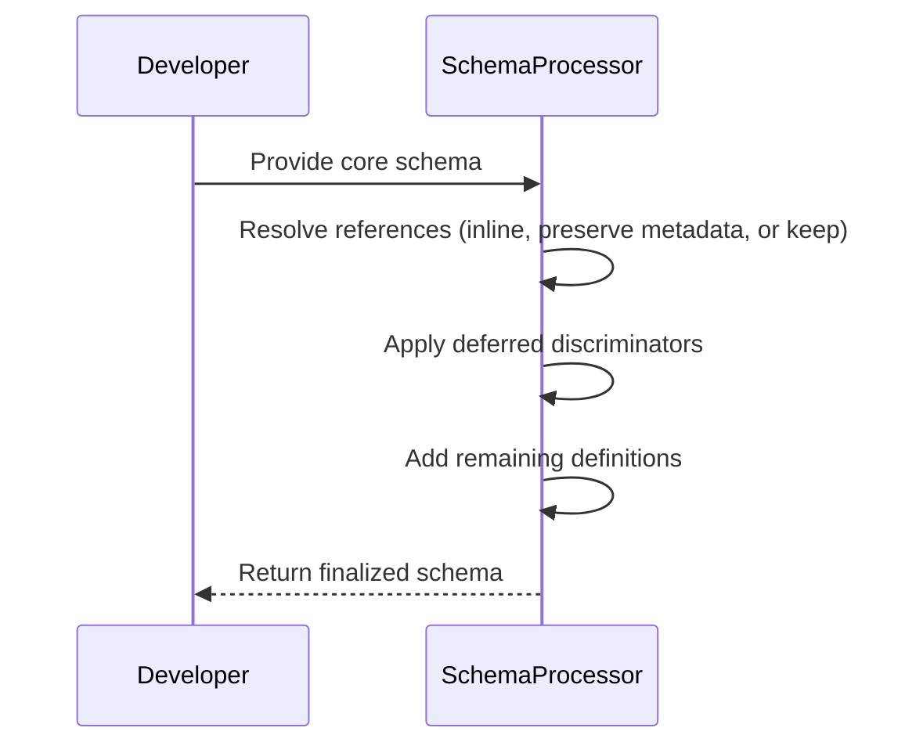
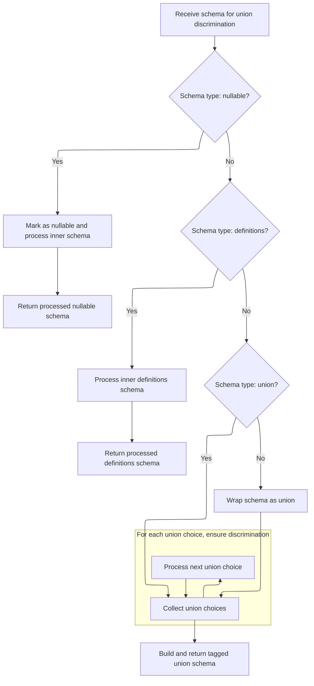

This document outlines the process of finalizing a schema for validation. The flow receives a core schema, resolves all references, applies deferred discriminators for tagged union support, and ensures all necessary definitions are present. The result is a schema ready for use in data validation.

The main steps are:

- Resolve references and inline or preserve metadata as needed.
- Apply deferred discriminators to schemas.
- Add any remaining definitions.
- Return the finalized schema.



# Spec

## Detailed View of the Program's Functionality

a. Resolving Schema References and Inlining

The process begins by collecting all schema references and definitions from the input schema. For each reference, the code determines whether to inline the referenced schema or keep it as a separate definition. This decision is based on how many times the reference is used and whether it contains extra metadata or serialization information:

- If a reference is used only once and has no extra metadata or serialization, it is inlined directly into the schema, replacing the reference with the actual definition.
- If a reference is used only once but contains specific metadata (such as deferred discriminator information), it is also inlined, but the metadata is preserved for later use.
- If a reference is used multiple times, or if it contains serialization or other important metadata, it is kept as a separate definition and added to a collection of remaining definitions.

b. Applying Deferred Discriminators

After resolving references, the code processes schemas that have deferred discriminators. These are schemas that were marked earlier to have a discriminator applied, but the application was postponed until after reference resolution. For each such schema:

- The discriminator information is extracted from the schema's metadata.
- If the discriminator is present, a helper function is called to apply the discriminator logic, transforming the schema into a tagged union (a structure that uses the discriminator to distinguish between different types).
- The schema is mutated in place to reflect the application of the discriminator, ensuring that the final schema includes the necessary logic for discriminated unions.

c. Applying Discriminator Logic

When applying a discriminator, the code checks if the discriminator is a special object (with custom logic). If so, it delegates the schema transformation to that object's method. Otherwise, it uses a standard process:

- An internal helper is instantiated with the discriminator and the current set of definitions.
- The helper's main method is called to transform the schema into a tagged union, using the discriminator to map values to specific schema choices.

d. Building the Tagged Union Schema

The transformation to a tagged union involves several steps:

- The code recursively unwraps any nullable or definitions wrappers around the schema, ensuring it is working with the core union structure.
- If the schema is not already a union, it is wrapped as a union with a single choice.
- The choices in the union are processed in reverse order and pushed onto a stack for handling.
- Each choice is popped from the stack and processed:
  - If the choice is a nested union or a compatible tagged union, its choices are flattened and added to the stack.
  - If the choice is a nullable or "none" type, a flag is set to indicate that the final schema should allow null values.
  - For valid model, dataclass, or <SwmToken path="pydantic/_internal/_discriminated_union.py" pos="254:2:4" line-data="            &#39;typed-dict&#39;,">`typed-dict`</SwmToken> choices, the code infers the possible discriminator values and ensures each value maps uniquely to a choice.
  - If a choice is not valid for a discriminated union, an error is raised.

Once all choices are processed, the code constructs the final tagged union schema, including the discriminator and all mapped choices. If an alias is used for the discriminator, it is included in the schema as well.

e. Handling Nullable Tagged Unions

After building the tagged union schema, the code checks if the schema should allow null values but is not yet marked as nullable. If so, it wraps the schema in a nullable wrapper, ensuring that both the inner type and null are accepted.

f. Finalizing and Returning the Schema

After applying discriminators and handling nullability, the code checks if there are any remaining definitions that were not inlined. If so, it wraps the finalized schema with these definitions, ensuring that all necessary components are present for validation and serialization. The fully prepared schema is then returned, ready for use in validation or JSON schema generation.

# Rule Definition

| Paragraph Name                                                                                                                                                                                                                                                                                                                                       | Rule ID | Category          | Description                                                                                                                                                                                                                                                                                                                                                                                                                                                                                                                                                                                                                                                                 | Conditions                                                                                                                                                                                                                                                                                                                                                                                                                                                                                                                                                                                                                  | Remarks                                                                                                                                                                                                                                                                                                                                                                                                                                                                                                                                                                                                                                                                                                                                                                                                                                                                                                                                                                                                                                                                                                                                                                                                                                                                                                                                                                                   |
| ---------------------------------------------------------------------------------------------------------------------------------------------------------------------------------------------------------------------------------------------------------------------------------------------------------------------------------------------------- | ------- | ----------------- | --------------------------------------------------------------------------------------------------------------------------------------------------------------------------------------------------------------------------------------------------------------------------------------------------------------------------------------------------------------------------------------------------------------------------------------------------------------------------------------------------------------------------------------------------------------------------------------------------------------------------------------------------------------------------- | --------------------------------------------------------------------------------------------------------------------------------------------------------------------------------------------------------------------------------------------------------------------------------------------------------------------------------------------------------------------------------------------------------------------------------------------------------------------------------------------------------------------------------------------------------------------------------------------------------------------------- | ----------------------------------------------------------------------------------------------------------------------------------------------------------------------------------------------------------------------------------------------------------------------------------------------------------------------------------------------------------------------------------------------------------------------------------------------------------------------------------------------------------------------------------------------------------------------------------------------------------------------------------------------------------------------------------------------------------------------------------------------------------------------------------------------------------------------------------------------------------------------------------------------------------------------------------------------------------------------------------------------------------------------------------------------------------------------------------------------------------------------------------------------------------------------------------------------------------------------------------------------------------------------------------------------------------------------------------------------------------------------------------------- |
| GenerateSchema.generate_schema, GenerateSchema.\_generate_schema_inner, GenerateSchema.match_type, GenerateSchema.\_match_generic_type                                                                                                                                                                                                               | RL-001  | Conditional Logic | The system must accept as input a 'core schema' object, which is a dict-like structure representing a type definition. The schema may include references to other schemas and must support a defined set of types and keys.                                                                                                                                                                                                                                                                                                                                                                                                                                                 | Input is a dict-like object representing a schema; keys and types are among the supported set.                                                                                                                                                                                                                                                                                                                                                                                                                                                                                                                              | Supported types: 'model', 'union', 'nullable', 'definitions', <SwmToken path="pydantic/_internal/_generate_schema.py" pos="2739:22:24" line-data="        This traverses the core schema and referenced definitions, replaces `&#39;definition-ref&#39;` schemas">`definition-ref`</SwmToken>, <SwmToken path="pydantic/_internal/_discriminated_union.py" pos="141:26:28" line-data="        &quot;&quot;&quot;Return a new CoreSchema based on `schema` that uses a tagged-union with the discriminator provided">`tagged-union`</SwmToken>, <SwmToken path="pydantic/_internal/_discriminated_union.py" pos="254:2:4" line-data="            &#39;typed-dict&#39;,">`typed-dict`</SwmToken>, 'dataclass', <SwmToken path="pydantic/_internal/_discriminated_union.py" pos="258:2:4" line-data="            &#39;dataclass-args&#39;,">`dataclass-args`</SwmToken>, <SwmToken path="pydantic/_internal/_discriminated_union.py" pos="256:2:6" line-data="            &#39;lax-or-strict&#39;,">`lax-or-strict`</SwmToken>, 'none', 'literal'. Supported keys: 'type', 'choices', 'schema', 'definitions', <SwmToken path="pydantic/_internal/_discriminated_union.py" pos="238:6:6" line-data="            if choice[&#39;schema_ref&#39;] not in self.definitions:">`schema_ref`</SwmToken>, 'metadata', 'fields', 'ref', 'discriminator', 'serialization', 'cls', 'name', 'expected'. |
| GenerateSchema.\_apply_discriminator_to_union, <SwmToken path="pydantic/_internal/_generate_schema.py" pos="2785:5:7" line-data="            applied = _discriminated_union.apply_discriminator(cs.copy(), discriminator, remaining_defs)">`_discriminated_union.apply_discriminator`</SwmToken>, \_discriminated_union.\_ApplyInferredDiscriminator | RL-002  | Conditional Logic | The system must support union schemas where union members are referenced via <SwmToken path="pydantic/_internal/_generate_schema.py" pos="2739:22:24" line-data="        This traverses the core schema and referenced definitions, replaces `&#39;definition-ref&#39;` schemas">`definition-ref`</SwmToken> and the union schema includes metadata specifying a deferred discriminator. The system must extract the discriminator and apply discriminator logic, supporting both string discriminators and custom Discriminator objects.                                                                                                                                   | Schema is a union with members referenced by <SwmToken path="pydantic/_internal/_generate_schema.py" pos="2739:22:24" line-data="        This traverses the core schema and referenced definitions, replaces `&#39;definition-ref&#39;` schemas">`definition-ref`</SwmToken> and includes <SwmToken path="pydantic/_internal/_generate_schema.py" pos="2779:22:22" line-data="            discriminator: str \| None = cs[&#39;metadata&#39;].pop(&#39;pydantic_internal_union_discriminator&#39;, None)  # pyright: ignore[reportTypedDictNotRequiredAccess]">`pydantic_internal_union_discriminator`</SwmToken> metadata. | Discriminator can be a string or a custom Discriminator object. If custom, its <SwmToken path="pydantic/_internal/_discriminated_union.py" pos="68:5:5" line-data="            return discriminator._convert_schema(schema)">`_convert_schema`</SwmToken> method is called. If string, mapping is inferred from union members.                                                                                                                                                                                                                                                                                                                                                                                                                                                                                                                                                                                                                                                                                                                                                                                                                                                                                                                                                                                                                                                            |
| \_Definitions.finalize_schema, \_Definitions.\_inlining_behavior, \_Definitions.\_resolve_definition, <SwmToken path="pydantic/_internal/_generate_schema.py" pos="2744:5:5" line-data="            gather_result = gather_schemas_for_cleaning(">`gather_schemas_for_cleaning`</SwmToken>                                                           | RL-003  | Conditional Logic | The system must process all referenced definitions, tracking usage counts for each reference. Definitions are inlined if used only once and have no extra metadata or serialization schema, or preserved with metadata if only deferred discriminator metadata is present. Otherwise, definitions are kept as references and included in the output's 'definitions' list.                                                                                                                                                                                                                                                                                                   | A definition is referenced in the schema; usage count and metadata/serialization presence are checked.                                                                                                                                                                                                                                                                                                                                                                                                                                                                                                                      | Definitions with only deferred discriminator metadata are inlined with metadata preserved. Definitions with serialization or other metadata are not inlined.                                                                                                                                                                                                                                                                                                                                                                                                                                                                                                                                                                                                                                                                                                                                                                                                                                                                                                                                                                                                                                                                                                                                                                                                                              |
| \_discriminated_union.\_ApplyInferredDiscriminator.\_set_unique_choice_for_values, \_ApplyInferredDiscriminator.\_infer_discriminator_values_for_choice, \_ApplyInferredDiscriminator.\_infer_discriminator_values_for_field                                                                                                                         | RL-004  | Conditional Logic | The mapping from discriminator values to union choices must be unique. If two choices map to the same value, or if a union member is missing the discriminator field, or the field is not a string or not a 'literal', or if union members use different aliases for the discriminator field, the system must raise an error.                                                                                                                                                                                                                                                                                                                                               | Discriminator mapping is being built for a union schema.                                                                                                                                                                                                                                                                                                                                                                                                                                                                                                                                                                    | Errors are raised for duplicate discriminator values, missing fields, <SwmToken path="pydantic/_internal/_discriminated_union.py" pos="58:13:15" line-data="            - If discriminator field has a non-string alias.">`non-string`</SwmToken> or non-literal fields, or inconsistent aliases.                                                                                                                                                                                                                                                                                                                                                                                                                                                                                                                                                                                                                                                                                                                                                                                                                                                                                                                                                                                                                                                                                         |
| \_discriminated_union.\_ApplyInferredDiscriminator.apply, \_ApplyInferredDiscriminator.\_apply_to_root                                                                                                                                                                                                                                               | RL-005  | Data Assignment   | After applying discriminator logic, the system must transform the union schema into a <SwmToken path="pydantic/_internal/_discriminated_union.py" pos="141:26:28" line-data="        &quot;&quot;&quot;Return a new CoreSchema based on `schema` that uses a tagged-union with the discriminator provided">`tagged-union`</SwmToken> schema, where the 'choices' key maps discriminator values to the corresponding schemas (typically as <SwmToken path="pydantic/_internal/_generate_schema.py" pos="2739:22:24" line-data="        This traverses the core schema and referenced definitions, replaces `&#39;definition-ref&#39;` schemas">`definition-ref`</SwmToken>). | Discriminator logic has been successfully applied to a union schema.                                                                                                                                                                                                                                                                                                                                                                                                                                                                                                                                                        | The output <SwmToken path="pydantic/_internal/_discriminated_union.py" pos="141:26:28" line-data="        &quot;&quot;&quot;Return a new CoreSchema based on `schema` that uses a tagged-union with the discriminator provided">`tagged-union`</SwmToken> schema has a 'choices' dict mapping discriminator values (as strings or ints) to schemas.                                                                                                                                                                                                                                                                                                                                                                                                                                                                                                                                                                                                                                                                                                                                                                                                                                                                                                                                                                                                                                       |
| \_Definitions.finalize_schema, GenerateSchema.clean_schema                                                                                                                                                                                                                                                                                           | RL-006  | Data Assignment   | The output schema must be wrapped in a 'definitions' schema if there are any remaining definitions that were not inlined. The output must be a core schema object with all references resolved, discriminators applied, and all necessary definitions included, ready for conversion to a JSON schema.                                                                                                                                                                                                                                                                                                                                                                      | There are remaining definitions after inlining and discriminator application.                                                                                                                                                                                                                                                                                                                                                                                                                                                                                                                                               | The output is a dict-like core schema object, not directly <SwmToken path="pydantic/json_schema.py" pos="2247:16:18" line-data="        &quot;&quot;&quot;Encode a default value to a JSON-serializable value.">`JSON-serializable`</SwmToken>, but suitable for a JSON schema generator.                                                                                                                                                                                                                                                                                                                                                                                                                                                                                                                                                                                                                                                                                                                                                                                                                                                                                                                                                                                                                                                                                                 |
| \_Definitions.finalize_schema, \_discriminated_union.\_ApplyInferredDiscriminator.\_handle_choice                                                                                                                                                                                                                                                    | RL-007  | Conditional Logic | If a referenced definition is missing from the definitions list, the system must raise an error.                                                                                                                                                                                                                                                                                                                                                                                                                                                                                                                                                                            | A <SwmToken path="pydantic/_internal/_generate_schema.py" pos="2739:22:24" line-data="        This traverses the core schema and referenced definitions, replaces `&#39;definition-ref&#39;` schemas">`definition-ref`</SwmToken> is encountered and the referenced definition is not present.                                                                                                                                                                                                                                                                                                                              | Raises <SwmToken path="pydantic/_internal/_generate_schema.py" pos="2748:3:3" line-data="        except MissingDefinitionError as e:">`MissingDefinitionError`</SwmToken> or <SwmToken path="pydantic/_internal/_discriminated_union.py" pos="54:1:1" line-data="        MissingDefinitionForUnionRef:">`MissingDefinitionForUnionRef`</SwmToken> as appropriate.                                                                                                                                                                                                                                                                                                                                                                                                                                                                                                                                                                                                                                                                                                                                                                                                                                                                                                                                                                                                                         |

# User Stories

## User Story 1: Apply discriminator logic to union schemas

---

### Story Description:

As a system processing union schemas, I want to accept and validate core schema objects, extract and apply discriminator logic (supporting both string and custom Discriminator objects), and transform unions into <SwmToken path="pydantic/_internal/_discriminated_union.py" pos="141:26:28" line-data="        &quot;&quot;&quot;Return a new CoreSchema based on `schema` that uses a tagged-union with the discriminator provided">`tagged-union`</SwmToken> schemas with unique and valid discriminator mappings so that union schemas are processed correctly and unambiguously.

---

### Business Rule Mapping:

| Rule ID | Paragraph Name                                                                                                                                                                                                                                                                                                                                       | Rule Description                                                                                                                                                                                                                                                                                                                                                                                                                                                                                                                                                                                                                                                            |
| ------- | ---------------------------------------------------------------------------------------------------------------------------------------------------------------------------------------------------------------------------------------------------------------------------------------------------------------------------------------------------- | --------------------------------------------------------------------------------------------------------------------------------------------------------------------------------------------------------------------------------------------------------------------------------------------------------------------------------------------------------------------------------------------------------------------------------------------------------------------------------------------------------------------------------------------------------------------------------------------------------------------------------------------------------------------------- |
| RL-001  | GenerateSchema.generate_schema, GenerateSchema.\_generate_schema_inner, GenerateSchema.match_type, GenerateSchema.\_match_generic_type                                                                                                                                                                                                               | The system must accept as input a 'core schema' object, which is a dict-like structure representing a type definition. The schema may include references to other schemas and must support a defined set of types and keys.                                                                                                                                                                                                                                                                                                                                                                                                                                                 |
| RL-002  | GenerateSchema.\_apply_discriminator_to_union, <SwmToken path="pydantic/_internal/_generate_schema.py" pos="2785:5:7" line-data="            applied = _discriminated_union.apply_discriminator(cs.copy(), discriminator, remaining_defs)">`_discriminated_union.apply_discriminator`</SwmToken>, \_discriminated_union.\_ApplyInferredDiscriminator | The system must support union schemas where union members are referenced via <SwmToken path="pydantic/_internal/_generate_schema.py" pos="2739:22:24" line-data="        This traverses the core schema and referenced definitions, replaces `&#39;definition-ref&#39;` schemas">`definition-ref`</SwmToken> and the union schema includes metadata specifying a deferred discriminator. The system must extract the discriminator and apply discriminator logic, supporting both string discriminators and custom Discriminator objects.                                                                                                                                   |
| RL-004  | \_discriminated_union.\_ApplyInferredDiscriminator.\_set_unique_choice_for_values, \_ApplyInferredDiscriminator.\_infer_discriminator_values_for_choice, \_ApplyInferredDiscriminator.\_infer_discriminator_values_for_field                                                                                                                         | The mapping from discriminator values to union choices must be unique. If two choices map to the same value, or if a union member is missing the discriminator field, or the field is not a string or not a 'literal', or if union members use different aliases for the discriminator field, the system must raise an error.                                                                                                                                                                                                                                                                                                                                               |
| RL-005  | \_discriminated_union.\_ApplyInferredDiscriminator.apply, \_ApplyInferredDiscriminator.\_apply_to_root                                                                                                                                                                                                                                               | After applying discriminator logic, the system must transform the union schema into a <SwmToken path="pydantic/_internal/_discriminated_union.py" pos="141:26:28" line-data="        &quot;&quot;&quot;Return a new CoreSchema based on `schema` that uses a tagged-union with the discriminator provided">`tagged-union`</SwmToken> schema, where the 'choices' key maps discriminator values to the corresponding schemas (typically as <SwmToken path="pydantic/_internal/_generate_schema.py" pos="2739:22:24" line-data="        This traverses the core schema and referenced definitions, replaces `&#39;definition-ref&#39;` schemas">`definition-ref`</SwmToken>). |

---

### Relevant Functionality:

- **GenerateSchema.generate_schema**
  1. **RL-001:**
     - When <SwmToken path="pydantic/_internal/_generate_schema.py" pos="379:9:9" line-data="        return core_schema.list_schema(self.generate_schema(items_type))">`generate_schema`</SwmToken> is called:
       - If the input is a dict, assume it's a valid schema and return it.
       - If the input is a string or <SwmToken path="pydantic/_internal/_generate_schema.py" pos="32:1:1" line-data="    ForwardRef,">`ForwardRef`</SwmToken>, resolve it.
       - Otherwise, dispatch based on type (model, union, etc.) using <SwmToken path="pydantic/_internal/_generate_schema.py" pos="1023:5:5" line-data="        return self.match_type(obj)">`match_type`</SwmToken> and <SwmToken path="pydantic/_internal/_generate_schema.py" pos="1139:5:5" line-data="            return self._match_generic_type(obj, origin)">`_match_generic_type`</SwmToken>.
       - Raise errors if unsupported types or keys are encountered.
- **GenerateSchema.\_apply_discriminator_to_union**
  1. **RL-002:**
     - When a union schema with deferred discriminator metadata is encountered:
       - If discriminator is a custom object, call its <SwmToken path="pydantic/_internal/_discriminated_union.py" pos="68:5:5" line-data="            return discriminator._convert_schema(schema)">`_convert_schema`</SwmToken> method.
       - If discriminator is a string, inspect each union member for the discriminator field.
       - Ensure the discriminator field exists, is a string, and is of type 'literal' or union of 'literal'.
       - Build a mapping from discriminator values to union choices.
       - Raise errors if mapping is ambiguous or invalid.
       - Transform the union schema into a <SwmToken path="pydantic/_internal/_discriminated_union.py" pos="141:26:28" line-data="        &quot;&quot;&quot;Return a new CoreSchema based on `schema` that uses a tagged-union with the discriminator provided">`tagged-union`</SwmToken> schema with the mapping.
- **\_discriminated_union.\_ApplyInferredDiscriminator.\_set_unique_choice_for_values**
  1. **RL-004:**
     - For each union member:
       - Check that the discriminator field exists, is a string, and is a 'literal' or union of 'literal'.
       - Collect discriminator values.
       - Ensure each value maps to only one choice.
       - Raise errors for any violations.
- **\_discriminated_union.\_ApplyInferredDiscriminator.apply**
  1. **RL-005:**
     - Replace the union schema with a <SwmToken path="pydantic/_internal/_discriminated_union.py" pos="141:26:28" line-data="        &quot;&quot;&quot;Return a new CoreSchema based on `schema` that uses a tagged-union with the discriminator provided">`tagged-union`</SwmToken> schema.
     - Set the 'choices' key to the mapping from discriminator values to schemas.
     - Set the 'discriminator' key appropriately (string or alias list).

## User Story 2: Manage and resolve referenced definitions

---

### Story Description:

As a system managing schema definitions, I want to accept and validate core schema objects, track, inline, or preserve referenced definitions, ensure all references are resolved or errors are raised if missing, and wrap the output appropriately so that the final output schema is complete, valid, and ready for further processing.

---

### Business Rule Mapping:

| Rule ID | Paragraph Name                                                                                                                                                                                                                                                                             | Rule Description                                                                                                                                                                                                                                                                                                                                                          |
| ------- | ------------------------------------------------------------------------------------------------------------------------------------------------------------------------------------------------------------------------------------------------------------------------------------------ | ------------------------------------------------------------------------------------------------------------------------------------------------------------------------------------------------------------------------------------------------------------------------------------------------------------------------------------------------------------------------- |
| RL-001  | GenerateSchema.generate_schema, GenerateSchema.\_generate_schema_inner, GenerateSchema.match_type, GenerateSchema.\_match_generic_type                                                                                                                                                     | The system must accept as input a 'core schema' object, which is a dict-like structure representing a type definition. The schema may include references to other schemas and must support a defined set of types and keys.                                                                                                                                               |
| RL-003  | \_Definitions.finalize_schema, \_Definitions.\_inlining_behavior, \_Definitions.\_resolve_definition, <SwmToken path="pydantic/_internal/_generate_schema.py" pos="2744:5:5" line-data="            gather_result = gather_schemas_for_cleaning(">`gather_schemas_for_cleaning`</SwmToken> | The system must process all referenced definitions, tracking usage counts for each reference. Definitions are inlined if used only once and have no extra metadata or serialization schema, or preserved with metadata if only deferred discriminator metadata is present. Otherwise, definitions are kept as references and included in the output's 'definitions' list. |
| RL-006  | \_Definitions.finalize_schema, GenerateSchema.clean_schema                                                                                                                                                                                                                                 | The output schema must be wrapped in a 'definitions' schema if there are any remaining definitions that were not inlined. The output must be a core schema object with all references resolved, discriminators applied, and all necessary definitions included, ready for conversion to a JSON schema.                                                                    |
| RL-007  | \_Definitions.finalize_schema, \_discriminated_union.\_ApplyInferredDiscriminator.\_handle_choice                                                                                                                                                                                          | If a referenced definition is missing from the definitions list, the system must raise an error.                                                                                                                                                                                                                                                                          |

---

### Relevant Functionality:

- **GenerateSchema.generate_schema**
  1. **RL-001:**
     - When <SwmToken path="pydantic/_internal/_generate_schema.py" pos="379:9:9" line-data="        return core_schema.list_schema(self.generate_schema(items_type))">`generate_schema`</SwmToken> is called:
       - If the input is a dict, assume it's a valid schema and return it.
       - If the input is a string or <SwmToken path="pydantic/_internal/_generate_schema.py" pos="32:1:1" line-data="    ForwardRef,">`ForwardRef`</SwmToken>, resolve it.
       - Otherwise, dispatch based on type (model, union, etc.) using <SwmToken path="pydantic/_internal/_generate_schema.py" pos="1023:5:5" line-data="        return self.match_type(obj)">`match_type`</SwmToken> and <SwmToken path="pydantic/_internal/_generate_schema.py" pos="1139:5:5" line-data="            return self._match_generic_type(obj, origin)">`_match_generic_type`</SwmToken>.
       - Raise errors if unsupported types or keys are encountered.
- **\_Definitions.finalize_schema**
  1. **RL-003:**
     - Track usage counts for each referenced definition.
     - For each referenced definition:
       - If used only once and has no extra metadata/serialization, inline it.
       - If used only once and only has deferred discriminator metadata, inline and preserve metadata.
       - Otherwise, keep as a reference and include in the output definitions list.
     - Raise error if a referenced definition is missing.
  2. **RL-006:**
     - After processing, check for remaining definitions.
     - If any, wrap the main schema in a 'definitions' schema with a 'definitions' list.
     - Return the final core schema object.
  3. **RL-007:**
     - When resolving a <SwmToken path="pydantic/_internal/_generate_schema.py" pos="2739:22:24" line-data="        This traverses the core schema and referenced definitions, replaces `&#39;definition-ref&#39;` schemas">`definition-ref`</SwmToken>, check if the referenced definition exists.
     - If not, raise an error.

# Code Walkthrough

## Resolving References and Preparing for Discriminator Application

```mermaid
%%{init: {"flowchart": {"defaultRenderer": "elk"}} }%%
flowchart TD
    node1["Resolve schema references (inline or keep) based on collected_references"]
    click node1 openCode "pydantic/_internal/_generate_schema.py:2736:2776"
    node1 --> node2["Apply deferred discriminators to schemas using apply_discriminator"]
    click node2 openCode "pydantic/_internal/_discriminated_union.py:34:80"
    node2 --> node3["Add remaining definitions to schema if any"]
    click node3 openCode "pydantic/_internal/_generate_schema.py:2790:2791"
    node3 --> node4["Return finalized schema ready for use"]
    click node4 openCode "pydantic/_internal/_generate_schema.py:2792:2792"


subgraph node2 [apply_discriminator]
  sgmain_1_node1["Receive schema and discriminator"] --> sgmain_1_node2{"Is discriminator a Discriminator object with custom logic?"}
  click sgmain_1_node1 openCode "pydantic/_internal/_discriminated_union.py:34:68"
  sgmain_1_node2 -->|"Yes"| sgmain_1_node3["Convert schema using Discriminator's method"]
  click sgmain_1_node2 openCode "pydantic/_internal/_discriminated_union.py:64:68"
  click sgmain_1_node3 openCode "pydantic/types.py:3075:3075"
  sgmain_1_node2 -->|"No"| sgmain_1_node4["Apply standard discriminator logic to schema"]
  click sgmain_1_node4 openCode "pydantic/_internal/_discriminated_union.py:70:70"
end

%% Swimm:
%% %%{init: {"flowchart": {"defaultRenderer": "elk"}} }%%
%% flowchart TD
%%     node1["Resolve schema references (inline or keep) based on <SwmToken path="pydantic/_internal/_generate_schema.py" pos="2755:13:13" line-data="        for ref, inlinable_def_ref in gather_result[&#39;collected_references&#39;].items():">`collected_references`</SwmToken>"]
%%     click node1 openCode "<SwmPath>[pydantic/\_internal/\_generate_schema.py](pydantic/_internal/_generate_schema.py)</SwmPath>:2736:2776"
%%     node1 --> node2["Apply deferred discriminators to schemas using <SwmToken path="pydantic/_internal/_generate_schema.py" pos="2785:7:7" line-data="            applied = _discriminated_union.apply_discriminator(cs.copy(), discriminator, remaining_defs)">`apply_discriminator`</SwmToken>"]
%%     click node2 openCode "<SwmPath>[pydantic/\_internal/\_discriminated_union.py](pydantic/_internal/_discriminated_union.py)</SwmPath>:34:80"
%%     node2 --> node3["Add remaining definitions to schema if any"]
%%     click node3 openCode "<SwmPath>[pydantic/\_internal/\_generate_schema.py](pydantic/_internal/_generate_schema.py)</SwmPath>:2790:2791"
%%     node3 --> node4["Return finalized schema ready for use"]
%%     click node4 openCode "<SwmPath>[pydantic/\_internal/\_generate_schema.py](pydantic/_internal/_generate_schema.py)</SwmPath>:2792:2792"
%% 
%% 
%% subgraph node2 [<SwmToken path="pydantic/_internal/_generate_schema.py" pos="2785:7:7" line-data="            applied = _discriminated_union.apply_discriminator(cs.copy(), discriminator, remaining_defs)">`apply_discriminator`</SwmToken>]
%%   sgmain_1_node1["Receive schema and discriminator"] --> sgmain_1_node2{"Is discriminator a Discriminator object with custom logic?"}
%%   click sgmain_1_node1 openCode "<SwmPath>[pydantic/\_internal/\_discriminated_union.py](pydantic/_internal/_discriminated_union.py)</SwmPath>:34:68"
%%   sgmain_1_node2 -->|"Yes"| sgmain_1_node3["Convert schema using Discriminator's method"]
%%   click sgmain_1_node2 openCode "<SwmPath>[pydantic/\_internal/\_discriminated_union.py](pydantic/_internal/_discriminated_union.py)</SwmPath>:64:68"
%%   click sgmain_1_node3 openCode "<SwmPath>[pydantic/types.py](pydantic/types.py)</SwmPath>:3075:3075"
%%   sgmain_1_node2 -->|"No"| sgmain_1_node4["Apply standard discriminator logic to schema"]
%%   click sgmain_1_node4 openCode "<SwmPath>[pydantic/\_internal/\_discriminated_union.py](pydantic/_internal/_discriminated_union.py)</SwmPath>:70:70"
%% end
```



<SwmSnippet path="/pydantic/_internal/_generate_schema.py" line="2736">

---

In <SwmToken path="pydantic/_internal/_generate_schema.py" pos="2736:3:3" line-data="    def finalize_schema(self, schema: CoreSchema) -&gt; CoreSchema:">`finalize_schema`</SwmToken>, we start by collecting all schemas and references from the input. The function then decides for each reference whether to inline the definition (if it's only used once and has no extra metadata), preserve metadata if needed, or keep it as a reference if it's used multiple times or has special metadata. This setup is necessary before applying discriminators and finalizing the schema structure.

```python
    def finalize_schema(self, schema: CoreSchema) -> CoreSchema:
        """Finalize the core schema.

        This traverses the core schema and referenced definitions, replaces `'definition-ref'` schemas
        by the referenced definition if possible, and applies deferred discriminators.
        """
        definitions = self._definitions
        try:
            gather_result = gather_schemas_for_cleaning(
                schema,
                definitions=definitions,
            )
        except MissingDefinitionError as e:
            raise InvalidSchemaError from e

        remaining_defs: dict[str, CoreSchema] = {}

        # Note: this logic doesn't play well when core schemas with deferred discriminator metadata
        # and references are encountered. See the `test_deferred_discriminated_union_and_references()` test.
        for ref, inlinable_def_ref in gather_result['collected_references'].items():
            if inlinable_def_ref is not None and (inlining_behavior := _inlining_behavior(inlinable_def_ref)) != 'keep':
                if inlining_behavior == 'inline':
                    # `ref` was encountered, and only once:
                    #  - `inlinable_def_ref` is a `'definition-ref'` schema and is guaranteed to be
                    #    the only one. Transform it into the definition it points to.
                    #  - Do not store the definition in the `remaining_defs`.
                    inlinable_def_ref.clear()  # pyright: ignore[reportAttributeAccessIssue]
                    inlinable_def_ref.update(self._resolve_definition(ref, definitions))  # pyright: ignore
                elif inlining_behavior == 'preserve_metadata':
                    # `ref` was encountered, and only once, but contains discriminator metadata.
                    # We will do the same thing as if `inlining_behavior` was `'inline'`, but make
                    # sure to keep the metadata for the deferred discriminator application logic below.
                    meta = inlinable_def_ref.pop('metadata')
                    inlinable_def_ref.clear()  # pyright: ignore[reportAttributeAccessIssue]
                    inlinable_def_ref.update(self._resolve_definition(ref, definitions))  # pyright: ignore
                    inlinable_def_ref['metadata'] = meta
            else:
                # `ref` was encountered, at least two times (or only once, but with metadata or a serialization schema):
                # - Do not inline the `'definition-ref'` schemas (they are not provided in the gather result anyway).
                # - Store the the definition in the `remaining_defs`
                remaining_defs[ref] = self._resolve_definition(ref, definitions)
```

---

</SwmSnippet>

<SwmSnippet path="/pydantic/_internal/_generate_schema.py" line="2776">

---

After handling references, we loop through schemas that have deferred discriminators, extract the discriminator from their metadata, and apply it using a helper. This mutates the schema in place so that the discriminator logic is actually present in the schema before we finish up.

```python
                remaining_defs[ref] = self._resolve_definition(ref, definitions)

        for cs in gather_result['deferred_discriminator_schemas']:
            discriminator: str | None = cs['metadata'].pop('pydantic_internal_union_discriminator', None)  # pyright: ignore[reportTypedDictNotRequiredAccess]
            if discriminator is None:
                # This can happen in rare scenarios, when a deferred schema is present multiple times in the
                # gather result (e.g. when using the `Sequence` type -- see `test_sequence_discriminated_union()`).
                # In this case, a previous loop iteration applied the discriminator and so we can just skip it here.
                continue
            applied = _discriminated_union.apply_discriminator(cs.copy(), discriminator, remaining_defs)
            # Mutate the schema directly to have the discriminator applied
            cs.clear()  # pyright: ignore[reportAttributeAccessIssue]
            cs.update(applied)  # pyright: ignore

```

---

</SwmSnippet>

### Dispatching Discriminator Logic

<SwmSnippet path="/pydantic/_internal/_discriminated_union.py" line="34">

---

In <SwmToken path="pydantic/_internal/_discriminated_union.py" pos="34:2:2" line-data="def apply_discriminator(">`apply_discriminator`</SwmToken>, we check if the discriminator is a special object and, if so, delegate to its <SwmToken path="pydantic/_internal/_discriminated_union.py" pos="68:5:5" line-data="            return discriminator._convert_schema(schema)">`_convert_schema`</SwmToken> method. This lets custom discriminator logic take over schema conversion when needed.

```python
def apply_discriminator(
    schema: core_schema.CoreSchema,
    discriminator: str | Discriminator,
    definitions: dict[str, core_schema.CoreSchema] | None = None,
) -> core_schema.CoreSchema:
    """Applies the discriminator and returns a new core schema.

    Args:
        schema: The input schema.
        discriminator: The name of the field which will serve as the discriminator.
        definitions: A mapping of schema ref to schema.

    Returns:
        The new core schema.

    Raises:
        TypeError:
            - If `discriminator` is used with invalid union variant.
            - If `discriminator` is used with `Union` type with one variant.
            - If `discriminator` value mapped to multiple choices.
        MissingDefinitionForUnionRef:
            If the definition for ref is missing.
        PydanticUserError:
            - If a model in union doesn't have a discriminator field.
            - If discriminator field has a non-string alias.
            - If discriminator fields have different aliases.
            - If discriminator field not of type `Literal`.
    """
    from ..types import Discriminator

    if isinstance(discriminator, Discriminator):
        if isinstance(discriminator.discriminator, str):
            discriminator = discriminator.discriminator
        else:
            return discriminator._convert_schema(schema)

```

---

</SwmSnippet>

#### Converting to Tagged Union Schema

See <SwmLink doc-title="Converting input schemas to tagged unions">[Converting input schemas to tagged unions](/.swm/converting-input-schemas-to-tagged-unions.3cexnvrw.sw.md)</SwmLink>

#### Inferring and Applying Discriminator Mapping

<SwmSnippet path="/pydantic/_internal/_discriminated_union.py" line="70">

---

After returning from <SwmToken path="pydantic/_internal/_discriminated_union.py" pos="68:5:5" line-data="            return discriminator._convert_schema(schema)">`_convert_schema`</SwmToken>, <SwmToken path="pydantic/_internal/_generate_schema.py" pos="2785:7:7" line-data="            applied = _discriminated_union.apply_discriminator(cs.copy(), discriminator, remaining_defs)">`apply_discriminator`</SwmToken> creates an <SwmToken path="pydantic/_internal/_discriminated_union.py" pos="70:3:3" line-data="    return _ApplyInferredDiscriminator(discriminator, definitions or {}).apply(schema)">`_ApplyInferredDiscriminator`</SwmToken> with the discriminator and definitions, then calls apply to actually build the tagged union schema.

```python
    return _ApplyInferredDiscriminator(discriminator, definitions or {}).apply(schema)
```

---

</SwmSnippet>

### Building the Tagged Union Schema

```mermaid
%%{init: {"flowchart": {"defaultRenderer": "elk"}} }%%
flowchart TD
    node1["Transform input schema into tagged union with discriminator"]
    click node1 openCode "pydantic/_internal/_discriminated_union.py:140:164"
    node1 --> node2{"Should schema allow null values?"}
    click node2 openCode "pydantic/_internal/_discriminated_union.py:165:166"
    node2 -->|"Yes"| node3["Return tagged union schema that allows null values"]
    click node3 openCode "pydantic/_internal/_discriminated_union.py:167:168"
    node2 -->|"No"| node3


subgraph node2 [_apply_to_root]
  sgmain_1_node1["Receive schema for union discrimination"] --> sgmain_1_node2{"Schema type: nullable?"}
  click sgmain_1_node1 openCode "pydantic/_internal/_discriminated_union.py:170:175"
  sgmain_1_node2 -->|"Yes"| sgmain_1_node3["Mark as nullable and process inner schema"]
  click sgmain_1_node2 openCode "pydantic/_internal/_discriminated_union.py:175:180"
  sgmain_1_node3 --> sgmain_1_node11["Return processed nullable schema"]
  click sgmain_1_node3 openCode "pydantic/_internal/_discriminated_union.py:176:180"
  click sgmain_1_node11 openCode "pydantic/_internal/_discriminated_union.py:180:181"
  sgmain_1_node2 -->|"No"| sgmain_1_node4{"Schema type: definitions?"}
  click sgmain_1_node4 openCode "pydantic/_internal/_discriminated_union.py:182:186"
  sgmain_1_node4 -->|"Yes"| sgmain_1_node5["Process inner definitions schema"]
  click sgmain_1_node5 openCode "pydantic/_internal/_discriminated_union.py:183:186"
  sgmain_1_node5 --> sgmain_1_node12["Return processed definitions schema"]
  click sgmain_1_node12 openCode "pydantic/_internal/_discriminated_union.py:186:187"
  sgmain_1_node4 -->|"No"| sgmain_1_node6{"Schema type: union?"}
  click sgmain_1_node6 openCode "pydantic/_internal/_discriminated_union.py:188:193"
  sgmain_1_node6 -->|"No"| sgmain_1_node7["Wrap schema as union"]
  click sgmain_1_node7 openCode "pydantic/_internal/_discriminated_union.py:193:194"
  sgmain_1_node6 -->|"Yes"| sgmain_1_node8["Collect union choices"]
  click sgmain_1_node8 openCode "pydantic/_internal/_discriminated_union.py:195:197"
  sgmain_1_node7 --> sgmain_1_node8
  subgraph sgmain_1_loop1["For each union choice, ensure discrimination"]
  sgmain_1_node8 --> sgmain_1_node9["Process next union choice"]
  click sgmain_1_node9 openCode "pydantic/_internal/_discriminated_union.py:198:200"
  sgmain_1_node9 --> sgmain_1_node8
  end
  sgmain_1_node8 --> sgmain_1_node10["Build and return tagged union schema"]
  click sgmain_1_node10 openCode "pydantic/_internal/_discriminated_union.py:202:224"
end

%% Swimm:
%% %%{init: {"flowchart": {"defaultRenderer": "elk"}} }%%
%% flowchart TD
%%     node1["Transform input schema into tagged union with discriminator"]
%%     click node1 openCode "<SwmPath>[pydantic/\_internal/\_discriminated_union.py](pydantic/_internal/_discriminated_union.py)</SwmPath>:140:164"
%%     node1 --> node2{"Should schema allow null values?"}
%%     click node2 openCode "<SwmPath>[pydantic/\_internal/\_discriminated_union.py](pydantic/_internal/_discriminated_union.py)</SwmPath>:165:166"
%%     node2 -->|"Yes"| node3["Return tagged union schema that allows null values"]
%%     click node3 openCode "<SwmPath>[pydantic/\_internal/\_discriminated_union.py](pydantic/_internal/_discriminated_union.py)</SwmPath>:167:168"
%%     node2 -->|"No"| node3
%% 
%% 
%% subgraph node2 [<SwmToken path="pydantic/_internal/_discriminated_union.py" pos="164:7:7" line-data="        schema = self._apply_to_root(schema)">`_apply_to_root`</SwmToken>]
%%   sgmain_1_node1["Receive schema for union discrimination"] --> sgmain_1_node2{"Schema type: nullable?"}
%%   click sgmain_1_node1 openCode "<SwmPath>[pydantic/\_internal/\_discriminated_union.py](pydantic/_internal/_discriminated_union.py)</SwmPath>:170:175"
%%   sgmain_1_node2 -->|"Yes"| sgmain_1_node3["Mark as nullable and process inner schema"]
%%   click sgmain_1_node2 openCode "<SwmPath>[pydantic/\_internal/\_discriminated_union.py](pydantic/_internal/_discriminated_union.py)</SwmPath>:175:180"
%%   sgmain_1_node3 --> sgmain_1_node11["Return processed nullable schema"]
%%   click sgmain_1_node3 openCode "<SwmPath>[pydantic/\_internal/\_discriminated_union.py](pydantic/_internal/_discriminated_union.py)</SwmPath>:176:180"
%%   click sgmain_1_node11 openCode "<SwmPath>[pydantic/\_internal/\_discriminated_union.py](pydantic/_internal/_discriminated_union.py)</SwmPath>:180:181"
%%   sgmain_1_node2 -->|"No"| sgmain_1_node4{"Schema type: definitions?"}
%%   click sgmain_1_node4 openCode "<SwmPath>[pydantic/\_internal/\_discriminated_union.py](pydantic/_internal/_discriminated_union.py)</SwmPath>:182:186"
%%   sgmain_1_node4 -->|"Yes"| sgmain_1_node5["Process inner definitions schema"]
%%   click sgmain_1_node5 openCode "<SwmPath>[pydantic/\_internal/\_discriminated_union.py](pydantic/_internal/_discriminated_union.py)</SwmPath>:183:186"
%%   sgmain_1_node5 --> sgmain_1_node12["Return processed definitions schema"]
%%   click sgmain_1_node12 openCode "<SwmPath>[pydantic/\_internal/\_discriminated_union.py](pydantic/_internal/_discriminated_union.py)</SwmPath>:186:187"
%%   sgmain_1_node4 -->|"No"| sgmain_1_node6{"Schema type: union?"}
%%   click sgmain_1_node6 openCode "<SwmPath>[pydantic/\_internal/\_discriminated_union.py](pydantic/_internal/_discriminated_union.py)</SwmPath>:188:193"
%%   sgmain_1_node6 -->|"No"| sgmain_1_node7["Wrap schema as union"]
%%   click sgmain_1_node7 openCode "<SwmPath>[pydantic/\_internal/\_discriminated_union.py](pydantic/_internal/_discriminated_union.py)</SwmPath>:193:194"
%%   sgmain_1_node6 -->|"Yes"| sgmain_1_node8["Collect union choices"]
%%   click sgmain_1_node8 openCode "<SwmPath>[pydantic/\_internal/\_discriminated_union.py](pydantic/_internal/_discriminated_union.py)</SwmPath>:195:197"
%%   sgmain_1_node7 --> sgmain_1_node8
%%   subgraph sgmain_1_loop1["For each union choice, ensure discrimination"]
%%   sgmain_1_node8 --> sgmain_1_node9["Process next union choice"]
%%   click sgmain_1_node9 openCode "<SwmPath>[pydantic/\_internal/\_discriminated_union.py](pydantic/_internal/_discriminated_union.py)</SwmPath>:198:200"
%%   sgmain_1_node9 --> sgmain_1_node8
%%   end
%%   sgmain_1_node8 --> sgmain_1_node10["Build and return tagged union schema"]
%%   click sgmain_1_node10 openCode "<SwmPath>[pydantic/\_internal/\_discriminated_union.py](pydantic/_internal/_discriminated_union.py)</SwmPath>:202:224"
%% end
```



<SwmSnippet path="/pydantic/_internal/_discriminated_union.py" line="140">

---

In <SwmToken path="pydantic/_internal/_discriminated_union.py" pos="140:3:3" line-data="    def apply(self, schema: core_schema.CoreSchema) -&gt; core_schema.CoreSchema:">`apply`</SwmToken>, we make sure this instance hasn't been used before, then delegate to <SwmToken path="pydantic/_internal/_discriminated_union.py" pos="164:7:7" line-data="        schema = self._apply_to_root(schema)">`_apply_to_root`</SwmToken> to do the actual schema transformation. This keeps the logic separated and lets <SwmToken path="pydantic/_internal/_discriminated_union.py" pos="164:7:7" line-data="        schema = self._apply_to_root(schema)">`_apply_to_root`</SwmToken> handle all the details.

```python
    def apply(self, schema: core_schema.CoreSchema) -> core_schema.CoreSchema:
        """Return a new CoreSchema based on `schema` that uses a tagged-union with the discriminator provided
        to this class.

        Args:
            schema: The input schema.

        Returns:
            The new core schema.

        Raises:
            TypeError:
                - If `discriminator` is used with invalid union variant.
                - If `discriminator` is used with `Union` type with one variant.
                - If `discriminator` value mapped to multiple choices.
            ValueError:
                If the definition for ref is missing.
            PydanticUserError:
                - If a model in union doesn't have a discriminator field.
                - If discriminator field has a non-string alias.
                - If discriminator fields have different aliases.
                - If discriminator field not of type `Literal`.
        """
        assert not self._used
        schema = self._apply_to_root(schema)
```

---

</SwmSnippet>

#### Unwrapping and Flattening Union Choices



<SwmSnippet path="/pydantic/_internal/_discriminated_union.py" line="170">

---

In <SwmToken path="pydantic/_internal/_discriminated_union.py" pos="170:3:3" line-data="    def _apply_to_root(self, schema: core_schema.CoreSchema) -&gt; core_schema.CoreSchema:">`_apply_to_root`</SwmToken>, we unwrap nested schemas, wrap non-unions as unions, and set up the stack of choices for processing.

```python
    def _apply_to_root(self, schema: core_schema.CoreSchema) -> core_schema.CoreSchema:
        """This method handles the outer-most stage of recursion over the input schema:
        unwrapping nullable or definitions schemas, and calling the `_handle_choice`
        method iteratively on the choices extracted (recursively) from the possibly-wrapped union.
        """
        if schema['type'] == 'nullable':
            self._is_nullable = True
            wrapped = self._apply_to_root(schema['schema'])
            nullable_wrapper = schema.copy()
            nullable_wrapper['schema'] = wrapped
            return nullable_wrapper

        if schema['type'] == 'definitions':
            wrapped = self._apply_to_root(schema['schema'])
            definitions_wrapper = schema.copy()
            definitions_wrapper['schema'] = wrapped
            return definitions_wrapper

        if schema['type'] != 'union':
            # If the schema is not a union, it probably means it just had a single member and
            # was flattened by pydantic_core.
            # However, it still may make sense to apply the discriminator to this schema,
            # as a way to get discriminated-union-style error messages, so we allow this here.
            schema = core_schema.union_schema([schema])

```

---

</SwmSnippet>

<SwmSnippet path="/pydantic/_internal/_discriminated_union.py" line="195">

---

After wrapping the schema as a union and reversing the choices, <SwmToken path="pydantic/_internal/_discriminated_union.py" pos="164:7:7" line-data="        schema = self._apply_to_root(schema)">`_apply_to_root`</SwmToken> pushes them onto a stack. We then pop each choice and call <SwmToken path="pydantic/_internal/_discriminated_union.py" pos="200:3:3" line-data="            self._handle_choice(choice)">`_handle_choice`</SwmToken>, which processes and merges them into the tagged union structure.

```python
        # Reverse the choices list before extending the stack so that they get handled in the order they occur
        choices_schemas = [v[0] if isinstance(v, tuple) else v for v in schema['choices'][::-1]]
        self._choices_to_handle.extend(choices_schemas)
        while self._choices_to_handle:
            choice = self._choices_to_handle.pop()
            self._handle_choice(choice)

```

---

</SwmSnippet>

<SwmSnippet path="/pydantic/_internal/_discriminated_union.py" line="226">

---

<SwmToken path="pydantic/_internal/_discriminated_union.py" pos="226:3:3" line-data="    def _handle_choice(self, choice: core_schema.CoreSchema) -&gt; None:">`_handle_choice`</SwmToken> processes each union choice, handling nested unions, flattening compatible tagged unions, tracking nullable options, and making sure each discriminator value maps to a single choice. It updates the internal mapping for the tagged union as it goes.

```python
    def _handle_choice(self, choice: core_schema.CoreSchema) -> None:
        """This method handles the "middle" stage of recursion over the input schema.
        Specifically, it is responsible for handling each choice of the outermost union
        (and any "coalesced" choices obtained from inner unions).

        Here, "handling" entails:
        * Coalescing nested unions and compatible tagged-unions
        * Tracking the presence of 'none' and 'nullable' schemas occurring as choices
        * Validating that each allowed discriminator value maps to a unique choice
        * Updating the _tagged_union_choices mapping that will ultimately be used to build the TaggedUnionSchema.
        """
        if choice['type'] == 'definition-ref':
            if choice['schema_ref'] not in self.definitions:
                raise MissingDefinitionForUnionRef(choice['schema_ref'])

        if choice['type'] == 'none':
            self._should_be_nullable = True
        elif choice['type'] == 'definitions':
            self._handle_choice(choice['schema'])
        elif choice['type'] == 'nullable':
            self._should_be_nullable = True
            self._handle_choice(choice['schema'])  # unwrap the nullable schema
        elif choice['type'] == 'union':
            # Reverse the choices list before extending the stack so that they get handled in the order they occur
            choices_schemas = [v[0] if isinstance(v, tuple) else v for v in choice['choices'][::-1]]
            self._choices_to_handle.extend(choices_schemas)
        elif choice['type'] not in {
            'model',
            'typed-dict',
            'tagged-union',
            'lax-or-strict',
            'dataclass',
            'dataclass-args',
            'definition-ref',
        } and not _core_utils.is_function_with_inner_schema(choice):
            # We should eventually handle 'definition-ref' as well
            err_str = f'The core schema type {choice["type"]!r} is not a valid discriminated union variant.'
            if choice['type'] == 'list':
                err_str += (
                    ' If you are making use of a list of union types, make sure the discriminator is applied to the '
                    'union type and not the list (e.g. `list[Annotated[<T> | <U>, Field(discriminator=...)]]`).'
                )
            raise TypeError(err_str)
        else:
            if choice['type'] == 'tagged-union' and self._is_discriminator_shared(choice):
                # In this case, this inner tagged-union is compatible with the outer tagged-union,
                # and its choices can be coalesced into the outer TaggedUnionSchema.
                subchoices = [x for x in choice['choices'].values() if not isinstance(x, (str, int))]
                # Reverse the choices list before extending the stack so that they get handled in the order they occur
                self._choices_to_handle.extend(subchoices[::-1])
                return

            inferred_discriminator_values = self._infer_discriminator_values_for_choice(choice, source_name=None)
            self._set_unique_choice_for_values(choice, inferred_discriminator_values)
```

---

</SwmSnippet>

<SwmSnippet path="/pydantic/_internal/_discriminated_union.py" line="202">

---

After <SwmToken path="pydantic/_internal/_discriminated_union.py" pos="172:19:19" line-data="        unwrapping nullable or definitions schemas, and calling the `_handle_choice`">`_handle_choice`</SwmToken>, <SwmToken path="pydantic/_internal/_discriminated_union.py" pos="164:7:7" line-data="        schema = self._apply_to_root(schema)">`_apply_to_root`</SwmToken> builds the tagged union schema, handling aliases if needed.

```python
        if self._discriminator_alias is not None and self._discriminator_alias != self.discriminator:
            # * We need to annotate `discriminator` as a union here to handle both branches of this conditional
            # * We need to annotate `discriminator` as list[list[str | int]] and not list[list[str]] due to the
            #   invariance of list, and because list[list[str | int]] is the type of the discriminator argument
            #   to tagged_union_schema below
            # * See the docstring of pydantic_core.core_schema.tagged_union_schema for more details about how to
            #   interpret the value of the discriminator argument to tagged_union_schema. (The list[list[str]] here
            #   is the appropriate way to provide a list of fallback attributes to check for a discriminator value.)
            discriminator: str | list[list[str | int]] = [[self.discriminator], [self._discriminator_alias]]
        else:
            discriminator = self.discriminator
        return core_schema.tagged_union_schema(
            choices=self._tagged_union_choices,
            discriminator=discriminator,
            custom_error_type=schema.get('custom_error_type'),
            custom_error_message=schema.get('custom_error_message'),
            custom_error_context=schema.get('custom_error_context'),
            strict=False,
            from_attributes=True,
            ref=schema.get('ref'),
            metadata=schema.get('metadata'),
            serialization=schema.get('serialization'),
        )
```

---

</SwmSnippet>

#### Finalizing Nullable Tagged Union

<SwmSnippet path="/pydantic/_internal/_discriminated_union.py" line="165">

---

After returning from <SwmToken path="pydantic/_internal/_discriminated_union.py" pos="164:7:7" line-data="        schema = self._apply_to_root(schema)">`_apply_to_root`</SwmToken>, <SwmToken path="pydantic/_internal/_discriminated_union.py" pos="70:16:16" line-data="    return _ApplyInferredDiscriminator(discriminator, definitions or {}).apply(schema)">`apply`</SwmToken> checks if the schema should be nullable but isn't yet, and if so, wraps it with <SwmToken path="pydantic/_internal/_discriminated_union.py" pos="166:7:7" line-data="            schema = core_schema.nullable_schema(schema)">`nullable_schema`</SwmToken> to make sure null values are accepted.

```python
        if self._should_be_nullable and not self._is_nullable:
            schema = core_schema.nullable_schema(schema)
```

---

</SwmSnippet>

<SwmSnippet path="/pydantic/json_schema.py" line="1222">

---

<SwmToken path="pydantic/json_schema.py" pos="1222:3:3" line-data="    def nullable_schema(self, schema: core_schema.NullableSchema) -&gt; JsonSchemaValue:">`nullable_schema`</SwmToken> builds a JSON schema that accepts both the inner type and null by combining them with <SwmToken path="pydantic/json_schema.py" pos="1238:10:10" line-data="            # I&#39;ll use &#39;anyOf&#39; for now, but it could be changed it if it would work better with some external tooling">`anyOf`</SwmToken>. If the inner schema is already null, it just returns that.

```python
    def nullable_schema(self, schema: core_schema.NullableSchema) -> JsonSchemaValue:
        """Generates a JSON schema that matches a schema that allows null values.

        Args:
            schema: The core schema.

        Returns:
            The generated JSON schema.
        """
        null_schema = {'type': 'null'}
        inner_json_schema = self.generate_inner(schema['schema'])

        if inner_json_schema == null_schema:
            return null_schema
        else:
            # Thanks to the equality check against `null_schema` above, I think 'oneOf' would also be valid here;
            # I'll use 'anyOf' for now, but it could be changed it if it would work better with some external tooling
            return self.get_flattened_anyof([inner_json_schema, null_schema])
```

---

</SwmSnippet>

<SwmSnippet path="/pydantic/_internal/_discriminated_union.py" line="167">

---

After <SwmToken path="pydantic/_internal/_discriminated_union.py" pos="166:7:7" line-data="            schema = core_schema.nullable_schema(schema)">`nullable_schema`</SwmToken>, <SwmToken path="pydantic/_internal/_discriminated_union.py" pos="70:16:16" line-data="    return _ApplyInferredDiscriminator(discriminator, definitions or {}).apply(schema)">`apply`</SwmToken> marks the instance as used and returns the final schema. This prevents accidental reuse of the same instance with different schemas.

```python
        self._used = True
        return schema
```

---

</SwmSnippet>

### Wrapping Up and Returning the Final Schema

<SwmSnippet path="/pydantic/_internal/_generate_schema.py" line="2790">

---

After <SwmToken path="pydantic/_internal/_generate_schema.py" pos="2785:7:7" line-data="            applied = _discriminated_union.apply_discriminator(cs.copy(), discriminator, remaining_defs)">`apply_discriminator`</SwmToken>, <SwmToken path="pydantic/_internal/_generate_schema.py" pos="2736:3:3" line-data="    def finalize_schema(self, schema: CoreSchema) -&gt; CoreSchema:">`finalize_schema`</SwmToken> checks if there are any leftover definitions that weren't inlined. If so, it wraps the schema with these definitions so everything needed for validation is present in the output.

```python
        if remaining_defs:
            schema = core_schema.definitions_schema(schema=schema, definitions=[*remaining_defs.values()])
        return schema
```

---

</SwmSnippet>

&nbsp;

*This is an auto-generated document by Swimm 🌊 and has not yet been verified by a human*

<SwmMeta version="3.0.0" repo-id="Z2l0aHViJTNBJTNBcHlkYW50aWMlM0ElM0FTd2ltbS1EZW1v" repo-name="pydantic"><sup>Powered by [Swimm](/)</sup></SwmMeta>
