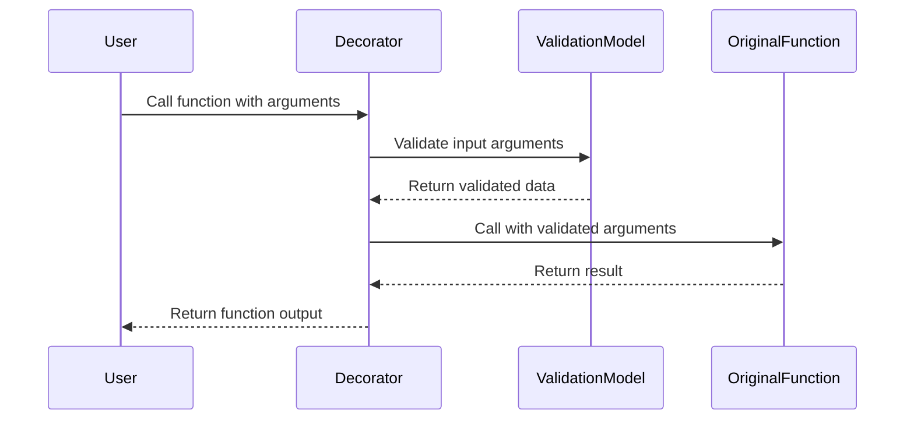
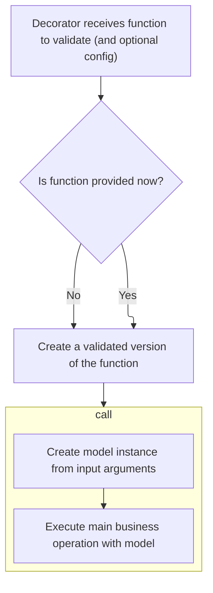

This flow describes how function arguments are validated by wrapping the original function with a decorator that intercepts calls. On each call, input arguments are validated by creating a model instance, filtered to match the function signature, and then passed to the original function. This process ensures that functions always receive validated data.



# Spec

## Detailed View of the Program's Functionality

a. Receiving the Function and Optional Configuration

The process begins when a decorator is applied to a function. This decorator can be used either with or without additional configuration options. When invoked, it checks if a function is provided immediately or if it should return another function that will later receive the target function. This dual behavior allows the decorator to be used flexibly, either as <SwmToken path="pydantic/v1/decorator.py" pos="223:2:3" line-data="                &#39;@validate_arguments is not yet supported, please remove.&#39;">`@validate_arguments`</SwmToken> or `@`<SwmToken path="pydantic/v1/decorator.py" pos="30:2:2" line-data="def validate_arguments(func: Optional[&#39;AnyCallableT&#39;] = None, *, config: &#39;ConfigType&#39; = None) -&gt; Any:">`validate_arguments`</SwmToken>`(`<SwmToken path="pydantic/v1/decorator.py" pos="30:21:21" line-data="def validate_arguments(func: Optional[&#39;AnyCallableT&#39;] = None, *, config: &#39;ConfigType&#39; = None) -&gt; Any:">`config`</SwmToken>`=...)`.

b. Creating the Validation Wrapper

If a function is provided, the decorator proceeds to wrap it. It defines an internal function that will handle the validation logic. This internal function creates an instance of a helper class responsible for managing validation. The wrapper ensures that every time the original function is called, the arguments are validated before the function executes. Additionally, the wrapper attaches references to the validation logic, the original function, and the generated model, making them accessible for advanced use cases.

c. Instantiating the Validation Helper

The helper class is initialized with the original function and any configuration. It inspects the function’s signature, extracting information about its parameters, such as their names, types, default values, and whether they are <SwmToken path="pydantic/v1/decorator.py" pos="250:7:9" line-data="                raise TypeError(f&#39;positional-only argument{plural} passed as keyword argument{plural}: {keys}&#39;)">`positional-only`</SwmToken>, keyword-only, or variable arguments. It also checks for reserved names to avoid conflicts. Based on this analysis, it constructs a mapping of argument positions to names and identifies which arguments are <SwmToken path="pydantic/v1/decorator.py" pos="250:7:9" line-data="                raise TypeError(f&#39;positional-only argument{plural} passed as keyword argument{plural}: {keys}&#39;)">`positional-only`</SwmToken> or variable.

d. Building the Validation Model

Using the extracted parameter information, the helper class constructs a dictionary describing the fields for a dynamic model. This model is built using Pydantic’s model creation utilities. The model includes fields for all function parameters, as well as special fields to handle variable arguments and to detect errors like duplicate or misplaced arguments. Custom validators are attached to the model to enforce rules about argument usage, such as ensuring <SwmToken path="pydantic/v1/decorator.py" pos="250:7:9" line-data="                raise TypeError(f&#39;positional-only argument{plural} passed as keyword argument{plural}: {keys}&#39;)">`positional-only`</SwmToken> arguments are not passed as keywords and that no duplicate arguments are provided.

e. Preparing Arguments for Validation

When the decorated function is called, the wrapper collects the provided positional and keyword arguments. It builds a dictionary mapping argument names to values, handling variable arguments and separating out any extra keyword arguments that do not match the function’s signature. It also tracks any errors, such as <SwmToken path="pydantic/v1/decorator.py" pos="250:7:9" line-data="                raise TypeError(f&#39;positional-only argument{plural} passed as keyword argument{plural}: {keys}&#39;)">`positional-only`</SwmToken> arguments passed as keywords or duplicate arguments.

f. Validating and Creating the Model Instance

With the arguments prepared, the wrapper creates an instance of the validation model. This triggers Pydantic’s validation logic, which checks types, required fields, and applies the custom validators. If validation fails, an error is raised before the original function is ever called.

g. Extracting Validated Data

Once validation succeeds, the wrapper extracts the validated data from the model instance. It filters the fields to include only those that were set by the user or have a default factory, ensuring that only relevant arguments are passed to the function.

h. Splitting Arguments for Function Call

The wrapper then determines how to split the validated data into positional and keyword arguments for the function call. If the function accepts variable positional arguments, it separates these from the rest. If there are <SwmToken path="pydantic/v1/decorator.py" pos="250:7:9" line-data="                raise TypeError(f&#39;positional-only argument{plural} passed as keyword argument{plural}: {keys}&#39;)">`positional-only`</SwmToken> arguments, it ensures they are passed in the correct order. Otherwise, all arguments are passed as keywords. This logic adapts dynamically to the signature of the original function.

i. Calling the Original Function

Finally, the wrapper calls the original function with the prepared arguments, ensuring that all inputs have been validated and are in the correct format. The result of the function call is returned to the user.

j. Returning the Decorated Function or Decorator

Depending on how the decorator was initially invoked, it either returns the fully wrapped and validated function or the decorator itself, ready to be applied to another function. This design allows for both simple and advanced usage patterns.

k. Summary

In summary, the code provides a robust mechanism for validating function arguments using Pydantic models. It dynamically analyzes the function’s signature, builds a validation model, enforces argument rules, and ensures that only validated data reaches the original function. The decorator is flexible, supporting both direct and configured usage, and exposes helpful references for advanced introspection or manual validation.

# Rule Definition

| Paragraph Name                                                                                                                                                                                                                                                                                                                                                                                                                                                                                                                                     | Rule ID | Category          | Description                                                                                                                                                                                                                                                                                                                                                                                                                                                                                                                                                                                                                                                                                                                                                                                                                                                                                                                                                     | Conditions                                                                                                  | Remarks                                                                                                                                                                                                                                                                                                                                                                                                                                                                                                                                                                                                                                                                                                                                                                                                                                                                                                                                                                                                                                                                                                                                                                     |
| -------------------------------------------------------------------------------------------------------------------------------------------------------------------------------------------------------------------------------------------------------------------------------------------------------------------------------------------------------------------------------------------------------------------------------------------------------------------------------------------------------------------------------------------------- | ------- | ----------------- | --------------------------------------------------------------------------------------------------------------------------------------------------------------------------------------------------------------------------------------------------------------------------------------------------------------------------------------------------------------------------------------------------------------------------------------------------------------------------------------------------------------------------------------------------------------------------------------------------------------------------------------------------------------------------------------------------------------------------------------------------------------------------------------------------------------------------------------------------------------------------------------------------------------------------------------------------------------- | ----------------------------------------------------------------------------------------------------------- | --------------------------------------------------------------------------------------------------------------------------------------------------------------------------------------------------------------------------------------------------------------------------------------------------------------------------------------------------------------------------------------------------------------------------------------------------------------------------------------------------------------------------------------------------------------------------------------------------------------------------------------------------------------------------------------------------------------------------------------------------------------------------------------------------------------------------------------------------------------------------------------------------------------------------------------------------------------------------------------------------------------------------------------------------------------------------------------------------------------------------------------------------------------------------- |
| <SwmToken path="pydantic/v1/decorator.py" pos="30:2:2" line-data="def validate_arguments(func: Optional[&#39;AnyCallableT&#39;] = None, *, config: &#39;ConfigType&#39; = None) -&gt; Any:">`validate_arguments`</SwmToken> function (lines 30-52)                                                                                                                                                                                                                                                                                                 | RL-001  | Conditional Logic | The decorator must work when applied directly as @<SwmToken path="pydantic/v1/decorator.py" pos="30:2:2" line-data="def validate_arguments(func: Optional[&#39;AnyCallableT&#39;] = None, *, config: &#39;ConfigType&#39; = None) -&gt; Any:">`validate_arguments`</SwmToken> or as @<SwmToken path="pydantic/v1/decorator.py" pos="30:2:2" line-data="def validate_arguments(func: Optional[&#39;AnyCallableT&#39;] = None, *, config: &#39;ConfigType&#39; = None) -&gt; Any:">`validate_arguments`</SwmToken>(config=...), with or without parentheses.                                                                                                                                                                                                                                                                                                                                                                                                      | Decorator is used on a function, either with or without parentheses and with or without a config parameter. | If used without parentheses, config defaults to None. The decorator must return a wrapper or a decorator depending on usage.                                                                                                                                                                                                                                                                                                                                                                                                                                                                                                                                                                                                                                                                                                                                                                                                                                                                                                                                                                                                                                                |
| <SwmToken path="pydantic/v1/decorator.py" pos="36:5:5" line-data="        vd = ValidatedFunction(_func, config)">`ValidatedFunction`</SwmToken>.**init**, ValidatedFunction.create_model                                                                                                                                                                                                                                                                                                                                                           | RL-002  | Conditional Logic | The decorator accepts an optional config parameter. If config is None or not provided, the default configuration is used. If config is a class, it is used as the configuration. If config is a dict, it is converted into a configuration class. If config contains unsupported options ('fields' or <SwmToken path="pydantic/v1/decorator.py" pos="220:21:21" line-data="        if hasattr(CustomConfig, &#39;fields&#39;) or hasattr(CustomConfig, &#39;alias_generator&#39;):">`alias_generator`</SwmToken>), a <SwmToken path="pydantic/v1/decorator.py" pos="6:10:10" line-data="from pydantic.v1.errors import ConfigError">`ConfigError`</SwmToken> is raised.                                                                                                                                                                                                                                                                                         | Decorator is used with a config parameter.                                                                  | Unsupported config options: 'fields', <SwmToken path="pydantic/v1/decorator.py" pos="220:21:21" line-data="        if hasattr(CustomConfig, &#39;fields&#39;) or hasattr(CustomConfig, &#39;alias_generator&#39;):">`alias_generator`</SwmToken>. Default config sets extra = 'forbid'.                                                                                                                                                                                                                                                                                                                                                                                                                                                                                                                                                                                                                                                                                                                                                                                                                                                                                     |
| <SwmToken path="pydantic/v1/decorator.py" pos="36:5:5" line-data="        vd = ValidatedFunction(_func, config)">`ValidatedFunction`</SwmToken>.**init**, ValidatedFunction.create_model                                                                                                                                                                                                                                                                                                                                                           | RL-003  | Computation       | The decorator inspects the function's signature to identify <SwmToken path="pydantic/v1/decorator.py" pos="250:7:9" line-data="                raise TypeError(f&#39;positional-only argument{plural} passed as keyword argument{plural}: {keys}&#39;)">`positional-only`</SwmToken> arguments, \*args, \*\*kwargs, and creates a model with fields for each parameter using type annotations and default values.                                                                                                                                                                                                                                                                                                                                                                                                                                                                                                                                               | Decorator is applied to a function.                                                                         | Special names: <SwmToken path="pydantic/v1/decorator.py" pos="54:0:0" line-data="ALT_V_ARGS = &#39;v__args&#39;">`ALT_V_ARGS`</SwmToken> = <SwmToken path="pydantic/v1/decorator.py" pos="54:5:5" line-data="ALT_V_ARGS = &#39;v__args&#39;">`v__args`</SwmToken>, <SwmToken path="pydantic/v1/decorator.py" pos="55:0:0" line-data="ALT_V_KWARGS = &#39;v__kwargs&#39;">`ALT_V_KWARGS`</SwmToken> = <SwmToken path="pydantic/v1/decorator.py" pos="55:5:5" line-data="ALT_V_KWARGS = &#39;v__kwargs&#39;">`v__kwargs`</SwmToken>, <SwmToken path="pydantic/v1/decorator.py" pos="56:0:0" line-data="V_POSITIONAL_ONLY_NAME = &#39;v__positional_only&#39;">`V_POSITIONAL_ONLY_NAME`</SwmToken> = <SwmToken path="pydantic/v1/decorator.py" pos="56:5:5" line-data="V_POSITIONAL_ONLY_NAME = &#39;v__positional_only&#39;">`v__positional_only`</SwmToken>, <SwmToken path="pydantic/v1/decorator.py" pos="57:0:0" line-data="V_DUPLICATE_KWARGS = &#39;v__duplicate_kwargs&#39;">`V_DUPLICATE_KWARGS`</SwmToken> = <SwmToken path="pydantic/v1/decorator.py" pos="57:5:5" line-data="V_DUPLICATE_KWARGS = &#39;v__duplicate_kwargs&#39;">`v__duplicate_kwargs`</SwmToken>. |
| ValidatedFunction.build_values, <SwmToken path="pydantic/v1/decorator.py" pos="226:3:3" line-data="        class DecoratorBaseModel(BaseModel):">`DecoratorBaseModel`</SwmToken> validators, ValidatedFunction.call                                                                                                                                                                                                                                                                                                                                | RL-004  | Conditional Logic | When the decorated function is called, all input arguments are validated against the model. If validation fails due to argument errors (too many positional arguments, unexpected keyword arguments, <SwmToken path="pydantic/v1/decorator.py" pos="250:7:9" line-data="                raise TypeError(f&#39;positional-only argument{plural} passed as keyword argument{plural}: {keys}&#39;)">`positional-only`</SwmToken> arguments passed as keywords, duplicate keyword arguments), a <SwmToken path="pydantic/v1/decorator.py" pos="232:3:3" line-data="                raise TypeError(f&#39;{pos_args} positional arguments expected but {pos_args + len(v)} given&#39;)">`TypeError`</SwmToken> is raised with a custom message. If validation fails due to type errors or missing required arguments, a ValidationError is raised. Extra arguments not allowed by config also raise errors. The original function is not called if validation fails. | Function is called with arguments.                                                                          | <SwmToken path="pydantic/v1/decorator.py" pos="232:3:3" line-data="                raise TypeError(f&#39;{pos_args} positional arguments expected but {pos_args + len(v)} given&#39;)">`TypeError`</SwmToken> is raised for argument errors; ValidationError for type/missing argument errors. Custom error messages are provided for each case.                                                                                                                                                                                                                                                                                                                                                                                                                                                                                                                                                                                                                                                                                                                                                                                                                            |
| ValidatedFunction.execute                                                                                                                                                                                                                                                                                                                                                                                                                                                                                                                          | RL-005  | Computation       | After successful validation, only fields that were set or have a default factory are included in the arguments passed to the original function. Arguments are split into positional and keyword arguments according to the function's signature, with \*args and \*\*kwargs handled appropriately.                                                                                                                                                                                                                                                                                                                                                                                                                                                                                                                                                                                                                                                              | Validation succeeds.                                                                                        | Arguments are split into positional and keyword according to the original function's signature. \*args and \*\*kwargs are unpacked as needed.                                                                                                                                                                                                                                                                                                                                                                                                                                                                                                                                                                                                                                                                                                                                                                                                                                                                                                                                                                                                                               |
| <SwmToken path="pydantic/v1/decorator.py" pos="30:2:2" line-data="def validate_arguments(func: Optional[&#39;AnyCallableT&#39;] = None, *, config: &#39;ConfigType&#39; = None) -&gt; Any:">`validate_arguments`</SwmToken> (<SwmToken path="pydantic/v1/decorator.py" pos="39:3:3" line-data="        def wrapper_function(*args: Any, **kwargs: Any) -&gt; Any:">`wrapper_function`</SwmToken>), <SwmToken path="pydantic/v1/decorator.py" pos="36:5:5" line-data="        vd = ValidatedFunction(_func, config)">`ValidatedFunction`</SwmToken> | RL-006  | Data Assignment   | The decorator preserves the original function's metadata and signature, including **name** and **doc**. The decorated function exposes references to the validation logic and the original function.                                                                                                                                                                                                                                                                                                                                                                                                                                                                                                                                                                                                                                                                                                                                                            | Decorator is applied to a function.                                                                         | Attributes exposed: .vd (validation logic), .validate (model instance initializer), <SwmToken path="pydantic/v1/decorator.py" pos="44:2:3" line-data="        wrapper_function.raw_function = vd.raw_function  # type: ignore">`.raw_function`</SwmToken> (original function), .model (validation model).                                                                                                                                                                                                                                                                                                                                                                                                                                                                                                                                                                                                                                                                                                                                                                                                                                                                   |

# User Stories

## User Story 1: Flexible decorator application and configuration

---

### Story Description:

As a Python developer, I want to apply the <SwmToken path="pydantic/v1/decorator.py" pos="30:2:2" line-data="def validate_arguments(func: Optional[&#39;AnyCallableT&#39;] = None, *, config: &#39;ConfigType&#39; = None) -&gt; Any:">`validate_arguments`</SwmToken> decorator to my functions with or without parentheses and with optional configuration, so that I can easily enable argument validation with sensible defaults or custom settings, and receive clear errors if I use unsupported options.

---

### Business Rule Mapping:

| Rule ID | Paragraph Name                                                                                                                                                                                                                                     | Rule Description                                                                                                                                                                                                                                                                                                                                                                                                                                                                                                                                                                                                                                                        |
| ------- | -------------------------------------------------------------------------------------------------------------------------------------------------------------------------------------------------------------------------------------------------- | ----------------------------------------------------------------------------------------------------------------------------------------------------------------------------------------------------------------------------------------------------------------------------------------------------------------------------------------------------------------------------------------------------------------------------------------------------------------------------------------------------------------------------------------------------------------------------------------------------------------------------------------------------------------------- |
| RL-001  | <SwmToken path="pydantic/v1/decorator.py" pos="30:2:2" line-data="def validate_arguments(func: Optional[&#39;AnyCallableT&#39;] = None, *, config: &#39;ConfigType&#39; = None) -&gt; Any:">`validate_arguments`</SwmToken> function (lines 30-52) | The decorator must work when applied directly as @<SwmToken path="pydantic/v1/decorator.py" pos="30:2:2" line-data="def validate_arguments(func: Optional[&#39;AnyCallableT&#39;] = None, *, config: &#39;ConfigType&#39; = None) -&gt; Any:">`validate_arguments`</SwmToken> or as @<SwmToken path="pydantic/v1/decorator.py" pos="30:2:2" line-data="def validate_arguments(func: Optional[&#39;AnyCallableT&#39;] = None, *, config: &#39;ConfigType&#39; = None) -&gt; Any:">`validate_arguments`</SwmToken>(config=...), with or without parentheses.                                                                                                              |
| RL-002  | <SwmToken path="pydantic/v1/decorator.py" pos="36:5:5" line-data="        vd = ValidatedFunction(_func, config)">`ValidatedFunction`</SwmToken>.**init**, ValidatedFunction.create_model                                                           | The decorator accepts an optional config parameter. If config is None or not provided, the default configuration is used. If config is a class, it is used as the configuration. If config is a dict, it is converted into a configuration class. If config contains unsupported options ('fields' or <SwmToken path="pydantic/v1/decorator.py" pos="220:21:21" line-data="        if hasattr(CustomConfig, &#39;fields&#39;) or hasattr(CustomConfig, &#39;alias_generator&#39;):">`alias_generator`</SwmToken>), a <SwmToken path="pydantic/v1/decorator.py" pos="6:10:10" line-data="from pydantic.v1.errors import ConfigError">`ConfigError`</SwmToken> is raised. |

---

### Relevant Functionality:

- <SwmToken path="pydantic/v1/decorator.py" pos="30:2:2" line-data="def validate_arguments(func: Optional[&#39;AnyCallableT&#39;] = None, *, config: &#39;ConfigType&#39; = None) -&gt; Any:">`validate_arguments`</SwmToken> **function (lines 30-52)**
  1. **RL-001:**
     - If func is provided, apply the decorator directly to the function.
     - If func is not provided, return a decorator that will be applied to a function later.
     - In both cases, pass the config parameter (defaulting to None if not provided) to the validation logic.
- **ValidatedFunction.init**
  1. **RL-002:**
     - If config is a dict, create a new Config class from it.
     - If config is a class, use it directly.
     - If config is None, use the default config.
     - If the config has 'fields' or <SwmToken path="pydantic/v1/decorator.py" pos="220:21:21" line-data="        if hasattr(CustomConfig, &#39;fields&#39;) or hasattr(CustomConfig, &#39;alias_generator&#39;):">`alias_generator`</SwmToken>, raise <SwmToken path="pydantic/v1/decorator.py" pos="6:10:10" line-data="from pydantic.v1.errors import ConfigError">`ConfigError`</SwmToken>.
     - Set extra = 'forbid' in the config if not otherwise specified.

## User Story 2: Robust argument validation and error reporting

---

### Story Description:

As a function user, I want all input arguments to be validated according to the function's signature and type annotations, so that I receive clear and specific errors for argument mismatches, type issues, or missing required arguments, and the function is only called if validation succeeds.

---

### Business Rule Mapping:

| Rule ID | Paragraph Name                                                                                                                                                                                                      | Rule Description                                                                                                                                                                                                                                                                                                                                                                                                                                                                                                                                                                                                                                                                                                                                                                                                                                                                                                                                                |
| ------- | ------------------------------------------------------------------------------------------------------------------------------------------------------------------------------------------------------------------- | --------------------------------------------------------------------------------------------------------------------------------------------------------------------------------------------------------------------------------------------------------------------------------------------------------------------------------------------------------------------------------------------------------------------------------------------------------------------------------------------------------------------------------------------------------------------------------------------------------------------------------------------------------------------------------------------------------------------------------------------------------------------------------------------------------------------------------------------------------------------------------------------------------------------------------------------------------------- |
| RL-003  | <SwmToken path="pydantic/v1/decorator.py" pos="36:5:5" line-data="        vd = ValidatedFunction(_func, config)">`ValidatedFunction`</SwmToken>.**init**, ValidatedFunction.create_model                            | The decorator inspects the function's signature to identify <SwmToken path="pydantic/v1/decorator.py" pos="250:7:9" line-data="                raise TypeError(f&#39;positional-only argument{plural} passed as keyword argument{plural}: {keys}&#39;)">`positional-only`</SwmToken> arguments, \*args, \*\*kwargs, and creates a model with fields for each parameter using type annotations and default values.                                                                                                                                                                                                                                                                                                                                                                                                                                                                                                                                               |
| RL-004  | ValidatedFunction.build_values, <SwmToken path="pydantic/v1/decorator.py" pos="226:3:3" line-data="        class DecoratorBaseModel(BaseModel):">`DecoratorBaseModel`</SwmToken> validators, ValidatedFunction.call | When the decorated function is called, all input arguments are validated against the model. If validation fails due to argument errors (too many positional arguments, unexpected keyword arguments, <SwmToken path="pydantic/v1/decorator.py" pos="250:7:9" line-data="                raise TypeError(f&#39;positional-only argument{plural} passed as keyword argument{plural}: {keys}&#39;)">`positional-only`</SwmToken> arguments passed as keywords, duplicate keyword arguments), a <SwmToken path="pydantic/v1/decorator.py" pos="232:3:3" line-data="                raise TypeError(f&#39;{pos_args} positional arguments expected but {pos_args + len(v)} given&#39;)">`TypeError`</SwmToken> is raised with a custom message. If validation fails due to type errors or missing required arguments, a ValidationError is raised. Extra arguments not allowed by config also raise errors. The original function is not called if validation fails. |

---

### Relevant Functionality:

- **ValidatedFunction.init**
  1. **RL-003:**
     - Inspect the function signature using inspect.signature.
     - Collect <SwmToken path="pydantic/v1/decorator.py" pos="250:7:9" line-data="                raise TypeError(f&#39;positional-only argument{plural} passed as keyword argument{plural}: {keys}&#39;)">`positional-only`</SwmToken> argument names into <SwmToken path="pydantic/v1/decorator.py" pos="196:5:5" line-data="        elif self.positional_only_args:">`positional_only_args`</SwmToken>.
     - Identify \*args and \*\*kwargs parameter names, defaulting to 'args' and 'kwargs' or alternate names if there is a conflict.
     - Build a fields dictionary mapping parameter names to (type annotation, default value).
     - Add special fields for \*args and \*\*kwargs if not present.
     - Create a dynamic Pydantic model with these fields and the config.
- **ValidatedFunction.build_values**
  1. **RL-004:**
     - Build a values dictionary from args and kwargs.
     - Validate the values using the dynamic model.
     - If argument errors are detected (too many positional, unexpected keyword, <SwmToken path="pydantic/v1/decorator.py" pos="250:7:9" line-data="                raise TypeError(f&#39;positional-only argument{plural} passed as keyword argument{plural}: {keys}&#39;)">`positional-only`</SwmToken> as keyword, duplicate keywords), raise <SwmToken path="pydantic/v1/decorator.py" pos="232:3:3" line-data="                raise TypeError(f&#39;{pos_args} positional arguments expected but {pos_args + len(v)} given&#39;)">`TypeError`</SwmToken> with a specific message.
     - If type errors or missing required arguments, raise ValidationError.
     - Do not call the original function if validation fails.

## User Story 3: Seamless function invocation and introspection

---

### Story Description:

As a library user, I want validated arguments to be passed to the original function in the correct form, and for the decorated function to preserve the original function's metadata and expose references to the validation logic, so that I can use the function transparently and introspect its validation behavior.

---

### Business Rule Mapping:

| Rule ID | Paragraph Name                                                                                                                                                                                                                                                                                                                                                                                                                                                                                                                                     | Rule Description                                                                                                                                                                                                                                                                                   |
| ------- | -------------------------------------------------------------------------------------------------------------------------------------------------------------------------------------------------------------------------------------------------------------------------------------------------------------------------------------------------------------------------------------------------------------------------------------------------------------------------------------------------------------------------------------------------- | -------------------------------------------------------------------------------------------------------------------------------------------------------------------------------------------------------------------------------------------------------------------------------------------------- |
| RL-005  | ValidatedFunction.execute                                                                                                                                                                                                                                                                                                                                                                                                                                                                                                                          | After successful validation, only fields that were set or have a default factory are included in the arguments passed to the original function. Arguments are split into positional and keyword arguments according to the function's signature, with \*args and \*\*kwargs handled appropriately. |
| RL-006  | <SwmToken path="pydantic/v1/decorator.py" pos="30:2:2" line-data="def validate_arguments(func: Optional[&#39;AnyCallableT&#39;] = None, *, config: &#39;ConfigType&#39; = None) -&gt; Any:">`validate_arguments`</SwmToken> (<SwmToken path="pydantic/v1/decorator.py" pos="39:3:3" line-data="        def wrapper_function(*args: Any, **kwargs: Any) -&gt; Any:">`wrapper_function`</SwmToken>), <SwmToken path="pydantic/v1/decorator.py" pos="36:5:5" line-data="        vd = ValidatedFunction(_func, config)">`ValidatedFunction`</SwmToken> | The decorator preserves the original function's metadata and signature, including **name** and **doc**. The decorated function exposes references to the validation logic and the original function.                                                                                               |

---

### Relevant Functionality:

- **ValidatedFunction.execute**
  1. **RL-005:**
     - Extract only set fields or those with a default factory from the validated model.
     - If \*args is present, use its value as positional arguments.
     - If <SwmToken path="pydantic/v1/decorator.py" pos="196:5:5" line-data="        elif self.positional_only_args:">`positional_only_args`</SwmToken> is non-empty, pass those arguments positionally.
     - All other arguments are passed as keywords, except for those in \*\*kwargs, which are unpacked as extra keyword arguments.
     - Call the original function with the split arguments and return its result.
- <SwmToken path="pydantic/v1/decorator.py" pos="30:2:2" line-data="def validate_arguments(func: Optional[&#39;AnyCallableT&#39;] = None, *, config: &#39;ConfigType&#39; = None) -&gt; Any:">`validate_arguments`</SwmToken> **(**<SwmToken path="pydantic/v1/decorator.py" pos="39:3:3" line-data="        def wrapper_function(*args: Any, **kwargs: Any) -&gt; Any:">`wrapper_function`</SwmToken>**)**
  1. **RL-006:**
     - Use functools.wraps to preserve function metadata.
     - Assign references to the validation logic, model initializer, original function, and model as attributes on the wrapper function.

# Code Walkthrough

## Wrapping Functions for Argument Validation



<SwmSnippet path="/pydantic/v1/decorator.py" line="30">

---

In <SwmToken path="pydantic/v1/decorator.py" pos="30:2:2" line-data="def validate_arguments(func: Optional[&#39;AnyCallableT&#39;] = None, *, config: &#39;ConfigType&#39; = None) -&gt; Any:">`validate_arguments`</SwmToken>, we prep a wrapper that always validates inputs before running the user's function, making sure validation is enforced on every call.

```python
def validate_arguments(func: Optional['AnyCallableT'] = None, *, config: 'ConfigType' = None) -> Any:
    """
    Decorator to validate the arguments passed to a function.
    """

    def validate(_func: 'AnyCallable') -> 'AnyCallable':
        vd = ValidatedFunction(_func, config)

        @wraps(_func)
        def wrapper_function(*args: Any, **kwargs: Any) -> Any:
            return vd.call(*args, **kwargs)

        wrapper_function.vd = vd  # type: ignore
        wrapper_function.validate = vd.init_model_instance  # type: ignore
        wrapper_function.raw_function = vd.raw_function  # type: ignore
        wrapper_function.model = vd.model  # type: ignore
        return wrapper_function

```

---

</SwmSnippet>

### Validating and Preparing Arguments

<SwmSnippet path="/pydantic/v1/decorator.py" line="132">

---

<SwmToken path="pydantic/v1/decorator.py" pos="132:3:3" line-data="    def call(self, *args: Any, **kwargs: Any) -&gt; Any:">`call`</SwmToken> validates the inputs and then passes the parsed model to <SwmToken path="pydantic/v1/decorator.py" pos="134:5:5" line-data="        return self.execute(m)">`execute`</SwmToken> to run the function with safe data.

```python
    def call(self, *args: Any, **kwargs: Any) -> Any:
        m = self.init_model_instance(*args, **kwargs)
        return self.execute(m)
```

---

</SwmSnippet>

### Extracting and Filtering Validated Data

<SwmSnippet path="/pydantic/v1/decorator.py" line="179">

---

In <SwmToken path="pydantic/v1/decorator.py" pos="179:3:3" line-data="    def execute(self, m: BaseModel) -&gt; Any:">`execute`</SwmToken>, we grab all the fields from the validated model, but only keep those that were set or have a default factory. We use \_iter to get the fields, and this filtering step decides which arguments will actually be passed to the function.

```python
    def execute(self, m: BaseModel) -> Any:
        d = {k: v for k, v in m._iter() if k in m.__fields_set__ or m.__fields__[k].default_factory}
```

---

</SwmSnippet>

#### Iterating and Filtering Model Fields

See <SwmLink doc-title="Iterating and Filtering Model Fields">[Iterating and Filtering Model Fields](/.swm/iterating-and-filtering-model-fields.wnqo05z0.sw.md)</SwmLink>

#### Splitting Arguments for Function Call

```mermaid
%%{init: {"flowchart": {"defaultRenderer": "elk"}} }%%
flowchart TD
  node1["Receive input data for function call"]
  click node1 openCode "pydantic/v1/decorator.py:181:182"
  node1 --> node2{"Does input contain positional argument marker?"}
  click node2 openCode "pydantic/v1/decorator.py:183:183"
  node2 -->|"Yes (marker present)"| loop1
  node2 -->|"No"| node4{"Are there positional-only arguments?"}
  click node4 openCode "pydantic/v1/decorator.py:196:196"
  node4 -->|"Yes"| loop2
  node4 -->|"No"| node6["Pass all input as keyword arguments"]
  click node6 openCode "pydantic/v1/decorator.py:206:206"

  subgraph loop1["Iterate over input to split positional and keyword arguments"]
    node3["Extract positional and keyword arguments"]
    click node3 openCode "pydantic/v1/decorator.py:187:194"
    node3 --> node7["Call underlying function with prepared arguments"]
    click node7 openCode "pydantic/v1/decorator.py:195:195"
  end

  subgraph loop2["Iterate over input to extract positional-only and keyword arguments"]
    node5["Extract positional-only and keyword arguments"]
    click node5 openCode "pydantic/v1/decorator.py:199:203"
    node5 --> node7
  end

  node6 --> node7

%% Swimm:
%% %%{init: {"flowchart": {"defaultRenderer": "elk"}} }%%
%% flowchart TD
%%   node1["Receive input data for function call"]
%%   click node1 openCode "<SwmPath>[pydantic/v1/decorator.py](pydantic/v1/decorator.py)</SwmPath>:181:182"
%%   node1 --> node2{"Does input contain positional argument marker?"}
%%   click node2 openCode "<SwmPath>[pydantic/v1/decorator.py](pydantic/v1/decorator.py)</SwmPath>:183:183"
%%   node2 -->|"Yes (marker present)"| loop1
%%   node2 -->|"No"| node4{"Are there <SwmToken path="pydantic/v1/decorator.py" pos="250:7:9" line-data="                raise TypeError(f&#39;positional-only argument{plural} passed as keyword argument{plural}: {keys}&#39;)">`positional-only`</SwmToken> arguments?"}
%%   click node4 openCode "<SwmPath>[pydantic/v1/decorator.py](pydantic/v1/decorator.py)</SwmPath>:196:196"
%%   node4 -->|"Yes"| loop2
%%   node4 -->|"No"| node6["Pass all input as keyword arguments"]
%%   click node6 openCode "<SwmPath>[pydantic/v1/decorator.py](pydantic/v1/decorator.py)</SwmPath>:206:206"
%% 
%%   subgraph loop1["Iterate over input to split positional and keyword arguments"]
%%     node3["Extract positional and keyword arguments"]
%%     click node3 openCode "<SwmPath>[pydantic/v1/decorator.py](pydantic/v1/decorator.py)</SwmPath>:187:194"
%%     node3 --> node7["Call underlying function with prepared arguments"]
%%     click node7 openCode "<SwmPath>[pydantic/v1/decorator.py](pydantic/v1/decorator.py)</SwmPath>:195:195"
%%   end
%% 
%%   subgraph loop2["Iterate over input to extract <SwmToken path="pydantic/v1/decorator.py" pos="250:7:9" line-data="                raise TypeError(f&#39;positional-only argument{plural} passed as keyword argument{plural}: {keys}&#39;)">`positional-only`</SwmToken> and keyword arguments"]
%%     node5["Extract <SwmToken path="pydantic/v1/decorator.py" pos="250:7:9" line-data="                raise TypeError(f&#39;positional-only argument{plural} passed as keyword argument{plural}: {keys}&#39;)">`positional-only`</SwmToken> and keyword arguments"]
%%     click node5 openCode "<SwmPath>[pydantic/v1/decorator.py](pydantic/v1/decorator.py)</SwmPath>:199:203"
%%     node5 --> node7
%%   end
%% 
%%   node6 --> node7
```



<SwmSnippet path="/pydantic/v1/decorator.py" line="181">

---

Back in <SwmToken path="pydantic/v1/decorator.py" pos="134:5:5" line-data="        return self.execute(m)">`execute`</SwmToken>, after filtering fields, we split out any extra keyword arguments using <SwmToken path="pydantic/v1/decorator.py" pos="181:11:11" line-data="        var_kwargs = d.pop(self.v_kwargs_name, {})">`v_kwargs_name`</SwmToken>, then check for <SwmToken path="pydantic/v1/decorator.py" pos="183:5:5" line-data="        if self.v_args_name in d:">`v_args_name`</SwmToken> to decide how to build the argument lists. This lets us handle \*args and \*\*kwargs dynamically when calling the user's function.

```python
        var_kwargs = d.pop(self.v_kwargs_name, {})

        if self.v_args_name in d:
            args_: List[Any] = []
            in_kwargs = False
            kwargs = {}
            for name, value in d.items():
                if in_kwargs:
                    kwargs[name] = value
                elif name == self.v_args_name:
                    args_ += value
                    in_kwargs = True
                else:
                    args_.append(value)
```

---

</SwmSnippet>

<SwmSnippet path="/pydantic/v1/decorator.py" line="194">

---

After splitting out \*args and \*\*kwargs, if <SwmToken path="pydantic/v1/decorator.py" pos="183:5:5" line-data="        if self.v_args_name in d:">`v_args_name`</SwmToken> isn't present but <SwmToken path="pydantic/v1/decorator.py" pos="196:5:5" line-data="        elif self.positional_only_args:">`positional_only_args`</SwmToken> is, we separate the arguments based on that set. This keeps the call compatible with functions that expect <SwmToken path="pydantic/v1/decorator.py" pos="250:7:9" line-data="                raise TypeError(f&#39;positional-only argument{plural} passed as keyword argument{plural}: {keys}&#39;)">`positional-only`</SwmToken> arguments.

```python
                    args_.append(value)
            return self.raw_function(*args_, **kwargs, **var_kwargs)
        elif self.positional_only_args:
            args_ = []
            kwargs = {}
            for name, value in d.items():
                if name in self.positional_only_args:
                    args_.append(value)
                else:
                    kwargs[name] = value
```

---

</SwmSnippet>

<SwmSnippet path="/pydantic/v1/decorator.py" line="203">

---

Finally in <SwmToken path="pydantic/v1/decorator.py" pos="134:5:5" line-data="        return self.execute(m)">`execute`</SwmToken>, after building the right argument lists, we call the user's function with them and return whatever it gives back. The logic adapts to different function signatures so the decorator works everywhere.

```python
                    kwargs[name] = value
            return self.raw_function(*args_, **kwargs, **var_kwargs)
        else:
            return self.raw_function(**d, **var_kwargs)
```

---

</SwmSnippet>

### Returning the Decorated Function

<SwmSnippet path="/pydantic/v1/decorator.py" line="48">

---

After running through argument validation and wrapping, <SwmToken path="pydantic/v1/decorator.py" pos="30:2:2" line-data="def validate_arguments(func: Optional[&#39;AnyCallableT&#39;] = None, *, config: &#39;ConfigType&#39; = None) -&gt; Any:">`validate_arguments`</SwmToken> either returns the decorated function or the decorator itself, depending on how it was called. This lets users use the decorator with or without options.

```python
    if func:
        return validate(func)
    else:
        return validate
```

---

</SwmSnippet>

## Building the Validation Wrapper

<SwmSnippet path="/pydantic/v1/decorator.py" line="35">

---

In <SwmToken path="pydantic/v1/decorator.py" pos="35:3:3" line-data="    def validate(_func: &#39;AnyCallable&#39;) -&gt; &#39;AnyCallable&#39;:">`validate`</SwmToken>, we set up another wrapper around the user's function, making sure every call goes through argument validation by calling <SwmToken path="pydantic/v1/decorator.py" pos="40:3:5" line-data="            return vd.call(*args, **kwargs)">`vd.call`</SwmToken>. This enforces validation on every use.

```python
    def validate(_func: 'AnyCallable') -> 'AnyCallable':
        vd = ValidatedFunction(_func, config)

        @wraps(_func)
        def wrapper_function(*args: Any, **kwargs: Any) -> Any:
            return vd.call(*args, **kwargs)

```

---

</SwmSnippet>

<SwmSnippet path="/pydantic/v1/decorator.py" line="42">

---

After setting up the wrapper in <SwmToken path="pydantic/v1/decorator.py" pos="43:3:3" line-data="        wrapper_function.validate = vd.init_model_instance  # type: ignore">`validate`</SwmToken>, we attach helpers and references to it so users can access validation logic or the original function if they need to. Then we return the wrapper.

```python
        wrapper_function.vd = vd  # type: ignore
        wrapper_function.validate = vd.init_model_instance  # type: ignore
        wrapper_function.raw_function = vd.raw_function  # type: ignore
        wrapper_function.model = vd.model  # type: ignore
        return wrapper_function
```

---

</SwmSnippet>

&nbsp;

*This is an auto-generated document by Swimm 🌊 and has not yet been verified by a human*

<SwmMeta version="3.0.0" repo-id="Z2l0aHViJTNBJTNBcHlkYW50aWMlM0ElM0FTd2ltbS1EZW1v" repo-name="pydantic"><sup>Powered by [Swimm](/)</sup></SwmMeta>
