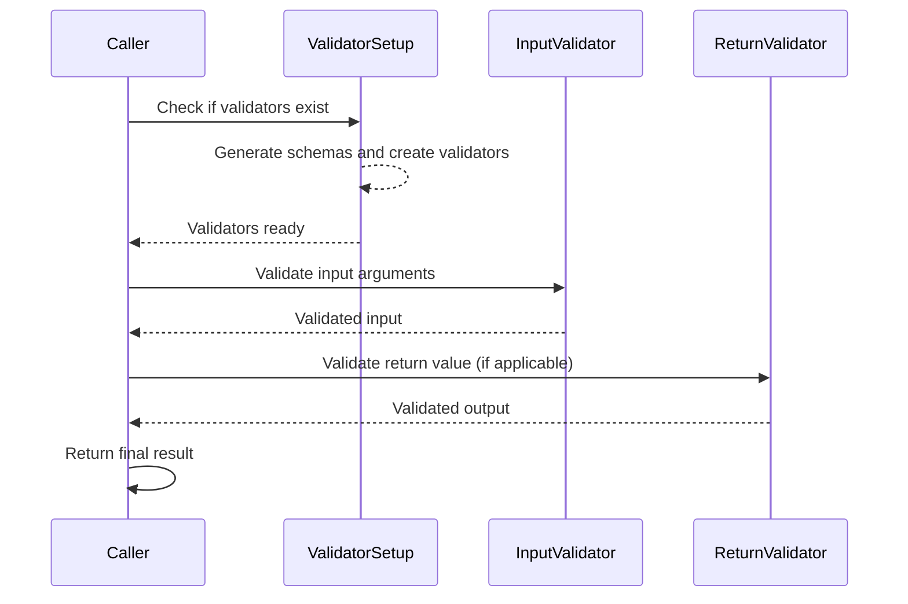
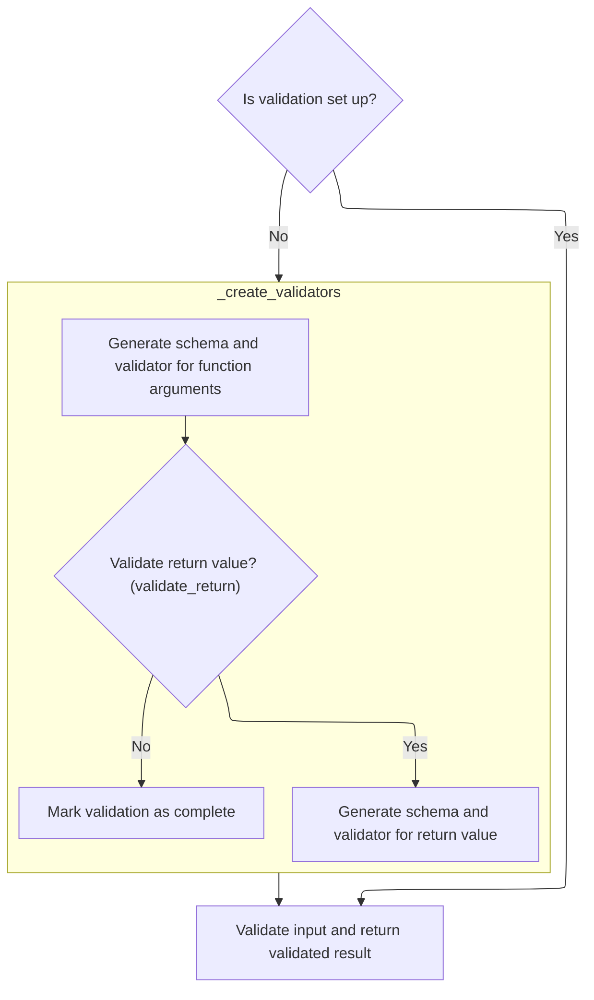
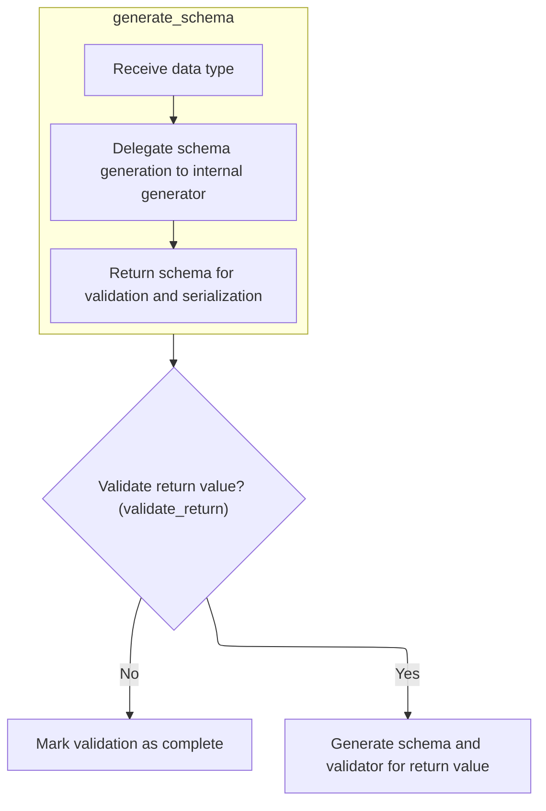
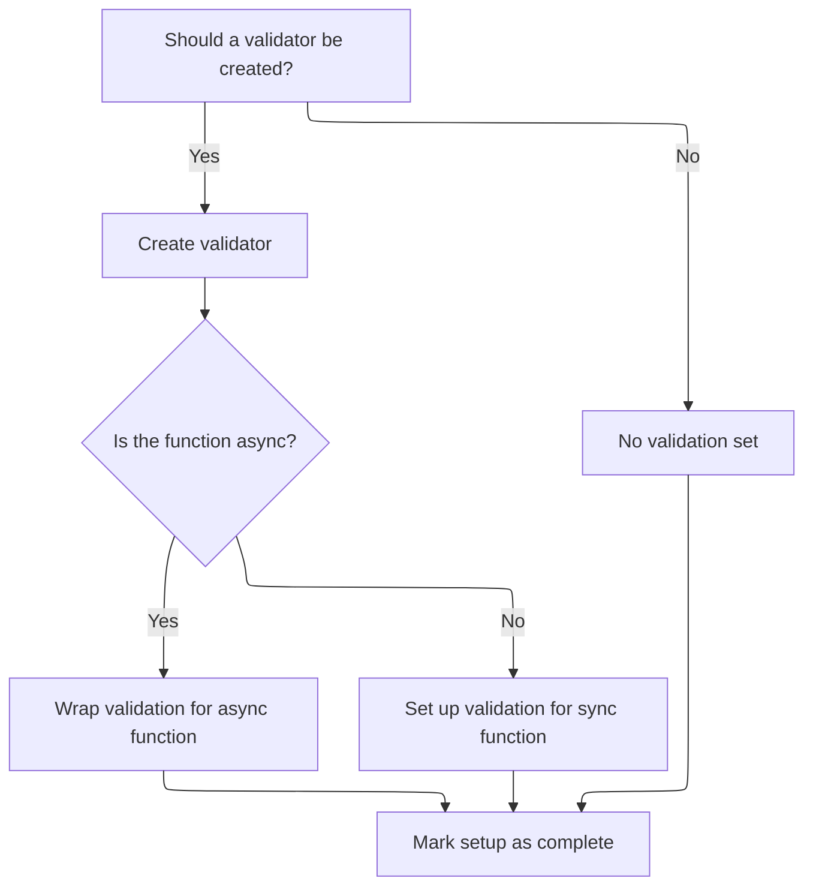

This document describes the flow of validating function calls by generating schemas and validators for input arguments and optionally return values. It explains how validation is set up once, supports both synchronous and asynchronous functions, and how validated results are returned.



# Spec

## Detailed View of the Program's Functionality

a. Starting the Validation Call

When a function wrapped by Pydantic's validation machinery is called, the process begins by checking whether the validation setup has already been completed. This is determined by a flag that indicates if the necessary validators are ready. If the setup is not complete, the system proceeds to set up the validators before handling the function call. This ensures that the cost of creating validators is only paid once, just before they are needed, rather than on every function call.

- If validation is not set up:
  - The system initiates the validator creation process.
- If validation is already set up:
  - The system skips directly to validating the input and returning the result.

b. Preparing Argument and Return Validators

If the validators need to be set up, the system starts by generating a schema for the function's arguments. This schema describes the expected types and structure of the input data. The schema generation is delegated to a specialized component, which constructs the schema based on the function's signature and type hints.

- The schema for the function's arguments is generated and cleaned.
- A main validator is created using this schema, which will later be used to validate any input data passed to the function.
- If return value validation is enabled, the system repeats the schema generation process for the function's return type:
  - The function's signature is inspected to determine the return type.
  - A schema for the return type is generated and cleaned.
  - A validator for the return value is created using this schema.

If return value validation is not required, this step is skipped.

c. Delegating Schema Generation

The schema generation process is modular. When a schema needs to be generated for a particular type (either arguments or return value), the request is handed off to an internal generator. This design allows the schema generation logic to be updated or swapped out independently of the rest of the validation setup.

- The schema generator receives the data type.
- It delegates the actual schema construction to an internal method.
- The resulting schema is returned for use in validation and serialization.

d. Finalizing Validator Setup

After generating the necessary schemas, the system creates the validators:

- If a validator should be created (for the return value, if enabled):
  - The validator is created using the generated schema.
  - If the function is asynchronous, the validator is wrapped in an async wrapper to handle awaiting the result.
  - If the function is synchronous, the validator is set up to process the result directly.
- If no validator is needed (e.g., return value validation is disabled), this step is skipped.
- Finally, the setup is marked as complete so that future calls do not repeat this process.

e. Validating and Returning Results

Once the validators are set up, the function call proceeds:

- The input arguments are wrapped in a structure that combines positional and keyword arguments.
- The main validator is used to validate the input arguments.
- If a return value validator exists:
  - The result of the function call is passed through the return value validator before being returned to the caller.
- If no return value validator is present:
  - The validated result is returned directly.

This flow ensures that both input arguments and, optionally, return values are validated according to the schemas derived from the function's type hints, providing robust data validation with minimal runtime overhead after the initial setup.

# Rule Definition

| Paragraph Name                                                                                                                                                                                                                                                                                                                                                                      | Rule ID | Category          | Description                                                                                                                                                                                                                                                                                                                                                                                                                                                                                                                             | Conditions                                                                                                                                                                                                          | Remarks                                                                                                                                                                                                                                                                                                                                                                                                                                                                 |
| ----------------------------------------------------------------------------------------------------------------------------------------------------------------------------------------------------------------------------------------------------------------------------------------------------------------------------------------------------------------------------------- | ------- | ----------------- | --------------------------------------------------------------------------------------------------------------------------------------------------------------------------------------------------------------------------------------------------------------------------------------------------------------------------------------------------------------------------------------------------------------------------------------------------------------------------------------------------------------------------------------- | ------------------------------------------------------------------------------------------------------------------------------------------------------------------------------------------------------------------- | ----------------------------------------------------------------------------------------------------------------------------------------------------------------------------------------------------------------------------------------------------------------------------------------------------------------------------------------------------------------------------------------------------------------------------------------------------------------------- |
| class <SwmToken path="pydantic/_internal/_validate_call.py" pos="49:2:2" line-data="class ValidateCallWrapper:">`ValidateCallWrapper`</SwmToken>, **init**, <SwmToken path="pydantic/_internal/_validate_call.py" pos="91:3:3" line-data="    def _create_validators(self) -&gt; None:">`_create_validators`</SwmToken>, **call**                                                   | RL-001  | Conditional Logic | A callable wrapper must validate input arguments and, optionally, the return value of a function according to type hints and configuration. The wrapper must accept any positional and keyword arguments, validate them, and return the result of the wrapped function after validation.                                                                                                                                                                                                                                                | The wrapper is initialized with a function, configuration, a boolean for return value validation, and an optional parent namespace. Validation occurs on every call.                                                | Arguments are wrapped in an <SwmToken path="pydantic/_internal/_validate_call.py" pos="136:13:13" line-data="        res = self.__pydantic_validator__.validate_python(pydantic_core.ArgsKwargs(args, kwargs))">`ArgsKwargs`</SwmToken> object, which exposes 'args' and 'kwargs' as attributes. ValidationError is raised on validation failure and exposes error details via an 'errors' attribute. The wrapper supports both synchronous and asynchronous functions. |
| **init**, <SwmToken path="pydantic/_internal/_validate_call.py" pos="91:3:3" line-data="    def _create_validators(self) -&gt; None:">`_create_validators`</SwmToken>                                                                                                                                                                                                               | RL-002  | Conditional Logic | If the configuration includes <SwmToken path="pydantic/_internal/_validate_call.py" pos="86:9:9" line-data="        if not self.config_wrapper.defer_build:">`defer_build`</SwmToken>, validator creation is deferred until the first call. Otherwise, validators are created during initialization.                                                                                                                                                                                                                                    | The configuration object has a <SwmToken path="pydantic/_internal/_validate_call.py" pos="86:9:9" line-data="        if not self.config_wrapper.defer_build:">`defer_build`</SwmToken> option set to True or False. | <SwmToken path="pydantic/_internal/_validate_call.py" pos="86:9:9" line-data="        if not self.config_wrapper.defer_build:">`defer_build`</SwmToken> is a boolean option in the configuration. When True, **pydantic_complete** is set to False and validators are not created until the first call.                                                                                                                                                                 |
| <SwmToken path="pydantic/_internal/_validate_call.py" pos="91:3:3" line-data="    def _create_validators(self) -&gt; None:">`_create_validators`</SwmToken>                                                                                                                                                                                                                         | RL-003  | Computation       | On validator setup, generate schemas for function arguments and (optionally) return type using a schema generator, passing plugin settings from the configuration. Create validators using the generated schemas, type information, module, function name, context string, configuration, and plugin settings.                                                                                                                                                                                                                          | Validator setup is triggered (either at initialization or on first call if deferred).                                                                                                                               | Plugin settings are accessed from the configuration and passed to schema and validator creation routines. The schema generator and validator creation routines are delegated to other components.                                                                                                                                                                                                                                                                       |
| **call**                                                                                                                                                                                                                                                                                                                                                                            | RL-004  | Computation       | For each call, positional and keyword arguments are wrapped in an <SwmToken path="pydantic/_internal/_validate_call.py" pos="136:13:13" line-data="        res = self.__pydantic_validator__.validate_python(pydantic_core.ArgsKwargs(args, kwargs))">`ArgsKwargs`</SwmToken> object and validated. If validation fails, a ValidationError is raised. If validation succeeds, the wrapped function is called with validated arguments. If return value validation is enabled, the result is validated; otherwise, it is returned as is. | Each invocation of the wrapper's **call** method.                                                                                                                                                                   | <SwmToken path="pydantic/_internal/_validate_call.py" pos="136:13:13" line-data="        res = self.__pydantic_validator__.validate_python(pydantic_core.ArgsKwargs(args, kwargs))">`ArgsKwargs`</SwmToken> exposes 'args' and 'kwargs'. ValidationError exposes error details via an 'errors' attribute. The result is either the validated return value or the raw function result.                                                                                   |
| <SwmToken path="pydantic/_internal/_validate_call.py" pos="91:3:3" line-data="    def _create_validators(self) -&gt; None:">`_create_validators`</SwmToken>, <SwmToken path="pydantic/_internal/_validate_call.py" pos="28:2:2" line-data="def update_wrapper_attributes(wrapped: ValidateCallSupportedTypes, wrapper: Callable[..., Any]):">`update_wrapper_attributes`</SwmToken> | RL-005  | Conditional Logic | The system must support wrapping both synchronous and asynchronous functions, handling awaiting and validation of return values accordingly.                                                                                                                                                                                                                                                                                                                                                                                            | The wrapped function is a coroutine function (async) or a regular function.                                                                                                                                         | For async functions, a coroutine wrapper is created that awaits the function result and validates it. For sync functions, validation is performed directly.                                                                                                                                                                                                                                                                                                             |
| **call**, <SwmToken path="pydantic/_internal/_validate_call.py" pos="91:3:3" line-data="    def _create_validators(self) -&gt; None:">`_create_validators`</SwmToken>                                                                                                                                                                                                               | RL-006  | Conditional Logic | Validator setup must not be repeated after the initial setup is complete.                                                                                                                                                                                                                                                                                                                                                                                                                                                               | Validator setup has already been completed (indicated by **pydantic_complete**).                                                                                                                                    | **pydantic_complete** is a boolean flag indicating setup completion.                                                                                                                                                                                                                                                                                                                                                                                                    |
| **call**                                                                                                                                                                                                                                                                                                                                                                            | RL-007  | Conditional Logic | If argument or return value validation fails, a ValidationError is raised, which is a subclass of Exception and exposes error details and the input value.                                                                                                                                                                                                                                                                                                                                                                              | Validation of arguments or return value fails.                                                                                                                                                                      | ValidationError is constructible with error details and input value, and exposes error details via an 'errors' attribute.                                                                                                                                                                                                                                                                                                                                               |

# User Stories

## User Story 1: Callable wrapper for function validation (sync/async, error handling, plugin extensibility)

---

### Story Description:

As a user of the system, I want to wrap my functions with a callable that validates input arguments and, optionally, the return value according to type hints and configuration, so that I can ensure my functions receive and return valid data, with clear error reporting, support for both synchronous and asynchronous functions, and the ability to customize validation and schema generation via plugins or hooks.

---

### Business Rule Mapping:

| Rule ID | Paragraph Name                                                                                                                                                                                                                                                                                                                                                                      | Rule Description                                                                                                                                                                                                                                                                                                                                                                                                                                                                                                                        |
| ------- | ----------------------------------------------------------------------------------------------------------------------------------------------------------------------------------------------------------------------------------------------------------------------------------------------------------------------------------------------------------------------------------- | --------------------------------------------------------------------------------------------------------------------------------------------------------------------------------------------------------------------------------------------------------------------------------------------------------------------------------------------------------------------------------------------------------------------------------------------------------------------------------------------------------------------------------------- |
| RL-004  | **call**                                                                                                                                                                                                                                                                                                                                                                            | For each call, positional and keyword arguments are wrapped in an <SwmToken path="pydantic/_internal/_validate_call.py" pos="136:13:13" line-data="        res = self.__pydantic_validator__.validate_python(pydantic_core.ArgsKwargs(args, kwargs))">`ArgsKwargs`</SwmToken> object and validated. If validation fails, a ValidationError is raised. If validation succeeds, the wrapped function is called with validated arguments. If return value validation is enabled, the result is validated; otherwise, it is returned as is. |
| RL-007  | **call**                                                                                                                                                                                                                                                                                                                                                                            | If argument or return value validation fails, a ValidationError is raised, which is a subclass of Exception and exposes error details and the input value.                                                                                                                                                                                                                                                                                                                                                                              |
| RL-003  | <SwmToken path="pydantic/_internal/_validate_call.py" pos="91:3:3" line-data="    def _create_validators(self) -&gt; None:">`_create_validators`</SwmToken>                                                                                                                                                                                                                         | On validator setup, generate schemas for function arguments and (optionally) return type using a schema generator, passing plugin settings from the configuration. Create validators using the generated schemas, type information, module, function name, context string, configuration, and plugin settings.                                                                                                                                                                                                                          |
| RL-005  | <SwmToken path="pydantic/_internal/_validate_call.py" pos="91:3:3" line-data="    def _create_validators(self) -&gt; None:">`_create_validators`</SwmToken>, <SwmToken path="pydantic/_internal/_validate_call.py" pos="28:2:2" line-data="def update_wrapper_attributes(wrapped: ValidateCallSupportedTypes, wrapper: Callable[..., Any]):">`update_wrapper_attributes`</SwmToken> | The system must support wrapping both synchronous and asynchronous functions, handling awaiting and validation of return values accordingly.                                                                                                                                                                                                                                                                                                                                                                                            |
| RL-001  | class <SwmToken path="pydantic/_internal/_validate_call.py" pos="49:2:2" line-data="class ValidateCallWrapper:">`ValidateCallWrapper`</SwmToken>, **init**, <SwmToken path="pydantic/_internal/_validate_call.py" pos="91:3:3" line-data="    def _create_validators(self) -&gt; None:">`_create_validators`</SwmToken>, **call**                                                   | A callable wrapper must validate input arguments and, optionally, the return value of a function according to type hints and configuration. The wrapper must accept any positional and keyword arguments, validate them, and return the result of the wrapped function after validation.                                                                                                                                                                                                                                                |

---

### Relevant Functionality:

- **call**
  1. **RL-004:**
     - Wrap args and kwargs in <SwmToken path="pydantic/_internal/_validate_call.py" pos="136:13:13" line-data="        res = self.__pydantic_validator__.validate_python(pydantic_core.ArgsKwargs(args, kwargs))">`ArgsKwargs`</SwmToken>.
     - Call argument validator's <SwmToken path="pydantic/_internal/_validate_call.py" pos="122:5:5" line-data="                    return validator.validate_python(await aw)">`validate_python`</SwmToken> method.
     - If validation fails, raise ValidationError.
     - Call the wrapped function with validated arguments.
     - If return value validation is enabled, validate the result; if it fails, raise ValidationError.
     - If not enabled, return the result.
  2. **RL-007:**
     - On validation failure, raise ValidationError with error details and input value.
- <SwmToken path="pydantic/_internal/_validate_call.py" pos="91:3:3" line-data="    def _create_validators(self) -&gt; None:">`_create_validators`</SwmToken>
  1. **RL-003:**
     - Generate argument schema using schema generator with config and namespace resolver.
     - Create argument validator with schema, type, module, function name, context, config, and plugin settings.
     - If return value validation is enabled:
       - Generate return type schema and validator in the same way.
       - For async functions, create a coroutine wrapper that awaits the result and validates it.
     - Mark setup as complete.
  2. **RL-005:**
     - If function is async:
       - Create an async wrapper that awaits the function and validates the result.
     - If function is sync:
       - Create a sync wrapper that validates the result directly.
- **class** <SwmToken path="pydantic/_internal/_validate_call.py" pos="49:2:2" line-data="class ValidateCallWrapper:">`ValidateCallWrapper`</SwmToken>
  1. **RL-001:**
     - On initialization, store function, config, <SwmToken path="pydantic/_internal/_validate_call.py" pos="105:5:5" line-data="        if self.validate_return:">`validate_return`</SwmToken>, and parent namespace.
     - On call:
       - If validators are not set up, create them.
       - Wrap arguments in <SwmToken path="pydantic/_internal/_validate_call.py" pos="136:13:13" line-data="        res = self.__pydantic_validator__.validate_python(pydantic_core.ArgsKwargs(args, kwargs))">`ArgsKwargs`</SwmToken>.
       - Validate arguments using the validator's <SwmToken path="pydantic/_internal/_validate_call.py" pos="122:5:5" line-data="                    return validator.validate_python(await aw)">`validate_python`</SwmToken> method.
       - If validation fails, raise ValidationError with error details.
       - If validation succeeds, call the wrapped function with validated arguments.
       - If return value validation is enabled, validate the result; if it fails, raise ValidationError.
       - If not enabled, return the result as is.

## User Story 2: Configurable and efficient validator setup

---

### Story Description:

As a user of the system, I want the wrapper to support deferred validator setup based on configuration and to avoid redundant setup after the initial creation, so that initialization is efficient and only performed when necessary.

---

### Business Rule Mapping:

| Rule ID | Paragraph Name                                                                                                                                                        | Rule Description                                                                                                                                                                                                                                                                                     |
| ------- | --------------------------------------------------------------------------------------------------------------------------------------------------------------------- | ---------------------------------------------------------------------------------------------------------------------------------------------------------------------------------------------------------------------------------------------------------------------------------------------------- |
| RL-006  | **call**, <SwmToken path="pydantic/_internal/_validate_call.py" pos="91:3:3" line-data="    def _create_validators(self) -&gt; None:">`_create_validators`</SwmToken> | Validator setup must not be repeated after the initial setup is complete.                                                                                                                                                                                                                            |
| RL-002  | **init**, <SwmToken path="pydantic/_internal/_validate_call.py" pos="91:3:3" line-data="    def _create_validators(self) -&gt; None:">`_create_validators`</SwmToken> | If the configuration includes <SwmToken path="pydantic/_internal/_validate_call.py" pos="86:9:9" line-data="        if not self.config_wrapper.defer_build:">`defer_build`</SwmToken>, validator creation is deferred until the first call. Otherwise, validators are created during initialization. |

---

### Relevant Functionality:

- **call**
  1. **RL-006:**
     - On call, check **pydantic_complete**.
     - If False, call <SwmToken path="pydantic/_internal/_validate_call.py" pos="91:3:3" line-data="    def _create_validators(self) -&gt; None:">`_create_validators`</SwmToken>; otherwise, skip setup.
- **init**
  1. **RL-002:**
     - On initialization:
       - If config.defer_build is False, call <SwmToken path="pydantic/_internal/_validate_call.py" pos="91:3:3" line-data="    def _create_validators(self) -&gt; None:">`_create_validators`</SwmToken> immediately.
       - If config.defer_build is True, set **pydantic_complete** to False.
     - On call:
       - If **pydantic_complete** is False, call <SwmToken path="pydantic/_internal/_validate_call.py" pos="91:3:3" line-data="    def _create_validators(self) -&gt; None:">`_create_validators`</SwmToken>.

# Code Walkthrough

## Starting the validation call



<SwmSnippet path="/pydantic/_internal/_validate_call.py" line="132">

---

In <SwmToken path="pydantic/_internal/_validate_call.py" pos="132:3:3" line-data="    def __call__(self, *args: Any, **kwargs: Any) -&gt; Any:">`__call__`</SwmToken>, we kick things off by checking if validators are already set up using the **pydantic_complete** flag. If not, we call <SwmToken path="pydantic/_internal/_validate_call.py" pos="134:3:3" line-data="            self._create_validators()">`_create_validators`</SwmToken> to set them up. This means we only pay the cost of creating validators once, right before they're needed, instead of every time the function is called.

```python
    def __call__(self, *args: Any, **kwargs: Any) -> Any:
        if not self.__pydantic_complete__:
            self._create_validators()

```

---

</SwmSnippet>

### Preparing argument and return validators



<SwmSnippet path="/pydantic/_internal/_validate_call.py" line="91">

---

In <SwmToken path="pydantic/_internal/_validate_call.py" pos="91:3:3" line-data="    def _create_validators(self) -&gt; None:">`_create_validators`</SwmToken>, we start by generating and cleaning a schema for the function's arguments. This schema is used to set up the main validator, which will later validate any input data passed to the function. If return value validation is enabled, we repeat this process for the return type.

```python
    def _create_validators(self) -> None:
        gen_schema = GenerateSchema(self.config_wrapper, self.ns_resolver)
        schema = gen_schema.clean_schema(gen_schema.generate_schema(self.function))
        core_config = self.config_wrapper.core_config(title=self.qualname)

        self.__pydantic_validator__ = create_schema_validator(
            schema,
            self.schema_type,
            self.module,
            self.qualname,
            'validate_call',
            core_config,
            self.config_wrapper.plugin_settings,
        )
        if self.validate_return:
            signature = inspect.signature(self.function)
            return_type = signature.return_annotation if signature.return_annotation is not signature.empty else Any
            gen_schema = GenerateSchema(self.config_wrapper, self.ns_resolver)
            schema = gen_schema.clean_schema(gen_schema.generate_schema(return_type))
```

---

</SwmSnippet>

#### Delegating schema generation

<SwmSnippet path="/pydantic/_internal/_schema_generation_shared.py" line="95">

---

<SwmToken path="pydantic/_internal/_schema_generation_shared.py" pos="95:3:3" line-data="    def generate_schema(self, source_type: Any, /) -&gt; core_schema.CoreSchema:">`generate_schema`</SwmToken> just hands off the work to another component that actually builds the schema for the given type. This keeps things modular and lets us swap out or update schema generation logic without touching the outer function.

```python
    def generate_schema(self, source_type: Any, /) -> core_schema.CoreSchema:
        return self._generate_schema.generate_schema(source_type)
```

---

</SwmSnippet>

#### Schema generation details

See <SwmLink doc-title="Generating validation schemas for Python types">[Generating validation schemas for Python types](/.swm/generating-validation-schemas-for-python-types.m1ubwnrq.sw.md)</SwmLink>

#### Finalizing validator setup



<SwmSnippet path="/pydantic/_internal/_validate_call.py" line="110">

---

Back in <SwmToken path="pydantic/_internal/_validate_call.py" pos="91:3:3" line-data="    def _create_validators(self) -&gt; None:">`_create_validators`</SwmToken>, after getting the schema from <SwmToken path="pydantic/_internal/_validate_call.py" pos="93:11:11" line-data="        schema = gen_schema.clean_schema(gen_schema.generate_schema(self.function))">`generate_schema`</SwmToken>, we use it to create the return value validator. For async functions, we wrap the validator in an async wrapper to handle awaiting. If return validation isn't needed, we skip this. Finally, we mark the setup as complete so we don't repeat this work.

```python
            validator = create_schema_validator(
                schema,
                self.schema_type,
                self.module,
                self.qualname,
                'validate_call',
                core_config,
                self.config_wrapper.plugin_settings,
            )
            if inspect.iscoroutinefunction(self.function):

                async def return_val_wrapper(aw: Awaitable[Any]) -> None:
                    return validator.validate_python(await aw)

                self.__return_pydantic_validator__ = return_val_wrapper
            else:
                self.__return_pydantic_validator__ = validator.validate_python
        else:
            self.__return_pydantic_validator__ = None

        self.__pydantic_complete__ = True
```

---

</SwmSnippet>

### Validating and returning results

<SwmSnippet path="/pydantic/_internal/_validate_call.py" line="136">

---

Back in <SwmToken path="pydantic/_internal/_validate_call.py" pos="132:3:3" line-data="    def __call__(self, *args: Any, **kwargs: Any) -&gt; Any:">`__call__`</SwmToken>, after setting up validators, we validate the input arguments by wrapping them in <SwmToken path="pydantic/_internal/_validate_call.py" pos="136:13:13" line-data="        res = self.__pydantic_validator__.validate_python(pydantic_core.ArgsKwargs(args, kwargs))">`ArgsKwargs`</SwmToken> and passing them to the validator. If there's a return value validator, we process the result through it; otherwise, we just return the validated data as is.

```python
        res = self.__pydantic_validator__.validate_python(pydantic_core.ArgsKwargs(args, kwargs))
        if self.__return_pydantic_validator__:
            return self.__return_pydantic_validator__(res)
        else:
            return res
```

---

</SwmSnippet>

&nbsp;

*This is an auto-generated document by Swimm 🌊 and has not yet been verified by a human*

<SwmMeta version="3.0.0" repo-id="Z2l0aHViJTNBJTNBcHlkYW50aWMlM0ElM0FTd2ltbS1EZW1v" repo-name="pydantic"><sup>Powered by [Swimm](/)</sup></SwmMeta>
