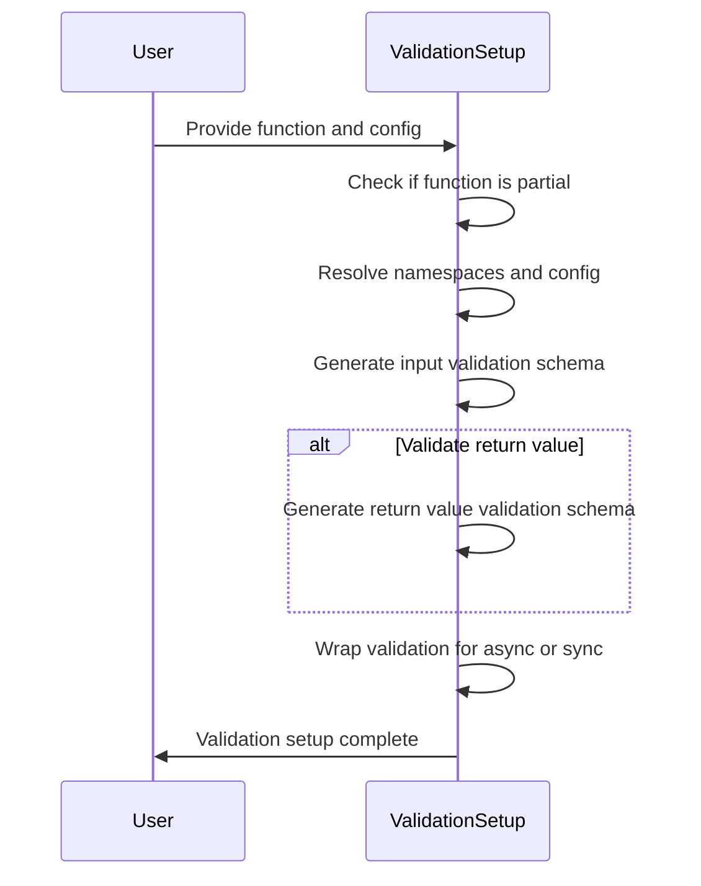
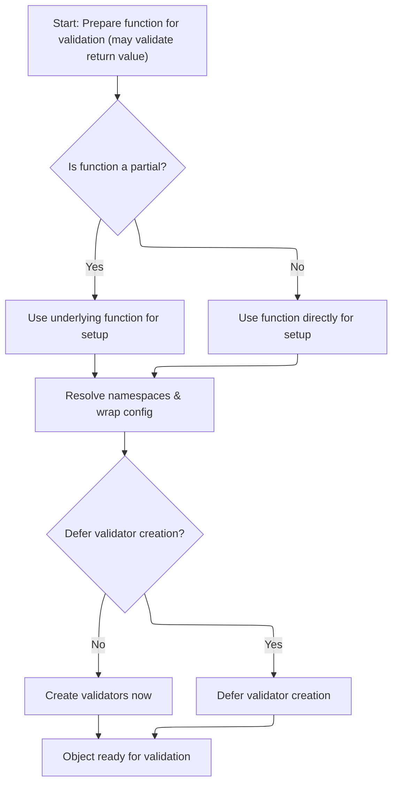
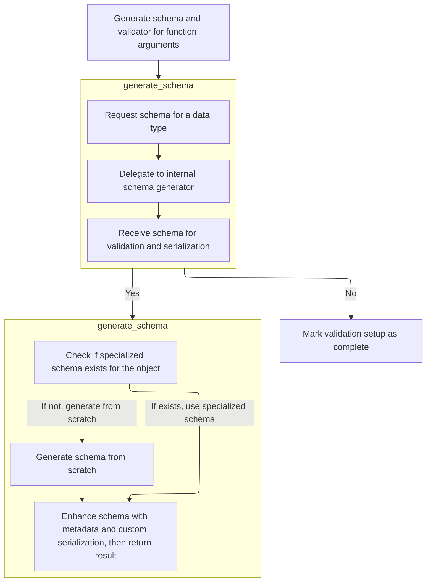
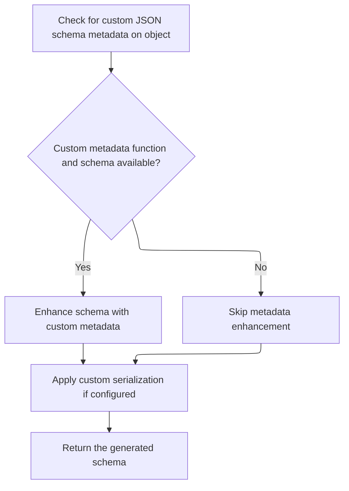
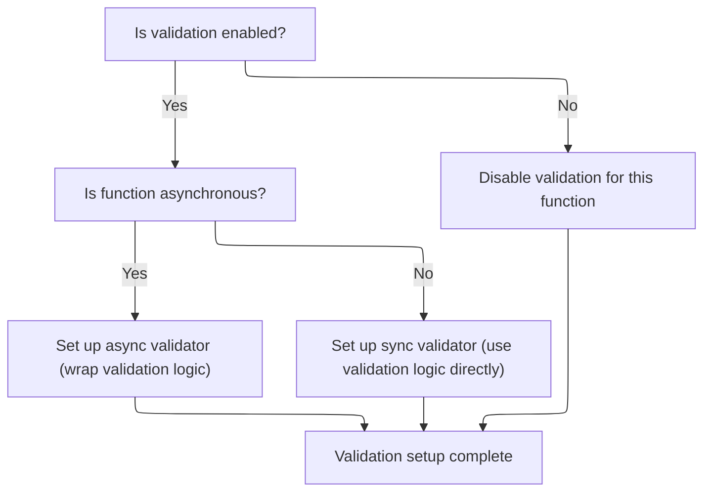

This flow prepares validation for a function by storing its details, resolving namespaces, and generating schemas to validate inputs and optionally outputs. It supports partial and async functions and respects configuration settings for when to build validators.

The main steps are:

- Capture function and configuration details
- Resolve namespaces
- Generate validation schemas for inputs
- Optionally generate validation schemas for outputs
- Wrap validation logic for async or sync execution
- Mark validation setup as complete



# Spec

## Detailed View of the Program's Functionality

a. Setting up the Validation Context

The process begins by preparing a function for validation, which may include validating its return value. The code checks if the function is a "partial" (a function with some arguments pre-filled). If it is, the underlying original function is used for further setup; otherwise, the function itself is used. The code then resolves the relevant namespaces for the function and wraps the configuration settings. At this point, it checks whether validator creation should be deferred (delayed until later). If not deferred, it immediately proceeds to create the necessary validators for the function; otherwise, it marks the setup as incomplete, to be finished later.

b. Building Argument and Return Value Validators

When creating validators, the code first generates a schema for the function's arguments. This involves analyzing the function's signature and type hints to determine the expected structure and types of its inputs. The schema is then cleaned and used to build the main validator, which will enforce these rules at runtime. If return value validation is enabled, the process is repeated for the function's return type: the return annotation is extracted, a schema is generated for it, and a validator is created to check the function's output.

c. Delegating Schema Generation

The schema generation step is handled by a dedicated component. When asked to generate a schema for a type or function, this component delegates the actual work to an internal schema generator. This keeps the interface clean and allows the underlying logic to handle the details of schema construction.

d. Schema Generation with Fallback Logic

When generating a schema, the code first checks if the object (type or function) provides a custom method for schema generation. If such a method exists, it is used. If not, the code falls back to a generic schema generator that can handle standard Python types and constructs. This ensures that both custom and built-in types are supported.

e. Enhancing and Finalizing the Schema

After the main schema is generated (either via a custom method or the generic generator), the code checks if the object provides custom JSON schema metadata. If such metadata is available, it is added to the schema. The code also applies any custom serialization logic specified in the configuration, such as custom encoders for specific types. The final schema, now potentially enhanced with metadata and serialization rules, is returned for use in validation.

f. Finalizing and Wiring Up Validators

Once the schemas and validators for arguments and (optionally) the return value are ready, the code determines how to wire up the validation logic. If validation is enabled for the return value, the code checks whether the function is asynchronous. For asynchronous functions, it wraps the validation logic so that the return value is validated after awaiting the function's result. For synchronous functions, the validation logic is applied directly. If return value validation is not enabled, no validator is set for the return value. Finally, the setup is marked as complete, indicating that the function is now ready for validated calls.

g. Summary of the Flow

- The system prepares a function for validation, handling both regular and partial functions.
- It resolves namespaces and wraps configuration.
- If not deferred, it generates schemas for arguments (and optionally the return value), builds validators, and wires them up.
- Schema generation supports both custom and generic logic, and can be enhanced with metadata and custom serialization.
- The final result is a callable object that validates inputs (and optionally outputs) according to the specified rules, ready for use in a Pydantic context.

# Rule Definition

| Paragraph Name                                                                                                                                                                                                                                                                                                                                                                                      | Rule ID | Category          | Description                                                                                                                                                                                                                                                                                                                                                                                                                                                                                                                                                                                                                                                                                                                                                                                                                                                                                                                                                                                                                                                                                                                                                                                                                                                                                                                                                                                                                                                                                                                                                          | Conditions                                                                                                                                                                                                                                                                                                                                                                                                                                                                                              | Remarks                                                                                                                                                                                                                                                                                                                                                                                                                                                                                                                                                                                                                                                                                                                                                                                                         |
| --------------------------------------------------------------------------------------------------------------------------------------------------------------------------------------------------------------------------------------------------------------------------------------------------------------------------------------------------------------------------------------------------- | ------- | ----------------- | -------------------------------------------------------------------------------------------------------------------------------------------------------------------------------------------------------------------------------------------------------------------------------------------------------------------------------------------------------------------------------------------------------------------------------------------------------------------------------------------------------------------------------------------------------------------------------------------------------------------------------------------------------------------------------------------------------------------------------------------------------------------------------------------------------------------------------------------------------------------------------------------------------------------------------------------------------------------------------------------------------------------------------------------------------------------------------------------------------------------------------------------------------------------------------------------------------------------------------------------------------------------------------------------------------------------------------------------------------------------------------------------------------------------------------------------------------------------------------------------------------------------------------------------------------------------- | ------------------------------------------------------------------------------------------------------------------------------------------------------------------------------------------------------------------------------------------------------------------------------------------------------------------------------------------------------------------------------------------------------------------------------------------------------------------------------------------------------- | --------------------------------------------------------------------------------------------------------------------------------------------------------------------------------------------------------------------------------------------------------------------------------------------------------------------------------------------------------------------------------------------------------------------------------------------------------------------------------------------------------------------------------------------------------------------------------------------------------------------------------------------------------------------------------------------------------------------------------------------------------------------------------------------------------------- |
| <SwmToken path="pydantic/_internal/_validate_call.py" pos="49:2:2" line-data="class ValidateCallWrapper:">`ValidateCallWrapper`</SwmToken>.**init**                                                                                                                                                                                                                                                 | RL-001  | Data Assignment   | When a <SwmToken path="pydantic/_internal/_validate_call.py" pos="49:2:2" line-data="class ValidateCallWrapper:">`ValidateCallWrapper`</SwmToken> is instantiated, it must store the wrapped function, configuration, validation options, and prepare the namespace resolver and config wrapper. If validator creation is not deferred, it must immediately create the argument and (optionally) return value validators. Otherwise, it marks itself as incomplete for later validator creation.                                                                                                                                                                                                                                                                                                                                                                                                                                                                                                                                                                                                                                                                                                                                                                                                                                                                                                                                                                                                                                                                     | On instantiation of <SwmToken path="pydantic/_internal/_validate_call.py" pos="49:2:2" line-data="class ValidateCallWrapper:">`ValidateCallWrapper`</SwmToken> with function, config, <SwmToken path="pydantic/_internal/_validate_call.py" pos="69:1:1" line-data="        validate_return: bool,">`validate_return`</SwmToken>, and <SwmToken path="pydantic/_internal/_validate_call.py" pos="70:1:1" line-data="        parent_namespace: MappingNamespace \| None,">`parent_namespace`</SwmToken>. | The config object may be None. The wrapper exposes **pydantic_validator** and **return_pydantic_validator** attributes. The **pydantic_complete** flag indicates if validators are ready.                                                                                                                                                                                                                                                                                                                                                                                                                                                                                                                                                                                                                       |
| <SwmToken path="pydantic/_internal/_validate_call.py" pos="49:2:2" line-data="class ValidateCallWrapper:">`ValidateCallWrapper`</SwmToken>.**call**                                                                                                                                                                                                                                                 | RL-002  | Computation       | When the wrapper is called, it must validate the provided positional and keyword arguments against the function's type hints using the argument validator. If validation fails, a ValidationError is raised before the function is called. If validation succeeds, the validated/coerced arguments are used.                                                                                                                                                                                                                                                                                                                                                                                                                                                                                                                                                                                                                                                                                                                                                                                                                                                                                                                                                                                                                                                                                                                                                                                                                                                         | On invocation of the wrapper with \*args and \*\*kwargs.                                                                                                                                                                                                                                                                                                                                                                                                                                                | Arguments are encapsulated in a <SwmToken path="pydantic/_internal/_validate_call.py" pos="136:11:13" line-data="        res = self.__pydantic_validator__.validate_python(pydantic_core.ArgsKwargs(args, kwargs))">`pydantic_core.ArgsKwargs`</SwmToken> object (tuple for args, dict for kwargs). ValidationError is raised on failure.                                                                                                                                                                                                                                                                                                                                                                                                                                                                       |
| ValidateCallWrapper.\_create_validators, <SwmToken path="pydantic/_internal/_validate_call.py" pos="49:2:2" line-data="class ValidateCallWrapper:">`ValidateCallWrapper`</SwmToken>.**call**                                                                                                                                                                                                        | RL-003  | Conditional Logic | If <SwmToken path="pydantic/_internal/_validate_call.py" pos="69:1:1" line-data="        validate_return: bool,">`validate_return`</SwmToken> is True, after the function is called, the return value must be validated against the function's return type hint. If validation fails, a ValidationError is raised after the function returns.                                                                                                                                                                                                                                                                                                                                                                                                                                                                                                                                                                                                                                                                                                                                                                                                                                                                                                                                                                                                                                                                                                                                                                                                                        | <SwmToken path="pydantic/_internal/_validate_call.py" pos="69:1:1" line-data="        validate_return: bool,">`validate_return`</SwmToken> is True and the function has a return type hint.                                                                                                                                                                                                                                                                                                             | For async functions, the validator must await the result before validating. The return value validator is stored as **return_pydantic_validator**.                                                                                                                                                                                                                                                                                                                                                                                                                                                                                                                                                                                                                                                              |
| <SwmToken path="pydantic/_internal/_validate_call.py" pos="49:2:2" line-data="class ValidateCallWrapper:">`ValidateCallWrapper`</SwmToken>.**call**, validator usage                                                                                                                                                                                                                                | RL-004  | Conditional Logic | On validation failure (arguments or return value), a ValidationError must be raised containing a list of error details (location, message, value), the original input, and optionally a reference to the function. The exception must be catchable and display a human-readable, structured message.                                                                                                                                                                                                                                                                                                                                                                                                                                                                                                                                                                                                                                                                                                                                                                                                                                                                                                                                                                                                                                                                                                                                                                                                                                                                 | Any validation failure during argument or return value validation.                                                                                                                                                                                                                                                                                                                                                                                                                                      | ValidationError contains: list of errors (location, message, value), original input, optional function reference. The message format is structured and human-readable.                                                                                                                                                                                                                                                                                                                                                                                                                                                                                                                                                                                                                                          |
| <SwmToken path="pydantic/_internal/_validate_call.py" pos="49:2:2" line-data="class ValidateCallWrapper:">`ValidateCallWrapper`</SwmToken>.**init**, <SwmToken path="pydantic/_internal/_validate_call.py" pos="49:2:2" line-data="class ValidateCallWrapper:">`ValidateCallWrapper`</SwmToken>.**call**                                                                                            | RL-005  | Conditional Logic | If the configuration specifies <SwmToken path="pydantic/_internal/_validate_call.py" pos="86:9:9" line-data="        if not self.config_wrapper.defer_build:">`defer_build`</SwmToken>=True, validator creation is deferred until the first call to the wrapper. On first call, validators are created before validation proceeds.                                                                                                                                                                                                                                                                                                                                                                                                                                                                                                                                                                                                                                                                                                                                                                                                                                                                                                                                                                                                                                                                                                                                                                                                                                   | config\[<SwmToken path="pydantic/_internal/_validate_call.py" pos="86:9:9" line-data="        if not self.config_wrapper.defer_build:">`defer_build`</SwmToken>\] is True at initialization.                                                                                                                                                                                                                                                                                                            | The **pydantic_complete** flag tracks validator readiness. Validators are created by calling <SwmToken path="pydantic/_internal/_validate_call.py" pos="87:3:5" line-data="            self._create_validators()">`_create_validators()`</SwmToken>.                                                                                                                                                                                                                                                                                                                                                                                                                                                                                                                                                            |
| ValidateCallWrapper.\_create_validators, GenerateSchema.generate_schema                                                                                                                                                                                                                                                                                                                             | RL-006  | Computation       | When creating validators, the system must generate a schema for the function's arguments and (optionally) return value. It must attempt to use a custom schema method if present, otherwise fall back to generic schema generation. The schema is enhanced with metadata and serialization logic as configured.                                                                                                                                                                                                                                                                                                                                                                                                                                                                                                                                                                                                                                                                                                                                                                                                                                                                                                                                                                                                                                                                                                                                                                                                                                                      | Whenever a validator is created for arguments or return value.                                                                                                                                                                                                                                                                                                                                                                                                                                          | Custom schema method: **get_pydantic_core_schema**. Metadata and serialization logic may be added based on config (<SwmToken path="pydantic/_internal/_generate_schema.py" pos="184:38:40" line-data="&quot;&quot;&quot;`FieldInfo` attributes (and their default value) that can&#39;t be used outside of a model (e.g. in a type adapter or a PEP 695 type alias).&quot;&quot;&quot;">`e.g`</SwmToken>., <SwmToken path="pydantic/_internal/_generate_schema.py" pos="732:11:11" line-data="        schema = _add_custom_serialization_from_json_encoders(self._config_wrapper.json_encoders, obj, schema)">`json_encoders`</SwmToken>, <SwmToken path="pydantic/_internal/_generate_schema.py" pos="436:7:7" line-data="            if self._config_wrapper.use_enum_values:">`use_enum_values`</SwmToken>). |
| <SwmToken path="pydantic/_internal/_validate_call.py" pos="85:7:7" line-data="        self.config_wrapper = ConfigWrapper(config)">`ConfigWrapper`</SwmToken> usage, <SwmToken path="pydantic/_internal/_validate_call.py" pos="92:5:5" line-data="        gen_schema = GenerateSchema(self.config_wrapper, self.ns_resolver)">`GenerateSchema`</SwmToken>, ValidateCallWrapper.\_create_validators | RL-007  | Conditional Logic | The configuration object may specify options such as <SwmToken path="pydantic/_internal/_validate_call.py" pos="86:9:9" line-data="        if not self.config_wrapper.defer_build:">`defer_build`</SwmToken>, <SwmToken path="pydantic/_internal/_validate_call.py" pos="94:1:1" line-data="        core_config = self.config_wrapper.core_config(title=self.qualname)">`core_config`</SwmToken>, <SwmToken path="pydantic/_internal/_validate_call.py" pos="103:5:5" line-data="            self.config_wrapper.plugin_settings,">`plugin_settings`</SwmToken>, <SwmToken path="pydantic/_internal/_generate_schema.py" pos="732:11:11" line-data="        schema = _add_custom_serialization_from_json_encoders(self._config_wrapper.json_encoders, obj, schema)">`json_encoders`</SwmToken>, <SwmToken path="pydantic/_internal/_generate_schema.py" pos="2007:1:1" line-data="            validate_by_name=self._config_wrapper.validate_by_name,">`validate_by_name`</SwmToken>, <SwmToken path="pydantic/_internal/_generate_schema.py" pos="374:7:7" line-data="        return self._config_wrapper.arbitrary_types_allowed">`arbitrary_types_allowed`</SwmToken>, <SwmToken path="pydantic/_internal/_generate_schema.py" pos="436:7:7" line-data="            if self._config_wrapper.use_enum_values:">`use_enum_values`</SwmToken>, and <SwmToken path="pydantic/_internal/_validate_call.py" pos="69:1:1" line-data="        validate_return: bool,">`validate_return`</SwmToken>. These options must be respected during validator and schema creation. | Whenever config is provided to the wrapper or schema generation.                                                                                                                                                                                                                                                                                                                                                                                                                                        | Config options:                                                                                                                                                                                                                                                                                                                                                                                                                                                                                                                                                                                                                                                                                                                                                                                                 |

- <SwmToken path="pydantic/_internal/_validate_call.py" pos="86:9:9" line-data="        if not self.config_wrapper.defer_build:">`defer_build`</SwmToken>: Boolean
- <SwmToken path="pydantic/_internal/_validate_call.py" pos="94:1:1" line-data="        core_config = self.config_wrapper.core_config(title=self.qualname)">`core_config`</SwmToken>: Callable
- <SwmToken path="pydantic/_internal/_validate_call.py" pos="103:5:5" line-data="            self.config_wrapper.plugin_settings,">`plugin_settings`</SwmToken>: Any
- <SwmToken path="pydantic/_internal/_generate_schema.py" pos="732:11:11" line-data="        schema = _add_custom_serialization_from_json_encoders(self._config_wrapper.json_encoders, obj, schema)">`json_encoders`</SwmToken>: Optional dict
- <SwmToken path="pydantic/_internal/_generate_schema.py" pos="2007:1:1" line-data="            validate_by_name=self._config_wrapper.validate_by_name,">`validate_by_name`</SwmToken>: Optional bool
- <SwmToken path="pydantic/_internal/_generate_schema.py" pos="374:7:7" line-data="        return self._config_wrapper.arbitrary_types_allowed">`arbitrary_types_allowed`</SwmToken>: Optional bool
- <SwmToken path="pydantic/_internal/_generate_schema.py" pos="436:7:7" line-data="            if self._config_wrapper.use_enum_values:">`use_enum_values`</SwmToken>: Optional bool
- <SwmToken path="pydantic/_internal/_validate_call.py" pos="69:1:1" line-data="        validate_return: bool,">`validate_return`</SwmToken>: Optional bool | | ValidateCallWrapper.\_create_validators, <SwmToken path="pydantic/_internal/_validate_call.py" pos="28:2:2" line-data="def update_wrapper_attributes(wrapped: ValidateCallSupportedTypes, wrapper: Callable[..., Any]):">`update_wrapper_attributes`</SwmToken> | RL-008 | Conditional Logic | The wrapper must support both synchronous and asynchronous functions. For async functions, the return value validator must await the function result before validating. | The wrapped function is a coroutine function. | Async functions are detected using <SwmToken path="pydantic/_internal/_validate_call.py" pos="119:3:5" line-data="            if inspect.iscoroutinefunction(self.function):">`inspect.iscoroutinefunction`</SwmToken>. Async return value validator is an async function that awaits and then validates. | | <SwmToken path="pydantic/_internal/_validate_call.py" pos="49:2:2" line-data="class ValidateCallWrapper:">`ValidateCallWrapper`</SwmToken>.**call** | RL-009 | Data Assignment | Arguments passed to the wrapper must be encapsulated in an ArgsKwargs-like object (tuple for positional, dict for keyword) before validation. | On every call to the wrapper. | <SwmToken path="pydantic/_internal/_validate_call.py" pos="136:13:13" line-data="        res = self.__pydantic_validator__.validate_python(pydantic_core.ArgsKwargs(args, kwargs))">`ArgsKwargs`</SwmToken> object: tuple for positional args, dict for keyword args. Used as input to the validator. | | ValidateCallWrapper.\_create_validators | RL-010 | Data Assignment | The main argument validator and, if applicable, the return value validator must be exposed as attributes of the wrapper object. | After validator creation. | Attributes: **pydantic_validator**, **return_pydantic_validator** |

# User Stories

## User Story 1: Function wrapping, validation, and error handling (sync/async, arguments, return values, deferred build)

---

### Story Description:

As a user, I want to wrap any function (synchronous or asynchronous) with a validation wrapper so that input arguments and return values are automatically validated against type hints, errors are reported in a structured and human-readable way, and I can choose to defer validator creation until first use.

---

### Business Rule Mapping:

| Rule ID | Paragraph Name                                                                                                                                                                                                                                                                                           | Rule Description                                                                                                                                                                                                                                                                                                                                                                                                                                                                                 |
| ------- | -------------------------------------------------------------------------------------------------------------------------------------------------------------------------------------------------------------------------------------------------------------------------------------------------------- | ------------------------------------------------------------------------------------------------------------------------------------------------------------------------------------------------------------------------------------------------------------------------------------------------------------------------------------------------------------------------------------------------------------------------------------------------------------------------------------------------ |
| RL-001  | <SwmToken path="pydantic/_internal/_validate_call.py" pos="49:2:2" line-data="class ValidateCallWrapper:">`ValidateCallWrapper`</SwmToken>.**init**                                                                                                                                                      | When a <SwmToken path="pydantic/_internal/_validate_call.py" pos="49:2:2" line-data="class ValidateCallWrapper:">`ValidateCallWrapper`</SwmToken> is instantiated, it must store the wrapped function, configuration, validation options, and prepare the namespace resolver and config wrapper. If validator creation is not deferred, it must immediately create the argument and (optionally) return value validators. Otherwise, it marks itself as incomplete for later validator creation. |
| RL-005  | <SwmToken path="pydantic/_internal/_validate_call.py" pos="49:2:2" line-data="class ValidateCallWrapper:">`ValidateCallWrapper`</SwmToken>.**init**, <SwmToken path="pydantic/_internal/_validate_call.py" pos="49:2:2" line-data="class ValidateCallWrapper:">`ValidateCallWrapper`</SwmToken>.**call** | If the configuration specifies <SwmToken path="pydantic/_internal/_validate_call.py" pos="86:9:9" line-data="        if not self.config_wrapper.defer_build:">`defer_build`</SwmToken>=True, validator creation is deferred until the first call to the wrapper. On first call, validators are created before validation proceeds.                                                                                                                                                               |
| RL-002  | <SwmToken path="pydantic/_internal/_validate_call.py" pos="49:2:2" line-data="class ValidateCallWrapper:">`ValidateCallWrapper`</SwmToken>.**call**                                                                                                                                                      | When the wrapper is called, it must validate the provided positional and keyword arguments against the function's type hints using the argument validator. If validation fails, a ValidationError is raised before the function is called. If validation succeeds, the validated/coerced arguments are used.                                                                                                                                                                                     |
| RL-004  | <SwmToken path="pydantic/_internal/_validate_call.py" pos="49:2:2" line-data="class ValidateCallWrapper:">`ValidateCallWrapper`</SwmToken>.**call**, validator usage                                                                                                                                     | On validation failure (arguments or return value), a ValidationError must be raised containing a list of error details (location, message, value), the original input, and optionally a reference to the function. The exception must be catchable and display a human-readable, structured message.                                                                                                                                                                                             |
| RL-009  | <SwmToken path="pydantic/_internal/_validate_call.py" pos="49:2:2" line-data="class ValidateCallWrapper:">`ValidateCallWrapper`</SwmToken>.**call**                                                                                                                                                      | Arguments passed to the wrapper must be encapsulated in an ArgsKwargs-like object (tuple for positional, dict for keyword) before validation.                                                                                                                                                                                                                                                                                                                                                    |
| RL-003  | ValidateCallWrapper.\_create_validators, <SwmToken path="pydantic/_internal/_validate_call.py" pos="49:2:2" line-data="class ValidateCallWrapper:">`ValidateCallWrapper`</SwmToken>.**call**                                                                                                             | If <SwmToken path="pydantic/_internal/_validate_call.py" pos="69:1:1" line-data="        validate_return: bool,">`validate_return`</SwmToken> is True, after the function is called, the return value must be validated against the function's return type hint. If validation fails, a ValidationError is raised after the function returns.                                                                                                                                                    |
| RL-008  | ValidateCallWrapper.\_create_validators, <SwmToken path="pydantic/_internal/_validate_call.py" pos="28:2:2" line-data="def update_wrapper_attributes(wrapped: ValidateCallSupportedTypes, wrapper: Callable[..., Any]):">`update_wrapper_attributes`</SwmToken>                                          | The wrapper must support both synchronous and asynchronous functions. For async functions, the return value validator must await the function result before validating.                                                                                                                                                                                                                                                                                                                          |

---

### Relevant Functionality:

- **ValidateCallWrapper.init**
  1. **RL-001:**
     - Store function, <SwmToken path="pydantic/_internal/_validate_call.py" pos="69:1:1" line-data="        validate_return: bool,">`validate_return`</SwmToken>, and module/qualname info
     - Create a namespace resolver for type resolution
     - Wrap the config in a <SwmToken path="pydantic/_internal/_validate_call.py" pos="85:7:7" line-data="        self.config_wrapper = ConfigWrapper(config)">`ConfigWrapper`</SwmToken>
     - If not <SwmToken path="pydantic/_internal/_validate_call.py" pos="86:7:9" line-data="        if not self.config_wrapper.defer_build:">`config_wrapper.defer_build`</SwmToken>:
       - Call <SwmToken path="pydantic/_internal/_validate_call.py" pos="87:3:5" line-data="            self._create_validators()">`_create_validators()`</SwmToken> Else:
       - Set **pydantic_complete** = False
  2. **RL-005:**
     - On **init**, if <SwmToken path="pydantic/_internal/_validate_call.py" pos="86:7:9" line-data="        if not self.config_wrapper.defer_build:">`config_wrapper.defer_build`</SwmToken> is True:
       - Set **pydantic_complete** = False
     - On **call**, if **pydantic_complete** is False:
       - Call <SwmToken path="pydantic/_internal/_validate_call.py" pos="87:3:5" line-data="            self._create_validators()">`_create_validators()`</SwmToken>
- **ValidateCallWrapper.call**
  1. **RL-002:**
     - If **pydantic_complete** is False:
       - Call <SwmToken path="pydantic/_internal/_validate_call.py" pos="87:3:5" line-data="            self._create_validators()">`_create_validators()`</SwmToken>
     - Encapsulate args and kwargs in <SwmToken path="pydantic/_internal/_validate_call.py" pos="136:13:13" line-data="        res = self.__pydantic_validator__.validate_python(pydantic_core.ArgsKwargs(args, kwargs))">`ArgsKwargs`</SwmToken>
     - Call **pydantic_validator**<SwmToken path="pydantic/_internal/_validate_call.py" pos="122:4:5" line-data="                    return validator.validate_python(await aw)">`.validate_python`</SwmToken>(<SwmToken path="pydantic/_internal/_validate_call.py" pos="136:13:13" line-data="        res = self.__pydantic_validator__.validate_python(pydantic_core.ArgsKwargs(args, kwargs))">`ArgsKwargs`</SwmToken>)
     - If validation fails, raise ValidationError
     - Otherwise, proceed
  2. **RL-004:**
     - On validation failure:
       - Raise ValidationError with error details, input, and function reference
     - ValidationError can be caught using try/except
     - When printed, displays structured error message
  3. **RL-009:**
     - On call, create <SwmToken path="pydantic/_internal/_validate_call.py" pos="136:13:13" line-data="        res = self.__pydantic_validator__.validate_python(pydantic_core.ArgsKwargs(args, kwargs))">`ArgsKwargs`</SwmToken>(args, kwargs)
     - Pass <SwmToken path="pydantic/_internal/_validate_call.py" pos="136:13:13" line-data="        res = self.__pydantic_validator__.validate_python(pydantic_core.ArgsKwargs(args, kwargs))">`ArgsKwargs`</SwmToken> to validator
- **ValidateCallWrapper.\_create_validators**
  1. **RL-003:**
     - If <SwmToken path="pydantic/_internal/_validate_call.py" pos="69:1:1" line-data="        validate_return: bool,">`validate_return`</SwmToken> is True:
       - Inspect function signature for return annotation
       - Generate schema and validator for return type
       - For async functions:
         - Define async wrapper to await and validate
       - For sync functions:
         - Use validator directly
     - In **call**, if **return_pydantic_validator** is set:
       - Validate the result after function call
  2. **RL-008:**
     - If function is async:
       - Define async return value validator that awaits and validates
     - Otherwise, use sync validator

## User Story 2: Configuration and schema/validator creation

---

### Story Description:

As a user, I want to configure how validation and schema generation work (<SwmToken path="pydantic/_internal/_generate_schema.py" pos="184:38:40" line-data="&quot;&quot;&quot;`FieldInfo` attributes (and their default value) that can&#39;t be used outside of a model (e.g. in a type adapter or a PEP 695 type alias).&quot;&quot;&quot;">`e.g`</SwmToken>., defer build, custom encoders, plugin settings, arbitrary types, etc.) so that I can tailor validation behavior and serialization to my needs, and access the validators as attributes of the wrapper.

---

### Business Rule Mapping:

| Rule ID | Paragraph Name                                                                                                                                                                                                                                                                                                                                                                                      | Rule Description                                                                                                                                                                                                                                                                                                                                                                                                                                                                                                                                                                                                                                                                                                                                                                                                                                                                                                                                                                                                                                                                                                                                                                                                                                                                                                                                                                                                                                                                                                                                                     |
| ------- | --------------------------------------------------------------------------------------------------------------------------------------------------------------------------------------------------------------------------------------------------------------------------------------------------------------------------------------------------------------------------------------------------- | -------------------------------------------------------------------------------------------------------------------------------------------------------------------------------------------------------------------------------------------------------------------------------------------------------------------------------------------------------------------------------------------------------------------------------------------------------------------------------------------------------------------------------------------------------------------------------------------------------------------------------------------------------------------------------------------------------------------------------------------------------------------------------------------------------------------------------------------------------------------------------------------------------------------------------------------------------------------------------------------------------------------------------------------------------------------------------------------------------------------------------------------------------------------------------------------------------------------------------------------------------------------------------------------------------------------------------------------------------------------------------------------------------------------------------------------------------------------------------------------------------------------------------------------------------------------- |
| RL-006  | ValidateCallWrapper.\_create_validators, GenerateSchema.generate_schema                                                                                                                                                                                                                                                                                                                             | When creating validators, the system must generate a schema for the function's arguments and (optionally) return value. It must attempt to use a custom schema method if present, otherwise fall back to generic schema generation. The schema is enhanced with metadata and serialization logic as configured.                                                                                                                                                                                                                                                                                                                                                                                                                                                                                                                                                                                                                                                                                                                                                                                                                                                                                                                                                                                                                                                                                                                                                                                                                                                      |
| RL-010  | ValidateCallWrapper.\_create_validators                                                                                                                                                                                                                                                                                                                                                             | The main argument validator and, if applicable, the return value validator must be exposed as attributes of the wrapper object.                                                                                                                                                                                                                                                                                                                                                                                                                                                                                                                                                                                                                                                                                                                                                                                                                                                                                                                                                                                                                                                                                                                                                                                                                                                                                                                                                                                                                                      |
| RL-007  | <SwmToken path="pydantic/_internal/_validate_call.py" pos="85:7:7" line-data="        self.config_wrapper = ConfigWrapper(config)">`ConfigWrapper`</SwmToken> usage, <SwmToken path="pydantic/_internal/_validate_call.py" pos="92:5:5" line-data="        gen_schema = GenerateSchema(self.config_wrapper, self.ns_resolver)">`GenerateSchema`</SwmToken>, ValidateCallWrapper.\_create_validators | The configuration object may specify options such as <SwmToken path="pydantic/_internal/_validate_call.py" pos="86:9:9" line-data="        if not self.config_wrapper.defer_build:">`defer_build`</SwmToken>, <SwmToken path="pydantic/_internal/_validate_call.py" pos="94:1:1" line-data="        core_config = self.config_wrapper.core_config(title=self.qualname)">`core_config`</SwmToken>, <SwmToken path="pydantic/_internal/_validate_call.py" pos="103:5:5" line-data="            self.config_wrapper.plugin_settings,">`plugin_settings`</SwmToken>, <SwmToken path="pydantic/_internal/_generate_schema.py" pos="732:11:11" line-data="        schema = _add_custom_serialization_from_json_encoders(self._config_wrapper.json_encoders, obj, schema)">`json_encoders`</SwmToken>, <SwmToken path="pydantic/_internal/_generate_schema.py" pos="2007:1:1" line-data="            validate_by_name=self._config_wrapper.validate_by_name,">`validate_by_name`</SwmToken>, <SwmToken path="pydantic/_internal/_generate_schema.py" pos="374:7:7" line-data="        return self._config_wrapper.arbitrary_types_allowed">`arbitrary_types_allowed`</SwmToken>, <SwmToken path="pydantic/_internal/_generate_schema.py" pos="436:7:7" line-data="            if self._config_wrapper.use_enum_values:">`use_enum_values`</SwmToken>, and <SwmToken path="pydantic/_internal/_validate_call.py" pos="69:1:1" line-data="        validate_return: bool,">`validate_return`</SwmToken>. These options must be respected during validator and schema creation. |

---

### Relevant Functionality:

- **ValidateCallWrapper.\_create_validators**
  1. **RL-006:**
     - Use <SwmToken path="pydantic/_internal/_validate_call.py" pos="92:5:5" line-data="        gen_schema = GenerateSchema(self.config_wrapper, self.ns_resolver)">`GenerateSchema`</SwmToken> to generate schema for function or return type
     - If object has **get_pydantic_core_schema**, use it
     - Otherwise, use generic schema generation
     - Enhance schema with metadata/serialization if configured
     - Use <SwmToken path="pydantic/_internal/_validate_call.py" pos="96:7:7" line-data="        self.__pydantic_validator__ = create_schema_validator(">`create_schema_validator`</SwmToken> to build validator
  2. **RL-010:**
     - After creating validators, assign them to wrapper attributes
- <SwmToken path="pydantic/_internal/_validate_call.py" pos="85:7:7" line-data="        self.config_wrapper = ConfigWrapper(config)">`ConfigWrapper`</SwmToken> **usage**
  1. **RL-007:**
     - Wrap config in <SwmToken path="pydantic/_internal/_validate_call.py" pos="85:7:7" line-data="        self.config_wrapper = ConfigWrapper(config)">`ConfigWrapper`</SwmToken>
     - Pass config options to <SwmToken path="pydantic/_internal/_validate_call.py" pos="92:5:5" line-data="        gen_schema = GenerateSchema(self.config_wrapper, self.ns_resolver)">`GenerateSchema`</SwmToken> and <SwmToken path="pydantic/_internal/_validate_call.py" pos="96:7:7" line-data="        self.__pydantic_validator__ = create_schema_validator(">`create_schema_validator`</SwmToken>
     - Use config options to control schema/validator creation and serialization

# Code Walkthrough

## Setting up the validation context



<SwmSnippet path="/pydantic/_internal/_validate_call.py" line="65">

---

**init** kicks off the flow by storing the function and config, figuring out if we're dealing with a partial, and setting up the namespace resolver and config wrapper. If validator creation isn't deferred, it immediately calls <SwmToken path="pydantic/_internal/_validate_call.py" pos="87:3:3" line-data="            self._create_validators()">`_create_validators`</SwmToken> to prep everything needed for validating calls to the function.

```python
    def __init__(
        self,
        function: ValidateCallSupportedTypes,
        config: ConfigDict | None,
        validate_return: bool,
        parent_namespace: MappingNamespace | None,
    ) -> None:
        self.function = function
        self.validate_return = validate_return
        if isinstance(function, partial):
            self.schema_type = function.func
            self.module = function.func.__module__
        else:
            self.schema_type = function
            self.module = function.__module__
        self.qualname = extract_function_qualname(function)

        self.ns_resolver = NsResolver(
            namespaces_tuple=ns_for_function(self.schema_type, parent_namespace=parent_namespace)
        )
        self.config_wrapper = ConfigWrapper(config)
        if not self.config_wrapper.defer_build:
            self._create_validators()
        else:
            self.__pydantic_complete__ = False
```

---

</SwmSnippet>

## Building argument and return value validators



<SwmSnippet path="/pydantic/_internal/_validate_call.py" line="91">

---

In <SwmToken path="pydantic/_internal/_validate_call.py" pos="91:3:3" line-data="    def _create_validators(self) -&gt; None:">`_create_validators`</SwmToken>, we generate and clean a schema for the function's arguments, then use it to build the main validator. If return value validation is enabled, we repeat the schema generation for the return type. Calling <SwmToken path="pydantic/_internal/_validate_call.py" pos="93:11:11" line-data="        schema = gen_schema.clean_schema(gen_schema.generate_schema(self.function))">`generate_schema`</SwmToken> here gives us the structure we need to enforce validation rules.

```python
    def _create_validators(self) -> None:
        gen_schema = GenerateSchema(self.config_wrapper, self.ns_resolver)
        schema = gen_schema.clean_schema(gen_schema.generate_schema(self.function))
        core_config = self.config_wrapper.core_config(title=self.qualname)

        self.__pydantic_validator__ = create_schema_validator(
            schema,
            self.schema_type,
            self.module,
            self.qualname,
            'validate_call',
            core_config,
            self.config_wrapper.plugin_settings,
        )
        if self.validate_return:
            signature = inspect.signature(self.function)
            return_type = signature.return_annotation if signature.return_annotation is not signature.empty else Any
            gen_schema = GenerateSchema(self.config_wrapper, self.ns_resolver)
            schema = gen_schema.clean_schema(gen_schema.generate_schema(return_type))
```

---

</SwmSnippet>

### Delegating schema generation

<SwmSnippet path="/pydantic/_internal/_schema_generation_shared.py" line="95">

---

Generate_schema here just hands off the schema generation to another component, keeping the interface clean and letting the underlying logic handle the details.

```python
    def generate_schema(self, source_type: Any, /) -> core_schema.CoreSchema:
        return self._generate_schema.generate_schema(source_type)
```

---

</SwmSnippet>

### Schema generation with fallback logic

<SwmSnippet path="/pydantic/_internal/_generate_schema.py" line="697">

---

In <SwmToken path="pydantic/_internal/_generate_schema.py" pos="697:3:3" line-data="    def generate_schema(">`generate_schema`</SwmToken>, we first try to get a schema using a custom method if the object has one. If that doesn't work, we fall back to a generic schema generator. This way, we cover both custom and standard types.

```python
    def generate_schema(
        self,
        obj: Any,
    ) -> core_schema.CoreSchema:
        """Generate core schema.

        Args:
            obj: The object to generate core schema for.

        Returns:
            The generated core schema.

        Raises:
            PydanticUndefinedAnnotation:
                If it is not possible to evaluate forward reference.
            PydanticSchemaGenerationError:
                If it is not possible to generate pydantic-core schema.
            TypeError:
                - If `alias_generator` returns a disallowed type (must be str, AliasPath or AliasChoices).
                - If V1 style validator with `each_item=True` applied on a wrong field.
            PydanticUserError:
                - If `typing.TypedDict` is used instead of `typing_extensions.TypedDict` on Python < 3.12.
                - If `__modify_schema__` method is used instead of `__get_pydantic_json_schema__`.
        """
        schema = self._generate_schema_from_get_schema_method(obj, obj)

        if schema is None:
            schema = self._generate_schema_inner(obj)

```

---

</SwmSnippet>

#### Fallback: generic schema generation

See <SwmLink doc-title="Generating a validation schema for a Python type">[Generating a validation schema for a Python type](/.swm/generating-a-validation-schema-for-a-python-type.sdz34bxv.sw.md)</SwmLink>

#### Enhancing and finalizing the schema



<SwmSnippet path="/pydantic/_internal/_generate_schema.py" line="726">

---

After returning from <SwmToken path="pydantic/_internal/_generate_schema.py" pos="724:7:7" line-data="            schema = self._generate_schema_inner(obj)">`_generate_schema_inner`</SwmToken> (or the custom method), <SwmToken path="pydantic/_internal/_validate_call.py" pos="93:11:11" line-data="        schema = gen_schema.clean_schema(gen_schema.generate_schema(self.function))">`generate_schema`</SwmToken> checks for extra metadata hooks and adds them if present, then applies any custom serialization logic from the config before returning the final schema.

```python
        metadata_js_function = _extract_get_pydantic_json_schema(obj)
        if metadata_js_function is not None:
            metadata_schema = resolve_original_schema(schema, self.defs)
            if metadata_schema:
                self._add_js_function(metadata_schema, metadata_js_function)

        schema = _add_custom_serialization_from_json_encoders(self._config_wrapper.json_encoders, obj, schema)

        return schema
```

---

</SwmSnippet>

### Finalizing and wiring up validators



<SwmSnippet path="/pydantic/_internal/_validate_call.py" line="110">

---

After returning from <SwmToken path="pydantic/_internal/_validate_call.py" pos="93:11:11" line-data="        schema = gen_schema.clean_schema(gen_schema.generate_schema(self.function))">`generate_schema`</SwmToken>, <SwmToken path="pydantic/_internal/_validate_call.py" pos="87:3:3" line-data="            self._create_validators()">`_create_validators`</SwmToken> builds the return value validator, wrapping it for async functions so validation happens after awaiting. It then marks the setup as complete.

```python
            validator = create_schema_validator(
                schema,
                self.schema_type,
                self.module,
                self.qualname,
                'validate_call',
                core_config,
                self.config_wrapper.plugin_settings,
            )
            if inspect.iscoroutinefunction(self.function):

                async def return_val_wrapper(aw: Awaitable[Any]) -> None:
                    return validator.validate_python(await aw)

                self.__return_pydantic_validator__ = return_val_wrapper
            else:
                self.__return_pydantic_validator__ = validator.validate_python
        else:
            self.__return_pydantic_validator__ = None

        self.__pydantic_complete__ = True
```

---

</SwmSnippet>

&nbsp;

*This is an auto-generated document by Swimm 🌊 and has not yet been verified by a human*

<SwmMeta version="3.0.0" repo-id="Z2l0aHViJTNBJTNBcHlkYW50aWMlM0ElM0FTd2ltbS1EZW1v" repo-name="pydantic"><sup>Powered by [Swimm](/)</sup></SwmMeta>
