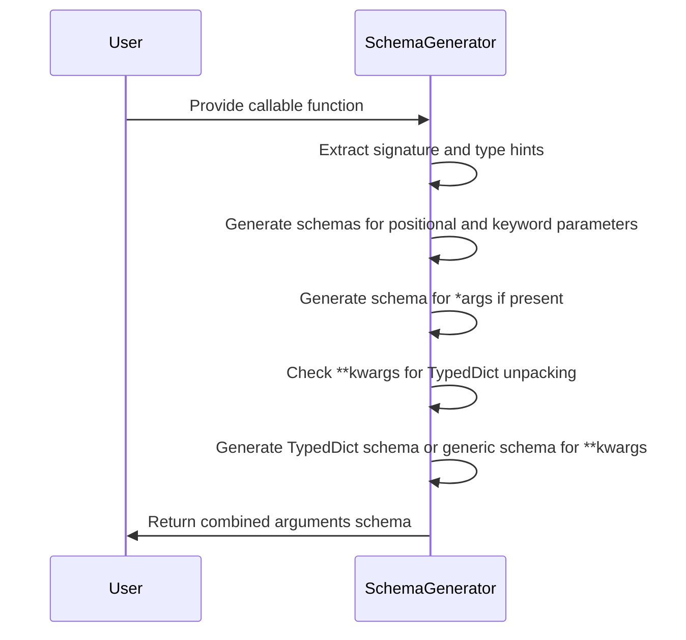

```mermaid
%%{init: {"flowchart": {"defaultRenderer": "elk"}} }%%
flowchart TD
    node1["Start: Generate schema for TypedDict"] --> node2{"Schema already exists?"}
    click node1 openCode "pydantic/_internal/_generate_schema.py:1380:1486"
    node2 -- Yes --> node3["Return existing schema"]
    click node2 openCode "pydantic/_internal/_generate_schema.py:1399:1401"
    click node3 openCode "pydantic/_internal/_generate_schema.py:1400:1401"
    node2 -- No --> node4["Check TypedDict compatibility"]
    click node4 openCode "pydantic/_internal/_generate_schema.py:1406:1410"
    node4 --> node5["Extract config, required/read-only fields, documentation"]
    click node5 openCode "pydantic/_internal/_generate_schema.py:1412:1433"
    node5 --> node6["Process all fields"]
    
    subgraph loop1["For each field in TypedDict"]
      node6 --> node7["Determine if required/read-only, update config, generate field schema"]
      click node7 openCode "pydantic/_internal/_generate_schema.py:1441:1461"
      node7 --> node6
    end
    node6 --> node8{"Any read-only fields?"}
    click node8 openCode "pydantic/_internal/_generate_schema.py:1463:1471"
    node8 -- Yes --> node9["Warn about read-only fields"]
    click node9 openCode "pydantic/_internal/_generate_schema.py:1466:1471"
    node8 -- No --> node10["Continue"]
    node9 --> node11["Build schema with computed fields"]
    node10 --> node11
    
    subgraph loop2["For each computed field"]
      node11 --> node12["Generate computed field schema"]
      click node12 openCode "pydantic/_internal/_generate_schema.py:1477:1479"
      node12 --> node11
    end
    node11 --> node13["Apply serializers and validators"]
    click node13 openCode "pydantic/_internal/_generate_schema.py:1484:1485"
    node13 --> node14["Return final schema"]
    click node14 openCode "pydantic/_internal/_generate_schema.py:1486:1486"

%% Swimm:
%% %%{init: {"flowchart": {"defaultRenderer": "elk"}} }%%
%% flowchart TD
%%     node1["Start: Generate schema for <SwmToken path="pydantic/_internal/_generate_schema.py" pos="1381:17:17" line-data="        &quot;&quot;&quot;Generate a core schema for a `TypedDict` class.">`TypedDict`</SwmToken>"] --> node2{"Schema already exists?"}
%%     click node1 openCode "<SwmPath>[pydantic/\_internal/\_generate_schema.py](pydantic/_internal/_generate_schema.py)</SwmPath>:1380:1486"
%%     node2 -- Yes --> node3["Return existing schema"]
%%     click node2 openCode "<SwmPath>[pydantic/\_internal/\_generate_schema.py](pydantic/_internal/_generate_schema.py)</SwmPath>:1399:1401"
%%     click node3 openCode "<SwmPath>[pydantic/\_internal/\_generate_schema.py](pydantic/_internal/_generate_schema.py)</SwmPath>:1400:1401"
%%     node2 -- No --> node4["Check <SwmToken path="pydantic/_internal/_generate_schema.py" pos="1381:17:17" line-data="        &quot;&quot;&quot;Generate a core schema for a `TypedDict` class.">`TypedDict`</SwmToken> compatibility"]
%%     click node4 openCode "<SwmPath>[pydantic/\_internal/\_generate_schema.py](pydantic/_internal/_generate_schema.py)</SwmPath>:1406:1410"
%%     node4 --> node5["Extract config, required/read-only fields, documentation"]
%%     click node5 openCode "<SwmPath>[pydantic/\_internal/\_generate_schema.py](pydantic/_internal/_generate_schema.py)</SwmPath>:1412:1433"
%%     node5 --> node6["Process all fields"]
%%     
%%     subgraph loop1["For each field in <SwmToken path="pydantic/_internal/_generate_schema.py" pos="1381:17:17" line-data="        &quot;&quot;&quot;Generate a core schema for a `TypedDict` class.">`TypedDict`</SwmToken>"]
%%       node6 --> node7["Determine if required/read-only, update config, generate field schema"]
%%       click node7 openCode "<SwmPath>[pydantic/\_internal/\_generate_schema.py](pydantic/_internal/_generate_schema.py)</SwmPath>:1441:1461"
%%       node7 --> node6
%%     end
%%     node6 --> node8{"Any read-only fields?"}
%%     click node8 openCode "<SwmPath>[pydantic/\_internal/\_generate_schema.py](pydantic/_internal/_generate_schema.py)</SwmPath>:1463:1471"
%%     node8 -- Yes --> node9["Warn about read-only fields"]
%%     click node9 openCode "<SwmPath>[pydantic/\_internal/\_generate_schema.py](pydantic/_internal/_generate_schema.py)</SwmPath>:1466:1471"
%%     node8 -- No --> node10["Continue"]
%%     node9 --> node11["Build schema with computed fields"]
%%     node10 --> node11
%%     
%%     subgraph loop2["For each computed field"]
%%       node11 --> node12["Generate computed field schema"]
%%       click node12 openCode "<SwmPath>[pydantic/\_internal/\_generate_schema.py](pydantic/_internal/_generate_schema.py)</SwmPath>:1477:1479"
%%       node12 --> node11
%%     end
%%     node11 --> node13["Apply serializers and validators"]
%%     click node13 openCode "<SwmPath>[pydantic/\_internal/\_generate_schema.py](pydantic/_internal/_generate_schema.py)</SwmPath>:1484:1485"
%%     node13 --> node14["Return final schema"]
%%     click node14 openCode "<SwmPath>[pydantic/\_internal/\_generate_schema.py](pydantic/_internal/_generate_schema.py)</SwmPath>:1486:1486"
```

<SwmToken path="pydantic/_internal/_generate_schema.py" pos="1935:3:3" line-data="    def _arguments_schema(">`_arguments_schema`</SwmToken> creates a comprehensive schema for a callable's parameters, including positional, keyword, \*args, and \*\*kwargs arguments. It supports <SwmToken path="pydantic/_internal/_generate_schema.py" pos="1381:17:17" line-data="        &quot;&quot;&quot;Generate a core schema for a `TypedDict` class.">`TypedDict`</SwmToken> unpacking in \*\*kwargs to validate complex parameter structures.

The main steps are:

- Extract the function signature and type hints
- Generate schemas for each parameter based on its kind
- Handle \*args with a dedicated schema
- Detect and process <SwmToken path="pydantic/_internal/_generate_schema.py" pos="1381:17:17" line-data="        &quot;&quot;&quot;Generate a core schema for a `TypedDict` class.">`TypedDict`</SwmToken> unpacking in \*\*kwargs
- Generate a generic schema for \*\*kwargs if no unpacking is used
- Combine all schemas into a final arguments schema



# Spec

## Detailed View of the Program's Functionality

a. Mapping Parameter Kinds and Preparing for Schema Generation

The process begins by establishing a mapping between the different kinds of function parameters and their corresponding schema modes. This mapping distinguishes between positional-only, positional-or-keyword, and keyword-only parameters. The function's signature is then retrieved, and the global and local namespaces are prepared for resolving type hints. Type hints for all parameters are extracted, which will be used to determine the expected types for each argument.

b. Iterating Over Function Parameters and Generating Schemas

The code loops through each parameter in the function's signature, processing them in order:

- For each parameter, it determines the annotation (type hint). If no annotation is provided, a generic type is assumed.
- If a callback for parameter processing is provided, it is called and may skip certain parameters.
- The parameter's kind is checked:
  - If it is a standard positional or keyword parameter, a schema is generated for it using a dedicated method. This schema includes information about the parameter's name, type, default value, and mode (positional, keyword, etc.), and is added to a list of argument schemas.
  - If the parameter is a variable positional argument (commonly known as \*args), a schema is generated for the type of items expected in \*args. This schema is stored separately.
  - If the parameter is a variable keyword argument (\*\*kwargs), special handling is required (see next section).

c. Handling \*\*kwargs with Unpack and <SwmToken path="pydantic/_internal/_generate_schema.py" pos="1381:17:17" line-data="        &quot;&quot;&quot;Generate a core schema for a `TypedDict` class.">`TypedDict`</SwmToken>

When encountering \*\*kwargs, the code checks if the annotation uses the Unpack construct, which allows for specifying that \*\*kwargs should conform to a particular <SwmToken path="pydantic/_internal/_generate_schema.py" pos="1381:17:17" line-data="        &quot;&quot;&quot;Generate a core schema for a `TypedDict` class.">`TypedDict`</SwmToken> structure:

- If Unpack is used, the code extracts the type being unpacked.
- It verifies that the unpacked type is a <SwmToken path="pydantic/_internal/_generate_schema.py" pos="1381:17:17" line-data="        &quot;&quot;&quot;Generate a core schema for a `TypedDict` class.">`TypedDict`</SwmToken>. If not, an error is raised.
- The code checks for overlapping keys between the <SwmToken path="pydantic/_internal/_generate_schema.py" pos="1381:17:17" line-data="        &quot;&quot;&quot;Generate a core schema for a `TypedDict` class.">`TypedDict`</SwmToken> fields and other non-positional-only parameters, as this would create ambiguity. If overlaps are found, an error is raised.
- If all checks pass, a schema is generated for the <SwmToken path="pydantic/_internal/_generate_schema.py" pos="1381:17:17" line-data="        &quot;&quot;&quot;Generate a core schema for a `TypedDict` class.">`TypedDict`</SwmToken> using a dedicated method. This schema will describe the expected structure of \*\*kwargs in detail, including required and optional fields, types, and any custom logic or documentation.

d. Generating a Schema for a <SwmToken path="pydantic/_internal/_generate_schema.py" pos="1381:17:17" line-data="        &quot;&quot;&quot;Generate a core schema for a `TypedDict` class.">`TypedDict`</SwmToken>

When generating a schema for a <SwmToken path="pydantic/_internal/_generate_schema.py" pos="1381:17:17" line-data="        &quot;&quot;&quot;Generate a core schema for a `TypedDict` class.">`TypedDict`</SwmToken> (either directly or via Unpack in \*\*kwargs), the following steps are performed:

- The environment is checked to ensure it supports the necessary <SwmToken path="pydantic/_internal/_generate_schema.py" pos="1381:17:17" line-data="        &quot;&quot;&quot;Generate a core schema for a `TypedDict` class.">`TypedDict`</SwmToken> features.
- The configuration for the <SwmToken path="pydantic/_internal/_generate_schema.py" pos="1381:17:17" line-data="        &quot;&quot;&quot;Generate a core schema for a `TypedDict` class.">`TypedDict`</SwmToken> is extracted, either from the class itself or its base classes.
- The configuration is pushed onto a stack to ensure correct handling of nested or inherited settings.
- Type hints for all fields in the <SwmToken path="pydantic/_internal/_generate_schema.py" pos="1381:17:17" line-data="        &quot;&quot;&quot;Generate a core schema for a `TypedDict` class.">`TypedDict`</SwmToken> are extracted.
- Each field is processed:
  - The code determines if the field is required or read-only.
  - If documentation strings are enabled, descriptions are extracted from docstrings.
  - Field-level configuration is updated as needed.
  - A schema is generated for each field, including its type, required status, and any custom logic.
- If any fields are marked as read-only, a warning is issued to inform the user that Pydantic does not enforce immutability for dictionary items.
- The overall <SwmToken path="pydantic/_internal/_generate_schema.py" pos="1381:17:17" line-data="        &quot;&quot;&quot;Generate a core schema for a `TypedDict` class.">`TypedDict`</SwmToken> schema is constructed, including all fields and any computed fields (fields whose values are derived from other data).
- Decorators, validators, and serializers are applied to the schema, ensuring that any custom validation or serialization logic is included.
- The final schema is wrapped in a reference, allowing it to be reused or referenced elsewhere.

e. Handling \*\*kwargs Without Unpack (Uniform Case)

If \*\*kwargs does not use Unpack, a generic schema is generated for the annotation provided. This schema will accept any keyword arguments matching the specified type.

f. Finalizing and Returning the Arguments Schema

After processing all parameters, including \*args and \*\*kwargs, the code assembles the final <SwmToken path="pydantic/_internal/_generate_schema.py" pos="1937:7:7" line-data="    ) -&gt; core_schema.ArgumentsSchema:">`ArgumentsSchema`</SwmToken> object. This object includes:

- The list of schemas for all positional and keyword parameters.
- The schema for \*args, if present.
- The schema and mode for \*\*kwargs, if present.
- A flag indicating whether validation should be performed by parameter name.

This <SwmToken path="pydantic/_internal/_generate_schema.py" pos="1937:7:7" line-data="    ) -&gt; core_schema.ArgumentsSchema:">`ArgumentsSchema`</SwmToken> is then returned, ready to be used for validating function calls according to the specified type hints and custom logic.

# Rule Definition

| Paragraph Name                                                                | Rule ID | Category          | Description                                                                                                                                                                                                                                                                                                                                                                                                                                                                                                                                                                                                                                                                                                                                                                                                                                                                                                                                                                                       | Conditions                                                                                                                                                                                                                                                                                                                                                                                                                                                                                                                    | Remarks                                                                                                                                                                                                                                                                                                                                                                                                                                                                                                                                                                                                                                                                                                                                                                                                                                                                                                                                                                                                                                                                                                                                                                                                                                                                                                                                        |
| ----------------------------------------------------------------------------- | ------- | ----------------- | ------------------------------------------------------------------------------------------------------------------------------------------------------------------------------------------------------------------------------------------------------------------------------------------------------------------------------------------------------------------------------------------------------------------------------------------------------------------------------------------------------------------------------------------------------------------------------------------------------------------------------------------------------------------------------------------------------------------------------------------------------------------------------------------------------------------------------------------------------------------------------------------------------------------------------------------------------------------------------------------------- | ----------------------------------------------------------------------------------------------------------------------------------------------------------------------------------------------------------------------------------------------------------------------------------------------------------------------------------------------------------------------------------------------------------------------------------------------------------------------------------------------------------------------------- | ---------------------------------------------------------------------------------------------------------------------------------------------------------------------------------------------------------------------------------------------------------------------------------------------------------------------------------------------------------------------------------------------------------------------------------------------------------------------------------------------------------------------------------------------------------------------------------------------------------------------------------------------------------------------------------------------------------------------------------------------------------------------------------------------------------------------------------------------------------------------------------------------------------------------------------------------------------------------------------------------------------------------------------------------------------------------------------------------------------------------------------------------------------------------------------------------------------------------------------------------------------------------------------------------------------------------------------------------- |
| GenerateSchema.\_arguments_schema                                             | RL-001  | Conditional Logic | The system must accept as input a callable (function, method, lambda, or <SwmToken path="pydantic/_internal/_generate_schema.py" pos="691:28:30" line-data="        # this check may fail to catch duplicates if the function is a `functools.partial`">`functools.partial`</SwmToken>) and optionally a callback to filter or modify its parameters.                                                                                                                                                                                                                                                                                                                                                                                                                                                                                                                                                                                                                                             | Input is a callable (function, method, lambda, or <SwmToken path="pydantic/_internal/_generate_schema.py" pos="691:28:30" line-data="        # this check may fail to catch duplicates if the function is a `functools.partial`">`functools.partial`</SwmToken>). Optionally, a <SwmToken path="pydantic/_internal/_generate_schema.py" pos="1936:10:10" line-data="        self, function: ValidateCallSupportedTypes, parameters_callback: ParametersCallback \| None = None">`parameters_callback`</SwmToken> is provided. | Supported callable types are defined by <SwmToken path="pydantic/_internal/_generate_schema.py" pos="166:0:0" line-data="VALIDATE_CALL_SUPPORTED_TYPES = get_args(ValidateCallSupportedTypes)">`VALIDATE_CALL_SUPPORTED_TYPES`</SwmToken>. The callback, if provided, must have the signature (int, str, Any) -> Literal\['skip'\]                                                                                                                                                                                                                                                                                                                                                                                                                                                                                                                                                                                                                                                                                                                                                                                                                                                                                                                                                                                                             |
| GenerateSchema.\_arguments_schema                                             | RL-002  | Computation       | The system must analyze the callable’s signature and type hints to determine the expected arguments, including positional, keyword, \*args, and \*\*kwargs parameters.                                                                                                                                                                                                                                                                                                                                                                                                                                                                                                                                                                                                                                                                                                                                                                                                                            | Input is a valid callable.                                                                                                                                                                                                                                                                                                                                                                                                                                                                                                    | Uses Python's inspect.signature and type hints extraction utilities. All parameter kinds (positional-only, positional-or-keyword, keyword-only, <SwmToken path="pydantic/_internal/_generate_schema.py" pos="1971:11:11" line-data="            elif p.kind == Parameter.VAR_POSITIONAL:">`VAR_POSITIONAL`</SwmToken>, <SwmToken path="pydantic/_internal/_generate_schema.py" pos="1974:11:11" line-data="                assert p.kind == Parameter.VAR_KEYWORD, p.kind">`VAR_KEYWORD`</SwmToken>) are handled.                                                                                                                                                                                                                                                                                                                                                                                                                                                                                                                                                                                                                                                                                                                                                                                                                              |
| GenerateSchema.\_arguments_schema, GenerateSchema.\_generate_parameter_schema | RL-003  | Data Assignment   | For each positional or keyword parameter, the system must generate a schema describing its name, type, and whether it is positional-only, keyword-only, or positional-or-keyword.                                                                                                                                                                                                                                                                                                                                                                                                                                                                                                                                                                                                                                                                                                                                                                                                                 | Parameter is positional-only, positional-or-keyword, or keyword-only.                                                                                                                                                                                                                                                                                                                                                                                                                                                         | Schema includes parameter name (string), type (from type hints or Any), and mode (one of <SwmToken path="pydantic/_internal/_generate_schema.py" pos="1939:12:12" line-data="        mode_lookup: dict[_ParameterKind, Literal[&#39;positional_only&#39;, &#39;positional_or_keyword&#39;, &#39;keyword_only&#39;]] = {">`positional_only`</SwmToken>, <SwmToken path="pydantic/_internal/_generate_schema.py" pos="1939:17:17" line-data="        mode_lookup: dict[_ParameterKind, Literal[&#39;positional_only&#39;, &#39;positional_or_keyword&#39;, &#39;keyword_only&#39;]] = {">`positional_or_keyword`</SwmToken>, <SwmToken path="pydantic/_internal/_generate_schema.py" pos="1939:22:22" line-data="        mode_lookup: dict[_ParameterKind, Literal[&#39;positional_only&#39;, &#39;positional_or_keyword&#39;, &#39;keyword_only&#39;]] = {">`keyword_only`</SwmToken>).                                                                                                                                                                                                                                                                                                                                                                                                                                                         |
| GenerateSchema.\_arguments_schema                                             | RL-004  | Data Assignment   | For \*args parameters, the system must generate a schema representing the expected type of each positional argument captured by \*args.                                                                                                                                                                                                                                                                                                                                                                                                                                                                                                                                                                                                                                                                                                                                                                                                                                                           | Parameter is of kind <SwmToken path="pydantic/_internal/_generate_schema.py" pos="1971:11:11" line-data="            elif p.kind == Parameter.VAR_POSITIONAL:">`VAR_POSITIONAL`</SwmToken> (\*args).                                                                                                                                                                                                                                                                                                                          | Schema is generated for the annotation of the \*args parameter. If no annotation, defaults to Any.                                                                                                                                                                                                                                                                                                                                                                                                                                                                                                                                                                                                                                                                                                                                                                                                                                                                                                                                                                                                                                                                                                                                                                                                                                             |
| GenerateSchema.\_arguments_schema                                             | RL-005  | Conditional Logic | If the \*\*kwargs annotation uses Unpack with a <SwmToken path="pydantic/_internal/_generate_schema.py" pos="1381:17:17" line-data="        &quot;&quot;&quot;Generate a core schema for a `TypedDict` class.">`TypedDict`</SwmToken>, the system must confirm the annotation is a <SwmToken path="pydantic/_internal/_generate_schema.py" pos="1381:17:17" line-data="        &quot;&quot;&quot;Generate a core schema for a `TypedDict` class.">`TypedDict`</SwmToken>, check for overlapping keys, and generate a schema for the <SwmToken path="pydantic/_internal/_generate_schema.py" pos="1381:17:17" line-data="        &quot;&quot;&quot;Generate a core schema for a `TypedDict` class.">`TypedDict`</SwmToken> including field names, types, required/read-only status, documentation, and any decorators, validators, or serializers.                                                                                                                                                 | Parameter is <SwmToken path="pydantic/_internal/_generate_schema.py" pos="1974:11:11" line-data="                assert p.kind == Parameter.VAR_KEYWORD, p.kind">`VAR_KEYWORD`</SwmToken> (\*\*kwargs) and annotation is Unpack\[<SwmToken path="pydantic/_internal/_generate_schema.py" pos="1381:17:17" line-data="        &quot;&quot;&quot;Generate a core schema for a `TypedDict` class.">`TypedDict`</SwmToken>\].                                                                                                     | <SwmToken path="pydantic/_internal/_generate_schema.py" pos="1952:1:1" line-data="        var_kwargs_mode: core_schema.VarKwargsMode \| None = None">`var_kwargs_mode`</SwmToken> is set to <SwmToken path="pydantic/_internal/_generate_schema.py" pos="1996:6:10" line-data="                    var_kwargs_mode = &#39;unpacked-typed-dict&#39;">`unpacked-typed-dict`</SwmToken>. <SwmToken path="pydantic/_internal/_generate_schema.py" pos="1951:1:1" line-data="        var_kwargs_schema: core_schema.CoreSchema \| None = None">`var_kwargs_schema`</SwmToken> is the generated <SwmToken path="pydantic/_internal/_generate_schema.py" pos="1381:17:17" line-data="        &quot;&quot;&quot;Generate a core schema for a `TypedDict` class.">`TypedDict`</SwmToken> schema. Checks for overlapping keys between <SwmToken path="pydantic/_internal/_generate_schema.py" pos="1381:17:17" line-data="        &quot;&quot;&quot;Generate a core schema for a `TypedDict` class.">`TypedDict`</SwmToken> fields and other parameter names. <SwmToken path="pydantic/_internal/_generate_schema.py" pos="1381:17:17" line-data="        &quot;&quot;&quot;Generate a core schema for a `TypedDict` class.">`TypedDict`</SwmToken> schema includes all fields, their types, required/read-only status, documentation, and custom logic. |
| GenerateSchema.\_arguments_schema                                             | RL-006  | Conditional Logic | If the \*\*kwargs annotation is a generic mapping (<SwmToken path="pydantic/_internal/_generate_schema.py" pos="184:38:40" line-data="&quot;&quot;&quot;`FieldInfo` attributes (and their default value) that can&#39;t be used outside of a model (e.g. in a type adapter or a PEP 695 type alias).&quot;&quot;&quot;">`e.g`</SwmToken>., dict\[str, Any\]), the system must generate a generic schema for the mapping and set the appropriate mode and schema.                                                                                                                                                                                                                                                                                                                                                                                                                                                                                                                                  | Parameter is <SwmToken path="pydantic/_internal/_generate_schema.py" pos="1974:11:11" line-data="                assert p.kind == Parameter.VAR_KEYWORD, p.kind">`VAR_KEYWORD`</SwmToken> (\*\*kwargs) and annotation is a generic mapping (not Unpack\[<SwmToken path="pydantic/_internal/_generate_schema.py" pos="1381:17:17" line-data="        &quot;&quot;&quot;Generate a core schema for a `TypedDict` class.">`TypedDict`</SwmToken>\]).                                                                             | <SwmToken path="pydantic/_internal/_generate_schema.py" pos="1952:1:1" line-data="        var_kwargs_mode: core_schema.VarKwargsMode \| None = None">`var_kwargs_mode`</SwmToken> is set to 'uniform'. <SwmToken path="pydantic/_internal/_generate_schema.py" pos="1951:1:1" line-data="        var_kwargs_schema: core_schema.CoreSchema \| None = None">`var_kwargs_schema`</SwmToken> is the generated mapping schema.                                                                                                                                                                                                                                                                                                                                                                                                                                                                                                                                                                                                                                                                                                                                                                                                                                                                                                                     |
| GenerateSchema.\_arguments_schema                                             | RL-007  | Data Assignment   | The system must assemble and return an <SwmToken path="pydantic/_internal/_generate_schema.py" pos="1937:7:7" line-data="    ) -&gt; core_schema.ArgumentsSchema:">`ArgumentsSchema`</SwmToken> object containing the list of parameter schemas, <SwmToken path="pydantic/_internal/_generate_schema.py" pos="1950:1:1" line-data="        var_args_schema: core_schema.CoreSchema \| None = None">`var_args_schema`</SwmToken>, <SwmToken path="pydantic/_internal/_generate_schema.py" pos="1952:1:1" line-data="        var_kwargs_mode: core_schema.VarKwargsMode \| None = None">`var_kwargs_mode`</SwmToken>, <SwmToken path="pydantic/_internal/_generate_schema.py" pos="1951:1:1" line-data="        var_kwargs_schema: core_schema.CoreSchema \| None = None">`var_kwargs_schema`</SwmToken>, and <SwmToken path="pydantic/_internal/_generate_schema.py" pos="2007:1:1" line-data="            validate_by_name=self._config_wrapper.validate_by_name,">`validate_by_name`</SwmToken>. | After all parameters have been processed and schemas generated.                                                                                                                                                                                                                                                                                                                                                                                                                                                               | <SwmToken path="pydantic/_internal/_generate_schema.py" pos="1937:7:7" line-data="    ) -&gt; core_schema.ArgumentsSchema:">`ArgumentsSchema`</SwmToken> object includes: <SwmToken path="pydantic/_internal/_generate_schema.py" pos="1949:1:1" line-data="        arguments_list: list[core_schema.ArgumentsParameter] = []">`arguments_list`</SwmToken> (list of parameter schemas), <SwmToken path="pydantic/_internal/_generate_schema.py" pos="1950:1:1" line-data="        var_args_schema: core_schema.CoreSchema \| None = None">`var_args_schema`</SwmToken> (schema or None), <SwmToken path="pydantic/_internal/_generate_schema.py" pos="1952:1:1" line-data="        var_kwargs_mode: core_schema.VarKwargsMode \| None = None">`var_kwargs_mode`</SwmToken> (string or None), <SwmToken path="pydantic/_internal/_generate_schema.py" pos="1951:1:1" line-data="        var_kwargs_schema: core_schema.CoreSchema \| None = None">`var_kwargs_schema`</SwmToken> (schema or None), <SwmToken path="pydantic/_internal/_generate_schema.py" pos="2007:1:1" line-data="            validate_by_name=self._config_wrapper.validate_by_name,">`validate_by_name`</SwmToken> (boolean).                                                                                                                                              |
| GenerateSchema.\_arguments_schema, GenerateSchema.\_typed_dict_schema         | RL-008  | Computation       | The generated schema must be suitable for both validation and documentation of the callable’s expected arguments, including all type information and any special handling for \*args and \*\*kwargs.                                                                                                                                                                                                                                                                                                                                                                                                                                                                                                                                                                                                                                                                                                                                                                                              | Schema generation is complete.                                                                                                                                                                                                                                                                                                                                                                                                                                                                                                | Schema must include all relevant metadata, documentation strings, and custom logic for <SwmToken path="pydantic/_internal/_generate_schema.py" pos="1381:17:17" line-data="        &quot;&quot;&quot;Generate a core schema for a `TypedDict` class.">`TypedDict`</SwmToken> fields. Output format is a structured schema object suitable for both validation and documentation.                                                                                                                                                                                                                                                                                                                                                                                                                                                                                                                                                                                                                                                                                                                                                                                                                                                                                                                                                               |

# User Stories

## User Story 1: Accept callable input and analyze signature

---

### Story Description:

As a user of the system, I want to provide a callable (function, method, lambda, or <SwmToken path="pydantic/_internal/_generate_schema.py" pos="691:28:30" line-data="        # this check may fail to catch duplicates if the function is a `functools.partial`">`functools.partial`</SwmToken>) and optionally a callback to filter or modify its parameters so that the system can analyze its signature and type hints to determine the expected arguments, including positional, keyword, \*args, and \*\*kwargs parameters.

---

### Business Rule Mapping:

| Rule ID | Paragraph Name                    | Rule Description                                                                                                                                                                                                                                                                                                                                      |
| ------- | --------------------------------- | ----------------------------------------------------------------------------------------------------------------------------------------------------------------------------------------------------------------------------------------------------------------------------------------------------------------------------------------------------- |
| RL-001  | GenerateSchema.\_arguments_schema | The system must accept as input a callable (function, method, lambda, or <SwmToken path="pydantic/_internal/_generate_schema.py" pos="691:28:30" line-data="        # this check may fail to catch duplicates if the function is a `functools.partial`">`functools.partial`</SwmToken>) and optionally a callback to filter or modify its parameters. |
| RL-002  | GenerateSchema.\_arguments_schema | The system must analyze the callable’s signature and type hints to determine the expected arguments, including positional, keyword, \*args, and \*\*kwargs parameters.                                                                                                                                                                                |

---

### Relevant Functionality:

- **GenerateSchema.\_arguments_schema**
  1. **RL-001:**
     - Accept a callable as input.
     - If a <SwmToken path="pydantic/_internal/_generate_schema.py" pos="1936:10:10" line-data="        self, function: ValidateCallSupportedTypes, parameters_callback: ParametersCallback | None = None">`parameters_callback`</SwmToken> is provided, use it to filter or modify parameters during schema generation.
  2. **RL-002:**
     - Use inspect.signature to get the callable's parameters.
     - Use type hints to determine the type of each parameter.
     - For each parameter, determine its kind (positional-only, positional-or-keyword, keyword-only, \*args, \*\*kwargs).

## User Story 2: Generate schemas for all parameter types

---

### Story Description:

As a user of the system, I want the system to generate schemas for each parameter of the callable, including positional, keyword, \*args, and \*\*kwargs parameters, so that I have a detailed description of the expected arguments, their types, and their modes of use.

---

### Business Rule Mapping:

| Rule ID | Paragraph Name                                                                | Rule Description                                                                                                                                                                  |
| ------- | ----------------------------------------------------------------------------- | --------------------------------------------------------------------------------------------------------------------------------------------------------------------------------- |
| RL-003  | GenerateSchema.\_arguments_schema, GenerateSchema.\_generate_parameter_schema | For each positional or keyword parameter, the system must generate a schema describing its name, type, and whether it is positional-only, keyword-only, or positional-or-keyword. |
| RL-004  | GenerateSchema.\_arguments_schema                                             | For \*args parameters, the system must generate a schema representing the expected type of each positional argument captured by \*args.                                           |

---

### Relevant Functionality:

- **GenerateSchema.\_arguments_schema**
  1. **RL-003:**
     - For each parameter of kind positional-only, positional-or-keyword, or keyword-only:
       - Generate a schema with name, type, and mode.
       - Add to <SwmToken path="pydantic/_internal/_generate_schema.py" pos="1949:1:1" line-data="        arguments_list: list[core_schema.ArgumentsParameter] = []">`arguments_list`</SwmToken>.
  2. **RL-004:**
     - If a parameter is <SwmToken path="pydantic/_internal/_generate_schema.py" pos="1971:11:11" line-data="            elif p.kind == Parameter.VAR_POSITIONAL:">`VAR_POSITIONAL`</SwmToken>:
       - Generate a schema for its annotation.
       - Assign to <SwmToken path="pydantic/_internal/_generate_schema.py" pos="1950:1:1" line-data="        var_args_schema: core_schema.CoreSchema | None = None">`var_args_schema`</SwmToken>.

## User Story 3: Special handling and schema generation for \*\*kwargs

---

### Story Description:

As a user of the system, I want the system to handle \*\*kwargs parameters specially, generating a detailed schema if the annotation is an Unpack\[<SwmToken path="pydantic/_internal/_generate_schema.py" pos="1381:17:17" line-data="        &quot;&quot;&quot;Generate a core schema for a `TypedDict` class.">`TypedDict`</SwmToken>\] (including field names, types, required/read-only status, documentation, and custom logic) or a generic mapping schema if it is a generic mapping, so that all possible keyword arguments are accurately described and validated.

---

### Business Rule Mapping:

| Rule ID | Paragraph Name                    | Rule Description                                                                                                                                                                                                                                                                                                                                                                                                                                                                                                                                                                                                                                                                                                                                                                                                                                  |
| ------- | --------------------------------- | ------------------------------------------------------------------------------------------------------------------------------------------------------------------------------------------------------------------------------------------------------------------------------------------------------------------------------------------------------------------------------------------------------------------------------------------------------------------------------------------------------------------------------------------------------------------------------------------------------------------------------------------------------------------------------------------------------------------------------------------------------------------------------------------------------------------------------------------------- |
| RL-005  | GenerateSchema.\_arguments_schema | If the \*\*kwargs annotation uses Unpack with a <SwmToken path="pydantic/_internal/_generate_schema.py" pos="1381:17:17" line-data="        &quot;&quot;&quot;Generate a core schema for a `TypedDict` class.">`TypedDict`</SwmToken>, the system must confirm the annotation is a <SwmToken path="pydantic/_internal/_generate_schema.py" pos="1381:17:17" line-data="        &quot;&quot;&quot;Generate a core schema for a `TypedDict` class.">`TypedDict`</SwmToken>, check for overlapping keys, and generate a schema for the <SwmToken path="pydantic/_internal/_generate_schema.py" pos="1381:17:17" line-data="        &quot;&quot;&quot;Generate a core schema for a `TypedDict` class.">`TypedDict`</SwmToken> including field names, types, required/read-only status, documentation, and any decorators, validators, or serializers. |
| RL-006  | GenerateSchema.\_arguments_schema | If the \*\*kwargs annotation is a generic mapping (<SwmToken path="pydantic/_internal/_generate_schema.py" pos="184:38:40" line-data="&quot;&quot;&quot;`FieldInfo` attributes (and their default value) that can&#39;t be used outside of a model (e.g. in a type adapter or a PEP 695 type alias).&quot;&quot;&quot;">`e.g`</SwmToken>., dict\[str, Any\]), the system must generate a generic schema for the mapping and set the appropriate mode and schema.                                                                                                                                                                                                                                                                                                                                                                                  |

---

### Relevant Functionality:

- **GenerateSchema.\_arguments_schema**
  1. **RL-005:**
     - If \*\*kwargs annotation is Unpack\[<SwmToken path="pydantic/_internal/_generate_schema.py" pos="1381:17:17" line-data="        &quot;&quot;&quot;Generate a core schema for a `TypedDict` class.">`TypedDict`</SwmToken>\]:
       - Confirm annotation is a <SwmToken path="pydantic/_internal/_generate_schema.py" pos="1381:17:17" line-data="        &quot;&quot;&quot;Generate a core schema for a `TypedDict` class.">`TypedDict`</SwmToken>.
       - Check for overlapping keys with other parameters.
       - Generate schema for <SwmToken path="pydantic/_internal/_generate_schema.py" pos="1381:17:17" line-data="        &quot;&quot;&quot;Generate a core schema for a `TypedDict` class.">`TypedDict`</SwmToken> fields (name, type, required, read-only, docs, decorators/validators/serializers).
       - Set <SwmToken path="pydantic/_internal/_generate_schema.py" pos="1952:1:1" line-data="        var_kwargs_mode: core_schema.VarKwargsMode | None = None">`var_kwargs_mode`</SwmToken> to <SwmToken path="pydantic/_internal/_generate_schema.py" pos="1996:6:10" line-data="                    var_kwargs_mode = &#39;unpacked-typed-dict&#39;">`unpacked-typed-dict`</SwmToken>.
       - Set <SwmToken path="pydantic/_internal/_generate_schema.py" pos="1951:1:1" line-data="        var_kwargs_schema: core_schema.CoreSchema | None = None">`var_kwargs_schema`</SwmToken> to the generated <SwmToken path="pydantic/_internal/_generate_schema.py" pos="1381:17:17" line-data="        &quot;&quot;&quot;Generate a core schema for a `TypedDict` class.">`TypedDict`</SwmToken> schema.
  2. **RL-006:**
     - If \*\*kwargs annotation is a generic mapping:
       - Generate a generic mapping schema.
       - Set <SwmToken path="pydantic/_internal/_generate_schema.py" pos="1952:1:1" line-data="        var_kwargs_mode: core_schema.VarKwargsMode | None = None">`var_kwargs_mode`</SwmToken> to 'uniform'.
       - Set <SwmToken path="pydantic/_internal/_generate_schema.py" pos="1951:1:1" line-data="        var_kwargs_schema: core_schema.CoreSchema | None = None">`var_kwargs_schema`</SwmToken> to the generated mapping schema.

## User Story 4: Assemble and return comprehensive <SwmToken path="pydantic/_internal/_generate_schema.py" pos="1937:7:7" line-data="    ) -&gt; core_schema.ArgumentsSchema:">`ArgumentsSchema`</SwmToken> object

---

### Story Description:

As a user of the system, I want the system to assemble and return an <SwmToken path="pydantic/_internal/_generate_schema.py" pos="1937:7:7" line-data="    ) -&gt; core_schema.ArgumentsSchema:">`ArgumentsSchema`</SwmToken> object that includes all generated parameter schemas, special handling for \*args and \*\*kwargs, and is suitable for both validation and documentation, so that I can reliably use the schema for both runtime validation and API documentation.

---

### Business Rule Mapping:

| Rule ID | Paragraph Name                                                        | Rule Description                                                                                                                                                                                                                                                                                                                                                                                                                                                                                                                                                                                                                                                                                                                                                                                                                                                                                                                                                                                  |
| ------- | --------------------------------------------------------------------- | ------------------------------------------------------------------------------------------------------------------------------------------------------------------------------------------------------------------------------------------------------------------------------------------------------------------------------------------------------------------------------------------------------------------------------------------------------------------------------------------------------------------------------------------------------------------------------------------------------------------------------------------------------------------------------------------------------------------------------------------------------------------------------------------------------------------------------------------------------------------------------------------------------------------------------------------------------------------------------------------------- |
| RL-007  | GenerateSchema.\_arguments_schema                                     | The system must assemble and return an <SwmToken path="pydantic/_internal/_generate_schema.py" pos="1937:7:7" line-data="    ) -&gt; core_schema.ArgumentsSchema:">`ArgumentsSchema`</SwmToken> object containing the list of parameter schemas, <SwmToken path="pydantic/_internal/_generate_schema.py" pos="1950:1:1" line-data="        var_args_schema: core_schema.CoreSchema \| None = None">`var_args_schema`</SwmToken>, <SwmToken path="pydantic/_internal/_generate_schema.py" pos="1952:1:1" line-data="        var_kwargs_mode: core_schema.VarKwargsMode \| None = None">`var_kwargs_mode`</SwmToken>, <SwmToken path="pydantic/_internal/_generate_schema.py" pos="1951:1:1" line-data="        var_kwargs_schema: core_schema.CoreSchema \| None = None">`var_kwargs_schema`</SwmToken>, and <SwmToken path="pydantic/_internal/_generate_schema.py" pos="2007:1:1" line-data="            validate_by_name=self._config_wrapper.validate_by_name,">`validate_by_name`</SwmToken>. |
| RL-008  | GenerateSchema.\_arguments_schema, GenerateSchema.\_typed_dict_schema | The generated schema must be suitable for both validation and documentation of the callable’s expected arguments, including all type information and any special handling for \*args and \*\*kwargs.                                                                                                                                                                                                                                                                                                                                                                                                                                                                                                                                                                                                                                                                                                                                                                                              |

---

### Relevant Functionality:

- **GenerateSchema.\_arguments_schema**
  1. **RL-007:**
     - After processing all parameters:
       - Create <SwmToken path="pydantic/_internal/_generate_schema.py" pos="1937:7:7" line-data="    ) -&gt; core_schema.ArgumentsSchema:">`ArgumentsSchema`</SwmToken> object with <SwmToken path="pydantic/_internal/_generate_schema.py" pos="1949:1:1" line-data="        arguments_list: list[core_schema.ArgumentsParameter] = []">`arguments_list`</SwmToken>, <SwmToken path="pydantic/_internal/_generate_schema.py" pos="1950:1:1" line-data="        var_args_schema: core_schema.CoreSchema | None = None">`var_args_schema`</SwmToken>, <SwmToken path="pydantic/_internal/_generate_schema.py" pos="1952:1:1" line-data="        var_kwargs_mode: core_schema.VarKwargsMode | None = None">`var_kwargs_mode`</SwmToken>, <SwmToken path="pydantic/_internal/_generate_schema.py" pos="1951:1:1" line-data="        var_kwargs_schema: core_schema.CoreSchema | None = None">`var_kwargs_schema`</SwmToken>, <SwmToken path="pydantic/_internal/_generate_schema.py" pos="2007:1:1" line-data="            validate_by_name=self._config_wrapper.validate_by_name,">`validate_by_name`</SwmToken>.
       - Return the <SwmToken path="pydantic/_internal/_generate_schema.py" pos="1937:7:7" line-data="    ) -&gt; core_schema.ArgumentsSchema:">`ArgumentsSchema`</SwmToken> object.
  2. **RL-008:**
     - Ensure all generated schemas include type information, documentation, and metadata.
     - For <SwmToken path="pydantic/_internal/_generate_schema.py" pos="1381:17:17" line-data="        &quot;&quot;&quot;Generate a core schema for a `TypedDict` class.">`TypedDict`</SwmToken> fields, include required/read-only status, documentation, and custom logic.
     - Output <SwmToken path="pydantic/_internal/_generate_schema.py" pos="1937:7:7" line-data="    ) -&gt; core_schema.ArgumentsSchema:">`ArgumentsSchema`</SwmToken> object is suitable for both validation and documentation.

# Code Walkthrough

## Building the Arguments Schema for a Callable

<SwmSnippet path="/pydantic/_internal/_generate_schema.py" line="1935">

---

In <SwmToken path="pydantic/_internal/_generate_schema.py" pos="1935:3:3" line-data="    def _arguments_schema(">`_arguments_schema`</SwmToken>, we map parameter kinds, get the signature and type hints, and loop through parameters. We generate schemas for each, handling \*args with <SwmToken path="pydantic/_internal/_generate_schema.py" pos="1972:7:7" line-data="                var_args_schema = self.generate_schema(annotation)">`generate_schema`</SwmToken> since they need special treatment.

```python
    def _arguments_schema(
        self, function: ValidateCallSupportedTypes, parameters_callback: ParametersCallback | None = None
    ) -> core_schema.ArgumentsSchema:
        """Generate schema for a Signature."""
        mode_lookup: dict[_ParameterKind, Literal['positional_only', 'positional_or_keyword', 'keyword_only']] = {
            Parameter.POSITIONAL_ONLY: 'positional_only',
            Parameter.POSITIONAL_OR_KEYWORD: 'positional_or_keyword',
            Parameter.KEYWORD_ONLY: 'keyword_only',
        }

        sig = signature(function)
        globalns, localns = self._types_namespace
        type_hints = _typing_extra.get_function_type_hints(function, globalns=globalns, localns=localns)

        arguments_list: list[core_schema.ArgumentsParameter] = []
        var_args_schema: core_schema.CoreSchema | None = None
        var_kwargs_schema: core_schema.CoreSchema | None = None
        var_kwargs_mode: core_schema.VarKwargsMode | None = None

        for i, (name, p) in enumerate(sig.parameters.items()):
            if p.annotation is sig.empty:
                annotation = typing.cast(Any, Any)
            else:
                annotation = type_hints[name]

            if parameters_callback is not None:
                result = parameters_callback(i, name, annotation)
                if result == 'skip':
                    continue

            parameter_mode = mode_lookup.get(p.kind)
            if parameter_mode is not None:
                arg_schema = self._generate_parameter_schema(
                    name, annotation, AnnotationSource.FUNCTION, p.default, parameter_mode
                )
                arguments_list.append(arg_schema)
            elif p.kind == Parameter.VAR_POSITIONAL:
                var_args_schema = self.generate_schema(annotation)
            else:
```

---

</SwmSnippet>

<SwmSnippet path="/pydantic/_internal/_generate_schema.py" line="1974">

---

After handling \*args with <SwmToken path="pydantic/_internal/_generate_schema.py" pos="1972:7:7" line-data="                var_args_schema = self.generate_schema(annotation)">`generate_schema`</SwmToken>, <SwmToken path="pydantic/_internal/_generate_schema.py" pos="1935:3:3" line-data="    def _arguments_schema(">`_arguments_schema`</SwmToken> checks if \*\*kwargs uses Unpack. If so, it verifies the annotation is a <SwmToken path="pydantic/_internal/_generate_schema.py" pos="1981:8:8" line-data="                            f&#39;Expected a `TypedDict` class inside `Unpack[...]`, got {unpack_type!r}&#39;,">`TypedDict`</SwmToken> and checks for key overlaps with other parameters. If everything checks out, it calls <SwmToken path="pydantic/_internal/_generate_schema.py" pos="1997:7:7" line-data="                    var_kwargs_schema = self._typed_dict_schema(unpack_type, get_origin(unpack_type))">`_typed_dict_schema`</SwmToken> to generate a schema for the <SwmToken path="pydantic/_internal/_generate_schema.py" pos="1981:8:8" line-data="                            f&#39;Expected a `TypedDict` class inside `Unpack[...]`, got {unpack_type!r}&#39;,">`TypedDict`</SwmToken>, which is needed to properly validate and document the expected structure for \*\*kwargs when Unpack is used.

```python
                assert p.kind == Parameter.VAR_KEYWORD, p.kind

                unpack_type = _typing_extra.unpack_type(annotation)
                if unpack_type is not None:
                    origin = get_origin(unpack_type) or unpack_type
                    if not is_typeddict(origin):
                        raise PydanticUserError(
                            f'Expected a `TypedDict` class inside `Unpack[...]`, got {unpack_type!r}',
                            code='unpack-typed-dict',
                        )
                    non_pos_only_param_names = {
                        name for name, p in sig.parameters.items() if p.kind != Parameter.POSITIONAL_ONLY
                    }
                    overlapping_params = non_pos_only_param_names.intersection(origin.__annotations__)
                    if overlapping_params:
                        raise PydanticUserError(
                            f'Typed dictionary {origin.__name__!r} overlaps with parameter'
                            f'{"s" if len(overlapping_params) >= 2 else ""} '
                            f'{", ".join(repr(p) for p in sorted(overlapping_params))}',
                            code='overlapping-unpack-typed-dict',
                        )

                    var_kwargs_mode = 'unpacked-typed-dict'
                    var_kwargs_schema = self._typed_dict_schema(unpack_type, get_origin(unpack_type))
                else:
```

---

</SwmSnippet>

### Generating a Schema for <SwmToken path="pydantic/_internal/_generate_schema.py" pos="1381:17:17" line-data="        &quot;&quot;&quot;Generate a core schema for a `TypedDict` class.">`TypedDict`</SwmToken> Parameters



<SwmSnippet path="/pydantic/_internal/_generate_schema.py" line="1380">

---

In <SwmToken path="pydantic/_internal/_generate_schema.py" pos="1380:3:3" line-data="    def _typed_dict_schema(self, typed_dict_cls: Any, origin: Any) -&gt; core_schema.CoreSchema:">`_typed_dict_schema`</SwmToken>, we first check if the environment supports <SwmToken path="pydantic/_internal/_generate_schema.py" pos="1381:17:17" line-data="        &quot;&quot;&quot;Generate a core schema for a `TypedDict` class.">`TypedDict`</SwmToken> features we need (like **orig_bases**). If not, we raise an error. Then we grab config from the <SwmToken path="pydantic/_internal/_generate_schema.py" pos="1381:17:17" line-data="        &quot;&quot;&quot;Generate a core schema for a `TypedDict` class.">`TypedDict`</SwmToken> or its bases, push it to the config stack, and extract type hints for all fields. We process each field, figure out if it's required or readonly, and update descriptions from docstrings if needed. Decorators, validators, and serializers are collected and will be applied to the schema, so the resulting schema reflects all custom logic and config.

```python
    def _typed_dict_schema(self, typed_dict_cls: Any, origin: Any) -> core_schema.CoreSchema:
        """Generate a core schema for a `TypedDict` class.

        To be able to build a `DecoratorInfos` instance for the `TypedDict` class (which will include
        validators, serializers, etc.), we need to have access to the original bases of the class
        (see https://docs.python.org/3/library/types.html#types.get_original_bases).
        However, the `__orig_bases__` attribute was only added in 3.12 (https://github.com/python/cpython/pull/103698).

        For this reason, we require Python 3.12 (or using the `typing_extensions` backport).
        """
        FieldInfo = import_cached_field_info()

        with (
            self.model_type_stack.push(typed_dict_cls),
            self.defs.get_schema_or_ref(typed_dict_cls) as (
                typed_dict_ref,
                maybe_schema,
            ),
        ):
            if maybe_schema is not None:
                return maybe_schema

            typevars_map = get_standard_typevars_map(typed_dict_cls)
            if origin is not None:
                typed_dict_cls = origin

            if not _SUPPORTS_TYPEDDICT and type(typed_dict_cls).__module__ == 'typing':
                raise PydanticUserError(
                    'Please use `typing_extensions.TypedDict` instead of `typing.TypedDict` on Python < 3.12.',
                    code='typed-dict-version',
                )

            try:
                # if a typed dictionary class doesn't have config, we use the parent's config, hence a default of `None`
                # see https://github.com/pydantic/pydantic/issues/10917
                config: ConfigDict | None = get_attribute_from_bases(typed_dict_cls, '__pydantic_config__')
            except AttributeError:
                config = None

            with self._config_wrapper_stack.push(config):
                core_config = self._config_wrapper.core_config(title=typed_dict_cls.__name__)

                required_keys: frozenset[str] = typed_dict_cls.__required_keys__

                fields: dict[str, core_schema.TypedDictField] = {}

                decorators = DecoratorInfos.build(typed_dict_cls)
                decorators.update_from_config(self._config_wrapper)

                if self._config_wrapper.use_attribute_docstrings:
                    field_docstrings = extract_docstrings_from_cls(typed_dict_cls, use_inspect=True)
                else:
                    field_docstrings = None

                try:
                    annotations = _typing_extra.get_cls_type_hints(typed_dict_cls, ns_resolver=self._ns_resolver)
                except NameError as e:
                    raise PydanticUndefinedAnnotation.from_name_error(e) from e

                readonly_fields: list[str] = []

                for field_name, annotation in annotations.items():
                    field_info = FieldInfo.from_annotation(annotation, _source=AnnotationSource.TYPED_DICT)
                    field_info.annotation = replace_types(field_info.annotation, typevars_map)

                    required = (
                        field_name in required_keys or 'required' in field_info._qualifiers
                    ) and 'not_required' not in field_info._qualifiers
                    if 'read_only' in field_info._qualifiers:
                        readonly_fields.append(field_name)

                    if (
                        field_docstrings is not None
                        and field_info.description is None
                        and field_name in field_docstrings
                    ):
                        field_info.description = field_docstrings[field_name]
                    update_field_from_config(self._config_wrapper, field_name, field_info)

                    fields[field_name] = self._generate_td_field_schema(
                        field_name, field_info, decorators, required=required
                    )
```

---

</SwmSnippet>

<SwmSnippet path="/pydantic/_internal/_generate_schema.py" line="1463">

---

After handling readonly warnings, we build the schema, apply all decorators and validators, and return a reference to the completed schema.

```python
                if readonly_fields:
                    fields_repr = ', '.join(repr(f) for f in readonly_fields)
                    plural = len(readonly_fields) >= 2
                    warnings.warn(
                        f'Item{"s" if plural else ""} {fields_repr} on TypedDict class {typed_dict_cls.__name__!r} '
                        f'{"are" if plural else "is"} using the `ReadOnly` qualifier. Pydantic will not protect items '
                        'from any mutation on dictionary instances.',
                        UserWarning,
                    )

                td_schema = core_schema.typed_dict_schema(
                    fields,
                    cls=typed_dict_cls,
                    computed_fields=[
                        self._computed_field_schema(d, decorators.field_serializers)
                        for d in decorators.computed_fields.values()
                    ],
                    ref=typed_dict_ref,
                    config=core_config,
                )

                schema = self._apply_model_serializers(td_schema, decorators.model_serializers.values())
                schema = apply_model_validators(schema, decorators.model_validators.values(), 'all')
                return self.defs.create_definition_reference_schema(schema)
```

---

</SwmSnippet>

### Finalizing the Arguments Schema

<SwmSnippet path="/pydantic/_internal/_generate_schema.py" line="1999">

---

After returning from <SwmToken path="pydantic/_internal/_generate_schema.py" pos="1380:3:3" line-data="    def _typed_dict_schema(self, typed_dict_cls: Any, origin: Any) -&gt; core_schema.CoreSchema:">`_typed_dict_schema`</SwmToken>, <SwmToken path="pydantic/_internal/_generate_schema.py" pos="1935:3:3" line-data="    def _arguments_schema(">`_arguments_schema`</SwmToken> checks if \*\*kwargs needs a generic schema (the 'uniform' case). If so, it calls <SwmToken path="pydantic/_internal/_generate_schema.py" pos="2000:7:7" line-data="                    var_kwargs_schema = self.generate_schema(annotation)">`generate_schema`</SwmToken> for \*\*kwargs. Finally, it assembles and returns the <SwmToken path="pydantic/_internal/_generate_schema.py" pos="1937:7:7" line-data="    ) -&gt; core_schema.ArgumentsSchema:">`ArgumentsSchema`</SwmToken> object, pulling together all the schemas for positional, keyword, \*args, and \*\*kwargs parameters, ready for validation.

```python
                    var_kwargs_mode = 'uniform'
                    var_kwargs_schema = self.generate_schema(annotation)

        return core_schema.arguments_schema(
            arguments_list,
            var_args_schema=var_args_schema,
            var_kwargs_mode=var_kwargs_mode,
            var_kwargs_schema=var_kwargs_schema,
            validate_by_name=self._config_wrapper.validate_by_name,
        )
```

---

</SwmSnippet>

&nbsp;

*This is an auto-generated document by Swimm 🌊 and has not yet been verified by a human*

<SwmMeta version="3.0.0" repo-id="Z2l0aHViJTNBJTNBcHlkYW50aWMlM0ElM0FTd2ltbS1EZW1v" repo-name="pydantic"><sup>Powered by [Swimm](/)</sup></SwmMeta>
