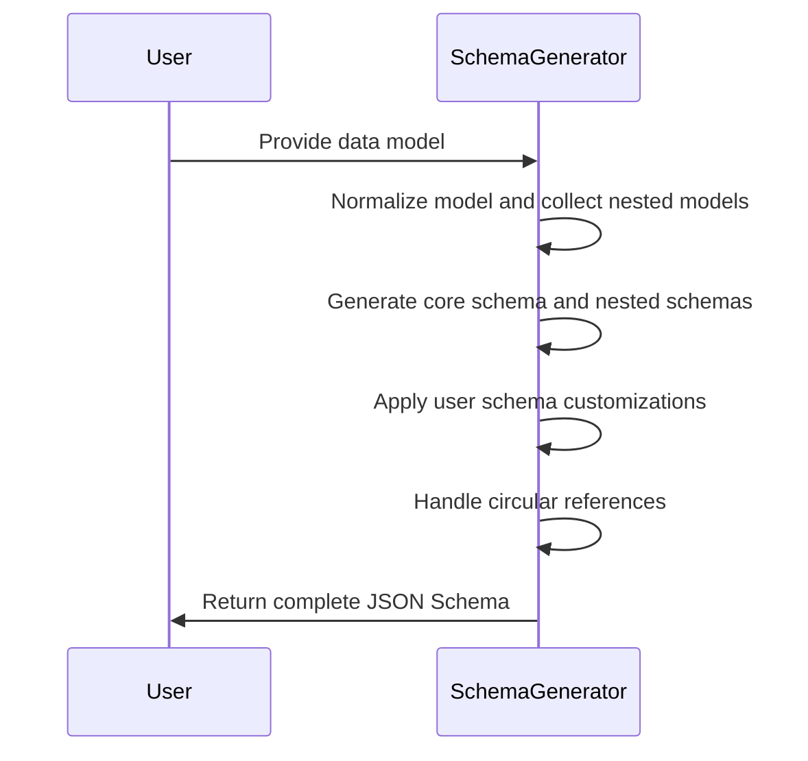
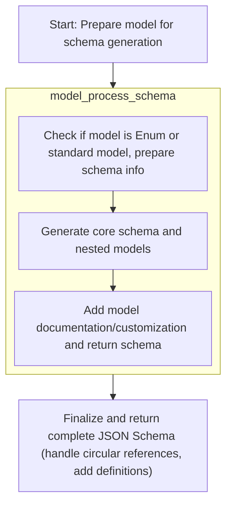
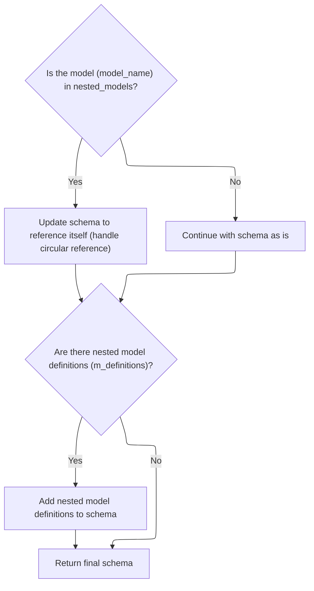

The flow generates a JSON Schema for a data model by preparing the model and its nested dependencies, building field-level schemas, applying user customizations, and resolving circular references. It returns a complete schema that accurately represents the model structure.



# Spec

## Detailed View of the Program's Functionality

a. Starting Schema Generation for a Model

The process begins by preparing the model for schema generation. The entrypoint function for this is responsible for taking a model (which could be a Pydantic <SwmToken path="pydantic/v1/schema.py" pos="163:9:9" line-data="    model: Union[Type[&#39;BaseModel&#39;], Type[&#39;Dataclass&#39;]],">`BaseModel`</SwmToken> or a dataclass) and generating a JSON Schema for it. The function first normalizes the input model to ensure it is in the correct form. It then collects all related models that might be referenced by the main model, including any nested or <SwmToken path="pydantic/v1/schema.py" pos="169:22:24" line-data="    Generate a JSON Schema for one model. With all the sub-models defined in the ``definitions`` top-level">`sub-models`</SwmToken>. These models are mapped to unique names to avoid naming collisions in the schema definitions. After this setup, the function delegates the actual schema construction to a dedicated function that handles the details of schema generation, especially for nested models, references, and configuration options. This separation keeps the entrypoint simple and delegates the complex logic to a specialized function.

b. Processing a Model and Its Dependencies

The core logic for processing a model and its dependencies is handled in a function that determines whether the model is an Enum or a standard model. If the model is an Enum, it is processed accordingly and a schema is generated for the Enum values. For standard models, the function sets up the schema's title (using either a custom title from the model's config or the class name) and optionally a description (using the model's docstring if available). The model is then added to a set of known models to help with circular reference detection. The function then calls another function to build out the schema for all the model's fields, handling references to any nested models and collecting additional schema definitions as needed. This approach separates the setup of metadata (like title and description) from the construction of the field-level schema.

c. Building Field-Level Schema and References

For each field in the model, the schema generation process involves several steps:

- The function responsible for field schema generation first gathers any metadata or validation information for the field, such as title, description, default values, and validation constraints (like min/max length, regex patterns, numeric bounds, etc.).
- It then determines the appropriate schema for the field's type. If the field is a collection (like a list, set, or mapping), it recursively generates schemas for the contained types. If the field is itself a model or an Enum, it generates a reference to the corresponding schema definition and ensures that the definition is included in the overall schema.
- The function also handles special cases, such as fields that are Literal types (with a fixed set of allowed values), namedtuples, or <SwmToken path="pydantic/v1/schema.py" pos="922:5:7" line-data="    # Handle dataclass-based models">`dataclass-based`</SwmToken> models.
- If the field type has a custom schema modification method, it is invoked to allow further customization of the generated schema.
- The result is a schema for the field, along with any additional definitions and a record of any nested models that were referenced.

d. Applying Schema Customizations and Returning Results

After the field-level schema and definitions have been generated, the function merges these into the main schema for the model. If the model's configuration includes a schema customization (called <SwmToken path="pydantic/v1/schema.py" pos="590:1:1" line-data="    schema_extra = model.__config__.schema_extra">`schema_extra`</SwmToken>), this is applied at this stage. The customization can be either a function or a dictionary:

- If it is a function, it is called with either one or two arguments (the schema, and optionally the model itself), allowing dynamic modification of the schema.
- If it is a dictionary, its contents are merged directly into the schema. This step allows users to tweak or extend the generated schema as needed. Finally, the function returns the completed schema for the model, along with any additional definitions and information about nested models.

e. Finalizing and Returning the Model Schema

Back in the entrypoint function, after receiving the schema and definitions from the processing function, the code checks for circular references. If the model is nested within itself (i.e., it appears in the set of nested models), its schema is stored in the definitions section, and the main schema is replaced with a reference to itself. This ensures that circular references are handled correctly in the JSON Schema. If there are any nested model definitions, they are added to the schema under a "definitions" key. Finally, the fully constructed schema, complete with all necessary definitions and references, is returned as the result.

# Rule Definition

| Paragraph Name                                                                                                                                                                                                                                                                                                                                                                                                                                                                                                                                                                                                          | Rule ID | Category          | Description                                                                                                                                                                                                                                                                                             | Conditions                                                                                                                                                                                                                     | Remarks                                                                                                                                                                                                                                                                                                                                                                                                                                                               |
| ----------------------------------------------------------------------------------------------------------------------------------------------------------------------------------------------------------------------------------------------------------------------------------------------------------------------------------------------------------------------------------------------------------------------------------------------------------------------------------------------------------------------------------------------------------------------------------------------------------------------- | ------- | ----------------- | ------------------------------------------------------------------------------------------------------------------------------------------------------------------------------------------------------------------------------------------------------------------------------------------------------- | ------------------------------------------------------------------------------------------------------------------------------------------------------------------------------------------------------------------------------ | --------------------------------------------------------------------------------------------------------------------------------------------------------------------------------------------------------------------------------------------------------------------------------------------------------------------------------------------------------------------------------------------------------------------------------------------------------------------- |
| <SwmToken path="pydantic/v1/schema.py" pos="188:11:11" line-data="    m_schema, m_definitions, nested_models = model_process_schema(">`model_process_schema`</SwmToken>, <SwmToken path="pydantic/v1/schema.py" pos="581:11:11" line-data="    m_schema, m_definitions, nested_models = model_type_schema(">`model_type_schema`</SwmToken>, schema, <SwmToken path="pydantic/v1/schema.py" pos="162:2:2" line-data="def model_schema(">`model_schema`</SwmToken>                                                                                                                                                        | RL-001  | Conditional Logic | The schema generation process must accept a model object as input, which provides **fields**, **name**, and **config** attributes. For Enum models, the model object should be an Enum class with members and values.                                                                                   | Input object must be a Pydantic model or Enum class.                                                                                                                                                                           | Model object must have **fields** (dict), **name** (string), **config** (object with title, <SwmToken path="pydantic/v1/schema.py" pos="590:1:1" line-data="    schema_extra = model.__config__.schema_extra">`schema_extra`</SwmToken>, extra). Enum models are handled if the input is an Enum class.                                                                                                                                                               |
| schema, <SwmToken path="pydantic/v1/schema.py" pos="162:2:2" line-data="def model_schema(">`model_schema`</SwmToken>, <SwmToken path="pydantic/v1/schema.py" pos="188:11:11" line-data="    m_schema, m_definitions, nested_models = model_process_schema(">`model_process_schema`</SwmToken>, <SwmToken path="pydantic/v1/schema.py" pos="581:11:11" line-data="    m_schema, m_definitions, nested_models = model_type_schema(">`model_type_schema`</SwmToken>, <SwmToken path="pydantic/v1/schema.py" pos="573:5:5" line-data="        s = enum_process_schema(model, field=field)">`enum_process_schema`</SwmToken> | RL-002  | Data Assignment   | The output must be a dictionary representing a JSON Schema with keys: title, type, properties, required, and optionally definitions. Nested models or Enums must be included in definitions and referenced via $ref.                                                                                    | Any model or Enum processed for schema generation.                                                                                                                                                                             | Output is a dictionary with keys: title (string), type (string), properties (dict), required (list), definitions (dict, optional). $ref is used for nested/enum references.                                                                                                                                                                                                                                                                                           |
| <SwmToken path="pydantic/v1/schema.py" pos="581:11:11" line-data="    m_schema, m_definitions, nested_models = model_type_schema(">`model_type_schema`</SwmToken>, <SwmToken path="pydantic/v1/schema.py" pos="97:21:21" line-data="    modify_schema: Callable[..., None], field: Optional[ModelField], field_schema: Dict[str, Any]">`field_schema`</SwmToken>, <SwmToken path="pydantic/v1/schema.py" pos="200:2:2" line-data="def get_field_info_schema(field: ModelField, schema_overrides: bool = False) -&gt; Tuple[Dict[str, Any], bool]:">`get_field_info_schema`</SwmToken>                                   | RL-003  | Data Assignment   | Each field in the model must be represented in the properties dictionary. The key is the field's alias if defined, otherwise the field's name. The value is a schema describing the field, including title, type, constraints, and metadata.                                                            | For each field in the model's **fields**.                                                                                                                                                                                      | Field key: alias (if defined) or name. Value: dict with title (capitalized), type (JSON Schema type), constraints (min/max, regex), metadata (description, etc).                                                                                                                                                                                                                                                                                                      |
| <SwmToken path="pydantic/v1/schema.py" pos="581:11:11" line-data="    m_schema, m_definitions, nested_models = model_type_schema(">`model_type_schema`</SwmToken>                                                                                                                                                                                                                                                                                                                                                                                                                                                       | RL-004  | Conditional Logic | If a field is required, its name or alias must be included in the required list in the schema.                                                                                                                                                                                                          | Field is required (<SwmToken path="pydantic/v1/schema.py" pos="215:5:7" line-data="    if not field.required and field.default is not None and not is_callable_type(field.outer_type_):">`field.required`</SwmToken> is True). | required is a list of field names or aliases (strings).                                                                                                                                                                                                                                                                                                                                                                                                               |
| <SwmToken path="pydantic/v1/schema.py" pos="462:11:11" line-data="        items_schema, f_definitions, f_nested_models = field_singleton_schema(">`field_singleton_schema`</SwmToken>, <SwmToken path="pydantic/v1/schema.py" pos="581:11:11" line-data="    m_schema, m_definitions, nested_models = model_type_schema(">`model_type_schema`</SwmToken>, <SwmToken path="pydantic/v1/schema.py" pos="573:5:5" line-data="        s = enum_process_schema(model, field=field)">`enum_process_schema`</SwmToken>                                                                                                         | RL-005  | Conditional Logic | If a field's type is a nested model or Enum, the field's schema must use a $ref to the corresponding definition in definitions. The nested model's schema is generated recursively.                                                                                                                     | Field type is a nested model or Enum.                                                                                                                                                                                          | $ref format: {'$ref': '#/definitions/ModelName'} or using <SwmToken path="pydantic/v1/schema.py" pos="166:1:1" line-data="    ref_template: str = default_ref_template,">`ref_template`</SwmToken>. Nested model/enum schema is added to definitions.                                                                                                                                                                                                                 |
| <SwmToken path="pydantic/v1/schema.py" pos="573:5:5" line-data="        s = enum_process_schema(model, field=field)">`enum_process_schema`</SwmToken>                                                                                                                                                                                                                                                                                                                                                                                                                                                                   | RL-006  | Data Assignment   | Enum definitions must include title, description, enum (list of values), and type (type of values).                                                                                                                                                                                                     | Field or model is an Enum.                                                                                                                                                                                                     | Enum schema: title (class name), description (docstring or default), enum (list of values), type (string/integer).                                                                                                                                                                                                                                                                                                                                                    |
| <SwmToken path="pydantic/v1/schema.py" pos="581:11:11" line-data="    m_schema, m_definitions, nested_models = model_type_schema(">`model_type_schema`</SwmToken>                                                                                                                                                                                                                                                                                                                                                                                                                                                       | RL-007  | Conditional Logic | For root models (models with a single special root field), the schema must represent the root field's schema directly, with the model's title.                                                                                                                                                          | Model has a single field with key <SwmToken path="pydantic/v1/schema.py" pos="83:10:10" line-data="from pydantic.v1.utils import ROOT_KEY, get_model, lenient_issubclass">`ROOT_KEY`</SwmToken>.                               | Schema is the root field's schema, with title set to model's title.                                                                                                                                                                                                                                                                                                                                                                                                   |
| <SwmToken path="pydantic/v1/schema.py" pos="581:11:11" line-data="    m_schema, m_definitions, nested_models = model_type_schema(">`model_type_schema`</SwmToken>                                                                                                                                                                                                                                                                                                                                                                                                                                                       | RL-008  | Conditional Logic | If the model's config sets extra to forbid, the schema must include <SwmToken path="pydantic/v1/schema.py" pos="496:4:4" line-data="            f_schema[&#39;additionalProperties&#39;] = items_schema">`additionalProperties`</SwmToken>: false.                                                      | model.**config**.extra == 'forbid'                                                                                                                                                                                             | <SwmToken path="pydantic/v1/schema.py" pos="496:4:4" line-data="            f_schema[&#39;additionalProperties&#39;] = items_schema">`additionalProperties`</SwmToken> is a boolean (false).                                                                                                                                                                                                                                                                          |
| <SwmToken path="pydantic/v1/schema.py" pos="162:2:2" line-data="def model_schema(">`model_schema`</SwmToken>, <SwmToken path="pydantic/v1/schema.py" pos="462:11:11" line-data="        items_schema, f_definitions, f_nested_models = field_singleton_schema(">`field_singleton_schema`</SwmToken>                                                                                                                                                                                                                                                                                                                     | RL-009  | Conditional Logic | If the model references itself directly or indirectly, the schema must use a $ref to itself in the main schema, and the full schema must be included in definitions.                                                                                                                                    | Model is in <SwmToken path="pydantic/v1/schema.py" pos="188:7:7" line-data="    m_schema, m_definitions, nested_models = model_process_schema(">`nested_models`</SwmToken> (circular reference detected).                      | $ref to self in main schema, full schema in definitions.                                                                                                                                                                                                                                                                                                                                                                                                              |
| <SwmToken path="pydantic/v1/schema.py" pos="188:11:11" line-data="    m_schema, m_definitions, nested_models = model_process_schema(">`model_process_schema`</SwmToken>                                                                                                                                                                                                                                                                                                                                                                                                                                                 | RL-010  | Conditional Logic | If model's config defines <SwmToken path="pydantic/v1/schema.py" pos="590:1:1" line-data="    schema_extra = model.__config__.schema_extra">`schema_extra`</SwmToken>, apply it to the schema. If it's a function, call with schema (and model if two args). If it's a dict, shallow-merge into schema. | model.**config**<SwmToken path="pydantic/v1/schema.py" pos="590:8:9" line-data="    schema_extra = model.__config__.schema_extra">`.schema_extra`</SwmToken> is not None.                                                      | <SwmToken path="pydantic/v1/schema.py" pos="590:1:1" line-data="    schema_extra = model.__config__.schema_extra">`schema_extra`</SwmToken> can be a function (1 or 2 args) or dict. Function mutates schema in place. Dict is shallow-merged (overwrites <SwmToken path="pydantic/v1/schema.py" pos="169:36:38" line-data="    Generate a JSON Schema for one model. With all the sub-models defined in the ``definitions`` top-level">`top-level`</SwmToken> keys). |
| <SwmToken path="pydantic/v1/schema.py" pos="188:11:11" line-data="    m_schema, m_definitions, nested_models = model_process_schema(">`model_process_schema`</SwmToken>, <SwmToken path="pydantic/v1/schema.py" pos="581:11:11" line-data="    m_schema, m_definitions, nested_models = model_type_schema(">`model_type_schema`</SwmToken>, <SwmToken path="pydantic/v1/schema.py" pos="573:5:5" line-data="        s = enum_process_schema(model, field=field)">`enum_process_schema`</SwmToken>                                                                                                                       | RL-011  | Conditional Logic | The schema must not include any implementation-specific keys or structures beyond those required by the JSON Schema specification and the business requirements.                                                                                                                                        | Always, when producing output schema.                                                                                                                                                                                          | Output must conform to JSON Schema spec and above requirements only.                                                                                                                                                                                                                                                                                                                                                                                                  |

# User Stories

## User Story 1: Generate JSON Schema from Pydantic model or Enum

---

### Story Description:

As a user of the schema generation feature, I want to generate a JSON Schema from a Pydantic model or Enum so that I can validate and document my data structures in a standards-compliant way.

---

### Business Rule Mapping:

| Rule ID | Paragraph Name                                                                                                                                                                                                                                                                                                                                                                                                                                                                                                                                                                                                          | Rule Description                                                                                                                                                                                                                             |
| ------- | ----------------------------------------------------------------------------------------------------------------------------------------------------------------------------------------------------------------------------------------------------------------------------------------------------------------------------------------------------------------------------------------------------------------------------------------------------------------------------------------------------------------------------------------------------------------------------------------------------------------------- | -------------------------------------------------------------------------------------------------------------------------------------------------------------------------------------------------------------------------------------------- |
| RL-009  | <SwmToken path="pydantic/v1/schema.py" pos="162:2:2" line-data="def model_schema(">`model_schema`</SwmToken>, <SwmToken path="pydantic/v1/schema.py" pos="462:11:11" line-data="        items_schema, f_definitions, f_nested_models = field_singleton_schema(">`field_singleton_schema`</SwmToken>                                                                                                                                                                                                                                                                                                                     | If the model references itself directly or indirectly, the schema must use a $ref to itself in the main schema, and the full schema must be included in definitions.                                                                         |
| RL-001  | <SwmToken path="pydantic/v1/schema.py" pos="188:11:11" line-data="    m_schema, m_definitions, nested_models = model_process_schema(">`model_process_schema`</SwmToken>, <SwmToken path="pydantic/v1/schema.py" pos="581:11:11" line-data="    m_schema, m_definitions, nested_models = model_type_schema(">`model_type_schema`</SwmToken>, schema, <SwmToken path="pydantic/v1/schema.py" pos="162:2:2" line-data="def model_schema(">`model_schema`</SwmToken>                                                                                                                                                        | The schema generation process must accept a model object as input, which provides **fields**, **name**, and **config** attributes. For Enum models, the model object should be an Enum class with members and values.                        |
| RL-011  | <SwmToken path="pydantic/v1/schema.py" pos="188:11:11" line-data="    m_schema, m_definitions, nested_models = model_process_schema(">`model_process_schema`</SwmToken>, <SwmToken path="pydantic/v1/schema.py" pos="581:11:11" line-data="    m_schema, m_definitions, nested_models = model_type_schema(">`model_type_schema`</SwmToken>, <SwmToken path="pydantic/v1/schema.py" pos="573:5:5" line-data="        s = enum_process_schema(model, field=field)">`enum_process_schema`</SwmToken>                                                                                                                       | The schema must not include any implementation-specific keys or structures beyond those required by the JSON Schema specification and the business requirements.                                                                             |
| RL-002  | schema, <SwmToken path="pydantic/v1/schema.py" pos="162:2:2" line-data="def model_schema(">`model_schema`</SwmToken>, <SwmToken path="pydantic/v1/schema.py" pos="188:11:11" line-data="    m_schema, m_definitions, nested_models = model_process_schema(">`model_process_schema`</SwmToken>, <SwmToken path="pydantic/v1/schema.py" pos="581:11:11" line-data="    m_schema, m_definitions, nested_models = model_type_schema(">`model_type_schema`</SwmToken>, <SwmToken path="pydantic/v1/schema.py" pos="573:5:5" line-data="        s = enum_process_schema(model, field=field)">`enum_process_schema`</SwmToken> | The output must be a dictionary representing a JSON Schema with keys: title, type, properties, required, and optionally definitions. Nested models or Enums must be included in definitions and referenced via $ref.                         |
| RL-003  | <SwmToken path="pydantic/v1/schema.py" pos="581:11:11" line-data="    m_schema, m_definitions, nested_models = model_type_schema(">`model_type_schema`</SwmToken>, <SwmToken path="pydantic/v1/schema.py" pos="97:21:21" line-data="    modify_schema: Callable[..., None], field: Optional[ModelField], field_schema: Dict[str, Any]">`field_schema`</SwmToken>, <SwmToken path="pydantic/v1/schema.py" pos="200:2:2" line-data="def get_field_info_schema(field: ModelField, schema_overrides: bool = False) -&gt; Tuple[Dict[str, Any], bool]:">`get_field_info_schema`</SwmToken>                                   | Each field in the model must be represented in the properties dictionary. The key is the field's alias if defined, otherwise the field's name. The value is a schema describing the field, including title, type, constraints, and metadata. |
| RL-004  | <SwmToken path="pydantic/v1/schema.py" pos="581:11:11" line-data="    m_schema, m_definitions, nested_models = model_type_schema(">`model_type_schema`</SwmToken>                                                                                                                                                                                                                                                                                                                                                                                                                                                       | If a field is required, its name or alias must be included in the required list in the schema.                                                                                                                                               |
| RL-005  | <SwmToken path="pydantic/v1/schema.py" pos="462:11:11" line-data="        items_schema, f_definitions, f_nested_models = field_singleton_schema(">`field_singleton_schema`</SwmToken>, <SwmToken path="pydantic/v1/schema.py" pos="581:11:11" line-data="    m_schema, m_definitions, nested_models = model_type_schema(">`model_type_schema`</SwmToken>, <SwmToken path="pydantic/v1/schema.py" pos="573:5:5" line-data="        s = enum_process_schema(model, field=field)">`enum_process_schema`</SwmToken>                                                                                                         | If a field's type is a nested model or Enum, the field's schema must use a $ref to the corresponding definition in definitions. The nested model's schema is generated recursively.                                                          |
| RL-006  | <SwmToken path="pydantic/v1/schema.py" pos="573:5:5" line-data="        s = enum_process_schema(model, field=field)">`enum_process_schema`</SwmToken>                                                                                                                                                                                                                                                                                                                                                                                                                                                                   | Enum definitions must include title, description, enum (list of values), and type (type of values).                                                                                                                                          |

---

### Relevant Functionality:

- <SwmToken path="pydantic/v1/schema.py" pos="162:2:2" line-data="def model_schema(">`model_schema`</SwmToken>
  1. **RL-009:**
     - If model is in <SwmToken path="pydantic/v1/schema.py" pos="188:7:7" line-data="    m_schema, m_definitions, nested_models = model_process_schema(">`nested_models`</SwmToken>:
       - Add schema to definitions
       - Use $ref in main schema
- <SwmToken path="pydantic/v1/schema.py" pos="188:11:11" line-data="    m_schema, m_definitions, nested_models = model_process_schema(">`model_process_schema`</SwmToken>
  1. **RL-001:**
     - Check if input is a Pydantic model or Enum
     - For models, access **fields**, **name**, **config**
     - For Enums, treat input as Enum class and extract members/values
  2. **RL-011:**
     - Before returning schema, ensure only allowed keys are present
- **schema**
  1. **RL-002:**
     - Create output dict
     - Set title, type, properties, required
     - If nested models/enums, add definitions and use $ref
- <SwmToken path="pydantic/v1/schema.py" pos="581:11:11" line-data="    m_schema, m_definitions, nested_models = model_type_schema(">`model_type_schema`</SwmToken>
  1. **RL-003:**
     - For each field, determine alias or name
     - Build schema dict for field (title, type, constraints, metadata)
     - Add to properties dict
  2. **RL-004:**
     - For each field, if required, add alias or name to required list
- <SwmToken path="pydantic/v1/schema.py" pos="462:11:11" line-data="        items_schema, f_definitions, f_nested_models = field_singleton_schema(">`field_singleton_schema`</SwmToken>
  1. **RL-005:**
     - If field type is nested model or Enum:
       - Generate schema for nested type
       - Add to definitions
       - Use $ref in main schema
- <SwmToken path="pydantic/v1/schema.py" pos="573:5:5" line-data="        s = enum_process_schema(model, field=field)">`enum_process_schema`</SwmToken>
  1. **RL-006:**
     - For Enum, build schema with title, description, enum, type

## User Story 2: Customize schema output based on model configuration

---

### Story Description:

As a user, I want the generated schema to reflect special model configurations such as root models, forbidden extra fields, and <SwmToken path="pydantic/v1/schema.py" pos="590:1:1" line-data="    schema_extra = model.__config__.schema_extra">`schema_extra`</SwmToken> customizations, while ensuring the output remains standards-compliant, so that the schema accurately represents my model's intended constraints and metadata.

---

### Business Rule Mapping:

| Rule ID | Paragraph Name                                                                                                                                                                                                                                                                                                                                                                                                                                                                                    | Rule Description                                                                                                                                                                                                                                                                                        |
| ------- | ------------------------------------------------------------------------------------------------------------------------------------------------------------------------------------------------------------------------------------------------------------------------------------------------------------------------------------------------------------------------------------------------------------------------------------------------------------------------------------------------- | ------------------------------------------------------------------------------------------------------------------------------------------------------------------------------------------------------------------------------------------------------------------------------------------------------- |
| RL-010  | <SwmToken path="pydantic/v1/schema.py" pos="188:11:11" line-data="    m_schema, m_definitions, nested_models = model_process_schema(">`model_process_schema`</SwmToken>                                                                                                                                                                                                                                                                                                                           | If model's config defines <SwmToken path="pydantic/v1/schema.py" pos="590:1:1" line-data="    schema_extra = model.__config__.schema_extra">`schema_extra`</SwmToken>, apply it to the schema. If it's a function, call with schema (and model if two args). If it's a dict, shallow-merge into schema. |
| RL-011  | <SwmToken path="pydantic/v1/schema.py" pos="188:11:11" line-data="    m_schema, m_definitions, nested_models = model_process_schema(">`model_process_schema`</SwmToken>, <SwmToken path="pydantic/v1/schema.py" pos="581:11:11" line-data="    m_schema, m_definitions, nested_models = model_type_schema(">`model_type_schema`</SwmToken>, <SwmToken path="pydantic/v1/schema.py" pos="573:5:5" line-data="        s = enum_process_schema(model, field=field)">`enum_process_schema`</SwmToken> | The schema must not include any implementation-specific keys or structures beyond those required by the JSON Schema specification and the business requirements.                                                                                                                                        |
| RL-007  | <SwmToken path="pydantic/v1/schema.py" pos="581:11:11" line-data="    m_schema, m_definitions, nested_models = model_type_schema(">`model_type_schema`</SwmToken>                                                                                                                                                                                                                                                                                                                                 | For root models (models with a single special root field), the schema must represent the root field's schema directly, with the model's title.                                                                                                                                                          |
| RL-008  | <SwmToken path="pydantic/v1/schema.py" pos="581:11:11" line-data="    m_schema, m_definitions, nested_models = model_type_schema(">`model_type_schema`</SwmToken>                                                                                                                                                                                                                                                                                                                                 | If the model's config sets extra to forbid, the schema must include <SwmToken path="pydantic/v1/schema.py" pos="496:4:4" line-data="            f_schema[&#39;additionalProperties&#39;] = items_schema">`additionalProperties`</SwmToken>: false.                                                      |

---

### Relevant Functionality:

- <SwmToken path="pydantic/v1/schema.py" pos="188:11:11" line-data="    m_schema, m_definitions, nested_models = model_process_schema(">`model_process_schema`</SwmToken>
  1. **RL-010:**
     - If <SwmToken path="pydantic/v1/schema.py" pos="590:1:1" line-data="    schema_extra = model.__config__.schema_extra">`schema_extra`</SwmToken> is callable:
       - If 1 arg, call with schema
       - If 2 args, call with schema and model
     - Else if dict, update schema with dict
  2. **RL-011:**
     - Before returning schema, ensure only allowed keys are present
- <SwmToken path="pydantic/v1/schema.py" pos="581:11:11" line-data="    m_schema, m_definitions, nested_models = model_type_schema(">`model_type_schema`</SwmToken>
  1. **RL-007:**
     - If <SwmToken path="pydantic/v1/schema.py" pos="83:10:10" line-data="from pydantic.v1.utils import ROOT_KEY, get_model, lenient_issubclass">`ROOT_KEY`</SwmToken> in properties:
       - Use root field's schema as output
       - Set title
  2. **RL-008:**
     - If config.extra == 'forbid', set <SwmToken path="pydantic/v1/schema.py" pos="496:4:4" line-data="            f_schema[&#39;additionalProperties&#39;] = items_schema">`additionalProperties`</SwmToken>: false in schema

# Code Walkthrough

## Starting schema generation for a model



<SwmSnippet path="/pydantic/v1/schema.py" line="162">

---

In <SwmToken path="pydantic/v1/schema.py" pos="162:2:2" line-data="def model_schema(">`model_schema`</SwmToken> we kick things off by normalizing the input model, collecting all related models, and mapping their names. We then delegate the actual schema construction to <SwmToken path="pydantic/v1/schema.py" pos="188:11:11" line-data="    m_schema, m_definitions, nested_models = model_process_schema(">`model_process_schema`</SwmToken>, since that's where all the logic for handling nested models, references, and config lives. This keeps the entrypoint simple and lets the heavy lifting happen in one place.

```python
def model_schema(
    model: Union[Type['BaseModel'], Type['Dataclass']],
    by_alias: bool = True,
    ref_prefix: Optional[str] = None,
    ref_template: str = default_ref_template,
) -> Dict[str, Any]:
    """
    Generate a JSON Schema for one model. With all the sub-models defined in the ``definitions`` top-level
    JSON key.

    :param model: a Pydantic model (a class that inherits from BaseModel)
    :param by_alias: generate the schemas using the aliases defined, if any
    :param ref_prefix: the JSON Pointer prefix for schema references with ``$ref``, if None, will be set to the
      default of ``#/definitions/``. Update it if you want the schemas to reference the definitions somewhere
      else, e.g. for OpenAPI use ``#/components/schemas/``. The resulting generated schemas will still be at the
      top-level key ``definitions``, so you can extract them from there. But all the references will have the set
      prefix.
    :param ref_template: Use a ``string.format()`` template for ``$ref`` instead of a prefix. This can be useful for
      references that cannot be represented by ``ref_prefix`` such as a definition stored in another file. For a
      sibling json file in a ``/schemas`` directory use ``"/schemas/${model}.json#"``.
    :return: dict with the JSON Schema for the passed ``model``
    """
    model = get_model(model)
    flat_models = get_flat_models_from_model(model)
    model_name_map = get_model_name_map(flat_models)
    model_name = model_name_map[model]
    m_schema, m_definitions, nested_models = model_process_schema(
        model, by_alias=by_alias, model_name_map=model_name_map, ref_prefix=ref_prefix, ref_template=ref_template
    )
```

---

</SwmSnippet>

### Processing a model and its dependencies

<SwmSnippet path="/pydantic/v1/schema.py" line="551">

---

In <SwmToken path="pydantic/v1/schema.py" pos="551:2:2" line-data="def model_process_schema(">`model_process_schema`</SwmToken> we check if the model is an Enum and handle that case early. For regular models, we set up the schema's title and description, then call <SwmToken path="pydantic/v1/schema.py" pos="581:11:11" line-data="    m_schema, m_definitions, nested_models = model_type_schema(">`model_type_schema`</SwmToken> to build out the schema for all fields and handle references to any nested models. This keeps the metadata setup separate from the field-level schema construction.

```python
def model_process_schema(
    model: TypeModelOrEnum,
    *,
    by_alias: bool = True,
    model_name_map: Dict[TypeModelOrEnum, str],
    ref_prefix: Optional[str] = None,
    ref_template: str = default_ref_template,
    known_models: Optional[TypeModelSet] = None,
    field: Optional[ModelField] = None,
) -> Tuple[Dict[str, Any], Dict[str, Any], Set[str]]:
    """
    Used by ``model_schema()``, you probably should be using that function.

    Take a single ``model`` and generate its schema. Also return additional schema definitions, from sub-models. The
    sub-models of the returned schema will be referenced, but their definitions will not be included in the schema. All
    the definitions are returned as the second value.
    """
    from inspect import getdoc, signature

    known_models = known_models or set()
    if lenient_issubclass(model, Enum):
        model = cast(Type[Enum], model)
        s = enum_process_schema(model, field=field)
        return s, {}, set()
    model = cast(Type['BaseModel'], model)
    s = {'title': model.__config__.title or model.__name__}
    doc = getdoc(model)
    if doc:
        s['description'] = doc
    known_models.add(model)
    m_schema, m_definitions, nested_models = model_type_schema(
        model,
        by_alias=by_alias,
        model_name_map=model_name_map,
        ref_prefix=ref_prefix,
        ref_template=ref_template,
        known_models=known_models,
    )
```

---

</SwmSnippet>

#### Building field-level schema and references

See <SwmLink doc-title="Generating a data model schema">[Generating a data model schema](/.swm/generating-a-data-model-schema.r3rqynvx.sw.md)</SwmLink>

#### Applying schema customizations and returning results

```mermaid
%%{init: {"flowchart": {"defaultRenderer": "elk"}} }%%
flowchart TD
    node1["Merge base schema with model schema"]
    click node1 openCode "pydantic/v1/schema.py:589:590"
    node1 --> node2{"Is schema_extra (user customization) a function?"}
    click node2 openCode "pydantic/v1/schema.py:591:591"
    node2 -->|"Yes"| node3{"Function takes 1 or 2 arguments?"}
    click node3 openCode "pydantic/v1/schema.py:592:595"
    node3 -->|"1 argument"| node4["Apply schema_extra("s")"]
    click node4 openCode "pydantic/v1/schema.py:593:593"
    node3 -->|"2 arguments"| node5["Apply schema_extra("s, model")"]
    click node5 openCode "pydantic/v1/schema.py:595:595"
    node2 -->|"No"| node6["Merge schema_extra dict into schema"]
    click node6 openCode "pydantic/v1/schema.py:597:597"
    node4 --> node7["Return (schema, definitions, nested models)"]
    click node7 openCode "pydantic/v1/schema.py:598:598"
    node5 --> node7
    node6 --> node7

%% Swimm:
%% %%{init: {"flowchart": {"defaultRenderer": "elk"}} }%%
%% flowchart TD
%%     node1["Merge base schema with model schema"]
%%     click node1 openCode "<SwmPath>[pydantic/v1/schema.py](pydantic/v1/schema.py)</SwmPath>:589:590"
%%     node1 --> node2{"Is <SwmToken path="pydantic/v1/schema.py" pos="590:1:1" line-data="    schema_extra = model.__config__.schema_extra">`schema_extra`</SwmToken> (user customization) a function?"}
%%     click node2 openCode "<SwmPath>[pydantic/v1/schema.py](pydantic/v1/schema.py)</SwmPath>:591:591"
%%     node2 -->|"Yes"| node3{"Function takes 1 or 2 arguments?"}
%%     click node3 openCode "<SwmPath>[pydantic/v1/schema.py](pydantic/v1/schema.py)</SwmPath>:592:595"
%%     node3 -->|"1 argument"| node4["Apply <SwmToken path="pydantic/v1/schema.py" pos="590:1:1" line-data="    schema_extra = model.__config__.schema_extra">`schema_extra`</SwmToken>("s")"]
%%     click node4 openCode "<SwmPath>[pydantic/v1/schema.py](pydantic/v1/schema.py)</SwmPath>:593:593"
%%     node3 -->|"2 arguments"| node5["Apply <SwmToken path="pydantic/v1/schema.py" pos="590:1:1" line-data="    schema_extra = model.__config__.schema_extra">`schema_extra`</SwmToken>("s, model")"]
%%     click node5 openCode "<SwmPath>[pydantic/v1/schema.py](pydantic/v1/schema.py)</SwmPath>:595:595"
%%     node2 -->|"No"| node6["Merge <SwmToken path="pydantic/v1/schema.py" pos="590:1:1" line-data="    schema_extra = model.__config__.schema_extra">`schema_extra`</SwmToken> dict into schema"]
%%     click node6 openCode "<SwmPath>[pydantic/v1/schema.py](pydantic/v1/schema.py)</SwmPath>:597:597"
%%     node4 --> node7["Return (schema, definitions, nested models)"]
%%     click node7 openCode "<SwmPath>[pydantic/v1/schema.py](pydantic/v1/schema.py)</SwmPath>:598:598"
%%     node5 --> node7
%%     node6 --> node7
```

<SwmSnippet path="/pydantic/v1/schema.py" line="589">

---

Back in <SwmToken path="pydantic/v1/schema.py" pos="188:11:11" line-data="    m_schema, m_definitions, nested_models = model_process_schema(">`model_process_schema`</SwmToken>, after getting the field-level schema and definitions from <SwmToken path="pydantic/v1/schema.py" pos="581:11:11" line-data="    m_schema, m_definitions, nested_models = model_type_schema(">`model_type_schema`</SwmToken>, we merge them into the main schema. Then, if the model config defines <SwmToken path="pydantic/v1/schema.py" pos="590:1:1" line-data="    schema_extra = model.__config__.schema_extra">`schema_extra`</SwmToken>, we apply it to let users tweak or extend the schema before returning everything.

```python
    s.update(m_schema)
    schema_extra = model.__config__.schema_extra
    if callable(schema_extra):
        if len(signature(schema_extra).parameters) == 1:
            schema_extra(s)
        else:
            schema_extra(s, model)
    else:
        s.update(schema_extra)
    return s, m_definitions, nested_models
```

---

</SwmSnippet>

### Finalizing and returning the model schema



<SwmSnippet path="/pydantic/v1/schema.py" line="191">

---

Back in <SwmToken path="pydantic/v1/schema.py" pos="162:2:2" line-data="def model_schema(">`model_schema`</SwmToken>, after getting the schema and definitions from <SwmToken path="pydantic/v1/schema.py" pos="188:11:11" line-data="    m_schema, m_definitions, nested_models = model_process_schema(">`model_process_schema`</SwmToken>, we check for circular references. If the model is nested within itself, we store its schema in definitions and use a reference in the main schema. Finally, we attach any definitions and return the completed schema.

```python
    if model_name in nested_models:
        # model_name is in Nested models, it has circular references
        m_definitions[model_name] = m_schema
        m_schema = get_schema_ref(model_name, ref_prefix, ref_template, False)
    if m_definitions:
        m_schema.update({'definitions': m_definitions})
    return m_schema
```

---

</SwmSnippet>

&nbsp;

*This is an auto-generated document by Swimm 🌊 and has not yet been verified by a human*

<SwmMeta version="3.0.0" repo-id="Z2l0aHViJTNBJTNBcHlkYW50aWMlM0ElM0FTd2ltbS1EZW1v" repo-name="pydantic"><sup>Powered by [Swimm](/)</sup></SwmMeta>
