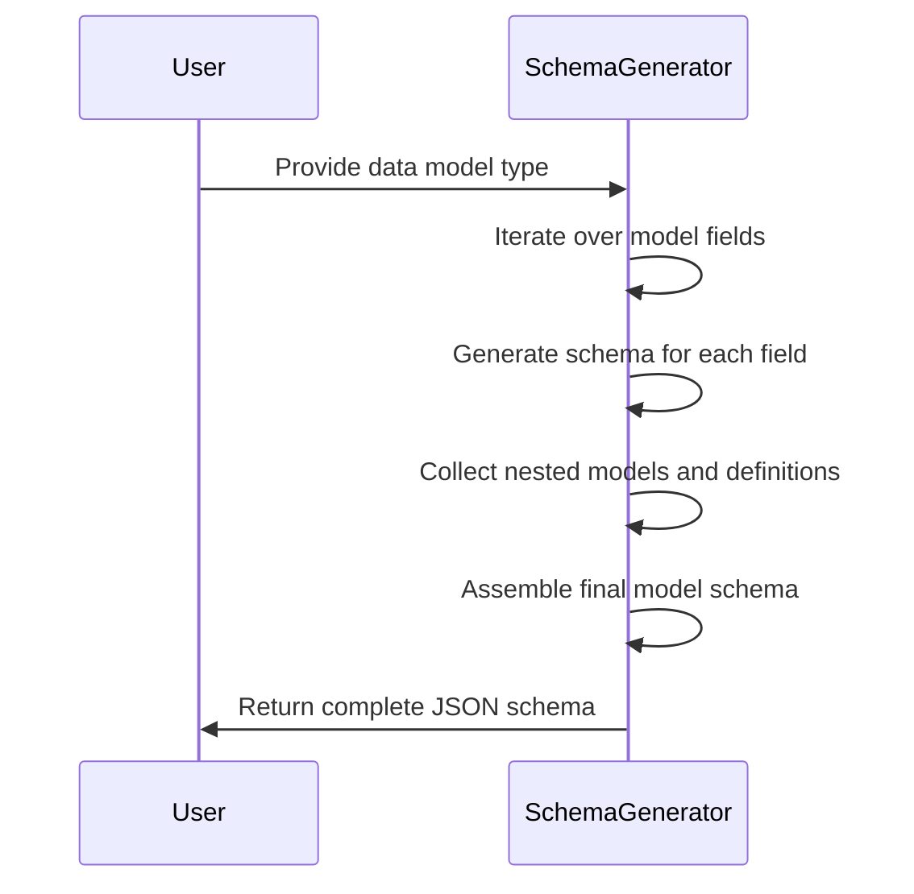
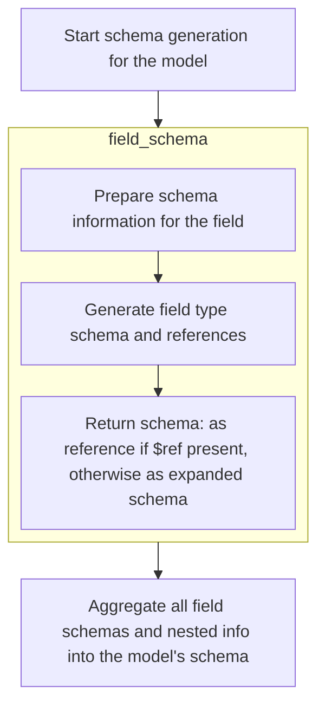
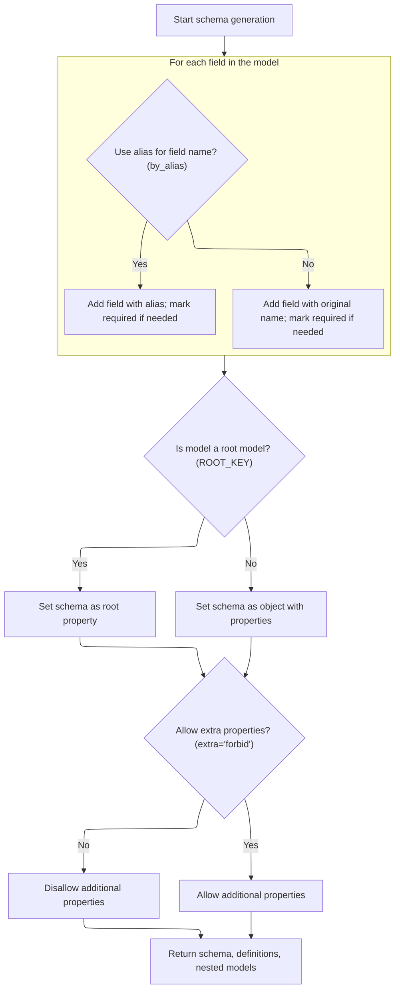

This flow generates a JSON schema for a data model by processing each field and assembling their schemas, including nested models and configuration options. It outputs a complete schema representation with all necessary definitions.



# Spec

## Detailed View of the Program's Functionality

a. Starting Schema Generation for the Model

The process begins by initiating schema generation for a given data model. The main function responsible for this is designed to handle only the <SwmToken path="pydantic/v1/schema.py" pos="806:15:17" line-data="    Update the given `schema` with the type-specific metadata for the given `field_type`.">`type-specific`</SwmToken> schema for the model, not including extra metadata like titles or descriptions. It prepares empty containers to hold the schema properties, required fields, additional schema definitions (for nested or referenced models), and a set to track any nested models encountered during the process.

b. Generating Schema for Each Field

The function then iterates over each field defined in the model. For every field, it attempts to generate a schema representation by invoking a dedicated field schema generator. This generator is responsible for:

- Preparing the base schema information for the field, such as title, description, and default value, if applicable.
- Adding any validation constraints (like min/max length, regex patterns, numeric bounds) that are specified for the field.
- Delegating to a <SwmToken path="pydantic/v1/schema.py" pos="806:15:17" line-data="    Update the given `schema` with the type-specific metadata for the given `field_type`.">`type-specific`</SwmToken> schema generator to handle the field's type, which may involve recursion for nested models, handling of containers (lists, sets, etc.), or references to other models.
- Collecting any additional schema definitions and tracking nested models that are referenced by this field.

If the field schema generator raises a special exception indicating the field should be skipped (for example, if the field type cannot be represented in JSON Schema), a warning is issued and the field is ignored.

c. Aggregating Field Schemas and Nested Information

After successfully generating the schema for a field, the function:

- Updates the main schema properties dictionary with the field's schema, using either the field's alias or its original name, depending on configuration.
- Adds the field's name to the list of required fields if the field is marked as required.
- Merges any additional schema definitions and nested model references collected from the field into the main containers.

d. Handling Root Models and Object Schemas

Once all fields have been processed, the function checks if the model is a "root model" (i.e., a model that wraps a single value rather than a set of named properties). If so, it sets the schema to be that of the root field and assigns an appropriate title. Otherwise, it constructs an object schema with the collected properties and required fields.

e. Applying Model Configuration Options

The function then checks the model's configuration to determine if extra (unspecified) properties should be allowed in the schema. If the configuration forbids extra properties, it sets the schema to disallow additional properties.

f. Returning the Final Schema Structure

Finally, the function returns a tuple containing:

- The assembled schema for the model (either as a root value or an object with properties).
- The dictionary of additional schema definitions for any nested or referenced models.
- The set of nested model names encountered during schema generation.

---

### Details of Field Schema Generation

1. Preparing Field Schema Information

For each field, the field schema generator starts by extracting basic schema information and any overrides (such as a custom title or description). It also checks if the field has a default value and is not required, in which case it adds the default to the schema.

2. Adding Validation Constraints

The generator then examines the field for any validation constraints (like minimum/maximum values, string length, regex patterns, etc.) and adds these to the schema if present.

3. Handling Field Types and References

The generator delegates to a <SwmToken path="pydantic/v1/schema.py" pos="806:15:17" line-data="    Update the given `schema` with the type-specific metadata for the given `field_type`.">`type-specific`</SwmToken> schema handler, which is responsible for:

- Handling container types (lists, sets, tuples, etc.) by generating an "array" schema with appropriate item schemas.
- Handling mapping types (dictionaries) by generating an "object" schema with key and value schemas.
- Handling nested models by referencing their schema definitions, and tracking them to avoid circular references.
- Handling enums, literals, and other special types by generating the appropriate schema constructs.
- Recursively processing sub-fields for complex types.

4. Merging and Returning Field Schemas

After obtaining the <SwmToken path="pydantic/v1/schema.py" pos="806:15:17" line-data="    Update the given `schema` with the type-specific metadata for the given `field_type`.">`type-specific`</SwmToken> schema, the field schema generator decides how to return the result:

- If the schema is a reference (i.e., it contains a <SwmToken path="pydantic/v1/schema.py" pos="265:3:4" line-data="    # $ref will only be returned when there are no schema_overrides">`$ref`</SwmToken> key) and there are no schema overrides, it returns the reference directly.
- Otherwise, it merges the base schema information and validation constraints with the <SwmToken path="pydantic/v1/schema.py" pos="806:15:17" line-data="    Update the given `schema` with the type-specific metadata for the given `field_type`.">`type-specific`</SwmToken> schema and returns the combined result, along with any additional definitions and nested models.

---

### Assembling the Final Model Schema

1. Looping Through Fields

The model schema assembler loops through each field in the model, using either the field's alias or its original name as the property key in the schema. It adds each field's schema to the properties dictionary and marks fields as required if necessary.

2. Handling Root Models

If the model is a root model (i.e., it has a special root key), the assembler sets the schema to be that of the root field and assigns a title.

3. Constructing Object Schemas

If the model is not a root model, the assembler constructs an object schema with the collected properties and required fields.

4. Applying Additional Properties Configuration

The assembler checks if the model's configuration forbids extra properties. If so, it sets the schema to disallow additional properties.

5. Returning the Complete Schema

Finally, the assembler returns the completed schema, along with any additional schema definitions and the set of nested models encountered.

---

This modular and recursive approach allows Pydantic to generate comprehensive and accurate JSON Schemas for complex models, including those with nested structures, references, and custom validation logic.

# Rule Definition

| Paragraph Name                                                                                                                                                                                                                                                                                                                                                                                                                                                                                                                                                                                                                                                                                                                                 | Rule ID | Category          | Description                                                                                                                                                                                                                                                                                                                                                                                                                                                                                                                                                                                                                                                 | Conditions                                                                                                                                                                              | Remarks                                                                                                                                                                                                                                                                                                                                                                                                                                                                                                                                                                                                  |
| ---------------------------------------------------------------------------------------------------------------------------------------------------------------------------------------------------------------------------------------------------------------------------------------------------------------------------------------------------------------------------------------------------------------------------------------------------------------------------------------------------------------------------------------------------------------------------------------------------------------------------------------------------------------------------------------------------------------------------------------------- | ------- | ----------------- | ----------------------------------------------------------------------------------------------------------------------------------------------------------------------------------------------------------------------------------------------------------------------------------------------------------------------------------------------------------------------------------------------------------------------------------------------------------------------------------------------------------------------------------------------------------------------------------------------------------------------------------------------------------- | --------------------------------------------------------------------------------------------------------------------------------------------------------------------------------------- | -------------------------------------------------------------------------------------------------------------------------------------------------------------------------------------------------------------------------------------------------------------------------------------------------------------------------------------------------------------------------------------------------------------------------------------------------------------------------------------------------------------------------------------------------------------------------------------------------------- |
| <SwmToken path="pydantic/v1/schema.py" pos="147:11:11" line-data="        m_schema, m_definitions, m_nested_models = model_process_schema(">`model_process_schema`</SwmToken>, <SwmToken path="pydantic/v1/schema.py" pos="601:2:2" line-data="def model_type_schema(">`model_type_schema`</SwmToken>, schema, <SwmToken path="pydantic/v1/schema.py" pos="611:12:12" line-data="    You probably should be using ``model_schema()``, this function is indirectly used by that function.">`model_schema`</SwmToken>                                                                                                                                                                                                                            | RL-001  | Data Assignment   | The <SwmToken path="pydantic/v1/schema.py" pos="120:1:3" line-data="    top-level JSON key, including their sub-models.">`top-level`</SwmToken> JSON Schema for a model must include the title, type, properties, required fields, and definitions for nested models. The title is taken from the model's **config**.title if present, otherwise from the model's class name. The type is 'object' unless the model is a root model. The properties dictionary maps property names to their schemas. The required list includes all required fields without defaults. The definitions dictionary contains schemas for all nested models referenced by $ref. | Whenever a schema is generated for a model class.                                                                                                                                       | The output is a dictionary with keys: 'title' (string), 'type' (string), 'properties' (dict), 'required' (list of strings), 'definitions' (dict of model schemas). If the model is a root model, the schema structure is different (see root model rule).                                                                                                                                                                                                                                                                                                                                                |
| <SwmToken path="pydantic/v1/schema.py" pos="601:2:2" line-data="def model_type_schema(">`model_type_schema`</SwmToken>, <SwmToken path="pydantic/v1/schema.py" pos="222:2:2" line-data="def field_schema(">`field_schema`</SwmToken>                                                                                                                                                                                                                                                                                                                                                                                                                                                                                                           | RL-002  | Conditional Logic | Property names in the schema must use the field's alias if the <SwmToken path="pydantic/v1/schema.py" pos="225:1:1" line-data="    by_alias: bool = True,">`by_alias`</SwmToken> flag is true and an alias is specified; otherwise, the field's original name is used.                                                                                                                                                                                                                                                                                                                                                                                      | When generating the 'properties' and 'required' lists for a model schema.                                                                                                               | Property names are strings. The <SwmToken path="pydantic/v1/schema.py" pos="225:1:1" line-data="    by_alias: bool = True,">`by_alias`</SwmToken> flag controls whether aliases are used.                                                                                                                                                                                                                                                                                                                                                                                                                |
| <SwmToken path="pydantic/v1/schema.py" pos="222:2:2" line-data="def field_schema(">`field_schema`</SwmToken>, <SwmToken path="pydantic/v1/schema.py" pos="255:11:11" line-data="    f_schema, f_definitions, f_nested_models = field_type_schema(">`field_type_schema`</SwmToken>, <SwmToken path="pydantic/v1/schema.py" pos="462:11:11" line-data="        items_schema, f_definitions, f_nested_models = field_singleton_schema(">`field_singleton_schema`</SwmToken>, <SwmToken path="pydantic/v1/schema.py" pos="250:5:5" line-data="    validation_schema = get_field_schema_validations(field)">`get_field_schema_validations`</SwmToken>                                                                                               | RL-003  | Computation       | Each field's schema must include its title, type (mapped to JSON Schema types), applicable validation constraints (<SwmToken path="pydantic/v1/schema.py" pos="128:4:6" line-data="      else, e.g. for OpenAPI use ``#/components/schemas/``. The resulting generated schemas will still be at the">`e.g`</SwmToken>., minimum, maximum, description), default value if present, and if the field is a nested model, a $ref to the nested model's definition. For container types, the schema must represent the container and recursively generate schemas for contained types.                                                                           | For every field in the model.                                                                                                                                                           | Field schema is a dictionary with keys: 'title', 'type', constraints (<SwmToken path="pydantic/v1/schema.py" pos="128:4:6" line-data="      else, e.g. for OpenAPI use ``#/components/schemas/``. The resulting generated schemas will still be at the">`e.g`</SwmToken>., 'minimum', 'maximum'), 'default', and possibly '$ref' for nested models. Container types use 'type': 'array' or 'object' and include 'items' or <SwmToken path="pydantic/v1/schema.py" pos="651:4:4" line-data="        out_schema[&#39;additionalProperties&#39;] = False">`additionalProperties`</SwmToken> as appropriate. |
| <SwmToken path="pydantic/v1/schema.py" pos="601:2:2" line-data="def model_type_schema(">`model_type_schema`</SwmToken>                                                                                                                                                                                                                                                                                                                                                                                                                                                                                                                                                                                                                         | RL-004  | Conditional Logic | The 'required' list in the schema must include all property names (using aliases if applicable) for fields where required is true and no default is provided.                                                                                                                                                                                                                                                                                                                                                                                                                                                                                               | When building the 'required' list for a model schema.                                                                                                                                   | 'required' is a list of strings (property names).                                                                                                                                                                                                                                                                                                                                                                                                                                                                                                                                                        |
| <SwmToken path="pydantic/v1/schema.py" pos="601:2:2" line-data="def model_type_schema(">`model_type_schema`</SwmToken>                                                                                                                                                                                                                                                                                                                                                                                                                                                                                                                                                                                                                         | RL-005  | Conditional Logic | If the model's **config**.extra is set to 'forbid', the schema must include <SwmToken path="pydantic/v1/schema.py" pos="651:4:4" line-data="        out_schema[&#39;additionalProperties&#39;] = False">`additionalProperties`</SwmToken>: false. Otherwise, <SwmToken path="pydantic/v1/schema.py" pos="651:4:4" line-data="        out_schema[&#39;additionalProperties&#39;] = False">`additionalProperties`</SwmToken> is omitted or set to true.                                                                                                                                                                                                       | When generating the schema for a model.                                                                                                                                                 | <SwmToken path="pydantic/v1/schema.py" pos="651:4:4" line-data="        out_schema[&#39;additionalProperties&#39;] = False">`additionalProperties`</SwmToken> is a boolean. Only present if extra == 'forbid'.                                                                                                                                                                                                                                                                                                                                                                                           |
| <SwmToken path="pydantic/v1/schema.py" pos="147:11:11" line-data="        m_schema, m_definitions, m_nested_models = model_process_schema(">`model_process_schema`</SwmToken>                                                                                                                                                                                                                                                                                                                                                                                                                                                                                                                                                                  | RL-006  | Data Assignment   | If the model's **config**<SwmToken path="pydantic/v1/schema.py" pos="590:8:9" line-data="    schema_extra = model.__config__.schema_extra">`.schema_extra`</SwmToken> is present, its contents must be merged into the generated schema. If <SwmToken path="pydantic/v1/schema.py" pos="590:1:1" line-data="    schema_extra = model.__config__.schema_extra">`schema_extra`</SwmToken> is a callable, it is called with the schema (and possibly the model) as arguments.                                                                                                                                                                                  | After the base schema is generated for a model.                                                                                                                                         | <SwmToken path="pydantic/v1/schema.py" pos="590:1:1" line-data="    schema_extra = model.__config__.schema_extra">`schema_extra`</SwmToken> can be a dict (merged into the schema) or a callable (called with the schema and possibly the model).                                                                                                                                                                                                                                                                                                                                                        |
| <SwmToken path="pydantic/v1/schema.py" pos="601:2:2" line-data="def model_type_schema(">`model_type_schema`</SwmToken>                                                                                                                                                                                                                                                                                                                                                                                                                                                                                                                                                                                                                         | RL-007  | Conditional Logic | If the model is a root model (has a single field named <SwmToken path="pydantic/v1/schema.py" pos="643:3:3" line-data="    if ROOT_KEY in properties:">`ROOT_KEY`</SwmToken>), the schema must represent the root property directly, not as an object with properties.                                                                                                                                                                                                                                                                                                                                                                                      | When generating the schema for a model with a single field named <SwmToken path="pydantic/v1/schema.py" pos="643:3:3" line-data="    if ROOT_KEY in properties:">`ROOT_KEY`</SwmToken>. | <SwmToken path="pydantic/v1/schema.py" pos="643:3:3" line-data="    if ROOT_KEY in properties:">`ROOT_KEY`</SwmToken> is a constant (usually '**root**'). The schema for a root model is the schema of the root field, not an object with 'properties'.                                                                                                                                                                                                                                                                                                                                                  |
| <SwmToken path="pydantic/v1/schema.py" pos="147:11:11" line-data="        m_schema, m_definitions, m_nested_models = model_process_schema(">`model_process_schema`</SwmToken>, <SwmToken path="pydantic/v1/schema.py" pos="462:11:11" line-data="        items_schema, f_definitions, f_nested_models = field_singleton_schema(">`field_singleton_schema`</SwmToken>, <SwmToken path="pydantic/v1/schema.py" pos="185:5:5" line-data="    flat_models = get_flat_models_from_model(model)">`get_flat_models_from_model`</SwmToken>, <SwmToken path="pydantic/v1/schema.py" pos="369:2:2" line-data="def get_flat_models_from_field(field: ModelField, known_models: TypeModelSet) -&gt; TypeModelSet:">`get_flat_models_from_field`</SwmToken> | RL-008  | Conditional Logic | To avoid circular references, models already processed are tracked, and references ($ref) are used for repeated models instead of inlining their schemas again.                                                                                                                                                                                                                                                                                                                                                                                                                                                                                             | When processing nested models or fields that reference other models.                                                                                                                    | A set of <SwmToken path="pydantic/v1/schema.py" pos="229:1:1" line-data="    known_models: Optional[TypeModelSet] = None,">`known_models`</SwmToken> is maintained during schema generation. If a model is already in <SwmToken path="pydantic/v1/schema.py" pos="229:1:1" line-data="    known_models: Optional[TypeModelSet] = None,">`known_models`</SwmToken>, only a $ref is used.                                                                                                                                                                                                                  |
| <SwmToken path="pydantic/v1/schema.py" pos="255:11:11" line-data="    f_schema, f_definitions, f_nested_models = field_type_schema(">`field_type_schema`</SwmToken>, <SwmToken path="pydantic/v1/schema.py" pos="462:11:11" line-data="        items_schema, f_definitions, f_nested_models = field_singleton_schema(">`field_singleton_schema`</SwmToken>, <SwmToken path="pydantic/v1/schema.py" pos="681:2:2" line-data="def field_singleton_sub_fields_schema(">`field_singleton_sub_fields_schema`</SwmToken>                                                                                                                                                                                                                             | RL-009  | Computation       | For container types (<SwmToken path="pydantic/v1/schema.py" pos="128:4:6" line-data="      else, e.g. for OpenAPI use ``#/components/schemas/``. The resulting generated schemas will still be at the">`e.g`</SwmToken>., list, dict, set, tuple) and nested models, the schema must recursively generate schemas for the contained or referenced types, handling arrays, objects, and references as appropriate.                                                                                                                                                                                                                                           | When a field's type is a container or a nested model.                                                                                                                                   | Container types use 'type': 'array' or 'object', with 'items' or <SwmToken path="pydantic/v1/schema.py" pos="651:4:4" line-data="        out_schema[&#39;additionalProperties&#39;] = False">`additionalProperties`</SwmToken> schemas. Nested models use $ref and are added to definitions.                                                                                                                                                                                                                                                                                                             |
| <SwmToken path="pydantic/v1/schema.py" pos="222:2:2" line-data="def field_schema(">`field_schema`</SwmToken>, <SwmToken path="pydantic/v1/schema.py" pos="255:11:11" line-data="    f_schema, f_definitions, f_nested_models = field_type_schema(">`field_type_schema`</SwmToken>, <SwmToken path="pydantic/v1/schema.py" pos="601:2:2" line-data="def model_type_schema(">`model_type_schema`</SwmToken>, <SwmToken path="pydantic/v1/schema.py" pos="147:11:11" line-data="        m_schema, m_definitions, m_nested_models = model_process_schema(">`model_process_schema`</SwmToken>                                                                                                                                                       | RL-010  | Computation       | The generated schema must conform to the JSON Schema specification, including correct use of types, references, required fields, constraints, and other standard keywords.                                                                                                                                                                                                                                                                                                                                                                                                                                                                                  | For all generated schemas.                                                                                                                                                              | Output must use valid JSON Schema types (string, number, object, array, boolean, null), $ref for references, and standard constraint keywords (minimum, maximum, pattern, etc.).                                                                                                                                                                                                                                                                                                                                                                                                                         |

# User Stories

## User Story 1: Generate JSON Schema for a model class, including root models and schema customization

---

### Story Description:

As a user of the schema generation feature, I want to generate a JSON Schema for a model class, including special handling for root models and support for schema customization, so that my model's structure and configuration are accurately reflected in the output schema.

---

### Business Rule Mapping:

| Rule ID | Paragraph Name                                                                                                                                                                                                                                                                                                                                                                                                                                                                                                      | Rule Description                                                                                                                                                                                                                                                                                                                                                                                                                                                                                                                                                                                                                                            |
| ------- | ------------------------------------------------------------------------------------------------------------------------------------------------------------------------------------------------------------------------------------------------------------------------------------------------------------------------------------------------------------------------------------------------------------------------------------------------------------------------------------------------------------------- | ----------------------------------------------------------------------------------------------------------------------------------------------------------------------------------------------------------------------------------------------------------------------------------------------------------------------------------------------------------------------------------------------------------------------------------------------------------------------------------------------------------------------------------------------------------------------------------------------------------------------------------------------------------- |
| RL-002  | <SwmToken path="pydantic/v1/schema.py" pos="601:2:2" line-data="def model_type_schema(">`model_type_schema`</SwmToken>, <SwmToken path="pydantic/v1/schema.py" pos="222:2:2" line-data="def field_schema(">`field_schema`</SwmToken>                                                                                                                                                                                                                                                                                | Property names in the schema must use the field's alias if the <SwmToken path="pydantic/v1/schema.py" pos="225:1:1" line-data="    by_alias: bool = True,">`by_alias`</SwmToken> flag is true and an alias is specified; otherwise, the field's original name is used.                                                                                                                                                                                                                                                                                                                                                                                      |
| RL-004  | <SwmToken path="pydantic/v1/schema.py" pos="601:2:2" line-data="def model_type_schema(">`model_type_schema`</SwmToken>                                                                                                                                                                                                                                                                                                                                                                                              | The 'required' list in the schema must include all property names (using aliases if applicable) for fields where required is true and no default is provided.                                                                                                                                                                                                                                                                                                                                                                                                                                                                                               |
| RL-005  | <SwmToken path="pydantic/v1/schema.py" pos="601:2:2" line-data="def model_type_schema(">`model_type_schema`</SwmToken>                                                                                                                                                                                                                                                                                                                                                                                              | If the model's **config**.extra is set to 'forbid', the schema must include <SwmToken path="pydantic/v1/schema.py" pos="651:4:4" line-data="        out_schema[&#39;additionalProperties&#39;] = False">`additionalProperties`</SwmToken>: false. Otherwise, <SwmToken path="pydantic/v1/schema.py" pos="651:4:4" line-data="        out_schema[&#39;additionalProperties&#39;] = False">`additionalProperties`</SwmToken> is omitted or set to true.                                                                                                                                                                                                       |
| RL-007  | <SwmToken path="pydantic/v1/schema.py" pos="601:2:2" line-data="def model_type_schema(">`model_type_schema`</SwmToken>                                                                                                                                                                                                                                                                                                                                                                                              | If the model is a root model (has a single field named <SwmToken path="pydantic/v1/schema.py" pos="643:3:3" line-data="    if ROOT_KEY in properties:">`ROOT_KEY`</SwmToken>), the schema must represent the root property directly, not as an object with properties.                                                                                                                                                                                                                                                                                                                                                                                      |
| RL-001  | <SwmToken path="pydantic/v1/schema.py" pos="147:11:11" line-data="        m_schema, m_definitions, m_nested_models = model_process_schema(">`model_process_schema`</SwmToken>, <SwmToken path="pydantic/v1/schema.py" pos="601:2:2" line-data="def model_type_schema(">`model_type_schema`</SwmToken>, schema, <SwmToken path="pydantic/v1/schema.py" pos="611:12:12" line-data="    You probably should be using ``model_schema()``, this function is indirectly used by that function.">`model_schema`</SwmToken> | The <SwmToken path="pydantic/v1/schema.py" pos="120:1:3" line-data="    top-level JSON key, including their sub-models.">`top-level`</SwmToken> JSON Schema for a model must include the title, type, properties, required fields, and definitions for nested models. The title is taken from the model's **config**.title if present, otherwise from the model's class name. The type is 'object' unless the model is a root model. The properties dictionary maps property names to their schemas. The required list includes all required fields without defaults. The definitions dictionary contains schemas for all nested models referenced by $ref. |
| RL-006  | <SwmToken path="pydantic/v1/schema.py" pos="147:11:11" line-data="        m_schema, m_definitions, m_nested_models = model_process_schema(">`model_process_schema`</SwmToken>                                                                                                                                                                                                                                                                                                                                       | If the model's **config**<SwmToken path="pydantic/v1/schema.py" pos="590:8:9" line-data="    schema_extra = model.__config__.schema_extra">`.schema_extra`</SwmToken> is present, its contents must be merged into the generated schema. If <SwmToken path="pydantic/v1/schema.py" pos="590:1:1" line-data="    schema_extra = model.__config__.schema_extra">`schema_extra`</SwmToken> is a callable, it is called with the schema (and possibly the model) as arguments.                                                                                                                                                                                  |

---

### Relevant Functionality:

- <SwmToken path="pydantic/v1/schema.py" pos="601:2:2" line-data="def model_type_schema(">`model_type_schema`</SwmToken>
  1. **RL-002:**
     - For each field:
       - If <SwmToken path="pydantic/v1/schema.py" pos="225:1:1" line-data="    by_alias: bool = True,">`by_alias`</SwmToken> is true and alias is specified, use alias as property name.
       - Else, use the field's original name.
  2. **RL-004:**
     - For each field:
       - If <SwmToken path="pydantic/v1/schema.py" pos="215:5:7" line-data="    if not field.required and field.default is not None and not is_callable_type(field.outer_type_):">`field.required`</SwmToken> is true and <SwmToken path="pydantic/v1/schema.py" pos="215:11:13" line-data="    if not field.required and field.default is not None and not is_callable_type(field.outer_type_):">`field.default`</SwmToken> is not set, add property name (alias or original) to 'required' list.
  3. **RL-005:**
     - If model.**config**.extra == 'forbid':
       - Set <SwmToken path="pydantic/v1/schema.py" pos="651:4:4" line-data="        out_schema[&#39;additionalProperties&#39;] = False">`additionalProperties`</SwmToken> to false in the schema.
     - Else:
       - Do not include <SwmToken path="pydantic/v1/schema.py" pos="651:4:4" line-data="        out_schema[&#39;additionalProperties&#39;] = False">`additionalProperties`</SwmToken> or set it to true.
  4. **RL-007:**
     - If <SwmToken path="pydantic/v1/schema.py" pos="643:3:3" line-data="    if ROOT_KEY in properties:">`ROOT_KEY`</SwmToken> in properties:
       - Use the schema for <SwmToken path="pydantic/v1/schema.py" pos="643:3:3" line-data="    if ROOT_KEY in properties:">`ROOT_KEY`</SwmToken> as the <SwmToken path="pydantic/v1/schema.py" pos="120:1:3" line-data="    top-level JSON key, including their sub-models.">`top-level`</SwmToken> schema.
- <SwmToken path="pydantic/v1/schema.py" pos="147:11:11" line-data="        m_schema, m_definitions, m_nested_models = model_process_schema(">`model_process_schema`</SwmToken>
  1. **RL-001:**
     - When generating a schema for a model:
       - Set 'title' to **config**.title if present, else model class name.
       - Set 'type' to 'object' unless root model.
       - Build 'properties' by processing each field.
       - Build 'required' list from required fields without defaults.
       - Collect nested model schemas in 'definitions'.
  2. **RL-006:**
     - If <SwmToken path="pydantic/v1/schema.py" pos="590:1:1" line-data="    schema_extra = model.__config__.schema_extra">`schema_extra`</SwmToken> is callable:
       - Call <SwmToken path="pydantic/v1/schema.py" pos="590:1:1" line-data="    schema_extra = model.__config__.schema_extra">`schema_extra`</SwmToken>(schema) or <SwmToken path="pydantic/v1/schema.py" pos="590:1:1" line-data="    schema_extra = model.__config__.schema_extra">`schema_extra`</SwmToken>(schema, model).
     - Else if <SwmToken path="pydantic/v1/schema.py" pos="590:1:1" line-data="    schema_extra = model.__config__.schema_extra">`schema_extra`</SwmToken> is a dict:
       - Update schema with <SwmToken path="pydantic/v1/schema.py" pos="590:1:1" line-data="    schema_extra = model.__config__.schema_extra">`schema_extra`</SwmToken>.

## User Story 2: Generate field schemas with types, constraints, references, and JSON Schema compliance

---

### Story Description:

As a user of the schema generation feature, I want each field in my model to have a schema that includes its type, constraints, default value, references to nested models or container types, avoids circular references, and conforms to the JSON Schema specification so that the schema accurately represents the model's validation logic, structure, and is compatible with standard tools.

---

### Business Rule Mapping:

| Rule ID | Paragraph Name                                                                                                                                                                                                                                                                                                                                                                                                                                                                                                                                                                                                                                                                                                                                 | Rule Description                                                                                                                                                                                                                                                                                                                                                                                                                                                                                                                                                                  |
| ------- | ---------------------------------------------------------------------------------------------------------------------------------------------------------------------------------------------------------------------------------------------------------------------------------------------------------------------------------------------------------------------------------------------------------------------------------------------------------------------------------------------------------------------------------------------------------------------------------------------------------------------------------------------------------------------------------------------------------------------------------------------- | --------------------------------------------------------------------------------------------------------------------------------------------------------------------------------------------------------------------------------------------------------------------------------------------------------------------------------------------------------------------------------------------------------------------------------------------------------------------------------------------------------------------------------------------------------------------------------- |
| RL-003  | <SwmToken path="pydantic/v1/schema.py" pos="222:2:2" line-data="def field_schema(">`field_schema`</SwmToken>, <SwmToken path="pydantic/v1/schema.py" pos="255:11:11" line-data="    f_schema, f_definitions, f_nested_models = field_type_schema(">`field_type_schema`</SwmToken>, <SwmToken path="pydantic/v1/schema.py" pos="462:11:11" line-data="        items_schema, f_definitions, f_nested_models = field_singleton_schema(">`field_singleton_schema`</SwmToken>, <SwmToken path="pydantic/v1/schema.py" pos="250:5:5" line-data="    validation_schema = get_field_schema_validations(field)">`get_field_schema_validations`</SwmToken>                                                                                               | Each field's schema must include its title, type (mapped to JSON Schema types), applicable validation constraints (<SwmToken path="pydantic/v1/schema.py" pos="128:4:6" line-data="      else, e.g. for OpenAPI use ``#/components/schemas/``. The resulting generated schemas will still be at the">`e.g`</SwmToken>., minimum, maximum, description), default value if present, and if the field is a nested model, a $ref to the nested model's definition. For container types, the schema must represent the container and recursively generate schemas for contained types. |
| RL-010  | <SwmToken path="pydantic/v1/schema.py" pos="222:2:2" line-data="def field_schema(">`field_schema`</SwmToken>, <SwmToken path="pydantic/v1/schema.py" pos="255:11:11" line-data="    f_schema, f_definitions, f_nested_models = field_type_schema(">`field_type_schema`</SwmToken>, <SwmToken path="pydantic/v1/schema.py" pos="601:2:2" line-data="def model_type_schema(">`model_type_schema`</SwmToken>, <SwmToken path="pydantic/v1/schema.py" pos="147:11:11" line-data="        m_schema, m_definitions, m_nested_models = model_process_schema(">`model_process_schema`</SwmToken>                                                                                                                                                       | The generated schema must conform to the JSON Schema specification, including correct use of types, references, required fields, constraints, and other standard keywords.                                                                                                                                                                                                                                                                                                                                                                                                        |
| RL-008  | <SwmToken path="pydantic/v1/schema.py" pos="147:11:11" line-data="        m_schema, m_definitions, m_nested_models = model_process_schema(">`model_process_schema`</SwmToken>, <SwmToken path="pydantic/v1/schema.py" pos="462:11:11" line-data="        items_schema, f_definitions, f_nested_models = field_singleton_schema(">`field_singleton_schema`</SwmToken>, <SwmToken path="pydantic/v1/schema.py" pos="185:5:5" line-data="    flat_models = get_flat_models_from_model(model)">`get_flat_models_from_model`</SwmToken>, <SwmToken path="pydantic/v1/schema.py" pos="369:2:2" line-data="def get_flat_models_from_field(field: ModelField, known_models: TypeModelSet) -&gt; TypeModelSet:">`get_flat_models_from_field`</SwmToken> | To avoid circular references, models already processed are tracked, and references ($ref) are used for repeated models instead of inlining their schemas again.                                                                                                                                                                                                                                                                                                                                                                                                                   |
| RL-009  | <SwmToken path="pydantic/v1/schema.py" pos="255:11:11" line-data="    f_schema, f_definitions, f_nested_models = field_type_schema(">`field_type_schema`</SwmToken>, <SwmToken path="pydantic/v1/schema.py" pos="462:11:11" line-data="        items_schema, f_definitions, f_nested_models = field_singleton_schema(">`field_singleton_schema`</SwmToken>, <SwmToken path="pydantic/v1/schema.py" pos="681:2:2" line-data="def field_singleton_sub_fields_schema(">`field_singleton_sub_fields_schema`</SwmToken>                                                                                                                                                                                                                             | For container types (<SwmToken path="pydantic/v1/schema.py" pos="128:4:6" line-data="      else, e.g. for OpenAPI use ``#/components/schemas/``. The resulting generated schemas will still be at the">`e.g`</SwmToken>., list, dict, set, tuple) and nested models, the schema must recursively generate schemas for the contained or referenced types, handling arrays, objects, and references as appropriate.                                                                                                                                                                 |

---

### Relevant Functionality:

- <SwmToken path="pydantic/v1/schema.py" pos="222:2:2" line-data="def field_schema(">`field_schema`</SwmToken>
  1. **RL-003:**
     - For each field:
       - Add 'title' from field info or generate from name.
       - Map Python type to JSON Schema type.
       - Add validation constraints from <SwmToken path="pydantic/v1/schema.py" pos="205:5:5" line-data="    if field.field_info.title or not lenient_issubclass(field.type_, Enum):">`field_info`</SwmToken> (<SwmToken path="pydantic/v1/schema.py" pos="128:4:6" line-data="      else, e.g. for OpenAPI use ``#/components/schemas/``. The resulting generated schemas will still be at the">`e.g`</SwmToken>., ge -> minimum).
       - Add 'default' if present.
       - If field type is a nested model, use $ref and add nested model schema to definitions.
       - If field type is a container, recursively generate schema for contained types.
  2. **RL-010:**
     - Map Python types to JSON Schema types.
     - Use $ref for model references.
     - Use standard JSON Schema keywords for constraints and structure.
- <SwmToken path="pydantic/v1/schema.py" pos="147:11:11" line-data="        m_schema, m_definitions, m_nested_models = model_process_schema(">`model_process_schema`</SwmToken>
  1. **RL-008:**
     - Maintain a set of <SwmToken path="pydantic/v1/schema.py" pos="229:1:1" line-data="    known_models: Optional[TypeModelSet] = None,">`known_models`</SwmToken> during schema generation.
     - When encountering a model already in <SwmToken path="pydantic/v1/schema.py" pos="229:1:1" line-data="    known_models: Optional[TypeModelSet] = None,">`known_models`</SwmToken>, use $ref instead of generating schema again.
- <SwmToken path="pydantic/v1/schema.py" pos="255:11:11" line-data="    f_schema, f_definitions, f_nested_models = field_type_schema(">`field_type_schema`</SwmToken>
  1. **RL-009:**
     - If field is a container type:
       - Generate schema for contained types recursively.
     - If field is a nested model:
       - Use $ref and add nested model schema to definitions.

# Code Walkthrough

## Building the Model Schema Structure



<SwmSnippet path="/pydantic/v1/schema.py" line="601">

---

In <SwmToken path="pydantic/v1/schema.py" pos="601:2:2" line-data="def model_type_schema(">`model_type_schema`</SwmToken>, we start by looping through each field in the model's **fields** dict. For each field, we call <SwmToken path="pydantic/v1/schema.py" pos="622:11:11" line-data="            f_schema, f_definitions, f_nested_models = field_schema(">`field_schema`</SwmToken> to generate its schema, collect any related definitions, and track nested models. This modular approach lets us handle complex field logic (like references and validation) in <SwmToken path="pydantic/v1/schema.py" pos="622:11:11" line-data="            f_schema, f_definitions, f_nested_models = field_schema(">`field_schema`</SwmToken>, while <SwmToken path="pydantic/v1/schema.py" pos="601:2:2" line-data="def model_type_schema(">`model_type_schema`</SwmToken> just assembles the overall schema. The function assumes the model has **fields** and **config** attributes, which are used to build up the schema properties, required fields, and config options like <SwmToken path="pydantic/v1/schema.py" pos="651:4:4" line-data="        out_schema[&#39;additionalProperties&#39;] = False">`additionalProperties`</SwmToken>. We need to call <SwmToken path="pydantic/v1/schema.py" pos="622:11:11" line-data="            f_schema, f_definitions, f_nested_models = field_schema(">`field_schema`</SwmToken> next because it handles the details for each field, including nested models and references, which can't be handled at the model level.

```python
def model_type_schema(
    model: Type['BaseModel'],
    *,
    by_alias: bool,
    model_name_map: Dict[TypeModelOrEnum, str],
    ref_template: str,
    ref_prefix: Optional[str] = None,
    known_models: TypeModelSet,
) -> Tuple[Dict[str, Any], Dict[str, Any], Set[str]]:
    """
    You probably should be using ``model_schema()``, this function is indirectly used by that function.

    Take a single ``model`` and generate the schema for its type only, not including additional
    information as title, etc. Also return additional schema definitions, from sub-models.
    """
    properties = {}
    required = []
    definitions: Dict[str, Any] = {}
    nested_models: Set[str] = set()
    for k, f in model.__fields__.items():
        try:
            f_schema, f_definitions, f_nested_models = field_schema(
                f,
                by_alias=by_alias,
                model_name_map=model_name_map,
                ref_prefix=ref_prefix,
                ref_template=ref_template,
                known_models=known_models,
            )
```

---

</SwmSnippet>

### Generating Field Schemas

<SwmSnippet path="/pydantic/v1/schema.py" line="222">

---

In <SwmToken path="pydantic/v1/schema.py" pos="222:2:2" line-data="def field_schema(">`field_schema`</SwmToken>, we first grab the base schema info and any overrides from the field, then add validation constraints if present. Next, we call <SwmToken path="pydantic/v1/schema.py" pos="255:11:11" line-data="    f_schema, f_definitions, f_nested_models = field_type_schema(">`field_type_schema`</SwmToken> to handle the field's type, which covers things like nested models, containers, and references. This is needed because <SwmToken path="pydantic/v1/schema.py" pos="806:15:17" line-data="    Update the given `schema` with the type-specific metadata for the given `field_type`.">`type-specific`</SwmToken> schema logic (including recursion and references) is too complex to handle at the field level. The function relies on <SwmToken path="pydantic/v1/schema.py" pos="223:4:4" line-data="    field: ModelField,">`ModelField`</SwmToken>, <SwmToken path="pydantic/v1/schema.py" pos="226:1:1" line-data="    model_name_map: Dict[TypeModelOrEnum, str],">`model_name_map`</SwmToken>, and <SwmToken path="pydantic/v1/schema.py" pos="229:1:1" line-data="    known_models: Optional[TypeModelSet] = None,">`known_models`</SwmToken> to manage references and avoid circular dependencies.

```python
def field_schema(
    field: ModelField,
    *,
    by_alias: bool = True,
    model_name_map: Dict[TypeModelOrEnum, str],
    ref_prefix: Optional[str] = None,
    ref_template: str = default_ref_template,
    known_models: Optional[TypeModelSet] = None,
) -> Tuple[Dict[str, Any], Dict[str, Any], Set[str]]:
    """
    Process a Pydantic field and return a tuple with a JSON Schema for it as the first item.
    Also return a dictionary of definitions with models as keys and their schemas as values. If the passed field
    is a model and has sub-models, and those sub-models don't have overrides (as ``title``, ``default``, etc), they
    will be included in the definitions and referenced in the schema instead of included recursively.

    :param field: a Pydantic ``ModelField``
    :param by_alias: use the defined alias (if any) in the returned schema
    :param model_name_map: used to generate the JSON Schema references to other models included in the definitions
    :param ref_prefix: the JSON Pointer prefix to use for references to other schemas, if None, the default of
      #/definitions/ will be used
    :param ref_template: Use a ``string.format()`` template for ``$ref`` instead of a prefix. This can be useful for
      references that cannot be represented by ``ref_prefix`` such as a definition stored in another file. For a
      sibling json file in a ``/schemas`` directory use ``"/schemas/${model}.json#"``.
    :param known_models: used to solve circular references
    :return: tuple of the schema for this field and additional definitions
    """
    s, schema_overrides = get_field_info_schema(field)

    validation_schema = get_field_schema_validations(field)
    if validation_schema:
        s.update(validation_schema)
        schema_overrides = True

    f_schema, f_definitions, f_nested_models = field_type_schema(
        field,
        by_alias=by_alias,
        model_name_map=model_name_map,
        schema_overrides=schema_overrides,
        ref_prefix=ref_prefix,
        ref_template=ref_template,
        known_models=known_models or set(),
    )

```

---

</SwmSnippet>

#### Handling Field Types and References

See <SwmLink doc-title="Generating a Schema for a Model Field">[Generating a Schema for a Model Field](/.swm/generating-a-schema-for-a-model-field.wq8txowe.sw.md)</SwmLink>

#### Merging and Returning Field Schemas

<SwmSnippet path="/pydantic/v1/schema.py" line="265">

---

After <SwmToken path="pydantic/v1/schema.py" pos="255:11:11" line-data="    f_schema, f_definitions, f_nested_models = field_type_schema(">`field_type_schema`</SwmToken>, <SwmToken path="pydantic/v1/schema.py" pos="222:2:2" line-data="def field_schema(">`field_schema`</SwmToken> either returns a $ref if there are no overrides, or merges and returns the full schema if there are customizations.

```python
    # $ref will only be returned when there are no schema_overrides
    if '$ref' in f_schema:
        return f_schema, f_definitions, f_nested_models
    else:
        s.update(f_schema)
        return s, f_definitions, f_nested_models
```

---

</SwmSnippet>

### Assembling the Final Model Schema



<SwmSnippet path="/pydantic/v1/schema.py" line="630">

---

After <SwmToken path="pydantic/v1/schema.py" pos="222:2:2" line-data="def field_schema(">`field_schema`</SwmToken>, <SwmToken path="pydantic/v1/schema.py" pos="601:2:2" line-data="def model_type_schema(">`model_type_schema`</SwmToken> builds the final schema: uses the root field schema if present, otherwise creates an object schema with properties and required fields, and applies config options like <SwmToken path="pydantic/v1/schema.py" pos="651:4:4" line-data="        out_schema[&#39;additionalProperties&#39;] = False">`additionalProperties`</SwmToken>.

```python
        except SkipField as skip:
            warnings.warn(skip.message, UserWarning)
            continue
        definitions.update(f_definitions)
        nested_models.update(f_nested_models)
        if by_alias:
            properties[f.alias] = f_schema
            if f.required:
                required.append(f.alias)
        else:
            properties[k] = f_schema
            if f.required:
                required.append(k)
    if ROOT_KEY in properties:
        out_schema = properties[ROOT_KEY]
        out_schema['title'] = model.__config__.title or model.__name__
    else:
        out_schema = {'type': 'object', 'properties': properties}
        if required:
            out_schema['required'] = required
    if model.__config__.extra == 'forbid':
        out_schema['additionalProperties'] = False
    return out_schema, definitions, nested_models
```

---

</SwmSnippet>

&nbsp;

*This is an auto-generated document by Swimm 🌊 and has not yet been verified by a human*

<SwmMeta version="3.0.0" repo-id="Z2l0aHViJTNBJTNBcHlkYW50aWMlM0ElM0FTd2ltbS1EZW1v" repo-name="pydantic"><sup>Powered by [Swimm](/)</sup></SwmMeta>
