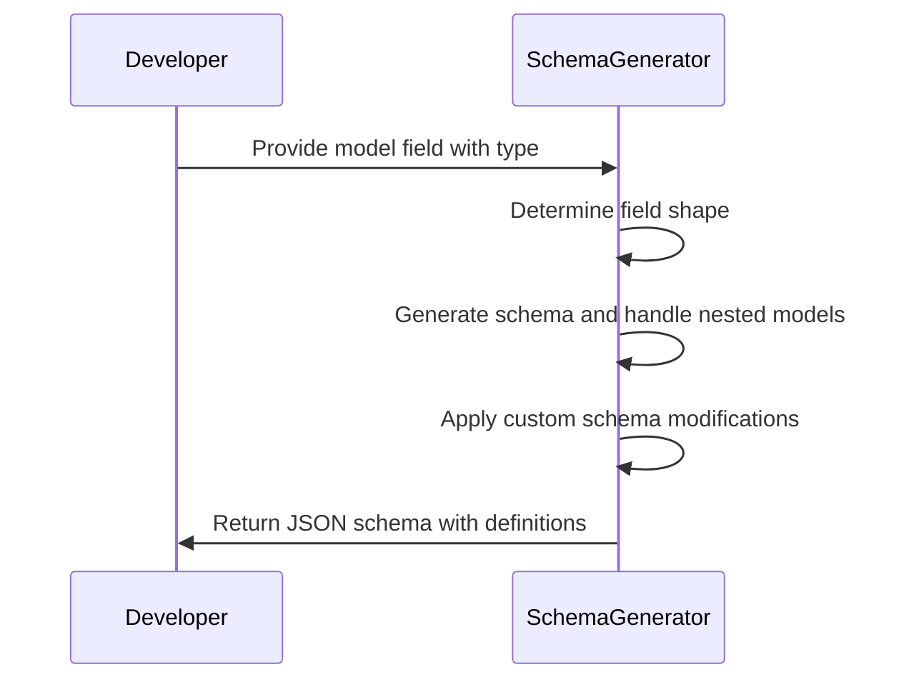
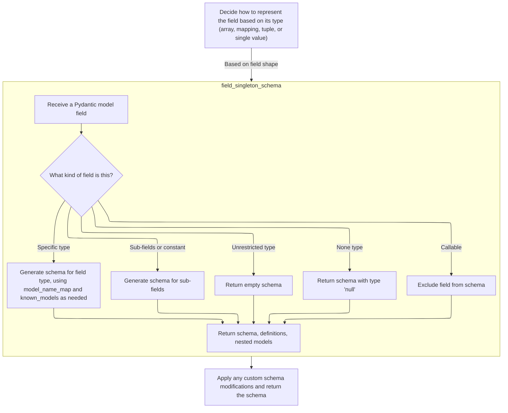
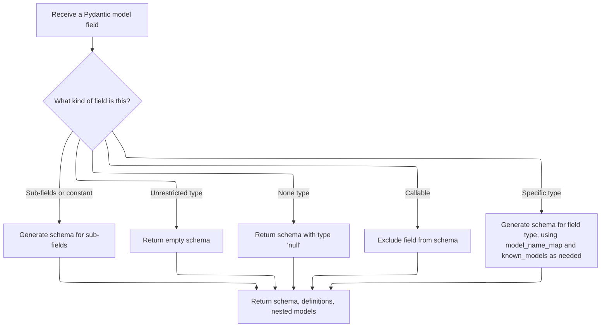
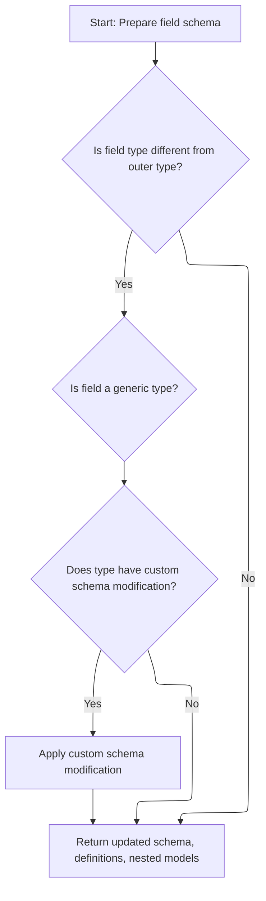

This document explains how a JSON schema is generated for a model field, covering its type, structure, and any nested models. The process involves determining the field's shape, generating the appropriate schema, handling special cases and nested models, applying custom modifications, and returning the complete schema with all necessary definitions and references.



# Spec

## Detailed View of the Program's Functionality

a. Deciding How to Represent the Field Based on Its Type

The process begins by determining the "shape" of the field, which refers to whether the field is a container (like a list, set, tuple, or mapping/dictionary), or a single value. This is crucial because the JSON Schema representation differs for each type:

- If the field is an array-like container (such as a list, tuple, set, etc.), the code prepares a schema with a type of "array". It then recursively generates the schema for the items inside the container by calling a function that handles single fields, and attaches this as the "items" property in the schema. For sets and frozensets, it also adds a <SwmToken path="pydantic/v1/schema.py" pos="474:4:4" line-data="            f_schema[&#39;uniqueItems&#39;] = True">`uniqueItems`</SwmToken> property to indicate that all items must be unique.
- If the field is a mapping (like a dictionary), the schema is set to type "object". The code checks if the keys have a regex pattern and, if so, adds a <SwmToken path="pydantic/v1/schema.py" pos="493:4:4" line-data="            f_schema[&#39;patternProperties&#39;] = {ConstrainedStr._get_pattern(regex): items_schema}">`patternProperties`</SwmToken> entry. It also generates the schema for the values and attaches it as <SwmToken path="pydantic/v1/schema.py" pos="496:4:4" line-data="            f_schema[&#39;additionalProperties&#39;] = items_schema">`additionalProperties`</SwmToken>.
- If the field is a tuple or a generic type that is not a Pydantic model, the code generates a schema for each sub-field (each element of the tuple), collects their schemas, and sets up the schema to reflect the fixed length and types of the tuple.
- If the field is a singleton (a single value) or a generic type, the code delegates to a function that handles single fields, which will further analyze the type.

b. Generating Schemas for Individual Field Types

When handling a single field (not a container), the code checks for several special cases:

- If the field has sub-fields and is not a Pydantic model (or is a constant), it recursively generates schemas for each sub-field and combines them using <SwmToken path="pydantic/v1/schema.py" pos="759:24:24" line-data="                # object. Otherwise we will end up with several allOf inside anyOf/oneOf.">`anyOf`</SwmToken> or <SwmToken path="pydantic/v1/schema.py" pos="759:26:26" line-data="                # object. Otherwise we will end up with several allOf inside anyOf/oneOf.">`oneOf`</SwmToken> in the schema, depending on whether a discriminator is present.
- If the field type is completely unrestricted (like typing.Any, object, or a <SwmToken path="pydantic/v1/schema.py" pos="861:25:25" line-data="    if field_type is Any or field_type is object or field_type.__class__ == TypeVar or get_origin(field_type) is type:">`TypeVar`</SwmToken>), it returns an empty schema, meaning there are no constraints.
- If the field type is None, it returns a schema with type "null".
- If the field type is a callable (like a function), it raises an exception to skip this field, since JSON Schema cannot represent callables.
- If the field is a Literal type (a fixed set of possible values), it checks if all values are of the same type. If not, it splits them into groups by type and creates a schema that covers all possibilities. If all values are the same type, it sets up an "enum" in the schema.
- If the field is an Enum, it creates a schema that lists all possible values and references the enum definition.
- If the field is a namedtuple, it generates a schema that represents it as an array with fixed items, each corresponding to a field in the namedtuple.
- For all other types, it tries to match the type to a known schema (like string, integer, etc.) and applies any custom schema modifications if the type provides a special method for this.

If the field is a Pydantic model or a <SwmToken path="pydantic/v1/schema.py" pos="922:5:7" line-data="    # Handle dataclass-based models">`dataclass-based`</SwmToken> model, it generates a reference to the model's schema and ensures that the model's schema is included in the definitions. If the model has already been processed (to avoid infinite recursion with circular references), it just adds a reference.

If the type is a generic with no arguments, it returns the schema as is. If the type cannot be represented in JSON Schema, it raises an error.

c. Finalizing and Modifying the Field Type Schema

After generating the schema for the field's type, the code checks if the field's type or its "outer type" (the type as declared in the model) has a custom method for modifying the schema. If so, it calls this method, allowing custom types to adjust their schema representation (for example, to add extra validation keywords or change the schema structure).

Finally, the function returns the schema for the field, along with any additional definitions (for nested models or enums) and a set of nested model names that were referenced.

d. Summary of the Flow

1. The code starts by determining the field's container shape and prepares the appropriate schema structure (array, object, tuple, or singleton).
2. For each field, it recursively generates schemas for sub-fields or nested types as needed.
3. Special cases (like Literal, Enum, None, Any, callables, namedtuples, and Pydantic models) are handled with specific logic to ensure correct JSON Schema representation.
4. After the schema is generated, any custom schema modifications provided by the type are applied.
5. The final schema, along with any referenced definitions and nested models, is returned for use in the overall model schema.

This flow ensures that Pydantic can generate accurate and comprehensive JSON Schemas for any field type, including complex nested models and custom types.

# Rule Definition

| Paragraph Name                                                                                                                                                                                                                                                                                                                                                                                                                                                                                                                                                                                                                                                                                                                                                                                                                       | Rule ID | Category          | Description                                                                                                                                                                                                                                                                                                                                                                                                                                                                                                                                                                                                                                                                                                                                                                                                                                                                                                                                                                                                                                                                                                                                                                                 | Conditions                                                                                                                                                                                                                                                                                                                                                  | Remarks                                                                                                                                                                                                                                                                                                                                                                                                                                                                                                |
| ------------------------------------------------------------------------------------------------------------------------------------------------------------------------------------------------------------------------------------------------------------------------------------------------------------------------------------------------------------------------------------------------------------------------------------------------------------------------------------------------------------------------------------------------------------------------------------------------------------------------------------------------------------------------------------------------------------------------------------------------------------------------------------------------------------------------------------ | ------- | ----------------- | ------------------------------------------------------------------------------------------------------------------------------------------------------------------------------------------------------------------------------------------------------------------------------------------------------------------------------------------------------------------------------------------------------------------------------------------------------------------------------------------------------------------------------------------------------------------------------------------------------------------------------------------------------------------------------------------------------------------------------------------------------------------------------------------------------------------------------------------------------------------------------------------------------------------------------------------------------------------------------------------------------------------------------------------------------------------------------------------------------------------------------------------------------------------------------------------- | ----------------------------------------------------------------------------------------------------------------------------------------------------------------------------------------------------------------------------------------------------------------------------------------------------------------------------------------------------------- | ------------------------------------------------------------------------------------------------------------------------------------------------------------------------------------------------------------------------------------------------------------------------------------------------------------------------------------------------------------------------------------------------------------------------------------------------------------------------------------------------------ |
| <SwmToken path="pydantic/v1/schema.py" pos="432:2:2" line-data="def field_type_schema(">`field_type_schema`</SwmToken>, <SwmToken path="pydantic/v1/schema.py" pos="462:11:11" line-data="        items_schema, f_definitions, f_nested_models = field_singleton_schema(">`field_singleton_schema`</SwmToken>                                                                                                                                                                                                                                                                                                                                                                                                                                                                                                                        | RL-001  | Conditional Logic | For fields with shape <SwmToken path="pydantic/v1/schema.py" pos="526:10:10" line-data="        assert field.shape in {SHAPE_SINGLETON, SHAPE_GENERIC}, field.shape">`SHAPE_SINGLETON`</SwmToken>, the schema must represent the base type using the appropriate JSON Schema 'type' keyword (<SwmToken path="pydantic/v1/schema.py" pos="128:4:6" line-data="      else, e.g. for OpenAPI use ``#/components/schemas/``. The resulting generated schemas will still be at the">`e.g`</SwmToken>., {'type': 'integer'} for int, {'type': 'string'} for str).                                                                                                                                                                                                                                                                                                                                                                                                                                                                                                                                                                                                                                 | The field's shape attribute is <SwmToken path="pydantic/v1/schema.py" pos="526:10:10" line-data="        assert field.shape in {SHAPE_SINGLETON, SHAPE_GENERIC}, field.shape">`SHAPE_SINGLETON`</SwmToken>.                                                                                                                                                 | The mapping from Python types to JSON Schema types is handled by <SwmToken path="pydantic/v1/schema.py" pos="774:0:0" line-data="field_class_to_schema: Tuple[Tuple[Any, Dict[str, Any]], ...] = (">`field_class_to_schema`</SwmToken>, <SwmToken path="pydantic/v1/schema.py" pos="128:4:6" line-data="      else, e.g. for OpenAPI use ``#/components/schemas/``. The resulting generated schemas will still be at the">`e.g`</SwmToken>., int → {'type': 'integer'}, str → {'type': 'string'}.      |
| <SwmToken path="pydantic/v1/schema.py" pos="432:2:2" line-data="def field_type_schema(">`field_type_schema`</SwmToken>                                                                                                                                                                                                                                                                                                                                                                                                                                                                                                                                                                                                                                                                                                               | RL-002  | Conditional Logic | For fields with shape <SwmToken path="pydantic/v1/schema.py" pos="454:1:1" line-data="        SHAPE_LIST,">`SHAPE_LIST`</SwmToken>, <SwmToken path="pydantic/v1/schema.py" pos="457:1:1" line-data="        SHAPE_SET,">`SHAPE_SET`</SwmToken>, <SwmToken path="pydantic/v1/schema.py" pos="458:1:1" line-data="        SHAPE_FROZENSET,">`SHAPE_FROZENSET`</SwmToken>, <SwmToken path="pydantic/v1/schema.py" pos="455:1:1" line-data="        SHAPE_TUPLE_ELLIPSIS,">`SHAPE_TUPLE_ELLIPSIS`</SwmToken>, <SwmToken path="pydantic/v1/schema.py" pos="456:1:1" line-data="        SHAPE_SEQUENCE,">`SHAPE_SEQUENCE`</SwmToken>, <SwmToken path="pydantic/v1/schema.py" pos="460:1:1" line-data="        SHAPE_DEQUE,">`SHAPE_DEQUE`</SwmToken>, or <SwmToken path="pydantic/v1/schema.py" pos="459:1:1" line-data="        SHAPE_ITERABLE,">`SHAPE_ITERABLE`</SwmToken>, the schema must use {'type': 'array', 'items': <item schema>} where <item schema> is the schema for the contained type. For sets and frozensets, <SwmToken path="pydantic/v1/schema.py" pos="474:4:4" line-data="            f_schema[&#39;uniqueItems&#39;] = True">`uniqueItems`</SwmToken>: True must be added. | The field's shape attribute is one of the array-like shapes listed above.                                                                                                                                                                                                                                                                                   | The 'items' key contains the schema for the element type. For sets/frozensets, <SwmToken path="pydantic/v1/schema.py" pos="474:4:4" line-data="            f_schema[&#39;uniqueItems&#39;] = True">`uniqueItems`</SwmToken>: True is added. The item schema is recursively generated.                                                                                                                                                                                                                  |
| <SwmToken path="pydantic/v1/schema.py" pos="432:2:2" line-data="def field_type_schema(">`field_type_schema`</SwmToken>                                                                                                                                                                                                                                                                                                                                                                                                                                                                                                                                                                                                                                                                                                               | RL-003  | Conditional Logic | For fields with mapping-like shapes (<SwmToken path="pydantic/v1/schema.py" pos="128:4:6" line-data="      else, e.g. for OpenAPI use ``#/components/schemas/``. The resulting generated schemas will still be at the">`e.g`</SwmToken>., SHAPE_DICT, SHAPE_MAPPING), the schema must use {'type': 'object', <SwmToken path="pydantic/v1/schema.py" pos="496:4:4" line-data="            f_schema[&#39;additionalProperties&#39;] = items_schema">`additionalProperties`</SwmToken>: <value schema>} where <value schema> is the schema for the value type.                                                                                                                                                                                                                                                                                                                                                                                                                                                                                                                                                                                                                                 | The field's shape attribute is in <SwmToken path="pydantic/v1/schema.py" pos="476:9:9" line-data="    elif field.shape in MAPPING_LIKE_SHAPES:">`MAPPING_LIKE_SHAPES`</SwmToken>.                                                                                                                                                                           | The <SwmToken path="pydantic/v1/schema.py" pos="496:4:4" line-data="            f_schema[&#39;additionalProperties&#39;] = items_schema">`additionalProperties`</SwmToken> key contains the schema for the value type. If the key type has a regex, <SwmToken path="pydantic/v1/schema.py" pos="493:4:4" line-data="            f_schema[&#39;patternProperties&#39;] = {ConstrainedStr._get_pattern(regex): items_schema}">`patternProperties`</SwmToken> is used.                                    |
| <SwmToken path="pydantic/v1/schema.py" pos="432:2:2" line-data="def field_type_schema(">`field_type_schema`</SwmToken>                                                                                                                                                                                                                                                                                                                                                                                                                                                                                                                                                                                                                                                                                                               | RL-004  | Conditional Logic | For tuple fields with fixed length (<SwmToken path="pydantic/v1/schema.py" pos="497:9:9" line-data="    elif field.shape == SHAPE_TUPLE or (field.shape == SHAPE_GENERIC and not issubclass(field.type_, BaseModel)):">`SHAPE_TUPLE`</SwmToken>), the schema must use {'type': 'array', 'items': \[<schema1>, <schema2>, ...\], <SwmToken path="pydantic/v1/schema.py" pos="520:2:2" line-data="                &#39;minItems&#39;: sub_fields_len,">`minItems`</SwmToken>: N, <SwmToken path="pydantic/v1/schema.py" pos="521:2:2" line-data="                &#39;maxItems&#39;: sub_fields_len,">`maxItems`</SwmToken>: N} where N is the tuple length.                                                                                                                                                                                                                                                                                                                                                                                                                                                                                                                                  | The field's shape attribute is <SwmToken path="pydantic/v1/schema.py" pos="497:9:9" line-data="    elif field.shape == SHAPE_TUPLE or (field.shape == SHAPE_GENERIC and not issubclass(field.type_, BaseModel)):">`SHAPE_TUPLE`</SwmToken>.                                                                                                                 | 'items' is a list of schemas for each tuple element. <SwmToken path="pydantic/v1/schema.py" pos="520:2:2" line-data="                &#39;minItems&#39;: sub_fields_len,">`minItems`</SwmToken> and <SwmToken path="pydantic/v1/schema.py" pos="521:2:2" line-data="                &#39;maxItems&#39;: sub_fields_len,">`maxItems`</SwmToken> are set to the tuple length.                                                                                                                            |
| <SwmToken path="pydantic/v1/schema.py" pos="432:2:2" line-data="def field_type_schema(">`field_type_schema`</SwmToken>                                                                                                                                                                                                                                                                                                                                                                                                                                                                                                                                                                                                                                                                                                               | RL-005  | Conditional Logic | For tuple fields with variable length (<SwmToken path="pydantic/v1/schema.py" pos="455:1:1" line-data="        SHAPE_TUPLE_ELLIPSIS,">`SHAPE_TUPLE_ELLIPSIS`</SwmToken>), the schema must use {'type': 'array', 'items': <item schema>} where <item schema> is the schema for the repeated element type.                                                                                                                                                                                                                                                                                                                                                                                                                                                                                                                                                                                                                                                                                                                                                                                                                                                                                    | The field's shape attribute is <SwmToken path="pydantic/v1/schema.py" pos="455:1:1" line-data="        SHAPE_TUPLE_ELLIPSIS,">`SHAPE_TUPLE_ELLIPSIS`</SwmToken>.                                                                                                                                                                                            | 'items' is a single schema for the repeated element type.                                                                                                                                                                                                                                                                                                                                                                                                                                              |
| <SwmToken path="pydantic/v1/schema.py" pos="852:3:3" line-data="        return field_singleton_sub_fields_schema(">`field_singleton_sub_fields_schema`</SwmToken>                                                                                                                                                                                                                                                                                                                                                                                                                                                                                                                                                                                                                                                                    | RL-006  | Conditional Logic | For fields with <SwmToken path="pydantic/v1/schema.py" pos="499:1:1" line-data="        sub_fields = cast(List[ModelField], field.sub_fields)">`sub_fields`</SwmToken> (such as Unions, Optionals, or Literals), the schema must use <SwmToken path="pydantic/v1/schema.py" pos="759:24:24" line-data="                # object. Otherwise we will end up with several allOf inside anyOf/oneOf.">`anyOf`</SwmToken>, <SwmToken path="pydantic/v1/schema.py" pos="759:26:26" line-data="                # object. Otherwise we will end up with several allOf inside anyOf/oneOf.">`oneOf`</SwmToken>, or enum as appropriate to represent all possible types or values.                                                                                                                                                                                                                                                                                                                                                                                                                                                                                                                    | The field has <SwmToken path="pydantic/v1/schema.py" pos="499:1:1" line-data="        sub_fields = cast(List[ModelField], field.sub_fields)">`sub_fields`</SwmToken> and is not a <SwmToken path="pydantic/v1/schema.py" pos="448:11:11" line-data="    from pydantic.v1.main import BaseModel  # noqa: F811">`BaseModel`</SwmToken> or is a const.         | If the field is a discriminated union, 'discriminator' and 'mapping' are included. For Literal, 'enum' is used. For Union, <SwmToken path="pydantic/v1/schema.py" pos="759:24:24" line-data="                # object. Otherwise we will end up with several allOf inside anyOf/oneOf.">`anyOf`</SwmToken> or <SwmToken path="pydantic/v1/schema.py" pos="759:26:26" line-data="                # object. Otherwise we will end up with several allOf inside anyOf/oneOf.">`oneOf`</SwmToken> is used. |
| <SwmToken path="pydantic/v1/schema.py" pos="462:11:11" line-data="        items_schema, f_definitions, f_nested_models = field_singleton_schema(">`field_singleton_schema`</SwmToken>, <SwmToken path="pydantic/v1/schema.py" pos="894:9:9" line-data="        sub_schema, *_ = model_process_schema(">`model_process_schema`</SwmToken>, <SwmToken path="pydantic/v1/schema.py" pos="581:11:11" line-data="    m_schema, m_definitions, nested_models = model_type_schema(">`model_type_schema`</SwmToken>                                                                                                                                                                                                                                                                                                                          | RL-007  | Conditional Logic | For fields representing a nested model (<SwmToken path="pydantic/v1/schema.py" pos="448:11:11" line-data="    from pydantic.v1.main import BaseModel  # noqa: F811">`BaseModel`</SwmToken> subclass), the schema must use {'$ref': '#/definitions/<ModelName>'} and include the model's schema in the definitions section. If the model is already processed, only the reference is included.                                                                                                                                                                                                                                                                                                                                                                                                                                                                                                                                                                                                                                                                                                                                                                                               | The field's type is a subclass of <SwmToken path="pydantic/v1/schema.py" pos="448:11:11" line-data="    from pydantic.v1.main import BaseModel  # noqa: F811">`BaseModel`</SwmToken>.                                                                                                                                                                       | References use the <SwmToken path="pydantic/v1/schema.py" pos="436:1:1" line-data="    model_name_map: Dict[TypeModelOrEnum, str],">`model_name_map`</SwmToken> to get the schema name. The referenced model's schema is included in the definitions dict unless already processed.                                                                                                                                                                                                                    |
| <SwmToken path="pydantic/v1/schema.py" pos="462:11:11" line-data="        items_schema, f_definitions, f_nested_models = field_singleton_schema(">`field_singleton_schema`</SwmToken>, <SwmToken path="pydantic/v1/schema.py" pos="892:8:8" line-data="        definitions[enum_name] = enum_process_schema(field_type, field=field)">`enum_process_schema`</SwmToken>                                                                                                                                                                                                                                                                                                                                                                                                                                                               | RL-008  | Conditional Logic | For fields representing an Enum, the schema must use {'enum': \[<values>\], 'type': <base type>} and include the Enum in the definitions section if referenced.                                                                                                                                                                                                                                                                                                                                                                                                                                                                                                                                                                                                                                                                                                                                                                                                                                                                                                                                                                                                                             | The field's type is a subclass of Enum.                                                                                                                                                                                                                                                                                                                     | 'enum' is a list of possible values. 'type' is the base type of the enum values. The enum schema is included in definitions if referenced.                                                                                                                                                                                                                                                                                                                                                             |
| <SwmToken path="pydantic/v1/schema.py" pos="852:3:3" line-data="        return field_singleton_sub_fields_schema(">`field_singleton_sub_fields_schema`</SwmToken>                                                                                                                                                                                                                                                                                                                                                                                                                                                                                                                                                                                                                                                                    | RL-009  | Conditional Logic | For fields with a <SwmToken path="pydantic/v1/schema.py" pos="713:10:10" line-data="        field_has_discriminator: bool = field.discriminator_key is not None">`discriminator_key`</SwmToken> (discriminated unions), the schema must include a discriminator object with <SwmToken path="pydantic/v1/schema.py" pos="741:2:2" line-data="                &#39;propertyName&#39;: field.discriminator_alias if by_alias else field.discriminator_key,">`propertyName`</SwmToken> set to the discriminator key and a mapping from discriminator values to model references, and use <SwmToken path="pydantic/v1/schema.py" pos="759:26:26" line-data="                # object. Otherwise we will end up with several allOf inside anyOf/oneOf.">`oneOf`</SwmToken> to list the possible model schemas.                                                                                                                                                                                                                                                                                                                                                                                    | The field has a <SwmToken path="pydantic/v1/schema.py" pos="713:10:10" line-data="        field_has_discriminator: bool = field.discriminator_key is not None">`discriminator_key`</SwmToken> and <SwmToken path="pydantic/v1/schema.py" pos="715:5:5" line-data="            assert field.sub_fields_mapping is not None">`sub_fields_mapping`</SwmToken>. | 'discriminator' contains <SwmToken path="pydantic/v1/schema.py" pos="741:2:2" line-data="                &#39;propertyName&#39;: field.discriminator_alias if by_alias else field.discriminator_key,">`propertyName`</SwmToken> and 'mapping'. <SwmToken path="pydantic/v1/schema.py" pos="759:26:26" line-data="                # object. Otherwise we will end up with several allOf inside anyOf/oneOf.">`oneOf`</SwmToken> lists the possible model schemas. Mapping values are $ref strings.      |
| <SwmToken path="pydantic/v1/schema.py" pos="250:5:5" line-data="    validation_schema = get_field_schema_validations(field)">`get_field_schema_validations`</SwmToken>, <SwmToken path="pydantic/v1/schema.py" pos="432:2:2" line-data="def field_type_schema(">`field_type_schema`</SwmToken>, <SwmToken path="pydantic/v1/schema.py" pos="462:11:11" line-data="        items_schema, f_definitions, f_nested_models = field_singleton_schema(">`field_singleton_schema`</SwmToken>, <SwmToken path="pydantic/v1/schema.py" pos="892:8:8" line-data="        definitions[enum_name] = enum_process_schema(field_type, field=field)">`enum_process_schema`</SwmToken>                                                                                                                                                               | RL-010  | Conditional Logic | For custom types or types with a <SwmToken path="pydantic/v1/schema.py" pos="545:1:1" line-data="        modify_schema = getattr(field_type, &#39;__modify_schema__&#39;, None)">`modify_schema`</SwmToken> method, the schema must be passed to this method (along with the field if required) to allow the type to modify the schema before it is returned.                                                                                                                                                                                                                                                                                                                                                                                                                                                                                                                                                                                                                                                                                                                                                                                                                               | The field's type or <SwmToken path="pydantic/v1/schema.py" pos="540:11:11" line-data="    if field.type_ != field.outer_type_:">`outer_type_`</SwmToken> has a <SwmToken path="pydantic/v1/schema.py" pos="545:1:1" line-data="        modify_schema = getattr(field_type, &#39;__modify_schema__&#39;, None)">`modify_schema`</SwmToken> method.           | The <SwmToken path="pydantic/v1/schema.py" pos="545:1:1" line-data="        modify_schema = getattr(field_type, &#39;__modify_schema__&#39;, None)">`modify_schema`</SwmToken> method can modify the schema dict in place. It may receive the field as a keyword argument if required.                                                                                                                                                                                                                 |
| <SwmToken path="pydantic/v1/schema.py" pos="139:5:5" line-data="    model_name_map = get_model_name_map(flat_models)">`get_model_name_map`</SwmToken>, <SwmToken path="pydantic/v1/schema.py" pos="462:11:11" line-data="        items_schema, f_definitions, f_nested_models = field_singleton_schema(">`field_singleton_schema`</SwmToken>, <SwmToken path="pydantic/v1/schema.py" pos="894:9:9" line-data="        sub_schema, *_ = model_process_schema(">`model_process_schema`</SwmToken>                                                                                                                                                                                                                                                                                                                                      | RL-011  | Data Assignment   | The system must maintain a <SwmToken path="pydantic/v1/schema.py" pos="436:1:1" line-data="    model_name_map: Dict[TypeModelOrEnum, str],">`model_name_map`</SwmToken> (mapping model/enum classes to unique schema names) and a <SwmToken path="pydantic/v1/schema.py" pos="440:1:1" line-data="    known_models: TypeModelSet,">`known_models`</SwmToken> set (tracking processed models/enums) to avoid recursion and ensure correct $ref generation.                                                                                                                                                                                                                                                                                                                                                                                                                                                                                                                                                                                                                                                                                                                                   | Any time a model or enum is referenced or processed for schema generation.                                                                                                                                                                                                                                                                                  | <SwmToken path="pydantic/v1/schema.py" pos="436:1:1" line-data="    model_name_map: Dict[TypeModelOrEnum, str],">`model_name_map`</SwmToken> is a dict from class to string name. <SwmToken path="pydantic/v1/schema.py" pos="440:1:1" line-data="    known_models: TypeModelSet,">`known_models`</SwmToken> is a set of processed classes. Used to avoid infinite recursion and duplicate definitions.                                                                                                |
| <SwmToken path="pydantic/v1/schema.py" pos="443:6:6" line-data="    Used by ``field_schema()``, you probably should be using that function.">`field_schema`</SwmToken>                                                                                                                                                                                                                                                                                                                                                                                                                                                                                                                                                                                                                                                               | RL-012  | Data Assignment   | The output of the schema generation process must be a tuple containing: the schema for the field (dict), a dictionary of additional schema definitions (dict), and a set of nested model names (set of strings).                                                                                                                                                                                                                                                                                                                                                                                                                                                                                                                                                                                                                                                                                                                                                                                                                                                                                                                                                                            | Every call to <SwmToken path="pydantic/v1/schema.py" pos="443:6:6" line-data="    Used by ``field_schema()``, you probably should be using that function.">`field_schema`</SwmToken> returns its result.                                                                                                                                                    | Output is (schema: dict, definitions: dict, <SwmToken path="pydantic/v1/schema.py" pos="451:1:1" line-data="    nested_models: Set[str] = set()">`nested_models`</SwmToken>: set of strings).                                                                                                                                                                                                                                                                                                          |
| <SwmToken path="pydantic/v1/schema.py" pos="432:2:2" line-data="def field_type_schema(">`field_type_schema`</SwmToken>, <SwmToken path="pydantic/v1/schema.py" pos="462:11:11" line-data="        items_schema, f_definitions, f_nested_models = field_singleton_schema(">`field_singleton_schema`</SwmToken>, <SwmToken path="pydantic/v1/schema.py" pos="581:11:11" line-data="    m_schema, m_definitions, nested_models = model_type_schema(">`model_type_schema`</SwmToken>, <SwmToken path="pydantic/v1/schema.py" pos="892:8:8" line-data="        definitions[enum_name] = enum_process_schema(field_type, field=field)">`enum_process_schema`</SwmToken>, <SwmToken path="pydantic/v1/schema.py" pos="852:3:3" line-data="        return field_singleton_sub_fields_schema(">`field_singleton_sub_fields_schema`</SwmToken> | RL-013  | Data Assignment   | The output schema must use the following JSON Schema constructs as appropriate: type, items, properties, <SwmToken path="pydantic/v1/schema.py" pos="496:4:4" line-data="            f_schema[&#39;additionalProperties&#39;] = items_schema">`additionalProperties`</SwmToken>, enum, <SwmToken path="pydantic/v1/schema.py" pos="516:7:7" line-data="            f_schema = {&#39;allOf&#39;: [all_of_schemas]}">`allOf`</SwmToken>, <SwmToken path="pydantic/v1/schema.py" pos="759:24:24" line-data="                # object. Otherwise we will end up with several allOf inside anyOf/oneOf.">`anyOf`</SwmToken>, <SwmToken path="pydantic/v1/schema.py" pos="759:26:26" line-data="                # object. Otherwise we will end up with several allOf inside anyOf/oneOf.">`oneOf`</SwmToken>, required, default, description, title, $ref, definitions, discriminator, and mapping.                                                                                                                                                                                                                                                                                              | Schema generation for any field or model.                                                                                                                                                                                                                                                                                                                   | Each construct is used according to the field shape/type and the rules above. Output matches JSON Schema draft 7.                                                                                                                                                                                                                                                                                                                                                                                      |

# User Stories

## User Story 1: Generate JSON Schema for standard Python and container types

---

### Story Description:

As a user of the schema generation system, I want to generate JSON Schema representations for standard Python types and container types (including lists, sets, tuples, mappings, etc.) so that I can validate and document my data models accurately.

---

### Business Rule Mapping:

| Rule ID | Paragraph Name                                                                                                                                                                                                                                                                                                                                                                                                                                                                                                                                                                                                                                                                                                                                                                                                                       | Rule Description                                                                                                                                                                                                                                                                                                                                                                                                                                                                                                                                                                                                                                                                                                                                                                                                                                                                                                                                                                                                                                                                                                                                                                            |
| ------- | ------------------------------------------------------------------------------------------------------------------------------------------------------------------------------------------------------------------------------------------------------------------------------------------------------------------------------------------------------------------------------------------------------------------------------------------------------------------------------------------------------------------------------------------------------------------------------------------------------------------------------------------------------------------------------------------------------------------------------------------------------------------------------------------------------------------------------------ | ------------------------------------------------------------------------------------------------------------------------------------------------------------------------------------------------------------------------------------------------------------------------------------------------------------------------------------------------------------------------------------------------------------------------------------------------------------------------------------------------------------------------------------------------------------------------------------------------------------------------------------------------------------------------------------------------------------------------------------------------------------------------------------------------------------------------------------------------------------------------------------------------------------------------------------------------------------------------------------------------------------------------------------------------------------------------------------------------------------------------------------------------------------------------------------------- |
| RL-001  | <SwmToken path="pydantic/v1/schema.py" pos="432:2:2" line-data="def field_type_schema(">`field_type_schema`</SwmToken>, <SwmToken path="pydantic/v1/schema.py" pos="462:11:11" line-data="        items_schema, f_definitions, f_nested_models = field_singleton_schema(">`field_singleton_schema`</SwmToken>                                                                                                                                                                                                                                                                                                                                                                                                                                                                                                                        | For fields with shape <SwmToken path="pydantic/v1/schema.py" pos="526:10:10" line-data="        assert field.shape in {SHAPE_SINGLETON, SHAPE_GENERIC}, field.shape">`SHAPE_SINGLETON`</SwmToken>, the schema must represent the base type using the appropriate JSON Schema 'type' keyword (<SwmToken path="pydantic/v1/schema.py" pos="128:4:6" line-data="      else, e.g. for OpenAPI use ``#/components/schemas/``. The resulting generated schemas will still be at the">`e.g`</SwmToken>., {'type': 'integer'} for int, {'type': 'string'} for str).                                                                                                                                                                                                                                                                                                                                                                                                                                                                                                                                                                                                                                 |
| RL-002  | <SwmToken path="pydantic/v1/schema.py" pos="432:2:2" line-data="def field_type_schema(">`field_type_schema`</SwmToken>                                                                                                                                                                                                                                                                                                                                                                                                                                                                                                                                                                                                                                                                                                               | For fields with shape <SwmToken path="pydantic/v1/schema.py" pos="454:1:1" line-data="        SHAPE_LIST,">`SHAPE_LIST`</SwmToken>, <SwmToken path="pydantic/v1/schema.py" pos="457:1:1" line-data="        SHAPE_SET,">`SHAPE_SET`</SwmToken>, <SwmToken path="pydantic/v1/schema.py" pos="458:1:1" line-data="        SHAPE_FROZENSET,">`SHAPE_FROZENSET`</SwmToken>, <SwmToken path="pydantic/v1/schema.py" pos="455:1:1" line-data="        SHAPE_TUPLE_ELLIPSIS,">`SHAPE_TUPLE_ELLIPSIS`</SwmToken>, <SwmToken path="pydantic/v1/schema.py" pos="456:1:1" line-data="        SHAPE_SEQUENCE,">`SHAPE_SEQUENCE`</SwmToken>, <SwmToken path="pydantic/v1/schema.py" pos="460:1:1" line-data="        SHAPE_DEQUE,">`SHAPE_DEQUE`</SwmToken>, or <SwmToken path="pydantic/v1/schema.py" pos="459:1:1" line-data="        SHAPE_ITERABLE,">`SHAPE_ITERABLE`</SwmToken>, the schema must use {'type': 'array', 'items': <item schema>} where <item schema> is the schema for the contained type. For sets and frozensets, <SwmToken path="pydantic/v1/schema.py" pos="474:4:4" line-data="            f_schema[&#39;uniqueItems&#39;] = True">`uniqueItems`</SwmToken>: True must be added. |
| RL-003  | <SwmToken path="pydantic/v1/schema.py" pos="432:2:2" line-data="def field_type_schema(">`field_type_schema`</SwmToken>                                                                                                                                                                                                                                                                                                                                                                                                                                                                                                                                                                                                                                                                                                               | For fields with mapping-like shapes (<SwmToken path="pydantic/v1/schema.py" pos="128:4:6" line-data="      else, e.g. for OpenAPI use ``#/components/schemas/``. The resulting generated schemas will still be at the">`e.g`</SwmToken>., SHAPE_DICT, SHAPE_MAPPING), the schema must use {'type': 'object', <SwmToken path="pydantic/v1/schema.py" pos="496:4:4" line-data="            f_schema[&#39;additionalProperties&#39;] = items_schema">`additionalProperties`</SwmToken>: <value schema>} where <value schema> is the schema for the value type.                                                                                                                                                                                                                                                                                                                                                                                                                                                                                                                                                                                                                                 |
| RL-004  | <SwmToken path="pydantic/v1/schema.py" pos="432:2:2" line-data="def field_type_schema(">`field_type_schema`</SwmToken>                                                                                                                                                                                                                                                                                                                                                                                                                                                                                                                                                                                                                                                                                                               | For tuple fields with fixed length (<SwmToken path="pydantic/v1/schema.py" pos="497:9:9" line-data="    elif field.shape == SHAPE_TUPLE or (field.shape == SHAPE_GENERIC and not issubclass(field.type_, BaseModel)):">`SHAPE_TUPLE`</SwmToken>), the schema must use {'type': 'array', 'items': \[<schema1>, <schema2>, ...\], <SwmToken path="pydantic/v1/schema.py" pos="520:2:2" line-data="                &#39;minItems&#39;: sub_fields_len,">`minItems`</SwmToken>: N, <SwmToken path="pydantic/v1/schema.py" pos="521:2:2" line-data="                &#39;maxItems&#39;: sub_fields_len,">`maxItems`</SwmToken>: N} where N is the tuple length.                                                                                                                                                                                                                                                                                                                                                                                                                                                                                                                                  |
| RL-005  | <SwmToken path="pydantic/v1/schema.py" pos="432:2:2" line-data="def field_type_schema(">`field_type_schema`</SwmToken>                                                                                                                                                                                                                                                                                                                                                                                                                                                                                                                                                                                                                                                                                                               | For tuple fields with variable length (<SwmToken path="pydantic/v1/schema.py" pos="455:1:1" line-data="        SHAPE_TUPLE_ELLIPSIS,">`SHAPE_TUPLE_ELLIPSIS`</SwmToken>), the schema must use {'type': 'array', 'items': <item schema>} where <item schema> is the schema for the repeated element type.                                                                                                                                                                                                                                                                                                                                                                                                                                                                                                                                                                                                                                                                                                                                                                                                                                                                                    |
| RL-013  | <SwmToken path="pydantic/v1/schema.py" pos="432:2:2" line-data="def field_type_schema(">`field_type_schema`</SwmToken>, <SwmToken path="pydantic/v1/schema.py" pos="462:11:11" line-data="        items_schema, f_definitions, f_nested_models = field_singleton_schema(">`field_singleton_schema`</SwmToken>, <SwmToken path="pydantic/v1/schema.py" pos="581:11:11" line-data="    m_schema, m_definitions, nested_models = model_type_schema(">`model_type_schema`</SwmToken>, <SwmToken path="pydantic/v1/schema.py" pos="892:8:8" line-data="        definitions[enum_name] = enum_process_schema(field_type, field=field)">`enum_process_schema`</SwmToken>, <SwmToken path="pydantic/v1/schema.py" pos="852:3:3" line-data="        return field_singleton_sub_fields_schema(">`field_singleton_sub_fields_schema`</SwmToken> | The output schema must use the following JSON Schema constructs as appropriate: type, items, properties, <SwmToken path="pydantic/v1/schema.py" pos="496:4:4" line-data="            f_schema[&#39;additionalProperties&#39;] = items_schema">`additionalProperties`</SwmToken>, enum, <SwmToken path="pydantic/v1/schema.py" pos="516:7:7" line-data="            f_schema = {&#39;allOf&#39;: [all_of_schemas]}">`allOf`</SwmToken>, <SwmToken path="pydantic/v1/schema.py" pos="759:24:24" line-data="                # object. Otherwise we will end up with several allOf inside anyOf/oneOf.">`anyOf`</SwmToken>, <SwmToken path="pydantic/v1/schema.py" pos="759:26:26" line-data="                # object. Otherwise we will end up with several allOf inside anyOf/oneOf.">`oneOf`</SwmToken>, required, default, description, title, $ref, definitions, discriminator, and mapping.                                                                                                                                                                                                                                                                                              |

---

### Relevant Functionality:

- <SwmToken path="pydantic/v1/schema.py" pos="432:2:2" line-data="def field_type_schema(">`field_type_schema`</SwmToken>
  1. **RL-001:**
     - If <SwmToken path="pydantic/v1/schema.py" pos="453:3:5" line-data="    if field.shape in {">`field.shape`</SwmToken> == <SwmToken path="pydantic/v1/schema.py" pos="526:10:10" line-data="        assert field.shape in {SHAPE_SINGLETON, SHAPE_GENERIC}, field.shape">`SHAPE_SINGLETON`</SwmToken>:
       - Determine the base type of the field.
       - Map the Python type to the corresponding JSON Schema type using a lookup table.
       - Return a schema dict with the 'type' key set appropriately.
  2. **RL-002:**
     - If <SwmToken path="pydantic/v1/schema.py" pos="453:3:5" line-data="    if field.shape in {">`field.shape`</SwmToken> in array-like shapes:
       - Recursively generate the schema for the contained type.
       - Set 'type': 'array', 'items': <item schema>.
       - If shape is set/frozenset, add <SwmToken path="pydantic/v1/schema.py" pos="474:4:4" line-data="            f_schema[&#39;uniqueItems&#39;] = True">`uniqueItems`</SwmToken>: True.
  3. **RL-003:**
     - If <SwmToken path="pydantic/v1/schema.py" pos="453:3:5" line-data="    if field.shape in {">`field.shape`</SwmToken> in mapping-like shapes:
       - Recursively generate the schema for the value type.
       - Set 'type': 'object', <SwmToken path="pydantic/v1/schema.py" pos="496:4:4" line-data="            f_schema[&#39;additionalProperties&#39;] = items_schema">`additionalProperties`</SwmToken>: <value schema>.
       - If key type has regex, use <SwmToken path="pydantic/v1/schema.py" pos="493:4:4" line-data="            f_schema[&#39;patternProperties&#39;] = {ConstrainedStr._get_pattern(regex): items_schema}">`patternProperties`</SwmToken>.
  4. **RL-004:**
     - If <SwmToken path="pydantic/v1/schema.py" pos="453:3:5" line-data="    if field.shape in {">`field.shape`</SwmToken> == <SwmToken path="pydantic/v1/schema.py" pos="497:9:9" line-data="    elif field.shape == SHAPE_TUPLE or (field.shape == SHAPE_GENERIC and not issubclass(field.type_, BaseModel)):">`SHAPE_TUPLE`</SwmToken>:
       - For each <SwmToken path="pydantic/v1/schema.py" pos="719:6:6" line-data="            for discriminator_value, sub_field in field.sub_fields_mapping.items():">`sub_field`</SwmToken>, generate its schema.
       - Set 'type': 'array', 'items': \[schemas...\], <SwmToken path="pydantic/v1/schema.py" pos="520:2:2" line-data="                &#39;minItems&#39;: sub_fields_len,">`minItems`</SwmToken>: N, <SwmToken path="pydantic/v1/schema.py" pos="521:2:2" line-data="                &#39;maxItems&#39;: sub_fields_len,">`maxItems`</SwmToken>: N.
  5. **RL-005:**
     - If <SwmToken path="pydantic/v1/schema.py" pos="453:3:5" line-data="    if field.shape in {">`field.shape`</SwmToken> == <SwmToken path="pydantic/v1/schema.py" pos="455:1:1" line-data="        SHAPE_TUPLE_ELLIPSIS,">`SHAPE_TUPLE_ELLIPSIS`</SwmToken>:
       - Generate the schema for the repeated element type.
       - Set 'type': 'array', 'items': <item schema>.
  6. **RL-013:**
     - When generating schema for a field/model:
       - Use the appropriate JSON Schema keywords based on the field's type and shape.
       - Ensure output matches the expected JSON Schema structure.

## User Story 2: Support complex and nested types in schema generation

---

### Story Description:

As a user of the schema generation system, I want to generate JSON Schema for fields that use unions, literals, discriminated unions, nested models, and enums so that I can represent complex and nested data structures in my schemas.

---

### Business Rule Mapping:

| Rule ID | Paragraph Name                                                                                                                                                                                                                                                                                                                                                                                                                                                                                                                                                                                                                                                                                                                                                                                                                       | Rule Description                                                                                                                                                                                                                                                                                                                                                                                                                                                                                                                                                                                                                                                                                                                                                                                                                                                                               |
| ------- | ------------------------------------------------------------------------------------------------------------------------------------------------------------------------------------------------------------------------------------------------------------------------------------------------------------------------------------------------------------------------------------------------------------------------------------------------------------------------------------------------------------------------------------------------------------------------------------------------------------------------------------------------------------------------------------------------------------------------------------------------------------------------------------------------------------------------------------ | ---------------------------------------------------------------------------------------------------------------------------------------------------------------------------------------------------------------------------------------------------------------------------------------------------------------------------------------------------------------------------------------------------------------------------------------------------------------------------------------------------------------------------------------------------------------------------------------------------------------------------------------------------------------------------------------------------------------------------------------------------------------------------------------------------------------------------------------------------------------------------------------------- |
| RL-013  | <SwmToken path="pydantic/v1/schema.py" pos="432:2:2" line-data="def field_type_schema(">`field_type_schema`</SwmToken>, <SwmToken path="pydantic/v1/schema.py" pos="462:11:11" line-data="        items_schema, f_definitions, f_nested_models = field_singleton_schema(">`field_singleton_schema`</SwmToken>, <SwmToken path="pydantic/v1/schema.py" pos="581:11:11" line-data="    m_schema, m_definitions, nested_models = model_type_schema(">`model_type_schema`</SwmToken>, <SwmToken path="pydantic/v1/schema.py" pos="892:8:8" line-data="        definitions[enum_name] = enum_process_schema(field_type, field=field)">`enum_process_schema`</SwmToken>, <SwmToken path="pydantic/v1/schema.py" pos="852:3:3" line-data="        return field_singleton_sub_fields_schema(">`field_singleton_sub_fields_schema`</SwmToken> | The output schema must use the following JSON Schema constructs as appropriate: type, items, properties, <SwmToken path="pydantic/v1/schema.py" pos="496:4:4" line-data="            f_schema[&#39;additionalProperties&#39;] = items_schema">`additionalProperties`</SwmToken>, enum, <SwmToken path="pydantic/v1/schema.py" pos="516:7:7" line-data="            f_schema = {&#39;allOf&#39;: [all_of_schemas]}">`allOf`</SwmToken>, <SwmToken path="pydantic/v1/schema.py" pos="759:24:24" line-data="                # object. Otherwise we will end up with several allOf inside anyOf/oneOf.">`anyOf`</SwmToken>, <SwmToken path="pydantic/v1/schema.py" pos="759:26:26" line-data="                # object. Otherwise we will end up with several allOf inside anyOf/oneOf.">`oneOf`</SwmToken>, required, default, description, title, $ref, definitions, discriminator, and mapping. |
| RL-007  | <SwmToken path="pydantic/v1/schema.py" pos="462:11:11" line-data="        items_schema, f_definitions, f_nested_models = field_singleton_schema(">`field_singleton_schema`</SwmToken>, <SwmToken path="pydantic/v1/schema.py" pos="894:9:9" line-data="        sub_schema, *_ = model_process_schema(">`model_process_schema`</SwmToken>, <SwmToken path="pydantic/v1/schema.py" pos="581:11:11" line-data="    m_schema, m_definitions, nested_models = model_type_schema(">`model_type_schema`</SwmToken>                                                                                                                                                                                                                                                                                                                          | For fields representing a nested model (<SwmToken path="pydantic/v1/schema.py" pos="448:11:11" line-data="    from pydantic.v1.main import BaseModel  # noqa: F811">`BaseModel`</SwmToken> subclass), the schema must use {'$ref': '#/definitions/<ModelName>'} and include the model's schema in the definitions section. If the model is already processed, only the reference is included.                                                                                                                                                                                                                                                                                                                                                                                                                                                                                                  |
| RL-008  | <SwmToken path="pydantic/v1/schema.py" pos="462:11:11" line-data="        items_schema, f_definitions, f_nested_models = field_singleton_schema(">`field_singleton_schema`</SwmToken>, <SwmToken path="pydantic/v1/schema.py" pos="892:8:8" line-data="        definitions[enum_name] = enum_process_schema(field_type, field=field)">`enum_process_schema`</SwmToken>                                                                                                                                                                                                                                                                                                                                                                                                                                                               | For fields representing an Enum, the schema must use {'enum': \[<values>\], 'type': <base type>} and include the Enum in the definitions section if referenced.                                                                                                                                                                                                                                                                                                                                                                                                                                                                                                                                                                                                                                                                                                                                |
| RL-006  | <SwmToken path="pydantic/v1/schema.py" pos="852:3:3" line-data="        return field_singleton_sub_fields_schema(">`field_singleton_sub_fields_schema`</SwmToken>                                                                                                                                                                                                                                                                                                                                                                                                                                                                                                                                                                                                                                                                    | For fields with <SwmToken path="pydantic/v1/schema.py" pos="499:1:1" line-data="        sub_fields = cast(List[ModelField], field.sub_fields)">`sub_fields`</SwmToken> (such as Unions, Optionals, or Literals), the schema must use <SwmToken path="pydantic/v1/schema.py" pos="759:24:24" line-data="                # object. Otherwise we will end up with several allOf inside anyOf/oneOf.">`anyOf`</SwmToken>, <SwmToken path="pydantic/v1/schema.py" pos="759:26:26" line-data="                # object. Otherwise we will end up with several allOf inside anyOf/oneOf.">`oneOf`</SwmToken>, or enum as appropriate to represent all possible types or values.                                                                                                                                                                                                                       |
| RL-009  | <SwmToken path="pydantic/v1/schema.py" pos="852:3:3" line-data="        return field_singleton_sub_fields_schema(">`field_singleton_sub_fields_schema`</SwmToken>                                                                                                                                                                                                                                                                                                                                                                                                                                                                                                                                                                                                                                                                    | For fields with a <SwmToken path="pydantic/v1/schema.py" pos="713:10:10" line-data="        field_has_discriminator: bool = field.discriminator_key is not None">`discriminator_key`</SwmToken> (discriminated unions), the schema must include a discriminator object with <SwmToken path="pydantic/v1/schema.py" pos="741:2:2" line-data="                &#39;propertyName&#39;: field.discriminator_alias if by_alias else field.discriminator_key,">`propertyName`</SwmToken> set to the discriminator key and a mapping from discriminator values to model references, and use <SwmToken path="pydantic/v1/schema.py" pos="759:26:26" line-data="                # object. Otherwise we will end up with several allOf inside anyOf/oneOf.">`oneOf`</SwmToken> to list the possible model schemas.                                                                                       |

---

### Relevant Functionality:

- <SwmToken path="pydantic/v1/schema.py" pos="432:2:2" line-data="def field_type_schema(">`field_type_schema`</SwmToken>
  1. **RL-013:**
     - When generating schema for a field/model:
       - Use the appropriate JSON Schema keywords based on the field's type and shape.
       - Ensure output matches the expected JSON Schema structure.
- <SwmToken path="pydantic/v1/schema.py" pos="462:11:11" line-data="        items_schema, f_definitions, f_nested_models = field_singleton_schema(">`field_singleton_schema`</SwmToken>
  1. **RL-007:**
     - If field type is <SwmToken path="pydantic/v1/schema.py" pos="448:11:11" line-data="    from pydantic.v1.main import BaseModel  # noqa: F811">`BaseModel`</SwmToken>:
       - Get model name from <SwmToken path="pydantic/v1/schema.py" pos="436:1:1" line-data="    model_name_map: Dict[TypeModelOrEnum, str],">`model_name_map`</SwmToken>.
       - If not already processed, generate schema and add to definitions.
       - Return {'$ref': ...} referencing the model.
  2. **RL-008:**
     - If field type is Enum:
       - Get enum name from <SwmToken path="pydantic/v1/schema.py" pos="436:1:1" line-data="    model_name_map: Dict[TypeModelOrEnum, str],">`model_name_map`</SwmToken>.
       - Generate enum schema with 'enum' and 'type'.
       - Add to definitions if referenced.
       - Return reference or inline schema as appropriate.
- <SwmToken path="pydantic/v1/schema.py" pos="852:3:3" line-data="        return field_singleton_sub_fields_schema(">`field_singleton_sub_fields_schema`</SwmToken>
  1. **RL-006:**
     - If field has <SwmToken path="pydantic/v1/schema.py" pos="499:1:1" line-data="        sub_fields = cast(List[ModelField], field.sub_fields)">`sub_fields`</SwmToken> and is not a <SwmToken path="pydantic/v1/schema.py" pos="448:11:11" line-data="    from pydantic.v1.main import BaseModel  # noqa: F811">`BaseModel`</SwmToken> or is const:
       - If discriminated union, build 'discriminator' and 'mapping'.
       - For each <SwmToken path="pydantic/v1/schema.py" pos="719:6:6" line-data="            for discriminator_value, sub_field in field.sub_fields_mapping.items():">`sub_field`</SwmToken>, generate its schema.
       - Use <SwmToken path="pydantic/v1/schema.py" pos="759:26:26" line-data="                # object. Otherwise we will end up with several allOf inside anyOf/oneOf.">`oneOf`</SwmToken> if discriminated, otherwise <SwmToken path="pydantic/v1/schema.py" pos="759:24:24" line-data="                # object. Otherwise we will end up with several allOf inside anyOf/oneOf.">`anyOf`</SwmToken>.
       - For Literal, use 'enum'.
  2. **RL-009:**
     - If field has <SwmToken path="pydantic/v1/schema.py" pos="713:10:10" line-data="        field_has_discriminator: bool = field.discriminator_key is not None">`discriminator_key`</SwmToken>:
       - Build 'discriminator' with <SwmToken path="pydantic/v1/schema.py" pos="741:2:2" line-data="                &#39;propertyName&#39;: field.discriminator_alias if by_alias else field.discriminator_key,">`propertyName`</SwmToken> and mapping.
       - For each <SwmToken path="pydantic/v1/schema.py" pos="719:6:6" line-data="            for discriminator_value, sub_field in field.sub_fields_mapping.items():">`sub_field`</SwmToken>, generate schema and add to <SwmToken path="pydantic/v1/schema.py" pos="759:26:26" line-data="                # object. Otherwise we will end up with several allOf inside anyOf/oneOf.">`oneOf`</SwmToken>.
       - Return schema with 'discriminator' and <SwmToken path="pydantic/v1/schema.py" pos="759:26:26" line-data="                # object. Otherwise we will end up with several allOf inside anyOf/oneOf.">`oneOf`</SwmToken>.

## User Story 3: Allow custom types to modify their schema representation

---

### Story Description:

As a user of the schema generation system, I want custom types or types with a <SwmToken path="pydantic/v1/schema.py" pos="545:1:1" line-data="        modify_schema = getattr(field_type, &#39;__modify_schema__&#39;, None)">`modify_schema`</SwmToken> method to be able to modify their schema representation so that I can extend or customize the generated schemas as needed.

---

### Business Rule Mapping:

| Rule ID | Paragraph Name                                                                                                                                                                                                                                                                                                                                                                                                                                                                                                                                                                                                                                                                                                                                                                                                                       | Rule Description                                                                                                                                                                                                                                                                                                                                                                                                                                                                                                                                                                                                                                                                                                                                                                                                                                                                               |
| ------- | ------------------------------------------------------------------------------------------------------------------------------------------------------------------------------------------------------------------------------------------------------------------------------------------------------------------------------------------------------------------------------------------------------------------------------------------------------------------------------------------------------------------------------------------------------------------------------------------------------------------------------------------------------------------------------------------------------------------------------------------------------------------------------------------------------------------------------------ | ---------------------------------------------------------------------------------------------------------------------------------------------------------------------------------------------------------------------------------------------------------------------------------------------------------------------------------------------------------------------------------------------------------------------------------------------------------------------------------------------------------------------------------------------------------------------------------------------------------------------------------------------------------------------------------------------------------------------------------------------------------------------------------------------------------------------------------------------------------------------------------------------- |
| RL-013  | <SwmToken path="pydantic/v1/schema.py" pos="432:2:2" line-data="def field_type_schema(">`field_type_schema`</SwmToken>, <SwmToken path="pydantic/v1/schema.py" pos="462:11:11" line-data="        items_schema, f_definitions, f_nested_models = field_singleton_schema(">`field_singleton_schema`</SwmToken>, <SwmToken path="pydantic/v1/schema.py" pos="581:11:11" line-data="    m_schema, m_definitions, nested_models = model_type_schema(">`model_type_schema`</SwmToken>, <SwmToken path="pydantic/v1/schema.py" pos="892:8:8" line-data="        definitions[enum_name] = enum_process_schema(field_type, field=field)">`enum_process_schema`</SwmToken>, <SwmToken path="pydantic/v1/schema.py" pos="852:3:3" line-data="        return field_singleton_sub_fields_schema(">`field_singleton_sub_fields_schema`</SwmToken> | The output schema must use the following JSON Schema constructs as appropriate: type, items, properties, <SwmToken path="pydantic/v1/schema.py" pos="496:4:4" line-data="            f_schema[&#39;additionalProperties&#39;] = items_schema">`additionalProperties`</SwmToken>, enum, <SwmToken path="pydantic/v1/schema.py" pos="516:7:7" line-data="            f_schema = {&#39;allOf&#39;: [all_of_schemas]}">`allOf`</SwmToken>, <SwmToken path="pydantic/v1/schema.py" pos="759:24:24" line-data="                # object. Otherwise we will end up with several allOf inside anyOf/oneOf.">`anyOf`</SwmToken>, <SwmToken path="pydantic/v1/schema.py" pos="759:26:26" line-data="                # object. Otherwise we will end up with several allOf inside anyOf/oneOf.">`oneOf`</SwmToken>, required, default, description, title, $ref, definitions, discriminator, and mapping. |
| RL-010  | <SwmToken path="pydantic/v1/schema.py" pos="250:5:5" line-data="    validation_schema = get_field_schema_validations(field)">`get_field_schema_validations`</SwmToken>, <SwmToken path="pydantic/v1/schema.py" pos="432:2:2" line-data="def field_type_schema(">`field_type_schema`</SwmToken>, <SwmToken path="pydantic/v1/schema.py" pos="462:11:11" line-data="        items_schema, f_definitions, f_nested_models = field_singleton_schema(">`field_singleton_schema`</SwmToken>, <SwmToken path="pydantic/v1/schema.py" pos="892:8:8" line-data="        definitions[enum_name] = enum_process_schema(field_type, field=field)">`enum_process_schema`</SwmToken>                                                                                                                                                               | For custom types or types with a <SwmToken path="pydantic/v1/schema.py" pos="545:1:1" line-data="        modify_schema = getattr(field_type, &#39;__modify_schema__&#39;, None)">`modify_schema`</SwmToken> method, the schema must be passed to this method (along with the field if required) to allow the type to modify the schema before it is returned.                                                                                                                                                                                                                                                                                                                                                                                                                                                                                                                                  |

---

### Relevant Functionality:

- <SwmToken path="pydantic/v1/schema.py" pos="432:2:2" line-data="def field_type_schema(">`field_type_schema`</SwmToken>
  1. **RL-013:**
     - When generating schema for a field/model:
       - Use the appropriate JSON Schema keywords based on the field's type and shape.
       - Ensure output matches the expected JSON Schema structure.
- <SwmToken path="pydantic/v1/schema.py" pos="250:5:5" line-data="    validation_schema = get_field_schema_validations(field)">`get_field_schema_validations`</SwmToken>
  1. **RL-010:**
     - If type or <SwmToken path="pydantic/v1/schema.py" pos="540:11:11" line-data="    if field.type_ != field.outer_type_:">`outer_type_`</SwmToken> has <SwmToken path="pydantic/v1/schema.py" pos="545:1:1" line-data="        modify_schema = getattr(field_type, &#39;__modify_schema__&#39;, None)">`modify_schema`</SwmToken>:
       - Call <SwmToken path="pydantic/v1/schema.py" pos="545:1:1" line-data="        modify_schema = getattr(field_type, &#39;__modify_schema__&#39;, None)">`modify_schema`</SwmToken>(schema, field=field) or <SwmToken path="pydantic/v1/schema.py" pos="545:1:1" line-data="        modify_schema = getattr(field_type, &#39;__modify_schema__&#39;, None)">`modify_schema`</SwmToken>(schema).
       - Use the possibly modified schema as the result.

## User Story 4: Ensure correct schema referencing, recursion avoidance, and output structure

---

### Story Description:

As a system, I want to maintain a mapping of processed models and enums, avoid recursion, and output the schema, definitions, and nested model names in a structured tuple so that schema references are correct and the output is consistent.

---

### Business Rule Mapping:

| Rule ID | Paragraph Name                                                                                                                                                                                                                                                                                                                                                                                                                                                                                                                                                                                                                                                                                                                                                                                                                       | Rule Description                                                                                                                                                                                                                                                                                                                                                                                                                                                                                                                                                                                                                                                                                                                                                                                                                                                                               |
| ------- | ------------------------------------------------------------------------------------------------------------------------------------------------------------------------------------------------------------------------------------------------------------------------------------------------------------------------------------------------------------------------------------------------------------------------------------------------------------------------------------------------------------------------------------------------------------------------------------------------------------------------------------------------------------------------------------------------------------------------------------------------------------------------------------------------------------------------------------ | ---------------------------------------------------------------------------------------------------------------------------------------------------------------------------------------------------------------------------------------------------------------------------------------------------------------------------------------------------------------------------------------------------------------------------------------------------------------------------------------------------------------------------------------------------------------------------------------------------------------------------------------------------------------------------------------------------------------------------------------------------------------------------------------------------------------------------------------------------------------------------------------------- |
| RL-013  | <SwmToken path="pydantic/v1/schema.py" pos="432:2:2" line-data="def field_type_schema(">`field_type_schema`</SwmToken>, <SwmToken path="pydantic/v1/schema.py" pos="462:11:11" line-data="        items_schema, f_definitions, f_nested_models = field_singleton_schema(">`field_singleton_schema`</SwmToken>, <SwmToken path="pydantic/v1/schema.py" pos="581:11:11" line-data="    m_schema, m_definitions, nested_models = model_type_schema(">`model_type_schema`</SwmToken>, <SwmToken path="pydantic/v1/schema.py" pos="892:8:8" line-data="        definitions[enum_name] = enum_process_schema(field_type, field=field)">`enum_process_schema`</SwmToken>, <SwmToken path="pydantic/v1/schema.py" pos="852:3:3" line-data="        return field_singleton_sub_fields_schema(">`field_singleton_sub_fields_schema`</SwmToken> | The output schema must use the following JSON Schema constructs as appropriate: type, items, properties, <SwmToken path="pydantic/v1/schema.py" pos="496:4:4" line-data="            f_schema[&#39;additionalProperties&#39;] = items_schema">`additionalProperties`</SwmToken>, enum, <SwmToken path="pydantic/v1/schema.py" pos="516:7:7" line-data="            f_schema = {&#39;allOf&#39;: [all_of_schemas]}">`allOf`</SwmToken>, <SwmToken path="pydantic/v1/schema.py" pos="759:24:24" line-data="                # object. Otherwise we will end up with several allOf inside anyOf/oneOf.">`anyOf`</SwmToken>, <SwmToken path="pydantic/v1/schema.py" pos="759:26:26" line-data="                # object. Otherwise we will end up with several allOf inside anyOf/oneOf.">`oneOf`</SwmToken>, required, default, description, title, $ref, definitions, discriminator, and mapping. |
| RL-011  | <SwmToken path="pydantic/v1/schema.py" pos="139:5:5" line-data="    model_name_map = get_model_name_map(flat_models)">`get_model_name_map`</SwmToken>, <SwmToken path="pydantic/v1/schema.py" pos="462:11:11" line-data="        items_schema, f_definitions, f_nested_models = field_singleton_schema(">`field_singleton_schema`</SwmToken>, <SwmToken path="pydantic/v1/schema.py" pos="894:9:9" line-data="        sub_schema, *_ = model_process_schema(">`model_process_schema`</SwmToken>                                                                                                                                                                                                                                                                                                                                      | The system must maintain a <SwmToken path="pydantic/v1/schema.py" pos="436:1:1" line-data="    model_name_map: Dict[TypeModelOrEnum, str],">`model_name_map`</SwmToken> (mapping model/enum classes to unique schema names) and a <SwmToken path="pydantic/v1/schema.py" pos="440:1:1" line-data="    known_models: TypeModelSet,">`known_models`</SwmToken> set (tracking processed models/enums) to avoid recursion and ensure correct $ref generation.                                                                                                                                                                                                                                                                                                                                                                                                                                      |
| RL-012  | <SwmToken path="pydantic/v1/schema.py" pos="443:6:6" line-data="    Used by ``field_schema()``, you probably should be using that function.">`field_schema`</SwmToken>                                                                                                                                                                                                                                                                                                                                                                                                                                                                                                                                                                                                                                                               | The output of the schema generation process must be a tuple containing: the schema for the field (dict), a dictionary of additional schema definitions (dict), and a set of nested model names (set of strings).                                                                                                                                                                                                                                                                                                                                                                                                                                                                                                                                                                                                                                                                               |

---

### Relevant Functionality:

- <SwmToken path="pydantic/v1/schema.py" pos="432:2:2" line-data="def field_type_schema(">`field_type_schema`</SwmToken>
  1. **RL-013:**
     - When generating schema for a field/model:
       - Use the appropriate JSON Schema keywords based on the field's type and shape.
       - Ensure output matches the expected JSON Schema structure.
- <SwmToken path="pydantic/v1/schema.py" pos="139:5:5" line-data="    model_name_map = get_model_name_map(flat_models)">`get_model_name_map`</SwmToken>
  1. **RL-011:**
     - When processing a model/enum:
       - Check if already in <SwmToken path="pydantic/v1/schema.py" pos="440:1:1" line-data="    known_models: TypeModelSet,">`known_models`</SwmToken>.
       - If not, process and add to definitions and <SwmToken path="pydantic/v1/schema.py" pos="440:1:1" line-data="    known_models: TypeModelSet,">`known_models`</SwmToken>.
       - Use <SwmToken path="pydantic/v1/schema.py" pos="436:1:1" line-data="    model_name_map: Dict[TypeModelOrEnum, str],">`model_name_map`</SwmToken> to get schema name for $ref.
- <SwmToken path="pydantic/v1/schema.py" pos="443:6:6" line-data="    Used by ``field_schema()``, you probably should be using that function.">`field_schema`</SwmToken>
  1. **RL-012:**
     - After generating the schema and collecting definitions and nested models:
       - Return (schema, definitions, <SwmToken path="pydantic/v1/schema.py" pos="451:1:1" line-data="    nested_models: Set[str] = set()">`nested_models`</SwmToken>) as a tuple.

# Code Walkthrough

## Building Type Schemas for Model Fields



<SwmSnippet path="/pydantic/v1/schema.py" line="432">

---

In <SwmToken path="pydantic/v1/schema.py" pos="432:2:2" line-data="def field_type_schema(">`field_type_schema`</SwmToken>, we start by branching based on the field's container shape (array-like, mapping, tuple, etc.), prepping the right schema structure for each. This sets up the logic for how we handle the field's type and any nested models or definitions that might be needed later.

```python
def field_type_schema(
    field: ModelField,
    *,
    by_alias: bool,
    model_name_map: Dict[TypeModelOrEnum, str],
    ref_template: str,
    schema_overrides: bool = False,
    ref_prefix: Optional[str] = None,
    known_models: TypeModelSet,
) -> Tuple[Dict[str, Any], Dict[str, Any], Set[str]]:
    """
    Used by ``field_schema()``, you probably should be using that function.

    Take a single ``field`` and generate the schema for its type only, not including additional
    information as title, etc. Also return additional schema definitions, from sub-models.
    """
    from pydantic.v1.main import BaseModel  # noqa: F811

    definitions = {}
    nested_models: Set[str] = set()
    f_schema: Dict[str, Any]
    if field.shape in {
        SHAPE_LIST,
        SHAPE_TUPLE_ELLIPSIS,
        SHAPE_SEQUENCE,
        SHAPE_SET,
        SHAPE_FROZENSET,
        SHAPE_ITERABLE,
        SHAPE_DEQUE,
    }:
        items_schema, f_definitions, f_nested_models = field_singleton_schema(
            field,
            by_alias=by_alias,
            model_name_map=model_name_map,
            ref_prefix=ref_prefix,
            ref_template=ref_template,
            known_models=known_models,
        )
        definitions.update(f_definitions)
        nested_models.update(f_nested_models)
        f_schema = {'type': 'array', 'items': items_schema}
        if field.shape in {SHAPE_SET, SHAPE_FROZENSET}:
            f_schema['uniqueItems'] = True

    elif field.shape in MAPPING_LIKE_SHAPES:
        f_schema = {'type': 'object'}
        key_field = cast(ModelField, field.key_field)
        regex = getattr(key_field.type_, 'regex', None)
        items_schema, f_definitions, f_nested_models = field_singleton_schema(
            field,
            by_alias=by_alias,
            model_name_map=model_name_map,
            ref_prefix=ref_prefix,
            ref_template=ref_template,
            known_models=known_models,
        )
        definitions.update(f_definitions)
        nested_models.update(f_nested_models)
        if regex:
            # Dict keys have a regex pattern
            # items_schema might be a schema or empty dict, add it either way
            f_schema['patternProperties'] = {ConstrainedStr._get_pattern(regex): items_schema}
        if items_schema:
            # The dict values are not simply Any, so they need a schema
            f_schema['additionalProperties'] = items_schema
    elif field.shape == SHAPE_TUPLE or (field.shape == SHAPE_GENERIC and not issubclass(field.type_, BaseModel)):
        sub_schema = []
        sub_fields = cast(List[ModelField], field.sub_fields)
        for sf in sub_fields:
            sf_schema, sf_definitions, sf_nested_models = field_type_schema(
                sf,
                by_alias=by_alias,
                model_name_map=model_name_map,
                ref_prefix=ref_prefix,
                ref_template=ref_template,
                known_models=known_models,
            )
            definitions.update(sf_definitions)
            nested_models.update(sf_nested_models)
            sub_schema.append(sf_schema)
```

---

</SwmSnippet>

<SwmSnippet path="/pydantic/v1/schema.py" line="511">

---

For singleton and generic shapes, we call <SwmToken path="pydantic/v1/schema.py" pos="527:11:11" line-data="        f_schema, f_definitions, f_nested_models = field_singleton_schema(">`field_singleton_schema`</SwmToken> to get the schema for the field's type directly.

```python
            sub_schema.append(sf_schema)

        sub_fields_len = len(sub_fields)
        if field.shape == SHAPE_GENERIC:
            all_of_schemas = sub_schema[0] if sub_fields_len == 1 else {'type': 'array', 'items': sub_schema}
            f_schema = {'allOf': [all_of_schemas]}
        else:
            f_schema = {
                'type': 'array',
                'minItems': sub_fields_len,
                'maxItems': sub_fields_len,
            }
            if sub_fields_len >= 1:
                f_schema['items'] = sub_schema
    else:
        assert field.shape in {SHAPE_SINGLETON, SHAPE_GENERIC}, field.shape
        f_schema, f_definitions, f_nested_models = field_singleton_schema(
            field,
            by_alias=by_alias,
            model_name_map=model_name_map,
            schema_overrides=schema_overrides,
            ref_prefix=ref_prefix,
            ref_template=ref_template,
            known_models=known_models,
        )
```

---

</SwmSnippet>

### Generating Schemas for Individual Field Types



<SwmSnippet path="/pydantic/v1/schema.py" line="826">

---

In <SwmToken path="pydantic/v1/schema.py" pos="826:2:2" line-data="def field_singleton_schema(  # noqa: C901 (ignore complexity)">`field_singleton_schema`</SwmToken>, we handle special cases up front, and for Literal types with mixed value types, we call <SwmToken path="pydantic/v1/schema.py" pos="837:14:14" line-data="    This function is indirectly used by ``field_schema()``, you should probably be using that function.">`field_schema`</SwmToken> to cover all possible types.

```python
def field_singleton_schema(  # noqa: C901 (ignore complexity)
    field: ModelField,
    *,
    by_alias: bool,
    model_name_map: Dict[TypeModelOrEnum, str],
    ref_template: str,
    schema_overrides: bool = False,
    ref_prefix: Optional[str] = None,
    known_models: TypeModelSet,
) -> Tuple[Dict[str, Any], Dict[str, Any], Set[str]]:
    """
    This function is indirectly used by ``field_schema()``, you should probably be using that function.

    Take a single Pydantic ``ModelField``, and return its schema and any additional definitions from sub-models.
    """
    from pydantic.v1.main import BaseModel

    definitions: Dict[str, Any] = {}
    nested_models: Set[str] = set()
    field_type = field.type_

    # Recurse into this field if it contains sub_fields and is NOT a
    # BaseModel OR that BaseModel is a const
    if field.sub_fields and (
        (field.field_info and field.field_info.const) or not lenient_issubclass(field_type, BaseModel)
    ):
        return field_singleton_sub_fields_schema(
            field,
            by_alias=by_alias,
            model_name_map=model_name_map,
            schema_overrides=schema_overrides,
            ref_prefix=ref_prefix,
            ref_template=ref_template,
            known_models=known_models,
        )
    if field_type is Any or field_type is object or field_type.__class__ == TypeVar or get_origin(field_type) is type:
        return {}, definitions, nested_models  # no restrictions
    if is_none_type(field_type):
        return {'type': 'null'}, definitions, nested_models
    if is_callable_type(field_type):
        raise SkipField(f'Callable {field.name} was excluded from schema since JSON schema has no equivalent type.')
    f_schema: Dict[str, Any] = {}
    if field.field_info is not None and field.field_info.const:
        f_schema['const'] = field.default

    if is_literal_type(field_type):
        values = tuple(x.value if isinstance(x, Enum) else x for x in all_literal_values(field_type))

        if len({v.__class__ for v in values}) > 1:
            return field_schema(
                multitypes_literal_field_for_schema(values, field),
                by_alias=by_alias,
                model_name_map=model_name_map,
                ref_prefix=ref_prefix,
                ref_template=ref_template,
                known_models=known_models,
            )

```

---

</SwmSnippet>

<SwmSnippet path="/pydantic/v1/schema.py" line="884">

---

After handling enums and namedtuples, we call <SwmToken path="pydantic/v1/schema.py" pos="894:9:9" line-data="        sub_schema, *_ = model_process_schema(">`model_process_schema`</SwmToken> for complex types to get their full schema and nested definitions.

```python
        # All values have the same type
        field_type = values[0].__class__
        f_schema['enum'] = list(values)
        add_field_type_to_schema(field_type, f_schema)
    elif lenient_issubclass(field_type, Enum):
        enum_name = model_name_map[field_type]
        f_schema, schema_overrides = get_field_info_schema(field, schema_overrides)
        f_schema.update(get_schema_ref(enum_name, ref_prefix, ref_template, schema_overrides))
        definitions[enum_name] = enum_process_schema(field_type, field=field)
    elif is_namedtuple(field_type):
        sub_schema, *_ = model_process_schema(
            field_type.__pydantic_model__,
            by_alias=by_alias,
            model_name_map=model_name_map,
            ref_prefix=ref_prefix,
            ref_template=ref_template,
            known_models=known_models,
            field=field,
        )
        items_schemas = list(sub_schema['properties'].values())
        f_schema.update(
            {
                'type': 'array',
                'items': items_schemas,
                'minItems': len(items_schemas),
                'maxItems': len(items_schemas),
            }
        )
    elif not hasattr(field_type, '__pydantic_model__'):
        add_field_type_to_schema(field_type, f_schema)

        modify_schema = getattr(field_type, '__modify_schema__', None)
        if modify_schema:
            _apply_modify_schema(modify_schema, field, f_schema)

    if f_schema:
        return f_schema, definitions, nested_models

    # Handle dataclass-based models
    if lenient_issubclass(getattr(field_type, '__pydantic_model__', None), BaseModel):
        field_type = field_type.__pydantic_model__

    if issubclass(field_type, BaseModel):
        model_name = model_name_map[field_type]
        if field_type not in known_models:
            sub_schema, sub_definitions, sub_nested_models = model_process_schema(
                field_type,
                by_alias=by_alias,
                model_name_map=model_name_map,
                ref_prefix=ref_prefix,
                ref_template=ref_template,
                known_models=known_models,
                field=field,
            )
```

---

</SwmSnippet>

<SwmSnippet path="/pydantic/v1/schema.py" line="938">

---

After returning from <SwmToken path="pydantic/v1/schema.py" pos="894:9:9" line-data="        sub_schema, *_ = model_process_schema(">`model_process_schema`</SwmToken> in <SwmToken path="pydantic/v1/schema.py" pos="462:11:11" line-data="        items_schema, f_definitions, f_nested_models = field_singleton_schema(">`field_singleton_schema`</SwmToken>, we either update definitions and <SwmToken path="pydantic/v1/schema.py" pos="940:1:1" line-data="            nested_models.update(sub_nested_models)">`nested_models`</SwmToken> for new <SwmToken path="pydantic/v1/schema.py" pos="448:11:11" line-data="    from pydantic.v1.main import BaseModel  # noqa: F811">`BaseModel`</SwmToken> subclasses, or just add a reference if we've seen the model before. For generics with no arguments, we return what we have. If the type can't be represented, we raise an error.

```python
            definitions.update(sub_definitions)
            definitions[model_name] = sub_schema
            nested_models.update(sub_nested_models)
        else:
            nested_models.add(model_name)
        schema_ref = get_schema_ref(model_name, ref_prefix, ref_template, schema_overrides)
        return schema_ref, definitions, nested_models

    # For generics with no args
    args = get_args(field_type)
    if args is not None and not args and Generic in field_type.__bases__:
        return f_schema, definitions, nested_models

    raise ValueError(f'Value not declarable with JSON Schema, field: {field}')
```

---

</SwmSnippet>

### Finalizing and Modifying the Field Type Schema



<SwmSnippet path="/pydantic/v1/schema.py" line="536">

---

After returning from <SwmToken path="pydantic/v1/schema.py" pos="462:11:11" line-data="        items_schema, f_definitions, f_nested_models = field_singleton_schema(">`field_singleton_schema`</SwmToken> in <SwmToken path="pydantic/v1/schema.py" pos="432:2:2" line-data="def field_type_schema(">`field_type_schema`</SwmToken>, we check if the field's type or <SwmToken path="pydantic/v1/schema.py" pos="540:11:11" line-data="    if field.type_ != field.outer_type_:">`outer_type_`</SwmToken> has a <SwmToken path="pydantic/v1/schema.py" pos="545:1:1" line-data="        modify_schema = getattr(field_type, &#39;__modify_schema__&#39;, None)">`modify_schema`</SwmToken> method and apply it if present. This lets custom types adjust the schema before we return everything.

```python
        definitions.update(f_definitions)
        nested_models.update(f_nested_models)

    # check field type to avoid repeated calls to the same __modify_schema__ method
    if field.type_ != field.outer_type_:
        if field.shape == SHAPE_GENERIC:
            field_type = field.type_
        else:
            field_type = field.outer_type_
        modify_schema = getattr(field_type, '__modify_schema__', None)
        if modify_schema:
            _apply_modify_schema(modify_schema, field, f_schema)
    return f_schema, definitions, nested_models
```

---

</SwmSnippet>

&nbsp;

*This is an auto-generated document by Swimm 🌊 and has not yet been verified by a human*

<SwmMeta version="3.0.0" repo-id="Z2l0aHViJTNBJTNBcHlkYW50aWMlM0ElM0FTd2ltbS1EZW1v" repo-name="pydantic"><sup>Powered by [Swimm](/)</sup></SwmMeta>
