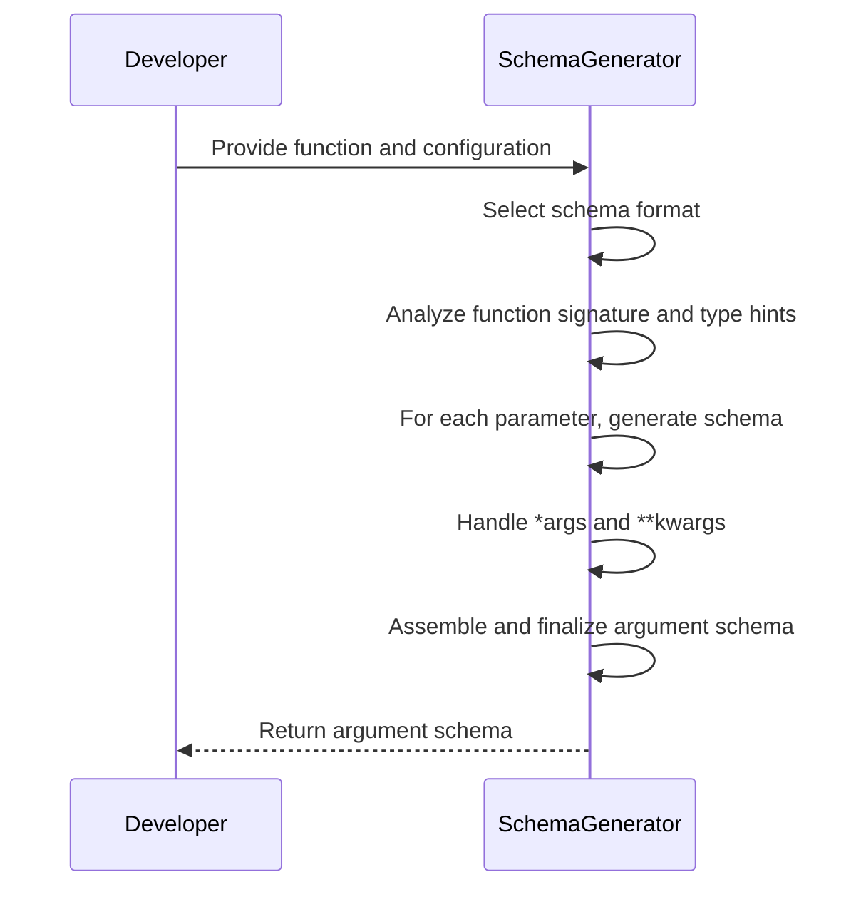
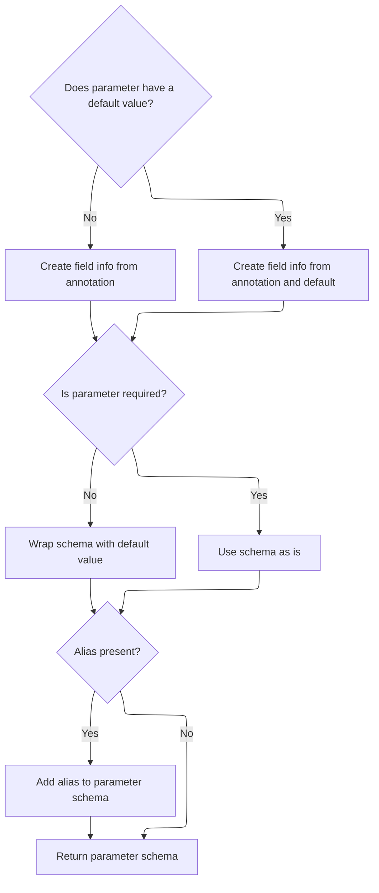
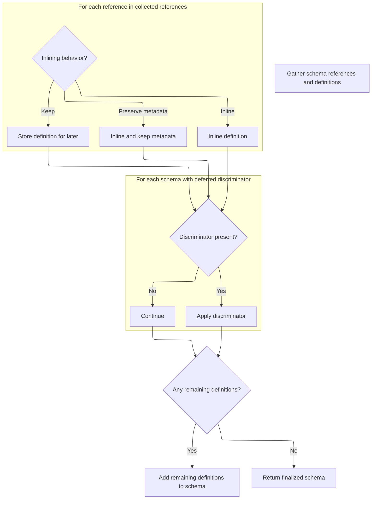

```mermaid
%%{init: {"flowchart": {"defaultRenderer": "elk"}} }%%
flowchart TD
    node1["Start: Analyze function signature and type hints"]
    click node1 openCode "pydantic/_internal/_generate_schema.py:2010:2025"
    
    subgraph loop1["For each parameter in the function signature"]
        node2{"Skip parameter by callback?"}
        click node2 openCode "pydantic/_internal/_generate_schema.py:2028:2032"
        node2 -- Yes --> node3["Skip"]
        click node3 openCode "pydantic/_internal/_generate_schema.py:2031:2032"
        node2 -- No --> node4{"Parameter mode?"}
        click node4 openCode "pydantic/_internal/_generate_schema.py:2034:2040"
        node4 -- Unpacked TypedDict, overlaps --> node5["Raise error: Overlapping TypedDict fields"]
        click node5 openCode "pydantic/_internal/_generate_schema.py:2055:2061"
        node4 -- Unpacked TypedDict, no overlap --> node6["Add as unpacked TypedDict"]
        click node6 openCode "pydantic/_internal/_generate_schema.py:2062:2063"
        node4 -- Standard mode --> node7["Add parameter schema"]
        click node7 openCode "pydantic/_internal/_generate_schema.py:2067:2071"
    end
    node6 --> node8["Assemble and return argument validation schema"]
    node7 --> node8
    click node8 openCode "pydantic/_internal/_generate_schema.py:2073:2076"

%% Swimm:
%% %%{init: {"flowchart": {"defaultRenderer": "elk"}} }%%
%% flowchart TD
%%     node1["Start: Analyze function signature and type hints"]
%%     click node1 openCode "<SwmPath>[pydantic/\_internal/\_generate_schema.py](pydantic/_internal/_generate_schema.py)</SwmPath>:2010:2025"
%%     
%%     subgraph loop1["For each parameter in the function signature"]
%%         node2{"Skip parameter by callback?"}
%%         click node2 openCode "<SwmPath>[pydantic/\_internal/\_generate_schema.py](pydantic/_internal/_generate_schema.py)</SwmPath>:2028:2032"
%%         node2 -- Yes --> node3["Skip"]
%%         click node3 openCode "<SwmPath>[pydantic/\_internal/\_generate_schema.py](pydantic/_internal/_generate_schema.py)</SwmPath>:2031:2032"
%%         node2 -- No --> node4{"Parameter mode?"}
%%         click node4 openCode "<SwmPath>[pydantic/\_internal/\_generate_schema.py](pydantic/_internal/_generate_schema.py)</SwmPath>:2034:2040"
%%         node4 -- Unpacked <SwmToken path="pydantic/_internal/_generate_schema.py" pos="1981:8:8" line-data="                            f&#39;Expected a `TypedDict` class inside `Unpack[...]`, got {unpack_type!r}&#39;,">`TypedDict`</SwmToken>, overlaps --> node5["Raise error: Overlapping <SwmToken path="pydantic/_internal/_generate_schema.py" pos="1981:8:8" line-data="                            f&#39;Expected a `TypedDict` class inside `Unpack[...]`, got {unpack_type!r}&#39;,">`TypedDict`</SwmToken> fields"]
%%         click node5 openCode "<SwmPath>[pydantic/\_internal/\_generate_schema.py](pydantic/_internal/_generate_schema.py)</SwmPath>:2055:2061"
%%         node4 -- Unpacked <SwmToken path="pydantic/_internal/_generate_schema.py" pos="1981:8:8" line-data="                            f&#39;Expected a `TypedDict` class inside `Unpack[...]`, got {unpack_type!r}&#39;,">`TypedDict`</SwmToken>, no overlap --> node6["Add as unpacked <SwmToken path="pydantic/_internal/_generate_schema.py" pos="1981:8:8" line-data="                            f&#39;Expected a `TypedDict` class inside `Unpack[...]`, got {unpack_type!r}&#39;,">`TypedDict`</SwmToken>"]
%%         click node6 openCode "<SwmPath>[pydantic/\_internal/\_generate_schema.py](pydantic/_internal/_generate_schema.py)</SwmPath>:2062:2063"
%%         node4 -- Standard mode --> node7["Add parameter schema"]
%%         click node7 openCode "<SwmPath>[pydantic/\_internal/\_generate_schema.py](pydantic/_internal/_generate_schema.py)</SwmPath>:2067:2071"
%%     end
%%     node6 --> node8["Assemble and return argument validation schema"]
%%     node7 --> node8
%%     click node8 openCode "<SwmPath>[pydantic/\_internal/\_generate_schema.py](pydantic/_internal/_generate_schema.py)</SwmPath>:2073:2076"
```

This document explains how a schema is generated to describe and validate the arguments of a Python function. The process involves preparing the schema generator, selecting the schema format, analyzing the function's signature, generating schemas for each parameter (including special handling for \*args, \*\*kwargs, and unpacked TypedDicts), and finalizing the schema for validation and introspection.

Main steps:

- Prepare schema generator and configuration
- Choose schema format (legacy or modern)
- Analyze function signature and type hints
- Generate schemas for each parameter, \*args, and \*\*kwargs
- Assemble and finalize the complete argument schema



# Spec

## Detailed View of the Program's Functionality

a. Entry Point: Generating Argument Schemas

The process begins with a function that is responsible for generating a schema for the arguments of a given function. This function accepts the target function, a schema type (either legacy or modern), an optional callback to filter parameters, and an optional configuration.

- First, a schema generator object is created. This generator is initialized with a configuration wrapper and a namespace resolver that is tailored to the target function.
- The function then checks which schema format is requested: if the legacy format is chosen, it delegates to the legacy argument schema builder; otherwise, it uses the modern <SwmToken path="pydantic/experimental/arguments_schema.py" pos="16:14:14" line-data="    schema_type: Literal[&#39;arguments&#39;, &#39;arguments-v3&#39;] = &#39;arguments-v3&#39;,">`v3`</SwmToken> argument schema builder.
- After the schema is built, it is passed to a cleaning step to finalize and resolve any references.

b. Legacy Argument Schema Generation

When the legacy argument schema path is chosen:

- The generator inspects the function’s signature and gathers type hints for each parameter.
- It iterates over each parameter in the function’s signature:
  - For each parameter, it determines the type annotation (or uses a generic type if none is provided).
  - If a callback is provided, it is called with the parameter’s index, name, and annotation. If the callback returns a signal to skip, that parameter is omitted from the schema.
  - The parameter’s kind (positional-only, positional-or-keyword, keyword-only) is mapped to a schema mode.
  - For regular parameters, a helper is called to generate the schema for that parameter, which includes handling defaults, required status, and any aliases.
  - If the parameter is a variable positional argument (<SwmToken path="pydantic/_internal/_generate_schema.py" pos="2782:8:10" line-data="                # gather result (e.g. when using the `Sequence` type -- see `test_sequence_discriminated_union()`).">`e.g`</SwmToken>., \*args), a schema is generated for the type of those arguments.
  - If the parameter is a variable keyword argument (<SwmToken path="pydantic/_internal/_generate_schema.py" pos="2782:8:10" line-data="                # gather result (e.g. when using the `Sequence` type -- see `test_sequence_discriminated_union()`).">`e.g`</SwmToken>., \*\*kwargs), the code checks if the annotation uses an unpacking construct:
    - If so, it verifies that the unpacked type is a <SwmToken path="pydantic/_internal/_generate_schema.py" pos="1981:8:8" line-data="                            f&#39;Expected a `TypedDict` class inside `Unpack[...]`, got {unpack_type!r}&#39;,">`TypedDict`</SwmToken> and ensures there are no overlapping keys with other parameters. If overlaps are found, an error is raised.
    - If all is well, a schema is generated for the unpacked <SwmToken path="pydantic/_internal/_generate_schema.py" pos="1981:8:8" line-data="                            f&#39;Expected a `TypedDict` class inside `Unpack[...]`, got {unpack_type!r}&#39;,">`TypedDict`</SwmToken>.
    - If not using unpack, a uniform schema is generated for the extra keyword arguments.
- After all parameters are processed, the collected schemas are assembled into a final arguments schema object, including any special handling for \*args and \*\*kwargs.

c. Modern (<SwmToken path="pydantic/experimental/arguments_schema.py" pos="16:14:14" line-data="    schema_type: Literal[&#39;arguments&#39;, &#39;arguments-v3&#39;] = &#39;arguments-v3&#39;,">`v3`</SwmToken>) Argument Schema Generation

If the modern <SwmToken path="pydantic/experimental/arguments_schema.py" pos="16:14:14" line-data="    schema_type: Literal[&#39;arguments&#39;, &#39;arguments-v3&#39;] = &#39;arguments-v3&#39;,">`v3`</SwmToken> schema is requested:

- The generator again inspects the function’s signature and gathers type hints.
- It iterates over each parameter:
  - The callback is invoked if provided, allowing parameters to be skipped.
  - The parameter’s kind is mapped to a v3-specific mode, which includes additional modes for \*args and \*\*kwargs.
  - For \*\*kwargs, if the annotation uses an unpacking construct, it checks that the type is a <SwmToken path="pydantic/_internal/_generate_schema.py" pos="1981:8:8" line-data="                            f&#39;Expected a `TypedDict` class inside `Unpack[...]`, got {unpack_type!r}&#39;,">`TypedDict`</SwmToken> and ensures no key overlaps. If overlaps are found, an error is raised. If not, the parameter is marked as an unpacked <SwmToken path="pydantic/_internal/_generate_schema.py" pos="1981:8:8" line-data="                            f&#39;Expected a `TypedDict` class inside `Unpack[...]`, got {unpack_type!r}&#39;,">`TypedDict`</SwmToken>.
  - For all other cases, the appropriate mode is set.
  - For each parameter, a helper is called to generate the <SwmToken path="pydantic/experimental/arguments_schema.py" pos="16:14:14" line-data="    schema_type: Literal[&#39;arguments&#39;, &#39;arguments-v3&#39;] = &#39;arguments-v3&#39;,">`v3`</SwmToken> parameter schema, which handles field info, required status, defaults, and aliases.
- All parameter schemas are collected into a list and assembled into a <SwmToken path="pydantic/experimental/arguments_schema.py" pos="16:14:14" line-data="    schema_type: Literal[&#39;arguments&#39;, &#39;arguments-v3&#39;] = &#39;arguments-v3&#39;,">`v3`</SwmToken> arguments schema object.

d. Generating Individual Parameter Schemas

For each parameter (in both legacy and <SwmToken path="pydantic/experimental/arguments_schema.py" pos="16:14:14" line-data="    schema_type: Literal[&#39;arguments&#39;, &#39;arguments-v3&#39;] = &#39;arguments-v3&#39;,">`v3`</SwmToken>):

- Field information is constructed from the annotation and, if present, the default value.
- Configuration is applied to the field info.
- The annotation and field info are used to generate the core schema for the parameter, applying any constraints or metadata.
- If the parameter is not required, the schema is wrapped with its default value.
- The parameter schema object is built, including the name, schema, mode, and alias if present.

e. Cleaning and Finalizing the Schema

After the argument schema is built (either legacy or <SwmToken path="pydantic/experimental/arguments_schema.py" pos="16:14:14" line-data="    schema_type: Literal[&#39;arguments&#39;, &#39;arguments-v3&#39;] = &#39;arguments-v3&#39;,">`v3`</SwmToken>):

- The schema is passed to a cleaning step, which delegates to a finalization process.
- This process traverses the schema and any referenced definitions, inlining references where possible and collecting others for inclusion.
- For each reference:
  - If it can be inlined (no extra metadata or serialization), it is replaced directly in the schema.
  - If it has special metadata (such as for discriminators), it is inlined but the metadata is preserved.
  - Otherwise, the definition is stored for later inclusion.
- After references are handled, any schemas with deferred discriminators are processed: the discriminator is applied, and the schema is mutated in place.
- If there are any remaining definitions, the schema is wrapped with them to ensure all necessary definitions are included.
- The finalized schema is returned, ready for use in validation.

f. Summary

The overall flow is:

1. Prepare the schema generator with configuration and namespace information.
2. Choose the schema format (legacy or <SwmToken path="pydantic/experimental/arguments_schema.py" pos="16:14:14" line-data="    schema_type: Literal[&#39;arguments&#39;, &#39;arguments-v3&#39;] = &#39;arguments-v3&#39;,">`v3`</SwmToken>) and build the argument schema by inspecting the function’s signature.
3. For each parameter, generate a detailed schema, handling defaults, required status, aliases, \*args, \*\*kwargs, and <SwmToken path="pydantic/_internal/_generate_schema.py" pos="1981:8:8" line-data="                            f&#39;Expected a `TypedDict` class inside `Unpack[...]`, got {unpack_type!r}&#39;,">`TypedDict`</SwmToken> unpacking.
4. Assemble the complete argument schema.
5. Clean and finalize the schema, resolving references and applying any deferred logic.
6. Return the finalized schema for use in validating function arguments.

# Rule Definition

| Paragraph Name                                                                                                                                                                                                                     | Rule ID | Category          | Description                                                                                                                                                                                                                                                                                                                                                                                                                                                                                                                                                                                                                                                                                                                                                                           | Conditions                                                                                                                                                                                                                                                                                                                                                                                                                                                                                                     | Remarks                                                                                                                                                                                                                                                                                                                                                                                                                                                                                                                                                                                                                                                                                                                                                                                                                                                                                                                                                                                                                                                                                                                                             |
| ---------------------------------------------------------------------------------------------------------------------------------------------------------------------------------------------------------------------------------- | ------- | ----------------- | ------------------------------------------------------------------------------------------------------------------------------------------------------------------------------------------------------------------------------------------------------------------------------------------------------------------------------------------------------------------------------------------------------------------------------------------------------------------------------------------------------------------------------------------------------------------------------------------------------------------------------------------------------------------------------------------------------------------------------------------------------------------------------------- | -------------------------------------------------------------------------------------------------------------------------------------------------------------------------------------------------------------------------------------------------------------------------------------------------------------------------------------------------------------------------------------------------------------------------------------------------------------------------------------------------------------- | --------------------------------------------------------------------------------------------------------------------------------------------------------------------------------------------------------------------------------------------------------------------------------------------------------------------------------------------------------------------------------------------------------------------------------------------------------------------------------------------------------------------------------------------------------------------------------------------------------------------------------------------------------------------------------------------------------------------------------------------------------------------------------------------------------------------------------------------------------------------------------------------------------------------------------------------------------------------------------------------------------------------------------------------------------------------------------------------------------------------------------------------------- |
| <SwmToken path="pydantic/experimental/arguments_schema.py" pos="14:2:2" line-data="def generate_arguments_schema(">`generate_arguments_schema`</SwmToken>, GenerateSchema.\_arguments_schema, GenerateSchema.\_arguments_v3_schema | RL-001  | Computation       | The system must accept a callable function and generate a validation schema for its arguments, supporting two schema formats: legacy ('arguments') and modern (<SwmToken path="pydantic/experimental/arguments_schema.py" pos="16:12:14" line-data="    schema_type: Literal[&#39;arguments&#39;, &#39;arguments-v3&#39;] = &#39;arguments-v3&#39;,">`arguments-v3`</SwmToken>). The <SwmToken path="pydantic/experimental/arguments_schema.py" pos="16:1:1" line-data="    schema_type: Literal[&#39;arguments&#39;, &#39;arguments-v3&#39;] = &#39;arguments-v3&#39;,">`schema_type`</SwmToken> argument determines which format is used.                                                                                                                                           | A callable function is provided as input, along with a <SwmToken path="pydantic/experimental/arguments_schema.py" pos="16:1:1" line-data="    schema_type: Literal[&#39;arguments&#39;, &#39;arguments-v3&#39;] = &#39;arguments-v3&#39;,">`schema_type`</SwmToken> argument ('arguments' or <SwmToken path="pydantic/experimental/arguments_schema.py" pos="16:12:14" line-data="    schema_type: Literal[&#39;arguments&#39;, &#39;arguments-v3&#39;] = &#39;arguments-v3&#39;,">`arguments-v3`</SwmToken>). | <SwmToken path="pydantic/experimental/arguments_schema.py" pos="16:1:1" line-data="    schema_type: Literal[&#39;arguments&#39;, &#39;arguments-v3&#39;] = &#39;arguments-v3&#39;,">`schema_type`</SwmToken> must be either 'arguments' or <SwmToken path="pydantic/experimental/arguments_schema.py" pos="16:12:14" line-data="    schema_type: Literal[&#39;arguments&#39;, &#39;arguments-v3&#39;] = &#39;arguments-v3&#39;,">`arguments-v3`</SwmToken>. Output is either an <SwmToken path="pydantic/_internal/_generate_schema.py" pos="1937:7:7" line-data="    ) -&gt; core_schema.ArgumentsSchema:">`ArgumentsSchema`</SwmToken> or <SwmToken path="pydantic/_internal/_generate_schema.py" pos="2012:7:7" line-data="    ) -&gt; core_schema.ArgumentsV3Schema:">`ArgumentsV3Schema`</SwmToken> object, each with required fields as described in the spec.                                                                                                                                                                                                                                                                                |
| <SwmToken path="pydantic/experimental/arguments_schema.py" pos="14:2:2" line-data="def generate_arguments_schema(">`generate_arguments_schema`</SwmToken>, GenerateSchema.\_arguments_schema, GenerateSchema.\_arguments_v3_schema | RL-002  | Conditional Logic | If a <SwmToken path="pydantic/experimental/arguments_schema.py" pos="17:1:1" line-data="    parameters_callback: Callable[[int, str, Any], Literal[&#39;skip&#39;] \| None] \| None = None,">`parameters_callback`</SwmToken> function is provided, it must be called for each parameter (with index, name, annotation). If the callback returns 'skip', that parameter is excluded from the schema.                                                                                                                                                                                                                                                                                                                                                                                  | <SwmToken path="pydantic/experimental/arguments_schema.py" pos="17:1:1" line-data="    parameters_callback: Callable[[int, str, Any], Literal[&#39;skip&#39;] \| None] \| None = None,">`parameters_callback`</SwmToken> is not None                                                                                                                                                                                                                                                                           | <SwmToken path="pydantic/experimental/arguments_schema.py" pos="17:1:1" line-data="    parameters_callback: Callable[[int, str, Any], Literal[&#39;skip&#39;] \| None] \| None = None,">`parameters_callback`</SwmToken> must accept (index, name, annotation) and may return 'skip' to exclude the parameter.                                                                                                                                                                                                                                                                                                                                                                                                                                                                                                                                                                                                                                                                                                                                                                                                                                      |
| GenerateSchema.\_arguments_schema, GenerateSchema.\_arguments_v3_schema                                                                                                                                                            | RL-003  | Conditional Logic | For \*args, generate a schema representing the type and constraints of additional positional arguments. For \*\*kwargs, if Unpack with <SwmToken path="pydantic/_internal/_generate_schema.py" pos="1981:8:8" line-data="                            f&#39;Expected a `TypedDict` class inside `Unpack[...]`, got {unpack_type!r}&#39;,">`TypedDict`</SwmToken> is used, unpack the <SwmToken path="pydantic/_internal/_generate_schema.py" pos="1981:8:8" line-data="                            f&#39;Expected a `TypedDict` class inside `Unpack[...]`, got {unpack_type!r}&#39;,">`TypedDict`</SwmToken> and ensure no key overlaps with other parameters; raise an error if overlaps exist. If not using Unpack, generate a uniform schema for all additional keyword arguments. | Function signature includes \*args or \*\*kwargs parameters.                                                                                                                                                                                                                                                                                                                                                                                                                                                   | <SwmToken path="pydantic/_internal/_generate_schema.py" pos="1950:1:1" line-data="        var_args_schema: core_schema.CoreSchema \| None = None">`var_args_schema`</SwmToken> and <SwmToken path="pydantic/_internal/_generate_schema.py" pos="1951:1:1" line-data="        var_kwargs_schema: core_schema.CoreSchema \| None = None">`var_kwargs_schema`</SwmToken> fields must be present in the output schema if applicable. <SwmToken path="pydantic/_internal/_generate_schema.py" pos="1952:1:1" line-data="        var_kwargs_mode: core_schema.VarKwargsMode \| None = None">`var_kwargs_mode`</SwmToken> must be set to <SwmToken path="pydantic/_internal/_generate_schema.py" pos="1996:6:10" line-data="                    var_kwargs_mode = &#39;unpacked-typed-dict&#39;">`unpacked-typed-dict`</SwmToken>, 'uniform', or null. For <SwmToken path="pydantic/_internal/_generate_schema.py" pos="1981:8:8" line-data="                            f&#39;Expected a `TypedDict` class inside `Unpack[...]`, got {unpack_type!r}&#39;,">`TypedDict`</SwmToken> unpacking, overlapping keys with other parameters must raise an error. |
| GenerateSchema.\_generate_parameter_schema, GenerateSchema.\_generate_parameter_v3_schema                                                                                                                                          | RL-004  | Data Assignment   | For each parameter, generate a schema based on its annotation, default value, and mode. If a default value is present, include it and indicate if the parameter is required. If an alias is present, include it.                                                                                                                                                                                                                                                                                                                                                                                                                                                                                                                                                                      | Each parameter in the function signature.                                                                                                                                                                                                                                                                                                                                                                                                                                                                      | <SwmToken path="pydantic/_internal/_generate_schema.py" pos="1949:8:8" line-data="        arguments_list: list[core_schema.ArgumentsParameter] = []">`ArgumentsParameter`</SwmToken> and <SwmToken path="pydantic/_internal/_generate_schema.py" pos="1590:7:7" line-data="    ) -&gt; core_schema.ArgumentsV3Parameter:">`ArgumentsV3Parameter`</SwmToken> objects must include name (string), schema (object), mode (enum), and optional alias (string). If default is present, schema must include default and required flag.                                                                                                                                                                                                                                                                                                                                                                                                                                                                                                                                                                                                                    |
| GenerateSchema.clean_schema, \_Definitions.finalize_schema                                                                                                                                                                         | RL-005  | Computation       | After generating the initial schema, finalize it by resolving all schema references and inlining definitions as appropriate. The final schema must include all necessary definitions and resolve any deferred discriminators for union types.                                                                                                                                                                                                                                                                                                                                                                                                                                                                                                                                         | Schema has been generated for the function arguments.                                                                                                                                                                                                                                                                                                                                                                                                                                                          | The finalized schema must be a <SwmToken path="pydantic/experimental/arguments_schema.py" pos="19:4:4" line-data=") -&gt; CoreSchema:">`CoreSchema`</SwmToken> object, with all references resolved and definitions inlined as needed. Deferred discriminators for unions must be applied.                                                                                                                                                                                                                                                                                                                                                                                                                                                                                                                                                                                                                                                                                                                                                                                                                                                          |
| <SwmToken path="pydantic/experimental/arguments_schema.py" pos="14:2:2" line-data="def generate_arguments_schema(">`generate_arguments_schema`</SwmToken>                                                                          | RL-006  | Data Assignment   | The output of the schema generation function must be a <SwmToken path="pydantic/experimental/arguments_schema.py" pos="19:4:4" line-data=") -&gt; CoreSchema:">`CoreSchema`</SwmToken> object representing the complete argument validation schema for the function, in the specified format.                                                                                                                                                                                                                                                                                                                                                                                                                                                                                         | Schema generation and finalization are complete.                                                                                                                                                                                                                                                                                                                                                                                                                                                               | Output is a <SwmToken path="pydantic/experimental/arguments_schema.py" pos="19:4:4" line-data=") -&gt; CoreSchema:">`CoreSchema`</SwmToken> object, either <SwmToken path="pydantic/_internal/_generate_schema.py" pos="1937:7:7" line-data="    ) -&gt; core_schema.ArgumentsSchema:">`ArgumentsSchema`</SwmToken> or <SwmToken path="pydantic/_internal/_generate_schema.py" pos="2012:7:7" line-data="    ) -&gt; core_schema.ArgumentsV3Schema:">`ArgumentsV3Schema`</SwmToken>, fully resolved and ready for validation.                                                                                                                                                                                                                                                                                                                                                                                                                                                                                                                                                                                                                       |

# User Stories

## User Story 1: Generate argument validation schema for a callable function

---

### Story Description:

As a user of the system, I want to generate a validation schema for a callable function's arguments, supporting both legacy and modern schema formats, so that I can validate function inputs according to their type hints, defaults, aliases, and special argument types like \*args and \*\*kwargs, with the option to skip parameters via a callback and influence schema details via configuration.

---

### Business Rule Mapping:

| Rule ID | Paragraph Name                                                                                                                                                                                                                     | Rule Description                                                                                                                                                                                                                                                                                                                                                                                                                                                                                                                                                                                                                                                                                                                                                                      |
| ------- | ---------------------------------------------------------------------------------------------------------------------------------------------------------------------------------------------------------------------------------- | ------------------------------------------------------------------------------------------------------------------------------------------------------------------------------------------------------------------------------------------------------------------------------------------------------------------------------------------------------------------------------------------------------------------------------------------------------------------------------------------------------------------------------------------------------------------------------------------------------------------------------------------------------------------------------------------------------------------------------------------------------------------------------------- |
| RL-001  | <SwmToken path="pydantic/experimental/arguments_schema.py" pos="14:2:2" line-data="def generate_arguments_schema(">`generate_arguments_schema`</SwmToken>, GenerateSchema.\_arguments_schema, GenerateSchema.\_arguments_v3_schema | The system must accept a callable function and generate a validation schema for its arguments, supporting two schema formats: legacy ('arguments') and modern (<SwmToken path="pydantic/experimental/arguments_schema.py" pos="16:12:14" line-data="    schema_type: Literal[&#39;arguments&#39;, &#39;arguments-v3&#39;] = &#39;arguments-v3&#39;,">`arguments-v3`</SwmToken>). The <SwmToken path="pydantic/experimental/arguments_schema.py" pos="16:1:1" line-data="    schema_type: Literal[&#39;arguments&#39;, &#39;arguments-v3&#39;] = &#39;arguments-v3&#39;,">`schema_type`</SwmToken> argument determines which format is used.                                                                                                                                           |
| RL-002  | <SwmToken path="pydantic/experimental/arguments_schema.py" pos="14:2:2" line-data="def generate_arguments_schema(">`generate_arguments_schema`</SwmToken>, GenerateSchema.\_arguments_schema, GenerateSchema.\_arguments_v3_schema | If a <SwmToken path="pydantic/experimental/arguments_schema.py" pos="17:1:1" line-data="    parameters_callback: Callable[[int, str, Any], Literal[&#39;skip&#39;] \| None] \| None = None,">`parameters_callback`</SwmToken> function is provided, it must be called for each parameter (with index, name, annotation). If the callback returns 'skip', that parameter is excluded from the schema.                                                                                                                                                                                                                                                                                                                                                                                  |
| RL-003  | GenerateSchema.\_arguments_schema, GenerateSchema.\_arguments_v3_schema                                                                                                                                                            | For \*args, generate a schema representing the type and constraints of additional positional arguments. For \*\*kwargs, if Unpack with <SwmToken path="pydantic/_internal/_generate_schema.py" pos="1981:8:8" line-data="                            f&#39;Expected a `TypedDict` class inside `Unpack[...]`, got {unpack_type!r}&#39;,">`TypedDict`</SwmToken> is used, unpack the <SwmToken path="pydantic/_internal/_generate_schema.py" pos="1981:8:8" line-data="                            f&#39;Expected a `TypedDict` class inside `Unpack[...]`, got {unpack_type!r}&#39;,">`TypedDict`</SwmToken> and ensure no key overlaps with other parameters; raise an error if overlaps exist. If not using Unpack, generate a uniform schema for all additional keyword arguments. |
| RL-004  | GenerateSchema.\_generate_parameter_schema, GenerateSchema.\_generate_parameter_v3_schema                                                                                                                                          | For each parameter, generate a schema based on its annotation, default value, and mode. If a default value is present, include it and indicate if the parameter is required. If an alias is present, include it.                                                                                                                                                                                                                                                                                                                                                                                                                                                                                                                                                                      |

---

### Relevant Functionality:

- <SwmToken path="pydantic/experimental/arguments_schema.py" pos="14:2:2" line-data="def generate_arguments_schema(">`generate_arguments_schema`</SwmToken>
  1. **RL-001:**
     - Accept func and <SwmToken path="pydantic/experimental/arguments_schema.py" pos="16:1:1" line-data="    schema_type: Literal[&#39;arguments&#39;, &#39;arguments-v3&#39;] = &#39;arguments-v3&#39;,">`schema_type`</SwmToken> as input
     - If <SwmToken path="pydantic/experimental/arguments_schema.py" pos="16:1:1" line-data="    schema_type: Literal[&#39;arguments&#39;, &#39;arguments-v3&#39;] = &#39;arguments-v3&#39;,">`schema_type`</SwmToken> == 'arguments':
       - Call GenerateSchema.\_arguments_schema(func, ...)
     - Else if <SwmToken path="pydantic/experimental/arguments_schema.py" pos="16:1:1" line-data="    schema_type: Literal[&#39;arguments&#39;, &#39;arguments-v3&#39;] = &#39;arguments-v3&#39;,">`schema_type`</SwmToken> == <SwmToken path="pydantic/experimental/arguments_schema.py" pos="16:12:14" line-data="    schema_type: Literal[&#39;arguments&#39;, &#39;arguments-v3&#39;] = &#39;arguments-v3&#39;,">`arguments-v3`</SwmToken>:
       - Call GenerateSchema.\_arguments_v3_schema(func, ...)
     - Return the generated schema
  2. **RL-002:**
     - For each parameter in the function signature:
       - If <SwmToken path="pydantic/experimental/arguments_schema.py" pos="17:1:1" line-data="    parameters_callback: Callable[[int, str, Any], Literal[&#39;skip&#39;] | None] | None = None,">`parameters_callback`</SwmToken> is provided:
         - Call <SwmToken path="pydantic/experimental/arguments_schema.py" pos="17:1:1" line-data="    parameters_callback: Callable[[int, str, Any], Literal[&#39;skip&#39;] | None] | None = None,">`parameters_callback`</SwmToken>(index, name, annotation)
         - If result == 'skip', continue to next parameter
- **GenerateSchema.\_arguments_schema**
  1. **RL-003:**
     - For each parameter:
       - If parameter is \*args:
         - Generate schema for additional positional arguments
       - If parameter is \*\*kwargs:
         - If annotation is Unpack\[<SwmToken path="pydantic/_internal/_generate_schema.py" pos="1981:8:8" line-data="                            f&#39;Expected a `TypedDict` class inside `Unpack[...]`, got {unpack_type!r}&#39;,">`TypedDict`</SwmToken>\]:
           - Unpack <SwmToken path="pydantic/_internal/_generate_schema.py" pos="1981:8:8" line-data="                            f&#39;Expected a `TypedDict` class inside `Unpack[...]`, got {unpack_type!r}&#39;,">`TypedDict`</SwmToken>
           - Check for key overlaps with other parameters
           - If overlaps, raise error
           - Set <SwmToken path="pydantic/_internal/_generate_schema.py" pos="1952:1:1" line-data="        var_kwargs_mode: core_schema.VarKwargsMode | None = None">`var_kwargs_mode`</SwmToken> to <SwmToken path="pydantic/_internal/_generate_schema.py" pos="1996:6:10" line-data="                    var_kwargs_mode = &#39;unpacked-typed-dict&#39;">`unpacked-typed-dict`</SwmToken>
         - Else:
           - Generate uniform schema for additional keyword arguments
           - Set <SwmToken path="pydantic/_internal/_generate_schema.py" pos="1952:1:1" line-data="        var_kwargs_mode: core_schema.VarKwargsMode | None = None">`var_kwargs_mode`</SwmToken> to 'uniform'
- **GenerateSchema.\_generate_parameter_schema**
  1. **RL-004:**
     - For each parameter:
       - Determine annotation, default, mode
       - Generate schema for annotation
       - If default is present:
         - Include default in schema
         - Set required flag accordingly
       - If alias is present:
         - Include alias in schema

## User Story 2: Finalize and output the complete argument validation schema

---

### Story Description:

As a user of the system, I want the generated argument validation schema to be finalized by resolving all references and inlining definitions, so that I receive a fully resolved <SwmToken path="pydantic/experimental/arguments_schema.py" pos="19:4:4" line-data=") -&gt; CoreSchema:">`CoreSchema`</SwmToken> object ready for use in argument validation.

---

### Business Rule Mapping:

| Rule ID | Paragraph Name                                                                                                                                            | Rule Description                                                                                                                                                                                                                                                                              |
| ------- | --------------------------------------------------------------------------------------------------------------------------------------------------------- | --------------------------------------------------------------------------------------------------------------------------------------------------------------------------------------------------------------------------------------------------------------------------------------------- |
| RL-006  | <SwmToken path="pydantic/experimental/arguments_schema.py" pos="14:2:2" line-data="def generate_arguments_schema(">`generate_arguments_schema`</SwmToken> | The output of the schema generation function must be a <SwmToken path="pydantic/experimental/arguments_schema.py" pos="19:4:4" line-data=") -&gt; CoreSchema:">`CoreSchema`</SwmToken> object representing the complete argument validation schema for the function, in the specified format. |
| RL-005  | GenerateSchema.clean_schema, \_Definitions.finalize_schema                                                                                                | After generating the initial schema, finalize it by resolving all schema references and inlining definitions as appropriate. The final schema must include all necessary definitions and resolve any deferred discriminators for union types.                                                 |

---

### Relevant Functionality:

- <SwmToken path="pydantic/experimental/arguments_schema.py" pos="14:2:2" line-data="def generate_arguments_schema(">`generate_arguments_schema`</SwmToken>
  1. **RL-006:**
     - Return the finalized <SwmToken path="pydantic/experimental/arguments_schema.py" pos="19:4:4" line-data=") -&gt; CoreSchema:">`CoreSchema`</SwmToken> object from <SwmToken path="pydantic/experimental/arguments_schema.py" pos="14:2:2" line-data="def generate_arguments_schema(">`generate_arguments_schema`</SwmToken>
- **GenerateSchema.clean_schema**
  1. **RL-005:**
     - Call <SwmToken path="pydantic/experimental/arguments_schema.py" pos="44:5:5" line-data="    return generate_schema.clean_schema(schema)">`clean_schema`</SwmToken> on the generated schema
       - Traverse schema and referenced definitions
       - Replace <SwmToken path="pydantic/_internal/_generate_schema.py" pos="2739:22:24" line-data="        This traverses the core schema and referenced definitions, replaces `&#39;definition-ref&#39;` schemas">`definition-ref`</SwmToken> schemas with referenced definitions where possible
       - Apply deferred discriminators for unions
       - Return finalized <SwmToken path="pydantic/experimental/arguments_schema.py" pos="19:4:4" line-data=") -&gt; CoreSchema:">`CoreSchema`</SwmToken>

# Code Walkthrough

## Starting argument schema generation

```mermaid
%%{init: {"flowchart": {"defaultRenderer": "elk"}} }%%
flowchart TD
    node1["Prepare schema generator for the function"] --> node2{"Which schema format?"}
    click node1 openCode "pydantic/experimental/arguments_schema.py:35:39"
    node2 -->|"Legacy ('arguments')"| node3["Generate legacy arguments schema"]
    click node2 openCode "pydantic/experimental/arguments_schema.py:40:42"
    node2 -->|"Modern (arguments-v3)"| node4["Generate modern arguments schema"]
    click node3 openCode "pydantic/_internal/_generate_schema.py:1935:2010"
    click node4 openCode "pydantic/_internal/_generate_schema.py:2010:2070"
    
    subgraph loop1["For each parameter in function signature"]
      node4 --> node5["Generate schema for parameter (skip if callback says so)"]
      click node5 openCode "pydantic/_internal/_generate_schema.py:1576:1700"
    end
    node3 --> node6["Clean and return final schema"]
    node5 --> node6
    click node6 openCode "pydantic/experimental/arguments_schema.py:44:44"


subgraph node3 [_arguments_schema]
  sgmain_1_node1["Start building argument validation schema"]
  click sgmain_1_node1 openCode "pydantic/_internal/_generate_schema.py:1935:1954"
  subgraph sgmain_1_loop1["For each parameter in function signature"]
  sgmain_1_node2["Decide parameter type and generate schema"]
  click sgmain_1_node2 openCode "pydantic/_internal/_generate_schema.py:1954:1970"
  end
  sgmain_1_loop1 --> sgmain_1_node3["Return complete arguments schema"]
  click sgmain_1_node3 openCode "pydantic/_internal/_generate_schema.py:2002:2008"
end

%% Swimm:
%% %%{init: {"flowchart": {"defaultRenderer": "elk"}} }%%
%% flowchart TD
%%     node1["Prepare schema generator for the function"] --> node2{"Which schema format?"}
%%     click node1 openCode "<SwmPath>[pydantic/experimental/arguments_schema.py](pydantic/experimental/arguments_schema.py)</SwmPath>:35:39"
%%     node2 -->|"Legacy ('arguments')"| node3["Generate legacy arguments schema"]
%%     click node2 openCode "<SwmPath>[pydantic/experimental/arguments_schema.py](pydantic/experimental/arguments_schema.py)</SwmPath>:40:42"
%%     node2 -->|"Modern (<SwmToken path="pydantic/experimental/arguments_schema.py" pos="16:12:14" line-data="    schema_type: Literal[&#39;arguments&#39;, &#39;arguments-v3&#39;] = &#39;arguments-v3&#39;,">`arguments-v3`</SwmToken>)"| node4["Generate modern arguments schema"]
%%     click node3 openCode "<SwmPath>[pydantic/\_internal/\_generate_schema.py](pydantic/_internal/_generate_schema.py)</SwmPath>:1935:2010"
%%     click node4 openCode "<SwmPath>[pydantic/\_internal/\_generate_schema.py](pydantic/_internal/_generate_schema.py)</SwmPath>:2010:2070"
%%     
%%     subgraph loop1["For each parameter in function signature"]
%%       node4 --> node5["Generate schema for parameter (skip if callback says so)"]
%%       click node5 openCode "<SwmPath>[pydantic/\_internal/\_generate_schema.py](pydantic/_internal/_generate_schema.py)</SwmPath>:1576:1700"
%%     end
%%     node3 --> node6["Clean and return final schema"]
%%     node5 --> node6
%%     click node6 openCode "<SwmPath>[pydantic/experimental/arguments_schema.py](pydantic/experimental/arguments_schema.py)</SwmPath>:44:44"
%% 
%% 
%% subgraph node3 [<SwmToken path="pydantic/experimental/arguments_schema.py" pos="41:7:7" line-data="        schema = generate_schema._arguments_schema(func, parameters_callback)  # pyright: ignore[reportArgumentType]">`_arguments_schema`</SwmToken>]
%%   sgmain_1_node1["Start building argument validation schema"]
%%   click sgmain_1_node1 openCode "<SwmPath>[pydantic/\_internal/\_generate_schema.py](pydantic/_internal/_generate_schema.py)</SwmPath>:1935:1954"
%%   subgraph sgmain_1_loop1["For each parameter in function signature"]
%%   sgmain_1_node2["Decide parameter type and generate schema"]
%%   click sgmain_1_node2 openCode "<SwmPath>[pydantic/\_internal/\_generate_schema.py](pydantic/_internal/_generate_schema.py)</SwmPath>:1954:1970"
%%   end
%%   sgmain_1_loop1 --> sgmain_1_node3["Return complete arguments schema"]
%%   click sgmain_1_node3 openCode "<SwmPath>[pydantic/\_internal/\_generate_schema.py](pydantic/_internal/_generate_schema.py)</SwmPath>:2002:2008"
%% end
```



<SwmSnippet path="/pydantic/experimental/arguments_schema.py" line="14">

---

In <SwmToken path="pydantic/experimental/arguments_schema.py" pos="14:2:2" line-data="def generate_arguments_schema(">`generate_arguments_schema`</SwmToken>, we kick things off by setting up the schema generator with config and namespace info for the target function. Right after, we branch based on the <SwmToken path="pydantic/experimental/arguments_schema.py" pos="16:1:1" line-data="    schema_type: Literal[&#39;arguments&#39;, &#39;arguments-v3&#39;] = &#39;arguments-v3&#39;,">`schema_type`</SwmToken> and call either <SwmToken path="pydantic/experimental/arguments_schema.py" pos="41:7:7" line-data="        schema = generate_schema._arguments_schema(func, parameters_callback)  # pyright: ignore[reportArgumentType]">`_arguments_schema`</SwmToken> or <SwmToken path="pydantic/experimental/arguments_schema.py" pos="43:7:7" line-data="        schema = generate_schema._arguments_v3_schema(func, parameters_callback)  # pyright: ignore[reportArgumentType]">`_arguments_v3_schema`</SwmToken>. We need to call <SwmToken path="pydantic/experimental/arguments_schema.py" pos="41:7:7" line-data="        schema = generate_schema._arguments_schema(func, parameters_callback)  # pyright: ignore[reportArgumentType]">`_arguments_schema`</SwmToken> next because that's where the actual inspection of the function's signature and parameter types happens, which is necessary to build the schema for the function's arguments.

```python
def generate_arguments_schema(
    func: Callable[..., Any],
    schema_type: Literal['arguments', 'arguments-v3'] = 'arguments-v3',
    parameters_callback: Callable[[int, str, Any], Literal['skip'] | None] | None = None,
    config: ConfigDict | None = None,
) -> CoreSchema:
    """Generate the schema for the arguments of a function.

    Args:
        func: The function to generate the schema for.
        schema_type: The type of schema to generate.
        parameters_callback: A callable that will be invoked for each parameter. The callback
            should take three required arguments: the index, the name and the type annotation
            (or [`Parameter.empty`][inspect.Parameter.empty] if not annotated) of the parameter.
            The callback can optionally return `'skip'`, so that the parameter gets excluded
            from the resulting schema.
        config: The configuration to use.

    Returns:
        The generated schema.
    """
    generate_schema = _generate_schema.GenerateSchema(
        _config.ConfigWrapper(config),
        ns_resolver=_namespace_utils.NsResolver(namespaces_tuple=_namespace_utils.ns_for_function(func)),
    )

    if schema_type == 'arguments':
        schema = generate_schema._arguments_schema(func, parameters_callback)  # pyright: ignore[reportArgumentType]
    else:
```

---

</SwmSnippet>

### Building argument schemas from function signature

<SwmSnippet path="/pydantic/_internal/_generate_schema.py" line="1935">

---

In <SwmToken path="pydantic/_internal/_generate_schema.py" pos="1935:3:3" line-data="    def _arguments_schema(">`_arguments_schema`</SwmToken>, we loop through the function's parameters, using the callback to optionally skip some, and map parameter kinds to their schema modes. For each regular parameter, we call <SwmToken path="pydantic/_internal/_generate_schema.py" pos="1967:7:7" line-data="                arg_schema = self._generate_parameter_schema(">`_generate_parameter_schema`</SwmToken> to build the schema for that specific argument, since each one might have different requirements or types.

```python
    def _arguments_schema(
        self, function: ValidateCallSupportedTypes, parameters_callback: ParametersCallback | None = None
    ) -> core_schema.ArgumentsSchema:
        """Generate schema for a Signature."""
        mode_lookup: dict[_ParameterKind, Literal['positional_only', 'positional_or_keyword', 'keyword_only']] = {
            Parameter.POSITIONAL_ONLY: 'positional_only',
            Parameter.POSITIONAL_OR_KEYWORD: 'positional_or_keyword',
            Parameter.KEYWORD_ONLY: 'keyword_only',
        }

        sig = signature(function)
        globalns, localns = self._types_namespace
        type_hints = _typing_extra.get_function_type_hints(function, globalns=globalns, localns=localns)

        arguments_list: list[core_schema.ArgumentsParameter] = []
        var_args_schema: core_schema.CoreSchema | None = None
        var_kwargs_schema: core_schema.CoreSchema | None = None
        var_kwargs_mode: core_schema.VarKwargsMode | None = None

        for i, (name, p) in enumerate(sig.parameters.items()):
            if p.annotation is sig.empty:
                annotation = typing.cast(Any, Any)
            else:
                annotation = type_hints[name]

            if parameters_callback is not None:
                result = parameters_callback(i, name, annotation)
                if result == 'skip':
                    continue

            parameter_mode = mode_lookup.get(p.kind)
            if parameter_mode is not None:
                arg_schema = self._generate_parameter_schema(
                    name, annotation, AnnotationSource.FUNCTION, p.default, parameter_mode
                )
```

---

</SwmSnippet>

#### Generating individual parameter schemas

See <SwmLink doc-title="Parameter schema generation flow">[Parameter schema generation flow](/.swm/parameter-schema-generation-flow.0ng1fri0.sw.md)</SwmLink>

#### Handling \*args and \*\*kwargs in argument schema

```mermaid
%%{init: {"flowchart": {"defaultRenderer": "elk"}} }%%
flowchart TD
    node1["Start building argument schema"]
    click node1 openCode "pydantic/_internal/_generate_schema.py:1970:2008"
    subgraph loop1["For each parameter"]
        node2["Decide parameter type"]
        click node2 openCode "pydantic/_internal/_generate_schema.py:1970:2001"
        node2 -->|"Standard"| node3["Add to schema"]
        click node3 openCode "pydantic/_internal/_generate_schema.py:1970:1971"
        node2 -->|"*args"| node4["Generate *args schema"]
        click node4 openCode "pydantic/_internal/_generate_schema.py:1972:1972"
        node2 -->|"**kwargs"| node5{"Unpack TypedDict?"}
        click node5 openCode "pydantic/_internal/_generate_schema.py:1976:1998"
        node5 -->|"Yes"| node6["Check for overlapping keys"]
        click node6 openCode "pydantic/_internal/_generate_schema.py:1984:1988"
        node6 -->|"Overlap"| node7["Raise error: overlapping keys"]
        click node7 openCode "pydantic/_internal/_generate_schema.py:1989:1994"
        node6 -->|"No overlap"| node8["Set mode: unpacked-typed-dict, build schema"]
        click node8 openCode "pydantic/_internal/_generate_schema.py:1996:1997"
        node5 -->|"No"| node9["Set mode: uniform, build schema"]
        click node9 openCode "pydantic/_internal/_generate_schema.py:1999:2000"
    end
    loop1 --> node10["Return complete argument schema"]
    click node10 openCode "pydantic/_internal/_generate_schema.py:2002:2008"

%% Swimm:
%% %%{init: {"flowchart": {"defaultRenderer": "elk"}} }%%
%% flowchart TD
%%     node1["Start building argument schema"]
%%     click node1 openCode "<SwmPath>[pydantic/\_internal/\_generate_schema.py](pydantic/_internal/_generate_schema.py)</SwmPath>:1970:2008"
%%     subgraph loop1["For each parameter"]
%%         node2["Decide parameter type"]
%%         click node2 openCode "<SwmPath>[pydantic/\_internal/\_generate_schema.py](pydantic/_internal/_generate_schema.py)</SwmPath>:1970:2001"
%%         node2 -->|"Standard"| node3["Add to schema"]
%%         click node3 openCode "<SwmPath>[pydantic/\_internal/\_generate_schema.py](pydantic/_internal/_generate_schema.py)</SwmPath>:1970:1971"
%%         node2 -->|"*args"| node4["Generate *args schema"]
%%         click node4 openCode "<SwmPath>[pydantic/\_internal/\_generate_schema.py](pydantic/_internal/_generate_schema.py)</SwmPath>:1972:1972"
%%         node2 -->|"**kwargs"| node5{"Unpack <SwmToken path="pydantic/_internal/_generate_schema.py" pos="1981:8:8" line-data="                            f&#39;Expected a `TypedDict` class inside `Unpack[...]`, got {unpack_type!r}&#39;,">`TypedDict`</SwmToken>?"}
%%         click node5 openCode "<SwmPath>[pydantic/\_internal/\_generate_schema.py](pydantic/_internal/_generate_schema.py)</SwmPath>:1976:1998"
%%         node5 -->|"Yes"| node6["Check for overlapping keys"]
%%         click node6 openCode "<SwmPath>[pydantic/\_internal/\_generate_schema.py](pydantic/_internal/_generate_schema.py)</SwmPath>:1984:1988"
%%         node6 -->|"Overlap"| node7["Raise error: overlapping keys"]
%%         click node7 openCode "<SwmPath>[pydantic/\_internal/\_generate_schema.py](pydantic/_internal/_generate_schema.py)</SwmPath>:1989:1994"
%%         node6 -->|"No overlap"| node8["Set mode: <SwmToken path="pydantic/_internal/_generate_schema.py" pos="1996:6:10" line-data="                    var_kwargs_mode = &#39;unpacked-typed-dict&#39;">`unpacked-typed-dict`</SwmToken>, build schema"]
%%         click node8 openCode "<SwmPath>[pydantic/\_internal/\_generate_schema.py](pydantic/_internal/_generate_schema.py)</SwmPath>:1996:1997"
%%         node5 -->|"No"| node9["Set mode: uniform, build schema"]
%%         click node9 openCode "<SwmPath>[pydantic/\_internal/\_generate_schema.py](pydantic/_internal/_generate_schema.py)</SwmPath>:1999:2000"
%%     end
%%     loop1 --> node10["Return complete argument schema"]
%%     click node10 openCode "<SwmPath>[pydantic/\_internal/\_generate_schema.py](pydantic/_internal/_generate_schema.py)</SwmPath>:2002:2008"
```



<SwmSnippet path="/pydantic/_internal/_generate_schema.py" line="1970">

---

After <SwmToken path="pydantic/_internal/_generate_schema.py" pos="1967:7:7" line-data="                arg_schema = self._generate_parameter_schema(">`_generate_parameter_schema`</SwmToken>, if the parameter is \*args, we call <SwmToken path="pydantic/_internal/_generate_schema.py" pos="1972:7:7" line-data="                var_args_schema = self.generate_schema(annotation)">`generate_schema`</SwmToken> to handle the schema for those extra positional arguments.

```python
                arguments_list.append(arg_schema)
            elif p.kind == Parameter.VAR_POSITIONAL:
                var_args_schema = self.generate_schema(annotation)
            else:
```

---

</SwmSnippet>

<SwmSnippet path="/pydantic/_internal/_generate_schema.py" line="1974">

---

After <SwmToken path="pydantic/experimental/arguments_schema.py" pos="35:1:1" line-data="    generate_schema = _generate_schema.GenerateSchema(">`generate_schema`</SwmToken>, if we're dealing with \*\*kwargs and the annotation uses Unpack, we check that it's a <SwmToken path="pydantic/_internal/_generate_schema.py" pos="1981:8:8" line-data="                            f&#39;Expected a `TypedDict` class inside `Unpack[...]`, got {unpack_type!r}&#39;,">`TypedDict`</SwmToken> and make sure its keys don't overlap with other parameter names. If all is good, we call <SwmToken path="pydantic/_internal/_generate_schema.py" pos="1997:7:7" line-data="                    var_kwargs_schema = self._typed_dict_schema(unpack_type, get_origin(unpack_type))">`_typed_dict_schema`</SwmToken> to generate the schema for those unpacked keyword arguments.

```python
                assert p.kind == Parameter.VAR_KEYWORD, p.kind

                unpack_type = _typing_extra.unpack_type(annotation)
                if unpack_type is not None:
                    origin = get_origin(unpack_type) or unpack_type
                    if not is_typeddict(origin):
                        raise PydanticUserError(
                            f'Expected a `TypedDict` class inside `Unpack[...]`, got {unpack_type!r}',
                            code='unpack-typed-dict',
                        )
                    non_pos_only_param_names = {
                        name for name, p in sig.parameters.items() if p.kind != Parameter.POSITIONAL_ONLY
                    }
                    overlapping_params = non_pos_only_param_names.intersection(origin.__annotations__)
                    if overlapping_params:
                        raise PydanticUserError(
                            f'Typed dictionary {origin.__name__!r} overlaps with parameter'
                            f'{"s" if len(overlapping_params) >= 2 else ""} '
                            f'{", ".join(repr(p) for p in sorted(overlapping_params))}',
                            code='overlapping-unpack-typed-dict',
                        )

                    var_kwargs_mode = 'unpacked-typed-dict'
                    var_kwargs_schema = self._typed_dict_schema(unpack_type, get_origin(unpack_type))
                else:
```

---

</SwmSnippet>

<SwmSnippet path="/pydantic/_internal/_generate_schema.py" line="1999">

---

After <SwmToken path="pydantic/_internal/_generate_schema.py" pos="1997:7:7" line-data="                    var_kwargs_schema = self._typed_dict_schema(unpack_type, get_origin(unpack_type))">`_typed_dict_schema`</SwmToken> (or if Unpack wasn't used), we handle the uniform \*\*kwargs case by calling <SwmToken path="pydantic/_internal/_generate_schema.py" pos="2000:7:7" line-data="                    var_kwargs_schema = self.generate_schema(annotation)">`generate_schema`</SwmToken> to build a schema for any extra keyword arguments. Finally, we assemble and return the <SwmToken path="pydantic/_internal/_generate_schema.py" pos="1937:7:7" line-data="    ) -&gt; core_schema.ArgumentsSchema:">`ArgumentsSchema`</SwmToken> object with all the collected parameter schemas and config.

```python
                    var_kwargs_mode = 'uniform'
                    var_kwargs_schema = self.generate_schema(annotation)

        return core_schema.arguments_schema(
            arguments_list,
            var_args_schema=var_args_schema,
            var_kwargs_mode=var_kwargs_mode,
            var_kwargs_schema=var_kwargs_schema,
            validate_by_name=self._config_wrapper.validate_by_name,
        )
```

---

</SwmSnippet>

### Switching to <SwmToken path="pydantic/experimental/arguments_schema.py" pos="16:14:14" line-data="    schema_type: Literal[&#39;arguments&#39;, &#39;arguments-v3&#39;] = &#39;arguments-v3&#39;,">`v3`</SwmToken> argument schema logic

<SwmSnippet path="/pydantic/experimental/arguments_schema.py" line="43">

---

Back in <SwmToken path="pydantic/experimental/arguments_schema.py" pos="14:2:2" line-data="def generate_arguments_schema(">`generate_arguments_schema`</SwmToken>, if the <SwmToken path="pydantic/experimental/arguments_schema.py" pos="16:1:1" line-data="    schema_type: Literal[&#39;arguments&#39;, &#39;arguments-v3&#39;] = &#39;arguments-v3&#39;,">`schema_type`</SwmToken> is <SwmToken path="pydantic/experimental/arguments_schema.py" pos="16:12:14" line-data="    schema_type: Literal[&#39;arguments&#39;, &#39;arguments-v3&#39;] = &#39;arguments-v3&#39;,">`arguments-v3`</SwmToken>, we call <SwmToken path="pydantic/experimental/arguments_schema.py" pos="43:7:7" line-data="        schema = generate_schema._arguments_v3_schema(func, parameters_callback)  # pyright: ignore[reportArgumentType]">`_arguments_v3_schema`</SwmToken> instead of the old one. This lets us use the newer, more flexible schema logic for argument validation.

```python
        schema = generate_schema._arguments_v3_schema(func, parameters_callback)  # pyright: ignore[reportArgumentType]
```

---

</SwmSnippet>

### Building <SwmToken path="pydantic/experimental/arguments_schema.py" pos="16:14:14" line-data="    schema_type: Literal[&#39;arguments&#39;, &#39;arguments-v3&#39;] = &#39;arguments-v3&#39;,">`v3`</SwmToken> argument schemas from function signature



<SwmSnippet path="/pydantic/_internal/_generate_schema.py" line="2010">

---

In <SwmToken path="pydantic/_internal/_generate_schema.py" pos="2010:3:3" line-data="    def _arguments_v3_schema(">`_arguments_v3_schema`</SwmToken>, we loop through the function's parameters, using the callback to optionally skip some, and map parameter kinds to their <SwmToken path="pydantic/experimental/arguments_schema.py" pos="16:14:14" line-data="    schema_type: Literal[&#39;arguments&#39;, &#39;arguments-v3&#39;] = &#39;arguments-v3&#39;,">`v3`</SwmToken> schema modes. For each parameter, we call <SwmToken path="pydantic/_internal/_generate_schema.py" pos="2068:3:3" line-data="                self._generate_parameter_v3_schema(">`_generate_parameter_v3_schema`</SwmToken> to build the schema entry, since each one might have different requirements or types, especially with the new <SwmToken path="pydantic/experimental/arguments_schema.py" pos="16:14:14" line-data="    schema_type: Literal[&#39;arguments&#39;, &#39;arguments-v3&#39;] = &#39;arguments-v3&#39;,">`v3`</SwmToken> modes.

```python
    def _arguments_v3_schema(
        self, function: ValidateCallSupportedTypes, parameters_callback: ParametersCallback | None = None
    ) -> core_schema.ArgumentsV3Schema:
        mode_lookup: dict[
            _ParameterKind, Literal['positional_only', 'positional_or_keyword', 'var_args', 'keyword_only']
        ] = {
            Parameter.POSITIONAL_ONLY: 'positional_only',
            Parameter.POSITIONAL_OR_KEYWORD: 'positional_or_keyword',
            Parameter.VAR_POSITIONAL: 'var_args',
            Parameter.KEYWORD_ONLY: 'keyword_only',
        }

        sig = signature(function)
        globalns, localns = self._types_namespace
        type_hints = _typing_extra.get_function_type_hints(function, globalns=globalns, localns=localns)

        parameters_list: list[core_schema.ArgumentsV3Parameter] = []

        for i, (name, p) in enumerate(sig.parameters.items()):
            if parameters_callback is not None:
                result = parameters_callback(i, name, p.annotation)
                if result == 'skip':
                    continue

            if p.annotation is Parameter.empty:
                annotation = typing.cast(Any, Any)
            else:
                annotation = type_hints[name]

            parameter_mode = mode_lookup.get(p.kind)
            if parameter_mode is None:
                assert p.kind == Parameter.VAR_KEYWORD, p.kind

                unpack_type = _typing_extra.unpack_type(annotation)
                if unpack_type is not None:
                    origin = get_origin(unpack_type) or unpack_type
                    if not is_typeddict(origin):
                        raise PydanticUserError(
                            f'Expected a `TypedDict` class inside `Unpack[...]`, got {unpack_type!r}',
                            code='unpack-typed-dict',
                        )
                    non_pos_only_param_names = {
                        name for name, p in sig.parameters.items() if p.kind != Parameter.POSITIONAL_ONLY
                    }
                    overlapping_params = non_pos_only_param_names.intersection(origin.__annotations__)
                    if overlapping_params:
                        raise PydanticUserError(
                            f'Typed dictionary {origin.__name__!r} overlaps with parameter'
                            f'{"s" if len(overlapping_params) >= 2 else ""} '
                            f'{", ".join(repr(p) for p in sorted(overlapping_params))}',
                            code='overlapping-unpack-typed-dict',
                        )
                    parameter_mode = 'var_kwargs_unpacked_typed_dict'
                    annotation = unpack_type
                else:
                    parameter_mode = 'var_kwargs_uniform'

            parameters_list.append(
                self._generate_parameter_v3_schema(
                    name, annotation, AnnotationSource.FUNCTION, parameter_mode, default=p.default
                )
            )

        return core_schema.arguments_v3_schema(
            parameters_list,
            validate_by_name=self._config_wrapper.validate_by_name,
        )
```

---

</SwmSnippet>

### Generating <SwmToken path="pydantic/experimental/arguments_schema.py" pos="16:14:14" line-data="    schema_type: Literal[&#39;arguments&#39;, &#39;arguments-v3&#39;] = &#39;arguments-v3&#39;,">`v3`</SwmToken> parameter schemas



<SwmSnippet path="/pydantic/_internal/_generate_schema.py" line="1576">

---

In <SwmToken path="pydantic/_internal/_generate_schema.py" pos="1576:3:3" line-data="    def _generate_parameter_v3_schema(">`_generate_parameter_v3_schema`</SwmToken>, after setting up the field info for the parameter, we call <SwmToken path="pydantic/_internal/_generate_schema.py" pos="1605:7:7" line-data="            schema = self._apply_annotations(">`_apply_annotations`</SwmToken> to turn the annotation and field metadata into the actual schema for this parameter. This step applies any constraints or extra info from the annotation.

```python
    def _generate_parameter_v3_schema(
        self,
        name: str,
        annotation: Any,
        source: AnnotationSource,
        mode: Literal[
            'positional_only',
            'positional_or_keyword',
            'keyword_only',
            'var_args',
            'var_kwargs_uniform',
            'var_kwargs_unpacked_typed_dict',
        ],
        default: Any = Parameter.empty,
    ) -> core_schema.ArgumentsV3Parameter:
        """Generate the definition of a parameter in a function signature.

        This definition is meant to be used for the `'arguments-v3'` core schema, which will replace
        the `'arguments`' schema in V3.
        """
        FieldInfo = import_cached_field_info()

        if default is Parameter.empty:
            field = FieldInfo.from_annotation(annotation, _source=source)
        else:
            field = FieldInfo.from_annotated_attribute(annotation, default, _source=source)
        update_field_from_config(self._config_wrapper, name, field)

        with self.field_name_stack.push(name):
            schema = self._apply_annotations(
                field.annotation,
                [field],
                # Because we pass `field` as metadata above (required for attributes relevant for
                # JSON Scheme generation), we need to ignore the potential warnings about `FieldInfo`
                # attributes that will not be used:
                check_unsupported_field_info_attributes=False,
            )

```

---

</SwmSnippet>

<SwmSnippet path="/pydantic/_internal/_generate_schema.py" line="1614">

---

After <SwmToken path="pydantic/_internal/_generate_schema.py" pos="1605:7:7" line-data="            schema = self._apply_annotations(">`_apply_annotations`</SwmToken> in <SwmToken path="pydantic/_internal/_generate_schema.py" pos="1576:3:3" line-data="    def _generate_parameter_v3_schema(">`_generate_parameter_v3_schema`</SwmToken>, if the parameter isn't required, we wrap the schema with its default value. Then we build the parameter schema object, adding an alias if needed, and return it.

```python
        if not field.is_required():
            schema = wrap_default(field, schema)

        parameter_schema = core_schema.arguments_v3_parameter(
            name=name,
            schema=schema,
            mode=mode,
        )
        if field.alias is not None:
            parameter_schema['alias'] = field.alias

        return parameter_schema
```

---

</SwmSnippet>

### Finalizing the argument schema

<SwmSnippet path="/pydantic/experimental/arguments_schema.py" line="44">

---

After <SwmToken path="pydantic/experimental/arguments_schema.py" pos="43:7:7" line-data="        schema = generate_schema._arguments_v3_schema(func, parameters_callback)  # pyright: ignore[reportArgumentType]">`_arguments_v3_schema`</SwmToken> in <SwmToken path="pydantic/experimental/arguments_schema.py" pos="14:2:2" line-data="def generate_arguments_schema(">`generate_arguments_schema`</SwmToken>, we call <SwmToken path="pydantic/experimental/arguments_schema.py" pos="44:5:5" line-data="    return generate_schema.clean_schema(schema)">`clean_schema`</SwmToken> to finalize and clean up the schema, making sure all references are resolved and the schema is ready for validation.

```python
    return generate_schema.clean_schema(schema)
```

---

</SwmSnippet>

## Cleaning and finalizing the schema

<SwmSnippet path="/pydantic/_internal/_generate_schema.py" line="683">

---

In <SwmToken path="pydantic/_internal/_generate_schema.py" pos="683:3:3" line-data="    def clean_schema(self, schema: CoreSchema) -&gt; CoreSchema:">`clean_schema`</SwmToken>, we just delegate to <SwmToken path="pydantic/_internal/_generate_schema.py" pos="684:7:7" line-data="        return self.defs.finalize_schema(schema)">`finalize_schema`</SwmToken>, which does the actual work of traversing and resolving references in the schema.

```python
    def clean_schema(self, schema: CoreSchema) -> CoreSchema:
        return self.defs.finalize_schema(schema)
```

---

</SwmSnippet>

## Inlining and resolving schema references



<SwmSnippet path="/pydantic/_internal/_generate_schema.py" line="2736">

---

In <SwmToken path="pydantic/_internal/_generate_schema.py" pos="2736:3:3" line-data="    def finalize_schema(self, schema: CoreSchema) -&gt; CoreSchema:">`finalize_schema`</SwmToken>, we walk the schema, inlining references when possible and collecting the rest for later.

```python
    def finalize_schema(self, schema: CoreSchema) -> CoreSchema:
        """Finalize the core schema.

        This traverses the core schema and referenced definitions, replaces `'definition-ref'` schemas
        by the referenced definition if possible, and applies deferred discriminators.
        """
        definitions = self._definitions
        try:
            gather_result = gather_schemas_for_cleaning(
                schema,
                definitions=definitions,
            )
        except MissingDefinitionError as e:
            raise InvalidSchemaError from e

        remaining_defs: dict[str, CoreSchema] = {}

        # Note: this logic doesn't play well when core schemas with deferred discriminator metadata
        # and references are encountered. See the `test_deferred_discriminated_union_and_references()` test.
        for ref, inlinable_def_ref in gather_result['collected_references'].items():
            if inlinable_def_ref is not None and (inlining_behavior := _inlining_behavior(inlinable_def_ref)) != 'keep':
                if inlining_behavior == 'inline':
                    # `ref` was encountered, and only once:
                    #  - `inlinable_def_ref` is a `'definition-ref'` schema and is guaranteed to be
                    #    the only one. Transform it into the definition it points to.
                    #  - Do not store the definition in the `remaining_defs`.
                    inlinable_def_ref.clear()  # pyright: ignore[reportAttributeAccessIssue]
                    inlinable_def_ref.update(self._resolve_definition(ref, definitions))  # pyright: ignore
                elif inlining_behavior == 'preserve_metadata':
                    # `ref` was encountered, and only once, but contains discriminator metadata.
                    # We will do the same thing as if `inlining_behavior` was `'inline'`, but make
                    # sure to keep the metadata for the deferred discriminator application logic below.
                    meta = inlinable_def_ref.pop('metadata')
                    inlinable_def_ref.clear()  # pyright: ignore[reportAttributeAccessIssue]
                    inlinable_def_ref.update(self._resolve_definition(ref, definitions))  # pyright: ignore
                    inlinable_def_ref['metadata'] = meta
            else:
                # `ref` was encountered, at least two times (or only once, but with metadata or a serialization schema):
                # - Do not inline the `'definition-ref'` schemas (they are not provided in the gather result anyway).
                # - Store the the definition in the `remaining_defs`
                remaining_defs[ref] = self._resolve_definition(ref, definitions)
```

---

</SwmSnippet>

<SwmSnippet path="/pydantic/_internal/_generate_schema.py" line="2776">

---

After handling references, we process any deferred discriminators by popping their metadata and applying the discriminator logic if it hasn't been done yet. This step mutates the schema in place so the union types are set up correctly.

```python
                remaining_defs[ref] = self._resolve_definition(ref, definitions)

        for cs in gather_result['deferred_discriminator_schemas']:
            discriminator: str | None = cs['metadata'].pop('pydantic_internal_union_discriminator', None)  # pyright: ignore[reportTypedDictNotRequiredAccess]
            if discriminator is None:
                # This can happen in rare scenarios, when a deferred schema is present multiple times in the
                # gather result (e.g. when using the `Sequence` type -- see `test_sequence_discriminated_union()`).
                # In this case, a previous loop iteration applied the discriminator and so we can just skip it here.
                continue
            applied = _discriminated_union.apply_discriminator(cs.copy(), discriminator, remaining_defs)
            # Mutate the schema directly to have the discriminator applied
            cs.clear()  # pyright: ignore[reportAttributeAccessIssue]
            cs.update(applied)  # pyright: ignore
```

---

</SwmSnippet>

<SwmSnippet path="/pydantic/_internal/_generate_schema.py" line="2788">

---

At the end of <SwmToken path="pydantic/_internal/_generate_schema.py" pos="684:7:7" line-data="        return self.defs.finalize_schema(schema)">`finalize_schema`</SwmToken>, if there are any leftover definitions, we wrap the schema with them so everything needed for validation is included. Then we return the finalized schema.

```python
            cs.update(applied)  # pyright: ignore

        if remaining_defs:
            schema = core_schema.definitions_schema(schema=schema, definitions=[*remaining_defs.values()])
        return schema
```

---

</SwmSnippet>

&nbsp;

*This is an auto-generated document by Swimm 🌊 and has not yet been verified by a human*

<SwmMeta version="3.0.0" repo-id="Z2l0aHViJTNBJTNBcHlkYW50aWMlM0ElM0FTd2ltbS1EZW1v" repo-name="pydantic"><sup>Powered by [Swimm](/)</sup></SwmMeta>
