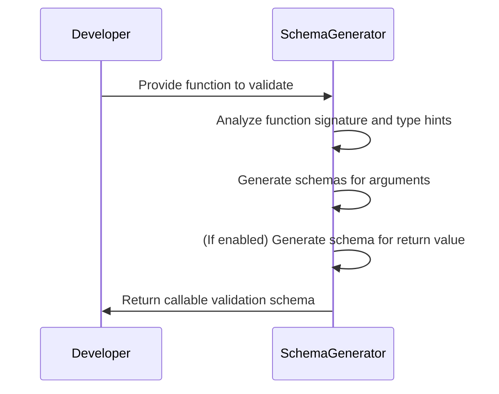
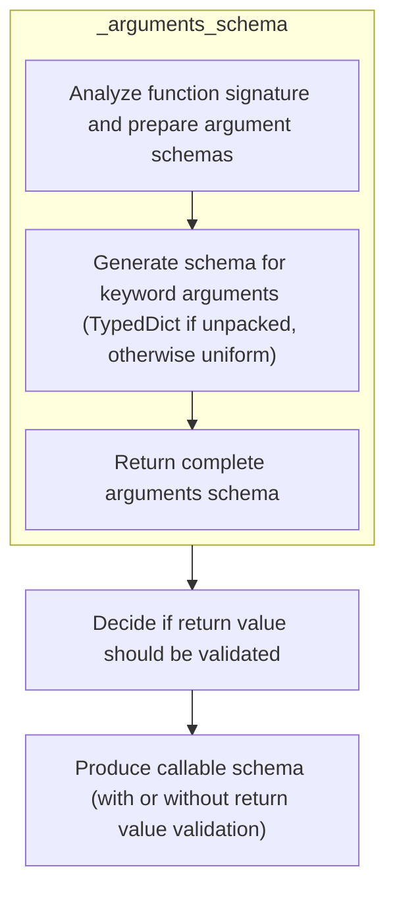
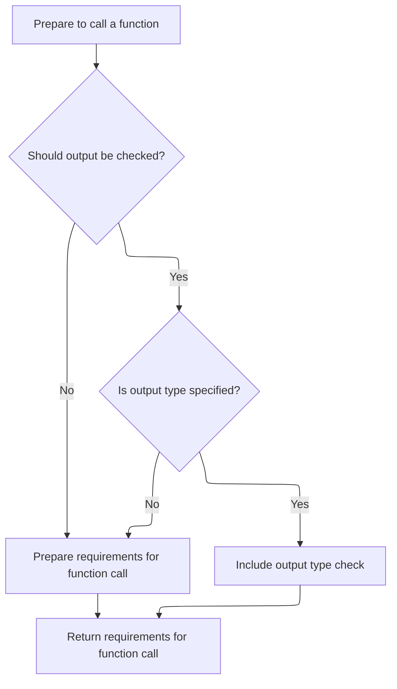

```mermaid
%%{init: {"flowchart": {"defaultRenderer": "elk"}} }%%
flowchart TD
    node1["Start: Generate schema for TypedDict class"] --> node2{"Schema already exists for this TypedDict?"}
    click node1 openCode "pydantic/_internal/_generate_schema.py:1380:1390"
    node2 -- Yes --> node3["Return existing schema"]
    click node2 openCode "pydantic/_internal/_generate_schema.py:1394:1400"
    click node3 openCode "pydantic/_internal/_generate_schema.py:1400:1401"
    node2 -- No --> node4["Check Python version and extract config, decorators, and field info"]
    click node4 openCode "pydantic/_internal/_generate_schema.py:1402:1433"
    node4 --> loop1
    
    subgraph loop1["For each field in TypedDict"]
        node5["Determine if field is required or read-only, apply config and documentation, generate field schema"]
        click node5 openCode "pydantic/_internal/_generate_schema.py:1441:1461"
    end
    loop1 --> node6["Warn if any fields are read-only"]
    click node6 openCode "pydantic/_internal/_generate_schema.py:1463:1471"
    node6 --> node7["Build TypedDict schema with all fields and decorators"]
    click node7 openCode "pydantic/_internal/_generate_schema.py:1473:1482"
    node7 --> node8["Apply serializers and validators"]
    click node8 openCode "pydantic/_internal/_generate_schema.py:1484:1485"
    node8 --> node9["Return final schema reference"]
    click node9 openCode "pydantic/_internal/_generate_schema.py:1486:1486"

%% Swimm:
%% %%{init: {"flowchart": {"defaultRenderer": "elk"}} }%%
%% flowchart TD
%%     node1["Start: Generate schema for <SwmToken path="pydantic/_internal/_generate_schema.py" pos="1381:17:17" line-data="        &quot;&quot;&quot;Generate a core schema for a `TypedDict` class.">`TypedDict`</SwmToken> class"] --> node2{"Schema already exists for this <SwmToken path="pydantic/_internal/_generate_schema.py" pos="1381:17:17" line-data="        &quot;&quot;&quot;Generate a core schema for a `TypedDict` class.">`TypedDict`</SwmToken>?"}
%%     click node1 openCode "<SwmPath>[pydantic/\_internal/\_generate_schema.py](pydantic/_internal/_generate_schema.py)</SwmPath>:1380:1390"
%%     node2 -- Yes --> node3["Return existing schema"]
%%     click node2 openCode "<SwmPath>[pydantic/\_internal/\_generate_schema.py](pydantic/_internal/_generate_schema.py)</SwmPath>:1394:1400"
%%     click node3 openCode "<SwmPath>[pydantic/\_internal/\_generate_schema.py](pydantic/_internal/_generate_schema.py)</SwmPath>:1400:1401"
%%     node2 -- No --> node4["Check Python version and extract config, decorators, and field info"]
%%     click node4 openCode "<SwmPath>[pydantic/\_internal/\_generate_schema.py](pydantic/_internal/_generate_schema.py)</SwmPath>:1402:1433"
%%     node4 --> loop1
%%     
%%     subgraph loop1["For each field in <SwmToken path="pydantic/_internal/_generate_schema.py" pos="1381:17:17" line-data="        &quot;&quot;&quot;Generate a core schema for a `TypedDict` class.">`TypedDict`</SwmToken>"]
%%         node5["Determine if field is required or read-only, apply config and documentation, generate field schema"]
%%         click node5 openCode "<SwmPath>[pydantic/\_internal/\_generate_schema.py](pydantic/_internal/_generate_schema.py)</SwmPath>:1441:1461"
%%     end
%%     loop1 --> node6["Warn if any fields are read-only"]
%%     click node6 openCode "<SwmPath>[pydantic/\_internal/\_generate_schema.py](pydantic/_internal/_generate_schema.py)</SwmPath>:1463:1471"
%%     node6 --> node7["Build <SwmToken path="pydantic/_internal/_generate_schema.py" pos="1381:17:17" line-data="        &quot;&quot;&quot;Generate a core schema for a `TypedDict` class.">`TypedDict`</SwmToken> schema with all fields and decorators"]
%%     click node7 openCode "<SwmPath>[pydantic/\_internal/\_generate_schema.py](pydantic/_internal/_generate_schema.py)</SwmPath>:1473:1482"
%%     node7 --> node8["Apply serializers and validators"]
%%     click node8 openCode "<SwmPath>[pydantic/\_internal/\_generate_schema.py](pydantic/_internal/_generate_schema.py)</SwmPath>:1484:1485"
%%     node8 --> node9["Return final schema reference"]
%%     click node9 openCode "<SwmPath>[pydantic/\_internal/\_generate_schema.py](pydantic/_internal/_generate_schema.py)</SwmPath>:1486:1486"
```

This flow generates a validation schema for a Python function, ensuring its arguments and return value (if specified) match the expected types. The process involves analyzing the function's signature, generating schemas for each argument (including handling for \*args, \*\*kwargs, and <SwmToken path="pydantic/_internal/_generate_schema.py" pos="1381:17:17" line-data="        &quot;&quot;&quot;Generate a core schema for a `TypedDict` class.">`TypedDict`</SwmToken> unpacking), and optionally creating a schema for the return value. These are then combined into a single schema that can be used to validate function calls.

Main steps:

- Analyze the function's signature and extract parameter information
- Generate schemas for all arguments, including special cases
- Optionally generate a schema for the return value
- Combine everything into a callable validation schema



# Spec

## Detailed View of the Program's Functionality

a. Starting the Callable Schema Generation

The process begins by generating a schema for the arguments of a function that is to be validated. This is done by invoking a method responsible for analyzing the function's signature and constructing a schema that describes the expected arguments. This step is foundational because it provides a structured representation of the function's parameters, which is necessary for subsequent validation and schema generation steps.

b. Building the Arguments Schema

To build the arguments schema, the function's signature is inspected. Each parameter is examined to determine its kind (such as positional, keyword, \*args, or \*\*kwargs) and its type annotation. For each parameter:

- If the parameter is a standard positional or keyword argument, a schema is generated for it and added to a list of argument schemas.
- If the parameter is a \*args (variable positional arguments), a schema is generated for the type annotation of the \*args.
- If the parameter is a \*\*kwargs (variable keyword arguments), the code checks if the annotation uses an "Unpack" with a <SwmToken path="pydantic/_internal/_generate_schema.py" pos="1381:17:17" line-data="        &quot;&quot;&quot;Generate a core schema for a `TypedDict` class.">`TypedDict`</SwmToken>. If so, it ensures there are no name conflicts with other parameters and then generates a schema for the <SwmToken path="pydantic/_internal/_generate_schema.py" pos="1381:17:17" line-data="        &quot;&quot;&quot;Generate a core schema for a `TypedDict` class.">`TypedDict`</SwmToken> using a dedicated method. If not, it treats \*\*kwargs as a uniform mapping and generates a schema accordingly.

After processing all parameters, the method returns a complete arguments schema object that includes all the individual parameter schemas, as well as any schemas for \*args and \*\*kwargs.

c. Generating the <SwmToken path="pydantic/_internal/_generate_schema.py" pos="1381:17:17" line-data="        &quot;&quot;&quot;Generate a core schema for a `TypedDict` class.">`TypedDict`</SwmToken> Schema

When a \*\*kwargs parameter is annotated with an Unpack of a <SwmToken path="pydantic/_internal/_generate_schema.py" pos="1381:17:17" line-data="        &quot;&quot;&quot;Generate a core schema for a `TypedDict` class.">`TypedDict`</SwmToken>, a specialized method is called to generate the schema for that <SwmToken path="pydantic/_internal/_generate_schema.py" pos="1381:17:17" line-data="        &quot;&quot;&quot;Generate a core schema for a `TypedDict` class.">`TypedDict`</SwmToken>. This process involves several steps:

- The method first checks if a schema for this <SwmToken path="pydantic/_internal/_generate_schema.py" pos="1381:17:17" line-data="        &quot;&quot;&quot;Generate a core schema for a `TypedDict` class.">`TypedDict`</SwmToken> has already been generated. If so, it returns the existing schema to avoid redundant work.
- If not, it verifies Python version compatibility and extracts configuration, decorators, and field information from the <SwmToken path="pydantic/_internal/_generate_schema.py" pos="1381:17:17" line-data="        &quot;&quot;&quot;Generate a core schema for a `TypedDict` class.">`TypedDict`</SwmToken> class.
- For each field in the <SwmToken path="pydantic/_internal/_generate_schema.py" pos="1381:17:17" line-data="        &quot;&quot;&quot;Generate a core schema for a `TypedDict` class.">`TypedDict`</SwmToken>, it determines whether the field is required or read-only, applies any relevant configuration and documentation, and generates a schema for the field.
- If any fields are marked as read-only, a warning is issued to inform the user that Pydantic does not enforce immutability on dictionary instances.
- After processing all fields, the method constructs the <SwmToken path="pydantic/_internal/_generate_schema.py" pos="1381:17:17" line-data="        &quot;&quot;&quot;Generate a core schema for a `TypedDict` class.">`TypedDict`</SwmToken> schema, incorporating all fields and any computed fields or decorators.
- Serializers and validators are applied to the schema as needed.
- Finally, the schema is stored and a reference to it is returned.

d. Finalizing the Arguments Schema

Once all parameters have been processed and any necessary <SwmToken path="pydantic/_internal/_generate_schema.py" pos="1381:17:17" line-data="        &quot;&quot;&quot;Generate a core schema for a `TypedDict` class.">`TypedDict`</SwmToken> schemas have been generated, the arguments schema is finalized. This schema object encapsulates all the information needed to validate the function's arguments, including the structure of positional and keyword arguments, as well as any special handling for \*args and \*\*kwargs.

e. Completing the Callable Schema

With the arguments schema prepared, the process moves on to determining whether the function's return value should also be validated. This decision is based on configuration settings and the presence of a return type annotation on the function:

- If return value validation is enabled and the function has a return annotation, a schema is generated for the return type.
- If not, return value validation is skipped.

Finally, a callable schema object is constructed. This object includes the arguments schema, the function itself, and, if applicable, the return value schema. This callable schema fully describes how to validate both the inputs and outputs of the function according to the specified type hints and configuration.

f. Summary

The overall flow involves:

1. Analyzing the function signature and generating schemas for each argument.
2. Handling special cases for \*args and \*\*kwargs, including support for <SwmToken path="pydantic/_internal/_generate_schema.py" pos="1381:17:17" line-data="        &quot;&quot;&quot;Generate a core schema for a `TypedDict` class.">`TypedDict`</SwmToken> unpacking.
3. Building detailed schemas for TypedDicts, including field-level configuration and validation.
4. Assembling the complete arguments schema.
5. Optionally generating a schema for the function's return value.
6. Producing a final callable schema that can be used to validate calls to the function, ensuring both inputs and outputs conform to the expected types and constraints.

# Rule Definition

| Paragraph Name                                                                                                                                                                                                                                                                                                                                                                                                          | Rule ID | Category          | Description                                                                                                                                                                                                                                                                                                                                                                                                                                                                                                                                                                                                                                                                                                                                                                                                                                                                                                                                                                                                                                                                                                                                     | Conditions                                                                                                       | Remarks                                                                                                                                                                                                                                                                                                                                                                                                                                                                                                                                               |
| ----------------------------------------------------------------------------------------------------------------------------------------------------------------------------------------------------------------------------------------------------------------------------------------------------------------------------------------------------------------------------------------------------------------------- | ------- | ----------------- | ----------------------------------------------------------------------------------------------------------------------------------------------------------------------------------------------------------------------------------------------------------------------------------------------------------------------------------------------------------------------------------------------------------------------------------------------------------------------------------------------------------------------------------------------------------------------------------------------------------------------------------------------------------------------------------------------------------------------------------------------------------------------------------------------------------------------------------------------------------------------------------------------------------------------------------------------------------------------------------------------------------------------------------------------------------------------------------------------------------------------------------------------- | ---------------------------------------------------------------------------------------------------------------- | ----------------------------------------------------------------------------------------------------------------------------------------------------------------------------------------------------------------------------------------------------------------------------------------------------------------------------------------------------------------------------------------------------------------------------------------------------------------------------------------------------------------------------------------------------- |
| def <SwmToken path="pydantic/_internal/_generate_schema.py" pos="1910:3:3" line-data="    def _call_schema(self, function: ValidateCallSupportedTypes) -&gt; core_schema.CallSchema:">`_call_schema`</SwmToken>, def <SwmToken path="pydantic/_internal/_generate_schema.py" pos="1927:7:7" line-data="                return_schema = self.generate_schema(type_hints[&#39;return&#39;])">`generate_schema`</SwmToken> | RL-001  | Conditional Logic | When generating a schema for a function call, the system must first generate a schema for the function's arguments. If return value validation is enabled and the function has a return type annotation, a schema for the return value must also be generated and included in the callable schema.                                                                                                                                                                                                                                                                                                                                                                                                                                                                                                                                                                                                                                                                                                                                                                                                                                              | Input is a function object; return value validation is enabled in config; function has a return type annotation. | The callable schema must be a dictionary with keys: 'type' (value: 'call'), <SwmToken path="pydantic/_internal/_generate_schema.py" pos="1915:1:1" line-data="        arguments_schema = self._arguments_schema(function)">`arguments_schema`</SwmToken> (the arguments schema object), 'function' (the function object), and optionally <SwmToken path="pydantic/_internal/_generate_schema.py" pos="1917:1:1" line-data="        return_schema: core_schema.CoreSchema \| None = None">`return_schema`</SwmToken> (the return value schema object). |
| def <SwmToken path="pydantic/_internal/_generate_schema.py" pos="1915:7:7" line-data="        arguments_schema = self._arguments_schema(function)">`_arguments_schema`</SwmToken>                                                                                                                                                                                                                                       | RL-002  | Data Assignment   | The arguments schema for a function must be represented as an object with specific keys: 'type' (value: 'arguments'), <SwmToken path="pydantic/_internal/_generate_schema.py" pos="1915:1:1" line-data="        arguments_schema = self._arguments_schema(function)">`arguments_schema`</SwmToken> (list of parameter schemas), <SwmToken path="pydantic/_internal/_generate_schema.py" pos="1950:1:1" line-data="        var_args_schema: core_schema.CoreSchema \| None = None">`var_args_schema`</SwmToken> (if \*args is present), <SwmToken path="pydantic/_internal/_generate_schema.py" pos="1952:1:1" line-data="        var_kwargs_mode: core_schema.VarKwargsMode \| None = None">`var_kwargs_mode`</SwmToken> and <SwmToken path="pydantic/_internal/_generate_schema.py" pos="1951:1:1" line-data="        var_kwargs_schema: core_schema.CoreSchema \| None = None">`var_kwargs_schema`</SwmToken> (if \*\*kwargs is present), and <SwmToken path="pydantic/_internal/_generate_schema.py" pos="2007:1:1" line-data="            validate_by_name=self._config_wrapper.validate_by_name,">`validate_by_name`</SwmToken> (boolean). | Input is a function object; function may have \*args and/or \*\*kwargs.                                          | The arguments schema is a dictionary with:                                                                                                                                                                                                                                                                                                                                                                                                                                                                                                            |

- 'type': 'arguments'
- <SwmToken path="pydantic/_internal/_generate_schema.py" pos="1915:1:1" line-data="        arguments_schema = self._arguments_schema(function)">`arguments_schema`</SwmToken>: list of parameter schemas (one per parameter)
- <SwmToken path="pydantic/_internal/_generate_schema.py" pos="1950:1:1" line-data="        var_args_schema: core_schema.CoreSchema | None = None">`var_args_schema`</SwmToken>: present if \*args, schema for extra positional arguments
- <SwmToken path="pydantic/_internal/_generate_schema.py" pos="1952:1:1" line-data="        var_kwargs_mode: core_schema.VarKwargsMode | None = None">`var_kwargs_mode`</SwmToken>: present if \*\*kwargs, value is <SwmToken path="pydantic/_internal/_generate_schema.py" pos="1996:6:10" line-data="                    var_kwargs_mode = &#39;unpacked-typed-dict&#39;">`unpacked-typed-dict`</SwmToken> or 'uniform'
- <SwmToken path="pydantic/_internal/_generate_schema.py" pos="1951:1:1" line-data="        var_kwargs_schema: core_schema.CoreSchema | None = None">`var_kwargs_schema`</SwmToken>: present if \*\*kwargs, schema for extra keyword arguments
- <SwmToken path="pydantic/_internal/_generate_schema.py" pos="2007:1:1" line-data="            validate_by_name=self._config_wrapper.validate_by_name,">`validate_by_name`</SwmToken>: boolean | | def <SwmToken path="pydantic/_internal/_generate_schema.py" pos="1967:7:7" line-data="                arg_schema = self._generate_parameter_schema(">`_generate_parameter_schema`</SwmToken> | RL-003 | Data Assignment | Each parameter in the function must have a schema that reflects its kind (positional, keyword, \*args, \*\*kwargs) and its type annotation. Special handling is required for \*args and \*\*kwargs. | Parameter is part of a function signature. | Parameter schema includes name, type annotation, and mode (<SwmToken path="pydantic/_internal/_generate_schema.py" pos="1939:12:12" line-data="        mode_lookup: dict[_ParameterKind, Literal[&#39;positional_only&#39;, &#39;positional_or_keyword&#39;, &#39;keyword_only&#39;]] = {">`positional_only`</SwmToken>, <SwmToken path="pydantic/_internal/_generate_schema.py" pos="1939:17:17" line-data="        mode_lookup: dict[_ParameterKind, Literal[&#39;positional_only&#39;, &#39;positional_or_keyword&#39;, &#39;keyword_only&#39;]] = {">`positional_or_keyword`</SwmToken>, <SwmToken path="pydantic/_internal/_generate_schema.py" pos="1939:22:22" line-data="        mode_lookup: dict[_ParameterKind, Literal[&#39;positional_only&#39;, &#39;positional_or_keyword&#39;, &#39;keyword_only&#39;]] = {">`keyword_only`</SwmToken>, <SwmToken path="pydantic/_internal/_generate_schema.py" pos="1585:2:2" line-data="            &#39;var_args&#39;,">`var_args`</SwmToken>, <SwmToken path="pydantic/_internal/_generate_schema.py" pos="1586:2:2" line-data="            &#39;var_kwargs_uniform&#39;,">`var_kwargs_uniform`</SwmToken>, <SwmToken path="pydantic/_internal/_generate_schema.py" pos="1587:2:2" line-data="            &#39;var_kwargs_unpacked_typed_dict&#39;,">`var_kwargs_unpacked_typed_dict`</SwmToken>). | | def <SwmToken path="pydantic/_internal/_generate_schema.py" pos="1380:3:3" line-data="    def _typed_dict_schema(self, typed_dict_cls: Any, origin: Any) -&gt; core_schema.CoreSchema:">`_typed_dict_schema`</SwmToken> | RL-004 | Data Assignment | When generating a schema for a <SwmToken path="pydantic/_internal/_generate_schema.py" pos="1381:17:17" line-data="        &quot;&quot;&quot;Generate a core schema for a `TypedDict` class.">`TypedDict`</SwmToken>, the schema must be an object with keys: 'type' (value: <SwmToken path="pydantic/_internal/_generate_schema.py" pos="1409:4:6" line-data="                    code=&#39;typed-dict-version&#39;,">`typed-dict`</SwmToken>), 'fields' (mapping of field names to field schemas), 'cls' (the <SwmToken path="pydantic/_internal/_generate_schema.py" pos="1381:17:17" line-data="        &quot;&quot;&quot;Generate a core schema for a `TypedDict` class.">`TypedDict`</SwmToken> class), <SwmToken path="pydantic/_internal/_generate_schema.py" pos="1476:1:1" line-data="                    computed_fields=[">`computed_fields`</SwmToken> (list of computed field schemas), 'ref' (reference string), and 'config' (configuration dictionary). Each field must indicate if it is required or read-only, and include configuration and documentation. | Input is a <SwmToken path="pydantic/_internal/_generate_schema.py" pos="1381:17:17" line-data="        &quot;&quot;&quot;Generate a core schema for a `TypedDict` class.">`TypedDict`</SwmToken> class. | <SwmToken path="pydantic/_internal/_generate_schema.py" pos="1381:17:17" line-data="        &quot;&quot;&quot;Generate a core schema for a `TypedDict` class.">`TypedDict`</SwmToken> schema is a dictionary with:
- 'type': <SwmToken path="pydantic/_internal/_generate_schema.py" pos="1409:4:6" line-data="                    code=&#39;typed-dict-version&#39;,">`typed-dict`</SwmToken>
- 'fields': dict of field name to field schema
- 'cls': <SwmToken path="pydantic/_internal/_generate_schema.py" pos="1381:17:17" line-data="        &quot;&quot;&quot;Generate a core schema for a `TypedDict` class.">`TypedDict`</SwmToken> class
- <SwmToken path="pydantic/_internal/_generate_schema.py" pos="1476:1:1" line-data="                    computed_fields=[">`computed_fields`</SwmToken>: list of computed field schemas
- 'ref': string reference
- 'config': config dict Field schemas indicate required/read-only status, configuration, and documentation. Serializers and validators may be included. | | def <SwmToken path="pydantic/_internal/_generate_schema.py" pos="1927:7:7" line-data="                return_schema = self.generate_schema(type_hints[&#39;return&#39;])">`generate_schema`</SwmToken> | RL-005 | Computation | The schema generation process is driven by a function that accepts a single object (type, function, class, etc.) and returns a schema object with a 'type' key and additional keys depending on the object type. | Input is any object to be validated (type, function, class, etc.). | The output schema is a dictionary with at least a 'type' key, and other keys as required by the object type (<SwmToken path="pydantic/_internal/_generate_schema.py" pos="184:38:40" line-data="&quot;&quot;&quot;`FieldInfo` attributes (and their default value) that can&#39;t be used outside of a model (e.g. in a type adapter or a PEP 695 type alias).&quot;&quot;&quot;">`e.g`</SwmToken>., 'model', <SwmToken path="pydantic/_internal/_generate_schema.py" pos="1409:4:6" line-data="                    code=&#39;typed-dict-version&#39;,">`typed-dict`</SwmToken>, 'call', 'list', etc.). | | def <SwmToken path="pydantic/_internal/_generate_schema.py" pos="1927:7:7" line-data="                return_schema = self.generate_schema(type_hints[&#39;return&#39;])">`generate_schema`</SwmToken>, def <SwmToken path="pydantic/_internal/_generate_schema.py" pos="1910:3:3" line-data="    def _call_schema(self, function: ValidateCallSupportedTypes) -&gt; core_schema.CallSchema:">`_call_schema`</SwmToken>, def <SwmToken path="pydantic/_internal/_generate_schema.py" pos="1915:7:7" line-data="        arguments_schema = self._arguments_schema(function)">`_arguments_schema`</SwmToken>, def <SwmToken path="pydantic/_internal/_generate_schema.py" pos="1380:3:3" line-data="    def _typed_dict_schema(self, typed_dict_cls: Any, origin: Any) -&gt; core_schema.CoreSchema:">`_typed_dict_schema`</SwmToken> | RL-006 | Conditional Logic | All schema objects generated must be dictionary-like and must include the required keys as specified for their type. | Any schema object is generated. | Schema objects are Python dictionaries with required keys as per their type (<SwmToken path="pydantic/_internal/_generate_schema.py" pos="184:38:40" line-data="&quot;&quot;&quot;`FieldInfo` attributes (and their default value) that can&#39;t be used outside of a model (e.g. in a type adapter or a PEP 695 type alias).&quot;&quot;&quot;">`e.g`</SwmToken>., 'type', 'fields', <SwmToken path="pydantic/_internal/_generate_schema.py" pos="1915:1:1" line-data="        arguments_schema = self._arguments_schema(function)">`arguments_schema`</SwmToken>, etc.). |

# User Stories

## User Story 1: Generate callable schema for function validation

---

### Story Description:

As a system, I want to generate a schema for validating calls to a function, including its arguments and, if enabled, its return value, so that function calls can be validated according to their signature and type annotations.

---

### Business Rule Mapping:

| Rule ID | Paragraph Name                                                                                                                                                                                                                                                                                                                                                                                                                                                                                                                                                                                                                                                                                                                                                                                                                      | Rule Description                                                                                                                                                                                                                                                                                   |
| ------- | ----------------------------------------------------------------------------------------------------------------------------------------------------------------------------------------------------------------------------------------------------------------------------------------------------------------------------------------------------------------------------------------------------------------------------------------------------------------------------------------------------------------------------------------------------------------------------------------------------------------------------------------------------------------------------------------------------------------------------------------------------------------------------------------------------------------------------------- | -------------------------------------------------------------------------------------------------------------------------------------------------------------------------------------------------------------------------------------------------------------------------------------------------- |
| RL-001  | def <SwmToken path="pydantic/_internal/_generate_schema.py" pos="1910:3:3" line-data="    def _call_schema(self, function: ValidateCallSupportedTypes) -&gt; core_schema.CallSchema:">`_call_schema`</SwmToken>, def <SwmToken path="pydantic/_internal/_generate_schema.py" pos="1927:7:7" line-data="                return_schema = self.generate_schema(type_hints[&#39;return&#39;])">`generate_schema`</SwmToken>                                                                                                                                                                                                                                                                                                                                                                                                             | When generating a schema for a function call, the system must first generate a schema for the function's arguments. If return value validation is enabled and the function has a return type annotation, a schema for the return value must also be generated and included in the callable schema. |
| RL-006  | def <SwmToken path="pydantic/_internal/_generate_schema.py" pos="1927:7:7" line-data="                return_schema = self.generate_schema(type_hints[&#39;return&#39;])">`generate_schema`</SwmToken>, def <SwmToken path="pydantic/_internal/_generate_schema.py" pos="1910:3:3" line-data="    def _call_schema(self, function: ValidateCallSupportedTypes) -&gt; core_schema.CallSchema:">`_call_schema`</SwmToken>, def <SwmToken path="pydantic/_internal/_generate_schema.py" pos="1915:7:7" line-data="        arguments_schema = self._arguments_schema(function)">`_arguments_schema`</SwmToken>, def <SwmToken path="pydantic/_internal/_generate_schema.py" pos="1380:3:3" line-data="    def _typed_dict_schema(self, typed_dict_cls: Any, origin: Any) -&gt; core_schema.CoreSchema:">`_typed_dict_schema`</SwmToken> | All schema objects generated must be dictionary-like and must include the required keys as specified for their type.                                                                                                                                                                               |

---

### Relevant Functionality:

- **def** <SwmToken path="pydantic/_internal/_generate_schema.py" pos="1910:3:3" line-data="    def _call_schema(self, function: ValidateCallSupportedTypes) -&gt; core_schema.CallSchema:">`_call_schema`</SwmToken>
  1. **RL-001:**
     - When generating a schema for a function:
       - Generate the arguments schema using the function signature and type hints.
       - If config.validate_return is True and the function has a return annotation:
         - Generate the return schema from the return type annotation.
         - Include <SwmToken path="pydantic/_internal/_generate_schema.py" pos="1917:1:1" line-data="        return_schema: core_schema.CoreSchema | None = None">`return_schema`</SwmToken> in the final schema.
       - Return a dictionary with 'type': 'call', <SwmToken path="pydantic/_internal/_generate_schema.py" pos="1915:1:1" line-data="        arguments_schema = self._arguments_schema(function)">`arguments_schema`</SwmToken>, 'function', and optionally <SwmToken path="pydantic/_internal/_generate_schema.py" pos="1917:1:1" line-data="        return_schema: core_schema.CoreSchema | None = None">`return_schema`</SwmToken>.
- **def** <SwmToken path="pydantic/_internal/_generate_schema.py" pos="1927:7:7" line-data="                return_schema = self.generate_schema(type_hints[&#39;return&#39;])">`generate_schema`</SwmToken>
  1. **RL-006:**
     - When generating any schema object:
       - Ensure the result is a dictionary.
       - Ensure all required keys for the schema type are present.

## User Story 2: Generate detailed arguments schema for functions

---

### Story Description:

As a system, I want to generate a detailed arguments schema for a function, including handling of positional, keyword, \*args, and \*\*kwargs parameters, so that all function arguments can be validated accurately according to their kind and type annotation.

---

### Business Rule Mapping:

| Rule ID | Paragraph Name                                                                                                                                                                                                                                                                                                                                                                                                                                                                                                                                                                                                                                                                                                                                                                                                                      | Rule Description                                                                                                                                                                                                                                                                                                                                                                                                                                                                                                                                                                                                                                                                                                                                                                                                                                                                                                                                                                                                                                                                                                                                |
| ------- | ----------------------------------------------------------------------------------------------------------------------------------------------------------------------------------------------------------------------------------------------------------------------------------------------------------------------------------------------------------------------------------------------------------------------------------------------------------------------------------------------------------------------------------------------------------------------------------------------------------------------------------------------------------------------------------------------------------------------------------------------------------------------------------------------------------------------------------- | ----------------------------------------------------------------------------------------------------------------------------------------------------------------------------------------------------------------------------------------------------------------------------------------------------------------------------------------------------------------------------------------------------------------------------------------------------------------------------------------------------------------------------------------------------------------------------------------------------------------------------------------------------------------------------------------------------------------------------------------------------------------------------------------------------------------------------------------------------------------------------------------------------------------------------------------------------------------------------------------------------------------------------------------------------------------------------------------------------------------------------------------------- |
| RL-002  | def <SwmToken path="pydantic/_internal/_generate_schema.py" pos="1915:7:7" line-data="        arguments_schema = self._arguments_schema(function)">`_arguments_schema`</SwmToken>                                                                                                                                                                                                                                                                                                                                                                                                                                                                                                                                                                                                                                                   | The arguments schema for a function must be represented as an object with specific keys: 'type' (value: 'arguments'), <SwmToken path="pydantic/_internal/_generate_schema.py" pos="1915:1:1" line-data="        arguments_schema = self._arguments_schema(function)">`arguments_schema`</SwmToken> (list of parameter schemas), <SwmToken path="pydantic/_internal/_generate_schema.py" pos="1950:1:1" line-data="        var_args_schema: core_schema.CoreSchema \| None = None">`var_args_schema`</SwmToken> (if \*args is present), <SwmToken path="pydantic/_internal/_generate_schema.py" pos="1952:1:1" line-data="        var_kwargs_mode: core_schema.VarKwargsMode \| None = None">`var_kwargs_mode`</SwmToken> and <SwmToken path="pydantic/_internal/_generate_schema.py" pos="1951:1:1" line-data="        var_kwargs_schema: core_schema.CoreSchema \| None = None">`var_kwargs_schema`</SwmToken> (if \*\*kwargs is present), and <SwmToken path="pydantic/_internal/_generate_schema.py" pos="2007:1:1" line-data="            validate_by_name=self._config_wrapper.validate_by_name,">`validate_by_name`</SwmToken> (boolean). |
| RL-003  | def <SwmToken path="pydantic/_internal/_generate_schema.py" pos="1967:7:7" line-data="                arg_schema = self._generate_parameter_schema(">`_generate_parameter_schema`</SwmToken>                                                                                                                                                                                                                                                                                                                                                                                                                                                                                                                                                                                                                                        | Each parameter in the function must have a schema that reflects its kind (positional, keyword, \*args, \*\*kwargs) and its type annotation. Special handling is required for \*args and \*\*kwargs.                                                                                                                                                                                                                                                                                                                                                                                                                                                                                                                                                                                                                                                                                                                                                                                                                                                                                                                                             |
| RL-006  | def <SwmToken path="pydantic/_internal/_generate_schema.py" pos="1927:7:7" line-data="                return_schema = self.generate_schema(type_hints[&#39;return&#39;])">`generate_schema`</SwmToken>, def <SwmToken path="pydantic/_internal/_generate_schema.py" pos="1910:3:3" line-data="    def _call_schema(self, function: ValidateCallSupportedTypes) -&gt; core_schema.CallSchema:">`_call_schema`</SwmToken>, def <SwmToken path="pydantic/_internal/_generate_schema.py" pos="1915:7:7" line-data="        arguments_schema = self._arguments_schema(function)">`_arguments_schema`</SwmToken>, def <SwmToken path="pydantic/_internal/_generate_schema.py" pos="1380:3:3" line-data="    def _typed_dict_schema(self, typed_dict_cls: Any, origin: Any) -&gt; core_schema.CoreSchema:">`_typed_dict_schema`</SwmToken> | All schema objects generated must be dictionary-like and must include the required keys as specified for their type.                                                                                                                                                                                                                                                                                                                                                                                                                                                                                                                                                                                                                                                                                                                                                                                                                                                                                                                                                                                                                            |

---

### Relevant Functionality:

- **def** <SwmToken path="pydantic/_internal/_generate_schema.py" pos="1915:7:7" line-data="        arguments_schema = self._arguments_schema(function)">`_arguments_schema`</SwmToken>
  1. **RL-002:**
     - Inspect the function signature.
     - For each parameter:
       - Generate a parameter schema reflecting its kind and type annotation.
     - If \*args is present:
       - Generate <SwmToken path="pydantic/_internal/_generate_schema.py" pos="1950:1:1" line-data="        var_args_schema: core_schema.CoreSchema | None = None">`var_args_schema`</SwmToken> from its annotation.
     - If \*\*kwargs is present:
       - If using Unpack with <SwmToken path="pydantic/_internal/_generate_schema.py" pos="1381:17:17" line-data="        &quot;&quot;&quot;Generate a core schema for a `TypedDict` class.">`TypedDict`</SwmToken>:
         - Set <SwmToken path="pydantic/_internal/_generate_schema.py" pos="1952:1:1" line-data="        var_kwargs_mode: core_schema.VarKwargsMode | None = None">`var_kwargs_mode`</SwmToken> to <SwmToken path="pydantic/_internal/_generate_schema.py" pos="1996:6:10" line-data="                    var_kwargs_mode = &#39;unpacked-typed-dict&#39;">`unpacked-typed-dict`</SwmToken>.
         - Generate <SwmToken path="pydantic/_internal/_generate_schema.py" pos="1951:1:1" line-data="        var_kwargs_schema: core_schema.CoreSchema | None = None">`var_kwargs_schema`</SwmToken> as a <SwmToken path="pydantic/_internal/_generate_schema.py" pos="1381:17:17" line-data="        &quot;&quot;&quot;Generate a core schema for a `TypedDict` class.">`TypedDict`</SwmToken> schema.
         - Ensure no name conflicts with other parameters.
       - Else:
         - Set <SwmToken path="pydantic/_internal/_generate_schema.py" pos="1952:1:1" line-data="        var_kwargs_mode: core_schema.VarKwargsMode | None = None">`var_kwargs_mode`</SwmToken> to 'uniform'.
         - Generate <SwmToken path="pydantic/_internal/_generate_schema.py" pos="1951:1:1" line-data="        var_kwargs_schema: core_schema.CoreSchema | None = None">`var_kwargs_schema`</SwmToken> as a mapping schema.
     - Set <SwmToken path="pydantic/_internal/_generate_schema.py" pos="2007:1:1" line-data="            validate_by_name=self._config_wrapper.validate_by_name,">`validate_by_name`</SwmToken> according to config.
     - Return the arguments schema dictionary.
- **def** <SwmToken path="pydantic/_internal/_generate_schema.py" pos="1967:7:7" line-data="                arg_schema = self._generate_parameter_schema(">`_generate_parameter_schema`</SwmToken>
  1. **RL-003:**
     - For each parameter in the function signature:
       - Determine the kind (positional, keyword, \*args, \*\*kwargs).
       - Use the type annotation to generate the schema.
       - For \*args, use the annotation for extra positional arguments.
       - For \*\*kwargs, if Unpack with <SwmToken path="pydantic/_internal/_generate_schema.py" pos="1381:17:17" line-data="        &quot;&quot;&quot;Generate a core schema for a `TypedDict` class.">`TypedDict`</SwmToken>, generate <SwmToken path="pydantic/_internal/_generate_schema.py" pos="1381:17:17" line-data="        &quot;&quot;&quot;Generate a core schema for a `TypedDict` class.">`TypedDict`</SwmToken> schema; else, generate uniform mapping schema.
       - Return the parameter schema.
- **def** <SwmToken path="pydantic/_internal/_generate_schema.py" pos="1927:7:7" line-data="                return_schema = self.generate_schema(type_hints[&#39;return&#39;])">`generate_schema`</SwmToken>
  1. **RL-006:**
     - When generating any schema object:
       - Ensure the result is a dictionary.
       - Ensure all required keys for the schema type are present.

## User Story 3: Generate schema for TypedDicts used in function signatures

---

### Story Description:

As a system, I want to generate a schema for TypedDicts used in function signatures, including all required fields, configuration, documentation, and special attributes, so that TypedDict-based arguments can be validated with all necessary constraints and metadata.

---

### Business Rule Mapping:

| Rule ID | Paragraph Name                                                                                                                                                                                                                                                                                                                                                                                                                                                                                                                                                                                                                                                                                                                                                                                                                      | Rule Description                                                                                                                                                                                                                                                                                                                                                                                                                                                                                                                                                                                                                                                                                                                                                                                                                                                                                                                                                                                                                                                               |
| ------- | ----------------------------------------------------------------------------------------------------------------------------------------------------------------------------------------------------------------------------------------------------------------------------------------------------------------------------------------------------------------------------------------------------------------------------------------------------------------------------------------------------------------------------------------------------------------------------------------------------------------------------------------------------------------------------------------------------------------------------------------------------------------------------------------------------------------------------------- | ------------------------------------------------------------------------------------------------------------------------------------------------------------------------------------------------------------------------------------------------------------------------------------------------------------------------------------------------------------------------------------------------------------------------------------------------------------------------------------------------------------------------------------------------------------------------------------------------------------------------------------------------------------------------------------------------------------------------------------------------------------------------------------------------------------------------------------------------------------------------------------------------------------------------------------------------------------------------------------------------------------------------------------------------------------------------------ |
| RL-004  | def <SwmToken path="pydantic/_internal/_generate_schema.py" pos="1380:3:3" line-data="    def _typed_dict_schema(self, typed_dict_cls: Any, origin: Any) -&gt; core_schema.CoreSchema:">`_typed_dict_schema`</SwmToken>                                                                                                                                                                                                                                                                                                                                                                                                                                                                                                                                                                                                             | When generating a schema for a <SwmToken path="pydantic/_internal/_generate_schema.py" pos="1381:17:17" line-data="        &quot;&quot;&quot;Generate a core schema for a `TypedDict` class.">`TypedDict`</SwmToken>, the schema must be an object with keys: 'type' (value: <SwmToken path="pydantic/_internal/_generate_schema.py" pos="1409:4:6" line-data="                    code=&#39;typed-dict-version&#39;,">`typed-dict`</SwmToken>), 'fields' (mapping of field names to field schemas), 'cls' (the <SwmToken path="pydantic/_internal/_generate_schema.py" pos="1381:17:17" line-data="        &quot;&quot;&quot;Generate a core schema for a `TypedDict` class.">`TypedDict`</SwmToken> class), <SwmToken path="pydantic/_internal/_generate_schema.py" pos="1476:1:1" line-data="                    computed_fields=[">`computed_fields`</SwmToken> (list of computed field schemas), 'ref' (reference string), and 'config' (configuration dictionary). Each field must indicate if it is required or read-only, and include configuration and documentation. |
| RL-006  | def <SwmToken path="pydantic/_internal/_generate_schema.py" pos="1927:7:7" line-data="                return_schema = self.generate_schema(type_hints[&#39;return&#39;])">`generate_schema`</SwmToken>, def <SwmToken path="pydantic/_internal/_generate_schema.py" pos="1910:3:3" line-data="    def _call_schema(self, function: ValidateCallSupportedTypes) -&gt; core_schema.CallSchema:">`_call_schema`</SwmToken>, def <SwmToken path="pydantic/_internal/_generate_schema.py" pos="1915:7:7" line-data="        arguments_schema = self._arguments_schema(function)">`_arguments_schema`</SwmToken>, def <SwmToken path="pydantic/_internal/_generate_schema.py" pos="1380:3:3" line-data="    def _typed_dict_schema(self, typed_dict_cls: Any, origin: Any) -&gt; core_schema.CoreSchema:">`_typed_dict_schema`</SwmToken> | All schema objects generated must be dictionary-like and must include the required keys as specified for their type.                                                                                                                                                                                                                                                                                                                                                                                                                                                                                                                                                                                                                                                                                                                                                                                                                                                                                                                                                           |

---

### Relevant Functionality:

- **def** <SwmToken path="pydantic/_internal/_generate_schema.py" pos="1380:3:3" line-data="    def _typed_dict_schema(self, typed_dict_cls: Any, origin: Any) -&gt; core_schema.CoreSchema:">`_typed_dict_schema`</SwmToken>
  1. **RL-004:**
     - For each field in the <SwmToken path="pydantic/_internal/_generate_schema.py" pos="1381:17:17" line-data="        &quot;&quot;&quot;Generate a core schema for a `TypedDict` class.">`TypedDict`</SwmToken>:
       - Determine if the field is required or read-only.
       - Include configuration and documentation.
     - Build the schema dictionary with the required keys.
     - Include serializers and validators if present.
     - Return the <SwmToken path="pydantic/_internal/_generate_schema.py" pos="1381:17:17" line-data="        &quot;&quot;&quot;Generate a core schema for a `TypedDict` class.">`TypedDict`</SwmToken> schema.
- **def** <SwmToken path="pydantic/_internal/_generate_schema.py" pos="1927:7:7" line-data="                return_schema = self.generate_schema(type_hints[&#39;return&#39;])">`generate_schema`</SwmToken>
  1. **RL-006:**
     - When generating any schema object:
       - Ensure the result is a dictionary.
       - Ensure all required keys for the schema type are present.

## User Story 4: Support schema generation for any object type

---

### Story Description:

As a system, I want to generate a schema for any object type (function, class, <SwmToken path="pydantic/_internal/_generate_schema.py" pos="1381:17:17" line-data="        &quot;&quot;&quot;Generate a core schema for a `TypedDict` class.">`TypedDict`</SwmToken>, etc.) by accepting a single object and returning a schema object with the appropriate structure, so that the schema generation process is flexible and extensible.

---

### Business Rule Mapping:

| Rule ID | Paragraph Name                                                                                                                                                                                                                                                                                                                                                                                                                                                                                                                                                                                                                                                                                                                                                                                                                      | Rule Description                                                                                                                                                                                                 |
| ------- | ----------------------------------------------------------------------------------------------------------------------------------------------------------------------------------------------------------------------------------------------------------------------------------------------------------------------------------------------------------------------------------------------------------------------------------------------------------------------------------------------------------------------------------------------------------------------------------------------------------------------------------------------------------------------------------------------------------------------------------------------------------------------------------------------------------------------------------- | ---------------------------------------------------------------------------------------------------------------------------------------------------------------------------------------------------------------- |
| RL-005  | def <SwmToken path="pydantic/_internal/_generate_schema.py" pos="1927:7:7" line-data="                return_schema = self.generate_schema(type_hints[&#39;return&#39;])">`generate_schema`</SwmToken>                                                                                                                                                                                                                                                                                                                                                                                                                                                                                                                                                                                                                              | The schema generation process is driven by a function that accepts a single object (type, function, class, etc.) and returns a schema object with a 'type' key and additional keys depending on the object type. |
| RL-006  | def <SwmToken path="pydantic/_internal/_generate_schema.py" pos="1927:7:7" line-data="                return_schema = self.generate_schema(type_hints[&#39;return&#39;])">`generate_schema`</SwmToken>, def <SwmToken path="pydantic/_internal/_generate_schema.py" pos="1910:3:3" line-data="    def _call_schema(self, function: ValidateCallSupportedTypes) -&gt; core_schema.CallSchema:">`_call_schema`</SwmToken>, def <SwmToken path="pydantic/_internal/_generate_schema.py" pos="1915:7:7" line-data="        arguments_schema = self._arguments_schema(function)">`_arguments_schema`</SwmToken>, def <SwmToken path="pydantic/_internal/_generate_schema.py" pos="1380:3:3" line-data="    def _typed_dict_schema(self, typed_dict_cls: Any, origin: Any) -&gt; core_schema.CoreSchema:">`_typed_dict_schema`</SwmToken> | All schema objects generated must be dictionary-like and must include the required keys as specified for their type.                                                                                             |

---

### Relevant Functionality:

- **def** <SwmToken path="pydantic/_internal/_generate_schema.py" pos="1927:7:7" line-data="                return_schema = self.generate_schema(type_hints[&#39;return&#39;])">`generate_schema`</SwmToken>
  1. **RL-005:**
     - Accept an object as input.
     - Determine the object type (function, class, <SwmToken path="pydantic/_internal/_generate_schema.py" pos="1381:17:17" line-data="        &quot;&quot;&quot;Generate a core schema for a `TypedDict` class.">`TypedDict`</SwmToken>, etc.).
     - Call the appropriate schema generation method for the object type.
     - Return the resulting schema dictionary.
  2. **RL-006:**
     - When generating any schema object:
       - Ensure the result is a dictionary.
       - Ensure all required keys for the schema type are present.

# Code Walkthrough

## Starting the callable schema generation



<SwmSnippet path="/pydantic/_internal/_generate_schema.py" line="1910">

---

In <SwmToken path="pydantic/_internal/_generate_schema.py" pos="1910:3:3" line-data="    def _call_schema(self, function: ValidateCallSupportedTypes) -&gt; core_schema.CallSchema:">`_call_schema`</SwmToken>, we kick things off by generating the arguments schema for the given function. This step is necessary because we need a structured way to describe and validate the function's parameters before doing anything else. That's why the next call is to <SwmToken path="pydantic/_internal/_generate_schema.py" pos="1915:7:7" line-data="        arguments_schema = self._arguments_schema(function)">`_arguments_schema`</SwmToken>, which handles the details of parameter extraction and schema creation.

```python
    def _call_schema(self, function: ValidateCallSupportedTypes) -> core_schema.CallSchema:
        """Generate schema for a Callable.

        TODO support functional validators once we support them in Config
        """
        arguments_schema = self._arguments_schema(function)

```

---

</SwmSnippet>

### Building the arguments schema

```mermaid
%%{init: {"flowchart": {"defaultRenderer": "elk"}} }%%
flowchart TD
    node1["Analyze function signature and prepare argument schemas"] --> node2["Generate schema for keyword arguments (TypedDict if unpacked, otherwise uniform)"]
    click node1 openCode "pydantic/_internal/_generate_schema.py:1935:1998"
    node2 --> node3["Return complete arguments schema"]
    click node2 openCode "pydantic/_internal/_generate_schema.py:1996:1998"
    click node3 openCode "pydantic/_internal/_generate_schema.py:1999:2008"


subgraph node2 [_typed_dict_schema]
  sgmain_1_node1["Start: Generate schema for TypedDict class"] --> sgmain_1_node2{"Schema already exists for this TypedDict?"}
  click sgmain_1_node1 openCode "pydantic/_internal/_generate_schema.py:1380:1390"
  sgmain_1_node2 -- Yes --> sgmain_1_node3["Return existing schema"]
  click sgmain_1_node2 openCode "pydantic/_internal/_generate_schema.py:1394:1400"
  click sgmain_1_node3 openCode "pydantic/_internal/_generate_schema.py:1400:1401"
  sgmain_1_node2 -- No --> sgmain_1_node4["Check Python version and extract config, decorators, and field info"]
  click sgmain_1_node4 openCode "pydantic/_internal/_generate_schema.py:1402:1433"
  sgmain_1_node4 --> sgmain_1_loop1
  subgraph sgmain_1_loop1["For each field in TypedDict"]
  sgmain_1_node5["Determine if field is required or read-only, apply config and documentation, generate field schema"]
  click sgmain_1_node5 openCode "pydantic/_internal/_generate_schema.py:1441:1461"
  end
  sgmain_1_loop1 --> sgmain_1_node6["Warn if any fields are read-only"]
  click sgmain_1_node6 openCode "pydantic/_internal/_generate_schema.py:1463:1471"
  sgmain_1_node6 --> sgmain_1_node7["Build TypedDict schema with all fields and decorators"]
  click sgmain_1_node7 openCode "pydantic/_internal/_generate_schema.py:1473:1482"
  sgmain_1_node7 --> sgmain_1_node8["Apply serializers and validators"]
  click sgmain_1_node8 openCode "pydantic/_internal/_generate_schema.py:1484:1485"
  sgmain_1_node8 --> sgmain_1_node9["Return final schema reference"]
  click sgmain_1_node9 openCode "pydantic/_internal/_generate_schema.py:1486:1486"
end

%% Swimm:
%% %%{init: {"flowchart": {"defaultRenderer": "elk"}} }%%
%% flowchart TD
%%     node1["Analyze function signature and prepare argument schemas"] --> node2["Generate schema for keyword arguments (<SwmToken path="pydantic/_internal/_generate_schema.py" pos="1381:17:17" line-data="        &quot;&quot;&quot;Generate a core schema for a `TypedDict` class.">`TypedDict`</SwmToken> if unpacked, otherwise uniform)"]
%%     click node1 openCode "<SwmPath>[pydantic/\_internal/\_generate_schema.py](pydantic/_internal/_generate_schema.py)</SwmPath>:1935:1998"
%%     node2 --> node3["Return complete arguments schema"]
%%     click node2 openCode "<SwmPath>[pydantic/\_internal/\_generate_schema.py](pydantic/_internal/_generate_schema.py)</SwmPath>:1996:1998"
%%     click node3 openCode "<SwmPath>[pydantic/\_internal/\_generate_schema.py](pydantic/_internal/_generate_schema.py)</SwmPath>:1999:2008"
%% 
%% 
%% subgraph node2 [<SwmToken path="pydantic/_internal/_generate_schema.py" pos="1380:3:3" line-data="    def _typed_dict_schema(self, typed_dict_cls: Any, origin: Any) -&gt; core_schema.CoreSchema:">`_typed_dict_schema`</SwmToken>]
%%   sgmain_1_node1["Start: Generate schema for <SwmToken path="pydantic/_internal/_generate_schema.py" pos="1381:17:17" line-data="        &quot;&quot;&quot;Generate a core schema for a `TypedDict` class.">`TypedDict`</SwmToken> class"] --> sgmain_1_node2{"Schema already exists for this <SwmToken path="pydantic/_internal/_generate_schema.py" pos="1381:17:17" line-data="        &quot;&quot;&quot;Generate a core schema for a `TypedDict` class.">`TypedDict`</SwmToken>?"}
%%   click sgmain_1_node1 openCode "<SwmPath>[pydantic/\_internal/\_generate_schema.py](pydantic/_internal/_generate_schema.py)</SwmPath>:1380:1390"
%%   sgmain_1_node2 -- Yes --> sgmain_1_node3["Return existing schema"]
%%   click sgmain_1_node2 openCode "<SwmPath>[pydantic/\_internal/\_generate_schema.py](pydantic/_internal/_generate_schema.py)</SwmPath>:1394:1400"
%%   click sgmain_1_node3 openCode "<SwmPath>[pydantic/\_internal/\_generate_schema.py](pydantic/_internal/_generate_schema.py)</SwmPath>:1400:1401"
%%   sgmain_1_node2 -- No --> sgmain_1_node4["Check Python version and extract config, decorators, and field info"]
%%   click sgmain_1_node4 openCode "<SwmPath>[pydantic/\_internal/\_generate_schema.py](pydantic/_internal/_generate_schema.py)</SwmPath>:1402:1433"
%%   sgmain_1_node4 --> sgmain_1_loop1
%%   subgraph sgmain_1_loop1["For each field in <SwmToken path="pydantic/_internal/_generate_schema.py" pos="1381:17:17" line-data="        &quot;&quot;&quot;Generate a core schema for a `TypedDict` class.">`TypedDict`</SwmToken>"]
%%   sgmain_1_node5["Determine if field is required or read-only, apply config and documentation, generate field schema"]
%%   click sgmain_1_node5 openCode "<SwmPath>[pydantic/\_internal/\_generate_schema.py](pydantic/_internal/_generate_schema.py)</SwmPath>:1441:1461"
%%   end
%%   sgmain_1_loop1 --> sgmain_1_node6["Warn if any fields are read-only"]
%%   click sgmain_1_node6 openCode "<SwmPath>[pydantic/\_internal/\_generate_schema.py](pydantic/_internal/_generate_schema.py)</SwmPath>:1463:1471"
%%   sgmain_1_node6 --> sgmain_1_node7["Build <SwmToken path="pydantic/_internal/_generate_schema.py" pos="1381:17:17" line-data="        &quot;&quot;&quot;Generate a core schema for a `TypedDict` class.">`TypedDict`</SwmToken> schema with all fields and decorators"]
%%   click sgmain_1_node7 openCode "<SwmPath>[pydantic/\_internal/\_generate_schema.py](pydantic/_internal/_generate_schema.py)</SwmPath>:1473:1482"
%%   sgmain_1_node7 --> sgmain_1_node8["Apply serializers and validators"]
%%   click sgmain_1_node8 openCode "<SwmPath>[pydantic/\_internal/\_generate_schema.py](pydantic/_internal/_generate_schema.py)</SwmPath>:1484:1485"
%%   sgmain_1_node8 --> sgmain_1_node9["Return final schema reference"]
%%   click sgmain_1_node9 openCode "<SwmPath>[pydantic/\_internal/\_generate_schema.py](pydantic/_internal/_generate_schema.py)</SwmPath>:1486:1486"
%% end
```



<SwmSnippet path="/pydantic/_internal/_generate_schema.py" line="1935">

---

In <SwmToken path="pydantic/_internal/_generate_schema.py" pos="1935:3:3" line-data="    def _arguments_schema(">`_arguments_schema`</SwmToken>, we break down the function's parameters using introspection and type hints. For each parameter, we figure out its kind (positional, keyword, etc.) and generate the right schema for it. When we hit a \*args parameter, we call <SwmToken path="pydantic/_internal/_generate_schema.py" pos="1972:7:7" line-data="                var_args_schema = self.generate_schema(annotation)">`generate_schema`</SwmToken> on its annotation to handle validation for any extra positional arguments.

```python
    def _arguments_schema(
        self, function: ValidateCallSupportedTypes, parameters_callback: ParametersCallback | None = None
    ) -> core_schema.ArgumentsSchema:
        """Generate schema for a Signature."""
        mode_lookup: dict[_ParameterKind, Literal['positional_only', 'positional_or_keyword', 'keyword_only']] = {
            Parameter.POSITIONAL_ONLY: 'positional_only',
            Parameter.POSITIONAL_OR_KEYWORD: 'positional_or_keyword',
            Parameter.KEYWORD_ONLY: 'keyword_only',
        }

        sig = signature(function)
        globalns, localns = self._types_namespace
        type_hints = _typing_extra.get_function_type_hints(function, globalns=globalns, localns=localns)

        arguments_list: list[core_schema.ArgumentsParameter] = []
        var_args_schema: core_schema.CoreSchema | None = None
        var_kwargs_schema: core_schema.CoreSchema | None = None
        var_kwargs_mode: core_schema.VarKwargsMode | None = None

        for i, (name, p) in enumerate(sig.parameters.items()):
            if p.annotation is sig.empty:
                annotation = typing.cast(Any, Any)
            else:
                annotation = type_hints[name]

            if parameters_callback is not None:
                result = parameters_callback(i, name, annotation)
                if result == 'skip':
                    continue

            parameter_mode = mode_lookup.get(p.kind)
            if parameter_mode is not None:
                arg_schema = self._generate_parameter_schema(
                    name, annotation, AnnotationSource.FUNCTION, p.default, parameter_mode
                )
                arguments_list.append(arg_schema)
            elif p.kind == Parameter.VAR_POSITIONAL:
                var_args_schema = self.generate_schema(annotation)
            else:
```

---

</SwmSnippet>

<SwmSnippet path="/pydantic/_internal/_generate_schema.py" line="1974">

---

Back in <SwmToken path="pydantic/_internal/_generate_schema.py" pos="1915:7:7" line-data="        arguments_schema = self._arguments_schema(function)">`_arguments_schema`</SwmToken>, after handling \*args, we check if \*\*kwargs uses Unpack with a <SwmToken path="pydantic/_internal/_generate_schema.py" pos="1981:8:8" line-data="                            f&#39;Expected a `TypedDict` class inside `Unpack[...]`, got {unpack_type!r}&#39;,">`TypedDict`</SwmToken>. If so, we make sure there are no name conflicts with other parameters, then call <SwmToken path="pydantic/_internal/_generate_schema.py" pos="1997:7:7" line-data="                    var_kwargs_schema = self._typed_dict_schema(unpack_type, get_origin(unpack_type))">`_typed_dict_schema`</SwmToken> to generate the schema for those keyword arguments. If there's no Unpack, we just treat \*\*kwargs as a uniform mapping and generate its schema normally.

```python
                assert p.kind == Parameter.VAR_KEYWORD, p.kind

                unpack_type = _typing_extra.unpack_type(annotation)
                if unpack_type is not None:
                    origin = get_origin(unpack_type) or unpack_type
                    if not is_typeddict(origin):
                        raise PydanticUserError(
                            f'Expected a `TypedDict` class inside `Unpack[...]`, got {unpack_type!r}',
                            code='unpack-typed-dict',
                        )
                    non_pos_only_param_names = {
                        name for name, p in sig.parameters.items() if p.kind != Parameter.POSITIONAL_ONLY
                    }
                    overlapping_params = non_pos_only_param_names.intersection(origin.__annotations__)
                    if overlapping_params:
                        raise PydanticUserError(
                            f'Typed dictionary {origin.__name__!r} overlaps with parameter'
                            f'{"s" if len(overlapping_params) >= 2 else ""} '
                            f'{", ".join(repr(p) for p in sorted(overlapping_params))}',
                            code='overlapping-unpack-typed-dict',
                        )

                    var_kwargs_mode = 'unpacked-typed-dict'
                    var_kwargs_schema = self._typed_dict_schema(unpack_type, get_origin(unpack_type))
                else:
```

---

</SwmSnippet>

#### Generating the <SwmToken path="pydantic/_internal/_generate_schema.py" pos="1381:17:17" line-data="        &quot;&quot;&quot;Generate a core schema for a `TypedDict` class.">`TypedDict`</SwmToken> schema



<SwmSnippet path="/pydantic/_internal/_generate_schema.py" line="1380">

---

In <SwmToken path="pydantic/_internal/_generate_schema.py" pos="1380:3:3" line-data="    def _typed_dict_schema(self, typed_dict_cls: Any, origin: Any) -&gt; core_schema.CoreSchema:">`_typed_dict_schema`</SwmToken>, we check Python version compatibility, gather config and decorators, extract type hints, and generate schemas for each field in the <SwmToken path="pydantic/_internal/_generate_schema.py" pos="1381:17:17" line-data="        &quot;&quot;&quot;Generate a core schema for a `TypedDict` class.">`TypedDict`</SwmToken>.

```python
    def _typed_dict_schema(self, typed_dict_cls: Any, origin: Any) -> core_schema.CoreSchema:
        """Generate a core schema for a `TypedDict` class.

        To be able to build a `DecoratorInfos` instance for the `TypedDict` class (which will include
        validators, serializers, etc.), we need to have access to the original bases of the class
        (see https://docs.python.org/3/library/types.html#types.get_original_bases).
        However, the `__orig_bases__` attribute was only added in 3.12 (https://github.com/python/cpython/pull/103698).

        For this reason, we require Python 3.12 (or using the `typing_extensions` backport).
        """
        FieldInfo = import_cached_field_info()

        with (
            self.model_type_stack.push(typed_dict_cls),
            self.defs.get_schema_or_ref(typed_dict_cls) as (
                typed_dict_ref,
                maybe_schema,
            ),
        ):
            if maybe_schema is not None:
                return maybe_schema

            typevars_map = get_standard_typevars_map(typed_dict_cls)
            if origin is not None:
                typed_dict_cls = origin

            if not _SUPPORTS_TYPEDDICT and type(typed_dict_cls).__module__ == 'typing':
                raise PydanticUserError(
                    'Please use `typing_extensions.TypedDict` instead of `typing.TypedDict` on Python < 3.12.',
                    code='typed-dict-version',
                )

            try:
                # if a typed dictionary class doesn't have config, we use the parent's config, hence a default of `None`
                # see https://github.com/pydantic/pydantic/issues/10917
                config: ConfigDict | None = get_attribute_from_bases(typed_dict_cls, '__pydantic_config__')
            except AttributeError:
                config = None

            with self._config_wrapper_stack.push(config):
                core_config = self._config_wrapper.core_config(title=typed_dict_cls.__name__)

                required_keys: frozenset[str] = typed_dict_cls.__required_keys__

                fields: dict[str, core_schema.TypedDictField] = {}

                decorators = DecoratorInfos.build(typed_dict_cls)
                decorators.update_from_config(self._config_wrapper)

                if self._config_wrapper.use_attribute_docstrings:
                    field_docstrings = extract_docstrings_from_cls(typed_dict_cls, use_inspect=True)
                else:
                    field_docstrings = None

                try:
                    annotations = _typing_extra.get_cls_type_hints(typed_dict_cls, ns_resolver=self._ns_resolver)
                except NameError as e:
                    raise PydanticUndefinedAnnotation.from_name_error(e) from e

                readonly_fields: list[str] = []

                for field_name, annotation in annotations.items():
                    field_info = FieldInfo.from_annotation(annotation, _source=AnnotationSource.TYPED_DICT)
                    field_info.annotation = replace_types(field_info.annotation, typevars_map)

                    required = (
                        field_name in required_keys or 'required' in field_info._qualifiers
                    ) and 'not_required' not in field_info._qualifiers
                    if 'read_only' in field_info._qualifiers:
                        readonly_fields.append(field_name)

                    if (
                        field_docstrings is not None
                        and field_info.description is None
                        and field_name in field_docstrings
                    ):
                        field_info.description = field_docstrings[field_name]
                    update_field_from_config(self._config_wrapper, field_name, field_info)

                    fields[field_name] = self._generate_td_field_schema(
                        field_name, field_info, decorators, required=required
                    )
```

---

</SwmSnippet>

<SwmSnippet path="/pydantic/_internal/_generate_schema.py" line="1463">

---

<SwmToken path="pydantic/_internal/_generate_schema.py" pos="1380:3:3" line-data="    def _typed_dict_schema(self, typed_dict_cls: Any, origin: Any) -&gt; core_schema.CoreSchema:">`_typed_dict_schema`</SwmToken> warns if any fields are read-only, builds the schema, applies serializers/validators, and returns a reference schema.

```python
                if readonly_fields:
                    fields_repr = ', '.join(repr(f) for f in readonly_fields)
                    plural = len(readonly_fields) >= 2
                    warnings.warn(
                        f'Item{"s" if plural else ""} {fields_repr} on TypedDict class {typed_dict_cls.__name__!r} '
                        f'{"are" if plural else "is"} using the `ReadOnly` qualifier. Pydantic will not protect items '
                        'from any mutation on dictionary instances.',
                        UserWarning,
                    )

                td_schema = core_schema.typed_dict_schema(
                    fields,
                    cls=typed_dict_cls,
                    computed_fields=[
                        self._computed_field_schema(d, decorators.field_serializers)
                        for d in decorators.computed_fields.values()
                    ],
                    ref=typed_dict_ref,
                    config=core_config,
                )

                schema = self._apply_model_serializers(td_schema, decorators.model_serializers.values())
                schema = apply_model_validators(schema, decorators.model_validators.values(), 'all')
                return self.defs.create_definition_reference_schema(schema)
```

---

</SwmSnippet>

#### Finalizing the arguments schema

<SwmSnippet path="/pydantic/_internal/_generate_schema.py" line="1999">

---

After getting the arguments schema from <SwmToken path="pydantic/_internal/_generate_schema.py" pos="1915:7:7" line-data="        arguments_schema = self._arguments_schema(function)">`_arguments_schema`</SwmToken>, <SwmToken path="pydantic/_internal/_generate_schema.py" pos="1910:3:3" line-data="    def _call_schema(self, function: ValidateCallSupportedTypes) -&gt; core_schema.CallSchema:">`_call_schema`</SwmToken> checks if return value validation is enabled and if the function has a return annotation. If so, it calls <SwmToken path="pydantic/_internal/_generate_schema.py" pos="2000:7:7" line-data="                    var_kwargs_schema = self.generate_schema(annotation)">`generate_schema`</SwmToken> for the return type, then builds the final call schema object with everything included.

```python
                    var_kwargs_mode = 'uniform'
                    var_kwargs_schema = self.generate_schema(annotation)

        return core_schema.arguments_schema(
            arguments_list,
            var_args_schema=var_args_schema,
            var_kwargs_mode=var_kwargs_mode,
            var_kwargs_schema=var_kwargs_schema,
            validate_by_name=self._config_wrapper.validate_by_name,
        )
```

---

</SwmSnippet>

### Completing the callable schema



<SwmSnippet path="/pydantic/_internal/_generate_schema.py" line="1917">

---

After getting the arguments schema from <SwmToken path="pydantic/_internal/_generate_schema.py" pos="1915:7:7" line-data="        arguments_schema = self._arguments_schema(function)">`_arguments_schema`</SwmToken>, <SwmToken path="pydantic/_internal/_generate_schema.py" pos="1910:3:3" line-data="    def _call_schema(self, function: ValidateCallSupportedTypes) -&gt; core_schema.CallSchema:">`_call_schema`</SwmToken> checks if return value validation is enabled and if the function has a return annotation. If so, it calls <SwmToken path="pydantic/_internal/_generate_schema.py" pos="1927:7:7" line-data="                return_schema = self.generate_schema(type_hints[&#39;return&#39;])">`generate_schema`</SwmToken> for the return type, then builds the final call schema object with everything included.

```python
        return_schema: core_schema.CoreSchema | None = None
        config_wrapper = self._config_wrapper
        if config_wrapper.validate_return:
            sig = signature(function)
            return_hint = sig.return_annotation
            if return_hint is not sig.empty:
                globalns, localns = self._types_namespace
                type_hints = _typing_extra.get_function_type_hints(
                    function, globalns=globalns, localns=localns, include_keys={'return'}
                )
                return_schema = self.generate_schema(type_hints['return'])

        return core_schema.call_schema(
            arguments_schema,
            function,
            return_schema=return_schema,
        )
```

---

</SwmSnippet>

&nbsp;

*This is an auto-generated document by Swimm 🌊 and has not yet been verified by a human*

<SwmMeta version="3.0.0" repo-id="Z2l0aHViJTNBJTNBcHlkYW50aWMlM0ElM0FTd2ltbS1EZW1v" repo-name="pydantic"><sup>Powered by [Swimm](/)</sup></SwmMeta>
