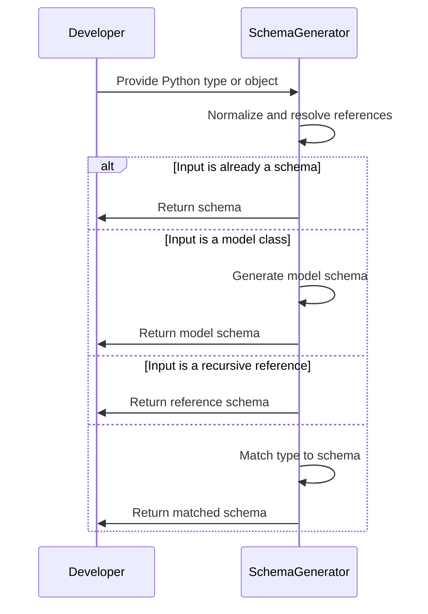
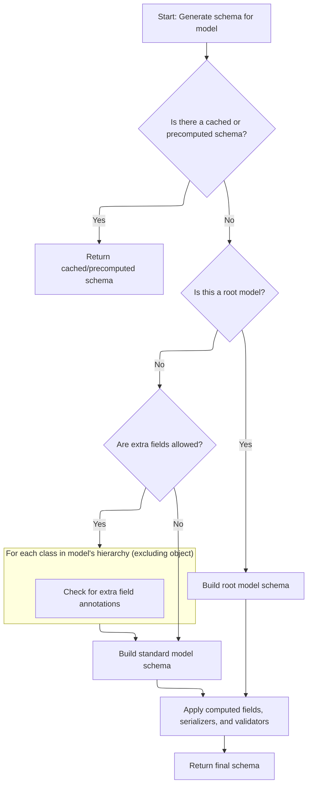
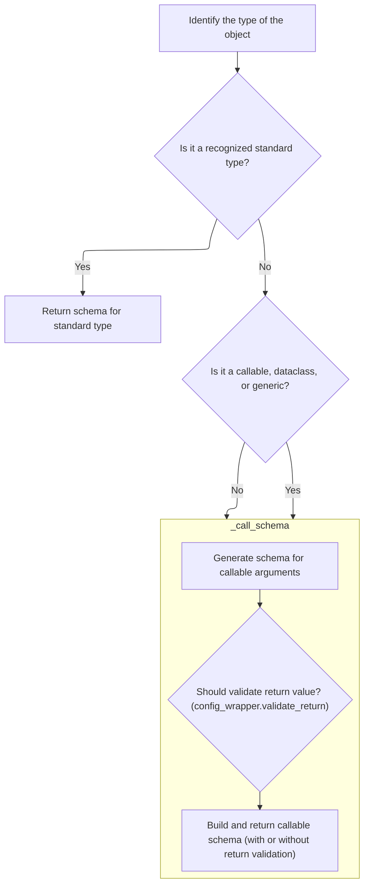
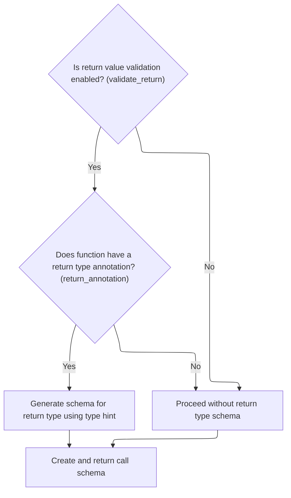
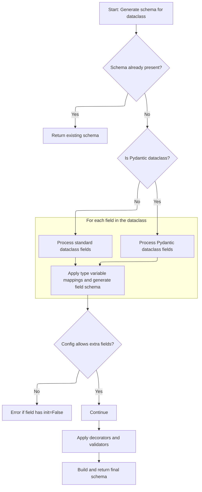
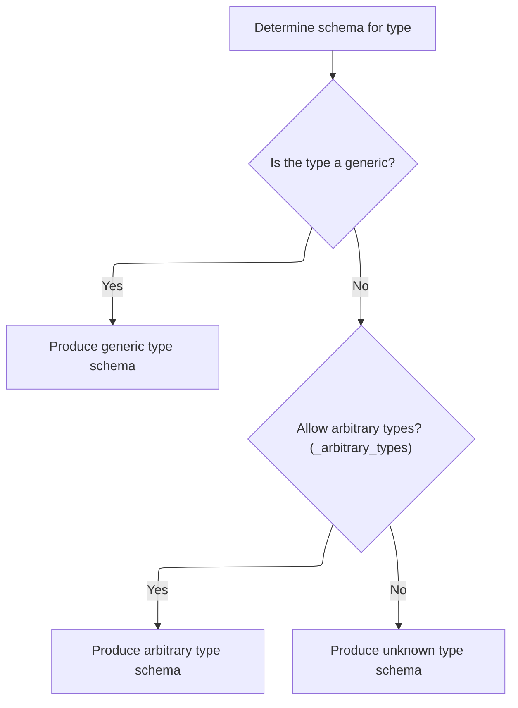

This flow describes how a validation schema is generated for any Python type or object, supporting Pydantic's type-driven validation and serialization. The process normalizes the input, resolves references, and maps the type to a schema that defines how to validate and serialize it.

The main steps are:

- Normalize the input and resolve references.
- Return existing schemas when available.
- Generate schemas for models, handling root models and extra fields.
- Handle recursive and forward references.
- Map other types to their appropriate schemas using a type matching system.



# Spec

## Detailed View of the Program's Functionality

a. Initial Schema Dispatch and Type Normalization

When generating a schema for a given object, the process begins by checking if the object has a custom schema method (<SwmToken path="pydantic/_internal/_generate_schema.py" pos="657:8:8" line-data="            &#39; or implement `__get_pydantic_core_schema__` on your type to fully support it.&#39;">`__get_pydantic_core_schema__`</SwmToken>). If so, that method is used to generate the schema. If not, the process continues with normalization and type resolution:

- If the object is a special "self" type (used for recursive models), it is resolved to the current model type.
- If the object is an <SwmToken path="pydantic/_internal/_generate_schema.py" pos="252:19:19" line-data="    # note that this won&#39;t work for any Annotated types that get wrapped by a function validator">`Annotated`</SwmToken> type, the annotated schema logic is invoked.
- If the object is already a dictionary, it is assumed to be a valid schema and returned as-is.
- If the object is a string, it is treated as a forward reference and wrapped accordingly.
- If the object is a forward reference, it is resolved using the available namespace, and schema generation is retried on the resolved type.
- If the object is a subclass of the base model, it is pushed onto a stack to track recursion and the model schema generation logic is invoked.
- If the object is a recursive reference, a reference schema is returned.
- If none of the above, the type is dispatched to the main type-matching logic.

b. Model Class Schema Construction

When generating a schema for a Pydantic model class:

- The process first checks if a schema for this model is already cached or precomputed. If so, it is returned immediately.
- If the model has a custom core schema attribute, it is unpacked and returned, possibly as a reference if it is a definition.
- The model's configuration is wrapped for context.
- The model's fields are determined. If fields are not yet built (due to recursive or forward references), they are rebuilt or an error is raised if not possible.
- Decorators (validators, serializers, computed fields) are collected and checked to ensure they reference valid fields.
- If the model allows extra fields, the method checks for extra field annotations in the class hierarchy and generates schemas for any extra field types.
- If the model is a root model (single-field model), a root field schema is built and model-level validators are applied.
- Otherwise, a standard model schema is built, including all fields, computed fields, and any extra field schemas.
- Validators and serializers are applied to the schema.
- The final schema is wrapped as a reference definition and returned.

c. Fallback Type Matching in Schema Generation

If the object is not a model or recursive reference, the type is matched against a series of known types:

- Primitive types (str, int, float, bool, etc.) are mapped directly to their corresponding schemas.
- Standard library types (datetime, Decimal, UUID, etc.) are mapped similarly.
- Collection types (tuple, list, set, dict, etc.) are mapped to their respective schema generators, often recursively generating schemas for their contained types.
- Special types like <SwmToken path="pydantic/_internal/_generate_schema.py" pos="1111:3:3" line-data="            # NewType, can&#39;t use isinstance because it fails &lt;3.10">`NewType`</SwmToken>, Final, and <SwmToken path="pydantic/_internal/_generate_schema.py" pos="1117:10:10" line-data="        elif isinstance(obj, typing.TypeVar):">`TypeVar`</SwmToken> are resolved to their underlying types or constraints, and schema generation is retried.
- If the object is a callable (function, method, lambda, partial), the callable schema logic is invoked.
- If the object is an Enum, a schema for the enum is generated.
- If the object is a dataclass, the dataclass schema logic is invoked.
- If the object is a generic type (has an origin), the generic type matching logic is invoked.
- If arbitrary types are allowed, a permissive schema is generated; otherwise, an error is raised for unknown types.

d. Primitive and Generic Type Schema Mapping

The type-matching logic consists of a long series of conditional checks:

- Each primitive or standard type is mapped to a schema function (<SwmToken path="pydantic/_internal/_generate_schema.py" pos="1033:18:20" line-data="        boilerplate before calling into the user-facing method (e.g. `GenerateSchema._tuple_schema`).">`e.g`</SwmToken>., <SwmToken path="pydantic/_internal/_generate_schema.py" pos="810:8:8" line-data="                            if isinstance(extras_annotation, str):">`str`</SwmToken> to <SwmToken path="pydantic/_internal/_generate_schema.py" pos="1039:5:5" line-data="            return core_schema.str_schema()">`str_schema`</SwmToken>, `int` to <SwmToken path="pydantic/_internal/_generate_schema.py" pos="1043:5:5" line-data="            return core_schema.int_schema()">`int_schema`</SwmToken>).
- For generic types (<SwmToken path="pydantic/_internal/_generate_schema.py" pos="1033:18:20" line-data="        boilerplate before calling into the user-facing method (e.g. `GenerateSchema._tuple_schema`).">`e.g`</SwmToken>., `List[int]`, <SwmToken path="pydantic/_internal/_generate_schema.py" pos="130:13:13" line-data="DICT_TYPES: list[type] = [typing.Dict, dict]  # noqa: UP006">`Dict`</SwmToken>`[`<SwmToken path="pydantic/_internal/_generate_schema.py" pos="810:8:8" line-data="                            if isinstance(extras_annotation, str):">`str`</SwmToken>`, `<SwmToken path="pydantic/_internal/_generate_schema.py" pos="1044:7:7" line-data="        elif obj is float:">`float`</SwmToken>`]`), the schema is generated recursively for the contained types.
- For special typing constructs (<SwmToken path="pydantic/_internal/_generate_schema.py" pos="1033:18:20" line-data="        boilerplate before calling into the user-facing method (e.g. `GenerateSchema._tuple_schema`).">`e.g`</SwmToken>., <SwmToken path="pydantic/_internal/_generate_schema.py" pos="1111:3:3" line-data="            # NewType, can&#39;t use isinstance because it fails &lt;3.10">`NewType`</SwmToken>, <SwmToken path="pydantic/_internal/_generate_schema.py" pos="1120:7:7" line-data="            if obj is Final:">`Final`</SwmToken>, <SwmToken path="pydantic/_internal/_generate_schema.py" pos="1117:10:10" line-data="        elif isinstance(obj, typing.TypeVar):">`TypeVar`</SwmToken>), the underlying type or constraint is resolved and schema generation is retried.
- For callables, the callable schema logic is invoked.
- For dataclasses, the dataclass schema logic is invoked.
- For generic types with an origin, the generic type matching logic is invoked.
- If none of the above match, arbitrary or unknown type schemas are produced based on configuration.

e. Callable Argument and Return Schema Generation

When generating a schema for a callable (function, method, etc.):

- The function's signature is inspected to extract parameter types and return type.
- For each parameter, a schema is generated based on its type annotation and default value.
- If return value validation is enabled and a return annotation is present, a schema is generated for the return type.
- The full callable schema is assembled, including argument validation and (optionally) return value validation.

f. Dataclass and Generic Type Fallback in Type Matching

If the object is a dataclass type:

- The dataclass is pushed onto the stack to track recursion.
- If a schema is already cached or prebuilt, it is returned.
- If the dataclass is a Pydantic dataclass, its fields are copied and type variables are applied as needed.
- If the dataclass is a standard dataclass, its fields are collected.
- For each field, a schema is generated, applying type variable mappings and decorators.
- If extra fields are allowed, a check is performed to ensure no field with <SwmToken path="pydantic/_internal/_generate_schema.py" pos="1854:9:11" line-data="                    # disallow combination of init=False on a dataclass field and extra=&#39;allow&#39; on a dataclass">`init=False`</SwmToken> is present.
- Decorators and validators are applied to the schema.
- The final schema is wrapped as a reference definition and returned.

g. Generic and Unknown Type Handling in Type Matching

If the object is a generic type (has an origin):

- If the origin is a dataclass or namedtuple, the corresponding schema logic is invoked.
- If the origin has a custom schema method, it is used.
- If the origin is a known generic type (union, list, dict, tuple, set, etc.), the appropriate schema generator is called, recursively generating schemas for contained types.
- If arbitrary types are allowed, a permissive schema is generated for the origin.
- If none of the above, an unknown type schema is produced, raising an error.

h. Generic Type Schema Dispatch

When handling a generic type:

- If the origin is a dataclass, the dataclass schema logic is invoked to preserve type parameter information.
- If the origin is a namedtuple, the namedtuple schema logic is invoked.
- If the origin has a custom schema method, it is used.
- If the origin is a known generic type (union, list, dict, etc.), the appropriate schema generator is called.
- If arbitrary types are allowed, a permissive schema is generated for the origin.
- If none of the above, an unknown type schema is produced, raising an error.

This flow ensures that Pydantic can generate a validation and serialization schema for a wide variety of Python types, including primitives, collections, generics, models, dataclasses, callables, and user-defined types, with support for custom logic and recursive structures.

# Rule Definition

| Paragraph Name                                                                                                                                                                                                                                                                                                                                                                                                                                                                                                                                                                                                                                                                                                                                                                                                                                                                                                                                                                                                                                                                                                                                                                   | Rule ID | Category          | Description                                                                                                                                                                                                                                                                                                                                                                                                                                                                                                                                                                                                                                                                                                                                                                                                                                                                                                                                                                                                                                                                                                                | Conditions                                                                                                                                                                                                                                                                                          | Remarks                                                                                                                                                                                                                                                                                                                                                                                                                                                                                                                                                                                                                                                                                                                                                                                                                                                                                                                                                                                                                                                                                                                                                                                                                                                                                                                                                                                                                                   |
| -------------------------------------------------------------------------------------------------------------------------------------------------------------------------------------------------------------------------------------------------------------------------------------------------------------------------------------------------------------------------------------------------------------------------------------------------------------------------------------------------------------------------------------------------------------------------------------------------------------------------------------------------------------------------------------------------------------------------------------------------------------------------------------------------------------------------------------------------------------------------------------------------------------------------------------------------------------------------------------------------------------------------------------------------------------------------------------------------------------------------------------------------------------------------------- | ------- | ----------------- | -------------------------------------------------------------------------------------------------------------------------------------------------------------------------------------------------------------------------------------------------------------------------------------------------------------------------------------------------------------------------------------------------------------------------------------------------------------------------------------------------------------------------------------------------------------------------------------------------------------------------------------------------------------------------------------------------------------------------------------------------------------------------------------------------------------------------------------------------------------------------------------------------------------------------------------------------------------------------------------------------------------------------------------------------------------------------------------------------------------------------- | --------------------------------------------------------------------------------------------------------------------------------------------------------------------------------------------------------------------------------------------------------------------------------------------------- | ----------------------------------------------------------------------------------------------------------------------------------------------------------------------------------------------------------------------------------------------------------------------------------------------------------------------------------------------------------------------------------------------------------------------------------------------------------------------------------------------------------------------------------------------------------------------------------------------------------------------------------------------------------------------------------------------------------------------------------------------------------------------------------------------------------------------------------------------------------------------------------------------------------------------------------------------------------------------------------------------------------------------------------------------------------------------------------------------------------------------------------------------------------------------------------------------------------------------------------------------------------------------------------------------------------------------------------------------------------------------------------------------------------------------------------------- |
| <SwmToken path="pydantic/_internal/_generate_schema.py" pos="1023:5:5" line-data="        return self.match_type(obj)">`match_type`</SwmToken>, <SwmToken path="pydantic/_internal/_generate_schema.py" pos="827:7:7" line-data="                                extras_keys_schema = self.generate_schema(extra_keys_type)">`generate_schema`</SwmToken>                                                                                                                                                                                                                                                                                                                                                                                                                                                                                                                                                                                                                                                                                                                                                                                                                        | RL-001  | Data Assignment   | When the input is a primitive Python type (such as int, str, float, bool, bytes, complex), the schema generation must produce a schema dict with a single 'type' key whose value is the name of the primitive type (<SwmToken path="pydantic/_internal/_generate_schema.py" pos="1033:18:20" line-data="        boilerplate before calling into the user-facing method (e.g. `GenerateSchema._tuple_schema`).">`e.g`</SwmToken>., {'type': 'int'}).                                                                                                                                                                                                                                                                                                                                                                                                                                                                                                                                                                                                                                                                        | Input is a primitive type (int, str, float, bool, bytes, complex).                                                                                                                                                                                                                                  | The output is a dictionary with a single key 'type' and value as a string representing the type name. No additional keys are present.                                                                                                                                                                                                                                                                                                                                                                                                                                                                                                                                                                                                                                                                                                                                                                                                                                                                                                                                                                                                                                                                                                                                                                                                                                                                                                     |
| <SwmToken path="pydantic/_internal/_generate_schema.py" pos="736:3:3" line-data="    def _model_schema(self, cls: type[BaseModel]) -&gt; core_schema.CoreSchema:">`_model_schema`</SwmToken>                                                                                                                                                                                                                                                                                                                                                                                                                                                                                                                                                                                                                                                                                                                                                                                                                                                                                                                                                                                     | RL-002  | Data Assignment   | When the input is a Pydantic model, the schema dict must include 'type': 'model', the model class object under 'cls', a nested schema dict under 'schema' describing either the root field or the model fields, 'config' with relevant configuration options, 'ref' as a unique reference string, and additional keys as needed for generics or custom initialization.                                                                                                                                                                                                                                                                                                                                                                                                                                                                                                                                                                                                                                                                                                                                                     | Input is a subclass of <SwmToken path="pydantic/_internal/_generate_schema.py" pos="736:13:13" line-data="    def _model_schema(self, cls: type[BaseModel]) -&gt; core_schema.CoreSchema:">`BaseModel`</SwmToken>.                                                                                  | The schema dict includes: 'type': 'model', 'cls': model class, 'schema': nested schema dict, 'config': dict, 'ref': string, and possibly <SwmToken path="pydantic/_internal/_generate_schema.py" pos="833:1:1" line-data="                generic_origin: type[BaseModel] \| None = getattr(cls, &#39;__pydantic_generic_metadata__&#39;, {}).get(&#39;origin&#39;)">`generic_origin`</SwmToken>, <SwmToken path="pydantic/_internal/_generate_schema.py" pos="843:1:1" line-data="                        custom_init=getattr(cls, &#39;__pydantic_custom_init__&#39;, None),">`custom_init`</SwmToken>, <SwmToken path="pydantic/_internal/_generate_schema.py" pos="844:1:1" line-data="                        root_model=True,">`root_model`</SwmToken>, <SwmToken path="pydantic/_internal/_generate_schema.py" pos="845:1:1" line-data="                        post_init=getattr(cls, &#39;__pydantic_post_init__&#39;, None),">`post_init`</SwmToken>, etc. The nested schema for fields uses 'type': 'model-fields', 'fields': mapping of field names to field schema dicts, and may include <SwmToken path="pydantic/_internal/_generate_schema.py" pos="788:1:1" line-data="                computed_fields = decorators.computed_fields">`computed_fields`</SwmToken> and <SwmToken path="pydantic/_internal/_generate_schema.py" pos="800:1:1" line-data="                extras_schema = None">`extras_schema`</SwmToken>. |
| <SwmToken path="pydantic/_internal/_generate_schema.py" pos="1135:5:5" line-data="            return self._dataclass_schema(obj, None)  # pyright: ignore[reportArgumentType]">`_dataclass_schema`</SwmToken>                                                                                                                                                                                                                                                                                                                                                                                                                                                                                                                                                                                                                                                                                                                                                                                                                                                                                                                                                                    | RL-003  | Data Assignment   | When the input is a dataclass, the schema dict must include 'type': 'dataclass', field schemas for each dataclass field (including type variable mappings for generics), information about post-init processing, slots, and other dataclass-specific attributes, as well as configuration for extra fields and computed fields as applicable.                                                                                                                                                                                                                                                                                                                                                                                                                                                                                                                                                                                                                                                                                                                                                                              | Input is a dataclass type.                                                                                                                                                                                                                                                                          | The schema dict includes: 'type': 'dataclass', 'fields': list of field names, 'schema': nested schema for fields, <SwmToken path="pydantic/_internal/_generate_schema.py" pos="845:1:1" line-data="                        post_init=getattr(cls, &#39;__pydantic_post_init__&#39;, None),">`post_init`</SwmToken>: bool, 'slots': bool, 'config': dict, 'frozen': bool, and possibly <SwmToken path="pydantic/_internal/_generate_schema.py" pos="788:1:1" line-data="                computed_fields = decorators.computed_fields">`computed_fields`</SwmToken>.                                                                                                                                                                                                                                                                                                                                                                                                                                                                                                                                                                                                                                                                                                                                                                                                                                                                        |
| <SwmToken path="pydantic/_internal/_generate_schema.py" pos="1107:5:5" line-data="            return self._typed_dict_schema(obj, None)">`_typed_dict_schema`</SwmToken>                                                                                                                                                                                                                                                                                                                                                                                                                                                                                                                                                                                                                                                                                                                                                                                                                                                                                                                                                                                                         | RL-004  | Data Assignment   | When the input is a <SwmToken path="pydantic/_internal/_generate_schema.py" pos="54:12:12" line-data="from typing_extensions import TypeAlias, TypeAliasType, TypedDict, get_args, get_origin, is_typeddict">`TypedDict`</SwmToken>, the schema dict must include 'type': <SwmToken path="pydantic/_internal/_generate_schema.py" pos="1409:4:6" line-data="                    code=&#39;typed-dict-version&#39;,">`typed-dict`</SwmToken>, a 'fields' mapping from field names to field schema dicts, and required/optional field information.                                                                                                                                                                                                                                                                                                                                                                                                                                                                                                                                                                           | Input is a <SwmToken path="pydantic/_internal/_generate_schema.py" pos="54:12:12" line-data="from typing_extensions import TypeAlias, TypeAliasType, TypedDict, get_args, get_origin, is_typeddict">`TypedDict`</SwmToken> class.                                                                   | The schema dict includes: 'type': <SwmToken path="pydantic/_internal/_generate_schema.py" pos="1409:4:6" line-data="                    code=&#39;typed-dict-version&#39;,">`typed-dict`</SwmToken>, 'fields': mapping of field names to field schema dicts, and required/optional status for each field.                                                                                                                                                                                                                                                                                                                                                                                                                                                                                                                                                                                                                                                                                                                                                                                                                                                                                                                                                                                                                                                                                                                                 |
| <SwmToken path="pydantic/_internal/_generate_schema.py" pos="1139:5:5" line-data="            return self._match_generic_type(obj, origin)">`_match_generic_type`</SwmToken>                                                                                                                                                                                                                                                                                                                                                                                                                                                                                                                                                                                                                                                                                                                                                                                                                                                                                                                                                                                                     | RL-005  | Data Assignment   | When the input is a generic type (<SwmToken path="pydantic/_internal/_generate_schema.py" pos="1033:18:20" line-data="        boilerplate before calling into the user-facing method (e.g. `GenerateSchema._tuple_schema`).">`e.g`</SwmToken>., List\[int\], Dict\[str, float\]), the schema dict must include 'type' as the generic type name (<SwmToken path="pydantic/_internal/_generate_schema.py" pos="1033:18:20" line-data="        boilerplate before calling into the user-facing method (e.g. `GenerateSchema._tuple_schema`).">`e.g`</SwmToken>., 'list'), and schema(s) for the contained type(s), such as <SwmToken path="pydantic/_internal/_generate_schema.py" pos="259:4:4" line-data="            schema[&#39;items_schema&#39;][variadic_item_index] = apply_validators(">`items_schema`</SwmToken> for lists.                                                                                                                                                                                                                                                                                         | Input is a generic type (<SwmToken path="pydantic/_internal/_generate_schema.py" pos="1033:18:20" line-data="        boilerplate before calling into the user-facing method (e.g. `GenerateSchema._tuple_schema`).">`e.g`</SwmToken>., List\[int\], Dict\[str, float\], etc.).                      | The schema dict includes: 'type': generic type name, and keys like <SwmToken path="pydantic/_internal/_generate_schema.py" pos="259:4:4" line-data="            schema[&#39;items_schema&#39;][variadic_item_index] = apply_validators(">`items_schema`</SwmToken>, <SwmToken path="pydantic/_internal/_generate_schema.py" pos="582:1:1" line-data="        keys_schema = self.generate_schema(keys_type)">`keys_schema`</SwmToken>, <SwmToken path="pydantic/_internal/_generate_schema.py" pos="267:10:10" line-data="        inner_schema = schema.get(&#39;values_schema&#39;, core_schema.any_schema())">`values_schema`</SwmToken>, etc., depending on the container.                                                                                                                                                                                                                                                                                                                                                                                                                                                                                                                                                                                                                                                                                                                                                              |
| <SwmToken path="pydantic/_internal/_generate_schema.py" pos="1162:5:5" line-data="            return self._union_schema(obj)">`_union_schema`</SwmToken>                                                                                                                                                                                                                                                                                                                                                                                                                                                                                                                                                                                                                                                                                                                                                                                                                                                                                                                                                                                                                         | RL-006  | Data Assignment   | When the input is a union type, the schema dict must include 'type': 'union' and 'choices' as a list of schema dicts for each union member type. If any member is None, the schema is wrapped as nullable.                                                                                                                                                                                                                                                                                                                                                                                                                                                                                                                                                                                                                                                                                                                                                                                                                                                                                                                 | Input is a union type (<SwmToken path="pydantic/_internal/_generate_schema.py" pos="1033:18:20" line-data="        boilerplate before calling into the user-facing method (e.g. `GenerateSchema._tuple_schema`).">`e.g`</SwmToken>., Union\[int, str\], Optional\[X\]).                             | The schema dict includes: 'type': 'union', 'choices': list of schema dicts. If nullable, the schema is wrapped in a 'nullable' schema.                                                                                                                                                                                                                                                                                                                                                                                                                                                                                                                                                                                                                                                                                                                                                                                                                                                                                                                                                                                                                                                                                                                                                                                                                                                                                                    |
| <SwmToken path="pydantic/_internal/_generate_schema.py" pos="1126:5:5" line-data="            return self._call_schema(obj)">`_call_schema`</SwmToken>, <SwmToken path="pydantic/_internal/_generate_schema.py" pos="1915:7:7" line-data="        arguments_schema = self._arguments_schema(function)">`_arguments_schema`</SwmToken>                                                                                                                                                                                                                                                                                                                                                                                                                                                                                                                                                                                                                                                                                                                                                                                                                                            | RL-007  | Data Assignment   | When the input is a callable or function, the schema dict must include 'type': 'call', <SwmToken path="pydantic/_internal/_generate_schema.py" pos="1915:1:1" line-data="        arguments_schema = self._arguments_schema(function)">`arguments_schema`</SwmToken> describing the function's arguments, 'function' as the function object, and if return value validation is enabled and a return annotation is present, <SwmToken path="pydantic/_internal/_generate_schema.py" pos="1917:1:1" line-data="        return_schema: core_schema.CoreSchema \| None = None">`return_schema`</SwmToken> with the schema dict for the return type.                                                                                                                                                                                                                                                                                                                                                                                                                                                                             | Input is a callable/function.                                                                                                                                                                                                                                                                       | The schema dict includes: 'type': 'call', <SwmToken path="pydantic/_internal/_generate_schema.py" pos="1915:1:1" line-data="        arguments_schema = self._arguments_schema(function)">`arguments_schema`</SwmToken>: schema dict for arguments, 'function': function object, and optionally <SwmToken path="pydantic/_internal/_generate_schema.py" pos="1917:1:1" line-data="        return_schema: core_schema.CoreSchema \| None = None">`return_schema`</SwmToken>.                                                                                                                                                                                                                                                                                                                                                                                                                                                                                                                                                                                                                                                                                                                                                                                                                                                                                                                                                                |
| <SwmToken path="pydantic/_internal/_generate_schema.py" pos="997:3:3" line-data="    def _generate_schema_inner(self, obj: Any) -&gt; core_schema.CoreSchema:">`_generate_schema_inner`</SwmToken>, \_Definitions.get_schema_or_ref, \_Definitions.create_definition_reference_schema                                                                                                                                                                                                                                                                                                                                                                                                                                                                                                                                                                                                                                                                                                                                                                                                                                                                                            | RL-008  | Data Assignment   | When the input is a reference or recursive type, the schema dict must include 'type': <SwmToken path="pydantic/_internal/_generate_schema.py" pos="924:18:20" line-data="            # Note: if schema is of type `&#39;definition-ref&#39;`, we might want to copy it as a">`definition-ref`</SwmToken> and <SwmToken path="pydantic/_internal/_generate_schema.py" pos="1021:7:7" line-data="            return core_schema.definition_reference_schema(schema_ref=obj.type_ref)">`schema_ref`</SwmToken> as a unique reference string. Each unique type is defined only once and referenced elsewhere as needed.                                                                                                                                                                                                                                                                                                                                                                                                                                                                                                        | Input is a recursive or referenceable type (<SwmToken path="pydantic/_internal/_generate_schema.py" pos="1033:18:20" line-data="        boilerplate before calling into the user-facing method (e.g. `GenerateSchema._tuple_schema`).">`e.g`</SwmToken>., self-referential model, dataclass, etc.). | The schema dict includes: 'type': <SwmToken path="pydantic/_internal/_generate_schema.py" pos="924:18:20" line-data="            # Note: if schema is of type `&#39;definition-ref&#39;`, we might want to copy it as a">`definition-ref`</SwmToken>, <SwmToken path="pydantic/_internal/_generate_schema.py" pos="1021:7:7" line-data="            return core_schema.definition_reference_schema(schema_ref=obj.type_ref)">`schema_ref`</SwmToken>: string. The referenced schema is defined only once.                                                                                                                                                                                                                                                                                                                                                                                                                                                                                                                                                                                                                                                                                                                                                                                                                                                                                                                                 |
| <SwmToken path="pydantic/_internal/_generate_schema.py" pos="1162:5:5" line-data="            return self._union_schema(obj)">`_union_schema`</SwmToken>, <SwmToken path="pydantic/_internal/_generate_schema.py" pos="2208:3:3" line-data="    def _apply_single_annotation(">`_apply_single_annotation`</SwmToken>                                                                                                                                                                                                                                                                                                                                                                                                                                                                                                                                                                                                                                                                                                                                                                                                                                                             | RL-009  | Data Assignment   | When the input is a nullable type (<SwmToken path="pydantic/_internal/_generate_schema.py" pos="1033:18:20" line-data="        boilerplate before calling into the user-facing method (e.g. `GenerateSchema._tuple_schema`).">`e.g`</SwmToken>., Optional\[X\]), the schema dict must include 'type': 'nullable' and 'schema' as the schema dict for the inner type.                                                                                                                                                                                                                                                                                                                                                                                                                                                                                                                                                                                                                                                                                                                                                       | Input is a nullable type (Union with None as a member, or explicit nullable annotation).                                                                                                                                                                                                            | The schema dict includes: 'type': 'nullable', 'schema': schema dict for the inner type.                                                                                                                                                                                                                                                                                                                                                                                                                                                                                                                                                                                                                                                                                                                                                                                                                                                                                                                                                                                                                                                                                                                                                                                                                                                                                                                                                   |
| <SwmToken path="pydantic/_internal/_generate_schema.py" pos="1023:5:5" line-data="        return self.match_type(obj)">`match_type`</SwmToken>, <SwmToken path="pydantic/_internal/_generate_schema.py" pos="1128:5:5" line-data="            return self._enum_schema(obj)">`_enum_schema`</SwmToken>, <SwmToken path="pydantic/_internal/_generate_schema.py" pos="1079:5:5" line-data="            return self._list_schema(Any)">`_list_schema`</SwmToken>, <SwmToken path="pydantic/_internal/_generate_schema.py" pos="1081:5:5" line-data="            return self._set_schema(Any)">`_set_schema`</SwmToken>, <SwmToken path="pydantic/_internal/_generate_schema.py" pos="1083:5:5" line-data="            return self._frozenset_schema(Any)">`_frozenset_schema`</SwmToken>, <SwmToken path="pydantic/_internal/_generate_schema.py" pos="1089:5:5" line-data="            return self._dict_schema(Any, Any)">`_dict_schema`</SwmToken>, <SwmToken path="pydantic/_internal/_generate_schema.py" pos="1033:26:26" line-data="        boilerplate before calling into the user-facing method (e.g. `GenerateSchema._tuple_schema`).">`_tuple_schema`</SwmToken>, etc. | RL-010  | Data Assignment   | When the input is a standard container (set, dict, tuple, enum, etc.), the schema dict must use the appropriate 'type' value and include keys for contained types or values as needed.                                                                                                                                                                                                                                                                                                                                                                                                                                                                                                                                                                                                                                                                                                                                                                                                                                                                                                                                     | Input is a standard container or enum type.                                                                                                                                                                                                                                                         | The schema dict includes: 'type': container or enum type name, and keys for contained types (<SwmToken path="pydantic/_internal/_generate_schema.py" pos="1033:18:20" line-data="        boilerplate before calling into the user-facing method (e.g. `GenerateSchema._tuple_schema`).">`e.g`</SwmToken>., <SwmToken path="pydantic/_internal/_generate_schema.py" pos="259:4:4" line-data="            schema[&#39;items_schema&#39;][variadic_item_index] = apply_validators(">`items_schema`</SwmToken>, <SwmToken path="pydantic/_internal/_generate_schema.py" pos="267:10:10" line-data="        inner_schema = schema.get(&#39;values_schema&#39;, core_schema.any_schema())">`values_schema`</SwmToken>, etc.). For enums, may include 'cases', <SwmToken path="pydantic/_internal/_generate_schema.py" pos="402:1:1" line-data="        sub_type: Literal[&#39;str&#39;, &#39;int&#39;, &#39;float&#39;] \| None = None">`sub_type`</SwmToken>, and serialization logic.                                                                                                                                                                                                                                                                                                                                                                                                                                                         |
| <SwmToken path="pydantic/_internal/_generate_schema.py" pos="827:7:7" line-data="                                extras_keys_schema = self.generate_schema(extra_keys_type)">`generate_schema`</SwmToken>, <SwmToken path="pydantic/_internal/_generate_schema.py" pos="736:3:3" line-data="    def _model_schema(self, cls: type[BaseModel]) -&gt; core_schema.CoreSchema:">`_model_schema`</SwmToken>, <SwmToken path="pydantic/_internal/_generate_schema.py" pos="1135:5:5" line-data="            return self._dataclass_schema(obj, None)  # pyright: ignore[reportArgumentType]">`_dataclass_schema`</SwmToken>, <SwmToken path="pydantic/_internal/_generate_schema.py" pos="1107:5:5" line-data="            return self._typed_dict_schema(obj, None)">`_typed_dict_schema`</SwmToken>, etc.                                                                                                                                                                                                                                                                                                                                                                           | RL-011  | Conditional Logic | The schema generation must respect configuration options such as 'allow_extra', <SwmToken path="pydantic/_internal/_generate_schema.py" pos="1919:5:5" line-data="        if config_wrapper.validate_return:">`validate_return`</SwmToken>, <SwmToken path="pydantic/_internal/_generate_schema.py" pos="374:7:7" line-data="        return self._config_wrapper.arbitrary_types_allowed">`arbitrary_types_allowed`</SwmToken>, <SwmToken path="pydantic/_internal/_generate_schema.py" pos="436:7:7" line-data="            if self._config_wrapper.use_enum_values:">`use_enum_values`</SwmToken>, <SwmToken path="pydantic/_internal/_generate_schema.py" pos="2007:1:1" line-data="            validate_by_name=self._config_wrapper.validate_by_name,">`validate_by_name`</SwmToken>, 'frozen', <SwmToken path="pydantic/_internal/_generate_schema.py" pos="293:1:1" line-data="    json_encoders: JsonEncoders \| None, tp: Any, schema: CoreSchema">`json_encoders`</SwmToken>, etc., and include them in the schema dict as needed to control validation, serialization, field mutability, and related behaviors. | Relevant configuration options are set in the model, dataclass, or global config.                                                                                                                                                                                                                   | Configuration options are included in the 'config' key or as additional keys in the schema dict. For example, 'allow_extra' controls inclusion of <SwmToken path="pydantic/_internal/_generate_schema.py" pos="800:1:1" line-data="                extras_schema = None">`extras_schema`</SwmToken>, <SwmToken path="pydantic/_internal/_generate_schema.py" pos="1919:5:5" line-data="        if config_wrapper.validate_return:">`validate_return`</SwmToken> controls inclusion of <SwmToken path="pydantic/_internal/_generate_schema.py" pos="1917:1:1" line-data="        return_schema: core_schema.CoreSchema \| None = None">`return_schema`</SwmToken>, <SwmToken path="pydantic/_internal/_generate_schema.py" pos="374:7:7" line-data="        return self._config_wrapper.arbitrary_types_allowed">`arbitrary_types_allowed`</SwmToken> controls acceptance of unknown types, etc.                                                                                                                                                                                                                                                                                                                                                                                                                                                                                                                                           |
| <SwmToken path="pydantic/_internal/_generate_schema.py" pos="836:7:7" line-data="                    root_field = self._common_field_schema(&#39;root&#39;, fields[&#39;root&#39;], decorators)">`_common_field_schema`</SwmToken>, <SwmToken path="pydantic/_internal/_generate_schema.py" pos="1297:7:7" line-data="        schema = self._apply_field_serializers(">`_apply_field_serializers`</SwmToken>, <SwmToken path="pydantic/_internal/_generate_schema.py" pos="874:7:7" line-data="                schema = self._apply_model_serializers(model_schema, decorators.model_serializers.values())">`_apply_model_serializers`</SwmToken>, <SwmToken path="pydantic/_internal/_generate_schema.py" pos="860:5:5" line-data="                    inner_schema = apply_validators(fields_schema, decorators.root_validators.values())">`apply_validators`</SwmToken>, <SwmToken path="pydantic/_internal/_generate_schema.py" pos="838:5:5" line-data="                    inner_schema = apply_model_validators(inner_schema, model_validators, &#39;inner&#39;)">`apply_model_validators`</SwmToken>                                                                     | RL-012  | Conditional Logic | Validators, serializers, and decorators specified via decorators on the model, dataclass, or field must be collected and attached to the schema dict so that field validators are applied to individual field schemas, model validators to the model schema as a whole, and serializers control serialization logic. Computed fields are included as special fields with their own schema dicts. The order of application for default values, validators, and serializers must be preserved and composed correctly.                                                                                                                                                                                                                                                                                                                                                                                                                                                                                                                                                                                                        | Validators, serializers, or decorators are present on the model, dataclass, or field.                                                                                                                                                                                                               | Validators and serializers are attached to the schema dict in a way that ensures correct application order. Computed fields are included as special fields with their own schema dicts.                                                                                                                                                                                                                                                                                                                                                                                                                                                                                                                                                                                                                                                                                                                                                                                                                                                                                                                                                                                                                                                                                                                                                                                                                                                   |
| \_Definitions, <SwmToken path="pydantic/_internal/_generate_schema.py" pos="997:3:3" line-data="    def _generate_schema_inner(self, obj: Any) -&gt; core_schema.CoreSchema:">`_generate_schema_inner`</SwmToken>, <SwmToken path="pydantic/_internal/_generate_schema.py" pos="736:3:3" line-data="    def _model_schema(self, cls: type[BaseModel]) -&gt; core_schema.CoreSchema:">`_model_schema`</SwmToken>, <SwmToken path="pydantic/_internal/_generate_schema.py" pos="1135:5:5" line-data="            return self._dataclass_schema(obj, None)  # pyright: ignore[reportArgumentType]">`_dataclass_schema`</SwmToken>, <SwmToken path="pydantic/_internal/_generate_schema.py" pos="1107:5:5" line-data="            return self._typed_dict_schema(obj, None)">`_typed_dict_schema`</SwmToken>                                                                                                                                                                                                                                                                                                                                                                         | RL-013  | Conditional Logic | The schema generation must support recursive and reusable types by using reference schemas where necessary, ensuring that each unique type is only defined once and referenced elsewhere as needed.                                                                                                                                                                                                                                                                                                                                                                                                                                                                                                                                                                                                                                                                                                                                                                                                                                                                                                                        | Input is a recursive or reusable type (<SwmToken path="pydantic/_internal/_generate_schema.py" pos="1033:18:20" line-data="        boilerplate before calling into the user-facing method (e.g. `GenerateSchema._tuple_schema`).">`e.g`</SwmToken>., self-referential model, dataclass, etc.).      | Reference schemas use 'type': <SwmToken path="pydantic/_internal/_generate_schema.py" pos="924:18:20" line-data="            # Note: if schema is of type `&#39;definition-ref&#39;`, we might want to copy it as a">`definition-ref`</SwmToken> and <SwmToken path="pydantic/_internal/_generate_schema.py" pos="1021:7:7" line-data="            return core_schema.definition_reference_schema(schema_ref=obj.type_ref)">`schema_ref`</SwmToken> as a unique string. Each unique type is defined only once.                                                                                                                                                                                                                                                                                                                                                                                                                                                                                                                                                                                                                                                                                                                                                                                                                                                                                                                            |
| <SwmToken path="pydantic/_internal/_generate_schema.py" pos="827:7:7" line-data="                                extras_keys_schema = self.generate_schema(extra_keys_type)">`generate_schema`</SwmToken>, <SwmToken path="pydantic/_internal/_generate_schema.py" pos="1023:5:5" line-data="        return self.match_type(obj)">`match_type`</SwmToken>, <SwmToken path="pydantic/_internal/_generate_schema.py" pos="736:3:3" line-data="    def _model_schema(self, cls: type[BaseModel]) -&gt; core_schema.CoreSchema:">`_model_schema`</SwmToken>, <SwmToken path="pydantic/_internal/_generate_schema.py" pos="1135:5:5" line-data="            return self._dataclass_schema(obj, None)  # pyright: ignore[reportArgumentType]">`_dataclass_schema`</SwmToken>, <SwmToken path="pydantic/_internal/_generate_schema.py" pos="1107:5:5" line-data="            return self._typed_dict_schema(obj, None)">`_typed_dict_schema`</SwmToken>, etc.                                                                                                                                                                                                                           | RL-014  | Conditional Logic | The schema dicts produced must be compatible with the requirements for runtime validation and serialization, and must be suitable for use by downstream consumers expecting this schema format.                                                                                                                                                                                                                                                                                                                                                                                                                                                                                                                                                                                                                                                                                                                                                                                                                                                                                                                            | Schema dict is generated for any supported input.                                                                                                                                                                                                                                                   | Schema dicts must follow the standardized structure described in the spec, with required and optional keys as appropriate for the type of input.                                                                                                                                                                                                                                                                                                                                                                                                                                                                                                                                                                                                                                                                                                                                                                                                                                                                                                                                                                                                                                                                                                                                                                                                                                                                                          |

# User Stories

## User Story 1: Comprehensive schema generation for all supported types

---

### Story Description:

As a user of schema generation, I want to generate schema dicts for all supported Python types—including primitives, Pydantic models, dataclasses, TypedDicts, generic types, unions, callables, reference/recursive types, nullable types, and standard containers/enums—so that I can validate and serialize any data structure using a standardized schema format.

---

### Business Rule Mapping:

| Rule ID | Paragraph Name                                                                                                                                                                                                                                                                                                                                                                                                                                                                                                                                                                                                                                                                                                                                                                                                                                                                                                                                                                                                                                                                                                                                                                   | Rule Description                                                                                                                                                                                                                                                                                                                                                                                                                                                                                                                                                                                                                                                                                                                                                                                                                   |
| ------- | -------------------------------------------------------------------------------------------------------------------------------------------------------------------------------------------------------------------------------------------------------------------------------------------------------------------------------------------------------------------------------------------------------------------------------------------------------------------------------------------------------------------------------------------------------------------------------------------------------------------------------------------------------------------------------------------------------------------------------------------------------------------------------------------------------------------------------------------------------------------------------------------------------------------------------------------------------------------------------------------------------------------------------------------------------------------------------------------------------------------------------------------------------------------------------- | ---------------------------------------------------------------------------------------------------------------------------------------------------------------------------------------------------------------------------------------------------------------------------------------------------------------------------------------------------------------------------------------------------------------------------------------------------------------------------------------------------------------------------------------------------------------------------------------------------------------------------------------------------------------------------------------------------------------------------------------------------------------------------------------------------------------------------------- |
| RL-008  | <SwmToken path="pydantic/_internal/_generate_schema.py" pos="997:3:3" line-data="    def _generate_schema_inner(self, obj: Any) -&gt; core_schema.CoreSchema:">`_generate_schema_inner`</SwmToken>, \_Definitions.get_schema_or_ref, \_Definitions.create_definition_reference_schema                                                                                                                                                                                                                                                                                                                                                                                                                                                                                                                                                                                                                                                                                                                                                                                                                                                                                            | When the input is a reference or recursive type, the schema dict must include 'type': <SwmToken path="pydantic/_internal/_generate_schema.py" pos="924:18:20" line-data="            # Note: if schema is of type `&#39;definition-ref&#39;`, we might want to copy it as a">`definition-ref`</SwmToken> and <SwmToken path="pydantic/_internal/_generate_schema.py" pos="1021:7:7" line-data="            return core_schema.definition_reference_schema(schema_ref=obj.type_ref)">`schema_ref`</SwmToken> as a unique reference string. Each unique type is defined only once and referenced elsewhere as needed.                                                                                                                                                                                                                |
| RL-002  | <SwmToken path="pydantic/_internal/_generate_schema.py" pos="736:3:3" line-data="    def _model_schema(self, cls: type[BaseModel]) -&gt; core_schema.CoreSchema:">`_model_schema`</SwmToken>                                                                                                                                                                                                                                                                                                                                                                                                                                                                                                                                                                                                                                                                                                                                                                                                                                                                                                                                                                                     | When the input is a Pydantic model, the schema dict must include 'type': 'model', the model class object under 'cls', a nested schema dict under 'schema' describing either the root field or the model fields, 'config' with relevant configuration options, 'ref' as a unique reference string, and additional keys as needed for generics or custom initialization.                                                                                                                                                                                                                                                                                                                                                                                                                                                             |
| RL-001  | <SwmToken path="pydantic/_internal/_generate_schema.py" pos="1023:5:5" line-data="        return self.match_type(obj)">`match_type`</SwmToken>, <SwmToken path="pydantic/_internal/_generate_schema.py" pos="827:7:7" line-data="                                extras_keys_schema = self.generate_schema(extra_keys_type)">`generate_schema`</SwmToken>                                                                                                                                                                                                                                                                                                                                                                                                                                                                                                                                                                                                                                                                                                                                                                                                                        | When the input is a primitive Python type (such as int, str, float, bool, bytes, complex), the schema generation must produce a schema dict with a single 'type' key whose value is the name of the primitive type (<SwmToken path="pydantic/_internal/_generate_schema.py" pos="1033:18:20" line-data="        boilerplate before calling into the user-facing method (e.g. `GenerateSchema._tuple_schema`).">`e.g`</SwmToken>., {'type': 'int'}).                                                                                                                                                                                                                                                                                                                                                                                |
| RL-010  | <SwmToken path="pydantic/_internal/_generate_schema.py" pos="1023:5:5" line-data="        return self.match_type(obj)">`match_type`</SwmToken>, <SwmToken path="pydantic/_internal/_generate_schema.py" pos="1128:5:5" line-data="            return self._enum_schema(obj)">`_enum_schema`</SwmToken>, <SwmToken path="pydantic/_internal/_generate_schema.py" pos="1079:5:5" line-data="            return self._list_schema(Any)">`_list_schema`</SwmToken>, <SwmToken path="pydantic/_internal/_generate_schema.py" pos="1081:5:5" line-data="            return self._set_schema(Any)">`_set_schema`</SwmToken>, <SwmToken path="pydantic/_internal/_generate_schema.py" pos="1083:5:5" line-data="            return self._frozenset_schema(Any)">`_frozenset_schema`</SwmToken>, <SwmToken path="pydantic/_internal/_generate_schema.py" pos="1089:5:5" line-data="            return self._dict_schema(Any, Any)">`_dict_schema`</SwmToken>, <SwmToken path="pydantic/_internal/_generate_schema.py" pos="1033:26:26" line-data="        boilerplate before calling into the user-facing method (e.g. `GenerateSchema._tuple_schema`).">`_tuple_schema`</SwmToken>, etc. | When the input is a standard container (set, dict, tuple, enum, etc.), the schema dict must use the appropriate 'type' value and include keys for contained types or values as needed.                                                                                                                                                                                                                                                                                                                                                                                                                                                                                                                                                                                                                                             |
| RL-007  | <SwmToken path="pydantic/_internal/_generate_schema.py" pos="1126:5:5" line-data="            return self._call_schema(obj)">`_call_schema`</SwmToken>, <SwmToken path="pydantic/_internal/_generate_schema.py" pos="1915:7:7" line-data="        arguments_schema = self._arguments_schema(function)">`_arguments_schema`</SwmToken>                                                                                                                                                                                                                                                                                                                                                                                                                                                                                                                                                                                                                                                                                                                                                                                                                                            | When the input is a callable or function, the schema dict must include 'type': 'call', <SwmToken path="pydantic/_internal/_generate_schema.py" pos="1915:1:1" line-data="        arguments_schema = self._arguments_schema(function)">`arguments_schema`</SwmToken> describing the function's arguments, 'function' as the function object, and if return value validation is enabled and a return annotation is present, <SwmToken path="pydantic/_internal/_generate_schema.py" pos="1917:1:1" line-data="        return_schema: core_schema.CoreSchema \| None = None">`return_schema`</SwmToken> with the schema dict for the return type.                                                                                                                                                                                     |
| RL-003  | <SwmToken path="pydantic/_internal/_generate_schema.py" pos="1135:5:5" line-data="            return self._dataclass_schema(obj, None)  # pyright: ignore[reportArgumentType]">`_dataclass_schema`</SwmToken>                                                                                                                                                                                                                                                                                                                                                                                                                                                                                                                                                                                                                                                                                                                                                                                                                                                                                                                                                                    | When the input is a dataclass, the schema dict must include 'type': 'dataclass', field schemas for each dataclass field (including type variable mappings for generics), information about post-init processing, slots, and other dataclass-specific attributes, as well as configuration for extra fields and computed fields as applicable.                                                                                                                                                                                                                                                                                                                                                                                                                                                                                      |
| RL-005  | <SwmToken path="pydantic/_internal/_generate_schema.py" pos="1139:5:5" line-data="            return self._match_generic_type(obj, origin)">`_match_generic_type`</SwmToken>                                                                                                                                                                                                                                                                                                                                                                                                                                                                                                                                                                                                                                                                                                                                                                                                                                                                                                                                                                                                     | When the input is a generic type (<SwmToken path="pydantic/_internal/_generate_schema.py" pos="1033:18:20" line-data="        boilerplate before calling into the user-facing method (e.g. `GenerateSchema._tuple_schema`).">`e.g`</SwmToken>., List\[int\], Dict\[str, float\]), the schema dict must include 'type' as the generic type name (<SwmToken path="pydantic/_internal/_generate_schema.py" pos="1033:18:20" line-data="        boilerplate before calling into the user-facing method (e.g. `GenerateSchema._tuple_schema`).">`e.g`</SwmToken>., 'list'), and schema(s) for the contained type(s), such as <SwmToken path="pydantic/_internal/_generate_schema.py" pos="259:4:4" line-data="            schema[&#39;items_schema&#39;][variadic_item_index] = apply_validators(">`items_schema`</SwmToken> for lists. |
| RL-004  | <SwmToken path="pydantic/_internal/_generate_schema.py" pos="1107:5:5" line-data="            return self._typed_dict_schema(obj, None)">`_typed_dict_schema`</SwmToken>                                                                                                                                                                                                                                                                                                                                                                                                                                                                                                                                                                                                                                                                                                                                                                                                                                                                                                                                                                                                         | When the input is a <SwmToken path="pydantic/_internal/_generate_schema.py" pos="54:12:12" line-data="from typing_extensions import TypeAlias, TypeAliasType, TypedDict, get_args, get_origin, is_typeddict">`TypedDict`</SwmToken>, the schema dict must include 'type': <SwmToken path="pydantic/_internal/_generate_schema.py" pos="1409:4:6" line-data="                    code=&#39;typed-dict-version&#39;,">`typed-dict`</SwmToken>, a 'fields' mapping from field names to field schema dicts, and required/optional field information.                                                                                                                                                                                                                                                                                   |
| RL-006  | <SwmToken path="pydantic/_internal/_generate_schema.py" pos="1162:5:5" line-data="            return self._union_schema(obj)">`_union_schema`</SwmToken>                                                                                                                                                                                                                                                                                                                                                                                                                                                                                                                                                                                                                                                                                                                                                                                                                                                                                                                                                                                                                         | When the input is a union type, the schema dict must include 'type': 'union' and 'choices' as a list of schema dicts for each union member type. If any member is None, the schema is wrapped as nullable.                                                                                                                                                                                                                                                                                                                                                                                                                                                                                                                                                                                                                         |
| RL-009  | <SwmToken path="pydantic/_internal/_generate_schema.py" pos="1162:5:5" line-data="            return self._union_schema(obj)">`_union_schema`</SwmToken>, <SwmToken path="pydantic/_internal/_generate_schema.py" pos="2208:3:3" line-data="    def _apply_single_annotation(">`_apply_single_annotation`</SwmToken>                                                                                                                                                                                                                                                                                                                                                                                                                                                                                                                                                                                                                                                                                                                                                                                                                                                             | When the input is a nullable type (<SwmToken path="pydantic/_internal/_generate_schema.py" pos="1033:18:20" line-data="        boilerplate before calling into the user-facing method (e.g. `GenerateSchema._tuple_schema`).">`e.g`</SwmToken>., Optional\[X\]), the schema dict must include 'type': 'nullable' and 'schema' as the schema dict for the inner type.                                                                                                                                                                                                                                                                                                                                                                                                                                                               |

---

### Relevant Functionality:

- <SwmToken path="pydantic/_internal/_generate_schema.py" pos="997:3:3" line-data="    def _generate_schema_inner(self, obj: Any) -&gt; core_schema.CoreSchema:">`_generate_schema_inner`</SwmToken>
  1. **RL-008:**
     - When a type is encountered, check if it has already been seen.
     - If so, return a definition reference schema.
     - Otherwise, generate and store the schema, and return a reference.
- <SwmToken path="pydantic/_internal/_generate_schema.py" pos="736:3:3" line-data="    def _model_schema(self, cls: type[BaseModel]) -&gt; core_schema.CoreSchema:">`_model_schema`</SwmToken>
  1. **RL-002:**
     - Detect if input is a Pydantic model.
     - Collect model fields and decorators.
     - If root model, set <SwmToken path="pydantic/_internal/_generate_schema.py" pos="844:1:1" line-data="                        root_model=True,">`root_model`</SwmToken>: True and 'schema' to root field schema.
     - Otherwise, set 'schema' to a dict with 'type': 'model-fields', 'fields', and optional <SwmToken path="pydantic/_internal/_generate_schema.py" pos="788:1:1" line-data="                computed_fields = decorators.computed_fields">`computed_fields`</SwmToken> and <SwmToken path="pydantic/_internal/_generate_schema.py" pos="800:1:1" line-data="                extras_schema = None">`extras_schema`</SwmToken>.
     - Attach 'config', 'ref', and other relevant keys.
     - Return the constructed schema dict.
- <SwmToken path="pydantic/_internal/_generate_schema.py" pos="1023:5:5" line-data="        return self.match_type(obj)">`match_type`</SwmToken>
  1. **RL-001:**
     - If the input object is int, return {'type': 'int'}
     - If the input object is str, return {'type': 'str'}
     - ... (repeat for other primitive types)
     - This is handled in <SwmToken path="pydantic/_internal/_generate_schema.py" pos="1023:5:5" line-data="        return self.match_type(obj)">`match_type`</SwmToken> and <SwmToken path="pydantic/_internal/_generate_schema.py" pos="827:7:7" line-data="                                extras_keys_schema = self.generate_schema(extra_keys_type)">`generate_schema`</SwmToken> methods.
  2. **RL-010:**
     - Detect if input is a standard container or enum.
     - Generate schema(s) for contained types or enum cases.
     - Return schema dict with appropriate keys.
- <SwmToken path="pydantic/_internal/_generate_schema.py" pos="1126:5:5" line-data="            return self._call_schema(obj)">`_call_schema`</SwmToken>
  1. **RL-007:**
     - Detect if input is a callable/function.
     - Generate arguments schema from function signature.
     - If return validation is enabled and annotation present, generate return schema.
     - Return schema dict with all required keys.
- <SwmToken path="pydantic/_internal/_generate_schema.py" pos="1135:5:5" line-data="            return self._dataclass_schema(obj, None)  # pyright: ignore[reportArgumentType]">`_dataclass_schema`</SwmToken>
  1. **RL-003:**
     - Detect if input is a dataclass.
     - Collect dataclass fields and decorators.
     - Generate field schemas, handling generics if present.
     - Include post-init and slots information.
     - Attach configuration and computed fields if any.
     - Return the constructed schema dict.
- <SwmToken path="pydantic/_internal/_generate_schema.py" pos="1139:5:5" line-data="            return self._match_generic_type(obj, origin)">`_match_generic_type`</SwmToken>
  1. **RL-005:**
     - Detect if input is a generic type.
     - Extract contained type(s) using <SwmToken path="pydantic/_internal/_generate_schema.py" pos="54:15:15" line-data="from typing_extensions import TypeAlias, TypeAliasType, TypedDict, get_args, get_origin, is_typeddict">`get_args`</SwmToken>.
     - Generate schema(s) for contained type(s).
     - Return schema dict with appropriate keys.
- <SwmToken path="pydantic/_internal/_generate_schema.py" pos="1107:5:5" line-data="            return self._typed_dict_schema(obj, None)">`_typed_dict_schema`</SwmToken>
  1. **RL-004:**
     - Detect if input is a <SwmToken path="pydantic/_internal/_generate_schema.py" pos="54:12:12" line-data="from typing_extensions import TypeAlias, TypeAliasType, TypedDict, get_args, get_origin, is_typeddict">`TypedDict`</SwmToken>.
     - Collect field annotations and required/optional status.
     - Generate field schemas for each field.
     - Return the constructed schema dict.
- <SwmToken path="pydantic/_internal/_generate_schema.py" pos="1162:5:5" line-data="            return self._union_schema(obj)">`_union_schema`</SwmToken>
  1. **RL-006:**
     - Detect if input is a union type.
     - For each member, generate schema dict.
     - If any member is None, set nullable flag.
     - Return schema dict with 'type': 'union' and 'choices', wrapped as nullable if needed.
  2. **RL-009:**
     - Detect if input is a nullable type.
     - Generate schema for the inner type.
     - Return schema dict with 'type': 'nullable' and 'schema'.

## User Story 2: Reference and recursive type schema generation

---

### Story Description:

As a user of schema generation, I want to generate schema dicts that support reference and recursive types so that reusable and self-referential types are defined only once and referenced elsewhere as needed.

---

### Business Rule Mapping:

| Rule ID | Paragraph Name                                                                                                                                                                                                                                                                                                                                                                                                                                                                                                                                                                                                                                                                                                                                                                                           | Rule Description                                                                                                                                                                                                                                                                                                                                                                                                                                                                                                                                                                                                    |
| ------- | -------------------------------------------------------------------------------------------------------------------------------------------------------------------------------------------------------------------------------------------------------------------------------------------------------------------------------------------------------------------------------------------------------------------------------------------------------------------------------------------------------------------------------------------------------------------------------------------------------------------------------------------------------------------------------------------------------------------------------------------------------------------------------------------------------- | ------------------------------------------------------------------------------------------------------------------------------------------------------------------------------------------------------------------------------------------------------------------------------------------------------------------------------------------------------------------------------------------------------------------------------------------------------------------------------------------------------------------------------------------------------------------------------------------------------------------- |
| RL-008  | <SwmToken path="pydantic/_internal/_generate_schema.py" pos="997:3:3" line-data="    def _generate_schema_inner(self, obj: Any) -&gt; core_schema.CoreSchema:">`_generate_schema_inner`</SwmToken>, \_Definitions.get_schema_or_ref, \_Definitions.create_definition_reference_schema                                                                                                                                                                                                                                                                                                                                                                                                                                                                                                                    | When the input is a reference or recursive type, the schema dict must include 'type': <SwmToken path="pydantic/_internal/_generate_schema.py" pos="924:18:20" line-data="            # Note: if schema is of type `&#39;definition-ref&#39;`, we might want to copy it as a">`definition-ref`</SwmToken> and <SwmToken path="pydantic/_internal/_generate_schema.py" pos="1021:7:7" line-data="            return core_schema.definition_reference_schema(schema_ref=obj.type_ref)">`schema_ref`</SwmToken> as a unique reference string. Each unique type is defined only once and referenced elsewhere as needed. |
| RL-013  | \_Definitions, <SwmToken path="pydantic/_internal/_generate_schema.py" pos="997:3:3" line-data="    def _generate_schema_inner(self, obj: Any) -&gt; core_schema.CoreSchema:">`_generate_schema_inner`</SwmToken>, <SwmToken path="pydantic/_internal/_generate_schema.py" pos="736:3:3" line-data="    def _model_schema(self, cls: type[BaseModel]) -&gt; core_schema.CoreSchema:">`_model_schema`</SwmToken>, <SwmToken path="pydantic/_internal/_generate_schema.py" pos="1135:5:5" line-data="            return self._dataclass_schema(obj, None)  # pyright: ignore[reportArgumentType]">`_dataclass_schema`</SwmToken>, <SwmToken path="pydantic/_internal/_generate_schema.py" pos="1107:5:5" line-data="            return self._typed_dict_schema(obj, None)">`_typed_dict_schema`</SwmToken> | The schema generation must support recursive and reusable types by using reference schemas where necessary, ensuring that each unique type is only defined once and referenced elsewhere as needed.                                                                                                                                                                                                                                                                                                                                                                                                                 |

---

### Relevant Functionality:

- <SwmToken path="pydantic/_internal/_generate_schema.py" pos="997:3:3" line-data="    def _generate_schema_inner(self, obj: Any) -&gt; core_schema.CoreSchema:">`_generate_schema_inner`</SwmToken>
  1. **RL-008:**
     - When a type is encountered, check if it has already been seen.
     - If so, return a definition reference schema.
     - Otherwise, generate and store the schema, and return a reference.
- **\_Definitions**
  1. **RL-013:**
     - When a type is encountered, check if it has already been seen.
     - If so, return a definition reference schema.
     - Otherwise, generate and store the schema, and return a reference.

## User Story 3: Schema generation with configuration, extensibility, and compatibility

---

### Story Description:

As a user of schema generation, I want configuration options, validators, serializers, decorators, and support for recursive/reusable types to be respected and included in the schema dict, and I want the schema dicts to be compatible with runtime validation and serialization requirements so that downstream consumers can use them reliably.

---

### Business Rule Mapping:

| Rule ID | Paragraph Name                                                                                                                                                                                                                                                                                                                                                                                                                                                                                                                                                                                                                                                                                                                                                                                                                                                                                                                                                                                                                                                                                               | Rule Description                                                                                                                                                                                                                                                                                                                                                                                                                                                                                                                                                                                                                                                                                                                                                                                                                                                                                                                                                                                                                                                                                                           |
| ------- | ------------------------------------------------------------------------------------------------------------------------------------------------------------------------------------------------------------------------------------------------------------------------------------------------------------------------------------------------------------------------------------------------------------------------------------------------------------------------------------------------------------------------------------------------------------------------------------------------------------------------------------------------------------------------------------------------------------------------------------------------------------------------------------------------------------------------------------------------------------------------------------------------------------------------------------------------------------------------------------------------------------------------------------------------------------------------------------------------------------ | -------------------------------------------------------------------------------------------------------------------------------------------------------------------------------------------------------------------------------------------------------------------------------------------------------------------------------------------------------------------------------------------------------------------------------------------------------------------------------------------------------------------------------------------------------------------------------------------------------------------------------------------------------------------------------------------------------------------------------------------------------------------------------------------------------------------------------------------------------------------------------------------------------------------------------------------------------------------------------------------------------------------------------------------------------------------------------------------------------------------------- |
| RL-011  | <SwmToken path="pydantic/_internal/_generate_schema.py" pos="827:7:7" line-data="                                extras_keys_schema = self.generate_schema(extra_keys_type)">`generate_schema`</SwmToken>, <SwmToken path="pydantic/_internal/_generate_schema.py" pos="736:3:3" line-data="    def _model_schema(self, cls: type[BaseModel]) -&gt; core_schema.CoreSchema:">`_model_schema`</SwmToken>, <SwmToken path="pydantic/_internal/_generate_schema.py" pos="1135:5:5" line-data="            return self._dataclass_schema(obj, None)  # pyright: ignore[reportArgumentType]">`_dataclass_schema`</SwmToken>, <SwmToken path="pydantic/_internal/_generate_schema.py" pos="1107:5:5" line-data="            return self._typed_dict_schema(obj, None)">`_typed_dict_schema`</SwmToken>, etc.                                                                                                                                                                                                                                                                                                       | The schema generation must respect configuration options such as 'allow_extra', <SwmToken path="pydantic/_internal/_generate_schema.py" pos="1919:5:5" line-data="        if config_wrapper.validate_return:">`validate_return`</SwmToken>, <SwmToken path="pydantic/_internal/_generate_schema.py" pos="374:7:7" line-data="        return self._config_wrapper.arbitrary_types_allowed">`arbitrary_types_allowed`</SwmToken>, <SwmToken path="pydantic/_internal/_generate_schema.py" pos="436:7:7" line-data="            if self._config_wrapper.use_enum_values:">`use_enum_values`</SwmToken>, <SwmToken path="pydantic/_internal/_generate_schema.py" pos="2007:1:1" line-data="            validate_by_name=self._config_wrapper.validate_by_name,">`validate_by_name`</SwmToken>, 'frozen', <SwmToken path="pydantic/_internal/_generate_schema.py" pos="293:1:1" line-data="    json_encoders: JsonEncoders \| None, tp: Any, schema: CoreSchema">`json_encoders`</SwmToken>, etc., and include them in the schema dict as needed to control validation, serialization, field mutability, and related behaviors. |
| RL-014  | <SwmToken path="pydantic/_internal/_generate_schema.py" pos="827:7:7" line-data="                                extras_keys_schema = self.generate_schema(extra_keys_type)">`generate_schema`</SwmToken>, <SwmToken path="pydantic/_internal/_generate_schema.py" pos="1023:5:5" line-data="        return self.match_type(obj)">`match_type`</SwmToken>, <SwmToken path="pydantic/_internal/_generate_schema.py" pos="736:3:3" line-data="    def _model_schema(self, cls: type[BaseModel]) -&gt; core_schema.CoreSchema:">`_model_schema`</SwmToken>, <SwmToken path="pydantic/_internal/_generate_schema.py" pos="1135:5:5" line-data="            return self._dataclass_schema(obj, None)  # pyright: ignore[reportArgumentType]">`_dataclass_schema`</SwmToken>, <SwmToken path="pydantic/_internal/_generate_schema.py" pos="1107:5:5" line-data="            return self._typed_dict_schema(obj, None)">`_typed_dict_schema`</SwmToken>, etc.                                                                                                                                                       | The schema dicts produced must be compatible with the requirements for runtime validation and serialization, and must be suitable for use by downstream consumers expecting this schema format.                                                                                                                                                                                                                                                                                                                                                                                                                                                                                                                                                                                                                                                                                                                                                                                                                                                                                                                            |
| RL-012  | <SwmToken path="pydantic/_internal/_generate_schema.py" pos="836:7:7" line-data="                    root_field = self._common_field_schema(&#39;root&#39;, fields[&#39;root&#39;], decorators)">`_common_field_schema`</SwmToken>, <SwmToken path="pydantic/_internal/_generate_schema.py" pos="1297:7:7" line-data="        schema = self._apply_field_serializers(">`_apply_field_serializers`</SwmToken>, <SwmToken path="pydantic/_internal/_generate_schema.py" pos="874:7:7" line-data="                schema = self._apply_model_serializers(model_schema, decorators.model_serializers.values())">`_apply_model_serializers`</SwmToken>, <SwmToken path="pydantic/_internal/_generate_schema.py" pos="860:5:5" line-data="                    inner_schema = apply_validators(fields_schema, decorators.root_validators.values())">`apply_validators`</SwmToken>, <SwmToken path="pydantic/_internal/_generate_schema.py" pos="838:5:5" line-data="                    inner_schema = apply_model_validators(inner_schema, model_validators, &#39;inner&#39;)">`apply_model_validators`</SwmToken> | Validators, serializers, and decorators specified via decorators on the model, dataclass, or field must be collected and attached to the schema dict so that field validators are applied to individual field schemas, model validators to the model schema as a whole, and serializers control serialization logic. Computed fields are included as special fields with their own schema dicts. The order of application for default values, validators, and serializers must be preserved and composed correctly.                                                                                                                                                                                                                                                                                                                                                                                                                                                                                                                                                                                                        |
| RL-013  | \_Definitions, <SwmToken path="pydantic/_internal/_generate_schema.py" pos="997:3:3" line-data="    def _generate_schema_inner(self, obj: Any) -&gt; core_schema.CoreSchema:">`_generate_schema_inner`</SwmToken>, <SwmToken path="pydantic/_internal/_generate_schema.py" pos="736:3:3" line-data="    def _model_schema(self, cls: type[BaseModel]) -&gt; core_schema.CoreSchema:">`_model_schema`</SwmToken>, <SwmToken path="pydantic/_internal/_generate_schema.py" pos="1135:5:5" line-data="            return self._dataclass_schema(obj, None)  # pyright: ignore[reportArgumentType]">`_dataclass_schema`</SwmToken>, <SwmToken path="pydantic/_internal/_generate_schema.py" pos="1107:5:5" line-data="            return self._typed_dict_schema(obj, None)">`_typed_dict_schema`</SwmToken>                                                                                                                                                                                                                                                                                                     | The schema generation must support recursive and reusable types by using reference schemas where necessary, ensuring that each unique type is only defined once and referenced elsewhere as needed.                                                                                                                                                                                                                                                                                                                                                                                                                                                                                                                                                                                                                                                                                                                                                                                                                                                                                                                        |

---

### Relevant Functionality:

- <SwmToken path="pydantic/_internal/_generate_schema.py" pos="827:7:7" line-data="                                extras_keys_schema = self.generate_schema(extra_keys_type)">`generate_schema`</SwmToken>
  1. **RL-011:**
     - Read configuration options from the input's config or global config.
     - Adjust schema dict structure and included keys based on these options.
     - Attach configuration dict to the schema as needed.
  2. **RL-014:**
     - Ensure that all generated schema dicts conform to the expected structure.
     - Include all required keys and formats for each type of input.
     - Validate that the schema dict can be used for runtime validation and serialization.
- <SwmToken path="pydantic/_internal/_generate_schema.py" pos="836:7:7" line-data="                    root_field = self._common_field_schema(&#39;root&#39;, fields[&#39;root&#39;], decorators)">`_common_field_schema`</SwmToken>
  1. **RL-012:**
     - Collect validators, serializers, and decorators from the input.
     - Attach field validators to field schemas.
     - Attach model validators to the model schema.
     - Attach serializers to control serialization logic.
     - Include computed fields as special fields.
     - Ensure correct order of application.
- **\_Definitions**
  1. **RL-013:**
     - When a type is encountered, check if it has already been seen.
     - If so, return a definition reference schema.
     - Otherwise, generate and store the schema, and return a reference.

# Code Walkthrough

## Initial schema dispatch and type normalization

```mermaid
%%{init: {"flowchart": {"defaultRenderer": "elk"}} }%%
flowchart TD
    node1["Identify the object's structure to choose schema generation method"] -->|"Pydantic model"| node2["Generate schema for Pydantic model"]
    click node1 openCode "pydantic/_internal/_generate_schema.py:997:1023"
    node1 -->|"Other supported type"| node3["Generate schema tailored to the object's type"]
    click node2 openCode "pydantic/_internal/_generate_schema.py:736:1022"
    click node3 openCode "pydantic/_internal/_generate_schema.py:1023:1023"

subgraph node2 [_model_schema]
  sgmain_1_node1["Start: Generate schema for model"] --> sgmain_1_node2{"Is there a cached or precomputed schema?"}
  click sgmain_1_node1 openCode "pydantic/_internal/_generate_schema.py:736:737"
  click sgmain_1_node2 openCode "pydantic/_internal/_generate_schema.py:740:742"
  sgmain_1_node2 -->|"Yes"| sgmain_1_node3["Return cached/precomputed schema"]
  click sgmain_1_node3 openCode "pydantic/_internal/_generate_schema.py:742:743"
  sgmain_1_node2 -->|"No"| sgmain_1_node4{"Is this a root model?"}
  click sgmain_1_node4 openCode "pydantic/_internal/_generate_schema.py:835:849"
  sgmain_1_node4 -->|"Yes"| sgmain_1_node5["Build root model schema"]
  click sgmain_1_node5 openCode "pydantic/_internal/_generate_schema.py:836:848"
  sgmain_1_node4 -->|"No"| sgmain_1_node6{"Are extra fields allowed?"}
  click sgmain_1_node6 openCode "pydantic/_internal/_generate_schema.py:802:805"
  sgmain_1_node6 -->|"Yes"| sgmain_1_loop1
  sgmain_1_node6 -->|"No"| sgmain_1_node8["Build standard model schema"]
  click sgmain_1_node8 openCode "pydantic/_internal/_generate_schema.py:850:872"
  subgraph sgmain_1_loop1["For each class in model's hierarchy (excluding object)"]
  sgmain_1_node7["Check for extra field annotations"]
  click sgmain_1_node7 openCode "pydantic/_internal/_generate_schema.py:805:831"
  end
  sgmain_1_loop1 --> sgmain_1_node8
  sgmain_1_node5 --> sgmain_1_node9["Apply computed fields, serializers, and validators"]
  click sgmain_1_node9 openCode "pydantic/_internal/_generate_schema.py:874:875"
  sgmain_1_node8 --> sgmain_1_node9
  sgmain_1_node9 --> sgmain_1_node10["Return final schema"]
  click sgmain_1_node10 openCode "pydantic/_internal/_generate_schema.py:876:876"
end

%% Swimm:
%% %%{init: {"flowchart": {"defaultRenderer": "elk"}} }%%
%% flowchart TD
%%     node1["Identify the object's structure to choose schema generation method"] -->|"Pydantic model"| node2["Generate schema for Pydantic model"]
%%     click node1 openCode "<SwmPath>[pydantic/\_internal/\_generate_schema.py](pydantic/_internal/_generate_schema.py)</SwmPath>:997:1023"
%%     node1 -->|"Other supported type"| node3["Generate schema tailored to the object's type"]
%%     click node2 openCode "<SwmPath>[pydantic/\_internal/\_generate_schema.py](pydantic/_internal/_generate_schema.py)</SwmPath>:736:1022"
%%     click node3 openCode "<SwmPath>[pydantic/\_internal/\_generate_schema.py](pydantic/_internal/_generate_schema.py)</SwmPath>:1023:1023"
%% 
%% subgraph node2 [<SwmToken path="pydantic/_internal/_generate_schema.py" pos="736:3:3" line-data="    def _model_schema(self, cls: type[BaseModel]) -&gt; core_schema.CoreSchema:">`_model_schema`</SwmToken>]
%%   sgmain_1_node1["Start: Generate schema for model"] --> sgmain_1_node2{"Is there a cached or precomputed schema?"}
%%   click sgmain_1_node1 openCode "<SwmPath>[pydantic/\_internal/\_generate_schema.py](pydantic/_internal/_generate_schema.py)</SwmPath>:736:737"
%%   click sgmain_1_node2 openCode "<SwmPath>[pydantic/\_internal/\_generate_schema.py](pydantic/_internal/_generate_schema.py)</SwmPath>:740:742"
%%   sgmain_1_node2 -->|"Yes"| sgmain_1_node3["Return cached/precomputed schema"]
%%   click sgmain_1_node3 openCode "<SwmPath>[pydantic/\_internal/\_generate_schema.py](pydantic/_internal/_generate_schema.py)</SwmPath>:742:743"
%%   sgmain_1_node2 -->|"No"| sgmain_1_node4{"Is this a root model?"}
%%   click sgmain_1_node4 openCode "<SwmPath>[pydantic/\_internal/\_generate_schema.py](pydantic/_internal/_generate_schema.py)</SwmPath>:835:849"
%%   sgmain_1_node4 -->|"Yes"| sgmain_1_node5["Build root model schema"]
%%   click sgmain_1_node5 openCode "<SwmPath>[pydantic/\_internal/\_generate_schema.py](pydantic/_internal/_generate_schema.py)</SwmPath>:836:848"
%%   sgmain_1_node4 -->|"No"| sgmain_1_node6{"Are extra fields allowed?"}
%%   click sgmain_1_node6 openCode "<SwmPath>[pydantic/\_internal/\_generate_schema.py](pydantic/_internal/_generate_schema.py)</SwmPath>:802:805"
%%   sgmain_1_node6 -->|"Yes"| sgmain_1_loop1
%%   sgmain_1_node6 -->|"No"| sgmain_1_node8["Build standard model schema"]
%%   click sgmain_1_node8 openCode "<SwmPath>[pydantic/\_internal/\_generate_schema.py](pydantic/_internal/_generate_schema.py)</SwmPath>:850:872"
%%   subgraph sgmain_1_loop1["For each class in model's hierarchy (excluding object)"]
%%   sgmain_1_node7["Check for extra field annotations"]
%%   click sgmain_1_node7 openCode "<SwmPath>[pydantic/\_internal/\_generate_schema.py](pydantic/_internal/_generate_schema.py)</SwmPath>:805:831"
%%   end
%%   sgmain_1_loop1 --> sgmain_1_node8
%%   sgmain_1_node5 --> sgmain_1_node9["Apply computed fields, serializers, and validators"]
%%   click sgmain_1_node9 openCode "<SwmPath>[pydantic/\_internal/\_generate_schema.py](pydantic/_internal/_generate_schema.py)</SwmPath>:874:875"
%%   sgmain_1_node8 --> sgmain_1_node9
%%   sgmain_1_node9 --> sgmain_1_node10["Return final schema"]
%%   click sgmain_1_node10 openCode "<SwmPath>[pydantic/\_internal/\_generate_schema.py](pydantic/_internal/_generate_schema.py)</SwmPath>:876:876"
%% end
```



<SwmSnippet path="/pydantic/_internal/_generate_schema.py" line="997">

---

In <SwmToken path="pydantic/_internal/_generate_schema.py" pos="997:3:3" line-data="    def _generate_schema_inner(self, obj: Any) -&gt; core_schema.CoreSchema:">`_generate_schema_inner`</SwmToken>, we normalize the input by resolving self types, annotated types, and forward references, and shortcut if it's already a schema dict. If we get a <SwmToken path="pydantic/_internal/_generate_schema.py" pos="1009:5:5" line-data="            obj = ForwardRef(obj)">`ForwardRef`</SwmToken>, we resolve it and call <SwmToken path="pydantic/_internal/_generate_schema.py" pos="1012:5:5" line-data="            return self.generate_schema(self._resolve_forward_ref(obj))">`generate_schema`</SwmToken> again to keep the type resolution chain going.

```python
    def _generate_schema_inner(self, obj: Any) -> core_schema.CoreSchema:
        if typing_objects.is_self(obj):
            obj = self._resolve_self_type(obj)

        if typing_objects.is_annotated(get_origin(obj)):
            return self._annotated_schema(obj)

        if isinstance(obj, dict):
            # we assume this is already a valid schema
            return obj  # type: ignore[return-value]

        if isinstance(obj, str):
            obj = ForwardRef(obj)

        if isinstance(obj, ForwardRef):
            return self.generate_schema(self._resolve_forward_ref(obj))

```

---

</SwmSnippet>

<SwmSnippet path="/pydantic/_internal/_generate_schema.py" line="1014">

---

Back in <SwmToken path="pydantic/_internal/_generate_schema.py" pos="997:3:3" line-data="    def _generate_schema_inner(self, obj: Any) -&gt; core_schema.CoreSchema:">`_generate_schema_inner`</SwmToken>, after handling forward refs, we check for <SwmToken path="pydantic/_internal/_generate_schema.py" pos="1014:1:1" line-data="        BaseModel = import_cached_base_model()">`BaseModel`</SwmToken> subclasses and push them to a stack to avoid recursion, then call <SwmToken path="pydantic/_internal/_generate_schema.py" pos="1018:5:5" line-data="                return self._model_schema(obj)">`_model_schema`</SwmToken>. If it's a recursive ref, we return a reference schema.

```python
        BaseModel = import_cached_base_model()

        if lenient_issubclass(obj, BaseModel):
            with self.model_type_stack.push(obj):
                return self._model_schema(obj)

        if isinstance(obj, PydanticRecursiveRef):
            return core_schema.definition_reference_schema(schema_ref=obj.type_ref)

```

---

</SwmSnippet>

### Model class schema construction



<SwmSnippet path="/pydantic/_internal/_generate_schema.py" line="736">

---

In <SwmToken path="pydantic/_internal/_generate_schema.py" pos="736:3:3" line-data="    def _model_schema(self, cls: type[BaseModel]) -&gt; core_schema.CoreSchema:">`_model_schema`</SwmToken>, we check for cached schemas, handle config and decorators, and call <SwmToken path="pydantic/_internal/_generate_schema.py" pos="827:7:7" line-data="                                extras_keys_schema = self.generate_schema(extra_keys_type)">`generate_schema`</SwmToken> for extra field types to make sure all field types are resolved before building the schema.

```python
    def _model_schema(self, cls: type[BaseModel]) -> core_schema.CoreSchema:
        """Generate schema for a Pydantic model."""
        BaseModel_ = import_cached_base_model()

        with self.defs.get_schema_or_ref(cls) as (model_ref, maybe_schema):
            if maybe_schema is not None:
                return maybe_schema

            schema = cls.__dict__.get('__pydantic_core_schema__')
            if schema is not None and not isinstance(schema, MockCoreSchema):
                if schema['type'] == 'definitions':
                    schema = self.defs.unpack_definitions(schema)
                ref = get_ref(schema)
                if ref:
                    return self.defs.create_definition_reference_schema(schema)
                else:
                    return schema

            config_wrapper = ConfigWrapper(cls.model_config, check=False)

            with self._config_wrapper_stack.push(config_wrapper), self._ns_resolver.push(cls):
                core_config = self._config_wrapper.core_config(title=cls.__name__)

                if cls.__pydantic_fields_complete__ or cls is BaseModel_:
                    fields = getattr(cls, '__pydantic_fields__', {})
                else:
                    if not hasattr(cls, '__pydantic_fields__'):
                        # This happens when we have a loop in the schema generation:
                        # class Base[T](BaseModel):
                        #     t: T
                        #
                        # class Other(BaseModel):
                        #     b: 'Base[Other]'
                        # When we build fields for `Other`, we evaluate the forward annotation.
                        # At this point, `Other` doesn't have the model fields set. We create
                        # `Base[Other]`; model fields are successfully built, and we try to generate
                        # a schema for `t: Other`. As `Other.__pydantic_fields__` aren't set, we abort.
                        raise PydanticUndefinedAnnotation(
                            name=cls.__name__,
                            message=f'Class {cls.__name__!r} is not defined',
                        )
                    try:
                        fields = rebuild_model_fields(
                            cls,
                            config_wrapper=self._config_wrapper,
                            ns_resolver=self._ns_resolver,
                            typevars_map=self._typevars_map or {},
                        )
                    except NameError as e:
                        raise PydanticUndefinedAnnotation.from_name_error(e) from e

                decorators = cls.__pydantic_decorators__
                computed_fields = decorators.computed_fields
                check_decorator_fields_exist(
                    chain(
                        decorators.field_validators.values(),
                        decorators.field_serializers.values(),
                        decorators.validators.values(),
                    ),
                    {*fields.keys(), *computed_fields.keys()},
                )

                model_validators = decorators.model_validators.values()

                extras_schema = None
                extras_keys_schema = None
                if core_config.get('extra_fields_behavior') == 'allow':
                    assert cls.__mro__[0] is cls
                    assert cls.__mro__[-1] is object
                    for candidate_cls in cls.__mro__[:-1]:
                        extras_annotation = getattr(candidate_cls, '__annotations__', {}).get(
                            '__pydantic_extra__', None
                        )
                        if extras_annotation is not None:
                            if isinstance(extras_annotation, str):
                                extras_annotation = _typing_extra.eval_type_backport(
                                    _typing_extra._make_forward_ref(
                                        extras_annotation, is_argument=False, is_class=True
                                    ),
                                    *self._types_namespace,
                                )
                            tp = get_origin(extras_annotation)
                            if tp not in DICT_TYPES:
                                raise PydanticSchemaGenerationError(
                                    'The type annotation for `__pydantic_extra__` must be `dict[str, ...]`'
                                )
                            extra_keys_type, extra_items_type = self._get_args_resolving_forward_refs(
                                extras_annotation,
                                required=True,
                            )
                            if extra_keys_type is not str:
                                extras_keys_schema = self.generate_schema(extra_keys_type)
                            if not typing_objects.is_any(extra_items_type):
                                extras_schema = self.generate_schema(extra_items_type)
                            if extras_keys_schema is not None or extras_schema is not None:
                                break

```

---

</SwmSnippet>

<SwmSnippet path="/pydantic/_internal/_generate_schema.py" line="833">

---

At the end of <SwmToken path="pydantic/_internal/_generate_schema.py" pos="736:3:3" line-data="    def _model_schema(self, cls: type[BaseModel]) -&gt; core_schema.CoreSchema:">`_model_schema`</SwmToken>, we assemble the schema, apply validators and serializers, and return a reference schema that includes all computed fields and custom logic.

```python
                generic_origin: type[BaseModel] | None = getattr(cls, '__pydantic_generic_metadata__', {}).get('origin')

                if cls.__pydantic_root_model__:
                    root_field = self._common_field_schema('root', fields['root'], decorators)
                    inner_schema = root_field['schema']
                    inner_schema = apply_model_validators(inner_schema, model_validators, 'inner')
                    model_schema = core_schema.model_schema(
                        cls,
                        inner_schema,
                        generic_origin=generic_origin,
                        custom_init=getattr(cls, '__pydantic_custom_init__', None),
                        root_model=True,
                        post_init=getattr(cls, '__pydantic_post_init__', None),
                        config=core_config,
                        ref=model_ref,
                    )
                else:
                    fields_schema: core_schema.CoreSchema = core_schema.model_fields_schema(
                        {k: self._generate_md_field_schema(k, v, decorators) for k, v in fields.items()},
                        computed_fields=[
                            self._computed_field_schema(d, decorators.field_serializers)
                            for d in computed_fields.values()
                        ],
                        extras_schema=extras_schema,
                        extras_keys_schema=extras_keys_schema,
                        model_name=cls.__name__,
                    )
                    inner_schema = apply_validators(fields_schema, decorators.root_validators.values())
                    inner_schema = apply_model_validators(inner_schema, model_validators, 'inner')

                    model_schema = core_schema.model_schema(
                        cls,
                        inner_schema,
                        generic_origin=generic_origin,
                        custom_init=getattr(cls, '__pydantic_custom_init__', None),
                        root_model=False,
                        post_init=getattr(cls, '__pydantic_post_init__', None),
                        config=core_config,
                        ref=model_ref,
                    )

                schema = self._apply_model_serializers(model_schema, decorators.model_serializers.values())
                schema = apply_model_validators(schema, model_validators, 'outer')
                return self.defs.create_definition_reference_schema(schema)
```

---

</SwmSnippet>

### Fallback type matching in schema generation

<SwmSnippet path="/pydantic/_internal/_generate_schema.py" line="1023">

---

After handling models and recursive refs, <SwmToken path="pydantic/_internal/_generate_schema.py" pos="997:3:3" line-data="    def _generate_schema_inner(self, obj: Any) -&gt; core_schema.CoreSchema:">`_generate_schema_inner`</SwmToken> falls back to <SwmToken path="pydantic/_internal/_generate_schema.py" pos="1023:5:5" line-data="        return self.match_type(obj)">`match_type`</SwmToken> for anything else. This covers all the types not handled by the earlier logic, like primitives, collections, and generics.

```python
        return self.match_type(obj)
```

---

</SwmSnippet>

## Primitive and generic type schema mapping



<SwmSnippet path="/pydantic/_internal/_generate_schema.py" line="1025">

---

In <SwmToken path="pydantic/_internal/_generate_schema.py" pos="1025:3:3" line-data="    def match_type(self, obj: Any) -&gt; core_schema.CoreSchema:  # noqa: C901">`match_type`</SwmToken>, we map primitive types and common generics to their corresponding schema functions. For types like <SwmToken path="pydantic/_internal/_generate_schema.py" pos="1111:3:3" line-data="            # NewType, can&#39;t use isinstance because it fails &lt;3.10">`NewType`</SwmToken> and Final, we call <SwmToken path="pydantic/_internal/_generate_schema.py" pos="1112:5:5" line-data="            return self.generate_schema(obj.__supertype__)">`generate_schema`</SwmToken> recursively to resolve their underlying types and generate the right schema.

```python
    def match_type(self, obj: Any) -> core_schema.CoreSchema:  # noqa: C901
        """Main mapping of types to schemas.

        The general structure is a series of if statements starting with the simple cases
        (non-generic primitive types) and then handling generics and other more complex cases.

        Each case either generates a schema directly, calls into a public user-overridable method
        (like `GenerateSchema.tuple_variable_schema`) or calls into a private method that handles some
        boilerplate before calling into the user-facing method (e.g. `GenerateSchema._tuple_schema`).

        The idea is that we'll evolve this into adding more and more user facing methods over time
        as they get requested and we figure out what the right API for them is.
        """
        if obj is str:
            return core_schema.str_schema()
        elif obj is bytes:
            return core_schema.bytes_schema()
        elif obj is int:
            return core_schema.int_schema()
        elif obj is float:
            return core_schema.float_schema()
        elif obj is bool:
            return core_schema.bool_schema()
        elif obj is complex:
            return core_schema.complex_schema()
        elif typing_objects.is_any(obj) or obj is object:
            return core_schema.any_schema()
        elif obj is datetime.date:
            return core_schema.date_schema()
        elif obj is datetime.datetime:
            return core_schema.datetime_schema()
        elif obj is datetime.time:
            return core_schema.time_schema()
        elif obj is datetime.timedelta:
            return core_schema.timedelta_schema()
        elif obj is Decimal:
            return core_schema.decimal_schema()
        elif obj is UUID:
            return core_schema.uuid_schema()
        elif obj is Url:
            return core_schema.url_schema()
        elif obj is Fraction:
            return self._fraction_schema()
        elif obj is MultiHostUrl:
            return core_schema.multi_host_url_schema()
        elif obj is None or obj is _typing_extra.NoneType:
            return core_schema.none_schema()
        if obj is MISSING:
            return core_schema.missing_sentinel_schema()
        elif obj in IP_TYPES:
            return self._ip_schema(obj)
        elif obj in TUPLE_TYPES:
            return self._tuple_schema(obj)
        elif obj in LIST_TYPES:
            return self._list_schema(Any)
        elif obj in SET_TYPES:
            return self._set_schema(Any)
        elif obj in FROZEN_SET_TYPES:
            return self._frozenset_schema(Any)
        elif obj in SEQUENCE_TYPES:
            return self._sequence_schema(Any)
        elif obj in ITERABLE_TYPES:
            return self._iterable_schema(obj)
        elif obj in DICT_TYPES:
            return self._dict_schema(Any, Any)
        elif obj in PATH_TYPES:
            return self._path_schema(obj, Any)
        elif obj in DEQUE_TYPES:
            return self._deque_schema(Any)
        elif obj in MAPPING_TYPES:
            return self._mapping_schema(obj, Any, Any)
        elif obj in COUNTER_TYPES:
            return self._mapping_schema(obj, Any, int)
        elif typing_objects.is_typealiastype(obj):
            return self._type_alias_type_schema(obj)
        elif obj is type:
            return self._type_schema()
        elif _typing_extra.is_callable(obj):
            return core_schema.callable_schema()
        elif typing_objects.is_literal(get_origin(obj)):
            return self._literal_schema(obj)
        elif is_typeddict(obj):
            return self._typed_dict_schema(obj, None)
        elif _typing_extra.is_namedtuple(obj):
            return self._namedtuple_schema(obj, None)
        elif typing_objects.is_newtype(obj):
            # NewType, can't use isinstance because it fails <3.10
            return self.generate_schema(obj.__supertype__)
        elif obj in PATTERN_TYPES:
            return self._pattern_schema(obj)
        elif _typing_extra.is_hashable(obj):
            return self._hashable_schema()
        elif isinstance(obj, typing.TypeVar):
            return self._unsubstituted_typevar_schema(obj)
        elif _typing_extra.is_finalvar(obj):
            if obj is Final:
                return core_schema.any_schema()
            return self.generate_schema(
                self._get_first_arg_or_any(obj),
            )
        elif isinstance(obj, VALIDATE_CALL_SUPPORTED_TYPES):
```

---

</SwmSnippet>

<SwmSnippet path="/pydantic/_internal/_generate_schema.py" line="1126">

---

After resolving types with <SwmToken path="pydantic/_internal/_generate_schema.py" pos="827:7:7" line-data="                                extras_keys_schema = self.generate_schema(extra_keys_type)">`generate_schema`</SwmToken>, <SwmToken path="pydantic/_internal/_generate_schema.py" pos="1023:5:5" line-data="        return self.match_type(obj)">`match_type`</SwmToken> checks if the input is a callable and delegates to <SwmToken path="pydantic/_internal/_generate_schema.py" pos="1126:5:5" line-data="            return self._call_schema(obj)">`_call_schema`</SwmToken> to build a schema for validating function arguments and return values.

```python
            return self._call_schema(obj)
        elif inspect.isclass(obj) and issubclass(obj, Enum):
            return self._enum_schema(obj)
        elif obj is ZoneInfo:
            return self._zoneinfo_schema()

```

---

</SwmSnippet>

### Callable argument and return schema generation

<SwmSnippet path="/pydantic/_internal/_generate_schema.py" line="1910">

---

In <SwmToken path="pydantic/_internal/_generate_schema.py" pos="1910:3:3" line-data="    def _call_schema(self, function: ValidateCallSupportedTypes) -&gt; core_schema.CallSchema:">`_call_schema`</SwmToken>, we start by generating an arguments schema for the callable using <SwmToken path="pydantic/_internal/_generate_schema.py" pos="1915:7:7" line-data="        arguments_schema = self._arguments_schema(function)">`_arguments_schema`</SwmToken>. This schema defines how to validate the function's input parameters before handling the return type.

```python
    def _call_schema(self, function: ValidateCallSupportedTypes) -> core_schema.CallSchema:
        """Generate schema for a Callable.

        TODO support functional validators once we support them in Config
        """
        arguments_schema = self._arguments_schema(function)

```

---

</SwmSnippet>

#### Callable parameter schema extraction

See <SwmLink doc-title="Generating a callable arguments schema">[Generating a callable arguments schema](/.swm/generating-a-callable-arguments-schema.5rhf78fb.sw.md)</SwmLink>

#### Callable return type schema and final assembly



<SwmSnippet path="/pydantic/_internal/_generate_schema.py" line="1917">

---

After building the arguments schema in <SwmToken path="pydantic/_internal/_generate_schema.py" pos="1126:5:5" line-data="            return self._call_schema(obj)">`_call_schema`</SwmToken>, we check if return value validation is enabled and if the function has a return annotation. If so, we call <SwmToken path="pydantic/_internal/_generate_schema.py" pos="1927:7:7" line-data="                return_schema = self.generate_schema(type_hints[&#39;return&#39;])">`generate_schema`</SwmToken> for the return type. Finally, we assemble the full call schema with both argument and return validation.

```python
        return_schema: core_schema.CoreSchema | None = None
        config_wrapper = self._config_wrapper
        if config_wrapper.validate_return:
            sig = signature(function)
            return_hint = sig.return_annotation
            if return_hint is not sig.empty:
                globalns, localns = self._types_namespace
                type_hints = _typing_extra.get_function_type_hints(
                    function, globalns=globalns, localns=localns, include_keys={'return'}
                )
                return_schema = self.generate_schema(type_hints['return'])

        return core_schema.call_schema(
            arguments_schema,
            function,
            return_schema=return_schema,
        )
```

---

</SwmSnippet>

### Dataclass and generic type fallback in type matching

<SwmSnippet path="/pydantic/_internal/_generate_schema.py" line="1132">

---

After handling callables in <SwmToken path="pydantic/_internal/_generate_schema.py" pos="1023:5:5" line-data="        return self.match_type(obj)">`match_type`</SwmToken>, we check if the input is a dataclass type and, if so, delegate to <SwmToken path="pydantic/_internal/_generate_schema.py" pos="1135:5:5" line-data="            return self._dataclass_schema(obj, None)  # pyright: ignore[reportArgumentType]">`_dataclass_schema`</SwmToken> to generate the schema for its fields and structure.

```python
        # dataclasses.is_dataclass coerces dc instances to types, but we only handle
        # the case of a dc type here
        if dataclasses.is_dataclass(obj):
            return self._dataclass_schema(obj, None)  # pyright: ignore[reportArgumentType]

```

---

</SwmSnippet>

### Dataclass schema construction and decorator integration



<SwmSnippet path="/pydantic/_internal/_generate_schema.py" line="1788">

---

In <SwmToken path="pydantic/_internal/_generate_schema.py" pos="1788:3:3" line-data="    def _dataclass_schema(">`_dataclass_schema`</SwmToken>, we push the dataclass onto the stack, check for cached or prebuilt schemas, and handle Pydantic-specific attributes. For Pydantic dataclasses, we copy field info to avoid mutating shared state, apply typevars, or rebuild fields if needed. For regular dataclasses, we collect fields. Context stacks keep everything isolated for nested or recursive schemas.

```python
    def _dataclass_schema(
        self, dataclass: type[StandardDataclass], origin: type[StandardDataclass] | None
    ) -> core_schema.CoreSchema:
        """Generate schema for a dataclass."""
        with (
            self.model_type_stack.push(dataclass),
            self.defs.get_schema_or_ref(dataclass) as (
                dataclass_ref,
                maybe_schema,
            ),
        ):
            if maybe_schema is not None:
                return maybe_schema

            schema = dataclass.__dict__.get('__pydantic_core_schema__')
            if schema is not None and not isinstance(schema, MockCoreSchema):
                if schema['type'] == 'definitions':
                    schema = self.defs.unpack_definitions(schema)
                ref = get_ref(schema)
                if ref:
                    return self.defs.create_definition_reference_schema(schema)
                else:
                    return schema

            typevars_map = get_standard_typevars_map(dataclass)
            if origin is not None:
                dataclass = origin

            # if (plain) dataclass doesn't have config, we use the parent's config, hence a default of `None`
            # (Pydantic dataclasses have an empty dict config by default).
            # see https://github.com/pydantic/pydantic/issues/10917
            config = getattr(dataclass, '__pydantic_config__', None)

            from ..dataclasses import is_pydantic_dataclass

            with self._ns_resolver.push(dataclass), self._config_wrapper_stack.push(config):
                if is_pydantic_dataclass(dataclass):
                    if dataclass.__pydantic_fields_complete__():
                        # Copy the field info instances to avoid mutating the `FieldInfo` instances
                        # of the generic dataclass generic origin (e.g. `apply_typevars_map` below).
                        # Note that we don't apply `deepcopy` on `__pydantic_fields__` because we
                        # don't want to copy the `FieldInfo` attributes:
                        fields = {
                            f_name: copy(field_info) for f_name, field_info in dataclass.__pydantic_fields__.items()
                        }
                        if typevars_map:
                            for field in fields.values():
                                field.apply_typevars_map(typevars_map, *self._types_namespace)
```

---

</SwmSnippet>

<SwmSnippet path="/pydantic/_internal/_generate_schema.py" line="1835">

---

After building field schemas, applying decorators, and running validators, <SwmToken path="pydantic/_internal/_generate_schema.py" pos="1135:5:5" line-data="            return self._dataclass_schema(obj, None)  # pyright: ignore[reportArgumentType]">`_dataclass_schema`</SwmToken> returns a reference schema that fully describes how to validate and serialize the dataclass, including all custom logic and computed fields.

```python
                                field.apply_typevars_map(typevars_map, *self._types_namespace)
                    else:
                        try:
                            fields = rebuild_dataclass_fields(
                                dataclass,
                                config_wrapper=self._config_wrapper,
                                ns_resolver=self._ns_resolver,
                                typevars_map=typevars_map or {},
                            )
                        except NameError as e:
                            raise PydanticUndefinedAnnotation.from_name_error(e) from e
                else:
                    fields = collect_dataclass_fields(
                        dataclass,
                        typevars_map=typevars_map,
                        config_wrapper=self._config_wrapper,
                    )

                if self._config_wrapper.extra == 'allow':
                    # disallow combination of init=False on a dataclass field and extra='allow' on a dataclass
                    for field_name, field in fields.items():
                        if field.init is False:
                            raise PydanticUserError(
                                f'Field {field_name} has `init=False` and dataclass has config setting `extra="allow"`. '
                                f'This combination is not allowed.',
                                code='dataclass-init-false-extra-allow',
                            )

                decorators = dataclass.__dict__.get('__pydantic_decorators__')
                if decorators is None:
                    decorators = DecoratorInfos.build(dataclass)
                    decorators.update_from_config(self._config_wrapper)
                # Move kw_only=False args to the start of the list, as this is how vanilla dataclasses work.
                # Note that when kw_only is missing or None, it is treated as equivalent to kw_only=True
                args = sorted(
                    (self._generate_dc_field_schema(k, v, decorators) for k, v in fields.items()),
                    key=lambda a: a.get('kw_only') is not False,
                )
                has_post_init = hasattr(dataclass, '__post_init__')
                has_slots = hasattr(dataclass, '__slots__')

                args_schema = core_schema.dataclass_args_schema(
                    dataclass.__name__,
                    args,
                    computed_fields=[
                        self._computed_field_schema(d, decorators.field_serializers)
                        for d in decorators.computed_fields.values()
                    ],
                    collect_init_only=has_post_init,
                )

                inner_schema = apply_validators(args_schema, decorators.root_validators.values())

                model_validators = decorators.model_validators.values()
                inner_schema = apply_model_validators(inner_schema, model_validators, 'inner')

                core_config = self._config_wrapper.core_config(title=dataclass.__name__)

                dc_schema = core_schema.dataclass_schema(
                    dataclass,
                    inner_schema,
                    generic_origin=origin,
                    post_init=has_post_init,
                    ref=dataclass_ref,
                    fields=[field.name for field in dataclasses.fields(dataclass)],
                    slots=has_slots,
                    config=core_config,
                    # we don't use a custom __setattr__ for dataclasses, so we must
                    # pass along the frozen config setting to the pydantic-core schema
                    frozen=self._config_wrapper_stack.tail.frozen,
                )
                schema = self._apply_model_serializers(dc_schema, decorators.model_serializers.values())
                schema = apply_model_validators(schema, model_validators, 'outer')
                return self.defs.create_definition_reference_schema(schema)
```

---

</SwmSnippet>

### Generic and unknown type handling in type matching



<SwmSnippet path="/pydantic/_internal/_generate_schema.py" line="1137">

---

After handling dataclasses, <SwmToken path="pydantic/_internal/_generate_schema.py" pos="1023:5:5" line-data="        return self.match_type(obj)">`match_type`</SwmToken> checks if the input has an origin (like a generic type) and dispatches to <SwmToken path="pydantic/_internal/_generate_schema.py" pos="1139:5:5" line-data="            return self._match_generic_type(obj, origin)">`_match_generic_type`</SwmToken> to handle unions, collections, and other generics. If nothing matches, it falls back to arbitrary or unknown type schemas.

```python
        origin = get_origin(obj)
        if origin is not None:
            return self._match_generic_type(obj, origin)

        if self._arbitrary_types:
            return self._arbitrary_type_schema(obj)
        return self._unknown_type_schema(obj)
```

---

</SwmSnippet>

## Generic type schema dispatch

```mermaid
%%{init: {"flowchart": {"defaultRenderer": "elk"}} }%%
flowchart TD
    node1{"Is origin a dataclass?"}
    click node1 openCode "pydantic/_internal/_generate_schema.py:1150:1151"
    node1 -->|"Yes"| node2["Generate dataclass schema"]
    click node2 openCode "pydantic/_internal/_generate_schema.py:1151:1151"
    node1 -->|"No"| node3{"Is origin a namedtuple?"}
    click node3 openCode "pydantic/_internal/_generate_schema.py:1152:1153"
    node3 -->|"Yes"| node4["Generate namedtuple schema"]
    click node4 openCode "pydantic/_internal/_generate_schema.py:1153:1153"
    node3 -->|"No"| node5{"Custom schema method?"}
    click node5 openCode "pydantic/_internal/_generate_schema.py:1155:1157"
    node5 -->|"Yes"| node6["Use custom schema"]
    click node6 openCode "pydantic/_internal/_generate_schema.py:1157:1157"
    node5 -->|"No"| node7{"Is origin a known generic type?\n("e.g., union, list, dict, tuple, set, etc.")"}
    click node7 openCode "pydantic/_internal/_generate_schema.py:1159:1190"
    node7 -->|"Yes"| node8["Generate schema for that generic type"]
    click node8 openCode "pydantic/_internal/_generate_schema.py:1159:1190"
    node7 -->|"No"| node9{"Allow arbitrary types?\n(self._arbitrary_types)"}
    click node9 openCode "pydantic/_internal/_generate_schema.py:1192:1193"
    node9 -->|"Yes"| node10["Generate arbitrary type schema"]
    click node10 openCode "pydantic/_internal/_generate_schema.py:1193:1193"
    node9 -->|"No"| node11["Generate unknown type schema"]
    click node11 openCode "pydantic/_internal/_generate_schema.py:1194:1194"

%% Swimm:
%% %%{init: {"flowchart": {"defaultRenderer": "elk"}} }%%
%% flowchart TD
%%     node1{"Is origin a dataclass?"}
%%     click node1 openCode "<SwmPath>[pydantic/\_internal/\_generate_schema.py](pydantic/_internal/_generate_schema.py)</SwmPath>:1150:1151"
%%     node1 -->|"Yes"| node2["Generate dataclass schema"]
%%     click node2 openCode "<SwmPath>[pydantic/\_internal/\_generate_schema.py](pydantic/_internal/_generate_schema.py)</SwmPath>:1151:1151"
%%     node1 -->|"No"| node3{"Is origin a namedtuple?"}
%%     click node3 openCode "<SwmPath>[pydantic/\_internal/\_generate_schema.py](pydantic/_internal/_generate_schema.py)</SwmPath>:1152:1153"
%%     node3 -->|"Yes"| node4["Generate namedtuple schema"]
%%     click node4 openCode "<SwmPath>[pydantic/\_internal/\_generate_schema.py](pydantic/_internal/_generate_schema.py)</SwmPath>:1153:1153"
%%     node3 -->|"No"| node5{"Custom schema method?"}
%%     click node5 openCode "<SwmPath>[pydantic/\_internal/\_generate_schema.py](pydantic/_internal/_generate_schema.py)</SwmPath>:1155:1157"
%%     node5 -->|"Yes"| node6["Use custom schema"]
%%     click node6 openCode "<SwmPath>[pydantic/\_internal/\_generate_schema.py](pydantic/_internal/_generate_schema.py)</SwmPath>:1157:1157"
%%     node5 -->|"No"| node7{"Is origin a known generic type?\n("<SwmToken path="pydantic/_internal/_generate_schema.py" pos="1033:18:20" line-data="        boilerplate before calling into the user-facing method (e.g. `GenerateSchema._tuple_schema`).">`e.g`</SwmToken>., union, list, dict, tuple, set, etc.")"}
%%     click node7 openCode "<SwmPath>[pydantic/\_internal/\_generate_schema.py](pydantic/_internal/_generate_schema.py)</SwmPath>:1159:1190"
%%     node7 -->|"Yes"| node8["Generate schema for that generic type"]
%%     click node8 openCode "<SwmPath>[pydantic/\_internal/\_generate_schema.py](pydantic/_internal/_generate_schema.py)</SwmPath>:1159:1190"
%%     node7 -->|"No"| node9{"Allow arbitrary types?\n(<SwmToken path="pydantic/_internal/_generate_schema.py" pos="1141:3:5" line-data="        if self._arbitrary_types:">`self._arbitrary_types`</SwmToken>)"}
%%     click node9 openCode "<SwmPath>[pydantic/\_internal/\_generate_schema.py](pydantic/_internal/_generate_schema.py)</SwmPath>:1192:1193"
%%     node9 -->|"Yes"| node10["Generate arbitrary type schema"]
%%     click node10 openCode "<SwmPath>[pydantic/\_internal/\_generate_schema.py](pydantic/_internal/_generate_schema.py)</SwmPath>:1193:1193"
%%     node9 -->|"No"| node11["Generate unknown type schema"]
%%     click node11 openCode "<SwmPath>[pydantic/\_internal/\_generate_schema.py](pydantic/_internal/_generate_schema.py)</SwmPath>:1194:1194"
```

<SwmSnippet path="/pydantic/_internal/_generate_schema.py" line="1145">

---

In <SwmToken path="pydantic/_internal/_generate_schema.py" pos="1145:3:3" line-data="    def _match_generic_type(self, obj: Any, origin: Any) -&gt; CoreSchema:  # noqa: C901">`_match_generic_type`</SwmToken>, we handle generic dataclasses and namedtuples first to avoid losing type parameter info, then move on to other generic types.

```python
    def _match_generic_type(self, obj: Any, origin: Any) -> CoreSchema:  # noqa: C901
        # Need to handle generic dataclasses before looking for the schema properties because attribute accesses
        # on _GenericAlias delegate to the origin type, so lose the information about the concrete parametrization
        # As a result, currently, there is no way to cache the schema for generic dataclasses. This may be possible
        # to resolve by modifying the value returned by `Generic.__class_getitem__`, but that is a dangerous game.
        if dataclasses.is_dataclass(origin):
            return self._dataclass_schema(obj, origin)  # pyright: ignore[reportArgumentType]
        if _typing_extra.is_namedtuple(origin):
            return self._namedtuple_schema(obj, origin)

```

---

</SwmSnippet>

<SwmSnippet path="/pydantic/_internal/_generate_schema.py" line="1155">

---

After handling generic dataclasses and namedtuples, <SwmToken path="pydantic/_internal/_generate_schema.py" pos="1139:5:5" line-data="            return self._match_generic_type(obj, origin)">`_match_generic_type`</SwmToken> runs through a series of checks for unions, collections, mappings, and other generics, dispatching to the right schema generator for each. If nothing matches, it falls back to arbitrary or unknown type schemas.

```python
        schema = self._generate_schema_from_get_schema_method(origin, obj)
        if schema is not None:
            return schema

        if typing_objects.is_typealiastype(origin):
            return self._type_alias_type_schema(obj)
        elif is_union_origin(origin):
            return self._union_schema(obj)
        elif origin in TUPLE_TYPES:
            return self._tuple_schema(obj)
        elif origin in LIST_TYPES:
            return self._list_schema(self._get_first_arg_or_any(obj))
        elif origin in SET_TYPES:
            return self._set_schema(self._get_first_arg_or_any(obj))
        elif origin in FROZEN_SET_TYPES:
            return self._frozenset_schema(self._get_first_arg_or_any(obj))
        elif origin in DICT_TYPES:
            return self._dict_schema(*self._get_first_two_args_or_any(obj))
        elif origin in PATH_TYPES:
            return self._path_schema(origin, self._get_first_arg_or_any(obj))
        elif origin in DEQUE_TYPES:
            return self._deque_schema(self._get_first_arg_or_any(obj))
        elif origin in MAPPING_TYPES:
            return self._mapping_schema(origin, *self._get_first_two_args_or_any(obj))
        elif origin in COUNTER_TYPES:
            return self._mapping_schema(origin, self._get_first_arg_or_any(obj), int)
        elif is_typeddict(origin):
            return self._typed_dict_schema(obj, origin)
        elif origin in TYPE_TYPES:
            return self._subclass_schema(obj)
        elif origin in SEQUENCE_TYPES:
            return self._sequence_schema(self._get_first_arg_or_any(obj))
        elif origin in ITERABLE_TYPES:
            return self._iterable_schema(obj)
        elif origin in PATTERN_TYPES:
            return self._pattern_schema(obj)

        if self._arbitrary_types:
            return self._arbitrary_type_schema(origin)
        return self._unknown_type_schema(obj)
```

---

</SwmSnippet>

&nbsp;

*This is an auto-generated document by Swimm 🌊 and has not yet been verified by a human*

<SwmMeta version="3.0.0" repo-id="Z2l0aHViJTNBJTNBcHlkYW50aWMlM0ElM0FTd2ltbS1EZW1v" repo-name="pydantic"><sup>Powered by [Swimm](/)</sup></SwmMeta>
