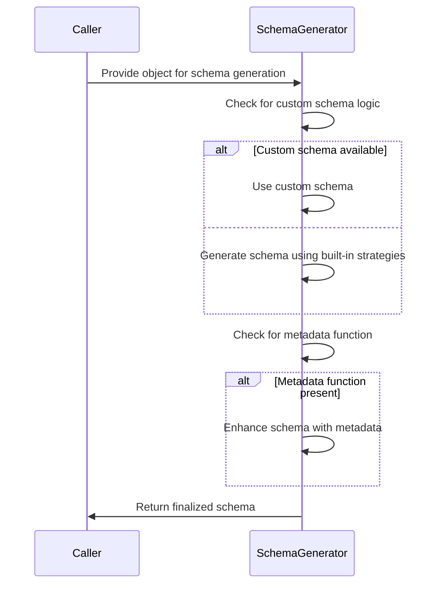
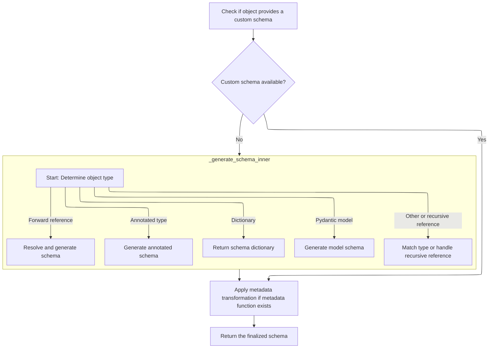
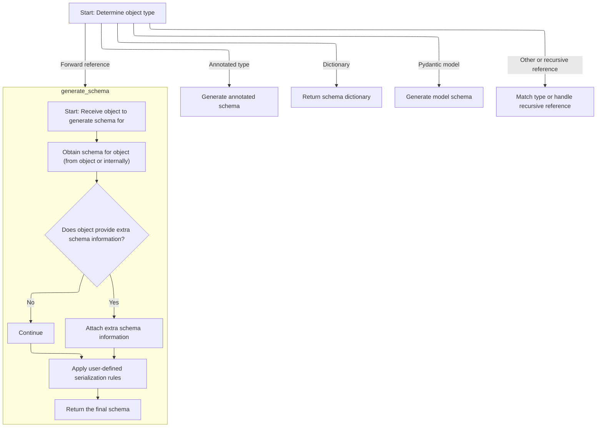
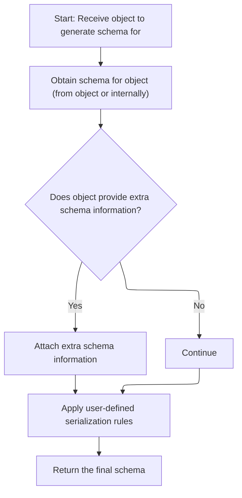
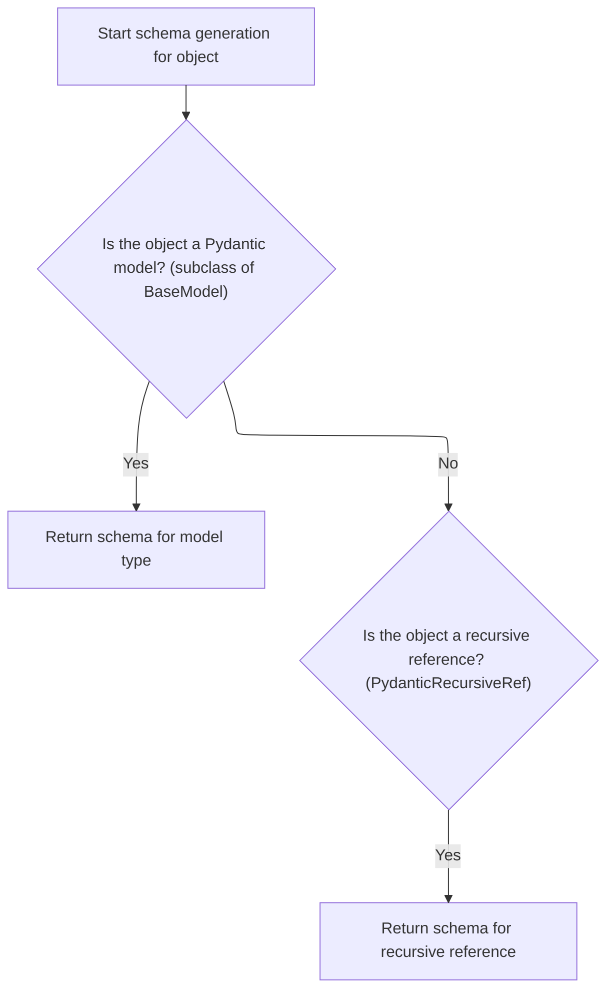
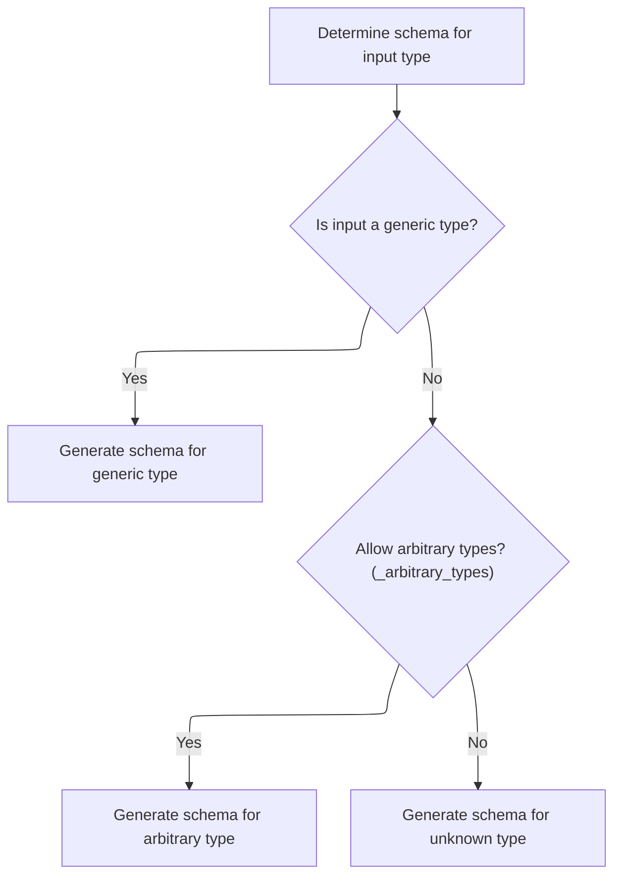
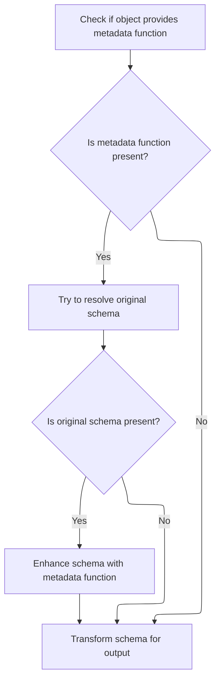

```mermaid
%%{init: {"flowchart": {"defaultRenderer": "elk"}} }%%
flowchart TD
    node1["Identify the kind of generic type (origin)"] --> node2{"Is it a dataclass?"}
    click node1 openCode "pydantic/_internal/_generate_schema.py:1145:1194"
    node2 -->|"Yes"| node3["Generate dataclass schema"]
    click node2 openCode "pydantic/_internal/_generate_schema.py:1150:1151"
    click node3 openCode "pydantic/_internal/_generate_schema.py:1151:1151"
    node2 -->|"No"| node4{"Is it a namedtuple?"}
    click node4 openCode "pydantic/_internal/_generate_schema.py:1152:1153"
    node4 -->|"Yes"| node5["Generate namedtuple schema"]
    click node5 openCode "pydantic/_internal/_generate_schema.py:1153:1153"
    node4 -->|"No"| node6{"Custom schema method available?"}
    click node6 openCode "pydantic/_internal/_generate_schema.py:1155:1157"
    node6 -->|"Yes"| node7["Use custom schema"]
    click node7 openCode "pydantic/_internal/_generate_schema.py:1157:1157"
    node6 -->|"No"| node8{"Is it a known collection, union, or mapping type?"}
    click node8 openCode "pydantic/_internal/_generate_schema.py:1159:1191"
    node8 -->|"Yes"| node9["Generate appropriate schema for type"]
    click node9 openCode "pydantic/_internal/_generate_schema.py:1160:1190"
    node8 -->|"No"| node10{"Allow arbitrary types?"}
    click node10 openCode "pydantic/_internal/_generate_schema.py:1192:1193"
    node10 -->|"Yes"| node11["Generate arbitrary type schema"]
    click node11 openCode "pydantic/_internal/_generate_schema.py:1193:1193"
    node10 -->|"No"| node12["Generate unknown type schema"]
    click node12 openCode "pydantic/_internal/_generate_schema.py:1194:1194"

%% Swimm:
%% %%{init: {"flowchart": {"defaultRenderer": "elk"}} }%%
%% flowchart TD
%%     node1["Identify the kind of generic type (origin)"] --> node2{"Is it a dataclass?"}
%%     click node1 openCode "<SwmPath>[pydantic/\_internal/\_generate_schema.py](pydantic/_internal/_generate_schema.py)</SwmPath>:1145:1194"
%%     node2 -->|"Yes"| node3["Generate dataclass schema"]
%%     click node2 openCode "<SwmPath>[pydantic/\_internal/\_generate_schema.py](pydantic/_internal/_generate_schema.py)</SwmPath>:1150:1151"
%%     click node3 openCode "<SwmPath>[pydantic/\_internal/\_generate_schema.py](pydantic/_internal/_generate_schema.py)</SwmPath>:1151:1151"
%%     node2 -->|"No"| node4{"Is it a namedtuple?"}
%%     click node4 openCode "<SwmPath>[pydantic/\_internal/\_generate_schema.py](pydantic/_internal/_generate_schema.py)</SwmPath>:1152:1153"
%%     node4 -->|"Yes"| node5["Generate namedtuple schema"]
%%     click node5 openCode "<SwmPath>[pydantic/\_internal/\_generate_schema.py](pydantic/_internal/_generate_schema.py)</SwmPath>:1153:1153"
%%     node4 -->|"No"| node6{"Custom schema method available?"}
%%     click node6 openCode "<SwmPath>[pydantic/\_internal/\_generate_schema.py](pydantic/_internal/_generate_schema.py)</SwmPath>:1155:1157"
%%     node6 -->|"Yes"| node7["Use custom schema"]
%%     click node7 openCode "<SwmPath>[pydantic/\_internal/\_generate_schema.py](pydantic/_internal/_generate_schema.py)</SwmPath>:1157:1157"
%%     node6 -->|"No"| node8{"Is it a known collection, union, or mapping type?"}
%%     click node8 openCode "<SwmPath>[pydantic/\_internal/\_generate_schema.py](pydantic/_internal/_generate_schema.py)</SwmPath>:1159:1191"
%%     node8 -->|"Yes"| node9["Generate appropriate schema for type"]
%%     click node9 openCode "<SwmPath>[pydantic/\_internal/\_generate_schema.py](pydantic/_internal/_generate_schema.py)</SwmPath>:1160:1190"
%%     node8 -->|"No"| node10{"Allow arbitrary types?"}
%%     click node10 openCode "<SwmPath>[pydantic/\_internal/\_generate_schema.py](pydantic/_internal/_generate_schema.py)</SwmPath>:1192:1193"
%%     node10 -->|"Yes"| node11["Generate arbitrary type schema"]
%%     click node11 openCode "<SwmPath>[pydantic/\_internal/\_generate_schema.py](pydantic/_internal/_generate_schema.py)</SwmPath>:1193:1193"
%%     node10 -->|"No"| node12["Generate unknown type schema"]
%%     click node12 openCode "<SwmPath>[pydantic/\_internal/\_generate_schema.py](pydantic/_internal/_generate_schema.py)</SwmPath>:1194:1194"
```

The <SwmToken path="pydantic/_internal/_generate_schema.py" pos="2177:3:3" line-data="        def inner_handler(obj: Any) -&gt; CoreSchema:">`inner_handler`</SwmToken> flow generates a validation schema for an object by first checking for custom schema logic, then applying built-in strategies if needed. It enhances the schema with metadata when available and returns the finalized schema for validation.

Main steps:

- Attempt to use custom schema logic from the object
- Generate schema using built-in strategies if custom logic is absent
- Attach metadata if present
- Transform and return the finalized schema



# Spec

## Detailed View of the Program's Functionality

a. Entry Point: Schema Generation

The schema generation process begins by checking if the object to be processed provides a custom schema method. This is done by looking for a special method on the object that can generate a schema directly. If such a method is found and is not the default one from the base model, it is called to obtain the schema. If the object does not provide a custom schema, the process falls back to a generic schema generation routine that handles various Python types.

b. Custom Schema and Metadata Handling

If a custom schema is available, the code checks if there is a function for attaching extra JSON schema metadata. If such a function exists, it tries to resolve the original schema and attaches the metadata function to it. This allows for additional customization of the generated schema. If no metadata function is present, the schema is simply transformed for output.

c. Generic Schema Generation (<SwmToken path="pydantic/_internal/_generate_schema.py" pos="724:7:7" line-data="            schema = self._generate_schema_inner(obj)">`_generate_schema_inner`</SwmToken>)

If no custom schema is provided, the generic schema generation routine is invoked. This routine first checks for special cases:

- If the type is a self-reference, it resolves it using the current model stack.
- If the type is an annotated type, it generates a schema for the annotated type.
- If the input is already a dictionary, it is assumed to be a valid schema and returned as-is.
- If the input is a string, it is converted into a forward reference.
- If the input is a forward reference, it is resolved and schema generation is recursively invoked.

Next, the routine checks if the input is a subclass of the base model. If so, it pushes the model onto a stack to track recursion and generates a model schema. If the input is a recursive reference, it returns a schema that references the recursive type. If none of these cases match, the routine falls back to type matching.

d. Type Matching and Fallbacks (<SwmToken path="pydantic/_internal/_generate_schema.py" pos="1023:5:5" line-data="        return self.match_type(obj)">`match_type`</SwmToken>)

The type matching function runs through a series of type checks to map the input to the appropriate schema:

- Primitive types (str, int, float, etc.) are mapped to their corresponding schemas.
- Special types (datetime, UUID, Decimal, etc.) are handled with specific schema generators.
- Collection types (list, set, dict, etc.) are handled by generating schemas for their elements or key/value pairs.
- If the input is a <SwmToken path="pydantic/_internal/_generate_schema.py" pos="1111:3:3" line-data="            # NewType, can&#39;t use isinstance because it fails &lt;3.10">`NewType`</SwmToken> or Final, the underlying type is resolved and schema generation is called recursively.
- If the input is a callable, enum, or dataclass, specialized schema generators are invoked.
- If the input is a generic type (<SwmToken path="pydantic/_internal/_generate_schema.py" pos="1033:18:20" line-data="        boilerplate before calling into the user-facing method (e.g. `GenerateSchema._tuple_schema`).">`e.g`</SwmToken>., List\[int\]), the origin and parameters are extracted, and the appropriate schema generator is called.
- If arbitrary types are allowed by configuration, a generic instance schema is generated; otherwise, an error is raised for unknown types.

e. Model Schema Construction (<SwmToken path="pydantic/_internal/_generate_schema.py" pos="736:3:3" line-data="    def _model_schema(self, cls: type[BaseModel]) -&gt; core_schema.CoreSchema:">`_model_schema`</SwmToken>)

When generating a schema for a model:

- The code first checks for a cached schema or a custom schema attribute on the model.
- If not found, it sets up configuration and namespace context.
- It gathers or rebuilds fields as needed, handling forward references and recursive models.
- Decorators (validators, serializers, computed fields) are validated to ensure all referenced fields exist.
- If extra fields are allowed by configuration, the code processes extra field annotations and generates schemas for extra keys and values.
- For root models, the schema is built around the root field and validators are applied.
- For regular models, schemas are generated for each field and computed field, combined, and validators/serializers are applied.
- The final schema is wrapped as a definition reference for reuse and recursion.

f. Dataclass Schema Construction (<SwmToken path="pydantic/_internal/_generate_schema.py" pos="1135:5:5" line-data="            return self._dataclass_schema(obj, None)  # pyright: ignore[reportArgumentType]">`_dataclass_schema`</SwmToken>)

When generating a schema for a dataclass:

- The code checks for a cached or custom schema.
- If not found, it handles type variable mappings for generics and sets up configuration and namespace context.
- For Pydantic dataclasses with complete fields, it copies field info and applies type variable mappings if present.
- For incomplete or plain dataclasses, it rebuilds or collects fields as needed.
- If extra fields are allowed, it checks for conflicts with fields that have init=False and raises an error if found.
- Decorators are built, field schemas are generated, and validators/serializers are applied.
- Arguments are sorted to match dataclass semantics.
- The schema is finalized and returned as a definition reference for reuse and recursion.

g. Generic Type Schema Handling (<SwmToken path="pydantic/_internal/_generate_schema.py" pos="1139:5:5" line-data="            return self._match_generic_type(obj, origin)">`_match_generic_type`</SwmToken>)

When handling generic types:

- If the origin is a dataclass, the dataclass schema generator is called immediately.
- If the origin is a namedtuple, the namedtuple schema generator is called.
- If the origin provides a custom schema method, it is used.
- If the origin is a known collection, union, or mapping type, the appropriate schema generator is called.
- If arbitrary types are allowed, a generic instance schema is generated; otherwise, an unknown type schema is generated.

h. Schema Metadata and Final Transformation

After generating the schema (either via custom logic or generic routines), the code checks for any extra JSON schema metadata function. If present, it tries to resolve the original schema and attaches the metadata function to it. Finally, the schema is transformed for output, which may involve additional processing or cleanup before returning the finalized schema.

i. Supporting Infrastructure

Throughout the process, several stacks and context managers are used to track the current model, field, and namespace context, allowing for correct handling of recursion, forward references, and generic types. Helper functions and classes manage the extraction and application of metadata, validators, and serializers, ensuring that the generated schema accurately reflects the structure and constraints of the original Python type or model.

# Rule Definition

| Paragraph Name                                                                                                                                                                                                                                     | Rule ID | Category          | Description                                                                                                                                                                                                                                                                                                                                                                                                                                                                                                                                                                                                                                                                                                                                                                                                                                                                                                                                                                                                                                                                                                                                                                                                                                                                                                                                                                                                                                                                                                 | Conditions                                                                                                                                                                                                                                                                                                                                     | Remarks                                                                                                                                                                                                                                                                                                                                                                                                                                                                                                                                                                                         |
| -------------------------------------------------------------------------------------------------------------------------------------------------------------------------------------------------------------------------------------------------- | ------- | ----------------- | ----------------------------------------------------------------------------------------------------------------------------------------------------------------------------------------------------------------------------------------------------------------------------------------------------------------------------------------------------------------------------------------------------------------------------------------------------------------------------------------------------------------------------------------------------------------------------------------------------------------------------------------------------------------------------------------------------------------------------------------------------------------------------------------------------------------------------------------------------------------------------------------------------------------------------------------------------------------------------------------------------------------------------------------------------------------------------------------------------------------------------------------------------------------------------------------------------------------------------------------------------------------------------------------------------------------------------------------------------------------------------------------------------------------------------------------------------------------------------------------------------------- | ---------------------------------------------------------------------------------------------------------------------------------------------------------------------------------------------------------------------------------------------------------------------------------------------------------------------------------------------- | ----------------------------------------------------------------------------------------------------------------------------------------------------------------------------------------------------------------------------------------------------------------------------------------------------------------------------------------------------------------------------------------------------------------------------------------------------------------------------------------------------------------------------------------------------------------------------------------------- |
| GenerateSchema.generate_schema                                                                                                                                                                                                                     | RL-001  | Computation       | The schema generation process must be initiated via a function that accepts any Python object, type, or class and returns a dictionary (<SwmToken path="pydantic/_internal/_generate_schema.py" pos="700:7:7" line-data="    ) -&gt; core_schema.CoreSchema:">`CoreSchema`</SwmToken>) describing the structure and type information of the input. The output schema must always include a 'type' key indicating the schema kind, and may include additional keys as required by the schema kind (<SwmToken path="pydantic/_internal/_generate_schema.py" pos="1033:18:20" line-data="        boilerplate before calling into the user-facing method (e.g. `GenerateSchema._tuple_schema`).">`e.g`</SwmToken>., 'fields', 'ref', <SwmToken path="pydantic/_internal/_generate_schema.py" pos="259:4:4" line-data="            schema[&#39;items_schema&#39;][variadic_item_index] = apply_validators(">`items_schema`</SwmToken>).                                                                                                                                                                                                                                                                                                                                                                                                                                                                                                                                                                          | Any Python object, type, or class is provided as input to the schema generation system.                                                                                                                                                                                                                                                        | The output is always a dictionary with at least a 'type' key. Additional keys depend on the schema kind (<SwmToken path="pydantic/_internal/_generate_schema.py" pos="1033:18:20" line-data="        boilerplate before calling into the user-facing method (e.g. `GenerateSchema._tuple_schema`).">`e.g`</SwmToken>., 'fields' for models/dataclasses, 'ref' for references, <SwmToken path="pydantic/_internal/_generate_schema.py" pos="259:4:4" line-data="            schema[&#39;items_schema&#39;][variadic_item_index] = apply_validators(">`items_schema`</SwmToken> for collections). |
| GenerateSchema.generate_schema, GenerateSchema.\_generate_schema_from_get_schema_method                                                                                                                                                            | RL-002  | Conditional Logic | If the input object provides a custom schema method (<SwmToken path="pydantic/_internal/_generate_schema.py" pos="1033:18:20" line-data="        boilerplate before calling into the user-facing method (e.g. `GenerateSchema._tuple_schema`).">`e.g`</SwmToken>., **get_pydantic_core_schema**), the system must use this method to obtain the schema. If not, it must dispatch to an internal handler to determine the type and generate the schema accordingly.                                                                                                                                                                                                                                                                                                                                                                                                                                                                                                                                                                                                                                                                                                                                                                                                                                                                                                                                                                                                                                          | The input object has a **get_pydantic_core_schema** method.                                                                                                                                                                                                                                                                                    | If the schema returned by the custom method is of type 'definitions', it must be unpacked. If the schema contains a reference, a definition reference schema is created.                                                                                                                                                                                                                                                                                                                                                                                                                        |
| GenerateSchema.\_generate_schema_inner, GenerateSchema.match_type, GenerateSchema.\_match_generic_type                                                                                                                                             | RL-003  | Conditional Logic | If no custom schema method is provided, the system must dispatch to an internal handler that determines the type of the input and generates the schema accordingly. This includes handling Annotated types, dictionaries (as pre-formed schemas), forward references, Pydantic models, recursive references, dataclasses, generics, callables, and arbitrary/unknown types.                                                                                                                                                                                                                                                                                                                                                                                                                                                                                                                                                                                                                                                                                                                                                                                                                                                                                                                                                                                                                                                                                                                                 | No custom schema method is present on the input object.                                                                                                                                                                                                                                                                                        | The handler must recognize all supported input types and dispatch to the appropriate schema generation logic for each.                                                                                                                                                                                                                                                                                                                                                                                                                                                                          |
| GenerateSchema.\_model_schema                                                                                                                                                                                                                      | RL-004  | Computation       | When generating a schema for a Pydantic model (subclass of <SwmToken path="pydantic/_internal/_generate_schema.py" pos="736:13:13" line-data="    def _model_schema(self, cls: type[BaseModel]) -&gt; core_schema.CoreSchema:">`BaseModel`</SwmToken>), the system must return a dictionary with at least the keys: 'type' (set to 'model'), 'fields' (mapping field names to their schemas), and 'ref' (string reference to the model class name). Additional keys may be included for computed fields, validators, serializers, and configuration options. The schema must support root models, extra fields, schema reuse, and recursion via references.                                                                                                                                                                                                                                                                                                                                                                                                                                                                                                                                                                                                                                                                                                                                                                                                                                                 | Input is a subclass of <SwmToken path="pydantic/_internal/_generate_schema.py" pos="736:13:13" line-data="    def _model_schema(self, cls: type[BaseModel]) -&gt; core_schema.CoreSchema:">`BaseModel`</SwmToken>.                                                                                                                             | The 'fields' key is a mapping of field names to their schemas. The 'ref' key is a string reference. Additional keys may include computed fields, validators, serializers, and config.                                                                                                                                                                                                                                                                                                                                                                                                           |
| GenerateSchema.\_dataclass_schema                                                                                                                                                                                                                  | RL-005  | Computation       | When generating a schema for a dataclass (standard or Pydantic), the system must return a dictionary with at least the keys: 'type' (set to 'dataclass'), 'fields' (mapping field names to their schemas), and 'ref' (string reference to the dataclass name). The schema must support generic dataclasses, type variable mappings, extra fields, field-level configuration, schema reuse, and recursion via references.                                                                                                                                                                                                                                                                                                                                                                                                                                                                                                                                                                                                                                                                                                                                                                                                                                                                                                                                                                                                                                                                                    | Input is a dataclass type.                                                                                                                                                                                                                                                                                                                     | The 'fields' key is a mapping of field names to their schemas. The 'ref' key is a string reference. Additional keys may include generic origin, <SwmToken path="pydantic/_internal/_generate_schema.py" pos="845:1:1" line-data="                        post_init=getattr(cls, &#39;__pydantic_post_init__&#39;, None),">`post_init`</SwmToken>, slots, config, and frozen.                                                                                                                                                                                                                    |
| GenerateSchema.match_type, GenerateSchema.\_match_generic_type                                                                                                                                                                                     | RL-006  | Conditional Logic | The type-matching function must accept any input object or type and return a schema appropriate for the detected type. For <SwmToken path="pydantic/_internal/_generate_schema.py" pos="1111:3:3" line-data="            # NewType, can&#39;t use isinstance because it fails &lt;3.10">`NewType`</SwmToken> and Final types, it must resolve the underlying type and generate the schema for it. For callable types, it must generate a callable schema. For generic types, it must generate a schema for the generic type, including handling of dataclasses and namedtuples. For known collection, union, or mapping types, it must generate the appropriate schema. For arbitrary or unknown types, it must generate a schema indicating an arbitrary or unknown type, depending on configuration.                                                                                                                                                                                                                                                                                                                                                                                                                                                                                                                                                                                                                                                                                                      | Input is not handled by previous rules and is a supported or arbitrary/unknown type.                                                                                                                                                                                                                                                           | Known types include primitives, collections, unions, mappings, etc. Arbitrary/unknown types may result in an 'any' schema or an error, depending on configuration.                                                                                                                                                                                                                                                                                                                                                                                                                              |
| Throughout <SwmToken path="pydantic/_internal/_generate_schema.py" pos="1032:5:5" line-data="        (like `GenerateSchema.tuple_variable_schema`) or calls into a private method that handles some">`GenerateSchema`</SwmToken> and \_Definitions | RL-007  | Data Assignment   | All generated schemas must be dictionaries with a required 'type' key indicating the schema kind (<SwmToken path="pydantic/_internal/_generate_schema.py" pos="1033:18:20" line-data="        boilerplate before calling into the user-facing method (e.g. `GenerateSchema._tuple_schema`).">`e.g`</SwmToken>., 'model', 'dataclass', 'list', 'int', <SwmToken path="pydantic/_internal/_generate_schema.py" pos="924:18:20" line-data="            # Note: if schema is of type `&#39;definition-ref&#39;`, we might want to copy it as a">`definition-ref`</SwmToken>). Additional keys must be included as required by the schema kind (<SwmToken path="pydantic/_internal/_generate_schema.py" pos="1033:18:20" line-data="        boilerplate before calling into the user-facing method (e.g. `GenerateSchema._tuple_schema`).">`e.g`</SwmToken>., 'fields', 'schema', 'ref', <SwmToken path="pydantic/_internal/_generate_schema.py" pos="259:4:4" line-data="            schema[&#39;items_schema&#39;][variadic_item_index] = apply_validators(">`items_schema`</SwmToken>). References ('ref', <SwmToken path="pydantic/_internal/_generate_schema.py" pos="924:18:20" line-data="            # Note: if schema is of type `&#39;definition-ref&#39;`, we might want to copy it as a">`definition-ref`</SwmToken>) must be used for recursive or reusable types. Optionally, schemas may include a 'metadata' key for extra information and a 'serialization' key for custom serialization logic. | Any schema is generated for any supported type.                                                                                                                                                                                                                                                                                                | The 'type' key is always present. Other keys depend on schema kind. Reference keys are used for recursion/reuse. 'metadata' and 'serialization' are optional.                                                                                                                                                                                                                                                                                                                                                                                                                                   |
| GenerateSchema.generate_schema                                                                                                                                                                                                                     | RL-008  | Conditional Logic | After schema generation, if the input object provides a metadata function (<SwmToken path="pydantic/_internal/_generate_schema.py" pos="1033:18:20" line-data="        boilerplate before calling into the user-facing method (e.g. `GenerateSchema._tuple_schema`).">`e.g`</SwmToken>., **get_pydantic_json_schema**), the system must attempt to resolve the original schema and, if present, enhance the schema with the metadata function. The schema may be transformed for output as required.                                                                                                                                                                                                                                                                                                                                                                                                                                                                                                                                                                                                                                                                                                                                                                                                                                                                                                                                                                                                        | Input object provides a metadata function after schema generation.                                                                                                                                                                                                                                                                             | The metadata function may add or modify keys in the schema, especially for JSON schema generation.                                                                                                                                                                                                                                                                                                                                                                                                                                                                                              |
| <SwmToken path="pydantic/_internal/_generate_schema.py" pos="1032:5:5" line-data="        (like `GenerateSchema.tuple_variable_schema`) or calls into a private method that handles some">`GenerateSchema`</SwmToken>, \_Definitions               | RL-009  | Computation       | The schema generation process must be recursive and support caching and reference tracking to handle recursion and schema reuse efficiently. When a referenceable type is encountered, the system must track references and avoid infinite recursion by yielding reference schemas as needed. Definitions must be stored and reused for repeated types.                                                                                                                                                                                                                                                                                                                                                                                                                                                                                                                                                                                                                                                                                                                                                                                                                                                                                                                                                                                                                                                                                                                                                     | Schema generation involves recursive or referenceable types (<SwmToken path="pydantic/_internal/_generate_schema.py" pos="1033:18:20" line-data="        boilerplate before calling into the user-facing method (e.g. `GenerateSchema._tuple_schema`).">`e.g`</SwmToken>., models, dataclasses, typeddicts, namedtuples, enums, type aliases). | References are tracked using string refs. Definitions are stored in a mapping and reused. Recursive types yield <SwmToken path="pydantic/_internal/_generate_schema.py" pos="924:18:20" line-data="            # Note: if schema is of type `&#39;definition-ref&#39;`, we might want to copy it as a">`definition-ref`</SwmToken> schemas.                                                                                                                                                                                                                                                     |

# User Stories

## User Story 1: Handle custom schema and metadata methods

---

### Story Description:

As a system or user generating a schema, I want the system to use custom schema methods if present, otherwise dispatch to internal handlers, and to enhance the schema with metadata functions if available, so that custom logic and metadata are respected in the generated schema.

---

### Business Rule Mapping:

| Rule ID | Paragraph Name                                                                                         | Rule Description                                                                                                                                                                                                                                                                                                                                                                                                                                                                                     |
| ------- | ------------------------------------------------------------------------------------------------------ | ---------------------------------------------------------------------------------------------------------------------------------------------------------------------------------------------------------------------------------------------------------------------------------------------------------------------------------------------------------------------------------------------------------------------------------------------------------------------------------------------------- |
| RL-002  | GenerateSchema.generate_schema, GenerateSchema.\_generate_schema_from_get_schema_method                | If the input object provides a custom schema method (<SwmToken path="pydantic/_internal/_generate_schema.py" pos="1033:18:20" line-data="        boilerplate before calling into the user-facing method (e.g. `GenerateSchema._tuple_schema`).">`e.g`</SwmToken>., **get_pydantic_core_schema**), the system must use this method to obtain the schema. If not, it must dispatch to an internal handler to determine the type and generate the schema accordingly.                                   |
| RL-008  | GenerateSchema.generate_schema                                                                         | After schema generation, if the input object provides a metadata function (<SwmToken path="pydantic/_internal/_generate_schema.py" pos="1033:18:20" line-data="        boilerplate before calling into the user-facing method (e.g. `GenerateSchema._tuple_schema`).">`e.g`</SwmToken>., **get_pydantic_json_schema**), the system must attempt to resolve the original schema and, if present, enhance the schema with the metadata function. The schema may be transformed for output as required. |
| RL-003  | GenerateSchema.\_generate_schema_inner, GenerateSchema.match_type, GenerateSchema.\_match_generic_type | If no custom schema method is provided, the system must dispatch to an internal handler that determines the type of the input and generates the schema accordingly. This includes handling Annotated types, dictionaries (as pre-formed schemas), forward references, Pydantic models, recursive references, dataclasses, generics, callables, and arbitrary/unknown types.                                                                                                                          |

---

### Relevant Functionality:

- **GenerateSchema.generate_schema**
  1. **RL-002:**
     - Check for presence of custom schema method on input
     - If present, call the method to obtain schema
       - If schema is of type 'definitions', unpack it
       - If schema contains a reference, create a definition reference schema
     - If not present, proceed to internal type dispatch
  2. **RL-008:**
     - After generating schema, check for metadata function on input
     - If present, resolve the original schema
     - If original schema is found, enhance it with the metadata function
     - Transform schema for output as needed
- **GenerateSchema.\_generate_schema_inner**
  1. **RL-003:**
     - If input is Annotated, generate annotated schema
     - If input is a dict, treat as pre-formed schema
     - If input is a forward reference, resolve and generate schema for resolved type
     - If input is a Pydantic model, generate model schema
     - If input is a recursive reference, generate reference schema
     - If input is a dataclass, generate dataclass schema
     - For all other types, dispatch to type-matching function

## User Story 2: Support all input types, type-matching logic, recursion, caching, and reference tracking

---

### Story Description:

As a user or system generating schemas, I want the system to support all relevant input types (models, dataclasses, generics, callables, primitives, unknown types, etc.), generate the appropriate schema for each, and handle recursion, caching, and reference tracking efficiently so that all my data structures can be described accurately, schemas are correct, avoid infinite loops, and reuse definitions where possible.

---

### Business Rule Mapping:

| Rule ID | Paragraph Name                                                                                                                                                                                                                       | Rule Description                                                                                                                                                                                                                                                                                                                                                                                                                                                                                                                                                                                                                                                                                                                                                                                       |
| ------- | ------------------------------------------------------------------------------------------------------------------------------------------------------------------------------------------------------------------------------------ | ------------------------------------------------------------------------------------------------------------------------------------------------------------------------------------------------------------------------------------------------------------------------------------------------------------------------------------------------------------------------------------------------------------------------------------------------------------------------------------------------------------------------------------------------------------------------------------------------------------------------------------------------------------------------------------------------------------------------------------------------------------------------------------------------------ |
| RL-003  | GenerateSchema.\_generate_schema_inner, GenerateSchema.match_type, GenerateSchema.\_match_generic_type                                                                                                                               | If no custom schema method is provided, the system must dispatch to an internal handler that determines the type of the input and generates the schema accordingly. This includes handling Annotated types, dictionaries (as pre-formed schemas), forward references, Pydantic models, recursive references, dataclasses, generics, callables, and arbitrary/unknown types.                                                                                                                                                                                                                                                                                                                                                                                                                            |
| RL-004  | GenerateSchema.\_model_schema                                                                                                                                                                                                        | When generating a schema for a Pydantic model (subclass of <SwmToken path="pydantic/_internal/_generate_schema.py" pos="736:13:13" line-data="    def _model_schema(self, cls: type[BaseModel]) -&gt; core_schema.CoreSchema:">`BaseModel`</SwmToken>), the system must return a dictionary with at least the keys: 'type' (set to 'model'), 'fields' (mapping field names to their schemas), and 'ref' (string reference to the model class name). Additional keys may be included for computed fields, validators, serializers, and configuration options. The schema must support root models, extra fields, schema reuse, and recursion via references.                                                                                                                                            |
| RL-005  | GenerateSchema.\_dataclass_schema                                                                                                                                                                                                    | When generating a schema for a dataclass (standard or Pydantic), the system must return a dictionary with at least the keys: 'type' (set to 'dataclass'), 'fields' (mapping field names to their schemas), and 'ref' (string reference to the dataclass name). The schema must support generic dataclasses, type variable mappings, extra fields, field-level configuration, schema reuse, and recursion via references.                                                                                                                                                                                                                                                                                                                                                                               |
| RL-006  | GenerateSchema.match_type, GenerateSchema.\_match_generic_type                                                                                                                                                                       | The type-matching function must accept any input object or type and return a schema appropriate for the detected type. For <SwmToken path="pydantic/_internal/_generate_schema.py" pos="1111:3:3" line-data="            # NewType, can&#39;t use isinstance because it fails &lt;3.10">`NewType`</SwmToken> and Final types, it must resolve the underlying type and generate the schema for it. For callable types, it must generate a callable schema. For generic types, it must generate a schema for the generic type, including handling of dataclasses and namedtuples. For known collection, union, or mapping types, it must generate the appropriate schema. For arbitrary or unknown types, it must generate a schema indicating an arbitrary or unknown type, depending on configuration. |
| RL-009  | <SwmToken path="pydantic/_internal/_generate_schema.py" pos="1032:5:5" line-data="        (like `GenerateSchema.tuple_variable_schema`) or calls into a private method that handles some">`GenerateSchema`</SwmToken>, \_Definitions | The schema generation process must be recursive and support caching and reference tracking to handle recursion and schema reuse efficiently. When a referenceable type is encountered, the system must track references and avoid infinite recursion by yielding reference schemas as needed. Definitions must be stored and reused for repeated types.                                                                                                                                                                                                                                                                                                                                                                                                                                                |

---

### Relevant Functionality:

- **GenerateSchema.\_generate_schema_inner**
  1. **RL-003:**
     - If input is Annotated, generate annotated schema
     - If input is a dict, treat as pre-formed schema
     - If input is a forward reference, resolve and generate schema for resolved type
     - If input is a Pydantic model, generate model schema
     - If input is a recursive reference, generate reference schema
     - If input is a dataclass, generate dataclass schema
     - For all other types, dispatch to type-matching function
- **GenerateSchema.\_model_schema**
  1. **RL-004:**
     - Accept a <SwmToken path="pydantic/_internal/_generate_schema.py" pos="736:13:13" line-data="    def _model_schema(self, cls: type[BaseModel]) -&gt; core_schema.CoreSchema:">`BaseModel`</SwmToken> subclass
     - Build field schemas for each model field
     - Include computed fields, validators, serializers, and config as needed
     - Support root models and extra fields if configured
     - Support schema reuse and recursion via references
     - Return a dictionary with at least 'type', 'fields', and 'ref'
- **GenerateSchema.\_dataclass_schema**
  1. **RL-005:**
     - Accept a dataclass type (standard or Pydantic)
     - Build field schemas for each dataclass field
     - Handle generic dataclasses and type variable mappings
     - Support extra fields and field-level config
     - Support schema reuse and recursion via references
     - Return a dictionary with at least 'type', 'fields', and 'ref'
- **GenerateSchema.match_type**
  1. **RL-006:**
     - Check for known primitive types and return corresponding schema
     - For <SwmToken path="pydantic/_internal/_generate_schema.py" pos="1111:3:3" line-data="            # NewType, can&#39;t use isinstance because it fails &lt;3.10">`NewType`</SwmToken> and Final, resolve and generate schema for underlying type
     - For callable types, generate callable schema
     - For generics, handle dataclasses, namedtuples, and other generic types
     - For collections, unions, mappings, generate appropriate schema
     - For arbitrary/unknown types, generate 'any' schema or raise error depending on config
- <SwmToken path="pydantic/_internal/_generate_schema.py" pos="1032:5:5" line-data="        (like `GenerateSchema.tuple_variable_schema`) or calls into a private method that handles some">`GenerateSchema`</SwmToken>
  1. **RL-009:**
     - When generating schema for a referenceable type, check if already seen
     - If seen, yield a reference schema
     - If not, generate schema and store definition
     - Use stored definitions for repeated types
     - Avoid infinite recursion by tracking references

## User Story 3: Initiate schema generation, ensure output format, and schema structure

---

### Story Description:

As a system or user needing to generate a schema, I want to initiate schema generation for any Python object, type, or class and receive a dictionary describing the structure and type information of the input, always including a 'type' key and other required or optional keys for extensibility, references, metadata, and serialization, so that schemas are consistent, reusable, and informative.

---

### Business Rule Mapping:

| Rule ID | Paragraph Name                                                                                                                                                                                                                                     | Rule Description                                                                                                                                                                                                                                                                                                                                                                                                                                                                                                                                                                                                                                                                                                                                                                                                                                                                                                                                                                                                                                                                                                                                                                                                                                                                                                                                                                                                                                                                                            |
| ------- | -------------------------------------------------------------------------------------------------------------------------------------------------------------------------------------------------------------------------------------------------- | ----------------------------------------------------------------------------------------------------------------------------------------------------------------------------------------------------------------------------------------------------------------------------------------------------------------------------------------------------------------------------------------------------------------------------------------------------------------------------------------------------------------------------------------------------------------------------------------------------------------------------------------------------------------------------------------------------------------------------------------------------------------------------------------------------------------------------------------------------------------------------------------------------------------------------------------------------------------------------------------------------------------------------------------------------------------------------------------------------------------------------------------------------------------------------------------------------------------------------------------------------------------------------------------------------------------------------------------------------------------------------------------------------------------------------------------------------------------------------------------------------------- |
| RL-001  | GenerateSchema.generate_schema                                                                                                                                                                                                                     | The schema generation process must be initiated via a function that accepts any Python object, type, or class and returns a dictionary (<SwmToken path="pydantic/_internal/_generate_schema.py" pos="700:7:7" line-data="    ) -&gt; core_schema.CoreSchema:">`CoreSchema`</SwmToken>) describing the structure and type information of the input. The output schema must always include a 'type' key indicating the schema kind, and may include additional keys as required by the schema kind (<SwmToken path="pydantic/_internal/_generate_schema.py" pos="1033:18:20" line-data="        boilerplate before calling into the user-facing method (e.g. `GenerateSchema._tuple_schema`).">`e.g`</SwmToken>., 'fields', 'ref', <SwmToken path="pydantic/_internal/_generate_schema.py" pos="259:4:4" line-data="            schema[&#39;items_schema&#39;][variadic_item_index] = apply_validators(">`items_schema`</SwmToken>).                                                                                                                                                                                                                                                                                                                                                                                                                                                                                                                                                                          |
| RL-007  | Throughout <SwmToken path="pydantic/_internal/_generate_schema.py" pos="1032:5:5" line-data="        (like `GenerateSchema.tuple_variable_schema`) or calls into a private method that handles some">`GenerateSchema`</SwmToken> and \_Definitions | All generated schemas must be dictionaries with a required 'type' key indicating the schema kind (<SwmToken path="pydantic/_internal/_generate_schema.py" pos="1033:18:20" line-data="        boilerplate before calling into the user-facing method (e.g. `GenerateSchema._tuple_schema`).">`e.g`</SwmToken>., 'model', 'dataclass', 'list', 'int', <SwmToken path="pydantic/_internal/_generate_schema.py" pos="924:18:20" line-data="            # Note: if schema is of type `&#39;definition-ref&#39;`, we might want to copy it as a">`definition-ref`</SwmToken>). Additional keys must be included as required by the schema kind (<SwmToken path="pydantic/_internal/_generate_schema.py" pos="1033:18:20" line-data="        boilerplate before calling into the user-facing method (e.g. `GenerateSchema._tuple_schema`).">`e.g`</SwmToken>., 'fields', 'schema', 'ref', <SwmToken path="pydantic/_internal/_generate_schema.py" pos="259:4:4" line-data="            schema[&#39;items_schema&#39;][variadic_item_index] = apply_validators(">`items_schema`</SwmToken>). References ('ref', <SwmToken path="pydantic/_internal/_generate_schema.py" pos="924:18:20" line-data="            # Note: if schema is of type `&#39;definition-ref&#39;`, we might want to copy it as a">`definition-ref`</SwmToken>) must be used for recursive or reusable types. Optionally, schemas may include a 'metadata' key for extra information and a 'serialization' key for custom serialization logic. |

---

### Relevant Functionality:

- **GenerateSchema.generate_schema**
  1. **RL-001:**
     - Accept input object, type, or class
     - Attempt to generate schema using a custom schema method if present
     - If not, dispatch to internal handler to generate schema based on input type
     - Ensure the returned schema is a dictionary with at least a 'type' key
- **Throughout** <SwmToken path="pydantic/_internal/_generate_schema.py" pos="1032:5:5" line-data="        (like `GenerateSchema.tuple_variable_schema`) or calls into a private method that handles some">`GenerateSchema`</SwmToken> **and \_Definitions**
  1. **RL-007:**
     - Ensure every schema dict has a 'type' key
     - Add additional keys as required by schema kind
     - Use 'ref' and <SwmToken path="pydantic/_internal/_generate_schema.py" pos="924:18:20" line-data="            # Note: if schema is of type `&#39;definition-ref&#39;`, we might want to copy it as a">`definition-ref`</SwmToken> for recursive/reusable types
     - Optionally add 'metadata' and 'serialization' keys

# Code Walkthrough

## Schema Generation Entry Point



<SwmSnippet path="/pydantic/_internal/_generate_schema.py" line="2177">

---

In <SwmToken path="pydantic/_internal/_generate_schema.py" pos="2177:3:3" line-data="        def inner_handler(obj: Any) -&gt; CoreSchema:">`inner_handler`</SwmToken>, we first try to grab a schema using any custom logic on the object, and if that's not there, we use the generic schema generator next.

```python
        def inner_handler(obj: Any) -> CoreSchema:
            schema = self._generate_schema_from_get_schema_method(obj, source_type)

            if schema is None:
                schema = self._generate_schema_inner(obj)

```

---

</SwmSnippet>

### Type Resolution and Schema Fallbacks



<SwmSnippet path="/pydantic/_internal/_generate_schema.py" line="997">

---

In <SwmToken path="pydantic/_internal/_generate_schema.py" pos="997:3:3" line-data="    def _generate_schema_inner(self, obj: Any) -&gt; core_schema.CoreSchema:">`_generate_schema_inner`</SwmToken>, we're handling all the weird cases: self types, annotated types, dicts (which are assumed to already be schemas), strings (which get turned into forward refs), and forward refs themselves (which get resolved and passed back into schema generation). If we hit a forward ref, we call <SwmToken path="pydantic/_internal/_generate_schema.py" pos="1012:5:5" line-data="            return self.generate_schema(self._resolve_forward_ref(obj))">`generate_schema`</SwmToken> to keep the recursion going until we hit a concrete type.

```python
    def _generate_schema_inner(self, obj: Any) -> core_schema.CoreSchema:
        if typing_objects.is_self(obj):
            obj = self._resolve_self_type(obj)

        if typing_objects.is_annotated(get_origin(obj)):
            return self._annotated_schema(obj)

        if isinstance(obj, dict):
            # we assume this is already a valid schema
            return obj  # type: ignore[return-value]

        if isinstance(obj, str):
            obj = ForwardRef(obj)

        if isinstance(obj, ForwardRef):
            return self.generate_schema(self._resolve_forward_ref(obj))

```

---

</SwmSnippet>

#### Schema Generation Dispatch



<SwmSnippet path="/pydantic/_internal/_generate_schema.py" line="697">

---

In <SwmToken path="pydantic/_internal/_generate_schema.py" pos="697:3:3" line-data="    def generate_schema(">`generate_schema`</SwmToken>, we try custom schema logic first, then use the generic schema generator if needed.

```python
    def generate_schema(
        self,
        obj: Any,
    ) -> core_schema.CoreSchema:
        """Generate core schema.

        Args:
            obj: The object to generate core schema for.

        Returns:
            The generated core schema.

        Raises:
            PydanticUndefinedAnnotation:
                If it is not possible to evaluate forward reference.
            PydanticSchemaGenerationError:
                If it is not possible to generate pydantic-core schema.
            TypeError:
                - If `alias_generator` returns a disallowed type (must be str, AliasPath or AliasChoices).
                - If V1 style validator with `each_item=True` applied on a wrong field.
            PydanticUserError:
                - If `typing.TypedDict` is used instead of `typing_extensions.TypedDict` on Python < 3.12.
                - If `__modify_schema__` method is used instead of `__get_pydantic_json_schema__`.
        """
        schema = self._generate_schema_from_get_schema_method(obj, obj)

        if schema is None:
            schema = self._generate_schema_inner(obj)

```

---

</SwmSnippet>

<SwmSnippet path="/pydantic/_internal/_generate_schema.py" line="726">

---

After we get the schema from <SwmToken path="pydantic/_internal/_generate_schema.py" pos="724:7:7" line-data="            schema = self._generate_schema_inner(obj)">`_generate_schema_inner`</SwmToken> in <SwmToken path="pydantic/_internal/_generate_schema.py" pos="697:3:3" line-data="    def generate_schema(">`generate_schema`</SwmToken>, we check if there's any extra JSON schema metadata to attach. If there is, we resolve the schema and add the JS function. Finally, we apply any custom serialization and return the transformed schema.

```python
        metadata_js_function = _extract_get_pydantic_json_schema(obj)
        if metadata_js_function is not None:
            metadata_schema = resolve_original_schema(schema, self.defs)
            if metadata_schema:
                self._add_js_function(metadata_schema, metadata_js_function)

        schema = _add_custom_serialization_from_json_encoders(self._config_wrapper.json_encoders, obj, schema)

        return schema
```

---

</SwmSnippet>

#### Model and Recursive Reference Handling



<SwmSnippet path="/pydantic/_internal/_generate_schema.py" line="1014">

---

After returning from <SwmToken path="pydantic/_internal/_generate_schema.py" pos="697:3:3" line-data="    def generate_schema(">`generate_schema`</SwmToken> in <SwmToken path="pydantic/_internal/_generate_schema.py" pos="724:7:7" line-data="            schema = self._generate_schema_inner(obj)">`_generate_schema_inner`</SwmToken>, if the input is a <SwmToken path="pydantic/_internal/_generate_schema.py" pos="1014:1:1" line-data="        BaseModel = import_cached_base_model()">`BaseModel`</SwmToken> subclass, we push it onto a stack to track recursion and generate its model schema. If it's a <SwmToken path="pydantic/_internal/_generate_schema.py" pos="1020:8:8" line-data="        if isinstance(obj, PydanticRecursiveRef):">`PydanticRecursiveRef`</SwmToken>, we return a reference schema to handle recursion.

```python
        BaseModel = import_cached_base_model()

        if lenient_issubclass(obj, BaseModel):
            with self.model_type_stack.push(obj):
                return self._model_schema(obj)

        if isinstance(obj, PydanticRecursiveRef):
            return core_schema.definition_reference_schema(schema_ref=obj.type_ref)

```

---

</SwmSnippet>

#### Model Schema Construction

```mermaid
%%{init: {"flowchart": {"defaultRenderer": "elk"}} }%%
flowchart TD
    node1["Start: Generate schema for model"] --> node2{"Existing schema?"}
    click node1 openCode "pydantic/_internal/_generate_schema.py:736:831"
    node2 -->|"Yes"| node3["Return existing schema"]
    click node2 openCode "pydantic/_internal/_generate_schema.py:741:752"
    click node3 openCode "pydantic/_internal/_generate_schema.py:741:752"
    node2 -->|"No"| node4{"Is this a root model?"}
    click node4 openCode "pydantic/_internal/_generate_schema.py:835:849"
    node4 -->|"Yes"| node5["Build root model schema (with computed fields & validators)"]
    click node5 openCode "pydantic/_internal/_generate_schema.py:835:849"
    node4 -->|"No"| node6{"Are extra fields allowed by config?"}
    click node6 openCode "pydantic/_internal/_generate_schema.py:802:831"
    node6 -->|"Yes"| loop1
    node6 -->|"No"| node8["Build standard model schema (with computed fields & validators)"]
    click node8 openCode "pydantic/_internal/_generate_schema.py:850:872"
    
    subgraph loop1["For each base class in model hierarchy (MRO)"]
      node7["Process extra field annotations and generate schemas for extra keys/values"]
      click node7 openCode "pydantic/_internal/_generate_schema.py:805:831"
    end
    loop1 --> node8
    node5 --> node9["Apply serializers and validators"]
    click node9 openCode "pydantic/_internal/_generate_schema.py:874:875"
    node8 --> node9
    node9 --> node10["Return reusable schema reference"]
    click node10 openCode "pydantic/_internal/_generate_schema.py:876:876"

%% Swimm:
%% %%{init: {"flowchart": {"defaultRenderer": "elk"}} }%%
%% flowchart TD
%%     node1["Start: Generate schema for model"] --> node2{"Existing schema?"}
%%     click node1 openCode "<SwmPath>[pydantic/\_internal/\_generate_schema.py](pydantic/_internal/_generate_schema.py)</SwmPath>:736:831"
%%     node2 -->|"Yes"| node3["Return existing schema"]
%%     click node2 openCode "<SwmPath>[pydantic/\_internal/\_generate_schema.py](pydantic/_internal/_generate_schema.py)</SwmPath>:741:752"
%%     click node3 openCode "<SwmPath>[pydantic/\_internal/\_generate_schema.py](pydantic/_internal/_generate_schema.py)</SwmPath>:741:752"
%%     node2 -->|"No"| node4{"Is this a root model?"}
%%     click node4 openCode "<SwmPath>[pydantic/\_internal/\_generate_schema.py](pydantic/_internal/_generate_schema.py)</SwmPath>:835:849"
%%     node4 -->|"Yes"| node5["Build root model schema (with computed fields & validators)"]
%%     click node5 openCode "<SwmPath>[pydantic/\_internal/\_generate_schema.py](pydantic/_internal/_generate_schema.py)</SwmPath>:835:849"
%%     node4 -->|"No"| node6{"Are extra fields allowed by config?"}
%%     click node6 openCode "<SwmPath>[pydantic/\_internal/\_generate_schema.py](pydantic/_internal/_generate_schema.py)</SwmPath>:802:831"
%%     node6 -->|"Yes"| loop1
%%     node6 -->|"No"| node8["Build standard model schema (with computed fields & validators)"]
%%     click node8 openCode "<SwmPath>[pydantic/\_internal/\_generate_schema.py](pydantic/_internal/_generate_schema.py)</SwmPath>:850:872"
%%     
%%     subgraph loop1["For each base class in model hierarchy (MRO)"]
%%       node7["Process extra field annotations and generate schemas for extra keys/values"]
%%       click node7 openCode "<SwmPath>[pydantic/\_internal/\_generate_schema.py](pydantic/_internal/_generate_schema.py)</SwmPath>:805:831"
%%     end
%%     loop1 --> node8
%%     node5 --> node9["Apply serializers and validators"]
%%     click node9 openCode "<SwmPath>[pydantic/\_internal/\_generate_schema.py](pydantic/_internal/_generate_schema.py)</SwmPath>:874:875"
%%     node8 --> node9
%%     node9 --> node10["Return reusable schema reference"]
%%     click node10 openCode "<SwmPath>[pydantic/\_internal/\_generate_schema.py](pydantic/_internal/_generate_schema.py)</SwmPath>:876:876"
```



<SwmSnippet path="/pydantic/_internal/_generate_schema.py" line="736">

---

In <SwmToken path="pydantic/_internal/_generate_schema.py" pos="736:3:3" line-data="    def _model_schema(self, cls: type[BaseModel]) -&gt; core_schema.CoreSchema:">`_model_schema`</SwmToken>, we first check if there's a cached schema or a custom schema attribute on the model. If not, we set up config and namespace context, then gather or rebuild fields as needed. We also validate that all decorator-referenced fields exist and handle extra fields if allowed by config. If extra fields are present, we generate schemas for their keys and values.

```python
    def _model_schema(self, cls: type[BaseModel]) -> core_schema.CoreSchema:
        """Generate schema for a Pydantic model."""
        BaseModel_ = import_cached_base_model()

        with self.defs.get_schema_or_ref(cls) as (model_ref, maybe_schema):
            if maybe_schema is not None:
                return maybe_schema

            schema = cls.__dict__.get('__pydantic_core_schema__')
            if schema is not None and not isinstance(schema, MockCoreSchema):
                if schema['type'] == 'definitions':
                    schema = self.defs.unpack_definitions(schema)
                ref = get_ref(schema)
                if ref:
                    return self.defs.create_definition_reference_schema(schema)
                else:
                    return schema

            config_wrapper = ConfigWrapper(cls.model_config, check=False)

            with self._config_wrapper_stack.push(config_wrapper), self._ns_resolver.push(cls):
                core_config = self._config_wrapper.core_config(title=cls.__name__)

                if cls.__pydantic_fields_complete__ or cls is BaseModel_:
                    fields = getattr(cls, '__pydantic_fields__', {})
                else:
                    if not hasattr(cls, '__pydantic_fields__'):
                        # This happens when we have a loop in the schema generation:
                        # class Base[T](BaseModel):
                        #     t: T
                        #
                        # class Other(BaseModel):
                        #     b: 'Base[Other]'
                        # When we build fields for `Other`, we evaluate the forward annotation.
                        # At this point, `Other` doesn't have the model fields set. We create
                        # `Base[Other]`; model fields are successfully built, and we try to generate
                        # a schema for `t: Other`. As `Other.__pydantic_fields__` aren't set, we abort.
                        raise PydanticUndefinedAnnotation(
                            name=cls.__name__,
                            message=f'Class {cls.__name__!r} is not defined',
                        )
                    try:
                        fields = rebuild_model_fields(
                            cls,
                            config_wrapper=self._config_wrapper,
                            ns_resolver=self._ns_resolver,
                            typevars_map=self._typevars_map or {},
                        )
                    except NameError as e:
                        raise PydanticUndefinedAnnotation.from_name_error(e) from e

                decorators = cls.__pydantic_decorators__
                computed_fields = decorators.computed_fields
                check_decorator_fields_exist(
                    chain(
                        decorators.field_validators.values(),
                        decorators.field_serializers.values(),
                        decorators.validators.values(),
                    ),
                    {*fields.keys(), *computed_fields.keys()},
                )

                model_validators = decorators.model_validators.values()

                extras_schema = None
                extras_keys_schema = None
                if core_config.get('extra_fields_behavior') == 'allow':
                    assert cls.__mro__[0] is cls
                    assert cls.__mro__[-1] is object
                    for candidate_cls in cls.__mro__[:-1]:
                        extras_annotation = getattr(candidate_cls, '__annotations__', {}).get(
                            '__pydantic_extra__', None
                        )
                        if extras_annotation is not None:
                            if isinstance(extras_annotation, str):
                                extras_annotation = _typing_extra.eval_type_backport(
                                    _typing_extra._make_forward_ref(
                                        extras_annotation, is_argument=False, is_class=True
                                    ),
                                    *self._types_namespace,
                                )
                            tp = get_origin(extras_annotation)
                            if tp not in DICT_TYPES:
                                raise PydanticSchemaGenerationError(
                                    'The type annotation for `__pydantic_extra__` must be `dict[str, ...]`'
                                )
                            extra_keys_type, extra_items_type = self._get_args_resolving_forward_refs(
                                extras_annotation,
                                required=True,
                            )
                            if extra_keys_type is not str:
                                extras_keys_schema = self.generate_schema(extra_keys_type)
                            if not typing_objects.is_any(extra_items_type):
                                extras_schema = self.generate_schema(extra_items_type)
                            if extras_keys_schema is not None or extras_schema is not None:
                                break

```

---

</SwmSnippet>

<SwmSnippet path="/pydantic/_internal/_generate_schema.py" line="833">

---

After getting fields and config in <SwmToken path="pydantic/_internal/_generate_schema.py" pos="736:3:3" line-data="    def _model_schema(self, cls: type[BaseModel]) -&gt; core_schema.CoreSchema:">`_model_schema`</SwmToken>, if it's a root model, we build the schema around the root field and apply validators. For regular models, we generate schemas for each field and computed field, combine them, and apply validators and serializers. The final schema is wrapped as a definition reference for reuse and recursion.

```python
                generic_origin: type[BaseModel] | None = getattr(cls, '__pydantic_generic_metadata__', {}).get('origin')

                if cls.__pydantic_root_model__:
                    root_field = self._common_field_schema('root', fields['root'], decorators)
                    inner_schema = root_field['schema']
                    inner_schema = apply_model_validators(inner_schema, model_validators, 'inner')
                    model_schema = core_schema.model_schema(
                        cls,
                        inner_schema,
                        generic_origin=generic_origin,
                        custom_init=getattr(cls, '__pydantic_custom_init__', None),
                        root_model=True,
                        post_init=getattr(cls, '__pydantic_post_init__', None),
                        config=core_config,
                        ref=model_ref,
                    )
                else:
                    fields_schema: core_schema.CoreSchema = core_schema.model_fields_schema(
                        {k: self._generate_md_field_schema(k, v, decorators) for k, v in fields.items()},
                        computed_fields=[
                            self._computed_field_schema(d, decorators.field_serializers)
                            for d in computed_fields.values()
                        ],
                        extras_schema=extras_schema,
                        extras_keys_schema=extras_keys_schema,
                        model_name=cls.__name__,
                    )
                    inner_schema = apply_validators(fields_schema, decorators.root_validators.values())
                    inner_schema = apply_model_validators(inner_schema, model_validators, 'inner')

                    model_schema = core_schema.model_schema(
                        cls,
                        inner_schema,
                        generic_origin=generic_origin,
                        custom_init=getattr(cls, '__pydantic_custom_init__', None),
                        root_model=False,
                        post_init=getattr(cls, '__pydantic_post_init__', None),
                        config=core_config,
                        ref=model_ref,
                    )

                schema = self._apply_model_serializers(model_schema, decorators.model_serializers.values())
                schema = apply_model_validators(schema, model_validators, 'outer')
                return self.defs.create_definition_reference_schema(schema)
```

---

</SwmSnippet>

#### Type Matching Fallback

<SwmSnippet path="/pydantic/_internal/_generate_schema.py" line="1023">

---

After handling models and recursive refs in <SwmToken path="pydantic/_internal/_generate_schema.py" pos="724:7:7" line-data="            schema = self._generate_schema_inner(obj)">`_generate_schema_inner`</SwmToken>, if nothing else matches, we fall back to <SwmToken path="pydantic/_internal/_generate_schema.py" pos="1023:5:5" line-data="        return self.match_type(obj)">`match_type`</SwmToken> to map the input type to a schema using a big set of type checks.

```python
        return self.match_type(obj)
```

---

</SwmSnippet>

### Type-to-Schema Mapping

<SwmSnippet path="/pydantic/_internal/_generate_schema.py" line="1025">

---

In <SwmToken path="pydantic/_internal/_generate_schema.py" pos="1025:3:3" line-data="    def match_type(self, obj: Any) -&gt; core_schema.CoreSchema:  # noqa: C901">`match_type`</SwmToken>, we run through a big set of type checks to map the input to the right schema. For some types, like <SwmToken path="pydantic/_internal/_generate_schema.py" pos="1111:3:3" line-data="            # NewType, can&#39;t use isinstance because it fails &lt;3.10">`NewType`</SwmToken> or Final, we call <SwmToken path="pydantic/_internal/_generate_schema.py" pos="1112:5:5" line-data="            return self.generate_schema(obj.__supertype__)">`generate_schema`</SwmToken> again to resolve the underlying type.

```python
    def match_type(self, obj: Any) -> core_schema.CoreSchema:  # noqa: C901
        """Main mapping of types to schemas.

        The general structure is a series of if statements starting with the simple cases
        (non-generic primitive types) and then handling generics and other more complex cases.

        Each case either generates a schema directly, calls into a public user-overridable method
        (like `GenerateSchema.tuple_variable_schema`) or calls into a private method that handles some
        boilerplate before calling into the user-facing method (e.g. `GenerateSchema._tuple_schema`).

        The idea is that we'll evolve this into adding more and more user facing methods over time
        as they get requested and we figure out what the right API for them is.
        """
        if obj is str:
            return core_schema.str_schema()
        elif obj is bytes:
            return core_schema.bytes_schema()
        elif obj is int:
            return core_schema.int_schema()
        elif obj is float:
            return core_schema.float_schema()
        elif obj is bool:
            return core_schema.bool_schema()
        elif obj is complex:
            return core_schema.complex_schema()
        elif typing_objects.is_any(obj) or obj is object:
            return core_schema.any_schema()
        elif obj is datetime.date:
            return core_schema.date_schema()
        elif obj is datetime.datetime:
            return core_schema.datetime_schema()
        elif obj is datetime.time:
            return core_schema.time_schema()
        elif obj is datetime.timedelta:
            return core_schema.timedelta_schema()
        elif obj is Decimal:
            return core_schema.decimal_schema()
        elif obj is UUID:
            return core_schema.uuid_schema()
        elif obj is Url:
            return core_schema.url_schema()
        elif obj is Fraction:
            return self._fraction_schema()
        elif obj is MultiHostUrl:
            return core_schema.multi_host_url_schema()
        elif obj is None or obj is _typing_extra.NoneType:
            return core_schema.none_schema()
        if obj is MISSING:
            return core_schema.missing_sentinel_schema()
        elif obj in IP_TYPES:
            return self._ip_schema(obj)
        elif obj in TUPLE_TYPES:
            return self._tuple_schema(obj)
        elif obj in LIST_TYPES:
            return self._list_schema(Any)
        elif obj in SET_TYPES:
            return self._set_schema(Any)
        elif obj in FROZEN_SET_TYPES:
            return self._frozenset_schema(Any)
        elif obj in SEQUENCE_TYPES:
            return self._sequence_schema(Any)
        elif obj in ITERABLE_TYPES:
            return self._iterable_schema(obj)
        elif obj in DICT_TYPES:
            return self._dict_schema(Any, Any)
        elif obj in PATH_TYPES:
            return self._path_schema(obj, Any)
        elif obj in DEQUE_TYPES:
            return self._deque_schema(Any)
        elif obj in MAPPING_TYPES:
            return self._mapping_schema(obj, Any, Any)
        elif obj in COUNTER_TYPES:
            return self._mapping_schema(obj, Any, int)
        elif typing_objects.is_typealiastype(obj):
            return self._type_alias_type_schema(obj)
        elif obj is type:
            return self._type_schema()
        elif _typing_extra.is_callable(obj):
            return core_schema.callable_schema()
        elif typing_objects.is_literal(get_origin(obj)):
            return self._literal_schema(obj)
        elif is_typeddict(obj):
            return self._typed_dict_schema(obj, None)
        elif _typing_extra.is_namedtuple(obj):
            return self._namedtuple_schema(obj, None)
        elif typing_objects.is_newtype(obj):
            # NewType, can't use isinstance because it fails <3.10
            return self.generate_schema(obj.__supertype__)
        elif obj in PATTERN_TYPES:
            return self._pattern_schema(obj)
        elif _typing_extra.is_hashable(obj):
            return self._hashable_schema()
        elif isinstance(obj, typing.TypeVar):
            return self._unsubstituted_typevar_schema(obj)
        elif _typing_extra.is_finalvar(obj):
            if obj is Final:
                return core_schema.any_schema()
            return self.generate_schema(
                self._get_first_arg_or_any(obj),
            )
        elif isinstance(obj, VALIDATE_CALL_SUPPORTED_TYPES):
```

---

</SwmSnippet>

<SwmSnippet path="/pydantic/_internal/_generate_schema.py" line="1126">

---

After handling the basic and special types in <SwmToken path="pydantic/_internal/_generate_schema.py" pos="1023:5:5" line-data="        return self.match_type(obj)">`match_type`</SwmToken>, if the input is a supported callable, we call <SwmToken path="pydantic/_internal/_generate_schema.py" pos="1126:5:5" line-data="            return self._call_schema(obj)">`_call_schema`</SwmToken> to generate the schema for it.

```python
            return self._call_schema(obj)
        elif inspect.isclass(obj) and issubclass(obj, Enum):
            return self._enum_schema(obj)
        elif obj is ZoneInfo:
            return self._zoneinfo_schema()

```

---

</SwmSnippet>

#### Callable Schema Generation

See <SwmLink doc-title="Generating validation schemas for callable objects">[Generating validation schemas for callable objects](/.swm/generating-validation-schemas-for-callable-objects.j2yq330v.sw.md)</SwmLink>

#### Dataclass Type Handling

<SwmSnippet path="/pydantic/_internal/_generate_schema.py" line="1132">

---

In <SwmToken path="pydantic/_internal/_generate_schema.py" pos="1135:5:5" line-data="            return self._dataclass_schema(obj, None)  # pyright: ignore[reportArgumentType]">`_dataclass_schema`</SwmToken>, we first check for a cached or custom schema. If not found, we handle type variable mappings for generics, set up config and namespace context, and collect or rebuild fields depending on whether it's a Pydantic or plain dataclass.

```python
        # dataclasses.is_dataclass coerces dc instances to types, but we only handle
        # the case of a dc type here
        if dataclasses.is_dataclass(obj):
            return self._dataclass_schema(obj, None)  # pyright: ignore[reportArgumentType]

```

---

</SwmSnippet>

#### Dataclass Schema Construction

```mermaid
%%{init: {"flowchart": {"defaultRenderer": "elk"}} }%%
flowchart TD
    node1["Start: Generate schema for dataclass"] --> node2{"Existing schema or reference?"}
    click node1 openCode "pydantic/_internal/_generate_schema.py:1788:1798"
    click node2 openCode "pydantic/_internal/_generate_schema.py:1799:1800"
    node2 -->|"Yes"| node3["Return existing schema"]
    click node3 openCode "pydantic/_internal/_generate_schema.py:1800:1810"
    node2 -->|"No"| node4{"Is Pydantic dataclass with complete fields?"}
    click node4 openCode "pydantic/_internal/_generate_schema.py:1824:1826"
    node4 -->|"Yes"| node5["Copy fields"]
    click node5 openCode "pydantic/_internal/_generate_schema.py:1830:1832"
    subgraph loop1["For each field: Apply typevars_map if present"]
      node5 --> node6{"typevars_map present?"}
      node6 -->|"Yes"| node7["Apply typevars_map to field"]
      click node7 openCode "pydantic/_internal/_generate_schema.py:1834:1835"
      node6 -->|"No"| node8["Proceed"]
    end
    node4 -->|"No"| node9["Rebuild or collect fields"]
    click node9 openCode "pydantic/_internal/_generate_schema.py:1837:1851"
    node8 --> node10["Check config: extra=allow?"]
    click node10 openCode "pydantic/_internal/_generate_schema.py:1853:1854"
    subgraph loop2["For each field: Check init=False conflict"]
      node10 -->|"Yes"| node11["If field.init=False, raise error"]
      click node11 openCode "pydantic/_internal/_generate_schema.py:1855:1861"
    end
    node10 -->|"No"| node12["Continue"]
    node11 --> node12
    node12 --> node13["Build decorators, generate field schemas, apply validators/serializers"]
    click node13 openCode "pydantic/_internal/_generate_schema.py:1863:1907"
    node13 --> node14["Finalize and return schema"]
    click node14 openCode "pydantic/_internal/_generate_schema.py:1908:1908"

%% Swimm:
%% %%{init: {"flowchart": {"defaultRenderer": "elk"}} }%%
%% flowchart TD
%%     node1["Start: Generate schema for dataclass"] --> node2{"Existing schema or reference?"}
%%     click node1 openCode "<SwmPath>[pydantic/\_internal/\_generate_schema.py](pydantic/_internal/_generate_schema.py)</SwmPath>:1788:1798"
%%     click node2 openCode "<SwmPath>[pydantic/\_internal/\_generate_schema.py](pydantic/_internal/_generate_schema.py)</SwmPath>:1799:1800"
%%     node2 -->|"Yes"| node3["Return existing schema"]
%%     click node3 openCode "<SwmPath>[pydantic/\_internal/\_generate_schema.py](pydantic/_internal/_generate_schema.py)</SwmPath>:1800:1810"
%%     node2 -->|"No"| node4{"Is Pydantic dataclass with complete fields?"}
%%     click node4 openCode "<SwmPath>[pydantic/\_internal/\_generate_schema.py](pydantic/_internal/_generate_schema.py)</SwmPath>:1824:1826"
%%     node4 -->|"Yes"| node5["Copy fields"]
%%     click node5 openCode "<SwmPath>[pydantic/\_internal/\_generate_schema.py](pydantic/_internal/_generate_schema.py)</SwmPath>:1830:1832"
%%     subgraph loop1["For each field: Apply <SwmToken path="pydantic/_internal/_generate_schema.py" pos="782:1:1" line-data="                            typevars_map=self._typevars_map or {},">`typevars_map`</SwmToken> if present"]
%%       node5 --> node6{"<SwmToken path="pydantic/_internal/_generate_schema.py" pos="782:1:1" line-data="                            typevars_map=self._typevars_map or {},">`typevars_map`</SwmToken> present?"}
%%       node6 -->|"Yes"| node7["Apply <SwmToken path="pydantic/_internal/_generate_schema.py" pos="782:1:1" line-data="                            typevars_map=self._typevars_map or {},">`typevars_map`</SwmToken> to field"]
%%       click node7 openCode "<SwmPath>[pydantic/\_internal/\_generate_schema.py](pydantic/_internal/_generate_schema.py)</SwmPath>:1834:1835"
%%       node6 -->|"No"| node8["Proceed"]
%%     end
%%     node4 -->|"No"| node9["Rebuild or collect fields"]
%%     click node9 openCode "<SwmPath>[pydantic/\_internal/\_generate_schema.py](pydantic/_internal/_generate_schema.py)</SwmPath>:1837:1851"
%%     node8 --> node10["Check config: extra=allow?"]
%%     click node10 openCode "<SwmPath>[pydantic/\_internal/\_generate_schema.py](pydantic/_internal/_generate_schema.py)</SwmPath>:1853:1854"
%%     subgraph loop2["For each field: Check init=False conflict"]
%%       node10 -->|"Yes"| node11["If <SwmToken path="pydantic/_internal/_generate_schema.py" pos="1856:3:5" line-data="                        if field.init is False:">`field.init`</SwmToken>=False, raise error"]
%%       click node11 openCode "<SwmPath>[pydantic/\_internal/\_generate_schema.py](pydantic/_internal/_generate_schema.py)</SwmPath>:1855:1861"
%%     end
%%     node10 -->|"No"| node12["Continue"]
%%     node11 --> node12
%%     node12 --> node13["Build decorators, generate field schemas, apply validators/serializers"]
%%     click node13 openCode "<SwmPath>[pydantic/\_internal/\_generate_schema.py](pydantic/_internal/_generate_schema.py)</SwmPath>:1863:1907"
%%     node13 --> node14["Finalize and return schema"]
%%     click node14 openCode "<SwmPath>[pydantic/\_internal/\_generate_schema.py](pydantic/_internal/_generate_schema.py)</SwmPath>:1908:1908"
```



<SwmSnippet path="/pydantic/_internal/_generate_schema.py" line="1788">

---

After collecting fields in <SwmToken path="pydantic/_internal/_generate_schema.py" pos="1788:3:3" line-data="    def _dataclass_schema(">`_dataclass_schema`</SwmToken>, we sort arguments to match dataclass semantics, build the schema with validators and serializers, and return a definition reference schema for reuse and recursion.

```python
    def _dataclass_schema(
        self, dataclass: type[StandardDataclass], origin: type[StandardDataclass] | None
    ) -> core_schema.CoreSchema:
        """Generate schema for a dataclass."""
        with (
            self.model_type_stack.push(dataclass),
            self.defs.get_schema_or_ref(dataclass) as (
                dataclass_ref,
                maybe_schema,
            ),
        ):
            if maybe_schema is not None:
                return maybe_schema

            schema = dataclass.__dict__.get('__pydantic_core_schema__')
            if schema is not None and not isinstance(schema, MockCoreSchema):
                if schema['type'] == 'definitions':
                    schema = self.defs.unpack_definitions(schema)
                ref = get_ref(schema)
                if ref:
                    return self.defs.create_definition_reference_schema(schema)
                else:
                    return schema

            typevars_map = get_standard_typevars_map(dataclass)
            if origin is not None:
                dataclass = origin

            # if (plain) dataclass doesn't have config, we use the parent's config, hence a default of `None`
            # (Pydantic dataclasses have an empty dict config by default).
            # see https://github.com/pydantic/pydantic/issues/10917
            config = getattr(dataclass, '__pydantic_config__', None)

            from ..dataclasses import is_pydantic_dataclass

            with self._ns_resolver.push(dataclass), self._config_wrapper_stack.push(config):
                if is_pydantic_dataclass(dataclass):
                    if dataclass.__pydantic_fields_complete__():
                        # Copy the field info instances to avoid mutating the `FieldInfo` instances
                        # of the generic dataclass generic origin (e.g. `apply_typevars_map` below).
                        # Note that we don't apply `deepcopy` on `__pydantic_fields__` because we
                        # don't want to copy the `FieldInfo` attributes:
                        fields = {
                            f_name: copy(field_info) for f_name, field_info in dataclass.__pydantic_fields__.items()
                        }
                        if typevars_map:
                            for field in fields.values():
                                field.apply_typevars_map(typevars_map, *self._types_namespace)
```

---

</SwmSnippet>

<SwmSnippet path="/pydantic/_internal/_generate_schema.py" line="1835">

---

After dataclasses in <SwmToken path="pydantic/_internal/_generate_schema.py" pos="1023:5:5" line-data="        return self.match_type(obj)">`match_type`</SwmToken>, if the input is a generic type, we call <SwmToken path="pydantic/_internal/_generate_schema.py" pos="1139:5:5" line-data="            return self._match_generic_type(obj, origin)">`_match_generic_type`</SwmToken> to handle it. If not, we fall back to arbitrary or unknown type schemas.

```python
                                field.apply_typevars_map(typevars_map, *self._types_namespace)
                    else:
                        try:
                            fields = rebuild_dataclass_fields(
                                dataclass,
                                config_wrapper=self._config_wrapper,
                                ns_resolver=self._ns_resolver,
                                typevars_map=typevars_map or {},
                            )
                        except NameError as e:
                            raise PydanticUndefinedAnnotation.from_name_error(e) from e
                else:
                    fields = collect_dataclass_fields(
                        dataclass,
                        typevars_map=typevars_map,
                        config_wrapper=self._config_wrapper,
                    )

                if self._config_wrapper.extra == 'allow':
                    # disallow combination of init=False on a dataclass field and extra='allow' on a dataclass
                    for field_name, field in fields.items():
                        if field.init is False:
                            raise PydanticUserError(
                                f'Field {field_name} has `init=False` and dataclass has config setting `extra="allow"`. '
                                f'This combination is not allowed.',
                                code='dataclass-init-false-extra-allow',
                            )

                decorators = dataclass.__dict__.get('__pydantic_decorators__')
                if decorators is None:
                    decorators = DecoratorInfos.build(dataclass)
                    decorators.update_from_config(self._config_wrapper)
                # Move kw_only=False args to the start of the list, as this is how vanilla dataclasses work.
                # Note that when kw_only is missing or None, it is treated as equivalent to kw_only=True
                args = sorted(
                    (self._generate_dc_field_schema(k, v, decorators) for k, v in fields.items()),
                    key=lambda a: a.get('kw_only') is not False,
                )
                has_post_init = hasattr(dataclass, '__post_init__')
                has_slots = hasattr(dataclass, '__slots__')

                args_schema = core_schema.dataclass_args_schema(
                    dataclass.__name__,
                    args,
                    computed_fields=[
                        self._computed_field_schema(d, decorators.field_serializers)
                        for d in decorators.computed_fields.values()
                    ],
                    collect_init_only=has_post_init,
                )

                inner_schema = apply_validators(args_schema, decorators.root_validators.values())

                model_validators = decorators.model_validators.values()
                inner_schema = apply_model_validators(inner_schema, model_validators, 'inner')

                core_config = self._config_wrapper.core_config(title=dataclass.__name__)

                dc_schema = core_schema.dataclass_schema(
                    dataclass,
                    inner_schema,
                    generic_origin=origin,
                    post_init=has_post_init,
                    ref=dataclass_ref,
                    fields=[field.name for field in dataclasses.fields(dataclass)],
                    slots=has_slots,
                    config=core_config,
                    # we don't use a custom __setattr__ for dataclasses, so we must
                    # pass along the frozen config setting to the pydantic-core schema
                    frozen=self._config_wrapper_stack.tail.frozen,
                )
                schema = self._apply_model_serializers(dc_schema, decorators.model_serializers.values())
                schema = apply_model_validators(schema, model_validators, 'outer')
                return self.defs.create_definition_reference_schema(schema)
```

---

</SwmSnippet>

#### Generic Type Schema Handling



<SwmSnippet path="/pydantic/_internal/_generate_schema.py" line="1137">

---

In <SwmToken path="pydantic/_internal/_generate_schema.py" pos="1139:5:5" line-data="            return self._match_generic_type(obj, origin)">`_match_generic_type`</SwmToken>, if the origin is a dataclass, we immediately call <SwmToken path="pydantic/_internal/_generate_schema.py" pos="1135:5:5" line-data="            return self._dataclass_schema(obj, None)  # pyright: ignore[reportArgumentType]">`_dataclass_schema`</SwmToken> to handle it, since generic dataclasses need special treatment before any attribute lookups.

```python
        origin = get_origin(obj)
        if origin is not None:
            return self._match_generic_type(obj, origin)

        if self._arbitrary_types:
            return self._arbitrary_type_schema(obj)
        return self._unknown_type_schema(obj)
```

---

</SwmSnippet>

### Schema Metadata and Final Transformation



<SwmSnippet path="/pydantic/_internal/_generate_schema.py" line="1145">

---

After returning from <SwmToken path="pydantic/_internal/_generate_schema.py" pos="724:7:7" line-data="            schema = self._generate_schema_inner(obj)">`_generate_schema_inner`</SwmToken> in <SwmToken path="pydantic/_internal/_generate_schema.py" pos="2177:3:3" line-data="        def inner_handler(obj: Any) -&gt; CoreSchema:">`inner_handler`</SwmToken>, we check for any extra JSON schema metadata. If it's there, we attach it to the schema as a JS function. Finally, we transform the schema before returning it.

```python
    def _match_generic_type(self, obj: Any, origin: Any) -> CoreSchema:  # noqa: C901
        # Need to handle generic dataclasses before looking for the schema properties because attribute accesses
        # on _GenericAlias delegate to the origin type, so lose the information about the concrete parametrization
        # As a result, currently, there is no way to cache the schema for generic dataclasses. This may be possible
        # to resolve by modifying the value returned by `Generic.__class_getitem__`, but that is a dangerous game.
        if dataclasses.is_dataclass(origin):
            return self._dataclass_schema(obj, origin)  # pyright: ignore[reportArgumentType]
        if _typing_extra.is_namedtuple(origin):
            return self._namedtuple_schema(obj, origin)

```

---

</SwmSnippet>

<SwmSnippet path="/pydantic/_internal/_generate_schema.py" line="1155">

---

After returning from <SwmToken path="pydantic/_internal/_generate_schema.py" pos="724:7:7" line-data="            schema = self._generate_schema_inner(obj)">`_generate_schema_inner`</SwmToken> in <SwmToken path="pydantic/_internal/_generate_schema.py" pos="2177:3:3" line-data="        def inner_handler(obj: Any) -&gt; CoreSchema:">`inner_handler`</SwmToken>, we check for any extra JSON schema metadata. If it's there, we attach it to the schema as a JS function. Finally, we transform the schema before returning it.

```python
        schema = self._generate_schema_from_get_schema_method(origin, obj)
        if schema is not None:
            return schema

        if typing_objects.is_typealiastype(origin):
            return self._type_alias_type_schema(obj)
        elif is_union_origin(origin):
            return self._union_schema(obj)
        elif origin in TUPLE_TYPES:
            return self._tuple_schema(obj)
        elif origin in LIST_TYPES:
            return self._list_schema(self._get_first_arg_or_any(obj))
        elif origin in SET_TYPES:
            return self._set_schema(self._get_first_arg_or_any(obj))
        elif origin in FROZEN_SET_TYPES:
            return self._frozenset_schema(self._get_first_arg_or_any(obj))
        elif origin in DICT_TYPES:
            return self._dict_schema(*self._get_first_two_args_or_any(obj))
        elif origin in PATH_TYPES:
            return self._path_schema(origin, self._get_first_arg_or_any(obj))
        elif origin in DEQUE_TYPES:
            return self._deque_schema(self._get_first_arg_or_any(obj))
        elif origin in MAPPING_TYPES:
            return self._mapping_schema(origin, *self._get_first_two_args_or_any(obj))
        elif origin in COUNTER_TYPES:
            return self._mapping_schema(origin, self._get_first_arg_or_any(obj), int)
        elif is_typeddict(origin):
            return self._typed_dict_schema(obj, origin)
        elif origin in TYPE_TYPES:
            return self._subclass_schema(obj)
        elif origin in SEQUENCE_TYPES:
            return self._sequence_schema(self._get_first_arg_or_any(obj))
        elif origin in ITERABLE_TYPES:
            return self._iterable_schema(obj)
        elif origin in PATTERN_TYPES:
            return self._pattern_schema(obj)

        if self._arbitrary_types:
            return self._arbitrary_type_schema(origin)
        return self._unknown_type_schema(obj)
```

---

</SwmSnippet>

### Schema Metadata and Final Transformation



<SwmSnippet path="/pydantic/_internal/_generate_schema.py" line="2183">

---

After returning from <SwmToken path="pydantic/_internal/_generate_schema.py" pos="724:7:7" line-data="            schema = self._generate_schema_inner(obj)">`_generate_schema_inner`</SwmToken> in <SwmToken path="pydantic/_internal/_generate_schema.py" pos="2177:3:3" line-data="        def inner_handler(obj: Any) -&gt; CoreSchema:">`inner_handler`</SwmToken>, we check for any extra JSON schema metadata. If it's there, we attach it to the schema as a JS function. Finally, we transform the schema before returning it.

```python
            metadata_js_function = _extract_get_pydantic_json_schema(obj)
            if metadata_js_function is not None:
                metadata_schema = resolve_original_schema(schema, self.defs)
                if metadata_schema is not None:
                    self._add_js_function(metadata_schema, metadata_js_function)
            return transform_inner_schema(schema)
```

---

</SwmSnippet>

&nbsp;

*This is an auto-generated document by Swimm 🌊 and has not yet been verified by a human*

<SwmMeta version="3.0.0" repo-id="Z2l0aHViJTNBJTNBcHlkYW50aWMlM0ElM0FTd2ltbS1EZW1v" repo-name="pydantic"><sup>Powered by [Swimm](/)</sup></SwmMeta>
