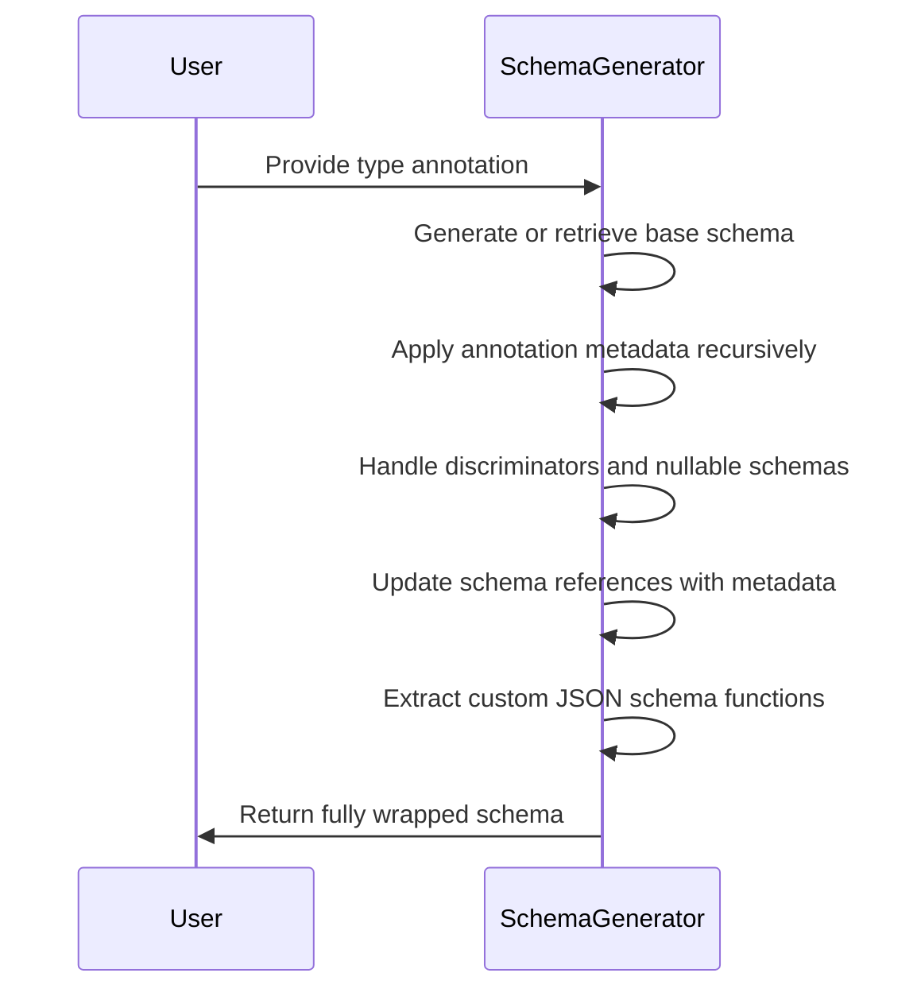
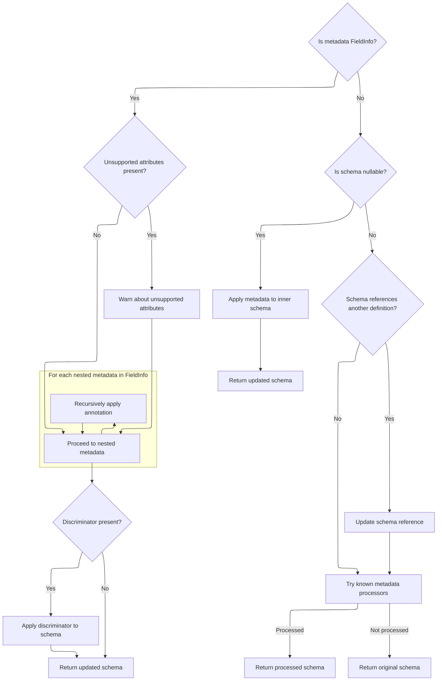

This document describes how a type annotation is transformed into a schema with all relevant metadata applied. The main steps are:

- Generate or retrieve a base schema for the annotation
- Recursively apply annotation metadata, including nested metadata
- Handle special cases such as discriminators and nullable schemas
- Update schema references to include metadata
- Extract and store custom JSON schema functions
- Return the fully wrapped schema



# Spec

## Detailed View of the Program's Functionality

a. Wrapping and Preparing the Inner Schema

The process begins in a method responsible for wrapping and preparing the "inner schema" for a given annotation. The method receives a handler for generating the inner schema, the annotation itself, a list to collect JSON schema functions, and a flag for checking unsupported field attributes.

- First, it checks if the annotation provides a custom schema method (a special method for generating its own schema). If so, it uses this method to generate the schema, passing along the handler for the inner schema.
- If the annotation does not provide a custom schema, it calls the handler to generate the base schema for the annotation.
- Immediately after obtaining the base schema, it applies additional annotation metadata by invoking a dedicated method. This step ensures that any extra information attached to the annotation (such as constraints or field metadata) is incorporated into the schema.
- After applying the annotation metadata, it further processes the schema to attach any JSON schema-specific metadata, ensuring that documentation and serialization details are included.
- Finally, if the annotation provides a custom JSON schema function, this function is added to the list for later use.
- The method returns a new handler that encapsulates all these steps, so that any subsequent processing will use the fully wrapped and annotated schema.

b. Applying Annotation Metadata and Warnings

The core of annotation processing happens in a method that applies a single annotation's metadata to a schema. This method is responsible for handling both standard and custom metadata, as well as issuing warnings for unsupported usage.

- The method first checks if the metadata is a special <SwmToken path="pydantic/_internal/_generate_schema.py" pos="2214:1:1" line-data="        FieldInfo = import_cached_field_info()">`FieldInfo`</SwmToken> object (used to describe field-level metadata in Pydantic).
  - If it is a plain <SwmToken path="pydantic/_internal/_generate_schema.py" pos="2214:1:1" line-data="        FieldInfo = import_cached_field_info()">`FieldInfo`</SwmToken> (not a subclass), and the flag for checking unsupported attributes is set, it examines the <SwmToken path="pydantic/_internal/_generate_schema.py" pos="2214:1:1" line-data="        FieldInfo = import_cached_field_info()">`FieldInfo`</SwmToken> for any attributes that are not supported in the current context (such as default values or aliases that only make sense on model fields).
  - If unsupported attributes are found, it emits a warning for each, informing the user that these attributes will have no effect. This helps catch mistakes where a developer might use <SwmToken path="pydantic/_internal/_generate_schema.py" pos="2227:32:34" line-data="                        f&#39;which has no effect in the context it was used. {attr!r} is field-specific metadata, &#39;">`field-specific`</SwmToken> options in a context where they are ignored.
- Next, the method processes any nested metadata attached to the <SwmToken path="pydantic/_internal/_generate_schema.py" pos="2214:1:1" line-data="        FieldInfo = import_cached_field_info()">`FieldInfo`</SwmToken>. <SwmToken path="pydantic/_internal/_generate_schema.py" pos="2214:1:1" line-data="        FieldInfo = import_cached_field_info()">`FieldInfo`</SwmToken> can itself contain a list of additional metadata objects (such as validators or further constraints). The method recursively applies itself to each nested metadata item, ensuring that all layers of annotation are handled.
- After processing nested metadata, the method checks if a discriminator is present (used for tagged unions or discriminated unions). If so, it applies the discriminator logic to the schema.
- If the metadata is not a <SwmToken path="pydantic/_internal/_generate_schema.py" pos="2214:1:1" line-data="        FieldInfo = import_cached_field_info()">`FieldInfo`</SwmToken>, the method checks if the schema is "nullable" (<SwmToken path="pydantic/_internal/_generate_schema.py" pos="925:22:24" line-data="            # safety measure (because these are inlined in place -- i.e. mutated directly)">`i.e`</SwmToken>., it allows None values). If so, it applies the metadata to the inner schema (the type being made nullable), ensuring that constraints and documentation are attached to the correct part of the schema.
- For schemas that reference another definition (such as a type alias or a referenced model), the method updates the reference to include the new metadata, avoiding duplication and ensuring that metadata is not lost.
- Finally, the method attempts to apply any known metadata processors (external utilities that recognize and handle certain types of metadata). If a processor updates the schema, the updated schema is returned; otherwise, the original schema is returned.

c. Finalizing and Returning the Wrapped Schema

After the annotation metadata has been fully applied, the process returns to the wrapping method.

- If the annotation provides a custom JSON schema function, it is added to the list of functions to be used when generating JSON schema representations.
- The fully processed schema is then returned from the handler, ensuring that all annotation layers, metadata, and customizations are included.
- The wrapping method returns a handler that encapsulates all of this logic, so that any further schema generation or processing will use the fully annotated and wrapped schema.

This flow ensures that Pydantic's schema generation is both flexible and robust: it supports custom user annotations, warns about misuses, recursively processes nested metadata, and integrates with both core validation and JSON schema generation.

# Rule Definition

| Paragraph Name                                                                                                                                                                                                                                                                                   | Rule ID | Category          | Description                                                                                                                                                                                                                                                                                                                                                                                                                                                                                                                                         | Conditions                                                                                                                                                                                                                                                                                                                                                                                                                                         | Remarks                                                                                                                                                                                                                                                                                                                                                   |
| ------------------------------------------------------------------------------------------------------------------------------------------------------------------------------------------------------------------------------------------------------------------------------------------------ | ------- | ----------------- | --------------------------------------------------------------------------------------------------------------------------------------------------------------------------------------------------------------------------------------------------------------------------------------------------------------------------------------------------------------------------------------------------------------------------------------------------------------------------------------------------------------------------------------------------- | -------------------------------------------------------------------------------------------------------------------------------------------------------------------------------------------------------------------------------------------------------------------------------------------------------------------------------------------------------------------------------------------------------------------------------------------------- | --------------------------------------------------------------------------------------------------------------------------------------------------------------------------------------------------------------------------------------------------------------------------------------------------------------------------------------------------------- |
| GenerateSchema.\_apply_annotations, GenerateSchema.\_apply_single_annotation                                                                                                                                                                                                                     | RL-001  | Data Assignment   | The system must accept an annotation object, a core schema dictionary, and a boolean flag indicating whether to check for unsupported <SwmToken path="pydantic/_internal/_generate_schema.py" pos="2214:1:1" line-data="        FieldInfo = import_cached_field_info()">`FieldInfo`</SwmToken> attributes as input.                                                                                                                                                                                                                                 | Always, when processing annotations for schema generation.                                                                                                                                                                                                                                                                                                                                                                                         | Annotation: any object, typically <SwmToken path="pydantic/_internal/_generate_schema.py" pos="2214:1:1" line-data="        FieldInfo = import_cached_field_info()">`FieldInfo`</SwmToken> or similar. Schema: dictionary with at least a 'type' key. Boolean flag: True/False.                                                                           |
| GenerateSchema.\_apply_single_annotation, GenerateSchema.\_get_unsupported_field_info_attributes                                                                                                                                                                                                 | RL-002  | Conditional Logic | If the annotation object is an instance of <SwmToken path="pydantic/_internal/_generate_schema.py" pos="2214:1:1" line-data="        FieldInfo = import_cached_field_info()">`FieldInfo`</SwmToken> (but not a subclass), check each attribute in the <SwmToken path="pydantic/_internal/_generate_schema.py" pos="167:0:0" line-data="UNSUPPORTED_STANDALONE_FIELDINFO_ATTRIBUTES = [">`UNSUPPORTED_STANDALONE_FIELDINFO_ATTRIBUTES`</SwmToken> list. If its value differs from its default, issue a warning with a specific message and category. | Annotation object is <SwmToken path="pydantic/_internal/_generate_schema.py" pos="2214:1:1" line-data="        FieldInfo = import_cached_field_info()">`FieldInfo`</SwmToken> (not subclass), <SwmToken path="pydantic/_internal/_generate_schema.py" pos="2212:1:1" line-data="        check_unsupported_field_info_attributes: bool = True,">`check_unsupported_field_info_attributes`</SwmToken> is True, attribute value differs from default. | <SwmToken path="pydantic/_internal/_generate_schema.py" pos="167:0:0" line-data="UNSUPPORTED_STANDALONE_FIELDINFO_ATTRIBUTES = [">`UNSUPPORTED_STANDALONE_FIELDINFO_ATTRIBUTES`</SwmToken>: \[('alias', None), ..., ('repr', True), ...\]. Warning category: pydantic.warnings.UnsupportedFieldAttributeWarning. Message format as specified in the spec. |
| GenerateSchema.\_apply_single_annotation                                                                                                                                                                                                                                                         | RL-003  | Computation       | If the annotation object is a <SwmToken path="pydantic/_internal/_generate_schema.py" pos="2214:1:1" line-data="        FieldInfo = import_cached_field_info()">`FieldInfo`</SwmToken> (including subclasses), process each item in its metadata list by recursively applying the annotation logic to the schema for each item.                                                                                                                                                                                                                     | Annotation object is instance of <SwmToken path="pydantic/_internal/_generate_schema.py" pos="2214:1:1" line-data="        FieldInfo = import_cached_field_info()">`FieldInfo`</SwmToken> (including subclasses).                                                                                                                                                                                                                                  | metadata: list of annotation objects. Recursion applies the same annotation logic to each item.                                                                                                                                                                                                                                                           |
| GenerateSchema.\_apply_single_annotation                                                                                                                                                                                                                                                         | RL-004  | Conditional Logic | If the annotation object is a <SwmToken path="pydantic/_internal/_generate_schema.py" pos="2214:1:1" line-data="        FieldInfo = import_cached_field_info()">`FieldInfo`</SwmToken> and has a non-None discriminator attribute, apply the discriminator to the schema.                                                                                                                                                                                                                                                                           | Annotation object is <SwmToken path="pydantic/_internal/_generate_schema.py" pos="2214:1:1" line-data="        FieldInfo = import_cached_field_info()">`FieldInfo`</SwmToken> (including subclasses), annotation.discriminator is not None.                                                                                                                                                                                                        | Discriminator is applied via <SwmToken path="pydantic/_internal/_generate_schema.py" pos="2237:7:7" line-data="                schema = self._apply_discriminator_to_union(schema, metadata.discriminator)">`_apply_discriminator_to_union`</SwmToken>.                                                                                                   |
| GenerateSchema.\_apply_single_annotation                                                                                                                                                                                                                                                         | RL-005  | Conditional Logic | After processing nested metadata and discriminators, if the schema has type 'nullable', apply the annotation metadata to the inner schema.                                                                                                                                                                                                                                                                                                                                                                                                          | schema\['type'\] == 'nullable'                                                                                                                                                                                                                                                                                                                                                                                                                     | Inner schema is at schema\['schema'\].                                                                                                                                                                                                                                                                                                                    |
| GenerateSchema.\_apply_single_annotation                                                                                                                                                                                                                                                         | RL-006  | Computation       | If the schema has type <SwmToken path="pydantic/_internal/_generate_schema.py" pos="2256:13:15" line-data="        elif schema[&#39;type&#39;] == &#39;definition-ref&#39;:">`definition-ref`</SwmToken>, update the schema reference to include the annotation metadata and avoid duplicate references.                                                                                                                                                                                                                                            | schema\['type'\] == <SwmToken path="pydantic/_internal/_generate_schema.py" pos="2256:13:15" line-data="        elif schema[&#39;type&#39;] == &#39;definition-ref&#39;:">`definition-ref`</SwmToken>                                                                                                                                                                                                                                              | Update ref by appending \_{repr(metadata)}. Avoid duplicates by checking if new ref exists in definitions.                                                                                                                                                                                                                                                |
| GenerateSchema.\_apply_single_annotation                                                                                                                                                                                                                                                         | RL-007  | Computation       | After handling nested metadata, discriminators, and reference updates, attempt to apply any recognized metadata using an external utility. If a modified schema is returned, use it; otherwise, retain the original schema.                                                                                                                                                                                                                                                                                                                         | Always after previous steps.                                                                                                                                                                                                                                                                                                                                                                                                                       | Utility: <SwmToken path="pydantic/_internal/_generate_schema.py" pos="2265:5:7" line-data="        maybe_updated_schema = _known_annotated_metadata.apply_known_metadata(metadata, schema)">`_known_annotated_metadata.apply_known_metadata`</SwmToken>. Returns modified schema or None.                                                                 |
| GenerateSchema.\_apply_annotations, GenerateSchema.\_apply_single_annotation, <SwmToken path="pydantic/_internal/_generate_schema.py" pos="2330:5:5" line-data="            metadata_js_function = _extract_get_pydantic_json_schema(annotation)">`_extract_get_pydantic_json_schema`</SwmToken> | RL-008  | Conditional Logic | If the annotation object has a method named **get_pydantic_json_schema**, extract it and add it to the provided list of JSON schema functions.                                                                                                                                                                                                                                                                                                                                                                                                      | hasattr(annotation, '**get_pydantic_json_schema**')                                                                                                                                                                                                                                                                                                                                                                                                | JSON schema functions list: mutable list of callables.                                                                                                                                                                                                                                                                                                    |
| GenerateSchema.\_apply_annotations, GenerateSchema.\_apply_single_annotation                                                                                                                                                                                                                     | RL-009  | Data Assignment   | After all annotation processing is complete, return the updated schema.                                                                                                                                                                                                                                                                                                                                                                                                                                                                             | Always, after annotation logic is applied.                                                                                                                                                                                                                                                                                                                                                                                                         | Output: dictionary in core schema format, with all annotation effects applied.                                                                                                                                                                                                                                                                            |
| GenerateSchema.\_apply_annotations, GenerateSchema.\_get_wrapped_inner_schema, GenerateSchema.\_generate_schema_from_get_schema_method                                                                                                                                                           | RL-010  | Computation       | Support a handler mechanism where, given a type, a base schema is generated (either from a custom schema function or a default generator), and the annotation logic is applied as described above.                                                                                                                                                                                                                                                                                                                                                  | When processing annotations with a handler.                                                                                                                                                                                                                                                                                                                                                                                                        | Handler: callable that generates base schema and applies annotation logic.                                                                                                                                                                                                                                                                                |
| <SwmToken path="pydantic/_internal/_generate_schema.py" pos="167:0:0" line-data="UNSUPPORTED_STANDALONE_FIELDINFO_ATTRIBUTES = [">`UNSUPPORTED_STANDALONE_FIELDINFO_ATTRIBUTES`</SwmToken>, GenerateSchema.\_get_unsupported_field_info_attributes                                               | RL-011  | Data Assignment   | Use a unique sentinel value (<SwmToken path="pydantic/_internal/_generate_schema.py" pos="49:1:1" line-data="    PydanticUndefined,">`PydanticUndefined`</SwmToken>) to represent unset or undefined values for <SwmToken path="pydantic/_internal/_generate_schema.py" pos="2214:1:1" line-data="        FieldInfo = import_cached_field_info()">`FieldInfo`</SwmToken> attributes.                                                                                                                                                                | When checking for unset attributes.                                                                                                                                                                                                                                                                                                                                                                                                                | <SwmToken path="pydantic/_internal/_generate_schema.py" pos="49:1:1" line-data="    PydanticUndefined,">`PydanticUndefined`</SwmToken> is used as the default for 'default' attribute, etc.                                                                                                                                                               |
| GenerateSchema.\_apply_annotations, GenerateSchema.\_apply_single_annotation                                                                                                                                                                                                                     | RL-012  | Computation       | Ensure that all annotation layers, including nested metadata, are processed recursively.                                                                                                                                                                                                                                                                                                                                                                                                                                                            | Always, when processing annotations.                                                                                                                                                                                                                                                                                                                                                                                                               | Recursion is implemented by calling annotation logic on each metadata item.                                                                                                                                                                                                                                                                               |
| GenerateSchema.\_apply_single_annotation                                                                                                                                                                                                                                                         | RL-013  | Conditional Logic | Do not process or warn about unsupported attributes for <SwmToken path="pydantic/_internal/_generate_schema.py" pos="2214:1:1" line-data="        FieldInfo = import_cached_field_info()">`FieldInfo`</SwmToken> subclasses.                                                                                                                                                                                                                                                                                                                        | type(annotation) is not <SwmToken path="pydantic/_internal/_generate_schema.py" pos="2214:1:1" line-data="        FieldInfo = import_cached_field_info()">`FieldInfo`</SwmToken>                                                                                                                                                                                                                                                                   | Check type(annotation) is <SwmToken path="pydantic/_internal/_generate_schema.py" pos="2214:1:1" line-data="        FieldInfo = import_cached_field_info()">`FieldInfo`</SwmToken>, not isinstance.                                                                                                                                                       |
| Throughout relevant methods                                                                                                                                                                                                                                                                      | RL-014  | Conditional Logic | The system must not include any logging or error handling outside of the specified warning mechanism for unsupported attributes.                                                                                                                                                                                                                                                                                                                                                                                                                    | Always, except for issuing the specified warning.                                                                                                                                                                                                                                                                                                                                                                                                  | No logging or error handling except <SwmToken path="pydantic/_internal/_generate_schema.py" pos="2225:1:3" line-data="                    warnings.warn(">`warnings.warn`</SwmToken> with specified category.                                                                                                                                             |
| Throughout relevant methods, especially GenerateSchema.\_apply_annotations and <SwmToken path="pydantic/_internal/_generate_schema.py" pos="2208:3:3" line-data="    def _apply_single_annotation(">`_apply_single_annotation`</SwmToken>                                                        | RL-015  | Data Assignment   | Input: annotation (any object, typically <SwmToken path="pydantic/_internal/_generate_schema.py" pos="2214:1:1" line-data="        FieldInfo = import_cached_field_info()">`FieldInfo`</SwmToken>), schema (dict with at least 'type'), JSON schema functions list (mutable list). Output: final schema dict in core schema format with all annotation effects applied.                                                                                                                                                                             | Always, when processing annotations.                                                                                                                                                                                                                                                                                                                                                                                                               | Input: annotation (object), schema (dict), JSON schema functions (list). Output: dict in core schema format.                                                                                                                                                                                                                                              |

# User Stories

## User Story 1: Recursive annotation processing and schema transformation

---

### Story Description:

As a user of the schema generation system, I want all annotation layers (including nested metadata, discriminators, nullable and <SwmToken path="pydantic/_internal/_generate_schema.py" pos="2256:13:15" line-data="        elif schema[&#39;type&#39;] == &#39;definition-ref&#39;:">`definition-ref`</SwmToken> schemas, and recognized metadata) to be processed recursively so that the final schema accurately reflects all annotation effects.

---

### Business Rule Mapping:

| Rule ID | Paragraph Name                                                               | Rule Description                                                                                                                                                                                                                                                                                                                |
| ------- | ---------------------------------------------------------------------------- | ------------------------------------------------------------------------------------------------------------------------------------------------------------------------------------------------------------------------------------------------------------------------------------------------------------------------------- |
| RL-001  | GenerateSchema.\_apply_annotations, GenerateSchema.\_apply_single_annotation | The system must accept an annotation object, a core schema dictionary, and a boolean flag indicating whether to check for unsupported <SwmToken path="pydantic/_internal/_generate_schema.py" pos="2214:1:1" line-data="        FieldInfo = import_cached_field_info()">`FieldInfo`</SwmToken> attributes as input.             |
| RL-012  | GenerateSchema.\_apply_annotations, GenerateSchema.\_apply_single_annotation | Ensure that all annotation layers, including nested metadata, are processed recursively.                                                                                                                                                                                                                                        |
| RL-009  | GenerateSchema.\_apply_annotations, GenerateSchema.\_apply_single_annotation | After all annotation processing is complete, return the updated schema.                                                                                                                                                                                                                                                         |
| RL-003  | GenerateSchema.\_apply_single_annotation                                     | If the annotation object is a <SwmToken path="pydantic/_internal/_generate_schema.py" pos="2214:1:1" line-data="        FieldInfo = import_cached_field_info()">`FieldInfo`</SwmToken> (including subclasses), process each item in its metadata list by recursively applying the annotation logic to the schema for each item. |
| RL-004  | GenerateSchema.\_apply_single_annotation                                     | If the annotation object is a <SwmToken path="pydantic/_internal/_generate_schema.py" pos="2214:1:1" line-data="        FieldInfo = import_cached_field_info()">`FieldInfo`</SwmToken> and has a non-None discriminator attribute, apply the discriminator to the schema.                                                       |
| RL-005  | GenerateSchema.\_apply_single_annotation                                     | After processing nested metadata and discriminators, if the schema has type 'nullable', apply the annotation metadata to the inner schema.                                                                                                                                                                                      |
| RL-006  | GenerateSchema.\_apply_single_annotation                                     | If the schema has type <SwmToken path="pydantic/_internal/_generate_schema.py" pos="2256:13:15" line-data="        elif schema[&#39;type&#39;] == &#39;definition-ref&#39;:">`definition-ref`</SwmToken>, update the schema reference to include the annotation metadata and avoid duplicate references.                        |
| RL-007  | GenerateSchema.\_apply_single_annotation                                     | After handling nested metadata, discriminators, and reference updates, attempt to apply any recognized metadata using an external utility. If a modified schema is returned, use it; otherwise, retain the original schema.                                                                                                     |

---

### Relevant Functionality:

- **GenerateSchema.\_apply_annotations**
  1. **RL-001:**
     - Accept annotation object, schema, and <SwmToken path="pydantic/_internal/_generate_schema.py" pos="2212:1:1" line-data="        check_unsupported_field_info_attributes: bool = True,">`check_unsupported_field_info_attributes`</SwmToken> flag as parameters.
     - Use these in annotation processing logic.
  2. **RL-012:**
     - For each annotation in annotations:
       - Recursively apply annotation logic
  3. **RL-009:**
     - return schema
- **GenerateSchema.\_apply_single_annotation**
  1. **RL-003:**
     - If isinstance(annotation, <SwmToken path="pydantic/_internal/_generate_schema.py" pos="2214:1:1" line-data="        FieldInfo = import_cached_field_info()">`FieldInfo`</SwmToken>):
       - For each item in annotation.metadata:
         - schema = apply_single_annotation(schema, item)
  2. **RL-004:**
     - If isinstance(annotation, <SwmToken path="pydantic/_internal/_generate_schema.py" pos="2214:1:1" line-data="        FieldInfo = import_cached_field_info()">`FieldInfo`</SwmToken>) and annotation.discriminator is not None:
       - schema = <SwmToken path="pydantic/_internal/_generate_schema.py" pos="2237:7:7" line-data="                schema = self._apply_discriminator_to_union(schema, metadata.discriminator)">`_apply_discriminator_to_union`</SwmToken>(schema, annotation.discriminator)
  3. **RL-005:**
     - If schema\['type'\] == 'nullable':
       - inner = schema\['schema'\]
       - inner = apply_single_annotation(inner, annotation)
       - schema\['schema'\] = inner
  4. **RL-006:**
     - If schema\['type'\] == <SwmToken path="pydantic/_internal/_generate_schema.py" pos="2256:13:15" line-data="        elif schema[&#39;type&#39;] == &#39;definition-ref&#39;:">`definition-ref`</SwmToken>:
       - ref = schema\[<SwmToken path="pydantic/_internal/_generate_schema.py" pos="2257:8:8" line-data="            ref = schema[&#39;schema_ref&#39;]">`schema_ref`</SwmToken>\]
       - <SwmToken path="pydantic/_internal/_generate_schema.py" pos="2252:1:1" line-data="            new_ref = ref + f&#39;_{repr(metadata)}&#39;">`new_ref`</SwmToken> = ref + f'\_{repr(annotation)}'
       - If <SwmToken path="pydantic/_internal/_generate_schema.py" pos="2252:1:1" line-data="            new_ref = ref + f&#39;_{repr(metadata)}&#39;">`new_ref`</SwmToken> exists in definitions:
         - return existing
       - else:
         - schema\['ref'\] = <SwmToken path="pydantic/_internal/_generate_schema.py" pos="2252:1:1" line-data="            new_ref = ref + f&#39;_{repr(metadata)}&#39;">`new_ref`</SwmToken>
  5. **RL-007:**
     - <SwmToken path="pydantic/_internal/_generate_schema.py" pos="2265:1:1" line-data="        maybe_updated_schema = _known_annotated_metadata.apply_known_metadata(metadata, schema)">`maybe_updated_schema`</SwmToken> = <SwmToken path="pydantic/_internal/_generate_schema.py" pos="2265:7:7" line-data="        maybe_updated_schema = _known_annotated_metadata.apply_known_metadata(metadata, schema)">`apply_known_metadata`</SwmToken>(annotation, schema)
     - If <SwmToken path="pydantic/_internal/_generate_schema.py" pos="2265:1:1" line-data="        maybe_updated_schema = _known_annotated_metadata.apply_known_metadata(metadata, schema)">`maybe_updated_schema`</SwmToken> is not None:
       - return <SwmToken path="pydantic/_internal/_generate_schema.py" pos="2265:1:1" line-data="        maybe_updated_schema = _known_annotated_metadata.apply_known_metadata(metadata, schema)">`maybe_updated_schema`</SwmToken>
     - else:
       - return <SwmToken path="pydantic/_internal/_generate_schema.py" pos="2248:1:1" line-data="        original_schema = schema">`original_schema`</SwmToken>

## User Story 2: Warning mechanism for unsupported <SwmToken path="pydantic/_internal/_generate_schema.py" pos="2214:1:1" line-data="        FieldInfo = import_cached_field_info()">`FieldInfo`</SwmToken> attributes

---

### Story Description:

As a user defining schema annotations, I want the system to warn me if I use unsupported <SwmToken path="pydantic/_internal/_generate_schema.py" pos="2214:1:1" line-data="        FieldInfo = import_cached_field_info()">`FieldInfo`</SwmToken> attributes in an incorrect context, but only for direct <SwmToken path="pydantic/_internal/_generate_schema.py" pos="2214:1:1" line-data="        FieldInfo = import_cached_field_info()">`FieldInfo`</SwmToken> instances, so that I am informed of misconfigurations without unnecessary warnings or errors.

---

### Business Rule Mapping:

| Rule ID | Paragraph Name                                                                                                                                                                                                                                     | Rule Description                                                                                                                                                                                                                                                                                                                                                                                                                                                                                                                                    |
| ------- | -------------------------------------------------------------------------------------------------------------------------------------------------------------------------------------------------------------------------------------------------- | --------------------------------------------------------------------------------------------------------------------------------------------------------------------------------------------------------------------------------------------------------------------------------------------------------------------------------------------------------------------------------------------------------------------------------------------------------------------------------------------------------------------------------------------------- |
| RL-002  | GenerateSchema.\_apply_single_annotation, GenerateSchema.\_get_unsupported_field_info_attributes                                                                                                                                                   | If the annotation object is an instance of <SwmToken path="pydantic/_internal/_generate_schema.py" pos="2214:1:1" line-data="        FieldInfo = import_cached_field_info()">`FieldInfo`</SwmToken> (but not a subclass), check each attribute in the <SwmToken path="pydantic/_internal/_generate_schema.py" pos="167:0:0" line-data="UNSUPPORTED_STANDALONE_FIELDINFO_ATTRIBUTES = [">`UNSUPPORTED_STANDALONE_FIELDINFO_ATTRIBUTES`</SwmToken> list. If its value differs from its default, issue a warning with a specific message and category. |
| RL-013  | GenerateSchema.\_apply_single_annotation                                                                                                                                                                                                           | Do not process or warn about unsupported attributes for <SwmToken path="pydantic/_internal/_generate_schema.py" pos="2214:1:1" line-data="        FieldInfo = import_cached_field_info()">`FieldInfo`</SwmToken> subclasses.                                                                                                                                                                                                                                                                                                                        |
| RL-011  | <SwmToken path="pydantic/_internal/_generate_schema.py" pos="167:0:0" line-data="UNSUPPORTED_STANDALONE_FIELDINFO_ATTRIBUTES = [">`UNSUPPORTED_STANDALONE_FIELDINFO_ATTRIBUTES`</SwmToken>, GenerateSchema.\_get_unsupported_field_info_attributes | Use a unique sentinel value (<SwmToken path="pydantic/_internal/_generate_schema.py" pos="49:1:1" line-data="    PydanticUndefined,">`PydanticUndefined`</SwmToken>) to represent unset or undefined values for <SwmToken path="pydantic/_internal/_generate_schema.py" pos="2214:1:1" line-data="        FieldInfo = import_cached_field_info()">`FieldInfo`</SwmToken> attributes.                                                                                                                                                                |
| RL-014  | Throughout relevant methods                                                                                                                                                                                                                        | The system must not include any logging or error handling outside of the specified warning mechanism for unsupported attributes.                                                                                                                                                                                                                                                                                                                                                                                                                    |

---

### Relevant Functionality:

- **GenerateSchema.\_apply_single_annotation**
  1. **RL-002:**
     - If type(annotation) is <SwmToken path="pydantic/_internal/_generate_schema.py" pos="2214:1:1" line-data="        FieldInfo = import_cached_field_info()">`FieldInfo`</SwmToken> and <SwmToken path="pydantic/_internal/_generate_schema.py" pos="2212:1:1" line-data="        check_unsupported_field_info_attributes: bool = True,">`check_unsupported_field_info_attributes`</SwmToken> is True:
       - For each (attr, default) in <SwmToken path="pydantic/_internal/_generate_schema.py" pos="167:0:0" line-data="UNSUPPORTED_STANDALONE_FIELDINFO_ATTRIBUTES = [">`UNSUPPORTED_STANDALONE_FIELDINFO_ATTRIBUTES`</SwmToken>:
         - If getattr(annotation, attr) != default:
           - Issue warning with specified message and category.
  2. **RL-013:**
     - If type(annotation) is not <SwmToken path="pydantic/_internal/_generate_schema.py" pos="2214:1:1" line-data="        FieldInfo = import_cached_field_info()">`FieldInfo`</SwmToken>:
       - Do not check unsupported attributes
- <SwmToken path="pydantic/_internal/_generate_schema.py" pos="167:0:0" line-data="UNSUPPORTED_STANDALONE_FIELDINFO_ATTRIBUTES = [">`UNSUPPORTED_STANDALONE_FIELDINFO_ATTRIBUTES`</SwmToken>
  1. **RL-011:**
     - For each (attr, default) in <SwmToken path="pydantic/_internal/_generate_schema.py" pos="167:0:0" line-data="UNSUPPORTED_STANDALONE_FIELDINFO_ATTRIBUTES = [">`UNSUPPORTED_STANDALONE_FIELDINFO_ATTRIBUTES`</SwmToken>:
       - If default is <SwmToken path="pydantic/_internal/_generate_schema.py" pos="49:1:1" line-data="    PydanticUndefined,">`PydanticUndefined`</SwmToken>, compare using 'is'.
- **Throughout relevant methods**
  1. **RL-014:**
     - Only issue warnings as specified; do not log or handle errors otherwise.

## User Story 3: Handler mechanism, JSON schema function extraction, and input/output contract

---

### Story Description:

As a system integrator or advanced user, I want to provide custom handlers for schema generation, have custom JSON schema methods extracted for later use, and ensure the system accepts and returns data in the expected formats so that I can extend and integrate schema generation flexibly.

---

### Business Rule Mapping:

| Rule ID | Paragraph Name                                                                                                                                                                                                                                                                                   | Rule Description                                                                                                                                                                                                                                                                                                                                                        |
| ------- | ------------------------------------------------------------------------------------------------------------------------------------------------------------------------------------------------------------------------------------------------------------------------------------------------ | ----------------------------------------------------------------------------------------------------------------------------------------------------------------------------------------------------------------------------------------------------------------------------------------------------------------------------------------------------------------------- |
| RL-008  | GenerateSchema.\_apply_annotations, GenerateSchema.\_apply_single_annotation, <SwmToken path="pydantic/_internal/_generate_schema.py" pos="2330:5:5" line-data="            metadata_js_function = _extract_get_pydantic_json_schema(annotation)">`_extract_get_pydantic_json_schema`</SwmToken> | If the annotation object has a method named **get_pydantic_json_schema**, extract it and add it to the provided list of JSON schema functions.                                                                                                                                                                                                                          |
| RL-010  | GenerateSchema.\_apply_annotations, GenerateSchema.\_get_wrapped_inner_schema, GenerateSchema.\_generate_schema_from_get_schema_method                                                                                                                                                           | Support a handler mechanism where, given a type, a base schema is generated (either from a custom schema function or a default generator), and the annotation logic is applied as described above.                                                                                                                                                                      |
| RL-015  | Throughout relevant methods, especially GenerateSchema.\_apply_annotations and <SwmToken path="pydantic/_internal/_generate_schema.py" pos="2208:3:3" line-data="    def _apply_single_annotation(">`_apply_single_annotation`</SwmToken>                                                        | Input: annotation (any object, typically <SwmToken path="pydantic/_internal/_generate_schema.py" pos="2214:1:1" line-data="        FieldInfo = import_cached_field_info()">`FieldInfo`</SwmToken>), schema (dict with at least 'type'), JSON schema functions list (mutable list). Output: final schema dict in core schema format with all annotation effects applied. |

---

### Relevant Functionality:

- **GenerateSchema.\_apply_annotations**
  1. **RL-008:**
     - If hasattr(annotation, '**get_pydantic_json_schema**'):
       - json_schema_functions.append(annotation.**get_pydantic_json_schema**)
  2. **RL-010:**
     - If annotation has **get_pydantic_core_schema**:
       - schema = annotation.**get_pydantic_core_schema**(source, handler)
     - else:
       - schema = handler(source)
       - schema = apply_single_annotation(schema, annotation)
- **Throughout relevant methods**
  1. **RL-015:**
     - Accept inputs as described
     - Return output as described

# Code Walkthrough

## Wrapping and Preparing the Inner Schema

<SwmSnippet path="/pydantic/_internal/_generate_schema.py" line="2309">

---

In <SwmToken path="pydantic/_internal/_generate_schema.py" pos="2309:3:3" line-data="    def _get_wrapped_inner_schema(">`_get_wrapped_inner_schema`</SwmToken>, we either use the annotation's custom schema or generate a base one, then immediately call <SwmToken path="pydantic/_internal/_generate_schema.py" pos="2323:7:7" line-data="                schema = self._apply_single_annotation(">`_apply_single_annotation`</SwmToken> to add any extra annotation metadata before moving on.

```python
    def _get_wrapped_inner_schema(
        self,
        get_inner_schema: GetCoreSchemaHandler,
        annotation: Any,
        pydantic_js_annotation_functions: list[GetJsonSchemaFunction],
        check_unsupported_field_info_attributes: bool = False,
    ) -> CallbackGetCoreSchemaHandler:
        annotation_get_schema: GetCoreSchemaFunction | None = getattr(annotation, '__get_pydantic_core_schema__', None)

        def new_handler(source: Any) -> core_schema.CoreSchema:
            if annotation_get_schema is not None:
                schema = annotation_get_schema(source, get_inner_schema)
            else:
                schema = get_inner_schema(source)
                schema = self._apply_single_annotation(
                    schema,
                    annotation,
                    check_unsupported_field_info_attributes=check_unsupported_field_info_attributes,
                )
                schema = self._apply_single_annotation_json_schema(schema, annotation)

```

---

</SwmSnippet>

### Applying Annotation Metadata and Warnings



<SwmSnippet path="/pydantic/_internal/_generate_schema.py" line="2208">

---

In <SwmToken path="pydantic/_internal/_generate_schema.py" pos="2208:3:3" line-data="    def _apply_single_annotation(">`_apply_single_annotation`</SwmToken>, we check if the metadata is a plain <SwmToken path="pydantic/_internal/_generate_schema.py" pos="2214:1:1" line-data="        FieldInfo = import_cached_field_info()">`FieldInfo`</SwmToken> (not a subclass) and, if so, look for any unsupported attributes. If we find any, we warn the user, since those attributes won't have any effect in this context. This helps catch misuses of Field() that could otherwise go unnoticed.

```python
    def _apply_single_annotation(
        self,
        schema: core_schema.CoreSchema,
        metadata: Any,
        check_unsupported_field_info_attributes: bool = True,
    ) -> core_schema.CoreSchema:
        FieldInfo = import_cached_field_info()

        if isinstance(metadata, FieldInfo):
            if (
                check_unsupported_field_info_attributes
                # HACK: we don't want to emit the warning for `FieldInfo` subclasses, because FastAPI does weird manipulations
                # with its subclasses and their annotations:
                and type(metadata) is FieldInfo
                and (unsupported_attributes := self._get_unsupported_field_info_attributes(metadata))
            ):
                for attr, value in unsupported_attributes:
                    warnings.warn(
                        f'The {attr!r} attribute with value {value!r} was provided to the `Field()` function, '
                        f'which has no effect in the context it was used. {attr!r} is field-specific metadata, '
                        'and can only be attached to a model field using `Annotated` metadata or by assignment. '
                        'This may have happened because an `Annotated` type alias using the `type` statement was '
                        'used, or if the `Field()` function was attached to a single member of a union type.',
                        category=UnsupportedFieldAttributeWarning,
                    )
```

---

</SwmSnippet>

<SwmSnippet path="/pydantic/_internal/_generate_schema.py" line="2233">

---

After handling unsupported <SwmToken path="pydantic/_internal/_generate_schema.py" pos="2214:1:1" line-data="        FieldInfo = import_cached_field_info()">`FieldInfo`</SwmToken> attributes, we loop through any nested metadata inside <SwmToken path="pydantic/_internal/_generate_schema.py" pos="2214:1:1" line-data="        FieldInfo = import_cached_field_info()">`FieldInfo`</SwmToken> and recursively apply <SwmToken path="pydantic/_internal/_generate_schema.py" pos="2234:7:7" line-data="                schema = self._apply_single_annotation(schema, field_metadata)">`_apply_single_annotation`</SwmToken> to each one. This way, all annotation layers get processed, not just the top-level one.

```python
            for field_metadata in metadata.metadata:
                schema = self._apply_single_annotation(schema, field_metadata)
```

---

</SwmSnippet>

<SwmSnippet path="/pydantic/_internal/_generate_schema.py" line="2234">

---

After handling nested metadata and discriminators, we check for nullable schemas and apply metadata to their inner schema if needed. For schemas with references, we update the ref to include metadata and avoid duplicates. Finally, we use an external utility to apply any recognized metadata, returning the updated schema if anything changed, or the original if not.

```python
                schema = self._apply_single_annotation(schema, field_metadata)

            if metadata.discriminator is not None:
                schema = self._apply_discriminator_to_union(schema, metadata.discriminator)
            return schema

        if schema['type'] == 'nullable':
            # for nullable schemas, metadata is automatically applied to the inner schema
            inner = schema.get('schema', core_schema.any_schema())
            inner = self._apply_single_annotation(inner, metadata)
            if inner:
                schema['schema'] = inner
            return schema

        original_schema = schema
        ref = schema.get('ref')
        if ref is not None:
            schema = schema.copy()
            new_ref = ref + f'_{repr(metadata)}'
            if (existing := self.defs.get_schema_from_ref(new_ref)) is not None:
                return existing
            schema['ref'] = new_ref  # pyright: ignore[reportGeneralTypeIssues]
        elif schema['type'] == 'definition-ref':
            ref = schema['schema_ref']
            if (referenced_schema := self.defs.get_schema_from_ref(ref)) is not None:
                schema = referenced_schema.copy()
                new_ref = ref + f'_{repr(metadata)}'
                if (existing := self.defs.get_schema_from_ref(new_ref)) is not None:
                    return existing
                schema['ref'] = new_ref  # pyright: ignore[reportGeneralTypeIssues]

        maybe_updated_schema = _known_annotated_metadata.apply_known_metadata(metadata, schema)

        if maybe_updated_schema is not None:
            return maybe_updated_schema
        return original_schema
```

---

</SwmSnippet>

### Finalizing and Returning the Wrapped Schema

<SwmSnippet path="/pydantic/_internal/_generate_schema.py" line="2330">

---

After returning from <SwmToken path="pydantic/_internal/_generate_schema.py" pos="2208:3:3" line-data="    def _apply_single_annotation(">`_apply_single_annotation`</SwmToken>, we check if the annotation provides a custom JSON schema function and, if so, add it to the list for later use. Then we return the schema from the handler, wrapping everything up in <SwmToken path="pydantic/_internal/_generate_schema.py" pos="2309:3:3" line-data="    def _get_wrapped_inner_schema(">`_get_wrapped_inner_schema`</SwmToken>.

```python
            metadata_js_function = _extract_get_pydantic_json_schema(annotation)
            if metadata_js_function is not None:
                pydantic_js_annotation_functions.append(metadata_js_function)
            return schema

        return CallbackGetCoreSchemaHandler(new_handler, self)
```

---

</SwmSnippet>

&nbsp;

*This is an auto-generated document by Swimm 🌊 and has not yet been verified by a human*

<SwmMeta version="3.0.0" repo-id="Z2l0aHViJTNBJTNBcHlkYW50aWMlM0ElM0FTd2ltbS1EZW1v" repo-name="pydantic"><sup>Powered by [Swimm](/)</sup></SwmMeta>
