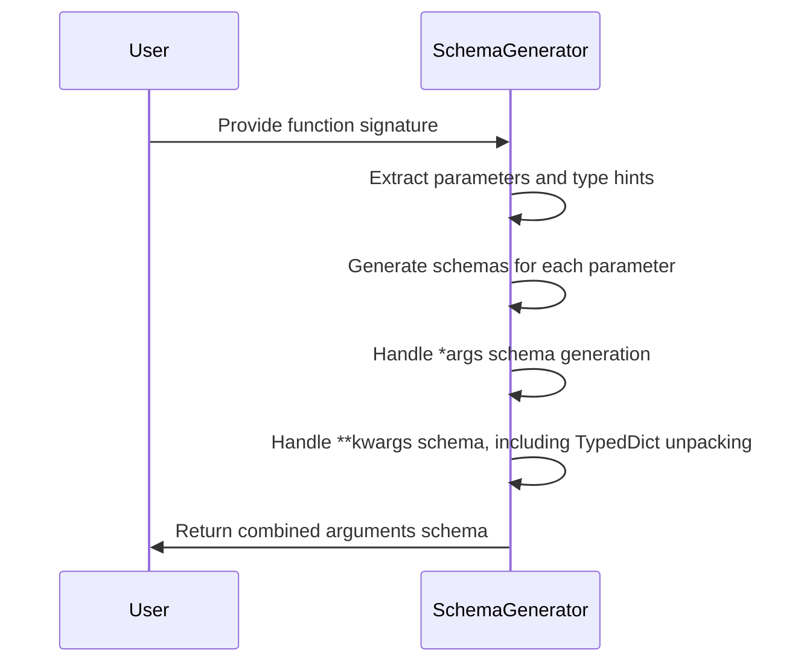

```mermaid
%%{init: {"flowchart": {"defaultRenderer": "elk"}} }%%
flowchart TD
    node1["Check for existing schema for TypedDict"]
    click node1 openCode "pydantic/_internal/_generate_schema.py:1394:1400"
    node1 -->|"Exists"| node7["Return existing schema"]
    click node7 openCode "pydantic/_internal/_generate_schema.py:1400:1401"
    node1 -->|"Does not exist"| node2["Validate TypedDict compatibility"]
    click node2 openCode "pydantic/_internal/_generate_schema.py:1403:1411"
    node2 --> node3["Extract config and decorators"]
    click node3 openCode "pydantic/_internal/_generate_schema.py:1412:1428"
    node3 --> node4["Process TypedDict fields"]
    click node4 openCode "pydantic/_internal/_generate_schema.py:1434:1462"

    subgraph loop1["For each field in TypedDict"]
        node4 --> node9["Determine if required/read-only, add docstring"]
        click node9 openCode "pydantic/_internal/_generate_schema.py:1442:1457"
        node9 --> node10["Generate field schema"]
        click node10 openCode "pydantic/_internal/_generate_schema.py:1459:1461"
        node10 --> node4
    end
    node4 --> node5{"Any read-only fields?"}
    click node5 openCode "pydantic/_internal/_generate_schema.py:1463:1463"
    node5 -->|"Yes"| node6["Warn about read-only fields"]
    click node6 openCode "pydantic/_internal/_generate_schema.py:1466:1471"
    node5 -->|"No"| node11["Skip warning"]
    click node11 openCode "pydantic/_internal/_generate_schema.py:1472:1472"
    node6 --> node12["Build final schema"]
    node11 --> node12
    click node12 openCode "pydantic/_internal/_generate_schema.py:1473:1482"
    node12 --> node13["Add computed fields, serializers, validators"]
    click node13 openCode "pydantic/_internal/_generate_schema.py:1483:1485"
    node13 --> node8["Return schema"]
    click node8 openCode "pydantic/_internal/_generate_schema.py:1486:1486"

%% Swimm:
%% %%{init: {"flowchart": {"defaultRenderer": "elk"}} }%%
%% flowchart TD
%%     node1["Check for existing schema for <SwmToken path="pydantic/_internal/_generate_schema.py" pos="1381:17:17" line-data="        &quot;&quot;&quot;Generate a core schema for a `TypedDict` class.">`TypedDict`</SwmToken>"]
%%     click node1 openCode "<SwmPath>[pydantic/\_internal/\_generate_schema.py](pydantic/_internal/_generate_schema.py)</SwmPath>:1394:1400"
%%     node1 -->|"Exists"| node7["Return existing schema"]
%%     click node7 openCode "<SwmPath>[pydantic/\_internal/\_generate_schema.py](pydantic/_internal/_generate_schema.py)</SwmPath>:1400:1401"
%%     node1 -->|"Does not exist"| node2["Validate <SwmToken path="pydantic/_internal/_generate_schema.py" pos="1381:17:17" line-data="        &quot;&quot;&quot;Generate a core schema for a `TypedDict` class.">`TypedDict`</SwmToken> compatibility"]
%%     click node2 openCode "<SwmPath>[pydantic/\_internal/\_generate_schema.py](pydantic/_internal/_generate_schema.py)</SwmPath>:1403:1411"
%%     node2 --> node3["Extract config and decorators"]
%%     click node3 openCode "<SwmPath>[pydantic/\_internal/\_generate_schema.py](pydantic/_internal/_generate_schema.py)</SwmPath>:1412:1428"
%%     node3 --> node4["Process <SwmToken path="pydantic/_internal/_generate_schema.py" pos="1381:17:17" line-data="        &quot;&quot;&quot;Generate a core schema for a `TypedDict` class.">`TypedDict`</SwmToken> fields"]
%%     click node4 openCode "<SwmPath>[pydantic/\_internal/\_generate_schema.py](pydantic/_internal/_generate_schema.py)</SwmPath>:1434:1462"
%% 
%%     subgraph loop1["For each field in <SwmToken path="pydantic/_internal/_generate_schema.py" pos="1381:17:17" line-data="        &quot;&quot;&quot;Generate a core schema for a `TypedDict` class.">`TypedDict`</SwmToken>"]
%%         node4 --> node9["Determine if required/read-only, add docstring"]
%%         click node9 openCode "<SwmPath>[pydantic/\_internal/\_generate_schema.py](pydantic/_internal/_generate_schema.py)</SwmPath>:1442:1457"
%%         node9 --> node10["Generate field schema"]
%%         click node10 openCode "<SwmPath>[pydantic/\_internal/\_generate_schema.py](pydantic/_internal/_generate_schema.py)</SwmPath>:1459:1461"
%%         node10 --> node4
%%     end
%%     node4 --> node5{"Any read-only fields?"}
%%     click node5 openCode "<SwmPath>[pydantic/\_internal/\_generate_schema.py](pydantic/_internal/_generate_schema.py)</SwmPath>:1463:1463"
%%     node5 -->|"Yes"| node6["Warn about read-only fields"]
%%     click node6 openCode "<SwmPath>[pydantic/\_internal/\_generate_schema.py](pydantic/_internal/_generate_schema.py)</SwmPath>:1466:1471"
%%     node5 -->|"No"| node11["Skip warning"]
%%     click node11 openCode "<SwmPath>[pydantic/\_internal/\_generate_schema.py](pydantic/_internal/_generate_schema.py)</SwmPath>:1472:1472"
%%     node6 --> node12["Build final schema"]
%%     node11 --> node12
%%     click node12 openCode "<SwmPath>[pydantic/\_internal/\_generate_schema.py](pydantic/_internal/_generate_schema.py)</SwmPath>:1473:1482"
%%     node12 --> node13["Add computed fields, serializers, validators"]
%%     click node13 openCode "<SwmPath>[pydantic/\_internal/\_generate_schema.py](pydantic/_internal/_generate_schema.py)</SwmPath>:1483:1485"
%%     node13 --> node8["Return schema"]
%%     click node8 openCode "<SwmPath>[pydantic/\_internal/\_generate_schema.py](pydantic/_internal/_generate_schema.py)</SwmPath>:1486:1486"
```

This flow generates a schema from a function's signature to represent its arguments for validation. It processes positional and keyword parameters, handles \*args and \*\*kwargs, including unpacked TypedDicts, and assembles these into a comprehensive schema used to validate input data.



# Spec

## Detailed View of the Program's Functionality

a. Mapping Function Parameters to Argument Schemas

The process begins by preparing to generate a schema that describes the arguments a function accepts. This involves:

- Creating a mapping between the kinds of function parameters (such as positional-only, positional-or-keyword, keyword-only) and their corresponding schema modes.
- Retrieving the function's signature, which provides details about its parameters.
- Extracting type hints for each parameter, which specify the expected types.
- Initializing containers to hold the schemas for regular arguments, as well as for variable positional arguments (`*`<SwmToken path="pydantic/_internal/_generate_schema.py" pos="972:1:1" line-data="        args = get_args(obj)">`args`</SwmToken>) and variable keyword arguments (`**kwargs`).

b. Iterating Over Function Parameters

The code then loops through each parameter in the function's signature in order:

- For each parameter, it determines the type annotation. If none is provided, it defaults to a generic type.
- If a callback for parameter processing is provided, it is called and may skip the parameter.
- The parameter's kind is checked:
  - If it is a standard parameter (positional-only, positional-or-keyword, or keyword-only), a schema for this parameter is generated and added to the list of argument schemas.
  - If it is a variable positional argument (`*`<SwmToken path="pydantic/_internal/_generate_schema.py" pos="972:1:1" line-data="        args = get_args(obj)">`args`</SwmToken>), a schema is generated for its type and stored separately.
  - If it is a variable keyword argument (`**kwargs`), special handling is required (see next section).

c. Handling \*\*kwargs with <SwmToken path="pydantic/_internal/_generate_schema.py" pos="1381:17:17" line-data="        &quot;&quot;&quot;Generate a core schema for a `TypedDict` class.">`TypedDict`</SwmToken> Unpacking

When encountering a `**kwargs` parameter, the code checks if its annotation is an "Unpack" of a <SwmToken path="pydantic/_internal/_generate_schema.py" pos="1381:17:17" line-data="        &quot;&quot;&quot;Generate a core schema for a `TypedDict` class.">`TypedDict`</SwmToken> (a way to specify that `**kwargs` should match a specific dictionary structure):

- If the annotation is an Unpack, the code extracts the underlying type.
- It verifies that the type is a <SwmToken path="pydantic/_internal/_generate_schema.py" pos="1381:17:17" line-data="        &quot;&quot;&quot;Generate a core schema for a `TypedDict` class.">`TypedDict`</SwmToken>. If not, an error is raised.
- It checks for any overlap between the keys defined in the <SwmToken path="pydantic/_internal/_generate_schema.py" pos="1381:17:17" line-data="        &quot;&quot;&quot;Generate a core schema for a `TypedDict` class.">`TypedDict`</SwmToken> and the names of other non-positional-only parameters. If overlaps are found, an error is raised to prevent ambiguity.
- If all checks pass, the mode for `**kwargs` is set to indicate that it is an unpacked <SwmToken path="pydantic/_internal/_generate_schema.py" pos="1381:17:17" line-data="        &quot;&quot;&quot;Generate a core schema for a `TypedDict` class.">`TypedDict`</SwmToken>, and a schema is generated for the <SwmToken path="pydantic/_internal/_generate_schema.py" pos="1381:17:17" line-data="        &quot;&quot;&quot;Generate a core schema for a `TypedDict` class.">`TypedDict`</SwmToken> structure.

d. Generating Schemas for <SwmToken path="pydantic/_internal/_generate_schema.py" pos="1381:17:17" line-data="        &quot;&quot;&quot;Generate a core schema for a `TypedDict` class.">`TypedDict`</SwmToken> Parameters

When generating a schema for a <SwmToken path="pydantic/_internal/_generate_schema.py" pos="1381:17:17" line-data="        &quot;&quot;&quot;Generate a core schema for a `TypedDict` class.">`TypedDict`</SwmToken> (either directly or for `**kwargs`), the following steps occur:

- The code checks if a schema for this <SwmToken path="pydantic/_internal/_generate_schema.py" pos="1381:17:17" line-data="        &quot;&quot;&quot;Generate a core schema for a `TypedDict` class.">`TypedDict`</SwmToken> has already been created. If so, it returns the existing schema.
- If not, it validates that the <SwmToken path="pydantic/_internal/_generate_schema.py" pos="1381:17:17" line-data="        &quot;&quot;&quot;Generate a core schema for a `TypedDict` class.">`TypedDict`</SwmToken> is compatible with the current Python version or uses the appropriate backport.
- It retrieves configuration information from the <SwmToken path="pydantic/_internal/_generate_schema.py" pos="1381:17:17" line-data="        &quot;&quot;&quot;Generate a core schema for a `TypedDict` class.">`TypedDict`</SwmToken> class or its base classes.
- It extracts any decorators (such as validators or serializers) attached to the <SwmToken path="pydantic/_internal/_generate_schema.py" pos="1381:17:17" line-data="        &quot;&quot;&quot;Generate a core schema for a `TypedDict` class.">`TypedDict`</SwmToken>.
- It determines whether to use attribute docstrings for field descriptions.
- It gathers type hints for all fields in the <SwmToken path="pydantic/_internal/_generate_schema.py" pos="1381:17:17" line-data="        &quot;&quot;&quot;Generate a core schema for a `TypedDict` class.">`TypedDict`</SwmToken>.
- For each field:
  - It creates a <SwmToken path="pydantic/_internal/_generate_schema.py" pos="1390:1:1" line-data="        FieldInfo = import_cached_field_info()">`FieldInfo`</SwmToken> object from the annotation.
  - It determines if the field is required or read-only.
  - It attaches docstrings and applies any configuration overrides.
  - It generates a schema for the field and adds it to the fields dictionary.
- After processing all fields, if any are read-only, a warning is issued.
- The final <SwmToken path="pydantic/_internal/_generate_schema.py" pos="1381:17:17" line-data="        &quot;&quot;&quot;Generate a core schema for a `TypedDict` class.">`TypedDict`</SwmToken> schema is assembled, including computed fields, serializers, and validators.
- The schema is stored and returned as a referenceable definition.

e. Handling \*\*kwargs Without <SwmToken path="pydantic/_internal/_generate_schema.py" pos="1381:17:17" line-data="        &quot;&quot;&quot;Generate a core schema for a `TypedDict` class.">`TypedDict`</SwmToken>

If the `**kwargs` parameter is not annotated as an Unpack of a <SwmToken path="pydantic/_internal/_generate_schema.py" pos="1381:17:17" line-data="        &quot;&quot;&quot;Generate a core schema for a `TypedDict` class.">`TypedDict`</SwmToken>, the code generates a uniform schema for the keyword arguments using the provided annotation.

f. Finalizing the Arguments Schema

After all parameters have been processed:

- The code assembles the list of argument schemas, along with any schemas for `*`<SwmToken path="pydantic/_internal/_generate_schema.py" pos="972:1:1" line-data="        args = get_args(obj)">`args`</SwmToken> and `**kwargs`, into a single <SwmToken path="pydantic/_internal/_generate_schema.py" pos="1937:7:7" line-data="    ) -&gt; core_schema.ArgumentsSchema:">`ArgumentsSchema`</SwmToken> object.
- This object fully describes the function's signature for validation purposes, including the types and structure of all accepted arguments.
- The completed schema is returned, ready to be used for validating calls to the function.

# Rule Definition

| Paragraph Name                                                                                                                                                                                                                                                                                                                                                                                                        | Rule ID | Category          | Description                                                                                                                                                                                                                                                                                                                                                                                                                                                                                                                                                                                                                                                                                                                                                                                                                                                                                                                                                                                                                                                                                                                                                                                                                           | Conditions                                                                                                                                                                                                                                                                                                                                                                                                                                                                                                                                                                                             | Remarks                                                                                                                                                                                                                                                                                                                                                                                                                                                                                                                                                                                                                                                                                                                                                                                                                                                                                                                                                                                                                                                                                                                                                                      |
| --------------------------------------------------------------------------------------------------------------------------------------------------------------------------------------------------------------------------------------------------------------------------------------------------------------------------------------------------------------------------------------------------------------------- | ------- | ----------------- | ------------------------------------------------------------------------------------------------------------------------------------------------------------------------------------------------------------------------------------------------------------------------------------------------------------------------------------------------------------------------------------------------------------------------------------------------------------------------------------------------------------------------------------------------------------------------------------------------------------------------------------------------------------------------------------------------------------------------------------------------------------------------------------------------------------------------------------------------------------------------------------------------------------------------------------------------------------------------------------------------------------------------------------------------------------------------------------------------------------------------------------------------------------------------------------------------------------------------------------- | ------------------------------------------------------------------------------------------------------------------------------------------------------------------------------------------------------------------------------------------------------------------------------------------------------------------------------------------------------------------------------------------------------------------------------------------------------------------------------------------------------------------------------------------------------------------------------------------------------ | ---------------------------------------------------------------------------------------------------------------------------------------------------------------------------------------------------------------------------------------------------------------------------------------------------------------------------------------------------------------------------------------------------------------------------------------------------------------------------------------------------------------------------------------------------------------------------------------------------------------------------------------------------------------------------------------------------------------------------------------------------------------------------------------------------------------------------------------------------------------------------------------------------------------------------------------------------------------------------------------------------------------------------------------------------------------------------------------------------------------------------------------------------------------------------- |
| def <SwmToken path="pydantic/_internal/_generate_schema.py" pos="1935:3:3" line-data="    def _arguments_schema(">`_arguments_schema`</SwmToken>                                                                                                                                                                                                                                                                      | RL-001  | Data Assignment   | The system must extract all regular parameters (excluding \*args and \*\*kwargs) from the function signature and represent each as a parameter schema object in the <SwmToken path="pydantic/_internal/_generate_schema.py" pos="1949:1:1" line-data="        arguments_list: list[core_schema.ArgumentsParameter] = []">`arguments_list`</SwmToken> field of <SwmToken path="pydantic/_internal/_generate_schema.py" pos="1937:7:7" line-data="    ) -&gt; core_schema.ArgumentsSchema:">`ArgumentsSchema`</SwmToken>.                                                                                                                                                                                                                                                                                                                                                                                                                                                                                                                                                                                                                                                                                                               | A function signature is provided as input.                                                                                                                                                                                                                                                                                                                                                                                                                                                                                                                                                             | Each parameter schema object must include: name (string), schema (type schema), mode (one of <SwmToken path="pydantic/_internal/_generate_schema.py" pos="1939:12:12" line-data="        mode_lookup: dict[_ParameterKind, Literal[&#39;positional_only&#39;, &#39;positional_or_keyword&#39;, &#39;keyword_only&#39;]] = {">`positional_only`</SwmToken>, <SwmToken path="pydantic/_internal/_generate_schema.py" pos="1939:17:17" line-data="        mode_lookup: dict[_ParameterKind, Literal[&#39;positional_only&#39;, &#39;positional_or_keyword&#39;, &#39;keyword_only&#39;]] = {">`positional_or_keyword`</SwmToken>, <SwmToken path="pydantic/_internal/_generate_schema.py" pos="1939:22:22" line-data="        mode_lookup: dict[_ParameterKind, Literal[&#39;positional_only&#39;, &#39;positional_or_keyword&#39;, &#39;keyword_only&#39;]] = {">`keyword_only`</SwmToken>), and optional alias (string).                                                                                                                                                                                                                                                      |
| def <SwmToken path="pydantic/_internal/_generate_schema.py" pos="1935:3:3" line-data="    def _arguments_schema(">`_arguments_schema`</SwmToken>                                                                                                                                                                                                                                                                      | RL-002  | Data Assignment   | If the function signature includes \*args, the system must set <SwmToken path="pydantic/_internal/_generate_schema.py" pos="1950:1:1" line-data="        var_args_schema: core_schema.CoreSchema \| None = None">`var_args_schema`</SwmToken> to the schema for the element type of the variadic arguments; otherwise, <SwmToken path="pydantic/_internal/_generate_schema.py" pos="1950:1:1" line-data="        var_args_schema: core_schema.CoreSchema \| None = None">`var_args_schema`</SwmToken> is null.                                                                                                                                                                                                                                                                                                                                                                                                                                                                                                                                                                                                                                                                                                                        | The function signature contains a \*args parameter.                                                                                                                                                                                                                                                                                                                                                                                                                                                                                                                                                    | <SwmToken path="pydantic/_internal/_generate_schema.py" pos="1950:1:1" line-data="        var_args_schema: core_schema.CoreSchema \| None = None">`var_args_schema`</SwmToken> is either a schema object for the \*args element type or null.                                                                                                                                                                                                                                                                                                                                                                                                                                                                                                                                                                                                                                                                                                                                                                                                                                                                                                                                |
| def <SwmToken path="pydantic/_internal/_generate_schema.py" pos="1935:3:3" line-data="    def _arguments_schema(">`_arguments_schema`</SwmToken>                                                                                                                                                                                                                                                                      | RL-003  | Conditional Logic | If \*\*kwargs is annotated as a dict of uniform value type, set <SwmToken path="pydantic/_internal/_generate_schema.py" pos="1951:1:1" line-data="        var_kwargs_schema: core_schema.CoreSchema \| None = None">`var_kwargs_schema`</SwmToken> to the schema for the value type and <SwmToken path="pydantic/_internal/_generate_schema.py" pos="1952:1:1" line-data="        var_kwargs_mode: core_schema.VarKwargsMode \| None = None">`var_kwargs_mode`</SwmToken> to 'uniform'.                                                                                                                                                                                                                                                                                                                                                                                                                                                                                                                                                                                                                                                                                                                                               | \*\*kwargs is present and annotated as a dict (not Unpack\[<SwmToken path="pydantic/_internal/_generate_schema.py" pos="1381:17:17" line-data="        &quot;&quot;&quot;Generate a core schema for a `TypedDict` class.">`TypedDict`</SwmToken>\]).                                                                                                                                                                                                                                                                                                                                                   | <SwmToken path="pydantic/_internal/_generate_schema.py" pos="1951:1:1" line-data="        var_kwargs_schema: core_schema.CoreSchema \| None = None">`var_kwargs_schema`</SwmToken> is a schema object for the value type; <SwmToken path="pydantic/_internal/_generate_schema.py" pos="1952:1:1" line-data="        var_kwargs_mode: core_schema.VarKwargsMode \| None = None">`var_kwargs_mode`</SwmToken> is the string 'uniform'.                                                                                                                                                                                                                                                                                                                                                                                                                                                                                                                                                                                                                                                                                                                                         |
| def <SwmToken path="pydantic/_internal/_generate_schema.py" pos="1935:3:3" line-data="    def _arguments_schema(">`_arguments_schema`</SwmToken>                                                                                                                                                                                                                                                                      | RL-004  | Conditional Logic | If \*\*kwargs is annotated as an Unpack of a <SwmToken path="pydantic/_internal/_generate_schema.py" pos="1381:17:17" line-data="        &quot;&quot;&quot;Generate a core schema for a `TypedDict` class.">`TypedDict`</SwmToken>, set <SwmToken path="pydantic/_internal/_generate_schema.py" pos="1952:1:1" line-data="        var_kwargs_mode: core_schema.VarKwargsMode \| None = None">`var_kwargs_mode`</SwmToken> to <SwmToken path="pydantic/_internal/_generate_schema.py" pos="1996:6:10" line-data="                    var_kwargs_mode = &#39;unpacked-typed-dict&#39;">`unpacked-typed-dict`</SwmToken> and <SwmToken path="pydantic/_internal/_generate_schema.py" pos="1951:1:1" line-data="        var_kwargs_schema: core_schema.CoreSchema \| None = None">`var_kwargs_schema`</SwmToken> to a schema object representing the <SwmToken path="pydantic/_internal/_generate_schema.py" pos="1381:17:17" line-data="        &quot;&quot;&quot;Generate a core schema for a `TypedDict` class.">`TypedDict`</SwmToken>, including its fields, config, <SwmToken path="pydantic/_internal/_generate_schema.py" pos="1476:1:1" line-data="                    computed_fields=[">`computed_fields`</SwmToken>, and ref. | \*\*kwargs is present and annotated as Unpack\[<SwmToken path="pydantic/_internal/_generate_schema.py" pos="1381:17:17" line-data="        &quot;&quot;&quot;Generate a core schema for a `TypedDict` class.">`TypedDict`</SwmToken>\].                                                                                                                                                                                                                                                                                                                                                                | <SwmToken path="pydantic/_internal/_generate_schema.py" pos="1952:1:1" line-data="        var_kwargs_mode: core_schema.VarKwargsMode \| None = None">`var_kwargs_mode`</SwmToken> is <SwmToken path="pydantic/_internal/_generate_schema.py" pos="1996:6:10" line-data="                    var_kwargs_mode = &#39;unpacked-typed-dict&#39;">`unpacked-typed-dict`</SwmToken>. <SwmToken path="pydantic/_internal/_generate_schema.py" pos="1951:1:1" line-data="        var_kwargs_schema: core_schema.CoreSchema \| None = None">`var_kwargs_schema`</SwmToken> is a schema object with: type=<SwmToken path="pydantic/_internal/_generate_schema.py" pos="1409:4:6" line-data="                    code=&#39;typed-dict-version&#39;,">`typed-dict`</SwmToken>, fields (mapping of field names to field schema objects with type and required status), config (mapping), <SwmToken path="pydantic/_internal/_generate_schema.py" pos="1476:1:1" line-data="                    computed_fields=[">`computed_fields`</SwmToken> (list), ref (string).                                                                                                                      |
| def <SwmToken path="pydantic/_internal/_generate_schema.py" pos="1935:3:3" line-data="    def _arguments_schema(">`_arguments_schema`</SwmToken>                                                                                                                                                                                                                                                                      | RL-005  | Conditional Logic | When \*\*kwargs is an Unpack of a <SwmToken path="pydantic/_internal/_generate_schema.py" pos="1381:17:17" line-data="        &quot;&quot;&quot;Generate a core schema for a `TypedDict` class.">`TypedDict`</SwmToken>, the system must ensure that none of the <SwmToken path="pydantic/_internal/_generate_schema.py" pos="1381:17:17" line-data="        &quot;&quot;&quot;Generate a core schema for a `TypedDict` class.">`TypedDict`</SwmToken>'s field names overlap with any other parameter names (except positional-only parameters).                                                                                                                                                                                                                                                                                                                                                                                                                                                                                                                                                                                                                                                                                      | \*\*kwargs is Unpack\[<SwmToken path="pydantic/_internal/_generate_schema.py" pos="1381:17:17" line-data="        &quot;&quot;&quot;Generate a core schema for a `TypedDict` class.">`TypedDict`</SwmToken>\] and function has other parameters.                                                                                                                                                                                                                                                                                                                                                       | If overlap is detected, raise an error indicating the overlapping parameter names.                                                                                                                                                                                                                                                                                                                                                                                                                                                                                                                                                                                                                                                                                                                                                                                                                                                                                                                                                                                                                                                                                           |
| def <SwmToken path="pydantic/_internal/_generate_schema.py" pos="1967:7:7" line-data="                arg_schema = self._generate_parameter_schema(">`_generate_parameter_schema`</SwmToken>, def <SwmToken path="pydantic/_internal/_generate_schema.py" pos="1576:3:3" line-data="    def _generate_parameter_v3_schema(">`_generate_parameter_v3_schema`</SwmToken>                                                | RL-006  | Data Assignment   | The schema for each parameter, \*args, and \*\*kwargs must accurately reflect the type hints and whether the parameter is required or optional as declared in the function signature.                                                                                                                                                                                                                                                                                                                                                                                                                                                                                                                                                                                                                                                                                                                                                                                                                                                                                                                                                                                                                                                 | Any parameter, \*args, or \*\*kwargs is present in the function signature.                                                                                                                                                                                                                                                                                                                                                                                                                                                                                                                             | Parameter schemas must use the correct type schema and indicate required/optional status based on default values.                                                                                                                                                                                                                                                                                                                                                                                                                                                                                                                                                                                                                                                                                                                                                                                                                                                                                                                                                                                                                                                            |
| def <SwmToken path="pydantic/_internal/_generate_schema.py" pos="1967:7:7" line-data="                arg_schema = self._generate_parameter_schema(">`_generate_parameter_schema`</SwmToken>, def <SwmToken path="pydantic/_internal/_generate_schema.py" pos="1380:3:3" line-data="    def _typed_dict_schema(self, typed_dict_cls: Any, origin: Any) -&gt; core_schema.CoreSchema:">`_typed_dict_schema`</SwmToken> | RL-007  | Data Assignment   | Docstrings and config overrides for each parameter and <SwmToken path="pydantic/_internal/_generate_schema.py" pos="1381:17:17" line-data="        &quot;&quot;&quot;Generate a core schema for a `TypedDict` class.">`TypedDict`</SwmToken> field must be extracted and included in the corresponding schema objects.                                                                                                                                                                                                                                                                                                                                                                                                                                                                                                                                                                                                                                                                                                                                                                                                                                                                                                                | Docstrings or config overrides are present for parameters or <SwmToken path="pydantic/_internal/_generate_schema.py" pos="1381:17:17" line-data="        &quot;&quot;&quot;Generate a core schema for a `TypedDict` class.">`TypedDict`</SwmToken> fields.                                                                                                                                                                                                                                                                                                                                             | Schema objects include fields for description, examples, and config as applicable.                                                                                                                                                                                                                                                                                                                                                                                                                                                                                                                                                                                                                                                                                                                                                                                                                                                                                                                                                                                                                                                                                           |
| def <SwmToken path="pydantic/_internal/_generate_schema.py" pos="1380:3:3" line-data="    def _typed_dict_schema(self, typed_dict_cls: Any, origin: Any) -&gt; core_schema.CoreSchema:">`_typed_dict_schema`</SwmToken>                                                                                                                                                                                               | RL-008  | Data Assignment   | If computed fields, serializers, or validators are present for a <SwmToken path="pydantic/_internal/_generate_schema.py" pos="1381:17:17" line-data="        &quot;&quot;&quot;Generate a core schema for a `TypedDict` class.">`TypedDict`</SwmToken>, they must be included in the schema object for the <SwmToken path="pydantic/_internal/_generate_schema.py" pos="1381:17:17" line-data="        &quot;&quot;&quot;Generate a core schema for a `TypedDict` class.">`TypedDict`</SwmToken>.                                                                                                                                                                                                                                                                                                                                                                                                                                                                                                                                                                                                                                                                                                                                     | <SwmToken path="pydantic/_internal/_generate_schema.py" pos="1381:17:17" line-data="        &quot;&quot;&quot;Generate a core schema for a `TypedDict` class.">`TypedDict`</SwmToken> has computed fields, serializers, or validators.                                                                                                                                                                                                                                                                                                                                                                 | Schema object for <SwmToken path="pydantic/_internal/_generate_schema.py" pos="1381:17:17" line-data="        &quot;&quot;&quot;Generate a core schema for a `TypedDict` class.">`TypedDict`</SwmToken> includes <SwmToken path="pydantic/_internal/_generate_schema.py" pos="1476:1:1" line-data="                    computed_fields=[">`computed_fields`</SwmToken> (list), and may include serializer/validator metadata.                                                                                                                                                                                                                                                                                                                                                                                                                                                                                                                                                                                                                                                                                                                                                |
| def <SwmToken path="pydantic/_internal/_generate_schema.py" pos="1935:3:3" line-data="    def _arguments_schema(">`_arguments_schema`</SwmToken>                                                                                                                                                                                                                                                                      | RL-009  | Computation       | The final <SwmToken path="pydantic/_internal/_generate_schema.py" pos="1937:7:7" line-data="    ) -&gt; core_schema.ArgumentsSchema:">`ArgumentsSchema`</SwmToken> object must represent the complete function signature, including all regular parameters, \*args, and \*\*kwargs, in a structured format suitable for validation.                                                                                                                                                                                                                                                                                                                                                                                                                                                                                                                                                                                                                                                                                                                                                                                                                                                                                                   | All parameter schemas, <SwmToken path="pydantic/_internal/_generate_schema.py" pos="1950:1:1" line-data="        var_args_schema: core_schema.CoreSchema \| None = None">`var_args_schema`</SwmToken>, <SwmToken path="pydantic/_internal/_generate_schema.py" pos="1951:1:1" line-data="        var_kwargs_schema: core_schema.CoreSchema \| None = None">`var_kwargs_schema`</SwmToken>, and <SwmToken path="pydantic/_internal/_generate_schema.py" pos="1952:1:1" line-data="        var_kwargs_mode: core_schema.VarKwargsMode \| None = None">`var_kwargs_mode`</SwmToken> have been determined. | <SwmToken path="pydantic/_internal/_generate_schema.py" pos="1937:7:7" line-data="    ) -&gt; core_schema.ArgumentsSchema:">`ArgumentsSchema`</SwmToken> object includes: <SwmToken path="pydantic/_internal/_generate_schema.py" pos="1949:1:1" line-data="        arguments_list: list[core_schema.ArgumentsParameter] = []">`arguments_list`</SwmToken> (list), <SwmToken path="pydantic/_internal/_generate_schema.py" pos="1950:1:1" line-data="        var_args_schema: core_schema.CoreSchema \| None = None">`var_args_schema`</SwmToken> (schema or null), <SwmToken path="pydantic/_internal/_generate_schema.py" pos="1951:1:1" line-data="        var_kwargs_schema: core_schema.CoreSchema \| None = None">`var_kwargs_schema`</SwmToken> (schema or null), <SwmToken path="pydantic/_internal/_generate_schema.py" pos="1952:1:1" line-data="        var_kwargs_mode: core_schema.VarKwargsMode \| None = None">`var_kwargs_mode`</SwmToken> (string or null), <SwmToken path="pydantic/_internal/_generate_schema.py" pos="2007:1:1" line-data="            validate_by_name=self._config_wrapper.validate_by_name,">`validate_by_name`</SwmToken> (boolean). |

# User Stories

## User Story 1: Generate <SwmToken path="pydantic/_internal/_generate_schema.py" pos="1937:7:7" line-data="    ) -&gt; core_schema.ArgumentsSchema:">`ArgumentsSchema`</SwmToken> from function signature

---

### Story Description:

As a system user, I want to generate a complete <SwmToken path="pydantic/_internal/_generate_schema.py" pos="1937:7:7" line-data="    ) -&gt; core_schema.ArgumentsSchema:">`ArgumentsSchema`</SwmToken> object from a function signature so that I can validate input data against the function's expected parameters, including regular parameters, \*args, and \*\*kwargs, with accurate type and required/optional status.

---

### Business Rule Mapping:

| Rule ID | Paragraph Name                                                                                                                                                                                                                                                                                                                                                         | Rule Description                                                                                                                                                                                                                                                                                                                                                                                                                                                                                                                                                                                                                                                                                                                                                                                                                                                                                                                                                                                                                                                                                                                                                                                                                      |
| ------- | ---------------------------------------------------------------------------------------------------------------------------------------------------------------------------------------------------------------------------------------------------------------------------------------------------------------------------------------------------------------------- | ------------------------------------------------------------------------------------------------------------------------------------------------------------------------------------------------------------------------------------------------------------------------------------------------------------------------------------------------------------------------------------------------------------------------------------------------------------------------------------------------------------------------------------------------------------------------------------------------------------------------------------------------------------------------------------------------------------------------------------------------------------------------------------------------------------------------------------------------------------------------------------------------------------------------------------------------------------------------------------------------------------------------------------------------------------------------------------------------------------------------------------------------------------------------------------------------------------------------------------- |
| RL-001  | def <SwmToken path="pydantic/_internal/_generate_schema.py" pos="1935:3:3" line-data="    def _arguments_schema(">`_arguments_schema`</SwmToken>                                                                                                                                                                                                                       | The system must extract all regular parameters (excluding \*args and \*\*kwargs) from the function signature and represent each as a parameter schema object in the <SwmToken path="pydantic/_internal/_generate_schema.py" pos="1949:1:1" line-data="        arguments_list: list[core_schema.ArgumentsParameter] = []">`arguments_list`</SwmToken> field of <SwmToken path="pydantic/_internal/_generate_schema.py" pos="1937:7:7" line-data="    ) -&gt; core_schema.ArgumentsSchema:">`ArgumentsSchema`</SwmToken>.                                                                                                                                                                                                                                                                                                                                                                                                                                                                                                                                                                                                                                                                                                               |
| RL-002  | def <SwmToken path="pydantic/_internal/_generate_schema.py" pos="1935:3:3" line-data="    def _arguments_schema(">`_arguments_schema`</SwmToken>                                                                                                                                                                                                                       | If the function signature includes \*args, the system must set <SwmToken path="pydantic/_internal/_generate_schema.py" pos="1950:1:1" line-data="        var_args_schema: core_schema.CoreSchema \| None = None">`var_args_schema`</SwmToken> to the schema for the element type of the variadic arguments; otherwise, <SwmToken path="pydantic/_internal/_generate_schema.py" pos="1950:1:1" line-data="        var_args_schema: core_schema.CoreSchema \| None = None">`var_args_schema`</SwmToken> is null.                                                                                                                                                                                                                                                                                                                                                                                                                                                                                                                                                                                                                                                                                                                        |
| RL-003  | def <SwmToken path="pydantic/_internal/_generate_schema.py" pos="1935:3:3" line-data="    def _arguments_schema(">`_arguments_schema`</SwmToken>                                                                                                                                                                                                                       | If \*\*kwargs is annotated as a dict of uniform value type, set <SwmToken path="pydantic/_internal/_generate_schema.py" pos="1951:1:1" line-data="        var_kwargs_schema: core_schema.CoreSchema \| None = None">`var_kwargs_schema`</SwmToken> to the schema for the value type and <SwmToken path="pydantic/_internal/_generate_schema.py" pos="1952:1:1" line-data="        var_kwargs_mode: core_schema.VarKwargsMode \| None = None">`var_kwargs_mode`</SwmToken> to 'uniform'.                                                                                                                                                                                                                                                                                                                                                                                                                                                                                                                                                                                                                                                                                                                                               |
| RL-004  | def <SwmToken path="pydantic/_internal/_generate_schema.py" pos="1935:3:3" line-data="    def _arguments_schema(">`_arguments_schema`</SwmToken>                                                                                                                                                                                                                       | If \*\*kwargs is annotated as an Unpack of a <SwmToken path="pydantic/_internal/_generate_schema.py" pos="1381:17:17" line-data="        &quot;&quot;&quot;Generate a core schema for a `TypedDict` class.">`TypedDict`</SwmToken>, set <SwmToken path="pydantic/_internal/_generate_schema.py" pos="1952:1:1" line-data="        var_kwargs_mode: core_schema.VarKwargsMode \| None = None">`var_kwargs_mode`</SwmToken> to <SwmToken path="pydantic/_internal/_generate_schema.py" pos="1996:6:10" line-data="                    var_kwargs_mode = &#39;unpacked-typed-dict&#39;">`unpacked-typed-dict`</SwmToken> and <SwmToken path="pydantic/_internal/_generate_schema.py" pos="1951:1:1" line-data="        var_kwargs_schema: core_schema.CoreSchema \| None = None">`var_kwargs_schema`</SwmToken> to a schema object representing the <SwmToken path="pydantic/_internal/_generate_schema.py" pos="1381:17:17" line-data="        &quot;&quot;&quot;Generate a core schema for a `TypedDict` class.">`TypedDict`</SwmToken>, including its fields, config, <SwmToken path="pydantic/_internal/_generate_schema.py" pos="1476:1:1" line-data="                    computed_fields=[">`computed_fields`</SwmToken>, and ref. |
| RL-009  | def <SwmToken path="pydantic/_internal/_generate_schema.py" pos="1935:3:3" line-data="    def _arguments_schema(">`_arguments_schema`</SwmToken>                                                                                                                                                                                                                       | The final <SwmToken path="pydantic/_internal/_generate_schema.py" pos="1937:7:7" line-data="    ) -&gt; core_schema.ArgumentsSchema:">`ArgumentsSchema`</SwmToken> object must represent the complete function signature, including all regular parameters, \*args, and \*\*kwargs, in a structured format suitable for validation.                                                                                                                                                                                                                                                                                                                                                                                                                                                                                                                                                                                                                                                                                                                                                                                                                                                                                                   |
| RL-006  | def <SwmToken path="pydantic/_internal/_generate_schema.py" pos="1967:7:7" line-data="                arg_schema = self._generate_parameter_schema(">`_generate_parameter_schema`</SwmToken>, def <SwmToken path="pydantic/_internal/_generate_schema.py" pos="1576:3:3" line-data="    def _generate_parameter_v3_schema(">`_generate_parameter_v3_schema`</SwmToken> | The schema for each parameter, \*args, and \*\*kwargs must accurately reflect the type hints and whether the parameter is required or optional as declared in the function signature.                                                                                                                                                                                                                                                                                                                                                                                                                                                                                                                                                                                                                                                                                                                                                                                                                                                                                                                                                                                                                                                 |

---

### Relevant Functionality:

- **def** <SwmToken path="pydantic/_internal/_generate_schema.py" pos="1935:3:3" line-data="    def _arguments_schema(">`_arguments_schema`</SwmToken>
  1. **RL-001:**
     - For each parameter in the function signature:
       - Determine its name, type (from type hints), default value, and kind (positional, keyword, etc).
       - Create a parameter schema object with the required fields.
       - Add it to <SwmToken path="pydantic/_internal/_generate_schema.py" pos="1949:1:1" line-data="        arguments_list: list[core_schema.ArgumentsParameter] = []">`arguments_list`</SwmToken> in <SwmToken path="pydantic/_internal/_generate_schema.py" pos="1937:7:7" line-data="    ) -&gt; core_schema.ArgumentsSchema:">`ArgumentsSchema`</SwmToken>.
  2. **RL-002:**
     - If a parameter is of kind <SwmToken path="pydantic/_internal/_generate_schema.py" pos="1971:11:11" line-data="            elif p.kind == Parameter.VAR_POSITIONAL:">`VAR_POSITIONAL`</SwmToken> (\*args):
       - Generate a schema for its annotated type.
       - Assign this schema to <SwmToken path="pydantic/_internal/_generate_schema.py" pos="1950:1:1" line-data="        var_args_schema: core_schema.CoreSchema | None = None">`var_args_schema`</SwmToken>.
     - If no \*args, set <SwmToken path="pydantic/_internal/_generate_schema.py" pos="1950:1:1" line-data="        var_args_schema: core_schema.CoreSchema | None = None">`var_args_schema`</SwmToken> to null.
  3. **RL-003:**
     - If a parameter is of kind <SwmToken path="pydantic/_internal/_generate_schema.py" pos="1974:11:11" line-data="                assert p.kind == Parameter.VAR_KEYWORD, p.kind">`VAR_KEYWORD`</SwmToken> (\*\*kwargs):
       - If annotation is a dict type:
         - Generate schema for the value type.
         - Set <SwmToken path="pydantic/_internal/_generate_schema.py" pos="1951:1:1" line-data="        var_kwargs_schema: core_schema.CoreSchema | None = None">`var_kwargs_schema`</SwmToken> to this schema.
         - Set <SwmToken path="pydantic/_internal/_generate_schema.py" pos="1952:1:1" line-data="        var_kwargs_mode: core_schema.VarKwargsMode | None = None">`var_kwargs_mode`</SwmToken> to 'uniform'.
  4. **RL-004:**
     - If a parameter is of kind <SwmToken path="pydantic/_internal/_generate_schema.py" pos="1974:11:11" line-data="                assert p.kind == Parameter.VAR_KEYWORD, p.kind">`VAR_KEYWORD`</SwmToken> (\*\*kwargs):
       - If annotation is Unpack\[<SwmToken path="pydantic/_internal/_generate_schema.py" pos="1381:17:17" line-data="        &quot;&quot;&quot;Generate a core schema for a `TypedDict` class.">`TypedDict`</SwmToken>\]:
         - Ensure no key overlap with other parameter names.
         - Generate schema for the <SwmToken path="pydantic/_internal/_generate_schema.py" pos="1381:17:17" line-data="        &quot;&quot;&quot;Generate a core schema for a `TypedDict` class.">`TypedDict`</SwmToken> (fields, config, <SwmToken path="pydantic/_internal/_generate_schema.py" pos="1476:1:1" line-data="                    computed_fields=[">`computed_fields`</SwmToken>, ref).
         - Set <SwmToken path="pydantic/_internal/_generate_schema.py" pos="1951:1:1" line-data="        var_kwargs_schema: core_schema.CoreSchema | None = None">`var_kwargs_schema`</SwmToken> to this schema.
         - Set <SwmToken path="pydantic/_internal/_generate_schema.py" pos="1952:1:1" line-data="        var_kwargs_mode: core_schema.VarKwargsMode | None = None">`var_kwargs_mode`</SwmToken> to <SwmToken path="pydantic/_internal/_generate_schema.py" pos="1996:6:10" line-data="                    var_kwargs_mode = &#39;unpacked-typed-dict&#39;">`unpacked-typed-dict`</SwmToken>.
  5. **RL-009:**
     - Gather all parameter schemas, <SwmToken path="pydantic/_internal/_generate_schema.py" pos="1950:1:1" line-data="        var_args_schema: core_schema.CoreSchema | None = None">`var_args_schema`</SwmToken>, <SwmToken path="pydantic/_internal/_generate_schema.py" pos="1951:1:1" line-data="        var_kwargs_schema: core_schema.CoreSchema | None = None">`var_kwargs_schema`</SwmToken>, <SwmToken path="pydantic/_internal/_generate_schema.py" pos="1952:1:1" line-data="        var_kwargs_mode: core_schema.VarKwargsMode | None = None">`var_kwargs_mode`</SwmToken>, and <SwmToken path="pydantic/_internal/_generate_schema.py" pos="2007:1:1" line-data="            validate_by_name=self._config_wrapper.validate_by_name,">`validate_by_name`</SwmToken>.
     - Construct <SwmToken path="pydantic/_internal/_generate_schema.py" pos="1937:7:7" line-data="    ) -&gt; core_schema.ArgumentsSchema:">`ArgumentsSchema`</SwmToken> object with these fields.
     - Return the <SwmToken path="pydantic/_internal/_generate_schema.py" pos="1937:7:7" line-data="    ) -&gt; core_schema.ArgumentsSchema:">`ArgumentsSchema`</SwmToken> object.
- **def** <SwmToken path="pydantic/_internal/_generate_schema.py" pos="1967:7:7" line-data="                arg_schema = self._generate_parameter_schema(">`_generate_parameter_schema`</SwmToken>
  1. **RL-006:**
     - For each parameter:
       - Use type hints to determine type.
       - If default is provided, mark as optional; otherwise, required.
       - Generate schema accordingly.

## User Story 2: Handle <SwmToken path="pydantic/_internal/_generate_schema.py" pos="1381:17:17" line-data="        &quot;&quot;&quot;Generate a core schema for a `TypedDict` class.">`TypedDict`</SwmToken> Unpack in \*\*kwargs with validation

---

### Story Description:

As a system user, I want the system to correctly handle \*\*kwargs annotated as an Unpack of a <SwmToken path="pydantic/_internal/_generate_schema.py" pos="1381:17:17" line-data="        &quot;&quot;&quot;Generate a core schema for a `TypedDict` class.">`TypedDict`</SwmToken>, ensuring the schema includes all <SwmToken path="pydantic/_internal/_generate_schema.py" pos="1381:17:17" line-data="        &quot;&quot;&quot;Generate a core schema for a `TypedDict` class.">`TypedDict`</SwmToken> metadata and that there are no overlapping keys with other parameters, so that validation is accurate and unambiguous.

---

### Business Rule Mapping:

| Rule ID | Paragraph Name                                                                                                                                                                                                          | Rule Description                                                                                                                                                                                                                                                                                                                                                                                                                                                                                                                                                                                                                                                                                                                                                                                                                                                                                                                                                                                                                                                                                                                                                                                                                      |
| ------- | ----------------------------------------------------------------------------------------------------------------------------------------------------------------------------------------------------------------------- | ------------------------------------------------------------------------------------------------------------------------------------------------------------------------------------------------------------------------------------------------------------------------------------------------------------------------------------------------------------------------------------------------------------------------------------------------------------------------------------------------------------------------------------------------------------------------------------------------------------------------------------------------------------------------------------------------------------------------------------------------------------------------------------------------------------------------------------------------------------------------------------------------------------------------------------------------------------------------------------------------------------------------------------------------------------------------------------------------------------------------------------------------------------------------------------------------------------------------------------- |
| RL-004  | def <SwmToken path="pydantic/_internal/_generate_schema.py" pos="1935:3:3" line-data="    def _arguments_schema(">`_arguments_schema`</SwmToken>                                                                        | If \*\*kwargs is annotated as an Unpack of a <SwmToken path="pydantic/_internal/_generate_schema.py" pos="1381:17:17" line-data="        &quot;&quot;&quot;Generate a core schema for a `TypedDict` class.">`TypedDict`</SwmToken>, set <SwmToken path="pydantic/_internal/_generate_schema.py" pos="1952:1:1" line-data="        var_kwargs_mode: core_schema.VarKwargsMode \| None = None">`var_kwargs_mode`</SwmToken> to <SwmToken path="pydantic/_internal/_generate_schema.py" pos="1996:6:10" line-data="                    var_kwargs_mode = &#39;unpacked-typed-dict&#39;">`unpacked-typed-dict`</SwmToken> and <SwmToken path="pydantic/_internal/_generate_schema.py" pos="1951:1:1" line-data="        var_kwargs_schema: core_schema.CoreSchema \| None = None">`var_kwargs_schema`</SwmToken> to a schema object representing the <SwmToken path="pydantic/_internal/_generate_schema.py" pos="1381:17:17" line-data="        &quot;&quot;&quot;Generate a core schema for a `TypedDict` class.">`TypedDict`</SwmToken>, including its fields, config, <SwmToken path="pydantic/_internal/_generate_schema.py" pos="1476:1:1" line-data="                    computed_fields=[">`computed_fields`</SwmToken>, and ref. |
| RL-005  | def <SwmToken path="pydantic/_internal/_generate_schema.py" pos="1935:3:3" line-data="    def _arguments_schema(">`_arguments_schema`</SwmToken>                                                                        | When \*\*kwargs is an Unpack of a <SwmToken path="pydantic/_internal/_generate_schema.py" pos="1381:17:17" line-data="        &quot;&quot;&quot;Generate a core schema for a `TypedDict` class.">`TypedDict`</SwmToken>, the system must ensure that none of the <SwmToken path="pydantic/_internal/_generate_schema.py" pos="1381:17:17" line-data="        &quot;&quot;&quot;Generate a core schema for a `TypedDict` class.">`TypedDict`</SwmToken>'s field names overlap with any other parameter names (except positional-only parameters).                                                                                                                                                                                                                                                                                                                                                                                                                                                                                                                                                                                                                                                                                      |
| RL-008  | def <SwmToken path="pydantic/_internal/_generate_schema.py" pos="1380:3:3" line-data="    def _typed_dict_schema(self, typed_dict_cls: Any, origin: Any) -&gt; core_schema.CoreSchema:">`_typed_dict_schema`</SwmToken> | If computed fields, serializers, or validators are present for a <SwmToken path="pydantic/_internal/_generate_schema.py" pos="1381:17:17" line-data="        &quot;&quot;&quot;Generate a core schema for a `TypedDict` class.">`TypedDict`</SwmToken>, they must be included in the schema object for the <SwmToken path="pydantic/_internal/_generate_schema.py" pos="1381:17:17" line-data="        &quot;&quot;&quot;Generate a core schema for a `TypedDict` class.">`TypedDict`</SwmToken>.                                                                                                                                                                                                                                                                                                                                                                                                                                                                                                                                                                                                                                                                                                                                     |

---

### Relevant Functionality:

- **def** <SwmToken path="pydantic/_internal/_generate_schema.py" pos="1935:3:3" line-data="    def _arguments_schema(">`_arguments_schema`</SwmToken>
  1. **RL-004:**
     - If a parameter is of kind <SwmToken path="pydantic/_internal/_generate_schema.py" pos="1974:11:11" line-data="                assert p.kind == Parameter.VAR_KEYWORD, p.kind">`VAR_KEYWORD`</SwmToken> (\*\*kwargs):
       - If annotation is Unpack\[<SwmToken path="pydantic/_internal/_generate_schema.py" pos="1381:17:17" line-data="        &quot;&quot;&quot;Generate a core schema for a `TypedDict` class.">`TypedDict`</SwmToken>\]:
         - Ensure no key overlap with other parameter names.
         - Generate schema for the <SwmToken path="pydantic/_internal/_generate_schema.py" pos="1381:17:17" line-data="        &quot;&quot;&quot;Generate a core schema for a `TypedDict` class.">`TypedDict`</SwmToken> (fields, config, <SwmToken path="pydantic/_internal/_generate_schema.py" pos="1476:1:1" line-data="                    computed_fields=[">`computed_fields`</SwmToken>, ref).
         - Set <SwmToken path="pydantic/_internal/_generate_schema.py" pos="1951:1:1" line-data="        var_kwargs_schema: core_schema.CoreSchema | None = None">`var_kwargs_schema`</SwmToken> to this schema.
         - Set <SwmToken path="pydantic/_internal/_generate_schema.py" pos="1952:1:1" line-data="        var_kwargs_mode: core_schema.VarKwargsMode | None = None">`var_kwargs_mode`</SwmToken> to <SwmToken path="pydantic/_internal/_generate_schema.py" pos="1996:6:10" line-data="                    var_kwargs_mode = &#39;unpacked-typed-dict&#39;">`unpacked-typed-dict`</SwmToken>.
  2. **RL-005:**
     - Collect all non-positional-only parameter names.
     - Collect all <SwmToken path="pydantic/_internal/_generate_schema.py" pos="1381:17:17" line-data="        &quot;&quot;&quot;Generate a core schema for a `TypedDict` class.">`TypedDict`</SwmToken> field names.
     - If intersection is not empty:
       - Raise an error about overlapping parameter names.
- **def** <SwmToken path="pydantic/_internal/_generate_schema.py" pos="1380:3:3" line-data="    def _typed_dict_schema(self, typed_dict_cls: Any, origin: Any) -&gt; core_schema.CoreSchema:">`_typed_dict_schema`</SwmToken>
  1. **RL-008:**
     - For <SwmToken path="pydantic/_internal/_generate_schema.py" pos="1381:17:17" line-data="        &quot;&quot;&quot;Generate a core schema for a `TypedDict` class.">`TypedDict`</SwmToken>:
       - If computed fields exist, add to schema.
       - If serializers or validators exist, include in schema metadata.

## User Story 3: Include docstrings and config overrides in parameter and <SwmToken path="pydantic/_internal/_generate_schema.py" pos="1381:17:17" line-data="        &quot;&quot;&quot;Generate a core schema for a `TypedDict` class.">`TypedDict`</SwmToken> schemas

---

### Story Description:

As a system user, I want docstrings and config overrides for each parameter and <SwmToken path="pydantic/_internal/_generate_schema.py" pos="1381:17:17" line-data="        &quot;&quot;&quot;Generate a core schema for a `TypedDict` class.">`TypedDict`</SwmToken> field to be extracted and included in the corresponding schema objects so that the generated schemas are well-documented and configurable.

---

### Business Rule Mapping:

| Rule ID | Paragraph Name                                                                                                                                                                                                                                                                                                                                                                                                        | Rule Description                                                                                                                                                                                                                                                                                                                                                                                                                                                                                  |
| ------- | --------------------------------------------------------------------------------------------------------------------------------------------------------------------------------------------------------------------------------------------------------------------------------------------------------------------------------------------------------------------------------------------------------------------- | ------------------------------------------------------------------------------------------------------------------------------------------------------------------------------------------------------------------------------------------------------------------------------------------------------------------------------------------------------------------------------------------------------------------------------------------------------------------------------------------------- |
| RL-007  | def <SwmToken path="pydantic/_internal/_generate_schema.py" pos="1967:7:7" line-data="                arg_schema = self._generate_parameter_schema(">`_generate_parameter_schema`</SwmToken>, def <SwmToken path="pydantic/_internal/_generate_schema.py" pos="1380:3:3" line-data="    def _typed_dict_schema(self, typed_dict_cls: Any, origin: Any) -&gt; core_schema.CoreSchema:">`_typed_dict_schema`</SwmToken> | Docstrings and config overrides for each parameter and <SwmToken path="pydantic/_internal/_generate_schema.py" pos="1381:17:17" line-data="        &quot;&quot;&quot;Generate a core schema for a `TypedDict` class.">`TypedDict`</SwmToken> field must be extracted and included in the corresponding schema objects.                                                                                                                                                                            |
| RL-008  | def <SwmToken path="pydantic/_internal/_generate_schema.py" pos="1380:3:3" line-data="    def _typed_dict_schema(self, typed_dict_cls: Any, origin: Any) -&gt; core_schema.CoreSchema:">`_typed_dict_schema`</SwmToken>                                                                                                                                                                                               | If computed fields, serializers, or validators are present for a <SwmToken path="pydantic/_internal/_generate_schema.py" pos="1381:17:17" line-data="        &quot;&quot;&quot;Generate a core schema for a `TypedDict` class.">`TypedDict`</SwmToken>, they must be included in the schema object for the <SwmToken path="pydantic/_internal/_generate_schema.py" pos="1381:17:17" line-data="        &quot;&quot;&quot;Generate a core schema for a `TypedDict` class.">`TypedDict`</SwmToken>. |

---

### Relevant Functionality:

- **def** <SwmToken path="pydantic/_internal/_generate_schema.py" pos="1967:7:7" line-data="                arg_schema = self._generate_parameter_schema(">`_generate_parameter_schema`</SwmToken>
  1. **RL-007:**
     - For each parameter and <SwmToken path="pydantic/_internal/_generate_schema.py" pos="1381:17:17" line-data="        &quot;&quot;&quot;Generate a core schema for a `TypedDict` class.">`TypedDict`</SwmToken> field:
       - Extract docstring if available and add to schema.
       - Apply config overrides from <SwmPath>[.hyperlint/styles/config/](.hyperlint/styles/config/)</SwmPath> if present.
- **def** <SwmToken path="pydantic/_internal/_generate_schema.py" pos="1380:3:3" line-data="    def _typed_dict_schema(self, typed_dict_cls: Any, origin: Any) -&gt; core_schema.CoreSchema:">`_typed_dict_schema`</SwmToken>
  1. **RL-008:**
     - For <SwmToken path="pydantic/_internal/_generate_schema.py" pos="1381:17:17" line-data="        &quot;&quot;&quot;Generate a core schema for a `TypedDict` class.">`TypedDict`</SwmToken>:
       - If computed fields exist, add to schema.
       - If serializers or validators exist, include in schema metadata.

# Code Walkthrough

## Building Argument Schemas from Function Signatures

<SwmSnippet path="/pydantic/_internal/_generate_schema.py" line="1935">

---

In <SwmToken path="pydantic/_internal/_generate_schema.py" pos="1935:3:3" line-data="    def _arguments_schema(">`_arguments_schema`</SwmToken>, we map parameter kinds to schema modes, pull type hints, and loop through parameters to build up argument schemas. For \*args and \*\*kwargs, we call <SwmToken path="pydantic/_internal/_generate_schema.py" pos="1972:7:7" line-data="                var_args_schema = self.generate_schema(annotation)">`generate_schema`</SwmToken> to handle their potentially complex types.

```python
    def _arguments_schema(
        self, function: ValidateCallSupportedTypes, parameters_callback: ParametersCallback | None = None
    ) -> core_schema.ArgumentsSchema:
        """Generate schema for a Signature."""
        mode_lookup: dict[_ParameterKind, Literal['positional_only', 'positional_or_keyword', 'keyword_only']] = {
            Parameter.POSITIONAL_ONLY: 'positional_only',
            Parameter.POSITIONAL_OR_KEYWORD: 'positional_or_keyword',
            Parameter.KEYWORD_ONLY: 'keyword_only',
        }

        sig = signature(function)
        globalns, localns = self._types_namespace
        type_hints = _typing_extra.get_function_type_hints(function, globalns=globalns, localns=localns)

        arguments_list: list[core_schema.ArgumentsParameter] = []
        var_args_schema: core_schema.CoreSchema | None = None
        var_kwargs_schema: core_schema.CoreSchema | None = None
        var_kwargs_mode: core_schema.VarKwargsMode | None = None

        for i, (name, p) in enumerate(sig.parameters.items()):
            if p.annotation is sig.empty:
                annotation = typing.cast(Any, Any)
            else:
                annotation = type_hints[name]

            if parameters_callback is not None:
                result = parameters_callback(i, name, annotation)
                if result == 'skip':
                    continue

            parameter_mode = mode_lookup.get(p.kind)
            if parameter_mode is not None:
                arg_schema = self._generate_parameter_schema(
                    name, annotation, AnnotationSource.FUNCTION, p.default, parameter_mode
                )
                arguments_list.append(arg_schema)
            elif p.kind == Parameter.VAR_POSITIONAL:
                var_args_schema = self.generate_schema(annotation)
            else:
```

---

</SwmSnippet>

<SwmSnippet path="/pydantic/_internal/_generate_schema.py" line="1974">

---

Back in <SwmToken path="pydantic/_internal/_generate_schema.py" pos="1935:3:3" line-data="    def _arguments_schema(">`_arguments_schema`</SwmToken>, after handling \*args with <SwmToken path="pydantic/_internal/_generate_schema.py" pos="1972:7:7" line-data="                var_args_schema = self.generate_schema(annotation)">`generate_schema`</SwmToken>, we hit the logic for \*\*kwargs. If \*\*kwargs is annotated as an Unpack of a <SwmToken path="pydantic/_internal/_generate_schema.py" pos="1981:8:8" line-data="                            f&#39;Expected a `TypedDict` class inside `Unpack[...]`, got {unpack_type!r}&#39;,">`TypedDict`</SwmToken>, we check for key overlaps with other parameters to avoid ambiguity. If all is good, we set the mode to <SwmToken path="pydantic/_internal/_generate_schema.py" pos="1996:6:10" line-data="                    var_kwargs_mode = &#39;unpacked-typed-dict&#39;">`unpacked-typed-dict`</SwmToken> and call <SwmToken path="pydantic/_internal/_generate_schema.py" pos="1997:7:7" line-data="                    var_kwargs_schema = self._typed_dict_schema(unpack_type, get_origin(unpack_type))">`_typed_dict_schema`</SwmToken> to build a schema that matches the structure of the <SwmToken path="pydantic/_internal/_generate_schema.py" pos="1981:8:8" line-data="                            f&#39;Expected a `TypedDict` class inside `Unpack[...]`, got {unpack_type!r}&#39;,">`TypedDict`</SwmToken>, so validation knows exactly what keys and types to expect in \*\*kwargs.

```python
                assert p.kind == Parameter.VAR_KEYWORD, p.kind

                unpack_type = _typing_extra.unpack_type(annotation)
                if unpack_type is not None:
                    origin = get_origin(unpack_type) or unpack_type
                    if not is_typeddict(origin):
                        raise PydanticUserError(
                            f'Expected a `TypedDict` class inside `Unpack[...]`, got {unpack_type!r}',
                            code='unpack-typed-dict',
                        )
                    non_pos_only_param_names = {
                        name for name, p in sig.parameters.items() if p.kind != Parameter.POSITIONAL_ONLY
                    }
                    overlapping_params = non_pos_only_param_names.intersection(origin.__annotations__)
                    if overlapping_params:
                        raise PydanticUserError(
                            f'Typed dictionary {origin.__name__!r} overlaps with parameter'
                            f'{"s" if len(overlapping_params) >= 2 else ""} '
                            f'{", ".join(repr(p) for p in sorted(overlapping_params))}',
                            code='overlapping-unpack-typed-dict',
                        )

                    var_kwargs_mode = 'unpacked-typed-dict'
                    var_kwargs_schema = self._typed_dict_schema(unpack_type, get_origin(unpack_type))
                else:
```

---

</SwmSnippet>

### Generating Schemas for <SwmToken path="pydantic/_internal/_generate_schema.py" pos="1381:17:17" line-data="        &quot;&quot;&quot;Generate a core schema for a `TypedDict` class.">`TypedDict`</SwmToken> Parameters



<SwmSnippet path="/pydantic/_internal/_generate_schema.py" line="1380">

---

In <SwmToken path="pydantic/_internal/_generate_schema.py" pos="1380:3:3" line-data="    def _typed_dict_schema(self, typed_dict_cls: Any, origin: Any) -&gt; core_schema.CoreSchema:">`_typed_dict_schema`</SwmToken>, we check Python version compatibility for TypedDicts and make sure we have the right class metadata. We grab config from the class or its bases, wrap it, and build up decorator info. Then we extract type hints for all fields, process each one for required/read-only status, docstrings, and config overrides, and generate field schemas. This sets up everything needed to build a full schema for the <SwmToken path="pydantic/_internal/_generate_schema.py" pos="1381:17:17" line-data="        &quot;&quot;&quot;Generate a core schema for a `TypedDict` class.">`TypedDict`</SwmToken>.

```python
    def _typed_dict_schema(self, typed_dict_cls: Any, origin: Any) -> core_schema.CoreSchema:
        """Generate a core schema for a `TypedDict` class.

        To be able to build a `DecoratorInfos` instance for the `TypedDict` class (which will include
        validators, serializers, etc.), we need to have access to the original bases of the class
        (see https://docs.python.org/3/library/types.html#types.get_original_bases).
        However, the `__orig_bases__` attribute was only added in 3.12 (https://github.com/python/cpython/pull/103698).

        For this reason, we require Python 3.12 (or using the `typing_extensions` backport).
        """
        FieldInfo = import_cached_field_info()

        with (
            self.model_type_stack.push(typed_dict_cls),
            self.defs.get_schema_or_ref(typed_dict_cls) as (
                typed_dict_ref,
                maybe_schema,
            ),
        ):
            if maybe_schema is not None:
                return maybe_schema

            typevars_map = get_standard_typevars_map(typed_dict_cls)
            if origin is not None:
                typed_dict_cls = origin

            if not _SUPPORTS_TYPEDDICT and type(typed_dict_cls).__module__ == 'typing':
                raise PydanticUserError(
                    'Please use `typing_extensions.TypedDict` instead of `typing.TypedDict` on Python < 3.12.',
                    code='typed-dict-version',
                )

            try:
                # if a typed dictionary class doesn't have config, we use the parent's config, hence a default of `None`
                # see https://github.com/pydantic/pydantic/issues/10917
                config: ConfigDict | None = get_attribute_from_bases(typed_dict_cls, '__pydantic_config__')
            except AttributeError:
                config = None

            with self._config_wrapper_stack.push(config):
                core_config = self._config_wrapper.core_config(title=typed_dict_cls.__name__)

                required_keys: frozenset[str] = typed_dict_cls.__required_keys__

                fields: dict[str, core_schema.TypedDictField] = {}

                decorators = DecoratorInfos.build(typed_dict_cls)
                decorators.update_from_config(self._config_wrapper)

                if self._config_wrapper.use_attribute_docstrings:
                    field_docstrings = extract_docstrings_from_cls(typed_dict_cls, use_inspect=True)
                else:
                    field_docstrings = None

                try:
                    annotations = _typing_extra.get_cls_type_hints(typed_dict_cls, ns_resolver=self._ns_resolver)
                except NameError as e:
                    raise PydanticUndefinedAnnotation.from_name_error(e) from e

                readonly_fields: list[str] = []

                for field_name, annotation in annotations.items():
                    field_info = FieldInfo.from_annotation(annotation, _source=AnnotationSource.TYPED_DICT)
                    field_info.annotation = replace_types(field_info.annotation, typevars_map)

                    required = (
                        field_name in required_keys or 'required' in field_info._qualifiers
                    ) and 'not_required' not in field_info._qualifiers
                    if 'read_only' in field_info._qualifiers:
                        readonly_fields.append(field_name)

                    if (
                        field_docstrings is not None
                        and field_info.description is None
                        and field_name in field_docstrings
                    ):
                        field_info.description = field_docstrings[field_name]
                    update_field_from_config(self._config_wrapper, field_name, field_info)

                    fields[field_name] = self._generate_td_field_schema(
                        field_name, field_info, decorators, required=required
                    )
```

---

</SwmSnippet>

<SwmSnippet path="/pydantic/_internal/_generate_schema.py" line="1463">

---

After field processing, we warn about read-only fields, assemble the full <SwmToken path="pydantic/_internal/_generate_schema.py" pos="1467:25:25" line-data="                        f&#39;Item{&quot;s&quot; if plural else &quot;&quot;} {fields_repr} on TypedDict class {typed_dict_cls.__name__!r} &#39;">`TypedDict`</SwmToken> schema, apply serializers/validators, and return a reference schema.

```python
                if readonly_fields:
                    fields_repr = ', '.join(repr(f) for f in readonly_fields)
                    plural = len(readonly_fields) >= 2
                    warnings.warn(
                        f'Item{"s" if plural else ""} {fields_repr} on TypedDict class {typed_dict_cls.__name__!r} '
                        f'{"are" if plural else "is"} using the `ReadOnly` qualifier. Pydantic will not protect items '
                        'from any mutation on dictionary instances.',
                        UserWarning,
                    )

                td_schema = core_schema.typed_dict_schema(
                    fields,
                    cls=typed_dict_cls,
                    computed_fields=[
                        self._computed_field_schema(d, decorators.field_serializers)
                        for d in decorators.computed_fields.values()
                    ],
                    ref=typed_dict_ref,
                    config=core_config,
                )

                schema = self._apply_model_serializers(td_schema, decorators.model_serializers.values())
                schema = apply_model_validators(schema, decorators.model_validators.values(), 'all')
                return self.defs.create_definition_reference_schema(schema)
```

---

</SwmSnippet>

### Finalizing the Arguments Schema

<SwmSnippet path="/pydantic/_internal/_generate_schema.py" line="1999">

---

After returning from <SwmToken path="pydantic/_internal/_generate_schema.py" pos="1380:3:3" line-data="    def _typed_dict_schema(self, typed_dict_cls: Any, origin: Any) -&gt; core_schema.CoreSchema:">`_typed_dict_schema`</SwmToken>, <SwmToken path="pydantic/_internal/_generate_schema.py" pos="1935:3:3" line-data="    def _arguments_schema(">`_arguments_schema`</SwmToken> handles the case where \*\*kwargs isn't a <SwmToken path="pydantic/_internal/_generate_schema.py" pos="1381:17:17" line-data="        &quot;&quot;&quot;Generate a core schema for a `TypedDict` class.">`TypedDict`</SwmToken> by generating a uniform schema for those arguments. Finally, it assembles all the argument schemas, including \*args and \*\*kwargs, into a single <SwmToken path="pydantic/_internal/_generate_schema.py" pos="1937:7:7" line-data="    ) -&gt; core_schema.ArgumentsSchema:">`ArgumentsSchema`</SwmToken> object that represents the function's full signature for validation.

```python
                    var_kwargs_mode = 'uniform'
                    var_kwargs_schema = self.generate_schema(annotation)

        return core_schema.arguments_schema(
            arguments_list,
            var_args_schema=var_args_schema,
            var_kwargs_mode=var_kwargs_mode,
            var_kwargs_schema=var_kwargs_schema,
            validate_by_name=self._config_wrapper.validate_by_name,
        )
```

---

</SwmSnippet>

&nbsp;

*This is an auto-generated document by Swimm 🌊 and has not yet been verified by a human*

<SwmMeta version="3.0.0" repo-id="Z2l0aHViJTNBJTNBcHlkYW50aWMlM0ElM0FTd2ltbS1EZW1v" repo-name="pydantic"><sup>Powered by [Swimm](/)</sup></SwmMeta>
