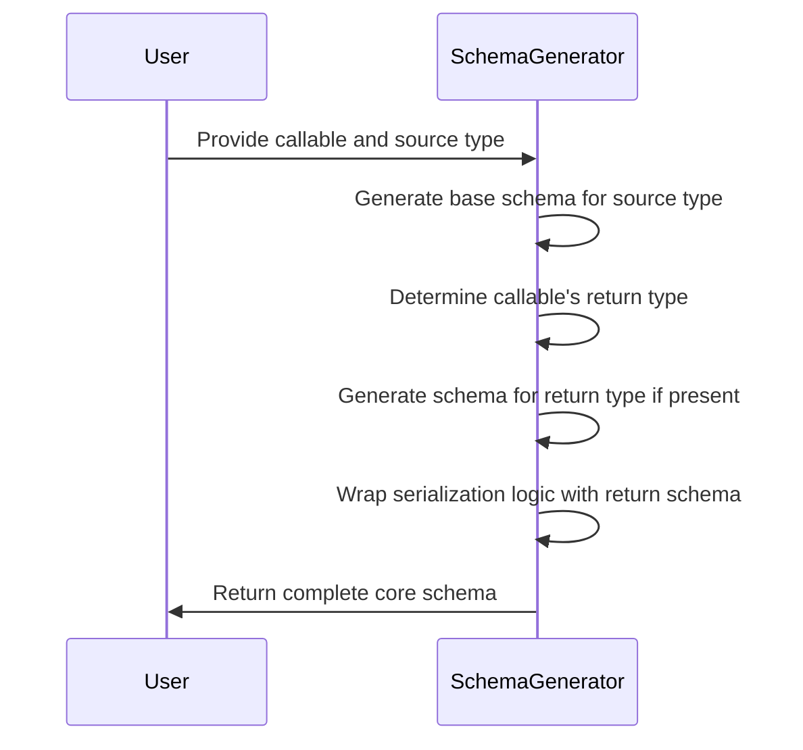
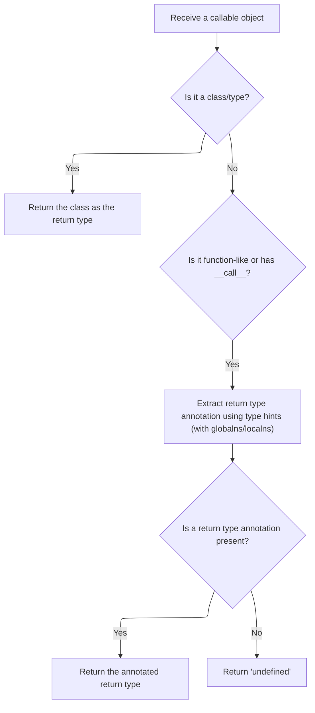
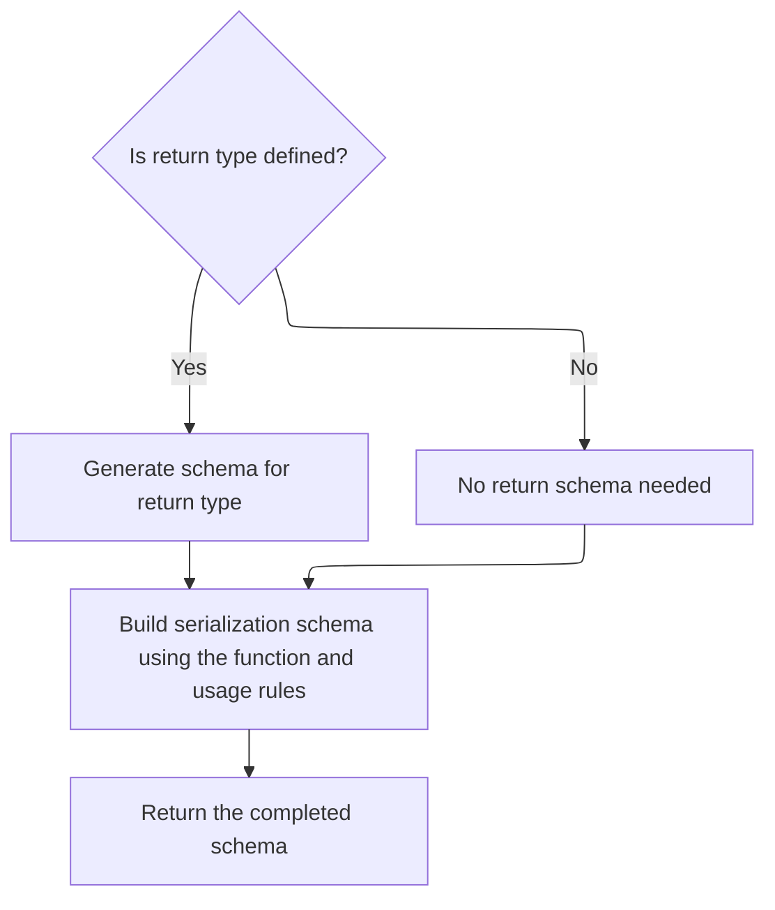

This flow describes how Pydantic generates a core schema for a callable by creating a base schema, determining the callable's return type through explicit setting or inference, generating a return type schema if needed, and wrapping serialization logic. The result is a schema that enables validation and serialization of data related to the callable.



# Spec

## Detailed View of the Program's Functionality

a. Determining and Preparing the Core Schema

The process begins by generating a base schema for a class or callable that is being serialized. This is done by invoking a handler with the source type, which returns a preliminary schema structure. The next step is to determine what the return type of the serializer function should be. There are two possibilities:

- If a custom return type has been explicitly set (not left as undefined), that type is used directly.
- If no explicit return type is provided, the system attempts to infer the return type automatically by analyzing the serializer function’s signature.

If inference is needed, a helper function is called to extract the return type annotation from the function, using the local namespace provided by the handler. This ensures that any type references, including forward references or types defined in local scopes, are resolved correctly. If the type cannot be resolved due to a missing name, a specific error is raised to indicate an undefined annotation.

b. Extracting the Callable's Return Type

To infer the return type of a callable, the system first checks if the object is a class or type. If it is, the class itself is assumed to be the return type (for example, calling <SwmToken path="pydantic/_internal/_decorators.py" pos="793:18:20" line-data="        # is the type itself (e.g. `int()` results in an instance of `int`).">`int()`</SwmToken> returns an instance of `int`). If the object is not a class but is function-like (such as a function, method, or partial), or if it has a <SwmToken path="pydantic/_internal/_decorators.py" pos="797:14:14" line-data="        call_func = getattr(type(callable_obj), &#39;__call__&#39;, None)  # noqa: B004">`__call__`</SwmToken> method, the system extracts the underlying callable.

The function’s type hints are then retrieved, focusing only on the return annotation. This involves unwrapping any decorators or wrappers to access the original function. The type hints are resolved using both global and local namespaces, which allows for correct handling of forward references and generics. If a return type annotation is present, it is returned; otherwise, a special value indicating "undefined" is returned.

c. Resolving Function Type Hints

When extracting type hints from a function, the system first retrieves the function’s annotations, handling special cases such as partial functions. It sets up the appropriate global and local namespaces for type resolution, including any type parameters if necessary.

For each parameter (including the return value) in the function’s annotations, the system checks if it should be included (based on a filter set). If the annotation is a string (indicating a forward reference), it is converted into a forward reference object. Each annotation is then evaluated in the context of the provided namespaces, resolving any forward references or generics. The result is a mapping from parameter names (including 'return') to fully resolved types.

d. Finalizing and Customizing the Schema

After determining the return type, the system decides whether a return schema is needed. If the return type is defined, a schema for that type is generated using the handler; otherwise, no return schema is included.

The base schema is then updated by adding a 'serialization' key. This key contains a structure that wraps the serializer function, information about whether it expects additional context (such as an info argument), the return schema (if any), and rules about when the serializer should be used. This final schema is then returned, fully describing how the callable should be serialized, including any custom logic and type information.

# Rule Definition

| Paragraph Name                                                                                                                                                                                                                                                                                                             | Rule ID | Category          | Description                                                                                                                                                                                                                                                   | Conditions                                                                                                                                                                                                                                                                                      | Remarks                                                                                                                                                                                                                                                                                                                                                                                                                                                                                                                                                                                                                                                                                                                                                                                                                                                                                                                                                                                                                                                                                                                                                                                                                                                                                                                                                      |
| -------------------------------------------------------------------------------------------------------------------------------------------------------------------------------------------------------------------------------------------------------------------------------------------------------------------------- | ------- | ----------------- | ------------------------------------------------------------------------------------------------------------------------------------------------------------------------------------------------------------------------------------------------------------- | ----------------------------------------------------------------------------------------------------------------------------------------------------------------------------------------------------------------------------------------------------------------------------------------------- | ------------------------------------------------------------------------------------------------------------------------------------------------------------------------------------------------------------------------------------------------------------------------------------------------------------------------------------------------------------------------------------------------------------------------------------------------------------------------------------------------------------------------------------------------------------------------------------------------------------------------------------------------------------------------------------------------------------------------------------------------------------------------------------------------------------------------------------------------------------------------------------------------------------------------------------------------------------------------------------------------------------------------------------------------------------------------------------------------------------------------------------------------------------------------------------------------------------------------------------------------------------------------------------------------------------------------------------------------------------ |
| <SwmToken path="pydantic/functional_serializers.py" pos="19:2:2" line-data="class PlainSerializer:">`PlainSerializer`</SwmToken>.**get_pydantic_core_schema**, <SwmToken path="pydantic/functional_serializers.py" pos="89:2:2" line-data="class WrapSerializer:">`WrapSerializer`</SwmToken>.**get_pydantic_core_schema** | RL-001  | Conditional Logic | The handler object must be able to provide a base schema for the source type and generate a schema for any given type.                                                                                                                                        | Whenever a core schema is generated for a serializer class, the handler must be used to obtain the base schema for the source type and to generate schemas for any types as needed.                                                                                                             | The handler is expected to have a callable interface for both retrieving the base schema (handler(<SwmToken path="pydantic/functional_serializers.py" pos="156:8:8" line-data="    def __get_pydantic_core_schema__(self, source_type: Any, handler: GetCoreSchemaHandler) -&gt; core_schema.CoreSchema:">`source_type`</SwmToken>)) and generating a schema for a type (<SwmToken path="pydantic/functional_serializers.py" pos="181:17:19" line-data="        return_schema = None if return_type is PydanticUndefined else handler.generate_schema(return_type)">`handler.generate_schema`</SwmToken>(type)).                                                                                                                                                                                                                                                                                                                                                                                                                                                                                                                                                                                                                                                                                                                                             |
| <SwmToken path="pydantic/functional_serializers.py" pos="19:2:2" line-data="class PlainSerializer:">`PlainSerializer`</SwmToken>.**get_pydantic_core_schema**, <SwmToken path="pydantic/functional_serializers.py" pos="89:2:2" line-data="class WrapSerializer:">`WrapSerializer`</SwmToken>.**get_pydantic_core_schema** | RL-002  | Conditional Logic | The serializer class may have an explicitly defined return type; if not, the system must infer the return type from the serializer function using type hints, resolving forward references and generics.                                                      | When generating the core schema, check if the serializer instance has an explicit <SwmToken path="pydantic/functional_serializers.py" pos="167:5:5" line-data="        if self.return_type is not PydanticUndefined:">`return_type`</SwmToken>. If not, infer it using the serializer function. | If <SwmToken path="pydantic/functional_serializers.py" pos="167:5:5" line-data="        if self.return_type is not PydanticUndefined:">`return_type`</SwmToken> is not <SwmToken path="pydantic/functional_serializers.py" pos="167:11:11" line-data="        if self.return_type is not PydanticUndefined:">`PydanticUndefined`</SwmToken>, use it directly. Otherwise, use <SwmToken path="pydantic/functional_serializers.py" pos="174:5:7" line-data="                return_type = _decorators.get_callable_return_type(">`_decorators.get_callable_return_type`</SwmToken> to infer the return type, passing the serializer function and the handler's local namespace.                                                                                                                                                                                                                                                                                                                                                                                                                                                                                                                                                                                                                                                                                |
| <SwmToken path="pydantic/functional_serializers.py" pos="174:5:7" line-data="                return_type = _decorators.get_callable_return_type(">`_decorators.get_callable_return_type`</SwmToken>, \_typing_extra.get_function_type_hints                                                                                | RL-003  | Computation       | To infer the return type, the system must extract type hints from the serializer function, resolving all forward references and generics using the provided global and local namespaces.                                                                      | When inferring the return type from a callable serializer function or **call** method.                                                                                                                                                                                                          | Type hints are extracted by reading the function's annotations and resolving them using the provided namespaces. The mapping returned includes parameter names and 'return' for the return type. Optionally, the mapping can be filtered to include only specified parameter names.                                                                                                                                                                                                                                                                                                                                                                                                                                                                                                                                                                                                                                                                                                                                                                                                                                                                                                                                                                                                                                                                          |
| <SwmToken path="pydantic/functional_serializers.py" pos="19:2:2" line-data="class PlainSerializer:">`PlainSerializer`</SwmToken>.**get_pydantic_core_schema**, <SwmToken path="pydantic/functional_serializers.py" pos="89:2:2" line-data="class WrapSerializer:">`WrapSerializer`</SwmToken>.**get_pydantic_core_schema** | RL-004  | Data Assignment   | The system must update the base schema by adding a 'serialization' key, whose value is a dictionary containing the serializer function, the schema for the return type (if available), and any additional metadata or usage rules required for serialization. | After obtaining the base schema and determining the return type (explicit or inferred).                                                                                                                                                                                                         | The 'serialization' key is added to the schema dictionary. Its value is constructed using <SwmToken path="pydantic/functional_serializers.py" pos="79:10:12" line-data="        schema[&#39;serialization&#39;] = core_schema.plain_serializer_function_ser_schema(">`core_schema.plain_serializer_function_ser_schema`</SwmToken> or <SwmToken path="pydantic/functional_serializers.py" pos="182:10:12" line-data="        schema[&#39;serialization&#39;] = core_schema.wrap_serializer_function_ser_schema(">`core_schema.wrap_serializer_function_ser_schema`</SwmToken>, depending on the serializer type. The value includes: function (the serializer function), <SwmToken path="pydantic/functional_serializers.py" pos="184:1:1" line-data="            info_arg=_decorators.inspect_annotated_serializer(self.func, &#39;wrap&#39;),">`info_arg`</SwmToken> (whether the function expects an info argument), <SwmToken path="pydantic/functional_serializers.py" pos="181:1:1" line-data="        return_schema = None if return_type is PydanticUndefined else handler.generate_schema(return_type)">`return_schema`</SwmToken> (the schema for the return type, or None), and <SwmToken path="pydantic/functional_serializers.py" pos="186:1:1" line-data="            when_used=self.when_used,">`when_used`</SwmToken> (the usage condition). |
| <SwmToken path="pydantic/functional_serializers.py" pos="19:2:2" line-data="class PlainSerializer:">`PlainSerializer`</SwmToken>.**get_pydantic_core_schema**, <SwmToken path="pydantic/functional_serializers.py" pos="89:2:2" line-data="class WrapSerializer:">`WrapSerializer`</SwmToken>.**get_pydantic_core_schema** | RL-005  | Data Assignment   | The completed schema, including the 'serialization' key, must be returned as the output. If no return type is defined or inferred, the 'serialization' key is still added but without a return schema.                                                        | At the end of the schema generation process.                                                                                                                                                                                                                                                    | The output is a dictionary-like schema object that describes how to validate and serialize the source type, including all necessary serialization logic and type information. The 'serialization' key is always present, but <SwmToken path="pydantic/functional_serializers.py" pos="181:1:1" line-data="        return_schema = None if return_type is PydanticUndefined else handler.generate_schema(return_type)">`return_schema`</SwmToken> may be None if the return type is undefined.                                                                                                                                                                                                                                                                                                                                                                                                                                                                                                                                                                                                                                                                                                                                                                                                                                                                |

# User Stories

## User Story 1: Schema generation using handler and return type resolution

---

### Story Description:

As a system, I want to use a handler object to generate the base schema for a source type and to determine the serializer's return type (either explicitly or by inferring it from type hints), so that I can accurately describe, validate, and serialize data structures, handling forward references and generics as needed.

---

### Business Rule Mapping:

| Rule ID | Paragraph Name                                                                                                                                                                                                                                                                                                             | Rule Description                                                                                                                                                                                         |
| ------- | -------------------------------------------------------------------------------------------------------------------------------------------------------------------------------------------------------------------------------------------------------------------------------------------------------------------------- | -------------------------------------------------------------------------------------------------------------------------------------------------------------------------------------------------------- |
| RL-001  | <SwmToken path="pydantic/functional_serializers.py" pos="19:2:2" line-data="class PlainSerializer:">`PlainSerializer`</SwmToken>.**get_pydantic_core_schema**, <SwmToken path="pydantic/functional_serializers.py" pos="89:2:2" line-data="class WrapSerializer:">`WrapSerializer`</SwmToken>.**get_pydantic_core_schema** | The handler object must be able to provide a base schema for the source type and generate a schema for any given type.                                                                                   |
| RL-002  | <SwmToken path="pydantic/functional_serializers.py" pos="19:2:2" line-data="class PlainSerializer:">`PlainSerializer`</SwmToken>.**get_pydantic_core_schema**, <SwmToken path="pydantic/functional_serializers.py" pos="89:2:2" line-data="class WrapSerializer:">`WrapSerializer`</SwmToken>.**get_pydantic_core_schema** | The serializer class may have an explicitly defined return type; if not, the system must infer the return type from the serializer function using type hints, resolving forward references and generics. |
| RL-003  | <SwmToken path="pydantic/functional_serializers.py" pos="174:5:7" line-data="                return_type = _decorators.get_callable_return_type(">`_decorators.get_callable_return_type`</SwmToken>, \_typing_extra.get_function_type_hints                                                                                | To infer the return type, the system must extract type hints from the serializer function, resolving all forward references and generics using the provided global and local namespaces.                 |

---

### Relevant Functionality:

- **PlainSerializer.get_pydantic_core_schema**
  1. **RL-001:**
     - Call handler(<SwmToken path="pydantic/functional_serializers.py" pos="156:8:8" line-data="    def __get_pydantic_core_schema__(self, source_type: Any, handler: GetCoreSchemaHandler) -&gt; core_schema.CoreSchema:">`source_type`</SwmToken>) to get the base schema.
     - When a return type is determined, call <SwmToken path="pydantic/functional_serializers.py" pos="181:17:19" line-data="        return_schema = None if return_type is PydanticUndefined else handler.generate_schema(return_type)">`handler.generate_schema`</SwmToken>(<SwmToken path="pydantic/functional_serializers.py" pos="167:5:5" line-data="        if self.return_type is not PydanticUndefined:">`return_type`</SwmToken>) to get the schema for the return type.
  2. **RL-002:**
     - If serializer.return_type is not <SwmToken path="pydantic/functional_serializers.py" pos="167:11:11" line-data="        if self.return_type is not PydanticUndefined:">`PydanticUndefined`</SwmToken>:
       - Use serializer.return_type as the return type.
     - Else:
       - Call <SwmToken path="pydantic/functional_serializers.py" pos="174:5:7" line-data="                return_type = _decorators.get_callable_return_type(">`_decorators.get_callable_return_type`</SwmToken> with the serializer function and handler's local namespace to infer the return type.
       - If <SwmToken path="pydantic/functional_serializers.py" pos="178:3:3" line-data="            except NameError as e:">`NameError`</SwmToken> occurs, raise a <SwmToken path="pydantic/functional_serializers.py" pos="179:3:3" line-data="                raise PydanticUndefinedAnnotation.from_name_error(e) from e">`PydanticUndefinedAnnotation`</SwmToken> error.
- <SwmToken path="pydantic/functional_serializers.py" pos="174:5:7" line-data="                return_type = _decorators.get_callable_return_type(">`_decorators.get_callable_return_type`</SwmToken>
  1. **RL-003:**
     - Read the function's **annotations**.
     - Use the global and local namespaces to resolve all type hints, including forward references and generics.
     - Return a mapping from parameter names (including 'return') to their fully resolved types.
     - Optionally filter the mapping to include only specified parameter names.

## User Story 2: Schema update with serialization details

---

### Story Description:

As a system, I want to update the schema with a 'serialization' key containing the serializer function, the schema for the return type (if available), and any additional metadata or usage rules, so that the output schema fully describes the serialization logic and can be used for validation and serialization purposes.

---

### Business Rule Mapping:

| Rule ID | Paragraph Name                                                                                                                                                                                                                                                                                                             | Rule Description                                                                                                                                                                                                                                              |
| ------- | -------------------------------------------------------------------------------------------------------------------------------------------------------------------------------------------------------------------------------------------------------------------------------------------------------------------------- | ------------------------------------------------------------------------------------------------------------------------------------------------------------------------------------------------------------------------------------------------------------- |
| RL-004  | <SwmToken path="pydantic/functional_serializers.py" pos="19:2:2" line-data="class PlainSerializer:">`PlainSerializer`</SwmToken>.**get_pydantic_core_schema**, <SwmToken path="pydantic/functional_serializers.py" pos="89:2:2" line-data="class WrapSerializer:">`WrapSerializer`</SwmToken>.**get_pydantic_core_schema** | The system must update the base schema by adding a 'serialization' key, whose value is a dictionary containing the serializer function, the schema for the return type (if available), and any additional metadata or usage rules required for serialization. |
| RL-005  | <SwmToken path="pydantic/functional_serializers.py" pos="19:2:2" line-data="class PlainSerializer:">`PlainSerializer`</SwmToken>.**get_pydantic_core_schema**, <SwmToken path="pydantic/functional_serializers.py" pos="89:2:2" line-data="class WrapSerializer:">`WrapSerializer`</SwmToken>.**get_pydantic_core_schema** | The completed schema, including the 'serialization' key, must be returned as the output. If no return type is defined or inferred, the 'serialization' key is still added but without a return schema.                                                        |

---

### Relevant Functionality:

- **PlainSerializer.get_pydantic_core_schema**
  1. **RL-004:**
     - If <SwmToken path="pydantic/functional_serializers.py" pos="167:5:5" line-data="        if self.return_type is not PydanticUndefined:">`return_type`</SwmToken> is defined or inferred and not <SwmToken path="pydantic/functional_serializers.py" pos="167:11:11" line-data="        if self.return_type is not PydanticUndefined:">`PydanticUndefined`</SwmToken>:
       - Generate <SwmToken path="pydantic/functional_serializers.py" pos="181:1:1" line-data="        return_schema = None if return_type is PydanticUndefined else handler.generate_schema(return_type)">`return_schema`</SwmToken> using <SwmToken path="pydantic/functional_serializers.py" pos="181:17:19" line-data="        return_schema = None if return_type is PydanticUndefined else handler.generate_schema(return_type)">`handler.generate_schema`</SwmToken>(<SwmToken path="pydantic/functional_serializers.py" pos="167:5:5" line-data="        if self.return_type is not PydanticUndefined:">`return_type`</SwmToken>).
     - Else:
       - Set <SwmToken path="pydantic/functional_serializers.py" pos="181:1:1" line-data="        return_schema = None if return_type is PydanticUndefined else handler.generate_schema(return_type)">`return_schema`</SwmToken> to None.
     - Add a 'serialization' key to the schema dictionary with the following structure:
       - function: the serializer function
       - <SwmToken path="pydantic/functional_serializers.py" pos="184:1:1" line-data="            info_arg=_decorators.inspect_annotated_serializer(self.func, &#39;wrap&#39;),">`info_arg`</SwmToken>: result of <SwmToken path="pydantic/functional_serializers.py" pos="184:3:5" line-data="            info_arg=_decorators.inspect_annotated_serializer(self.func, &#39;wrap&#39;),">`_decorators.inspect_annotated_serializer`</SwmToken>(func, mode)
       - <SwmToken path="pydantic/functional_serializers.py" pos="181:1:1" line-data="        return_schema = None if return_type is PydanticUndefined else handler.generate_schema(return_type)">`return_schema`</SwmToken>: as determined above
       - <SwmToken path="pydantic/functional_serializers.py" pos="186:1:1" line-data="            when_used=self.when_used,">`when_used`</SwmToken>: the serializer's <SwmToken path="pydantic/functional_serializers.py" pos="186:1:1" line-data="            when_used=self.when_used,">`when_used`</SwmToken> attribute
  2. **RL-005:**
     - After updating the schema with the 'serialization' key, return the schema dictionary as the output.

# Code Walkthrough

## Determining and Preparing the Core Schema

```mermaid
%%{init: {"flowchart": {"defaultRenderer": "elk"}} }%%
flowchart TD
    node1["Start: Generate a base schema for the class"] --> node2{"Is a custom return type defined?"}
    click node1 openCode "pydantic/functional_serializers.py:156:166"
    node2 -->|"Yes (return_type set)"| node4["Build serialization schema using the custom return type"]
    click node2 openCode "pydantic/functional_serializers.py:167:170"
    node2 -->|"No (infer automatically)"| node3["Ask Pydantic to infer the return type"]
    click node3 openCode "pydantic/_internal/_decorators.py:776:778"
    node3 --> node4
    node4["Return the completed serialization schema"]
    click node4 openCode "pydantic/functional_serializers.py:181:188"

subgraph node3 [get_callable_return_type]
  sgmain_1_node1["Receive a callable object"] --> sgmain_1_node2{"Is it a class/type?"}
  click sgmain_1_node1 openCode "pydantic/_internal/_decorators.py:776:790"
  sgmain_1_node2 -->|"Yes"| sgmain_1_node3["Return the class as the return type"]
  click sgmain_1_node2 openCode "pydantic/_internal/_decorators.py:791:794"
  click sgmain_1_node3 openCode "pydantic/_internal/_decorators.py:794:794"
  sgmain_1_node2 -->|"No"| sgmain_1_node4{"Is it function-like or has __call__?"}
  click sgmain_1_node4 openCode "pydantic/_internal/_decorators.py:796:799"
  sgmain_1_node4 -->|"Yes"| sgmain_1_node5["Extract return type annotation using type hints (with globalns/localns)"]
  click sgmain_1_node5 openCode "pydantic/_internal/_decorators.py:801:806"
  sgmain_1_node5 --> sgmain_1_node6{"Is a return type annotation present?"}
  click sgmain_1_node6 openCode "pydantic/_internal/_decorators.py:807:807"
  sgmain_1_node6 -->|"Yes"| sgmain_1_node7["Return the annotated return type"]
  click sgmain_1_node7 openCode "pydantic/_internal/_decorators.py:807:807"
  sgmain_1_node6 -->|"No"| sgmain_1_node8["Return 'undefined'"]
  click sgmain_1_node8 openCode "pydantic/_internal/_decorators.py:807:807"
end

%% Swimm:
%% %%{init: {"flowchart": {"defaultRenderer": "elk"}} }%%
%% flowchart TD
%%     node1["Start: Generate a base schema for the class"] --> node2{"Is a custom return type defined?"}
%%     click node1 openCode "<SwmPath>[pydantic/functional_serializers.py](pydantic/functional_serializers.py)</SwmPath>:156:166"
%%     node2 -->|"Yes (<SwmToken path="pydantic/functional_serializers.py" pos="167:5:5" line-data="        if self.return_type is not PydanticUndefined:">`return_type`</SwmToken> set)"| node4["Build serialization schema using the custom return type"]
%%     click node2 openCode "<SwmPath>[pydantic/functional_serializers.py](pydantic/functional_serializers.py)</SwmPath>:167:170"
%%     node2 -->|"No (infer automatically)"| node3["Ask Pydantic to infer the return type"]
%%     click node3 openCode "<SwmPath>[pydantic/\_internal/\_decorators.py](pydantic/_internal/_decorators.py)</SwmPath>:776:778"
%%     node3 --> node4
%%     node4["Return the completed serialization schema"]
%%     click node4 openCode "<SwmPath>[pydantic/functional_serializers.py](pydantic/functional_serializers.py)</SwmPath>:181:188"
%% 
%% subgraph node3 [<SwmToken path="pydantic/functional_serializers.py" pos="172:9:9" line-data="                # Instead, let `get_callable_return_type` infer the globals to use, but still pass">`get_callable_return_type`</SwmToken>]
%%   sgmain_1_node1["Receive a callable object"] --> sgmain_1_node2{"Is it a class/type?"}
%%   click sgmain_1_node1 openCode "<SwmPath>[pydantic/\_internal/\_decorators.py](pydantic/_internal/_decorators.py)</SwmPath>:776:790"
%%   sgmain_1_node2 -->|"Yes"| sgmain_1_node3["Return the class as the return type"]
%%   click sgmain_1_node2 openCode "<SwmPath>[pydantic/\_internal/\_decorators.py](pydantic/_internal/_decorators.py)</SwmPath>:791:794"
%%   click sgmain_1_node3 openCode "<SwmPath>[pydantic/\_internal/\_decorators.py](pydantic/_internal/_decorators.py)</SwmPath>:794:794"
%%   sgmain_1_node2 -->|"No"| sgmain_1_node4{"Is it function-like or has __call__?"}
%%   click sgmain_1_node4 openCode "<SwmPath>[pydantic/\_internal/\_decorators.py](pydantic/_internal/_decorators.py)</SwmPath>:796:799"
%%   sgmain_1_node4 -->|"Yes"| sgmain_1_node5["Extract return type annotation using type hints (with globalns/localns)"]
%%   click sgmain_1_node5 openCode "<SwmPath>[pydantic/\_internal/\_decorators.py](pydantic/_internal/_decorators.py)</SwmPath>:801:806"
%%   sgmain_1_node5 --> sgmain_1_node6{"Is a return type annotation present?"}
%%   click sgmain_1_node6 openCode "<SwmPath>[pydantic/\_internal/\_decorators.py](pydantic/_internal/_decorators.py)</SwmPath>:807:807"
%%   sgmain_1_node6 -->|"Yes"| sgmain_1_node7["Return the annotated return type"]
%%   click sgmain_1_node7 openCode "<SwmPath>[pydantic/\_internal/\_decorators.py](pydantic/_internal/_decorators.py)</SwmPath>:807:807"
%%   sgmain_1_node6 -->|"No"| sgmain_1_node8["Return 'undefined'"]
%%   click sgmain_1_node8 openCode "<SwmPath>[pydantic/\_internal/\_decorators.py](pydantic/_internal/_decorators.py)</SwmPath>:807:807"
%% end
```



<SwmSnippet path="/pydantic/functional_serializers.py" line="156">

---

In <SwmToken path="pydantic/functional_serializers.py" pos="156:3:3" line-data="    def __get_pydantic_core_schema__(self, source_type: Any, handler: GetCoreSchemaHandler) -&gt; core_schema.CoreSchema:">`__get_pydantic_core_schema__`</SwmToken>, we start by getting a base schema from the handler using the source type. Then, we figure out what the return type should be: if it's set explicitly, we use that; otherwise, we call <SwmToken path="pydantic/functional_serializers.py" pos="172:9:9" line-data="                # Instead, let `get_callable_return_type` infer the globals to use, but still pass">`get_callable_return_type`</SwmToken> to infer it from the function's signature, using the handler's local namespace for type resolution. This sets up the info we need for the next steps, like generating the right schema and adding serialization logic.

```python
    def __get_pydantic_core_schema__(self, source_type: Any, handler: GetCoreSchemaHandler) -> core_schema.CoreSchema:
        """This method is used to get the Pydantic core schema of the class.

        Args:
            source_type: Source type.
            handler: Core schema handler.

        Returns:
            The generated core schema of the class.
        """
        schema = handler(source_type)
        if self.return_type is not PydanticUndefined:
            return_type = self.return_type
        else:
            try:
                # Do not pass in globals as the function could be defined in a different module.
                # Instead, let `get_callable_return_type` infer the globals to use, but still pass
                # in locals that may contain a parent/rebuild namespace:
                return_type = _decorators.get_callable_return_type(
                    self.func,
                    localns=handler._get_types_namespace().locals,
                )
            except NameError as e:
                raise PydanticUndefinedAnnotation.from_name_error(e) from e

```

---

</SwmSnippet>

### Extracting the Callable's Return Type



<SwmSnippet path="/pydantic/_internal/_decorators.py" line="776">

---

<SwmToken path="pydantic/_internal/_decorators.py" pos="776:2:2" line-data="def get_callable_return_type(">`get_callable_return_type`</SwmToken> figures out what type a callable returns. It handles different callable types, like classes or objects with **call**, and then calls <SwmToken path="pydantic/_internal/_decorators.py" pos="801:5:5" line-data="    hints = get_function_type_hints(">`get_function_type_hints`</SwmToken> (filtered to just the return annotation) to actually extract the return type info. This is needed so we know what type the serializer is supposed to output.

```python
def get_callable_return_type(
    callable_obj: Any,
    globalns: GlobalsNamespace | None = None,
    localns: MappingNamespace | None = None,
) -> Any | PydanticUndefinedType:
    """Get the callable return type.

    Args:
        callable_obj: The callable to analyze.
        globalns: The globals namespace to use during type annotation evaluation.
        localns: The locals namespace to use during type annotation evaluation.

    Returns:
        The function return type.
    """
    if isinstance(callable_obj, type):
        # types are callables, and we assume the return type
        # is the type itself (e.g. `int()` results in an instance of `int`).
        return callable_obj

    if not isinstance(callable_obj, _function_like):
        call_func = getattr(type(callable_obj), '__call__', None)  # noqa: B004
        if call_func is not None:
            callable_obj = call_func

    hints = get_function_type_hints(
        unwrap_wrapped_function(callable_obj),
        include_keys={'return'},
        globalns=globalns,
        localns=localns,
    )
    return hints.get('return', PydanticUndefined)
```

---

</SwmSnippet>

### Resolving Function Type Hints

```mermaid
%%{init: {"flowchart": {"defaultRenderer": "elk"}} }%%
flowchart TD
    node1["Extract type annotations from the function"] --> node2["Resolve namespaces for type resolution"]
    click node1 openCode "pydantic/_internal/_typing_extra.py:551:555"
    click node2 openCode "pydantic/_internal/_typing_extra.py:560:566"
    node2 --> node3["Prepare to process each parameter"]
    click node3 openCode "pydantic/_internal/_typing_extra.py:568:569"

    subgraph loop1["For each parameter in the function"]
        node3 --> node4{"Is parameter in include_keys?"}
        click node4 openCode "pydantic/_internal/_typing_extra.py:570:571"
        node4 -->|"No"| node3
        node4 -->|"Yes or not filtering"| node5["Transform and resolve type hint using globalns/localns/type_params"]
        click node5 openCode "pydantic/_internal/_typing_extra.py:572:577"
        node5 --> node3
    end
    node3 --> node6["Return mapping of parameter names to type hints"]
    click node6 openCode "pydantic/_internal/_typing_extra.py:579:579"

%% Swimm:
%% %%{init: {"flowchart": {"defaultRenderer": "elk"}} }%%
%% flowchart TD
%%     node1["Extract type annotations from the function"] --> node2["Resolve namespaces for type resolution"]
%%     click node1 openCode "<SwmPath>[pydantic/\_internal/\_typing_extra.py](pydantic/_internal/_typing_extra.py)</SwmPath>:551:555"
%%     click node2 openCode "<SwmPath>[pydantic/\_internal/\_typing_extra.py](pydantic/_internal/_typing_extra.py)</SwmPath>:560:566"
%%     node2 --> node3["Prepare to process each parameter"]
%%     click node3 openCode "<SwmPath>[pydantic/\_internal/\_typing_extra.py](pydantic/_internal/_typing_extra.py)</SwmPath>:568:569"
%% 
%%     subgraph loop1["For each parameter in the function"]
%%         node3 --> node4{"Is parameter in <SwmToken path="pydantic/_internal/_decorators.py" pos="803:1:1" line-data="        include_keys={&#39;return&#39;},">`include_keys`</SwmToken>?"}
%%         click node4 openCode "<SwmPath>[pydantic/\_internal/\_typing_extra.py](pydantic/_internal/_typing_extra.py)</SwmPath>:570:571"
%%         node4 -->|"No"| node3
%%         node4 -->|"Yes or not filtering"| node5["Transform and resolve type hint using globalns/localns/type_params"]
%%         click node5 openCode "<SwmPath>[pydantic/\_internal/\_typing_extra.py](pydantic/_internal/_typing_extra.py)</SwmPath>:572:577"
%%         node5 --> node3
%%     end
%%     node3 --> node6["Return mapping of parameter names to type hints"]
%%     click node6 openCode "<SwmPath>[pydantic/\_internal/\_typing_extra.py](pydantic/_internal/_typing_extra.py)</SwmPath>:579:579"
```



<SwmSnippet path="/pydantic/_internal/_typing_extra.py" line="537">

---

In <SwmToken path="pydantic/_internal/_typing_extra.py" pos="537:2:2" line-data="def get_function_type_hints(">`get_function_type_hints`</SwmToken>, we grab the function's annotations, handling partials by looking at the underlying function. We skip the Optional wrapping workaround for None defaults, and set up the global and local namespaces, including any type parameters if localns isn't given. This sets up the context for resolving all type hints, including forward references.

```python
def get_function_type_hints(
    function: Callable[..., Any],
    *,
    include_keys: set[str] | None = None,
    globalns: GlobalsNamespace | None = None,
    localns: MappingNamespace | None = None,
) -> dict[str, Any]:
    """Return type hints for a function.

    This is similar to the `typing.get_type_hints` function, with a few differences:
    - Support `functools.partial` by using the underlying `func` attribute.
    - Do not wrap type annotation of a parameter with `Optional` if it has a default value of `None`
      (related bug: https://github.com/python/cpython/issues/90353, only fixed in 3.11+).
    """
    try:
        if isinstance(function, partial):
            annotations = function.func.__annotations__
        else:
            annotations = function.__annotations__
    except AttributeError:
        # Some functions (e.g. builtins) don't have annotations:
        return {}

    if globalns is None:
        globalns = get_module_ns_of(function)
    type_params: tuple[Any, ...] | None = None
    if localns is None:
        # If localns was specified, it is assumed to already contain type params. This is because
        # Pydantic has more advanced logic to do so (see `_namespace_utils.ns_for_function`).
        type_params = getattr(function, '__type_params__', ())

    type_hints = {}
    for name, value in annotations.items():
        if include_keys is not None and name not in include_keys:
            continue
        if value is None:
            value = NoneType
        elif isinstance(value, str):
            value = _make_forward_ref(value)

        type_hints[name] = eval_type_backport(value, globalns, localns, type_params)
```

---

</SwmSnippet>

<SwmSnippet path="/pydantic/_internal/_typing_extra.py" line="577">

---

After resolving everything, <SwmToken path="pydantic/_internal/_decorators.py" pos="801:5:5" line-data="    hints = get_function_type_hints(">`get_function_type_hints`</SwmToken> returns a dict mapping argument names (or 'return') to fully evaluated types, so you can use them directly without worrying about forward refs or generics.

```python
        type_hints[name] = eval_type_backport(value, globalns, localns, type_params)

    return type_hints
```

---

</SwmSnippet>

### Finalizing and Customizing the Schema



<SwmSnippet path="/pydantic/functional_serializers.py" line="181">

---

Back in **get_pydantic_core_schema**, after getting the return type from <SwmToken path="pydantic/functional_serializers.py" pos="172:9:9" line-data="                # Instead, let `get_callable_return_type` infer the globals to use, but still pass">`get_callable_return_type`</SwmToken>, we generate a return schema if needed and then update the base schema by adding a 'serialization' key. This key wraps the serializer function and its return schema, so the schema now knows how to handle serialization for this callable.

```python
        return_schema = None if return_type is PydanticUndefined else handler.generate_schema(return_type)
        schema['serialization'] = core_schema.wrap_serializer_function_ser_schema(
            function=self.func,
            info_arg=_decorators.inspect_annotated_serializer(self.func, 'wrap'),
            return_schema=return_schema,
            when_used=self.when_used,
        )
        return schema
```

---

</SwmSnippet>

&nbsp;

*This is an auto-generated document by Swimm 🌊 and has not yet been verified by a human*

<SwmMeta version="3.0.0" repo-id="Z2l0aHViJTNBJTNBcHlkYW50aWMlM0ElM0FTd2ltbS1EZW1v" repo-name="pydantic"><sup>Powered by [Swimm](/)</sup></SwmMeta>
