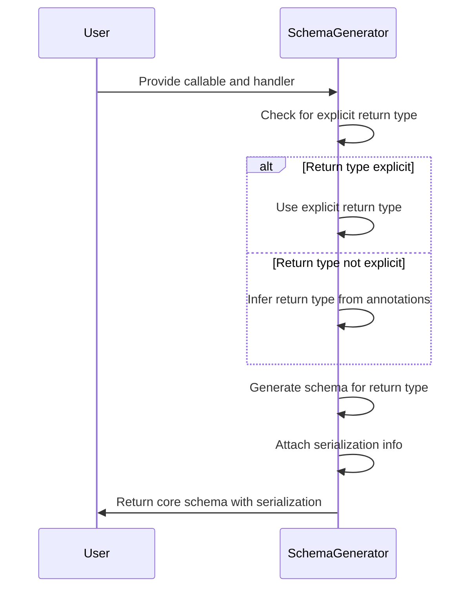
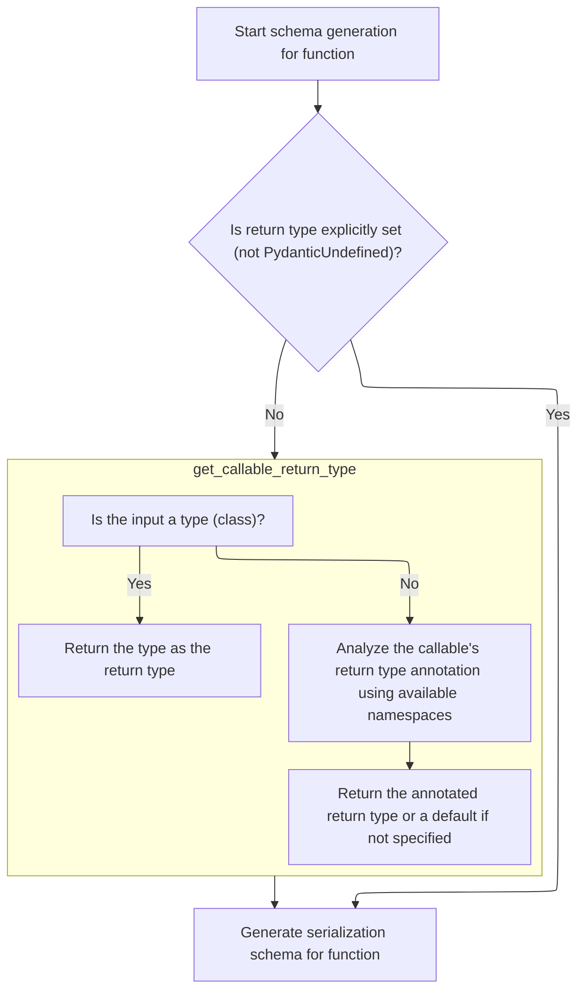
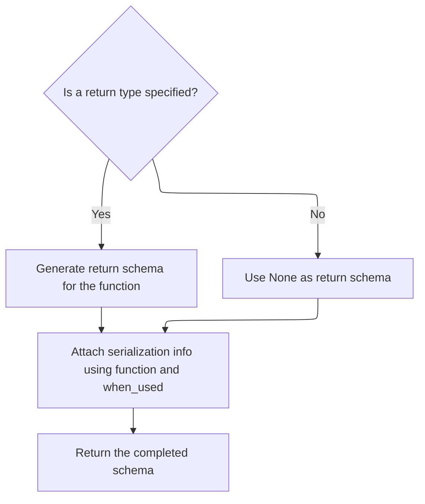

This flow describes how Pydantic generates a core schema for a callable by determining its return type, generating a schema for that type, and attaching serialization information. It ensures that the schema supports both validation and serialization based on the callable's behavior.

The main steps are:

- Check for an explicit return type or infer it from annotations
- Generate a schema for the return type
- Attach serialization metadata to the schema
- Return the completed schema



# Spec

## Detailed View of the Program's Functionality

a. Starting Schema Generation for a Function

The process begins when schema generation is initiated for a function that is intended to be used as a serializer (for example, via Pydantic's <SwmToken path="pydantic/functional_serializers.py" pos="19:2:2" line-data="class PlainSerializer:">`PlainSerializer`</SwmToken> or <SwmToken path="pydantic/functional_serializers.py" pos="89:2:2" line-data="class WrapSerializer:">`WrapSerializer`</SwmToken>). The main entry point for this is a special method that is called to produce the core schema for the function. This method receives the type being serialized and a handler object that helps with schema generation.

b. Determining the Return Type: Explicit vs. Inferred

The next step is to determine what the return type of the serializer function is, as this is crucial for generating the correct schema. The code first checks if an explicit return type was provided when the serializer was defined. If so, this type is used directly.

If no explicit return type is set (i.e., it is undefined), the code proceeds to infer the return type. This is done by calling a helper function that analyzes the function's signature and type annotations. Importantly, this inference is done using a local namespace provided by the handler, which allows the resolution of local types and generics that might not be available in the global scope.

c. Inferring the Callable's Return Type

When inferring the return type, the helper function first checks if the object being analyzed is a type (i.e., a class). If it is, the type itself is assumed to be the return type (for example, calling int() returns an int).

If the object is not a type, the function ensures it is working with the actual callable (handling cases like partial functions or objects with a **call** method). It then extracts the type hints from the function, focusing only on the return annotation. This extraction is done in a way that supports forward references and complex type constructs, using the provided global and local namespaces to resolve any references.

If the function has a return annotation, it is evaluated and returned. If not, a special undefined marker is returned.

d. Resolving and Evaluating Function Type Hints

To extract and resolve the type hints, another helper function is used. This function handles several edge cases:

- If the function is a <SwmToken path="pydantic/_internal/_typing_extra.py" pos="547:6:8" line-data="    - Support `functools.partial` by using the underlying `func` attribute.">`functools.partial`</SwmToken>, it retrieves the annotations from the underlying function.
- It does not automatically wrap parameters with Optional if they have a default value of None (a deviation from older Python behavior).
- For each annotation, if the value is a string (indicating a forward reference), it is converted into a forward reference object and evaluated using the provided namespaces and any type parameters.
- All resolved type hints are collected into a dictionary mapping parameter names (including 'return') to their fully evaluated types.

e. Generating the Serialization Schema

Once the return type is determined (either explicitly or via inference), the code proceeds to generate the serialization schema:

- If the return type is still undefined, no return schema is generated (it is set to None).
- Otherwise, the handler is used to generate a schema for the return type.

The base schema for the function is then updated to include serialization information. This involves creating a serialization schema entry that specifies:

- The function to use for serialization.
- Whether the function expects an info argument (determined by inspecting the function's signature).
- The schema for the return value (if available).
- When the serializer should be used (<SwmToken path="pydantic/_internal/_decorators.py" pos="793:12:14" line-data="        # is the type itself (e.g. `int()` results in an instance of `int`).">`e.g`</SwmToken>., always, only for JSON, etc.).

This serialization schema is attached to the main schema dictionary under the 'serialization' key.

f. Returning the Completed Schema

Finally, the fully constructed schema dictionary, now including the serialization logic and return type information, is returned. This schema can then be used by Pydantic's core to perform serialization according to the user's custom function and its type annotations.

# Rule Definition

| Paragraph Name                                                                                                                                                                                                                                                                                                             | Rule ID | Category          | Description                                                                                                                                                                                                                                                                                                                                                                                                                                                                                                                                                                                                                                                                                                                                                                                                                                                                                                                                                                                                                                                                                                                                                                                                                                                                                                                                                                                                                                                               | Conditions                                                                                                                                                                                                                                                                     | Remarks                                                                                                                                                                                                                                                                                                                                                                                                                                                                                                                                                                                                                                                                                                                                                                                                                                                                                                                                                                                                                                                                                                                                                                                         |
| -------------------------------------------------------------------------------------------------------------------------------------------------------------------------------------------------------------------------------------------------------------------------------------------------------------------------- | ------- | ----------------- | ------------------------------------------------------------------------------------------------------------------------------------------------------------------------------------------------------------------------------------------------------------------------------------------------------------------------------------------------------------------------------------------------------------------------------------------------------------------------------------------------------------------------------------------------------------------------------------------------------------------------------------------------------------------------------------------------------------------------------------------------------------------------------------------------------------------------------------------------------------------------------------------------------------------------------------------------------------------------------------------------------------------------------------------------------------------------------------------------------------------------------------------------------------------------------------------------------------------------------------------------------------------------------------------------------------------------------------------------------------------------------------------------------------------------------------------------------------------------- | ------------------------------------------------------------------------------------------------------------------------------------------------------------------------------------------------------------------------------------------------------------------------------ | ----------------------------------------------------------------------------------------------------------------------------------------------------------------------------------------------------------------------------------------------------------------------------------------------------------------------------------------------------------------------------------------------------------------------------------------------------------------------------------------------------------------------------------------------------------------------------------------------------------------------------------------------------------------------------------------------------------------------------------------------------------------------------------------------------------------------------------------------------------------------------------------------------------------------------------------------------------------------------------------------------------------------------------------------------------------------------------------------------------------------------------------------------------------------------------------------- |
| <SwmToken path="pydantic/functional_serializers.py" pos="19:2:2" line-data="class PlainSerializer:">`PlainSerializer`</SwmToken>.**get_pydantic_core_schema**, <SwmToken path="pydantic/functional_serializers.py" pos="89:2:2" line-data="class WrapSerializer:">`WrapSerializer`</SwmToken>.**get_pydantic_core_schema** | RL-001  | Conditional Logic | The schema generation process must accept as input a <SwmToken path="pydantic/functional_serializers.py" pos="53:8:8" line-data="    def __get_pydantic_core_schema__(self, source_type: Any, handler: GetCoreSchemaHandler) -&gt; core_schema.CoreSchema:">`source_type`</SwmToken> (the type being serialized) and a handler object that provides methods for generating schemas and resolving type references.                                                                                                                                                                                                                                                                                                                                                                                                                                                                                                                                                                                                                                                                                                                                                                                                                                                                                                                                                                                                                                                         | Whenever a schema is being generated for a serializer (plain or wrap).                                                                                                                                                                                                         | The handler must provide at least: handler(type), <SwmToken path="pydantic/functional_serializers.py" pos="78:17:19" line-data="        return_schema = None if return_type is PydanticUndefined else handler.generate_schema(return_type)">`handler.generate_schema`</SwmToken>(type), and <SwmToken path="pydantic/functional_serializers.py" pos="73:3:7" line-data="                    localns=handler._get_types_namespace().locals,">`handler._get_types_namespace()`</SwmToken>.locals.                                                                                                                                                                                                                                                                                                                                                                                                                                                                                                                                                                                                                                                                                                 |
| <SwmToken path="pydantic/functional_serializers.py" pos="19:2:2" line-data="class PlainSerializer:">`PlainSerializer`</SwmToken>.**get_pydantic_core_schema**, <SwmToken path="pydantic/functional_serializers.py" pos="89:2:2" line-data="class WrapSerializer:">`WrapSerializer`</SwmToken>.**get_pydantic_core_schema** | RL-002  | Data Assignment   | The output of the schema generation process must be a dictionary (core schema) that includes all keys and values from the base schema generated by handler(<SwmToken path="pydantic/functional_serializers.py" pos="53:8:8" line-data="    def __get_pydantic_core_schema__(self, source_type: Any, handler: GetCoreSchemaHandler) -&gt; core_schema.CoreSchema:">`source_type`</SwmToken>), with an added or updated 'serialization' key describing the serialization logic.                                                                                                                                                                                                                                                                                                                                                                                                                                                                                                                                                                                                                                                                                                                                                                                                                                                                                                                                                                                             | Whenever a schema is generated for a serializer.                                                                                                                                                                                                                               | The output is a dictionary. The 'serialization' key is always present and its value is a dictionary.                                                                                                                                                                                                                                                                                                                                                                                                                                                                                                                                                                                                                                                                                                                                                                                                                                                                                                                                                                                                                                                                                            |
| <SwmToken path="pydantic/functional_serializers.py" pos="19:2:2" line-data="class PlainSerializer:">`PlainSerializer`</SwmToken>.**get_pydantic_core_schema**, <SwmToken path="pydantic/functional_serializers.py" pos="89:2:2" line-data="class WrapSerializer:">`WrapSerializer`</SwmToken>.**get_pydantic_core_schema** | RL-003  | Data Assignment   | When adding or updating the 'serialization' key, all existing keys and values in the base schema must be preserved.                                                                                                                                                                                                                                                                                                                                                                                                                                                                                                                                                                                                                                                                                                                                                                                                                                                                                                                                                                                                                                                                                                                                                                                                                                                                                                                                                       | Whenever the 'serialization' key is added or updated in the schema.                                                                                                                                                                                                            | No keys or values from the base schema may be removed or altered except for the addition or update of 'serialization'.                                                                                                                                                                                                                                                                                                                                                                                                                                                                                                                                                                                                                                                                                                                                                                                                                                                                                                                                                                                                                                                                          |
| <SwmToken path="pydantic/functional_serializers.py" pos="19:2:2" line-data="class PlainSerializer:">`PlainSerializer`</SwmToken>.**get_pydantic_core_schema**, <SwmToken path="pydantic/functional_serializers.py" pos="89:2:2" line-data="class WrapSerializer:">`WrapSerializer`</SwmToken>.**get_pydantic_core_schema** | RL-004  | Data Assignment   | The 'serialization' dictionary must always include the keys: 'type', 'function', <SwmToken path="pydantic/functional_serializers.py" pos="81:1:1" line-data="            info_arg=_decorators.inspect_annotated_serializer(self.func, &#39;plain&#39;),">`info_arg`</SwmToken>, <SwmToken path="pydantic/functional_serializers.py" pos="78:1:1" line-data="        return_schema = None if return_type is PydanticUndefined else handler.generate_schema(return_type)">`return_schema`</SwmToken>, and <SwmToken path="pydantic/functional_serializers.py" pos="83:1:1" line-data="            when_used=self.when_used,">`when_used`</SwmToken>. Each key must be present even if its value is None, False, or the default.                                                                                                                                                                                                                                                                                                                                                                                                                                                                                                                                                                                                                                                                                                                                             | Whenever the 'serialization' dictionary is created or updated.                                                                                                                                                                                                                 | 'type' is 'plain' for plain serializers; 'function' is the actual Python function object; <SwmToken path="pydantic/functional_serializers.py" pos="81:1:1" line-data="            info_arg=_decorators.inspect_annotated_serializer(self.func, &#39;plain&#39;),">`info_arg`</SwmToken> is a boolean; <SwmToken path="pydantic/functional_serializers.py" pos="78:1:1" line-data="        return_schema = None if return_type is PydanticUndefined else handler.generate_schema(return_type)">`return_schema`</SwmToken> is a schema dict or None; <SwmToken path="pydantic/functional_serializers.py" pos="83:1:1" line-data="            when_used=self.when_used,">`when_used`</SwmToken> is a string ('always', <SwmToken path="pydantic/functional_serializers.py" pos="46:3:5" line-data="            `&#39;unless-none&#39;`, `&#39;json&#39;`, and `&#39;json-unless-none&#39;`. Defaults to &#39;always&#39;.">`unless-none`</SwmToken>, 'json', <SwmToken path="pydantic/functional_serializers.py" pos="46:19:23" line-data="            `&#39;unless-none&#39;`, `&#39;json&#39;`, and `&#39;json-unless-none&#39;`. Defaults to &#39;always&#39;.">`json-unless-none`</SwmToken>). |
| <SwmToken path="pydantic/functional_serializers.py" pos="19:2:2" line-data="class PlainSerializer:">`PlainSerializer`</SwmToken>.**get_pydantic_core_schema**, <SwmToken path="pydantic/functional_serializers.py" pos="89:2:2" line-data="class WrapSerializer:">`WrapSerializer`</SwmToken>.**get_pydantic_core_schema** | RL-005  | Conditional Logic | The return type for the serializer function must be determined as follows: use the explicit return type if set and not <SwmToken path="pydantic/functional_serializers.py" pos="64:11:11" line-data="        if self.return_type is not PydanticUndefined:">`PydanticUndefined`</SwmToken>; otherwise, infer the return type using the function's annotation and available namespaces; if the annotation is a string (forward reference), resolve it using the global and local namespaces; if no annotation is present or cannot be inferred, treat as <SwmToken path="pydantic/functional_serializers.py" pos="64:11:11" line-data="        if self.return_type is not PydanticUndefined:">`PydanticUndefined`</SwmToken>.                                                                                                                                                                                                                                                                                                                                                                                                                                                                                                                                                                                                                                                                                                                                              | Whenever determining the return type for the serializer function.                                                                                                                                                                                                              | <SwmToken path="pydantic/functional_serializers.py" pos="64:11:11" line-data="        if self.return_type is not PydanticUndefined:">`PydanticUndefined`</SwmToken> is a unique singleton sentinel object; checks must use identity comparison (is / is not).                                                                                                                                                                                                                                                                                                                                                                                                                                                                                                                                                                                                                                                                                                                                                                                                                                                                                                                                   |
| <SwmToken path="pydantic/functional_serializers.py" pos="19:2:2" line-data="class PlainSerializer:">`PlainSerializer`</SwmToken>.**get_pydantic_core_schema**, <SwmToken path="pydantic/functional_serializers.py" pos="89:2:2" line-data="class WrapSerializer:">`WrapSerializer`</SwmToken>.**get_pydantic_core_schema** | RL-006  | Conditional Logic | If the return type is <SwmToken path="pydantic/functional_serializers.py" pos="64:11:11" line-data="        if self.return_type is not PydanticUndefined:">`PydanticUndefined`</SwmToken>, set <SwmToken path="pydantic/functional_serializers.py" pos="78:1:1" line-data="        return_schema = None if return_type is PydanticUndefined else handler.generate_schema(return_type)">`return_schema`</SwmToken> to None. If the return type is None or <SwmToken path="pydantic/_internal/_typing_extra.py" pos="573:5:5" line-data="            value = NoneType">`NoneType`</SwmToken>, set <SwmToken path="pydantic/functional_serializers.py" pos="78:1:1" line-data="        return_schema = None if return_type is PydanticUndefined else handler.generate_schema(return_type)">`return_schema`</SwmToken> to {'type': 'none'}. Otherwise, set <SwmToken path="pydantic/functional_serializers.py" pos="78:1:1" line-data="        return_schema = None if return_type is PydanticUndefined else handler.generate_schema(return_type)">`return_schema`</SwmToken> to <SwmToken path="pydantic/functional_serializers.py" pos="78:17:19" line-data="        return_schema = None if return_type is PydanticUndefined else handler.generate_schema(return_type)">`handler.generate_schema`</SwmToken>(<SwmToken path="pydantic/functional_serializers.py" pos="64:5:5" line-data="        if self.return_type is not PydanticUndefined:">`return_type`</SwmToken>). | Whenever setting the <SwmToken path="pydantic/functional_serializers.py" pos="78:1:1" line-data="        return_schema = None if return_type is PydanticUndefined else handler.generate_schema(return_type)">`return_schema`</SwmToken> key in the 'serialization' dictionary. | <SwmToken path="pydantic/functional_serializers.py" pos="64:11:11" line-data="        if self.return_type is not PydanticUndefined:">`PydanticUndefined`</SwmToken> must be checked using identity comparison. The schema for <SwmToken path="pydantic/_internal/_typing_extra.py" pos="573:5:5" line-data="            value = NoneType">`NoneType`</SwmToken> is {'type': 'none'}.                                                                                                                                                                                                                                                                                                                                                                                                                                                                                                                                                                                                                                                                                                                                                                                                            |
| <SwmToken path="pydantic/functional_serializers.py" pos="19:2:2" line-data="class PlainSerializer:">`PlainSerializer`</SwmToken>.**get_pydantic_core_schema**, <SwmToken path="pydantic/functional_serializers.py" pos="89:2:2" line-data="class WrapSerializer:">`WrapSerializer`</SwmToken>.**get_pydantic_core_schema** | RL-007  | Data Assignment   | The value of the 'function' key in the 'serialization' dictionary must be the actual Python function object used for serialization, not a JSON-serializable representation.                                                                                                                                                                                                                                                                                                                                                                                                                                                                                                                                                                                                                                                                                                                                                                                                                                                                                                                                                                                                                                                                                                                                                                                                                                                                                               | Whenever setting the 'function' key in the 'serialization' dictionary.                                                                                                                                                                                                         | The function object is not required to be JSON-serializable.                                                                                                                                                                                                                                                                                                                                                                                                                                                                                                                                                                                                                                                                                                                                                                                                                                                                                                                                                                                                                                                                                                                                    |
| <SwmToken path="pydantic/functional_serializers.py" pos="19:2:2" line-data="class PlainSerializer:">`PlainSerializer`</SwmToken>.**get_pydantic_core_schema**, <SwmToken path="pydantic/functional_serializers.py" pos="89:2:2" line-data="class WrapSerializer:">`WrapSerializer`</SwmToken>.**get_pydantic_core_schema** | RL-008  | Conditional Logic | The 'serialization' dictionary must always include all required keys ('type', 'function', <SwmToken path="pydantic/functional_serializers.py" pos="81:1:1" line-data="            info_arg=_decorators.inspect_annotated_serializer(self.func, &#39;plain&#39;),">`info_arg`</SwmToken>, <SwmToken path="pydantic/functional_serializers.py" pos="78:1:1" line-data="        return_schema = None if return_type is PydanticUndefined else handler.generate_schema(return_type)">`return_schema`</SwmToken>, <SwmToken path="pydantic/functional_serializers.py" pos="83:1:1" line-data="            when_used=self.when_used,">`when_used`</SwmToken>), even if their values are False, None, or the default.                                                                                                                                                                                                                                                                                                                                                                                                                                                                                                                                                                                                                                                                                                                                                            | Whenever constructing or updating the 'serialization' dictionary.                                                                                                                                                                                                              | No required key may be omitted, regardless of value.                                                                                                                                                                                                                                                                                                                                                                                                                                                                                                                                                                                                                                                                                                                                                                                                                                                                                                                                                                                                                                                                                                                                            |

# User Stories

## User Story 1: Schema generation contract and preservation

---

### Story Description:

As a user of the schema generation process, I want to provide a source type and a handler object and receive a schema dictionary that preserves all base schema keys and values while adding or updating a 'serialization' key, so that I can ensure my data models are accurately represented and extended with serialization logic.

---

### Business Rule Mapping:

| Rule ID | Paragraph Name                                                                                                                                                                                                                                                                                                             | Rule Description                                                                                                                                                                                                                                                                                                                                                                                                                                                              |
| ------- | -------------------------------------------------------------------------------------------------------------------------------------------------------------------------------------------------------------------------------------------------------------------------------------------------------------------------- | ----------------------------------------------------------------------------------------------------------------------------------------------------------------------------------------------------------------------------------------------------------------------------------------------------------------------------------------------------------------------------------------------------------------------------------------------------------------------------- |
| RL-001  | <SwmToken path="pydantic/functional_serializers.py" pos="19:2:2" line-data="class PlainSerializer:">`PlainSerializer`</SwmToken>.**get_pydantic_core_schema**, <SwmToken path="pydantic/functional_serializers.py" pos="89:2:2" line-data="class WrapSerializer:">`WrapSerializer`</SwmToken>.**get_pydantic_core_schema** | The schema generation process must accept as input a <SwmToken path="pydantic/functional_serializers.py" pos="53:8:8" line-data="    def __get_pydantic_core_schema__(self, source_type: Any, handler: GetCoreSchemaHandler) -&gt; core_schema.CoreSchema:">`source_type`</SwmToken> (the type being serialized) and a handler object that provides methods for generating schemas and resolving type references.                                                             |
| RL-002  | <SwmToken path="pydantic/functional_serializers.py" pos="19:2:2" line-data="class PlainSerializer:">`PlainSerializer`</SwmToken>.**get_pydantic_core_schema**, <SwmToken path="pydantic/functional_serializers.py" pos="89:2:2" line-data="class WrapSerializer:">`WrapSerializer`</SwmToken>.**get_pydantic_core_schema** | The output of the schema generation process must be a dictionary (core schema) that includes all keys and values from the base schema generated by handler(<SwmToken path="pydantic/functional_serializers.py" pos="53:8:8" line-data="    def __get_pydantic_core_schema__(self, source_type: Any, handler: GetCoreSchemaHandler) -&gt; core_schema.CoreSchema:">`source_type`</SwmToken>), with an added or updated 'serialization' key describing the serialization logic. |
| RL-003  | <SwmToken path="pydantic/functional_serializers.py" pos="19:2:2" line-data="class PlainSerializer:">`PlainSerializer`</SwmToken>.**get_pydantic_core_schema**, <SwmToken path="pydantic/functional_serializers.py" pos="89:2:2" line-data="class WrapSerializer:">`WrapSerializer`</SwmToken>.**get_pydantic_core_schema** | When adding or updating the 'serialization' key, all existing keys and values in the base schema must be preserved.                                                                                                                                                                                                                                                                                                                                                           |

---

### Relevant Functionality:

- **PlainSerializer.get_pydantic_core_schema**
  1. **RL-001:**
     - When generating a schema:
       - Accept <SwmToken path="pydantic/functional_serializers.py" pos="53:8:8" line-data="    def __get_pydantic_core_schema__(self, source_type: Any, handler: GetCoreSchemaHandler) -&gt; core_schema.CoreSchema:">`source_type`</SwmToken> and handler as arguments.
       - Use handler to generate the base schema and resolve type references as needed.
  2. **RL-002:**
     - Call handler(<SwmToken path="pydantic/functional_serializers.py" pos="53:8:8" line-data="    def __get_pydantic_core_schema__(self, source_type: Any, handler: GetCoreSchemaHandler) -&gt; core_schema.CoreSchema:">`source_type`</SwmToken>) to get the base schema.
     - Add or update the 'serialization' key in the schema dictionary.
  3. **RL-003:**
     - Copy or update the schema dictionary in-place, only modifying or adding the 'serialization' key.

## User Story 2: Complete and correct serialization metadata

---

### Story Description:

As a user of the schema generation process, I want the 'serialization' dictionary in the schema to always include all required keys ('type', 'function', <SwmToken path="pydantic/functional_serializers.py" pos="81:1:1" line-data="            info_arg=_decorators.inspect_annotated_serializer(self.func, &#39;plain&#39;),">`info_arg`</SwmToken>, <SwmToken path="pydantic/functional_serializers.py" pos="78:1:1" line-data="        return_schema = None if return_type is PydanticUndefined else handler.generate_schema(return_type)">`return_schema`</SwmToken>, <SwmToken path="pydantic/functional_serializers.py" pos="83:1:1" line-data="            when_used=self.when_used,">`when_used`</SwmToken>), with correct values based on the serializer function's signature and return type (including handling of <SwmToken path="pydantic/functional_serializers.py" pos="64:11:11" line-data="        if self.return_type is not PydanticUndefined:">`PydanticUndefined`</SwmToken>, None, and forward references), so that serialization behavior is fully specified and reliable.

---

### Business Rule Mapping:

| Rule ID | Paragraph Name                                                                                                                                                                                                                                                                                                             | Rule Description                                                                                                                                                                                                                                                                                                                                                                                                                                                                                                                                                                                                                                                                                                                                                                                                                                                                                                                                                                                                                                                                                                                                                                                                                                                                                                                                                                                                                                                          |
| ------- | -------------------------------------------------------------------------------------------------------------------------------------------------------------------------------------------------------------------------------------------------------------------------------------------------------------------------- | ------------------------------------------------------------------------------------------------------------------------------------------------------------------------------------------------------------------------------------------------------------------------------------------------------------------------------------------------------------------------------------------------------------------------------------------------------------------------------------------------------------------------------------------------------------------------------------------------------------------------------------------------------------------------------------------------------------------------------------------------------------------------------------------------------------------------------------------------------------------------------------------------------------------------------------------------------------------------------------------------------------------------------------------------------------------------------------------------------------------------------------------------------------------------------------------------------------------------------------------------------------------------------------------------------------------------------------------------------------------------------------------------------------------------------------------------------------------------- |
| RL-004  | <SwmToken path="pydantic/functional_serializers.py" pos="19:2:2" line-data="class PlainSerializer:">`PlainSerializer`</SwmToken>.**get_pydantic_core_schema**, <SwmToken path="pydantic/functional_serializers.py" pos="89:2:2" line-data="class WrapSerializer:">`WrapSerializer`</SwmToken>.**get_pydantic_core_schema** | The 'serialization' dictionary must always include the keys: 'type', 'function', <SwmToken path="pydantic/functional_serializers.py" pos="81:1:1" line-data="            info_arg=_decorators.inspect_annotated_serializer(self.func, &#39;plain&#39;),">`info_arg`</SwmToken>, <SwmToken path="pydantic/functional_serializers.py" pos="78:1:1" line-data="        return_schema = None if return_type is PydanticUndefined else handler.generate_schema(return_type)">`return_schema`</SwmToken>, and <SwmToken path="pydantic/functional_serializers.py" pos="83:1:1" line-data="            when_used=self.when_used,">`when_used`</SwmToken>. Each key must be present even if its value is None, False, or the default.                                                                                                                                                                                                                                                                                                                                                                                                                                                                                                                                                                                                                                                                                                                                             |
| RL-005  | <SwmToken path="pydantic/functional_serializers.py" pos="19:2:2" line-data="class PlainSerializer:">`PlainSerializer`</SwmToken>.**get_pydantic_core_schema**, <SwmToken path="pydantic/functional_serializers.py" pos="89:2:2" line-data="class WrapSerializer:">`WrapSerializer`</SwmToken>.**get_pydantic_core_schema** | The return type for the serializer function must be determined as follows: use the explicit return type if set and not <SwmToken path="pydantic/functional_serializers.py" pos="64:11:11" line-data="        if self.return_type is not PydanticUndefined:">`PydanticUndefined`</SwmToken>; otherwise, infer the return type using the function's annotation and available namespaces; if the annotation is a string (forward reference), resolve it using the global and local namespaces; if no annotation is present or cannot be inferred, treat as <SwmToken path="pydantic/functional_serializers.py" pos="64:11:11" line-data="        if self.return_type is not PydanticUndefined:">`PydanticUndefined`</SwmToken>.                                                                                                                                                                                                                                                                                                                                                                                                                                                                                                                                                                                                                                                                                                                                              |
| RL-006  | <SwmToken path="pydantic/functional_serializers.py" pos="19:2:2" line-data="class PlainSerializer:">`PlainSerializer`</SwmToken>.**get_pydantic_core_schema**, <SwmToken path="pydantic/functional_serializers.py" pos="89:2:2" line-data="class WrapSerializer:">`WrapSerializer`</SwmToken>.**get_pydantic_core_schema** | If the return type is <SwmToken path="pydantic/functional_serializers.py" pos="64:11:11" line-data="        if self.return_type is not PydanticUndefined:">`PydanticUndefined`</SwmToken>, set <SwmToken path="pydantic/functional_serializers.py" pos="78:1:1" line-data="        return_schema = None if return_type is PydanticUndefined else handler.generate_schema(return_type)">`return_schema`</SwmToken> to None. If the return type is None or <SwmToken path="pydantic/_internal/_typing_extra.py" pos="573:5:5" line-data="            value = NoneType">`NoneType`</SwmToken>, set <SwmToken path="pydantic/functional_serializers.py" pos="78:1:1" line-data="        return_schema = None if return_type is PydanticUndefined else handler.generate_schema(return_type)">`return_schema`</SwmToken> to {'type': 'none'}. Otherwise, set <SwmToken path="pydantic/functional_serializers.py" pos="78:1:1" line-data="        return_schema = None if return_type is PydanticUndefined else handler.generate_schema(return_type)">`return_schema`</SwmToken> to <SwmToken path="pydantic/functional_serializers.py" pos="78:17:19" line-data="        return_schema = None if return_type is PydanticUndefined else handler.generate_schema(return_type)">`handler.generate_schema`</SwmToken>(<SwmToken path="pydantic/functional_serializers.py" pos="64:5:5" line-data="        if self.return_type is not PydanticUndefined:">`return_type`</SwmToken>). |
| RL-007  | <SwmToken path="pydantic/functional_serializers.py" pos="19:2:2" line-data="class PlainSerializer:">`PlainSerializer`</SwmToken>.**get_pydantic_core_schema**, <SwmToken path="pydantic/functional_serializers.py" pos="89:2:2" line-data="class WrapSerializer:">`WrapSerializer`</SwmToken>.**get_pydantic_core_schema** | The value of the 'function' key in the 'serialization' dictionary must be the actual Python function object used for serialization, not a JSON-serializable representation.                                                                                                                                                                                                                                                                                                                                                                                                                                                                                                                                                                                                                                                                                                                                                                                                                                                                                                                                                                                                                                                                                                                                                                                                                                                                                               |
| RL-008  | <SwmToken path="pydantic/functional_serializers.py" pos="19:2:2" line-data="class PlainSerializer:">`PlainSerializer`</SwmToken>.**get_pydantic_core_schema**, <SwmToken path="pydantic/functional_serializers.py" pos="89:2:2" line-data="class WrapSerializer:">`WrapSerializer`</SwmToken>.**get_pydantic_core_schema** | The 'serialization' dictionary must always include all required keys ('type', 'function', <SwmToken path="pydantic/functional_serializers.py" pos="81:1:1" line-data="            info_arg=_decorators.inspect_annotated_serializer(self.func, &#39;plain&#39;),">`info_arg`</SwmToken>, <SwmToken path="pydantic/functional_serializers.py" pos="78:1:1" line-data="        return_schema = None if return_type is PydanticUndefined else handler.generate_schema(return_type)">`return_schema`</SwmToken>, <SwmToken path="pydantic/functional_serializers.py" pos="83:1:1" line-data="            when_used=self.when_used,">`when_used`</SwmToken>), even if their values are False, None, or the default.                                                                                                                                                                                                                                                                                                                                                                                                                                                                                                                                                                                                                                                                                                                                                            |

---

### Relevant Functionality:

- **PlainSerializer.get_pydantic_core_schema**
  1. **RL-004:**
     - Construct the 'serialization' dictionary with all required keys.
     - Set 'type' to 'plain' (for plain serializers).
     - Set 'function' to the actual function object.
     - Set <SwmToken path="pydantic/functional_serializers.py" pos="81:1:1" line-data="            info_arg=_decorators.inspect_annotated_serializer(self.func, &#39;plain&#39;),">`info_arg`</SwmToken> by inspecting the function signature.
     - Set <SwmToken path="pydantic/functional_serializers.py" pos="78:1:1" line-data="        return_schema = None if return_type is PydanticUndefined else handler.generate_schema(return_type)">`return_schema`</SwmToken> according to the return type rules.
     - Set <SwmToken path="pydantic/functional_serializers.py" pos="83:1:1" line-data="            when_used=self.when_used,">`when_used`</SwmToken> to the specified or default value.
  2. **RL-005:**
     - If an explicit return type is set and is not <SwmToken path="pydantic/functional_serializers.py" pos="64:11:11" line-data="        if self.return_type is not PydanticUndefined:">`PydanticUndefined`</SwmToken>, use it.
     - Else, infer the return type using <SwmToken path="pydantic/functional_serializers.py" pos="69:9:9" line-data="                # Instead, let `get_callable_return_type` infer the globals to use, but still pass">`get_callable_return_type`</SwmToken>, passing the function and handler's local namespace.
     - If the annotation is a string, resolve it using the appropriate namespaces.
     - If no annotation or cannot be inferred, treat as <SwmToken path="pydantic/functional_serializers.py" pos="64:11:11" line-data="        if self.return_type is not PydanticUndefined:">`PydanticUndefined`</SwmToken>.
  3. **RL-006:**
     - If <SwmToken path="pydantic/functional_serializers.py" pos="64:5:5" line-data="        if self.return_type is not PydanticUndefined:">`return_type`</SwmToken> is <SwmToken path="pydantic/functional_serializers.py" pos="64:11:11" line-data="        if self.return_type is not PydanticUndefined:">`PydanticUndefined`</SwmToken>, set <SwmToken path="pydantic/functional_serializers.py" pos="78:1:1" line-data="        return_schema = None if return_type is PydanticUndefined else handler.generate_schema(return_type)">`return_schema`</SwmToken> = None.
     - Else if <SwmToken path="pydantic/functional_serializers.py" pos="64:5:5" line-data="        if self.return_type is not PydanticUndefined:">`return_type`</SwmToken> is None or <SwmToken path="pydantic/_internal/_typing_extra.py" pos="573:5:5" line-data="            value = NoneType">`NoneType`</SwmToken>, set <SwmToken path="pydantic/functional_serializers.py" pos="78:1:1" line-data="        return_schema = None if return_type is PydanticUndefined else handler.generate_schema(return_type)">`return_schema`</SwmToken> = {'type': 'none'}.
     - Else, set <SwmToken path="pydantic/functional_serializers.py" pos="78:1:1" line-data="        return_schema = None if return_type is PydanticUndefined else handler.generate_schema(return_type)">`return_schema`</SwmToken> = <SwmToken path="pydantic/functional_serializers.py" pos="78:17:19" line-data="        return_schema = None if return_type is PydanticUndefined else handler.generate_schema(return_type)">`handler.generate_schema`</SwmToken>(<SwmToken path="pydantic/functional_serializers.py" pos="64:5:5" line-data="        if self.return_type is not PydanticUndefined:">`return_type`</SwmToken>).
  4. **RL-007:**
     - Set the 'function' key to the actual function object used for serialization.
  5. **RL-008:**
     - Ensure all required keys are present in the 'serialization' dictionary, even if their values are None, False, or defaults.

# Code Walkthrough

## Inferring and Preparing the Return Type for Schema Generation



<SwmSnippet path="/pydantic/functional_serializers.py" line="53">

---

In <SwmToken path="pydantic/functional_serializers.py" pos="53:3:3" line-data="    def __get_pydantic_core_schema__(self, source_type: Any, handler: GetCoreSchemaHandler) -&gt; core_schema.CoreSchema:">`__get_pydantic_core_schema__`</SwmToken>, we kick things off by checking if there's an explicit return type set. If not, we use <SwmToken path="pydantic/functional_serializers.py" pos="69:9:9" line-data="                # Instead, let `get_callable_return_type` infer the globals to use, but still pass">`get_callable_return_type`</SwmToken> to figure it out dynamically, passing in the function and a local namespace from the handler. This is needed because the return type might not be obvious or could involve complex references, so we can't just grab it from **annotations**. The handler's namespace helps resolve any local types or generics. This sets up the info we need for schema generation.

```python
    def __get_pydantic_core_schema__(self, source_type: Any, handler: GetCoreSchemaHandler) -> core_schema.CoreSchema:
        """Gets the Pydantic core schema.

        Args:
            source_type: The source type.
            handler: The `GetCoreSchemaHandler` instance.

        Returns:
            The Pydantic core schema.
        """
        schema = handler(source_type)
        if self.return_type is not PydanticUndefined:
            return_type = self.return_type
        else:
            try:
                # Do not pass in globals as the function could be defined in a different module.
                # Instead, let `get_callable_return_type` infer the globals to use, but still pass
                # in locals that may contain a parent/rebuild namespace:
                return_type = _decorators.get_callable_return_type(
                    self.func,
                    localns=handler._get_types_namespace().locals,
                )
            except NameError as e:
                raise PydanticUndefinedAnnotation.from_name_error(e) from e

```

---

</SwmSnippet>

### Extracting the Callable's Return Annotation

<SwmSnippet path="/pydantic/_internal/_decorators.py" line="776">

---

<SwmToken path="pydantic/_internal/_decorators.py" pos="776:2:2" line-data="def get_callable_return_type(">`get_callable_return_type`</SwmToken> figures out what function to inspect, then uses <SwmToken path="pydantic/_internal/_decorators.py" pos="801:5:5" line-data="    hints = get_function_type_hints(">`get_function_type_hints`</SwmToken> to resolve and extract the return type annotation, handling all the weird cases.

```python
def get_callable_return_type(
    callable_obj: Any,
    globalns: GlobalsNamespace | None = None,
    localns: MappingNamespace | None = None,
) -> Any | PydanticUndefinedType:
    """Get the callable return type.

    Args:
        callable_obj: The callable to analyze.
        globalns: The globals namespace to use during type annotation evaluation.
        localns: The locals namespace to use during type annotation evaluation.

    Returns:
        The function return type.
    """
    if isinstance(callable_obj, type):
        # types are callables, and we assume the return type
        # is the type itself (e.g. `int()` results in an instance of `int`).
        return callable_obj

    if not isinstance(callable_obj, _function_like):
        call_func = getattr(type(callable_obj), '__call__', None)  # noqa: B004
        if call_func is not None:
            callable_obj = call_func

    hints = get_function_type_hints(
        unwrap_wrapped_function(callable_obj),
        include_keys={'return'},
        globalns=globalns,
        localns=localns,
    )
    return hints.get('return', PydanticUndefined)
```

---

</SwmSnippet>

### Resolving and Evaluating Function Type Hints

```mermaid
%%{init: {"flowchart": {"defaultRenderer": "elk"}} }%%
flowchart TD
    node1["Receive function to analyze"] --> node2["Extract type annotations (supports partial and regular functions)"]
    click node1 openCode "pydantic/_internal/_typing_extra.py:537:551"
    click node2 openCode "pydantic/_internal/_typing_extra.py:551:555"
    node2 --> node3["Prepare context for type resolution (globalns, localns, type_params)"]
    click node3 openCode "pydantic/_internal/_typing_extra.py:560:567"
    node3 --> node4["Process type hints"]
    click node4 openCode "pydantic/_internal/_typing_extra.py:568:579"

    subgraph loop1["For each annotation in the function"]
        node4 --> node5{"Is annotation in include_keys?"}
        click node5 openCode "pydantic/_internal/_typing_extra.py:570:571"
        node5 -->|"No"| node4
        node5 -->|"Yes"| node6{"Is annotation a string (forward reference)?"}
        click node6 openCode "pydantic/_internal/_typing_extra.py:574:575"
        node6 -->|"Yes"| node7["Resolve forward reference using globalns/localns"]
        click node7 openCode "pydantic/_internal/_typing_extra.py:575:577"
        node6 -->|"No"| node8["Resolve type hint using globalns/localns"]
        click node8 openCode "pydantic/_internal/_typing_extra.py:577:577"
        node7 --> node9["Add resolved type hint to result"]
        click node9 openCode "pydantic/_internal/_typing_extra.py:577:577"
        node8 --> node9
        node9 --> node4
    end
    node4 --> node10["Return all resolved type hints"]
    click node10 openCode "pydantic/_internal/_typing_extra.py:579:579"

%% Swimm:
%% %%{init: {"flowchart": {"defaultRenderer": "elk"}} }%%
%% flowchart TD
%%     node1["Receive function to analyze"] --> node2["Extract type annotations (supports partial and regular functions)"]
%%     click node1 openCode "<SwmPath>[pydantic/\_internal/\_typing_extra.py](pydantic/_internal/_typing_extra.py)</SwmPath>:537:551"
%%     click node2 openCode "<SwmPath>[pydantic/\_internal/\_typing_extra.py](pydantic/_internal/_typing_extra.py)</SwmPath>:551:555"
%%     node2 --> node3["Prepare context for type resolution (globalns, localns, <SwmToken path="pydantic/_internal/_typing_extra.py" pos="562:1:1" line-data="    type_params: tuple[Any, ...] | None = None">`type_params`</SwmToken>)"]
%%     click node3 openCode "<SwmPath>[pydantic/\_internal/\_typing_extra.py](pydantic/_internal/_typing_extra.py)</SwmPath>:560:567"
%%     node3 --> node4["Process type hints"]
%%     click node4 openCode "<SwmPath>[pydantic/\_internal/\_typing_extra.py](pydantic/_internal/_typing_extra.py)</SwmPath>:568:579"
%% 
%%     subgraph loop1["For each annotation in the function"]
%%         node4 --> node5{"Is annotation in <SwmToken path="pydantic/_internal/_decorators.py" pos="803:1:1" line-data="        include_keys={&#39;return&#39;},">`include_keys`</SwmToken>?"}
%%         click node5 openCode "<SwmPath>[pydantic/\_internal/\_typing_extra.py](pydantic/_internal/_typing_extra.py)</SwmPath>:570:571"
%%         node5 -->|"No"| node4
%%         node5 -->|"Yes"| node6{"Is annotation a string (forward reference)?"}
%%         click node6 openCode "<SwmPath>[pydantic/\_internal/\_typing_extra.py](pydantic/_internal/_typing_extra.py)</SwmPath>:574:575"
%%         node6 -->|"Yes"| node7["Resolve forward reference using globalns/localns"]
%%         click node7 openCode "<SwmPath>[pydantic/\_internal/\_typing_extra.py](pydantic/_internal/_typing_extra.py)</SwmPath>:575:577"
%%         node6 -->|"No"| node8["Resolve type hint using globalns/localns"]
%%         click node8 openCode "<SwmPath>[pydantic/\_internal/\_typing_extra.py](pydantic/_internal/_typing_extra.py)</SwmPath>:577:577"
%%         node7 --> node9["Add resolved type hint to result"]
%%         click node9 openCode "<SwmPath>[pydantic/\_internal/\_typing_extra.py](pydantic/_internal/_typing_extra.py)</SwmPath>:577:577"
%%         node8 --> node9
%%         node9 --> node4
%%     end
%%     node4 --> node10["Return all resolved type hints"]
%%     click node10 openCode "<SwmPath>[pydantic/\_internal/\_typing_extra.py](pydantic/_internal/_typing_extra.py)</SwmPath>:579:579"
```



<SwmSnippet path="/pydantic/_internal/_typing_extra.py" line="537">

---

In <SwmToken path="pydantic/_internal/_typing_extra.py" pos="537:2:2" line-data="def get_function_type_hints(">`get_function_type_hints`</SwmToken>, we check if the input is a <SwmToken path="pydantic/_internal/_typing_extra.py" pos="547:6:8" line-data="    - Support `functools.partial` by using the underlying `func` attribute.">`functools.partial`</SwmToken> and grab the real function's annotations if so. We skip wrapping None defaults in Optional, which is a deliberate deviation from older Python behavior. For each annotation, if it's a string, we turn it into a forward reference and evaluate it with the right namespaces and any type parameters, so we get the actual types, not just the raw strings.

```python
def get_function_type_hints(
    function: Callable[..., Any],
    *,
    include_keys: set[str] | None = None,
    globalns: GlobalsNamespace | None = None,
    localns: MappingNamespace | None = None,
) -> dict[str, Any]:
    """Return type hints for a function.

    This is similar to the `typing.get_type_hints` function, with a few differences:
    - Support `functools.partial` by using the underlying `func` attribute.
    - Do not wrap type annotation of a parameter with `Optional` if it has a default value of `None`
      (related bug: https://github.com/python/cpython/issues/90353, only fixed in 3.11+).
    """
    try:
        if isinstance(function, partial):
            annotations = function.func.__annotations__
        else:
            annotations = function.__annotations__
    except AttributeError:
        # Some functions (e.g. builtins) don't have annotations:
        return {}

    if globalns is None:
        globalns = get_module_ns_of(function)
    type_params: tuple[Any, ...] | None = None
    if localns is None:
        # If localns was specified, it is assumed to already contain type params. This is because
        # Pydantic has more advanced logic to do so (see `_namespace_utils.ns_for_function`).
        type_params = getattr(function, '__type_params__', ())

    type_hints = {}
    for name, value in annotations.items():
        if include_keys is not None and name not in include_keys:
            continue
        if value is None:
            value = NoneType
        elif isinstance(value, str):
            value = _make_forward_ref(value)

        type_hints[name] = eval_type_backport(value, globalns, localns, type_params)
```

---

</SwmSnippet>

<SwmSnippet path="/pydantic/_internal/_typing_extra.py" line="577">

---

After resolving and evaluating all the annotations, we return a dict mapping argument names to their fully evaluated types, so any forward refs or generics are already handled.

```python
        type_hints[name] = eval_type_backport(value, globalns, localns, type_params)

    return type_hints
```

---

</SwmSnippet>

### Generating and Attaching the Serialization Schema



<SwmSnippet path="/pydantic/functional_serializers.py" line="78">

---

Back in <SwmToken path="pydantic/functional_serializers.py" pos="53:3:3" line-data="    def __get_pydantic_core_schema__(self, source_type: Any, handler: GetCoreSchemaHandler) -&gt; core_schema.CoreSchema:">`__get_pydantic_core_schema__`</SwmToken>, now that we've got the return type from <SwmToken path="pydantic/functional_serializers.py" pos="69:9:9" line-data="                # Instead, let `get_callable_return_type` infer the globals to use, but still pass">`get_callable_return_type`</SwmToken>, we use the handler to generate a schema for it (unless it's undefined). Then we attach a serialization schema to the base schema dict, using the function, its annotation info, the return schema, and <SwmToken path="pydantic/functional_serializers.py" pos="83:1:1" line-data="            when_used=self.when_used,">`when_used`</SwmToken>. This wires up the serialization logic directly into the schema.

```python
        return_schema = None if return_type is PydanticUndefined else handler.generate_schema(return_type)
        schema['serialization'] = core_schema.plain_serializer_function_ser_schema(
            function=self.func,
            info_arg=_decorators.inspect_annotated_serializer(self.func, 'plain'),
            return_schema=return_schema,
            when_used=self.when_used,
        )
        return schema
```

---

</SwmSnippet>

&nbsp;

*This is an auto-generated document by Swimm 🌊 and has not yet been verified by a human*

<SwmMeta version="3.0.0" repo-id="Z2l0aHViJTNBJTNBcHlkYW50aWMlM0ElM0FTd2ltbS1EZW1v" repo-name="pydantic"><sup>Powered by [Swimm](/)</sup></SwmMeta>
