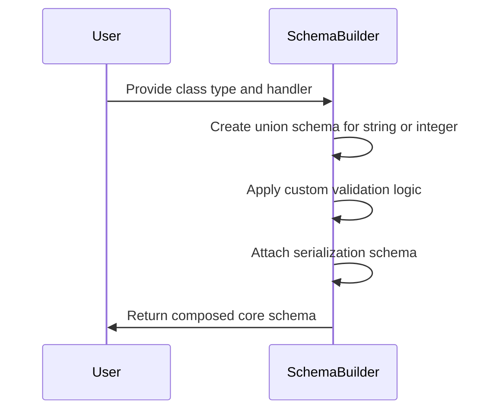

<SwmToken path="pydantic/types.py" pos="2869:1:1" line-data="    get_pydantic_core_schema: Callable[[Any, GetCoreSchemaHandler], CoreSchema] | None = None">`get_pydantic_core_schema`</SwmToken> creates a core schema that validates input as either a regex-matching string or a non-negative integer, applies custom validation logic, and defines serialization to produce a non-negative integer output. The main steps are:

- Build a union schema for the possible input types
- Wrap the union with custom validation
- Attach serialization rules
- Return the composed schema



# Spec

## Detailed View of the Program's Functionality

a. Building the Core Schema with Validation and Serialization

The process begins by constructing a schema that can accept two different types of input: a string that matches a specific regular expression (for byte size strings like <SwmToken path="pydantic/types.py" pos="2027:31:31" line-data="    &quot;&quot;&quot;Converts a string representing a number of bytes with units (such as `&#39;1KB&#39;` or `&#39;11.5MiB&#39;`) into an integer.">`1KB`</SwmToken>, <SwmToken path="pydantic/types.py" pos="2027:39:41" line-data="    &quot;&quot;&quot;Converts a string representing a number of bytes with units (such as `&#39;1KB&#39;` or `&#39;11.5MiB&#39;`) into an integer.">`11.5MiB`</SwmToken>, etc.) or a non-negative integer (for raw byte counts). This is achieved by creating a "union schema" that lists both possibilities as valid input types. The union schema is then wrapped with a custom validation function and a custom serialization function. The custom validator is responsible for parsing and converting the input into the correct internal representation, while the serializer ensures that the output is always a non-negative integer when serializing the value. This setup allows the type to flexibly accept either a string or an integer as input, but always produce a consistent, validated output.

b. Combining Multiple Schema Choices

When generating a JSON schema for a union type (such as the one described above), the system iterates through each possible schema choice in the union. For each choice, it determines whether the choice is valid for JSON schema generation. If it is, it generates the JSON schema for that choice; if not, it either skips the choice or emits a warning. All valid schemas are collected. If there is only one valid schema, it is returned directly. If there are multiple valid schemas, they are combined into a single <SwmToken path="pydantic/types.py" pos="1164:6:6" line-data="        field_schema.pop(&#39;anyOf&#39;, None)  # remove the bytes/str union">`anyOf`</SwmToken> schema, which allows any of the listed schemas as valid input. This process ensures that the JSON schema accurately reflects all the possible input types that the union can accept.

c. Generating JSON Schema for Each Choice

For each schema choice, the system checks if the schema is a reference to an existing definition. If it is, it returns a JSON schema reference to that definition. If not, it generates the base JSON schema for the core schema type (such as string, integer, etc.). After generating the base schema, it checks if there is any metadata specifying updates or extra information to be added to the schema. If so, it applies these updates and extras. Next, it applies any modification functions specified in the metadata, which can further tweak the schema. Then, it applies any annotation functions from the metadata, which can add annotations or further modifications. Finally, it ensures that any necessary schema definitions are populated, and returns the final JSON schema for that choice.

d. Handler Chain and Metadata-driven Tweaks

The schema generation process is highly modular and extensible. After setting up handlers for basic updates and extras from metadata, the system wraps the handler chain with any additional functions specified in the metadata (such as js_functions and js_annotation_functions). Each function in the chain can modify the schema in some way, allowing for layered, composable customizations. This design allows the schema to be flexibly tweaked at multiple points, accommodating a wide range of custom behaviors and requirements.

e. Finalizing and Returning the JSON Schema

Once all handlers and metadata-driven tweaks have been applied, the system runs the schema through the full handler chain. If the schema is a core schema (not just a field), it applies any final definition population steps to ensure that all references and definitions are correctly set up. The finished JSON schema, with all customizations and tweaks baked in, is then returned as the output. This final schema accurately represents all the possible valid inputs for the original union type, including any custom validation and serialization logic.

# Rule Definition

| Paragraph Name                                                                                                                                                                                                                                                                                                                                                                                                                                                                                                                                                                                                                                                                                                                                                                                                                                                                                                                                                                                                                                                                                                                                                                                                                                                                                                                                                                                                                                                                                                                                                                                                                                                                                                                                                                                                                                                                              | Rule ID | Category          | Description                                                                                                                                                                                                                                                                                                                                                                                                                                                                                                                                                                                                                                                                                                                                                                                                                                                                                                                                                                       | Conditions                                                                                                                                       | Remarks                                                                                                                         |
| ------------------------------------------------------------------------------------------------------------------------------------------------------------------------------------------------------------------------------------------------------------------------------------------------------------------------------------------------------------------------------------------------------------------------------------------------------------------------------------------------------------------------------------------------------------------------------------------------------------------------------------------------------------------------------------------------------------------------------------------------------------------------------------------------------------------------------------------------------------------------------------------------------------------------------------------------------------------------------------------------------------------------------------------------------------------------------------------------------------------------------------------------------------------------------------------------------------------------------------------------------------------------------------------------------------------------------------------------------------------------------------------------------------------------------------------------------------------------------------------------------------------------------------------------------------------------------------------------------------------------------------------------------------------------------------------------------------------------------------------------------------------------------------------------------------------------------------------------------------------------------------------- | ------- | ----------------- | --------------------------------------------------------------------------------------------------------------------------------------------------------------------------------------------------------------------------------------------------------------------------------------------------------------------------------------------------------------------------------------------------------------------------------------------------------------------------------------------------------------------------------------------------------------------------------------------------------------------------------------------------------------------------------------------------------------------------------------------------------------------------------------------------------------------------------------------------------------------------------------------------------------------------------------------------------------------------------- | ------------------------------------------------------------------------------------------------------------------------------------------------ | ------------------------------------------------------------------------------------------------------------------------------- |
| The feature must accept as input a schema object representing a union of multiple possible types, provided as a dictionary with a 'choices' key. Each element in 'choices' is either a schema dictionary or a tuple of (schema dictionary, label).                                                                                                                                                                                                                                                                                                                                                                                                                                                                                                                                                                                                                                                                                                                                                                                                                                                                                                                                                                                                                                                                                                                                                                                                                                                                                                                                                                                                                                                                                                                                                                                                                                          | RL-001  | Data Assignment   | The feature must accept as input a schema object that represents a union of multiple types. The input must be a dictionary with a 'choices' key, where each element in 'choices' is either a schema dictionary or a tuple of (schema dictionary, label).                                                                                                                                                                                                                                                                                                                                                                                                                                                                                                                                                                                                                                                                                                                          | Input must be a dictionary with a 'choices' key. Each element in 'choices' must be a schema dictionary or a tuple of (schema dictionary, label). | Input format: dictionary with key 'choices'. Each element in 'choices' is either a dictionary or a tuple (dictionary, label).   |
| For each choice in 'choices', the feature must generate its corresponding JSON schema representation. If a choice cannot be represented as a valid JSON schema, it must be omitted from the output.                                                                                                                                                                                                                                                                                                                                                                                                                                                                                                                                                                                                                                                                                                                                                                                                                                                                                                                                                                                                                                                                                                                                                                                                                                                                                                                                                                                                                                                                                                                                                                                                                                                                                         | RL-002  | Computation       | For each choice in the 'choices' list, generate a JSON schema representation. If a choice cannot be represented as a valid JSON schema, omit it from the output.                                                                                                                                                                                                                                                                                                                                                                                                                                                                                                                                                                                                                                                                                                                                                                                                                  | Each choice must be processed individually. If a choice is invalid for JSON schema, it is omitted.                                               | Output format: list of JSON schema representations, omitting any invalid choices.                                               |
| The feature must support metadata-driven modifications for each schema, including: <SwmToken path="pydantic/json_schema.py" pos="507:12:12" line-data="        if js_updates := metadata.get(&#39;pydantic_js_updates&#39;):">`pydantic_js_updates`</SwmToken>, <SwmToken path="pydantic/json_schema.py" pos="518:12:12" line-data="        if js_extra := metadata.get(&#39;pydantic_js_extra&#39;):">`pydantic_js_extra`</SwmToken>, <SwmToken path="pydantic/json_schema.py" pos="534:12:12" line-data="        for js_modify_function in metadata.get(&#39;pydantic_js_functions&#39;, ()):">`pydantic_js_functions`</SwmToken>, <SwmToken path="pydantic/json_schema.py" pos="552:12:12" line-data="        for js_modify_function in metadata.get(&#39;pydantic_js_annotation_functions&#39;, ()):">`pydantic_js_annotation_functions`</SwmToken>. The order of application for metadata modifications must be: first <SwmToken path="pydantic/json_schema.py" pos="507:12:12" line-data="        if js_updates := metadata.get(&#39;pydantic_js_updates&#39;):">`pydantic_js_updates`</SwmToken>, then <SwmToken path="pydantic/json_schema.py" pos="518:12:12" line-data="        if js_extra := metadata.get(&#39;pydantic_js_extra&#39;):">`pydantic_js_extra`</SwmToken>, then each function in <SwmToken path="pydantic/json_schema.py" pos="534:12:12" line-data="        for js_modify_function in metadata.get(&#39;pydantic_js_functions&#39;, ()):">`pydantic_js_functions`</SwmToken> in order, then each function in <SwmToken path="pydantic/json_schema.py" pos="552:12:12" line-data="        for js_modify_function in metadata.get(&#39;pydantic_js_annotation_functions&#39;, ()):">`pydantic_js_annotation_functions`</SwmToken> in order. If multiple metadata modifications set the same key in the schema, the last-applied modification must take precedence. | RL-003  | Conditional Logic | For each schema, apply metadata-driven modifications in the following order: 1) <SwmToken path="pydantic/json_schema.py" pos="507:12:12" line-data="        if js_updates := metadata.get(&#39;pydantic_js_updates&#39;):">`pydantic_js_updates`</SwmToken>, 2) <SwmToken path="pydantic/json_schema.py" pos="518:12:12" line-data="        if js_extra := metadata.get(&#39;pydantic_js_extra&#39;):">`pydantic_js_extra`</SwmToken>, 3) each function in <SwmToken path="pydantic/json_schema.py" pos="534:12:12" line-data="        for js_modify_function in metadata.get(&#39;pydantic_js_functions&#39;, ()):">`pydantic_js_functions`</SwmToken> in order, 4) each function in <SwmToken path="pydantic/json_schema.py" pos="552:12:12" line-data="        for js_modify_function in metadata.get(&#39;pydantic_js_annotation_functions&#39;, ()):">`pydantic_js_annotation_functions`</SwmToken> in order. If multiple modifications set the same key, the last one wins. | Metadata modifications are present in the schema's 'metadata' dictionary. Modifications are applied in the specified order.                      | Order: updates → extra → js_functions → js_annotation_functions. If the same key is set multiple times, the last value is used. |
| If only one valid schema remains after filtering, the output must be that schema directly, not wrapped in an <SwmToken path="pydantic/types.py" pos="1164:6:6" line-data="        field_schema.pop(&#39;anyOf&#39;, None)  # remove the bytes/str union">`anyOf`</SwmToken>. If multiple valid schemas remain, the output must be a JSON schema dictionary with an <SwmToken path="pydantic/types.py" pos="1164:6:6" line-data="        field_schema.pop(&#39;anyOf&#39;, None)  # remove the bytes/str union">`anyOf`</SwmToken> key, whose value is a list of the generated schemas, in the same order as the original 'choices' list (unless flattening is required to merge nested <SwmToken path="pydantic/types.py" pos="1164:6:6" line-data="        field_schema.pop(&#39;anyOf&#39;, None)  # remove the bytes/str union">`anyOf`</SwmToken>s'). If all choices are invalid for JSON schema, the output must be an empty schema dictionary.                                                                                                                                                                                                                                                                                                                                                                                                                                                                                                                                                                                                                                                                                                                                                                                                                                                                                                                                        | RL-004  | Conditional Logic | After generating schemas for all valid choices, construct the output as follows: if only one valid schema remains, output it directly; if multiple, output a dictionary with <SwmToken path="pydantic/types.py" pos="1164:6:6" line-data="        field_schema.pop(&#39;anyOf&#39;, None)  # remove the bytes/str union">`anyOf`</SwmToken> containing the schemas in order; if none, output an empty schema dictionary.                                                                                                                                                                                                                                                                                                                                                                                                                                                                                                                                                          | Number of valid schemas after filtering determines output format.                                                                                | Output format:                                                                                                                  |

- Single valid schema: output that schema directly
- Multiple valid schemas: output {<SwmToken path="pydantic/types.py" pos="1164:6:6" line-data="        field_schema.pop(&#39;anyOf&#39;, None)  # remove the bytes/str union">`anyOf`</SwmToken>: \[schemas...\]}, preserving order
- No valid schemas: output {} (empty dictionary)
- If flattening is required, nested <SwmToken path="pydantic/types.py" pos="1164:6:6" line-data="        field_schema.pop(&#39;anyOf&#39;, None)  # remove the bytes/str union">`anyOf`</SwmToken>s are merged into a single list | | The feature must preserve the order of the original 'choices' in the output <SwmToken path="pydantic/types.py" pos="1164:6:6" line-data="        field_schema.pop(&#39;anyOf&#39;, None)  # remove the bytes/str union">`anyOf`</SwmToken> array, unless flattening merges nested <SwmToken path="pydantic/types.py" pos="1164:6:6" line-data="        field_schema.pop(&#39;anyOf&#39;, None)  # remove the bytes/str union">`anyOf`</SwmToken>s. | RL-005 | Data Assignment | The order of the original 'choices' must be preserved in the output <SwmToken path="pydantic/types.py" pos="1164:6:6" line-data="        field_schema.pop(&#39;anyOf&#39;, None)  # remove the bytes/str union">`anyOf`</SwmToken> array, unless flattening is required to merge nested <SwmToken path="pydantic/types.py" pos="1164:6:6" line-data="        field_schema.pop(&#39;anyOf&#39;, None)  # remove the bytes/str union">`anyOf`</SwmToken>s. | Multiple valid schemas remain after filtering. Flattening may merge nested <SwmToken path="pydantic/types.py" pos="1164:6:6" line-data="        field_schema.pop(&#39;anyOf&#39;, None)  # remove the bytes/str union">`anyOf`</SwmToken>s. | Order of 'choices' in input is preserved in output <SwmToken path="pydantic/types.py" pos="1164:6:6" line-data="        field_schema.pop(&#39;anyOf&#39;, None)  # remove the bytes/str union">`anyOf`</SwmToken>, unless flattening merges nested <SwmToken path="pydantic/types.py" pos="1164:6:6" line-data="        field_schema.pop(&#39;anyOf&#39;, None)  # remove the bytes/str union">`anyOf`</SwmToken>s. | | The feature must support custom error type and error message metadata (<SwmToken path="pydantic/types.py" pos="917:27:29" line-data="        Attributes of modules may be separated from the module by `:` or `.`, e.g. if `&#39;math:cos&#39;` is provided,">`e.g`</SwmToken>., <SwmToken path="pydantic/types.py" pos="2105:1:1" line-data="                custom_error_type=&#39;byte_size&#39;,">`custom_error_type`</SwmToken>, <SwmToken path="pydantic/types.py" pos="2106:1:1" line-data="                custom_error_message=&#39;could not parse value and unit from byte string&#39;,">`custom_error_message`</SwmToken>), but these do not appear in the output JSON schema. | RL-006 | Data Assignment | Custom error type and error message metadata may be present in the schema's metadata, but must not appear in the output JSON schema. | <SwmToken path="pydantic/types.py" pos="2105:1:1" line-data="                custom_error_type=&#39;byte_size&#39;,">`custom_error_type`</SwmToken> or <SwmToken path="pydantic/types.py" pos="2106:1:1" line-data="                custom_error_message=&#39;could not parse value and unit from byte string&#39;,">`custom_error_message`</SwmToken> present in metadata. | These metadata fields are used for error handling but are not included in the output JSON schema. | | The output JSON schema must be a dictionary that is <SwmToken path="pydantic/json_schema.py" pos="2247:16:18" line-data="        &quot;&quot;&quot;Encode a default value to a JSON-serializable value.">`JSON-serializable`</SwmToken> and conforms to the JSON Schema specification. | RL-007 | Conditional Logic | The output JSON schema must be a dictionary, <SwmToken path="pydantic/json_schema.py" pos="2247:16:18" line-data="        &quot;&quot;&quot;Encode a default value to a JSON-serializable value.">`JSON-serializable`</SwmToken>, and conform to the JSON Schema specification. | Output is generated for the union schema feature. | Output format: dictionary, <SwmToken path="pydantic/json_schema.py" pos="2247:16:18" line-data="        &quot;&quot;&quot;Encode a default value to a JSON-serializable value.">`JSON-serializable`</SwmToken>, valid according to JSON Schema specification. | | Example input: a union schema with a string pattern and a non-negative integer as choices. Example output: a JSON schema with <SwmToken path="pydantic/types.py" pos="1164:6:6" line-data="        field_schema.pop(&#39;anyOf&#39;, None)  # remove the bytes/str union">`anyOf`</SwmToken> containing a string schema with a pattern and an integer schema with a minimum value of 0. | RL-008 | Data Assignment | Given an example input of a union schema with a string pattern and a non-negative integer, the output should be a JSON schema with <SwmToken path="pydantic/types.py" pos="1164:6:6" line-data="        field_schema.pop(&#39;anyOf&#39;, None)  # remove the bytes/str union">`anyOf`</SwmToken> containing the appropriate string and integer schemas. | Input matches the example provided in the spec. | Example input: {'choices': \[{'type': 'string', 'pattern': '^\[a-z\]+$'}, {'type': 'integer', 'minimum': 0}\]} Example output: {<SwmToken path="pydantic/types.py" pos="1164:6:6" line-data="        field_schema.pop(&#39;anyOf&#39;, None)  # remove the bytes/str union">`anyOf`</SwmToken>: \[{'type': 'string', 'pattern': '^\[a-z\]+$'}, {'type': 'integer', 'minimum': 0}\]} | | If a choice cannot be represented as a valid JSON schema, it must be omitted from the output. | RL-009 | Conditional Logic | Any choice that cannot be represented as a valid JSON schema must be omitted from the output. | A choice is invalid for JSON schema generation. | Invalid choices are omitted from the output list of schemas. |

# User Stories

## User Story 1: Define and process union schemas with choices and metadata

---

### Story Description:

As a user of the schema system, I want to define a union of multiple possible types using a 'choices' key, where each choice can include metadata for customization, so that I can flexibly describe complex data structures and control their JSON schema representation.

---

### Business Rule Mapping:

| Rule ID | Paragraph Name                                                                                                                                                                                                                                                                                                                                                                                                                                                                                                                                                                                                                                                                                                                                                                                                                                                                                                                                                                                                                                                                                                                                                                                                                                                                                                                                                                                                                                                                                                                                                                                                                                                                                                                                                                                                                                                                              | Rule Description                                                                                                                                                                                                                                                                                                                                                                                                                                                                                                                                                                                                                                                                                                                                                                                                                                                                                                                                                                  |
| ------- | ------------------------------------------------------------------------------------------------------------------------------------------------------------------------------------------------------------------------------------------------------------------------------------------------------------------------------------------------------------------------------------------------------------------------------------------------------------------------------------------------------------------------------------------------------------------------------------------------------------------------------------------------------------------------------------------------------------------------------------------------------------------------------------------------------------------------------------------------------------------------------------------------------------------------------------------------------------------------------------------------------------------------------------------------------------------------------------------------------------------------------------------------------------------------------------------------------------------------------------------------------------------------------------------------------------------------------------------------------------------------------------------------------------------------------------------------------------------------------------------------------------------------------------------------------------------------------------------------------------------------------------------------------------------------------------------------------------------------------------------------------------------------------------------------------------------------------------------------------------------------------------------- | --------------------------------------------------------------------------------------------------------------------------------------------------------------------------------------------------------------------------------------------------------------------------------------------------------------------------------------------------------------------------------------------------------------------------------------------------------------------------------------------------------------------------------------------------------------------------------------------------------------------------------------------------------------------------------------------------------------------------------------------------------------------------------------------------------------------------------------------------------------------------------------------------------------------------------------------------------------------------------- |
| RL-001  | The feature must accept as input a schema object representing a union of multiple possible types, provided as a dictionary with a 'choices' key. Each element in 'choices' is either a schema dictionary or a tuple of (schema dictionary, label).                                                                                                                                                                                                                                                                                                                                                                                                                                                                                                                                                                                                                                                                                                                                                                                                                                                                                                                                                                                                                                                                                                                                                                                                                                                                                                                                                                                                                                                                                                                                                                                                                                          | The feature must accept as input a schema object that represents a union of multiple types. The input must be a dictionary with a 'choices' key, where each element in 'choices' is either a schema dictionary or a tuple of (schema dictionary, label).                                                                                                                                                                                                                                                                                                                                                                                                                                                                                                                                                                                                                                                                                                                          |
| RL-002  | For each choice in 'choices', the feature must generate its corresponding JSON schema representation. If a choice cannot be represented as a valid JSON schema, it must be omitted from the output.                                                                                                                                                                                                                                                                                                                                                                                                                                                                                                                                                                                                                                                                                                                                                                                                                                                                                                                                                                                                                                                                                                                                                                                                                                                                                                                                                                                                                                                                                                                                                                                                                                                                                         | For each choice in the 'choices' list, generate a JSON schema representation. If a choice cannot be represented as a valid JSON schema, omit it from the output.                                                                                                                                                                                                                                                                                                                                                                                                                                                                                                                                                                                                                                                                                                                                                                                                                  |
| RL-003  | The feature must support metadata-driven modifications for each schema, including: <SwmToken path="pydantic/json_schema.py" pos="507:12:12" line-data="        if js_updates := metadata.get(&#39;pydantic_js_updates&#39;):">`pydantic_js_updates`</SwmToken>, <SwmToken path="pydantic/json_schema.py" pos="518:12:12" line-data="        if js_extra := metadata.get(&#39;pydantic_js_extra&#39;):">`pydantic_js_extra`</SwmToken>, <SwmToken path="pydantic/json_schema.py" pos="534:12:12" line-data="        for js_modify_function in metadata.get(&#39;pydantic_js_functions&#39;, ()):">`pydantic_js_functions`</SwmToken>, <SwmToken path="pydantic/json_schema.py" pos="552:12:12" line-data="        for js_modify_function in metadata.get(&#39;pydantic_js_annotation_functions&#39;, ()):">`pydantic_js_annotation_functions`</SwmToken>. The order of application for metadata modifications must be: first <SwmToken path="pydantic/json_schema.py" pos="507:12:12" line-data="        if js_updates := metadata.get(&#39;pydantic_js_updates&#39;):">`pydantic_js_updates`</SwmToken>, then <SwmToken path="pydantic/json_schema.py" pos="518:12:12" line-data="        if js_extra := metadata.get(&#39;pydantic_js_extra&#39;):">`pydantic_js_extra`</SwmToken>, then each function in <SwmToken path="pydantic/json_schema.py" pos="534:12:12" line-data="        for js_modify_function in metadata.get(&#39;pydantic_js_functions&#39;, ()):">`pydantic_js_functions`</SwmToken> in order, then each function in <SwmToken path="pydantic/json_schema.py" pos="552:12:12" line-data="        for js_modify_function in metadata.get(&#39;pydantic_js_annotation_functions&#39;, ()):">`pydantic_js_annotation_functions`</SwmToken> in order. If multiple metadata modifications set the same key in the schema, the last-applied modification must take precedence. | For each schema, apply metadata-driven modifications in the following order: 1) <SwmToken path="pydantic/json_schema.py" pos="507:12:12" line-data="        if js_updates := metadata.get(&#39;pydantic_js_updates&#39;):">`pydantic_js_updates`</SwmToken>, 2) <SwmToken path="pydantic/json_schema.py" pos="518:12:12" line-data="        if js_extra := metadata.get(&#39;pydantic_js_extra&#39;):">`pydantic_js_extra`</SwmToken>, 3) each function in <SwmToken path="pydantic/json_schema.py" pos="534:12:12" line-data="        for js_modify_function in metadata.get(&#39;pydantic_js_functions&#39;, ()):">`pydantic_js_functions`</SwmToken> in order, 4) each function in <SwmToken path="pydantic/json_schema.py" pos="552:12:12" line-data="        for js_modify_function in metadata.get(&#39;pydantic_js_annotation_functions&#39;, ()):">`pydantic_js_annotation_functions`</SwmToken> in order. If multiple modifications set the same key, the last one wins. |
| RL-004  | If only one valid schema remains after filtering, the output must be that schema directly, not wrapped in an <SwmToken path="pydantic/types.py" pos="1164:6:6" line-data="        field_schema.pop(&#39;anyOf&#39;, None)  # remove the bytes/str union">`anyOf`</SwmToken>. If multiple valid schemas remain, the output must be a JSON schema dictionary with an <SwmToken path="pydantic/types.py" pos="1164:6:6" line-data="        field_schema.pop(&#39;anyOf&#39;, None)  # remove the bytes/str union">`anyOf`</SwmToken> key, whose value is a list of the generated schemas, in the same order as the original 'choices' list (unless flattening is required to merge nested <SwmToken path="pydantic/types.py" pos="1164:6:6" line-data="        field_schema.pop(&#39;anyOf&#39;, None)  # remove the bytes/str union">`anyOf`</SwmToken>s'). If all choices are invalid for JSON schema, the output must be an empty schema dictionary.                                                                                                                                                                                                                                                                                                                                                                                                                                                                                                                                                                                                                                                                                                                                                                                                                                                                                                                                        | After generating schemas for all valid choices, construct the output as follows: if only one valid schema remains, output it directly; if multiple, output a dictionary with <SwmToken path="pydantic/types.py" pos="1164:6:6" line-data="        field_schema.pop(&#39;anyOf&#39;, None)  # remove the bytes/str union">`anyOf`</SwmToken> containing the schemas in order; if none, output an empty schema dictionary.                                                                                                                                                                                                                                                                                                                                                                                                                                                                                                                                                          |
| RL-005  | The feature must preserve the order of the original 'choices' in the output <SwmToken path="pydantic/types.py" pos="1164:6:6" line-data="        field_schema.pop(&#39;anyOf&#39;, None)  # remove the bytes/str union">`anyOf`</SwmToken> array, unless flattening merges nested <SwmToken path="pydantic/types.py" pos="1164:6:6" line-data="        field_schema.pop(&#39;anyOf&#39;, None)  # remove the bytes/str union">`anyOf`</SwmToken>s.                                                                                                                                                                                                                                                                                                                                                                                                                                                                                                                                                                                                                                                                                                                                                                                                                                                                                                                                                                                                                                                                                                                                                                                                                                                                                                                                                                                                                                          | The order of the original 'choices' must be preserved in the output <SwmToken path="pydantic/types.py" pos="1164:6:6" line-data="        field_schema.pop(&#39;anyOf&#39;, None)  # remove the bytes/str union">`anyOf`</SwmToken> array, unless flattening is required to merge nested <SwmToken path="pydantic/types.py" pos="1164:6:6" line-data="        field_schema.pop(&#39;anyOf&#39;, None)  # remove the bytes/str union">`anyOf`</SwmToken>s.                                                                                                                                                                                                                                                                                                                                                                                                                                                                                                                          |
| RL-006  | The feature must support custom error type and error message metadata (<SwmToken path="pydantic/types.py" pos="917:27:29" line-data="        Attributes of modules may be separated from the module by `:` or `.`, e.g. if `&#39;math:cos&#39;` is provided,">`e.g`</SwmToken>., <SwmToken path="pydantic/types.py" pos="2105:1:1" line-data="                custom_error_type=&#39;byte_size&#39;,">`custom_error_type`</SwmToken>, <SwmToken path="pydantic/types.py" pos="2106:1:1" line-data="                custom_error_message=&#39;could not parse value and unit from byte string&#39;,">`custom_error_message`</SwmToken>), but these do not appear in the output JSON schema.                                                                                                                                                                                                                                                                                                                                                                                                                                                                                                                                                                                                                                                                                                                                                                                                                                                                                                                                                                                                                                                                                                                                                                                                  | Custom error type and error message metadata may be present in the schema's metadata, but must not appear in the output JSON schema.                                                                                                                                                                                                                                                                                                                                                                                                                                                                                                                                                                                                                                                                                                                                                                                                                                              |
| RL-007  | The output JSON schema must be a dictionary that is <SwmToken path="pydantic/json_schema.py" pos="2247:16:18" line-data="        &quot;&quot;&quot;Encode a default value to a JSON-serializable value.">`JSON-serializable`</SwmToken> and conforms to the JSON Schema specification.                                                                                                                                                                                                                                                                                                                                                                                                                                                                                                                                                                                                                                                                                                                                                                                                                                                                                                                                                                                                                                                                                                                                                                                                                                                                                                                                                                                                                                                                                                                                                                                                      | The output JSON schema must be a dictionary, <SwmToken path="pydantic/json_schema.py" pos="2247:16:18" line-data="        &quot;&quot;&quot;Encode a default value to a JSON-serializable value.">`JSON-serializable`</SwmToken>, and conform to the JSON Schema specification.                                                                                                                                                                                                                                                                                                                                                                                                                                                                                                                                                                                                                                                                                                   |
| RL-008  | Example input: a union schema with a string pattern and a non-negative integer as choices. Example output: a JSON schema with <SwmToken path="pydantic/types.py" pos="1164:6:6" line-data="        field_schema.pop(&#39;anyOf&#39;, None)  # remove the bytes/str union">`anyOf`</SwmToken> containing a string schema with a pattern and an integer schema with a minimum value of 0.                                                                                                                                                                                                                                                                                                                                                                                                                                                                                                                                                                                                                                                                                                                                                                                                                                                                                                                                                                                                                                                                                                                                                                                                                                                                                                                                                                                                                                                                                                     | Given an example input of a union schema with a string pattern and a non-negative integer, the output should be a JSON schema with <SwmToken path="pydantic/types.py" pos="1164:6:6" line-data="        field_schema.pop(&#39;anyOf&#39;, None)  # remove the bytes/str union">`anyOf`</SwmToken> containing the appropriate string and integer schemas.                                                                                                                                                                                                                                                                                                                                                                                                                                                                                                                                                                                                                          |
| RL-009  | If a choice cannot be represented as a valid JSON schema, it must be omitted from the output.                                                                                                                                                                                                                                                                                                                                                                                                                                                                                                                                                                                                                                                                                                                                                                                                                                                                                                                                                                                                                                                                                                                                                                                                                                                                                                                                                                                                                                                                                                                                                                                                                                                                                                                                                                                               | Any choice that cannot be represented as a valid JSON schema must be omitted from the output.                                                                                                                                                                                                                                                                                                                                                                                                                                                                                                                                                                                                                                                                                                                                                                                                                                                                                     |

---

### Relevant Functionality:

- **The feature must accept as input a schema object representing a union of multiple possible types**
  1. **RL-001:**
     - Receive input schema object
     - Check for 'choices' key
     - For each element in 'choices':
       - Validate that it is a schema dictionary or a tuple (schema dictionary, label)
- **For each choice in 'choices'**
  1. **RL-002:**
     - For each choice in 'choices':
       - Attempt to generate JSON schema
       - If generation fails or is invalid, omit this choice from the output list
- **The feature must support metadata-driven modifications for each schema**
  1. **RL-003:**
     - For each schema:
       - If <SwmToken path="pydantic/json_schema.py" pos="507:12:12" line-data="        if js_updates := metadata.get(&#39;pydantic_js_updates&#39;):">`pydantic_js_updates`</SwmToken> present, merge into schema
       - If <SwmToken path="pydantic/json_schema.py" pos="518:12:12" line-data="        if js_extra := metadata.get(&#39;pydantic_js_extra&#39;):">`pydantic_js_extra`</SwmToken> present, merge or call as appropriate
       - For each function in <SwmToken path="pydantic/json_schema.py" pos="534:12:12" line-data="        for js_modify_function in metadata.get(&#39;pydantic_js_functions&#39;, ()):">`pydantic_js_functions`</SwmToken>, apply in order
       - For each function in <SwmToken path="pydantic/json_schema.py" pos="552:12:12" line-data="        for js_modify_function in metadata.get(&#39;pydantic_js_annotation_functions&#39;, ()):">`pydantic_js_annotation_functions`</SwmToken>, apply in order
       - If the same key is set by multiple modifications, the last one takes precedence
- **If only one valid schema remains after filtering**
  1. **RL-004:**
     - After filtering invalid schemas:
       - If no valid schemas: return {}
       - If one valid schema: return that schema
       - If multiple valid schemas: return {<SwmToken path="pydantic/types.py" pos="1164:6:6" line-data="        field_schema.pop(&#39;anyOf&#39;, None)  # remove the bytes/str union">`anyOf`</SwmToken>: \[schemas in order\]}, flattening nested <SwmToken path="pydantic/types.py" pos="1164:6:6" line-data="        field_schema.pop(&#39;anyOf&#39;, None)  # remove the bytes/str union">`anyOf`</SwmToken>s if needed
- **The feature must preserve the order of the original 'choices' in the output** <SwmToken path="pydantic/types.py" pos="1164:6:6" line-data="        field_schema.pop(&#39;anyOf&#39;, None)  # remove the bytes/str union">`anyOf`</SwmToken> **array**
  1. **RL-005:**
     - When constructing <SwmToken path="pydantic/types.py" pos="1164:6:6" line-data="        field_schema.pop(&#39;anyOf&#39;, None)  # remove the bytes/str union">`anyOf`</SwmToken>:
       - Add schemas to the list in the same order as original 'choices'
       - If flattening, merge nested <SwmToken path="pydantic/types.py" pos="1164:6:6" line-data="        field_schema.pop(&#39;anyOf&#39;, None)  # remove the bytes/str union">`anyOf`</SwmToken>s into a single list, preserving order as much as possible
- **The feature must support custom error type and error message metadata (**<SwmToken path="pydantic/types.py" pos="917:27:29" line-data="        Attributes of modules may be separated from the module by `:` or `.`, e.g. if `&#39;math:cos&#39;` is provided,">`e.g`</SwmToken>**.**
  1. **RL-006:**
     - If <SwmToken path="pydantic/types.py" pos="2105:1:1" line-data="                custom_error_type=&#39;byte_size&#39;,">`custom_error_type`</SwmToken> or <SwmToken path="pydantic/types.py" pos="2106:1:1" line-data="                custom_error_message=&#39;could not parse value and unit from byte string&#39;,">`custom_error_message`</SwmToken> present in metadata:
       - Use them for error handling as needed
       - Do not include them in the output JSON schema
- **The output JSON schema must be a dictionary that is** <SwmToken path="pydantic/json_schema.py" pos="2247:16:18" line-data="        &quot;&quot;&quot;Encode a default value to a JSON-serializable value.">`JSON-serializable`</SwmToken> **and conforms to the JSON Schema specification.**
  1. **RL-007:**
     - Ensure output is a dictionary
     - Ensure output is <SwmToken path="pydantic/json_schema.py" pos="2247:16:18" line-data="        &quot;&quot;&quot;Encode a default value to a JSON-serializable value.">`JSON-serializable`</SwmToken>
     - Ensure output conforms to JSON Schema specification
- **Example input: a union schema with a string pattern and a non-negative integer as choices. Example output: a JSON schema with** <SwmToken path="pydantic/types.py" pos="1164:6:6" line-data="        field_schema.pop(&#39;anyOf&#39;, None)  # remove the bytes/str union">`anyOf`</SwmToken> **containing a string schema with a pattern and an integer schema with a minimum value of 0.**
  1. **RL-008:**
     - Receive example input
     - Generate JSON schema for each choice
     - Output {<SwmToken path="pydantic/types.py" pos="1164:6:6" line-data="        field_schema.pop(&#39;anyOf&#39;, None)  # remove the bytes/str union">`anyOf`</SwmToken>: \[string schema, integer schema\]}
- **If a choice cannot be represented as a valid JSON schema**
  1. **RL-009:**
     - For each choice:
       - Attempt to generate JSON schema
       - If invalid, do not include in output

# Code Walkthrough

## Building the Core Schema with Validation and Serialization

<SwmSnippet path="/pydantic/types.py" line="2097">

---

<SwmToken path="pydantic/types.py" pos="2097:3:3" line-data="    def __get_pydantic_core_schema__(cls, source: type[Any], handler: GetCoreSchemaHandler) -&gt; core_schema.CoreSchema:">`__get_pydantic_core_schema__`</SwmToken> starts by building a union schema to accept either a regex-matching string or a non-negative integer, then wraps it with custom validation and serialization. Calling <SwmToken path="pydantic/types.py" pos="2100:5:5" line-data="            schema=core_schema.union_schema(">`union_schema`</SwmToken> is what lets us handle both input types up front.

```python
    def __get_pydantic_core_schema__(cls, source: type[Any], handler: GetCoreSchemaHandler) -> core_schema.CoreSchema:
        return core_schema.with_info_after_validator_function(
            function=cls._validate,
            schema=core_schema.union_schema(
                [
                    core_schema.str_schema(pattern=cls.byte_string_pattern),
                    core_schema.int_schema(ge=0),
                ],
                custom_error_type='byte_size',
                custom_error_message='could not parse value and unit from byte string',
            ),
            serialization=core_schema.plain_serializer_function_ser_schema(
                int, return_schema=core_schema.int_schema(ge=0)
            ),
        )
```

---

</SwmSnippet>

## Combining Multiple Schema Choices

```mermaid
%%{init: {"flowchart": {"defaultRenderer": "elk"}} }%%
flowchart TD
    node1["Start: Generate union schema for possible choices"]
    click node1 openCode "pydantic/json_schema.py:1241:1264"
    
    subgraph loop1["For each possible schema choice in 'choices'"]
        node1 --> node2{"Is choice valid for JSON schema?"}
        click node2 openCode "pydantic/json_schema.py:1253:1262"
        node2 -->|"Yes"| node3["Generate schema for choice (generate_inner)"]
        click node3 openCode "pydantic/json_schema.py:1257:1257"
        node2 -->|"No"| node4["Skip or warn (emit_warning)"]
        click node4 openCode "pydantic/json_schema.py:1258:1261"
        node3 --> node5["Next choice"]
        node4 --> node5
    end
    node5 --> node6{"How many valid schemas in 'generated'?"}
    click node6 openCode "pydantic/json_schema.py:1262:1264"
    node6 -->|"One"| node7["Return single schema"]
    click node7 openCode "pydantic/json_schema.py:1263:1263"
    node6 -->|"Multiple"| node8["Return union schema (anyOf, flattened) (get_flattened_anyof)"]
    click node8 openCode "pydantic/json_schema.py:1264:1264"

%% Swimm:
%% %%{init: {"flowchart": {"defaultRenderer": "elk"}} }%%
%% flowchart TD
%%     node1["Start: Generate union schema for possible choices"]
%%     click node1 openCode "<SwmPath>[pydantic/json_schema.py](pydantic/json_schema.py)</SwmPath>:1241:1264"
%%     
%%     subgraph loop1["For each possible schema choice in 'choices'"]
%%         node1 --> node2{"Is choice valid for JSON schema?"}
%%         click node2 openCode "<SwmPath>[pydantic/json_schema.py](pydantic/json_schema.py)</SwmPath>:1253:1262"
%%         node2 -->|"Yes"| node3["Generate schema for choice (<SwmToken path="pydantic/json_schema.py" pos="427:3:3" line-data="    def generate_inner(self, schema: CoreSchemaOrField) -&gt; JsonSchemaValue:  # noqa: C901">`generate_inner`</SwmToken>)"]
%%         click node3 openCode "<SwmPath>[pydantic/json_schema.py](pydantic/json_schema.py)</SwmPath>:1257:1257"
%%         node2 -->|"No"| node4["Skip or warn (<SwmToken path="pydantic/json_schema.py" pos="1261:3:3" line-data="                self.emit_warning(&#39;skipped-choice&#39;, exc.message)">`emit_warning`</SwmToken>)"]
%%         click node4 openCode "<SwmPath>[pydantic/json_schema.py](pydantic/json_schema.py)</SwmPath>:1258:1261"
%%         node3 --> node5["Next choice"]
%%         node4 --> node5
%%     end
%%     node5 --> node6{"How many valid schemas in 'generated'?"}
%%     click node6 openCode "<SwmPath>[pydantic/json_schema.py](pydantic/json_schema.py)</SwmPath>:1262:1264"
%%     node6 -->|"One"| node7["Return single schema"]
%%     click node7 openCode "<SwmPath>[pydantic/json_schema.py](pydantic/json_schema.py)</SwmPath>:1263:1263"
%%     node6 -->|"Multiple"| node8["Return union schema (<SwmToken path="pydantic/types.py" pos="1164:6:6" line-data="        field_schema.pop(&#39;anyOf&#39;, None)  # remove the bytes/str union">`anyOf`</SwmToken>, flattened) (<SwmToken path="pydantic/json_schema.py" pos="491:7:7" line-data="                    json_schema = self.get_flattened_anyof([{&#39;type&#39;: &#39;null&#39;}, json_schema])">`get_flattened_anyof`</SwmToken>)"]
%%     click node8 openCode "<SwmPath>[pydantic/json_schema.py](pydantic/json_schema.py)</SwmPath>:1264:1264"
```



<SwmSnippet path="/pydantic/json_schema.py" line="1241">

---

<SwmToken path="pydantic/json_schema.py" pos="1241:3:3" line-data="    def union_schema(self, schema: core_schema.UnionSchema) -&gt; JsonSchemaValue:">`union_schema`</SwmToken> takes over by iterating through each schema option in the union, handling both plain schemas and labeled tuples. For each, it calls <SwmToken path="pydantic/json_schema.py" pos="1257:7:7" line-data="                generated.append(self.generate_inner(choice_schema))">`generate_inner`</SwmToken> to turn it into a JSON schema. This is needed because each choice could be a different type, and we want to represent all of them. If there's only one schema, it returns that; otherwise, it combines them using <SwmToken path="pydantic/json_schema.py" pos="1264:5:5" line-data="        return self.get_flattened_anyof(generated)">`get_flattened_anyof`</SwmToken>. Calling <SwmToken path="pydantic/json_schema.py" pos="1257:7:7" line-data="                generated.append(self.generate_inner(choice_schema))">`generate_inner`</SwmToken> here is what actually produces the JSON schema for each possible input type.

```python
    def union_schema(self, schema: core_schema.UnionSchema) -> JsonSchemaValue:
        """Generates a JSON schema that matches a schema that allows values matching any of the given schemas.

        Args:
            schema: The core schema.

        Returns:
            The generated JSON schema.
        """
        generated: list[JsonSchemaValue] = []

        choices = schema['choices']
        for choice in choices:
            # choice will be a tuple if an explicit label was provided
            choice_schema = choice[0] if isinstance(choice, tuple) else choice
            try:
                generated.append(self.generate_inner(choice_schema))
            except PydanticOmit:
                continue
            except PydanticInvalidForJsonSchema as exc:
                self.emit_warning('skipped-choice', exc.message)
        if len(generated) == 1:
            return generated[0]
        return self.get_flattened_anyof(generated)
```

---

</SwmSnippet>

## Generating JSON Schema for Each Choice

```mermaid
%%{init: {"flowchart": {"defaultRenderer": "elk"}} }%%
flowchart TD
    node1["Is schema a reference to an existing definition?"]
    click node1 openCode "pydantic/json_schema.py:443:447"
    node1 -- Yes --> node2["Return JSON schema reference"]
    click node2 openCode "pydantic/json_schema.py:447:447"
    node1 -- No --> node3["Generate base JSON schema for the core schema"]
    click node3 openCode "pydantic/json_schema.py:463:500"
    node3 --> node4{"Does metadata specify updates or extras?"}
    click node4 openCode "pydantic/json_schema.py:507:532"
    node4 -- Yes --> node5["Apply updates and extras from metadata"]
    click node5 openCode "pydantic/json_schema.py:507:532"
    node4 -- No --> node6["Continue"]
    node5 --> node6
    node6 --> loop1
    subgraph loop1[For each function in metadata["pydantic_js_functions"]]
      node7["Apply modification function to JSON schema"]
      click node7 openCode "pydantic/json_schema.py:534:550"
    end
    loop1 --> loop2
    subgraph loop2[For each function in metadata["pydantic_js_annotation_functions"]]
      node8["Apply annotation function to JSON schema"]
      click node8 openCode "pydantic/json_schema.py:552:561"
    end
    loop2 --> node9["Populate schema definitions if needed"]
    click node9 openCode "pydantic/json_schema.py:564:565"
    node9 --> node10["Return the final JSON schema"]
    click node10 openCode "pydantic/json_schema.py:566:566"

%% Swimm:
%% %%{init: {"flowchart": {"defaultRenderer": "elk"}} }%%
%% flowchart TD
%%     node1["Is schema a reference to an existing definition?"]
%%     click node1 openCode "<SwmPath>[pydantic/json_schema.py](pydantic/json_schema.py)</SwmPath>:443:447"
%%     node1 -- Yes --> node2["Return JSON schema reference"]
%%     click node2 openCode "<SwmPath>[pydantic/json_schema.py](pydantic/json_schema.py)</SwmPath>:447:447"
%%     node1 -- No --> node3["Generate base JSON schema for the core schema"]
%%     click node3 openCode "<SwmPath>[pydantic/json_schema.py](pydantic/json_schema.py)</SwmPath>:463:500"
%%     node3 --> node4{"Does metadata specify updates or extras?"}
%%     click node4 openCode "<SwmPath>[pydantic/json_schema.py](pydantic/json_schema.py)</SwmPath>:507:532"
%%     node4 -- Yes --> node5["Apply updates and extras from metadata"]
%%     click node5 openCode "<SwmPath>[pydantic/json_schema.py](pydantic/json_schema.py)</SwmPath>:507:532"
%%     node4 -- No --> node6["Continue"]
%%     node5 --> node6
%%     node6 --> loop1
%%     subgraph loop1[For each function in metadata["<SwmToken path="pydantic/json_schema.py" pos="534:12:12" line-data="        for js_modify_function in metadata.get(&#39;pydantic_js_functions&#39;, ()):">`pydantic_js_functions`</SwmToken>"]]
%%       node7["Apply modification function to JSON schema"]
%%       click node7 openCode "<SwmPath>[pydantic/json_schema.py](pydantic/json_schema.py)</SwmPath>:534:550"
%%     end
%%     loop1 --> loop2
%%     subgraph loop2[For each function in metadata["<SwmToken path="pydantic/json_schema.py" pos="552:12:12" line-data="        for js_modify_function in metadata.get(&#39;pydantic_js_annotation_functions&#39;, ()):">`pydantic_js_annotation_functions`</SwmToken>"]]
%%       node8["Apply annotation function to JSON schema"]
%%       click node8 openCode "<SwmPath>[pydantic/json_schema.py](pydantic/json_schema.py)</SwmPath>:552:561"
%%     end
%%     loop2 --> node9["Populate schema definitions if needed"]
%%     click node9 openCode "<SwmPath>[pydantic/json_schema.py](pydantic/json_schema.py)</SwmPath>:564:565"
%%     node9 --> node10["Return the final JSON schema"]
%%     click node10 openCode "<SwmPath>[pydantic/json_schema.py](pydantic/json_schema.py)</SwmPath>:566:566"
```

<SwmSnippet path="/pydantic/json_schema.py" line="427">

---

In <SwmToken path="pydantic/json_schema.py" pos="427:3:3" line-data="    def generate_inner(self, schema: CoreSchemaOrField) -&gt; JsonSchemaValue:  # noqa: C901">`generate_inner`</SwmToken>, we start by checking if we've already generated a schema for this reference and mode—if so, we just return a reference. Otherwise, we set up a bunch of nested functions: one for populating definitions, one for the main schema generation, and others for applying metadata-driven tweaks. This modular setup lets us flexibly build up the JSON schema, but it does make the call stack deeper.

```python
    def generate_inner(self, schema: CoreSchemaOrField) -> JsonSchemaValue:  # noqa: C901
        """Generates a JSON schema for a given core schema.

        Args:
            schema: The given core schema.

        Returns:
            The generated JSON schema.

        TODO: the nested function definitions here seem like bad practice, I'd like to unpack these
        in a future PR. It'd be great if we could shorten the call stack a bit for JSON schema generation,
        and I think there's potential for that here.
        """
        # If a schema with the same CoreRef has been handled, just return a reference to it
        # Note that this assumes that it will _never_ be the case that the same CoreRef is used
        # on types that should have different JSON schemas
        if 'ref' in schema:
            core_ref = CoreRef(schema['ref'])  # type: ignore[typeddict-item]
            core_mode_ref = (core_ref, self.mode)
            if core_mode_ref in self.core_to_defs_refs and self.core_to_defs_refs[core_mode_ref] in self.definitions:
                return {'$ref': self.core_to_json_refs[core_mode_ref]}

        def populate_defs(core_schema: CoreSchema, json_schema: JsonSchemaValue) -> JsonSchemaValue:
            if 'ref' in core_schema:
                core_ref = CoreRef(core_schema['ref'])  # type: ignore[typeddict-item]
                defs_ref, ref_json_schema = self.get_cache_defs_ref_schema(core_ref)
                json_ref = JsonRef(ref_json_schema['$ref'])
                # Replace the schema if it's not a reference to itself
                # What we want to avoid is having the def be just a ref to itself
                # which is what would happen if we blindly assigned any
                if json_schema.get('$ref', None) != json_ref:
                    self.definitions[defs_ref] = json_schema
                    self._core_defs_invalid_for_json_schema.pop(defs_ref, None)
                json_schema = ref_json_schema
            return json_schema

        def handler_func(schema_or_field: CoreSchemaOrField) -> JsonSchemaValue:
            """Generate a JSON schema based on the input schema.

            Args:
                schema_or_field: The core schema to generate a JSON schema from.

            Returns:
                The generated JSON schema.

            Raises:
                TypeError: If an unexpected schema type is encountered.
            """
            # Generate the core-schema-type-specific bits of the schema generation:
            json_schema: JsonSchemaValue | None = None
            if self.mode == 'serialization' and 'serialization' in schema_or_field:
                # In this case, we skip the JSON Schema generation of the schema
                # and use the `'serialization'` schema instead (canonical example:
                # `Annotated[int, PlainSerializer(str)]`).
                ser_schema = schema_or_field['serialization']  # type: ignore
                json_schema = self.ser_schema(ser_schema)

                # It might be that the 'serialization'` is skipped depending on `when_used`.
                # This is only relevant for `nullable` schemas though, so we special case here.
                if (
                    json_schema is not None
                    and ser_schema.get('when_used') in ('unless-none', 'json-unless-none')
                    and schema_or_field['type'] == 'nullable'
                ):
                    json_schema = self.get_flattened_anyof([{'type': 'null'}, json_schema])
            if json_schema is None:
                if _core_utils.is_core_schema(schema_or_field) or _core_utils.is_core_schema_field(schema_or_field):
                    generate_for_schema_type = self._schema_type_to_method[schema_or_field['type']]
                    json_schema = generate_for_schema_type(schema_or_field)
                else:
                    raise TypeError(f'Unexpected schema type: schema={schema_or_field}')

            return json_schema

        current_handler = _schema_generation_shared.GenerateJsonSchemaHandler(self, handler_func)

        metadata = cast(_core_metadata.CoreMetadata, schema.get('metadata', {}))

        # TODO: I dislike that we have to wrap these basic dict updates in callables, is there any way around this?

        if js_updates := metadata.get('pydantic_js_updates'):

            def js_updates_handler_func(
                schema_or_field: CoreSchemaOrField,
                current_handler: GetJsonSchemaHandler = current_handler,
            ) -> JsonSchemaValue:
                json_schema = {**current_handler(schema_or_field), **js_updates}
                return json_schema

            current_handler = _schema_generation_shared.GenerateJsonSchemaHandler(self, js_updates_handler_func)

        if js_extra := metadata.get('pydantic_js_extra'):

            def js_extra_handler_func(
                schema_or_field: CoreSchemaOrField,
                current_handler: GetJsonSchemaHandler = current_handler,
            ) -> JsonSchemaValue:
                json_schema = current_handler(schema_or_field)
                if isinstance(js_extra, dict):
                    json_schema.update(to_jsonable_python(js_extra))
                elif callable(js_extra):
                    # similar to typing issue in _update_class_schema when we're working with callable js extra
                    js_extra(json_schema)  # type: ignore
                return json_schema

            current_handler = _schema_generation_shared.GenerateJsonSchemaHandler(self, js_extra_handler_func)

        for js_modify_function in metadata.get('pydantic_js_functions', ()):

            def new_handler_func(
                schema_or_field: CoreSchemaOrField,
                current_handler: GetJsonSchemaHandler = current_handler,
                js_modify_function: GetJsonSchemaFunction = js_modify_function,
            ) -> JsonSchemaValue:
                json_schema = js_modify_function(schema_or_field, current_handler)
                if _core_utils.is_core_schema(schema_or_field):
                    json_schema = populate_defs(schema_or_field, json_schema)
                original_schema = current_handler.resolve_ref_schema(json_schema)
                ref = json_schema.pop('$ref', None)
                if ref and json_schema:
                    original_schema.update(json_schema)
                return original_schema

            current_handler = _schema_generation_shared.GenerateJsonSchemaHandler(self, new_handler_func)
```

---

</SwmSnippet>

<SwmSnippet path="/pydantic/json_schema.py" line="550">

---

After setting up handlers for <SwmToken path="pydantic/json_schema.py" pos="507:3:3" line-data="        if js_updates := metadata.get(&#39;pydantic_js_updates&#39;):">`js_updates`</SwmToken> and <SwmToken path="pydantic/json_schema.py" pos="518:3:3" line-data="        if js_extra := metadata.get(&#39;pydantic_js_extra&#39;):">`js_extra`</SwmToken>, we keep wrapping the handler chain with any functions from js_functions and js_annotation_functions in the metadata. This lets us layer on more custom modifications, so the schema can be tweaked at multiple points before it's finalized.

```python
            current_handler = _schema_generation_shared.GenerateJsonSchemaHandler(self, new_handler_func)

        for js_modify_function in metadata.get('pydantic_js_annotation_functions', ()):

            def new_handler_func(
                schema_or_field: CoreSchemaOrField,
                current_handler: GetJsonSchemaHandler = current_handler,
                js_modify_function: GetJsonSchemaFunction = js_modify_function,
            ) -> JsonSchemaValue:
                return js_modify_function(schema_or_field, current_handler)

            current_handler = _schema_generation_shared.GenerateJsonSchemaHandler(self, new_handler_func)
```

---

</SwmSnippet>

<SwmSnippet path="/pydantic/json_schema.py" line="561">

---

Finally, we run the schema through the full handler chain, apply any last definition population if it's a core schema, and return the finished JSON schema. All the metadata-driven tweaks are baked in at this point.

```python
            current_handler = _schema_generation_shared.GenerateJsonSchemaHandler(self, new_handler_func)

        json_schema = current_handler(schema)
        if _core_utils.is_core_schema(schema):
            json_schema = populate_defs(schema, json_schema)
        return json_schema
```

---

</SwmSnippet>

&nbsp;

*This is an auto-generated document by Swimm 🌊 and has not yet been verified by a human*

<SwmMeta version="3.0.0" repo-id="Z2l0aHViJTNBJTNBcHlkYW50aWMlM0ElM0FTd2ltbS1EZW1v" repo-name="pydantic"><sup>Powered by [Swimm](/)</sup></SwmMeta>
