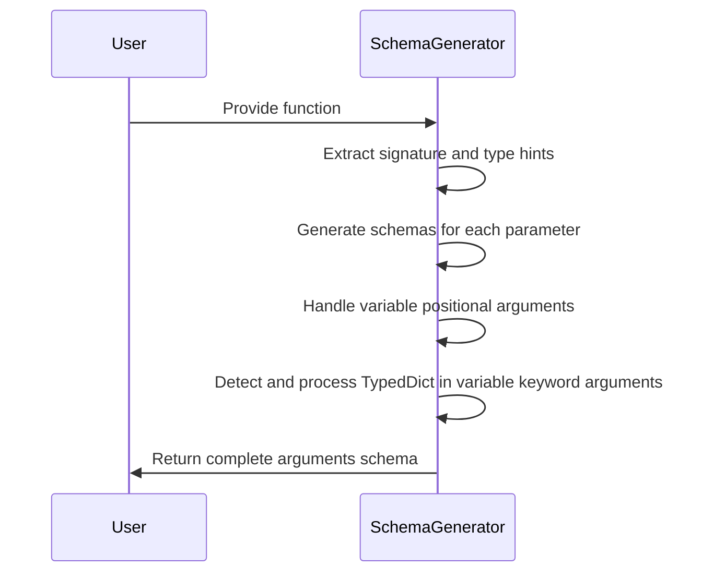
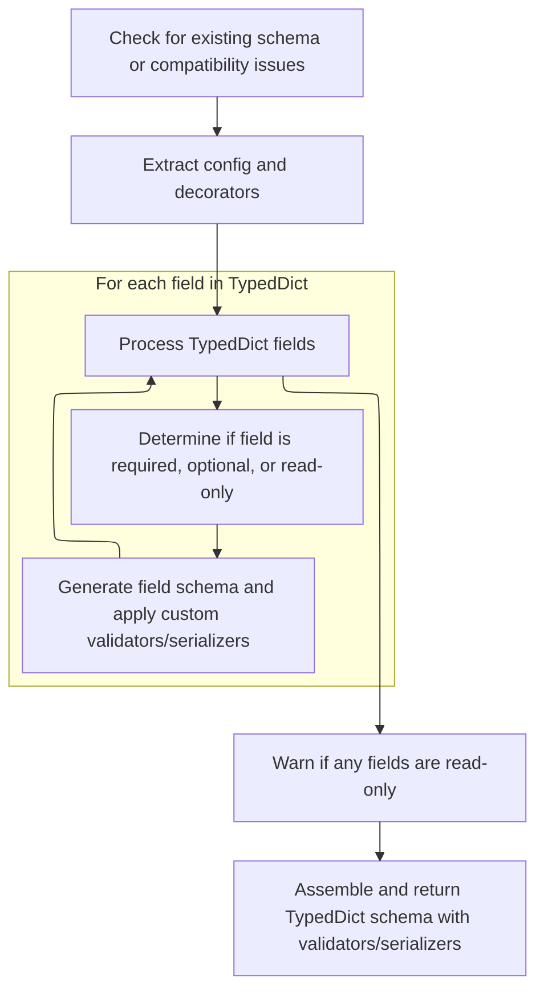

This document describes how a schema is generated for a function's arguments by analyzing its signature and type hints. It covers handling of positional, keyword, variable positional, and variable keyword parameters, including support for <SwmToken path="pydantic/_internal/_generate_schema.py" pos="1381:17:17" line-data="        &quot;&quot;&quot;Generate a core schema for a `TypedDict` class.">`TypedDict`</SwmToken> unpacking. The process results in a schema that enables validation and serialization of function calls.



# Spec

## Detailed View of the Program's Functionality

a. Analyzing Function Parameters and Argument Handling

The process begins by examining the parameters of a given function. The function's signature is retrieved, and its type hints are extracted. Each parameter is then iterated over in the order they appear in the function definition. For each parameter, the code determines its type annotation, either from the signature or from the type hints. If a callback is provided, it can dynamically decide to skip certain parameters. For regular parameters (those that are not \*args or \*\*kwargs), the parameter's kind (such as positional-only, positional-or-keyword, or keyword-only) is mapped to a corresponding schema mode. A schema for each such parameter is generated and collected into a list.

If a parameter is a variable positional argument (\*args), a schema is generated for it using the annotation, since the structure of \*args is inherently flexible and cannot be precisely determined in advance. This ensures that all types of arguments—fixed and variable—are handled consistently.

b. Generating Schema for Variable Keyword Arguments (\*\*kwargs)

When the code encounters a variable keyword argument (\*\*kwargs), it checks if the annotation uses an "Unpack" construct with a <SwmToken path="pydantic/_internal/_generate_schema.py" pos="1381:17:17" line-data="        &quot;&quot;&quot;Generate a core schema for a `TypedDict` class.">`TypedDict`</SwmToken>. If so, it verifies that there are no overlapping field names between the <SwmToken path="pydantic/_internal/_generate_schema.py" pos="1381:17:17" line-data="        &quot;&quot;&quot;Generate a core schema for a `TypedDict` class.">`TypedDict`</SwmToken> and the other non-positional-only parameters, as such overlaps would create ambiguity. If an overlap is detected, an error is raised.

If the annotation is indeed an Unpack of a <SwmToken path="pydantic/_internal/_generate_schema.py" pos="1381:17:17" line-data="        &quot;&quot;&quot;Generate a core schema for a `TypedDict` class.">`TypedDict`</SwmToken> and there are no overlaps, the code proceeds to generate a schema that matches the structure of the <SwmToken path="pydantic/_internal/_generate_schema.py" pos="1381:17:17" line-data="        &quot;&quot;&quot;Generate a core schema for a `TypedDict` class.">`TypedDict`</SwmToken>. This is done by invoking a dedicated routine for <SwmToken path="pydantic/_internal/_generate_schema.py" pos="1381:17:17" line-data="        &quot;&quot;&quot;Generate a core schema for a `TypedDict` class.">`TypedDict`</SwmToken> schema generation. If the annotation is not an Unpack of a <SwmToken path="pydantic/_internal/_generate_schema.py" pos="1381:17:17" line-data="        &quot;&quot;&quot;Generate a core schema for a `TypedDict` class.">`TypedDict`</SwmToken>, a uniform schema is generated for \*\*kwargs, treating all keyword arguments as having the same type.

c. Generating <SwmToken path="pydantic/_internal/_generate_schema.py" pos="1381:17:17" line-data="        &quot;&quot;&quot;Generate a core schema for a `TypedDict` class.">`TypedDict`</SwmToken> Field Schemas

When generating a schema for a <SwmToken path="pydantic/_internal/_generate_schema.py" pos="1381:17:17" line-data="        &quot;&quot;&quot;Generate a core schema for a `TypedDict` class.">`TypedDict`</SwmToken>, the code first checks for compatibility, ensuring that the <SwmToken path="pydantic/_internal/_generate_schema.py" pos="1381:17:17" line-data="        &quot;&quot;&quot;Generate a core schema for a `TypedDict` class.">`TypedDict`</SwmToken> is supported by the Python version or by the <SwmToken path="pydantic/_internal/_generate_schema.py" pos="1388:26:26" line-data="        For this reason, we require Python 3.12 (or using the `typing_extensions` backport).">`typing_extensions`</SwmToken> package. It then attempts to extract configuration information from the <SwmToken path="pydantic/_internal/_generate_schema.py" pos="1381:17:17" line-data="        &quot;&quot;&quot;Generate a core schema for a `TypedDict` class.">`TypedDict`</SwmToken> class or its base classes. This configuration is used to set up the context for schema generation.

The code gathers all type annotations for the <SwmToken path="pydantic/_internal/_generate_schema.py" pos="1381:17:17" line-data="        &quot;&quot;&quot;Generate a core schema for a `TypedDict` class.">`TypedDict`</SwmToken>'s fields and prepares to build a schema for each field. For each field, it determines whether the field is required, optional, or read-only by examining the field's qualifiers and the set of required keys. If a field is marked as read-only, its name is collected for later warning.

For each field, the code also checks if there is a docstring to use as a description, and applies any relevant configuration updates. A schema for the field is generated, and any custom validators or serializers associated with the field are applied. This process is repeated for every field in the <SwmToken path="pydantic/_internal/_generate_schema.py" pos="1381:17:17" line-data="        &quot;&quot;&quot;Generate a core schema for a `TypedDict` class.">`TypedDict`</SwmToken>.

After all fields are processed, if any fields were marked as read-only, a warning is issued to inform the user that Pydantic does not enforce immutability for dictionary items. Finally, the code assembles the complete <SwmToken path="pydantic/_internal/_generate_schema.py" pos="1381:17:17" line-data="        &quot;&quot;&quot;Generate a core schema for a `TypedDict` class.">`TypedDict`</SwmToken> schema, including all fields, any computed fields, and the configuration. Model-level serializers and validators are applied, and a reference schema is returned that fully describes the <SwmToken path="pydantic/_internal/_generate_schema.py" pos="1381:17:17" line-data="        &quot;&quot;&quot;Generate a core schema for a `TypedDict` class.">`TypedDict`</SwmToken> for validation and serialization.

d. Finalizing the Arguments Schema

After handling all parameters, including \*args and \*\*kwargs, the code constructs the final arguments schema. This schema includes the list of parameter schemas, the schema for \*args (if present), the mode and schema for \*\*kwargs (if present), and a flag indicating whether validation should be performed by parameter name. This comprehensive schema is then returned, representing the complete structure and validation logic for the function's arguments.

# Rule Definition

| Paragraph Name                                                                                                                                                                                                                                                                                                                                                                                                                                                                                                                                                                                                                                                                   | Rule ID | Category          | Description                                                                                                                                                                                                                                                                                                                                                                                                                                                                                                                                                                                                                                                                                                                                                                                                                                                                             | Conditions                                                                                                                                                                                                                                                            | Remarks                                                                                                                                                                                                                                                                                                                                                                                                                                                                                                                                                                                                                                                                                                                                                                                                                                                                                                                                                                                                                                                                                                                                                                                                                                                                                                                                                                                                                                                                                                                                                                                                                                                                                                                                                                                                                                                                                                                                                                                                                                                                                                                                                                                                                                                                                                                                                            |
| -------------------------------------------------------------------------------------------------------------------------------------------------------------------------------------------------------------------------------------------------------------------------------------------------------------------------------------------------------------------------------------------------------------------------------------------------------------------------------------------------------------------------------------------------------------------------------------------------------------------------------------------------------------------------------- | ------- | ----------------- | --------------------------------------------------------------------------------------------------------------------------------------------------------------------------------------------------------------------------------------------------------------------------------------------------------------------------------------------------------------------------------------------------------------------------------------------------------------------------------------------------------------------------------------------------------------------------------------------------------------------------------------------------------------------------------------------------------------------------------------------------------------------------------------------------------------------------------------------------------------------------------------- | --------------------------------------------------------------------------------------------------------------------------------------------------------------------------------------------------------------------------------------------------------------------- | ------------------------------------------------------------------------------------------------------------------------------------------------------------------------------------------------------------------------------------------------------------------------------------------------------------------------------------------------------------------------------------------------------------------------------------------------------------------------------------------------------------------------------------------------------------------------------------------------------------------------------------------------------------------------------------------------------------------------------------------------------------------------------------------------------------------------------------------------------------------------------------------------------------------------------------------------------------------------------------------------------------------------------------------------------------------------------------------------------------------------------------------------------------------------------------------------------------------------------------------------------------------------------------------------------------------------------------------------------------------------------------------------------------------------------------------------------------------------------------------------------------------------------------------------------------------------------------------------------------------------------------------------------------------------------------------------------------------------------------------------------------------------------------------------------------------------------------------------------------------------------------------------------------------------------------------------------------------------------------------------------------------------------------------------------------------------------------------------------------------------------------------------------------------------------------------------------------------------------------------------------------------------------------------------------------------------------------------------------------------ |
| def <SwmToken path="pydantic/_internal/_generate_schema.py" pos="1935:3:3" line-data="    def _arguments_schema(">`_arguments_schema`</SwmToken>, def <SwmToken path="pydantic/_internal/_generate_schema.py" pos="2010:3:3" line-data="    def _arguments_v3_schema(">`_arguments_v3_schema`</SwmToken>, def <SwmToken path="pydantic/_internal/_generate_schema.py" pos="1967:7:7" line-data="                arg_schema = self._generate_parameter_schema(">`_generate_parameter_schema`</SwmToken>, def <SwmToken path="pydantic/_internal/_generate_schema.py" pos="1576:3:3" line-data="    def _generate_parameter_v3_schema(">`_generate_parameter_v3_schema`</SwmToken> | RL-001  | Computation       | The system must analyze a given function's signature and type hints to determine the schema for its arguments. For each parameter, it must identify the name, type annotation, whether it is required or has a default value, and the parameter's mode (positional-only, positional-or-keyword, keyword-only, var-positional, var-keyword). It must generate a schema for the parameter's type, including any default value if present.                                                                                                                                                                                                                                                                                                                                                                                                                                                 | A function object is provided for schema generation.                                                                                                                                                                                                                  | The output schema for arguments must be a dictionary with fields: type ("arguments"), arguments (list of dicts with name, schema, mode), <SwmToken path="pydantic/_internal/_generate_schema.py" pos="1950:1:1" line-data="        var_args_schema: core_schema.CoreSchema \| None = None">`var_args_schema`</SwmToken> (if present), <SwmToken path="pydantic/_internal/_generate_schema.py" pos="1952:1:1" line-data="        var_kwargs_mode: core_schema.VarKwargsMode \| None = None">`var_kwargs_mode`</SwmToken> (string), <SwmToken path="pydantic/_internal/_generate_schema.py" pos="1951:1:1" line-data="        var_kwargs_schema: core_schema.CoreSchema \| None = None">`var_kwargs_schema`</SwmToken> (if present), and <SwmToken path="pydantic/_internal/_generate_schema.py" pos="2007:1:1" line-data="            validate_by_name=self._config_wrapper.validate_by_name,">`validate_by_name`</SwmToken> (boolean). Parameter modes are mapped from inspect.Parameter kinds. Default values are handled via <SwmToken path="pydantic/_internal/_generate_schema.py" pos="1295:5:5" line-data="            schema = wrap_default(field_info, schema)">`wrap_default`</SwmToken>. Constants: <SwmToken path="pydantic/_internal/_generate_schema.py" pos="1940:1:3" line-data="            Parameter.POSITIONAL_ONLY: &#39;positional_only&#39;,">`Parameter.POSITIONAL_ONLY`</SwmToken>, <SwmToken path="pydantic/_internal/_generate_schema.py" pos="1941:1:3" line-data="            Parameter.POSITIONAL_OR_KEYWORD: &#39;positional_or_keyword&#39;,">`Parameter.POSITIONAL_OR_KEYWORD`</SwmToken>, <SwmToken path="pydantic/_internal/_generate_schema.py" pos="1942:1:3" line-data="            Parameter.KEYWORD_ONLY: &#39;keyword_only&#39;,">`Parameter.KEYWORD_ONLY`</SwmToken>, <SwmToken path="pydantic/_internal/_generate_schema.py" pos="1971:9:11" line-data="            elif p.kind == Parameter.VAR_POSITIONAL:">`Parameter.VAR_POSITIONAL`</SwmToken>, <SwmToken path="pydantic/_internal/_generate_schema.py" pos="1974:9:11" line-data="                assert p.kind == Parameter.VAR_KEYWORD, p.kind">`Parameter.VAR_KEYWORD`</SwmToken>.                                                                                                                                                                               |
| def <SwmToken path="pydantic/_internal/_generate_schema.py" pos="1935:3:3" line-data="    def _arguments_schema(">`_arguments_schema`</SwmToken>, def <SwmToken path="pydantic/_internal/_generate_schema.py" pos="2010:3:3" line-data="    def _arguments_v3_schema(">`_arguments_v3_schema`</SwmToken>                                                                                                                                                                                                                                                                                                                                                                         | RL-002  | Computation       | For variable positional arguments (\*args), the system must generate a schema describing the expected type of each positional argument.                                                                                                                                                                                                                                                                                                                                                                                                                                                                                                                                                                                                                                                                                                                                                 | The function signature includes a <SwmToken path="pydantic/_internal/_generate_schema.py" pos="1971:11:11" line-data="            elif p.kind == Parameter.VAR_POSITIONAL:">`VAR_POSITIONAL`</SwmToken> parameter (\*args).                                           | The <SwmToken path="pydantic/_internal/_generate_schema.py" pos="1950:1:1" line-data="        var_args_schema: core_schema.CoreSchema \| None = None">`var_args_schema`</SwmToken> field in the output schema must contain the schema for the \*args parameter's type annotation. If no annotation is provided, Any is used.                                                                                                                                                                                                                                                                                                                                                                                                                                                                                                                                                                                                                                                                                                                                                                                                                                                                                                                                                                                                                                                                                                                                                                                                                                                                                                                                                                                                                                                                                                                                                                                                                                                                                                                                                                                                                                                                                                                                                                                                                                       |
| def <SwmToken path="pydantic/_internal/_generate_schema.py" pos="1935:3:3" line-data="    def _arguments_schema(">`_arguments_schema`</SwmToken>, def <SwmToken path="pydantic/_internal/_generate_schema.py" pos="2010:3:3" line-data="    def _arguments_v3_schema(">`_arguments_v3_schema`</SwmToken>                                                                                                                                                                                                                                                                                                                                                                         | RL-003  | Conditional Logic | For variable keyword arguments (\*\*kwargs), if the annotation is an Unpack of a <SwmToken path="pydantic/_internal/_generate_schema.py" pos="1381:17:17" line-data="        &quot;&quot;&quot;Generate a core schema for a `TypedDict` class.">`TypedDict`</SwmToken>, the system must ensure there are no overlapping field names with other parameters, generate a schema for the <SwmToken path="pydantic/_internal/_generate_schema.py" pos="1381:17:17" line-data="        &quot;&quot;&quot;Generate a core schema for a `TypedDict` class.">`TypedDict`</SwmToken>, set the mode to indicate an unpacked <SwmToken path="pydantic/_internal/_generate_schema.py" pos="1381:17:17" line-data="        &quot;&quot;&quot;Generate a core schema for a `TypedDict` class.">`TypedDict`</SwmToken>, and attach the schema. If not, generate a uniform schema for keyword arguments. | The function signature includes a <SwmToken path="pydantic/_internal/_generate_schema.py" pos="1974:11:11" line-data="                assert p.kind == Parameter.VAR_KEYWORD, p.kind">`VAR_KEYWORD`</SwmToken> parameter (\*\*kwargs).                                | If annotation is Unpack\[<SwmToken path="pydantic/_internal/_generate_schema.py" pos="1381:17:17" line-data="        &quot;&quot;&quot;Generate a core schema for a `TypedDict` class.">`TypedDict`</SwmToken>\], mode is <SwmToken path="pydantic/_internal/_generate_schema.py" pos="1996:6:10" line-data="                    var_kwargs_mode = &#39;unpacked-typed-dict&#39;">`unpacked-typed-dict`</SwmToken> (or <SwmToken path="pydantic/_internal/_generate_schema.py" pos="1587:2:2" line-data="            &#39;var_kwargs_unpacked_typed_dict&#39;,">`var_kwargs_unpacked_typed_dict`</SwmToken> in <SwmToken path="pydantic/_internal/_generate_schema.py" pos="1543:13:13" line-data="        in V3 by the `&#39;arguments-v3`&#39;.">`v3`</SwmToken>), and <SwmToken path="pydantic/_internal/_generate_schema.py" pos="1951:1:1" line-data="        var_kwargs_schema: core_schema.CoreSchema \| None = None">`var_kwargs_schema`</SwmToken> contains the <SwmToken path="pydantic/_internal/_generate_schema.py" pos="1381:17:17" line-data="        &quot;&quot;&quot;Generate a core schema for a `TypedDict` class.">`TypedDict`</SwmToken> schema. If not, mode is 'uniform' (or <SwmToken path="pydantic/_internal/_generate_schema.py" pos="1586:2:2" line-data="            &#39;var_kwargs_uniform&#39;,">`var_kwargs_uniform`</SwmToken>), and <SwmToken path="pydantic/_internal/_generate_schema.py" pos="1951:1:1" line-data="        var_kwargs_schema: core_schema.CoreSchema \| None = None">`var_kwargs_schema`</SwmToken> contains the uniform schema. Overlapping fields raise <SwmToken path="pydantic/_internal/_generate_schema.py" pos="1407:3:3" line-data="                raise PydanticUserError(">`PydanticUserError`</SwmToken>. Constants: <SwmToken path="pydantic/_internal/_generate_schema.py" pos="1406:5:5" line-data="            if not _SUPPORTS_TYPEDDICT and type(typed_dict_cls).__module__ == &#39;typing&#39;:">`_SUPPORTS_TYPEDDICT`</SwmToken>, <SwmToken path="pydantic/_internal/_generate_schema.py" pos="1979:5:5" line-data="                    if not is_typeddict(origin):">`is_typeddict`</SwmToken>, <SwmToken path="pydantic/_internal/_generate_schema.py" pos="1974:9:11" line-data="                assert p.kind == Parameter.VAR_KEYWORD, p.kind">`Parameter.VAR_KEYWORD`</SwmToken>. |
| def <SwmToken path="pydantic/_internal/_generate_schema.py" pos="1380:3:3" line-data="    def _typed_dict_schema(self, typed_dict_cls: Any, origin: Any) -&gt; core_schema.CoreSchema:">`_typed_dict_schema`</SwmToken>                                                                                                                                                                                                                                                                                                                                                                                                                                                          | RL-004  | Computation       | When generating a schema for a <SwmToken path="pydantic/_internal/_generate_schema.py" pos="1381:17:17" line-data="        &quot;&quot;&quot;Generate a core schema for a `TypedDict` class.">`TypedDict`</SwmToken>, the system must verify compatibility (supported by runtime or extensions), extract configuration and decorators, collect all fields and their type annotations, determine if each field is required, optional, or read-only, generate the schema for each field's type, and collect any custom validators, serializers, or docstrings. Warn if any fields are read-only. Assemble the <SwmToken path="pydantic/_internal/_generate_schema.py" pos="1381:17:17" line-data="        &quot;&quot;&quot;Generate a core schema for a `TypedDict` class.">`TypedDict`</SwmToken> schema as a dictionary with required structure.                                       | A <SwmToken path="pydantic/_internal/_generate_schema.py" pos="1381:17:17" line-data="        &quot;&quot;&quot;Generate a core schema for a `TypedDict` class.">`TypedDict`</SwmToken> class is provided for schema generation.                                      | <SwmToken path="pydantic/_internal/_generate_schema.py" pos="1381:17:17" line-data="        &quot;&quot;&quot;Generate a core schema for a `TypedDict` class.">`TypedDict`</SwmToken> schema output must be a dictionary with: type (<SwmToken path="pydantic/_internal/_generate_schema.py" pos="1409:4:6" line-data="                    code=&#39;typed-dict-version&#39;,">`typed-dict`</SwmToken>), fields (dict mapping field names to dicts with schema and required), cls (original <SwmToken path="pydantic/_internal/_generate_schema.py" pos="1381:17:17" line-data="        &quot;&quot;&quot;Generate a core schema for a `TypedDict` class.">`TypedDict`</SwmToken> class), <SwmToken path="pydantic/_internal/_generate_schema.py" pos="1476:1:1" line-data="                    computed_fields=[">`computed_fields`</SwmToken> (list), ref (reference string), config (dict with configuration info). Warn if any fields are read-only. Constants: <SwmToken path="pydantic/_internal/_generate_schema.py" pos="1406:5:5" line-data="            if not _SUPPORTS_TYPEDDICT and type(typed_dict_cls).__module__ == &#39;typing&#39;:">`_SUPPORTS_TYPEDDICT`</SwmToken>, <SwmToken path="pydantic/_internal/_generate_schema.py" pos="1979:5:5" line-data="                    if not is_typeddict(origin):">`is_typeddict`</SwmToken>, <SwmToken path="pydantic/_internal/_generate_schema.py" pos="1422:1:1" line-data="                required_keys: frozenset[str] = typed_dict_cls.__required_keys__">`required_keys`</SwmToken>, **annotations**.                                                                                                                                                                                                                                                                                                                                                                                                                                                                                                                                                                                                                                                                                                                                                                                           |
| def <SwmToken path="pydantic/_internal/_generate_schema.py" pos="1380:3:3" line-data="    def _typed_dict_schema(self, typed_dict_cls: Any, origin: Any) -&gt; core_schema.CoreSchema:">`_typed_dict_schema`</SwmToken>                                                                                                                                                                                                                                                                                                                                                                                                                                                          | RL-005  | Conditional Logic | The system must apply any model-level serializers and validators to the <SwmToken path="pydantic/_internal/_generate_schema.py" pos="1381:17:17" line-data="        &quot;&quot;&quot;Generate a core schema for a `TypedDict` class.">`TypedDict`</SwmToken> schema before returning the reference schema.                                                                                                                                                                                                                                                                                                                                                                                                                                                                                                                                                                             | A <SwmToken path="pydantic/_internal/_generate_schema.py" pos="1381:17:17" line-data="        &quot;&quot;&quot;Generate a core schema for a `TypedDict` class.">`TypedDict`</SwmToken> schema has been assembled and model-level serializers/validators are present. | Model-level serializers and validators are applied to the schema before it is returned as a reference schema. The returned schema fully describes the <SwmToken path="pydantic/_internal/_generate_schema.py" pos="1381:17:17" line-data="        &quot;&quot;&quot;Generate a core schema for a `TypedDict` class.">`TypedDict`</SwmToken> for validation and serialization.                                                                                                                                                                                                                                                                                                                                                                                                                                                                                                                                                                                                                                                                                                                                                                                                                                                                                                                                                                                                                                                                                                                                                                                                                                                                                                                                                                                                                                                                                                                                                                                                                                                                                                                                                                                                                                                                                                                                                                                      |
| def <SwmToken path="pydantic/_internal/_generate_schema.py" pos="1935:3:3" line-data="    def _arguments_schema(">`_arguments_schema`</SwmToken>, def <SwmToken path="pydantic/_internal/_generate_schema.py" pos="2010:3:3" line-data="    def _arguments_v3_schema(">`_arguments_v3_schema`</SwmToken>                                                                                                                                                                                                                                                                                                                                                                         | RL-006  | Data Assignment   | The final arguments schema must include all collected parameter schemas, the schema for variable positional arguments, the mode and schema for variable keyword arguments, and any relevant configuration for validation.                                                                                                                                                                                                                                                                                                                                                                                                                                                                                                                                                                                                                                                               | All parameter schemas and relevant components have been generated.                                                                                                                                                                                                    | The output schema must include: type ("arguments"), arguments (list), <SwmToken path="pydantic/_internal/_generate_schema.py" pos="1950:1:1" line-data="        var_args_schema: core_schema.CoreSchema \| None = None">`var_args_schema`</SwmToken> (if present), <SwmToken path="pydantic/_internal/_generate_schema.py" pos="1952:1:1" line-data="        var_kwargs_mode: core_schema.VarKwargsMode \| None = None">`var_kwargs_mode`</SwmToken> (string), <SwmToken path="pydantic/_internal/_generate_schema.py" pos="1951:1:1" line-data="        var_kwargs_schema: core_schema.CoreSchema \| None = None">`var_kwargs_schema`</SwmToken> (if present), <SwmToken path="pydantic/_internal/_generate_schema.py" pos="2007:1:1" line-data="            validate_by_name=self._config_wrapper.validate_by_name,">`validate_by_name`</SwmToken> (boolean). All fields must be present as specified. The structure must match the expected format for downstream validation and serialization.                                                                                                                                                                                                                                                                                                                                                                                                                                                                                                                                                                                                                                                                                                                                                                                                                                                                                                                                                                                                                                                                                                                                                                                                                                                                                                                                                                 |

# User Stories

## User Story 1: Function Argument Schema Generation

---

### Story Description:

As a user of the schema generation system, I want the system to analyze a function's signature and type hints to generate a comprehensive schema for its arguments, including handling of positional, keyword, variable positional (\*args), and variable keyword (\*\*kwargs) parameters, so that I can validate and serialize function calls accurately.

---

### Business Rule Mapping:

| Rule ID | Paragraph Name                                                                                                                                                                                                                                                                                                                                                                                                                                                                                                                                                                                                                                                                   | Rule Description                                                                                                                                                                                                                                                                                                                                                                                                                                                                                                                                                                                                                                                                                                                                                                                                                                                                        |
| ------- | -------------------------------------------------------------------------------------------------------------------------------------------------------------------------------------------------------------------------------------------------------------------------------------------------------------------------------------------------------------------------------------------------------------------------------------------------------------------------------------------------------------------------------------------------------------------------------------------------------------------------------------------------------------------------------- | --------------------------------------------------------------------------------------------------------------------------------------------------------------------------------------------------------------------------------------------------------------------------------------------------------------------------------------------------------------------------------------------------------------------------------------------------------------------------------------------------------------------------------------------------------------------------------------------------------------------------------------------------------------------------------------------------------------------------------------------------------------------------------------------------------------------------------------------------------------------------------------- |
| RL-001  | def <SwmToken path="pydantic/_internal/_generate_schema.py" pos="1935:3:3" line-data="    def _arguments_schema(">`_arguments_schema`</SwmToken>, def <SwmToken path="pydantic/_internal/_generate_schema.py" pos="2010:3:3" line-data="    def _arguments_v3_schema(">`_arguments_v3_schema`</SwmToken>, def <SwmToken path="pydantic/_internal/_generate_schema.py" pos="1967:7:7" line-data="                arg_schema = self._generate_parameter_schema(">`_generate_parameter_schema`</SwmToken>, def <SwmToken path="pydantic/_internal/_generate_schema.py" pos="1576:3:3" line-data="    def _generate_parameter_v3_schema(">`_generate_parameter_v3_schema`</SwmToken> | The system must analyze a given function's signature and type hints to determine the schema for its arguments. For each parameter, it must identify the name, type annotation, whether it is required or has a default value, and the parameter's mode (positional-only, positional-or-keyword, keyword-only, var-positional, var-keyword). It must generate a schema for the parameter's type, including any default value if present.                                                                                                                                                                                                                                                                                                                                                                                                                                                 |
| RL-002  | def <SwmToken path="pydantic/_internal/_generate_schema.py" pos="1935:3:3" line-data="    def _arguments_schema(">`_arguments_schema`</SwmToken>, def <SwmToken path="pydantic/_internal/_generate_schema.py" pos="2010:3:3" line-data="    def _arguments_v3_schema(">`_arguments_v3_schema`</SwmToken>                                                                                                                                                                                                                                                                                                                                                                         | For variable positional arguments (\*args), the system must generate a schema describing the expected type of each positional argument.                                                                                                                                                                                                                                                                                                                                                                                                                                                                                                                                                                                                                                                                                                                                                 |
| RL-003  | def <SwmToken path="pydantic/_internal/_generate_schema.py" pos="1935:3:3" line-data="    def _arguments_schema(">`_arguments_schema`</SwmToken>, def <SwmToken path="pydantic/_internal/_generate_schema.py" pos="2010:3:3" line-data="    def _arguments_v3_schema(">`_arguments_v3_schema`</SwmToken>                                                                                                                                                                                                                                                                                                                                                                         | For variable keyword arguments (\*\*kwargs), if the annotation is an Unpack of a <SwmToken path="pydantic/_internal/_generate_schema.py" pos="1381:17:17" line-data="        &quot;&quot;&quot;Generate a core schema for a `TypedDict` class.">`TypedDict`</SwmToken>, the system must ensure there are no overlapping field names with other parameters, generate a schema for the <SwmToken path="pydantic/_internal/_generate_schema.py" pos="1381:17:17" line-data="        &quot;&quot;&quot;Generate a core schema for a `TypedDict` class.">`TypedDict`</SwmToken>, set the mode to indicate an unpacked <SwmToken path="pydantic/_internal/_generate_schema.py" pos="1381:17:17" line-data="        &quot;&quot;&quot;Generate a core schema for a `TypedDict` class.">`TypedDict`</SwmToken>, and attach the schema. If not, generate a uniform schema for keyword arguments. |
| RL-006  | def <SwmToken path="pydantic/_internal/_generate_schema.py" pos="1935:3:3" line-data="    def _arguments_schema(">`_arguments_schema`</SwmToken>, def <SwmToken path="pydantic/_internal/_generate_schema.py" pos="2010:3:3" line-data="    def _arguments_v3_schema(">`_arguments_v3_schema`</SwmToken>                                                                                                                                                                                                                                                                                                                                                                         | The final arguments schema must include all collected parameter schemas, the schema for variable positional arguments, the mode and schema for variable keyword arguments, and any relevant configuration for validation.                                                                                                                                                                                                                                                                                                                                                                                                                                                                                                                                                                                                                                                               |

---

### Relevant Functionality:

- **def** <SwmToken path="pydantic/_internal/_generate_schema.py" pos="1935:3:3" line-data="    def _arguments_schema(">`_arguments_schema`</SwmToken>
  1. **RL-001:**
     - Inspect the function signature using inspect.signature
     - For each parameter:
       - Determine name, annotation, default value, and kind
       - Map kind to mode (<SwmToken path="pydantic/_internal/_generate_schema.py" pos="1939:12:12" line-data="        mode_lookup: dict[_ParameterKind, Literal[&#39;positional_only&#39;, &#39;positional_or_keyword&#39;, &#39;keyword_only&#39;]] = {">`positional_only`</SwmToken>, <SwmToken path="pydantic/_internal/_generate_schema.py" pos="1939:17:17" line-data="        mode_lookup: dict[_ParameterKind, Literal[&#39;positional_only&#39;, &#39;positional_or_keyword&#39;, &#39;keyword_only&#39;]] = {">`positional_or_keyword`</SwmToken>, <SwmToken path="pydantic/_internal/_generate_schema.py" pos="1939:22:22" line-data="        mode_lookup: dict[_ParameterKind, Literal[&#39;positional_only&#39;, &#39;positional_or_keyword&#39;, &#39;keyword_only&#39;]] = {">`keyword_only`</SwmToken>, <SwmToken path="pydantic/_internal/_generate_schema.py" pos="1585:2:2" line-data="            &#39;var_args&#39;,">`var_args`</SwmToken>, var_kwargs)
       - Generate schema for the parameter's type (including default if present)
       - Add to arguments list
     - For \*args, generate <SwmToken path="pydantic/_internal/_generate_schema.py" pos="1950:1:1" line-data="        var_args_schema: core_schema.CoreSchema | None = None">`var_args_schema`</SwmToken>
     - For \*\*kwargs, determine if Unpack\[<SwmToken path="pydantic/_internal/_generate_schema.py" pos="1381:17:17" line-data="        &quot;&quot;&quot;Generate a core schema for a `TypedDict` class.">`TypedDict`</SwmToken>\] or uniform, generate appropriate schema and mode
     - Assemble final schema dictionary with all fields
  2. **RL-002:**
     - Detect <SwmToken path="pydantic/_internal/_generate_schema.py" pos="1971:11:11" line-data="            elif p.kind == Parameter.VAR_POSITIONAL:">`VAR_POSITIONAL`</SwmToken> parameter in signature
     - Extract annotation (or use Any)
     - Generate schema for annotation
     - Assign to <SwmToken path="pydantic/_internal/_generate_schema.py" pos="1950:1:1" line-data="        var_args_schema: core_schema.CoreSchema | None = None">`var_args_schema`</SwmToken> in output
  3. **RL-003:**
     - Detect <SwmToken path="pydantic/_internal/_generate_schema.py" pos="1974:11:11" line-data="                assert p.kind == Parameter.VAR_KEYWORD, p.kind">`VAR_KEYWORD`</SwmToken> parameter in signature
     - If annotation is Unpack\[<SwmToken path="pydantic/_internal/_generate_schema.py" pos="1381:17:17" line-data="        &quot;&quot;&quot;Generate a core schema for a `TypedDict` class.">`TypedDict`</SwmToken>\]:
       - Check for overlapping field names with other parameters
       - If overlap, raise error
       - Generate <SwmToken path="pydantic/_internal/_generate_schema.py" pos="1381:17:17" line-data="        &quot;&quot;&quot;Generate a core schema for a `TypedDict` class.">`TypedDict`</SwmToken> schema
       - Set <SwmToken path="pydantic/_internal/_generate_schema.py" pos="1952:1:1" line-data="        var_kwargs_mode: core_schema.VarKwargsMode | None = None">`var_kwargs_mode`</SwmToken> to <SwmToken path="pydantic/_internal/_generate_schema.py" pos="1996:6:10" line-data="                    var_kwargs_mode = &#39;unpacked-typed-dict&#39;">`unpacked-typed-dict`</SwmToken>, attach schema
     - Else:
       - Set <SwmToken path="pydantic/_internal/_generate_schema.py" pos="1952:1:1" line-data="        var_kwargs_mode: core_schema.VarKwargsMode | None = None">`var_kwargs_mode`</SwmToken> to 'uniform', generate schema for annotation
  4. **RL-006:**
     - Collect all generated parameter schemas
     - Include <SwmToken path="pydantic/_internal/_generate_schema.py" pos="1950:1:1" line-data="        var_args_schema: core_schema.CoreSchema | None = None">`var_args_schema`</SwmToken> if present
     - Include <SwmToken path="pydantic/_internal/_generate_schema.py" pos="1952:1:1" line-data="        var_kwargs_mode: core_schema.VarKwargsMode | None = None">`var_kwargs_mode`</SwmToken> and <SwmToken path="pydantic/_internal/_generate_schema.py" pos="1951:1:1" line-data="        var_kwargs_schema: core_schema.CoreSchema | None = None">`var_kwargs_schema`</SwmToken> if present
     - Set <SwmToken path="pydantic/_internal/_generate_schema.py" pos="2007:1:1" line-data="            validate_by_name=self._config_wrapper.validate_by_name,">`validate_by_name`</SwmToken> according to configuration
     - Assemble and return final schema dictionary

## User Story 2: <SwmToken path="pydantic/_internal/_generate_schema.py" pos="1381:17:17" line-data="        &quot;&quot;&quot;Generate a core schema for a `TypedDict` class.">`TypedDict`</SwmToken> Schema Generation and Enhancement

---

### Story Description:

As a user of the schema generation system, I want the system to generate a schema for a <SwmToken path="pydantic/_internal/_generate_schema.py" pos="1381:17:17" line-data="        &quot;&quot;&quot;Generate a core schema for a `TypedDict` class.">`TypedDict`</SwmToken>, including compatibility checks, extraction of configuration, collection of field information, and application of custom validators and serializers, so that I can validate and serialize TypedDict-based data structures accurately.

---

### Business Rule Mapping:

| Rule ID | Paragraph Name                                                                                                                                                                                                          | Rule Description                                                                                                                                                                                                                                                                                                                                                                                                                                                                                                                                                                                                                                                                                                                                                                                                                                  |
| ------- | ----------------------------------------------------------------------------------------------------------------------------------------------------------------------------------------------------------------------- | ------------------------------------------------------------------------------------------------------------------------------------------------------------------------------------------------------------------------------------------------------------------------------------------------------------------------------------------------------------------------------------------------------------------------------------------------------------------------------------------------------------------------------------------------------------------------------------------------------------------------------------------------------------------------------------------------------------------------------------------------------------------------------------------------------------------------------------------------- |
| RL-004  | def <SwmToken path="pydantic/_internal/_generate_schema.py" pos="1380:3:3" line-data="    def _typed_dict_schema(self, typed_dict_cls: Any, origin: Any) -&gt; core_schema.CoreSchema:">`_typed_dict_schema`</SwmToken> | When generating a schema for a <SwmToken path="pydantic/_internal/_generate_schema.py" pos="1381:17:17" line-data="        &quot;&quot;&quot;Generate a core schema for a `TypedDict` class.">`TypedDict`</SwmToken>, the system must verify compatibility (supported by runtime or extensions), extract configuration and decorators, collect all fields and their type annotations, determine if each field is required, optional, or read-only, generate the schema for each field's type, and collect any custom validators, serializers, or docstrings. Warn if any fields are read-only. Assemble the <SwmToken path="pydantic/_internal/_generate_schema.py" pos="1381:17:17" line-data="        &quot;&quot;&quot;Generate a core schema for a `TypedDict` class.">`TypedDict`</SwmToken> schema as a dictionary with required structure. |
| RL-005  | def <SwmToken path="pydantic/_internal/_generate_schema.py" pos="1380:3:3" line-data="    def _typed_dict_schema(self, typed_dict_cls: Any, origin: Any) -&gt; core_schema.CoreSchema:">`_typed_dict_schema`</SwmToken> | The system must apply any model-level serializers and validators to the <SwmToken path="pydantic/_internal/_generate_schema.py" pos="1381:17:17" line-data="        &quot;&quot;&quot;Generate a core schema for a `TypedDict` class.">`TypedDict`</SwmToken> schema before returning the reference schema.                                                                                                                                                                                                                                                                                                                                                                                                                                                                                                                                       |

---

### Relevant Functionality:

- **def** <SwmToken path="pydantic/_internal/_generate_schema.py" pos="1380:3:3" line-data="    def _typed_dict_schema(self, typed_dict_cls: Any, origin: Any) -&gt; core_schema.CoreSchema:">`_typed_dict_schema`</SwmToken>
  1. **RL-004:**
     - Check if <SwmToken path="pydantic/_internal/_generate_schema.py" pos="1381:17:17" line-data="        &quot;&quot;&quot;Generate a core schema for a `TypedDict` class.">`TypedDict`</SwmToken> is supported (<SwmToken path="pydantic/_internal/_generate_schema.py" pos="1406:5:5" line-data="            if not _SUPPORTS_TYPEDDICT and type(typed_dict_cls).__module__ == &#39;typing&#39;:">`_SUPPORTS_TYPEDDICT`</SwmToken> or <SwmToken path="pydantic/_internal/_generate_schema.py" pos="1388:26:26" line-data="        For this reason, we require Python 3.12 (or using the `typing_extensions` backport).">`typing_extensions`</SwmToken>)
     - Extract config and decorators from class and bases
     - For each field:
       - Extract annotation, determine required/optional/read-only
       - Generate schema for field type
       - Collect validators, serializers, docstrings
     - Warn if any fields are read-only
     - Assemble schema dict with all required fields and metadata
  2. **RL-005:**
     - After assembling <SwmToken path="pydantic/_internal/_generate_schema.py" pos="1381:17:17" line-data="        &quot;&quot;&quot;Generate a core schema for a `TypedDict` class.">`TypedDict`</SwmToken> schema:
       - Apply model serializers (if any)
       - Apply model validators (if any)
       - Return reference schema

# Code Walkthrough

## Building the Function Arguments Schema

```mermaid
%%{init: {"flowchart": {"defaultRenderer": "elk"}} }%%
flowchart TD
    node1["Analyze function parameters and determine argument handling (TypedDict or uniform)"] --> node2["Generate appropriate schema for variable keyword arguments (TypedDict or uniform)"]
    click node1 openCode "pydantic/_internal/_generate_schema.py:1935:1998"
    node2 --> node3["Return final arguments schema"]
    click node2 openCode "pydantic/_internal/_generate_schema.py:1996:2001"
    click node3 openCode "pydantic/_internal/_generate_schema.py:2002:2008"


subgraph node2 [_typed_dict_schema]
  sgmain_1_node1["Check for existing schema or compatibility issues"]
  click sgmain_1_node1 openCode "pydantic/_internal/_generate_schema.py:1393:1401"
  sgmain_1_node1 --> sgmain_1_node2["Extract config and decorators"]
  click sgmain_1_node2 openCode "pydantic/_internal/_generate_schema.py:1412:1428"
  sgmain_1_node2 --> sgmain_1_node3["Process TypedDict fields"]
  click sgmain_1_node3 openCode "pydantic/_internal/_generate_schema.py:1435:1461"
  subgraph sgmain_1_loop1["For each field in TypedDict"]
  sgmain_1_node3 --> sgmain_1_node4["Determine if field is required, optional, or read-only"]
  click sgmain_1_node4 openCode "pydantic/_internal/_generate_schema.py:1445:1450"
  sgmain_1_node4 --> sgmain_1_node5["Generate field schema and apply custom validators/serializers"]
  click sgmain_1_node5 openCode "pydantic/_internal/_generate_schema.py:1457:1461"
  sgmain_1_node5 --> sgmain_1_node3
  end
  sgmain_1_node3 --> sgmain_1_node6["Warn if any fields are read-only"]
  click sgmain_1_node6 openCode "pydantic/_internal/_generate_schema.py:1463:1471"
  sgmain_1_node6 --> sgmain_1_node7["Assemble and return TypedDict schema with validators/serializers"]
  click sgmain_1_node7 openCode "pydantic/_internal/_generate_schema.py:1473:1486"
end

%% Swimm:
%% %%{init: {"flowchart": {"defaultRenderer": "elk"}} }%%
%% flowchart TD
%%     node1["Analyze function parameters and determine argument handling (<SwmToken path="pydantic/_internal/_generate_schema.py" pos="1381:17:17" line-data="        &quot;&quot;&quot;Generate a core schema for a `TypedDict` class.">`TypedDict`</SwmToken> or uniform)"] --> node2["Generate appropriate schema for variable keyword arguments (<SwmToken path="pydantic/_internal/_generate_schema.py" pos="1381:17:17" line-data="        &quot;&quot;&quot;Generate a core schema for a `TypedDict` class.">`TypedDict`</SwmToken> or uniform)"]
%%     click node1 openCode "<SwmPath>[pydantic/\_internal/\_generate_schema.py](pydantic/_internal/_generate_schema.py)</SwmPath>:1935:1998"
%%     node2 --> node3["Return final arguments schema"]
%%     click node2 openCode "<SwmPath>[pydantic/\_internal/\_generate_schema.py](pydantic/_internal/_generate_schema.py)</SwmPath>:1996:2001"
%%     click node3 openCode "<SwmPath>[pydantic/\_internal/\_generate_schema.py](pydantic/_internal/_generate_schema.py)</SwmPath>:2002:2008"
%% 
%% 
%% subgraph node2 [<SwmToken path="pydantic/_internal/_generate_schema.py" pos="1380:3:3" line-data="    def _typed_dict_schema(self, typed_dict_cls: Any, origin: Any) -&gt; core_schema.CoreSchema:">`_typed_dict_schema`</SwmToken>]
%%   sgmain_1_node1["Check for existing schema or compatibility issues"]
%%   click sgmain_1_node1 openCode "<SwmPath>[pydantic/\_internal/\_generate_schema.py](pydantic/_internal/_generate_schema.py)</SwmPath>:1393:1401"
%%   sgmain_1_node1 --> sgmain_1_node2["Extract config and decorators"]
%%   click sgmain_1_node2 openCode "<SwmPath>[pydantic/\_internal/\_generate_schema.py](pydantic/_internal/_generate_schema.py)</SwmPath>:1412:1428"
%%   sgmain_1_node2 --> sgmain_1_node3["Process <SwmToken path="pydantic/_internal/_generate_schema.py" pos="1381:17:17" line-data="        &quot;&quot;&quot;Generate a core schema for a `TypedDict` class.">`TypedDict`</SwmToken> fields"]
%%   click sgmain_1_node3 openCode "<SwmPath>[pydantic/\_internal/\_generate_schema.py](pydantic/_internal/_generate_schema.py)</SwmPath>:1435:1461"
%%   subgraph sgmain_1_loop1["For each field in <SwmToken path="pydantic/_internal/_generate_schema.py" pos="1381:17:17" line-data="        &quot;&quot;&quot;Generate a core schema for a `TypedDict` class.">`TypedDict`</SwmToken>"]
%%   sgmain_1_node3 --> sgmain_1_node4["Determine if field is required, optional, or read-only"]
%%   click sgmain_1_node4 openCode "<SwmPath>[pydantic/\_internal/\_generate_schema.py](pydantic/_internal/_generate_schema.py)</SwmPath>:1445:1450"
%%   sgmain_1_node4 --> sgmain_1_node5["Generate field schema and apply custom validators/serializers"]
%%   click sgmain_1_node5 openCode "<SwmPath>[pydantic/\_internal/\_generate_schema.py](pydantic/_internal/_generate_schema.py)</SwmPath>:1457:1461"
%%   sgmain_1_node5 --> sgmain_1_node3
%%   end
%%   sgmain_1_node3 --> sgmain_1_node6["Warn if any fields are read-only"]
%%   click sgmain_1_node6 openCode "<SwmPath>[pydantic/\_internal/\_generate_schema.py](pydantic/_internal/_generate_schema.py)</SwmPath>:1463:1471"
%%   sgmain_1_node6 --> sgmain_1_node7["Assemble and return <SwmToken path="pydantic/_internal/_generate_schema.py" pos="1381:17:17" line-data="        &quot;&quot;&quot;Generate a core schema for a `TypedDict` class.">`TypedDict`</SwmToken> schema with validators/serializers"]
%%   click sgmain_1_node7 openCode "<SwmPath>[pydantic/\_internal/\_generate_schema.py](pydantic/_internal/_generate_schema.py)</SwmPath>:1473:1486"
%% end
```



<SwmSnippet path="/pydantic/_internal/_generate_schema.py" line="1935">

---

In <SwmToken path="pydantic/_internal/_generate_schema.py" pos="1935:3:3" line-data="    def _arguments_schema(">`_arguments_schema`</SwmToken>, we start by grabbing the function's signature and type hints, then loop through each parameter to figure out its type and how it should be handled. If there's a callback, we can skip parameters dynamically. For regular parameters, we map their kind to a schema mode and generate their schema. When we hit \*args, we call <SwmToken path="pydantic/_internal/_generate_schema.py" pos="1972:7:7" line-data="                var_args_schema = self.generate_schema(annotation)">`generate_schema`</SwmToken> to handle the flexible nature of positional arguments, since we can't know their structure in advance. This sets us up to handle all argument types consistently in the schema.

```python
    def _arguments_schema(
        self, function: ValidateCallSupportedTypes, parameters_callback: ParametersCallback | None = None
    ) -> core_schema.ArgumentsSchema:
        """Generate schema for a Signature."""
        mode_lookup: dict[_ParameterKind, Literal['positional_only', 'positional_or_keyword', 'keyword_only']] = {
            Parameter.POSITIONAL_ONLY: 'positional_only',
            Parameter.POSITIONAL_OR_KEYWORD: 'positional_or_keyword',
            Parameter.KEYWORD_ONLY: 'keyword_only',
        }

        sig = signature(function)
        globalns, localns = self._types_namespace
        type_hints = _typing_extra.get_function_type_hints(function, globalns=globalns, localns=localns)

        arguments_list: list[core_schema.ArgumentsParameter] = []
        var_args_schema: core_schema.CoreSchema | None = None
        var_kwargs_schema: core_schema.CoreSchema | None = None
        var_kwargs_mode: core_schema.VarKwargsMode | None = None

        for i, (name, p) in enumerate(sig.parameters.items()):
            if p.annotation is sig.empty:
                annotation = typing.cast(Any, Any)
            else:
                annotation = type_hints[name]

            if parameters_callback is not None:
                result = parameters_callback(i, name, annotation)
                if result == 'skip':
                    continue

            parameter_mode = mode_lookup.get(p.kind)
            if parameter_mode is not None:
                arg_schema = self._generate_parameter_schema(
                    name, annotation, AnnotationSource.FUNCTION, p.default, parameter_mode
                )
                arguments_list.append(arg_schema)
            elif p.kind == Parameter.VAR_POSITIONAL:
                var_args_schema = self.generate_schema(annotation)
            else:
```

---

</SwmSnippet>

<SwmSnippet path="/pydantic/_internal/_generate_schema.py" line="1974">

---

Back in <SwmToken path="pydantic/_internal/_generate_schema.py" pos="1935:3:3" line-data="    def _arguments_schema(">`_arguments_schema`</SwmToken>, after handling \*args, we check if \*\*kwargs uses Unpack with a <SwmToken path="pydantic/_internal/_generate_schema.py" pos="1981:8:8" line-data="                            f&#39;Expected a `TypedDict` class inside `Unpack[...]`, got {unpack_type!r}&#39;,">`TypedDict`</SwmToken>. If it does, we make sure there are no overlapping fields with other parameters, then call <SwmToken path="pydantic/_internal/_generate_schema.py" pos="1997:7:7" line-data="                    var_kwargs_schema = self._typed_dict_schema(unpack_type, get_origin(unpack_type))">`_typed_dict_schema`</SwmToken> to generate a schema that matches the <SwmToken path="pydantic/_internal/_generate_schema.py" pos="1981:8:8" line-data="                            f&#39;Expected a `TypedDict` class inside `Unpack[...]`, got {unpack_type!r}&#39;,">`TypedDict`</SwmToken>'s structure. This lets us validate \*\*kwargs precisely when a <SwmToken path="pydantic/_internal/_generate_schema.py" pos="1981:8:8" line-data="                            f&#39;Expected a `TypedDict` class inside `Unpack[...]`, got {unpack_type!r}&#39;,">`TypedDict`</SwmToken> is used.

```python
                assert p.kind == Parameter.VAR_KEYWORD, p.kind

                unpack_type = _typing_extra.unpack_type(annotation)
                if unpack_type is not None:
                    origin = get_origin(unpack_type) or unpack_type
                    if not is_typeddict(origin):
                        raise PydanticUserError(
                            f'Expected a `TypedDict` class inside `Unpack[...]`, got {unpack_type!r}',
                            code='unpack-typed-dict',
                        )
                    non_pos_only_param_names = {
                        name for name, p in sig.parameters.items() if p.kind != Parameter.POSITIONAL_ONLY
                    }
                    overlapping_params = non_pos_only_param_names.intersection(origin.__annotations__)
                    if overlapping_params:
                        raise PydanticUserError(
                            f'Typed dictionary {origin.__name__!r} overlaps with parameter'
                            f'{"s" if len(overlapping_params) >= 2 else ""} '
                            f'{", ".join(repr(p) for p in sorted(overlapping_params))}',
                            code='overlapping-unpack-typed-dict',
                        )

                    var_kwargs_mode = 'unpacked-typed-dict'
                    var_kwargs_schema = self._typed_dict_schema(unpack_type, get_origin(unpack_type))
                else:
```

---

</SwmSnippet>

### Generating <SwmToken path="pydantic/_internal/_generate_schema.py" pos="1381:17:17" line-data="        &quot;&quot;&quot;Generate a core schema for a `TypedDict` class.">`TypedDict`</SwmToken> Field Schemas



<SwmSnippet path="/pydantic/_internal/_generate_schema.py" line="1380">

---

In <SwmToken path="pydantic/_internal/_generate_schema.py" pos="1380:3:3" line-data="    def _typed_dict_schema(self, typed_dict_cls: Any, origin: Any) -&gt; core_schema.CoreSchema:">`_typed_dict_schema`</SwmToken>, we check if the <SwmToken path="pydantic/_internal/_generate_schema.py" pos="1381:17:17" line-data="        &quot;&quot;&quot;Generate a core schema for a `TypedDict` class.">`TypedDict`</SwmToken> class is compatible (Python <SwmToken path="pydantic/_internal/_generate_schema.py" pos="1386:20:22" line-data="        However, the `__orig_bases__` attribute was only added in 3.12 (https://github.com/python/cpython/pull/103698).">`3.12`</SwmToken>+ or <SwmToken path="pydantic/_internal/_generate_schema.py" pos="1388:26:26" line-data="        For this reason, we require Python 3.12 (or using the `typing_extensions` backport).">`typing_extensions`</SwmToken>), grab config from the class or its bases, and set up the config context. We then gather type annotations, build up field schemas (handling required, readonly, and docstrings), and collect decorators. This sets up everything needed to generate a schema that matches the <SwmToken path="pydantic/_internal/_generate_schema.py" pos="1381:17:17" line-data="        &quot;&quot;&quot;Generate a core schema for a `TypedDict` class.">`TypedDict`</SwmToken>'s structure and config.

```python
    def _typed_dict_schema(self, typed_dict_cls: Any, origin: Any) -> core_schema.CoreSchema:
        """Generate a core schema for a `TypedDict` class.

        To be able to build a `DecoratorInfos` instance for the `TypedDict` class (which will include
        validators, serializers, etc.), we need to have access to the original bases of the class
        (see https://docs.python.org/3/library/types.html#types.get_original_bases).
        However, the `__orig_bases__` attribute was only added in 3.12 (https://github.com/python/cpython/pull/103698).

        For this reason, we require Python 3.12 (or using the `typing_extensions` backport).
        """
        FieldInfo = import_cached_field_info()

        with (
            self.model_type_stack.push(typed_dict_cls),
            self.defs.get_schema_or_ref(typed_dict_cls) as (
                typed_dict_ref,
                maybe_schema,
            ),
        ):
            if maybe_schema is not None:
                return maybe_schema

            typevars_map = get_standard_typevars_map(typed_dict_cls)
            if origin is not None:
                typed_dict_cls = origin

            if not _SUPPORTS_TYPEDDICT and type(typed_dict_cls).__module__ == 'typing':
                raise PydanticUserError(
                    'Please use `typing_extensions.TypedDict` instead of `typing.TypedDict` on Python < 3.12.',
                    code='typed-dict-version',
                )

            try:
                # if a typed dictionary class doesn't have config, we use the parent's config, hence a default of `None`
                # see https://github.com/pydantic/pydantic/issues/10917
                config: ConfigDict | None = get_attribute_from_bases(typed_dict_cls, '__pydantic_config__')
            except AttributeError:
                config = None

            with self._config_wrapper_stack.push(config):
                core_config = self._config_wrapper.core_config(title=typed_dict_cls.__name__)

                required_keys: frozenset[str] = typed_dict_cls.__required_keys__

                fields: dict[str, core_schema.TypedDictField] = {}

                decorators = DecoratorInfos.build(typed_dict_cls)
                decorators.update_from_config(self._config_wrapper)

                if self._config_wrapper.use_attribute_docstrings:
                    field_docstrings = extract_docstrings_from_cls(typed_dict_cls, use_inspect=True)
                else:
                    field_docstrings = None

                try:
                    annotations = _typing_extra.get_cls_type_hints(typed_dict_cls, ns_resolver=self._ns_resolver)
                except NameError as e:
                    raise PydanticUndefinedAnnotation.from_name_error(e) from e

                readonly_fields: list[str] = []

                for field_name, annotation in annotations.items():
                    field_info = FieldInfo.from_annotation(annotation, _source=AnnotationSource.TYPED_DICT)
                    field_info.annotation = replace_types(field_info.annotation, typevars_map)

                    required = (
                        field_name in required_keys or 'required' in field_info._qualifiers
                    ) and 'not_required' not in field_info._qualifiers
                    if 'read_only' in field_info._qualifiers:
                        readonly_fields.append(field_name)

                    if (
                        field_docstrings is not None
                        and field_info.description is None
                        and field_name in field_docstrings
                    ):
                        field_info.description = field_docstrings[field_name]
                    update_field_from_config(self._config_wrapper, field_name, field_info)

                    fields[field_name] = self._generate_td_field_schema(
                        field_name, field_info, decorators, required=required
                    )
```

---

</SwmSnippet>

<SwmSnippet path="/pydantic/_internal/_generate_schema.py" line="1463">

---

After building all the field schemas and handling readonly warnings, we create a <SwmToken path="pydantic/_internal/_generate_schema.py" pos="1473:7:7" line-data="                td_schema = core_schema.typed_dict_schema(">`typed_dict_schema`</SwmToken> with the fields, computed fields, and config. Then we apply any model serializers and validators, and finally return a reference schema that fully describes the <SwmToken path="pydantic/_internal/_generate_schema.py" pos="1467:25:25" line-data="                        f&#39;Item{&quot;s&quot; if plural else &quot;&quot;} {fields_repr} on TypedDict class {typed_dict_cls.__name__!r} &#39;">`TypedDict`</SwmToken> for validation and serialization.

```python
                if readonly_fields:
                    fields_repr = ', '.join(repr(f) for f in readonly_fields)
                    plural = len(readonly_fields) >= 2
                    warnings.warn(
                        f'Item{"s" if plural else ""} {fields_repr} on TypedDict class {typed_dict_cls.__name__!r} '
                        f'{"are" if plural else "is"} using the `ReadOnly` qualifier. Pydantic will not protect items '
                        'from any mutation on dictionary instances.',
                        UserWarning,
                    )

                td_schema = core_schema.typed_dict_schema(
                    fields,
                    cls=typed_dict_cls,
                    computed_fields=[
                        self._computed_field_schema(d, decorators.field_serializers)
                        for d in decorators.computed_fields.values()
                    ],
                    ref=typed_dict_ref,
                    config=core_config,
                )

                schema = self._apply_model_serializers(td_schema, decorators.model_serializers.values())
                schema = apply_model_validators(schema, decorators.model_validators.values(), 'all')
                return self.defs.create_definition_reference_schema(schema)
```

---

</SwmSnippet>

### Finalizing the Arguments Schema

<SwmSnippet path="/pydantic/_internal/_generate_schema.py" line="1999">

---

After returning from <SwmToken path="pydantic/_internal/_generate_schema.py" pos="1380:3:3" line-data="    def _typed_dict_schema(self, typed_dict_cls: Any, origin: Any) -&gt; core_schema.CoreSchema:">`_typed_dict_schema`</SwmToken>, if \*\*kwargs isn't a <SwmToken path="pydantic/_internal/_generate_schema.py" pos="1381:17:17" line-data="        &quot;&quot;&quot;Generate a core schema for a `TypedDict` class.">`TypedDict`</SwmToken>, we generate a uniform schema for it. Finally, we build the complete arguments schema using all the collected parameter schemas, <SwmToken path="pydantic/_internal/_generate_schema.py" pos="2004:1:1" line-data="            var_args_schema=var_args_schema,">`var_args_schema`</SwmToken>, <SwmToken path="pydantic/_internal/_generate_schema.py" pos="1999:1:1" line-data="                    var_kwargs_mode = &#39;uniform&#39;">`var_kwargs_mode`</SwmToken>, and <SwmToken path="pydantic/_internal/_generate_schema.py" pos="2000:1:1" line-data="                    var_kwargs_schema = self.generate_schema(annotation)">`var_kwargs_schema`</SwmToken>. This wraps up the schema for the function's arguments in <SwmToken path="pydantic/_internal/_generate_schema.py" pos="1935:3:3" line-data="    def _arguments_schema(">`_arguments_schema`</SwmToken>.

```python
                    var_kwargs_mode = 'uniform'
                    var_kwargs_schema = self.generate_schema(annotation)

        return core_schema.arguments_schema(
            arguments_list,
            var_args_schema=var_args_schema,
            var_kwargs_mode=var_kwargs_mode,
            var_kwargs_schema=var_kwargs_schema,
            validate_by_name=self._config_wrapper.validate_by_name,
        )
```

---

</SwmSnippet>

&nbsp;

*This is an auto-generated document by Swimm 🌊 and has not yet been verified by a human*

<SwmMeta version="3.0.0" repo-id="Z2l0aHViJTNBJTNBcHlkYW50aWMlM0ElM0FTd2ltbS1EZW1v" repo-name="pydantic"><sup>Powered by [Swimm](/)</sup></SwmMeta>
