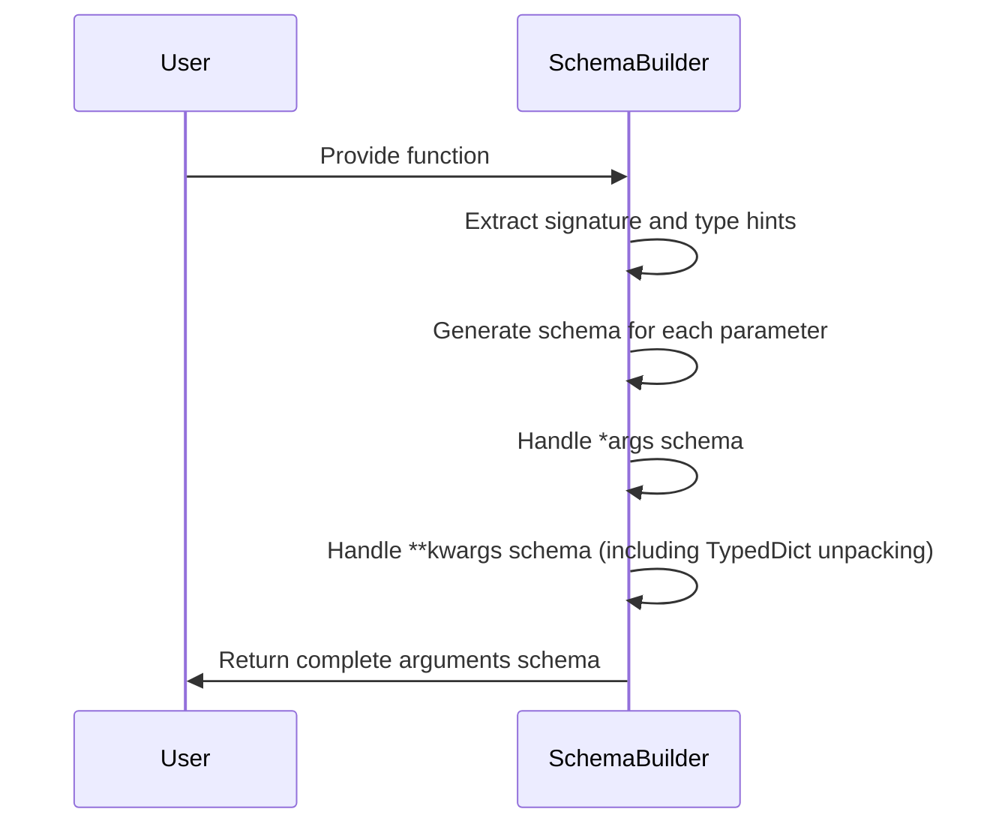
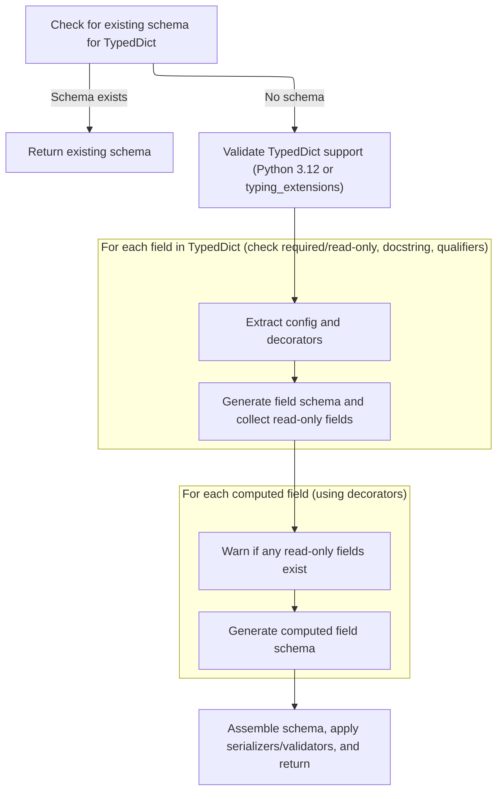

This document explains how a schema is generated from a Python function's signature to represent all its arguments, including positional, keyword, and variable arguments. It also covers handling unpacked TypedDicts in keyword arguments to ensure accurate validation.

The main steps are:

- Extract the function's signature and type hints
- Generate schemas for each parameter based on its kind
- Handle variable positional arguments (\*args)
- Handle variable keyword arguments (\*\*kwargs), including unpacked TypedDicts
- Assemble and return the complete arguments schema



# Spec

## Detailed View of the Program's Functionality

a. Overview: Building Argument Schemas from Function Signatures

The process begins by analyzing a function's signature and its type hints to determine the expected parameters and their types. For each parameter in the function, the code decides how to represent it in the schema—whether to skip it, handle it as a standard parameter, or apply special handling (such as for unpacked TypedDicts or variable arguments). The goal is to construct a schema that accurately describes all possible arguments the function can accept, enabling robust validation.

b. Iterating Over Function Parameters

- The function's signature is retrieved, and type hints are resolved using the appropriate namespaces.
- An empty list is prepared to collect schemas for each parameter.
- Variables are set up to hold schemas for variable positional arguments (\*args) and variable keyword arguments (\*\*kwargs), as well as a mode indicator for \*\*kwargs.
- The code loops through each parameter in the function's signature:
  - If the parameter lacks an explicit type annotation, it is treated as accepting any type.
  - If a callback is provided for parameter processing, it is invoked and may instruct the code to skip this parameter.
  - The parameter's kind (positional-only, positional-or-keyword, keyword-only, var-positional, var-keyword) is mapped to a mode string.
  - For standard parameters (positional or keyword), a schema is generated and added to the list.
  - For \*args (variable positional arguments), a schema is generated for the annotated type.
  - For \*\*kwargs (variable keyword arguments), special handling is performed, especially if the annotation uses Unpack\[<SwmToken path="pydantic/_internal/_generate_schema.py" pos="1381:17:17" line-data="        &quot;&quot;&quot;Generate a core schema for a `TypedDict` class.">`TypedDict`</SwmToken>\].

c. Handling Unpacked TypedDicts in \*\*kwargs

- When \*\*kwargs is annotated with Unpack\[<SwmToken path="pydantic/_internal/_generate_schema.py" pos="1381:17:17" line-data="        &quot;&quot;&quot;Generate a core schema for a `TypedDict` class.">`TypedDict`</SwmToken>\], the code:
  - Extracts the type being unpacked.
  - Checks that the type is actually a <SwmToken path="pydantic/_internal/_generate_schema.py" pos="1381:17:17" line-data="        &quot;&quot;&quot;Generate a core schema for a `TypedDict` class.">`TypedDict`</SwmToken>; if not, an error is raised.
  - Ensures that the fields of the <SwmToken path="pydantic/_internal/_generate_schema.py" pos="1381:17:17" line-data="        &quot;&quot;&quot;Generate a core schema for a `TypedDict` class.">`TypedDict`</SwmToken> do not overlap with other non-positional-only parameter names; if they do, an error is raised.
  - Sets the mode to indicate that \*\*kwargs is being treated as an unpacked <SwmToken path="pydantic/_internal/_generate_schema.py" pos="1381:17:17" line-data="        &quot;&quot;&quot;Generate a core schema for a `TypedDict` class.">`TypedDict`</SwmToken>.
  - Calls a dedicated method to generate a schema for the <SwmToken path="pydantic/_internal/_generate_schema.py" pos="1381:17:17" line-data="        &quot;&quot;&quot;Generate a core schema for a `TypedDict` class.">`TypedDict`</SwmToken>, which will be used to validate the structure of \*\*kwargs.

d. Generating Schemas for TypedDicts

- The <SwmToken path="pydantic/_internal/_generate_schema.py" pos="1381:17:17" line-data="        &quot;&quot;&quot;Generate a core schema for a `TypedDict` class.">`TypedDict`</SwmToken> schema generation process involves several steps:
  - The code first checks if a schema for this <SwmToken path="pydantic/_internal/_generate_schema.py" pos="1381:17:17" line-data="        &quot;&quot;&quot;Generate a core schema for a `TypedDict` class.">`TypedDict`</SwmToken> has already been generated (to handle recursion and references). If so, it returns the existing schema.
  - It verifies that the Python version supports the necessary <SwmToken path="pydantic/_internal/_generate_schema.py" pos="1381:17:17" line-data="        &quot;&quot;&quot;Generate a core schema for a `TypedDict` class.">`TypedDict`</SwmToken> features, or that the <SwmToken path="pydantic/_internal/_generate_schema.py" pos="1388:26:26" line-data="        For this reason, we require Python 3.12 (or using the `typing_extensions` backport).">`typing_extensions`</SwmToken> backport is used.
  - Configuration and decorator information are extracted from the <SwmToken path="pydantic/_internal/_generate_schema.py" pos="1381:17:17" line-data="        &quot;&quot;&quot;Generate a core schema for a `TypedDict` class.">`TypedDict`</SwmToken> class or its bases.
  - The code determines which fields are required and which are read-only, and extracts docstrings for fields if configured to do so.
  - For each field in the <SwmToken path="pydantic/_internal/_generate_schema.py" pos="1381:17:17" line-data="        &quot;&quot;&quot;Generate a core schema for a `TypedDict` class.">`TypedDict`</SwmToken>:
    - The field's annotation and qualifiers are processed.
    - A schema is generated for the field, and read-only fields are tracked.
    - Field descriptions are set from docstrings if available.
    - Field configuration is updated from the config wrapper.
  - If any read-only fields are present, a warning is issued (since Pydantic cannot enforce immutability on dictionary instances).
  - For each computed field (fields defined via decorators), a schema is generated.
  - The final <SwmToken path="pydantic/_internal/_generate_schema.py" pos="1381:17:17" line-data="        &quot;&quot;&quot;Generate a core schema for a `TypedDict` class.">`TypedDict`</SwmToken> schema is assembled, including all fields, computed fields, and configuration.
  - Serializers and validators are applied as needed.
  - The schema is wrapped as a reference schema for reuse and recursion handling.

e. Finalizing the Arguments Schema

- After all parameters have been processed—including any special handling for \*args and \*\*kwargs—the code constructs the final arguments schema object.
- This object includes:
  - The list of parameter schemas.
  - Schemas for \*args and \*\*kwargs, if present.
  - The mode for \*\*kwargs (<SwmToken path="pydantic/_internal/_generate_schema.py" pos="184:38:40" line-data="&quot;&quot;&quot;`FieldInfo` attributes (and their default value) that can&#39;t be used outside of a model (e.g. in a type adapter or a PEP 695 type alias).&quot;&quot;&quot;">`e.g`</SwmToken>., uniform or <SwmToken path="pydantic/_internal/_generate_schema.py" pos="1996:6:10" line-data="                    var_kwargs_mode = &#39;unpacked-typed-dict&#39;">`unpacked-typed-dict`</SwmToken>).
  - Configuration flags, such as whether to validate by parameter name.
- The completed arguments schema is returned, ready to be used for validating function calls.

f. Summary

The described flow enables Pydantic to introspect a function, analyze its parameters (including advanced cases like unpacked TypedDicts), and generate a comprehensive schema for argument validation. TypedDicts receive special treatment to ensure their structure is accurately represented and validated, and the system is designed to handle recursion, references, and configuration inheritance robustly. The result is a flexible and powerful mechanism for validating function arguments in Python using type hints and Pydantic's schema system.

# Rule Definition

| Paragraph Name                                                                                                    | Rule ID | Category          | Description                                                                                                                                                                                                                                                                                                                                                                                                                                                                                                                                                                                                                                                                                                                                                                                                                                                                                                                                                                                                                                                                                   | Conditions                                                                                                                                                                                                                               | Remarks                                                                                                                                                                                                                                                                                                                                                                                                                                                                                                                                                                                                                                                                                                                                                                                                                                                                                                                                                                                                                                                                                                                                                                                                                                                                                                                                                                               |
| ----------------------------------------------------------------------------------------------------------------- | ------- | ----------------- | --------------------------------------------------------------------------------------------------------------------------------------------------------------------------------------------------------------------------------------------------------------------------------------------------------------------------------------------------------------------------------------------------------------------------------------------------------------------------------------------------------------------------------------------------------------------------------------------------------------------------------------------------------------------------------------------------------------------------------------------------------------------------------------------------------------------------------------------------------------------------------------------------------------------------------------------------------------------------------------------------------------------------------------------------------------------------------------------- | ---------------------------------------------------------------------------------------------------------------------------------------------------------------------------------------------------------------------------------------- | ------------------------------------------------------------------------------------------------------------------------------------------------------------------------------------------------------------------------------------------------------------------------------------------------------------------------------------------------------------------------------------------------------------------------------------------------------------------------------------------------------------------------------------------------------------------------------------------------------------------------------------------------------------------------------------------------------------------------------------------------------------------------------------------------------------------------------------------------------------------------------------------------------------------------------------------------------------------------------------------------------------------------------------------------------------------------------------------------------------------------------------------------------------------------------------------------------------------------------------------------------------------------------------------------------------------------------------------------------------------------------------- |
| GenerateSchema.\_arguments_schema, GenerateSchema.\_generate_parameter_schema                                     | RL-001  | Computation       | For any given Python function, generate an arguments schema that captures the structure and validation requirements for all possible arguments, including fixed parameters, \*args, and \*\*kwargs.                                                                                                                                                                                                                                                                                                                                                                                                                                                                                                                                                                                                                                                                                                                                                                                                                                                                                           | A Python function is provided for schema generation.                                                                                                                                                                                     | The schema must be a dictionary-like object with keys: 'type', 'parameters', <SwmToken path="pydantic/_internal/_generate_schema.py" pos="1950:1:1" line-data="        var_args_schema: core_schema.CoreSchema \| None = None">`var_args_schema`</SwmToken>, <SwmToken path="pydantic/_internal/_generate_schema.py" pos="1952:1:1" line-data="        var_kwargs_mode: core_schema.VarKwargsMode \| None = None">`var_kwargs_mode`</SwmToken>, <SwmToken path="pydantic/_internal/_generate_schema.py" pos="1951:1:1" line-data="        var_kwargs_schema: core_schema.CoreSchema \| None = None">`var_kwargs_schema`</SwmToken>, <SwmToken path="pydantic/_internal/_generate_schema.py" pos="2007:1:1" line-data="            validate_by_name=self._config_wrapper.validate_by_name,">`validate_by_name`</SwmToken>. The 'type' key must have the value 'arguments'.                                                                                                                                                                                                                                                                                                                                                                                                                                                                                                             |
| GenerateSchema.\_arguments_schema                                                                                 | RL-002  | Data Assignment   | The arguments schema must be represented as a dictionary-like object with specific keys and value formats, including 'type', 'parameters', <SwmToken path="pydantic/_internal/_generate_schema.py" pos="1950:1:1" line-data="        var_args_schema: core_schema.CoreSchema \| None = None">`var_args_schema`</SwmToken>, <SwmToken path="pydantic/_internal/_generate_schema.py" pos="1952:1:1" line-data="        var_kwargs_mode: core_schema.VarKwargsMode \| None = None">`var_kwargs_mode`</SwmToken>, <SwmToken path="pydantic/_internal/_generate_schema.py" pos="1951:1:1" line-data="        var_kwargs_schema: core_schema.CoreSchema \| None = None">`var_kwargs_schema`</SwmToken>, and <SwmToken path="pydantic/_internal/_generate_schema.py" pos="2007:1:1" line-data="            validate_by_name=self._config_wrapper.validate_by_name,">`validate_by_name`</SwmToken>.                                                                                                                                                                                                   | When generating the arguments schema for a function.                                                                                                                                                                                     | 'type' must be 'arguments'. 'parameters' is a list of parameter schemas. <SwmToken path="pydantic/_internal/_generate_schema.py" pos="1950:1:1" line-data="        var_args_schema: core_schema.CoreSchema \| None = None">`var_args_schema`</SwmToken> and <SwmToken path="pydantic/_internal/_generate_schema.py" pos="1951:1:1" line-data="        var_kwargs_schema: core_schema.CoreSchema \| None = None">`var_kwargs_schema`</SwmToken> are dictionaries describing \*args and \*\*kwargs. <SwmToken path="pydantic/_internal/_generate_schema.py" pos="1952:1:1" line-data="        var_kwargs_mode: core_schema.VarKwargsMode \| None = None">`var_kwargs_mode`</SwmToken> is a string, <SwmToken path="pydantic/_internal/_generate_schema.py" pos="184:38:40" line-data="&quot;&quot;&quot;`FieldInfo` attributes (and their default value) that can&#39;t be used outside of a model (e.g. in a type adapter or a PEP 695 type alias).&quot;&quot;&quot;">`e.g`</SwmToken>., <SwmToken path="pydantic/_internal/_generate_schema.py" pos="1996:6:10" line-data="                    var_kwargs_mode = &#39;unpacked-typed-dict&#39;">`unpacked-typed-dict`</SwmToken>. <SwmToken path="pydantic/_internal/_generate_schema.py" pos="2007:1:1" line-data="            validate_by_name=self._config_wrapper.validate_by_name,">`validate_by_name`</SwmToken> is a boolean. |
| GenerateSchema.\_generate_parameter_schema                                                                        | RL-003  | Computation       | Each parameter schema in the 'parameters' list must include the parameter's name, a schema describing its type and validation rules, its mode (kind), and its default value if present.                                                                                                                                                                                                                                                                                                                                                                                                                                                                                                                                                                                                                                                                                                                                                                                                                                                                                                       | For each fixed (non-varargs, non-varkwargs) parameter in the function signature.                                                                                                                                                         | Parameter schema is a dictionary with keys: 'name' (string), 'schema' (type/validation dictionary), 'mode' (string: <SwmToken path="pydantic/_internal/_generate_schema.py" pos="1939:17:17" line-data="        mode_lookup: dict[_ParameterKind, Literal[&#39;positional_only&#39;, &#39;positional_or_keyword&#39;, &#39;keyword_only&#39;]] = {">`positional_or_keyword`</SwmToken>, <SwmToken path="pydantic/_internal/_generate_schema.py" pos="1939:12:12" line-data="        mode_lookup: dict[_ParameterKind, Literal[&#39;positional_only&#39;, &#39;positional_or_keyword&#39;, &#39;keyword_only&#39;]] = {">`positional_only`</SwmToken>, <SwmToken path="pydantic/_internal/_generate_schema.py" pos="1939:22:22" line-data="        mode_lookup: dict[_ParameterKind, Literal[&#39;positional_only&#39;, &#39;positional_or_keyword&#39;, &#39;keyword_only&#39;]] = {">`keyword_only`</SwmToken>), and optionally 'default'.                                                                                                                                                                                                                                                                                                                                                                                                                                           |
| GenerateSchema.\_arguments_schema                                                                                 | RL-004  | Conditional Logic | If \*args or \*\*kwargs are present in the function signature, generate appropriate schemas. If \*\*kwargs is annotated as Unpack\[<SwmToken path="pydantic/_internal/_generate_schema.py" pos="1381:17:17" line-data="        &quot;&quot;&quot;Generate a core schema for a `TypedDict` class.">`TypedDict`</SwmToken>\], set <SwmToken path="pydantic/_internal/_generate_schema.py" pos="1952:1:1" line-data="        var_kwargs_mode: core_schema.VarKwargsMode \| None = None">`var_kwargs_mode`</SwmToken> to <SwmToken path="pydantic/_internal/_generate_schema.py" pos="1996:6:10" line-data="                    var_kwargs_mode = &#39;unpacked-typed-dict&#39;">`unpacked-typed-dict`</SwmToken> and generate a <SwmToken path="pydantic/_internal/_generate_schema.py" pos="1409:4:6" line-data="                    code=&#39;typed-dict-version&#39;,">`typed-dict`</SwmToken> schema for <SwmToken path="pydantic/_internal/_generate_schema.py" pos="1951:1:1" line-data="        var_kwargs_schema: core_schema.CoreSchema \| None = None">`var_kwargs_schema`</SwmToken>. | \*args or \*\*kwargs are present in the function signature.                                                                                                                                                                              | <SwmToken path="pydantic/_internal/_generate_schema.py" pos="1950:1:1" line-data="        var_args_schema: core_schema.CoreSchema \| None = None">`var_args_schema`</SwmToken> is a dictionary describing the type for each positional argument in \*args. If \*\*kwargs is Unpack\[<SwmToken path="pydantic/_internal/_generate_schema.py" pos="1381:17:17" line-data="        &quot;&quot;&quot;Generate a core schema for a `TypedDict` class.">`TypedDict`</SwmToken>\], <SwmToken path="pydantic/_internal/_generate_schema.py" pos="1952:1:1" line-data="        var_kwargs_mode: core_schema.VarKwargsMode \| None = None">`var_kwargs_mode`</SwmToken> is <SwmToken path="pydantic/_internal/_generate_schema.py" pos="1996:6:10" line-data="                    var_kwargs_mode = &#39;unpacked-typed-dict&#39;">`unpacked-typed-dict`</SwmToken> and <SwmToken path="pydantic/_internal/_generate_schema.py" pos="1951:1:1" line-data="        var_kwargs_schema: core_schema.CoreSchema \| None = None">`var_kwargs_schema`</SwmToken> is a dictionary with 'type': <SwmToken path="pydantic/_internal/_generate_schema.py" pos="1409:4:6" line-data="                    code=&#39;typed-dict-version&#39;,">`typed-dict`</SwmToken> and 'fields' mapping field names to field schemas.                                                                                   |
| GenerateSchema.\_generate_parameter_schema, GenerateSchema.\_typed_dict_schema                                    | RL-005  | Data Assignment   | If additional metadata (such as descriptions or aliases) is provided in the function or <SwmToken path="pydantic/_internal/_generate_schema.py" pos="1381:17:17" line-data="        &quot;&quot;&quot;Generate a core schema for a `TypedDict` class.">`TypedDict`</SwmToken> definitions, include it in the parameter or field schemas.                                                                                                                                                                                                                                                                                                                                                                                                                                                                                                                                                                                                                                                                                                                                                      | Metadata is present in the function or <SwmToken path="pydantic/_internal/_generate_schema.py" pos="1381:17:17" line-data="        &quot;&quot;&quot;Generate a core schema for a `TypedDict` class.">`TypedDict`</SwmToken> definition. | Metadata such as 'description', 'alias', etc., should be included in the schema dictionary for the parameter or field.                                                                                                                                                                                                                                                                                                                                                                                                                                                                                                                                                                                                                                                                                                                                                                                                                                                                                                                                                                                                                                                                                                                                                                                                                                                                |
| GenerateSchema.\_arguments_schema, GenerateSchema.\_typed_dict_schema                                             | RL-006  | Conditional Logic | The schema must not include parameters or fields that are not present in the function signature or <SwmToken path="pydantic/_internal/_generate_schema.py" pos="1381:17:17" line-data="        &quot;&quot;&quot;Generate a core schema for a `TypedDict` class.">`TypedDict`</SwmToken> definition.                                                                                                                                                                                                                                                                                                                                                                                                                                                                                                                                                                                                                                                                                                                                                                                          | When assembling the arguments schema or <SwmToken path="pydantic/_internal/_generate_schema.py" pos="1409:4:6" line-data="                    code=&#39;typed-dict-version&#39;,">`typed-dict`</SwmToken> schema.                        | Only parameters and fields explicitly present in the function signature or <SwmToken path="pydantic/_internal/_generate_schema.py" pos="1381:17:17" line-data="        &quot;&quot;&quot;Generate a core schema for a `TypedDict` class.">`TypedDict`</SwmToken> definition are included.                                                                                                                                                                                                                                                                                                                                                                                                                                                                                                                                                                                                                                                                                                                                                                                                                                                                                                                                                                                                                                                                                             |
| GenerateSchema.\_arguments_schema, GenerateSchema.\_generate_parameter_schema, GenerateSchema.\_typed_dict_schema | RL-007  | Computation       | The generated schema must be suitable for use in validating function calls, ensuring that all arguments conform to the specified types and constraints.                                                                                                                                                                                                                                                                                                                                                                                                                                                                                                                                                                                                                                                                                                                                                                                                                                                                                                                                       | When returning the final arguments schema.                                                                                                                                                                                               | The schema must fully describe all required and optional parameters, their types, default values, and constraints, and be compatible with the validation system.                                                                                                                                                                                                                                                                                                                                                                                                                                                                                                                                                                                                                                                                                                                                                                                                                                                                                                                                                                                                                                                                                                                                                                                                                      |

# User Stories

## User Story 1: Generate comprehensive arguments schema for Python functions, including advanced argument types

---

### Story Description:

As a user of the schema generation system, I want to generate a complete arguments schema for any Python function, including support for fixed parameters, \*args, \*\*kwargs, and advanced cases like Unpack\[<SwmToken path="pydantic/_internal/_generate_schema.py" pos="1381:17:17" line-data="        &quot;&quot;&quot;Generate a core schema for a `TypedDict` class.">`TypedDict`</SwmToken>\], so that I can validate function calls and ensure all arguments conform to the specified types and constraints.

---

### Business Rule Mapping:

| Rule ID | Paragraph Name                                                                                                    | Rule Description                                                                                                                                                                                                                                                                                                                                                                                                                                                                                                                                                                                                                                                                                                                                                                                                                                                                                                                                                                                                                                                                              |
| ------- | ----------------------------------------------------------------------------------------------------------------- | --------------------------------------------------------------------------------------------------------------------------------------------------------------------------------------------------------------------------------------------------------------------------------------------------------------------------------------------------------------------------------------------------------------------------------------------------------------------------------------------------------------------------------------------------------------------------------------------------------------------------------------------------------------------------------------------------------------------------------------------------------------------------------------------------------------------------------------------------------------------------------------------------------------------------------------------------------------------------------------------------------------------------------------------------------------------------------------------- |
| RL-001  | GenerateSchema.\_arguments_schema, GenerateSchema.\_generate_parameter_schema                                     | For any given Python function, generate an arguments schema that captures the structure and validation requirements for all possible arguments, including fixed parameters, \*args, and \*\*kwargs.                                                                                                                                                                                                                                                                                                                                                                                                                                                                                                                                                                                                                                                                                                                                                                                                                                                                                           |
| RL-002  | GenerateSchema.\_arguments_schema                                                                                 | The arguments schema must be represented as a dictionary-like object with specific keys and value formats, including 'type', 'parameters', <SwmToken path="pydantic/_internal/_generate_schema.py" pos="1950:1:1" line-data="        var_args_schema: core_schema.CoreSchema \| None = None">`var_args_schema`</SwmToken>, <SwmToken path="pydantic/_internal/_generate_schema.py" pos="1952:1:1" line-data="        var_kwargs_mode: core_schema.VarKwargsMode \| None = None">`var_kwargs_mode`</SwmToken>, <SwmToken path="pydantic/_internal/_generate_schema.py" pos="1951:1:1" line-data="        var_kwargs_schema: core_schema.CoreSchema \| None = None">`var_kwargs_schema`</SwmToken>, and <SwmToken path="pydantic/_internal/_generate_schema.py" pos="2007:1:1" line-data="            validate_by_name=self._config_wrapper.validate_by_name,">`validate_by_name`</SwmToken>.                                                                                                                                                                                                   |
| RL-004  | GenerateSchema.\_arguments_schema                                                                                 | If \*args or \*\*kwargs are present in the function signature, generate appropriate schemas. If \*\*kwargs is annotated as Unpack\[<SwmToken path="pydantic/_internal/_generate_schema.py" pos="1381:17:17" line-data="        &quot;&quot;&quot;Generate a core schema for a `TypedDict` class.">`TypedDict`</SwmToken>\], set <SwmToken path="pydantic/_internal/_generate_schema.py" pos="1952:1:1" line-data="        var_kwargs_mode: core_schema.VarKwargsMode \| None = None">`var_kwargs_mode`</SwmToken> to <SwmToken path="pydantic/_internal/_generate_schema.py" pos="1996:6:10" line-data="                    var_kwargs_mode = &#39;unpacked-typed-dict&#39;">`unpacked-typed-dict`</SwmToken> and generate a <SwmToken path="pydantic/_internal/_generate_schema.py" pos="1409:4:6" line-data="                    code=&#39;typed-dict-version&#39;,">`typed-dict`</SwmToken> schema for <SwmToken path="pydantic/_internal/_generate_schema.py" pos="1951:1:1" line-data="        var_kwargs_schema: core_schema.CoreSchema \| None = None">`var_kwargs_schema`</SwmToken>. |
| RL-007  | GenerateSchema.\_arguments_schema, GenerateSchema.\_generate_parameter_schema, GenerateSchema.\_typed_dict_schema | The generated schema must be suitable for use in validating function calls, ensuring that all arguments conform to the specified types and constraints.                                                                                                                                                                                                                                                                                                                                                                                                                                                                                                                                                                                                                                                                                                                                                                                                                                                                                                                                       |
| RL-003  | GenerateSchema.\_generate_parameter_schema                                                                        | Each parameter schema in the 'parameters' list must include the parameter's name, a schema describing its type and validation rules, its mode (kind), and its default value if present.                                                                                                                                                                                                                                                                                                                                                                                                                                                                                                                                                                                                                                                                                                                                                                                                                                                                                                       |

---

### Relevant Functionality:

- **GenerateSchema.\_arguments_schema**
  1. **RL-001:**
     - Inspect the function signature using inspect.signature.
     - For each parameter in the signature:
       - Determine its kind (positional, keyword, varargs, varkwargs).
       - Generate a parameter schema using <SwmToken path="pydantic/_internal/_generate_schema.py" pos="1967:7:7" line-data="                arg_schema = self._generate_parameter_schema(">`_generate_parameter_schema`</SwmToken>.
     - If \*args is present, generate <SwmToken path="pydantic/_internal/_generate_schema.py" pos="1950:1:1" line-data="        var_args_schema: core_schema.CoreSchema | None = None">`var_args_schema`</SwmToken>.
     - If \*\*kwargs is present, determine if it is Unpack\[<SwmToken path="pydantic/_internal/_generate_schema.py" pos="1381:17:17" line-data="        &quot;&quot;&quot;Generate a core schema for a `TypedDict` class.">`TypedDict`</SwmToken>\] and set <SwmToken path="pydantic/_internal/_generate_schema.py" pos="1952:1:1" line-data="        var_kwargs_mode: core_schema.VarKwargsMode | None = None">`var_kwargs_mode`</SwmToken> and <SwmToken path="pydantic/_internal/_generate_schema.py" pos="1951:1:1" line-data="        var_kwargs_schema: core_schema.CoreSchema | None = None">`var_kwargs_schema`</SwmToken> accordingly.
     - Set the <SwmToken path="pydantic/_internal/_generate_schema.py" pos="2007:1:1" line-data="            validate_by_name=self._config_wrapper.validate_by_name,">`validate_by_name`</SwmToken> flag based on configuration.
     - Return the assembled arguments schema dictionary.
  2. **RL-002:**
     - Create a dictionary with the following keys:
       - 'type': set to 'arguments'.
       - 'parameters': list of parameter schemas.
       - <SwmToken path="pydantic/_internal/_generate_schema.py" pos="1950:1:1" line-data="        var_args_schema: core_schema.CoreSchema | None = None">`var_args_schema`</SwmToken>: schema for \*args if present, else None.
       - <SwmToken path="pydantic/_internal/_generate_schema.py" pos="1952:1:1" line-data="        var_kwargs_mode: core_schema.VarKwargsMode | None = None">`var_kwargs_mode`</SwmToken>: string indicating \*\*kwargs handling mode.
       - <SwmToken path="pydantic/_internal/_generate_schema.py" pos="1951:1:1" line-data="        var_kwargs_schema: core_schema.CoreSchema | None = None">`var_kwargs_schema`</SwmToken>: schema for \*\*kwargs if present, else None.
       - <SwmToken path="pydantic/_internal/_generate_schema.py" pos="2007:1:1" line-data="            validate_by_name=self._config_wrapper.validate_by_name,">`validate_by_name`</SwmToken>: boolean flag from configuration.
  3. **RL-004:**
     - If a parameter is \*args:
       - Generate <SwmToken path="pydantic/_internal/_generate_schema.py" pos="1950:1:1" line-data="        var_args_schema: core_schema.CoreSchema | None = None">`var_args_schema`</SwmToken> using the parameter's annotation.
     - If a parameter is \*\*kwargs:
       - If annotated as Unpack\[<SwmToken path="pydantic/_internal/_generate_schema.py" pos="1381:17:17" line-data="        &quot;&quot;&quot;Generate a core schema for a `TypedDict` class.">`TypedDict`</SwmToken>\]:
         - Set <SwmToken path="pydantic/_internal/_generate_schema.py" pos="1952:1:1" line-data="        var_kwargs_mode: core_schema.VarKwargsMode | None = None">`var_kwargs_mode`</SwmToken> to <SwmToken path="pydantic/_internal/_generate_schema.py" pos="1996:6:10" line-data="                    var_kwargs_mode = &#39;unpacked-typed-dict&#39;">`unpacked-typed-dict`</SwmToken>.
         - Generate <SwmToken path="pydantic/_internal/_generate_schema.py" pos="1951:1:1" line-data="        var_kwargs_schema: core_schema.CoreSchema | None = None">`var_kwargs_schema`</SwmToken> as a <SwmToken path="pydantic/_internal/_generate_schema.py" pos="1409:4:6" line-data="                    code=&#39;typed-dict-version&#39;,">`typed-dict`</SwmToken> schema.
       - Else:
         - Set <SwmToken path="pydantic/_internal/_generate_schema.py" pos="1952:1:1" line-data="        var_kwargs_mode: core_schema.VarKwargsMode | None = None">`var_kwargs_mode`</SwmToken> to 'uniform'.
         - Generate <SwmToken path="pydantic/_internal/_generate_schema.py" pos="1951:1:1" line-data="        var_kwargs_schema: core_schema.CoreSchema | None = None">`var_kwargs_schema`</SwmToken> using the annotation.
  4. **RL-007:**
     - Assemble the arguments schema with all required information.
     - Ensure all types, defaults, and constraints are included.
     - Return the schema for use in validation.
- **GenerateSchema.\_generate_parameter_schema**
  1. **RL-003:**
     - For each parameter:
       - Extract name, annotation, default value, and kind.
       - Generate a schema for the annotation/type.
       - Set the mode based on parameter kind.
       - If a default value is present, include it in the schema.
       - Assemble the parameter schema dictionary.

## User Story 2: Include metadata and exclude extraneous parameters or fields

---

### Story Description:

As a user, I want the schema to include additional metadata (such as descriptions or aliases) when provided, and to exclude any parameters or fields not present in the function signature or <SwmToken path="pydantic/_internal/_generate_schema.py" pos="1381:17:17" line-data="        &quot;&quot;&quot;Generate a core schema for a `TypedDict` class.">`TypedDict`</SwmToken> definition, so that the schema is both informative and accurate.

---

### Business Rule Mapping:

| Rule ID | Paragraph Name                                                                 | Rule Description                                                                                                                                                                                                                                                                                                                         |
| ------- | ------------------------------------------------------------------------------ | ---------------------------------------------------------------------------------------------------------------------------------------------------------------------------------------------------------------------------------------------------------------------------------------------------------------------------------------- |
| RL-005  | GenerateSchema.\_generate_parameter_schema, GenerateSchema.\_typed_dict_schema | If additional metadata (such as descriptions or aliases) is provided in the function or <SwmToken path="pydantic/_internal/_generate_schema.py" pos="1381:17:17" line-data="        &quot;&quot;&quot;Generate a core schema for a `TypedDict` class.">`TypedDict`</SwmToken> definitions, include it in the parameter or field schemas. |
| RL-006  | GenerateSchema.\_arguments_schema, GenerateSchema.\_typed_dict_schema          | The schema must not include parameters or fields that are not present in the function signature or <SwmToken path="pydantic/_internal/_generate_schema.py" pos="1381:17:17" line-data="        &quot;&quot;&quot;Generate a core schema for a `TypedDict` class.">`TypedDict`</SwmToken> definition.                                     |

---

### Relevant Functionality:

- **GenerateSchema.\_generate_parameter_schema**
  1. **RL-005:**
     - When generating parameter or field schemas:
       - Check for presence of metadata (description, alias, etc.).
       - If present, add the metadata to the schema dictionary.
- **GenerateSchema.\_arguments_schema**
  1. **RL-006:**
     - When iterating over function parameters or <SwmToken path="pydantic/_internal/_generate_schema.py" pos="1381:17:17" line-data="        &quot;&quot;&quot;Generate a core schema for a `TypedDict` class.">`TypedDict`</SwmToken> fields:
       - Only process and include those present in the signature or definition.
       - Do not add any extra parameters or fields.

# Code Walkthrough

## Building Argument Schemas from Function Signatures

```mermaid
%%{init: {"flowchart": {"defaultRenderer": "elk"}} }%%
flowchart TD
    subgraph loop1["For each parameter in the function"]
      node1["Decide how to represent the parameter in the schema (skip, standard, or special handling)"]
      click node1 openCode "pydantic/_internal/_generate_schema.py:1935:1998"
      node1 -->|"If parameter is an unpacked TypedDict"| node2["Generate schema for unpacked TypedDict"]
      click node2 openCode "pydantic/_internal/_generate_schema.py:1380:1399"
    end
    loop1 --> node3["Return the complete arguments schema"]
    click node3 openCode "pydantic/_internal/_generate_schema.py:1999:2008"

subgraph node2 [_typed_dict_schema]
  sgmain_1_node1["Check for existing schema for TypedDict"] -->|"Schema exists"| sgmain_1_node2["Return existing schema"]
  click sgmain_1_node1 openCode "pydantic/_internal/_generate_schema.py:1394:1400"
  click sgmain_1_node2 openCode "pydantic/_internal/_generate_schema.py:1400:1401"
  sgmain_1_node1 -->|"No schema"| sgmain_1_node3["Validate TypedDict support (Python 3.12 or typing_extensions)"]
  click sgmain_1_node3 openCode "pydantic/_internal/_generate_schema.py:1406:1410"
  sgmain_1_node3 --> sgmain_1_node4["Extract config and decorators"]
  click sgmain_1_node4 openCode "pydantic/_internal/_generate_schema.py:1412:1428"
  subgraph sgmain_1_loop1["For each field in TypedDict (check required/read-only, docstring, qualifiers)"]
  sgmain_1_node4 --> sgmain_1_node5["Generate field schema and collect read-only fields"]
  click sgmain_1_node5 openCode "pydantic/_internal/_generate_schema.py:1441:1461"
  end
  sgmain_1_node5 --> sgmain_1_node6["Warn if any read-only fields exist"]
  click sgmain_1_node6 openCode "pydantic/_internal/_generate_schema.py:1463:1471"
  subgraph sgmain_1_loop2["For each computed field (using decorators)"]
  sgmain_1_node6 --> sgmain_1_node7["Generate computed field schema"]
  click sgmain_1_node7 openCode "pydantic/_internal/_generate_schema.py:1477:1479"
  end
  sgmain_1_node7 --> sgmain_1_node8["Assemble schema, apply serializers/validators, and return"]
  click sgmain_1_node8 openCode "pydantic/_internal/_generate_schema.py:1473:1486"
end

%% Swimm:
%% %%{init: {"flowchart": {"defaultRenderer": "elk"}} }%%
%% flowchart TD
%%     subgraph loop1["For each parameter in the function"]
%%       node1["Decide how to represent the parameter in the schema (skip, standard, or special handling)"]
%%       click node1 openCode "<SwmPath>[pydantic/\_internal/\_generate_schema.py](pydantic/_internal/_generate_schema.py)</SwmPath>:1935:1998"
%%       node1 -->|"If parameter is an unpacked <SwmToken path="pydantic/_internal/_generate_schema.py" pos="1381:17:17" line-data="        &quot;&quot;&quot;Generate a core schema for a `TypedDict` class.">`TypedDict`</SwmToken>"| node2["Generate schema for unpacked <SwmToken path="pydantic/_internal/_generate_schema.py" pos="1381:17:17" line-data="        &quot;&quot;&quot;Generate a core schema for a `TypedDict` class.">`TypedDict`</SwmToken>"]
%%       click node2 openCode "<SwmPath>[pydantic/\_internal/\_generate_schema.py](pydantic/_internal/_generate_schema.py)</SwmPath>:1380:1399"
%%     end
%%     loop1 --> node3["Return the complete arguments schema"]
%%     click node3 openCode "<SwmPath>[pydantic/\_internal/\_generate_schema.py](pydantic/_internal/_generate_schema.py)</SwmPath>:1999:2008"
%% 
%% subgraph node2 [<SwmToken path="pydantic/_internal/_generate_schema.py" pos="1380:3:3" line-data="    def _typed_dict_schema(self, typed_dict_cls: Any, origin: Any) -&gt; core_schema.CoreSchema:">`_typed_dict_schema`</SwmToken>]
%%   sgmain_1_node1["Check for existing schema for <SwmToken path="pydantic/_internal/_generate_schema.py" pos="1381:17:17" line-data="        &quot;&quot;&quot;Generate a core schema for a `TypedDict` class.">`TypedDict`</SwmToken>"] -->|"Schema exists"| sgmain_1_node2["Return existing schema"]
%%   click sgmain_1_node1 openCode "<SwmPath>[pydantic/\_internal/\_generate_schema.py](pydantic/_internal/_generate_schema.py)</SwmPath>:1394:1400"
%%   click sgmain_1_node2 openCode "<SwmPath>[pydantic/\_internal/\_generate_schema.py](pydantic/_internal/_generate_schema.py)</SwmPath>:1400:1401"
%%   sgmain_1_node1 -->|"No schema"| sgmain_1_node3["Validate <SwmToken path="pydantic/_internal/_generate_schema.py" pos="1381:17:17" line-data="        &quot;&quot;&quot;Generate a core schema for a `TypedDict` class.">`TypedDict`</SwmToken> support (Python <SwmToken path="pydantic/_internal/_generate_schema.py" pos="1386:20:22" line-data="        However, the `__orig_bases__` attribute was only added in 3.12 (https://github.com/python/cpython/pull/103698).">`3.12`</SwmToken> or <SwmToken path="pydantic/_internal/_generate_schema.py" pos="1388:26:26" line-data="        For this reason, we require Python 3.12 (or using the `typing_extensions` backport).">`typing_extensions`</SwmToken>)"]
%%   click sgmain_1_node3 openCode "<SwmPath>[pydantic/\_internal/\_generate_schema.py](pydantic/_internal/_generate_schema.py)</SwmPath>:1406:1410"
%%   sgmain_1_node3 --> sgmain_1_node4["Extract config and decorators"]
%%   click sgmain_1_node4 openCode "<SwmPath>[pydantic/\_internal/\_generate_schema.py](pydantic/_internal/_generate_schema.py)</SwmPath>:1412:1428"
%%   subgraph sgmain_1_loop1["For each field in <SwmToken path="pydantic/_internal/_generate_schema.py" pos="1381:17:17" line-data="        &quot;&quot;&quot;Generate a core schema for a `TypedDict` class.">`TypedDict`</SwmToken> (check required/read-only, docstring, qualifiers)"]
%%   sgmain_1_node4 --> sgmain_1_node5["Generate field schema and collect read-only fields"]
%%   click sgmain_1_node5 openCode "<SwmPath>[pydantic/\_internal/\_generate_schema.py](pydantic/_internal/_generate_schema.py)</SwmPath>:1441:1461"
%%   end
%%   sgmain_1_node5 --> sgmain_1_node6["Warn if any read-only fields exist"]
%%   click sgmain_1_node6 openCode "<SwmPath>[pydantic/\_internal/\_generate_schema.py](pydantic/_internal/_generate_schema.py)</SwmPath>:1463:1471"
%%   subgraph sgmain_1_loop2["For each computed field (using decorators)"]
%%   sgmain_1_node6 --> sgmain_1_node7["Generate computed field schema"]
%%   click sgmain_1_node7 openCode "<SwmPath>[pydantic/\_internal/\_generate_schema.py](pydantic/_internal/_generate_schema.py)</SwmPath>:1477:1479"
%%   end
%%   sgmain_1_node7 --> sgmain_1_node8["Assemble schema, apply serializers/validators, and return"]
%%   click sgmain_1_node8 openCode "<SwmPath>[pydantic/\_internal/\_generate_schema.py](pydantic/_internal/_generate_schema.py)</SwmPath>:1473:1486"
%% end
```



<SwmSnippet path="/pydantic/_internal/_generate_schema.py" line="1935">

---

In <SwmToken path="pydantic/_internal/_generate_schema.py" pos="1935:3:3" line-data="    def _arguments_schema(">`_arguments_schema`</SwmToken>, we start by grabbing the function's signature and type hints so we know what parameters we're dealing with and their expected types. We loop through each parameter, figure out if it's positional, keyword, or something else, and generate a schema for each. When we hit \*args or \*\*kwargs, we can't use the same logic as for fixed parameters, so we call <SwmToken path="pydantic/_internal/_generate_schema.py" pos="1972:7:7" line-data="                var_args_schema = self.generate_schema(annotation)">`generate_schema`</SwmToken> to handle their flexible structure. This sets us up to build a complete schema for all possible arguments.

```python
    def _arguments_schema(
        self, function: ValidateCallSupportedTypes, parameters_callback: ParametersCallback | None = None
    ) -> core_schema.ArgumentsSchema:
        """Generate schema for a Signature."""
        mode_lookup: dict[_ParameterKind, Literal['positional_only', 'positional_or_keyword', 'keyword_only']] = {
            Parameter.POSITIONAL_ONLY: 'positional_only',
            Parameter.POSITIONAL_OR_KEYWORD: 'positional_or_keyword',
            Parameter.KEYWORD_ONLY: 'keyword_only',
        }

        sig = signature(function)
        globalns, localns = self._types_namespace
        type_hints = _typing_extra.get_function_type_hints(function, globalns=globalns, localns=localns)

        arguments_list: list[core_schema.ArgumentsParameter] = []
        var_args_schema: core_schema.CoreSchema | None = None
        var_kwargs_schema: core_schema.CoreSchema | None = None
        var_kwargs_mode: core_schema.VarKwargsMode | None = None

        for i, (name, p) in enumerate(sig.parameters.items()):
            if p.annotation is sig.empty:
                annotation = typing.cast(Any, Any)
            else:
                annotation = type_hints[name]

            if parameters_callback is not None:
                result = parameters_callback(i, name, annotation)
                if result == 'skip':
                    continue

            parameter_mode = mode_lookup.get(p.kind)
            if parameter_mode is not None:
                arg_schema = self._generate_parameter_schema(
                    name, annotation, AnnotationSource.FUNCTION, p.default, parameter_mode
                )
                arguments_list.append(arg_schema)
            elif p.kind == Parameter.VAR_POSITIONAL:
                var_args_schema = self.generate_schema(annotation)
            else:
```

---

</SwmSnippet>

<SwmSnippet path="/pydantic/_internal/_generate_schema.py" line="1974">

---

After handling regular parameters and \*args, if \*\*kwargs is annotated with Unpack\[<SwmToken path="pydantic/_internal/_generate_schema.py" pos="1981:8:8" line-data="                            f&#39;Expected a `TypedDict` class inside `Unpack[...]`, got {unpack_type!r}&#39;,">`TypedDict`</SwmToken>\], we check that the <SwmToken path="pydantic/_internal/_generate_schema.py" pos="1981:8:8" line-data="                            f&#39;Expected a `TypedDict` class inside `Unpack[...]`, got {unpack_type!r}&#39;,">`TypedDict`</SwmToken> doesn't overlap with other parameter names and is actually a <SwmToken path="pydantic/_internal/_generate_schema.py" pos="1981:8:8" line-data="                            f&#39;Expected a `TypedDict` class inside `Unpack[...]`, got {unpack_type!r}&#39;,">`TypedDict`</SwmToken>. Then, we call <SwmToken path="pydantic/_internal/_generate_schema.py" pos="1997:7:7" line-data="                    var_kwargs_schema = self._typed_dict_schema(unpack_type, get_origin(unpack_type))">`_typed_dict_schema`</SwmToken> to generate a schema that matches the structure of the <SwmToken path="pydantic/_internal/_generate_schema.py" pos="1981:8:8" line-data="                            f&#39;Expected a `TypedDict` class inside `Unpack[...]`, got {unpack_type!r}&#39;,">`TypedDict`</SwmToken>, so \*\*kwargs are validated against its fields.

```python
                assert p.kind == Parameter.VAR_KEYWORD, p.kind

                unpack_type = _typing_extra.unpack_type(annotation)
                if unpack_type is not None:
                    origin = get_origin(unpack_type) or unpack_type
                    if not is_typeddict(origin):
                        raise PydanticUserError(
                            f'Expected a `TypedDict` class inside `Unpack[...]`, got {unpack_type!r}',
                            code='unpack-typed-dict',
                        )
                    non_pos_only_param_names = {
                        name for name, p in sig.parameters.items() if p.kind != Parameter.POSITIONAL_ONLY
                    }
                    overlapping_params = non_pos_only_param_names.intersection(origin.__annotations__)
                    if overlapping_params:
                        raise PydanticUserError(
                            f'Typed dictionary {origin.__name__!r} overlaps with parameter'
                            f'{"s" if len(overlapping_params) >= 2 else ""} '
                            f'{", ".join(repr(p) for p in sorted(overlapping_params))}',
                            code='overlapping-unpack-typed-dict',
                        )

                    var_kwargs_mode = 'unpacked-typed-dict'
                    var_kwargs_schema = self._typed_dict_schema(unpack_type, get_origin(unpack_type))
                else:
```

---

</SwmSnippet>

### Generating Schemas for TypedDicts



<SwmSnippet path="/pydantic/_internal/_generate_schema.py" line="1380">

---

In <SwmToken path="pydantic/_internal/_generate_schema.py" pos="1380:3:3" line-data="    def _typed_dict_schema(self, typed_dict_cls: Any, origin: Any) -&gt; core_schema.CoreSchema:">`_typed_dict_schema`</SwmToken>, we check for Python version compatibility and make sure we're using a <SwmToken path="pydantic/_internal/_generate_schema.py" pos="1381:17:17" line-data="        &quot;&quot;&quot;Generate a core schema for a `TypedDict` class.">`TypedDict`</SwmToken> class that supports the features we need. We grab config from the class or its bases, set up decorators and config wrappers, extract type annotations and docstrings, and figure out which fields are required or readonly. This sets up all the metadata and config needed to build the schema for the <SwmToken path="pydantic/_internal/_generate_schema.py" pos="1381:17:17" line-data="        &quot;&quot;&quot;Generate a core schema for a `TypedDict` class.">`TypedDict`</SwmToken> fields.

```python
    def _typed_dict_schema(self, typed_dict_cls: Any, origin: Any) -> core_schema.CoreSchema:
        """Generate a core schema for a `TypedDict` class.

        To be able to build a `DecoratorInfos` instance for the `TypedDict` class (which will include
        validators, serializers, etc.), we need to have access to the original bases of the class
        (see https://docs.python.org/3/library/types.html#types.get_original_bases).
        However, the `__orig_bases__` attribute was only added in 3.12 (https://github.com/python/cpython/pull/103698).

        For this reason, we require Python 3.12 (or using the `typing_extensions` backport).
        """
        FieldInfo = import_cached_field_info()

        with (
            self.model_type_stack.push(typed_dict_cls),
            self.defs.get_schema_or_ref(typed_dict_cls) as (
                typed_dict_ref,
                maybe_schema,
            ),
        ):
            if maybe_schema is not None:
                return maybe_schema

            typevars_map = get_standard_typevars_map(typed_dict_cls)
            if origin is not None:
                typed_dict_cls = origin

            if not _SUPPORTS_TYPEDDICT and type(typed_dict_cls).__module__ == 'typing':
                raise PydanticUserError(
                    'Please use `typing_extensions.TypedDict` instead of `typing.TypedDict` on Python < 3.12.',
                    code='typed-dict-version',
                )

            try:
                # if a typed dictionary class doesn't have config, we use the parent's config, hence a default of `None`
                # see https://github.com/pydantic/pydantic/issues/10917
                config: ConfigDict | None = get_attribute_from_bases(typed_dict_cls, '__pydantic_config__')
            except AttributeError:
                config = None

            with self._config_wrapper_stack.push(config):
                core_config = self._config_wrapper.core_config(title=typed_dict_cls.__name__)

                required_keys: frozenset[str] = typed_dict_cls.__required_keys__

                fields: dict[str, core_schema.TypedDictField] = {}

                decorators = DecoratorInfos.build(typed_dict_cls)
                decorators.update_from_config(self._config_wrapper)

                if self._config_wrapper.use_attribute_docstrings:
                    field_docstrings = extract_docstrings_from_cls(typed_dict_cls, use_inspect=True)
                else:
                    field_docstrings = None

                try:
                    annotations = _typing_extra.get_cls_type_hints(typed_dict_cls, ns_resolver=self._ns_resolver)
                except NameError as e:
                    raise PydanticUndefinedAnnotation.from_name_error(e) from e

                readonly_fields: list[str] = []

                for field_name, annotation in annotations.items():
                    field_info = FieldInfo.from_annotation(annotation, _source=AnnotationSource.TYPED_DICT)
                    field_info.annotation = replace_types(field_info.annotation, typevars_map)

                    required = (
                        field_name in required_keys or 'required' in field_info._qualifiers
                    ) and 'not_required' not in field_info._qualifiers
                    if 'read_only' in field_info._qualifiers:
                        readonly_fields.append(field_name)

                    if (
                        field_docstrings is not None
                        and field_info.description is None
                        and field_name in field_docstrings
                    ):
                        field_info.description = field_docstrings[field_name]
                    update_field_from_config(self._config_wrapper, field_name, field_info)

                    fields[field_name] = self._generate_td_field_schema(
                        field_name, field_info, decorators, required=required
                    )
```

---

</SwmSnippet>

<SwmSnippet path="/pydantic/_internal/_generate_schema.py" line="1463">

---

After collecting all the field schemas and handling required/readonly fields, we build the core schema for the <SwmToken path="pydantic/_internal/_generate_schema.py" pos="1467:25:25" line-data="                        f&#39;Item{&quot;s&quot; if plural else &quot;&quot;} {fields_repr} on TypedDict class {typed_dict_cls.__name__!r} &#39;">`TypedDict`</SwmToken>, apply any serializers and validators, and wrap it as a reference schema. This final schema is what gets used for validation and serialization of <SwmToken path="pydantic/_internal/_generate_schema.py" pos="1467:25:25" line-data="                        f&#39;Item{&quot;s&quot; if plural else &quot;&quot;} {fields_repr} on TypedDict class {typed_dict_cls.__name__!r} &#39;">`TypedDict`</SwmToken> instances.

```python
                if readonly_fields:
                    fields_repr = ', '.join(repr(f) for f in readonly_fields)
                    plural = len(readonly_fields) >= 2
                    warnings.warn(
                        f'Item{"s" if plural else ""} {fields_repr} on TypedDict class {typed_dict_cls.__name__!r} '
                        f'{"are" if plural else "is"} using the `ReadOnly` qualifier. Pydantic will not protect items '
                        'from any mutation on dictionary instances.',
                        UserWarning,
                    )

                td_schema = core_schema.typed_dict_schema(
                    fields,
                    cls=typed_dict_cls,
                    computed_fields=[
                        self._computed_field_schema(d, decorators.field_serializers)
                        for d in decorators.computed_fields.values()
                    ],
                    ref=typed_dict_ref,
                    config=core_config,
                )

                schema = self._apply_model_serializers(td_schema, decorators.model_serializers.values())
                schema = apply_model_validators(schema, decorators.model_validators.values(), 'all')
                return self.defs.create_definition_reference_schema(schema)
```

---

</SwmSnippet>

### Finalizing the Arguments Schema

<SwmSnippet path="/pydantic/_internal/_generate_schema.py" line="1999">

---

After handling all parameters—including any <SwmToken path="pydantic/_internal/_generate_schema.py" pos="1381:17:17" line-data="        &quot;&quot;&quot;Generate a core schema for a `TypedDict` class.">`TypedDict`</SwmToken> unpacking for \*\*kwargs—we wrap up in <SwmToken path="pydantic/_internal/_generate_schema.py" pos="1935:3:3" line-data="    def _arguments_schema(">`_arguments_schema`</SwmToken> by returning an <SwmToken path="pydantic/_internal/_generate_schema.py" pos="1937:7:7" line-data="    ) -&gt; core_schema.ArgumentsSchema:">`ArgumentsSchema`</SwmToken> object. This bundles all the parameter schemas, any varargs/kwargs schemas, and config flags, so the function's arguments can be validated in one shot.

```python
                    var_kwargs_mode = 'uniform'
                    var_kwargs_schema = self.generate_schema(annotation)

        return core_schema.arguments_schema(
            arguments_list,
            var_args_schema=var_args_schema,
            var_kwargs_mode=var_kwargs_mode,
            var_kwargs_schema=var_kwargs_schema,
            validate_by_name=self._config_wrapper.validate_by_name,
        )
```

---

</SwmSnippet>

&nbsp;

*This is an auto-generated document by Swimm 🌊 and has not yet been verified by a human*

<SwmMeta version="3.0.0" repo-id="Z2l0aHViJTNBJTNBcHlkYW50aWMlM0ElM0FTd2ltbS1EZW1v" repo-name="pydantic"><sup>Powered by [Swimm](/)</sup></SwmMeta>
